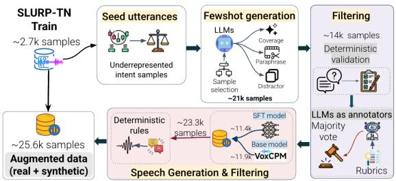
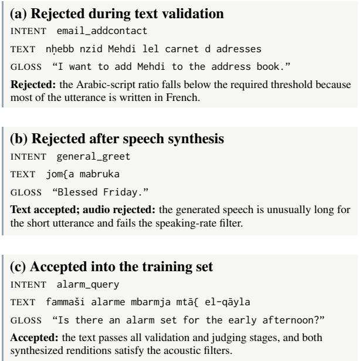

# Aslema at NADI 2026: Augmentation through Fewshot for SLU

Tajwaar Shafiq\*, Hunzalah Hassan Bhatti, Shammur Absar Chowdhury, Firoj Alam

Qatar Computing Research Institute, HBKU, Qatar

tajwaar.shafiq@alumni.utoronto.ca,

{hubh90945, fialam, shchowdhury}@hbku.edu.qa

## Abstract

We present Aslema, our system for NADI 2026 Shared Task 5, which consists of two subtasks: intent recognition and slot filling. We evaluate four omni LLMs in a zero-shot setting and compare them with fine-tuned models. Our results show that fine-tuning consistently outperforms zero-shot inference. We further explore synthetic data augmentation by using an LLM to generate culturally grounded Tunisian Derja utterances, followed by voice cloning to generate synthetic speech. Incorporating this synthetic data improves performance on both tasks. Our final submitted system, based on Qwen3-Omni-30B and trained with a mixture of original and synthetic data, achieves 86.8% intent accuracy and 34.7 WER on the devtest split. On the official test set it ranks 1st in slot filling (59.5 CoER) and 4th among 8 teams in intent recognition (66.1% accuracy). We release our experimental scripts<sup>1</sup> and will soon share the synthetic dataset to support further research in this area.

## 1 Introduction

Spoken dialogue interfaces are increasingly driven by large language models (LLMs), with recent audio LLMs processing speech directly and combining speech recognition with language understanding (Chu et al., 2023; Tang et al., 2024; Xu et al., 2025a). However, their effectiveness for dialectal Arabic remains limited (Abdelali et al., 2024; Al-Khalifa et al., 2025; Bhatti and Alam, 2026). Tunisian Dialect (Derja) is low-resource, heavily code-switched with French and English, and substantially different from the Modern Standard Arabic (MSA) that dominates Arabic training corpora (Talafha et al., 2024). The NADI sharedtask series has increasingly focused on such dialectal settings (Abdul-Mageed et al., 2024; Talafha et al., 2025). Its 2026 edition (Sullivan et al., 2026) introduces Shared Task 5 on end-to-end Spoken Language Understanding (SLU) using SLURP-TN (Elleuch et al., 2026), a Tunisian re-recording of the SLURP benchmark (Bastianelli et al., 2020), covering intent recognition and slot filling.

We participate in both subtasks and study the effectiveness of audio LLMs for dialectal SLU under different levels of supervision. Our experiments cover four instruction-tuned audio LLMs (3B–30B parameters), LoRA-based fine-tuning (Hu et al., 2022), and a fully fine-tuned Whisper-small (Radford et al., 2023) baseline. We also investigate the effect of training data size and synthetic augmentation using an LLM+TTS pipeline. To summarize, our main contributions are as follows.

• We provide a systematic evaluation of four audio LLMs for intent recognition and slot filling under zero-shot and LoRA fine-tuning settings.

• We develop an LLM+TTS augmentation approach that generates culturally grounded Tunisian Derja utterances with slot annotations and converts them to speech using voice-cloned TTS, targeting underrepresented intents.

• We evaluate different training configurations using real, synthetic, and mixed real–synthetic data, and use the best-performing configuration to build our submitted system.

Findings. Our results show that zero-shot audio LLMs perform poorly on both subtasks, while LoRA fine-tuning with ∼3 hours of supervised speech substantially improves performance. Synthetic data alone also provides clear gains over zeroshot inference, while combining real and synthetic data achieves the strongest overall results.

## 2 Related Work

Spoken language understanding. SLU maps speech to structured semantics representations. Historically, early SLU systems followed a cascaded design in which an automatic speech recognition (ASR) module produced a transcript that was then processed by a text-based NLU model, in comparison to recent and increasing adoptions to end-to-end architectures (Tur and De Mori, 2011; Ghannay et al., 2018; Laperrière et al., 2022). This development has been closely accompanied by the release of increasingly challenging benchmarks (Ahmed et al., 2026). SLURP (Bastianelli et al., 2020) introduced a single-turn spoken assistant benchmark, while MASSIVE (FitzGerald et al., 2023) and Speech-MASSIVE (Lee et al., 2024) extended intent and slot annotation to multiple languages. SLURP-TN (Elleuch et al., 2026) further adapts this, re-recording SLURP prompts in Tunisian Derja, complementing existing resources such as TARIC-SLU (Mdhaffar et al., 2024) and TEDxTN (Bougares et al., 2025).

Audio LLMs. Recent audio LLMs such as Qwen-Audio and its Omni successors (Chu et al., 2023; Xu et al., 2025a,b), SALMONN (Tang et al., 2024), SpeechGPT (Zhang et al., 2023) and Gemma-4 (Gemma Team, 2026) combine a speech encoder with an LLM to enable zero-shot SLU via prompting. Although these models achieve strong results on English benchmarks, performance remains noticeably weaker on dialectal and other low-resource speech (Yang et al., 2024; Wang et al., 2025; Bhatti et al., 2026; Chen et al., 2026), including Arabic dialects (Talafha et al., 2024; Alam et al., 2025). Parameter-efficient fine-tuning (PEFT), LoRA in particular (Hu et al., 2022), is the standard approach for adapting such models in resource-constrained settings, and previous NADI editions saw adapted speech models consistently outperform approaches in dialectal ASR tracks (Talafha et al., 2025; Salhab et al., 2025).

Synthetic data for speech tasks. Annotated speech data collection remains expensive, particularly for low-resource dialects, pushing for a growing interest in synthetic data generation. LLM-driven data generation in the Self-Instruct paradigm (Wang et al., 2023) has been combined with TTS to construct paired speech-semantic data (Noroozi et al., 2024), including recent efforts targeting Arabic (Sheikh Ali et al., 2026). We adopt this approach to dialectal SLU, focusing on generating synthetic training samples to increase coverage of underrepresented intent classes in the original training set. On the speech side, we build on VoxCPM (Zhou et al., 2026), a recent open, tokenizer-free TTS model with coverage of

30 languages, including Arabic. Its zero-shot voice cloning capability allows a small number of dialectal reference clips to represent a variety of Arabic dialects, including those without dedicated TTS voices.

## 3 Task and Dataset

## 3.1 Task Overview

NADI 2026 Shared Task 5 evaluates end-to-end SLU for Tunisian Arabic speech. The dataset consists of short spoken assistant commands, averaging about four seconds (3.7 s in training, 4.3-4.5 s in the evaluation splits).

Subtask intent recognition requires assigning each utterance to a single intent label. The released training data contains 23 intent labels, while the blind test set follows the full 60-label SLURP intent label set. The primary evaluation metrics are accuracy and weighted-F , as used by the official Codabench leaderboard. We additionally report macro-F<sub>1</sub> to better capture performance on underrepresented intent classes. These metrics provide complementary views: accuracy and weighted-F<sub>1</sub> are influenced by frequent classes, whereas macro-$\mathrm { F _ { 1 } }$ gives equal weight to each intent class.

Subtask slot filling requires a transcription with inline slot annotations (<label> value >). The primary evaluation metrics are concept error rate (CoER) and concept-value error rate (CVER), which measure errors in slot labels and their associated values. We additionally report word error rate (WER) and character error rate (CER) on the lexical content after removing the slot markup. These metrics capture complementary aspects of performance: a system may transcribe the Derja utterance correctly while assigning incorrect slot labels or boundaries. Reporting both distinguishes transcription from semantic annotation errors. All scores use the organizers’ SLURP-TN baseline evaluation toolkit (Elleuch et al., 2026).

## 3.2 Dataset

## 3.2.1 SLURP-TN Dataset.

SLURP-TN (Elleuch et al., 2026) contains Tunisian Derja re-recordings of SLURP assistant commands, with intent and slot annotations transferred from the original dataset. In Table 1, we summarize the data splits. The dataset is relatively small, with ∼2.8 hours of training speech, and exhibits substantial class imbalance. The released training set contains 23 intent labels, although only 21 are observed in the training split. Among these, six intents have fewer than 10 training examples, and three are absent from the devtest split. In addition, the most frequent intent accounts for 18.8% of the devtest utterances.

<table><tr><td>Split</td><td>Utts.</td><td>Hours</td><td>Intents</td><td>Slot</td></tr><tr><td>Train</td><td>2,677</td><td>2.78</td><td>21</td><td>66.2%</td></tr><tr><td>Dev</td><td>595</td><td>0.74</td><td>19</td><td>65.4%</td></tr><tr><td>Devtest</td><td>893</td><td>1.06</td><td>18</td><td>62.4%</td></tr><tr><td>Test</td><td>989</td><td>1.17</td><td>一</td><td>一</td></tr></table>

Table 1: Dataset statistics. Intents: distinct labels present; Slotted: utterances with a gold slot. Test gold labels are not public.

## 3.2.2 Data augmentation.

In Figure 1, we show an overview of our data augmentation pipeline. We augment the training set to increase the number of examples for underrepresented intents among the 23 training labels.

Seed utterances. We first determine the number of synthetic examples for each intent based on its frequency in the training set, generating more examples for intents with fewer training instances.

Fewshot generation. We use Gemini 3.1 Pro for the most underrepresented intents and Gemini 3.6 Flash for the remaining intents. Following Self-Instruct (Wang et al., 2023; Noroozi et al., 2024), the models generate Tunisian Derja utterances with inline slot annotations using six few-shot examples drawn exclusively from the training split. We generate examples in three ways: (i) creating new utterances for an intent, (ii) paraphrasing existing examples, and (iii) generating more challenging examples with the same intent and no slot values. They contribute 16,387, 1,510, and 3,040 of the 20,937 raw candidates respectively

Filtering. Since generated utterances may contain duplicates, formatting errors, or dialectal inconsistencies, we apply rule-based approach to identify and remove such cases. This step reduces the set to 13,876 utterances. Finally, three LLMs independently evaluate each utterance for Derja naturalness, intent consistency, and slot correctness using the same evaluation criteria. We keep samples accepted by at least two of the three models, resulting in 12,138 synthetic utterances. Appendix C provides further details on the generation strategy, validation checks, and LLMs used at each stage (Table 5); the corresponding generation and judging prompts are released with our experimental scripts. Speech generation and filtering. We synthesize speech for each utterance using VoxCPM (Zhou et al., 2026) under two settings: the original model and a VoxCPM model fine-tuned with LoRA on the ∼2.8 hours of SLURP-TN training speech. For voice cloning, both models use the same pool of 152 reference utterances with zero WER, selected by an LLM-based ASR check from all 2,330 training clips of 2.5-10s. We then filter the generated speech using rule-based criteria for duration, signal level, clipping, voiced-frame activity, and speaking rate. We generate 23,300 total utterances (11,946 from the base model and 11,354 from the LoRAfine-tuned model), of which 22,940 retained after filtering. Mixing these with original 2,677 results in an augmented training set of 25,617 utterances.

  
Figure 1: Overview of the data augmentation pipeline.

## 4 System

Models. We evaluate four instructiontuned audio LLMs: Qwen2.5-Omni-3B, Qwen2.5-Omni-7B (Xu et al., 2025a), Qwen3-Omni-30B-A3B-Instruct (Xu et al., 2025b), and gemma-4-E4B-it (Gemma Team, 2026), served through ms-swift (Zhao et al., 2025) with a vLLM backend (Kwon et al., 2023) on a single H200 GPU, with greedy decoding. We additionally train whisper-small (Radford et al., 2023) as a small-model baseline.

LoRA fine-tuning. We fine-tune each model on the SLURP-TN training split using LoRA (Hu et al., 2022), while keeping the audio encoder and audio– text aligner frozen. We use the same prompts and output formats as in the zero-shot setting to ensure a direct comparison. For each model, we train a single LoRA adapter jointly on data from both subtasks and evaluate it separately on intent recognition and slot filling. We train all models for two epochs and use the final checkpoint, without selecting checkpoints based on held-out loss. Appendix D provides the full hyperparameters, model merging and inference setup, and the Whisper baseline, while Appendix E provides the subtask prompts.

Final system. We select Qwen3-Omni-30B-A3B for our submitted system, and fine-tune it for two epochs on the combined real and synthetic data.

<table><tr><td>Model Intent ↑</td><td>Slot ↓</td></tr><tr><td>Dev-test (23 labels)</td></tr><tr><td>Qwen2.5-Omni-3B 29.2 125.2 Qwen2.5-Omni-7B 42.3 150.1 Qwen3-Omni-30B 52.5 131.0</td></tr><tr><td>Gemma-4-E4B-it 53.1 97.5 Whisper-small FT 67.4 81.4 Qwen2.5-Omni-3B FT 80.5 57.0</td></tr><tr><td>Qwen2.5-Omni-7B FT 81.3 51.9 Gemma-4-E4B-it FT 80.4 49.1 Qwen3-Omni-30B FT 82.9 47.7</td></tr><tr><td>Qwen3-Omni-30B FT (Mix) 86.8 36.9 Qwen3-Omni-30B FT (Synth) 75.6 62.2</td></tr><tr><td>Blind test set (60 labels)</td></tr><tr><td>66.1 59.5</td></tr><tr><td>Our system (Mix)</td></tr></table>

Table 2: Results for both subtasks across different splits. Intent recognition is evaluated using accuracy (higher is better), while slot filling is evaluated using concept error rate (lower is better). FT: fine-tuned.

## 5 Results

In Table 2, we report results on the dev-test and official test sets. We provide additional model-level results in Table 3, and error analyses in Appendix B. Official test results. Our final system ranked 1st in slot filling (Subtask 5.2) with a CoER of 59.5 and CVER of 94.2, and ranked 4th on intent recognition (Subtask 5.1) with a 66.1% accuracy, and 66.9 weighted F1-score. For the intent recognition, the initial submission achieves only 30.4% accuracy, compared with 86.8% on dev-test. Our analysis shows that roughly 40% of the official test utterances correspond to intents outside the 23 labels available during training. Consequently, the model predicts the broad general\_quirky intent for 56.8% of test utterances, compared with 20.8% on dev-test (18.8% gold). We therefore map general\_quirky to the accepted unknown label at inference time, making the abstention explicit. This deterministic mapping requires no retraining and increases intent accuracy by 35.7 points to 66.1%, ranking 4th of 8 teams.

Zero-shot vs. baseline models. As shown in Table 2, the four omni models show limited zero-shot performance, reaching 29.2–53.1% intent accuracy and 97.5–150.1 CoER. In comparison, Whispersmall, fully fine-tuned on the training set, achieves 67.4% intent accuracy and 81.4 CoER, outperforming all zero-shot omni models on both subtasks. This result shows that task-specific fine-tuning with fewer than three hours of Tunisian Derja speech is more effective than direct zero-shot inference with recent omni models. In Table 3, we provide additional analysis of their zero-shot behavior.

Effect of LoRA fine-tuning. We fine-tune each omni model with LoRA on the training split for both subtasks. As shown in Table 2, fine-tuning consistently improves all four models. Intent accuracy increases from 29.2-53.1% to 80.4-82.9%, while slot CoER decreases from 97.5-150.1 to 47.7- 57.0. Qwen3-Omni-30B achieves the best performance after fine-tuning, with 82.9% intent accuracy and 47.7 CoER. Additionally, fine-tuning reduces the performance gap across model sizes. The spread in intent accuracy among the 3B–30B models decreases from 23.9 points in the zero-shot setting to only 2.5 points after fine-tuning. This suggests that task-specific adaptation substantially reduces the advantage of larger models on the indomain dev-test set.

Effect of data augmentation. We further finetune the best-performing model, Qwen3-Omni-30B-A3B, using two data settings. Mix combines 2,677 real and 22,940 synthetic utterances, while Synth uses only synthetic speech. As shown in Table 2, Mix improves both subtasks over fine-tuning on real speech, increasing intent accuracy by 3.9 points and reducing CoER by 10.8 points. In contrast, Synth performs better than zero-shot inference but remains below fine-tuning on real speech. These results show that synthetic speech is more effective when combined with real data than when used alone.

## 6 Conclusions and Future Work

We participated in both subtasks of NADI 2026 Shared Task 5. Our experiments show that current audio LLMs have limited zero-shot performance on Tunisian Derja SLU, and increasing model scale alone does not overcome this limitation. Finetuning on fewer than three hours of real speech improves performance to 82.9% intent accuracy and 40.0 WER for slot filling. Augmenting the training data with synthetic speech further improves performance to 86.8% intent accuracy and 34.7 WER. Our final system ranks 1st in slot filling and 4th of eight teams in intent recognition. Future work will extend the pipeline to other Arabic dialects, incorporate human validation into synthetic-data filtering, and release a human-validated subset for further analysis and auditing.

## Limitations

Our evaluation is primarily based on the SLURP-TN dev-test split, while only the final setup is evaluated on the official blind test set. In addition, the training and dev-test splits cover 23 intent labels, whereas the official test set includes a broader 60 labels, making open-intent generalization particularly challenging. Finally, we evaluate synthetic augmentation only with Qwen3-Omni-30B-A3B due to computational constraints. Extending this analysis to smaller models and incorporating additional human validation of synthetic speech are promising directions for future work.

## References

Ahmed Abdelali, Hamdy Mubarak, Shammur Absar Chowdhury, Maram Hasanain, Basel Mousi, Sabri Boughorbel, Samir Abdaljalil, Yassine El Kheir, Daniel Izham, Fahim Dalvi, Majd Hawasly, Nizi Nazar, Yousseif Elshahawy, Ahmed Ali, Nadir Durrani, Natasa Milic-Frayling, and Firoj Alam. 2024. LAraBench: Benchmarking Arabic AI with large language models. In Proceedings ofthe 18th Conference ofthe European Chapter ofthe Associationfor Computational Linguistics (Volume 1: Long Papers), pages 487–520, St. Julian’s, Malta. Association for Computational Linguistics.

Muhammad Abdul-Mageed, Amr Keleg, AbdelRahim Elmadany, Chiyu Zhang, Injy Hamed, Walid Magdy, Houda Bouamor, and Nizar Habash. 2024. NADI 2024: The fifth nuanced Arabic dialect identification shared task. In Proceedings ofThe Second Arabic Natural Language Processing Conference, pages 709–728, Bangkok, Thailand. Association for Computational Linguistics.

Syeda Faiza Ahmed, Zien Sheikh Ali, Hunzalah Hassan Bhatti, Firoj Alam, and Shammur Absar Chowdhury. 2026. Multi-turn conversational ai from text to multimodal interaction: Data, models, evaluation, and open challenges. arXiv preprint arXiv:2608.17605.

Shahad Al-Khalifa, Nadir Durrani, Hend Al-Khalifa, and Firoj Alam. 2025. The landscape of Arabic large language models. Communications of the ACM, 68(10):54–61.

Firoj Alam, Md Arid Hasan, and Shammur Absar Chowdhury. 2025. SpokenNativQA: Multilingual everyday spoken queries for LLMs. In Proceedings ofthe 26th Interspeech Conference (Interspeech 2025), pages 2685–2689, Rotterdam, The Netherlands. ISCA.

Emanuele Bastianelli, Andrea Vanzo, Pawel Swietojanski, and Verena Rieser. 2020. SLURP: A spoken language understanding resource package. In Proceedings of the 2020 Conference on Empirical Methods in Natural Language Processing (EMNLP), pages 7252–7262. Association for Computational Linguistics.

Hunzalah Hassan Bhatti and Firoj Alam. 2026. Beyond MCQ: An open-ended Arabic cultural QA benchmark with dialect variants. In Proceedings of the Fifteenth Language Resources and Evaluation Conference, pages 5215–5231, Palma de Mallorca, Spain. ELRA Language Resource Association.

Hunzalah Hassan Bhatti, Firoj Alam, and Shammur Absar Chowdhury. 2026. Multi-task instruction tuning via data scheduling for low-resource Arabic Speech-LLMs. arXiv preprint arXiv:2601.12494.

Fethi Bougares, Salima Mdhaffar, Haroun Elleuch, and Yannick Estève. 2025. TEDxTN: A three-way speech translation corpus for code-switched Tunisian Arabic - English. In Proceedings of the Third Arabic Natural Language Processing Conference (Arabic-NLP), pages 278–287, Suzhou, China. Association for Computational Linguistics.

Yiming Chen, Xianghu Yue, Chen Zhang, Xiaoxue Gao, Robby T. Tan, and Haizhou Li. 2026. VoiceBench: Benchmarking LLM-based voice assistants. Transactions ofthe Associationfor Computational Linguistics, 14:378–398.

Yunfei Chu, Jin Xu, Xiaohuan Zhou, Qian Yang, Shiliang Zhang, Zhijie Yan, Chang Zhou, and Jingren Zhou. 2023. Qwen-Audio: Advancing universal audio understanding via unified large-scale audiolanguage models. arXiv preprint arXiv:2311.07919.

Haroun Elleuch, Salima Mdhaffar, Yannick Estève, and Fethi Bougares. 2026. SLURP-TN: Resource for Tunisian dialect spoken language understanding. arXiv preprint arXiv:2603.21940.

Jack FitzGerald, Christopher Hench, Charith Peris, Scott Mackie, Kay Rottmann, Ana Sanchez, Aaron Nash, Liam Urbach, Vishesh Kakarala, Richa Singh, Swetha Ranganath, Laurie Crist, Misha Britan, Wouter Leeuwis, Gokhan Tur, and Prem Natarajan. 2023. MASSIVE: A 1M-example multilingual natural language understanding dataset with 51 typologically-diverse languages. In Proceedings of the 61st Annual Meeting of the Association for Computational Linguistics (Volume 1: Long Papers), pages 4277–4302, Toronto, Canada. Association for Computational Linguistics.

Gemma Team. 2026. Gemma 4 technical report. Technical report, Google DeepMind. ArXiv:2607.02770.

Sahar Ghannay, Antoine Caubrière, Yannick Estève, Nathalie Camelin, Edwin Simonnet, Antoine Laurent, and Emmanuel Morin. 2018. End-to-end named entity and semantic concept extraction from speech. In 2018 IEEE Spoken Language Technology Workshop (SLT), pages 692–699, Athens, Greece. IEEE.

Edward J. Hu, Yelong Shen, Phillip Wallis, Zeyuan Allen-Zhu, Yuanzhi Li, Shean Wang, Lu Wang, and Weizhu Chen. 2022. LoRA: Low-rank adaptation of large language models. In International Conference on Learning Representations (ICLR).

Woosuk Kwon, Zhuohan Li, Siyuan Zhuang, Ying Sheng, Lianmin Zheng, Cody Hao Yu, Joseph E. Gonzalez, Hao Zhang, and Ion Stoica. 2023. Efficient memory management for large language model serving with PagedAttention. In Proceedings ofthe 29th Symposium on Operating Systems Principles (SOSP), pages 611–626, New York, NY, USA. Association for Computing Machinery.

Gaëlle Laperrière, Valentin Pelloin, Antoine Caubrière, Salima Mdhaffar, Nathalie Camelin, Sahar Ghannay, Bassam Jabaian, and Yannick Estève. 2022. The spoken language understanding MEDIA benchmark dataset in the era of deep learning: data updates, training and evaluation tools. In Proceedings ofthe Thirteenth Language Resources and Evaluation Conference, pages 1595–1602, Marseille, France. European Language Resources Association.

Beomseok Lee, Ioan Calapodescu, Marco Gaido, Matteo Negri, and Laurent Besacier. 2024. Speech-MASSIVE: A multilingual speech dataset for SLU and beyond. In Interspeech 2024, pages 817–821. ISCA.

Salima Mdhaffar, Fethi Bougares, Renato De Mori, Salah Zaiem, Mirco Ravanelli, and Yannick Estève. 2024. TARIC-SLU: A Tunisian benchmark dataset for spoken language understanding. In Proceedings of the 2024 Joint International Conference on Computational Linguistics, Language Resources and Evaluation (LREC-COLING 2024), pages 15606–15616, Torino, Italy. ELRA and ICCL.

Vahid Noroozi, Zhehuai Chen, Somshubra Majumdar, Steve Huang, Jagadeesh Balam, and Boris Ginsburg. 2024. Instruction data generation and unsupervised adaptation for speech language models. In Interspeech 2024, pages 4049–4053. ISCA.

Alec Radford, Jong Wook Kim, Tao Xu, Greg Brockman, Christine McLeavey, and Ilya Sutskever. 2023. Robust speech recognition via large-scale weak supervision. In Proceedings ofthe 40th International Conference on Machine Learning (ICML), volume 202 of Proceedings ofMachine Learning Research, pages 28492–28518. PMLR.

Mahmoud Salhab, Shameed Sait, Mohammad Abusheikh, and Hasan Abusheikh. 2025. Munsit at NADI 2025 shared task 2: Pushing the boundaries of multidialectal Arabic ASR with weakly supervised pretraining and continual supervised fine-tuning. In Proceedings of The Third Arabic Natural Language Processing Conference: Shared Tasks, pages 734– 739, Suzhou, China. Association for Computational Linguistics.

Zien Sheikh Ali, Hunzalah Hassan Bhatti, Rabindra Nath Nandi, Shammur Absar Chowdhury, and Firoj Alam. 2026. MENASpeechBank: A reference voice bank with persona-conditioned multiturn conversations for AudioLLMs. arXiv preprint arXiv:2602.07036.

Peter Sullivan, Bashar Talafha, Ahmed Ashraf, Fethi Bougares, Haroun Elleuch, Chiyu Zhang, Abdel-Rahim Elmadany, Youssef Mohamed, Salima Mdhaffar, Yannick Estève, Mohamed Elhoseiny, Hamzah Luqman, Nizar Habash, and Muhammad Abdul-Mageed. 2026. NADI-2026: The second multidialectal Arabic speech processing shared task. In Proceedings of the Fourth Arabic Natural Language Processing Conference (ArabicNLP 2026), Budapest, Hungary. Association for Computational Linguistics.

Bashar Talafha, Karima Kadaoui, Samar Mohamed Magdy, Mariem Habiboullah, Chafei Mohamed Chafei, Ahmed Oumar El-Shangiti, Hiba Zayed, Mohamedou Cheikh Tourad, Rahaf Alhamouri, Rwaa Assi, Aisha Alraeesi, Hour Mohamed, Fakhraddin Alwajih, Abdelrahman Mohamed, Abdellah El Mekki, El Moatez Billah Nagoudi, Benelhadj Djelloul Mama Saadia, Hamzah A. Alsayadi, Walid Al-Dhabyani, and 8 others. 2024. Casablanca: Data and models for multidialectal Arabic speech recognition. In Proceedings ofthe 2024 Conference on Empirical Methods in Natural Language Processing, pages 21745–21758, Miami, Florida, USA. Association for Computational Linguistics.

Bashar Talafha, Hawau Olamide Toyin, Peter Sullivan, AbdelRahim A. Elmadany, Abdurrahman Juma, Amirbek Djanibekov, Chiyu Zhang, Hamad Alshehhi, Hanan Aldarmaki, Mustafa Jarrar, Nizar Habash, and Muhammad Abdul-Mageed. 2025. NADI 2025: The first multidialectal Arabic speech processing shared task. In Proceedings of The Third Arabic Natural Language Processing Conference: Shared Tasks, pages 720–733, Suzhou, China. Association for Computational Linguistics.

Changli Tang, Wenyi Yu, Guangzhi Sun, Xianzhao Chen, Tian Tan, Wei Li, Lu Lu, Zejun Ma, and Chao Zhang. 2024. SALMONN: Towards generic hearing abilities for large language models. In The Twelfth International Conference on Learning Representations (ICLR).

Gokhan Tur and Renato De Mori. 2011. Spoken Language Understanding: Systemsfor Extracting Semantic Information from Speech. John Wiley & Sons, Chichester, UK.

Bin Wang, Xunlong Zou, Geyu Lin, Shuo Sun, Zhuohan Liu, Wenyu Zhang, Zhengyuan Liu, AiTi Aw, and Nancy F. Chen. 2025. AudioBench: A universal benchmark for audio large language models. In Proceedings ofthe 2025 Conference ofthe Nations of the Americas Chapter of the Association for Computational Linguistics: Human Language Technologies (Volume 1: Long Papers), pages 4297–4316, Albuquerque, New Mexico. Association for Computational Linguistics.

Yizhong Wang, Yeganeh Kordi, Swaroop Mishra, Alisa Liu, Noah A. Smith, Daniel Khashabi, and Hannaneh Hajishirzi. 2023. Self-instruct: Aligning language models with self-generated instructions. In Proceedings ofthe 61st Annual Meeting ofthe Associationfor

Computational Linguistics (Volume 1: Long Papers), pages 13484–13508, Toronto, Canada. Association for Computational Linguistics.

Jin Xu, Zhifang Guo, Jinzheng He, Hangrui Hu, Ting He, Shuai Bai, Keqin Chen, Jialin Wang, Yang Fan, Kai Dang, Bin Zhang, Xiong Wang, Yunfei Chu, and Junyang Lin. 2025a. Qwen2.5-Omni technical report. Technical report, Alibaba Group. ArXiv:2503.20215.

Jin Xu, Zhifang Guo, Hangrui Hu, Yunfei Chu, Xiong Wang, Jinzheng He, Yuxuan Wang, Xian Shi, Ting He, Xinfa Zhu, Yuanjun Lv, Yongqi Wang, Dake Guo, He Wang, Linhan Ma, Pei Zhang, Xinyu Zhang, Hongkun Hao, Zishan Guo, and 19 others. 2025b. Qwen3-Omni technical report. Technical report, Alibaba Group. ArXiv:2509.17765.

Qian Yang, Jin Xu, Wenrui Liu, Yunfei Chu, Ziyue Jiang, Xiaohuan Zhou, Yichong Leng, Yuanjun Lv, Zhou Zhao, Chang Zhou, and Jingren Zhou. 2024. AIR-Bench: Benchmarking large audio-language models via generative comprehension. In Proceedings ofthe 62nd Annual Meeting ofthe Association for Computational Linguistics (Volume 1: Long Papers), pages 1979–1998, Bangkok, Thailand. Association for Computational Linguistics.

Dong Zhang, Shimin Li, Xin Zhang, Jun Zhan, Pengyu Wang, Yaqian Zhou, and Xipeng Qiu. 2023. SpeechGPT: Empowering large language models with intrinsic cross-modal conversational abilities. In Findings of the Association for Computational Linguistics: EMNLP 2023, pages 15757–15773, Singapore. Association for Computational Linguistics.

Yuze Zhao, Jintao Huang, Jinghan Hu, Xingjun Wang, Yunlin Mao, Daoze Zhang, Zeyinzi Jiang, Zhikai Wu, Baole Ai, Ang Wang, Wenmeng Zhou, and Yingda Chen. 2025. SWIFT: A scalable lightweight infrastructure for fine-tuning. In Proceedings ofthe AAAI Conference on Artificial Intelligence, volume 39, pages 29733–29735. AAAI Press.

Yixuan Zhou, Guoyang Zeng, Xin Liu, Xiang Li, Renjie Yu, Jiancheng Gui, Jiaheng Wu, Ziyang Wang, Xudong Shen, Runchuan Ye, Zhisheng Zhang, Jiuyang Zhou, Bingsong Bai, Weiyue Sun, Mengyuan Deng, Qundong Shi, Zhiyong Wu, and Zhiyuan Liu. 2026. VoxCPM2 technical report. arXiv preprint arXiv:2606.06928.

## A Additional Results

In Table 3, we report detailed results for intent recognition and slot filling under both zero-shot and fine-tuned settings. Fine-tuning improves all omni models across the evaluation metrics, and Qwen3- Omni-30B-A3B achieves the strongest overall performance. In Table 4, we further analyze the effect of synthetic data and training duration on Qwen3-Omni-30B-A3B. Combining real and synthetic speech performs better than using either source alone, while increasing training from 2 to 2.5 epochs provides only marginal gains.

<table><tr><td colspan="3">Intent Recognition</td></tr><tr><td>Model</td><td>Acc ↑ M-F1 ↑</td><td>W-F1↑</td></tr><tr><td colspan="3">Dev-test (23 labels)</td></tr><tr><td>Qwen2.5-Omni-3B</td><td>22.6</td><td>34.4</td></tr><tr><td>Qwen2.5-Omni-7B</td><td>29.3</td><td>45.3</td></tr><tr><td>Qwen3-Omni-30B</td><td>38.9</td><td>57.6</td></tr><tr><td>Gemma-4-E4B-it</td><td>46.0</td><td>59.2</td></tr><tr><td>Whisper-small FT</td><td>47.7</td><td>70.4</td></tr><tr><td>Qwen2.5-Omni-3B FT Qwen2.5-Omni-7B FT</td><td>54.9</td><td>79.7</td></tr><tr><td>Gemma-4-E4B-it FT</td><td>57.0</td><td>80.6</td></tr><tr><td>Qwen3-Omni-30B FT</td><td>56.5</td><td>79.8</td></tr><tr><td>Qwen3-Omni-30B FT (Mix)</td><td>58.0 61.9</td><td>82.4 86.3</td></tr><tr><td>86.8 Qwen3-Omni-30B FT (Synth) 75.6</td><td>56.9</td><td>79.0</td></tr><tr><td colspan="3">Blind test set (60 labels)</td></tr><tr><td>Our system (Mix)</td><td>66.1</td><td>66.9</td></tr></table>

<table><tr><td></td><td>Slot Filling</td><td></td><td></td><td></td></tr><tr><td>Model</td><td>WER↓</td><td>CER↓</td><td>CoER↓</td><td>CVER↓</td></tr><tr><td colspan="5">Dev-test (23 labels)</td></tr><tr><td>Qwen2.5-Omni-3B</td><td>121.9</td><td>120.1</td><td>125.2</td><td>134.7</td></tr><tr><td>Qwen2.5-Omni-7B</td><td>104.7</td><td>102.5</td><td>150.1</td><td>159.6</td></tr><tr><td>Qwen3-Omni-30B</td><td>87.8</td><td>79.6</td><td>131.0</td><td>144.7</td></tr><tr><td>Gemma-4-E4B-it</td><td>68.3</td><td>40.6</td><td>97.5</td><td>102.1</td></tr><tr><td>Whisper-small FT</td><td>56.2</td><td>25.1</td><td>81.4</td><td>107.2</td></tr><tr><td>Qwen2.5-Omni-3B FT</td><td>47.3</td><td>18.9</td><td>57.0</td><td>97.5</td></tr><tr><td>Qwen2.5-Omni-7B FT</td><td>45.3</td><td>18.0</td><td>51.9</td><td>91.6</td></tr><tr><td>Gemma-4-E4B-it FT</td><td>41.4</td><td>16.4</td><td>49.1</td><td>89.1</td></tr><tr><td>Qwen3-Omni-30B FT</td><td>40.0</td><td>15.6</td><td>47.7</td><td>84.7</td></tr><tr><td>Qwen3-Omni-30B FT (Mix) Qwen3-Omni-30B FT (Synth)</td><td>34.7 60.6</td><td>12.5 35.0</td><td>36.9 62.2</td><td>73.6 103.2</td></tr><tr><td colspan="5">Blind test set (60 labels)</td></tr><tr><td>Our system (Mix)</td><td></td><td></td><td>59.5</td><td>94.2</td></tr></table>

Table 3: Detailed results for both subtasks across different splits. Intent recognition is evaluated using accuracy, macro-F and weighted-F (higher is better), while slot filling is evaluated using WER, CER, CoER and CVER (lower is better). Mix combines real and synthetic training data, while Synth uses synthetic data only. FT: fine-tuned.

<table><tr><td colspan="6">Train data Ep. Acc WER CER CoER CVER</td></tr><tr><td>Dev-test split</td><td></td><td></td><td></td><td></td><td></td></tr><tr><td>Real only 2</td><td>82.9</td><td>40.0</td><td>15.6</td><td>47.7</td><td>84.7</td></tr><tr><td>Mix</td><td>2 86.8</td><td>34.7</td><td>12.5</td><td>36.9</td><td>73.6</td></tr><tr><td>Mix</td><td>2.5</td><td>87.2 34.8</td><td>12.3</td><td>36.2</td><td>75.0</td></tr><tr><td>Synth only 2.5</td><td></td><td>75.6 60.6</td><td>35.0</td><td>62.2</td><td>103.2</td></tr><tr><td colspan="6">Validation split</td></tr><tr><td>Mix</td><td>2</td><td>86.1 32.0</td><td>10.8</td><td>34.2</td><td>66.0</td></tr><tr><td>Mix</td><td>2.5 85.7</td><td>31.6</td><td>10.8</td><td>35.5</td><td>67.8</td></tr></table>

Table 4: Effect of synthetic augmentation on Qwen3- Omni-30B-A3B. Mix combines real and synthetic training data, while Synth uses synthetic data only.

## B Error Analysis

Zero-shot slot-filling errors. Zero-shot models often fail to follow the required slot markup format. Fewer than 11% of their outputs use the expected <label> value > structure, with missing markup as the dominant error. Models also occasionally generate alternative XML-style forms or over-generate slot content. After fine-tuning, however, the markup rate closely matches the gold distribution, showing that task-specific adaptation largely resolves these formatting errors.

Effect of intent-label granularity. Some zeroshot intent errors reflect confusion among semantically related labels rather than complete misunderstanding of the utterance. Mapping intents to coarser action labels improves zero-shot accuracy by about 7-8 points for the strongest models, while the same mapping yields only a small gain after fine-tuning. This suggests that fine-tuning helps models distinguish closely related intent labels more reliably.

Effect of data augmentation. We also examine how synthetic augmentation changes errors on the dev-test set. Fine-tuning on real speech corrects a large portion of the zero-shot errors, and adding synthetic speech provides further gains on both subtasks. Overall, augmentation improves intent accuracy by 3.9 points and reduces CoER by 10.8 points (Table 4).

The gains are strongest for less frequent intents and slot types. Common intents show only small improvements, whereas rarer intents gain substantially more (Table 6). We observe the same trend for slot filling, where utterances containing less frequent slot types benefit considerably more from augmentation than those containing only common slot types. These results suggest that synthetic data primarily improves coverage of underrepresented labels.

## C Data Augmentation Pipeline

Deterministic filtering. We first apply deterministic filters to the generated utterances. We retain candidates that follow the annotation format, align with the annotated text, use valid task labels, contain sufficient Arabic-script content, and fall within a 2-25 token range. We also remove character 3- gram near-duplicates of real training utterances and previously accepted synthetic examples. These filters reduce malformed, out-of-domain, and repetitive generations before LLM-based evaluation.

Examples from the filtering pipeline. Figure 1 summarizes the complete augmentation process. Below, we illustrate three representative outcomes: rejection during text validation, rejection after speech synthesis, and acceptance into the final training set.



LLM roles. We use different LLMs for complementary stages of the pipeline, as summarized in Table 5. Gemini 3.6 Flash generates the bulk of the synthetic data, while Gemini 3.1 Pro focuses on lower-resource intents and provides reference ASR checks. We use all three models as independent judges and retain an utterance when at least two judges accept it. This majority-vote stage retains 12,138 of the 13,876 candidates that reach LLM-based validation.

<table><tr><td rowspan="2">Model</td><td colspan="2">Generation</td><td rowspan="2">Judging panel</td><td rowspan="2">Ref. ASR</td></tr><tr><td>Rare</td><td>Bulk</td></tr><tr><td>Gemini 3.6 Flash</td><td>×</td><td>√</td><td>√</td><td>×</td></tr><tr><td>stage output</td><td>一</td><td>16,637</td><td>85.4%</td><td>一</td></tr><tr><td>Gemini 3.1 Pro</td><td>√</td><td>X</td><td>√</td><td>√</td></tr><tr><td>stage output</td><td>4,300</td><td>一</td><td>77.6%</td><td>2,330</td></tr><tr><td>Gemini 2.5 Pro</td><td>×</td><td>X</td><td>V</td><td>×</td></tr><tr><td>stage output</td><td>一</td><td>一</td><td>74.6%</td><td>一</td></tr></table>

Table 5: LLM roles in the augmentation pipeline. The judging percentages indicate the share of candidates accepted by each model. A 2-of-3 majority vote retains 12,138 of the 13,876 judged candidates.

Effect on label coverage. Synthetic augmentation also makes the training distribution more balanced across intents. As shown in Table 6, the largest $\mathrm { F _ { 1 } }$ gains occur for less frequent labels, while already frequent intents such as weather\_query and news\_query change only slightly. Across the 13 intent labels with sufficient dev-test instances, macro-F<sub>1</sub> improves from 80.3 to 85.8. This pattern suggests that augmentation primarily improves coverage of underrepresented intents rather than further emphasizing already common classes.

<table><tr><td colspan="3">Train %</td><td colspan="3"> $\mathbf { F } _ { 1 }$ </td></tr><tr><td>Intent label</td><td>Dev.</td><td>Real Mix|</td><td></td><td>|Real Mix</td><td>∆</td></tr><tr><td>general_quirky</td><td>168</td><td>15.9</td><td>6.2</td><td>75.1 80.2</td><td>+5.2</td></tr><tr><td>weather_query</td><td>152</td><td>18.8</td><td>6.0</td><td>89.0 89.6</td><td>+0.6</td></tr><tr><td>news_query</td><td>122</td><td>18.7</td><td>6.2</td><td>88.7 89.2</td><td>+0.4</td></tr><tr><td>email_query</td><td>117</td><td>8.1</td><td>5.4</td><td>89.9 95.7</td><td>+5.7</td></tr><tr><td>email_sendemail</td><td>113</td><td>6.7</td><td>4.8</td><td>88.092.7</td><td>+4.8</td></tr><tr><td>alarm_set</td><td>41</td><td>6.8</td><td>5.3</td><td>86.4 90.2</td><td>+3.9</td></tr><tr><td>alarm_query</td><td>34</td><td>4.9</td><td>8.2</td><td>83.1 90.9</td><td>+7.8</td></tr><tr><td>takeaway_query</td><td>32</td><td>4.5</td><td>7.1</td><td>80.6 84.4</td><td>+3.8</td></tr><tr><td>email_querycontact</td><td>26</td><td>2.4</td><td>5.7</td><td>80.8 88.0</td><td>+7.2</td></tr><tr><td>takeaway_order</td><td>22</td><td>5.0</td><td>6.5</td><td>72.7 80.0</td><td>+7.3</td></tr><tr><td>alarm_remove</td><td>21</td><td>2.9</td><td>7.4</td><td>75.083.7</td><td>+8.7</td></tr><tr><td>general_joke</td><td>16</td><td>2.0</td><td>7.9</td><td>71.078.8</td><td>+7.8</td></tr><tr><td>email_addcontact</td><td>12</td><td>1.1</td><td>8.2</td><td>64.071.4</td><td>+7.4</td></tr><tr><td>Macro, 13 labels</td><td></td><td></td><td></td><td>80.3 85.8</td><td>+5.4</td></tr></table>

Table 6: Effect of augmentation across intent labels, sorted by dev-test support. Dev. denotes the number of gold dev-test utterances for each label.

## D Hyperparameters

We use LoRA with rank 16 and α = 32, applied only to the attention projections of the language backbone. We set the learning rate to $1 0 ^ { - 4 }$ and the effective batch size to 8, while keeping the audio encoder and audio-text aligner frozen. After fine-tuning, we merge the LoRA adapter into the base model and use greedy decoding with the same vLLM serving setup. We fully fine-tune Whispersmall for two epochs and prepend a [INTENT] or [SLOT] task marker during decoding. We train all fine-tuned systems for two epochs, as extending mixed-data training to 2.5 epochs provides no consistent improvement (Table 4).

## E Prompts

We use separate prompts for intent recognition and slot filling. For the official intent-recognition test set, we extend the intent prompt to support the broader label inventory.

## E.1 Intent Recognition

We use the following prompt for all SLURP-TN training and dev-test experiments reported in Tables 3 and 4.

```jsonl
System prompt
You are a spoken language understanding system for Tunisian
Arabic (Tunisian dialect; code-switching with French/English
words is common).
Task: listen to the audio utterance and classify the
speaker’s INTENT. Choose exactly one label from the fixed
inventory below - do not invent new labels, do not translate,
do not explain.
Valid intent labels (23): Emails, addcontact, alarm_query,
alarm_remove, alarm_set, email_addcontact, email_query,
email_querycontact, email_sendemail, general_greet,
general_joke, general_quirky, greet, joke, news_query,
query, querycontact, quirky, sendemail, set, takeaway_order,
takeaway_query, weather_query
OUTPUT FORMAT (valid single-line JSON, no markdown or extra
text): {"intent": "<one label copied exactly from the list
above>"}
```

User turn   
<audio>   
Listen to the utterance and identify its intent.   
Respond ONLY with a single-line JSON object: {"intent":   
"<label>"}

## E.2 Slot Filling

We use the organizers’ reference prompt for slot filling (Elleuch et al., 2026). This keeps the output format consistent across zero-shot and fine-tuned models and allows us to apply the same evaluation pipeline to all systems.

System prompt   
You are an automatic speech recognition and spoken language   
understanding system for Tunisian Arabic (Tunisian dialect,   
written in Arabic script; code-switching with French/English   
words is common).   
Task: listen to the audio and output ONE line that is the   
exact spoken transcription, with semantic slots marked   
inline using this scheme:   
<label> slot value >   
A slot opens with its label in angle brackets and closes   
with a lone ’>’. Words outside any <label> ... > span are   
left as plain transcription.   
Valid slot labels: <alarm\_type>, <app\_name>, <artist\_name>,   
<business>, <business\_name>, <business\_type>, <date>,   
<device\_type>, <drink\_type>, <email\_address>,   
<email\_folder>, <event\_name>, <food\_type>,   
<general\_frequency>, <house\_place>, <ingredient>,   
<joke\_type>, <list\_name>, <meal\_type>, <media\_type>,   
<movie\_name>, <news\_topic>, <order\_name>, <order\_type>,   
<person>, <personal>, <personal\_info>, <place\_name>,   
<relation>, <time>, <time\_zone>, <timeofday>,   
<transport\_type>, <weather\_descriptor>   
Output only the annotated transcription line: no   
translation, no explanation, no surrounding quotes.

User turn   
<audio>   
Transcribe the audio with inline semantic slots as   
instructed.

## E.3 Official Test Set

For the official intent-recognition test set, we modify only the prompt and keep the model unchanged. We expand the label inventory from the 23 released training labels to the full 60-label SLURP inventory and allow unknown when the utterance does not match any available label. We also identify the six scenarios covered by the training data to discourage the model from mapping unseen intents to familiar in-domain labels.

## System prompt

You are a spoken language understanding system for Tunisian Arabic (Tunisian dialect; code-switching with French/English words is common).

Task: listen to the audio utterance and classify the speaker’s INTENT. Choose exactly one label from the fixed inventory below - do not invent new labels, do not translate, do not explain.

Valid intent labels (60): alarm\_query, alarm\_remove,

alarm\_set, audio\_volume\_down, audio\_volume\_mute,

audio\_volume\_other, audio\_volume\_up, calendar\_query,

calendar\_remove, calendar\_set, cooking\_query,

cooking\_recipe, datetime\_convert, datetime\_query,

email\_addcontact, email\_query, email\_querycontact,

email\_sendemail, general\_greet, general\_joke,

general\_quirky, iot\_cleaning, iot\_coffee,

iot\_hue\_lightchange, iot\_hue\_lightdim, iot\_hue\_lightoff,

iot\_hue\_lighton, iot\_hue\_lightup, iot\_wemo\_off, iot\_wemo\_on,

lists\_createoradd, lists\_query, lists\_remove,

music\_dislikeness, music\_likeness, music\_query,

music\_settings, news\_query, play\_audiobook, play\_game,

play\_music, play\_podcasts, play\_radio, qa\_currency,

qa\_definition, qa\_factoid, qa\_maths, qa\_stock,

recommendation\_events, recommendation\_locations,

recommendation\_movies, social\_post, social\_query, takeaway\_order, takeaway\_query, transport\_query, transport\_taxi, transport\_ticket, transport\_traffic, weather\_query

If the utterance does not fit ANY label above, answer exactly: unknown

IMPORTANT: this test set covers the FULL inventory above, which is much broader than the six scenarios (alarm, email, general, news, takeaway, weather) you may be most familiar with. Many utterances are about music, calendars, lists,

IoT/smart-home devices, transport, cooking, social media, general question-answering or audio volume. Classify what you actually hear.

Do NOT use general\_quirky as a catch-all: reserve it for

utterance has a clear topic that is not in the list, answer unknown instead of general\_quirky.

OUTPUT FORMAT (valid single-line JSON, no markdown or extra text): {"intent": "<one label copied exactly from the list above, or unknown>"}