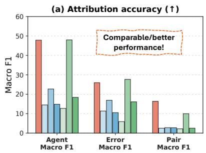
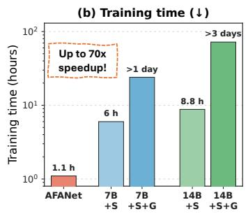
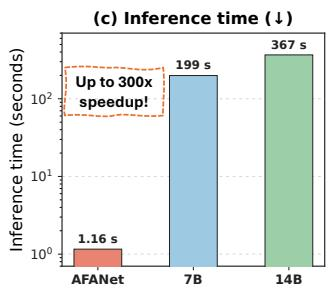
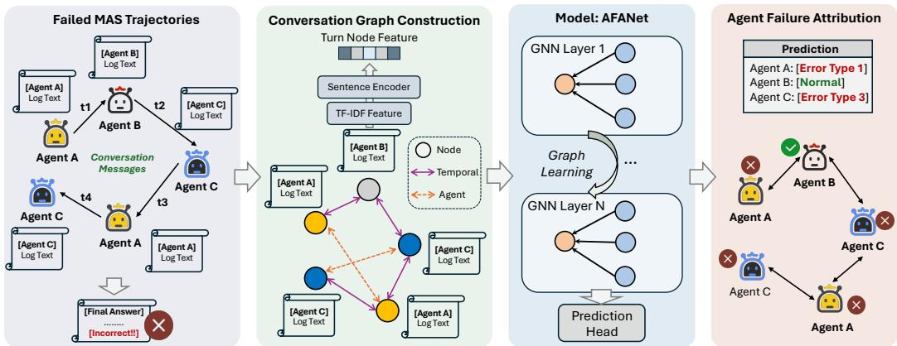

# Beyond LLM-Based Reasoning: Lightweight GNNs for Agent Failure Attribution

Ting-Wei Li University of Illinois Urbana-Champaign, IL USA twli@illinois.edu

Yuanchen Bei University of Illinois Urbana-Champaign, IL USA bei4@illinois.edu

Xiao Lin University of Illinois Urbana-Champaign, IL USA xiaol13@illinois.edu

Hanghang Tong University of Illinois Urbana-Champaign, IL USA htong@illinois.edu

## Abstract

Large language model (LLM)-based multi-agent systems (MAS) often exhibit complex failure modes, which frequently cause agents to produce incorrect outcomes. This motivates the task of Agent Failure Attribution (AFA): given a failed multi-agent trajectory, identify the faulty agents and their corresponding error types. Existing approaches predominantly rely on LLMs to perform failure attribution, either through direct prompting, fine-tuning on synthetic data or complex agentic pipelines. While effective, these methods incur substantial computational overhead due to long-context processing, expensive post-training and handcrafted workflows. Moreover, empirical evidence shows that even state-of-the-art models achieve limited accuracy on existing benchmarks, suggesting that scaling model size alone is insufficient. In this work, we revisit this task and question the necessity of such expensive generative solutions. We introduce AFANet, a lightweight graph-based framework that models interaction trajectories through step-level semantic signals and agent-level relationships. We show that with significantly fewer parameters and near-zero inference cost, AFANet (i) matches or outperforms LLM-based baselines, including fine-tuned models on in-domain benchmarks, (ii) maintains robust performance across different GNN architectures and (iii) can be further improved with inexpensive test-time adaptation on the OOD benchmark. Our results suggest that effective agent failure attribution does not require heavy LLM reasoning and a lightweight, structured approach can achieve strong performance.

## 1 Introduction

LLM-based multi-agent systems [11, 7, 25] have emerged as a powerful paradigm for solving complex tasks through coordinated reasoning, tool use, and interaction across multiple agents. Despite their strong capabilities, these systems often exhibit complexfailure modes [3, 31, 23, 12], where errors introduced by one agent propagate through subsequent interactions and ultimately lead to incorrect outcomes. This motivates the task of Agent Failure Attribution (AFA) [3, 31, 5, 10]: given a failed multi-agent interaction trajectory, identify the faulty agents and their corresponding error types responsible for the failure. However, this task is inherently challenging due to long interaction horizons, complex dependencies across agents and the ambiguous nature of error propagation. Even state-of-the-art reasoning models or powerful proprietary models achieve limited accuracy on this task, highlighting the difficulty of identifying root causes within long trajectories [10].

  
Figure 1: Attribution accuracy and efficiency comparison between our proposed AFANet and LLMs. AFANet can achieve similar or better performance against LLMs while incurring significantly lower training and inference cost. We consider the base models: Qwen-2.5-7B/14B-Instruct, denoted as 7B/14B, respectively. We also include their post-trained variants obtained through SFT (S) and subsequent GRPO training (G), denoted by 7B+S/14B+S and 7B+S+G/14B+S+G.

Existing approaches predominantly treat failure attribution as a generative reasoning problem, relying on LLMs to analyze interaction trajectories and directly generate the answers. These methods typically involve direct prompting [31], fine-tuning on synthetic failure data [10, 30, 29] or complex multistage agentic pipelines [28, 2, 24, 18]. While these approaches have improved performance, they suffer from several fundamental limitations. Firstly (Efficiency Bottleneck), they incur substantial computational overhead due to long-context processing, repeated inference and expensive training procedures. Secondly (Architectural Complexity), they introduce significant system complexity through multi-stage workflows and handcrafted pipelines. Lastly (Systematical Ineffectiveness), despite these efforts, their performance remains limited, sometimes defeated by random baselines, suggesting that scaling model size alone is insufficient for solving this task. These observations raise a fundamental question:

## Is heavy LLM reasoning necessaryfor agentfailure attribution?

In this work, we challenge this prevailing paradigm and argue that agent failure attribution can be solved much efficiently with lightweight models. Instead of relying on expensive LLM-based reasoning, we propose AFANet, a lightweight graph neural network (GNN) [26] that models interaction trajectories through step-level semantic and agent-level structural signals. By explicitly encoding temporal dependencies and inter-agent interactions, AFANet captures the underlying structure of failure propagation. Specifically, AFANet addresses the core challenges of agentic failure attribution in a principled manner. First, graph-based representations naturally model error propagation and inter-agent dependencies, enabling accurate identification of root causes. Second, the model operates with significantly reduced computational cost, avoiding both long-context inference and expensive post-training. Through extensive experiments, we demonstrate that AFANet matches or outperforms strong LLM-based baselines, including supervised fine-tuned and RL-enhanced models, while using significantly fewer parameters and achieving near-zero inference cost (as shown in Figure 1). We further show that AFANet is robust to architectural choices and can be improved through inexpensive test-time adaptation on the OOD dataset. We summarize our contributions are as follows:

• We introduce a new perspective on agent failure attribution: instead of LLM reasoning, graph-based modeling of failure trajectories is sufficient for effective attribution.

• We propose AFANet, a lightweight framework that models multi-agent failure propagation through a turn-level conversation graph, integrating turn-level semantics and temporal/intra agent dependencies via graph message passing.

• We demonstrate that with substantially lower training and inference cost, AFANet achieves competitive performance compared to LLMs.

• We conduct comprehensive ablation study and show that AFANet remains strong under different architectural choices and can be improved via inexpensive test-time adaptation.

  
Figure 2: Overall pipeline. Given a failed multi-agent system trajectory, we first transform it into a conversation graph with turn-level textual features and temporal/agent-level connections. The graph will then be passed through our proposed AFANet for agent failure prediction.

## 2 Preliminaries

## 2.1 Multi-Agent System Trajectories

Let $\mathcal { A } = \{ a _ { 1 } , a _ { 2 } , . . . , a _ { M } \}$ denote a set of LLM-based agents. Given a user query $q \in \mathcal { Q } ,$ a multiagent system attempts to solve the task and produces an interaction trajectory $\mathscr T = \{ ( a _ { i _ { t } } , x _ { t } ) \} _ { t = 1 } ^ { T } .$ where T is the trajectory length, $a _ { i _ { t } } \in \mathcal A$ is the agent selected at step t, and $x _ { t } \in \mathcal X$ is the content generated by that agent. Each trajectory T is associated with an outcome variable $o = g ( \mathcal { T } , q ) \in$ {0, 1}, where g is the outcome verifier and $o = 0 /$ 1 indicates task failure/success, respectively.

## 2.2 Agent Failure Attribution (AFA)

Let $\mathcal { E } = \{ e _ { 1 } , e _ { 2 } , \dots , e _ { K } \}$ denote a predefined set of error types and K is the number of error types. We define the label space as the Cartesian product over agent space and error space: $\mathcal { L } = \mathcal { A } \overset { \vartriangle } { \times } \mathcal { E }$ Given a failed trajectory T, the task of Agent Failure Attribution (AFA) is to predict a subset of labels $\mathcal { V } \subseteq \mathcal { L }$ , where each $( a _ { j } , e _ { k } ) \in \mathcal { V }$ indicates that agent aj commits an error of type $e _ { k }$ that contributes to the failure. We thus formulate AFA as a multi-way classification problem for each agent and our goal is to learn a mapping function $h : \mathcal { T }  \{ 0 , \mathbf { \bar { 1 } } \} ^ { M \times ( K + 1 ) }$ where the first class corresponds to the clean state and the remaining K classes correspond to each error type.

## 3 Methodology

In this section, we propose a lightweight graph-based model, AFANet, to tackle agent failure attribution. Given a conversation, we first construct a turn-level graph with temporal and intra-agent connections (Sec. 3.1). We then introduce our proposed model, AFANet, a simple GNN that combine deviation/statistical signals and contextual semantics to produce agent-level representations (Sec. 3.2). Then, we detail the learning objective (Sec. 3.3) and finally describe the inference procedure of AFANet (Sec. 3.4). The overall pipeline is detailed in Figure 2.

## 3.1 Conversation Graph Construction

We first transform each multi-agent conversation into a heterogeneous graph with turn-level nodes. The key intuition is that failures in multi-agent systems are not only reflected in the semantic content of individual turns, but also in how an agent’s contributions evolve over time and interact with other agents. Therefore, we represent it as a heterogeneous graph whose nodes are conversation turns and whose edges encode temporal and intra-agent dependencies. We detail the construction of node features and edges in the following paragraphs.

Turn node representation. Given a failed trajectory $\mathcal { T } = \{ ( a _ { i _ { t } } , x _ { t } ) \} _ { t = 1 } ^ { T }$ , we construct a graph $\mathcal { G } = ( \nu , \mathcal { E } )$ , where each node $v _ { t } \in \mathcal V$ corresponds to one turn $( a _ { i _ { t } } , x _ { t } )$ in the conversation and the number of nodes is $| \nu | = T$ . Inspired by recent anomaly detection literature [19, 17], we aim to capture abnormal deviation and statistical patterns to derive useful turn-level features for solving AFA. The key intuition is that faulty agent behavior is often reflected through inconsistencies in interaction dynamics rather than only the semantic content of individual turns.

To obtain such signals efficiently, we first construct per-conversation TF-IDF representations by treating each turn as a document and the entire trajectory as the corpus (more details in Appendix $\mathbf { A } )$ We then apply truncated SVD to obtain low-dimensional dense representations: $\mathbf { X } _ { \mathrm { s v d } } \in \mathbb { R } ^ { \mathbf { \hat { T } } \times r }$ , where r is the rank size. Based on $\mathbf { X } _ { \mathrm { s v d } }$ , we compute a set of deviation features that captures how each turn diverges from the contexts in the conversation. We concatenate these deviation features to obtain $\mathbf { x } _ { t } ^ { \mathrm { { d e v } } }$ for each turn, and stack them across all turns: $\mathbf { X } _ { \mathrm { d e v } } = [ \mathbf { x } _ { \mathrm { d e v } } ^ { 1 } | \cdot \cdot \cdot | \mathbf { x } _ { \mathrm { d e v } } ^ { T } ] \in \mathbb { R } ^ { T \times d _ { \mathrm { d e v } } }$ , where $d _ { \mathrm { d e v } }$ is the number of deviation features.

In addition, we consider statistical features $\mathbf { X } _ { \mathrm { s t a t } } \in \mathbb { R } ^ { T \times d _ { \mathrm { s t a t } } } \ ( d _ { \mathrm { s t a t } }$ denotes the number of statistical features) that encode non-semantic properties such as positional encoding. Finally, we consider dense semantic features obtained from pretrained sentence encoders (e.g., sentence-BERT [16]) to capture richer contextual meaning, leading to $\mathbf { X } _ { \mathrm { d e n s e } } \in \mathbb { R } ^ { T \times d _ { \mathrm { d e n s e } } }$ , where $d _ { \mathrm { d e n s e } }$ is the embedding dimension. Stacking these components together, we obtain the initial feature matrix for turn nodes: $\mathbf { X } = \left[ \mathbf { X } _ { \mathrm { d e v } } \mid \mathbf { X } _ { \mathrm { s t a t } } \mid \mathbf { X } _ { \mathrm { d e n s e } } \right] \stackrel { * } { \in } \mathbb { R } ^ { T \times d }$ , where $d = d _ { \mathrm { d e v } } + d _ { \mathrm { s t a t } } + d _ { \mathrm { d e n s e } }$ is the number of feature dimension. Each turn node is therefore associated with a feature vector $\mathbf { x } _ { t } = \mathbf { X } [ t , : ] \in \mathbb { R } ^ { d }$ . The formal definitions of deviation and statistical features are deferred to Appendix A.

Edge construction. We construct two types of connections: temporal progression and intra-agent dependency. Firstly, to preserve the sequential nature of the conversation, we add bidirectional temporal edges between adjacent turns: $\left( v _ { t } , v _ { t + 1 } \right) \in \mathcal { E } _ { \mathrm { s e q } } ^ { \right. } , ( v _ { t + 1 } , v _ { t } ) \in \mathcal { E } _ { \mathrm { s e q } } ^ { \left. } ,$ . Secondly, to capture long-range consistency across non-adjacent turns induced by the same agent, we connect turns produced by the same agent. For two turns $u \ < \ v$ such that $a _ { i , \mathrm { ~ } } = a _ { i , \mathrm { ~ } }$ , we add $( v _ { u } , v _ { v } ) \in$ $\dot { \mathcal { E } } _ { \mathrm { a g e n t } } ^ { \right. } , ( v _ { v } , \dot { v } _ { u } ) \in \mathcal { E } _ { \mathrm { a g e n t } } ^ { \left. }$ . Therefore, the full edge set is $\mathcal { E } = \mathcal { E } _ { \mathrm { s e q } } ^ { \right. } \cup \mathcal { E } _ { \mathrm { s e q } } ^ { \left. } \cup \mathcal { E } _ { \mathrm { a g e n t } } ^ { \right. } \cup \mathcal { E } _ { \mathrm { a g e n t } } ^ { \left. } .$

## 3.2 AFANet: A Lightweight GNN for Agent Failure Attribution

After constructing the turn-level graph G, we introduce AFANet, a model that captures both structural and semantic signals to solve AFA. Specifically, turn features are first projected into a hidden space , followed by graph neural network layers that propagate neighboring turn information along the conversation structure. Finally, agent-level representations are obtained and mapped to prediction scores that quantify the likelihood of each agent being associated with certain error types. We detail the procedure of AFANet as follows.

Input projection. We represent each turn node t in the conversation graph with a concatenated feature vector $\mathbf { x } _ { t } ~ \in ~ \mathbb { R } ^ { d }$ . Before graph message passing, we project these initial node features into a hidden dimension $d _ { \mathrm { h i d d e n } }$ . This is achieved via a projection module consisting of a linear transformation, a ReLU activation, and layer normalization:

$$
\mathbf h _ { t } ^ { ( 0 ) } = \mathrm { L N } ( \mathrm { R e L U } ( \mathbf W _ { \mathrm { i n } } \mathbf x _ { t } + \mathbf b _ { \mathrm { i n } } ) ) ,
$$

where $\mathbf { W } _ { \mathrm { i n } }$ is learnable weight matrix, $\mathbf { b } _ { \mathrm { i n } }$ is learnable bias and LN denotes layer normalization.

Graph Neural Network blocks. To capture contextual dependencies and the structural flow of the conversation, we apply L layers of message passing over the conversation graph. We also incorporate residual skip connections at each layer. The node representation at layer $\ell + 1$ is computed as:

$$
\mathbf { h } _ { t } ^ { ( \ell + 1 ) } = \mathbf { h } _ { t } ^ { ( \ell ) } + \mathrm { G N N } ^ { ( \ell ) } \big ( \mathbf { h } _ { t } ^ { ( \ell ) } , \{ \mathbf { h } _ { u } ^ { ( \ell ) } : ( u , t ) \in \mathcal { E } \} \big ) ,
$$

where $\mathcal { E }$ represents the set of edges in the graph. After L layers, we obtain the per-turn node representation $\mathbf { h } _ { t } ^ { \mathrm { g n n } } = \mathbf { h } _ { t } ^ { ( L ) } \in \mathbb { R } ^ { d _ { \mathrm { h i d d e n } } }$ . Note that the GNN layer can be instantiated with any architecture (e.g. GCN [9], GAT [21] and GraphSAGE [8]).

Agent-level pooling. Since the final classification objective is performed at the agent level, we aggregate the turn-level representations belonging to each respective agent. For a given agent $a _ { j }$

with the corresponding turn index set $\mathcal { T } _ { j }$ , we apply a dual pooling strategy that concatenates both the mean-pooled and max-pooled representations for better expressiveness:

$$
\mathbf { z } _ { j } = \left[ \frac { 1 } { \lvert \mathcal { T } _ { j } \rvert } \sum _ { t \in \mathcal { T } _ { j } } \mathbf { h } _ { t } ^ { \mathrm { g n n } } \parallel \underset { t \in \mathcal { T } _ { j } } { \operatorname* { m a x } } \mathbf { h } _ { t } ^ { \mathrm { g n n } } \right] .
$$

Prediction head. Given the pooled agent representation $\mathbf { z } _ { j } \in \mathbb { R } ^ { 2 d _ { \mathrm { h i d d e n } } }$ , we map it to the prediction space through a multi-layer projection head. We first obtain an intermediate hidden representation for each agent:

$$
\begin{array} { r } { \mathbf { h } _ { j } = \mathrm { L N } ( \mathrm { R e L U } ( \mathbf { W } _ { 1 } \mathbf { z } _ { j } + \mathbf { b } _ { 1 } ) ) , } \end{array}
$$

where $\mathbf { h } _ { j } \in \mathbb { R } ^ { d _ { \mathrm { h i d d e n } } }$ . We then apply a bottleneck projection followed by a non-linear activation and dropout:

$$
\tilde { \mathbf { h } } _ { j } = \mathrm { D r o p o u t } ( \mathrm { R e L U } ( \mathbf { W } _ { \mathrm { m i d } } \mathbf { h } _ { j } + \mathbf { b } _ { \mathrm { m i d } } ) ) ,
$$

where $\tilde { \mathbf { h } } _ { j } \in \mathbb { R } ^ { d _ { \mathrm { m i d } } }$ and $d _ { \mathrm { m i d } }$ is the bottleneck dimension size. Finally, we map to the prediction logits:

$$
\mathbf { s } _ { j } = \mathbf { W } _ { \mathrm { o u t } } \tilde { \mathbf { h } } _ { j } + \mathbf { b } _ { \mathrm { o u t } } ,
$$

where $\mathbf { s } _ { j } \in \mathbb { R } ^ { K + 1 }$ represents the un-normalized scores over K classes. The $K + 1$ classes correspond to class 0 for a clean type (i.e. no error occurs) and classes $1 , \ldots , K - 1$ for different error types.

## 3.3 Training Objectives

Given the agent-level representations $\{ \mathbf { h } _ { j } \} _ { j = 1 } ^ { M } .$ , we optimize AFANet using a two-term objective that combines (i) agent-level fault detection and (ii) error-type classification.

Agent-level objective. We first derive a binary fault logit $a _ { j }$ from the prediction scores $\mathbf { s } _ { j } \in \mathbb { R } ^ { K + 1 }$ for each agent j:

$$
a _ { j } = \log \sum _ { k = 1 } ^ { K } \exp ( s _ { j , k } ) - \log \exp ( s _ { j , 0 } ) .
$$

We then apply a weighted binary cross-entropy loss with logits:

$$
\mathcal { L } _ { \mathrm { a g e n t } } = \frac { 1 } { M } \sum _ { j = 1 } ^ { M } \mathrm { B C E W i t h L o g i t s } ( a _ { j } , y _ { j } ^ { \mathrm { b i n a r y } } ; w ^ { + } ) ,
$$

where $y _ { j } ^ { \mathrm { b i n a r y } } = \mathbb { I } [ y _ { j } \neq 0 ]$ denotes whether agent $j$ is faulty and the positive-class weight is defined as $\begin{array} { r } { w ^ { + } = \frac { n _ { \mathrm { c l e a n } } } { n _ { \mathrm { f a u l t y } } } } \end{array}$ , where $n _ { \mathrm { c l e a n } } , n _ { \mathrm { f a u l t y } }$ is the number of non-faulty and faulty agents summing over the conversations in the batch.

Error-level objective. For faulty agents $\mathcal { F } = \{ j \mid y _ { j } \neq 0 \}$ , we apply a multi-class cross-entropy loss over the error-type subspace:

$$
\mathcal { L } _ { \mathrm { f m } } = \frac { 1 } { | \mathcal { F } | } \sum _ { j \in \mathcal { F } } \mathrm { C E } ( [ s _ { j , 1 } , \dots , s _ { j , K } ] , y _ { j } - 1 ) .
$$

Overall objective. The final loss is simply the weighted sum over the above two terms: ${ \mathcal { L } } =$ $\lambda _ { \mathrm { a g e n t } } { \mathcal { L } } _ { \mathrm { a g e n t } } + \lambda _ { \mathrm { f m } } { \mathcal { L } } _ { \mathrm { f m } } .$ , where $\lambda _ { \mathrm { a g e n t } } , \lambda _ { \mathrm { f m } }$ are hyper-parameters.

## 3.4 Inference with AFANet

We first compute the score vector $\mathbf { s } _ { j } \in \mathbb { R } ^ { K + 1 }$ for each agent, where $s _ { j , 0 }$ denotes the clean class. We derive an agent-level fault score: for each agent j, scor $\mathbf { \phi } _ { \mathcal { j } } ^ { \mathrm { a g e n t } } = \mathbb { P } [ \mathrm { a g e n t } _ { \mathrm { j } }$ is $\begin{array} { r } { \mathrm { f a u l t y } ] = \frac { \sum _ { k = 1 } ^ { K } \exp ( s _ { j , k } ) } { \sum _ { k = 0 } ^ { K } \exp ( s _ { j , k } ) } } \end{array}$ During inference, we consider both threshold-based and ranking-based decoding. For threshold-based decoding, we utilize the validation set to sweep the best threshold τ that maximizes agent-level metric, and then fix τ to select $\tau _ { \mathrm { f m } }$ that maximizes error-level metric. We predict faulty agents as $\hat { \mathcal { F } } = \{ j \ | \ \mathrm { s c o r e } _ { j } ^ { \mathrm { a g e n t } } \ \geq \tau \}$ . For each $j \in { \hat { \mathcal { F } } }$ , we assign ${ \hat { e } } _ { j } = \operatorname { a r g m a x } _ { k \geq 1 } s _ { j , k }$ and retain $( a _ { j } , \hat { e } _ { j } )$ only if $s _ { j , \hat { e } _ { j } } \geq \tau _ { \mathrm { f m } }$ . For ranking-based decoding, we rank agents by $\mathrm { s c o r e } _ { j } ^ { \mathrm { a g e n t } }$ and directly select the top-ranked agent(s), assigning each selected agent the error type with the largest score.

Table 1: Performance comparison on AEGIS-Bench and Who&When. Best and second-best result are in bold and underline. All scores are percentages (%). For the Qwen-based models, Instruct are abbreviated as It, while Non-Thinking and Thinking modes are abbreviated as NT and T. Their SFT and subsequent GRPO-trained variants are denoted by +S and +S+G. Rows marked with ∗∗ indicate models re-implemented and evaluated by us under the same setting, while the remaining rows are adapted from [10].
<table><tr><td rowspan="2">Category</td><td rowspan="2">Method</td><td colspan="6">AEGIS-Bench</td><td colspan="6">Who&amp;When</td><td rowspan="2">Avg.</td></tr><tr><td colspan="2">Agent</td><td colspan="2">Error</td><td colspan="2">Pair</td><td colspan="2">Agent</td><td colspan="2">Error</td></tr><tr><td></td><td></td><td>µF1</td><td>MF1</td><td>µF1</td><td>MF1</td><td>µF1</td><td>MF1</td><td>µF1</td><td>MF1 µF1</td><td>MF1</td><td>µF1</td><td>MF1</td><td></td></tr><tr><td>Baseline</td><td>Random</td><td>4.54</td><td>3.56</td><td>11.23</td><td>11.15</td><td>0.33</td><td>0.21</td><td>1.06</td><td>0.83</td><td>8.74</td><td>7.14</td><td>0.11 0.05</td><td>4.08</td></tr><tr><td rowspan="6">Pre-trained LLMs</td><td>Qwen2.5-7B-It</td><td>27.55</td><td>14.49</td><td>14.96</td><td>11.36</td><td>5.02</td><td>2.52</td><td>40.92</td><td>23.50</td><td>3.64</td><td>1.77</td><td>2.31</td><td>1.14</td><td>12.43</td></tr><tr><td>Qwen2.5-7B-It**</td><td>26.38</td><td>16.15</td><td>15.14</td><td>11.54</td><td>3.67</td><td>1.76</td><td>46.25</td><td>37.85</td><td>3.26</td><td>1.94</td><td>2.06</td><td>2.44</td><td>14.04</td></tr><tr><td>Qwen2.5-14B-It</td><td>35.78</td><td>12.71</td><td>20.24</td><td>5.91</td><td>5.47</td><td>2.20</td><td>49.88</td><td>33.19</td><td>1.56</td><td>1.35</td><td>0.00</td><td>0.00</td><td>13.99</td></tr><tr><td>Qwen2.5-14B-It**</td><td>36.72</td><td>19.62</td><td>18.59</td><td>16.49</td><td>5.86</td><td>2.61</td><td>45.47</td><td>44.83</td><td>0.00</td><td>0.00</td><td>0.00</td><td>0.00</td><td>15.85</td></tr><tr><td>Qwen3-8B-NT</td><td>21.34</td><td>8.16</td><td>15.81</td><td>13.89</td><td>3.96</td><td>1.40</td><td>27.78</td><td>17.64</td><td>3.88</td><td>1.91</td><td>3.88</td><td>1.81</td><td>10.12</td></tr><tr><td>Qwen3-8B-T</td><td>34.63</td><td>9.01</td><td>17.48</td><td>14.31</td><td>4.42</td><td>1.52</td><td>37.91</td><td>27.58</td><td>4.65</td><td>2.21</td><td>1.95</td><td>1.10</td><td>13.06</td></tr><tr><td rowspan="8">Fine-tuned LLMs</td><td>Qwen2.5-7B-It+S</td><td>60.03</td><td>22.70</td><td>19.61</td><td>16.90</td><td>5.05</td><td>2.80</td><td></td><td>43.51 32.51</td><td>6.77</td><td>4.20</td><td>1.26</td><td>0.52</td><td>17.99</td></tr><tr><td>Qwen2.5-7B-It+S**</td><td>37.93</td><td>22.14</td><td>17.69</td><td>13.85</td><td>4.48</td><td>2.02</td><td>56.77</td><td>65.81</td><td>5.42</td><td>4.75</td><td>3.94</td><td>4.58</td><td>19.97</td></tr><tr><td>Qwen2.5-7B-It+S+G</td><td>35.43</td><td>14.86</td><td>17.21</td><td>10.54</td><td>7.11</td><td>2.77</td><td>50.77</td><td>30.14</td><td>3.86</td><td>2.30</td><td>2.31</td><td>1.19</td><td>14.87</td></tr><tr><td>Qwen2.5-14B-It+S</td><td>76.53</td><td>47.97</td><td>27.53</td><td>27.66</td><td>16.62</td><td>9.99</td><td>51.14</td><td>36.94</td><td>9.87</td><td>7.77</td><td>4.03</td><td>2.08</td><td>26.51</td></tr><tr><td>Qwen2.5-14B-It+S**</td><td>41.04</td><td>21.80</td><td>17.16</td><td>13.83</td><td>4.38</td><td>2.02</td><td>49.37</td><td>64.90</td><td>1.77</td><td>1.73</td><td>0.41</td><td>0.25</td><td>18.22</td></tr><tr><td>Qwen2.5-14B-It+S+G</td><td>49.74</td><td>18.38</td><td>21.19</td><td>16.10</td><td>6.84</td><td>2.55</td><td>54.43</td><td>40.88</td><td>4.15</td><td>2.67</td><td>2.45</td><td>1.49</td><td>18.41</td></tr><tr><td>Qwen3-8B-NT+S</td><td>64.79</td><td>38.96</td><td>20.37</td><td>20.36</td><td>9.68</td><td>5.73</td><td>45.48</td><td>30.77</td><td>8.00</td><td>5.29</td><td>5.17</td><td>2.33</td><td>21.41</td></tr><tr><td>Qwen3-8B-NT+S+G Qwen3-8B-T+G</td><td>45.91 36.11</td><td>17.39 15.73</td><td>20.89 17.94</td><td>15.15 12.03</td><td>6.94 4.41</td><td>2.82 1.66</td><td>50.94 53.12</td><td>38.26</td><td>2.21</td><td>1.68</td><td>2.21</td><td>1.45</td><td>17.15</td></tr><tr><td rowspan="6">Proprietary LLMs</td><td>GPT-4.1</td><td></td><td></td><td></td><td></td><td></td><td></td><td></td><td>40.52</td><td>11.25</td><td>6.91</td><td>8.10</td><td>3.19</td><td>17.58</td></tr><tr><td>GPT-4o-mini</td><td>37.48 38.54</td><td>11.12 14.72</td><td>20.65</td><td>15.75</td><td>7.44 5.76</td><td>2.27</td><td>42.29</td><td>28.93 34.21</td><td>7.00</td><td></td><td>5.84 3.36</td><td>1.16</td><td>15.27</td></tr><tr><td>03</td><td>40.31</td><td>23.27</td><td>19.95 22.37</td><td>16.02 16.76</td><td>7.86</td><td>1.63 2.27</td><td>47.42 53.10</td><td>42.55</td><td>5.26 14.88</td><td>3.33 8.63</td><td>2.11 7.41</td><td>0.98 3.98</td><td>15.83</td></tr><tr><td>Gemini-2.5-Flash</td><td>42.02</td><td>16.45</td><td>23.47</td><td>19.85</td><td>6.99</td><td>2.76</td><td>55.56</td><td>36.98</td><td>11.94</td><td>7.96</td><td>7.32</td><td></td><td>20.24</td></tr><tr><td>Gemini-2.5-Pro</td><td>41.32</td><td>16.15</td><td>19.93</td><td>16.29</td><td>6.96</td><td>2.88</td><td>53.11</td><td>34.92</td><td>11.07</td><td>8.11</td><td>6.81</td><td>3.33 2.69</td><td>19.55</td></tr><tr><td>Claude-Sonnet-4</td><td>40.73</td><td>15.51</td><td>21.21</td><td>16.55</td><td>7.68</td><td>2.34</td><td>44.76</td><td>37.23</td><td>13.33</td><td>9.23</td><td>6.77</td><td>2.66</td><td>18.35 18.16</td></tr><tr><td>Ours</td><td>AFANet</td><td>74.16</td><td>47.86</td><td>27.01</td><td>25.96</td><td>17.42</td><td>16.35</td><td>37.93</td><td>20.26</td><td>13.79</td><td>6.05</td><td>6.90</td><td>4.16</td><td>24.82</td></tr></table>

## 4 Experiment

In this section, we conduct extensive experiments to evaluate the effectiveness of AFANet against LLM-based baselines. Our experiments are designed to answer the following research questions:

• (RQ1): How does AFANet compare to LLM-based methods w.r.t. efficacy and efficiency?

• (RQ2): How does AFANet perform under different GNN backbones and hyper-parameters?

• (RQ3): How does AFANet perform across domains and how to improve it?

## 4.1 Experimental Setup

Datasets. We conduct experiments on the AEGIS-Bench [10]1 and the Who&When [31] datasets2. AEGIS-Bench serves as the in-domain dataset and has pre-defined train/val/test splits. On the other hand, Who&When is utilized as the out-of-distribution datasets and has exactly one faulty agent per conversation. During training phase, the training and validation splits of AEGIS-Bench are used to train and validate AFANet; the test split of AEGIS-Bench and the entire Who&When are used to report the evaluation performances. The data statistics is in Appendix B.

Baselines. We primarily compare AFANet against a broad range of LLM-based methods, including pre-trained, fine-tuned and proprietary LLMs. Following Kong et al. [10], we adopt the All-at-Once prompting strategy for all LLM baselines, where the model is provided with the user query together with the complete failure trajectory, and is directly asked to identify the faulty agent as well as the corresponding error type all at once. The evaluated LLM backbones include Qwen2.5 [20], Qwen3 [27], GPT-4.1 [14], GPT-4o-mini [13], o3 [15], Gemini-2.5-Flash/Pro [4] and

Table 2: Efficiency comparison between AFANet and LLM-based baselines. For AFANet, preprocessing time summed over train/validation/test graph construction time. Inference time is reported as in-domain / OOD, respectively.
<table><tr><td>Method</td><td>Training Time</td><td>Inference Time</td><td>Preprocessing Time</td><td>Trainable Params</td></tr><tr><td>7B SFT</td><td>6 hrs</td><td>199s / 108s</td><td>一</td><td>7B</td></tr><tr><td>7B SFT + GRPO</td><td>&gt; 26 hrs</td><td>199s / 108s</td><td>一</td><td>7B</td></tr><tr><td>14B SFT</td><td>8.8 hrs</td><td>367s / 231s</td><td></td><td>14B</td></tr><tr><td>14B SFT + GRPO</td><td>&gt; 74 hrs</td><td>367s / 231s</td><td></td><td>14B</td></tr><tr><td>AFANet</td><td>1.1 hrs</td><td>1.16s / 0.37s</td><td>80.8s</td><td>65K</td></tr></table>

Claude-Sonnet-4 [1]. We also consider the supervised fine-tuning (+S) and subsequent GRPOtrained (+S+G) variants on small-scale Qwen2.5 and Qwen3 models.

Evaluation Metrics. Following Kong et al. [10], we evaluate the attribution accuracy at three levels of granularity: Pair-level (correct agent-error pairs), Agent-level (correct faulty agents, ignoring the error types) and Error-level (correct error types, ignoring faulty agents). For each level, Micro-F1 (µF1) and Macro-F1 (MF1) are reported. Micro-F1 pools predictions over all samples to compute a single global score. In contrast, Macro-F1 calculates the F1 score separately for each class (e.g., each of the error types) and then averages them uniformly. The details of the error type taxonomy is in Appendix C.

Implementation Details. For AFANet, we default its backbone GNN to a 2-layer GCN [9] with a hidden dimension of 64 and a bottleneck dimension of 32. The model is trained using the Adam optimizer with a learning rate of $1 \times 1 0 ^ { - 2 }$ for up to 100 epochs, with early stopping based on validation performance using a patience of 10 epochs. We set the batch size to 2000 and apply dropout rate 0.1. We employ all-MiniLM-L6-v2 [16] as the embedding model to encode turn node contexts. The best model is selected based on the validation pair-level Micro-F1 score. For AFANet inference, we utilize Micro-F1 to select agent threshold τ and error threshold $\tau _ { f m }$ on AEGIS-Bench; we utilize ranking-based decoding on Who&When to capture the single error nature. All experiments for AFANet are conducted on an NVIDIA V100 GPU. For the LLM-based methods, we fine-tune Qwen2.5-7B-Instruct & Qwen2.5-14B-Instruct ourselves and evaluate them under the same setting. The versions we re-implement are marked with ∗∗ in Table 1. The prompts and the evaluation scripts for the re-implementation are from the AEGIS [10] codebase3.

## 4.2 Main Results

AFANet is comparable to or outperforms LLMs. We present our main results in Table 1. AFANet achieves competitive or superior average performance compared to pretrained, post-trained and proprietary LLM baselines over two in-domain and OOD datasets. In particular, despite not relying on LLM-based reasoning, AFANet is highly effective w.r.t. the pair-level metrics.

We note that pair-level attribution is the most challenging and practically important, since it requires simultaneously identifying both the faulty agent and the correct error type. On AEGIS-Bench, AFANet achieves top-1 pair-level performances. More importantly, under the OOD setting on Who&When, AFANet remains highly-ranked on pair-level attribution, demonstrating strong robustness under distribution shift. We hypothesize that this advantage mainly comes from modeling structural interaction dynamics and consistency patterns, which remain relatively stable across trajectories; however, post-trained approaches may overfit to surface-level semantic patterns or dataset-specific failure distributions.

AFANet is much more efficient than LLMs. As shown in Figure 1 and Table 2, AFANet achieves significantly lower training time, inference time and trainable parameters compared to LLM counterpart. The preprocessing time of AFANet is also neglectable (i.e. the time for conversation graph construction over all splits).

Table 3: Backbone sensitivity study of AFANet. Best and second-best results are in bold and underline. We show that AFANet remains robust across different GNN architectures and model depths. All scores are percentages (%). The reference model uses a 2-layer GCN with both edge types.
<table><tr><td rowspan="3">Backbone</td><td colspan="6">AEGIS-Bench</td><td colspan="6">Who&amp;When</td><td rowspan="3">Avg.</td></tr><tr><td colspan="2">Agent</td><td colspan="2">Error</td><td colspan="2">Pair</td><td colspan="2">Agent</td><td colspan="2">Error</td><td colspan="2">Pair</td></tr><tr><td> $\mu \mathrm { F } 1$ </td><td>MF1</td><td> $\mu \mathrm { F } 1$ </td><td>MF1</td><td> $\mu \mathrm { F } 1$  MF1</td><td> $\mu \mathrm { F } 1$ </td><td>MF1</td><td> $\mu \mathrm { F } 1$ </td><td>MF1</td><td> $\mu \mathrm { F } 1$ </td><td>MF1</td><td></td></tr><tr><td></td><td></td><td></td><td></td><td></td><td colspan="6">Main Model</td><td></td><td></td><td></td><td></td></tr><tr><td>GCN (2-layer, all edges)</td><td>74.16</td><td>47.86</td><td>27.01</td><td>25.96 17.42</td><td>16.35</td><td></td><td>37.93</td><td>20.26</td><td>13.79</td><td>6.05</td><td>6.90</td><td>4.16</td><td></td><td>24.82</td></tr><tr><td></td><td></td><td></td><td></td><td></td><td></td><td>GNN Backbone</td><td></td><td></td><td></td><td></td><td></td><td></td><td></td><td></td></tr><tr><td>GAT (2-layer, all edges)</td><td>71.92</td><td>43.31</td><td>24.23</td><td>23.13</td><td>16.57</td><td>13.38</td><td>34.48</td><td>25.57</td><td>7.47</td><td></td><td>3.67</td><td>0.46</td><td>0.25</td><td>22.04</td></tr><tr><td>GraphSAGE (2-layer, all edges)</td><td>74.34</td><td>50.76</td><td>24.94</td><td>24.68</td><td>16.42</td><td>14.30</td><td>30.46</td><td>23.69</td><td>8.05</td><td></td><td>4.53</td><td>3.45</td><td>1.55</td><td>23.10</td></tr><tr><td>GNN Depth</td><td colspan="10"></td><td></td><td></td><td></td><td></td><td></td></tr><tr><td>GCN (1-layer, all edges)</td><td>71.17</td><td>42.17</td><td>23.23</td><td>21.88</td><td>16.46</td><td>14.39</td><td>34.48</td><td></td><td>24.78</td><td>5.17</td><td>3.17</td><td>1.15</td><td>0.85</td><td>21.58</td></tr><tr><td>GCN (3-layer, all edges)</td><td>72.84</td><td>44.25</td><td>25.05</td><td>24.61</td><td></td><td>17.96 14.22</td><td>31.61</td><td></td><td>20.45</td><td>9.77</td><td>5.62</td><td>3.45</td><td>1.85</td><td>22.64</td></tr></table>

Table 4: Ablation study of AFANet. Best and second-best results are in bold and underline. We show that graph structure, edge design and each feature component all contribute to AFANet’s performance. All scores are percentages (%). The reference model uses a 2-layer GCN with both edge types.
<table><tr><td rowspan="2">Setting</td><td colspan="5">AEGIS-Bench</td><td colspan="5">Who&amp;When</td><td rowspan="2">Avg.</td></tr><tr><td>Agent</td><td></td><td>Error</td><td></td><td>Pair</td><td>Agent</td><td></td><td>Error</td><td></td><td>Pair</td></tr><tr><td></td><td> $\mu \mathrm { F } 1$ </td><td>MF1</td><td> $\mu \mathrm { F } 1$ </td><td>MF1</td><td> $\mu \mathrm { F } 1$  MF1</td><td> $\mu \mathrm { F } 1$ </td><td>MF1</td><td> $\mu \mathrm { F } 1$ </td><td>MF1</td><td>µF1</td><td>MF1</td></tr><tr><td></td><td></td><td></td><td></td><td></td><td></td><td>Main Model</td><td></td><td></td><td></td><td></td><td></td></tr><tr><td>GCN (all edges) 74.16</td><td>47.86</td><td></td><td>27.01</td><td>25.96 17.42</td><td>16.35</td><td>37.93</td><td>20.26</td><td>13.79</td><td>6.05</td><td>6.90 4.16</td><td>24.82</td></tr><tr><td></td><td></td><td></td><td></td><td></td><td></td><td>Edge Type Ablation</td><td></td><td></td><td></td><td></td><td></td></tr><tr><td>GCN (no edges)</td><td>71.26</td><td>43.21</td><td>24.65</td><td>23.54</td><td>18.49 15.03</td><td>32.18</td><td>25.10</td><td>8.62</td><td>5.55</td><td>3.45</td><td>2.39 22.78</td></tr><tr><td>GCN (only same-agent edges)</td><td>70.53</td><td>42.74</td><td>22.32</td><td>21.58</td><td>16.31 12.23</td><td>36.78</td><td>26.21</td><td>6.32</td><td>2.95</td><td>4.60 3.16</td><td>22.14</td></tr><tr><td>GCN (only temporal edges)</td><td>74.82</td><td>53.60</td><td>24.82</td><td>24.39</td><td>17.54 16.52</td><td>35.06</td><td>20.41</td><td>5.75</td><td>3.41</td><td>4.60 1.99</td><td>23.58</td></tr><tr><td></td><td></td><td></td><td></td><td></td><td></td><td>Model Design Ablation</td><td></td><td></td><td></td><td></td><td></td></tr><tr><td>W/o dev/stat features</td><td>65.90</td><td>35.47</td><td>23.59</td><td>22.25</td><td>14.00</td><td>9.80 37.93</td><td>32.00</td><td>5.75</td><td>2.89</td><td>1.72</td><td>1.14</td><td>21.04</td></tr><tr><td>W/o sentence embedding</td><td>73.58</td><td>48.18</td><td>23.62</td><td>22.14</td><td>14.78</td><td>10.16 37.93</td><td>21.76</td><td>8.05</td><td>5.44</td><td>2.30</td><td>1.33</td><td>22.44</td></tr><tr><td>W/o GNN</td><td>71.11</td><td>43.80</td><td>26.34</td><td>25.61</td><td>17.81</td><td>14.93</td><td>26.44 18.86</td><td>11.49</td><td>5.68</td><td>2.87</td><td>1.89</td><td>22.24</td></tr></table>

## 4.3 Discussions

Backbone sensitivity. We present backbone sensitivity in Table 4 to evaluate the robustness of AFANet under different architectural choices. We observe that the overall performance remains relatively stable across different GNN architectures and layer configurations. These observations suggest that the effectiveness of AFANet is not tied to a specific GNN implementation or carefully tuned depth, indicating good architectural robustness.

Ablation. In Table 4, we further study the impact of connection types and some key model designs. Firstly, removing all edges consistently degrades performance, demonstrating that relational structure is important for agent failure attribution. Secondly, using only same-agent edges or only temporal edges also leads to noticeable performance drops compared to the full graph, suggesting that both temporal interaction patterns and intra-agent behavioral consistency provide complementary signals.

For model design ablation, we observe that removing deviation/statistical features causes large overall performance degradation, particularly on pair-level metrics, supporting our hypothesis that faulty agents are often characterized by abnormal interaction dynamics and consistency violations. Removing the GNN module also harms performance, showing the importance of explicit structured modeling.

Generalization study. While AFANet demonstrates strong performance on the in-domain benchmark, generalizing agent failure attribution under severe distribution shift remains an inherently challenging problem. As a case study, we investigate whether lightweight test-time adaptation (TTA) can improve AFANet under OOD settings without requiring retraining or additional supervision.

Table 5: Test-time adaptation results on Who&When. Best and second-best results are in bold and underline. We observe that pair-level adaptation achieves the strongest overall gains.
<table><tr><td rowspan="2">Category</td><td rowspan="2">Method</td><td colspan="2">Agent</td><td colspan="2">Error</td><td colspan="2">Pair</td><td rowspan="2">Avg.</td></tr><tr><td>µF1</td><td>MF1</td><td>µF1</td><td>MF1</td><td>µF1</td><td>MF1</td></tr><tr><td>Original</td><td>Base</td><td>38.51</td><td>22.37</td><td>9.77</td><td>5.05</td><td>5.17</td><td>2.92</td><td>13.96</td></tr><tr><td rowspan="3">TTA</td><td>Agent</td><td>35.06</td><td>21.42</td><td>14.37</td><td>5.56</td><td>6.32</td><td>4.40</td><td>14.52</td></tr><tr><td>Pair</td><td>35.06</td><td>20.15</td><td>14.37</td><td>5.77</td><td>7.47</td><td>4.96</td><td>14.63</td></tr><tr><td>Pair-Faulty</td><td>39.08</td><td>22.47</td><td>11.49</td><td>5.06</td><td>6.32</td><td>4.06</td><td>14.75</td></tr></table>

Motivated by entropy-minimization (EM) based test-time adaptation such as TENT [22], we explore whether AFANet can adapt to OOD trajectories by encouraging more confident predictions at inference time. We consider three adaptation objectives at different prediction granularities as follows: (i) Agent-level EM minimizes the binary entropy of agent faulty probability; (ii) Pair-level EM encourages confident predictions over pairwise label space; and (iii) Faulty-agent pair-level EM applies pair-level entropy minimization only to agents that are likely to be faulty. The TTA procedure and the detailed formulas of these strategies are in Appendix D. Table 5 shows that lightweight test-time adaptation can consistently improve OOD performance.

## 5 Related Work

Direct prompting. Early approaches to agent failure attribution primarily rely on prompting pretrained LLMs to directly analyze interaction trajectories [31, 5]. These methods treat attribution as a reasoning task over long execution logs. However, these approaches rely on costly LLM inference and often require carefully designed prompting strategies.

Finetuning-based methods. Another line of work focuses on training specialized attribution models using synthetic data with labeled faulty trajectories [30, 29, 10]. These methods generate large-scale annotated failure trajectories through techniques such as error injection, counterfactua replay, or graph-guided synthesis, and subsequently post-train models using supervised fine-tuning and reinforcement learning. However, these methods introduce significant overhead in training cost and they still inherit the limitations of direct LLM inference at test time.

Agentic systems. Some works explores more complex failure attribution frameworks. In this category, some approaches employ more sophisticate prompting techniques [32], some construct structured representations such as causal graphs [24], hierarchical context models [2] and complex patterns [6, 18] to better capture inter-agent dependencies, while others incorporate memory mechanisms to reuse previously observed failure patterns [28].

## 6 Conclusion

We revisit agent failure attribution in LLM-based multi-agent systems and show that heavy generative approaches are not necessary for strong performance. We propose AFANet, a lightweight graph-based framework that models interaction trajectories through simple step-level signals and agent-level structure, achieving competitive or superior results against LLM-based methods with minimal computational cost. These findings suggest that structured modeling of agent interactions is sufficient for effective attribution. Future work includes designing more tailored aggregation operators and conducting in-depth analysis of generalization under distribution shifts.

## References

[1] AI Anthropic. System card: Claude opus 4 & claude sonnet 4. Claude-4 Model Card, 2025.

[2] Adi Banerjee, Anirudh Nair, and Tarik Borogovac. Where did it all go wrong? a hierarchical look into multi-agent error attribution. arXiv preprint arXiv:2510.04886, 2025.

[3] Mert Cemri, Melissa Z Pan, Shuyi Yang, Lakshya A Agrawal, Bhavya Chopra, Rishabh Tiwari, Kurt Keutzer, Aditya Parameswaran, Dan Klein, Kannan Ramchandran, et al. Why do multiagent llm systems fail? arXiv preprint arXiv:2503.13657, 2025.

[4] Gheorghe Comanici, Eric Bieber, Mike Schaekermann, Ice Pasupat, Noveen Sachdeva, Inderjit Dhillon, Marcel Blistein, Ori Ram, Dan Zhang, Evan Rosen, et al. Gemini 2.5: Pushing the frontier with advanced reasoning, multimodality, long context, and next generation agentic capabilities. arXiv preprint arXiv:2507.06261, 2025.

[5] Darshan Deshpande, Varun Gangal, Hersh Mehta, Jitin Krishnan, Anand Kannappan, and Rebecca Qian. Trail: Trace reasoning and agentic issue localization. arXiv preprint arXiv:2505.08638, 2025.

[6] Yu Ge, Linna Xie, Zhong Li, Yu Pei, and Tian Zhang. Who is introducing the failure? automatically attributing failures of multi-agent systems via spectrum analysis. arXiv preprint arXiv:2509.13782, 2025.

[7] Taicheng Guo, Xiuying Chen, Yaqi Wang, Ruidi Chang, Shichao Pei, Nitesh V Chawla, Olaf Wiest, and Xiangliang Zhang. Large language model based multi-agents: A survey of progress and challenges. arXiv preprint arXiv:2402.01680, 2024.

[8] Will Hamilton, Zhitao Ying, and Jure Leskovec. Inductive representation learning on large graphs. Advances in neural information processing systems, 30, 2017.

[9] Thomas N Kipf and Max Welling. Semi-supervised classification with graph convolutional networks. arXiv preprint arXiv:1609.02907, 2016.

[10] Fanqi Kong, Ruijie Zhang, Huaxiao Yin, Guibin Zhang, Xiaofei Zhang, Ziang Chen, Zhaowei Zhang, Xiaoyuan Zhang, Song-Chun Zhu, and Xue Feng. Aegis: Automated error generation and attribution for multi-agent systems. arXiv preprint arXiv:2509.14295, 2025.

[11] Xinyi Li, Sai Wang, Siqi Zeng, Yu Wu, and Yi Yang. A survey on llm-based multi-agent systems: workflow, infrastructure, and challenges. Vicinagearth, 1(1):9, 2024.

[12] Xuyan Ma, Xiaofei Xie, Yawen Wang, Junjie Wang, Boyu Wu, Mingyang Li, and Qing Wang. Diagnosing failure root causes in platform-orchestrated agentic systems: Dataset, taxonomy, and benchmark. arXiv preprint arXiv:2509.23735, 2025.

[13] OpenAI. Gpt-4o-mini. https://openai.com/index/gpt-4o-system-card/, 2024.

[14] OpenAI. Gpt-4.1. https://openai.com/index/gpt-4-1/, 2025.

[15] OpenAI. o3. https://openai.com/index/introducing-o3-and-o4-mini/, 2025.

[16] Nils Reimers and Iryna Gurevych. Sentence-bert: Sentence embeddings using siamese bertnetworks. In Proceedings ofthe 2019 Conference on Empirical Methods in Natural Language Processing. Association for Computational Linguistics, 11 2019. URL https://arxiv.org/ abs/1908.10084.

[17] Amit Roy, Juan Shu, Jia Li, Carl Yang, Olivier Elshocht, Jeroen Smeets, and Pan Li. Gad-nr: Graph anomaly detection via neighborhood reconstruction. In Proceedings ofthe 17th ACM international conference on web search and data mining, pages 576–585, 2024.

[18] Kai Sun, Wenqiang Li, Bo Dong, Yuxin Lin, Jingyao Zhang, and Bin Shi. Scope delineation before localization: A two-stage framework for enhancing failure attribution in multi-agent systems. In Proceedings of the AAAI Conference on Artificial Intelligence, volume 40, pages 33108–33116, 2026.

[19] Jianheng Tang, Jiajin Li, Ziqi Gao, and Jia Li. Rethinking graph neural networks for anomaly detection. In International conference on machine learning, pages 21076–21089. PMLR, 2022.

[20] Qwen Team. Qwen2.5: A party of foundation models, September 2024. URL https:// qwenlm.github.io/blog/qwen2.5/.

[21] Petar Velickoviˇ c, Guillem Cucurull, Arantxa Casanova, Adriana Romero, Pietro Lio, and Yoshua´ Bengio. Graph attention networks. arXiv preprint arXiv:1710.10903, 2017.

[22] Dequan Wang, Evan Shelhamer, Shaoteng Liu, Bruno Olshausen, and Trevor Darrell. Tent: Fully test-time adaptation by entropy minimization. arXiv preprint arXiv:2006.10726, 2020.

[23] Junjie Wang, Yawen Wang, Mengzhuo Chen, Xiaofei Xie, Chunyang Chen, Fangwen Mu, Zhe Liu, and Qing Wang. A survey for llm agent trajectory analysis: From failure attribution to enhancement. 2026.

[24] Yawen Wang, Wenjie Wu, Junjie Wang, and Qing Wang. From flat logs to causal graphs: Hierarchical failure attribution for llm-based multi-agent systems. arXiv preprint arXiv:2602.23701, 2026.

[25] Tianxin Wei, Ting-Wei Li, Zhining Liu, Xuying Ning, Ze Yang, Jiaru Zou, Zhichen Zeng, Ruizhong Qiu, Xiao Lin, Dongqi Fu, et al. Agentic reasoning for large language models. arXiv preprint arXiv:2601.12538, 2026.

[26] Zonghan Wu, Shirui Pan, Fengwen Chen, Guodong Long, Chengqi Zhang, and Philip S Yu. A comprehensive survey on graph neural networks. IEEE transactions on neural networks and learning systems, 32(1):4–24, 2020.

[27] An Yang, Anfeng Li, Baosong Yang, Beichen Zhang, Binyuan Hui, Bo Zheng, Bowen Yu, Chang Gao, Chengen Huang, Chenxu Lv, et al. Qwen3 technical report. arXiv preprint arXiv:2505.09388, 2025.

[28] Yifan Yu, Moyan Li, Shaoyuan Xu, Jinmiao Fu, Xinhai Hou, Fan Lai, and Bryan Wang. Correct: Condensed error recognition via knowledge transfer in multi-agent systems. arXiv preprint arXiv:2509.24088, 2025.

[29] Guibin Zhang, Junhao Wang, Junjie Chen, Wangchunshu Zhou, Kun Wang, and Shuicheng Yan. Agentracer: Who is inducing failure in the llm agentic systems? arXiv preprint arXiv:2509.03312, 2025.

[30] Heng Zhang, Yuling Shi, Xiaodong Gu, Haochen You, Zijian Zhang, Lubin Gan, Yilei Yuan, and Jin Huang. Graphtracer: Graph-guided failure tracing in llm agents for robust multi-turn deep search. arXiv preprint arXiv:2510.10581, 2025.

[31] Shaokun Zhang, Ming Yin, Jieyu Zhang, Jiale Liu, Zhiguang Han, Jingyang Zhang, Beibin Li, Chi Wang, Huazheng Wang, Yiran Chen, et al. Which agent causes task failures and when? on automated failure attribution of llm multi-agent systems. arXiv preprint arXiv:2505.00212, 2025.

[32] Chenyang Zhu, Spencer Hong, Jingyu Wu, Kushal Chawla, Yuhui Tang, Youbing Yin, Nathan Wolfe, Erin Babinsky, and Daben Liu. Raffles: Reasoning-based attribution of faults for llm systems. In Proceedings of the 19th Conference of the European Chapter of the Association for Computational Linguistics (Volume 1: Long Papers), pages 7659–7688, 2026.

## A Graph construction

TF-IDF computation. For each conversation, we first construct a local vocabulary from all turns after lowercasing and tokenization. Based on this vocabulary, we compute turn-level TF-IDF representations using standard term frequency and smoothed inverse document frequency, followed by row-wise $\ell _ { 2 }$ normalization. Let $\mathbf { X } _ { \mathrm { T F - I D F } } \in \mathbb { R } ^ { T \times | \mathcal { V } | }$ denote the resulting TF-IDF matrix, where $T$ is the number of turns and $| \nu |$ is the vocabulary size.

To obtain compact dense representations that capture the dominant vocabulary structure within the conversation, we apply truncated SVD:

$$
\mathbf { Z } _ { \mathrm { s v d } } = \mathrm { S V D } _ { r } ( \mathbf { X } _ { \mathrm { T F - I D F } } ) \in \mathbb { R } ^ { T \times r } ,
$$

where r denotes the retained rank size. Each row

$$
\mathbf { z } _ { \mathrm { s v d } } ^ { t } = \mathbf { Z } _ { \mathrm { s v d } } [ t , : ] \in \mathbb { R } ^ { r }
$$

provides an r-dimensional representation for turn t. In our implementation, we use $r = 1 6$

Deviation features. Let $\phi _ { t } = \mathbf { z } _ { \mathrm { s v d } } ^ { t }$ denote the TF-IDF SVD feature of turn t, and let ${ \mathcal T } _ { a } = \{ t \} \ |$ $a _ { i _ { t } } = a \}$ denote the set of turns generated by agent a.

• Sequential deviation. We measure how abruptly a turn deviates from the immediately preceding turn:

$$
f _ { \mathrm { s e q } } ( t ) = 1 - \cos ( \phi _ { t } , \phi _ { t - 1 } ) .
$$

• Self inconsistency. We measure deviation from the historical behavior of the same agent:

$$
\begin{array} { c } { \displaystyle \mu _ { a _ { i _ { t } } } = \frac { 1 } { | \mathcal { T } _ { a _ { i _ { t } } } | } \sum _ { s \in \mathcal { T } _ { a _ { i _ { t } } } } \phi _ { s } , } \\ { f _ { \mathrm { s e l f } } ( t ) = 1 - \cos ( \phi _ { t } , \mu _ { a _ { i _ { t } } } ) . } \end{array}
$$

• Conversation consensus deviation. We compute deviation from the global conversation centroid:

$$
\begin{array} { c } { \displaystyle \mu _ { \mathcal { T } } = \frac { 1 } { T } \sum _ { s = 1 } ^ { T } \phi _ { s } , } \\ { f _ { \mathrm { c o n s } } ( t ) = 1 - \cos ( \phi _ { t } , \mu _ { \mathcal { T } } ) . } \end{array}
$$

• Cross-agent deviation. We measure deviation from the average representation of all other agents:

$$
\begin{array} { r l } & { \mu _ { \neg a _ { i _ { t } } } = \frac { 1 } { T - \left| \mathscr { T } _ { a _ { i _ { t } } } \right| } \displaystyle \sum _ { s \notin \mathscr { T } _ { a _ { i _ { t } } } } \phi _ { s } , } \\ & { f _ { \mathrm { o t h e r } } ( t ) = 1 - \cos ( \phi _ { t } , \mu _ { \neg a _ { i _ { t } } } ) . } \end{array}
$$

• Agent internal consistency. We compute the average pairwise similarity among all turns generated by the same agent:

$$
f _ { \mathrm { w i t h i n } } ( a ) = \frac { 1 } { | \mathcal { T } _ { a } | ( | \mathcal { T } _ { a } | - 1 ) } \sum _ { \stackrel { s , u \in \mathcal { T } _ { a } } { s \neq u } } \cos ( \phi _ { s } , \phi _ { u } ) .
$$

• Same-agent temporal consistency. We measure similarity to the previous turn generated by the same agent:

$$
\begin{array} { r } { p ( t ) = \operatorname* { m a x } \{ s < t \mid a _ { i _ { s } } = a _ { i _ { t } } \} , } \\ { f _ { \mathrm { p r e v } } ( t ) = \cos ( \phi _ { t } , \phi _ { p ( t ) } ) . \quad } \end{array}
$$

• Vocabulary stability. Let $\nu _ { t }$ denote the token set of turn $t ,$ and let

$$
\mathcal { V } _ { a _ { i _ { t } } } ^ { ( - t ) } = \bigcup _ { s \in \mathbb { Z } _ { a _ { i _ { t } } } , s \neq t } \mathcal { V } _ { s } .
$$

We measure the overlap ratio between the current turn and the remaining turns from the same agent:

$$
f _ { \mathrm { v o c a b } } ( t ) = \frac { | \mathcal { V } _ { t } \cap \mathcal { V } _ { a _ { i _ { t } } } ^ { ( - t ) } | } { | \mathcal { V } _ { t } | } .
$$

• Problem alignment. We measure similarity between the current turn and the initial problem statement:

$$
f _ { \mathrm { p r o b } } ( t ) = \cos ( \phi _ { t } , \phi _ { 1 } ) .
$$

Statistical features.

• Numerical statistics. We include lightweight numerical indicators, including whether the turn contains numeric tokens:

$$
f _ { \mathrm { n u m } } ( t ) = \mathbb { I } [ \exists \mathrm { d i g i t } \mathrm { t o k e n } \mathrm { i n } x _ { t } ] ,
$$

as well as the normalized mean and standard deviation of word lengths within the conversation:

$$
f _ { \mathrm { w m e a n } } ( t ) = \frac { \mathrm { m e a n \_ l e n } ( x _ { t } ) - \mu _ { \mathrm { l e n } } } { \sigma _ { \mathrm { l e n } } } , \qquad f _ { \mathrm { w s t d } } ( t ) = \frac { \mathrm { s t d \_ l e n } ( x _ { t } ) - \mu _ { \mathrm { s t d } } } { \sigma _ { \mathrm { s t d } } } .
$$

• Position statistics. We include normalized turn position

$$
f _ { \mathrm { p o s } } ( t ) = \frac { t - 1 } { T - 1 } ,
$$

binary indicators for whether the turn is the first or last turn:

$$
f _ { \mathrm { f i r s t } } ( t ) = \mathbb { I } [ t = 1 ] , \qquad f _ { \mathrm { l a s t } } ( t ) = \mathbb { I } [ t = T ] ,
$$

and the cumulative fraction of turns authored by the same agent up to step t:

$$
f _ { \mathrm { a g e n t \_ f r a c } } ( t ) = \frac { | \{ s \leq t \mid a _ { i _ { s } } = a _ { i _ { t } } \} | } { t } .
$$

• Length statistics. Let $\ell _ { t }$ denote the token length of turn t. We include normalized turn length:

$$
f _ { \mathrm { l e n } } ( t ) = \frac { \ell _ { t } } { \operatorname* { m a x } _ { s } \ell _ { s } } ,
$$

together with the conversation-level z-normalized length:

$$
f _ { \mathrm { z l e n } } ( t ) = \frac { \ell _ { t } - \mu _ { \ell } } { \sigma _ { \ell } } .
$$

• Structural statistics. We additionally include the total participation ratio of the corresponding agent:

$$
f _ { \mathrm { p a r t } } ( t ) = \frac { | \mathcal { T } _ { a _ { i _ { t } } } | } { T } ,
$$

and the spread of the agent’s participation positions:

$$
f _ { \mathrm { s p r e a d } } ( a ) = \mathrm { s t d } \left( \left\{ { \frac { s - 1 } { T - 1 } } \mid s \in \mathbb { Z } _ { a } \right\} \right) .
$$

## B Dataset Details

Both datasets ae under MIT licenses.

<table><tr><td colspan="3">AEGIS-Bench [10]</td><td>Who&amp;When [31]</td></tr><tr><td>Train</td><td>Validation</td><td>Test</td><td>Test</td></tr><tr><td>7146</td><td>1787</td><td>600</td><td>184</td></tr></table>

Table 6: Dataset size statistics used in our experiments.

## C Error Types

Adopted from [10], we consider the following 14 error types in agent failure attribution:

• Specification Issues

– FM-1.1: Task specification deviation

– FM-1.2: Role specification deviation

– FM-1.3: Add redundant steps

– FM-1.4: Remove conversation history

– FM-1.5: Remove termination conditions

• Inter-Agent Misalignment

– FM-2.1: Repeat handled tasks

– FM-2.2: Make request ambiguous

– FM-2.3: Deviate from main goal

– FM-2.4: Hide important information

– FM-2.5: Ignore other agents

– FM-2.6: Inconsistent reasoning

• Task Verification Failures

– FM-3.1: Premature termination

– FM-3.2: Remove verification steps

– FM-3.3: Incorrect verification

## D Test-Time Adaptation for AFANet

Below we detail the loss objective for each TTA strategy.

Agent-level entropy minimization. Let $a _ { i }$ denote the scalar faulty-agent logit for agent $i ,$ and let $p _ { i } = \sigma ( a _ { i } )$ . We define

$$
\mathcal { L } _ { \mathrm { a g e n t } } = \frac { 1 } { N _ { A } } \sum _ { i = 1 } ^ { N _ { A } } H _ { \mathrm { b i n } } ( p _ { i } ) = - \frac { 1 } { N _ { A } } \sum _ { i = 1 } ^ { N _ { A } } [ p _ { i } \log p _ { i } + ( 1 - p _ { i } ) \log ( 1 - p _ { i } ) ] .
$$

Pair-level entropy minimization. Let $\mathbf { s } _ { i } \in \mathbb { R } ^ { K + 1 }$ denote the pair logits for agent i, where the first class corresponds to the clean class and the remaining K classes correspond to error types. With $\hat { p } _ { i c } = \mathrm { s o f t m a x } ( \mathbf { s } _ { i } ) _ { c } ,$ we minimize

$$
\mathcal { L } _ { \mathrm { p a i r } } = \frac { 1 } { N _ { A } } \sum _ { i = 1 } ^ { N _ { A } } H _ { \mathrm { c a t } } ( \mathbf { s } _ { i } ) = - \frac { 1 } { N _ { A } } \sum _ { i = 1 } ^ { N _ { A } } \sum _ { c = 0 } ^ { K } \hat { p } _ { i c } \log \hat { p } _ { i c } .
$$

Faulty-agent pair-level minimization. We first estimate the number of faulty agents as $k =$ max $\left( 1 , \sum _ { i = 1 } ^ { N _ { A } } \mathbb { I } [ a _ { i } > 0 ] \right)$ and select the top-k agents according to the faulty-agent logits $a _ { i } .$ . The adaptation objective is then

$$
\mathcal { L } _ { \mathrm { p a i r - f a u l t y } } = \frac { 1 } { k } \sum _ { \substack { i \in \mathrm { T o p } \cdot k ( a ) } } H _ { \mathrm { c a t } } ( \mathbf { s } _ { i } ) = - \frac { 1 } { k } \sum _ { \substack { i \in \mathrm { T o p } \cdot k ( a ) } } \sum _ { c = 0 } ^ { K } \hat { p } _ { i c } \log \hat { p } _ { i c } .
$$

For the TTA procedure, we freeze all parameters except the LayerNorm affine parameters across all layers in AFANet and minimize the above three losses. We use Adam optimizer with learning rate 1e − 3 for 30 gradient steps over the entire OOD batch. No OOD labels are used. The final checkpoint is taken as the final model for evaluation.

## E Limitation

• OOD generalization. Although AFANet demonstrates certain robustness under distribution shift, generalization across substantially different multi-agent settings remains challenging. Future work may include designing customized message passing operators and adaptive graph propagation mechanisms that better capture failure propagation patterns.

• Limited reasoning capability. While lightweight structural modeling is effective for our studied attribution scenarios, certain failures may still require deeper semantic understanding and long-horizon reasoning. An important future direction is to combine graph-based modeling with LLM reasoning to jointly leverage structural consistency and semantic inference.

## F Impact Statement

This paper discusses the advancement of the field of Large Language Model and Graph Machine Learning. While there are potential societal consequence of our work, none of which we feel must be hightlighted.

## NeurIPS Paper Checklist

## 1. Claims

Question: Do the main claims made in the abstract and introduction accurately reflect the paper’s contributions and scope?

Answer: [Yes]

Justification: Our main contributions are summarized as four bullet points in Section 1 and each of them are supported by claims in introduction or experiment section.

• The answer [N/A] means that the abstract and introduction do not include the claims made in the paper.

• The abstract and/or introduction should clearly state the claims made, including the contributions made in the paper and important assumptions and limitations. A [No] or [N/A] answer to this question will not be perceived well by the reviewers.

• The claims made should match theoretical and experimental results, and reflect how much the results can be expected to generalize to other settings.

• It is fine to include aspirational goals as motivation as long as it is clear that these goals are not attained by the paper.

## 2. Limitations

Question: Does the paper discuss the limitations of the work performed by the authors? Answer: [Yes]

Justification: We discuss potential limitations of our presented work in Appendix E. Guidelines:

• The answer [N/A] means that the paper has no limitation while the answer [No] means that the paper has limitations, but those are not discussed in the paper.

• The authors are encouraged to create a separate “Limitations” section in their paper.

• The paper should point out any strong assumptions and how robust the results are to violations of these assumptions (e.g., independence assumptions, noiseless settings, model well-specification, asymptotic approximations only holding locally). The authors should reflect on how these assumptions might be violated in practice and what the implications would be.

• The authors should reflect on the scope of the claims made, e.g., if the approach was only tested on a few datasets or with a few runs. In general, empirical results often depend on implicit assumptions, which should be articulated.

• The authors should reflect on the factors that influence the performance of the approach. For example, a facial recognition algorithm may perform poorly when image resolution is low or images are taken in low lighting. Or a speech-to-text system might not be used reliably to provide closed captions for online lectures because it fails to handle technical jargon.

• The authors should discuss the computational efficiency of the proposed algorithms and how they scale with dataset size.

• If applicable, the authors should discuss possible limitations of their approach to address problems of privacy and fairness.

• While the authors might fear that complete honesty about limitations might be used by reviewers as grounds for rejection, a worse outcome might be that reviewers discover limitations that aren’t acknowledged in the paper. The authors should use their best judgment and recognize that individual actions in favor of transparency play an important role in developing norms that preserve the integrity of the community. Reviewers will be specifically instructed to not penalize honesty concerning limitations.

## 3. Theory assumptions and proofs

Question: For each theoretical result, does the paper provide the full set of assumptions and a complete (and correct) proof?

Answer: [N/A]

Justification: We don’t include theoretical results.

Guidelines:

• The answer [N/A] means that the paper does not include theoretical results.

• All the theorems, formulas, and proofs in the paper should be numbered and crossreferenced.

• All assumptions should be clearly stated or referenced in the statement of any theorems.

• The proofs can either appear in the main paper or the supplemental material, but if they appear in the supplemental material, the authors are encouraged to provide a short proof sketch to provide intuition.

• Inversely, any informal proof provided in the core of the paper should be complemented by formal proofs provided in appendix or supplemental material.

• Theorems and Lemmas that the proof relies upon should be properly referenced.

## 4. Experimental result reproducibility

Question: Does the paper fully disclose all the information needed to reproduce the main experimental results of the paper to the extent that it affects the main claims and/or conclusions of the paper (regardless of whether the code and data are provided or not)?

Answer: [Yes]

Justification: We provide all experimental details needed in Section 4.1.

Guidelines:

• The answer [N/A] means that the paper does not include experiments.

• If the paper includes experiments, a [No] answer to this question will not be perceived well by the reviewers: Making the paper reproducible is important, regardless of whether the code and data are provided or not.

• If the contribution is a dataset and/or model, the authors should describe the steps taken to make their results reproducible or verifiable.

• Depending on the contribution, reproducibility can be accomplished in various ways. For example, if the contribution is a novel architecture, describing the architecture fully might suffice, or if the contribution is a specific model and empirical evaluation, it may be necessary to either make it possible for others to replicate the model with the same dataset, or provide access to the model. In general. releasing code and data is often one good way to accomplish this, but reproducibility can also be provided via detailed instructions for how to replicate the results, access to a hosted model (e.g., in the case of a large language model), releasing of a model checkpoint, or other means that are appropriate to the research performed.

• While NeurIPS does not require releasing code, the conference does require all submissions to provide some reasonable avenue for reproducibility, which may depend on the nature of the contribution. For example

(a) If the contribution is primarily a new algorithm, the paper should make it clear how to reproduce that algorithm.

(b) If the contribution is primarily a new model architecture, the paper should describe the architecture clearly and fully.

(c) If the contribution is a new model (e.g., a large language model), then there should either be a way to access this model for reproducing the results or a way to reproduce the model (e.g., with an open-source dataset or instructions for how to construct the dataset).

(d) We recognize that reproducibility may be tricky in some cases, in which case authors are welcome to describe the particular way they provide for reproducibility. In the case of closed-source models, it may be that access to the model is limited in some way (e.g., to registered users), but it should be possible for other researchers to have some path to reproducing or verifying the results.

## 5. Open access to data and code

Question: Does the paper provide open access to the data and code, with sufficient instructions to faithfully reproduce the main experimental results, as described in supplemental material?

Answer: [Yes]

Justification: All the benchmarks used in this work is public. We will provide the code package during submission and make the code available upon acceptance.

Guidelines:

• The answer [N/A] means that paper does not include experiments requiring code.

• Please see the NeurIPS code and data submission guidelines (https://neurips.cc/ public/guides/CodeSubmissionPolicy) for more details.

• While we encourage the release of code and data, we understand that this might not be possible, so [No] is an acceptable answer. Papers cannot be rejected simply for not including code, unless this is central to the contribution (e.g., for a new open-source benchmark).

• The instructions should contain the exact command and environment needed to run to reproduce the results. See the NeurIPS code and data submission guidelines (https: //neurips.cc/public/guides/CodeSubmissionPolicy) for more details.

• The authors should provide instructions on data access and preparation, including how to access the raw data, preprocessed data, intermediate data, and generated data, etc.

• The authors should provide scripts to reproduce all experimental results for the new proposed method and baselines. If only a subset of experiments are reproducible, they should state which ones are omitted from the script and why.

• At submission time, to preserve anonymity, the authors should release anonymized versions (if applicable).

• Providing as much information as possible in supplemental material (appended to the paper) is recommended, but including URLs to data and code is permitted.

## 6. Experimental setting/details

Question: Does the paper specify all the training and test details (e.g., data splits, hyperparameters, how they were chosen, type of optimizer) necessary to understand the results? Answer: [Yes]

Justification: We provide all experimental details needed in Section 4.1.

Guidelines:

• The answer [N/A] means that the paper does not include experiments.

• The experimental setting should be presented in the core of the paper to a level of detail that is necessary to appreciate the results and make sense of them.

• The full details can be provided either with the code, in appendix, or as supplemental material.

## 7. Experiment statistical significance

Question: Does the paper report error bars suitably and correctly defined or other appropriate information about the statistical significance of the experiments?

Answer: [No]

Justification: Our conclusions are well supported by consistent trends across multiple datasets, evaluation metrics, model backbones and ablation settings.

Guidelines:

• The answer [N/A] means that the paper does not include experiments.

• The authors should answer [Yes] if the results are accompanied by error bars, confidence intervals, or statistical significance tests, at least for the experiments that support the main claims of the paper.

• The factors of variability that the error bars are capturing should be clearly stated (for example, train/test split, initialization, random drawing of some parameter, or overall run with given experimental conditions).

• The method for calculating the error bars should be explained (closed form formula, call to a library function, bootstrap, etc.)

• The assumptions made should be given (e.g., Normally distributed errors).

• It should be clear whether the error bar is the standard deviation or the standard error of the mean.

• It is OK to report 1-sigma error bars, but one should state it. The authors should preferably report a 2-sigma error bar than state that they have a 96% CI, if the hypothesis of Normality of errors is not verified.

• For asymmetric distributions, the authors should be careful not to show in tables or figures symmetric error bars that would yield results that are out of range (e.g., negative error rates).

• If error bars are reported in tables or plots, the authors should explain in the text how they were calculated and reference the corresponding figures or tables in the text.

## 8. Experiments compute resources

Question: For each experiment, does the paper provide sufficient information on the computer resources (type of compute workers, memory, time of execution) needed to reproduce the experiments?

Answer: [Yes]

Justification: We provide all experimental details needed in Section 4.1.

Guidelines:

• The answer [N/A] means that the paper does not include experiments.

• The paper should indicate the type of compute workers CPU or GPU, internal cluster, or cloud provider, including relevant memory and storage.

• The paper should provide the amount of compute required for each of the individual experimental runs as well as estimate the total compute.

• The paper should disclose whether the full research project required more compute than the experiments reported in the paper (e.g., preliminary or failed experiments that didn’t make it into the paper).

## 9. Code of ethics

Question: Does the research conducted in the paper conform, in every respect, with the NeurIPS Code of Ethics https://neurips.cc/public/EthicsGuidelines?

Answer: [Yes]

Justification: We confirm that this work is conducted with the NeurIPS Code of Ethics. Guidelines:

• The answer [N/A] means that the authors have not reviewed the NeurIPS Code of Ethics.

• If the authors answer [No], they should explain the special circumstances that require a deviation from the Code of Ethics.

• The authors should make sure to preserve anonymity (e.g., if there is a special consideration due to laws or regulations in their jurisdiction).

## 10. Broader impacts

Question: Does the paper discuss both potential positive societal impacts and negative societal impacts of the work performed?

Answer: [Yes]

Justification: We provide related discussion in Appendix F.

Guidelines:

• The answer [Yes] means that there is no societal impact of the work performed.

• If the authors answer [N/A] or [No], they should explain why their work has no societal impact or why the paper does not address societal impact.

• Examples of negative societal impacts include potential malicious or unintended uses (e.g., disinformation, generating fake profiles, surveillance), fairness considerations (e.g., deployment of technologies that could make decisions that unfairly impact specific groups), privacy considerations, and security considerations.

• The conference expects that many papers will be foundational research and not tied to particular applications, let alone deployments. However, if there is a direct path to any negative applications, the authors should point it out. For example, it is legitimate to point out that an improvement in the quality of generative models could be used to generate Deepfakes for disinformation. On the other hand, it is not needed to point out that a generic algorithm for optimizing neural networks could enable people to train models that generate Deepfakes faster.

• The authors should consider possible harms that could arise when the technology is being used as intended and functioning correctly, harms that could arise when the technology is being used as intended but gives incorrect results, and harms following from (intentional or unintentional) misuse of the technology.

• If there are negative societal impacts, the authors could also discuss possible mitigation strategies (e.g., gated release of models, providing defenses in addition to attacks, mechanisms for monitoring misuse, mechanisms to monitor how a system learns from feedback over time, improving the efficiency and accessibility of ML).

## 11. Safeguards

Question: Does the paper describe safeguards that have been put in place for responsible release of data or models that have a high risk for misuse (e.g., pre-trained language models, image generators, or scraped datasets)?

Answer: [N/A]

Justification: We confirm that this work does not pose safety risks.

Guidelines:

• The answer [N/A] means that the paper poses no such risks.

• Released models that have a high risk for misuse or dual-use should be released with necessary safeguards to allow for controlled use of the model, for example by requiring that users adhere to usage guidelines or restrictions to access the model or implementing safety filters.

• Datasets that have been scraped from the Internet could pose safety risks. The authors should describe how they avoided releasing unsafe images.

• We recognize that providing effective safeguards is challenging, and many papers do not require this, but we encourage authors to take this into account and make a best faith effort.

## 12. Licenses for existing assets

Question: Are the creators or original owners of assets (e.g., code, data, models), used in the paper, properly credited and are the license and terms of use explicitly mentioned and properly respected?

Answer: [Yes]

Justification: We detail them in Appendix B.

Guidelines:

• The answer [N/A] means that the paper does not use existing assets.

• The authors should cite the original paper that produced the code package or dataset.

• The authors should state which version of the asset is used and, if possible, include a URL.

• The name of the license (e.g., CC-BY 4.0) should be included for each asset.

• For scraped data from a particular source (e.g., website), the copyright and terms of service of that source should be provided.

• If assets are released, the license, copyright information, and terms of use in the package should be provided. For popular datasets, paperswithcode.com/datasets has curated licenses for some datasets. Their licensing guide can help determine the license of a dataset.

• For existing datasets that are re-packaged, both the original license and the license of the derived asset (if it has changed) should be provided.

• If this information is not available online, the authors are encouraged to reach out to the asset’s creators.

## 13. New assets

Question: Are new assets introduced in the paper well documented and is the documentation provided alongside the assets?

Answer: [N/A]

Justification: No new assets introduced.

Guidelines:

• The answer [N/A] means that the paper does not release new assets.

• Researchers should communicate the details of the dataset/code/model as part of their submissions via structured templates. This includes details about training, license, limitations, etc.

• The paper should discuss whether and how consent was obtained from people whose asset is used.

• At submission time, remember to anonymize your assets (if applicable). You can either create an anonymized URL or include an anonymized zip file.

## 14. Crowdsourcing and research with human subjects

Question: For crowdsourcing experiments and research with human subjects, does the paper include the full text of instructions given to participants and screenshots, if applicable, as well as details about compensation (if any)?

Answer: [N/A]

Justification: This paper does not involve human subjects.

Guidelines:

• The answer [N/A] means that the paper does not involve crowdsourcing nor research with human subjects.

• Including this information in the supplemental material is fine, but if the main contribution of the paper involves human subjects, then as much detail as possible should be included in the main paper.

• According to the NeurIPS Code of Ethics, workers involved in data collection, curation, or other labor should be paid at least the minimum wage in the country of the data collector.

## 15. Institutional review board (IRB) approvals or equivalent for research with human subjects

Question: Does the paper describe potential risks incurred by study participants, whether such risks were disclosed to the subjects, and whether Institutional Review Board (IRB) approvals (or an equivalent approval/review based on the requirements of your country or institution) were obtained?

Answer: [N/A]

Justification: This paper does not involve human subjects.

Guidelines:

• The answer [N/A] means that the paper does not involve crowdsourcing nor research with human subjects.

• Depending on the country in which research is conducted, IRB approval (or equivalent) may be required for any human subjects research. If you obtained IRB approval, you should clearly state this in the paper.

• We recognize that the procedures for this may vary significantly between institutions and locations, and we expect authors to adhere to the NeurIPS Code of Ethics and the guidelines for their institution.

• For initial submissions, do not include any information that would break anonymity (if applicable), such as the institution conducting the review.

## 16. Declaration of LLM usage

Question: Does the paper describe the usage of LLMs if it is an important, original, or non-standard component of the core methods in this research? Note that if the LLM is used only for writing, editing, or formatting purposes and does not impact the core methodology, scientific rigor, or originality of the research, declaration is not required.

Answer: [N/A]

Justification: The proposed method is entirely LLM-free and does not use LLMs as part of its core methodology. Although some comparison baselines are LLM-based methods, they are only included for evaluation purposes and are not key components of the proposed framework.

Guidelines:

• The answer [N/A] means that the core method development in this research does not involve LLMs as any important, original, or non-standard components.

• Please refer to our LLM policy in the NeurIPS handbook for what should or should not be described.