# Building real-time digital twin instances with Function+Data Flow: user evaluation and extension for iterative pipelines

Eduardo de Conto1,2\*, Blaise Genest2,3, Arvind Easwaran1, Nicholas Ng2, Shweta Menon2

1\* College of Computing and Data Science, Nanyang Technological University, 50 Nanyang Avenue, Singapore, 639798, Singapore. 2 CNRS@CREATE, 1 CREATE Way, Singapore, 138602, Singapore. 3CNRS, IPAL Lab, France.

\*Corresponding author(s). E-mail(s): eduardo002@ntu.edu.sg;   
Contributing authors: blaise.genest@cnrs.fr; arvinde@ntu.edu.sg;

## Abstract

Digital twins (DTs) increasingly leverage artificial intelligence (AI) and machine learning (ML) pipelines, both to build real-time DTs from high-fidelity simulations and to instantiate them with historical data. However, engineering these pipelines remains largely ad-hoc: pipelines are hard to specify, validate, and reuse, with scarce dedicated tooling. Function+Data Flow (FDF) addresses this by defining a visual domain-specific language (DSL) that represents functions (ML models) explicitly, enabling their composition and reuse. We implemented FDF in DesCartes Builder, an integrated modeling environment supporting FDF-based DT synthesis and validation.

In this paper, we report on an empirical user study evaluating whether FDF and DesCartes Builder can make AI-based DT development more accessible and reliable. Participants implemented a representative real-time DT prototype within DesCartes Builder, and we measured perceived usability and feature adequacy through quantitative and qualitative measures. Our results indicate that DesCartes Builder and FDF achieve a good level of usability across a broad range of potential users, and particularly for the intended audience of domain experts. The study additionally surfaces concrete strengths and areas for improvement of both the tool and the underlying FDF framework. Informed by these findings, we propose H-FDF, a Hierarchical extension of FDF supporting iterative and modular pipelines, enabling the formal specification of more complex DT pipelines such as dual training. Our findings suggest that integrated, model-driven platforms are a promising direction to transform AI-based DT engineering into a disciplined modeling practice.

Keywords: Digital twins, Machine learning pipeline, Domain-specific (visual) languages, Empirical studies, Data flow languages, Reduced order modeling, Instance specialization, Modeling environments

## 1 Introduction

A digital twin (DT) is a software entity that accurately mirrors and co-evolves with its associated physical system, known as the physical twin (PT). DTs are increasingly employed in safety-critical domains, including smart grids and cities [20, 42, 92], manufacturing [33, 49, 64], and aviation [88, 89, 97]. In these fields, DTs are essential for failure prediction and continuous performance optimization. The DT market is expanding rapidly and is projected to grow to US\$ 180–250 billion by 2032 from approximately US\$ 13 billion today [30, 31].

However, despite the significance of DT and the growing market, its engineering remains a complex endeavor [86]. This process can be structured into four phases [37], denoted as (Φ )–(Φ ), as depicted in Fig. 1:

(Φ ) High-fidelity DT creation. A DT prototype (DTP) is created, potentially before the PT exists. This phase relies on high-fidelity physics-based simulations [19, 36], which enable accurate predictions across a wide range of parameters. However, as complexity increases, these simulations can become slow, computationally expensive and numerically unstable [52]: each new simulation can require hours or days, hindering DT use.

(Φ2) Fast DT learning. A real-time DTP is created as a faster/real-time version of the DTP [58]. This is typically achieved using model order reduction (MOR) techniques, which enable significantly faster simulations without sacrificing accuracy [15, 39, 77]. Hence, each DT simulation can now take on the order of seconds, a speed-up of about four orders of magnitude. MOR is often achieved using machine learning (ML), in particular unsupervised learning techniques such as principal component analysis (PCA).

(Φ ) DT instantiation. The real-time DT prototype is specialized to represent a specific PT instance, resulting in a real-time DT instance (DTI). This involves data assimilation, in which historical sensor data from the PT is integrated with high-fidelity or reduced-order models (ROMs) derived in the earlier phases [26, 99]. ML techniques, particularly supervised learning (e.g., neural networks trained via gradient descent) using sensor data as supervised input, are commonly employed.

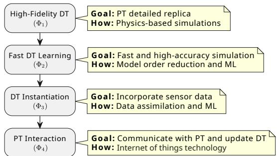  
Fig. 1: Summary of DT engineering phases. FDF [21] and DesCartes Builder [22] focus on the second and third phases of fast DT learning (Φ2) and DT instantiation (Φ3)

(Φ4) PT interaction. The DT instance is continuously updated, creating a closed-loop interaction with the PT. This involves acquiring live sensor data, interacting with the DT, and using the resulting information to control and monitor the corresponding physical system. This last phase is often achieved using internet of things (IoT) technologies.

The outcome of each phase must be thoroughly validated. In (Φ ), the validation consists of comparing the real-time DTP predictions with the high-fidelity simulations from (Φ1). On the other hand, the real-time DTI (Φ ) can be validated with historical data from the actual PT. Note that DT models resulting from (Φ2) and $\left( \Phi _ { 3 } \right)$ are also referred to as surrogate models [12]. While the DT prototype (Φ ) relies on simulations generated ofline, these surrogate models can be evaluated in real-time during online deployment. In addition, these four phases are highly interdependent, often deviating from a linear workflow.

We now illustrate these diferent phases and their interaction on material strain prediction, from the civil engineering domain. This is a typical use case of DTP that provides a predictive maintenance [88] service via structural health monitoring [11]. The goal is to predict the plastic strain of a certain structure (which cannot be measured non-destructively) given an observed deformation, estimated using high-resolution 3D photos [44, 87]. To design a real-time DTP using phases (Φ1) and $\left( \Phi _ { 2 } \right)$ , the following pipeline, illustrated in Fig. 2, could be used:

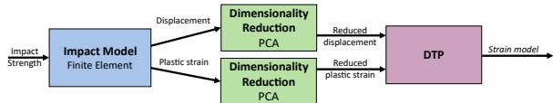  
Fig. 2: Pipeline to design a real-time DT prototype for material strain prediction (extracted from [21])

(Φ1) High-fidelity DT. Use a (slow) finite element model (FEM) of the structure to accurately estimate the plastic strain and the deformation given diferent material parameters (impact strength, material thickness, etc.).

(Φ2) Model order reduction. First, reduce the dimensionality of the deformation and strain meshes using, e.g., principal component analysis (PCA). Then, perform surrogate learning by employing supervised learning and the reduced dataset (from the previous step) to obtain a DTP that predicts the reduced plastic strain from the reduced deformation.

A variety of tools and methods are available to support DT engineering across its four phases. For phase (Φ1), various tools exist, including Abaqus1, Ansys Maxwell2, OpenFOAM3. Likewise, for phase (Φ4), numerous tools exist, such as Eclipse Ditto4, Azure Digital Twins5, and iTwin.js6. However, phases (Φ2) and (Φ3) lack frameworks accounting for the particularities of DT engineering [34].

## 1.1 Contributions

In this paper, we consider phases (Φ2) and (Φ3), as they both use data (either simulation or historical) to create surrogate models. In previous works, we have proposed the Function+Data Flow (FDF) [21], a visual domain-specific language (DSL) to enable the construction of accurate and eficient DTs across diverse application domains using model-order reduction (Φ ), data assimilation (Φ ), or their combination. FDF treats functions as first-class citizens, enabling their explicit and efective manipulation and reuse. This is achieved by using a higher-order dataflow [72, 79, 82]. Unlike a standard data flow, where nodes can only process data, a higher-order data flow allows nodes to accept functions as input and generate functions as output. We also recently introduced its concrete implementation in a tool called DesCartes Builder [22]. By adopting model-driven engineering (MDE) principles [17, 60], which can facilitate DT engineering across phases (Φ2) and (Φ3), FDF and DesCartes Builder aim to render DT engineering more accessible to domain experts.

To assess the degree to which FDF and its implementation in DesCartes Builder facilitate the design of real-time DTPs and DTIs, we conducted an empirical user study, which we report in this paper. The study was conducted as a controlled experiment (workshop) performed in an academic environment and using PhD students and researchers as subjects, and it aims to quantify the usability and adequacy of FDF and DesCartes Builder features. Subjects were asked to implement a solution to the material strain real-time DTP discussed in Fig 2. The results of the user study indicate that DesCartes Builder achieves good levels of usability, as quantified using the standard System Usability Scale (SUS) questionnaire [8]. This is remarkable since the tool is still in an early stage of development. Further data from our study allows us to identify strengths of our current approach as well as key areas for improvement going forward.

The second key contribution of this paper is to propose H-FDF (Hierarchical Function+Data Flow), an extension of FDF supporting iterative pipelines: While FDF only supports strictly acyclic pipelines and is, thus, unable to support the specification of iterative processes, H-FDF addresses this limitation by explicitly defining modules that can be iterated internally. The iteration repeats until an explicitly defined stopping criterion is met, while the pipeline remains globally acyclic to facilitate its analysis and execution.

We illustrate H-FDF on a dual training use case to eficiently learn dynamical systems with a residual learning approach [96].

## 1.2 Paper organization

The organization of this paper is as follows: Section 2 introduces related research, placing FDF and DesCartes Builder in its broader research context. Section 3 provides an overview of our Function+Data Flow DSL. Section 4 recaps FDF’s implementation in the DesCartes Builder tool, illustrating its practical usage in the material strain DTP (Fig. 2). Next, in Section 5 we present our empirical user evaluation, including the methodology, results, and a discussion on their interpretation. Section 6 then presents key limitations of FDF and proposes the H-FDF extension to address them. Finally, Section 7 concludes the paper and identifies future research directions.

## 2 Related Work

The integration of ML into DT workflows leverages several techniques, as we will now discuss.

## 2.1 Multi-domain simulation

Tools such as Simulink7 ofer the flexibility required for multi-domain physics simulation (Φ1), which is essential in several DT applications [53, 59, 90]. For instance, constructing a DT of an electric motor involves modeling both mechanical (e.g, the rotor) and electrical (e.g., magnets) components: Simulink allows these components to be modeled using domainspecific paradigms and co-simulated within a unified data flow framework. Nonetheless, Simulink lacks native support for ML model training and has limited support for interface typing and model reuse [3, 43, 57]. This makes it ill-suited for the integration of physics models with ML (hybrid modeling), an emerging trend in DT engineering [18, 40]. In contrast, FDF [21] and its implementation in DesCartes Builder [22] address these limitations by providing a fully customizable model reduction and instance-specialization pipeline which explicitly incorporates data-modeling aspects.

## 2.2 ML orchestration and DSLs

Scikit-learn [68] and PyTorch [67] are fundamental libraries for executing ML tasks and synthesizing ML models, as often required for fast DT learning (Φ ) and DT instantiation (Φ ). ML workflow (MLOps) tools such as Kedro [1], MLFlow [13], and Metaflow8 leverage these libraries to systematically represent complex pipelines, facilitating experiment tracking, model versioning, and performance monitoring. However, these tools generally focus on generating a single ML model, which remains implicit in the pipeline [55]. Thus, many actions and the resulting ML model itself remain implicit in the tool. Also, the interface is primarily textual with limited built-in functions. Our approach addresses this by providing a dedicated function flow to explicitly represent the combination, manipulation, and reuse of the various models, as necessary in digital twinning.

Another line of research involves defining new DSLs or enhancing existing ones to formalize the ML pipeline and potentially enable code generation [35, 40, 61, 73]. This includes approaches leveraging, e.g., the SysML system engineering framework [73, 94], which can also help to decompose the ML pipeline in hierarchical components. While these works move toward a higher degree of abstraction, they typically maintain the ML models implicitly and lack robust validation features.

FDF, in contrast, introduces implicit typing, which can, transparently to the user, identify misconnections in the pipeline at specification time, ensuring the pipeline is structurally correct. Furthermore, the DesCartes Builder interface allows users to fully design and parametrize the pipeline, execute it, and validate the resulting models. At last, H-FDF enables the hierarchical decomposition of ML pipelines with the further capability of iterating until a suitable model is attained.

## 2.3 Visual workflow environments

Visual workflow environments such as Orange [25], RapidMiner9 provide accessible graphical workflows that can enable domain experts to solve domain-specific problems more efectively [65].

Among these, we find KNIME (Konstanz Information Miner) [4], arguably the closest tool to our work due to its DAG-based pipeline representation and its flexible workflow. However, FDF and its hierarchical extension (H-FDF) difer from KNIME in two main aspects of their design philosophy:

• Typing: While FDF adopts an implicit typing approach to represent the pipeline data and functions uniformly, KNIME adopts an explicit and nominal type system: a detailed comparison is provided in Sect. 3.5.

• Loops: KNIME loops implicitly couple the data flow and the control flow, resulting in a large (and arguably confusing) catalog of nodes. In contrast, H-FDF explicitly distinguishes these flows using hierarchical connections, thus clarifying the execution semantics and simplifying the evolution of the loop iteration strategy (see Sect. 6.6).

## 3 FDF Overview

This section presents the Function+Data Flow (FDF) domain-specific language [21]. FDF specifically targets the demands of the fast DT learning (Φ2) and DT instantiation (Φ3) phases, which require combining multiple co-dependent ML models. To address this, FDF represents functions (ML models) as first-class citizens, allowing them to be passed as inputs, produced as outputs, and reused as required. FDF also defines three primitive boxes (Processor, Coder, and Trainer) that map directly to the key ML tasks in (Φ2) and (Φ ): model reuse, reduced-order modeling, and surrogate modeling.

We now discuss the key FDF concepts. For further details, we refer the reader to [21].

## 3.1 FDF pipeline, graph and ports

An FDF pipeline P is defined as a directed graph $G ( P ) = ( \mathcal { P } , \mathcal { E } )$ , where E models the flow between the ports in P. In contrast to a typical data flow language, which only has a single type of port (representing data), FDF defines two explicit types of ports:

• function ports (depicted in red), which send/receive a learned function, and

• data ports (depicted in black), which send/receive data batches.

Each FDF port p is either an input port or output port, and belongs to a single $F D F$ box $b =$ box(p). E is acyclic. For $p ^ { \prime }$ an input port, there is only one p such that $( p , p ^ { \prime } ) \in \mathcal { E }$ . Further p is an output port, of the same type as $p ^ { \prime }$ (function or data). Lastly, if $\overline { { p } } ^ { \prime }$ is an output port, then $( p , p ^ { \prime } ) \in$ E if $\operatorname { B o x } ( p ) = \operatorname { B o x } ( p ^ { \prime } )$ and $p$ is an input port.

## 3.2 FDF boxes

The boxes correspond to the tasks to be executed. There are three box types: (Processor, Coder, and Trainer) that can be used to specify the ML pipelines for digital twinning:

• Processor is used for data processing tasks, especially calling the functions learned by the other boxes,

• Coder is for unsupervised learning using algorithms such as principal component analysis (PCA), and

• Trainer is for supervised learning using, e.g., a neural network architecture learned with stochastic gradient descent (SGD).

The data and function dependencies are given by gray boxes, namely DataIO and FuncIO. Note that each FDF box is visually represented by a unique geometric shape and color: the Processor adopts a rectangle commonly used in workflow diagrams, the Coder uses a trapezoid commonly associated with dimensionality reduction (e.g., auto-encoders), and the Trainer narrows down to a single point since it outputs only one function. Distinct colors are also assigned to each FDF box, providing redundant visual encoding that can enhance their discriminability [62].

## 3.3 Minimal example

We now describe a minimal FDF pipeline implementing a simple real-time DTP (Φ ), as implemented in DesCartes Builder, in Fig. 310. This pipeline proceeds as follows:

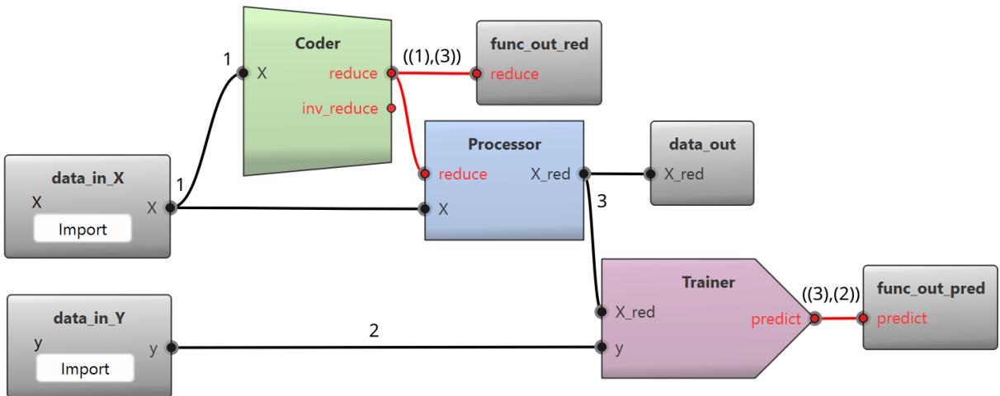  
Fig. 3: Minimal FDF pipeline implemented in DesCartes Builder. The number next to the ports indicates a possible inferred implicit type

1. Data loading. Use two DataIO gray boxes (data\_in\_X and data\_in\_Y) to load X and y.

2. Unsupervised ML. Employ a Coder box to compute a reduced space for the input data X and return its associated reduce function.

3. Data encoding. A Processor box encodes X as X\_red using the reduce function.

4. Supervised ML. Last, a Trainer box learns a predict function that takes X\_red as input and outputs an estimation of y.

The pipeline also exports the functions reduce and predict that can be used to exploit the resulting real-time DTP with new data and to perform PT interaction (Φ4).

## 3.4 Implicit typing

In FDF, the concept of implicit typing is a core mechanism that ensures structural consistency in digital twinning pipelines. By treating functions as first-class citizens, FDF enables automatic inference of implicit types for both data and functions within the pipeline. We now summarize the rationale for implicit typing, and we describe how to infer these types based on the FDF syntax and semantics by forward propagation in the FDF graph. For further details, we refer to the original FDF paper [21].

## 3.4.1 Rationale

Implicit typing endows the FDF pipeline with advantages commonly associated with statically typed languages, e.g., being less prone to errors and easier to maintain [6, 75]. Because the typing is implicit, users do not have to manually define explicit types, which can be laborious [66]. More importantly, explicit typing is often infeasible at design time in the case of DT design, where pipeline functions are learned dynamically. For instance, when applying PCA to obtain a reduced basis that preserves 99% of the original dataset variance, the explicit output type (i.e., number of dimensions) depends on the training data: explicit typing at design time (before the training data has been processed) would not be feasible in this case.

Further, FDF implicit types represent the pipeline semantics (e.g., “the reduced space of dataset X”), akin to structural typing. In this paradigm, a type S is a subtype of T if S provides the structure (i.e., interface) required by T (e.g., required members and functions) [10]. In contrast, nominal typing treats S as a subtype of T only if this relationship is explicitly declared [69].

Note that these two paradigms sit on opposite ends of a typing design spectrum. While languages like Java or C++ are almost purely nominal, others like TypeScript are primarily structural [5]. Meanwhile, languages like Scala and Maude blend these two approaches: Scala, for example, has a nominal core but provides native, optional support for structural types11. In this landscape, FDF is strongly structural, and it eliminates the need for signature or interface declarations. Instead, FDF implicit types are derived solely based on the FDF graph (Sect. 3.1) and the DSL boxes.

## 3.4.2 Type definition

We distinguish two categories of implicit types: data types and function types.

A data type is associated with each data port and represented by a unique identifier, the source data port ID. Formally, for each data port $p ,$ there exists a data port $p ^ { \prime }$ with $\mathrm { T Y P E } ( p ) \ : = \ : p ^ { \prime } .$ A priori, two unrelated data ports have diferent types, though users can specify type equality.

A function type is similarly associated with each function port and defined as a tuple matching the sequence of input data types to the sequence of output data types. Thereby, a function f with k inputs and $k ^ { \prime }$ outputs is assigned the implicit type type(f) = $( ( \mathrm { t y p e _ { 1 } , \dots , t y p e } _ { k } ) , ( \mathrm { t y p e } _ { k + 1 } , \dots , \mathrm { t y p e } _ { k + k ^ { \prime } } ) )$ where $\mathrm { t y p e } _ { i \leq k }$ is the implicit type of the i-th input, and $\mathrm { t y p e } _ { k + i }$ is the implicit type of the i-th output of f for $i \leq k ^ { \prime }$

## 3.4.3 Type inference, propagation and checking

The data types and function types are automatically inferred in FDF based on the box and then forward propagated between ports. This process occurs in three distinct phases, which we summarize in the following (refer to [21] for details).

## Phase I: initialization

Types are established at the pipeline boundary (DataIO and FuncIO boxes). Each output port of these boxes is assigned a unique default type type(i) ← i. For instance, in Fig. 3, X output data port belonging to data\_in\_X DataIO box could be given type ‘1’.

## Phase II: propagation

Types flow along the edges of the graph with every input port $p _ { i n }$ copying the implicit data type from its corresponding output port $p _ { o u t } \colon \mathrm { T Y P E } ( p _ { i n } ) \ $

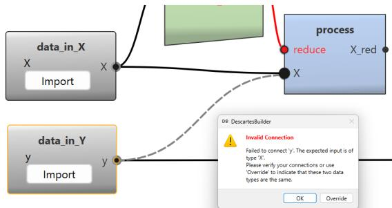  
Fig. 4: Example of FDF’s implicit type warning as implemented in DesCartes Builder when attemping to connect y to the function reduce that expects an inputs with same implicit type as X in the FDF pipeline of Fig. 3

type ${ \mathrm { : } } ( p _ { o u t } )$ . In Fig. $^ { 3 , }$ this means that the input data port X of Coder and Processor would also have type ‘1’.

## Phase III: implicit type inference

The final step computes types for a box’s output ports based on the box class (Coder, Trainer, or Processor):

• For Coder, this consists of creating new “fresh” types for the compressed representations. For instance, in Fig. 3, the type of reduce could be ‘((1), (3))’.

• Given a function f whose type is $\operatorname { T Y P E } ( f ) =$ $( ( \mathrm { t y p e _ { 1 } , \dots , t y p e } _ { k } ) , ( \mathrm { t y p e } _ { k + 1 } , \dots , \mathrm { t y p e } _ { k + k ^ { \prime } } ) )$ a Processor will propagate the data types $\mathrm { t y p e } _ { k + 1 } , \dots , \mathrm { t y p e } _ { k + k ^ { \prime } }$ unless a warning is triggered [21]. In Fig. 3, we thus propagate type ‘3’. A warning would be triggered if, e.g., we attempted to connect y instead of X to the Processor box (Fig. 4).

• A Trainer assigns a function type based on the split of (X, Y ) training data. Hence, in Fig. 3, the function predict could have type ((3), (2)).

## 3.5 Comparison with KNIME

KNIME (Konstanz Information Miner) [4] is a visual workflow for data mining tasks. KNIME is an established tool that has been developed for more than 20 years, with an open-source architecture and good support for adding new nodes via a plug-in system. Similar to FDF, the KNIME pipeline is defined as a directed acyclic graph with a series of interconnected nodes (analogous to FDF’s boxes). However, KNIME and FDF have key diferences in their design philosophy, as we now discuss.

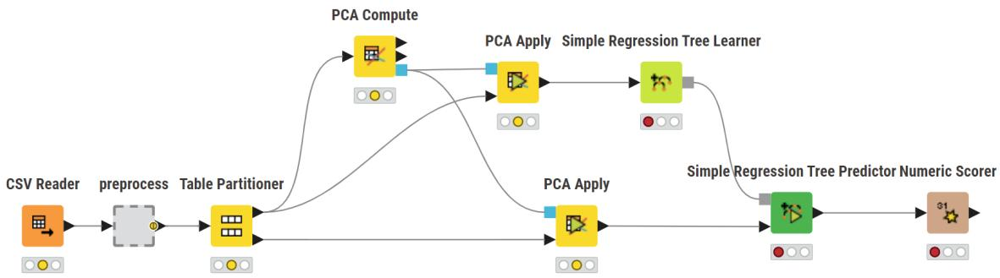  
(a) A KNIME pipeline to learn a decision tree. Observe that, before the pipeline execution, some nodes are marked in red to indicate that they are not yet fully configured. This is because the number of dimensions generated by the “PCA Apply” node is unknown in advance. Hence, the choice of target used by the Learner needs to be postponed until the prior nodes are executed

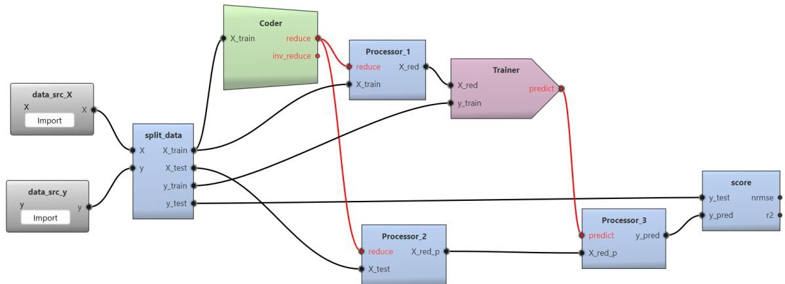  
(b) Equivalent FDF pipeline implemented within DesCartes Builder. All boxes are implicitly typed, and all inputs and outputs are explicitly observed in the FDF graph  
Fig. 5: Comparison of FDF pipeline in DesCartes Builder (top) and equivalent KNIME pipeline (bottom)

The first key distinction is in the pipeline granularity. KNIME provides an extensive repository of generic nodes for data-mining and ML tasks. While flexible, this can increase the user’s cognitive load as the user needs to navigate and choose the adequate node for the task at hand. Conversely, FDF introduces a minimal set of domainspecific boxes (Processor, Coder, Trainer) tailored for DT engineering tasks. This abstraction allows the pipeline to be described with highlevel concepts aligned with user intent rather than low-level details of specific algorithms.

Another key diference concerns typing. KNIME relies on an explicit and nominal type system for its ports. Specifically, KNIME types need to support explicit assignment, as confirmed by inspecting its source code12. In contrast, FDF employs implicit typing (Sect. 3.4), which is analogous to the notion of structural typing [10]. In FDF, this is implemented by using a single and general function type that applies uniformly to all functions and ML models.

Furthermore, ML models in KNIME are encapsulated with custom types such as “Regression Tree Model” for a regression tree or “Neural Network Model” for a neural network.Although some generalization is possible by, for example, representing the models with types derived from the Predictive Model Markup Language (PMML), a tight coupling remains between a model’s internal representation and the nodes that process it. As a result, the platform typically requires a 1:1 correspondence between a specific Learner node and its associated Predictor node (e.g., “PCA Compute” and “PCA Apply” in Fig. 5a).

FDF breaks this coupling (Fig. 5b) by representing these operations through generic components: “PCA Compute” is mapped to a generic Coder box configured with the PCA parameters, while “PCA Apply” is handled by a generic Processor box that takes as input the reduce function computed by Coder.

The main consequence of KNIME’s explicit typing is that swapping ML models can be cumbersome. As shown in the “California housing” [46] regression example (Fig. 5), replacing a “Regression Tree” with a “Neural Network” in KNIME (Fig. 5a13) requires five distinct user actions:

1. Change the Learner from “Regression Tree” to “Neural Network”,

2. Reconnect the Learner to the training data,

3. Redefine the correct “target column” in the Learner node,

4. Replace the “Regression Tree Predictor” node with a “Neural Network Predictor”, and

5. Reconnect the predictor to the test data.

In contrast, in FDF (Fig. 5b14), the algorithm is treated uniformly as a Trainer box parameter, allowing models to be swapped with a single click in the DesCartes Builder implementation.

## 4 The DesCartes Builder Tool

To demonstrate the practical utility of the FDF framework, we developed DesCartes Builder, an open-source tool designed to systematize the engineering of ML-based DT pipelines [22]. The tool provides a visual modeling environment where domain experts (e.g., an engineer responsible for designing a DT for a manufacturing industry) can specify, execute, and validate DT synthesis workflows without deep programming expertise by leveraging FDF (Sect. 3). Key features include:

• Graphical modeling of the DT synthesis pipeline using the FDF boxes,

• Explicit modeling of both data flows and function flows and their interconnections,

• Automatic code generation from FDF specifications,

• Execution of the DT synthesis pipeline, producing data artifacts and learned models,

• Static validation of the DT synthesis pipeline using implicit typing, enabled by FDF’s treatment of functions as first-class citizens, and

• Built-in support for validating synthesized ML models and data artifacts.

DesCartes Builder is released as an open-source software, enabling extensibility and community-driven development [23]. The following sections detail the system architecture (Sect. 4.1) and illustrate the implementation of a real-time DTP (Φ ) within the tool (Sect. 4.2).

## 4.1 Tool’s Architecture

DesCartes Builder is structured into two primary components (Fig. 6): a graphical front end and an execution back end. This ensures a clear separation between the user interface (UI) and the core computational logic. The interaction between these components is mediated by an abstract execution engine, providing a decoupled communication layer.

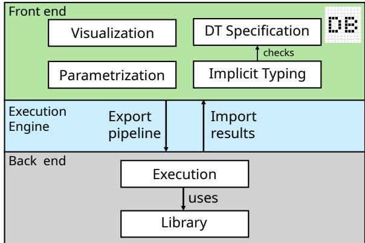  
Fig. 6: Depiction of the DesCartes Builder architecture

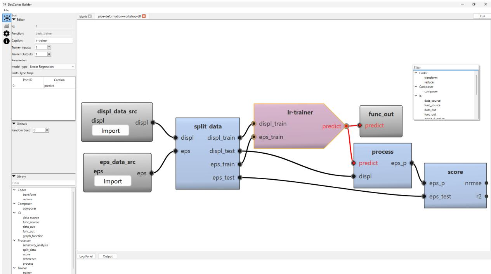  
Fig. 7: DesCartes Builder user interface showing the canvas $\left( C _ { 1 } \right)$ , the library selector $\left( C _ { 2 } \right)$ , and the parameter editor $\left( C _ { 3 } \right)$ . A simplified implementation of the material strain prediction real-time DTP (Fig. 2) is displayed. It uses a split data block to partition displacement (displ) and plastic strain (eps) into training ( train) and test ( test) sets. The Trainer then learns a function predict from (displ train, eps train), which a Processor then applies to displ test to estimate eps p. Last, a score box compares eps p against the test data eps test, outputting metrics such as NMRSE and $R ^ { 2 }$ The function predict is exported to constitute a real-time DTP.

## 4.1.1 Front end: user interface

DesCartes Builder front end ofers a unified interface for the specification, execution, and validation of ML-based DT pipelines. Developed in C++ using the Qt framework and the QtNodes library [70], the UI (Fig. 7) comprises the following core components:

(C1) a central canvas for modeling DT pipelines using FDF, allowing users to create boxes and to interconnect their ports through dragand-drop. Function and data connections are depicted in red and black, respectively, for clear diferentiation.

(C2) a library selector (canvas pop-up and left pane) for inserting FDF boxes,

(C3) a parameter editor (left pane) for modifying the parameters of FDF boxes (e.g., adjusting the data encoding learned by the Coder).

(C4) A Run button (top-right) for triggering the pipeline synthesis.

(C5) A Log Panel and Output panel (bottom) for displaying execution traces.

(C6) A chart viewer ( ) for visualizing the results of pipeline execution using charts and validation metrics visible by selecting appropriate boxes (e.g., score Processor).

The pipeline synthesis begins by mapping the graphical FDF model into a back-end configuration. The execution engine then orchestrates the execution of the back-end, training, and validating ML models as needed. Upon completion, it collects the results, presenting them both in the Output panel and in the chart viewer.

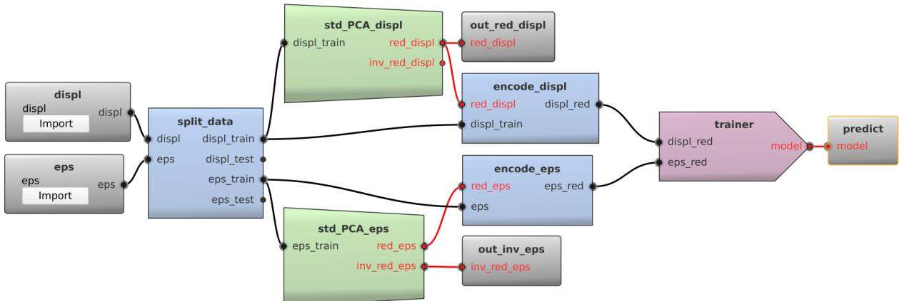  
Fig. 8: Implementation of the material strain reduced-order model (ROM). It uses two Coder boxes to learn the dimensionality reduction basis, two Processors to obtain the reduced displacement (displ red) and reduced strain (eps red), and a Trainer to learn a surrogate model from displ red to eps red. Evaluation is performed using a score and a sensitivity analysis Processor box (adapted from [22])

## 4.1.2 Back end: execution engine

The back end, implemented in Python as a Kedro [1] plugin, has two main responsibilities:

1. Pipeline orchestration: Loads the input data, determines the execution order and dependencies within the FDF graph (Sect. 3.1) and saves the outputs as required.

2. Library implementation: Provides the concrete logic for FDF boxes, which was implemented leveraging established ML libraries such as Scikit-learn [68] and PyTorch [67].

## 4.2 Real-time DT prototype for material strain prediction

We now showcase the application of DesCartes Builder to model and validate a real-time DTP for material strain prediction (Fig. 2). Recall that the goal is to predict a structure’s plastic strain from an observed deformation [11].

## 4.2.1 Modeling

As discussed in Sect. 1, to design this DTP, we first need a high-fidelity DT (Φ1) of the system under consideration, which we obtained with the assistance of a collaborator. However, since each simulation requires around one hour of runtime, they are impractical for a real-time DTP. Consequently, we adopted a design of experiments (DoE) strategy to systematically generate a representative dataset of the material’s behavior.

Using the DoE data, we developed a reduced-order model (ROM) of the structure in DesCartes Builder that correlates the deformation (displ) and the material plastic strain (eps). The synthesis pipeline, illustrated in Fig. 815, takes two data inputs and produces three function outputs. The inputs are: (1) displ, the structure’s observed displacement, and (2) eps, the associated plastic strain. Both displ and eps have 276 samples and 2835 features. The outputs are: (1) model, the resulting surrogate model, (2) red\_displ to encode (reduce) the displacement into a reduced basis (required as input to the surrogate model), and (3) inv\_red\_eps to decode the output from the surrogate into the full-dimensional physical space.

We then implement the DTP in DesCartes Builder as follows:

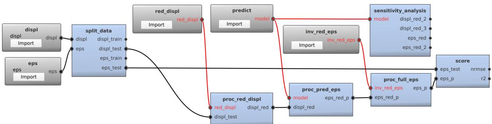  
Fig. 9: Testing pipeline for the material strain ROM

1. Data loading and train/test split: The input displ and eps are loaded using a DataIO box, and a split\_data Processor splits displ and eps between train and test sets.

2. Learn reduced basis: Two Coder boxes (std\_PCA\_displ and std\_PCA\_eps) are used to learn from the training data the encoding (red\_displ and red\_eps) and decoding (inv\_red\_displ and inv\_red\_eps) to/from the reduced basis using PCA for each input. The Coder box is parametrized to use standardization followed by PCA such that 99.9% of the original variance is maintained in the reduced basis.

3. Data reduction: To obtain the reduced data, two Processor boxes (encode\_displ and encode\_eps) encode the full-dimensional data with the learned encodings (red\_displ and red\_eps), resulting in displ\_red and eps\_red, the reduced displacement and plastic strain. Hence, we reduce the dimensionality of the deformation and strain meshes from 2835 dimensions to ≈ 10 dimensions.

4. Surrogate learning: A Trainer learns the surrogate model to estimate eps\_red from displ\_red. It is parametrized to learn a neural network of 2 layers with 50 nodes each, using the Adam optimizer, with a learning rate of 0.001, and for 1000 iterations. The resulting model is outputted.

Note that DesCartes Builder facilitates the modeling of this pipeline in three ways. First, it allows describing visually the data flow necessary to learn a function. Second, it enables the easy export of functions using the gray output boxes (out\_red\_displ, out\_inv\_eps, predict). Third, it supports FDF’s implicit typing, which can prevent user mistakes by identifying misconnections at specification time (Sect. 3.4). For example, it can prevent users from feeding displ instead of the expected eps to the encode\_eps Processor.

## 4.2.2 Validation and exploitation

Once the diferent functions are learned, the DTP can then determine the plastic strain from, e.g., actual 3D images of a deformation. We can describe the exploitation pipeline in FDF and implement it in DesCartes Builder using a series of Processor boxes that leverage the learned functions. We illustrate the process by demonstrating the pipeline on the test set. The testing pipeline (Fig. 916) proceeds as follows:

1. Data loading: Load the displ and eps data and obtain the test data using a split\_data box.

2. Generate predictions: Apply the encoder red\_displ to obtain the reduced displacement displ\_red. The resulting displ\_red can be used as input to the strain model predict, resulting in a reduced eps\_red\_p. Then, we decode eps\_red\_p using inv\_red\_eps into a full dimensionality strain map eps\_p.

3. Scoring: We perform the standard ML scoring using a score Processor which computes NMRSE and $R ^ { 2 }$ between eps\_red and eps\_red\_p. It also generates, among others, a plot of actual vs. predicted values (Fig. 10a).

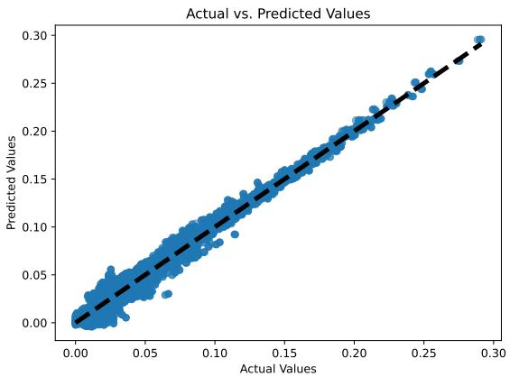  
(a) Actual vs. predicted values plot

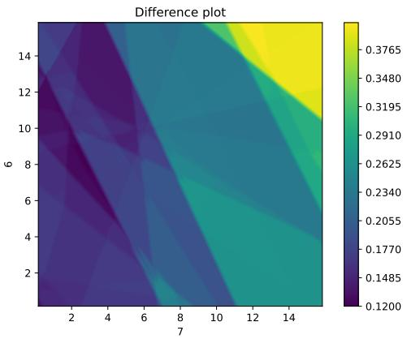  
(b) Sensitivity analysis plot  
Fig. 10: Validation results for the material strain prediction use case

4. Model analysis: Since functions in FDF are first-class citizens, we can also specify an algorithm whose input is a function. For instance, DesCartes Builder supports a sensitivity\_analysis Processor (Appendix B) that can be used to analyze the ML surrogate model. This box finds two ε-close displacements (displ\_red\_s1, displ\_red\_s2) resulting in two plastic strains (eps\_red\_s1 and eps\_red\_s2) which are significantly diferent. It also produces a diagram (Fig. 10b) to visualize the gradient over sensitive dimensions, for validation purposes. In this plot, the X-Y axis (7/6) indicates the input features of disp used for sensitivity analysis, and the heatmap indicates the diference for a chosen eps output feature (0 in this case).

Executing this pipeline in DesCartes Builder yields an ML surrogate for model order reduction with good performance $( R ^ { 2 }$ score of 0.8). As shown in Fig. 10a, predicted values align closely with the ground truth along the ideal $4 5 ^ { \circ }$ dashed line. However, localized data scarcity persists, as indicated by the higher residuals in the upper-right corner of Fig. 10b. This could be addressed, e.g., by improving the DoE strategy. Last, we can also export the results from score, sensitivity\_analysis, and eps\_pred for expert review.

Note that the complexity of this pipeline is justified by its accuracy. Indeed, a simplified alternative (Fig. 7) utilizing the same training set achieves an $R ^ { 2 }$ score of only 0.5, representing a 150% increase in unexplained variance.

## 5 Empirical Study on FDF and DesCartes Builder

To evaluate the eficacy of the Function+Data Flow (FDF) framework and its associated modeling environment, DesCartes Builder, we conducted a controlled user study [24]. The primary objective was to assess whether the proposed methodology facilitates the development of Digital Twins (DTs) for our target users, e.g., domain experts responsible for designing a DT for a manufacturing industry. Our evaluation is guided by two research questions (RQs):

(RQ1) Usability: To what extent do users perceive DesCartes Builder as a usable for modeling a ML-based DT?

(RQ2) Feature adequacy: Do users perceive DesCartes Builder’s current features as adequate for the DT modeling tasks encountered in this study? Which features are perceived as most and least efective by users?

## 5.1 Study protocol

The user study was conducted at NTU and CNRS@CREATE in Singapore, supervised by the first and second authors. Participants were recruited via internal mailing lists and provided informed consent (Appendix A.1) per ethical standards for empirical software engineering [80]. The research procedure was approved by the NTU Institutional Review Board (IRB-2025-1097).

The study was structured as two workshops in February 2026, each lasting approximately two hours and organized into three phases:

1. Tutorial (≈ 30 min): Participants were introduced to DesCartes Builder via a guided walkthrough using the material strain prediction use case (Fig. 2). They implemented a baseline linear regression pipeline $\left( { \mathrm { F i g . ~ } } 7 ^ { 1 7 } \right)$ which achieves an intentionally low $R ^ { 2 } ~ ( 0 . 5 )$ leaving room for experimentation.

2. Independent exploration (≈ 60 min): Participants were tasked with exploring the tool to improve the baseline pipeline independently. They were encouraged to leverage the diferent features of the tool, e.g., changing the Trainer algorithm or adding Coder boxes for data compression.

3. Evaluation (≈ 30 min): Participants completed a structured survey (Appendix A.2) comprising:

(a) demographic and background information;

(b) a system usability scale (SUS) questionnaire [8] to assess usability (RQ1);

(c) feature-specific usability ratings on a five-point Likert scale (1: Very demanding, 5: Very intuitive) to assess feature adequacy (RQ2).

(d) open-ended qualitative feedback regarding usability barriers and suggestions.

## 5.2 Evaluation instruments

To quantify DesCartes Builder’s usabil-$i t y \left( R Q _ { 1 } \right)$ , we employed the system usability scale (SUS) [8]. SUS is a robust, industry-standard metric in usability research, applied across diverse domains [7, 29, 91], including other MDE tools (e.g., Extremo [63]). It consists of 10 items rated on a five-point Likert scale with alternating positive and negative statements to mitigate response bias. Final scores are normalized to a scale ranging from 0 (the worst imaginable) to 100 (the best imaginable). For this study, the SUS phrasing was adapted to explicitly reference DesCartes Builder, while preserving the standardized scoring procedure. We also associate a short label to each item, which we will refer to subsequently, available in Table 1. The complete version can be found in Table A1.

Table 1: Questionnaire for DesCartes Builder usability (based on the SUS questionnaire [8])
<table><tr><td>ID</td><td>Short label (positive only)</td></tr><tr><td> $Q _ { 1 }$ </td><td>Intended frequency of use</td></tr><tr><td> $Q _ { 2 }$ </td><td>System simplicity</td></tr><tr><td> $Q _ { 3 }$ </td><td>Ease of use</td></tr><tr><td> $Q _ { 4 }$ </td><td>User independence</td></tr><tr><td> $Q _ { 5 }$ </td><td>Functions well integrated</td></tr><tr><td> $Q _ { 6 }$ </td><td>Design consistency</td></tr><tr><td> $Q _ { 7 }$ </td><td>Learnability</td></tr><tr><td> $Q _ { 8 }$ </td><td>Navigation smoothness</td></tr><tr><td> $Q _ { 9 }$ </td><td>User confidence</td></tr><tr><td> $Q _ { 1 0 }$ </td><td>Low learning effort</td></tr></table>

To assess the perceived adequacy $( R Q _ { 2 } )$ , we utilized a dedicated questionnaire where participants rated key interface components on a fivepoint scale (1: Very Demanding, 5: Very Intuitive). Specifically, we evaluated:

• pipeline modelization using FDF concepts on the DesCartes Builder canvas $( C _ { 1 } )$ ，

• box parametrization via the parameter editor $\left( C _ { 3 } \right)$ ,

• result visualization in the integrated chart viewer $( C _ { 6 } )$ 2

• warning $u t i l i t y ,$ specifically the interpretation of feedback messages $\left( \mathrm { e . g . , F i g . ~ 4 } \right)$

We also analyzed the open-ended qualitative responses and identified recurring themes such as positive mentions, usability barriers, and improvement suggestions.

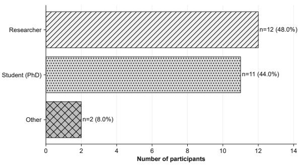  
(a) Breakdown of study participants by their role

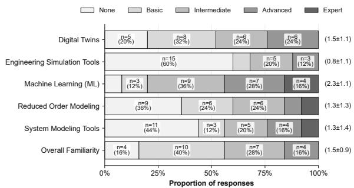  
(b) Familiarity with key concepts and tools related to DesCartes Builder

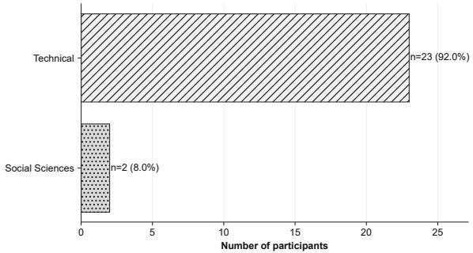  
(c) Primary area of expertise of study participants  
Fig. 11: Participant demographics in the DesCartes Builder user study

## 5.3 Participant Profiles

A total of 26 participants were recruited across the two sessions, $S _ { 1 } ~ - ~ S _ { 2 6 }$ . Following standard data quality screening, the participant $S _ { 1 4 }$ was excluded for extreme response speeding and invariant response (straight-lining) [50], resulting in a final sample of N = 25. As shown in Fig. 11a, the final cohort primarily consisted of researchers (48.0%, n = 12) and PhD students (44%, n = 11), with the remaining 8.0% (n = 2) having other roles.

We assessed prior expertise across five domains central to the FDF framework (Fig. 11b). Participants were most familiar with ML $( 2 . 3 \pm 1 . 1 ) $ and least with engineering simulation tools (0.8 ± 1.1). Intermediate familiarity was reported for digital twins, reduced-order modeling, and system modeling tools. To characterize the cohort’s background, we calculated an overall familiarity score as the per-respondent mean across all categories, mapped to the nearest integer on a 0 (None) to 4 (Expert) scale.

We also surveyed participants on their primary area of expertise (Fig. 11c). Most participants (92.0%, n = 23) declared that their expertise is in a technical field (AI/ML, systems engineering, among others), while the remaining 8.0% (n = 2) have expertise in social sciences.

## 5.4 Results

This section reports the results of our user study, focusing on the evaluation of our two research questions (RQs).

## 5.4.1 (RQ ) Perceived usability of DesCartes Builder and FDF

Our analysis indicates that DesCartes Builder achieves a good usability rating [2]. As illustrated in Fig. 12, the median SUS score is 72.5, while the mean SUS score is $6 8 . 9 \pm 1 5 . 2$ (95% CI: [62.6, 75.2]; range: $3 7 . 5 \ \textrm { -- } \ 9 5 )$ . The median exceeding the mean indicates a generally favorable experience, with the mean skewed by a few low-scoring outliers whose low familiarity scores placed them outside our primary target audience. Notably, only 16% of participants rated the tool below the “unacceptable” threshold of 50 [2].

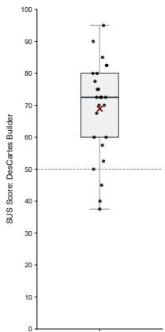  
Fig. 12: Box plot with the normalized SUS score (0 - 100 scale, higher = better). Black line: median (72.5); dark red cross (×): mean score (68.9); dashed line: unnaceptable score (50)

The statistical approach was validated by a Shapiro-Wilk test, which shows that the data do not significantly deviate from a normal distribution: $W \ : = \ : 0 . 9 5 , p \ : = \ : 0 . 2 9 .$ , where $W ~ = ~ 1$ represents a perfect normal distribution. Consequently, the 95% CI (confidence interval) reported was obtained using a T-test.

## Comparative context

Table 2: Mean SUS Scores for selected tools
<table><tr><td>Tool</td><td>SUS Score</td><td>Reference</td></tr><tr><td>Simulink</td><td>76.4</td><td>[29]</td></tr><tr><td>UPPAAL</td><td>61.7</td><td>[29]</td></tr><tr><td>Excel</td><td>56.5</td><td>[48]</td></tr><tr><td>EXTREMO</td><td>70.0</td><td>[63]</td></tr><tr><td>DESCARTES BUILDER</td><td>68.9</td><td>[21, 22]</td></tr></table>

To contextualize these findings, Table 2 compares DesCartes Builder’s mean SUS score against established tools. We report mean scores only, as median scores are not always provided for other tools. Despite being a specialized research prototype at an early stage of development, DesCartes Builder’s score (68.9) exceeds that of some mature tools like Excel (56.5) and UPPAAL (61.67).

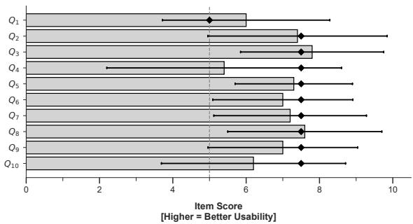  
Fig. 13: Normalized SUS item scores (0-10 scale, higher = better). Error bars: standard deviation; diamonds: medians; dashed line: unacceptable score (5.0)

## Item-level analysis

An item-level analysis of the SUS scores (Fig. 13) reveals that, while all items remain acceptable $( > ~ 5 . 0 )$ , questions $Q _ { 1 }$ (Intended frequency of use), $Q _ { 4 }$ (User independence), and $Q _ { 1 0 }$ (Low learning efort) emerged as the primary factors lowering the overall score. Notably, $Q _ { 4 }$ and $Q _ { 1 0 }$ constitute learnable SUS sub-score [51], which for DesCartes Builder stands at 58.0, significantly lower than its global mean 68.9. This suggests that some participants faced a steep learning curve.

## Impact of technical familiarity

Table 3: SUS scores for subgroups
<table><tr><td>Group (n)</td><td>Mean (SD)</td><td>95% CI</td></tr><tr><td>Technical (15)</td><td>72.8 (12.1)</td><td>[66.1, 79.5]</td></tr><tr><td>Low-technical (10)</td><td>63.0 (17.9)</td><td>[50.2, 75.8]</td></tr><tr><td>Total (25)</td><td>68.9 (15.2)</td><td>[62.6, 75.2]</td></tr></table>

Note: Welch’s t(14.4) = 1.52, p = 0.15, d = 0.67.

To evaluate the impact of technical familiarity (Fig. 11b), we conducted an exploratory sensitivity analysis (Table 3). By excluding the low-technical subgroup $( n ~ = ~ 1 0$ , bottom quartile of overall familiarity), the mean SUS score for the remaining technical participants (n = 15) increased to 72.8±12.1 (95% CI: [66.1, 79.5]). The moderate efect size (Cohen’s d = 0.67) suggests that DesCartes Builder is most efective for its intended audience of domain experts, whereas very low technical proficiency can present diferent barriers to adoption.

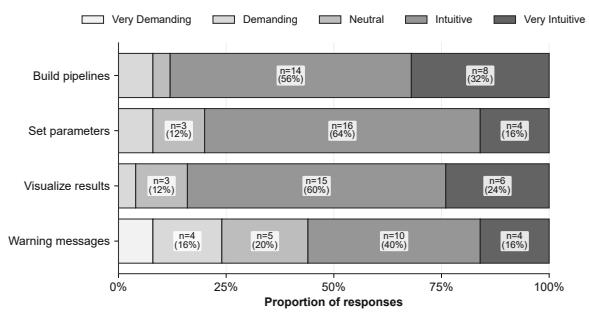  
Fig. 14: Participant feedback on specific DesCartes Builder features

## 5.4.2 (RQ2) Feature adequacy of DesCartes Builder and FDF

Feature-specific ratings were uniformly positive for DesCartes Builder (Fig. 14): 89% of participants rated the canvas $( C _ { 1 } )$ intuitive or very intuitive; 81% found parameter setting with the parameter editor $\left( C _ { 3 } \right)$ straightforward, and 85% were satisfied with the results visualization using the chart viewer $( C _ { 6 } )$ . The overall mean feature rating was $3 . 9 \pm 0 . 6$ on a 5-point scale (95% CI: [3.0, 4.1]). Normality was verified with a Shapiro-Wilk test $( W = 0 . 9 3 , p = 0 . 0 7 )$ , justifying the use of a T-test for the confidence interval.

However, feedback regarding the warning messages was more polarized; only 57% of participants considered the warning messages to be “friendly”.

## 5.5 Discussion

We now present some points of discussion based on the results from Sect. 5.4: an analysis of lowscoring participants, key positive feedback, areas where there is room for improvement, and a discussion on the validity of our results.

## 5.5.1 Analysis on low-scoring participants

As shown in Fig. 12, only 4 participants (16%) reported low usability (SUS≤ 50).

Two of these outliers $( S _ { 2 0 } , \ S \mathrm { U S = 3 7 . 5 ; ~ } S _ { 2 2 } .$ SUS=40.0) were those with primary expertise in social sciences (Fig. 11c). This indicates that DesCartes Builder’s reliance on technical abstractions (e.g., block diagrams) may impose a significant cognitive load on them [98]. Qualitative feedback supports this interpretation: $S _ { 2 0 }$ states challenges to decide “where to click” and $S _ { 2 2 }$ explicitly mentioned a need for “technical guidance”. To mitigate this, future versions should include optional tutorials: technical users shall have the option to quickly skip it since the extra guidance can be counterproductive for them [45].

The other two outliers $( S _ { 1 0 }$ and $S _ { 2 4 } )$ appear to experience a “paradigm clash”. $S _ { 2 4 } .$ , an ML expert, noted that the “modelling logic difers from ’traditional’ approaches” and requested “more flexibility”, suggesting that the FDF paradigm may feel restrictive to users accustomed to codebased, imperative workflows. This aligns with known MDE trade-ofs where increased abstraction can lead to a loss of granular control among experts [93]. Crucially, the FDF framework is inherently flexible, permitting arbitrary logic within its boxes. This restriction is therefore specific to the current DesCartes Builder implementation. To address this, future versions of DesCartes Builder will allow users to define and extend FDF boxes with custom code, similarly to, e.g., KNIME’s Python Script node18. On the other hand, $S _ { 1 0 }$ noted that the “connection between blocks” was confusing and suggested “combining Trainer and Processor ” boxes to reduce complexity. Note we had previously identified this requirement, and its support is included as the Module box in the extension proposed in Sect. 6.

## 5.5.2 Positive feedback

We observe that users highly valued DesCartes Builder’s visual and intuitive graph interface. For example, $S _ { 1 }$ highlighted that the “plug-andplay blocks” make the system easier to use, and $S _ { 8 }$ appreciated that there is “no need to write code”.

The FDF modeling paradigm was also wellreceived, though feedback suggests a slight initial learning curve. For instance, a participant noted that “the modeling part was good,” adding that “once you understand the red line is a function flow, it also feels very intuitive”. This learning curve may be influenced by a user’s background; those familiar with Model-Driven Engineering (MDE) tools appeared to adapt more quickly. Supporting this, another participant explicitly observed that the interface “felt similar to using Simulink.”

Finally, participants valued DesCartes Builder as an integrated platform. A user praised it for having “one platform for various supervised ML algorithms”, a feature that directly enables rapid experimentation. As another participant stated, this enables users to “change the model quickly and run the experiments” without switching contexts.

The workshop also indicates that the tool already has a high degree of cross-platform stability. All users were able to install the tool on their own machine (macOS, Linux, or Windows) using the provided installers and guidance. This indicates that DesCartes Builder already achieves a very good level of quality and technical maturity in its first release.

## 5.5.3 Key areas for improvement

The survey also provides insight into two main types of challenges that users have faced in DesCartes Builder: lack of tooltips and builtin documentation, and need for further diagnostics and runtime inspections.

## Tooltips and built-in documentation

The SUS item analysis (Fig. 13) and the learnable SUS sub-score [51] of 58.0, significantly lower than the global mean at 68.9, suggest an initial adoption barrier due to a steep learning curve for some users. Qualitative feedback confirms that documentation is an important challenge, particularly as the tool introduces unfamiliar concepts, with 36% of users providing documentation-related feedback19. For instance, participants identified a “lack of understanding [of] the role of diferent modules” and recommended “pop-up tutorials”, or “tooltips for the diferent components”.

We conclude that users expect built-in guidance in the tool (e.g., tooltips, dedicated onboarding) as per what is now an established practice in the industry [38, 41]. This is a key direction we aim to improve DesCartes Builder in future releases to turn it from a high-quality research prototype into a production-ready tool.

## Diagnostics and runtime inspection

While the tool’s core modeling features achieved high satisfaction, the polarized feedback on warning messages (57% “friendly”) indicates that this is a key area for improvement in the tool. These findings are corroborated by the qualitative feedback, with 24% of users providing diagnosticsrelated feedback20.

Participants would like to move beyond final results by, e.g., “inspecting data flowing through the pipeline” and viewing metadata like “dimensions or data types.” Participants also stated that they encountered errors or warnings where they “don’t know what the causes are” and suggested that the tool should provide specific “suggestions to resolve” detected issues. We view these requests as a positive sign of user engagement, suggesting that participants would like to move to more sophisticated debugging and optimization. Thus, we will similarly consider this a high-priority improvement for DesCartes Builder.

## 5.6 Discussion on validity

We now discuss internal validity and external validity of our study, based on [95].

Internal validity. Supervision of the workshop by the study authors could have encouraged more favorable feedback. To mitigate this, we explicitly emphasized anonymity and the importance of critical feedback [81]. Our discussion and qualitative feedback highlight that users provided important and constructive feedback on the challenges they faced and did not hesitate to identify shortcomings in the tool. We therefore believe this threat was adequately mitigated.

External validity. While the cohort included students, we believe that their background in ML and engineering makes them suitable proxies for early-career practitioners in the DT domain [28, 76]. Additionally, all our students were at the PhD level, representing more advanced technical expertise. We also mitigated this threat by including researchers who have deeper technical expertise that may more closely represent the domain experts targeted by the tool. Regarding task scope, the two-hour session may have limited participants to simpler scenarios, excluding complex, multi-domain DT pipelines and long-term maintainability. Nevertheless, this duration is consistent with (and exceeds) the one-hour sessions common in usability studies [78], and was deliberately chosen to accommodate the added complexity of DesCartes Builder while balancing participant fatigue and task representativeness.

## 6 The H-FDF extension

The original FDF has two main limitations. First, its strictly acyclic architecture cannot represent iterative processes unless hard-coded inside a function, which contradicts the modular philosophy of a DSL approach. Second, FDF provides no native support for subcomponents (or modules). Although this does not limit FDF’s expressive power, it makes composing or reusing the same construct tedious. Our user study (Sect. 5) evidenced this. Participant $( S _ { 1 0 } )$ suggested combining the Trainer and associated Processor box to “reduce the complexity in designing the pipelines”, which is easily implemented with a module.

We address both limitations by explicitly defining a module construct. This enables compositional specification [27] and creates a hierarchical pipeline: higher-level modules can call lower-level ones (but not the other way around, keeping the workflow strictly unidirectional). Crucially, while our modules can be locally (internally) inductive, the pipeline remains globally acyclic when called externally. This difers from KNIME, where iterations are defined with special loopstart/loop-end nodes (globally, KNIME pipelines are also acyclic). Further, while modules exist in KNIME (called components or metanodes), they are always non-inductive.

Our proposal introduces a unique type of iterative modules that handles the variability of what to iterate on, specifically the stopping criterion and the data or functions to refine iteratively. This is achieved through explicit flows between outputs and inputs of the module (in the module definition, not at the higher-level when calling the module). This is possible because, at design time, types are implicit (Sect. 3.4) and need to be resolved only at runtime. We call this extension Hierarchical Function+Data Flow (H-FDF).

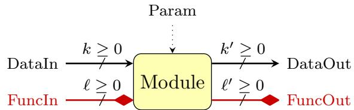  
Fig. 15: Visual syntax for the Module box. The Module box encapsulates a subpipeline executed upon its invocation from a higher-level Module

## 6.1 Extended FDF

Before we define the full H-FDF, we start by describing the syntax and semantics of Extended FDF (E-FDF), which executes one subpipeline, possibly iteratively.

On top of FDF, E-FDF defines a fourth box class, namely Module, in addition to the three box classes from standard FDF (Processor, Coder, and Trainer). The Module box is depicted as a rounded, pale-yellow rectangle (Fig. 15). It has $k \geq 0$ input data ports to receive data to be processed and $\ell \geq 0$ input function ports to receive functions used in the hierarchical pipeline. It returns $k ^ { \prime } \ge 0$ output data ports produced by the subpipeline and $\ell ^ { \prime } \geq 0$ output function port functions produced/refined. Importantly, in E-FDF, each Module encapsulates a (possibly iterative) subpipeline executed internally (see Sect. 6.2).

In addition, E-FDF supports function initialization in Trainer and Coder boxes. While in FDF, the Trainer and Coder boxes have zero input function ports, in E-FDF we allow zero or one input function ports. If a function is provided, it serves to initialize the model in these boxes, rather than standard random initialization in FDF. This is crucial for iterative function learning.

## 6.1.1 Formal E-FDF syntax

We define the E-FDF syntax by extending the FDF syntax [21] with a Module box class and support for iterations. Formally, an E-FDF pipeline, denoted $P ,$ is the tuple:

$$
P = ( \boldsymbol { B ^ { \prime } } , \mathrm { { B o x c L A s s } } , \mathcal { P } , \mathrm { { P O R T C L A S S } } , \mathrm { { B O X , S R C } } ,
$$

where brackets [·] indicate new optional elements: if none of these optional elements are present, E-FDF reduces to the original FDF. In addition, E-FDF extends the mappings boxclass and param as required: boxclass includes the Module box, and param supports a Boolean expression that specifies the iteration stop condition. The remaining mandatory elements are defined identically to FDF [21]:

• Let $B ~ = ~ \{ b _ { 1 } , \cdot \cdot \cdot , b _ { n } \}$ be the set of userdefined boxes. We denote $\begin{array} { r l r } { B ^ { \prime } } & { { } = } & { B } \end{array}$ ⊔ {DataIO, FuncIO}, including the pipeline data and function dependencies.

• boxclass $: \quad \beta \quad $ {Processor, Coder, Trainer, Module} defines the class of each box.

$\mathcal { P } = \mathcal { P } ^ { I } \sqcup \mathcal { P } ^ { O } = \{ 1 , \cdots , m \}$ is the ordered set of natural numbers up to m, the number of ports. This set is partitioned into the sets of input ports $\mathcal { P } ^ { I }$ and the set of output ports $\mathcal { P } ^ { O }$

• portclass : P → {Data, Function} provides the class (Data or Function) of each port.

• box : $: { \mathcal { P } }  B ^ { \prime }$ is a function associating each port with the box it belongs to.

• src $: ~ { \mathcal { P } } ^ { I } ~ \to ~ { \mathcal { P } } ^ { O }$ is a function mapping every input port to its corresponding source output port (i.e., the one providing its data/- function). src is such that an input port p and the output port it is connected to have the same class: $\forall p \in \mathcal { P } ^ { I }$ , portclass(p) = portclass(src(p)).

• param : B → BoolExpr ∪ L ∪ $\mathbb { N } \times \mathcal { L }$ provides the parameters of each box. L is a library of predefined functions, N denotes the number of X input to Trainer and BoolExpr is the set of Boolean expressions $( \mathrm { e . g . } , a > 0 )$

The optional elements [topin, topout, stop, feedback] are defined as:

• topin, topout $\geq 1$ define the boundary ports of the pipeline. The first topin ports are the top-level inputs for this pipeline, such that for each port $1 \leq p \leq t o p i n$ , we have $\boldsymbol { p } \in \mathcal { P } ^ { O }$ Similarly, the last topout ports are the toplevel outputs for this pipeline, such that for each port $m - t o p o u t + 1 \leq p \leq m$ , we have p ∈ PI. The port p has box(p) = DataIO if portclass(p) = Data and box(p) = FuncIO if portclass(p) = Function.

• stop is a Processor box with a unique input and a Boolean stopping condition, provided as a parameter. The iteration stops whenever the unique input satisfies the Boolean condition. If there is no stop box, the condition is considered true, and the Module stops after a single iteration.

• feedback $\therefore \{ m - t o p o u t + 1 , \ldots , m \} \nrightarrow$ $\{ 1 , \ldots , t o p i n \}$ is a partial function associating some of the top-level output ports with some top-level input ports, specifying which data/function are iterated over. feedback is such that the topout ports in the domain of feedback are associated with topin ports sharing the same class: ∀p ∈ dom(feedback), portclass $\left( p \right) =$ portclass(feedback(p)). The ports listed in feedback are said to be recursive ports and are depicted as a square (■) in the Module boundary, while the remaining ports are depicted as a circle (•).

An E-FDF pipeline is said to be non-inductive when the optional elements stop and feedback are omitted, resulting in a single iteration. When included, the pipeline is inductive, supporting recurrent data and function flows (defined by feedback) and iterating until a stopping condition specified with the stop Processor box.

## 6.1.2 E-FDF semantics

The E-FDF semantics extends the FDF semantics, defining how a Module box is executed. Running a Module box with k input data port, ℓ input function port, $k ^ { \prime }$ output data port and ℓ′ output function port proceeds as follows:

1. Initialization: Load the internal data and functions from the DataIO and FuncIO ports, and load the top-level inputs $( 1 \leq p \leq t o p i n )$

2. Execution: Run the E-FDF pipeline as per the partial order of the E-FDF graph, which is defined as the FDF graph (Sect. 3.1). The feedback edges are not considered, the graph remaining acyclic. Module boxes execute as fixed functions on their inputs until they provide their outputs.

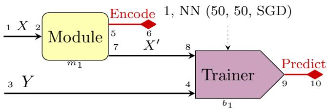  
(a) Topmost subpipeline $P _ { 1 }$ with a Module box $M _ { 1 }$

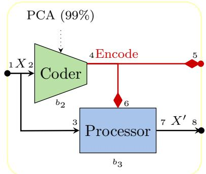  
(b) Non-inductive subpipeline $P _ { 2 } = \mathrm { { H I E R } } ( M _ { 1 } )$  
Fig. 16: Example of a H-FDF pipeline P1, P2, hier

3. Stop condition: Evaluate the condition $c o n d = \mathrm { P A R A M } ( s t o p )$ on the unique input of the box stop:

• Termination: If cond is true, the workflow stops: the DataIO and FuncIO input ports provide their final values to the top-level outputs $( m - t o p o u t + 1 \leq p \leq$ m).

• Iteration: If cond is false, the top-level inputs are updated for the next iteration: all ports $1 \le p \le$ topin such that $p ^ { \prime } \geq$ $m - t o p o u t + 1$ with feedback $\left( p ^ { \prime } \right) = p$ are loaded from $p ^ { \prime }$ . All other ports retain their values from the previous iteration and the pipeline repeats from Step 2.

## 6.1.3 E-FDF implicit typing

E-FDF implicit typing follows FDF’s implicit typing. Module boxes are considered as fixed functions in E-FDF. Hence, the user (here H-FDF, see Section 6.4) provides an implicit typing scheme defining how each output is related to the inputs of the box, or whether an output is a fresh type.

We now turn to H-FDF.

## 6.2 Syntax of H-FDF

A hierarchical FDF (H-FDF) pipeline is formally defined as a finite sequence P of $n _ { P }$ subpipelines together with a mapping hier, where:

$\mathbf { P } = P _ { 1 } , \ldots , P _ { n _ { P } } ,$

• each subpipeline $P _ { i }$ is an E-FDF pipeline,

$P _ { 1 } { \mathrm { . } }$ , called the topmost pipeline, does not feature topin, topout, stop, feedback,

$P _ { n _ { P } }$ has no Module box and is non-inductive,

• hier associates each Module box of each $P _ { i }$ with a subpipeline $P _ { j > i }$ . It is required that the number of input and output ports of each Module M matches the number of topin and topout ports of hier(M) respectively, as well as their types (data or function).

## 6.2.1 Annotated Example

We now review a simple H-FDF pipeline (Fig. 16): $P _ { 1 }$ uses a module $M _ { 1 }$ calling pipeline $P _ { \mathrm { 2 } } \left( \mathrm { F i g . 1 6 a } \right)$ The subpipeline $P _ { 2 }$ computes the Encode function from a dataset, applies it to the dataset, and outputs both (Fig. 16b).

Here is the formal syntax for this H-FDF pipeline $\mathbf { P } = \{ P _ { 1 } , P _ { 2 } \}$ , with hier $( M _ { 1 } ) = P _ { 2 }$ . The top-most pipeline $P _ { 1 }$ is defined as:

$B = \{ b _ { 1 } , M _ { 1 } \}$ , with boxclass(b1) = Trainer, ${ \mathrm { B O X C L A S S } } ( M _ { 1 } ) = { \mathsf { M o d u l e } } .$

• param(b1) = 1, NN (50, 50, SGD), meaning a Trainer with 1 X input and the remaining port as $Y _ { \textrm { \textrm { \textrm { \textrm { \textrm { \textrm { F } } } } } } }$ learning a neural network (NN) with 2 layers of 50 nodes each using stochastic gradient descent (SGD).

${ \mathcal { P } } = { \mathcal { P } } ^ { I } \sqcup { \mathcal { P } } ^ { O }$ , with $\mathcal { P } ^ { I } = \{ 2 , 4 , 6 , 8 , 1 0 \}$ and $\mathcal { P } ^ { O } = \{ 1 , 3 , 5 , 7 , 9 \}$

$$
\begin{array} { l l } { \bullet \ \operatorname { P O R T C L A S S } ( p ) = } \\ { \quad } & { \left\{ ( \operatorname { D a t a } ) , \right. } & { \mathrm { i f } \ p \in \{ 1 , 2 , 3 , 4 , 7 , 8 \} } \\ { \quad } & { \left. ( \operatorname { F u n c t i o n } ) , \right. } & { \mathrm { i f } \ p \in \{ 5 , 6 , 9 , 1 0 \} } \end{array}
$$

$$
\bullet \ \operatorname { B o x } ( p ) = { \left\{ \begin{array} { l l } { \operatorname { D a t a I 0 } , } & { { \mathrm { i f } } \ p \in \{ 1 , 3 \} } \\ { \operatorname { F u n c I 0 } , } & { { \mathrm { i f } } \ p \in \{ 6 , 1 0 \} } \\ { M _ { 1 } , } & { { \mathrm { i f } } \ p \in \{ 2 , 5 , 7 \} } \\ { b _ { 1 } , } & { { \mathrm { i f } } \ p \in \{ 4 , 8 , 9 \} } \end{array} \right. }
$$

$\operatorname { s R C } ( 2 ) = 1 ; \operatorname { s R C } ( 4 ) = 3 ; \operatorname { s R C } ( 6 ) = 5 ; \operatorname { s R C } ( 8 ) =$ 7; src(10) = 9.

• stop = ⊥, feedback = ∅.

• topin = 0, topout = 0.

The sub-pipeline $P _ { 2 }$ is given by:

$B = \{ b _ { 2 } , b _ { 3 } \} .$

$\mathrm { P A R A M } \big ( b _ { 2 } \big ) = \mathrm { P C A } ( 9 9 \% ) .$

• P = PI ⊔ PO with $\mathcal { P } ^ { I } = \{ 2 , 3 , 5 , 6 , 8 \}$ and PO = {1, 4, 7}.

$$
\bullet \ \operatorname { B o x } ( p ) = { \left\{ \begin{array} { l l } { \operatorname { D a t a I 0 } , } & { { \mathrm { i f } } \ p \in \{ 1 , 8 \} } \\ { \operatorname { F u n c I 0 } , } & { { \mathrm { i f } } \ p \in \{ 5 \} } \\ { b _ { 2 } , } & { { \mathrm { i f } } \ p \in \{ 2 , 4 \} } \\ { b _ { 3 } , } & { { \mathrm { i f } } \ p \in \{ 3 , 6 , 7 \} } \end{array} \right. }
$$

$\operatorname { s R C } ( 2 ) = 1 ; \operatorname { s R C } ( 3 ) = 1 ; \operatorname { s R C } ( 5 ) = 4 ; \operatorname { s R C } ( 6 ) =$ 4; src(8) = 7;

• stop = ⊥, feedback = ∅.

$t o p i n = 1 \mathrm { w i t h } 1 \in \mathcal { P } ^ { O }$ , and box(1) = DataIO since portclass(1) = Data.

• topout = 2 with $\{ 5 , 8 \} \subset \mathcal { P } ^ { I }$ , where box(5) = FuncIO since portclass(5) = Function, and box(8) = DataIO since portclass(8) = Data.

Ports are matched based on the natural ordering: DataIO port 1 of $P _ { 2 }$ is matched with input data port 2 of $M _ { 1 }$ . FuncIO port 5 of $P _ { 2 }$ is matched with output function port 5 of $M _ { 1 }$ , while DataIO port 8 of $P _ { 2 }$ is matched with output data port $7$ of $M _ { 1 }$

## 6.3 Formal Semantics

H-FDF retains the key components of FDF formal semantics. Instead of a single graph associated with the FDF pipeline, an H-FDF pipeline $\mathbf { P } =$ $\{ P _ { 1 } , \ldots , P _ { n _ { P } } \}$ has one directed graph $G _ { i } = G ( P _ { i } )$ for each sub-pipeline. The same graph definition $G ( P _ { i } ) = ( \mathcal { P } , \mathcal { E } )$ is used for H-FDF and FDF, as in Sect. 3.1.

The execution semantics are extended from FDF, executing each E-FDF box b according to its class. For a Module box M, the pipeline hier(M) is executed as explained in Sect. 6.1.2, outputting the data and function in the output port of M.

## 6.4 Implicit Typing Resolution

H-FDF resolves the implicit typing of E-FDF for the Module box class in the implicit type inference (Phase III).

A Module M with topout top-level outputs determines these types by traversing the module’s internal subpipeline hier(M). Concretely, the type of each topout output port is the type propagated to these ports during propagation (Phase II). An inconsistent input type warning is raised whenever ∃p ∈ dom(feedback) such that type(p) ̸= type(feedback(p)): a topout port can only be connected, via feedback, with topin ports that have the same implicit type.

## 6.5 Case study: Dual Training

We now consider a practical application of H-FDF in a complex case study. For that purpose, we illustrate how H-FDF can be used to implement and generalize a method to learn dynamical systems using “model combination” [96], that dual trains two models in a co-inductive way. This allows for learning faster and higher-quality models using a residual learning approach. While standard residual learning [16] is efective in many cases, it may converge slowly and can be suboptimal on high-dimensional systems [96].

Let $X ~ \subset ~ \mathbb { R } ^ { K }$ denote the state space of a dynamical system (vectors of K real numbers), with states $\{ \boldsymbol { x } _ { k } \} _ { k = 0 } ^ { \dot { K } - 1 }$ and next-state targets $\{ y _ { k } \} _ { k = 1 } ^ { K }$ such that $y _ { k } = { \dot { x } } _ { k + 1 } = F ( x _ { k } )$ . The goal is to learn ${ \tilde { F } } ,$ an approximation of F, by solving

$$
\tilde { F } = \arg \operatorname* { m i n } _ { \hat { F } \in \mathcal { G } } \mathbb { E } [ L ( F ( x ) , \hat { F } ( x ) ) ] ,
$$

where $\mathcal { G }$ is the hypothesis space of candidate models (e.g., a neural network architecture) and $L$ is the loss function measuring the distance between the predicted state $\hat { F } ( x )$ and the true state $F ( x )$ . In traditional residual learning, one typically learns:

$$
\tilde { F } \approx F _ { R } ( X ) + F _ { K } ( X , Y - F _ { R } ( X ) ) .
$$

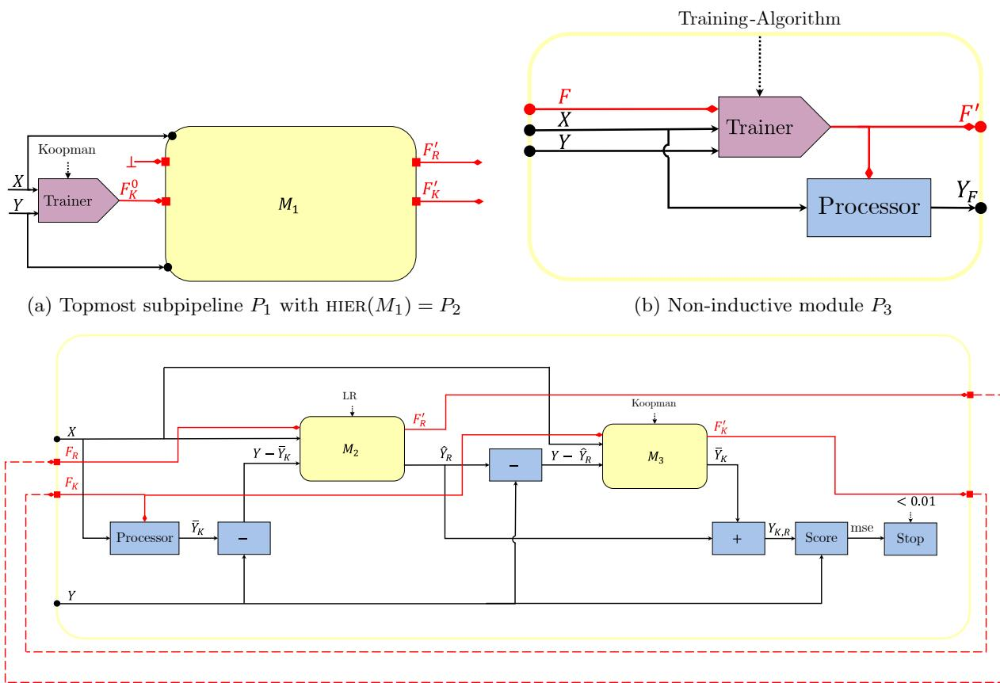  
(c) Inner subpipeline $P _ { 2 } ,$ where hier $( M _ { 2 } ) = \mathrm { H I E R } ( M _ { 3 } ) = P _ { 3 }$ . feedback is represented as a dashed line connecting the corresponding recursive function ports, denoted by red squares (■); all other ports are denoted by circles (•)  
Fig. 17: Dual Training pipeline

By contrast, model combination iteratively refines two predictors, generating new predictions:

$$
\hat { Y } _ { R } \gets F _ { R } ( X , Y - \bar { Y } _ { K } ) , \qquad \bar { Y } _ { K } \gets F _ { K } ( X , Y - \hat { Y } _ { R } ) .
$$

The learning process repeats until reaching a convergence criterion. Unlike standard residual learning, which performs this correction only once, model combination alternates the two updates. The final prediction adds both outputs:

$$
Y _ { K , R } = F _ { R } ( X ) + F _ { K } ( X ) .
$$

We illustrate in Fig. 17 the implementation of this method in H-FDF. The topmost pipeline $P _ { 1 }$ is given in Fig. 17a, where model $F _ { K }$ is initialized using the training dataset $( X , Y )$ . The other model $F _ { R }$ is initialized randomly (using the ⊥ function). The dual training subpipeline $P _ { 2 }$ is called from this initialization and dataset (X, Y ) to perform the core learning.

To facilitate the specification of the model combination, we use a non-inductive subpipeline $P _ { 3 } .$ , called in Module $M _ { 2 }$ and $M _ { 3 } ,$ , to both learn a model and predict the output from this model (Fig. 17b). This subpipeline uses a Trainer algorithm (e.g., deep-learning) initialized with model F. After the training is performed, the learnt model $F ^ { \prime }$ is returned. The prediction Y that results from using $F ^ { \prime }$ on input X is also returned.

Lastly, the implementation of the core dual training method is given in subpipeline $P _ { 2 } .$ , see Fig. 17c. It consists of training two diferent operators, namely (a linear regression) $F _ { R } ^ { \prime }$ and (a Koopman operator) $F _ { K } ^ { \prime }$ , based on the $( X , Y )$ dynamical system dataset. $P _ { 2 }$ is inductive: It cotrains $F _ { R } ^ { \prime }$ and $F _ { K } ^ { \prime }$ , from functions $F _ { R }$ and $F _ { K }$ provided by the previous round (or higher level if first step). The feedback flow is denoted by dashed lines, to depict that the new models $F _ { R } ^ { \prime }$ and $F _ { K } ^ { \prime }$ are passed to be used in the next iteration. On the contrary, X and Y are fixed, always provided by the higher level calling the subpipeline (no feedback loop there). $P _ { 2 }$ proceeds as follows:

• First, X is processed by $F _ { K }$ , producting the prediction $\bar { Y } _ { K }$ . Then $F _ { R } ^ { \prime }$ is trained to predict from X the residual $( Y - { \bar { Y } } _ { K } )$ , through Module $M _ { 2 }$ calling subpipeline $P _ { 3 } .$ . Module $M _ { 2 }$ also outputs the prediction $\hat { Y } _ { R }$ of the diference.

• These results are used in the right side of $P _ { 2 }$ (Fig. 17c): first, the diference between Y and the residual prediction $\hat { Y } _ { R }$ is computed, and $F _ { K } ^ { \prime }$ is trained in Module $M _ { 3 }$ to predict $Y - { \hat { Y } } _ { R }$ from X, initialized with $F _ { K }$ . Module $M _ { 3 }$ also outputs the prediction $\bar { Y } _ { K }$ by $F _ { K } ^ { \prime }$ . The final prediction is the $Y _ { K , R } = \hat { Y } _ { R } + \bar { Y } _ { K }$

• An MSE test (mse $< ~ 0 . 0 1 )$ is performed between the predicted $Y _ { K , R }$ and the expected $Y$ as a stopping criteria.

– If the condition is true, iteration stops and $P _ { 2 }$ returns the final model: $F _ { R } ^ { \prime } , F _ { K } ^ { \prime }$ Otherwise, the subpipeline is called for another cycle. As indicated by the broken line depicting feedback, the models $F _ { R } ^ { \prime }$ and $F _ { K } ^ { \prime }$ generated at this round are passed as input to the next round.

## 6.6 Comparison with KNIME

We now compare the way to specify inductive behaviors in KNIME vs. H-FDF.

## 6.6.1 KNIME Loops

In KNIME, loops are declared using a matching pair of loop start and loop end nodes [4]. As stated in the KNIME documentation21, the “Loop Start” node typically defines when the iteration begins or ends, while “Loop End” specifies how the data is processed or aggregated after each iteration. For instance, a “Counting Loop Start” allows looping for a fixed number of times, and it can be paired, among others, with “Loop End” to append incoming tables row-wise or “Loop End (column append)” to append column-wise. However, some “Loop End” nodes, such as “Variable Condition Loop End”, can also terminate the loop based on a specific condition, which must be represented by a KNIME flow variable (similar to parameters in H-FDF).

KNIME’s approach results in a large catalog of loop nodes, each with specific use cases. The user must also carefully pair loop start and loop end nodes (e.g., a Recursive Loop Start must always be paired with a Recursive Loop End).

## 6.6.2 Comparative Analysis

We compare the KNIME and H-FDF approaches in Fig. 18, which shows a pipeline where the loop stops when either a process accuracy (simulated via a random number generator) reaches at least 0.9, or the loop repeats for 1000 iterations.

Observe that KNIME’s loop creates a coupling between data flow and control flow in the loop definition: loop start and loop end nodes jointly determine how data is passed between iterations (data flow) and how many times to repeat the loop (control flow). Importantly, in KNIME, there is no generic function flow between rounds. In some cases, like active learning, specific looping boxes exist. Otherwise, the functions must first be converted into data, passed, and converted back as functions. By comparison, in H-FDF, data and functions passed from one round to the next are explicitly and graphically represented by using feedback flow.

This coupling in KNIME necessitates extensive rewiring for even minor logic changes. While a pipeline to loop for 1000 iterations can be easily implemented in KNIME using a “Counting Loop Start” paired with a “Loop End”, implementing a more complex pipeline, which loops for 1000 times or until accuracy reaches 0.9, requires (Fig. 18a22):

• swapping the “Counting Loop Start” for a “Generic Loop Start”,

• explicitly computing the end condition using both the current iteration and process accuracy,

• casting the result to a flow variable for use in the “Variable Condition Loop End”, and

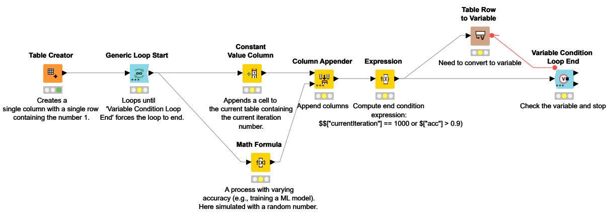  
(a) A KNIME pipeline to loop for at most 1000 times, checking if the accuracy (acc) is at least 0.9

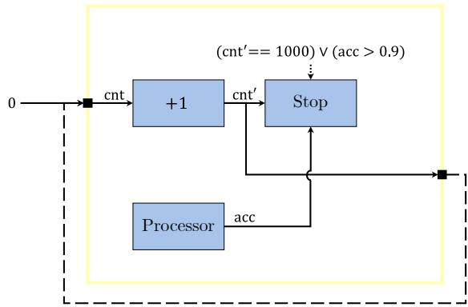  
(b) Equivalent H-FDF pipeline. Observe that the H-FDF pipeline is much simpler, and the stop condition is explicitly represented  
Fig. 18: Comparison of FDF pipeline in DesCartes Builder (top) and equivalent KNIME pipeline (bottom)

• replacing the “Loop End” with a “Variable Condition Loop End”.

By contrast, H-FDF separates these concerns by introducing an explicit stop port and requiring it to be explicitly computed and represented in the graph (Fig. 18b23). Therefore, once a new process is inserted in the pipeline, it sufices to adapt the stop condition computation to consider both the accuracy and the loop counter.

## 7 Conclusion

This paper presents a user evaluation of the FDF framework and its implementation, DesCartes Builder, alongside an FDF extension to support iterative pipelines: H-FDF (Hierarchical Function+Data Flow).The user evaluation assesses the perceived usability and the feature adequacy of the current framework, identifying its strengths and key improvement areas to inform future development. To address the lack of explicit iteration in FDF, H-FDF introduces a specialized Module box. This component supports iteration until a stop condition occurs, while ensuring the global pipeline remains acyclic and easy to reason about.

The user study indicates that participants perceive FDF and DesCartes Builder as an intuitive, easy-to-use tool. This is quantified by a good usability rating, with a median SUS score of 72.5 (mean: 68.9 ± 15.2). Qualitative feedback highlights that DesCartes Builder is an eficient, integrated platform for rapid experimentation with an easy-to-use “plug-and-play” graph interface. Improvement areas include adding tooltips and integrated documentation.

Regarding H-FDF, we formalize its syntax and semantics and illustrate its utility through a complex dual-training case study. This application shows that H-FDF can flexibly combine models co-inductively. Furthermore, a comparative analysis with KNIME suggests that H-FDF’s explicit loop conditions reduce the required efort to evolve the iteration strategy.

Future work focuses on the full implementation of H-FDF within the DesCartes Builder modeling environment. We also aim to enhance user experience by integrating contextual documentation and supporting real-time pipeline inspection during execution.

Code availability. To improve reproducibility, supplementary material is available on Zenodo: https://doi.org/10.5281/zenodo.21154924. This includes the user study instruments, results, and analysis scripts. DesCartes Builder source code can be found at https://github.com/CPS -research-group/descartes-builder. We evaluated the release v0.2 in the user study with the corresponding installer at https://doi.org/10.5281/ze nodo.18757324.

Acknowledgements. We would like to thank Amine Ammar (ENSAM), CETIM, and Jo¨el Mouterde (SKF) for providing the DT prototypes. This research is part of the program DesCartes and is supported by the National Research Foundation, Prime Minister’s Ofice, Singapore under its Campus for Research Excellence and Technological Enterprise (CREATE) program.

## References

[1] Alam S, Chan NL, Couto L, et al (2025) Kedro. URL https://github.com/kedro-org /kedro

[2] Bangor A, Kortum PT, Miller JT (2008) An Empirical Evaluation of the System Usability Scale. International Journal of Human– Computer Interaction 24(6):574–594. https: //doi.org/10.1080/10447310802205776

[3] Bender M, Laurin K, Lawford M, et al (2015) Signature required: Making Simulink data flow and interfaces explicit. Science of Computer Programming 113:29–50. https://doi. org/10.1016/j.scico.2015.07.005

[4] Berthold MR, Cebron N, Dill F, et al (2009) KNIME - the Konstanz information miner: Version 2.0 and beyond. ACM SIGKDD Explorations Newsletter 11(1):26–31. https: //doi.org/10.1145/1656274.1656280

[5] Bierman G, Abadi M, Torgersen M (2014) Understanding typescript. In: European Conference on Object-Oriented Programming, Springer, pp 257–281

[6] Bogner J, Merkel M (2022) To type or not to type? a systematic comparison of the software quality of JavaScript and typescript applications on GitHub. In: Proceedings of the 19th International Conference on Mining Software Repositories. Association for Computing Machinery, New York, NY, USA, MSR ’22, pp 658–669, https://doi.org/10.1145/35 24842.3528454

[7] Broekhuis M, Van Velsen L, Hermens H (2019) Assessing usability of eHealth technology: A comparison of usability benchmarking instruments. International Journal of Medical Informatics 128:24–31. https://doi.org/10.1 016/j.ijmedinf.2019.05.001

[8] Brooke J (1996) SUS: A ’Quick and Dirty’ Usability Scale. In: Usability Evaluation In Industry. CRC Press, https://doi.org/10.120 1/9781498710411-35

[9] Burgess CP, Higgins I, Pal A, et al (2018) Understanding disentangling in \$\beta\$- VAE. http://arxiv.org/abs/1804.03599, arXiv:1804.03599

[10] Cardelli L (1988) Structural subtyping and the notion of power type. In: Proceedings

of the 15th ACM SIGPLAN-SIGACT Symposium on Principles of Programming Languages. Association for Computing Machinery, New York, NY, USA, POPL ’88, pp 70–79, https://doi.org/10.1145/73560.73566

[11] Chabod A (2022) Digital Twin for Fatigue Analysis. Procedia Structural Integrity 38:382–392. https://doi.org/10.1016/j.prostr .2022.03.039

[12] Chakraborty S, Adhikari S, Ganguli R (2021) The role of surrogate models in the development of digital twins of dynamic systems. Applied Mathematical Modelling 90:662–681. https://doi.org/10.1016/j.apm.2020.09.037

[13] Chen A, Chow A, Davidson A, et al (2020) Developments in mlflow: A system to accelerate the machine learning lifecycle. In: Proceedings of the Fourth International Workshop on Data Management for End-to-End Machine Learning. Association for Computing Machinery, New York, NY, USA, DEEM’20, https://doi.org/10.1145/3399579. 3399867

[14] Chen X, Wang C, Lan X, et al (2022) Neighborhood Geometric Structure-Preserving Variational Autoencoder for Smooth and Bounded Data Sources. IEEE Transactions on Neural Networks and Learning Systems 33(8):3598–3611. https: //doi.org/10.1109/TNNLS.2021.3053591

[15] Chinesta F, Ladeveze P, Cueto E (2011) A Short Review on Model Order Reduction Based on Proper Generalized Decomposition. Arch Computat Methods Eng 18(4):395–404. https://doi.org/10.1007/s11831-011-9064-7, URL http://link.springer.com/10.1007/s118 31-011-9064-7

[16] Chinesta F, Cueto E, Abisset-Chavanne E, et al (2020) Virtual, Digital and Hybrid Twins: A New Paradigm in Data-Based Engineering and Engineered Data. Arch Computat Methods Eng 27(1):105–134. https://do i.org/10.1007/s11831- 018- 9301-4, URL http://link.springer.com/10.1007/s11831-0 18-9301-4

[17] Combemale B, Kienzle J, Mussbacher G, et al (2021) A Hitchhiker’s Guide to Model-Driven Engineering for Data-Centric Systems. IEEE Software 38(4):71–84. https://doi.org/10.110 9/MS.2020.2995125

[18] Combemale B, Vicat-Blanc P, Blouin A, et al (2025) Engineering digital twins: A research roadmap. In: 2025 ACM/IEEE 28th International Conference on Model Driven Engineering Languages and Systems Companion (MODELS-C), pp 181–188, https://doi.org/ 10.1109/MODELS-C68889.2025.00035

[19] Dalibor M, Jansen N, Rumpe B, et al (2022) A Cross-Domain Systematic Mapping Study on Software Engineering for Digital Twins. Journal of Systems and Software 193:111361. https://doi.org/10.1016/j.jss.2022.111361

[20] Danilczyk W, Sun Y, He H (2019) ANGEL: An Intelligent Digital Twin Framework for Microgrid Security. In: 2019 North American Power Symposium (NAPS). IEEE, Wichita, KS, USA, pp 1–6, https://doi.org/10.1109/ NAPS46351.2019.9000371

[21] De Conto E, Genest B, Easwaran A (2024) Function+Data Flow: A Framework to Specify Machine Learning Pipelines for Digital Twinning. In: Proceedings of the 1st ACM International Conference on AI-Powered Software. ACM, Porto de Galinhas Brazil, AIware 2024, pp 19–27, https://doi. org/10.1145/3664646.3664759

[22] de Conto E, Genest B, Easwaran A, et al (2025) DesCartes Builder: A Tool to Develop Machine-Learning Based Digital Twins. In: 2025 ACM/IEEE 28th International Conference on Model Driven Engineering Languages and Systems Companion (MODELS-C), pp 129–133, https://doi.org/10.1109/MODELS -C68889.2025.00028

[23] de Conto E, Easwaran A, Genest B, et al (2026) DesCartes Builder: Machine-Learning Based Digital Twins. Zenodo, https://doi.or g/10.5281/zenodo.18757324

[24] de Conto E, Genest B, Easwaran A, et al (2026) Artifact for “Building real-time digital twin instances with Function+Data Flow: User evaluation and extension for iterative pipelines”. https://doi.org/10.5281/zenodo.2 1154924

[25] Demˇsar J, Curk T, Erjavec A, et al (2013) Orange: data mining toolbox in python. the Journal of machine Learning research 14(1):2349–2353

[26] Donato L, Galletti C, Parente A (2024) Selfupdating digital twin of a hydrogen-powered furnace using data assimilation. Applied Thermal Engineering 236:121431. https://do i.org/10.1016/j.applthermaleng.2023.121431

[27] Eker J, Janneck J, Lee EA, et al (2003) Taming heterogeneity - the Ptolemy approach. Proc IEEE 91:127–144. https://doi.org/10.1 109/JPROC.2002.805829

[28] Falessi D, Juristo N, Wohlin C, et al (2018) Empirical software engineering experts on the use of students and professionals in experiments. Empirical Software Engineering 23(1):452–489. https://doi.org/10.1007/s106 64-017-9523-3

[29] Ferrari A, Mazzanti F, Basile D, et al (2021) Systematic evaluation and usability analysis of formal methods tools for railway signaling system design. IEEE Transactions on Software Engineering 48(11):4675–4691. https: //doi.org/10.1109/tse.2021.3124677

[30] Fortune Business Insights (2024) Digital Twin Market Size, Share — Growth Analysis Report [2032]. URL https://www.fortunebus inessinsights.com/digital-twin-market-10624 6

[31] Gartner (2022) Emerging Technologies: Revenue Opportunity Projection of Digital Twins. URL https://www.gartner.com/en/d ocuments/4011590

[32] Garud SS, Karimi IA, Kraft M (2017) Design of computer experiments: A review. Computers & Chemical Engineering 106:71–95. https: //doi.org/10.1016/j.compchemeng.2017.05.

010

[33] Ghnatios C, Rodriguez S, Tomezyk J, et al (2024) A hybrid twin based on machine learning enhanced reduced order model for realtime simulation of magnetic bearings. Adv Model and Simul in Eng Sci 11(1):3. https: //doi.org/10.1186/s40323-024-00258-2, URL https://amses-journal.springeropen.com/arti cles/10.1186/s40323-024-00258-2

[34] Gil S, Mikkelsen PH, Gomes C, et al (2024) Survey on open-source digital twin frameworks–A case study approach. Software: Practice and Experience 54(6):929–960. https://doi.org/10.1002/spe.3305

[35] Giner-Miguelez J, G´omez A, Cabot J (2022) DescribeML: A tool for describing machine learning datasets. In: Proceedings of the 25th International Conference on Model Driven Engineering Languages and Systems: Companion Proceedings. ACM, Montreal Quebec Canada, pp 22–26, https://doi.org/10.1145/ 3550356.3559087

[36] Glaessgen E, Stargel D (2012) The Digital Twin Paradigm for Future NASA and U.S. Air Force Vehicles. In: 53rd AIAA/ASME/ASCE/AHS/ASC Structures, Structural Dynamics and Materials Conference. American Institute of Aeronautics and Astronautics, https://doi.org/10.2514/6.20 12-1818

[37] Grieves M, Vickers J (2017) Digital Twin: Mitigating Unpredictable, Undesirable Emergent Behavior in Complex Systems, Springer International Publishing, Cham, pp 85–113. https://doi.org/10.1007/978-3-319-38756-7 4

[38] Grossman T, Fitzmaurice G (2010) Tool-Clips: An investigation of contextual video assistance for functionality understanding. In: Proceedings of the SIGCHI Conference on Human Factors in Computing Systems. ACM, Atlanta Georgia USA, pp 1515–1524, https://doi.org/10.1145/1753326.1753552

[39] Hartmann D, Herz M, Wever U (2018) Model Order Reduction a Key Technology for Digital Twins. In: Keiper W, Milde A, Volkwein S (eds) Reduced-Order Modeling (ROM) for Simulation and Optimization: Powerful Algorithms as Key Enablers for Scientific Computing. Springer International Publishing, Cham, p 167–179, https://doi.org/10 .1007/978-3-319-75319-5 8, URL https: //doi.org/10.1007/978-3-319-75319-5 8

[40] Hartmann T, Moawad A, Fouquet F, et al (2019) The next evolution of MDE: A seamless integration of machine learning into domain modeling. Software & Systems Modeling 18(2):1285–1304. https://doi.org/10.1 007/s10270-017-0600-2

[41] Hucko M, Gazo L, Simun P, et al (2019) YesElf: Personalized Onboarding for Web Applications. In: Adjunct Publication of the 27th Conference on User Modeling, Adaptation and Personalization. Association for Computing Machinery, New York, NY, USA, UMAP’19 Adjunct, pp 39–44, https://doi.or g/10.1145/3314183.3324978

[42] Jafari M, Kavousi-Fard A, Chen T, et al (2023) A Review on Digital Twin Technology in Smart Grid, Transportation System and Smart City: Challenges and Future. IEEE Access 11:17471–17484. https://doi.org/10 .1109/ACCESS.2023.3241588, URL https: //ieeexplore.ieee.org/document/10034656/

[43] Jaskolka M, Pantelic V, Wassyng A, et al (2020) Supporting Modularity in Simulink Models. https://doi.org/10.48550/arXiv.200 7.10120, arXiv:2007.10120

[44] Johnson T, Langer D, Frigon E, et al (2023) Complexities of capturing large plastic deformations using digital image correlation: A test case on full-scale pipe specimens. In: International Conference on Ofshore Mechanics and Arctic Engineering, American Society of Mechanical Engineers, p V003T04A033, https://doi.org/10.1115/OM AE2023-102308

[45] Kalyuga S (2009) The Expertise Reversal Efect. In: Managing Cognitive Load in Adaptive Multimedia Learning. IGI Global Scientific Publishing, p 58–80, https://doi.org/10 .4018/978-1-60566-048-6.ch003

[46] Kelley Pace R, Barry R (1997) Sparse spatial autoregressions. Statistics & Probability Letters 33(3):291–297. https://doi.org/10.1016/ S0167-7152(96)00140-X

[47] Kokhlikyan N, Miglani V, Martin M, et al (2020) Captum: A unified and generic model interpretability library for PyTorch. https: //doi.org/10.48550/arXiv.2009.07896, arXiv:2009.07896

[48] Kortum PT, Bangor A (2013) Usability Ratings for Everyday Products Measured With the System Usability Scale. International Journal of Human–Computer Interaction 29(2):67–76. https://doi.org/10.1080/10 447318.2012.681221

[49] Kritzinger W, Karner M, Traar G, et al (2018) Digital Twin in manufacturing: A categorical literature review and classification. IFAC-PapersOnLine 51(11):1016–1022. http s://doi.org/10.1016/j.ifacol.2018.08.474

[50] Leiner DJ (2019) Too Fast, too Straight, too Weird: Non-Reactive Indicators for Meaningless Data in Internet Surveys. Survey Research Methods 13(3):229–248. https://do i.org/10.18148/srm/2019.v13i3.7403

[51] Lewis JR, Sauro J (2009) The Factor Structure of the System Usability Scale. In: Kurosu M (ed) Human Centered Design. Springer, Berlin, Heidelberg, pp 94–103, https://doi.or g/10.1007/978-3-642-02806-9 12

[52] Liu M, Fang S, Dong H, et al (2021) Review of digital twin about concepts, technologies, and industrial applications. Journal of Manufacturing Systems 58:346–361. https://doi. org/10.1016/j.jmsy.2020.06.017

[53] Liu W, Li X, Shen Z, et al (2023) A digital twin method for civil aircraft power distribution system based on Unity3D and Simulink. Journal of Physics: Conference

Series 2615(1):012017. https://doi.org/10.1 088/1742-6596/2615/1/012017

[54] Lundberg SM, Lee SI (2017) A Unified Approach to Interpreting Model Predictions. In: Advances in Neural Information Processing Systems, vol 30. Curran Associates, Inc., https://papers.nips.cc/paper files/paper/2 017/hash/8a20a8621978632d76c43dfd28b67 767-Abstract.html

[55] Lwakatare LE, Crnkovic I, R˚ange E, et al (2020) From a Data Science Driven Process to a Continuous Delivery Process for Machine Learning Systems. In: Morisio M, Torchiano M, Jedlitschka A (eds) Product-Focused Software Process Improvement, vol 12562. Springer International Publishing, Cham, p 185–201, https://doi.org/10.1007/978-3-030 -64148-1 12, URL https://link.springer.co m/10.1007/978-3-030-64148-1 12

[56] Madry A, Makelov A, Schmidt L, et al (2019) Towards Deep Learning Models Resistant to Adversarial Attacks. http://arxiv.org/abs/ 1706.06083, arXiv:1706.06083

[57] MathWorks (2009) Is it possible to use Simulink to train a neural network? https: //www.mathworks.com/matlabcentral/answ ers/101260-is-it-possible-to-use-simulink-t o-train-a-neural-network

[58] McClellan A, Lorenzetti J, Pavone M, et al (2022) A physics-based digital twin for model predictive control of autonomous unmanned aerial vehicle landing. Philosophical Transactions of the Royal Society A: Mathematical, Physical and Engineering Sciences 380(2229):20210204. https://doi.org/10.109 8/rsta.2021.0204

[59] Mehrabi A, Yari K, Van Driel WD, et al (2024) AI-Driven Digital Twin for Health Monitoring of Wide Band Gap Power Semiconductors. In: 2024 IEEE 10th Electronics System-Integration Technology Conference (ESTC), pp 1–8, https://doi.org/10.110 9/ESTC60143.2024.10712146

[60] Michael J, Cleophas L, Zschaler S, et al (2025) Model-Driven Engineering for Digital

Twins: Opportunities and Challenges. Systems Engineering p sys.21815. https://doi.or g/10.1002/sys.21815

[61] Moin A, Challenger M, Badii A, et al (2022) A model-driven approach to machine learning and software modeling for the IoT: Generating full source code for smart Internet of Things (IoT) services and cyber-physical systems (CPS). Software and Systems Modeling 21(3):987–1014. https://doi.org/10.1007/s1 0270-021-00967-x

[62] Moody D (2009) The “Physics” of Notations: Toward a Scientific Basis for Constructing Visual Notations in Software Engineering. IEEE Transactions on Software Engineering 35(6):756–779. https://doi.org/10.1109/TS E.2009.67

[63] Mora Segura, Angel and De Lara, Juan and ´ Wimmer, Manuel (2024) Modelling Assistants Based on Information Reuse: A User Evaluation for Language Engineering. Software and Systems Modeling 23(1):57–84. ht tps://doi.org/10.1007/s10270-023-01094-5

[64] Moya B, Bad´ıas A, Alfaro I, et al (2022- 07-15) Digital twins that learn and correct themselves. Numerical Meth Engineering 123(13):3034–3044. https://doi.org/10.1002/ nme.6535, URL https://onlinelibrary.wiley. com/doi/10.1002/nme.6535

[65] Oakes BJ, Famelis M, Sahraoui H (2024) Building Domain-Specific Machine Learning Workflows: A Conceptual Framework for the State of the Practice. ACM Transactions on Software Engineering and Methodology 33(4):91:1–91:50. https://doi.org/10.1145/36 38243

[66] Ore JP, Elbaum S, Detweiler C, et al (2018) Assessing the type annotation burden. In: Proceedings of the 33rd ACM/IEEE International Conference on Automated Software Engineering. Association for Computing Machinery, New York, NY, USA, ASE ’18, p 190–201, https://doi.org/10.1145/3238147. 3238173

[67] Paszke A, Gross S, Massa F, et al (2019) PyTorch: An Imperative Style, High-Performance Deep Learning Library. In: Advances in Neural Information Processing Systems, vol 32. Curran Associates, Inc., ht tps://proceedings.neurips.cc/paper files/pap er/2019/hash/bdbca288fee7f92f2bfa9f70127 27740-Abstract.html

[68] Pedregosa F, Varoquaux G, Gramfort A, et al (2011) Scikit-learn: Machine Learning in Python. Journal of Machine Learning Research 12(85):2825–2830. https://doi.org/ 10.5555/1953048.2078195

[69] Pierce BC (2002) Types and programming languages. MIT press

[70] Pinaev D, et al (2026) QtNodes. Node Editor. https://github.com/paceholder/nodeeditor

[71] Pisapia A, Nastri E, Piluso V, et al (2023) Experimental campaign on structural aluminium alloys under monotonic and cyclic loading. Engineering Structures 282:115836. https://doi.org/10.1016/j.engstruct.2023.115 836

[72] Price S, Flach PA (2013) A Higher-order data flow model for heterogeneous Big Data. In: 2013 IEEE International Conference on Big Data. IEEE, Silicon Valley, CA, USA, pp 569–574, https://doi.org/10.1109/BigData. 2013.6691624

[73] Radler S, Rigger E, Mangler J, et al (2022) Integration of Machine Learning Task Definition in Model-Based Systems Engineering using SysML. In: 2022 IEEE 20th International Conference on Industrial Informatics (INDIN). IEEE, Perth, Australia, pp 546– 551, https://doi.org/10.1109/INDIN51773.2 022.9976107

[74] Rai R, Sahu CK (2020) Driven by Data or Derived Through Physics? A Review of Hybrid Physics Guided Machine Learning Techniques With Cyber-Physical System (CPS) Focus. IEEE Access 8:71050–71073. https://doi.org/10.1109/ACCESS.2020.2987 324

[75] Ray B, Posnett D, Filkov V, et al (2014) A large scale study of programming languages and code quality in github. In: Proceedings of the 22nd ACM SIGSOFT International Symposium on Foundations of Software Engineering. Association for Computing Machinery, New York, NY, USA, FSE 2014, p 155–165, https://doi.org/10.1145/2635868.2635922

[76] Salman I, Misirli AT, Juristo N (2015) Are Students Representatives of Professionals in Software Engineering Experiments? In: 2015 IEEE/ACM 37th IEEE International Conference on Software Engineering, pp 666–676, https://doi.org/10.1109/ICSE.2015.82

[77] Sancarlos A, Cameron M, Le Peuvedic JM, et al (2021) Learning stable reduced-order models for hybrid twins. Data-Centric Eng 2:e10. https://doi.org/10.1017/dce.2021.16

[78] Sauro J, Lewis JR (2016) Quantifying the User Experience: Practical Statistics for User Research. Morgan Kaufmann

[79] S´erot J (2021) HoCL: High level specification of dataflow graphs. In: Proceedings of the 32nd Symposium on Implementation and Application of Functional Languages. Association for Computing Machinery, New York, NY, USA, IFL ’20, pp 11–22, https://doi.or g/10.1145/3462172.3462185

[80] Singer J, Vinson N (2002) Ethical issues in empirical studies of software engineering. IEEE Transactions on Software Engineering 28(12):1171–1180. https://doi.org/10.1109/ TSE.2002.1158289

[81] Singer J, Sim SE, Lethbridge TC (2008) Software Engineering Data Collection for Field Studies. In: Shull F, Singer J, Sjøberg DIK (eds) Guide to Advanced Empirical Software Engineering. Springer, London, p 9–34, https: //doi.org/10.1007/978-1-84800-044-5 1

[82] Sivarajah S, Heidemann L, Lawrence A, et al (2022) Tierkreis: A Dataflow Framework for Hybrid Quantum-Classical Computing. In: 2022 IEEE/ACM Third International Workshop on Quantum Computing Software (QCS). IEEE, Dallas, TX, USA, pp 12–21, ht

tps://doi.org/10.1109/QCS56647.2022.00007

[83] Su J, Vargas DV, Sakurai K (2019) One Pixel Attack for Fooling Deep Neural Networks. IEEE Transactions on Evolutionary Computation 23(5):828–841. https://doi.org/10.110 9/TEVC.2019.2890858

[84] Sundararajan M, Taly A, Yan Q (2017) Axiomatic Attribution for Deep Networks. https://doi.org/10.48550/arXiv.1703.01365, arXiv:1703.01365

[85] Szegedy C, Zaremba W, Sutskever I, et al (2014) Intriguing properties of neural networks. http://arxiv.org/abs/1312.6199, arXiv:1312.6199

[86] Tadeja S, Jarrett J, Kipouros T (2025) Mapping of the digital twin design process landscape: The results of a domain-expert visual qualitative study. Research in Engineering Design 37(1):7. https://doi.org/10.1007/s001 63-025-00468-8

[87] Tehrani AD, Kohankar Kouchesfehani Z, Najafi M (2020) Pipe profiling using digital image correlation. In: Pipelines 2020. American Society of Civil Engineers Reston, VA, San Antonio, Texas, USA, p 36–45, https: //doi.org/10.1061/9780784483206.005

[88] Tuegel EJ, Ingrafea AR, Eason TG, et al (2011) Reengineering Aircraft Structural Life Prediction Using a Digital Twin. International Journal of Aerospace Engineering 2011:e154798. https://doi.org/10.1155/2011 /154798

[89] Utzig S, Kaps R, Azeem SM, et al (2019) Augmented Reality for Remote Collaboration in Aircraft Maintenance Tasks. In: 2019 IEEE Aerospace Conference. IEEE, Big Sky, MT, USA, pp 1–10, https://doi.org/10.1109/AE RO.2019.8742228

[90] Venkatesan S, Manickavasagam K, Tengenkai N, et al (2019) Health monitoring and prognosis of electric vehicle motor using intelligent-digital twin. IET Electric Power Applications 13(9):1328–1335. https://doi.or g/10.1049/iet-epa.2018.5732

[91] Vlachogianni P, Tselios N (2022) Perceived usability evaluation of educational technology using the System Usability Scale (SUS): A systematic review. Journal of Research on Technology in Education 54(3):392–409. http s://doi.org/10.1080/15391523.2020.1867938

[92] Wang Z, Wang L, Revanesh M, et al (2023) Short-Term Wind Speed and Power Forecasting for Smart City Power Grid With a Hybrid Machine Learning Framework. IEEE Internet Things J 10(21):18754–18765. https://doi.or g/10.1109/JIOT.2023.3286568, URL https: //ieeexplore.ieee.org/document/10153767/

[93] Whittle J, Hutchinson J, Rouncefield M (2014) The State of Practice in Model-Driven Engineering. IEEE Software 31(3):79–85. ht tps://doi.org/10.1109/MS.2013.65

[94] Wilking F, Sauer C, Schleich B, et al (2022) Integrating Machine Learning in Digital Twins by utilizing SysML System Models. In: 2022 17th Annual System of Systems Engineering Conference (SOSE), pp 297–302, https://doi.org/10.1109/SOSE55472.2022.9 812700

[95] Wohlin C, Runeson P, H¨ost M, et al (2024) Experimentation in Software Engineering. Springer, Berlin, Heidelberg, https://doi.or g/10.1007/978-3-662-69306-3

[96] Wu S, Chamoin L, Li Q (2024) Non-intrusive model combination for learning dynamical systems. Physica D: Nonlinear Phenomena 463:134152. https://doi.org/10.1016/j.phys d.2024.134152

[97] Xiong M, Wang H (2022) Digital twin applications in aviation industry: A review. Int J Adv Manuf Technol 121(9):5677–5692. https: //doi.org/10.1007/s00170-022-09717-9

[98] Yusuf A, Noor NM, Rom´an-Gonz´alez M (2024) Interaction Patterns During Blockbased Programming Activities Predict Computational Thinking: Analysis of the Differences in Gender, Cognitive Load, Spatial Ability, and Programming Proficiency. AI, Computer Science and Robotics Technology https://doi.org/10.5772/acrt.36

[99] Zhong C, Cheng S, Kasoar M, et al (2023) Reduced-order digital twin and latent data assimilation for global wildfire prediction. Natural Hazards and Earth System Sciences 23(5):1755–1768. https://doi.org/10.5194/nh ess-23-1755-2023

## Appendix A Evaluation Material

## A.1 Informed Consent

Participants were requested to sign an informed consent document that covers the basic ethical aspects considered by the project.

You are invited to participate in a research study evaluating DesCartes Builder, a tool for developing machine-learning pipelines for digital twins. We aim to test the hypothesis that the abstraction and tooling proposed can facilitate the development of machine learning-based digital twins. The experiment will require about 2 hours of your time and involves a short tutorial, a hands-on task using the tool, and a survey about your experience. All the collected data will be anonymized and kept confidential. Your feedback will help improve the tool and shape its future features. Note that your participation is entirely voluntary; you will not receive compensation for your time, and you can withdraw from the study at any time without penalty. If you agree, your anonymized data may be stored for future research, but you can opt out at any time. For questions or concerns, you can contact the study team or the NTU Institutional Review Board. By signing this consent form, you are giving your informed and voluntary consent to take part in this research study, and you confirm you understand the study’s purpose, procedures, and your rights.

## A.2 User Survey

## A.2.1 Background

1. What is your current role?

• Researcher

• Student

• Engineer

• Industry Practitioner

• Other

## 2. What is your primary area of expertise?

• Artificial Intelligence

• Systems Engineering

• Software Engineering

• Digital Twins

• Other

Table A1: Complete questionnaire for DesCartes Builder usability (based on the SUS questionnaire [8])
<table><tr><td>ID</td><td></td><td>Short label (positive only) Full SUS item (positive/negative version)</td></tr><tr><td> $Q _ { 1 }$ </td><td></td><td>Intended frequency of use I think that I will use DESCARTES BuILDER rather than other methods.</td></tr><tr><td> $Q _ { 2 }$ </td><td>System simplicity</td><td>I found DESCARTES BuILDER unnecessarily complex.</td></tr><tr><td> $Q _ { 3 }$ </td><td>Ease of use</td><td>I thought DESCARTES BuILDER was easy to use.</td></tr><tr><td> $Q _ { 4 }$ </td><td>User independence</td><td>I think that I would need the support of a technical person to be able to use DESCARTES BUILDER.</td></tr><tr><td> $Q _ { 5 }$ </td><td>Functions well integrated</td><td>I found the various functions in DESCARTES BuILDER were well integrated.</td></tr><tr><td> $Q _ { 6 }$ </td><td>Design consistency</td><td>I thought there was too much inconsistency in DEsCARTES BUILDER.</td></tr><tr><td> $Q _ { 7 }$ </td><td>Learnability</td><td>I would imagine that most people would learn to use DEsCARTES BuILDER very quickly.</td></tr><tr><td> $Q _ { 8 }$ </td><td>Navigation smoothness</td><td>I found DESCARTES BuILDER very cumbersome to use.</td></tr><tr><td> $Q _ { 9 }$   $Q _ { 1 0 }$ </td><td>User confidence</td><td>I felt very confident using DESCARTES BUILDER.</td></tr><tr><td></td><td>Low learning effort</td><td>I needed to learn a lot of things before I could get going with DESCARTES BUILDER.</td></tr></table>

3. Please rate your familiarity with the following concepts and tools (Rating: 1

= None to 5 = Expert):

• Machine Learning (ML)

• Digital Twins

• Reduced-order modeling

• System modeling tools (e.g., Simulink, Modelica)

• Engineering simulation tools (e.g., Ansys, OpenFOAM)

## A.2.2 Tool Usability

4. Please indicate your level of agreement with the statements in Table A1 (Rating: 1 = Strongly Disagree to 5 = Strongly Agree).

## A.2.3 Experience with DesCartes Builder

5. How user-friendly did you find the interface for the following tasks? (Rating: 1 = Very Demanding to 5 = Very Intuitive):

• Box Parametrization

• Pipeline Modeling

• Result Visualization

• Warning Messages

6. Which challenges did you encounter while using the tool?

## A.2.4 Open Feedback

7. What features or improvements would most enhance your experience with DesCartes Builder?

8. Any additional comments or suggestions regarding usability, ML integration, or digital twin functionality?

## Appendix B Sensitivity Analysis

The standard way of testing ML-based DTs is to assess the model’s quality metric on the holdout test data. The most common metric is the mean-squared error (MSE) between the ML model prediction and the test data [74]. However, for ML models, particularly neural networks (NN), current validation practices may not be suficient, since they explore the PT input space using random sampling or predefined grids. Indeed, a highly accurate model (e.g., low MSE) may still have regions with large discrepancies between the DT and the PT. This issue is due to at least two key factors. Firstly, NNs are known to be brittle to adversarial attacks, where small, often imperceptible perturbations $( \mathrm { e . g . }$ , altering a single pixel) can result in significant changes in the output [83, 85]. Secondly, the design of experiments (DoE) used for surrogate design may not adequately cover critical regions of the input space [32]. For instance, consider the DT prototype for material strain prediction (Section 4.2). When dealing with aluminum, which exhibits a highly nonlinear behavior under cyclic loading [71], an inadequate DoE might overlook these regions, leading to inaccurate predictions.

Procedure 1: Feature-Based Sensitivity Analysis for Model Robustness   
Input: Trained model f   
Parameter: $M ,$ resolution for querying $f ; N ,$ , number of samples for sensitivity analysis; $t g t ,$   
target $f$ output feature: $f ( x ) [ t g t ] ; [ l o w , h i g h ]$ , bounds of $f$ input domain (used to   
define $x ) { \mathrm { ; } }$ ; div, divisor to define local neighborhood space.   
Output: $N$ input pairs $( x _ { 1 } , x _ { 1 } ^ { \prime } ) , \dots , ( x _ { N } , x _ { N } ^ { \prime } )$ and corresponding output pairs   
$( f ( x _ { 1 } ) , f ( x _ { 1 } ^ { \prime } ) ) , \ldots , ( f ( x _ { N } ) , f ( x _ { N } ^ { \prime } ) )$ such that $\Delta ( f ( x _ { i } ) , f ( x _ { i } ^ { \prime } ) )$ is maximized.   
$/ /$ Identify most influential samples globally   
1 rndFull ← M random samples uniformly at random in range $[ l o w , h i g h ]$   
2 attrFull ← attribution scores for the feature $f ( x ) [ t g t ]$ over rndFull   
3 topFull ← top-N samples with highest attribution from attrFull   
$/ /$ Refine around topFull influencial regions   
4 foreach s ∈ topFull do   
5 query ← neighborhood around s of size $( h i g h - l o w ) / d i v$   
6 rndDiv ← new M random samples within query   
7 attrDiv ← attribution score for $f ( x ) [ t g t ]$ over rndDiv   
8 topDiv ← top-N samples with high attribution score from attrDiv   
$/ /$ Finer sampling in a grid around topDiv   
9 foreach $s ^ { \prime } \in$ topDiv do   
10 $j _ { 1 } , j _ { 2 } \gets \mathrm { t o p { - } 2 }$ most influencial input features   
11 grid ← M × M grid varying $x [ j _ { 1 } ] , x [ j _ { 2 } ]$ over [low, high] and fixing other dimensions   
12 $\mathsf { O u t }  \{ f ( x ) \mid x \in \mathsf { g r i d } \} / /$ evaluate $f$ on all $x \in \mathsf { g r i d }$   
13 Define the neighborhood $\mathcal { N } ( \cdot )$ as the set of grid-adjacent elements for $x \in \mathsf { g r i d }$ and $y \in \mathsf { O u t }$   
$/ /$ Maximize local output discrepancy   
14 dif $ \mathrm { a r g m a x } _ { y \in \mathsf { O u t } , y ^ { \prime } \in \mathcal { N } ( y ) } \| y - y ^ { \prime } \| _ { \infty }$   
$/ /$ Retrieve corresponding neighboring input-output pairs   
15 $x _ { i } \gets \mathsf { g r i d } [ \mathsf { d i f f } ] ; x _ { i } ^ { \prime } \gets N ( x _ { i } )$   
16 $y _ { i } \gets \mathsf { O u t } [ \mathsf { d i f f } ] ; y _ { i } ^ { \prime } \gets \mathcal { N } ( y _ { i } )$

To mitigate this, we aim to identify regions where the surrogate does not faithfully represent the physics model. The naive way to address this problem would be to perform numerous physics simulations, comparing them with the ML surrogate directly. However, this is impractical due to the high computational cost of the physics model. Hence, our strategy is to first analyze the surrogate thoroughly, identifying regions with low robustness, i.e., regions where small perturbations in input yield large changes in output. These regions are expected to be meaningful candidates for prompting the physics model since most data sources and physical models are smooth and bounded, allowing the construction of a compact local representation [9, 14]. If we can identify these regions, we could, for instance, include more points in the DoE for them and correct the model by placing more emphasis on these critical regions during training.

Formally, let $f ~ : ~ \mathcal { X } ~  ~ \mathbb { R } ^ { d }$ denote the ML surrogate, where $\mathcal { X }$ is the input space of the ML surrogate and $\mathbb { R } ^ { d }$ is the d-dimensional output space. For a given input $x \in { \mathcal { X } } .$ , the goal of sensitivity analysis is to identify a neighboring point $x ^ { \prime }$ such that the output diference $\Delta ( f ( x ) , f ( x ^ { \prime } ) )$ is maximized $( \mathrm { e . g . , \ell ^ { \infty } \mathrm { - n o r m . } }$ commonly used in adversarial analysis [56]):

$$
x , x ^ { \prime } = { \underset { x , x ^ { \prime } \in { \mathcal { X } } } { \operatorname { a r g m a x } } } \Delta ( f ( x ) , f ( x ^ { \prime } ) ) , { \mathrm { w h e r e } } \| x - x ^ { \prime } \| < \varepsilon
$$

Since exhaustive search is infeasible, we propose a scalable heuristic (Algorithm 1) that uses feature attribution methods [54, 84] to search regions of high output sensitivity. This method yields candidate point pairs that expose brittle regions in the model $f .$

The algorithm consists of three key steps:

1. Lines 1–3: Sample uniformly at random the full input space of f and obtain feature attribution scores using, e.g., the Integrated Gradients method [84]. This will lead to an importance score for the input features X of f on the specific output target tgt considered.

2. Lines 4–8: Based on the attribution score, refine the focus from the full input space X to highly sensitive regions. Obtain the feature attribution score as in the previous step for these sub-regions. The rationale is to assess the subset of features that are most important in this sub-region, which may be diferent from that of the full space.

3. Lines 9–16: On the highly sensitive regions, evaluate the model f by fixing the top-2 most influential features and varying the remaining features. Identify points in the model output Out such that their diference is maximized.

The implementation is integrated into the DesCartes Builder back-end24 and relies on the Captum [47] library.