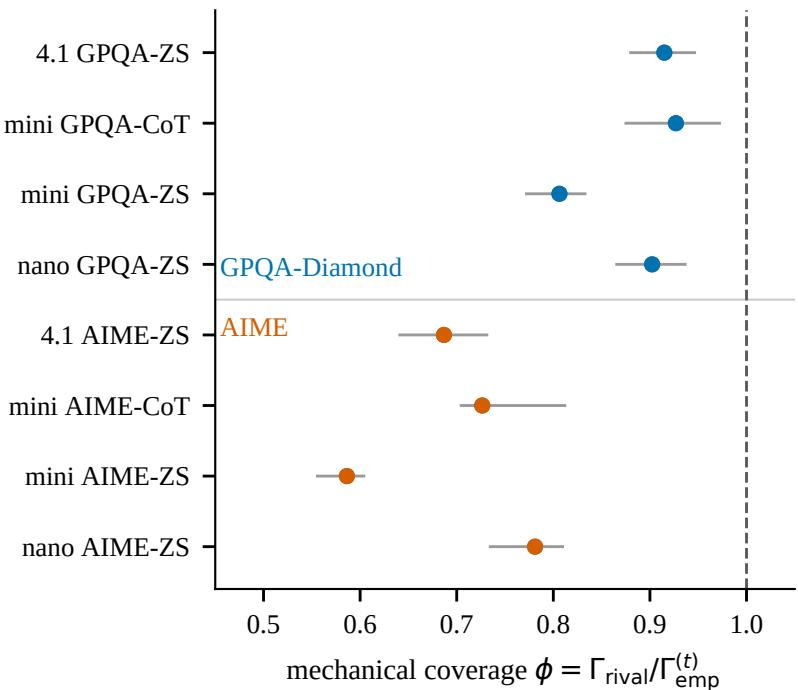
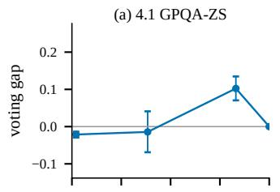
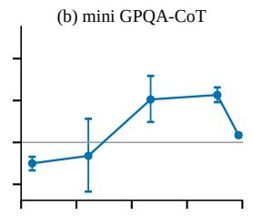
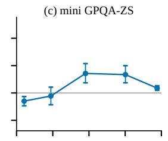
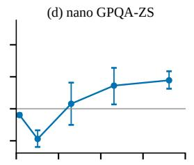
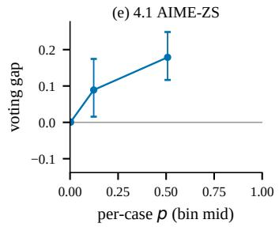
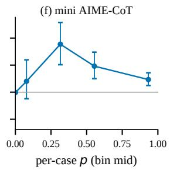
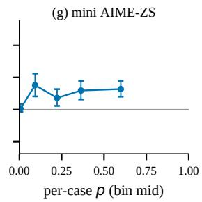
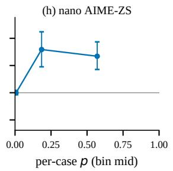

# DECOMPOSING WRONG-CONSENSUS AGREEMENT IN LLM SELF-CONSISTENCY: A GPT-4.1 CASE STUDY

## A PREPRINT

Lizhuo Zhang1,2 1College of Information and Intelligence, Hunan Agricultural University, Changsha 410128, China 2Yuelushan Laboratory, Changsha 410128, China

Mengmeng Tang1 1College of Information and Intelligence, Hunan Agricultural University, Changsha 410128, China Chenfeng Long1,2 (corresponding author)

1College of Information and Intelligence, Hunan Agricultural University, Changsha 410128, China 2Yuelushan Laboratory, Changsha 410128, China

elong@hunau.edu.cn Xiaoyong Tang2,3

3School of Computer Science and Technology, Changsha University of Science and Technology, Changsha 410114, China 2Yuelushan Laboratory, Changsha 410128, China

4Information Department, China Guangdong Tobacco Meizhou Ltd, Meizhou, 514000, China

August 20, 2026

## ABSTRACT

Majority voting over multiple LLM samples is widely used to raise answer accuracy, yet its gain varies erratically: on hard questions it can even backfire. This paper gives a quantitative, descriptive account of this failure. A pluralistic agreement index Γ is defined as the expected fraction of the samples of a wrong run that agree with the consensus, normalized by a reference scale d = (1 − $p ) / ( C - 1 )$ , and this index is decomposed into a mechanical component (what a vote would deliver given only a per-case answer preference) and a preference-unexplained residual (agreement left once that preference is held fixed). The mechanical null is difficulty-matched and leak-free: each case is resimulated at its own accuracy and option preference, estimated from the case’s other runs, so no run predicts its own agreement. On GPT-4.1 the decomposition shows benchmark-associated direction (an observational ordering over n = 4 cells per benchmark, not a significance claim). On multiple-choice GPQA-Diamond, the mechanical per-case answer preference explains ≈ 81–93% of the held-out test-run agreement index Γ(t) : the “shared-bias dominates” account over-claims on this data, because a wrong but attractive option the whole cohort latches onto is captured by the per-case preference channel. (Whether that preference itself is induced by shared training bias is not identified by this decomposition.) On open-domain AIME, by contrast, the mechanical preference explains only 59–78% at λ = 1 (21–29% if the preference estimate is shrunk to pure noise; the residual is largest there, so the direction is preference-robust), and a preference-unexplained residual of 1.56–2.80 Γ units survives, a residual that a run-level preference-heterogeneity reference more than absorbs $( \phi _ { \mathrm { d m } } = 1 . 4 – 2 . 1 )$ , consistent with run-to-run preference variation as its channel. A selfconsistency backfire on hard questions is reproduced (binned voting gap down to −0.09, coupled CI [−0.12, −0.07] on the most negative bin), and the highest-agreement bin is shown to reach an empirical high-agreement accuracy of only 0.42–0.83, a 1.2–3.6× lift over base rate: agreement is graded evidence, not certification. The decomposition is deliberately model-agnostic and defined entirely in the Method; no new voting method is proposed. Code and evidence are committed and reproducible.

Keywords majority voting; self-consistency; plurality ceiling; shared bias; uncertainty estimation

## 1 Introduction

Sampling-based reasoning (drawing multiple answers and taking a majority vote) is the workhorse of self-consistency [1]. Practitioners rely on the heuristic that “more samples and more agreement mean a more reliable answer.” A large body of evidence, however, shows the picture is more subtle: agreement can be high while the answer is still wrong [2], and on hard questions majority voting can even reduce accuracy relative to a single sample [3].

Existing work documents these phenomena (Section 2) but no LLM self-consistency study has applied a counterfactual decomposition to wrong-consensus agreement: how much of the observed agreement is a generic plurality effect versus model-specific correlated error? The answer is built as a hierarchy of counterfactual nulls for an agreement index.

Contribution. This paper defines a pluralistic agreement index Γ (Section 3) and measures wrong-consensus agreement on real per-run LLM data against a hierarchy ofprogressively richer counterfactual nulls:

uniform i.i.d. → per-case preference, i.i.d. → per-case preference with run-level heterogeneity,

each null granting the data strictly more mechanical structure than the last. The headline quantity is the mechanical coverage $\phi = { \Gamma _ { \mathrm { r i v a l } } } / { \Gamma _ { \mathrm { e m p } } ^ { \left( t \right) } } ,$ where $\Gamma _ { \mathrm { r i v a l } }$ is a leak-free reference that grants each case its per-case option preference (preference and accuracy estimated from the case’s other runs only), and $\Gamma _ { \mathrm { e m p } } ^ { ( t ) }$ is the empirical index on the same held-out test runs; ϕ is the fraction of observed wrong-consensus agreement that a fixed-preference i.i.d. counterfactual reproduces, and $1 - \phi$ the preference-unexplained residual. On GPT-4.1 the coverage shows benchmark-associated direction (an observational ordering at $n = 4$ cells per benchmark, not a significance claim; Section 5.1): on multiplechoice GPQA-Diamond, $\phi \in [ 0 . 8 \bar { 0 } 6 , 0 . 9 2 7 ]$ and the preference-unexplained residual is small (a popular-but-wrong option is captured by the per-case preference channel), whereas on open-domain AIME $\phi \in [ 0 . 5 8 6 , 0 . 7 8 1 ]$ and a preference-unexplained residual of 1.56–2.80 Γ units survives, a residual that the run-level-heterogeneity null more than absorbs (Appendix D). This is a descriptive counterfactual analysis, not a direct identification of the error mech anism, and it does not identify whether the per-case preference itself is induced by shared training bias. The uniform null $\rho = \Gamma _ { \mathrm { { i i d } } } / \Gamma _ { \mathrm { { e m p } } } \in [ 0 . 3 4 0 , 0 . 5 4 6 ]$ is a strictly more conservative coverage and is reported alongside. Which level of the null hierarchy (uniform, fixed per-case preference, or run-heterogeneous preference) reproduces the data is answered cell by cell in Section 5.1.

This is a descriptive, understanding contribution. It proposes no new voting method and claims no new backfire phenomenon (that is [3]); its claim is the quantitative counterfactual hierarchyfor Γ.

## 2 Related work

Self-consistency and its limits. Wang et al. [1] introduced sampling-based self-consistency and showed substantial gains over greedy decoding. A growing literature documents that these gains are not uniform. Ding [2] provides a large-scale audit of self-consistency and publicly releases per-run data; the method consumes their data but adds a quantitative decomposition they do not provide. Bahuguna [3] shows self-consistency can backfire on hard questions, with a binned analysis but without an agreement-index decomposition; its v2 revision states that the mechanism of the plurality-agreement gate’s failure remains an open problem. The counterfactual hierarchy is a descriptive decom position of that wrong-consensus agreement, not a mechanism identification. The regime where agreement-based uncertainty collapses (a model overconfident on the same wrong answer across samples) is exactly the wrong-consensus regime quantified in [4]. A complementary line argues that majority voting has a ceiling that perturbation diversity does not raise, because error correlations are identical [5]; that ceiling is given a quantitative, wrong-run-conditional form. At the cross-model level, a capability-controlled audit finds shared co-failure, not diversity, is the stable correlate of majority-vote gain [6]; the decomposition here is the within-model analogue, built on a hierarchy of per-case nulls rather than an ensemble-level audit. Closest at the mechanism level, Chen et al. [7] show that majority-vote accuracy is non-monotonic in the number of calls and attribute it to a mixture of easy and hard queries within a task; the wrong-consensus decomposition is a per-cell, wrong-run-conditional complement to that aggregate-level account. The wrong-consensus regime decomposed here is the “self-consistent error” regime of Tan et al. [8], who formally define it, show its frequency does not decrease with model scale, and find all four detection-method families strug gle on it; the contribution is not detection but a quantitative counterfactual hierarchy for the agreement itself. The anytime-valid statistical certification of self-consistency in [9] analyzes the same sampling counts used here but certifies mode uniqueness rather than decomposing agreement. The “shared bias” account of confident-yet-wrong behavior has academic antecedents: the probability-driven systematic error patterns of [10] are a shared-bias signature in the same spirit (McCoy et al. measure error patterns shaped by the shared pretraining task, not calibration curves). The preference-unexplained residual is an empirical pattern compatible with this account, quantified in a model-agnostic way and, critically, only on the open-domain cells where a substantial preference-unexplained component survives (Section 5.1).

Agreement as confidence. Using consistency as a confidence signal is its own literature. Calibration of model confidences [11, 12, 13]; consistency-based confidence for generative tasks [14, 15, 16]; the “consistency hypothesis” formalized and tested across tasks [17]; confidence–consistency unification through minimum Bayes risk [18]; semanticentropy successors [19]. Measurement-protocol discipline for agreement statistics [20] governs the reporting conventions followed here (Section 3.4). The AUROC analysis (Section 5.4) sits inside this literature: agreement is a graded but noisy confidence signal (AUROC 0.61–0.85), and the ceiling analysis (lift $1 . 2 \mathrm { - } 3 . 6 \times$ , never near 1.0) quantifies exactly how graded. Two conventions from this literature bear on the design: (i) semantic clustering of near-duplicate answers is standard for open-ended tasks [15, 16], whereas the AIME $\bar { C }$ is a string-level mean distinct count; the string-level convention is kept because ϕ is invariant to C (Section 3.1) and because the per-case preference null operates on observed labels, but a semantic-clustering sensitivity remains future work; (ii) temperature/decoding settings are first-order determinants of sampling behavior and are not recorded in Ding’s per-run files, so the results are strictly about that collection pipeline.

Ensemble decompositions. The “mechanical vs. correlated” distinction predates LLMs: bias-variance decompositions of zero-one loss [21], the bias-variance-covariance decomposition of [22], and ensemble ambiguity [23] all separate what vote marginals explain from what error covariance explains; on the LLM side, the sharpened answer marginal is the object that per-case preference estimation targets [24]. The quantities here map onto that vocabulary: $\bar { \Gamma } _ { \mathrm { e m p } }$ is a wrong-run-conditional agreement index, $\Gamma _ { \mathrm { r i v a l } }$ its value under per-case marginals with independence, and δ the covariance-like remainder. What is new here is not the algebra but its LLM instantiation: the wrong-run conditioning, the leave-one-out per-case preference and accuracy, and the difficulty matching, plus the empirical finding that the marginals carry ≈ 81–93% on constrained multiple-choice and only 59–78% on open-domain tasks. A literature search (August 2026, arXiv API) found no prior work decomposing wrong-consensus agreement of a single model’s samples against counterfactual nulls, nor applying chance-corrected agreement coefficients to agreement among samples themselves; the closest works are the audits cited above.

Novelty boundary. The paper is explicit about what it does not claim: it does not discover that self-consistency backfires (that is [3]), and it proposes no new voting method. The contribution is the Γ decomposition itself and its leak-free per-case-preference mechanical coverage ϕ, a quantitative agreement-index quantity, and a benchmark associated one (mechanical on multiple-choice, substantial preference-unexplained residual on open-domain), absent from prior work.

Note on prior series. In vision, the companion diagnostic [25] applies a related consensus analysis (with a cross-model consensus control) to annotation difficulty; the present paper’s agreement decomposition is self-contained and does not depend on it.

## 3 Method

## 3.1 Setup and notation

The data consist of a set of question–case instances. For each case, a model is sampled K times under a fixed prompt. This yields per-run counts: let C be the number of answer options considered, p the single-sample accuracy (the fraction of all $N \times K$ single answers that are correct), and maj a consensus label obtained by plurality over the $K$ answers. The consensus accuracy is the fraction of cases where the plurality label is correct.

• C is chosen by benchmark: GPQA-Diamond has $C = 4 ;$ for AIME and other open-ended tasks the mean number of distinct answer strings per run is used (Section 3.4). This scalarization affects only the absolute scale of Γ: the numerator $\mathbb { E } [ \alpha ]$ wrong] is computed over actual answer labels and does not depend on $C ,$ while both $\Gamma _ { \mathrm { r i v a l } }$ and $\Gamma _ { \mathrm { e m p } }$ are divided by the same baseline $d = ( 1 - p ) / ( C - 1 )$ , so the ratio $\phi = \bar { \Gamma } _ { \mathrm { r i v a l } } / \Gamma _ { \mathrm { e m p } }$ cancels $C { - } 1$ exactly. This is verified empirically: rerunning the AIME cells with C fixed to 9 or to 20 leaves ϕ bit-identical across the two fixed-C runs, and at equal settings $( n _ { \mathrm { s i m } } = 2 \times 1 0 ^ { 3 } )$ ) the fixed-C runs and the meandistinct run agree to within one digit in the third decimal (results/kappa rival csens C9/C20.json vs. kappa rival tie argmin.json).

• p is the single-sample accuracy, not the consensus accuracy. Both are reported.

• Ties in the plurality are broken by lowest class id (argmin). Note that $K = 5 0$ is fixed by the data and is even, so ties are possible and resolved by this rule. Empirically the plurality is tied in $7 . 5 \%$ of AIME runs and 0.8% of GPQA runs (results/data audit.json); on AIME the deterministic rule can therefore favor numerically small answers. This channel is quantified directly: recomputing every run’s majority with a uniform random tie-break among the tied labels (three independent seeds, applied to both the empirical majority and the simulated runs) shifts $\phi$ by at most 0.009 in any cell (results/kappa rival tie rnd1/2/3.json vs. kappa rival tie argmin.json), so the tie-break rule does not materially affect the decomposition.

## 3.2 The agreement index Γ

The central object is an index of how much the samples of a wrong-consensus run coalesce around the (possibly wrong) plurality label. Define, for each case,

$$
\alpha = \frac { 1 } { K } \sum _ { i = 1 } ^ { K } \mathbf { 1 } \{ \mathrm { a n s w e r } _ { i } = \mathrm { m a j } \} ,
$$

the self-consistency of the K samples (this is exactly the quantity Ding [2] tabulates; it is denoted α to keep $C$ reserved for the option count). A run is one realization of the K samples; a run is wrong when its plurality label differs from the ground truth $( \mathrm { m a j } \ne \mathrm { g t } )$ . All Γ quantities in this paper are conditioned on the run being wrong, and in every simulated counterfactual the run’s plurality label is recomputed from the simulated draws and the same conditioning is applied; the procedure is given in the pseudocode of Section 3.3. The reference scale is

$$
d = \frac { 1 - p } { C - 1 } ,
$$

the per-option error mass under independence given single-sample accuracy $p .$ The quantity d is a scale normalization, not a chance-correction claim: the observed wrong-vote distribution is not uniform (the rival null itself shows this), so d is a reference value, not an assumed data model. The empirical agreement index is defined as

$$
\Gamma _ { \mathrm { e m p } } = { \frac { \mathbb { E } [ \alpha \mid \operatorname { r u n } \operatorname { w r o n g } ] } { d } } .
$$

A wrong run whose samples cluster tightly on the consensus (an “attractive but wrong” state) yields α well above the reference scale $d ,$ hence large $\Gamma _ { \mathrm { e m p } }$ . This quantifies the ceiling: it measures how “sticky” the samples of wrong runs are to a wrong consensus.

Relation to chance-corrected agreement coefficients. Γ shares the chance-correction idea of Cohen’s $\kappa ,$ Scott’s $\pi ,$ and Fleiss’ $\kappa \left[ 2 6 , 2 7 , 2 8 , 2 9 \right]$ , but it is not Cohen’s κ: it conditions on wrong runs, normalizes by the per-option error mass $d ,$ and is decomposed against simulated counterfactuals rather than a chance estimator. To avoid persistent confusion with the classic coefficients, the index is denoted Γ throughout (an earlier draft used $\kappa )$ . Ensemble-diversity measures (e.g. [30]) are conceptually adjacent (they quantify error correlation among classifiers) but operate on classifier outputs, not on sampled runs of a single model.

## 3.3 Mechanical counterfactuals

A mechanical counterfactual asks: how much of the observed agreement would survive if the model’s within-case error were not correlated, leaving only the mechanical averaging of independent votes? The answer depends on what is held fixed about each case. Two counterfactuals are built, both i.i.d. multinomial simulations (105 draws per cell) that differ only in how the incorrect votes are distributed over options.

Uniform wrong-vote null $\Gamma _ { \mathrm { i i d } } .$ The most neutral reference places the samples of a wrong run uniformly over the wrong options (the correct option carries none of the incorrect votes). This is the classic independent-vote ceiling: agreement arises purely from the mechanical concentration of $\geq \lceil K / 2 \rceil$ votes on one answer, with no per-case attraction. Because pooling over difficulty destroys the wrong-plurality phenomenon (a pooled-p variant predicts $\leq 0 . 6 \%$ wrong-consensus on three of four GPQA cells (8.8% on the fourth) where the observed share is 42–60%), each case is always held at its observed difficulty $p _ { i } ;$ the appendix shows the pooled-p control failing by two orders of magnitude (Appendix $\mathbf { A } ) .$ , which is why difficulty-matching is the informative baseline. Note that the normalization $d \stackrel { - } { = } ( 1 - p ) / ( \stackrel { - } { C } - 1 )$ uses the $_ { c e l l - l e \nu e l p }$ for the empirical index and the rival null, while the uniform per-question null normalizes by the mean accuracy of its own simulated population (case-weighted $\bar { p } _ { i }$ , typically within a few percent of the cell-level $p ,$ up to about 5% across cells), so the three Γ values sit on nearly one scale; difficulty matching affects only where the simulated wrong votes fall, not the normalization.

Leak-free per-case preference null $\Gamma _ { \mathrm { r i v a l } } .$ The uniform null ties the model’s incorrect votes to no option at all. But an LLM rarely errs uniformly: on a multiple-choice item a single plausible-but-wrong distractor can attract the whole cohort, and on an open-domain item certain answers are systematically preferred. Such a per-case answerpreference is a mechanical property of the item under this decomposition (whether the preference itself originates in shared training bias is not identified). To separate it, each case’s option preference is estimated from its other runs, and incorrect votes are resimulated according to that hold-out preference. Formally, for each case i, as in a leave-one-out scheme, the per-case option counts are permuted/aggregated into a preference distribution $\hat { q } _ { i }$ , and the K votes of each simulated run are drawn from a multinomial equipped with $\hat { q } _ { i }$ and the case’s held-out accuracy $p _ { i }$ . (Implementation detail: $\hat { q } _ { i }$ and the case accuracy $p _ { i }$ are both estimated on the other runs of case i only (leave-one-out on both the preference and the accuracy) so no run predicts its own agreement; CLI flags --rival-mode case and --min-wrong 1. A case is eligible as a test when it has at least one wrong run and at least two runs in total; every wrong run of an eligible case is used once as a held-out test.) The resulting $\breve { \Gamma } _ { \mathrm { r i v a l } }$ is the agreement the same per-case preferences would generate if voters were otherwise independent, i.e., the maximal agreement attributable to per-case mechanical attraction. Because the eligible population is a subset of all wrong runs, $\Gamma _ { \mathrm { e m p } } ^ { ( t ) }$ , the empirical index restricted to exactly the held-out test runs, is also computed, and the mechanical coverage on the same population is defined: $\phi = \Gamma _ { \mathrm { r i v a l } } / \Gamma _ { \mathrm { e m p } } ^ { ( t ) } ;$ ; the full-cell $\Gamma _ { \mathrm { e m p } }$ is reported alongside and differs from $\Gamma _ { \mathrm { e m p } } ^ { ( t ) }$ by at most 4% in any cell.

A cell-level variant is also recorded: $\Gamma _ { \mathrm { r i v a l , p o o l } }$ uses a single average preference per cell instead of per-case preferences. It is far below $\Gamma _ { \mathrm { r i v a l } }$ in every cell $( \mathrm { e . g . } \ \Gamma _ { \mathrm { r i v a l , p o o l } } ^ { \mathrm { ' } } = 1 . 0 \mathrm { i } \ \mathrm { v s . } \ \Gamma _ { \mathrm { r i v a l } } \ \stackrel { \sim } { = } 4 . 2 6$ on gpt-4.1 AIME), so per-case structure, not any global preference, carries the mechanical agreement. Note that $\Gamma _ { \mathrm { r i v a l , p o o l } }$ is not directly comparable to $\Gamma _ { \mathrm { i i d } } \colon$ its simulation support is the cell-wide set of distinct answers, so on open-domain cells the plurality is diluted far beyond the C-option uniform null, while on multiple-choice it inherits a global letter preference and sits slightly above the uniform null. It is reported here, inline, as a negative control.

Pseudocode. The conditioning event is identical in the empirical index and in every mechanical reference: the run’s plurality label, recomputed from its own draws, differs from the ground truth. For the empirical index: (1) for each run, set maj = argmax coun $( a _ { 1 } , \dotsc , a _ { K } )$ (ties to the lowest class id); (2) keep runs with maj $\neq \mathrm { g t } .$ , average their $\alpha ,$ and set $\Gamma _ { \mathrm { e m p } } = \overline { { \alpha } } _ { \mathrm { w r o n g } } / d .$ For a reference: (3) draw M simulated runs; each draws K votes with the correct option chosen with probability $p _ { i }$ , and wrong votes uniform over the $C - 1$ wrong options $( \Gamma _ { \mathrm { i i d } } )$ or proportional to the held-out per-case preference qˆ $( \Gamma _ { \mathrm { r i v a l } } ) ;$ (4) recompute $\mathrm { m a j } ^ { ( m ) }$ from the simulated draws, keep only simulated runs with ma $\mathbf { j } ^ { ( m ) } \neq \mathbf { g } \mathbf { t }$ , average their $\alpha ^ { ( m ) }$ , and set $\Gamma _ { \mathrm { r e f } } = \overline { { \alpha ^ { ( m ) } } } _ { \mathrm { s i m - w r o n g } } / d$ with the same cell-level d as in step 2.

Decomposition and mechanical coverage. The headline quantity is the mechanical coverage

$$
\phi ~ = ~ { \frac { \Gamma _ { \mathrm { r i v a l } } } { \Gamma _ { \mathrm { e m p } } ^ { ( t ) } } } ,
$$

defined on the held-out test-run population of Section 3.3, a ratio of nonnegative quantities that, up to simulation noise, lies in [0, 1]: it is the fraction of the observed agreement index $\Gamma _ { \mathrm { e m p } } ^ { ( t ) }$ that a leak-free, per-case-preference i.i.d. reference reproduces, and a value at or slightly above 1 (within bootstrap noise) means the mechanical reference already over-reproduces the observed agreement, leaving no positive residual. The complement

$$
\delta = 1 - \phi = \frac { \Gamma _ { \mathrm { e m p } } ^ { ( t ) } - \Gamma _ { \mathrm { r i v a l } } } { \Gamma _ { \mathrm { e m p } } ^ { ( t ) } } 
$$

is the agreement that survives even after every per-case option preference is granted to the mechanical reference: the preference-unexplained residual. Two readings follow:

$\phi \approx 1 ( \delta \approx 0 ) !$ : the agreement index is fully captured by a per-case answer preference (an attractive but wrong option the whole cohort latches onto). This does not identify whether the preference itself is induced by shared training bias.

• ϕ substantially below $1 \left( \delta > 0 \right)$ : a residual the per-case preference cannot explain remains; the samples of a wrong run cluster on the consensus even after their per-case option preference is removed. This is consistent with shared, correlated error (the pretraining-bias account [10]); the mechanism reading is interpretive, not identified. The assumption-free name of δ is the preference-unexplained residual; “shared-bias residual” is used as a mnemonic, and the paper does not claim to identify its mechanism; see Section 6.

Empirically, $\Gamma _ { \mathrm { r i v a l } } \geq \Gamma _ { \mathrm { i i d } }$ in all eight cells. Because the two references use different support conventions on opendomain tasks, this ordering is treated as an observed sanity check rather than a mathematical guarantee. (Within a fixed support, concentrating wrong-vote mass onto the observed per-case preference could not reduce agreement relative to the uniform reference; the observed ordering is therefore reported as a sanity check.) So $\phi$ is a larger mechanical ceiling than the uniform nul $( \rho = \Gamma _ { \mathrm { i i d } } / \Gamma _ { \mathrm { e m p } } )$ , which is reported alongside as a strictly more conservative lower bound. $( \Gamma _ { \mathrm { r i v a l , p o o l } }$ is not ordered against $\Gamma _ { \mathrm { i i d } }$ , for the support reasons just stated.) Because LLM draws are not strictly i.i.d., the reference does not incorporate within-case sampling correlation. One direction is nevertheless identified for the exchangeable (positively correlated) draws of temperature sampling: within-case correlation concentrates a run’s votes, so it can raise $\Gamma _ { \mathrm { e m p } } ^ { ( t ) }$ above the correlation-free reference but never lower it. (For arbitrary, e.g. deliberately decorrelated, sampling this need not hold; the argument below is confined to the exchangeable case.) Hence the observed coverage $\phi$ understates the true mechanical coverage, the observed residual δ is an upper bound on the correlation-free preference-unexplained share, and a $h i g h$ ϕ is identified in direction: a null without correlation already reproduces $\geq 8 1 \%$ of the GPQA index, so an account attributing the amplification primarily to shared bias over-claims regardless of how much sampling correlation exists. The quantity $\Gamma _ { \mathrm { r i v a l } }$ is therefore treated as a benchmark reference rather than a certified bound in the other direction. The honest conclusion is that even granting every per-case preference to a benchmark that reproduces $\Gamma _ { \mathrm { e m p } }$ on $\mathrm { G P Q A } .$ , a residual $\delta > 0$ remains on AIME: what a per-case-preference-only reference cannot explain.

## 3.4 Conventions

All conventions are fixed here so Γ is comparable across cells (and across future work):

1. p = single-sample accuracy, never consensus accuracy.

2. $C = 4$ for GPQA-Diamond; for AIME, C = the mean number of distinct answer strings per run.

3. Ties broken by argmin class id.

4. Both i.i.d. counterfactuals are difficulty-matched (per-case $p _ { i } ,$ leave-one-out for the rival null); the headline null is the leak-free per-case preference $\Gamma _ { \mathrm { r i v a l } }$ (preference estimated on other runs only, --rival-mode case); the uniform null and pooled-p control are reported as conservative/negative references.

5. Bootstrap CIs $( B = 1 0 ^ { 4 } )$ on every headline Γ and on $\phi ;$ differences (consensus − single-sample) use coupled bootstrap to respect the within-case pairing. Both a run-level bootstrap and a case-clustered bootstrap are reported (cases resampled with replacement, all units of a sampled case moving together); $\phi ^ { \mathbf { \prime } } \mathbf { s }$ clustered CI resamples the shared test-case population jointly on both sides of the ratio, while the run-level ϕ CI resamples numerator and denominator independently and is therefore conservative. The clustered CI is the primary one (reported in the decomposition table of Section 5.1), and both are conditional on the estimated preferences $\hat { q } _ { i }$ (whose own noise is probed by the shrinkage analysis of Appendix C).

6. The robustness appendices (shrinkage, answer-space, dispersion) are descriptive sensitivity analyses, not a family of hypothesis tests; no multiple-comparison correction is implied, and the p-values reported in Section 5.1 are the only inferential statements, used descriptively.

The fixed notation is collected in Table 1.

Table 1: Notation.
<table><tr><td>Symbol</td><td>Meaning</td></tr><tr><td> $\Gamma _ { \mathrm { e m p } }$ </td><td>empirical agreement index  $( = \mathbb { E } [ \alpha \mid$  wrong run  $| / d )$ </td></tr><tr><td> $\alpha$ </td><td>self-consistency of a run (share of votes for its plurality)</td></tr><tr><td> $\Gamma _ { \mathrm { i i d } }$ </td><td>uniform wrong-vote i.i.d. null</td></tr><tr><td> $\Gamma _ { \mathrm { r i v a l } }$ </td><td>leak-free per-case-preference i.i.d. null</td></tr><tr><td> $\Gamma _ { \mathrm { e m p } } ^ { ( t ) }$ </td><td>empirical index on the held-out test-run population</td></tr><tr><td> $\phi$ </td><td>mechanical coverage  $= \Gamma _ { \mathrm { r i v a l } } / \Gamma _ { \mathrm { e m p } } ^ { ( t ) }$ </td></tr><tr><td> $\delta = 1 - \phi$ </td><td>preference-unexplained residual</td></tr><tr><td> $\rho$ </td><td>uniform coverage :  $= \Gamma _ { \mathrm { i i d } } / \Gamma _ { \mathrm { e m p } }$ </td></tr><tr><td> $\phi _ { \mathrm { d m } }$ </td><td>coverage under the run-heterogeneity (Dirichlet-multinomial) null</td></tr><tr><td> $d$ </td><td>reference scale  $( 1 - p ) / ( C - \bar { 1 } )$ </td></tr><tr><td> $p$ </td><td>single-sample accuracy;  $p _ { i }$  per-case</td></tr><tr><td> $C$ </td><td>option count (GPQA: 4; AIME: mean per-run distinct answers)</td></tr><tr><td> $K$ </td><td>samples per run (50; Qwen arm 16/32)</td></tr><tr><td> $\hat { q } _ { i }$ </td><td>per-case wrong-answer preference (leave-one-out)</td></tr><tr><td> $\lambda$ </td><td>shrinkage of  $\hat { q } _ { i }$  toward uniform (Appendix C)</td></tr><tr><td> $\alpha$ </td><td>dispersion of the run-heterogeneity null (Appendix D)</td></tr></table>

## 4 Data

The analysis uses the public per-run self-consistency data of Ding [2], which tabulates, for each case and model, the K = 50 per-run answers, per-run correctness, self-consistency $\alpha ,$ single-sample accuracy $p ,$ and the majority label. Eight model–benchmark–prompt cells are analyzed:

• gpt-4.1, gpt-4.1-mini, gpt-4.1-nano;

• GPQA-Diamond and Ding’s 196-case AIME subset (problems spanning 1983–2025; the subset is inherited from the release, not chosen by the authors);

• zero-shot and chain-of-thought prompting (where reported).

This is a secondary re-analysis: no model is run; only per-run rows are re-analyzed, so every number below is reproducible from a committed parquet file.

Terminology is fixed once. A case is a (question, model, prompt) instance. A run is one independent $K = 5 0$ sampling pass; a case carries one or more runs (1–16 in these cells; results/data audit.json), and every analysis except the paired one uses all runs. Ding’s data additionally marks each run with one of two sampling conditions (a/b). Only cases carrying at least one run under each condition enter the paired champion-fragility analysis of Section 5.3: for gpt-4.1-mini these are 178 of the 198 GPQA cases and 175 of the 196 AIME cases (353 in total), the remaining 41 cases carrying a single condition. Counts in each table are therefore labeled in the unit the analysis actually uses: runs for the Γ and ceiling tables, pairs for the fragility table. Sampling settings (temperature, top-p) are inherited from Ding’s collection pipeline and are not recorded in the per-run files used here; they are neither controlled nor independently verified.

Axis and condition labels. Ding’s files label every run with an axis (A/B/C) and a condition (a/b). The release’s majority labels are used as-is: for 30 of the 5,300 runs (results/data audit.json) the release’s majority answer is not the raw argmax of that run’s own answer counts (untied), and these labels are inherited rather than recomputed, so the empirical wrong-run membership follows the release’s own convention (the simulations use argmin tie-breaking, stated in the Conventions). Model and prompt identity come from the model column of the release’s own case-level table, joined to the per-run table through the shared (axis, condition) keys; the resolution is therefore internal to the release, not an external reconstruction. For the cells used here the resolution is: $A / a \mathrm { - } \mathrm { n a n o - } \mathrm { Z S } \mathrm { , } A / b \mathrm { - } \mathrm { n i n i - } \mathrm { Z S } \mathrm { , } B / a \mathrm { - } \mathrm { n i n i - }$ ZS, B/b→mini-CoT, C/a→mini-ZS, C/b→4.1-ZS. Two consequences follow. First, the paired champion-fragility analysis is possible only for mini-ZS: 4.1 appears only in $C / b$ and nano only in $A / a ,$ so neither has two condition to pair. Second, the mini-ZS pairs span three axes $( A / \dot { b } , B / a , C / a )$ , and the axes carry slightly different case subsets and consensus accuracy (e.g. AIME 0.32/0.36/0.24; GPQA 0.51/0.52/0.52; results/data audit.json). The files do not record whether a/b or the axes differ in any sampling parameter; the GPQA axes are statistically close, while on AIME the $C / a$ arm is lower-accuracy, so the AIME flip rate should be read as instability under nominally identical (model, prompt, case) settings that may differ in batch or condition, not as a certified same-parameter comparison. It is reported as an estimate consistent with an upper bound, with this caveat. A mislabeled model would misattribute rows to cells but would not change the decomposition structure (the Γ construction is model-agnostic).

Table 2 gives the per-cell sample sizes. The counts differ across cells because Ding’s collection design varies per arm (e.g. mini-ZS runs appear under three axes, 4.1 under one); the data are reported as collected.

Table 2: Per-cell sample sizes. Cases = distinct (question, model, prompt) instances; runs = K = 50 sampling passes; wrong runs = runs whose plurality label is wrong (the effective sample for $\Gamma _ { \mathrm { e m p } } ) { : }$ ; test runs = held-out wrong runs entering the rival null and $\Gamma _ { \mathrm { e m p } } ^ { ( t ) }$ (Section 3.3).
<table><tr><td>Model</td><td>Prompt</td><td>cases</td><td>runs</td><td>wrong runs</td><td>test runs</td></tr><tr><td>4.1</td><td>AIME-ZS</td><td>180</td><td>450</td><td>375</td><td>335</td></tr><tr><td>4.1</td><td>GPQA-ZS</td><td>182</td><td>450</td><td>234</td><td>205</td></tr><tr><td>4.1-mini</td><td>AIME-CoT</td><td>172</td><td>425</td><td>237</td><td>212</td></tr><tr><td>4.1-mini</td><td>AIME-ZS</td><td>196</td><td>1325</td><td>919</td><td>917</td></tr><tr><td>4.1-mini</td><td>GPQA-CoT</td><td>180</td><td>425</td><td>178</td><td>152</td></tr><tr><td>4.1-mini</td><td>GPQA-ZS</td><td>198</td><td>1325</td><td>641</td><td>641</td></tr><tr><td>4.1-nano</td><td>AIME-ZS</td><td>178</td><td>450</td><td>347</td><td>313</td></tr><tr><td>4.1-nano</td><td>GPQA-ZS</td><td>178</td><td>450</td><td>269</td><td>244</td></tr></table>

## 5 Results

## 5.1 Mechanical coverage across a hierarchy of nulls: multiple-choice vs. open-domain

Table 3 reports, for all eight cells, the empirical agreement index $\Gamma _ { \mathrm { e m p } } ,$ the uniform null $\Gamma _ { \mathrm { i i d } }$ , the leak-free per-case preference null $\Gamma _ { \mathrm { r i v a l } }$ , and the mechanical coverage $\phi = \Gamma _ { \mathrm { r i v a l } } / \Gamma _ { \mathrm { e m p } } ^ { ( t ) }$ with case-clustered 95% CIs $( B = 1 0 ^ { 4 } )$ . Two structural facts hold everywhere, before any benchmark split. First, in every cell the empirical index is several times its reference scale $( \Gamma _ { \mathrm { e m p } } \in \mathrm { [ 3 . 5 6 , 7 . 0 9 ] ) }$ ; because $\Gamma \mathbf { \bar { s } }$ absolute scale depends on $C ,$ , cross-benchmark statements are made only on the C-invariant $\phi ,$ never on Γ magnitudes. This confirms that the samples of wrong runs are strongly attracted to the consensus. Second, the per-case preference null is far more explanatory than the uniform null $( \Gamma _ { \mathrm { r i v a l } } \gg \Gamma _ { \mathrm { i i d } } ) ;$ much of the naive “shared bias” is in fact the mechanical attraction of incorrect voters to a popular per-case answer.

Table 3: Agreement-index decomposition. $\Gamma _ { \mathrm { r i v a l } }$ is the leak-free per-case-preference i.i.d. null (preference and accuracy from other runs); $\phi = \Gamma _ { \mathrm { r i v a l } } / \Gamma _ { \mathrm { e m p } } ^ { ( t ) }$ is the mechanical coverage on the held-out test-run population, $\delta = 1 - \phi$ the preference-unexplained residual; $\rho \doteq \Gamma _ { \mathrm { i i d } } / \Gamma _ { \mathrm { e m p } }$ is the strictly more conservative uniform null. CI column: 95% case-clustered percentile bootstrap $( B = 1 0 ^ { 4 } )$ , untruncated; a CI that reaches above 1 (or below 0) is reported as-is. Simulation seed $0 , n _ { \mathrm { s i m } } = 1 0 ^ { 5 }$ ; Monte Carlo $\mathrm { S E } \leq 4 \times 1 0 ^ { - 3 } \ : \Gamma$ units in every cell. Per-cell sample sizes are in Table 2.
<table><tr><td>Model</td><td>Prompt</td><td> $p$ </td><td> $\Gamma _ { \mathrm { e m p } }$ </td><td> $\Gamma _ { \mathrm { r i v a l } }$ </td><td> $\phi$ </td><td> $\phi \mathrm { C I }$ </td><td> $\Gamma _ { \mathrm { i i d } }$ </td></tr><tr><td>4.1</td><td>AIME-ZS</td><td>0.123</td><td>6.26</td><td>4.26</td><td>0.687</td><td>[0.640, 0.733]</td><td>2.13</td></tr><tr><td>4.1</td><td>GPQA-ZS</td><td>0.474</td><td>4.94</td><td>4.51</td><td>0.915</td><td>[0.879, 0.948]</td><td>2.14</td></tr><tr><td>4.1-mini</td><td>AIME-CoT</td><td>0.375</td><td>5.69</td><td>4.15</td><td>0.726</td><td>[0.703, 0.813]</td><td>2.53</td></tr><tr><td>4.1-mini</td><td>AIME-ZS</td><td>0.260</td><td>6.76</td><td>3.96</td><td>0.586</td><td>[0.554, 0.605]</td><td>2.49</td></tr><tr><td>4.1-mini</td><td>GPQA-CoT</td><td>0.550</td><td>4.65</td><td>4.28</td><td>0.927</td><td>[0.874, 0.974]</td><td>2.54</td></tr><tr><td>4.1-mini</td><td>GPQA-ZS</td><td>0.492</td><td>4.54</td><td>3.66</td><td>0.806</td><td>[0.771, 0.834]</td><td>2.17</td></tr><tr><td>4.1-nano</td><td>AIME-ZS</td><td>0.163</td><td>7.09</td><td>5.55</td><td>0.781</td><td>[0.733, 0.811]</td><td>2.70</td></tr><tr><td>4.1-nano</td><td>GPQA-ZS</td><td>0.385</td><td>3.56</td><td>3.21</td><td>0.902</td><td>[0.864, 0.938]</td><td>1.82</td></tr></table>

The central finding is a benchmark-associated direction in $\phi$ (an observational ordering over $n = 4$ cells per benchmark), though the two benchmark ranges are not cleanly separated:

• Multiple-choice GPQA-Diamond $( C = 4 )$ . The mechanical per-case preference reproduces most of the agreement index: $\phi \in [ 0 . 8 0 6 , 0 . 9 2 7 ]$ , with preference-unexplained residuals δ of 0.07–0.19 (0.34–0.88 Γ units). Here a wrong but popular option is largely captured by the per-case preference channel, so the “sharedbias dominates” account over-claims on multiple-choice, with the caveat that the origin of the preference itself (training bias or not) is not identified by this decomposition.

• Open-domain AIME $( C ~ \approx ~ 9 \mathrm { - 2 0 } )$ The mechanical preference reproduces only 59–78% $( \phi ^ { \mathrm { ~ \scriptsize ~ \in ~ } }$ [0.586, 0.781]), leaving a preference-unexplained residual of 1.56–2.80 Γ units $( \delta \in [ 0 . 2 2 , 0 . 4 1 ] )$ . Whereas on multiple-choice the set of contenders is fixed, on open-domain a wrong run’s samples cluster on the consensus even after conditioning the counterfactual on the estimated per-case option preference. Appendix D calibrates an explanatory null for this residual: a reference that grants each case run-level preference heterogeneity (Dirichlet-multinomial, dispersion matched to the observed within-case cross-run spread of the plu rality share) more than reproduces the empirical index $( \phi _ { \mathrm { d m } } = 1 . 4 \mathrm { - } 2 .$ 1 on AIME vs. 0.85–1.01 on GPQA). The dispersion parameter is fitted on a random held-out half of the eligible cases and evaluated on the other half, so the parameter never touches the data it explains: the residual is more than absorbed by (hence consistent with) run-to-run preference variation on open-domain tasks, and should be read as a signature consistent with an upper bound, not an identified mechanism. This residual is the estimate most exposed to design choices: its sensitivity to the preference estimate (shrinkage) and to the option-support convention is probed in Appendix C, which shows the residual is conservative under shrinkage.

The GPQA/AIME split is real but modest: the four GPQA cells are the four largest ϕ values, and an exact permutation enumeration over the ${ \binom { 8 } { 4 } } = 7 0$ benchmark labelings gives $p = 2 / 7 0 \approx 0 . 0 2 9 ;$ ; it is reported as an ordering statement, not as evidence of significance (the cells are not exchangeable units: three nested model sizes, one pipeline). The mean difference is 0.19 (95% coupled bootstrap CI [0.11, 0.28]), and the case-clustered CIs of the two boundary cells (4.1-mini GPQA-ZS [0.77, 0.83] vs. 4.1-nano AIME-ZS [0.73, 0.81]) overlap. The finding is therefore described as direction-consistent and partially overlapping, not as a clean separation. Figure 1 shows all eight cells with their case-clustered CIs. The two benchmarks also differ in difficulty (GPQA $p \in [ 0 . 3 9 , 0 . 5 5 ]$ vs. AIME $p \in [ 0 . 1 2 , 0 . 3 8 ] \rangle$ );

within-benchmark, ϕ is not monotone in $p$ (on AIME the minimum $\phi = 0 . 5 8 6$ occurs at mid-difficulty $p = 0 . 2 6 .$ while the lowest- and highest-p cells both exceed 0.68; on GPQA the lowest-p cell has $\phi \ : = \ : 0 . 9 0 )$ : the observed within-benchmark pattern is not monotonic in single-sample accuracy, so there is no simple evidence for a monotonic difficulty-only explanation. Difficulty and answer-space openness remain confounded. As a continuous complement to the binary benchmark comparison, across the eight cells $\phi$ is positively associated with single-sample accuracy (Spearman $r _ { s } = 0 . 8 1 , p = 0 . 0 1 5 )$ and negatively with answer-space size $( \dot { r _ { s } } = - 0 . 7 6 \mathrm { v s . } C , p = \dot { 0 } . 0 2 8 )$ and with the open/closed indicator $( r _ { s } = - 0 . 8 7 , p = 0 . 0 0 5 )$ . The three candidate drivers are themselves strongly confounded with each other $( n = 8 )$ , so the data cannot separate difficulty from answer-space openness: the honest reading is that ϕ is lower on hard, open-domain, high-cardinality cells, an associational pattern, not an identified benchmark effect. (The Spearman p-values assume exchangeable cells and are descriptive; no multiplicity adjustment is implied.)

  
Figure 1: Mechanical coverage ϕ by cell, with 95% case-clustered bootstrap CIs $( B = 1 0 ^ { 4 } )$ . Blue: GPQA-Diamond; orange: AIME (Wong colorblind-safe palette). The benchmark difference is direction-consistent (mean difference 0.19, permutation $p \approx 0 . 0 3 , n = 4$ cells per benchmark) but the boundary cells overlap (mini GPQA-ZS [0.77, 0.83] vs. nano AIME-ZS [0.73, 0.81]).

Taken together, “shared bias” is not a single channel: on constrained multiple-choice it is largely absorbed by the per-case preference, and on open-domain a residual beyond the preference survives. The uniform null is strictly more conservative $( \rho = \Gamma _ { \mathrm { i i d } } / \Gamma _ { \mathrm { e m p } } \in [ 0 . 3 4 0 , 0 . 5 4 6 ]$ in every cell), so the observed index is never less mechanical than the uniform ceiling implies; the leak-free null merely shows how much of the gap is attributable to per-case preference rather than correlated error.

## 5.2 Backfire on hard questions and a low empirical high-agreement ceiling

The backfire phenomenon of [3] is reproduced in the difficulty-binned view: cases are split into five bins at the 20/40/60/80 percentiles of per-case accuracy (ties fall into the upper bin, so bins are not exactly equal-frequency when many cases share an accuracy), and the voting gap (consensus accuracy minus single-sample accuracy) is computed per bin. Majority voting helps on easy questions but is neutral or harmful on hard ones. The most negative voting gaps occur on the hardest bins; three representative cells:

• gpt-4.1-nano GPQA-ZS, cases with per-case $p \approx 0 . 1 3 \colon \mathrm { g a p } = - 0 . 0 9$ , coupled case-level bootstrap CI $[ - 0 . 1 2 , - 0 . 0 7 ]$

• gpt-4.1-mini GPQA-CoT, hardest bin $( p ~ \approx ~ 0 . 0 5 ) \colon \mathrm { { g a p } ~ = ~ - 0 . 0 5 ~ }$ , coupled case-level bootstrap CI $[ - 0 . 0 7 , - 0 . 0 3 ]$

$$
\bullet \ \mathrm { g p t } - 4 . 1 \overline { { \mathrm { . 1 } } } \overline { { \mathrm { . 1 } } } \overline { { \mathrm { . 1 } } } \overline { { \mathrm { . 0 } } } \overline { { \mathrm { . 0 } } } \overline { { \mathrm { . 2 } } } \mathrm { S } \left( p \otimes 0 . 2 4 \right) : \mathrm { g a p } = - 0 . 0 1 , \mathrm { c o u p l e d ~ C I } \left[ - 0 . 0 4 , 0 . 0 2 \right] ( \mathrm { c r o s s e s ~ z e r o } ) .
$$

These intervals come from a coupled case-level bootstrap $( B = 1 0 ^ { 4 } ;$ consensus and single-sample accuracy of a sampled case move together), the appropriate paired unit for the gap. The bins are fixed once on the full data before resampling, so each bootstrap draw resamples cases within the same fixed bin; because a bin is narrow in per-case single-sample accuracy, the paired gap varies across cases mainly through the coupling of the two accuracies rather than through residual within-bin dispersion in $p _ { i }$ . This is what makes the intervals tight (the hardest-bin CI spans only 0.05) despite the modest per-bin sample sizes. The two hardest-bin gaps exclude zero, while the third crosses zero: the difficulty-binned backfire has its CI excluding zero on the two hardest bins and is directionally consistent with [3], reported as a replication of the pattern, not as an independent precision claim. The global gap is positive because easy cases dominate the sample; the difficulty-binned (not pooled) gap is reported so the backfire is visible and honestly scoped. Figure 2 shows the full binned picture for all eight cells.

  
Figure 2: Voting gap (consensus − single-sample accuracy) against per-case difficulty (bins at the 20/40/60/80 percentiles of p), with coupled case-level bootstrap intervals on each bin. Panels (a)–(h): the eight model–benchmark– prompt cells of Table 2. Negative values on the hardest bins are the backfire signature.

A second, complementary ceiling signature appears in the agreement-binned view. “Ceiling” is used in the empirical sense only (the observed accuracy of the highest-agreement bin), not as a theoretical upper bound on achievable accuracy. Runs are split into five equal-quantile (quintile) bins on the run’s self-consistency α (the same equal-quantile rule as the difficulty bins above); the “highest-agreement bin” is the top quintile. Table 4 reports the consensus accuracy within the highest-agreement bin of each cell, alongside the cell base rate p. Two facts hold. First, the ceiling is a substantial lift over the base rate: from 1.2× (4.1 GPQA-ZS, 0.59 vs. $p = 0 . 4 7 )$ to 3.6× (4.1-nano AIME-ZS, 0.59 vs. $p = 0 . 1 6 )$ , so high agreement does carry predictive signal, as the AUROC analysis of Section 5.4 also shows. Second, the ceiling is nevertheless far below 1.0: it reaches only 0.42–0.83, and for the weaker models (gpt-4.1-nano, gpt-4.1 on AIME) it is as low as 0.42–0.59. High self-consistency is therefore informative but far from reliable, consistent with the decomposition of Section 5.1 (where open-domain cells retain a substantial preference-unexplained residual).

Table 4: Consensus accuracy in the highest-agreement bin (top quintile of run self-consistency α), with the cell base rate p (single-sample accuracy) and 95% Wilson CIs. Because many runs sit at $\alpha = 1 . 0 ,$ , the top quintile can contain more than 20% of runs and for three GPQA cells (4.1 GPQA-ZS, mini GPQA-CoT, mini GPQA-ZS) consists of $\alpha = 1 . 0$ runs alone. “Ceiling” is how far high agreement reaches toward a correct consensus: it is a clear lift over p but stays far below 1.0. n is the number of runs falling in that bin (a run is one $K = 5 0$ sampling pass; Section 4).
<table><tr><td>Model</td><td>Prompt</td><td>ceiling</td><td>CI</td><td>p</td><td>n (runs)</td></tr><tr><td>4.1</td><td>AIME-ZS</td><td>0.42</td><td>[0.32, 0.52]</td><td>0.12</td><td>93</td></tr><tr><td>4.1</td><td>GPQA-ZS</td><td>0.59</td><td>[0.52, 0.65]</td><td>0.47</td><td>227</td></tr><tr><td>4.1-mini</td><td>AIME-CoT</td><td>0.83</td><td>[0.74, 0.89]</td><td>0.38</td><td>95</td></tr><tr><td>4.1-mini</td><td>AIME-ZS</td><td>0.74</td><td>[0.69, 0.79]</td><td>0.26</td><td>290</td></tr><tr><td>4.1-mini</td><td>GPQA-CoT</td><td>0.83</td><td>[0.74, 0.89]</td><td>0.55</td><td>92</td></tr><tr><td>4.1-mini</td><td>GPQA-ZS</td><td>0.74</td><td>[0.69, 0.78]</td><td>0.49</td><td>445</td></tr><tr><td>4.1-nano</td><td>AIME-ZS</td><td>0.59</td><td>[0.48, 0.68]</td><td>0.16</td><td>92</td></tr><tr><td>4.1-nano</td><td>GPQA-ZS</td><td>0.55</td><td>[0.45, 0.65]</td><td>0.39</td><td>93</td></tr></table>

## 5.3 Champion fragility: the winner itself is not stable

The mechanical coverage ϕ and the low ceiling both concern the strength of a single consensus answer. A complementary question is stability: given two $\bar { K \ } = \ 5 0$ sampling runs of the same case and prompt under nominally identical settings, does the plurality winner agree? Ding’s per-run data marks each run with one of two sampling conditions (a/b); for gpt-4.1-mini, 353 of the 394 cases carry at least one run under each condition (178 GPQA-ZS and 175 AIME-ZS; Section 4), and each such case’s two conditions are paired, taking the first run of each condition when a case has several. One structural fact shapes the interpretation: every mini-ZS pair is cross-axis (condition b exists only under axis A and condition a only under axes B/C), so this section measures cross-batch winner stability, not same-parameter replication; the AIME flip rate in particular confounds axis (batch) differences with sampling randomness. As a sensitivity, pairing only $A / b$ against $\dot { B } / a$ (excluding the loweraccuracy $C / a$ arm; results/champion axis sensitivity.json) changes the AIME flip rate from 0.82 to 0.80 $( n ~ = ~ 1 5 5 )$ and leaves the GPQA rate at 0.41 $( n ~ = ~ 1 6 0 )$ : the qualitative finding is unchanged. The first-run choice is immaterial: recomputing with the last run or a random run changes the overall flip rate by at most 0.06 (results/champion tierun sensitivity.json). The champion flip rate is defined as the fraction of pairs on which the two runs select different plurality winners; this requires no new sampling and no assumptions beyond the pairing.

Table 5 reports the flip rate overall and binned by the self-consistency α of the run from condition a. Two findings stand out. First, the flip rate is substantial: 0.40 on GPQA and 0.82 on AIME, where open-ended answers give many distinct candidates that a $K = 5 0$ sample cannot reliably separate. The two benchmark-level rates are therefore not directly comparable as a measure of fragility per se: the AIME rate conflates winner instability with the larger candidate set. Second, high agreement only weakly stabilizes the winner: on GPQA the flip rate falls from 0.64 in the lowest bin to 0.17 at $\alpha \geq 0 . 9 8 .$ , but it does not vanish; even nearly unanimous runs pick a different champion 17% of the time. Champion fragility is thus a fourth, complementary signature that consensus-driven confidence is mechanically fragile even before shared error is considered.

Table 5: Champion flip rate across the two sampling conditions of the same case and prompt $\mathtt { ( g p t - 4 . 1 \mathrm { - m i n i ) } }$ “Flip rate” is the fraction of pairs where the plurality winner differs between the case’s two sampling conditions; 95% bootstrap CIs in parentheses; α bins use the self-consistency of the run from condition a, split into three equal-quantile bins (hence the reported boundaries).
<table><tr><td>Benchmark</td><td>Bin</td><td>flip rate</td><td>n (pairs)</td></tr><tr><td>GPQA-ZS</td><td>overall</td><td>0.40 (0.33, 0.47)</td><td>178</td></tr><tr><td>GPQA-ZS</td><td> $\alpha \in [ 0 . 2 8 , 0 . 7 2 )$ </td><td>0.64 (0.52, 0.76)</td><td>58</td></tr><tr><td>GPQA-ZS</td><td> $\alpha \in [ 0 . 7 2 , 0 . 9 8 )$ </td><td>0.44 (0.30, 0.58)</td><td>50</td></tr><tr><td>GPQA-ZS</td><td> $\alpha \ge 0 . 9 8$ </td><td>0.17 (0.09, 0.26)</td><td>70</td></tr><tr><td>AIME-ZS</td><td>overall</td><td>0.82 (0.77, 0.87)</td><td>175</td></tr><tr><td>AIME-ZS</td><td> $\alpha \in [ 0 . 0 6 , 0 . 2 8 )$ </td><td>0.91 (0.81, 0.98)</td><td>54</td></tr><tr><td>AIME-ZS</td><td> $\alpha \in [ 0 . 2 8 , 0 . 8 4 )$ </td><td>0.79 (0.69, 0.89)</td><td>61</td></tr><tr><td>AIME-ZS</td><td> $\alpha \ge 0 . 8 4$ </td><td>0.78 (0.68, 0.88)</td><td>60</td></tr></table>

## 5.4 Jensen gap: soft agreement adds nothing over hard

A standard response to winner fragility is to replace hard majority voting with soft, probability-weighted aggregation. In this setting only the aggregate answer counts of each run are available (no per-sample logits), so the faithful analogue is a comparison of two scoring rules on the same hard winner: hard confidence $H = \operatorname* { m a x } _ { c } p _ { c }$ (the self-consistency α) versus soft confidence $S = \textstyle \sum _ { c } ^ { } p _ { c } ^ { 2 }$ , the probability that two independent draws agree. The Jensen gap $J = S - H ^ { 2 } \ge 0$ isolates the agreement mass that lies beyond the plurality answer.

Table 6 reports AUROC against plurality correctness and the mean gap.

Table 6: Soft vs. hard agreement as confidence signals. $H = \operatorname* { m a x } _ { c } p _ { c }$ is self-consistency; $\begin{array} { r } { S = \sum _ { c } p _ { c } ^ { 2 } ; J = S - H ^ { 2 } } \end{array}$ AUROC predicts whether the plurality answer is correct. Cells aggregate all runs of a model on a benchmark (across prompts); pooled row is global. J split by plurality correctness is shown in the last two columns. Relative to the first version of this manuscript, the cell membership changed because model identity is now resolved through the (axis, condition) map of Section 4 (the previous axis-only map mislabeled some runs); the pooled row is unchanged.
<table><tr><td>Model</td><td>Benchmark</td><td>AUROC(H)</td><td>AUROC(S)</td><td>mean J</td><td>J, wrong</td><td>J, correct</td></tr><tr><td>4.1</td><td>AIME</td><td>0.739</td><td>0.738</td><td>0.052</td><td>0.055</td><td>0.036</td></tr><tr><td>4.1</td><td>GPQA</td><td>0.607</td><td>0.608</td><td>0.027</td><td>0.034</td><td>0.020</td></tr><tr><td>4.1-mini</td><td>AIME</td><td>0.847</td><td>0.837</td><td>0.041</td><td>0.054</td><td>0.016</td></tr><tr><td>4.1-mini</td><td>GPQA</td><td>0.678</td><td>0.677</td><td>0.047</td><td>0.062</td><td>0.033</td></tr><tr><td>4.1-nano</td><td>AIME</td><td>0.820</td><td>0.806</td><td>0.041</td><td>0.046</td><td>0.025</td></tr><tr><td>4.1-nano</td><td>GPQA</td><td>0.621</td><td>0.630</td><td>0.055</td><td>0.062</td><td>0.045</td></tr><tr><td colspan="2">Pooled</td><td>0.770</td><td>0.769</td><td>0.044</td><td>0.055</td><td>0.027</td></tr></table>

Two findings matter. First, no appreciable AUROC improvement is observed from the distributional score S over the plurality concentration H (0.769 vs. 0.770 pooled, within 0.02 on every cell; per-cell 0.61–0.85), so agreement carries real but bounded predictive signal, consistent with the ceiling analysis above. This is a deliberately honest null result: soft weighting does not beat hard majority, so it is reported as an understanding contribution, not a new voting method. Second, the Jensen gap is diagnostic: it is roughly twice as large on runs whose plurality answer is wrong (mean 0.055) than on correct ones (0.027). When the winner is wrong, the empirical distribution is more spread across candidates. This unifies the previous signatures: wrong runs show higher distributional dispersion than correct ones: the mass that a distributional score would redistribute is exactly the mass that carries the error, and the available scores do not improve on plurality concentration.

## 6 Limitations and conclusion

The principal limitation is the i.i.d. assumption (Section 3.3): temperature draws are correlated. Under exchangeable (positively correlated) draws, the direction is one-sided: correlation concentrates a run’s votes, so δ is an upper bound on the correlation-free residual and a high ϕ is identified in direction (Section 3.3); for arbitrary correlation structures the direction is not identified, so both counterfactuals are treated as benchmark references rather than certified bounds; the residual δ is a descriptive signature, not a point-identified mechanism. External validity is limited to the GPT-4.1 family in the main text; a second family (Qwen3.5-9B, Appendix B) shows a direction-consistent uniform share, but that arm is small (n = 70 on MMLU-Pro, no CIs), uses $K = 1 6 / 3 2$ rather than $K = 5 0$ , lacks a rival null, and conflates difficulty with answer-space openness; a full cross-family rival decomposition is left to future work. The difficulty-binned backfire is a small-sample analysis for some cells; bootstrap CIs are reported and underpowered subsets are not over-interpreted. No fix is proposed; the honest boundary is that this paper is an understanding contribution.

Nonetheless, the descriptive pattern is consistent and practically relevant across the robustness checks. The decomposition is benchmark-associated in direction: on multiple-choice GPQA-Diamond the mechanical per-case answer preference accounts for $\approx 8 1 \%$ of the agreement index; on open-domain AIME the mechanical preference accounts for only 59–78% and a preference-unexplained residual of 1.56–2.80 Γ units survives (the four GPQA cells are the four largest ϕ values; exact permutation $p = 2 / 7 0 ,$ an ordering statement at $n = 4$ per benchmark; Section 5.1). This reframes self-consistency confidence: on constrained multiple-choice, a popular-but-wrong answer is captured by the per-case preference channel (the whole cohort is attracted to it), though the origin of that preference is not identified; on open-domain, high agreement carries a substantial preference-unexplained component, which Appendix D shows is more than absorbed by a calibrated run-level preference-heterogeneity null, consistent with the pretrainingbias account of systematic, pretraining-shaped error patterns [10]. Either way, high agreement is graded evidence of correctness, not certification: the samples of wrong runs are themselves attracted to the consensus, so agreement saturates well below certainty (ceiling 0.42–0.83; Section 5.2).

What this design does identify, in one place. (i) A high mechanical coverage is identified in direction even under sampling correlation: the correlation-free reference reproduces $\geq 8 1 \%$ of the GPQA index, so shared-bias-dominant accounts over-claim there (Section 3.3). (ii) The wrong-run marginal is benchmark-associated in direction, an observational ordering at $n = 4$ cells per benchmark (Section 5.1). (iii) The within-case cross-run dispersion of the plurality share is $2 { - } 3 \times$ larger on AIME than GPQA, a dispersion signature that does not depend on the dispersion null’s fit (Appendix D). (iv) High agreement is graded evidence of correctness, never certification: the empirical highagreement accuracy is 0.42–0.83 with 1.2–3.6× lift (Section 5.2), and the champion flip rate stays substantial even at high agreement $( 0 . { \dot { 1 } } 7 \operatorname { G P Q A }$ at $\alpha \geq 0 . 9 8 ; 0 . 7 8 \mathrm { A I M E }$ at $\alpha \ge 0 . 8 4 )$ (Section 5.3).

Falsifiability. The headline ϕ (or, more conservatively, the uniform $\rho )$ is refutable in principle: if the per-case preference reference were sufficient, then $\phi$ would concentrate near 1 and the shared residual $\Gamma _ { \mathrm { e m p } } ^ { ( t ) } - \Gamma _ { \mathrm { r i v a l } }$ , and hence $\delta = 1 - \phi$ , would not survive. The observed $\phi \in [ 0 . 5 8 6 , 0 . 9 2 7 ]$ is heterogeneous in direction: on GPQA it approaches 1 (the preference reference largely suffices, so a correlated-error reading of multiple-choice is unsupported), while on $\mathsf { A I M E } ^ { - } \phi \in [ 0 . 5 8 6 , 0 . 7 8 1 ]$ leaves a residual that survives; this falsifies a purely per-case preference account of opendomain saturation. The paper is explicit about what this does not rule out: positive within-case sampling correlation is a third channel that the i.i.d. reference does not incorporate, and the design cannot separate it from δ. The claim is accordingly a channel decomposition of the wrong-run marginal (per-case preference vs. residual), not a decomposition of error sources. Thus the claim that GPT-4.1 self-consistency saturation is largely mechanical on multiple-choice but carries a robust residual on open-domain is a falsifiable empirical statement about the wrong-run marginal, not a tautology about correlated draws.

Conclusion. Wrong-consensus agreement in LLM self-consistency is decomposed in this paper into a mechanical plurality effect and a preference-unexplained residual, measured by the mechanical coverage ϕ. On constrained multiple-choice GPQA-Diamond, a leak-free per-case preference reference reproduces $\geq 8 1 \%$ of the agreement index, a benchmark-mechanical saturation; on open-domain AIME a preference-unexplained residual survives (ϕ as low as 0.586), which a calibrated run-heterogeneity null more than absorbs (Appendix D), consistent with a pretraining-bias account of systematic error. The result reframes self-consistency confidence as graded evidence of correctness, never certification. These conclusions are bounded by the i.i.d. assumption; future work should extend the rival null across model families (the current Qwen arm is too small, lacks a rival null, and uses different $K )$ , separate within-case sampling correlation from δ, and turn the channel decomposition into explicit uncertainty estimates.

Statements. Data and code availability: the per-run data are a public release of Ding [2]; all analysis scripts and evidence files (JSON) that produced every number in this paper are committed in full (scripts and data tracked in the project’s version control; an anonymized copy will be made available through the venue’s anonymous-repository upload, e.g. the review system’s anonymized-upload field, so reviewers can access it directly rather than on request), and can be regenerated from the raw parquet files by the commands in each script’s header. Funding: supported in part by the Yuelushan Laboratory Breeding Program (Grant YLS-2026-ZY01002), in part by the National Natural Science Foundation of China (Grant 62372064), and in part by the Meizhou Tobacco Science Research Project (Grant 202404). The funders had no role in study design, data collection and analysis, decision to publish, or preparation of the manuscript. Competing interests: none declared. Ethics: this work re-analyzes existing model outputs and involves no human subjects; no new model inference was performed.

## Acknowledgments

This work was supported in part by the Yuelushan Laboratory Breeding Program under Grant YLS-2026-ZY01002, in part by the National Natural Science Foundation of China under Grant 62372064, and in part by the Meizhou Tobacco Science Research Project under Grant 202404.

## References

[1] X. Wang, J. Wei, D. Schuurmans, Q. Le, E. Chi, S. Narang, A. Chowdhery, D. Zhou, Self-consistency improves chain of thought reasoning in language models, in: International Conference on Learning Representations (ICLR), 2023, arXiv:2203.11171.

[2] K. Ding, When LLMs agree, are they right? Auditing Self-Consistency and Cross-Model Agreement as Confidence Signals (2026). arXiv:2607.08065.

[3] U. Bahuguna, When self-consistency backfires: Majority vote hurts the majority of hard science problems for small LLMs, v2 of 2026-08-15 (2026). arXiv:2608.11403.

[4] K. Hamidieh, V. Thost, W. Gerych, M. Yurochkin, M. Ghassemi, Complementing self-consistency with cross model disagreement for uncertainty quantification (2026). arXiv:2604.17112.

[5] S. Fadnavis, P. Kanakaraj, F. Wyss, Beyond consensus: Trace-level synthesis in mixture of agents (2026). arXiv: 2605.29116.

[6] D. Kim, Are diversity metrics measuring diversity? A Capability-Controlled Audit of Majority-Vote Gain in LLM Ensembles (2026). arXiv:2607.20768.

[7] L. Chen, J. Q. Davis, B. Hanin, P. Bailis, I. Stoica, M. Zaharia, J. Zou, Are more LLM calls all you need? Towards the Scaling Properties of Compound AI Systems, in: Advances in Neural Information Processing Systems (NeurIPS), Vol. 37, 2024, pp. 45767–45790. arXiv:2403.02419, doi:10.52202/079017-1455.

[8] H. Tan, F. Sun, S. Liu, D. Su, Q. Cao, X. Chen, J. Wang, X. Cai, Y. Wang, H. Shen, X. Cheng, Too consistent to detect: A study of self-consistent errors in LLMs, in: Empirical Methods in Natural Language Processing (EMNLP), 2025, pp. 4755–4765. arXiv:2505.17656, doi:10.18653/v1/2025.emnlp-main.238.

[9] H. Ota, N. Iwase, Y. Ichihara, J. Komiyama, M. Imaizumi, CITE: Anytime-valid statistical inference in LLM self-consistency (2026). arXiv:2605.05873.

[10] R. T. McCoy, S. Yao, D. Friedman, M. D. Hardy, T. L. Griffiths, Embers of autoregression show how large language models are shaped by the problem they are trained to solve, Proceedings of the National Academy of Sciences 121 (41) (2024) e2322420121. doi:10.1073/pnas.2322420121.

[11] C. Guo, G. Pleiss, Y. Sun, K. Q. Weinberger, On calibration of modern neural networks, in: International Con ference on Machine Learning (ICML), 2017.

[12] S. Desai, G. Durrett, Calibration of pre-trained transformers, in: Proceedings of the 2020 Conference on Empirical Methods in Natural Language Processing (EMNLP), 2020, pp. 295–302. doi:10.18653/v1/2020. emnlp-main.21.

[13] S. Kadavath, T. Conerly, A. Askell, T. Henighan, et al., Language models (mostly) know what they know, arXiv preprint arXiv:2207.05221 (2022).

[14] P. Manakul, A. Liusie, M. J. F. Gales, SelfCheckGPT: Zero-resource black-box hallucination detection for generative large language models, in: Proceedings of the 2023 Conference on Empirical Methods in Natural Language Processing (EMNLP), 2023, pp. 9004–9017. doi:10.18653/v1/2023.emnlp-main.557.

[15] L. Kuhn, Y. Gal, S. Farquhar, Semantic uncertainty: Linguistic invariances for uncertainty estimation in natural language generation, in: International Conference on Learning Representations (ICLR), 2023.

[16] S. Farquhar, J. Kossen, L. Kuhn, Y. Gal, Detecting hallucinations in large language models using semantic entropy, Nature 630 (2024) 625–630. doi:10.1038/s41586-024-07421-0.

[17] Q. Xiao, D. Bhattacharjya, B. Ganesan, R. Marinescu, K. Mirylenka, N. H. Pham, M. Glass, J. Lee, The consis tency hypothesis in uncertainty quantification for large language models (2025). arXiv:2506.21849.

[18] R. Vashurin, M. Goloburda, A. Ilina, A. Rubashevskii, P. Nakov, A. Shelmanov, M. Panov, Uncertainty quantification for LLMs through minimum Bayes risk: Bridging confidence and consistency (2025). arXiv: 2502.04964.

[19] D. Nguyen, A. Payani, B. Mirzasoleiman, Beyond semantic entropy: Boosting LLM uncertainty quantification with pairwise semantic similarity (2025). arXiv:2506.00245.

[20] D. Rao, C. Callison-Burch, Agreement metrics for LLM-as-judge evaluation: What to report and why (2026). arXiv:2606.00093.

[21] R. Kohavi, D. H. Wolpert, Bias plus variance decomposition for zero-one loss functions, in: International Con ference on Machine Learning (ICML), 1996, pp. 275–283.

[22] N. Ueda, R. Nakano, Generalization error of ensemble estimators, in: IEEE International Conference on Neural Networks (ICNN), 1996, pp. 90–95. doi:10.1109/ICNN.1996.548872.

[23] A. Krogh, J. Vedelsby, Neural network ensembles, cross validation, and active learning, in: Advances in Neural Information Processing Systems (NIPS), 1995.

[24] A. Arzhantsev, O. Sakhi, N. Chopin, Self-consistency via marginal sharpening (2026). arXiv:2605.28142.

[25] Y. Ma, L. Zhang, AnchorScore: A CLIP-based diagnostic of MLLM annotation difficulty (2026). arXiv: 2608.16690.

[26] J. Cohen, A coefficient of agreement for nominal scales, Educational and Psychological Measurement 20 (1) (1960) 37–46. doi:10.1177/001316446002000104.

[27] W. A. Scott, Reliability of content analysis: The case of nominal scale coding, Public Opinion Quarterly 19 (3) (1955) 321–325. doi:10.1086/266577.

[28] J. L. Fleiss, Measuring nominal scale agreement among many raters, Psychological Bulletin 76 (5) (1971) 378– 382. doi:10.1037/h0031619

[29] K. Krippendorff, Bivariate agreement coefficients for reliability of data, Sociological Methodology 2 (1970) 139–150. doi:10.2307/270787.

[30] L. I. Kuncheva, C. J. Whitaker, Measures of diversity in classifier ensembles and their relationship with the ensemble accuracy, Machine Learning 51 (2) (2003) 181–207. doi:10.1023/A:1022859003006.

## A The pooled-p control fails

This appendix deliberately reports a counterfactual thatfails, because its failure is what justifies difficulty-matching in both i.i.d. nulls of Section 3.3. Table 7 gives, for each cell, the empirical share of runs whose plurality label is wrong $\mathbf { ( w c _ { \mathrm { e m p } } ) }$ , the share predicted by the difficulty-matched reference $( \mathrm { w c _ { p e r q } } ) _ { : }$ , and the share predicted by a pooled $- p$ reference $\scriptstyle ( { \mathrm { w c } } _ { \mathrm { p o o l e d } } )$

Table 7: Pooled-p is a failed control. wc is the share of runs whose plurality label is wrong: empirical $\mathbf { ( w c _ { e m p } ) }$ predicted by the difficulty-matched i.i.d. reference $\left( \mathrm { w c _ { p e r q } } \right)$ , and predicted by a pooled-p reference $( \mathrm { w c } _ { \mathrm { p o o l e d } } )$ . A difficulty-matched i.i.d. reference reproduces the empirical consensus–wrong share; a pooled-p reference collapses it (by 0.8 to 3 orders of magnitude on $\mathrm { \bar { G } P Q A ) }$
<table><tr><td>Model</td><td>Prompt</td><td> $\mathrm { w c } _ { \mathrm { e m p } }$ </td><td> $\mathbf { w c _ { p e r q } }$ </td><td> $\mathrm { w c } _ { \mathrm { p o o l e d } }$ </td></tr><tr><td>4.1</td><td>AIME-ZS</td><td>0.833</td><td>0.710</td><td>0.568</td></tr><tr><td>4.1</td><td>GPQA-ZS</td><td>0.520</td><td>0.462</td><td>0.006</td></tr><tr><td>4.1-mini</td><td>AIME-CoT</td><td>0.558</td><td>0.398</td><td>0.001</td></tr><tr><td>4.1-mini</td><td>AIME-ZS</td><td>0.694</td><td>0.363</td><td>0.020</td></tr><tr><td>4.1-mini</td><td>GPQA-CoT</td><td>0.419</td><td>0.292</td><td>0.000</td></tr><tr><td>4.1-mini</td><td>GPQA-ZS</td><td>0.484</td><td>0.344</td><td>0.003</td></tr><tr><td>4.1-nano</td><td>AIME-ZS</td><td>0.771</td><td>0.640</td><td>0.130</td></tr><tr><td>4.1-nano</td><td>GPQA-ZS</td><td>0.598</td><td>0.464</td><td>0.088</td></tr></table>

On three of four GPQA cells, pooling over difficulty pushes the predicted wrong-consensus share $\mathrm { t o } \leq 0 . 6 \%$ (and to 8.8% on 4.1-nano GPQA-ZS), whereas the observed share is 42–60% and the difficulty-matched reference recovers 29–46%. The pooled-p reference is thus a poor counterfactual for LLM data: it attributes essentially all correctness to a single global accuracy, treating every case as if it were of average difficulty, and thereby understates by 0.8 to 3 orders of magnitude across cells how often a wrong plurality forms. Note also that even the difficulty-matched reference falls short of the empirical wrong-consensus share by 0.06–0.33 in every cell (largest on AIME, e.g. 0.363 vs. 0.694 for 4.1-mini AIME-ZS): this shortfall is exactly the cross-run correlation beyond per-case difficulty that the Γ decomposition quantifies as $\delta > 0$ on open-domain cells, so Appendix A and Table 3 corroborate each other. Any agreement mechanism estimated against a pooled-p reference would be structurally misled; this is why a difficulty matched reference is the informative baseline for the Γ decomposition on LLMs.

## B Second model family (Qwen3.5-9B)

To check whether the mechanical coverage is an artifact of the GPT-4.1 family, earlier sampling of Qwen3.5-9B in this project is re-used (ctx4k) on two multiple-choice benchmarks with a different protocol: MMLU $( C = 4 , K = 1 6 .$ $n = 5 0 0$ questions) and MMLU-Pro $( \bar { C } = 1 0 , K = 3 2 , n = 7 0 )$ . This arm predates the leak-free rival null, so it reports the uniform per-question null $\rho = \Gamma _ { \mathrm { i i d , p e r q } } / \Gamma _ { \mathrm { e m p } } ;$ on GPT-4.1 $\Gamma _ { \mathrm { r i v a l } } \mathrm { ~ \bar { \ge ~ } \Gamma _ { \mathrm { i i d } } ~ }$ holds in all eight cells, but the analogous ordering is unverified for Qwen3.5-9B (no rival null was computed there: the Qwen collection stores one run per question, so a leave-one-out per-case preference is undefined on it), so $\rho$ is read as a same-metric point of contact, not as a certified bound in the other direction. Two facts replicate. First, the mechanical coverage is of the same order on a different family: $\rho = 0 . 5 5 6 ~ \mathrm { ( M M L U ) }$ and $\rho = 0 . 2 9 3$ (MMLU-Pro), bracketing the GPT-4.1 uniform range [0.340, 0.546]. Second, the coverage declines in the same direction as difficulty and/or answer-space openness increase: within GPT-4.1 the rival share falls from ≥ 0.806 (GPQA) to $\mathrm { ~  ~ { ~ \vert ~ \leq ~ 0 . 7 8 1 } ~ }$ (AIME), a change in which answer-space openness and difficulty are confounded, and within Qwen3.5-9B the uniform coverage falls from 0.556 (MMLU, $p = 0 . 7 4 )$ to 0.293 (MMLU-Pro, $p = 0 . 5 6$ , also larger C and K). The two arms are not merged into one table: K, benchmark, prompt, and sampling pipeline all differ, so only this coarse, direction-consistent comparison is warranted. The Qwen arm is committed native evidence (analysis/llm selfconsistency.py, results/anchoring llm selfconsistency report.json).

## C Preference-estimate shrinkage

The per-case preference $\hat { q } _ { i }$ is estimated from the other runs of a case, so on open-domain cases it is a noisy estimate. To bound the influence of this estimation noise, the rival null is rerun with the estimated preference shrunk toward uniform over its support, $q _ { i } ( \lambda ) = \lambda \hat { q } _ { i } + ( 1 - \lambda )$ · uniform, for $\lambda \in \{ 1 , 0 . 5 , 0 \}$ , where the support at $\lambda = 0$ is the set of answer labels that appear in the case’s other runs after subtracting the test run’s counts and dropping the ground truth and UNPARSEABLE . (Settings: $n _ { \mathrm { s i m } } = 2 \times 1 0 ^ { 4 }$ , seed 0, --min-wrong 1; Monte Carlo SEs are reported per cell in the evidence files results/kappa rival shrink lam\*.json.)

Why $\lambda = 0$ is not directly comparable to $\Gamma _ { \mathrm { i i d } } .$ . The uniform null draws over $C - 1$ options with $C$ the per-run mean distinct-answer count, whereas the rival null at $\lambda = 0$ draws over the per-case wrong-label support. These option spaces differ materially on open-domain cells: across the AIME cells the mean rival support is 19.5–69.4 labels (median 17–57, max 250) against $\bar { C } = 9 { - } 2 0$ (results/kappa support audit.json). A uniform distribution over a larger option set dilutes the plurality, so $\Gamma _ { \mathrm { r i v a l } } ( \lambda = 0 ) < \Gamma _ { \mathrm { i i d } }$ on AIME is the expected direction, not an inconsistency: the two references are uniform on different option vocabularies, and Jensen’s inequality argument applies only when the two supports coincide (as they roughly do on GPQA, where the mean rival support is $1 . 7 { - } 2 . 6 $ against $C = 4 )$ . The comparison of $\phi ( \lambda = 0 )$ against $\rho$ in Table 8 is therefore directional evidence about the preference estimate, not a like-for-like benchmark comparison; the only like-for-like comparison is across λ values within a column, which uses the identical support at every λ.

Table 8: Mechanical coverage ϕ under preference-estimate shrinkage.
<table><tr><td>λ (shrinkage)</td><td>1</td><td>0.5</td><td>0</td></tr><tr><td>GPQA φ range</td><td>[0.808,0.927]</td><td>[0.681, 0.840]</td><td>[0.593,0.781]</td></tr><tr><td>AIME φ range</td><td>[0.584, 0.777]</td><td>[0.386, 0.479]</td><td>[0.206, 0.292]</td></tr></table>

All three columns share the same λ-invariant denominator $\Gamma _ { \mathrm { e m p } } ^ { ( t ) }$ (verified bit-identical across the three runs). Two mechanical notes. First, the rival numerator averages over test runs with a defined simulated expectation (a test run with no simulated wrong plurality contributes no draw): at $n _ { \mathrm { s i m } } = 2 \times 1 0 ^ { 4 }$ this $\mathrm { i s } \geq 7 6 \%$ of test runs per cell $( \geq 8 7 \%$ in six of eight cells), and at the main-table setting $( 1 0 ^ { 5 } )$ the draw coverage is 78–96% across cells (the shortfall reflects high-accuracy cases whose simulation never produces a wrong plurality). Second, the $\lambda = 1$ column reproduces Table 3 within Monte Carlo error $( n _ { \mathrm { s i m } } = 2 \times 1 0 ^ { 4 }$ here vs. $1 0 ^ { 5 }$ there; differences $\leq 0 . 0 0 9 )$ .

Two conclusions. First, on GPQA the mechanical coverage stays above 0.5 even when the estimated preference is treated as pure noise $( \lambda = 0 ) \colon$ : the multiple-choice result does not ride on the preference estimate. Second, on AIME $\phi$ declines monotonically with λ within a fixed support, so the residual $1 - \phi$ is largest at $\lambda = 0 \colon$ the headline AIME residual $( \mathbf { a t } \ \lambda = 1 )$ is, in this direction, conservative rather than inflated by estimation noise. The benchmark split thus survives shrinkage in direction at every level, with only its magnitude attenuated. Monte Carlo SEs of these Γ values are $\leq 4 \times 1 0 ^ { - 3 } .$ Γ units (reported per cell in the evidence files). A draw-coverage convention is disclosed: test runs whose simulation never produced a wrong plurality contribute to the denominator $\Gamma _ { \mathrm { e m p } } ^ { ( t ) }$ but not to the numerator. Counting them as zero in the numerator (the most conservative alternative) lowers ϕ by 0.03–0.17 per cell (largest, 0.17, on the lowest-coverage cell at 76% draw coverage; results/kappa shrink conservative.json), and the benchmark direction survives: GPQA ϕ stays 0.75–0.84 against AIME 0.51–0.71.

## D Calibrated explanatory null: run-level preference heterogeneity

The rival null fixes each case’s wrong-label preference $\hat { q } _ { i }$ and treats every run of the case as an i.i.d. draw from it. A stronger reference also grants the case run-level preference heterogeneity: before drawing its $K$ votes, each simulated run draws its own preference $q ^ { * } \sim \mathrm { D i r i c h l e t } ( \bar { \alpha } \hat { q } _ { i } )$ and then draws its wrong votes from $q ^ { * } . \mathrm { ~ } \alpha $ ∞ recovers the multinomial rival; small α means the runs of a case disagree strongly about which wrong answers are attractive. One α per cell is fitted by moment-matching the simulated cross-run variance of the plurality share to the observed withincase cross-run variance of the plurality share, fitted on a random held-out half of the eligible cases and evaluated on the other half (cases with $\geq 3$ wrong runs; $n _ { \mathrm { s i m } } = 2 \times 1 0 ^ { 3 }$ , seed $0 ;$ results/kappa rival dispersion.json). The fit and evaluation halves contain 8–82 eligible cases per cell (results/kappa rival dispersion.json). The denominator of $\phi _ { \mathrm { d m } }$ is the empirical index over the dispersion-eligible population (cases with $\bar { \geq } 3$ wrong runs), not the test-subset index $\Gamma _ { \mathrm { e m p } } ^ { ( t ) }$ . Table 9 reports the fitted α per cell with the observed and simulated cross-run variance and the resulting coverage ϕdm.

Table 9: Run-level preference heterogeneity: fitted Dirichlet α and coverage of the calibrated null $\phi _ { \mathrm { d m } }$
<table><tr><td>Model</td><td>Prompt</td><td>α fit</td><td> ${ \mathrm { V a r } } _ { \mathrm { o b s } }$ </td><td> $\operatorname { v a r } _ { \mathrm { D M } }$ </td><td> $\phi _ { \mathrm { d m } }$ </td></tr><tr><td>4.1</td><td>AIME-ZS</td><td>1.5</td><td>0.026</td><td>0.026</td><td>1.38</td></tr><tr><td>4.1</td><td>GPQA-ZS</td><td>1.5</td><td>0.012</td><td>0.003</td><td>1.01</td></tr><tr><td>4.1-mini</td><td>AIME-CoT</td><td>0.5</td><td>0.038</td><td>0.010</td><td>1.68</td></tr><tr><td>4.1-mini</td><td>AIME-ZS</td><td>0.5</td><td>0.055</td><td>0.021</td><td>1.74</td></tr><tr><td>4.1-mini</td><td>GPQA-CoT</td><td>25</td><td>0.016</td><td>0.004</td><td>0.89</td></tr><tr><td>4.1-mini</td><td>GPQA-ZS</td><td>50</td><td>0.021</td><td>0.003</td><td>0.85</td></tr><tr><td>4.1-nano</td><td>AIME-ZS</td><td>1.0</td><td>0.048</td><td>0.027</td><td>2.10</td></tr><tr><td>4.1-nano</td><td>GPQA-ZS</td><td>1.0</td><td>0.022</td><td>0.008</td><td>1.01</td></tr></table>

Three results. First, the observed run-level dispersion of the plurality share is 2–3× larger on AIME than on GPQA, i.e., open-domain runs of the same case show substantially greater cross-run dispersion in which wrong answers are attractive; this dispersion itself is the empirical signature of cross-run structure beyond a fixed per-case marginal. Second, on GPQA the fitted α spans 1.0–50 (moderate; two cells sit at 1.0–1.5) and $\phi _ { \mathrm { d m } }$ sits near the multinomial rival (0.85–1.01): the multiple-choice conclusion is unchanged. Third, on AIME the fitted α is 0.5–1.5 and $\phi _ { \mathrm { d m } } = 1 . 3 8 \AA$ 2.10: a reference that grants the observed run-level heterogeneity more than reproduces the empirical agreement index. Two honest caveats apply. First, the dispersion parameter is fitted on a random held-out half of the eligible cases and evaluated on the held-out half, so the parameter never touches the data it explains, an independent evaluation, not merely a calibrated fit. Second, the Dirichlet form under-disperses the observed spread in every cell, worse on GPQA (2.7–6.1×) than on AIME (1.0–3.7×), so the fitted α is a lower envelope and the $\phi _ { \mathrm { d m } }$ values under-grant heterogeneity. (The ratio ranges are computed from the unrounded variances (the table above shows them to three decimals), so they do not always reproduce from the displayed entries; each ratio is the observed variance divided by the fitted-α variance of the same cell. The fit is a moment match on the grid $\{ 0 . 2 , 0 . 5 , 1 . 0 , 1 . 5 , 3 , 6 , 1 2 , 2 5 , 5 0 , \infty \}$ ; no fitted value sits at the grid floor. Across three independent fit/eval split seeds, the ranges are stable: GPQA $\phi _ { \mathrm { d m } } \in [ 0 . 7 6 , 1 . 0 5 ]$ , AIME ∈ [1.36, 2.10].) The per-seed spread of each simulated var is small (relative $S \mathrm { E } \le 7 \%$ across the three seeds at $n _ { \mathrm { s i m } } =$ $\dot { 2 } \times \mathrm { 1 0 ^ { 3 } } )$ , so the dispersion null is a robust lower-envelope diagnostic rather than a precision target. The preference unexplained residual on AIME is therefore more than absorbed by run-level preference heterogeneity: on open-domain tasks the runs of a case do not share one attractive wrong answer; they differ in which wrong answers attract them, a correlated-error structure at the level of run-to-run preference variation. The residual δ should accordingly be read as a signature consistent with this channel, not as an identified mechanism.

## Author contributions

Conceptualization and methodology: L. Zhang; software, formal analysis, investigation, data curation, and visualization: M. Tang and L. Zhang; writing (original draft preparation): L. Zhang and M. Tang; writing (review and editing): C. Long, X. Tang, X. Luo, and L. Zhang; supervision: L. Zhang, C. Long, and X. Tang; resources and funding acquisition: C. Long, X. Tang, and X. Luo.