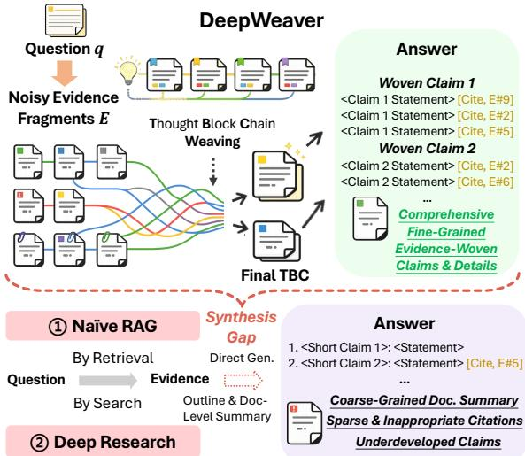
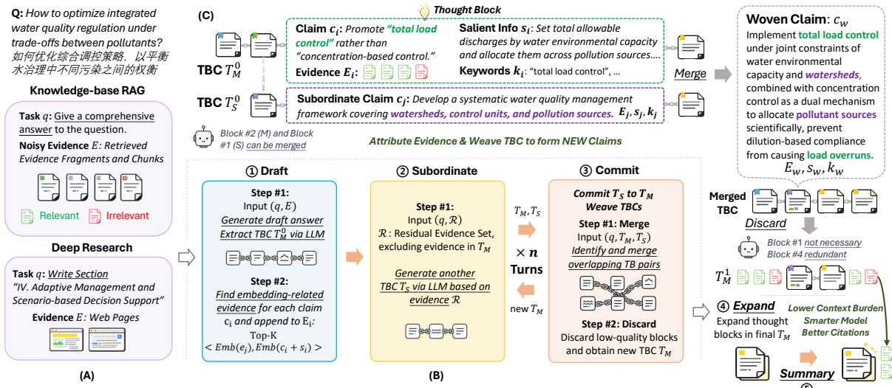
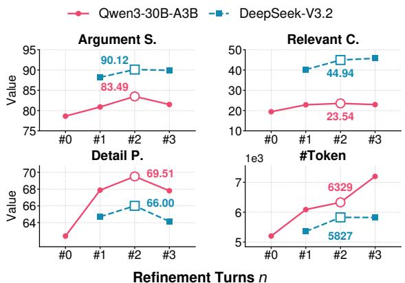
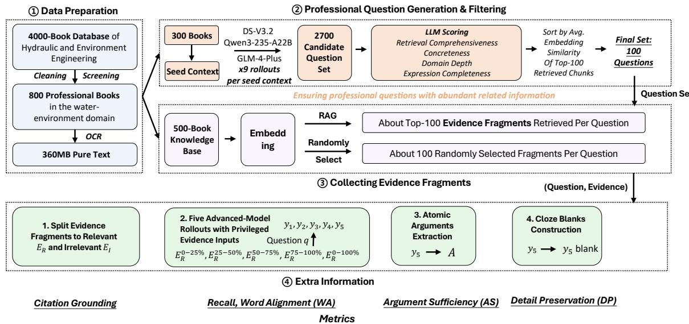
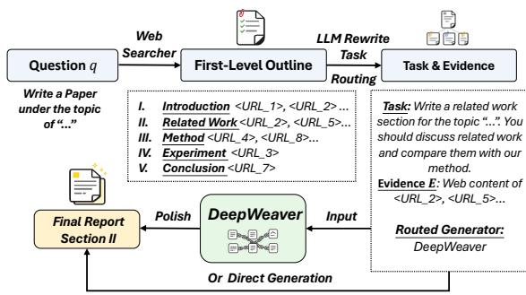
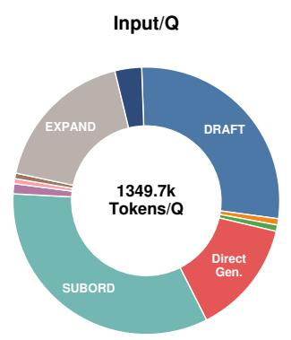
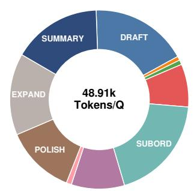
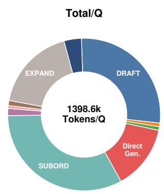

# DeepWeaver: Bridging the Evidence Synthesis Gap in Open-Ended Question Answering

Xujia Wang Yizhe Zhang Bin Xu<sup>†</sup> Lei Hou Juanzi Li

Department of Computer Science and Technology, Tsinghua University klozewang19@gmail.com

## Abstract

Retrieve-then-generate pipelines are commonly used to produce deep-research answers for open-ended questions, but retrieval alone is insufficient: LLMs must organize noisy and fragmented evidence into comprehensive, wellcited answers. We refer to this process as evidence synthesis. However, direct generation often underuses evidence, misaligns citations, and collapses diverse information into shallow summaries, exposing an evidence synthesis gap between retrieval and generation. Thus, we propose DeepWeaver, a novel framework that weaves noisy retrieved evidence into comprehensive answers by maintaining Thought Block Chains (TBCs), a structured representation that groups claims, salient information, keywords, and supporting evidence. Deep-Weaver uses subordinate TBCs to inspect residual evidence, commit TBC revisions, and discover new claims before final generation. We evaluate DeepWeaver on open-ended QA over both knowledge bases and the web, and intro duce LoQA, a high-density benchmark for evidence synthesis. Across LLMs, DeepWeaver improves content sufficiency, citation grounding, and detail preservation on LoQA, while achieving deeper insights and higher citation quality on DeepResearch Bench. These results show that evidence weaving is effective for bridging retrieval and generation in open-ended QA. Our code is available at this URL.

## 1 Introduction

Large language models (LLMs) are increasingly being used to generate research-style answers grounded in external evidence (Menick et al., 2022; Asai et al., 2024a). For domain-specific openended questions and deep-research-style tasks, answering a query may require integrating evidence from hundreds of retrieved passages, web pages, books, or technical documents. As a result, evidence retrieval and synthesis are central to both retrieval-augmented generation (RAG) pipelines (Lewis et al., 2021; Izacard and Grave, 2021) and web-based deep-research agents (Nakano et al., 2021; Yao et al., 2022). These systems share a common workflow: retrieve evidence, place it into the context, and prompt the model to synthesize a comprehensive answer (Huang and Huang, 2024).

  
Figure 1: DeepWeaver bridges the evidence synthesis gap between retrieval and generation by weaving noisy evidence into structured Thought Block Chains (TBCs). Unlike naïve retrieval-augmented generation, DeepWeaver synthesizes noisy evidence fragments into answers with well-supported woven claims, fine-grained details, and grounded citations.

Although prior work has extensively studied how to improve evidence retrieval quality (Han et al., 2024; Guo et al., 2024; Sun et al., 2025), retrieval itself is merely the first step: enabling LLMs to effectively use extensive, noisy, and fragmented evidence to generate comprehensive answers remains a key challenge. To better integrate upstream evidence, context-refinement methods (Xu et al., 2023; Jin et al., 2025b) compress, filter, or restructure passages before generation, while divideand-conquer methods (Zhang et al., 2024b; Zhou et al., 2024) split long contexts into segments and aggregate intermediate outputs. End-to-end deepresearch systems (Wang et al., 2024c; Tao et al., 2025; Li et al., 2025b) go further by automating evidence organization and long-form answer writing with agent memory and outline-guided generation.

However, prior methods overestimate LLMs ability to fully exploit input evidence to derive indepth, diverse claims. By primarily optimizing evidence presentation and outline-guided writing (Xu and Peng, 2025), these approaches often fall short in deeply synthesizing retrieved evidence into well-developed answers. When faced with noisy, fragmented, and knowledge-dense evidence, relying solely on the LLM’s internal reasoning often obscures fine-grained details and produces underdeveloped claims. This disconnect between raw retrieved evidence and comprehensive generation is what we define as the evidence synthesis gap.

We argue that an intermediate modulefor orchestrating evidence and weaving evidence-grounded claims is essential for bridging the gap between retrieval and final answer generation (Figure 1). The central idea is to structure noisy retrieved evidence into fine-grained thought units, rather than synthesizing answers in a single pass.

To this end, we propose DeepWeaver, a novel framework for open-ended answer generation grounded in noisy evidence. DeepWeaver maintains a Thought Block Chain (TBC) structure, where each thought block corresponds to a discovered aspect of the answer and stores its claim, keywords, salient information, and supporting evidence fragments. DeepWeaver weaves TBCs by identifying overlooked evidence in the current TBC and generating subordinate TBCs to inspect residual evidence that has not been sufficiently covered. Newly discovered information and claims are then committed back into the main TBC. This design produces evidence-woven claims and links these claims to relevant fragments, thereby improving answer comprehensiveness and citation quality while alleviating context-window pressure.

We evaluate DeepWeaver on our LoQA benchmark (§2.2), an open-ended answer generation benchmark with extensive noisy evidence. LoQA contains 100 water-environment research questions, each paired with evidence retrieved from a Chinese expert knowledge base comprising 500 books and over 100M characters. It stress-tests whether QA systems can comprehensively use evidence, preserve domain-specific details, and generate wellcited answers. We also evaluate DeepWeaver on web-based deep-research questions using Deep-Research Bench (Du et al., 2025), which contains PhD-level research tasks across diverse fields. Experiments show that DeepWeaver substantially improves content sufficiency, citation grounding, and detail preservation on LoQA, while achieving deeper insights and higher citation quality than advanced agents on DeepResearch Bench.

Our main contributions include:

• We identify the evidence synthesis gap in open-ended QA, highlighting the need for an explicit synthesis stage beyond retrieval.

• We propose DeepWeaver, a framework that orchestrates noisy retrieved evidence into structured Thought Block Chains and generates open-ended answers via evidence weaving.

• We introduce LoQA, a benchmark for evaluating evidence-grounded answer generation. Experiments show that DeepWeaver improves answer comprehensiveness and citation quality on both LoQA and DeepResearch Bench.

## 2 Task Formulation

We evaluate whether a QA system can synthesize a large set of evidence fragments into comprehensive open-ended answers. This setting reflects realistic information-seeking needs: answering a query may involve multiple claims, while the supporting evidence is scattered across sources (e.g., books, technical documents, and passages). Although RAG techniques can retrieve such evidence, whether QA systems can fully exploit it is unclear.

## 2.1 Definition

Given an open-ended research-style question q and a retrieved evidence pool $E = \{ e _ { 1 } , e _ { 2 } , . . . , e _ { N } \}$ collected from relevant documents, a QA system is required to generate an answer y that thoroughly resolves q while being grounded in the evidence. Answers are evaluated according to three aspects that characterize evidence synthesis quality:

• Content sufficiency: the answer should cover the major content and claims implied by the question and synthesized from the evidence.

• Detail preservation: the answer should retain fine-grained information rather than collapse it into generic summaries.

• Citation grounding: the answer should ground its claims in relevant evidence.

## 2.2 The LoQA Benchmark

LoQA is built from a Chinese water-environment domain knowledge base containing 500 books and over 100M characters. We choose this domain because it contains dense technical knowledge, complex causal relations, and practical open-ended questions, which involve evidence across multiple subtopics, such as pollution control, water quality assessment, and watershed management.

Construction. LoQA contains 100 open-ended research-style questions. We generate 3,000 candidate questions using multiple state-of-the-art LLMs based on book contexts, and then filter them using LLM-based scores for retrieval comprehensiveness, concreteness, domain depth, and expression completeness. We retrieve evidence for each candidate and select the final questions with the highest average similarity to the retrieved fragments, ensuring that each question involves rich evidence (§A.1.2).

About 100 evidence fragments (chunked into 1,024-token segments) are retrieved for each question. To simulate a noisier context, we add another 100 random evidence fragments<sup>1</sup>.

Gold answers for long-context, open-ended, domain-specific questions are difficult to produce and evaluate. Inspired by prior work (Shao et al., 2024), we therefore evaluate evidence synthesis quality by assessing answer comprehensiveness along several controlled dimensions. Specifically, LoQA decomposes this subjective notion into three dimensions: (1) citation grounding, (2) content sufficiency, and (3) detail preservation.

Citation grounding. We use a strong LLM judge, DeepSeek-V3.2, to determine whether each evidence fragment is relevant to the question. This splits the evidence pool E into a relevant set $E _ { R }$ and an irrelevant set $E _ { I }$ . Given a generated answer $y ,$ let $C$ denote the set of evidence fragments cited by $y .$ We compute three citation metrics: (1) Citation Count (CC): |C|, (2) Relevant Count (RC): $| C \cap E _ { R } |$ , and (3) Relevant Ratio (RR): $| C \cap E _ { R } | / | C |$ . These metrics measure whether the system actively uses evidence and properly avoids citing or integrating irrelevant evidence.

Content sufficiency. This dimension evaluates whether the answer sufficiently covers the key terms and arguments synthesized from the evidence.

To obtain reference answers, we use DeepSeek-V3.2 to generate five answers from different partitions of the relevant evidence set $E _ { R } { : }$

$$
E _ { R } ^ { 0 - 2 5 \% } , E _ { R } ^ { 2 5 - 5 0 \% } , E _ { R } ^ { 5 0 - 7 5 \% } , E _ { R } ^ { 7 5 - 1 0 0 \% } , E _ { R } ^ { 0 - 1 0 0 \% } .
$$

This yields five reference answers $y _ { 1 } , y _ { 2 } , y _ { 3 } , y _ { 4 } , y _ { 5 }$ We compute two lexical-level metrics:

(1) Recall, the average of the longest common subsequence (LCS) ratio:

$$
{ \frac { 1 } { 5 } } \sum _ { i = 1 } ^ { 5 } { \frac { \operatorname { L C S } ( y _ { i } , y ) } { | y _ { i } | } } .
$$

(2) Word Alignment (WA), the average BLEU-4 score, adopting the generated answer y as the target and each reference answer $y _ { i }$ as the source:

$$
{ \frac { 1 } { 5 } } \sum _ { i = 1 } ^ { 5 } \mathrm { B L E U - 4 } ( y _ { i } , y ) .
$$

We also compute the Argument Sufficiency (AS) metric, using an LLM to extract a set of atomic arguments $A$ from reference answers $y _ { 1 } , \ldots , y _ { 5 }$ Then we judge whether each argument in A is covered by the generated answer y via LLM:

$$
{ \frac { 1 } { | A | } } \sum _ { a \in A } \operatorname { I } ( a { \mathrm { ~ i s ~ c o v e r e d ~ b y ~ } } y ) .
$$

Detail preservation. We evaluate whether the generated answer preserves fine-grained details from the evidence pool. We first use an LLM to create cloze-style questions from the answer $y _ { 5 }$ . The blanks mainly target technical terms, concepts, and short phrases. We judge whether each blank can be correctly recovered by providing the generated answer $y$ as the reference document. Detail Preservation (DP) is the proportion of cloze blanks in B that can be correctly recovered:

$$
{ \frac { 1 } { | B | } } \sum _ { b \in B } \mathbb { I } ( b \mathrm { \ c a n b e \ r e c o v e r e d \ f r o m \ } y ) .
$$

## 3 Method

## 3.1 Thought Block Chain

We define the Thought Block Chain (TBC) as an explicit data structure that bridges retrieved evidence and final answer generation. The TBC serves as the core information structure maintained by DeepWeaver, decomposing the answer into a sequence of thought blocks:

$$
\mathcal { T } = [ b _ { 1 } , b _ { 2 } , \dots , b _ { K } ] .
$$

  
Figure 2: Overview of DeepWeaver. (A) We apply DeepWeaver to two typical retrieve-then-generate scenarios. (B) DeepWeaver maintains and refines the TBC through three stages: Draft, Subordinate, and Commit. (C) A concrete example of commitment shows how DeepWeaver synthesizes new claims from residual evidence by TBC weaving.

Each block $b _ { i }$ encapsulates a candidate claim and stores the corresponding keywords, salient information, and supporting evidence fragments:

$$
b _ { i } = ( c _ { i } , k _ { i } , s _ { i } , E _ { i } ) ,
$$

where $c _ { i } , k _ { i }$ and $s _ { i }$ denote the claim, keywords, and salient information, respectively, and $E _ { i } \subseteq E$ is the subset of evidence fragments linked to the claim.

Unlike a plain outline that tends to provide a survey rather than a question-resolving answer, the TBC organizes detailed evidence into fine-grained woven claims, while maintaining an explicit mapping between claims and relevant evidence and reducing the context burden during generation.

## 3.2 Evidence Weaving

The core mechanism of DeepWeaver (Figure 2(B)) lies in the maintenance of a main TBC $\mathcal { T } _ { M }$ . It updates $\mathcal { T } _ { M }$ through multi-stage refinement. Overall, DeepWeaver consists of three ordered weaving stages: Draft, Subordinate, and Commit.

Draft. Given the question q and the retrieved evidence pool E, the LLM first produces an answer draft via direct generation. DeepWeaver then extracts the initial main TBC $\mathcal { T } _ { M } ^ { 0 }$ from this draft. This step leverages the LLM’s global view of the evidence pool, allowing it to form an initial set of claims from a broad perspective.

Subordinate. The initial TBC $\mathcal { T } _ { M } ^ { 0 }$ may be incomplete, as direct generation can overlook useful evidence and omit important claims. The subordinate stage is designed to identify evidence fragments that are neglected, weakly covered, or insufficiently reflected in the current TBC. We define the residual evidence set $\mathcal { R } _ { 0 }$ of the initial TBC $\mathcal { T } _ { M } ^ { 0 }$ as:

$$
{ \mathcal R } _ { 0 } = \{ e _ { j } \in E \mid e _ { j } \mathrm  { i s } \ n o t \ c o v e r e d \ b y \ { \mathcal T } _ { M } ^ { 0 } \} . \nonumber
$$

We say an evidence fragment is covered by the initial TBC $\mathcal { T } _ { M } ^ { 0 }$ if it satisfies either: (1) it is directly mentioned in $\mathcal { T } _ { M } ^ { 0 }$ ; or (2) it is among the top-k fragments most similar to the string $c _ { i } + s _ { i }$ in the embedding space, and the similarity is higher than the average similarity of the evidence $E _ { i }$ in the corresponding block $b _ { i } \in T _ { M } ^ { 0 }$ . The complement of the covered evidence set is defined as $\mathcal { R } _ { 0 }$

DeepWeaver generates a subordinate TBC $\mathcal { T } _ { S } ^ { 0 }$ (Figure 2 ②) from the evidence in $\mathcal { R } _ { 0 }$ . This procedure acts as a local inspector of overlooked evidence. It discovers missing aspects, additional details, and alternative supporting evidence that are not captured by the main TBC.

Commit. The useful information in $\mathcal { T } _ { S } ^ { 0 }$ is then committed back to the main TBC $\mathcal { T } _ { M } ^ { 0 }$ through two operations: Merge and Discard (Figure 2 ③).

The merge operation identifies overlapping claim pairs between the two TBCs and merges their claims $c _ { i }$ and keywords $k _ { i }$ , while their salient information $s _ { i }$ and evidence sets $E _ { i }$ are combined to form a merged block. This produces woven claims that integrate multi-dimensional explanations.

After merging, the discard operation removes irrelevant, redundant, or weakly supported claims with respect to the question, preventing TBC from over-expanding. This yields a refined TBC $\mathcal { T } _ { M } ^ { 1 }$

$$
\operatorname { D I S C A R D } \left( q , \mathbf { M E R G E } ( \mathcal { T } _ { M } ^ { 0 } , \mathcal { T } _ { S } ^ { 0 } ) \right) \to \mathcal { T } _ { M } ^ { 1 } .
$$

DeepWeaver repeats the subordinate and commit stages for n rounds to refine the woven claims and incorporate additional supporting evidence<sup>2</sup>:

$$
\mathcal { T } _ { M } ^ { 0 } \to \mathcal { T } _ { M } ^ { 1 } \to \cdots \to \mathcal { T } _ { M } ^ { t } \to \cdots \to \mathcal { T } _ { M } ^ { n } .
$$

Furthermore, to reduce the context burden during TBC construction, the draft and subordinate stages randomly sample r $( r < | E | )$ evidence fragments from $E$ and $\mathcal { R } _ { t }$ (the residual evidence set at refinement turn $t ) .$ , respectively. Across multiple revision rounds, the model can inspect the full evidence pool while avoiding the burden of processing an excessively long context in one pass.

## 3.3 Evidence-Grounded Answer Generation

After evidence weaving, DeepWeaver generates the final answer from the refined TBC $\mathcal { T } _ { M } ^ { n }$ (Figure 2 ④–⑤). For each block $b _ { i }$ , the model receives its metadata and linked evidence subset $E _ { i }$ as a focused local context, and then generates an answer section $S _ { i }$ grounded in the corresponding evidence:

$$
S _ { i } = { \mathrm { \bf G E N E R A T E } } ( q , c _ { i } , s _ { i } , E _ { i } ) .
$$

The final answer<sup>3</sup> is composed of all generated sections using the LLM to build links among $S _ { i }$ :

$$
y _ { i } = \tt A P P E N D ( y _ { i - 1 } , S _ { i } ) , \ y = y _ { K }
$$

This block-wise generation strategy has two advantages: (1) it decomposes context pressure into claim-level generation, and (2) it improves citation grounding because each section is generated from a smaller and more relevant evidence subset.

## 4 Experiments

We evaluate DeepWeaver on both knowledge-base open-ended question answering and end-to-end web-based open-ended deep research.

## 4.1 Datasets

LoQA. A high-density evidence-based QA benchmark (§2.2) with 100 research-style practical water-environment questions. Each question is paired with long-context evidence retrieved from a 500-book knowledge base, evaluating whether systems can deeply synthesize fragmented retrieved evidence to generate comprehensive answers.

DeepResearch Bench. It contains 100 PhD-level deep-research tasks across 22 fields, where evaluated agents search for web information and write long-form answers. The RACE split measures answer quality using LLM-judged criteria, including comprehensiveness, insight, instruction following, and readability<sup>4</sup>, while FACT measures citation accuracy and the number of effective citations.

## 4.2 Baselines

We compare DeepWeaver with representative evidence-based QA baselines on LoQA.

RAG. An LLM directly generates the answer from evidence. We consider three context settings: the full evidence pool $E _ { \mathrm { { : } } }$ the relevant evidence set $E _ { R } ,$ , and a randomly sampled subset $E _ { 1 2 0 }$ containing 120 chunks (Lewis et al., 2021).

Skeleton-of-Thought (SoT). The model first generates a thought outline and then writes the answer section by section, with the full evidence pool provided in the input context (Ning et al., 2024).

Plan-and-Solve (PaS). The model generates a plan to produce the answer (Wang et al., 2023a).

Chain-of-Agents (CoA). A divide-and-conquer framework that splits the evidence pool E into smaller subsets, processes them batch by batch, and gradually refines the answer (Zhang et al., 2024b).

LongRefiner. A method that preprocesses the evidence pool E by extracting structured articles and sentences from noisy evidence (Jin et al., 2025b).

For DeepResearch Bench, baselines include advanced agents<sup>5</sup> and WebWeaver (Li et al., 2025b), a dual-agent framework that uses a planner to search the web and write outlines, and a writer to fulfill the outline using a memory bank.

## 4.3 Implementation Details

We evaluate DeepWeaver under multiple backbones, including Qwen3-30B-A3B-Instruct-2507, Qwen3-30B-A3B-Thinking-2507 (Yang et al., 2025), DeepSeek-V3.2 (Liu et al., 2024a), DeepSeek-V4-Flash (DeepSeek-AI, 2026), and Qwen3.5-122B-A10B. We set refinement rounds to n = 2, the top-k covered evidence retrieval size to $k = 5 .$ , and the number of randomly sampled chunks to $r = 1 2 0$ . We use GLM-Embedding-3 (Team et al., 2025) to compute text embeddings. The maximum generation length is 32,768 tokens.

<table><tr><td rowspan="3">Method</td><td colspan="6">▶ Qwen3-30B-A3B-Instruct-2507</td><td colspan="8">Qwen3-30B-A3B-Thinking-2507</td></tr><tr><td colspan="3">Content S.</td><td colspan="3">Citation G.</td><td>Detail</td><td colspan="3">Content S.</td><td colspan="3">Citation G.</td><td>Detail</td></tr><tr><td>Recall</td><td>WA</td><td>AS</td><td>CC</td><td>RC</td><td>RR</td><td>DP</td><td>Recall</td><td>WA</td><td>AS</td><td>CC</td><td>RC</td><td>RR</td><td>DP</td></tr><tr><td>E120-RAG</td><td>20.4</td><td>4.0</td><td>70.6</td><td>17.7</td><td>13.6</td><td>78.9</td><td>56.4</td><td>24.0</td><td>5.6</td><td>64.8</td><td>12.8</td><td>10.8</td><td>85.0</td><td>51.0</td></tr><tr><td>E-RAG</td><td>19.8</td><td>4.0</td><td>68.0</td><td>11.9</td><td>8.8</td><td>74.3</td><td>52.9</td><td>21.9</td><td>5.0</td><td>59.9</td><td>10.6</td><td>9.0</td><td>75.3</td><td>53.9</td></tr><tr><td>ER-RAG</td><td>21.8</td><td>4.5</td><td>76.5</td><td>21.4</td><td>21.4</td><td>100</td><td>58.8</td><td>24.6</td><td>5.9</td><td>68.0</td><td>16.3</td><td>16.3</td><td>100</td><td>55.9</td></tr><tr><td>SoT</td><td>20.3</td><td>4.2</td><td>73.4</td><td>13.8</td><td>7.7</td><td>53.6</td><td>58.7</td><td>30.1</td><td>8.2</td><td>61.8</td><td>24.2</td><td>15.4</td><td>64.5</td><td>29.5</td></tr><tr><td>PaS</td><td>13.8</td><td>2.0</td><td>58.4</td><td>9.9</td><td>4.8</td><td>48.4</td><td>44.8</td><td>10.9</td><td>2.0</td><td>33.2</td><td>6.5</td><td>4.0</td><td>35.8</td><td>46.3</td></tr><tr><td>Chain-of-Agents</td><td>14.7</td><td>2.4</td><td>70.3</td><td>19.2</td><td>15.3</td><td>81.2</td><td>60.2</td><td>8.2</td><td>1.1</td><td>34.4</td><td>8.6</td><td>7.8</td><td>91.0</td><td>30.3</td></tr><tr><td>LongRefiner</td><td>21.0</td><td>4.0</td><td>78.2</td><td>21.1</td><td>16.7</td><td>79.7</td><td>57.6</td><td>23.9</td><td>5.4</td><td>69.0</td><td>16.7</td><td>14.7</td><td>87.5</td><td>36.4</td></tr><tr><td>DeepWeaver</td><td>27.4</td><td>6.1</td><td>83.5</td><td>26.6</td><td>23.5</td><td>88.8</td><td>69.5</td><td>34.5</td><td>8.0</td><td>85.1</td><td>30.9</td><td>28.6</td><td>92.3</td><td>69.1</td></tr><tr><td>∆ over E-RAG</td><td>+7.6</td><td>+2.1</td><td>+15.5</td><td>+14.7</td><td>+14.7</td><td>+14.5</td><td>+16.6</td><td>+12.6</td><td>+3.0</td><td>+25.2</td><td>+20.3</td><td>+19.6</td><td>+17.0</td><td>+15.2</td></tr></table>

Table 1: Comprehensiveness of answers generated by evidence-based QA systems on LoQA, reflecting evidence synthesis quality. Results are shown in terms of content sufficiency (Content S.), citation grounding (Citation G.) and detail preservation (Detail). Metric definitions are provided in §2.2. The best results are highlighted in bold.

For LoQA evaluation, we use DeepSeek-V3.2 as the judge for Argument Sufficiency (AS) and Detail Preservation (DP), with temperature set to 0. For DeepResearch Bench, we follow the official setting and use Gemini-2.5-Pro (Comanici et al., 2025) for RACE and Gemini-2.5-Flash for FACT evaluation. More implementation details for Deep-Research Bench are provided in Appendix §A.2.

## 4.4 Main Results

Table 1 reports the main results on LoQA. Deep-Weaver consistently improves evidence synthesis quality across both instruct and thinking backbone models. DeepWeaver substantially outperforms direct generation and evidence-based QA baselines. With Qwen3-30B-A3B-Instruct-2507, Deep-Weaver surpasses E-RAG by 15.5% in Argument Sufficiency, +14.7 Relevant Citations, 14.5% in Relevant Citation Ratio, and 16.6% in Detail Preservation. These gains show that DeepWeaver improves answer quality across multiple dimensions, including content sufficiency, citation grounding, and detail preservation.

We further highlight the evidence synthesis gap: direct generation is insufficient for using noisy RAG evidence. For both backbones, E-RAG does not outperform $E _ { \mathrm { 1 2 0 ^ { - } R A G } }$ , despite receiving more evidence. This suggests that adding more retrieved chunks can increase the context burden and cause the model to overlook useful information. The oracle $E _ { R ^ { - } } \mathbf { R } \mathbf { A } \mathbf { G }$ setting receives only relevant evidence, yet it still lags behind DeepWeaver. This indicates that removing noise alone is insufficient to solve the evidence synthesis problem.

Among the reasoning and divide-and-conquer baselines, SoT struggles to preserve fine-grained details and identify relevant evidence under heavy context burden. PaS is less effective because opensource models often struggle to produce reliable writing plans for complex, evidence-heavy questions. CoA and LongRefiner improve citation usage in some cases by reducing context burden or refining evidence, but they still suffer from insufficient claims and missing details. These results support our main claim: comprehensive answer generation requires not only retrieving or filtering evidence, but also an effective evidence synthesis process that weaves fine-grained evidence into coherent claim-level structures.

## 4.5 Ablation Study

We ablate two core mechanisms of DeepWeaver on Qwen3-30B-A3B-Instruct-2507: TBC subordination and commitment (§3.2). In w/o subordinate, the system directly expands the initial TBC $\mathcal { T } _ { M } ^ { 0 }$ into the final answer. In w/o commit, the system appends the subordinate TBC $\mathcal { T } _ { S } ^ { 0 }$ to $\mathcal { T } _ { M } ^ { 0 }$ , without the merge and discard operations.

<table><tr><td></td><td>AS</td><td>RC</td><td>RR</td><td>DP</td><td>#Blocks</td></tr><tr><td>DeepWeaver</td><td>83.5</td><td>23.5</td><td>88.8</td><td>69.5</td><td>6.63</td></tr><tr><td>w/o TBC subordinate</td><td>78.6</td><td>21.2</td><td>89.2</td><td>62.4</td><td>5.76</td></tr><tr><td>w/o TBC commit</td><td></td><td>84.4 22.3</td><td>85.8</td><td>67.9</td><td>10.2</td></tr></table>

Table 2: Ablation study on TBC subordination and commitment. Scores in red highlight variants with severe performance degradation.

Table 2 shows that removing subordination hurts all three dimensions of evidence synthesis quality, indicating that the initial TBC is often incomplete and requires further refinement to recover overlooked evidence. Removing commitment makes answers less concise and weakens claim weaving: it achieves comparable AS and DP while producing more blocks, suggesting that it introduces overlapping and redundant claims.

  
Figure 3: Effect of refinement rounds on final performance. Increasing the number of refinement rounds from n = 1 to n = 2 improves answer comprehensiveness, while a third round brings no clear additional gain. n = 2 provides the best cost–performance trade-off.

We also study the optimal refinement rounds n. As shown in Figure 3, DeepWeaver remains stable across different values of n, with n = 2 achieving the best overall performance. Increasing the number of rounds from one to two improves content sufficiency, citation grounding, and detail preservation. This indicates that the second subordinateand-commit step helps enrich the claims and final TBC. A third round yields no substantial improvements, possibly because excessive refinement introduces marginally useful information. Considering both performance and efficiency, we set n = 2 by default. With only two rounds of refinement over the initial TBC, DeepWeaver brings large gains. This demonstrates the efficiency of the evidence weaving mechanism.

## 4.6 Cross-Model Generalizability

Table 3 evaluates whether DeepWeaver generalizes across different LLM backbones. The results show that DeepWeaver brings consistent gains across backbone models. For example, on DeepSeek-V4- Flash, DeepWeaver improves Recall from 24.2 to 31.6, AS from 75.4% to 86.5%, RC from 31.0 to 44.6, and DP from 60.0% to 67.4%.

These results indicate that the benefit of Deep-Weaver does not depend on a specific backbone model. Instead, evidence weaving provides a general mechanism for improving the use of noisy evidence. Notably, DeepWeaver with Qwen3-30B-A3B-Instruct-2507 outperforms direct generation with DeepSeek-V3.2, even though DeepSeek-V3.2 is a strong long-context model. This shows that explicitly weaving evidence is more effective than relying solely on stronger long-context capabilities.

<table><tr><td rowspan="2">Method</td><td colspan="3">Content S.</td><td colspan="3">Citation G.</td><td rowspan="2">Detail DP</td></tr><tr><td>Recall</td><td>WA</td><td>AS</td><td>CC</td><td>RC</td><td>RR</td></tr><tr><td>w/o DW</td><td colspan="3"> DeepSeek-V4-Flash</td><td colspan="3">35.4 31.0</td><td>60.0</td></tr><tr><td>wDW</td><td>24.2 31.6</td><td>6.1 10.6</td><td>75.4 86.5</td><td>50.5</td><td>44.6</td><td>88.2 88.4</td><td>67.4</td></tr><tr><td>w/o DW 21.7</td><td colspan="3">▶ Qwen3.5-122B-A10B 4.6 77.7</td><td>32.4</td><td>28.9</td><td>89.2</td><td>53.5</td></tr><tr><td>wDW</td><td>29.0</td><td>7.3</td><td>87.7</td><td>49.9</td><td>44.4</td><td>89.3</td><td>64.6</td></tr><tr><td>w/o DW</td><td colspan="3">DeepSeek-V3.2</td><td>27.0</td><td>21.7</td><td>81.7</td><td>59.6</td></tr><tr><td>w DW</td><td>24.5 32.4</td><td>5.8 10.3</td><td>78.5 90.1</td><td>51.8</td><td>44.9</td><td>86.7</td><td>65.7</td></tr><tr><td>w DW</td><td colspan="3">▶ Qwen3-30B-A3B-Instruct-2507 27.4 6.1 83.5</td><td>26.6</td><td>23.5</td><td>88.8</td><td>69.5</td></tr></table>

Table 3: Generalizability of DeepWeaver across recent advanced LLMs. DeepWeaver consistently yields substantial gains across different backbone models. Notably, DeepWeaver with Qwen3-30B-A3B-Instruct-2507 substantially outperforms direct generation with DeepSeek-V3.2, a strong long-context model.

## 4.7 Extension to Web-Based Deep Research

Web-based deep-research agents also follow a retrieve-then-generate paradigm: search the web, collect evidence, and synthesize long-form answers from open-domain sources. We study whether DeepWeaver can serve as an evidence-weaving module to improve deep-research answer quality.

Since retrieval is not the focus of DeepWeaver, we reuse the web pages and top-level section titles collected by WebWeaver’s planner for simplicity and fair comparison<sup>6</sup>. Each question is decomposed into section-level writing tasks. For each section, DeepWeaver treats the collected web pages as evidence fragments and generates the corresponding top-level answer section (§A.2).

Unlike WebWeaver, which summarizes evidence into coarse-grained outline titles at the webpage level, DeepWeaver operates on fine-grained evidence chunks and weaves them into detailed claimlevel structures. As shown in Table 4, DeepWeaver achieves the best overall RACE score. It weaves evidence more deeply into insightful and comprehensive claims. Notably, our method also substantially improves effective citation and citation accuracy over WebWeaver on FACT, indicating that it organizes web evidence into reliable support for answer claims. <sup>†</sup>However, denser citations and more in-depth claims may affect readability, and the metric may favor an outline-driven writing style. Since readability optimization is not the primary focus of this paper, we leave it to future work.

<table><tr><td rowspan="2">Agent</td><td colspan="5">RACE</td><td colspan="2">FACT</td></tr><tr><td>Comp.</td><td>Insight</td><td>Inst.</td><td>Read.†</td><td>Overall</td><td>Eff. c.</td><td>C. acc.</td></tr><tr><td>doubao-research</td><td>44.84</td><td>40.56</td><td>47.95</td><td>44.69</td><td>44.34</td><td>52.62</td><td>52.86</td></tr><tr><td>kimi-research</td><td>44.96</td><td>41.97</td><td>47.14</td><td>45.59</td><td>44.64</td><td></td><td></td></tr><tr><td>Claude-research</td><td>45.34</td><td>42.79</td><td>47.58</td><td>44.66</td><td>45.00</td><td></td><td></td></tr><tr><td>openai-deepresearch</td><td>46.46</td><td>43.73</td><td>49.39</td><td>47.22</td><td>46.45</td><td>39.79</td><td>75.01</td></tr><tr><td>WebWeaver (Qwen3-30B-A3B-Instruct-2507)</td><td>45.15</td><td>45.78</td><td>49.21</td><td>47.34</td><td>46.77</td><td>26.74</td><td>25.00</td></tr><tr><td>DeepWeaver (Qwen3-30B-A3B-Instruct-2507)</td><td>45.99</td><td>47.59</td><td>49.41</td><td>42.54</td><td>47.05</td><td>60.13</td><td>62.02</td></tr></table>

Table 4: Results on DeepResearch Bench. DeepWeaver improves comprehensiveness (Comp.) and insight, and achieves substantially better effective citation (Eff. C.) and citation accuracy (C. Acc.) than WebWeaver. Better scores are highlighted in green. All scores are assigned by LLM judges according to detailed expert-level criteria.

Despite this trade-off, the overall performance gains confirm that evidence weaving also benefits web-based deep research as a general downstream module beyond knowledge-base QA.

## 5 Related Work

Retrieval-Augmented and Attributed Generation. Retrieval-augmented generation is a common way to incorporate external knowledge in question answering (Guu et al., 2020; Ram et al., 2023; Xu et al., 2024). Sparse vector retrieval (Robertson and Zaragoza, 2009; Wang et al., 2023b; Schick et al., 2023) retrieves relevant text through term-frequency or keyword matching, while dense vector retrieval (Lewis et al., 2021; Hofstätter et al., 2022; Liu et al., 2025) encodes the query and text into vectors. Recent advances further improve retrieval through self-reflective retrieval control, graph-structured evidence organization, interleaved retrieval and reasoning, and search-based planning (Asai et al., 2024b; Han et al., 2024; Wang et al., 2024d; Hu et al., 2025).

Long-Context Evidence Integration. Larger context windows allow models to include more retrieved evidence, but long-context models may still overlook relevant information in long or noisy inputs (Liu et al., 2024b; Hsieh et al., 2024; Modarressi et al., 2025). A line of work improves how upstream retrieved evidence is presented to the model. Context-refinement methods compress, filter, or restructure retrieved passages before generation, including RECOMP, Chain-of-Note, and LongRefiner (Xu et al., 2023; Yu et al., 2024; Jin et al., 2025b). Divide-and-conquer methods (Zhang et al., 2024b; Zhou et al., 2024; Guo et al., 2025) split long contexts into smaller segments and aggregate intermediate outputs. These methods reduce context burden by refining input with coarser evidence representations (Jiang et al., 2024), but leave the evidence synthesis gap underexplored.

Long-Form Grounded Writing and Deep-Research Agents. Long-form grounded writing has been studied through outline-guided writing and reflection-driven generation, mainly for survey generation (Yan et al., 2025; Skarlinski et al., 2024; Shao et al., 2024; Wu et al., 2025), but these methods are not primarily designed to answer openended questions. Citation-oriented work further improves attribution and verifiability of long-form answers (Huang et al., 2024; Ye et al., 2024). Recent deep-research agents extend long-form writing to end-to-end QA systems: one line of work focuses on search timing and search-reasoning interaction (Li et al., 2025a; Jin et al., 2025a), another combines evidence collection with outline-based answer writing (Li et al., 2025b), and others improve agent capabilities through agentic supervised fine-tuning and reinforcement learning (Wu et al., 2026; Zheng et al., 2025).

## 6 Conclusion

We present DeepWeaver, a framework for bridging the evidence synthesis gap in open-ended question answering. Rather than treating retrieved evidence as a flat long-context input, DeepWeaver organizes noisy evidence into Thought Block Chains (TBCs), which connect fine-grained evidence fragments with evidence-grounded woven claims. Through iterative evidence weaving, Deep-Weaver identifies overlooked evidence, refines incomplete claims, and improves detail preservation and citation grounding. We also introduce LoQA, a high-density evidence benchmark for evaluating evidence-grounded answer generation. Experiments on knowledge-base QA and web-based deep research show that DeepWeaver consistently improves answer quality across multiple LLM backbones. These findings suggest that effective open-ended QA requires explicit evidence synthesis mechanisms between retrieval and generation, especially under noisy and fragmented evidence.

## 7 Limitations

In this work, we study evidence weaving as a way to advance retrieval-augmented open-ended question answering. While DeepWeaver improves evidence synthesis quality, several limitations remain. First, LoQA focuses on Chinese water-environment questions. Although this domain provides dense technical evidence and complex practical problems, it does not cover all languages, domains, or document types. We therefore evaluate DeepWeaver on DeepResearch Bench as a complementary setting, and future work will further enrich LoQA by expanding its metrics and assessment protocols. Second, DeepWeaver mainly improves the evidence synthesis stage after evidence collection. In the web-based setting, we reuse web pages and section titles collected by WebWeaver’s planner to isolate the effect of evidence weaving. Designing web-search agents better aligned with DeepWeaver remains an open problem. Third, DeepWeaver currently focuses on text-only evidence, while more complete answers may involve figures, charts, images, or structured data. Extending evidence weaving to multimodal and structured evidence remains future work. Finally, although DeepWeaver improves evidence synthesis, model-generated content still requires careful verification.

## References

Chenxin An, Shansan Gong, Ming Zhong, Xingjian Zhao, Mukai Li, Jun Zhang, Lingpeng Kong, and Xipeng Qiu. 2024. L-eval: Instituting standardized evaluation for long context language models. In Proceedings of the 62nd Annual Meeting of the Association for Computational Linguistics (Volume 1: Long Papers), pages 14388–14411.

Akari Asai, Jacqueline He, Rulin Shao, Weijia Shi, Amanpreet Singh, Joseph Chee Chang, Kyle Lo, Luca Soldaini, Sergey Feldman, Mike D’arcy, and 1 others. 2024a. Openscholar: Synthesizing scientific literature with retrieval-augmented lms. arXiv preprint arXiv:2411.14199.

Akari Asai, Zeqiu Wu, Yizhong Wang, Avi Sil, and Hannaneh Hajishirzi. 2024b. Self-rag: Learning to retrieve, generate, and critique through self-reflection. In International conference on learning representations, volume 2024, pages 9112–9141.

Yushi Bai, Xin Lv, Jiajie Zhang, Hongchang Lyu, Jiankai Tang, Zhidian Huang, Zhengxiao Du, Xiao Liu, Aohan Zeng, Lei Hou, and 1 others. 2024. Longbench: A bilingual, multitask benchmark for long context understanding. In Proceedings of the 62nd annual meeting of the association for computational

linguistics (volume 1: Long papers), pages 3119– 3137.

Gheorghe Comanici, Eric Bieber, Mike Schaekermann, Ice Pasupat, Noveen Sachdeva, Inderjit Dhillon, Marcel Blistein, Ori Ram, Dan Zhang, Evan Rosen, and 1 others. 2025. Gemini 2.5: Pushing the frontier with advanced reasoning, multimodality, long context, and next generation agentic capabilities. arXiv preprint arXiv:2507.06261.

DeepSeek-AI. 2026. Deepseek-v4: Towards highly efficient million-token context intelligence.

Mingxuan Du, Benfeng Xu, Chiwei Zhu, Xiaorui Wang, and Zhendong Mao. 2025. Deepresearch bench: A comprehensive benchmark for deep research agents. arXiv preprint arXiv:2506.11763.

Tianyu Gao, Howard Yen, Jiatong Yu, and Danqi Chen. 2023. Enabling large language models to generate text with citations. In Proceedings ofthe 2023 Conference on Empirical Methods in Natural Language Processing, pages 6465–6488.

Jiani Guo, Zuchao Li, Jie Wu, Qianren Wang, Yun Li, Lefei Zhang, Hai Zhao, and Yujiu Yang. 2025. Tom: Leveraging tree-oriented mapreduce for longcontext reasoning in large language models. Preprint, arXiv:2511.00489.

Zirui Guo, Lianghao Xia, Yanhua Yu, Tian Ao, and Chao Huang. 2024. Lightrag: Simple and fast retrieval-augmented generation. arXiv preprint arXiv:2410.05779, 2(3).

Kelvin Guu, Kenton Lee, Zora Tung, Panupong Pasupat, and Mingwei Chang. 2020. Retrieval augmented language model pre-training. In International conference on machine learning, pages 3929–3938. PMLR.

Haoyu Han, Yu Wang, Harry Shomer, Kai Guo, Jiayuan Ding, Yongjia Lei, Mahantesh Halappanavar, Ryan A Rossi, Subhabrata Mukherjee, Xianfeng Tang, and 1 others. 2024. Retrieval-augmented generation with graphs (graphrag). arXiv preprint arXiv:2501.00309.

Sebastian Hofstätter, Jiecao Chen, Karthik Raman, and Hamed Zamani. 2022. Fid-light: Efficient and effective retrieval-augmented text generation. Preprint, arXiv:2209.14290.

Cheng-Ping Hsieh, Simeng Sun, Samuel Kriman, Shantanu Acharya, Dima Rekesh, Fei Jia, Yang Zhang, and Boris Ginsburg. 2024. Ruler: What’s the real context size of your long-context language models? arXiv preprint arXiv:2404.06654.

Yunhai Hu, Yilun Zhao, Chen Zhao, and Arman Cohan. 2025. Mcts-rag: Enhancing retrieval-augmented generation with monte carlo tree search. arXiv preprint arXiv:2503.20757.

Lei Huang, Xiaocheng Feng, Weitao Ma, Yuxuan Gu, Weihong Zhong, Xiachong Feng, Weijiang Yu, Weihua Peng, Duyu Tang, Dandan Tu, and 1 others.

2024. Learning fine-grained grounded citations for attributed large language models. In Findings of the Associationfor Computational Linguistics: ACL 2024, pages 14095–14113.

Yizheng Huang and Jimmy Xiangji Huang. 2024. A survey on retrieval-augmented text generation for large language models. ACM Computing Surveys.

Gautier Izacard and Edouard Grave. 2021. Leveraging passage retrieval with generative models for open domain question answering. Preprint, arXiv:2007.01282.

Huiqiang Jiang, Qianhui Wu, Xufang Luo, Dongsheng Li, Chin-Yew Lin, Yuqing Yang, and Lili Qiu. 2024. Longllmlingua: Accelerating and enhancing llms in long context scenarios via prompt compression. In Proceedings of the 62nd Annual Meeting of the Associationfor Computational Linguistics (Volume 1: Long Papers), pages 1658–1677.

Bowen Jin, Hansi Zeng, Zhenrui Yue, Jinsung Yoon, Sercan Arik, Dong Wang, Hamed Zamani, and Jiawei Han. 2025a. Search-r1: Training llms to reason and leverage search engines with reinforcement learning. arXiv preprint arXiv:2503.09516.

Jiajie Jin, Xiaoxi Li, Guanting Dong, Yuyao Zhang, Yutao Zhu, Yongkang Wu, Zhonghua Li, Ye Qi, and Zhicheng Dou. 2025b. Hierarchical document refinement for long-context retrieval-augmented generation. In Proceedings of the 63rd Annual Meeting of the Association for Computational Linguistics (Volume 1: Long Papers), pages 3502–3520.

Patrick Lewis, Ethan Perez, Aleksandra Piktus, Fabio Petroni, Vladimir Karpukhin, Naman Goyal, Heinrich Küttler, Mike Lewis, Wen tau Yih, Tim Rocktäschel, Sebastian Riedel, and Douwe Kiela. 2021. Retrieval-augmented generation for knowledgeintensive nlp tasks. Preprint, arXiv:2005.11401.

Xiaoxi Li, Guanting Dong, Jiajie Jin, Yuyao Zhang, Yujia Zhou, Yutao Zhu, Peitian Zhang, and Zhicheng Dou. 2025a. Search-o1: Agentic search-enhanced large reasoning models. In Proceedings ofthe 2025 Conference on Empirical Methods in Natural Language Processing, pages 5420–5438.

Zijian Li, Xin Guan, Bo Zhang, Shen Huang, Houquan Zhou, Shaopeng Lai, Ming Yan, Yong Jiang, Pengjun Xie, Fei Huang, and 1 others. 2025b. Webweaver: Structuring web-scale evidence with dynamic outlines for open-ended deep research. arXiv preprint arXiv:2509.13312.

Aixin Liu, Bei Feng, Bing Xue, Bingxuan Wang, Bochao Wu, Chengda Lu, Chenggang Zhao, Chengqi Deng, Chenyu Zhang, Chong Ruan, and 1 others. 2024a. Deepseek-v3 technical report. arXiv preprint arXiv:2412.19437.

Nelson F Liu, Kevin Lin, John Hewitt, Ashwin Paranjape, Michele Bevilacqua, Fabio Petroni, and Percy Liang. 2024b. Lost in the middle: How language

models use long contexts. Transactions ofthe associationfor computational linguistics, 12:157–173.

Zheng Liu, Chaofan Li, Shitao Xiao, Yingxia Shao, and Defu Lian. 2025. Llama2vec: Unsupervised adaptation of large language models for dense retrieval. Preprint, arXiv:2312.15503.

Jacob Menick, Maja Trebacz, Vladimir Mikulik, John Aslanides, Francis Song, Martin Chadwick, Mia Glaese, Susannah Young, Lucy Campbell-Gillingham, Geoffrey Irving, and 1 others. 2022. Teaching language models to support answers with verified quotes. arXiv preprint arXiv:2203.11147.

Ali Modarressi, Hanieh Deilamsalehy, Franck Dernoncourt, Trung Bui, Ryan A Rossi, Seunghyun Yoon, and Hinrich Schütze. 2025. Nolima: Long-context evaluation beyond literal matching. arXiv preprint arXiv:2502.05167.

Reiichiro Nakano, Jacob Hilton, Suchir Balaji, Jeff Wu, Long Ouyang, Christina Kim, Christopher Hesse, Shantanu Jain, Vineet Kosaraju, William Saunders, and 1 others. 2021. Webgpt: Browser-assisted question-answering with human feedback. arXiv preprint arXiv:2112.09332.

Xuefei Ning, Zinan Lin, Zixuan Zhou, Zifu Wang, Huazhong Yang, and Yu Wang. 2024. Skeleton-ofthought: Prompting llms for efficient parallel generation. In International Conference on Learning Representations, volume 2024, pages 917–967.

Ori Ram, Yoav Levine, Itay Dalmedigos, Dor Muhlgay, Amnon Shashua, Kevin Leyton-Brown, and Yoav Shoham. 2023. In-context retrieval-augmented language models. Transactions of the Association for Computational Linguistics, 11:1316–1331.

Stephen Robertson and Hugo Zaragoza. 2009. The probabilistic relevance framework: BM25 and beyond, volume 4. Now Publishers Inc.

Timo Schick, Jane Dwivedi-Yu, Roberto Dessì, Roberta Raileanu, Maria Lomeli, Eric Hambro, Luke Zettlemoyer, Nicola Cancedda, and Thomas Scialom. 2023. Toolformer: Language models can teach themselves to use tools. Advances in neural information processing systems, 36:68539–68551.

Yijia Shao, Yucheng Jiang, Theodore Kanell, Peter Xu, Omar Khattab, and Monica Lam. 2024. Assisting in writing wikipedia-like articles from scratch with large language models. In Proceedings ofthe 2024 Conference of the North American Chapter of the Associationfor Computational Linguistics: Human Language Technologies (Volume 1: Long Papers), pages 6252–6278.

Michael D Skarlinski, Sam Cox, Jon M Laurent, James D Braza, Michaela Hinks, Michael J Hammerling, Manvitha Ponnapati, Samuel G Rodriques, and Andrew D White. 2024. Language agents achieve superhuman synthesis of scientific knowledge. arXiv preprint arXiv:2409.13740.

Jiashuo Sun, Xianrui Zhong, Sizhe Zhou, and Jiawei Han. 2025. Dynamicrag: Leveraging outputs of large language model as feedback for dynamic reranking in retrieval-augmented generation. Preprint, arXiv:2505.07233.

Zhengwei Tao, Jialong Wu, Wenbiao Yin, Junkai Zhang, Baixuan Li, Haiyang Shen, Kuan Li, Liwen Zhang, Xinyu Wang, Yong Jiang, and 1 others. 2025. Webshaper: Agentically data synthesizing via information-seeking formalization. arXiv preprint arXiv:2507.15061.

GLM Team, Aohan Zeng, Xin Lv, Qinkai Zheng, Zhenyu Hou, Bin Chen, Chengxing Xie, Cunxiang Wang, Da Yin, Hao Zeng, Jiajie Zhang, Kedong Wang, Lucen Zhong, Mingdao Liu, Rui Lu, Shulin Cao, Xiaohan Zhang, Xuancheng Huang, Yao Wei, and 152 others. 2025. Glm-4.5: Agentic, reasoning, and coding (arc) foundation models. Preprint, arXiv:2508.06471.

Bin Wang, Chao Xu, Xiaomeng Zhao, Linke Ouyang, Fan Wu, Zhiyuan Zhao, Rui Xu, Kaiwen Liu, Yuan Qu, Fukai Shang, and 1 others. 2024a. Mineru: An open-source solution for precise document content extraction. arXiv preprint arXiv:2409.18839.

Lei Wang, Wanyu Xu, Yihuai Lan, Zhiqiang Hu, Yunshi Lan, Roy Ka-Wei Lee, and Ee-Peng Lim. 2023a. Plan-and-solve prompting: Improving zeroshot chain-of-thought reasoning by large language models. In Proceedings ofthe 61st annual meeting of the association for computational linguistics (volume 1: long papers), pages 2609–2634.

Liang Wang, Nan Yang, and Furu Wei. 2023b. Query2doc: Query expansion with large language models. In Proceedings ofthe 2023 Conference on Empirical Methods in Natural Language Processing, pages 9414–9423.

Minzheng Wang, Longze Chen, Cheng Fu, Shengyi Liao, Xinghua Zhang, Bingli Wu, Haiyang Yu, Nan Xu, Lei Zhang, Run Luo, Yunshui Li, Min Yang, Fei Huang, and Yongbin Li. 2024b. Leave no document behind: Benchmarking long-context llms with extended multi-doc qa. In Proceedings of EMNLP, pages 5627–5646.

Yidong Wang, Qi Guo, Wenjin Yao, Hongbo Zhang, Xin Zhang, Zhen Wu, Meishan Zhang, Xinyu Dai, Min Zhang, Qingsong Wen, and 1 others. 2024c. Autosurvey: Large language models can automatically write surveys. Advances in neural information processing systems, 37:115119–115145.

Zheng Wang, Shu Teo, Jieer Ouyang, Yongjun Xu, and Wei Shi. 2024d. M-rag: Reinforcing large language model performance through retrieval-augmented generation with multiple partitions. In Proceedings of the 62nd Annual Meeting of the Association for Computational Linguistics (Volume 1: Long Papers), pages 1966–1978.

Jialong Wu, Baixuan Li, Runnan Fang, Wenbiao Yin, Liwen Zhang, Zhenglin Wang, Zhengwei Tao, Ding-Chu Zhang, Zekun Xi, Robert Tang, and 1 others. 2026. Webdancer: Towards autonomous information seeking agency. Advances in Neural Information Processing Systems, 38:120957–120985.

Yuhao Wu, Yushi Bai, Zhiqiang Hu, Juanzi Li, and Roy Ka-Wei Lee. 2025. Superwriter: Reflection-driven long-form generation with large language models. Preprint, arXiv:2506.04180.

Fangyuan Xu, Weijia Shi, and Eunsol Choi. 2023. Recomp: Improving retrieval-augmented lms with compression and selective augmentation. arXiv preprint arXiv:2310.04408.

Renjun Xu and Jingwen Peng. 2025. A comprehensive survey of deep research: Systems, methodologies, and applications. Preprint, arXiv:2506.12594.

Shicheng Xu, Liang Pang, Mo Yu, Fandong Meng, Huawei Shen, Xueqi Cheng, and Jie Zhou. 2024. Unsupervised information refinement training of large language models for retrieval-augmented generation. Preprint, arXiv:2402.18150.

Xiangchao Yan, Shiyang Feng, Jiakang Yuan, Renqiu Xia, Bin Wang, Bo Zhang, and Lei Bai. 2025. Surveyforge: On the outline heuristics, memory-driven generation, and multi-dimensional evaluation for automated survey writing. Preprint, arXiv:2503.04629.

An Yang, Anfeng Li, Baosong Yang, Beichen Zhang, Binyuan Hui, Bo Zheng, Bowen Yu, Chang Gao, Chengen Huang, Chenxu Lv, and 1 others. 2025. Qwen3 technical report. arXiv preprint arXiv:2505.09388.

Shunyu Yao, Jeffrey Zhao, Dian Yu, Nan Du, Izhak Shafran, Karthik Narasimhan, and Yuan Cao. 2022. React: Synergizing reasoning and acting in language models. arXiv preprint arXiv:2210.03629.

Xi Ye, Ruoxi Sun, Sercan Arik, and Tomas Pfister. 2024. Effective large language model adaptation for improved grounding and citation generation. In Proceedings ofthe 2024 Conference ofthe North American Chapter of the Association for Computational Linguistics: Human Language Technologies (Volume 1: Long Papers), pages 6237–6251.

Wenhao Yu, Hongming Zhang, Xiaoman Pan, Peixin Cao, Kaixin Ma, Jian Li, Hongwei Wang, and Dong Yu. 2024. Chain-of-note: Enhancing robustness in retrieval-augmented language models. In Proceedings of the 2024 conference on empirical methods in natural language processing, pages 14672–14685.

Xinrong Zhang, Yingfa Chen, Shengding Hu, Zihang Xu, Junhao Chen, Moo Hao, Xu Han, Zhen Thai, Shuo Wang, Zhiyuan Liu, and 1 others. 2024a. ∞ bench: Extending long context evaluation beyond 100k tokens. In Proceedings of the 62nd Annual Meeting of the Association for Computational Linguistics (Volume 1: Long Papers), pages 15262– 15277.

Yusen Zhang, Ruoxi Sun, Yanfei Chen, Tomas Pfister, Rui Zhang, and Sercan Ö Arık. 2024b. Chain of agents: Large language models collaborating on long-context tasks. Advances in Neural Information Processing Systems, 37:132208–132237.

Zhiyuan Zhao, Hengrui Kang, Bin Wang, and Conghui He. 2024. Doclayout-yolo: Enhancing document layout analysis through diverse synthetic data and global-to-local adaptive perception. Preprint, arXiv:2410.12628.

Yuxiang Zheng, Dayuan Fu, Xiangkun Hu, Xiaojie Cai, Lyumanshan Ye, Pengrui Lu, and Pengfei Liu. 2025. Deepresearcher: Scaling deep research via reinforcement learning in real-world environments. In Proceedings ofthe 2025 Conference on Empirical Methods in Natural Language Processing, pages 414–431.

Zihan Zhou, Chong Li, Xinyi Chen, Shuo Wang, Yu Chao, Zhili Li, Haoyu Wang, Rongqiao An, Qi Shi, Zhixing Tan, and 1 others. 2024. Llm × mapreduce: Simplified long-sequence processing using large language models. arXiv preprint arXiv:2410.09342.

## A Appendix

## A.1 The LoQA Benchmark

## A.1.1 Data Statistics

As shown in Table 5, LoQA comprises 100 questions, each accompanied by an average of 206K evidence tokens and 91.79 relevant chunks. For evaluation, LoQA includes 2,045 atomic scoring points and 4,779 cloze blanks, corresponding to 20.45 scoring points and 47.79 blanks per question on average. The reference answers contain 9,858.64 tokens per question on average. These statistics indicate that LoQA is built on extensive noisy evidence and is designed to stress-test evidence synthesis quality, evaluating whether QA systems can comprehensively use evidence, preserve fine-grained domain-specific details, and generate well-cited answers.

<table><tr><td>Statistic</td><td>Value</td></tr><tr><td># Questions Avg. evidence tokens / question</td><td>100 206,550.41</td></tr><tr><td>Avg. relevant chunks / question</td><td>91.79</td></tr><tr><td>Avg. scoring points / question</td><td>20.45</td></tr><tr><td>Avg. cloze blanks / question</td><td>47.79</td></tr><tr><td>Avg. reference-answer tokens / question</td><td>9,858.64</td></tr></table>

Table 5: Statistics of LoQA. Each question is paired with a large, noisy evidence pool of approximately 200K tokens, enabling fine-grained evaluation of evidence synthesis quality.

## A.1.2 Construction Details

Figure 4 illustrates the construction pipeline of LoQA. We construct LoQA from a large-scale expert corpus in the water-environment domain. Starting from approximately 30,000 professional PDF books in our hydraulic engineering book list, we first select 4,484 books with relevant tags and then use an LLM to further identify books related to water ecology, water environment, and water circulation based on their titles, keywords, and descriptions. This filtering process yields 800 relevant books, from which we randomly select 500 as the knowledge base and use the remaining books as seed documents for practical question generation. We extract plain text from the PDFs using PDF-Extract-Kit (Wang et al., 2024a; Zhao et al., 2024), resulting in approximately 360 MB of clean text.

Question generation and filtering. To construct professional, open-ended questions, we randomly sample fragments from the seed documents and prompt GLM-4-Plus, DeepSeek-V3.2, and Qwen3- 235B-A22B-Thinking-2507 to generate questions with diverse styles and perspectives. Each model produces three questions for each seed fragment, yielding 2,700 candidate questions in total. We require the questions to be decontextualized, concise, generally answerable, and dependent on multisource domain knowledge. We then use DeepSeek-V3.2 to score each question along four dimensions: retrieval comprehensiveness, concreteness, domain depth, and expression completeness. Questions that are vague, overly narrow, insufficiently extensible, or ambiguously expressed are removed. We further select the 100 questions with the highest embedding-based cosine similarity to their top-100 retrieved chunks. These questions are retained as the final test set. (Figure 4 ②)

Evidence collection. We segment the 500-book knowledge base into 1,024-token fragments and encode each fragment using GLM-Embedding-3. For each question, we retrieve approximately 90– 100 fragments with the highest cosine similarity to the question embedding:

$$
E _ { \mathrm { r a g } } = \mathrm { T o p K } _ { e _ { i } \in E } \left( \left. \mathrm { e m b } ( e _ { i } ) , \mathrm { e m b } ( q ) \right. \right)
$$

To simulate realistic noisy retrieval, we additionally sample about 100 random fragments from the corpus. As a result, each question is paired with 200 evidence fragments, yielding an evidence pool of approximately 200K tokens. (Figure 4 ③) We further use DeepSeek-V3.2 to assess the relevance of each fragment to the question, providing annotations for citation-grounding evaluation.

  
Figure 4: Overview of LoQA construction and evaluation. LoQA is built from a water-environment expert knowledge base through data preparation, professional question generation and filtering, and evidence-fragment collection. For evaluation, the evidence pool is split into relevant and irrelevant fragments, multiple reference answers are generated from different evidence partitions, and atomic arguments and cloze blanks are constructed to measure citation grounding, content sufficiency, and detail preservation.

Evaluation preparation. Because open-ended professional questions typically do not admit a single deterministic gold answer, LoQA constructs multiple possible reference answers synthesized from privileged evidence inputs. For each question, we shuffle the relevant evidence fragments $E _ { R }$ and split them into four disjoint partitions, together with the full relevant-evidence set:

$$
E _ { R } ^ { 0 - 2 5 \% } , E _ { R } ^ { 2 5 - 5 0 \% } , E _ { R } ^ { 5 0 - 7 5 \% } , E _ { R } ^ { 7 5 - 1 0 0 \% } , E _ { R } ^ { 0 - 1 0 0 \% }
$$

DeepSeek-V3.2 generates one reference answer from each evidence subset, yielding five reference answers in total. The partition-based answers promote local, fine-grained coverage while being generated under a lower context burden, whereas the full-evidence answer provides a global synthesis.

From these reference answers, we construct more evaluation targets. First, we extract atomic arguments from the five reference answers via LLM. These arguments capture key evidence-supported answer aspects and are used to assess whether a generated answer covers the major content implied by the question and evidence. Second, we construct cloze-style blanks from the full-evidence reference answer. These blanks primarily target domainspecific terms, concepts, and short phrases, and are used to assess whether the generated answer preserves fine-grained professional details. Together with evidence relevance annotations, these targets enable LoQA to evaluate the answer along three dimensions: citation grounding, content sufficiency, and detail preservation. (Figure 4 ④)

Although LoQA uses DeepSeek-V3.2 for annotation and verification, it does not rely on holistic subjective scoring of long-form answers. Instead, we decompose evaluation into short-context extraction and verification tasks, including evidence relevance judgment, atomic argument matching, and cloze-blank recovery judgment. These localized decisions are substantially more constrained than open-ended preference scoring and fall within the reliable capability range of recent advanced LLMs, making DeepSeek-V3.2 suitable for constructing LoQA evaluation signals.

## A.1.3 Comparison with Prior Benchmarks

Table 6 compares LoQA with representative benchmarks for long-form QA, citation-grounded generation, long-context understanding, and deepresearch agents. Existing benchmarks primarily emphasize explanatory QA, verifiable short-form answering, long-context comprehension, or end-toend web research. In contrast, LoQA is designed to isolate the evidence-utilization stage: each professional open-ended question is paired with a fixed, extensive, and noisy evidence pool, and systems are evaluated by their ability to generate comprehensive, well-cited, and detail-preserving answers that directly address the question. LoQA is complementary to prior benchmarks and suitable for studying evidence synthesis quality in open-ended question answering.

<table><tr><td>Benchmark</td><td>Task Focus</td><td>Evidence Setting</td><td></td><td>Main Difference from LoQA</td></tr><tr><td>ALCE (Gao et al., 2023)</td><td>Citation-grounded text generation</td><td></td><td>Retrieval corpora built and ELI5</td><td>Focuses on fluency, correctness, and citation from ASQA, QAMPARI, quality. Its tasks primarily involve producing short answers or entity lists from retrieved pas- sages, whereas LoQA targets comprehensive answers grounded in knowledge-intensive ev- idence pools of approximately 200K tokens.</td></tr><tr><td>et al., 2024)</td><td>generation scratch</td><td></td><td>from during the pre-writing stage</td><td>FreshWiki (Shao Wikipedia-like article Web sources collected Evaluates whether systems can research a topic, construct an outline, and generate Wikipedia- like articles. In contrast, LoQA uses a noisy evidence pool and emphasizes comprehensive evidence synthesis in question answering, rather than outline construction or survey writing.</td></tr><tr><td>et al., 2024)</td><td>LongBench (Bai Long-context under- Single-document standing</td><td></td><td>multi-document learning, synthetic and ended long-form answers. code tasks</td><td>t QA, Assesses general long-context capability, but QA, most tasks require short-form outputs or auto- summarization, few-shot matically verifiable answers rather than open-</td></tr><tr><td>2024)</td><td>L-Eval (An et al., Long-context model evaluation</td><td></td><td>Long documents across types</td><td>Covers long-context QA and generation, but diverse domains and task many tasks focus on short factual verification, ex- tractive QA, or summarization rather than com- prehensive open-ended answering.</td></tr><tr><td>InfiniteBench (Zhang 2024a)</td><td>Extremely et al., context processing</td><td>long-</td><td>100K+ token contexts logue</td><td>Stresses context length and reasoning capacity, across retrieval, code, but its targets are mainly verifiable short answers math, novels, and dia- instead of long-form citation-grounded answers.</td></tr><tr><td>Loong (Wang et al., 2024b)</td><td>Extended document QA</td><td>multi-</td><td>ments where missing any document may hurt the answer</td><td>Multiple relevant docu- Emphasizes reasoning over all relevant docu- ments, while LoQA further introduces noisy ir- relevant evidence and evaluates citation ground- ing, content sufficiency, and detail preservation.</td></tr><tr><td>DeepResearch 2025)</td><td>End-to-end Bench (Du et al., research agents</td><td>deep-</td><td>Web-scale research tasks across diverse fields</td><td>Evaluates complete deep-research agents, includ- ing search and answer generation. LoQA pro- vides a controlled setting to isolate evidence syn- thesis under a given noisy evidence pool.</td></tr><tr><td>LoQA (Ours)</td><td>Professional tion</td><td>ended answer genera-</td><td>open- About 200K evidence to- fragments</td><td>Evaluates evidence synthesis quality, assessing kens per question with whether QA systems can transform extensive, both relevant and noisy noisy, and fragmented evidence into comprehen- sive, well-cited, and detail-preserving answers.</td></tr></table>

Table 6: Comparison with prior benchmarks. Unlike benchmarks that emphasize short-form answers, surveystyle article generation, general long-context understanding, or end-to-end web research, LoQA isolates evidence synthesis quality for open-ended QA by pairing each question with a fixed, extensive, and noisy evidence pool and evaluating citation grounding, content sufficiency, and detail preservation.

## A.2 Details of Extending DeepWeaver to DeepResearch Bench

DeepResearch Bench primarily evaluates end-toend Open-Ended Deep-Research (OEDR) systems, in which agents search the web, collect evidence, and generate open-ended long-form answers. Because DeepWeaver does not include a search module, we study a controlled setting: given the same search system and comparable inference cost, whether DeepWeaver can improve the evidence-toanswer generation stage.

To this end, we use the planner of WebWeaver (Li et al., 2025b) as the searcher. WebWeaver is an advanced dual-agent deep-research framework, where the planner iteratively searches web pages, refines a hierarchical multi-level outline, assigns web pages to outline nodes, and extracts evidence from each page to build a memory bank. The writer then fills the outline based on the collected evidence. In our setting, however, DeepWeaver does not rely on WebWeaver’s detailed outline or extracted evidence memory. We only use the firstlevel outline titles $O _ { 1 }$ and the corresponding raw web pages $W$ under each title as the input to Deep-Weaver. This keeps the search layer fixed while allowing us to isolate the effect of evidence weaving during long-form answer generation.

  
Figure 5: Overview of DeepWeaver’s Extension to Web-Based Deep-Research Scenarios

For each first-level outline node $o \in O _ { 1 }$ , we first rewrite o into a section-level DeepWeaver task $q .$ The model also judges (routes) whether the section is critical to answering the original question or contains extensive webpage information. If so, we run DeepWeaver to generate the section; otherwise, we use direct generation. This rewriting and routing step only consumes a few hundred tokens and has negligible cost. For evidence construction, we truncate the raw webpage content associated with o to at most 35K tokens and split it into 1,024-token fragments, which are then regarded as the evidence pool for DeepWeaver.

<table><tr><td>Statistic</td><td>Value</td></tr><tr><td>Avg. first-level outline node |O₁| / question Avg. routed outline node / question  $\operatorname { A v g } .$  routed-item ratio / question</td><td>4.41 2.35</td></tr><tr><td>Avg. evidence fragments / item</td><td>59.39%</td></tr><tr><td>Avg. evidence fragments / routed item</td><td>88.92 98.00</td></tr><tr><td> $\operatorname { A v g } .$  raw tokens of evidence / routed item</td><td>92,752.79</td></tr></table>

Table 7: Routing statistics of DeepWeaver on DeepResearch Bench. Each question contains 4.41 first-level outline nodes on average, among which 2.35 nodes are routed to DeepWeaver, accounting for 59.39% of the items. Routed items are evidence-heavy, containing 98 chunks and 92.75K raw tokens on average. In LoQA, the evidence length is much larger, with about 200K tokens per question, indicating that DeepWeaver is sufficient to handle evidence-context lengths in realistic applications, such as multi-webpage reading.

After DeepWeaver generates the section-level answers, we apply a lightweight polishing stage to improve fluency and readability. We then add an introduction and a conclusion to produce a complete end-to-end answer. These polishing, introduction, and conclusion stages are auxiliary components introduced solely to match the answer format required by DeepResearch Bench. The core comparison focuses on whether DeepWeaver can more effectively synthesize web evidence into comprehensive, insightful, and well-cited answer content.

## A.3 Cost Analysis

We analyze the cost of DeepWeaver on DeepResearch Bench by reusing WebWeaver’s Searcher (Planner) and replacing the downstream writer with DeepWeaver. To reduce variance introduced by API providers, network latency, and webpage accessibility, we exclude the cost and runtime of web search and page access, and measure only LLMside computation. Local runtime is measured with Qwen3-30B-A3B-Instruct-2507 services on local $2 { \times } \mathrm { A } 1 0 0 \mathrm { G P U s }$

As shown in Table 8, DeepWeaver incurs a monetary cost comparable to WebWeaver (\$0.313 vs. \$0.303), while reducing local inference time from 18.5 to 14.2 minutes. Although DeepWeaver consumes more input tokens (3.16M vs. 2.35M), it substantially reduces output tokens from 307K to 94K by avoiding explicit webpage-level evidence extraction and memory-bank construction. This extraction-free design reallocates the budget from generating intermediate summaries to reading more original evidence.

Under comparable cost, DeepWeaver can pass up to 35K tokens of original content per webpage to the writer, compared with 24K tokens in Web-Weaver, reducing the cost per observed token from $1 . 2 6 \times 1 0 ^ { - 5 } \mathrm { t o } 8 . 9 4 \times 1 0 ^ { - 6 }$ . Figure 6 further shows that DeepWeaver introduces only lightweight internal overhead. The main additional cost comes from the Subordinate stage, which inspects residual evidence and enriches the TBC. However, its outputtoken usage is only slightly higher than that of the Draft and Summary stages, and its total token usage remains comparable to the Draft stage. Other maintenance stages, including Commit, Discard, Polish, Intro, and Outro, account for only a small fraction of the total cost. Overall, DeepWeaver improves evidence utilization not by substantially increasing cost, but by reallocating the same budget: it avoids expensive intermediate output generation and explicit evidence extraction, and instead uses lightweight TBC metadata to route more original evidence into focused answer generation.

## A.4 Prompt Templates

This section presents the English prompt templates used for each stage of DeepWeaver.

<table><tr><td rowspan="2">Agent</td><td rowspan="2">Evidence- Extraction-Free*</td><td rowspan="2"># Input Tokens</td><td rowspan="2"># Output Tokens</td><td rowspan="2">Local Time (min)</td><td rowspan="2">Cost</td><td rowspan="2">Answer Len.</td></tr><tr><td></td></tr><tr><td>WebWeaver</td><td>X</td><td>2,348K</td><td>307K</td><td>18.5</td><td>$0.303</td><td>11,889.3</td></tr><tr><td>DeepWeaver</td><td>√</td><td>3,161K</td><td>94K</td><td>14.2</td><td>$0.313</td><td>12,303.8</td></tr><tr><td>Agent</td><td># Tokens Seen by Writer / Web Page</td><td># Input Tokens /Token Seen</td><td></td><td># Output Tokens /Token Seen</td><td></td><td>Cost /Token Seen</td></tr><tr><td>WebWeaver</td><td>24,000</td><td>97.83</td><td></td><td>12.79</td><td></td><td> $\$ 1.26\times10^ { - 5 }$ </td></tr><tr><td>DeepWeaver</td><td>35,000†</td><td>90.31</td><td></td><td>2.69</td><td></td><td> $\$ 8.94\times10^ { - 6 }$ </td></tr></table>

Table 8: Average cost comparison between WebWeaver and DeepWeaver (including the searcher). Under comparable cost and with the same searcher, replacing the downstream writer with DeepWeaver improves Deep-Research Bench performance. To reduce evaluation variance caused by API providers, network latency, and web access, we exclude the cost and time of web search and page access. Local Time only measures inference time of Qwen3-30B-A3B-Instruct-2507 on local 2×A100 GPUs. \* DeepWeaver avoids extracting evidence content and maintaining a webpage-level memory bank, substantially reducing output-token overhead. <sup>†</sup> Under comparable cost, DeepWeaver can pass more original webpage content to the answer writer, up to 35K tokens, whereas WebWeaver relies on evidence extracted from 24K-token webpage inputs.



Output/Q  




<table><tr><td rowspan=1 colspan=1>Stage</td><td rowspan=1 colspan=1>Input/Q</td><td rowspan=1 colspan=1>Output/Q</td><td rowspan=1 colspan=1>Total/Q</td></tr><tr><td rowspan=1 colspan=1>DRAFT</td><td rowspan=1 colspan=1>374.0k (27.7%)</td><td rowspan=1 colspan=1>8.59k (17.6%)</td><td rowspan=1 colspan=1>382.6k (27.4%)</td></tr><tr><td rowspan=1 colspan=1>INTRO</td><td rowspan=1 colspan=1>10.30k (0.8%)</td><td rowspan=1 colspan=1>358.4 (0.7%)</td><td rowspan=1 colspan=1>10.66k (0.8%)</td></tr><tr><td rowspan=1 colspan=1>OUTRO</td><td rowspan=1 colspan=1>10.31k (0.8%)</td><td rowspan=1 colspan=1>407.6 (0.8%)</td><td rowspan=1 colspan=1>10.72k (0.8%)</td></tr><tr><td rowspan=1 colspan=1>Direct Gen.</td><td rowspan=1 colspan=1>187.2k (13.9%)</td><td rowspan=1 colspan=1>3.79k (7.8%)</td><td rowspan=1 colspan=1>190.9k (13.7%)</td></tr><tr><td rowspan=1 colspan=1>SUBORD</td><td rowspan=1 colspan=1>449.2k (33.3%)</td><td rowspan=1 colspan=1>9.35k (19.1%)</td><td rowspan=1 colspan=1>458.5k (32.8%)</td></tr><tr><td rowspan=1 colspan=1>COMMIT</td><td rowspan=1 colspan=1>16.50k (1.2%)</td><td rowspan=1 colspan=1>4.70k (9.6%)</td><td rowspan=1 colspan=1>21.20k (1.5%)</td></tr><tr><td rowspan=1 colspan=1>DISCARD</td><td rowspan=1 colspan=1>8.21k (0.6%)</td><td rowspan=1 colspan=1>459.5 (0.9%)</td><td rowspan=1 colspan=1>8.67k (0.6%)</td></tr><tr><td rowspan=1 colspan=1>POLISH</td><td rowspan=1 colspan=1>8.92k (0.7%)</td><td rowspan=1 colspan=1>6.17k (12.6%)</td><td rowspan=1 colspan=1>15.09k (1.1%)</td></tr><tr><td rowspan=1 colspan=1>EXPAND</td><td rowspan=1 colspan=1>241.4k (17.9%)</td><td rowspan=1 colspan=1>7.23k (14.8%)</td><td rowspan=1 colspan=1>248.6k (17.8%)</td></tr><tr><td rowspan=1 colspan=1>SUMMARY</td><td rowspan=1 colspan=1>43.71k (3.2%)</td><td rowspan=1 colspan=1>7.86k (16.1%)</td><td rowspan=1 colspan=1>51.57k (3.7%)</td></tr></table>

Figure 6: Token usage of DeepWeaver (excluding the searcher) across stages. We report token consumption on DeepResearch Bench. POLISH, INTRO, and OUTRO denote polishing, introduction generation, and conclusion generation, respectively (§A.2). Although the Subordinate stage is the main additional cost, its output tokens are only slightly higher than the Summary output, and its total tokens are comparable to the Draft stage, showing that TBC-based evidence weaving is lightweight beyond evidence input and answer generation.

```csv
Thought Block Chain Structure Example in Original Source Code
{
// Thought Block Chains b_i
"logic_blocks": [
{
// Claims c_i
"argument": "Netflix's adaptation of 'One Hundred Years of Solitude' succeeded by
prioritizing cultural and linguistic authenticity through filming in Spanish and in
Colombia.",
// Keywords k_i
"keywords": [
"cultural authenticity",
"original language",
"Colombian production"
],
// Salient Information s_i
"key_info": "The series was filmed in Spanish and exclusively in Colombia, the author's
native country, to preserve the novel's rhythm and regional accent, and to draw from
the nation's real geography and history. This decision was made to honor the author's
conditions and to avoid the 'white-washed Hollywood' approach that had previously
failed other adaptations.",
// Evidence Fragments E_i
"reference_chunks": [5,22,44,82,119],
// Covered Evidence Fragments, Top-k Embedding Similarity Chunks to c_i+s_i
// Available only for main TBCs
"retrieval_reference_chunks": [19,27,15,16,120]
}, ...
]
}
```

Draft Stage Prompt Template   
//Step 1: Draft Answer Generation Prompt Template   
<|im\_start|>system   
You are a professional research assistant and need to answer the question based on the following   
document passages.   
<|im\_end|>   
<|im\_start|>user   
Question: {question}   
Chunk #i: {evidence fragments}   
Please generate a comprehensive answer report based on the following document passages. If you   
cite any passage, place the cited passage number in [] at the end of the corresponding sentence,   
such as [1,3] or [2]:   
<|im\_end|>   
//Step 2: Extracting TBC Prompt Template   
<|im\_start|>system   
You are a professional logic-organization expert. Your task is to break the "generated answer"   
into a set of logic blocks.   
Please output JSON according to the following requirements:   
1. Each logic block should revolve around a clear subtopic and reflect the internal logical   
structure of the answer.   
2. Each logic block should contain:   
- argument: a one-sentence summary of the logic block's argument   
keywords: 3-5 keywords   
- key\_info: a summary of the key information corresponding to the argument   
- reference\_chunks: the reference passages involved in this argument   
3. The reference\_chunks indices may be parsed from the displayed citations in the "generated   
answer", and may also be expanded with other highly relevant reference passages. Each argument   
should have 3-8 reference\_chunks   
4. Ensure that the JSON format is correct and can be parsed.   
Output format:   
{   
"logic\_blocks": [   
{   
"argument": "..   
"keywords": [". "..."],   
"key\_info":   
"reference\_chunks": [1,2,3]   
},   
{   
"argument": "..."   
"keywords": ["... ", "..."],   
"key\_info": "..   
"reference\_chunks": [6,9]   
},   
...   
]   
}<|im\_end|>   
<|im\_start|>user   
Please generate a structured JSON response based on the following references and question:   
Question: {question}   
Chunk #i: {evidence fragments}   
Generated answer:   
{answer}   
<|im\_end|>

Subordinate Stage Prompt Template   
//Step 1: Supplementary Answer Generation Prompt Template   
<|im\_start|>system   
You are a professional research assistant and need to answer the question based on the   
following document passages.   
<|im\_end|>   
<|im\_start|>user   
Chunk #i: {uncovered evidence fragments}   
Question: {question}   
Below are the logic blocks that have already been identified as discarded for this question:   
{discarded logic blocks}   
Please generate a comprehensive answer report based on the following document passages. If you   
cite any passage, place the cited passage number in [] at the end of the corresponding sentence,   
such as [1,3] or   
[2]:   
<|im\_end|>   
//Step 2: Extracting Supplementary TBC Prompt Template   
<|im\_start|>system   
You are a professional logic-organization expert. Your task is to break the "generated answer"   
into a set of supplementary logic blocks.   
Please output JSON according to the following requirements:   
1. Each logic block should revolve around a clear subtopic and highlight its supplementary   
value to the existing logic.   
2. Each logic block should contain:   
- argument: a one-sentence summary of the logic block's argument   
- keywords: 3-5 keywords   
- key\_info: a summary of the key information corresponding to the argument   
- reference\_chunks: the reference passages involved in this argument   
3. The reference\_chunks indices may be parsed from the displayed citations in the "generated   
answer", and may also be expanded with other highly relevant reference passages. Each argument   
should have 3-8   
reference\_chunks   
4. Ensure that the JSON format is correct and can be parsed.   
Output format:   
"logic\_blocks": [   
{   
"argument": "..   
"keywords": ["... "..."],   
"key\_info": "...   
"reference\_chunks": [1,2,3]   
},   
{   
"argument": "...   
"keywords": ["... "..."],   
"key\_info": "...   
"reference\_chunks": [6,9]   
},   
...   
]   
}   
<|im\_end|>   
<|im\_start|>user   
Please generate a structured JSON response based on the following references and question:   
Chunk #i: {uncovered evidence fragments}   
Question: {question}

Below are the logic blocks that have already been identified as discarded for this question:   
{discarded thought blocks}   
Generated answer:   
{answer}   
JSON response:   
<|im\_end|>

Commit Stage, Merge Operation Prompt Template   
//Step 1: Merge Candidate Screening Prompt Template   
<|im\_start|>system   
You are a professional logic-comparison expert. Your task is to find only the pairs of logic   
blocks between the main and subord groups that must be merged.   
Requirements:   
1. Consider only cross-group pairings, and do not consider main-main or subord-subord.   
2. Suggest a merge only when the viewpoints of two logic blocks clearly overlap; otherwise do   
not output it.   
3. The reference\_blocks in each suggestion must be a pair, and it must consist of exactly one   
positive main index and one negative subord index.   
4. What you output are candidate suggestions, not the final result; when in doubt, leave it out.   
5. If there is no candidate pair, please return an empty array [].   
6. Output at most {k} of the most important overlaps.   
Output format:   
[   
{   
"reference\_blocks": [2, -1],   
"rationale": "Both discuss ......, and the difference between them is ..., described in a   
neutral tone",   
"overlap\_ratio": 0.xx   
}   
]   
<|im\_end|>   
<|im\_start|>user   
Please screen the must-merge candidate pairs according to the following main and subord logic   
block information:   
Please organize and merge the main and subord logic blocks based on the following information:   
\*\*Question:\*\*   
{question}   
\*\*Main logic blocks (numbered 1, 2, 3, ...):\*\*   
\*\*Main Logic Block i:\*\*   
Argument: {main argument}   
Keywords: {main keywords}   
Key information: {main key information}   
\*\*Subord logic blocks (numbered -1, -2, -3, ...):\*\*   
\*\*Subord Logic Block -i:\*\*   
Argument: {subord argument}   
Keywords: {subord keywords}   
Key information: {subord key information}   
Notes:   
- Do not output a single index.   
- Do not output one-to-many or many-to-one.   
- If there is no candidate pair that meets the criteria, return [] directly.   
JSON response:   
<|im\_end|>

//Step 2: Commit Thought Block Merging Prompt Template   
<|im\_start|>system   
You are a professional expert in logical organization and information integration. Your task is   
to organize and merge logic blocks based on the provided main and subord logic block   
information, forming a   
clearer and more complete logical structure.   
Please analyze and merge the logic blocks according to the following requirements:   
1. \*\*Input format\*\*: There are two lists of logic blocks: the main logic block list and the   
subord logic block list.   
2. \*\*Identify repeated or similar arguments\*\*: Analyze the main and subord logic blocks and   
identify pairs of logic blocks with repeated or similar arguments. It is already known that   
there are no repeated   
viewpoints within main or within subord, so you only need to consider whether there are two   
viewpoints across groups that are highly similar or repeated.   
3. \*\*Organize the logical order reasonably\*\*: Organize the logic blocks in a reasonable order   
to form merged logic blocks.   
4. \*\*Extract merged information\*\*: For each merged logic block, extract the merged argument,   
keywords, and the indices of the original logic blocks it cites. Main indices are 1,2,3,...,   
and subord indices are   
-1,-2,-3,....   
5. \*\*Citation format and requirements\*\*: reference\_blocks can only be a single number or a   
\*\*pair\*\*, and a pair \*\*must\*\* consist of one main logic block (positive index) and one subord   
logic block (negative   
index).   
6. \*\*Overall requirements\*\*: Ensure that every logic block is covered, \*\*and ensure that no two   
merged logic blocks contain the same reference\_blocks.\*\* Each index may appear only once in all   
reference\_blocks   
dicts.   
Output format requirements:   
Please output in JSON format, as shown below:   
[   
{   
"reference\_blocks": 1,   
"argument": "Merged argument 1",   
"keywords": ["Keyword 1", "Keyword 2"]   
},<sub>{</sub>   
"reference\_blocks": [-1, 2],   
"argument": "Merged argument 2",   
"keywords": ["Keyword 3", "Keyword 4"]   
},<sub>{</sub>   
"reference\_blocks": 3,   
"argument": "Merged argument 3",   
"keywords": ["Keyword 5", "Keyword 6"]   
},<sub>{</sub>   
"reference\_blocks": [-2, 4],   
"argument": "Merged argument 4",   
"keywords": ["Keyword 6", ...]   
},   
...   
]   
<|im\_end|>   
<|im\_start|>user   
Please organize and merge the main and subord logic blocks based on the following information:   
\*\*Question:\*\*   
{question}   
\*\*Main logic blocks (numbered 1, 2, 3, ...):\*\*

\*\*Main Logic Block i:\*\*   
Argument: {main argument}   
Keywords: {main keywords}   
Key information: {main key information}   
\*\*Subord logic blocks (numbered -1, -2, -3, ...):\*\*   
\*\*Subord Logic Block -i:\*\*   
Argument: {subord argument}   
Keywords: {subord keywords}   
Key information: {subord key information}   
Below are the pre-generated merge candidate suggestions:   
{candidate merge pairs and rationales}   
Notes:   
- Ensure that the JSON format is correct and can be parsed.   
- Keep the logic clear and well-structured. Each merged argument should be concise and clear   
rather than verbose. If it is verbose, it must be split into two arguments and described   
separately rather than   
merged into one logic block.   
- Ensure that every logic block is covered, \*\*and ensure that no two logic blocks contain the   
same reference\_blocks.\*\* Each index may appear only once in all reference\_blocks dicts.   
JSON response:   
<|im\_end|>

## Commit Stage, Discard Operation Prompt Template

//Thought Block Discard Prompt Template   
<|im\_start|>system   
You are a professional logic-analysis expert. Your task is to analyze logic blocks and identify   
the logic blocks that should be discarded.   
Please analyze the logic blocks according to the following criteria:   
1. Off-topic: logic blocks unrelated to the theme of the question.   
2. Redundant information: logic blocks whose content is obviously consistent with, or seriously   
repetitive of, other existing logic blocks.   
3. Mixed incorrect information: logic blocks containing obvious errors or information   
inconsistent with facts.   
4. Low-impact information: peripheral information that does not directly help solve the   
question.   
Output format requirements:   
Please output in JSON format, containing the two fields block\_id and rationale. The rationale   
field should provide a brief reason for discarding the logic block.   
If no logic block needs to be discarded, please return an empty array [].   
Notes:   
- Return only the logic blocks that need to be discarded.   
- Please judge the degree of discarding carefully. For example, if the question includes   
expressions such as "as comprehensive as possible", then fewer logic blocks should be discarded,   
or none at all.   
- Ensure that the JSON format is correct and can be parsed.   
<|im\_end|>   
<|im\_start|>user   
Please generate a structured JSON response according to the following information:   
Please analyze the following logic blocks and identify which ones should be discarded:   
\*\*Question:\*\*   
{question}   
\*\*Logic Blocks:\*\*   
\*\*Logic Block i:\*\*   
Argument: {argument}   
Keywords: {keywords}   
Key information: {key information}

```markdown
**Discard Criteria:**
1. Off-topic: logic blocks that are unrelated to the question.
2. Redundant information: logic blocks that repeat or closely overlap with other logic blocks.
3. Mixed or incorrect information: logic blocks that contain clearly incorrect information or
factual errors.
4. Weak-impact information: peripheral information that does not directly help solve the
question.
**Task:**
Identify all logic blocks that should be discarded, and provide a one-sentence rationale for
each discarded block.
**Output Format:**
Return the result in JSON format, following this example:
[
{
"block_id": 1,
"rationale": "This logic block is unrelated to the question and therefore off-topic."
},
{
"block_id": 3,
"rationale": "This logic block overlaps with logic block 2 and is therefore redundant."
}
]
If no logic blocks need to be discarded, return an empty array `[]`.
JSON response:
<|im_end|>
```

## Expand Stage Prompt Template

//Logic Block Expansion Prompt Template   
<|im\_start|>system   
You are a professional report-writing expert. Your task is to discuss the argument of a   
specified logic block among a series of logic blocks, based on the provided literature passages   
and while staying closely focused on the question itself.   
Requirements:   
1. The discussion must stay closely aligned with the argument and the question, while also   
maintaining coherence with the already generated preceding answer.   
2. Refer to and cite information from the provided chunk pool comprehensively and extensively.   
3. Use concise and clear language.   
4. Maintain objectivity and accuracy.   
5. Staying close to the question is the first priority. Remove material that is only loosely   
related to the question.   
6. When a sentence uses information from the chunk pool, cite the local chunk ids at the end of   
the sentence in the format [1] or [1,2].   
7. Use only the chunk ids that appear in the prompt. Do not invent citation ids.   
Please generate a complete discussion and output the content directly with inline citations.   
<|im\_end|>   
<|im\_start|>user   
Please write a detailed discussion for the current logic block while keeping coherence with the   
overall answer.   
Question:   
{question}   
Task:   
Write the discussion for logic block. The current block must stay tightly focused on the   
question and on its own argument.   
Chunk pool for the current block:   
Chunk #i:   
{evidence fragments}

Logic-block overview:   
Current logic block {i}:   
Argument: {current argument}   
Keywords: {current keywords}   
Logic block {j}:   
Argument: {other argument}   
Keywords: {other keywords}   
Output only the discussion for the current logic block, with inline citations.   
<|im\_end|>

Summary Stage Prompt Template (for deep-research style answers)   
//Subsection Summary Generation Prompt Template   
<|im\_start|>system   
You are a professional answer-writing expert.   
You are writing {one numbered subsection / one subsection} inside a larger report section.   
Your task is to produce the complete subsection, including the subsection title line and the   
subsection body, while preserving the factual support and inline citation markers already   
present in the source   
material.   
Requirements:   
1. Preserve valid inline citation markers such as [5] and [5,9] for claims that remain in the   
text.   
2. Do not invent new citation ids.   
3. Improve clarity, professionalism, and readability while keeping the content tightly focused   
on the question.   
4. If numbering is used, you must generate the subsection title yourself. If numbering is not   
used, do not generate an extra inner title.   
5. Output format is mandatory:   
{subsection label}. Subsection Title Subsection body starts on the next line.   
6. If earlier content already covers part of the same information, reduce repetition and keep   
only what is still necessary here.   
7. Every sentence must contribute directly to answering the question. Avoid open-ended   
expansion, tangents, and over-elaboration.   
8. {first-line format requirement}   
9. Output only the complete subsection with inline citations preserved.   
<|im\_end|>   
<|im\_start|>user   
Refine the current logic block into {one numbered subsection / one subsection} inside its   
parent section.   
Question:   
{question}   
Current subsection label:   
{subsection label}.   
Current logic block information:   
Argument:   
{argument}   
Keywords:   
{keywords}   
Key information:   
{key information}   
Detailed content with inline citations:   
{expanded discussion with citations}   
Previously generated content:   
{previous section headings and summaries}   
Requirements:

Please generate the complete subsection for the current logic block: <|im\_end|>

## Auxiliary Generation Prompt Templates (for deep-research style answers)

<table><tr><td>//Direct Generation Prompt Template &lt;|im_start|&gt;system</td></tr><tr><td>You are a professional report-writing expert. Your task is to discuss the argument of a</td></tr><tr><td>specified logic block among a series of logic blocks, based on the provided literature passages</td></tr><tr><td>and while staying closely focused on the question itself.</td></tr><tr><td>Requirements:</td></tr><tr><td>1. The discussion must stay closely aligned with the argument and the question, while also</td></tr><tr><td>maintaining coherence with the already generated preceding answer.</td></tr><tr><td>2. Refer to and cite information from the provided chunk pool comprehensively and extensively. 3. Use concise and clear language.</td></tr><tr><td>4. Maintain objectivity and accuracy.</td></tr><tr><td>5. Staying close to the question is the first priority. Remove material that is only loosely related to the question.</td></tr><tr><td>6. When a sentence uses information from the chunk pool, cite the local chunk ids at the end of the sentence in the format [1] or [1,2].</td></tr><tr><td>7. Use only the chunk ids that appear in the prompt. Do not invent citation ids.</td></tr><tr><td>Please generate a complete discussion and output the content directly with inline citations.</td></tr><tr><td>&lt;|im_start|&gt;user</td></tr><tr><td>Please write a detailed discussion following instruction.</td></tr><tr><td>Instruction: {instruction}</td></tr><tr><td>Available evidence chunk pool for citation:</td></tr><tr><td></td></tr><tr><td>{evidence fragments}</td></tr><tr><td>Requirements:</td></tr><tr><td>1. Stay tightly focused on both the question and the argument.</td></tr><tr><td>2. Use the chunk pool extensively when it is relevant. 3. When a sentence uses information from a chunk, cite it with the provided local chunk id, such</td></tr><tr><td>as [1] or [1,3].</td></tr><tr><td>4. Use only the chunk ids shown in the chunk pool above. Do not invent citation ids.</td></tr><tr><td>5. Place citations at the end of the corresponding sentence.</td></tr><tr><td></td></tr><tr><td>6. Output only the discussion text.</td></tr><tr><td>7. You must keep the language you use same with the question.</td></tr><tr><td></td></tr><tr><td>Additional requirement for this direct-generation task:</td></tr></table>

//Polish Prompt Template   
<|im\_start|>system   
You are a careful editor for report sections.   
Polish the section for readability and concision while preserving all information and all valid inline citations.   
Return only the polished section text.   
<|im\_end|>   
//Answer Introduction Generation Prompt Template   
<|im\_start|>user   
Question:   
{question}

- Organize the answer using exactly two heading levels when structure is needed.   
- Use top-level headings in the form \`A. ...\`, \`B. ...\`, \`C. ...\`, \`D. ...   
- Under each top-level heading, use second-level headings in the form \`1. ...\`, \`2. ...\`, \`3.   
..\`, \`4. ...\` when there are multiple subpoints.   
- Keep the structure clear and reader-friendly.   
- Do not add any heading level deeper than the \`1. / 2. / 3. / 4.\` level.   
- Preserve inline citations in the generated content.   
- Keep the language of the discussion be the same with instruction (Chinese / English).   
<|im\_end|>

## //Answer Conclusion Generation Prompt Template

## <|im\_start|>user

Question:

{question}

## Report body:

{assembled section contents}

## Write the ending section of the report.

## Requirements:

1. Use 1-2 paragraphs.

2. Synthesize the key points and close the report.

3. Do not introduce new section headings or bullet points.

4. Do not include a heading.

5. Follow the language of the question.

6. Do not include citation markers such as [1].

7. Keep the language same with the report.

<|im\_end|>

## A.5 Case Study

We present two examples to illustrate how Deep-Weaver composes new claims by weaving related thought blocks across refinement steps.

LoQA The question is how industrial water treatment should be redefined when shifting from “pollution control” to “resource recovery.” The initial claims discuss water reuse, energy recovery, material recovery, ecological evaluation, and economic feasibility separately. DeepWeaver links these claims with subordinate claims about circular resource use and multidimensional evaluation. The final result reframes wastewater treatment as a resource recovery system: wastewater is no longer treated only as pollution to remove, but as a resource pool for recovering water, energy, and valuable materials. This case shows DeepWeaver’s ability to turn scattered technical points into a higherlevel conceptual claim.

DeepResearch Bench The topic is about the applications and functional capabilities of a sports intelligent tutoring system driven by multimodal data fusion. The draft claims cover real-time posture correction, performance evaluation, personalized training, injury prediction, and tactical analysis. DeepWeaver further connects these functions with signal-level, feature-level, and decision-level fusion. For example, posture correction is refined into a claim about fusing IMU and video data to build a 3D motion model for immediate feedback; performance evaluation is refined into feature-level fusion of biomechanical and physiological signals. This case shows how DeepWeaver converts separate application claims into a coherent set of system capabilities.

## B Ethics Statement

The source books used in this work are publicly published books and copyrighted works owned by their respective authors and publishers. They were accessed through our institution’s paid and licensed electronic-book collections. We do not claim ownership over the original book text, and our access to these books does not imply any right to re-license or redistribute the original works.

For each book, we release only a limited excerpt of approximately 1,000 OCR-derived tokens, together with our derived annotations and metadata, for non-commercial academic research, reproducibility, and evaluation purposes. The release is neither intended nor sufficient to substitute for the original books, enable reconstruction of the original works, or circumvent the access restrictions of the licensed e-book collections.

We rely on fair-use-style research use for the limited excerpts, considering the non-commercial scholarly purpose, the limited amount of text released, and the absence of a market substitute for the original books. Users are responsible for ensuring that their use complies with applicable copyright laws and the terms of the original sources and institutional licenses. Upon request from copyright holders, we will review and remove disputed excerpts.

The data used in this work are derived from publicly published books and does not involve private user data, personal communications, or sensitive personal information.

## C Dataset License and Terms of Use

Annotations, metadata, and evaluation code in this work are released under Apache-2.0. Data are released under CC BY-NC 4.0, while the copyrighted book excerpts remain the property of their respective rights holders.

Case Study on LoQA  
Inference Trajectory of DeepWeaver on LoQA  
Q：工业水处理系统从"污染控制"向"资源回收"转型过程中，如何重新定义处理工艺的技术目标与评价体系，使  
其既符合生态循环原理又能满足经济可行性？  
Draft  
[  
{  
核心是将单一达排放升级为以高效用多层次。 "<sub>argument</sub>"<sub>:</sub> "工业水处理系统转型的核心是将技术目标  
<sub>,→</sub> 从单一的达标排放，升级为以水资源高效循环回用为核心的多层次循环经济目标。",  
技术目标 水资源循环 再生水 梯级利用 深度处理  
需无害化排放产不同用途（冷却、锅炉补给市政杂农灌溉）高品质再。实现路径包括企内部或园区清分流一多  
和串级以及采双膜法为代表深度 "key\_info":  
"技术目标需从“无害化排放”转向生产满足不同用途（如工业冷却、锅炉补给、市政杂用、农业灌  
,→  
→ 溉）的高品质再生水。实现路径包括企业内部或园区内的清污分流、分质处理、一水多用和串级  
使用，以及采用以“双膜法”为代表的深度处理技术。",<sub>,→</sub>  
"reference\_chunks": [17, 21, 34, 51, 59, 70, 90],  
"retrieval\_reference\_chunks": [189, 79, 27, 76, 48]  
},  
{  
"argument": "技术目标应涵盖从废水中回收能源与有价值物质，实现污染物资源化转化。",  
"keywords": ["能源回收", "物质回收", "厌氧处理", "营养物质回收", "副产品"],  
将废有机物和营养质视为进化。具包括对高浓度采用厌氧（）沼气；氮、磷等以及特料贵金属或值副产品电镀  
造纸黑液碱味精菌蛋白 "key\_info":  
,→ "将废水中的有机物和营养物质视为资源进行转化回收。具体包括：对高浓度有机废水采用厌氧技  
,→  
↔ 术（如UASB）回收沼气能源；回收氮、磷等营养物质；以及从特定工业废水中回收原料、贵重金  
属或有价值的副产品（如电镀废水中的金属、造纸黑液中的碱、味精废水中的菌体蛋白）。",<sub>,→</sub>  
"reference\_chunks": [17, 23, 42, 54, 153, 188],  
"retrieval\_reference\_chunks": [77, 86, 84, 5, 196]  
},  
...,  
{  
"argument": "新的评价体系需建立以生态循环绩效为核心的多维度综合评估框架。",  
"keywords": ["评价体系", "生态循环绩效", "水资源循环指标", "物质回收指标", "生态足迹"],  
指应超越单一效率涵盖（复利用、再）物质化营养盐迹耗温室气排放泥以及稳健抗冲击负荷力出。  
评价指标应超越单一的处理效率，涵盖水资源循环（如重复利用率、再生水回用率  
,→  
,→ ）、物质循环与回收（如能源转化率、营养盐回收率）、生态足迹（能耗、温室气体排放、污泥  
资源化率）以及系统稳健性（抗冲击负荷能力、出水稳定性）。",  
"reference\_chunks": [17, 21, 23, 51, 76, 153, 176],  
"retrieval\_reference\_chunks": [178, 48, 122, 44, 53]  
},  
{  
"<sub>argument</sub>"<sub>:</sub> "经济可行性评价需基于全生命周期成本分析和成本<sub>-</sub>效益分析，并考虑市场化因素。"<sub>,</sub>  
"k<sub>eywor</sub>d<sub>s</sub>"<sub>:</sub> ["经济可行性"<sub>,</sub> "全生命周期成本"<sub>,</sub> "成本效益分析"<sub>,</sub> "市场化"<sub>,</sub> "第三方治理"]<sub>,</sub>  
需计算包括建设投、运费用备折旧益节省排等在内全命周期成本。进效分析确保总大于同时估规模化适再及产  
品市场竞争力并推动第三方治营式 "key\_info":  
,→  
"评价需计算包括建设投资、运行费用、设备折旧、资源回收收益、节省的水费与排污费等在内的  
,→  
↔ 全生命周期成本。进行成本<sub>-</sub>效益分析，确保总效益大于总成本。同时评估技术的规模化适用性、  
,→ 再生水及回收产品的市场竞争力，并推动“第三方治理”等市场化运营模式。",  
"reference\_chunks": [9, 34, 64, 106, 113],  
"retrieval\_reference\_chunks": [116, 197, 62, 27, 178]  
},  
]  
Subordinate (Refinement Turn #1)  
[  
后需构建多层次核心是末端无害化升级为、物协同闭。 "<sub>argument</sub>"<sub>:</sub> "转型后的技术目标需构建多层次  
<sub>→</sub> 体系，核心是从末端无害化处理升级为水、能、物的协同回收与闭环循环。",  
"keywords": ["技术目标", "资源回收", "水资源回用", "能源回收", "物质回收"],

应超越传物去除扩展为高效用闭、同步最小化无害以及低碳。这要求深度准并通厌氧消脱氮磷膜分离等沼气营  
养质和有 "key\_info":  
→  
"技术目标应超越传统的污染物去除，扩展为水资源高效回用与闭环循环、能源与资源的同步回收  
,→  
→ 、污染物的最小化与无害化、以及工艺过程的生态化与低碳化。这要求深度处理以满足回用标准  
，并通过厌氧消化、生物脱氮除磷、膜分离等技术回收沼气、营养物质和有价物质。"<sub>,,→</sub>  
"reference\_chunks": [3, 16, 31, 36, 45, 52, 69, 138]  
},  
{  
需单一境指涵盖效率、影响智多维度综。 "argument": "评价体系需从单一环境指标转向涵盖资源效率  
、生态影响、经济可行性与系统智能性的多维度综合指标。  
"k<sub>eywor</sub>d<sub>s</sub>"<sub>:</sub> ["评价体系"<sub>,</sub> "资源回收效率"<sub>,</sub> "生态影响"<sub>,</sub> "全生命周期成本"<sub>,</sub> "智能管控"]<sub>,</sub>  
应包含效率指（、净产出）境影响碳迹毒削减全命周期成本投以及协同智管物质量流集度自动化平面衡。  
"key\_info":  
,→  
"新型评价体系应包含资源回收效率指标（如水回收率、能源净产出率）、生态与环境影响指标（  
,→  
,→ 如碳足迹、生态毒性削减）、技术经济可行性指标（如全生命周期成本、投资回收期）以及系统  
,→ 协同与智能管控指标（如物质能量流集成度、自动化水平），以全面衡量转型成效。"<sub>,</sub>  
"reference\_chunks": [16, 45, 57, 95, 104, 124, 138]  
},  
{  
实现需要革路线发展集成化包并推动头分类散式以提升针对。 "argument": "实现转型需要革新工艺路  
<sub>,→</sub> 线，发展集成化的“资源化工艺包”，并推动源头分类与分散式处理以提升回收针对性。",  
"keywords": ["工艺革新", "集成工艺", "分散式处理", "工艺包", "源头分离"],  
路径应单一链集预、厌氧产沼主流脱氮除磷深度膜分离浓于化包。同时借鉴散式再（）念在头对黑灰等不质进  
类以实现更高效有针 "key\_info":  
,→  
"工艺路径应从单一处理链转向集预处理回收、厌氧产沼、主流脱氮除磷、深度处理与膜分离、浓  
,→  
,→ 水处理于一体的“资源化工艺包”。同时，借鉴分散式处理与再循环（DESAR）理念，在源头对黑水  
、灰水等不同性质污水进行分类，以实现更高效、有针对性的资源回收。  
"reference\_chunks": [16, 43, 52, 95, 104]  
},  
{  
面临挑战需通创降低关键单元成本并依赖政策驱动市场机突破瓶颈。 "argument": "转型面临经济性挑  
<sub>,→</sub> 战，需通过技术创新降低关键单元工艺成本，并依赖政策驱动与市场机制突破经济瓶颈。",  
"k<sub>eywor</sub>d<sub>s</sub>"<sub>:</sub> ["经济可行性"<sub>,</sub> "技术成本"<sub>,</sub> "政策驱动"<sub>,</sub> "市场机制"<sub>,</sub> "绿色金融"]<sub>,</sub>  
高级氧化、膜分离蒸发结晶等深度成本较是主要瓶颈。突破需依靠创降低单元耗物同时通建立产品准提供政策  
补贴展绿色金融手段升项市场竞争力投报率 "key\_info":  
,→  
"高级氧化、膜分离、蒸发结晶等深度处理与资源回收技术成本较高，是转型的主要经济瓶颈。突  
,→  
,→ 破需要依靠技术创新降低单元工艺能耗与物耗，同时通过建立资源化产品标准、提供政策补贴、<sub>⌋</sub>  
发展绿色金融等手段，提升资源回收项目的市场竞争力与投资回报率。",<sub>,→</sub>  
"reference\_chunks": [16, 43, 95, 104, 130]  
},  
{  
跨学科融智管是提升稳、适应整效益关键支撑。 "argument":  
<sub>,→</sub> "跨学科融合与智能管控是提升资源回收系统稳定性、适应性与整体效益的关键支撑技术。",  
"keywords": ["跨学科融合", "智能管控", "系统优化", "稳定性", "适应性"],  
实现高效需要境、材料科学信息等多交叉以开发（膜吸附剂）和反应器。同时通智监测对参数进优化调有波动  
保障稳并降低运成本是协关键 "key\_info": "实现高效资源回收需要环境工程、过程工程、  
,→  
材料科学、信息技术等多学科交叉，以开发高性能材料（如膜、吸附剂）和高效反应器。同时，  
,→  
,→ 通过智能监测与控制系统对工艺参数进行优化调控，能有效应对进水波动，保障回收过程的稳定  
,→ 高效，并降低运行成本，是实现系统协同优化的关键。",  
"reference\_chunks": [16, 30, 69, 104, 124, 141]  
}  
]  
Commit (Refinement Turn #1)  
{  
"trash": [  
{  
"reference\_blocks": 3,

需通清洁产、集成和应用实现化头融。将视为模拟自然单元改革加强管减；在园区构建企间废物交换共结人湿  
地稳塘等进深度净降低耗并提升效益 "argument":  
,→  
"转型需通过清洁生产、系统集成和生态技术应用，实现处理过程的生态化与源头融合。将水处  
,→  
理系统视为模拟自然生态的单元，通过改革生产工艺、加强管理实现源头减污；在工业园区构  
,→  
建“工业生态园”，实现企业间废物与资源的交换共生；结合人工湿地、稳定塘等生态技术进行  
深度净化，降低能耗并提升生态效益。",  
"k<sub>eywor</sub>d<sub>s</sub>"<sub>:</sub> ["清洁生产"<sub>,</sub> "工业生态园"<sub>,</sub> "源头减量"<sub>,</sub> "生态处理技术"<sub>,</sub> "系统集成"]<sub>,</sub>  
将视为模拟自然单元。通改革产、加强管实现头减；在园区构建企间废物交换共结人湿地稳塘等进深度净化降  
低耗并提升效益 "k<sub>ey\_</sub>i<sub>n</sub>f<sub>o</sub>"<sub>:</sub> "将水处理系统视为模拟自然生态的单元。通过改革生产  
,→  
1 工艺、加强管理实现源头减污；在工业园区构建“工业生态园”，实现企业间废物与资源的交换  
,→ 共生；结合人工湿地、稳定塘等生态技术进行深度净化，降低能耗并提升生态效益。",  
"reference\_chunks": [99, 5, 168, 9, 137, 108, 17],  
该逻辑块关于清洁产和核心信息（头减、集成）已包含在化实现路径等相论述属冗余。  
→ "di d i l "  
,→ "该逻辑块关于清洁生产和生态技术，其核心信息（源头减污、系统集成）已包含在逻辑块<sub>2</sub>、<sub>4</sub>  
,→ 、9的“生态化”、“系统集成”、“实现路径”等相关论述中，属于冗余信息。"  
},<sub>{</sub>  
"reference\_blocks": [-5],  
针对难降解有毒物强化预安全置是保障前提。在导下仍需确残留害质（抗素、持久机）被高效去除这要求开发  
并应用级氧以消抑基因扩散防止产二次出副 针对难降解与有毒污染物的  
,→ 强化预处理与安全处置，是保障资源回收系统生态安全的前提。在资源回收导向下，仍需确保  
,→  
残留有毒有害物质（如抗生素、持久性有机污染物）被高效去除。这要求开发并应用针对性的  
,→  
,→ 强化预处理技术（如强化水解、高级氧化）以消除其生物抑制性，控制抗性基因扩散，防止回  
,→ 收过程产生二次污染，保障出水回用与副产物资源化的生态安全性。"<sub>,</sub>  
"k<sub>eywor</sub>d<sub>s</sub>"<sub>:</sub> ["难降解有机物"<sub>,</sub> "有毒污染物"<sub>,</sub> "预处理"<sub>,</sub> "高级氧化"<sub>,</sub> "生态安全"]<sub>,</sub>  
在导下仍需确保残留有毒害物质（抗素、持久机）被高效去除。这要求开发并应用针对强化预解级氧以消抑基  
因扩散防止产二次障出副安全 "key\_info": "在资源回收导向下，仍需确保残留有毒有  
,→  
害物质（如抗生素、持久性有机污染物）被高效去除。这要求开发并应用针对性的强化预处理  
,→  
,→ 技术（如强化水解、高级氧化）以消除其生物抑制性，控制抗性基因扩散，防止回收过程产生  
,→ 二次污染，保障出水回用与副产物资源化的生态安全性。"<sub>,</sub>  
"reference\_chunks": [66, 43, 81, 151, 57],  
该逻辑块聚焦有毒物预安全虽然要但相对于问题核心而言属更具保障措施直接解答帮助限视为弱影响信息。  
"di<sub>scar</sub>d<sub>\_rat</sub>i<sub>ona</sub>l<sub>e</sub>"<sub>:</sub> "该逻辑块聚焦有毒污染物预处理与生态安全，虽然重要，但相对于问  
,→  
,→ 题核心的“重新定义技术目标与评价体系”而言，属于更具体的工艺保障措施，对直接解答问题  
,→ 帮助有限，可视为弱影响信息。"  
},  
],  
"golden": [  
{  
"reference\_blocks": 1,  
核心是将单一达排放升级为以高效用多层次。需无害化产不同途品质再实现路径包括企内部或园区清分流、和  
串及采双膜法代表深度 "<sub>argument</sub>"<sub>:</sub> "工业水处理系统转型的核心是将技术目标从单一  
,→  
的达标排放，升级为以水资源高效循环回用为核心的多层次循环经济目标。技术目标需从“无害  
,→  
,→ 化排放”转向生产满足不同用途的高品质再生水，实现路径包括企业内部或园区内的清污分流、  
分质处理、一水多用和串级使用，以及采用以“双膜法”为代表的深度处理技术。",<sub>,→</sub>  
"k<sub>eywor</sub>d<sub>s</sub>"<sub>:</sub> ["技术目标"<sub>,</sub> "水资源循环"<sub>,</sub> "再生水"<sub>,</sub> "梯级利用"<sub>,</sub> "深度处理"]<sub>,</sub>  
需无害化排放产不同用途（冷却、锅炉补给市政杂农灌溉）高品质再。实现路径包括企内部或园区清分流一多  
和串级以及采双膜法为代表深度 "key\_info":  
→  
"技术目标需从“无害化排放”转向生产满足不同用途（如工业冷却、锅炉补给、市政杂用、农业  
,→  
→ 灌溉）的高品质再生水。实现路径包括企业内部或园区内的清污分流、分质处理、一水多用和  
串级使用，以及采用以“双膜法”为代表的深度处理技术。",  
"reference\_chunks": [34, 70, 17, 51, 21, 90, 59]  
},  
{  
"reference\_blocks": [2, -1],

```json
需基于全命周期成本分析和效益并考虑市场化因素同时应对高级氧、膜离等较挑战。计算包括建设投运费用备
折旧节省排在内进确保总大估规模适再及产品竞争力推动第三方治营式突破瓶颈要依靠创降低单
,→ 元耗物通立准提供政策补贴发展绿色金融手段升项报率 "argument":
,→ "经济可行性评价需基于全生命周期成本分析和成本-效益分析，并考虑市场化因素，同时需应
,→ 对高级氧化、膜分离等技术成本较高的经济性挑战。评价需计算包括建设投资、运行费用、设
,→ 备折旧、资源回收收益、节省的水费与排污费等在内的全生命周期成本，进行成本<sub>-</sub>效益分析，
,→ 确保总效益大于总成本。同时评估技术的规模化适用性、再生水及回收产品的市场竞争力，并
,→
推动“第三方治理”等市场化运营模式。突破经济瓶颈需要依靠技术创新降低单元工艺能耗与物
,→
,→ 耗，同时通过建立资源化产品标准、提供政策补贴、发展绿色金融等手段，提升资源回收项目
,→ 的市场竞争力与投资回报率。"
全命周期成本效益分析市场化第三方治政策驱动机绿色金融 "k<sub>eywor</sub>d<sub>s</sub>"<sub>:</sub> ["经济可行性"<sub>,</sub>
,→ "全生命周期成本"<sub>,</sub> "成本效益分析"<sub>,</sub> "市场化"<sub>,</sub> "第三方治理"<sub>,</sub> "技术成本"<sub>,</sub> "政策驱动"<sub>,</sub>
,→ "市场机制"<sub>,</sub> "绿色金融"]<sub>,</sub>
需计算包括建设投、运费用备折旧益节省排等在内全命周期成本。进效分析确保总大于同时估规模化适再及产
品市场竞争力并推动第三方治营式高级氧膜离蒸发结晶深度较是主要瓶颈突破依靠创降低单元耗
,→ 物通立准提供政策补贴展绿色金融手段升项报率 "key_info":
,→ "评价需计算包括建设投资、运行费用、设备折旧、资源回收收益、节省的水费与排污费等在内
,→ 的全生命周期成本。进行成本<sub>-</sub>效益分析，确保总效益大于总成本。同时评估技术的规模化适用
,→ 性、再生水及回收产品的市场竞争力，并推动“第三方治理”等市场化运营模式。\n高级氧化、
,→
膜分离、蒸发结晶等深度处理与资源回收技术成本较高，是转型的主要经济瓶颈。突破需要依
,→
,→ 靠技术创新降低单元工艺能耗与物耗，同时通过建立资源化产品标准、提供政策补贴、发展绿
,→ 色金融等手段，提升资源回收项目的市场竞争力与投资回报率。",
"reference_chunks": [64, 34, 130, 104, 9, 106, 43, 16, 113, 95]
},
]
}
```

## Subordinate (Refinement Turn #2)

```json
[
{
"<sub>argument</sub>"<sub>:</sub> "技术目标应从单一污染物去除转向水资源、能源与物质的多层次协同回收。"<sub>,</sub>
"k<sub>eywor</sub>d<sub>s</sub>"<sub>:</sub> ["资源回收"<sub>,</sub> "多层次目标"<sub>,</sub> "水资源回用"<sub>,</sub> "能源回收"<sub>,</sub> "物质回收"]<sub>,</sub>
需进根本构核心是实现分质、级梯利用（冷却补）并协同废化学沼气及高值物金属营养盐将视为稳替代和库。
"k<sub>ey_</sub>i<sub>n</sub>f<sub>o</sub>"<sub>:</sub> "技术目标体系需进行根本性重构，其核心是实现水资源的分质、分级、梯级利用（
,→
如工艺用水、冷却水、生态补水），并协同回收废水中的化学能（如沼气）及高价值物质（如重
,→ 金属、营养盐），将废水视为稳定的替代水源和资源库。",
"reference_chunks": [20, 60, 86, 129]
},
{
需构建涵盖效、益和稳健多维综指。 "argument":
↔ "评价体系需构建涵盖技术效能、生态效益、经济可行性和系统稳健性的多维综合指标。",
"keywords": ["评价体系", "多维指标", "技术效能", "生态效益", "经济可行性"],
需突破传以去除率和达排放为核心框架建立包括效（、净产量）综耗药益碳迹毒削减全命周期成本投报及稳健
抗冲击负荷力智管平在内指。 "key_info": "新评价体系需突破传统以‘去除率’和‘达标排放
,→ ’为核心的框架，建立包括资源回收效率（如水回收率、能源净产量）、过程效能（如综合能耗、
,→
,→ 药耗）、生态效益（如碳足迹、生态毒性削减）、经济可行性（如全生命周期成本、投资回报率
）及系统稳健性（如抗冲击负荷能力、智能管控水平）在内的综合指标体系。",<sub>,→</sub>
"reference_chunks": [18, 44, 49, 93, 100, 114, 195]
},
{
需强化风险确保有毒害物质被效去除以障安全。 "argument":
"转型过程需强化风险控制，确保有毒有害物质被有效去除以保障资源回收的生态安全性。"<sub>,</sub>
"k<sub>eywor</sub>d<sub>s</sub>"<sub>:</sub> ["生态安全"<sub>,</sub> "风险控制"<sub>,</sub> "有毒污染物"<sub>,</sub> "强化预处理"<sub>,</sub> "二次污染"]<sub>,</sub>
在追求同时必须确保有毒害物质（持久机、金属抗素）被高效去除防止链条迁移富集或产二次。这要开发并应
用针对强化预级氧解以消抑障后续单元稳运及副安全利 "k<sub>ey_</sub>i<sub>n</sub>f<sub>o</sub>"<sub>:</sub> "在追求资源回收的同
,→
时，必须确保有毒有害物质（如持久性有机物、重金属、抗生素）被高效去除，防止其在回收链
,→
,→ 条中迁移富集或产生二次污染。这要求开发并应用针对性的强化预处理技术（如高级氧化、强化
,→ 水解），以消除其生物抑制性，保障后续处理单元稳定运行及回收副产物的安全利用。"<sub>,</sub>
"reference_chunks": [61, 86, 140]
},
{
```

```json
"<sub>argument</sub>"<sub>:</sub> "系统生态化与源头融合是转型的重要过程目标，旨在模拟自然并实现低能耗运行。"<sub>,</sub>
"keywords": ["生态化", "源头融合", "清洁生产", "工业生态园", "低能耗"],
将设计为模拟自然单元强调低耗和融。通贯彻清洁产念头减少用量并在园区层面构建实现企间废物交换共结人
湿地、稳塘等进深度净化降提升效益 "key_info":
,→
"将水处理系统设计为模拟自然生态的单元，强调低能耗和生态融合。通过贯彻清洁生产理念从源
,→
,→ 头减少污染产生和用水量，并在工业园区层面构建‘工业生态园’，实现企业间废物与资源的交换
,→ 共生。结合人工湿地、稳定塘等生态技术进行深度净化，可降低能耗并提升生态效益。",
"reference_chunks": [1, 44, 133, 150, 163]
},
{
"argument": "智慧化管控与跨学科融合是提升系统稳定性、适应性与整体效益的关键技术支撑。",
"keywords": ["智慧化管控", "跨学科融合", "系统稳定性", "智能监测", "工艺优化"],
通建立基于物联网和大数据智慧厂管实现头到用终端全精细化、这是保障产品（）质量稳提升抗冲击力双关键
支撑。 "key_info": "通过建立基于物联网和大数据的智慧水厂管理系统，实现从源头到回
,→
,→ 用终端的全过程精细化、智能化管控，这是保障资源回收产品（水、能、物）质量稳定、提升系
,→ 统抗冲击能力、实现生态与经济双重目标的关键技术支撑。"<sub>,</sub>
"reference_chunks": [11, 67, 73, 127, 194]
},
{
"<sub>argument</sub>"<sub>:</sub> "政策标准、商业模式与技术创新共同构成推动转型的支撑体系。"<sub>,</sub>
"keywords": ["政策驱动", "标准体系", "商业模式创新", "技术创新", "市场机制"],
需要政策准驱动鼓励法规、激和完善再质。同时通商模式创（节管）降低主风险并造市场力持续集成高效厌氧
精膜分离则是实现根本保障 转型需要政策与标准驱动，如制定鼓励资源回收
,→
的法规、经济激励政策和完善的再生水水质标准体系。同时，需通过商业模式创新（如合同节水
,→
,→ 管理、能源合同管理）降低业主风险并创造市场动力。持续的技术创新与集成（如高效厌氧技术
,→ 、精准膜分离）则是实现经济可行性的根本保障。",
"reference_chunks": [18, 20, 60, 114, 181]
}
]
```

## Commit (Refinement Turn #2)

在导下仍需确保残留有毒害物质（抗素、持久机）被高效去除。这要求开发并应用针对强化预解级氧以消抑基  
因扩散防止产二次障出副安全 "k i f " "在资源回收导向下，仍需确保残留有毒有  
,→  
害物质（如抗生素、持久性有机污染物）被高效去除。这要求开发并应用针对性的强化预处理  
,→  
技术（如强化水解、高级氧化）以消除其生物抑制性，控制抗性基因扩散，防止回收过程产生  
,→ 二次污染，保障出水回用与副产物资源化的生态安全性。  
"reference\_chunks": [66, 43, 81, 151, 57],  
该逻辑块聚焦有毒物预安全虽然要但相对于问题核心而言属更具保障措施直接解答帮助限视为弱影响信息。  
该逻辑块聚焦有毒污染物预处理与生态安全，虽然重要，但相对于问题  
,→  
,→ 核心的 重新定义技术目标与评价体系 而言，属于更具体的工艺保障措施，对直接解答问题帮  
→ 助有限，可视为弱影响信息。"  
},  
],  
"golden": [  
{  
"reference\_blocks": 1,  
核心是将单一达排放升级为以高效用多层次。具而言需无害化产不同途（冷却、锅炉补给市政杂农灌溉）品质  
再实现路径包括在企内部或园区施清分流和串并采双膜法代表深度梯利 "argument":  
,→ "工业水处理系统转型的核心技术目标是将单一的达标排放升级为以水资源高效循环回用为核心  
,→ 的多层次循环经济目标。具体而言，技术目标需从 无害化排放 转向生产满足不同用途（如工  
,→  
业冷却、锅炉补给、市政杂用、农业灌溉）的高品质再生水。实现路径包括在企业内部或园区  
,→  
→ 内实施清污分流、分质处理、一水多用和串级使用，并采用以 双膜法 为代表的深度处理技术  
，以实现水资源的梯级利用。"  
"k<sub>eywor</sub>d<sub>s</sub>"<sub>:</sub> ["技术目标"<sub>,</sub> "水资源循环"<sub>,</sub> "再生水"<sub>,</sub> "梯级利用"<sub>,</sub> "深度处理"]<sub>,</sub>  
需无害化排放产不同用途（冷却、锅炉补给市政杂农灌溉）高品质再。实现路径包括企内部或园区清分流一多  
和串级以及采双膜法为代表深度 "key\_info":  
  
"技术目标需从“无害化排放”转向生产满足不同用途（如工业冷却、锅炉补给、市政杂用、农业  
,→  
→ 灌溉）的高品质再生水。实现路径包括企业内部或园区内的清污分流、分质处理、一水多用和  
串级使用，以及采用以“双膜法”为代表的深度处理技术。",  
"reference\_chunks": [34, 70, 17, 51, 21, 90, 59]  
},  
{  
"reference\_blocks": [2, -1],  
应超越传物去除升级为废协同、有值质多层次。这包括将视稳替代和库实现分梯利用；对高浓度机采厌氧（）  
沼气氮磷等营养以及特料贵金属或副产品电镀造纸黑液碱要求通消化脱膜离效闭步最小无害低碳  
,→ "argument":  
,→ 技术目标应超越传统的污染物去除，升级为从废水中协同回收水资源、能源与有价值物质的多  
,→ 层次体系。这包括：将废水视为稳定的替代水源和资源库，实现水资源的分质、分级、梯级利  
,→ 用；对高浓度有机废水采用厌氧技术（如<sub>UASB</sub>）回收沼气能源；回收氮、磷等营养物质；以及  
,→  
从特定工业废水中回收原料、贵重金属或有价值的副产品（如电镀废水中的金属、造纸黑液中  
,→  
,→ 的碱）。这要求通过厌氧消化、生物脱氮除磷、膜分离等技术，实现水资源高效回用与闭环循  
环、能源与资源的同步回收、污染物的最小化与无害化，以及工艺过程的生态化与低碳化。  
用物质厌氧营养副产品 "keywords": ["技术目标", "资源回收", "水资源回用", "能源回收",  
<sub>,→</sub> "物质回收", "厌氧处理", "营养物质回收", "副产品"],  
将废有机物和营养质视为进化。具包括对高浓度采用厌氧（）沼气；氮、磷等以及特料贵金属或值副产品电镀  
造纸黑液碱味精菌蛋白应超越传去除扩展效闭同步最小无害低碳这要求深准并通消脱膜分离需根  
本构核心是实现级梯利冷却补协学盐稳替代库 "k i f "  
,→  
"将废水中的有机物和营养物质视为资源进行转化回收。具体包括：对高浓度有机废水采用厌氧  
,→  
,→ 技术（如UASB）回收沼气能源；回收氮、磷等营养物质；以及从特定工业废水中回收原料、贵  
,→ 重金属或有价值的副产品（如电镀废水中的金属、造纸黑液中的碱、味精废水中的菌体蛋白）  
,→ 。 技术目标应超越传统的污染物去除，扩展为水资源高效回用与闭环循环、能源与资源的同  
,→ 步回收、污染物的最小化与无害化、以及工艺过程的生态化与低碳化。这要求深度处理以满足  
,→ 回用标准，并通过厌氧消化、生物脱氮除磷、膜分离等技术回收沼气、营养物质和有价物质。\  
,→  
<sub>n</sub>技术目标体系需进行根本性重构，其核心是实现水资源的分质、分级、梯级利用（如工艺用水  
,→  
,→ 、冷却水、生态补水），并协同回收废水中的化学能（如沼气）及高价值物质（如重金属、营  
,→ 养盐），将废水视为稳定的替代水源和资源库。",  
"reference\_chunks": [129, 3, 36, 69, 42, 138, 45, 60, 16, 17, 52, 20, 54, 23, 86, 153,  
,→ 188, 31]  
},<sub>{</sub>  
"reference\_blocks": 3,

需计算包括建设投、运费用备折旧益节省排等在内全命周期成本。进效分析确保总大于同时估规模化适再及产  
品市场竞争力并推动第三方治营式高级氧膜离蒸发结晶深度较是主要瓶颈突破依靠创降低单元耗  
物通立准提供政策补贴展绿色金融手段升项报率驱鼓励法激和完善质商（管）风险造持续集厌精  
,→  
则实现根障 "key\_info":  
,→  
"评价需计算包括建设投资、运行费用、设备折旧、资源回收收益、节省的水费与排污费等在内  
,→  
→ 的全生命周期成本。进行成本<sub>-</sub>效益分析，确保总效益大于总成本。同时评估技术的规模化适用  
→ 性、再生水及回收产品的市场竞争力，并推动“第三方治理”等市场化运营模式。\n高级氧化、  
,→ 膜分离、蒸发结晶等深度处理与资源回收技术成本较高，是转型的主要经济瓶颈。突破需要依  
,→ 靠技术创新降低单元工艺能耗与物耗，同时通过建立资源化产品标准、提供政策补贴、发展绿  
,→ 色金融等手段，提升资源回收项目的市场竞争力与投资回报率。\n转型需要政策与标准驱动，  
,→  
,→ 如制定鼓励资源回收的法规、经济激励政策和完善的再生水水质标准体系。同时，需通过商业  
,→ 模式创新（如合同节水管理、能源合同管理）降低业主风险并创造市场动力。持续的技术创新  
,→ 与集成（如高效厌氧技术、精准膜分离）则是实现经济可行性的根本保障。"<sub>,</sub>  
"reference\_chunks": [64, 34, 130, 104, 9, 106, 43, 16, 113, 18, 114, 20, 181, 60, 95]  
},  
{  
"reference\_blocks": -3,  
在追求同时必须强化风险确保有毒害物质（持久机、金属抗素）被高效去除以障安全。这要开发并应用针对预  
级氧解防止链条迁移富集或产二次消抑而后续单元稳运及副利 "argument":  
,→ "在追求资源回收的同时，必须强化风险控制，确保有毒有害物质（如持久性有机物、重金属、  
,→  
抗生素）被高效去除，以保障资源回收的生态安全性。这要求开发并应用针对性的强化预处理  
,→  
,→ 技术（如高级氧化、强化水解），防止其在回收链条中迁移富集或产生二次污染，消除其生物  
,→ 抑制性，从而保障后续处理单元稳定运行及回收副产物的安全利用。",  
"k<sub>eywor</sub>d<sub>s</sub>"<sub>:</sub> ["生态安全"<sub>,</sub> "风险控制"<sub>,</sub> "有毒污染物"<sub>,</sub> "强化预处理"<sub>,</sub> "二次污染"]<sub>,</sub>  
在追求同时必须确保有毒害物质（持久机、金属抗素）被高效去除防止链条迁移富集或产二次。这要开发并应  
用针对强化预级氧解以消抑障后续单元稳运及副安全利 "k i f "  
,→  
"在追求资源回收的同时，必须确保有毒有害物质（如持久性有机物、重金属、抗生素）被高效  
,→  
去除，防止其在回收链条中迁移富集或产生二次污染。这要求开发并应用针对性的强化预处理  
,→  
技术（如高级氧化、强化水解），以消除其生物抑制性，保障后续处理单元稳定运行及回收副  
↔ 产物的安全利用。",  
"reference\_chunks": [140, 61, 86]  
},  
]  
}  
Expand  
[  
{  
"reference\_blocks": 1,  
核心是将单一达排放升级为以高效用多层次。具而言需无害化产不同途（冷却、锅炉补给市政杂农灌溉）品质  
再实现路径包括在企内部或园区施清分流和串并采双膜法代表深度梯利 "argument":  
,→ "工业水处理系统转型的核心技术目标是将单一的达标排放升级为以水资源高效循环回用为核心的  
,→  
多层次循环经济目标。具体而言，技术目标需从“无害化排放”转向生产满足不同用途（如工业冷  
,→  
却、锅炉补给、市政杂用、农业灌溉）的高品质再生水。实现路径包括在企业内部或园区内实施  
,→  
,→ 清污分流、分质处理、一水多用和串级使用，并采用以“双膜法”为代表的深度处理技术，以实现  
水资源的梯级利用。",  
"k<sub>eywor</sub>d<sub>s</sub>"<sub>:</sub> ["技术目标"<sub>,</sub> "水资源循环"<sub>,</sub> "再生水"<sub>,</sub> "梯级利用"<sub>,</sub> "深度处理"]<sub>,</sub>  
需无害化排放产不同用途（冷却、锅炉补给市政杂农灌溉）高品质再。实现路径包括企内部或园区清分流一多  
和串级以及采双膜法为代表深度 "key\_info":  
,→  
"技术目标需从“无害化排放”转向生产满足不同用途（如工业冷却、锅炉补给、市政杂用、农业灌  
,→  
,→ 溉）的高品质再生水。实现路径包括企业内部或园区内的清污分流、分质处理、一水多用和串级  
使用，以及采用以“双膜法”为代表的深度处理技术。",<sub>→</sub>  
"reference\_chunks": [34, 70, 17, 51, 21, 90, 59],  
"retrieval\_reference\_chunks": [189, 79, 76, 27, 48],

在背景下核心必须去单一达排放升级为以高效用多层次。这意味着需无害化产够不同途品质再具而言要求将废视物进末端置是作稳替代通企内部或园区清分流、实现和串例钢铁电力等大户根据序轻度锅炉渣煤气洗涤沉淀冷却后种梯利模式显著提率减少鲜取量超滤（）反渗透表双膜法深成关键路径践明此类,→ 有除机悬浮各离子出准蒙古托克发公司北京首疆独山石均功应于补给充了闭结正纯它仅更市政杂农灌溉支撑起个 "response":,→ "在工业水处理系统从“污染控制”向“资源回收”转型的背景下，其核心技术目标必须从过去单一的,→ 达标排放，升级为以水资源高效循环回用为核心的多层次循环经济目标。这意味着技术目标的重,→ 心需从“无害化排放”转向生产能够满足不同用途的高品质再生水。具体而言，转型要求将废水不,→ 再视为<sub>“</sub>废物<sub>”</sub>进行末端处置，而是作为稳定的替代水源，通过企业内部或园区内的清污分流、分,→质处理，实现一水多用和串级使用。例如，在钢铁、电力等用水大户中，可根据不同工序的水质,→要求，将轻度污染的废水作为锅炉水力排渣用水，或将高炉煤气洗涤废水经沉淀、冷却后循环使,→→ 用。这种梯级利用模式能显著提高水资源利用效率，减少新鲜水取用量。\n\n为实现这一目标，,→ 以超滤（UF）和反渗透（RO）为代表的“双膜法”深度处理技术成为关键路径。实践表明，此类技,→ 术能有效去除废水中的有机物、悬浮物和各种离子，产出满足高品质工业用水标准的再生水。例,→ 如，内蒙古托克托发电公司、北京首钢、新疆独山子石化公司等大型工业企业，均成功应用超滤-,→反渗透工艺处理循环排污水或化工废水，产水回用于锅炉补给水或循环冷却水补充水，实现了水,→资源在企业内部的闭环循环。这种深度处理与分质回用的结合，正是将技术目标从单纯处理转向,→,→ 资源化利用的体现，它要求处理工艺不仅能去除污染物，更能根据回用用途（如工业冷却、锅炉,→ 补给、市政杂用、农业灌溉）定制产出水质，从而支撑起一个多层次的水资源循环体系。","citation": [51, 27, 17, 21, 70, 79]

## "reference\_blocks": [2, -1],

承接上文对单一排放多层次利用讨论要实现必须进步深化为构建个废协同、有值物质。首先核心是将视稳替代和库分级梯这意味着需根据象（冷却锅炉补给市政杂）不求精细例相较低采二混凝沉淀滤消毒等组；而作更高品则反渗透度脱盐种供模式效基础应拓展至于浓机酿造食加厌氧器仅去除还沼气时通前段浮菌蛋白再产益境双提升设计超越纯净出考量者另关键维包括营养氮磷元素减轻富压力肥料空,→ 吹膜离氨副针特半成或贵金属纸液碱木电镀具备集学子交换综所述后耦最终闭小无害以及碳了也紧,→ 密地契 "response": "承接上文对技术目标从单一排放转向多层次循环利用的讨论，要实现“,→ 资源回收”的转型，技术目标必须进一步深化为构建一个从废水中协同回收水资源、能源与有价值,→物质的多层次体系。\n\n首先，技术目标的核心是将废水视为稳定的替代水源和资源库，实现水,→资源的分质、分级、梯级利用。这意味着处理工艺需根据回用对象（如工业冷却、锅炉补给、市,→ 政杂用）对水质的不同要求，进行精细化处理。例如，工业冷却水对水质要求相对较低，可采用,→ 二级处理 混凝沉淀 过滤 消毒”等组合工艺；而作为锅炉补给水等更高品质用水，则可能需要采,→ 用反渗透（RO）等深度脱盐工艺。这种分质供水模式是实现水资源高效循环利用的基础。\n\n其,→ 次，技术目标应拓展至能源回收。对于高浓度有机废水（如酿造、食品加工废水），采用厌氧生物处理技术（如UASB反应器）不仅能高效去除有机物，还能回收沼气能源。例如，处理味精废水时，通过前段气浮回收菌体蛋白，再经厌氧处理产沼，可实现经济效益与环境效益的双重提升。这要求工艺设计超越单纯的污染物去除，将能源净产出作为重要考量。\n\n再者，有价值物质的C 回收是转型的另一关键维度。这包括：<sub>1</sub>),→ \*\*营养物质回收\*\*：从废水中回收氮、磷等元素，既可减轻水体富营养化压力，又可作为肥料资,→ 源。例如，可采用空气吹脱、膜分离等技术回收氨氮。<sub>2</sub>),→ \*\*原料与副产品回收\*\*：针对特定工业废水，回收其中的原料、半成品或贵重金属。例如，从造,→ 纸废液中回收碱和木质素，从电镀废水中回收金属。这要求处理工艺具备针对性的分离与富集能,→力，如采用化学沉淀、离子交换、膜技术等。\<sub>n</sub>\<sub>n</sub>综上所述，转型后的技术目标体系要求通过厌,→氧消化、生物脱氮除磷、膜分离等多种技术的耦合，最终实现<sub>\*\*</sub>水资源的高效回用与闭环循环<sub>\*\*</sub>,→、\*\*能源与资源的同步回收\*\*、\*\*污染物的最小化与无害化\*\*，以及\*\*工艺过程的生态化与低碳化\*\*。这不仅提升了处理系统的综合效益，也使其更紧密地契合生态循环原理。",tation”. 54817 1963145601

## Summary

核心达排放多层次用是摒弃单一无害化范式构建以高效为。这要求将废需置物具有特值替代聚焦于产出不同途质准品再内涵末端到确保变根据场景意味着备精去除力和稳调冷却、锅炉补给市政杂农灌溉等差异直接驱动了刀切分按供模实现路径企部园区梯级上述关键在或尺度网络操作包括清流对进头离类后续创造条件串各序利例钢铁电轻渣而煤气洗涤沉淀即大幅提升取率深支撑超滤（）反渗透表双膜法障该组溶解机悬浮盐及子践案明蒙古托克发公司北京首疆独山石通应成功闭本消减厂也相地浓规贡献综指协立基础步个越传整视库契并设计严格匹配象细较低采二混凝毒；则集脱元种最依赖氧靠长期主净纳入碳属针酿食加优先厌泥床仅更沼甲烷时结前段菌蛋白境益耗抵含氨降身热够全运甚至输负荷营养氮磷缓释肥料空吹酸铵镁晶贵金富纸黑液碱木素镀冶学交换析铜镍铬少终导耦框架节小削量命周迹估选择温室四位志被彻底 "<sub>summary</sub>"<sub>:</sub> "<sub>###</sub> 核心目标：从达标排放转向多层次循环回用\<sub>n</sub>\<sub>n</sub>工业水处理系统转型的核心技术目标，是摒弃单一的 无害化排放 范式，构建以水资源高效循环回用为核心的多层次循环经济目标体系。这一转型要求将废水从“需处置的废物”重新定义为具有特定价值的“替代水源<sub>”</sub>，其技术目标聚焦于产出满足不同用途水质标准的高品质再生水。\<sub>n</sub>\<sub>n#### 1.</sub>目标内涵：从末端处理到资源化定向生产\n技术目标的重心从确保排放达标，转变为根据具体回用场景定制化生产再生水。这意味着处理工艺需具备精准的污染物去除能力和水质稳定调控能力，以满足工业冷却、锅炉补给、市政杂用、农业灌溉等不同用途的差异化水质要求。这直接驱动了从“一刀切”的末端处理向“分质处理、按需供水”模式的转变。\n\n#### 2.实现路径：企业内部/园区的梯级循环体系\n实现上述目标的关键路径在于构建企业内部或园区尺度的水循环网络，其核心操作包括：\n\* \*\*清污分流与分质处理：\*\*对不同污染性质和程度的废水进行源头分离与分类处理，为后续的精准回用创造条件。\n\*\*\*一水多用与串级使用：\*\* 根据各生产工序对水质要求的差异，实现水资源的梯级利用。例如，在钢铁、电力等行业，轻度污染的废水可作为锅炉水力排渣用水，而高炉煤气洗涤废水经沉淀、冷却后即可循环回用于原工序，大幅提升单次取水的利用效率。\n\* \*\*深度处理技术支撑：\*\*以超滤（UF）和反渗透（RO）为代表的“双膜法”深度处理技术是实现高品质再生水生产的工程保障。该技术组合能有效去除溶解性有机物、悬浮物、盐分及各类离子，产水水质可满足高端工业用水标准。实践案例表明，如内蒙古托克托发电公司、北京首钢、新疆独山子石化公司等企业，通过应用超滤-反渗透工艺处理循环排污水或化工废水，成功将产水回用于锅炉补给水或循环冷却水系统，实现了水资源在企业内部的闭环循环。\n\n这一技术目标的重定义，本质上是将处理工艺的功能从“污染消减”升级为“资源工厂”，其评价体系也需相应地从“排放浓度合规”转向“水资源回收率、再生水水质达标率及循环经济贡献度”等综合性指标。\n\n###技术目标深化：构建水资源、能源与物质协同回收的多层次体系\n\n在确立以“分质处理、按需供水”为核心的循环回用目标基础上，技术目标需进一步深化为构建一个从废水中协同回收水资源、能源与有价值物质的多层次资源回收体系。这要求处理工艺超越传统功能，将废水整体视为稳定的替代水源和资源库，实现水、能、物的综合回收，以契合生态循环原理并提升系统经济性。\n\n#### 1.水资源的高效回用与闭环循环\n水资源回收是实现循环经济的基础，其技术目标核心是实现从“回用”到“梯级循环”的升级。\n\* \*\*分质分级与梯级利用：\*\*工艺设计需严格匹配回用对象的水质标准，实现精细化、差异化的处理路径。例如，对水质要求较低的工业冷却水，可采用“二级处理<sub>-</sub>混凝沉淀<sub>-</sub>过滤<sub>-</sub>消毒”组合工艺；而对锅炉补给水等高品质用水，则需集成反渗透（RO）等深度脱盐单元。这种分质供水模式最大化提升了水资源的利用效率。\n\*<sub>\*\*</sub>闭环循环技术支撑：<sub>\*\*</sub>实现企业内部或园区尺度的水闭环，依赖于膜分离（如超滤、反渗透）、高级氧化等深度处理技术的可靠性与经济性，确保再生水水质长期稳定满足高端工业回用要求。\n\n#### 2.能源的主动回收与净产出\n将能源回收纳入核心目标，是提升处理系统经济可行性与低碳属性的关键。\n\* \*\*高浓度有机废水的能源化：\*\*针对酿造、食品加工等行业产生的高浓度有机废水，优先采用厌氧生物处理技术（如上流式厌氧污泥床，UASB）。该技术不仅能高效去除有机物，更能将有机质转化为沼气（主要成分为甲烷）进行能源回收。例如，在处理味精废水时，可结合前段气浮回收菌体蛋白，再经厌氧消化产沼，实现环境效益与能源收益的双重提升。\n\* \*\*工艺能耗的优化与抵消：\*\*技术目标应包含通过工艺优化（如厌氧氨氧化技术）降低处理过程本身的能耗，并力求使回收的能源（沼气、热能）能够部分或全部抵消系统运行能耗，甚至实现能源净输出。\n\n#### 3.有价值物质的定向分离与回收\n从废水中回收特定物质，可直接创造经济价值并减轻环境负荷，是资源回收转型的深化体现。\n\* \*\*营养物质的回收：\*\*从市政及农业废水中回收氮、磷等营养物质，可转化为缓释肥料等产品。技术路径包括通过空气吹脱、磷酸铵镁（MAP）结晶、膜分离等技术回收氨氮和磷。\n\* \*\*工业原料与贵重金属的回收：\*\*针对特定工业废水，工艺目标需具备高效的分离与富集能力。例如，从造纸黑液中回收碱和木质素；从电镀、冶金废水中通过化学沉淀、离子交换、电渗析等技术回收铜、镍、铬等金属。这不仅减少了有毒有害物质的排放，也实现了原料的循环利用。\n\n#### 4.工艺过程的生态化与低碳化整合\n最终的技术目标要求上述多层次回收过程实现系统整合，并导向生态化和低碳化。\n\* \*\*技术耦合与协同：\*\*通过厌氧消化、生物脱氮除磷（如<sub>A</sub><sup>2</sup>/<sub>O</sub>）、膜分离等技术的有机耦合，在一个处理框架内同步实现水质净化、能源回收与物质提取，减少处理环节和二次污染。\n\* \*\*污染物最小化与无害化：\*\*资源回收本身即是最有效的污染物削减路径。通过将污染物转化为资源，从根本上实现了污染物的源头减量与无害化。\n\* \*\*全生命周期低碳设计：\*\*将碳足迹评估纳入工艺设计与评价，优先选择能耗低、资源回收率高、温室气体排放少的工艺组合使处理系统本身成为低碳循环的组成部分。\n\n综上，转型后的技术目标是一个集成“水资源高效<sup>40</sup>回用与闭环循环”、“能源与资源同步回收”、“污染物最小化与无害化”及“工艺过程生态化与低碳化”四位一体的多层次体系。这标志着处理工艺从被动的“污染控制终端”彻底转变为主动的“资源回收与循环工厂”。...",

```json
"citation": [51, 27, 17, 21, 70, 79, 48, 20, 16, 69, 42, 23, 153, 54, 196, 31, 45, 60,
77, 130, 138, 52, 43, 95, 7, 178, 44, 76, 104, 124, 9, 34, 64, 113, 106, 66, 169, 86, 142,
1, 133, 173, 189, 163, 73, 194, 96, 67, 167, 19, 139, 143]
}
```

## Case Study on DeepResearch Bench

```csv
Inference Trajectory of DeepWeaver on DeepResearch Bench
Q: Please write the section titled "III. Applications and Functional Capabilities" for a comprehensive report on the
’Construction and Application of a Sports Intelligent Tutoring and Learning Guidance System Driven by Multimodal Data
Fusion.’ This section must detail the practical applications and the specific functional capabilities of the proposed system.
Explain how the system leverages multimodal data fusion to deliver intelligent tutoring and learning guidance in sports
contexts, outlining its core features, use cases, and the value it provides to users such as athletes, coaches, or learners.
Draft
[
{
"argument": "The Sports Intelligent Tutoring and Learning Guidance System (SITLS)
leverages multimodal data fusion to deliver real-time posture and movement correction,→
by integrating diverse sensor inputs for precise biomechanical analysis.",,→
"keywords": ["real-time correction", "multimodal fusion", "posture analysis", "inertial
,→ measurement units", "biomechanical feedback"],
"key_info": "The SITLS uses a multi-sensor network including IMUs, pressure sensors, and
vision-based cameras to capture high-resolution kinematic data. Through feature-level,→
and decision-level fusion, the system combines these inputs to create a unified,→
real-time representation of movement. This allows for the detection of deviations,→
from optimal biomechanical patterns, such as knee valgus or inefficient swing planes,,→
and provides immediate corrective feedback via audio, visual, or haptic signals.",,→
"reference_chunks": [2, 4, 8, 9, 11, 14, 16, 21],
"retrieval_reference_chunks": [97, 3, 23, 62, 63]
},<sub>{</sub>
"argument": "Comprehensive performance evaluation in the SITLS is enabled by fusing
biomechanical, physiological, and visual data to assess athletic performance across,→
multiple dimensions.",,→
"keywords": ["performance evaluation", "multi-dimensional assessment", "biomechanical
,→ data", "physiological monitoring", "visual analysis"],
"key_info": "The system integrates data from IMUs (capturing speed and acceleration),
physiological sensors (monitoring heart rate variability and muscle oxygenation), and,→
video analysis (for visual assessment of technique). This fusion allows for a,→
holistic evaluation that goes beyond simple motion tracking to analyze the 'what',,→
'how', and 'why' of athletic performance, identifying subtle bottlenecks that,→
single-modality systems would miss.",,→
"reference_chunks": [2, 4, 10, 11, 14, 16, 19, 21],
"retrieval_reference_chunks": [97, 104, 106, 109, 105]
},<sub>{</sub>
"argument": "Personalized training and learning pathways are dynamically generated by the
SITLS through continuous updates to a student model based on individual performance,→
data and learning preferences.",,→
"keywords": ["personalized training", "adaptive learning", "student model", "machine
,→ learning", "dynamic adaptation"],
"key_info": "The SITLS maintains a dynamic student model that updates in real-time based
on performance data and feedback. By combining this model with a domain model of,→
sports skills and a tutor model using machine learning algorithms, the system can,→
identify individual strengths, weaknesses, and preferences to generate personalized,→
training plans that adapt in real-time to ensure optimal challenge and relevance.",,→
"reference_chunks": [2, 4, 8, 10, 14, 16, 19, 21],
"retrieval_reference_chunks": [6, 3, 23, 20, 26]
},<sub>{</sub>
"argument": "Predictive injury risk assessment is achieved by analyzing long-term
biomechanical patterns and real-time physiological signals to identify early warning,→
signs of potential injury.",,→
"keywords": ["injury prevention", "predictive analytics", "biomechanical load", "fatigue
,→ monitoring", "early warning system"],
```

"key\_info": "The SITLS integrates long-term biomechanical data (from IMUs and pressure   
sensors) with real-time physiological data (e.g., heart rate variability, muscle,→   
fatigue) and structural data (like CT scans) to detect deviations from an athlete's,→   
personal baseline. This enables the system to flag potential injury risks, such as,→   
asymmetry in joint loading or spikes in fatigue, long before a physical injury occurs,,→   
allowing for proactive intervention.",,→   
"reference\_chunks": [10, 11, 14, 16, 19, 21, 23, 24],   
"retrieval\_reference\_chunks": [92, 61, 93, 75, 64]   
},<sub>{</sub>   
"argument": "In precision sports like golf and gymnastics, the SITLS provides unparalleled   
,→ technical guidance by combining real-time sensor data with edge AI for immediate   
fault detection and correction.",,→   
"keywords": ["skill acquisition", "technical mastery", "golf training", "gymnastics   
,→ analysis", "edge AI"],   
"key\_info": "For golf, the system uses IMUs in gloves or clubs and cameras to analyze the   
entire swing sequence, detecting faults like early extension or reverse pivot in,→   
real-time. In gymnastics, it tracks rotation speed and body position during complex,→   
skills, providing feedback on air awareness and landing mechanics to ensure safety,→   
and technical accuracy. The use of edge AI enables immediate processing and feedback,,→   
allowing athletes to correct technique on the spot.",,→   
"reference\_chunks": [8, 9, 14, 16, 19, 21, 24, 27],   
"retrieval\_reference\_chunks": [96, 97, 22, 95, 61]   
},<sub>{</sub>   
"argument": "In team sports, the SITLS enables collaborative dynamics analysis by fusing   
data from wearable sensors and positioning systems to quantify team coordination and,→   
tactical effectiveness.",,→   
"keywords": ["team coordination", "tactical analysis", "multi-agent systems", "positional   
,→ data", "temporal synchronization"],   
"key\_info": "The system integrates data from wearable sensors (IMUs, GPS) and positioning   
systems (LPS) to analyze collaborative dynamics across multiple players. It quantifies,→   
metrics like temporal coordination, spatial synchronization, and collective movement,→   
patterns, providing coaches with objective insights into team performance, such as,→   
identifying inconsistent defensive rotations or pressing intensity in soccer.",,→   
"reference\_chunks": [4, 9, 14, 16, 19, 21, 24, 28],   
"retrieval\_reference\_chunks": [105, 104, 102, 106, 109]   
},   
...,   
{   
"argument": "The SITLS provides coaches and learners with a powerful, data-driven   
→ decision-support tool that offers obiective performance insights and personalizeo   
feedback.",,→   
"keywords": ["coaching support", "performance analytics", "data-driven decisions",   
,→ "learner engagement", "objective feedback"],   
"key\_info": "The system aggregates data from multiple athletes to provide coaches with a   
comprehensive view of team performance, workload, and injury risk, enabling,→   
data-informed decisions. For learners, it offers a personalized, engaging tutor with,→   
continuous, objective feedback that helps them understand progress, identify,→   
improvement areas, and build confidence through incremental successes.",,→   
"reference\_chunks": [4, 9, 14, 16, 19, 21, 24, 28],   
"retrieval\_reference\_chunks": [20, 26, 23, 8, 75]   
}   
]   
Subordinate (Refinement Turn #1)   
[   
{   
"argument": "The Sports Intelligent Tutoring and Learning Guidance System (SITLS)   
integrates multimodal data to deliver real-time, precise posture and motion,→   
correction by fusing IMU kinematics with video-based pose estimation.",,→   
},<sub>{</sub>   
"argument": "Comprehensive performance evaluation in the SITLS is achieved through the   
integration of biomechanical, physiological, and movement efficiency metrics to,→   
provide a holistic assessment beyond traditional performance indicators.",,→   
...

```csv
},
{
"argument": "The SITLS generates personalized training and learning paths by dynamically
,→ adapting to an athlete's unique physiological and performance data, creating
customized regimens that evolve in real time.",,→
},
{
"argument": "Injury risk prediction and prevention in the SITLS is enabled by the fusion
of biomechanical stress indicators with physiological fatigue signals, allowing for,→
early detection of warning signs before injury occurs.",,→
},<sub>{</sub>
"argument": "The SITLS accelerates skill acquisition in complex sports by breaking down
,→ technical skills into constituent parts and providing targeted, real-time feedback,
,→ significantly reducing the learning curve.",
},<sub>{</sub>
"argument": "The SITLS enables advanced tactical analysis in team sports by fusing
multi-player sensor data with video and game context, revealing patterns of,→
coordination and cohesion that are invisible to traditional observation.",,→
},
{
"argument": "The SITLS enhances coach effectiveness by providing data-driven, objective
,→ assessments of athletes and offering personalized professional development
recommendations based on their own teaching behaviors.",,→
...
}
]
Commit (Refinement Turn #1)
{
"trash": [
{
"argument": "The SITLS serves as a proactive health monitor by continuously tracking
biomechanical load and fatigue, automatically adjusting training loads or,→
,→ recommending recovery protocols to prevent overuse injuries and optimize long-term
athlete well-being.",,→
},
{
"argument": "The SITLS enhances coach effectiveness by offering data-driven performance
assessments and analyzing teaching behaviors through multimodal deep learning,,→
providing personalized recommendations for professional development and improving,→
pedagogical quality.",,→
}
],
"golden": [
{
"argument": "The Sports Intelligent Tutoring and Learning Guidance System (SITLS)
,→ delivers real-time, precise posture and movement correction by fusing IMU
kinematics with video-based pose estimation to create a dynamic 3D model of,→
athletic motion, enabling immediate detection and feedback on deviations in joint,→
angles and movement trajectories.",,→
},<sub>{</sub>
"argument": "Comprehensive performance evaluation in the SITLS is achieved through the
integration of biomechanical, physiological, and movement efficiency metrics,,→
enabling a holistic assessment that captures not only performance outcomes but also,→
underlying efficiency and fatigue indicators.",,→
},
```

```jsonl
{
"argument": "Personalized training and learning pathways are dynamically generated by
the SITLS through a real-time updated student model that adapts to individual,→
physiological responses, performance data, and learning preferences using machine,→
learning algorithms.",,→
},
{
"argument": "Predictive injury risk assessment is enabled by fusing biomechanical stress
indicators with physiological fatigue signals, allowing early detection of,→
non-linear patterns such as asymmetrical joint loading and declining HRV before,→
clinical injury occurs.",,→
},<sub>{</sub>
"argument": "In precision sports like golf and gymnastics, the SITLS provides real-time
fault detection and technical correction using edge AI and multimodal sensor data,,→
enabling immediate feedback on complex movement sequences such as swing mechanics,→
and air awareness.",,→
},
{
"argument": "In team sports, the SITLS enables advanced tactical analysis by fusing
multi-player sensor data, positioning systems, and video with game context to,→
generate spatiotemporal maps that quantify team coordination, synchronization, and,→
collective movement patterns.",,→
},
{
"argument": "Advanced tactical analysis in team sports is enhanced by the SITLS through
spatiotemporal mapping of multi-player dynamics, revealing hidden patterns of,→
coordination, cohesion, and formation weaknesses that are invisible to traditional,→
,→ observation.",
},
{
"argument": "The SITLS supports athlete rehabilitation by providing objective,
quantifiable tracking of recovery progress through biomechanical and physiological,→
metrics, ensuring safe return-to-play decisions and minimizing re-injury risk.",,→
}
]
}
```

## Subordinate (Refinement Turn #2)

```csv
[
{
"argument": "The SITLS achieves superior motion analysis by fusing raw sensor data at the
signal level, reducing noise and motion artifacts to create a more accurate,→
representation of athletic movement.",,→
},
{
"argument": "Feature-level fusion enables the SITLS to extract and integrate
high-dimensional, meaningful characteristics from diverse data streams into a unified,→
multi-dimensional vector for comprehensive performance analysis.",,→
},
{
"argument": "Decision-level fusion allows the SITLS to generate actionable, personalized
recommendations by synthesizing fused data through advanced AI models like LSTM and,→
Transformer networks.",,→
},
{
"argument": "The SITLS provides real-time, multimodal feedback for posture and technique
correction by combining wearable IMU data with video analysis to identify and correct,→
,→ movement deviations instantly.",
```

},<sub>{</sub>   
"argument": "The SITLS enables personalized skill acquisition by integrating   
biomechanical and physiological data to evaluate performance and generate tailored,→   
training regimens based on individual weaknesses.",,→   
},<sub>{</sub>   
"argument": "The SITLS supports adaptive training optimization by continuously monitoring   
,→ fatigue and physiological stress to adjust training intensity and recommend recovery   
↔ protocols in real time.",   
},<sub>{</sub>   
"argument": "The SITLS enhances injury prevention by predicting risks through the   
correlation of long-term biomechanical and physiological data patterns, enabling   
,→ proactive interventions.",   
},<sub>{</sub>   
"argument": "The SITLS facilitates advanced tactical analysis in team sports by fusing   
multi-player sensor data with video to visualize complex coordination patterns and,→   
team dynamics.",,→   
...   
}   
]   
Commit (Refinement Turn #2)   
{   
"trash": [   
{   
"argument": "The SITLS serves as a proactive health monitor by continuously tracking   
biomechanical load and fatigue, automatically adjusting training loads or,→   
recommending recovery protocols to prevent overuse injuries and optimize long-term,→   
athlete well-being.",,→   
...   
},<sub>{</sub>   
"argument": "The SITLS enhances coach effectiveness by offering data-driven performance   
assessments and analyzing teaching behaviors through multimodal deep learning,,→   
providing personalized recommendations for professional development and improving,→   
pedagogical quality.",,→   
},   
],   
"golden": [   
{   
"argument": "The SITLS achieves highly accurate real-time motion analysis by fusing raw   
,→ IMU and video data at the signal level, reducing noise and motion artifacts to   
create a robust, dynamic 3D model of athletic movement for precise deviation,→   
detection and immediate feedback.",,→   
},<sub>{</sub>   
"argument": "The system enables comprehensive performance evaluation by fusing   
biomechanical, physiological, and movement metrics at the feature level, extracting,→   
high-dimensional characteristics into a unified vector that captures the interplay,→   
,→ between physical mechanics and biological state.",   
},   
{   
"argument": "Personalized training and learning pathways are dynamically generated   
,→ through decision-level fusion of fused data using advanced AI models like LSTM and   
Transformer networks, enabling real-time, adaptive recommendations tailored to,→   
,→ individual athlete profiles.",   
...

},   
{   
"argument": "Predictive injury risk assessment is enabled by analyzing long-term   
patterns in biomechanical stress and physiological fatigue, detecting early warning,→   
signs such as asymmetrical joint loading and declining HRV to support proactive,→   
intervention and injury prevention.",,→   
},   
{   
"argument": "Real-time technical correction in precision sports like golf and gymnastics   
is achieved by fusing IMU and video data to instantly detect faults in movement,→   
sequences—such as swing mechanics or air awareness—and deliver immediate multimodal,→   
feedback via audio, visual, or haptic cues.",,→   
},   
{   
"argument": "Advanced tactical analysis in team sports is enhanced by fusing   
multi-player sensor data with video to visualize spatiotemporal coordination,→   
patterns, enabling objective quantification of team dynamics, synchronization, and,→   
formation weaknesses.",,→   
},   
{   
"argument": "The SITLS enables personalized skill acquisition by integrating   
biomechanical and physiological data to evaluate performance and generate tailored,→   
training regimens based on individual weaknesses.",,→   
},   
{   
"argument": "The SITLS supports adaptive training optimization by continuously   
monitoring fatigue and physiological stress to adjust training intensity and,→   
recommend recovery protocols in real time.",,→   
}   
]   
}

## Expand

```csv
[
{
"reference_blocks": [1, -1],
"argument": "The SITLS achieves highly accurate real-time motion analysis by fusing raw
IMU and video data at the signal level, reducing noise and motion artifacts to create,→
a robust, dynamic 3D model of athletic movement for precise deviation detection and,→
immediate feedback.",,→
"keywords": ["real-time correction", "multimodal fusion", "posture analysis", "IMU",
"video data", "3D motion modeling", "signal-level fusion", "motion analysis", "noise,→
reduction", "sensor synchronization", "data robustness"],,→
"key_info": "The SITLS uses a multi-sensor network including IMUs, pressure sensors, and
vision-based cameras to capture high-resolution kinematic data. Through feature-level,→
and decision-level fusion, the system combines these inputs to create a unified,→
real-time representation of movement. ...",→
"reference_chunks": [2, 34, 4, 36, 70, 7, 8, 9, 11, 107, 14, 46, 16, 17, 78, 21, 91, 30],
"retrieval_reference_chunks": [97, 96, 62, 106, 61],
```

"response": "The Sports Intelligent Tutoring and Learning System (SITLS) achieves highly accurate real-time motion analysis by fusing raw Inertial Measurement Unit (IMU) and ,→ video data at the signal level, enabling a robust, dynamic 3D model of athletic ,→ movement that supports immediate feedback and precise deviation detection. ,→ Signal-level fusion combines unprocessed sensor streams—such as accelerometer, ,→ gyroscope, and magnetometer data from IMUs—with synchronized video frames at the most ,→ fundamental data level, allowing for enhanced noise reduction and motion artifact ,→ suppression before higher-level interpretation [78]. This approach overcomes ,→ limitations inherent in data-level fusion, where disparate sensor formats and noise ,→ profiles can lead to information conflict or redundancy, and decision-level fusion, ,→ which suffers from low information utilization and poor pattern mining [62]. By ,→ aligning raw IMU and video data through precise temporal synchronization, the SITLS ,→ constructs a temporally coherent 3D human skeleton model that reflects real-time ,→ kinematics with millimeter-level accuracy [91]. This integration enables the system ,→ to detect subtle deviations in posture, joint angles, and movement trajectories ,→ during high-speed or complex athletic actions, such as a golf swing or gymnastic ,→ dismount, where even minor errors can lead to performance degradation or injury risk. The resulting model serves as the foundational input for downstream functions, ,→ including real-time posture correction, performance evaluation, and technical ,→ feedback, ensuring that all intelligent tutoring outputs are grounded in a highly ,→ accurate and reliable representation of the athlete’s actual movement [62]. This ,→ capability is particularly critical in dynamic, open-ended sports domains where ,→ traditional single-modal systems fail to capture the full complexity of human motion, ,→ thereby enabling the SITLS to deliver data-driven, context-aware guidance that ,→ surpasses the limitations of conventional coaching and feedback mechanisms [2].", "citation": [78, 62, 91, 2]

## Summary

"summary": "A. Core Functional Capabilities\n1. Real-Time Posture Correction and Motion Analysis via Signal-Level Multimodal Fusion\nThe Sports Intelligent Tutoring and Learning System (SITLS) enables highly accurate real-time motion analysis by fusing raw Inertial Measurement Unit (IMU) and video data at the signal level, establishing a robust, dynamic 3D model of athletic movement for precise deviation detection and immediate feedback. This signal-level fusion integrates unprocessed IMU streams—including accelerometer, gyroscope, and magnetometer data—with synchronized video frames at the most fundamental data level, ensuring temporal coherence and minimizing noise and motion artifacts prior to higher-level interpretation [78]. By circumventing the limitations of data-level fusion—where mismatched sensor formats and noise profiles cause information conflict—and decision-level fusion—which suffers from reduced information utilization and weak pattern mining—the SITLS achieves superior data integration [62]. Precise temporal synchronization between IMU and video streams allows the system to construct a temporally consistent 3D human skeleton model with millimeter-level accuracy, capturing real-time kinematics during high-speed or complex movements such as a golf swing or gymnastic dismount [91]. This model facilitates the detection of subtle deviations in posture, joint angles, and movement trajectories, enabling early identification of biomechanical inefficiencies or injury risks. The resulting high-fidelity representation serves as the core input for downstream intelligent tutoring functions, including real-time posture correction, performance evaluation, and technical feedback, ensuring that guidance is both data-driven and context-aware. This capability is especially critical in dynamic, open-ended sports environments where single-modal systems fail to capture the full complexity of human motion, allowing the SITLS to deliver superior, adaptive coaching that surpasses traditional feedback mechanisms [2].\n\n2. Multi-Dimensional Performance Evaluation through Feature-Level Multimodal Fusion\nThe Sports Intelligent Tutoring and Learning System (SITLS) delivers a comprehensive, multi-dimensional performance evaluation by fusing biomechanical, physiological, and movement metrics at the feature level, transforming heterogeneous sensor data into a unified, high-dimensional vector that captures the dynamic interplay between physical mechanics and biological state. This capability is achieved through advanced feature-level fusion, which extracts modality-specific characteristics—such as joint angles, ground reaction forces, muscle activation patterns, heart rate variability (HRV), and lactate thresholds—from raw data streams before aligning them in a shared semantic space [62]. By processing features rather than raw signals or final decisions, the system avoids the pitfalls of data-level fusion—where mismatched noise profiles and sampling rates induce information conflict—and decision-level fusion, which underutilizes low-level patterns and degrades discriminative power [62,67]. This approach preserves rich, discriminative information while reducing redundancy and enhancing computational efficiency. The resulting multi-dimensional vector serves as a dynamic performance fingerprint, enabling real-time assessment of movement efficiency, energy expenditure, neuromuscular coordination, biomechanical symmetry, and fatigue onset. Integrated data from IMUs, wearable ECGs, force-sensitive insoles, and video-based motion capture allows the SITLS to detect subtle deviations in technique and early warning signs of overtraining or injury risk—capabilities unattainable by single-modality systems [91]. As demonstrated in related research, the fusion of structural and biomechanical data via deep learning significantly improves injury prediction accuracy, validating the value of integrated, multi-dimensional analysis [91]. In the SITLS, this fused representation not only informs immediate feedback but also supports longitudinal trajectory analysis, enabling coaches and athletes to optimize training loads, track skill progression, and refine long-term development strategies. The   
,→ holistic assessment thus establishes a robust, data-driven foundation for intelligent   
,→ tutoring, empowering users with deeper insights into execution quality, training   
1 readiness, and performance potential across all phases of athletic development.\n\n ...   
"citation": [78, 62, 91, 2, 67, 1, 35, 96, 8, 102, 104, 105, 79, 75, 97, 73, 22, 26, 64, 4],

Algorithm 1 DeepWeaver Pseudocode   
Input: Question q, TBC refinement rounds n, retrieval parameter k   
Input: Number of evidence fragments per TBC generation r.   
Output: Generated answer y.   
1: Load question q, evidence pool $E = \{ e _ { 1 } , \ldots , e _ { m } \}$   
2: H $ \operatorname { E m b } ( e _ { 1 } , e _ { 2 } , \ldots , e _ { m } )$   
3: $E _ { r } \gets \mathrm { R } .$ ANDOMSAMPLING(E, r)   
4: $\mathcal { T } _ { M } ^ { ( 0 ) } \gets \mathrm { D R A F T } ( q , E _ { r } )$   
▷ Draft: Generate the initial main Thought Block Chain (TBC).   
5: T<sub>discard</sub> ← ∅   
6: for $t \gets 0$ to n − 1 do   
7: E<sub>cover</sub> ← RETRIEVECOVERED(E, H, $\mathcal { T } _ { M } ^ { ( t ) } , k )$   
8: $\mathcal { R } ^ { ( t ) } \gets \mathrm { R A N D O M S A M P L I N G } \big ( E \setminus E _ { \mathrm { c o v e r } } , r \big )$   
▷ Collect evidence that is neglected or only weakly covered.   
9: $\mathcal { T } _ { S } ^ { ( t ) }$ ← SUBORDINATE(q, R<sup>(t)</sup>, T<sub>discard</sub>)   
▷ Subordinate: Construct a subordinate TBC from the residual evidence.   
10: $\widetilde { T } ^ { ( t ) } \gets \mathbf { M } \mathrm { E R G E } ( T _ { M } ^ { ( t ) } , T _ { S } ^ { ( t ) } )$   
▷ Commit-Merge: Commit useful subordinate claims into the main TBC.   
11: $( \mathcal { T } _ { \mathrm { d i s c a r d } } , \mathcal { T } _ { M } ^ { ( t + \bar { 1 } ) } ) \gets \mathrm { D I S C A R D } \big ( q , \widetilde { \mathcal { T } } ^ { ( t ) } , \mathcal { T } _ { \mathrm { d i s c a r d } } \big )$   
▷ Commit-Discard: Remove redundant, irrelevant, or weakly supported blocks.   
12: end for   
13: $\mathcal { T } _ { M } ^ { ( n ) } \gets$ LINKEVIDENCE $( T _ { M } ^ { ( n ) }$ , RETRIEVECOVERED $( E , \mathbf { H } , \mathcal { T } _ { M } ^ { ( n ) } , k ) )$   
▷ Link evidence with thought blocks based on top-k embedding retrieval.   
14: y<sub>0</sub> ← ∅   
15: for all $b _ { i } = \left( c _ { i } , k _ { i } , s _ { i } , E _ { i } \right) \in \mathcal { T } _ { M } ^ { \left( n \right) }$ do   
16: $S _ { i } \gets \mathrm { G E N E R A T E } ( q , \dot { c } _ { i } , s _ { i } , \overleftrightarrow { E } _ { i } )$   
▷ Expand: Generate answer sections from each thought block.   
17: y<sub>i</sub> ← APPEND(y<sub>i−1</sub>, S<sub>i</sub>)   
▷ Summary: Compose evidence-grounded sections into the final answer sequentially via LLM.   
18: end for   
19: $y  y _ { | T _ { M } ^ { ( n ) } | }$