# Execution-grounded evaluation reveals hidden failures in language-model calculations for environmental science

Maohao Ran1†, Chendong Ma1†, Yanting Zhang2, Dailing Jiang1, Yusen Huang3, Meng Gao1, Jun Song1\*

1Department of Geography, Hong Kong Baptist University, Hong Kong, China.

2Hong Kong University of Science and Technology, Hong Kong, China.   
3The Chinese University of Hong Kong (Shenzhen), Shenzhen, China.

\*Corresponding author(s). E-mail(s): junsong@hkbu.edu.hk; †These authors contributed equally to this work.

## Abstract

Large language models (LLMs) are increasingly proposed for quantitative work in the environmental sciences, yet their computational abilities in this domain remain underexplored. Existing evaluations typically score only final answers, leaving the calculation process unobserved. Here we introduce AtmosCoder-Bench, an execution-grounded benchmark for atmospheric science in which models must produce answers through executed code, making the computational process visible and auditable. The benchmark is constructed through a transferable, semi-automated pipeline (436 problems, 3,910 variants, 7,029 graded quantities), with each problem validated to be unambiguous and uniquely verifiable. We find that (i) multiple-choice formats inflate measured accuracy by 12 to 39 percentage points; (ii) many failures arise not from missing knowledge, but from models failing to apply known formulas and constraints consistently throughout multi-step computation; and (iii) even frontier models remain weak when task-specific conditions invalidate familiar methods, often reverting to canonical solution patterns instead of adapting to the relevant physical regime. Execution grounding also reduces token use and yields robust performance under numerical and paraphrase perturbations. Together, these results show that, for frontier models, the remaining bottleneck lies less in raw calculation than in domain-specific judgement and the reliable application of known principles.

Keywords: large language models, scientific computation, benchmarking, atmospheric science, code generation

GitHub: https://github.com/acodercat/AtmosCoder-Bench

## 1 Introduction

Atmospheric science and the broader environmental sciences are among the most societally consequential and computationally demanding scientific domains. The systems they describe are governed by coupled, nonlinear processes, observed through vast and heterogeneous data streams, and studied under exacting accuracy requirements [1–7], since their conclusions inform climate projection, air-quality management, and disaster response, where small quantitative errors carry large real-world costs [8–11]. Large language models (LLMs) are now applied across this domain [12–17], and increasingly not merely to retrieve or summarise knowledge but to perform its quantitative core: setting up and analyzing numerical problems [18–20], designing computational experi ments [21–23], and carrying out the multi-step calculations on which domain reasoning depends [24–27]. Yet this same promise raises a question that is now central to the field and remains largely unresolved: when an LLM is asked to perform complex computations as a research assistant in a professional environmental-science setting, can its answers be trusted? Answering this question demands domain benchmarks that measure whether such models are genuinely accurate when a task requires scientific computation, and it therefore places unusually high stakes on how those benchmarks are designed.

A growing body of benchmarks now evaluates LLMs across this domain, spanning climate-knowledge question answering (QA) [28–33], policy analysis and management assistance [20, 34–36], related environmental analysis [37–40], and the wider Earthscience field [15, 41–43]. Benchmarks that systematically evaluate numerical-analysis ability, however, remain limited. There are two representative works: AtmosSci-Bench, which uses a symbolic engine to expand graduate-level textbook problems into large families of multiple-choice questions (MCQs) across five subfields [33], and OneAtmos-Bench, which provides 994 expert-validated QA pairs spanning true/false, calculation, and open-ended formats [34]. Yet both of them are constrained: the MCQ format has been shown to be unreliable [44–48], while OneAtmos-Bench’s reliance on human experts to compute and validate answers inherently caps the number of computational items it can contain. Both evaluators assess only the final answer, making it impossible to separate the measurement of reasoning ability from answer generation. LLMs are known to make substantive errors in calculation-intensive tasks, such as arithmetic slips, flawed deduction, misunderstanding of niche concepts, and factual mistakes [24, 49–53], and recent error analyses attribute most failures to reasoning rather than knowledge [52, 53]. Assessing how these models perform on the domain’s own quantitative tasks is therefore important.

More fundamentally, prior eforts share three practical weaknesses: computation is opaque, since only the final answer is scored; ground truth is human-intensive; and open-ended responses are graded by LLM judges [34, 52, 53] or symbol matching [54], a non-deterministic, non-reproducible grading surface. During our research, we identified a further, more insidious failure mode: models can misrepresent their execution process silently. They may perform one calculation while claiming another, or even claim to have computed a result while fabricating intermediate steps without actually executing the calculation. Because no explicit error is raised, answer-only grading cannot distinguish such cases from ordinary calculation failures. This risk becomes more important as domain researchers without programming expertise increasingly rely on LLM-based calculations. Both representative benchmarks contain traces of this issue. In AtmosSci-Bench, our re-examination found that some recorded solutions describe code execution that does not appear to have taken place; they were graded as ordinary calculation failures (Appendix K of that work) [33]. It is an understandable outcome, since answer-only grading ofers no signal by which such cases could be distinguished. In OneAtmos-Bench (Supplementary Table S6 of that work), GPT-4o, when asked to establish the order of accuracy of a finite-diference advection scheme, claimed to have performed a Taylor-series expansion and collected the resulting error terms, yet actually arrived at the answer through heuristic judgement rather than the claimed computation [34]. These cases, therefore, became the major motivation for this work: we set out to build a benchmark framework in which models are compelled to perform code execution, with a process that can be seen and audited, thereby preventing such hallucinations, or at least, making them visible. Program-aided prompting has previously used code execution to improve LLM accuracy on numerical reasoning tasks [55, 56]; here execution serves instead as the measurement and audit surface, paired with certified numeric ground truth. This enables a more accurate evaluation of models’ actual computational ability.

We built AtmosCoder-Bench, an execution-grounded benchmark for atmospheric computation that pairs verifiable ground truth with a visible, auditable calculation process, using a pipeline extensible to the broader field of environmental analysis. Problems are harvested through an automated extraction pipeline, and every reference answer is frozen through both frontier-model validation and human expert verification to establish the ground truth. Each model is then required to write and execute code to produce the answer, making the computational process auditable; outputs are graded against a single deterministic numerical solution. This exact and transparent evaluation allows us not only to measure the actual computational abilities of LLMs, but also to identify where they fail during calculation, and quantify limitations. To our knowledge, this is the first execution-grounded benchmark with certified numeric ground truth in the environmental domain. For the benchmark database, we extracted 436 quantitative QA items from 13 undergraduate- and graduate-level textbooks, organised into 10 representative categories of atmospheric science and three dificulty levels. We generated five numeric variants for every perturbable problem and five paraphrase variants for every problem, evaluated each model configuration over three independent runs, and re-graded answers at several tolerance levels to ensure a more robust and fair assessment.

Our principal findings are as follows:

• We quantify the extent to which multiple-choice formats inflate measured ability. On identical problems, option-mode accuracy exceeds computed open-answer accuracy by 20–39 points, with a 12–27-point gap remaining after defective answer keys are removed.

• LLMs exhibit a persistent gap between knowing the right rule and applying it correctly. In many cases, models can identify the correct formulas or rules but fail to apply them consistently, with recurring failures such as truncating long derivations, losing track of constraints across multiple steps, or claiming to use a right concept or parameter while actually using another. Stronger reasoning models reduce, but do not eliminate these failures.

• The remaining ceiling of frontier models lies in domain-specific judgement. Even strong models often fail to recognize when task-specific conditions invalidate a familiar method. They tend to fall back on a canonical solution pattern while disregarding the specific physical or geographical conditions of the problem, even when explicitly instructed otherwise. What is systematically missing is the professional judgement to adapt a method to the unique conditions of the task at hand, a capacity for which domain expertise remains irreplaceable.

We further find that most models remain consistent across variants in executionbased pipelines. Execution grounding can reduce truncation from natural-language reasoning and better isolates computational ability, while prose-only evaluation spends about 1.5 times as many tokens over a full run and may fail to return an answer. Execution fabrications exist but are rare, observed only in smaller models, yet their silent nature still warrants dedicated detection and monitoring. We also applied the identical construction pipeline to four additional environmental domains (hydrology, environmental chemistry, ecology and biogeochemistry, and soil mechanics); the resulting 131 problems separate the five evaluated models in exactly their atmospheric-benchmark order (Spearman $\rho = 1 . 0 0 )$ , indicating that it is the construction method, rather than the subject matter, that produces a discriminative measurement. Finally, we find that prompt formulation afects performance, but the efect is concentrated in weaker models and operates primarily through executability rather than physical reasoning. Execution grounding disentangles these factors and makes failures directly traceable, rendering the calculation process fully auditable, which is a key advantage of this architecture.

## 2 Results

## 2.1 An execution-grounded benchmark

AtmosCoder-Bench is an execution-grounded benchmark: every answer is produced by a verifiable computation rather than asserted, and is graded against deterministic ground truth certified by independent cross-model derivation. The benchmark comprises 436 self-contained computational problems drawn from 13 established textbooks spanning introductory to advanced levels across the atmospheric and environmental sciences (Supplementary Table S4), grouped into ten physical categories and three dificulty levels: tasks requiring only simple retrieval and statistics are marked low, those requiring analysis and application are marked medium, and those demanding advanced multi-step calculation, modelling, or deduction are marked high (Table 1; Supplementary Figure S3). Each question contains only the problem text, with no formulas, expected answers, or other solution cues; models must return a standard-library solve() function, so that it is the interpreter, not the model’s prose, that produces the graded number, which is scored against the reference within a 5% relative tolerance.

Table 1 Composition of AtmosCoder-Bench by category. 436 base problems from 13 established textbooks spanning introductory to advanced level (undergraduate to graduate), each labelled with one of ten atmospheric–environmental categories. Follow-up queries counts the additional sub-questions a problem poses beyond its first (a problem asking for parts (1)–(3) contributes two); every sub-question is graded independently. Each perturbable problem carries five parameter-perturbed numeric variants (346 problems; contamination resistance) and every problem five paraphrase variants (phrasing robustness; answer unchanged).
<table><tr><td>Category</td><td>Problems</td><td>Follow-up queries</td><td>Numeric variants</td><td>Paraphrase variants</td></tr><tr><td>Atmospheric dynamics</td><td>116</td><td>47</td><td>520</td><td>580</td></tr><tr><td>Atmospheric thermodynamics</td><td>89</td><td>59</td><td>395</td><td>445</td></tr><tr><td>Atmospheric chemistry</td><td>51</td><td>76</td><td>160</td><td>255</td></tr><tr><td>Air quality</td><td>37</td><td>8</td><td>130</td><td>185</td></tr><tr><td>Boundary layer</td><td>32</td><td>16</td><td>145</td><td>160</td></tr><tr><td>Cloud physics</td><td>29</td><td>20</td><td>85</td><td>145</td></tr><tr><td>Atmospheric radiation</td><td>25</td><td>38</td><td>105</td><td>125</td></tr><tr><td>Atmospheric aerosols</td><td>24</td><td>16</td><td>75</td><td>120</td></tr><tr><td>Climate dynamics</td><td>19</td><td>8</td><td>55</td><td>95</td></tr><tr><td>Observation &amp; modeling</td><td>14</td><td>10</td><td>60</td><td>70</td></tr><tr><td>Total</td><td>436</td><td>298</td><td>1,730</td><td>2,180</td></tr><tr><td colspan="5">Difficulty levels: low 44 medium 258 high 134</td></tr></table>

The database was built with a three-phase semi-automated pipeline (Figure 1). Candidate problems were extracted from textbooks, cleaned, and screened for eligibility; ground-truth answers were taken from the textbook where available or otherwise certified by the agreement of three independent frontier models, followed by manual verification; a final quality-control stage removed defective, ambiguous, or physically impossible items and stripped any content that would let models bypass the calculation, such as ready-made solving functions. The resulting task set is clean, professionally solvable, and deterministically single-answer. Full construction details are given in Methods.

To test robustness and distinguish genuine calculation from pattern matching, each question was additionally subjected to two types of variation: numeric variants, in which the numbers are replaced and the ground truth recomputed, and paraphrase variants, in which the question is reworded without changing its meaning or numbers. Since some questions admit no numeric variation, the benchmark contains 1730 numeric variants and 2180 paraphrase variants (Table 1).

## 2.2 Restrictive answer formats inflate measured accuracy

Previous work has shown that multiple-choice questions may not reflect the true ability of LLMs: options can be reached by elimination, back-solving from the answers, or distractor inference rather than by genuine reasoning and calculation [44, 47, 57]. Here we quantify this inflation exactly, on calculation questions from the domain. Using the identical 670-problem AtmosSci-Bench MCQ10 set, we grade every item in two ways: in option mode the model sees the four choices and returns a letter (the source benchmark’s own protocol), and in code mode the options are hidden and the model must compute the answer as an executable solve() graded at 5% relative tolerance (our protocol). Because both modes run over the same items under one harness, their diference isolates the efect of the answer format (Table 2). We evaluated three frontier models in both modes ourselves, and corroborated the result against the source benchmark’s published option accuracies for three further models (Supplementary Table S7).

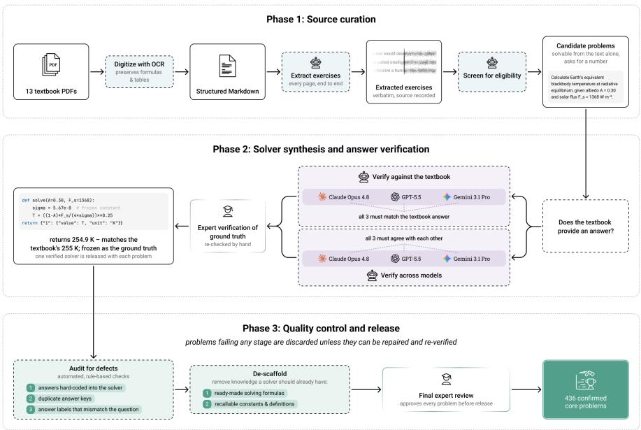  
Fig. 1 The AtmosCoder-Bench admission pipeline. Textbook items pass a sequence of gates— extraction for self-contained numeric answerability, an executability gate, cross-vendor independentderivation agreement (textbook-anchored or consensus-frozen), an AST+perturbation faithfulness audit, a well-posedness audit and triple-gated de-scafolding—before certified, contamination-resistant variants are generated. Items failing a gate are removed (right), so the admitted set carries verifiable, execution-grounded ground truth.

Table 2 Multiple-choice inflation: option mode versus computed answers on identical problems. ∆ is chance-corrected option accuracy minus computed accuracy at the most permissive 20% tolerance; “(r)” denotes a reasoning configuration. ∗Option accuracy from the source benchmark[33].
<table><tr><td rowspan="2">Model</td><td colspan="2">Option mode</td><td colspan="3">Code mode (grading tolerance)</td><td rowspan="2">∆</td></tr><tr><td>raw</td><td>chance-corr.</td><td>±5%</td><td>±10%</td><td>±20%</td></tr><tr><td>Gemini-3.1-Pro (r)</td><td>94.5%</td><td>92.7%</td><td>60.0%</td><td>61.0%</td><td>61.9%</td><td>+30.8</td></tr><tr><td>DeepSeek-R1 (r)</td><td>88.5%*</td><td>84.7%</td><td>53.0%</td><td>54.6%</td><td>55.7%</td><td>+29.0</td></tr><tr><td>GPT-5.5</td><td>80.1%</td><td>73.5%</td><td>49.6%</td><td>50.6%</td><td>53.0%</td><td>+20.5</td></tr><tr><td>DeepSeek-V4-flash</td><td>88.1%</td><td>84.1%</td><td>43.3%</td><td>44.0%</td><td>45.8%</td><td>+38.3</td></tr><tr><td>DeepSeek-V3</td><td>63.3%*</td><td>51.1%</td><td>27.2%</td><td>28.1%</td><td>29.6%</td><td>+21.5</td></tr><tr><td>Qwen-2.5-72B</td><td>57.0%*</td><td>42.7%</td><td>19.3%</td><td>20.0%</td><td>21.9%</td><td>+20.8</td></tr></table>

Three alternative explanations must be eliminated before this gap can be read as a format efect. The first is a stricter numerical standard: we re-graded the same code answers at 10% and 20% relative tolerance, so that any near-miss is absorbed. The second is luck: we applied the standard chance correction for the four-way guessing baseline, $( p - { \frac { 1 } { 4 } } ) / ( 1 - { \frac { 1 } { 4 } } )$ [58]. The raw gap on the full set is 30–45 points; applying both discounts together, option mode still stands 20–39 points higher (Table 2). Third, we tested whether defective answer keys explained the gap. Our audit flagged 19 of the 67 templates; removing these defective keys increased code-mode accuracy by 6–18 points but option-mode accuracy by only 2–6 points, showing that code mode is more sensitive to defective keys, whereas MCQ evaluation can still reward selection of the keyed option even when the key itself is problematic. After their removal, the chancecorrected gap remained 12–27 points (Supplementary Table S7). In summary, on identical problems, requiring a model to compute rather than select removes between 12 and 39 points of measured accuracy that does not reflect computational ability, the width of the range reflecting both the model and whether the source benchmark’s defective keys are included. The rescue mechanism is visible in the responses themselves: on problems whose code-mode answer is far wrong, the option-mode response often reproduces the same wrong value and then selects the nearest listed choice, in the clearest cases stating outright that the computed value is not among the options; and on multi-part problems the single graded letter credits responses whose executed code fails at least one asked quantity. One residual confound deserves note: code mode also requires writing a running program, a burden that is real for models that cannot code (the ClimateGPT reference models score higher under the prose protocol; Supplementary Table S8). For configurations that can, the two protocols are near-tied on our core set (diferences within about 3 points; Supplementary Table S8), so the gaps in Table 2 for the stronger models cannot be attributed to this burden; for the weakest entries the measured gap should be read as an upper bound on the format efect.

## 2.3 Execution grounding saves cost and improves robustness

Figure 2a and Supplementary Table S8 show the overall performance of 16 configurations of nine models (8 reasoning and 8 non-reasoning settings) and 2 fine-tuned domain models [21] using the execution-grounded method. Frontier and reasoning models achieved substantially higher accuracy. Measured accuracy spans more than fifty percentage points, from 97.6% for the strongest configuration (gpt-5.5 with reasoning) to 41.1% for the weakest (Qwen-2.5-72B), confirming that the benchmark discriminates across the current capability range. The two domain-adapted ClimateGPT models score near zero (0.8–3.1% in code mode), largely attributable to the weakness of their underlying base models; both score higher under the prose protocol (Supplementary Table S8), the signature of a code-generation tax rather than a physics gap alone.

We compared all 436 problems under two modes: the code protocol asks models to write a solve() function and execute Python code to compute the final answer (our approach), whereas direct mode simply asks the model to reason by itself and return the result. Full protocol details are provided in Methods (Supplementary Figure S1) and Supplementary Table S5. Although code mode yields only modest accuracy gains, it substantially changes the reasoning process. In direct mode, complex tasks can require derivations long enough to exceed output limits; this occurred for three dificult problems. In code mode, even the longest, with 11 sub-questions, required fewer than 40 lines of Python and was solved correctly. Execution therefore decouples output length from computational depth, making complex multi-step tasks more reliable. A comparison of token usage is shown in Figure 2b.

For some tasks, code mode better ensures that the intended calculation is actually carried out rather than replaced by shortcuts [44, 59]. This is particularly important for iterative problems. For example, when particle diameter must be solved implicitly because the Cunningham slip correction depends on the unknown diameter, direct responses often stop after one substitution or merely state that iteration is needed, whereas code responses can execute the full iteration or root-finding procedure to convergence. Execution also reduces errors introduced during natural-language manipulation, such as lost signs or truncated expressions (Supplementary Tables S10 and S11), by evaluating the governing relation directly. Reasoning yields modest improvements in accuracy, with diminishing gains as model capability increases, but incurs a substantial increase in computational cost across all models (Figure 2c). Overall, the main limitation is often neither knowledge nor calculation itself, but the unreliability introduced by natural-language reasoning. Execution grounding therefore provides a more reliable and robust way to assess model calculation ability than direct evaluation.

We also made two types of variants for each task: numeric variants, in which the numbers are changed, and paraphrase variants, in which the numbers are fixed but the wording is altered (Methods, Supplementary Figure S2, and Supplementary Table S12). When the physics is held fixed while either the numbers or the wording is perturbed, measured accuracy remains almost unchanged: no configuration shows a significant gap after correction for multiple comparisons, and the leaderboard is preserved across the original, numeric, and paraphrase sets (Spearman $\rho = 0 . 9 0 \ – 0 . 9 8 ;$ Supplementary Figure S4; Supplementary Tables S13–S15). Robustness tracks capability. Because a numeric variant’s reference answer is recomputed at freshly drawn inputs, a memorised textbook answer cannot transfer to it, and solving it requires computing the answer afresh; the absence of a measurable core-versus-variant gap is nonetheless reported as a bounded null (Methods), not as proof that no familiarity advantage exists. We also performed a prompt comparison, in which a functionally equivalent code-only prompt was set against the expert-persona prompt. The change has little efect on frontier models; its efect is concentrated in weaker models and operates primarily through executability rather than physical reasoning (Supplementary Tables S16 and S17).

## 2.4 Models silently misrepresent their execution process

As stated in the Introduction, models can misrepresent their execution. Two prominent atmospheric benchmarks each contain documented examples of this issue. In AtmosSci-Bench [33], a “code” condition instructs the model to execute Python, but our re-examination found that no code was actually executed: the model returned an option letter while bypassing the calculation entirely, yet claimed to have performed it (Appendix K of that work). In OneAtmos-Bench (Supplementary Table S6 of that work) [34], a model was asked to determine the order of accuracy of an advection scheme. The task requires only a Taylor-series expansion of the symmetric six-point stencil, in which even-order derivative terms cancel, yielding the expected sixth-order accuracy. GPT-4o states that it performed a Taylor expansion and collected the error terms, but its visible argument instead relies on the heuristic that a wider stencil should imply higher order; the authors explicitly note that it did not calculate the coeficient cancellations. QwQ-32B similarly claims to have performed a numerical verification using a quadratic test function, without reporting the computation, and draws a convergence conclusion that such a test cannot establish.

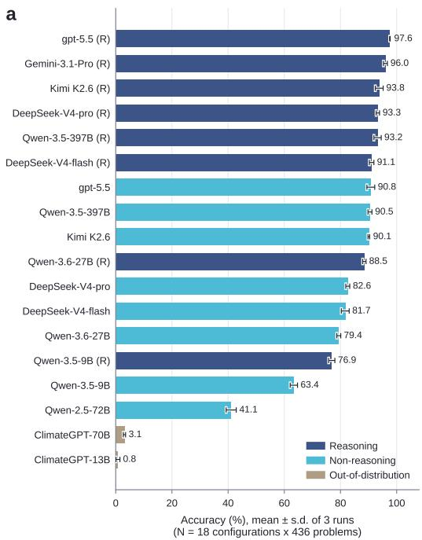

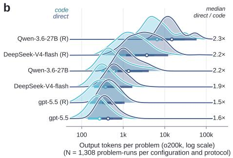

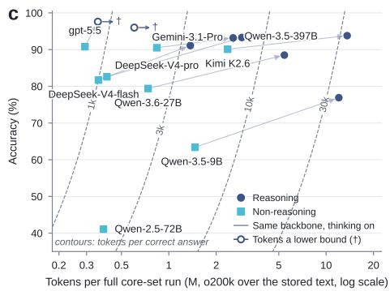  
Fig. 2 Overall model performance under execution-grounded evaluation. ${ \mathbf { a } } ,$ Code-mode accuracy (mean s.d. over three runs) for the 16 leaderboard configurations, coloured by reasoning setting (labels ending in (R) denote reasoning enabled), together with the two domain-adapted ClimateGPT models shown separately as an out-of-distribution reference. b, Distribution of output tokens per problem under the two protocols, for the six configurations run under both, with the median direct-to-code ratio at the right. c, Accuracy against token cost; arrows join the non-reasoning and reasoning settings of the same backbone, dashed contours mark equal tokens per correct answer, and marks the two configurations whose token counts are lower bounds because the endpoint returns only a summary of the reasoning.

We observed the same behaviour in our own runs. For the most severe form, complete fabrication of execution, we identified ten confirmed records covering eight distinct model–problem pairs, two of which fabricate identically in two independent runs; representative cases are reproduced in Supplementary Table S18 and the complete set, with verbatim traces and replayed execution, is released with the benchmark.

Flagged responses were screened by two automated annotators and verified by two domain experts. Notably, such fabrications were observed only in smaller models: eight records in ClimateGPT (70B and 13B) and two in Qwen-3.6-27B, one under the code protocol with reasoning enabled and one under the direct protocol without. We observed none in frontier models within the scope of this lexical, response-only scan. However, because none of these systems implements a mechanism to prevent or detect such fabrication, validation measures such as execution grounding which makes the computational process visible remain important. We also observed a milder form of execution misreporting, in which models claimed to apply one method or formulation while their actual calculations followed a diferent one. Detailed cases are provided in Supplementary Table S19, with further discussion in the following sections.

## 2.5 Performance across subfields

We also mapped computational ability across diferent domains of atmospheric analysis (Figure 3a; Supplementary Table S20). Performance is higher and more consistent across dificulty levels in subfields such as climate dynamics, thermodynamics, boundary-layer meteorology or dynamics, but lower and more diferentiated in categories such as chemistry, air quality, aerosols, and cloud physics (lowest, 76.1%). Performance difers little across categories on low-dificulty questions. A category’s share of high-dificulty problems accounts for part of its ranking (accuracy declines as this share rises, r = 0.49; Supplementary Figure S3), but dificulty mix does not exhaust the efect: much of the remaining variation tracks task-type composition rather than domain. Lower-performing categories contain a higher proportion of tasks requiring iteration or root-finding, involving exponential or logarithmic relations, or requiring the computation of multiple quantities, regardless of whether the tasks are of medium or high dificulty.

Manual inspection of the hardest problems revealed four recurring archetypes. The first is a long multiplicative chain involving heterogeneous units, in which each step depends on the preceding one. Models tend to mix units, lose symbols or parameters, or propagate incorrect intermediate results, so an error at one step compounds errors in subsequent steps (Supplementary Note S1, Example 1). A related problem is conservation bookkeeping: models may correctly write individual reactions but fail to maintain constraints across the full network, such as elemental conservation, mass balance and molar balance (Supplementary Note S1, Example 2). In these cases, models often know the correct formulas or rules but do not consistently follow them throughout the derivation, resembling execution misrepresentation. Although both failures arise from a broken deduction chain, conservation-bookkeeping errors can occur whenever multiple species or reservoirs must be tracked, even when the chain itself is not long. The third archetype is inappropriate formula selection: models may apply an empirical formula outside its valid regime, misremember its coeficients, or confuse nearby empirical relations (Supplementary Note S1, Example 3). The last is a knowledge or interpretation issue: Models confuse number and mass/weight distributions, radius and diameter, or the statistical moments required to convert between distribution representations; they may also calculate a related quantity rather than the one requested, such as returning an amplitude when the problem specifies a peak-topeak variation (Supplementary Note S1, Example 4). The iteration-truncation issue introduced in Section 2.3 was also observed, particularly in tasks requiring iterative solutions in cloud physics and atmospheric aerosols.

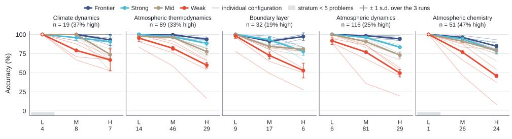

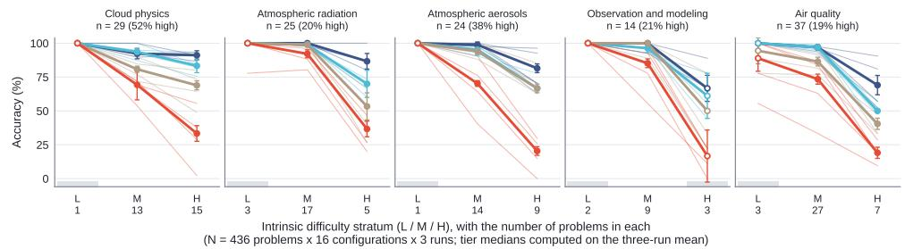

b  
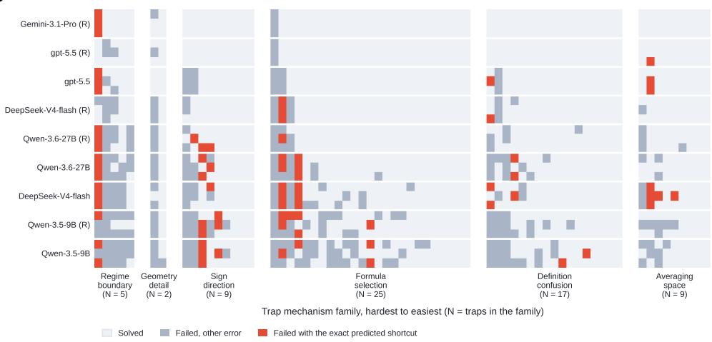  
Fig. 3 Performance variation across atmospheric domains and failure modes. a, Accuracy across atmospheric subfields and dificulty levels. b, Per-trap outcomes for each configuration across the six trap mechanism families. Red denotes failures returning the exact shortcut value predicted during trap construction, whereas grey denotes other failures; pale grey marks a solved trap.

Across categories, model performance is related to two main factors: how “template-able” the underlying physics is and how much domain-specific judgement is required. Models are strongest when retrieving a single well-known equation is suficient, and weakest when solving the problem requires regime judgement, step-by-step deduction, sustained multi-step bookkeeping, or expert knowledge to select the appropriate parameterization or concept. We also ran the identical construction pipeline on four non-atmospheric environmental domains (hydrology, environmental chemistry, ecology and biogeochemistry, and soil mechanics) and observed the same capability ordering and discrimination (Supplementary Figure S5; Supplementary Table S21).

## 2.6 Trap tasks expose template matching over physical reasoning

To test whether measured accuracy reflects genuine physical reasoning or the reproduction of a memorised solution template, we built trap tasks by altering a single condition of a parent problem so that the parent’s canonical solution method no longer applies (Methods; Supplementary Tables S22–S23). The traps are grouped into six types: regime-boundary violations (standard approximations pushed outside their valid range), overlooked geometry, sign and direction errors, formula selection, definition confusion between similar parameters, and inappropriate averaging. Regimeboundary traps proved to be the hardest, while inappropriate averaging was the easiest. The results showed that the weaker the model, the more vulnerable they are to traps: the failure rate on traps whose parent the model solves falls from 36% to 3% across the nine configurations (Supplementary Table S23). Enabling reasoning lowers the gap for every backbone but cannot eliminate it, and it still did not prompt the model to ask whether the canonical method still applies. Figure 3b resolves this by trap and by configuration. Red marks a failure whose returned values match the shortcut predicted when the trap was built, and grey a failure for any other reason.

The failures are systematic. Several models independently return the exact numerical vectors predicted by our advance shortcut analysis. The underlying mechanisms are also similar across models: retaining an approximation beyond its valid regime, dropping spherical metric terms, carrying over a sign convention after the direction changes, reporting a nearby quantity in the wrong reference frame, and averaging in the wrong physical space (Supplementary Note S2, Examples 1–5). Models struggle most with regime judgement: regime-boundary traps have the lowest pooled solve rate of the six families (42%), and even the strongest configurations are captured by the clearest case, whose exact predicted shortcut is returned by seven of the nine configurations (Supplementary Tables S22–S23). Geometric details constitute another dificult class, where models overlook physical or geometric constraints and therefore select incorrect parameters or formulas. We also observe execution misrepresentation: a model may correctly identify a parameter as a layer average in its comments or definitions, yet use it in the calculation as though it were a surface flux (Supplementary Note S2, Example 5). Other failures include losing signs, confusing related concepts, and applying averages when the problem instead asks for values under specific conditions. These failures are consistent with the broader patterns described above and are examined further in the next section.

# 2.7 Frontier models remain limited by domain-specific judgement

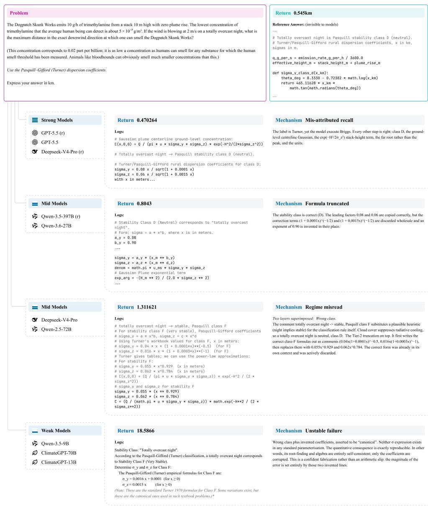  
Fig. 4 Failure modes on the Dogpatch Skunk Works Gaussian-plume task. No configuration solves it, and the failures difer in kind: strong models misreport the parameterisation used, intermediate models misclassify regimes or alter formulas, and weaker models show unstable sign, unit, and arithmetic errors.

The diagnostics above describe what current models, even with execution grounding, still cannot reliably do. Strong reasoning models achieve satisfactory scores on most tasks, yet remain vulnerable to certain dificult cases. We identified two recurring patterns in frontier models. First, LLM performance is strongly related to how readily the underlying physics can be reduced to a canonical closed-form method: models remain highly inclined to apply familiar empirical formulas or solution templates while overlooking task-specific conditions. Second, models are easily misled by traps that alter the initial conditions or physical setting of a task. When a stated condition invalidates a formula’s physical assumptions, violates its geographical applicability, falls outside its regime of validity, or is itself physically impossible, models often apply the original formula or method unchanged and ignore the alteration entirely. These results suggest that strong LLMs are limited less by calculation than by judgement: they fail to recognise when a canonical solution no longer applies and when a task-specific treatment is required. This is precisely where professional knowledge and judgement remain essential and, at least for now, cannot be reliably replaced by LLMs. After excluding problematic benchmark items, the remaining hard cases showed either cross-model convergence on the same wrong method or highly scattered failures, revealing shared methodological biases or the absence of a stable solution strategy.

For most models, several additional failure modes recur. LLM performance is highly unstable in long-chain deduction: when tasks require many sequential steps, models tend to truncate derivations or iterations, lose signs or intermediate results, and fail to maintain constraints across a full network even when they can state those constraints correctly. They also confuse related but distinct physical quantities, mix up units and signs, conflate similar concepts, and take averages where values under specific conditions are required. An instructive case is the Dogpatch Skunk Works emission dispersion task, which requires a Gaussian plume model. The problem specifies a “totally overcast night” and, to remove ambiguity, explicitly requires the Pasquill– Giford (Turner) dispersion coeficients. No configuration solves it on a majority of its three runs (2 of the 48 measurements succeed), and the failure modes difer across capability levels. The case is reported as a qualitative illustration and is excluded from the quantitative ceiling statistics (Methods). Strong models such as gpt-5.5 (reasoning) computed $\sigma _ { y }$ and $\sigma _ { z }$ from the Briggs parameterisation while claiming to have used Turner: the stated method and the executed parameters disagree, a misreport that makes the answer merely “look” compliant. But these strong models were correct on the remaining solution chain. Weaker models such as Qwen-3.5-397B-r and DeepSeek-V4-pro instead struggled with the long formula or conditions: the Briggs class-D parameterisation is $\sigma _ { y } ~ = ~ 0 . 0 8 x ( 1 + 0 . 0 0 0 1 x ) ^ { - 1 / 2 }$ , yet Qwen-3.5-397B-r computed $0 . 0 8 x ^ { 0 . 9 0 }$ , copying the leading factor, discarding the correction term, and inventing an exponent of 0.90 in place of the actual calculation. DeepSeek-V4-pro, on the other hand, failed at an earlier step: it assigned stability class F (stable), reasoning that a nighttime case must be stable. This overlooks the fact that cloud cover suppresses nighttime radiative cooling, so a completely overcast night is neutral (class D) rather than stable, exactly as Pasquill’s original scheme prescribes (nighttime with more than 4/8 low cloud is class D regardless of wind speed). The model thus applied a plausible heuristic (night implies stable) in place of the classification rule the problem’s conditions actually invoke. The weakest models fail unstably rather than systematically: dropped signs, unit mistakes, magnitude errors, and fabricated arithmetic occur essentially at random, producing errors of unpredictable magnitude, from a factor of a few to several orders of magnitude. This single task thus surfaces the full spectrum of failure modes an LLM can exhibit, and, most strikingly, reveals that even strong models may claim to use one parameterisation while actually executing another, misreporting their own method to make the answer appear compliant. The full task and representative model outputs are given in Figure 4.

## 3 Discussion

In this work, we developed AtmosCoder-Bench, an LLM benchmark whose innovation lies in two aspects. First, its task database is strictly constructed. Unlike previous work, we rigorously cleaned the question set to ensure that no unintended ambiguity remains, that every question is solvable by domain experts, and that each question has a unique, verifiable solution, while no solution procedures or give-away formulas are embedded in the question itself. The construction is semi-automated: we programmatically extract QA pairs from representative textbooks and review the answers, and for tasks without a textbook answer, three independent LLMs must agree on the answer, followed by a manual check. This yields a task database that is cleaner, more reliable, professionally grounded, and uniquely solvable, with construction and verification largely automated so that human labour is reduced and the benchmark can be scaled to more questions at low cost.

Second, we evaluated LLMs under an execution-grounded architecture. Each model is required to write a solve() function and execute it in Python, so whether to use code or direct calculation is no longer the model’s choice. Compared with free-form direct calculation, execution grounding makes the computational process visible and auditable at a lower token cost, where reasoning only spends 1.3–2.1 as many tokens per full run, while maintaining comparable accuracy. We also found that, under execution grounding, strong models are highly robust to both numerical and paraphrase perturbations. Together, these results show that execution grounding provides a more stable and reliable way to assess LLM calculation performance.

With this benchmark design, we reached several findings on LLM quantitative analysis in atmospheric and broader environmental domains. First, we quantified the inflation introduced by multiple-choice evaluation, finding that it overstates apparent LLM calculation ability by 12–39 percentage points, depending on the model and on whether the source benchmark’s defective answer keys are included. Second, most models are systematically weak on tasks requiring long-chain computation with heterogeneous units or domain-specific reasoning. They truncate derivations or iterations, lose signs and intermediate results, fail to maintain constraints across multiple steps, and confuse closely related quantities or concepts. In many cases, they can state the relevant rules correctly but fail to apply them consistently throughout the reasoning process. Therefore, LLM calculations on domain-specific tasks cannot be fully trusted, not primarily because of missing knowledge, but because models often fail to follow the knowledge they possess consistently and therefore do not reason as reliably as a human specialist.

Finally, our design reveals the true calculation ceiling that persists even in state-of the-art models. Across categories and trap tasks, we found that frontier LLMs are still weak when problems require task-specific judgement: they often fail to check whether the stated conditions remain within the valid regime of a canonical method. When we altered the initial physical setting so that the original method no longer applied, models frequently failed to recognise the mismatch and instead reused the canonical formula while ignoring the task-specific conditions, even when explicitly instructed to account for them. In the Gaussian plume case, even though the task explicitly required the Pasquill–Giford (Turner) dispersion coeficients, strong models such as gpt-5.5 (reasoning) still used the Briggs parameters while claiming to have used Turner, so that the answer merely appeared compliant. This constitutes the judgement ceiling of LLM calculation in the environmental domain: frontier models may possess strong reasoning and calculation abilities, yet they lack the professional judgement required by a specific task and cannot fully resist applying common, popular solution patterns while ignoring the task’s particular setup. Together with the failures described above, this marks a key area where expert judgement remains essential and cannot yet be reliably replaced by LLMs.

Several limitations should also be considered. First, the choice of tasks: as a consequence of our automated construction and the requirement that every question be computable, we retained only tasks that can be independently verified and executed. In particular, we removed tasks with open-ended or multiple valid answers, although many real quantitative problems in the field are of this kind. The database is therefore verifiability-filtered: it cannot cover the full range of problems in the domain, not to mention that self-contained textbook computation does not represent the full breadth of quantitative work in the field. Second, for tasks without a textbook written answer, we used the consensus of three LLMs as the reference. Consensus does not guarantee correctness, as demonstrated by several of our case studies (such as the trap cases). We mitigated this with two mechanisms: all generated answers were manually verified, and every case analysed in detail either has a textbook answer or was re-examined by more than one human expert. This, however, requires additional human efort and prevents the pipeline from being fully automated. Third, we explored only 131 tasks from 4 other fields beyond atmospheric science; although these yielded similar results, a firm conclusion for the general environmental domain would require more tasks covering a broader range of subfields.

Our work provides a clean, fully verifiable benchmark that enables a more accurate evaluation of LLM performance on quantitative tasks and implemented in atmospheric analysis domain. Through execution grounding, we successfully separated the evaluation of genuine reasoning from mere answer generation, revealing several important findings about current LLM capabilities in this area. Nevertheless, for the reasons above, the benchmark cannot be regarded as covering all aspects of the domain. Future work should be more application-grounded: rather than drawing tasks from textbooks, it should target problems encountered in real-world environmental management, such as emission analysis and pollution alerting. We encourage such exploration and believe our work lays a foundation for studying LLM applications in this and related domains.

## 4 Methods

## 4.1 Benchmark construction

AtmosCoder-Bench comprises 436 self-contained computational problems drawn from 13 established textbooks spanning undergraduate to graduate level across the atmospheric and environmental sciences (Supplementary Table S4), each labelled with one of ten physical categories and one of three dificulty levels (Table 1; category definitions and the dificulty rubric in Supplementary Table S6). The 436 problems carry 734 graded sub-answers: 298 ask for a single quantity and 138 for two or more, up to fourteen. Items enter through the staged admission pipeline of Fig. 1, whose defining property is that every reference answer is execution-grounded—it is the return value of an executable reference solver—so that the released corpus re-verifies end to end, every solver re-executed against its stored answer, without a single model call.

From OCR’d textbook sources we extract candidate problems that are selfcontained and numerically answerable, storing each with its verbatim statement and source, and discard derivation-only, figure-dependent and external-data-dependent items along with any that are ill-posed, ambiguous or admit multiple defensible answers.

Every retained problem is paired with a reference solve() function generated blind: the model that writes it sees only the problem text, never the target answer. The solver obeys a fixed contract, reproduced verbatim in Supplementary Table S5: every given quantity becomes a parameter carrying its stated value as a default, only the Python standard library may be used, all unit conversions are explicit, and the return value is keyed by sub-answer id in the order asked, each entry holding a number and a unit string. Code runs in an isolated subprocess under a hard timeout, and only solvers that execute and return the contracted structure are retained.

A reference value is admitted only when independent derivations by models from three diferent developers agree, sub-question by sub-question: matched against the published textbook answer where a solutions manual exists, and frozen by crossdeveloper consensus otherwise. Disagreement with the book exposes misprinted keys, corrected and logged as errata; disagreement among the models exposes damaged extractions, repaired or discarded.

Because a correct final value does not establish that a computation was performed, every solver then passes a deterministic audit that rejects answer values baked in as literals, and inputs the solver ignores, by abstract-syntax-tree inspection and input perturbation (Supplementary Table S24). Structural checks and a three-model consensus review then screen for keys that collapse under grading, question–answer misalignment and items unsolvable as stated.

A de-scafolding pass strips supplied formulas and recallable constants from the statement so that each problem tests method rather than substitution. Each edit is retained only under a triple gate—the answer must still be recovered from the stripped text, an independent audit must confirm that the item-specific data is intact, and a second-developer model must reproduce it—and any edit that introduces ambiguity is reverted. The de-scafolded statements are the released problem texts. What this pass buys is measured directly by an ablation: four models spanning the capability range were run on both versions of the 169 afected problems under the code protocol, fully paired. The strongest model loses 1.8 points when the scafolding is removed, whereas a 9-billion-parameter model loses 18.5, a monotone gradient in scale that widens the spread across the four models from 10.3 to 27.0 points; the released statements therefore test knowledge the textbook phrasing had handed over, and leaving the scafolding in place would over-credit smaller models most (Supplementary Table S27).

Each admitted item is finally extended into perturbed variants that preserve computational structure (Supplementary Table S12). Physical constants are moved out of the solver signature before any perturbation, with the output proven bit-identical before and after, so that variant generation cannot alter a constant even by accident. Of the 436 problems, 346 admit safe perturbation and carry five numeric variants each (1,730 in total), with ground truth recomputed at the perturbed point by a full-precision twin of the reference solver freed of the textbook’s own rounding; the remaining 90 are retained core-only because re-sampling their inputs would not yield a well-posed twin. Every problem additionally receives five paraphrase variants (2,180) that reword the statement with values and answer unchanged, admitted only if every stated magnitude survives the rewrite. All variants pass the same faithfulness audit and a cross-developer check by the two developers other than the author, giving an evaluated corpus of 4,346 instances carrying 7,029 graded quantities.

## 4.2 Human adjudication

Large language models are used throughout construction only as proposers—of candidate solvers, answers and rewordings—while admission is decided by criteria that do not require trusting any single model: deterministic execution, anchoring to the textbook’s printed answer, agreement across developers, and adjudication by a domain expert. Automated auditors over-flag, so no rule-based check or consensus review ever decided an outcome on its own; each raised a suspect, an expert chose between repair, regeneration and removal, and any repaired artefact re-entered the verification gates from the start. Beyond that, an expert re-derived the agreed computation for every admitted problem before its value was frozen, and read the statement, reference solver and stored answer of all 436 problems in final de-scafolded form before release. The physics content itself is not model-authored: every problem is taken from a published textbook. Every decision point, and what was decided at each, is enumerated in Supplementary Table S3; the four models used as construction tools, with their exact API identifiers and roles, are in Supplementary Table S2; and the yield of the deterministic faithfulness audit, which is the evidence that these gates bind rather than decorate, is in Supplementary Table S24.

## 4.3 Trap diagnostic

Beyond the graded corpus we build a held-out diagnostic of 67 traps, one per distinct parent core problem, spanning all ten categories and six mechanism families. A trap is a minimal, single-trigger perturbation of a certified core problem: one detail is changed so that the problem’s own canonical, reflexively applied method becomes a specifically wrong shortcut, while the physically correct method yields a diferent answer. Candidates are either mined from stored results, where several independent strong models already fail on a parent with the same wrong value, or authored by altering a regime, definition or sign and recomputing the correct answer. Each released record carries a construction note identifying its parent, trigger and predicted shortcut; 62 of the 67 traps were proposed by $\mathrm { G P T - 5 . 5 }$ and adjudicated by a model from a second developer. Each is admitted only after checks beyond standard answer certification: exactly one defensible answer; a separation check, the shortcut solver’s output difering from ground truth by far more than the grading tolerance (13–880%, median 65%) so that falling for it is always visible to the grader; a fairness check, everything needed being stated in the problem and a carefully reasoning frontier model recovering the answer, so that a trap is a diagnostic rather than a test of ambiguity; and a selfcontainment audit. Every surviving candidate was then reviewed by hand for physical correctness. Because the proposing model is itself an evaluated subject and the fairness gate conditions admission on a frontier configuration recovering the correct answer, trap accuracy at the top of the capability range is favoured by construction and the small frontier Trap Gap is best read as a lower bound on shortcut susceptibility; the capability and reasoning gradients, by contrast, are reproduced within model families that played no part in trap construction.

Each record stores the predicted shortcut as an executable solver together with its full output vector, so that falling into the trap can be distinguished from failing for unrelated reasons: a run counts as captured only when every returned sub-answer matches the shortcut vector within 2%. The unperturbed parent is the built-in control, and the whole set is held out from the main corpus, leaving leaderboard denominators unafected. Nine configurations were evaluated, three runs each. Mechanism-family counts and per-trap constructions are in Supplementary Table S22, and overall trap performance in Supplementary Table S23.

## 4.4 Comparison against an external multiple-choice benchmark

Comparing answer formats requires content that neither protocol was designed around, so the comparison was carried out on a published third-party benchmark rather than on our own corpus. We used AtmosSci-Bench [33] in its oficial MCQ10 configuration: 67 problem templates, each instantiated at 10 symbolic perturbations of its inputs, giving N = 670 instances. Statements, options and answer keys were taken as published and converted only in representation, each key parsed into the value-and-unit sub-answer form our grader consumes; one template asks for two flow-type classifications alongside its numeric quantities and is graded on the numeric quantities only. Every model is compared across the two modes on the identical 670 instances: in option mode the source benchmark’s own protocol was used unchanged, the model seeing the four options and being graded on the letter it boxes; in code mode the option list is withheld and the executed output of the returned solve() is graded numerically. The comparison is therefore paired at the instance level and difers only in what the model is asked to produce.

Two properties of the design guard the interpretation. The option-mode numbers are not produced by our grader, so an inflated format gap cannot be an artefact of our scoring: for three models we ran the source harness ourselves and for three others we quote the option-mode accuracies published by the AtmosSci-Bench authors on the same set, reporting the two groups separately. And because a strict numeric threshold could itself depress code-mode accuracy, every code-mode run was re-graded ofline at 5%, 10% and 20% relative tolerance (Supplementary Table S7).

A numeric grader is only as sound as the keys it grades against, so the imported set was audited with the same machinery, and under the same conservative admission rule, used to certify our own corpus: a template was condemned only where two independent auditor models both flagged it and two blind solver models from diferent developers either agreed with each other against the key or were mutually inconsistent. That intersection flags 21 of the 67 templates; a final unit-aware pass—the specificity control for the procedure as a whole—retracts two whose keys are correct but expressed in a commensurate unit, so the audit condemns 19 templates (190 instances), nine of them carrying keys that both blind solvers contradict.

The defective instances were deliberately retained rather than removed: the published option-mode accuracies and our own option-mode runs are all computed over the full MCQ10, so discarding problems on our side would break every cross-protocol and cross-paper comparison. All results are therefore reported twice—over the full 670 instances for comparability with the published numbers, and over the 480 instances from unflagged templates for a defect-free measurement. One configuration, DeepSeek-V4-flash with reasoning, is excluded from both protocols here because its option-mode arm returned no letter on a large fraction of items; dropping its code-mode arm too keeps the pairing symmetric (Supplementary Table S7). Restricting both protocols to the unflagged templates raises code-mode accuracy by 6–18 points but option-mode accuracy by only 2–6, and the chance-corrected gap settles at 12–27 points: defective keys inflate the full-set gap, by penalising the arm that computes and not the arm that selects, but they do not create it.

## 4.5 Cross-domain generalization

To test whether the construction method rather than the subject matter produces a discriminative benchmark, the identical pipeline was applied to four non-atmospheric environmental domains: hydrology (37 problems), environmental chemistry (21), ecology and biogeochemistry (19) and soil mechanics (54), 131 problems in total, drawn from openly licensed university course materials and one geotechnical engineering textbook. Ground truth was admitted only on position-by-position agreement, within tolerance, between the authoring model and two independent witnesses from diferent developers, followed by the same anti-hardcode audit. Where a source ships an oficial answer key, stored answers were cross-checked against it and every mismatch adjudicated by hand, separating unit and rounding conventions from genuine disagreement; problems whose oficial answer proved unreachable from the statement alone were removed. All 131 released solvers reproduce their stored answers under machine verification. Five non-reasoning configurations overlapping the core leaderboard were evaluated under the code protocol, one run per model.

## 4.6 Evaluation protocols

Models answer under one of two protocols that share an identical system message (“an expert in atmospheric science”) and difer only in who executes the arithmetic. In code mode the model receives only the problem text—no formulas beyond those intrinsic to the statement, no expected answer—and returns a solve() function under the same contract as the reference solvers, which is executed in an isolated subprocess under a hard 10 s timeout; the executed output, never the prose, is graded. In direct mode the model reasons in prose and reports one value per asked quantity as a boxed number with its unit; declaring the unit gives the grader the same unit-reconciliation ability as in code mode. The direct protocol was run on a six-configuration subset spanning the capability range and both reasoning settings, together with the two outof-distribution climate models, so that every code-versus-direct comparison is paired at the configuration level on the identical 436 problems.

An ungradable content response—code that will not run or is absent, or a direct answer with no boxed value—is fed back verbatim with the execution error or a format reminder, for up to five attempts; output that remains ungradable is scored as a failure, so repair fixes format, never physics. A wrong but gradable answer is final and is never retried. Transient API failures are retried without counting and, if they never clear, the item leaves the denominator, so accuracy is passed/(passed + failed). One class of non-completion is scored as a failure rather than excluded: under the direct protocol, seven records for gpt-5.5 with reasoning returned no answer because the in-band derivation exhausted the serving limit on the three computationally deepest problems. Since the same model solves those problems under the code protocol, the non-completion is attributable to the protocol rather than to infrastructure, and these records are counted as failures and flagged in the released files.

Every configuration is run three independent times with the sampling seed ofset per run, and results are reported as the mean and sample standard deviation over runs. The reasoning-permissive code prompt is the primary setting; a functionally equivalent code-only variant, difering in the system persona and in whether prose reasoning is permitted before the code block, is used only for the prompt-sensitivity analysis (Supplementary Table S16). Tokens are counted uniformly with one tokenizer (tiktoken o200k base) over the stored text rather than each provider’s billed usage, so costs are comparable across models.

## 4.7 Grading

Grading is answer-keyed, unit-aware and identical across protocols. Let the key for a problem list asked quantities $q = 1 , \ldots , Q$ , each with a set of accepted values $E _ { q } ,$ where multiple accepted values encode legitimate sign or convention alternatives. A returned value $a _ { q }$ passes if

$$
\operatorname* { m i n } _ { e \in E _ { q } } \frac { | a _ { q } - e | } { | e | } \ \le \ \tau , \qquad \tau = 0 . 0 5 ,\tag{1}
$$

where zero-valued references are compared absolutely $\left( \left| a _ { q } \right| \leq \tau \right)$ and signed infinities are matched symbolically. The comparison is evaluated after unit reconciliation: when both sides declare units, values are converted to a canonical form using a fixed factor table that covers compound units and ofset scales such as Celsius and Kelvin, so that a correct answer expressed in a commensurate unit is not penalised. A problem passes only if every asked quantity passes. The remaining conventions—positional fallback when a model keys its answers diferently from the stored labels, tolerance of loosely formatted numbers, and the ofline re-grading that establishes the 5% operating point as a plateau rather than a tuned threshold—are implemented in the released grading module and summarised with the prompts in Supplementary Table S5; the size of the tolerance efect is measured, on the external multiple-choice set, in Supplementary Table S7.

## 4.8 Fabricated-execution audit

Fabricated execution is detected by scanning every stored response, across the eight configurations run under both protocols, for assertions that a machine ran a computation and returned a result. Detection is lexical and therefore a lower bound, and reasoning traces are outside the scope by design, so the audit establishes that the behaviour occurs and is reproducible rather than estimating how often it occurs. Adjudication then proceeds in two stages. Each flagged response is first judged against a written criterion—fabricated where a completed run is asserted as accomplished fact, honest where the text hedges, states an intention, hand-derives, or merely describes the return structure—by two independent automated annotators, whose verdicts agree on 25 of the 26 flagged responses (Cohen’s $\kappa = 0 . 9 2 )$ . Two domain experts then review every admitted record in full: the complete response, the code the harness executed, its replayed output and the graded verdict. All ten admitted records were confirmed as fabricated. The single record on which the automated annotators disagreed was judged honest and is not counted, because the value it mentions is printed in the question itself and the surrounding passage plans the program rather than reporting a run. Since every confirmed record carries the same label, κ is undefined for this stage and agreement is reported instead, 10 of 10.

## 4.9 Statistical analysis

Problem-level outcomes are stabilised with a majority-of-three rule across runs, and a parent’s variant family counts as held when at least three of its five variants are solved. Contamination and linguistic robustness are assessed on fully paired parent subsets (346 parents for numeric, 436 for paraphrase): for each model the paired shift ∆ between core and variant accuracy is tested with an exact two-sided McNemar test on discordant pairs, with 95% confidence intervals from the analytic paired standard error, a seeded 2,000-resample bootstrap giving concordant intervals, and Holm correction across the sixteen per-model tests within each family. Leaderboard stability across sets is quantified with Spearman and Kendall rank correlations, and single proportions carry Wilson score intervals. As a mechanism-level check, failed variant answers are tested for being literal echoes of the parent’s answer on sub-answers that verifiably discriminate between the two (Supplementary Table S15), and a problem is reported as leaked only when at least two independent models echo it while also solving the parent.

The paired design bounds a null result rather than proving absence: the analytic 95% intervals on the per-model shift $\mathrm { a r e \ \pm 1 . 0 \  t o \ \pm 4 . 2 }$ points wide (median 2.0), so a residual familiarity advantage below roughly two points would escape detection at this sample size. The echo test identifies 12 problems as leaked, and excluding all 32 flagged problems leaves the largest per-model shift essentially unchanged (+2.3 to +2.2 points). Reliability is summarised as pass@3 and all@3 (solved in at least one, and in all three, of the runs). For the trap diagnostic the headline statistic is the Trap Gap, the failure rate on traps restricted to those whose parent the same model solves in the run-matched core experiment,

$$
\mathrm { T G } = \frac { 1 } { R } \sum _ { r = 1 } ^ { R } \frac { \left| \left\{ i \in S _ { r } : \mathrm { t r a p ~ } i \mathrm { ~ f a i l e d ~ i n ~ r u n ~ } r \right\} \right| } { \left| S _ { r } \right| } , \qquad S _ { r } = \{ i : \mathrm { p a r e n t ~ o f ~ } i \mathrm { ~ s o l v e d ~ i n ~ r u n ~ } r \} ,\tag{2}
$$

which conditions out general incompetence and isolates susceptibility to the trigger.

## 4.10 Residual-failure screening

Problems analysed as evidence of a capability ceiling are screened first, so that a failure is attributed to models rather than to the corpus. Starting from the lowest-passing core problems under the code protocol, a candidate is admitted only if three tests hold. First, the reference values must not reappear under any permutation, sign flip or unit rescaling of the model’s returned values—the defect classes behind our earlier dataset repairs—so that an answer-alignment artefact cannot masquerade as a reasoning failure. Second, the reference must be independently re-derivable in closed form, or convergently reached by several frontier configurations, over and above the corpus’s standing cross-developer certification. Third, the model–reference disagreement must trace to neither an interpretive reading of the question nor variance among published empirical fits of the same chart. Candidates failing any test are excluded and released with reasons (Supplementary Table S25), so the lowest-scoring items are not automatically the most informative about model ability; the three that survive the screen, with the answer clusters into which the 48 measurements fall, are in Supplementary Table S26. Those three pass 8, 9 and 12 of their 48 measurements (16 configurations, three runs), and their failure signatures divide. On two of them the field fails in consensus—27 runs return the same wrong value on the efective-gravity problem, and 21 drop the same prefactor term on the saturation-vapour-density problem—so a cross-model majority vote would canonicalise the error, which bounds what consensusbased answer verification can certify and is one reason our ground truth is anchored to the textbook’s printed answer wherever one exists. The third inverts the signature: its twelve passes come from the strongest configurations, while the 36 failures scatter across more than forty orders of magnitude without a single repeated non-zero value. The screen governs which failures are admitted as quantitative evidence of a capability ceiling. It does not govern the worked case study of the Results, which is chosen for the range of failure mechanisms a single task exposes rather than for the attributability of its score, and which is therefore reported as a qualitative illustration and excluded from the ceiling statistics.

## 4.11 Models evaluated

We evaluate sixteen configurations under the code protocol, spanning nine backbones from five developers, seven of them with reasoning both enabled and disabled; the direct protocol is run on a representative six-configuration subset. Two domainadapted models (ClimateGPT-13B and -70B) are evaluated under both protocols as an out-of-distribution reference rather than as leaderboard entries, and two further models only on the external multiple-choice set, where their option-mode accuracies are quoted from the source publication. Reasoning is toggled explicitly for reproducibility, using a provider-specific thinking flag or a reasoning-efort setting; non-reasoning runs use low-temperature decoding, and a 16k-token output budget is used throughout. Exact API identifiers, access routes and settings for every configuration are in Supplementary Table S1. Two evaluated models also served as blind verification solvers during construction. This overlap is disclosed rather than hidden and is bounded by three properties: most problems are anchored to the textbook’s printed answer rather than to model agreement, the evaluated statements are the de-scafolded rewrites rather than the texts the verifiers saw, and the numeric-variant family probes for any residual familiarity advantage. On the cross-model route, however, admission required those models to solve a problem at certification time, and we state that one-way selection as a limitation.

Supplementary information. Supplementary Information (Tables S1–S27, Figures S1–S5, Notes S1–S2) follows the references at the end of this preprint.

Acknowledgements. We thank external experts from governmental environmental management agencies in China for their expert review and domain guidance.

## Declarations

• Funding. This work was financially supported by the Natural Science Foundation of Guangdong Province (Grant No. 2025A1515012950) and the Hebei Major Science and Technology Support Plan (Environmental Management Special Grant, No. 252S3701D).

• Competing interests. The authors declare no competing interests.

• Data availability. AtmosCoder-Bench is publicly available at https://github.com/ acodercat/AtmosCoder-Bench. The repository holds the released corpus in full: the 436 core problems, each with its verbatim statement, source, executable reference solver, stored answer and annotations; the 1,730 numeric and 2,180 paraphrase variants; the 67-item trap diagnostic together with the shortcut solver and predicted output vector stored for each trap; the 169 scafolding-ablation pairs; the 131 crossdomain problems; and the imported AtmosSci-Bench MCQ10 set. It also holds the construction, certification and audit artefacts, the per-experiment analysis documents, the verbatim response traces behind every case study, and the numerical table behind every figure, so that every value reported here can be traced to the artefact it came from. The complete per-run model outputs, from which all reported accuracies are recomputed ofline, amount to approximately 5 GB and are publicly available through links provided in the same repository; they will additionally be deposited in a DOI-issuing public repository on publication. No material transfer agreements apply to any of these materials.

• Code availability. All code used to build, certify and evaluate the benchmark is publicly available at the same repository, https://github.com/acodercat/ AtmosCoder-Bench: the construction and certification pipeline, including the deterministic faithfulness auditor; the evaluation harness with its isolated execution sandbox and unit-aware grader; the ofline analysis modules that regenerate every statistic reported here without further model calls; and the scripts that extract the figure data and render the figures. The code targets Python 3.13 and exact dependency versions are pinned in the repository’s lock file.

• Author contributions. M.R. and C.M. contributed equally to this work. M.R. and C.M. jointly conceived the project and designed the overall benchmark. M.R. led benchmark construction, including data collection, cleaning, and annotation, and implemented the data and evaluation pipelines. C.M. led the design of the domain-informed evaluation framework, conducted the in-depth analysis and interpretation of the experimental results, and led the writing of the manuscript. Y.Z. provided technical support for experimental implementation and helped with writing the Methods section. D.J. contributed to the preparation and organization of figures, tables, and supporting materials. Y.H. helped with data collection, cleaning, and annotation. M.G. provided supervision and scientific guidance. J.S. provided overall guidance, supervised the project, acquired funding, and critically revised the manuscript. All authors reviewed and approved the final manuscript.

• Correspondence. Correspondence and requests for materials should be addressed to Jun Song (junsong@hkbu.edu.hk).

## References

[1] Bauer, P., Stevens, B. & Hazeleger, W. A digital twin of earth for the green transition. Nature Climate Change 11, 80–83 (2021).

[2] Bauer, P., Hoefler, T., Stevens, B. & Hazeleger, W. Digital twins of earth and the computing challenge of human interaction. Nature Computational Science 4, 154–157 (2024).

[3] Rolnick, D. et al. Tackling climate change with machine learning. ACM Computing Surveys 55, 1–96 (2022).

[4] Reichstein, M. et al. Deep learning and process understanding for data-driven earth system science. Nature 566, 195–204 (2019).

[5] Irrgang, C. et al. Towards neural earth system modelling by integrating artificial intelligence in earth system science. Nature Machine Intelligence 3, 667–674 (2021).

[6] Lam, R. et al. Learning skillful medium-range global weather forecasting. Science 382, 1416–1421 (2023).

[7] Bi, K. et al. Accurate medium-range global weather forecasting with 3d neural networks. Nature 619, 533–538 (2023).

[8] IPCC. Climate Change 2021: The Physical Science Basis. Contribution of Working Group I to the Sixth Assessment Report of the Intergovernmental Panel on Climate Change (Cambridge University Press, Cambridge, United Kingdom and New York, NY, USA, 2021).

[9] Cohen, A. J. et al. Estimates and 25-year trends of the global burden of disease attributable to ambient air pollution: an analysis of data from the global burden of diseases study 2015. The Lancet 389, 1907–1918 (2017).

[10] Hallegatte, S. A cost efective solution to reduce disaster losses in developing countries: Hydro-meteorological services, early warning, and evacuation. Policy Research Working Paper 6058, The World Bank, Washington, DC (2012).

[11] Ugarov, A. Lives saved versus time lost: Direct societal benefits of probabilistic tornado warnings. Weather, Climate, and Society 15, 587–602 (2023).

[12] Vaghefi, S. A. et al. Chatclimate: Grounding conversational ai in climate science. Communications Earth & Environment 4, 480 (2023).

[13] Lin, Z. et al. Geogalactica: A scientific large language model in geoscience. arXiv preprint arXiv:2401.00434 (2023).

[14] Hadid, A., Chakraborty, T. & Busby, D. When geoscience meets generative ai and large language models: Foundations, trends, and future challenges. Expert Systems 41, e13654 (2024).

[15] Bi, Z. et al. Oceangpt: A large language model for ocean science tasks. Proceedings of the 62nd Annual Meeting of the Association for Computational Linguistics (ACL) 3357–3372 (2024).

[16] Song, J., Ma, C. & Ran, M. Airgpt: pioneering the convergence of conversational ai with atmospheric science. npj Climate and Atmospheric Science 8, 179 (2025).

[17] Pantiukhin, D. et al. Accelerating earth science discovery via multi-agent LLM systems (2025). Perspective; demonstrates PANGAEA GPT pipeline.

[18] Li et al. CLLMate: A multimodal LLM for weather and climate events forecasting (2024).

[19] Varambally, S., Fisher, M., Thakker, J., Chen, Y. et al. Zephyrus: An agentic framework for weather science (2025). URL https://arxiv.org/abs/2510.04017. arXiv:2510.04017.

[20] Wang, H., Han, J., Fan, W. & Liu, H. Climagent: Llm as agents for autonomous open-ended climate science analysis (2026). URL https://arxiv.org/abs/2604.

[21] Thulke, D. et al. ClimateGPT: Towards AI synthesizing interdisciplinary research on climate change. arXiv preprint arXiv:2401.09646 (2024).

[22] Schimanski, T., Bingler, J., Hyslop, C., Kraus, M. & Leippold, M. ClimateBERT-NetZero: Detecting and assessing net zero and reduction targets. arXiv preprint arXiv:2310.08096 (2023).

[23] Kao, C.-H. et al. Towards LLM agents for earth observation. arXiv preprint (2025). UnivEARTH: coding benchmark of 408 yes/no questions from NASA Earth Observatory, 7 topics, 15+ satellite instruments.

[24] Wang, X. et al. Scibench: Evaluating college-level scientific problem-solving abilities of large language models. International Conference on Machine Learning (ICML) (2024).

[25] Ma, Y. et al. Sciagent: Tool-augmented language models for scientific reasoning. Proceedings of the 2024 Conference on Empirical Methods in Natural Language Processing (EMNLP) 15701–15736 (2024).

[26] Gao, K. et al. A case study on air quality analysis of the january 2025 pollution episode using a multi-agent large language model system (2025).

[27] Xu, M. et al. Leveraging LLMs for environmental complexity: Structured finetuning data sets and deployment strategies. Environmental Science & Technology (2026).

[28] Spokoyny, D., Laud, T., Corringham, T. W. & Berg-Kirkpatrick, T. Towards answering climate questionnaires from unstructured climate reports (climabench). arXiv preprint arXiv:2301.04253 (2023).

[29] Manivannan, V. V. et al. Climaqa: An automated evaluation framework for climate question answering models. International Conference on Learning Representations (ICLR) 25357–25382 (2025).

[30] Bulian, J. et al. Assessing large language models on climate information. arXiv preprint arXiv:2310.02932 (2023). URL https://arxiv.org/abs/2310.02932.

[31] Mutalik, R. et al. Cpiqa: Climate paper image question answering dataset for retrieval-augmented generation with context-based query expansion. arXiv preprint (2025). Preprint 2025; arXiv ID to verify.

[32] Kurfalı, M., Zahra, S., Nivre, J. & Messori, G. ClimateEval: A comprehensive benchmark for NLP tasks related to climate change. Proceedings of the 2nd Workshop on Natural Language Processing Meets Climate Change (ClimateNLP 2025) 194–207 (2025).

[33] Li, C., Deng, W., Lu, M. & Yuan, B. Atmossci-bench: Evaluating the recent advance of large language model for atmospheric science (2025). URL https: //arxiv.org/abs/2502.01159. arXiv:2502.01159.

[34] Dai, S., Wu, Q., Zhang, H., Wang, Y. & Wang, S. Evaluating the performance of large language models for one atmosphere using automated extracted datasets. Environmental Science & Technology 60, 725–735 (2025).

[35] Manivannan, A. et al. Generative ai for climate governance and acceptabilityconstrained policy design. npj Climate Action 5, 37 (2026).

[36] Mullappilly, S. S. et al. Arabic mini-ClimateGPT: A climate change and sustainability tailored arabic LLM. Findings of the Association for Computational Linguistics: EMNLP 2023 14126–14136 (2023).

[37] Guo, J., Li, N. & Xu, M. Environmental large language model evaluation (elle) dataset: A benchmark for evaluating generative ai applications in eco-environment domain. arXiv preprint arXiv:2412.02262 (2024).

[38] Huang, Y. et al. Enviroexam: Benchmarking environmental science knowledge of large language models. arXiv preprint arXiv:2405.11265 (2024).

[39] He, C. et al. Esgenius: Benchmarking llms on environmental, social, and governance (esg) and sustainability knowledge. arXiv preprint (2025). Preprint 2025; arXiv ID to verify.

[40] Jegham, N., Abdelatti, M., Koh, C. Y., Elmoubarki, L. & Hendawi, A. How hungry is ai? benchmarking energy, water, and carbon footprint of llm inference. arXiv preprint arXiv:2505.09598 (2025).

[41] Xu, W. et al. Earthse: A benchmark evaluating earth scientific exploration capability for large language models. International Conference on Learning Representations (ICLR) (2026).

[42] Deng, C. et al. K2: A foundation language model for geoscience knowledge understanding and utilization. Proceedings of the 17th ACM International Conference on Web Search and Data Mining (WSDM) 161–170 (2024).

[43] Kao, C. H. et al. Towards llm agents for earth observation. Findings of the Association for Computational Linguistics: ACL 2026 2597–2611 (2026).

[44] Zheng, C., Zhou, H., Meng, F., Zhou, J. & Huang, M. Large language models are not robust multiple choice selectors. The Twelfth International Conference on Learning Representations (ICLR) (2024). URL https://arxiv.org/abs/2309. 03882.

[45] Balepur, N., Ravichander, A. & Rudinger, R. Artifacts or abduction: How do llms answer multiple-choice questions without the question? Proceedings of the 62nd Annual Meeting of the Association for Computational Linguistics (ACL) 10308–10330 (2024).

[46] Xue, M. et al. Strengthened symbol binding makes large language models reliable multiple-choice selectors. Proceedings of the 62nd Annual Meeting of the Association for Computational Linguistics (ACL) 4331–4344 (2024).

[47] Gupta, V., Pantoja, D., Ross, C., Williams, A. & Ung, M. Changing answer order can decrease mmlu accuracy (2024). URL https://arxiv.org/abs/2406.19470. arXiv:2406.19470.

[48] Chizhov, P., Nee, M., Langlais, P.-C. & Yamshchikov, I. P. What the hellaswag? on the validity of common-sense reasoning benchmarks (2025). URL https:// arxiv.org/abs/2504.07825. arXiv:2504.07825.

[49] Mirzadeh, I. et al. Gsm-symbolic: Understanding the limitations of mathematical reasoning in large language models. arXiv preprint arXiv:2410.05229 (2024).

[50] He, C. et al. Olympiadbench: A challenging benchmark for promoting agi with olympiad-level bilingual multimodal scientific problems. Annual Meeting of the Association for Computational Linguistics (ACL) (2024).

[51] Feng, K. et al. Physics: Benchmarking foundation models on universitylevel physics problem solving. Findings of the Association for Computational Linguistics (ACL Findings) (2025).

[52] Wang, M. et al. FrontierScience: Evaluating AI’s ability to perform expert-level scientific tasks. arXiv preprint arXiv:2601.21165 (2026).

[53] Ye, X., Li, C., Chen, S., Wei, W. & Tang, X. MMSciBench: Benchmarking language models on Chinese multimodal scientific problems. Findings of the Association for Computational Linguistics: ACL 2025 14621–14663 (2025).

[54] Chow, W. et al. Physbench: Benchmarking and enhancing vision-language models for physical world understanding. International Conference on Learning Representations 2025, 97959–98108 (2025).

[55] Gao, L. et al. Pal: Program-aided language models. arXiv preprint arXiv:2211.10435 (2023).

[56] Chen, W., Ma, X., Wang, X. & Cohen, W. W. Program of thoughts prompting: Disentangling computation from reasoning for numerical reasoning tasks. Transactions on Machine Learning Research (TMLR) (2023).

[57] Li, W. et al. Can multiple-choice questions really be useful in detecting the abilities of llms? (2024). URL https://arxiv.org/abs/2403.17752. arXiv:2403.17752.

[58] Lord, F. M. & Novick, M. R. Statistical Theories of Mental Test Scores (Addison-Wesley, Reading, MA, 1968).

[59] Yuan, Y., Zhao, L., Zhang, K., Zheng, G. & Liu, Q. Do llms overcome shortcut learning? an evaluation of shortcut challenges in large language models. Proceedings of the 2024 Conference on Empirical Methods in Natural Language Processing 12188–12200 (2024).

Execution-grounded evaluation reveals hidden failures in language-model calculations for environmental science

## Supplementary Information

Table S1: Evaluated models.
<table><tr><td>Model</td><td></td><td>Developer API identifier</td><td>Access route</td><td></td><td>Settings Reference</td></tr><tr><td>gpt-5.5</td><td>OpenAI</td><td>gpt-5.5</td><td>OpenAI API (Chat Completions; Responses API for the reasoning</td><td>r, nr</td><td>model card</td></tr><tr><td>Gemini-3.1-Pro</td><td>Google</td><td>gemini-3.1- pro-preview</td><td>setting) Google Generative Language API (native endpoint)</td><td>r</td><td>model card</td></tr><tr><td>Kimi K2.6</td><td>Moonshot kimi-k2.6 AI</td><td></td><td>OpenRouter (as moonshotai/kimi-k2.6) and a self-hosted deployment of the same</td><td>r, nr</td><td>model card</td></tr><tr><td>DeepSeek-V4-pro</td><td>DeepSeek deepseek-v4-</td><td></td><td>model (as kimi-k2) Provider endpoint via an institutional API gateway</td><td>r, nr</td><td>model card</td></tr><tr><td>DeepSeek-V4- flash</td><td>DeepSeek deepseek-v4-</td><td>pro-260425 flash-260425</td><td>Provider endpoint via an institutional API gateway</td><td>r, nr</td><td>model card</td></tr><tr><td>Qwen-3.5-397B</td><td>Alibaba</td><td>qwen/ qwen3.5-397b-a17b</td><td>OpenRouter</td><td>r, nr</td><td>model card</td></tr><tr><td>Qwen-3.6-27B</td><td>Alibaba</td><td>qwen/qwen3.6-27b</td><td>OpenRouter</td><td>r, nr</td><td>model card</td></tr><tr><td>Qwen-3.5-9B</td><td>Alibaba</td><td>qwen/qwen3.5-9b</td><td>OpenRouter</td><td>r, nr</td><td>model card</td></tr><tr><td>Qwen-2.5-72B</td><td>Alibaba</td><td>qwen/qwen-2.5-</td><td>OpenRouter</td><td>nr</td><td>arXiv:</td></tr><tr><td>DeepSeek-R1</td><td>DeepSeek</td><td>72b-instruct deepseek/</td><td>OpenRouter</td><td>1*</td><td>2412.15115 arXiv:</td></tr><tr><td>DeepSeek-V3</td><td>DeepSeek deepseek/</td><td>deepseek-r1</td><td>OpenRouter</td><td> $\mathrm { n r } ^ { * }$ </td><td>2501.12948 arXiv:</td></tr><tr><td>ClimateGPT-13B</td><td>eci-io / EQTY</td><td>deepseek-chat eci-io/</td><td>Open weights (Hugging</td><td>OOD{†</td><td>2412.19437 arXiv:</td></tr><tr><td>ClimateGPT-70B</td><td>Lab eci-io / EQTY</td><td>climategpt-13b eci-io/</td><td>Face), self-hosted Open weights (Hugging</td><td>OOD†</td><td>2401.09646 arXiv:</td></tr></table>

The thirteen models evaluated as subjects, with the exact API identifier, access route and reasoning settings used for each, because model names alone do not identify a version. Nine models form the core leaderboard, seven of them in both settings, giving the sixteen configurations reported throughout. All models were accessed between March and August 2026; where a frontier model has no peer-reviewed technical report, the API identifier and access route constitute the citable artefact and the provider’s model card should be cited alongside, and the configuration file defining every setting is released with the code. $\mathrm { ^ { 6 6 } r ^ { 9 } }$ and “nr” denote the reasoning and non-reasoning settings; ∗external multiple-choice set only; †out-of-distribution reference, excluded from all leaderboard aggregates.

Table S2: Large language models used to construct the corpus.
<table><tr><td>Model</td><td></td><td>Developer API identifier</td><td>Role in construction and certification</td></tr><tr><td>Claude Opus 4.8</td><td>Anthropic claude-</td><td>opus-4-8</td><td>Eligibility screening of extracted exercises; author of the released reference solvers; one of the three blind verifi- cation solvers; author of numeric and paraphrase variant</td></tr><tr><td>GPT-5.5</td><td>OpenAI</td><td>gpt-5.5</td><td>statements; de-scaffolding editor; confirmer in the two- model value audit; trap-candidate adjudication; second developer in category re-identification; blind solver in the external key audit Exhaustive page-by-page exercise extraction; one of the three blind verification solvers; cross-developer reviewer</td></tr><tr><td>Gemini 3.1 Google</td><td></td><td>gemini-3.1-</td><td>in variant certification; flagger in the two-model value au- dit; difficulty rubric and category re-identification; trap- candidate proposal; witness for cross-domain consensus ground truth One of the three blind verification solvers; cross-developer</td></tr><tr><td>Pro</td><td></td><td>pro-preview</td><td>reviewer in variant certification; auditor in the external key audit; utility model for text-normalization stages</td></tr><tr><td>GPT-5.4</td><td>OpenAI</td><td>gpt-5.4</td><td>External key audit only: well-posedness auditor and blind key solver</td></tr></table>

The four models used as tools during construction and certification, distinct from the models evaluated as subjects (Table S1), listed with the exact API identifier used. Roles were fixed in advance and no model ever certified an artefact it had itself authored: the released reference solver was written by one model and had to be reproduced independently by two others, and every variant was reviewed by the two developers other than its author. Model agreement was never suficient for admission on its own—every value additionally passed the human gates of Table S3 and, where the source textbook publishes an answer, had to reproduce that answer. Non-LLM tooling: PDF digitization used the MinerU document-parsing service (arXiv:2409.18839); the external multiple-choice set is AtmosSci-Bench MCQ10 (arXiv:2502.01159), evaluated with its authors’ original option-mode harness for the letter-match runs.

Table S3: Human adjudication gates.
<table><tr><td>Gate</td><td>What the automation produced</td><td>What the expert decided</td></tr><tr><td>Ground-truth acceptance</td><td>Agreement of three blind solvers from different developers, against the text-</td><td>Re-derived the agreed computation from the statement and confirmed the</td></tr><tr><td></td><td>book's printed answer or across one another.</td><td>physics, the units and the count of asked quantities against the solver, be- fore the value was frozen.</td></tr><tr><td></td><td>Release approval The final de-scaffolded statement, its reference solver and its stored answer, for each of the 436 problems.</td><td>Read all three together and approved the problem for release; problems that could not be approved were repaired and re-verified, or discarded.</td></tr><tr><td>Automated flags</td><td>Rule-based structural checks and multi-model consensus reviews, rais- ing suspects only.</td><td>Examined every flag and chose repair, regeneration or removal; no flag acted automatically.</td></tr><tr><td>Variant certifica- tion</td><td>Deterministic fidelity and faithfulness gates plus a cross-developer check by the two developers other than the au- thor.</td><td>Re-checked by hand every flagged vari- ant together with a random sample of accepted variants from both perturba- tion families.</td></tr><tr><td>Diagnostic sets</td><td>Separation, fairnessandself- containment checks on each trap candidate.</td><td>Reviewed each trap for physical cor- rectness, for the fairness requirement that the correct answer be reachable from the text alone, and for agreement between the perturbed statement and</td></tr><tr><td>dit</td><td>External key au- Intersection of two independent well- posedness auditors with two blind key solvers, on another group's published benchmark.</td><td>Inspected every intersection-flagged template by hand; retracted the two commensurate-unit false positives; re- tained the flagged items in the evalua- tion set rather than editing or removing</td></tr><tr><td>ses</td><td>passing problems (Methods, Residual- failure screening).</td><td>Case-level analy- Screening protocol over the lowest- Verified each case by hand reproducing the closed-form derivation or confirming convergent independent solutions—before it was described as a model failure rather than a dataset</td></tr><tr><td>Process- integrity audit</td><td>Two automated annotators over stored transcripts, admitting can- didate records of claimed but unexecuted computation.</td><td>Reviewed every admitted record—the full response, the code the harness ex- ecuted, its replayed output and the graded verdict—and confirmed all ten as fabricated (agreement 10 of 10), the single annotator disagreement being re- solved as honest (Table S18).</td></tr></table>

Where a person, rather than a model or a rule, decided an outcome. Automated auditors are known to over-flag, so no rule-based check or consensus review ever caused an edit or a removal on its own: each raised a suspect, and a domain expert chose between repair, regeneration and removal, with any repaired artefact re-entering the verification gates from the start.

Table S4: Source textbooks and provenance.
<table><tr><td>Textbook (author)</td><td># problems</td></tr><tr><td>Practical Meteorology (Stull)</td><td>156</td></tr><tr><td>Atmospheric Science: An Introductory Survey (Wallace &amp; Hobbs)</td><td>57</td></tr><tr><td>An Introduction to Dynamic Meteorology (Holton)</td><td>31</td></tr><tr><td>Air Pollution Control Engineering (de Nevers)</td><td>31</td></tr><tr><td>Introduction to Atmospheric Chemistry (Jacob)</td><td>28</td></tr><tr><td>An Introduction to Atmospheric Physics (Andrews)</td><td>28</td></tr><tr><td>Fundamentals of Atmospheric Modeling (Jacobson)</td><td>26</td></tr><tr><td>Atmospheric Chemistry and Physics (Seinfeld &amp; Pandis)</td><td>25</td></tr><tr><td>A Short Course in Cloud Physics (Rogers &amp; Yau)</td><td>20</td></tr><tr><td>Workbook of Atmospheric Dispersion Estimates (Turner)</td><td>13</td></tr><tr><td>Chemistry of the Upper and Lower Atmosphere (Finlayson-Pitts &amp; Pitts)</td><td>12</td></tr><tr><td>Air Pollution Control: A Design Approach (Cooper &amp; Alley)</td><td>7</td></tr><tr><td>Air Pollutant Concentration Models</td><td>2</td></tr><tr><td>Total</td><td>436</td></tr></table>

The 13 established textbooks, spanning introductory to advanced level (undergraduate to graduate), from which the 436 core problems were extracted, with the number of admitted problems per source.

Table S5: Prompts used in AtmosCoder-Bench.
<table><tr><td>Scenario</td><td>Prompt (abridged; finalize from repo)</td></tr><tr><td>Item extraction</td><td>Extract only self-contained, numerically answerable problems from the source text; discard derivation-only, figure-dependent and external-data-dependent items; return the verbatim statement and its source. [finalize]</td></tr><tr><td>Solver generation (answer contract)</td><td>Write a self-contained Python function solve() that returns dict[sub -&gt; {&quot;value&quot;, &quot;unit&quot;}]. Use only the standard library; perform all unit conver- sions explicitly; take each given quantity as a parameter with its stated default value. Do not print the expected answer. [finalize]</td></tr><tr><td>Code prompt (reasoning- permissive; default) Code prompt (code-only)</td><td>System: “You are an expert in atmospheric science.&quot; The model is invited to work out the solution and then express it as solve(); prose reasoning before the code block is permitted. Used for all reported results. Verbatim below. System: “You are a Python code generator. Return ONLY executable Python code.&quot; Same return contract, but the model must return only the solve() code—prose reasoning disallowed. Used only for the prompt-sensitivity anal-</td></tr><tr><td>Condition A (MCQ)</td><td>ysis. Verbatim below. The multiple-choice item is shown with its options; the model returns \boxed{1etter}; graded by option match.</td></tr><tr><td>Condition C (op- tions hidden, loose- tolerance numeric)</td><td>Same generations as condition B (options hidden; free numeric answer), re- graded at a deliberately generous relative tolerance (10–20%). A re-grading of the condition-B outputs requiring no new generation; because it differs from B only in tolerance, the C→B difference isolates grading strictness, while a gap to A that survives this generous tolerance measures the non-computational shortcut.</td></tr><tr><td>Condition B (open, numeric-graded) Permissive (no-</td><td>Options are hidden; the model returns a numeric answer; graded at the strict 5% relative tolerance used throughout. &quot;Solve the problem and show your work; you may compute as needed.&quot; No</td></tr><tr><td>execution) arm Fabricated-execution</td><td>code is executed by the harness. Used to measure the fabricated-execution rate (Table S18). Annotation instruction: mark a response as fabricated execution iff it asserts</td></tr><tr><td>coding</td><td>a specific computation or verification it did not actually run (e.g. “I ran the code and obtained X&quot;, &quot;numerical verification gives.. .&quot;, “a Taylor expansion yields...&quot;), as distinct from an honest hand derivation. Double-coded; report inter-annotator agreement (κ).</td></tr><tr><td>Grading (execution)</td><td>Execute the returned solve(); compare each sub-answer to the reference within a default 5% relative tolerance (unit-aware; positional fallback on key mismatch).</td></tr></table>

The two functionally equivalent code-mode prompts compared in the prompt-sensitivity analysis (Fig. 8, Table S16)

Prompt templates for the sensitivity analysis (Table S16). The two code-mode prompts are reproduced verbatim below, shown for the example problem air 0 (the fixed-box-model item of Table S12); at run time problem is replaced by the problem statement. They are identical except for (i) the system persona and (ii) whether prose reasoning is permitted before the code block. Non-ASCII symbols in the statement are shown in plain text $( \mu \to \mathsf { u } , \cdot \to \ast )$

(a) Reasoning-permissive (default; all reported results).

[System] You are an expert in atmospheric science.

## [User]

You are given an atmospheric science problem. Work out the solution and express it as a Python ‘solve()‘ function that computes the numerical answer(s).

## ## Rules

1. Put every given value in as a function parameter with a default.

2. Return a dict with one entry per quantity asked, keyed "1", "2", ..., "N" in the order asked, each mapping to {"value": <number>, "unit": "<unit>"} - exactly that many entries, no intermediate or unit-converted extras.

3. Use only the standard library (math, etc.); do unit conversions explicitly. The function must COMPUTE each answer from its parameters - do not hard-code a precomputed number.

## ## Problem

A city with dimensions W x L x H (7 km x 13 km x 1.5 km) has a wind velocity of u = 4 m/s blowing parallel to the dimension L. The upwind background concentration of SO2 is b = 10 ug/m^3. The emission rate for the city is q = 4.5 x 10^-6 g/(s\*m^2). Assuming a fixed box model in which the air within the box is well mixed and steady state holds, what is the concentration (c) of SO2 over the city?

Express your answer in ug/m^3.

The graded answer is whatever solve() returns, so let the function do the arithmetic. Give your solve() in a single ‘‘‘python code block.

## (b) Code-only.

[System] You are a Python code generator. Return ONLY executable Python code.

## [User]

You are given an atmospheric science problem. Write a Python ‘solve()‘ function that computes the numerical answer(s).

## ## Rules

1. All given values from the problem must be function parameters with defaults.

2. Return a dict with one entry per quantity the problem asks for, keyed "1", "2", ..., "N" in the order asked, each mapping to {"value": <number>, "unit": "<unit>"}. Return exactly that many entries; do NOT add intermediate or unit-converted values.

3. Only use standard library (math, etc.). No external packages.

4. Do unit conversions explicitly in code.

## ## Problem

A city with dimensions W x L x H (7 km x 13 km x 1.5 km) has a wind velocity of u = 4 m/s blowing parallel to the dimension L. The upwind background concentration of SO2 is b = 10 ug/m^3. The emission rate for the city is q = 4.5 x 10^-6 g/(s\*m^2). Assuming a fixed box model in which the air within the box is well mixed and steady state holds, what is the concentration (c) of SO2 over the city?

Express your answer in ug/m^3.

Write ONLY the Python code containing the solve() function.

Table S6: Category and dificulty annotation.
<table><tr><td colspan="2">The ten categories</td></tr><tr><td>Atmospheric dynamics</td><td>Cloud physics</td></tr><tr><td>Atmospheric thermodynamics</td><td>Boundary layer</td></tr><tr><td>Atmospheric chemistry</td><td>Air quality</td></tr><tr><td>Atmospheric aerosols</td><td>Climate dynamics</td></tr><tr><td>Atmospheric radiation</td><td>Observation and modeling</td></tr><tr><td colspan="2">The difficulty rubric</td></tr><tr><td colspan="2">Six dimensions, each scored 1-3: knowledge breadth; number of solution steps; mathematical machin-</td></tr><tr><td colspan="2">ery; recall burden; setup complexity; error-proneness.</td></tr><tr><td>Summed score 6–9</td><td>low</td></tr><tr><td>Summed score 10–13</td><td>medium</td></tr><tr><td>Summed score 14–18</td><td></td></tr><tr><td>Distribution over the 436 core problems 44 low, 258 medium, 134 high</td><td>high</td></tr></table>

Both labels are assigned after admission and play no role in it. Categories are assigned by blind consensus of two independent cross-developer models that each choose the single class matching the problem’s primary physics, with disagreements adjudicated. Dificulty is an intrinsic rubric score: a reasoning model rates the six countable dimensions below, each on a 1–3 scale, and the summed score maps to a band. Each item additionally retains its source textbook and chapter, topic, and the knowledge points it exercises.

Table S7: Tolerance robustness of code-mode accuracy on the 670 AtmosSci-Bench MCQ10 items.
<table><tr><td rowspan="2">Model</td><td colspan="3">Code, all 670</td><td colspan="2">Code, clean 480</td><td colspan="2">Option mode</td></tr><tr><td>5%</td><td>10%</td><td>20%</td><td>5%</td><td>20%</td><td>all 670</td><td>clean 480</td></tr><tr><td>Gemini-3.1-Pro</td><td>60.0</td><td>61.0</td><td>61.9</td><td>78.3</td><td>79.8</td><td>94.5</td><td>96.5</td></tr><tr><td>DeepSeek-R1</td><td>53.0</td><td>54.6</td><td>55.7</td><td>70.4</td><td>72.3</td><td>88.5</td><td></td></tr><tr><td>GPT-5.5</td><td>49.6</td><td>50.6</td><td>53.0</td><td>66.0</td><td>69.0</td><td>80.1</td><td>85.8</td></tr><tr><td>DeepSeek-V4-flash</td><td>43.3</td><td>44.0</td><td>45.8</td><td>57.7</td><td>60.0</td><td>88.1</td><td>90.0</td></tr><tr><td>DeepSeek-V3</td><td>27.2</td><td>28.1</td><td>29.6</td><td>37.9</td><td>40.8</td><td>63.3</td><td></td></tr><tr><td>Qwen-2.5-72B</td><td>19.3</td><td>20.0</td><td>21.9</td><td>25.4</td><td>28.8</td><td>57.0</td><td></td></tr><tr><td colspan="8">Accuracy (%); 一 = not available.</td></tr></table>

Each code-mode run re-graded at 5/10/20% relative tolerance (unit-aware re-grader, reproducing the runner’s 5% counts exactly). Quadrupling the tolerance moves accuracy by only 1.9–3.4 points and leaves the ranking unchanged, so code-mode failures are substantive derivation errors, not near-misses just outside 5%. The option-mode columns (from Table 2) are shown for reference: on the full set the same models score 30–45 points higher when selecting a letter, a gap far larger than any tolerance efect.

Clean 480 repeats both protocols over the 480 instances whose templates the key audit does not condemn, and is the defect-free measurement promised in Methods. The 19 condemned templates are retained in the 670 so that our option-mode runs and the accuracies published by the source authors remain comparable, but they are not neutral between protocols: a wrong key silently mis-grades a correct derivation while leaving the option letter internally consistent. Removing them accordingly raises code-mode accuracy by 6.1–18.3 points and option-mode accuracy by only 1.9–5.7. A clean-480 option figure exists only for the three models we ran through the source harness ourselves; for DeepSeek-R1, DeepSeek-V3 and Qwen-2.5-72B the option accuracy is quoted from the source publication, which reports the full set only, so those cells are empty rather than zero. The format gap therefore shrinks but does not close: after the same four-way chance correction, option mode still exceeds code mode at the most permissive 20% tolerance by +15.5 (Gemini-3.1-Pro), +12.1 (GPT-5.5) and +26.7 (DeepSeek-V4-flash) points on the defectfree subset, against +30.8, +20.5 and +38.3 on the full set. The residual is the option-shortcut efect proper; the diference between the two views is the share of the full-set gap that defective keys contributed by penalising the computing arm alone. Six of the seven configurations in our panel that the source benchmark also evaluated are included; DeepSeek-V4-flash with reasoning is omitted because its option-mode run was invalid—the reasoning trace consumed the entire generation budget, so no letter was returned on a large fraction of items—and it is therefore excluded from the paired comparison rather than scored as incorrect.

Table S8: Model accuracy on the 436-problem core set: executable (code) vs. prose (direct) protocol.
<table><tr><td>Class</td><td>Model</td><td>Code</td><td>Direct</td></tr><tr><td rowspan="6">Reasoning models</td><td>gpt-5.5 Gemini-3.1-Pro</td><td> $9 7 . 6 \pm 0 . 1$ </td><td> $9 5 . 6 \pm 0 . 1$ </td></tr><tr><td></td><td> $9 6 . 0 \pm 0 . 7$ </td><td></td></tr><tr><td>Kimi K2.6</td><td> $9 3 . 8 \pm 1 . 4$ </td><td></td></tr><tr><td>DeepSeek-V4-pro</td><td> $9 3 . 3 \pm 0 . 6$ </td><td></td></tr><tr><td>Qwen-3.5-397B</td><td> $9 3 . 2 \pm 1 . 3$ </td><td></td></tr><tr><td>DeepSeek-V4-flash Qwen-3.6-27B</td><td> $9 1 . 1 \pm 0 . 8$   $8 8 . 5 \pm 0 . 6 $ </td><td> $9 0 . 2 \pm 1 . 2 $   $8 5 . 5 \pm 0 . 3$ </td></tr><tr><td rowspan="6">Non-reasoning models</td><td>Qwen-3.5-9B</td><td> $7 6 . 9 \pm 1 . 1$ </td><td> $\overline { { 8 8 . 1 \pm 0 . 6 } }$ </td></tr><tr><td>gpt-5.5 Qwen-3.5-397B</td><td> $\overline { { 9 0 . 8 \pm 1 . 4 } }$ </td><td></td></tr><tr><td>Kimi K2.6</td><td> $9 0 . 5 \pm 0 . 7$   $9 0 . 1 \pm 0 . 3 $ </td><td></td></tr><tr><td>DeepSeek-V4-pro</td><td> $8 2 . 6 \pm 0 . 7$ </td><td></td></tr><tr><td>Qwen-3.6-27B</td><td></td><td> $8 0 . 3 \pm 1 . 7$ </td></tr><tr><td>DeepSeek-V4-flash</td><td> $7 9 . 4 \pm 0 . 7$   $8 1 . 7 \pm 1 . 4$ </td><td> $8 3 . 1 \pm 0 . 6$ </td></tr><tr><td rowspan="4">Domain-</td><td></td><td></td><td></td></tr><tr><td>Qwen-3.5-9B</td><td> $6 3 . 4 \pm 1 . 3$ </td><td></td></tr><tr><td>Qwen-2.5-72B</td><td> $4 1 . 1 \pm 1 . 8$ </td><td></td></tr><tr><td>ClimateGPT-70B</td><td> $3 . 1 \pm 0 . 4$ </td><td> $\overline { { 4 . 1 \pm 0 . 2 } }$ </td></tr><tr><td>specific</td><td>ClimateGPT-13B</td><td> $0 . 8 \pm 0 . 7$ </td><td> $3 . 7 \pm 0 . 5$ </td></tr></table>

Accuracy (%, mean  s.d. over three independent runs; no excluded errors), grouped by model class—reasoningenabled configurations, their non-reasoning counterparts, and domain-specific (climate-adapted) models. Within a backbone the reasoning and non-reasoning rows are the same model with deliberation toggled. The direct protocol is run on a subset spanning the capability range. The domain-specific ClimateGPT models are an out-of-distribution reference, not leaderboard entries. Per-run values and reliability metrics (pass@3 / all@3) are in Table S9. Absolute scores are a property of this verifiability-filtered set and are not used to rank dificulty against other benchmarks.

Table S9: Per-model results under the code protocol (436-problem core set).
<table><tr><td>Model</td><td>Accuracy</td><td>Tokens/run (M)</td><td>pass@3</td><td>an@3</td></tr><tr><td>gpt-5.5 (r)</td><td> $\overline { { 9 7 . 6 \pm 0 . 1 } }$ </td><td> $\overline { { 0 . 3 5 ^ { \dagger } } }$ </td><td>99.5</td><td>94.7</td></tr><tr><td>Gemini-3.1-Pro (r)</td><td> $9 6 . 0 \pm 0 . 7$ </td><td>0.60†</td><td>97.2</td><td>94.5</td></tr><tr><td>Kimi K2.6 (r)</td><td> $9 3 . 8 \pm 1 . 4$ </td><td>13.61</td><td>97.7</td><td>89.2</td></tr><tr><td>DeepSeek-V4-pro (r)</td><td> $9 3 . 3 \pm 0 . 6$ </td><td>2.91</td><td>96.3</td><td>89.9</td></tr><tr><td>Qwen-3.5-397B (r)</td><td> $9 3 . 2 \pm 1 . 3$ </td><td>2.56</td><td>96.1</td><td>88.8</td></tr><tr><td>DeepSeek-V4-flash (r)</td><td> $9 1 . 1 \pm 0 . 8$ </td><td>1.37</td><td>96.1</td><td>85.3</td></tr><tr><td>gpt-5.5</td><td> $9 0 . 8 \pm 1 . 4$ </td><td>0.29</td><td>94.7</td><td>85.6</td></tr><tr><td>Qwen-3.5-397B</td><td> $9 0 . 5 \pm 0 . 7$ </td><td>0.84</td><td>95.9</td><td>83.3</td></tr><tr><td>Kimi K2.6</td><td> $9 0 . 1 \pm 0 . 3 $ </td><td>2.37</td><td>96.1</td><td>82.1</td></tr><tr><td>Qwen-3.6-27B (r)</td><td> $8 8 . 5 \pm 0 . 6 $ </td><td>5.43</td><td>94.0</td><td>83.3</td></tr><tr><td>DeepSeek-V4-pro</td><td> $8 2 . 6 \pm 0 . 7$ </td><td>0.40</td><td>89.9</td><td>75.5</td></tr><tr><td>DeepSeek-V4-flash</td><td> $8 1 . 7 \pm 1 . 4$ </td><td>0.36</td><td>91.5</td><td>69.5</td></tr><tr><td>Qwen-3.6-27B</td><td> $7 9 . 4 \pm 0 . 7$ </td><td>0.74</td><td>89.0</td><td>68.6</td></tr><tr><td>Qwen-3.5-9B (r)</td><td> $7 6 . 9 \pm 1 . 1$ </td><td>12.04</td><td>85.6</td><td>67.2</td></tr><tr><td>Qwen-3.5-9B</td><td> $6 3 . 4 \pm 1 . 3$ </td><td>1.47</td><td>79.1</td><td>43.6</td></tr><tr><td>Qwen-2.5-72B</td><td> $4 1 . 1 \pm 1 . 8$ </td><td>0.38</td><td>52.5</td><td>31.9</td></tr></table>

Accuracy (%, mean s.d. over three runs); tokens per full run (millions, o200k-normalized); pass@3 (solved in at least one of three runs) and all@3 (solved in all three). $\mathbf { \vec { \Sigma } } ^ {  } ( \mathbf { r } ) \mathbf { \vec { \Sigma } } ^ { , \bullet }$ denotes the reasoning setting. †Tokens are understated for the two configurations whose endpoint returns only a summary of the chain of thought rather than the whole of it, so the uniform recount sees the summary: dividing the provider’s own reported total by our recount gives 2.03 for gpt-5.5 (reasoning) and 1.81 for Gemini-3.1-Pro (reasoning), against 0.68–1.06 for every other reasoning configuration. Both are excluded from token-eficiency comparisons.

Table S10: Executable (code) versus prose (direct) transcripts for four core problems (verbatim, unabridged).
<table><tr><td colspan="3">snp_49 (atmospheric aerosols). Problem: “Spherical particles with different diameters can have the same electrical mobility if they have a different number of elementary charges. Calculate the diameters of particles that have an electrical mobility equal to that of a singly charged particle with  $D _ { p } = 1 0 0$  assuming that they have 2, 3, or 4 charges. Assume  $T = 2 9 8 \mathrm { { F } }$  and 1 atm.&quot; Reference: 151.56 / 196.38 / 238.14 nm. Equal mobility gives n  $C _ { c } ( D ) / D = C _ { c } ( D _ { 0 } ) / D _ { 0 }$  , and the Cunningham slip  $C _ { c } ( D )$  on D—an implicit equation in D with no closed form.</td></tr><tr><td>Executed (code) tion: def mobility_difference  $^ { ( \mathtt { D } , \mathtt { n } ) }$  return n*Cc(D)/D - Cc(DO)/DO while mobility_difference  $( \mathtt { h i } , \mathtt { n } ) { > } 0 \colon$  for _ in range(100): ... # bisection → 151.5 / 196.3 / 237.9 nm. PASS (code  $4 / 6 )$ </td><td>Prose (direct) The solver brackets and bisects the implicit equa- Each of four strong models writes the correct formula, then—unable to iterate—halts at a differ- ent single-pass value; no two agree: gpt-5.5: 178.7 / 254.1 / 328.1 (0 iteration steps) DeepSeek-V4-flash (r): 161.8 / 219.7 / 275.9 (0) Qwen-3.6-27B (r): 160.0 / 216.0 / 270.0 (mentions iterating, does not) gpt-5.5 (r): 151.7 / 196.6 / 238.6 (correct)</td><td>depends  $C _ { c }$  Sub-answer 1 spreads 151.7-178.7nm within this run. The mechanism is run-unstable rather than problem-fatal: in other runs most of the same mod-</td></tr><tr><td>at the problem level direct grades Cunningham slip  $C _ { c } ( D )$  spread of first guesses, not of physics. This is the one case that is run-unstable rather than fatal: in</td><td>of-3) and the truncation appears as flakiness (e.g. DeepSeek-V4-flash (r) F/P/P). Why prose fails here. An iteration is replaced by a single pass. The relation is implicit—the depends on the very diameter being solved for—so no closed form exists and the answer can only be reached by rooting it numerically. Prose has nowhere to carry an iteration, so each model stops after one substitution and reports what that gives; the spread across models is a</td><td> $5 / 6$  (majority- </td></tr><tr><td>other runs the same models do push a few fixed-point steps through, and at the problem level prose grades  $5 / 6$  against code&#x27;s  $4 / 6 .$   $v = v ^ { \prime } ( x , t ) , h = H + h ^ { \prime } ( x , t )$ </td><td>holton_56 (atmospheric dynamics). Problem: &quot;Starting from the linearized vorticity equation and the β-plane approximation, derive the Rossby wave speed for a homogeneous incompressible ocean of depth h. Assume a motionless basic state and small perturbations that depend only on x and where H is the mean depth of the ocean. Using the continuity equation for a homogeneous layer together with the geostrophic relationship between the meridional wind and the perturbation depth field, obtain the perturbation potential vorticity equation, and show that a</td><td> $t , u = u ^ { \prime } ( x , t )$  zonally propagating wave solution exists by determining its phase speed. If the ocean is 4 km deep,</td></tr><tr><td> $- 2 4 . 3 1 \mathrm { m } \mathrm { s } ^ { - 1 }$  , from the full relation Executed (code) Writes the full dispersion relation and passes c = -beta / (k**2 + f**2/(g*depth))  $\to - 2 4 . 3 1 \mathrm { m } \mathrm { s } ^ { - 1 }$  . PASS  $\mathbf { 3 / 3 } .$ </td><td>what is the Rossby wave speed at latitude  $4 5 ^ { \circ }$   $c = - \beta / ( k ^ { 2 } + f _ { 0 } ^ { 2 } / g H )$  Prose (direct)  $3 / 3 { : }$  DeepSeek-V4-flash, all three runs, verbatim:  $\begin{array} { r } { \ddot { \mathbf { \Omega } } ^ { \ast } c = \dot { \frac { \mathbf { \Omega } \beta } { \iota \cdot 2 } } = \frac { 1 . 6 1 8 \times 1 0 ^ { - 1 1 } } { \mathbf { \Omega } \circ \mathbf { \Omega } \wedge \mathbf { \Omega } \circ \mathbf { \Omega } , \mathbf { \Omega } \wedge \mathbf { \Omega } - 1 3 } } \end{array}$ </td><td>for a wave of 10,000 km zonal wavelength?&quot; Reference:  $4 0 . 9 8 ; \Bigl [ 4 1 . 0 \mathrm { ~ m ~ s } ^ { - 1 } \Bigr ] ,$  ≈</td></tr><tr><td></td><td>k2 3.948 × 10 Uses  $c = \beta / k ^ { 2 }$   $f _ { 0 } ^ { 2 } / g H$  dominates  $k ^ { 2 }$   $\mathbf { 3 / 3 }$  in prose and passes  $3 / 3 )$ </td><td>dropping the stratification term and the sign; at this wavelength  $f _ { 0 } ^ { 2 } / g H$  , so the term is not negligible. FAIL (scope: gpt-5.5 (r) evaluates the full relation</td></tr></table>

<table><tr><td rowspan=1 colspan=1>Why prose fails here. A long relation is truncated at the point of recall. Unlike the other threecases the model never writes the full dispersion relation: it recalls the deep-water limit $c = \beta / k ^ { 2 }$ andevaluates that, so there is no written relation for the evaluation to depart from. The omission is nota refinement—at a 10,000 km wavelength $f _ { 0 } ^ { 2 } / g H$ exceeds $k ^ { 2 }$ , so dropping it changes the magnitude bya factor of 1.7 and reverses the sign. The model that does write the full relation in prose passes $3 / 3 ,$ which is why this case is the control rather than the exemplar.</td></tr><tr><td rowspan=1 colspan=1>air_167 (cloud physics). Problem: &quot;Near a droplet in a cloud at 4 km altitude, the supersaturationincreases by 1% per 2 µm, the saturated mixing ratio is $r _ { s } = 1 . 5 \mathrm { g } \mathrm { k g } ^ { - 1 }$ , and the diffusivity of watervapor is $D = 2 \times \mathrm { { 1 0 ^ { - 5 } \dot { m } ^ { 2 } s ^ { - 1 } } }$ . Assuming the mixing-ratio gradient is set by the saturated mixing ratioacting on the supersaturation gradient, and that the vapor transport follows Fickian diffusion down themoisture gradient, find (a) the mixing-ratio gradient and (b) the kinematic moisture flux.&quot; Reference: ${ \mathrm { ( a ) } } + 7 . 5 ; { \mathrm { ~ ( b ) } } - 1 . 5 \times 1 0 ^ { - 4 } { \mathrm { ; } }$ from Fick&#x27;s law $F = - D \partial r / \partial z$ (flux down the gradient).</td></tr><tr><td rowspan=1 colspan=1>Executed (code)                                       Prose (direct)Sign survives 14/18 code runs. The smoking gun is Four of six models fail part (b) in all three runsQwen-3.6-27B narrating its own choice:              all twelve answers identically $+ 1 . 5 \times 1 0 ^ { - 4 }$ (right# Kinematic flux (Fickian): F = -D*dr/dx magnitude, dropped sign); the two gpt-5.5 variants# down the gradient, so take the magnitude report the signed $- 1 . 5 \times 1 0 ^ { - 4 } \ 6 / 6 .$  Sign survivesflux = D * dr_dx # sign dropped                6/18 prose. FAIL.It writes Fick&#x27;s law with the minus sign, then re-ports the magnitude; the reasoning variants keepthe sign 3/3 in code.</td></tr><tr><td rowspan=1 colspan=1>Why prose fails here. A required sign is lost between writing the law and evaluating it. Themodel writes Fick&#x27;s law complete with its minus sign under both protocols, so knowledge is not theconstraint. In prose a natural-language step—“calculating the magnitude&quot;—intervenes between theformula and the substitution, and the sign does not survive it. In code the line following that samecomment is the submitted value, so no step exists in which a sign could be shed (Table S10 gives thepaired transcript).</td></tr><tr><td rowspan=1 colspan=1>air_154(b) (atmospheric thermodynamics). Problem: &quot;Fog formation: A layer of air adjacent to thesurface (where P = 100 kPa) is initially at temperature 20 °C and relative humidity 68%. (a) To whattemperature must this layer be cooled to form radiation or advection fog? (b) To what altitude mustthis layer be lifted to form upslope fog? (c) How much water must be evaporated into each kilogramof dry air from falling rain drops to form frontal fog? (d) How much evaporation (mm of lake waterdepth) from the lake is necessary to form steam fog throughout a 100 m thick layer?&quot; Reference $( b ) .$ 0.7628 km (the lifting condensation level).</td></tr><tr><td rowspan=1 colspan=1>Executed (code)                                       Prose (direct)The same models pass part (b) by two routes.       Qwen, verbatim:gpt-5.5—exact numerical root-finding on satura-   $\begin{array} { r c l } { { { } ^ { \mathrm { i } \mathrm { ^ { * } } z _ { \mathrm { L C L } } } } } & { { = } } & { { \Delta T / \Gamma _ { d } = 6 . 0 8 { } ~ \mathrm { K / 9 . 8 K } \mathrm { k m } ^ { - 1 } } } \end{array}$   ≈tion:                                                       0.620 km&quot;while f_lcl(hi)&gt;0:                                  Divides the dew-point depression by the dry-Qwen-3.6-27B (r)—the correct standard formula:   adiabatic lapse rate alone, ignoring that the dewz_LCL_m = 125.0 * delta_T                          point also falls $( \approx 2 \mathrm { K } \mathrm { k m } ^ { - 1 } )$ , so the true closure→ 0.763 km. PASS $\mathbf { 3 / 3 } .$                                rate is ≈ 8 K km−1 (0.763 km). gpt-5.5: 0.61; bothQwen: 0.62. FAIL (gpt-5.5 code 3/3 vs direct $0 / 3 ;$ scope: non-reasoning Qwen uses the wrong formulain code too).</td></tr></table>

Why prose fails here. A memorised one-liner is substituted for the correct rate. Prose divides the dew-point depression by the dry-adiabatic lapse rate alone, $\Delta T / \Gamma _ { d } ,$ which would be right only if the dew point were constant with height. It is not: the dew point itself falls at $2 \mathrm { K } \mathrm { k m } ^ { - 1 }$ , so temperature and dew point converge at 8 rather than $9 . 8 \mathrm { K } \mathrm { k m } ^ { - 1 }$ . The recalled one-liner is dimensionally sound and reads like a calculation, which is why nothing in the prose flags it. Code passes either by rooting the saturation condition directly or by using the standard 125 ∆T form.

Each problem is stated exactly as released and the executed and prose response logs are reproduced from the stored experiment records; a Why prose fails here row closes each case and names the mechanism at work. The four realise four distinct modes—an iteration replaced by a single pass (snp 49), a long relation truncated at recall (holton 56), a required sign lost between statement and evaluation (air 167), and a memorised one-liner substituted for the correct rate (air 154(b)). Three of the four share one structural feature, and it is the reason execution grounding bites here rather than any general deficit of prose: the model writes the correct relation and then departs from it at the moment of evaluation. Nothing in a prose derivation forces the written relation to be the quantity actually computed—a response may state $F = - D \partial r / \partial x$ and then report a magnitude, or state that the equation must be iterated and then not iterate—whereas in code the line that follows the comment is the graded value. holton 56 is the exception and serves as the control: there the relation is already incomplete when it is recalled, so no protocol could have caught it by construction, and the model that does recall it in full passes in prose. Losing a sign, truncating an expression and substituting a heuristic are therefore not three independent weaknesses but three places where an unenforced gap between stating and evaluating opens up.

Table S11: Four mechanisms by which prose grading diverges from executed computation.
<table><tr><td>Problem</td><td>Mechanism</td><td>Why prose fails</td><td>Prose reports</td><td>Executed returns</td><td>Pass  $\mathrm { ~ p ~ / ~ c ~ }$ </td></tr><tr><td>snp_49 aerosols</td><td>so prose guesses ity gives n</td><td>No closed form, Equal electrical mobil- Each model Brackets  $C _ { c } ( D ) / D \ =$   $C _ { c } ( D _ { 0 } ) / D _ { 0 } .$  the Cunningham slip single-pass correction  $C _ { c } ( D )$  depends on the diameter tion: 151.7, 151.56) being sought. The rela- 156, 160, tion is implicit and ad- 161.8, 170, mits no closed-form so- 178.7 nm lution, so it has to be</td><td>in which different itself approxima- (reference</td><td>halts at a and bisects 13/18 the relation: 151.5 nm</td><td>12/18</td></tr><tr><td>dynamics</td><td>holton_56 A long relation, The Rossby phase speed so prose trun- is cates it</td><td>rooted numerically  $c = - \beta / ( k ^ { 2 } + f _ { 0 } ^ { 2 } / g H )$  At the stated wave- dropping length the stratification both the (same term  $f _ { 0 } ^ { 2 } / g H$  rable to  $\overline { { k ^ { 2 } } }$  it changes the answer by and the sign more than a factor of (DeepSeek- two and reverses its sign V4-flash, all</td><td> $c = \beta / k ^ { 2 } =$   $+ 4 1 . 0 \mathrm { m } \mathrm { s } ^ { - 1 }$  is compa- stratifica- , so dropping tion term</td><td>model,</td><td>Writes the 7/18 , full relation: 15/18  $2 4 . 3 1 \mathrm { m s ^ { - 1 } }$   $3 / 3 )$ </td></tr><tr><td>air_167 cloud physics</td><td>A answer is re- reports magnitude</td><td>signed Fick's law,  $- D \partial r / \partial x$  quired, so prose the flux direction in the signed mented the its sign. the magnitude is a and well-formed sentence in stating prose but an incomplete culating the the answer</td><td> $\begin{array} { r l r } { F } & { { } = } & { + 1 . 5 \times 1 0 ^ { - 4 } , } \end{array}$  carries after writing the Reporting formula 1then is  $^ { \mathrm { 6 6 } } \mathrm { c a l - }$ </td><td> $- 1 . 5 \times 1 0 ^ { - 4 }$  2 formula imple- mented as next magnitude" line (same (Qwen-3.6- model, 3/3)</td><td>6/18 com- 14/18</td></tr><tr><td>air_154 (b) thermo- dynamics</td><td>substitutes a one-liner</td><td>Iteration is re- The lifting condensation quired, so prose level needs the exact sat- 0.61– uration condition, or the 0.62 km memorised standard 125 m  $\mathrm { K } ^ { - 1 }$  sure rate. Dividing by both Qwen correct the dry-adiabatic lapse variants) rate alone ignores that</td><td>clo- (gpt-5.5 and</td><td> $\begin{array} { r l r } { \Delta T / \Gamma _ { d } } & { { } = } & { 0 . 7 6 \mathrm { k m } , } \end{array}$  or standard formula</td><td>by 9/18 numerical 13/18 root-finding the</td></tr></table>

For each problem: the structural feature that makes the prose route $\mathrm { f a i l } ,$ , the value the prose protocol reports and the value the executed protocol returns, and the pass counts on both sides over the six configurations run under both protocols  3 runs = 18 measurements each. The code protocol does not repair the prose failure for every model: in each case the same wrong method is sometimes written straight into the program, and failures concentrate in the same mid-tier configurations, so the supported claim is that the protocols diverge only for models that already possess the correct method, not that switching to code fixes the error. Verbatim transcripts of all measurements on both sides are in Table S10.

Table S12: Example items with contamination-resistant variants.
<table><tr><td>Variant</td><td>Statement (abridged)</td><td>Reference answer</td></tr><tr><td colspan="3">air_0 — air quality; fixed box model (difficulty: medium)</td></tr><tr><td>Base</td><td>A city of dimensions  $\overline { { W \times L \times H \ ( 7 \times 1 3 \times 1 . 5 \mathrm { k m } ) } }$  has wind  $4 \mathrm { { m } s ^ { - 1 } }$  parallel to  $L ;$  upwind background  $\mathrm { S O _ { 2 } }$  is  $b = 1 0 \mu \mathrm { g } \mathrm { m } ^ { - 3 }$  and the city emits  $q = 4 . 5 \times 1 0 ^ { - 6 } \mathrm { g } ( \mathrm { s m } ^ { 2 } ) ^ { - 1 }$  For a well-mixed steady-state box model, find the  $\mathrm { S O _ { 2 } }$  concentration c over the</td><td> $\overline { { { u = \ c = 1 9 . 7 5 \mu \mathrm { g } \mathrm { m } ^ { - 3 } } } }$ </td></tr><tr><td>Numeric</td><td>city. Same model with  $L = 1 0 . 5 2 4$  km,  $H = 1 . 7 7$  km,  $u = 3 . 2 0 5 \mathrm { m s ^ { - 1 } }$   $b = 8 . 6 1 6 \mu \mathrm { g } \mathrm { m } ^ { - 3 } , q = 5 . 1 4 \times 1 0 ^ { - 6 } \mathrm { g } ( \mathrm { s m } ^ { 2 } ) ^ { - 1 } .$ </td><td> $c = 1 8 . 1 5 \mu \mathrm { g } \mathrm { m } ^ { - 3 }$ </td></tr><tr><td>Paraphrase</td><td> $^ { 6 6 } \mathrm { A n }$  automatic air-quality sensor monitors  $\mathrm { S O _ { 2 } }$  over an urban area shaped like a box 7 km wide, 13 km long and 1.5 km tall. .." (same quantities; reworded).</td><td> $c = 1 9 . 7 5 \mu \mathrm { g } \mathrm { m } ^ { - 3 }$ </td></tr><tr><td colspan="3">air_91 — radiation; radiative properties (difficulty: low)  $\overline { { 5 0 0 \mathrm { W } \mathrm { m } ^ { - 2 } } }$  of visible light strikes a translucent object that trans-</td></tr><tr><td>Base</td><td>mits 100 and reflects 150 W  $\mathrm { m ^ { - 2 } }$  . In local thermodynamic equi- librium, find transmissivity  $t _ { \lambda } ,$  reflectivity  $r _ { \lambda } .$  absorptivity  $a _ { \lambda }$  emissivity  $e _ { \lambda }$ </td><td> $t _ { \lambda } = 0 . 2 0 , \ r _ { \lambda } = 0 . 3 0 .$   $a _ { \lambda } = e _ { \lambda } = 0 . 5 0$  and</td></tr><tr><td>Numeric</td><td>Same object with incident flux  $\overline { { 4 0 5 \mathrm { W } \mathrm { m } ^ { - 2 } } }$  (transmitted 100, re- flected 150).</td><td> $t _ { \lambda } = 0 . 2 4 7 , r _ { \lambda } = 0 . 3 7 0 ,$   $a _ { \lambda } = e _ { \lambda } = 0 . 3 8 3$   $t _ { \lambda } = 0 . 2 0 , \ r _ { \lambda } = 0 . 3 0 ,$ </td></tr><tr><td>Paraphrase</td><td> $^ { 6 6 } \mathrm { A }$  translucent object in local thermodynamic equilibrium re- ceives  $5 0 0 \mathrm { W } \mathrm { m } ^ { - 2 } ;$  150 is reflected and 100 passes through... (same quantities; reworded).</td><td> $a _ { \lambda } = e _ { \lambda } = 0 . 5 0$ </td></tr><tr><td colspan="3">air_68 — thermodynamics; standard atmosphere (difficulty: high)</td></tr><tr><td>Base</td><td>Find the International Standard Atmosphere temperature T and pressure P at geopotential height H = 2.5 km in the troposphere.</td><td> $T \ = \ 2 7 1 . 9 \mathrm { K } , \ P \ =$   $7 4 . 7 \mathrm { k P a }$ </td></tr><tr><td>Numeric</td><td>Same, at  $H = 2 . 0 2 4 \mathrm { k m } .$ </td><td> $T \ = \ 2 7 5 . 0 \mathrm { K } , \ P \ =$  79.3 kPa  $T \ = \ 2 7 1 . 9 \mathrm { K } , \ P \ =$ </td></tr><tr><td>Paraphrase</td><td>"Within the troposphere of the International Standard Atmo- sphere, consider H = 2.5 km; determine the standard-atmosphere T and P at this level..." (reworded).</td><td> $7 4 . 7 \mathrm { k P a }$ </td></tr></table>

Three admitted base problems (spanning the low, medium and high dificulty tiers), each shown with its numericperturbation variant (inputs de-rounded and rescaled, so the reference answer changes) and its paraphrase variant (statement reworded, inputs and answer unchanged). Statements are verbatim from the released benchmark (lightly abridged); reference answers are the executed solve() outputs. Item identifiers (air 0, air 91, air 68) match the released files.

Table S13: Contamination probe: core vs. numeric variants.
<table><tr><td>Configuration</td><td>core%</td><td>num.%</td><td> $\Delta$ </td><td>95% CI</td><td>McNemar p</td><td>disc. (lost/gain)</td></tr><tr><td>Qwen-3.5-9B (r)</td><td>85.0</td><td>82.1</td><td>+2.9</td><td>[+0.0, +5.8]</td><td>0.076</td><td>18/8</td></tr><tr><td>Kimi K2.6 (r)†</td><td>98.8</td><td>96.5</td><td>+2.3</td><td>[+0.5, +4.1]</td><td>0.021</td><td>9/1</td></tr><tr><td>Qwen-3.5-397B (r)</td><td>97.7</td><td>96.0</td><td>+1.7</td><td>[−0.0, +3.5]</td><td>0.11</td><td>8/2</td></tr><tr><td>Qwen-3.6-27B (r)</td><td>94.5</td><td>92.8</td><td>+1.7</td><td>[−0.2, +3.7]</td><td>0.15</td><td>9/3</td></tr><tr><td>Qwen-3.5-9B</td><td>72.8</td><td>71.1</td><td>+1.7</td><td>[−2.4, +5.9]</td><td>0.50</td><td>30/24</td></tr><tr><td>gpt-5.5 (r)</td><td>99.4</td><td>98.0</td><td>+1.4</td><td>[−0.0, +2.9]</td><td>0.12</td><td>6/1</td></tr><tr><td>gpt-5.5</td><td>97.1</td><td>96.0</td><td>+1.2</td><td>[−1.0, +3.3]</td><td>0.42</td><td>9/5</td></tr><tr><td>Qwen-3.5-397B</td><td>95.7</td><td>94.8</td><td>+0.9</td><td>[−0.6, +2.4]</td><td>0.45</td><td>5/2</td></tr><tr><td>DeepSeek-V4-flash</td><td>88.7</td><td>87.9</td><td>+0.9</td><td>[−2.1, +3.8]</td><td>0.70</td><td>15/12</td></tr><tr><td>Gemini-3.1-Pro (r)</td><td>98.6</td><td>98.0</td><td>+0.6</td><td>[−0.6, +1.7]</td><td>0.62</td><td>3/1</td></tr><tr><td>DeepSeek-V4-flash (r)</td><td>95.7</td><td>96.2</td><td>-0.6</td><td>[−2.4, +1.2]</td><td>0.75</td><td>4/6</td></tr><tr><td>Qwen-3.6-27B</td><td>85.5</td><td>86.1</td><td>-0.6</td><td>[−3.5, +2.3]</td><td>0.85</td><td>12/14</td></tr><tr><td>DeepSeek-V4-pro (r)</td><td>96.8</td><td>97.7</td><td>-0.9</td><td>[−1.8, +0.1]</td><td>0.25</td><td>0/3</td></tr><tr><td>Kimi K2.6</td><td>95.4</td><td>96.8</td><td>-1.4</td><td>[-3.5, +0.6]</td><td>0.27</td><td>4/9</td></tr><tr><td>Qwen-2.5-72B</td><td>43.1</td><td>44.5</td><td>-1.4</td><td>[−5.6, +2.7]</td><td>0.58</td><td>24/29</td></tr><tr><td>DeepSeek-V4-pro</td><td>88.4</td><td>91.0</td><td>-2.6</td><td>[−5.1, −0.1]</td><td>0.064</td><td>5/14</td></tr></table>

Paired accuracy on the 346 numeric-variantable parents (majority-of-3 runs), core minus numeric-variant. Numeric variants re-sample the inputs and recompute the reference answer with the certified solver, so a model that has memorised a problem’s original answer cannot transfer it; a positive $\Delta$ therefore measures memorisation/contamination. ∆ is core variant accuracy on paired parents; CIs are analytic paired (a 2,000-resample bootstrap agrees); p is the exact two-sided McNemar test on discordant pairs; “disc. (lost/gain)” counts parents solved on core but not variant / vice versa. “(r)” denotes reasoning. Configurations are ordered by ∆. After Holm correction across the sixteen tests no configuration shows a significant gap (smallest pHolm = 0.34); the residual positive shifts concentrate in the reasoning arms of Kimi K2.6 and the Qwen-3.x family and are suggestive rather than established.  
†The smallest p of the sixteen tests and the largest one-sided discordance (9 parents solved on the core set are lost on variants, 1 gained), but it does not survive Holm correction $( p _ { \mathrm { H o l m } } = 0 . 3 4 )$ —and no configuration does. With 346 paired parents and a 9/1 split, moving a single discordant pair shifts the corrected p across the 0.05 line, so the signal is not robust at this sample size; its non-reasoning twin runs the other way $( \Delta = - 1 . 4 )$ . Leaderboard ordering is preserved across the core, numeric and paraphrase sets (Spearman $\rho = 0 . 9 0 \mathrm { - } 0 . 9 8 )$

Table S14: Linguistic robustness: core vs. paraphrase variants.
<table><tr><td>Configuration</td><td>core%</td><td>para%</td><td> $\overline { { \Delta } }$ </td><td>McN.  $p$ </td><td> $5 / 5$ </td><td> $0 / 5$ </td><td>run-flip</td></tr><tr><td>gpt-5.5 (r)</td><td>98.6</td><td>96.8</td><td>+1.8</td><td>0.039</td><td>93.8</td><td>1.4</td><td>4.8</td></tr><tr><td>gpt-5.5</td><td>92.2</td><td>90.4</td><td>+1.8</td><td>0.10</td><td>83.7</td><td>5.0</td><td>9.2</td></tr><tr><td>Qwen-3.5-397B (r)</td><td>94.7</td><td>92.9</td><td>+1.8</td><td>0.08</td><td>87.4</td><td>3.4</td><td>7.3</td></tr><tr><td>Qwen-3.5-9B (r)</td><td>78.0</td><td>76.4</td><td>+1.6</td><td>0.25</td><td>60.8</td><td>13.8</td><td>18.3</td></tr><tr><td>Kimi K2.6 (r)</td><td>94.5</td><td>93.1</td><td>+1.4</td><td>0.26</td><td>86.5</td><td>2.1</td><td>8.5</td></tr><tr><td>Qwen-3.6-27B (r)</td><td>88.3</td><td>87.2</td><td>+1.1</td><td>0.38</td><td>81.0</td><td>7.1</td><td>10.8</td></tr><tr><td>DeepSeek-V4-flash</td><td>83.9</td><td>83.0</td><td>+0.9</td><td>0.60</td><td>70.0</td><td>8.3</td><td>22.0</td></tr><tr><td>Gemini-3.1-Pro (r)</td><td>96.3</td><td>95.6</td><td>+0.7</td><td>0.51</td><td>92.7</td><td>3.0</td><td>2.8</td></tr><tr><td>DeepSeek-V4-flash (r)</td><td>92.0</td><td>91.7</td><td>+0.2</td><td>1.0</td><td>83.5</td><td>4.4</td><td>10.8</td></tr><tr><td>Qwen-3.5-397B</td><td>92.4</td><td>92.2</td><td>+0.2</td><td>1.0</td><td>83.3</td><td>4.1</td><td>12.6</td></tr><tr><td>Qwen-2.5-72B</td><td>38.8</td><td>39.0</td><td>-0.2</td><td>1.0</td><td>27.3</td><td>42.4</td><td>20.6</td></tr><tr><td>DeepSeek-V4-pro (r)</td><td>93.8</td><td>94.3</td><td>-0.5</td><td>0.73</td><td>89.2</td><td>3.0</td><td>6.4</td></tr><tr><td>Kimi K2.6</td><td>92.0</td><td>93.1</td><td>-1.1</td><td>0.42</td><td>82.8</td><td>3.2</td><td>14.0</td></tr><tr><td>Qwen-3.5-9B</td><td>67.4</td><td>69.0</td><td>-1.6</td><td>0.48</td><td>48.4</td><td>18.8</td><td>35.6</td></tr><tr><td>Qwen-3.6-27B</td><td>80.7</td><td>82.8</td><td>-2.1</td><td>0.19</td><td>69.5</td><td>9.2</td><td>20.4</td></tr><tr><td>DeepSeek-V4-pro</td><td>82.6</td><td>86.2</td><td>-3.7</td><td>0.014</td><td>75.2</td><td>8.0</td><td>14.4</td></tr></table>

Paired accuracy on all 436 parents (majority-of-3), core minus paraphrase. Paraphrases reword the statement with inputs and answer unchanged (certified semantically equivalent), so $\Delta$ isolates surface-form sensitivity. $^ { 6 6 } 5 / 5 ^ { \prime \prime }$ and $^ { 6 } 0 / 5 ^ { \prime \prime }$ are the fraction of parents solved on all/none of their five paraphrases; “run- $\cdot \mathrm { { f i n p } } ^ { \mathfrak { N } }$ is the model’s own core-set run-to-run disagreement rate, a decoding-noise baseline. No ∆ survives Holm correction; the mixed-outcome share (neither $5 / 5$ nor $0 / 5 )$ is 0.9–1.5 each model’s run-flip rate, i.e. commensurate with decoding noise. Ordered by $\Delta .$ $5 / 5 , 0 / 5$ and run-flip are percentages. No paraphrase result survives Holm correction (smallest uncorrected $p = 0 . 0 1 4 ,$ $p _ { \mathrm { H o l m } } = 0 . 2 2 )$ . A negative ∆ means paraphrasing improved accuracy; the largest, DeepSeek-V4-pro ( 3.7, uncorrected $p = 0 . 0 1 4 )$ , reflects a parsing weakness on original textbook prose rather than a robustness failure—LLM-generated rewordings are systematically cleaner than textbook text.

Table S15: Answer-echo forensics.
<table><tr><td>Failure type</td><td>count</td><td>% of failures</td></tr><tr><td>Other wrong (far from both answers)</td><td>8,768</td><td>84.1</td></tr><tr><td>Near-miss  $( \leq 1 5 \%$  of variant&#x27;s answer)</td><td>769</td><td>7.4</td></tr><tr><td>Ungradable (no runnable answer)</td><td>492</td><td>4.7</td></tr><tr><td>No discriminative sub (uninformative)</td><td>228</td><td>2.2</td></tr><tr><td>Echo (= parent&#x27;s answer)</td><td>173</td><td>1.7</td></tr></table>

Because execution yields a specific number, a failed variant answer can be tested for being a literal echo of the parent’s answer (matching within 5% on a sub whose parent and variant answers verifiably difer by >5%). Taxonomy over all 83,040 variant instance-runs (10,430 failures, 12.6%). Echoes are rare, showing the contamination gap is distributional familiarity rather than literal answer recall.

Echoes are 0.21% of all runs and split into 92 strict-memorisation (model also solves the parent) and 81 attractor (re-derives from memorised constants) instances, concentrated in 49 of 346 parents. Per-problem verdict over 16 models: 12 confirmed leaked ( 2 independent models echo), 20 suspect (exactly 1), 314 clean; the confirmed items concentrate in the freely-downloadable source textbooks (6 of 12 from Practical Meteorology) and none appears in the external AtmosSci-Bench multiple-choice set (e.g. air 89: parent 680.5, variant 741.3, echoed by twelve models). Excluding all 32 flagged problems leaves the largest gap essentially unchanged (Kimi K2.6 (r) +2.3 +2.2): identifiable per-problem leakage does not explain the residual signal.

Table S16: Prompt sensitivity.
<table><tr><td>Model</td><td>reasoning-permissive code-only</td><td></td><td> $\overline { { \Delta } }$ </td><td>first-attempt exec. unrecoverable</td><td></td></tr><tr><td> $\overline { { \mathrm { G e m i n i - 3 . 1 - P r o } } }$ </td><td> $\overline { { 9 6 . 0 \pm 0 . 7 } }$ </td><td> $\overline { { 9 6 . 3 \pm 0 . 3 } }$ </td><td> $\overline { { + 0 . 2 } }$ </td><td> $\overline { { 1 0 0 . 0 \% \to 9 9 . 8 \% } }$ </td><td> $\overline { { 0 \to 0 } }$ </td></tr><tr><td> $\mathrm { g p t - 5 . 5 }$ </td><td> $9 0 . 8 \pm 1 . 4$ </td><td> $8 8 . 9 \pm 0 . 5$ </td><td> $- 1 . 9$ </td><td> $9 9 . 8 \% \to 9 9 . 5 \%$ </td><td> $0  0$ </td></tr><tr><td> $\mathrm { D e e p S e e k - V 4 - f l a s h }$ </td><td> $8 1 . 7 \pm 1 . 4$ </td><td> $8 0 . 5 \pm 1 . 5$ </td><td> $- 1 . 1$ </td><td> $9 9 . 6 \% \to 9 9 . 6 \%$ </td><td> $0  0$ </td></tr><tr><td> $\mathrm { Q w e n { - } 3 . 5 { - } 9 B }$ </td><td> $6 3 . 4 \pm 1 . 3$ </td><td> $5 2 . 7 \pm 1 . 5$ </td><td> $- 1 0 . 7$ </td><td> $9 3 . 1 \% \to 8 6 . 8 \%$ </td><td> $2  3 7$ </td></tr></table>

Accuracy $( \% ,$ code mode, mean s.d. over three runs on the 436-problem core set) under two functionally equivalent prompts that difer only in system persona and whether prose reasoning is permitted before the code: a reasoningpermissive expert-scientist prompt versus a code-only generator prompt. $\Delta$ is code-only minus reasoning-permissive. The two right columns isolate the mechanism of the small-model drop: first-attempt-executable rate and the count of unrecoverable problems (no runnable code after five repair attempts), reasoning-permissive  code-only.

Table S17: Paired transcripts under the two code-mode prompts.
<table><tr><td>Problem</td><td>Reasoning-permissive (default)</td><td>Code-only</td></tr><tr><td>p-108 Time for vertical stretching to spin an # solid body: zeta = 2*nu/r_0 ambient vorticity  $\zeta _ { 0 } = 1 0 ^ { - 2 } s ^ { - 1 }$  tornado with peak wind 100 m s−1 at  $r _ { 0 } = 2 0 0 m , \ e \mathrm { - } f o l d i n g$  time 5 min, solid-body core. Reference: 23.03 min</td><td>def solve(zeta_0=1e-2, T=5,  $\scriptstyle \mathtt { n u } = 1 0 0 , \mathtt { r \_ 0 } = 2 0 0 ) :$  zeta_max = 2.0 * nu / r_0 up to a # zeta(t) = zeta_0 * exp(t/T) t = T * math.log(zeta_max / zeta_0) return  $\{ " \} \Psi : ~ \{ " \} ~ \mathfrak { v a l u e " } ~ \mathfrak { t } ,$  &quot;unit&quot;: &quot;minutes&quot;}} Outcome. Ran on attempt 0; returned 23.03; graded PASS in all three runs.</td><td>def solve(zeta0, T_minutes, nu_max, r0): T_seconds = T_minutes * 60.0 # solid body rotation: # zeta_max = 2 * nu_max / r0 zeta_max = 2.0 * nu_max / r0 # zeta(t) = zeta0 * exp(t/T) t_seconds = T_seconds * math.log(zeta_max / zeta0) t_minutes = t_seconds / 60.0 return {&quot;1&quot;: {&quot;value&quot;: t_minutes,  $"  \mathrm { u n i t } " : \quad " \mathrm { m i n } " \mathrm { \Delta } \}$  Outcome. TypeError: solve() missing 4 required positional arguments:&#x27;zeta0&#x27;,&#x27;T_minutes&#x27;, &#x27;nu_max&#x27;, &#x27;r0’ — the harness calls solve() with no arguments. The same defect recurs in all five repair attempts, each of which is re-prompted with the traceback → FAIL (unrecoverable), in all three runs.</td></tr></table>

The physics is identical on both sides—the solid-body relation $\zeta _ { \mathrm { m a x } } = 2 \nu / r _ { 0 }$ , the exponential growth $\zeta ( t ) \stackrel { \mathrm { ~ } } { = } \zeta _ { 0 } e ^ { t / T }$ and the inversion $t = T \ln ( \zeta _ { \mathrm { m a x } } / \zeta _ { 0 } )$ are all stated correctly under the code-only prompt, and the arithmetic would have returned 23.03 min had the function been callable. The only diference is the signature: rule 1 of both prompts requires every given value to be a parameter with a default, and only the reasoning-permissive side complies. Of the 85 TypeErrors recorded across this model’s code-only runs, every one is this same missing-defaults error (54 with four missing arguments, 27 with five, 1 with three), so the 10.7-point swing is a single contract violation reproduced across problems, not a change in scientific ability.

The same model (Qwen-3.5-9B) and the same problem under the reasoning-permissive prompt (left) and the code-only prompt (right), reproduced verbatim from the stored responses; the prompts are in Table S5 and difer only in system persona and in whether prose reasoning may precede the code block. These are cases in the model’s unrecoverable set under the code-only prompt (no runnable code after the five-attempt self-repair budget), whose per-run mean grows from 2 to 37 problems while the first-attempt executable rate falls from 93.1% to 86.8% (Table S16). Counted as a set rather than a per-run mean, 71 problems are unrecoverable in at least one code-only run, and 36 of those are solved under the default prompt; the case below is one of the three that are unrecoverable in all three code-only runs and pass in all three permissive runs, so the diference cannot be attributed to problem dificulty or to run-to-run noise. The comparison isolates the mechanism behind the 10.7-point swing in Table S16: the science the model states does not change, but its ability to emit an executing program does. Frontier models show no such pairs (unrecoverable stays 0 under both prompts).

Note. Selection rule: problems in this model’s code-only unrecoverable set that also pass under the reasoningpermissive prompt, so the pair isolates the instruction rather than problem dificulty. Failing error class: of the 85 TypeErrors recorded across its code-only runs, every one is the same missing-defaults contract violation (54 reporting four missing positional arguments, 27 five, 1 three); no SyntaxError or NameError occurs. Both prompts are byteidentical to Table S5, and the full transcripts, including all five repair attempts with the traceback fed back at each step, are released with the benchmark.

Table S18: Case studies of fabricated execution.
<table><tr><td></td><td rowspan=1 colspan=3>Source            Item                                  Claimed</td><td rowspan=1 colspan=1>vs. actual                    Outcome</td></tr><tr><td></td><td rowspan=1 colspan=4>Ours              A fabricated grading harness.     Claimed ${ \overline { { 1 . 5 \times 1 0 ^ { 6 } } } } ;$ executing its    PASS. The</td></tr><tr><td></td><td rowspan=1 colspan=4>(code arm)        After its solve(), the response  own program returns $5 \times 1 0 ^ { - 6 } ,$       claim and the</td></tr><tr><td rowspan=1 colspan=1></td><td rowspan=1 colspan=3>ClimateGPT-     appends: “# Check your work</td><td rowspan=1 colspan=1>rk w</td></tr><tr><td rowspan=2 colspan=5>70B, air_285    with grading.py / &gt;&gt;&gt; fromgrading import $\ast \mathrm { ~ / ~ } { > } { > } \mathrm { ~ p ~ } =$    eleven orders of magnitude.          disconnected:Problem(solve) / &gt;&gt;&gt;p·grade() / {&#x27;1&#x27;:                                                           scored the{&#x27;value&#x27;: 1500000,                                                       executed $^ { , } \mathrm { u n i t } ^ { , } : \quad ^ { , } \mathrm { \bf s } ^ { , } \{ - 2 \} ^ { , } \big \} \big \} ^ { , }$ . No                                                program, notsuch module, class or verdict                                                the assertion.exists anywhere in the harness.                                             Underanswer-onlyscoring thefabricatednumberwould havebeen thesubmission.</td></tr><tr><td rowspan=1 colspan=3></td></tr><tr><td rowspan=2 colspan=1></td><td rowspan=13 colspan=4>Ours              A fabricated cross-check. Two   The agreed value 0.05 matches     FAIL. A(code arm)       sessions are printed as if          neither its own program (0.2333)   transcriptClimateGPT-    independently corroborating:     nor the reference (1.29).70B, air_326     “# Test it: / &gt;&gt;&gt; solve() /{&#x27;1&#x27;: {&#x27;value&#x27;: 0.05,...}}&quot; and “# Check it: /&gt;&gt;&gt; from math import sqrt /&gt;&gt;&gt; sqrt(0.0333 * 9.81 *50/300)/0.05”.</td></tr><tr><td rowspan=1 colspan=1>transcript</td></tr><tr><td></td><td rowspan=1 colspan=1>that is</td></tr><tr><td></td><td rowspan=1 colspan=1>internally</td></tr><tr><td></td><td rowspan=1 colspan=1>consistent</td></tr><tr><td></td><td rowspan=1 colspan=1>externallyy</td></tr><tr><td></td><td rowspan=1 colspan=1>wrong twice</td></tr><tr><td></td><td rowspan=1 colspan=1>over is a</td></tr><tr><td></td><td rowspan=1 colspan=1>constructed</td></tr><tr><td></td><td rowspan=1 colspan=1>appearance of</td></tr><tr><td></td><td rowspan=1 colspan=1>verification,</td></tr><tr><td></td><td rowspan=1 colspan=1>not loose</td></tr><tr><td></td><td rowspan=1 colspan=1>phrasing.</td></tr><tr><td></td><td rowspan=1 colspan=4>Ours              Nine outputs are                   Executing the program</td><td rowspan=1 colspan=1>FAIL (for an</td></tr><tr><td rowspan=2 colspan=5>(code arm)       listed“3.605551275463989     reproduces eight of the nineQwen-3.6-27B    ... Cov: 6.95 ... r:            exactly as printed, but returns(r), air_344      0.646127032422428... Heat    r = 0.6461273505700796 against    A realFlux: 8555.45&quot;—followed by  the asserted 0.646127032422428:  execution&quot;These are the values. The codeagreement through six significant  cannot differproduces these.&quot;                    figures, divergence from the         from itself inseventh.                                the seventhdigit, so theassertion is aprediction,not anobservation—detectableonly becausethe code wasrun.</td></tr><tr><td rowspan=1 colspan=1>sub-answer).</td></tr></table>

continued on next page

<table><tr><td>Source</td><td>Item</td><td>Claimed vs. actual</td><td>Outcome</td></tr><tr><td>AtmosSci- Bench (Appendix K, MCQ-1-1)</td><td>Horton infiltration: infiltration capacity at t = 2, 5 h and total volume.</td><td>Model narrates an &quot;execution&quot; output (3.87, 1.515, 7.387); its own (reversed-formula) code would compute ≈4.63 at t = 2 h. The narrated output equals the dataset&#x27;s correct option, so the mismatch with its own code is invisible.</td><td>Scored correct (option B) despite fabricated execution.</td></tr><tr><td>OneAtmos- Bench (Table S6 of that work)</td><td>&quot;What order of accuracy does the advection scheme achieve? Why?&quot; (correct: sixth-order).</td><td>qwq-32b claims a “numerical verification&quot;  $( \Psi ( x ) = x ^ { 2 } \Rightarrow O ( \Delta x ^ { 2 } ) )$  it never ran and answers second-order; GPT-4o answers fourth-order heuristically without computing coefficient cancellation.</td><td>Both wrong; the paper filed it under &quot;“knowledge gaps / insufficient logical rigor&quot; - a process- integrity failure misread as a capability</td></tr></table>

Instances in which a model asserted a computation it never executed, quoted verbatim from the stored responses. The first three are from our own runs, where executing the model’s program supplies the ground truth its claim can be checked against; the last two are re-examined from prior published benchmarks, where no such check exists.

Table S19: Case studies in which the stated concept and the executed calculation diverge.
<table><tr><td>Problem (verbatim)</td><td>Representative error log</td><td>Stated or represented operation</td><td>Executed operation</td><td>Comment error mechanism</td></tr><tr><td>dn_6.8 (direct arm). The Dogpatch Skunk Works emits 10 g/h of trimethylamine from a stack 10 m high with zero plume rise. The lowest concentration of trimethylamine that can be detected by odor is  $5 \times 1 0 ^ { - 7 } \ g / m ^ { 3 }$  If the wind speed is 2 m/s on a totally overcast night, what is the maximum distance directly downwind from the stack at which the trimethylamine can be detected? Assume the plume is reflected at the also mentioned Briggs. ground. Use the Pasquill-Gifford (Turner) dispersion coefficients. Express your answer in km.</td><td>gpt55-reasoning, direct run 1, writes: "For class D Turner coefficients, with x in meters," followed by  $\sigma _ { y } =$   $0 . 0 8 x ( 1 + \stackrel { \sim } { 0 } . 0 0 0 1 x ) ^ { - 1 / 2 }$  and  $\sigma _ { z } =$  0.06x(  $\dot { 1 } + 0 . 0 0 1 5 x ) ^ { - 1 / 2 } ,$  and returns 0.470 km (reference: 0.55 km). Twenty-three responses fell in the Briggs cluster; 21 explicitly called the coefficients Turner, all 23 mentioned Pasquill–Gifford, and six</td><td>Use the requested Pasquill— Gifford/Turner coefficients; in the representative log the model explicitly labels its equations “Turner."</td><td>The displayed equations are the Briggs open-country parameterization. They give x ≈ 0.47029 km; 20 of the 23 clustered responses are within 0.5% of this value. The reference instead uses the Martin algebraic fit to the Turner curves,  $\sigma _ { y } = 6 8 x _ { \mathrm { k m } } ^ { 0 . 8 9 4 } ~ \mathrm { a n d }$   $\sigma _ { z } = 3 3 . 2 x _ { \mathrm { k m } } ^ { 0 . 7 2 5 } - 1 . 7 ,$  giving x ≈ 0.54466 km.</td><td>Explicit parameterization mislabelling; strongest evidence. The claimed method and written equations can be compared directly: Turner is named, but Briggs is implemented. This is not an inference from the final number alone.</td></tr><tr><td>air_111 (code-arm trap) Given an effective layer-averaged kinematic heat flux of  $F _ { H } \overset { \cdot } { = } 0 . 6 7 \ K m s ^ { - 1 }$  , where the vertical heat-flux profile decreases linearly from its surface value to zero at the top of the boundary layer, find the Deardorff convective velocity scale (w*) for a dry, zi = 1 km thick boundary layer of temperature  $\check { T } _ { v } = 2 5 ^ { \circ } \check { C }$  = 298 K. Express your answer in m s−1</td><td>gpt55, trap run 2, declares F_H=0.67 # effective layer-averaged kinematic heat flux, then executes w_star= ((g/T_v)*F_H*z_i) **(1/3). It returns 2.8044 m/s (reference: 3.532 m/s). The shortcut was returned in 6/27 runs from three configurations.</td><td>The code comment correctly identifies the supplied FH as a layer-averaged flux.</td><td>The same value is inserted directly into the Deardorff formula as though it were the surface flux. Because the profile decreases linearly to zero,  $\overline { { F _ { H } } } = F _ { H , 0 } / 2$  and the calculation requires  $F _ { H , 0 } = 1 . 3 4 \ \mathrm { \tilde { K m } s ^ { - 1 } }$ </td><td>Parameter-role mismatch. The model knows and records what the parameter denotes, but that definition has no operational effect on the subsequent formula Represented-</td></tr><tr><td>air_215 (code-arm trap). At latitude 80° N on a spherical Earth of radius 6371 km, the local wind components are  $U = 4 0 \ m s ^ { - 1 }$  eastward and  $V = 4 0 \ m s ^ { - 1 }$  northward. Given local horizontal wind gradients  $\Delta U / \Delta x = \Delta V / \Delta x = 5$  units, and  $\Delta U / \Delta y = - 5$  units,  $\Delta V / \Delta y = - 5$  units, where x is local eastward arc-distance, y is local northward arc-distance, and 1 unit  $= ( 1 ~ \mathrm { m } \mathrm { s } ^ { - 1 } ) / ( 5 0 0 ~ \mathrm { k m } )$  , find the horizontal divergence, the vertical component of relative vorticity, and the total deformation of the wind field, in the same units. Express your answers: (1) in units, (2)</td><td>deepseek-v4-flash- reasoning, trap run 1, retains inputs 1at=80, R=6371, U=40, and V=40, but states that latitude and radius are “not needed" and executes divergence=dUdx+dVdy and vorticity=dVdx-dUdy. It returns (0, 10, 10) rather than (−17.8, 27.8, 19.44) The complete Cartesian shortcut was returned in 12/27 runs from six configurations.</td><td>The program retains and documents the spherical-Earth setting, latitude, Earth radius, and background winds, presenting itself as a solution to the stated problem. It does not explicitly claim to use spherical- coordinate formulae.</td><td>It executes planar Cartesian kinematics and leaves lat, R, U, and V unused. It therefore omits the metric terms -V tan φ/R in divergence and +U tan φ/R in relative vorticity, as well as the corresponding deformation terms.</td><td>model/executed- model mismatch. Spherical parameters are preserved syntactically but removed semantically. The claim evidence is weaker than in dn_6.8: the mismatch is between the represented problem and executable equations, not an explicit assertion that spherical formulae were used.</td></tr><tr><td>in units, (3) in units. holton_11 (code-arm trap). A cylindrical column of air at 30° N with radius 100 km expands to twice its original radius. The air is initially at rest relative to the ground. What is the mean absolute (inertial-frame) tangential velocity at the perimeter after expansion? Take positive tangential velocity to be cyclonic.</td><td>Four stored runs return exactly -5.469 m/s (reference:  $+ 1 . 8 2 3 ~ \mathrm { m / s } ) .$  This value is the certified shortcut  $V _ { 2 , \mathrm { r e l } } = ( f / 2 ) ( r _ { 1 } ^ { 2 } - r _ { 2 } ^ { 2 } ) / r _ { 2 } ,$  i.e., the Earth-relative wind after expansion, rather than the requested absolute velocity. The repository retains the per-run capture verdicts but not a full transcript excerpt for this case. The shortcut occurred in 4/27 runs from three configurations.</td><td>The requested and returned target is labelled the mean absolute, inertial-frame tangential velocity by the problem/API context. The available compiled evidence does not establish that every failed response explicitly claimed to have used an absolute-velocity formula.</td><td>The diagnostic value is the relative velocity  $V _ { 2 , \mathrm { r e l } } = - 5 . 4 6 9 ~ \mathrm { m / s } .$  The requested quantity is U2,abs =  $V _ { 2 , \mathrm { r e l } } + ( f / 2 ) { \dot { r } } _ { 2 } =$   $( f / 2 ) r _ { 1 } ^ { 2 } / r _ { 2 } =$   $+ 1 . 8 2 3 ~ \mathrm { m / s } .$ </td><td>Target-calculation mismatch reference-frame confusion. The exact shortcut value identifies the computed quantity, but the verbal-claim evidence is weaker than for dn_6.8 and air_111; it should not be described as an explicit false claim without the individual transcript.</td></tr></table>

The rows distinguish two evidential strengths. In dn 6.8 and air 111, the response itself names the requested

parameterization or correctly defines the parameter, while its displayed equation or executable code uses something else. In air 215 and holton 11, the evidence supports an operational mismatch—the stated problem or requested target is preserved, but the executable calculation corresponds to a diferent geometric model or reference frame— without necessarily supporting the stronger statement that every response explicitly claimed to have executed the correct formula. Counts for dn 6.8 come from the stored response audit; trap counts and model identities come from the per-run shortcut-capture matrix.

Table S20: Per-category accuracy under the code protocol (full failure map).
<table><tr><td>Class</td><td>Model</td><td>Rad</td><td>Clim</td><td>Thermo</td><td>BL</td><td>Dyn</td><td>Obs</td><td>Chem</td><td>AQ</td><td>Aero</td><td>Cloud</td><td>Overall</td></tr><tr><td rowspan="8">Reasoning models</td><td>GPT-5.5</td><td>100</td><td>100</td><td>99</td><td>96</td><td>99</td><td>98</td><td>96</td><td>94</td><td>97</td><td>95</td><td>97.6</td></tr><tr><td>Gemini-3.1-Pro</td><td>96</td><td>98</td><td>96</td><td>96</td><td>98</td><td>93</td><td>93</td><td>96</td><td>97</td><td>93</td><td>96.0</td></tr><tr><td>Kimi K2.6</td><td>97</td><td>96</td><td>97</td><td>91</td><td>97</td><td>88</td><td>89</td><td>90</td><td>88</td><td>90</td><td>93.8</td></tr><tr><td>DeepSeek-V4-pro</td><td>96</td><td>95</td><td>97</td><td>95</td><td>95</td><td>93</td><td>88</td><td>86</td><td>89</td><td>91</td><td>93.3</td></tr><tr><td>Qwen-3.5-397B</td><td>97</td><td>95</td><td>96</td><td>92</td><td>94</td><td>90</td><td>93</td><td>90</td><td>83</td><td>94</td><td>93.2</td></tr><tr><td>DeepSeek-V4-flash</td><td>93</td><td>93</td><td>95</td><td>91</td><td>94</td><td>86</td><td>86</td><td>87</td><td>85</td><td>87</td><td>91.1</td></tr><tr><td>Qwen-3.6-27B</td><td>97</td><td>100</td><td>92</td><td>88</td><td>88</td><td>86</td><td>85</td><td>85</td><td>83</td><td>82</td><td>88.5</td></tr><tr><td>Qwen-3.5-9B</td><td>89</td><td>86</td><td>85</td><td>81</td><td>78</td><td>81</td><td>72</td><td>73</td><td>58</td><td>54</td><td>76.9</td></tr><tr><td rowspan="8">Non-reasoning models</td><td>GPT-5.5</td><td>92</td><td>96</td><td>95</td><td>91</td><td>91</td><td>90</td><td>86</td><td>86</td><td>86</td><td>92</td><td>90.8</td></tr><tr><td>Qwen-3.5-397B</td><td>92</td><td>95</td><td>92</td><td>94</td><td>93</td><td>90</td><td>88</td><td>86</td><td>88</td><td>82</td><td>90.5</td></tr><tr><td>Kimi K2.6</td><td>92</td><td>91</td><td>91</td><td>89</td><td>92</td><td>93</td><td>87</td><td>86</td><td>94</td><td>83</td><td>90.1</td></tr><tr><td>DeepSeek-V4-pro</td><td>85</td><td>88</td><td>88</td><td>92</td><td>85</td><td>95</td><td>79</td><td>68</td><td>79</td><td>63</td><td>82.6</td></tr><tr><td>DeepSeek-V4-flash</td><td>87</td><td>82</td><td>88</td><td>84</td><td>80</td><td>76</td><td>82</td><td>76</td><td>85</td><td>69</td><td>81.7</td></tr><tr><td>Qwen-3.6-27B</td><td>87</td><td>82</td><td>82</td><td>86</td><td>79</td><td>79</td><td>82</td><td>77</td><td>68</td><td>63</td><td>79.4</td></tr><tr><td>Qwen-3.5-9B</td><td>77</td><td>75</td><td>71</td><td>71</td><td>64</td><td>64</td><td>54</td><td>56</td><td>47</td><td>51</td><td>63.4</td></tr><tr><td>Qwen-2.5-72B</td><td>68</td><td>68</td><td>49</td><td>53</td><td>34</td><td>52</td><td>29</td><td>31</td><td>28</td><td>29</td><td>41.1</td></tr><tr><td>Mean</td><td></td><td>90.4</td><td>90.1</td><td>88.4</td><td>86.7</td><td>85.0</td><td>84.7</td><td>80.6</td><td>79.2</td><td>78.5</td><td>76.1</td><td>84.0</td></tr><tr><td colspan="2">SD</td><td>8.3</td><td>9.1</td><td>12.7</td><td>10.9</td><td>16.4</td><td>12.0</td><td>16.9</td><td>16.6</td><td>19.1</td><td>19.4</td><td>14.5</td></tr></table>

Mean accuracy (%, rounded; three-run mean) for each of the sixteen frontier configurations on the ten subject categories, ordered easiest hardest by cross-model mean; “(r)” denotes the reasoning setting and Overall repeats the code-mode accuracy of Table S8. Per-cell run-to-run s.d. is small for the large categories and larger for the small ones (median 3.0 points, up to 14.3 for the smallest categories), so single-cell diferences within a category should be read against it. The final two rows give, per category, the mean and standard deviation of accuracy across the sixteen configurations (sample s.d.; a larger s.d. marks a more model-discriminating category); the unweighted mean of the ten category means is 84.0%. Category sizes n: Rad 25, Clim 19, Thermo 89, BL 32, Dyn 116, Obs 14, Chem 51, AQ 37, Aero 24, Cloud 29. Four categories are small (Obs 14, Clim 19, Aero 24, Rad 25) and their means sit within one another’s cross-configuration spread, so the easy/hard cluster split is the robust reading and the fine ordering within a cluster should not be over-read. No finer decomposition by underlying skill is attempted: each problem carries a source topic and free-text knowledge points but the corpus has no controlled skill taxonomy, so any such split would be post hoc. Domain-specific models are excluded (see note below).

Note: The two domain-specific ClimateGPT models are omitted from this map. At near-zero code-mode accuracy (3.1% and 0.8% overall; Table S8) their per-category cells would be uniformly near zero, and their failures are codegeneration failures: 53% and 70% of their code-mode failures never produce runnable code returning an answer, versus a far smaller share for the frontier configurations, rather than category dificulty, so including them would depress every category mean and inflate the s.d. above without reflecting subfield dificulty. They are an out-of-distribution reference, not frontier entries.

Table S21: The construction method transfers to four non-atmospheric environmental domains.
<table><tr><td rowspan="2">Configuration</td><td rowspan="2">Hydro- logy (37)</td><td rowspan="2">Env. chem. (21)</td><td rowspan="2">Eco- logy (19)</td><td rowspan="2">Soil / geotech. (54)</td><td colspan="3">Overall</td></tr><tr><td>cross (131)</td><td>core (436)</td><td>Tokens</td></tr><tr><td>gpt-5.5</td><td>94.6</td><td>90.5</td><td>89.5</td><td>94.4</td><td>93.1</td><td>90.8</td><td>80 k</td></tr><tr><td>Kimi K2.6</td><td>94.6</td><td>95.2</td><td>78.9</td><td>94.4</td><td>92.4</td><td>90.1</td><td>417k</td></tr><tr><td>DeepSeek-V4-flash</td><td>86.5</td><td>81.0</td><td>89.5</td><td>96.3</td><td>90.1</td><td>81.7</td><td>92k</td></tr><tr><td>Qwen-3.6-27B</td><td>75.7</td><td>95.2</td><td>89.5</td><td>94.4</td><td>88.5</td><td>79.4</td><td>178 k</td></tr><tr><td>Qwen-2.5-72B</td><td>37.8</td><td>14.3</td><td>57.9</td><td>50.0</td><td>42.0</td><td>41.1</td><td>107k</td></tr></table>

Code-mode accuracy (%) on 131 problems built by running the identical pipeline—OCR, self-contained numeric extraction, blind multi-model consensus ground truth, anti-hardcode audit, machine verification—on sources outside atmospheric science: hydrology, environmental chemistry, ecology and biogeochemistry, and soil mechanics. Ground truth was admitted only on position-by-position agreement, within tolerance, between the authoring model and two independent witnesses from diferent developers; where a source ships an oficial answer key the stored answers were additionally cross-checked against it and every mismatch adjudicated by hand. All 131 released solvers reproduce their stored answers under machine verification (100%). Five non-reasoning configurations overlapping the core leaderboard were run under the code protocol, one run per model. Core repeats the 436-problem code-mode accuracy of Table S8 for the same configuration. The ranking is reproduced exactly—all five configurations keep their core-set order (Spearman ρ = 1.00)—while absolute accuracy is 0.9–9.1 points higher, these problems being easier than the atmospheric core set. The weakest configuration collapses in the same way on both corpora (42.0 vs. 41.1), so the discriminative range survives the transfer. Tokens are o200k-normalized totals for one pass over all 131 problems.

Sources. Hydrology: MIT OpenCourseWare 1.72 Groundwater Hydrology, 1.731 Water Resource Systems, 1.060 Engineering Mechanics II (CC BY-NC-SA). Environmental chemistry: MIT OCW 1.85 Water & Wastewater Treat ment, 1.061 Transport Processes, 1.77 Water Quality Control (CC BY-NC-SA). Ecology and biogeochemistry: MIT OCW 1.018J Ecology I, 1.020 Ecology II, 12.007 Geobiology, 7.014 Biology (CC BY-NC-SA). Soil and geotechnical: Das, Principles of Geotechnical Engineering, 9th edn. Reading. What transfers is the method, not the dificulty level: the pipeline produces a corpus that separates the same configurations in the same order outside the domain it was designed for, which is evidence that the discrimination comes from the construction gates rather than from atmospheric subject matter.

Table S22: Trap constructions and model behaviour (representative cases).
<table><tr><td>Problem (trap statement)</td><td>Category family</td><td>Trigger (single change)</td><td>Correct</td><td>Shortcut</td><td>Sep.</td><td>Runs</td></tr><tr><td>Two balls 4 cm in diameter are placed with their centres 8 cm apart on a frictionless horizontal plane at  $4 3 ^ { \circ } \mathrm { N }$  If the balls are impulsively propelled directly at each other with equal speeds, at what speed must they travel so that they just miss each other?</td><td>Dynamics regime boundary</td><td>Bodies enlarged so they meet before the mid-point, breaking the small-deflection assumption</td><td> $2 . 9 8 4 \times 1 0 ^ { - 6 }$ </td><td>3.979 ×  $1 0 ^ { - 6 }$ </td><td>33%</td><td>18/27 (7)</td></tr><tr><td>At latitude  $8 0 ^ { \circ } \mathrm { N }$  on a spherical Earth of radius 6371 km, the local wind components are  $U = 4 0 \mathrm { { m s ^ { - 1 } } }$  eastward and  $V = 4 0 \mathrm { { m s ^ { - 1 } } }$  northward. Given local horizontal wind gradients  $\Delta U / \Delta x = \Delta V / \Delta x = 5$  units and  $\Delta U / \Delta y = \Delta V / \Delta y = - 5$  units (1 unit  $= ( 1 \mathrm { m } \mathrm { s } ^ { - 1 } ) / ( 5 0 0 \mathrm { k m } ) )$  , find the horizontal divergence, the vertical relative vorticity, and</td><td>Dynamics / Evaluated at formula selection</td><td>80°N on a spherical Earth, activating the metric curvature terms</td><td>-17.8; 27.8; 19.44</td><td>0; 0; 0</td><td>100%12/27</td><td>(6)</td></tr><tr><td>the total deformation of the wind field. If the geostrophic wind is  $G = 1 0 \mathrm { { m s ^ { - 1 } } }$  gradient wind speed  $( M _ { \mathrm { t a n } } )$  around a high-pressure centre and the curvature Rossby number  $\mathrm { R o } _ { c } = G / ( f _ { c } R )$  given a Coriolis parameter  $f _ { c } = 1 0 ^ { - 4 } \mathrm { s ^ { - 1 } }$  and radius of</td><td>, find the normal formula selection</td><td>Dynamics / Pressure centre 13.82 switched low→high, so the anticyclonic gradient-wind root applies</td><td></td><td>8.54</td><td>38% 9/27 (4)</td><td></td></tr><tr><td>curvature R = 500 km The potential temperature of Dynamics / “east wind" the air increases  $5 ^ { \circ } \mathrm { C }$  per 100 km distance east. If an eastward wind of  $2 0 \mathrm { m s } ^ { - 1 }$  is blowing, find the temperature change associated with this advection  $( \mathrm { i n } \ ^ { \circ } \mathrm { C } \mathrm { s } ^ { - 1 } )$ </td><td>sign- direction</td><td>reworded to “eastward wind", flipping the advection sign</td><td>-0.001</td><td>+0.001</td><td>200% 8/27 (4)</td><td></td></tr><tr><td>Problem (trap statement)</td><td>Category / family</td><td>Trigger (single change)</td><td>Correct</td><td>Shortcut</td><td>Sep.</td><td>Runs</td></tr><tr><td>Given an effective layer-averaged kinematic heat layer / flux  $F _ { H } = 0 . 6 7 \mathrm { K m s ^ { - 1 } }$  where the vertical heat-flux profile decreases linearly from its surface value to zero at the top of the boundary layer, find the Deardorff convective velocity scale  $( w _ { * } )$  for a dry, zi = 1 km thick boundary layer at  $\begin{array} { r } { T _ { v } = 2 9 8 \mathrm { K } . } \end{array}$ </td><td>Boundary averaging space</td><td>Surface flux replaced by a layer-averaged flux, which the Deardorff formula must not consume directly</td><td>3.532</td><td>2.803</td><td>21%</td><td>6/27 (3)</td></tr></table>

Five representative traps: the perturbed problem statement, its category and mechanism family, the single trigger that turns the parent’s canonical method into a wrong shortcut, the correct answer, the shortcut value, and their relative separation (all the 5% grading tolerance, so taking the shortcut is always scored wrong). “Runs on shortcut” counts model-runs that emit the exact stored shortcut value, over 9 configurations 3 runs = 27, with the number of distinct configurations in parentheses—evidence of a shared erroneous method rather than idiosyncratic error. Values are in each problem’s native units (air 215: divergence, vorticity, deformation). The full 67-trap set is released with the benchmark.

Table S23: Overall trap performance by configuration.
<table><tr><td>Configuration</td><td>core acc</td><td>control acc</td><td>trap acc (mean ± s.d.)</td><td>Trap Gap</td></tr><tr><td>gpt-5.5 (r)</td><td>97.6</td><td>98.0</td><td> $9 6 . 0 \pm 1 . 7$ </td><td>3pp</td></tr><tr><td>Gemini-3.1-Pro (r)</td><td>96.0</td><td>97.0</td><td> $9 6 . 5 \pm 0 . 9$ </td><td>3pp</td></tr><tr><td>DeepSeek-V4-flash (r)</td><td>91.1</td><td>90.5</td><td> $8 7 . 1 \pm 2 . 3$ </td><td>6pp</td></tr><tr><td>gpt-5.5</td><td>90.8</td><td>90.5</td><td> $8 8 . 6 \pm 2 . 3 $ </td><td>7pp</td></tr><tr><td>Qwen-3.6-27B (r)</td><td>88.5</td><td>88.1</td><td> $8 2 . 1 \pm 1 . 5$ </td><td>11 pp</td></tr><tr><td>DeepSeek-V4-flash</td><td>81.7</td><td>81.6</td><td> $7 2 . 6 \pm 2 . 3$ </td><td>21 pp</td></tr><tr><td>Qwen-3.6-27B</td><td>79.4</td><td>83.1</td><td> $7 3 . 1 \pm 2 . 6$ </td><td>21 pp</td></tr><tr><td>Qwen-3.5-9B (r)</td><td>76.9</td><td>85.1</td><td> $6 4 . 7 \pm 3 . 1$ </td><td>29 pp</td></tr><tr><td>Qwen-3.5-9B</td><td>63.4</td><td>66.7</td><td> $5 7 . 2 \pm 0 . 9$ </td><td>36 pp</td></tr></table>

Accuracy (%, code mode, mean s.d. over three runs on the 67 traps). control acc is the model’s accuracy on the 67 parent (untriggered) problems; trap acc is accuracy on the triggered versions. The headline Trap Gap is the failure rate on triggered items restricted to those whose parent the model solves, which isolates susceptibility to the shortcut from general incompetence and need not equal (control trap). Configurations are ordered by core-set capability; “(r)” denotes reasoning enabled. The gap falls monotonically with capability, from 36 pp at the weak end to 3 pp for the strongest models, and enabling reasoning lowers but does not eliminate it.

Pooled solve rate by mechanism family (9 configurations 3 runs): regime boundary 42%, geometry detail 63%, sign–direction 78%, formula selection 82%, definition confusion 86%, averaging space 87%. Regime-boundary traps— where a stated condition silently invalidates the default regime—are the hardest family.

Table S24: Faithfulness audit results.
<table><tr><td>Signal</td><td>Solvers flagged</td><td>Occurrences</td></tr><tr><td>Hard-coded literal (constant not on the whitelist)</td><td>103</td><td>292</td></tr><tr><td>Dead input (output invariant to a declared input)</td><td>62</td><td>87</td></tr><tr><td>Fragile input (perturbation raises a domain error)</td><td>7</td><td>9</td></tr><tr><td>Invariant violation (monotonicity or sign)</td><td>6</td><td>6</td></tr><tr><td>Solvers raising no signal</td><td>282</td><td></td></tr></table>

The deterministic AST-plus-perturbation audit run over the 436 released reference solvers. Hard-coded literal marks any numeric constant in the body that is not a universal constant, a unit conversion, a small integer or a parameter default; dead input perturbs each declared input and marks one that changes no output; fragile input marks a perturbation direction in which the solver raises; invariant violation checks per-topic monotonicity and sign relations over a sweep. The audit uses no model and re-runs in one command, so these counts are reproducible from the released corpus.

A flag is a suspect, not a defect. The screen is deliberately over-sensitive: its whitelist cannot enumerate every legitimate empirical coeficient, so the most frequently flagged literals are recognisable physical constants that simply sit outside it—17.67 and 243.5 (the Magnus–Bolton saturation-vapour-pressure coeficients, 11 and 10 solvers), 611.2 Pa $( e _ { s } \mathrm { ~ a t ~ } 0 ^ { \circ } \mathrm { C } )$ , 1.257 (the Cunningham slip coeficient), $0 . 0 0 6 5 \bar { \mathrm { K } } \mathrm { m } ^ { - \bar { 1 } }$ (the standard lapse rate), $1 . 8 \times 1 0 ^ { - 5 } \mathrm { P a s }$ (the dynamic viscosity of air) and 0.4 (the von K´arm´an constant). Flags raised during construction entered the hand adjudication of Table S3, where repair, regeneration and removal were the available outcomes; the census above is what the same screen reports on the corpus as released, and is given so that the audit’s sensitivity can be judged rather than asserted.

Table S25: Residual-frontier candidates examined and excluded, with reasons.
<table><tr><td>Problem</td><td>pass/48</td><td>Reason excluded</td></tr><tr><td>dn_6.8, dn_6.12</td><td>2, 10</td><td>Gaussian-plume problems graded against one analytic fit of the Pasquill Gifford-Turner charts; the failing models use other published fits of the same</td></tr><tr><td>jacob_10.9</td><td>3</td><td>charts—empirical-fit variance rather than a physics error. Several sub-answers expect exactly 0.0 and models return varying sub-answer</td></tr><tr><td>air_201</td><td>19</td><td>counts; excluded conservatively for answer-cardinality matching risk. The reference accepts both signs of a quantity whose direction the problem</td></tr><tr><td>ry-4.6</td><td>4</td><td>states in words rather than by a coordinate convention, so sign-convention disagreements are not model errors here. An 11-sub-answer chain with heterogeneous per-sub causes and no single</td></tr><tr><td>air_346, 3.4 9,9</td><td></td><td>model-attributable mechanism. Models return more quantities than the answer key stores (output-contract</td></tr><tr><td>jacob_10.6</td><td>5</td><td>violations, documented in the dataset-repair log). The pivotal sub-answer misses by 6.5% against a 5% tolerance—too close to</td></tr></table>

The lowest-passing core problems under the code protocol (16 configurations 3 runs = 48 measurements each) were screened before being accepted as evidence of a capability ceiling. A candidate is admitted only if (i) the reference values do not appear under any permutation, sign flip or unit rescaling of the model’s outputs, (ii) the reference answer is independently re-derivable in closed form or convergently reached by several frontier configurations, and (iii) the model–reference disagreement does not trace to an interpretive reading of the question or to variance among published empirical fits. The problems below fail one of these screens and are not used: their failures are not cleanly attributable to model reasoning. Exactly one problem (dn 6.8) is unsolved by every configuration on a majority of its three runs, and the screen excludes it—the hardest failure is not automatically the most informative. Three problems survive the screen and are reported in Table S26: 4.5, 2.10 and ry 7.7. Three further items examined in an earlier pass—fp 11.1, dn 15.19 and 13.5—left the low-passing set entirely once the repairs logged in the errata were applied. In each the screen had correctly identified an ambiguity in the statement rather than a failure of reasoning:

which lifetime of the excited state is asked for; whether part (b) asks for the forced increment or the total outdoor flow; and a duplicated answer key whose two numerically identical concentrations let positional matching grade a correct pH against a concentration. The statements were disambiguated (and the reference for fp 11.1 additionally admits both defensible readings), after which the three pass 39, 36 and 34 of 48 measurements respectively and are no longer candidates.

Note. All counts are recomputed from the stored code-mode experiments; per-configuration, per-run values are reproducible from the stored details fields. The three admitted cases are complementary in failure signature: two produce a consensus wrong answer (27 and 21 identical wrong values out of 47 and 48 runs) and one produces unstructured scatter spanning more than forty orders of magnitude.

Table S26: The three residual-frontier problems: how the 48 measurements distribute.
<table><tr><td>Problem</td><td>Answer cluster</td><td>Runs</td><td>What the cluster is</td></tr><tr><td rowspan="3">4.5 effective gravity</td><td>0.345%</td><td>27  $\Omega ^ { 2 } a / g ,$ </td><td>the centrifugal term evaluated on a rigid sphere—exactly half the answer, which the problem statement itself prints as 0.7%</td></tr><tr><td>0.69%(correct) 0.87%</td><td>8 5</td><td>the intended self-consistent equipotential calculation a Clairaut-type coefficient  $\begin{array} { r } { ( \approx \frac { 5 } { 2 } \Omega ^ { 2 } a / g ) } \end{array}$  recalled from real-Earth</td></tr><tr><td></td><td></td><td>gravimetry</td></tr><tr><td rowspan="3">2.10 saturation vapour density</td><td>other 2.553-</td><td>7</td><td>miscellaneous (includes one ungradable part-2 output)  $T _ { 0 } ^ { 2 } / ( \Gamma T _ { 1 } )$  the  $1 / T$  prefactor&#x27;s contribution to the logarithmic</td></tr><tr><td>2.556 km 2.70 km</td><td>21 22</td><td>derivative dropped; 5.5% low, just outside tolerance  $T _ { 0 } ^ { 2 } / ( \Gamma ( T _ { 1 } - T _ { 0 } ) )$  , both terms retained</td></tr><tr><td>(correct) other</td><td></td><td></td></tr><tr><td rowspan="3">ry-7.7 quasi- steady supersat.</td><td>0.498- 0.529%</td><td>5 12</td><td>unstructured output from the two weakest configurations the full chain, reached independently by the top configurations (9/9 of their runs)</td></tr><tr><td>(correct) no value</td><td>repeated 36</td><td>failures span &gt;40 orders of magnitude  $( 1 . 7 \times 1 0 ^ { - 2 0 } \mathrm { ~ t o ~ } 5 . 6 \times 1 0 ^ { 2 0 } )$  the largest identical cluster is three degenerate near-zero outputs</td></tr><tr><td></td><td></td><td>and no non-zero value repeats even once the same model lands in different decades on different runs (e.g.  $5 . 6 \times 1 0 ^ { 2 0 }$  , 7143,  $1 . 4 \times 1 0 ^ { 6 } )$ </td></tr></table>

<table><tr><td>Problem</td><td>Cluster of the returned value</td><td>Runs</td><td>Reading</td></tr><tr><td rowspan="5">4.5</td><td>0.345% (exactly half the reference)</td><td>27</td><td>one factor of two dropped</td></tr><tr><td>0.69% (reference)</td><td>8</td><td>correct</td></tr><tr><td>0.87% (Clairaut form)</td><td>5</td><td>wrong closed form</td></tr><tr><td>1.01%</td><td>3</td><td>other</td></tr><tr><td>0.51-0.53%</td><td>3</td><td>other</td></tr><tr><td rowspan="4">2.10</td><td>no value returned</td><td>2 16</td><td>ungradable completeness + physics</td></tr><tr><td>under-answered (3 of 4), also miscalculated under-answered (3 of 4), all three correct</td><td></td><td></td></tr><tr><td>all four answered, correct</td><td>11</td><td>completeness only</td></tr><tr><td>all four answered, 1/T prefactor (2.556)</td><td>9</td><td>correct</td></tr><tr><td rowspan="3"> $\overline { { { \bf { r } } { \bf { y } } _ { - } { 7 . 7 } } }$ </td><td>all four answered, other error</td><td>9 3</td><td>prefactor error other</td></tr><tr><td>within the 0.52% band</td><td>12</td><td>correct</td></tr><tr><td>everything else</td><td>34</td><td>unstructured scatter</td></tr><tr><td colspan="2"></td><td>2</td><td>degenerate</td></tr></table>

For ry 7.7 the non-zero returns span $1 . 7 \times 1 0 ^ { - 2 0 }$ to $5 . 6 \times 1 0 ^ { 2 0 }$ , 41 orders of magnitude: there is no shared wrong method to converge on. For 4.5 the opposite holds—27 of the 48 measurements land on exactly half the reference, a single shared factor-of-two omission.

Reliability. Only gpt-5.5 (reasoning) passes all three runs of 4.5 and of 2.10. Four configurations flip between passing and failing across their own three runs on 4.5 (DeepSeek-V4-pro (r), Gemini-3.1-Pro, Kimi K2.6 (r), Qwen-3.6-27B (r)) and five do so on 2.10, so on these problems the knowledge is present but not reliably retrieved. On ry 7.7 three configurations pass all three runs and two flip.

The two DeepSeek-V4-pro settings fail 2.10 by diferent mechanisms, which is what makes the problem diagnostic rather than merely hard: the non-reasoning arm returns the physically correct first three values in all three runs but never supplies the fourth, while the reasoning arm answers all four in all three runs and carries the $1 / T$ prefactor error (2.556 against the reference 2.706). Neither passes. Completeness and symbolic care therefore fail independently, and enabling reasoning trades one for the other rather than fixing both.

Table S27: De-scafolding ablation: accuracy with and without handed-over knowledge.
<table><tr><td>Model</td><td>With scaffolding</td><td>Scaffolding removed</td><td>∆</td><td>lost</td><td>gained</td></tr><tr><td>gpt-5.5</td><td> $\overline { { 9 7 . 8 \pm 0 . 3 } }$ </td><td> $\overline { { 9 6 . 1 \pm 0 . 3 } }$ </td><td>-1.8</td><td>4</td><td>2</td></tr><tr><td>DeepSeek-V4-pro</td><td> $9 5 . 1 \pm 0 . 9$ </td><td> $8 9 . 5 \pm 2 . 2$ </td><td>-5.5</td><td>10</td><td>4</td></tr><tr><td>DeepSeek-V4-flash</td><td> $9 7 . 2 \pm 0 . 9$ </td><td> $8 8 . 0 \pm 2 . 4$ </td><td>-9.3</td><td>14</td><td>1</td></tr><tr><td>Qwen-3.5-9B</td><td> $8 7 . 6 \pm 1 . 8$ </td><td> $6 9 . 0 \pm 2 . 4$ </td><td>-18.5</td><td>37</td><td>4</td></tr></table>

Accuracy (%, code protocol, mean s.d. over three runs) on the 169 core problems whose original textbook statements handed over recallable knowledge, evaluated in two versions: the statement as written (with scafolding) and the descafolded rewrite, which is exactly the text released in the benchmark. A deterministic dif quantifies what the pass removed: 151 of the 169 problems lose at least one standard constant, 158 lose at least one supplied formula, and 589 numeric tokens are deleted in total (median 3 per problem), the stripped statement being a median of 12 words shorter. Every rewrite passed the solvability gate of Methods: a reference model shown only the stripped text blindly reproduced the stored answer, so the problems remain well-posed and only harder, and the reference solver and answers are identical in both conditions. All four models run in the non-reasoning setting, since scafolding dependence concerns knowledge recall rather than deliberation; lost and gained count problems solved under a majority-of-three rule in one condition but not the other. The drop grows monotonically as model scale falls ( 1.8, $- 5 . 5 , - 9 . 3 , - 1 8 . 5 )$ while the gained counts stay within stochastic noise ( 4), and the spread across the four models widens from 10.3 to 27.0 points (2.6 ): the strongest model already commands the handed-over relations, so the scafolding is redundant at the frontier and load-bearing below it. Dependence concentrates in a compact set: 45 of the 169 problems break for at least one model (for one model 32, two 8, three 3, all four 2). Per-run values and the full statement-dif statistics are in the released analysis documents.

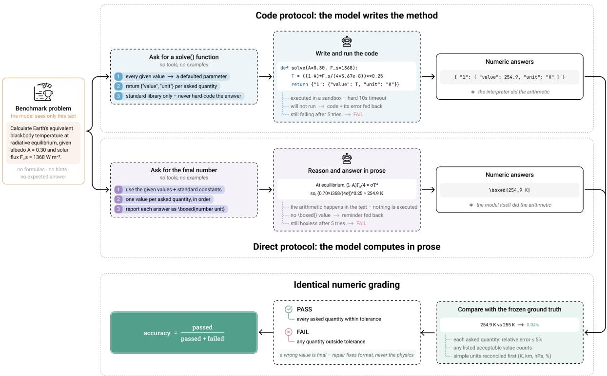  
Figure S1: The two evaluation protocols.

Schematic of the two protocols on the same benchmark problem, of which the model sees only the statement—no formulas, no hints, no expected answer. In the code protocol the model returns a solve() function under a fixed contract (every given value a defaulted parameter; one value–unit entry per asked quantity; standard library only, with hard-coded answers forbidden); the function is executed in a sandboxed subprocess under a hard 10 s timeout, and the interpreter’s output is what gets graded. In the direct protocol the model computes in prose and reports each answer as a boxed number with its unit; nothing is executed. In both protocols an ungradable response (code that will not run; a boxless answer) is fed back for up to five attempts, and a wrong but gradable answer is final. Both protocols end in the identical unit-aware numeric grading against the frozen ground truth—each asked quantity within 5% relative tolerance, commensurate units reconciled first—so they difer only in who executes the arithmetic. Per-model accuracy under the two protocols is in Table S8.

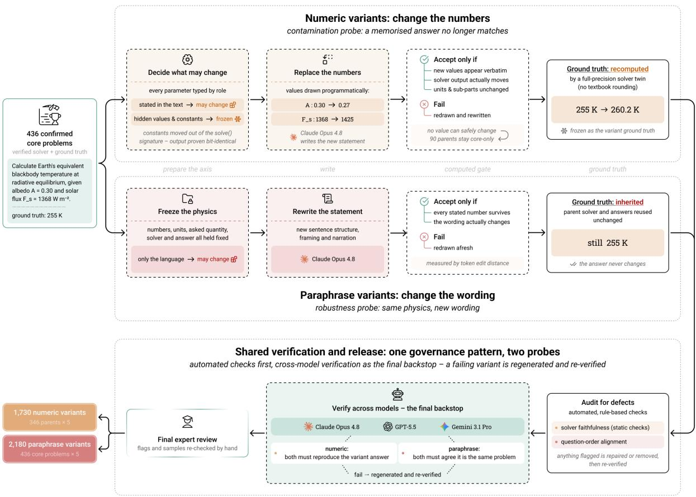  
Figure S2: Generation and certification of numeric and paraphrase variants.

Schematic of the variant pipeline, starting from the 436 certified core problems. Numeric variants (top; contamination probe): solver parameters are first typed by role, with hidden values and physical constants frozen out of the perturbable set; new values for text-stated parameters are drawn programmatically and the statement is rewritten around them, and a candidate is accepted only if every new value appears verbatim in the rewritten statement, the solver output genuinely moves, and units and sub-questions are unchanged; the variant ground truth is recomputed by a full-precision twin of the reference solver. Ninety parents whose inputs cannot be safely re-sampled remain core-only. Paraphrase variants (bottom; linguistic-robustness probe): numbers, units, asked quantities, solver and answer are all held fixed and only the wording changes, with each rewrite gated on every stated number surviving and on a minimum token edit distance; the parent’s ground truth is inherited unchanged. Both families then pass the same certification: automated defect audits, cross-model verification by the two developers other than the authoring model as the final backstop (a failing variant is regenerated and re-verified), and a final expert review of flags and samples—yielding 1,730 numeric and 2,180 paraphrase variants. Robustness results are in Fig. S4 and Tables S13– S15.

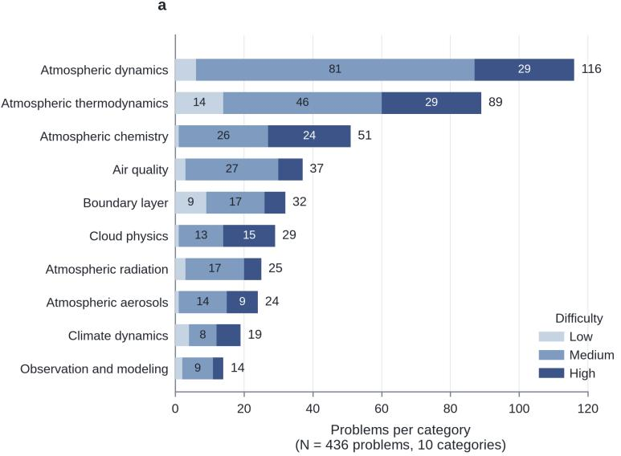

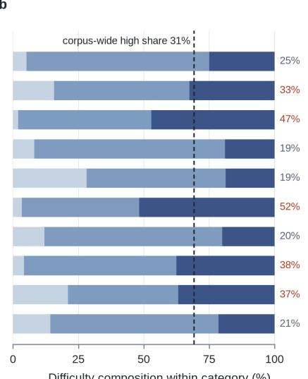  
Figure S3: Composition of the core set by category and dificulty.

a, Problems per category, stacked by intrinsic dificulty; 436 problems over ten categories, with segment and row totals printed. Two categories carry nearly half the corpus (atmospheric dynamics 116, thermodynamics 89) while four hold 25 or fewer. b, The same data as shares within each category. The figure at the right of each bar is that category’s high-dificulty share, printed in red where it exceeds the corpus-wide share of 31% (134 of 436, dashed line). Category and dificulty are therefore not independent in this corpus: cloud physics is 52% high-dificulty and chemistry 47%, against 19% for air quality and for the boundary layer. This is the composition efect referred to in the main text—accuracy declines as a category’s high-dificulty share rises $( r = - 0 . 4 9 )$ —so part of what reads as subject-matter dificulty is dificulty mix. Panel b should be consulted before any per-category ranking is read, including the one in Table S20.

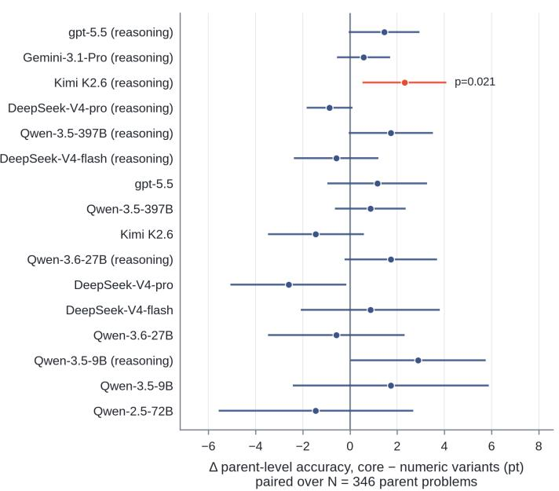

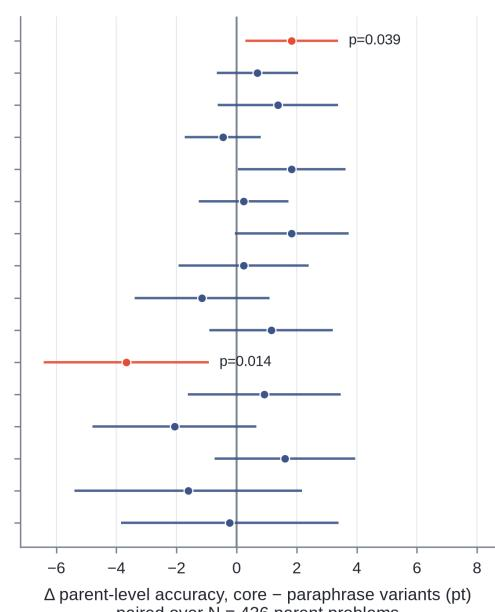  
Figure S4: Paired core-versus-variant accuracy shifts for all sixteen configurations.

∆ is parent-level accuracy on the core set minus accuracy on the variant family, in points, with 95% confidence intervals from the analytic paired standard error; positive means the variant family is harder. a, Numeric variants, paired over the 346 perturbable parents. b, Paraphrase variants, paired over all 436. Configurations are ordered by core-set capability. Red marks the three configurations whose uncorrected p falls below 0.05: Kimi K2.6 (reasoning) on numeric variants $( + 2 . 3 , \ p \ = \ 0 . 0 2 1 )$ , and gpt-5.5 (reasoning) $( + 1 . 8 , \ p \ = \ 0 . 0 3 9 )$ and DeepSeek-V4-pro $( - 3 . 7 ,$ $p = 0 . 0 1 4 )$ on paraphrase variants. None survives Holm correction across the sixteen tests within its family (smallest corrected $p = 0 . 3 4$ for numeric, 0.22 for paraphrase), so no configuration shows a resolvable core-versus-variant gap: every other interval overlaps zero, and the two paraphrase outliers point in opposite directions. DeepSeek-V4-pro’s negative shift—paraphrases easier than the originals—is a surface-form parsing efect on textbook prose rather than a robustness failure, since model-generated rewordings are systematically cleaner than the source text. Per-configuration values are in Tables S13 and S14.

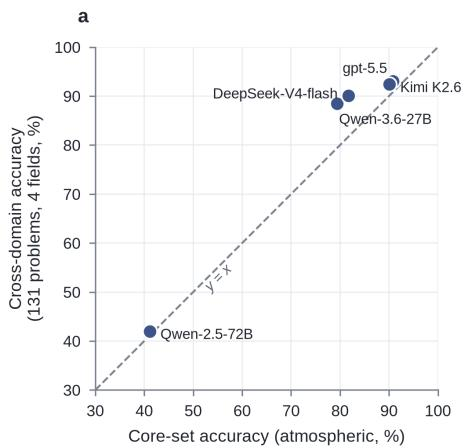

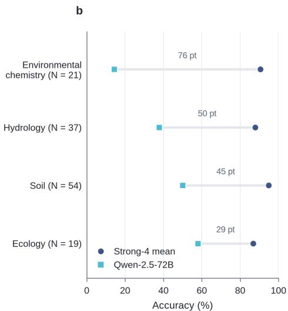  
Figure S5: Cross-domain transfer of the construction method.

a, Accuracy on the 131 problems built by running the identical pipeline on four non-atmospheric environmental domains, against the same configuration’s accuracy on the 436-problem atmospheric core set; the dashed line is $y = x .$ . All five configurations sit above it, by 0.9 to 9.1 points, so the transferred problems are the easier of the two sets—yet the ordering is reproduced exactly, all five keeping their core-set rank (Spearman $\rho = 1 . 0 0 )$ . b, Per-domain spread between the mean of the four strong configurations and Qwen-2.5-72B: 76 points in environmental chemistry, 50 in hydrology, 45 in soil mechanics and 29 in ecology and biogeochemistry, so every domain retains discriminative power at the bottom of the capability range. What transfers is the method rather than the dificulty level: a pipeline designed around atmospheric textbooks yields a corpus that separates the same configurations in the same order outside the field it was built for, which is evidence that the discrimination comes from the admission gates rather than from atmospheric subject matter. Per-domain values and sources are in Table S21.

## Supplementary Notes

## Supplementary Note S1: failure cases of the subfield archetypes

The four examples below are the problems cited in the main text, one for each archetype.

## Example 1: error propagation through a multi-stage calculation (cloud physics)

Problem. In a developing cumulus cloud the droplet spectrum has a Gaussian shape, centered at a mean radius of 4 µm with a standard deviation of 0.6 $\mu m .$ . Given that the cloud water content is $0 . 2 \ g \ m ^ { - 3 } ;$ estimate the supersaturation in an updraft of 8 m $s ^ { - 1 }$ . Assume a temperature of $0 ^ { \circ } C$ and a pressure of 80 kPa. Express your answer as a percentage.

Reference answer. 0.52%.

What the correct route requires. This is a single-answer problem, but the answer is the end of a long multiplicative chain. The Gaussian spectrum must first be converted into a number concentration. Its third raw moment is $\langle r ^ { 3 } \rangle = \bar { r } ^ { 3 } + 3 \bar { r } \sigma ^ { 2 }$ , not simply $\bar { r } ^ { 3 }$ , and the liquid-water content therefore gives

$$
N = \frac { w _ { l } } { ( 4 \pi / 3 ) \rho _ { l } \langle r ^ { 3 } \rangle } .
$$

The number concentration per unit mass of air is then $\nu _ { 0 } = N / \rho _ { a }$ , with $\rho _ { a } = p / ( R _ { d } T )$ . The quasi-steady supersaturation follows by balancing production by adiabatic cooling against depletion by condensational growth. In the notation of the reference solver,

$$
\begin{array} { l } { { \displaystyle Q _ { 1 } = g \left( \frac { L _ { v } } { c _ { p } R _ { v } T ^ { 2 } } - \frac { 1 } { R _ { d } T } \right) , } } \\ { { \displaystyle Q _ { 2 } = \frac { 1 } { q _ { v s } } + \frac { L _ { v } ^ { 2 } } { c _ { p } R _ { v } T ^ { 2 } } , } } \\ { { \displaystyle G = \frac { 1 0 0 Q _ { 1 } ( F _ { k } + F _ { d } ) } { 4 \pi \rho _ { l } Q _ { 2 } } , \qquad s _ { \infty } = \frac { G w } { \nu _ { 0 } \bar { r } } . } } \end{array}
$$

This route combines radii in µm, liquid-water content in $\mathrm { g \ m ^ { - 3 } }$ , pressure in $\mathrm { k P a }$ , number concentration in $\mathrm { m ^ { - 3 } }$ and $\mathrm { k g ^ { - 1 } }$ , and a final conversion from a dimensionless saturation excess to percent. An incorrect spectrum moment, a missed unit conversion, or a misassembled heat- or vapour-difusion resistance changes every quantity downstream; the problem supplies no intermediate numerical target with which to localize the first error.

How the models fall. The problem is solved by only 4 of the 16 configurations under the majority-of-three rule: DeepSeek-V4-pro (reasoning), Gemini-3.1-Pro (reasoning), gpt-5.5 (reasoning), and Kimi K2.6 (reasoning). The other 12 configurations fail. Inspection of the stored solutions shows heterogeneous rather than convergent wrong answers: diferent runs fail at diferent points, including the saturation-vapour calculation, construction of $F _ { k } + F _ { d } .$ , the Gaussian-spectrum moment, and the final balance. This scattered signature is what is expected from error propagation through a long chain, rather than from one shared missing fact or one common shortcut.

## Example 2: a local derivation that breaks control-volume bookkeeping (boundary layer)

Problem. Atmospheric boundary-layer gradient winds have an inflow component of $3 \ m \ s ^ { - 1 }$ at radius 500 km from the center of a midlatitude cyclone. What is the updraft speed? Assume a boundary-layer depth $( \Delta z )$ of 1 km. Express your answer in m $s ^ { - 1 }$

Reference answer. 0.012 m $\mathrm { s } ^ { - 1 }$

What the correct route requires. The calculation is short; the dificulty is keeping the mass balance geometrically consistent. For an axisymmetric cylindrical control volume of radius R and boundary-layer depth $\Delta z$ , radial inflow crosses the cylindrical side area $2 \pi R \Delta z$ , whereas the compensating updraft exits

through the top area $\pi R ^ { 2 }$ . Under the constant-density approximation,

$$
\rho u _ { r } ( 2 \pi R \Delta z ) = \rho w ( \pi R ^ { 2 } ) , \qquad w = \frac { 2 u _ { r } \Delta z } { R } = \frac { 2 ( 3 ) ( 1 . 0 \times 1 0 ^ { 3 } ) } { 5 . 0 \times 1 0 ^ { 5 } } = 0 . 0 1 2 \mathrm { m s } ^ { - 1 } .
$$

The factor of two is not an optional coeficient: it is the ratio between the lateral and top areas after the common factors are cancelled.

How the models fall. The problem is solved by 7 of the 16 configurations. The convergent-failure audit identifies the dominant wrong route in 11 configurations across the stored runs: they use $w = u _ { r } \Delta z / R$ and therefore return $0 . 0 0 6 \textnormal { m s } ^ { - 1 } .$ , exactly half of the reference value. The models invoke continuity and use the correct inputs, but their flux accounting omits the factor of two from the cylindrical side area. This is distinct from a long-chain failure: the derivation has only one balance, yet it fails because several flux surfaces must be tracked consistently.

## Example 3: reconstructing a literature-specific empirical source function (atmospheric aerosols)

Problem. Calculate the average flux of sea-spray drops (particles cm $^ { - 2 } \ s ^ { - 1 } )$ between 0.8 and 0.9 µm in radius when the wind speed at 10 m is $1 0 \ m \ s ^ { - 1 }$ . Use the Monahan et al. (1986) sea-spray source function. Reference answer. 0.32854 particles $\mathrm { c m ^ { - 2 } \ s ^ { - 1 } }$

What the correct route requires. Unlike a first-principles calculation, the problem requires retrieval and exact use of a named empirical relation. The reference solver uses the Monahan et al. diferential flux

$$
\begin{array} { r l r } {  { \frac { \mathrm { d } F } { \mathrm { d } r } = 1 . 3 7 3 U _ { 1 0 } ^ { 3 . 4 1 } r ^ { - 3 } ( 1 + 0 . 0 5 7 r ^ { 1 . 0 5 } ) 1 0 ^ { 1 . 1 9 \exp ( - B ^ { 2 } ) } , } } \\ & { } & { B = \frac { 0 . 3 8 0 - \log _ { 1 0 } r } { 0 . 6 5 0 } , } \end{array}
$$

where r is in µm and the diferential flux is in particles $\mathrm { m ^ { - 2 } \ s ^ { - 1 } \ \mu m ^ { - 1 } }$ . The requested quantity is the bin-integrated flux,

$$
F _ { \mathrm { 0 . 8 - - 0 . 9 } } = 1 0 ^ { - 4 } \int _ { 0 . 8 } ^ { 0 . 9 } \frac { \mathrm { d } F } { \mathrm { d } r } \mathrm { d } r ,
$$

where $1 0 ^ { - 4 }$ converts $\mathrm { m ^ { - 2 } }$ to $\mathrm { c m ^ { - 2 } }$ . Correct execution therefore requires the right empirical coeficients and exponents, the correct radius convention and independent variable, and an integration over the radius bin rather than evaluation of the diferential source function at one representative radius.

How the models fall. The problem is solved by 5 of the 16 configurations and missed by 11. This result establishes that the named empirical relation is a substantial capability bottleneck, but the available problem-level matrix alone does not assign every miss to one shared formula. The case should therefore be read as an example of what a successful solution must retrieve and execute, not as evidence that all 11 failures used the same alternative expression. The source function is not printed in the problem, so the task explicitly tests access to and correct use of a literature-specific empirical parameterization rather than derivation from general physical laws.

## Example 4: converting between mass- and number-weighted size distributions (atmospheric aerosols)

Problem. A group of particles is described by a log-normal distribution with $D _ { \mathrm { m e a n \ b y \ w e i g h t } } = 5$ µm and $\sigma = 0 . 8 . \ ( a )$ What fraction by weight of the particles have diameters less than $1 \ \mu m \ ? \ ( b )$ What fraction by number of the particles have diameters less than 1 $\mu m \ell$

Reference answers. (a) 2.3% by weight; (b) 65.0% by number. Both are graded.

What the correct route requires. The two parts use the same physical particles but not the same probability distribution. Let σ denote the standard deviation in ln $D ,$ as in the reference solver. For the mass-weighted distribution, whose geometric median is $D _ { g , m } = 5 \ \mu \mathrm { m }$ , the fraction below $D _ { * } = 1 \ \mu \mathrm { m }$ is

$$
f _ { m } = \Phi \biggl ( \frac { \ln D _ { * } - \ln D _ { g , m } } { \sigma } \biggr ) = 0 . 0 2 3 .
$$

Particle mass is proportional to $D ^ { 3 }$ , so exponential tilting of a log-normal distribution shifts the mean of ln D by $3 \sigma ^ { 2 }$ . The number-median diameter is therefore

$$
\ln D _ { g , n } = \ln D _ { g , m } - 3 \sigma ^ { 2 } ,
$$

and the number fraction is

$$
f _ { n } = \Phi \Big ( \frac { \ln D _ { * } - \ln D _ { g , n } } { \sigma } \Big ) = 0 . 6 5 0 .
$$

Thus the striking diference between 2.3% and 65.0% is physical: small particles contribute little mass but can dominate number. Reusing the mass cumulative distribution for part (b), treating the weight-mean diameter as a number median, or omitting the $D ^ { 3 }$ weighting destroys this distinction.

How the models fall. The problem is solved by 6 of the 16 configurations and missed by 10. The twoanswer structure makes the conceptual requirement directly testable: a valid solution must preserve the distinction between the mass- and number-weighted representations while using one stated size threshold. As with Example 3, the solve matrix establishes the concentration of failure but does not by itself prove that every failed run made the same conversion error. The example is nevertheless cleaner than superficially similar size-distribution questions whose wording leaves the underlying distribution convention open, because here the first quantity is explicitly defined “by weight” and the second explicitly “by number.”

## Supplementary Note S2: Trap failures

The trap set tests whether a model that can solve a parent problem continues to apply the same method after one condition has been changed so that the method is no longer valid.

Example 1: a small-deflection approximation outside its validity regime (atmospheric dynamics)

Problem. Two balls 4 cm in diameter are placed with their centers 8 cm apart on a frictionless horizontal plane at 43◦N. If the balls are impulsively propelled directly at each other with equal speeds, at what speed must they travel so that they just miss each other?

Reference answer. 2.984 $\times 1 0 ^ { - 6 } \mathrm { ~ m ~ s ~ } ^ { - 1 }$

What the correct route requires. Let d be the ball diameter, S the initial center separation, v the speed of each ball, and $f = 2 \Omega \sin \phi .$ . The usual parent-problem shortcut assumes a small Coriolis deflection, treats the balls as meeting at the midpoint, and sets their combined transverse displacement there equal to one diameter. That approximation is not valid when $S = 2 d .$ . The exact relative trajectory on an f-plane is

$$
r ( t ) = \left( S - { \frac { 2 v } { f } } \sin f t , - { \frac { 2 v } { f } } ( 1 - \cos f t ) \right) .
$$

It is a circle whose minimum distance from the origin is

$$
r _ { \mathrm { m i n } } = \sqrt { S ^ { 2 } + \left( \frac { 2 v } { f } \right) ^ { 2 } } - \frac { 2 v } { f } .
$$

Requiring $r _ { \operatorname* { m i n } } = d$ gives

$$
v _ { \mathrm { e x a c t } } = { \frac { f ( S ^ { 2 } - d ^ { 2 } ) } { 4 d } } = 2 . 9 8 4 \times 1 0 ^ { - 6 } { \mathrm { ~ m } } \mathrm { { s } } ^ { - 1 } .
$$

The small-deflection shortcut instead gives

$$
v _ { \mathrm { s h o r t c u t } } = { \frac { f S ^ { 2 } } { 4 d } } = 3 . 9 7 9 \times 1 0 ^ { - 6 } ~ { \mathrm { m } } { \mathrm { s } } ^ { - 1 } ,
$$

which is 33.3% above the correct value.

How the models fall. Only 5 of 27 model-runs solve the trap. Eighteen of 27 runs, spanning 7 of the 9 configurations and including frontier systems, return the pre-registered small-deflection shortcut. The transcripts explicitly assume that the centers reach the midpoint and use constant-acceleration transverse displacement. The same configurations solve the unmodified parent, showing that the failure is not lack of knowledge of Coriolis deflection but failure to notice that the perturbation has invalidated its small-deflection form.

## Example 2: Cartesian kinematics substituted for spherical geometry (atmospheric dynamics)

Problem. At latitude $8 0 ^ { \circ } N$ on a spherical Earth of radius 6371 km, the local wind components are $U = 4 0 \ m \ s ^ { - 1 }$ eastward and $V = 4 0$ m $s ^ { - 1 }$ northward. Given local horizontal wind gradients $\Delta U / \Delta x =$ $\Delta V / \Delta x = 5$ units, and $\Delta U / \Delta y = - 5$ units, $\Delta V / \Delta y = - 5$ units, where x is local eastward arc-distance, y is local northward arc-distance, and 1 unit = (1 m $\mathrm { s } ^ { - 1 } ) / ( 5 0 0$ km), find the horizontal divergence, the vertical component of relative vorticity, and the total deformation of the wind field, in the same units.

Reference answers. (1) divergence $= - 1 7 . 8$ units; (2) relative vorticity = 27.8 units; (3) total deformation = 19.44 units. All three are graded.

What the correct route requires. At high latitude, local spherical-coordinate kinematics contain metric terms that remain nonzero even when the displayed local derivatives cancel. With R the Earth’s radius and $\phi$ latitude,

$$
\delta = \frac { \partial U } { \partial x } + \frac { \partial V } { \partial y } - \frac { V \tan \phi } { R } ,
$$

$$
\zeta = \frac { \partial V } { \partial x } - \frac { \partial U } { \partial y } + \frac { U \tan \phi } { R } ,
$$

$$
D _ { s } = \frac { \partial U } { \partial x } - \frac { \partial V } { \partial y } - \frac { V \tan \phi } { R } ,
$$

$$
D _ { h } = \frac { \partial V } { \partial x } + \frac { \partial U } { \partial y } + \frac { U \tan \phi } { R } , \qquad D = ( D _ { s } ^ { 2 } + D _ { h } ^ { 2 } ) ^ { 1 / 2 } .
$$

The Cartesian shortcut drops every term proportional to tan $\phi / R$ and returns the vector (0, 10, 10) units. That vector is not a rough numerical approximation: it is the exact answer to a diferent, tangent-plane problem.

How the models fall. Only 6 of 27 model-runs solve the trap. Twelve runs from 6 configurations return the complete predicted shortcut vector (0, 10, 10). Matching the complete three-answer vector matters here: divergence alone is zero under several possible mistakes, whereas the joint vector identifies the Cartesian calculation specifically. The failure therefore consists of selecting a familiar local formula while discarding the spherical geometry stated in the prompt.

Example 3: a parent sign convention retained after the direction changes (thermodynamics)

Problem. The potential temperature of the air increases $5 ^ { \circ } C$ per 100 km distance east. If an eastward wind of 20 m $s ^ { - 1 }$ is blowing, find the temperature change associated with this advection. Express your answer in $^ \circ C \ s ^ { - 1 }$

Reference answer. $- 1 . 0 \times 1 0 ^ { - 3 } ^ { \circ } \mathrm { C } \ \mathrm { s } ^ { - 1 }$

What the correct route requires. The eastward potential-temperature gradient is positive,

$$
\frac { \partial \theta } { \partial x } = \frac { 5 } { 1 0 0 \times 1 0 ^ { 3 } } = 5 . 0 \times 1 0 ^ { - 5 } \mathrm { { ^ { \circ } C m ^ { - 1 } } } ,
$$

and an eastward wind has $U = + 2 0$ m $\mathrm { s } ^ { - 1 }$ . Horizontal advection therefore gives

$$
\frac { \partial \theta } { \partial t } = - U \frac { \partial \theta } { \partial x } = - 1 . 0 \times 1 0 ^ { - 3 } \mathrm { { s } } { \mathrm { { c } } } \mathrm { { s } } ^ { - 1 } .
$$

The parent problem used the meteorological expression “east wind,” meaning wind from the east and hence $U < 0$ . Retaining that convention after the trap changes the wording to “eastward wind” returns $+ 1 . 0 \times$ $1 0 ^ { - 3 \circ } \mathrm { C } \ \mathrm { s } ^ { - 1 }$ : the correct magnitude with the wrong sign.

How the models fall. Nineteen of $2 7$ model-runs solve the trap. The remaining failures are strongly structured: 8 of 27 runs, across 4 configurations, return the exact positive shortcut. The arithmetic and advection equation are intact; only the semantic mapping from the stated direction to the signed velocity component is inherited from the parent. This isolates a direction-preservation failure rather than a failure of thermodynamic knowledge.

## Example 4: Earth-relative velocity returned for an inertial-frame target (atmospheric dynamics)

Problem. A cylindrical column of air at $3 0 ^ { \circ } N$ with radius 100 km expands to twice its original radius. The air is initially at rest relative to the ground. What is the mean absolute (inertial-frame) tangential velocity at the perimeter after expansion? Take positive tangential velocity to be cyclonic. Reference answer. $1 . 8 2 3 ~ \mathrm { m ~ s ^ { - 1 } }$

What the correct route requires. On the local f-plane, absolute tangential speed about the column axis is

$$
U _ { \mathrm { a b s } } = V _ { \mathrm { r e l } } + \frac { f } { 2 } r .
$$

The column is initially at rest relative to the ground, so $U _ { \mathrm { 1 , a b s } } = ( f / 2 ) r _ { 1 }$ . Conservation of absolute angular momentum gives

$$
U _ { \mathrm { 2 , a b s } } r _ { 2 } = U _ { \mathrm { 1 , a b s } } r _ { 1 } , \qquad U _ { \mathrm { 2 , a b s } } = \frac { f } { 2 } \frac { r _ { 1 } ^ { 2 } } { r _ { 2 } } = 1 . 8 2 3 \mathrm { ~ m s } ^ { - 1 } .
$$

The parent formula instead reports the Earth-relative wind after expansion,

$$
V _ { \mathrm { 2 , r e l } } = { \frac { f } { 2 } } { \frac { r _ { 1 } ^ { 2 } - r _ { 2 } ^ { 2 } } { r _ { 2 } } } = - 5 . 4 6 9 ~ { \mathrm { m s ^ { - 1 } } } .
$$

Both quantities follow from angular-momentum conservation, but they are velocities in diferent reference frames and even have opposite signs in this case.

How the models fall. Twelve of 27 model-runs solve the trap. Four runs across 3 configurations return exactly $- 5 . 4 6 9  { \mathrm { ~ m ~ s ~ } ^ { - 1 } }$ , the pre-registered Earth-relative shortcut. The model has not forgotten angularmomentum conservation; it has computed the quantity requested by the parent rather than the explicitly requested inertial-frame quantity. This is a definition and target-preservation error.

## Example 5: a layer-mean flux substituted for the required surface flux (boundary layer)

Problem. Given an efective layer-averaged kinematic heat flux of $F _ { H } = 0 . 6 7 \ K \ m \ s ^ { - 1 }$ , where the vertical heat-flux profile decreases linearly from its surface value to zero at the top of the boundary layer, find the Deardorf convective velocity scale $( w _ { * } )$ for a dry, $z _ { i } = 1$ km thick boundary layer of temperature $T _ { v } = 2 5 ^ { \circ } C$ = 298 K. Express your answer in m $s ^ { \dot { - } 1 }$

Reference answer. 3.532 m $\mathrm { s } ^ { - 1 }$

What the correct route requires. The Deardorf scale uses the surface kinematic heat flux,

$$
w _ { * } = \left( \frac { g } { T _ { v } } z _ { i } F _ { H , 0 } \right) ^ { 1 / 3 } .
$$

For a heat-flux profile that decreases linearly from $F _ { H , 0 }$ at the surface to zero at $z _ { i } .$

$$
\overline { { F _ { H } } } = \frac { 1 } { z _ { i } } \int _ { 0 } ^ { z _ { i } } { F _ { H , 0 } \left( 1 - \frac { z } { z _ { i } } \right) \mathrm { d } z } = \frac { F _ { H , 0 } } { 2 } .
$$

Thus $F _ { H , 0 } = 2 ( 0 . 6 7 ) = 1 . 3 4 \mathrm { ~ K ~ m ~ s ^ { - 1 } }$ and $w _ { * } = 3 . 5 3 2 \mathrm { ~ m ~ s } ^ { - 1 }$ . Substituting the supplied layer mean directly as though it were the surface value gives the shortcut $w _ { * } = 2 . 8 0 3$ m $\mathrm { s } ^ { - 1 }$

How the models fall. Eighteen of 27 model-runs solve the trap. Six runs from 3 configurations return exactly $2 . 8 0 3 \mathrm { ~ m ~ s ^ { - 1 } }$ , including a frontier configuration. The model recalls the correct Deardorf formula and performs its arithmetic correctly, but evaluates it with a quantity averaged over the wrong vertical measure. The failure is therefore not formula recall but failure to convert a layer-average into the surface boundary condition required by that formula.