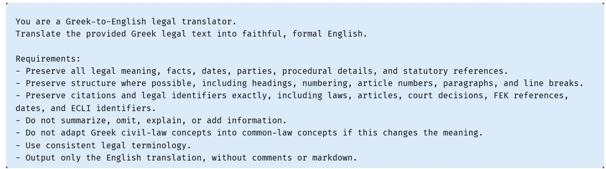
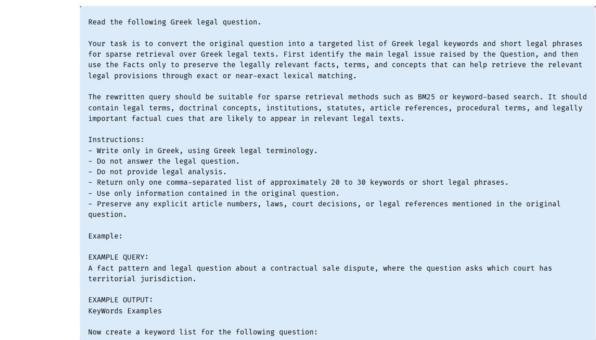
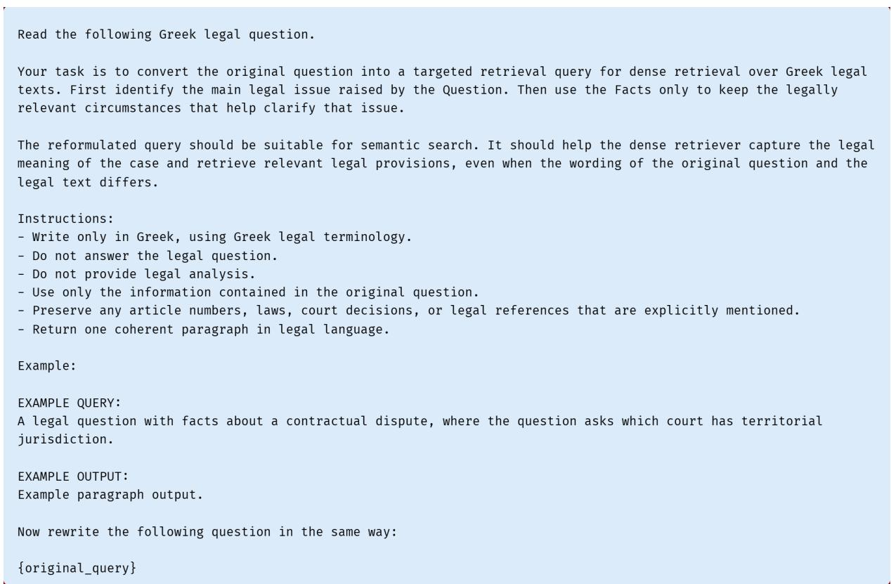
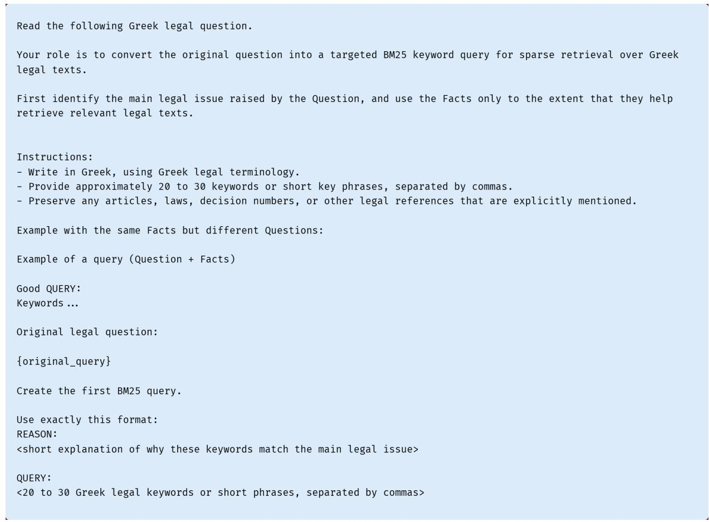
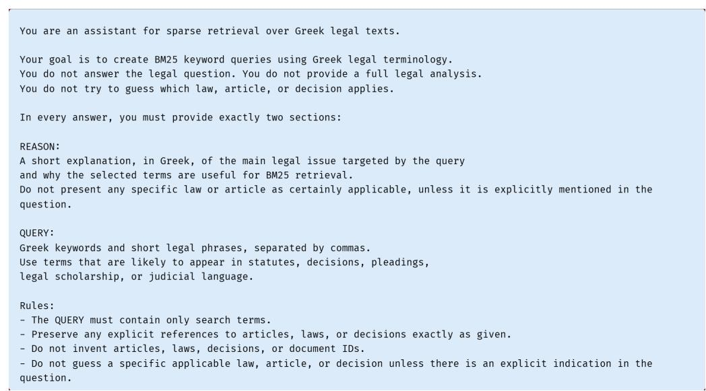
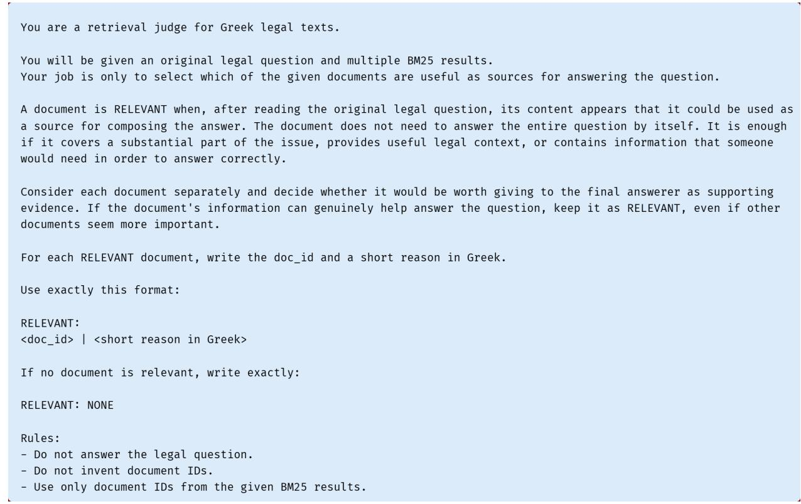

# GreekBarRetrieval: A Benchmark for Greek Statutory Retrieval

Ernest Beta1 Odysseas S. Chlapanis1,2

Ion Androutsopoulos1,2 Dimitrios Galanis2,3

1Department of Informatics, Athens University of Economics and Business, Greece 2Archimedes, Athena Research Center, Greece

3Institute for Language and Speech Processing, Athena Research Center, Greece

## Abstract

Statutory retrieval is necessary for citationgrounded legal question answering, but remains underexplored for Greek. We introduce GreekBarRetrieval, a public retrieval benchmark derived from, and complementing Greek-BarBench (Chlapanis et al., 2025), which did not include retrieval. The new benchmark comprises 283 bar-exam questions, each accompanied by the facts of the case it refers to, and 6,308 candidate statutory articles to retrieve from. Questions and facts are stated in everyday language, but need to be mapped to the formal terminology of statutes and their abstract legal concepts. A further complication is that not all of the case facts are relevant to each question of a case. Experimenting with three BM25 variants and nine dense retrievers, we find that vanilla dense retrieval far outperforms vanilla sparse retrieval in Recall@100. However, LLM-based query reformulation helps BM25 close that gap, while also improving dense retrieval. With a ten-round REACT-like LLM reformulation loop that we introduce, BM25 improves further in Recall@100 and obtains the best nDCG and MAP scores of all tested retrievers. Query reformulation also outperforms pseudo-relevance feedback, sparsedense fusion, and English translation.

## 1 Introduction

Legal question answering should ground its answers in retrieved relevant authorities, such as applicable statutory articles. Interpretability is a central requirement in the legal domain (Martinez-Gil, 2023), while precise retrieval supports citations and enables users to verify model claims (Pipitone and Alami, 2024). Retrieval also affects answer quality; prior work shows that providing relevant legal passages can substantially improve downstream legal question answering (Zheng et al., 2025). Legal retrieval is complicated, however, by a vocabulary mismatch; questions often describe events in everyday language, whereas the applicable authorities express the governing rules through specialized terminology and abstract legal concepts. In Greek, rich morphology creates additional surface variation, making exact term matching less reliable for sparse retrievers such as BM25 (Ntais, 2006; Papantoniou and Tzitzikas, 2024). Dense retrievers can bridge some of this mismatch, but may underweight exact lexical cues (e.g., required exact statutory terms, article references), and highly rank articles that resemble the case facts without addressing the question-specific legal issue.

<table><tr><td colspan="3">Facts</td></tr><tr><td colspan="3">[1] A, a heart patient in crisis, goes to B&#x27;s only overnight pharmacy for life-saving medication. [2] B refuses because of a personal dispute, despite C’s urgent</td></tr><tr><td colspan="3">request and A&#x27;s imminent collapse. [3] A says: “Let me die, and let him bear the blame.&quot;</td></tr><tr><td colspan="3">[4] C tries to give A the medication; when B attempts to stop</td></tr><tr><td colspan="3">him, C strikes B and gives it to A. Question</td></tr><tr><td colspan="3">Which criminal offenses were committed by B and C?</td></tr><tr><td colspan="3"></td></tr><tr><td colspan="3">Gold Relevant Articles</td></tr><tr><td>CrimC::42</td><td>CrimC::299 CrimC::15</td><td>CrimC::22</td></tr><tr><td colspan="3">Official Solution (summarized for the example) B refused life-saving medication despite A&#x27;s imminent col- lapse and his special duty to act. Attempted homicide by</td></tr><tr><td colspan="3">omission.Arts. 42, 299, 15 CrimC. C used force only to secure the medication and protect A&#x27;s life. Defense of a third person.Art. 22 CrimC.</td></tr></table>

Table 1: Example GreekBarRetrieval instance. The retrieval query is Question + Facts and the gold statutory articles are those cited in the official solution. Articles are identified as PREFIX::ARTICLE. CrimC is the Greek Penal Code. Example translated to English.

Existing legal retrieval benchmarks cover statutes, case law, contracts, and legal question answering (Pipitone and Alami, 2024; Zheng et al.,

2025; Louis and Spanakis, 2022; Su et al., 2024; Ma et al., 2021; Li et al., 2024; Joshi et al., 2024; Goebel et al., 2026; Mahari et al., 2024). We introduce GreekBarRetrieval, a public benchmark derived from GreekBarBench (Chlapanis et al., 2025), which used questions from the Greek Bar exams. GreekBarBench evaluates LLMs on legal questions from the Greek Bar exams without involving true retrieval; instead, each question is accompanied by the gold relevant articles and distractors (irrelevant articles). By contrast, GreekBarRetrieval contains 283 Greek bar examination questions, each accompanied by case facts (both from GreekBarBench), and a pool of 6,308 candidate statutory articles. For each question, the relevant statutes need to be retrieved from the pool. The retrieval query consists of the question and the given facts. The gold statutes are obtained from the official solution (Table 1). Unlike GreekBarBench, which evaluates complete answers with citations, but without true retrieval, GreekBarRetrieval focuses on statute retrieval only. Hence, it complements GreekBar-Bench by evaluating the retrieval abilities of legal Retrieval Augmented Generation (RAG) LLMs. To our knowledge, GreekBarRetrieval is the first retrieval benchmark for Greek statutory law. For experimental purposes, we also release GreekBar-Retrieval in a machine-translated English form.

To demonstrate the usage of GreekBarRetrieval and establish baselines, we use it to compare BM25 (with three pre-processing variants to cope with Greek morphology) and nine dense embedding models. Vanilla dense retrieval far outperforms vanilla sparse retrieval; Gemini-001 reaches 0.77 Recall@100 against 0.36 for BM25. However, LLM-based query reformulation largely closes that gap; vanilla reformulation improves BM25 to 0.60 Recall@100, while also improving dense retrieval. Furthermore, with a ten-round REACT-like (Yao et al., 2023) reformulation loop that we introduce, BM25 obtains 0.67 Recall@100 and the highest nDCG and MAP scores of all methods tested. We also show that query reformulation has a much more substantial effect on BM25 than tuning its parameters or varying pre-processing, and that it outperforms pseudo-relevance feedback in sparse and dense retrieval, as well as sparse-dense fusion.

Our main contributions are: (1) We introduce GreekBarRetrieval, a public benchmark for Greek statutory retrieval, based on bar-exam questions. The new benchmark is derived from, and complements GreekBarBench, which did not include true retrieval. (2) We provide experimental results for BM25 (with three Greek-specific pre-processors) and 9 dense retrievers, also considering LLM query reformulation, pseudo-relevance feedback, sparsedense fusion, and translation to English. We show that LLM query reformulation is particularly beneficial for BM25, while also improving dense retrieval. (3) We introduce a REACT-like LLM query reformulation loop, which vastly improves the performance of BM25, helping it obtain the highest nDCG and MAP scores among all methods tested, including dense retrievers.

All the code and data of our experiments will be made publicly available in the camera-ready.

## 2 GreekBarRetrieval

## 2.1 Derivation from GreekBarBench

GreekBarRetrieval is derived from GreekBarBench, a benchmark based on Greek Bar examinations across five legal areas: Civil (Αστικό), Criminal (Ποινικό), Commercial (Εμπορικό), Public Law (∆ημόσιο), and the Lawyers’ Code (Κώδικας ∆ικηγόρων) (Chlapanis et al., 2025). Each Greek-BarBench instance contains the facts of a case, a legal question about the case, a mix of relevant and irrelevant statutory articles supplied as context, and an official solution. We keep the questions, facts and the articles cited by the solution, and discard the supplied context; the cited articles become the ground truth (gold articles) for retrieval.

## 2.2 Benchmark Construction

We construct the retrieval pool (the set to retrieve articles from) from the statutory articles of all the Greek legal code documents. Each article is identified by its legal source and article number, such as CivC::11, CivProc::41, or CrimC::42. Paragraph and subsection numbers are not included, because retrieval is evaluated at the level of complete articles. This process produces 6,308 candidate articles from 23 legal sources (prefixes).

For each GreekBarBench question, we convert the articles cited in its official solution into the same SOURCE::ARTICLE identifiers, removing repetitions. The source GreekBarBench data contain 310 questions. We retain a question only when its citation set is non-empty and every cited article is present in the retrieval pool. Among the 310 questions, 16 yield no ground truth after citation conversion, six cite only articles absent from the retrieval pool, and five cite both present and absent articles. We exclude them, leaving 283 queries.

<table><tr><td>Unit</td><td>Count</td><td>Mean</td><td>Median</td><td>P95</td><td>Max</td></tr><tr><td>articles</td><td>6,308</td><td>108.04</td><td>58</td><td>372</td><td>3,778</td></tr><tr><td>queries</td><td>283</td><td>290.33</td><td>219</td><td>773</td><td>1,013</td></tr></table>

Table 2: Text length statistics for GreekBarRetrieval. Count is the number of articles or queries. Mean, Median, P95, and Max are the mean, median, 95th percentile, and maximum lengths in words, respectively.

## 2.3 Dataset Statistics

As already explained, GreekBarRetrieval contains 283 queries and 6,308 candidate articles (retrieval pool) from 23 legal sources (prefixes). Table 2 reports length statistics. Queries concatenate a legal question with the facts of a case, so the task is to retrieve short statutory articles from much longer descriptions (queries) of legal cases.

GreekBarRetrieval contains 775 relevance judgments (total gold article citations, for all queries) covering 465 distinct articles, or 7.37% of the retrieval pool. Each query has 2.74 gold articles on average, with a median of 2 and a maximum of 27. Overall, 56.9% of queries have more than one relevant article, 9.9% have more than five, and 21.2% cite articles from more than one legal source.

We also retain the five legal areas assigned to sources (prefixes) in GreekBarBench (Chlapanis et al., 2025) for analysis purposes. A source may be associated with more than one area. Appendix A reports statistics by legal area, while Appendix B provides the mapping from prefixes to areas.

## 2.4 Retrieval Task

The GreekBarRetrieval task is particularly challenging for three reasons. First, the questions and (especially) the facts are stated in everyday language (Table 1), so the retrieval task requires mapping questions and facts to statutory terminology and abstract legal concepts. Second, the questions come from bar exam files. Each file provides the facts of a particular case, then asks multiple questions about the case. Some of the facts of a case may be irrelevant to some of the questions of the case. Consequently, a query (which concatenates a question with all the facts of its case) may contain details irrelevant to the particular legal issue being asked. Third, questions often require combining information distributed across multiple articles from different sources; 56.9% of queries have multiple gold relevant articles, and 21.2% have gold articles from multiple legal sources (prefixes).

## 3 Experimental Setup and Retrievers

## 3.1 Evaluation Metrics

We report standard retrieval metrics (Manning et al., 2008): nDCG@10, nDCG@100, and MAP@100 for ranking quality; Recall@10 and Recall@100 for evidence coverage. Coverage matters because legal questions often require several articles, not just one. Recall@100 is our primary coverage metric and, intuitively, it assesses the extent to which the required articles are present in the context of the LLM that generates the answer, assuming the top 100 retrieved articles are all passed to the generator.1 Recall@10 reflects coverage when the generator LLM has a smaller context available. We compute all metrics using the pytrec\_eval module provided by the pytrec-eval-terrier package.2

## 3.2 Vanilla Dense and Sparse Retrievers

We evaluate three sparse BM25 baselines that differ in their pre-processing of Greek text: BM25- GREEKSTEMMER, BM25-SPACY, and BM25- GR-NLP-TOOLKIT (Appendix E). We also evaluate nine dense embedding models that vary in size and language coverage, including both generalpurpose and legal-domain models, served either locally or through an API: Gemini-001, Qwen3-8B, Euler-Legal-V1, Qwen3-4B, Jina-v5-small, Arctic-v2, Qwen3-0.6B, EmbGemma-300M, and Nomic-v1.5. Full model identifiers and implementation details are provided in Appendix E. BM25-GREEKSTEMMER and BM25-SPACY are the two best performing BM25 variants and are effectively indistinguishable; we use BM25- GREEKSTEMMER as the representative BM25 variant in the main experimental results below.

## 3.3 BM25 Parameter Tuning

As a sensitivity analysis, we also sweep the values of $k _ { 1 }$ and b in BM25-GREEKSTEMMER using the original and LLM-rewritten queries. This sweep is diagnostic only; it tests whether the sparse baseline is unusually sensitive to parameter values other than the default ones. Because the gains are small (Table 4) all other BM25 experiments reported here use the default $k _ { 1 }$ and b values (Table 15).

## 3.4 English Translation Baselines

For additional vanilla baselines, we translate GreekBarRetrieval into English to test whether sparse and dense retrievers improve when both the queries and candidate articles are in English. We translate questions, facts, and articles using openai/gpt-oss-120b (OpenAI et al., 2025), while preserving query identifiers, document identifiers, and relevance judgments. The translation prompt is shown in Figure 1 (Appendix G.1). We evaluate only the vanilla sparse and dense retrievers (§3.2) on the translated benchmark. These runs use the same setup as the original Greek baselines, with default English rather than Greek-specific preprocessing for sparse retrieval (Table 15).

## 3.5 Pseudo-Relevance Feedback (PRF)

To test if retrieved articles can improve the query without using LLM-based query reformulation, we apply pseudo-relevance feedback (PRF). For sparse retrieval, we use a simple TF–IDF term-expansion PRF heuristic inspired by classical local-analysis methods (Xu and Croft, 1996). Specifically, we initially use BM25 to retrieve the top 10 articles. From this set, we select the 30 terms with the highest TF-IDF scores and append them to the original query before running BM25 again. We keep the retrieved articles (and ranking) of the second run.

For dense retrieval, we apply positive-feedback Rocchio in the embedding space (Rocchio, 1971). After an initial dense retrieval pass, we take the top 10 retrieved articles as pseudo-relevant, compute the centroid c of their article embeddings, and form a new query vector $q _ { \mathrm { P R F } } = \mathrm { n o r m } ( \alpha q + \beta c )$ where q is the original query embedding and norm denotes L2 normalization. We use α = 1.0 and $\beta \ : = \ : 0 . 2 5$ , which give the original query more weight in order to reduce query drift. The first-pass ranking is used only to construct the feedback centroid; for evaluation, we retain the retrieved articles (and ranking) of the second pass (with qPRF).

## 3.6 Sparse-Dense Fusion (RRF)

To test whether sparse and dense retrievers recover complementary evidence, we combine BM25- GREEKSTEMMER in turn with each one of the eight locally hosted dense retrievers (Table 16), i.e., excluding only Gemini-001. For each pair of BM25-GREEKSTEMMER and dense retriever, we fuse their top 100 results using Reciprocal Rank Fusion (RRF) (Cormack et al., 2009) with default k value (k = 60). Since RRF uses rank positions rather than retrieval scores, it does not require score calibration between BM25 and the dense models.

## 3.7 LLM Query Reformulation

As discussed in §2.4, the questions and (especially) facts of GreekBarRetrieval are stated in everyday language, whereas the articles to be retrieved use specialized legal terminology and abstract legal concepts. Furthermore, each retrieval query concatenates a question with all the facts of its case, including possibly irrelevant facts. We, therefore, use an LLM to reformulate the queries, hoping to (a) keep only facts related to the legal issue of the question, and (b) bring the queries closer to the legal terminology and concepts of the authorities.

A different reformulation strategy is used for sparse and dense retrieval. For sparse retrieval, the LLM uses the question to identify the relevant parts of the facts and express the legal issue of the question in legal terminology. It produces a compact list of keywords (and short phrases), omitting secondary narrative details, while preserving any explicit references to articles, laws, or decisions. For dense retrieval, the LLM follows the same principle, but produces a concise rewritten query in the form of a prose statement, instead of a keyword list. The rewrite aims to preserve the question and the facts needed to express the legal issue, using Greek legal terminology, and removing secondary details that may distract the embedding model. All query reformulations are generated with gpt-oss-120b. The full prompts are shown in Figures 2 and 3.

## 3.8 ReAct-BM25

Inspired by REACT (Yao et al., 2023), we introduce REACT-BM25, which runs BM25 over several rounds instead of once. An LLM (in our experiments, gpt-oss-120b) plays two roles: as planner it writes the search query, and as observer it reads the retrieved articles (from the planner’s query) and keeps only those that help answer the question. The kept articles are passed back to the planner, which writes a new query for the next round. We investigate if this iterative process can narrow the performance gap between sparse and dense retrieval. The full prompts are shown in Figures 4, 5, 6, and 7.

Concretely, in the first round, the planner receives the original Question + Facts query and produces a Greek legal keyword query for BM25- GREEKSTEMMER, much as in LLM query reformulation (§3.7). BM25 retrieves the top 100 candidate articles, and the observer reviews them against the original query, retaining those that could provide useful evidence. In subsequent rounds, the planner inspects the original and previous queries, along with the articles retained by the observer. It then produces a new keyword query that explores a different legal angle or uses alternative terminology.

We run this process for up to 10 rounds. The observer returns binary decisions (regarding which retrieved articles to retain), so we need a way to convert the retained articles into a ranked list. We sort the retained articles by three keys: first, the number of rounds in which the observer retained the article; second, the earliest round in which it was retained; and third, its best BM25 rank from all the rounds where it was retained. The first key is the primary one. Articles with the same first-key values, are ranked by the second key; and articles with the same second-key value, are ranked by the third key. Thus, an article retained in multiple rounds (with multiple versions of the query) is ranked above an article retained only once. Among articles retained equally often, earlier retention is preferred; the intuition is that later rounds may have introduced query drift. BM25 rank is used only as the final tie-breaker. We retain up to 100 articles in the final output and report results after rounds 1, 2, 3, 5, and 10, with direct BM25 retrieval (without any reformulation rounds) reported as round 0.

## 4 Experimental Results

Table 3 reports our main results. Additional results are presented in Tables 4 and 5, discussed below. More detailed results are reported in Appendix C.

## 4.1 Results of Vanilla Retrievers

Table 3 shows that most dense retrievers outperform BM25 on Recall@100, our main evaluation metric (§3.1); we use BM25-GREEKSTEMMER here, whose performance is indistinguishable from the second best BM25 variant (Table 8). Gemini-001 achieves the highest Recall@100 (0.77), compared with 0.36 for BM25. Among the locally hosted dense models, Euler-Legal-V1 reaches 0.68 and Qwen3-8B 0.67. Within the Qwen3 family, the larger variants achieve higher coverage: 0.67 for 8B, 0.62 for 4B, and 0.45 for 0.6B. Nomic-v1.5 is a clear outlier, with 0.08 Recall@100, possibly because it was trained only on English data rather than on multilingual data.

<table><tr><td colspan="6">Model N@10 N@100 R@10 R@100 MAP</td></tr><tr><td colspan="6">Dense retrieval, no query reformulation</td></tr><tr><td>Gemini-001</td><td>0.39</td><td>0.47</td><td>0.48</td><td>0.77</td><td>0.33</td></tr><tr><td>Qwen3-8B Euler-Legal-V1</td><td>0.28</td><td>0.36</td><td>0.38</td><td>0.67</td><td>0.24</td></tr><tr><td>Qwen3-4B</td><td>0.25 0.24</td><td>0.34 0.32</td><td>0.34 0.31</td><td>0.68 0.62</td><td>0.21 0.20</td></tr><tr><td>Jina-v5-small</td><td>0.22</td><td>0.29</td><td>0.29</td><td>0.57</td><td>0.18</td></tr><tr><td>Arctic-v2 (0.6B) Qwen3-0.6B</td><td>0.22 0.14</td><td>0.28 0.20</td><td>0.28 0.20</td><td>0.51 0.45</td><td>0.18 0.11</td></tr><tr><td>EmbGemma-300M Nomic-v1.5 (137M)</td><td>0.10 0.01</td><td>0.16 0.02</td><td>0.15 0.01</td><td>0.38 0.08</td><td>0.08 0.01</td></tr><tr><td colspan="6">Sparse retrieval, no query reformulation</td></tr><tr><td>BM25</td><td>0.10</td><td>0.14</td><td>0.16</td><td>0.36</td><td>0.09</td></tr><tr><td colspan="6">LLM query reformulation</td></tr><tr><td>Reform-Qwen3-8B Reform-BM25</td><td>0.33 0.20</td><td>0.41 0.28</td><td>0.44 0.30</td><td>0.73 0.60</td><td>0.28 0.16</td></tr><tr><td colspan="6">Multi-round (iterative) retrieval</td></tr><tr><td>REACT-BM25</td><td>0.43</td><td>0.47</td><td>0.52</td><td>0.67</td><td>0.37</td></tr></table>

Table 3: Main results on GreekBarRetrieval. N@k is nDCG@k, R@k is Recall@k, MAP is MAP@100. BM25 denotes BM25-GREEKSTEMMER with default parameters, the representative BM25 variant (see also Table 8). Reform- denotes query reformulation. Reformand REACT- use gpt-oss-120b for query reformulation and as planner/observer, respectively. Bold marks the best overall score. Blue shading marks the best score among locally hosted systems. Most considered differences are statistically significant (Appendix C.5, Table 13), with exceptions in REACT-BM25 vs. Reform-Qwen3-8B, and REACT-BM25 vs. Gemini-001 .

## 4.2 Query Reformulation Results

As shown in Table 3, LLM reformulation benefits sparse retrieval more than dense retrieval: it raises BM25 Recall@100 from 0.36 to 0.60, compared with an increase from 0.67 to 0.73 for Qwen3-8B. These improvements are statistically significant on all five metrics after correction for multiple comparisons (Table 13, Appendix C.5). The detailed results in Table 9 (Appendix C.2) show the same pattern for the other evaluated retrievers: all three sparse variants gain at least 0.20 with query reformulation, whereas the seven dense encoders, excluding Nomic-v1.5, gain between 0.03 and 0.09. Reform-Qwen3-8B achieves the highest Recall@100 among the locally hosted systems.

## 4.3 ReAct-BM25 Results

REACT-BM25 further improves the performance of BM25, reaching 0.67 Recall@100 (Table 3), compared with 0.60 for Reform-BM25. We conjecture that this additional gain comes from the feedback loop: unlike one-shot reformulation, REACT-BM25 reviews the retrieved articles and subsequently uses them to guide the next query. Interestingly, REACT-BM25 reaches the same Recall@100 as vanilla Qwen3-8B (0.67); repeated LLM-guided query reformulation may help BM25 capture some of the semantic, non-surface matches as in dense retrieval. REACT-BM25 also obtains the highest nDCG@10 (0.43), nDCG@100 (0.47), Recall@10 (0.52), and MAP@100 (0.37) scores among all tested retrievers. These results show that REACT-BM25 effectively ranks relevant articles near the top and may therefore benefit RAG systems with smaller context windows.

Although REACT-BM25 does not surpass Reform-Qwen3-8B in Recall@100 (0.67 vs. 0.73), we did not find the difference to be statistically significant (Table 13, Appendix C.5). On the other hand, REACT-BM25 outperforms Reform-Qwen3-8B in nDCG@10, nDCG@100, MAP@100, and these differences are statistically significant (Table 13); we did not test the significance of the difference in Recall@10, where the gap is also large, in favor of REACT-BM25.

The difference in Recall@100 between Gemini-001 (0.77) and REACT-BM25 (0.67) is statistically significant (Table 13), but we did not detect a statistically significant difference in their nDCG@10, nDCG@100, MAP@100 scores.

The performance of REACT-BM25 improves at every reported round (Table 11, App. C.4). Recall@100 increases from 0.45 at round 1 to 0.52 at round 2, 0.56 at round 3, 0.63 at round 5, 0.68 at round 10. nDCG@10, nDCG@100, Recall@10, and MAP@100 follow the same pattern. Most of the improvement in these metrics occurs in the first round, while later rounds continue to improve Recall@100. Further analysis (Table 12, App. C.4) shows the observer excludes some retrieved relevant articles, limiting the final Recall@100 of REACT-BM25 to 0.67 (Table 3).

## 4.4 Tuning, PRF, RRF, Translation Results

Table 4 shows that BM25 parameter tuning (§3.3), pseudo-relevance feedback (PRF, §3.5), fusion (RRF, §3.6), and English translation (§3.4) all have negligible effects on BM25-GREEKSTEMMER, one of the two best and effectively indistinguishable BM25 variants, and on the best locally hosted dense retriever (Qwen3-8B). More detailed results, with similar findings, are reported in Appendices D and C.2. The gain from query reformulation is substantially larger (Table 4). This advantage is most pronounced for BM25, where reformulation improves Recall@100 by +0.23, compared with +0.02 for translation; for dense retrieval, the gain from reformulation (+0.06) is comparable to that from translation (+0.04), indicating that reformulation is useful but less impactful than in BM25.

<table><tr><td>Retriever</td><td>R@100</td><td>∆</td></tr><tr><td>Sparse: BM25-GREEKSTEMMER</td><td>0.36</td><td></td></tr><tr><td>+ parameter tuning</td><td>0.41</td><td>+0.05</td></tr><tr><td>+ pseudo-relevance feedback</td><td>0.37</td><td>+0.01</td></tr><tr><td>+ English translation† + LLM reformulation</td><td>0.38</td><td>+0.02</td></tr><tr><td>+ LLM reformulation + tuning</td><td>0.60 0.61</td><td>+0.23 +0.25</td></tr><tr><td>Dense: Qwen3-8B</td><td>0.67</td><td></td></tr><tr><td>+ pseudo-relevance feedback</td><td>0.66</td><td>-0.01</td></tr><tr><td>+ English translation</td><td>0.71</td><td></td></tr><tr><td></td><td></td><td>+0.04</td></tr><tr><td>+ fusion with BM25 (RRF) + LLM reformulation</td><td>0.64 0.73</td><td>-0.03 +0.06</td></tr></table>

Table 4: The effect of BM25 parameter tuning, pseudo-relevance feedback (PRF), fusion (RRF), English translation, and LLM query reformulation on the best BM25 variant (BM25-GREEKSTEMMER) and the best locally hosted dense retriever. †BM25-SPACY used, to have comparable (SPACY) pre-processing in both languages. Comparing BM25-GREEKSTEMMER against the English BM25-SPACY instead gives −0.11.

## 4.5 Retrieval Performance vs. Inference Cost

Table 5 explores the tradeoff between retrieval performance and inference cost. It reports nDCG@10 and Recall@100 as measures of top-rank quality and overall evidence retrieval, respectively. It also reports per-query LLM calls, tokens, and wallclock time in seconds. The systems lead on different metrics. Reform-Qwen3-8B reaches 0.73 Recall@100 and 0.33 nDCG@10 with two calls and 2.6k rewrite-generate tokens plus 0.3k rewrittenquery embedding tokens per query. Ten-round REACT-BM25 reaches 0.67 Recall@100 and 0.43 nDCG@10 with 20 calls and 617.9k tokens per query, i.e., with substantially larger inference cost; the observer accounts for 84% of these tokens. All calls in Table 5 were served locally, so these are compute costs rather than paid API costs.3

The systems also differ in their infrastructure requirements. Because a BM25 index is built from raw tokens, it needs no GPU to encode the retrieval pool, no vector database, and no re-indexing when an embedding model is replaced. Articles can be added or amended by updating the index. REACT-BM25 keeps this property at the expense of increased inference time. By contrast, the dense systems reverse the arrangement, paying a lot to build the index and less per query at inference time.

<table><tr><td>System</td><td colspan="4">N@10 R@100 Calls/q Tok/q</td></tr><tr><td>BM25</td><td>0.10</td><td>0.36</td><td>0</td><td>0.43</td></tr><tr><td>Qwen3-8B</td><td>0.28</td><td>0.67</td><td>1</td><td>1.5k 1.23</td></tr><tr><td>Reform- Qwen3-8B</td><td>0.33</td><td>0.73</td><td>2 2.9k</td><td>5.13</td></tr><tr><td colspan="5">REACT-BM25</td></tr><tr><td>1 round</td><td>0.34</td><td>0.45</td><td>2</td><td>54.9k 141.9</td></tr><tr><td>2 rounds</td><td>0.38</td><td>0.52</td><td>4</td><td>111.9k 289.3</td></tr><tr><td>3 rounds</td><td>0.40</td><td>0.55</td><td>6</td><td>170.9k 442.0</td></tr><tr><td>5 rounds</td><td>0.41</td><td>0.62</td><td>10</td><td>294.2k 760.8</td></tr><tr><td>10 rounds</td><td>0.43</td><td>0.67</td><td>20</td><td>617.9k 1597.7</td></tr></table>

Table 5: Retrieval performance (nDCG@10, Recall@100) and inference cost (LLM calls/query, tokens/query, time/query in sec.). Tok/q reports query tokens including both rewrite or planner-observer LLM tokens and embedding tokens. Times for intermediate rounds of REACT-BM25 are token-proportional estimates from the ten-round time.

## 5 Related Work

Legal retrieval and RAG benchmarks. Recent legal NLP work increasingly evaluates retrieval as a key component of legal RAG. LegalBench-RAG (Pipitone and Alami, 2024) focuses on retrieving legally relevant snippets for grounded legal answering, while Zheng et al. (2025) introduce retrieval tasks designed around legal reasoning needs, including Bar Exam QA and Housing Statute QA. The Massive Legal Embedding Benchmark (MLEB) comprises ten expert-annotated evaluation sets, including a U.S. Bar Exam QA task for retrieving relevant cases and legal literature (Butler et al., 2025). Other resources study retrieval across jurisdictions and document types, including statutory retrieval in Belgian, Italian, and German law (Louis and Spanakis, 2022; Noce et al., 2026; Weber et al., 2025), COLIEE shared tasks (Goebel et al., 2026), Thai legal QA (Akarajaradwong et al., 2025), and U.S. precedent retrieval (Mahari et al., 2024). Unlike these benchmarks, GreekBar-Retrieval focuses on article-level statutory retrieval for Greek bar-exam questions, using the statutory articles cited in official solutions as gold labels.

GreekBarBench and Greek NLP. GreekBar-Retrieval is derived from GreekBarBench (Chlapanis et al., 2025), which evaluates LLMs on Greek bar exam questions requiring free-text legal reasoning and citations. However, GreekBarBench does not involve true retrieval; instead, each question is accompanied by the gold relevant articles and distractors. We instead focus on the retrieval step, whether a system can recover the statutory articles needed before answer generation. This separates retrieval from reasoning or generation failures.

Greek remains less resourced than English in NLP (Papantoniou and Tzitzikas, 2024), and its morphology makes lexical matching harder, motivating Greek-specific normalization and stemming, including the stemmer of Ntais (2006).

Sparse, dense, hybrid retrieval. Sparse and dense retrieval capture different relevance signals. BM25 remains the standard sparse baseline (Robertson and Zaragoza, 2009) and is especially relevant in law, where exact statutory terms, article references, doctrinal expressions etc. may need to be matched exactly. Dense retrieval instead helps when the query and relevant authorities express the same legal concepts with different wordings. Hence, legal retrieval systems are often hybrid, i.e., they combine sparse and dense retrieval (Shao et al., 2020; Nigam et al., 2023). We evaluated Greek-aware BM25 variants, dense embedding models, and Reciprocal Rank Fusion (RRF) (Cormack et al., 2009), a rank-based method for combining retrievers without score calibration.

Query reformulation. Legal query reformulation aims to reduce the mismatch between user queries and legal authorities. GuRE (Kim et al., 2025) applies generative query rewriting to legal passage retrieval. Zhou et al. (2023) study a related problem in legal case retrieval, showing that long legal queries often contain noisy details and benefit from selecting legally salient content. Rewrite-Retrieve-Read (Ma et al., 2023) uses an LLM to reformulate queries before retrieval in RAG pipelines. We followed this direction, but focused on Greek bar-exam questions, facts, and statutory article retrieval rather than case or passage retrieval.

Translation and multilingual retrieval. Translation is often used to adapt retrieval methods to lower-resource languages. Prior work has compared query and document translation for crosslingual retrieval (Saleh and Pecina, 2020), while MIRACL (Zhang et al., 2023) highlights the need for multilingual retrieval evaluation. Our setting is not cross-lingual; both queries and articles are originally Greek, and translation is used only as a baseline alternative to Greek retrieval.

Iterative and agentic retrieval. ReAct (Yao et al., 2023) and IRCoT (Trivedi et al., 2023) show retrieval can be interleaved with reasoning instead of performed as a single step. This matters in legal retrieval, where a question may require several articles to be searched from different legal angles. We introduced and evaluated REACT-BM25, where retrieved articles guide later query reformulations across multiple search rounds (§3.8).

Pseudo-relevance feedback. Relevance feedback updates a query using user feedback for retrieved documents. Rocchio’s method is the classical reference (Rocchio, 1971). Pseudo-relevance feedback (PRF) removes the need for user feedback by treating the top-ranked documents from an initial retrieval pass as relevant. This idea has also been adapted to dense retrieval, for example in ColBERT-PRF (Wang et al., 2023). PRF is relevant to our work because, like LLM-based reformulation, it modifies the query before a second retrieval pass, but it relies only on initially retrieved documents rather than an explicit query reformulation.

## 6 Discussion

Vanilla dense retrieval performs better than sparse retrieval (Table 3), but this result does not make sparse retrieval generally unsuitable for legal retrieval. The two approaches rely on different signals. Dense retrievers can match queries with statutory articles even when they use different wordings. Sparse retrieval is more effective when terms need to be matched exactly (e.g., article references, statute names, particular doctrinal expressions). Simply merging the rankings of a sparse and a dense retriever, however, as in RRF (§3.6), provides no benefit in GreekBarRetrieval (Table 4).

By contrast, LLM query reformulation improves both sparse and dense retrievers (Table 3). The improvement is particularly strong for BM25, presumably because reformulation facilitates matches between semantically equivalent query and statutory terms, bringing to BM25 some of the benefits of dense retrieval. Reformulation also benefits both sparse and dense retrievers by removing from the query irrelevant case facts. These findings indicate that retrieval performance depends not only on the retrieval model, but also on how clearly the query represents the information need in legal terms.

REACT-BM25 produces the strongest results for nDCG@10, nDCG@100, Recall@10, MAP@100, placing relevant articles more consistently near the top of the ranking, and allowing conventional, less computationally intensive (compared to embedding models) inverted term indices to be employed. However, REACT-BM25 does not exceed LLM reformulated dense retrieval in Recall@100. It is, therefore, more useful for obtaining a small set of relevant articles than for maximizing overall evidence coverage. More importantly, the improvement in top-position ranking comes at a substantial computational cost (§4.5). Table 17 (App. F) shows that Rewrite-Qwen3-8B uses one reformulation and one embedding call, processing approx. 2.6k LLM tokens and 0.3k rewritten-query embedding token per query. The ten-round REACT-BM25 system uses 20 planner and observer calls and processes approx. 617.9k LLM tokens per query. It therefore processes about 240 times more LLM tokens and has an estimated cost per query about 154 times higher. Its sequential calls also result in much greater latency. By comparison, embedding the full retrieval pool with Qwen3-8B costs only \$0.0385.

These findings favor query reformulation followed by dense retrieval (e.g., Reform-Qwen3-8B, Table 3) as the practical default when both evidence coverage and computational cost matter. Iterative sparse retrieval (as in REACT-BM25) may be useful when only a few articles can be passed to a downstream model, when a conventional sparse retriever has to be used, or when a difficult query (e.g., with insufficient evidence from reformulated dense retrieval) justifies additional computation.

## 7 Conclusions

We introduced GreekBarRetrieval, a public benchmark linking 283 Greek bar exam questions to the statutory articles cited in their official solutions within a retrieval pool of 6,308 candidates. The new benchmark complements GreekBarBench, which did not include retrieval. Experimenting with three BM25 variants and nine dense retrievers, we found vanilla dense retrieval to far outperform vanilla sparse retrieval in overall evidence coverage. However, LLM query reformulation helps BM25 close the gap, by bringing to sparse retrieval some of the inexact mapping benefits of dense retrieval. Reformulation also helps sparse and dense retrievers discard irrelevant case facts. A REACT-like multi-round reformulation that we introduced helps BM25 obtain the best performance at top ranking positions, at the expense of substantially increased inference cost. Compared with BM25 parameter tuning, PRF, RRF, and English translation, query reformulation is by far the most effective enhancement of sparse retrieval, while dense retrieval also benefits, obtaining the strongest overall coverage.

## Limitations

GreekBarRetrieval evaluates systems against the statutory articles cited in the official Greek bar bench examination solutions. This ground truth is not exhaustive; further relevant articles may exist and are not credited by our evaluation.

We report paired significance tests for selected comparisons. With 283 queries and a mean of 2.74 relevant articles per query, small differences should be treated cautiously, even when statistically significant. All LLM-dependent results come from a single generation path per query. Translation, both reformulation prompts, and REACT-BM25 were each run once, due to limited computational resources, so we cannot report run-to-run variance.

The BM25 parameter sweep was optimized on the full benchmark and is reported only as an upper bound. GreekBarRetrieval does not currently provide a development subset, which future work should add to facilitate hyper-parameter tuning.

Our claims that reformulation brings some of the inexact matching benefits of dense retrieval to sparse retrieval, while also helping both types of retrievers remove irrelevant case facts, rest on indirect evidence, mostly the much larger gains for sparse retrieval, but also the fact that both dense and sparse retrievers improve. Appendix C.3 provides an indicative example, but a broader analysis is needed to solidify these claims.

We did not include any re-rankers in our baselines. Since the main advantages of REACT-BM25 are improved performance at top ranking positions and its ability to use conventional sparse retrievers, comparing it against baselines, especially sparse ones, coupled with re-rankers would be particularly interesting and might diminish those advantages.

The benchmark focuses on Greek statutory article retrieval for bar-exam-style questions. It does not cover case law, secondary sources, dynamic legal corpora, or real user search sessions.

Finally, we evaluate retrieval independently of its effect on end-to-end legal QA. Future work should test whether the observed retrieval gains lead to more accurate and better grounded answers.

## References

Pawitsapak Akarajaradwong, Pirat Pothavorn, Chompakorn Chaksangchaichot, Panuthep Tasawong, Thitiwat Nopparatbundit, Keerakiat Pratai, and Sarana Nutanong. 2025. NitiBench: Benchmarking LLM

frameworks on Thai legal question answering capabilities. In Proceedings of the 2025 Conference on Empirical Methods in Natural Language Processing, pages 34304–34327, Suzhou, China. Association for Computational Linguistics.

Umar Butler, Abdur-Rahman Butler, and Adrian Lucas Malec. 2025. The massive legal embedding benchmark (mleb). arXiv preprint arXiv:2510.19365.

Odysseas S. Chlapanis, Dimitrios Galanis, Nikolaos Aletras, and Ion Androutsopoulos. 2025. GreekBar-Bench: A challenging benchmark for free-text legal reasoning and citations. In Findings ofthe Association for Computational Linguistics: EMNLP 2025, pages 25099–25119, Suzhou, China. Association for Computational Linguistics.

Gordon V. Cormack, Charles L. A. Clarke, and Stefan Buettcher. 2009. Reciprocal rank fusion outperforms condorcet and individual rank learning methods. In Proceedings of the 32nd International ACM SIGIR Conference on Research and Development in Information Retrieval, SIGIR ’09, pages 758–759, New York, NY, USA. Association for Computing Machinery.

Randy Goebel, Yoshinobu Kano, Mi-Young Kim, Calum Kwan, Juliano Rabelo, Ken Satoh, Hiroaki Yamada, and Masaharu Yoshioka. 2026. The COL-IEE 2025 competition on legal information extraction and entailment: Overview, discussion, and dataset expansion. The Review of Socionetwork Strategies, 20(1):183–213.

Sture Holm. 1979. A simple sequentially rejective multiple test procedure. Scandinavian Journal ofStatistics, 6(2):65–70.

Abhinav Joshi, Shounak Paul, Akshat Sharma, Pawan Goyal, Saptarshi Ghosh, and Ashutosh Modi. 2024. IL-TUR: Benchmark for Indian legal text understanding and reasoning. In Proceedings of the 62nd Annual Meeting of the Association for Computational Linguistics (Volume 1: Long Papers), pages 11460– 11499, Bangkok, Thailand. Association for Computational Linguistics.

Daehui Kim, Deokhyung Kang, Jonghwi Kim, Sangwon Ryu, and Gary Lee. 2025. GuRE:generative query REwriter for legal passage retrieval. In Proceedings of the Natural Legal Language Processing Workshop 2025, pages 424–438, Suzhou, China. Association for Computational Linguistics.

Haitao Li, Yunqiu Shao, Yueyue Wu, Qingyao Ai, Yixiao Ma, and Yiqun Liu. 2024. Lecardv2: A largescale chinese legal case retrieval dataset. In Proceedings of the 47th International ACM SIGIR Conference on Research and Development in Information Retrieval, SIGIR ’24, page 2251–2260, New York, NY, USA. Association for Computing Machinery.

Antoine Louis and Gerasimos Spanakis. 2022. A statutory article retrieval dataset in French. In Proceedings ofthe 60th Annual Meeting ofthe Association

for Computational Linguistics (Volume 1: Long Papers), pages 6789–6803, Dublin, Ireland. Association for Computational Linguistics.

Xinbei Ma, Yeyun Gong, Pengcheng He, Hai Zhao, and Nan Duan. 2023. Query rewriting in retrievalaugmented large language models. In Proceedings of the 2023 Conference on Empirical Methods in Natural Language Processing, pages 5303–5315, Singapore. Association for Computational Linguistics.

Yixiao Ma, Yunqiu Shao, Yueyue Wu, Yiqun Liu, Ruizhe Zhang, Min Zhang, and Shaoping Ma. 2021. Lecard: A legal case retrieval dataset for chinese law system. In Proceedings of the 44th International ACM SIGIR Conference on Research and Development in Information Retrieval, SIGIR ’21, page 2342–2348, New York, NY, USA. Association for Computing Machinery.

Robert Mahari, Dominik Stammbach, Elliott Ash, and Alex Pentland. 2024. LePaRD: A large-scale dataset of judicial citations to precedent. In Proceedings of the 62nd Annual Meeting of the Association for Computational Linguistics (Volume 1: Long Papers), pages 9863–9877, Bangkok, Thailand. Association for Computational Linguistics.

Christopher D. Manning, Prabhakar Raghavan, and Hinrich Schütze. 2008. Introduction to Information Retrieval. Cambridge University Press, Cambridge, UK.

Jorge Martinez-Gil. 2023. A survey on legal question–answering systems. Computer Science Review, 48:100552.

Shubham Kumar Nigam, Navansh Goel, and Arnab Bhattacharya. 2023. nigam@coliee-22: Legal case retrieval and entailment using cascading of lexical and semantic-based models. In New Frontiers in Artificial Intelligence, pages 96–108, Cham. Springer Nature Switzerland.

Niko Dalla Noce, Davide Colla, Sina Farhang Doust, Lorenzo De Mattei, and Davide Bacciu. 2026. JuriFindIT: an Italian legal retrieval dataset. In Findings of the Association for Computational Linguistics: EACL 2026, pages 4223–4241, Rabat, Morocco. Association for Computational Linguistics.

Georgios Ntais. 2006. Development of a stemmer for the Greek language. Master’s thesis, Stockholm University / Royal Institute of Technology, Stockholm, Sweden, February.

OpenAI, Sandhini Agarwal, Lama Ahmad, Jason Ai, Sam Altman, Andy Applebaum, Edwin Arbus, Rahul K. Arora, Yu Bai, Bowen Baker, Haiming Bao, Boaz Barak, Ally Bennett, Tyler Bertao, Nivedita Brett, Eugene Brevdo, Greg Brockman, Sebastien Bubeck, Che Chang, and 106 others. 2025. gptoss-120b & gpt-oss-20b Model Card. Preprint, arXiv:2508.10925.

Katerina Papantoniou and Yannis Tzitzikas. 2024. Nlp for the greek language: A longer survey. Preprint, arXiv:2408.10962.

Nicholas Pipitone and Ghita Houir Alami. 2024. Legalbench-rag: A benchmark for retrievalaugmented generation in the legal domain. Preprint, arXiv:2408.10343.

Stephen Robertson and Hugo Zaragoza. 2009. The probabilistic relevance framework: Bm25 and beyond. Foundations and Trends in Information Retrieval, 4(1-2):1–174.

Joseph J. Rocchio, Jr. 1971. Relevance feedback in information retrieval. In Gerard Salton, editor, The SMART Retrieval System: Experiments in Automatic Document Processing, chapter 14, pages 313–323. Prentice-Hall, Englewood Cliffs, NJ.

Shadi Saleh and Pavel Pecina. 2020. Document translation vs. query translation for cross-lingual information retrieval in the medical domain. In Proceedings of the 58th Annual Meeting of the Association for Computational Linguistics, pages 6849–6860, Online. Association for Computational Linguistics.

Yunqiu Shao, Bulou Liu, Jiaxin Mao, Yiqun Liu, Min Zhang, and Shaoping Ma. 2020. THUIR@COLIEE-2020: Leveraging semantic understanding and exact matching for legal case retrieval and entailment. Preprint, arXiv:2012.13102. Presented at the Fourteenth International Workshop on Juris-Informatics (JURISIN 2020), COLIEE session.

Mark D. Smucker, James Allan, and Ben Carterette. 2007. A comparison of statistical significance tests for information retrieval evaluation. In Proceedings ofthe Sixteenth ACM Conference on Conference on Information and Knowledge Management, CIKM ’07, page 623–632, New York, NY, USA. Association for Computing Machinery.

Weihang Su, Yiran Hu, Anzhe Xie, Qingyao Ai, Quezi Bing, Ning Zheng, Yun Liu, Weixing Shen, and Yiqun Liu. 2024. STARD: A Chinese statute retrieval dataset derived from real-life queries by nonprofessionals. In Findings of the Association for Computational Linguistics: EMNLP 2024, pages 10658–10671, Miami, Florida, USA. Association for Computational Linguistics.

Harsh Trivedi, Niranjan Balasubramanian, Tushar Khot, and Ashish Sabharwal. 2023. Interleaving retrieval with chain-of-thought reasoning for knowledgeintensive multi-step questions. In Proceedings of the 61st Annual Meeting ofthe Associationfor Computational Linguistics (Volume 1: Long Papers), pages 10014–10037, Toronto, Canada. Association for Computational Linguistics.

Xiao Wang, Craig MacDonald, Nicola Tonellotto, and Iadh Ounis. 2023. ColBERT-PRF: Semantic pseudorelevance feedback for dense passage and document retrieval. ACM Trans. Web, 17(1).

Malte Weber, Balaramakrishna Paritala, Abhilash Reddy Rechu, Leila Feddoul, Suresh Kumar Bonagiri, Norman Klewer, Pirmin Mathias Karg, Christoph Unger, Marianne Mauch, and Birgitta König-Ries. 2025. GerLeRB – German legislative retrieval benchmark. In Björn Gehlsen and André Schnackenburg, editors, 8. Fachtagung Rechts- und Verwaltungsinformatik (RVI 2025), pages 157–168. Gesellschaft für Informatik e.V., Bonn.

Jinxi Xu and W. Bruce Croft. 1996. Query expansion using local and global document analysis. In Proceedings ofthe 19th Annual International ACM SI-GIR Conference on Research and Development in Information Retrieval, SIGIR ’96, pages 4–11. Association for Computing Machinery.

Shunyu Yao, Jeffrey Zhao, Dian Yu, Nan Du, Izhak Shafran, Karthik R Narasimhan, and Yuan Cao. 2023. React: Synergizing reasoning and acting in language models. In The Eleventh International Conference on Learning Representations.

Xinyu Zhang, Nandan Thakur, Odunayo Ogundepo, Ehsan Kamalloo, David Alfonso-Hermelo, Xiaoguang Li, Qun Liu, Mehdi Rezagholizadeh, and Jimmy Lin. 2023. MIRACL: A multilingual retrieval dataset covering 18 diverse languages. Transactions of the Association for Computational Linguistics, 11:1114–1131.

Lucia Zheng, Neel Guha, Javokhir Arifov, Sarah Zhang, Michal Skreta, Christopher D. Manning, Peter Henderson, and Daniel E. Ho. 2025. A reasoning-focused legal retrieval benchmark. In Proceedings ofthe 2025 Symposium on Computer Science and Law, CSLAW ’25, page 169–193, New York, NY, USA. Association for Computing Machinery.

Youchao Zhou, Heyan Huang, and Zhijing Wu. 2023. Boosting legal case retrieval by query content selection with large language models. In Proceedings of the Annual International ACM SIGIR Conference on Research and Development in Information Re trieval in the Asia Pacific Region, SIGIR-AP ’23, page 176–184, New York, NY, USA. Association for Computing Machinery.

## Appendix

## A Legal Area Statistics

Table 6 reports GreekBarRetrieval statistics by legal area. Article counts are multi-label because some statutory sources are used in more than one GreekBarBench legal area.

## B Legal Source (Prefix) to Area Mapping

GreekBarRetrieval uses article identifiers of the form PREFIX::ARTICLE. The prefix denotes the legal source the article is drawn from. Table 7 reports the mapping used for area-level analysis.

<table><tr><td>Legal area</td><td>Articles</td><td>Q</td><td>Qrels</td><td>Rel./Q</td><td>MedLen</td></tr><tr><td>Civil</td><td>3,264</td><td>69</td><td>255</td><td>3.70</td><td>42</td></tr><tr><td>Public</td><td>2,841</td><td>58</td><td>99</td><td>1.71</td><td>41</td></tr><tr><td>Commercial</td><td>4,171</td><td>48</td><td>127</td><td>2.65</td><td>48</td></tr><tr><td>Lawyers</td><td>4,476</td><td>56</td><td>153</td><td>2.73</td><td>48</td></tr><tr><td>Criminal</td><td>1,253</td><td>52</td><td>141</td><td>2.71</td><td>85</td></tr></table>

Table 6: Legal area statistics for GreekBarRetrieval. Article counts are multi-label and, therefore, exceed the 6,308 unique articles in the full retrieval pool. Q denotes the number of queries, Qrels the total number of gold articles (for all queries of the area together), Rel./Q the mean number of relevant articles per query. MedLen is the median article length in words.

The original GreekBarBench legal area tags are astiko (Αστικό ∆ίκαιο, Civil Law), dimosio (∆ημόσιο ∆ίκαιο, Public Law), emporiko (Εμ- πορικό ∆ίκαιο, Commercial Law), kodikas (Κώδικας ∆ικηγόρων, Lawyers’ Code), and poiniko (Ποινικό ∆ίκαιο, Criminal Law).

## C Detailed Results

Table 3 reported experimental results for representative systems from each experimental setting. This appendix provides additional results for all evaluated retrieval methods and configurations.

## C.1 Detailed Results of Vanilla Retrievers

Table 8 reports the experimental results of all vanilla retrievers tested. The results of the dense retrievers are as in Table 3, but the sparse results now include all three BM25 variants tested (§3.2, Appendix E). Within the Qwen3 family, performance increases with model parameter count. Nomic-v1.5 is a clear outlier, with 0.08 Recall@100, possibly because it was trained only on English data. BM25-GREEKSTEMMER and BM25-SPACY obtain the same results (rounded to two decimals). BM25-GR-NLP is clearly worse.

## C.2 Results for Translation, Query Reformulation, PRF, and RRF

Table 9 shows the effect of English translation, query reformulation, pseudo-relevance feedback (PRF), and hybrid sparse-dense retrieval (RRF) on each vanilla retriever, reporting Recall@100. Gemini-001 is omitted because we ran it only on the original Greek queries. We also omitted some of the experiments (dashes), when the other results (in the same columns) were not promising.

Reformulation is the only addition (among the four) that helps both dense and sparse retrievers, and the only one whose gain is consistent and large anywhere. It adds 0.24 to BM25- GREEKSTEMMER and 0.20 to BM25-SPACY, against 0.03 to 0.09 for the dense encoders that work on Greek. Translation shows the opposite pattern within the dense encoders, helping the weakest most, and having a negative effect (−0.11) on BM25-GREEKSTEMMER. Across the five systems evaluated with PRF, the absolute change in Recall@100 is at most 0.02: PRF improves each of the three sparse retrievers by +0.01, but decreases Qwen3-8B by −0.01 and EmbGemma-300M by −0.02. Fusion deteriorates the performance of five of the eight dense encoders. There is a large gain (+0.24) only for Nomic-v1.5, a dense model not performing well on Greek, hence BM25’s exact matching helps.

<table><tr><td>Prefix</td><td>Source description</td><td>Legal Area</td></tr><tr><td>AK</td><td>Greek Civil Code</td><td>Civil, Public, Commercial Law, Lawyers&#x27; Code</td></tr><tr><td>EisNAK</td><td>Introductory Law to the Civil Code</td><td>Public Law</td></tr><tr><td>KD</td><td>Lawyers&#x27; Code</td><td>Lawyers&#x27; Code</td></tr><tr><td>KDD</td><td>Code of Administrative Procedure</td><td>Public Law</td></tr><tr><td>KDD/sias</td><td>Source prefix retained from GreekBarBench</td><td>Public Law</td></tr><tr><td>KDDL</td><td>Source prefix retained from GreekBarBench</td><td>Lawyers&#x27; Code</td></tr><tr><td>KPD</td><td>Code of Criminal Procedure</td><td>Lawyers&#x27; Code, Criminal Law</td></tr><tr><td>KPolD</td><td>Code of Civil Procedure</td><td>Civil Law, Commercial Law, Lawyers&#x27; Code</td></tr><tr><td>PK</td><td>Greek Penal Code</td><td>Lawyers&#x27; Code, Criminal Law</td></tr><tr><td>Syntagma</td><td>Constitution of Greece</td><td>Civil Law, Public Law, Criminal Law</td></tr><tr><td>N_702_1977</td><td>Law 702/1977</td><td>Public Law</td></tr><tr><td>N_1406_1983</td><td>Law 1406/1983</td><td>Public Law</td></tr><tr><td>N_3155_1955</td><td>Law 3155/1955</td><td>Public Law</td></tr><tr><td>PD_18_1989</td><td>Presidential Decree 18/1989</td><td>Public Law</td></tr><tr><td>PD_258_2005</td><td>Presidential Decree 258/2005</td><td>Public Law</td></tr><tr><td>N_146_1914</td><td>Law 146/1914</td><td>Commercial Law</td></tr><tr><td>N_3190_1955</td><td>Law 3190/1955</td><td>Commercial Law</td></tr><tr><td>N_4072_2012</td><td>Law 4072/2012</td><td>Commercial Law</td></tr><tr><td>N_4541_2018</td><td>Law 4541/2018</td><td>Commercial Law</td></tr><tr><td>N_4738_2020</td><td>Law 4738/2020</td><td>Commercial Law</td></tr><tr><td>N_5325_1932</td><td>Law 5325/1932</td><td>Commercial Law</td></tr><tr><td>N_5960_1933</td><td>Law 5960/1933</td><td>Commercial Law</td></tr><tr><td>ND_17_07_N_13_08_1923</td><td>Legislative decree of 17-07/13-08-1923</td><td>Commercial Law</td></tr></table>

Table 7: Mapping from legal sources (prefixes) to GreekBarBench legal areas. The mapping is multi-label, because some statutory sources are used in more than one legal area.
<table><tr><td colspan="5">Model N@10 N@100 R@10 R@100</td></tr><tr><td>Dense retrieval, no query reformulation</td><td></td><td></td><td></td><td></td></tr><tr><td>Gemini-001</td><td>0.39</td><td>0.47</td><td>0.48</td><td>0.77</td></tr><tr><td>Qwen3-8B</td><td>0.28</td><td>0.36</td><td>0.38</td><td>0.67</td></tr><tr><td>Euler-Legal-V1</td><td>0.25</td><td>0.34</td><td>0.34</td><td>0.68</td></tr><tr><td>Qwen3-4B</td><td>0.24</td><td>0.32</td><td>0.31</td><td>0.62</td></tr><tr><td>Jina-v5-small</td><td>0.22</td><td>0.29</td><td>0.29</td><td>0.58</td></tr><tr><td>Qwen3-0.6B</td><td>0.14</td><td>0.20</td><td>0.20</td><td>0.45</td></tr><tr><td>Arctic-v2</td><td>0.22</td><td>0.28</td><td>0.28</td><td>0.52</td></tr><tr><td>EmbGemma-300M</td><td>0.10</td><td>0.16</td><td>0.15</td><td>0.38</td></tr><tr><td>Nomic-v1.5</td><td>0.01</td><td>0.02</td><td>0.01</td><td>0.08</td></tr><tr><td colspan="5">Sparse retrieval, no query reformulation</td></tr><tr><td>BM25-</td><td>0.10</td><td>0.14</td><td>0.16</td><td>0.36</td></tr><tr><td>GREEKSTEMMER</td><td></td><td></td><td></td><td></td></tr><tr><td>BM25-SPACY</td><td>0.10</td><td>0.14</td><td>0.16</td><td>0.36</td></tr><tr><td>BM25-GR-NLP</td><td>0.05</td><td>0.07</td><td>0.08</td><td>0.18</td></tr></table>

Table 8: Detailed vanilla sparse and dense retrieval results. The results of the dense retrievers are the same as in Table 3. BM25-GREEKSTEMMER and BM25- SPACY are the two best BM25 variants and are effectively indistinguishable (their results differ in the third decimal, but results are rounded to two decimals here). Bold marks the best overall score. Blue shading marks the best score among locally hosted systems.

## C.3 Query Reformulation Example

In the original query of Table 10, the gold article is outside the top 100 of BM25-GREEKSTEMMER. Query reformulation introduces the legal term παράβαση καθήκοντος (breach of duty), matching (after stemming) παραβαίνει τα καθήκοντα (breaches the duties) in the statutory text, and moves the article to rank 18. This example illustrates how reformulation provides lexical cues that particularly benefit sparse retrieval.

## C.4 REACT-BM25 Results

Table 11 shows that all five metrics improve at every reported round of REACT-BM25. Recall@100 increases from 0.45 after round 1 to 0.67 after round 10, while most of the improvement in the ranking metrics occurs during the first two rounds.

To separate candidate article generation (articles retrieved by the planner) from observer filtering, we

<table><tr><td>Retriever</td><td>Vanilla</td><td>+Translation</td><td>+Reformulation</td><td>+PRF</td><td>+RRF</td></tr><tr><td>Qwen3-8B</td><td>0.67</td><td>0.71 (+0.04)</td><td>0.73 (+0.06)</td><td>0.66 (−0.01)</td><td>0.64 (−0.03)</td></tr><tr><td>Euler-Legal-V1</td><td>0.68</td><td>0.68 (+0.00)</td><td>0.71 (+0.03)</td><td></td><td>0.63 (−0.05)</td></tr><tr><td>Qwen3-4B</td><td>0.62</td><td>0.67 (+0.05)</td><td>0.69 (+0.07)</td><td></td><td>0.58 (−0.04)</td></tr><tr><td>Jina-v5-small</td><td>0.57</td><td>0.65 (+0.08)</td><td>0.63 (+0.06)</td><td></td><td>0.56 (−0.01)</td></tr><tr><td>Arctic-v2</td><td>0.51</td><td>0.55 (+0.04)</td><td>0.60 (+0.09)</td><td></td><td>0.50 (−0.01)</td></tr><tr><td>Qwen3-0.6B</td><td>0.45</td><td>0.55 (+0.10)</td><td>0.48 (+0.03)</td><td></td><td>0.46 (+0.01)</td></tr><tr><td>EmbGemma-300M</td><td>0.38</td><td>0.56 (+0.18)</td><td>0.41 (+0.03)</td><td>0.36 (−0.02)</td><td>0.42 (+0.04)</td></tr><tr><td>Nomic-v1.5</td><td>0.08</td><td>0.42 (+0.34)</td><td>0.07 (−0.01)</td><td></td><td>0.32 (+0.24)</td></tr><tr><td>BM25-GREEKSTEMMER</td><td>0.36</td><td>0.25 (−0.11)</td><td>0.60 (+0.24)</td><td>0.37 (+0.01)</td><td></td></tr><tr><td>BM25-SPACY</td><td>0.36</td><td>0.38 (+0.02)</td><td>0.56 (+0.20)</td><td>0.37 (+0.01)</td><td></td></tr><tr><td>BM25-GR-NLP</td><td>0.18</td><td>0.24 (+0.06)</td><td>0.48 (+0.30)</td><td>0.19 (+0.01)</td><td></td></tr></table>

Table 9: Detailed results (Recall@100) showing the effect of separately adding English translation, LLM query reformulation, pseudo-relevance feedback (PRF), and sparse-dense fusion (RRF) to the vanilla retrievers. Parentheses report the difference from the corresponding vanilla result. Dashes denote combinations we did not run, given that the other experiments in the column were not promising.

An employee who intentionally breaches the duties of their office with the purpose of obtaining for themselves or another an unlawful benefit is punishable by imprisonment.

Table 10: Query reformulation example. The original query (question+facts) is converted (for sparse retrieval) to a legal keyword query. Bold highlights terminology shared by the reformulation and the gold article. Exam ple translated to English and abridged for presentation.

compute recall over the union of all unique BM25 candidates retrieved up to each round (candidate pool recall), before the observer’s decisions are applied. Table 12 shows that candidate-pool recall increases from 0.59 after the first round to 0.77 after ten rounds, compared with 0.45 and 0.67, respectively, for the observer-kept output. By round 10, 98 retrieved (by the planner) relevant query-article pairs (an article may be relevant to many queries), affecting 64 queries, are absent from the observerkept output. Thus, candidate generation retrieves more relevant evidence than the final output preserves, showing that observer filtering accounts for part of the low (0.67) Recall@100 (Table 3).

## C.5 Statistical Significance Tests

Table 13 reports two-sided paired randomization statistical significance tests (Smucker et al., 2007)

<table><tr><td>Rounds N@10</td><td>N@100</td><td>R@10</td><td>R@100 MAP</td></tr><tr><td>0</td><td>0.10 0.14</td><td>0.16</td><td>0.36 0.09</td></tr><tr><td>1</td><td>0.34 0.35</td><td>0.44</td><td>0.45 0.27</td></tr><tr><td>2</td><td>0.38 0.39</td><td>0.47</td><td>0.52 0.30</td></tr><tr><td>3</td><td>0.40 0.42</td><td>0.49</td><td>0.55 0.33</td></tr><tr><td>5</td><td>0.41 0.45</td><td>0.50</td><td>0.62 0.35</td></tr><tr><td>10</td><td>0.43 0.47</td><td>0.52</td><td>0.67 0.37</td></tr></table>

Table 11: Detailed REACT-BM25 results. Round 0 is the vanilla BM25-GREEKSTEMMER.

for the main comparisons discussed in the paper. Rather than testing every possible system pair, we focus on the effect of query reformulation (Reform-) on BM25 and Qwen3-8B, the additional improvement obtained by the iterative loop (REACT-) over Reform-BM25, and the comparison of REACT-BM25 with Reform-Qwen3-8B and Gemini-001. To save resources and space, we consider nDCG@10, nDCG@100, Recall@100, and MAP@100, ignoring Recall@10 here.

All systems are evaluated on the same 283 queries. For each comparison and metric, we compute the mean score difference between the two systems over all queries. We then randomly swap the two system labels independently for each query and recompute the mean difference. We repeat this process 100K times and use a two-sided test, counting randomized differences at least as large as the observed difference in absolute value. Since we perform 20 tests, we apply Holm correction to the resulting p values (Holm, 1979).

Table 13 shows that query reformulation significantly improves BM25 and Qwen3-8B on all four metrics. REACT-BM25 also significantly improves over Reform-BM25 in all metrics. Compared with Reform-Qwen3-8B, REACT-BM25 obtains significantly higher nDCG@10, nDCG@100,

<table><tr><td>Round</td><td>Observer-kept R@100</td><td>Candidate-pool R@100</td><td>Gap</td><td>Discarded gold pairs</td><td>Affected queries</td></tr><tr><td>1</td><td>0.45</td><td>0.59</td><td>0.14</td><td>125</td><td>86</td></tr><tr><td>2</td><td>0.52</td><td>0.67</td><td>0.15</td><td>130</td><td>87</td></tr><tr><td>3</td><td>0.56</td><td>0.72</td><td>0.16</td><td>131</td><td>91</td></tr><tr><td>5</td><td>0.63</td><td>0.74</td><td>0.12</td><td>111</td><td>74</td></tr><tr><td>10</td><td>0.67</td><td>0.77</td><td>0.10</td><td>98</td><td>64</td></tr></table>

Table 12: Effect of observer filtering on Recall@100 in REACT-BM25. Candidate-pool recall R@100 is computed over the union of all unique BM25 candidates retrieved up to each round, ignoring the filtering decisions of the observer. Observer-kept R@100 includes the filtering of the observers. Gap is the difference between candidate-pool Recall@100 and observer-kept Recall@100. Discarded gold pairs are relevant query-article pairs (an article may be relevant to multiple queries) retrieved by BM25 but excluded from the observer-kept output.
<table><tr><td rowspan="2">Comparison (A − B)</td><td colspan="2">N@10</td><td colspan="2">N@100</td><td colspan="2">R@100</td><td colspan="2">MAP@100</td></tr><tr><td>∆</td><td>pH</td><td>∆</td><td>pH</td><td>∆</td><td>pH</td><td>∆</td><td>pH</td></tr><tr><td>Query reformulation</td><td></td><td></td><td></td><td></td><td></td><td></td><td></td><td></td></tr><tr><td>Reform-BM25 vs. BM25</td><td>+0.10</td><td>&lt; .001*</td><td>+0.12</td><td>&lt; .001*</td><td>+0.23</td><td>&lt; .001*</td><td>+0.07</td><td> $< . 0 0 1 ^ { * }$ </td></tr><tr><td>Reform-Qwen3-8B vs. Qwen3-8B</td><td>+0.05</td><td>.002*</td><td>+0.05</td><td>&lt; .001*</td><td>+0.06</td><td>.005*</td><td>+0.04</td><td>.007*</td></tr><tr><td>Iterative retrieval</td><td></td><td></td><td></td><td></td><td></td><td></td><td></td><td></td></tr><tr><td>REACT-BM25 vs. Reform-BM25 +0.23</td><td></td><td>3 &lt; .001*</td><td>+0.20</td><td>&lt; .001*</td><td>+0.08</td><td>.002*</td><td>+0.21</td><td>&lt; .001*</td></tr><tr><td>REACT-BM25 vs.</td><td></td><td> $+ 0 . 1 0 \ < . 0 0 1 ^ { \ast }$ </td><td>+0.06</td><td>.005*</td><td>-0.05</td><td>.084</td><td>+0.09</td><td>&lt; .001*</td></tr><tr><td>Reform-Qwen3-8B REACT-BM25 vs. Gemini-001</td><td>+0.04</td><td>.108</td><td>+0.00</td><td>.916</td><td>-0.10</td><td>&lt; .001*</td><td>+0.03</td><td>.156</td></tr></table>

Table 13: Statistical significance tests for the main system comparisons. ∆ is the difference between the mean scores of systems A (mentioned first in each comparison) and B (mentioned second); positive values favor system A. pH is the Holm-adjusted p-value across the 20 tests. An asterisk marks statistical significance at $p _ { \mathrm { H } } < 0 . 0 5$

MAP@100, but the Recall@100 difference is not significant. Compared with Gemini-001, REACT-BM25 has significantly lower Recall@100, while the differences in nDCG@10, nDCG@100, and MAP are not statistically significant by our test.

## D BM25 Parameter Tuning

All BM25 systems in the main text use the rank\_bm25 defaults (Table 15), $k _ { 1 } ~ = ~ 1 . 5$ , b = 0.75. As a sensitivity analysis, we swept $k _ { 1 } ~ \in$ [0.2, 3.0] in steps of approx. 0.2, and $b \in [ 0 , 1 ]$ in steps of 0.1, also including the default values, for BM25-GREEKSTEMMER on both the original and reformulated queries, selecting the parameter values with the highest Recall@100. Table 14 reports the original and tuned results. Tuned parameter values were selected on the full benchmark and, therefore, the tuned results are provided only as oracle upper bounds (see also the Limitations).

Parameter tuning adds 0.05 to Recall@100 when using the original queries, but only 0.01 when queries are reformulated. By contrast, adding query reformulation to vanilla BM25 adds 0.23 to Recall@100. With reformulated queries, tuning for Recall@100 leads to inferior nDCG@10, nDCG@100, Recall@10 and MAP@100 scores.

<table><tr><td colspan="6">System N@10 N@100 R@10 R@100 MAP</td></tr><tr><td>Original queries</td><td></td><td></td><td></td><td></td><td></td></tr><tr><td>BM25</td><td>0.10</td><td>0.14</td><td>0.16</td><td>0.36</td><td>0.09</td></tr><tr><td>tuned</td><td>0.10</td><td>0.16</td><td>0.16</td><td>0.41</td><td>0.07</td></tr><tr><td colspan="6">Reformulated queries</td></tr><tr><td>Reform-BM25</td><td>0.20</td><td>0.28</td><td>0.30</td><td>0.60</td><td>0.16</td></tr><tr><td>tuned</td><td>0.18</td><td>0.26</td><td>0.25</td><td>0.61</td><td>0.14</td></tr></table>

Table 14: Effect of tuning parameters $k _ { 1 }$ and b for BM25-GREEKSTEMMER, with and without LLM query reformulation. Tuned values are selected on the full benchmark and, therefore, the tuned results are oracle upper bounds. Metric abbreviations follow Table 3.

## E Retriever Implementation Details

Tables 15–16 give the full identifier for every retriever, together with the settings we ran it with. All sparse systems use the rank\_bm25 implementation with default parameters; Appendix D reports what tuning changes. All dense systems use the released checkpoint with no fine-tuning on Greek legal text, and encode each article as a single passage.

<table><tr><td>BM25 variant</td><td>Resource ID</td><td>Implementation details</td><td>Resource</td></tr><tr><td>BM25 base</td><td>rank_bm25</td><td>The default sparse baselines use BM250kapi with k1 = 1.5 and b = 0.75. The parameter-tuning experiments in Table 14 vary these parameters only</td><td>GitHub</td></tr><tr><td>BM25- GREEKSTEMMER</td><td>greek-stemmer</td><td>for sensitivity analysis. Uses Unicode-aware regular-expression tokenization with \w+, followed by diacritic stripping, uppercasing, removal of a manually defined Greek stopword list, and stemming with</td><td>GitHub</td></tr><tr><td>BM25-SPACY</td><td>el_core_news_sm</td><td>GreekStemmer. Uses the spaCy Greek pipeline. Whitespace and punctuation tokens are removed; lemmas are used when available; and tokens are lowercased and stripped of diacritics. The pipeline also removes</td><td>spaCy docs</td></tr><tr><td>BM25-GR-NLP- TOOLKIT</td><td>gr-nlp-toolkit</td><td>spaCy&#x27;s Greek stopwords. Uses the toolkit tokenizer and processes long texts in chunks. Punctuation tokens are removed, but no stemming, lemmatization, lowercasing, or diacritic</td><td>GitHub</td></tr><tr><td>BM25-ENGLISH- SPACY</td><td>en_core_web_sm</td><td>stripping is applied. Uses the spaCy English pipeline for the English translation baseline. Whitespace and punctuation tokens are removed; lemmas are used when available; and tokens are lowercased. The pipeline also removes spaCy&#x27;s English stopwords.</td><td>spaCy docs</td></tr></table>

Table 15: Sparse retrieval implementation resources. The three Greek BM25 variants differ in their preprocessing, while BM25-ENGLISH-SPACY is used only for the English translation baseline. Unless otherwise indicated, all systems use the default BM25Okapi parameters.

## F Further Inference Cost Analysis

Table 17 reports what each system costs to run one query. We separate embedding tokens from LLM tokens because they are priced differently, and we report retrieval pool embedding as a one-time cost rather than a per-query one, since it is paid once and reused. LLM token counts include input and output. For REACT-BM25 the input prevails: the observer prompt includes the retrieved article text, so most of the ten-round total belongs to the prompt rather than the generation. Dollar figures are estimates at current API rates and are given for comparison between systems, not as the cost we paid.

## G Prompts

This appendix presents English translations of all prompt templates used in our experiments. The original prompts, inputs, and outputs were in Greek, except for the translation baseline, whose outputs were in English. We preserve the structure and content of the original prompts as faithfully as possible to support reproducibility. The prompts were not tuned using the benchmark results. The actual Greek prompts are included in our code repository.

## G.1 Translation and Reformulation

The prompt shown in Fig. 1 translates both queries and articles into English for the translation baseline. The prompts shown in Figures 2 and 3 produce the reformulated queries. The two prompts differ in their output formats: the sparse prompt asks for legal terms and article headings, which BM25 can match directly, while the dense prompt asks for a short prose statement of the legal issue.

## G.2 REACT-BM25

Four prompt templates define the planner-observer loop. The planner system prompt shown in Fig. 4 is a fixed instruction setting the planner’s role and output format; it does not receive a query by itself. In round 1, this system prompt is paired with the first-round planner prompt shown in Fig. 5, which receives the original Question + Facts query and asks the planner to produce a Greek legal keyword query for BM25-GREEKSTEMMER. BM25- GREEKSTEMMER then searches the full retrieval pool and returns the top 100 candidate articles.

The observer prompt shown in Fig. 7 receives the original Question + Facts query and the text of the candidate articles returned in that round, not the entire retrieval pool. It selects which candidates to retain as evidence. In later rounds, the planner uses the follow-up prompt shown in Fig. 6, which receives the original query, the previous plannergenerated search queries, and the articles retained by the observer in earlier rounds. It then generates a new keyword query for the next BM25- GREEKSTEMMER search. Thus information flows from planner to retriever, from retriever to observer, and from the observer’s retained articles back to the planner in the next round. Because the observer prompt includes candidate article text, it accounts for most of the token cost reported in Table 17.

  
Figure 1: Greek-to-English translation prompt, applied to both queries and articles in the translation baseline.

  
Figure 2: Query reformulation prompt for sparse retrieval. The output is a list of legal keywords and short phrases. Prompt translated from Greek to English for presentation purposes.

<table><tr><td>Retriever</td><td>Interface</td><td>Implementation details</td><td>Resource</td></tr><tr><td>Gemini-001</td><td>Google GenAI API</td><td>API-based encoder. The output dimensionality is set to 3072. retrieval pool passages are embedded with the retrieval-document task type,</td><td>Google documentation</td></tr><tr><td>Qwen3-8B</td><td>LM Studio</td><td>and queries with the retrieval-query task type. Local encoder served through the LM Studio HTTP embeddings endpoint. Queries are prefixed with a legal-retrieval instruction using the Qwen3 instruction format; documents are</td><td>Model card</td></tr><tr><td>Qwen3-4B</td><td>LM Studio</td><td>embedded as raw text. Local encoder served through the LM Studio HTTP embeddings endpoint. It uses the same Qwen3 instruction-aware query formatting as the</td><td>Model card</td></tr><tr><td>Qwen3-0.6B</td><td>LM Studio</td><td>8B variant; documents are embedded as raw text. Local encoder served through the LM Studio HTTP embeddings endpoint. It uses the same instruction-aware query formatting as the larger Qwen3 variants; documents are embedded as</td><td>Model card</td></tr><tr><td>Euler-Legal-V1</td><td>Local HF</td><td>raw text. Legal-domain encoder served through a custom Model card local Hugging Face HTTP embeddings endpoint. Queries and documents are embedded without</td><td></td></tr><tr><td>Jina-v5-small</td><td>Local HF</td><td>additional prefixes. Multilingual retrieval encoder served through a custom local Hugging Face HTTP embeddings endpoint. Queries use a Query: prefix, and</td><td>Model card</td></tr><tr><td>Arctic-v2</td><td>Local HF</td><td>documents use a Document: prefix. Multilingual retrieval encoder served through a custom local Hugging Face HTTP embeddings endpoint. Queries are prefixed with query:;</td><td>Model card</td></tr><tr><td>EmbGemma-300M</td><td>LM Studio</td><td>documents are embedded as raw text. Local encoder served through the LM Studio HTTP embeddings endpoint. Queries use the task: search result | query: format, and</td><td>Model card</td></tr><tr><td>Nomic-v1.5</td><td>LM Studio</td><td>documents use the title: none | text: format. Local encoder served through the LM Studio HTTP embeddings endpoint. Queries use the search_query: prefix, and documents use the</td><td>Model card</td></tr></table>

Table 16: Dense retrieval implementation resources. With the exception of Gemini-001, which is accessed through the Google GenAI API, all dense retrievers are served locally through HTTP embedding endpoints: LM Studio for the Qwen3, EmbGemma-300M, and Nomic models, and a custom Hugging Face endpoint for Snowflake-Arctic, Jina, and Euler-Legal. All dense runs use L2-normalized embeddings and exact top-k retrieval.

<table><tr><td>System</td><td></td><td></td><td>Calls/q Time/q Embed tok/q LLM tok/q</td><td></td><td>USD/q retrieval pool cost</td><td></td></tr><tr><td>Vanilla baselines</td><td></td><td></td><td></td><td></td><td></td><td></td></tr><tr><td>Qwen3-8B</td><td>1</td><td>1.23s</td><td>1.5k</td><td></td><td>0.000015</td><td>0.0385</td></tr><tr><td>Qwen3-4B</td><td>1</td><td>0.78s</td><td>1.5k</td><td></td><td>0.000031</td><td>0.0764</td></tr><tr><td>BM25-GREEKSTEMMER</td><td>0</td><td>0.30s</td><td></td><td></td><td>0.000000</td><td></td></tr><tr><td>LLM query reformulation</td><td></td><td></td><td></td><td></td><td></td><td></td></tr><tr><td>Rewritten Qwen3-8B</td><td>2</td><td>5.13s</td><td>0.3k</td><td>2.6k</td><td>0.000630</td><td>0.0385</td></tr><tr><td>Rewritten BM25-GREEKSTEMMER</td><td>1</td><td>0.06s</td><td></td><td>2.9k</td><td>0.000613</td><td></td></tr><tr><td>Agentic retrieval</td><td></td><td></td><td></td><td></td><td></td><td></td></tr><tr><td>REACT-BM25 (10 rounds)</td><td>20</td><td>26.6m</td><td></td><td></td><td>617.9k 0.096802</td><td></td></tr></table>

Table 17: Inference cost analysis for representative retrieval systems. Calls/q counts online model invocations per query; Time/q reports measured runtime per query, including reformulation; Embed tok/q reports embedding input tokens per query; LLM tok/q reports LLM input and output tokens per query; USD/q reports estimated equivalent API cost in US dollars; and retrieval pool cost reports the estimated one-time cost, in US dollars with current rates, of embedding the full retrieval pool.

  
Figure 3: Query reformulation prompt for dense retrieval. The output is a prose statement of the legal issue. Prompt translated from Greek to English for presentation purposes.

  
Figure 4: Planner system prompt for REACT-BM25, fixed across all rounds. Prompt translated from Greek to English for presentation purposes.

  
Figure 5: First-round planner prompt for REACT-BM25. The planner sees the facts and produces an initial query. Prompt translated from Greek to English for presentation purposes.

Original legal question:   
{original\_query}   
Round:   
{round\_idx} of {max\_rounds}   
Previous BM25 queries:   
{query\_history}   
Full texts of documents already marked as relevant:   
{kept\_docs\_summary}   
Create the next BM25 query.   
The purpose of this round is to cover a different legal aspect of the original question   
or to try alternative Greek legal terminology for something that may not have been retrieved well.   
Do not simply repeat the same query unless this is necessary.   
Prefer terms that are likely to appear in judicial language.   
Use exactly this format:   
REASON:   
<short explanation of which new retrieval aspect this query targets>   
QUERY:   
<20 to 30 Greek legal keywords or short phrases, separated by commas>   
""".strip( )

Figure 6: Follow-up planner prompt for REACT-BM25, used in every round after the first. The planner also sees the articles kept so far. Prompt translated from Greek to English for presentation purposes.  
  
Figure 7: Observer prompt for REACT-BM25. The observer selects which retrieved articles to keep and passes them to the next round. Prompt translated from Greek to English for presentation purposes.