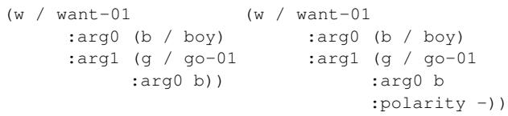
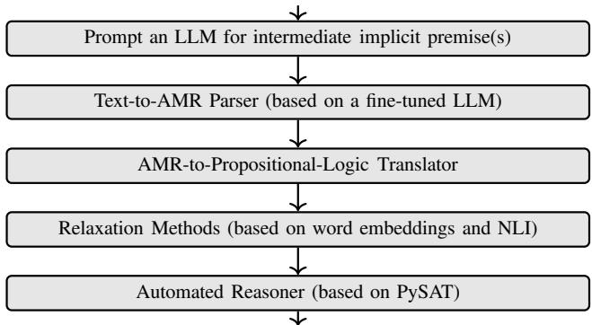
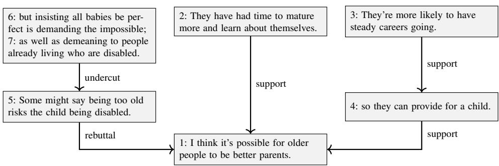
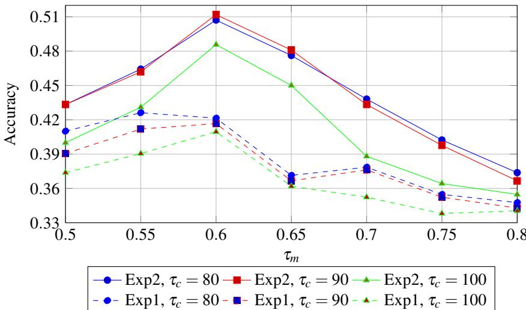
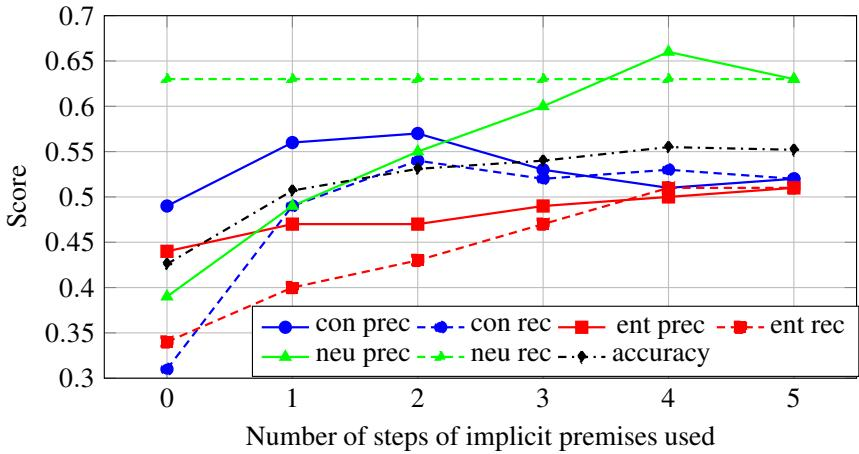

# Identifying Implicit Premises for Logical Reconstruction of Argument Graphs

Xuyao FENG a,1 and Anthony HUNTER a

a Department of Computer Science, University College London, United Kingdom ORCiD ID: Xuyao Feng https://orcid.org/0009-0009-0888-6233, Anthony Hunter https://orcid.org/0000-0001-5602-7446

Abstract. The logical reconstruction of argument graphs from natural language text is challenging because of the prevalence of enthymemes (i.e., arguments with implicit premises). There are natural language processing methods for identifying enthymemes in text, and there are symbolic methods based on abduction for identifying missing premises in a logical representation of enthymemes. However, there is a need for methods to generate implicit premises to logically show a known entailment or contradiction relationship between a pair of statements. To address this, we propose a neuro-symbolic pipeline that uses large language models (LLMs) to generate intermediate implicit premises that are translated into logical formulae and used with logical formulae representing explicit premises and explicit claims to show the logical relationships between them (entailment, contradiction, or neutrality). Our approach is evaluated on the Microtext Argumentative Corpus.

Keywords. Argument graph, Enthymemes, Neuro-symbolic, Common-sense reasoning, Automated reasoning

## 1. Introduction

The logical reconstruction of argument graphs from natural language text is a fundamental challenge in computational argumentation. Such reconstructions aim to formalize the underlying inferential structure of arguments, representing components (premises, claims) as nodes and their semantic relationships—such as entailment (support), contradiction (attack), or neutrality—as edges in a graph. However, this task is complicated by the widespread occurrence of enthymemes: arguments that are logically incomplete due to omitted, implicit premises [1,2]. For example, the inference from the premise “the weather report predicts rain” to the claim “you should take an umbrella” hinges on an unstated rule such as “ifthe weather report predicts rain, one should take an umbrella”. Without recovering these hidden links, any automated reconstruction of the argument graph remains partial and potentially misleading.

There are methods based on natural language processing for identifying enthymemes in text [3,4,5,6], and there are methods based on formal logic for identifying missing premises in a logical representation of an enthymeme using abduction from a logical knowledge base [1,2,7,8,9]. There are also methods for identifying missing premises from previous moves in a logical representation of a dialogue [10,11,12,13,14,15,16]. However, the crucial task of identifying missing premises from common and commonsense knowledge remains challenging.

In recent work, we have begun to bridge the gap between argument mining [17] and symbolic methods by translating free-text enthymemes into logic and then using neurosymbolic reasoning based on sentence embeddings to classify the relationship between a pair of formulae as entailment, contradiction, or neutral [18]. Subsequently, we used an LLM to generate implicit premises that, when translated into logic, can be used to determine whether an explicit claim follows from an explicit premise using neuro-symbolic reasoning [19].

This paper builds on our prior work (i.e., [19]) by prompting an LLM to generate implicit premises that logically establish a known entailment or contradiction relationship between an explicit premise and an explicit claim. In other words, given a premise-claim pair and its relation label (entailment, contradiction, or neutral), can we identify the implicit premise that makes the logical connection explicit? Furthermore, this paper uses the Microtext Argumentative Corpus [20], which is a more challenging dataset than those used in our previous work, for the evaluation. Our results indicate that our pipeline significantly enhances the quality and logical coherence of argument graph reconstruction, providing a crucial step toward scalable and accurate logical analysis of argumentative text.

The remainder of this paper is structured as follows: Section 2 reviews background in logical argumentation and enthymeme resolution. Section 3 details our neuro-symbolic pipeline for generating implicit premises. Section 4 describes our experiments with datasets, and Section 5 discusses implications and future work.

## 2. Abstract meaning representation

This section reviews abstract meaning representation (AMR) and how we can translate it into propositional logic.

Abstract meaning representation (AMR) is a semantic representation language for representing sentences as rooted, labelled, directed, and acyclic graphs (DAGs) [21]. AMR is intended to assign the same AMR graph to similar sentences, even if they are not identically worded. Negation is represented via the :polarity relation. For example, Figure 1 represents “The boy does not want to go.” The numbers after the instance name (such as want-01 above) denote a particular OntoNotes or PropBank semantic frame [22]. These frames have different parameters, but the subject is generally denoted by arg0 and the object by arg1. The parameters, which draw out the semantic roles of the words in the AMR, include location (e.g. “France”), unit (e.g. “kilogrammes”), and time (e.g. “yesterday”).

Text-to-AMR Parser In our pipeline, we use the IBM Transition AMR parser2 to load the pre-trained ensemble AMR 3.0 model (AMR3-joint-ontowiki-seed43), which combines smatch-based ensembling techniques with ensemble distillation [23] to translate each sentence of text into an AMR graph.

  
Figure 1. AMR for the sentence “The boy wants to go.” (left) and “The boy does not want to go.” (right).

A set of sentences and a true label (entailment, contradiction, or neutral)  
  
Label (entailment, contradiction, or neutral)  
Figure 2. Our neuro-symbolic pipeline where the input is a set of natural language sentences (e.g., a premise, implicit premises, and a claim), and the output is a label.

AMR-to-Propositional-Logic Translator An advantage of AMR is that we can easily transform an AMR graph into first-order logic formulas using the Bos algorithm [24]. There is an open-source Python library based on the Bos algorithm, the AMR-to-logic converter [25], for translating AMR graphs into first-order logic. We extended this library to create our AMR-to-propositional-logic translator by rewriting each first-order logic formula as a propositional logic formula and grounding out the existentially quantified variables with new constants. We refer to each such propositional formula as an AMR formula. For the above example, the propositional logic formula is simplified as follows.

$$
\mathtt { a r g o ( w a n t , b o y ) } \wedge \neg { \mathtt { ( a r g 1 ( w a n t , g o ) } \wedge a r g 0 ( g o , b o y ) ) }
$$

For our pipeline, we assume the usual definitions for propositional logic. We start with a set of propositional atoms (letters), and we construct formulas in the usual way using the connectives for negation ¬, conjunction ∧, disjunction ∨, implication →, and biconditional ↔.

## 3. Pipeline

Our neuro-symbolic pipeline3, which is summarized in Figure 2, consists of five main components: An LLM to generate intermediate implicit premises (Section 3.1); A text-

to-AMR parser (Section 2); An AMR-to-propositional-logic translator (Section 2); A set of methods for relaxing the propositional formulas (Sections 3.3 and 3.4); And an automated reasoner based on PySAT (Section 3.5).

## 3.1. Generate implicit premises

We employ a large language model (LLM) to generate implicit premises by providing it with an explicit premise, a claim, and the label indicating whether the claim follows from or contradicts the premise. The model is then prompted to produce either one or six intermediate reasoning steps that make explicit how the claim is derived from or contradicts the premise. These intermediate steps form a chain of reasoning, as explored in [26], which incrementally bridges the gap between the explicit premise and claim.

As the number of steps increases, the reasoning exposes finer logical connections and provides additional detail on how the claim either follows from or contradicts the premise. The LLM used is DeepSeek v3.2 [27], and our prompt is presented with the code. The implicit premises, like the explicit premises and claims, are natural language statements, and so we use the text-to-AMR parser and the AMR-to-propositional-logic translator to obtain logical formulas which we handle in Sections 3.3 and 3.4.

## 3.2. Representing formulas

An AMR formula is composed of a set of atoms together with the ¬ and ∧ logical operators. Since each atom is ground, an AMR formula is a propositional logic formula. Let $\mathcal { A }$ be a set of AMR atoms (i.e. ground dyadic predicates of the form $r ( a , b )$ where a and b are constant symbols). The set of AMR formulas, denoted ${ \mathcal { L } } ,$ is defined inductively as follows: If $\alpha \in { \mathcal { A } }$ , then $\alpha \in { \mathcal { L } } ; \operatorname { I f } \alpha , \beta \in { \mathcal { L } }$ , then $\alpha \wedge \beta \in { \mathcal { L } }$ ; And if $\alpha \in \mathcal { L }$ , then $\lnot \alpha \in \mathcal { L }$

Given a natural language sentence S, our AMR-to-propositional-logic translator identifies an AMR formula $\phi$ that represents S.

Example 1. The AMR formula $\neg \mathtt { a r g 0 } ( \mathtt { g o } , \mathtt { c a r } )$ represents the sentence “the car does not $g o '$

An abstract formula is also a propositional formula. Let $\mathcal { P }$ be a set of propositional letters. The set of abstract formulas, denoted $\mathcal { F } _ { : }$ , is defined inductively as follows: If $\alpha \in \mathcal { P }$ , then $\alpha \in { \mathcal { F } } ;$ ; If $\alpha , \beta \in { \mathcal { F } }$ , then $\alpha \wedge \beta \in { \mathcal { F } } ;$ And if $\alpha \in { \mathcal { F } }$ , then $\lnot \alpha \in \mathcal { F }$

$\operatorname { I f } | { \mathcal { A } } | = | { \mathcal { P } } |$ , then for each $\alpha \in \mathcal { L }$ , there is a $\beta \in \mathcal F$ (and vice versa) such that α and $\beta$ are isomorphic (i.e. they have the same syntax tree except for the atoms associated with the leaves). For example, $\neg \mathbf { x } _ { 1 }$ is an abstract formula that is isomorphic to the AMR formula in Example 1.

Given an AMR formula or an abstract formula, denoted φ, let Atoms(φ) denote the set of atoms used in $\phi .$

## 3.3. Similarity measures

In the next two subsections, we explain how we translate each AMR formula into an abstract formula, which we then use with the PySAT automated reasoner. For the translation, we check whether two atoms in an AMR formula can be regarded as equivalent, and therefore mapped to the same propositional letter in the corresponding abstract formula. For this, if for two AMR atoms α and $\beta _ { ; }$ , the similarity between the two strings of words corresponding to the two atoms is greater than a threshold $\tau _ { m }$ (as explained below), then we treat them as equivalent (denoted $\alpha \simeq \beta )$ in the corresponding abstract formula, and so it is a relaxation of the AMR formula.

An embedding of a string of words is a vector v obtained by an injective mapping function Emb. In our pipeline, the Emb function is the sentence transformer BAAI general embedding model bge-small-en-v1.5 [28] (alternatives can easily be used) that encodes a string of words as a high-dimensional vector.

The similarity between two embedding vectors $\nu _ { 1 }$ and $\nu _ { 2 }$ is defined as follows, where θ is the angle between the vectors, $\nu _ { 1 } \cdot \nu _ { 2 }$ is the dot product of $\nu _ { 1 }$ and $\nu _ { 2 } .$ , and $\left| \left| \nu _ { 1 } \right| \right|$ represents the L2 norm.

$$
\mathsf { S m } ( \nu _ { 1 } , \nu _ { 2 } ) = c o s ( \theta ) = \frac { \nu _ { 1 } \cdot \nu _ { 2 } } { | | \nu _ { 1 } | | | \nu _ { 2 } | | }
$$

To obtain a string of words corresponding to an AMR atom, we created a set of 29 templates. Each template is based on taking the information in an AMR atom in an AMR formula and representing that information as a natural language sentence. Furthermore, each template is designed for a type of AMR atom (i.e. for the predicate name of the atom). For example, for the AMR atom $\mathtt { a r g o ( p l a y ) }$ ,man), the predicate name is arg0, and so we can use a template for arg0 such as $^ { 6 6 } [ \mathrm { Y } ]$ is the agent performing action $\mathrm { [ X ] } ^ { \prime }$ which is a string where $[ \mathrm { X } ]$ and [Y] are placeholders for the first and second arguments of the atom (i.e. play and man in this example). So from this template, we can instantiate it using the dyadic atom to get “man is the agent performing action $p l a y ^ { \ast }$ as the natural language sentence to be used for the word embedding. In order to do this, we require the following definition.

Definition 1. Let φ be an AMR formula, and let $r ( a , b )$ be an AMR atom in $\phi \ ( i . e .$ $r ( a , b ) \in \mathsf { A t o m s } ( \phi ) )$ . Also let T be a template for r with placeholders [X] and $[ \mathrm { Y } ] .$ . The instantiate function, denoted Inst, is defined as follows: Ins $\mathsf { \Omega } _ { \mathsf { C } } ( r ( a , b ) , T ) = I ,$ where I is the instantiation of T in which [X] is replaced by a and [Y] is replaced by b.

Some examples of templates are given below, with the AMR predicate name.

• (purpose) “[Y] is the purpose of action $[ \mathrm { X } ] . \ ' $

$\left( \mathsf { t i m e } \right) \mathrm { \Sigma ^ { \ast } [ Y ] }$ is when action [X] takes place.”

$( \mathsf { a r g 1 } ) ^ { \cdots } [ \mathrm { Y } ]$ is the object involved in action $\mathrm { [ X ] } .  \overrightarrow { \mathbf { \Omega } }$

Next, we use the embedding function Emb to obtain the sentence embeddings of the instantiations of templates.

Example 2. Let $T = { } ^ { \ast } [ \mathrm { Y } ]$ is the agent performing action $[ \mathrm { X } ] . \ ' $ be the template for the AMR predicate name arg0. Therefore, for the AMR atom ar ${ \bf \ddot { g } } 0 ( { \tt p l a y } , { \tt c h i l d } )$ Inst $( \mathrm { a r g } 0 ( \mathrm { p l a y } , \mathrm { c h i 1 d } ) , T ) = { \ O } ^ { * }$ “child is the agent performing action $p l a y . ^ { \prime \prime }$

For the following definition of a matching relation, we assume that one AMR formula refers to a premise and the other refers to a claim.

Definition 2. Let an AMR formula φ be a premise and an AMR formula ψ be a claim, let $\alpha \in \mathsf { A t o m s } ( \psi )$ be an AMR atom of the form $r ( a , b )$ , let $T _ { 1 }$ be a template for $r ,$ let $\beta \in \mathsf { A t o m s } ( \phi )$ be an AMR atom of the form $\scriptstyle q ( c , d )$ , let $T _ { 2 }$ be a template for $q ,$ let $\tau _ { m } \in$ $[ 0 , 1 ]$ be the neuro-matching threshold, and let Emb be an embedding function. The neuro-matching relation, denoted $\simeq$ is defined asfollows, where Near $\mathbf { \alpha } ( \alpha ) = \left\{ ( \beta ^ { \prime } , x ) \ \right\}$ $\beta ^ { \prime } \in \mathsf { A t o m s } ( \phi )$ and $x > \tau _ { m }$ and Sm(Emb(Inst $( \alpha , T _ { 1 } ) )$ ,Em $) ( \mathsf { I n s t } ( \beta ^ { \prime } , T _ { 2 } ) ) ) = x \}$

$$
\alpha \simeq \beta ~ i f f ( \beta , x ) \in \mathsf { N e a r } ( \alpha ) ~ a n d ~ \forall ( \beta ^ { \prime } , y ) \in \mathsf { N e a r } ( \alpha ) , x \geq y
$$

This definition finds the best premise match above the threshold for each claim atom. Thus, if the premise atoms are $\beta _ { 1 } , \ldots , \beta _ { n }$ with scores $s _ { 1 } , \ldots , s _ { n } .$ , then $\alpha \simeq \beta$ holds when $\beta = \beta _ { i }$ and $s _ { i } = \operatorname* { m a x } ( s _ { 1 } , \ldots , s _ { n } )$

Example 3. Let the textfor the premise be “A tiger is walking in the cage.”, and let the text for the claim be “A tiger is moving.” We have the following AMR formulas.

$$
\begin{array} { r } { \mathsf { a r g o } ( \mathsf { w a l k } , \mathsf { t i g e r } ) \wedge \mathsf { l o c a t i o n } ( \mathsf { w a l k } , \mathsf { c a g e } ) } \\ { \mathsf { a r g o } ( \mathsf { m o v e } , \mathsf { t i g e r } ) } \end{array}
$$

So $\mathbf { a r g } 0 ( \mathsf { w a l k , t i g e r } ) \simeq \mathbf { a r g } 0 ( \mathsf { m o v e , t i g e r } )$ , with template T for arg0, the following similarity, and $\tau _ { m } = 0 . 6$

$$
\mathsf { S m } ( \mathsf { E m b } ( \mathsf { I n s t } ( \mathsf { a r g o } ( \mathsf { w a l k } , \mathsf { t i g e r } ) , T ) ) , \mathsf { E m b } ( \mathsf { I n s t } ( \mathsf { a r g o } ( \mathsf { m o v e } , \mathsf { t i g e r } ) , T ) ) ) = 0 . 8 4 8 3
$$

After identifying the best match for an AMR atom in a claim, we perform a contradiction check on this matched pair using a Natural Language Inference (NLI) model4 [29]. The NLI model evaluates a pair of sentences $( S _ { 1 } , S _ { 2 } )$ by identifying three scores, each in the [0,100] interval: $s _ { \mathrm { E n t } } ( S _ { 1 } , S _ { 2 } )$ is the degree to which $S _ { 2 }$ is entailed by $S _ { 1 } ;$ $s _ { \mathrm { C o n } } ( S _ { 1 } , S _ { 2 } )$ is the degree of conflict between $S _ { 1 }$ and $S _ { 2 } ;$ and $s _ { \mathrm { N e u } } ( S _ { 1 } , S _ { 2 } )$ is the degree to which $S _ { 1 }$ and $S _ { 2 }$ are unrelated. The model returns the label with the highest score (with a random choice in case of a tie).

Definition 3. Let $\mathcal { S }$ be the set of all natural language sentences, and let $\mathcal { C } =$ $\{ E n t , C o n , N e u \}$ be the set ofoutcomes (entailment, contradiction, and neutrality). A natural language inference (NLI) function NLinf $: \mathcal { S } \times \mathcal { S } \to \mathcal { C }$ is defined as follows, with scores $s _ { E n t } , \ s _ { C o n } ,$ , and sNeu for a given pair $( S _ { 1 } , S _ { 2 } )$

$$
\mathsf { N L i n f } ( S _ { 1 } , S _ { 2 } ) = \arg \operatorname* { m a x } _ { \sigma \in \mathcal { C } } s _ { \sigma } ( S _ { 1 } , S _ { 2 } )
$$

Definition 4. Let an AMR formula φ be a premise and an AMR formula ψ be a claim, let $\alpha \in \mathsf { A t o m s } ( \psi )$ be an AMR atom of the form $r ( a , b )$ , let $T _ { 1 }$ be a template for r, let $\beta \in \mathsf { A t o m s } ( \phi )$ be an AMR atom of the form $\scriptstyle q ( c , d )$ , let $T _ { 2 }$ be a template for q, let NLinf be an NLIfunction, and let $\tau _ { c } \in [ 0 , 1 0 0 ]$ ] be the neuro-contradict threshold. The neurocontradict relation ⊥ is defined asfollows

$$
\alpha \perp \beta \mathsf { \ i f f } \mathsf { N L i n f } ( \mathsf { l n s t } ( \alpha , T _ { 1 } ) , \mathsf { l n s t } ( \beta , T _ { 2 } ) ) = C o n \ a n d \ s _ { C o n } ( \mathsf { l n s t } ( \alpha , T _ { 1 } ) , \mathsf { l n s t } ( \beta , T _ { 2 } ) ) \ge \tau _ { c }
$$

Example 4. Let the textfor the premise be “A tiger is walking in the $c a g e . \mathrm { ^ { \prime \prime } } ,$ , and let the textfor the claim be “The tiger is sleeping in the cage.” We have the AMRformulas.

$$
\begin{array} { r l } & { \mathsf { a r g o } ( \mathsf { w a l k } , \mathsf { t i g e r } ) \wedge \mathsf { l o c a t i o n } ( \mathsf { w a l k } , \mathsf { c a g e } ) } \\ & { \mathsf { a r g o } ( \mathsf { s l e e p } , \mathsf { t i g e r } ) \wedge \mathsf { l o c a t i o n } ( \mathsf { s l e e p } , \mathsf { c a g e } ) } \end{array}
$$

When $\tau _ { c } = 8 0 , \mathsf { a r g o } ( \mathsf { w a l k } , \mathsf { t i g e r } ) \bot \mathsf { a r g } 0 ( \mathsf { s l e e p } , \mathsf { t i g e r } )$ ,and location(walk,cage)⊥ location(sleep,cage) hold, given the following outputs for templates $T _ { 1 }$ and $T _ { 2 } f o r$ arg0 and location, respectively.

$$
\begin{array} { r l } & { \mathrm { N L i n f } \big ( | \mathrm { n s t } ( \mathrm { a r g } 0 ( \mathrm { w a l k } , \mathrm { t i g e r } ) , T _ { 1 } ) , \mathrm { l n s t } \big ( \mathrm { a r g } 0 ( \mathrm { s l e e p } , \mathrm { t i g e r } ) , T _ { 1 } \big ) \big ) = C o n } \\ & { \ s _ { C o n } \big ( | \mathrm { n s t } ( \mathrm { a r g } 0 ( \mathrm { w a l k } , \mathrm { t i g e r } ) , T _ { 1 } ) , \mathrm { l n s t } \big ( \mathrm { a r g } 0 ( \mathrm { s l e e p } , \mathrm { t i g e r } ) , T _ { 1 } \big ) \big ) = 8 5 } \end{array}
$$

$$
\begin{array} { r l } & { { \mathrm { N L i n f } } \big ( \mathrm { l n s t } \big ( \mathrm { l o c a t i o n } \big ( \mathrm { w a l k } , \mathrm { c a g e } \big ) , T _ { 2 } \big ) , \mathrm { l n s t } \big ( \mathrm { l o c a t i o n } \big ( \mathrm { s 1 e e p } , \mathrm { c a g e } \big ) , T _ { 2 } \big ) \big ) = C o n } \\ & { \quad s _ { C o n } \big ( \mathrm { l n s t } \big ( \mathrm { l o c a t i o n } \big ( \mathrm { w a l k } , \mathrm { c a g e } \big ) , T _ { 2 } \big ) , \mathrm { l n s t } \big ( \mathrm { l o c a t i o n } \big ( \mathrm { s 1 e e p } , \mathrm { c a g e } \big ) , T _ { 2 } \big ) \big ) = 8 2 } \end{array}
$$

The ≃ relation is reflexive and symmetric, whereas the ⊥ relation is irreflexive and symmetric.

## 3.4. Translating AMR into abstractformulas

We now consider how we can translate each AMR formula into an abstract formula. The first aim is to represent each AMR atom by an abstract atom of the form ${ \tt x } _ { \mathrm { i } }$ in order to facilitate use by a PySAT solver, and the second aim is to take advantage of the neuromatching and neuro-contradict relations to simplify and constrain the abstract formula. For example, if we have a premise $\mathbf { x } _ { 1 } \wedge \mathbf { x } _ { 2 } \wedge \mathbf { x } _ { 3 }$ and a claim $\mathbf { x } _ { 1 } \wedge \mathbf { x } _ { 4 }$ and $\mathtt { x } _ { 3 }$ and $_ { \mathbb { X } 4 }$ are very similar concepts, then we can change the claim to $\mathbf { x } _ { 1 } \wedge \mathbf { x } _ { 3 }$ , and then show entailment holds using the CNF versions of these relaxed formulas with PySAT. Similarly, if we have a premise ${ \tt x } _ { 5 } \wedge { \tt x } _ { 6 }$ and a claim $\mathtt { x } _ { 7 }$ , and the ${ \bf x } _ { 5 } \bot { \bf x } _ { 7 }$ relationship holds, then we can change the claim $\mathbf { t o } \to \mathbf { x } _ { 5 }$

Definition 5. Given a set of AMR formulas Φ, and a set of neuro-matching and neurocontradict relationships Ψ, thefunction $g : { \mathcal { A } }  { \mathcal { P } } \cup \{ \lnot x \mid x \in { \mathcal { P } } \}$ is a mappingfor Φ and Ψ iff for all $\phi , \phi ^ { \prime } \in \Phi ,$ , for all α ∈ Atoms(φ), for all $\beta \in \mathsf { A t o m s } ( \phi ^ { \prime } ) , ( I ) \alpha \simeq \beta \in$ $\Psi i f f g ( \alpha ) = g ( \beta ) ; a n d ( 2 ) \alpha \perp \beta \in \Psi i f f g ( \alpha ) = \neg g ( \beta )$ . For the tautology $\mathsf { T } , g ( \mathsf { T } ) = \mathsf { T }$

The above definition ensures that if there are similar atoms, according to ≃, (resp. contradictory atoms, according to ⊥), then they are translated to the same atom (resp. complementary literals) in the abstract formulas.

Example 5. For $\phi _ { 1 } = \arg 1 ( \mathsf { c a r } , \mathsf { r e d } ) \wedge \mathsf { a r g 2 } ( \mathsf { c a r } , \mathsf { f a s t } ) , \ \phi _ { 2 } = \arg 1 ( \mathsf { c a r } , \mathsf { r e d } ) .$ , and $\Phi = \{ \phi _ { 1 } , \phi _ { 2 } \}$ , a mapping g $i s \ g ( \arg 1 ( \mathtt { c a r } , \mathtt { r e d } ) ) = \mathtt { x } _ { 1 }$ and g(arg2(car,fast)) = x2.

Example 6. Continuing Ex 3, let g be a mapping $g ( \mathsf { l o c a t i o n } ( \mathsf { w a l k } , \mathsf { c a g e } ) ) = \mathtt { x } _ { 2 }$ and $g ( \mathbf { a r g } 0 ( \mathbf { w a l k } , \mathbf { t i g e r } ) ) = g ( \mathbf { a r g } 0 ( \mathbf { m o v e } , \mathbf { t i g e r } ) ) = \mathbf { x _ { 1 } }$

Example 7. Continuing Ex $4 , \ g ( \mathsf { a r g o } ( \mathsf { s l e e p } , \mathsf { t i g e r } ) ) = \neg g ( \mathsf { a r g o } ( \mathsf { w a l k } , \mathsf { t i g e r } ) ) =$ $\lnot \mathbf { x } _ { 1 } \ a n d \ g ( \mathrm { 1 o c a t i o n ( s l e e p , c a g e ) } ) = \lnot g ( \mathrm { 1 o c a t i o n ( w a l k , c a g e ) } ) = \lnot \mathbf { x } _ { 2 } \ a \mathbf { x } _ { 1 } \ a \mathbf { x } _ { 2 } \ a \mathbf { y } _ { 3 } = \lnot \mathbf { x } _ { 3 } .$

Next, we specify how an AMR formula is translated into an abstract formula using a mapping function.

Definition 6. Let $g$ be a mapping for a set of AMR formulas $\Phi$ and a set of neuromatching and neuro-contradict relationships Ψ. For $\phi \in \Phi ,$ a translation of φ is ${ \sf T r a n } _ { g } ( \phi )$ where ${ \mathsf { T r a n } } _ { g }$ is defined as: (1) Tra $\mathsf { n } _ { g } ( \alpha \wedge \beta ) = \mathsf { T r a n } _ { g } ( \alpha ) \wedge \mathsf { T r a n } _ { g } ( \beta ) ; ~ ( 2$ ) $\mathsf { T r a n } _ { g } ( \neg \alpha ) = \neg \mathsf { T r a n } _ { g } ( \alpha )$ ; and (3) Tra $\mathfrak { n } _ { g } ( \alpha ) = g ( \alpha )$ when $\alpha \in { \mathcal { A } } .$ . For Φ, let ${ \mathsf { T r a n } } _ { g } ( \Phi )$ $= \{ \mathsf { T r a n } _ { g } ( \phi ) \mid \phi \in \Phi \}$

Example 8. Continuing Ex 5, a translation of $\phi _ { 1 } i s \mathbf { x } _ { 1 } \wedge \mathbf { x } _ { 2 }$ and a translation of $\phi _ { 2 }$ is $\mathbf { x } _ { 1 }$

The use of embeddings and NLI allows for the identification of neuro-matching and neuro-contradict relations, which can then be used to rewrite AMR formulas into abstract formulas, where the latter are relaxations of the former. So our relaxation methods rewrite the AMR formulas (output from the AMR-to-propositional-logic translator) into abstract formulas for use in automated reasoning as described next.

## 3.5. Automated Reasoning

For the automated reasoning, we transform all the abstract formulas (from the previous section) into conjunctive normal form (CNF) using SymPy [30]. Then, we use PySAT [31], which integrates several widely used state-of-the-art SAT solvers as theorem provers to check whether a CNF is consistent. The aim of our pipeline is to identify the relationship between a premise $\phi$ (which may be a conjunction of an explicit premise and one or more intermediate premises) and a claim ψ. Proving that φ entails ψ is equivalent to determining whether φ $\wedge \neg \psi$ is inconsistent. Similarly, to prove whether $\phi$ contradicts $\psi ,$ we need to determine whether ∧ is inconsistent.

## 4. Experiments

To evaluate our pipeline, we used the Microtext Argumentative Corpus, which we describe next, in three experiments.

Method The Microtext Argumentative Corpus [20] is a resource specifically designed for argument mining research. The corpus consists of 112 short, self-contained argumentative texts, split into 576 segments, which have been manually annotated by expert annotators to identify argument components (viz., a central claim, claims, and premises) and the support or attack relationships (rebuttal and undercut) between them. Figure 3 is an argument graph of an example from the corpus.

To evaluate our pipeline, we translated the Microtext dataset into a three-class dataset by generating premise-claim pairs from argument segments: From the argument graph representation (of an argumentative text in the Microtext dataset), each arc gives a premise-claim pair where the segment in the source (resp. target) node is the premise (resp. claim). The label for each premise-claim pair is assigned using the original Microtext dataset: Entailment (ent) for a support relation from premise to claim; Contradiction (con) for a rebuttal or undercut relation from premise to claim; and Neutral (neu) for segments $S _ { 1 }$ and $S _ { 2 }$ with no relationship between them and with $\mathsf { N L i n f } ( S _ { 1 } , S _ { 2 } ) = N e u$ with confidence $s _ { N e u } ( S _ { 1 } , S _ { 2 } ) \geq 9 9$ (recall that NLinf is the NLI function).

  
Figure 3. Argument graph example (text number 008) where Segment 1 is the central claim. It is directly supported by Segment 2 and Segment 4. Segment 3, in turn, provides support for Segment 4. The claim is challenged by Segment 5, which rebuts it, but this rebuttal is itself undercut by Segments 6 and 7.

Example 9. For the argument graph in Figure 3, we get thefollowing labelling: the Entailment label for (2, 1), (4, 1), and (3, 4); the Contradiction label for (5, 1) and (6&7, 5), where & denotes a conjunction ofsegments; and the Neutral labelfor (3,5) and (3,1).

We designed a sequence of three experiments to evaluate the reasoning capabilities of our pipeline. First, we established a baseline by using the reformatted three-class dataset in our pipeline without generating any implicit premises. Second, we introduced single-step implicit premise generation (as described in Section 3.1) to the pipeline. In the first and second experiments, we investigated different choices for the neuro-matching threshold $\tau _ { m }$ and the neuro-contradiction threshold $\tau _ { c } .$ . Third, using the optimal choices for $\tau _ { m }$ and $\tau _ { c }$ from the second experiment, we generated six-step implicit premise chains (as described in Section 3.1) and evaluated their performance using cumulative chains from 1 to 5 steps (i.e. first just step 1, second conjunction of steps 1 and 2, third conjunction of steps 1, 2 and 3, etc.) to analyze the impact of multi-step reasoning on classification performance. Note that the sixth step is always discarded because very often it is a redundant repetition of the claim. Table 1 is an example of the data format (reformatted Microtext data and implicit premises) used across all three experiments.

<table><tr><td>Reformatted Microtext</td><td>Premise: Landfills also produce a lot of odor Claim: Landfills are bad for handling our trash</td></tr><tr><td>data</td><td>Label: Entailment</td></tr><tr><td>Experiment 1 Experiment 2</td><td>No Implicit Premise Single implicit premise: Odor is a negative environmental impact.</td></tr><tr><td>Experiment 3</td><td>Multi-step chain of implicit premises: (Step 1) Odor indicates poor waste decomposition;</td></tr><tr><td></td><td>(Step 2) Decomposition releases harmful gases; (Step 3) These gases pollute the surrounding air; (Step 4) Air pollution harms human health; (Step 5) Health hazards show inadequate waste management; (Step 6) Inadequate management makes landfills a bad solution.</td></tr></table>

Table 1. Example of the data format across all three experiments.

The reformatted and implicit data for each argumentative text is translated into AMR formulae, then into abstract formulae, and finally evaluated using automated reasoning, as explained for the pipeline in Section 3.

Results For all three experiments, we used the same subset of the reformatted data (as described in the methods), comprising 140 randomly selected items per class (420 items total). In the first two experiments, we evaluated performance across a range of neuromatching thresholds $\tau _ { m }$ (from 0.5 to 0.8) and three neuro-contradiction thresholds $\tau _ { c }$ (viz. 80, 90, and 100).

Figure 4. Results for Experiment 1 (no implicit premises) and Experiment 2 (single implicit premise): $\mathrm { \mathbf { A } c \mathrm { - } }$ curacy across different $\tau _ { m }$ and $\tau _ { c }$ values (solid lines: Experiment 2; dashed lines: Experiment 1). As it is a three-class classification task, random classification would tend to have an accuracy of 0.333.  
  
Figure 5. Experiment 3 (using 1 to 5 steps of implicit premises): Precision (prec) and recall (rec) scores for all three classes and overall accuracy across different steps $( \tau _ { m } { = } 0 . 6 , \tau _ { c } { = } 8 0 )$

As shown in Figure 4, a comparative analysis of model performance reveals distinct optimal thresholds for each experiment. Experiment 1 achieved peak accuracy (∼0.426) at $\tau _ { m } = 0 . 5 5$ and $\tau _ { c } = 8 0$ , while Experiment 2 attained its highest accuracy (∼0.512) at $\tau _ { m } = 0 . 6$ and $\tau _ { c } = 9 0$ . In both cases, accuracy declined steadily as $\tau _ { m }$ increased beyond these values. The parameter $\tau _ { c }$ exhibited a modest influence on performance, with lower values generally yielding marginally better results. Class-level F1-scores revealed important patterns: in Experiment 1, the con and ent classes performed best at $\tau _ { m } = 0 . 5 5$ , while in Experiment 2, these classes showed good F1 scores within the range $\tau _ { m } = 0 . 5 – 0 . 6$ The neu class demonstrated stronger F1 performance at higher thresholds, particularly beyond $\tau _ { m } = 0 . 6$ . Notably, lower τ values resulted in better con performance without significantly degrading the ent results and neu results.

Based on the above findings, we selected $\tau _ { m } = 0 . 6$ and $\tau _ { c } = 8 0$ (rather than $\tau _ { c } = 9 0 )$ for Experiment 3 to prioritize better performance for both con and ent classes while maintaining reasonable overall accuracy. As shown in Figure 5, the use of an increasing number of reasoning steps as implicit premises leads to consistent improvements in both class-specific metrics and overall accuracy under fixed thresholds $( \tau _ { m } = 0 . 6 , \tau _ { c } = 8 0 )$ The con class demonstrates a particularly notable improvement: precision increases from 0.49 to 0.52, while recall nearly doubles from 0.31 to 0.52, indicating substantially improved detection capability. Similarly, the ent class exhibits steady gains, with precision and recall rising from approximately 0.44 and 0.34, respectively, to 0.51. The neu class shows a different pattern: while recall remains consistently high at 0.63 across all step counts because we do not generate implicit-premise steps for the neutral class, precision improves markedly from 0.39 to 0.63, reflecting enhanced prediction confidence for this majority class. Overall accuracy increases from 0.426 to 0.555, reaching its peak at 4 steps before a slight decrease at $^ { 5 }$ steps, suggesting optimal performance is achieved with four steps of implicit premise integration. By step 5, precision and recall converge across all classes, indicating a more balanced classifier. However, using 4 steps provides the optimal trade-off between overall accuracy and metric stability. These results demonstrate that multi-step reasoning improves model performance, especially for minority classes.

## 5. Discussion

This paper presents the first framework to systematically generate implicit premises that logically justify a known semantic relation (e.g., entailment or contradiction) between an explicit premise and a claim. Given a premise-claim pair and its relation label, our method identifies the implicit premise that makes the logical connection explicit. We evaluated our pipeline on a dataset with substantial implicit reasoning. The approach achieved strong, balanced performance across all three classes in classification tasks, with the additional benefit of providing logically reconstructed arguments. Whilst the results are promising, there is a need to further improve the pipeline’s performance, perhaps by focusing on better ways to prompt an LLM for appropriate implicit premises.

In future work, we will investigate using this pipeline for end-to-end logical argument mining by directly processing plain text to identify relations through neurosymbolic translation, thereby enabling the systematic generation of logical argument graphs from unstructured text.

## References

[1] Hunter A. Real arguments are approximate arguments. In: Proc. AAAI’07; 2007. p. 66–71.

[2] Black E, Hunter A. A Relevance-theoretic Framework for Constructing and Deconstructing Enthymemes. Journal of Logic and Computation. 2012;22(1):55-78.

[3] Habernal I, Wachsmuth H, Gurevych I, Stein B. The Argument Reasoning Comprehension Task: Iden tification and Reconstruction of Implicit Warrants. In: Proc. NAACL’18; 2018. p. 1930-40.

[4] Singh K, Inoue N, Mim FS, Naito S, Inui K. IRAC: A Domain-Specific Annotated Corpus of Implicit Reasoning in Arguments. In: Proc. LREC’22; 2022. p. 4674-83.

[5] Wei K, Sun X, Zhang Z, Jin L, Zhang J, Lv J, et al. Implicit Event Argument Extraction With Argument-Argument Relational Knowledge. IEEE Transactions on Knowledge and Data Engineering. 2023;35(9):8865-79.

[6] Sviridova E, Cabrio E, Villata S. Mining implicit arguments for reasoning: A survey. Argument & Computation. 2025;17(1):3-27.

[7] Hunter A. Understanding Enthymemes in Deductive Argumentation Using Semantic Distance Measures. In: Proc. AAAI’22; 2022. p. 5729-36.

[8] Ben-Naim J, David V, Hunter A. An Axiomatic Study of a Modular Evaluation of Enthymeme Decoding in Weighted Structured Argumentation. In: Proc. KR’25; 2025. p. 110-20.

[9] David V, Hunter A. A Logic-based Framework for Decoding Enthymemes in Argument Maps Involving Implicitness in Premises and Claims. In: Proc. IJCAI’25; 2025. p. 4445-53.

[10] Black E, Hunter A. Using Enthymemes in an Inquiry Dialogue System. In: Proc. AAMAS’08; 2008. p. 437–444.

[11] Dupin de Saint-Cyr F. Handling Enthymemes in Time-Limited Persuasion Dialogs. In: Proc. SUM’11. vol. 6929 of LNCS. Springer; 2011. p. 149-62.

[12] Hosseini S, Modgil S, Rodrigues O. Enthymeme construction in dialogues using shared knowledge. In: Proceedings of COMMA’14. vol. 266 of FAIA. IOS Press; 2014. p. 325-32.

[13] Xydis A, Hampson C, Modgil S, Black E. Enthymemes in Dialogues. In: Proc. COMMA’20; 2020. p. 395-402.

[14] Panisson AR, McBurney P, Bordini RH. Towards an Enthymeme-Based Communication Framework in Multi-Agent Systems. In: Proc. KR’22; 2022. p. 267-77.

[15] Leiva DSO, Gottifredi S, Garc´ıa AJ. Automatic knowledge generation for a persuasion dialogue system with enthymemes. International Journal of Approximate Reasoning. 2023;160:108963.

[16] Leiva DSO, Garc´ıa AJ, Gottifredi S. Principles for Assumptions Generation in Enthymeme-Based Dia logue. Journal of Artificial Intelligence Research. 2025;83.

[17] Lawrence J, Reed C. Argument Mining: A Survey. Computational Linguistics. 2019;45(4):765-818.

[18] Feng X, Hunter A. Formalizing Simple Natural Language Arguments using Abstract Meaning Repre sentation and Approximate Propositional Reasoning. In: Proc. ICTAI’25; 2025. p. 238-45.

[19] Feng X, Hunter A. Making Implicit Premises Explicit in Logical Understanding of Enthymemes. arXiv. 2026;2603.06114.

[20] Peldszus A, Stede M. An Annotated Corpus of Argumentative Microtexts. In: Proc. European Confer ence on Argumentation. College Publications; 2016. p. 801-16.

[21] Banarescu L, Bonial C, Cai S, Georgescu M, Griffitt K, Hermjakob U, et al. Abstract Meaning Represen tation for Sembanking. In: Proc. Linguistic Annotation Workshop and Interoperability with Discourse. Association for Computational Linguistics; 2013. p. 178-86.

[22] Kingsbury P, Palmer M. From TreeBank to PropBank. In: Proc. LREC’02; 2002. p. 1989-93.

[23] Lee Y, Astudillo RF, Hoang TL, Naseem T, Florian R, Roukos S. Maximum Bayes Smatch Ensemble Distillation for AMR Parsing. ArXiv. 2021;2112.07790.

[24] Bos J. Squib: Expressive Power of Abstract Meaning Representations. Computational Linguistics. 2016;42(3):527-35.

[25] Chanin D, Hunter A. Neuro-symbolic Commonsense Social Reasoning. arXiv. 2023;2303.08264.

[26] Wei J, Wang X, Schuurmans D, Bosma M, Ichter B, Xia F, et al. Chain of Thought Prompting Elicits Reasoning in Large Language Models. In: Proc. NeurIPS’22; 2022. p. 24824-37.

[27] DeepSeek-AI. DeepSeek-V3.2: Pushing the Frontier of Open Large Language Models. arXiv. 2025;2512.02556.

[28] Xiao S, Liu Z, Zhang P, Muennighoff N, Lian D, Nie JY. C-Pack: Packed Resources For General Chinese Embeddings. In: Proc. SIGIR’24; 2024. p. 641–649.

[29] Laurer M, Van Atteveldt W, Casas A, Welbers K. Less Annotating, More Classifying: Addressing the data scarcity issue of supervised machine learning with deep transfer learning and BERT-NLI. Political Analysis. 2023:1-33.

[30] Meurer A, Smith CP, Paprocki M, Cert´ık O, Kirpichev SB, Rocklin M, et al. SymPy: symbolic co ˇ mputing in Python. PeerJ Computer Science. 2017;3:e103.

[31] Ignatiev A, Morgado A, Marques-Silva J. PySAT: A Python Toolkit for Prototyping with SAT Oracles. In: Proc. SAT’18. vol. 10929 of LNCS. Springer; 2018. p. 428-37.