# Institutional Books <sub>—</sub> Enriched Text A customizable multilingual open-source pipeline for denoising, deduplicating, and annotating OCR text at scale

David Lowry-Duda<sup>1</sup> Matteo Cargnelutti<sup>1</sup> Catherine Brobston<sup>1</sup> Salwa Ismail<sup>2</sup> Greg Leppert<sup>†1</sup> Amanda Watson<sup>3</sup> and Jonathan Zittrain<sup>4</sup>

<sup>1</sup> Institutional Data Initiative, Harvard Law School Library

<sup>2</sup>Harvard Library

<sup>3</sup>Harvard Law School Library

<sup>4</sup>Harvard Law School, Harvard School of Engineering and Applied Sciences, Harvard Kennedy School

## Abstract

Released in 2025, Institutional Books: Harvard Library (IB-HL) is a collection of 983,004 volumes (242B o200k\_base tokens), originally digitized through Harvard Library’s participation in the Google Books Library project. As researchers and developers have begun to use IB-HL, a tension has emerged between standard large-scale preprocessing practices and the goals of careful information stewardship. Many existing pipelines optimize for web text: as a result, they tend to aggressively filter, deduplicate, restrict by language, and sometimes discard meaningful metadata. Meanwhile, researchers seeking to use IB-HL duplicate effort while performing similar processing and analysis.

We describe an approach that we call Enriched Text Instead of producing a single “complete” stream of tokens, we normalize the text while preserving metadata through annotations. We separate endmatter, detect per-paragraph language, identify clusters of duplicate paragraphs, and compute perparagraph bits-per-byte scores. We provide this information through HTML-like annotations layered on top of the text. By parsing these annotations, users can tailor the output to their own needs instead of accepting a global editorial decision on content. The pipeline applies to all ≈250 languages in the collection.

This report describes this project’s goals, implementation, and design rationale. The release includes IB-HL-ET (an enriched-text version of IB-HL containing 217B o200k\_base tokens across 983,003 volumes, organized into 1.39B annotated subtopic paragraphs) and the pipeline that produced it. These serve to make the collection easier for machines to parse and for humans to study.

## Contents

Introduction 3   
2 Contributions 4   
3 Goals and Scope 4   
4 Processing Pipeline   
4.1 Preprocessing   
4.2 Unicode Normalization   
4.3 Duplicate Page Removal   
4.4 Endmatter Separation   
4.5 Dehyphenation 11   
4.6 Running Header and Footer Removal 13   
4.7 Page Number Removal 15   
4.8 Sentence Segmentation 16   
4.9 Topical Chunking 18   
4.10 Duplicate Identification 19   
4.11 Bits-Per-Byte 24   
4.12 Final Annotation and Formatting 26   
5 Dataset Analysis 30   
5.1 Tokenizability in IB-HL and IB-HL-ET 30   
5.2 Multilingual Reuse of Duplicated Text 31   
5.3 Bits-Per-Byte Over Time 32   
Discussion and Further Directions 33   
Acknowledgements 34   
8 Rights Determination 35   
9 Disclaimers 35   
Reference list 36   
Appendix A Dataset Fields 44   
Appendix B Additional related work 44   
Appendix C Details on Processing 45   
C.1 Preprocessing Details 45   
C.2 Unicode Normalization 46   
C.3 Duplicate Page Removal 47   
C.4 Endmatter Separation 48   
C.5 Dehyphenation 48   
C.6 Running Headers and Footers 50   
C.7 Page Number Removal 50   
C.8 Segmentation Details 50   
C.9 Alternate Chunking Algorithms Considered 53   
C.10 Duplicate Identification Details 53   
C.11 Bits-Per-Byte Details 54   
Appendix D Examples with Known Limitations 56   
Appendix E Using the Parser Library 57

## 1 Introduction

In 2025, the Institutional Data Initiative introduced Institutional Books: Harvard Library (IB-HL)<sup>1</sup> (Cargnelutti et al. 2025), a 242B-token dataset of digitized books and other bound materials drawn from Harvard Library’s collections. That work emphasized rigorous information stewardship, including detailed provenance, collection-level deduplication, optical character recognition (OCR) artifact analysis, post-processing to improve legibility, and rich metadata.

Following the release of IB-HL, researchers and developers sought to use the corpus for large language <sup>model</sup> (LLM) training <sup>and</sup> processing. TypewriterLM<sup>2</sup> (Luo et <sup>al.</sup> 2026) uses IB-HL as its primary source (97.7% of tokens) for its 54B-token historical pretraining corpus, for a 7.2B-parameter language model trained on pre-1913 English. Similarly, the talkie-1930<sup>3</sup> (Levine, Duvenaud, and Radford 2026) 13B-parameter “vintage language model” uses IB-HL data and metadata in its 260B-token pre-1931 English corpus. The K2-V2 open-weight reasoning model (Liu et al. 2025) incorporates IB-HL as a source of long-context documents in its mid-training data.

Feedback from early adopters indicates tensions between common large-scale preprocessing practices and the goals that motivated IB-HL. LLMs depend on the nature, quality, and diversity of the data used in training, yet standard internet-oriented pipelines often rely on aggressive language filtering (such as only using English) and deduplication (such as discarding all near-duplicate text); see for example (J. Kaplan et al. 2020; Gunasekar et al. 2023 ; Muennighoff et al. 2023). These practices strip multilingual content and reduce document fidelity. For IB-HL, excluding non-English would discard half the corpus and narrow its cultural scope. Naive chunk-level deduplication fragments books and long-form documents. Furthermore, pipelines often flatten or discard paratext (Genette and Maclean 1991): titles, tables of contents, footnotes, indices, publisher notices, and other elements that mediate between a text and its readers.

We describe an alternative approach that we refer to as Enriched Text<sub>.</sub> Rather than producing a single “clean” stream of tokens, we offer a configurable dataset. Concretely, we represent many paratextual elements and metadata (e.g. front and back matter, detected languages, duplicate paragraph information) as machine-readable annotations layered on top of the OCRed text. We also try to identify and separate the endmatter (consisting of the front and back matter framing the main text, including the title page, copyright page, dedication, table of contents, foreword, glossary, bibliography, index, author’s notes) from the middlematter (i.e. the main text itself). These annotations are made available as attributes in an HTML-like markup language that can be quickly and efficiently parsed with standard parsing libraries, ultimately enabling users to tailor the representation to their needs.

This work focuses on three foundational problems in large-scale dataset construction:

1. Cleaning OCRed text across hundreds of languages and scripts while preserving underlying structure;

2. Segmenting volumes into semantically meaningful chunks that respect document and section boundaries; and

3. Identifying Duplicate Segments across the whole collection.

By releasing IB-HL-ET, we continue IDI’s broader project of establishing a community-led, knowledge-institution-anchored approach to data. We offer a variant of IB-HL that integrates into modern information-access workflows, training pipelines, and other forms of computational access and scholarship.

## 2 Contributions

We introduce the following contributions:

1. <sup>A detailed technical</sup> report on <sup>the</sup> processing <sup>work</sup> we <sup>have conducted</sup> to create <sup>IB-HL-</sup> ET, an Enriched Text version of the Institutional Books — Harvard Library dataset sourced from Harvard Library’s collection.

2. A public dataset containing 217B o200k\_base tokens across 7B sentences, 1.39B subtopic paragraphs, 297M subtopic sections, and 983k volumes. Available at https://huggingface.co/datasets/institutional/institutional-books-hl-enriched-text<sub>.</sub>

3. The Python pipeline we created to produce this collection.

Available at https://github.com/institutional/institutional-books-enriched-text-pipeline<sub>.</sub>

4. A small, dependency-free Python library for parsing and adapting the dataset to specific use cases. Available at https://github.com/institutional/institutional-books-enriched-text-parser<sub>.</sub>

5. Synthetically generated training data for an endmatter classifier and subclassifier. Available at https://github.com/institutional/institutional-books-enriched-text-pipeline as a GitHub release.

## 3 Goals and Scope

IB-HL-ET is another step in a multifaceted, collaborative research <sub>process.</sub> Our goal is to make the underlying collection easier to access computationally i.e. easier to read, filter, search, and study using computational methods, including AI. We treat this as a text-to-text problem, extending previous OCR and OCR-refining work. We organize and analyze existing text, but we do not re-OCR any volume. This allows the pipeline to be applied downstream of, and efficiently augment, more computationally expensive processes the outputs of which organizations may not want to discard or recreate. This may be especially true where organizations inherit existing OCR through vendor partnerships (e.g. Google Books) or their own digital archives.

Historical Collection. This project extends IB-HL and the source material from the Harvard Library collection. The same disclaimers from IB-HL apply; we advise readers to consult the disclaimer in §9

Configurability. To improve computational access, we separate the linguistic content of a volume (its words and punctuation) from its paratext (reference materials that surround and mediate the main text). We prefer to label this material rather than delete it. In particular, we identify and separate endmatter from middlematter so that users can distinguish the text from its context but still draw on that context when useful. More generally, we annotate the text so that users can choose how to interact with the collection. A reader who wants long-context English prose can strip all endmatter and filter only to English text using only annotations, while readers with different use cases can retain the layers and data they need.

In keeping with the stewardship goals of IB-HL, we prioritize fidelity to the source material and prefer to mark and annotate rather than rewrite or remove. However, in building a highly configurable dataset and pipeline, we made some decisions that may marginally impact fidelity. We believe these greatly improve usability; unmodified OCR remains available in IB-HL for users with different requirements.

Specifically, we remove page numbers and running headers and footers (cf. §4.6 §4.7). These elements are marginalia and have different organizational granularity than the sequence of sentences and paragraphs in the main text. Though marginalia carries useful navigational and bibliographic value, once page boundaries are removed it appears mostly as recurring noise and fragments for the purposes of large-scale computational access. Addressing these forms of paratext (and marginalia more broadly) is left to future work.

Available Compute. The techniques described here are designed to be widely available and reproducible. For both responsible use of resources and reproducibility, we favor frugal computation (Vanderbauwhede 2023), echoing a philosophy of IB-HL. Most of the pipeline runs on CPUs or involves small machine learning (ML) models that run on a single GPU, and we set an approximate target that the whole collection be reproducible within one month on a single NVIDIA DGX Spark.<sup>4</sup>

To run the pipeline, we used the Harvard FASRC Cannon cluster. Knowing we would run this pipeline on a cluster, we designed the pipeline around a distributed computing workflow with systematic error detection and resolution. Ultimately, the library powering the pipeline is efficient and modest in its requirements, while the orchestration optimizes for large, heterogeneous compute availability.

Throughout, we report the actual compute times required on our cluster or, when relevant, on a single machine. The Harvard Cannon cluster has heterogeneous hardware. During execution, the typical compute node had at least 4 Intel Cascade Lake CPU cores; the typical GPU computation node had at least 4 Intel Sapphire Rapids CPU cores and one NVIDIA A100 80GB GPU. We aim to provide enough information to allow others to assess the cost of reproducing or extending each stage of computation.

## 4 Processing Pipeline

See Figure 1 for an overview of the processing pipeline. The input is the IB-HL dataset, consisting of 242B o200k\_base tokens across 983,004 volumes. The pipeline is a sequence of textto-text transformations. In this section, we describe the aims and methodology of each step; several steps have additional details in Appendix C <sub>.</sub>

<sup>The first</sup> step is preprocessing <sup>and</sup> setup (cf. §4.1 ). This step also splits the dataset into <sup>shards.</sup> Most remaining steps <sup>share</sup> no <sub>memory</sub> <sub>or</sub> information <sub>across</sub> shards and are suited for parallel computation. Each shard goes through Unicode normalization (cf. §4.2), duplicate page removal (cf. §4.3 ), endmatter separation (cf. §4.4), dehyphenation (cf. §4.5), running header and footer removal (cf. §4.6), <sub>page</sub> number removal (cf. §4.7), sentence segmentation (cf. §4.8), and subtopic section chunking (cf. §4.9).

By this stage, each <sup>volume’s</sup> text is organized in subtopic paragraph chunks. We identify (but do not remove) duplicate paragraphs across the whole collection (cf. §4.10) and score every paragraph by its bits-perbyte (BPB) (cf. §4.11 ). Finally, we detect the language of each paragraph, assemble the metadata, and format the output (cf. §4.12).

## 4.1 Preprocessing

Later stages in the pipeline apply techniques informed by the output of different base language <sup>models.</sup> During preprocessing, <sup>the</sup> pipeline trains the base language models and assembles the data into shards. The pipeline also distills a static multilingual embedding model.

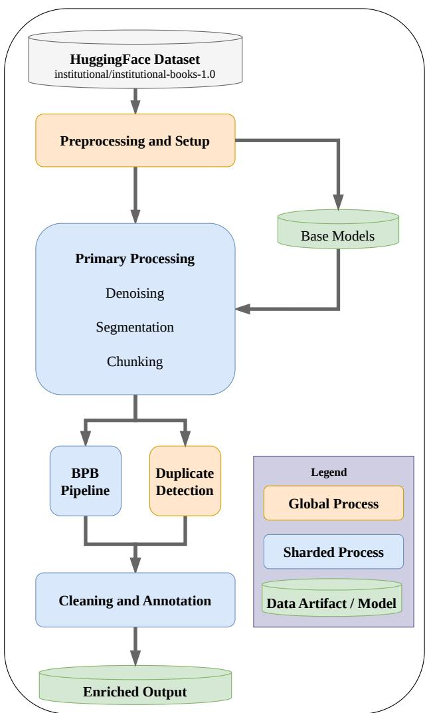  
Figure 1: Pipeline Overview

## 4.1.1 Methodology

Shard Assembly. We group the 983,004 volumes of IB-HL into shards of up to 200 volumes each. Books are grouped into two categories depending on the primary volume language (as determined by IB-HL). One category consists of volumes whose primary language is one of the 138 languages listed in Table 27 in Appendix C.8; we later segment these texts into sentences (cf. §4.8) using the Nupunkt library (M. J. Bommarito, D. M. Katz, and J. Bommarito 2025) and <sup>refer</sup> to <sup>these</sup> as <sup>“</sup>Nupunkt-compatible” <sup>volumes.</sup> <sup>The</sup> <sup>other</sup> category consists <sup>of</sup> <sup>all</sup> remaining languages. Each shard is assembled from volumes in exactly one category.

This distinction optimizes for sentence segmentation. Nupunkt-compatible shards can be processed (up to BPB annotation) without GPUs, whereas the other shards require GPUs for efficient sentence segmentation.

Base Language Models. Base language models are bootstrapped from the corpus itself for improved handling of historical language patterns. We select up to 30 volumes from each language (as identified per volume in IB-HL) when available. Within each language subcollection, we gather n-gram statistics (1-grams to 5-grams) for a small n-gram language model.

N-gram language models are trained on a heavily normalized version of the text: full NFKC Unicode normalization with additional normalizations applied to hyphens, spaces, quotes, and whitespace (cf. Appendix C.2 “hard normalization”). These models are used in dehyphenation (cf. § 4.5 ).

For each of the 138 Nupunkt-compatible languages, we treat each subcollection as a training corpus for a base Nupunkt model. Each Nupunkt corpus undergoes the same Unicode normalization described in §4.2 to match the normalization during inference.

Static Embedding Models. We use Model2Vec (Tulkens and van Dongen 2024) to distill BAAI/BGE-M3 (Chen et al. 2024) into a static embedding model. This distilled embedding model is later used in chunking (cf. §4.9). We choose BAAI/BGE-M3 due to its multilingual support. Distilling BAAI/BGE-M3 to a static model using Model2Vec allows inference to be performed using only CPUs. Though this lowers precision and accuracy slightly, the gain in computational efficiency enables us to use embeddings throughout the pipeline.

Further, we fine-tune the static embedding model into a static classifier and static subclassifier used for endmatter classification (cf. §4.4). The data used for fine-tuning was synthetically generated and is distributed as GitHub release assets (cf. §4.4.1). We separated the training data into an 80-20 split and oversampled classes during training to balance categories.

## 4.1.2 Results

Preprocessing lasted 9.5h on 4 cores of a shared Intel Cascade Lake node on a compute cluster. Nupunkt model training required 3h (averaging ≈ 78.4 s/language). N-gram training required 2.2h (averaging ≈ 31.5 s/language). Distillation required 1h, and training the classifier and subclassifier required 0.5h each. Data transfer occupied the remaining time.

In total, 388 base models and two endmatter classification models were trained during preprocessing:

1. Base n-gram language models (in 250 languages) were trained on subcollections of up to 30 books in each language.

2. Base Nupunkt segmentation models were trained on subcollections of up to 30 books in each of the 138 Nupunkt-compatible languages.

3. One endmatter classification model and subclassification model <sub>were</sub> trained.

Only 82 languages had the full 30 books available in the corpus for base model training. The remaining 168 languages have “base” models built from every book in that language in IB-HL.

The trained endmatter classifier detects endmatter with 0.97 accuracy (F1 0.97). The trained

subclassifier is less accurate, with 0.90 overall accuracy.

## 4.2 Unicode Normalization

Overcoming the challenges posed by OCR reliability in historical document digitization is an active area of research. Unicode normalization is one basic step towards addressing artifacts and differences in historical typography (Neudecker et al. 2021 ; Beyene and Dancy 2026).

IB-HL contains volumes spanning centuries of typography. The same underlying text can appear in different byte-level forms. For example, the accented character (é) could be encoded as U+00E9 (é) or U+0065 and U+0301 (e and ́), depending on OCR preference and configuration. OCR treatment is inconsistent across ligatures, diacritics, full-width and superscript text, whitespace, zero-width characters, hyphen and dash code points, curly and straight quotation marks, and scientific or mathematical notation. We follow standard Unicode normalization practices (Whistler 2025 ; ICU 2020) to facilitate text mining and data preparation.

We choose to prioritize accountability and provenance of the underlying source material: we conservatively normalize text, but do not seek to detect and correct individual OCR mistakes.

## 4.2.1 Methodology

We <sup>have</sup> two <sup>normalization</sup> regimes <sup>with different</sup> aims: soft <sup>normalization and hard normal-</sup> ization. The exact transformations are in Listing 24 in Appendix C.2 <sub>.</sub>

Soft normalization is conservative. We first apply Unicode NFC composition. The Unicode standard specifies the U+200B zero-width space as a formatting hint for word break and line break opportunities in languages that have no visible word spacing, such as Thai, Myanmar, Khmer, and Japanese (see §23.2 “Layout Controls” in The Unicode Consortium 2022). OCR engines sometimes output <sup>zero-width</sup> spaces, <sup>but these</sup> are inconsistent <sup>and manifest</sup> as invisible noise in textual analysis. We follow the common practice of removing U+200B zero-width spaces. We explicitly preserve visible text, including line breaks, curly quotes, hyphens, dashes, ligatures, and accents. Each step resolves encoding-level inconsistencies without altering how the text visibly reads. All output text in IB-HL-ET is soft-normalized.

Hard normalization is lossy and only used internally to determine when two different passages refer to the same reduced text. In addition to the soft <sup>normalization’s</sup> operations, hard normalization applies NFKC compatibility normalization, maps space-like characters to ASCII space, maps every quote to ASCII quotes, and flattens all tabs and newlines. The output is a single line with ASCII punctuation and NFKC-folded characters. Hard normalization is never stored and never presented to users. It is computed transiently when robustness against typographic variation matters more than fidelity, namely for dehyphenation (cf. §4.5), exact duplicate page removal (cf. §4.3 ), and duplicate <sub>passage</sub> identification (cf. §4.10).

## 4.2.2 Results

A total of 46h (combined wall-time across 1-core jobs on Intel Cascade Lake workstations) was spent on soft-normalizing all the text at the start of the pipeline. Per-volume cost was uniform and inexpensive (≈ 0.17 s/volume).

## 4.3 Duplicate Page Removal

Within each volume we detect and discard duplicate pages. The vast majority of these examples are repeated scans from the initial scanning process, though some recurring text is also removed. This is distinct from identifying duplicate paragraphs (cf. §4.10).

## 4.3.1 Methodology

Scanning the same physical page twice usually yields slightly different OCRed text. Thus we search for near-duplicate pages.

Each page is assigned a 128-bit simhash (Charikar 2002) assembled from 9-grams. The simhash is assembled using the MurmurHash3<sup>5</sup> algorithm (based closely on the original implementation (Appleby 2016)). Pages with fewer than 50 characters are not candidates for duplicate removal to prevent spurious removal of short pages. Initial tests showed that repetitive low-entropy text could dominate the final simhash. For example, pages with the text <sup>”</sup> have biased simhashes, but are common in tables and lists. To mitigate this problem, we only hash 9-grams with at least 4 distinct characters.

Two simhashes are considered near-duplicate if they differ by at most 6 bits. We compare all qualifying pages’ simhashes pairwise within each volume. We group mutually near-duplicate pages with a union-find (as in Chapter 21 of the standard algorithms book by Cormen et al. 2009). Thus if page � is a near-duplicate of page � and page � is a near-duplicate of page � then page � is noted as a near-duplicate of page � even if their simhashes differ by more than 6 bits. Choosing a 6 bit threshold is conservative and gives a low chance of spurious duplicate removal <sub>even</sub> after union-find accumulation.

## 4.3.2 Results

Page-level deduplication required a total of 164h (combined wall-time across 1-core jobs on Intel Cascade Lake workstations), with approximately equal amounts of time spent on (1) transient hard Unicode normalization, (2) simhash computation, and (3) pairwise simhash comparison. We <sup>show</sup> a <sup>few</sup> statistics at <sup>the</sup> top <sup>of Table</sup> 2

Approximately 81.6% of books had no duplicate pages. Some books had a substantial portion of duplicate pages. The 10 most extreme are indicated at the bottom of Table 2 <sub>.</sub> These examples have unusually repetitive page scans. The book with barcode 32044081823502 (titled Memoir of Isaac Richardson) has 132 pages post-deduplication, while containing 692 page scans (of which only 71 are middlematter).

## 4.4 Endmatter Separation

A trained page classifier splits each volume into frontmatter, middlematter, and backmatter. We output the separated endmatter largely unprocessed. A trained subclassifier categorizes each endmatter page into one of TOC\_INDEX (table of contents or index pages), BIBLIO (bibliography, citations, or lists of references), or OTHERENDMATTER<sub>.</sub> The remaining pipeline operates primarily on middlematter.

<table><tr><td>Books Processed⁶</td><td>983,003</td></tr><tr><td>Total duplicate pages removed Books with at least 1 duplicate page</td><td>1,981,296 180,521</td></tr><tr><td>Mean pages removed per affected volume</td><td>10.98</td></tr></table>

<table><tr><td>Barcode</td><td>Lang</td><td>Pages Removed</td><td>Total Pages</td><td>% of Book Removed</td></tr><tr><td>32044081823502</td><td>English</td><td>560</td><td>692</td><td>80.9%</td></tr><tr><td>32044097046809</td><td>English</td><td>338</td><td>464</td><td>72.8%</td></tr><tr><td>32044011481660</td><td>English</td><td>894</td><td>1382</td><td>64.7%</td></tr><tr><td>32044050769256</td><td>French</td><td>920</td><td>1448</td><td>63.5%</td></tr><tr><td>32044004373478</td><td>English</td><td>46</td><td>76</td><td>60.5%</td></tr><tr><td>32044018915694</td><td>English</td><td>339</td><td>566</td><td>59.9%</td></tr><tr><td>32044011481652</td><td>English</td><td>721</td><td>1238</td><td>58.2%</td></tr><tr><td>32044088907993</td><td>English</td><td>720</td><td>1256</td><td>57.3%</td></tr><tr><td>32044085160604</td><td>Latin</td><td>106</td><td>188</td><td>56.4%</td></tr><tr><td>HL01BW</td><td>English</td><td>499</td><td>886</td><td>56.3%</td></tr></table>

Table 2: Books with High Duplicate Page Rates

## 4.4.1 Methodology

Reliably detecting endmatter across a diverse collection is known to be challenging. Our approach is modeled on the experimental OCR text post-processing strategy from IB-HL (see §4.9 of Cargnelutti et al. 2025). We use the Model2Vec-distilled BAAI/BGE-M3 static embedding model described in §4.1.1 and its static fine-tunes for the classifier and subclassifier.

Synthetic Data. This pipeline uses synthetic data for fine-tuning. On one hand, testing indicates that large-scale annotation of actual endmatter leads to stronger models. On the other hand, testing also indicates that multilingual support is essential for training a multilingual classifier. We deliberately preserve the multilingual nature of the collection, but could not collect high-quality annotations across such a diverse set of languages. Recent research has shown that synthetically generated training data is effective at improving model performance when limited training data is available (Xie et al. 2020; Gunasekar et al. 2023 ; Allal, Lozhkov, and Bakouch 2024). Further, performance is better for simple, non-subjective tasks after careful curation (Z. Li et al. 2023 ; Y. Li et al. 2024). Thus using multilingual synthetic data is a pragmatic choice.

To generate synthetic data, we compared the behavior among gpt-oss-20b (OpenAI 2025), gemma3 (Gemma Team et al. 2025), and qwen3 (Qwen Team 2025). After creating and verifying samples in each of the models, we ultimately choose to focus on gpt-oss-20b for its performance and permissive licensing. See Listing 26 in the Appendix for the structure of our generation prompts.

We generated 150k training data examples. From these, we selected 44,532 valid training examples for endmatter-vs-middlematter and 27,192 examples for classifying endmatter. Curation involved several rounds of cleaning and pruning. Generated examples often included markdown; mid-resource languages produced many duplicate examples; and low-resource languages led to vacuous outputs. We stripped markdown, removed duplicates, enforced a minimum length requirement, and checked claimed languages using pyfranc (pyfranc 2023).

Inference. We treat endmatter separation conservatively and non-destructively. Each book’s detected frontmatter consists of all pages until the first non-endmatter page, and similarly (in reverse) for the backmatter. Pages with only whitespace are not counted as middlematter when determining endmatter boundaries.

The pipeline classifies all pages in each book in batches of up to 1024 pages at a time. This leads to <sub>more</sub> middlematter classifications than <sub>necessary,</sub> but most books <sub>are</sub> classified in <sub>a</sub> single batch and this leads to little overhead.

Subclassification. We choose to focus on the subtypes TOC\_INDEX (Table of Contents), BIBLIO (Bibliography), and OTHERENDMATTER<sub>.</sub> Both tables of contents and indices tend to have similar grammars and typesetting, making them difficult to distinguish. Bibliographies and lists of references are also easily confused. Other common endmatter <sub>pages</sub> (dedication <sub>pages,</sub> publication pages, title pages, copyright pages, bibliographic information, library or collection plates, and so on) vary in form and would require extensive annotation support for accurate prediction.

## 4.4.2 Results

Endmatter classification lasted 211h (combined wall-time across <sub>many</sub> 4-core jobs on Intel Cascade Lake workstations). No significant timing differences occurred across languages. This is only computationally viable due to the Model2Vec static model architecture.

On average, each book has approximately 14 pages of endmatter. Endmatter pages have additional sources of OCR errors (e.g. hand-written additions, library stamps, book plates), leading to higher variance in classification. The resulting errors more often push endmatter into middlematter than the reverse. For example, one common overly-conservative signal to start endmatter is when <sub>a</sub> book’s call number is handwritten <sub>on some</sub> frontmatter <sub>page,</sub> but OCRed incorrectly.

Classification statistics <sub>are</sub> in Table 3 Note that the “Total” line does not include blank <sub>pages.</sub> About 41% of frontmatter and backmatter pages are blank. Backmatter has a higher blankpage rate than frontmatter (47.7% vs. 35.6%), possibly due to fixed folio lengths and trailing sheets.

## 4.5 Dehyphenation

End-of-line (EOL) hyphens are often introduced to create more consistency in the physical appearance of blocks of text. Removed from their original context, these hyphens are artifacts that can corrupt underlying words (e.g. writing informa- / tion instead of information).

<sup>One</sup> strategy <sup>would</sup> <sup>be</sup> to <sup>detect</sup> <sup>and</sup> remove <sup>all</sup> <sup>EOL</sup> hyphens using regular expressions. Applying this to the whole dataset, however, would collapse many legitimate words and compound phrases into non-words. We instead resolve end-of-line hyphens using an n-gram language

<table><tr><td></td><td>Pages</td><td>% of all pages</td></tr><tr><td>Frontmatter</td><td>7,165,654</td><td>1.86%</td></tr><tr><td>Backmatter</td><td>6,560,012</td><td>1.70%</td></tr><tr><td>All Endmatter</td><td>13,725,666</td><td>3.55%</td></tr><tr><td>Source Pages</td><td>386,256,945</td><td></td></tr></table>

<table><tr><td></td><td>Frontmatter</td><td>Backmatter</td><td>Total Endmatter</td><td>% Non-blank Endmatter Pages</td></tr><tr><td>OTHERENDMATTER</td><td>3,163,667</td><td>1,232,023</td><td>4,395,690</td><td>54.7%</td></tr><tr><td>TOC_INDEX</td><td>1,294,656</td><td>1,639,797</td><td>2,934,453</td><td>36.5%</td></tr><tr><td>BIBLIO</td><td>156,219</td><td>556,543</td><td>712,762</td><td>8.9%</td></tr><tr><td>Total</td><td>4,614,542</td><td>3,428,363</td><td>8,042,905</td><td>100%</td></tr><tr><td>Blank Pages</td><td>2,551,112</td><td>3,131,649</td><td>5,682,761</td><td></td></tr></table>

Table 3: Endmatter Classification Statistics

model that ranks possible changes.

## 4.5.1 Methodology

For every line that ends with a hyphen/dash, we rank three options and choose the most likely:

1. merge the fragments into one (e.g. informa- / tion becomes information),

2. remove the linebreak but keep the hyphen (e.g. mother-in- / law becomes mother-in-law), and

3. replace the linebreak with a space and keep the hyphen (e.g., with interruptions or emdashes that happen to occur at ends of lines).

Any given word is more likely to appear mid-text than only at line breaks. A probability model trained on the text will capture these likelihoods, and we choose n-gram statistics as our basic model. Ranking is based on character n-grams (using 1-grams to 5-grams). We combine the base n-gram model (trained during preprocessing, cf. §4.1) for the book’s primary language with a book-specific n-gram model built transiently in memory from the volume’s own text. We only train this book-specific model if the book has end-of-line hyphenation. The base model includes per-language statistical information while the book-specific model includes proper nouns, technical terms, and other book-specific vocabulary.

We estimate the probability of a specific n-gram $w _ { 1 } ^ { n } : = w _ { 1 } \cdots w _ { n }$ by its add-� smoothed density

$$
P ( w _ { 1 } ^ { n } ) \approx { \frac { ( \# w _ { 1 } ^ { n } ) + k } { ( \# \mathrm { n - g r a m s ~ s e e n } ) + k \cdot ( \mathrm { v o c a b ~ s i z e } ) } }
$$

with � = 0.001<sub>.</sub> This approach is modeled after standard n-gram language models (see for instance Chapter 3 of Jurafsky and Martin 2026), but with some simplifying assumptions for speed. The add-� smoothing is a crude form of Laplace smoothing and avoids exact 0 To determine the relative ranking among the three possibilities, we approximate the joint probabilities of each option. We estimate the joint probabilities of each possibility using a 10-character window on each side of the hyphen.

<sup>When</sup> an n-gram $w _ { 1 } ^ { n }$ has never been seen, we approximate the probability using the so-called Stupid Backoff (Brants et al. 2007) algorithm with backoff probability of 0.4 times the (� − 1)- gram formed when omitting the first character,

$$
P ( { \mathrm { u n s e e n } } w _ { 1 } ^ { n } ) \approx 0 . 4 \cdot P ( w _ { 2 } ^ { n } ) .
$$

The resulting language model is not a true probability distribution, but it adequately ranks the three possibilities and is faster than more sophisticated models.

Overall, the pipeline computes these two sets of probabilities using both the book-specific model and the base language models, computes associated perplexities, and weighs both equally for the final determination. (See Appendix C.5 for discussion of multiple other technical details and alternatives considered. See Appendix D for an example where dehyphenation performs poorly on technical text).

## 4.5.2 Results

High Dehyphenation Languages
<table><tr><td rowspan="2">Total Hyphens Removed Estimated EOL Hyphen Removal Rate</td><td rowspan="2">2,322,246,287 ≈ 89%</td><td>Language</td><td>Avg Removed/Page</td></tr><tr><td>Latin</td><td>11.3</td></tr><tr><td>Estimated EOL Hyphen Keep Rate</td><td>≈ 7%</td><td>Russian</td><td>11.1</td></tr><tr><td>Estimated EOL Hyphen+Space Rate</td><td>≈4%</td><td>Bulgarian</td><td>11.1</td></tr><tr><td rowspan="2"></td><td rowspan="2"></td><td>Polish</td><td>10.3</td></tr><tr><td>Hungarian</td><td>9.3</td></tr></table>

Table 4: Hyphenation Statistics

A total of 640h (combined wall-time across many 4-core jobs on Intel Cascade Lake workstations) was spent on dehyphenation. Run statistics are in Table 4 Typically (89% of the time) the dehyphenation strategy removed the hyphen and newline. This supports the widespread practice of using regular expressions to detect and remove all end-of-line hyphens, but also suggests that this practice is not always appropriate.

Cyrillic, Latin, and European languages have by far the most inserted end-of-line hyphens. In this collection, Latin has the highest per-page rate, consistent with dense scholarly printing of classical text. For English books, the average number of hyphens merged per page was 4.9<sub>,</sub> substantially smaller than Latin or the Slavic languages. As expected, many languages have almost no end-of-line hyphens. Chinese, Japanese, and Arabic all average below 0.1 removed hyphens per page (and those with hyphens are often multilingual).

## 4.6 Running Header and Footer Removal

Printed books often show a running header and/or footer containing the title, author, or chapter name. OCR tends to place these among the first or last lines on a page. Removing page boundaries causes these to become inline noise, disrupting paragraphs that span multiple pages. We identify recurring short lines near the top or bottom of nearby pages and remove them.<sup>8</sup>

## 4.6.1 Methodology

We identify running headers and footers by detecting locally concentrated clusters. We allow near-duplicates instead of exact duplicates as page numbers are often appended to running headers or footers by OCR; but we set the threshold conservatively to minimize excess removal. The top or bottom 5 lines of each page form the initial candidates for removal. We choose the top and bottom 5 lines because OCR engines are not always consistent with placement of marginalia and edge-matter; further, some books have multiline headers and footers.

For each of the top and bottom 5 lines of each page, we strip whitespace and discard candidates <sup>shorter than</sup> 6 <sup>characters.</sup> Lines <sup>this short</sup> are not likely to <sup>be</sup> a running <sup>header/footer and</sup> are too short to match reliably. Each remaining candidate is represented as a MinHash (Broder 2000) signature made from 128 permutations over character 5-grams. Each signature is indexed in a MinHash locality-sensitive hashing (LSH) index<sup>9</sup> with Jaccard threshold 0.85 (see for example Chapter 3 of Leskovec, Rajaraman, and Ullman 2020; we use the implementation in the datasketch library by Zhu et al. 2024). To be marked as a duplicate, a line must have at least 3 near-duplicates within a 5-page span. <sup>10</sup> These marked duplicates (in the top or bottom 5 lines, near-exact threshold, with at least 3 duplicates in a cluster) are deleted from the middlematter.

## 4.6.2 Results

Running header and footer removal required 927h (combined wall-time across many 4-core jobs on Intel Cascade Lake workstations) at an average of 3.4s/volume. Removal statistics are given in Table 5 <sub>.</sub> Random sampling shows that languages with vertical reading orientation

<table><tr><td colspan="3">Total Header and Footer Lines Removed Volumes with ≥1 Removal Average Removed/Volume</td><td colspan="3">272,583,638 760,238 (77.3%) 277</td></tr><tr><td colspan="3">High Removal Languages</td><td colspan="3">Low Removal Languages</td></tr><tr><td>Language</td><td>Avg/Book</td><td>Avg/Page</td><td>Language</td><td>Avg/Book</td><td>Avg/Page</td></tr><tr><td>Scots</td><td>233</td><td>0.93</td><td>Mandarin Chinese</td><td>7.9</td><td>0.01</td></tr><tr><td>English</td><td>347</td><td>0.91</td><td>Slovak</td><td>42.4</td><td>0.12</td></tr><tr><td>French</td><td>289</td><td>0.66</td><td>Ukrainian</td><td>38.8</td><td>0.15</td></tr><tr><td>Greek</td><td>272</td><td>0.65</td><td>Arabic</td><td>86.1</td><td>0.26</td></tr><tr><td>Latin</td><td>221</td><td>0.59</td><td>Gaelic</td><td>48.3</td><td>0.27</td></tr></table>

Table 5: Header and Footer Removal Statistics

have less accurate header/footer detection. This appears to be primarily due to placement within the OCR text: while we observed that headers and footers usually appear at the top or bottom of OCRed pages, language-specific failure modes of OCR engines may lead to different, hard to anticipate placements.

## 4.7 Page Number Removal

<sup>As with</sup> running <sup>headers and</sup> footers, page <sup>numbers</sup> appear in margins <sup>and result</sup> in <sup>artifacts</sup> at almost every page break. OCR engines typically place page numbers near the top or bottom of each page. We look for short, numeric lines at the top and bottom of pages and remove them.

## 4.7.1 Methodology

We detect <sub>a</sub> line <sub>as</sub> <sub>a</sub> <sub>page</sub> number if

1. it is in the top or bottom 5 lines of OCR output,

2. it has at most 8 characters,

3. at least <sub>one</sub> character is numeric and

4. at most one non-whitespace character is non-numeric<sub>.</sub>

We consider a character numeric if, after NFKC Unicode normalization, the character is in the numeric Unicode category (specifically if unicodedata <sub>.</sub> category(ch) <sub>.</sub> startswith('N') is true in Python).

In addition, there is one later round of stray number removal that occurs after separating the text into sentences. Any “sentence” that consists of a single short number (with at most one non-numeric character after removing white-space) is removed.

## 4.7.2 Results

Page number removal required a total of 2.5h (combined wall-time across many 4-core jobs on Intel Cascade Lake workstations) at an <sub>average</sub> of less than 0.01 s/volume. This is expected: page number detection is a short sequence of string inspections with no additional models or hashing. Statistics for the run are given in Table 6<sub>.</sub> We observe that the median removal

<table><tr><td>Total Page Numbers Removed Volumes with ≥1 Removal</td><td>433,722,448 980,441 (99.7%)</td></tr><tr><td>Average Removed/Volume</td><td>441</td></tr><tr><td>Average Removed/Page</td><td>1.123</td></tr><tr><td>Median Removed/Page</td><td>1.064</td></tr></table>

Table 6: Page Number Removal Statistics

is close to one number per page, agreeing with expectation. <sup>A</sup> common source of additional removals comes from footnote and caption markers, which are often placed on their own lines by <sup>OCR</sup> engines.

The average is larger than the median. This reflects a long tail: 13k books had ≥ 3 page numbers removed per page. The highest ratio is 8.7 removed “page numbers” per page, held by the book with barcode HN3J4P titled The American ready reckoner: designed to insure correctness as well as despatch in business <sub>.</sub> This book has a multiplication table on almost every page. See Figure 7 for an example portion. Currently available OCR text in IB-HL sometimes places every cell of a table on its own line. Inspection shows that all top 10 books are similarly full of tables.

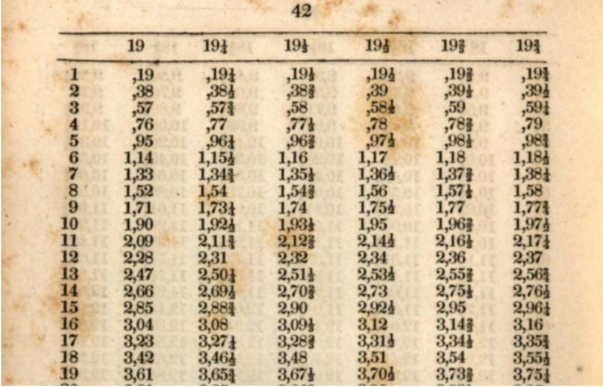  
Figure 7: Part of a page from HN3J4P The American ready reckoner showing how to multiply 19<sub>,</sub> 19<sup>1</sup>/ <sub>,</sub> and so on by numbers from 1 to 19<sub>.</sub> Every table entry receives its own line in the OCRed output, so almost every checked line resembles a page number.

## 4.8 Sentence Segmentation

We now reorganize the middlematter into sentences. The corpus spans roughly 250 languages with different punctuation conventions and scripts, so we use multiple sentence segmentation strategies.

For languages with English-like punctuation, we use Nupunkt (M. J. Bommarito, D. M. Katz, and J. Bommarito 2025), a modern implementation of the Punkt algorithm (Kiss and Strunk 2006). Nupunkt is an unsupervised algorithm that attempts to recognize sentence-ending punctuation and common ways for that same punctuation to occur without ending a sentence (such as in abbreviations like Dr. U.S. etc.).

For other languages, we instead use wtpsplit and SaT (Segment-any-Text, by Frohmann et al. 2024), a multilingual sentence segmentation system. Specifically, we use the sat-3l-sm<sup>11</sup> three-layer general sentence segmentation model for its balance of speed and performance. <sup>12</sup>

Determining when to use Nupunkt and when to use SaT is not straightforward and is described in more detail in Appendix C.8<sub>.</sub> The split is heavily skewed: 97.9% of books go through the Nupunkt engine <sup>and the</sup> remaining 2.1% go through <sup>the SaT</sup> engine.

## 4.8.1 Methodology

For the 138 Nupunkt-compatible languages listed in Table 27 in the Appendix, the sentence segmentation process starts with a base corpus generated during preprocessing (cf. §4.1) and adapts it for each book. In Punkt-based algorithms, adaptation involves combining abbreviation lists and updating punctuation neighborhood counts.

Combined base model training for Nupunkt required 3 hours (on 4 cores of a shared Intel Cascade Lake cluster node). It is possible to apply the base language Nupunkt models directly, without per-book adaptation, but we found that performance improved with per-book adaptation. This was especially true on books with many acronyms, abbreviations, and other technical non-sentence-terminating punctuation. This comes with significant cost: per-book adaptation requires approximately 16× more compute time than using only the base model to segment the book. <sup>13</sup> (Concretely: segmenting a book using a loaded model requires on average 0.6s on a single core of an Intel Cascade Lake workstation; adapting a single book requires just over 10s on average).

Punkt-based algorithms do not apply to every language, especially when punctuation differs strongly from English. Determining when Nupunkt applies is complicated by the continued incorporation of Western punctuation symbols into writing systems (see e.g. J. K. Lee 2014; Twine 1984). Similar texts on similar subjects in the same language can have different punctuation standards. For the 112 languages that we do not consider Nupunkt-compatible, we instead use the three-layer general segmentation SaT neural network-based sentence segmenter. The SaT model is the only step in the general pipeline that requires a GPU. On an NVIDIA A100 GPU, segmenting a typical 400 page book takes 1.18s on average.

Thus SaT requires twice as much time as applying the base Nupunkt model, but is faster than applying per-book Nupunkt adaptation. On the other hand, SaT requires a GPU.

## 4.8.2 Results

Sentence segmentation required a total of 2855h (combined wall-clock time on our distributed cluster; heterogeneous nodes). See Table 8 for timing by type. Nupunkt adaptation and inference were performed on single-core Intel Cascade Lake workstation nodes. SaT inference was performed on heterogeneous nodes containing at least 4 Intel Sapphire Rapids CPU cores and 1 NVIDIA A100 GPU.

<table><tr><td>Engine</td><td>Volumes</td><td>Total Time</td><td>Avg s/vol</td></tr><tr><td>NupuNkT Per-Book Adaptation</td><td>962,373</td><td>2,691h</td><td>10.06s</td></tr><tr><td>NuPUNKT Inference</td><td>962,373</td><td>157h</td><td>0.59s</td></tr><tr><td>SAT (GPU)</td><td>20,629</td><td>6.6h</td><td>1.18s</td></tr></table>

Table 8: Nupunkt and SaT Timing Information.

Output statistics are given in Table 9<sub>.</sub> <sup>14</sup> Nupunkt sentences and SaT sentences have approximately the same number of characters, but SaT sentences tend to have far more words. Whether this reflects language conventions or segmenter differences is unclear.

<table><tr><td>Engine</td><td>Sentences</td><td>% all sentences</td><td>Avg chars/sentence</td><td>Avg words/sentence</td></tr><tr><td>NUPUNKT</td><td>7,010,365,214</td><td>99.00%</td><td>113.2</td><td>23.3</td></tr><tr><td>SAT</td><td>70,838,120</td><td>1.00%</td><td>119.5</td><td>36.7</td></tr></table>

Table 9: Sentence Segmentation Statistics

## 4.9 Topical Chunking

The next step ofthe pipeline is to organize the sequence of sentences into “subtopic paragraphs” and “subtopic sections”. Our motivation and terminology stem from Hearst 1997 which characterizes a text structure as a sequence of subtopics within broader main-topic discussions. We use “subtopic paragraph” and “subtopic section” to mean contiguous stretches of text that are about something. A single volume may contain many subtopic sections, and a single subtopic section may contain many subtopic paragraphs.

This differs from the actual presentation within each volume. Organizing sentences into hierarchical semantic sections is not how authors typically organize their writing. To paraphrase Hearst, many volumes consist of long sequences of paragraphs without any structural demarcation. Organizational conventions change over time and vary across languages. We expect a more consistent semantic structure to be valuable for downstream tasks. Where sentences are too small and complete volumes are too big, subtopic paragraphs and sections are selfcontained and topically coherent. Subtopic chunks are natural for context-aware search, semantic search and retrieval, long-context focused LLM training, duplicate detection, and other information retrieval tasks.

Our approach to topical chunking is a modern instantiation of Hearst’s TextTiling algorithm. But where TextTiling detects topical shifts from a variety of lexical patterns, we search for dips in cosine similarity between static embeddings of sentences.

## 4.9.1 Methodology

We use the Model2Vec static model distilled from BAAI/BGE-M3 (cf. §4.1) to generate static embeddings of sentences. The rest of the approach is strongly informed by TextTiling (Hearst 1997). Concretely:

1. <sup>Embed each</sup> sentence using a static <sup>model distilled from BAAI/BGE-M3</sup> (in <sup>batches of</sup> 256 sentences).

2. Score each sentence-gap by semantic cohesion. Take the mean embedding of the previous 5 sentences and the mean embedding of the next 5 sentences, and compute their cosine similarity. High scores suggest topical continuity. Low scores signal topical shift.

3. Collect the sequence of gap scores into a similarity curve. We apply a single-pass moving average (width 3) to reduce high-frequency oscillation from single-sentence noise.

4. Compute the TextTiling valley-depth at each gap. At each sentence-gap, we find the previous and subsequent peaks (where sentences are most topically cohesive) and sum the differences,

$$
\mathrm { v a l l e y \ d e p t h = ( l e f t \_ p e a k - g a p \_ v a l u e ) + ( r i g h t \_ p e a k - g a p \_ v a l u e ) . }
$$

Deep, two-sided valleys correspond to strong topic boundaries. Shallow valleys do not.

5. Greedily select sentence boundaries. A sentence-gap is a boundary candidate if its depth exceeds a per-book threshold (mean(valley\_depth) − 0.5std(valley\_depth)). Candidates are taken greedily from deepest to shallowest, subject to the requirement that no segment be shorter than 3 sentences. <sup>15</sup>

6. Use the accepted gaps as subtopic-paragraph boundaries.

Our methodology deviates from Hearst in two places: we use static sentence embeddings instead ofterm-frequency overlap and lexical statistics since sentence embeddings better capture semantic content; and we operate on whole sentences instead of fixed-length pseudosentences since sentence boundaries are already provided by the segmentation step in the pipeline.

Section-level chunking reuses exactly this procedure, except using the identified subtopic paragraphs in place of sentences. Iteration would yield larger tiers in the semantic hierarchy.

## 4.9.2 Results

A total of 1,568h was required to perform subtopic chunking (combined wall-time across many 4-core jobs on Intel Cascade Lake workstations) with an average of 5.7 s/volume. The median time per book was 1.5 s/volume and the overall time was heavily right-skewed by long books with many sentences. For a volume with � tokens, � sentences, and � candidate paragraph breaks, our implementation runs in time �(� + � log $N + B ^ { 2 } )$ ; the terms come from embedding cost, sorting sentence gaps, and greedily building the boundary list, respectively. In practice, $B \approx N / 5$ hence long books with many sentences will take a disproportionate amount of time. Core statistics are in Table 10<sub>.</sub> The average number of sentences per paragraph is consistent

<table><tr><td>Total Sentences Detected Subtopic Paragraphs Detected Subtopic Sections Avg Paragraphs per Section Avg Sentences per Paragraph</td><td>7,081,203,334 1,394,049,896 297,350,019 4.688</td></tr></table>

Table 10: Topical Chunking Statistics

across languages: the smallest is ≈ 4.8 in Japanese, while the largest is 5.1 in Latin. No significant difference in numbers of sentences exists between volumes segmented using Nupunkt and volumes segmented using SaT<sub>.</sub>

The distribution of the lengths of paragraphs is shown in Figure 11 The plot shows a roughly log-normal, unimodal distribution. The 3-sentence minimum manifests as the relatively sharp lower bound. There are 950 paragraphs with over 100k characters, mostly from poor OCR on tables.

## 4.10 Duplicate Identification

Chunking the text into semantic subtopic paragraphs makes it easier to identify duplicate text. We identify near-duplicate subtopic paragraphs across the whole dataset. In general, they are not deleted<sup>16</sup> and are instead annotated and left in place.

<table><tr><td>Mean p25 Median p75</td><td>574.4 chars 211 chars 435 chars</td></tr></table>

Paragraph length distribution (1.39B paragraphs)  
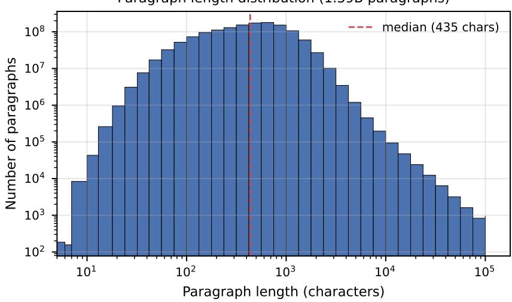  
Figure 11: Subtopic Paragraph Length Distribution

Our treatment contrasts with common practice. Large-scale dataset preparation pipelines for language model training routinely perform exact and fuzzy deduplication to remove repeated documents (Brown et al. 2020; Gao et al. 2020). Some recent work suggests more rather than less aggressive deduplication (K. Lee et al. 2022), and that even semantic near-duplicates can be removed with little impact on downstream performance (Abbas et al. 2023).

Though removing duplicate paragraphs might make sense for some tasks, it does not work for all problems. Instead, we mark paragraphs with duplicates so that downstream users can determine whether to use or discard them as appropriate.

## 4.10.1 Methodology

Our approach to duplicate identification follows other large-scale deduplication efforts and reuses several methodological components from page deduplication (cf. §4.3). We follow a typical simhash and LSH strategy over entropy-filtered 9-grams hashed with MurmurHash3 and consider two simhashes duplicates if they differ in at most 5 bits.

We compute 128-bit simhashes (Charikar 2002) over 9-grams from hard-normalized (cf. §4.2), lower-cased text. Simhashes are only computed over 9-grams that contain at least 4 distinct characters to avoid noise from strings of repeated text. Each 9-gram is hashed with MurmurHash3 and accumulated into <sub>a</sub> standard simhash. <sup>17</sup>

Thus each of the ≈1.4B paragraphs is reduced to a 128-bit signature. Two simhashes that differ by at most 5 bits are considered duplicates. This is conservative but allows small typographic deviations or OCR artifacts to not disrupt duplicate identification. The naive strategy of pairwise comparison (as executed with page deduplication) is no longer viable. Instead, to identify these duplicate simhashes, each 128-bit signature is split into 6 bands (with (22, 21, 21, 21, 21, 22) bits, respectively). If two signatures differ by at most 5 bits, then they must exactly agree on at least one band. Thus we seek signatures that exactly match at least one band.

We simultaneously determine all matches in a band by sorting a document with lines of the form (band\_value) | doc\_id<sub>.</sub> Each contiguous range of identical band values is one bucket of candidates to check for duplicates. We create 6 documents (one for each band) and sort each individually. The natural unique identifier for each document is its barcode.paragraph\_index<sub>.</sub> As many barcodes are 14-character strings, <sup>if</sup> we used this identifier then the band-file to sort would have size

$$
\approx 1 . 4 \times 1 0 ^ { 9 } \times ( 3 ~ \mathrm { b y t e s } + 1 8 ~ \mathrm { b y t e s } ) \approx 3 0 \mathrm { G B } .
$$

This would be larger than necessary and negatively affect sort time. Instead, we construct a new document id for efficient (and predictable) byte packing.

After creating simhashes for all paragraphs, we read these simhashes in a fixed order and assemble

1. A global binary simhash array hashes.bin the global concatenation of all paragraph simhashes. (1.4B paragraphs, each with a 16-byte simhash, yielding a file of size ≈23GB)

2. An auxiliary array book\_ids a list of volume barcodes in simhash-reading-order. (1M strings, tens of MB in size)

3. An auxiliary array book\_offsets one uint64 per volume giving the index in hashes.bin at which that volume’s paragraphs begin. (1M uint64 integers, 8MB in size).

These are constructed in order, so book\_offsets strictly increases and allows one to detect both book starts and book ends; and the �th entry in book\_offsets corresponds to the �th barcode in book\_ids <sub>.</sub> With these arrays, the global document index of a paragraph is its index in the global simhash array<sub>.</sub> Binary search on book\_offsets allows recovery of the barcode and paragraph index. We add a byte-packing assumption that the document index can be specified by one uint32 for minor convenience (capping tractable corpus size to $2 ^ { 3 2 } \approx 4 . 2 9 \mathrm { B }$ paragraphs).

Thus each paragraph is uniquely specified by a 4-byte doc\_id<sub>.</sub> We set up band sorting by packing each (band value, doc\_id) into a single uint64 key

$$
\mathrm { k e y ~ = ~ ( b a n d \_ v a l u e ~ < < ~ 3 2 ) ~ \ U ~ \ d o c \_ i d . }
$$

The band-files for sorting are thus each about 11GB in size and consist of 64-bit integers for sorting. These can be sorted in memory and a single linear scan recovers all candidate buckets.

To process the buckets in parallel, we memory-map the global simhash array hashes.bin<sub>.</sub> A pool of workers computes exact pairwise Hamming distances using two xors, two popcnt s, and an addition to combine. Positively identified results are added to a global union-find data structure, which ultimately yields the clusters.

After clusters are identified, a unique cluster\_id is assigned (of the form barcode:par\_idx chosen as the alphabetically first barcode of a volume in the cluster). During annotation, every paragraph in a cluster is annotated with one of two tags: the paragraph that was chosen as <sup>the</sup> cluster\_id receives <sup>the</sup> annotation

$$
\mathrm { { < p } ~ d a t a - c l u s t e r i d = " B A R C O D E : P A R \_ I D X " { \mathrm { ~ d a t a - r e p r e s e n t a t i v e > } } }
$$

</p>

and non-representative paragraphs are wrapped in an aside tag

```html
<aside data-cluster="BARCODE:PAR_IDX" >
<p> <sub>...</sub> </p>
</aside>
```

We describe this more when discussing annotation in §4.12 <sub>.</sub>

## 4.10.2 Results

Duplicate paragraph identification required 129h (127h of combined wall-clock time across distributed nodes with 4 Intel Cascade Lake cores to compute simhashes, and 1.5h on a 16-core MacBook Pro M4 Max for simhash comparison). The statistics in Table 12 show that 1,932,557 same-book duplicate clusters were detected, fewer than the number of removed duplicate pages (1,981,296 as discussed in §4.3.2 ; removing duplicate pages thus significantly reduced unnecessary duplicate identification). Though some volumes repeat paragraphs internally, most detected duplicates span multiple volumes.

<table><tr><td colspan="2">Identified Duplicate Counts</td><td>Cluster Size</td><td># Clusters</td></tr><tr><td>Total Subtopic Paragraphs</td><td>1,394,049,896</td><td>2</td><td>40,123,977</td></tr><tr><td>Duplicate Representatives</td><td>51,233,629</td><td>3</td><td>7,077,321</td></tr><tr><td>Duplicate Non-Representatives</td><td>72,856,480</td><td>4</td><td>2,119,430</td></tr><tr><td>Average Cluster Size</td><td>2.42 paragraphs</td><td>5-10</td><td>1,725,371</td></tr><tr><td>Single-book Clusters</td><td>1,932,557 (3.8%)</td><td>11-100</td><td>186,069</td></tr><tr><td>Multi-book Clusters</td><td>49,301,072 (96.2%)</td><td>101-1000</td><td>1,376</td></tr><tr><td>Books With Identified Duplicates</td><td>557,961 (56.8%)</td><td>1000+</td><td>85</td></tr></table>

Table 12: Duplicate Identification Statistics

Language # Duplicate Paragraphs % of All Paragraphs in Language
<table><tr><td>English</td><td>57,815,405 8.09%</td></tr><tr><td>German</td><td>5,976,526 2.41%</td></tr><tr><td>French</td><td>5,804,669 3.07%</td></tr><tr><td>Latin</td><td>957,619 2.26%</td></tr><tr><td>Italian</td><td>640,421 1.38%</td></tr><tr><td>Spanish</td><td>475,111 1.80%</td></tr><tr><td>Dutch</td><td>219,803 1.32%</td></tr><tr><td>Russian</td><td>153,856 0.61%</td></tr><tr><td>Hungarian</td><td>47,632 0.75%</td></tr><tr><td>Hebrew</td><td>39,949 1.04%</td></tr></table>

Table 13: Language Distribution of Detected Duplicate Paragraphs

Table 13 shows English as a pronounced outlier in duplication rate, at more than 2.5 times the rate of the next language. This likely reflects the size of the English subcollection: with 487k English volumes, there is a bigger pool of potential duplicate books (including reprints, reorganized collections, etc.).

The average cluster consists of ≈2.42 duplicates, but the distribution is long-tailed. We found

85 clusters containing over 1000 different duplicates. Inspection shows that these exceptionally large clusters tend to be either missed boilerplate or poorly-OCRed tabular filler. The two largest were variations of the same library fine description:

REP 32044004341889.672 - 21 ,056 Copies   
REP 32044004442943.3353 - 19 ,072 Copies

This book should be returned to the Library on or before the   
last date stamped below. A fine of five cents a day is incurred   
by retaining it beyond the specified time. Please return promptly.

As these were missed boilerplate (and were always the exact last paragraph in the book, from the back cover), we removed these paragraphs from the dataset.

The next several largest clusters are all tabular noise:

REP 32044000056234:311 | 16 ,954 | Do. Do. Do. Do. Do. Do. Do. Do. Do. Do.   
REP 32044001172907:42 16 ,804   
REP 32044004599593:258 14 ,942 | Dollars. Dollars. Dollars. Dollars.   
REP 32044010095289:65 13 ,360 | idem. idem. idem. idem. idem. idem. idem.   
REP 32044002052694:1091 12 ,708 do. do. do. do.   
REP 32044004778643:383 9 ,033 Value. Quantity. Value.   
REP 32044004365193:2145 | 7 ,896 | Do. Do. Do.   
REP 32044004554093:4597 | 7 ,262 | ..do. .do. .do. ..do.

The Do. Do. repetitions are shorthand for “ditto”, the same as idem. idem. The repeated Dollars. <sup>and</sup> Value. Quantity. <sup>lines</sup> are orphaned <sup>lines from tables.</sup>

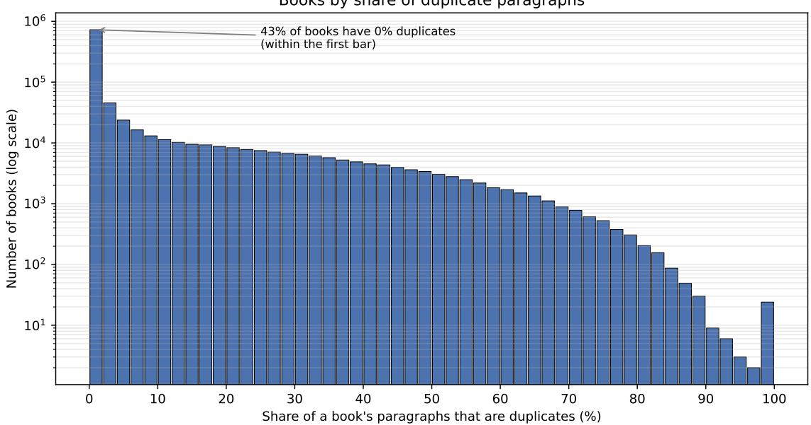  
Figure 14: Books by % Duplicate Subtopic Paragraphs

Figure 14 shows the number of books binned by the fraction of identified duplicate subtopic paragraphs. About 43% of books have no duplicate paragraphs and 80% are under 5%. The figure shows a smooth �-curve of decay, except for 24 books with 98–100% duplication. Inspection shows that these 24 books are reprintings, edition changes, or duplicate books in the collection. For example, the three volumes with barcodes HWJX6S HWJX7H HWJX63 all contain a play The Pigeon by John Galsworthy, which is included in the 3-play anthology 32044086883501

## 4.11 Bits-Per-Byte

OCR quality over a heterogeneous, multi-century, multilingual collection produces text ofvarying data fidelity. Earlier stages of the pipeline have shown that OCR quality is generally high. But we have also observed that tables and marginalia are often poorly OCRed and yield noisy paragraphs in this collection.

We seek a computable, language-agnostic number per paragraph that:

1. ranks paragraphs by how predictable, fluent, and well-formed their text is,

2. can be summarized per book as a quality statistic, and

3. facilitates downstream filters that keep typical prose and omit unusual extremes.

One approach is to use language model cross-entropy It is common to normalize by the number oftokens and report the exponentiated value as perplexity which has a long history as a corpusfiltering signal (e.g. Wenzek et al. 2020 Gao et al. 2020 and Marion et al. 2023 ). But the numeric scale of perplexity depends both on the underlying model tokenizer and the language of the text; tokenizers can produce different numbers of tokens for different scripts as a result of different priorities and availability of training data. We instead normalize by bytes: the Bits-Per-Byte (BPB) measures how many bits the model needs to encode each byte of text, which is closer to tokenizer-independent, language-independent data.

Computing BPB is more expensive than the rest of the pipeline and requires dedicated GPU resources. We think of computing BPB as an optional phase performed after the primary processing pipeline. Our implementation allows simple configuration to skip BPB evaluation. But as per-paragraph BPB enables users to filter or seek out-of-distribution text without needing to perform these computations themselves, we believe this is a valuable contribution.

## 4.11.1 Methodology

For each subtopic paragraph, we compute its BPB with a causal language model and accumulate the next-token log-likelihood it assigns, then divide by byte count:

$$
\mathbf { B P B } = { \frac { 1 } { \ln 2 } } \cdot { \frac { - \sum _ { t } \ln p _ { \theta } ( x _ { t } \mid x _ { < t } ) } { ( { \mathrm { n u m b e r ~ o f ~ U T F - 8 ~ b y t e s } } ) } } .
$$

We use Qwen/Qwen3-0.6B-Base (Qwen Team 2025) as the reference model as it has strong multilingual support. We use a relatively small 0.6B parameter model so that it is computationally possible to compute BPB for all 1.4B paragraphs in the collection. <sup>18</sup> The numerator is exactly the model’s total negative log-likelihood of the paragraph. Lower BPB means the paragraph is more predictable; higher BPB means it is more surprising.

Prior to computing BPB, we sort all paragraphs in each book by length and create batches of 16 paragraphs that all have approximately the same length. As shown in Figure 11 the distribution of paragraph lengths is roughly log-normal with a long tail; thus presorting prevents large amounts of unnecessary padding in the computation.

In our implementation, excessively short and excessively long paragraphs are each assigned a sentinel value of −1 rather than a score. Paragraphs with ≤ 4 characters are too short for meaningful contextual prediction. And paragraphs longer than 14,134 tokens also receive the −1 sentinel value. This is due to our implementation encountering a 32-bit index limit in the PyTorch CUDA kernel. The number of logits produced from a paragraph is num\_tokens x vocab\_size and must have an int32 address. The vocab\_size in our model is 151,936, leaving $( 2 ^ { 3 1 } - 1 ) / 1 5 1 9 3 6 \approx 1 4 1 3 4$ as the max size. In addition, <sup>if</sup> the BPB computation leads to a GPU Out-Of-Memory error, the paragraph is assigned a −1 sentinel value. This latter case occurred on 187k paragraphs during the initial pipeline run; these were resolved by recomputation and the released dataset contains <sub>no</sub> such <sub>cases.</sub>

We compute some summary statistics about the BPB distribution across subtopic paragraphs for each book: the min, max, mean, median, and the 10th, 30th, 70th, and 90th percentiles. Each of these statistics ignores paragraphs with the sentinel value −1<sub>.</sub> Further, in the final dataset <sub>we</sub> do not include BPB annotations with the sentinel value.

We compute these statistics at the book level because absolute BPB values depend strongly on genre and technical material. BPB should be interpreted as a measure of predictability and not of value. Legitimate-but-unusual content, including mathematical notation or lowresource languages underrepresented in the language model’s training, will be “surprising” to the model and have a high BPB value. By providing per-book statistical distributions, we encourage relative filtering instead of establishing corpus-wide cutoffs.

## 4.11.2 Results

Computing BPB for all 1.4B paragraphs in the collection required a total of ≈ 2000 GPU-hours (≈83 GPU days, combined wall time over hundreds of GPU nodes on a distributed, heterogeneous cluster; each node had one NVIDIA A100 GPU and at least 8 Intel Sapphire Rapids CPU cores) with an average of ≈ 7 s/volume or ≈700k paragraphs per GPU-hour.

<table><tr><td>Subcollection</td><td># Subtopic Paragraphs</td><td>Mean</td><td>p25</td><td>Median</td><td>p75</td></tr><tr><td>All†</td><td>1,393,997,373</td><td>1.666</td><td>1.179</td><td>1.510</td><td>2.033</td></tr><tr><td>NUPUNKT</td><td>1,379,804,105</td><td>1.661</td><td>1.178</td><td>1.506</td><td>2.026</td></tr><tr><td>SAT</td><td>14,193,268</td><td>2.179</td><td>1.532</td><td>2.076</td><td>2.824</td></tr></table>

<sup>†</sup>The 1,394,049,896 subtopic paragraphs in Table 10 are reduced to 1,394,009,768 in the released dataset after removing 40,128 paragraphs in the two deleted library-fine boilerplate clusters (§4.10.2). Of these, 1,393,997,373 receive a BPB score and 12,395 keep the −1 sentinel. This leads to the small differences in totals in these tables.

## Table 15: Core BPB Statistics

See Table 15 for statistics on the distribution. Nupunkt-compatible languages have smaller BPB on average. One possible explanation for this difference is that Nupunkt-compatible languages (such as English) form the bulk of the pre-training data for the Qwen3 language model. A second possibility is that currently available OCR is more accurate on Nupunkt-compatible languages than on languages with different scripts and punctuation.

The single paragraph with the smallest (valid) BPB is from a book of patent records and is shown in Figure 16<sub>.</sub> The OCR engine parsed the column of “General Electric Company.” as a single block of text and the identified subtopic paragraph consists of several repetitions of the text “General Electric Company.” According to the Qwen3-0.6B-Base model, this paragraph has BPB value 0.0297, reflecting its repetition.

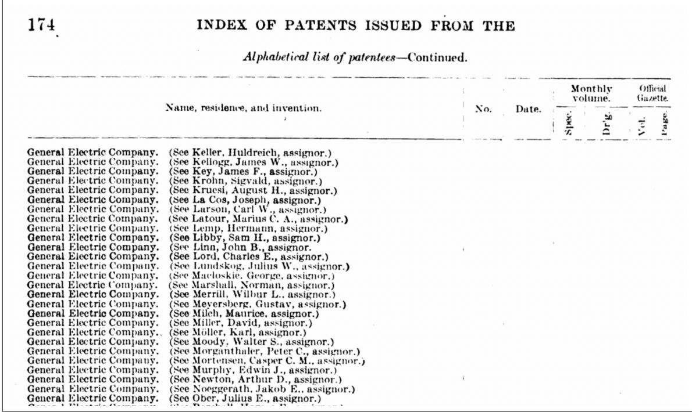  
Figure 16: Book HJ1A7X (Annual Report on Patents for the US House of Representatives, 1906) containing the “paragraph” with the smallest bits-per-byte.

The paragraphs identified with the largest BPB appear to consist mostly of OCR garbled text. These extreme examples confirm that BPB can be a helpful predictor of text quality and might be useful when filtering the data.

A total of 12,395 paragraphs (≈0.0009%) carry the −1 sentinel in the released dataset. Of these, 12,391 are longer than the 14,134 token limit and 4 are too short (which are all OCR noise on the last <sub>page</sub> of books).

## 4.12 Final Annotation and Formatting

The final step of the pipeline is to collect the processed middlematter, the separated endmatter, the duplicate identification clusters, and the per-subtopic paragraph BPB values together to generate the enriched text output. In addition, we compute and incorporate some metadata.

Output Format. The pipeline emits three annotated strings per volume: frontmatter\_gen middlematter\_gen <sup>and</sup> backmatter\_gen <sup>Each is assembled from</sup> a <sup>small set of HTML-like</sup> tags and consists of HTML-escaped text. We choose HTML due to the availability of parsing tools and standards (though we also release a small, custom parser library, cf. Appendix E). HTML allows separation of annotation and primary content: this is the difference between HTML attributes/structural elements and inner text.

Inside the endmatter, each non-empty page becomes one <div> <sub>.</sub> There is exactly one <div> per endmatter page and empty pages are discarded. Each <div> is annotated by its detected class, taking the form

<div class="toc\_index" > <sub>...</sub> <sub>page</sub> text <sub>...</sub> </div>   
<div class="biblio" > <sub>...</sub> <sub>page</sub> text <sub>...</sub> </div>   
<div class="otherendmatter" > <sub>...</sub> <sub>page</sub> text <sub>...</sub> </div>

The middlematter is grouped into subtopic sections, each of which consists of subtopic paragraphs. Each subtopic section is demarcated with a <section> tag. When available, each section tag carries a data-bpb annotation with the mean BPB of the section (computed as the non-weighted average BPB of the paragraphs in that section). This takes the form

<section data-bpb="X.XXXX" > <sub>...</sub> paragraphs <sub>...</sub> </section>

The BPB values are given to 4 decimal digits.

Each subtopic paragraph is indicated with a <p> tag and can carry up to four attributes:

• data-bpb="X.XXXX" : per-paragraph bits-per-byte to 4 decimal digits. This is omitted when the computed BPB is ≤ 0 (i.e. when it has the −1 sentinel value).

• data-language="LAN" : per-paragraph detected language in ISO-639-3 from the polyglot library. Can be UNKNOWN and is omitted if None <sub>.</sub>

• data-representative : a Boolean flag indicating that this paragraph is the chosen cluster id paragraph among a cluster of identified duplicate paragraphs (cf. §4.10). If present, this indicates that this paragraph has the volume with the alphabetically-first barcode among a class of duplicate paragraphs.

<sup>•</sup> data-clusterid="BARCODE:PARIDX" : <sup>when</sup> data-representative <sup>is</sup> present, <sup>this attribute</sup> will be present and gives the name of the cluster.

In addition, if a paragraph is identified as a duplicate of a different paragraph, then the paragraph is wrapped in an aside tag with a data-cluster="BARCODE:PARINDICES" attribute. If it is a single paragraph, the data-cluster takes the form BARCODE:PARIDX<sub>.</sub> But often a contiguous sequence of paragraphs duplicates another contiguous sequence of paragraphs. When this <sub>occurs,</sub> the data-cluster takes the form BARCODE:N-M where N and M <sub>are</sub> the first and last indices of the cluster source. Prototypical output resembles the following (with whitespace here emphasizing annotation structure):

```twig
<section data-bpb="X.XXXX" >
<p data-bpb="X.XXXX" data-language="LANG"
data-representative data-clusterid="ABCDEF:15" >
<sub>...</sub> source text for a duplicate class <sub>...</sub>
</p>
<p data-bpb="X.XXXX" data-language="LANG" >
<sub>...</sub> paragraph text <sub>...</sub>
</p>
<aside data-cluster="GHIJKL:21" >
<p data-bpb="X.XXXX" data-language="LANG" >
<sub>...</sub> duplicate text <sub>...</sub>
</p>
```

</aside>   
</section>   
<section>   
</section>

Stripping all HTML tags and parsing only HTML inner text recovers the volume text. However, the HTML attributes encode metadata that might be useful for filtering or structured reasoning.

The following 21 metadata descriptors are included:

bpb\_min\_gen bpb\_p10\_gen bpb\_p30\_gen   
bpb\_median\_gen bpb\_p70\_gen bpb\_p90\_gen   
bpb\_max\_gen bpb\_avg\_gen primary\_language\_gen   
language\_distribution\_gen token\_count\_gen char\_count\_gen   
word\_count\_gen sentence\_count\_gen paragraph\_count\_gen   
section\_count\_gen bigram\_count\_gen bigram\_count\_unique\_gen   
trigram\_count\_gen trigram\_count\_unique\_gen tokenizability\_ratio\_gen

We use the suffix <sup>“</sup><sub>\_gen</sub><sup>”</sup> to indicate values computed by this pipeline, including all these metadata descriptors. The bpb\_XXX\_gen metadata contain the min, max, average, median, 10th percentile, 30th percentile, 70th percentile, and 90th percentile among the bits-per-byte values of subtopic paragraphs in that volume. The languages and proportions are encoded as

• primary\_language\_gen: the primary language code (given as ISO 639-3 names)<sup>19</sup> as reported in IB-HL.

<sup>•</sup> language\_distribution\_gen: a dictionary of (lang: proportion) pairs, where lang is an ISO 639-3 language code and proportion is a float from 0.0 to 1.0 describing the proportion of the paragraphs in that language in the book.

The remaining metadata follows the same naming convention as in IB-HL (see §4.8 of Cargnelutti et al. 2025 ).

Finally, we include one filtered plaintext version of the collection called processed\_middlematter\_gen This is a plaintext version that skips duplicate paragraphs (keeping only the representative cluster id for each class), keeps only paragraphs with paragraph-level BPB between the 10th and 90th volume-level percentile, and otherwise removes all other annotations. We provide this as an easy way to directly interact with a filtered version of the dataset. This serves as an opinionated baseline for users to compare against when parsing and filtering the dataset.

## 4.12.1 Methodology

All volume text is HTML-escaped using html.escape(quote=False) in Python during assembly. The remaining work consists of computing additional metadata and standard string formatting.

In IB-HL, effort was made to identify languages on chunks of text up to 768 characters long (cf. §4.4.1 of Cargnelutti et al. 2025). This provided information on the language distribution within each volume. In this pipeline, we run a language-detection algorithm on every subtopic paragraph. As subtopic paragraphs correspond more closely to semantic chunks, this should give a more granular view of language distribution.

We use the polyglot<sup>20</sup> library (Al-Rfou, Perozzi, and Skiena 2013) to detect the language of each subtopic paragraph with one minor modification: if polyglot fails to detect the language for a particular paragraph, and that paragraph has fewer than 30 o200k\_base tokens (computed using (OpenAI 2026)), and the two surrounding paragraphs had positive language detections with the same language, then we assume the middle paragraph also has that same language. Language detection accuracy degrades on short texts; however, contiguous chunks are typically in the same language.

For the rest ofthe metadata: token count and tokenizability are computed using tiktoken (OpenAI 2026) with respect to the o200k\_base tokenizer. “Tokenizability” is a score that measures how efficiently o200k\_base can encode the text; in particular, it measures how close to 1.25 tokens per word the text is. Word counts and lists are computed using polyglot<sub>.</sub> Sentence counts, paragraph counts, and section counts are computed using the segmentation and chunking from above. Bigrams and trigrams are computed in pure Python over the polyglot word lists.

## 4.12.2 Results

Metadata computation required approximately 150h (combined wall-time on a 16-core Mac-Book Pro M4 Max). Exact timing was not logged. Table 17 contains detected language counts. This table contains the top ten most commonly detected languages in the collection and the number of subtopic paragraphs detected in that language. For comparison, we also present the number of volumes having that language as the dominant language according to IB-HL.

<table><tr><td colspan="2">Detected Subtopic Pars</td><td rowspan="2">(% of All Pars)</td><td rowspan="2">Volumes with this Primary Language</td><td rowspan="2">(% of All Volumes)</td></tr><tr><td>Language</td><td>in Language</td></tr><tr><td>English</td><td>732,171,247</td><td>52.52%</td><td>487,353</td><td>49.58%</td></tr><tr><td>German</td><td>221,319,743</td><td>15.88%</td><td>157,776</td><td>16.05%</td></tr><tr><td>French</td><td>174,288,052</td><td>12.50%</td><td>135,872</td><td>13.82%</td></tr><tr><td>Latin</td><td>51,553,325</td><td>3.70%</td><td>21,640</td><td>2.20%</td></tr><tr><td>Italian</td><td>42,287,689</td><td>3.03%</td><td>46,074</td><td>4.69%</td></tr><tr><td>Spanish</td><td>23,468,303</td><td>1.68%</td><td>28,836</td><td>2.93%</td></tr><tr><td>Russian</td><td>21,807,544</td><td>1.56%</td><td>15,115</td><td>1.54%</td></tr><tr><td>Dutch</td><td>15,615,935</td><td>1.12%</td><td>12,682</td><td>1.29%</td></tr><tr><td>Greek</td><td>13,726,684</td><td>0.98%</td><td>6,319</td><td>0.64%</td></tr><tr><td>Danish</td><td>13,142,232</td><td>0.94%</td><td>7,899</td><td>0.80%</td></tr></table>

Table 17: Paragraph Language Data

The per-paragraph distribution closely agrees with the per-book distribution for large languages. We observe that Latin (lat ) has only 2.20% of books in IB-HL and 3.70% of paragraphs across the collection. Many non-Latin books include quotes or passages in Latin.

As partial validation, we compared the detected primary language from IB-HL against the most common language (by paragraph count) detected in each volume in this pipeline. We found 98% agreement, and volumes with differing identified languages tended to be either bilingual or in pairs of languages with large overlaps in n-grams, such as German-Yiddish-Dutch or Occitan-Catalan or Montenegrin-Croatian.

## 5 Dataset Analysis

We present three focused analyses on separate aspects of the pipeline. Each analysis serves to validate part of the pipeline and to illustrate research directions facilitated by IB-HL-ET. First, we compare text statistics of IB-HL-ET against IB-HL to quantify the effect of cleaning. Second, we combine duplicate identification with language detection to measure reuse across languages. Third, we pair BPB with publication metadata to trace how text predictability changes across the Harvard Library book collection. Each of these analyses depends on a different annotation layer added in this pipeline.

## 5.1 Tokenizability in IB-HL and IB-HL-ET

Constructing IB-HL-ET extends the text-refinement process begun in IB-HL. We quantify <sup>the differences between this dataset and IB-HL</sup> by comparing statistics. <sup>Table</sup> 18 contains character, bigram, trigram, and tokenizability statistics. (The rows for IB-HL-ET correspond to the final middlematter with all annotations removed). The IB-HL-ET dataset has ≈26B fewer characters than IB-HL; this is primarily due to separating endmatter, though running header/footer removal and page number removal have a small contribution. The bigram and trigram unique ratios are smaller by at least 5 percentage points, while tokenizability increases by ≈6 points. These are all consistent with less noise and effective cleaning.

<table><tr><td>Dataset</td><td># Characters</td><td>Bigram uniq %</td><td>Trigram uniq %</td><td>Tokenizability</td></tr><tr><td>IB-HL (src OCR)</td><td>828.48B</td><td>46.40%</td><td>74.46%</td><td>80.43</td></tr><tr><td>IB-HL-ET</td><td>802.11B</td><td>38.79%</td><td>69.23%</td><td>86.57</td></tr><tr><td>IB-HL (Top-5 Langs)</td><td>729.65B</td><td>37.79%</td><td>68.45%</td><td>88.63</td></tr><tr><td>IB-HL-ET (Top-5 Langs)</td><td>709.90B</td><td>37.24%</td><td>68.19%</td><td>89.24</td></tr></table>

Table 18: Character and <sub>n-gram</sub> statistics between IB-HL and this dataset (IB-HL-ET). The Top-5 Langs are separated because IB-HL performed additional text analysis and OCR cleaning on these languages.

<table><tr><td colspan="2"></td><td colspan="3">Tokenizability</td><td colspan="2">Chars (B)</td><td colspan="2">Bigram uniq %</td></tr><tr><td>Lang</td><td>Volumes</td><td>Raw</td><td>IB-HL</td><td>IB-HL-ET</td><td>IB-HL IB-HL-ET</td><td></td><td>IB-HL IB-HL-ET</td><td></td></tr><tr><td>English</td><td>487,342</td><td>90.05</td><td>97.02</td><td>97.65</td><td>415.4</td><td>402.6</td><td>33.66</td><td>33.02</td></tr><tr><td>German</td><td>157,754</td><td>71.41</td><td>75.95</td><td>76.44</td><td>147.2</td><td>143.8</td><td>46.80</td><td>46.49</td></tr><tr><td>French</td><td>135,871</td><td>75.15</td><td>79.68</td><td></td><td>80.34 115.3</td><td>112.8</td><td>39.86</td><td>39.30</td></tr><tr><td>Italian</td><td>46,074</td><td>71.16</td><td>74.59</td><td></td><td>75.15 32.1</td><td>31.5</td><td>47.25</td><td>46.81</td></tr><tr><td>Spanish</td><td>28,836</td><td>76.88</td><td>80.89</td><td>81.69</td><td>19.6</td><td>19.2</td><td>39.45</td><td>38.62</td></tr></table>

Table 19: Per-language comparison on the 855,877 volumes with IB-HL post-processing. Excludes 34 volumes without post-processing in IB-HL.

IB-HL applied additional processing on books in the top 5 languages.<sup>21</sup> The second set of rows in <sup>the table</sup> restricts to <sup>volumes with additional</sup> processing in <sup>IB-HL and shows small decreases</sup> in bigram and trigram unique ratios and a small increase in tokenizability. Table 19 contains a per-language breakdown for the top 5 languages and demonstrates small, but consistent, differences. Table 20 shows that the largest difference in tokenizability comes from volumes in SaT languages.

<table><tr><td>Group</td><td>Volumes</td><td>IB-HL Tokenizability</td><td>IB-HL-ET Tokenizability</td></tr><tr><td>Top-5 Langs</td><td>855,911</td><td>88.63</td><td>89.24</td></tr><tr><td>Not Top-5 Langs</td><td>127,091</td><td>64.56</td><td>68.53</td></tr><tr><td>NUPUNKT Langs</td><td>962,373</td><td>85.85</td><td>86.82</td></tr><tr><td>NuPUNKT Langs</td><td>106,462</td><td>63.53</td><td>67.33</td></tr><tr><td>Excl. Top-5 Langs SAT Langs</td><td>20,629</td><td>69.84</td><td>74.72</td></tr></table>

Table 20: Per-group comparison of tokenizability between IB-HL and IB-HL-ET.

Analysis shows that this pipeline increased tokenizability for every language. The largest increases are Occitan (+9.5), Persian (+5.8), and Arabic (+5.6).

## 5.2 Multilingual Reuse of Duplicated Text

Corpus-wide duplicate identification and language detection allow tracking how often a passage in one language occurs outside books in its language. For every duplicated subtopic paragraph, we compare its detected language against the primary language of the volume that contains it. Across all 124,049,981 duplicated paragraphs, only 5.3% have a detected language different from their host volume.

<table><tr><td>Paragraph language</td><td>Dup. pars (≥200 ch)</td><td>Own-lang % (all lengths)</td><td>Own-lang % (≥200 ch)</td><td>Top host languages (≥200 ch)</td></tr><tr><td>English</td><td>76,448,359</td><td>98</td><td>99</td><td>German, French (&lt;1% each)</td></tr><tr><td>German</td><td>7,240,400</td><td>94</td><td>97</td><td>English 2%, French 1%</td></tr><tr><td>Russian</td><td>144,414</td><td>96</td><td>97</td><td>German 1%, Bulgarian 1%</td></tr><tr><td>French</td><td>7,862,913</td><td>93</td><td>95</td><td>German 2%, English 2%</td></tr><tr><td>Dutch</td><td>275,237</td><td>81</td><td>93</td><td>German 2%, French 2%</td></tr><tr><td>Spanish</td><td>519,462</td><td>88</td><td>92</td><td>English 6%, French 1%</td></tr><tr><td>Italian</td><td>812,897</td><td>85</td><td>91</td><td>German 4%, English 3%</td></tr><tr><td>Danish</td><td>152,055</td><td>44</td><td>87</td><td>English 4%, German 3%</td></tr><tr><td>Portuguese</td><td>87,953</td><td>57</td><td>82</td><td>English 7%, Spanish 6%</td></tr><tr><td>Latin</td><td>1,466,807</td><td>53</td><td>61</td><td>English 15%, German 10%</td></tr><tr><td>Greek</td><td>82,451</td><td>51</td><td>55</td><td>English 25%, German 10%</td></tr></table>

Table 21: How often duplicated paragraphs appear outside volumes of their own language. For each detected paragraph language we give the share of its duplicated paragraphs hosted in a same-language volume, computed over all duplicated paragraphs and over only those of at least 200 characters. Hostlanguage shares and counts are for the ≥200-character subset.

Some of this cross-lingual sharing is an artifact of language detection on short fragments. Roman-numeral lists, headers of tables, marginalia-based citations, and other commonly mis-OCRed text confuse our language detection algorithms. Paragraphs of at least 200 characters are predominantly prose, and the added length gives enough context for more accurate language determination. In Table 21 we describe the 2.3% of paragraphs having at least 200 characters and that have a detected language that differs from their host volume.

The largest languages in IB-HL-ET are strongly same-language-bound: 95–99% of duplicated English, German, French, and Russian (≥ 200 ch) paragraphs occur in volumes whose primary language matches. Classical and scholarly languages behave differently. Latin and Greek paragraphs often appear in texts with different primary languages. This distribution reveals the collecting practices of Harvard Library as much as it reveals trends in reusing text. The reuse patterns are consistent with text circulation: legal, classical, and liturgical passages are quoted verbatim across scholarly literature written in many languages.

The difference between the distributions among all paragraphs and ≥ 200 ch paragraphs shows biases within our language detection algorithm. Disproportionately many small subtopic paragraphs are recognized as Danish or Portuguese. The relative consistency of Latin and Greek across the two distributions suggests true reproduction and quotation instead of noise.

## 5.3 Bits-Per-Byte Over Time

IB-HL compiled publication years for every volume. In this pipeline, we computed the BPB of every subtopic paragraph. Combining these two distributions allows comparing BPB across centuries of printing (see Figure 22). The dominant feature is a gradual decline: text becomes more predictable to Qwen3-0.6B-Base as it approaches the present. Median per-volume BPB falls from ≈ 2.5 in the 17th century to ≈ 1.4 in the mid-19th century and ≈ 1.0 by the mid-20th century.

Per-book bits-per-byte by publication decade: all languages vs. English  
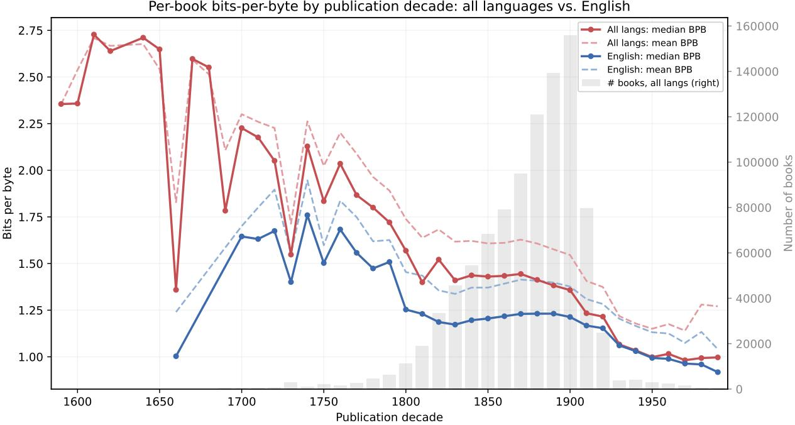  
Figure 22: Per-book bits-per-byte by publication decade, all languages (red) versus English (blue). Solid lines are the median of per-book median BPB; dashed lines the mean of per-book mean BPB. Grey bars give the number of dated books per decade (right axis). Decades with fewer than 50 books are omitted.

We compare English (blue) against all languages (red). The English subset traces approxi-

mately the same shape<sup>22</sup> but with a slightly smaller median.

One interpretation of this trend is that BPB measures surprise under a modern language model, hence this curve approximates distance to contemporary prose <sub>.</sub> Older orthography, vocabulary, typesetting, and styles are less predictable to modern language models. The larger amount of available text from the 19th and 20th centuries (corresponding to the increased number of available volumes from that era) might appear in model training data, consistent with the observed decrease in BPB.

We note two potential confounding variables: OCR noise and sample composition. Due to physical degradation and different publishing norms, older volumes have less consistent OCR. BPB conflates model surprise with OCR noise, hence older volumes likely have higher BPB purely for OCR reasons.<sup>23</sup> In addition, the number of available volumes drops sharply at the public-domain boundary in the 1930s. The available volumes from after this cutoff are not representative of all that was printed. Continued BPB decline after 1930 may be partially explained by selectivity bias among volumes that already appear in the public domain.

## 6 Discussion and Further Directions

Like the dataset on which it is based, IB-HL-ET is a step in an ongoing, collaborative process rather than a finished artifact. By choosing to annotate rather than remove paratextual elements and metadata, we hope this dataset will be a useful starting point that others can easily tailor to their needs. The philosophy of annotation over removal invites extension: as additional use cases and needs arise, we may identify additional annotations or analyses to include. In time, we hope this methodology and the resulting data format will prove useful to others in creating datasets from cultural texts. We believe that the adoption of a standardized format for enriching text has the potential to make data practices in AI model training more robust while improving the overall computational addressability and cross-compatibility <sup>of text</sup> corpora.

Analysis of the Enriched Text. Beyond serving as an input to model training, the enriched dataset opens lines of research that a flattened token stream would not. Earlier analyses (cf. §5) illustrated a few. Because duplicate paragraphs are marked rather than deleted (§4.10), the collection is a map of textual reuse: Table 21 and §5.2 reveal a rich, cross-lingual structure of quotation and clustering. Pairing per-paragraph BPB with publication year (Figure 22 §5.3) demonstrates that the corpus enables study of historical language change, raising questions about per-language writing trends, era-specific OCR degradation, and training data availability. We hope that IB-HL-ET enables many research directions, including directions we have not anticipated.

Pipeline Improvements. Limitations in recognizing tables, marginalia, and technical language lead to weaknesses in the current dataset. Examples of two known weaknesses are shown in Appendix D<sub>.</sub> We expect advances in OCR will address each of these, in turn improving the pipeline.

This pipeline was built against the OCR provided for Harvard Library’s collection. It is possible that different collections and different OCR pipelines may reveal different failure modes and pose new engineering challenges.

Towards a Virtuous Cycle. We are working to establish diverse collaborations on this and related datasets. We want this work, together with IB-HL, to make millions more books computationally accessible. We also hope that improved training data for low-resource languages will lead to improved models, allowing more accurate analysis across the collection. As noted by Beyene and Dancy 2026 there is a growing body of work demonstrating technical capacity to process historical documents, but a lack of prioritization in training data and evaluation benchmarks. We release the pipeline and data with the goal that they are extended and applied to further collections. As communities extend the annotations, develop new cleaning techniques, correct errors, and add perspectives, those improvements can be incorporated into the source material. Crucially, that cycle must preserve provenance, reproducibility, and the ability to audit transformations.

## 7 Acknowledgements

We <sup>thank Harvard</sup> Library <sup>for their</sup> support <sup>and for</sup> giving us <sup>the</sup> opportunity to continue working on this unique collection. Many computations in this paper were run on the FASRC Cannon cluster supported by the FAS Division of Science Research Computing Group at Harvard University. We thank Kacie Bailey, Matte Hartog, and Jimmy Mendez for their support and encouragement.

We also thank Ted Underwood, Nick Levine, and Alec Radford for helpful comments and suggestions, especially regarding annotation, normalization, and bits-per-byte filtering. Incorporating this feedback has led to an improved pipeline, dataset, and report.

The pipeline uses many libraries and projects mentioned in this report. We also credit technical libraries that we used for exploration, data analysis, prototyping, distributing work across compute nodes, and preparing this technical report. We used Jupyter (Kluyver et al. 2016), Pandas (McKinney 2010; The Pandas Development Team 2020), Apache Arrow and scikitlearn (Pedregosa et al. 2011 ; Buitinck et al. 2013) in essential ways at many stages of exploration and development. We used pybind11 (Jakob, Rhinelander, and Moldovan 2024) to write Python extensions in C++ for performance, orchestrated tests using Pytest (Krekel et al. 2004) to ensure stability across heterogeneous compute environments, distributed runs using GNU Parallel (Tange 2011), and monitored progress using tqdm (Costa-Luis et al. 2026) bars and loguru logging. Finally, we used NumPy (Harris et al. 2020) and matplotlib (Hunter 2007) to generate all figures in this report.

This work was supported by unrestricted funding from Microsoft, OpenAI, Meta, and Jane Street.

<sup>AI</sup> tools were used to assist in the preparation of this technical report.

## 8 Rights Determination

We respect the intellectual property rights of authors, publishers, and other rights holders. While we have taken deliberate steps to include only those volumes for which there is no known copyright restriction, specifically those identified by the HathiTrust Digital Library with a status of “public domain,” “public domain in the United States,” or “CC-Zero,” copyright determinations are complex and context-dependent, and occasionally subject to error.

While this is relatively low risk, some volumes in this dataset may be in the public domain in the United States but still subject to copyright or other rights protections in other jurisdictions. Additionally, the absence of an explicit copyright claim or rights status does not guarantee that a work is in the public domain, either in the U.S. or abroad. Information about the copyright status of individual volumes is provided on a good-faith basis and reflects available data at the time of determination, but we cannot guarantee its completeness or accuracy.

Users ofthis dataset will be solely responsible for making independent legal assessments about how and where they use the materials. Some uses of materials may also be restricted by trademark, privacy, publicity rights, or other such rights or restrictions. It is the user’s sole responsibility to consider the possibility that such rights or restrictions may be involved and to secure any <sup>needed</sup> permissions. <sup>If</sup> any rights <sup>holder believes that</sup> a <sup>work included</sup> in <sup>this release</sup> is misidentified or improperly included, we welcome contact and will promptly review any concerns. Our goal is to provide broad public access while maintaining respect for intellectual property rights and ensuring responsible data stewardship.

## 9 Disclaimers

## 9.1 Harmful Language and Content in this Dataset

This dataset is a collection of historical works that reflect the language, imagery, culture, and perspectives of their time. Users should be aware that some materials may contain language or portrayals that are outdated, offensive, or harmful today, such as racism, sexism, colonial attitudes, and other forms of discrimination. Some content <sub>may</sub> include inaccurate information, providing insight into historical contexts that existed at the time of writing. The materials are maintained in their original form to retain contextual understanding and facilitate research efforts, <sup>but</sup> we encourage <sup>critical</sup> awareness <sup>and cultural</sup> sensitivity <sup>for the</sup> creators <sup>and/or</sup> subjects of the collection. These materials are offered as part of a historical perspective, but <sup>should</sup> not <sup>be considered</sup> a <sup>stand-alone research collection constructed</sup> to give a <sup>balanced</sup> perspective on any topic.

## 9.2 Harmful Language in Bibliographic Description

Metadata for this collection may contain language that is overtly or implicitly harmful, outdated, or biased, or may by omission fail to represent important perspectives. Metadata may contain language created decades ago. It is common practice within the field of library science to reuse descriptions provided from the creator of the materials. While in some instances this allows communities and individuals to represent their materials in their own words, unexamined use of this practice may mean that racist or other offensive terminologies appear in our description. We also use national standardized terms in our work that can be outdated and harmful. Note that terminology in historical materials and in library descriptions does not always match the language we currently understand to be preferred by members of the communities depicted.

Furthermore, we acknowledge that the act of collecting materials is not always neutral, and the work of describing and classifying library materials is influenced by inherent personal, institutional, and societal biases. Outdated or offensive terminologies may be present in metadata such as subject headings, and harmful language or bias may be introduced by catalogers supplying titles and descriptions. In other cases, books themselves present racist, offensive or otherwise harmful viewpoints in titles or descriptions that are routinely transcribed by catalogers.

Note: Some language in this statement was adopted from Harvard Library’s statement on Harmful Language in Library collections.<sup>24</sup>

## 9.3 Generated and Experimental Content

This dataset contains generated and/or experimental content. While reasonable care was taken to ensure its quality, it is provided “as is,” without warranties of any kind. It may contain errors or inaccuracies; users should verify the data independently and apply their own judgement.

## Reference list

Abbas, A., K. Tirumala, D. Simig, S. Ganguli, and A. S. Morcos (2023). SemDeDup: Data-efficient learning at web-scale through semantic deduplication [online]. doi : 10.48550/arXiv.2303.09540 arXiv Preprint: 2303.09540 (cs.LG) (cit. on <sub>p.</sub> 20).

Allal, L. B., A. Lozhkov, and E. Bakouch (July 2024). SmolLM - blazingly fast and remarkably powerful<sub>.</sub> [online]. Accessed July 2026 url: https://huggingface.co/blog/smollm (cit. on <sub>p.</sub> 10).

Al-Rfou, R., B. Perozzi, and S. Skiena (2013). “Polyglot: Distributed word representations for multilingual NLP.” Proceedings of the Seventeenth Conference on Computational Natural Language Learning<sub>.</sub> Polyglot code at https://github.com/aboSamoor/polyglot <sub>pp.</sub> 183–192 (cit. on <sub>p.</sub> 29).

Ansel, J., E. Yang, H. He, N. Gimelshein, A. Jain, M. Voznesensky, B. Bao, P. Bell, D. Berard, E. Burovski, G. Chauhan, A. Chourdia, W. Constable, A. Desmaison, Z. DeVito, E. Ellison, W. Feng, J. Gong, M. Gschwind, B. Hirsh, S. Huang, K. Kalambarkar, L. Kirsch, M. Lazos, M. Lezcano, Y. Liang, J. Liang, Y. Lu, C. Luk, B. Maher, Y. Pan, C. Puhrsch, M. Reso, M. Saroufim, M. Y. Siraichi, H. Suk, M. Suo, P. Tillet, E. Wang, X. Wang, W. Wen, S. Zhang, X. Zhao, K. Zhou, R. Zou, A. Mathews, G. Chanan, P. Wu, and S. Chintala (Apr. 2024). “PyTorch 2: Faster Machine Learning Through Dynamic Python Bytecode Transformation and Graph Compilation.” 29th ACM International Conference on Architectural Support for Programming Languages and Operating Systems, Volume 2 (ASPLOS ’24) <sub>.</sub> ACM. doi: 10.1145/3620665.3640366<sub>.</sub> url: https://docs.pytorch.org/assets/pytorch2-2.pdf (cit. on <sub>p.</sub> 54).

Appleby, A. (2016). SMHasher<sub>.</sub> [GitHub Code Repository]. url: https://github.com/aappleby/smhasher (cit. on <sub>pp.</sub> 9 47 ).

Beyene, F. S. and C. L. Dancy (2026). A Survey of OCR Evaluation Methods and Metrics and the Invisibility of Historical Documents <sub>.</sub> [online]. doi : 10.48550/arXiv.2603.25761<sub>.</sub> arXiv Preprint: 2603.25761 (cs.CV) (cit. on <sub>pp.</sub> 8 34).

Bommarito, M. J., D. M. Katz, and J. Bommarito (2025). Precise Legal Sentence Boundary Detection for Retrieval at Scale: NUPunkt and CharBoundary [online]. NuPunkt code at https://github.com/aleainstitute/nupunkt doi : 10.48550/arXiv.2504.04131 arXiv Preprint: 2504.04131 (cs.CL) (cit. on <sub>pp.</sub> 6 16).

Brants, T., A. Popat, P. Xu, F. J. Och, and J. Dean (2007). “Large language models in machine translation.” Proceedings of the 2007 Joint Conference on Empirical Methods in Natural Language Processing and Computational Natural Language Learning (EMNLP-CoNLL) pp. 858–867 (cit. on pp. 13 48).

Broder, A. Z. (2000). “Identifying and filtering near-duplicate documents.” Annual Symposium on Combinatorial Pattern Matching<sub>.</sub> Springer, pp. 1–10 (cit. on p. 14).

Brown, T., B. Mann, N. Ryder, M. Subbiah, J. D. Kaplan, P. Dhariwal, A. Neelakantan, P. Shyam, G. Sastry, A. Askell, et al. (2020). “Language models are few-shot learners.” Advances in Neural Information Processing Systems 33, pp. 1877–1901 (cit. on p. 20).

Buitinck, L., G. Louppe, M. Blondel, F. Pedregosa, A. Mueller, O. Grisel, V. Niculae, P. Prettenhofer, A. Gramfort, J. Grobler, R. Layton, J. VanderPlas, A. Joly, B. Holt, and G. Varoquaux (2013). “API design for machine learning software: experiences from the scikit-learn project.” ECML PKDD Workshop: Languages for Data Mining and Machine Learning<sub>,</sub> pp. 108–122 (cit. on p. 34).

Cargnelutti, M., C. Brobston, J. Hess, J. Cushman, K. Mukk, A. Scourtas, K. Courtney, G. Leppert, A. Watson, M. Whitehead, et al. (2025). Institutional Books 1.0: A 242B token dataset from Harvard Library’s collections, refined for and usability [online]. doi : 10.48550/arXiv.2506.08300 arXiv Preprint: 2506.08300 (cs.CL) (cit. on <sub>pp.</sub> 3 10 28).

Charikar, M. S. (2002). “Similarity estimation techniques from rounding algorithms.” Proceedings of the thirty-fourth Annual ACM Symposium on Theory of Computing pp. 380–388 (cit. on pp. 9 20).

Chen, J., S. Xiao, P. Zhang, K. Luo, D. Lian, and Z. Liu (2024). BGE M3-Embedding: Multi-Lingual, Multi-Functionality, Multi-Granularity Text Embeddings Through Self-Knowledge Distillation [online]. doi : 10.48550/arXiv.2402.03216<sub>.</sub> arXiv Preprint: 2402.03216 (cs.CL) (cit. on <sub>pp.</sub> 7 48).

Chiron, G., A. Doucet, M. Coustaty, and J. -P. Moreux (2017). “ICDAR2017 competition on post-OCR text correction.” 2017 14th IAPR International Conference on Document Analysis and Recognition (ICDAR) Vol. 1. IEEE, <sub>pp.</sub> 1423–1428 (cit. on <sub>p.</sub> 45).

Choi, F. Y. (2000). “Advances in domain independent linear text segmentation.” 1st Meeting of the North American Chapter of the Association for Computational Linguistics (cit. on p. 53).

Cormen, T. H., C. E. Leiserson, R. L. Rivest, and C. Stein (2009). Introduction to Algorithms, 3rd Ed<sub>.</sub> MIT Press (cit. on <sub>p.</sub> 9 ).

Costa-Luis, C. da, S. K. Larroque, K. Altendorf, H. Mary, richardsheridan, M. Korobov, N. Raphael, I. Ivanov, M. Bargull, N. Rodrigues, Shawn, M. Dektiarev, M. Górny, mjstevens777, M. D. Pagel, M. Zugnoni, CrazyPython, C. Newey, A. Lee, pgajdos, Todd, S. Malmgren, redbug312, O. Desh, N. Nechaev, M. Boyle, M. Nordlund, MapleCCC, J. McCracken, and H. van Kemenade (Feb. 2026). tqdm: A fast, Extensible Progress Bar for Python and CLI<sub>.</sub> Version v4.67.3. doi : 10 . 5281 / zenodo . 18473238 (cit. on <sub>p.</sub> 34).

Devlin, J., M. -W. Chang, K. Lee, and K. Toutanova (2019). “BERT: Pre-training of deep bidirectional transformers for language understanding.” Proceedings of the 2019 conference of the North American

chapter of the Association for Computational Linguistics: Human Language Technologies, volume 1 (long and short papers) <sub>pp.</sub> 4171–4186 (cit. on <sub>p.</sub> 45).

Dodge, J., M. Sap, A. Marasović, W. Agnew, G. Ilharco, D. Groeneveld, M. Mitchell, and M. Gardner (2021). “Documenting large webtext corpora: A case study on the colossal clean crawled corpus.” Proceedings of the 2021 Conference on Empirical Methods in Natural Language Processing pp. 1286–1305 (cit. on <sub>p.</sub> 45 ).

Frohmann, M., I. Sterner, I. Vulić, B. Minixhofer, and M. Schedl (Nov. 2024). “Segment Any Text: A Universal Approach for Robust, Efficient and Adaptable Sentence Segmentation.” Proceedings of the 2024 Conference on Empirical Methods in Natural Language Processing<sub>.</sub> Ed. by Y. Al-Onaizan, M. Bansal, and Y. -N. Chen. Miami, Florida, USA: Association for Computational Linguistics, pp. 11908–11941. doi : 10.18653/v1/2024.emnlp-main.665 (cit. on <sub>p.</sub> 16).

Gao, L., S. Biderman, S. Black, L. Golding, T. Hoppe, C. Foster, J. Phang, H. He, A. Thite, N. Nabeshima, et al. (2020). The Pile: An 800gb dataset of diverse text for language modeling [online]. doi : 10.48550 arXiv.2101.00027 arXiv Preprint: 2101.00027 (cs.CL) (cit. on <sub>pp.</sub> 20 24 45).

Gemma Team et al. (2025). Gemma 3 Technical Report<sub>.</sub> [online]. doi: 10.48550/arXiv.2503.19786<sub>.</sub> arXiv Preprint: 2503.19786 (cs.CL) (cit. on <sub>pp.</sub> 10 45).

Genette, G. and M. Maclean (1991). “Introduction to the Paratext.” New Literary History 22.2, pp. 261– 272. issn: 00286087, 1080661X. doi : 10.2307/469037 (cit. on <sub>p.</sub> 3).

GLM-5-Team et al. (2026). GLM-5: from Vibe Coding to Agentic Engineering<sub>.</sub> [online]. doi: 10.48550 arXiv.2602.15763<sub>.</sub> arXiv Preprint: 2602.15763 (cs.LG) (cit. on <sub>p.</sub> 45).

Gunasekar, S., Y. Zhang, J. Aneja, C. C. T. Mendes, A. Del Giorno, S. Gopi, M. Javaheripi, P. Kauffmann, G. de Rosa, O. Saarikivi, et al. (2023). Textbooks are all <sub>you</sub> need [online]. doi : 10.48550/arXiv.2306.11644 arXiv Preprint: 2306.11644 (cs.CL) (cit. on <sub>pp.</sub> 3 10).

Harris, C. R., K. J. Millman, S. J. van der Walt, R. Gommers, P. Virtanen, D. Cournapeau, E. Wieser, J. Taylor, S. Berg, N. J. Smith, R. Kern, M. Picus, S. Hoyer, M. H. van Kerkwijk, M. Brett, A. Haldane, J. F. del Río, M. Wiebe, P. Peterson, P. Gérard-Marchant, K. Sheppard, T. Reddy, W. Weckesser, H. Abbasi, C. Gohlke, and T. E. Oliphant (Sept. 2020). “Array programming with NumPy.” Nature 585.7825, pp. 357– 362. doi: 10.1038/s41586-020-2649-2 (cit. on <sub>p.</sub> 34).

Heafield, K. (July 2011). “KenLM: Faster and Smaller Language Model Queries.” Proceedings of the Sixth Workshop on Statistical Machine Translation <sub>.</sub> Ed. by C. Callison-Burch, P. Koehn, C. Monz, and O. F. Zaidan. Edinburgh, Scotland: Association for Computational Linguistics, pp. 187–197. url: https: //aclanthology.org/W11-2123/ (cit. on <sub>pp.</sub> 48 54).

Hearst, M. A. (1997). “Text tiling: Segmenting text into multi-paragraph subtopic passages.” Computational Linguistics 23.1, pp. 33–64 (cit. on pp. 18 53 ).

Hsu, P. -L., Y. Dai, V. Kothapalli, Q. Song, S. Tang, S. Zhu, S. Shimizu, S. Sahni, H. Ning, and Y. Chen (2024). Liger Kernel: Efficient Triton Kernels for LLM training [online]. doi : 10.48550/arXiv.2410.10989 arXiv Preprint: 2410.10989 (cs.LG) (cit. on <sub>p.</sub> 56).

Hunter, J. D. (2007). “Matplotlib: A 2D graphics environment.” Computing in Science & Engineering 9.3, <sub>pp.</sub> 90–95. doi : 10.1109/MCSE.2007.55 (cit. on <sub>p.</sub> 34).

ICU (2020). ICU Normalization Documentation<sub>.</sub> https://unicode-org.github.io/icu/userguide/transforms/ normalization/ (cit. on <sub>p.</sub> 8 ).

Jakob, W., J. Rhinelander, and D. Moldovan (2024). pybind11 - Seamless operability between C++11 and Python<sub>.</sub> [GitHub Code Repository]. url: https://github.com/pybind/pybind11 (cit. on <sub>p.</sub> 34).

Jatowt, A., M. Coustaty, N. -V. Nguyen, A. Doucet, et al. (2019). “Deep statistical analysis of OCR errors for effective post-OCR processing.” 2019 ACM/IEEE Joint Conference on Digital Libraries (JCDL) IEEE, <sub>pp.</sub> 29–38. doi: 10.1109/JCDL.2019.00015 (cit. on <sub>p.</sub> 45).

Jiang, A. Q., A. Sablayrolles, A. Mensch, C. Bamford, D. Singh Chaplot, D. de las Casas, F. Bressand, G. Lengyel, G. Lample, L. Saulnier, L. l. Renard Lavaud, M. -A. Lachaux, P. Stock, T. Le Scao, T. Lavril, T. Wang, T. Lacroix, and W. El Sayed (Oct. 2023). Mistral 7B [online]. doi : 10.48550/arXiv.2310.06825 arXiv Preprint: 2310.06825 (cs.CL) (cit. on <sub>p.</sub> 45).

Jurafsky, D. and J. H. Martin (2026). Speech and Language Processing: An Introduction to Natural Language Processing, Computational Linguistics, and Speech Recognition, with Language Models 3rd. Online manuscript released January 6, 2026. url: https://web.stanford.edu/\~jurafsky/slp3/ (cit. on <sub>p.</sub> 12).

Kaplan, J., S. McCandlish, T. Henighan, T. B. Brown, B. Chess, R. Child, S. Gray, A. Radford, J. Wu, and D. Amodei (2020). Scaling laws for neural language models [online]. doi: 10.48550/arXiv.2001.08361 arXiv Preprint: 2001.08361 (cs.LG) (cit. on <sub>p.</sub> 3).

Katz, S. (1987). “Estimation of probabilities from sparse data for the language model component of a speech recognizer.” IEEE Transactions on Acoustics, Speech, and Signal Processing 35.3, pp. 400–401 (cit. on <sub>p.</sub> 48 ).

Kimi Team et al. (2025). Kimi K2: Open Agentic Intelligence <sub>.</sub> [online]. doi : 10.48550/arXiv.2507.20534<sub>.</sub> arXiv Preprint: 2507.20534 (cs.LG) (cit. on <sub>p.</sub> 45).

Kiss, T. and J. Strunk (2006). “Unsupervised multilingual sentence boundary detection.” Computational Linguistics 32.4, pp. 485–525 (cit. on p. 16).

Kluyver, T., B. Ragan-Kelley, F. Pérez, B. Granger, M. Bussonnier, J. Frederic, K. Kelley, J. Hamrick, J. Grout, S. Corlay, P. Ivanov, D. Avila, S. Abdalla, C. Willing, and J. development team (2016). “Jupyter Notebooks - a publishing format for reproducible computational workflows.” Positioning and Power in Academic Publishing: Players, Agents and Agendas Ed. by F. Loizides and B. Schmidt. Netherlands: IOS Press, <sub>pp.</sub> 87–90. url: https://eprints.soton.ac.uk/403913/ (cit. on <sub>p.</sub> 34).

Kohlschütter, C., P. Fankhauser, and W. Nejdl (2010). “Boilerplate detection using shallow text features.” Proceedings ofthe third ACM International Conference on Web Search and Data Mining pp. 441– 450 (cit. on <sub>p.</sub> 45 ).

Krekel, H., B. Oliveira, R. Pfannschmidt, F. Bruynooghe, B. Laugher, and F. Bruhin (2004). pytest 9.0.2 <sub>.</sub> https://github.com/pytest-dev/pytest<sub>.</sub> [GitHub Code Repository] (cit. on <sub>p.</sub> 34).

Kudo, T. and J. Richardson (Nov. 2018). “SentencePiece: A simple and language independent subword tokenizer and detokenizer for Neural Text Processing.” Proceedings ofthe 2018 Conference on Empirical Methods in Natural Language Processing: System Demonstrations<sub>.</sub> Ed. by E. Blanco and W. Lu. Brussels, Belgium: Association for Computational Linguistics, <sub>pp.</sub> 66–71. doi : 10.18653/v1/D18-2012 (cit. on <sub>p.</sub> 54).

Kukich, K. (1992). “Techniques for automatically correcting words in text.” ACM Computing Surveys (CSUR) 24.4, <sub>pp.</sub> 377–439 (cit. on <sub>p.</sub> 45 ).

Lee, J. K. (2014). “The Korean Punctuation Systems.” Acta Linguistica Asiatica 4.1, pp. 29–41 (cit. on <sub>p.</sub> 17 ).

Lee, K., D. Ippolito, A. Nystrom, C. Zhang, D. Eck, C. Callison-Burch, and N. Carlini (2022). “Deduplicating training data makes language models better.” Proceedings of the 60th Annual Meeting of the Association for Computational Linguistics (Volume 1: Long Papers) pp. 8424–8445 (cit. on p. 20).

Leskovec, J., A. Rajaraman, and J. D. Ullman (2020). Mining ofMassive Datasets <sub>.</sub> Cambridge University Press (cit. on <sub>p.</sub> 14).

Levine, N., D. Duvenaud, and A. Radford (Apr. 2026). Introducing talkie: a 13B vintage language model from 1930 <sub>.</sub> [online]. url: https://talkie-lm.com/introducing-talkie (cit. on <sub>p.</sub> 3 ).

Lhoest, Q., A. Villanova del Moral, Y. Jernite, A. Thakur, P. von Platen, S. Patil, J. Chaumond, M. Drame, J. Plu, L. Tunstall, J. Davison, M. Šaško, G. Chhablani, B. Malik, S. Brandeis, T. Le Scao, V. Sanh, C. Xu, N. Patry, A. McMillan-Major, P. Schmid, S. Gugger, C. Delangue, T. Matussière, L. Debut, S. Bekman, P. Cistac, T. Goehringer, V. Mustar, F. Lagunas, A. Rush, and T. Wolf (Nov. 2021). “Datasets: A Community Library for Natural Language Processing.” Proceedings ofthe 2021 Conference on Empirical Methods in Natural Language Processing: System Demonstrations<sub>.</sub> Library available at https://github.com/huggingface/datasets<sub>.</sub> Association for Computational Linguistics, <sub>pp.</sub> 175–184. doi : 10.18653/v1/2021.emnlp-demo.21<sub>.</sub> arXiv Preprint: 2109.02846 (cs.CL) (cit. on <sub>p.</sub> 58).

Li, J., A. Fang, G. Smyrnis, M. Ivgi, M. Jordan, S. Gadre, H. Bansal, E. Guha, S. Keh, K. Arora, et al. (2024). “Datacomp-LM: In search of the next generation of training sets for language models.” Advances in Neural Information Processing Systems 37, pp. 14200–14282 (cit. on p. 45).

Li, Y., R. Bonatti, S. Abdali, J. Wagle, and K. Koishida (2024). “Data generation using large language models for text classification: An empirical case study.” [online]. doi : 10.48550/arXiv.2407.12813<sub>.</sub> arXiv Preprint: 2407.12813 (cs.CL) (cit. on <sub>p.</sub> 10).

Li, Z., H. Zhu, Z. Lu, and M. Yin (2023). “Synthetic data generation with large language models for text classification: Potential and limitations.” Proceedings of the 2023 Conference on Empirical Methods in Natural Language Processing pp. 10443–10461 (cit. on p. 10).

Liu, Z., L. Tang, L. Jin, H. Li, N. Ranjan, D. Fan, S. Rohatgi, R. Fan, O. Pangarkar, H. Wang, et al. (2025). K2-V2: A 360-Open, Reasoning-Enhanced LLM [online]. doi: 10.48550/arXiv.2512.06201 arXiv Preprint: 2512.06201 (cs.LG) (cit. on <sub>p.</sub> 3).

Luo, X., Z. Shinnick, N. Griesshaber, Y. Wang, J. Yu, F. Shi, P. Torr, and Y. Lu (2026). Pretraining Language Models on Historical Text [online]. doi: 10.48550/arXiv.2606.02991 arXiv Preprint: 2606.02991 (cs.CL) (cit. on <sub>p.</sub> 3).

Marion, M., A. Üstün, L. Pozzobon, A. Wang, M. Fadaee, and S. Hooker (2023). When Less is More: Investigating Data Pruning for Pretraining LLMs at Scale [online]. doi : 10 . 48550 / arXiv . 2309 . 04564 arXiv Preprint: 2309.04564 (cs.CL) (cit. on <sub>p.</sub> 24).

McKinney, W. (2010). “Data Structures for Statistical Computing in Python.” Proceedings of the 9th Python in Science Conference Ed. by S. van der Walt and J. Millman, <sub>pp.</sub> 56–61. doi : 10.25080/Majora-92bf1922-00a (cit. on <sub>p.</sub> 34).

Muennighoff, N., A. Rush, B. Barak, T. Le Scao, N. Tazi, A. Piktus, S. Pyysalo, T. Wolf, and C. A. Raffel (2023). “Scaling data-constrained language models.” Advances in Neural Information Processing Systems 36, <sub>pp.</sub> 50358–50376 (cit. on <sub>p.</sub> 3).

Neudecker, C., K. Baierer, M. Gerber, C. Clausner, A. Antonacopoulos, and S. Pletschacher (2021). “A survey of OCR evaluation tools and metrics.” Proceedings of the 6th International Workshop on Historical Document Imaging and Processing pp. 13–18 (cit. on p. 8).

Ney, H., U. Essen, and R. Kneser (1994). “On structuring probabilistic dependences in stochastic language modelling.” Computer Speech & Language 8.1, pp. 1–38. issn: 0885-2308. doi : https://doi.org/ 10.1006/csla.1994.1001 url: https://www.sciencedirect.com/science/article/pii/S0885230884710011 (cit. on <sub>p.</sub> 48 ).

Nguyen, T. T. H., A. Jatowt, M. Coustaty, and A. Doucet (2021). “Survey of post-OCR processing approaches.” ACM Computing Surveys (CSUR) 54.6, pp. 1–37 (cit. on p. 45).

OpenAI (2025). GPT-OSS-120B & GPT-OSS-20B Model Card [online]. doi: 10.48550/arXiv.2508.10925 arXiv Preprint: 2508.10925 (cs.CL) (cit. on <sub>p.</sub> 10).

OpenAI (2026). tiktoken <sub>.</sub> [GitHub Code Repository]. url: https : / / github . com / openai / tiktoken (cit. on <sub>p.</sub> 29 ).

Pedregosa, F., G. Varoquaux, A. Gramfort, V. Michel, B. Thirion, O. Grisel, M. Blondel, P. Prettenhofer, R. Weiss, V. Dubourg, J. Vanderplas, A. Passos, D. Cournapeau, M. Brucher, M. Perrot, and E. Duchesnay (2011). “Scikit-learn: Machine Learning in Python.” Journal of Machine Learning Research 12, <sub>pp.</sub> 2825–2830 (cit. on <sub>p.</sub> 34).

Qwen Team (2025). Qwen3 Technical Report [online]. doi : 10.48550/arXiv.2505.09388 arXiv Preprint: 2505.09388 (cs.CL) (cit. on <sub>pp.</sub> 10 24 54).

Raffel, C., N. Shazeer, A. Roberts, K. Lee, S. Narang, M. Matena, Y. Zhou, W. Li, and P. J. Liu (2020). “Exploring the limits of transfer learning with a unified text-to-text transformer.” Journal of Machine Learning Research 21.140, pp. 1–67 (cit. on p. 45).

Rigaud, C., A. Doucet, M. Coustaty, and J.-P. Moreux (2019). “ICDAR 2019 competition on post-OCR text correction.” 2019 International Conference on Document Analysis and Recognition (ICDAR) <sub>.</sub> IEEE, <sub>pp.</sub> 1588–1593 (cit. on <sub>p.</sub> 45).

Sadvilkar, N. and M. Neumann (Nov. 2020). “PySBD: Pragmatic Sentence Boundary Disambiguation.” Proceedings of Second Workshop for NLP Open Source Software (NLP-OSS) <sub>.</sub> Association for Computational Linguistics, <sub>pp.</sub> 110–114. doi : 10.18653/v1/2020.nlposs-1.15 (cit. on <sub>p.</sub> 52).

Sennrich, R., B. Haddow, and A. Birch (Aug. 2016). “Neural Machine Translation of Rare Words with Subword Units.” Proceedings of the 54th Annual Meeting of the Association for Computational Linguistics (Volume 1: Long Papers) <sub>.</sub> Ed. by K. Erk and N. A. Smith. Berlin, Germany: Association for Computational Linguistics, <sub>pp.</sub> 1715–1725. doi : 10.18653/v1/P16-1162<sub>.</sub> url: https://aclanthology.org/P16-1162/ (cit. on <sub>p.</sub> 54 ).

Senuma, H. (Jan. 2025). “mmh3: A Python extension for MurmurHash3.” Journal of Open Source Software 10.105. mmh3 code at https://github.com/hajimes/mmh3 <sub>p.</sub> 6124. issn: 2475-9066. doi : 10.21105/ joss.06124 (cit. on <sub>p.</sub> 47 ).

Tange, O. (Feb. 2011). “GNU Parallel - The Command-Line Power Tool.” ;login: The USENIX Magazine <sub>pp.</sub> 42–47 (cit. on <sub>p.</sub> 34).

The Pandas Development Team (Feb. 2020). pandas-dev/pandas: Pandas<sub>.</sub> doi: 10.5281/zenodo.3509134 (cit. on <sub>p.</sub> 34 ).

The pyfranc development team and cyb3rk0tik (2023). pyfranc<sub>.</sub> https://github.com/cyb3rk0tik/pyfranc<sub>.</sub> [GitHub Code Repository] (cit. on <sub>p.</sub> 11).

The Unicode Consortium (Sept. 2022). The Unicode Standard, Version 15.0 - Core Specification Tech. <sub>rep.</sub> Available at https://www.unicode.org/versions/Unicode15.0.0/UnicodeStandard-15.0.pdf (cit. on <sub>p.</sub> 8).

Tong, X. and D. A. Evans (1996). “A statistical approach to automatic OCR error correction in context.” Fourth Workshop on Very Large Corpora (cit. on p. 45).

Touvron, H., T. Lavril, G. Izacard, X. Martinet, M. -A. Lachaux, T. Lacroix, B. Rozière, N. Goyal, E. Hambro, F. Azhar, A. Rodriguez, A. Joulin, E. Grave, and G. Lample (2023). LLaMA: Open and Efficient Foundation Language Models [online]. doi: 10 . 48550 / arXiv . 2302 . 13971 arXiv Preprint: 2302 . 13971 (cs.CL) (cit. on <sub>p.</sub> 45 ).

Tulkens, S. and T. van Dongen (2024). Model2Vec: Fast State-of-the-Art Static Embeddings <sub>.</sub> [GitHub Code Repository]. doi: 10.5281/zenodo.17270888 url: https://github.com/MinishLab/model2vec (cit. on <sub>p.</sub> 7 ).

Twine, N. (1984). “The adoption of punctuation in Japanese script.” Visible Language 18.3 (cit. on p. 17).

Vanderbauwhede, W. (2023). Frugal Computing–On the need for low-carbon and sustainable computing and the path towards zero-carbon computing<sub>.</sub> [online]. doi: 10.48550/arXiv.2303.06642<sub>.</sub> arXiv Preprint: 2303.06642 (cs.CY) (cit. on <sub>p.</sub> 5).

Wang, J. and J. Wang (2015). “qRead: A fast and accurate article extraction method from web pages using partition features optimizations.” 2015 7th International Joint Conference on Knowledge Discovery, Knowledge Engineering and Knowledge Management (IC3K) Vol. 1. IEEE, pp. 364–371 (cit. on p. 45).

Weninger, T., W. H. Hsu, and J. Han (2010). “CETR: content extraction via tag ratios.” Proceedings of the 19th international conference on World wide web <sub>pp.</sub> 971–980. doi : 10.1145/1772690.1772789 (cit. on <sub>p.</sub> 45 ).

Wenzek, G., M.-A. Lachaux, A. Conneau, V. Chaudhary, F. Guzmán, A. Joulin, and E. Grave (2020). “CCNet: Extracting high quality monolingual datasets from web crawl data.” Proceedings ofthe Twelfth Language Resources and Evaluation Conference pp. 4003–4012 (cit. on pp. 24 45).

Whistler, K. (July 2025). Unicode Normalization Forms Unicode Standard Annex 15. Revision 57: https: //www.unicode.org/reports/tr15/tr15-57.html<sub>.</sub> The Unicode Consortium (cit. on <sub>p.</sub> 8).

Wolf, T., L. Debut, V. Sanh, J. Chaumond, C. Delangue, A. Moi, P. Cistac, T. Rault, R. Louf, M. Funtowicz, J. Davison, S. Shleifer, P. von Platen, C. Ma, Y. Jernite, J. Plu, C. Xu, T. L. Scao, S. Gugger, M. Drame, Q. Lhoest, and A. M. Rush (Oct. 2020). “Transformers: State-of-the-Art Natural Language Processing.” Proceedings of the 2020 Conference on Empirical Methods in Natural Language Processing: System Demonstrations <sub>.</sub> Association for Computational Linguistics, <sub>pp.</sub> 38–45. doi: 10.18653/v1/2020.emnlpdemos.6 (cit. on <sub>p.</sub> 54).

Xie, Q., Z. Dai, E. Hovy, T. Luong, and Q. Le (2020). “Unsupervised data augmentation for consistency training.” Advances in Neural Information Processing Systems 33, pp. 6256–6268 (cit. on p. 10).

Zhu, E., V. Markovtsev, A. Astafiev, A. Khan, C. Ha, W. Łukasiewicz, A. Foster, Sinusoidal36, S. Thakur, S. Ortolani, Titusz, V. Letal, Z. Bentley, fpug, hguhlich, long2ice, oisincar, R. Assa, S. Ibraimoski, R. Kumar, Q. TianHuan, M. J. Rosenthal, K. Joshi, K. Mann, JonR, J. Halliwell, and A. Oriekhov (June 2024). ekzhu/datasketch: v1.6.5<sub>.</sub> Version v1.6.5. [Code Repository]. doi : 10.5281/zenodo.11462182 (cit. on <sub>pp.</sub> 14 50).

## Appendices

## A Dataset Fields

<table><tr><td>Field name</td><td>Type</td><td>Description</td><td>Section</td></tr><tr><td>barcode_src</td><td>string</td><td>The volume&#x27;s barcode. Serves as a primary key/identifier and join key to IB-HL.</td><td></td></tr><tr><td>primary_language_gen</td><td>string</td><td>ISO 639-3 code for the main language of - this volume, taken from IB-HL for conve-</td><td></td></tr><tr><td>language_distribution_gen</td><td></td><td>nience. list[(string, float&gt;] Pairs of (LANG, PROPORTION〉 where LANG is §4.12 an ISO 639-3 code and PROPORTION is the 0— 1 fraction of the paragraphs in the volume with that language. Only languages with</td><td></td></tr><tr><td>token_count_gen</td><td>int</td><td>Total tokens for that volume&#x27;s middlemat- §4.12 ter, as measured with o200κ_BAsE.</td><td></td></tr><tr><td>char_count_gen</td><td>int</td><td>Total characters in middlematter.</td><td>§4.12</td></tr><tr><td>word_count_gen</td><td>int</td><td>Total words in middlematter (language- §4.12 aware tokenization).</td><td></td></tr><tr><td>sentence_count_gen</td><td>int</td><td>Total sentences in middlematter (language- §4.8 aware segmentation).</td><td></td></tr><tr><td>paragraph_count_gen</td><td>int</td><td>Total subtopic paragraphs in middlemat- §4.9 ter.</td><td></td></tr><tr><td>section_count_gen</td><td>int</td><td>Total subtopic sections in middlematter.</td><td>§4.9</td></tr><tr><td>bigram_count_gen</td><td>int</td><td>Total word bigrams in middlematter.</td><td>§4.12</td></tr><tr><td>bigram_count_unique_gen</td><td>int</td><td>Distinct word bigrams in middlematter.</td><td>§4.12</td></tr><tr><td>trigram_count_gen</td><td>int</td><td>Total word trigrams in middlematter.</td><td>§4.12</td></tr><tr><td>trigram_count_unique_gen</td><td>int</td><td>Distinct word trigrams in middlematter.</td><td>§4.12</td></tr><tr><td>tokenizability_ratio_gen</td><td>float (0.0–100.0)</td><td>Measure of how close this text is to 1.25 §4.12 o200k_BAsE tokens per word.</td><td></td></tr><tr><td>bpb_{min,max,median,avg}_gen float</td><td></td><td>Per-volume bits-per-byte summary over §4.11 scored paragraphs.</td><td></td></tr><tr><td>bpb_p{10,30,70,90}_gen</td><td>float</td><td>Per-volume bits-per-byte percentiles.</td><td>§4.11</td></tr><tr><td>frontmatter_gen</td><td>string</td><td>Annotated frontmatter: contains endmat- §4.4 and §4.12 ter divs.</td><td></td></tr><tr><td>middlematter_gen</td><td>string</td><td>Annotated body: contains sections, para- §4.12 graphs, and bpb/language/duplicate tags.</td><td></td></tr><tr><td>backmatter_gen</td><td>string</td><td>Annotated backmatter: contains endmat- §4.4 and §4.12 ter divs.</td><td></td></tr><tr><td>processed_middlematter_gen</td><td>string</td><td>Middlematter filtered to non-duplicate §4.12 paragraphs in the [p10, p90] bpb band.</td><td></td></tr></table>

Table 23: Fields in the dataset.  
The suffix \_src denotes fields taken directly from source inputs. The suffix <sub>\_gen</sub> denotes values computed by this pipeline. All text statistics are computed over middlematter.

## B Additional related work

<sup>Our work</sup> incorporates many <sup>different</sup> active areas <sup>of research and</sup> engineering. We <sup>indicate</sup> relevant work, especially work that informed our design, even if we do not use it directly.

Cleaning Datasets. Computationally inexpensive boilerplate detection is well studied (Weninger, W. H. Hsu, and Han 2010; J. Wang and J. Wang 2015; Kohlschütter, Fankhauser, and Nejdl 2010). OCR post-analysis and detection is its own field of research, with some methods based on statistical analysis (Kukich 1992; Tong and Evans 1996; Jatowt et al. 2019). See T. T. H. Nguyen et al. 2021 for a survey describing different approaches. More recently, modern ML-based techniques (especially models based on transformers) have been used. ICDAR held competitions in 2017 and 2019 on OCR correction (Chiron et al. 2017 Rigaud et al. 2019) in which neural networks and BERT-based models (Devlin et al. 2019) outperformed most other methods.

Data Curation. Assembling public datasets for model training is a multistage process that can include data sourcing, deduplication, cleaning, and filtering. The C4 dataset (Raffel et al. 2020) is a large-scale dataset from internet-scraped data, processed with heuristic cleaning, English language restriction, and chunk-based deduplication.

One difficulty in this area is that details about the training process and data for state-of-theart language models are often opaque. Even open-weight models such as LLaMA, Mistral, Gemma, GLM, and Kimi reveal little about underlying training data (Touvron et al. 2023 ; Jiang et al. 2023; Gemma Team et al. 2025; GLM-5-Team et al. 2026; Kimi Team et al. 2025). To improve transparency <sup>and</sup> to <sup>facilitate</sup> comparison, <sup>DCLM</sup> (J. <sup>Li</sup> et <sup>al.</sup> 2024) <sup>establishes</sup> benchmarks for data curation.

Landscape Surveys. The progression from large data curation (Gao et al. 2020; Raffel et al. 2020), to filtering and extraction (Wenzek et al. 2020), to post-creation analysis (Dodge et al. 2021) helped shape our approach to data. Datacomp-LM (J. Li et al. 2024) also provides a thorough literature review and survey of closely related areas.

## C Details on Processing

This appendix contains additional technical details and design rationale.

## C.1 Preprocessing Details

Language-based Models. This setup relies on language reporting from IB-HL, as we use that language detection for stratification. Each of the models here is a base model and is later updated for each book processed. A small amount of noise in the base model has minimal effect on the resulting behavior in our pipeline. An additional source of noise comes from training base models on pre-cleaned text. For most languages and most volumes, however, the majority of the text has sufficiently little noise to allow effective use of small base-language models.

Segmenter-based Partitioning. The IB-HL dataset can be naturally streamed in shards of 200 books. Rather than use those shards, we immediately split shards into Nupunkt-compatible languages and non-Nupunkt-compatible languages. We do this because Nupunkt-compatible shards can be processed entirely on CPUs, while the other shards require GPUs to complete sentence segmentation in a reasonable amount of time. After this sharding, all further processing (except deduplication) is completely independent.

## C.2 Unicode Normalization

Soft and Hard Normalization. See Listing 24 for the exact steps for both “soft” and “hard” normalization. We apply NFC and NFKC normalization via unicodedata.normalize in the Python standard library. The remaining steps are strict string replacement and regular expression operations.

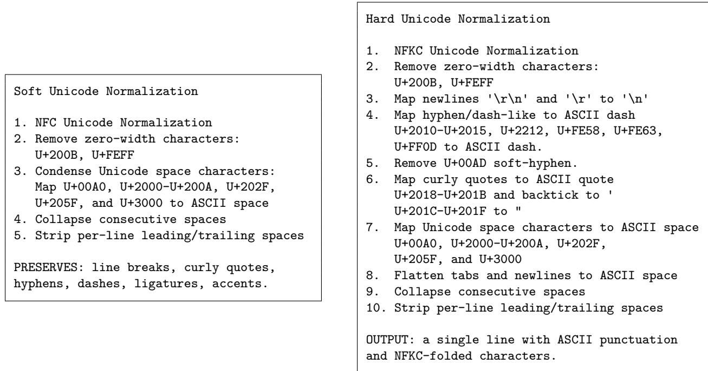  
Listing 24: Explicit Unicode Normalization

<table><tr><td>Case</td><td>Input</td><td>Soft</td><td>Hard</td></tr><tr><td>Precomposed vs. combining accent</td><td>e + U+0301</td><td>é (NFC)</td><td>é</td></tr><tr><td>Ligature</td><td>U+FB01(fi)</td><td>fi (kept)</td><td>fi</td></tr><tr><td>Full-width letter</td><td>U+FF21(A)</td><td>A (kept)</td><td>A</td></tr><tr><td>Superscript digit</td><td>U+00B2(2)</td><td>2 (kept)</td><td>2</td></tr><tr><td>Curly quotation marks</td><td>U+201C...U+201D</td><td>“ ,</td><td>II</td></tr><tr><td>En / em dash, minus sign</td><td>U+2013 / U+2014 / U+2212</td><td>-/—/-</td><td></td></tr><tr><td>Non-breaking space</td><td>U+00AO</td><td>ASCII space</td><td>ASCII space</td></tr><tr><td>Zero-width space</td><td>U+200B</td><td>(removed)</td><td>(removed)</td></tr></table>

Table 25: Soft vs. hard Unicode normalization on boundary cases.

Zero-Width Spaces. One aspect of zero-width spaces merits additional discussion. The zerowidth spaces U+200C (zero-width no-join) and U+200D (zero-width yes-join) are kept, despite not being visible. These are mainly used in cursive Arabic, Persian, and Indic scripts to either prevent <sup>characters</sup> joining in cursive or to <sup>force</sup> joining in cursive. <sup>These</sup> <sup>zero-width</sup> spaces can help distinguish word or morpheme boundaries and carry semantic meaning. (U+200D is also used in some emoji sequences, but this is not relevant for this corpus). As OCR continues to improve for cursive Arabic, Persian, and Indic scripts, these zero-width formatting spaces will likely become more prevalent.

Boundary Examples. Table 25 contrasts the “soft” and “hard” normalization on representative inputs.

## C.3 Duplicate Page Removal

For duplicate page removal, we first hard-normalize each page in a volume (cf. §4.2). Thus each page is temporarily reduced to a single long string of text for duplicate comparison.

Minimum Page Length. To ensure that pages have sufficient text to be worth checking for duplicates, we only consider pages with at least 50 non-whitespace Unicode code points (after hard-normalization). Technically this carries a small bias against detecting duplicates in languages that have more semantic meaning per character. For example, 50 Chinese characters likely carry more semantic content than 50 ASCII characters. This is a mild lower bound that prevents excessive removal of short content.

N-Gram Length. The simhashes are computed over character 9-grams. Longer n-grams make the hash more sensitive to exact content and less prone to random short common phrase <sup>collision.</sup> <sup>Shorter</sup> n-grams <sup>allow</sup> more n-grams <sup>and</sup> <sup>random</sup> mixing per page. We <sup>chose</sup> 9 to balance these competing requirements.

Compiled C++ Simhash Extension. We use the MurmurHash3 non-cryptographic hash function for rapid hashing; it is faster than cryptographic hash functions such as SHA256, and cryptographic security is not required. MurmurHash3 was specifically designed for high performance after compilation (Appleby 2016). The standard implementation for Python, mmh3 (Senuma 2025) is written in C and computes hashes quickly, but passing Python objects to mmh3 and manipulating the hashes in Python adds overhead.

We include a lightly customized version of MurmurHash3 in an optimized C++ simhash implementation. This implementation is designed for 64-bit platforms (little-endian only), uses GCC/Clang optimized popcnt for rapid Hamming distance calculation between simhashes, and does not need to pass objects back to Python for comparison. Benchmarks show that this results in an approximately 100-fold speedup over a direct Python implementation of simhash using mmh3 <sub>.</sub> We verify that our MurmurHash3 implementation agrees with mmh3 in a test suite.

Probability Analysis. Page simhashes that differ by 6 or fewer bits are recognized as duplicates. This is a strict threshold and should rarely occur by chance. In detail: for any fixed 128-bit integer, the number of other 128-bit integers with Hamming distance at most 6 is

$$
B ( 1 2 8 , 6 ) = \sum _ { k = 0 } ^ { 6 } \binom { 1 2 8 } { k } \approx 5 . 7 0 \times 1 0 ^ { 9 } .
$$

Thus the probability that two random hashes will have Hamming distance at most 6 is approximately

$$
B ( 1 2 8 , 6 ) / 2 ^ { 1 2 8 } \approx 1 . 6 7 \times 1 0 ^ { - 2 9 } .
$$

For a collection of � hashes, the expected number of accidental 6-bit near-collisions is approximately $\binom { N } { 2 } \cdot 1 . 6 7 \cdot 1 0 ^ { - 2 9 }$ <sub>.</sub> Hence even for the largest books, the expected number of accidental collisions is negligible.

## C.4 Endmatter Separation

Compute Parameters. Pages are batched, but at most from a single book at a time. We found empirically that batches of size ≈ 1024 are optimal (capable of 7200 pages/s per CPU core). Book page lengths resulted in our typical batch size being closer to 350 (6800 pages/s per CPU core). In practice, total memory bandwidth is a limiting factor and using 20 cores is not 20 times <sup>faster than</sup> using 1 core.

Bottleneck. Benchmarks show that the embedding table of dimension 512 limits overall speed. The embedding table used by Model2Vec has a 250k vocabulary (inherited from BAAI/BGE-M3), each mapping to 512 dimensions with a 4-byte float32<sub>.</sub> Hence the embedding table is approximately 512MB and does not fit into cache on most CPUs. Most table access requires memory lookup.

Multilingual Generalization. We apply the same models to every book in every language. We believe that the multilingual training supporting BAAI/BGE-M3 helps provide good signal across the languages in IB-HL. For languages not covered in its training data, one can sometimes expect a small degree of zero-shot generalization for languages that share scripts or lexical features with those seen during training (Chen et al. 2024).

Generalized Training Data. The pipeline repository includes code that trains analogous <sup>classifiers</sup> <sup>based</sup> on given <sup>data.</sup> <sup>The</sup> repository <sup>allows</sup> configuring static <sup>models</sup> <sup>for</sup> Model2Vec<sub>,</sub> including the option to bypass static models entirely. The repository is designed to facilitate training classifiers on alternative data.

## C.5 Dehyphenation

Two Models are Necessary. Both the base model and the per-book model are necessary. Per-book models lack statistics for long words that appear only once in a book. Long names typically appear in only a few books, and hence are not contained in base language statistical distributions. Combining per-book and per-language base statistics leads to more reliable dehyphenation decisions.

Probabilistic Interpretation. Our model is a “naive joint probability estimator with add-� smoothing and fixed Stupid Backoff (Brants et al. 2007) penalty.” We call it naive because all probabilities are assumed independent. The model is not a proper probability model because the backoff does not take into account the probability mass from full n-grams (distinguishing it from more advanced Katz-style backoff (S. Katz 1987)). Though independence is objectively false and the backoff model is simple, these simplifications have minimal effect on the relative ranking among the three possibilities in practice. It would not be appropriate, however, to rely on our probability estimator to generate text.

Alternatives Considered. Prototypes used the KenLM (Heafield 2011) implementation of a full Kneser-Ney smoothed n-gram language model (Ney, Essen, and Kneser 1994). This is a more precise and robust language model that offers proper conditional probabilities. However, KenLM was substantially more computationally expensive (adding ≈ 10s per book). Experimenting with less computationally expensive alternatives showed that our simple joint probability estimator in nearly all cases generates the same relative ranking at substantially lower

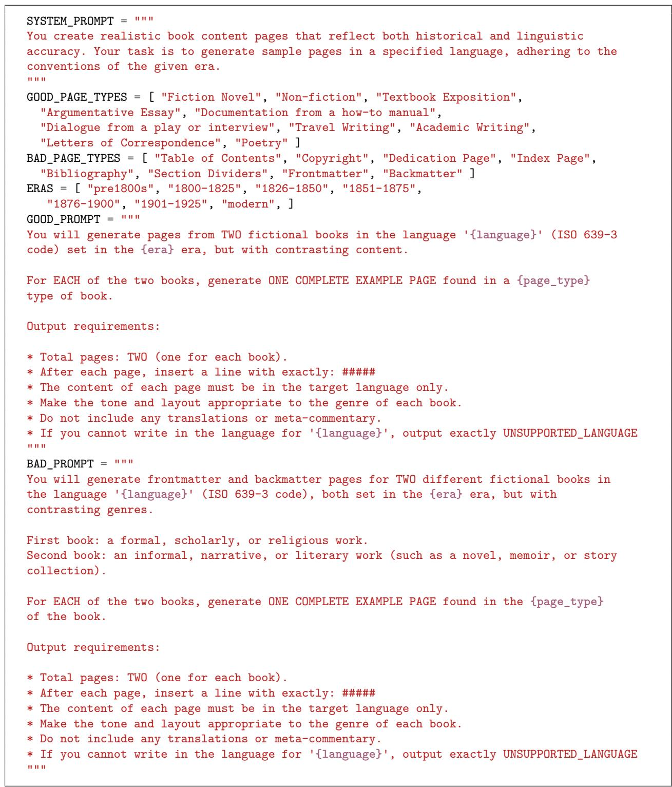  
Listing 26: Synthetic Data Prompt Structure

cost.

## C.6 Running Headers and Footers

We tuned the Jaccard similarity threshold of 0.85 to allow approximately one typo or one digit to change in page numbers for a standard, relatively short header. Experiments show that this tends to be conservative in practice.

We did not optimize this portion of the pipeline. We use the default hash algorithm from the datasketch library (Zhu et al. 2024), with default seeding and the SHA-1 hash function. It would be possible to use a fast hash function like MurmurHash3 (as in Appendix C.3), but the bottleneck is in LSH construction. For each n-gram, datasketch performs a hash and a NumPy permutation-and-min operation. The permutation-and-min dominates timing.

## C.7 Page Number Removal

Removing page numbers across different writing systems faces many edge cases. We rely on the Unicode category of the underlying symbol: if the Unicode category starts with <sup>“</sup>N”, we call it numeric. Otherwise it is non-numeric. This accepts bare numbers (123), numbers with a stray mark (p 42), Arabic-Indic numbers, Devanagari numbers, full-width Unicode numbers, Unicode encoded Roman numerals (such as U+2163 for Ⅳ instead of ASCII IV), and so on. It does not accept certain less common page number formats, such as dash-flanked numbers (- 12 - ).

Most current OCR engines do not use Unicode encodings for Roman numerals and instead use ASCII letters. Another known gap comes from Han ideographic numerals. For example, <sup>‘</sup>十 百<sup>’</sup> are each classified in Unicode as (Letter, other) characters and not as numbers. Treating these ideographs as numbers (which is what Python’s str.isnumeric() does) would lead to recognizing legitimate lines such as <sup>‘</sup>十年<sup>’</sup> (“ten years”) as likely page numbers.

Likely OCR Risk. Several different scripts use nearly identical shapes with different meanings, e.g. the English digit <sup>“</sup>0<sup>”</sup> vs the Arabic letter <sup>“</sup>ه<sup>“</sup> vs the Devanagari digit <sup>“</sup>०<sup>”</sup> vs the Greek letter � vs a small circle ∘<sub>.</sub> Each OCR engine produces its best estimate from context and runtime configuration.

## C.8 Segmentation Details

The list of Nupunkt-compatible languages is in Table 27<sub>.</sub>

Determining Nupunkt vs SaT languages. To choose between Nupunkt and SaT models for sentence segmentation, we weighed accuracy and speed.

Nupunkt examines punctuation and performs well when punctuation use resembles common European languages. SaT uses deep learning. If speed (or total compute) were not an issue, then we would use 12-layer SaT for all segmentation; small samples suggest that SaT has better segmentation in almost all cases. But SaT requires vastly larger amounts of compute.

We randomly sampled 10 books in each language from the collection (or as many as possible if 10 were not available) and used both Nupunkt and SaT to segment into sentences. We assumed that sat-3l-sm was “correct” and assessed how accurately Nupunkt predicted the indices for starts of sentences. Treating the output of SaT as “correct” is only a heuristic. In the unlikely event that a language is well-segmented by Nupunkt but poorly segmented by SaT this heuristic would cause the worse segmenter to be chosen.

<table><tr><td>als cak</td><td>arl cbt</td><td>arn ces</td><td>ast chk</td><td>bel chv</td><td>bem cic</td><td>bin cjk</td><td>bos ckb</td><td>bre cnh</td><td>cab cnr</td></tr><tr><td>cof</td><td>ctd</td><td>cym</td><td>dan</td><td>deu</td><td>dga</td><td>ekk</td><td>ell</td><td>eng</td><td>epo</td></tr><tr><td>eus</td><td>ewe</td><td>fao</td><td>fat</td><td>fij</td><td>fin</td><td>fkv</td><td>fra</td><td>fry</td><td>gla</td></tr><tr><td>gle</td><td>glg</td><td>glv</td><td>gyr</td><td>hat</td><td>haw</td><td>heb</td><td>hil</td><td>hlt</td><td>hns</td></tr><tr><td>hrv</td><td>hsb</td><td>hun</td><td>ibo</td><td>ido</td><td>ijs</td><td>ilo</td><td>isl</td><td>ita</td><td>kal</td></tr><tr><td>kat</td><td>kaz</td><td>kir</td><td>kjh</td><td>kmb</td><td>kng</td><td>koi</td><td>ktu</td><td>lat</td><td>lin</td></tr><tr><td>lit</td><td>lld</td><td>loz</td><td>lua</td><td>lug</td><td>lun</td><td>mad</td><td>men</td><td>mic</td><td>min</td></tr><tr><td>mlt</td><td>mri</td><td>nba</td><td>nbl</td><td>ndo</td><td>niu</td><td>njo</td><td>nld</td><td>nno</td><td>nya</td></tr><tr><td>nym</td><td>nyn</td><td>oki</td><td>OSS</td><td>piu</td><td>plt</td><td>pol</td><td>por</td><td>pov</td><td>ppl</td></tr><tr><td>que</td><td>qug</td><td>rar</td><td>roh</td><td>ron</td><td>rus</td><td>sah</td><td>sco</td><td>slk</td><td>slv</td></tr><tr><td>sme</td><td>snk</td><td>spa</td><td>srp</td><td>suk</td><td>sun</td><td>sus</td><td>swb</td><td>swe</td><td>swh</td></tr><tr><td>tam</td><td>tat</td><td>tgl</td><td>tsn</td><td>tso</td><td>tuk</td><td>tur</td><td>ukr</td><td>ura</td><td>ven</td></tr><tr><td>vie</td><td>war</td><td>xho</td><td>yao</td><td>ykg</td><td>yua</td><td>zro</td><td>zul</td><td></td><td></td></tr></table>

Table 27: Nupunkt-compatible languages, given as ISO 639-3 strings

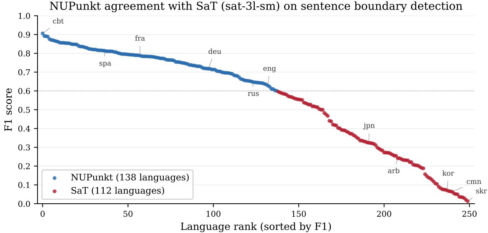  
Figure 28: F1 scores in decreasing order with certain notable languages indicated.

A plot of the resulting F1 scores (on identifying SaT sentence start indices) is in Figure 28 <sub>.</sub> Instead of a sharp drop, Nupunkt performance gradually decreases. Benchmarks suggest that both Nupunkt and SaT perform well on English. We chose the cutoff between Nupunkt and SaT to be at the 0.6 F1 score. English is close to the cutoff, suggesting that Nupunkt should segment all <sup>“</sup>Nupunkt-compatible” languages approximately as well as it segments English. This cutoff also guaranteed that the vast majority of books in IB-HL would be segmented via Nupunkt allowing a predominantly CPU-based pipeline.

Nupunkt per-book adaptation. To estimate the value of Nupunkt per-book adaptation, we ran experiments. We took 195 books (15 books in each of English, French, Portuguese, Spanish, Polish, Russian, Italian, Latin, Dutch, German, Danish, Greek, and Swedish) and examined concordance between detected sentence boundaries between each of (1) base language model Nupunkt (2) per-book adapted Nupunkt and (3) SaT<sub>.</sub> (The setup is similar to the setup leading to Figure 28).

In general, we found that base-language Nupunkt models and per-book adapted Nupunkt models agree approximately 93% of the time, while per-book adapted Nupunkt models agree slightly more with SaT<sub>.</sub> Manual checking suggests that the 7% difference with per-book adapted Nupunkt models corresponds to more accurate segmentation.

We conclude that per-book adaptation yields a notable improvement, but may be omitted when compute is constrained.

More on Nupunkt vs SaT speed comparisons. Base-language Nupunkt models perform about twice as fast as SaT in our benchmarks. Further, on machines with multiple CPU cores, multiple Nupunkt models can operate in parallel. We observed that one can run up to 8 simultaneous Nupunkt inference processes on a DGX Spark before confronting memory bandwidth or RAM limitations. However, including per-book adaptation changes this tradeoff: 8 simultaneous Nupunkt adaptation-and-inference processes might segment books at comparable speeds to a single reasonably fast GPU. Choosing which path and model to use thus depends heavily on whether one has access to GPUs.

We estimate that a single NVIDIA A100 could perform SaT segmentation on all of IB-HL in about 1 month. For comparison, we estimate that a single DGX Spark could perform the current SaT+Nupunkt split segmentation in approximately 2 weeks; this decreases to 3 days when omitting per-book adaptation.

Alternative Segmenters Considered. We ran the segmentation-vs-SaT experiment shown in Figure 28 with 4 other libraries in all languages and 1 additional library on selected languages. We briefly comment on these.

1. mwtokenizer<sup>25</sup> <sub>,</sub> a multilingual Python-based tool used widely on Wikipedia. It ran faster than Nupunkt and had comparable behavior on Western European languages, but was inconsistent with other languages.

2. sentencex<sup>26</sup> <sub>,</sub> another segmenter used by Wikimedia. It achieved excellent accuracy but was too slow for this application.

3. pySBD<sup>27</sup> “Pragmatic Sentence Boundary Disambiguation” (Sadvilkar and Neumann 2020). It had strong performance on 15 languages, but was over 10× slower than Nupunkt<sub>.</sub> Experiments suggest that its runtime grows super-linearly in text length, complicating efforts to segment book-length volumes.

4. blingfire2<sup>28</sup> <sub>,</sub> developed by the Microsoft BLING (Beyond Language understandING) team. Performance and speed are comparable to Nupunkt<sub>.</sub>

5. NLTK libraries<sup>29</sup> for the Python natural language toolkit. Most languages have at least one high-performing language-specific NLTK library, but there are many and we did not allocate time to test hundreds of NLTK libraries. The default English segmenter was less reliable than Nupunkt<sub>.</sub>

One distinct advantage of Nupunkt is that per-book unsupervised learning leads to improvements in segmentation quality.

A different alternative would be to use SaT on more languages. Annotated training data can be used to fine-tune $\mathbf { S A T }$ models to particular languages. In an ideal scenario, we would use high-quality training data in low-resource languages to generate more reliable outputs.

On the Lack of SaT Batching. The SaT library allows batching, but we do not batch the books. This is because the typical book text is long, and internally SaT splits long inputs into overlapping 512 token windows and batches those tokens through the model. A single mediumlength book can saturate a GPU on its own. Small batch testing suggests that batching books into groups of 200 (and allowing SaT to generate appropriate batches internally) improves throughput between 15 and 25 percent. This is a notable increase, but does not justify the added complexity for only 20,629 books. Instead, the pipeline is organized for simple error tracking and resuming after faults.

## C.9 Alternate Chunking Algorithms Considered

Many high-quality chunking algorithms require a GPU in practice. For example, one can use a BERT or RoBERTa model fine-tuned on training data. We did not find any GPU-based chunking algorithm that fit within our compute constraints using available multilingual training data.

<sup>A</sup> priori, we expected a small variant of the sentence segmentation algorithms to be serviceable. Some sentence segmentation algorithms assign probabilities for tokens to be the end of a sentence. We hypothesized that choosing a high threshold for this probability could break chunks of sentences into paragraphs, but experiments showed that this approach did not work well in practice.

We found TextTiling (Hearst 1997) and C99 (Choi 2000) to be computationally viable. When combined with modern multilingual sentence embeddings, they are both performant and customizable. The pipeline code repository contains complete modern implementations of both a TextTiling-based algorithm and a C99-based algorithm. We ultimately chose TextTiling because it led to better duplicate detection later in the pipeline.

## C.10 Duplicate Identification Details

Band Bucket Sizes. Each 128-bit simhash is split into 6 bands of (22, 21, 21, 21, 21, 22) bits. We consider two hashes with Hamming distance at most 5 to be duplicates. Any such pair must have at least one identical band, and hence to identify candidate duplicate pairs we search for exact matches across each of the 6 bands.

Each band has at least 21 bits and there are $\approx 1 . 4 \times 1 0 ^ { 9 }$ paragraphs. Each band holds on

average

$$
{ \frac { \# \mathrm { p a r a g r a p h s } } { \# \mathrm { p o s s i b l e ~ v a l u e s } } } \approx { \frac { 1 . 4 \cdot 1 0 ^ { 9 } } { 2 ^ { 2 1 } } } \approx 6 6 7
$$

different paragraphs. Thus after restricting to buckets formed from exact band equality, buckets are <sup>small</sup> enough on average to <sup>allow exhaustive</sup> comparison (each requiring two xors, two popcount s, and one addition over 64-bit limbs). We implemented an upper limit: if a bucket has more than 30k items, it logs a warning and does not compare within the bucket. This limit is <sub>never</sub> reached for this collection.

Resource Footprint. The global simhash array (hashes.bin ≈23GB) is memory-mapped and available to individual worker processes. The union-find data structure is managed by a parent process and individual workers require almost no private state in addition to access to the page-cached simhash array. Each worker computes Hamming distances in parallel and streams confirmed pairs to the parent process. Confirmed near-duplicate pairs are merged with a union-find data structure keyed on the transient flat paragraph index. This structure stores up to one index per paragraph, as well as up to one byte to track rank for each paragraph (1.4B entries × (8 byte index + 1 byte rank), roughly 13GB in total). The duplicate identification pipeline fits in 48GB of RAM.

## C.11 Bits-Per-Byte Details

The bits-per-byte computation is a thin wrapper around direct calls on the tokenizer and model from Qwen/Qwen3-0.6B-Base using the transformers library and PyTorch (Qwen Team 2025; Wolf et al. 2020; Ansel et al. 2024). The implementation closely follows standard PyTorch and transformers usage, except that Qwen3 models require right padding rather than left padding during batching.

Determining the Language Model. We initially sought an inexpensive but reliable proxy for perplexity (before switching to per-byte normalization for BPB instead of per-token normalization). We investigated whether easily computable features could accurately predict perplexity.

To make this concrete, we studied whether these features allow accurate prediction of Qwen3 perplexity across models of different sizes ranging from 0.6B parameters to 14B parameters. We trained simple Ridge linear regression models on an 80-20 train-test split from 3067 random pages of text from IB-HL to explore feasibility.

1. N-gram complexity from a complete-but-efficient n-gram language model like KenLM (Heafield 2011) in a few variants:

• character <sub>n-grams,</sub>

• word <sub>n-grams</sub> based on SentencePiece (Kudo and Richardson 2018) subword units (Sennrich, Haddow, and Birch 2016), or

• Qwen3 tokenizer n-grams (where n-grams consist of sets of � tokens coming from a Qwen3 tokenizer).

2. Embeddings, predictions, and confidences from the Endmatter classifier (cf. §4.4),

3. Fundamental natural language processing descriptors, including

<sup>•</sup> character count,

<sup>•</sup> word count,

• ratio of characters to newlines,

• ratio of characters to whitespace,

• ratio of characters that are digits,

• number of unique chars,

• number of bigrams,

<sup>•</sup> bigram entropy, <sup>and</sup>

• rare bigram ratios.

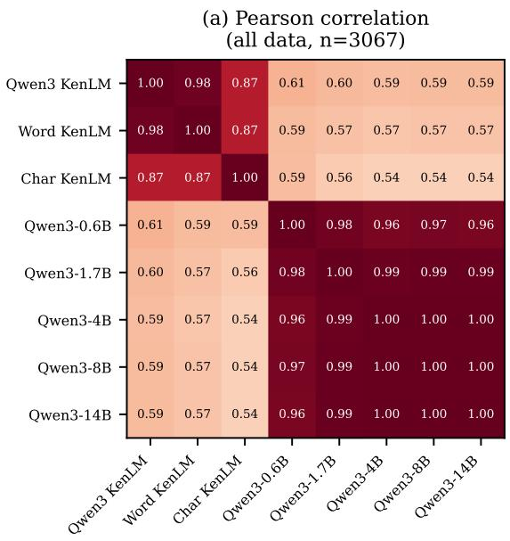

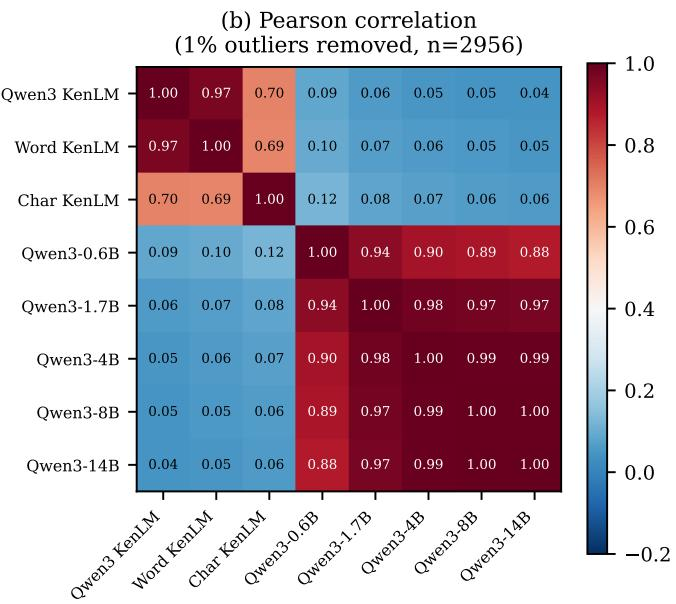

(c) Perplexity distribution by Endmatter classification  
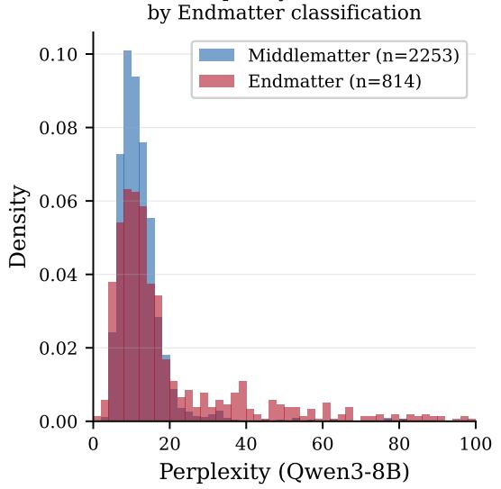

(d) Predicting Qwen3-14B perplexity
<table><tr><td rowspan=1 colspan=1>Predictor</td><td rowspan=1 colspan=1>Metric</td><td rowspan=1 colspan=1>All data</td><td rowspan=1 colspan=1>NoOutlier</td></tr><tr><td rowspan=1 colspan=1>Qwen3-0.6B</td><td rowspan=1 colspan=1>Spearman ρ</td><td rowspan=1 colspan=1>0.930</td><td rowspan=1 colspan=1>0.933</td></tr><tr><td rowspan=1 colspan=1>Qwen3-0.6B</td><td rowspan=1 colspan=1>Kendall τ</td><td rowspan=1 colspan=1>0.777</td><td rowspan=1 colspan=1>0.782</td></tr><tr><td rowspan=1 colspan=1>Qwen3-0.6B</td><td rowspan=1 colspan=1>R² (log)</td><td rowspan=1 colspan=1>0.858</td><td rowspan=1 colspan=1>0.856</td></tr><tr><td rowspan=1 colspan=1>Char KenLM</td><td rowspan=1 colspan=1>Pearson r</td><td rowspan=1 colspan=1>0.541</td><td rowspan=1 colspan=1>0.060</td></tr><tr><td rowspan=1 colspan=1>Word KenLM</td><td rowspan=1 colspan=1>Pearson r</td><td rowspan=1 colspan=1>0.571</td><td rowspan=1 colspan=1>0.050</td></tr><tr><td rowspan=1 colspan=1>Qwen3 KenLM</td><td rowspan=1 colspan=1>Pearson r</td><td rowspan=1 colspan=1>0.591</td><td rowspan=1 colspan=1>0.044</td></tr></table>

Figure 29: Statistical correlations of Qwen3 perplexity with other measures

See Figure 29 for correlations and prediction behavior. We observed that multiple features carried predictive power for extremely high perplexity (especially the rare bigram ratio and all KenLM language models). After removing the 1% outliers,<sup>30</sup> we observed almost no correlation between actual perplexity and estimated perplexity (panel (b)). The bimodal aspect of endmatter classification leads to poor predictive behavior (though extreme perplexity does weakly correlate with being endmatter).

We did not anticipate the difference in behavior between panel (a) and panel (b) in Figure 29<sub>.</sub> The predictions from n-gram language models correlate strongly with each other (even if they use different atomic units of text), but do not correlate with actual perplexity. One should expect Qwen3 models with similar parameter counts to have higher correlation, but it was not obvious that the smallest model, 0.6B, was highly predictive of the 14B model. Further, panel (d) shows that the relative ordering between perplexities is largely preserved (Kendall � = 0.782). From this, we determined that we would use the smallest, most computationally efficient model.

Error Rates in Computing BPB. After running the full pipeline, we noted that a different implementation of computing cross-entropy would allow effective computation of BPB values even for long paragraphs. Specifically, one could implement chunked or fused crossentropy (P. -L. Hsu et al. 2024). Alternatively, one could use multiple GPUs together instead of many independent GPUs. We did not revisit the BPB values of the 4 too-short or the 12,391 too-long paragraphs.

## D Examples with Known Limitations

Though we have tried to be conservative in cleaning and applying changes, we know of examples where the current pipeline has unintended side effects. We give two examples here.

Dehyphenation and Mathematics. The current pipeline does not treat math differently from prose (nor does the currently available OCR). In technical texts, minus signs and fraction bars might be treated as end-of-line hyphens and potentially removed during dehyphenation (§4.5). For example, Figure 30 is taken from A first course in the differential and integral calculus (barcode 32044000046607), <sub>page</sub> 448 (with <sub>page</sub> number 426 in the book).

Figure 30 shows three lines of exercises from a book, the source OCR output (including original newlines), and the output after dehyphenation. Three changes in hyphenation occur in this example:

1. The lone hyphen on the second line of the source OCR is removed.

2. The hyphen at the end of the exercise 34 line in the OCR text is removed, causing x - 1 - \n 3 to be replaced by x - 1 3<sub>.</sub>

3. The lone hyphen on the line after exercise 35 in the source OCR is kept, but the newline is removed and now the 4x-7 on the following line becomes -4x-7<sub>.</sub>

<sup>All</sup> <sup>three</sup> <sup>affect</sup> <sup>the</sup> meaning <sup>of</sup> <sup>the</sup> source <sup>OCR.</sup> But <sup>the</sup> source <sup>OCR</sup> <sup>does</sup> not capture <sup>the</sup> <sup>full</sup> meaning of the original math exercises.<sup>31</sup>

$$
\begin{array} { r l } & { 3 3 . \texttt { \ i } x ^ { s } - 2 ( a - b ) x ^ { s } + 3 b x - a + b . } \\ & { 3 4 . \texttt { \frac { x ^ { s } } { 3 } - 2 ( 3 x - 5 ) + x - 1 - \frac { 4 x - 7 } { 9 } } . } \\ & { 3 8 . \texttt { ( 3 - 2 x ) 7 } \texttt { 3 6 . } ( p + q x ) ^ { s } . } \end{array}
$$

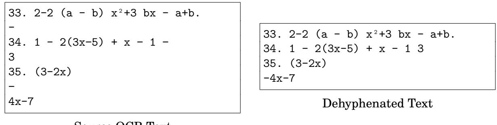  
Source OCR Text  
Figure 30: Example of Meaning-Altering Dehyphenation Taken from 32044000046607<sub>.</sub>

These cases are rare relative to the billions of correct merges. But these examples suggest that technical and mathematical volumes are disproportionately affected.

Removing Citation Footers. Header/footer removal in this pipeline targets repetitive lines near the top or bottom of many nearby pages. Some books use abbreviated citation formats in footers or marginalia. When many nearly-identical citations occur in close proximity, they may all be removed. Figure 31 shows three footers of pages in Geschichte der K. und K. Technischen Militär-Akademie (barcode 32044004475331).

<sup>These</sup> <sup>footnotes</sup> <sup>include</sup> repeated <sup>references</sup> to K. und k. Kriegs-Archiv. <sup>and</sup> Ebendort. <sub>.</sub> Similar citation patterns occur throughout the book. As these lines recur at the foot of the page, <sup>the</sup> remover treats <sup>them</sup> as running <sup>footers. The number of</sup> citations to Kriegs-Archiv decreases from 137 occurrences in the source OCR to 64 in the output.

Currently all marginalia are OCRed and grouped with the main text, causing remaining bibliographic references to be placed in the middle of paragraphs. Current treatment of marginalia at both the OCR level and the cleaning level does not allow accurate tracking of bibliographic provenance. We regard restoring these paratextual elements as a worthwhile goal for future work.

## E Using the Parser Library

We wrote a lightweight, pure-Python, dependency-free parser library<sup>32</sup> and tool that can be used to filter and iterate through the final annotated dataset. The library uses html.parser.HTMLParser from the Python standard library as the core HTML parser.

The library exposes its functionality through the BookDataset class, which takes any iterable of Python dictionaries with a schema matching the dataset fields described in Appendix A This can take many forms, such as a list of manually curated dictionaries, partial outputs from the pipeline, or the streamed HuggingFace dataset (Lhoest et al. 2021) produced by this pipeline. For example:

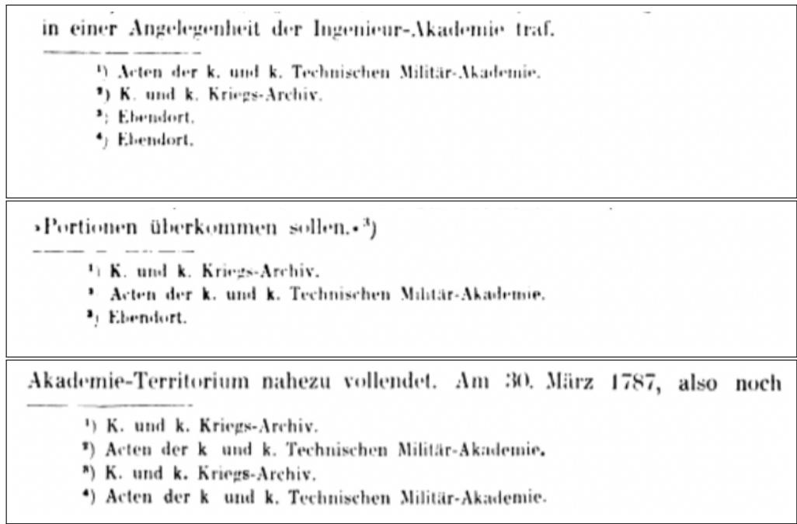  
Figure 31: Example of Removing Citations in Footers Taken from 32044004475331

<table><tr><td>Object field</td><td>Type</td><td>Description</td></tr><tr><td>paragraph.text</td><td>string</td><td>Content of the paragraph</td></tr><tr><td>paragraph.bpb</td><td>float</td><td>QWEN/QWEN3-0.6B-BASE computed bits-per-byte</td></tr><tr><td>paragraph.language</td><td>string</td><td>ISO 639-3 code of language detected for the paragraph</td></tr><tr><td>paragraph.is_duplicate</td><td>boolean</td><td>Whether this paragraph is a duplicate of another paragraph in the whole col-</td></tr><tr><td>section.paragraphs</td><td></td><td>lection. list[paragraph] Paragraph objects contained in sec- tion</td></tr><tr><td>section.bpb</td><td>float</td><td>Average bits-per-byte of contained</td></tr><tr><td>book.bpb.{p10,p30,median,p70,p90,avg}float</td><td></td><td>paragraphs BPB percentile and average values</td></tr></table>

Table 32: IBET Parser Object Description

```python
from datasets import load_dataset
from ibet_parser import BookDataset
ds = load_dataset(
"institutional/institutional-books-hl-enriched-text"
split= "train" streaming=True
)
books = BookDataset(ds)
```

Once BookDataset is instantiated, one can filter and iterate through books, sections, and paragraphs:

```python
from itertools import islice
for book in islice(books 10 ): # for demonstration take 10 books
print (book <sub>.</sub> barcode book <sub>.</sub> primary_language book <sub>.</sub> token_count)
for paragraph in book <sub>.</sub> paragraphs:
print (paragraph text[: 100])
# do_something_with_paragraph(paragraph)
for book in islice(books 10 ):
for section in book <sub>.</sub> sections:
# do_something_with_section(section)
for paragraph in section <sub>.</sub> paragraphs:
print (paragraph <sub>.</sub> text[: 100])
print () # add newline between sections
```

Books at the dataset level can be filtered by language or token count range. Specifically, books <sub>.</sub> filter() accepts optional language<sub>,</sub> token\_count\_min<sub>,</sub> or token\_count\_max arguments. Both token counts accept integer arguments and restrict to books with the specified token range; language accepts either one or a list of ISO 639-3 language strings and restricts to books whose primary language is one of those specified. For example, to iterate over English books with at least 1000 tokens:

```python
for book in books <sub>.</sub> filter(language='eng' token_count_min= 1000 ):
# do_something_with_book(book)
pass
```

For paragraph-level filtering: books <sub>.</sub> paragraphs <sub>.</sub> filter() accepts language (as a single string or a list, as above), deduplicated (Boolean: if true, exclude duplicate paragraphs from iteration), bpb\_min and bpb\_max (as floats). The per-volume BPB values are available as attributes for convenient reference (cf. Table 32). Section filtering uses the same semantics on books <sub>.</sub> sections <sub>.</sub> filter() and passes each filter to the paragraphs within each section. Sections where all paragraphs are filtered out are entirely excluded from iteration.