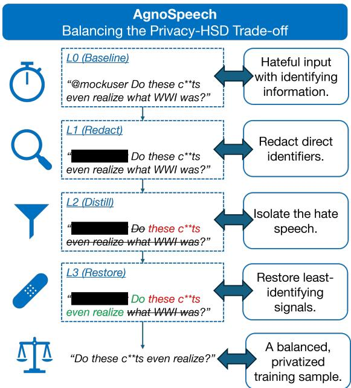

# Introducing the Privacy-HSD Trade-off: Hate Speech Detection, but not at the Cost of Privacy

Stephen Meisenbacher1,2,3, Vlad Garbuz4, Chirill Donos5, Maxim Dnestreanschii4,

Gabriel Creanga4, Andreea-Elena Bodea1, Thomas Lampert6, Jana Diesner1,2,3

1Technical University of Munich, Chair of Human-Centered Computing, Munich, Germany

2Munich Center for Machine Learning, Munich, Germany

3Munich Data Science Institute, Munich, Germany

4University of Southern Denmark, Sønderborg, Denmark

5Technical University of Moldova, Chis, inau, Republic of Moldova ˘

6ICube, University of Strasbourg, Strasbourg, France

Correspondence: stephen.meisenbacher@tum.de

## Abstract

Hate speech is a real and timely threat that affects a large portion of online users, especially youth and minority groups. While building reliable and robust automatic hate speech detection (HSD) systems is paramount, we argue that this must also be balanced with the individual right to privacy. Exploring the intersection of HSD and privacy, we demonstrate that HSD systems might unintentionally achieve performance at the cost of encoding authorship, posing a threat to privacy. Building on these findings, we establish the notion of a privacy-HSD trade-off, which demands a careful balance. We benchmark a series of text privatization methods, as well as our newly proposed domain-specific AGNOSPEECH technique, showing that balancing privacy and HSD is difficult but feasible. The findings make a strong case for more research on the trade-offs between privacy and HSD, both of which have tangible implications for the safeguarding of online participation.

## 1 Introduction

As the venue of social discourse continues to shift from the public sphere to online environments, the threat of online hate speech has unfortunately also grown rapidly in prevalence (Alkomah and Ma, 2022; Gandhi et al., 2024). A recent 2025 UN-ESCO report1 found that nearly 67% of online users have encountered hate speech at some point, and in the European Union, this number is nearly 50% among young adults (aged 16 to 29)2. Alarmingly, the United Nations has found that almost 70% of individuals who personally experience online hate are part of a minority group3. These statistics paint a reality in which hate speech has become a serious and pervasive online threat, for which immediate mitigations are required.

In response to the increasing threat of online hate speech, parliamentary bodies such as the Council of Europe have released recommendations for combating hate speech, such as in the recent CM/REC(2022)164, as an integral part of protecting the rights and freedoms of individuals. In the academic literature, both predating and following this recommendation, the response has been immense. Automatic approaches to hate speech detection (HSD), powered by Natural Language Processing and more recently LLMs, have grown in research attention (Fortuna and Nunes, 2018; Alkomah and Ma, 2022; Gandhi et al., 2024; Albladi et al., 2025). The diversity in which such approaches have addressed hate speech has been the subject of several recent surveys (ibid), and they often center on HSD in the context of social media platforms (Mansur et al., 2023; Rawat et al., 2024).

A novel and unexplored angle in the pursuit of automatic HSD comes with its implications on privacy. In other words, automatic and reliable HSD should ideally not depend or infringe upon the right to privacy of individuals. The CM/REC(2022)16 hints at this dilemma, calling for “removing such hate speech without delay”, but doing so while “respecting privacy and data-protection requirements”. This connection between HSD and privacy is intuitive yet significant and complex to balance, in the sense that accurate hate speech detectors should not achieve their reliability by detecting identifying authorship cues rather than hate speech signals. Such a relationship grounds itself in similar, wellstudied trade-offs that must be balanced with privacy preservation, most notably the privacy-utility trade-off (Li, 2012; Slavkovic and Seeman´ , 2023). In this way, the privacy-HSD trade-off is conceived.

We position our work in the foundation and initial exploration of the privacy-HSD trade-off. Firstly, we perform a probing study with two representative datasets, highlighting the degree to which HSD classification systems may also unintentionally encode authorship cues. Secondly, we formalize the privacy-HSD trade-off and conduct a case study to investigate current text privatization techniques in improving this trade-off. Finally, we design a novel, HSD-specific privatization method (AGNOSPEECH), which we benchmark against methods from the literature for effectiveness in managing the privacy-HSD trade-off.

Our findings reveal that HSD performance is inherently entangled with privacy considerations, particularly in encoding author-specific information. In addressing this privacy concern, our tailored AG-NOSPEECH privatization method achieves higher trade-offs than off-the-shelf text privatization methods, the latter of which are unable to reliably balance HSD with privacy, while also producing coherent and usable outputs. These results make the case for domain- and use case-specific text privatization, especially in critical domains such as HSD where privacy implications matter. In addition to the above, we make the following contributions:

1. We address and formalize the privacy implications of HSD, leading to the establishment and study of the privacy-HSD trade-off.

2. We demonstrate the entanglement of HSD and privacy, showing that unmitigated HSD methods may inadvertently serve as profiling tools.

3. We propose a novel text privatization method, AGNOSPEECH, that preserves hate speech cues for use in building HSD tools, while also selectively removing signals not necessary for HSD. The replication code and data can be found at: https://github.com/ AllForOne-md/agnospeech-core

4. We evaluate AGNOSPEECH and comparative methods on the privacy-HSD trade-off with three datasets for privacy-preserving HSD.

## 2 Related Work

Hate Speech Detection. The topic of automatic Hate Speech Detection has produced a rich and diverse field of research over the past decade, coinciding with the rising threat posed by growing hate speech found on the internet. These numerous approaches have been reviewed and systematized by multiple recent surveys (Schmidt and

Wiegand, 2017; Govers et al., 2023; Gandhi et al., 2024; Rawat et al., 2024; Malik et al., 2025).

While we do not conduct an additional survey, we acknowledge that the breadth of HSD literature is too vast to enumerate here, and we therefore discuss a representative sample that follows the progression of the technical work of the past decade. Earlier approaches leveraged static resources, such as lexicons, to identify texts containing harmful or hateful language (Gitari et al., 2015; Davidson et al., 2017). Ensuing works leveraged the growing promise of Machine Learning and Deep Learning techniques to build accurate detectors of hate speech (Djuric et al., 2015; Nobata et al., 2016; Park and Fung, 2017; Rizos et al., 2019; Zhou et al., 2020). With the rise of transformer-based language models, more recent works have explored their usefulness in HSD, which often achieve superior performance in detection (Mozafari et al., 2019; Toraman et al., 2022; Guo et al., 2023; Yang et al., 2023; Ghorbanpour et al., 2025).

A large focus has also been placed on producing datasets and benchmarks for HSD research (Röttger et al., 2021; Mathew et al., 2021; Hartvigsen et al., 2022), as well as identifying important considerations therein (Arango et al., 2019). In addition, other streams of research have branched HSD to multilingual capabilities (Röttger et al., 2022; Arango Monnar et al., 2022; Chhabra and Vishwakarma, 2023; Hashmi et al., 2024), as well as to multimodal settings (Gomez et al., 2020; Hee et al., 2024; Bui et al., 2025). Recent surveys also highlight the metrics utilized to evaluate automatic HSD, which predominantly include precision-recall-F1 setups or AUC measures, either in a binary (hate/non-hate) or more nuanced multiclass setting (Mullah and Zainon, 2021; Chhabra and Vishwakarma, 2023; Gandhi et al., 2024).

Text Privatization. The field of text privatization is likewise varied and diverse, but it is united in the goal of redacting, masking, or otherwise transforming textual data in a manner to remove direct or indirectly identifiable information (Ren et al., 2025). In the literature, this has taken the form of many classes of techniques, including anonymization, text scrubbing, and private text rewriting (Deußer et al., 2025). As previously mentioned, one of the primary challenges of text privatization is the reliable removal of personal identifiers, while also maintaining the utility and integrity of the data (Meisenbacher et al., 2024b).

The exact execution of text privatization can vary depending on the underlying privacy notion. Classic anonymization typically targets personallyidentifiable information (PII) and related named entities (Deußer et al., 2025), where these are either removed or masked. More recent works in anonymization have leveraged LLMs for this task (Bao and Carpuat, 2024; Yang et al., 2025; Frikha et al., 2025). Other works operate on more subtle clues hidden within text, such as indirect identifiers (Baroud et al., 2025) like medical conditions or socioeconomic status, or writing style and stylometry (Brennan et al., 2012). Further sub-fields focus on text privatization under formal privacy notions, such as Differential Privacy, which obfuscate and transform text with mathematical privacy guarantees (Klymenko et al., 2022; Carvalho et al., 2023; Igamberdiev and Habernal, 2023). While all of the works typically address the impact of privatization on the privacy-utility trade-off, none have done so by interpreting the utility aspect as that of HSD.

The evaluation of text privatization approaches is an important, yet complex consideration, which necessitates thinking adversarially in order to measure mitigation effectiveness against such adversaries. Prior work has noted the difficulties of defining “privacy” in textual data (Brown et al., 2022; Ren et al., 2025). Nevertheless, recent efforts have been made to systematize and standardize such evaluations (Pilán et al., 2022; Loiseau et al., 2025b; Huang et al., 2025b). One salient use case for text privatization, which is discussed further below is protection against re-identification, which we study here, namely to quantify privacy preservation in protecting anonymous online users from being identified via their data.

Authorship Obfuscation. Akin to the field of text privatization, authorship obfuscation focuses specifically on removing author-identifying signals from written texts, in order to mitigate the risk of downstream authorship re-identification. Classic approaches from both obfuscation and identification engineer numerous stylistic features from text, which can be used to profile (or mask) authorship (Potthast et al., 2016). While such feature-based approaches usually rely on heuristics for obfuscation (Bevendorff et al., 2019), more modern techniques have turned to neural representations and LLMbased obfuscation (Fisher et al., 2024; Huang et al., 2025a; Shokri et al., 2025). Loiseau et al. (2025a) frames the task of authorship obfuscation in light of the resulting trade-off with utility; in our work, we extend this notion to the task of HSD.

While re-identification is typically seen as adversarial, the tasks of authorship attribution (e.g., identify a historical text’s author) (Stamatatos, 2017; Tan et al., 2025) and authorship verification (verify if two texts were written by the same person) (Hung et al., 2023; Bevendorff et al., 2025) can be positive and useful, and profiling may even assist in detecting online abuse (Mishra et al., 2018). Our work, though, studies the negative aspects of authorship attribution: placing online users at risk of re-identification when building HSD systems.

## 3 Dataset Construction

To aid in the experiments and analyses of this work, we curate two base datasets from online forums, which importantly contain both user (author) and hate speech labels. We leverage previously published research datasets and filter these down to constrained author sets for use in our experiments.

Reddit. We use a dataset provided by Qian et al. (2019), which covers 22k Reddit comments from 5k conversations, which have been annotated as hate or non-hate speech, based on a keyword analysis. As noted by the original work, we reiterate that the dataset does not necessarily contain all of the comments attached to a post, but rather those preceding and trailing an identified hate speech comment. Only those comments matching the keyword search were marked as hate speech; all others receive a negative (0) label.

We retain the comments associated with the top-25 most frequently posting users in the dataset, resulting in 1154 comments, 365 (31.6%) of which are marked as hate speech. The most frequently contributing user appears 100 times, while the least frequent user among the top 25 has 32 comments.

We also create a subset with the top-50 authors to support our analysis in Section 4. It contains 1795 comments, 525 (29.2%) of which are hate speech, and a least-contributing user with 21 comments.

Twitter. We also used a dataset of 16k tweets provided by Waseem and Hovy (2016), where each tweet is marked as racist, sexist, or neither. We simplify this to hate and non-hate speech, to match the annotation format of the Reddit subset. Using the X API (https://docs.x.com/), we successfully re-hydrated 9,523 of the 16k tweets with the original text content and associated user IDs, where the non-successful attempts imply that the original posts have been deleted or moved.

We narrow down the subset to the top-10 most frequent authors, which comprises 6,792 tweets. Among these, 2039 (30%) are tagged as hate speech. The subset is heavily skewed towards the top-3 (3626, 2040, and 929 tweets, respectively), with the 10th user only contributing 25 tweets.

License and release. All datasets will be publicly released upon publication. The Reddit datasets will be distributed as created, enabled by the original data source’s license. However, due to the terms of the Twitter dataset, specifically in re-hydrating the tweets, we only will release a version without the user IDs and tweet texts. Researchers who wish to obtain these must do so through the Twitter (X) API, using the tweet IDs as the reference point.

## 4 Foundations of the PrivHSD Trade-off

Using our three created datasets, we conduct an initial investigation into the potential for HSD to encode authorship information and thus partially devolve into a re-identification tool. From these results, we motivate the need for privacy-preserving HSD, in which detection performance does not come at the cost of degrading privacy protections.

## 4.1 Training HSD Models

To support our study of the privacy-HSD trade-off, we train three baseline HSD binary classification models, two for Reddit (25 and 50 user subsets) and one for Twitter. To train a more robust classifier, the entire original cleaned datasets (22k for Reddit and 9.5k for Twitter) are used; however, a 20% random sample is held-out from the top-k author subsets. These held-out sets are treated as the test sets for model performance and the ensuing analysis.

For all setups, we fine-tune a GOOGLE-BERT/BERT-BASE-CASED model (Devlin et al., 2019), chosen due to its popularity (Tucudean et al., 2024), using the Hugging Face Trainer library. Reddit models are trained for one epoch and Twitter for three epochs (due to the smaller training size). A learning rate of 1e-5 and Adam optimizer are used. All training is performed with a max model input length of 128 (i.e., otherwise truncated) and batch size of 64 on a single Nvidia RTX 5060 Ti 16GB GPU. On the heldout set, the Reddit-25 model achieves a micro-F1 score of 0.89, the Reddit-50 model a score of 0.86, and the Twitter model a score of 0.91.

All three models are available at https://hf.co/ collections/sjmeis/privhsd.

## 4.2 Probing the HSD Models

Using the fine-tuned HSD models, we perform two analyses to identify whether the learned hate speech signal (i.e., for binary classification) has become intertwined with authorship-revealing information.

Linear probing. Using the trained HSD models, we probe their internal representations to test whether the trained weights have encoded authoridentifying information. This is done per model:

1. For each text input from the train set, extract the [CLS] token embedding from the last hidden state, i.e., that was used by the classification head for binary hate speech classification.

2. With these 768-dim. embeddings, train a multinomial Logistic Regression model (SKLEARN, max\_iter=1000) to predict the author (label).

3. Obtain the embeddings from the held-out test set texts, and measure the accuracy of the regression model in predicting the author.

We also followed this procedure on the base, nonfine-tuned BERT. In performing these steps, we are able to measure to what degree the trained HSD model’s internal representations are correlated with author identity, i.e., the authors from the test set in question. The results of this probing study are provided in Table 1, which show that for all three dataset configurations, authorship is inherently intertwined with the model’s internal representations, where the trained regressor achieves far greater than random or majority chance accuracies in predicting authorship. The HSD model’s learned representations either persist (Reddit) or exacerbate (Twitter) this issue, showing that training HSD models without privacy in mind may leave online users at risk.

Statistical measures. In addition to linear probing of the HSD models, we also perform statistical tests to measure the correlation of HSD and author.

Firstly, we measure the correlation between each HSD model’s prediction confidence (i.e., of the binary hate speech label) to the categorical author label. This is calculated using a one-way ANOVA test to achieve the $\eta ^ { 2 }$ score. To calculate this, we extract the prediction probabilities (post-softmax, interpreted as a confidence score) from the held-out test set inputs. Then, we train an Ordinary Least Squares regression model (using STATSMODEL).

<table><tr><td rowspan="2">Dataset / HSD Model</td><td colspan="3">Linear Probing</td><td colspan="3">Statistical Tests</td><td colspan="2">Adversary</td></tr><tr><td>Random/Majority</td><td>Baseline</td><td>Probe Acc. (HSD)</td><td> $\overline { { { \eta } ^ { 2 } } }$ </td><td>Mean FPR</td><td>FPRσ</td><td>Majority Class</td><td>Micro F1</td></tr><tr><td>Reddit-25</td><td>4%/8.2%</td><td>40.69%</td><td>39.83%</td><td>0.2205</td><td>7.68%</td><td>0.1079</td><td>15.95%</td><td>19.04%</td></tr><tr><td>Reddit-50</td><td>2%/4.5%</td><td>25.35%</td><td>21.73%</td><td>0.2227</td><td>8.33%</td><td>0.1564</td><td>10.55%</td><td>13.09%</td></tr><tr><td>Twitter-10</td><td>10%/53.1 %</td><td>83.96%</td><td>88.24%</td><td>0.6095</td><td>16.36%</td><td>0.2078</td><td>69.61%</td><td>87.20%</td></tr></table>

Table 1: Results of our linear probing and statistical tests. Probe accuracy measures the ability to train authorship re-identification models solely from HSD model embeddings, as compared to random or majority-guessing accuracy (on the test set), as well as the non-fine-tuned baseline. $\eta ^ { 2 }$ denotes variance in HSD that can be attributed to the author signal, where as FPR σ indicates the standard deviation of false positive rates across all authors in a dataset. The Adversary (F1) denotes adversarial classification performance (for authorship), trained solely on text contents. In all scores, a higher result denotes that authorship has become entangled with detecting hate speech.

Finally, we calculate $\eta ^ { 2 }$ , or the proportion of the variance in the regression model’s predictions that is attributable to the author ID. As shown in Table 1, for all models, the calculated effect sizes are all considerably high, particularly for Twitter.

Probing more deeply into individual impacts, we measure per-author error rate to measure the entanglement of model error and authorship. For this, we focus on the false positive rates (FPR) in the model predictions on the test set. Reported first in Table 1 are the mean FPR across all authors in each dataset. We then report the standard deviations of these FPRs, showing the distribution spread across authors. Higher standard deviations imply that a HSD model is more prone to commit false positives for certain authors, and thereby, the trained models may be more tuned to authorship style than to hate speech signals. A truly fair and privacypreserving model would have deviations close to 0, but as evidenced in Table 1, this is not the case.

## 4.3 Modeling a Capable Adversary

Rather than rely only on post-hoc analyses using the trained HSD models, we conclude our probes with the modeling of a capable adversary who directly trains a re-identification model to classify authorship given an input text. This represents a black-box, more plausible scenario in which an adversary has access to the publicly known texts of a set of users (but not the trained HSD models), and trains a classification model to re-identify future texts, potentially where the author label is hidden.

Similar to HSD, we train GOOGLE-BERT/BERT-BASE-CASED models on the train splits of our prepared datasets, but instead of predicting the hate speech label, the objective is now to classify the author label, i.e., in a constrained multi-class setting. The re-identification performance is represented by the trained model’s micro-F1 score on the test set. We use the same training setup as before, with the exception of 15 epochs for Reddit and five epochs for Twitter (due to the smaller training sets).

The results are also shown in Table 1. We see that re-identification scores represent modest, but non-negligible improvements over majority class guessing, especially considering the black-box nature of the attack. These results, combined with those above, lend evidence to the idea that HSD performance and privacy preservation are intertwined.

## 4.4 The Privacy-HSD Trade-off

To formalize a trade-off between HSD performance and privacy protection, we adopt the notion of relative gain from the privacy literature (Mattern et al., 2022), which weighs relative losses in utility (here, HSD performance) with gains in privacy protection (here, defense against re-identification). We measure this balance over the baseline, which are the HSD and privacy scores on non-privatized datasets.

Given the performance of a trained HSD classifier on the original datasets $( H _ { o } )$ and the performance of the same classifier configuration after being trained on the privatized dataset counterpart $( H _ { p } )$ , we define the relative utility change to be the following, which is normalized against HSD performance (F1) with majority-class guessing:

$$
\Delta H S D = \frac { H _ { p } - H _ { m a j } } { H _ { o } - H _ { m a j } } .
$$

Similarly, for a set of privacy metrics ${ \mathcal P } _ { \mathrm { { : } } }$ all normalized between 0 and 1, with 0 being “ideal” privacy, we define the relative privacy change as:

$$
\Delta P r i v a c y = \frac { 1 } { n } \sum \frac { m _ { p } } { m _ { o } } , \forall m \in \mathcal { P } , n = | \mathcal { P } | .
$$

In our work, we use four metrics $m \in { \mathcal { P } } \colon$ probe accuracy, $\eta ^ { 2 }$ , FPR $\sigma _ { \mathrm { { : } } }$ , and adversarial F1 (see Table 1), which all denote better privacy when minimized. Following this, we define the privacy-HSD tradeoff as the relative gain between the two quantities:

$$
P r i v H S D = \Delta H S D - \Delta P r i v a c y\tag{1}
$$

This trade-off typically lies in the range [-1, 1], although it can exceed these bounds if HSD performance is better post-privatization, or if privacy is worse than the original data. A higher PrivHSD score implies that privacy gains outweigh utility losses (left side is dominant), and vice versa.

## 5 A Case Study of Existing Mitigations

Given the newly defined PrivHSD trade-off metric, we conduct a case study on a selection of recent text-to-text privatization methods, benchmarking their ability to balance the trade-off. Each selected method, introduced below, is run on all three curated datasets, in order to produce a privatized counterpart (the “text” is replaced with a private version). These private dataset counterparts are used to fine-tune corresponding HSD models, which are in turn evaluated using the PrivHSD criteria.

## 5.1 Selected Privatization Methods

We select seven state-of-the-art text privatization methods, which range from three overarching research areas: entity-based anonymization, differentially private text privatization, and LLM-assisted anonymization. For all but one method, we run them on two configurations, which allows for a representative sweep of their privatization capabilities.

Microsoft Presidio. The Presidio tool5 has two components, an analyzer and an anonymizer, which identify and handle detected personally identifiable information, respectively. We use it in two configurations: (1) redact, where detected entities are deleted, and (2) replace, where the entities are replaced with a placeholder, e.g., “[PERSON]”.

GLINER. GLINER (Zaratiana et al., 2024) is a framework for deploying Named Recognition (NER) models, which are useful in privatization settings with entities such as names or locations. For GLINER, we use the pretrained URCHADE/GLINER\_MULTI\_PII-V1 model, provided by the authors of the original work. As with Presidio, we also test both redact and replace.

SANTEXT. SANTEXT (Yue et al., 2021) is a word-level metric Differential Privacy (DP) obfuscation mechanism, which performs word-by-word replacements to provide private outputs with DP guarantees. An important parameter is the privacy budget (ε), which we set for all DP mechanisms to be on the document-level. For each dataset, we set the dataset-specific document-level budget to be ε · avg. tokens (as per NLTK), for ε ∈ {0.5, 1}.

DP-MLM. DP-MLM (Meisenbacher et al., 2024a) performs contextualized token replacements for DP token outputs, rewriting whole texts sequentially using Masked Language Models. In a similar manner to SANTEXT, we set base ε ∈ {10, 25} (following the original work), which are scaled by the averaged token count per text in a dataset. We use the original public implementation, which is built on a ROBERTA-BASE model.

DP-BART. The final DP-based mechanism, DP-BART (Igamberdiev and Habernal, 2023), rewrites text documents under DP guarantees, using a encoder-decoder (by default BART) model. Following the original work, we use document-level ε ∈ {1000, 2000} with a BART-LARGE model.

RUPTA. RUPTA (Yang et al., 2025), or Robust Utility-Preserving Text Anonymization, is a LLMbased anonymization method which splits the task of text anonymization into three components: a privacy evaluator, a utility evaluator, and an optimization component. We utilize this framework with a QWEN2.5-7B-INSTRUCT-GPTQ-INT4 model, with otherwise default parameters and prompts.

Privacy Filter. OpenAI’s Privacy Filter6 is an open-source NER tool that specializes in detecting PII and masking this information. We use the default OPENAI/PRIVACY-FILTER model, and implement a similar redact or replace setup as before.

## 5.2 Evaluation Procedure

For each privatized dataset counterpart (i.e., for Reddit-25, Reddit-50, and Twitter-10), we finetune a new HSD classification model, in the same manner as in Section 4, but where the original subset in question is replaced by the privatized version (both train and test set). The micro-F1 scores on the test set are recorded to represent $H _ { p } .$

The trained models are then used to obtain the probe accuracies and FPR σ scores. For each privatized dataset, we repeat the training and scoring procedure three times (on different shuffles of the training sets, seeds 41-43), to account for variances in model optimization. The average scores of these three runs are presented as the final scores. Following this, we retain only the 20% (seed: 42) test splits, as before, and measure adversarial micro-F1 using the corresponding adversarial classification models introduced in Section 4. Together, these three scores represent the $m _ { p }$ components, which comprise the ∆Privacy when averaged.

Combining all of the above scores and achieving the $\Delta$ results using baseline values, we then are able to calculate the PrivHSD trade-offs for each privatization setting. Although not included in the trade-off, we also measure text coherence (i.e., quality) via perplexity, measured using a GPT-2 model (Radford et al., 2019). The complete results and score breakdowns are presented in Table 2.

## 6 Towards Privacy-preserving HSD

Intuitively, and as evidenced by the results of Table 2, all tested text privatization mechanisms are generalized, i.e., not tailored for utility preservation in the context of HSD. As such, their demonstrated strong ability in protecting privacy often comes at the cost of severely diminished HSD performance. In response to this, we design a privacy-preserving and author-agnostic text privatization method, with the goal of optimizing the PrivHSD trade-off.

## 6.1 The AGNOSPEECH Method

The core of AGNOSPEECH is simple: a privacypreserving HSD method should ideally redact all signals not immediately necessary for identifying hate speech, while keeping these hate speech cues intact. We also optimize for readability, motivated by improving methods that redact without replacement, or alternatively, that leave texts largely incoherent (as with stricter DP-based privatization).

We implemented AGNOSPEECH as a three-tiered method, in which each level addresses a separate concern and transforms an input text accordingly. Additionally, we prepare two variants of AGNOSPEECH: (1) fast, which is built for efficiency and throughput, and (2) performance, which is built using more computationally expensive models. While we introduce each level below (and illustratively in Figure 1), implementation specifics can be found in our provided code repository.

## L0. The un-privatized input is denoted as L0.

L1. In the L1 (Redact) level, we take motivation from entity-based anonymization tools, where PII and other direct identifiers are immediately removed, as these intuitively do not contribute to hate speech signals. In the fast variant, redaction is accomplished via a simple regex detector, whereas the performance model augments regex detection with Microsoft Presidio’s analyzer tool.

  
Figure 1: An overview of AgnoSpeech, a multi-tiered method for facilitating HSD, but not at the cost of privacy. Note: harmful language has been pre-redacted.

L2. Building on our findings from Table 1, L2 (Distill) uses linear attribution (fast) or token saliency (performance) to learn hate speech signal importance from a trained proxy model. In the linear attribution component, a logistic regression model is trained on joint unigram and bigram vocabulary, thus producing a coefficient for each member of this joint vocabulary. During lookup, each weight (regression coefficient) is multiplied by the corpus TF-IDF weight, producing a final importance score per word. Finally, only a fraction of the top-scoring words (i.e., those most important to detecting hate speech, default: 60%) are kept.

The performance variant improves upon this distillation approach by measuring the saliency of each word by calculating the change in regressor prediction confidence (probability) after removing the word from the input text. This is done sequentially for each word in a given text, and subsequently, a similar percentage filtering is performed, with the same default 60%, i.e., to remove the bottom 40% of tokens not important to HSD.

L3. Left as an optional third transformation following L2, L3 (Restore) re-introduces pruned tokens selectively and randomly, with the motivation that sweepingly removing all non-hate tokens can severely degrade readability and coherence. This module, identical for both fast and performance, takes an intensity input parameter $( i \in [ 0 , 1 ] )$ , and for each removed token from L2, a random number in that range is calculated, and if < i, the word is restored to the final text. While this re-introduces the risk of restoring author-identifying signals, it supports in the balance of redaction and readability.

<table><tr><td rowspan="2">Method</td><td colspan="7">Reddit-25</td><td colspan="7">Reddit-50</td><td colspan="7">Twitter-10</td><td rowspan="2">TO↑</td></tr><tr><td>PPL↓</td><td>HSD ↑ 89.0%</td><td>Probe↓ 39.8%</td><td>η2↓ 0.22</td><td>FPRσ 0.11</td><td>Adv↓ 19.0%</td><td>TO↑ =</td><td>PPL↓ 346</td><td>HSD ↑</td><td>Probe 21.7%</td><td>η2↓ 0.22</td><td>FPRσ 0.16</td><td>Adv↓</td><td>TO ↑</td><td>PPL↓</td><td>HSD ↑</td><td>Probe↓</td><td>η2↓</td><td>FPRσ 0.21</td><td>Adv↓ 87.2%</td><td>TO ↑ =</td><td>=</td></tr><tr><td>Baseline</td><td>377 8034</td><td>90.0%</td><td>40.5%</td><td>0.21</td><td></td><td>5.6%</td><td>0.44</td><td></td><td>86.0% 86.8%</td><td>21.4%</td><td>0.23</td><td>0.00</td><td>13.1% 0.6%</td><td>= 0.50</td><td>250 1050</td><td>91.0% 87.2%</td><td>88.2% 82.6%</td><td>0.61 0.51</td><td>0.01</td><td></td><td>10.7%</td><td></td></tr><tr><td>Presidio (redact)</td><td>376</td><td>90.2%</td><td>39.0%</td><td>0.21</td><td>0.00 0.00</td><td>4.8%</td><td>0.46</td><td>5298 344</td><td>86.9%</td><td>19.2%</td><td>0.23</td><td>0.00</td><td>0.8%</td><td>0.51</td><td>273</td><td>87.6%</td><td>83.5%</td><td>0.50</td><td>0.02</td><td>11.2%</td><td>0.34 0.34</td><td>0.43 0.44</td></tr><tr><td>Presidio (replace) GLiNER (redact)</td><td>467</td><td>87.7%</td><td>34.3%</td><td>0.20</td><td>0.00</td><td>4.3%</td><td>0.49</td><td>436</td><td>84.9%</td><td>19.7%</td><td>0.19</td><td>0.00</td><td>1.1%</td><td>0.52</td><td>556</td><td>86.6%</td><td>81.4%</td><td>0.50</td><td>0.00</td><td>2.4%</td><td>0.35</td><td>0.45</td></tr><tr><td>GLINER (replace)</td><td>347</td><td>87.4%</td><td>36.7%</td><td>0.19</td><td>0.00</td><td>5.6%</td><td>0.45</td><td>317</td><td>83.7%</td><td>20.6%</td><td>0.19</td><td>0.00</td><td>1.1%</td><td>0.49</td><td>167</td><td>87.1%</td><td>83.6%</td><td>0.53</td><td>0.01</td><td>3.6%</td><td>0.34</td><td>0.43</td></tr><tr><td>SANTEXT (ε = 0.5)</td><td>15179</td><td>69.7%</td><td>8.7%</td><td>0.11</td><td>0.04</td><td>4.8%</td><td>0.40</td><td>14346</td><td>75.3%</td><td>5.8%</td><td>0.14</td><td>0.01</td><td>2.2%</td><td>0.56</td><td>27953</td><td>69.7%</td><td>46.6%</td><td>0.05</td><td>0.00</td><td>0.4%</td><td>-0.15</td><td>0.27</td></tr><tr><td>SANTEXT (ε = 1)</td><td>10594</td><td>77.6%</td><td>11.8%</td><td>0.13</td><td>0.04</td><td>4.8%</td><td>0.47</td><td>9983</td><td>77.3%</td><td>7.3%</td><td>0.17</td><td>0.00</td><td>1.4%</td><td>0.58</td><td>28473</td><td>69.7%</td><td>49.4%</td><td>0.05</td><td>0.00</td><td>0.7%</td><td>-0.16</td><td>0.30</td></tr><tr><td>DP-MLM (ε = 10)</td><td>3382</td><td>73.4%</td><td>18.8%</td><td>0.16</td><td>0.02</td><td>3.9%</td><td>0.39</td><td>3297</td><td>74.8%</td><td>11.4%</td><td>0.20</td><td>0.03</td><td>1.7%</td><td>0.42</td><td>8275</td><td>79.7%</td><td>69.5%</td><td>0.30</td><td>0.06</td><td>5.1%</td><td>0.07</td><td>0.29</td></tr><tr><td>DP-BART (ε = 25)</td><td>1907</td><td>75.3%</td><td>24.2%</td><td>0.15</td><td>0.03</td><td>3.5%</td><td>0.38</td><td>2040</td><td>77.9%</td><td>10.7%</td><td>0.22</td><td>0.01</td><td>1.1%</td><td>0.48</td><td>4621</td><td>82.2%</td><td>71.2%</td><td>0.36</td><td>0.00</td><td>7.8%</td><td>0.22</td><td>0.36</td></tr><tr><td>DP-BART (ε = 1000)</td><td>7859</td><td>70.0%</td><td>4.8%</td><td>0.14</td><td>0.05</td><td>6.5%</td><td>0.35</td><td>5010</td><td>71.9%</td><td>3.3%</td><td>0.22</td><td>0.02</td><td>1.7%</td><td>0.46</td><td>5543</td><td>69.6%</td><td>48.5%</td><td>0.02</td><td>0.00</td><td>1.8%</td><td>-0.15</td><td>0.22</td></tr><tr><td>DP-BART (ε = 2000)</td><td>2475</td><td>69.0%</td><td>5.9%</td><td>0.24</td><td>0.04</td><td>5.2%</td><td>0.26</td><td>821</td><td>72.9%</td><td>3.2%</td><td>0.23</td><td>0.04</td><td>1.7%</td><td>0.43</td><td>485</td><td>69.7%</td><td>47.3%</td><td>0.03</td><td>0.00</td><td>1.3%</td><td>-0.15</td><td>0.18</td></tr><tr><td>RUPTA</td><td>340</td><td>80.7%</td><td>32.8%</td><td>0.14</td><td>0.00</td><td>6.5%</td><td>0.43</td><td>345</td><td>76.8%</td><td>19.6%</td><td>0.18</td><td>0.00</td><td>1.7%</td><td>0.42</td><td>237</td><td>87.3%</td><td>83.7%</td><td>0.49</td><td>0.03</td><td>11.7%</td><td>0.32</td><td>0.39</td></tr><tr><td>Privacy Filter (redact)</td><td>410</td><td>88.9%</td><td>37.1%</td><td>0.20</td><td>0.00</td><td>6.1%</td><td>0.45</td><td>363</td><td>86.4%</td><td>21.5%</td><td>0.23</td><td>0.00</td><td>1.1%</td><td>0.47 594</td><td></td><td>86.2%</td><td>81.5%</td><td>0.50</td><td>0.02</td><td>3.9%</td><td>0.31</td><td>0.41</td></tr><tr><td>Privacy Filter (replace)</td><td>354</td><td>89.0%</td><td>36.7%</td><td>0.20</td><td>0.00</td><td>6.5%</td><td>0.45</td><td>300</td><td>86.1%</td><td>21.5%</td><td>0.23</td><td>0.00</td><td>1.1%</td><td>0.47 86</td><td></td><td>87.5%</td><td>84.2%</td><td>0.49</td><td>0.02</td><td>3.5%</td><td>0.37</td><td>0.43</td></tr><tr><td>AGNOSPEECH L1 (fast)</td><td>393</td><td>90.2%</td><td>38.7%</td><td>0.20</td><td>0.00</td><td>5.6%</td><td>0.47</td><td>359</td><td>86.6%</td><td>19.7%</td><td>0.23</td><td>0.00</td><td>0.8%</td><td>0.49 158</td><td>88.7%</td><td></td><td>84.5% 0.56</td><td>0.02</td><td></td><td>3.1%</td><td>0.39</td><td>0.45</td></tr><tr><td>AGNOSPEECH L1 (per.)</td><td>281</td><td>81.4%</td><td>32.9%</td><td>0.15</td><td>0.00</td><td>4.8%</td><td>0.45</td><td>265</td><td>81.5%</td><td>19.8%</td><td>0.18</td><td>0.01</td><td>0.6% 0.49</td><td>132</td><td>86.9%</td><td>82.1%</td><td>0.51</td><td>0.04</td><td></td><td>1.9%</td><td>0.31</td><td>0.42</td></tr><tr><td>AGNOSPEECH L2 (fast)</td><td>3603</td><td>89.6%</td><td>16.7%</td><td>0.20</td><td>0.00</td><td>6.5%</td><td>0.59</td><td>3309</td><td>87.4%</td><td>10.5%</td><td>0.22</td><td>0.00</td><td>1.9% 0.61</td><td>1556</td><td>78.7%</td><td></td><td>70.3% 0.33</td><td>0.12</td><td></td><td>0.6%</td><td>-0.06</td><td>0.38</td></tr><tr><td>AGNOSPEECH L2 (per.)</td><td>4215</td><td>87.3%</td><td>16.9%</td><td>0.16</td><td>0.00</td><td>5.6%</td><td>0.61</td><td>3941</td><td>84.9%</td><td>12.3%</td><td>0.22</td><td>0.00</td><td>1.4% 0.57</td><td>3503</td><td>83.9%</td><td></td><td>72.9%</td><td>0.39</td><td>0.00</td><td>1.3%</td><td>0.30</td><td>0.49</td></tr><tr><td>AGNOSPEECH L3 (fast)</td><td>1329 1213</td><td>88.7% 89.3%</td><td>26.0% 22.7%</td><td>0.20 0.19</td><td>0.00 0.00</td><td>3.9% 3.5%</td><td>0.55 0.60</td><td>1288 1127</td><td>88.4% 86.8%</td><td>12.6% 14.8%</td><td>0.22 0.21</td><td>0.00 0.00</td><td>2.5% 1.9%</td><td>0.59 632 0.56 708</td><td>86.1% 85.6%</td><td></td><td>75.1% 75.1%</td><td>0.43 0.43</td><td>0.01 0.01</td><td>0.7% 0.7%</td><td>0.37 0.34</td><td>0.50 0.50</td></tr><tr><td>AGNOSPEECH L3 (per.)</td></table>

Table 2: Complete results of the case study (top) and AGNOSPEECH evaluations (bottom). PPL denotes perplexity (coherence) and HSD is hate speech classification performance (in micro-F1). The four remaining privacy metrics are those introduced in Section 4 and Table 1. The TO score denotes the PrivHSD score (Equation 1), or relative gains in the four privacy metrics over HSD preservation. ↑ denotes higher is better, and ↓ means lower is better. The best and second-best average trade-offs (TO) per dataset and overall (TO) are bolded and underlined, respectively. We note that while TO incorporates the normalized HSD results (Equation 1), HSD presents the raw F1 scores.

Computational costs. Both the fast and performance variants of AGNOSPEECH are highly lightweight and performant. We confirm this in runtime benchmarks on Reddit-25, presented in Table 3, which show that even with one-time setup costs and running the full L1–3 pipeline, average runtime per text is small and thus scalable.

## 7 Analysis and Discussion

We reflect on our findings, focusing on the implications for privacy-preserving HSD going forward.

Results and comparative analysis. Table 2 contains the complete results of our evaluations of AG-NOSPEECH along with the selected comparative methods. To test AGNOSPEECH comprehensively, we not only evaluate the fast and performance variants but run an ablation by iteratively testing each tier, i.e., L1 only, L1 and L2, and L1–3. These are denoted in Table 2 by the highest included tier.

The results consistently show that AG-NOSPEECH achieves positive and competitive PrivHSD trade-offs, which can be attributed to strong privacy preservation while also preserving the HSD signal. This comes in contrast to methods such as DP-BART and SANTEXT results, which may achieve relatively high privacy scores, but at the cost of extreme coherence and utility loss (see the PPL and HSD scores). AGNOSPEECH L2 achieves high and competitive trade-offs at lower perplexity, and furthermore, L3 corrects this coherence loss with minimal trade-off degradation.

When purely comparing HSD performance to PrivHSD trade-offs, AGNOSPEECH excels. All L1-3 variants generally maintain HSD classification performance to the level of methods such as Presidio, GLINER, and Privacy Filter, while still achieving higher trade-offs. This showcases the domain-specific focus of AGNOSPEECH, i.e., maintaining HSD but in a privacy-preserving manner.

A final comparison is the effectiveness between the fast and performance variants of our method. As one can see, the performance variant usually slightly sacrifices HSD results but rectifies this with stronger privacy preservation, thus often achieving higher trade-offs. This makes a case for the more computationally heavy variant of AGNOSPEECH, but the results also show thatfast is an acceptable option in resource-constrained environments.

The need for a balance. The empirical results of our case study and AGNOSPEECH evaluations teach an important lesson, in that achieving “acceptable” trade-offs in PrivHSD is not necessarily about pushing privacy preservation to the extreme (as with some DP-based methods). In doing so, one end of the trade-off might be optimized, but this comes with undesirable consequences, e.g, up to 20 percentage points of HSD performance loss.

Going forward, this points to potential improvements in quantifying P rivHSD, such as incorporating perplexity or other quality metrics as an aspect of utility preservation. In the same vein, we do not consider semantic similarity or grammatical correctness, two examples of important criteria for producing privatized, but usable datasets for HSD.

<table><tr><td>Setting</td><td>HSD (s)</td><td>Build (s)</td><td>Priv. (ms/post)</td></tr><tr><td>fast, CPU</td><td>0.76</td><td>3.19</td><td>0.45</td></tr><tr><td>performance, GPU</td><td>23.5</td><td>10.4</td><td>7.5</td></tr></table>

Table 3: Runtime benchmarks for the full AG-NOSPEECH pipeline on Reddit-25. Runtime includes HSD model download / fitting, L1–3 building, and text privatization. The fast variant is run on a two-core Colab vCPU, and performance is run on a single Colab T4 GPU. Times are in seconds (s) or milliseconds (ms).

Negative results and areas for improvement. While several methods, particularly AGNOSPEECH, are successful in addressing probe accuracy and adversarial F1, most struggle with author-attributable variance. This is especially pronounced in the Reddit datasets. Not mitigating these risks propagates the potential of encoding authorship, and this also carries fairness implications for HSD systems.

Similarly, while we observe considerable success in addressing probe accuracy (i.e., mitigating authorship entanglement), this intertwining is never completely diminished, especially in the case of Twitter. This also harks back to our baseline tests in the linear probing experiments, which show that even the non-fine-tuned models encode authorship information, a challenge which the current version of AGNOSPEECH may not be currently equipped to fully tackle. Devising methods to separate these signals completely and to mitigate inherent privacy vulnerabilities, while also maintaining HSD performance, remains a crucial point for future research.

## 8 Conclusion

We establish the foundations of the privacy-HSD trade-off, motivated by the important need for combating online hate speech while also preserving the right to privacy. Grounded in a set of metrics that measure the author-identifiability in HSD models, we benchmark existing text privatization methods against our proposed AGNOSPEECH, highlighting the complex relationship in balancing privacy and HSD, but also demonstrating the merits of tailored methods such as AGNOSPEECH in doing so. Our work opens the path for privacy-preserving HSD, while also emphasizing key areas for improvement in the design and evaluation of methods therein.

## Limitations

The primary limitation of our work comes with the assumption of constrained author sets, which allowed for controlled experiments. We argue, however, that this still presents a real-world use case, where either an internal malicious actor (who has access to raw HSD datasets) or a capable adversary could plausibly filter down datasets by frequently writing users, for example within a subreddit.

Another limitation is the dataset dependence of AGNOSPEECH, particularly in L2 where the saliency measurements must be derived from a model trained on selected data. We demonstrated cross-dataset generalizability by basing L2 in Reddit and showing that AGNOSPEECH still remains effective on Twitter. Nevertheless, future work should seek to improve this generalizability.

For the probing study and evaluations, we rely solely on BERT-BASE-CASED as the underlying proxy. While we believe this choice is justified as this particular model is the bedrock for many similar ones thereafter, we suggest further evaluations be conducted on diverse model architectures.

We target author re-identification, which is one form of privacy risk that an adversary may exploit. Others, such as attribute inference (e.g., demographics or political affiliation), are not considered but would constitute logical extensions of our work.

A final limitation pertains to the data itself, in that the two datasets we use are well established but not up-to-date (the Reddit dataset was published in 2021 and the Twitter data is from 2016). Follow-up work should seek to evaluate privacy-preserving HSD methods on newer datasets, if available, in order to maintain practical usability in today’s world.

## Ethical Considerations

Our work operates at the intersection of combating online hate speech and protecting the human right to privacy. We show the ethical complexities therein, specifically in the danger that creating high-performant HSD tools might inadvertently entangle authorship information, thereby enabling secondary, unintended uses such as profiling or reidentification tools. Our method, AGNOSPEECH, begins the discussion on how these two ethical concerns can be addressed in tandem and in balance.

We confirm that the datasets in this work were used in line with their intended purpose (HSD) and according to their license of use (CC BY-NC 4.0 for Reddit and CC BY 4.0 for Twitter metadata).

We prevented harm by converting author usernames to pseudonymous IDs, i.e., integers. We warn that the utilized datasets contain hateful and distressing language, and thus advise caution.

## Acknowledgments

We thank the Council of Europe and New Democratic Pact for Europe for hosting the Hack the Hate, Renew Democracy hackathon, which grounded this work and brought the research team together.

## References

Aish Albladi, Minarul Islam, Amit Das, Maryam Bigonah, Zheng Zhang, Fatemeh Jamshidi, Mostafa Rahgouy, Nilanjana Raychawdhary, Daniela Marghitu, and Cheryl Seals. 2025. Hate speech detection using large language models: A comprehensive review. IEEE Access, 13:20871–20892.

Fatimah Alkomah and Xiaogang Ma. 2022. A literature review of textual hate speech detection methods and datasets. Information, 13(6):273.

Aymé Arango, Jorge Pérez, and Barbara Poblete. 2019. Hate speech detection is not as easy as you may think: A closer look at model validation. In Proceedings of the 42nd International ACM SIGIR Conference on Research and Development in Information Retrieval, SIGIR’19, page 45–54, New York, NY, USA. Association for Computing Machinery.

Ayme Arango Monnar, Jorge Perez, Barbara Poblete, Magdalena Saldaña, and Valentina Proust. 2022. Resources for multilingual hate speech detection. In Proceedings of the Sixth Workshop on Online Abuse and Harms (WOAH), pages 122–130, Seattle, Washington (Hybrid). Association for Computational Linguistics.

Calvin Bao and Marine Carpuat. 2024. Keep it Private: Unsupervised privatization of online text. In Proceedings ofthe 2024 Conference ofthe North American Chapter of the Association for Computational Linguistics: Human Language Technologies (Volume 1: Long Papers), pages 8678–8693, Mexico City, Mexico. Association for Computational Linguistics.

Ibrahim Baroud, Lisa Raithel, Sebastian Möller, and Roland Roller. 2025. Beyond de-identification: A structured approach for defining and detecting indirect identifiers in medical texts. In Proceedings of the Sixth Workshop on Privacy in Natural Language Processing, pages 75–85, Albuquerque, New Mexico. Association for Computational Linguistics.

Janek Bevendorff, Martin Potthast, Matthias Hagen, and Benno Stein. 2019. Heuristic authorship obfuscation. In Proceedings ofthe 57th Annual Meeting ofthe Association for Computational Linguistics, pages 1098– 1108, Florence, Italy. Association for Computational Linguistics.

Janek Bevendorff, Matti Wiegmann, Emmelie Richter, Martin Potthast, and Benno Stein. 2025. The two paradigms of LLM detection: Authorship attribution vs. authorship verification. In Findings of the Association for Computational Linguistics: ACL 2025, pages 3762–3787, Vienna, Austria. Association for Computational Linguistics.

Michael Brennan, Sadia Afroz, and Rachel Greenstadt. 2012. Adversarial stylometry: Circumventing authorship recognition to preserve privacy and anonymity. ACM Trans. Inf. Syst. Secur., 15(3).

Hannah Brown, Katherine Lee, Fatemehsadat Mireshghallah, Reza Shokri, and Florian Tramèr. 2022. What does it mean for a language model to preserve privacy? In Proceedings of the 2022 ACM Conference on Fairness, Accountability, and Transparency, FAccT ’22, page 2280–2292, New York, NY, USA. Association for Computing Machinery.

Minh Duc Bui, Katharina Von Der Wense, and Anne Lauscher. 2025. Multi3Hate: Multimodal, multilingual, and multicultural hate speech detection with vision–language models. In Proceedings ofthe 2025 Conference of the Nations of the Americas Chapter ofthe Associationfor Computational Linguistics: Human Language Technologies (Volume 1: Long Papers), pages 9714–9731, Albuquerque, New Mexico. Association for Computational Linguistics.

Ricardo Silva Carvalho, Theodore Vasiloudis, Oluwaseyi Feyisetan, and Ke Wang. 2023. Tem: High utility metric differential privacy on text. In Proceedings of the 2023 SIAM International Conference on Data Mining (SDM), pages 883–890. SIAM.

Anusha Chhabra and Dinesh Kumar Vishwakarma. 2023. A literature survey on multimodal and multilingual automatic hate speech identification. Multimedia Systems, 29(3):1203–1230.

Thomas Davidson, Dana Warmsley, Michael Macy, and Ingmar Weber. 2017. Automated hate speech detection and the problem of offensive language. In Proceedings of the international AAAI conference on web and social media, volume 11, pages 512–515.

Tobias Deußer, Lorenz Sparrenberg, Armin Berger, Max Hahnbück, Christian Bauckhage, and Rafet Sifa. 2025. A survey on current trends and recent advances in text anonymization. In 2025 IEEE 12th International Conference on Data Science and Advanced Analytics (DSAA), pages 1–9.

Jacob Devlin, Ming-Wei Chang, Kenton Lee, and Kristina Toutanova. 2019. BERT: Pre-training of deep bidirectional transformers for language understanding. In Proceedings of the 2019 Conference of the North American Chapter ofthe Associationfor Computational Linguistics: Human Language Technologies, Volume 1 (Long and Short Papers), pages 4171–4186, Minneapolis, Minnesota. Association for Computational Linguistics.

Nemanja Djuric, Jing Zhou, Robin Morris, Mihajlo Grbovic, Vladan Radosavljevic, and Narayan Bhamidipati. 2015. Hate speech detection with comment embeddings. In Proceedings ofthe 24th International Conference on World Wide Web, WWW ’15 Companion, page 29–30, New York, NY, USA. Association for Computing Machinery.

Jillian Fisher, Skyler Hallinan, Ximing Lu, Mitchell L Gordon, Zaid Harchaoui, and Yejin Choi. 2024. StyleRemix: Interpretable authorship obfuscation via distillation and perturbation of style elements. In Proceedings of the 2024 Conference on Empirical Methods in Natural Language Processing, pages 4172–4206, Miami, Florida, USA. Association for Computational Linguistics.

Paula Fortuna and Sérgio Nunes. 2018. A survey on automatic detection of hate speech in text. ACM Comput. Surv., 51(4).

Ahmed Frikha, Nassim Walha, Krishna Kanth Nakka, Ricardo Mendes, Xue Jiang, and Xuebing Zhou. 2025. IncogniText: Privacy-enhancing conditional text anonymization via LLM-based private attribute randomization. In Proceedings of the 14th International Joint Conference on Natural Language Processing and the 4th Conference of the Asia-Pacific Chapter of the Association for Computational Linguistics, pages 2490–2501, Mumbai, India. The Asian Federation of Natural Language Processing and The Association for Computational Linguistics.

Ankita Gandhi, Param Ahir, Kinjal Adhvaryu, Pooja Shah, Ritika Lohiya, Erik Cambria, Soujanya Poria, and Amir Hussain. 2024. Hate speech detection: A comprehensive review of recent works. Expert Systems, 41(8):e13562.

Faeze Ghorbanpour, Daryna Dementieva, and Alexander Fraser. 2025. Can prompting LLMs unlock hate speech detection across languages? a zero-shot and few-shot study. In Proceedings ofthe The 9th Workshop on Online Abuse and Harms (WOAH), pages 413–425, Vienna, Austria. Association for Computational Linguistics.

Njagi Dennis Gitari, Zhang Zuping, Hanyurwimfura Damien, and Jun Long. 2015. A lexicon-based approach for hate speech detection. International Journal ofMultimedia and Ubiquitous Engineering, 10(4):215–230.

Raul Gomez, Jaume Gibert, Lluis Gomez, and Dimosthenis Karatzas. 2020. Exploring hate speech detection in multimodal publications. In 2020 IEEE Winter Conference on Applications of Computer Vision (WACV), pages 1459–1467.

Jarod Govers, Philip Feldman, Aaron Dant, and Panos Patros. 2023. Down the rabbit hole: Detecting online extremism, radicalisation, and politicised hate speech. ACM Comput. Surv., 55(14s).

Keyan Guo, Alexander Hu, Jaden Mu, Ziheng Shi, Ziming Zhao, Nishant Vishwamitra, and Hongxin Hu.

2023. An investigation of large language models for real-world hate speech detection. In 2023 International Conference on Machine Learning and Applications (ICMLA), pages 1568–1573.

Thomas Hartvigsen, Saadia Gabriel, Hamid Palangi, Maarten Sap, Dipankar Ray, and Ece Kamar. 2022. ToxiGen: A large-scale machine-generated dataset for adversarial and implicit hate speech detection. In Proceedings of the 60th Annual Meeting of the Associationfor Computational Linguistics (Volume 1: Long Papers), pages 3309–3326, Dublin, Ireland. Association for Computational Linguistics.

Ehtesham Hashmi, Sule Yildirim Yayilgan, Ibrahim A. Hameed, Muhammad Mudassar Yamin, Mohib Ullah, and Mohamed Abomhara. 2024. Enhancing multilingual hate speech detection: From language-specific insights to cross-linguistic integration. IEEE Access, 12:121507–121537.

Ming Shan Hee, Shivam Sharma, Rui Cao, Palash Nandi, Preslav Nakov, Tanmoy Chakraborty, and Roy Ka-Wei Lee. 2024. Recent advances in online hate speech moderation: Multimodality and the role of large models. In Findings of the Association for Computational Linguistics: EMNLP 2024, pages 4407–4419, Miami, Florida, USA. Association for Computational Linguistics.

Baixiang Huang, Canyu Chen, and Kai Shu. 2025a. Authorship attribution in the era of llms: Problems, methodologies, and challenges. SIGKDD Explor. Newsl., 26(2):21–43.

Shuo Huang, William Maclean, Xiaoxi Kang, Qiongkai Xu, Zhuang Li, Xingliang Yuan, Gholamreza Haffari, and Lizhen Qu. 2025b. NAP2: A benchmark for naturalness and privacy-preserving text rewriting by learning from human. In Findings of the Association for Computational Linguistics: EMNLP 2025, pages 8954–8970, Suzhou, China. Association for Computational Linguistics.

Chia-Yu Hung, Zhiqiang Hu, Yujia Hu, and Roy Lee. 2023. Who wrote it and why? prompting largelanguage models for authorship verification. In Findings of the Association for Computational Linguistics: EMNLP 2023, pages 14078–14084, Singapore. Association for Computational Linguistics.

Timour Igamberdiev and Ivan Habernal. 2023. DP-BART for privatized text rewriting under local differential privacy. In Findings of the Association for Computational Linguistics: ACL 2023, pages 13914– 13934, Toronto, Canada. Association for Computational Linguistics.

Oleksandra Klymenko, Stephen Meisenbacher, and Florian Matthes. 2022. Differential privacy in natural language processing: The story so far. In Proceedings ofthe Fourth Workshop on Privacy in Natural Language Processing, pages 1–11, Seattle, United States. Association for Computational Linguistics.

Yuan Li. 2012. Theories in online information privacy research: A critical review and an integrated framework. Decision support systems, 54(1):471–481.

Gabriel Loiseau, Damien Sileo, Damien Riquet, Maxime Meyer, and Marc Tommasi. 2025a. TAROT: Task-oriented authorship obfuscation using policy optimization methods. In Proceedings of the Sixth Workshop on Privacy in Natural Language Processing, pages 14–31, Albuquerque, New Mexico. Association for Computational Linguistics.

Gabriel Loiseau, Damien Sileo, Damien Riquet, Maxime Meyer, and Marc Tommasi. 2025b. Taueval: A unified evaluation framework for useful and private text anonymization. In Proceedings of the 2025 Conference on Empirical Methods in Natural Language Processing: System Demonstrations, pages 216–227, Suzhou, China. Association for Computational Linguistics.

Jitendra Singh Malik, Hezhe Qiao, Guansong Pang, and Anton van den Hengel. 2025. Deep learning for hate speech detection: a comparative study. International Journal ofData Science and Analytics, 20(4):3053– 3068.

Zainab Mansur, Nazlia Omar, and Sabrina Tiun. 2023. Twitter hate speech detection: A systematic review of methods, taxonomy analysis, challenges, and opportunities. IEEE Access, 11:16226–16249.

Binny Mathew, Punyajoy Saha, Seid Muhie Yimam, Chris Biemann, Pawan Goyal, and Animesh Mukherjee. 2021. Hatexplain: A benchmark dataset for explainable hate speech detection. In Proceedings of the AAAI conference on artificial intelligence, volume 35, pages 14867–14875.

Justus Mattern, Benjamin Weggenmann, and Florian Kerschbaum. 2022. The limits of word level differential privacy. In Findings ofthe Associationfor Computational Linguistics: NAACL 2022, pages 867–881, Seattle, United States. Association for Computational Linguistics.

Stephen Meisenbacher, Maulik Chevli, Juraj Vladika, and Florian Matthes. 2024a. DP-MLM: Differentially private text rewriting using masked language models. In Findings ofthe Associationfor Computational Linguistics: ACL 2024, pages 9314–9328, Bangkok, Thailand. Association for Computational Linguistics.

Stephen Meisenbacher, Nihildev Nandakumar, Alexandra Klymenko, and Florian Matthes. 2024b. A comparative analysis of word-level metric differential privacy: Benchmarking the privacy-utility trade-off. In Proceedings ofthe 2024 Joint International Conference on Computational Linguistics, Language Resources and Evaluation (LREC-COLING 2024), pages 174–185, Torino, Italia. ELRA and ICCL.

Pushkar Mishra, Marco Del Tredici, Helen Yannakoudakis, and Ekaterina Shutova. 2018. Author profiling for abuse detection. In Proceedings of the

27th International Conference on Computational Linguistics, pages 1088–1098, Santa Fe, New Mexico, USA. Association for Computational Linguistics.

Marzieh Mozafari, Reza Farahbakhsh, and Noel Crespi. 2019. A bert-based transfer learning approach for hate speech detection in online social media. In International conference on complex networks and their applications, pages 928–940. Springer.

Nanlir Sallau Mullah and Wan Mohd Nazmee Wan Zainon. 2021. Advances in machine learning algorithms for hate speech detection in social media: A review. IEEE Access, 9:88364–88376.

Chikashi Nobata, Joel Tetreault, Achint Thomas, Yashar Mehdad, and Yi Chang. 2016. Abusive language detection in online user content. In Proceedings of the 25th International Conference on World Wide Web, WWW ’16, page 145–153, Republic and Canton of Geneva, CHE. International World Wide Web Conferences Steering Committee.

Ji Ho Park and Pascale Fung. 2017. One-step and twostep classification for abusive language detection on Twitter. In Proceedings of the First Workshop on Abusive Language Online, pages 41–45, Vancouver, BC, Canada. Association for Computational Linguistics.

Ildikó Pilán, Pierre Lison, Lilja Øvrelid, Anthi Papadopoulou, David Sánchez, and Montserrat Batet. 2022. The text anonymization benchmark (TAB): A dedicated corpus and evaluation framework for text anonymization. Computational Linguistics, 48(4):1053–1101.

Martin Potthast, Matthias Hagen, and Benno Stein. 2016. Author obfuscation: Attacking the state of the art in authorship verification. CLEF (Working Notes), pages 716–749.

Jing Qian, Anna Bethke, Yinyin Liu, Elizabeth Belding, and William Yang Wang. 2019. A benchmark dataset for learning to intervene in online hate speech. In Proceedings of the 2019 Conference on Empirical Methods in Natural Language Processing and the 9th International Joint Conference on Natural Language Processing (EMNLP-IJCNLP), pages 4755– 4764, Hong Kong, China. Association for Computational Linguistics.

Alec Radford, Jeff Wu, Rewon Child, David Luan, Dario Amodei, and Ilya Sutskever. 2019. Language models are unsupervised multitask learners. OpenAI.

Anchal Rawat, Santosh Kumar, and Surender Singh Samant. 2024. Hate speech detection in social media: Techniques, recent trends, and future challenges. Wiley Interdisciplinary Reviews: Computational Statistics, 16(2):e1648.

Yaxuan Ren, Krithika Ramesh, Yaxing Yao, and Anjalie Field. 2025. How do we measure privacy in text? a survey of text anonymization metrics. In Proceedings

ofthe 14th International Joint Conference on Natural Language Processing and the 4th Conference of the Asia-Pacific Chapter ofthe Associationfor Computational Linguistics, pages 1532–1544, Mumbai, India. The Asian Federation of Natural Language Processing and The Association for Computational Linguistics.

Georgios Rizos, Konstantin Hemker, and Björn Schuller. 2019. Augment to prevent: Short-text data augmentation in deep learning for hate-speech classification. In Proceedings ofthe 28th ACM International Conference on Information and Knowledge Management, CIKM ’19, page 991–1000, New York, NY, USA. Association for Computing Machinery.

Paul Röttger, Haitham Seelawi, Debora Nozza, Zeerak Talat, and Bertie Vidgen. 2022. Multilingual Hate-Check: Functional tests for multilingual hate speech detection models. In Proceedings ofthe Sixth Workshop on Online Abuse and Harms (WOAH), pages 154–169, Seattle, Washington (Hybrid). Association for Computational Linguistics.

Paul Röttger, Bertie Vidgen, Dong Nguyen, Zeerak Waseem, Helen Margetts, and Janet Pierrehumbert. 2021. HateCheck: Functional tests for hate speech detection models. In Proceedings of the 59th Annual Meeting ofthe Associationfor Computational Linguistics and the 11th International Joint Conference on Natural Language Processing (Volume 1: Long Papers), pages 41–58, Online. Association for Computational Linguistics.

Anna Schmidt and Michael Wiegand. 2017. A survey on hate speech detection using natural language processing. In Proceedings of the Fifth International Workshop on Natural Language Processing for Social Media, pages 1–10, Valencia, Spain. Association for Computational Linguistics.

Mohammad Shokri, Sarah Ita Levitan, and Rivka Levitan. 2025. Personalized author obfuscation with large language models. In Proceedings of the 15th International Conference on Recent Advances in Natural Language Processing - Natural Language Processing in the Generative AI Era, pages 1153–1162, Varna, Bulgaria. INCOMA Ltd., Shoumen, Bulgaria.

Aleksandra Slavkovic and Jeremy Seeman. 2023. ´ Statistical data privacy: A song of privacy and utility. Annual Review of Statistics and Its Application, 10(1):189–218.

Efstathios Stamatatos. 2017. Authorship attribution using text distortion. In Proceedings ofthe 15th Conference ofthe European Chapter ofthe Association for Computational Linguistics: Volume 1, Long Papers, pages 1138–1149, Valencia, Spain. Association for Computational Linguistics.

Xinhao Tan, Songhua Liu, Xia Cong, Kunjun Li, and Xinchao Wang. 2025. Open-world authorship attribution. In Findings of the Association for Computational Linguistics: ACL 2025, pages 17744–17758,

Vienna, Austria. Association for Computational Linguistics.

Cagri Toraman, Furkan ¸Sahinuç, and Eyup Yilmaz. 2022. Large-scale hate speech detection with crossdomain transfer. In Proceedings of the Thirteenth Language Resources and Evaluation Conference, pages 2215–2225, Marseille, France. European Language Resources Association.

Georgiana Tucudean, Marian Bucos, Bogdan Dragulescu, and Catalin Daniel Caleanu. 2024. Natural language processing with transformers: a review. PeerJ Computer Science, 10:e2222.

Zeerak Waseem and Dirk Hovy. 2016. Hateful symbols or hateful people? predictive features for hate speech detection on Twitter. In Proceedings ofthe NAACL Student Research Workshop, pages 88–93, San Diego, California. Association for Computational Linguistics.

Tianyu Yang, Xiaodan Zhu, and Iryna Gurevych. 2025. Robust utility-preserving text anonymization based on large language models. In Proceedings of the 63rd Annual Meeting ofthe Associationfor Computational Linguistics (Volume 1: Long Papers), pages 28922–28941, Vienna, Austria. Association for Computational Linguistics.

Yongjin Yang, Joonkee Kim, Yujin Kim, Namgyu Ho, James Thorne, and Se-Young Yun. 2023. HARE: Explainable hate speech detection with step-by-step reasoning. In Findings ofthe Associationfor Computational Linguistics: EMNLP 2023, pages 5490– 5505, Singapore. Association for Computational Linguistics.

Xiang Yue, Minxin Du, Tianhao Wang, Yaliang Li, Huan Sun, and Sherman S. M. Chow. 2021. Differential privacy for text analytics via natural text sanitization. In Findings ofthe Associationfor Computational Linguistics: ACL-IJCNLP 2021, pages 3853–3866, Online. Association for Computational Linguistics.

Urchade Zaratiana, Nadi Tomeh, Pierre Holat, and Thierry Charnois. 2024. GLiNER: Generalist model for named entity recognition using bidirectional transformer. In Proceedings of the 2024 Conference of the North American Chapter of the Association for Computational Linguistics: Human Language Technologies (Volume 1: Long Papers), pages 5364–5376, Mexico City, Mexico. Association for Computational Linguistics.

Yanling Zhou, Yanyan Yang, Han Liu, Xiufeng Liu, and Nick Savage. 2020. Deep learning based fusion approach for hate speech detection. IEEE Access, 8:128923–128929.