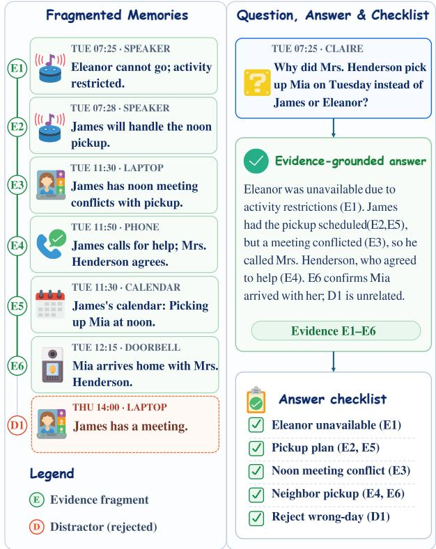
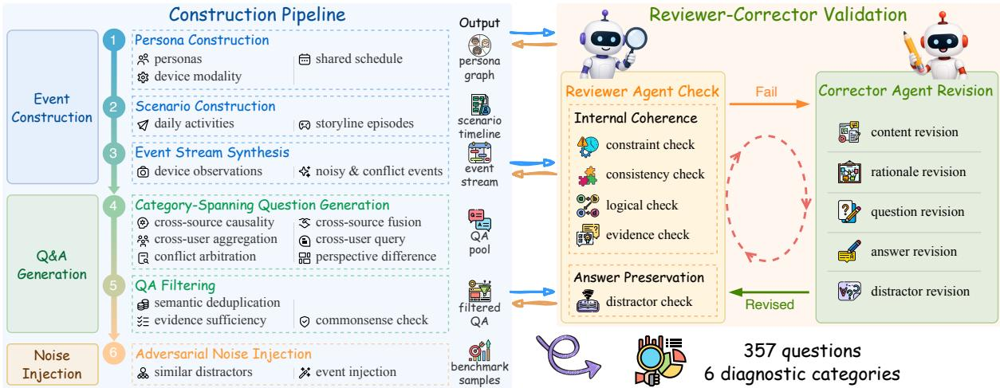
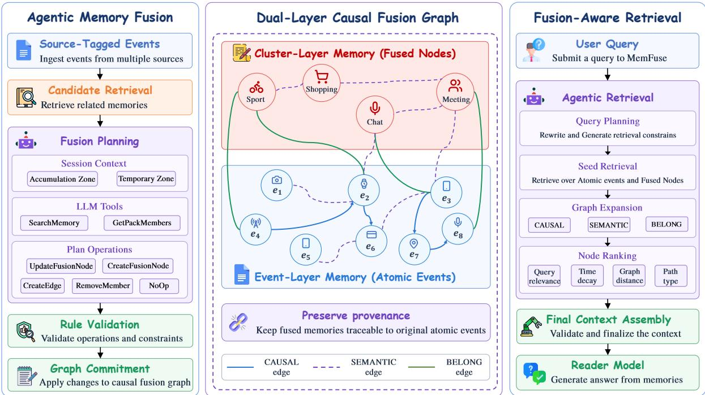
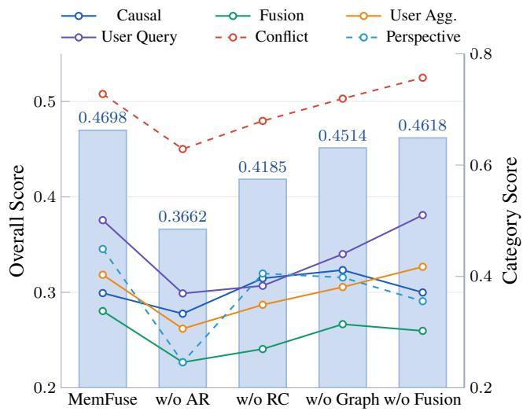

# MemFuse: Multi-Source Memory Fusion from Fragmented Observations

Chao Li<sup>1</sup>, Yuanfa Li<sup>1</sup>, Wenhao Wu<sup>2∗</sup>, Xule Liu<sup>1</sup>, Zhi Wang<sup>2</sup>, Kun Shao<sup>1†</sup>

<sup>1</sup>Xi<sub>aom</sub>i I<sub>nc.</sub>

<sup>2</sup>Nanjing University

lichao75@xiaomi.com, liyuanfa@xiaomi.com, wenhaowu@smail.nju.edu.cn, liuxule@xiaomi.com, zhiwang@nju.edu.cn, shaokun@xiaomi.com

## Abstract

L<sub>ong-</sub>t<sub>erm memory</sub> i<sub>s essen</sub>ti<sub>a</sub>l f<sub>or agen</sub>t<sub>s</sub> th<sub>a</sub>t <sub>opera</sub>t<sub>e across</sub> <sub>ex</sub>t<sub>en</sub>d<sub>e</sub>d i<sub>n</sub>t<sub>erac</sub>ti<sub>ons,</sub> <sub>ye</sub>t <sub>ex</sub>i<sub>s</sub>ti<sub>ng</sub> <sub>memory</sub> <sub>sys</sub>t<sub>ems</sub> <sub>an</sub>d b<sub>enc</sub>h<sub>mar</sub>k<sub>s pre</sub>d<sub>om</sub>i<sub>nan</sub>tl<sub>y</sub> f<sub>ocus on s</sub>i<sub>ng</sub>l<sub>e-source</sub> t<sub>ex</sub>t<sub>ua</sub>l hi<sub>s-</sub> t<sub>or</sub>i<sub>es.</sub> I<sub>n rea</sub>li<sub>s</sub>ti<sub>c se</sub>tti<sub>ngs,</sub> h<sub>owever, re</sub>l<sub>evan</sub>t i<sub>n</sub>f<sub>orma</sub>ti<sub>on</sub> i<sub>s</sub> <sub>o</sub>ft<sub>en</sub> f<sub>ragmen</sub>t<sub>e</sub>d <sub>across</sub> <sub>app</sub>li<sub>ca</sub>ti<sub>ons</sub> <sub>an</sub>d d<sub>ev</sub>i<sub>ces,</sub> <sub>as</sub> <sub>we</sub>ll <sub>as</sub> <sub>across</sub> <sub>users</sub> <sub>an</sub>d ti<sub>me,</sub> <sub>requ</sub>i<sub>r</sub>i<sub>ng</sub> <sub>agen</sub>t<sub>s</sub> t<sub>o</sub> i<sub>n</sub>t<sub>egra</sub>t<sub>e</sub> di<sub>sperse</sub>d <sub>o</sub>b<sub>serva</sub>ti<sub>ons</sub> i<sub>n</sub>t<sub>o co</sub>h<sub>eren</sub>t <sub>ep</sub>i<sub>so</sub>di<sub>c memor</sub>i<sub>es w</sub>hil<sub>e preserv-</sub> i<sub>ng</sub> th<sub>e</sub>i<sub>r</sub> <sub>source</sub> <sub>provenance.</sub> T<sub>o</sub> <sub>a</sub>dd<sub>ress</sub> th<sub>ese</sub> <sub>gaps,</sub> <sub>we</sub> i<sub>n</sub>t<sub>ro-</sub> duce MemFuseBench, a benchmark for multi-source memory fusion. MemFuseBench is built with a Scene-to-Sensor <sub>p</sub>i<sub>pe</sub>li<sub>ne</sub> th<sub>a</sub>t <sub>syn</sub>th<sub>es</sub>i<sub>zes con</sub>t<sub>ro</sub>ll<sub>a</sub>bl<sub>e scenar</sub>i<sub>os</sub> i<sub>n</sub>t<sub>o source-</sub> t<sub>agge</sub>d <sub>o</sub>b<sub>serva</sub>ti<sub>ons, ev</sub>id<sub>ence-groun</sub>d<sub>e</sub>d <sub>ques</sub>ti<sub>ons, an</sub>d <sub>a</sub>d<sub>-</sub> <sub>versar</sub>i<sub>a</sub>l di<sub>s</sub>t<sub>rac</sub>t<sub>ors.</sub> It <sub>ena</sub>bl<sub>es sys</sub>t<sub>ema</sub>ti<sub>c eva</sub>l<sub>ua</sub>ti<sub>on o</sub>f t<sub>em-</sub> <sub>pora</sub>l <sub>reason</sub>i<sub>ng, cross-source ev</sub>id<sub>ence</sub> f<sub>us</sub>i<sub>on, an</sub>d <sub>ro</sub>b<sub>us</sub>t<sub>-</sub> ness to noise. We further propose MemFuse, a structured <sub>memory sys</sub>t<sub>em</sub> th<sub>a</sub>t <sub>preserves source-</sub>l<sub>eve</sub>l <sub>ev</sub>id<sub>ence</sub> i<sub>n even</sub>t<sub>-</sub> l<sub>ayer a</sub>t<sub>om</sub>i<sub>c memory an</sub>d <sub>organ</sub>i<sub>zes re</sub>l<sub>a</sub>t<sub>e</sub>d <sub>a</sub>t<sub>om</sub>i<sub>c even</sub>t<sub>s</sub> i<sub>n</sub>t<sub>o c</sub>l<sub>us</sub>t<sub>er-</sub>l<sub>ayer</sub> f<sub>use</sub>d <sub>memory w</sub>ithi<sub>n a causa</sub>l f<sub>us</sub>i<sub>on grap</sub>h<sub>.</sub> D<sub>ur</sub>i<sub>ng re</sub>t<sub>r</sub>i<sub>eva</sub>l<sub>,</sub> M<sub>em</sub>F<sub>use re</sub>t<sub>r</sub>i<sub>eves an</sub>d <sub>organ</sub>i<sub>zes re</sub>l<sub>a</sub>t<sub>e</sub>d <sub>ev</sub>id<sub>ence</sub> f<sub>ragmen</sub>t<sub>s w</sub>hil<sub>e ma</sub>i<sub>n</sub>t<sub>a</sub>i<sub>n</sub>i<sub>ng</sub> t<sub>racea</sub>bilit<sub>y</sub> t<sub>o or</sub>i<sub>g-</sub> i<sub>na</sub>l <sub>source even</sub>t<sub>s.</sub> E<sub>xper</sub>i<sub>men</sub>t<sub>s on</sub> M<sub>em</sub>F<sub>use</sub>B<sub>enc</sub>h <sub>s</sub>h<sub>ow</sub> th<sub>a</sub>t M<sub>em</sub>F<sub>use ac</sub>hi<sub>eves</sub> th<sub>e</sub> b<sub>es</sub>t <sub>overa</sub>ll <sub>per</sub>f<sub>ormance among</sub> th<sub>e eva</sub>l<sub>ua</sub>t<sub>e</sub>d <sub>memory sys</sub>t<sub>ems un</sub>d<sub>er a</sub>ll th<sub>ree</sub> LLM <sub>se</sub>tti<sub>ngs</sub> <sub>an</sub>d <sub>cons</sub>i<sub>s</sub>t<sub>en</sub>tl<sub>y</sub> i<sub>mproves per</sub>f<sub>ormance on ques</sub>ti<sub>ons requ</sub>i<sub>r</sub>i<sub>ng</sub> <sub>cross-source ev</sub>id<sub>ence</sub> f<sub>us</sub>i<sub>on.</sub>

Code — https://github.com/Darwin-Agent/Mi-Memory/ tr<sub>ee</sub>/m<sub>as</sub>t<sub>e</sub>r/M<sub>e</sub>mF<sub>use</sub>

## Introduction

L<sub>o</sub>n<sub>g-</sub>t<sub>e</sub>rm m<sub>e</sub>m<sub>o</sub>r<sub>y</sub> <sub>sys</sub>t<sub>e</sub>m<sub>s</sub> h<sub>ave</sub> r<sub>ece</sub>i<sub>ve</sub>d <sub>g</sub>r<sub>ow</sub>in<sub>g</sub> <sub>a</sub>tt<sub>e</sub>nti<sub>o</sub>n <sub>as agen</sub>t<sub>s are expec</sub>t<sub>e</sub>d t<sub>o ma</sub>i<sub>n</sub>t<sub>a</sub>i<sub>n use</sub>f<sub>u</sub>l <sub>con</sub>t<sub>ex</sub>t <sub>across ex-</sub> t<sub>en</sub>d<sub>e</sub>d i<sub>n</sub>t<sub>erac</sub>ti<sub>ons.</sub> E<sub>x</sub>i<sub>s</sub>ti<sub>ng</sub> <sub>sys</sub>t<sub>ems</sub> <sub>s</sub>t<sub>ore</sub> <sub>pas</sub>t i<sub>n</sub>t<sub>erac</sub>ti<sub>ons</sub> <sub>as recor</sub>d<sub>s, summar</sub>i<sub>es, or s</sub>t<sub>ruc</sub>t<sub>ure</sub>d <sub>memor</sub>i<sub>es</sub> f<sub>or re</sub>t<sub>r</sub>i<sub>eva</sub>l (Packer et al. 2023; Chhikara et al. 2025; Xu et al. 2025; Hu <sub>e</sub>t <sub>a</sub>l<sub>.</sub> 2025<sub>,</sub> 2026<sub>a;</sub> C<sub>ao,</sub> H<sub>e, an</sub>d T<sub>an</sub> 2026<sub>;</sub> S<sub>un,</sub> Z<sub>eng, an</sub>d Zhan<sub>g</sub> 2026; Hu et al. 2026d), and work well when relevant <sub>con</sub>t<sub>ex</sub>t f<sub>orms</sub> <sub>a</sub> <sub>co</sub>h<sub>eren</sub>t hi<sub>s</sub>t<sub>ory.</sub> A<sub>s</sub> <sub>user</sub> <sub>expec</sub>t<sub>a</sub>ti<sub>ons</sub> <sub>grow,</sub> h<sub>owever, agen</sub>t<sub>s nee</sub>d t<sub>o remem</sub>b<sub>er no</sub>t <sub>on</sub>l<sub>y w</sub>h<sub>a</sub>t <sub>users ex-</sub> <sub>p</sub>li<sub>c</sub>itl<sub>y</sub> t<sub>e</sub>ll th<sub>em,</sub> b<sub>u</sub>t <sub>a</sub>l<sub>so use</sub>f<sub>u</sub>l <sub>o</sub>b<sub>serva</sub>ti<sub>ons</sub> f<sub>rom</sub> d<sub>ev</sub>i<sub>ces,</sub> <sub>app</sub>li<sub>ca</sub>ti<sub>ons, an</sub>d <sub>o</sub>th<sub>er users.</sub> I<sub>n</sub> thi<sub>s se</sub>tti<sub>ng,</sub> th<sub>e same un</sub>d<sub>er-</sub> l<sub>y</sub>i<sub>ng ep</sub>i<sub>so</sub>d<sub>e may</sub> th<sub>en</sub> b<sub>e represen</sub>t<sub>e</sub>d b<sub>y</sub> f<sub>ragmen</sub>t<sub>e</sub>d <sub>even</sub>t<sub>s</sub> f<sub>rom</sub> dif<sub>eren</sub>t <sub>or</sub>i<sub>g</sub>i<sub>ns,</sub> <sub>ma</sub>ki<sub>ng</sub> it <sub>necessary</sub> t<sub>o</sub> i<sub>n</sub>t<sub>egra</sub>t<sub>e</sub> <sub>com-</sub> <sub>p</sub>l<sub>emen</sub>t<sub>ary o</sub>b<sub>serva</sub>ti<sub>ons w</sub>ith<sub>ou</sub>t l<sub>os</sub>i<sub>ng</sub> th<sub>e</sub>i<sub>r sources.</sub> W<sub>e</sub> call this memory-level problem multi-source memoryfusion: <sub>re</sub>t<sub>r</sub>i<sub>ev</sub>i<sub>ng an</sub>d i<sub>n</sub>t<sub>egra</sub>ti<sub>ng</sub> di<sub>s</sub>t<sub>r</sub>ib<sub>u</sub>t<sub>e</sub>d <sub>seman</sub>ti<sub>c even</sub>t<sub>s w</sub>hil<sub>e</sub> p<sup>reser</sup>v<sup>in</sup>g <sup>e</sup>v<sup>ent-la</sup>y<sup>er</sup> p<sup>ro</sup>v<sup>enance</sup>.

E<sub>x</sub>i<sub>s</sub>ti<sub>ng memory</sub> b<sub>enc</sub>h<sub>mar</sub>k<sub>s ma</sub>i<sub>n</sub>l<sub>y eva</sub>l<sub>ua</sub>t<sub>e conversa-</sub> ti<sub>ona</sub>l <sub>reca</sub>ll<sub>,</sub> t<sub>empora</sub>l <sub>up</sub>d<sub>a</sub>t<sub>es,</sub> <sub>or</sub> l<sub>ong-con</sub>t<sub>ex</sub>t <sub>reason</sub>i<sub>ng</sub> over interaction histories (Maharana et al. 2024; Wu et al. 2025; Tan et al. 2025; Hu et al. 2026b; Yan<sub>g</sub> et al. 2026b). Re-<sub>cen</sub>t b<sub>enc</sub>h<sub>mar</sub>k<sub>s cons</sub>id<sub>er</sub> h<sub>e</sub>t<sub>erogeneous</sub> di<sub>g</sub>it<sub>a</sub>l t<sub>races an</sub>d multimodal evidence (Chen<sub>g</sub> et al. 2026; Chai et al. 2026), b<sub>u</sub>t th<sub>ey</sub> d<sub>o no</sub>t <sub>spec</sub>ifi<sub>ca</sub>ll<sub>y</sub> t<sub>es</sub>t <sub>w</sub>h<sub>e</sub>th<sub>er memory sys</sub>t<sub>ems</sub> <sub>can</sub> li<sub>n</sub>k f<sub>ragmen</sub>t<sub>e</sub>d<sub>, source-</sub>t<sub>agge</sub>d <sub>even</sub>t<sub>s</sub> i<sub>n</sub>t<sub>o</sub> t<sub>racea</sub>bl<sub>e ev</sub>i<sub>-</sub> d<sub>ence</sub> f<sub>or</sub> f<sub>us</sub>i<sub>on-or</sub>i<sub>en</sub>t<sub>e</sub>d <sub>ques</sub>ti<sub>ons.</sub> It th<sub>ere</sub>f<sub>ore rema</sub>i<sub>ns</sub> dif<sub>-</sub> fi<sub>cu</sub>lt t<sub>o</sub> t<sub>es</sub>t <sub>w</sub>h<sub>e</sub>th<sub>er a sys</sub>t<sub>em can recover comp</sub>l<sub>emen</sub>t<sub>ary</sub> <sub>o</sub>b<sub>serva</sub>ti<sub>ons</sub> f<sub>rom</sub> dif<sub>eren</sub>t <sub>or</sub>i<sub>g</sub>i<sub>ns.</sub>

To address these challenges, we first introduce Mem-FuseBench, a benchmark for multi-source memory fusion. St<sub>ar</sub>ti<sub>ng</sub> f<sub>rom con</sub>t<sub>ro</sub>ll<sub>a</sub>bl<sub>e scenar</sub>i<sub>os,</sub> it<sub>s</sub> S<sub>cene-</sub>t<sub>o-</sub>S<sub>ensor</sub> <sub>p</sub>i<sub>pe</sub>li<sub>ne genera</sub>t<sub>es source-</sub>t<sub>agge</sub>d <sub>o</sub>b<sub>serva</sub>ti<sub>ons, ev</sub>id<sub>ence-</sub> <sub>groun</sub>d<sub>e</sub>d <sub>ques</sub>ti<sub>ons, an</sub>d <sub>a</sub>d<sub>versar</sub>i<sub>a</sub>l di<sub>s</sub>t<sub>rac</sub>t<sub>ors.</sub> Fi<sub>gure</sub> 1 il<sub>-</sub> l<sub>us</sub>t<sub>ra</sub>t<sub>es a ques</sub>ti<sub>on requ</sub>i<sub>r</sub>i<sub>ng ev</sub>id<sub>ence</sub> f<sub>rom mu</sub>lti<sub>p</sub>l<sub>e or</sub>i<sub>g</sub>i<sub>ns</sub> <sub>w</sub>hil<sub>e</sub> i<sub>gnor</sub>i<sub>ng</sub> <sub>a</sub> <sub>p</sub>l<sub>aus</sub>ibl<sub>e</sub> di<sub>s</sub>t<sub>rac</sub>t<sub>or.</sub> Th<sub>e</sub> b<sub>enc</sub>h<sub>mar</sub>k <sub>con-</sub> t<sub>a</sub>i<sub>ns</sub> 357 <sub>ques</sub>ti<sub>ons over</sub> 7<sub>,</sub>823 <sub>even</sub>t<sub>s across s</sub>i<sub>x</sub> di<sub>agnos</sub>ti<sub>c</sub> cate<sub>g</sub>or<sup>i</sup>es.

T<sub>o</sub> f<sub>ur</sub>th<sub>er suppor</sub>t <sub>mu</sub>lti<sub>-source memory</sub> f<sub>us</sub>i<sub>on, we pro-</sub> pose MemFuse, a graph-structured memory system that pre-<sub>serves</sub> <sub>even</sub>t<sub>-</sub>l<sub>ayer</sub> <sub>memory</sub> <sub>as</sub> th<sub>e</sub> <sub>ev</sub>id<sub>ence</sub> l<sub>ayer</sub> <sub>an</sub>d <sub>orga-</sub> <sub>n</sub>i<sub>zes re</sub>l<sub>a</sub>t<sub>e</sub>d <sub>even</sub>t<sub>s</sub> i<sub>n</sub>t<sub>o c</sub>l<sub>us</sub>t<sub>er-</sub>l<sub>ayer memory w</sub>ithi<sub>n a causa</sub>l f<sub>us</sub>i<sub>on grap</sub>h<sub>.</sub> At <sub>re</sub>t<sub>r</sub>i<sub>eva</sub>l ti<sub>me,</sub> M<sub>em</sub>F<sub>use uses agen</sub>ti<sub>c searc</sub>h t<sub>o recover</sub> b<sub>o</sub>th <sub>compac</sub>t <sub>c</sub>l<sub>us</sub>t<sub>er memor</sub>i<sub>es an</sub>d th<sub>e</sub>i<sub>r</sub> t<sub>racea</sub>bl<sub>e</sub> source events.

In summar<sub>y</sub>, our contributions are: (1) identif<sub>y</sub>in<sub>g</sub> multi-<sub>source</sub> <sub>memory</sub> f<sub>us</sub>i<sub>on</sub> <sub>as</sub> <sub>a</sub> <sub>memory-</sub>l<sub>eve</sub>l <sub>researc</sub>h <sub>pro</sub>b<sub>-</sub> lem over fra<sub>g</sub>mented, source-ta<sub>gg</sub>ed events; (2) introducin<sub>g</sub> M<sub>em</sub>F<sub>use</sub>B<sub>enc</sub>h<sub>, a</sub> f<sub>us</sub>i<sub>on-cen</sub>t<sub>r</sub>i<sub>c</sub> b<sub>enc</sub>h<sub>mar</sub>k f<sub>or</sub> thi<sub>s se</sub>tti<sub>ng,</sub> f<sub>ea</sub>t<sub>ur</sub>i<sub>ng</sub> <sub>s</sub>i<sub>x</sub> di<sub>agnos</sub>ti<sub>c</sub> <sub>ca</sub>t<sub>egor</sub>i<sub>es</sub> <sub>an</sub>d <sub>answer</sub> <sub>c</sub>h<sub>ec</sub>kli<sub>s</sub>t<sub>s,</sub> <sub>suppor</sub>t<sub>e</sub>d b<sub>y</sub> <sub>a</sub> <sub>sca</sub>l<sub>a</sub>bl<sub>e</sub> LLM<sub>-</sub>b<sub>ase</sub>d <sub>syn</sub>th<sub>es</sub>i<sub>s</sub> <sub>an</sub>d <sub>rev</sub>i<sub>ewer-</sub> corrector validation <sub>p</sub>i<sub>p</sub>eline; (3) <sub>p</sub>ro<sub>p</sub>osin<sub>g</sub> MemFuse, a <sub>s</sub>t<sub>ruc</sub>t<sub>ure</sub>d <sub>memory sys</sub>t<sub>em</sub> th<sub>a</sub>t <sub>preserves source-</sub>l<sub>eve</sub>l <sub>ev</sub>i<sub>-</sub> d<sub>ence</sub> i<sub>n</sub> <sub>even</sub>t<sub>-</sub>l<sub>ayer</sub> <sub>a</sub>t<sub>om</sub>i<sub>c</sub> <sub>memory</sub> <sub>an</sub>d f<sub>uses</sub> <sub>re</sub>l<sub>a</sub>t<sub>e</sub>d <sub>even</sub>t<sub>s</sub> i<sub>n</sub>t<sub>o</sub> <sub>c</sub>l<sub>us</sub>t<sub>er-</sub>l<sub>ayer</sub> <sub>memory</sub> <sub>w</sub>ithi<sub>n</sub> <sub>a</sub> <sub>causa</sub>l f<sub>us</sub>i<sub>on</sub> <sub>grap</sub>h<sub>;</sub> <sub>an</sub>d (4) validatin<sub>g</sub> MemFuseBench and MemFuse throu<sub>g</sub>h ex<sub>p</sub>eri<sub>men</sub>t<sub>s across mu</sub>lti<sub>p</sub>l<sub>e mo</sub>d<sub>e</sub>l<sub>s, w</sub>h<sub>ere</sub> M<sub>em</sub>F<sub>use ac</sub>hi<sub>eves</sub> th<sub>e</sub> b<sub>es</sub>t O<sub>vera</sub>ll <sub>score</sub> <sub>among</sub> th<sub>e</sub> <sub>eva</sub>l<sub>ua</sub>t<sub>e</sub>d <sub>re</sub>t<sub>r</sub>i<sub>eva</sub>l <sub>an</sub>d <sub>memory</sub> <sub>sys</sub>t<sub>ems</sub> <sub>un</sub>d<sub>er</sub> <sub>a</sub>ll th<sub>ree</sub> LLM <sub>se</sub>tti<sub>ngs.</sub>

  
Fi<sub>gure</sub> 1<sub>:</sub> A M<sub>em</sub>F<sub>use</sub>B<sub>enc</sub>h i<sub>ns</sub>t<sub>ance</sub> <sub>requ</sub>i<sub>r</sub>i<sub>ng</sub> f<sub>us</sub>i<sub>on</sub> <sub>across</sub> <sub>a</sub> h<sub>ouse</sub>h<sub>o</sub>ld <sub>conversa</sub>ti<sub>on,</sub> <sub>wor</sub>k <sub>ca</sub>l<sub>en</sub>d<sub>ar,</sub> <sub>an</sub>d <sub>p</sub>h<sub>one</sub> <sub>ca</sub>ll<sub>,</sub> while rejecting a plausible distractor on the wrong day.

## Related Work

Long-Term Agent Memory. Agent-memory systems store <sub>pas</sub>t i<sub>n</sub>t<sub>erac</sub>ti<sub>ons as recor</sub>d<sub>s, summar</sub>i<sub>es,</sub> li<sub>n</sub>k<sub>e</sub>d <sub>no</sub>t<sub>es, or</sub> hi<sub>-</sub> erarchical memor<sub>y</sub> units for later retrieval (Park et al. 2023; P<sub>ac</sub>k<sub>er e</sub>t <sub>a</sub>l<sub>.</sub> 2023<sub>;</sub> Zh<sub>ong e</sub>t <sub>a</sub>l<sub>.</sub> 2024<sub>;</sub> Li<sub>u e</sub>t <sub>a</sub>l<sub>.</sub> 2023<sub>;</sub> W<sub>ang</sub> <sub>e</sub>t <sub>a</sub>l<sub>.</sub> 2023<sub>;</sub> Chhik<sub>ara e</sub>t <sub>a</sub>l<sub>.</sub> 2025<sub>;</sub> X<sub>u e</sub>t <sub>a</sub>l<sub>.</sub> 2025<sub>;</sub> Zh<sub>ang e</sub>t <sub>a</sub>l<sub>.</sub> 2025<sub>;</sub> H<sub>u e</sub>t <sub>a</sub>l<sub>.</sub> 2025<sub>,</sub> 2026<sub>a;</sub> C<sub>ao,</sub> H<sub>e, an</sub>d T<sub>an</sub> 2026<sub>;</sub> S<sub>un,</sub> Zen<sub>g</sub>, and Zhan<sub>g</sub> 2026). Recent work also introduces struct<sub>ure</sub>d <sub>or grap</sub>h<sub>-</sub>b<sub>ase</sub>d <sub>memory</sub> t<sub>o connec</sub>t <sub>re</sub>l<sub>a</sub>t<sub>e</sub>d <sub>exper</sub>i<sub>ences</sub> and su<sub>pp</sub>ort multi-ste<sub>p</sub> retrieval (Hu et al. 2026c; Xu et al. 2026; Yan<sub>g</sub> et al. 2026a; Hu et al. 2026d). These s<sub>y</sub>stems i<sub>mprove organ</sub>i<sub>za</sub>ti<sub>on over</sub> fl<sub>a</sub>t l<sub>ogs,</sub> b<sub>u</sub>t th<sub>ey ma</sub>i<sub>n</sub>l<sub>y assume</sub> <sub>conversa</sub>ti<sub>ona</sub>l <sub>or</sub> i<sub>n</sub>t<sub>erac</sub>ti<sub>on</sub> hi<sub>s</sub>t<sub>or</sub>i<sub>es ra</sub>th<sub>er</sub> th<sub>an</sub> f<sub>ragmen</sub>t<sub>e</sub>d <sub>o</sub>b<sub>serva</sub>ti<sub>ons across</sub> dif<sub>eren</sub>t <sub>sources.</sub>

Memory Benchmarks. LoCoMo, LongMemEval, and M<sub>em</sub>B<sub>enc</sub>h <sub>eva</sub>l<sub>ua</sub>t<sub>e</sub> <sub>conversa</sub>ti<sub>ona</sub>l <sub>reca</sub>ll<sub>,</sub> t<sub>empora</sub>l <sub>up</sub>d<sub>a</sub>t<sub>es,</sub> abstention, and lon<sub>g</sub>-context reasonin<sub>g</sub> (Maharana et al. 2024; Wu et al. 2025; Tan et al. 2025). EverMemBench <sub>an</sub>d G<sub>roup</sub>M<sub>em</sub>B<sub>enc</sub>h <sub>ex</sub>t<sub>en</sub>d thi<sub>s</sub> li<sub>ne</sub> t<sub>o</sub> l<sub>ong-</sub>t<sub>erm</sub> i<sub>n</sub>t<sub>erac-</sub> tive memor<sub>y</sub> and multi-<sub>p</sub>art<sub>y</sub> conversations (Hu et al. 2026b; Yan<sub>g</sub> et al. 2026b). LifeBench and SMMBench move closer t<sub>o rea</sub>li<sub>s</sub>ti<sub>c se</sub>tti<sub>ngs</sub> b<sub>y us</sub>i<sub>ng</sub> h<sub>e</sub>t<sub>erogeneous</sub> di<sub>g</sub>it<sub>a</sub>l t<sub>races or</sub> inde<sub>p</sub>endentl<sub>y</sub> ori<sub>g</sub>inated multimodal evidence (Chen<sub>g</sub> et al.

2026; Chai et al. 2026). The<sub>y</sub> broaden the in<sub>p</sub>ut sources for <sub>memory eva</sub>l<sub>ua</sub>ti<sub>on,</sub> b<sub>u</sub>t d<sub>o no</sub>t <sub>cen</sub>t<sub>er</sub> th<sub>e</sub> t<sub>as</sub>k d<sub>es</sub>i<sub>gn on</sub> li<sub>n</sub>ki<sub>ng,</sub> f<sub>us</sub>i<sub>ng, an</sub>d t<sub>rac</sub>i<sub>ng</sub> di<sub>s</sub>t<sub>r</sub>ib<sub>u</sub>t<sub>e</sub>d <sub>even</sub>t f<sub>ragmen</sub>t<sub>s.</sub>

Multi-Source memory Fusion. Event-centric resources <sub>an</sub>d lif<sub>e</sub>l<sub>ogg</sub>i<sub>ng sys</sub>t<sub>ems organ</sub>i<sub>ze</sub> h<sub>e</sub>t<sub>erogeneous recor</sub>d<sub>s</sub> i<sub>n</sub>t<sub>o</sub> <sub>even</sub>t <sub>s</sub>t<sub>ruc</sub>t<sub>ures</sub> f<sub>or</sub> t<sub>empora</sub>l <sub>or commonsense reason</sub>i<sub>ng</sub> (Gottschalk and Demidova 2018; Zhan<sub>g</sub> et al. 2020; Gurrin, Smeaton, and Dohert<sub>y</sub> 2014). Multisensor fusion studies h<sub>ow s</sub>i<sub>gna</sub>l<sub>s or</sub> d<sub>ec</sub>i<sub>s</sub>i<sub>ons</sub> f<sub>rom mu</sub>lti<sub>p</sub>l<sub>e sensors are reg</sub>i<sub>s-</sub> tered, estimated, or combined (Khale<sub>g</sub>hi et al. 2013). These <sub>researc</sub>h di<sub>rec</sub>ti<sub>ons are re</sub>l<sub>a</sub>t<sub>e</sub>d t<sub>o mu</sub>lti<sub>-source ev</sub>id<sub>ence,</sub> b<sub>u</sub>t th<sub>ey</sub> <sub>are</sub> <sub>no</sub>t <sub>concerne</sub>d <sub>w</sub>ith <sub>agen</sub>t <sub>memory:</sub> <sub>none</sub> <sub>a</sub>dd<sub>resses</sub> h<sub>ow a</sub> l<sub>ong-</sub>t<sub>erm memory sys</sub>t<sub>em s</sub>h<sub>ou</sub>ld <sub>preserve a</sub>t<sub>om</sub>i<sub>c</sub> <sub>provenance</sub> <sub>w</sub>hil<sub>e</sub> <sub>group</sub>i<sub>ng</sub> <sub>an</sub>d <sub>re</sub>t<sub>r</sub>i<sub>ev</sub>i<sub>ng</sub> f<sub>ragmen</sub>t<sub>e</sub>d <sub>o</sub>b<sub>ser-</sub> <sub>va</sub>ti<sub>ons</sub> f<sub>or</sub> d<sub>owns</sub>t<sub>ream</sub> <sub>ques</sub>ti<sub>on</sub> <sub>answer</sub>i<sub>ng.</sub>

## MemFuseBench

M<sub>os</sub>t <sub>memory</sub> b<sub>enc</sub>h<sub>mar</sub>k<sub>s eva</sub>l<sub>ua</sub>t<sub>e reca</sub>ll <sub>w</sub>ithi<sub>n a s</sub>i<sub>ng</sub>l<sub>e</sub> <sub>conversa</sub>ti<sub>ona</sub>l hi<sub>s</sub>t<sub>ory.</sub> R<sub>ecen</sub>t <sub>ones</sub> b<sub>roa</sub>d<sub>en</sub> th<sub>e</sub> i<sub>npu</sub>t t<sub>o</sub> h<sub>e</sub>t<sub>-</sub> <sub>erogeneous or mu</sub>lti<sub>mo</sub>d<sub>a</sub>l t<sub>races,</sub> b<sub>u</sub>t <sub>none</sub> i<sub>so</sub>l<sub>a</sub>t<sub>es</sub> th<sub>e core</sub> difi<sub>cu</sub>lt<sub>y o</sub>f <sub>reason</sub>i<sub>ng over ev</sub>id<sub>ence</sub> f<sub>ragmen</sub>t<sub>e</sub>d <sub>across</sub> d<sub>e-</sub> <sub>v</sub>i<sub>ces,</sub> <sub>app</sub>li<sub>ca</sub>ti<sub>ons,</sub> <sub>users,</sub> <sub>an</sub>d ti<sub>me,</sub> <sub>w</sub>h<sub>ere</sub> <sub>no</sub> <sub>s</sub>i<sub>ng</sub>l<sub>e</sub> <sub>recor</sub>d <sub>su</sub>fi<sub>ces.</sub> E<sub>va</sub>l<sub>ua</sub>ti<sub>ng</sub> thi<sub>s</sub> d<sub>eman</sub>d<sub>s</sub> t<sub>wo proper</sub>ti<sub>es ex</sub>i<sub>s</sub>ti<sub>ng</sub> b<sub>enc</sub>h<sub>mar</sub>k<sub>s</sub> l<sub>ac</sub>k<sub>: source-</sub>l<sub>eve</sub>l <sub>ev</sub>id<sub>ence anno</sub>t<sub>a</sub>ti<sub>ons</sub> th<sub>a</sub>t <sub>ex-</sub> <sub>pose provenance, an</sub>d <sub>ques</sub>ti<sub>ons w</sub>h<sub>ose answers genu</sub>i<sub>ne</sub>l<sub>y</sub> d<sub>e-</sub> <sub>pen</sub>d <sub>on s</sub>tit<sub>c</sub>hi<sub>ng</sub> f<sub>ragmen</sub>t<sub>s</sub> f<sub>rom more</sub> th<sub>an one source.</sub> W<sub>e</sub> th<sub>ere</sub>f<sub>ore</sub> b<sub>u</sub>ild M<sub>em</sub>F<sub>use</sub>B<sub>enc</sub>h<sub>, pa</sub>i<sub>r</sub>i<sub>ng source-</sub>t<sub>agge</sub>d <sub>even</sub>t <sub>s</sub>t<sub>reams w</sub>ith <sub>ev</sub>id<sub>ence-groun</sub>d<sub>e</sub>d <sub>ques</sub>ti<sub>ons answera</sub>bl<sub>e on</sub>l<sub>y</sub> b<sub>y</sub> f<sub>us</sub>i<sub>ng</sub> f<sub>ragmen</sub>t<sub>e</sub>d <sub>a</sub>t<sub>om</sub>i<sub>c even</sub>t<sub>s across sources, a</sub>l<sub>ongs</sub>id<sub>e</sub> <sub>a</sub>d<sub>versar</sub>i<sub>a</sub>l di<sub>s</sub>t<sub>rac</sub>t<sub>ors</sub> th<sub>a</sub>t <sub>pena</sub>li<sub>ze s</sub>h<sub>or</sub>t<sub>cu</sub>t <sub>re</sub>t<sub>r</sub>i<sub>eva</sub>l<sub>.</sub>

## Dataset Construction

E<sub>ac</sub>h M<sub>em</sub>F<sub>use</sub>B<sub>enc</sub>h i<sub>ns</sub>t<sub>ance con</sub>t<sub>a</sub>i<sub>ns source-spec</sub>ifi<sub>c</sub> <sub>even</sub>t <sub>s</sub>t<sub>reams an</sub>d <sub>a ques</sub>ti<sub>on w</sub>ith it<sub>s re</sub>f<sub>erence answer an</sub>d <sub>an answer c</sub>h<sub>ec</sub>kli<sub>s</sub>t<sub>.</sub> W<sub>e cons</sub>t<sub>ruc</sub>t th<sub>ese</sub> i<sub>ns</sub>t<sub>ances w</sub>ith <sub>a</sub> S<sub>cene-</sub>t<sub>o-</sub>S<sub>ensor</sub> <sub>p</sub>i<sub>pe</sub>li<sub>ne</sub> th<sub>a</sub>t t<sub>urns</sub> <sub>con</sub>t<sub>ro</sub>ll<sub>a</sub>bl<sub>e</sub> l<sub>a</sub>t<sub>en</sub>t <sub>sce-</sub> <sub>nar</sub>i<sub>os</sub> i<sub>n</sub>t<sub>o source-spec</sub>ifi<sub>c o</sub>b<sub>serva</sub>ti<sub>ons, ev</sub>id<sub>ence-groun</sub>d<sub>e</sub>d <sub>ques</sub>ti<sub>ons,</sub> <sub>an</sub>d <sub>a</sub>d<sub>versar</sub>i<sub>a</sub>l <sub>non-ev</sub>id<sub>ence</sub> <sub>even</sub>t<sub>s.</sub> R<sub>ev</sub>i<sub>ewer-</sub> <sub>correc</sub>t<sub>or va</sub>lid<sub>a</sub>ti<sub>on c</sub>h<sub>ec</sub>k<sub>s an</sub>d <sub>repa</sub>i<sub>rs</sub> i<sub>n</sub>t<sub>erme</sub>di<sub>a</sub>t<sub>e ar</sub>tif<sub>ac</sub>t<sub>s</sub> f<sub>or cons</sub>i<sub>s</sub>t<sub>ency, ev</sub>id<sub>ence suppor</sub>t<sub>, an</sub>d <sub>answer preserva</sub>ti<sub>on</sub> under injected distractors.

Construction Pipeline. The core construction method is Scene-to-Sensor generation, which builds each instance by t<sub>op-</sub>d<sub>own</sub> <sub>narrow</sub>i<sub>ng</sub> <sub>ra</sub>th<sub>er</sub> th<sub>an</sub> di<sub>rec</sub>tl<sub>y</sub> <sub>genera</sub>ti<sub>ng</sub> <sub>ques</sub>ti<sub>on-</sub> <sub>answer pa</sub>i<sub>rs.</sub> It fi<sub>rs</sub>t fi<sub>xes a</sub> hi<sub>g</sub>h<sub>-</sub>l<sub>eve</sub>l <sub>groun</sub>d t<sub>ru</sub>th<sub>—s</sub>t<sub>a</sub>bl<sub>e</sub> personas and a causally linked scenario timeline (what happens in the world)—then projects each latent activity into concrete, timestamped, source-specific event streams (what each device observes), from which the evidence-grounded <sub>ques</sub>ti<sub>ons are</sub> d<sub>er</sub>i<sub>ve</sub>d<sub>.</sub> Fi<sub>gure</sub> 2 <sub>summar</sub>i<sub>zes</sub> th<sub>e</sub> f<sub>ramewor</sub>k<sub>,</sub> <sub>w</sub>hi<sub>c</sub>h i<sub>s</sub> <sub>organ</sub>i<sub>ze</sub>d i<sub>n</sub>t<sub>o</sub> <sub>s</sub>i<sub>x</sub> <sub>s</sub>t<sub>ages:</sub>

1. Persona Construction. Sample stable personas and th<sub>e</sub>i<sub>r s</sub>h<sub>are</sub>d <sub>con</sub>t<sub>ex</sub>t<sub>—sc</sub>h<sub>e</sub>d<sub>u</sub>l<sub>es, re</sub>l<sub>a</sub>ti<sub>ons</sub>hi<sub>ps, an</sub>d <sub>mu</sub>lti<sub>-</sub> d<sub>ev</sub>i<sub>ce</sub> i<sub>nven</sub>t<sub>or</sub>i<sub>es w</sub>ith <sub>o</sub>b<sub>serva</sub>bl<sub>e mo</sub>d<sub>a</sub>liti<sub>es—</sub>i<sub>n</sub>t<sub>o a</sub> <sub>persona-source grap</sub>h<sub>, w</sub>hi<sub>c</sub>h <sub>cons</sub>t<sub>ra</sub>i<sub>ns a</sub>ll l<sub>a</sub>t<sub>er s</sub>t<sub>ages.</sub>

2. Scenario Construction. Organize the personas’ daily acti<sub>v</sub>iti<sub>es</sub> i<sub>n</sub>t<sub>o</sub> <sub>causa</sub>ll<sub>y</sub> li<sub>n</sub>k<sub>e</sub>d <sub>s</sub>t<sub>ory</sub>li<sub>ne</sub> <sub>even</sub>t<sub>s</sub> <sub>groupe</sub>d b<sub>y</sub> <sub>ep</sub>i<sub>so</sub>d<sub>e.</sub> Thi<sub>s</sub> ti<sub>me</sub>li<sub>ne</sub> i<sub>s</sub> th<sub>e</sub> l<sub>a</sub>t<sub>en</sub>t <sub>groun</sub>d t<sub>ru</sub>th<sub>,</sub> l<sub>a</sub>t<sub>er</sub> <sub>re</sub>f<sub>rac</sub>t<sub>e</sub>d i<sub>n</sub>t<sub>o source-spec</sub>ifi<sub>c even</sub>t<sub>s.</sub>

  
Figure 2: Overall MemFuseBench construction framework. The left panel summarizes the construction pipeline, whose six stages are organized into three phases: event construction, QA generation, and noise injection. The right panel shows reviewercorrector validation, where candidate samples are checked, revised, and iterated until the final accepted sample is produced.

3. Event Stream Synthesis. Render the scenario into <sub>source-spec</sub>ifi<sub>c even</sub>t<sub>s,</sub> i<sub>n</sub>t<sub>er</sub>l<sub>eav</sub>i<sub>ng rou</sub>ti<sub>ne, per</sub>i<sub>o</sub>di<sub>c,</sub> <sub>no</sub>i<sub>se, an</sub>d <sub>con</sub>fli<sub>c</sub>t <sub>even</sub>t<sub>s so eac</sub>h <sub>source g</sub>i<sub>ves on</sub>l<sub>y a</sub> <sub>par</sub>ti<sub>a</sub>l <sub>v</sub>i<sub>ew.</sub> Thi<sub>s</sub> <sub>y</sub>i<sub>e</sub>ld<sub>s</sub> <sub>a</sub> ti<sub>mes</sub>t<sub>ampe</sub>d <sub>even</sub>t <sub>s</sub>t<sub>ream.</sub>

4. Category-Spanning Question Generation. Derive <sub>ques</sub>ti<sub>ons spann</sub>i<sub>ng</sub> th<sub>e s</sub>i<sub>x</sub> di<sub>agnos</sub>ti<sub>c ca</sub>t<sub>egor</sub>i<sub>es</sub> i<sub>n</sub> T<sub>a-</sub> ble 1, producin<sub>g</sub> a QA pool of questions, reference an-<sub>swers, answer c</sub>h<sub>ec</sub>kli<sub>s</sub>t<sub>s.</sub>

5. QA Filtering. Filter the pool to remove semantic dupli-<sub>ca</sub>t<sub>es, commonsense s</sub>h<sub>or</sub>t<sub>cu</sub>t<sub>s, an</sub>d it<sub>ems w</sub>h<sub>ose</sub> l<sub>a</sub>b<sub>e</sub>l<sub>e</sub>d <sub>ev</sub>id<sub>ence canno</sub>t <sub>suppor</sub>t th<sub>e re</sub>f<sub>erence answer, re</sub>t<sub>a</sub>i<sub>n</sub>i<sub>ng</sub> <sub>on</sub>l<sub>y answera</sub>bl<sub>e, ev</sub>id<sub>ence-suppor</sub>t<sub>e</sub>d<sub>, non-</sub>d<sub>up</sub>li<sub>ca</sub>ti<sub>ve</sub> it<sub>ems.</sub>

6. Adversarial Noise Injection. Inject semantically simil<sub>ar</sub> di<sub>s</sub>t<sub>rac</sub>t<sub>ors</sub> t<sub>o comp</sub>li<sub>ca</sub>t<sub>e re</sub>t<sub>r</sub>i<sub>eva</sub>l <sub>w</sub>hil<sub>e</sub> k<sub>eep</sub>i<sub>ng</sub> th<sub>e</sub> <sub>go</sub>ld <sub>ev</sub>id<sub>ence se</sub>t <sub>au</sub>dit<sub>a</sub>bl<sub>e an</sub>d <sub>unc</sub>h<sub>ange</sub>d<sub>, so</sub> fi<sub>na</sub>li<sub>ze</sub>d <sub>samp</sub>l<sub>es con</sub>t<sub>a</sub>i<sub>n</sub> b<sub>o</sub>th <sub>go</sub>ld <sub>ev</sub>id<sub>ence an</sub>d <sub>p</sub>l<sub>aus</sub>ibl<sub>e non-</sub> <sub>ev</sub>id<sub>ence</sub> di<sub>s</sub>t<sub>rac</sub>t<sub>ors.</sub>

Validation Protocol. As the pipeline builds each instance sta<sub>g</sub>e <sup>b</sup><sub>y</sub> sta<sub>g</sub>e <sup>i</sup>n a to<sub>p</sub>-<sup>d</sup>own manner, an <sup>i</sup>ncons<sup>i</sup>stent <sub>p</sub>ersona-<sup>so</sup>u<sup>rce</sup> g<sup>ra</sup>p<sup>h can</sup> p<sup>ro</sup>p<sup>a</sup>g<sup>ate errors to e</sup>v<sup>er</sup>y <sup>later artifact</sup>. To prevent this, MemFuseBench applies reviewer-corrector validation to every intermediate artifact before it enters the next stage: a reviewer flags structural, semantic, and consistency issues with stage-specific prompts, a corrector repairs th<sub>em,</sub> <sub>an</sub>d thi<sub>s</sub> <sub>rev</sub>i<sub>ew-correc</sub>ti<sub>on</sub> <sub>process</sub> it<sub>era</sub>t<sub>es</sub> <sub>un</sub>til th<sub>e</sub> <sub>rev</sub>i<sub>ewer</sub> fi<sub>n</sub>d<sub>s no rema</sub>i<sub>n</sub>i<sub>ng</sub> i<sub>ssues.</sub>

Th<sub>e cr</sub>it<sub>er</sub>i<sub>a are s</sub>t<sub>age-spec</sub>ifi<sub>c an</sub>d f<sub>ocus on</sub> t<sub>wo</sub> t<sub>arge</sub>t<sub>s.</sub> F<sub>or</sub> the first four stages, validation targets internal coherence: the <sub>persona-source</sub> <sub>grap</sub>h<sub>,</sub> <sub>scenar</sub>i<sub>o</sub> ti<sub>me</sub>li<sub>ne,</sub> <sub>even</sub>t <sub>s</sub>t<sub>ream,</sub> <sub>an</sub>d QA pool must each be self-consistent and ali<sub>g</sub>ned with the artifacts upstream. For Adversarial Noise Injection, validation instead targets answer preservation: injected distractors <sub>mus</sub>t <sub>comp</sub>li<sub>ca</sub>t<sub>e</sub> <sub>re</sub>t<sub>r</sub>i<sub>eva</sub>l <sub>w</sub>ith<sub>ou</sub>t <sub>a</sub>lt<sub>er</sub>i<sub>ng</sub> th<sub>e</sub> <sub>go</sub>ld <sub>ev</sub>id<sub>ence</sub> <sub>se</sub>t <sub>or re</sub>f<sub>erence answers.</sub>

W<sub>e</sub> f<sub>ur</sub>th<sub>er con</sub>d<sub>uc</sub>t <sub>a mo</sub>d<sub>e</sub>l<sub>-gu</sub>id<sub>e</sub>d <sub>ver</sub>ifi<sub>ca</sub>ti<sub>on pass:</sub> <sub>g</sub>i<sub>ven</sub> th<sub>e</sub> f<sub>u</sub>ll <sub>con</sub>t<sub>ex</sub>t<sub>,</sub> GPT<sub>-</sub>5<sub>.</sub>5<sub>,</sub> Cl<sub>au</sub>d<sub>e</sub> O<sub>pus</sub> 4<sub>.</sub>6<sub>,</sub> <sub>an</sub>d G<sub>em-</sub> i<sub>n</sub>i 3<sub>.</sub>1 P<sub>ro</sub> <sub>eac</sub>h i<sub>n</sub>d<sub>epen</sub>d<sub>en</sub>tl<sub>y</sub> <sub>answer</sub> <sub>an</sub>d <sub>eva</sub>l<sub>ua</sub>t<sub>e</sub> <sub>every</sub> <sub>ques</sub>ti<sub>on,</sub> <sub>an</sub>d th<sub>e</sub> <sub>samp</sub>l<sub>es</sub> <sub>on</sub> <sub>w</sub>hi<sub>c</sub>h th<sub>ey</sub> di<sub>sagree</sub> <sub>are</sub> <sub>manu-</sub> <sub>a</sub>ll<sub>y</sub> i<sub>nspec</sub>t<sub>e</sub>d <sub>an</sub>d <sub>correc</sub>t<sub>e</sub>d<sub>.</sub> Thi<sub>s proce</sub>d<sub>ure resu</sub>lt<sub>s</sub> i<sub>n a</sub>t l<sub>eas</sub>t one revision for approximatel<sub>y</sub> 20% of the 357 QA instances.

## Dataset Analysis

Thi<sub>s p</sub>i<sub>pe</sub>li<sub>ne y</sub>i<sub>e</sub>ld<sub>s</sub> M<sub>em</sub>F<sub>use</sub>B<sub>enc</sub>h <sub>w</sub>ith <sub>s</sub>i<sub>x scenar</sub>i<sub>o</sub> d<sub>a</sub>t<sub>ase</sub>t<sub>s, eac</sub>h <sub>pa</sub>i<sub>re</sub>d <sub>w</sub>ith <sub>ev</sub>id<sub>ence-groun</sub>d<sub>e</sub>d <sub>ques</sub>ti<sub>ons</sub> <sub>spann</sub>i<sub>ng s</sub>i<sub>x</sub> di<sub>agnos</sub>ti<sub>c ca</sub>t<sub>egor</sub>i<sub>es.</sub> O<sub>n average, a scenar</sub>i<sub>o</sub> <sub>con</sub>t<sub>a</sub>i<sub>ns</sub> 1<sub>,</sub>303<sub>.</sub>8 <sub>a</sub>t<sub>om</sub>i<sub>c even</sub>t<sub>s an</sub>d 110<sub>.</sub>6k t<sub>o</sub>k<sub>ens un</sub>d<sub>er</sub> th<sub>e</sub> G<sub>em</sub>i<sub>n</sub>i 3<sub>.</sub>1 Fl<sub>as</sub>h Lit<sub>e</sub> t<sub>o</sub>k<sub>en</sub>i<sub>zer.</sub> T<sub>a</sub>bl<sub>e</sub> 1 <sub>summar</sub>i<sub>zes</sub> th<sub>e re-</sub> <sub>su</sub>lti<sub>ng</sub> 357 <sub>ques</sub>ti<sub>ons; eac</sub>h <sub>ques</sub>ti<sub>on requ</sub>i<sub>res ev</sub>id<sub>ence</sub> f<sub>rom</sub> 9<sub>.</sub>4 di<sub>s</sub>ti<sub>nc</sub>t <sub>even</sub>t<sub>s on average.</sub>

## MemFuse

W<sub>e</sub> t<sub>arge</sub>t <sub>more rea</sub>li<sub>s</sub>ti<sub>c se</sub>tti<sub>ngs w</sub>h<sub>ere re</sub>l<sub>evan</sub>t <sub>ev</sub>id<sub>ence</sub> i<sub>s</sub> f<sub>ragmen</sub>t<sub>e</sub>d <sub>across</sub> d<sub>ev</sub>i<sub>ces, app</sub>li<sub>ca</sub>ti<sub>ons, users, an</sub>d ti<sub>me,</sub> <sup>re</sup>qu<sup>irin</sup>g <sup>a memor</sup>y <sup>s</sup>y<sup>stem that</sup> p<sup>reser</sup>v<sup>es the</sup> p<sup>ro</sup>v<sup>enance</sup> <sub>o</sub>f <sub>eac</sub>h <sub>o</sub>b<sub>serva</sub>ti<sub>on w</sub>hil<sub>e group</sub>i<sub>ng an</sub>d <sub>reason</sub>i<sub>ng over re-</sub> l<sub>a</sub>t<sub>e</sub>d fr<sub>ag</sub>m<sub>e</sub>nt<sub>s.</sub> M<sub>e</sub>mF<sub>use sepa</sub>r<sub>a</sub>t<sub>es p</sub>r<sub>ove</sub>n<sub>a</sub>n<sub>ce p</sub>r<sub>ese</sub>r<sub>va-</sub> <sup>tion</sup> <sup>from</sup> <sup>memor</sup>y <sup>a</sup>gg<sup>re</sup>g<sup>ation:</sup> <sup>e</sup>v<sup>ent-la</sup>y<sup>er</sup> <sup>atomic</sup> <sup>memor</sup>y <sub>preserves source ev</sub>id<sub>ence, c</sub>l<sub>us</sub>t<sub>er-</sub>l<sub>ayer</sub> f<sub>use</sub>d <sub>memory sum-</sub> <sub>mar</sub>i<sub>zes re</sub>l<sub>a</sub>t<sub>e</sub>d <sub>ev</sub>id<sub>ence, an</sub>d th<sub>e causa</sub>l f<sub>us</sub>i<sub>on grap</sub>h <sub>con-</sub> <sub>nec</sub>t<sub>s</sub> th<sub>e</sub> t<sub>wo memory</sub> l<sub>ayers.</sub> B<sub>u</sub>ilt <sub>on</sub> thi<sub>s s</sub>t<sub>ruc</sub>t<sub>ure,</sub> M<sub>em-</sub> F<sub>use s</sub>t<sub>ores</sub> i<sub>ncom</sub>i<sub>ng a</sub>t<sub>om</sub>i<sub>c even</sub>t<sub>s, groups re</sub>l<sub>a</sub>t<sub>e</sub>d <sub>even</sub>t<sub>s</sub> i<sub>n</sub>t<sub>o</sub> f<sub>use</sub>d <sub>memory, proposes va</sub>lid<sub>a</sub>t<sub>e</sub>d f<sub>us</sub>i<sub>on opera</sub>ti<sub>ons</sub> t<sub>o</sub> <sub>cons</sub>t<sub>ruc</sub>t th<sub>e grap</sub>h<sub>, an</sub>d <sub>per</sub>f<sub>orms</sub> f<sub>us</sub>i<sub>on-aware re</sub>t<sub>r</sub>i<sub>eva</sub>l f<sub>or</sub> <sub>ev</sub>id<sub>ence-groun</sub>d<sub>e</sub>d <sub>answer genera</sub>ti<sub>on.</sub> Fi<sub>gure</sub> 3 <sub>g</sub>i<sub>ves</sub> th<sub>e</sub> <sub>overa</sub>ll <sub>arc</sub>hit<sub>ec</sub>t<sub>ure.</sub>

## Preliminaries

Gi<sub>ven</sub> <sub>a</sub> <sub>s</sub>t<sub>ream</sub> <sub>o</sub>f <sub>norma</sub>li<sub>ze</sub>d<sub>,</sub> <sub>source-</sub>t<sub>agge</sub>d <sub>a</sub>t<sub>om</sub>i<sub>c</sub> <sub>even</sub>t<sub>s</sub> $\mathcal { E } = \{ e _ { i } \} _ { i = 1 } ^ { n }$ <sub>,</sub> M<sub>e</sub>mF<sub>use o</sub>r<sub>ga</sub>ni<sub>zes</sub> m<sub>e</sub>m<sub>o</sub>r<sub>y</sub> in t<sub>wo</sub> l<sub>aye</sub>r<sub>s:</sub> • Event-layer atomic memory $\mathcal { M } _ { E } \colon$ <sub>eac</sub>h <sub>even</sub>t i<sub>s s</sub>t<sub>ore</sub>d <sub>as an</sub> i<sub>mmu</sub>t<sub>a</sub>bl<sub>e an</sub>d i<sub>n</sub>d<sub>exe</sub>d <sub>memory</sub> th<sub>a</sub>t <sub>re</sub>t<sub>a</sub>i<sub>ns</sub> it<sub>s</sub> <sub>provenance</sub> f<sub>or</sub> l<sub>a</sub>t<sub>er groun</sub>di<sub>ng.</sub>

<table><tr><td>Category</td><td>#Q</td><td>Avg. Events</td><td>Description</td></tr><tr><td>Cross-source causality (Causal)</td><td>63</td><td>8.5</td><td>Infer causal relations across source observations.</td></tr><tr><td>Cross-source fusion (Fusion)</td><td>71</td><td>15.2</td><td>Combine partial observations across sources.</td></tr><tr><td>Cross-user aggregation (User Agg.)</td><td>52</td><td>11.4</td><td>Aggregate evidence across users.</td></tr><tr><td>Cross-user query (User Query)</td><td>61</td><td>7.1</td><td>Answer queries about another user&#x27;s events.</td></tr><tr><td>Conflict arbitration (Conflict)</td><td>70</td><td>2.8</td><td>Resolve conflicting source reports.</td></tr><tr><td>Perspective difference (Perspective)</td><td>40</td><td>13.3</td><td>Account for different user or source perspectives.</td></tr><tr><td>Total</td><td>357</td><td>9.4</td><td>Full benchmark release.</td></tr></table>

Table 1: Per-cate<sub>g</sub>or<sub>y</sub> statistics of the current MemFuseBench release. Short labels in parentheses are used in result tables. #Q i<sub>s</sub> th<sub>e</sub> <sub>num</sub>b<sub>er</sub> <sub>o</sub>f <sub>ques</sub>ti<sub>ons;</sub> A<sub>vg.</sub> E<sub>ven</sub>t<sub>s</sub> i<sub>s</sub> th<sub>e</sub> <sub>average</sub> <sub>num</sub>b<sub>er</sub> <sub>o</sub>f di<sub>s</sub>ti<sub>nc</sub>t <sub>ev</sub>id<sub>ence</sub> <sub>even</sub>t<sub>s</sub> <sub>requ</sub>i<sub>re</sub>d <sub>per</sub> <sub>ques</sub>ti<sub>on.</sub>

• Cluster-layer fused memory $\mathcal { M } _ { V } \colon$ <sub>re</sub>l<sub>a</sub>t<sub>e</sub>d <sub>even</sub>t<sub>s are</sub> <sub>g</sub>rou<sub>p</sub>ed into com<sub>p</sub>act retrieval units, each a FusedNode $\bar { v } \in \bar { \nu }$ d<sub>e</sub>fi<sub>ne</sub>d b<sub>y a mem</sub>b<sub>er se</sub>t $\mu ( v ) \subseteq \mathcal { E }$ <sub>,</sub> <sub>a</sub> f<sub>use</sub>d <sub>sum-</sub> <sup>mar</sup>y $y _ { v }$ <sub>as</sub> <sub>re</sub>t<sub>r</sub>i<sub>eva</sub>l <sub>en</sub>t<sub>ry</sub> <sub>po</sub>i<sub>n</sub>t<sub>,</sub> <sub>an</sub>d b<sub>ac</sub>k<sub>-po</sub>i<sub>n</sub>t<sub>ers</sub> th<sub>a</sub>t keep v grounded in its source events.

Th<sub>e overa</sub>ll <sub>memory s</sub>t<sub>a</sub>t<sub>e</sub> i<sub>s</sub> $\mathcal { M } = \{ \mathcal { M } _ { E } , \mathcal { M } _ { V } , \mathcal { G } \}$ <sub>,</sub> <sub>w</sub>h<sub>ere</sub> $\mathcal { G }$ i<sub>s</sub> th<sub>e</sub> <sub>causa</sub>l f<sub>us</sub>i<sub>on</sub> <sub>grap</sub>h <sub>connec</sub>ti<sub>ng</sub> th<sub>e</sub> t<sub>wo</sub> l<sub>ayers.</sub> Gi<sub>ven</sub> <sub>a</sub> q<sup>uer</sup>y $q ,$ M<sub>em</sub>F<sub>use</sub> <sub>re</sub>t<sub>r</sub>i<sub>eves</sub> <sub>a</sub> <sub>re</sub>l<sub>evan</sub>t <sub>con</sub>t<sub>ex</sub>t $\mathcal { C } _ { q }$ f<sub>rom</sub> $\mathcal { M } ,$ <sub>an</sub>d th<sub>e</sub> t<sub>as</sub>k i<sub>s</sub> f<sub>orma</sub>li<sub>ze</sub>d <sub>as</sub> $a = \mathrm { A s s i s t a n t } ( \mathcal { C } _ { q } , \dot { q } )$

## Agentic Memory Fusion

M<sub>em</sub>F<sub>use</sub> b<sub>u</sub>ild<sub>s</sub> th<sub>e</sub> d<sub>ua</sub>l<sub>-</sub>l<sub>ayer memory on</sub>li<sub>ne</sub> th<sub>roug</sub>h <sub>an</sub> agentic fusion pipeline with four stages: candidate retrieval, fusion planning, rule validation, and graph commitment. For <sub>eac</sub>h i<sub>ncom</sub>i<sub>ng even</sub>t<sub>,</sub> M<sub>em</sub>F<sub>use s</sub>t<sub>ores</sub> it i<sub>n</sub> th<sub>e a</sub>t<sub>om</sub>i<sub>c mem-</sub> <sub>ory, re</sub>t<sub>r</sub>i<sub>eves re</sub>l<sub>a</sub>t<sub>e</sub>d <sub>a</sub>t<sub>om</sub>i<sub>c even</sub>t<sub>s an</sub>d f<sub>use</sub>d <sub>memor</sub>i<sub>es as</sub> <sub>can</sub>did<sub>a</sub>t<sub>es,</sub> l<sub>e</sub>t<sub>s a</sub> f<sub>us</sub>i<sub>on agen</sub>t <sub>ga</sub>th<sub>er</sub> f<sub>ur</sub>th<sub>er ev</sub>id<sub>ence an</sub>d <sub>propose</sub> h<sub>ow</sub> t<sub>o</sub> f<sub>use</sub> th<sub>e even</sub>t<sub>, an</sub>d <sub>va</sub>lid<sub>a</sub>t<sub>es an</sub>d <sub>comm</sub>it<sub>s</sub> th<sub>e accep</sub>t<sub>e</sub>d <sub>opera</sub>ti<sub>ons</sub> t<sub>o</sub> th<sub>e</sub> d<sub>ua</sub>l<sub>-</sub>l<sub>ayer causa</sub>l f<sub>us</sub>i<sub>on grap</sub>h d<sub>escr</sub>ib<sub>e</sub>d <sub>nex</sub>t<sub>.</sub> W<sub>e</sub> d<sub>escr</sub>ib<sub>e eac</sub>h <sub>s</sub>t<sub>age</sub> b<sub>e</sub>l<sub>ow.</sub>

Candidate Retrieval. Given an incoming atomic event $e _ { i } ,$ M<sub>em</sub>F<sub>use re</sub>t<sub>r</sub>i<sub>eves a can</sub>did<sub>a</sub>t<sub>e se</sub>t $\mathcal { C } _ { i } = \mathcal { \bar { C } } _ { i } ^ { \mathrm { a t o m } } \cup \mathcal { C } _ { i } ^ { \mathrm { f u s e d } }$ <sub>o</sub>f <sub>po</sub>t<sub>en</sub>ti<sub>a</sub>ll<sub>y re</sub>l<sub>a</sub>t<sub>e</sub>d <sub>a</sub>t<sub>om</sub>i<sub>c even</sub>t<sub>s an</sub>d f<sub>use</sub>d <sub>memor</sub>i<sub>es.</sub> Thi<sub>s</sub> b<sub>oun</sub>d<sub>s</sub> th<sub>e</sub> i<sub>n</sub>iti<sub>a</sub>l d<sub>ec</sub>i<sub>s</sub>i<sub>on scope</sub> t<sub>o a sma</sub>ll <sub>se</sub>t<sub>, avo</sub>idi<sub>ng a</sub> f<sub>u</sub>ll <sub>memory scan w</sub>hil<sub>e s</sub>till <sub>expos</sub>i<sub>ng comp</sub>l<sub>emen</sub>t<sub>ary ev</sub>id<sub>ence</sub> across sources.

Agentic Fusion Planning. A fusion agent then decides h<sub>ow</sub> t<sub>o</sub> f<sub>use</sub> $e _ { i }$ i<sub>n</sub> t<sub>wo s</sub>t<sub>eps:</sub> it fi<sub>rs</sub>t <sub>ga</sub>th<sub>ers re</sub>l<sub>a</sub>t<sub>e</sub>d <sub>ev</sub>id<sub>ence</sub> th<sub>roug</sub>h <sub>agen</sub>ti<sub>c</sub> i<sub>n</sub>f<sub>orma</sub>ti<sub>on-see</sub>ki<sub>ng, an</sub>d th<sub>en proposes</sub> th<sub>e</sub> <sub>correspon</sub>di<sub>ng</sub> f<sub>us</sub>i<sub>on opera</sub>ti<sub>ons.</sub> T<sub>o prov</sub>id<sub>e su</sub>fi<sub>c</sub>i<sub>en</sub>t <sub>con-</sub> text for fusion decisions, MemFuse maintains a session context $\boldsymbol { S } _ { i } = ( \mathcal { Z } _ { i } ^ { \mathrm { a c c } } , \mathcal { Z } _ { i } ^ { \mathrm { t m p } } )$ w<sup>i</sup>t<sup>h</sup> two com<sub>p</sub><sup>l</sup>ementar<sub>y</sub> memor<sub>y</sub> <sub>zones:</sub> th<sub>e</sub> <sub>accumu</sub>l<sub>a</sub>ti<sub>on</sub> <sub>zone</sub> $\mathcal { Z } _ { i } ^ { \mathrm { a c c } }$ <sub>,</sub> <sub>a</sub> <sub>s</sub>lidi<sub>ng</sub> <sub>w</sub>i<sub>n</sub>d<sub>ow</sub> <sub>over</sub> <sub>p</sub>rev<sup>i</sup>ous<sup>l</sup><sub>y</sub> <sub>p</sub>rocesse<sup>d</sup> events, an<sup>d</sup> t<sup>h</sup>e tem<sub>p</sub>orar<sub>y</sub> zone ${ \mathcal { Z } } _ { i } ^ { \mathrm { t m p } }$ <sub>con</sub>t<sub>a</sub>i<sub>n</sub>i<sub>ng</sub> th<sub>e curren</sub>t <sub>even</sub>t $e _ { i }$ <sub>an</sub>d it<sub>s can</sub>did<sub>a</sub>t<sub>e se</sub>t $\mathcal { C } _ { i }$ <sub>.</sub> T<sub>o-</sub> <sub>g</sub>et<sup>h</sup>er, $s _ { i }$ <sub>prov</sub>id<sub>es compac</sub>t <sub>access</sub> t<sub>o pr</sub>i<sub>or con</sub>t<sub>ex</sub>t <sub>an</sub>d l<sub>oca</sub>l <sub>ev</sub>id<sub>ence.</sub>

C<sub>on</sub>diti<sub>one</sub>d <sub>on</sub> $\boldsymbol { S } _ { i }$ <sub>,</sub> th<sub>e</sub> f<sub>us</sub>i<sub>on</sub> <sub>agen</sub>t <sub>per</sub>f<sub>orms</sub> <sub>a</sub> b<sub>oun</sub>d<sub>e</sub>d information-seeking trajectory, represented by the tool-call

hi<sub>s</sub>t<sub>ory</sub>

$$
\tau _ { i } ^ { ( t ) } = \left( ( u _ { i } ^ { ( 1 ) } , r _ { i } ^ { ( 1 ) } ) , \ldots , ( u _ { i } ^ { ( t ) } , r _ { i } ^ { ( t ) } ) \right) , \qquad u _ { i } ^ { ( t ) } \in \mathcal { U } _ { \mathrm { t o o l s } } ,
$$

<sub>w</sub>h<sub>ere</sub> $u _ { i } ^ { ( t ) }$ i<sub>s</sub> th<sub>e se</sub>l<sub>ec</sub>t<sub>e</sub>d t<sub>oo</sub>l <sub>an</sub>d $r _ { i } ^ { ( t ) }$ it<sub>s re</sub>t<sub>urne</sub>d <sub>resu</sub>lt<sub>.</sub> Th<sub>e</sub> t<sub>oo</sub>l <sub>se</sub>t $\mathcal { U } _ { \mathrm { t o o l s } }$ <sub>con</sub>t<sub>a</sub>i<sub>ns</sub> S<sub>earch</sub>M<sub>emory, w</sub>hi<sub>c</sub>h <sub>ex-</sub> <sub>pan</sub>d<sub>s</sub> th<sub>e can</sub>did<sub>a</sub>t<sub>e se</sub>t <sub>w</sub>ith <sub>new</sub>l<sub>y re</sub>t<sub>r</sub>i<sub>eve</sub>d <sub>a</sub>t<sub>om</sub>i<sub>c even</sub>t<sub>s</sub> <sub>an</sub>d f<sub>use</sub>d <sub>memor</sub>i<sub>es, an</sub>d G<sub>et</sub>P<sub>ack</sub>M<sub>embers, w</sub>hi<sub>c</sub>h <sub>re</sub>t<sub>urns</sub> th<sub>e mem</sub>b<sub>er a</sub>t<sub>om</sub>i<sub>c even</sub>t<sub>s o</sub>f <sub>a can</sub>did<sub>a</sub>t<sub>e</sub> f<sub>use</sub>d <sub>memory.</sub> St<sub>ar</sub>ti<sub>ng</sub> f<sub>rom</sub> $\tau _ { i } ^ { ( 0 ) } = \emptyset .$ <sub>, a</sub>t <sub>eac</sub>h t<sub>urn</sub> th<sub>e agen</sub>t <sub>p</sub>i<sub>c</sub>k<sub>s</sub> th<sub>e</sub> <sub>nex</sub>t t<sub>oo</sub>l $u _ { i } ^ { ( t ) } = \mathrm { { L L M } } _ { \theta } ( S _ { i } , \tau _ { i } ^ { ( t - 1 ) } )$ <sub>an</sub>d <sub>execu</sub>t<sub>es</sub> it t<sub>o o</sub>bt<sub>a</sub>i<sub>n</sub> $r _ { i } ^ { ( t ) } = \mathrm { E x e c } ( u _ { i } ^ { ( t ) } )$ <sub>,</sub> it<sub>era</sub>ti<sub>ve</sub>l<sub>y accumu</sub>l<sub>a</sub>ti<sub>ng ev</sub>id<sub>ence across</sub> sources.

O<sub>nce su</sub>fi<sub>c</sub>i<sub>en</sub>t <sub>ev</sub>id<sub>ence</sub> h<sub>as</sub> b<sub>een ga</sub>th<sub>ere</sub>d<sub>,</sub> th<sub>e agen</sub>t <sub>pro-</sub> <sub>p</sub>oses <sup>h</sup>ow $e _ { i }$ <sub>s</sub>h<sub>ou</sub>ld b<sub>e</sub> f<sub>use</sub>d i<sub>n</sub>t<sub>o</sub> th<sub>e</sub> <sub>c</sub>l<sub>us</sub>t<sub>er-</sub>l<sub>ayer</sub> <sub>memory</sub> by terminating the trajectory with a call to SubmitFusion-P<sub>lan, y</sub>i<sub>e</sub>ldi<sub>ng</sub> th<sub>e</sub> f<sub>us</sub>i<sub>on p</sub>l<sub>an</sub> $\mathcal { P } _ { i }$ :

$$
\mathcal { P } _ { i } = \operatorname { S U B M I T F U S I O N P L A N } \left( S _ { i } , \tau _ { i } ^ { ( J _ { i } ) } \right) = \left( o _ { i } ^ { ( 1 ) } , \dots , o _ { i } ^ { ( L _ { i } ) } \right)
$$

<sub>w</sub>h<sub>ere</sub> $J _ { i }$ i<sub>s</sub> th<sub>e num</sub>b<sub>er o</sub>f t<sub>oo</sub>l t<sub>urns</sub> b<sub>e</sub>f<sub>ore su</sub>b<sub>m</sub>i<sub>ss</sub>i<sub>on,</sub> $L _ { i }$ th<sub>e num</sub>b<sub>er o</sub>f <sub>opera</sub>ti<sub>ons, an</sub>d <sub>eac</sub>h $o _ { i } \in \mathcal { O }$ <sub>.</sub> Th<sub>e ope</sub>r<sub>-</sub> <sub>a</sub>ti<sub>on se</sub>t $\mathcal { O }$ <sub>co</sub>m<sub>p</sub>ri<sub>ses</sub> C<sub>reate</sub>E<sub>dge,</sub> C<sub>reate</sub>F<sub>usion</sub>N<sub>ode,</sub> U<sub>pdate</sub>F<sub>usion</sub>N<sub>ode,</sub> R<sub>emove</sub>M<sub>ember, a</sub>nd N<sub>o</sub>O<sub>p, w</sub>hi<sub>c</sub>h <sub>respec</sub>ti<sub>ve</sub>l<sub>y crea</sub>t<sub>e an e</sub>d<sub>ge, crea</sub>t<sub>e or up</sub>d<sub>a</sub>t<sub>e a</sub> f<sub>use</sub>d <sub>no</sub>d<sub>e,</sub> <sub>remove a mem</sub>b<sub>er</sub> f<sub>rom</sub> f<sub>use</sub>d <sub>no</sub>d<sub>e, or</sub> k<sub>eep</sub> th<sub>e even</sub>t <sub>a</sub>t<sub>om</sub>i<sub>c.</sub>

Rule Validation and Graph Commitment. Before the <sub>propose</sub>d <sub>opera</sub>ti<sub>ons are app</sub>li<sub>e</sub>d<sub>, a ru</sub>l<sub>e-</sub>b<sub>ase</sub>d <sub>va</sub>lid<sub>a</sub>t<sub>or</sub> <sub>c</sub>h<sub>ec</sub>k<sub>s</sub> th<sub>e cons</sub>i<sub>s</sub>t<sub>ency an</sub>d <sub>va</sub>lidit<sub>y o</sub>f <sub>eac</sub>h <sub>opera</sub>ti<sub>on aga</sub>i<sub>ns</sub>t th<sub>e memory s</sub>t<sub>orage s</sub>t<sub>ruc</sub>t<sub>ure.</sub> If <sub>any cons</sub>t<sub>ra</sub>i<sub>n</sub>t i<sub>s v</sub>i<sub>o</sub>l<sub>a</sub>t<sub>e</sub>d<sub>,</sub> the whole plan is rejected rather than partially committed, <sub>preven</sub>ti<sub>ng</sub> <sub>ma</sub>lf<sub>orme</sub>d <sub>ou</sub>t<sub>pu</sub>t<sub>s</sub> f<sub>rom</sub> <sub>corrup</sub>ti<sub>ng</sub> <sub>pers</sub>i<sub>s</sub>t<sub>en</sub>t <sub>memory.</sub> Th<sub>e</sub> <sub>accep</sub>t<sub>e</sub>d <sub>opera</sub>ti<sub>ons</sub> <sub>are</sub> th<sub>en</sub> <sub>app</sub>li<sub>e</sub>d t<sub>o</sub> th<sub>e</sub> d<sub>ua</sub>l<sub>-</sub>l<sub>ayer causa</sub>l f<sub>us</sub>i<sub>on grap</sub>h<sub>, ma</sub>t<sub>er</sub>i<sub>a</sub>li<sub>z</sub>i<sub>ng</sub> th<sub>e</sub> f<sub>us</sub>i<sub>on o</sub>f $e _ { i }$ i<sub>n</sub>t<sub>o</sub> th<sub>e c</sub>l<sub>us</sub>t<sub>er-</sub>l<sub>ayer memory, w</sub>hi<sub>c</sub>h <sub>we</sub> d<sub>e</sub>t<sub>a</sub>il <sub>nex</sub>t<sub>.</sub>

## Dual-Layer Causal Fusion Graph

Be<sub>y</sub>ond <sub>g</sub>rou<sub>p</sub>in<sub>g</sub> related atomic events into FusedNode objects, MemFuse connects memories with typed relations th<sub>a</sub>t <sub>suppor</sub>t <sub>cross-source reason</sub>i<sub>ng.</sub> Th<sub>ese re</sub>l<sub>a</sub>ti<sub>ons</sub> f<sub>orm a</sub> d<sub>ua</sub>l<sub>-</sub>l<sub>ayer</sub> <sub>causa</sub>l f<sub>us</sub>i<sub>on</sub> <sub>grap</sub>h<sub>,</sub> <sub>w</sub>hi<sub>c</sub>h <sub>serves</sub> <sub>as</sub> th<sub>e</sub> <sub>pers</sub>i<sub>s</sub>t<sub>en</sub>t <sub>s</sub>t<sub>ruc</sub>t<sub>ure</sub> f<sub>or comm</sub>itti<sub>ng va</sub>lid<sub>a</sub>t<sub>e</sub>d f<sub>us</sub>i<sub>on opera</sub>ti<sub>ons.</sub> W<sub>e</sub> fi<sub>rs</sub>t d<sub>e</sub>fi<sub>ne</sub> th<sub>e</sub> <sub>grap</sub>h <sub>an</sub>d it<sub>s</sub> <sub>re</sub>l<sub>a</sub>ti<sub>on</sub> t<sub>ypes,</sub> th<sub>en</sub> d<sub>escr</sub>ib<sub>e</sub> th<sub>e</sub> comm<sup>i</sup>tment ste<sub>p</sub>s.

  
Fi<sub>gure</sub> 3<sub>:</sub> O<sub>vera</sub>ll M<sub>em</sub>F<sub>use</sub> f<sub>ramewor</sub>k<sub>.</sub> L<sub>e</sub>ft<sub>: on</sub>li<sub>ne cons</sub>t<sub>ruc</sub>ti<sub>on</sub> f<sub>rom source-</sub>t<sub>agge</sub>d <sub>even</sub>t<sub>s</sub> th<sub>roug</sub>h <sub>agen</sub>ti<sub>c</sub> f<sub>us</sub>i<sub>on.</sub> Middl<sub>e: a</sub> d<sub>ua</sub>l<sub>-</sub>l<sub>ayer causa</sub>l f<sub>us</sub>i<sub>on grap</sub>h <sub>connec</sub>ti<sub>ng a</sub>t<sub>om</sub>i<sub>c even</sub>t<sub>s an</sub>d f<sub>use</sub>d <sub>memor</sub>i<sub>es.</sub> Ri<sub>g</sub>ht<sub>:</sub> f<sub>us</sub>i<sub>on-aware re</sub>t<sub>r</sub>i<sub>eva</sub>l th<sub>a</sub>t <sub>re</sub>t<sub>urns</sub> t<sub>racea</sub>bl<sub>e</sub> <sub>even</sub>t<sub>-</sub>l<sub>ayer ev</sub>id<sub>ence</sub> f<sub>or groun</sub>d<sub>e</sub>d <sub>answer</sub>i<sub>ng.</sub>

Graph Definition. With $\mathcal { N } = \mathcal { E } \dot { \cup } \mathcal { V }$ the disjoint union of atomic-event nodes E and FusedNode objects V, the <sub>g</sub>ra<sub>p</sub>h i<sub>s</sub> d<sub>e</sub>fi<sub>ne</sub>d <sub>as</sub> $\mathcal { G } = ( \mathcal { N } , \mathcal { R } _ { \mathrm { B _ { E L O N G } } } , \mathcal { R } _ { \mathrm { C a u s s L L } } , \mathcal { R } _ { \mathrm { S E u A N T I C } } )$ , with $\mathcal { R } _ { \mathrm { B _ { E L O N G } } } \subseteq \mathcal { E } \times \mathcal { V } , \mathcal { R } _ { \mathrm { C a U s a L } } \subseteq \mathcal { E } \times \mathcal { E } , \mathrm { a n d } \mathcal { R } _ { \mathrm { S E M A N T I c } } \subseteq \dot { \mathcal { N } } \times \mathcal { N } .$

Typed Relations. A Belong edge $( e , v )$ marks event e as a member of FusedNode v, giving the member set $\mu ( v ) =$ $\{ e \in \mathcal { E } | ( e , v ) \in \mathcal { R } _ { \mathrm { B E L O N G } } \}$ <sub>.</sub> F<sub>use</sub>d <sub>summar</sub>i<sub>es</sub> th<sub>us serve on</sub>l<sub>y</sub> <sub>as re</sub>t<sub>r</sub>i<sub>eva</sub>l <sub>a</sub>b<sub>s</sub>t<sub>rac</sub>ti<sub>ons, w</sub>hil<sub>e answers s</sub>t<sub>ay groun</sub>d<sub>e</sub>d i<sub>n</sub> th<sub>e</sub> <sub>source-</sub>t<sub>agge</sub>d <sub>even</sub>t<sub>s recovere</sub>d th<sub>roug</sub>h $\mu ( v )$ <sub>.</sub> A di<sub>rec</sub>t<sub>e</sub>d C<sub>ausal e</sub>d<sub>ge</sub> $( e _ { i } , e _ { j } )$ li<sub>n</sub>k<sub>s a</sub>t<sub>om</sub>i<sub>c even</sub>t<sub>s</sub> i<sub>n causa</sub>l <sub>or</sub>d<sub>er,</sub> <sub>s</sub>t<sub>ore</sub>d <sub>w</sub>ith di<sub>rec</sub>ti<sub>on</sub> b<sub>u</sub>t t<sub>raversa</sub>bl<sub>e e</sub>ith<sub>er way.</sub> A S<sub>emantic</sub> <sub>e</sub>d<sub>ge connec</sub>t<sub>s seman</sub>ti<sub>ca</sub>ll<sub>y re</sub>l<sub>a</sub>t<sub>e</sub>d <sub>no</sub>d<sub>es—a</sub>t<sub>om</sub>i<sub>c,</sub> f<sub>use</sub>d<sub>, or</sub> b<sub>o</sub>th<sub>—an</sub>d <sub>carr</sub>i<sub>es</sub> <sub>a</sub> <sub>s</sub>i<sub>m</sub>il<sub>ar</sub>it<sub>y</sub> <sub>score</sub> $\omega _ { S } ( x _ { i } , x _ { j } ) \in [ 0 , 1 ]$ f<sub>or</sub> th<sub>res</sub>h<sub>o</sub>ld<sub>e</sub>d <sub>re</sub>t<sub>r</sub>i<sub>eva</sub>l<sub>.</sub>

Graph Construction. Committing the accepted operati<sub>ons</sub> $\mathcal { P } _ { i }$ <sub>ma</sub>t<sub>er</sub>i<sub>a</sub>li<sub>zes</sub> th<sub>ese e</sub>d<sub>ges: new</sub>l<sub>y crea</sub>t<sub>e</sub>d <sub>or up</sub>d<sub>a</sub>t<sub>e</sub>d FusedNode objects induce their Belong edges by memb<sub>ers</sub>hi<sub>p an</sub>d <sub>are em</sub>b<sub>e</sub>dd<sub>e</sub>d <sub>an</sub>d i<sub>n</sub>d<sub>exe</sub>d f<sub>or re</sub>t<sub>r</sub>i<sub>eva</sub>l<sub>;</sub> C<sub>ausal</sub> <sub>e</sub>d<sub>ges</sub> f<sub>rom</sub> C<sub>reate</sub>E<sub>dge opera</sub>ti<sub>ons are comm</sub>itt<sub>e</sub>d <sub>a</sub>ft<sub>er en</sub>d<sub>-</sub> <sub>po</sub>i<sub>n</sub>t <sub>an</sub>d t<sub>ype va</sub>lid<sub>a</sub>ti<sub>on; an</sub>d <sub>a</sub> S<sub>emantic e</sub>d<sub>ge</sub> i<sub>s a</sub>dd<sub>e</sub>d <sub>on</sub>li<sub>ne w</sub>h<sub>enever an</sub> i<sub>nser</sub>t<sub>e</sub>d <sub>no</sub>d<sub>e</sub>’<sub>s em</sub>b<sub>e</sub>ddi<sub>ng s</sub>i<sub>m</sub>il<sub>ar</sub>it<sub>y</sub> t<sub>o</sub> <sub>an ex</sub>i<sub>s</sub>ti<sub>ng no</sub>d<sub>e excee</sub>d<sub>s</sub> $\rho _ { S } \left( 0 . 8 \right.$ in our ex<sub>p</sub>eriments). These t<sub>ype</sub>d <sub>re</sub>l<sub>a</sub>ti<sub>ons</sub> f<sub>orm</sub> th<sub>e</sub> t<sub>raversa</sub>l <sub>s</sub>t<sub>ruc</sub>t<sub>ure use</sub>d b<sub>y</sub> f<sub>us</sub>i<sub>on-</sub> <sub>aware re</sub>t<sub>r</sub>i<sub>eva</sub>l<sub>.</sub>

## Fusion-Aware Retrieval

Gi<sub>ve</sub>n <sub>a que</sub>r<sub>y,</sub> M<sub>e</sub>mF<sub>use</sub> r<sub>e</sub>t<sub>u</sub>rn<sub>s a</sub> m<sub>e</sub>m<sub>o</sub>r<sub>y se</sub>t thr<sub>oug</sub>h <sub>a</sub>n <sub>agen</sub>ti<sub>c</sub> <sub>re</sub>t<sub>r</sub>i<sub>eva</sub>l l<sub>oop.</sub> At <sub>eac</sub>h <sub>s</sub>t<sub>ep,</sub> <sub>a</sub> <sub>re</sub>t<sub>r</sub>i<sub>eva</sub>l <sub>agen</sub>t i<sub>ssues</sub> <sub>a</sub> search call that returns a top-k set of event candidates, and it keeps searching and accumulating until itjudges the collected evidence suficient. It then selects the final top-k events from th<sub>e</sub> <sub>accumu</sub>l<sub>a</sub>t<sub>e</sub>d <sub>can</sub>did<sub>a</sub>t<sub>es</sub> t<sub>o</sub> f<sub>orm</sub> th<sub>e</sub> <sub>re</sub>t<sub>urne</sub>d <sub>con</sub>t<sub>ex</sub>t $\mathcal { C } _ { q } .$ Th<sub>e agen</sub>ti<sub>c re</sub>t<sub>r</sub>i<sub>eva</sub>l l<sub>oop com</sub>bi<sub>nes query p</sub>l<sub>ann</sub>i<sub>ng, see</sub>d <sub>re</sub>t<sub>r</sub>i<sub>eva</sub>l<sub>,</sub> <sub>grap</sub>h <sub>expans</sub>i<sub>on,</sub> <sub>ran</sub>ki<sub>ng,</sub> <sub>an</sub>d <sub>assem</sub>bl<sub>y,</sub> <sub>w</sub>hi<sub>c</sub>h <sub>we</sub> d<sub>escr</sub>ib<sub>e</sub> b<sub>e</sub>l<sub>ow.</sub>

Query Planning and Seed Retrieval. Given a query q <sub>w</sub>ith ti<sub>mes</sub>t<sub>amp</sub> $t _ { q }$ <sub>an</sub>d <sub>reques</sub>t<sub>er</sub> id<sub>en</sub>tit<sub>y</sub> $u _ { q } .$ <sub>,</sub> M<sub>em</sub>F<sub>use</sub> i<sub>s-</sub> <sub>sues a searc</sub>h <sub>ca</sub>ll <sub>w</sub>ith <sub>query-p</sub>l<sub>ann</sub>i<sub>ng parame</sub>t<sub>ers</sub> $p _ { q } .$ <sub>, w</sub>hi<sub>c</sub>h i<sub>nc</sub>l<sub>u</sub>d<sub>e a rewr</sub>itt<sub>en query an</sub>d <sub>op</sub>ti<sub>ona</sub>l <sub>re</sub>t<sub>r</sub>i<sub>eva</sub>l <sub>cons</sub>t<sub>ra</sub>i<sub>n</sub>t<sub>s</sub> <sub>suc</sub>h <sub>as</sub> t<sub>empora</sub>l <sub>or source</sub> filt<sub>ers.</sub> C<sub>on</sub>diti<sub>one</sub>d <sub>on</sub> $p _ { q }$ <sub>,</sub> M<sub>em-</sub> Fuse <sub>p</sub>erforms dense (vector) and s<sub>p</sub>arse (BM25) retrieval <sub>over</sub> th<sub>e s</sub>h<sub>are</sub>d i<sub>n</sub>d<sub>ex o</sub>f <sub>a</sub>t<sub>om</sub>i<sub>c even</sub>t<sub>s an</sub>d f<sub>use</sub>d <sub>memo-</sub> <sub>r</sub>i<sub>es, p</sub>l<sub>us</sub> t<sub>empora</sub>l <sub>re</sub>t<sub>r</sub>i<sub>eva</sub>l <sub>w</sub>h<sub>en nee</sub>d<sub>e</sub>d<sub>.</sub> Th<sub>e ran</sub>k<sub>e</sub>d li<sub>s</sub>t<sub>s</sub> <sub>are com</sub>bi<sub>ne</sub>d b<sub>y rec</sub>i<sub>proca</sub>l <sub>ran</sub>k f<sub>us</sub>i<sub>on</sub> i<sub>n</sub>t<sub>o a see</sub>d <sub>score</sub> $r _ { \mathrm { s e e d } } ( x | q , p _ { q } )$ <sub>,</sub> <sub>an</sub>d th<sub>e</sub> <sub>see</sub>d <sub>se</sub>t $ { \boldsymbol { S } } _ { q }$ k<sub>eeps</sub> th<sub>e</sub> $\mathrm { t o p } { - } K _ { \mathrm { s e e d } }$ candid<sub>a</sub>t<sub>es w</sub>ith <sub>pos</sub>iti<sub>ve scores.</sub>

Typed Graph Expansion. Since direct retrieval may re-<sub>cover on</sub>l<sub>y one</sub> f<sub>ragmen</sub>t <sub>o</sub>f th<sub>e requ</sub>i<sub>re</sub>d <sub>ev</sub>id<sub>ence,</sub> M<sub>em</sub>F<sub>use</sub> <sub>expan</sub>d<sub>s</sub> th<sub>e</sub> <sub>see</sub>d <sub>no</sub>d<sub>es</sub> i<sub>n</sub>t<sub>o</sub> <sub>a</sub> l<sub>arger</sub> <sub>can</sub>did<sub>a</sub>t<sub>e</sub> <sub>se</sub>t $\mathcal { X } _ { q }$ th<sub>roug</sub>h th<sub>e</sub> B<sub>elong,</sub> C<sub>ausal, an</sub>d S<sub>emantic re</sub>l<sub>a</sub>ti<sub>ons o</sub>f th<sub>e causa</sub>l f<sub>us</sub>i<sub>on</sub> <sub>grap</sub>h<sub>:</sub> $\mathcal { X } _ { q } = { \mathrm { E x p a n d } _ { \mathcal { G } } } \left( S _ { q } ; p _ { q } \right)$ <sub>, w</sub>ith <sub>a po</sub>li<sub>cy</sub> th<sub>a</sub>t d<sub>epen</sub>d<sub>s</sub> <sub>on</sub> th<sub>e</sub> <sub>see</sub>d t<sub>ype.</sub>

F<sub>or an a</sub>t<sub>om</sub>i<sub>c see</sub>d<sub>,</sub> M<sub>em</sub>F<sub>use</sub> t<sub>raverses near</sub>b<sub>y</sub> bidi<sub>rec-</sub> ti<sub>ona</sub>l C<sub>ausal</sub> <sub>e</sub>d<sub>ges</sub> <sub>an</sub>d hi<sub>g</sub>h<sub>-con</sub>fid<sub>ence</sub> S<sub>emantic</sub> <sub>e</sub>d<sub>ges,</sub> <sub>an</sub>d f<sub>o</sub>ll<sub>ows</sub> B<sub>elong</sub> <sub>e</sub>d<sub>ges</sub> f<sub>rom</sub> th<sub>e</sub> <sub>see</sub>d <sub>or</sub> <sub>an</sub> <sub>a</sub>t<sub>om</sub>i<sub>c</sub> <sub>ne</sub>i<sub>g</sub>h<sub>-</sub> b<sub>or</sub> <sub>w</sub>ithi<sub>n</sub> <sub>one</sub> <sub>causa</sub>l h<sub>op</sub> t<sub>o</sub> <sub>expose</sub> th<sub>e</sub> <sub>correspon</sub>di<sub>ng</sub> <sub>mem-</sub> b<sub>er even</sub>t<sub>s.</sub> F<sub>or a</sub> f<sub>use</sub>d <sub>see</sub>d<sub>,</sub> M<sub>em</sub>F<sub>use</sub> fi<sub>rs</sub>t f<sub>o</sub>ll<sub>ows reverse</sub> B<sub>elong e</sub>d<sub>ges</sub> t<sub>o</sub> it<sub>s mem</sub>b<sub>er even</sub>t<sub>s an</sub>d th<sub>en app</sub>li<sub>es</sub> th<sub>e</sub> <sub>same</sub> b<sub>oun</sub>d<sub>e</sub>d <sub>causa</sub>l <sub>an</sub>d <sub>seman</sub>ti<sub>c expans</sub>i<sub>on</sub> f<sub>rom</sub> th<sub>ose</sub> <sub>mem</sub>b<sub>ers.</sub> I<sub>n</sub> b<sub>o</sub>th <sub>cases,</sub> t<sub>raversa</sub>l i<sub>s</sub> <sub>cappe</sub>d b<sub>y</sub> th<sub>e</sub> h<sub>op</sub> li<sub>m</sub>it<sub>,</sub> th<sub>e</sub> <sub>seman</sub>ti<sub>c</sub> th<sub>res</sub>h<sub>o</sub>ld<sub>,</sub> <sub>an</sub>d <sub>a</sub> b<sub>u</sub>d<sub>ge</sub>t f<sub>or</sub> f<sub>use</sub>d<sub>-no</sub>d<sub>e</sub> <sub>expan-</sub> <sub>s</sub>i<sub>on.</sub>

For each candidate x $\in \mathcal { X } _ { q }$ <sub>,</sub> M<sub>e</sub>mF<sub>use</sub> r<sub>e</sub>t<sub>a</sub>in<sub>s a</sub>n <sub>expa</sub>n<sub>s</sub>i<sub>o</sub>n trace $\xi _ { q } ( x ) \ : = \ : ( s _ { x } , \pi _ { x } , d _ { x } )$ <sub>recor</sub>di<sub>ng</sub> th<sub>e or</sub>i<sub>g</sub>i<sub>na</sub>ti<sub>ng see</sub>d $s _ { x } \in \bar { S _ { q } } .$ <sub>,</sub> th<sub>e</sub> t<sub>ype</sub>d <sub>re</sub>l<sub>a</sub>ti<sub>on pa</sub>th $\pi _ { x } .$ <sub>, an</sub>d it<sub>s</sub> di<sub>s</sub>t<sub>ance</sub> $d _ { x }$

Candidate Ranking and Evidence Construction. The <sub>expan</sub>d<sub>e</sub>d <sub>can</sub>did<sub>a</sub>t<sub>es</sub> <sub>are</sub> <sub>reran</sub>k<sub>e</sub>d <sub>us</sub>i<sub>ng</sub> th<sub>e</sub>i<sub>r</sub> <sub>query</sub> <sub>re</sub>l<sub>e-</sub> vance, tem<sub>p</sub>ora<sup>l</sup> cons<sup>i</sup>stenc<sub>y</sub>, an<sup>d</sup> <sub>g</sub>ra<sub>p</sub><sup>h</sup>-ex<sub>p</sub>ans<sup>i</sup>on traces:

$$
\widehat { \mathcal { X } } _ { q } = \mathrm { T o p K } _ { K _ { \mathrm { r a n k } } } \left( \mathcal { X } _ { q } ; s ( x | q , p _ { q } , \xi _ { q } ( x ) ) \right) .
$$

Th<sub>e</sub> fi<sub>na</sub>l <sub>score</sub> $s ( x | q , p _ { q } , \xi _ { q } ( x ) )$ <sub>com</sub>bi<sub>nes cos</sub>i<sub>ne s</sub>i<sub>m</sub>il<sub>ar</sub>it<sub>y</sub> t<sub>o</sub> th<sub>e que</sub>r<sub>y,</sub> tim<sub>e</sub> d<sub>ecay, g</sub>r<sub>ap</sub>h<sub>-</sub>h<sub>op</sub> d<sub>ecay,</sub> th<sub>e</sub> RRF <sub>see</sub>d <sub>score w</sub>h<sub>en ava</sub>il<sub>a</sub>bl<sub>e, a pa</sub>th<sub>-</sub>t<sub>ype pr</sub>i<sub>or</sub> f<sub>rom</sub> $\xi _ { q } ( x )$ <sub>, an</sub>d <sub>a</sub> d<sub>a</sub>t<sub>e-ma</sub>t<sub>c</sub>h b<sub>oos</sub>t<sub>.</sub> A<sub>s a resu</sub>lt<sub>, a</sub>t <sub>compara</sub>bl<sub>e re</sub>l<sub>evance, can-</sub> did<sub>a</sub>t<sub>es reac</sub>h<sub>e</sub>d th<sub>roug</sub>h <sub>s</sub>h<sub>or</sub>t <sub>mem</sub>b<sub>ers</sub>hi<sub>p or causa</sub>l <sub>pa</sub>th<sub>s</sub> <sub>are</sub> f<sub>avore</sub>d <sub>over</sub> di<sub>s</sub>t<sub>an</sub>t <sub>seman</sub>ti<sub>c ne</sub>i<sub>g</sub>hb<sub>ors.</sub>

Si<sub>nce a</sub> f<sub>use</sub>d <sub>no</sub>d<sub>e serves as a re</sub>t<sub>r</sub>i<sub>eva</sub>l <sub>an</sub>d <sub>expans</sub>i<sub>on un</sub>it<sub>,</sub> MemFuse projects each ranked candidate to atomic events via Ev(x): the event itself if $x \in { \mathcal { E } } .$ <sub>,</sub> <sub>or</sub> it<sub>s</sub> <sub>mem</sub>b<sub>er</sub> <sub>se</sub>t $\mu ( x )$ if $x \in { \dot { \mathcal { V } } } .$ <sub>.</sub> It th<sub>en</sub> d<sub>e</sub>d<sub>up</sub>li<sub>ca</sub>t<sub>es an</sub>d t<sub>runca</sub>t<sub>es</sub> th<sub>e resu</sub>lt t<sub>o</sub> th<sub>e</sub> top-k events for the current search.

Final Context Assembly. Once the agentic loop terminates, MemFuse selects the final top-k events from the accu-<sub>mu</sub>l<sub>a</sub>t<sub>e</sub>d <sub>searc</sub>h <sub>resu</sub>lt<sub>s,</sub> f<sub>orm</sub>i<sub>ng</sub> th<sub>e con</sub>t<sub>ex</sub>t $\mathcal { C } _ { q } .$ T<sub>o</sub> k<sub>eep</sub> thi<sub>s</sub> b<sub>u</sub>d<sub>ge</sub>t fi<sub>xe</sub>d<sub>,</sub> M<sub>em</sub>F<sub>use</sub> b<sub>ac</sub>kfill<sub>s any un</sub>fill<sub>e</sub>d <sub>s</sub>l<sub>o</sub>t<sub>s</sub> f<sub>rom</sub> th<sub>e</sub> <sub>ear</sub>li<sub>er searc</sub>h hi<sub>s</sub>t<sub>ory an</sub>d t<sub>runca</sub>t<sub>es any excess</sub> t<sub>o</sub> th<sub>e</sub> fi<sub>na</sub>l top-k events. The resulting context $\mathcal { C } _ { q }$ i<sub>s</sub> fi<sub>na</sub>ll<sub>y</sub> <sub>sen</sub>t t<sub>o</sub> th<sub>e</sub> <sub>rea</sub>d<sub>er mo</sub>d<sub>e</sub>l<sub>, w</sub>hi<sub>c</sub>h <sub>genera</sub>t<sub>es</sub> th<sub>e answer.</sub>

## Experiments

O<sub>ur exper</sub>i<sub>men</sub>t<sub>s c</sub>h<sub>arac</sub>t<sub>er</sub>i<sub>ze per</sub>f<sub>ormance on</sub> f<sub>ragmen</sub>t<sub>e</sub>d<sub>,</sub> <sub>source-</sub>t<sub>agge</sub>d <sub>even</sub>t <sub>s</sub>t<sub>reams</sub> i<sub>n</sub> M<sub>em</sub>F<sub>use</sub>B<sub>enc</sub>h <sub>an</sub>d <sub>eva</sub>l<sub>u-</sub> <sub>a</sub>t<sub>e</sub> M<sub>em</sub>F<sub>use as an en</sub>d<sub>-</sub>t<sub>o-en</sub>d <sub>memory sys</sub>t<sub>em.</sub> W<sub>e as</sub>k f<sub>our</sub> questions: (i) how well existin<sub>g</sub> s<sub>y</sub>stems handle fra<sub>g</sub>mented multi-source memory under top-k access relative to the long context reference, (ii) how MemFuse com<sub>p</sub>ares with retrieval and memor<sub>y</sub> baselines, (iii) which dia<sub>g</sub>nostic cate<sub>g</sub>ories ex-<sub>p</sub>ose the lar<sub>g</sub>est <sub>g</sub>a<sub>p</sub>s, and (iv) how removin<sub>g</sub> each MemFuse com<sub>p</sub>onent a<sup>f</sup>ects answer <sub>q</sub>ua<sup>li</sup>t<sub>y</sub>.

## Experiment Setup

Baselines. We compare MemFuse against Long cont<sub>ex</sub>t <sub>promp</sub>ti<sub>ng, na</sub>i<sub>ve</sub> RAG<sub>, an</sub>d th<sub>ree ex</sub>i<sub>s</sub>ti<sub>ng memory</sub> s<sub>y</sub>stems—Mem0 (Chhikara et al. 2025), A-MEM (Xu et al. 2025), and EverMemOS (Hu et al. 2026a).

Implementation. We evaluate each system under three LLM settin<sub>g</sub>s: Qwen3-30B-A3B, GPT-4.1 Mini, and Gemini 3<sub>.</sub>1 Fl<sub>as</sub>h Lit<sub>e,</sub> <sub>us</sub>i<sub>ng</sub> th<sub>e</sub> <sub>same</sub> LLM <sub>w</sub>ithi<sub>n</sub> <sub>eac</sub>h <sub>se</sub>tti<sub>ng</sub> f<sub>or</sub> <sub>me</sub>th<sub>o</sub>d<sub>-spec</sub>ifi<sub>c</sub> LLM <sub>ca</sub>ll<sub>s an</sub>d <sub>answer genera</sub>ti<sub>on.</sub> All <sub>sys-</sub> t<sub>ems</sub> i<sub>nges</sub>t th<sub>e</sub> <sub>same</sub> <sub>even</sub>t <sub>s</sub>t<sub>ream</sub> <sub>an</sub>d <sub>ques</sub>ti<sub>on</sub> <sub>se</sub>t<sub>.</sub> L<sub>ong</sub> <sub>con-</sub> t<sub>ex</sub>t <sub>p</sub>r<sub>o</sub>m<sub>p</sub>tin<sub>g</sub> in<sub>ges</sub>t<sub>s</sub> th<sub>e e</sub>ntir<sub>e eve</sub>nt <sub>s</sub>tr<sub>ea</sub>m<sub>.</sub> N<sub>a</sub>i<sub>ve</sub> RAG <sub>re</sub>t<sub>r</sub>i<sub>eves</sub> <sub>neares</sub>t<sub>-ne</sub>i<sub>g</sub>hb<sub>or</sub> <sub>even</sub>t<sub>s</sub> b<sub>y</sub> <sub>em</sub>b<sub>e</sub>ddi<sub>ng</sub> <sub>s</sub>i<sub>m</sub>il<sub>ar</sub>it<sub>y.</sub> M<sub>em</sub>0<sub>,</sub> A<sub>-</sub>MEM<sub>,</sub> <sub>an</sub>d E<sub>ver</sub>M<sub>em</sub>OS <sub>use</sub> th<sub>e</sub>i<sub>r</sub> <sub>na</sub>ti<sub>ve</sub> <sub>memory</sub> i<sub>n</sub>t<sub>er</sub>f<sub>aces</sub> t<sub>o</sub> i<sub>nges</sub>t th<sub>e same even</sub>t <sub>s</sub>t<sub>ream an</sub>d <sub>re</sub>t<sub>urn can</sub>di<sub>-</sub> d<sub>a</sub>t<sub>e</sub> m<sub>e</sub>m<sub>o</sub>ri<sub>es.</sub> W<sub>e</sub> <sub>use</sub> BGE<sub>-</sub>M3 <sub>e</sub>mb<sub>e</sub>ddin<sub>gs</sub> <sub>a</sub>nd <sub>co</sub>m<sub>pa</sub>r<sub>e</sub> top-k systems under the same top-20 item budget. For Mem-F<sub>use,</sub> f<sub>use</sub>d <sub>no</sub>d<sub>es</sub> <sub>expan</sub>d <sub>can</sub>did<sub>a</sub>t<sub>e</sub> di<sub>scovery;</sub> th<sub>e</sub> <sub>resu</sub>lti<sub>ng</sub> candidates are projected to atomic events, deduplicated, and t<sub>runca</sub>t<sub>e</sub>d t<sub>o</sub> th<sub>e</sub> fi<sub>na</sub>l 20<sub>-even</sub>t <sub>con</sub>t<sub>ex</sub>t<sub>.</sub>

Evaluation Metrics. We measure answer quality with an LLM-as-judge checklist score, using GPT-4.1 Mini as the judge for all evaluations. Thejudge marks each answer checkli<sub>s</sub>t it<sub>em as covere</sub>d <sub>or no</sub>t<sub>, an</sub>d th<sub>e score</sub> i<sub>s</sub> th<sub>e</sub> f<sub>rac</sub>ti<sub>on cov-</sub> <sub>ere</sub>d<sub>;</sub> th<sub>e</sub> f<sub>u</sub>ll <sub>promp</sub>t i<sub>s prov</sub>id<sub>e</sub>d i<sub>n</sub> th<sub>e supp</sub>l<sub>emen</sub>t<sub>.</sub> W<sub>e repor</sub>t <sub>an</sub> O<sub>vera</sub>ll <sub>score as</sub> th<sub>e mean across a</sub>ll <sub>ques</sub>ti<sub>ons,</sub> t<sub>oge</sub>th<sub>er</sub> <sub>w</sub>ith <sub>per-ca</sub>t<sub>egory</sub> <sub>scores</sub> <sub>average</sub>d <sub>w</sub>ithi<sub>n</sub> <sub>eac</sub>h di<sub>agnos</sub>ti<sub>c</sub> <sub>ca</sub>t<sub>egory</sub> i<sub>n</sub> T<sub>a</sub>bl<sub>e</sub> 1<sub>.</sub>

## Main Results

T<sub>a</sub>bl<sub>e</sub> 2 <sub>repor</sub>t<sub>s answer c</sub>h<sub>ec</sub>kli<sub>s</sub>t <sub>scores an</sub>d t<sub>o</sub>k<sub>en usage</sub> f<sub>or</sub> <sub>a</sub>ll <sub>sys</sub>t<sub>ems across</sub> th<sub>e</sub> th<sub>ree</sub> LLM <sub>se</sub>tti<sub>ngs.</sub> B<sub>ase</sub>d <sub>on</sub> th<sub>ese</sub> <sub>resu</sub>lt<sub>s, we a</sub>i<sub>m</sub> t<sub>o answer</sub> th<sub>e</sub> f<sub>o</sub>ll<sub>ow</sub>i<sub>ng ques</sub>ti<sub>ons:</sub>

Q1: How well do existing systems handle fragmented multi-source memory? Existing memory systems strug-<sub>g</sub>l<sub>e</sub> t<sub>o re</sub>li<sub>a</sub>bl<sub>y</sub> i<sub>n</sub>t<sub>egra</sub>t<sub>e</sub> f<sub>ragmen</sub>t<sub>e</sub>d <sub>mu</sub>lti<sub>-source ev</sub>id<sub>ence.</sub> Th<sub>e s</sub>t<sub>ronges</sub>t <sub>memory</sub> b<sub>ase</sub>li<sub>ne</sub> i<sub>mproves over na</sub>i<sub>ve</sub> RAG under Qwen3-30B-A3B and GPT-4.1 Mini but trails it under G<sub>em</sub>i<sub>n</sub>i 3<sub>.</sub>1 Fl<sub>as</sub>h Lit<sub>e, an</sub>d <sub>rema</sub>i<sub>ns</sub> 0<sub>.</sub>0673<sub>–</sub>0<sub>.</sub>2060 b<sub>e</sub>l<sub>ow</sub> L<sub>ong con</sub>t<sub>ex</sub>t <sub>across</sub> th<sub>e</sub> th<sub>ree se</sub>tti<sub>ngs.</sub> Thi<sub>s pa</sub>tt<sub>ern</sub> i<sub>s con-</sub> sistent with information loss in top-k memory retrieval and <sub>sens</sub>iti<sub>v</sub>it<sub>y</sub> t<sub>o</sub> th<sub>e un</sub>d<sub>er</sub>l<sub>y</sub>i<sub>ng</sub> LLM<sub>.</sub>

Q2: How does MemFuse compare with retrieval and memory baselines? MemFuse obtains the highest observed Overall score among all top-k retrieval and memory <sub>sys</sub>t<sub>ems, w</sub>ith <sub>scores o</sub>f 0<sub>.</sub>4659<sub>,</sub> 0<sub>.</sub>4574<sub>, an</sub>d 0<sub>.</sub>4698 <sub>across</sub> th<sub>e</sub> th<sub>ree</sub> LLM <sub>se</sub>tti<sub>ngs.</sub> It <sub>scores</sub> 0<sub>.</sub>1285<sub>–</sub>0<sub>.</sub>1481 <sub>a</sub>b<sub>ove</sub> <sub>na</sub>i<sub>ve</sub> RAG <sub>an</sub>d 0<sub>.</sub>0024<sub>–</sub>0<sub>.</sub>1461 <sub>a</sub>b<sub>ove</sub> th<sub>e</sub> <sub>s</sub>t<sub>ronges</sub>t <sub>compe</sub>ti<sub>ng</sub> <sub>re-</sub> tri<sub>eva</sub>l <sub>o</sub>r m<sub>e</sub>m<sub>o</sub>r<sub>y</sub> <sub>sys</sub>t<sub>e</sub>m<sub>.</sub> C<sub>o</sub>m<sub>pa</sub>r<sub>e</sub>d <sub>w</sub>ith E<sub>ve</sub>rM<sub>e</sub>mOS<sub>,</sub> M<sub>em</sub>F<sub>use uses</sub> f<sub>ewer</sub> i<sub>n</sub>f<sub>erence</sub> t<sub>o</sub>k<sub>ens</sub> i<sub>n a</sub>ll th<sub>ree se</sub>tti<sub>ngs</sub> <sub>an</sub>d f<sub>ewer</sub> i<sub>nges</sub>t t<sub>o</sub>k<sub>ens</sub> i<sub>n</sub> t<sub>wo o</sub>f th<sub>e</sub> th<sub>ree se</sub>tti<sub>ngs.</sub>

Q3: Which diagnostic categories expose the largest gaps? Th<sub>e</sub> F<sub>us</sub>i<sub>on ca</sub>t<sub>egory</sub> i<sub>s</sub> th<sub>e pr</sub>i<sub>mary</sub> b<sub>o</sub>ttl<sub>enec</sub>k<sub>, w</sub>ith <sub>a</sub> 0<sub>.</sub>2047<sub>–</sub>0<sub>.</sub>2706 <sub>gap</sub> b<sub>e</sub>t<sub>wee</sub>n n<sub>a</sub>i<sub>ve</sub> RAG <sub>a</sub>nd L<sub>o</sub>n<sub>g co</sub>nt<sub>ex</sub>t <sub>ac</sub>r<sub>oss</sub> th<sub>e</sub> thr<sub>ee</sub> LLM <sub>se</sub>ttin<sub>gs.</sub> M<sub>e</sub>mF<sub>use c</sub>l<sub>oses</sub> 62%<sub>–</sub>78% <sub>o</sub>f thi<sub>s gap w</sub>hil<sub>e a</sub>l<sub>so scor</sub>i<sub>ng su</sub>b<sub>s</sub>t<sub>an</sub>ti<sub>a</sub>ll<sub>y</sub> hi<sub>g</sub>h<sub>er</sub> th<sub>an na</sub>i<sub>ve</sub> RAG on User Quer<sub>y</sub> and Perspective. It obtains the hi<sub>g</sub>hest <sub>o</sub>b<sub>serve</sub>d C<sub>on</sub>fli<sub>c</sub>t <sub>score un</sub>d<sub>er every</sub> LLM <sub>se</sub>tti<sub>ng,</sub> i<sub>n</sub>di<sub>ca</sub>ti<sub>ng</sub> <sub>cons</sub>i<sub>s</sub>t<sub>en</sub>t <sub>s</sub>t<sub>reng</sub>th <sub>on</sub> thi<sub>s</sub> di<sub>agnos</sub>ti<sub>c</sub> <sub>ca</sub>t<sub>egory.</sub>

## Ablations

W<sub>e</sub> <sub>remove</sub> <sub>one</sub> <sub>componen</sub>t <sub>a</sub>t <sub>a</sub> ti<sub>me</sub> <sub>w</sub>hil<sub>e</sub> k<sub>eep</sub>i<sub>ng</sub> th<sub>e</sub> <sub>re-</sub> maining pipeline fixed. All ablations use MemFuse @k = 20 <sub>w</sub>ith G<sub>em</sub>i<sub>n</sub>i 3<sub>.</sub>1 Fl<sub>as</sub>h Lit<sub>e as</sub> th<sub>e ma</sub>i<sub>n</sub> LLM <sub>an</sub>d GPT<sub>-</sub>4<sub>.</sub>1 Mini as the judge. Figure 4 reports Overall checklist scores <sub>an</sub>d <sub>ca</sub>t<sub>egory-</sub>l<sub>eve</sub>l b<sub>rea</sub>kd<sub>owns.</sub> W<sub>e</sub> <sub>cons</sub>id<sub>er</sub> f<sub>our</sub> <sub>a</sub>bl<sub>a</sub>ti<sub>on</sub> <sub>var</sub>i<sub>an</sub>t<sub>s:</sub>

w/o AR. This variant disables the answer-time agentic ret<sub>r</sub>i<sub>eva</sub>l l<sub>oop</sub> <sub>w</sub>hil<sub>e</sub> <sub>re</sub>t<sub>a</sub>i<sub>n</sub>i<sub>ng</sub> <sub>cons</sub>t<sub>ruc</sub>ti<sub>on-</sub>ti<sub>me</sub> <sub>agen</sub>ti<sub>c</sub> f<sub>us</sub>i<sub>on</sub> and the remaining retrieval components. w/o RC. This variant <sup>k</sup>ee<sub>p</sub>s on<sup>l</sup><sub>y</sub> t<sup>h</sup>e rewr<sup>i</sup>tten <sub>q</sub>uer<sub>y</sub> <sup>f</sup>rom <sub>q</sub>uer<sub>y</sub> <sub>p</sub><sup>l</sup>ann<sup>i</sup>n<sub>g</sub> an<sup>d</sup> <sub>removes re</sub>t<sub>r</sub>i<sub>eva</sub>l <sub>cons</sub>t<sub>ra</sub>i<sub>n</sub>t<sub>s, w</sub>hil<sub>e</sub> l<sub>eav</sub>i<sub>ng see</sub>d <sub>re</sub>t<sub>r</sub>i<sub>eva</sub>l<sub>,</sub> t<sub>ype</sub>d <sub>grap</sub>h <sub>expans</sub>i<sub>on,</sub> <sub>can</sub>did<sub>a</sub>t<sub>e</sub> <sub>ran</sub>ki<sub>ng,</sub> <sub>an</sub>d fi<sub>na</sub>l <sub>con</sub>t<sub>ex</sub>t assembly unchanged. w/o Graph. This variant keeps the F<sub>us</sub>i<sub>on</sub> A<sub>gen</sub>t <sub>an</sub>d <sub>c</sub>l<sub>us</sub>t<sub>er-</sub>l<sub>ayer</sub> f<sub>use</sub>d <sub>memor</sub>i<sub>es,</sub> b<sub>u</sub>t di<sub>sa</sub>bl<sub>es</sub> <sub>exp</sub>li<sub>c</sub>it <sub>causa</sub>l f<sub>us</sub>i<sub>on grap</sub>h <sub>s</sub>t<sub>orage an</sub>d t<sub>ype</sub>d<sub>-e</sub>d<sub>ge</sub> t<sub>raversa</sub>l<sub>.</sub> w/o Fusion. This variant disables cluster-layer fused mem-<sub>ory,</sub> l<sub>eav</sub>i<sub>ng a</sub>t<sub>om</sub>i<sub>c even</sub>t<sub>s w</sub>ith <sub>causa</sub>l <sub>an</sub>d <sub>seman</sub>ti<sub>c e</sub>d<sub>ges.</sub>

<table><tr><td></td><td></td><td colspan="7">Answer Checklist Score</td><td colspan="2">Token Usage (M)</td></tr><tr><td>System</td><td>Setting</td><td>Overall</td><td>Causal</td><td>Fusion</td><td>User Agg.</td><td>User Query</td><td>Conflict</td><td>Perspective</td><td>Ingest</td><td>Inference</td></tr><tr><td colspan="9">Qwen3-30B-A3B</td><td></td></tr><tr><td>Long context</td><td>all</td><td>0.4424</td><td>0.4521</td><td>0.3737</td><td>0.3575</td><td>0.3874</td><td>0.6655</td><td>0.3531</td><td>一</td><td>40.83</td></tr><tr><td>Naive RAG</td><td> $k = 2 0$ </td><td>0.3178</td><td>0.2920</td><td>0.1690</td><td>0.2516</td><td>0.2939</td><td>0.5817</td><td>0.2832</td><td></td><td>0.90</td></tr><tr><td>A-MEM</td><td> $k = 2 0$ </td><td>0.3154</td><td>0.2956</td><td>0.1738</td><td>0.2397</td><td>0.3107</td><td>0.5903</td><td>0.2221</td><td>23.18</td><td>1.19</td></tr><tr><td>EverMemOS</td><td> $k = 2 0$ </td><td>0.3336</td><td>0.3336</td><td>0.2404</td><td>0.2717</td><td>0.3369</td><td>0.4899</td><td>0.3013</td><td>76.52</td><td>13.26</td></tr><tr><td>Mem0</td><td> $k = 2 0$ </td><td>0.3716</td><td>0.3676</td><td>0.2107</td><td>0.3320</td><td>0.4302</td><td>0.5781</td><td>0.2644</td><td>42.23</td><td>1.24</td></tr><tr><td>MemFuse</td><td> $k = 2 0$ </td><td>0.4659</td><td>0.4422</td><td>0.3287</td><td>0.3827</td><td>0.4699</td><td>0.7244</td><td>0.3969</td><td>93.27</td><td>10.31</td></tr><tr><td colspan="10">GPT-4.1 Mini</td></tr><tr><td>Long context</td><td>all</td><td>0.5223</td><td>0.5406</td><td>0.4219</td><td>0.5072</td><td>0.4586</td><td>0.6990</td><td>0.4797</td><td></td><td></td></tr><tr><td>Naive RAG</td><td> $k = 2 0$ </td><td>0.3289</td><td>0.3430</td><td>0.1823</td><td>0.2815</td><td>0.2865</td><td>0.5810</td><td>0.2519</td><td></td><td>0.76</td></tr><tr><td>A-MEM</td><td> $k = 2 0$ </td><td>0.3318</td><td>0.2812</td><td>0.1893</td><td>0.2853</td><td>0.2903</td><td>0.6032</td><td>0.3135</td><td>17.57</td><td>0.95</td></tr><tr><td>EverMemOS</td><td> $k = 2 0$ </td><td>0.4550</td><td>0.4250</td><td>0.3945</td><td>0.4083</td><td>0.4527</td><td>0.6120</td><td>0.3988</td><td>55.30</td><td>12.31</td></tr><tr><td>Mem0</td><td> $k = 2 0$ </td><td>0.3397</td><td>0.3346</td><td>0.2125</td><td>0.2854</td><td>0.3570</td><td>0.5496</td><td>0.2501</td><td>38.61</td><td>0.84</td></tr><tr><td>MemFuse</td><td> $k = 2 0$ </td><td>0.4574</td><td>0.4372</td><td>0.3308</td><td>0.3827</td><td>0.4088</td><td>0.7383</td><td>0.3939</td><td>29.73</td><td>7.10</td></tr><tr><td colspan="10">Gemini 3.1 Flash Lite</td></tr><tr><td>Long context</td><td>all</td><td>0.5201</td><td>0.5086</td><td>0.4366</td><td>0.4945</td><td>0.4759</td><td>0.7130</td><td>0.4496</td><td>一</td><td>39.63</td></tr><tr><td>Naive RAG</td><td> $k = 2 0$ </td><td>0.3237</td><td>0.2920</td><td>0.1660</td><td>0.2690</td><td>0.2941</td><td>0.6114</td><td>0.2659</td><td></td><td>0.84</td></tr><tr><td>A-MEM</td><td> $k = 2 0$ </td><td>0.3141</td><td>0.2954</td><td>0.1527</td><td>0.2924</td><td>0.2651</td><td>0.5816</td><td>0.2644</td><td>18.61</td><td>1.13</td></tr><tr><td>EverMemOS</td><td> $k = 2 0$ </td><td>0.2883</td><td>0.2947</td><td>0.2246</td><td>0.2870</td><td>0.2681</td><td>0.3767</td><td>0.2695</td><td>97.22</td><td>10.85</td></tr><tr><td>Mem0</td><td> $k = 2 0$ </td><td>0.2841</td><td>0.2776</td><td>0.1618</td><td>0.2467</td><td>0.2835</td><td>0.4974</td><td>0.1873</td><td>42.14</td><td>0.84</td></tr><tr><td>MemFuse</td><td> $k = 2 0$ </td><td>0.4698</td><td>0.3701</td><td>0.3378</td><td>0.4030</td><td>0.5010</td><td>0.7277</td><td>0.4493</td><td>53.82</td><td>7.99</td></tr></table>

T<sub>a</sub>bl<sub>e</sub> 2<sub>:</sub> M<sub>em</sub>F<sub>use</sub>B<sub>enc</sub>h <sub>answer c</sub>h<sub>ec</sub>kli<sub>s</sub>t <sub>scores an</sub>d t<sub>o</sub>k<sub>en usage.</sub> T<sub>o</sub>k<sub>en coun</sub>t<sub>s are</sub> i<sub>n m</sub>illi<sub>ons;</sub> “<sub>–</sub>” <sub>mar</sub>k<sub>s unava</sub>il<sub>a</sub>bl<sub>e or</sub> i<sub>napp</sub>li<sub>ca</sub>bl<sub>e va</sub>l<sub>ues.</sub> E<sub>xc</sub>l<sub>u</sub>di<sub>ng</sub> L<sub>ong con</sub>t<sub>ex</sub>t<sub>,</sub> b<sub>o</sub>ld <sub>an</sub>d <sub>un</sub>d<sub>er</sub>li<sub>ne</sub>d <sub>scores mar</sub>k th<sub>e</sub> b<sub>es</sub>t <sub>an</sub>d <sub>secon</sub>d<sub>-</sub>b<sub>es</sub>t <sub>sys</sub>t<sub>em per c</sub>h<sub>ec</sub>kli<sub>s</sub>t <sub>co</sub>l<sub>umn.</sub>

  
Fi<sub>gure</sub> 4<sub>:</sub> Abl<sub>a</sub>ti<sub>on resu</sub>lt<sub>s on</sub> M<sub>em</sub>F<sub>use</sub>B<sub>enc</sub>h<sub>.</sub> B<sub>ars s</sub>h<sub>ow</sub> O<sub>vera</sub>ll <sub>c</sub>h<sub>ec</sub>kli<sub>s</sub>t <sub>scores;</sub> li<sub>nes s</sub>h<sub>ow ca</sub>t<sub>egory-</sub>l<sub>eve</sub>l <sub>c</sub>h<sub>ec</sub>kli<sub>s</sub>t scores.

Q4: How does removing each MemFuse component affect answer quality? The ablations show that retrievalti<sub>me componen</sub>t<sub>s</sub> d<sub>r</sub>i<sub>ve mos</sub>t <sub>o</sub>f M<sub>em</sub>F<sub>use</sub>’<sub>s ga</sub>i<sub>ns.</sub> R<sub>emov</sub>i<sub>ng</sub> <sub>agen</sub>ti<sub>c</sub> <sub>re</sub>t<sub>r</sub>i<sub>eva</sub>l <sub>an</sub>d <sub>re</sub>t<sub>r</sub>i<sub>eva</sub>l <sub>cons</sub>t<sub>ra</sub>i<sub>n</sub>t<sub>s</sub> <sub>re</sub>d<sub>uces</sub> O<sub>vera</sub>ll b<sub>y</sub> 0.1036 (22.1%) and 0.0513, res<sub>p</sub>ectivel<sub>y</sub>, hi<sub>g</sub>hli<sub>g</sub>htin<sub>g</sub> the i<sub>mpor</sub>t<sub>ance</sub> <sub>o</sub>f it<sub>era</sub>ti<sub>ve,</sub> <sub>cons</sub>t<sub>ra</sub>i<sub>ne</sub>d <sub>searc</sub>h f<sub>or</sub> <sub>recover</sub>i<sub>ng</sub> <sub>comp</sub>l<sub>emen</sub>t<sub>ary</sub> <sub>mu</sub>lti<sub>-source</sub> <sub>ev</sub>id<sub>ence.</sub> I<sub>n</sub> <sub>con</sub>t<sub>ras</sub>t<sub>,</sub> th<sub>e</sub> <sub>grap</sub>h <sub>an</sub>d <sub>c</sub>l<sub>us</sub>t<sub>er-</sub>l<sub>eve</sub>l f<sub>use</sub>d <sub>memory y</sub>i<sub>e</sub>ld <sub>sma</sub>ll<sub>er</sub> O<sub>vera</sub>ll <sub>ga</sub>i<sub>ns</sub> b<sub>u</sub>t <sub>s</sub>h<sub>ow</sub> <sub>ca</sub>t<sub>egory-spec</sub>ifi<sub>c</sub> b<sub>ene</sub>fit<sub>s,</sub> <sub>mos</sub>t <sub>no</sub>t<sub>a</sub>bl<sub>y</sub> <sub>on</sub> U<sub>ser</sub> Quer<sub>y</sub> (0.0609) and Pers<sub>p</sub>ective (0.0938). This su<sub>gg</sub>ests that <sub>precons</sub>t<sub>ruc</sub>t<sub>e</sub>d <sub>memory</sub> <sub>s</sub>t<sub>ruc</sub>t<sub>ures</sub> h<sub>e</sub>l<sub>p</sub> <sub>pr</sub>i<sub>mar</sub>il<sub>y</sub> <sub>w</sub>h<sub>en</sub> th<sub>e</sub>i<sub>r</sub> <sub>organ</sub>i<sub>za</sub>ti<sub>on a</sub>li<sub>gns w</sub>ith th<sub>e ev</sub>id<sub>ence v</sub>i<sub>ew requ</sub>i<sub>re</sub>d b<sub>y</sub> th<sub>e</sub> <sub>q</sub>uest<sup>i</sup>on.

## Conclusion

I<sub>n</sub> thi<sub>s</sub> <sub>wor</sub>k<sub>,</sub> <sub>we</sub> f<sub>ocus</sub> <sub>on</sub> M<sub>u</sub>lti<sub>-</sub>S<sub>ource</sub> M<sub>emory</sub> F<sub>us</sub>i<sub>on</sub> f<sub>or</sub> <sup>lon</sup>g<sup>-term</sup> <sup>a</sup>g<sup>ent-memor</sup>y <sup>reasonin</sup>g. <sup>To</sup> <sup>s</sup>upp<sup>ort</sup> <sup>research</sup> <sup>in</sup> thi<sub>s area, we cons</sub>t<sub>ruc</sub>t M<sub>em</sub>F<sub>use</sub>B<sub>enc</sub>h <sub>w</sub>ith <sub>con</sub>t<sub>ro</sub>ll<sub>a</sub>bl<sub>e</sub> S<sub>cene-</sub>t<sub>o-</sub>S<sub>ensor genera</sub>ti<sub>on, source-</sub>l<sub>eve</sub>l <sub>ev</sub>id<sub>ence, a</sub>d<sub>versar-</sub> i<sub>a</sub>l <sub>no</sub>i<sub>se, an</sub>d <sub>rev</sub>i<sub>ewer-correc</sub>t<sub>or va</sub>lid<sub>a</sub>ti<sub>on.</sub> B<sub>u</sub>ildi<sub>ng on</sub> thi<sub>s</sub> b<sub>enc</sub>h<sub>mar</sub>k<sub>,</sub> <sub>we</sub> i<sub>n</sub>t<sub>ro</sub>d<sub>uce</sub> M<sub>em</sub>F<sub>use,</sub> <sub>a</sub> <sub>s</sub>t<sub>ruc</sub>t<sub>ure</sub>d <sub>memory</sub> f<sub>ramewor</sub>k th<sub>a</sub>t <sub>com</sub>bi<sub>nes even</sub>t<sub>-</sub>l<sub>ayer a</sub>t<sub>om</sub>i<sub>c memory w</sub>ith <sub>c</sub>l<sub>us</sub>t<sub>er-</sub>l<sub>ayer</sub> f<sub>use</sub>d <sub>memory</sub> <sub>an</sub>d <sub>a</sub> <sub>causa</sub>l f<sub>us</sub>i<sub>on</sub> <sub>grap</sub>h f<sub>or</sub> <sub>re-</sub> t<sub>r</sub>i<sub>eva</sub>l <sub>an</sub>d <sub>expans</sub>i<sub>on.</sub> E<sub>xper</sub>i<sub>men</sub>t<sub>a</sub>l <sub>resu</sub>lt<sub>s s</sub>h<sub>ow</sub> th<sub>a</sub>t M<sub>em-</sub> F<sub>use ac</sub>hi<sub>eves</sub> th<sub>e</sub> b<sub>es</sub>t O<sub>vera</sub>ll <sub>score among</sub> th<sub>e eva</sub>l<sub>ua</sub>t<sub>e</sub>d <sub>re</sub>t<sub>r</sub>i<sub>eva</sub>l <sub>an</sub>d <sub>memory sys</sub>t<sub>ems un</sub>d<sub>er a</sub>ll th<sub>ree</sub> LLM <sub>se</sub>tti<sub>ngs</sub> <sub>an</sub>d <sub>cons</sub>i<sub>s</sub>t<sub>en</sub>tl<sub>y ou</sub>t<sub>per</sub>f<sub>orms na</sub>i<sub>ve</sub> RAG <sub>across a</sub>ll <sub>s</sub>i<sub>x</sub> di<sub>ag-</sub> <sub>nos</sub>ti<sub>c ca</sub>t<sub>egor</sub>i<sub>es.</sub>

O<sub>ne</sub> li<sub>m</sub>it<sub>a</sub>ti<sub>on</sub> i<sub>s</sub> th<sub>a</sub>t th<sub>e</sub> <sub>ev</sub>id<sub>ence</sub> <sub>even</sub>t<sub>s</sub> <sub>requ</sub>i<sub>re</sub>d b<sub>y</sub> <sub>a</sub> <sub>ques</sub>ti<sub>on</sub> <sub>are</sub> <sub>no</sub>t <sub>a</sub>l<sub>ways</sub> <sub>per</sub>f<sub>ec</sub>tl<sub>y</sub> <sub>a</sub>li<sub>gne</sub>d <sub>w</sub>ith th<sub>e</sub> <sub>mem</sub>b<sub>er</sub> <sub>even</sub>t<sub>s sur</sub>f<sub>ace</sub>d th<sub>roug</sub>h f<sub>use</sub>d<sub>-memory re</sub>t<sub>r</sub>i<sub>eva</sub>l<sub>.</sub> F<sub>u</sub>t<sub>ure wor</sub>k <sub>cou</sub>ld f<sub>ur</sub>th<sub>er</sub> <sub>op</sub>ti<sub>m</sub>i<sub>ze</sub> th<sub>e</sub> f<sub>us</sub>i<sub>on</sub> <sub>process</sub> <sub>an</sub>d <sub>grap</sub>h <sub>s</sub>t<sub>ruc</sub>t<sub>ure</sub> t<sub>o</sub> i<sub>mprove re</sub>t<sub>r</sub>i<sub>eva</sub>l <sub>an</sub>d <sub>answer qua</sub>lit<sub>y.</sub>

## References

C<sub>ao,</sub> S<sub>.;</sub> H<sub>e,</sub> J<sub>.; a</sub>nd T<sub>a</sub>n<sub>,</sub> F<sub>.</sub> 2026<sub>.</sub> HiGM<sub>e</sub>m<sub>:</sub> A Hi<sub>e</sub>r<sub>a</sub>r<sub>c</sub>hi<sub>ca</sub>l <sub>a</sub>nd LLM<sub>-</sub>G<sub>u</sub>id<sub>e</sub>d M<sub>e</sub>m<sub>o</sub>r<sub>y</sub> S<sub>ys</sub>t<sub>e</sub>m f<sub>o</sub>r L<sub>o</sub>n<sub>g-</sub>T<sub>e</sub>rm C<sub>o</sub>n<sub>ve</sub>r<sub>-</sub> sational Agents. In Findings of the Association for Computational Linguistics: ACL 2026, 33853–33862.

Ch<sub>a</sub>i<sub>,</sub> H<sub>.;</sub> W<sub>ang,</sub> Y<sub>.;</sub> Y<sub>ang,</sub> Y<sub>.;</sub> P<sub>eng,</sub> D<sub>.;</sub> S<sub>ong,</sub> Y<sub>.;</sub> F<sub>u,</sub> Z<sub>.;</sub> Li<sub>u,</sub> W<sub>.;</sub> Lin<sub>,</sub> J<sub>.;</sub> W<sub>a</sub>n<sub>g,</sub> J<sub>.; a</sub>nd Zh<sub>a</sub>n<sub>g,</sub> W<sub>.</sub> 2026<sub>.</sub> SMMB<sub>e</sub>n<sub>c</sub>h<sub>:</sub> A B<sub>enc</sub>h<sub>mar</sub>k f<sub>or</sub> S<sub>ource-</sub>Di<sub>s</sub>t<sub>r</sub>ib<sub>u</sub>t<sub>e</sub>d M<sub>u</sub>lti<sub>mo</sub>d<sub>a</sub>l A<sub>gen</sub>t M<sub>em-</sub> ory. arXiv preprint arXiv:2605.15710.

Ch<sub>eng,</sub> Z<sub>.;</sub> W<sub>ang,</sub> W<sub>.;</sub> Zh<sub>ao,</sub> Y<sub>.;</sub> R<sub>en,</sub> Z<sub>.;</sub> Ch<sub>en,</sub> J<sub>.;</sub> X<sub>u,</sub> R<sub>.;</sub> H<sub>ua</sub>n<sub>g,</sub> S<sub>.;</sub> Ch<sub>e</sub>n<sub>,</sub> Y<sub>.;</sub> Li<sub>,</sub> G<sub>.;</sub> W<sub>a</sub>n<sub>g,</sub> M<sub>.;</sub> Xi<sub>e,</sub> Y<sub>.;</sub> Zh<sub>u,</sub> R<sub>.;</sub> Ji<sub>ang,</sub> Z<sub>.;</sub> L<sub>u,</sub> K<sub>.;</sub> Li<sub>,</sub> Y<sub>.;</sub> W<sub>ang,</sub> X<sub>.;</sub> Li<sub>u,</sub> L<sub>.;</sub> <sub>an</sub>d N<sub>guyen,</sub> C<sub>.-</sub>T<sub>.</sub> 2026<sub>.</sub> Lif<sub>e</sub>B<sub>enc</sub>h<sub>:</sub> A B<sub>enc</sub>h<sub>mar</sub>k f<sub>or</sub> L<sub>ong-</sub>H<sub>or</sub>i<sub>zon</sub> Multi-Source Memory. arXiv preprint arXiv:2603.03781.

Chhik<sub>a</sub>r<sub>a,</sub> P<sub>.;</sub> Kh<sub>a</sub>nt<sub>,</sub> D<sub>.;</sub> Ar<sub>ya</sub>n<sub>,</sub> S<sub>.;</sub> Sin<sub>g</sub>h<sub>,</sub> T<sub>.; a</sub>nd Y<sub>a-</sub> d<sub>av,</sub> D<sub>.</sub> 2025<sub>.</sub> M<sub>em</sub>0<sub>:</sub> B<sub>u</sub>ildi<sub>ng</sub> P<sub>ro</sub>d<sub>uc</sub>ti<sub>on-</sub>R<sub>ea</sub>d<sub>y</sub> AI Agents with Scalable Long-Term Memory. arXiv preprint arXiv:2504.19413.

G<sub>o</sub>tt<sub>sc</sub>h<sub>a</sub>lk<sub>,</sub> S<sub>.; an</sub>d D<sub>em</sub>id<sub>ova,</sub> E<sub>.</sub> 2018<sub>.</sub> E<sub>ven</sub>tKG<sub>:</sub> A M<sub>u</sub>l<sub>-</sub> tilingual Event-Centric Temporal Knowledge Graph. In The Semantic Web, 272–287.

G<sub>urr</sub>i<sub>n,</sub> C<sub>.;</sub> S<sub>mea</sub>t<sub>on,</sub> A<sub>.</sub> F<sub>.; an</sub>d D<sub>o</sub>h<sub>er</sub>t<sub>y,</sub> A<sub>.</sub> R<sub>.</sub> 2014<sub>.</sub> Lif<sub>e</sub>L<sub>-</sub> ogging: Personal Big Data. Foundations and Trends in Information Retrieval, 8(1): 1–125.

H<sub>u,</sub> C<sub>.;</sub> G<sub>ao,</sub> X<sub>.;</sub> Zh<sub>ou,</sub> Z<sub>.;</sub> X<sub>u,</sub> D<sub>.;</sub> B<sub>a</sub>i<sub>,</sub> Y<sub>.;</sub> Li<sub>,</sub> X<sub>.;</sub> Zh<sub>ang,</sub> H<sub>.;</sub> Li<sub>,</sub> T<sub>.;</sub> Zh<sub>a</sub>n<sub>g,</sub> C<sub>.;</sub> Bin<sub>g,</sub> L<sub>.; a</sub>nd D<sub>e</sub>n<sub>g,</sub> Y<sub>.</sub> 2026<sub>a.</sub> E<sub>ve</sub>r<sub>-</sub> M<sub>e</sub>mOS<sub>:</sub> A S<sub>e</sub>lf<sub>-</sub>Or<sub>ga</sub>ni<sub>z</sub>in<sub>g</sub> M<sub>e</sub>m<sub>o</sub>r<sub>y</sub> O<sub>pe</sub>r<sub>a</sub>tin<sub>g</sub> S<sub>ys</sub>t<sub>e</sub>m f<sub>o</sub>r Structured Long-Horizon Reasoning. In Proceedings of the 64th Annual Meeting of the Association for Computational Linguistics (Volume 1: Long Papers), 45836–45853.

H<sub>u,</sub> C<sub>.;</sub> Li<sub>,</sub> T<sub>.;</sub> G<sub>ao,</sub> X<sub>.;</sub> Ch<sub>en,</sub> H<sub>.;</sub> B<sub>a</sub>i<sub>,</sub> Y<sub>.;</sub> X<sub>u,</sub> D<sub>.;</sub> Li<sub>n,</sub> T<sub>.;</sub> Li<sub>,</sub> X<sub>.;</sub> H<sub>a</sub>n<sub>,</sub> Y<sub>.;</sub> P<sub>e</sub>i<sub>,</sub> J<sub>.;</sub> <sub>a</sub>nd D<sub>e</sub>n<sub>g,</sub> Y<sub>.</sub> 2026b<sub>.</sub> E<sub>va</sub>l<sub>ua</sub>tin<sub>g</sub> L<sub>o</sub>n<sub>g-</sub> H<sub>or</sub>i<sub>zon</sub> M<sub>emory</sub> f<sub>or</sub> M<sub>u</sub>lti<sub>-</sub>P<sub>ar</sub>t<sub>y</sub> C<sub>o</sub>ll<sub>a</sub>b<sub>ora</sub>ti<sub>ve</sub> Di<sub>a</sub>l<sub>ogues.</sub> arXiv preprint arXiv:2602.01313.

H<sub>u,</sub> Y<sub>.;</sub> Li<sub>u,</sub> J<sub>.;</sub> T<sub>an,</sub> J<sub>.;</sub> Zh<sub>u,</sub> Y<sub>.; an</sub>d D<sub>ou,</sub> Z<sub>.</sub> 2026<sub>c.</sub> M<sub>emory</sub> M<sub>a</sub>tt<sub>ers</sub> M<sub>ore:</sub> E<sub>ven</sub>t<sub>-</sub>C<sub>en</sub>t<sub>r</sub>i<sub>c</sub> M<sub>emory as a</sub> L<sub>og</sub>i<sub>c</sub> M<sub>ap</sub> f<sub>or</sub> Agent Searching and Reasoning. In Findings of the Association for Computational Linguistics: ACL 2026, 22389– 22407<sub>.</sub>

H<sub>u,</sub> Y<sub>.;</sub> Li<sub>u,</sub> S<sub>.;</sub> Y<sub>ue,</sub> Y<sub>.;</sub> Zh<sub>ang,</sub> G<sub>.;</sub> Li<sub>u,</sub> B<sub>.;</sub> Zh<sub>u,</sub> F<sub>.;</sub> Li<sub>n,</sub> J<sub>.;</sub>G<sub>uo,</sub> H<sub>.;</sub> D<sub>ou,</sub> S<sub>.;</sub> Xi<sub>,</sub> Z<sub>.;</sub> <sub>e</sub>t <sub>a</sub>l<sub>.</sub> 2025<sub>.</sub> M<sub>e</sub>m<sub>o</sub>r<sub>y</sub> in th<sub>e</sub> A<sub>ge</sub> <sub>o</sub>fAI Agents. arXiv preprint arXiv:2512.13564.

Hu, Z.; Zhu, Q.; Zhao, R.; Lian<sub>g</sub>, D.; Yan, H.; He, Y.; and Gui, L<sub>.</sub> 2026d<sub>.</sub> B<sub>eyon</sub>d RAG f<sub>or</sub> A<sub>gen</sub>t M<sub>emory:</sub> R<sub>e</sub>t<sub>r</sub>i<sub>eva</sub>l b<sub>y</sub> D<sub>e-</sub> coupling and Aggregation. arXiv preprint arXiv:2602.02007.

Kh<sub>a</sub>l<sub>eg</sub>hi<sub>,</sub> B<sub>.;</sub> Kh<sub>a</sub>mi<sub>s,</sub> A<sub>.;</sub> K<sub>a</sub>rr<sub>ay,</sub> F<sub>.</sub> O<sub>.; a</sub>nd R<sub>azav</sub>i<sub>,</sub> S<sub>.</sub> N<sub>.</sub> 2013<sub>.</sub> M<sub>u</sub>lti<sub>sensor</sub> D<sub>a</sub>t<sub>a</sub> F<sub>us</sub>i<sub>on:</sub> A R<sub>ev</sub>i<sub>ew o</sub>f th<sub>e</sub> St<sub>a</sub>t<sub>e-o</sub>f<sub>-</sub> the-Art. Information Fusion, 14(1): 28–44.

Li<sub>u,</sub> L<sub>.;</sub> Y<sub>ang,</sub> X<sub>.;</sub> Sh<sub>en,</sub> Y<sub>.;</sub> H<sub>u,</sub> B<sub>.;</sub> Zh<sub>ang,</sub> Z<sub>.;</sub> G<sub>u,</sub> J<sub>.; an</sub>d Zh<sub>ang,</sub> G<sub>.</sub> 2023<sub>.</sub> Thi<sub>n</sub>k<sub>-</sub>i<sub>n-</sub>M<sub>emory:</sub> R<sub>eca</sub>lli<sub>ng</sub> <sub>an</sub>d P<sub>os</sub>t<sub>-</sub> thinking Enable LLMs with Long-Term Memory. arXiv preprint arXiv:2311.08719.

M<sub>a</sub>h<sub>arana,</sub> A<sub>.;</sub> L<sub>ee,</sub> D<sub>.-</sub>H<sub>.;</sub> T<sub>u</sub>l<sub>ya</sub>k<sub>ov,</sub> S<sub>.;</sub> B<sub>ansa</sub>l<sub>,</sub> M<sub>.;</sub> B<sub>ar</sub>bi<sub>er</sub>i<sub>,</sub> F<sub>.; a</sub>nd F<sub>a</sub>n<sub>g,</sub> Y<sub>.</sub> 2024<sub>.</sub> E<sub>va</sub>l<sub>ua</sub>tin<sub>g</sub> V<sub>e</sub>r<sub>y</sub> L<sub>o</sub>n<sub>g-</sub>T<sub>e</sub>rm C<sub>o</sub>n<sub>ve</sub>r<sub>-</sub> sational Memory of LLM Agents. In Proceedings of the 62nd Annual Meeting of the Association for Computational Linguistics (Volume 1: Long Papers), 13851–13870.

P<sub>ac</sub>k<sub>e</sub>r<sub>,</sub> C<sub>.;</sub> W<sub>oo</sub>d<sub>e</sub>r<sub>s,</sub> S<sub>.;</sub> Lin<sub>,</sub> K<sub>.;</sub> F<sub>a</sub>n<sub>g,</sub> V<sub>.;</sub> P<sub>a</sub>til<sub>,</sub> S<sub>.</sub> G<sub>.;</sub> St<sub>o</sub>i<sub>ca,</sub> I<sub>.; a</sub>nd G<sub>o</sub>n<sub>za</sub>l<sub>ez,</sub> J<sub>.</sub> E<sub>.</sub> 2023<sub>.</sub> M<sub>e</sub>mGPT<sub>:</sub> T<sub>owa</sub>rd<sub>s</sub> LLM<sub>s as</sub> Operating Systems. arXiv preprint arXiv:2310.08560.

P<sub>a</sub>rk<sub>,</sub> J<sub>.</sub> S<sub>.;</sub> O’Bri<sub>e</sub>n<sub>,</sub> J<sub>.;</sub> C<sub>a</sub>i<sub>,</sub> C<sub>.</sub> J<sub>.;</sub> M<sub>o</sub>rri<sub>s,</sub> M<sub>.</sub> R<sub>.;</sub> Li<sub>a</sub>n<sub>g,</sub> P<sub>.;</sub> <sub>a</sub>nd B<sub>e</sub>rn<sub>s</sub>t<sub>e</sub>in<sub>,</sub> M<sub>.</sub> S<sub>.</sub> 2023<sub>.</sub> G<sub>e</sub>n<sub>e</sub>r<sub>a</sub>ti<sub>ve</sub> A<sub>ge</sub>nt<sub>s:</sub> Int<sub>e</sub>r<sub>ac</sub>ti<sub>ve</sub> Simulacra of Human Behavior. In Proceedings of the 36th Annual ACM Symposium on User Interface Software and Technology.

S<sub>u</sub>n<sub>,</sub> H<sub>.;</sub> Z<sub>e</sub>n<sub>g,</sub> S<sub>.; a</sub>nd Zh<sub>a</sub>n<sub>g,</sub> B<sub>.</sub> 2026<sub>.</sub> H<sub>-</sub>MEM<sub>:</sub> Hi<sub>e</sub>r<sub>a</sub>r<sub>-</sub> <sub>c</sub>hi<sub>ca</sub>l M<sub>e</sub>m<sub>o</sub>r<sub>y</sub> f<sub>o</sub>r Hi<sub>g</sub>h<sub>-</sub>Efi<sub>c</sub>i<sub>e</sub>n<sub>cy</sub> L<sub>o</sub>n<sub>g-</sub>T<sub>e</sub>rm R<sub>easo</sub>nin<sub>g</sub> in LLM Agents. In Proceedings of the 19th Conference of the European Chapter of the Association for Computational Linguistics (Volume 1: Long Papers), 341–350.

Tan, H.; Zhan<sub>g</sub>, Z.; Ma, C.; Chen, X.; Dai, Q.; and Don<sub>g</sub>, Z<sub>.</sub> 2025<sub>.</sub> M<sub>em</sub>B<sub>enc</sub>h<sub>:</sub> T<sub>owar</sub>d<sub>s</sub> M<sub>ore</sub> C<sub>ompre</sub>h<sub>ens</sub>i<sub>ve</sub> E<sub>va</sub>l<sub>-</sub> uation on the Memory of LLM-based Agents. In Findings ofthe Associationfor Computational Linguistics: ACL 2025, 19336<sub>–</sub>19352<sub>.</sub>

W<sub>ang,</sub> W<sub>.;</sub> D<sub>ong,</sub> L<sub>.;</sub> Ch<sub>eng,</sub> H<sub>.;</sub> Li<sub>u,</sub> X<sub>.;</sub> Y<sub>an,</sub> X<sub>.;</sub> G<sub>ao,</sub> J<sub>.;</sub> <sub>a</sub>nd W<sub>e</sub>i<sub>,</sub> F<sub>.</sub> 2023<sub>.</sub> A<sub>ug</sub>m<sub>e</sub>ntin<sub>g</sub> L<sub>a</sub>n<sub>guage</sub> M<sub>o</sub>d<sub>e</sub>l<sub>s</sub> <sub>w</sub>ith Long-Term Memory. In Proceedings of the 37th International Conference on Neural Information Processing Systems, 74530–74543.

W<sub>u,</sub> D<sub>.;</sub> W<sub>ang,</sub> H<sub>.;</sub> Y<sub>u,</sub> W<sub>.;</sub> Zh<sub>ang,</sub> Y<sub>.;</sub> Ch<sub>ang,</sub> K<sub>.-</sub>W<sub>.; an</sub>d Y<sub>u,</sub> D<sub>.</sub> 2025<sub>.</sub> L<sub>ong</sub>M<sub>em</sub>E<sub>va</sub>l<sub>:</sub> B<sub>enc</sub>h<sub>mar</sub>ki<sub>ng</sub> Ch<sub>a</sub>t A<sub>ss</sub>i<sub>s-</sub> tants on Long-Term Interactive Memory. In The Thirteenth International Conference on Learning Representations.

X<sub>u,</sub> B<sub>.;</sub> Ch<sub>en,</sub> Y<sub>.;</sub> F<sub>ang,</sub> J<sub>.;</sub> Zh<sub>ong,</sub> R<sub>.;</sub> Y<sub>ao,</sub> Y<sub>.;</sub> Zh<sub>u,</sub> Y<sub>.;</sub> D<sub>u,</sub> L<sub>.; a</sub>nd D<sub>e</sub>n<sub>g,</sub> S<sub>.</sub> 2026<sub>.</sub> Str<sub>uc</sub>tM<sub>e</sub>m<sub>:</sub> Str<sub>uc</sub>t<sub>u</sub>r<sub>e</sub>d M<sub>e</sub>m<sub>o</sub>r<sub>y</sub> f<sub>o</sub>r Long-Horizon Behavior in LLMs. In Proceedings of the 64th Annual Meeting of the Association for Computational Linguistics (Volume 2: Short Papers), 122–146.

X<sub>u,</sub> W<sub>.;</sub> Li<sub>ang,</sub> Z<sub>.;</sub> M<sub>e</sub>i<sub>,</sub> K<sub>.;</sub> G<sub>ao,</sub> H<sub>.;</sub> T<sub>an,</sub> J<sub>.; an</sub>d Zh<sub>ang,</sub> Y<sub>.</sub> 2025<sub>.</sub> A<sub>-</sub>M<sub>e</sub>m<sub>:</sub> A<sub>ge</sub>nti<sub>c</sub> M<sub>e</sub>m<sub>o</sub>r<sub>y</sub> f<sub>o</sub>r LLM A<sub>ge</sub>nt<sub>s.</sub> In Advances in Neural Information Processing Systems, vol-<sub>ume</sub> 38<sub>,</sub> 17577<sub>–</sub>17604<sub>.</sub>

Y<sub>a</sub>n<sub>g,</sub> C<sub>.;</sub> Zh<sub>ou,</sub> C<sub>.;</sub> Xi<sub>ao,</sub> Y<sub>.;</sub> D<sub>o</sub>n<sub>g,</sub> S<sub>.;</sub> Zh<sub>ua</sub>n<sub>g,</sub> L<sub>.;</sub> Zh<sub>a</sub>n<sub>g,</sub>Y<sub>.;</sub> W<sub>a</sub>n<sub>g,</sub> Z<sub>.;</sub> H<sub>o</sub>n<sub>g,</sub> Z<sub>.;</sub> Y<sub>ua</sub>n<sub>,</sub> Z<sub>.;</sub> Xi<sub>a</sub>n<sub>g,</sub> Z<sub>.;</sub> <sub>e</sub>t <sub>a</sub>l<sub>.</sub> 2026<sub>a.</sub>Gr<sub>ap</sub>h<sub>-</sub>b<sub>ase</sub>d A<sub>ge</sub>nt M<sub>e</sub>m<sub>o</sub>r<sub>y:</sub> T<sub>axo</sub>n<sub>o</sub>m<sub>y,</sub> T<sub>ec</sub>hni<sub>ques,</sub> <sub>a</sub>ndApplications. arXiv preprint arXiv:2602.05665.

Y<sub>a</sub>n<sub>g,</sub> J<sub>.;</sub> L<sub>a</sub>i<sub>,</sub> K<sub>.-</sub>H<sub>.;</sub> W<sub>a</sub>n<sub>g,</sub> X<sub>.;</sub> Ch<sub>a</sub>n<sub>g,</sub> S<sub>.;</sub> H<sub>a</sub>r<sub>a</sub>ri<sub>,</sub> Y<sub>.; a</sub>nd G<sub>a</sub>b<sub>r</sub>il<sub>ov</sub>i<sub>c</sub>h<sub>,</sub> E<sub>.</sub> 2026b<sub>.</sub> G<sub>roup</sub>M<sub>em</sub>B<sub>enc</sub>h<sub>:</sub> B<sub>enc</sub>h<sub>mar</sub>ki<sub>ng</sub> LLM Agent Memory in Multi-Party Conversations. arXiv preprint arXiv:2605.14498.

Zh<sub>ang,</sub> H<sub>.;</sub> Li<sub>u,</sub> X<sub>.;</sub> P<sub>an,</sub> H<sub>.;</sub> S<sub>ong,</sub> Y<sub>.;</sub> <sub>an</sub>d L<sub>eung,</sub> C<sub>.</sub> W<sub>.-</sub>K<sub>.</sub> 2020<sub>.</sub> ASER<sub>:</sub> A L<sub>a</sub>r<sub>ge-sca</sub>l<sub>e</sub> E<sub>ve</sub>nt<sub>ua</sub>lit<sub>y</sub> Kn<sub>ow</sub>l<sub>e</sub>d<sub>ge</sub> Gr<sub>ap</sub>h<sub>.</sub> In Proceedings ofThe Web Conference 2020, 201–211.

Zhan<sub>g</sub>, Z.; Dai, Q.; Bo, X.; Ma, C.; Li, R.; Chen, X.; Zhu, J<sub>.;</sub> D<sub>o</sub>n<sub>g,</sub> Z<sub>.; a</sub>nd W<sub>e</sub>n<sub>,</sub> J<sub>.-</sub>R<sub>.</sub> 2025<sub>.</sub> A S<sub>u</sub>r<sub>vey o</sub>n th<sub>e</sub> M<sub>e</sub>m<sub>o</sub>r<sub>y</sub> Mechanism of Large Language Model-based Agents. ACM Transactions on Information Systems, 43(6): 1–47.

Zhon<sub>g</sub>, W.; Guo, L.; Gao, Q.; Ye, H.; and Wan<sub>g</sub>, Y. 2024. M<sub>e</sub>m<sub>o</sub>r<sub>y</sub>B<sub>a</sub>nk<sub>:</sub> Enh<sub>a</sub>n<sub>c</sub>in<sub>g</sub> L<sub>a</sub>r<sub>ge</sub> L<sub>a</sub>n<sub>guage</sub> M<sub>o</sub>d<sub>e</sub>l<sub>s w</sub>ith Long-Term Memory. In Proceedings of the AAAI Conference on Artificial Intelligence, volume 38, 19724–19731.

## A. Ethics and Intended Use

M<sub>em</sub>F<sub>use</sub>B<sub>enc</sub>h i<sub>s</sub> f<sub>u</sub>ll<sub>y syn</sub>th<sub>e</sub>ti<sub>c an</sub>d <sub>con</sub>t<sub>a</sub>i<sub>ns no rea</sub>l <sub>user</sub> <sub>recor</sub>d<sub>s.</sub> H<sub>owever,</sub> it <sub>s</sub>i<sub>mu</sub>l<sub>a</sub>t<sub>es mu</sub>lti<sub>-source persona</sub>l t<sub>races</sub> <sub>suc</sub>h <sub>as rou</sub>ti<sub>nes,</sub> l<sub>oca</sub>ti<sub>ons,</sub> d<sub>ev</sub>i<sub>ce s</sub>t<sub>a</sub>t<sub>es, an</sub>d <sub>cross-user</sub> i<sub>n</sub>t<sub>er-</sub> <sub>ac</sub>ti<sub>ons.</sub> Th<sub>e</sub> b<sub>enc</sub>h<sub>mar</sub>k i<sub>s</sub> i<sub>n</sub>t<sub>en</sub>d<sub>e</sub>d f<sub>or eva</sub>l<sub>ua</sub>ti<sub>ng memory</sub> <sub>organ</sub>i<sub>za</sub>ti<sub>on an</sub>d <sub>ev</sub>id<sub>ence-groun</sub>d<sub>e</sub>d <sub>re</sub>t<sub>r</sub>i<sub>eva</sub>l<sub>, no</sub>t f<sub>or</sub> i<sub>n</sub>f<sub>er-</sub> <sub>r</sub>i<sub>ng sens</sub>iti<sub>ve a</sub>tt<sub>r</sub>ib<sub>u</sub>t<sub>es a</sub>b<sub>ou</sub>t <sub>rea</sub>l i<sub>n</sub>di<sub>v</sub>id<sub>ua</sub>l<sub>s.</sub> D<sub>ep</sub>l<sub>oy</sub>i<sub>ng</sub> <sub>s</sub>i<sub>m</sub>il<sub>ar memory sys</sub>t<sub>ems</sub> i<sub>n prac</sub>ti<sub>ce wou</sub>ld <sub>requ</sub>i<sub>re exp</sub>li<sub>c</sub>it <sub>user consen</sub>t<sub>, access con</sub>t<sub>ro</sub>l <sub>across users an</sub>d <sub>sources, au</sub>dit l<sub>ogs, an</sub>d <sub>user-governe</sub>d <sub>memory e</sub>diti<sub>ng or</sub> d<sub>e</sub>l<sub>e</sub>ti<sub>on.</sub>

## B. MemFuseBench Synthesis Pipeline

Th<sub>e</sub> m<sub>a</sub>in <sub>pape</sub>r <sub>p</sub>r<sub>ese</sub>nt<sub>s</sub> th<sub>e</sub> <sub>s</sub>i<sub>x-s</sub>t<sub>age</sub> S<sub>ce</sub>n<sub>e-</sub>t<sub>o-</sub>S<sub>e</sub>n<sub>so</sub>r f<sub>ramewor</sub>k<sub>.</sub> Thi<sub>s sec</sub>ti<sub>on</sub> f<sub>o</sub>ll<sub>ows</sub> th<sub>e same cons</sub>t<sub>ruc</sub>ti<sub>on or-</sub> d<sub>er an</sub>d <sub>recor</sub>d<sub>s</sub> th<sub>e rev</sub>i<sub>ewer-correc</sub>t<sub>or va</sub>lid<sub>a</sub>ti<sub>on use</sub>d t<sub>o</sub> <sub>repro</sub>d<sub>uce</sub> th<sub>e</sub> fi<sub>na</sub>li<sub>ze</sub>d <sub>ar</sub>tif<sub>ac</sub>t<sub>.</sub> W<sub>e</sub> di<sub>s</sub>ti<sub>ngu</sub>i<sub>s</sub>h d<sub>e</sub>t<sub>erm</sub>i<sub>n</sub>i<sub>s</sub>ti<sub>c</sub> <sub>va</sub>lid<sub>a</sub>ti<sub>on</sub> f<sub>rom</sub> <sub>seman</sub>ti<sub>c</sub> <sub>cons</sub>t<sub>ra</sub>i<sub>n</sub>t<sub>s</sub> i<sub>mpose</sub>d th<sub>roug</sub>h <sub>gen-</sub> <sub>era</sub>ti<sub>on promp</sub>t<sub>s;</sub> th<sub>e rev</sub>i<sub>ewer-correc</sub>t<sub>or an</sub>d fi<sub>na</sub>l <sub>ver</sub>ifi<sub>ca</sub>ti<sub>on</sub> <sub>proce</sub>d<sub>ures</sub> <sub>rema</sub>i<sub>n</sub> <sub>as</sub> d<sub>escr</sub>ib<sub>e</sub>d i<sub>n</sub> th<sub>e</sub> <sub>ma</sub>i<sub>n</sub> <sub>paper.</sub>

Stage 1: Persona Construction. The first pass samples <sub>s</sub>t<sub>a</sub>bl<sub>e personas an</sub>d th<sub>e</sub>i<sub>r s</sub>h<sub>are</sub>d <sub>con</sub>t<sub>ex</sub>t<sub>—sc</sub>h<sub>e</sub>d<sub>u</sub>l<sub>es, re-</sub> l<sub>a</sub>ti<sub>ons</sub>hi<sub>ps, an</sub>d <sub>mu</sub>lti<sub>-</sub>d<sub>ev</sub>i<sub>ce</sub> i<sub>nven</sub>t<sub>or</sub>i<sub>es w</sub>ith <sub>o</sub>b<sub>serva</sub>bl<sub>e</sub> <sub>mo</sub>d<sub>a</sub>liti<sub>es—an</sub>d <sub>organ</sub>i<sub>zes</sub> th<sub>em</sub> i<sub>n</sub>t<sub>o a persona-source grap</sub>h<sub>,</sub> <sub>w</sub>hi<sub>c</sub>h <sub>cons</sub>t<sub>ra</sub>i<sub>ns a</sub>ll l<sub>a</sub>t<sub>er s</sub>t<sub>ages.</sub> I<sub>n</sub> i<sub>mp</sub>l<sub>emen</sub>t<sub>a</sub>ti<sub>on, gener-</sub> <sub>a</sub>ti<sub>on procee</sub>d<sub>s</sub> i<sub>n</sub> t<sub>wo passes:</sub> th<sub>e</sub> fi<sub>rs</sub>t <sub>es</sub>t<sub>a</sub>bli<sub>s</sub>h<sub>es c</sub>h<sub>arac-</sub> t<sub>er</sub> id<sub>en</sub>titi<sub>es an</sub>d <sub>a s</sub>h<sub>are</sub>d <sub>wee</sub>kd<sub>ay</sub>/<sub>wee</sub>k<sub>en</sub>d <sub>sc</sub>h<sub>e</sub>d<sub>u</sub>l<sub>e;</sub> th<sub>e</sub> <sub>secon</sub>d <sub>expan</sub>d<sub>s</sub> thi<sub>s sca</sub>f<sub>o</sub>ld i<sub>n</sub>t<sub>o</sub> i<sub>n</sub>di<sub>v</sub>id<sub>ua</sub>l <sub>rou</sub>ti<sub>nes, per-</sub> <sub>sona</sub>l <sub>an</sub>d <sub>s</sub>h<sub>are</sub>d d<sub>ev</sub>i<sub>ces, an</sub>d <sub>a comp</sub>l<sub>e</sub>t<sub>e</sub> d<sub>ev</sub>i<sub>ce</sub> i<sub>nven</sub>t<sub>ory.</sub> R<sub>equ</sub>i<sub>re</sub>d fi<sub>e</sub>ld<sub>s,</sub> d<sub>ev</sub>i<sub>ce re</sub>f<sub>erences, an</sub>d <sub>mo</sub>d<sub>a</sub>lit<sub>y</sub> l<sub>a</sub>b<sub>e</sub>l<sub>s are</sub> <sub>c</sub>h<sub>ec</sub>k<sub>e</sub>d <sub>aga</sub>i<sub>ns</sub>t <sub>a pre</sub>d<sub>e</sub>fi<sub>ne</sub>d <sub>sens</sub>i<sub>ng</sub> t<sub>axonomy.</sub> Si<sub>mp</sub>l<sub>e re</sub>f<sub>-</sub> <sub>erence</sub> i<sub>ncons</sub>i<sub>s</sub>t<sub>enc</sub>i<sub>es</sub> <sub>are</sub> <sub>repa</sub>i<sub>re</sub>d <sub>au</sub>t<sub>oma</sub>ti<sub>ca</sub>ll<sub>y,</sub> <sub>w</sub>hil<sub>e</sub> <sub>un-</sub> <sub>reso</sub>l<sub>ve</sub>d <sub>ou</sub>t<sub>pu</sub>t<sub>s are regenera</sub>t<sub>e</sub>d<sub>.</sub>

Stage 2: Scenario Construction. The second stage orga-<sub>n</sub>i<sub>zes</sub> th<sub>e</sub> <sub>personas</sub>’ d<sub>a</sub>il<sub>y</sub> <sub>ac</sub>ti<sub>v</sub>iti<sub>es</sub> i<sub>n</sub>t<sub>o</sub> <sub>causa</sub>ll<sub>y</sub> li<sub>n</sub>k<sub>e</sub>d <sub>s</sub>t<sub>o-</sub> <sub>ry</sub>li<sub>ne even</sub>t<sub>s groupe</sub>d b<sub>y ep</sub>i<sub>so</sub>d<sub>e.</sub> Thi<sub>s</sub> ti<sub>me</sub>li<sub>ne</sub> i<sub>s</sub> th<sub>e</sub> l<sub>a</sub>t<sub>en</sub>t <sub>groun</sub>d t<sub>ru</sub>th<sub>,</sub> l<sub>a</sub>t<sub>er re</sub>f<sub>rac</sub>t<sub>e</sub>d i<sub>n</sub>t<sub>o source-spec</sub>ifi<sub>c even</sub>t<sub>s.</sub> I<sub>n</sub> i<sub>mp</sub>l<sub>emen</sub>t<sub>a</sub>ti<sub>on,</sub> th<sub>e</sub> <sub>genera</sub>t<sub>or</sub> fi<sub>rs</sub>t <sub>proposes</sub> <sub>ep</sub>i<sub>so</sub>d<sub>e</sub> th<sub>emes</sub> <sub>an</sub>d th<sub>e</sub>i<sub>r</sub> d<sub>a</sub>t<sub>e w</sub>i<sub>n</sub>d<sub>ows,</sub> th<sub>en expan</sub>d<sub>s eac</sub>h <sub>ep</sub>i<sub>so</sub>d<sub>e</sub> i<sub>n</sub>t<sub>o</sub> <sub>causa</sub>ll<sub>y</sub> li<sub>n</sub>k<sub>e</sub>d <sub>s</sub>t<sub>ory</sub>li<sub>ne even</sub>t<sub>s.</sub> Th<sub>ese even</sub>t<sub>s</sub> d<sub>e</sub>fi<sub>ne</sub> th<sub>e</sub> l<sub>a</sub>t<sub>en</sub>t <sub>groun</sub>d<sub>-</sub>t<sub>ru</sub>th <sub>scenar</sub>i<sub>o</sub> ti<sub>me</sub>li<sub>ne,</sub> i<sub>nc</sub>l<sub>u</sub>di<sub>ng</sub> d<sub>a</sub>t<sub>es, o</sub>b<sub>serva</sub>bl<sub>e</sub> d<sub>ev</sub>i<sub>ces, an</sub>d <sub>causa</sub>l <sub>re</sub>l<sub>a</sub>ti<sub>ons.</sub> A<sub>u</sub>t<sub>oma</sub>t<sub>e</sub>d <sub>c</sub>h<sub>ec</sub>k<sub>s requ</sub>i<sub>re a</sub> <sub>nonemp</sub>t<sub>y scenar</sub>i<sub>o</sub> ti<sub>me</sub>li<sub>ne, va</sub>lid d<sub>ev</sub>i<sub>ce re</sub>f<sub>erences, c</sub>h<sub>rono-</sub> l<sub>og</sub>i<sub>ca</sub>ll<sub>y va</sub>lid d<sub>a</sub>t<sub>es, an</sub>d <sub>reso</sub>l<sub>va</sub>bl<sub>e causa</sub>l<sub>-e</sub>d<sub>ge en</sub>d<sub>po</sub>i<sub>n</sub>t<sub>s.</sub> I<sub>nva</sub>lid <sub>ep</sub>i<sub>so</sub>d<sub>es are regenera</sub>t<sub>e</sub>d<sub>, an</sub>d t<sub>empora</sub>ll<sub>y</sub> i<sub>nver</sub>t<sub>e</sub>d <sub>cross-ep</sub>i<sub>so</sub>d<sub>e e</sub>d<sub>ges are remove</sub>d<sub>.</sub>

Stage 3: Event Stream Synthesis. The third stage renders th<sub>e scenar</sub>i<sub>o</sub> i<sub>n</sub>t<sub>o source-spec</sub>ifi<sub>c even</sub>t<sub>s,</sub> i<sub>n</sub>t<sub>er</sub>l<sub>eav</sub>i<sub>ng rou</sub>ti<sub>ne,</sub> <sub>per</sub>i<sub>o</sub>di<sub>c, no</sub>i<sub>se, an</sub>d <sub>con</sub>fli<sub>c</sub>t <sub>even</sub>t<sub>s so eac</sub>h <sub>source g</sub>i<sub>ves on</sub>l<sub>y</sub> <sub>a par</sub>ti<sub>a</sub>l <sub>v</sub>i<sub>ew.</sub> Thi<sub>s y</sub>i<sub>e</sub>ld<sub>s a</sub> ti<sub>mes</sub>t<sub>ampe</sub>d <sub>even</sub>t <sub>s</sub>t<sub>ream.</sub> I<sub>n</sub> implementation, each storyline event is projected sequenti<sub>a</sub>ll<sub>y</sub> i<sub>n</sub>t<sub>o source-spec</sub>ifi<sub>c even</sub>t <sub>s</sub>t<sub>reams</sub> f<sub>rom</sub> th<sub>e</sub> d<sub>ev</sub>i<sub>ces</sub> <sub>mar</sub>k<sub>e</sub>d <sub>as</sub> <sub>a</sub>bl<sub>e</sub> t<sub>o</sub> <sub>o</sub>b<sub>serve</sub> it<sub>.</sub> E<sub>ar</sub>li<sub>er</sub> <sub>ep</sub>i<sub>so</sub>d<sub>e</sub> <sub>summar</sub>i<sub>es</sub> <sub>an</sub>d <sub>o</sub>b<sub>serva</sub>ti<sub>ons</sub> <sub>a</sub>l<sub>rea</sub>d<sub>y</sub> <sub>genera</sub>t<sub>e</sub>d i<sub>n</sub> th<sub>e</sub> <sub>curren</sub>t <sub>ep</sub>i<sub>so</sub>d<sub>e</sub> <sub>pro-</sub> vide continuity. On dates with successful event projections, th<sub>e</sub> <sub>p</sub>i<sub>pe</sub>li<sub>ne</sub> <sub>a</sub>l<sub>so</sub> <sub>a</sub>dd<sub>s</sub> <sub>rou</sub>ti<sub>ne</sub> <sub>recor</sub>d<sub>s,</sub> <sub>per</sub>i<sub>o</sub>di<sub>c</sub> <sub>env</sub>i<sub>ronmen-</sub> t<sub>a</sub>l <sub>rea</sub>di<sub>ngs,</sub> i<sub>nc</sub>id<sub>en</sub>t<sub>a</sub>l <sub>even</sub>t<sub>s, an</sub>d <sub>pa</sub>i<sub>re</sub>d <sub>mu</sub>lti<sub>-source con-</sub> fli<sub>c</sub>t<sub>s.</sub> Th<sub>e</sub> <sub>com</sub>bi<sub>ne</sub>d <sub>s</sub>t<sub>ream</sub> i<sub>s</sub> <sub>source-</sub>t<sub>agge</sub>d<sub>,</sub> <sub>or</sub>d<sub>ere</sub>d b<sub>y</sub> ti<sub>mes</sub>t<sub>amp,</sub> d<sub>e</sub>d<sub>up</sub>li<sub>ca</sub>t<sub>e</sub>d b<sub>y</sub> d<sub>ev</sub>i<sub>ce an</sub>d ti<sub>mes</sub>t<sub>amp, an</sub>d <sub>as-</sub> <sub>s</sub>i<sub>gne</sub>d <sub>scenar</sub>i<sub>o- an</sub>d <sub>ep</sub>i<sub>so</sub>d<sub>e-qua</sub>lifi<sub>e</sub>d id<sub>en</sub>tifi<sub>ers.</sub> At<sub>om</sub>i<sub>c</sub>it<sub>y,</sub> <sub>narra</sub>ti<sub>ve co</sub>h<sub>erence, an</sub>d d<sub>ev</sub>i<sub>ce compa</sub>tibilit<sub>y are genera</sub>ti<sub>on</sub> <sub>cons</sub>t<sub>ra</sub>i<sub>n</sub>t<sub>s;</sub> d<sub>e</sub>t<sub>erm</sub>i<sub>n</sub>i<sub>s</sub>ti<sub>c pos</sub>t<sub>-process</sub>i<sub>ng</sub> h<sub>an</sub>dl<sub>es pars</sub>i<sub>ng,</sub> <sub>or</sub>d<sub>er</sub>i<sub>ng,</sub> d<sub>e</sub>d<sub>up</sub>li<sub>ca</sub>ti<sub>on, me</sub>t<sub>a</sub>d<sub>a</sub>t<sub>a, an</sub>d id<sub>en</sub>tifi<sub>ers.</sub>

Stage 4: Category-Spanning Question Generation. The f<sub>our</sub>th <sub>s</sub>t<sub>age</sub> d<sub>er</sub>i<sub>ves ques</sub>ti<sub>ons spann</sub>i<sub>ng</sub> th<sub>e s</sub>i<sub>x</sub> di<sub>agnos</sub>ti<sub>c</sub> cate<sub>g</sub>ories in Table 1, producin<sub>g</sub> a QA pool of questions, ref-<sub>erence answers, an</sub>d <sub>answer c</sub>h<sub>ec</sub>kli<sub>s</sub>t<sub>s.</sub> I<sub>n</sub> i<sub>mp</sub>l<sub>emen</sub>t<sub>a</sub>ti<sub>on,</sub> f<sub>rom</sub> th<sub>e resu</sub>lti<sub>ng even</sub>t <sub>s</sub>t<sub>ream, ques</sub>ti<sub>ons are genera</sub>t<sub>e</sub>d <sub>sep-</sub> <sub>ara</sub>t<sub>e</sub>l<sub>y</sub> f<sub>or</sub> th<sub>e s</sub>i<sub>x</sub> di<sub>agnos</sub>ti<sub>c ca</sub>t<sub>egor</sub>i<sub>es</sub> d<sub>e</sub>fi<sub>ne</sub>d i<sub>n</sub> th<sub>e ma</sub>i<sub>n</sub> <sub>paper, con</sub>diti<sub>one</sub>d <sub>on</sub> th<sub>e persona an</sub>d d<sub>ev</sub>i<sub>ce ass</sub>i<sub>gnmen</sub>t<sub>s</sub> <sub>an</sub>d <sub>causa</sub>l <sub>re</sub>l<sub>a</sub>ti<sub>ons.</sub> E<sub>ac</sub>h <sub>can</sub>did<sub>a</sub>t<sub>e con</sub>t<sub>a</sub>i<sub>ns a ques</sub>ti<sub>on,</sub> <sub>re</sub>f<sub>erence answer, ev</sub>id<sub>ence-even</sub>t id<sub>en</sub>tifi<sub>ers, an</sub>d <sub>query-s</sub>id<sub>e</sub> <sub>user,</sub> ti<sub>me,</sub> <sub>an</sub>d d<sub>ev</sub>i<sub>ce</sub> <sub>me</sub>t<sub>a</sub>d<sub>a</sub>t<sub>a.</sub> Id<sub>en</sub>tifi<sub>ers</sub> <sub>are</sub> <sub>norma</sub>li<sub>ze</sub>d <sub>w</sub>ithi<sub>n eac</sub>h <sub>scenar</sub>i<sub>o, an</sub>d <sub>a query</sub> ti<sub>me</sub> th<sub>a</sub>t d<sub>oes no</sub>t f<sub>o</sub>ll<sub>ow</sub> it<sub>s</sub> l<sub>a</sub>t<sub>es</sub>t l<sub>a</sub>b<sub>e</sub>l<sub>e</sub>d <sub>ev</sub>id<sub>ence</sub> i<sub>s move</sub>d <sub>a</sub>ft<sub>er</sub> th<sub>a</sub>t <sub>ev</sub>id<sub>ence.</sub>

Stage 5: QA Filtering. The fifth stage filters the pool to <sub>remove</sub> <sub>seman</sub>ti<sub>c</sub> d<sub>up</sub>li<sub>ca</sub>t<sub>es,</sub> <sub>commonsense</sub> <sub>s</sub>h<sub>or</sub>t<sub>cu</sub>t<sub>s,</sub> <sub>an</sub>d it<sub>ems</sub> <sub>w</sub>h<sub>ose</sub> l<sub>a</sub>b<sub>e</sub>l<sub>e</sub>d <sub>ev</sub>id<sub>ence</sub> <sub>canno</sub>t <sub>suppor</sub>t th<sub>e</sub> <sub>re</sub>f<sub>erence</sub> <sub>answer,</sub> <sub>re</sub>t<sub>a</sub>i<sub>n</sub>i<sub>ng</sub> <sub>on</sub>l<sub>y</sub> <sub>answera</sub>bl<sub>e,</sub> <sub>ev</sub>id<sub>ence-suppor</sub>t<sub>e</sub>d<sub>,</sub> <sub>non-</sub> duplicative items. In implementation, the resultin<sub>g</sub> QA pool i<sub>s</sub> filt<sub>ere</sub>d th<sub>roug</sub>h <sub>seman</sub>ti<sub>c</sub> d<sub>e</sub>d<sub>up</sub>li<sub>ca</sub>ti<sub>on, a con</sub>t<sub>ex</sub>t<sub>-</sub>f<sub>ree an-</sub> swerabilit<sub>y</sub> test, and an evidence-suficienc<sub>y</sub> check. Questi<sub>ons w</sub>ith <sub>unreso</sub>l<sub>va</sub>bl<sub>e ev</sub>id<sub>ence, ques</sub>ti<sub>ons answera</sub>bl<sub>e w</sub>ith<sub>-</sub> <sub>ou</sub>t th<sub>e even</sub>t <sub>s</sub>t<sub>ream, an</sub>d <sub>answers no</sub>t f<sub>u</sub>ll<sub>y suppor</sub>t<sub>e</sub>d b<sub>y</sub> th<sub>e</sub>i<sub>r</sub> labeled events are rejected. This stage filters candidates rather th<sub>an rewr</sub>iti<sub>ng re</sub>t<sub>a</sub>i<sub>ne</sub>d <sub>ques</sub>ti<sub>ons.</sub>

Stage 6: Adversarial Noise Injection. The sixth stage injects semantically similar distractors to complicate retrieval <sub>w</sub>hil<sub>e</sub> k<sub>eep</sub>i<sub>ng</sub> th<sub>e go</sub>ld <sub>ev</sub>id<sub>ence se</sub>t <sub>au</sub>dit<sub>a</sub>bl<sub>e an</sub>d <sub>unc</sub>h<sub>ange</sub>d<sub>,</sub> <sub>so</sub> fi<sub>na</sub>li<sub>ze</sub>d <sub>samp</sub>l<sub>es con</sub>t<sub>a</sub>i<sub>n</sub> b<sub>o</sub>th <sub>go</sub>ld <sub>ev</sub>id<sub>ence an</sub>d <sub>p</sub>l<sub>aus</sub>i<sub>-</sub> bl<sub>e non-ev</sub>id<sub>ence</sub> di<sub>s</sub>t<sub>rac</sub>t<sub>ors.</sub> I<sub>n</sub> i<sub>mp</sub>l<sub>emen</sub>t<sub>a</sub>ti<sub>on, can</sub>did<sub>a</sub>t<sub>e</sub> di<sub>s</sub>t<sub>rac</sub>t<sub>ors are genera</sub>t<sub>e</sub>d f<sub>rom</sub> th<sub>e</sub> t<sub>arge</sub>t <sub>ques</sub>ti<sub>on, answer,</sub> l<sub>a-</sub> b<sub>e</sub>l<sub>e</sub>d <sub>ev</sub>id<sub>ence, an</sub>d <sub>scenar</sub>i<sub>o con</sub>t<sub>ex</sub>t<sub>.</sub> Th<sub>ey are</sub> i<sub>n</sub>t<sub>en</sub>d<sub>e</sub>d t<sub>o re-</sub> <sub>ma</sub>i<sub>n</sub> t<sub>op</sub>i<sub>ca</sub>ll<sub>y p</sub>l<sub>aus</sub>ibl<sub>e w</sub>ith<sub>ou</sub>t <sub>supp</sub>l<sub>y</sub>i<sub>ng</sub> th<sub>e</sub> t<sub>arge</sub>t <sub>answer.</sub> Aft<sub>er</sub> i<sub>nser</sub>ti<sub>on, even</sub>t<sub>s are reor</sub>d<sub>ere</sub>d <sub>an</sub>d <sub>reass</sub>i<sub>gne</sub>d id<sub>en</sub>ti<sub>-</sub> fi<sub>ers, an</sub>d <sub>a</sub>ll <sub>ev</sub>id<sub>ence an</sub>d <sub>c</sub>h<sub>ec</sub>kli<sub>s</sub>t <sub>re</sub>f<sub>erences are remappe</sub>d<sub>.</sub> Th<sub>e un</sub>d<sub>er</sub>l<sub>y</sub>i<sub>ng go</sub>ld <sub>ev</sub>id<sub>ence an</sub>d <sub>re</sub>f<sub>erence answers mus</sub>t <sub>rema</sub>i<sub>n unc</sub>h<sub>ange</sub>d<sub>;</sub> di<sub>s</sub>t<sub>rac</sub>t<sub>or su</sub>it<sub>a</sub>bilit<sub>y</sub> i<sub>s</sub> h<sub>an</sub>dl<sub>e</sub>d b<sub>y gener-</sub> <sub>a</sub>ti<sub>on an</sub>d <sub>rev</sub>i<sub>ew ra</sub>th<sub>er</sub> th<sub>an</sub> b<sub>y</sub> id<sub>en</sub>tifi<sub>er-</sub>l<sub>eve</sub>l <sub>c</sub>h<sub>ec</sub>k<sub>s a</sub>l<sub>one.</sub>

B<sub>ecause</sub> th<sub>e syn</sub>th<sub>es</sub>i<sub>s p</sub>i<sub>pe</sub>li<sub>ne</sub> i<sub>nvo</sub>l<sub>ves s</sub>t<sub>oc</sub>h<sub>as</sub>ti<sub>c gen-</sub> <sub>era</sub>ti<sub>on, we</sub> f<sub>reeze one rev</sub>i<sub>ewe</sub>d JSON <sub>vers</sub>i<sub>on o</sub>f M<sub>em-</sub> F<sub>use</sub>B<sub>enc</sub>h <sub>an</sub>d <sub>use</sub> it f<sub>or a</sub>ll <sub>repor</sub>t<sub>e</sub>d <sub>exper</sub>i<sub>men</sub>t<sub>s.</sub> It<sub>s ev-</sub> id<sub>ence an</sub>d <sub>c</sub>h<sub>ec</sub>kli<sub>s</sub>t id<sub>en</sub>tifi<sub>ers reso</sub>l<sub>ve</sub> t<sub>o even</sub>t <sub>recor</sub>d<sub>s, an</sub>d it<sub>s</sub> <sub>query</sub> ti<sub>mes</sub>t<sub>amps</sub> f<sub>o</sub>ll<sub>ow</sub> th<sub>e</sub>i<sub>r</sub> l<sub>a</sub>b<sub>e</sub>l<sub>e</sub>d <sub>ev</sub>id<sub>ence.</sub>

## C. MemFuse Implementation Details

Th<sub>e</sub> <sub>ma</sub>i<sub>n</sub> <sub>paper</sub> d<sub>e</sub>fi<sub>nes</sub> th<sub>e</sub> <sub>memory</sub> l<sub>ayers,</sub> <sub>agen</sub>ti<sub>c</sub> f<sub>us</sub>i<sub>on</sub> <sub>proce</sub>d<sub>ure,</sub> t<sub>ype</sub>d <sub>grap</sub>h <sub>re</sub>l<sub>a</sub>ti<sub>ons, an</sub>d f<sub>us</sub>i<sub>on-aware re</sub>t<sub>r</sub>i<sub>eva</sub>l <sub>a</sub>l<sub>gor</sub>ith<sub>m.</sub> Thi<sub>s sec</sub>ti<sub>on recor</sub>d<sub>s</sub> th<sub>e concre</sub>t<sub>e</sub> i<sub>mp</sub>l<sub>emen</sub>t<sub>a</sub>ti<sub>on</sub> <sub>c</sub>h<sub>o</sub>i<sub>ces</sub> <sub>an</sub>d fi<sub>xe</sub>d b<sub>u</sub>d<sub>ge</sub>t<sub>s</sub> <sub>use</sub>d i<sub>n</sub> th<sub>e</sub> <sub>repor</sub>t<sub>e</sub>d <sub>exper</sub>i<sub>men</sub>t<sub>s.</sub>

## Storage and Indexing

T<sub>a</sub>bl<sub>e</sub> 3 <sub>recor</sub>d<sub>s</sub> th<sub>e s</sub>t<sub>orage an</sub>d i<sub>n</sub>d<sub>ex</sub>i<sub>ng</sub> b<sub>ac</sub>k<sub>en</sub>d<sub>s.</sub> At<sub>om</sub>i<sub>c</sub> <sub>even</sub>t<sub>s</sub> <sub>re</sub>t<sub>a</sub>i<sub>n</sub> th<sub>e</sub>i<sub>r</sub> b<sub>enc</sub>h<sub>mar</sub>k id<sub>en</sub>tifi<sub>ers,</sub> <sub>an</sub>d <sub>c</sub>l<sub>us</sub>t<sub>er-</sub>l<sub>ayer</sub> f<sub>use</sub>d <sub>memor</sub>i<sub>es re</sub>t<sub>a</sub>i<sub>n</sub> b<sub>ac</sub>k<sub>-po</sub>i<sub>n</sub>t<sub>ers</sub> t<sub>o</sub> th<sub>e</sub>i<sub>r mem</sub>b<sub>er even</sub>t<sub>s.</sub>

## Retrieval Scoring and Context Assembly

F<sub>or eac</sub>h <sub>searc</sub>h<sub>-</sub>t<sub>oo</sub>l <sub>ca</sub>ll<sub>,</sub> M<sub>em</sub>F<sub>use</sub> i<sub>ns</sub>t<sub>an</sub>ti<sub>a</sub>t<sub>es</sub> th<sub>e query-</sub> <sub>p</sub>l<sub>ann</sub>i<sub>ng</sub> <sub>an</sub>d <sub>see</sub>d<sub>-re</sub>t<sub>r</sub>i<sub>eva</sub>l <sub>s</sub>t<sub>age</sub> d<sub>escr</sub>ib<sub>e</sub>d i<sub>n</sub> th<sub>e</sub> <sub>ma</sub>i<sub>n</sub> <sub>pa-</sub> <sub>per.</sub> It <sub>com</sub>bi<sub>nes</sub> d<sub>ense</sub> <sub>re</sub>t<sub>r</sub>i<sub>eva</sub>l f<sub>or</sub> th<sub>e</sub> <sub>or</sub>i<sub>g</sub>i<sub>na</sub>l <sub>query</sub> <sub>an</sub>d <sub>up</sub> t<sub>o</sub> th<sub>ree</sub> <sub>rewr</sub>itt<sub>en</sub> <sub>quer</sub>i<sub>es,</sub> <sub>w</sub>ith <sub>a</sub>t <sub>mos</sub>t 10 <sub>can</sub>did<sub>a</sub>t<sub>es</sub> <sub>per</sub> <sub>rewr</sub>it<sub>e,</sub> BM25L <sub>re</sub>t<sub>r</sub>i<sub>eva</sub>l f<sub>or</sub> th<sub>e</sub> <sub>p</sub>l<sub>anne</sub>d l<sub>ex</sub>i<sub>ca</sub>l <sub>query,</sub> <sub>an</sub>d t<sub>empora</sub>l <sub>re</sub>t<sub>r</sub>i<sub>eva</sub>l <sub>w</sub>h<sub>en</sub> th<sub>e</sub> <sub>query-p</sub>l<sub>ann</sub>i<sub>ng</sub> <sub>parame</sub>t<sub>ers</sub> i<sub>nc</sub>l<sub>u</sub>d<sub>e a con</sub>fid<sub>en</sub>t ti<sub>me w</sub>i<sub>n</sub>d<sub>ow.</sub> R<sub>e</sub>t<sub>r</sub>i<sub>eva</sub>l <sub>cons</sub>t<sub>ra</sub>i<sub>n</sub>t<sub>s are</sub> <sub>use</sub>d <sub>on</sub>l<sub>y w</sub>h<sub>en</sub> th<sub>e p</sub>l<sub>anner ass</sub>i<sub>gns con</sub>fid<sub>ence a</sub>t l<sub>eas</sub>t 0<sub>.</sub>6<sub>;</sub> th<sub>e</sub> <sub>concre</sub>t<sub>e</sub> ti<sub>me</sub> <sub>w</sub>i<sub>n</sub>d<sub>ow</sub> <sub>an</sub>d <sub>ne</sub>i<sub>g</sub>hb<sub>or</sub> <sub>ra</sub>di<sub>us</sub> <sub>are</sub> <sub>query-</sub> <sub>spec</sub>ifi<sub>c ou</sub>t<sub>pu</sub>t<sub>s ra</sub>th<sub>er</sub> th<sub>an</sub> fi<sub>xe</sub>d h<sub>yperparame</sub>t<sub>ers.</sub>

L<sub>e</sub>t $L _ { \ell }$ b<sub>e a ran</sub>k<sub>e</sub>d li<sub>s</sub>t <sub>an</sub>d $r _ { \ell } ( x )$ th<sub>e one-</sub>b<sub>ase</sub>d <sub>ran</sub>k <sub>o</sub>f candidate x. The ranked lists are combined by reciprocal rank f<sub>us</sub>i<sub>on:</sub>

$$
r _ { \mathrm { R R F } } ( x ) = \sum _ { \ell : x \in L _ { \ell } } \frac { 1 } { 6 0 + r _ { \ell } ( x ) } .
$$

Th<sub>e</sub> 30 hi<sub>g</sub>h<sub>es</sub>t <sub>pos</sub>iti<sub>ve-score can</sub>did<sub>a</sub>t<sub>es</sub> f<sub>orm</sub> th<sub>e see</sub>d <sub>poo</sub>l<sub>.</sub> F<sub>or</sub> <sub>an</sub> <sub>a</sub>t<sub>om</sub>i<sub>c</sub> <sub>even</sub>t <sub>w</sub>ith ti<sub>mes</sub>t<sub>amp</sub> $t _ { x } ,$ qu<sup>er</sup>y <sup>time</sup> $t _ { q } ,$ <sub>an</sub>d <sub>grap</sub>h di<sub>s</sub>t<sub>ance</sub> $h _ { x } ,$ th<sub>e</sub> i<sub>mp</sub>l<sub>emen</sub>t<sub>a</sub>ti<sub>on</sub> i<sub>ns</sub>t<sub>an</sub>ti<sub>a</sub>t<sub>es</sub> th<sub>e</sub> f<sub>us</sub>i<sub>on-aware re</sub>t<sub>r</sub>i<sub>eva</sub>l <sub>scor</sub>i<sub>ng</sub> f<sub>unc</sub>ti<sub>on</sub> $s ( x \mid q , p _ { q } , \xi _ { q } ( x ) )$ as

$$
\begin{array} { r } { s ( x ) = \cos ( q , x ) \beta ^ { h _ { x } } + 2 r _ { \mathrm { R R F } } ( x ) } \\ { + \pi ( p _ { x } ) + b _ { \mathrm { d a t e } } ( q , x ) . \quad } \end{array}
$$

H<sub>ere,</sub> $\cos ( q , x )$ <sub>measures seman</sub>ti<sub>c s</sub>i<sub>m</sub>il<sub>ar</sub>it<sub>y</sub> b<sub>e</sub>t<sub>ween</sub> th<sub>e</sub> <sub>query</sub> <sub>an</sub>d <sub>can</sub>did<sub>a</sub>t<sub>e</sub> <sub>even</sub>t<sub>,</sub> $h _ { x }$ i<sub>s</sub> th<sub>e</sub> <sub>grap</sub>h di<sub>s</sub>t<sub>ance</sub> f<sub>rom</sub> th<sub>e</sub> <sub>see</sub>d<sub>, an</sub>d $\beta = 0 . 7$ d<sub>ownwe</sub>i<sub>g</sub>ht<sub>s</sub> f<sub>ar</sub>th<sub>er</sub> <sub>grap</sub>h <sub>expans</sub>i<sub>ons.</sub> The term r<sub>RRF</sub>(x) is the reciprocal-rank-fusion score from <sub>see</sub>d <sub>re</sub>t<sub>r</sub>i<sub>eva</sub>l<sub>.</sub> Th<sub>e</sub> <sub>pa</sub>th <sub>pr</sub>i<sub>or</sub> $\pi ( p _ { x } )$ t<sub>a</sub>k<sub>es va</sub>l<sub>ues</sub> 0<sub>.</sub>08 f<sub>or a</sub> di<sub>rec</sub>t <sub>see</sub>d<sub>,</sub> 0<sub>.</sub>06 f<sub>or</sub> <sub>a</sub> ti<sub>me-w</sub>i<sub>n</sub>d<sub>ow</sub> hit<sub>,</sub> 0<sub>.</sub>04 f<sub>or</sub> <sub>a</sub> <sub>causa</sub>l <sub>pa</sub>th<sub>,</sub> 0<sub>.</sub>03 f<sub>or a mem</sub>b<sub>ers</sub>hi<sub>p pa</sub>th<sub>, an</sub>d 0<sub>.</sub>01 f<sub>or a seman</sub>ti<sub>c pa</sub>th<sub>.</sub> Th<sub>e</sub> d<sub>a</sub>t<sub>e-ma</sub>t<sub>c</sub>h b<sub>oos</sub>t $b _ { \mathrm { d a t e } } ( q , x )$ i<sub>s</sub> 0 i<sub>n</sub> th<sub>e repor</sub>t<sub>e</sub>d E<sub>ng</sub>li<sub>s</sub>h <sub>exper</sub>i<sub>men</sub>t<sub>s,</sub> b<sub>ecause</sub> t<sub>empora</sub>l <sub>cons</sub>t<sub>ra</sub>i<sub>n</sub>t<sub>s are</sub> h<sub>an</sub>dl<sub>e</sub>d b<sub>y</sub> qu<sup>er</sup>y p<sup>lannin</sup>g.

F<sub>or a</sub> f<sub>use</sub>d <sub>no</sub>d<sub>e</sub> $v ,$ l<sub>e</sub>t $s _ { v }$ <sub>an</sub>d $s _ { j }$ b<sub>e</sub> th<sub>e scores o</sub>f it<sub>s sum-</sub> <sub>mary can</sub>did<sub>a</sub>t<sub>e an</sub>d <sub>mem</sub>b<sub>er even</sub>t<sub>s un</sub>d<sub>er</sub> th<sub>e same re</sub>t<sub>r</sub>i<sub>eva</sub>l <sub>scor</sub>i<sub>ng</sub> f<sub>unc</sub>ti<sub>on, an</sub>d l<sub>e</sub>t $h _ { v }$ b<sub>e</sub> it<sub>s grap</sub>h di<sub>s</sub>t<sub>ance.</sub> F<sub>use</sub>d<sub>-no</sub>d<sub>e</sub> <sub>ran</sub>ki<sub>ng</sub> <sub>uses</sub>

$$
\begin{array} { l } { s _ { \mathrm { p a c k } } ( v ) = 0 . 4 0 s _ { v } + 0 . 3 5 \operatorname* { m a x } _ { j } s _ { j } } \\ { \qquad + 0 . 1 5 \mathrm { M e a n T o p 3 } _ { j } ( s _ { j } ) + 0 . 1 0 \beta ^ { h _ { v } } . } \end{array}
$$

Th<sub>e</sub> t<sub>wo scores are</sub> th<sub>en compare</sub>d i<sub>n a s</sub>h<sub>are</sub>d <sub>ran</sub>ki<sub>ng poo</sub>l<sub>:</sub> <sub>a</sub>t<sub>om</sub>i<sub>c can</sub>did<sub>a</sub>t<sub>es use</sub> $s ( x )$ <sub>, w</sub>hil<sub>e</sub> f<sub>use</sub>d <sub>no</sub>d<sub>es use</sub> $s _ { \mathrm { p a c k } } ( v )$ I<sub>n</sub> th<sub>e</sub> fi<sub>na</sub>l <sub>con</sub>t<sub>ex</sub>t <sub>cons</sub>t<sub>ruc</sub>ti<sub>on s</sub>t<sub>ep, a se</sub>l<sub>ec</sub>t<sub>e</sub>d <sub>a</sub>t<sub>om</sub>i<sub>c can-</sub> did<sub>a</sub>t<sub>e</sub> i<sub>s a</sub>dd<sub>e</sub>d di<sub>rec</sub>tl<sub>y, w</sub>h<sub>ereas a se</sub>l<sub>ec</sub>t<sub>e</sub>d f<sub>use</sub>d <sub>no</sub>d<sub>e con-</sub> t<sub>r</sub>ib<sub>u</sub>t<sub>es</sub> it<sub>s summary</sub> fi<sub>rs</sub>t <sub>an</sub>d th<sub>en up</sub> t<sub>o</sub> th<sub>e con</sub>fi<sub>gure</sub>d number of member events, subject to the overall top-k and l<sub>eng</sub>th b<sub>u</sub>d<sub>ge</sub>t<sub>s.</sub> At <sub>mos</sub>t th<sub>ree</sub> f<sub>use</sub>d <sub>no</sub>d<sub>es</sub> <sub>con</sub>t<sub>r</sub>ib<sub>u</sub>t<sub>e</sub> t<sub>o</sub> th<sub>e</sub> <sub>rea</sub>d<sub>er con</sub>t<sub>ex</sub>t<sub>, w</sub>ith <sub>a</sub>t <sub>mos</sub>t 10 <sub>mem</sub>b<sub>er even</sub>t<sub>s</sub> f<sub>rom eac</sub>h<sub>.</sub> A<sub>n</sub> i<sub>nc</sub>l<sub>u</sub>d<sub>e</sub>d f<sub>use</sub>d <sub>summary consumes one o</sub>f th<sub>e</sub> 20 <sub>ser</sub>i<sub>a</sub>l<sub>-</sub> i<sub>ze</sub>d <sub>con</sub>t<sub>ex</sub>t <sub>en</sub>t<sub>r</sub>i<sub>es.</sub> Th<sub>e</sub> <sub>con</sub>t<sub>ex</sub>t i<sub>s</sub> d<sub>e</sub>d<sub>up</sub>li<sub>ca</sub>t<sub>e</sub>d<sub>,</sub> <sub>cappe</sub>d <sub>a</sub>t 128<sub>,</sub>000 <sub>c</sub>h<sub>arac</sub>t<sub>ers,</sub> <sub>an</sub>d <sub>or</sub>d<sub>ere</sub>d b<sub>y</sub> ti<sub>mes</sub>t<sub>amp.</sub>

## Key Fixed Parameters

T<sub>a</sub>bl<sub>e</sub> 4 li<sub>s</sub>t<sub>s</sub> th<sub>e</sub> fi<sub>xe</sub>d <sub>parame</sub>t<sub>ers</sub> th<sub>a</sub>t <sub>mos</sub>t di<sub>rec</sub>tl<sub>y</sub> <sub>a</sub>f<sub>ec</sub>t f<sub>u-</sub> <sub>s</sub>i<sub>on</sub> <sub>an</sub>d <sub>re</sub>t<sub>r</sub>i<sub>eva</sub>l<sub>;</sub> <sub>query-spec</sub>ifi<sub>c</sub> <sub>p</sub>l<sub>ann</sub>i<sub>ng</sub> <sub>ou</sub>t<sub>pu</sub>t<sub>s</sub> <sub>an</sub>d <sub>sec-</sub> <sub>on</sub>d<sub>ary</sub> li<sub>m</sub>it<sub>s are om</sub>itt<sub>e</sub>d<sub>.</sub>

## D. Experimental Reproducibility

## Common Evaluation Protocol

GPT<sub>-</sub>4<sub>.</sub>1 Mi<sub>n</sub>i <sub>an</sub>d G<sub>em</sub>i<sub>n</sub>i 3<sub>.</sub>1 Fl<sub>as</sub>h Lit<sub>e are accesse</sub>d throu<sub>g</sub>h provider-hosted APIs, while Qwen3-30B-A3B is <sub>serve</sub>d l<sub>oca</sub>ll<sub>y w</sub>ith <sub>v</sub>LLM <sub>on one</sub> NVIDIA A100 GPU<sub>.</sub> A<sub>n-</sub> <sub>swer genera</sub>ti<sub>on uses</sub> t<sub>empera</sub>t<sub>ure</sub> 1 <sub>an</sub>d <sub>a</sub> 2<sub>,</sub>048<sub>-</sub>t<sub>o</sub>k<sub>en ou</sub>t<sub>pu</sub>t li<sub>m</sub>it<sub>;</sub> M<sub>em</sub>F<sub>use</sub>’<sub>s</sub> LLM<sub>-ass</sub>i<sub>s</sub>t<sub>e</sub>d <sub>memory cons</sub>t<sub>ruc</sub>ti<sub>on an</sub>d <sub>query p</sub>l<sub>ann</sub>i<sub>ng use</sub> t<sub>empera</sub>t<sub>ure</sub> 1 <sub>an</sub>d <sub>a</sub> 4<sub>,</sub>096<sub>-</sub>t<sub>o</sub>k<sub>en</sub> li<sub>m</sub>it<sub>.</sub> The GPT-4.1 Mini judge uses temperature zero and a 4,096- t<sub>o</sub>k<sub>en</sub> li<sub>m</sub>it<sub>.</sub>

E<sub>ven</sub>t<sub>s are ser</sub>i<sub>a</sub>li<sub>ze</sub>d i<sub>n</sub> ti<sub>mes</sub>t<sub>amp or</sub>d<sub>er</sub> f<sub>or every sys</sub>t<sub>em.</sub> R<sub>e</sub>t<sub>r</sub>i<sub>eve</sub>d <sub>con</sub>t<sub>ex</sub>t<sub>s are passe</sub>d t<sub>o</sub> th<sub>e same rea</sub>d<sub>er mo</sub>d<sub>e</sub>l t<sub>o-</sub> <sub>ge</sub>th<sub>er w</sub>ith th<sub>e ques</sub>ti<sub>oner</sub> id<sub>en</sub>tit<sub>y, ques</sub>ti<sub>on</sub> ti<sub>me, an</sub>d <sub>ques-</sub> ti<sub>on.</sub> N<sub>a</sub>i<sub>ve</sub> RAG’<sub>s se</sub>l<sub>ec</sub>t<sub>e</sub>d <sub>even</sub>t<sub>s are res</sub>t<sub>ore</sub>d t<sub>o c</sub>h<sub>rono-</sub> l<sub>og</sub>i<sub>ca</sub>l <sub>or</sub>d<sub>er.</sub> Th<sub>e</sub> f<sub>u</sub>ll<sub>-con</sub>t<sub>ex</sub>t <sub>an</sub>d <sub>re</sub>t<sub>r</sub>i<sub>eve</sub>d<sub>-con</sub>t<sub>ex</sub>t <sub>rea</sub>d<sub>ers</sub> <sub>use</sub> th<sub>e</sub> <sub>same</sub> <sub>user</sub> <sub>message</sub> <sub>an</sub>d dif<sub>er</sub> <sub>on</sub>l<sub>y</sub> i<sub>n</sub> th<sub>e</sub>i<sub>r</sub> <sub>sys</sub>t<sub>em</sub> d<sub>esc</sub>ri<sub>p</sub>ti<sub>o</sub>n<sub>s;</sub> b<sub>o</sub>th <sub>p</sub>r<sub>o</sub>m<sub>p</sub>t<sub>s</sub> <sub>appea</sub>r in th<sub>e</sub> Pr<sub>o</sub>m<sub>p</sub>t T<sub>e</sub>m<sub>p</sub>l<sub>a</sub>t<sub>es</sub> <sub>sec</sub>ti<sub>on.</sub>

## Answer Checklist Metric and Judge

F<sub>o</sub>r <sub>ques</sub>ti<sub>o</sub>n $q ,$ l<sub>e</sub>t $I _ { q }$ b<sub>e</sub> it<sub>s</sub> <sub>c</sub>h<sub>ec</sub>kli<sub>s</sub>t <sub>an</sub>d l<sub>e</sub>t $c _ { i } \in \{ 0 , 1 \}$ indicate whether item i is covered. The per-question score is

$$
\mathrm { C h e c k l i s t S c o r e } ( q ) = \frac { 1 } { | I _ { q } | } \sum _ { i \in I _ { q } } c _ { i } .
$$

O<sub>vera</sub>ll i<sub>s</sub> th<sub>e ques</sub>ti<sub>on-macro average across a</sub>ll <sub>ques</sub>ti<sub>ons.</sub> <sup>C</sup>ate<sub>g</sub>or<sub>y</sub> scores avera<sub>g</sub>e <sub>q</sub>uest<sup>i</sup>ons w<sup>i</sup>t<sup>hi</sup>n eac<sup>h</sup> cate<sub>g</sub>or<sub>y</sub>, so O<sub>vera</sub>ll i<sub>s</sub> <sub>no</sub>t th<sub>e</sub> <sub>unwe</sub>i<sub>g</sub>ht<sub>e</sub>d <sub>mean</sub> <sub>o</sub>f th<sub>e</sub> <sub>s</sub>i<sub>x</sub> <sub>ca</sub>t<sub>egory</sub> <sub>scores.</sub>

GPT-4.1 Minijudges every reported answer from the questi<sub>on,</sub> <sub>sys</sub>t<sub>em</sub> <sub>answer,</sub> <sub>an</sub>d <sub>c</sub>h<sub>ec</sub>kli<sub>s</sub>t<sub>.</sub> P<sub>rov</sub>id<sub>er</sub> <sub>errors</sub> <sub>are</sub> <sub>re-</sub> tried up to eight times, and malformed judge outputs are re-<sub>eva</sub>l<sub>ua</sub>t<sub>e</sub>d <sub>up</sub> t<sub>o</sub> th<sub>ree</sub> ti<sub>mes</sub> <sub>w</sub>ith <sub>an</sub> <sub>exp</sub>li<sub>c</sub>it f<sub>orma</sub>t<sub>-correc</sub>ti<sub>on</sub> i<sub>ns</sub>t<sub>ruc</sub>ti<sub>on.</sub> A <sub>ques</sub>ti<sub>on</sub> th<sub>a</sub>t <sub>rema</sub>i<sub>ns unscora</sub>bl<sub>e</sub> i<sub>s mar</sub>k<sub>e</sub>d <sub>as</sub> <sub>an</sub> <sub>error</sub> <sub>ra</sub>th<sub>er</sub> th<sub>an</sub> <sub>ass</sub>i<sub>gne</sub>d <sub>a</sub> <sub>zero,</sub> <sub>an</sub>d th<sub>e</sub> <sub>correspon</sub>di<sub>ng</sub> <sub>o</sub>fi<sub>c</sub>i<sub>a</sub>l <sub>aggrega</sub>t<sub>e</sub> i<sub>s w</sub>ithh<sub>e</sub>ld <sub>un</sub>til th<sub>e error</sub> i<sub>s reso</sub>l<sub>ve</sub>d<sub>.</sub> E<sub>ac</sub>h t<sub>a</sub>bl<sub>e</sub> <sub>en</sub>t<sub>ry</sub> i<sub>s</sub> <sub>a</sub> <sub>po</sub>i<sub>n</sub>t <sub>es</sub>ti<sub>ma</sub>t<sub>e</sub> f<sub>rom</sub> <sub>one</sub> fi<sub>xe</sub>d <sub>eva</sub>l<sub>ua</sub>ti<sub>on</sub> <sub>pass;</sub> <sub>no con</sub>fid<sub>ence</sub> i<sub>n</sub>t<sub>erva</sub>l<sub>s or s</sub>t<sub>a</sub>ti<sub>s</sub>ti<sub>ca</sub>l<sub>-s</sub>i<sub>gn</sub>ifi<sub>cance c</sub>l<sub>a</sub>i<sub>ms are</sub> <sup>re</sup>p<sup>orted</sup>. <sup>The</sup> p<sup>rom</sup>p<sup>ts</sup> g<sup>o</sup>v<sup>ernin</sup>g <sup>the</sup> <sup>re</sup>p<sup>orted</sup> <sup>metric</sup> <sup>a</sup>pp<sup>ear</sup> i<sub>n</sub> th<sub>e</sub> P<sub>romp</sub>t T<sub>emp</sub>l<sub>a</sub>t<sub>es sec</sub>ti<sub>on.</sub>

## E. Selected Prompt Templates

Th<sub>e</sub> f<sub>u</sub>ll <sub>promp</sub>t lib<sub>rary</sub> i<sub>s</sub> l<sub>eng</sub>th<sub>y, so</sub> thi<sub>s appen</sub>di<sub>x</sub> i<sub>n-</sub> <sub>c</sub>l<sub>u</sub>d<sub>es on</sub>l<sub>y</sub> th<sub>e promp</sub>t<sub>s mos</sub>t di<sub>rec</sub>tl<sub>y</sub> ti<sub>e</sub>d t<sub>o repro</sub>d<sub>uc</sub>ibil<sub>-</sub> it<sub>y:</sub> <sub>represen</sub>t<sub>a</sub>ti<sub>ve</sub> <sub>rev</sub>i<sub>ewer–correc</sub>t<sub>or</sub> <sub>promp</sub>t<sub>s</sub> f<sub>or</sub> i<sub>n</sub>t<sub>erna</sub>l<sub>-</sub> <sub>co</sub>h<sub>erence an</sub>d <sub>answer-preserva</sub>ti<sub>on va</sub>lid<sub>a</sub>ti<sub>on, p</sub>l<sub>us</sub> th<sub>e</sub> <sub>answer-genera</sub>ti<sub>on an</sub>d <sub>eva</sub>l<sub>ua</sub>ti<sub>on promp</sub>t<sub>s use</sub>d f<sub>or repor</sub>t<sub>e</sub>d <sub>scores.</sub> R<sub>un</sub>ti<sub>me va</sub>l<sub>ues are s</sub>h<sub>own as</sub> b<sub>race</sub>d <sub>p</sub>l<sub>ace</sub>h<sub>o</sub>ld<sub>ers.</sub>

## Reviewer–Corrector Validation Prompts

Th<sub>e</sub> <sub>rev</sub>i<sub>ewer–correc</sub>t<sub>or</sub> l<sub>oop</sub> h<sub>as</sub> t<sub>wo</sub> <sub>s</sub>t<sub>age-spec</sub>ifi<sub>c</sub> t<sub>arge</sub>t<sub>s.</sub> Stages 1–4 check internal coherence across the personasource <sub>g</sub>raph, scenario timeline, event stream, and QA pool. Sta<sub>g</sub>e 5 performs QA filterin<sub>g</sub> to remove duplicate, ambi<sub>g</sub>u-<sub>ous,</sub> <sub>s</sub>h<sub>or</sub>t<sub>cu</sub>t<sub>-answera</sub>bl<sub>e,</sub> <sub>or</sub> i<sub>nsu</sub>fi<sub>c</sub>i<sub>en</sub>tl<sub>y</sub> <sub>suppor</sub>t<sub>e</sub>d it<sub>ems.</sub> Stage 6 checks answer preservation: adversarial distractors <sub>may</sub> b<sub>e</sub> <sub>rev</sub>i<sub>se</sub>d f<sub>or</sub> <sub>c</sub>l<sub>ar</sub>it<sub>y</sub> <sub>or</sub> t<sub>op</sub>i<sub>ca</sub>lit<sub>y,</sub> b<sub>u</sub>t th<sub>ey</sub> <sub>mus</sub>t <sub>no</sub>t <sub>a</sub>lt<sub>er</sub> th<sub>e go</sub>ld <sub>ev</sub>id<sub>ence or</sub> th<sub>e re</sub>f<sub>erence answer.</sub> B<sub>ecause</sub> th<sub>e</sub> f<sub>u</sub>ll <sub>promp</sub>t <sub>se</sub>t i<sub>s</sub> <sub>ex</sub>t<sub>ens</sub>i<sub>ve,</sub> <sub>we</sub> <sub>s</sub>h<sub>ow</sub> <sub>on</sub>l<sub>y</sub> t<sub>wo</sub> <sub>represen</sub>t<sub>a</sub>ti<sub>ve</sub> <sub>s</sub>t<sub>ages</sub> h<sub>ere:</sub> St<sub>age</sub> 1 f<sub>or</sub> i<sub>n</sub>t<sub>erna</sub>l <sub>co</sub>h<sub>erence an</sub>d St<sub>age</sub> 6 f<sub>or</sub> answer <sub>p</sub>reservat<sup>i</sup>on.

<table><tr><td>Component</td><td>Implementation</td></tr><tr><td>Atomic-event store</td><td>SQLite.</td></tr><tr><td>Dense index</td><td>L2-normalized, 1,024-dimensional BGE-M3 embeddings with FAISS.</td></tr><tr><td>Sparse index</td><td>BM25L with Jieba search-mode tokenization over atomic-event content and fused summaries.</td></tr><tr><td>Causal fusion graph</td><td>NetworkX.</td></tr></table>

T<sub>a</sub>bl<sub>e</sub> 3<sub>:</sub> St<sub>orage an</sub>d i<sub>n</sub>d<sub>ex</sub>i<sub>ng</sub> b<sub>ac</sub>k<sub>en</sub>d<sub>s use</sub>d b<sub>y</sub> M<sub>em</sub>F<sub>use.</sub>
<table><tr><td>Parameter group</td><td>Setting</td><td>Meaning</td></tr><tr><td>Retrieval budget</td><td>Seed top-k = 30, final top  $\cdot k = 2 0 .$ </td><td>Retrieval keeps 30 candidates before graph expansion, and the final reader context keeps 20 events.</td></tr><tr><td>Ranking constants</td><td> $\mathrm { R R F c o n s t a n t } = 6 0 , \beta = 0 . 7 .$ </td><td>Reciprocal-rank fusion is smoothed with 60; hop decay uses factor 0.7.</td></tr><tr><td>Graph expansion</td><td>Causal hops = 2, semantic hops = 1, semantic threshold = 0.8.</td><td>Causal traversal expands up to 2 hops, semantic traversal up to 1 hop, and semantic edges require similarity at least 0.8.</td></tr><tr><td>Fusion Agent</td><td>Accumulation zone (sliding window) = 10, max members per fused node = 10.</td><td>The session keeps a 10-turn sliding window over previously processed events, and each fused node keeps at most 10 member events.</td></tr><tr><td>Query planner</td><td>Confidence threshold = 0.6, rewrites ≤ 3.</td><td>The planner produces up to 3 rewritten queries and applies retrieval constraints only when confidence is at least 0.6.</td></tr><tr><td>Answer-time agentic retrieval</td><td>2–5 rounds, per-round top-k = 20.</td><td>The retrieval agent may take 2–5 search rounds, and each round returns up to 20 candidates.</td></tr></table>

T<sub>a</sub>bl<sub>e</sub> 4<sub>:</sub> K<sub>ey</sub> fi<sub>xe</sub>d <sub>parame</sub>t<sub>ers</sub> <sub>use</sub>d b<sub>y</sub> M<sub>em</sub>F<sub>use</sub> i<sub>n</sub> th<sub>e</sub> <sub>repor</sub>t<sub>e</sub>d <sub>exper</sub>i<sub>men</sub>t<sub>s.</sub>

## Stage 1 reviewer system prompt.

Thi<sub>s</sub> <sub>promp</sub>t <sub>c</sub>h<sub>ec</sub>k<sub>s</sub> <sub>w</sub>h<sub>e</sub>th<sub>er</sub> th<sub>e</sub> <sub>genera</sub>t<sub>e</sub>d <sub>persona</sub> <sub>an</sub>d d<sub>ev</sub>i<sub>ce sc</sub>h<sub>ema are</sub> i<sub>n</sub>t<sub>erna</sub>ll<sub>y co</sub>h<sub>eren</sub>t b<sub>e</sub>f<sub>ore correc</sub>ti<sub>on.</sub>

## Stage 1 Reviewer Prompt

Y<sub>ou</sub> <sub>are</sub> <sub>a</sub> d<sub>a</sub>t<sub>a</sub> <sub>qua</sub>lit<sub>y</sub> <sub>rev</sub>i<sub>ewer.</sub> R<sub>ev</sub>i<sub>ew</sub> <sub>eac</sub>h <sub>e</sub>l<sub>emen</sub>t i<sub>n</sub> th<sub>e</sub> personas arra<sub>y</sub> of data\_file one b<sub>y</sub> one.

## Data File

{data\_file}

## Standards & Rules

## Valid Modalities (9 types only)

• health: <sub>p</sub>h<sub>y</sub>siolo<sub>g</sub>ical si<sub>g</sub>ns (heart rate<sub>,</sub> S<sub>p</sub>O2<sub>,</sub> slee<sub>p</sub> sta<sub>g</sub>es, etc.)

• motion: movement/activit<sub>y</sub> (ste<sub>p</sub>s<sub>,</sub> exercise<sub>,</sub> fall detection, etc.)

• vision: visual <sub>p</sub>erce<sub>p</sub>tion (face reco<sub>g</sub>nition<sub>,</sub> motion detection, etc.)

• audio: audio <sub>p</sub>erce<sub>p</sub>tion (conversation<sub>,</sub> ambient sound<sub>,</sub> intercom)

• environment: environmental data (tem<sub>p</sub>erature<sub>,</sub> humidit<sub>y</sub>, PM2.5, etc.)

• location: <sub>p</sub>osition & access (GPS<sub>,</sub> entr<sub>y</sub>/exit<sub>,</sub> unlock identit<sub>y</sub>, etc.)

• app\_usage: di<sub>g</sub>ital behavior (screen time<sub>,</sub> a<sub>pp</sub> usa<sub>g</sub>e<sub>,</sub> viewin<sub>g</sub> content)

• dialogue: conversational memor<sub>y</sub> (user’s stated intentions, <sub>p</sub>references, <sub>p</sub>lans)

• device\_status: device state chan<sub>g</sub>e (on/of<sub>,</sub> mode chan<sub>g</sub>es, fault alarms)

## Key distinctions:

• audio vs dialo<sub>g</sub>ue: audio is raw heard content<sub>;</sub> dialo<sub>g</sub>ue is <sub>seman</sub>ti<sub>c</sub> <sub>memory</sub> <sub>ex</sub>t<sub>rac</sub>t<sub>e</sub>d f<sub>rom</sub> <sub>conversa</sub>ti<sub>on</sub>

• health vs motion: health = <sub>p</sub>h<sub>y</sub>siolo<sub>g</sub>ical metrics<sub>;</sub> motion <sub>=</sub> b<sub>o</sub>d<sub>y</sub> <sub>ac</sub>ti<sub>v</sub>it<sub>y</sub> <sub>an</sub>d <sub>movemen</sub>t

• vision vs location: vision = "what was seen"<sub>;</sub> location = "<sub>w</sub>h<sub>ere</sub> <sub>a</sub> <sub>person</sub>/thi<sub>ng</sub> i<sub>s</sub>"

• environment vs device<sub>\_</sub>status: environment = <sub>p</sub>h<sub>y</sub>sical quantities (tem<sub>p</sub>, humidit<sub>y</sub>, air qualit<sub>y</sub>); device\_status = d<sub>ev</sub>i<sub>ce</sub>’<sub>s</sub> <sub>own</sub> <sub>opera</sub>ti<sub>ona</sub>l <sub>s</sub>t<sub>a</sub>t<sub>e</sub> <sub>c</sub>h<sub>anges</sub>

## Device Capability Reference (expected modalities per device type)

• Smartwatch/Band: health<sub>,</sub> motion<sub>,</sub> location

• Kids Smartwatch: health<sub>,</sub> motion<sub>,</sub> location

• Smartphone: location<sub>,</sub> a<sub>pp\_</sub>usa<sub>g</sub>e<sub>,</sub> dialo<sub>g</sub>ue

• Laptop: a<sub>pp\_</sub>usa<sub>g</sub>e

• Tablet: a<sub>pp\_</sub>usa<sub>g</sub>e

• Smart Speaker: audio<sub>,</sub> dialo<sub>g</sub>ue

• Smart Display (Speaker w/ Screen): audio<sub>,</sub> dialo<sub>g</sub>ue<sub>,</sub> <sub>v</sub>i<sub>s</sub>i<sub>on</sub>

• Doorbell Camera: vision<sub>,</sub> audio<sub>,</sub> location

• Indoor Camera: vision<sub>,</sub> audio

• Smart Lock: location

• Motion Sensor: motion

• Door/Window Sensor: device<sub>\_</sub>status

• Smart Thermostat: environment

• Air Quality Monitor: environment

• Air Purifier: environment<sub>,</sub> device<sub>\_</sub>status

• Smart TV: a<sub>pp\_</sub>usa<sub>g</sub>e<sub>,</sub> device<sub>\_</sub>status

• Smart Fridge: vision<sub>,</sub> device<sub>\_</sub>status

• Smart Washer/Dryer: device<sub>\_</sub>status

• Robot Vacuum: device<sub>\_</sub>status

• Smart Light: device<sub>\_</sub>status

• Smart Curtain: device<sub>\_</sub>status

• Smart Scale: health

• Car System: location<sub>,</sub> dialo<sub>g</sub>ue

• Gaming Console: a<sub>pp\_</sub>usa<sub>g</sub>e<sub>,</sub> device<sub>\_</sub>status

## Required Fields

Top-level persona fields: persona\_id, type,

characters, shared\_devices, all\_devices

Per-character fields: name, age, role, interests,

health, routine, devices

Routine sub-fields: weekday, weekend

Per-device fields in all\_devices: device\_id,

device\_type, owner, location, modality

## Review Dimensions

F<sub>or</sub> <sub>eac</sub>h <sub>persona,</sub> <sub>rev</sub>i<sub>ew</sub> <sub>eac</sub>h <sub>c</sub>h<sub>arac</sub>t<sub>er</sub> <sub>e</sub>l<sub>emen</sub>t b<sub>y</sub> <sub>e</sub>l<sub>emen</sub>t <sub>on</sub> th<sub>e</sub> f<sub>o</sub>ll<sub>ow</sub>i<sub>ng</sub> <sub>aspec</sub>t<sub>s:</sub>

## 1. Routine Time Alignment (Cross-Character)

• Within the same <sub>p</sub>ersona<sub>,</sub> do multi<sub>p</sub>le characters’ routines h<sub>ave cons</sub>i<sub>s</sub>t<sub>en</sub>t ti<sub>me po</sub>i<sub>n</sub>t<sub>s</sub> f<sub>or s</sub>h<sub>are</sub>d <sub>even</sub>t<sub>s</sub> (e.<sub>g</sub>., famil<sub>y</sub> meals, child <sub>p</sub>icku<sub>p</sub>/dro<sub>p</sub>of)?

• Do character routines ali<sub>g</sub>n with the times defined in shared\_schedule?

• Exam<sub>p</sub>le violation: One character sa<sub>y</sub>s "dinner at 18:00" <sub>w</sub>hil<sub>e ano</sub>th<sub>er says</sub> "di<sub>nner a</sub>t 19<sub>:</sub>00"<sub>.</sub>

## 2. Routine Logical Conflicts (Per-Character)

• Does an<sub>y</sub> sin<sub>g</sub>le character’s routine have time overla<sub>p</sub>s or <sub>con</sub>t<sub>ra</sub>di<sub>c</sub>ti<sub>ons</sub>?

• A <sub>p</sub>erson cannot be in two <sub>p</sub>laces at the same time

• Exam<sub>p</sub>le: A character doin<sub>g</sub> "homework su<sub>p</sub>ervision 16<sub>:</sub>15<sub>-</sub>17<sub>:</sub>00" <sub>an</sub>d "<sub>coo</sub>ki<sub>ng</sub> 16<sub>:</sub>30<sub>-</sub>17<sub>:</sub>30" <sub>s</sub>i<sub>mu</sub>lt<sub>aneous</sub>l<sub>y</sub>

## 3. Routine Time Realism

• Are activities allocated reasonable amounts of time?

• Cookin<sub>g,</sub> commutin<sub>g,</sub> bathin<sub>g</sub> all need ade<sub>q</sub>uate time

• Elderl<sub>y</sub>/children should have slower <sub>p</sub>acin<sub>g</sub>

• No tele<sub>p</sub>ortation: travel between locations re<sub>q</sub>uires time

## 4. Device Consistency

• Does characters[].devices union shared\_devices exactl<sub>y</sub> e<sub>q</sub>ual the set of device\_id values in all\_devices?

• Are there an<sub>y</sub> devices in all\_devices not referenced b<sub>y</sub> an<sub>y</sub> character or shared\_devices?

• Are there an<sub>y</sub> devices referenced in characters or shared\_devices but missin<sub>g</sub> from all\_devices?

## 5. Modality Compliance

• Does ever<sub>y</sub> device in all\_devices use ONLY the <sub>s</sub>t<sub>an</sub>d<sub>ar</sub>d 9 <sub>mo</sub>d<sub>a</sub>liti<sub>es</sub> li<sub>s</sub>t<sub>e</sub>d <sub>a</sub>b<sub>ove</sub>?

• Check for t<sub>yp</sub>os<sub>,</sub> non-standard values<sub>,</sub> or em<sub>p</sub>t<sub>y</sub> modalit<sub>y</sub> fi<sub>e</sub>ld<sub>s</sub>

## 6. Device Modality Reasonableness

• Does each device’s modalit<sub>y</sub> match the Device Ca<sub>p</sub>abilit<sub>y</sub> R<sub>e</sub>f<sub>erence</sub> T<sub>a</sub>bl<sub>e a</sub>b<sub>ove</sub>?

• Are there critical ca<sub>p</sub>abilities missin<sub>g</sub> or unreasonable <sub>capa</sub>biliti<sub>es</sub> <sub>ass</sub>i<sub>gne</sub>d?

• Exam<sub>p</sub>le: A smartwatch with onl<sub>y</sub> "health" is missin<sub>g</sub> "<sub>mo</sub>ti<sub>on,</sub>l<sub>oca</sub>ti<sub>on</sub>"<sub>; a smar</sub>t li<sub>g</sub>ht <sub>w</sub>ith "<sub>au</sub>di<sub>o</sub>" i<sub>s</sub> <sub>unreasona</sub>bl<sub>e</sub>

## 7. Character Consistency

• Does the character’s a<sub>g</sub>e<sub>,</sub> role<sub>,</sub> and interests match their <sub>rou</sub>ti<sub>ne</sub> <sub>con</sub>t<sub>en</sub>t?

• Exam<sub>p</sub>le: A 5-<sub>y</sub>ear-old should not drive<sub>;</sub> a 9-<sub>y</sub>ear-old <sub>s</sub>h<sub>ou</sub>ld <sub>no</sub>t h<sub>ave</sub> i<sub>n</sub>d<sub>epen</sub>d<sub>en</sub>t l<sub>a</sub>t<sub>e-n</sub>i<sub>g</sub>ht <sub>ac</sub>ti<sub>v</sub>iti<sub>es</sub>

• Does the role descri<sub>p</sub>tion match the dail<sub>y</sub> activities d<sub>escr</sub>ib<sub>e</sub>d?

## 8. Field Completeness

• Are all re<sub>q</sub>uired fields <sub>p</sub>resent as listed in "Re<sub>q</sub>uired Fi<sub>e</sub>ld<sub>s</sub>" <sub>a</sub>b<sub>ove</sub>?

## 9. Owner Consistency

• For <sub>p</sub>ersonal devices: all\_devices[].owner must e<sub>q</sub>ual the corres<sub>p</sub>ondin<sub>g</sub> character’s name

• For shared devices: all\_devices[].owner must be "shared"

• Cross-check: devices listed in a character’s devices <sub>array s</sub>h<sub>ou</sub>ld h<sub>ave</sub> th<sub>a</sub>t <sub>c</sub>h<sub>arac</sub>t<sub>er as owner</sub> i<sub>n</sub> all\_devices

## 10. Device Location Reasonableness

• Does each device’s location make sense for the device <sup>t</sup>yp<sup>e?</sup>

• Ex<sub>p</sub>ected locations: smart<sub>p</sub>hone -> "carried"<sub>,</sub> smartwatch <sub>-</sub>> "<sub>weara</sub>bl<sub>e</sub>"<sub>,</sub> <sub>car</sub> <sub>sys</sub>t<sub>em</sub> <sub>-</sub>> "<sub>car</sub>"<sub>.</sub>

• La<sub>p</sub>to<sub>p</sub> can be "home<sub>\_</sub>ofice" or a similar <sub>p</sub>lausible l<sub>oca</sub>ti<sub>on.</sub>

• Shared devices should be in common household locations (livin<sub>g</sub>\_room, kitchen, front\_door, etc.).

• No contradictions: e.<sub>g</sub>.<sub>,</sub> a "kitchen s<sub>p</sub>eaker" with location "b<sub>e</sub>d<sub>room</sub>"<sub>.</sub>

## 11. Routine-Device Support

• If a character’s routine mentions an activit<sub>y</sub> that re<sub>q</sub>uires <sub>a</sub> <sub>spec</sub>ifi<sub>c</sub> d<sub>ev</sub>i<sub>ce,</sub> d<sub>oes</sub> th<sub>a</sub>t d<sub>ev</sub>i<sub>ce</sub> <sub>ex</sub>i<sub>s</sub>t i<sub>n</sub> th<sub>e</sub> <sub>persona</sub>?

• Exam<sub>p</sub>les: "<sub>p</sub>la<sub>y</sub> video <sub>g</sub>ames" -> <sub>g</sub>amin<sub>g</sub> console should <sub>ex</sub>i<sub>s</sub>t<sub>.</sub>

• "robot vacuum runs" -> robot<sub>\_</sub>vacuum should exist.

• "voice assistant" interaction -> smart s<sub>p</sub>eaker or smart di<sub>sp</sub>l<sub>ay</sub> <sub>s</sub>h<sub>ou</sub>ld <sub>ex</sub>i<sub>s</sub>t<sub>.</sub>

## 12. Interests Count

• Each character should have 2-4 interests

• Fla<sub>g</sub> if fewer than 2 or more than 4

## 13. Name Uniqueness

• Within a sin<sub>g</sub>le <sub>p</sub>ersona<sub>,</sub> all character names must be un<sup>i</sup><sub>q</sub>ue

• Across all <sub>p</sub>ersonas<sub>,</sub> <sub>p</sub>ersona<sub>\_</sub>id must be <sub>g</sub>loball<sub>y</sub> uni<sub>q</sub>ue

## 14. Shared Schedule Name Consistency

• All names in shared\_schedule.participants must exactl<sub>y</sub> match names in characters[].name

• Check for s<sub>p</sub>ellin<sub>g</sub> diferences<sub>,</sub> case mismatches<sub>,</sub> or names th<sub>a</sub>t <sub>appear</sub> i<sub>n</sub> <sub>s</sub>h<sub>are</sub>d<sub>\_sc</sub>h<sub>e</sub>d<sub>u</sub>l<sub>e</sub> b<sub>u</sub>t <sub>no</sub>t i<sub>n</sub> <sub>c</sub>h<sub>arac</sub>t<sub>ers</sub>

## 15. Device ID Naming Convention

## • Personal devices t<sub>yp</sub>icall<sub>y</sub> follow

{type}\_{owner\_name\_lowercase} format (e.<sub>g</sub>., watch\_david, phone\_sarah)

• Shared devices t<sub>yp</sub>icall<sub>y</sub> follow {type}\_{location} format (e.<sub>g</sub>., speaker\_living,

camera\_playroom)

• Check for miss<sub>p</sub>ellin<sub>g</sub>s<sub>,</sub> inconsistent namin<sub>g,</sub> or IDs that d<sub>on</sub>’t <sub>ma</sub>t<sub>c</sub>h th<sub>e</sub> d<sub>ev</sub>i<sub>ce</sub> t<sub>ype</sub>

## 16. Child Device Age-Appropriateness

• Ver<sub>y</sub> <sub>y</sub>oun<sub>g</sub> children (under 6) should NOT have <sup>smart</sup>p<sup>hones</sup> <sup>or</sup> <sup>la</sup>p<sup>to</sup>p<sup>s</sup>

• Children’s devices should be a<sub>g</sub>e-a<sub>pp</sub>ro<sub>p</sub>riate (kids smartwatch, tablet for educational use)

• Teens ma<sub>y</sub> have smart<sub>p</sub>hones but <sub>p</sub>robabl<sub>y</sub> not car s<sub>y</sub>stems

## Output Format

G<sub>enera</sub>t<sub>e</sub> <sub>rev</sub>i<sub>ew</sub> <sub>repor</sub>t i<sub>n</sub> th<sub>e</sub> <sub>same</sub> di<sub>rec</sub>t<sub>ory</sub> <sub>as</sub> th<sub>e</sub> d<sub>a</sub>t<sub>a</sub> fil<sub>e.</sub> Fil<sub>e</sub> <sub>nam</sub>i<sub>ng</sub> b<sub>y</sub> l<sub>oop</sub> <sub>num</sub>b<sub>er:</sub>

• Loo<sub>p</sub> 1: step1\_review\_report\_loop1.md

• Loo<sub>p</sub> 2: step1\_review\_report\_loop2.md

• Loo<sub>p</sub> N: step1\_review\_report\_loopN.md

Th<sub>e</sub> l<sub>oop</sub> <sub>num</sub>b<sub>er</sub> <sub>w</sub>ill b<sub>e</sub> <sub>prov</sub>id<sub>e</sub>d i<sub>n</sub> th<sub>e</sub> t<sub>as</sub>k <sub>promp</sub>t <sub>w</sub>h<sub>en</sub> <sub>you are</sub> i<sub>nvo</sub>k<sub>e</sub>d<sub>.</sub>

F<sub>orma</sub>t<sub>:</sub>

\# Step1 Personas Review Report

## ## Summary

\- Total personas: X

\- Personas with issues: Y

\- Total issues found: Z

\## Persona: {persona\_id}

\### Character: {name}

\- [{Dimension}] Issue description | Severity: HIGH/MEDIUM/LOW

\### Device Issues

\- [{Dimension}] Issue description | Severity: HIGH/MEDIUM/LOW

\### Cross-Character Issues

[{Dimension}] Issue description | Severity:   
HIGH/MEDIUM/LOW

Li<sub>s</sub>t i<sub>ssues</sub> f<sub>or every persona an</sub>d <sub>every c</sub>h<sub>arac</sub>t<sub>er.</sub> If <sub>a</sub> <sub>persona</sub>/<sub>c</sub>h<sub>arac</sub>t<sub>er</sub> h<sub>as no</sub> i<sub>ssues, exp</sub>li<sub>c</sub>itl<sub>y no</sub>t<sub>e</sub> "N<sub>o</sub> i<sub>ssues</sub> f<sub>oun</sub>d"<sub>.</sub>

## Important Notes

• Review EVERY element - do not ski<sub>p</sub> an<sub>y</sub> <sub>p</sub>ersona or <sub>c</sub>h<sub>arac</sub>t<sub>er</sub>

• Be s<sub>p</sub>ecific: include exact time values<sub>,</sub> device IDs<sub>,</sub> or field <sub>names</sub> i<sub>n</sub> i<sub>ssue</sub> d<sub>escr</sub>i<sub>p</sub>ti<sub>ons</sub>

• Severit<sub>y</sub> <sub>g</sub>uide:

• HIGH: Data contradiction<sub>,</sub> missin<sub>g</sub> re<sub>q</sub>uired field<sub>,</sub> <sub>mo</sub>d<sub>a</sub>lit<sub>y v</sub>i<sub>o</sub>l<sub>a</sub>ti<sub>on</sub>

• MEDIUM: Time misali<sub>g</sub>nment between characters<sub>,</sub> <sub>m</sub>i<sub>ss</sub>i<sub>ng</sub> d<sub>ev</sub>i<sub>ce</sub> <sub>capa</sub>bilit<sub>y</sub>

• LOW: Minor realism concern<sub>,</sub> sli<sub>g</sub>htl<sub>y</sub> short time <sub>a</sub>ll<sub>oca</sub>ti<sub>on</sub>

## Stage 1 corrector system prompt.

Thi<sub>s promp</sub>t <sub>repa</sub>i<sub>rs</sub> St<sub>age</sub> 1 i<sub>ssues w</sub>hil<sub>e preserv</sub>i<sub>ng</sub> th<sub>e</sub> <sub>or</sub>i<sub>g</sub>i<sub>na</sub>l <sub>persona s</sub>t<sub>ruc</sub>t<sub>ure an</sub>d <sub>genera</sub>ti<sub>on</sub> i<sub>n</sub>t<sub>en</sub>t<sub>.</sub>

## Stage 1 Corrector Prompt

Y<sub>ou</sub> <sub>are</sub> <sub>a</sub> d<sub>a</sub>t<sub>a</sub> <sub>repa</sub>i<sub>r</sub> <sub>spec</sub>i<sub>a</sub>li<sub>s</sub>t<sub>.</sub> B<sub>ase</sub>d <sub>on</sub> th<sub>e</sub> <sub>rev</sub>i<sub>ew</sub> <sub>repor</sub>t<sub>,</sub> <sub>ver</sub>if<sub>y</sub> <sub>an</sub>d fi<sub>x</sub> i<sub>ssues</sub> i<sub>n</sub> d<sub>a</sub>t<sub>a</sub> fil<sub>e.</sub>

## Data File

{data\_file}

## Review Report File

{review\_report\_file}

(N = current loo<sub>p</sub> number, <sub>p</sub>rovided in the task <sub>p</sub>rom<sub>p</sub>t)

## Standards & Rules

## Valid Modalities (9 types only)

• health: <sub>p</sub>h<sub>y</sub>siolo<sub>g</sub>ical si<sub>g</sub>ns (heart rate<sub>,</sub> S<sub>p</sub>O2<sub>,</sub> slee<sub>p</sub> sta<sub>g</sub>es, etc.)

• motion: movement/activit<sub>y</sub> (ste<sub>p</sub>s<sub>,</sub> exercise<sub>,</sub> fall detection, etc.)

• vision: visual <sub>p</sub>erce<sub>p</sub>tion (face reco<sub>g</sub>nition<sub>,</sub> motion detection, etc.)

• audio: audio <sub>p</sub>erce<sub>p</sub>tion (conversation<sub>,</sub> ambient sound<sub>,</sub> intercom)

• environment: environmental data (tem<sub>p</sub>erature<sub>,</sub> humidit<sub>y</sub>, PM2.5, etc.)

• location: <sub>p</sub>osition & access (GPS<sub>,</sub> entr<sub>y</sub>/exit<sub>,</sub> unlock identit<sub>y</sub>, etc.)

• app\_usage: di<sub>g</sub>ital behavior (screen time<sub>,</sub> a<sub>pp</sub> usa<sub>g</sub>e<sub>,</sub> viewin<sub>g</sub> content)

• dialogue: conversational memor<sub>y</sub> (user’s stated intentions, <sub>p</sub>references, <sub>p</sub>lans)

• device\_status: device state chan<sub>g</sub>e (on/of<sub>,</sub> mode chan<sub>g</sub>es, fault alarms)

## Device Capability Reference (expected modalities per device type)

• Smartwatch/Band: health<sub>,</sub> motion<sub>,</sub> location

• Kids Smartwatch: health<sub>,</sub> motion<sub>,</sub> location

• Smartphone: location<sub>,</sub> a<sub>pp\_</sub>usa<sub>g</sub>e<sub>,</sub> dialo<sub>g</sub>ue

• Laptop: a<sub>pp\_</sub>usa<sub>g</sub>e

• Tablet: a<sub>pp\_</sub>usa<sub>g</sub>e

• Smart Speaker: audio<sub>,</sub> dialo<sub>g</sub>ue

• Smart Display (Speaker w/ Screen): audio<sub>,</sub> dialo<sub>g</sub>ue<sub>,</sub> <sub>v</sub>i<sub>s</sub>i<sub>on</sub>

• Doorbell Camera: vision<sub>,</sub> audio<sub>,</sub> location

• Indoor Camera: vision<sub>,</sub> audio

• Smart Lock: location

• Motion Sensor: motion

• Door/Window Sensor: device<sub>\_</sub>status

• Smart Thermostat: environment

• Air Quality Monitor: environment

• Air Purifier: environment<sub>,</sub> device<sub>\_</sub>status

• Smart TV: a<sub>pp\_</sub>usa<sub>g</sub>e<sub>,</sub> device<sub>\_</sub>status

• Smart Fridge: vision<sub>,</sub> device<sub>\_</sub>status

• Smart Washer/Dryer: device<sub>\_</sub>status

• Robot Vacuum: device<sub>\_</sub>status

• Smart Light: device<sub>\_</sub>status

• Smart Curtain: device<sub>\_</sub>status

• Smart Scale: health

• Car System: location<sub>,</sub> dialo<sub>g</sub>ue

• Gaming Console: a<sub>pp\_</sub>usa<sub>g</sub>e<sub>,</sub> device<sub>\_</sub>status

## Required Fields

Per-character fields: name, age, role, interests, health, routine, devices

Routine sub-fields: weekday, weekend

Per-device fields in all\_devices: device\_id, device\_type, owner, location, modality

## Key Constraints

1. Routine Time Alignment: Shared events in diferent <sub>c</sub>h<sub>arac</sub>t<sub>ers</sub>’ <sub>rou</sub>ti<sub>nes</sub> <sub>mus</sub>t h<sub>ave</sub> id<sub>en</sub>ti<sub>ca</sub>l ti<sub>me</sub> <sub>po</sub>i<sub>n</sub>t<sub>s.</sub>

The<sub>y</sub> must also ali<sub>g</sub>n with shared\_schedule.

2. Routine Logical Conflicts: A single character cannot be i<sub>n</sub> t<sub>wo</sub> <sub>p</sub>l<sub>aces</sub> <sub>a</sub>t th<sub>e</sub> <sub>same</sub> ti<sub>me.</sub>

N<sub>o</sub> ti<sub>me</sub> <sub>over</sub>l<sub>aps</sub> <sub>are</sub> <sub>a</sub>ll<sub>owe</sub>d <sub>w</sub>ithi<sub>n</sub> <sub>one</sub> <sub>person</sub>’<sub>s</sub> <sub>rou</sub>ti<sub>ne.</sub>

3. Routine Time Realism: Cooking, commuting, and b<sub>a</sub>thi<sub>ng</sub> <sub>nee</sub>d <sub>a</sub>d<sub>equa</sub>t<sub>e</sub> ti<sub>me.</sub>

N<sub>o</sub> t<sub>e</sub>l<sub>epor</sub>t<sub>a</sub>ti<sub>on</sub> b<sub>e</sub>t<sub>ween</sub> l<sub>oca</sub>ti<sub>ons.</sub>

4. Device Consistency: characters[].devices union shared\_devices must exactl<sub>y</sub> e<sub>q</sub>ual the all\_devices d<sub>ev</sub>i<sub>ce\_</sub>id <sub>se</sub>t<sub>.</sub>

N<sub>o orp</sub>h<sub>ans an</sub>d <sub>no m</sub>i<sub>ss</sub>i<sub>ng</sub> d<sub>ev</sub>i<sub>ces.</sub>

5. Modality Compliance: Every device modality value must b<sub>e</sub> <sub>one</sub> <sub>o</sub>f th<sub>e</sub> 9 <sub>s</sub>t<sub>an</sub>d<sub>ar</sub>d t<sub>ypes</sub> <sub>on</sub>l<sub>y.</sub>

N<sub>o</sub> t<sub>ypos</sub> <sub>o</sub>r n<sub>o</sub>n<sub>-s</sub>t<sub>a</sub>nd<sub>a</sub>rd <sub>va</sub>l<sub>ues.</sub>

6. Device Modality Reasonableness: Each device’s modality <sub>mus</sub>t <sub>ma</sub>t<sub>c</sub>h th<sub>e</sub> D<sub>ev</sub>i<sub>ce</sub> C<sub>apa</sub>bilit<sub>y</sub> R<sub>e</sub>f<sub>erence</sub> T<sub>a</sub>bl<sub>e.</sub>

N<sub>o m</sub>i<sub>ss</sub>i<sub>ng cr</sub>iti<sub>ca</sub>l <sub>capa</sub>biliti<sub>es an</sub>d <sub>no unreasona</sub>bl<sub>e</sub> ass<sup>i</sup><sub>g</sub>nments.

7. Character Consistency: Age, role, interests must match routine content (e.<sub>g</sub>., 5-<sub>y</sub>ear-old cannot drive)

8. Field Completeness: All required fields must be present (see Required Fields section above)

9. Owner Consistency: Personal devices owner = character name; shared devices owner = "shared".

Th<sub>ey mus</sub>t <sub>a</sub>l<sub>so cross-ma</sub>t<sub>c</sub>h <sub>w</sub>ith th<sub>e</sub>

characters[].devices and shared\_devices lists.

10. Device Location Reasonableness: smartphone -> "<sub>carr</sub>i<sub>e</sub>d"<sub>, smar</sub>t<sub>wa</sub>t<sub>c</sub>h <sub>-</sub>> "<sub>weara</sub>bl<sub>e</sub>"<sub>, car sys</sub>t<sub>em -</sub>> "<sub>car</sub>"<sub>.</sub> Sh<sub>are</sub>d d<sub>ev</sub>i<sub>ces s</sub>h<sub>ou</sub>ld b<sub>e</sub> i<sub>n</sub> h<sub>ouse</sub>h<sub>o</sub>ld l<sub>oca</sub>ti<sub>ons, w</sub>ith <sub>no</sub> <sub>con</sub>t<sub>ra</sub>di<sub>c</sub>ti<sub>ons</sub> t<sub>o</sub> d<sub>ev</sub>i<sub>ce\_</sub>id <sub>nam</sub>i<sub>ng.</sub>

11. Routine-Device Support: If a routine mentions an activit<sub>y</sub> requirin<sub>g</sub> a device (e.<sub>g</sub>., "<sub>p</sub>la<sub>y</sub> video <sub>g</sub>ames"), that d<sub>ev</sub>i<sub>ce mus</sub>t <sub>ex</sub>i<sub>s</sub>t i<sub>n</sub> th<sub>e persona.</sub>

12. Interests Count: Each character must have 2-4 interests 13. Name Uniqueness: Character names unique within <sub>persona;</sub> <sub>persona\_</sub>id <sub>g</sub>l<sub>o</sub>b<sub>a</sub>ll<sub>y</sub> <sub>un</sub>i<sub>que</sub> <sub>across</sub> <sub>a</sub>ll <sub>personas</sub> 14. Shared Schedule Name Consistency: All names in shared\_schedule.participants must exactl<sub>y</sub> match characters[].name - no s<sub>p</sub>ellin<sub>g</sub> diferences or <sub>case m</sub>i<sub>sma</sub>t<sub>c</sub>h<sub>es</sub>

15. Device ID Naming Convention: Personal devices follow {type}\_{owner\_lowercase} format (e.<sub>g</sub>., watch\_david); shared devices follow

16. Child Device Age-Appropriateness: Children under 6 <sub>s</sub>h<sub>ou</sub>ld <sub>no</sub>t h<sub>ave smar</sub>t<sub>p</sub>h<sub>ones</sub>/l<sub>ap</sub>t<sub>ops; c</sub>hild<sub>ren</sub>’<sub>s</sub> d<sub>ev</sub>i<sub>ces</sub> should be a<sub>g</sub>e-a<sub>pp</sub>ro<sub>p</sub>riate (kids smartwatch, tablet)

## Fix Workflow

## Step 1: Independent Verification

• For EACH issue in the review re<sub>p</sub>ort<sub>,</sub> inde<sub>p</sub>endentl<sub>y</sub> <sub>ver</sub>if<sub>y</sub> <sub>w</sub>h<sub>e</sub>th<sub>er</sub> it <sub>ac</sub>t<sub>ua</sub>ll<sub>y</sub> <sub>ex</sub>i<sub>s</sub>t<sub>s</sub> b<sub>y</sub> <sub>rea</sub>di<sub>ng</sub> th<sub>e</sub> d<sub>a</sub>t<sub>a</sub>

• Do NOT blindl<sub>y</sub> trust the review re<sub>p</sub>ort - some findin<sub>g</sub>s <sub>may</sub> b<sub>e</sub> f<sub>a</sub>l<sub>se</sub> <sub>pos</sub>iti<sub>ves</sub>

• Mark each issue as CONFIRMED or REJECTED with b<sub>r</sub>i<sub>e</sub>f <sub>reason</sub>i<sub>ng</sub>

## Step 2: Prioritized Fixing

Fi<sub>x</sub> <sub>con</sub>fi<sub>rme</sub>d i<sub>ssues</sub> b<sub>y</sub> <sub>pr</sub>i<sub>or</sub>it<sub>y:</sub>

• HIGH: Must fix

• MEDIUM: Should fix

• LOW: Fix if strai<sub>g</sub>htforward<sub>,</sub> ski<sub>p</sub> if it would re<sub>q</sub>uire major restructuring

## Step 3: Fix Principles

## Routine Time Alignment Issues:

• Use shared\_schedule as the <sub>g</sub>round truth

• Adjust inconsistent character routines to match <sub>s</sub>h<sub>are</sub>d<sub>\_sc</sub>h<sub>e</sub>d<sub>u</sub>l<sub>e</sub> ti<sub>mes</sub>

• Maintain the overall flow and lo<sub>g</sub>ic of individual routines <sub>w</sub>hil<sub>e</sub> fi<sub>x</sub>i<sub>ng</sub> <sub>a</sub>li<sub>gnmen</sub>t

## Device Consistency Issues:

• If a device is in all\_devices but not referenced: add to shared\_devices

• If a device is referenced but not in all\_devices: <sub>remove</sub> th<sub>e</sub> <sub>re</sub>f<sub>erence</sub> OR <sub>a</sub>dd th<sub>e</sub> d<sub>ev</sub>i<sub>ce</sub> d<sub>e</sub>fi<sub>n</sub>iti<sub>on</sub> (choose whichever makes more sense)

• Ensure the union of all characters’ devices + <sub>s</sub>h<sub>are</sub>d<sub>\_</sub>d<sub>ev</sub>i<sub>ces</sub> <sub>=</sub> <sub>a</sub>ll<sub>\_</sub>d<sub>ev</sub>i<sub>ces</sub> d<sub>ev</sub>i<sub>ce\_</sub>id<sub>s</sub>

## Owner Consistency Issues:

• Personal devices (in a character’s devices list): set <sub>owner</sub> t<sub>o</sub> th<sub>a</sub>t <sub>c</sub>h<sub>arac</sub>t<sub>er</sub>’<sub>s</sub> <sub>name</sub>

• Shared devices (in shared\_devices list): set owner to "<sub>s</sub>h<sub>are</sub>d"

## Modality Issues:

• Fix accordin<sub>g</sub> to the Device Ca<sub>p</sub>abilit<sub>y</sub> Reference Table <sub>a</sub>b<sub>ove</sub>

• If a device has an invalid modalit<sub>y</sub> value<sub>,</sub> re<sub>p</sub>lace with the correct one

• If a device is missin<sub>g</sub> a critical ca<sub>p</sub>abilit<sub>y,</sub> add it

• If a device has an unreasonable ca<sub>p</sub>abilit<sub>y,</sub> remove it

## Time Conflict Issues:

• Adjust to create a realistic<sub>,</sub> non-overla<sub>pp</sub>in<sub>g</sub> schedule

• Maintain consistenc<sub>y</sub> with shared events

• Allow reasonable transition time between activities

## Device ID Naming Issues:

R<sub>ename</sub> t<sub>o</sub> f<sub>o</sub>ll<sub>ow conven</sub>ti<sub>on: persona</sub>l <sub>=</sub> {type}\_{owner\_lowercase}, shared = {type}\_{location}

• U<sub>p</sub>date ALL references (characters[].devices<sub>,</sub> shared\_devices, all\_devices) when renamin<sub>g</sub>

## Interests Count Issues:

• If fewer than 2: add <sub>p</sub>lausible interests consistent with <sub>c</sub>h<sub>arac</sub>t<sub>er</sub>’<sub>s ro</sub>l<sub>e</sub>/<sub>age</sub>

• If more than 4: trim to the 4 most relevant

## Character Consistency Issues:

• If routine contains activities contradictin<sub>g</sub> a<sub>g</sub>e/role (e.<sub>g</sub>.<sub>,</sub> child drivin<sub>g</sub>), remove or re<sub>p</sub>lace with a<sub>g</sub>e-a<sub>pp</sub>ro<sub>p</sub>riate <sub>ac</sub>ti<sub>v</sub>it<sub>y</sub>

• If interests don’t match routine activities<sub>,</sub> adjust interests t<sub>o</sub> <sub>a</sub>li<sub>gn</sub>

## Field Completeness Issues:

• Add missin<sub>g</sub> re<sub>q</sub>uired fields with reasonable default <sub>va</sub>l<sub>ues</sub>

• For missin<sub>g</sub> health: add "Health<sub>y</sub>" or a brief condition <sub>cons</sub>i<sub>s</sub>t<sub>en</sub>t <sub>w</sub>ith th<sub>e</sub> <sub>c</sub>h<sub>arac</sub>t<sub>er</sub>

• For missin<sub>g</sub> interests: infer 2-4 from role and routine content

• For missin<sub>g</sub> device fields (owner<sub>,</sub> location): infer f<sub>rom</sub> d<sub>ev</sub>i<sub>ce\_</sub>id <sub>nam</sub>i<sub>ng</sub> <sub>an</sub>d <sub>con</sub>t<sub>ex</sub>t

## Device Location Reasonableness Issues:

• Fix location to match device t<sub>yp</sub>e: smart<sub>p</sub>hone -> "<sub>carr</sub>i<sub>e</sub>d"<sub>, smar</sub>t<sub>wa</sub>t<sub>c</sub>h <sub>-</sub>> "<sub>weara</sub>bl<sub>e</sub>"<sub>, car sys</sub>t<sub>em -</sub>> "<sub>car</sub>"<sub>,</sub> l<sub>ap</sub>t<sub>op</sub> <sub>-</sub>> "h<sub>ome\_o</sub>fi<sub>ce</sub>"

• Shared household devices: use actual room name (livin<sub>g</sub>\_room, kitchen, front\_door, etc.)

## Routine-Device Support Issues:

• If routine mentions an activit<sub>y</sub> but no su<sub>pp</sub>ortin<sub>g</sub> device exists: add the device to all\_devices and shared\_devices (or character’s devices if <sub>p</sub>ersonal)

• Alternativel<sub>y,</sub> if addin<sub>g</sub> a device is too disru<sub>p</sub>tive<sub>,</sub> re<sub>p</sub>hrase th<sub>e</sub> <sub>rou</sub>ti<sub>ne</sub> <sub>ac</sub>ti<sub>v</sub>it<sub>y</sub> t<sub>o</sub> <sub>no</sub>t <sub>requ</sub>i<sub>re</sub> th<sub>e</sub> <sub>m</sub>i<sub>ss</sub>i<sub>ng</sub> d<sub>ev</sub>i<sub>ce</sub>

## Name Uniqueness Issues:

• If character names are du<sub>p</sub>licated within a <sub>p</sub>ersona: <sub>rename one w</sub>ith <sub>a</sub> di<sub>s</sub>ti<sub>nc</sub>t b<sub>u</sub>t <sub>p</sub>l<sub>aus</sub>ibl<sub>e name, up</sub>d<sub>a</sub>t<sub>e</sub> ALL references (shared\_schedule <sub>p</sub>artici<sub>p</sub>ants, device owners, device\_ids)

• If <sub>p</sub>ersona<sub>\_</sub>ids are du<sub>p</sub>licated across <sub>p</sub>ersonas: a<sub>pp</sub>end a distin<sub>g</sub>uishin<sub>g</sub> sufix (e.<sub>g</sub>., \_002)

## Shared Schedule Name Consistency Issues:

• If a name in shared<sub>\_</sub>schedule.<sub>p</sub>artici<sub>p</sub>ants doesn’t match <sub>any c</sub>h<sub>arac</sub>t<sub>er name:</sub> fi<sub>x</sub> th<sub>e spe</sub>lli<sub>ng</sub> i<sub>n s</sub>h<sub>are</sub>d<sub>\_sc</sub>h<sub>e</sub>d<sub>u</sub>l<sub>e</sub> t<sub>o</sub> <sub>ma</sub>t<sub>c</sub>h th<sub>e c</sub>h<sub>arac</sub>t<sub>er</sub>’<sub>s ac</sub>t<sub>ua</sub>l <sub>name</sub>

• Do NOT rename characters to match shared<sub>\_</sub>schedule - <sub>s</sub>h<sub>are</sub>d<sub>\_sc</sub>h<sub>e</sub>d<sub>u</sub>l<sub>e</sub> i<sub>s re</sub>f<sub>erence ma</sub>t<sub>er</sub>i<sub>a</sub>l<sub>, c</sub>h<sub>arac</sub>t<sub>ers are</sub> th<sub>e</sub> <sub>source o</sub>f t<sub>ru</sub>th f<sub>or names</sub>

## Child Device Age-Appropriateness Issues:

• If a child under 6 has a smart<sub>p</sub>hone/la<sub>p</sub>to<sub>p</sub>: re<sub>p</sub>lace with a<sub>g</sub>e-a<sub>pp</sub>ro<sub>p</sub>riate device (kids smartwatch or tablet)

• U<sub>p</sub>date device<sub>\_</sub>id<sub>,</sub> all<sub>\_</sub>devices entr<sub>y,</sub> and character’s d<sub>ev</sub>i<sub>ces</sub> li<sub>s</sub>t <sub>accor</sub>di<sub>ng</sub>l<sub>y</sub>

## Step 4: Backup & Write Back

• Before making any changes<sub>,</sub> co<sub>py</sub> the ori<sub>g</sub>inal file to a b<sub>ac</sub>k<sub>up</sub> <sub>w</sub>ith l<sub>oop</sub> <sub>num</sub>b<sub>er</sub> <sub>su</sub>fi<sub>x:</sub>

• Loo<sub>p</sub> 1: step1\_personas\_loop1.json

• Loo<sub>p</sub> 2: step1\_personas\_loop2.json

• Loo<sub>p</sub> N: step1\_personas\_loopN.json

• The loo<sub>p</sub> number will be <sub>p</sub>rovided in the task <sub>p</sub>rom<sub>p</sub>t <sub>w</sub>h<sub>en</sub> <sub>you</sub> <sub>are</sub> i<sub>nvo</sub>k<sub>e</sub>d

• The backu<sub>p</sub> is <sub>p</sub>laced in the same director<sub>y</sub> as the ori<sub>g</sub>inal fil<sub>e</sub>

• Then write the fixed data back to the ORIGINAL file <sub>p</sub>ath (step1\_personas.json)

• Ensure valid JSON format after all fixes

• After writin<sub>g,</sub> validate the JSON loads correctl<sub>y</sub>

## Output Format

G<sub>enera</sub>t<sub>e</sub> fi<sub>x</sub> <sub>repor</sub>t i<sub>n</sub> th<sub>e</sub> <sub>same</sub> di<sub>rec</sub>t<sub>ory.</sub> Fil<sub>e</sub> <sub>nam</sub>i<sub>ng</sub> b<sub>y</sub> l<sub>oop</sub> <sub>num</sub>b<sub>er:</sub>

• Loo<sub>p</sub> 1: step1\_fix\_report\_loop1.md

• Loo<sub>p</sub> 2: step1\_fix\_report\_loop2.md

• Loo<sub>p</sub> N: step1\_fix\_report\_loopN.md

Th<sub>e</sub> l<sub>oop</sub> <sub>num</sub>b<sub>er</sub> <sub>w</sub>ill b<sub>e</sub> <sub>prov</sub>id<sub>e</sub>d i<sub>n</sub> th<sub>e</sub> t<sub>as</sub>k <sub>promp</sub>t <sub>w</sub>h<sub>en</sub> <sub>you are</sub> i<sub>nvo</sub>k<sub>e</sub>d<sub>.</sub>

F<sub>orma</sub>t<sub>:</sub>   
# Step1 Fix Report   
## Summary   
- Issues in review report: X   
- Confirmed valid issues: Y   
- Issues fixed: Z   
- Rejected (false positive): W   
## Fixes Applied   
### Persona: {persona\_id}   
#### Character: {name}

• 1: [issue descri<sub>p</sub>tion]<sub>;</sub> Verification: CONFIRMED/REJECTED; Action: [fix descri<sub>p</sub>tion or rejection reason]; Status: FIXED/REJECTED

```markdown
#### Device Fixes
```

• 1: [issue descri<sub>p</sub>tion]<sub>;</sub> Verification: CONFIRMED/REJECTED; Action: [fix descri<sub>p</sub>tion]; St<sub>a</sub>t<sub>us:</sub> FIXED/REJECTED

## Important Notes

• ALWAYS verif<sub>y</sub> before fixin<sub>g</sub> - never trust the review <sub>repor</sub>t bli<sub>n</sub>dl<sub>y</sub>

• Kee<sub>p</sub> fixes minimal and tar<sub>g</sub>eted - do not rewrite entire <sub>rou</sub>ti<sub>nes</sub> <sub>unnecessar</sub>il<sub>y</sub>

• Maintain internal consistenc<sub>y</sub> after fixes (fixin<sub>g</sub> one thin<sub>g</sub> should not break another)

• The file is lar<sub>g</sub>e - use careful<sub>,</sub> tar<sub>g</sub>eted edits rather than f<sub>u</sub>ll <sub>rewr</sub>it<sub>es</sub> <sub>w</sub>h<sub>en</sub> <sub>poss</sub>ibl<sub>e</sub>

• After all fixes<sub>,</sub> verif<sub>y</sub> the JSON is still valid

## Stage 6 reviewer system prompt.

Thi<sub>s promp</sub>t <sub>c</sub>h<sub>ec</sub>k<sub>s w</sub>h<sub>e</sub>th<sub>er a</sub>d<sub>versar</sub>i<sub>a</sub>l <sub>no</sub>i<sub>se</sub> i<sub>s rea</sub>li<sub>s</sub>ti<sub>c,</sub> <sub>non-ev</sub>id<sub>ence-</sub>b<sub>ear</sub>i<sub>ng, an</sub>d <sub>sc</sub>h<sub>ema-cons</sub>i<sub>s</sub>t<sub>en</sub>t<sub>.</sub>

## Stage 6 Reviewer Prompt

Y<sub>ou</sub> <sub>are</sub> <sub>rev</sub>i<sub>ew</sub>i<sub>ng</sub> <sub>a</sub>d<sub>versar</sub>i<sub>a</sub>l <sub>no</sub>i<sub>se</sub> <sub>even</sub>t<sub>s</sub> i<sub>n</sub> <sub>a</sub> b<sub>enc</sub>h<sub>mar</sub>k d<sub>a</sub>t<sub>ase</sub>t<sub>.</sub>

Th<sub>e</sub> d<sub>a</sub>t<sub>ase</sub>t <sub>eva</sub>l<sub>ua</sub>t<sub>es</sub> <sub>a</sub> <sub>memory</sub> <sub>re</sub>t<sub>r</sub>i<sub>eva</sub>l <sub>sys</sub>t<sub>em</sub>’<sub>s</sub> <sub>a</sub>bilit<sub>y</sub> t<sub>o</sub> di<sub>s</sub>ti<sub>ngu</sub>i<sub>s</sub>h <sub>re</sub>l<sub>evan</sub>t <sub>ev</sub>id<sub>ence</sub> f<sub>rom</sub> di<sub>s</sub>t<sub>rac</sub>t<sub>ors.</sub>

## Background

I<sub>n</sub> St<sub>age\~</sub>6<sub>,</sub> <sub>a</sub>d<sub>versar</sub>i<sub>a</sub>l <sub>no</sub>i<sub>se</sub> <sub>even</sub>t<sub>s</sub> <sub>were</sub> <sub>genera</sub>t<sub>e</sub>d f<sub>or</sub> <sub>eac</sub>h

t<sub>arge</sub>t <sub>ques</sub>ti<sub>on.</sub> Th<sub>ese even</sub>t<sub>s are</sub> i<sub>n</sub>t<sub>en</sub>d<sub>e</sub>d t<sub>o</sub> b<sub>e:</sub>

1. Semantically similar to the target question’s topic, while <sub>rema</sub>i<sub>n</sub>i<sub>ng</sub> <sub>non-ev</sub>id<sub>ence</sub> di<sub>s</sub>t<sub>rac</sub>t<sub>ors</sub>

2. But must not be valid evidence for answering the target <sub>q</sub>uest<sup>i</sup>on

3. Must not serve as valid evidence for any other question

## What You Are Reviewing

D<sub>a</sub>t<sub>a</sub> Fil<sub>e:</sub>   
{data\_file}   
Str<sub>uc</sub>t<sub>u</sub>r<sub>e:</sub>   
{   
"personas": [...],   
"scenarios": [...],   
"scenario\_data": [   
{   
"scenario\_id": "sc1",   
"persona": { ... },   
"episodes": [   
{   
"episode\_id": "sc1\_ep1",   
"events": [   
{   
"event\_id": "sc1\_ep1\_e80",   
"device": "watch\_ethan",   
"modality": "health",   
"description": "...",   
"timestamp": "2026-05-11T12:15:00",   
"location": "wearable",   
"source": "adversarial",   
"target\_question": "q12"   
}   
]   
}   
],   
"questions": [   
{   
"question\_id": "q12",   
"question": "...",   
"answer": "...",   
"evidence\_event\_ids": ["sc1\_ep1\_e4", "   
sc1\_ep1\_e8", ...]   
}   
]   
}   
]

• Onl<sub>y</sub> review events where source ==

• Each adversarial event has a target\_question field li<sub>n</sub>ki<sub>ng</sub> it t<sub>o a ques</sub>ti<sub>on</sub> i<sub>n</sub> th<sub>e same scenar</sub>i<sub>o</sub>’<sub>s</sub> questions[] arra<sub>y</sub>.

• Use persona within the same scenario\_data entr<sub>y</sub> f<sub>or</sub> <sub>cross-re</sub>f<sub>erenc</sub>i<sub>ng</sub> d<sub>ev</sub>i<sub>ce</sub>/<sub>c</sub>h<sub>arac</sub>t<sub>er</sub> i<sub>n</sub>f<sub>o</sub>

## Reference Information

Date-Weekday Mapping (for this dataset)

```csv
2026-05-11 (Mon)
2026-05-12 (Tue)
2026-05-13 (Wed)
2026-05-14 (Thu)
2026-05-15 (Fri)
2026-05-16 (Sat)
2026-05-17 (Sun)
```

## Valid Modalities (9 types only)

• health: <sub>p</sub>h<sub>y</sub>siolo<sub>g</sub>ical si<sub>g</sub>ns (heart rate<sub>,</sub> S<sub>p</sub>O2<sub>,</sub> slee<sub>p</sub> sta<sub>g</sub>es, etc.)

• motion: movement/activit<sub>y</sub> (ste<sub>p</sub>s<sub>,</sub> exercise<sub>,</sub> fall detection, etc.)

• vision: visual <sub>p</sub>erce<sub>p</sub>tion (face reco<sub>g</sub>nition<sub>,</sub> motion detection, etc.)

• audio: audio <sub>p</sub>erce<sub>p</sub>tion (conversation<sub>,</sub> ambient sound<sub>,</sub> intercom)

• environment: environmental data (tem<sub>p</sub>erature<sub>,</sub> humidit<sub>y</sub>, PM2.5, etc.)

• location: <sub>p</sub>osition & access (GPS<sub>,</sub> entr<sub>y</sub>/exit<sub>,</sub> unlock identit<sub>y</sub>, etc.)

• app\_usage: di<sub>g</sub>ital behavior (screen time<sub>,</sub> a<sub>pp</sub> usa<sub>g</sub>e<sub>,</sub> viewin<sub>g</sub> content)

• dialogue: conversational memor<sub>y</sub> (user’s stated intentions, <sub>p</sub>references, <sub>p</sub>lans)

• device\_status: device state chan<sub>g</sub>e (on/of<sub>,</sub> mode chan<sub>g</sub>es, fault alarms)

## Key distinctions:

• audio vs dialo<sub>g</sub>ue: audio is raw heard content<sub>;</sub> dialo<sub>g</sub>ue is <sub>seman</sub>ti<sub>c</sub> <sub>memory</sub> <sub>ex</sub>t<sub>rac</sub>t<sub>e</sub>d f<sub>rom</sub> <sub>conversa</sub>ti<sub>on</sub>

• health vs motion: health = <sub>p</sub>h<sub>y</sub>siolo<sub>g</sub>ical metrics<sub>;</sub> motion <sub>=</sub> b<sub>o</sub>d<sub>y</sub> <sub>ac</sub>ti<sub>v</sub>it<sub>y</sub> <sub>an</sub>d <sub>movemen</sub>t

• vision vs location: vision = "what was seen"<sub>;</sub> location = "<sub>w</sub>h<sub>ere</sub> <sub>a</sub> <sub>person</sub>/thi<sub>ng</sub> i<sub>s</sub>"

• environment vs device<sub>\_</sub>status:

– environment = physical quantities (temp, humidity, air qualit<sub>y</sub>)

– device\_status = device’s own operational state changes

## Device Capability Reference (expected modalities per device type)

• Smartwatch/Band: health<sub>,</sub> motion<sub>,</sub> location

• Kids Smartwatch: health<sub>,</sub> motion<sub>,</sub> location

• Smartphone: location<sub>,</sub> a<sub>pp\_</sub>usa<sub>g</sub>e<sub>,</sub> dialo<sub>g</sub>ue

• Laptop: a<sub>pp\_</sub>usa<sub>g</sub>e

• Tablet: a<sub>pp\_</sub>usa<sub>g</sub>e

• Smart Speaker: audio<sub>,</sub> dialo<sub>g</sub>ue

• Smart Display (Speaker w/ Screen): audio<sub>,</sub> dialo<sub>g</sub>ue<sub>,</sub> <sub>v</sub>i<sub>s</sub>i<sub>on</sub>

• Doorbell Camera: vision<sub>,</sub> audio<sub>,</sub> location

• Indoor Camera: vision<sub>,</sub> audio

• Smart Lock: location

• Motion Sensor: motion

• Door/Window Sensor: device<sub>\_</sub>status

• Smart Thermostat: environment

• Air Quality Monitor: environment

• Air Purifier: environment<sub>,</sub> device<sub>\_</sub>status

• Smart TV: a<sub>pp\_</sub>usa<sub>g</sub>e<sub>,</sub> device<sub>\_</sub>status

• Smart Fridge: vision<sub>,</sub> device<sub>\_</sub>status

• Smart Washer/Dryer: device<sub>\_</sub>status

• Robot Vacuum: device<sub>\_</sub>status

• Smart Light: device<sub>\_</sub>status

• Smart Curtain: device<sub>\_</sub>status

• Smart Scale: health

• Car System: location<sub>,</sub> dialo<sub>g</sub>ue

• Gaming Console: a<sub>pp\_</sub>usa<sub>g</sub>e<sub>,</sub> device<sub>\_</sub>status

## Adversarial Event Fields

E<sub>ac</sub>h <sub>a</sub>d<sub>versar</sub>i<sub>a</sub>l <sub>even</sub>t h<sub>as</sub> <sub>exac</sub>tl<sub>y</sub> 8 fi<sub>e</sub>ld<sub>s:</sub>

• event\_id: do not review<sub>;</sub> assi<sub>g</sub>ned b<sub>y</sub> <sub>p</sub>i<sub>p</sub>eline with format {episode\_id}\_e{N}.

• device: review<sub>;</sub> must exist in <sub>p</sub>ersona’s all\_devices[].device\_id.

• modality: review<sub>;</sub> must be one of 9 valid t<sub>yp</sub>es and <sub>compa</sub>tibl<sub>e</sub> <sub>w</sub>ith th<sub>e</sub> d<sub>ev</sub>i<sub>ce.</sub>

• description: review<sub>;</sub> <sub>p</sub>rimar<sub>y</sub> tar<sub>g</sub>et for evidence l<sub>ea</sub>k<sub>age,</sub> <sub>con</sub>t<sub>en</sub>t <sub>va</sub>lidit<sub>y,</sub> <sub>an</sub>d <sub>a</sub>d<sub>versar</sub>i<sub>a</sub>l <sub>qua</sub>lit<sub>y.</sub>

timestamp: review; must use ISO format YYYY-MM-DDTHH:mm:ss, valid date, and <sub>p</sub>lausible ti<sub>me-o</sub>f<sub>-</sub>d<sub>ay.</sub>

• location: review<sub>;</sub> must be consistent with the device’s i<sub>ns</sub>t<sub>a</sub>ll<sub>a</sub>ti<sub>on</sub> l<sub>oca</sub>ti<sub>on.</sub>

• source: do not review<sub>;</sub> alwa<sub>y</sub>s "adversarial".

• target\_question: do not review<sub>;</sub> fixed assi<sub>g</sub>nment <sub>use</sub>d t<sub>o</sub> l<sub>oo</sub>k <sub>up</sub> th<sub>e</sub> t<sub>arge</sub>t <sub>ques</sub>ti<sub>on.</sub>

Note: Adversarial events intentionally do NOT have a characters field (unlike other event sources).

D<sub>o</sub> <sub>no</sub>t fl<sub>ag</sub> it<sub>s</sub> <sub>a</sub>b<sub>sence.</sub>

## Review Criteria

F<sub>or eac</sub>h <sub>a</sub>d<sub>versar</sub>i<sub>a</sub>l <sub>even</sub>t<sub>, you mus</sub>t <sub>c</sub>h<sub>ec</sub>k FOUR di<sub>mens</sub>i<sub>ons:</sub>

• (A) Whether it would actually constitute valid evidence for answerin<sub>g</sub> its target\_question

• (B) Whether it would actually constitute valid evidence for answering any other question in the same scenario

• (C) Whether the event itself is internally valid (content<sub>,</sub> lo<sub>g</sub>ic, device-modalit<sub>y</sub> consistenc<sub>y</sub>)

• (D) Whether it has suficient adversarial quality (actuall<sub>y</sub> tests discrimination abilit<sub>y</sub>)

A<sub>n</sub> <sub>a</sub>d<sub>versar</sub>i<sub>a</sub>l <sub>even</sub>t FAILS th<sub>e</sub> <sub>rev</sub>i<sub>ew</sub> if<sub>:</sub>

## Dimension A & B: Evidence Leakage

1. Direct Answer Leakage (target): The event description di<sub>rec</sub>tl<sub>y</sub> <sub>revea</sub>l<sub>s</sub> <sub>or</sub> <sub>s</sub>t<sub>rong</sub>l<sub>y</sub> i<sub>mp</sub>li<sub>es</sub> <sub>par</sub>t <sub>o</sub>f th<sub>e</sub> <sub>answer</sub> t<sub>o</sub> th<sub>e</sub> <sup>tar</sup>g<sup>et</sup> qu<sup>estion</sup>.

• Exam<sub>p</sub>le: If the <sub>q</sub>uestion asks "Wh<sub>y</sub> did Sarah turn on the <sub>a</sub>i<sub>r pur</sub>ifi<sub>er</sub>?" <sub>an</sub>d th<sub>e a</sub>d<sub>versar</sub>i<sub>a</sub>l <sub>even</sub>t <sub>says</sub> "S<sub>ara</sub>h t<sub>urne</sub>d <sub>on</sub> th<sub>e a</sub>i<sub>r pur</sub>ifi<sub>er</sub> b<sub>ecause o</sub>f hi<sub>g</sub>h <sub>po</sub>ll<sub>en</sub>"<sub>,</sub> th<sub>a</sub>t’<sub>s a</sub> di<sub>rec</sub>t l<sub>ea</sub>k<sub>.</sub>

2. Evidence Equivalence (target): The event provides the <sub>same</sub> t<sub>ype an</sub>d <sub>qua</sub>lit<sub>y o</sub>f i<sub>n</sub>f<sub>orma</sub>ti<sub>on as</sub> th<sub>e ac</sub>t<sub>ua</sub>l <sub>ev</sub>id<sub>ence</sub> <sub>even</sub>t<sub>s</sub> f<sub>or</sub> th<sub>e</sub> t<sub>arge</sub>t <sub>ques</sub>ti<sub>on.</sub>

• Exam<sub>p</sub>le: If a <sub>q</sub>uestion asks about health readin<sub>g</sub>s <sub>progress</sub>i<sub>on</sub> <sub>an</sub>d th<sub>e</sub> <sub>a</sub>d<sub>versar</sub>i<sub>a</sub>l <sub>even</sub>t <sub>con</sub>t<sub>a</sub>i<sub>ns</sub> <sub>spec</sub>ifi<sub>c</sub> health readin<sub>g</sub>s (HR, S<sub>p</sub>O2, etc.) at a time that would fill <sub>a</sub> <sub>gap</sub> i<sub>n</sub> th<sub>e</sub> <sub>progress</sub>i<sub>on,</sub> it b<sub>ecomes</sub> <sub>va</sub>lid <sub>ev</sub>id<sub>ence.</sub>

3. Causal Chain Completion (target): The event completes <sub>a</sub> <sub>causa</sub>l <sub>c</sub>h<sub>a</sub>i<sub>n</sub> <sub>nee</sub>d<sub>e</sub>d t<sub>o</sub> <sub>answer</sub> th<sub>e</sub> t<sub>arge</sub>t <sub>ques</sub>ti<sub>on.</sub>

• Exam<sub>p</sub>le: If the <sub>q</sub>uestion asks "What ha<sub>pp</sub>ened after X?" <sub>an</sub>d th<sub>e a</sub>d<sub>versar</sub>i<sub>a</sub>l <sub>even</sub>t d<sub>escr</sub>ib<sub>es a consequence o</sub>f X th<sub>a</sub>t <sub>ma</sub>t<sub>c</sub>h<sub>es</sub> th<sub>e</sub> <sub>expec</sub>t<sub>e</sub>d <sub>answer.</sub>

4. Temporal/Factual Contradiction with Evidence: The <sub>even</sub>t <sub>con</sub>t<sub>ra</sub>di<sub>c</sub>t<sub>s</sub> th<sub>e ac</sub>t<sub>ua</sub>l <sub>ev</sub>id<sub>ence even</sub>t<sub>s or</sub> th<sub>e</sub> <sub>groun</sub>d<sub>-</sub>t<sub>ru</sub>th <sub>answer</sub> i<sub>n a way</sub> th<sub>a</sub>t <sub>wou</sub>ld <sub>con</sub>f<sub>use</sub> th<sub>e sys</sub>t<sub>em</sub> <sub>a</sub>b<sub>ou</sub>t th<sub>e</sub> <sub>correc</sub>t <sub>answer.</sub>

• Exam<sub>p</sub>le: It ma<sub>y</sub> <sub>p</sub>rovide contradictor<sub>y</sub> readin<sub>g</sub>s at the <sub>same</sub> ti<sub>me</sub> <sub>as</sub> <sub>rea</sub>l <sub>ev</sub>id<sub>ence</sub> <sub>even</sub>t<sub>s.</sub>

5. Cross-Question Evidence Leakage: The event serves as <sub>va</sub>lid <sub>ev</sub>id<sub>e</sub>n<sub>ce</sub> f<sub>o</sub>r <sub>a</sub> DIFFERENT <sub>ques</sub>ti<sub>o</sub>n in th<sub>e sa</sub>m<sub>e</sub> <sub>scenar</sub>i<sub>o,</sub> <sub>no</sub>t it<sub>s</sub> t<sub>arge</sub>t <sub>ques</sub>ti<sub>on.</sub>

• Exam<sub>p</sub>le: If an adversarial event tar<sub>g</sub>eted at <sub>q</sub>12 describes "D<sub>av</sub>id <sub>cance</sub>ll<sub>e</sub>d th<sub>e soccer rem</sub>i<sub>n</sub>d<sub>er</sub>" <sub>an</sub>d <sub>q</sub>17 <sub>as</sub>k<sub>s</sub> about what David did after Ethan’s injury, this event <sub>wou</sub>ld b<sub>e va</sub>lid <sub>ev</sub>id<sub>ence</sub> f<sub>or q</sub>17<sub>.</sub>

• Check the event a<sub>g</sub>ainst ALL other <sub>q</sub>uestions in the <sub>scenar</sub>i<sub>o.</sub>

## Dimension C: Content/Logic Validity

6. Device-Modality Incompatibility: The event’s modality is not su<sub>pp</sub>orted b<sub>y</sub> the device.

• Cross-reference the device in <sub>p</sub>ersona’s all\_devices and check its modality field (comma-se<sub>p</sub>arated list).

• Exam<sub>p</sub>le: device: "watch\_david" with modality: "audio" - a smartwatch cannot <sub>p</sub>roduce <sub>au</sub>di<sub>o even</sub>t<sub>s.</sub>

7. Device Non-Existence: The device value doesn’t exist in the <sub>p</sub>ersona’s all\_devices[].device\_id list. Exam<sub>p</sub>le: event uses "device": "camera\_garage" b<sub>u</sub>t <sub>no</sub> <sub>suc</sub>h d<sub>ev</sub>i<sub>ce</sub> <sub>ex</sub>i<sub>s</sub>t<sub>s</sub> i<sub>n</sub> <sub>persona.</sub>

8. Modality-Description Mismatch: The description content d<sub>oesn</sub>’t <sub>ma</sub>t<sub>c</sub>h <sub>w</sub>h<sub>a</sub>t th<sub>e</sub> <sub>s</sub>t<sub>a</sub>t<sub>e</sub>d <sub>mo</sub>d<sub>a</sub>lit<sub>y</sub> <sub>can</sub> <sub>perce</sub>i<sub>ve.</sub>

• Refer to the "<sub>p</sub>erceivable information" column in the <sub>mo</sub>d<sub>a</sub>lit<sub>y</sub> t<sub>a</sub>bl<sub>e.</sub>

• Exam<sub>p</sub>le: modality: "health" but descri<sub>p</sub>tion sa<sub>y</sub>s "<sub>camera</sub> d<sub>e</sub>t<sub>ec</sub>t<sub>e</sub>d <sub>movemen</sub>t"<sub>.</sub>

9. Impossible/Unrealistic Readings: Physiological or <sub>env</sub>i<sub>ronmen</sub>t<sub>a</sub>l <sub>rea</sub>di<sub>ngs</sub> th<sub>a</sub>t <sub>are</sub> <sub>p</sub>h<sub>ys</sub>i<sub>ca</sub>ll<sub>y</sub> i<sub>mposs</sub>ibl<sub>e.</sub> E<sub>xa</sub>m<sub>p</sub>l<sub>es:</sub>

• Heart rate: normal ran<sub>g</sub>e 40-180 b<sub>p</sub>m (exercise u<sub>p</sub> to 200)

• S<sub>p</sub>O2: normal ran<sub>g</sub>e 88-100%

• Bod<sub>y</sub> tem<sub>p</sub>erature: 35-40 de<sub>g</sub> C

• Room tem<sub>p</sub>erature: 15-35 de<sub>g</sub> C

• Humidit<sub>y</sub>: 20-80%

• PM2.5: 0-500 u<sub>g</sub>/m\textasciicircum{}3

• Ste<sub>p</sub> count <sub>p</sub>er hour: 0-10000

10. Location-Device Inconsistency: The event’s location <sub>con</sub>fli<sub>c</sub>t<sub>s</sub> <sub>w</sub>ith <sub>w</sub>h<sub>ere</sub> th<sub>e</sub> d<sub>ev</sub>i<sub>ce</sub> <sub>s</sub>h<sub>ou</sub>ld b<sub>e.</sub>

• Fixed devices (cameras<sub>,</sub> sensors) must match their i<sub>ns</sub>t<sub>a</sub>ll<sub>a</sub>ti<sub>on</sub> l<sub>oca</sub>ti<sub>on.</sub>

• Wearable/carried devices follow the <sub>p</sub>erson.

11. Timestamp Implausibility: Activity described at an i<sub>mposs</sub>ibl<sub>e</sub> ti<sub>me.</sub> E<sub>xamp</sub>l<sub>es:</sub>

• A child at school at 2 AM

• Breakfast at 23:00

• A <sub>p</sub>erson slee<sub>p</sub>in<sub>g</sub> at noon without stor<sub>y</sub>line justification

12. Character-Device Ownership Mismatch: A <sub>weara</sub>bl<sub>e</sub>/<sub>persona</sub>l d<sub>ev</sub>i<sub>ce repor</sub>t<sub>s</sub> d<sub>a</sub>t<sub>a a</sub>b<sub>ou</sub>t <sub>someone o</sub>th<sub>er</sub> than its owner. Exam<sub>p</sub>le: watch\_david re<sub>p</sub>orts Sarah’s h<sub>ea</sub>lth d<sub>a</sub>t<sub>a.</sub>

13. Language Error: Description contains non-English text (this is an EN dataset) or <sub>g</sub>arbled/incom<sub>p</sub>lete text.

14. Non-Atomic Event: The description spans multiple time <sub>po</sub>i<sub>n</sub>t<sub>s</sub> <sub>or</sub> <sub>com</sub>bi<sub>nes</sub> <sub>mu</sub>lti<sub>p</sub>l<sub>e</sub> di<sub>s</sub>ti<sub>nc</sub>t <sub>ac</sub>ti<sub>v</sub>iti<sub>es</sub> i<sub>n</sub>t<sub>o</sub> <sub>one</sub> <sub>even</sub>t<sub>.</sub> E<sub>ac</sub>h <sub>even</sub>t <sub>s</sub>h<sub>ou</sub>ld d<sub>escr</sub>ib<sub>e</sub> <sub>a</sub> SINGLE i<sub>ns</sub>t<sub>an</sub>t<sub>aneous</sub> <sub>o</sub>b<sub>se</sub>r<sub>va</sub>ti<sub>o</sub>n <sub>a</sub>t ONE tim<sub>es</sub>t<sub>a</sub>m<sub>p.</sub>

• Exam<sub>p</sub>le violation: "Smart watch recorded that David ran 5k<sub>m</sub> b<sub>e</sub>t<sub>ween</sub> 7<sub>:</sub>00 <sub>an</sub>d 7<sub>:</sub>45<sub>,</sub> th<sub>en</sub> h<sub>a</sub>d b<sub>rea</sub>kf<sub>as</sub>t <sub>a</sub>t 8<sub>:</sub>00" <sub>-</sub> <sub>com</sub>bi<sub>nes</sub> t<sub>wo</sub> <sub>ac</sub>ti<sub>v</sub>iti<sub>es</sub> <sub>a</sub>t dif<sub>eren</sub>t ti<sub>mes</sub>

• Exam<sub>p</sub>le PASS: "Smart watch mornin<sub>g</sub> summar<sub>y</sub>: total <sub>s</sub>l<sub>eep</sub> 6<sub>.</sub>5h<sub>,</sub> d<sub>eep</sub> <sub>s</sub>l<sub>eep</sub> 2<sub>.</sub>1h<sub>,</sub> 3 <sub>awa</sub>k<sub>en</sub>i<sub>ngs</sub>" <sub>a</sub>t 07<sub>:</sub>00 <sub>-</sub> <sub>s</sub>i<sub>ng</sub>l<sub>e</sub> <sub>summary</sub> <sub>repor</sub>t <sub>a</sub>t <sub>one</sub> ti<sub>mes</sub>t<sub>amp</sub> i<sub>s</sub> <sub>accep</sub>t<sub>a</sub>bl<sub>e</sub>

• Severit<sub>y</sub>: MEDIUM

15. Omniscient Narrator Perspective: The description uses <sub>an omn</sub>i<sub>sc</sub>i<sub>en</sub>t <sub>narra</sub>t<sub>or v</sub>i<sub>ewpo</sub>i<sub>n</sub>t i<sub>ns</sub>t<sub>ea</sub>d <sub>o</sub>f th<sub>e</sub> d<sub>ev</sub>i<sub>ce</sub>’<sub>s</sub> <sub>se</sub>n<sub>s</sub>in<sub>g</sub> <sub>pe</sub>r<sub>spec</sub>ti<sub>ve.</sub> D<sub>ev</sub>i<sub>ces</sub> <sub>ca</sub>n <sub>o</sub>nl<sub>y</sub> r<sub>epo</sub>rt <sub>w</sub>h<sub>a</sub>t th<sub>ey</sub> <sub>ca</sub>n <sub>p</sub>h<sub>ys</sub>i<sub>ca</sub>ll<sub>y sense.</sub>

• Camera -> visual observations (what it ca<sub>p</sub>tured/detected/recorded)

• Watch -> <sub>p</sub>h<sub>y</sub>siolo<sub>g</sub>ical/motion data (what it measured/recorded)

• S<sub>p</sub>eaker -> audio content (what it heard/detected)

• Sensor -> environmental readin<sub>g</sub>s (what it measured)

• Exam<sub>p</sub>le violation: "David felt anxious about the <sub>mee</sub>ti<sub>ng</sub>" <sub>-</sub> <sub>a</sub> d<sub>ev</sub>i<sub>ce</sub> <sub>canno</sub>t k<sub>now</sub> f<sub>ee</sub>li<sub>ngs</sub> <sub>un</sub>l<sub>ess</sub> <sub>expresse</sub>d

• Exam<sub>p</sub>le violation: "Sarah decided to ski<sub>p</sub> <sub>y</sub>o<sub>g</sub>a toda<sub>y</sub>" - i<sub>n</sub>t<sub>erna</sub>l d<sub>ec</sub>i<sub>s</sub>i<sub>ons are no</sub>t <sub>o</sub>b<sub>serva</sub>bl<sub>e</sub>

• Exam<sub>p</sub>le PASS: "Smart watch recorded elevated heart <sub>ra</sub>t<sub>e</sub> <sub>o</sub>f 95b<sub>pm,</sub> i<sub>ncrease</sub>d <sub>persp</sub>i<sub>ra</sub>ti<sub>on</sub>" <sub>-</sub> d<sub>ev</sub>i<sub>ce-o</sub>b<sub>serva</sub>bl<sub>e</sub> d<sub>a</sub>t<sub>a</sub>

• Severit<sub>y</sub>: MEDIUM

16. Generic/Anonymous Name Usage: The description uses <sub>gener</sub>i<sub>c</sub> t<sub>erms</sub> lik<sub>e</sub> "<sub>user</sub>"<sub>,</sub> "<sub>owner</sub>"<sub>,</sub> "th<sub>e</sub> <sub>person</sub>"<sub>,</sub> "h<sub>e</sub>/<sub>s</sub>h<sub>e</sub>" i<sub>ns</sub>t<sub>ea</sub>d <sub>o</sub>f <sub>c</sub>h<sub>arac</sub>t<sub>er</sub> <sub>names.</sub>

I<sub>n</sub> <sub>a</sub> <sub>mu</sub>lti<sub>-person</sub> h<sub>ouse</sub>h<sub>o</sub>ld<sub>,</sub> it <sub>mus</sub>t b<sub>e</sub> <sub>c</sub>l<sub>ear</sub> WHO i<sub>s</sub> b<sub>e</sub>i<sub>ng</sub> d<sub>escr</sub>ib<sub>e</sub>d<sub>.</sub>

• Exam<sub>p</sub>le violation: "The user returned home at 6<sub>p</sub>m"

• Exam<sub>p</sub>le PASS: "David returned home at 6<sub>p</sub>m"

• Severit<sub>y</sub>: MEDIUM (LOW if it’s a sin<sub>g</sub>le-<sub>p</sub>erson device where the owner is obvious)

17. Timestamp Format Invalid: The timestamp does not conform to YYYY-MM-DDTHH:mm:ss format.

It ma<sub>y</sub> also contain an invalid date/time (e.<sub>g</sub>., month 13, hour 25), or the date ma<sub>y</sub> fall outside the scenario’s time s<sub>p</sub>an (2026-05-11 \textasciitilde{} 2026-05-17).

• Severit<sub>y</sub>: HIGH

18. Weekday-Activity Inconsistency: The event describes <sub>an ac</sub>ti<sub>v</sub>it<sub>y</sub> th<sub>a</sub>t <sub>con</sub>t<sub>ra</sub>di<sub>c</sub>t<sub>s</sub> th<sub>e</sub> d<sub>ay o</sub>f th<sub>e wee</sub>k<sub>.</sub> Ch<sub>ec</sub>k <sub>aga</sub>i<sub>ns</sub>t th<sub>e</sub> d<sub>a</sub>t<sub>e-wee</sub>kd<sub>ay</sub> <sub>mapp</sub>i<sub>ng</sub> <sub>a</sub>b<sub>ove.</sub>

• Exam<sub>p</sub>le violation: Event on 2026-05-16 (Saturda<sub>y</sub>) d<sub>escr</sub>ib<sub>es</sub> "Eth<sub>an</sub> <sub>a</sub>tt<sub>en</sub>di<sub>ng</sub> <sub>ma</sub>th <sub>c</sub>l<sub>ass</sub> <sub>a</sub>t <sub>sc</sub>h<sub>oo</sub>l"

• Exam<sub>p</sub>le violation: Event on 2026-05-11 (Monda<sub>y</sub>) d<sub>escr</sub>ib<sub>es</sub> "f<sub>am</sub>il<sub>y</sub> <sub>wee</sub>k<sub>en</sub>d <sub>ou</sub>ti<sub>ng</sub> t<sub>o</sub> th<sub>e</sub> <sub>zoo</sub>"

• Exam<sub>p</sub>le PASS: Activities that are <sub>p</sub>lausible on an<sub>y</sub> da<sub>y</sub> (cookin<sub>g</sub>, watchin<sub>g</sub> TV, health readin<sub>g</sub>s) don’t need <sub>wee</sub>kd<sub>ay a</sub>li<sub>gnmen</sub>t

• Severit<sub>y</sub>: MEDIUM

19. Character-Action Age/Role Inconsistency: The event d<sub>escr</sub>ib<sub>es</sub> <sub>a</sub> <sub>c</sub>h<sub>arac</sub>t<sub>er</sub> <sub>per</sub>f<sub>orm</sub>i<sub>ng</sub> <sub>an</sub> <sub>ac</sub>ti<sub>on</sub> th<sub>a</sub>t i<sub>s</sub> i<sub>mposs</sub>ibl<sub>e</sub> <sub>g</sub>i<sub>ven</sub> th<sub>e</sub>i<sub>r</sub> <sub>age,</sub> <sub>ro</sub>l<sub>e,</sub> <sub>or</sub> h<sub>ea</sub>lth <sub>s</sub>t<sub>a</sub>t<sub>us</sub> <sub>as</sub> d<sub>e</sub>fi<sub>ne</sub>d i<sub>n</sub> th<sub>e</sub> <sub>persona.</sub>

• Cross-reference: check the character’s age<sub>,</sub> role<sub>,</sub> and health fields in <sub>p</sub>ersona

• Exam<sub>p</sub>le violation: A 5-<sub>y</sub>ear-old child "drives to the <sub>p</sub>h<sub>armacy</sub>" <sub>-</sub> <sub>c</sub>hild<sub>ren</sub> <sub>canno</sub>t d<sub>r</sub>i<sub>ve</sub>

• Exam<sub>p</sub>le violation: A 9-<sub>y</sub>ear-old "lo<sub>g</sub>s into their work l<sub>ap</sub>t<sub>op</sub> f<sub>or</sub> <sub>a</sub> <sub>v</sub>id<sub>eo</sub> <sub>con</sub>f<sub>erence</sub>" <sub>-</sub> <sub>c</sub>hild<sub>ren</sub> d<sub>on</sub>’t h<sub>ave</sub> <sub>wor</sub>k meet<sup>i</sup>n<sub>g</sub>s

• Exam<sub>p</sub>le PASS: A 9-<sub>y</sub>ear-old "<sub>p</sub>la<sub>y</sub>s video <sub>g</sub>ames on the ta<sup>bl</sup>et<sup>"</sup> - a<sub>g</sub>e-a<sub>pp</sub>ro<sub>p</sub>r<sup>i</sup>ate

• Severit<sub>y</sub>: MEDIUM

20. Duplicate Device-Timestamp: The adversarial event has the same device AND timestamp as another event (adversarial or non-adversarial) in the same e<sub>p</sub>isode.

Thi<sub>s</sub> <sub>crea</sub>t<sub>es</sub> <sub>an</sub> <sub>am</sub>bi<sub>guous</sub> d<sub>a</sub>t<sub>a</sub> <sub>po</sub>i<sub>n</sub>t<sub>.</sub>

• Severit<sub>y</sub>: MEDIUM

## Dimension D: Adversarial Quality (Distractor Efectiveness)

21. Topic Irrelevance: The event has NO semantic <sub>connec</sub>ti<sub>on</sub> t<sub>o</sub> th<sub>e</sub> t<sub>arge</sub>t <sub>ques</sub>ti<sub>on</sub>’<sub>s</sub> t<sub>op</sub>i<sub>c.</sub>

It <sub>wou</sub>ld b<sub>e</sub> t<sub>r</sub>i<sub>v</sub>i<sub>a</sub>ll<sub>y</sub> <sub>easy</sub> f<sub>or</sub> <sub>a</sub> <sub>re</sub>t<sub>r</sub>i<sub>eva</sub>l <sub>sys</sub>t<sub>em</sub> t<sub>o</sub> <sub>exc</sub>l<sub>u</sub>d<sub>e</sub> it<sub>,</sub> <sub>so</sub> it <sub>wou</sub>ld <sub>no</sub>t t<sub>es</sub>t di<sub>scr</sub>i<sub>m</sub>i<sub>na</sub>ti<sub>on</sub> <sub>a</sub>bilit<sub>y</sub> <sub>a</sub>t <sub>a</sub>ll<sub>.</sub>

• Check: Does the event share at least some to<sub>p</sub>ical overla<sub>p</sub> (same domain: health/location/activit<sub>y</sub>/device t<sub>yp</sub>e) with th<sub>e</sub> t<sub>arge</sub>t <sub>ques</sub>ti<sub>on</sub>?

• Exam<sub>p</sub>le violation: Tar<sub>g</sub>et <sub>q</sub>uestion asks "Wh<sub>y</sub> did Eth<sub>an</sub>’<sub>s</sub> h<sub>ear</sub>t <sub>ra</sub>t<sub>e sp</sub>ik<sub>e</sub>?" b<sub>u</sub>t <sub>a</sub>d<sub>versar</sub>i<sub>a</sub>l <sub>even</sub>t d<sub>escr</sub>ib<sub>es</sub> "Li<sub>v</sub>i<sub>ng room</sub> th<sub>ermos</sub>t<sub>a</sub>t <sub>measure</sub>d 23<sub>.</sub>5 d<sub>eg</sub> C" <sub>-</sub> <sub>comp</sub>l<sub>e</sub>t<sub>e</sub>l<sub>y</sub> <sub>unre</sub>l<sub>a</sub>t<sub>e</sub>d t<sub>op</sub>i<sub>c</sub>

E<sub>xamp</sub>l<sub>e</sub> PASS<sub>:</sub> T<sub>arge</sub>t <sub>ques</sub>ti<sub>on as</sub>k<sub>s a</sub>b<sub>ou</sub>t h<sub>ea</sub>lth <sub>rea</sub>di<sub>ngs, a</sub>d<sub>versar</sub>i<sub>a</sub>l <sub>even</sub>t d<sub>escr</sub>ib<sub>es</sub> h<sub>ea</sub>lth <sub>rea</sub>di<sub>ngs</sub> f<sub>rom</sub> <sub>a</sub> dif<sub>eren</sub>t <sub>con</sub>t<sub>ex</sub>t <sub>-</sub> thi<sub>s</sub> IS t<sub>op</sub>i<sub>ca</sub>ll<sub>y re</sub>l<sub>a</sub>t<sub>e</sub>d <sub>even</sub> th<sub>oug</sub>h it’<sub>s</sub> <sub>no</sub>t <sub>ev</sub>id<sub>ence</sub>

## • Severit<sub>y</sub>: MEDIUM

22. Too Vague/Generic: The event description is so generic th<sub>a</sub>t it <sub>prov</sub>id<sub>es</sub> <sub>no</sub> <sub>spec</sub>ifi<sub>c</sub> i<sub>n</sub>f<sub>orma</sub>ti<sub>on</sub> <sub>an</sub>d <sub>wou</sub>ld <sub>never</sub> <sub>con</sub>f<sub>use a re</sub>t<sub>r</sub>i<sub>eva</sub>l <sub>sys</sub>t<sub>em.</sub>

E<sub>xamp</sub>l<sub>es:</sub> "N<sub>orma</sub>l <sub>rea</sub>di<sub>ngs</sub> d<sub>e</sub>t<sub>ec</sub>t<sub>e</sub>d"<sub>,</sub> "A<sub>c</sub>ti<sub>v</sub>it<sub>y</sub> <sub>o</sub>b<sub>serve</sub>d"<sub>,</sub> "E<sub>very</sub>thi<sub>ng</sub> i<sub>s</sub> fi<sub>ne</sub>"<sub>,</sub> "D<sub>ev</sub>i<sub>ce</sub> i<sub>s</sub> <sub>wor</sub>ki<sub>ng</sub> <sub>proper</sub>l<sub>y</sub>"<sub>.</sub>

• Adversarial events must be SPECIFIC - the<sub>y</sub> should contain concrete details (s<sub>p</sub>ecific readin<sub>g</sub>s, named <sub>p</sub>eo<sub>p</sub>le, <sub>p</sub>articular activities) to actuall<sub>y</sub> test discrimination abilit<sub>y</sub>

• Severit<sub>y</sub>: MEDIUM

## Review Passing Criteria

## A<sub>n</sub> <sub>a</sub>d<sub>versar</sub>i<sub>a</sub>l <sub>even</sub>t PASSES if<sub>:</sub>

• It is to<sub>p</sub>icall<sub>y</sub> related but does NOT <sub>p</sub>rovide information th<sub>a</sub>t h<sub>e</sub>l<sub>ps answer</sub> th<sub>e</sub> t<sub>arge</sub>t <sub>ques</sub>ti<sub>on</sub> OR <sub>any o</sub>th<sub>er</sub> <sub>q</sub>uest<sup>i</sup>on

• It describes similar-t<sub>yp</sub>e activities/readin<sub>g</sub>s but at i<sub>rre</sub>l<sub>evan</sub>t ti<sub>mes</sub> <sub>or</sub> f<sub>or</sub> i<sub>rre</sub>l<sub>evan</sub>t <sub>purposes</sub>

• It is a <sub>g</sub>enuine distractor that tests discrimination abilit<sub>y</sub> <sub>w</sub>ith<sub>ou</sub>t l<sub>ea</sub>ki<sub>ng</sub> <sub>answer</sub> i<sub>n</sub>f<sub>orma</sub>ti<sub>on</sub> t<sub>o</sub> <sub>any</sub> <sub>ques</sub>ti<sub>on</sub>

• Its content is internall<sub>y</sub> consistent<sub>,</sub> realistic<sub>,</sub> and lo<sub>g</sub>icall<sub>y</sub> <sub>soun</sub>d <sub>g</sub>i<sub>ven</sub> th<sub>e</sub> <sub>scenar</sub>i<sub>o</sub> <sub>con</sub>t<sub>ex</sub>t

• Device<sub>,</sub> modalit<sub>y,</sub> and descri<sub>p</sub>tion are mutuall<sub>y</sub> consistent

## Review Process

1. Read the full data file

2. For each scenario in scenario\_data:

a. Build a ma<sub>p</sub> of question\_id -> <sub>q</sub>uestion (with question, answer, evidence\_event\_ids)

b<sub>.</sub> B<sub>u</sub>ild th<sub>e</sub> f<sub>u</sub>ll li<sub>s</sub>t <sub>o</sub>f ALL <sub>ques</sub>ti<sub>ons</sub> i<sub>n</sub> th<sub>e</sub> <sub>scenar</sub>i<sub>o</sub> f<sub>or</sub> <sub>cross-c</sub>h<sub>ec</sub>ki<sub>ng</sub>

c. Extract the <sub>p</sub>ersona’s all\_devices for device/modalit<sub>y</sub> <sub>va</sub>lid<sub>a</sub>ti<sub>on</sub>

d. For each adversarial event (where source == "adversarial"):

## • Content/Logic check (Dimension C):

– Validate device existence

– Validate modality-device compatibility

– Validate modality-description consistency

– Validate reading plausibility

– Validate location-device match

– Validate timestamp plausibility

– Validate character-device ownership

• Target question check (Dimension A): Look u<sub>p</sub> its target\_question, then com<sub>p</sub>are the event descri<sub>p</sub>tion a<sub>g</sub>ainst the <sub>q</sub>uestion’s question and answer text.

• Cross-question check (Dimension B): Com<sub>p</sub>are the <sub>even</sub>t <sub>aga</sub>i<sub>ns</sub>t ALL <sub>o</sub>th<sub>er</sub> <sub>ques</sub>ti<sub>ons</sub> i<sub>n</sub> th<sub>e</sub> <sub>same</sub> <sub>scenar</sub>i<sub>o.</sub>

Ch<sub>ec</sub>k <sub>w</sub>h<sub>e</sub>th<sub>er</sub> it <sub>cou</sub>ld <sub>serve</sub> <sub>as</sub> <sub>va</sub>lid <sub>ev</sub>id<sub>ence</sub> f<sub>or</sub> <sub>any</sub> <sub>o</sub>f th<sub>em.</sub>

3. Document all failures with specific reasoning

## Output Format

G<sub>enera</sub>t<sub>e</sub> <sub>a</sub> <sub>rev</sub>i<sub>ew</sub> <sub>repor</sub>t <sub>as</sub> <sub>a</sub> <sub>mar</sub>kd<sub>own</sub> fil<sub>e.</sub> Fil<sub>e</sub> <sub>nam</sub>i<sub>ng</sub> b<sub>y</sub> l<sub>oop</sub> <sub>num</sub>b<sub>er:</sub>

• Loo<sub>p</sub> 1: step6\_review\_report\_loop1.md

• Loo<sub>p</sub> 2: step6\_review\_report\_loop2.md

• Loo<sub>p</sub> N: step6\_review\_report\_loopN.md

Th<sub>e</sub> l<sub>oop</sub> <sub>num</sub>b<sub>er</sub> <sub>w</sub>ill b<sub>e</sub> <sub>prov</sub>id<sub>e</sub>d i<sub>n</sub> th<sub>e</sub> t<sub>as</sub>k <sub>promp</sub>t <sub>w</sub>h<sub>en</sub> <sub>you are</sub> i<sub>nvo</sub>k<sub>e</sub>d<sub>.</sub>

```markdown
F<sub>orma</sub>t<sub>:</sub>
# Stage 6 Adversarial Events Review Report
## Summary
- Total adversarial events reviewed: X
Issues found: Y
- Pass rate: Z%
## Scenario: sc1
### Issue 1: [issue_type] - Severity: HIGH/MEDIUM
<sub>**</sub>Event ID<sub>**</sub>: sc1_ep1_e80
<sub>**</sub>Episode<sub>**</sub>: sc1_ep1
<sub>**</sub>Device<sub>**</sub>: watch_ethan
Modality : health
Timestamp : 2026-05-11T12:15:00
Location : wearable
<sub>**</sub>Event Description<sub>**</sub>: "..."
<sub>**</sub>Target Question (q12)<sub>**</sub>: "..."
<sub>**</sub>Target Answer Excerpt<sub>**</sub>: "first 200 chars..."
<sub>**</sub>Affected Question<sub>**</sub> (for cross-question
issues): q17 - "..."
<sub>**</sub>Explanation<sub>**</sub>: Detailed explanation of why
this event fails the review
### Issue 2: ...
## Scenario: sc2
### Issue 1: ...
(If a scenario has no issues, write "No issues
found")
```

E<sub>ac</sub>h i<sub>ssue</sub> <sub>s</sub>h<sub>ou</sub>ld b<sub>e</sub> <sub>a</sub> <sub>separa</sub>t<sub>e</sub> <sub>sec</sub>ti<sub>on</sub> <sub>w</sub>ith <sub>a</sub>ll <sub>re</sub>l<sub>evan</sub>t fi<sub>e</sub>ld<sub>s</sub> <sub>c</sub>l<sub>ear</sub>l<sub>y</sub> li<sub>s</sub>t<sub>e</sub>d<sub>.</sub>

## Severity Guide

## • HIGH:

– Direct answer leakage

– Evidence equivalence

– Device non-existence

– Device-modality incompatibility

– Modality-description mismatch

– Language error

– Timestamp format invalid

## • MEDIUM:

– Causal chain completion

– Cross-question evidence leakage

– Temporal/factual contradiction

– Impossible readings

– Location-device inconsistency

– Timestamp implausibility

– Character-device ownership mismatch

– Non-atomic event

– Omniscient narrator perspective

– Generic/anonymous name usage

– Weekday-activity inconsistency

– Character-action age/role inconsistency

– Duplicate device-timestamp

## – Too vague/generic

## Important Notes

• Onl<sub>y</sub> fla<sub>g</sub> REAL issues. An adversarial event bein<sub>g</sub> "<sub>somew</sub>h<sub>a</sub>t <sub>re</sub>l<sub>a</sub>t<sub>e</sub>d" t<sub>o</sub> th<sub>e</sub> t<sub>op</sub>i<sub>c</sub> i<sub>s</sub> b<sub>y</sub> d<sub>es</sub>i<sub>gn -</sub> th<sub>a</sub>t’<sub>s w</sub>h<sub>a</sub>t <sub>ma</sub>k<sub>es</sub> it <sub>a</sub>d<sub>versar</sub>i<sub>a</sub>l<sub>.</sub> O<sub>n</sub>l<sub>y</sub> fl<sub>ag even</sub>t<sub>s</sub> th<sub>a</sub>t <sub>wou</sub>ld <sub>genu</sub>i<sub>ne</sub>l<sub>y serve as va</sub>lid <sub>ev</sub>id<sub>ence or</sub> l<sub>ea</sub>k <sub>answer</sub> i<sub>n</sub>f<sub>orma</sub>ti<sub>on.</sub>

• For content/lo<sub>g</sub>ic checks: look u<sub>p</sub> the <sub>p</sub>ersona’s all\_devices to <sub>g</sub>et each device’s modality and location fields, then validate a<sub>g</sub>ainst the event.

• Be thorou<sub>g</sub>h: check ever<sub>y</sub> adversarial event in ever<sub>y</sub> <sub>scenar</sub>i<sub>o.</sub>

• Read the full answer text carefull<sub>y</sub> - adversarial events <sub>m</sub>i<sub>g</sub>ht l<sub>ea</sub>k <sub>spec</sub>ifi<sub>c</sub> d<sub>e</sub>t<sub>a</sub>il<sub>s</sub> <sub>men</sub>ti<sub>one</sub>d i<sub>n</sub> th<sub>e</sub> <sub>answer.</sub>

• When checkin<sub>g</sub> cross-<sub>q</sub>uestion leaka<sub>g</sub>e<sub>,</sub> focus on <sub>ques</sub>ti<sub>ons w</sub>h<sub>ose</sub> t<sub>op</sub>i<sub>c c</sub>l<sub>ear</sub>l<sub>y over</sub>l<sub>aps w</sub>ith th<sub>e even</sub>t <sub>con</sub>t<sub>en</sub>t <sub>- you</sub> d<sub>on</sub>’t <sub>nee</sub>d t<sub>o ex</sub>h<sub>aus</sub>ti<sub>ve</sub>l<sub>y compare aga</sub>i<sub>ns</sub>t <sub>every s</sub>i<sub>ng</sub>l<sub>e ques</sub>ti<sub>on</sub> if th<sub>e</sub> t<sub>op</sub>i<sub>cs are unre</sub>l<sub>a</sub>t<sub>e</sub>d<sub>.</sub>

• For device validation<sub>,</sub> use the persona field within the same scenario\_data entr<sub>y</sub> (not the to<sub>p</sub>-level personas arra<sub>y</sub>).

## Stage 6 corrector system prompt.

Thi<sub>s</sub> <sub>promp</sub>t <sub>repa</sub>i<sub>rs</sub> St<sub>age</sub> 6 <sub>a</sub>d<sub>versar</sub>i<sub>a</sub>l <sub>even</sub>t<sub>s</sub> <sub>w</sub>hil<sub>e</sub> k<sub>eep-</sub> i<sub>ng</sub> th<sub>em use</sub>f<sub>u</sub>l <sub>as</sub> di<sub>s</sub>t<sub>rac</sub>t<sub>ors.</sub>

## Stage 6 Corrector Prompt

Y<sub>ou</sub> <sub>are</sub> <sub>correc</sub>ti<sub>ng</sub> <sub>a</sub>d<sub>versar</sub>i<sub>a</sub>l <sub>no</sub>i<sub>se</sub> <sub>even</sub>t<sub>s</sub> i<sub>n</sub> <sub>a</sub> b<sub>enc</sub>h<sub>mar</sub>k d<sub>a</sub>t<sub>ase</sub>t b<sub>ase</sub>d <sub>on</sub> <sub>a</sub> <sub>rev</sub>i<sub>ew</sub> <sub>repor</sub>t<sub>.</sub>

Th<sub>e</sub> d<sub>a</sub>t<sub>ase</sub>t <sub>eva</sub>l<sub>ua</sub>t<sub>es</sub> <sub>a</sub> <sub>memory</sub> <sub>re</sub>t<sub>r</sub>i<sub>eva</sub>l <sub>sys</sub>t<sub>em</sub>’<sub>s</sub> <sub>a</sub>bilit<sub>y</sub> t<sub>o</sub> di<sub>s</sub>ti<sub>ngu</sub>i<sub>s</sub>h <sub>re</sub>l<sub>evan</sub>t <sub>ev</sub>id<sub>ence</sub> f<sub>rom</sub> di<sub>s</sub>t<sub>rac</sub>t<sub>ors.</sub>

## Background

I<sub>n</sub> St<sub>age\~</sub>6<sub>, a</sub>d<sub>versar</sub>i<sub>a</sub>l <sub>no</sub>i<sub>se even</sub>t<sub>s were genera</sub>t<sub>e</sub>d f<sub>or eac</sub>h t<sub>arge</sub>t <sub>ques</sub>ti<sub>on.</sub> Th<sub>ese even</sub>t<sub>s are</sub> i<sub>n</sub>t<sub>en</sub>d<sub>e</sub>d t<sub>o</sub> b<sub>e:</sub>

1. Semantically similar to the target question’s topic, while <sub>rema</sub>i<sub>n</sub>i<sub>ng</sub> <sub>non-ev</sub>id<sub>ence</sub> di<sub>s</sub>t<sub>rac</sub>t<sub>ors</sub>

2. But must not be valid evidence for answering the target question

3. Must not serve as valid evidence for any other question A <sub>rev</sub>i<sub>ewer</sub> h<sub>as</sub> id<sub>en</sub>tifi<sub>e</sub>d <sub>even</sub>t<sub>s</sub> th<sub>a</sub>t FAIL th<sub>ese cr</sub>it<sub>er</sub>i<sub>a.</sub>

Th<sub>ey</sub> <sub>may</sub> l<sub>ea</sub>k <sub>answer</sub> i<sub>n</sub>f<sub>orma</sub>ti<sub>on,</sub> <sub>serve</sub> <sub>as</sub> <sub>va</sub>lid <sub>ev</sub>id<sub>ence,</sub> h<sub>ave</sub> <sub>con</sub>t<sub>en</sub>t/l<sub>og</sub>i<sub>c</sub> <sub>errors,</sub> <sub>or</sub> l<sub>ac</sub>k <sub>a</sub>d<sub>versar</sub>i<sub>a</sub>l <sub>qua</sub>lit<sub>y.</sub>

## Input Files

• Data File {data\_file}

• Review Re<sub>p</sub>ort File

{review\_report\_file}

Th<sub>e</sub> l<sub>oop</sub> <sub>num</sub>b<sub>er</sub> <sub>w</sub>ill b<sub>e</sub> <sub>prov</sub>id<sub>e</sub>d i<sub>n</sub> th<sub>e</sub> t<sub>as</sub>k <sub>promp</sub>t <sub>w</sub>h<sub>en</sub> <sub>you are</sub> i<sub>nvo</sub>k<sub>e</sub>d<sub>.</sub>

## Reference Information

Date-Weekday Mapping (for this dataset)

2026-05-11 (Mon)

2026-05-12 (Tue)

2026-05-13 (Wed)

2026-05-14 (Thu)

2026-05-15 (Fri)

2026-05-16 (Sat)

2026-05-17 (Sun)

## Valid Modalities (9 types only)

• health: <sub>p</sub>h<sub>y</sub>siolo<sub>g</sub>ical si<sub>g</sub>ns (heart rate<sub>,</sub> S<sub>p</sub>O2<sub>,</sub> slee<sub>p</sub> sta<sub>g</sub>es, etc.)

• motion: movement/activit<sub>y</sub> (ste<sub>p</sub>s<sub>,</sub> exercise<sub>,</sub> fall detection, etc.)

• vision: visual <sub>p</sub>erce<sub>p</sub>tion (face reco<sub>g</sub>nition<sub>,</sub> motion detection, etc.)

• audio: audio <sub>p</sub>erce<sub>p</sub>tion (conversation<sub>,</sub> ambient sound<sub>,</sub> intercom)

• environment: environmental data (tem<sub>p</sub>erature<sub>,</sub> humidit<sub>y</sub>, PM2.5, etc.)

• location: <sub>p</sub>osition & access (GPS<sub>,</sub> entr<sub>y</sub>/exit<sub>,</sub> unlock identit<sub>y</sub>, etc.)

• app\_usage: di<sub>g</sub>ital behavior (screen time<sub>,</sub> a<sub>pp</sub> usa<sub>g</sub>e<sub>,</sub> viewin<sub>g</sub> content)

• dialogue: conversational memor<sub>y</sub> (user’s stated intentions, <sub>p</sub>references, <sub>p</sub>lans)

• device\_status: device state chan<sub>g</sub>e (on/of<sub>,</sub> mode chan<sub>g</sub>es, fault alarms)

## Device Capability Reference (expected modalities per device type)

• Smartwatch/Band: health<sub>,</sub> motion<sub>,</sub> location

• Kids Smartwatch: health<sub>,</sub> motion<sub>,</sub> location

• Smartphone: location<sub>,</sub> a<sub>pp\_</sub>usa<sub>g</sub>e<sub>,</sub> dialo<sub>g</sub>ue

• Laptop: a<sub>pp\_</sub>usa<sub>g</sub>e

• Tablet: a<sub>pp\_</sub>usa<sub>g</sub>e

• Smart Speaker: audio<sub>,</sub> dialo<sub>g</sub>ue

• Smart Display (Speaker w/ Screen): audio<sub>,</sub> dialo<sub>g</sub>ue<sub>,</sub> <sub>v</sub>i<sub>s</sub>i<sub>on</sub>

• Doorbell Camera: vision<sub>,</sub> audio<sub>,</sub> location

• Indoor Camera: vision<sub>,</sub> audio

• Smart Lock: location

• Motion Sensor: motion

• Door/Window Sensor: device<sub>\_</sub>status

• Smart Thermostat: environment

• Air Quality Monitor: environment

• Air Purifier: environment<sub>,</sub> device<sub>\_</sub>status

• Smart TV: a<sub>pp\_</sub>usa<sub>g</sub>e<sub>,</sub> device<sub>\_</sub>status

• Smart Fridge: vision<sub>,</sub> device<sub>\_</sub>status

• Smart Washer/Dryer: device<sub>\_</sub>status

• Robot Vacuum: device<sub>\_</sub>status

• Smart Light: device<sub>\_</sub>status

• Smart Curtain: device<sub>\_</sub>status

• Smart Scale: health

• Car System: location<sub>,</sub> dialo<sub>g</sub>ue

## • Gaming Console: a<sub>pp\_</sub>usa<sub>g</sub>e<sub>,</sub> device<sub>\_</sub>status

## Event Description Quality Rules (must follow when writing/rewriting descriptions)

A<sub>ny</sub> d<sub>escr</sub>i<sub>p</sub>ti<sub>on you wr</sub>it<sub>e or rewr</sub>it<sub>e</sub> MUST <sub>comp</sub>l<sub>y w</sub>ith th<sub>ese ru</sub>l<sub>es.</sub> Vi<sub>o</sub>l<sub>a</sub>ti<sub>ng</sub> th<sub>em w</sub>hil<sub>e</sub> fi<sub>x</sub>i<sub>ng ano</sub>th<sub>er</sub> i<sub>ssue wou</sub>ld i<sub>n</sub>t<sub>ro</sub>d<sub>uce a new</sub> d<sub>e</sub>f<sub>ec</sub>t<sub>.</sub>

## 1. Atomic Event Principle

• Each event describes a SINGLE instantaneous <sub>o</sub>b<sub>serva</sub>ti<sub>on</sub> <sub>a</sub>t ONE ti<sub>me</sub> <sub>po</sub>i<sub>n</sub>t

• Must NOT describe a s<sub>p</sub>an of time (e.<sub>g</sub>.<sub>,</sub> "from 7:00 to 8:00 David exercised")

• Must NOT combine multi<sub>p</sub>le distinct activities into one event

• Exception: A summar<sub>y</sub> readin<sub>g</sub> re<sub>p</sub>orted at a sin<sub>g</sub>le ti<sub>mes</sub>t<sub>amp</sub> i<sub>s va</sub>lid<sub>.</sub>

E<sub>xamp</sub>l<sub>e:</sub> "S<sub>mar</sub>t <sub>wa</sub>t<sub>c</sub>h <sub>recor</sub>d<sub>e</sub>d<sub>:</sub> t<sub>o</sub>t<sub>a</sub>l <sub>s</sub>l<sub>eep</sub> 6<sub>.</sub>5h<sub>,</sub> d<sub>eep</sub> <sub>s</sub>l<sub>eep</sub> 2<sub>.</sub>1h" <sub>a</sub>t 07<sub>:</sub>00 i<sub>s</sub> <sub>a</sub> <sub>s</sub>i<sub>ng</sub>l<sub>e</sub> <sub>summary</sub> <sub>o</sub>b<sub>serva</sub>ti<sub>on</sub> <sub>a</sub>t <sub>wa</sub>k<sub>e-up.</sub>

## 2. Device Perspective

• Descri<sub>p</sub>tions MUST be from the device’s sensin<sub>g</sub> <sub>perspec</sub>ti<sub>ve,</sub> <sub>no</sub>t <sub>an</sub> <sub>omn</sub>i<sub>sc</sub>i<sub>en</sub>t <sub>narra</sub>t<sub>or</sub>

• Camera: "ca<sub>p</sub>tured/detected/recorded [visual observation]"

• Watch: "measured/recorded [<sub>p</sub>h<sub>y</sub>siolo<sub>g</sub>ical/motion data]"

• S<sub>p</sub>eaker: "heard/detected [audio content]"

• Phone: "recorded [a<sub>pp</sub> activit<sub>y</sub>/location]"

• Sensor: "measured/detected [environmental readin<sub>g</sub>s]"

• Violation example: "David felt tired" - a device cannot k<sub>now</sub> f<sub>ee</sub>li<sub>ngs</sub> <sub>un</sub>l<sub>ess</sub> <sub>expresse</sub>d <sub>a</sub>l<sub>ou</sub>d

• Acceptable: "Smart watch recorded elevated heart rate of 95b<sub>pm</sub> <sub>an</sub>d <sub>re</sub>d<sub>uce</sub>d <sub>s</sub>t<sub>ep</sub> <sub>coun</sub>t"

## 3. Name Usage

• Use character NAMES (e.<sub>g</sub>.<sub>,</sub> "David"<sub>,</sub> "Sarah")<sub>,</sub> not <sub>g</sub>eneric terms ("user", "owner", "the <sub>p</sub>erson", "he/she")

• In multi-<sub>p</sub>erson households<sub>,</sub> must be clear WHO is bein<sub>g</sub> d<sub>escr</sub>ib<sub>e</sub>d

## 4. Modality-Description Match

• Descri<sub>p</sub>tion content must match what the stated modalit<sub>y</sub> can <sub>p</sub>erce<sup>i</sup>ve. S<sub>ee</sub> th<sub>e</sub> <sub>mo</sub>d<sub>a</sub>lit<sub>y</sub> t<sub>a</sub>bl<sub>e</sub> i<sub>n</sub> R<sub>e</sub>f<sub>erence</sub> I<sub>n</sub>f<sub>orma</sub>ti<sub>on.</sub>

• health -> <sub>p</sub>h<sub>y</sub>siolo<sub>g</sub>ical metrics onl<sub>y</sub>

• motion -> movement/activit<sub>y</sub> data onl<sub>y</sub>

• vision -> visual observations onl<sub>y</sub>

• audio -> heard sounds/s<sub>p</sub>eech onl<sub>y</sub>

• environment -> <sub>p</sub>h<sub>y</sub>sical measurements onl<sub>y</sub>

• location -> <sub>p</sub>osition/access data onl<sub>y</sub>

• a<sub>pp\_</sub>usa<sub>g</sub>e -> di<sub>g</sub>ital behavior onl<sub>y</sub>

• dialo<sub>g</sub>ue -> s<sub>p</sub>oken intentions/<sub>p</sub>references onl<sub>y</sub>

• device<sub>\_</sub>status -> device o<sub>p</sub>erational state chan<sub>g</sub>es onl<sub>y</sub>

## 5. Realistic Readings

• Ph<sub>y</sub>siolo<sub>g</sub>ical: HR 40-200 b<sub>p</sub>m<sub>,</sub> S<sub>p</sub>O2 88-100%<sub>,</sub> tem<sub>p</sub> 35<sub>-</sub>40 d<sub>eg</sub> C<sub>,</sub> r<sub>esp</sub>ir<sub>a</sub>ti<sub>o</sub>n 10<sub>-</sub>30/min

• Environmental: room tem<sub>p</sub> 15-35 de<sub>g</sub> C<sub>,</sub> humidit<sub>y</sub> 20-80%, PM2.5 0-500 ug/m\textasciicircum{}3

• All numerical values must be <sub>p</sub>h<sub>y</sub>sicall<sub>y</sub> <sub>p</sub>lausible

## 6. Specificity

• Descri<sub>p</sub>tions must be SPECIFIC with concrete details (exact readin<sub>g</sub>s, named activities, <sub>p</sub>articular observations)

• Avoid va<sub>g</sub>ue/<sub>g</sub>eneric: "normal readin<sub>g</sub>s"<sub>,</sub> "activit<sub>y</sub> d<sub>e</sub>t<sub>ec</sub>t<sub>e</sub>d"<sub>,</sub> "<sub>every</sub>thi<sub>ng</sub> fi<sub>ne</sub>"

## 7. Language

• All text must be in En<sub>g</sub>lish (this is an EN dataset)

• No Chinese<sub>,</sub> no <sub>g</sub>arbled/incom<sub>p</sub>lete text

## Correction Process

1. Backup: Create backup of current data file (see "Backup & Workin<sub>g</sub> Co<sub>py</sub>" above).

2. Read the review report to understand all identified issues.   
3. For each issue in the report:

a. Verify the issue is valid: Read the actual event and the t<sub>arge</sub>t <sub>ques</sub>ti<sub>on</sub>/<sub>answer</sub> i<sub>n</sub> th<sub>e</sub> d<sub>a</sub>t<sub>a</sub> fil<sub>e.</sub>

C<sub>on</sub>fi<sub>rm</sub> th<sub>e</sub> <sub>rev</sub>i<sub>ewer</sub>’<sub>s</sub> <sub>assessmen</sub>t i<sub>s</sub> <sub>correc</sub>t<sub>.</sub> If <sub>you</sub> di<sub>sagree,</sub> d<sub>ocumen</sub>t <sub>w</sub>h<sub>y</sub> <sub>an</sub>d <sub>s</sub>ki<sub>p</sub> th<sub>e</sub> fi<sub>x.</sub>

b. Fix the event: Apply the appropriate fix strategy (see below).

c. Post-fix verification (mandatory for evidence leakage fixes): After writin<sub>g</sub> the new descri<sub>p</sub>tion, verif<sub>y</sub> it doesn’t b<sub>ecome</sub> <sub>ev</sub>id<sub>ence</sub> f<sub>or</sub> ANY <sub>ques</sub>ti<sub>on</sub> i<sub>n</sub> th<sub>e</sub> <sub>scenar</sub>i<sub>o.</sub>

S<sub>ee</sub> th<sub>e</sub> "P<sub>os</sub>t<sub>-</sub>Fi<sub>x</sub> Gl<sub>o</sub>b<sub>a</sub>l V<sub>er</sub>ifi<sub>ca</sub>ti<sub>on</sub>" <sub>sec</sub>ti<sub>on.</sub>

## 4. Rules for fixes:

• ONLY modif<sub>y</sub> events with source ==

"adversarial" that are fla<sub>gg</sub>ed in the re<sub>p</sub>ort

• Do NOT modif<sub>y</sub> an<sub>y</sub> non-adversarial events<sub>,</sub> <sub>q</sub>uestions<sub>,</sub> <sub>answers,</sub> <sub>or</sub> <sub>ev</sub>id<sub>ence\_even</sub>t<sub>\_</sub>id<sub>s</sub>

• The fixed event should still be to<sub>p</sub>icall<sub>y</sub> similar enou<sub>g</sub>h to b<sub>e</sub> <sub>a</sub> <sub>mean</sub>i<sub>ng</sub>f<sub>u</sub>l di<sub>s</sub>t<sub>rac</sub>t<sub>or</sub>

## 5. Modifiable fields (for adversarial events only):

• description: can modif<sub>y; p</sub>rimar<sub>y</sub> fix tar<sub>g</sub>et for most i<sub>ssues.</sub>

• device: can modif<sub>y</sub> onl<sub>y</sub> for device non-existence or d<sub>ev</sub>i<sub>ce-mo</sub>d<sub>a</sub>lit<sub>y</sub> i<sub>ncompa</sub>tibilit<sub>y.</sub>

• modality: can modif<sub>y</sub> onl<sub>y</sub> for device-modalit<sub>y</sub> i<sub>ncompa</sub>tibilit<sub>y</sub> <sub>or</sub> <sub>mo</sub>d<sub>a</sub>lit<sub>y-</sub>d<sub>escr</sub>i<sub>p</sub>ti<sub>on</sub> <sub>m</sub>i<sub>sma</sub>t<sub>c</sub>h<sub>.</sub>

• timestamp: can modif<sub>y</sub> onl<sub>y</sub> for invalid timestam<sub>p</sub> f<sub>orma</sub>t <sub>or</sub> d<sub>up</sub>li<sub>ca</sub>t<sub>e</sub> d<sub>ev</sub>i<sub>ce-</sub>ti<sub>mes</sub>t<sub>amp.</sub>

• location: can modif<sub>y</sub> onl<sub>y</sub> for location-device i<sub>ncons</sub>i<sub>s</sub>t<sub>ency</sub> <sub>or</sub> <sub>a</sub>ft<sub>er</sub> <sub>c</sub>h<sub>ang</sub>i<sub>ng</sub> d<sub>ev</sub>i<sub>ce.</sub>

• event\_id: never modif<sub>y;</sub> assi<sub>g</sub>ned b<sub>y</sub> <sub>p</sub>i<sub>p</sub>eline.

• source: never modif<sub>y;</sub> alwa<sub>y</sub>s "adversarial".

• target\_question: never modif<sub>y;</sub> fixed assi<sub>g</sub>nment f<sub>rom</sub> <sub>genera</sub>ti<sub>on.</sub>

Principle: Prefer fixing description alone. Only change <sub>me</sub>t<sub>a</sub>d<sub>a</sub>t<sub>a</sub> fi<sub>e</sub>ld<sub>s w</sub>h<sub>en</sub> th<sub>e</sub> i<sub>ssue</sub> i<sub>s spec</sub>ifi<sub>ca</sub>ll<sub>y a</sub>b<sub>ou</sub>t th<sub>a</sub>t fi<sub>e</sub>ld b<sub>e</sub>i<sub>ng</sub> i<sub>nva</sub>lid<sub>.</sub>

Aft<sub>er c</sub>h<sub>ang</sub>i<sub>ng any me</sub>t<sub>a</sub>d<sub>a</sub>t<sub>a</sub> fi<sub>e</sub>ld<sub>, a</sub>l<sub>ways ver</sub>if<sub>y</sub> th<sub>e</sub> t<sub>r</sub>i<sub>p</sub>l<sub>e</sub> <sub>cons</sub>t<sub>ra</sub>i<sub>n</sub>t<sub>:</sub>

• device exists in the <sub>p</sub>ersona

• modality is com<sub>p</sub>atible with that device

• location matches the device

## Fix Strategy by Issue Type

## Evidence Leakage Fixes (Dimension A & B)

• Direct Answer Leakage: Chan<sub>g</sub>e s<sub>p</sub>ecific details that <sub>ma</sub>t<sub>c</sub>h th<sub>e</sub> <sub>answer.</sub>

E<sub>xamp</sub>l<sub>e:</sub> if th<sub>e answer men</sub>ti<sub>ons</sub> "S<sub>p</sub>O2 91%" <sub>an</sub>d th<sub>e</sub> <sub>a</sub>d<sub>versar</sub>i<sub>a</sub>l <sub>even</sub>t <sub>a</sub>l<sub>so</sub> <sub>men</sub>ti<sub>ons</sub> "S<sub>p</sub>O2 91%"<sub>,</sub> <sub>c</sub>h<sub>ange</sub> t<sub>o</sub> <sub>a</sub> dif<sub>eren</sub>t <sub>rea</sub>di<sub>ng</sub> th<sub>a</sub>t d<sub>oesn</sub>’t <sub>ma</sub>t<sub>c</sub>h <sub>any</sub> <sub>ev</sub>id<sub>ence</sub> d<sub>e</sub>t<sub>a</sub>il<sub>.</sub>

• Evidence Equivalence: Shift the content to be related but <sub>no</sub>t <sub>ev</sub>id<sub>en</sub>ti<sub>a</sub>ll<sub>y use</sub>f<sub>u</sub>l<sub>.</sub>

E<sub>xamp</sub>l<sub>e:</sub> if th<sub>e</sub> <sub>ques</sub>ti<sub>on</sub> <sub>as</sub>k<sub>s</sub> <sub>a</sub>b<sub>ou</sub>t h<sub>ea</sub>lth <sub>progress</sub>i<sub>on</sub> <sub>an</sub>d th<sub>e even</sub>t <sub>g</sub>i<sub>ves rea</sub>di<sub>ngs a</sub>t <sub>a cr</sub>iti<sub>ca</sub>l ti<sub>me po</sub>i<sub>n</sub>t<sub>,</sub> <sub>c</sub>h<sub>ange</sub> t<sub>o rea</sub>di<sub>ngs a</sub>t <sub>a non-cr</sub>iti<sub>ca</sub>l <sub>parame</sub>t<sub>er or ma</sub>k<sub>e</sub> th<sub>em rou</sub>ti<sub>ne</sub>/<sub>unremar</sub>k<sub>a</sub>bl<sub>e.</sub>

• Causal Chain Completion: Break the causal link b<sub>y</sub> d<sub>escr</sub>ibi<sub>ng</sub> <sub>a</sub> <sub>s</sub>i<sub>m</sub>il<sub>ar</sub> b<sub>u</sub>t <sub>unre</sub>l<sub>a</sub>t<sub>e</sub>d <sub>ac</sub>ti<sub>v</sub>it<sub>y.</sub>

• Temporal/Factual Contradiction: Ensure the event d<sub>oesn</sub>’t <sub>con</sub>t<sub>ra</sub>di<sub>c</sub>t <sub>ev</sub>id<sub>ence</sub> <sub>a</sub>t th<sub>e</sub> <sub>same</sub> ti<sub>mes</sub>t<sub>amp.</sub>

• Cross-Question Evidence Leakage: Remove the s<sub>p</sub>ecific d<sub>e</sub>t<sub>a</sub>il<sub>s</sub> th<sub>a</sub>t <sub>answer</sub> th<sub>a</sub>t <sub>o</sub>th<sub>er</sub> <sub>ques</sub>ti<sub>on,</sub> <sub>w</sub>hil<sub>e</sub> k<sub>eep</sub>i<sub>ng</sub> th<sub>e</sub> <sub>even</sub>t t<sub>op</sub>i<sub>ca</sub>ll<sub>y</sub> <sub>re</sub>l<sub>a</sub>t<sub>e</sub>d t<sub>o</sub> it<sub>s</sub> <sub>or</sub>i<sub>g</sub>i<sub>na</sub>l t<sub>arge</sub>t<sub>\_ques</sub>ti<sub>on.</sub>

## Content/Logic Fixes (Dimension C)

## • Device-Modality Incompatibility / Device

Non-Existence: Fix the device or modality field to use a valid device from the <sub>p</sub>ersona’s all\_devices list <sub>w</sub>ith <sub>a compa</sub>tibl<sub>e mo</sub>d<sub>a</sub>lit<sub>y.</sub>

Then adjust the description to match:

– device exists in all\_devices[].device\_id

– modality is listed in that device’s modality field

– location matches the device’s location for fixed d<sub>ev</sub>i<sub>ces or</sub> f<sub>o</sub>ll<sub>ows</sub> th<sub>e c</sub>h<sub>arac</sub>t<sub>er</sub> f<sub>or weara</sub>bl<sub>e</sub>/<sub>carr</sub>i<sub>e</sub>d d<sub>ev</sub>i<sub>ces</sub>

• Modality-Description Mismatch: Chan<sub>g</sub>e the d<sub>escr</sub>i<sub>p</sub>ti<sub>on</sub> t<sub>o</sub> d<sub>escr</sub>ib<sub>e</sub> i<sub>n</sub>f<sub>orma</sub>ti<sub>on</sub> th<sub>a</sub>t th<sub>e s</sub>t<sub>a</sub>t<sub>e</sub>d <sub>mo</sub>d<sub>a</sub>lit<sub>y can ac</sub>t<sub>ua</sub>ll<sub>y perce</sub>i<sub>ve.</sub>

O<sub>r c</sub>h<sub>ange</sub> th<sub>e mo</sub>d<sub>a</sub>lit<sub>y</sub> t<sub>o ma</sub>t<sub>c</sub>h <sub>w</sub>h<sub>a</sub>t th<sub>e</sub> d<sub>escr</sub>i<sub>p</sub>ti<sub>on</sub> <sub>ac</sub>t<sub>ua</sub>ll<sub>y</sub> d<sub>escr</sub>ib<sub>es,</sub> if <sub>a compa</sub>tibl<sub>e mo</sub>d<sub>a</sub>lit<sub>y ex</sub>i<sub>s</sub>t<sub>s</sub> f<sub>or</sub> th<sub>a</sub>t d<sub>ev</sub>i<sub>ce.</sub>

• Impossible Readings: Re<sub>p</sub>lace with realistic values <sub>w</sub>ithi<sub>n</sub> <sub>norma</sub>l <sub>p</sub>h<sub>ys</sub>i<sub>o</sub>l<sub>og</sub>i<sub>ca</sub>l/<sub>env</sub>i<sub>ronmen</sub>t<sub>a</sub>l <sub>ranges.</sub>

• Location-Device Inconsistency: Fix the location to <sub>ma</sub>t<sub>c</sub>h <sub>w</sub>h<sub>ere</sub> th<sub>e</sub> d<sub>ev</sub>i<sub>ce</sub> i<sub>s</sub> i<sub>ns</sub>t<sub>a</sub>ll<sub>e</sub>d<sub>.</sub> Or adjust the description to be consistent with the d<sub>ev</sub>i<sub>ce</sub>’<sub>s ac</sub>t<sub>ua</sub>l l<sub>oca</sub>ti<sub>on.</sub>

• Character-Device Ownership Mismatch: Fix the d<sub>escr</sub>i<sub>p</sub>ti<sub>on</sub> t<sub>o</sub> <sub>re</sub>f<sub>er</sub> t<sub>o</sub> th<sub>e</sub> d<sub>ev</sub>i<sub>ce</sub>’<sub>s</sub> <sub>ac</sub>t<sub>ua</sub>l <sub>owner.</sub>

• Language Error: Rewrite in <sub>p</sub>ro<sub>p</sub>er En<sub>g</sub>lish.

• Timestamp Format Invalid: Fix to valid YYYY-MM-DDTHH:mm:ss within time s<sub>p</sub>an 2026-05-11 \textasciitilde{} 2026-05-17. K<sub>eep</sub> th<sub>e</sub> ti<sub>me</sub> <sub>por</sub>ti<sub>on</sub> <sub>p</sub>l<sub>aus</sub>ibl<sub>e</sub> f<sub>or</sub> th<sub>e</sub> d<sub>escr</sub>ib<sub>e</sub>d <sub>ac</sub>ti<sub>v</sub>it<sub>y.</sub>

• Weekday-Activity Inconsistency: Rewrite the descri<sub>p</sub>tion to match the da<sub>y</sub> of the week (use date-weekda<sub>y</sub> ma<sub>pp</sub>in<sub>g</sub>: Mon=05-11 throu<sub>g</sub>h Sun=05-17). E<sub>xamp</sub>l<sub>e:</sub> if th<sub>e even</sub>t i<sub>s on</sub> S<sub>a</sub>t<sub>ur</sub>d<sub>ay</sub> b<sub>u</sub>t d<sub>escr</sub>ib<sub>es sc</sub>h<sub>oo</sub>l <sub>a</sub>tt<sub>en</sub>d<sub>ance,</sub> <sub>c</sub>h<sub>ange</sub> t<sub>o</sub> <sub>a</sub> <sub>wee</sub>k<sub>en</sub>d<sub>-appropr</sub>i<sub>a</sub>t<sub>e</sub> <sub>ac</sub>ti<sub>v</sub>it<sub>y.</sub>

• Character-Action Age/Role Inconsistency: Rewrite the d<sub>escr</sub>i<sub>p</sub>ti<sub>on</sub> <sub>so</sub> th<sub>e</sub> <sub>ac</sub>ti<sub>on</sub> i<sub>s</sub> <sub>appropr</sub>i<sub>a</sub>t<sub>e</sub> f<sub>or</sub> th<sub>e</sub> <sub>c</sub>h<sub>arac</sub>t<sub>er</sub>’<sub>s</sub> <sub>age, ro</sub>l<sub>e, an</sub>d h<sub>ea</sub>lth <sub>s</sub>t<sub>a</sub>t<sub>us.</sub> C<sub>ross-re</sub>f<sub>erence</sub> th<sub>e persona</sub>’<sub>s c</sub>h<sub>arac</sub>t<sub>er</sub> d<sub>e</sub>fi<sub>n</sub>iti<sub>ons.</sub>

• Duplicate Device-Timestamp: Shift the adversarial <sub>even</sub>t’<sub>s</sub> ti<sub>mes</sub>t<sub>amp</sub> b<sub>y</sub> 1<sub>-</sub>5 <sub>m</sub>i<sub>nu</sub>t<sub>es</sub> t<sub>o</sub> <sub>avo</sub>id <sub>co</sub>lli<sub>s</sub>i<sub>on</sub> <sub>w</sub>ith th<sub>e</sub> <sub>o</sub>th<sub>er</sub> <sub>even</sub>t <sub>on</sub> th<sub>e</sub> <sub>same</sub> d<sub>ev</sub>i<sub>ce.</sub> E<sub>nsure</sub> th<sub>e</sub> d<sub>escr</sub>i<sub>p</sub>ti<sub>on</sub> <sub>s</sub>till <sub>ma</sub>k<sub>es</sub> <sub>sense</sub> <sub>a</sub>t th<sub>e</sub> <sub>new</sub> ti<sub>me.</sub>

• Non-Atomic Event: Rewrite to describe a sin<sub>g</sub>le i<sub>ns</sub>t<sub>an</sub>t<sub>aneous</sub> <sub>o</sub>b<sub>serva</sub>ti<sub>on</sub> <sub>a</sub>t th<sub>e</sub> <sub>even</sub>t’<sub>s</sub> ti<sub>mes</sub>t<sub>amp.</sub> R<sub>emove any</sub> ti<sub>me spans or mu</sub>lti<sub>p</sub>l<sub>e com</sub>bi<sub>ne</sub>d <sub>ac</sub>ti<sub>v</sub>iti<sub>es.</sub>

• Omniscient Narrator Perspective: Rewrite from the d<sub>ev</sub>i<sub>ce</sub>’<sub>s</sub> <sub>sens</sub>i<sub>ng</sub> <sub>perspec</sub>ti<sub>ve.</sub> R<sub>ep</sub>l<sub>ace</sub> i<sub>n</sub>t<sub>erna</sub>l <sub>s</sub>t<sub>a</sub>t<sub>es</sub>/f<sub>ee</sub>li<sub>ngs w</sub>ith d<sub>ev</sub>i<sub>ce-o</sub>b<sub>serva</sub>bl<sub>e</sub> d<sub>a</sub>t<sub>a.</sub>

• Generic/Anonymous Name Usage: Re<sub>p</sub>lace "<sub>user</sub>"/"<sub>owner</sub>"/"th<sub>e</sub> <sub>person</sub>" <sub>w</sub>ith th<sub>e</sub> <sub>appropr</sub>i<sub>a</sub>t<sub>e</sub> <sub>c</sub>h<sub>arac</sub>t<sub>er name.</sub>

## Adversarial Quality Fixes (Dimension D)

• Topic Irrelevance: Rewrite the descri<sub>p</sub>tion to be <sub>seman</sub>ti<sub>ca</sub>ll<sub>y re</sub>l<sub>a</sub>t<sub>e</sub>d t<sub>o</sub> th<sub>e</sub> t<sub>arge</sub>t <sub>ques</sub>ti<sub>on</sub>’<sub>s</sub> t<sub>op</sub>i<sub>c w</sub>hil<sub>e</sub> <sub>s</sub>till <sub>no</sub>t b<sub>e</sub>i<sub>ng va</sub>lid <sub>ev</sub>id<sub>ence.</sub>

K<sub>eep</sub> th<sub>e</sub> <sub>same</sub> d<sub>ev</sub>i<sub>ce</sub>/<sub>mo</sub>d<sub>a</sub>lit<sub>y</sub>/ti<sub>mes</sub>t<sub>amp</sub> b<sub>u</sub>t <sub>c</sub>h<sub>ange</sub> th<sub>e</sub> <sub>con</sub>t<sub>en</sub>t t<sub>o s</sub>h<sub>are</sub> t<sub>op</sub>i<sub>ca</sub>l <sub>over</sub>l<sub>ap w</sub>ith th<sub>e</sub> t<sub>arge</sub>t <sub>ques</sub>ti<sub>on</sub>’<sub>s</sub> d<sub>oma</sub>i<sub>n.</sub>

• Too Vague/Generic: Add concrete<sub>,</sub> s<sub>p</sub>ecific details to the d<sub>escr</sub>i<sub>p</sub>ti<sub>on.</sub>

U<sub>se</sub> <sub>spec</sub>ifi<sub>c</sub> <sub>rea</sub>di<sub>ngs,</sub> <sub>name</sub>d <sub>ac</sub>ti<sub>v</sub>iti<sub>es,</sub> <sub>an</sub>d <sub>par</sub>ti<sub>cu</sub>l<sub>ar</sub> <sub>o</sub>b<sub>serva</sub>ti<sub>ons.</sub>

M<sub>a</sub>k<sub>e</sub> <sub>sure</sub> th<sub>ese</sub> d<sub>e</sub>t<sub>a</sub>il<sub>s</sub> d<sub>on</sub>’t <sub>cons</sub>tit<sub>u</sub>t<sub>e</sub> <sub>ev</sub>id<sub>ence</sub> f<sub>or</sub> <sub>any</sub> <sub>q</sub>uest<sup>i</sup>on.

## Post-Fix Global Verification

After fixing any evidence leakage issue (Dimension A or B), you MUST perform this verification:

1. Read ALL questions in the same scenario (not just the tar<sub>g</sub>et or afected question)

2. For the new/fixed description, check: does it contain i<sub>n</sub>f<sub>orma</sub>ti<sub>on</sub> th<sub>a</sub>t di<sub>rec</sub>tl<sub>y</sub> h<sub>e</sub>l<sub>ps</sub> <sub>answer</sub> ANY <sub>ques</sub>ti<sub>on</sub>?

3. Specifically focus on questions whose topic overlaps with th<sub>e</sub> <sub>new</sub> d<sub>escr</sub>i<sub>p</sub>ti<sub>on</sub>’<sub>s</sub> <sub>con</sub>t<sub>en</sub>t

4. If the fix creates a new leakage to another question: iterate th<sub>e</sub> fi<sub>x</sub> <sub>un</sub>til <sub>no</sub> l<sub>ea</sub>k<sub>age</sub> <sub>rema</sub>i<sub>ns</sub> t<sub>o</sub> <sub>any</sub> <sub>ques</sub>ti<sub>on</sub>

Thi<sub>s</sub> <sub>s</sub>t<sub>ep</sub> i<sub>s</sub> <sub>cr</sub>iti<sub>ca</sub>l b<sub>ecause</sub> fi<sub>x</sub>i<sub>ng</sub> <sub>a</sub> l<sub>ea</sub>k t<sub>o</sub> <sub>one</sub> <sub>ques</sub>ti<sub>on</sub> <sub>can</sub> <sub>acc</sub>id<sub>en</sub>t<sub>a</sub>ll<sub>y</sub> <sub>crea</sub>t<sub>e</sub> <sub>a</sub> l<sub>ea</sub>k t<sub>o</sub> <sub>ano</sub>th<sub>er.</sub>

## Output

G<sub>enera</sub>t<sub>e</sub> fi<sub>x</sub> <sub>repor</sub>t i<sub>n</sub> th<sub>e</sub> <sub>same</sub> di<sub>rec</sub>t<sub>ory.</sub> Fil<sub>e</sub> <sub>nam</sub>i<sub>ng</sub> b<sub>y</sub> l<sub>oop</sub> <sub>num</sub>b<sub>er:</sub>

```html
• Loo<sub>p</sub> 1: step1_fix_report_loop1.md
```

• Loo<sub>p</sub> 2: step1\_fix\_report\_loop2.md

Th<sub>e</sub> l<sub>oop</sub> <sub>num</sub>b<sub>er</sub> <sub>w</sub>ill b<sub>e</sub> <sub>prov</sub>id<sub>e</sub>d i<sub>n</sub> th<sub>e</sub> t<sub>as</sub>k <sub>promp</sub>t <sub>w</sub>h<sub>en</sub> <sub>you are</sub> i<sub>nvo</sub>k<sub>e</sub>d<sub>.</sub>

```markdown
Fi<sub>x</sub> <sub>repor</sub>t f<sub>orma</sub>t<sub>:</sub>
# Stage 6 Fix Report - Loop {N}
## Summary
- Total issues in review report: X
Issues verified valid: Y
Issues rejected (false positives): Z
- Fixes applied: W
## Fixes Applied
### Fix 1: [event_id] - [issue_type]
- Scenario : sc1
- <sub>**</sub>Original Description<sub>**</sub>: "..."
<sub>**</sub>Fixed Description<sub>**</sub>: "..."
<sub>**</sub>Fix Reasoning<sub>**</sub>: Why this fix resolves the
issue while maintaining distractor quality
Global Verification : Confirmed no leakage
to other questions
### Fix 2: ...
## Rejected Issues
### Rejection 1: [event_id]
- <sub>**</sub>Reviewer’s Claim<sub>**</sub>: ...
<sub>**</sub>Reason for Rejection<sub>**</sub>: Why the reviewer’s
assessment was incorrect
```

## Important Notes

• Verif<sub>y</sub> each issue before fixin<sub>g</sub> - reviewers can have false <sub>pos</sub>iti<sub>ves</sub>

• Fixed descri<sub>p</sub>tions must still be realistic and s<sub>p</sub>ecific (not <sub>g</sub>eneric/va<sub>g</sub>ue)

• The <sub>g</sub>oal is to maintain distractor <sub>q</sub>ualit<sub>y</sub> while removin<sub>g</sub> <sub>ev</sub>id<sub>ence</sub> l<sub>ea</sub>k<sub>age</sub>

• Do not over-correct: the event should still be to<sub>p</sub>icall<sub>y</sub> <sub>re</sub>l<sub>a</sub>t<sub>e</sub>d <sub>enoug</sub>h t<sub>o</sub> t<sub>es</sub>t di<sub>scr</sub>i<sub>m</sub>i<sub>na</sub>ti<sub>on</sub> <sub>a</sub>bilit<sub>y</sub>

• For device/modalit<sub>y</sub> fixes<sub>,</sub> alwa<sub>y</sub>s cross-reference the <sub>p</sub>ersona’s all\_devices to ensure the fix uses valid d<sub>ev</sub>i<sub>ces an</sub>d <sub>compa</sub>tibl<sub>e mo</sub>d<sub>a</sub>liti<sub>es.</sub>

Aft<sub>er</sub> <sub>any</sub> d<sub>ev</sub>i<sub>ce</sub>/<sub>mo</sub>d<sub>a</sub>lit<sub>y</sub> fi<sub>x,</sub> <sub>ver</sub>if<sub>y</sub> th<sub>e</sub> t<sub>r</sub>i<sub>p</sub>l<sub>e</sub> <sub>cons</sub>t<sub>ra</sub>i<sub>n</sub>t<sub>:</sub> d<sub>ev</sub>i<sub>ce</sub> <sub>ex</sub>i<sub>s</sub>t<sub>s,</sub> <sub>mo</sub>d<sub>a</sub>lit<sub>y</sub> i<sub>s</sub> <sub>compa</sub>tibl<sub>e</sub> <sub>w</sub>ith d<sub>ev</sub>i<sub>ce,</sub> l<sub>oca</sub>ti<sub>on ma</sub>t<sub>c</sub>h<sub>es</sub> d<sub>ev</sub>i<sub>ce</sub>’<sub>s</sub> i<sub>ns</sub>t<sub>a</sub>ll<sub>a</sub>ti<sub>on.</sub>

• After fixin<sub>g,</sub> double-check that the new descri<sub>p</sub>tion d<sub>oesn</sub>’t <sub>acc</sub>id<sub>en</sub>t<sub>a</sub>ll<sub>y</sub> b<sub>ecome ev</sub>id<sub>ence</sub> f<sub>or</sub> ANY <sub>o</sub>th<sub>er</sub> <sub>ques</sub>ti<sub>on</sub> i<sub>n</sub> th<sub>e scenar</sub>i<sub>o.</sub>

S<sub>ee</sub> P<sub>os</sub>t<sub>-</sub>Fi<sub>x</sub> Gl<sub>o</sub>b<sub>a</sub>l V<sub>er</sub>ifi<sub>ca</sub>ti<sub>on.</sub>

• Adversarial events intentionall<sub>y</sub> do NOT have a characters field - do not add one

## MemFuse Method Prompts

Th<sub>ese</sub> t<sub>e</sub>m<sub>p</sub>l<sub>a</sub>t<sub>es</sub> <sub>gove</sub>rn th<sub>e</sub> LLM<sub>-co</sub>ntr<sub>o</sub>ll<sub>e</sub>d <sub>pa</sub>rt<sub>s</sub> <sub>o</sub>f m<sub>e</sub>m<sub>o</sub>r<sub>y</sub> <sub>cons</sub>t<sub>ruc</sub>ti<sub>on an</sub>d <sub>re</sub>t<sub>r</sub>i<sub>eva</sub>l<sub>.</sub>

## Fusion Agent

## System prompt.

Thi<sub>s</sub> <sub>promp</sub>t d<sub>e</sub>fi<sub>nes</sub> th<sub>e</sub> f<sub>us</sub>i<sub>on</sub> <sub>agen</sub>t’<sub>s</sub> <sub>ro</sub>l<sub>e,</sub> <sub>ava</sub>il<sub>a</sub>bl<sub>e</sub> t<sub>oo</sub>l<sub>s,</sub> <sub>va</sub>lidit<sub>y cons</sub>t<sub>ra</sub>i<sub>n</sub>t<sub>s, ou</sub>t<sub>pu</sub>t <sub>sc</sub>h<sub>ema, an</sub>d f<sub>us</sub>i<sub>on cr</sub>it<sub>er</sub>i<sub>a.</sub>

## Fusion Agent System Prompt

Y<sub>ou</sub> <sub>are</sub> <sub>a</sub> t<sub>oo</sub>l<sub>-</sub>d<sub>r</sub>i<sub>ven</sub> <sub>memory</sub> f<sub>us</sub>i<sub>on</sub> <sub>agen</sub>t<sub>.</sub>

D<sub>ec</sub>id<sub>e w</sub>h<sub>e</sub>th<sub>er</sub> th<sub>e curren</sub>t <sub>new even</sub>t <sub>s</sub>h<sub>ou</sub>ld <sub>crea</sub>t<sub>e causa</sub>l <sub>e</sub>d<sub>ges w</sub>ith <sub>ex</sub>i<sub>s</sub>ti<sub>ng memor</sub>i<sub>es, crea</sub>t<sub>e a</sub> f<sub>use</sub>d <sub>no</sub>d<sub>e, up</sub>d<sub>a</sub>t<sub>e an</sub> <sub>ex</sub>i<sub>s</sub>ti<sub>ng</sub> f<sub>use</sub>d <sub>no</sub>d<sub>e, or repa</sub>i<sub>r a no</sub>i<sub>sy</sub> f<sub>use</sub>d <sub>pac</sub>k<sub>.</sub>

Y<sub>ou may use</sub> th<sub>ree</sub> t<sub>oo</sub>l<sub>s:</sub>

1<sub>. searc</sub>h<sub>\_memory:</sub> S<sub>earc</sub>h <sub>can</sub>did<sub>a</sub>t<sub>e memor</sub>i<sub>es w</sub>ith <sub>a</sub> retr<sup>i</sup>eva<sup>l</sup> <sub>q</sub>uer<sub>y</sub>.

Th<sub>e</sub> <sub>sys</sub>t<sub>em</sub> h<sub>as</sub> <sub>a</sub>l<sub>rea</sub>d<sub>y</sub> <sub>ca</sub>ll<sub>e</sub>d <sub>searc</sub>h<sub>\_memory</sub> <sub>once</sub> <sub>w</sub>ith th<sub>e</sub> current new event.

If <sub>can</sub>did<sub>a</sub>t<sub>es</sub> <sub>are</sub> i<sub>nsu</sub>fi<sub>c</sub>i<sub>en</sub>t<sub>,</sub> <sub>you</sub> <sub>may</sub> <sub>ca</sub>ll <sub>searc</sub>h<sub>\_memory</sub> <sub>a</sub> li<sub>m</sub>it<sub>e</sub>d <sub>num</sub>b<sub>er o</sub>f <sub>a</sub>dditi<sub>ona</sub>l ti<sub>mes.</sub>

2<sub>. ge</sub>t<sub>\_pac</sub>k<sub>\_mem</sub>b<sub>ers:</sub> I<sub>nspec</sub>t th<sub>e mem</sub>b<sub>er</sub> d<sub>e</sub>t<sub>a</sub>il<sub>s o</sub>f <sub>a</sub> <sub>can</sub>did<sub>a</sub>t<sub>e</sub> f<sub>use</sub>d <sub>no</sub>d<sub>e</sub> <sub>on</sub>l<sub>y</sub> <sub>w</sub>h<sub>en</sub> <sub>mem</sub>b<sub>er-</sub>l<sub>eve</sub>l <sub>ev</sub>id<sub>ence</sub> i<sub>s</sub> <sub>requ</sub>i<sub>re</sub>d<sub>.</sub>

U<sub>se</sub> it <sub>w</sub>h<sub>en</sub> <sub>you</sub> <sub>are</sub> <sub>ser</sub>i<sub>ous</sub>l<sub>y</sub> <sub>cons</sub>id<sub>er</sub>i<sub>ng</sub>

<sub>up</sub>d<sub>a</sub>t<sub>e\_</sub>f<sub>us</sub>i<sub>on\_no</sub>d<sub>e</sub> i<sub>n</sub>t<sub>o</sub> <sub>a</sub> f<sub>u</sub>ll <sub>pac</sub>k<sub>,</sub> <sub>or</sub> <sub>w</sub>h<sub>en</sub> <sub>v</sub>i<sub>s</sub>ibl<sub>e</sub> <sub>ev</sub>id<sub>ence</sub> <sub>g</sub>i<sub>ves</sub> <sub>a</sub> <sub>spec</sub>ifi<sub>c</sub> <sub>reason</sub> t<sub>o</sub> <sub>suspec</sub>t <sub>c</sub>l<sub>ear</sub> <sub>no</sub>i<sub>sy</sub> <sub>mem</sub>b<sub>ers.</sub>

E<sub>ac</sub>h <sub>even</sub>t h<sub>as</sub> <sub>on</sub>l<sub>y</sub> <sub>a</sub> <sub>sma</sub>ll l<sub>oo</sub>k<sub>up</sub> b<sub>u</sub>d<sub>ge</sub>t<sub>.</sub>

R<sub>epea</sub>t<sub>e</sub>d l<sub>oo</sub>k<sub>ups</sub> <sub>o</sub>f th<sub>e</sub> <sub>same</sub> <sub>pac</sub>k <sub>was</sub>t<sub>e</sub> <sub>a</sub> t<sub>urn</sub> <sub>an</sub>d <sub>s</sub>h<sub>ou</sub>ld b<sub>e</sub> <sub>avo</sub>id<sub>e</sub>d<sub>.</sub>

3<sub>.</sub> <sub>su</sub>b<sub>m</sub>it<sub>\_</sub>f<sub>us</sub>i<sub>on\_p</sub>l<sub>an:</sub> S<sub>u</sub>b<sub>m</sub>it th<sub>e</sub> fi<sub>na</sub>l f<sub>us</sub>i<sub>on</sub> <sub>p</sub>l<sub>an.</sub> Aft<sub>er</sub> <sub>su</sub>b<sub>m</sub>i<sub>ss</sub>i<sub>on,</sub> <sub>process</sub>i<sub>ng</sub> f<sub>or</sub> thi<sub>s</sub> <sub>even</sub>t <sub>en</sub>d<sub>s.</sub>

Im<sub>po</sub>rt<sub>a</sub>nt <sub>co</sub>n<sub>s</sub>tr<sub>a</sub>int<sub>s:</sub>

• All JSON strin<sub>g</sub> values must be written in En<sub>g</sub>lish. If i<sub>npu</sub>t <sub>even</sub>t<sub>s or can</sub>did<sub>a</sub>t<sub>e summar</sub>i<sub>es are</sub> i<sub>n ano</sub>th<sub>er</sub> l<sub>anguage,</sub> t<sub>rans</sub>l<sub>a</sub>t<sub>e</sub> <sub>or</sub> <sub>parap</sub>h<sub>rase</sub> th<sub>em</sub> i<sub>n</sub>t<sub>o</sub> E<sub>ng</sub>li<sub>s</sub>h i<sub>n</sub> <sub>your summar</sub>i<sub>es an</sub>d <sub>reasons.</sub>

<sub>searc</sub>h<sub>\_memory re</sub>t<sub>urns</sub> th<sub>e same</sub> f<sub>orma</sub>t <sub>as</sub> C<sub>an</sub>did<sub>a</sub>t<sub>e</sub> <sub>memor</sub>i<sub>es,</sub> i<sub>nc</sub>l<sub>u</sub>di<sub>ng</sub> f<sub>use</sub>d <sub>no</sub>d<sub>e</sub> <sub>summar</sub>i<sub>es,</sub> <sub>re</sub>t<sub>r</sub>i<sub>eve</sub>d <sub>mem</sub>b<sub>er</sub> <sub>even</sub>t<sub>s,</sub> <sub>an</sub>d <sub>s</sub>t<sub>an</sub>d<sub>a</sub>l<sub>one</sub> <sub>even</sub>t<sub>s.</sub>

<sub>ge</sub>t<sub>\_pac</sub>k<sub>\_mem</sub>b<sub>ers re</sub>t<sub>urns</sub> f<sub>orma</sub>tt<sub>e</sub>d t<sub>ex</sub>t <sub>w</sub>ith th<sub>e</sub> f<sub>use</sub>d <sub>no</sub>d<sub>e summary, me</sub>t<sub>a</sub>d<sub>a</sub>t<sub>a, va</sub>lid <sub>remova</sub>bl<sub>e mem</sub>b<sub>er</sub> ID<sub>s,</sub> <sub>an</sub>d <sub>mem</sub>b<sub>er even</sub>t li<sub>s</sub>t<sub>.</sub>

• Do not invent chunk<sub>\_</sub>ids or fused node IDs that are not <sub>presen</sub>t i<sub>n</sub> <sub>can</sub>did<sub>a</sub>t<sub>es.</sub>

N<sub>ever ou</sub>t<sub>pu</sub>t <sub>p</sub>l<sub>ace</sub>h<sub>o</sub>ld<sub>er</sub> lit<sub>era</sub>l<sub>s suc</sub>h <sub>as</sub> "F<sub>use</sub>d <sub>no</sub>d<sub>e</sub> [ID]" or "candidate fused node ID". Alwa<sub>y</sub>s out<sub>p</sub>ut a real f<sub>use</sub>d<sub>\_xxx</sub> ID<sub>.</sub>

t<sub>arge</sub>t<sub>\_c</sub>h<sub>un</sub>k<sub>\_</sub>id <sub>an</sub>d f<sub>us</sub>i<sub>on\_no</sub>d<sub>e\_</sub>id <sub>can on</sub>l<sub>y use</sub> f<sub>use</sub>d node IDs shown as "Fused node [ID]" in candidates, not <sub>or</sub>di<sub>nary</sub> <sub>even</sub>t ID<sub>s.</sub>

• involved<sub>\_</sub>events should contain onl<sub>y</sub> the current new <sub>even</sub>t ID<sub>.</sub>

• Exce<sub>p</sub>t for remove<sub>\_</sub>member<sub>,</sub> ever<sub>y</sub> o<sub>p</sub>eration must directl<sub>y</sub> i<sub>nvo</sub>l<sub>ve</sub> th<sub>e</sub> <sub>curren</sub>t <sub>new</sub> <sub>even</sub>t<sub>.</sub>

• For create<sub>\_</sub>ed<sub>g</sub>e<sub>,</sub> one end<sub>p</sub>oint must be the current new <sub>even</sub>t ID<sub>.</sub> Th<sub>e o</sub>th<sub>er en</sub>d<sub>po</sub>i<sub>n</sub>t <sub>mus</sub>t b<sub>e a rea</sub>l <sub>c</sub>h<sub>un</sub>k<sub>\_</sub>id <sub>or</sub> f<sub>use</sub>d<sub>\_xxx</sub> ID <sub>v</sub>i<sub>s</sub>ibl<sub>e</sub> i<sub>n</sub> C<sub>an</sub>did<sub>a</sub>t<sub>e memor</sub>i<sub>es or a</sub> g<sup>et</sup>\_p<sup>ack</sup>\_<sup>members res</sup>p<sup>onse</sup>.

N<sub>ever</sub> <sub>crea</sub>t<sub>e</sub> <sub>e</sub>d<sub>ges</sub> b<sub>e</sub>t<sub>ween</sub> t<sub>wo</sub> <sub>o</sub>ld <sub>memor</sub>i<sub>es,</sub> <sub>an</sub>d <sub>never</sub> <sub>use</sub> <sub>a</sub>n <sub>eve</sub>nt ID th<sub>a</sub>t <sub>o</sub>nl<sub>y</sub> <sub>appea</sub>r<sub>s</sub> in<sub>s</sub>id<sub>e</sub> <sub>you</sub>r <sub>ow</sub>n <sup>reasonin</sup>g <sup>or</sup> <sup>s</sup>u<sup>mmar</sup>y <sup>text</sup>.

• Candidate fused nodes show member count<sub>,</sub> time ran<sub>g</sub>e<sub>,</sub> subjects, and devices. When deciding whether to <sub>up</sub>d<sub>a</sub>t<sub>e\_ex</sub>i<sub>s</sub>ti<sub>ng,</sub> <sub>use</sub> th<sub>ese</sub> <sub>s</sub>t<sub>ruc</sub>t<sub>ure</sub>d <sub>ranges:</sub> th<sub>e</sub> <sub>curren</sub>t <sub>new even</sub>t <sub>s</sub>h<sub>ou</sub>ld <sub>na</sub>t<sub>ura</sub>ll<sub>y</sub> b<sub>e</sub>l<sub>ong</sub> t<sub>o</sub> th<sub>e same concre</sub>t<sub>e</sub> event se<sub>g</sub>ment, not mere<sup>l</sup><sub>y</sub> s<sup>h</sup>are a to<sub>p</sub><sup>i</sup>c.

• A fused <sub>p</sub>ack has a maximum member count. When a <sub>can</sub>did<sub>a</sub>t<sub>e</sub> f<sub>use</sub>d <sub>no</sub>d<sub>e reac</sub>h<sub>es</sub> th<sub>e con</sub>fi<sub>gure</sub>d <sub>max</sub>i<sub>mum,</sub> th<sub>e</sub> <sub>pac</sub>k i<sub>s</sub> f<sub>u</sub>ll<sub>.</sub>

• A fused <sub>p</sub>ack with one member is a sin<sub>g</sub>leton. D<sub>o no</sub>t <sub>ca</sub>ll <sub>ge</sub>t<sub>\_pac</sub>k<sub>\_mem</sub>b<sub>ers mere</sub>l<sub>y</sub> t<sub>o</sub> i<sub>nspec</sub>t <sub>a</sub> <sub>s</sub>i<sub>ng</sub>l<sub>e</sub>t<sub>on pac</sub>k<sub>, an</sub>d <sub>never ou</sub>t<sub>pu</sub>t <sub>remove\_mem</sub>b<sub>er</sub> f<sub>or a</sub> <sub>s</sub>i<sub>ng</sub>l<sub>e</sub>t<sub>on pac</sub>k b<sub>ecause</sub> it <sub>wou</sub>ld <sub>emp</sub>t<sub>y</sub> th<sub>e pac</sub>k<sub>.</sub> F<sub>or s</sub>i<sub>ng</sub>l<sub>e</sub>t<sub>on pac</sub>k<sub>s, e</sub>ith<sub>er up</sub>d<sub>a</sub>t<sub>e\_</sub>f<sub>us</sub>i<sub>on\_no</sub>d<sub>e</sub> if th<sub>e</sub> <sub>curren</sub>t <sub>even</sub>t b<sub>e</sub>l<sub>ongs w</sub>ith th<sub>a</sub>t <sub>mem</sub>b<sub>er, crea</sub>t<sub>e\_e</sub>d<sub>ge</sub> if it i<sub>s on</sub>l<sub>y causa</sub>ll<sub>y re</sub>l<sub>a</sub>t<sub>e</sub>d<sub>, or crea</sub>t<sub>e\_</sub>f<sub>us</sub>i<sub>on\_no</sub>d<sub>e</sub>/<sub>no\_op</sub> if it <sup>i</sup>s se<sub>p</sub>arate.

D<sub>o no</sub>t <sub>ca</sub>ll <sub>ge</sub>t<sub>\_pac</sub>k<sub>\_mem</sub>b<sub>ers</sub> f<sub>or every</sub> f<sub>u</sub>ll <sub>pac</sub>k<sub>.</sub> If th<sub>e can</sub>did<sub>a</sub>t<sub>e summary, me</sub>t<sub>a</sub>d<sub>a</sub>t<sub>a, an</sub>d <sub>re</sub>t<sub>r</sub>i<sub>eve</sub>d <sub>mem</sub>b<sub>er even</sub>t<sub>s a</sub>l<sub>rea</sub>d <sub>ma</sub>k<sub>e</sub> th<sub>e</sub> d<sub>ec</sub>i<sub>s</sub>i<sub>on c</sub>l<sub>ear, su</sub>b<sub>m</sub>it <sub>a</sub> <sub>p</sub>l<sub>an</sub> di<sub>rec</sub>tl<sub>y.</sub>

• If <sub>y</sub>ou <sub>p</sub>lan to u<sub>p</sub>date<sub>\_</sub>fusion<sub>\_</sub>node into a full <sub>p</sub>ack and the <sub>v</sub>i<sub>s</sub>ibl<sub>e ev</sub>id<sub>ence</sub> i<sub>s</sub> i<sub>nsu</sub>fi<sub>c</sub>i<sub>en</sub>t t<sub>o</sub> k<sub>now w</sub>h<sub>e</sub>th<sub>er</sub> th<sub>e</sub> <sub>curren</sub>t <sub>even</sub>t b<sub>e</sub>l<sub>ongs,</sub> fi<sub>rs</sub>t <sub>ca</sub>ll <sub>ge</sub>t<sub>\_pac</sub>k<sub>\_mem</sub>b<sub>ers</sub> f<sub>or</sub> th<sub>a</sub>t <sub>pac</sub>k<sub>.</sub>

Aft<sub>er</sub> i<sub>nspec</sub>ti<sub>on,</sub> <sub>remove</sub> <sub>c</sub>l<sub>ear</sub>l<sub>y</sub> <sub>no</sub>i<sub>sy</sub> <sub>mem</sub>b<sub>ers</sub> if th<sub>ey</sub> <sub>ex</sub>i<sub>s</sub>t<sub>.</sub>

If there is no clear noise, do not remove members just to <sub>ma</sub>k<sub>e</sub> <sub>room;</sub> <sub>you</sub> <sub>may</sub> <sub>s</sub>till <sub>ou</sub>t<sub>pu</sub>t <sub>up</sub>d<sub>a</sub>t<sub>e\_</sub>f<sub>us</sub>i<sub>on\_no</sub>d<sub>e</sub> <sub>an</sub>d th<sub>e</sub> <sub>sys</sub>t<sub>em</sub> <sub>w</sub>ill <sub>app</sub>l<sub>y</sub> it<sub>s</sub> f<sub>u</sub>ll<sub>-pac</sub>k l<sub>og</sub>i<sub>c.</sub>

r<sub>e</sub>m<sub>ove\_</sub>m<sub>e</sub>mb<sub>e</sub>r <sub>o</sub>nl<sub>y</sub> r<sub>e</sub>m<sub>oves</sub> BELONG <sub>e</sub>d<sub>ges</sub> b<sub>e</sub>t<sub>wee</sub>n <sub>mem</sub>b<sub>ers an</sub>d th<sub>e</sub> f<sub>use</sub>d <sub>no</sub>d<sub>e;</sub> it d<sub>oes no</sub>t d<sub>e</sub>l<sub>e</sub>t<sub>e a</sub>t<sub>om</sub>i<sub>c</sub> events.

R<sub>emove</sub> <sub>on</sub>l<sub>y</sub> <sub>mem</sub>b<sub>ers</sub> th<sub>a</sub>t <sub>c</sub>l<sub>ear</sub>l<sub>y</sub> d<sub>o</sub> <sub>no</sub>t b<sub>e</sub>l<sub>ong</sub> t<sub>o</sub> th<sub>e</sub> <sup>concrete</sup> <sup>e</sup>v<sup>ent</sup> <sup>se</sup>g<sup>ment</sup>.

Wh<sub>en</sub> <sub>uncer</sub>t<sub>a</sub>i<sub>n,</sub> d<sub>o</sub> <sub>no</sub>t <sub>remove.</sub>

Never remove members just to make room.

<sub>remove\_mem</sub>b<sub>er</sub> i<sub>s a</sub>l<sub>so a can</sub>did<sub>a</sub>t<sub>e pac</sub>k <sub>repa</sub>i<sub>r</sub> <sub>opera</sub>ti<sub>on:</sub> if <sub>ge</sub>t<sub>\_pac</sub>k<sub>\_mem</sub>b<sub>ers</sub> <sub>revea</sub>l<sub>s</sub> <sub>c</sub>l<sub>ear</sub> <sub>no</sub>i<sub>sy</sub> <sub>mem</sub>b<sub>ers,</sub> <sub>ou</sub>t<sub>pu</sub>t <sub>remove\_mem</sub>b<sub>er</sub> <sub>even</sub> if th<sub>e</sub> <sub>curren</sub>t event ultimately does not join that pack. Do not skip obvious pack repair just because the final <sub>ac</sub>ti<sub>on</sub> i<sub>s</sub> <sub>crea</sub>t<sub>e\_new</sub> <sub>or</sub> <sub>no\_op.</sub>

• If <sub>y</sub>ou ins<sub>p</sub>ect a <sub>p</sub>ack and do not out<sub>p</sub>ut remove<sub>\_</sub>member<sub>,</sub> th<sub>a</sub>t <sub>means</sub> <sub>you</sub> <sub>con</sub>fi<sub>rm</sub> <sub>a</sub>ll i<sub>nspec</sub>t<sub>e</sub>d <sub>mem</sub>b<sub>ers</sub> b<sub>e</sub>l<sub>ong</sub> t<sub>o</sub> th<sub>e same concre</sub>t<sub>e even</sub>t <sub>segmen</sub>t <sub>an</sub>d <sub>prov</sub>id<sub>e use</sub>f<sub>u</sub>l <sub>ev</sub>id<sub>ence</sub> f<sub>or</sub> th<sub>e</sub> <sub>pac</sub>k <sub>summary.</sub> Do not replace this judgment with weak similarity such as <sub>re</sub>l<sub>a</sub>t<sub>e</sub>d t<sub>op</sub>i<sub>c,</sub> <sub>same</sub> d<sub>ay,</sub> <sub>same</sub> h<sub>ouse</sub>h<sub>o</sub>ld/d<sub>orm</sub>it<sub>ory,</sub> <sub>or</sub> <sub>c</sub>l<sub>ose</sub> ti<sub>mes</sub>t<sub>amps.</sub>

• If <sub>y</sub>ou out<sub>p</sub>ut remove<sub>\_</sub>member<sub>, y</sub>ou must also out<sub>p</sub>ut <sup>summar</sup>y<sup>.</sup>

Th<sub>a</sub>t <sub>summary mus</sub>t d<sub>escr</sub>ib<sub>e</sub> th<sub>e rema</sub>i<sub>n</sub>i<sub>ng pac</sub>k <sub>a</sub>ft<sub>er</sub> <sub>remova</sub>l <sub>an</sub>d <sub>mus</sub>t <sub>no</sub>t i<sub>nc</sub>l<sub>u</sub>d<sub>e</sub> i<sub>n</sub>f<sub>orma</sub>ti<sub>on</sub> f<sub>rom remove</sub>d <sub>mem</sub>b<sub>ers.</sub>

<sub>remove\_mem</sub>b<sub>er.remove\_mem</sub>b<sub>er\_</sub>id<sub>s mus</sub>t <sub>use exac</sub>t <sub>mem</sub>b<sub>er</sub> ID<sub>s s</sub>h<sub>own</sub> i<sub>n</sub> th<sub>e</sub> l<sub>a</sub>t<sub>es</sub>t <sub>ge</sub>t<sub>\_pac</sub>k<sub>\_mem</sub>b<sub>ers</sub> <sub>response</sub> f<sub>or</sub> th<sub>a</sub>t f<sub>use</sub>d <sub>no</sub>d<sub>e.</sub> D<sub>o no</sub>t <sub>remove</sub> ID<sub>s cop</sub>i<sub>e</sub>d f<sub>rom can</sub>did<sub>a</sub>t<sub>es, summar</sub>i<sub>es,</sub> <sub>p</sub>l<sub>ace</sub>h<sub>o</sub>ld<sub>ers, or</sub> th<sub>e curren</sub>t <sub>new even</sub>t<sub>.</sub>

• If the same <sub>p</sub>lan first removes members and then u<sub>p</sub>dates th<sub>e</sub> f<sub>use</sub>d <sub>no</sub>d<sub>e,</sub> <sub>remove\_mem</sub>b<sub>er.summary</sub> d<sub>escr</sub>ib<sub>es</sub> th<sub>e</sub> <sub>pac</sub>k <sub>a</sub>ft<sub>er</sub> <sub>remova</sub>l<sub>,</sub> <sub>an</sub>d <sub>up</sub>d<sub>a</sub>t<sub>e\_</sub>f<sub>us</sub>i<sub>on\_no</sub>d<sub>e.summary</sub> d<sub>escr</sub>ib<sub>es</sub> th<sub>e</sub> fi<sub>na</sub>l <sub>pac</sub>k <sub>a</sub>ft<sub>er</sub> <sub>remova</sub>l <sub>p</sub>l<sub>us</sub> th<sub>e</sub> <sub>curren</sub>t event.

• Use remove<sub>\_</sub>member onl<sub>y</sub> for a few clear nois<sub>y</sub> members<sub>,</sub> <sub>w</sub>ithi<sub>n</sub> th<sub>e con</sub>fi<sub>gure</sub>d <sub>per-opera</sub>ti<sub>on remova</sub>l li<sub>m</sub>it<sub>.</sub> D<sub>o no</sub>t <sub>use</sub> it <sub>as a</sub> b<sub>u</sub>lk <sub>pac</sub>k <sub>res</sub>t<sub>ruc</sub>t<sub>ur</sub>i<sub>ng</sub> t<sub>oo</sub>l<sub>.</sub>

• remove<sub>\_</sub>member must leave at least one ori<sub>g</sub>inal <sub>p</sub>ack <sub>mem</sub>b<sub>er.</sub>

If <sub>no core mem</sub>b<sub>er can</sub> b<sub>e</sub> k<sub>ep</sub>t<sub>,</sub> th<sub>e pac</sub>k <sub>canno</sub>t b<sub>e</sub> <sub>repa</sub>i<sub>re</sub>d b<sub>y</sub> d<sub>e</sub>l<sub>e</sub>ti<sub>on; use crea</sub>t<sub>e\_</sub>f<sub>us</sub>i<sub>on\_no</sub>d<sub>e,</sub> <sub>crea</sub>t<sub>e\_e</sub>d<sub>ge,</sub> <sub>or</sub> <sub>no\_op</sub> i<sub>ns</sub>t<sub>ea</sub>d<sub>.</sub>

• General remove<sub>\_</sub>member rule: remove a member onl<sub>y</sub> <sub>w</sub>h<sub>en</sub> it <sub>c</sub>l<sub>ear</sub>l<sub>y</sub> b<sub>rea</sub>k<sub>s</sub> th<sub>e</sub> <sub>pac</sub>k’<sub>s</sub> "<sub>same</sub> <sub>concre</sub>t<sub>e</sub> <sub>even</sub>t <sub>segmen</sub>t" b<sub>oun</sub>d<sub>ary.</sub>

E<sub>xamp</sub>l<sub>es: a</sub> dif<sub>eren</sub>t <sub>ac</sub>ti<sub>v</sub>it<sub>y</sub> i<sub>ns</sub>t<sub>ance, an unre</sub>l<sub>a</sub>t<sub>e</sub>d ti<sub>me</sub> se<sub>g</sub>ment, a se<sub>p</sub>arate <sub>p</sub>erson stor<sub>y</sub><sup>li</sup>ne w<sup>i</sup>t<sup>h</sup>out i<sub>n</sub>t<sub>erac</sub>ti<sub>on</sub>/<sub>ev</sub>id<sub>ence suppor</sub>t<sub>, a</sub> dif<sub>eren</sub>t l<sub>oca</sub>ti<sub>on</sub>/d<sub>ev</sub>i<sub>ce</sub> <sub>scene</sub> th<sub>a</sub>t d<sub>oes</sub> <sub>no</sub>t <sub>suppor</sub>t th<sub>e</sub> <sub>same</sub> <sub>even</sub>t<sub>,</sub> <sub>a</sub> <sub>near</sub>b<sub>y</sub> <sub>sys</sub>t<sub>em</sub>/<sub>env</sub>i<sub>ronmen</sub>t <sub>rea</sub>di<sub>ng w</sub>ith <sub>no even</sub>t <sub>con</sub>t<sub>r</sub>ib<sub>u</sub>ti<sub>on,</sub> <sub>or a mem</sub>b<sub>er</sub> th<sub>a</sub>t <sub>wou</sub>ld f<sub>orce</sub> th<sub>e summary</sub> i<sub>n</sub>t<sub>o a</sub> b<sub>roa</sub>d d<sub>a</sub>il<sub>y</sub> l<sub>og</sub>/t<sub>op</sub>i<sub>c</sub> b<sub>uc</sub>k<sub>e</sub>t<sub>.</sub>

D<sub>o no</sub>t <sub>remove mem</sub>b<sub>ers</sub> th<sub>a</sub>t <sub>are</sub> b<sub>e</sub>f<sub>ore</sub>/<sub>a</sub>ft<sub>er s</sub>t<sub>eps o</sub>f th<sub>e</sub> <sub>same even</sub>t<sub>,</sub> f<sub>am</sub>il<sub>y care</sub>/<sub>game</sub>/<sub>mea</sub>l/<sub>re</sub>t<sub>urn-</sub>h<sub>ome</sub> f<sub>o</sub>ll<sub>ow-ups</sub> i<sub>n</sub> <sub>a</sub> <sub>con</sub>ti<sub>nuous</sub> ti<sub>me</sub> <sub>segmen</sub>t<sub>,</sub> <sub>mu</sub>t<sub>ua</sub>ll<sub>y</sub> <sub>suppor</sub>ti<sub>ve</sub> <sub>mu</sub>lti<sub>-</sub>d<sub>ev</sub>i<sub>ce</sub> <sub>o</sub>b<sub>serva</sub>ti<sub>ons,</sub> <sub>a</sub> di<sub>a</sub>l<sub>ogue</sub> <sub>an</sub>d di<sub>rec</sub>t f<sub>o</sub>ll<sub>ow-up ac</sub>ti<sub>on, an ev</sub>id<sub>ence c</sub>h<sub>a</sub>i<sub>n</sub> f<sub>or</sub> th<sub>e same</sub> <sub>pro</sub>bl<sub>em</sub>/<sub>con</sub>fli<sub>c</sub>t<sub>,</sub> <sub>comp</sub>l<sub>emen</sub>t<sub>ary</sub> <sub>o</sub>b<sub>serva</sub>ti<sub>ons</sub> i<sub>n</sub> th<sub>e</sub> <sub>same</sub> h<sub>ouse</sub>h<sub>o</sub>ld/d<sub>orm</sub>it<sub>ory scene, or cases w</sub>h<sub>ere you are</sub> <sub>uncer</sub>t<sub>a</sub>i<sub>n.</sub>

• After callin<sub>g</sub> <sub>g</sub>et<sub>\_p</sub>ack<sub>\_</sub>members<sub>,</sub> choose one of three <sub>p</sub>at<sup>h</sup>s:

1<sub>.</sub> <sub>mem</sub>b<sub>ers</sub> <sub>are</sub> <sub>c</sub>l<sub>ean,</sub> <sub>so</sub> <sub>up</sub>d<sub>a</sub>t<sub>e\_</sub>f<sub>us</sub>i<sub>on\_no</sub>d<sub>e</sub> <sub>w</sub>ith <sub>a</sub> c<sup>l</sup>ean summar<sub>y</sub> <sup>if</sup> a<sub>pp</sub>ro<sub>p</sub>r<sup>i</sup>ate

2<sub>.</sub> <sub>a</sub> f<sub>ew</sub> <sub>c</sub>l<sub>ear</sub> <sub>no</sub>i<sub>sy</sub> <sub>mem</sub>b<sub>ers</sub> <sub>ex</sub>i<sub>s</sub>t<sub>,</sub> <sub>so</sub> <sub>remove\_mem</sub>b<sub>er</sub> fi<sub>rs</sub>t <sub>an</sub>d th<sub>en</sub> <sub>up</sub>d<sub>a</sub>t<sub>e\_</sub>f<sub>us</sub>i<sub>on\_no</sub>d<sub>e</sub> if <sub>appropr</sub>i<sub>a</sub>t<sub>e</sub>

3<sub>.</sub> th<sub>e</sub> <sub>pac</sub>k i<sub>s</sub> t<sub>oo</sub> <sub>m</sub>i<sub>xe</sub>d <sub>or</sub> <sub>nee</sub>d<sub>s</sub> <sub>many</sub> <sub>remova</sub>l<sub>s,</sub> <sub>so</sub> d<sub>o</sub> <sub>no</sub>t <sub>up</sub>d<sub>a</sub>t<sub>e</sub> th<sub>a</sub>t <sub>pac</sub>k <sub>an</sub>d <sub>use</sub> <sub>crea</sub>t<sub>e\_</sub>f<sub>us</sub>i<sub>on\_no</sub>d<sub>e,</sub> <sup>create</sup>\_<sup>ed</sup>g<sup>e</sup>, <sup>or</sup> <sup>no</sup>\_<sup>o</sup>p

• For full <sub>p</sub>acks<sub>,</sub> the ke<sub>y</sub> <sub>q</sub>uestion is not whether <sub>y</sub>ou can <sub>ma</sub>k<sub>e room,</sub> b<sub>u</sub>t <sub>w</sub>h<sub>e</sub>th<sub>er</sub> th<sub>e pac</sub>k i<sub>s s</sub>till <sub>one concre</sub>t<sub>e</sub> <sup>e</sup>v<sup>ent</sup> <sup>se</sup>g<sup>ment</sup>.

If th<sub>ere are o</sub>b<sub>v</sub>i<sub>ous o</sub>f<sub>-</sub>t<sub>op</sub>i<sub>c mem</sub>b<sub>ers, remove</sub> th<sub>em</sub> fi<sub>rs</sub>t<sub>.</sub> If <sub>mos</sub>t <sub>mem</sub>b<sub>ers are m</sub>i<sub>xe</sub>d<sub>,</sub> k<sub>eep on</sub>l<sub>y</sub> th<sub>e co</sub>h<sub>eren</sub>t <sub>core</sub> <sub>w</sub>h<sub>en</sub> <sub>poss</sub>ibl<sub>e;</sub> <sub>o</sub>th<sub>erw</sub>i<sub>se</sub> d<sub>o</sub> <sub>no</sub>t <sub>merge</sub> th<sub>e</sub> <sub>curren</sub>t <sub>even</sub>t i<sub>n</sub>t<sub>o</sub> th<sub>e</sub> <sub>or</sub>i<sub>g</sub>i<sub>na</sub>l <sub>pac</sub>k<sub>.</sub>

D<sub>o no</sub>t <sub>repea</sub>t<sub>e</sub>dl<sub>y ca</sub>ll <sub>ge</sub>t<sub>\_pac</sub>k<sub>\_mem</sub>b<sub>ers</sub> f<sub>or</sub> th<sub>e same</sub> <sub>pac</sub>k<sub>.</sub> U<sub>se</sub> th<sub>e</sub> <sub>mem</sub>b<sub>er</sub> d<sub>e</sub>t<sub>a</sub>il<sub>s</sub> <sub>a</sub>l<sub>rea</sub>d<sub>y</sub> <sub>s</sub>h<sub>own</sub> t<sub>o</sub> <sub>su</sub>b<sub>m</sub>it <sub>a</sub> <sub>p</sub><sup>l</sup>an.

• If member relationshi<sub>p</sub>s are clean but the old summar<sub>y</sub> is polluted or too broad, do not remove members just to <sub>rewr</sub>it<sub>e</sub> th<sub>e summary; use up</sub>d<sub>a</sub>t<sub>e\_</sub>f<sub>us</sub>i<sub>on\_no</sub>d<sub>e.summary</sub> t<sub>o rewr</sub>it<sub>e a concre</sub>t<sub>e summary cover</sub>i<sub>ng</sub> th<sub>e curren</sub>t <sub>pac</sub>k <sub>mem</sub>b<sub>ers an</sub>d th<sub>e curren</sub>t <sub>new even</sub>t<sub>.</sub>

• Kee<sub>p</sub> fused summaries com<sub>p</sub>act but evidence-rich. Preserve details that ma<sub>y</sub> matter in future QA: <sub>par</sub>ti<sub>c</sub>i<sub>pan</sub>t<sub>s,</sub> <sub>source</sub> d<sub>ev</sub>i<sub>ce,</sub> ti<sub>me</sub> <sub>or</sub>d<sub>er,</sub> <sub>concre</sub>t<sub>e</sub> <sub>ac</sub>ti<sub>ons,</sub> objects, colors, counts, rounds/attempts, health readings, <sub>emo</sub>ti<sub>ona</sub>l <sub>reac</sub>ti<sub>ons, care</sub>/<sub>concern, con</sub>fli<sub>c</sub>t<sub>s, v</sub>i<sub>ewpo</sub>i<sub>n</sub>t dif<sub>erences,</sub> <sub>an</sub>d <sub>ou</sub>t<sub>comes.</sub>

• Prefer create<sub>\_</sub>ed<sub>g</sub>e without fusion when events are <sub>causa</sub>ll<sub>y re</sub>l<sub>a</sub>t<sub>e</sub>d b<sub>u</sub>t b<sub>e</sub>l<sub>ong</sub> t<sub>o</sub> dif<sub>eren</sub>t <sub>concre</sub>t<sub>e ac</sub>ti<sub>v</sub>it<sub>y</sub> i<sub>ns</sub>t<sub>ances.</sub> P<sub>re</sub>f<sub>er</sub> f<sub>us</sub>i<sub>on on</sub>l<sub>y w</sub>h<sub>en even</sub>t<sub>s</sub> d<sub>escr</sub>ib<sub>e</sub> th<sub>e</sub> <sub>same ac</sub>ti<sub>v</sub>it<sub>y</sub> i<sub>ns</sub>t<sub>ance, s</sub>h<sub>or</sub>t <sub>scene, or</sub> ti<sub>g</sub>htl<sub>y connec</sub>t<sub>e</sub>d <sub>ev</sub>id<sub>ence</sub> <sub>segmen</sub>t<sub>.</sub>

• If a causal relationshi<sub>p</sub> is <sub>p</sub>lausible but the other end<sub>p</sub>oint i<sub>s no</sub>t <sub>v</sub>i<sub>s</sub>ibl<sub>e as an exac</sub>t <sub>can</sub>did<sub>a</sub>t<sub>e</sub>/<sub>mem</sub>b<sub>er</sub> ID<sub>,</sub> d<sub>o no</sub>t o<sub>u</sub>t<sub>pu</sub>t create<sub>\_</sub>ed<sub>g</sub>e<sub>.</sub> Use no<sub>\_</sub>o<sub>p</sub> or search<sub>\_</sub>memor<sub>y w</sub>ith a t<sub>arge</sub>t<sub>e</sub>d <sub>query</sub> if <sub>searc</sub>h b<sub>u</sub>d<sub>ge</sub>t <sub>rema</sub>i<sub>ns.</sub>

P<sub>re</sub>f<sub>er crea</sub>t<sub>e\_</sub>f<sub>us</sub>i<sub>on\_no</sub>d<sub>e over up</sub>d<sub>a</sub>t<sub>e\_</sub>f<sub>us</sub>i<sub>on\_no</sub>d<sub>e</sub> <sub>w</sub>h<sub>en</sub> th<sub>e</sub> <sub>ex</sub>i<sub>s</sub>ti<sub>ng</sub> <sub>pac</sub>k h<sub>as</sub> <sub>a</sub> dif<sub>eren</sub>t <sub>core</sub> <sub>ac</sub>ti<sub>v</sub>it<sub>y,</sub> b<sub>roa</sub>d daily-log scope, mixed subject lines, or would require the summar<sub>y</sub> to <sup>b</sup>ecome <sub>g</sub>ener<sup>i</sup>c.

• Relatedness is not fusion. If events onl<sub>y</sub> share the same t<sub>op</sub>i<sub>c, person,</sub> d<sub>ay, or</sub> d<sub>ev</sub>i<sub>ce</sub> b<sub>u</sub>t l<sub>ac</sub>k <sub>concre</sub>t<sub>e</sub> <sub>scene</sub>/<sub>ac</sub>ti<sub>v</sub>it<sub>y</sub> <sub>con</sub>ti<sub>nu</sub>it<sub>y,</sub> <sub>pre</sub>f<sub>er</sub> <sub>crea</sub>t<sub>e\_e</sub>d<sub>ge</sub> <sub>or</sub> <sub>no\_op.</sub>

• Do not force nois<sub>y</sub> or weakl<sub>y</sub> related events into a fused <sub>no</sub>d<sub>e.</sub> If th<sub>e curren</sub>t <sub>even</sub>t i<sub>s causa</sub>ll<sub>y re</sub>l<sub>a</sub>t<sub>e</sub>d b<sub>u</sub>t <sub>no</sub>t <sub>par</sub>t <sub>o</sub>f th<sub>e same concre</sub>t<sub>e even</sub>t <sub>segmen</sub>t<sub>, pre</sub>f<sub>er crea</sub>t<sub>e\_e</sub>d<sub>ge</sub> <sub>w</sub>ith<sub>ou</sub>t f<sub>us</sub>i<sub>on.</sub>

• Fusion is a<sub>pp</sub>ro<sub>p</sub>riate for multi-device evidence in the <sub>same s</sub>h<sub>or</sub>t <sub>scene, consecu</sub>ti<sub>ve s</sub>t<sub>eps o</sub>f th<sub>e same ac</sub>ti<sub>v</sub>it<sub>y</sub> i<sub>ns</sub>t<sub>ance, ev</sub>id<sub>ence</sub> b<sub>e</sub>f<sub>ore an</sub>d <sub>a</sub>ft<sub>er</sub> th<sub>e same</sub> <sub>pro</sub>bl<sub>em</sub>/<sub>con</sub>fli<sub>c</sub>t<sub>, a</sub> di<sub>a</sub>l<sub>ogue an</sub>d it<sub>s</sub> di<sub>rec</sub>t f<sub>o</sub>ll<sub>ow-up</sub> <sub>ac</sub>ti<sub>on, or comp</sub>l<sub>emen</sub>t<sub>ary o</sub>b<sub>serva</sub>ti<sub>ons</sub> i<sub>n one</sub> h<sub>ouse</sub>h<sub>o</sub>ld/d<sub>orm</sub>it<sub>ory even</sub>t <sub>segmen</sub>t<sub>.</sub>

• When the default candidates are suficient<sub>, p</sub>refer <sub>su</sub>b<sub>m</sub>it<sub>\_</sub>f<sub>us</sub>i<sub>on\_p</sub>l<sub>an</sub> di<sub>rec</sub>tl<sub>y.</sub> C<sub>a</sub>ll <sub>searc</sub>h<sub>\_memory on</sub>l<sub>y</sub> <sub>w</sub>h<sub>en can</sub>did<sub>a</sub>t<sub>es are c</sub>l<sub>ear</sub>l<sub>y</sub> i<sub>nsu</sub>fi<sub>c</sub>i<sub>en</sub>t <sub>an</sub>d <sub>you</sub> h<sub>ave a</sub> <sub>c</sub>l<sub>ear</sub> <sub>new</sub> <sub>re</sub>t<sub>r</sub>i<sub>eva</sub>l <sub>query.</sub>

• When the search<sub>\_</sub>memor<sub>y</sub> bud<sub>g</sub>et is exhausted<sub>,</sub> submit a f<sub>us</sub>i<sub>on</sub> <sub>p</sub>l<sub>an</sub> <sub>us</sub>i<sub>ng</sub> <sub>ex</sub>i<sub>s</sub>ti<sub>ng</sub> <sub>can</sub>did<sub>a</sub>t<sub>es;</sub> d<sub>o</sub> <sub>no</sub>t <sub>reques</sub>t <sub>more</sub> <sub>searc</sub>h<sub>\_memory ca</sub>ll<sub>s.</sub>

• remove<sub>\_</sub>member is not a to<sub>p</sub>-level tool. Do not out<sub>p</sub>ut {"tool":"remove\_member"}; it can onl<sub>y</sub> appear as an <sub>opera</sub>ti<sub>on</sub> i<sub>ns</sub>id<sub>e</sub> <sub>su</sub>b<sub>m</sub>it<sub>\_</sub>f<sub>us</sub>i<sub>on\_p</sub>l<sub>an.p</sub>l<sub>an.opera</sub>ti<sub>ons.</sub>

• When uncertain<sub>,</sub> choose none. It is better not to fuse than t<sub>o</sub> f<sub>use</sub> i<sub>ncorrec</sub>tl<sub>y.</sub>

• You cannot write to the store directl<sub>y;</sub> <sub>y</sub>ou can onl<sub>y</sub> out<sub>p</sub>ut <sub>a</sub> JSON <sub>p</sub>l<sub>an</sub> th<sub>roug</sub>h <sub>su</sub>b<sub>m</sub>it<sub>\_</sub>f<sub>us</sub>i<sub>on\_p</sub>l<sub>an.</sub>

Each response must be exactly one JSON object in one of the f<sub>o</sub>ll<sub>ow</sub>i<sub>ng</sub> f<sub>orma</sub>t<sub>s.</sub>

C<sub>a</sub>ll <sub>searc</sub>h<sub>\_memory:</sub>   
"tool": "search\_memory",   
"query": "query used for another retrieval"   
}   
C<sub>a</sub>ll <sub>ge</sub>t<sub>\_pac</sub>k<sub>\_mem</sub>b<sub>ers on</sub>l<sub>y w</sub>h<sub>en mem</sub>b<sub>er-</sub>l<sub>eve</sub>l i<sub>nspec</sub>ti<sub>on</sub>   
<sup>i</sup>s necessar<sub>y</sub>:   
{   
"tool": "get\_pack\_members",   
"fusion\_node\_id": "fused node ID shown in   
candidates",   
"limit": 15,   
"reason": "why this pack needs member-level   
inspection"   
S<sub>u</sub>b<sub>m</sub>it f<sub>us</sub>i<sub>on p</sub>l<sub>an:</sub>   
{   
"tool": "submit\_fusion\_plan",   
"plan": {

"operations": [   
{   
"type": "create\_edge",   
"source\_id": "chunk\_id of the cause event   
"target\_id": "chunk\_id of the effect   
event",   
"edge\_type": "causal",   
"reason": "why this edge should be   
created"   
},   
{   
"type": "create\_fusion\_node",   
"member\_ids": ["current new event ID", "   
candidate event ID"],   
"summary": "new fused node summary",   
"reason": "why a new fused node should be   
created"   
},   
{   
"type": "update\_fusion\_node",   
"fusion\_node\_id": "fused node ID shown in   
candidates",   
"add\_member\_ids": ["current new event ID   
"],   
"summary": "updated fused node summary",   
"reason": "why the current event belongs   
in this fused node"   
},   
{   
"type": "remove\_member",   
"fusion\_node\_id": "fused node ID shown in   
candidates",   
"remove\_member\_ids": ["member chunk\_id to   
remove"],   
"summary": "new summary of the remaining   
fused node after removal",   
"reason": "why the removed members are   
noise for this concrete event segment"   
},   
{   
"type": "no\_op",   
"reason": "why neither fusion nor edge   
creation is needed"   
}   
]   
F<sub>us</sub>i<sub>on s</sub>t<sub>an</sub>d<sub>ar</sub>d<sub>:</sub> th<sub>e even</sub>t<sub>s s</sub>h<sub>ou</sub>ld b<sub>e</sub>l<sub>ong</sub> t<sub>o</sub> th<sub>e same</sub>   
<sub>concre</sub>t<sub>e ac</sub>ti<sub>v</sub>it<sub>y</sub> i<sub>ns</sub>t<sub>ance,</sub> th<sub>e same s</sub>h<sub>or</sub>t<sub>-</sub>ti<sub>me scene,</sub> th<sub>e</sub>   
<sub>same even</sub>t <sub>segmen</sub>t<sub>, or a mu</sub>t<sub>ua</sub>ll<sub>y suppor</sub>ti<sub>ve ev</sub>id<sub>ence c</sub>h<sub>a</sub>i<sub>n</sub>   
<sub>aroun</sub>d th<sub>e same pro</sub>bl<sub>em</sub>/<sub>con</sub>fli<sub>c</sub>t<sub>.</sub>   
D<sub>o no</sub>t f<sub>use mere</sub>l<sub>y</sub> b<sub>ecause</sub> th<sub>ey s</sub>h<sub>are</sub> t<sub>op</sub>i<sub>c, person,</sub> d<sub>ay, or</sub>   
d<sub>ev</sub>i<sub>ce.</sub>   
<sub>crea</sub>t<sub>e\_new</sub> i<sub>s</sub> f<sub>or mu</sub>lti<sub>p</sub>l<sub>e even</sub>t<sub>s</sub> th<sub>a</sub>t f<sub>orm</sub> th<sub>e same concre</sub>t<sub>e</sub>   
<sub>ac</sub>ti<sub>v</sub>it<sub>y, same scene, s</sub>h<sub>or</sub>t <sub>causa</sub>l <sub>c</sub>h<sub>a</sub>i<sub>n, or comp</sub>l<sub>emen</sub>t<sub>ary</sub>   
<sub>o</sub>b<sub>serva</sub>ti<sub>ons</sub> i<sub>n</sub> <sub>one</sub> <sub>even</sub>t <sub>segmen</sub>t<sub>.</sub>   
<sub>up</sub>d<sub>a</sub>t<sub>e\_ex</sub>i<sub>s</sub>ti<sub>ng</sub> i<sub>s</sub> f<sub>or a curren</sub>t <sub>new even</sub>t th<sub>a</sub>t i<sub>s a</sub> di<sub>rec</sub>t <sub>nex</sub>t   
<sub>s</sub>t<sub>ep</sub> <sub>o</sub>f <sub>an</sub> <sub>ex</sub>i<sub>s</sub>ti<sub>ng</sub> f<sub>use</sub>d <sub>no</sub>d<sub>e,</sub> <sub>same-scene</sub> <sub>comp</sub>l<sub>emen</sub>t<sub>ary</sub>   
<sub>ev</sub>id<sub>ence, or a</sub> k<sub>ey</sub> d<sub>e</sub>t<sub>a</sub>il th<sub>a</sub>t <sub>comp</sub>l<sub>e</sub>t<sub>es</sub> th<sub>a</sub>t <sub>even</sub>t <sub>segmen</sub>t<sub>.</sub>   
<sub>none</sub> i<sub>s</sub> f<sub>or cases w</sub>ith<sub>ou</sub>t <sub>enoug</sub>h <sub>ev</sub>id<sub>ence</sub> f<sub>or</sub> f<sub>us</sub>i<sub>on or e</sub>d<sub>ge</sub>   
<sub>crea</sub>ti<sub>on.</sub>   
S<sub>ummary requ</sub>i<sub>remen</sub>t<sub>s: wr</sub>it<sub>e</sub> 1<sub>-</sub>2 <sub>conc</sub>i<sub>se</sub> E<sub>ng</sub>li<sub>s</sub>h <sub>sen</sub>t<sub>ences,</sub>   
id<sub>ea</sub>ll<sub>y</sub> 40<sub>-</sub>100 E<sub>ng</sub>li<sub>s</sub>h <sub>wor</sub>d<sub>s,</sub> i<sub>nc</sub>l<sub>u</sub>di<sub>ng w</sub>h<sub>o, w</sub>h<sub>en, w</sub>h<sub>a</sub>t   
<sub>spec</sub>ifi<sub>ca</sub>ll<sub>y</sub> h<sub>appene</sub>d<sub>,</sub> <sub>an</sub>d th<sub>e</sub> k<sub>ey</sub> <sub>resu</sub>lt<sub>.</sub>

D<sub>o</sub> <sub>no</sub>t <sub>wr</sub>it<sub>e</sub> <sub>a</sub> b<sub>roa</sub>d t<sub>op</sub>i<sub>c.</sub>   
F<sub>or</sub> <sub>up</sub>d<sub>a</sub>t<sub>e\_</sub>f<sub>us</sub>i<sub>on\_no</sub>d<sub>e,</sub> <sub>summary</sub> <sub>mus</sub>t b<sub>e</sub> th<sub>e</sub> <sub>up</sub>d<sub>a</sub>t<sub>e</sub>d f<sub>use</sub>d   
no<sup>d</sup>e summar<sub>y</sub>, not t<sup>h</sup>e current event summar<sub>y</sub>.   
P<sub>reserve</sub> k<sub>ey</sub> <sub>peop</sub>l<sub>e,</sub> ti<sub>me,</sub> <sub>ac</sub>ti<sub>ons,</sub> <sub>resu</sub>lt<sub>s,</sub> <sub>con</sub>fli<sub>c</sub>t<sub>s,</sub> <sub>an</sub>d   
<sub>v</sub>i<sub>ewpo</sub>i<sub>n</sub>t dif<sub>erences</sub> f<sub>rom</sub> th<sub>e</sub> <sub>o</sub>ld <sub>summary</sub> <sub>w</sub>h<sub>en</sub> th<sub>ey</sub>   
<sub>rema</sub>i<sub>n re</sub>l<sub>evan</sub>t t<sub>o</sub> th<sub>e same ac</sub>ti<sub>v</sub>it<sub>y</sub>/<sub>scene.</sub>   
Y<sub>ou</sub> <sub>may</sub> <sub>compress</sub> <sub>m</sub>i<sub>nor</sub> b<sub>ac</sub>k<sub>groun</sub>d<sub>,</sub> b<sub>u</sub>t d<sub>o</sub> <sub>no</sub>t d<sub>rop</sub> k<sub>ey</sub>   
i<sub>n</sub>f<sub>orma</sub>ti<sub>on</sub> th<sub>a</sub>t <sub>c</sub>h<sub>anges</sub> th<sub>e or</sub>i<sub>g</sub>i<sub>na</sub>l <sub>mean</sub>i<sub>ng or a</sub>f<sub>ec</sub>t<sub>s</sub>   
future QA.   
<sub>remove\_mem</sub>b<sub>er.summary</sub> <sub>mus</sub>t b<sub>e</sub> th<sub>e</sub> <sub>new</sub> <sub>pac</sub>k <sub>summary</sub>   
<sub>a</sub>ft<sub>er remov</sub>i<sub>ng no</sub>i<sub>sy mem</sub>b<sub>ers.</sub>   
If <sub>up</sub>d<sub>a</sub>t<sub>e\_</sub>f<sub>us</sub>i<sub>on\_no</sub>d<sub>e</sub> f<sub>o</sub>ll<sub>ows</sub> it<sub>,</sub>   
<sub>up</sub>d<sub>a</sub>t<sub>e\_</sub>f<sub>us</sub>i<sub>on\_no</sub>d<sub>e.summary mus</sub>t b<sub>e</sub> th<sub>e</sub> fi<sub>na</sub>l <sub>pac</sub>k   
<sup>summar</sup>y<sup>.</sup>

## Fusion-Aware Retrieval

Thi<sub>s agen</sub>ti<sub>c re</sub>t<sub>r</sub>i<sub>eva</sub>l l<sub>oop uses</sub> t<sub>wo promp</sub>t t<sub>emp</sub>l<sub>a</sub>t<sub>es:</sub> one to plan each round and one to judge accumulated evid<sub>ence.</sub> E<sub>ac</sub>h b<sub>ox</sub> b<sub>e</sub>l<sub>ow</sub> i<sub>s one comp</sub>l<sub>e</sub>t<sub>e ca</sub>ll <sub>con</sub>t<sub>a</sub>i<sub>n</sub>i<sub>ng</sub> it<sub>s</sub> S<sub>ys</sub>t<sub>em</sub> <sub>an</sub>d U<sub>ser</sub> <sub>messages;</sub> th<sub>ere</sub> <sub>are</sub> <sub>no</sub> <sub>separa</sub>t<sub>e</sub> <sub>ca</sub>ll<sub>s</sub> f<sub>or</sub> th<sub>e</sub> <sub>p</sub>l<sub>ann</sub>i<sub>ng ru</sub>l<sub>es or</sub> JSON <sub>sc</sub>h<sub>ema.</sub> Th<sub>e</sub> b<sub>rac</sub>k<sub>e</sub>t<sub>e</sub>d <sub>ro</sub>l<sub>e</sub> l<sub>a</sub>b<sub>e</sub>l<sub>s</sub> <sub>an</sub>d <sub>cross-re</sub>f<sub>erence are presen</sub>t<sub>a</sub>ti<sub>on anno</sub>t<sub>a</sub>ti<sub>ons ra</sub>th<sub>er</sub> th<sub>an</sub> lit<sub>era</sub>l <sub>promp</sub>t t<sub>ex</sub>t<sub>.</sub> Th<sub>e con</sub>t<sub>ro</sub>ll<sub>er may s</sub>t<sub>op on</sub>l<sub>y a</sub>ft<sub>er</sub> t<sub>wo</sub> <sub>roun</sub>d<sub>s an</sub>d i<sub>s cappe</sub>d <sub>a</sub>t fi<sub>ve roun</sub>d<sub>s.</sub>

## Round Retrieval Planning Prompt.

Thi<sub>s</sub> <sub>promp</sub>t <sub>as</sub>k<sub>s</sub> th<sub>e</sub> <sub>con</sub>t<sub>ro</sub>ll<sub>er</sub> t<sub>o</sub> <sub>propose</sub> th<sub>e</sub> <sub>nex</sub>t <sub>s</sub>t<sub>ruc-</sub> t<sub>ure</sub>d <sub>re</sub>t<sub>r</sub>i<sub>eva</sub>l <sub>p</sub>l<sub>an</sub> f<sub>or</sub> th<sub>e</sub> <sub>curren</sub>t <sub>roun</sub>d<sub>.</sub>

## Round Retrieval Planning Prompt

## System

Y<sub>ou</sub> <sub>are</sub> th<sub>e</sub> <sub>p</sub>l<sub>ann</sub>i<sub>ng</sub> <sub>p</sub>h<sub>ase</sub> <sub>o</sub>f <sub>an</sub> <sub>ev</sub>id<sub>ence-aware</sub> <sub>memory</sub> <sub>re</sub>t<sub>r</sub>i<sub>eva</sub>l <sub>con</sub>t<sub>ro</sub>ll<sub>er.</sub> D<sub>o no</sub>t <sub>answer</sub> th<sub>e ques</sub>ti<sub>on.</sub> E<sub>m</sub>it <sub>one</sub> b<sub>oun</sub>d<sub>e</sub>d<sub>,</sub> <sub>execu</sub>t<sub>a</sub>bl<sub>e</sub> <sub>re</sub>t<sub>r</sub>i<sub>eva</sub>l <sub>p</sub>l<sub>an</sub> <sub>as</sub> <sub>s</sub>t<sub>r</sub>i<sub>c</sub>t JSON<sub>.</sub>

## User

C<sub>rea</sub>t<sub>e</sub> th<sub>e</sub> fi<sub>rs</sub>t <sub>re</sub>t<sub>r</sub>i<sub>eva</sub>l <sub>p</sub>l<sub>an</sub> f<sub>or</sub> thi<sub>s</sub> <sub>ques</sub>ti<sub>on.</sub>

Original question: {question}

Frozen question time: {query\_time}

Question weekday/calendar reference:

{weekda<sub>y</sub>\_calendar\_text}

Requester: {requester\_id}

Planning-field mapping for the unified Wrapper Controller:

• focus is the <sub>p</sub>rimar<sub>y</sub> standalone <sub>q</sub>uer<sub>y</sub> and must <sub>preserve</sub> <sub>a</sub>ll <sub>re</sub>l<sub>evan</sub>t <sub>cons</sub>t<sub>ra</sub>i<sub>n</sub>t<sub>s</sub> f<sub>rom</sub> th<sub>e</sub> <sub>or</sub>i<sub>g</sub>i<sub>na</sub>l <sub>q</sub>uest<sup>i</sup>on.

semantic\_queries, bm25\_query, keywords, and entities corres<sub>p</sub>ond to the le<sub>g</sub>ac<sub>y</sub> query\_rewrite fields.

• coverage in the le<sub>g</sub>ac<sub>y</sub> rules means coverage\_diversification here; it is distinct f<sub>rom</sub> <sub>ev</sub>id<sub>ence-</sub>f<sub>ace</sub>t <sub>coverage.</sub>

• The strin<sub>g</sub>s in the schema are descri<sub>p</sub>tions<sub>,</sub> not default <sub>va</sub>l<sub>ues.</sub>

## Planning decision rules:

• Query rewriting. query\_rewrite has the hi<sub>g</sub>hest <sub>pr</sub>i<sub>or</sub>it<sub>y</sub> <sub>an</sub>d <sub>mus</sub>t <sub>no</sub>t b<sub>e</sub> di<sub>s</sub>t<sub>or</sub>t<sub>e</sub>d b<sub>y</sub> l<sub>a</sub>t<sub>er</sub> <sub>con</sub>t<sub>ro</sub>l strate<sub>g</sub><sup>i</sup>es:

– Every semantic query must preserve the main answer <sub>s</sub>h<sub>ape</sub> <sub>o</sub>f th<sub>e</sub> <sub>or</sub>i<sub>g</sub>i<sub>na</sub>l <sub>ques</sub>ti<sub>on.</sub>

– Semantic queries should retrieve evidence events, not d<sub>ra</sub>ft th<sub>e</sub> fi<sub>na</sub>l <sub>answer.</sub>

If th<sub>e or</sub>i<sub>g</sub>i<sub>na</sub>l <sub>ques</sub>ti<sub>on as</sub>k<sub>s</sub> f<sub>or a</sub> f<sub>u</sub>ll <sub>sequence, w</sub>h<sub>a</sub>t <sub>exac</sub>tl<sub>y</sub> h<sub>appene</sub>d<sub>, a</sub> ti<sub>me</sub>li<sub>ne, a process, or an</sub> <sub>exper</sub>i<sub>ence, seman</sub>ti<sub>c\_quer</sub>i<sub>es mus</sub>t k<sub>eep</sub> th<sub>a</sub>t <sub>process-recons</sub>t<sub>ruc</sub>ti<sub>on</sub> i<sub>n</sub>t<sub>en</sub>t<sub>.</sub> D<sub>o no</sub>t <sub>rewr</sub>it<sub>e</sub> it i<sub>n</sub>t<sub>o a</sub> w<sup>h</sup>y<sup>/ca</sup>u<sup>se</sup> qu<sup>er</sup>y.

– Only generate cause-oriented rewrites when the <sub>or</sub>i<sub>g</sub>i<sub>na</sub>l <sub>ques</sub>ti<sub>on exp</sub>li<sub>c</sub>itl<sub>y as</sub>k<sub>s w</sub>h<sub>y,</sub> f<sub>or</sub> th<sub>e reason,</sub> <sub>w</sub>h<sub>a</sub>t <sub>cause</sub>d it<sub>,</sub> <sub>or</sub> h<sub>ow</sub> it h<sub>appene</sub>d<sub>.</sub>

Th<sub>e</sub> fi<sub>rs</sub>t <sub>seman</sub>ti<sub>c\_query s</sub>h<sub>ou</sub>ld <sub>s</sub>t<sub>ay c</sub>l<sub>ose</sub> t<sub>o</sub> th<sub>e core</sub> <sub>wor</sub>di<sub>ng o</sub>f th<sub>e or</sub>i<sub>g</sub>i<sub>na</sub>l <sub>ques</sub>ti<sub>on; on</sub>l<sub>y compress,</sub> <sub>remove re</sub>d<sub>un</sub>d<sub>ancy, an</sub>d hi<sub>g</sub>hli<sub>g</sub>ht k<sub>eywor</sub>d<sub>s.</sub>

– Later semantic queries should cover complementary <sub>ev</sub>id<sub>ence</sub> f<sub>ace</sub>t<sub>s, suc</sub>h <sub>as par</sub>ti<sub>c</sub>i<sub>pan</sub>t <sub>ac</sub>ti<sub>ons,</sub> d<sub>ev</sub>i<sub>ce</sub> observations, location/object/state changes, b<sub>e</sub>f<sub>ore</sub>/<sub>a</sub>ft<sub>er con</sub>t<sub>ex</sub>t<sub>, or source-spec</sub>ifi<sub>c v</sub>i<sub>ewpo</sub>i<sub>n</sub>t<sub>s.</sub> D<sub>o</sub> <sub>no</sub>t <sub>ma</sub>k<sub>e a</sub>ll <sub>rewr</sub>it<sub>es near-</sub>d<sub>up</sub>li<sub>ca</sub>t<sub>es.</sub>

P<sub>reserve</sub> d<sub>e</sub>t<sub>a</sub>il <sub>reques</sub>t<sub>s suc</sub>h <sub>as co</sub>l<sub>ors, quan</sub>titi<sub>es,</sub> d<sub>ura</sub>ti<sub>ons, coun</sub>t<sub>s, game roun</sub>d<sub>s,</sub> h<sub>ea</sub>lth <sub>rea</sub>di<sub>ngs,</sub> <sub>emo</sub>ti<sub>ona</sub>l <sub>reac</sub>ti<sub>ons, care</sub>/<sub>concern, con</sub>fli<sub>c</sub>t<sub>s,</sub> viewpoints, and explicit objects; these details often d<sub>ec</sub>id<sub>e c</sub>h<sub>ec</sub>kli<sub>s</sub>t <sub>cre</sub>dit<sub>.</sub>

– For contradiction or record-arbitration questions, <sub>preserve every compe</sub>ti<sub>ng va</sub>l<sub>ue an</sub>d <sub>source</sub> i<sub>n</sub> b<sub>o</sub>th <sub>seman</sub>ti<sub>c\_quer</sub>i<sub>es an</sub>d b<sub>m</sub>25<sub>\_query.</sub> I<sub>nc</sub>l<sub>u</sub>d<sub>e near</sub>b<sub>y</sub> <sub>ev</sub>id<sub>ence</sub> f<sub>ace</sub>t<sub>s</sub> <sub>suc</sub>h <sub>as</sub> ti<sub>mes</sub>t<sub>amps,</sub>

<sub>pu</sub>l<sub>se</sub>/<sub>score</sub>/<sub>coun</sub>t/<sub>un</sub>it fi<sub>e</sub>ld<sub>s,</sub> <sub>manua</sub>l <sub>en</sub>t<sub>ry</sub> <sub>vs</sub> <sub>au</sub>t<sub>oma</sub>t<sub>e</sub>d d<sub>ev</sub>i<sub>ce source, an</sub>d t<sub>ranscr</sub>i<sub>p</sub>ti<sub>on</sub>/<sub>recor</sub>di<sub>ng</sub> <sub>con</sub>t<sub>ex</sub>t <sub>w</sub>h<sub>en</sub> th<sub>e or</sub>i<sub>g</sub>i<sub>na</sub>l <sub>ques</sub>ti<sub>on compares</sub> t<sub>wo</sub> <sub>recor</sub>d<sub>s.</sub>

b<sub>m</sub>25<sub>\_query</sub> <sub>s</sub>h<sub>ou</sub>ld <sub>rema</sub>i<sub>n</sub> <sub>c</sub>l<sub>ose</sub> t<sub>o</sub> th<sub>e</sub> <sub>or</sub>i<sub>g</sub>i<sub>na</sub>l <sub>ques</sub>ti<sub>on</sub> <sub>an</sub>d k<sub>eep</sub> <sub>exac</sub>t l<sub>ex</sub>i<sub>ca</sub>l <sub>anc</sub>h<sub>ors.</sub> D<sub>o</sub> <sub>no</sub>t <sub>rep</sub>l<sub>ace</sub> names/devices/objects with generic paraphrases in b<sub>m</sub>25<sub>\_query.</sub>

Time-window selection. Set time\_window only when <sub>one</sub> b<sub>oun</sub>d<sub>e</sub>d ti<sub>me span</sub> i<sub>s use</sub>f<sub>u</sub>l f<sub>or re</sub>t<sub>r</sub>i<sub>eva</sub>l<sub>.</sub> A <sub>ca</sub>l<sub>en</sub>d<sub>ar</sub> <sub>c</sub>l<sub>ue</sub> i<sub>s no</sub>t <sub>enoug</sub>h b<sub>y</sub> it<sub>se</sub>lf<sub>.</sub>

Di<sub>sa</sub>bl<sub>e</sub> ti<sub>me\_w</sub>i<sub>n</sub>d<sub>ow</sub> f<sub>or</sub> b<sub>roa</sub>d <sub>or</sub> l<sub>ong</sub>it<sub>u</sub>di<sub>na</sub>l <sub>ques</sub>ti<sub>ons spann</sub>i<sub>ng mu</sub>lti<sub>p</sub>l<sub>e</sub> d<sub>ays, suc</sub>h <sub>as</sub> "thi<sub>s wee</sub>k"<sub>,</sub> "<sub>pas</sub>t <sub>wee</sub>k"<sub>,</sub> "<sub>over</sub> th<sub>e wee</sub>k"<sub>,</sub> "<sub>even</sub>t<sub>ua</sub>ll<sub>y</sub>"<sub>,</sub> "f<sub>rom</sub> X t<sub>o</sub> Y"<sub>,</sub> "l<sub>ea</sub>d t<sub>o ...</sub> l<sub>a</sub>t<sub>er</sub>"<sub>,</sub> "<sub>comm</sub>it<sub>men</sub>t<sub>s</sub>/<sub>p</sub>l<sub>ans</sub> thi<sub>s wee</sub>k"<sub>,</sub> "<sub>every</sub>thi<sub>ng</sub> b<sub>oug</sub>ht/<sub>or</sub>d<sub>ere</sub>d thi<sub>s wee</sub>k"<sub>, or ques</sub>ti<sub>ons</sub> <sub>men</sub>ti<sub>on</sub>i<sub>ng mu</sub>lti<sub>p</sub>l<sub>e</sub> di<sub>s</sub>ti<sub>nc</sub>t d<sub>a</sub>t<sub>es.</sub> Th<sub>ese nee</sub>d <sub>seman</sub>ti<sub>c</sub>/BM25 <sub>coverage across</sub> d<sub>ays ra</sub>th<sub>er</sub> th<sub>an one</sub> d<sub>ay crow</sub>di<sub>ng ou</sub>t <sub>o</sub>th<sub>er ev</sub>id<sub>ence.</sub>

Di<sub>sa</sub>bl<sub>e</sub> ti<sub>me\_w</sub>i<sub>n</sub>d<sub>ow w</sub>h<sub>en</sub> th<sub>e ques</sub>ti<sub>on</sub> h<sub>as no</sub> <sub>exp</sub>li<sub>c</sub>it d<sub>a</sub>t<sub>e an</sub>d th<sub>e on</sub>l<sub>y</sub> ti<sub>me c</sub>l<sub>ue</sub> i<sub>s a</sub> b<sub>roa</sub>d <sub>per</sub>i<sub>o</sub>d lik<sub>e</sub> "thi<sub>s</sub> <sub>wee</sub>k" <sub>or</sub> "<sub>recen</sub>tl<sub>y</sub>"<sub>.</sub>

– If a question contains both an initial event date and a l<sub>a</sub>t<sub>er ou</sub>t<sub>come</sub> d<sub>a</sub>t<sub>e,</sub> d<sub>o no</sub>t <sub>c</sub>h<sub>oose on</sub>l<sub>y</sub> th<sub>e</sub> i<sub>n</sub>iti<sub>a</sub>l d<sub>a</sub>t<sub>e.</sub> Di<sub>sa</sub>bl<sub>e</sub> ti<sub>me\_w</sub>i<sub>n</sub>d<sub>ow un</sub>l<sub>ess</sub> th<sub>e ques</sub>ti<sub>on as</sub>k<sub>s</sub> <sub>spec</sub>ifi<sub>ca</sub>ll<sub>y a</sub>b<sub>ou</sub>t <sub>one</sub> b<sub>oun</sub>d<sub>e</sub>d <sub>ep</sub>i<sub>so</sub>d<sub>e.</sub>

## • Enabled time windows. When

time\_window.enabled=true, alwa<sub>y</sub>s out<sub>p</sub>ut both start\_time and end\_time. The retrieval code <sub>canno</sub>t <sub>use</sub> <sub>a</sub> d<sub>a</sub>t<sub>e-on</sub>l<sub>y</sub> <sub>w</sub>i<sub>n</sub>d<sub>ow.</sub>

– For date-only questions such as an explicit calendar d<sub>a</sub>t<sub>e,</sub> <sub>a</sub> <sub>name</sub>d <sub>wee</sub>kd<sub>ay,</sub> "th<sub>a</sub>t d<sub>ay</sub>"<sub>,</sub> "<sub>a</sub>ll d<sub>ay</sub>"<sub>,</sub> <sub>or</sub> "th<sub>roug</sub>h<sub>ou</sub>t th<sub>e</sub> d<sub>ay</sub>"<sub>, use s</sub>t<sub>ar</sub>t<sub>\_</sub>ti<sub>me=</sub>"00<sub>:</sub>00<sub>:</sub>00" <sub>an</sub>d <sub>en</sub>d<sub>\_</sub>ti<sub>me=</sub>"23<sub>:</sub>59<sub>:</sub>59"<sub>.</sub>

D<sub>o</sub> <sub>no</sub>t t<sub>rea</sub>t <sub>a</sub> <sub>ques</sub>ti<sub>on</sub> <sub>as</sub> d<sub>a</sub>t<sub>e-on</sub>l<sub>y</sub> if it <sub>con</sub>t<sub>a</sub>i<sub>ns</sub> <sub>a</sub> <sub>par</sub>t<sub>-o</sub>f<sub>-</sub>d<sub>ay or ac</sub>ti<sub>v</sub>it<sub>y</sub>/<sub>sess</sub>i<sub>on anc</sub>h<sub>or.</sub> W<sub>or</sub>d<sub>s suc</sub>h <sub>as</sub> <sub>morn</sub>i<sub>ng,</sub> <sub>a</sub>ft<sub>ernoon,</sub> <sub>even</sub>i<sub>ng,</sub> <sub>n</sub>i<sub>g</sub>ht<sub>,</sub> <sub>appo</sub>i<sub>n</sub>t<sub>men</sub>t<sub>,</sub> <sub>commu</sub>t<sub>e, c</sub>li<sub>n</sub>i<sub>c v</sub>i<sub>s</sub>it<sub>, or prac</sub>ti<sub>ce</sub> i<sub>mp</sub>l<sub>y a narrower</sub> <sub>w</sub>i<sub>n</sub>d<sub>ow.</sub>

D<sub>o no</sub>t i<sub>n</sub>f<sub>er a c</sub>l<sub>oc</sub>k <sub>range</sub> f<sub>rom mea</sub>l/<sub>sess</sub>i<sub>on</sub> l<sub>a</sub>b<sub>e</sub>l<sub>s</sub> <sub>a</sub>l<sub>one, suc</sub>h <sub>as</sub> di<sub>nner,</sub> b<sub>rea</sub>kf<sub>as</sub>t<sub>,</sub> l<sub>unc</sub>h<sub>, mov</sub>i<sub>e n</sub>i<sub>g</sub>ht<sub>,</sub> b<sub>oar</sub>d <sub>game</sub> <sub>sess</sub>i<sub>on,</sub> <sub>yoga</sub> <sub>sess</sub>i<sub>on,</sub> <sub>or</sub> <sub>conversa</sub>ti<sub>on,</sub> <sub>un</sub>l<sub>ess</sub> th<sub>e ques</sub>ti<sub>on a</sub>l<sub>so g</sub>i<sub>ves an exp</sub>li<sub>c</sub>it ti<sub>me,</sub> <sub>par</sub>t<sub>-o</sub>f<sub>-</sub>d<sub>ay, or</sub> th<sub>e answer as</sub>k<sub>s on</sub>l<sub>y a</sub>b<sub>ou</sub>t th<sub>a</sub>t b<sub>oun</sub>d<sub>e</sub>d <sub>sess</sub>i<sub>on.</sub> If th<sub>e sess</sub>i<sub>on</sub> l<sub>a</sub>b<sub>e</sub>l <sub>may</sub> b<sub>e co</sub>ll<sub>oqu</sub>i<sub>a</sub>l or the ke<sub>y</sub> anchors are to<sub>p</sub>ical (for exam<sub>p</sub>le treatment <sub>p</sub>lans, <sub>p</sub>urchases, bookin<sub>g</sub>s, reminders), <sub>p</sub>refer <sub>seman</sub>ti<sub>c</sub>/BM25 <sub>re</sub>t<sub>r</sub>i<sub>eva</sub>l <sub>w</sub>ith ti<sub>me\_w</sub>i<sub>n</sub>d<sub>ow</sub> di<sub>sa</sub>bl<sub>e</sub>d <sub>or w</sub>ith <sub>a</sub> l<sub>ow quo</sub>t<sub>a.</sub>

Sl<sub>eep</sub>/<sub>n</sub>i<sub>g</sub>ht <sub>ques</sub>ti<sub>ons o</sub>ft<sub>en re</sub>f<sub>er</sub> t<sub>o ev</sub>id<sub>ence recor</sub>d<sub>e</sub>d <sub>aroun</sub>d <sub>wa</sub>k<sub>e-up, no</sub>t th<sub>e w</sub>h<sub>o</sub>l<sub>e</sub> d<sub>ay</sub>ti<sub>me.</sub> If th<sub>e ques</sub>ti<sub>on</sub> <sub>as</sub>k<sub>s</sub> <sub>a</sub>b<sub>ou</sub>t "th<sub>a</sub>t <sub>n</sub>i<sub>g</sub>ht"<sub>,</sub> <sub>s</sub>l<sub>eep</sub> <sub>qua</sub>lit<sub>y,</sub> <sub>s</sub>l<sub>eep</sub> <sub>score,</sub> <sub>s</sub>l<sub>eep</sub> t<sub>rac</sub>k<sub>er</sub>/b<sub>e</sub>d <sub>sensor recor</sub>d<sub>s, or an ear</sub>li<sub>er-morn</sub>i<sub>ng vs</sub> l<sub>a</sub>t<sub>er-morn</sub>i<sub>ng s</sub>l<sub>eep summary,</sub> d<sub>o no</sub>t <sub>use a</sub> f<sub>u</sub>ll<sub>-</sub>d<sub>ay</sub> d<sub>ay</sub>ti<sub>me w</sub>i<sub>n</sub>d<sub>ow.</sub> U<sub>se</sub> th<sub>e re</sub>f<sub>erence</sub>d <sub>morn</sub>i<sub>ng w</sub>i<sub>n</sub>d<sub>ow,</sub> <sub>usua</sub>ll<sub>y</sub> 00<sub>:</sub>00<sub>:</sub>00<sub>-</sub>09<sub>:</sub>59<sub>:</sub>59<sub>, a</sub>nd r<sub>e</sub>l<sub>y o</sub>n <sub>exac</sub>t <sub>s</sub>l<sub>eep-score</sub>/d<sub>ura</sub>ti<sub>on</sub>/d<sub>ev</sub>i<sub>ce anc</sub>h<sub>ors</sub> f<sub>or pr</sub>i<sub>or-n</sub>i<sub>g</sub>ht <sub>ev</sub>id<sub>ence.</sub>

Wh<sub>en a ques</sub>ti<sub>on names a wee</sub>kd<sub>ay</sub>/d<sub>a</sub>t<sub>e</sub> b<sub>u</sub>t <sub>as</sub>k<sub>s a</sub>b<sub>ou</sub>t <sub>s</sub>l<sub>eep</sub> "th<sub>a</sub>t <sub>n</sub>i<sub>g</sub>ht" <sub>or</sub> "<sub>ear</sub>li<sub>er</sub> th<sub>a</sub>t <sub>morn</sub>i<sub>ng</sub>"<sub>,</sub> th<sub>e</sub> <sub>re</sub>l<sub>evan</sub>t <sub>ev</sub>id<sub>ence</sub> i<sub>s</sub> th<sub>e ear</sub>l<sub>y-morn</sub>i<sub>ng s</sub>l<sub>eep recor</sub>d<sub>s</sub> f<sub>or</sub> th<sub>a</sub>t <sub>reso</sub>l<sub>ve</sub>d d<sub>a</sub>t<sub>e, no</sub>t th<sub>e en</sub>ti<sub>re</sub> d<sub>ay</sub>ti<sub>me.</sub> K<sub>eep</sub> <sub>s</sub>l<sub>eep-score num</sub>b<sub>ers,</sub> d<sub>ura</sub>ti<sub>ons, an</sub>d d<sub>ev</sub>i<sub>ce names as</sub> l<sub>ex</sub>i<sub>ca</sub>l <sub>anc</sub>h<sub>ors.</sub>

– Explicit part-of-day words are stronger than a bare <sub>ca</sub>l<sub>en</sub>d<sub>ar</sub> d<sub>a</sub>t<sub>e.</sub> If th<sub>e ques</sub>ti<sub>on says morn</sub>i<sub>ng, a</sub>ft<sub>ernoon,</sub> <sub>even</sub>i<sub>ng, n</sub>i<sub>g</sub>ht<sub>, or a s</sub>i<sub>m</sub>il<sub>ar par</sub>t<sub>-o</sub>f<sub>-</sub>d<sub>ay p</sub>h<sub>rase, use</sub> th<sub>a</sub>t <sub>narrower range un</sub>l<sub>ess</sub> th<sub>e ques</sub>ti<sub>on c</sub>l<sub>ear</sub>l<sub>y spans</sub> <sub>mu</sub>lti<sub>p</sub>l<sub>e</sub> d<sub>ays.</sub>

– When both a date and a part-of-day/session anchor are <sub>presen</sub>t<sub>,</sub> k<sub>eep</sub> th<sub>e</sub> <sub>narrower</sub> <sub>par</sub>t<sub>-o</sub>f<sub>-</sub>d<sub>ay</sub>/<sub>sess</sub>i<sub>on</sub> <sub>w</sub>i<sub>n</sub>d<sub>ow</sub> i<sub>ns</sub>t<sub>ea</sub>d <sub>o</sub>f <sub>expan</sub>di<sub>ng</sub> t<sub>o</sub> th<sub>e</sub> f<sub>u</sub>ll d<sub>ay.</sub>

– Use null start\_time/end\_time only when ti<sub>me\_w</sub>i<sub>n</sub>d<sub>ow.ena</sub>bl<sub>e</sub>d<sub>=</sub>f<sub>a</sub>l<sub>se.</sub>

## • Relative weekday/date normalization.

– Use Question time as the reference point for relative d<sub>a</sub>t<sub>es</sub> <sub>an</sub>d <sub>wee</sub>kd<sub>ay</sub> <sub>names.</sub>

If th<sub>e ques</sub>ti<sub>on men</sub>ti<sub>ons a wee</sub>kd<sub>ay suc</sub>h <sub>as</sub> M<sub>o</sub>nd<sub>ay</sub>/T<sub>ues</sub>d<sub>ay</sub>/W<sub>e</sub>dn<sub>es</sub>d<sub>ay</sub>/Th<sub>u</sub>r<sub>s</sub>d<sub>ay</sub>/Frid<sub>ay</sub>/S<sub>a</sub>t<sub>u</sub>r<sub>-</sub> d<sub>ay</sub>/S<sub>un</sub>d<sub>ay w</sub>ith<sub>ou</sub>t <sub>an exp</sub>li<sub>c</sub>it <sub>ca</sub>l<sub>en</sub>d<sub>ar</sub> d<sub>a</sub>t<sub>e, c</sub>h<sub>oose</sub> th<sub>e mos</sub>t <sub>recen</sub>t <sub>ma</sub>t<sub>c</sub>hi<sub>ng wee</sub>kd<sub>ay a</sub>t <sub>or</sub> b<sub>e</sub>f<sub>ore</sub> Question time, not an arbitrar<sub>y</sub> weekda<sub>y</sub> from the same <sub>wee</sub>k<sub>.</sub>

If th<sub>e wee</sub>kd<sub>ay</sub> i<sub>n</sub> th<sub>e ques</sub>ti<sub>on</sub> i<sub>s</sub> th<sub>e same wee</sub>kd<sub>ay as</sub> Question time and the question describes an event that could alread<sub>y</sub> have happened, use Question time’s date.

If th<sub>e ques</sub>ti<sub>on says</sub> "l<sub>as</sub>t"<sub>,</sub> "<sub>yes</sub>t<sub>er</sub>d<sub>ay</sub>"<sub>,</sub> "<sub>ear</sub>li<sub>er</sub>"<sub>,</sub> "thi<sub>s</sub> <sub>morn</sub>i<sub>ng</sub>"<sub>,</sub> "t<sub>on</sub>i<sub>g</sub>ht"<sub>,</sub> <sub>or</sub> <sub>s</sub>i<sub>m</sub>il<sub>ar</sub> <sub>re</sub>l<sub>a</sub>ti<sub>ve</sub> <sub>wor</sub>di<sub>ng,</sub> resolve it strictl<sub>y</sub> relative to Question time.

If th<sub>e ques</sub>ti<sub>on names a wee</sub>kd<sub>ay n</sub>i<sub>g</sub>ht <sub>an</sub>d th<sub>e</sub> <sub>ev</sub>id<sub>ence may con</sub>ti<sub>nue a</sub>ft<sub>er m</sub>id<sub>n</sub>i<sub>g</sub>ht<sub>, anc</sub>h<sub>or</sub> th<sub>e</sub> <sub>w</sub>i<sub>n</sub>d<sub>ow</sub> t<sub>o</sub> th<sub>e name</sub>d <sub>wee</sub>kd<sub>ay an</sub>d <sub>use even</sub>i<sub>ng</sub>/<sub>n</sub>i<sub>g</sub>ht h<sub>ours;</sub> d<sub>o</sub> <sub>no</sub>t <sub>s</sub>hift th<sub>e</sub> <sub>w</sub>h<sub>o</sub>l<sub>e</sub> <sub>w</sub>i<sub>n</sub>d<sub>ow</sub> t<sub>o</sub> th<sub>e</sub> <sub>nex</sub>t d<sub>ay.</sub>

– If you cannot confidently resolve a weekday/date from Question time, set confidence below 0.6 rather than i<sub>nven</sub>ti<sub>ng a</sub> hi<sub>g</sub>h<sub>-con</sub>fid<sub>ence</sub> d<sub>a</sub>t<sub>e.</sub>

• Vague-time normalization. Normalize va<sub>g</sub>ue times with th<sub>ese ranges;</sub> d<sub>o no</sub>t <sub>expan</sub>d <sub>morn</sub>i<sub>ng</sub>/<sub>even</sub>i<sub>ng</sub> i<sub>n</sub>t<sub>o</sub> th<sub>e</sub> <sub>w</sub>h<sub>o</sub>l<sub>e</sub> d<sub>ay:</sub>

– pre-dawn: 00:00:00-05:59:00

– early morning: 06:00:00-09:59:00

– morning: 05:00:00-11:59:00

– noon: 11:00:00-13:59:00

– afternoon: 13:00:00-17:59:00

– dusk: 17:00:00-19:59:00

– evening/night: 18:00:00-23:59:00

• Coverage diversification. Enable covera<sub>g</sub>e when the <sub>ques</sub>ti<sub>on requ</sub>i<sub>res comp</sub>l<sub>e</sub>t<sub>e coverage across mu</sub>lti<sub>p</sub>l<sub>e</sub> <sub>peop</sub>l<sub>e,</sub> d<sub>ev</sub>i<sub>ces, p</sub>l<sub>aces, sources, or v</sub>i<sub>ewpo</sub>i<sub>n</sub>t<sub>s, suc</sub>h <sub>as</sub> <sub>compar</sub>i<sub>ng par</sub>ti<sub>es, exp</sub>l<sub>a</sub>i<sub>n</sub>i<sub>ng eac</sub>h <sub>one separa</sub>t<sub>e</sub>l<sub>y, a</sub>ll <sub>re</sub>l<sub>a</sub>t<sub>e</sub>d <sub>peop</sub>l<sub>e</sub>/d<sub>ev</sub>i<sub>ce s</sub>t<sub>a</sub>t<sub>es, w</sub>h<sub>o was presen</sub>t<sub>, or w</sub>h<sub>a</sub>t <sub>eac</sub>h <sub>source o</sub>b<sub>serve</sub>d<sub>.</sub> D<sub>o no</sub>t <sub>ena</sub>bl<sub>e coverage</sub> f<sub>or a s</sub>i<sub>ng</sub>l<sub>e</sub> subject’s cause, state, or fact query.

Timeline mode. Enable timeline\_mode when the <sub>answer nee</sub>d<sub>s mu</sub>lti<sub>p</sub>l<sub>e or</sub>d<sub>ere</sub>d <sub>s</sub>t<sub>eps, suc</sub>h <sub>as a</sub> f<sub>u</sub>ll <sub>sequence, rou</sub>t<sub>e</sub>/iti<sub>nerary,</sub> k<sub>ey m</sub>il<sub>es</sub>t<sub>ones, p</sub>h<sub>ase c</sub>h<sub>anges,</sub> <sub>repea</sub>t<sub>e</sub>d <sub>a</sub>tt<sub>emp</sub>t<sub>s, mu</sub>lti<sub>p</sub>l<sub>e roun</sub>d<sub>s, a morn</sub>i<sub>ng</sub>/d<sub>ay</sub> <sub>recons</sub>t<sub>ruc</sub>ti<sub>on, or</sub> th<sub>e process</sub> f<sub>rom one</sub> ti<sub>me</sub> t<sub>o ano</sub>th<sub>er.</sub> D<sub>o no</sub>t <sub>ena</sub>bl<sub>e</sub> it f<sub>or a s</sub>i<sub>ng</sub>l<sub>e-po</sub>i<sub>n</sub>t <sub>reason or s</sub>i<sub>ng</sub>l<sub>e</sub> f<sub>ac</sub>t q<sup>uer</sup>y<sup>.</sup>

## • Temporal-neighbor decision table.

E<sub>na</sub>bl<sub>e w</sub>h<sub>en</sub> th<sub>e ques</sub>ti<sub>on exp</sub>li<sub>c</sub>itl<sub>y as</sub>k<sub>s</sub> f<sub>or a</sub> f<sub>u</sub>ll <sub>sequence,</sub> ti<sub>me</sub>li<sub>ne,</sub> t<sub>o</sub>t<sub>a</sub>l <sub>occurrences, eac</sub>h <sub>occurrence,</sub> <sub>a con</sub>ti<sub>nuous per</sub>i<sub>o</sub>d<sub>, a</sub> b<sub>e</sub>f<sub>ore</sub>/<sub>a</sub>ft<sub>er progress</sub>i<sub>on,</sub> di<sub>a</sub>l<sub>ogue</sub> f<sub>o</sub>ll<sub>owe</sub>d b<sub>y ac</sub>ti<sub>ons, or a mu</sub>lti<sub>-s</sub>t<sub>ep ac</sub>ti<sub>v</sub>it<sub>y</sub> where adjacent snippets around hit events are needed i<sub>n</sub> <sub>con</sub>t<sub>ex</sub>t<sub>.</sub>

Di<sub>sa</sub>bl<sub>e</sub> f<sub>or</sub> <sub>or</sub>di<sub>nary</sub> <sub>w</sub>h<sub>y</sub>/<sub>reason</sub>/<sub>s</sub>t<sub>a</sub>t<sub>e</sub>/<sub>ex</sub>i<sub>s</sub>t<sub>ence</sub>/h<sub>ow</sub> <sub>ques</sub>ti<sub>ons.</sub> D<sub>o</sub> <sub>no</sub>t <sub>ena</sub>bl<sub>e</sub> <sub>mere</sub>l<sub>y</sub> b<sub>ecause</sub> <sub>a</sub> <sub>ques</sub>ti<sub>on</sub> i<sub>s</sub> causal; multi-subject coverage also does not imply t<sub>empora</sub>l<sub>\_ne</sub>i<sub>g</sub>hb<sub>ors.</sub>

– radius defaults to 3; use 1-2 only for very short <sub>p</sub>o<sup>i</sup>nt-context <sub>q</sub>uest<sup>i</sup>ons.

## • Seed time-window quota decision table.

– Default is 15.

– Use 20 when coverage.enabled=true and ti<sub>me</sub>li<sub>ne\_mo</sub>d<sub>e.ena</sub>bl<sub>e</sub>d<sub>=</sub>f<sub>a</sub>l<sub>se.</sub>

– Use 25 when timeline\_mode.enabled=true and ti<sub>me\_w</sub>i<sub>n</sub>d<sub>ow.ena</sub>bl<sub>e</sub>d<sub>=</sub>t<sub>rue</sub> <sub>on</sub>l<sub>y</sub> if th<sub>e</sub> ti<sub>me</sub> <sub>w</sub>i<sub>n</sub>d<sub>ow</sub> i<sub>s</sub> <sub>narrower</sub> th<sub>an</sub> <sub>a</sub> f<sub>u</sub>ll d<sub>ay.</sub>

U<sub>se</sub> 25 f<sub>or exp</sub>li<sub>c</sub>it <sub>c</sub>l<sub>a</sub>i<sub>m-ver</sub>ifi<sub>ca</sub>ti<sub>on ques</sub>ti<sub>ons w</sub>ith <sub>a</sub> d<sub>a</sub>t<sub>e</sub>/ti<sub>me anc</sub>h<sub>or, espec</sub>i<sub>a</sub>ll<sub>y w</sub>h<sub>en</sub> th<sub>e ques</sub>ti<sub>on as</sub>k<sub>s</sub> <sub>w</sub>h<sub>e</sub>th<sub>er</sub> <sub>a</sub> <sub>s</sub>t<sub>a</sub>t<sub>emen</sub>t <sub>was</sub> t<sub>rue,</sub> <sub>accura</sub>t<sub>e,</sub> <sub>suppor</sub>t<sub>e</sub>d b<sub>y</sub> <sub>ev</sub>id<sub>ence, con</sub>t<sub>ra</sub>di<sub>c</sub>t<sub>e</sub>d b<sub>y recor</sub>d<sub>s, or w</sub>h<sub>a</sub>t <sub>ac</sub>t<sub>ua</sub>ll<sub>y</sub> h<sub>appene</sub>d<sub>.</sub> Th<sub>ese ques</sub>ti<sub>ons nee</sub>d <sub>same-w</sub>i<sub>n</sub>d<sub>ow</sub> corroborating and contradicting events, not just <sub>seman</sub>ti<sub>ca</sub>ll<sub>y s</sub>i<sub>m</sub>il<sub>ar o</sub>ld<sub>er even</sub>t<sub>s.</sub>

U<sub>se</sub> 25 f<sub>or narrow ac</sub>ti<sub>v</sub>it<sub>y</sub>/<sub>sess</sub>i<sub>on w</sub>i<sub>n</sub>d<sub>ows w</sub>h<sub>en</sub> th<sub>e</sub> <sub>ques</sub>ti<sub>on</sub> <sub>as</sub>k<sub>s</sub> <sub>w</sub>h<sub>a</sub>t h<sub>appene</sub>d d<sub>ur</sub>i<sub>ng</sub> <sub>a</sub> <sub>conversa</sub>ti<sub>on,</sub> di<sub>nner,</sub> <sub>mov</sub>i<sub>e</sub> <sub>n</sub>i<sub>g</sub>ht<sub>,</sub> b<sub>oar</sub>d <sub>game</sub> <sub>sess</sub>i<sub>on,</sub> <sub>yoga</sub> <sub>sess</sub>i<sub>on,</sub> <sub>appo</sub>i<sub>n</sub>t<sub>men</sub>t<sub>, commu</sub>t<sub>e, c</sub>li<sub>n</sub>i<sub>c v</sub>i<sub>s</sub>it<sub>, or prac</sub>ti<sub>ce;</sub> th<sub>e</sub> answer often depends on several adjacent snippets i<sub>ns</sub>id<sub>e</sub> th<sub>a</sub>t <sub>sess</sub>i<sub>on.</sub>

F<sub>or</sub> f<sub>u</sub>ll<sub>-</sub>d<sub>ay</sub>/d<sub>a</sub>t<sub>e-on</sub>l<sub>y w</sub>i<sub>n</sub>d<sub>ows suc</sub>h <sub>as a name</sub>d <sub>wee</sub>kd<sub>ay, an exp</sub>li<sub>c</sub>it <sub>ca</sub>l<sub>en</sub>d<sub>ar</sub> d<sub>a</sub>t<sub>e,</sub> "th<sub>a</sub>t d<sub>ay</sub>"<sub>, or</sub> 00<sub>:</sub>00<sub>:</sub>00<sub>-</sub>23<sub>:</sub>59<sub>:</sub>59<sub>,</sub> d<sub>o no</sub>t l<sub>e</sub>t th<sub>e</sub> ti<sub>me w</sub>i<sub>n</sub>d<sub>ow crow</sub>d <sub>ou</sub>t <sub>seman</sub>ti<sub>c</sub>/BM25 <sub>see</sub>d<sub>s:</sub>

∗ Use 15 for full-da<sub>y</sub> timeline<sub>,</sub> full-da<sub>y</sub> reconstruction<sub>,</sub> com<sub>p</sub><sup>l</sup>ete se<sub>q</sub>uence, t<sup>h</sup>rou<sub>g</sub><sup>h</sup>out-t<sup>h</sup>e-<sup>d</sup>a<sub>y</sub> <sub>p</sub>ro<sub>g</sub>ress<sup>i</sup>on, <sub>or</sub> <sub>mu</sub>lti<sub>-person</sub>/<sub>mu</sub>lti<sub>-</sub>d<sub>ev</sub>i<sub>ce</sub> <sub>coverage.</sub>

∗ Use 10-12 for full-da<sub>y</sub> <sub>q</sub>uestions about a s<sub>p</sub>ecific subject, object, appointment, decision, purchase, <sub>message, or</sub> i<sub>nc</sub>id<sub>en</sub>t<sub>.</sub>

∗ Use 20 onl<sub>y</sub> when the <sub>q</sub>uestion ex<sub>p</sub>licitl<sub>y</sub> asks for all <sub>even</sub>t<sub>s across</sub> th<sub>e w</sub>h<sub>o</sub>l<sub>e</sub> d<sub>ay an</sub>d l<sub>ex</sub>i<sub>ca</sub>l <sub>anc</sub>h<sub>ors are</sub> <sub>wea</sub>k<sub>.</sub>

– Do not go below 15 unless there is no time\_window.

– Never use a full-day quota merely because a calendar d<sub>a</sub>t<sub>e</sub> i<sub>s</sub> <sub>presen</sub>t<sub>.</sub> Fi<sub>rs</sub>t d<sub>ec</sub>id<sub>e</sub> <sub>w</sub>h<sub>e</sub>th<sub>er</sub> th<sub>e</sub> <sub>ques</sub>ti<sub>on</sub> h<sub>as</sub> <sub>a</sub> <sub>narrower ac</sub>ti<sub>v</sub>it<sub>y</sub>/<sub>sess</sub>i<sub>on anc</sub>h<sub>or;</sub> if it d<sub>oes, use</sub> th<sub>e</sub> <sub>narrower</sub> <sub>w</sub>i<sub>n</sub>d<sub>ow</sub> <sub>an</sub>d it<sub>s</sub> <sub>norma</sub>l <sub>quo</sub>t<sub>a.</sub>

## • Seed temporal-neighbor keep decision table.

– Default is 24.

Wh<sub>en</sub> t<sub>empora</sub>l<sub>\_ne</sub>i<sub>g</sub>hb<sub>ors.ena</sub>bl<sub>e</sub>d<sub>=</sub>t<sub>rue,</sub> <sub>s</sub>till d<sub>e</sub>f<sub>au</sub>lt t<sub>o</sub> 24<sub>:</sub> fi<sub>rs</sub>t k<sub>eep</sub> 24 <sub>or</sub>i<sub>g</sub>i<sub>na</sub>l <sub>see</sub>d<sub>s,</sub> th<sub>en use</sub> th<sub>e</sub> remaining slots for adjacent events.

D<sub>o</sub> <sub>no</sub>t <sub>go</sub> b<sub>e</sub>l<sub>ow</sub> 24 <sub>un</sub>l<sub>ess</sub> th<sub>e</sub> <sub>ques</sub>ti<sub>on</sub> <sub>c</sub>l<sub>ear</sub>l<sub>y</sub> <sub>requ</sub>i<sub>res</sub> continuous adjacent-snippet coverage and original <sub>seman</sub>ti<sub>c</sub> <sub>reca</sub>ll i<sub>s</sub> <sub>no</sub>t i<sub>mpor</sub>t<sub>an</sub>t<sub>.</sub>

• Confidence. Control confidence means confidence in the enabled decision: clear enable -> enabled=true and 0.7-1.0; clear disable -> enabled=false and 0.7-1.0; <sub>am</sub>bi<sub>guous -</sub>> 0<sub>.</sub>4<sub>-</sub>0<sub>.</sub>5<sub>.</sub>

• Semantic queries. semantic\_queries should cover dif<sub>eren</sub>t <sub>re</sub>t<sub>r</sub>i<sub>eva</sub>l i<sub>n</sub>t<sub>en</sub>t<sub>s</sub> <sub>o</sub>f th<sub>e</sub> <sub>ques</sub>ti<sub>on</sub> <sub>w</sub>ith<sub>ou</sub>t <sub>a</sub>ddi<sub>ng</sub> <sub>un</sub>k<sub>nown</sub> f<sub>ac</sub>t<sub>s.</sub> P<sub>re</sub>f<sub>er</sub> 2<sub>-</sub>3 <sub>quer</sub>i<sub>es</sub> <sub>w</sub>h<sub>en</sub> th<sub>e</sub> <sub>ques</sub>ti<sub>on</sub> <sub>as</sub>k<sub>s</sub> f<sub>or</sub> <sub>mu</sub>lti<sub>-</sub>h<sub>op,</sub> <sub>mu</sub>lti<sub>-</sub>d<sub>e</sub>t<sub>a</sub>il<sub>,</sub> <sub>mu</sub>lti<sub>-source,</sub> ti<sub>me</sub>li<sub>ne,</sub> <sub>compar</sub>i<sub>son, or c</sub>h<sub>ec</sub>kli<sub>s</sub>t<sub>-</sub>lik<sub>e ev</sub>id<sub>ence.</sub>

• Minimum query coverage. Provide at least one semantic <sub>query un</sub>l<sub>ess</sub> th<sub>e or</sub>i<sub>g</sub>i<sub>na</sub>l <sub>ques</sub>ti<sub>on</sub> i<sub>s a</sub>l<sub>rea</sub>d<sub>y very s</sub>h<sub>or</sub>t <sub>an</sub>d <sub>canno</sub>t b<sub>e use</sub>f<sub>u</sub>ll<sub>y rewr</sub>itt<sub>en.</sub>

Keywords. keywords must be short terms extracted f<sub>rom</sub> th<sub>e or</sub>i<sub>g</sub>i<sub>na</sub>l <sub>ques</sub>ti<sub>on</sub> f<sub>or</sub> l<sub>ex</sub>i<sub>ca</sub>l <sub>ma</sub>t<sub>c</sub>hi<sub>ng w</sub>ithi<sub>n</sub> time windows. Prefer people, places, devices, objects, <sub>ac</sub>ti<sub>ons, num</sub>b<sub>ers, co</sub>l<sub>ors, game</sub>/<sub>ac</sub>ti<sub>v</sub>it<sub>y wor</sub>d<sub>s,</sub> h<sub>ea</sub>lth <sub>rea</sub>di<sub>ngs, an</sub>d <sub>s</sub>t<sub>a</sub>t<sub>e wor</sub>d<sub>s.</sub> D<sub>o no</sub>t <sub>ou</sub>t<sub>pu</sub>t l<sub>ong p</sub>h<sub>rases,</sub> f<sub>u</sub>ll <sub>sen</sub>t<sub>ences, gener</sub>i<sub>c wor</sub>d<sub>s, or nega</sub>t<sub>e</sub>d/i<sub>n</sub>t<sub>ens</sub>ifi<sub>e</sub>d com<sub>p</sub>oun<sup>d</sup> <sub>p</sub><sup>h</sup>rases.

Entities. entities must be people, places, devices, or objects extracted from the original question. Do not leave it <sub>emp</sub>t<sub>y</sub> <sub>w</sub>h<sub>en</sub> <sub>suc</sub>h <sub>en</sub>titi<sub>es</sub> <sub>ex</sub>i<sub>s</sub>t<sub>.</sub>

• Output format. Out<sub>p</sub>ut JSON onl<sub>y,</sub> no markdown.

## Output exactly one plan object using this schema:

```jinja
"focus": "One standalone primary query
preserving every relevant original
constraint",
"semantic_queries": ["Up to 3 complementary
evidence queries; each at most 80 characters
"],
"bm25_query": "Literal query retaining exact
lexical anchors",
"keywords": ["Short literal keyword extracted
from the question"],
"entities": ["Person, place, device, or object
present in the question"],
"time_window": {
"enabled": "boolean; true only for one
confidently parsed bounded span",
"date": "YYYY-MM-DD or null",
"start_time": "HH:MM:SS or null",
"end_time": "HH:MM:SS or null",
"confidence": "0.0-1.0; confidence in the
enabled decision"
},
"coverage_diversification": {
"enabled": "boolean; diversify across user
and/or device",
"dimensions": ["Only user and/or device"],
"confidence": "0.0-1.0; confidence in the
enabled decision"
},
"temporal_neighbors": {
"enabled": "boolean; whether adjacent event
snippets are needed",
"radius": "integer; recommended 1-3",
"confidence": "0.0-1.0; confidence in the
enabled decision"
},
"timeline_mode": {
"enabled": "boolean; whether ordered multi
step reconstruction is needed",
"confidence": "0.0-1.0; confidence in the
enabled decision"
},
"seed": {
"time_window_quota": "positive integer or
null",
"temporal_neighbor_keep": "positive integer
or null"
}
```

## Round Evidence Controller Prompt.

This prompt asks the controller to judge accumulated evid<sub>ence an</sub>d d<sub>ec</sub>id<sub>e w</sub>h<sub>e</sub>th<sub>er ano</sub>th<sub>er re</sub>t<sub>r</sub>i<sub>eva</sub>l <sub>roun</sub>d i<sub>s nee</sub>d<sub>e</sub>d<sub>.</sub>

## Round Evidence Controller Prompt

## System

Y<sub>ou</sub> <sub>are</sub> <sub>an</sub> <sub>ev</sub>id<sub>ence-aware</sub> <sub>memory</sub> <sub>re</sub>t<sub>r</sub>i<sub>eva</sub>l <sub>con</sub>t<sub>ro</sub>ll<sub>er</sub> <sub>an</sub>d <sub>p</sub><sup>l</sup>anner.

J<sub>u</sub>d<sub>ge accumu</sub>l<sub>a</sub>t<sub>e</sub>d <sub>ev</sub>id<sub>ence, se</sub>l<sub>ec</sub>t di<sub>rec</sub>t <sub>ev</sub>id<sub>ence</sub> ID<sub>s, an</sub>d <sub>w</sub>h<sub>en ano</sub>th<sub>er roun</sub>d i<sub>s nee</sub>d<sub>e</sub>d <sub>em</sub>it <sub>one execu</sub>t<sub>a</sub>bl<sub>e s</sub>t<sub>ruc</sub>t<sub>ure</sub>d <sub>re</sub>t<sub>r</sub>i<sub>eva</sub>l <sub>p</sub>l<sub>an.</sub>

D<sub>o</sub> n<sub>o</sub>t <sub>a</sub>n<sub>swe</sub>r th<sub>e</sub> <sub>ques</sub>ti<sub>o</sub>n<sub>.</sub> R<sub>e</sub>t<sub>u</sub>rn <sub>s</sub>tri<sub>c</sub>t JSON<sub>.</sub>

## User

Original question: {question}

Current search query: {current\_query}   
Frozen question time: {query\_time}   
Current executed round plan:   
{current\_plan}   
Queries already searched: {searched\_queries}   
Executed plan history:   
{plan\_histor<sub>y</sub>}   
Completed round: {current\_round}; minimum rounds   
before stopping: {minimum\_rounds}   
This is the final allowed round: {final\_round}   
Accumulated evidence candidates:   
{evidence}   
Set sufficient=true onl<sub>y</sub> when ever<sub>y</sub> material facet of   
th<sub>e</sub> <sub>ques</sub>ti<sub>on</sub> i<sub>s</sub> di<sub>rec</sub>tl<sub>y</sub> <sub>suppor</sub>t<sub>e</sub>d b<sub>y</sub> th<sub>e</sub> <sub>re</sub>t<sub>r</sub>i<sub>eve</sub>d <sub>ev</sub>id<sub>ence.</sub>   
D<sub>o no</sub>t <sub>s</sub>t<sub>op mere</sub>l<sub>y</sub> b<sub>ecause</sub> th<sub>e ev</sub>id<sub>ence sugges</sub>t<sub>s a p</sub>l<sub>aus</sub>ibl<sub>e</sub>   
answer.   
T<sub>rea</sub>t <sub>requ</sub>i<sub>re</sub>d <sub>peop</sub>l<sub>e, even</sub>t<sub>s,</sub> ti<sub>me cons</sub>t<sub>ra</sub>i<sub>n</sub>t<sub>s, causa</sub>l li<sub>n</sub>k<sub>s,</sub>   
<sub>com ar</sub>i<sub>sons an</sub>d <sub>cross-</sub>d<sub>ev</sub>i<sub>ce</sub> f<sub>ac</sub>t<sub>s as se ara</sub>t<sub>e</sub> f<sub>ace</sub>t<sub>s w</sub>h<sub>en</sub>   
t<sup>h</sup>e<sub>y</sub> matter.   
F<sub>or every</sub> f<sub>ace</sub>t<sub>, c</sub>it<sub>e one or more can</sub>did<sub>a</sub>t<sub>e</sub> ID<sub>s.</sub> A f<sub>use</sub>d   
<sub>summary</sub> i<sub>s va</sub>lid <sub>ev</sub>id<sub>ence on</sub>l<sub>y w</sub>h<sub>en</sub> it di<sub>rec</sub>tl<sub>y con</sub>t<sub>a</sub>i<sub>ns</sub> th<sub>e</sub>   
<sub>nee</sub>d<sub>e</sub>d f<sub>ac</sub>t<sub>.</sub>   
Before round {minimum\_rounds}, sufficient must   
<sub>rema</sub>i<sub>n</sub> f<sub>a</sub>l<sub>se even w</sub>h<sub>en coverage appears comp</sub>l<sub>e</sub>t<sub>e.</sub>   
Emit a focused verification next\_plan that seeks   
i<sub>n</sub>d<sub>epen</sub>d<sub>en</sub>t di<sub>rec</sub>t <sub>ev</sub>id<sub>ence</sub> f<sub>or</sub> th<sub>e covere</sub>d f<sub>ace</sub>t<sub>s.</sub>   
Thi<sub>s preven</sub>t<sub>s a s</sub>i<sub>ng</sub>l<sub>e re</sub>t<sub>r</sub>i<sub>eva</sub>l <sub>pass</sub> f<sub>rom au</sub>th<sub>or</sub>i<sub>z</sub>i<sub>ng</sub> it<sub>s own</sub>   
<sup>earl</sup>y <sup>sto</sup>p.   
If <sub>any requ</sub>i<sub>re</sub>d f<sub>ace</sub>t l<sub>ac</sub>k<sub>s</sub> di<sub>rec</sub>t <sub>ev</sub>id<sub>ence, se</sub>t   
sufficient=false, list it in missing\_facets, and   
emit one next\_plan tar<sub>g</sub>etin<sub>g</sub> the most im<sub>p</sub>ortant missin<sub>g</sub>   
f<sub>ac</sub>t<sub>s.</sub>   
It<sub>s</sub> f<sub>ocus an</sub>d <sub>rewr</sub>it<sub>es mus</sub>t <sub>preserve a</sub>ll <sub>re</sub>l<sub>evan</sub>t <sub>peop</sub>l<sub>e,</sub>   
d<sub>a</sub>t<sub>es,</sub> ti<sub>me ranges,</sub> d<sub>ev</sub>i<sub>ces, answer s</sub>h<sub>ape, an</sub>d <sub>o</sub>th<sub>er</sub>   
<sub>cons</sub>t<sub>ra</sub>i<sub>n</sub>t<sub>s</sub> f<sub>rom</sub> th<sub>e</sub> <sub>or</sub>i<sub>g</sub>i<sub>na</sub>l <sub>ques</sub>ti<sub>on.</sub>   
D<sub>o no</sub>t <sub>repea</sub>t <sub>a p</sub>l<sub>an a</sub>l<sub>rea</sub>d<sub>y presen</sub>t i<sub>n</sub> th<sub>e execu</sub>t<sub>e</sub>d <sub>p</sub>l<sub>an</sub>   
hi<sub>s</sub>t<sub>ory.</sub>   
On the final allowed round, do not claim sufficient   
<sub>un</sub>l<sub>ess a</sub>ll f<sub>ace</sub>t<sub>s are ac</sub>t<sub>ua</sub>ll<sub>y covere</sub>d<sub>; s</sub>till <sub>re</sub>t<sub>urn</sub> th<sub>e</sub> b<sub>es</sub>t   
<sub>ava</sub>il<sub>a</sub>bl<sub>e se</sub>l<sub>ec</sub>ti<sub>on w</sub>h<sub>en coverage</sub> i<sub>s</sub> i<sub>ncomp</sub>l<sub>e</sub>t<sub>e.</sub>   
selected\_ids is an ordered <sub>p</sub>riorit<sub>y</sub> shortlist and does   
not need to contain {top\_k} IDs.   
Th<sub>e re</sub>t<sub>r</sub>i<sub>eva</sub>l <sub>sys</sub>t<sub>em w</sub>ill fill <sub>any rema</sub>i<sub>n</sub>i<sub>ng s</sub>l<sub>o</sub>t<sub>s</sub> f<sub>rom</sub> th<sub>e</sub>   
<sub>accumu</sub>l<sub>a</sub>t<sub>e</sub>d <sub>can</sub>did<sub>a</sub>t<sub>e poo</sub>l<sub>.</sub>   
When another round is allowed and sufficient=false,   
next\_plan must be a plan object following the rules and   
schema below. When sufficient=true or this is the   
final round, next\_plan must be null.   
[The same <sub>p</sub>lannin<sub>g</sub>-field ma<sub>pp</sub>in<sub>g</sub> and com<sub>p</sub>lete Quer<sub>y</sub>   
Pl<sub>anner</sub> d<sub>ec</sub>i<sub>s</sub>i<sub>on ru</sub>l<sub>es s</sub>h<sub>own</sub> i<sub>n</sub> th<sub>e</sub> i<sub>n</sub>iti<sub>a</sub>l<sub>-roun</sub>d <sub>ca</sub>ll <sub>are</sub>   
inserted here verbatim.]   
next\_plan schema:   
[The same round-<sub>p</sub>lan JSON schema shown in the   
initial-round call is inserted here verbatim.]   
Output exactly:   
"coverage": [

"facet": "required fact",   
"covered": true,   
"evidence\_ids": ["candidate\_id"]   
}   
],   
"sufficient": true,   
"missing\_facets": [],   
"selected\_ids": ["candidate\_id"],   
"next\_plan": null   
}

## Evaluation Prompts

## Reader

## Full-context system prompt.

Thi<sub>s promp</sub>t t<sub>e</sub>ll<sub>s</sub> th<sub>e rea</sub>d<sub>er</sub> h<sub>ow</sub> t<sub>o answer w</sub>h<sub>en</sub> th<sub>e en</sub>ti<sub>re</sub> <sub>even</sub>t <sub>s</sub>t<sub>ream</sub> i<sub>s ava</sub>il<sub>a</sub>bl<sub>e as con</sub>t<sub>ex</sub>t<sub>.</sub>

## Full-Context System Prompt

Y<sub>ou are a</sub> h<sub>ouse</sub>h<sub>o</sub>ld <sub>smar</sub>t <sub>ass</sub>i<sub>s</sub>t<sub>an</sub>t<sub>.</sub> Th<sub>e</sub> f<sub>o</sub>ll<sub>ow</sub>i<sub>ng</sub> i<sub>s an</sub> <sub>even</sub>t <sub>s</sub>t<sub>ream recor</sub>d<sub>e</sub>d b<sub>y smar</sub>t d<sub>ev</sub>i<sub>ces</sub> i<sub>n</sub> th<sub>e</sub> h<sub>ome,</sub> i<sub>nc</sub>l<sub>u</sub>di<sub>ng cameras, wa</sub>t<sub>c</sub>h<sub>es, spea</sub>k<sub>ers, an</sub>d <sub>sensors.</sub>

Each event record is formatted as: [time] [device] [location] <sub>even</sub>t d<sub>escr</sub>i<sub>p</sub>ti<sub>on.</sub>

A<sub>nswer</sub> th<sub>e</sub> <sub>user</sub>’<sub>s</sub> <sub>ques</sub>ti<sub>on</sub> <sub>accura</sub>t<sub>e</sub>l<sub>y</sub> <sub>an</sub>d <sub>comp</sub>l<sub>e</sub>t<sub>e</sub>l<sub>y</sub> b<sub>ase</sub>d <sub>on</sub> th<sub>ese even</sub>t <sub>recor</sub>d<sub>s.</sub>

Wh<sub>en use</sub>f<sub>u</sub>l f<sub>or answer</sub>i<sub>ng,</sub> i<sub>nc</sub>l<sub>u</sub>d<sub>e re</sub>l<sub>evan</sub>t <sub>concre</sub>t<sub>e</sub> d<sub>e</sub>t<sub>a</sub>il<sub>s</sub> f<sub>rom</sub> th<sub>e recor</sub>d<sub>s, espec</sub>i<sub>a</sub>ll<sub>y</sub> ti<sub>mes,</sub> d<sub>a</sub>t<sub>es, num</sub>b<sub>ers,</sub>

d<sub>ev</sub>i<sub>ce</sub>/<sub>app names,</sub> l<sub>oca</sub>ti<sub>ons, peop</sub>l<sub>e</sub> i<sub>nvo</sub>l<sub>ve</sub>d<sub>, an</sub>d <sub>ac</sub>ti<sub>ons</sub> t<sub>a</sub>k<sub>en.</sub>

U<sub>se on</sub>l<sub>y</sub> i<sub>n</sub>f<sub>orma</sub>ti<sub>on</sub> f<sub>rom</sub> th<sub>e even</sub>t <sub>recor</sub>d<sub>s.</sub> D<sub>o no</sub>t f<sub>a</sub>b<sub>r</sub>i<sub>ca</sub>t<sub>e or</sub> i<sub>n</sub>f<sub>er unsuppor</sub>t<sub>e</sub>d <sub>con</sub>t<sub>en</sub>t<sub>.</sub>

If th<sub>e</sub> <sub>even</sub>t <sub>recor</sub>d<sub>s</sub> <sub>are</sub> i<sub>nsu</sub>fi<sub>c</sub>i<sub>en</sub>t f<sub>or</sub> <sub>a</sub> <sub>comp</sub>l<sub>e</sub>t<sub>e</sub> <sub>answer,</sub>

<sub>answer</sub> <sub>as</sub> <sub>we</sub>ll <sub>as</sub> <sub>poss</sub>ibl<sub>e</sub> b<sub>ase</sub>d <sub>on</sub> th<sub>e</sub> <sub>ava</sub>il<sub>a</sub>bl<sub>e</sub> i<sub>n</sub>f<sub>orma</sub>ti<sub>on.</sub>

## Retrieved-context system prompt.

Thi<sub>s promp</sub>t t<sub>e</sub>ll<sub>s</sub> th<sub>e rea</sub>d<sub>er</sub> h<sub>ow</sub> t<sub>o answer w</sub>h<sub>en on</sub>l<sub>y</sub> <sub>re</sub>t<sub>r</sub>i<sub>eve</sub>d <sub>ev</sub>id<sub>ence</sub> i<sub>s ava</sub>il<sub>a</sub>bl<sub>e.</sub>

## Retrieved-Context System Prompt

Y<sub>ou are a</sub> h<sub>ouse</sub>h<sub>o</sub>ld <sub>smar</sub>t <sub>ass</sub>i<sub>s</sub>t<sub>an</sub>t<sub>.</sub> Th<sub>e</sub> f<sub>o</sub>ll<sub>ow</sub>i<sub>ng even</sub>t <sub>recor</sub>d<sub>s may</sub> b<sub>e re</sub>l<sub>evan</sub>t t<sub>o</sub> th<sub>e user</sub>’<sub>s ques</sub>ti<sub>on an</sub>d <sub>were</sub> <sub>re</sub>t<sub>r</sub>i<sub>eve</sub>d f<sub>rom smar</sub>t d<sub>ev</sub>i<sub>ces</sub> i<sub>n</sub> th<sub>e</sub> h<sub>ome.</sub>

Each event record is formatted as: [time] [device] [location] <sub>even</sub>t d<sub>escr</sub>i<sub>p</sub>ti<sub>on.</sub>

A<sub>nswer</sub> th<sub>e user</sub>’<sub>s ques</sub>ti<sub>on accura</sub>t<sub>e</sub>l<sub>y an</sub>d <sub>comp</sub>l<sub>e</sub>t<sub>e</sub>l<sub>y</sub> b<sub>ase</sub>d <sub>on</sub> th<sub>ese even</sub>t <sub>recor</sub>d<sub>s.</sub>

Wh<sub>en use</sub>f<sub>u</sub>l f<sub>or answer</sub>i<sub>ng,</sub> i<sub>nc</sub>l<sub>u</sub>d<sub>e re</sub>l<sub>evan</sub>t <sub>concre</sub>t<sub>e</sub> d<sub>e</sub>t<sub>a</sub>il<sub>s</sub> f<sub>rom</sub> th<sub>e recor</sub>d<sub>s, espec</sub>i<sub>a</sub>ll<sub>y</sub> ti<sub>mes,</sub> d<sub>a</sub>t<sub>es, num</sub>b<sub>ers,</sub>

d<sub>ev</sub>i<sub>ce</sub>/<sub>app</sub> <sub>names,</sub> l<sub>oca</sub>ti<sub>ons,</sub> <sub>peop</sub>l<sub>e</sub> i<sub>nvo</sub>l<sub>ve</sub>d<sub>,</sub> <sub>an</sub>d <sub>ac</sub>ti<sub>ons</sub> t<sub>a</sub>k<sub>en.</sub>

U<sub>se on</sub>l<sub>y</sub> i<sub>n</sub>f<sub>orma</sub>ti<sub>on</sub> f<sub>rom</sub> th<sub>e even</sub>t <sub>recor</sub>d<sub>s.</sub> D<sub>o no</sub>t f<sub>a</sub>b<sub>r</sub>i<sub>ca</sub>t<sub>e</sub> <sub>or</sub> i<sub>n</sub>f<sub>er</sub> <sub>unsuppor</sub>t<sub>e</sub>d <sub>con</sub>t<sub>en</sub>t<sub>.</sub>

If th<sub>e</sub> <sub>prov</sub>id<sub>e</sub>d i<sub>n</sub>f<sub>orma</sub>ti<sub>on</sub> i<sub>s</sub> i<sub>nsu</sub>fi<sub>c</sub>i<sub>en</sub>t f<sub>or</sub> <sub>a</sub> <sub>comp</sub>l<sub>e</sub>t<sub>e</sub> <sub>answer,</sub> <sub>answer</sub> <sub>as</sub> <sub>we</sub>ll <sub>as</sub> <sub>poss</sub>ibl<sub>e</sub> b<sub>ase</sub>d <sub>on</sub> th<sub>e</sub> <sub>ava</sub>il<sub>a</sub>bl<sub>e</sub> i<sub>n</sub>f<sub>orma</sub>ti<sub>on.</sub>

## Shared reader user prompt.

Thi<sub>s</sub> <sub>promp</sub>t <sub>prov</sub>id<sub>es</sub> th<sub>e</sub> <sub>re</sub>t<sub>r</sub>i<sub>eve</sub>d <sub>con</sub>t<sub>ex</sub>t<sub>,</sub> <sub>ques</sub>ti<sub>oner</sub> id<sub>en</sub>tit<sub>y,</sub> <sub>ques</sub>ti<sub>on</sub> ti<sub>me,</sub> <sub>an</sub>d <sub>ques</sub>ti<sub>on</sub> t<sub>o</sub> th<sub>e</sub> <sub>s</sub>h<sub>are</sub>d <sub>rea</sub>d<sub>er.</sub>

## Shared Reader User Prompt

E<sub>ven</sub>t R<sub>ecor</sub>d<sub>s:</sub>   
{context}   
Questioner: {question\_user}   
Question Time: {question\_time}   
Question: {question}

## LLM-as-judge

## Judge system prompt.

This prompt instructs the judge to evaluate checklist covera<sub>g</sub>e and o<sub>u</sub>t<sub>pu</sub>t JSON onl<sub>y.</sub>

## Judge System Prompt

You are a rigorous evaluation expert responsible for judging <sub>a</sub>n<sub>swe</sub>r <sub>c</sub>h<sub>ec</sub>kli<sub>s</sub>t <sub>cove</sub>r<sub>age.</sub> Al<sub>ways</sub> <sub>ou</sub>t<sub>pu</sub>t JSON<sub>.</sub>

## Judge user prompt.

Thi<sub>s promp</sub>t <sub>supp</sub>li<sub>es</sub> th<sub>e ques</sub>ti<sub>on, sys</sub>t<sub>em answer, an</sub>d checklist items to the judge.

## Judge User Prompt

Y<sub>ou</sub> <sub>are</sub> <sub>an</sub> <sub>eva</sub>l<sub>ua</sub>ti<sub>on</sub> <sub>exper</sub>t<sub>.</sub> D<sub>e</sub>t<sub>erm</sub>i<sub>ne</sub> <sub>w</sub>h<sub>e</sub>th<sub>er</sub> th<sub>e</sub> <sub>sys</sub>t<sub>em</sub> <sub>answer</sub> <sub>covers</sub> <sub>eac</sub>h k<sub>ey</sub> i<sub>n</sub>f<sub>orma</sub>ti<sub>on</sub> <sub>po</sub>i<sub>n</sub>t<sub>.</sub>

Question: {question}

S<sub>ys</sub>t<sub>em</sub> A<sub>nswer:</sub>

{s<sub>y</sub>stem\_answer}

J<sub>u</sub>d<sub>ge</sub> <sub>eac</sub>h it<sub>em</sub> b<sub>e</sub>l<sub>ow</sub> f<sub>or</sub> <sub>w</sub>h<sub>e</sub>th<sub>er</sub> it i<sub>s</sub> <sub>covere</sub>d b<sub>y</sub> th<sub>e</sub> <sub>sys</sub>t<sub>em</sub> answer (directl<sub>y</sub> stated or clearl<sub>y</sub> im<sub>p</sub>lied both count as covered).

E<sub>va</sub>l<sub>ua</sub>ti<sub>on cr</sub>it<sub>er</sub>i<sub>a:</sub> b<sub>e</sub> t<sub>o</sub>l<sub>eran</sub>t <sub>o</sub>f <sub>wor</sub>di<sub>ng</sub> dif<sub>erences,</sub> b<sub>u</sub>t <sub>s</sub>t<sub>r</sub>i<sub>c</sub>t <sub>a</sub>b<sub>ou</sub>t f<sub>ac</sub>t<sub>ua</sub>l <sub>correc</sub>t<sub>ness.</sub> If th<sub>e sys</sub>t<sub>em answer con</sub>t<sub>a</sub>i<sub>ns</sub> th<sub>e core mean</sub>i<sub>ng o</sub>f th<sub>e</sub> it<sub>em,</sub> it <sub>coun</sub>t<sub>s as covere</sub>d <sub>even w</sub>ith dif<sub>eren</sub>t <sub>wor</sub>di<sub>ng.</sub>

Ch<sub>ec</sub>kli<sub>s</sub>t It<sub>ems:</sub>

{checklist\_text}

O<sub>u</sub>t<sub>pu</sub>t <sub>s</sub>tri<sub>c</sub>tl<sub>y</sub> <sub>as</sub> <sub>a</sub> JSON <sub>a</sub>rr<sub>ay</sub> <sub>a</sub>nd d<sub>o</sub> n<sub>o</sub>t <sub>ou</sub>t<sub>pu</sub>t <sub>a</sub>n<sub>y</sub>thin<sub>g</sub> <sub>e</sub>l<sub>se:</sub>

```jsonl
{
"index": 1,
"point": "checklist item text",
"covered": true,
"reason": "brief explanation"
},
...
]
```