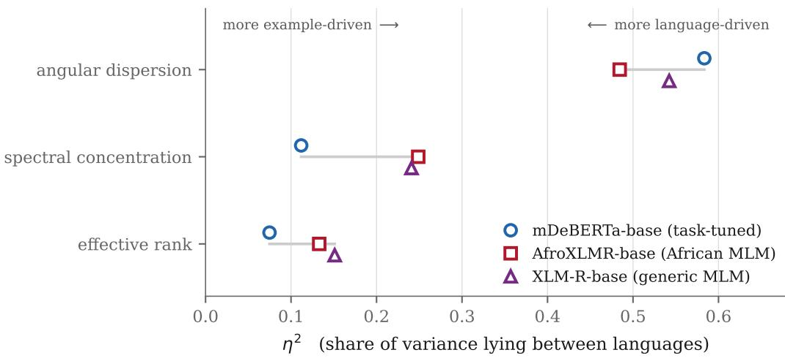
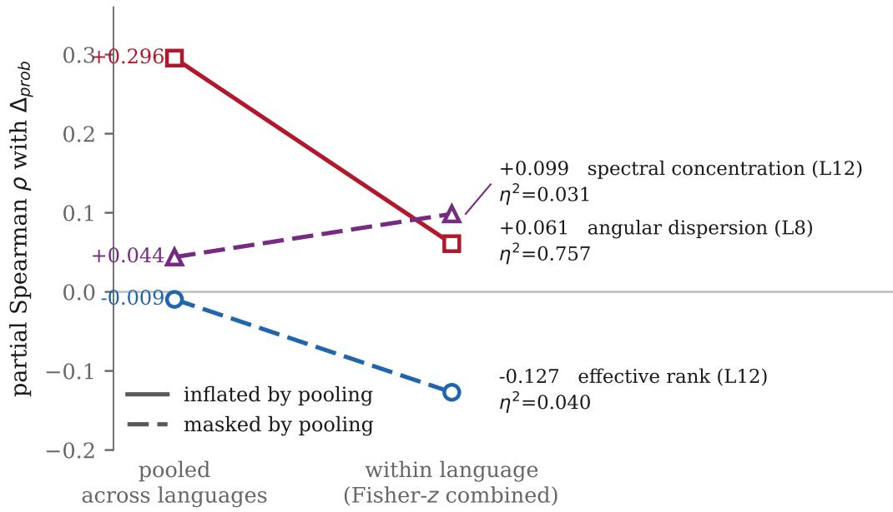
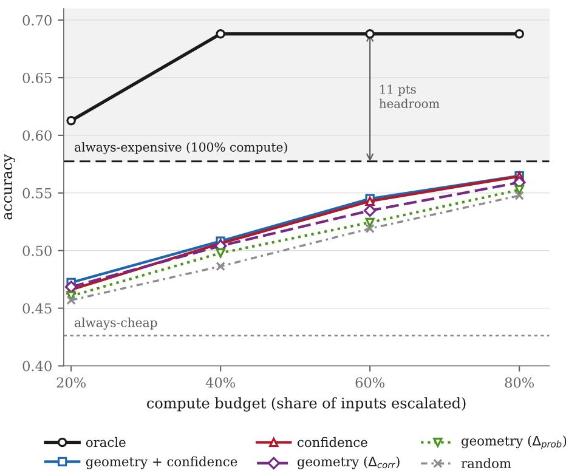

# Structure, Association, and Decision Value: Representation-Based Dificulty Estimation for Adaptive Inference in African-Language NLI

Toheeb Ogunade University of Lagos 240805099@live.unilag.edu.ng

## Abstract

We ask whether internal representation statistics can provide useful example-level dificulty signals for adaptive inference in multilingual African NLP, and find that they cannot in this setting—for reasons that arise before the representation analysis itself. Studying natural language inference across 15 African languages with frozen of-the-shelf checkpoints, we report four results. First, evaluation validity: AfriXNLI’s English configuration shares 1,047 of its 1,050 examples verbatim with XNLI evaluation data, and one widely used NLI checkpoint scores 1.000 on that configuration’s test split, a result consistent with XNLI test exposure. Because the benchmark is a translation of XNLI, its English, French and Swahili configurations cannot serve as clean evaluations for XNLI-trained models. Second, parameter count does not order capability across African languages: our larger checkpoint is better in seven languages and worse in eight, with no significant aggregate diference. Third, across three multilingual representation spaces—a task-tuned model, an African-adapted masked language model, and a generic one—angular dispersion is consistently dominated by between-language variance while efective rank is not, so pooled correlations inflate the former nearly fivefold and mask the latter. Fourth, the association that survives language control is target-specific: efective rank predicts the probability gain from escalation but not whether escalation changes the prediction, while cheap-model confidence shows the opposite pattern; the two formalisations of computational benefit correlate at only 0.655. Under the tested models, signals, and compute budgets, no evaluated signal makes adaptive routing preferable to always-expensive inference, although an oracle exceeds it by eleven accuracy points at 60% of the compute. Our central methodological finding is that a representation statistic can be highly structured and statistically significant with respect to one notion of computational benefit while being irrelevant to another, and therefore useless as a decision variable.

## 1 Introduction

Suppose a representation statistic computed from a model’s hidden states correlates with a plausible measure of example dificulty, across fifteen languages and nine thousand examples, at a significance level that survives multiple-comparison correction by thirty orders of magnitude. It is natural to conclude that the statistic captures something about dificulty, and reasonable to expect it to inform decisions that depend on dificulty—most obviously, how much computation an input deserves.

This paper reports a case in which each step of that reasoning is defensible and the conclusion is nonetheless wrong. The setting is adaptive inference for low-resource multilingual natural language inference: given a cheap model and a more expensive one, can the cheap model’s internal representation tell us which inputs are worth escalating? The question matters most in low-resource multilingual deployment, where compute is scarce and per-language performance varies widely, and it is precisely there that the assumptions behind such methods are least often checked.

Before asking whether representation geometry predicts example dificulty, one must establish that the evaluation and statistical setup can distinguish example dificulty from language identity and from benchmark contamination. Our initial setup failed on both counts, and a third problem emerged behind them; correcting each changed the answer. AfriXNLI, the benchmark we use, shares 1,047 of its 1,050 English examples verbatim with XNLI, and the of-the-shelf checkpoints used to evaluate on it are trained on XNLI; its English, French and Swahili configurations therefore cannot function as clean evaluations, and one checkpoint answers every English test item correctly. Pooled correlations between representation statistics and dificulty turned out to be substantially carried by language identity. And our own routing experiment optimised a predictor for one formalisation of “benefit from computation” while scoring it against another.

This paper. We report a single investigation in four stages, each establishing why the overall answer is negative:

1. Evaluation validity (§4). AfriXNLI preserves XNLI examples verbatim, and contamination interacts with which XNLI split each checkpoint was trained on, which the development–test accuracy gap exposes without access to training data.

2. Capability ordering (§5). Parameter count does not reliably order accuracy across African languages, so the compute hierarchy a cascade presupposes cannot be assumed.

3. Language confounding and target dependence (§6–§7). Across three multilingual representation spaces, some geometry statistics are dominated by language identity and others are not, so pooled analysis both manufactures and masks relationships; and the association that survives is specific to which notion of computational benefit it is measured against.

4. Adaptive-routing utility (§8). No signal we tested makes routing preferable to alwaysexpensive inference, though an oracle shows the allocation problem is learnable.

What the reader should take away. A representation statistic can be highly structured and statistically significant without being a useful decision variable. Which notion of “benefit from computation” one measures determines which signals appear informative.

## 2 Background and Related Work

African-language NLI. Evaluation resources for African languages have expanded substantially, from named-entity benchmarks (Adelani et al., 2021) to broader multi-task suites. IrokoBench (Adelani et al., 2025) introduces AfriXNLI, the natural language inference benchmark used here, by translating a subset of XNLI (Conneau et al., 2018) into 16 African languages. On the modelling side, XLM-R (Conneau et al., 2020) provides the multilingual encoder that most African-adapted models extend, including AfroXLMR (Alabi et al., 2022), which adapts it through continued pre-training on African-language corpora. The translated construction that makes AfriXNLI possible is also what creates the lineage we examine in §4.

Multilingual representation geometry. A line of work characterises contextual representation spaces through geometric summaries—anisotropy, directional concentration, and spectral or rankbased measures of how many dimensions a representation efectively occupies (Ethayarajh, 2019). Such statistics are attractive as dificulty or quality proxies because they are cheap to compute from a forward pass that has already been performed. They are also, in multilingual corpora, routinel reported pooled across languages, which is the practice §6 examines.

Adaptive inference and cascades. Conditional computation for transformer inference is wel established, and we claim no novelty in the idea. Early-exit methods attach classifiers to intermediate layers and halt when a confidence criterion is met (Xin et al., 2020) or when successive layers agree (Zhou et al., 2020). CascadeBERT (Li et al., 2021) argues that intermediate-layer representations are unreliable for this purpose and instead cascades complete models, calibrating them so that a cheap model’s confidence can govern escalation—the design our compute ladder follows. Calibration itself follows standard temperature scaling (Guo et al., 2017). Our contribution is not a new routing mechanism but an examination of whether representation statistics supply a usable signal for one.

Benchmark contamination. Overlap between evaluation data and training corpora is a recognised threat to benchmark validity, with recent work arguing that contamination should be measured and reported per benchmark rather than assumed absent (Sainz et al., 2023), and proposing procedures for detecting it (Golchin and Surdeanu, 2023). Translated benchmarks are an underexamined case: contamination can propagate through the source examples even when no target string was ever seen. Separately, the distinction between pooled and within-group association is long-standing outside NLP—the ecological fallacy (Robinson, 1950) names precisely the inference we find multilingual representation analyses at risk of making.

## 3 Experimental Design

## 3.1 Data and the clean-language protocol

AfriXNLI (Adelani et al., 2025) provides 18 language configurations with 450 development and 600 test examples each and perfectly balanced three-way labels. XNLI intersects AfriXNLI at {eng, fra, swa}; these are excluded throughout. The remaining 15 configurations (amh, ewe, hau, ibo, kin, lin, lug, orm, sna, sot, twi, wol, xho, yor, zul) form the clean set: n = 6,750 development and n = 9,000 test examples.

## 3.2 Models

Table 1 lists every checkpoint used. Three serve as rungs of the compute ladder and three as sources of representation statistics; mDeBERTa-base appears in both roles, as a rung and as a feature source. No checkpoint was fine-tuned, and the feature sources are never asked to produce a prediction.

## 3.3 Label alignment and calibration

Checkpoint label orders difer: mDeBERTa and MiniLM emit (entailment, neutral, contradiction) while xlm-roberta-large-xnli emits the reverse. All logits are permuted into the AfriXNLI canonical order before any comparison. We note this because it fails silently: comparing probabilities by logit index across these checkpoints subtracts one class from a diferent one and yields plausible-looking quantities with no meaning.

<table><tr><td>Role</td><td>Checkpoint</td><td>Layers</td><td>Hidden</td><td>Params</td></tr><tr><td>Cheap rung</td><td>multilingual-MiniLMv2-L6-mnli-xnli</td><td>6</td><td>384</td><td>~118M</td></tr><tr><td>Mid rung</td><td>mDeBERTa-v3-base-xnli-. . .-2mil7</td><td>12</td><td>768</td><td>~278M</td></tr><tr><td>Large rung</td><td>xlm-roberta-large-xnli</td><td>24</td><td>1024</td><td>~560M</td></tr><tr><td>Features (task-tuned)</td><td>mDeBERTa-v3-base</td><td>12</td><td>768</td><td></td></tr><tr><td>Features (African MLM)</td><td>afro-xlmr-base</td><td>12</td><td>768</td><td></td></tr><tr><td>Features (generic MLM)</td><td>xlm-roberta-base</td><td>12</td><td>768</td><td></td></tr></table>

Table 1: Frozen checkpoints (Wang et al., 2021; He et al., 2023; Conneau et al., 2020; Alabi et al., 2022); no fine-tuning was performed. The three feature sources supply representation statistics only and are never asked to predict. xlm-roberta-base was added post hoc as a replication source (§6).
<table><tr><td>§</td><td>Result</td><td>Depends on a target</td></tr><tr><td>4</td><td>Benchmark contamination</td><td>no</td></tr><tr><td>5</td><td>Capability not ordered by size</td><td>no</td></tr><tr><td>6</td><td>Language dominates geometry  $( \eta ^ { 2 } )$ </td><td>no</td></tr><tr><td>7</td><td>Residual association with either target</td><td>yes</td></tr><tr><td>8</td><td>Routing evaluation</td><td>yes</td></tr></table>

Table 2: Sections marked $^ { 6 } \mathrm { n o } ^ { \mathrm { , 9 } }$ are computed from accuracies, string matching, and representations alone. A reader who rejects our target construction may discard $\ S 7 \mathrm { - } \ S 8$ without afecting the rest.

Each model receives one scalar temperature fitted by L-BFGS on the pooled clean development split $( n = 6 , 7 5 0 )$ : $T = 4 . 1 1 6$ (MiniLM), $T = 1 . 7 0 4$ (mDeBERTa), $T = 2 . 7 2 3$ (XLM-R-large). All reported results are on test.

## 3.4 The escalation target

For cheap model s and expensive model e we measure the marginal value of escalation as the change in the calibrated probability assigned to the gold label $y ^ { \star }$ :

$$
\Delta _ { \mathrm { p r o b } } ( x ) = p _ { e } ( y ^ { \star } \mid x ) - p _ { s } ( y ^ { \star } \mid x ) .\tag{1}
$$

We use a continuous quantity rather than a change in correctness for measuring association, because the latter takes only three values and is dominated by examples near the decision boundary, which costs a great deal of statistical power. That choice is appropriate for the correlation analysis and, as §7.1 and §8.1 show, inappropriate for training a router: the two are diferent quantities, and conflating them was an error in our initial design.

## 3.5 Which results depend on a constructed target

Both targets used in this paper— $- \Delta _ { \mathrm { p r o b } }$ above and $\Delta _ { \mathrm { { c o r r e c t } } }$ , introduced in §7.1—are constructed from a single frozen checkpoint pair rather than the seed-averaged quantity the design called for (§10). We therefore mark explicitly which results depend on them.

## 3.6 Representation statistics

For each example, hidden states at layers {4, 8, 12} over non-padding tokens give $X \in \mathbb { R } ^ { T \times d }$ . With $p _ { i }$ the normalised squared singular values of column-centred X, and U the row-normalised X:

$$
{ \mathrm { e f f e c t i v e ~ r a n k } } = \exp { \Big ( } - \sum _ { i } p _ { i } \log p _ { i } { \Big ) } ,
$$

$$
\mathrm { s p e c t r a l ~ c o n c e n t r a t i o n } = p _ { 1 } ,
$$

$$
\begin{array} { r } { \mathrm { a n g u l a r ~ d i s p e r s i o n } = 1 - \left\| \frac { 1 } { T } \sum _ { t } U _ { t } \right\| . } \end{array}
$$

Three sources × three layers × three statistics gives 27 features.

## 3.7 Statistical procedure

Associations between a representation statistic and a target are measured by partial Spearman correlation, controlling for cheap-model confidence, token count and subword fragmentation by regressing all quantities on the ranks of the controls and correlating the residuals. Every such correlation is computed within each language and the 15 per-language estimates are then combined by Fisher-z meta-analysis weighted by $n - k - 3$ , yielding a pooled within-language estimate with a confidence interval and a two-sided p-value. Because 27 features are screened against each target, all p-values are Holm-corrected across features. Between-language structure is quantified by $\eta ^ { 2 }$ (Equation 2), the share of a quantity’s total variance lying between languages.

Uncertainty is estimated by resampling rather than by parametric assumption. Correlation stability uses a within-language bootstrap and subsampling at 25% and $5 0 \% ;$ a label-permutation null establishes the scale of spurious association. Accuracy diferences between models use a cluster bootstrap that resamples languages and then examples within language, since examples within a language are not independent and the comparison generalises over languages. Routing is evaluated leave-one-language-out at matched average compute budget: the predictor is fitted on 10 languages and applied to the held-out one, and every method is compared at the same escalation rate.

## 3.8 Benchmark lineage and contamination audit

Before any modelling result, we audit the benchmark itself in three steps. First, exact-string matching of every AfriXNLI premise–hypothesis pair in the overlapping configurations against the XNLI evaluation splits, which establishes lineage independently of any documentation. Second, cross-referencing the training-data statements on each checkpoint’s model card against the splits that matching implicates. Third, split-specific accuracy probing: measuring each model separately on the development and test configurations, since a model exposed to one split but not the other should show a gap that a genuinely capable model would not. The three steps are cheap, require no access to training corpora, and in our case each was necessary—the lineage alone does not identify which models are afected, and the cards alone do not identify which splits. We suggest this sequence should precede evaluation on any translated benchmark.

## 4 Stage I: Evaluation Validity

<table><tr><td></td><td colspan="2">eng</td><td colspan="2">fra</td><td colspan="2">swa</td></tr><tr><td>Model</td><td>dev</td><td>test</td><td>dev</td><td>test</td><td>dev</td><td>test</td></tr><tr><td>MiniLM-L6</td><td>0.887</td><td>0.760</td><td>0.927</td><td>0.720</td><td>0.891</td><td>0.622</td></tr><tr><td>mDeBERTa-base</td><td>1.000</td><td>0.890</td><td>0.998</td><td>0.867</td><td>0.993</td><td>0.742</td></tr><tr><td>XLM-R-large</td><td>0.998</td><td>1.000</td><td>0.987</td><td>0.995</td><td>0.973</td><td>0.978</td></tr></table>

Table 3: Accuracy on the contaminated configurations, full splits (n = 450 dev, n = 600 test). The two models whose cards report training on XNLI development data lose 11–27 points from dev to test. XLM-R-large loses nothing.

AfriXNLI is a translation of XNLI, and XNLI-trained checkpoints therefore cannot be evaluated cleanly on its English, French, or Swahili configurations.

An evaluation can only support conclusions about model behaviour to the extent that it measures behaviour rather than recall. We therefore begin by establishing what our evaluation measures, before using it to interpret anything about representations.

## 4.1 Benchmark lineage

AfriXNLI is constructed by translating a subset of XNLI into 16 African languages, and its own documentation states that it retains the original English and French subsets and that its dev and test splits are subsets of the corresponding XNLI splits. We confirm this by exact string matching: of the 1,050 unique English premise–hypothesis pairs in AfriXNLI, 1,047 (99.7%) occur verbatim in the XNLI evaluation splits, and the 450-example AfriXNLI English development split is exactly XNLI validation. Because XNLI covers 15 languages including Swahili and French, the two benchmarks intersect at {eng, fra, swa}.

This lineage is public and, in itself, unsurprising: translated benchmarks are built from source benchmarks. It becomes consequential when combined with the training data of the checkpoints used to evaluate on it. The model cards for both cheap rungs state training on XNLI—MiniLM specifically on “the XNLI development dataset and the MNLI train dataset”—and the large rung’s card states fine-tuning on “a combination of NLI data in 15 languages” without identifying which splits.

## 4.2 Split-specific contamination

The contamination is split-specific, and the gap between development and test accuracy acts as a fingerprint of which split a model was exposed to.

Table 3 separates the three checkpoints sharply. MiniLM and mDeBERTa perform far better on the development configurations than on the test configurations—mDeBERTa is perfect on English dev at 1.000 and falls to 0.890 on English test, and the corresponding Swahili drop is 25 points. This is the pattern their cards predict: both report training on XNLI development data, and AfriXNLI development is XNLI validation.

XLM-R-large shows no such gap. It scores 0.998 on English dev and 1.000 on English test, 0.973 and 0.978 on Swahili. This is consistent with exposure to XNLI test data as well as development data, but we state it as a consistency rather than a fact: the model card does not specify which splits were used, and we cannot verify training data we do not have access to. What can be said without inference is that the checkpoint answers every English test item correctly, and that no model in our study achieves anything remotely comparable on uncontaminated languages, where the same checkpoint reaches 0.523.

<table><tr><td>Model</td><td>Params</td><td>Layers</td><td>Accuracy</td><td>Above chance</td></tr><tr><td>MiniLMv2-L6</td><td>~118M</td><td>6</td><td>0.410</td><td>11/15</td></tr><tr><td>mDeBERTa-v3-base</td><td>~278M</td><td>12</td><td>0.545</td><td>14/15</td></tr><tr><td>XLM-R-large</td><td>~560M</td><td>24</td><td>0.523</td><td>14/15</td></tr></table>

Table 4: Accuracy on the 15 clean languages $( n = 9 , 0 0 0 )$ . Chance is 0.333; “above chance” counts languages whose Wilson 95% lower bound exceeds it.

## 4.3 What follows, and what does not

Three claims of decreasing certainty are involved here, and we separate them deliberately. The lineage— that AfriXNLI is derived from XNLI and shares its evaluation examples—is both documented by the dataset and measured by us through exact string matching; it is established. The development-split exposure of MiniLM and mDeBERTa is stated on their model cards and independently corroborated by the dev–test gap in Table 3; it is likewise established. The test-split exposure of XLM-R-large is neither documented nor directly verifiable, and is inferred from behaviour alone; it is not established, and nothing in the remainder of this paper depends on it. Readers who reject the third claim should still treat the first two as grounds for excluding the afected configurations, since exclusion follows from the lineage regardless of any individual model’s training history.

The practical consequence is that eng, fra, and swa cannot serve as clean evaluations—or, more importantly for this study, as the high-resource control against which African-language behaviour is compared. We exclude them from all subsequent analysis and work with the 15 remaining configurations.

That exclusion does not make the remainder pristine. For the 15 African configurations this is benchmark-lineage contamination rather than verbatim leakage: the surface strings are translations the models have not seen, but the underlying premise–hypothesis pairs were seen in other languages. A model with strong cross-lingual transfer may therefore retain some advantage on them. We report this as a limitation rather than a controlled variable, since no uncontaminated African-language NLI benchmark of comparable coverage was available to us.

Having established which portion of the benchmark can support interpretation, we next ask whether the models themselves furnish the compute hierarchy that an adaptive-inference study presupposes.

## 5 Stage II: Capability Is Not Ordered by Parameter Count

Among of-the-shelf XNLI checkpoints, model size does not predict which model wins on a given African language; the ordering is language-dependent and unstable.

An adaptive-inference system presupposes a hierarchy of computational alternatives: escalation must purchase something. The most convenient way to construct such a hierarchy is by parameter count, treating a larger checkpoint as the more capable one. This section asks whether that assumption holds in the setting we are studying.

## 5.1 Parameter count is not a suficient proxy

Table 4 shows that accuracy is not monotone in size. The largest checkpoint, with roughly twice the parameters and twice the depth of mDeBERTa-base, is the second-best of the three. We do not claim it is worse. The aggregate diference of +0.022 in mDeBERTa’s favour is not statistically distinguishable from zero: a cluster bootstrap resampling languages and then examples within language (5,000 replicates) gives a 95% confidence interval of [−0.035, +0.083], with $P ( \mathrm { d i f f } > 0 ) = 0 . 7 7 2 . ^ { 0 }$ The defensible statement is weaker and more useful than an ordering: parameter count simply does not determine which of these two models is better.

## 5.2 The better model is language-dependent

A model can be substantially better than another for one language and substantially worse for a second. Per-language accuracy diferences between mDeBERTa and XLM-R-large span $- 0 . 1 4 5 \leq$ $\Delta _ { \mathrm { a c c } } \leq + 0 . 2 2 0$ (Table 9, Appendix A): XLM-R-large is 14.5 points better on Amharic and 12.7 on Oromo, while mDeBERTa is 22.0 points better on Igbo and 20.0 on Shona. Seven languages favour mDeBERTa and eight favour XLM-R-large, and in six of the fifteen the diference exceeds ten accuracy points in one direction or the other. The aggregate near-tie is thus the average of large and inconsistent disagreements rather than the average of small ones.

We have not identified which linguistic, script, or resource properties predict the direction of the diference, and with 15 languages and three checkpoints we are not positioned to: the observation here is that the ordering varies, not why.

## 5.3 Consequences for adaptive inference

This matters directly for the framing of the present study. If the expensive model is not reliably more capable, escalation cannot be interpreted as purchasing additional intelligence; it purchases a diferent model whose value depends on the language and input regime. A cascade ordered by parameter count is, in this setting, not a compute ladder but a model switch with a language-dependent sign

The consequence is measurable. For the mDeBERTa→XLM-R-large pair, $\Delta _ { \mathrm { p r o b } }$ has mean −0.011: escalation helps on 37.5% of examples and hurts on 39.7%, which is not a target a router can profitably predict because there is no aggregate benefit to allocate. Only the MiniLM→mDeBERTa pair forms a usable ladder—approximately 8× the floating-point operations, mean $\Delta _ { \mathrm { p r o b } } = + 0 . 0 9 9$ (sd 0.221), helping on 51.2% of examples and hurting on 26.0%—and even that holds only for the 11 of 15 languages in which the cheap rung exceeds chance. All routing experiments in $\ S 8$ are therefore restricted to those 11 languages, which is a real limitation on their generality.

We emphasise that this section establishes nothing about routing itself. It establishes that the compute hierarchy an adaptive-inference study presupposes cannot be assumed from model size and must be verified per language before any routing claim is attempted.

If model capacity cannot be ordered reliably by parameter count, and if representation statistics may themselves carry language-level structure, then the next question is prior to any dificulty analysis: are the internal variables such analyses rely on primarily properties of examples, or of the languages those examples are expressed in?

## 6 Stage III(a): Language Identity Dominates Representation Geometry

<table><tr><td>Statistic</td><td>mDeBERTa-base (task-tuned)</td><td>AfroXLMR-base (African MLM)</td><td>XLM-R-base (generic MLM)</td></tr><tr><td>Angular dispersion</td><td>0.583</td><td>0.484</td><td>0.542</td></tr><tr><td>Spectral concentration</td><td>0.112</td><td>0.249</td><td>0.241</td></tr><tr><td>Effective rank</td><td>0.075</td><td>0.133</td><td>0.151</td></tr></table>

Table 5: Between-language variance share $\eta ^ { 2 }$ , averaged over layers {4, 8, 12}. The ordering replicates in all three representation spaces: a task-tuned model, an African-adapted MLM, and a generic multilingual MLM.

  
Figure 1: Between-language variance share $\eta ^ { 2 }$ for each geometry statistic in each representation space, averaged over layers {4, 8, 12}; the values are those of Table 5. The ordering—angular dispersion most language-determined, efective rank least—is identical in all three spaces, although the magnitudes difer.

A representation statistic intended to measure something about an example should vary primarily with the example. In a multilingual corpus it may instead vary primarily with the language the example is written in, in which case any quantity computed by pooling examples across languages will partly be a restatement of language identity. This stage measures how much of each statistic’s variation is attributable to language, before any dificulty target is introduced. It requires only representations and language labels, and is therefore independent of the modelling choices examined in §7–§8.

For each statistic we compute $\eta ^ { 2 }$ , the proportion of its total variance lying between languages rather than within them:

$$
\eta ^ { 2 } = \frac { \sum _ { \ell } n _ { \ell } ( \bar { v } _ { \ell } - \bar { v } ) ^ { 2 } } { \sum _ { i } ( v _ { i } - \bar { v } ) ^ { 2 } } ,\tag{2}
$$

where ℓ indexes the 15 clean languages, $n _ { \ell }$ is the number of test examples in language $\ell ,$ and $\bar { v } _ { \ell }$ is the mean of the statistic within that language. A value near zero indicates a statistic that varies almost entirely example-to-example; a value near one indicates one that is close to a per-language constant.

Across three multilingual representation spaces, angular dispersion is consistently the most language-determined statistic and efective rank consistently the least.

Table 5 and Figure 1 report $\eta ^ { 2 }$ averaged over layers {4, 8, 12} for each statistic in each representation space. The three sources were chosen to difer in how they were produced: mDeBERTa-v3-base is fine-tuned for NLI, afro-xlmr-base is a masked language model adapted to African languages, and xlm-roberta-base is a generic multilingual masked language model with no African adaptation and no task supervision. They share no training objective, and only the last two share a pre-training corpus.

The magnitudes difer across sources, but the ordering does not. Angular dispersion is the most language-determined statistic in all three spaces $( \eta ^ { 2 } = 0 . 5 8 3 , 0 . 4 8 4 , 0 . 5 4 2 )$ , and efective rank the least (0.075, 0.133, 0.151), with spectral concentration intermediate throughout. At the individual-layer level the efect is more pronounced still: angular dispersion at layer 8 of mDeBERTa reaches $\eta ^ { 2 } = 0 . 7 5 7$

The implication is direct. Roughly half of the variation in angular dispersion, and three quarters of it at some layers, is a property of the language rather than of the example. A quantity computed by pooling such a statistic across languages is therefore substantially a re-description of language identity, and will behave like a dificulty signal to the exact extent that languages difer in dificulty. This holds whatever target the statistic is subsequently correlated against, which is why the observation does not depend on our choice of target: it is a property of the representations, not of the analysis downstream of them.

We emphasise what is and is not established here. $\eta ^ { 2 }$ is descriptive; it identifies how variance is distributed, not why. We do not claim that angular dispersion encodes language identity in any mechanistic sense, nor that it is uninformative about examples—only that its example-level variation is a minority of its total variation, and that pooled analyses cannot separate the two. Nor do the three sources constitute an exhaustive sample: they are three encoder models of similar depth, and the pattern may not extend to decoder-only or substantially larger models.

A stronger claim that did not replicate. Having observed this pattern on two sources, we hypothesised a quantitative version of it: that $\eta ^ { 2 }$ predicts, across features, how far a pooled correlation departs from the corresponding within-language one. We added the third source specifically to test that hypothesis, and it did not survive.

Across all 27 features, Spearman $( \eta ^ { 2 } , | \rho _ { \mathrm { p o o l e d } } | - | \rho _ { \mathrm { w i t h i n } } | ) = + 0 . 4 1 5$ with a permutation p of 0.032, which taken alone would appear to support the hypothesis. The bootstrap 95% confidence interval, however, is $[ - 0 . 0 3 1 , + 0 . 7 3 7 ]$ , and the relationship is carried almost entirely by a single source: +0.917 for mDeBERTa against +0.133 for both AfroXLMR and XLM-R-base. The two procedures disagree because the 27 features are not independent—nine per source, sharing layers and statistics—which the permutation test over feature labels does not accommodate. We therefore do not claim that $\eta ^ { 2 }$ predicts pooling bias as a general quantitative law.

We report this failure because it delimits the surviving claim. What replicates across three representation spaces is an ordering of statistics by their language dependence, not a quantitative relationship between that dependence and the resulting analytical bias. The former is suficient for the practical recommendation we draw in §9; the latter would have been a stronger and more general result, and we did not obtain it.

## 7 Stage III(b): Representation Signals Depend on What “Benefit from Computation” Means

From this point the analysis depends on a constructed target, and therefore on the modelling choices discussed in §3.4 and §10. The results in §4–§6 do not.

<table><tr><td>Feature (mDeBERTa)</td><td> $\eta ^ { 2 }$ </td><td>Pooled  $\rho$ </td><td>Within ρ</td></tr><tr><td>L8 angular dispersion</td><td>0.757</td><td>+0.296</td><td>+0.061</td></tr><tr><td>L12 effective rank</td><td>0.040</td><td>-0.009</td><td>-0.127</td></tr><tr><td>L12 spectral concentration</td><td>0.031</td><td>+0.044</td><td>+0.099</td></tr></table>

Table 6: Partial Spearman with $\Delta _ { \mathrm { p r o b } }$ , controlling for cheap-model confidence, token count, and fragmentation. Angular dispersion is inflated 4.9× by pooling; efective rank is masked roughly tenfold.

## 7.1 Two notions of marginal benefit

An input that “benefits from more computation” can be characterised in at least two ways. The first asks how much escalation moves the model’s probability on the correct label; the second asks whether escalation changes the decision at all:

$$
\Delta _ { \mathrm { p r o b } } ( x ) = p _ { e } ( y ^ { \star } \mid x ) - p _ { s } ( y ^ { \star } \mid x ) ,\tag{1, restated}
$$

$$
\Delta _ { \mathrm { c o r r e c t } } ( x ) = \mathbf { 1 } [ \hat { y } _ { e } = y ^ { \star } ] - \mathbf { 1 } [ \hat { y } _ { s } = y ^ { \star } ] .\tag{3}
$$

Equation 1 is continuous (mean +0.099, sd 0.221 on the viable ladder); Equation 3 is ternary, taking +1 on 24.7% of examples, −1 on 11.2%, and 0 on the remaining 64.1%. We refer to $\Delta _ { \mathrm { { c o r r e c t } } }$ as the decision-relevant or routing target, because it is the quantity a routing system’s accuracy depends on. We do not call it the true target: both are legitimate operationalisations of computational benefit, and part of what follows is that the choice matters.

The two are correlated at +0.655—substantial, but far from interchangeable. They also difer in how much of their variation is attributable to language: $\eta ^ { 2 } = 0 . 1 2 6$ for $\Delta _ { \mathrm { p r o b } }$ against 0.033 for $\Delta _ { \mathrm { { c o r r e c t } } }$ , so the choice of target additionally determines how much of the language confounding established in §6 is inherited.

## 7.2 Pooled analysis is inadequate

Naive pooled analysis errs in both directions: it manufactures a relationship for the languagedetermined statistic and erases a genuine one for the language-neutral statistic.

Table 6 and Figure 2 show the consequence of §6 for correlation analysis. Angular dispersion, the statistic that is 76% between-language variance at this layer, carries a pooled correlation of +0.296 with $\Delta _ { \mathrm { p r o b } }$ that falls to +0.061 once language is controlled. Efective rank, at $\eta ^ { 2 } = 0 . 0 4 0$ , shows the opposite: a pooled correlation indistinguishable from zero (−0.009) that becomes −0.127 under the same control. An analyst screening candidate features by pooled correlation would promote angular dispersion and discard efective rank, which is the opposite of what the within-language evidence supports. The inversion is not confined to $\Delta _ { \mathrm { p r o b } } \mathrm { : }$ for efective rank against $\Delta _ { \mathrm { { c o r r e c t } } }$ the pooled correlation is +0.050 while the within-language estimate is −0.027, a sign reversal.

## 7.3 The surviving association is target-specific

Efective rank predicts the probability gain from escalation but not whether escalation changes the prediction; confidence shows the reverse pattern.

The magnitudes in Table 7 are less interesting than the pattern. Efective rank at layer 12 has the strongest association in the study with $\Delta _ { \mathrm { p r o b } } ~ ( \rho = - 0 . 1 2 7 , 9 5 \% \mathrm { C I } \ [ - 0 . 1 4 7 , - 0 . 1 0 6 ]$ , Holm-adjusted $p = 5 . 8 \times 1 0 ^ { - 3 2 }$ , sign-consistent in 12/15 languages) and survives bootstrap resampling, subsampling to a quarter of the data, leave-one-language-out, and label permutation (Table 10, Appendix B).

  
Figure 2: Pooled versus within-language partial Spearman correlation with $\Delta _ { \mathrm { p r o b } ; }$ , for the statistics of Table 6. Solid lines mark associations inflated by pooling, dashed lines those masked by it. Angular dispersion, the most language-determined statistic $( \eta ^ { 2 } = 0 . 7 5 7 )$ , loses most of its apparent relationship once language is controlled; efective rank, the least $( \eta ^ { 2 } = 0 . 0 4 0 )$ , acquires one.

Against $\Delta _ { \mathrm { { c o r r e c t } } }$ the same feature reaches only $\rho = - 0 . 0 2 7$ and does not survive multiple-comparison correction $( p = 0 . 2 8 )$

Cheap-model confidence exhibits the mirror image. Within language it is unrelated to $\Delta _ { \mathrm { p r o b } } \left( \rho = \right.$ $+ 0 . 0 0 3 , \mathrm { C I } \left[ - 0 . 0 1 8 , + 0 . 0 2 3 \right] )$ while being the strongest single predictor of $\Delta _ { \mathrm { c o r r e c t } } ~ ( \rho = - 0 . 0 9 9$ , CI $[ - 0 . 1 2 0 , - 0 . 0 7 9 ] )$ . A signal that appears uninformative under one operationalisation of computational benefit is the best available signal under the other.

Angular dispersion at layer 12 makes the point harder to dismiss as a magnitude artifact: it is not significant against $\Delta _ { \mathrm { p r o b } } ~ ( \rho = + 0 . 0 2 9 , p = 0 . 1 3 )$ but is strongly significant against $\Delta _ { \mathrm { { c o r r e c t } } }$ with the opposite sign $( \rho = - 0 . 0 6 6 , p = 1 . 6 \times 1 0 ^ { - 8 }$ , sign-consistent in 12/15 languages). A representation statistic can predict one notion of computational benefit while being irrelevant to—or oppositely related to—another.

Registration. This dual-target analysis was added after the routing-target mismatch described in §8.1 was identified, and should be interpreted as a post-hoc analysis rather than a pre-specified test. It rests on a single cheap–expensive pair and has not been replicated across model pairs.

We therefore asked not whether efective rank is statistically associated with a marginal-benefit target—it is—but whether any of these associations carries enough incremental information to support a useful routing decision.

<table><tr><td></td><td colspan="2"> $\Delta _ { \mathrm { p r o b } }$ </td><td colspan="2"> $\Delta _ { \mathrm { c o r r e c t } }$ </td></tr><tr><td>Signal</td><td>ρ</td><td>Holm p</td><td>ρ</td><td>Holm p</td></tr><tr><td>mDeBERTa L12 effective rank</td><td>-0.127</td><td> $5 . 8 \times 1 0 ^ { - 3 2 }$ </td><td>-0.027</td><td>0.28</td></tr><tr><td>mDeBERTa L12 spectral conc.</td><td>+0.099</td><td> $2 . 9 \times 1 0 ^ { - 1 9 }$ </td><td>+0.003</td><td>1.00</td></tr><tr><td>mDeBERTa L8 angular dispersion</td><td>+0.061</td><td> $2 . 2 \times 1 0 ^ { - 7 }$ </td><td>+0.007</td><td>1.00</td></tr><tr><td>mDeBERTa L12 angular dispersion</td><td>+0.029</td><td>0.13</td><td>-0.066</td><td> $1 . 6 \times 1 0 ^ { - 8 }$ </td></tr><tr><td>Cheap-model confidence</td><td>+0.003</td><td></td><td>-0.099</td><td></td></tr></table>

Table 7: Within-language partial Spearman against both targets, identical procedure, Holm-corrected across all 27 features. Bold marks associations significant at the Holm-adjusted level. The two targets are predicted by diferent signals.

## 8 Stage IV: From Statistical Association to Adaptive Routing

## 8.1 Target alignment

In our initial routing experiment we trained the routing predictor against $\Delta _ { \mathrm { p r o b } } ,$ the change in gold-label probability, but evaluated routing quality using prediction correctness. We subsequently recognised that these are diferent objectives. The predictor was therefore optimised for a quantity that the evaluation did not measure.

The distinction is empirical rather than semantic. As reported in §7.1, the two targets correlate at only +0.655, and the dual-target analysis in §7.3—which we ran precisely because this mismatch came to light—shows that they are predicted by diferent signals. Cheap-model confidence is essentially unrelated to $\Delta _ { \mathrm { p r o b } }$ within language $( \rho = + 0 . 0 0 3 )$ while being the strongest available predictor of $\Delta _ { \mathrm { c o r r e c t } } ~ ( \rho = - 0 . 0 9 9 )$ . Efective rank shows the opposite profile.

This mismatch gave the confidence baseline an advantage that representation-based routing did not receive: confidence was related to the decision-relevant correctness flip that the evaluation scored, while the geometry predictor had been fitted to a quantity that is not. We therefore repeated the routing experiment using $\Delta _ { \mathrm { { c o r r e c t } } }$ as the training target, holding everything else fixed.

A routing method should be trained against the quantity whose decision value is being evaluated. We state this as a principle because our original design violated it, and because the violation was not visible from the routing results alone—it surfaced only when the two targets were analysed side by side. We report the sequence in full—original hypothesis, initial result, recognition of the objective mismatch, corrected target, re-evaluated conclusion—because the correction is part of the evidence rather than an erratum.

The original comparison therefore does not support the stronger claim that confidence is intrinsically superior to representation geometry. The appropriate conclusion is that target alignment materially changes the comparison, which motivates the corrected experiment below.

## 8.2 The corrected comparison

Table 8 and Figure 3 report the corrected experiment. Retraining the geometry router on the decision-relevant target improves it at every budget—by +0.007 at 20% and +0.011 at 60%—and correspondingly narrows the gap to confidence. Across ridge penalties $\lambda \in \{ 1 , 1 0 , 1 0 0 , 1 0 0 0 \}$ the confidence−geometry gap is −0.0015 to −0.0024 at the 20% budget, where confidence wins in 5 of 11 held-out languages, and +0.0059 to +0.0147 at the 60% budget, where it wins in 6 to 8. Combining geometry with confidence yields a further −0.0005 to −0.0062 over confidence alone, winning in 4 to

<table><tr><td>Budget</td><td>Random</td><td>Conf.</td><td> $\mathrm { G e o m . } ( \Delta _ { \mathrm { p r o b } } )$ </td><td> $\mathrm { G e o m . } ( \Delta _ { \mathrm { c o r r e c t } } )$ </td><td>Geom.+Conf.</td><td>Oracle</td></tr><tr><td>20%</td><td>0.457</td><td>0.466</td><td>0.461</td><td>0.468</td><td>0.472</td><td>0.613</td></tr><tr><td>40%</td><td>0.486</td><td>0.506</td><td>0.498</td><td>0.504</td><td>0.508</td><td>0.688</td></tr><tr><td>60%</td><td>0.519</td><td>0.543</td><td>0.524</td><td>0.535</td><td>0.545</td><td>0.688</td></tr><tr><td>80%</td><td>0.548</td><td>0.564</td><td>0.553</td><td>0.559</td><td>0.565</td><td>0.688</td></tr></table>

Table 8: Leave-one-language-out routing accuracy at matched compute budget, 11 viable ladder languages. Always-cheap inference gives 0.426 and always-expensive 0.577. Training the geometry router on $\Delta _ { \mathrm { { c o r r e c t } } }$ rather than $\Delta _ { \mathrm { p r o b } }$ recovers most of its apparent deficit against confidence.

6 languages of 11. The per-language standard deviation is approximately 0.018 throughout, larger than every one of these diferences.

Once the routing predictor is trained against the decision-relevant target, representation geometry and confidence are statistically indistinguishable across the tested budgets and regularisation settings, and both remain substantially below the oracle. Win counts at or near 5.5 of 11 are what one expects from two signals of comparable value, not from one dominating the other.

## 8.3 Unexploited headroom

The corrected comparison should not be read as a mild success for representation geometry. A stronger negative result is visible in the same table. No practical method tested exceeds alwaysexpensive inference at any budget (Figure 3): at the 60% budget the best method reaches 0.545 against 0.577 for simply running the expensive model on everything, and at 80% it reaches 0.565, still below. Under these signals, adaptive routing does not pay for itself.

The oracle behaves diferently. At the 60% budget an oracle over $\Delta _ { \mathrm { { c o r r e c t } } }$ reaches 0.688—eleven points above always-expensive inference while using 40% less computation. The routing problem is therefore genuinely learnable, and neither of the tested signals captures it. The gap between the best practical method and the oracle is approximately 14 accuracy points at the 60% budget.

We draw the conclusion narrowly. The negative result is not that adaptive routing is infeasible in this setting; the oracle demonstrates the opposite. Nor is it that representation geometry is uninformative; §7.3 establishes a robust association with one notion of computational benefit. It is that neither the geometry statistics nor cheap-model confidence extracts enough of the available benefit to be useful, and that the appearance of a clear baseline win in our original experiment was substantially an artifact of target misalignment.

## 9 Discussion

Our experiments do not show that representation geometry is useless. They show that representation structure, statistical association, and decision usefulness are three diferent things, and that multilingual evaluation can conflate them. Each stage of the investigation separates a pair of these that would otherwise be run together.

Evaluation validity. The contamination result does not establish that AfriXNLI is invalid, and we do not claim it. A translated benchmark that deliberately preserves its source-language subsets is behaving as documented; the dificulty arises from the pairing of such a benchmark with checkpoints trained on the source. The narrower conclusion we draw is that model–benchmark pairings require contamination-aware reporting: a result on AfriXNLI English, French, or Swahili obtained with an

  
Figure 3: Accuracy–compute frontier over the 11 viable ladder languages, leave-one-language-out; the values are those of Table 8. The shaded band marks accuracy unreachable by any practical method tested: every routing signal lies below always-expensive inference at every budget, while the oracle exceeds it by 11 points at 60% of the compute.

XNLI-trained checkpoint is not interpretable as a measure of capability, and the dev–test gap of Table 3 ofers a cheap diagnostic for detecting the problem without access to training data. This matters most where it is least likely to be checked—the high-resource configurations of a low-resource benchmark, which are typically used as controls rather than as objects of study.

Model selection. §5 implies that a cascade cannot be constructed by sorting checkpoints by parameter count. The relevant finding is not that the larger model is globally inferior—it is not, and the aggregate diference is not distinguishable from zero—but that the ordering is languagedependent, with diferences exceeding ten accuracy points in six of fifteen languages and running in both directions. For a practitioner building a multilingual cascade this converts an assumption into a measurement: which checkpoint is the “expensive” one must be determined per language, and in some languages the answer inverts.

Representation confounding. We regard §6 as the most generalisable result in the paper, because it replicates across three representation spaces produced in diferent ways: no two share a training objective, and only two of the three share a pre-training corpus. Angular dispersion is consistently far more language-determined than efective rank, and a statistic that is roughly half between-language variance cannot support a pooled correlation that is interpreted as an example-level relationship. The practical form of this observation is a reporting convention rather than a prohibition: report $\eta ^ { 2 }$ alongside any pooled multilingual correlation, so that readers can see how much of the reported relationship could be carried by language identity alone.

We are equally explicit about the boundary. We hypothesised a stronger, quantitative version— that $\eta ^ { 2 }$ predicts the magnitude of pooling bias across features—and it did not survive the addition of a third source. We therefore establish an ordering of statistics by language dependence and a mechanism by which pooling misleads, but not a law relating the two.

What “benefit from computation” means. The result we would emphasise most is §7.3, because it explains the others rather than merely adding to them. Efective rank is associated with $\Delta _ { \mathrm { p r o b } }$ and not with $\Delta _ { \mathrm { { c o r r e c t } } } ;$ cheap-model confidence is associated with $\Delta _ { \mathrm { { c o r r e c t } } }$ and not with $\Delta _ { \mathrm { p r o b } }$ Both quantities are reasonable formalisations of “this example benefits from more computation,” and they correlate at only +0.655. A feature can therefore be genuinely informative about one operationalisation of computational benefit while being irrelevant to—or, for layer-12 angular dispersion, oppositely related to—the objective a system is actually evaluated against.

This is what makes the failure mode dificult to notice. A researcher who measures a representation statistic against a plausible dificulty target, finds a robust and highly significant association, and concludes that the statistic captures dificulty will have done nothing methodologically unusual. Our own initial routing experiment made precisely this error, and the error was invisible in the routing results themselves; it became visible only when the two targets were placed side by side.

Practical routing. The conclusion we draw from §8 is not that adaptive inference does not work. The oracle reaches 0.688 at the 60% budget against 0.577 for always-expensive inference, so under the tested models and languages there is a substantial and genuinely learnable allocation problem. What the evidence supports is that the tested representation and confidence signals do not recover enough of that headroom to make routing worthwhile under the tested models, signals, and compute budgets—no practical method we evaluated exceeds simply running the expensive model on every input. The gap between what is achievable and what these signals achieve is roughly 14 accuracy points, and closing it is an open problem rather than a closed one.

Recommendations. Four practices follow directly from the failures above. Audit translated benchmarks for lineage, and report the dev–test gap when evaluating with checkpoints whose training data overlaps the source. Do not order cascade rungs by parameter count without per-language verification. Report $\eta ^ { 2 }$ alongside pooled multilingual correlations. And state which notion of computational benefit a dificulty signal is validated against, and train routing predictors on the quantity the evaluation scores.

Future work. Three directions follow from what the experiments exposed rather than from speculation. First, contamination-controlled multilingual benchmarks, or at minimum published lineage metadata suficient for practitioners to exclude afected configurations automatically. Second, task-specific and language-specific capacity ladders, constructed by measurement rather than by parameter count, which would also supply the wider compute range our frozen encoder pair could not. Third, routing targets defined directly from the deployment objective, with representation signals validated against that objective rather than against a proxy. A seed-averaged marginal-gain target is a natural next experiment in this last direction, and one our frozen setup could not provide (§10).

## 10 Limitations

The marginal-gain targets. The most significant limitation concerns how the targets of Equations 1 and 3 were constructed, and it has two parts.

The first is a matter of interpretation. $\Delta _ { \mathrm { p r o b } }$ is a well-defined and useful quantity for the descriptive analysis of $\ S 7 \colon$ it measures continuously how much escalation changes the model’s probability on the correct label, and a continuous target admits far more statistical power than a ternary one. But our own routing experiment shows that $\Delta _ { \mathrm { p r o b } } \neq \Delta _ { \mathrm { c o r r e c t } }$ , and $\Delta _ { \mathrm { p r o b } }$ should therefore not be treated as a universal measure of computational benefit. It is one operationalisation among several, and §7.3 demonstrates that the choice determines which signals appear informative.

The second is more restrictive. Because the models were frozen and no repeated fine-tuning runs were available, the study could not construct the initially planned seed-averaged marginal-gain target. The stability of the measured $\Delta _ { \mathrm { p r o b } }$ relationship therefore reflects variation across examples and languages within fixed checkpoints, but does not establish how stable the relationship would be across independently trained model instances. Part of the variance in Equation 1 is checkpoint idiosyncrasy rather than example dificulty, and we cannot separate the two. This bears on $\ S 7$ and §8; per Table 2, it does not bear on §4–§6.

Benchmark lineage. Excluding eng, fra, and swa removes the direct surface-overlap problem, but the 15 remaining configurations are translations of XNLI instances that the checkpoints encountered in other languages. Cross-lingual contamination cannot be ruled out, and we have no uncontaminated African-language NLI benchmark of comparable coverage against which to estimate its size. Our temperature calibration, fitted on the African development splits, shares this lineage; the fitted quantity is a single scalar per model and all reported results are on test, but the pipeline as a whole is not contamination-free.

Checkpoint selection. We examine three particular publicly available NLI checkpoints, not the space of multilingual architectures. The capability-ordering result therefore supports languagedependent capability for these models, and should not be read as a general law about parameter count. All three are also XNLI-derived, which makes them a correlated sample rather than three independent observations.

Representation statistics. The three-source replication is stronger than a two-model analysis, but three encoders of similar depth remain a limited sample of model families, and efective rank, spectral concentration, and angular dispersion are a limited sample of possible geometric descriptors. The statistics are additionally computed over the token dimension of a single sequence, which makes them partly length-determined by construction; we control for length statistically rather than by design.

Single task and coverage. Natural language inference is the entire experimental task. We do not claim that the target-alignment or routing conclusions transfer automatically to generation, question answering, classification, or agentic reasoning. Within the task, the routing experiments cover only the 11 of 15 languages in which the cheap rung exceeds chance, and only the single MiniLM→mDeBERTa model pair.

Post-hoc analyses. Two analyses were not part of the initial design and are identified as post-hoc throughout: the addition of XLM-R-base as a third representation source (§6), which we ran to test a generalisation that subsequently failed, and the dual-target analysis (§7.3), which we ran after identifying the routing-target mismatch. Both are explanatory rather than confirmatory, and neither has been replicated on independent data.

The oracle is not deployable. The oracle in Table 8 has access to the outcome it is asked to predict. It establishes an upper bound on what perfect per-example allocation could achieve under this cascade, not evidence that a practical system can approach that level. The 14-point gap we report should be read as the size of the opportunity, not as a deficit attributable to any particular method.

Taken together, this paper identifies several measurement and evaluation barriers to finding useful adaptive signals; it does not establish what the optimal adaptive signal is.

## 11 Conclusion

We set out to determine whether internal representation statistics can estimate, per example, the value of escalating an input to a more capable model in low-resource multilingual NLI. Answering that question required first establishing what our evaluation measured. AfriXNLI shares 1,047 of its 1,050 English examples verbatim with XNLI, and the checkpoints commonly used to evaluate on it are trained on XNLI, so its English, French and Swahili configurations cannot serve as clean evaluations or as high-resource controls. Among the remaining 15 languages, parameter count does not order capability: the larger of our two main checkpoints is better in seven languages and worse in eight, with no significant aggregate diference. Across three multilingual representation spaces, angular dispersion is consistently dominated by language identity and efective rank consistently is not, so pooled correlations inflate the former and mask the latter. And the association that survives every control is specific to the target it was measured against: efective rank predicts the probability gain from escalation but not whether escalation changes the prediction, while cheap-model confidence does the reverse.

Under the tested models, signals, and compute budgets, the evaluated signals did not recover enough of the available headroom to make adaptive routing preferable to always-expensive inference. We do not conclude that adaptive inference is infeasible here; an oracle reaches 0.688 at the 60% budget against 0.577 for always-expensive inference, so a substantial and learnable allocation problem exists. What we conclude is narrower and, we think, more useful: representation structure, statistical association, and decision usefulness are three distinct properties, and multilingual evaluation can conflate all three.

## Reproducibility

Code, configurations, cached model outputs and a results ledger recording every reported number with its sample, statistic, uncertainty and limitation are available at https://github.com/qeinstein/ adaptive-computation, at the tag paper-v1. No model was fine-tuned. All inference was performed once on a laptop without a discrete GPU and cached; every analysis in this paper, including all bootstrap and permutation procedures, re-runs from those caches in minutes and requires no accelerator. The ledger also records the analyses that were superseded during the study, including the initial misaligned routing experiment of §8.1.

## Ethics and Data Statement

This work uses only publicly released benchmarks and publicly released model checkpoints, and involves no human subjects and no new data collection. Our contamination findings concern the interaction between a benchmark’s construction and a checkpoint’s training data; both were documented by their authors, and we intend the analysis as a caution about how such artefacts are combined in evaluation rather than as criticism of anyone who released them. We note that undetected contamination is likely to distort measured progress on low-resource languages specifically, since the afected configurations are typically the high-resource controls against which low-resource results are compared.

## References

David Ifeoluwa Adelani, Jade Abbott, Graham Neubig, Daniel D’souza, Julia Kreutzer, Constantine Lignos, Chester Palen-Michel, Happy Buzaaba, Shruti Rijhwani, Sebastian Ruder, et al. MasakhaNER: Named entity recognition for African languages. Transactions of the Association for Computational Linguistics, 9:1116–1131, 2021.

David Ifeoluwa Adelani, Jessica Ojo, Israel Abebe Azime, Jian Yun Zhuang, Jesujoba Oluwadara Alabi, Xuanli He, Millicent Ochieng, Sara Hooker, Andiswa Bukula, En-Shiun Annie Lee, et al. IrokoBench: A new benchmark for African languages in the age of large language models. In Proceedings of NAACL-HLT, pages 2732–2757, 2025.

Jesujoba O. Alabi, David Ifeoluwa Adelani, Marius Mosbach, and Dietrich Klakow. Adapting pretrained language models to African languages via multilingual adaptive fine-tuning. In Proceedings of COLING, pages 4336–4349, 2022.

Alexis Conneau, Ruty Rinott, Guillaume Lample, Adina Williams, Samuel R. Bowman, Holger Schwenk, and Veselin Stoyanov. XNLI: Evaluating cross-lingual sentence representations. In Proceedings of EMNLP, pages 2475–2485, 2018.

Alexis Conneau, Kartikay Khandelwal, Naman Goyal, Vishrav Chaudhary, Guillaume Wenzek, Francisco Guzmán, Edouard Grave, Myle Ott, Luke Zettlemoyer, and Veselin Stoyanov. Unsupervised cross-lingual representation learning at scale. In Proceedings of ACL, pages 8440–8451, 2020.

Kawin Ethayarajh. How contextual are contextualized word representations? Comparing the geometry of BERT, ELMo, and GPT-2 embeddings. In Proceedings of EMNLP-IJCNLP, 2019.

Shahriar Golchin and Mihai Surdeanu. Data contamination quiz: A tool to detect and estimate contamination in large language models. arXiv preprint arXiv:2311.06233, 2023.

Chuan Guo, Geof Pleiss, Yu Sun, and Kilian Q. Weinberger. On calibration of modern neural networks. In Proceedings of ICML, 2017.

Pengcheng He, Jianfeng Gao, and Weizhu Chen. DeBERTaV3: Improving DeBERTa using ELECTRA-style pre-training with gradient-disentangled embedding sharing. In Proceedings of ICLR, 2023.

Lei Li, Yankai Lin, Deli Chen, Shuhuai Ren, Peng Li, Jie Zhou, and Xu Sun. CascadeBERT: Accelerating inference of pre-trained language models via calibrated complete models cascade. In Findings of EMNLP, 2021.

W. S. Robinson. Ecological correlations and the behavior of individuals. American Sociological Review, 15(3):351–357, 1950.

Oscar Sainz, Jon Ander Campos, Iker García-Ferrero, Julen Etxaniz, Oier Lopez de Lacalle, and Eneko Agirre. NLP evaluation in trouble: On the need to measure LLM data contamination for each benchmark. arXiv preprint arXiv:2310.18018, 2023.

Wenhui Wang, Hangbo Bao, Shaohan Huang, Li Dong, and Furu Wei. MiniLMv2: Multi-head selfattention relation distillation for compressing pretrained transformers. In Findings of ACL-IJCNLP, 2021.

Ji Xin, Raphael Tang, Jaejun Lee, Yaoliang Yu, and Jimmy Lin. DeeBERT: Dynamic early exiting for accelerating BERT inference. In Proceedings of ACL, 2020.

Wangchunshu Zhou, Canwen Xu, Tao Ge, Julian McAuley, Ke Xu, and Furu Wei. BERT loses patience: Fast and robust inference with early exit. In Advances in Neural Information Processing Systems 33, 2020.

## A Per-Language Capability Diferences

<table><tr><td>Lang</td><td>δ</td><td>Lang</td><td>δ</td><td>Lang</td><td>δ</td></tr><tr><td>ibo</td><td>+0.220</td><td>lug</td><td>+0.033</td><td>zul</td><td>-0.003</td></tr><tr><td>sna</td><td>+0.200</td><td>twi</td><td>+0.015</td><td>yor</td><td>-0.010</td></tr><tr><td>sot</td><td>+0.197</td><td>lin</td><td>+0.008</td><td>ewe</td><td>-0.037</td></tr><tr><td>kin</td><td>+0.147</td><td>wol</td><td>-0.002</td><td>hau</td><td>-0.080</td></tr><tr><td></td><td></td><td></td><td></td><td>xho</td><td>-0.087</td></tr><tr><td></td><td></td><td></td><td></td><td>orm</td><td>-0.127</td></tr><tr><td></td><td></td><td></td><td></td><td>amh</td><td>-0.145</td></tr><tr><td></td><td></td><td></td><td></td><td></td><td></td></tr></table>

Table 9: Accuracy diference δ = mDeBERTa − XLM-R-large per language.

## B Stability of the Efective-Rank Association

<table><tr><td>Stability test Result</td></tr><tr><td>Bootstrap, 300× within-language resample -0.127, 95%  $[ - 0 . 1 4 2 , - 0 . 1 1 1 ]$  Subsample 25%, 40 seeds  $- 0 . 1 2 2 \pm 0 . 0 1 9$  Subsample 50%, 40 seeds  $- 0 . 1 2 9 \pm 0 . 0 1 1$ </td></tr></table>

Table 10: All resampling variants remain negative; the permutation null is centred at zero with maximum magnitude five times smaller than the efect.