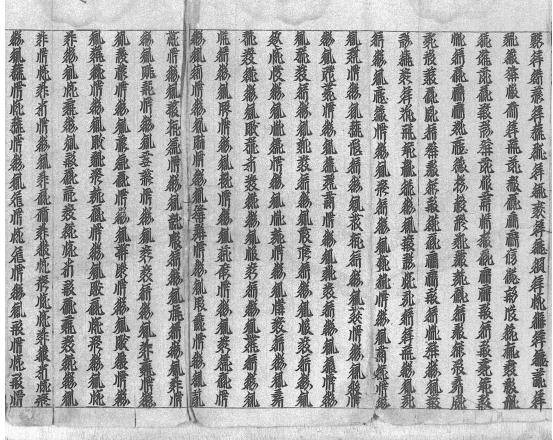

# Tangut Word Segmentation under Extreme Resource Scarcity: Integrating Traditional Lexicons and Unlabeled Text

Lifan Deng1,2\*, Yongwei Zhang1,3†, Sen Sun1,3, Bojun Sun4, Jingsong Yu5

1Key Laboratory of Linguistics,

Chinese Academy of Social Sciences (University of Chinese Academy of Social Sciences), Beijing 2Rixin College, Tsinghua University, Beijing

3Institute of Linguistics, Chinese Academy of Social Sciences, Beijing 4Institute of Ethnology and Anthropology, Chinese Academy of Social Sciences, Beijing 5School of Software and Microelectronics, Peking University, Beijing zhangyw@cass.org.cn

## Abstract

Tangut is an extinct language whose script does not explicitly mark word boundaries. We present the first systematic study of Tangut word segmentation using 2,750 expertannotated segments1 (31,893 tokens), traditional lexicons, and unlabeled text. Our framework combines a reliability-calibrated lexiconlattice representation, explicit distributional statistics, and a lightweight character encoder pretrained with MLM. Segment-level five-fold cross-validation shows that lexical and statistical features raise CRF F1 to approximately 0.91. The full TangutEncoder reaches the highest mean F1 (0.911) and improves recall beyond the labeled training vocabulary. These results demonstrate generalization beyond the limited supervised vocabulary across thematically diverse held-out passages, while document-level transfer remains to be evaluated. You can access our project at https://github.com/ jiangli-va/TangutSeg.

## 1 Introduction

Created in the 1030s under Li Yuanhao, the Tangut script was used to record the Tangut language and served as the official script of the Xixia. Although Tangut later became extinct, its surviving texts remain essential sources for studying the language, history, and culture of this dynasty.

Tangut information processing has progressed from character encoding and digital fonts (Nakajima et al., 1996; West et al., 2014) to optical character recognition (Liu, 2012; Zhang and Han, 2017; Ma et al., 2022) and machine translation (Zheng and Yu, 2025; Zheng et al., 2025). However, automatic word segmentation remains largely unexplored. Because Tangut does not explicitly mark word boundaries, OCR and transcription produce unsegmented character sequences. Identifying words is therefore a prerequisite for lexical retrieval, frequency analysis, POS tagging, alignment, and translation.

  
Figure 1: Surviving fragment of Maharatnak ¯ u¯t.a-sutra ¯ ,Scroll 68.

Tangut word segmentation is constrained by a high annotation barrier. With no native speakers, word boundaries require specialists to jointly consider context, phonological reconstruction, translations, and traditional dictionaries. Our expertannotated corpus contains 2,750 textual segments and 31,893 word tokens from a Buddhist scripture and the secular encyclopaedic work Leilin. Although limited to two works, Leilin covers diverse narratives and lexical domains, providing substantial variation for within-source evaluation.

We address these challenges by integrating three sources of knowledge. Expert annotation provides BIES supervision; an aggregated lexiconlattice representation preserves overlapping dictionary candidates and calibrates their reliability; and unlabeled text is exploited through explicit corpus statistics, static character embeddings, and masked-language-model (MLM) pretraining. The resulting lightweight TangutEncoder learns contextual character representations without assuming word boundaries in advance. Under segment-level five-fold cross-validation, both complete systems exceed 0.90 $\mathrm { F _ { 1 } }$ , with TangutEncoder attaining the highest mean score and OOV recall.

Our contributions are threefold:

• Task and evaluation. To our knowledge, we present the first systematic study of automatic Tangut word segmentation and establish initial within-source evaluation baselines on expert-annotated Buddhist and secular texts.

• Reliability-aware lexicon integration. We propose an aggregated lexicon-lattice representation that preserves overlapping dictionary candidates and calibrates their reliability through out-of-fold estimation, preventing each training instance from contributing its own gold-boundary statistics.

• Learning from unlabeled Tangut text. We systematically compare explicit corpus statistics, static character representations, and contextual MLM pretraining, and develop a lightweight TangutEncoder. Our results clarify their different contributions to overall, invocabulary, and labeled-training-OOV performance.

Together, these contributions provide a wordlevel foundation for Tangut text retrieval, POS tagging, alignment, machine translation, and related digital research.

## 2 Related Work

Word Segmentation without Explicit Delimiters. Segmentation for scripts without consistent word delimiters is commonly formulated as character- or syllable-level sequence prediction. Chinese work established BIES-style position tagging and CRF segmentation (Xue, 2003; Peng et al., 2004); related formulations use syllable-level CRFs for Tibetan (Liu et al., 2011) and longest matching for Myanmar (Htay and Murthy, 2008). Neural models subsequently learned candidate and segmentationhistory representations (Cai and Zhao, 2016), convolutional character–word features (Wang and Xu, 2017), and optimized BiLSTM taggers (Ma et al., 2018). Yet OOV words remain difficult, and segmentation accuracy depends strongly on orthographic cues and resource availability (Shao et al.,

2018; Brown, 2024). These studies motivate sequence labeling for Tangut but do not address its extreme resource scarcity.

Lexicon-Enhanced Segmentation. Lexicons have been encoded as CRF features (Peng et al., 2004), converted into partial annotations for domain adaptation (Liu et al., 2014), and combined with limited manual segmentation for language documentation (Okabe et al., 2022). Neural segmenters incorporate lexical information through BiLSTMs (Zhang et al., 2018), attention over overlapping candidates (Higashiyama et al., 2019), auxiliary BIES prediction from unlabeled text (Higashiyama et al., 2020), or character–word graphs (Huang et al., 2021). These methods preserve increasingly rich candidate information, but rarely calibrate individual entries whose units may conflict with corpus boundaries—a central problem for historical lexicons.

Low-Resource and Historical-Language Segmentation. Low-resource NLP lacks not only annotation but often raw text, tools, pretrained models, and sustained support (Nigatu et al., 2024), limitations pronounced for Sino-Tibetan languages (Liu and Best, 2025). Dictionary-based weak supervision can partly compensate for scarce segmentation annotation (Okabe et al., 2022). For historical languages, prior work compares rule-based, lexical, statistical, and learned segmentation for Akkadian (Homburg and Chiarcos, 2016), or uses phonological priors for ancient scripts (Luo et al., 2021). Sanskrit research combines expert lexical resources, character models, and latent-candidate Transformers (Krishna et al., 2017; Hellwig and Nehrdich, 2018; Sandhan et al., 2022). Ancient Chinese studies similarly explore BiLSTM–CRF analysis and historical pretraining (Cheng et al., 2020; Chang et al., 2022), while EvaHan identifies blind-text and OOV degradation (Li et al., 2022). Tangut intensifies these challenges, motivating data-efficient integration of expert, lexical, and unlabeled resources.

Tangut information processing. Tangut computation has focused mainly on digital infrastructure: fonts, character analysis, Web processing, and historical-font databases (Nakajima et al., 1996; Liu and Du, 2008; Liu, 2010), followed by UCS standardization (West et al., 2014). Later work developed document recognition and character databases (Liu, 2012; Zhang and Han, 2017; Ma et al., 2022), manuscript text analysis (Shu et al., 2025), and Tangut–Chinese translation using parallel data, dictionaries, and large language models (Zheng and Yu, 2025; Zheng et al., 2025). Automatic word-boundary identification and contextual representation remain largely unexplored (Sun, 2026); we address this gap using expert annotation, traditional lexicons, and unlabeled text.

## 3 Task Definition and Data

## 3.1 Task Formulation

Given a line of n Tangut characters $\begin{array} { r l } { \mathbf { X } } & { { } = } \end{array}$ $( c _ { 1 } , c _ { 2 } , \ldots , c _ { n } )$ , the goal of Tangut word segmentation is to identify its word boundaries. We formulate the task as character-level BIES sequence labeling, where B, I, and E denote the beginning, inside, and end of a multi-character word, respectively, and S denotes a single-character word. The model assigns each character a label $y _ { i } \in$ $\{ B , I , E , S \}$ and predicts the highest-scoring valid sequence:

$$
\hat { \mathbf { y } } = \arg \operatorname* { m a x } _ { \mathbf { y } \in \mathcal { V } ( \mathbf { x } ) } p _ { \theta } ( \mathbf { y } \mid \mathbf { x } ) ,
$$

where $\mathcal { V } ( \mathbf { x } )$ is the set of valid BIES sequences. The predicted labels are then converted into nonoverlapping word spans. Evaluation is span-based: a predicted word is considered correct only when its boundaries exactly match the expert annotation.

## 3.2 Data Resources and Distribution

Multiple Tangut specialists from the Chinese Academy of Social Sciences independently segmented and labeled the texts using context, reconstructed readings, translations, and traditional lexicons. Their analyzes were compared and jointly reviewed to produce the reference annotation. The corpus contains two genres: Buddhist scripture and secular writing. Buddhist scripture selected from Maharatnak¯ u¯ta-sutra¯ , and the latter is drawn from the encyclopedic Leilin , which covers diverse topics and linguistic styles. The genres differ substantially in size and lexical distribution (Table 1).2. The total number of word types is calculated after deduplication across the two categories. Secular documents account for approximately 91.5% of all segments, resulting in a substantial domain imbalance.

The structured lexicon contains word forms, pronunciations, definitions, and entry-level metadata. We strip whitespace, discard single-character entries from the lattice, and collapse duplicate forms, yielding 19,290 multi-character candidates, of which 17,082 are two-character words (88.6%).

<table><tr><td>Category</td><td>Segments</td><td>Tokens</td><td>Types</td></tr><tr><td>Buddhist scriptures</td><td>234</td><td>3,717</td><td>769</td></tr><tr><td>Secular documents</td><td>2,516</td><td>28,176</td><td>4,046</td></tr><tr><td>Total</td><td>2,750</td><td>31,893</td><td>4,433</td></tr></table>

Table 1: Statistics of the expert-annotated Tangut corpus.

The lexicon has high coverage of the annotated corpus: 83.1% of corpus word types and 95.9% of word tokens are recorded in it. From the lexicon side, however, only 14.2% of entries exactly match an annotated word, while 23.3% occur as substrings in the corpus; the remaining 76.7% never occur. This asymmetry indicates that the lexicon covers most corpus tokens but contains many entries that cannot be verified using the available annotation. Therefore, it should be treated as uncertain lexical evidence rather than a direct source of deterministic boundaries.

The unlabeled data are extracted from the Tangut lines of four-line aligned materials. Organized by manuscript image, the collection contains 663 records, 46 title-level units, and approximately 318,000 Tangut characters. Although both collections contain the Maharatnak¯ u¯ta-sutra¯ , the annotated material is from fascicle 68, which is absent from the unlabeled collection. A normalized overlap audit finds no duplicated annotated segment of three or more characters and only limited shortn-gram overlap (Appendix A.2). The Tangut sequences are only used for distributional statistics and pretraining.

## 4 Layered Framework and Setup

We organize Tangut word segmentation around supervised, lexical, and distributional knowledge. The supervised layer learns word boundaries; the lexical layer encodes overlapping dictionary candidates; and the distributional layer exploits unlabeled text through corpus statistics, static character embeddings, or contextual pretraining. Except for dictionary-matching baselines, all models use character-level BIES tagging with CRF decoding.

## 4.1 Unified Formulation

Given a character sequence $\mathbf { x } = \left( c _ { 1 } , \ldots , c _ { n } \right)$ , a model first computes an emission score vector si over the four BIES labels at each position i. The

score of a label sequence y is

$$
\operatorname { S c o r e } ( \mathbf { x } , \mathbf { y } ) = \sum _ { i = 1 } ^ { n } s _ { i } ( y _ { i } ) + \sum _ { i = 2 } ^ { n } A _ { y _ { i - 1 } , y _ { i } } ,
$$

where A is the transition matrix learned by the CRF. Decoding selects the highest-scoring valid sequence:

$$
{ \hat { \mathbf { y } } } = \arg \operatorname* { m a x } _ { \mathbf { y } \in \mathcal { V } ( \mathbf { x } ) } { \mathrm { S c o r e } ( \mathbf { x } , \mathbf { y } ) } ,
$$

where $\mathcal { V } ( \mathbf { x } )$ denotes the set of valid BIES sequences.

The models differ primarily in how they compute the emission scores. In the linear CRF, these scores are linear combinations of discrete character features and real-valued external features. Neural models first derive a character representation $\mathbf { h } _ { i }$ and then combine it with lexical features $\pmb { z } _ { i } ^ { \mathrm { l e x } }$ and distributional features $\pmb { z } _ { i } ^ { \mathrm { d i s t } }$

$$
\begin{array} { r } { { \bf s } _ { i } = g _ { \theta } \left( { \bf h } _ { i } , { \bf z } _ { i } ^ { \mathrm { l e x } } , { \bf z } _ { i } ^ { \mathrm { d i s t } } \right) . } \end{array}
$$

This shared formulation isolates two sources of variation across models: how characters are represented and how external knowledge is incorporated.

## 4.2 Supervised Segmentation Layer

Dictionary matching. As a non-parametric baseline, we apply maximum matching to determine word boundaries directly. We construct matching lexicons from the training vocabulary, the external dictionary, and their union, and compare them by bidirectional maximum matching (BMM). These baselines provide a reference for how far lexical coverage alone can support segmentation.

The linear CRF uses the current character, a two-character context window on each side, adjacent character bigrams, character-type indicators for digits, letters, and punctuation, and whether the current character occurs as a single-character word in the training data. It serves both as our primary supervised baseline and as the basic model for evaluating the data efficiency of explicit external knowledge.

The BiLSTM–CRF maps each character to a trainable embedding and encodes its left and right contexts with a bidirectional LSTM. A linear layer then produces BIES emission scores, followed by CRF decoding. Lexicon-lattice and corpusstatistical features can be concatenated with the character embeddings at the encoder input.

To separate the effect of the Transformer architecture from that of unlabeled-text pretraining, we include a randomly initialized Transformer–CRF. It uses the same encoder architecture as TangutEncoder but receives no masked-language-model pretraining; all parameters are learned solely from the annotated segmentation data.

## 4.3 Lexical Knowledge Layer

Multiple dictionary entries may overlap at the same character position. Maximum matching resolves this ambiguity prematurely by retaining only one candidate. We instead preserve all matched spans in an aggregated lexicon-lattice representation. For each character, we derive 11 binary features according to its position in a candidate and the candidate length:B2, B3, B4, B5+; I3, I4, I5+ and E2, E3, E4, E5+. Here, B, I, and E indicate that the character occurs at the beginning, inside, or at the end of a candidate. Entries of length five or greater are grouped into the 5+ category. The I2 feature is omitted because a two-character word has no internal position. Single-character entries are handled by the basic character features.

Dictionary entries do not necessarily conform to the segmentation standard of the annotated corpus. We therefore estimate entry-specific reliability. For an entry $w , \sec ( w )$ denotes the number of times it occurs as a substring in the training corpus, while hit(w) counts occurrences whose spans exactly match gold words. Reliability is estimated using a length-group prior:

$$
r ( w ) = \frac { \mathrm { h i t } ( w ) + \kappa p _ { g ( w ) } } { \mathrm { o c c } ( w ) + \kappa } ,
$$

where $\kappa = 5$ controls the smoothing strength and $p _ { g ( w ) }$ is the prior reliability of the length group containing w:

$$
p _ { g } = \frac { \sum _ { w \in g } \operatorname { h i t } ( w ) + 1 } { \sum _ { w \in g } \operatorname { o c c } ( w ) + 2 } .
$$

Observed entries use $r ( w )$ , whereas entries unseen in the training corpus fall back to $p _ { g } .$ . At each character position, we take the maximum reliability among candidates in which the character occurs at a beginning, internal, or ending position. This produces three reliability features for observed entries and three prior features for unseen entries.

We additionally derive three binary metadata features from the dictionary: whether any candidate covering the current character has a semanticgloss entry (has\_yi), a phonetic entry (has\_yin), or a book-title label (has\_book\_title). Each feature is aggregated by logical OR: it is set to 1 if at least one covering candidate has the corresponding attribute. These features distinguish different sources of lexicographic evidence: including semantically glossed entries, phonetic or transliterated forms, and multi-character titles , without treating any of them as a deterministic boundary.

Therefore, the complete representation of the dictionary contains 20 dimensions: 11 lattice indicators, 3 observed-entry reliability features, 3 unseen-entry prior features, and 3 lexicographic metadata features, as summarized in Table 2.

<table><tr><td>Symbol</td><td>Feature group</td><td>Dim.</td></tr><tr><td>BIE</td><td>Lexicon-lattice indicators</td><td>11</td></tr><tr><td>R</td><td>Reliability of observed entries</td><td>3</td></tr><tr><td>P</td><td>Prior for unseen entries</td><td>3</td></tr><tr><td>M</td><td>Lexicographic metadata</td><td>3</td></tr><tr><td> $\overline { { \mathrm { { D i c t } _ { a l l } } } }$ </td><td>Full lexicon representation</td><td>20</td></tr></table>

Table 2: Composition of the 20-dimensional lexicon representation.

Because reliability estimation uses gold boundaries, computing it directly on the training instances would cause information leakage. We therefore generate training features out of fold. Within the training portion of each outer fold, an additional five-fold split is performed, and reliability for each inner fold is estimated using only the other four folds. Validation and test features use statistics estimated from the complete outer training portion. Consequently, no line contributes its own gold boundaries to its reliability features. The three metadata features require no such treatment because they are intrinsic dictionary attributes and do not depend on the annotated corpus.

## 4.4 Distributional Knowledge Layer

We exploit unlabeled Tangut text from the four-line parallel materials in three ways: explicit distributional features, static character embeddings, and contextual pretraining.

## 4.4.1 Explicit Distributional Features

For each gap between adjacent characters a and b, we compute four types of statistics: log bigram frequency, character association strength, the rightneighbor entropy of $^ { a , }$ and the left-neighbor entropy of b. Bigram frequency is defined as

$$
\mathrm { F r e q } ( a , b ) = \log \left( 1 + \mathrm { c o u n t } ( a , b ) \right) .
$$

We use discounted pointwise mutual information (dPMI) as the association measure:

$$
\mathrm { d } \mathrm { P M I } ( a , b ) = \operatorname* { m a x } \left( 0 , \log { \frac { f ( a , b ) - 0 . 5 } { f ( a ) \cdot f ( b ) } } + \log N \right) ,
$$

where N is the total number of adjacent character pairs. Alternative association measures are discussed in the Appendix C.

Neighbor entropy measures the diversity of a character’s local contexts. The right-neighbor entropy of a is

$$
H _ { \mathrm { r i g h t } } ( a ) = - \sum _ { b } p ( b \mid a ) \log p ( b \mid a ) ,
$$

with left-neighbor entropy defined analogously. For a character at position i, features are extracted from both its left gap $( c _ { i - 1 } , c _ { i } )$ and right gap $( c _ { i } , c _ { i + 1 } )$ Each gap contributes one frequency feature, one association feature, and two entropy features, yielding an eight-dimensional representation in total. (Table 3)

<table><tr><td>Symbol</td><td>Feature group</td><td>Dim.</td></tr><tr><td>Freq</td><td>Bigram frequency</td><td>2</td></tr><tr><td>Coo</td><td>Character association</td><td>2</td></tr><tr><td>Ent</td><td>Neighbor entropy</td><td>4</td></tr><tr><td> $\overline { { \mathrm { D i s t } _ { \mathrm { a l l } } } }$ </td><td>Full distributional representation</td><td>8</td></tr></table>

Table 3: Explicit distributional features extracted from unlabeled text.

Unattested bigrams receive zero frequency and association values, and characters absent from the unlabeled corpus receive zero entropy.

## 4.4.2 Static Char2Vec Representations

We train a Skip-gram model on the unlabeled Tangut text, treating each character as a basic unit. We refer to this model as Char2Vec to distinguish this character-level training from word-level Word2Vec. The learned vectors initialize the character embeddings of the Transformer and remain trainable during segmentation. Char2Vec provides each character with a distributional initialization, but this representation is context independent.

## 4.4.3 Contextual Pretraining with TangutEncoder

To learn context-dependent character representations, we develop TangutEncoder (TEnc), a compact character-level BERT-style encoder tailored to the Tangut writing system and the limited scale of the available unlabeled corpus. Each Tangut character is treated as a single token, avoiding any prerequisite word segmentation. The model uses a Tangut-specific character vocabulary and consists of character and positional embeddings followed by three Transformer encoder layers, with approximately 2.5 million parameters. Full architectural details are provided in Appendix B.

TangutEncoder is pretrained with character-level masked language modeling that combines singlecharacter and contiguous-span masking. Approximately 15% of character positions are selected using a mixture of single-character masking and contiguous spans of two to four characters. 80% of selected positions are replaced with the mask token, 10% with random characters, and 10% remain unchanged.

## 4.5 Knowledge Fusion

External knowledge is incorporated at different stages according to the structure of each model. In the linear CRF, lexicon-lattice and corpusstatistical features are added directly as real-valued feature functions alongside the basic character features. In the BiLSTM–CRF, external features are concatenated with character embeddings at the encoder input and jointly contextualized by the BiL-STM. During training, lexicon features are randomly dropped. In TangutEncoder, external features are incorporated after contextual encoding. Lexicon and corpus-statistical features can be transformed into a task-specific representation through a linear layer, ReLU activation, and dropout, and then concatenated with the Transformer output. The combined representation is passed through another dropout layer and a linear projection to produce BIES emission scores.

## 4.6 Experimental Protocol

Data splits. We conduct line-level five-fold crossvalidation stratified by genre. In each round, one fold is held out for testing, while one ninth of the remaining data is used for validation. Because both works occur across folds, this protocol evaluates within-source generalization to held-out, thematically diverse passages rather than transfer to unseen documents. Reliability features are generated by an additional five-fold out-of-fold procedure within each training partition.

Evaluation metrics. Segmentation is evaluated by exact word-span matching. Let P be the set of predicted spans and G the set of gold spans. A word is counted as correct only when both of its boundaries exactly match a gold word. Precision, recall, and $\mathrm { F _ { 1 } }$ are defined as

$$
{ \mathrm { P r e c i s i o n } } = { \frac { | P \cap G | } { | P | } } , { \mathrm { R e c a l l } } = { \frac { | P \cap G | } { | G | } } ,
$$

$$
F _ { 1 } = \frac { 2 \cdot \mathrm { P r e c i s i o n } \cdot \mathrm { R e c a l l } } { \mathrm { P r e c i s i o n } + \mathrm { R e c a l l } } .
$$

We define a gold test word as out of vocabulary (OOV) when its surface form is absent from the labeled training partition of the current fold; all other words are in vocabulary (IV). An OOV word may still occur in the external lexicon or unlabeled corpus. Thus, OOV recall measures generalization beyond the labeled training vocabulary rather than to forms unseen by every system component:

$$
\mathrm { O O V - R } = \frac { \mathrm { c o r r e c t l y ~ s e g m e n t e d ~ O O V ~ w o r d s } } { \mathrm { g o l d ~ O O V ~ w o r d s } } ,
$$

$$
\mathrm { I V - R } = \frac { \mathrm { c o r r e c t l y ~ s e g m e n t e d ~ I V ~ w o r d s } } { \mathrm { g o l d ~ I V ~ w o r d s } } .
$$

Across the five held-out folds, 53.0% of labeledtraining OOV tokens are covered by the external lexicon and 34.8% occur in the unlabeled corpus; these sets overlap, while 24.8% occur in neither resource (Appendix A.2).

In addition to aggregate results, we report performance separately on religious and secular texts. All metrics are summarized as the mean and standard deviation across the five outer folds.

Training and model selection. The linear CRF is optimized with L-BFGS and L1/L2 regularization. For the BiLSTM–CRF and Transformer–CRF models, the learning rate is reduced when validation loss stops improving, and the checkpoint with the lowest validation loss is restored after early stopping. Downstream training of TangutEncoder proceeds in two stages. We first freeze the encoder and train only the feature projections, segmentation head and CRF. Then we unfreeze the encoder and jointly fine-tune all parameters.

All experiments use fixed random seeds and deterministic CuDNN settings within each training environment. Models are compared under identical data splits, lexical resources, and evaluation procedures. Full settings are provided in Appendix B.

## 5 Results

Table 4 summarizes the five research questions. The OOV rate is approximately 0.087 across folds and is therefore omitted. Table 5 reports genrespecific results for representative systems; full genre-level ablations are provided in Appendix C. Standard deviations reflect variation across data folds rather than repeated random initializations; differences of a few thousandths are therefore treated as descriptive trends, not as established significance.

<table><tr><td>Model</td><td>P</td><td>R</td><td> $\mathrm { F _ { 1 } }$ </td><td>OOV-R</td><td>IV-R</td></tr><tr><td colspan="6">Supervised baselines (RQ1)</td></tr><tr><td>Dict-corpus</td><td> $0 . 8 4 5 { \pm } 0 . 0 0 5$ </td><td>0.890±0.003</td><td> $0 . 8 6 7 { \scriptstyle \pm 0 . 0 0 4 }$ </td><td> $0 . 2 1 9 { \pm } 0 . 0 1 4$ </td><td> $\mathbf { 0 . 9 5 4 } \mathrm { \pm 0 . 0 0 2 }$ </td></tr><tr><td>CRF</td><td> $0 . 8 8 0 { \pm } 0 . 0 0 4$ </td><td>0.888±0.003</td><td> $0 . 8 8 4 { \pm } 0 . 0 0 3$ </td><td>0.415±0.026</td><td> $0 . 9 3 3 { \pm } 0 . 0 0 3$ </td></tr><tr><td>BiLSTM-CRF</td><td> $0 . 8 6 2 { \scriptstyle \pm 0 . 0 0 8 }$ </td><td>0.873±0.008</td><td> $0 . 8 6 8 { \pm } 0 . 0 0 8$ </td><td>0.472±0.014</td><td> $0 . 9 1 2 { \scriptstyle \pm 0 . 0 0 6 }$ </td></tr><tr><td>Transformer-Random</td><td> $0 . 8 4 8 { \pm } 0 . 0 0 8$ </td><td>0.863±0.010</td><td> $0 . 8 5 5 { \pm } 0 . 0 0 9$ </td><td>0.519±0.020</td><td> $0 . 8 9 6 { \pm } 0 . 0 1 0$ </td></tr><tr><td colspan="6">Lexicon-lattice ablation (RQ2)</td></tr><tr><td>CRF+BIE</td><td> $0 . 8 9 8 { \pm } 0 . 0 0 4$ </td><td>0.897±0.002</td><td> $0 . 8 9 7 { \scriptstyle \pm 0 . 0 0 3 }$ </td><td>0.489±0.015</td><td> $0 . 9 3 6 { \pm } 0 . 0 0 2$ </td></tr><tr><td> $+ \mathrm { B I E } + \mathrm { R }$ </td><td> $0 . 9 0 2 { \scriptstyle \pm 0 . 0 0 5 }$ </td><td>0.898±0.003</td><td> $0 . 9 0 0 { \scriptstyle \pm 0 . 0 0 4 }$ </td><td>0.473±0.021</td><td> $0 . 9 3 9 { \pm } 0 . 0 0 2$ </td></tr><tr><td> $+ \mathrm { B I E } + \mathrm { R } + \mathrm { P }$ </td><td> $0 . 9 0 0 { \scriptstyle \pm 0 . 0 0 3 }$ </td><td>0.900±0.005</td><td> $0 . 9 0 0 { \scriptstyle \pm 0 . 0 0 4 }$ </td><td>0.463±0.020</td><td> $0 . 9 4 1 { \pm } 0 . 0 0 3$ </td></tr><tr><td> $+ \mathrm { D i c t _ { a l l } }$ </td><td>0.903±0.005</td><td>0.902±0.003</td><td>0.902±0.004</td><td>0.467±0.021</td><td> $0 . 9 4 4 { \pm } 0 . 0 0 2$ </td></tr><tr><td colspan="6">Explicit distributional features (RQ3)</td></tr><tr><td> $\mathrm { C R F + D i c t _ { a l l } + F r e q }$ </td><td> $0 . 9 0 5 { \scriptstyle \pm 0 . 0 0 3 }$ </td><td> $0 . 9 0 4 { \pm } 0 . 0 0 3$ </td><td> $0 . 9 0 4 { \pm } 0 . 0 0 3$ </td><td> $0 . 4 8 3 { \pm } 0 . 0 1 1$ </td><td> $0 . 9 4 4 { \pm } 0 . 0 0 2$ </td></tr><tr><td>十  $\mathrm { \nabla - D i c t { } _ { a l l } + F r e q + C o o }$ </td><td> $0 . 9 0 6 { \pm } 0 . 0 0 3$ </td><td> $0 . 9 0 5 { \pm } 0 . 0 0 3$ </td><td> $0 . 9 0 5 { \pm } 0 . 0 0 3$ </td><td> $0 . 4 8 6 { \pm } 0 . 0 0 9$ </td><td> $0 . 9 4 5 { \scriptstyle \pm 0 . 0 0 1 }$ </td></tr><tr><td> $+ \mathrm { D i c t _ { a l l } + D i s t _ { a l l } }$ </td><td> $\mathbf { 0 . 9 0 7 { \scriptstyle \pm 0 . 0 0 4 } }$ </td><td> $0 . 9 0 6 { \scriptstyle \pm 0 . 0 0 4 }$ </td><td> $0 . 9 0 7 { \scriptstyle \pm 0 . 0 0 4 }$ </td><td> $0 . 4 9 1 { \pm } 0 . 0 1 6$ </td><td> $0 . 9 4 7 { \scriptstyle \pm 0 . 0 0 2 }$ </td></tr><tr><td colspan="6">Representation learning and fusion (RQ4–RQ5)</td></tr><tr><td>Transformer-Char2Vec</td><td> $0 . 8 4 4 { \pm } 0 . 0 0 5$ </td><td> $0 . 8 6 0 { \pm } 0 . 0 1 2$ </td><td> $0 . 8 5 2 { \pm } 0 . 0 0 8$ </td><td> $0 . 4 9 1 { \pm } 0 . 0 1 0$ </td><td> $0 . 8 9 5 { \pm } 0 . 0 1 2$ </td></tr><tr><td>TangutEncoder</td><td> $0 . 8 8 1 { \pm } 0 . 0 0 4$ </td><td>0.885±0.002</td><td> $0 . 8 8 3 { \pm } 0 . 0 0 3$ </td><td> $0 . 5 7 0 { \scriptstyle \pm 0 . 0 1 1 }$ </td><td> $0 . 9 1 5 { \pm } 0 . 0 0 4$ </td></tr><tr><td>TangutEncoder + Dictall</td><td> $0 . 9 0 2 { \scriptstyle \pm 0 . 0 0 3 }$ </td><td>0.913±0.006</td><td> $0 . 9 0 7 { \scriptstyle \pm 0 . 0 0 4 }$ </td><td> $0 . 6 0 6 { \pm } 0 . 0 1 4$ </td><td> $0 . 9 4 2 { \scriptstyle \pm 0 . 0 0 5 }$ </td></tr><tr><td> $\mathrm { T a n g u t E n c o d e r + D i c t _ { a l l } + D i s t _ { a l l } }$ </td><td> $\mathbf { 0 . 9 0 5 { \scriptstyle \pm 0 . 0 0 3 } }$ </td><td> $\mathbf { 0 . 9 1 6 { \scriptstyle \pm 0 . 0 0 4 } }$ </td><td> $\mathbf { 0 . 9 1 1 { \pm } 0 . 0 0 3 }$ </td><td> $\mathbf { 0 . 6 0 8 { \scriptstyle \pm 0 . 0 1 4 } }$ </td><td> $0 . 9 4 6 { \pm } 0 . 0 0 3$ </td></tr></table>

Table 4: Overall segmentation results under five-fold cross-validation.
<table><tr><td rowspan="2">Model</td><td colspan="3">Secular</td><td colspan="3">Religious</td></tr><tr><td> $\mathrm { F _ { 1 } }$ </td><td>OOV-R</td><td>IV-R</td><td> $\mathrm { F _ { 1 } }$ </td><td>OOV-R</td><td>IV-R</td></tr><tr><td>Dict-corpus</td><td>0.869±0.004</td><td> $0 . 2 2 9 { \pm } 0 . 0 1 7$ </td><td> $\mathbf { 0 . 9 5 6 { \scriptstyle \pm 0 . 0 0 3 } }$ </td><td> $0 . 8 5 5 { \pm } 0 . 0 1 9$ </td><td>0.132±0.028</td><td>0.936±0.010</td></tr><tr><td>CRF</td><td>0.887±0.010</td><td> $0 . 4 3 0 { \pm } 0 . 0 3 5$ </td><td> $0 . 9 3 4 { \pm } 0 . 0 0 7$ </td><td>0.839±0.011</td><td>0.262±0.067</td><td>0.909±0.009</td></tr><tr><td>BiLSTM-CRF</td><td> $0 . 8 7 5 { \scriptstyle \pm 0 . 0 0 7 }$ </td><td> $0 . 4 9 8 { \pm } 0 . 0 1 6$ </td><td>0.917±0.006</td><td> $0 . 8 1 0 { \pm } 0 . 0 2 1$ </td><td>0.244±0.028</td><td>0.875±0.021</td></tr><tr><td>Transformer-Random</td><td>0.868±0.008</td><td> $0 . 5 4 5 { \pm } 0 . 0 1 8$ </td><td>0.906±0.010</td><td>0.760±0.014</td><td>0.280±0.060</td><td>0.816±0.017</td></tr><tr><td>CRF+Dictall</td><td>0.904±0.005</td><td> $0 . 4 8 1 { \pm } 0 . 0 2 4$ </td><td>0.942±0.004</td><td> $0 . 8 7 2 { \scriptstyle \pm 0 . 0 0 4 }$ </td><td>0.301±0.058</td><td>0.938±0.008</td></tr><tr><td>CRF+Dictall + Distall</td><td>0.910±0.005</td><td>0.506±0.022</td><td>0.947±0.002</td><td> $\mathbf { 0 . 8 8 1 { \pm } 0 . 0 0 5 }$ </td><td>0.355±0.060</td><td>0.939±0.008</td></tr><tr><td>Transformer-Char2Vec</td><td>0.866±0.008</td><td>0.514±0.011</td><td>0.908±0.012</td><td> $0 . 7 4 9 { \pm } 0 . 0 1 6$ </td><td>0.284±0.033</td><td>0.800±0.022</td></tr><tr><td>TEnc</td><td> $0 . 8 9 2 { \scriptstyle \pm 0 . 0 0 2 }$ </td><td> $0 . 5 8 7 { \pm } 0 . 0 1 6$ </td><td>0.922±0.004</td><td> $0 . 8 1 7 { \scriptstyle \pm 0 . 0 1 6 }$ </td><td>0.422±0.039</td><td>0.863±0.015</td></tr><tr><td> $\mathrm { T E n c } + \mathrm { D i c t } _ { \mathrm { a l l } }$ </td><td> $0 . 9 1 5 { \pm } 0 . 0 0 4$ </td><td> $0 . 6 3 3 { \pm } 0 . 0 2 3$ </td><td> $0 . 9 4 6 { \pm } 0 . 0 0 6$ </td><td> $0 . 8 4 9 { \pm } 0 . 0 1 8$ </td><td>0.362±0.065</td><td>0.908±0.007</td></tr><tr><td> $\mathrm { T E n c } + \mathrm { D i c t _ { a l l } } + \mathrm { D i s t _ { a l l } }$ </td><td> $\mathbf { 0 . 9 1 7 { \scriptstyle \pm 0 . 0 0 3 } }$ </td><td>0.634±0.022</td><td> $0 . 9 4 9 { \pm } 0 . 0 0 4$ </td><td> $0 . 8 6 3 { \pm } 0 . 0 1 5$ </td><td>0.385±0.058</td><td>0.920±0.010</td></tr></table>

Table 5: Mean performance by document genre.

than on secular texts, consistent with the substantial imbalance between the two genres.

## 5.2 Reliability-Calibrated Lexicon Features

## 5.1 Supervised Baselines under Limited Annotation

RQ1: How do basic segmenters perform with limited annotation? The linear CRF is the strongest supervised baseline overall. Corpusdictionary matching recognizes IV words well but generalizes poorly beyond the labeled vocabulary. Neural models improve OOV recall; the random Transformer gives the highest OOV recall but the lowest overall $\mathrm { F _ { 1 } }$ . Thus, explicit local features remain more data-efficient for overall segmentation.

All learned baselines perform worse on religious

RQ2: Do lexicon-lattice features and reliability calibration help? BIE lattice features provide the largest lexical gain, confirming that overlapping dictionary candidates supply useful boundary evidence. Reliability estimates for observed entries further improve precision and IV recognition, although OOV recall decreases slightly. Priors for unseen entries maintain the overall improvement. Completing the representation with dictionary metadata yields the strongest lexicon-only CRF, suggesting that distinguishing semantically glossed, phonetic, and book-title entries helps the model assess heterogeneous candidates. Overall, the lattice provides coverage, while reliability and metadata help control mismatches between dictionary entries and corpus boundaries.

## 5.3 Explicit Distributional Features

RQ3: How does unlabeled text help the linear CRF? Statistics extracted from unlabeled text provide additional gains beyond the complete 20- dimensional lexicon representation. Bigram frequency contributes the largest initial improvement, while character association and neighbor entropy add complementary evidence about local cohesion and potential boundaries. The gains extend to both IV and OOV recognition and are particularly visible for religious texts. Thus, dictionary evidence and corpus distribution capture complementary aspects of lexical structure.

## 5.4 Static versus Contextual Representations

RQ4: How do static and contextual representations differ? Char2Vec does not improve consistently over random initialization; its slightly lower mean lies within cross-fold variation. In contrast, MLM pretraining substantially improves $\mathrm { F _ { 1 } }$ , OOV recall, and religious-text performance by training the entire contextual encoder rather than only providing static character embeddings.

## 5.5 Comparison of Knowledge-Fusion Strategies

RQ5: Are lexical and distributional knowledge complementary? Adding the complete lexicon representation to TangutEncoder markedly improves both IV and OOV recognition, showing that explicit lexical knowledge remains valuable after contextual pretraining. Injecting corpus statistics provides a smaller additional numerical gain, indicating that MLM captures much, but not all, of the available local distributional information.

The complete systems remain complementary. TangutEncoder has the highest overall and seculartext $\mathrm { F _ { 1 } }$ and OOV recall, whereas the CRF retains slightly higher overall IV recall and performs better on religious texts. Contextual pretraining therefore chiefly improves generalization beyond the labeled vocabulary; explicit features remain stable in the smallest genre.

## 6 Preliminary Extension to POS Tagging

We conduct a preliminary experiment on joint word segmentation and part-of-speech tagging by replacing the four BIES labels with joint boundary–POS labels, such as B-NOUN and E-NOUN. We apply this formulation to both the linear CRF and BiLSTM– CRF, with and without the full lexical features introduced above. The predicted joint sequence is first converted into word spans and then into POS labels. POS accuracy is calculated only over words whose predicted spans exactly match the gold segmentation, thereby separating tagging errors from boundary errors.

The joint CRF reaches approximately 0.88 conditional POS accuracy on correctly segmented words. Lexical features improve segmentation, but their contribution to POS is less stable, suggesting that dictionary evidence is more directly informative about boundaries than grammatical categories. Because the POS inventory remains under revision (Appendix A), these results are preliminary.

## 7 Conclusion and Future Work

This study presents the first systematic investigation of automatic Tangut word segmentation. We combine expert annotation, traditional dictionaries, and unlabeled text within a unified BIES–CRF framework. Lexicon-lattice features and corpus statistics provide data-efficient boundary evidence, while contextual MLM pretraining outperforms random and Char2Vec initialization. Under withinsource line-level evaluation, the full TangutEncoder obtains the highest mean $\mathrm { F _ { 1 } }$ (0.911) and OOV recall, while the CRF remains stronger on religious texts.

Future work will expand expert annotation to cover more documents, genres, and historical periods, while improving genre balance and adopting document-level evaluation. We will refine the POS inventory, develop clearer annotation guidelines, and conduct additional expert consistency checks. We also plan to seek institutional permission to release a larger portion of the annotated corpus or provide controlled access, together with code, models, and preprocessing resources. Finally, larger digitized and parallel corpora will be explored for pretraining and weak supervision, followed by multiseed significance analyses and downstream evaluation in retrieval, lexical analysis, alignment, and translation.

## Limitations

The corpus remains small, genre-imbalanced, and limited to two works. Although Leilin is thematically diverse, the evaluation does not establish transfer to unseen documents. Fascicle 68 is absent from the unlabeled collection and long-string overlap is minimal, but shorter formulaic expressions remain shared across Buddhist texts. OOV denotes absence from labeled training only, and small model differences lack multi-seed or significance testing. Finally, data-use restrictions prevent full corpus release, and the POS inventory remains under revision.

## Acknowledgments

This work was supported by the Discipline Development “Peak-Climbing Strategy” Funding Program of the Chinese Academy of Social Sciences (Project No. DF2023TS05) and the Key Laboratory of Linguistics, Chinese Academy of Social Sciences (Project No. 2024SYZH001).

## Ethical Considerations

This study uses expert-annotated Tangut texts and digitized historical materials for research purposes. The full annotated corpus cannot be publicly released because of institutional and data-use restrictions. Where permitted, the release will include code, deterministic split generation and fold identifiers, normalization and feature scripts, model configurations, a lexicon-processing manifest and checksum, annotation guidelines and examples, source-location metadata, trained models, and derived statistics. The data contain historical texts rather than personal or sensitive information. Nevertheless, segmentation errors may propagate to retrieval, lexical analysis, and translation, particularly for underrepresented document genres. The resulting models should therefore be regarded as research aids rather than substitutes for expert philological interpretation. More broadly, this work is intended to support the preservation, retrieval, and linguistic analysis of Tangut cultural heritage.

## References

Collin J. Brown. 2024. Improved neural word segmentation for standard Tibetan. In Proceedings of the 2nd Workshop on Resources and Technologies for Indigenous, Endangered and Lesser-resourced Languages in Eurasia (EURALI) @ LREC-COLING 2024, pages 12–17, Torino, Italia. ELRA and ICCL.

Deng Cai and Hai Zhao. 2016. Neural word segmentation learning for Chinese. In Proceedings of the 54th Annual Meeting of the Association for Computational Linguistics (Volume 1: Long Papers), pages 409–420, Berlin, Germany. Association for Computational Linguistics.

Yu Chang, Peng Zhu, Chaoping Wang, and Chaofan Wang. 2022. Automatic word segmentation and partof-speech tagging of Ancient Chinese based on BERT model. In Proceedings of the Second Workshop on Language Technologies for Historical and Ancient Languages, pages 141–145, Marseille, France. European Language Resources Association.

Ning Cheng, Bin Li, Liming Xiao, Changwei Xu, Sijia Ge, Xingyue Hao, and Minxuan Feng. 2020. Integration of automatic sentence segmentation and lexical analysis of Ancient Chinese based on BiLSTM-CRF model. In Proceedings ofLT4HALA 2020 - 1st Workshop on Language Technologies for Historical and Ancient Languages, pages 52–58, Marseille, France. European Language Resources Association (ELRA).

Oliver Hellwig and Sebastian Nehrdich. 2018. Sanskrit word segmentation using character-level recurrent and convolutional neural networks. In Proceedings ofthe 2018 Conference on Empirical Methods in Natural Language Processing, pages 2754–2763, Brussels, Belgium. Association for Computational Linguistics.

Shohei Higashiyama, Masao Utiyama, Yuji Matsumoto, Taro Watanabe, and Eiichiro Sumita. 2020. Auxiliary lexicon word prediction for cross-domain word segmentation. Journal of Natural Language Processing, 27(3):573–598.

Shohei Higashiyama, Masao Utiyama, Eiichiro Sumita, Masao Ideuchi, Yoshiaki Oida, Yohei Sakamoto, and Isaac Okada. 2019. Incorporating word attention into character-based word segmentation. In Proceedings ofthe 2019 Conference ofthe North American Chapter of the Association for Computational Linguistics: Human Language Technologies, Volume 1 (Long and Short Papers), pages 2699–2709, Minneapolis, Minnesota. Association for Computational Linguistics.

Timo Homburg and Christian Chiarcos. 2016. Word segmentation for Akkadian cuneiform. In Proceedings of the Tenth International Conference on Language Resources and Evaluation (LREC’16), pages 4067–4074, Portorož, Slovenia. European Language Resources Association (ELRA).

Hla Hla Htay and Kavi Narayana Murthy. 2008. Myanmar word segmentation using syllable level longest matching. In Proceedings of the 6th Workshop on Asian Language Resources.

Kaiyu Huang, Hao Yu, Junpeng Liu, Wei Liu, Jingxiang Cao, and Degen Huang. 2021. Lexicon-based graph convolutional network for Chinese word segmentation. In Findings of the Association for Computational Linguistics: EMNLP 2021, pages 2908–2917, Punta Cana, Dominican Republic. Association for Computational Linguistics.

Amrith Krishna, Pavan Kumar Satuluri, and Pawan Goyal. 2017. A dataset for Sanskrit word segmentation. In Proceedings of the Joint SIGHUM Workshop on Computational Linguistics for Cultural Heritage,

Social Sciences, Humanities and Literature, pages 105–114, Vancouver, Canada. Association for Computational Linguistics.

Bin Li, Yiguo Yuan, Jingya Lu, Minxuan Feng, Chao Xu, Weiguang Qu, and Dongbo Wang. 2022. The first international Ancient Chinese word segmentation and POS tagging bakeoff: Overview of the Eva-Han 2022 evaluation campaign. In Proceedings of the Second Workshop on Language Technologiesfor Historical and Ancient Languages, pages 135–140, Marseille, France. European Language Resources Association.

Changqing Liu. 2010. Research on constructing a font database for historical Tangut documents. In Tangut Studies, Volume 6: Special Issue of the First International Forum on Tangut Studies, Part II, pages 197–203. Tangut Studies Research Institute, Ningxia University. In Chinese.

Changqing Liu. 2012. On Tangut historical documents recognition. Physics Procedia, 33:1212–1216.

Changqing Liu and Jianlu Du. 2008. Web-based processing of the Tangut script and Tangut documents. Ningxia Social Sciences, (5):113–115. In Chinese.

Huidan Liu, Minghua Nuo, Longlong Ma, Jian Wu, and Yeping He. 2011. Tibetan word segmentation as syllable tagging using conditional random field. In Proceedings ofthe 25th Pacific Asia Conference on Language, Information and Computation, pages 168– 177, Singapore. Institute of Digital Enhancement of Cognitive Processing, Waseda University.

Shuheng Liu and Michael Best. 2025. A survey of NLP progress in Sino-Tibetan low-resource languages. In Proceedings ofthe 2025 Conference ofthe Nations of the Americas Chapter of the Association for Computational Linguistics: Human Language Technologies (Volume 1: Long Papers), pages 7804–7825, Albuquerque, New Mexico. Association for Computational Linguistics.

Yijia Liu, Yue Zhang, Wanxiang Che, Ting Liu, and Fan Wu. 2014. Domain adaptation for CRF-based Chinese word segmentation using free annotations. In Proceedings ofthe 2014 Conference on Empirical Methods in Natural Language Processing (EMNLP), pages 864–874, Doha, Qatar. Association for Computational Linguistics.

Jiaming Luo, Frederik Hartmann, Enrico Santus, Regina Barzilay, and Yuan Cao. 2021. Deciphering undersegmented ancient scripts using phonetic prior. Transactions of the Association for Computational Linguistics, 9:69–81.

Ji Ma, Kuzman Ganchev, and David Weiss. 2018. State-of-the-art Chinese word segmentation with Bi-LSTMs. In Proceedings ofthe 2018 Conference on Empirical Methods in Natural Language Processing, pages 4902–4908, Brussels, Belgium. Association for Computational Linguistics.

Jinlin Ma, Yunrui Cao, Ziping Ma, Lin Wei, and Chaohua Hao. 2022. End-to-end Tangut character database building and recognition method. IET Image Processing, 16(8):2087–2100.

Motoki Nakajima, Kenji Imai, and Mariyo Takahashi. 1996. Toward the Computational Analysis of the Tangut Script: 1996 Edition. Research Institute for Languages and Cultures of Asia and Africa, Tokyo University of Foreign Studies, Tokyo, Japan. In Japanese.

Hellina Hailu Nigatu, Atnafu Lambebo Tonja, Benjamin Rosman, Thamar Solorio, and Monojit Choudhury. 2024. The Zeno’s paradox of ‘low-resource’ languages. In Proceedings ofthe 2024 Conference on Empirical Methods in Natural Language Processing, pages 17753–17774, Miami, Florida, USA. Association for Computational Linguistics.

Shu Okabe, Laurent Besacier, and François Yvon. 2022. Weakly supervised word segmentation for computational language documentation. In Proceedings of the 60th Annual Meeting of the Association for Computational Linguistics (Volume 1: Long Papers), pages 7385–7398, Dublin, Ireland. Association for Computational Linguistics.

Fuchun Peng, Fangfang Feng, and Andrew McCallum. 2004. Chinese segmentation and new word detection using conditional random fields. In COLING 2004: Proceedings of the 20th International Conference on Computational Linguistics, pages 562–568, Geneva, Switzerland. COLING.

Jivnesh Sandhan, Rathin Singha, Narein Rao, Suvendu Samanta, Laxmidhar Behera, and Pawan Goyal. 2022. TransLIST: A transformer-based linguistically informed Sanskrit tokenizer. In Findings of the Association for Computational Linguistics: EMNLP 2022, pages 6902–6912, Abu Dhabi, United Arab Emirates. Association for Computational Linguistics.

Yan Shao, Christian Hardmeier, and Joakim Nivre. 2018. Universal word segmentation: Implementation and interpretation. Transactions of the Association for Computational Linguistics, 6:421–435.

Xihong Shu, Dandan Fan, and Yang Wang. 2025. Textual analysis of excavated Tangut documents in british and french collections from a digital humanities perspective. Journal of Dunhuang Studies, (2):115–130. In Chinese.

Sen Sun. 2026. The Process of Digitizing the Tangut Script. Corpus Linguistics, (1):130–139. In Chinese.

Chunqi Wang and Bo Xu. 2017. Convolutional neural network with word embeddings for Chinese word segmentation. In Proceedings ofthe Eighth International Joint Conference on Natural Language Processing (Volume 1: Long Papers), pages 163–172, Taipei, Taiwan. Asian Federation of Natural Language Processing.

Andrew West, Michael Everson, Xiaomang Han, Changye Jia, Yongshi Jing, and Viacheslav Zaytsev. 2014. Proposal to encode the Tangut script in the UCS. Technical Report N4522, ISO/IEC JTC 1/SC 2/WG 2. Unicode document L2/14-023.

Nianwen Xue. 2003. Chinese word segmentation as character tagging. In International Journal ofComputational Linguistics & Chinese Language Processing, Volume 8, Number 1, February 2003: Special Issue on Word Formation and Chinese Language Processing, pages 29–48.

Guangwei Zhang and Xiaomang Han. 2017. Deep learning based Tangut character recognition. In Proceedings ofthe 4th International Conference on Systems and Informatics, pages 437–441. IEEE.

Qi Zhang, Xiaoyu Liu, and Jinlan Fu. 2018. Neural networks incorporating dictionaries for chinese word segmentation. Proceedings of the AAAI Conference on Artificial Intelligence, 32(1).

Yuxi Zheng and Jingsong Yu. 2025. Incorporating lexicon-aligned prompting in large language models for Tangut–Chinese translation. In Proceedings of the Second Workshop on Ancient Language Processing, pages 127–136, Albuquerque, New Mexico. Association for Computational Linguistics.

Yuxi Zheng, Ziming Zhou, Yongwei Zhang, Bojun Sun, Wanxin Qiao, Junming Hou, and Jingsong Yu. 2025. Research on OCR and Machine Translation for Tangutscript under Low-Resource Conditions. Digital Humanities, (3):113–135. In Chinese.

## A More Details About Our Corpus

## A.1 Textual Sources and Composition

The annotated corpus is drawn from two Tangut works. The religious portion comes from fascicle 68 of the Tangut translation of the Maharatnak¯ u¯ta Sutra¯ (Da Bao Ji Jing,《大宝积经》), whereas the secular portion comes from Leilin (《类林》), an encyclopaedic collection of stories translated from Chinese. Source-location identifiers preserve traceability to the editions and catalogue records used by the annotators.

Due to the lack of an automatic sentence segmentation program, each segment is based on a single vertical column in the source rubbing and is associated with a location identifier, such as 68.1.1 or 03.01.01. Segment boundaries were adjusted slightly where necessary to preserve lexical continuity across columns. These units are therefore layout-based textual segments rather than sentences defined by modern punctuation. Multiple Tangut specialists (especially Sen Sun) independently identified word boundaries and linguistic labels using the original context, reconstructed readings, translations, and traditional lexicons. Their analyses were subsequently compared and jointly reviewed to produce the reference annotation. This philological workflow was intended to establish a consolidated expert analysis rather than to measure formal interannotator agreement.

The two sources are substantially imbalanced. The religious text accounts for approximately 8.5% of the segments and 11.6% of the tokens, while Leilin contributes the remainder. This imbalance motivates our genre-specific evaluation.

The unlabeled corpus was extracted from the Tangut lines of digitized four-line translation materials based on manuscripts held in Russian collections. It contains 663 page-image records, covering 46 title-level units from seven works and approximately 318,000 Tangut characters. The largest source is Maharatnak¯ u¯t.a-sutra¯ , whose 38 fasciclelevel titles contribute 269,149 characters, or 84.6% of the corpus. None of these records is from the annotated fascicle 68. Other Buddhist sources include

《诸说禅源集都序》, 《注华严法界观门深入 转》, 《中华传心地禅门师资承袭图》, 《修 华严奥旨妄尽还源观》, and 《金师子章云间 类解》. The only clearly secular source is 《六 韬》, represented by its first two volumes and ac- counting for approximately 1.3% of the characters. Only the original Tangut text is used to compute distributional features and to train Char2Vec and TangutEncoder.

## A.2 Overlap and OOV-Coverage Audit

We normalized both collections with the same Tangut-character filter and split the unlabeled records at non-Tangut symbols. Five exact matches remained, all one- or two-character fragments; no annotated segment of three or more characters was duplicated. Table 6 reports token-level n-gram overlap, defined as the percentage of annotated ngram occurrences whose character string appears anywhere in the unlabeled collection.

<table><tr><td>Audit unit</td><td></td><td>All Religious</td><td>Secular</td></tr><tr><td>Exact segment (≥ 3 chars)</td><td>0</td><td>0</td><td>0</td></tr><tr><td>5-gram overlap (%)</td><td>0.37</td><td>2.66</td><td>0.02</td></tr><tr><td>10-gram overlap (%)</td><td>0.01</td><td>0.08</td><td>0.00</td></tr></table>

Table 6: Normalized overlap between annotated and unlabeled text.

We also audit the resource exposure of labeledtraining OOV tokens across the five test folds. The external lexicon covers 53.0%, and 34.8% occur as substrings in the unlabeled corpus; 12.6% occur in both and 24.8% in neither. These overlapping categories confirm that OOV-R is a measure of generalization beyond supervised vocabulary, not exclusively to forms unseen by all system components.

## A.3 Annotation Examples

The following examples illustrate the corpus format. Spaces in the raw line are removed, whereas the gold annotation marks word boundaries with vertical bars and appends the linguistic label after a slash.

Religious raw ����� ����   
Religious gold �/a | �/a | �/a | ��/n | �/q | ���/m   
Secular raw �����   
Secular gold �/a | �/n | �/mc | �/mo | �/q  
Figure 2: Annotation examples from the religious and secular portions of the corpus. Vertical bars indicate expert-annotated word boundaries.

## A.4 POS and Morphosyntactic Labels

The expert annotation contains both conventional parts of speech and more fine-grained morphosyntactic labels. After normalizing minor orthographic variants, the current inventory contains 36 labels.

Frequent lexical categories include nouns (n), verbs (v), adjectives (a), adverbs (d), adpositions (p), conjunctions (c), pronouns (r), numerals (m), quantifiers (q), and particles or auxiliaries (u). The annotation additionally preserves nominal subtypes and labels for grammatical functions, aspect, direction, person, and number.

Group Labels   
Core lexical cat- a, c, d, m, n, p, q, r, u, v   
egories   
Fine-grained lex- b, l, t, nb, nc, nh, nl, no, ns,   
ical labels mc, mo, rd, ri, rp   
Morphosyntactic Dir1., Dir2., Erg., Obj., Quot.,   
labels Nom., Pfv., Fut., Loc., 1sg.,   
2sg., pl.  
Table 7: Normalized linguistic-label inventory.

Because this inventory combines lexical classes with morphosyntactic functions and remains under expert revision, the POS experiments in this paper should be regarded as preliminary. We preserve the original fine-grained distinctions rather than collapsing them into a newly designed tagset.

## B Model and Training Parameters

This appendix reports the architectural and optimization settings used in our experiments. Unless otherwise stated, all models use the same data partitions and BIES tag set. The base random seed is 42, and deterministic CuDNN execution is enabled within each training environment.

## B.1 Linear CRF

The linear CRF is trained with L-BFGS. All CRF variants use the same optimization parameters and differ only in the external feature groups included in the input. The local feature template covers the current character, the two preceding and following characters, adjacent character bigrams, charactertype indicators, and the single-character word indicator. Lexicon-lattice and corpus-statistical features are added as real-valued features.

## B.2 BiLSTM–CRF

Before introducing external knowledge, we conducted a preliminary hyperparameter search for the supervised BiLSTM–CRF. We varied the number of LSTM layers, character-embedding dimension, BiLSTM hidden size, batch size, dropout rate, and learning rate. This search used a fixed 80/10/10 split created before the outer cross-validation and was therefore not nested within each outer training fold. The selected configuration was subsequently fixed across all folds. We accordingly treat the BiLSTM as a supporting architectural comparison rather than use it to substantiate the main modelselection claim; the CRF and TangutEncoder comparisons do not use this search.

<table><tr><td>Parameter</td><td>Value</td></tr><tr><td>L1 coefficient  $\left( c _ { 1 } \right)$ </td><td>1.0</td></tr><tr><td>L2 coefficient (c2)</td><td> $1 0 ^ { - 3 }$ </td></tr><tr><td>Maximum L-BFGS iterations</td><td>200</td></tr><tr><td>Validation-based stopping</td><td>Not used</td></tr><tr><td>All possible transitions</td><td>Enabled</td></tr><tr><td>Character context window</td><td>±2 characters</td></tr><tr><td>Inner folds for OOF reliability</td><td>5</td></tr><tr><td>Reliability smoothing (κ)</td><td>5</td></tr></table>

Table 8: Hyperparameters of the linear CRF. All reported CRF results use a fixed budget of 200 L-BFGS iterations.

Table 9 reports the complete search results. A two-layer BiLSTM with 100-dimensional character embeddings and a total hidden size of 64 achieved the highest observed segmentation $\mathrm { F _ { 1 } }$ . Among the tested batch sizes, 512 produced the best $\mathrm { F } _ { 1 } ,$ although a batch size of 32 yielded a similar result. We therefore selected the former for its higher training throughput.

<table><tr><td>Layers</td><td>Emb.</td><td>Hidden</td><td>Batch</td><td>Dropout</td><td>LR</td><td> $\mathrm { F _ { 1 } }$ </td></tr><tr><td>2</td><td>100</td><td>256</td><td>512</td><td>0.3</td><td> $5 \times 1 0 ^ { - }$  -4</td><td>0.8636</td></tr><tr><td>2</td><td>100</td><td>128</td><td>512</td><td>0.3</td><td> $5 \times 1 0 ^ { - }$  -4</td><td>0.8595</td></tr><tr><td>2</td><td>100</td><td>64</td><td>512</td><td>0.3</td><td> $\mathbf { 5 } \times \mathbf { 1 0 } ^ { - 4 }$ </td><td>0.8905</td></tr><tr><td>2</td><td>100</td><td>32</td><td>512</td><td>0.3</td><td> $5 \times 1 0 ^ { - 4 }$ </td><td>0.8873</td></tr><tr><td>2</td><td>100</td><td>16</td><td>512</td><td>0.3</td><td> $5 \times 1 0 ^ { - 4 }$ </td><td>0.8423</td></tr><tr><td>1</td><td>100</td><td>64</td><td>512</td><td>0.3</td><td> $5 \times 1 0 ^ { - 4 }$ </td><td>0.8638</td></tr><tr><td>1</td><td>100</td><td>128</td><td>512</td><td>0.3</td><td> $5 \times 1 0 ^ { - 4 }$ </td><td>0.8569</td></tr><tr><td>3</td><td>100</td><td>64</td><td>512</td><td>0.3</td><td> $5 \times 1 0 ^ { - 4 }$ </td><td>0.8659</td></tr><tr><td>2</td><td>100</td><td>64</td><td>1024</td><td>0.3</td><td> $5 \times 1 0 ^ { - 4 }$ </td><td>0.8829</td></tr><tr><td>2</td><td>100</td><td>64</td><td>256</td><td>0.3</td><td> $5 \times 1 0 ^ { - 4 }$ </td><td>0.8822</td></tr><tr><td>2</td><td>100</td><td>64</td><td>128</td><td>0.3</td><td> $5 \times 1 0 ^ { - 4 }$ </td><td>0.8861</td></tr><tr><td>2</td><td>100</td><td>64</td><td>64</td><td>0.3</td><td> $5 \times 1 0 ^ { - 4 }$ </td><td>0.8870</td></tr><tr><td>2</td><td>100</td><td>64</td><td>32</td><td>0.3</td><td> $5 \times 1 0 ^ { - 4 }$ </td><td>0.8900</td></tr><tr><td>2</td><td>100</td><td>64</td><td>16</td><td>0.3</td><td> $5 \times 1 0 ^ { - 4 }$ </td><td>0.8854</td></tr><tr><td>2</td><td>100</td><td>64</td><td>32</td><td>0.3</td><td> $1 \times 1 0 ^ { - 4 }$ </td><td>0.8847</td></tr><tr><td>2</td><td>32</td><td>64</td><td>512</td><td>0.3</td><td> $5 \times 1 0 ^ { - 4 }$ </td><td>0.8382</td></tr><tr><td>2</td><td>64</td><td>64</td><td>512</td><td>0.3</td><td> $5 \times 1 0 ^ { - 4 }$ </td><td>0.8496</td></tr><tr><td>2</td><td>128</td><td>64</td><td>512</td><td>0.3</td><td> $5 \times 1 0 ^ { - 4 }$ </td><td>0.8814</td></tr><tr><td>2</td><td>256</td><td>64</td><td>512</td><td>0.3</td><td> $5 \times 1 0 ^ { - 4 }$ </td><td>0.8755</td></tr><tr><td>2</td><td>100</td><td>64</td><td>512</td><td>0.1</td><td> $5 \times 1 0 ^ { - 4 }$ </td><td>0.8824</td></tr><tr><td>2</td><td>100</td><td>64</td><td>512</td><td>0.5</td><td> $5 \times 1 0 ^ { - 4 }$ </td><td>0.8870</td></tr></table>

Table 9: Preliminary hyperparameter search for the supervised BiLSTM–CRF. Emb. denotes the characterembedding dimension, and Hidden denotes the concatenated output dimension of the two directions. The best segmentation $\mathrm { F _ { 1 } }$ is highlighted.

Based on this search, the final BiLSTM–

CRF uses randomly initialized and trainable 100- dimensional character embeddings, followed by a two-layer bidirectional LSTM. Each direction has 32 hidden units, producing a 64-dimensional contextual representation. A linear layer maps this representation to four BIES emission scores, which are globally decoded by a CRF.

When external knowledge is enabled, the corresponding feature vectors are concatenated directly with the character embeddings before the BiLSTM. The principal lexicon-enhanced model uses the 20- dimensional reliability-calibrated dictionary representation. A dictionary dropout rate of 0.2 is applied during training to reduce excessive reliance on lexical matches.

<table><tr><td>Parameter</td><td>Selected value</td></tr><tr><td>Character embedding size</td><td>100</td></tr><tr><td>BiLSTM layers</td><td>2</td></tr><tr><td>Hidden size</td><td>32 per direction</td></tr><tr><td>BiLSTM output size</td><td>64</td></tr><tr><td>Emission size</td><td>4</td></tr><tr><td>Model dropout</td><td>0.3</td></tr><tr><td>Dictionary dropout</td><td>0.2</td></tr><tr><td>Parameter initialization</td><td>Xavier uniform</td></tr><tr><td>Optimizer</td><td>Adam</td></tr><tr><td>Learning rate</td><td> $5 \times 1 0 ^ { - 4 }$ </td></tr><tr><td>Batch size</td><td>512 sentences</td></tr><tr><td>Maximum epochs</td><td>10,000</td></tr><tr><td>Early-stopping patience</td><td>3 epochs</td></tr><tr><td>Selection criterion</td><td>Development NLL</td></tr><tr><td>Gradient clipping</td><td>5.0</td></tr></table>

Table 10: Selected architectural and training parameters of the BiLSTM–CRF. The maximum number of epochs is only an upper bound; the checkpoint with the lowest development loss is restored after early stopping.

## B.3 Transformer–CRF Variants

Transformer-Random, Transformer-Char2Vec, and TangutEncoder (TEnc) share the same Transformer and CRF architecture. They differ only in parameter initialization: Transformer-Random initializes the complete encoder randomly; Transformer-Char2Vec initializes its character-embedding matrix with static Skip-gram vectors; and TangutEncoder loads all encoder parameters from maskedlanguage-model pretraining.

The encoder contains three pre-normalized Transformer layers with a hidden size of 192, four attention heads, and a 768-dimensional feedforward layer. Learned position embeddings support sequences of up to 128 characters. The encoder output is mapped to four BIES emission scores and decoded by a CRF. With the current vocabulary, the encoder contains approximately 2.5 million parameters, although the exact number varies with vocabulary size.

<table><tr><td>Parameter</td><td>Value</td></tr><tr><td>Character embedding size</td><td>192</td></tr><tr><td>Maximum sequence length</td><td>128</td></tr><tr><td>Transformer layers</td><td>3</td></tr><tr><td>Attention heads</td><td>4</td></tr><tr><td>Dimension per head</td><td>48</td></tr><tr><td>Feed-forward size</td><td>768</td></tr><tr><td>Activation</td><td>GELU</td></tr><tr><td>Normalization</td><td>Pre-LN</td></tr><tr><td>Encoder dropout</td><td>0.15</td></tr><tr><td>Task-head dropout</td><td>0.20</td></tr><tr><td>Position embeddings</td><td>Learned</td></tr><tr><td>Dictionary projection</td><td>20 → 32</td></tr><tr><td>Distributional projection</td><td> $8  1 6$ </td></tr><tr><td>Output layer</td><td>Linear + CRF</td></tr></table>

Table 11: Shared architecture of the Transformer–CRF variants. The two external-feature projections are included only in the corresponding fusion models.

Char2Vec initialization. Char2Vec is trained on character sequences extracted from the unlabeled corpus using Skip-gram with negative sampling. Its vectors are rescaled to match the standard deviation of the randomly initialized Transformer embeddings before being copied into the embedding matrix. Characters not covered by Char2Vec remain randomly initialized.

<table><tr><td>Char2Vec parameter</td><td>Value</td></tr><tr><td>Training objective</td><td>Skip-gram</td></tr><tr><td>Vector size</td><td>192</td></tr><tr><td>Context window</td><td>5</td></tr><tr><td>Negative samples</td><td>10</td></tr><tr><td>Minimum frequency</td><td>1</td></tr><tr><td>Training epochs</td><td>30</td></tr><tr><td>Workers</td><td>1</td></tr><tr><td>Random seed</td><td>42</td></tr><tr><td>Minimum sequence length</td><td>2 characters</td></tr></table>

Table 12: Training parameters of the static Char2Vec initialization.

TangutEncoder pretraining. TangutEncoder is pretrained with character-level masked language modeling. Approximately 15% of character positions are selected, with equal probability of singlecharacter masking and contiguous span masking of two to four characters. Selected positions follow the standard 80/10/10 replacement strategy. Sequences longer than 128 characters are divided into consecutive non-overlapping chunks; all labeled instances are shorter than this limit. The vocabulary is constructed from the lexicon and unlabeled corpus.

<table><tr><td>MLM parameter</td><td>Value</td></tr><tr><td>Masking ratio</td><td>0.15</td></tr><tr><td>Span-masking probability</td><td>0.50</td></tr><tr><td>Span length</td><td>2–4 characters</td></tr><tr><td>Replacement strategy</td><td>80/10/10</td></tr><tr><td>Optimizer</td><td> $\mathrm { A d a m W }$ </td></tr><tr><td>Learning rate</td><td> $3 \times 1 0 ^ { - 4 }$ </td></tr><tr><td>Weight decay</td><td>0.01</td></tr><tr><td>Batch size</td><td>32 sequences</td></tr><tr><td>Maximum steps</td><td>5,000</td></tr><tr><td>Warm-up steps</td><td>500</td></tr><tr><td>Learning-rate schedule</td><td>Warm-up then constant</td></tr><tr><td>Evaluation interval</td><td>200 steps</td></tr><tr><td>Early-stopping patience</td><td>5 evaluations</td></tr><tr><td>Gradient clipping</td><td>1.0</td></tr><tr><td>Validation split</td><td>5 held-out UUIDs</td></tr></table>

Table 13: Masked-language-model pretraining parameters of TangutEncoder. Pretraining completed the full 5,000 steps, and the checkpoint with the lowest validation loss was retained.

Downstream fine-tuning. All three Transformer variants use the same two-stage downstream procedure. The encoder is first frozen for three epochs while the randomly initialized task head and CRF are trained, and is then jointly fine-tuned. This shared schedule controls the pipeline but is primarily designed for pretrained encoders; the random and Char2Vec variants are therefore initialization controls rather than independently optimized scratch upper bounds.

<table><tr><td>Fine-tuning parameter</td><td>Value</td></tr><tr><td>Frozen-encoder epochs</td><td>3</td></tr><tr><td>Optimizer</td><td>AdamW</td></tr><tr><td>Encoder learning rate</td><td> $5 \times 1 0 ^ { - 5 }$ </td></tr><tr><td>Task-head learning rate</td><td> $5 \times 1 0 ^ { - 4 }$ </td></tr><tr><td>Weight decay</td><td>0.01</td></tr><tr><td>Batch size</td><td>32 sentences</td></tr><tr><td>Maximum fine-tuning epochs</td><td>10,000</td></tr><tr><td>LR-reduction patience</td><td>5 epochs</td></tr><tr><td>LR-reduction factor</td><td>0.3</td></tr><tr><td>Early-stopping patience</td><td>10 epochs</td></tr><tr><td>Selection criterion</td><td>Development NLL</td></tr><tr><td>Gradient clipping</td><td>1.0</td></tr></table>

Table 14: Downstream training parameters shared by Transformer–Random, Transformer–Char2Vec and TangutEncoder.

## C More Experimental Data

## C.1 Comparison of Character Association Measures

The explicit distributional representation includes an association score for each adjacent character pair. Let $f ( a , b )$ denote the frequency of bigram $( a , b ) , f ( a )$ and $f ( b )$ the corresponding unigram frequencies, and N the total number of adjacent character pairs in the unlabeled corpus. We compare three association measures.

Discounted pointwise mutual information reduces the disproportionate scores that standard PMI assigns to very rare bigrams:

$$
\mathrm { d P M I } ( a , b ) = \operatorname* { m a x } \left( 0 , \log { \frac { ( f ( a , b ) - \delta ) N } { f ( a ) f ( b ) } } \right) .
$$

The subtraction of $\delta \ = \ 0 . 5$ discounts lowfrequency observations, while truncation at zero retains only positive association. This measure emphasizes pairs occurring more frequently than expected under character independence.

The Dice coefficient measures the normalized overlap between the occurrence distributions of two characters:

$$
\operatorname { D i c e } ( a , b ) = { \frac { 2 f ( a , b ) } { f ( a ) + f ( b ) } } .
$$

Dice is bounded between zero and one and is less susceptible than PMI to extremely high values caused by rare events. However, it does not explicitly compare the observed bigram frequency with an independence-based expectation.

Finally, the t-score measures the standardized difference between observed and expected cooccurrence:

$$
t ( a , b ) = { \frac { f ( a , b ) - { \frac { f ( a ) f ( b ) } { N } } } { \sqrt { f ( a , b ) } } } .
$$

Unlike positive dPMI, the t-score can preserve negative evidence when a pair occurs less frequently than expected. It also tends to favor associations supported by higher absolute frequencies.

Table 15 compares these measures under the same CRF, lexicon features, and bigram-frequency features. For each measure, we report results both before and after adding neighbor entropy.

Without entropy, dPMI performs slightly better than Dice and t-score, particularly on OOV words. After adding entropy, however, all three measures converge to nearly identical performance. The results therefore do not establish a statistically meaningful winner.

The consistent improvement from neighbor entropy also indicates that association strength and contextual diversity provide complementary evidence. Association measures estimate whether two adjacent characters tend to form a cohesive unit, whereas entropy indicates whether either character occurs freely with many different neighbors, which is more directly related to potential word boundaries. We use dPMI in the main experiments because its frequency discount is appropriate for the many low-count bigrams in the Tangut corpus and because it provides a favorable balance between overall performance and OOV recall.

## C.2 Additional Model Variants

Dictionary sources. The main text reports maximum matching with the training-corpus vocabulary. We additionally compare three sources: the training vocabulary (DICT-CORPUS), the external Tangut dictionary alone (DICT-DICTIONARY), and their union (DICT-ALL). All three settings use bidirectional maximum matching. (Table 16)

The training vocabulary provides strong IV recall but has low recall beyond the labeled vocabulary. Conversely, the external dictionary substantially increases OOV recall, but its lower precision and IV recall indicate frequent disagreement with corpus boundaries. Thus, greater lexical coverage does not automatically produce better segmentation, motivating the aggregated lattice representation and reliability calibration.

Alternative CRF lattice features. We also examined candidate-count and maximum-candidatelength features in an earlier lattice design. Adding candidate counts to the BIE lattice produced an $\mathrm { F _ { 1 } }$ of 0.898, compared with 0.897 for BIE alone, while maximum-length features produced an $\mathrm { F _ { 1 } }$ of 0.897.

BiLSTM–CRF feature variants. We additionally examined two feature blocks that were used only in the BiLSTM–CRF experiments and were therefore excluded from the main framework.

Internal lattice (IL). The external dictionary does not contain all corpus-specific words. We therefore construct an internal lexicon from multicharacter words observed in the outer training split but absent from the external dictionary:

<table><tr><td>Association features</td><td>P</td><td>R</td><td> $\mathrm { F _ { 1 } }$ </td><td>OOV-R</td><td>IV-R</td></tr><tr><td> $\mathrm { F r e q } + \mathrm { d P M I }$ </td><td> $0 . 9 0 6 { \pm } 0 . 0 0 3$ </td><td> $0 . 9 0 5 { \pm } 0 . 0 0 3$ </td><td> $0 . 9 0 5 { \pm } 0 . 0 0 3$ </td><td> $0 . 4 8 6 { \pm } 0 . 0 0 9$ </td><td> $0 . 9 4 5 { \scriptstyle \pm 0 . 0 0 1 }$ </td></tr><tr><td> $\mathrm { F r e q } + \mathrm { d } \mathrm { P } \mathrm { M } + \mathrm { E n t }$ </td><td> $0 . 9 0 7 { \scriptstyle \pm 0 . 0 0 4 }$ </td><td> $0 . 9 0 6 { \pm } 0 . 0 0 4$ </td><td> $0 . 9 0 7 { \scriptstyle \pm 0 . 0 0 4 }$ </td><td> $0 . 4 9 1 { \pm } 0 . 0 1 6$ </td><td> $0 . 9 4 7 { \scriptstyle \pm 0 . 0 0 2 }$ </td></tr><tr><td> ${ \mathrm { F r e q } } + { \mathrm { D i c e } }$ </td><td> $0 . 9 0 5 { \pm } 0 . 0 0 3$ </td><td> $0 . 9 0 5 { \scriptstyle \pm 0 . 0 0 4 }$ </td><td> $0 . 9 0 5 { \pm } 0 . 0 0 3$ </td><td> $0 . 4 8 5 { \pm } 0 . 0 1 0$ </td><td> $0 . 9 4 5 { \pm } 0 . 0 0 2$ </td></tr><tr><td> $\mathrm { F r e q } + \mathrm { D i c e } + \mathrm { E n t }$ </td><td> $0 . 9 0 7 { \scriptstyle \pm 0 . 0 0 4 }$ </td><td> $0 . 9 0 6 { \pm } 0 . 0 0 4$ </td><td> $0 . 9 0 6 { \scriptstyle \pm 0 . 0 0 4 }$ </td><td> $0 . 4 8 9 { \pm } 0 . 0 1 6$ </td><td> $0 . 9 4 6 { \pm } 0 . 0 0 2$ </td></tr><tr><td> $\mathrm { F r e q } + t { \mathrm { - s c o r e } }$ </td><td> $0 . 9 0 5 { \scriptstyle \pm 0 . 0 0 4 }$ </td><td> $0 . 9 0 4 { \scriptstyle \pm 0 . 0 0 4 }$ </td><td> $0 . 9 0 4 { \scriptstyle \pm 0 . 0 0 4 }$ </td><td> $0 . 4 8 3 { \pm } 0 . 0 1 4$ </td><td> $0 . 9 4 4 { \pm } 0 . 0 0 3$ </td></tr><tr><td> $\mathrm { F r e q } + t { \mathrm { - s c o r e } } + \mathrm { E n t }$ </td><td> $0 . 9 0 7 { \scriptstyle \pm 0 . 0 0 3 }$ </td><td> $0 . 9 0 6 { \scriptstyle \pm 0 . 0 0 4 }$ </td><td> $0 . 9 0 7 { \scriptstyle \pm 0 . 0 0 4 }$ </td><td> $0 . 4 9 0 { \pm } 0 . 0 1 3$ </td><td> $0 . 9 4 6 { \pm } 0 . 0 0 2$ </td></tr></table>

Table 15: Comparison of association measures under five-fold cross-validation.

<table><tr><td>Model</td><td>P</td><td>R</td><td> $\mathrm { F _ { 1 } }$ </td><td>OOV-R IV-R</td><td></td></tr><tr><td>Dict-corpus</td><td>.845</td><td>.890</td><td>.867</td><td>.219</td><td>.954</td></tr><tr><td>Dict-dictionary</td><td>.787</td><td>.728</td><td>.756</td><td>.666</td><td>.733</td></tr><tr><td>Dict-all</td><td></td><td></td><td>.821 .740.779</td><td>.665</td><td>.748</td></tr></table>

Table 16: Bidirectional maximum matching with different dictionary sources. Values are five-fold means.

$$
\begin{array} { r } { \mathcal { D } _ { \mathrm { i n t } } = \left\{ w \in \mathcal { V } _ { \mathrm { t r a i n } } : | w | \geq 2 , w \notin \mathcal { D } _ { \mathrm { e x t } } \right\} . } \end{array}
$$

All matches from ${ \mathcal { D } } _ { \mathrm { i n t } }$ are encoded using the same 11-dimensional BIE-by-length scheme as the external lattice $( B 2 - B 5 + , I 3 - I 5 +$ , and $E 2 \mathrm { - } E 5 \mathrm { + } )$ Unlike the external dictionary features, these dimensions contain no reliability scores, because their entries are derived directly from the annotated corpus. To prevent gold boundaries from being revealed during training, the internal lexicon features are generated by inner five-fold out-of-fold estimation; development and test features are constructed from the complete outer training split. Combining this 11-dimensional block with $\mathrm { D i c t _ { a l l } }$ produces a 28-dimensional lexical representation.

Domain distribution (DD). To represent the domain preference of a candidate word, we count its occurrences in the religious and secular portions of the outer training data and define

$$
\mathbf { q } ( w ) = \left[ \frac { n _ { \mathrm { r e l } } ( w ) } { n _ { \mathrm { r e l } } ( w ) + n _ { \mathrm { s e c } } ( w ) } , \frac { n _ { \mathrm { s e c } } ( w ) } { n _ { \mathrm { r e l } } ( w ) + n _ { \mathrm { s e c } } ( w ) } \right]
$$

At each character position, the vectors of all external- and internal-lexicon candidates covering that position are averaged, yielding two additional dimensions. If no matched candidate has an estimated distribution, the implementation falls back to the known document genre, represented as [1, 0] for religious texts and [0, 1] for secular texts. The word distributions and training features are again estimated out of fold. Adding this block to the 28-dimensional lexical representation gives 30 dimensions in total.

The internal lattice is intended to recover corpusspecific IV words missing from the traditional dictionary, whereas the domain distribution indicates whether a candidate is associated with religious or secular usage. The latter assumes that document genre is available at inference time; it is therefore treated as an auxiliary analysis rather than part of the main genre-independent model.

Table 17 reports the complete progression of external features in the BiLSTM–CRF. The feature dimension excludes the 100-dimensional character embedding. The ablations show a clear hierarchy of feature contributions. The BIE lattice provides the largest lexical gain, followed by reliability estimation and priors for unseen entries. The internal lattice and domain features offer smaller complementary improvements by recovering corpus-specific words and modeling genre preferences. Among the unlabeled-text features, bigram frequency contributes most, whereas association and entropy provide little additional benefit, possibly because the BiLSTM already captures part of this local information.

As shown in Table 18, the improvements are more stable on secular texts because they dominate the training data. Nevertheless, the internal lattice and domain features also improve religioustext performance, including OOV recall. Since the domain features assume that document genre is known at inference time, they are retained only as an auxiliary variant.

Additional Transformer controls. Injecting the lexicon lattice into a randomly initialized Transformer improves both $\mathrm { F _ { 1 } }$ and OOV recall over the corresponding baseline. However, it remains below the MLM-pretrained encoder, showing that dictionary knowledge cannot substitute for contextual pretraining. Conversely, combining MLM pretraining with the lexicon representation produces a substantially stronger model than either source alone.

<table><tr><td>Model</td><td>External features</td><td>P</td><td>R</td><td> $\mathrm { F _ { 1 } }$ </td><td>OOV-R</td><td>IV-R</td></tr><tr><td>BiLSTM</td><td>0</td><td> $0 . 8 6 2 { \scriptstyle \pm 0 . 0 0 8 }$ </td><td> $0 . 8 7 3 { \scriptstyle \pm 0 . 0 0 8 }$ </td><td> $0 . 8 6 8 { \pm } 0 . 0 0 8$ </td><td> $0 . 4 7 2 { \scriptstyle \pm 0 . 0 1 4 }$ </td><td> $0 . 9 1 2 { \scriptstyle \pm 0 . 0 0 6 }$ </td></tr><tr><td> $\mathbf { B i L S T M + B I E }$ </td><td>11</td><td> $0 . 8 8 5 { \pm } 0 . 0 0 5$ </td><td> $0 . 8 9 4 { \pm } 0 . 0 0 4$ </td><td> $0 . 8 8 9 { \pm } 0 . 0 0 4$ </td><td> $0 . 5 4 6 { \pm } 0 . 0 1 1$ </td><td> $0 . 9 2 7 { \scriptstyle \pm 0 . 0 0 4 }$ </td></tr><tr><td> $\mathrm { B i L S T M + B I E + R }$ </td><td>14</td><td> $0 . 8 9 1 { \scriptstyle \pm 0 . 0 0 3 }$ </td><td> $0 . 8 9 8 { \pm } 0 . 0 0 4$ </td><td> $0 . 8 9 4 { \pm } 0 . 0 0 4$ </td><td> $0 . 5 4 6 { \pm } 0 . 0 0 9$ </td><td> $0 . 9 3 1 { \pm } 0 . 0 0 3$ </td></tr><tr><td> $\mathrm { \mathbf { B i L S T M + D i c t _ { a l l } } }$ </td><td>17</td><td> $0 . 8 9 3 { \pm } 0 . 0 0 3$ </td><td> $0 . 9 0 0 { \scriptstyle \pm 0 . 0 0 3 }$ </td><td> $0 . 8 9 7 { \scriptstyle \pm 0 . 0 0 3 }$ </td><td> $0 . 5 5 1 { \pm } 0 . 0 1 1$ </td><td> $0 . 9 3 3 { \pm } 0 . 0 0 3$ </td></tr><tr><td> $+ \ \mathrm { D i c t { a l l } } + \mathrm { I L }$  T</td><td>28</td><td> $0 . 8 9 6 { \pm } 0 . 0 0 3$ </td><td> $0 . 9 0 0 { \scriptstyle \pm 0 . 0 0 2 }$ </td><td> $0 . 8 9 8 { \pm } 0 . 0 0 2$ </td><td> $0 . 5 5 7 { \scriptstyle \pm 0 . 0 0 9 }$ </td><td> $0 . 9 3 3 { \pm } 0 . 0 0 2$ </td></tr><tr><td> $+ \mathrm { D i c t _ { a l l } + I L + D D }$ </td><td>30</td><td> $0 . 8 9 7 { \scriptstyle \pm 0 . 0 0 4 }$ </td><td> $0 . 9 0 4 { \pm } 0 . 0 0 3$ </td><td> $0 . 9 0 0 { \scriptstyle \pm 0 . 0 0 3 }$ </td><td> $0 . 5 5 4 { \pm } 0 . 0 0 6$ </td><td> $0 . 9 3 8 { \pm } 0 . 0 0 2$ </td></tr><tr><td> $+ \mathrm { D i c t . a l l } + \mathrm { I L } + \mathrm { D D } + \mathrm { F r e q }$ </td><td> $3 0 + 2$ </td><td> $0 . 9 0 2 { \scriptstyle \pm 0 . 0 0 4 }$ </td><td> $0 . 9 0 9 { \scriptstyle \pm 0 . 0 0 5 }$ </td><td> $0 . 9 0 6 { \scriptstyle \pm 0 . 0 0 4 }$ </td><td> $0 . 5 6 0 { \scriptstyle \pm 0 . 0 0 8 }$ </td><td> $0 . 9 4 3 { \pm } 0 . 0 0 5$ </td></tr><tr><td> $+ \mathrm { D i c t } _ { \mathrm { a l l } } + \mathrm { I L } + \mathrm { D D } + \mathrm { F r e q } + \mathrm { C o o }$ </td><td> $3 0 + 4$ </td><td> $0 . 9 0 2 { \scriptstyle \pm 0 . 0 0 4 }$ </td><td> $0 . 9 0 9 { \scriptstyle \pm 0 . 0 0 4 }$ </td><td> $0 . 9 0 5 { \pm } 0 . 0 0 3$ </td><td> $0 . 5 6 3 { \pm } 0 . 0 1 6$ </td><td> $0 . 9 4 1 { \scriptstyle \pm 0 . 0 0 4 }$ </td></tr><tr><td> $+ \mathrm { D i c t _ { a l l } + I L + D D + D i s t _ { a l l } }$ </td><td> $3 0 + 8$ </td><td> $0 . 9 0 2 { \scriptstyle \pm 0 . 0 0 3 }$ </td><td> $0 . 9 0 9 { \scriptstyle \pm 0 . 0 0 4 }$ </td><td> $0 . 9 0 5 { \pm } 0 . 0 0 3$ </td><td> $0 . 5 6 2 { \scriptstyle \pm 0 . 0 1 4 }$ </td><td> $0 . 9 4 2 { \scriptstyle \pm 0 . 0 0 4 }$ </td></tr></table>

Table 17: BiLSTM–CRF variants with progressively richer external features.
<table><tr><td></td><td colspan="2">Secular</td><td colspan="2">Religious</td></tr><tr><td>Model</td><td> $\mathrm { F _ { 1 } }$ </td><td>OOV-R</td><td> $\mathrm { F _ { 1 } }$ </td><td>OOV-R</td></tr><tr><td>BiLSTM</td><td> $0 . 8 7 5 { \scriptstyle \pm 0 . 0 0 7 }$ </td><td> $0 . 4 9 8 { \pm } 0 . 0 1 6$ </td><td> $0 . 8 1 0 { \pm } 0 . 0 2 1$ </td><td> $0 . 2 4 4 { \pm } 0 . 0 2 8$ </td></tr><tr><td>BiLSTM+BIE</td><td> $0 . 8 9 7 { \scriptstyle \pm 0 . 0 0 5 }$ </td><td> $0 . 5 7 3 { \scriptstyle \pm 0 . 0 1 5 }$ </td><td> $0 . 8 3 0 { \pm } 0 . 0 1 8$ </td><td> $0 . 3 0 5 { \pm } 0 . 0 4 3$ </td></tr><tr><td>BiL  $S \mathrm { T M + B I E { + } R }$ </td><td> $0 . 9 0 3 { \scriptstyle \pm 0 . 0 0 4 }$ </td><td> $0 . 5 7 4 { \pm } 0 . 0 1 4$ </td><td> $0 . 8 2 9 { \pm } 0 . 0 1 3$ </td><td>0.286±0.053</td></tr><tr><td>BiL  $\mathbf { \mathcal { S } T M } \mathbf { + } \mathbf { \mathrm { D i c t a l l } }$ </td><td> $0 . 9 0 5 { \pm } 0 . 0 0 3$ </td><td> $0 . 5 7 9 { \pm } 0 . 0 1 4$ </td><td> $0 . 8 3 5 { \pm } 0 . 0 1 6$ </td><td> $0 . 2 9 8 { \pm } 0 . 0 3 7$ </td></tr><tr><td> $+ \ \mathrm { D i c t } _ { \mathrm { a l l } } + \ \mathrm { I L }$ </td><td> $0 . 9 0 5 { \scriptstyle \pm 0 . 0 0 2 }$ </td><td> $0 . 5 8 6 { \pm } 0 . 0 1 1$ </td><td> $0 . 8 4 2 { \pm } 0 . 0 1 8$ </td><td>0.300±0.043</td></tr><tr><td>+  $\mathrm { D i c t _ { a l l } + I L + D D }$ </td><td> $0 . 9 0 7 { \scriptstyle \pm 0 . 0 0 1 }$ </td><td> $0 . 5 8 6 { \pm } 0 . 0 0 8$ </td><td> $0 . 8 5 0 { \pm } 0 . 0 2 1$ </td><td> $0 . 2 7 0 { \scriptstyle \pm 0 . 0 4 1 }$ </td></tr><tr><td>+  $\mathrm { D i c t _ { a l l } + I L + D D + F r e q }$ </td><td> $0 . 9 1 1 { \pm } 0 . 0 0 3$ </td><td> $0 . 5 8 8 { \pm } 0 . 0 1 2$ </td><td> $0 . 8 6 2 { \pm } 0 . 0 1 9$ </td><td> $0 . 3 1 6 { \pm } 0 . 0 5 6$ </td></tr><tr><td>+  $\mathrm { D i c t _ { a l l } + I L + D D + F r e \hat { q } + C o o }$ </td><td> $0 . 9 1 1 { \pm } 0 . 0 0 2$ </td><td> $0 . 5 9 1 { \pm } 0 . 0 2 3$ </td><td> $0 . 8 5 9 { \pm } 0 . 0 2 6$ </td><td> $0 . 3 2 2 { \scriptstyle \pm 0 . 0 7 6 }$ </td></tr><tr><td> $+ \mathrm { D i c t _ { a l l } + I L + D D + D i s t _ { a l l } }$ </td><td> $0 . 9 1 1 { \scriptstyle \pm 0 . 0 0 1 }$ </td><td> $0 . 5 8 9 { \pm } 0 . 0 2 0$ </td><td> $0 . 8 6 0 { \pm } 0 . 0 2 1$ </td><td> $0 . 3 2 6 { \pm } 0 . 0 5 1$ </td></tr></table>

Table 18: Genre-level results for the BiLSTM–CRF feature variants.

## C.3 Lexicon-aware Continued Pretraining

We additionally continued MLM pretraining on TangutEncoder with a weakly supervised dictionary-span ranking objective. Dictionary entries of two to four characters from the structured lexicon and the revised Tongyin(《同音》) were matched against the unlabeled corpus and treated as positive candidate spans. For each positive span, five non-dictionary spans were sampled from the same sequence as negatives.

For a span $( i , j )$ , the scoring head concatenates boundary-sensitive states, mean and max pooling, and a length embedding:

$$
\begin{array} { r } { \mathbf { v } _ { i , j } = [ \mathbf { h } _ { i } ; \mathbf { h } _ { j - 1 } ; \mathrm { M e a n } ( \mathbf { h } _ { i : j } ) ; } \\ { \mathrm { M a x } ( \mathbf { h } _ { i : j } ) ; \mathbf { e } _ { j - i + 1 } ] , } \end{array}
$$

and assigns the span a scalar score $s ( i , j ) \ =$ $\mathrm { M L P } ( \mathbf { v } _ { i , j } )$ . The pairwise ranking loss is

$$
\mathcal { L } _ { \mathrm { w o r d } } = - \frac { 1 } { | \mathcal { P } | K } \sum _ { p \in \mathcal { P } } \sum _ { n \in \mathcal { N } ( p ) } \log \sigma ( s ( p ) - s ( n ) ) .
$$

It is combined with MLM as

$$
\begin{array} { r } { \mathcal { L } = \mathcal { L } _ { \mathrm { M L M } } + \lambda _ { \mathrm { w o r d } } \mathcal { L } _ { \mathrm { w o r d } } , } \end{array}
$$

where $\lambda _ { \mathrm { w o r d } } = 0 . 3 .$ . Training continued for at most 3,000 steps, with the word-loss weight linearly

warmed up during the first 500 steps. The span head was discarded after pretraining, and only the updated encoder was transferred to the segmentation model.
<table><tr><td>Pretraining</td><td> $\mathrm { F _ { 1 } }$ </td><td>O0V-R</td><td>IV-R</td></tr><tr><td>MLM</td><td> $0 . 9 1 1 { \pm } 0 . 0 0 3$ </td><td> $0 . 6 0 8 { \pm } 0 . 0 1 4$ </td><td> $0 . 9 4 6 { \pm } 0 . 0 0 3$ </td></tr><tr><td>MLM + WordRank</td><td> $0 . 9 1 2 { \scriptstyle \pm 0 . 0 0 3 }$ </td><td> $0 . 6 1 7 { \scriptstyle \pm 0 . 0 1 2 }$ </td><td> $0 . 9 4 6 { \pm } 0 . 0 0 3$ </td></tr></table>

Table 19: Downstream results of lexicon-aware continued pretraining. Both encoders are evaluated with the same dictionary and distributional features.

The auxiliary objective provides no improvement over the canonical MLM baseline in overall $\mathrm { F _ { 1 } }$ or OOV recall. Because it adds weaksupervision assumptions without a consistent downstream gain, we report it only as a preliminary appendix experiment.