# Test-Time Scaling in the Wild: Why Exploitation, Not Exploration, Is the Bottleneck

Davide Romano1,∗, Kanak Raj1,∗, Jerrod Parker1, Daniele Giofrè1

1Thomson Reuters

∗Equal contribution

Correspondence: {davide.romano2,kanak.raj,jerrod.parker,daniele.giofre}@thomsonreuters.com

## Abstract

Test-time scaling (TTS) improves language model outputs by spending additional inference compute generating multiple candidates, searching over partial sequences, or iteratively refining drafts. These techniques yield large gains on mathematics and code, but have been developed and stress-tested almost exclusively on tasks where verification is straightforward. We conduct the first compute-normalised comparison of five TTS families across five open-ended generation benchmarks spanning medicine, law, finance, general chat, and creative writing — grounded in a unified framework that decomposes the efectiveness of each method’s token budget into exploration and exploitation. The answer depends on which side of that decomposition you examine. Scaling exploration works: the best candidate in the pool improves steadily with compute across all settings. What breaks is exploitation — the step that converts a rich candidate pool into a final output. With state-of-the-art generators, reward models correlate at only ρˆv ≈ 0.12 with true quality, rendering selection near-random regardless of budget. Tree search amplifies this failure through diversity collapse. Refinement helps on one of five benchmarks; its apparent gains elsewhere are confounded. Only synthesis across candidates (Fusion) consistently improves over single-sample baselines, yet still recovers only ∼40% of available quality. The candidate pool is not the bottleneck — choosing from it is.

## 1 Introduction

Test-time scaling (TTS) improves language model performance without updating weights, by investing additional compute at inference time. Methods such as Best-of-N sampling with reward models [3, 25], tree search [20, 29], sequential refinement [16] and extended thinking [19] achieve large accuracy gains on mathematical reasoning, code generation, and multiple-choice tasks [14].

TTS methods are split by how they exploit additional compute: some select among candidates with an external verifier—typically a reward model or process supervisor—while others critique or synthesise without one. On the benchmarks where TTS was developed—competition mathematics, program synthesis, multiple-choice QA [11, 26, 34]—verifier-based methods are high-performing because the verifier itself works: outcomes are binary, labelled supervision is abundant, and reward models trained on it rank candidates reliably. Open-ended generation breaks this premise. Quality on medical consultations, legal analyses, and creative writing is graded against nuanced rubrics rather than a single correct answer [6, 23, 24], and supervision at comparable scale and reliability does not exist. The best of-the-shelf Reward Models (RMs) collapse to near random on open-ended tasks. Algorithms that depend on the verifier inherit this failure; methods that bypass it—synthesis across candidates or self-critique by the generator—fare unevenly across benchmarks and model families.

We provide the first systematic evaluation of TTS on open-ended generation, benchmarking five TTS families— Best-of-N, Beam Search, Particle Filtering, Refinement, and Fusion—across five open-ended generation benchmarks at matched compute.

The central finding is that exploitation—not exploration—is the bottleneck. Oracle quality—the true quality of the best candidate in the pool, corrected for judge-noise inflation—rises with compute, just as on deterministic tasks. This surface similarity conceals a critical diference: realised quality stagnates or regresses for verifier-based methods, and even the strongest method Fusion captures only ∼40% of available headroom—the gap between a single-sample baseline and the oracle. None of the three scaling axes we test—compute, reward model size, or generator size—closes this gap. The candidate pool contains high-quality answers; converting them into a strong final output is the open problem.

Beyond this central finding, we contribute:

1. Bias-corrected oracle estimator for TTS evaluation. The naive oracle—the maximum judge score over a candidate pool—systematically overstates true pool quality, because taking the maximum of noisy scores selects partly on noise. This inflation grows with pool size and judge noise. We derive a closed-form per-entry bias-corrected estimator and estimate per-benchmark judge variance empirically from repeated scoring; the resulting gap between naive and corrected oracle is material on every benchmark.

2. Verifier correlation predicts and explains selection failure. We show analytically that for BoN, headroom capture approximately equals the verifier’s correlation with ground truth (Eq. 2). Empirically, the Spearman correlation $\hat { \rho } _ { v }$ between RM scores and true quality collapses to ∼0.12 on open-ended generation; both tested Outcome Reward Models fail similarly, indicating a structural rather than model-specific failure.

3. Per-method diagnosis of exploitation failure across all TTS families. We provide the first head-to-head comparison of generative exploitation strategies (Fusion, Sequential Refinement) against selection-based methods at matched compute on open-ended tasks. The comparison reveals that no exploitation strategy scales reliably: Beam Search and Particle Filtering perform strictly worse than parallel Best-of-N due to RM-guided diversity collapse (40–60% of independent-sampling diversity), and Sequential Refinement (SR) yields genuine improvement on only one of five benchmarks. Fusion is the sole method that improves over the single-sample baseline on every benchmark for Qwen3.5—yet yields mixed results on OLMo3, indicating that synthesis quality is a capability not all model families possess.

## 2 Related Work

Test-time scaling methods and verifiers. TTS methods fall approximately into five families: parallel, search, refinement based, fusion based, and extended thinking. Parallel methods generate N independent candidates and select via a verifier. Search algorithms structure exploration over partial sequences via a Process Reward Model (PRM), from deterministic beam search [3, 29] to stochastic variants [20]. Sequential refinement (or feedback) iteratively critiques and rewrites a single candidate [16, 17]. Fusion synthesises across multiple candidates [10]. Extended thinking allocates the full budget to a single reasoning trajectory [19]. Finally, many hybrid methods exist that combine strategies [4, 9, 22] or improve weaknesses of the basic methods [5, 15, 25, 32].

The success of the first two families depends on the external verifier. ORMs evaluate a (query, completion) pair with a single score, and PRMs [12] are trained to score intermediate Chain of Thought (CoT) reasoning steps. Existing ORMs and PRMs are trained predominantly on preference data or math-heavy datasets and one of the most common evaluation methods is Best-of-N sampling [14, 18]. Currently, there is no systematic comparison of these diferent families, and no framework to characterize how they trade of exploration (generating candidates) against exploitation (scoring, selecting, or synthesising a final output) under a shared token budget, or how that tradeof degrades when verifier quality drops.

Evaluation beyond deterministic tasks. The evaluation of TTS methods is mostly performed on mathoriented tasks, while recently moving to multi-domain benchmarks, but still limited to deterministic and verifiable tasks [25, 29, 32]. Our work fills the remaining gap: the first systematic, compute-normalised comparison of the main TTS families on open-ended generation.

## 3 Theoretical Framework

We organise TTS methods along a single axis: how each method partitions a fixed token budget between exploration and exploitation (Figure 1). This decomposition yields two implications that structure the analysis

Table 1 Token cost accounting per TTS family under budget T. ¯ℓ: mean generation length; $\bar { \ell } _ { c } \colon$ mean critique length; $\boldsymbol { \bar { \ell } } _ { f } \colon$ mean fusion output length; K: refinement steps; N: candidates; B: beam width; W: branching factor; d: depth.
<table><tr><td>Method</td><td> $T _ { x }$ </td><td> $T _ { e }$ </td><td>N</td><td>Exploitation type</td></tr><tr><td> $\mathrm { B o N + O R M }$ </td><td> $\approx 0$ </td><td> $\approx T$ </td><td> $\lfloor T / \bar { \ell } \rfloor$ </td><td>External scoring</td></tr><tr><td>Tree search</td><td> $\approx 0$ </td><td> $\approx T$ </td><td> $\bar { B } \times \bar { W } ^ { d } ( \mathrm { c o l l a p s e s } )$ </td><td>External scoring</td></tr><tr><td>SR</td><td> $K \bar { \ell } _ { c }$ </td><td> $T - K \bar { \ell } _ { c }$ </td><td> $K = T / ( \bar { \ell } + \bar { \ell } _ { c } )$ </td><td>Generative (sequential)</td></tr><tr><td>Fusion</td><td> $\bar { \ell } _ { f }$ </td><td> $T - \bar { \ell } _ { f }$ </td><td> $N - 1$ </td><td>Generative (synthesis)</td></tr><tr><td>Budget Forcing</td><td>0</td><td> $T$ </td><td>1</td><td>None (single trajectory)</td></tr></table>

in Section 6.

## 3.1 Budget Decomposition and Quality Metrics

Let $\pi _ { \theta }$ denote the generator, V a verifier assigning a scalar quality score to a candidate y given prompt x, and E the exploitation step mapping a candidate pool $\mathcal { P }$ to a final response $\hat { y } \sim \mathcal { E } ( \mathcal { P } )$ . We distinguish three verifier types: the ground-truth verifier $\nu ^ { * }$ ; external verifiers $( \mathscr { V } _ { \neq \theta } )$ , i.e. ORMs or PRMs, with negligible cost relative to generation; and self-verifiers $\left( \mathscr { V } _ { = \theta } \right)$ , which use $\pi _ { \theta }$ to generate new tokens as part of exploitation (critiques in SR, synthesised responses in Fusion).

Every TTS method partitions a fixed budget T into exploration tokens $T _ { e }$ and exploitation tokens $T _ { x }$ $( T = T _ { e } + T _ { x } )$ ; per-method accounting is in Table 1.

Quality metrics. Given $x ,$ let $\mu = \mathbb { E } _ { y \sim \pi _ { \theta } ( . | x ) } [ \mathcal { V } ^ { * } ( y ) ]$ denote single-sample expected quality. The oracle quality $Q ^ { * } ( T ) = \mathbb { E } _ { \mathcal { P } } [ \operatorname* { m a x } _ { y \in \mathcal { P } } \mathcal { V } ^ { * } ( y ) ]$ is the expected score of the best candidate in the pool. The realised quality $Q ( T ) = \mathbb { E } _ { \mathcal { P } } [ \mathcal { V } ^ { * } ( \mathcal { E } ( \mathcal { P } ) ) ]$ is the gold score of the algorithm’s actual output. These decompose as:

$$
Q ( T ) - \mu = \underbrace { ( Q ^ { * } ( T ) - \mu ) } _ { \mathrm { e x p l o r a t i o n ~ h e a d r o o m } } + \underbrace { ( Q ( T ) - Q ^ { * } ( T ) ) } _ { \mathrm { n e t ~ e x p l o i t a t i o n ~ e f f e c t } } ,\tag{1}
$$

where the first term measures the quality available in the pool and the second measures how efectively the method converts that pool into a final output. $Q ^ { * } ( T )$ is defined as the maximum over the full candidate pool (including synthesised or refined outputs), so the net exploitation efect is at most zero for every method by construction.

We operationalise exploitation quality through headroom capture:

$$
h = \frac { Q ( T ) - \mu } { Q ^ { * } ( T ) - \mu } ,\tag{2}
$$

the fraction of exploration headroom that the method realises. $h = 1$ means oracle quality is returned; $h = 0$   
means no improvement over a single sample; $h < 0$ means test-time compute hurts performance.

Oracle estimation. A noisy judge $J ( y ) = \mathcal { V } ^ { * } ( y ) + \epsilon _ { J } , \epsilon _ { J } \sim \mathcal { N } ( 0 , \sigma _ { J } ^ { 2 } )$ inflates maxi $J ( y _ { i } )$ above $Q ^ { * } ( T )$ Assuming an i.i.d. Gaussian pool, we derive (Appendix F) the entry-wise correction ${ \hat { O } } ^ { \mathrm { i d e a l } } = \operatorname* { m a x } _ { i } J ( y _ { i } ) -$ $a _ { N } [ \sqrt { \hat { \tau } ^ { 2 } + \sigma _ { J } ^ { 2 } } - \hat { \tau } ]$ , where $\hat { \tau } ^ { 2 } = \mathrm { m a x } ( 0 , s _ { X } ^ { 2 } - \sigma _ { J } ^ { 2 } ) .$ s2X is the empirical candidate variance, and $a _ { N } = \mathbb { E } [ \operatorname* { m a x } _ { i \leq N } Z _ { i } ]$ for $Z _ { i } \stackrel { \mathrm { i . i . d } } { \sim } \mathcal { N } ( 0 , 1 )$ all oracle figures use $\hat { O } ^ { \mathrm { i d e a l } }$

## 3.2 Implication 1: The Verifier Bottleneck

For RM-based methods, headroom capture reduces to a single measurable quantity. Under i.i.d. sampling, oracle quality grows as:

$$
Q ^ { * } ( N ) \approx \mu + \sigma \Phi ^ { - 1 } \biggl ( \frac { N } { N + 1 } \biggr ) ,\tag{3}
$$

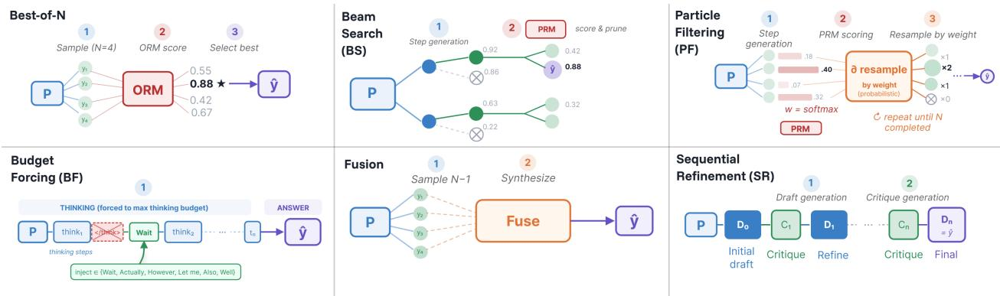  
Figure 1 Schema for the six TTS methods in this paper. PF is the only method reproduced as it is, the other methods are variations from previous papers

at rate $O ( \sigma { \sqrt { \log N } } )$ . When the external verifier correlates imperfectly with true quality at rate $\rho _ { v } =$ $\operatorname { C o r r } [ \mathcal { V } ( y ) , \mathcal { V } ^ { * } ( y ) ]$ , dividing the expected BoN quality by oracle headroom yields (derivation in Appendix E):

$$
h ^ { \mathrm { B o N } } \approx \rho _ { v } .\tag{4}
$$

Headroom capture for BoN is the verifier correlation. When $\rho _ { v } = 0$ , additional compute yields no benefit;   
when $\rho _ { v } < 0$ , more compute actively harms performance.

Robustness to judge noise. Equation 4 is robust to judge noise $\epsilon _ { J }$ by construction: as proven in Appendix F.2, noise enters both hˆ and $\hat { \rho } _ { v }$ through the same attenuation factor, so the two quantities cancel and the identity $h \approx \rho _ { v }$ holds at the level of raw measured scores without any correction. Practitioners can therefore use $\hat { \rho } _ { v }$ as a direct predictor of correct headroom capture.

## 3.3 Implication 2: Oracle Ceilings Differ by Method

For BoN the candidate pool is N i.i.d. samples, so $Q _ { \mathrm { B o N } } ^ { * } ( T )$ is the standard order statistic over N draws $\left( \mathrm { E q . 3 } \right)$ — monotonic in T with diminishing returns. Fusion displaces one i.i.d. candidate with a synthesised output, giving $Q _ { \mathrm { F u s i o n } } ^ { * } ( T ) \geq Q _ { \mathrm { B o N } } ^ { * } ( T )$ whenever the synthesis matches or exceeds the displaced candidate. SR’s pool spans all intermediate and final drafts, so $Q _ { \mathrm { S R } } ^ { * } ( T )$ rises above the first-draft baseline only when conditioning on prior drafts genuinely improves quality. Per-method ceilings are studied empirically in Section 6.

## 4 Experimental Setup

Benchmarks. We evaluate on five open-ended generation benchmarks spanning medicine, law, finance, general chat, and creative writing (Table 2). None admits exact-match or binary verification. Full details in Appendix B.

Table 2 Benchmark characteristics.
<table><tr><td>Benchmark</td><td>Domain</td><td>n</td><td>Evaluation</td><td>Source</td><td>Scoring</td><td>Avg source items</td></tr><tr><td>LEXam [7]</td><td>Law</td><td>516</td><td>Reference-guided</td><td>Professor solutions</td><td>Holistic 0-1</td><td>1</td></tr><tr><td>HealthBench [2]</td><td>Medicine</td><td>5000</td><td>Rubric-only</td><td>Physician rubrics</td><td>Binary per criterion</td><td>11.4</td></tr><tr><td>PRBench [1]</td><td>Finance, Law</td><td>1650</td><td>Rubric-only</td><td>Expert rubrics</td><td>Binary per criterion</td><td>17.7</td></tr><tr><td>WildBench [13]</td><td>Chat/General</td><td>1024</td><td>Rubric-only</td><td>LLM-generated checklist</td><td>Holistic 1-10</td><td>~11</td></tr><tr><td>WritingBench [30]</td><td>Writing</td><td>555</td><td>Rubric-only</td><td>LLM-generated rubric</td><td>1–10 per criterion</td><td>5</td></tr></table>

TTS Methods. We evaluate one representative per TTS family (Figure 1), with two tree search variants to disentangle deterministic pruning from stochastic diversity: Best-of-N (BoN), parallel sampling, external ORM; Beam Search (BS), deterministic tree search, PRM-guided; Particle Filter (PF) [20], stochastic resampling, PRM-guided; Sequential Refinement (SR), sequential refinement, self-verifier; Budget Forcing (BF), extended thinking, single trajectory; and Fusion, generative synthesis over N candidates. More details on the algorithms, hyperparameters and prompt templates in Appendix C.

Table 3 Realised quality for Qwen3.5-35B-A3B across five benchmarks and four compute levels. Cell colour encodes delta from the single-sample baseline (BoN@1): green = improvement, red = regression. Bold = gain ≥ 0.03 over baseline.
<table><tr><td rowspan="2"></td><td colspan="5">HealthBench</td><td colspan="5">PRBench</td><td colspan="5">LEXam</td></tr><tr><td>N=1</td><td>Low</td><td>Mid</td><td>High</td><td>XHigh</td><td>N=1</td><td>Low</td><td>Mid</td><td>High</td><td>XHigh</td><td>N=1</td><td>Low</td><td>Mid</td><td>High</td><td>XHigh</td></tr><tr><td>BoN+Skywork</td><td>0.536</td><td>0.538</td><td>0.539</td><td>0.539</td><td>0.539</td><td>0.292</td><td>0.293</td><td>0.294</td><td>0.293</td><td>0.292</td><td>0.525</td><td>0.527</td><td>0.529</td><td>0.531</td><td>0.530</td></tr><tr><td>BoN+Llama70B</td><td>0.536</td><td>0.539</td><td>0.541</td><td>0.541</td><td>0.541</td><td>0.292</td><td>0.293</td><td>0.295</td><td>0.296</td><td>0.298</td><td>0.525</td><td>0.528</td><td>0.532</td><td>0.533</td><td>0.534</td></tr><tr><td>Fusion</td><td></td><td></td><td>0.574</td><td>0.587</td><td>0.588</td><td></td><td></td><td>0.315</td><td>0.324</td><td>0.331</td><td></td><td></td><td>0.546</td><td>0.546</td><td>0.547</td></tr><tr><td>Beam Search</td><td></td><td></td><td>0.534</td><td>0.526</td><td>0.532</td><td></td><td></td><td>0.289</td><td>0.285</td><td>0.285</td><td></td><td></td><td>0.516</td><td>0.526</td><td>0.525</td></tr><tr><td>Particle Filter</td><td></td><td></td><td>0.532</td><td>0.532</td><td>0.530</td><td></td><td></td><td>0.286</td><td>0.282</td><td>0.282</td><td></td><td></td><td>0.531</td><td>0.527</td><td>0.526</td></tr><tr><td>SR</td><td></td><td>0.521 0.539</td><td>0.517</td><td>0.516</td><td>0.513</td><td></td><td>0.302</td><td>0.311</td><td>0.327</td><td>0.342</td><td></td><td>0.505</td><td>0.504</td><td>0.488</td><td>0.480</td></tr><tr><td>Budget Forcing</td><td></td><td></td><td>0.539</td><td></td><td></td><td></td><td>0.296</td><td>0.295</td><td></td><td></td><td></td><td>0.526</td><td>0.523</td><td></td><td></td></tr><tr><td></td><td colspan="4">WildBench</td><td></td><td></td><td colspan="4">WritingBench</td><td colspan="4">Overall</td></tr><tr><td></td><td>N=1</td><td>Low</td><td>Mid</td><td>High</td><td>XHigh</td><td>N=1</td><td>Low</td><td>Mid</td><td>High</td><td>XHigh</td><td>N=1</td><td>Low</td><td>Mid</td><td>High</td><td>XHigh</td></tr><tr><td></td><td></td><td></td><td></td><td></td><td></td><td></td><td></td><td></td><td>0.715</td><td></td><td></td><td>0.578</td><td></td><td></td><td>0.584</td></tr><tr><td>BoN+Skywork BoN+Llama70B</td><td>0.812 0.812</td><td>0.825 0.820</td><td>0.834 0.825</td><td>0.839 0.828</td><td>0.843 0.830</td><td>0.702 0.702</td><td>0.708 0.707</td><td>0.712 0.710</td><td>0.714</td><td>0.718 0.717</td><td>0.574 0.574</td><td>0.578</td><td>0.581 0.580</td><td>0.584 0.582</td><td>0.584</td></tr><tr><td></td><td></td><td></td><td>0.844</td><td>0.857</td><td>0.864</td><td></td><td></td><td>0.715</td><td>0.712</td><td>0.720</td><td></td><td></td><td>0.599</td><td>0.606</td><td>0.610</td></tr><tr><td>Fusion Beam Search</td><td></td><td></td><td>0.820</td><td>0.811</td><td>0.816</td><td></td><td></td><td>0.695</td><td>0.696</td><td>0.694</td><td></td><td></td><td>0.571</td><td>0.569</td><td>0.571</td></tr><tr><td>Particle Filter</td><td></td><td></td><td>0.802</td><td>0.801</td><td>0.797</td><td></td><td></td><td>0.694</td><td>0.694</td><td>0.689</td><td></td><td></td><td>0.569</td><td>0.567</td><td>0.565</td></tr><tr><td>SR</td><td></td><td>0.825</td><td>0.830</td><td>0.831</td><td>0.836</td><td></td><td>0.738</td><td>0.750</td><td>0.770</td><td>0.775</td><td></td><td>0.578</td><td>0.583</td><td>0.586</td><td></td></tr><tr><td>Budget Forcing</td><td></td><td>0.824</td><td>0.832</td><td></td><td></td><td></td><td>0.672</td><td>0.665</td><td></td><td></td><td></td><td>0.571</td><td>0.571</td><td></td><td>0.589</td></tr></table>

Models. Generators: OLMo3-7B-Think and OLMo3.1-32B-Think [28], and the Qwen3.5 family (9B, 35B-A3B) [27]. ORMs for BoN: Skywork-Reward-V2-Llama-3.1-8B [14] and Llama-3.1-70B-Instruct-RM-RB2 [18]. PRM for tree search: VersaPRM-8B [31]. ORMs were selected based on their performance on RewardBench 2 [18] while VersaPRM was selected for its unique multi-domain training.

Compute Normalisation. We normalise by total generator output tokens across all generative steps, excluding the cost of discriminative reward models whose cost is negligible compared to autoregressive decoding. We define four compute levels: Low, Mid, High, and XHigh, which match the average BoN output at N ∈ {2, 4, 8, 16} within 25% tolerance (Table 5, Appendix A). Total compute across all experiments amounted to approximately 23,800 GPU-hours on B200 GPUs (Table 11, Appendix C).

Evaluation. Evaluating 27B generated tokens with each benchmark’s native judge is cost-prohibitive; we instead use Qwen3.5-397B-A17B [27] as our judge across all benchmarks (Appendix C). We validated the agreement against each benchmark’s native judge on stratified 5–15% samples (Appendix D). On HealthBench, our judge achieves Macro F1 of 0.679 with human annotations, above the mean inter-annotator agreement; on PRBench, criterion-level κ = 0.679, while WildBench and WritingBench show respectively QWK 0.564 and 0.408 per-pair agreement. The lower WritingBench agreement reflects the benchmark’s known verbosity bias rather than judge miscalibration (Section 6.3): on identical BoN samples, our judge and the authors’ oficial 7B Critic model [30] yield the same headroom capture (0.19 vs. 0.19, more in Appendix O).

## 5 Results

Table 3 reports compute-normalised results for Qwen3.5-35B-A3B across all methods and benchmarks. Results for Qwen3.5-9B and OLMo3 are in Appendices H and I.

The defining pattern is stagnation. BoN with either ORM yields negligible gains across an 8× budget increase. Tree search never improves over the single-sample baseline and actively degrades on several benchmarks. Budget Forcing is flat or regresses even at low compute — these reasoning models exhaust useful thinking within modest token budgets, and we do not scale it further. Yet oracle quality rises steadily with

Oracle vs. Realized Score per Method (XHigh) — Qwen3.5-35B

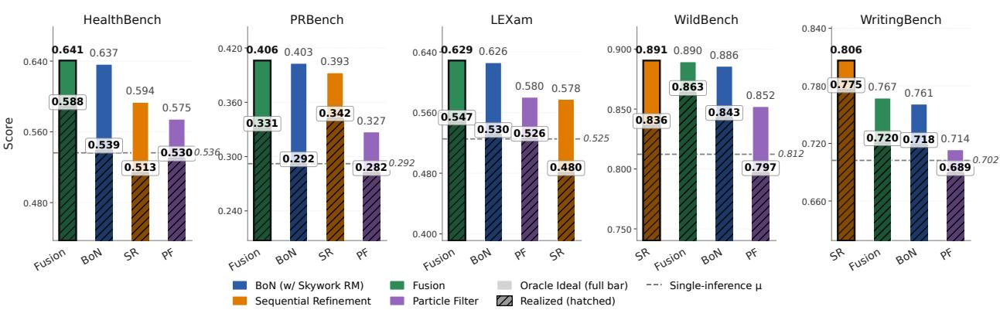  
Figure 2 Oracle (full bar) vs. realised (hatched) quality per method at matched compute (XHigh), Qwen3.5-35B-A3B. All qualitative patterns above replicate under the naive oracle (Appendix G). In that appendix figure, the naive estimator systematically overestimates oracle quality, so the exploitation gaps shown there are conservative lower bounds on the true exploitation gap.

compute on every benchmark (Section 6): better candidates exist but no selection or search method identifies them.

Both ORMs fail almost identically. Skywork-Reward-V2 and Llama-3.1-70B-RM produce near-identical realised scores across all benchmarks (overall at XHigh: both 0.584), pointing to a structural rather than model-specific failure quantified in Section 6.1.

Fusion is the only method that consistently scales. It improves over the single-sample baseline on every benchmark, reaching 0.610 overall at XHigh compute (vs. 0.584 for the best RM-based method and 0.574 baseline), a pattern that holds across model scales (Section 6.4).

Sequential Refinement is unreliable. It achieves the largest gain of any method on WritingBench (+7.3pp) compared to single inference baseline, and outperforms Fusion on PRBench (0.342 vs. 0.331), but regresses on HealthBench (−2.3pp) and LEXam (−4.5pp). As Section 6.3 shows, the WritingBench gains are confounded by verbosity and the WildBench gains are driven almost entirely by a single subtask.

## 6 Analysis

The explanation reduces to one observation: the candidate pool is not the problem—exploitation is. Figure 2 makes this concrete. At the highest compute budget, all four methods produce candidate pools with high oracle quality across all five benchmarks. Fusion and BoN generate nearly identical oracle pools (typically within 0.01–0.04 oracle diference), yet their realised scores diverge consistently: averaged across benchmarks (Figure 3), Fusion captures ∼40% of available quality while BoN captures only ∼15%. Sequential Refinement is erratic, ranging from −0.86 to 0.70 across benchmarks, and Particle Filter averages around −40%, actively degrading quality. The bottleneck is not generating good candidates but selecting or synthesising the right answer from them. Table 4 summarises the failure mode for each method family.

## 6.1 Verifier Correlation Explains Selection Failure

Current reward models are insufficient to improve strong generators via BoN. The efectiveness of BoN depends critically on the generator-verifier gap. When the generator is weak relative to the RM, BoN yields clean positive scaling: our reproduction of the original Skywork-RM experiment, swapping in the much weaker generator from that paper, recovers strong TTS scaling (Appendix M). When the generator is strong, however, we find that current reward models struggle to discriminate reliably among candidate outputs.

Exploitation Quality: Headroom Capture at XHigh (Qwen3.5-35B)  
Table 4 Diagnosis per method family. Oracle quality reflects exploration; headroom capture reflects exploitation.
<table><tr><td>Method</td><td>Oracle quality</td><td>Headroom capture</td><td>Failure mode</td></tr><tr><td>BoN 十 ORM</td><td>High</td><td> $\sim 1 5 \% \ ( \hat { \rho } _ { v } \approx 0 . 1 2 )$ </td><td>RM miscalibrated (§6.1)</td></tr><tr><td rowspan="3">Tree search Fusion SR</td><td>Collapsed (diversity loss) ≥ BoN</td><td>Negative on most tasks ~40% (best, still low)</td><td>PRM destroys diversity (§6.2) Residual gap (§6.3)</td></tr><tr><td>Lower than BoN on 3/5 bench-</td><td>Genuine gain on 1/5</td><td>Refinement mostly hurts; where it helps,</td></tr><tr><td>marks</td><td>(PRBench)</td><td>gains trace to subtask composition or ver- bosity (§6.3)</td></tr></table>

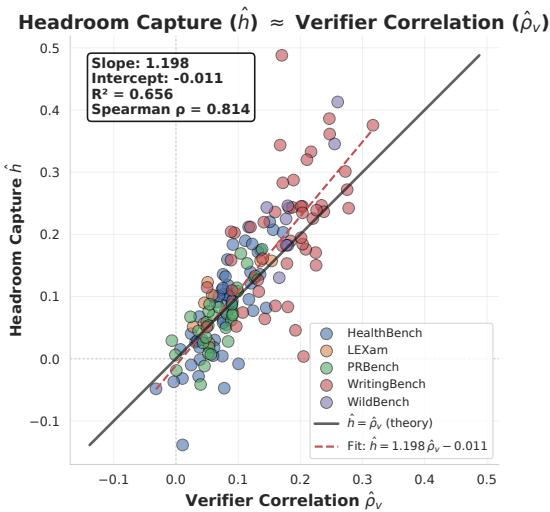

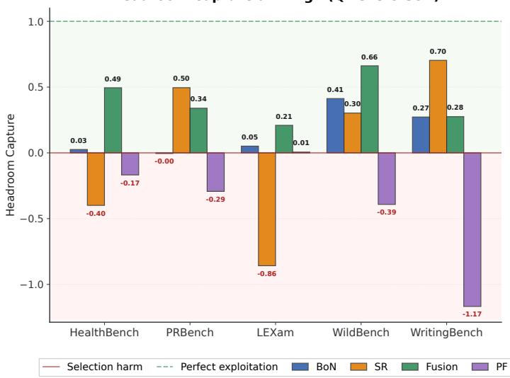  
Figure 3 Left: $\hat { h }$ vs. $\hat { \rho } _ { v }$ across $N = 1 5 2$ task-level points. Identity line $y = x$ is the theoretical prediction (Equation 4); empirical fit $y = 1 . 1 9 8 \hat { \rho } _ { v } - 0 . 0 1 1$ confirms it $( R ^ { 2 } = 0 . 6 6 , \rho = 0 . 8 1 , p < 1 0 ^ { - 3 6 } )$ ). Right: Headroom capture per method at XHigh compute. The headrooms for all models are in Appendix J

On MATH-500 and GPQA Diamond, our generators gain only ${ \sim } 2 \mathrm { p p }$ over single-sample (Appendix L); on open-ended generation, Spearman correlations between RM scores and judge scores average just 0.12 (Skywork) and 0.11 (Llama) across 152 (generator, RM, benchmark) combinations (Appendix K), reducing BoN to near-random selection.

$\hat { \rho } _ { v }$ quantitatively predicts headroom capture. Theory predicts the identity $h ^ { \mathrm { B o N } } \approx \rho _ { v }$ (Equation 4). Regressing hˆ on $\hat { \rho } _ { v }$ across all N = 152 combinations yields slope 1.198 and intercept −0.011: slope near 1 and intercept near 0 directly validate the prediction $( R ^ { 2 } = 0 . 6 6 , \rho = 0 . 8 1 , p < 1 0 ^ { - 3 6 } )$ Figure 3 (left)). Figure 3 (right) shows the concrete consequence: the same ∼15% vs. ∼40% headroom capture gap between RM-based BoN and Fusion, now explained by $\hat { \rho } _ { v } \approx 0 . 1 2$

## 6.2 Tree Search Failure: Diversity Collapse

While BoN fails at exploitation through poor selection, tree search fails at both exploitation and exploration: PRM-guided resampling collapses the candidate pool itself. Particle Filtering produces the least diverse final outputs across all benchmarks: for Qwen3.5-35B, PF’s mean cosine distance ranges from 0.036 (WritingBench) to 0.069 (HealthBench), compared with 0.123–0.124 for BoN (Figure 4, left). Tracing pairwise similarity across 16 particles over generation depth, WritingBench particles remain near-identical throughout (similarity ≥ 0.997)—16 nominal particles are efectively a single trajectory (Figure 4, right). The mechanism is the exponential pruning sensitivity from Equation 8: a miscalibrated PRM prunes promising branches at every step, and the probability that the best candidate survives decays exponentially with depth. Naive parallel

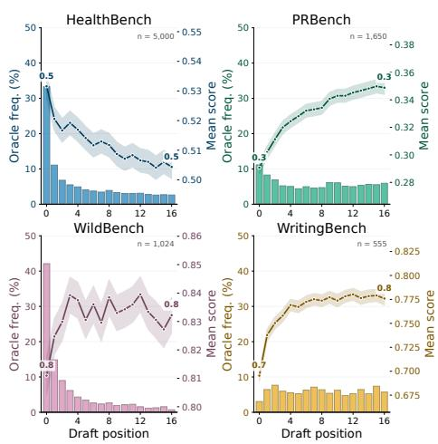  
Semantic diversity across methods (Qwen3.5-35B)

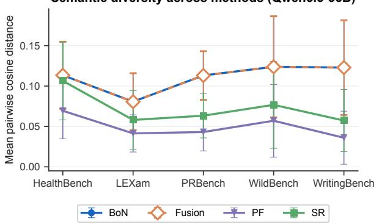

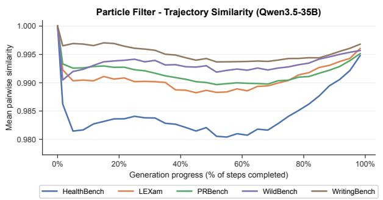  
Figure 4 Left: Mean pairwise cosine distance across final outputs at High compute. Right: Particle trajectory similarity over normalised generation depth.

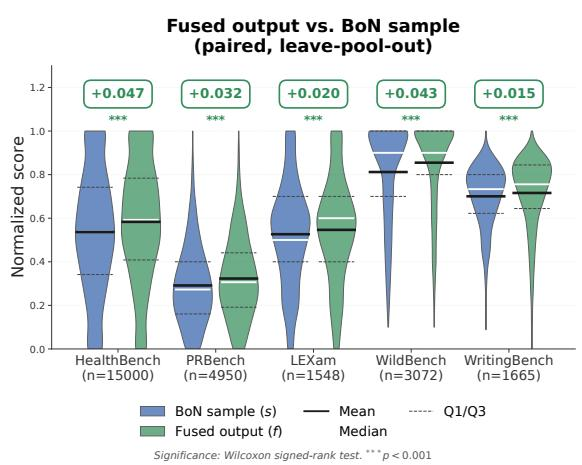  
Oracle position vs. mean score across refinement steps

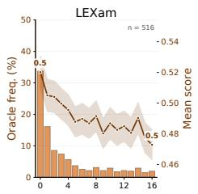  
Figure 5 Left: Fusion output quality vs. a random candidate drawn from the candidates not included in the shared sub-pool common to both BoN and Fusion, per benchmark. Right: Oracle-position frequency (bars, left axis) and mean score trajectory (line, right axis) across SR iterations.

sampling preserves more diversity at equal cost.

## 6.3 Generative Methods: Fusion Synthesises, Sequential Refinement Regresses

Fusion: synthesis exceeds selection. Despite generating fewer independent candidates than BoN at equal compute, Fusion matches or exceeds BoN’s oracle ceiling on all benchmarks (Figure 2), meaning the synthesised output frequently lifts the pool ceiling more than another i.i.d. sample. Figure 5 (left) shows that the fused output also consistently scores above a held-out i.i.d. candidate drawn from outside the shared sub-pool used by both BoN and Fusion—making this a fair comparison of synthesis quality against an independent sample of equivalent compute cost. Together, the two figures rule out a variance-only interpretation: synthesis raises mean candidate quality, not just the upper tail, so Fusion’s ceiling gain reflects systematically better candidates rather than fatter-tailed sampling.

Sequential Refinement: refinement is benchmark-dependent. On the exploration side, SR’s oracle ceiling falls below BoN’s on three of five benchmarks (Figure 2), confirming that critique tokens displace more value than they add on most tasks. On the exploitation side, the per-iteration trajectory (Figure 5, right) reveals benchmark-dependent behaviour. On HealthBench and LEXam, refinement is counterproductive: the initial draft is most often the oracle and mean score declines with each iteration. On WildBench, mean score rises despite the initial draft being the oracle 43% of the time; however, this gain traces to a single subtask (Coding & Debugging), which contributes more than the entire aggregate lift; excluding it produces a net regression (Appendix N). Only PRBench exhibits genuine improvement: oracle frequency is nearly uniform across iterations and mean score rises across all subtasks. WritingBench is discussed separately below.

The WritingBench exception is confounded by verbosity. WritingBench is the apparent exception: the oracle ceiling for SR exceeds BoN’s and the best draft shifts to later iterations. However, the within-prompt length–score correlation is $\hat { \rho } = + 0 . 3 3$ for SR (vs. +0.20 for BoN), and the judge discriminates more on length relative to substance than other benchmarks do (PRBench: 4.3× content-to-length discrimination; HealthBench: 2.5×; WritingBench: 0.7×). The fine-tuned judge released by the WritingBench authors shows an even stronger length–score correlation, confirming the verbosity bias is a property of the benchmark’s evaluation design, not of any particular judge. Full analysis in Appendix O.

## 6.4 Generation and Exploitation Are Distinct Capabilities

Self-verifier quality is bounded by generator capability (Appendix E), but capability is not reducible to parameter count. To separate scale from family, we compare Fusion and SR within Qwen3.5 and across families (Qwen3.5 vs. OLMo3); full per-model tables are in Appendices I and H; full model-capacity decomposition in Appendix P.

Generation capability does not imply exploitation capability. The most revealing comparison is cross-family. Qwen3.5 and OLMo3 produce candidate pools with comparable headrooms on HealthBench and LEXam (Figure 18), and on WritingBench OLMo3 in fact shows larger headrooms. Yet headroom capture diverges sharply (Figure 19): at High compute, Qwen3.5 models (9B and 35B-A3B) close ∼ 36% of headroom on average under Fusion, while OLMo3.1-32B-Think produces negative headroom on two of three benchmarks, meaning its synthesised output is worse than a random candidate. OLMo3 generates pools with as much (or more) oracle gap as Qwen3.5 but largely fails to convert that gap into a better answer.

Scaling generation capability within a family does not improve exploitation either. Within Qwen3.5, both Fusion and SR exhibit the same qualitative behaviour at every model size we tested. Fusion improves over the single-sample baseline on every benchmark and at every scale, but its advantage relative to a random candidate does not grow with model size — consistent with synthesis being a structural strategy (bypassing selection) rather than a capability-dependent one. SR’s behaviour is benchmark-dependent — regression on HealthBench and LEXam, gains on WritingBench and PRBench — with comparable exploitation across model sizes (Figure 14).

## 7 Conclusion

We present the first systematic, compute-normalised comparison of five TTS families on open-ended generation, grounded in a unified exploration–exploitation framework, and find that exploitation — not exploration — is the bottleneck. Oracle quality rises steadily with compute, but no method converts more than a fraction into realised quality: RM-based selection fails structurally $( \hat { \rho } _ { v } \approx 0 . 1 2$ , both ORMs identical), tree search compounds this through diversity collapse, Fusion is the only consistently improving method yet captures only ∼40% of available headroom, and SR yields genuine gains on only one benchmark. These failures are not unique to open-ended generation — they arise whenever generators outpace RM training data and no scaling axis closes the gap.

Broader Impact and Limitations $\hat { \rho } _ { v }$ provides a cheap diagnostic: practitioners can measure verifier-quality alignment on a small sample before committing inference budget. This matters most in high-stakes domains (medicine, law, finance), where RM-based TTS can actively degrade performance; our results reinforce that LLM-based evaluation is not a substitute for expert review, and deploying TTS in such settings without human oversight remains inadvisable.Our conclusions rest on two model families, and a single unified judge (Qwen3.5-397B-A17B), and do not cover all open-ended use cases. Our oracle estimator $\hat { O } ^ { \mathrm { i d e a l } }$ assumes i.i.d. candidates—exact for BoN, but only approximate for Refinement, Fusion, and Particle Filtering; we expect it to slightly underestimate the true oracle for the first two and slightly overestimate it for Particle Filtering (Appendix F).

Future work. Two open problems follow from the exploitation gap. First, training verifiers calibrated for open-ended evaluation: $\hat { \rho } _ { v }$ provides a measurable target. Second, developing exploitation mechanisms beyond selection and synthesis: the high unrealised headroom represents a substantial opportunity.

## Acknowledgements

We sincerely thank our colleague, Guglielmo Bonifazi, for his valuable input and insightful discussion points throughout the development of this work. We also express our gratitude to Shirsha Ray for her support in facilitating Kanak’s collaboration with our team, which was instrumental in achieving these results.

## References

[1] A. F. Akyürek, A. Gosai, C. B. C. Zhang, V. Gupta, J. Jeong, A. Gunjal, T. Rabbani, M. Mazzone, D. Randolph, M. M. Meymand, et al. PRBench: Large-scale expert rubrics for evaluating high-stakes professional reasoning. arXiv preprint arXiv:2511.11562, 2025.

[2] R. K. Arora, J. Wei, R. Soskin Hicks, P. Bowman, J. Quiñonero-Candela, F. Tsimpourlas, M. Sharman, M. Shah, A. Vallone, A. Beutel, J. Heidecke, and K. Singhal. HealthBench: Evaluating large language models towards improved human health. arXiv preprint arXiv:2505.08775, 2025.

[3] E. Beeching, L. Tunstall, and S. Rush. Scaling test-time compute with open models, 2024. URL https://huggingface.co/spaces/HuggingFaceH4/blogpost-scaling-test-time-compute.

[4] K. Chang, Y. Shi, C. Wang, H. Zhou, C. Hu, X. Liu, Y. Luo, Y. Ge, T. Xiao, and J. Zhu. Step-level verifierguided hybrid test-time scaling for large language models, 2025. URL https://arxiv.org/abs/2507.15512.

[5] G. Dalal, A. Hallak, G. Chechik, and Y. Ziser. More test-time compute can hurt: Overestimation bias in llm beam search, 2026. URL https://arxiv.org/abs/2603.15377.

[6] K. Elangovan, J. C. L. Ong, L. Jin, B. J. J. Seng, Y. H. Kwan, L. S. Ng, R. J. Zhong, J. K. L. Ma, Y. H. Ke, N. Liu, K. M. Giacomini, and D. S. W. Ting. Development and evaluation of a lightweight large language model chatbot for medication enquiry. PLOS Digital Health, 4(9):e0000961, 2025. doi: 10.1371/journal.pdig.0000961. URL https://doi.org/10.1371/journal.pdig.0000961.

[7] Y. Fan, J. Ni, J. Merane, Y. Tian, Y. Hermstrüwer, Y. Huang, M. Akhtar, E. Salimbeni, F. Geering, O. Dreyer, D. Brunner, M. Leippold, M. Sachan, A. Stremitzer, C. Engel, E. Ash, and J. Niklaus. LEXam: Benchmarking legal reasoning on 340 law exams. arXiv preprint arXiv:2505.12864, 2025.

[8] D. Hendrycks, C. Burns, S. Kadavath, A. Arora, S. Basart, E. Tang, D. Song, and J. Steinhardt. Measuring mathematical problem solving with the math dataset, 2021. URL https://arxiv.org/abs/2103.03874.

[9] Y. Inoue, K. Misaki, Y. Imajuku, S. Kuroki, T. Nakamura, and T. Akiba. Wider or deeper? scaling llm inference-time compute with adaptive branching tree search, 2025. URL https://arxiv.org/abs/2503.0 4412.

[10] A. Khairi, D. D’souza, M. Fadaee, and J. Kreutzer. Making, not taking, the best of n. arXiv preprint arXiv:2510.00931, 2025.

[11] D. Li, S. Cao, C. Cao, X. Li, S. Tan, K. Keutzer, J. Xing, J. E. Gonzalez, and I. Stoica. S\*: Test time scaling for code generation. ArXiv, abs/2502.14382, 2025. URL https://api.semanticscholar.org/CorpusID: 276482470.

[12] H. Lightman, V. Kosaraju, Y. Burda, H. Edwards, B. Baker, T. Lee, J. Leike, J. Schulman, I. Sutskever, and K. Cobbe. Let’s verify step by step, 2023. URL https://arxiv.org/abs/2305.20050.

[13] B. Y. Lin, Y. Deng, K. Chandu, F. Brahman, A. Ravichander, V. Pyatkin, N. Dziri, R. Le Bras, and Y. Choi. WildBench: Benchmarking LLMs with challenging tasks from real users in the wild. arXiv preprint arXiv:2406.04770, 2024.

[14] C. Y. Liu, L. Zeng, Y. Xiao, J. He, J. Liu, C. Wang, R. Yan, W. Shen, F. Zhang, J. Xu, Y. Liu, and Y. Zhou. Skywork-Reward-V2: Scaling preference data curation via human-ai synergy. arXiv preprint arXiv:2507.01352, 2025.

[15] R. Liu, J. Gao, J. Zhao, K. Zhang, X. Li, B. Qi, W. Ouyang, and B. Zhou. Can 1b llm surpass 405b llm? rethinking compute-optimal test-time scaling, 2025. URL https://arxiv.org/abs/2502.06703.

[16] A. Madaan, N. Tandon, P. Gupta, S. Hallinan, L. Gao, S. Wiegrefe, U. Alon, N. Dziri, S. Prabhumoye, Y. Yang, et al. Self-refine: Iterative refinement with self-feedback. Advances in neural information processing systems, 36:46534–46594, 2023.

[17] L. Madaan, A. Didolkar, S. Gururangan, J. Quan, R. Silva, R. Salakhutdinov, M. Zaheer, S. Arora, and A. Goyal. Rethinking thinking tokens: Llms as improvement operators. arXiv preprint arXiv:2510.01123, 2025.

[18] S. Malik, V. Pyatkin, S. Land, J. Morrison, N. A. Smith, H. Hajishirzi, and N. Lambert. RewardBench 2: Advancing reward model evaluation. arXiv preprint arXiv:2506.01937, 2025.

[19] N. Muennighof, Z. Yang, W. Shi, X. L. Li, L. Fei-Fei, H. Hajishirzi, L. Zettlemoyer, P. Liang, E. Candès, and T. B. Hashimoto. s1: Simple test-time scaling. In Proceedings of the 2025 Conference on Empirical Methods in Natural Language Processing, pages 20275–20321, 2025.

[20] I. Puri, S. Sudalairaj, G. Xu, K. Xu, and A. Srivastava. Rollout roulette: A probabilistic inference approach to inference-time scaling of llms using particle-based monte carlo methods. arXiv preprint arXiv:2502.01618, 2025.

[21] D. Rein, B. L. Hou, A. C. Stickland, J. Petty, R. Y. Pang, J. Dirani, J. Michael, and S. R. Bowman. Gpqa: A graduate-level google-proof q&a benchmark, 2023. URL https://arxiv.org/abs/2311.12022.

[22] J. Saad-Falcon, A. G. Lafuente, S. Natarajan, N. Maru, H. Todorov, E. Guha, E. K. Buchanan, M. Chen, N. Guha, C. Ré, and A. Mirhoseini. Archon: An architecture search framework for inference-time techniques, 2025. URL https://arxiv.org/abs/2409.15254.

[23] M. Sharma, C. B. C. Zhang, C. Bandi, C. Wang, A. Aich, H. Nghiem, T. Rabbani, Y. Htet, B. Jang, S. Basu, A. Balwani, D. Peskof, M. Ayestaran, S. M. Hendryx, B. Kenstler, and B. Liu. Researchrubrics: A benchmark of prompts and rubrics for evaluating deep research agents, 2025. URL https://arxiv.org/ abs/2511.07685.

[24] Y. Shi, H. Liu, Y. Hu, G. Song, X. Xu, Y. Ma, T. Tang, L. Zhang, Q. Chen, D. Feng, W. Lv, W. Wu, K. Yang, S. Yang, W. Wang, R. Shi, Y. Qiu, Y. Qi, J. Zhang, X. Sui, Y. Chen, Y. Zhang, A. Yang, B. Yu, D. Liu, J. Lin, W. Shen, B. Zhao, C. L. A. Clarke, and H. Wei. Plawbench: A rubric-based benchmark for evaluating llms in real-world legal practice, 2026. URL https://arxiv.org/abs/2601.16669.

[25] C. Snell, J. Lee, K. Xu, and A. Kumar. Scaling llm test-time compute optimally can be more efective than scaling model parameters. arXiv preprint arXiv:2408.03314, 2024.

[26] Z. Song, S. Tang, P. Ye, J. Fan, L. Bai, T. Chen, and W. Ouyang. Ctts: Collective test-time scaling, 2025. URL https://arxiv.org/abs/2508.03333.

[27] Q. Team. Qwen3.5: Accelerating productivity with native multimodal agents, February 2026. URL https://qwen.ai/blog?id=qwen3.5.

[28] Team OLMo, A. Ettinger, A. Bertsch, B. Kuehl, D. Graham, D. Heineman, D. Groeneveld, F. Brahman, F. Timbers, H. Ivison, et al. OLMo 3. arXiv preprint arXiv:2512.13961, 2025.

[29] Y. Wu, Z. Sun, S. Li, S. Welleck, and Y. Yang. Inference scaling laws: An empirical analysis of compute-optimal inference for problem-solving with language models. arXiv preprint arXiv:2408.00724, 2024.

[30] Y. Wu, J. Mei, M. Yan, C. Li, S. Lai, Y. Ren, Z. Wang, J. Zhang, M. Wu, Q. Jin, and F. Huang. WritingBench: A comprehensive benchmark for generative writing. arXiv preprint arXiv:2503.05244, 2025.

[31] T. Zeng et al. VersaPRM: Multi-domain process reward model via synthetic reasoning data. arXiv preprint arXiv:2502.06737, 2025.

[32] Q. Zhang, F. Lyu, Z. Sun, L. Wang, W. Zhang, W. Hua, H. Wu, Z. Guo, Y. Wang, N. Muennighof, I. King, X. Liu, and C. Ma. A survey on test-time scaling in large language models: What, how, where, and how well?, 2025. URL https://arxiv.org/abs/2503.24235.

[33] L. Zhou, L. Pacchiardi, F. Martínez-Plumed, K. M. Collins, Y. Moros-Daval, S. Zhang, Q. Zhao, Y. Huang, L. Sun, J. E. Prunty, Z. Li, P. Sánchez-García, K. Jiang-Chen, P. A. M. Casares, J. Zu, J. Burden, B. Mehrbakhsh, D. Stillwell, M. Cebrian, J. Wang, P. Henderson, S. T. Wu, P. C. Kyllonen, L. Cheke, X. Xie, and J. Hernández-Orallo. General scales unlock AI evaluation with explanatory and predictive power. Nature, 652:58–67, 2026. doi: 10.1038/s41586-026-10303-2. URL https: //doi.org/10.1038/s41586-026-10303-2.

[34] X. Zhu, X. Zhou, B. Zhu, H. Hu, M. Du, H. Zhang, H. Wang, and Z. Guo. Codescaler: Scaling code llm training and test-time inference via execution-free reward models, 2026. URL https://arxiv.org/abs/26 02.17684.

## A Compute Band Configurations

Table 5 Compute band configurations. Fusion High uses subset = 7 for Qwen3.5 and subset = 6 for OLMo3. Entries marked — were not run. $\bar { \ell } _ { t } \colon$ mean thinking tokens per BoN sample; ¯ℓ: mean answer tokens per BoN sample. †Two tasks ran at $W = 3 , k = 4$ instead of $W = 4 , k = 4$ (see Table 48).
<table><tr><td>Band</td><td>BoN</td><td>Beam Search</td><td>PF</td><td>Sequential Refinement</td><td>Budget Forcing Fusion</td><td></td></tr><tr><td>Low</td><td>n = 2</td><td></td><td></td><td>iter= 3</td><td> $2 \bar { \ell } _ { t } + \bar { \ell }$ </td><td></td></tr><tr><td>Mid</td><td>n = 4</td><td> $W = 2 , k = 2$ </td><td>N = 4</td><td>iter= 6</td><td> $4 { \bar { \ell } } _ { t } + { \bar { \ell } }$ </td><td>subset= 3</td></tr><tr><td>High</td><td>n = 8</td><td> $W = 2 , k = 4$ </td><td>N = 8</td><td> $\mathrm { i t e r } { = } 1 2$ </td><td> $8 \bar { \ell } _ { t } + \bar { \ell }$ </td><td>subset= 6/7</td></tr><tr><td>XHigh</td><td> $n = 1 6$ </td><td> $W = 4 , k = 4 ^ { \dagger }$ </td><td> $N = 1 6$ </td><td> ${ \mathrm { i t e r } } = 1 6$ </td><td> $1 6 \bar { \ell } _ { t } + \bar { \ell }$ </td><td>subset= 15</td></tr></table>

## B Benchmark Details

LEXam. We use the open\_question configuration of LEXam-Benchmark/LEXam (HuggingFace), drawn from law-school exams administered at a Swiss university. The original release contains 2,841 items across four legal areas (Private, Public, Interdisciplinary, Criminal) in English and German. We filter to language $\mathrm { \Phi } = \mathrm { \ " } \Theta \mathrm { n } ^ { \mathrm { \prime \prime } }$ , retaining 516 items and dropping 2,325 German items. The English subset is dominated by international and comparative law (jurisdiction: International 429, Generic 73, Swiss 14), reflecting the language of instruction at the source institution. The pool is heavily skewed toward Private and Public law (85% of items combined), with Interdisciplinary (48) and Criminal (31) forming the long tail. Each item carries a single professor reference solution.

HealthBench. We use openai/HealthBench (5,000 items). Every example carries exactly one theme tag; the tags are non-overlapping and cover the full corpus, so we partition the dataset into seven sub-files used as separate evaluation tasks: global\_health (1,097), hedging (1,071), communication (919), context\_seeking (594), emergency\_referrals (482), health\_data\_tasks (477), complex\_responses (360). Each example carries on average 11.4 physician-authored rubric criteria, each tagged with a signed integer point value: positive points reward desired behaviors, negative points penalize undesired ones (e.g. recommending an unsafe action). The judge marks each criterion met or not met. An example’s score is the sum of points across met criteria, divided by the sum of all positive points in the rubric (the maximum positive total). The dataset-level metric is the mean across examples, clipped to [0, 1].

PRBench. We use the four pre-split configurations of ScaleAI/PRBench: prbench\_finance (600), prbench\_- finance\_hard (300), prbench\_legal (500), prbench\_legal\_hard (250). Each item carries between 10 and 30 weighted rubric criteria (29,252 criteria across 1,650 items, average ∼ 17 per item). Each criterion is tagged with one of six weight\_class levels, but the per-criterion integer weight is not a fixed mapping from class to value: the dataset stores a specific weight per criterion drawn from the ranges in Table 6, so a single example’s rubric can contain criteria with weights spanning $[ - 1 0 , + 1 0 ]$ . We report the clipped score: per-example $s _ { i } = \mathrm { r a w } _ { i } / w _ { \mathrm { m a x } , i } ^ { + }$ where $w _ { \mathrm { m a x } , i } ^ { + }$ is the maximum positive weight present in example i’s rubric, and the dataset-level score is max0, si.  
Table 6 PRBench weight class to integer point ranges.
<table><tr><td>Weight class</td><td>Integer weight</td></tr><tr><td>critically important</td><td>{8, 9, 10}</td></tr><tr><td>important</td><td> $\{ 4 , 5 , 6 , 7 \}$ </td></tr><tr><td>slightly important</td><td>{1, 2, 3}</td></tr><tr><td>slightly detrimental</td><td> $\{ - 3 , - 2 , - 1 \}$ </td></tr><tr><td>detrimental critically detrimental</td><td> $\{ - 7 , - 6 , - 5 , - 4 \}$   $\{ - 1 0 , - 9 , - 8 \}$ </td></tr></table>

WildBench. We use the v2 configuration of allenai/WildBench (1,024 items). Items are tagged with one of 11 primary\_tag categories, with a heavy long tail: Information seeking (182), Coding & Debugging (170), Creative Writing (146), Reasoning (133), Planning (116), Math (87), Editing (82), Data Analysis (33), Role playing (30), Brainstorming (24), Advice seeking (21). Each example carries a task-specific checklist of 6–33 items (avg ∼ 11). Deviation from upstream that afects absolute scores: the WildBench paper macro-averages WB-Score across five task groups (equal weight per group regardless of group size); we micro-average across all 1,024 items, so larger categories dominate. This shifts our absolute WB-Scores relative to the oficial leaderboard but preserves relative ordering between TTS methods evaluated on the same item set, which is the comparison we make.

WritingBench. We use X-PLUG/WritingBench (benchmark\_all.jsonl). The original release contains 1,000 items in Chinese and English; we filter to lang $\mathbf { \mu } = \mathbf { \mu } ^ { \mathsf { I I } } \mathsf { e } \mathbf { n } ^ { \mathsf { I I } }$ , retaining 555 items and dropping 445 Chinese items. The remaining items split fairly evenly across six domains: finance\_business (115), academic\_engineering (107), politics\_law (99), literature\_arts (96), advertising\_marketing (74), education (64). Unlike the other rubric-only benchmarks, WritingBench rubrics are dynamic per query: every item ships with exactly five criteria, each consisting of a name, a free-text criteria\_description, and five score-band descriptions (1–2, 3–4, 5–6, 7–8, 9–10). Each criterion is scored on 1–10; the example score is the mean across the five criteria.

Multi-turn handling. Three of the five benchmarks contain multi-turn items: HealthBench (41.7%, max 19 messages), PRBench (42.2%, max 19 messages), and WildBench (27.0%, max 9 messages); LEXam and WritingBench are single-turn only. Multi-turn conversations are passed to both the generator and the judge as ordered [{role, content}] message lists, following the standard OpenAI / vLLM chat-completion convention.

Native judges. Each benchmark ships with a recommended evaluation judge whose model and protocol we adopt verbatim from the upstream codebase (Table 7); these natives serve as the ground-truth comparator in our judge-agreement analysis (Sec D).

Table 7 Native judges adopted verbatim from each benchmark’s upstream release. Calls/example is the average number of judge invocations per candidate completion under the native protocol; per-criterion designs (HealthBench, PRBench, WritingBench) fan out into many calls per example.
<table><tr><td>Benchmark</td><td>Native judge</td><td>Protocol</td><td>Calls/ex</td></tr><tr><td>LEXam</td><td>GPT-4o + Qwen3-32B + DeepSeek-V3</td><td>holistic, min-agg ensemble</td><td>3</td></tr><tr><td>HealthBench</td><td>GPT-4.1</td><td>per-criterion binary</td><td>~11</td></tr><tr><td>PRBench</td><td>04-mini</td><td>per-criterion binary</td><td>~17</td></tr><tr><td>WildBench</td><td>GPT-4.1</td><td>holistic + checklist</td><td>1</td></tr><tr><td>WritingBench</td><td>Claude 3.7 Sonnet</td><td>per-criterion 1-10</td><td>5</td></tr></table>

## C Hyperparameters and Prompt Templates

This appendix documents (i) the sampling and serving configuration used across all generation calls, (ii) methodspecific algorithmic settings beyond the compute-band axis already reported in Appendix A, (iii) reward and process reward model configuration, and (iv) the prompt templates used by Sequential Refinement and Fusion. Methods not listed under prompt templates use only the dataset’s prompt together with the system prompt below.

Sampling. All generation uses the sampling profile per generator family in Table 8, with seed 42 throughout. The system prompt is identical across all benchmarks and methods: "Please complete the following user request." Table 8 reports the canonical profile per generator. Fusion synthesis and Budget Forcing reduce max\_tokens from 16,384 to 8,192. The serving context length depends on generator and method: OLMo3 runs at 65,536 throughout (the model’s maximum supported context length); Qwen3.5 runs at 65,536 for BoN, Beam Search, Particle Filter, and Budget Forcing, raised to 131,072 for Sequential Refinement to accommodate accumulating revision history and for Fusion at subset sizes 3 and 7, and to 262,144 for Fusion at subset size 15 to fit the larger candidate pool. Sequential Refinement and Fusion strip everything up to and including the </think> tag from each draft before passing it to the next step.

Table 8 Canonical sampling profile per generator family.
<table><tr><td>Generator</td><td>Temperature</td><td>Top-p</td><td>Top-k</td><td>Presence penalty</td><td>Thinking mode</td></tr><tr><td>Qwen3.5 (9B, 35B-A3B)</td><td>1.0</td><td>0.95</td><td>20</td><td>1.5</td><td>enabled</td></tr><tr><td>OLMo3 (7B, 32B)</td><td>0.8</td><td>0.9</td><td>-1</td><td>0</td><td>enabled</td></tr></table>

Method configurations. Compute-band axes (n for BoN, W,k for Beam Search, N for Particle Filter, iteration count for Sequential Refinement, subset size for Fusion) are listed in Table 5. Table 9 records the remaining fixed hyperparameters per method.

Table 9 Method-specific algorithmic settings beyond the compute-band axis.
<table><tr><td>Method</td><td>Settings</td></tr><tr><td>BoN</td><td>XHigh pool (N=16) generated once; lower bands subsampled without replacement; selection = argmax ORM score.</td></tr><tr><td>Beam Search</td><td>W beams, k candidates/step (Table 5); delimiter \n\n; scored by min per-step PRM on full path; top-W kept globally; EOS = beam complete; PRM: VersaPRM-8B; depth 300 (500 for deterministic).</td></tr><tr><td>Particle Filter</td><td>N particles (Table 5); delimiter \n\n; loop order: score → resample → generate; multinomial resampling with replacement, weights = softmax(w, T=1.0); PRM:</td></tr><tr><td>Sequential Refinement</td><td>VersaPRM-8B; max iterations 300. Forced iterations (stop-check ignored); history window K=3 (draft, feedback) pairs; feedback &amp; stop-check: thinking disabled, stop-check at T=0; &lt;/think&gt; stripped from drafts before each prompt call.</td></tr><tr><td>Budget Forcing</td><td>2-phase decode: Phase 1 suppresses end-of-thinking tag and injects a wait-string to extend thinking; Phase 2 generates answer freely from accumulated context.</td></tr><tr><td>Fusion</td><td>Random subset without replacement from precomputed BoN-16 pool; candidates shuffled and &lt;/think&gt;-stripped before synthesis; single-shot direct synthesis with thinking enabled.</td></tr></table>

BoN. Generate N independent completions, score each with an ORM, return the argmax. For compute bands Low through XHigh, a pool of N=16 completions is generated once per prompt (the XHigh run). Lower-band results are obtained by bootstrap subsampling: n candidates are drawn without replacement from the XHigh pool, scored by the ORM, and the argmax is selected. All four bands therefore share the same underlying generations; only the pool size visible to the reward model changes.

Beam Search. Maintain W candidate paths; at each step expand each beam by k continuations, score all W×k by PRM, keep the top-W. At each step every beam independently generates k candidate continuations, stopping at the step delimiter \n\n or EOS. All W×k candidates are scored by the PRM on the full accumulated path, using the minimum per-step positive probability as the sequence-level score. The top-W remaining candidates are retained as the next generation of beams. A beam is marked complete when generation stops at EOS rather than the delimiter; completed beams are frozen with their current score. The final output is the completed beam with the highest PRM score, or the highest-scoring active beam if no beam reached completion.

Particle Filter. Maintain N particles; at each step score all by PRM, stochastically resample with replacement, then generate one continuation each. The loop order follows SCORE → RESAMPLE → GENERATE. All N particles are scored by the PRM on their full accumulated paths; N replacement indices are then drawn from softmax(w/T) with T=1.0 via multinomial sampling with replacement. Finished particles (EOS) are frozen: they participate in resampling with their terminal score and, if re-selected, are copied as-is. PF terminates when all N particles reach EOS or after all iterations is exhausted. The final output is the highest-scoring completed (frozen) particle.

Sequential Refinement. Iteratively improve a single draft via two sequential calls per iteration: feedback, and refinement — all using the same generator. We define a window of maximum previous iterations present in the context at J=3, which deviates from the full-history formulation of Madaan et al. [16] to keep the prompt within context. The thinking blocks are stripped from drafts before each call. The feedback generation is run with thinking mode of with Qwen3.5.

Budget Forcing. Force the model to think longer by suppressing its end-of-thinking token and injecting a wait-string, then generate a final answer from the extended context. Phase 1 generates within a shared token budget; each time the End of Thinking token (e.g. </think>) is emitted, it is stripped and an injection token from {"Wait", "Actually", "However", "Let me", "Also", "Well"} is appended until the budget is exhausted, the suppression limit is reached, or the model halts naturally. The token is selected randomly.

Phase 2 generates the answer freely from the accumulated context. Evaluated at Low and Mid only; higher budgets caused degeneration into repetitive self-termination.

Fusion. Generate a pool of candidates independently, then synthesise a single fused output in one call rather than selecting among them. The candidate pool is shared with BoN; a random subset of size s ∈ {3, 7, 15} is drawn without replacement, shufled, and stripped of the thinking part before the synthesis call.

Reward models. Both ORMs (Skywork-Reward-V2-Llama-3.1-8B and Llama-3.1-70B-Instruct-RM-RB2) score each (prompt, completion) pair in a single classification forward pass. Each call returns one scalar score per candidate.

Process reward model. VersaPRM-8B returns per-step scores in a single forward pass with STEP pooling. The input format follows VersaPRM’s training specification: the prompt is concatenated to the candidate’s steps, separated by a space followed by four newlines, with steps obtained client-side by splitting on the configured delimiter \n\n. At each step boundary (tokenizer id 23535), the model emits a [neg, pos] logit pair over the +/− discriminator tokens (ids {12, 10}) it was trained on; the positive probability is taken as the per-step score, and the sequence-level score reported to the search algorithm is the minimum across per-step positives, following the aggregation strategy reported as best-performing by Zeng et al. [31].

Sequential Refinement prompts. The initial draft (y ) is generated with no custom template, using only the dataset prompt and the system prompt above. Each subsequent iteration consists of three generator calls in fixed order: (i) a feedback call that critiques the current draft; (ii) a stop-check call returning STOP or CONTINUE (computed every iteration but ignored under our forced-iteration setup); and (iii) a refinement call that produces the next draft from the task input and the recent (draft, feedback) history. The three templates are reproduced below verbatim, with placeholders: {x} is the original task input, {y\_t} the current draft, {fb\_t} the feedback on that draft, {few\_shot\_examples} an optional few-shot prefix (left empty in all our runs), and {history} the rendered sequence of prior drafts and feedbacks in the format: ## Draft 0\n{y\_0}\n\n## Feedback 0\n{fb\_0}\n\n## Draft 1\n. . . (capped at the most recent K=3 pairs).

Feedback prompt (step i)   
{few\_shot\_examples}### TASK INPUT   
{x}   
### CURRENT DRAFT   
{y\_t}   
### FEEDBACK   
Identify specific issues in the draft and propose concrete improvements   
as bullet points:   
Stop-check prompt (step ii)   
{few\_shot\_examples}### TASK INPUT   
{x}   
### CURRENT DRAFT   
{y\_t}   
### FEEDBACK ON THIS DRAFT   
{fb\_t}   
### DECISION   
Based on the feedback above:

- Answer STOP if the draft does not need further refinement.   
- Answer CONTINUE if the feedback raises significant issues worth   
addressing.   
You MUST output exactly one of the following two lines and nothing else:   
<decision>STOP</decision>   
<decision>CONTINUE</decision>

Fusion prompt. Fusion uses the direct-synthesis variant (a two-step compare-then-fuse variant exists in the implementation but is not used in this paper). {generations} is the candidate pool rendered as ## Generation 1, ## Generation 2, . . . , and {instruction} is the original task input.

Fusion prompt (direct synthesis)   
Based on the provided Task Input and Generated Texts, fuse them into a   
better generation that combines the strength of each of them. The fused   
generation should adequately respond to the task input, sound natural to   
a native speaker, and be focused on conveying the most relevant and   
accurate information in a responsible and ethical way.   
### Generated Texts   
{generations}   
### Task Input   
{instruction}   
Output only the fused generation text, as if you were directly answering   
the task yourself. Do not reference or mention the previous generations   
(e.g., avoid phrases like "combining the best of both responses" or "as   
mentioned in Generation 1").   
Please provide your fused text.

Other methods. BoN, Beam Search, Particle Filter, and Budget Forcing use only each benchmark’s native prompt together with the system prompt above; no custom user template is added.

LLM-Judge input tokens. Table 10 reports the total input tokens sent to the LLM-as-Judge across all the judge runs in our evaluation, aggregated by algorithm family × benchmark. Grand total: 27,540 M tokens (≈ 27.5 B).

Table 10 Total LLM-Judge input tokens (millions) by algorithm family and benchmark.
<table><tr><td>Algorithm</td><td>HealthBench</td><td>LEXam</td><td>PRBench</td><td>WildBench</td><td>WritingBench</td><td>Total</td></tr><tr><td>BoN (oracle, n = 16)</td><td>4,556</td><td>202</td><td>4,995</td><td>173</td><td>506</td><td>10,432</td></tr><tr><td>PF-High (oracle, n = 16)</td><td>1,519</td><td>74</td><td>1,704</td><td>54</td><td>176</td><td>3,527</td></tr><tr><td>Fusion</td><td>1,524</td><td>61</td><td>2,219</td><td>48</td><td>164</td><td>4,015</td></tr><tr><td>Beam Search</td><td>1,146</td><td>44</td><td>1,657</td><td>37</td><td>120</td><td>3,004</td></tr><tr><td>PF (normal)</td><td>1,146</td><td>44</td><td>1,657</td><td>37</td><td>120</td><td>3,004</td></tr><tr><td>Budget Forcing</td><td>764</td><td>29</td><td>1,105</td><td>25</td><td>80</td><td>2,003</td></tr><tr><td>Sequential Refinement</td><td>638</td><td>25</td><td>814</td><td>16</td><td>61</td><td>1,555</td></tr><tr><td>Total</td><td>11,293</td><td>479</td><td>14,151</td><td>390</td><td>1,227</td><td>27,540</td></tr></table>

Combined paper-level compute totals. Total compute across all experiments was approximately 23,800   
GPU-hours on 8×B200 nodes Table 11

Table 11 Combined paper-level totals across Open-QA and verifiable evaluation tracks. Wall-clock hours measure end-to-end run duration; GPU-hours scale by node size.
<table><tr><td></td><td>Tasks</td><td>Wall-clock (h)</td><td>GPU-hours</td></tr><tr><td>Open-QA</td><td>164</td><td>2,642.6</td><td>21,104</td></tr><tr><td>Verifiable</td><td>93</td><td>342.2</td><td>2,737</td></tr><tr><td>Total</td><td>257</td><td>2,984.8</td><td>≈23,800</td></tr></table>

## D Judge Agreement Analysis

Why a unified judge. Running the native judges (Table 7, Sec B) across the full evaluation grid is prohibitive: per-criterion designs (HealthBench, PRBench, WritingBench) fan out into hundreds of thousands of GPT-4.1, o4-mini, and Claude 3.7 Sonnet calls, and consequently prohibitive cost. We therefore use Qwen3.5-397B-A17B, as the unified judge for all main-text results, and validate against each benchmark’s native evaluation on a stratified sample.

Unified setup. All judge models receive each native prompt verbatim and evaluate the same candidate completions (with reasoning tags stripped), so the judge model is the sole variable across comparisons. All runs share the following sampling configuration:

Qwen3.5 Judge — Sampling Configuration   
sampling:   
temperature: 0.7   
top\_p: 0.8   
top\_k: 20   
min\_p: 0   
chat\_template\_kwargs:   
enable\_thinking: false  
Full config can be shared upon request.

Sample selection. We draw a stratified random sample over task splits per benchmark, preserving subpopulation proportions. The sampling rate is 15% of items for LEXam, WildBench, and WritingBench, and 5% for PRBench (reduced due to its high per-item criterion count, averaging ∼17.7 criteria per item). Both judges score every completion on identical inputs. For benchmarks with per-criterion evaluation (PRBench, WritingBench), the pair counts in Table 13 reflect the total number of criterion-level judgments (sampled items × average criteria per item); for LEXam and WildBench, which produce a single holistic score per item, the pair count equals the number of sampled items directly.

HealthBench: validation against physician annotations. HealthBench is the only benchmark in our suite that had public human expert annotations, enabling a stronger validation than unified-vs-native comparison. We evaluate our unified judge against the physician rubric annotations released with the benchmark. Table 12 reports Macro F1 for several judge models on this task. Qwen3.5-397B-A17B achieves a Macro F1 of 0.679, comparable to GPT-4.1 (0.709) and o4-mini (0.692). The inter-physician pairwise agreement across the 184 physicians with suficient annotation data has a mean Macro F1 of 0.655 (std = 0.102, range [0.04, 1.0]). Our unified judge sits at the 57th percentile of this distribution, meaning it agrees with physicians better than the majority of individual physicians agree with each other.

Table 12 HealthBench judge agreement with physician annotations (Macro F1). The inter-physician baseline is the mean pairwise Macro F1 across 184 physicians with suficient annotation data.
<table><tr><td>Judge</td><td>Macro F1</td></tr><tr><td>GPT-4.1</td><td>0.709</td></tr><tr><td>o4-mini</td><td>0.692</td></tr><tr><td>03</td><td>0.681</td></tr><tr><td>Qwen3.5-397B-A17B (ours)</td><td>0.679</td></tr><tr><td>GPT-4.1 mini</td><td>0.661</td></tr><tr><td>Inter-physician mean</td><td>0.655 (± 0.102)</td></tr></table>

Other benchmarks: unified vs. native judge. For the remaining four benchmarks, we compare the unified against each benchmark’s native judge (Table 7). Table 13 reports the agreement.

Table 13 Criterion-level agreement between the unified (Qwen3.5-397B-A17B) and each benchmark’s native judge. PRBench is evaluated on a 5% sample; the remaining benchmarks on a 15% sample. Metrics are reported in the form most natural to each native protocol and are not directly comparable across rows.
<table><tr><td>Benchmark</td><td>n pairs</td><td>Metric</td><td>Agreement</td></tr><tr><td>PRBench</td><td>1,186</td><td>κ / Macro F1</td><td>0.679 /0.838</td></tr><tr><td>LEXam</td><td>77</td><td>Pearson r / MAE</td><td>0.813 3 / 22.2</td></tr><tr><td>WildBench</td><td>147</td><td>QWK / MAE</td><td>0.564 / 1.35</td></tr><tr><td>WritingBench</td><td>404</td><td>QWK /MAE</td><td>0.408 /  1.51</td></tr></table>

PRBench and LEXam show the strongest alignment. WildBench and WritingBench show lower per-pair agreement (QWK = 0.564 and 0.408), driven by the heterogeneity of evaluation criteria across task types and domains.

## E Theory

Self-verifier methods (Fusion, Sequential Refinement). These methods use the generator itself to produce the final output, either by synthesising across candidates (Fusion) or by iteratively critiquing and rewriting (Sequential Refinement). Their headroom capture does not depend on an external verifier’s correlation with true quality. Instead, by the data processing inequality, the mutual information between the self-verifier’s signal and true quality is bounded by the generator’s own distributional quality:

$$
I ( \mathcal { V } _ { = \theta } ( y ) ; Q _ { \mathrm { t r u e } } ( y ) ) \ \leq \ I ( \pi _ { \theta } ( y \mid x ) ; Q _ { \mathrm { t r u e } } ( y ) ) .\tag{5}
$$

A more capable generator has higher mutual information with true quality, raising the ceiling on headroom capture for self-verifier methods. Critically, this bound is on capability (the ability to produce and assess high-quality outputs), not on parameter count alone.

Verifier correlation under noisy scoring. When the external verifier correlates imperfectly with true quality at rate $\rho _ { v } = \mathrm { C o r r } [ \mathcal { V } ( y ) , \mathcal { V } ^ { * } ( y ) ]$ , the expected true quality of the BoN-selected candidate satisfies:

$$
Q ^ { \mathrm { B o N } } ( N , \rho _ { v } ) \approx \mu + \rho _ { v } \cdot \sigma \cdot \Phi ^ { - 1 } \left( \frac { N } { N + 1 } \right) ,\tag{6}
$$

Substituting into the headroom capture Equation 2 with $Q ^ { * } ( N ) \approx \mu + \sigma \Phi ^ { - 1 } ( N / ( N + 1 ) )$ from Equation 3:

$$
h ^ { \mathrm { B o N } } = \frac { Q ^ { \mathrm { B o N } } - \mu } { Q ^ { * } - \mu } = \frac { \rho _ { v } \cdot \sigma \cdot \Phi ^ { - 1 } \Big ( \frac { N } { N + 1 } \Big ) } { \sigma \cdot \Phi ^ { - 1 } \Big ( \frac { N } { N + 1 } \Big ) } = \rho _ { v } .\tag{7}
$$

Headroom capture for BoN is the verifier correlation. When $\rho _ { v } = 1$ the method captures all available quality;   
when $\rho _ { v } = 0$ additional compute yields no benefit; when $\rho _ { v } < 0$ more compute actively harms performance.

Tree search pruning sensitivity. Tree search is exponentially more sensitive to verifier miscalibration than BoN. Let $\epsilon _ { \mathrm { p r u n e } }$ denote the per-step probability that the PRM incorrectly prunes the highest-quality surviving candidate. The probability that the best candidate survives to depth d decays as:

$$
P ( \mathrm { b e s t ~ s u r v i v e s ~ t o ~ d e p t h ~ } d ) \ = \ ( 1 - \epsilon _ { \mathrm { p r u n e } } ) ^ { d } .\tag{8}
$$

At $\epsilon _ { \mathrm { p r u n e } } = 0 . 3 3$ and $d = 4$ , the best candidate survives with probability $\leq 0 . 2 0$ , meaning tree search is expected to return a suboptimal candidate more than 80% of the time even under moderate miscalibration. This formalises why Beam Search and Particle Filter perform strictly worse than naive parallel sampling on open-ended QA, where PRM miscalibration is severe (Section 6.2).

## F Oracle Bias From Judge Noise

Setup. The judge here is the final reference-based evaluation — it scores candidates after the algorithm has already chosen what to do, and is not part of the algorithm itself. We start by studying the the BoN ceiling (“oracle”) due to its simplicity of having independent candidates. Each of the n candidates are passed through the judge and then the max is taken. Judge noise inflates that max upward. For a given input, candidate $i \in \{ 1 , \ldots , n \}$ has true mean score $\mu _ { i }$ (infinite-trial judge average). The judge realizes $X _ { i } = \mu _ { i } + \epsilon _ { i }$ with $\epsilon _ { i } \overset { \mathrm { i . i . d . } } { \sim } \mathcal { N } ( 0 , \sigma _ { J } ^ { 2 } )$ . Notation. Let $Z _ { 1 } , \dots , Z _ { n } \stackrel { \mathrm { i . i . d . } } { \sim } { \mathcal { N } } ( 0 , 1 )$ be a generic set of i.i.d. standard normals (not the candidate scores — introduced solely to define one constant), and

$$
a _ { n } : = \mathbb { E } { \bigl [ } \operatorname* { m a x } _ { i \in \{ 1 , \ldots , n \} } Z _ { i } { \bigr ] } ,
$$

the expected maximum of n i.i.d. standard normals. Numerically: $a _ { 2 } \approx 0 . 5 6 4 , a _ { 4 } \approx 1 . 0 2 9 , a _ { 8 } \approx 1 . 4 2 4$ $a _ { 1 6 } \approx 1 . 7 6 6$ , growing like 2 ln n. Two quantities of interest:

1. Naive oracle $O ^ { \mathrm { n a i v e } } = \operatorname* { m a x } _ { i } X _ { i }$ — overstates the BoN ceiling.

2. Ideal oracle $O ^ { \mathrm { i d e a l } } = \operatorname* { m a x } _ { i } \mu _ { i } -$ true quality of the genuinely best candidate, i.e. what an infinite-trial judge would report.

## F.1 Derivation of the expectations

Two facts used repeatedly:

• (F1) Sum of independent normals. If $A \sim \mathcal N ( \alpha , \sigma _ { A } ^ { 2 } )$ and $B \sim \mathcal N ( \beta , \sigma _ { B } ^ { 2 } )$ are independent, then $\stackrel { . } { A } + \stackrel { . } { B } \sim \mathcal N ( \alpha + \beta , \sigma _ { A } ^ { 2 } + \sigma _ { B } ^ { 2 } )$

• (F2) Affine equivariance of the max. For constants a and $b > 0$ and any random variables $V _ { 1 } , \ldots , V _ { n }$ max $\begin{array} { r } { \mathrm { { : } } ( a + b V _ { i } ) = a + b \operatorname* { m a x } _ { i } V _ { i } , \mathrm { { s o } } \mathbb { E } [ \operatorname* { m a x } _ { i } ( a + b V _ { i } ) ] = a + b \mathbb { E } [ \operatorname* { m a x } _ { i } V _ { i } ] } \end{array}$

Ideal. Assume the distribution of true scores from our algorithm follows $\mu _ { i } \stackrel { \mathrm { i . i . d . } } { \sim } { \mathcal { N } } ( \bar { \mu } , \tau ^ { 2 } )$ , independent of the $\epsilon _ { i } ,$ so we can write $\mu _ { i } = \bar { \mu } + \tau Z _ { i }$ with $Z _ { i } \stackrel { \mathrm { i . i . d . } } { \sim } \mathcal { N } ( 0 , 1 )$ . By (F2),

$$
\mathbb { E } [ O ^ { \mathrm { i d e a l } } ] = \mathbb { E } [ \operatorname* { m a x } _ { i } \mu _ { i } ] = \mathbb { E } [ \operatorname* { m a x } _ { i } ( \bar { \mu } + \tau Z _ { i } ) ] = \bar { \mu } + \tau \mathbb { E } [ \operatorname* { m a x } _ { i } Z _ { i } ] = \left[ \bar { \mu } + a _ { n } \tau \right] .
$$

Naive. Apply (F1) to $X _ { i } = \mu _ { i } + \epsilon _ { i } \colon$ since $\mu _ { i }$ and $\epsilon _ { i }$ are independent and Gaussian,

$$
X _ { i } \sim \mathcal { N } ( \bar { \mu } , \tau ^ { 2 } + \sigma _ { J } ^ { 2 } ) ,
$$

and the $X _ { i } { } ^ { \dag } \mathrm { s }$ are i.i.d. (the pairs $( \mu _ { i } , \epsilon _ { i } )$ are mutually independent, so the sums are too). Standardize: $X _ { i } = \bar { \mu } + \sqrt { \tau ^ { 2 } + \sigma _ { J } ^ { 2 } } Z _ { i } ^ { \prime }$ with $Z _ { i } ^ { \prime } \stackrel { \mathrm { i . i . d . } } { \sim } \mathcal { N } ( 0 , 1 )$ . By (F2),

$$
\mathbb { E } [ O ^ { \mathrm { n a i v e } } ] = \mathbb { E } [ \operatorname* { m a x } _ { i } X _ { i } ] = \bar { \mu } + \sqrt { \tau ^ { 2 } + \sigma _ { J } ^ { 2 } } \mathbb { E } [ \operatorname* { m a x } _ { i } Z _ { i } ^ { \prime } ] = \Bigg | \bar { \mu } + a _ { n } \sqrt { \tau ^ { 2 } + \sigma _ { J } ^ { 2 } } \Bigg | .
$$

Gap. Subtracting,

$$
\mathbb { E } [ O ^ { \mathrm { n a i v e } } ] - \mathbb { E } [ O ^ { \mathrm { i d e a l } } ] = a _ { n } \left[ \sqrt { \tau ^ { 2 } + \sigma _ { J } ^ { 2 } } - \tau \right] = a _ { n } \cdot \frac { \sigma _ { J } ^ { 2 } } { \sqrt { \tau ^ { 2 } + \sigma _ { J } ^ { 2 } } + \tau }
$$

Can see that: $\sigma _ { J }  0 \Rightarrow \mathrm { g a p }  0 ; \tau = 0 \Rightarrow \mathrm { g a p } = a _ { n } \sigma _ { J }$ (no true spread, all the apparent winner’s lead is noise); $\tau  \infty \Rightarrow \mathrm { g a p }  0$ (a real quality gap drowns out the noise); grows with n via $a _ { n }$

## Ideal per-entry estimator

The correction is just the closed-form bias evaluated at the per-entry candidate spread:

$$
\hat { O } _ { \mathrm { e n t r y } } ^ { \mathrm { i d e a l } } = \operatorname* { m a x } _ { i } X _ { i } - a _ { n } \big [ \sqrt { \hat { \tau } ^ { 2 } + \sigma _ { J } ^ { 2 } } - \hat { \tau } \big ] , \qquad \hat { \tau } ^ { 2 } = \mathrm { m a x } \big ( 0 , \ s _ { X } ^ { 2 } - \sigma _ { J } ^ { 2 } \big ) ,
$$

where $s _ { X } ^ { 2 }$ is the sample variance of the n candidate scores in this entry (so $\mathbb { E } [ s _ { X } ^ { 2 } ] = \tau ^ { 2 } + \sigma _ { J } ^ { 2 }$ and $\hat { \tau } ^ { 2 }$ is a plug-in for $\tau ^ { 2 } )$ . Under the Gaussian model with oracle τ, this is unbiased for $\mathbb { E } [ O ^ { \mathrm { i d e a l } } ]$ . With plug-in $\hat { \tau } ^ { 2 }$ the estimator has small finite-sample bias driven by the clip-at-zero (which biases τˆ upward when true τ is small, hence biases the correction downward — i.e. corrects too little when τ is near 0; conservative).

Approximated per-benchmark correction We sampled 15-20% of prompts per benchmark with a minimum of 100, then generated a single response from Qwen3.5-35B for each, and ran the judge four times per generation to produce a within-entry variance estimate. We make two simplifying assumptions: (i) judge variance is constant across entries within a benchmark and (ii) constant across the models we evaluate. Under (i)–(ii) a single per-benchmark $\sigma _ { J } ^ { 2 }$ sufices for every algorithm and model. The resulting estimates are listed in Table 14.

With $\sigma _ { J } ^ { 2 }$ in hand, the per-entry estimator $\hat { O } _ { \mathrm { e n t r y } } ^ { \mathrm { i d e a l } }$ defined in Section F.1 can be evaluated directly: $a _ { n }$ is known, $\sigma _ { J } ^ { 2 }$ is read from Table 14, and $s _ { X } ^ { 2 }$ is the empirical variance of the candidate scores within the entry. For BoN this is unambiguous — the n independent generations are the candidate pool by construction — and Figure 6 shows the resulting adjustment across compute levels.

<table><tr><td>Benchmark</td><td>Square root of mean var (normalized)</td></tr><tr><td>HealthBench</td><td>0.076</td></tr><tr><td>PRBench</td><td>0.034</td></tr><tr><td>LEXam</td><td>0.055</td></tr><tr><td>WildBench</td><td>0.055</td></tr><tr><td>WritingBench</td><td>0.030</td></tr></table>

Table 14 Square root of the per-benchmark mean per-entry judge variance (micro-averaged across entries).

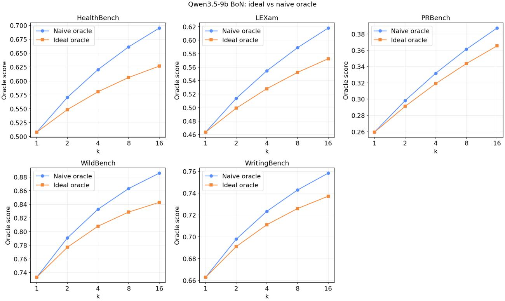  
Figure 6 Naive (unadjusted) vs ideal oracle scores across compute for qwen3.5-9b BoN.

The other algorithms in our study do not contain i.i.d. candidate pools, so applying the same correction requires algorithm-specific choices. For simplicity, we assume the candidate pools of Refinement, Fusion, and Particle Filtering are all i.i.d. and then discuss the limitations in the next section. The candidate pools are defined as the following for compute C (assume corresponds to BoN@k):

• Refinement. The drafts in a trajectory that uses amount of compute C.

• Fusion. The set of k-1 i.i.d. samples along with the fused response.

• Particle Filter. The pool is the final k particles.

Limitations of the i.i.d. assumption. The closed-form bias is exact only when the n candidates are i.i.d. Gaussian. Below we work through the qualitative behaviour we expect from the i.i.d. plug-in correction under each algorithm’s structural deviation from this assumption; the magnitude and even the direction of the residual error depend on the underlying generator’s behaviour and should be read as hypotheses rather than guarantees.

• Fusion. When fusion works well, the fused response has a higher mean than the i.i.d. input samples. In the limit as the fused-mean minus input-mean grows, the naive oracle picks the fused sample with probability approaching one, judge noise on that single chosen candidate averages out, and the true bias of the naive oracle approaches zero. Our estimator, however, plugs in $s _ { X } ^ { 2 }$ from the (fused, inputs) pool: the fused-vs-input gap inflates $s _ { X } ^ { 2 }$ as if it were within-pool spread, and the formula continues to subtract a positive correction. The reported ideal oracle is therefore expected to be a slight lower bound when the model is strong at fusing responses.

• Refinement. Refinements within a trajectory are expected to be correlated. A scenario of interest is monotonic improvement, where the last refinement consistently has the highest mean and the naive oracle picks it with probability approaching one — the same situation as Fusion, with the last refinement playing the role of the dominating fused response. The fused-vs-input mean gap is replaced by the first-vs-last drift across the trajectory, $s _ { X } ^ { 2 }$ is inflated by that drift, and the formula continues to subtract a positive correction even though the true bias has approached zero. Assuming strong refinement capabilities, we’d expect the ideal oracle to be a slight lower bound.

• Particle Filter. Resampling concentrates particles into clusters of near-identical trajectories that share a true mean within each cluster. A scenario of interest is when resampling produces a few well-separated clusters of size c: the naive oracle picks the maximum within the best-mean cluster, which is inflated above the true ideal by the maximum of c judge-noise terms $( \approx a _ { c } \sigma _ { J } )$ . Our estimator’s $s _ { X } ^ { 2 }$ , however, is dominated by the between-cluster mean gaps and inflates τˆ well above the within-cluster noise scale, so the formula subtracts a much smaller correction $\left( \sim a _ { n } \sigma _ { J } ^ { 2 } / ( 2 \hat { \tau } ) \right)$ ) than the true within-cluster max-of-noise inflation. Therefore, we expect the ideal oracle to be a slight upper bound, opposite in direction from Fusion and Refinement.

## F.2 Consistency of $h \approx \rho _ { v }$ under judge noise

Looking at Eq. 4 , judge noise afects both sides of the identity $h \approx \rho _ { v }$ symmetrically, so the linear relationship is preserved even without the oracle correction. To see this, note that the judge scores $J ( y ) = \mathcal { V } ^ { * } ( y ) + \epsilon _ { J }$ with $\epsilon _ { J } \sim \mathcal { N } ( 0 , \sigma _ { J } ^ { 2 } )$ enter two quantities:

Effect on measured headroom capture $\hat { h }$ . The numerator $\hat { Q } ( T ) - \mu$ is the expected judge score of the RM-selected candidate minus baseline. Since RM selection is based on $\mathcal { V } ( y )$ and judge noise $\epsilon _ { J }$ is independent of $\nu ,$ the noise averages out in expectation:

$$
\hat { Q } ( T ) - \mu \approx \rho _ { v } \cdot a _ { N } \tau .
$$

The denominator $\hat { Q } ^ { * } ( T ) - \mu$ is the expected maximum of N i.i.d. judge scores, which by the derivation in Section F.1 equals $a _ { N } \sqrt { \tau ^ { 2 } + \sigma _ { J } ^ { 2 } }$ . Therefore:

$$
\hat { h } = \frac { \hat { Q } ( T ) - \mu } { \hat { Q } ^ { * } ( T ) - \mu } \approx \rho _ { v } \cdot \frac { \tau } { \sqrt { \tau ^ { 2 } + \sigma _ { J } ^ { 2 } } } .
$$

## Effect on measured verifier correlation $\hat { \rho } _ { v }$ .

We measure $\hat { \rho } _ { v } = \mathrm { C o r r } [ \mathcal { V } ( y ) , \ : J ( y ) ]$ , whereas the theoretical $\rho _ { v } = \mathrm { C o r r } [ \mathcal { V } ( y ) , \mathcal { V } ^ { * } ( y ) ]$ . Since $J ( y ) = \mathcal { V } ^ { * } ( y ) + \epsilon _ { J }$ with $\epsilon _ { J }$ independent of $\nu .$ , standard attenuation gives:

$$
\hat { \rho } _ { v } \ = \ \rho _ { v } \cdot \sqrt { \frac { \tau ^ { 2 } } { \tau ^ { 2 } + \sigma _ { J } ^ { 2 } } } \ = \ \rho _ { v } \cdot \frac { \tau } { \sqrt { \tau ^ { 2 } + \sigma _ { J } ^ { 2 } } } .
$$

Cancellation. Both quantities are attenuated by the same factor $\tau / \sqrt { \tau ^ { 2 } + \sigma _ { J } ^ { 2 } }$ , so:

$$
\hat { h } \approx \hat { \rho } _ { v } ,
$$

and the identity h ≈ $\rho _ { v }$ holds at the level of measured quantities without any correction. The oracle correction in Section F.1 is therefore not required for the validity of Equation $4 ;$ it serves the separate purpose of obtaining unbiased estimates of true oracle quality $\mathbb { E } [ O ^ { \mathrm { i d e a l } } ]$

## Heterogeneous attenuation across benchmarks.

The attenuation factor $\tau / \sqrt { \tau ^ { 2 } + \sigma _ { J } ^ { 2 } }$ varies across benchmarks because both τ (true spread of candidate quality) and $\sigma _ { J }$ (judge noise, Table 14) difer. This introduces benchmark-level ofsets that appear as scatter around the identity line in Figure 3 (left), but do not bias the slope in expectation. The observed slope of 1.198 and $R ^ { 2 } = 0 . 6 5 6$ are consistent with this prediction.

## G Naive Oracle Results

Figures 7, 8, and 9 replicate Figures 2 and 3 using the naive oracle ${ \hat { O } } ^ { \mathrm { n a i v e } } = \operatorname* { m a x } _ { i } J ( y _ { i } )$ , which overstates true pool quality by selecting partly on judge noise. Despite the inflated ceiling, the conclusion is unchanged: oracle quality rises with compute while realised quality stagnates, and exploitation remains the binding constraint. The naive oracle inflates the apparent gap, making the exploitation failure look more severe, not less.

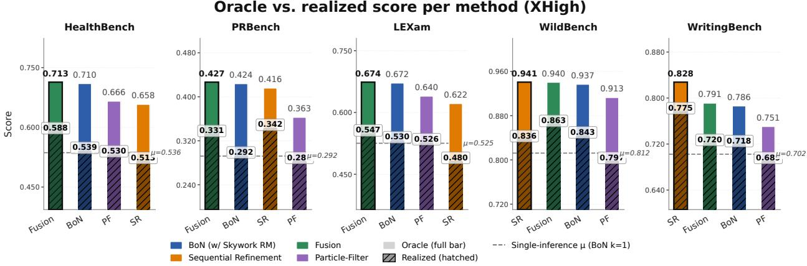  
Figure 7 Oracle (full bar) vs. realised (hatched) quality per method at matched compute (XHigh), Qwen3.5-35B-A3B, using the naive (uncorrected) oracle.

Exploitation Quality: Headroom Capture at Xhigh (Qwen3.5-35B-A3B)  
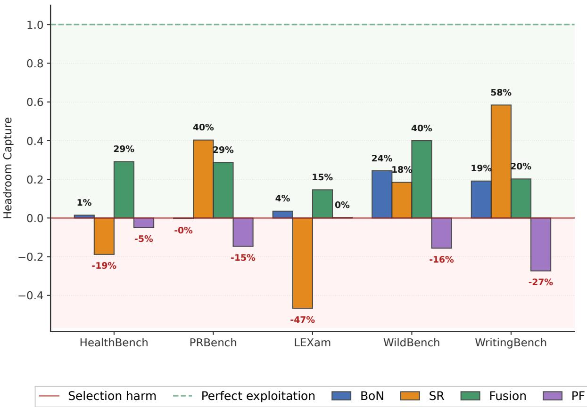  
Figure 8 Headroom capture per method at XHigh compute, using the naive (uncorrected) oracle. Compare with Figure 3 (right) which uses the bias-corrected oracle.

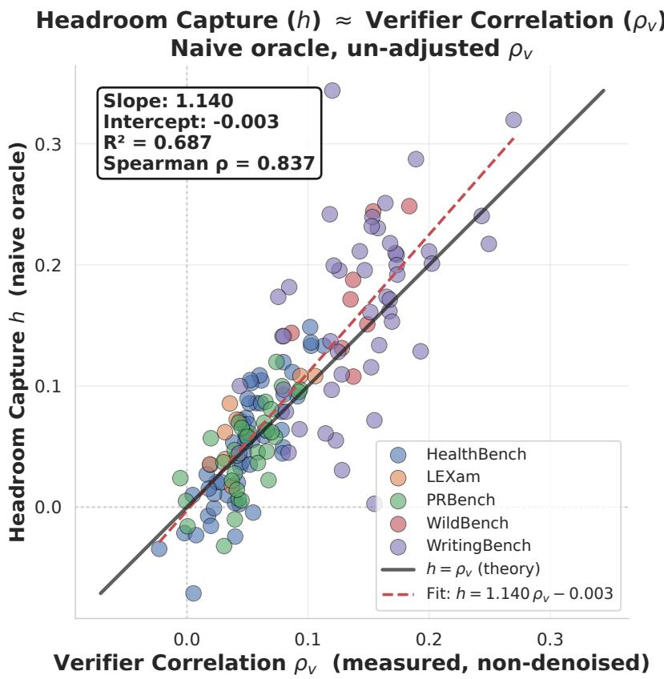  
Figure 9 h vs. $\rho _ { v }$ across $N = 1 5 2$ task-level points using the naive (uncorrected) oracle and measured (non-denoised) $\rho _ { v }$ . The empirical fit closely tracks the identity line $y = x ,$ , mirroring the linear relationship $\hat { h } \approx \hat { \rho } _ { v }$ that Figure 3 (left) demonstrates under the bias-corrected oracle and denoised $\hat { \rho } _ { v } .$ . Same conclusion holds under both conventions: headroom capture is bounded by verifier correlation regardless of whether we de-noise the oracle and the correlation estimate.

## G.1 Headroom capture tables (Unadjusted oracles)

Table 15 Headroom capture for Qwen3.5-35B: $h = ( { \mathrm { r e a l i z e d } } - \mu ) / ( { \mathrm { o r a c l e } } _ { \mathrm { i d e a l } } - \mu )$ , where $\mu$ is the BoN N=1 baseline (single-inference mean). h = 1 means full exploitation of the oracle gap; $h = 0$ matches $\mu ; h < 0$ underperforms µ. green = positive (gain captured), red = negative (below baseline). Bold when $| h | \geq 0 . 2 0$
<table><tr><td rowspan="2"></td><td colspan="4">HealthBench</td><td colspan="4">PRBench</td><td colspan="4">LEXam</td></tr><tr><td>Low</td><td>Mid</td><td>High</td><td>XHigh</td><td>Low</td><td>Mid</td><td>High</td><td>XHigh</td><td>Low</td><td>Mid</td><td>High</td><td>XHigh</td></tr><tr><td>BoN+Skywork</td><td>+0.047 +0.038</td><td></td><td>+0.030</td><td>+0.025</td><td>+0.038</td><td>+0.023</td><td>+0.014</td><td>-0.005</td><td>+0.047</td><td>+0.062</td><td>+0.065</td><td>+0.051</td></tr><tr><td>Fusion Particle Filter</td><td></td><td>+0.670</td><td>+0.580</td><td>+0.495 -0.168</td><td></td><td>+0.390</td><td>+0.357</td><td>+0.339 -0.293</td><td></td><td>+0.355</td><td>+0.246</td><td>+0.209 +0.006</td></tr><tr><td>Self-Refine</td><td>-1.096</td><td>-0.907</td><td>-0.553</td><td>-0.399</td><td>+0.455</td><td>+0.467</td><td>+0.495</td><td>+0.496</td><td>-1.148</td><td>-0.833</td><td>-0.959</td><td>-0.858</td></tr><tr><td></td><td colspan="4">WildBench</td><td colspan="4">WritingBench</td><td colspan="4">Overall</td></tr><tr><td></td><td>Low</td><td>Mid</td><td></td><td>High XHigh</td><td>Low</td><td>Mid</td><td></td><td>XHigh</td><td></td><td></td><td></td><td></td></tr><tr><td></td><td></td><td></td><td></td><td></td><td></td><td></td><td>High</td><td></td><td>Low</td><td>Mid</td><td>High XHigh</td><td></td></tr><tr><td>BoN+Skywork</td><td>+0.375</td><td>+0.391</td><td>+0.400</td><td>+0.413</td><td>+0.252</td><td>+0.261</td><td>+0.265</td><td>+0.273</td><td>+0.152</td><td>+0.155</td><td>+0.155</td><td>+0.152</td></tr><tr><td>Fusion</td><td></td><td>+0.547</td><td>+0.642</td><td>+0.662</td><td></td><td>+0.288</td><td>+0.181</td><td>+0.275</td><td></td><td>+0.450</td><td>+0.401</td><td>+0.396</td></tr><tr><td>Particle Filter Self-Refine</td><td></td><td></td><td>+0.353 +0.342 +0.286</td><td>-0.392 +0.303</td><td>+0.869</td><td>+0.767</td><td>+0.792</td><td>-1.167 +0.703</td><td>-0.114</td><td>-0.033</td><td>+0.012</td><td>-0.403 +0.049</td></tr></table>

Table 18 Headroom capture for OLMo3-32B: $h = ( { \mathrm { r e a l i z e d } } - \mu ) / ( { \mathrm { o r a c l e } } _ { \mathrm { i d e a l } } - \mu )$ , where $\mu$ is the BoN N=1 baseline (single-inference mean). h = 1 means full exploitation of the oracle gap; h = 0 matches $\mu ; h < 0$ underperforms $\mu .$ green = positive (gain captured), red = negative (below baseline). Bold when $| h | \geq 0 . 2 0$
<table><tr><td rowspan="2"></td><td colspan="4">HealthBench</td><td colspan="4">PRBench</td><td colspan="4">LEXam</td></tr><tr><td>Low</td><td>Mid</td><td></td><td>High XHigh Low Mid 1</td><td></td><td></td><td></td><td>High XHigh Low</td><td></td><td>Mid</td><td>High XHigh</td><td></td></tr><tr><td>BoN+Skywork +0.099 +0.096 +0.090 +0.086 +0.102 +0.082 +0.070 +0.076 +0.085 +0.065 +0.049 Fusion</td><td></td><td>-0.426</td><td>-0.326</td><td></td><td></td><td>-0.979</td><td>-1.016</td><td></td><td></td><td>+0.231 +0.228</td><td></td><td>+0.025</td></tr><tr><td rowspan="3"></td><td colspan="4">WildBench</td><td colspan="4">WritingBench</td><td colspan="4">Overall</td></tr><tr><td></td><td>Low Mid High XHigh Low Mid High XHigh Low</td><td></td><td></td><td></td><td></td><td></td><td></td><td></td><td></td><td></td><td>Mid High XHigh</td></tr><tr><td></td><td>BoN+Skywork +0.237 +0.221 +0.216 +0.225 +0.336 +0.312 +0.292 +0.255 +0.172 +0.155 +0.143 +0.133</td><td></td><td></td><td></td><td></td><td></td><td></td><td></td><td></td><td></td><td></td></tr></table>

Table 16 Headroom capture for Qwen3.5-9B: $h = ( { \mathrm { r e a l i z e d } } - \mu ) / ( { \mathrm { o r a c l e } } _ { \mathrm { i d e a l } } - \mu )$ , where $\mu$ is the BoN N=1 baseline (single-inference mean). h = 1 means full exploitation of the oracle gap; h = 0 matches µ; $h < 0$ underperforms µ. green = positive (gain captured), $| \Psi ( \mathbf { \bar { s } } , \mathbf { \bar { \tau } } ) | = \mathrm { n e g a t i v e }$ (below baseline). Bold when $| h | \geq 0 . 2 0$
<table><tr><td rowspan="2"></td><td colspan="4">HealthBench</td><td colspan="4">PRBench</td><td colspan="4">LEXam</td></tr><tr><td>Low</td><td>Mid</td><td>High</td><td>XHigh</td><td>Low</td><td>Mid</td><td>High</td><td>XHigh</td><td>Low</td><td>Mid</td><td>High</td><td>XHigh</td></tr><tr><td>BoN+Skywork</td><td>+0.084</td><td>+0.080</td><td>+0.084</td><td>+0.089</td><td>+0.077</td><td>+0.071</td><td>+0.061</td><td>+0.050</td><td>+0.073</td><td>+0.058</td><td>+0.059</td><td>+0.056</td></tr><tr><td>Fusion Self-Refine</td><td></td><td>+0.615 -1.681</td><td>+0.512</td><td>+0.473</td><td></td><td>+0.301</td><td>+0.346</td><td>+0.313</td><td></td><td>+0.419</td><td>+0.445</td><td>+0.339</td></tr><tr><td></td><td>-3.615</td><td></td><td>-1.175</td><td>-0.918</td><td>+0.251</td><td>+0.323</td><td>+0.404</td><td>+0.329</td><td>-1.104</td><td>-0.970</td><td>-0.952</td><td>-1.147</td></tr><tr><td rowspan="2"></td><td colspan="4">WildBench</td><td colspan="4">WritingBench</td><td colspan="4">Overall</td></tr><tr><td>Low</td><td>Mid</td><td>High</td><td>XHigh</td><td></td><td>Low</td><td>Mid High</td><td>XHigh</td><td>Low</td><td></td><td></td><td>XHigh</td></tr><tr><td></td><td></td><td></td><td></td><td></td><td></td><td></td><td></td><td></td><td></td><td>Mid</td><td>High</td><td></td></tr><tr><td>BoN+Skywork</td><td>+0.365</td><td>+0.358 +0.492</td><td>+0.355</td><td>+0.345</td><td>+0.200</td><td>+0.204</td><td>+0.211</td><td>+0.206</td><td>+0.160</td><td>+0.154</td><td>+0.154</td><td>+0.149</td></tr><tr><td>Fusion Self-Refine</td><td>+0.058</td><td>-0.027</td><td>+0.506 +0.047</td><td>+0.560 +0.026</td><td>+0.833</td><td>+0.247 +0.770</td><td>+0.179 +0.700</td><td>+0.123 +0.630</td><td>-0.715</td><td>+0.415 -0.317</td><td>+0.398 -0.195</td><td>+0.362 -0.216</td></tr></table>

Table 17 Headroom capture for OLMo3-7B: $h = ( { \mathrm { r e a l i z e d } } - \mu ) / ( { \mathrm { o r a c l e } } _ { \mathrm { i d e a l } } - \mu )$ , where $\mu$ is the BoN N=1 baseline (single-inference mean). h = 1 means full exploitation of the oracle gap; h = 0 matches µ; $h < 0$ underperforms µ. green = positive (gain captured), red = negative (below baseline). Bold when $| h | \geq 0 . 2 0$
<table><tr><td rowspan="2"></td><td colspan="4">HealthBench</td><td colspan="4">PRBench</td><td colspan="4">LEXam</td></tr><tr><td> $\operatorname { L o w }$ </td><td>Mid</td><td></td><td>High XHigh Low</td><td></td><td>Mid</td><td></td><td>High XHigh Low Mid</td><td></td><td></td><td></td><td>High XHigh</td></tr><tr><td>BoN+Skywork Fusion</td><td></td><td>+0.177 +0.165 +0.207</td><td>+0.160</td><td></td><td>+0.165 +0.170 +0.137</td><td></td><td>+0.119</td><td></td><td>+0.110 +0.216 +0.171 +0.152</td><td></td><td></td><td>+0.157</td></tr><tr><td></td><td></td><td></td><td>+0.292</td><td></td><td></td><td>+0.059</td><td>+0.224</td><td></td><td></td><td>+0.353</td><td>+0.286</td><td></td></tr><tr><td rowspan="3"></td><td colspan="4">WildBench</td><td colspan="4">WritingBench</td><td colspan="4">Overall</td></tr><tr><td>Low</td><td></td><td></td><td>Mid High XHigh Low</td><td></td><td>Mid</td><td></td><td>High XHigh Low</td><td></td><td>Mid</td><td></td><td>High XHigh</td></tr><tr><td>BoN+Skywork+0.230 +0.196</td><td>-0.190</td><td></td><td>+0.184 +0.182 +0.158 +0.138</td><td></td><td>+0.083</td><td>+0.126 +0.145</td><td></td><td>+0.125 +0.190 +0.161</td><td>+0.102</td><td>+0.148 +0.237</td><td>+0.148</td></tr></table>

## H Qwen3.5 Results

## H.1 Qwen3.5-35B-A3B Oracle Results

Table 19 Oracle quality for Qwen3.5-35B across five benchmarks and four compute levels. Cell colour encodes delta from BoN oracle N=1 baseline: steel blue = large gain, pale blue = small gain over BoN N=1 baseline. Bold = gain ≥ 0.03 over baseline.
<table><tr><td rowspan="2"></td><td colspan="5">HealthBench</td><td colspan="5">PRBench</td><td colspan="5">LEXam</td></tr><tr><td>N=1</td><td>Low</td><td>Mid</td><td></td><td>High XHigh</td><td>N=1</td><td>Low</td><td>Mid</td><td>High XHigh</td><td></td><td>N=1</td><td>Low</td><td>Mid</td><td></td><td>High XHigh</td></tr><tr><td>BoN oracle</td><td>0.536</td><td>0.571</td><td>0.599</td><td>0.620</td><td>0.637</td><td>0.292</td><td>0.325</td><td>0.354</td><td>0.380</td><td>0.403</td><td>0.525</td><td>0.560</td><td>0.587</td><td>0.609</td><td>0.626</td></tr><tr><td>Fusion Particle Filter</td><td></td><td></td><td>0.593</td><td>0.624</td><td>0.641</td><td></td><td></td><td>0.349</td><td>0.382</td><td>0.406</td><td></td><td></td><td>0.584</td><td>0.612</td><td>0.629 0.580</td></tr><tr><td>Self-Refine</td><td></td><td>0.551</td><td>0.558</td><td>0.572</td><td>0.575 0.594</td><td></td><td>0.313</td><td>0.333</td><td>0.363</td><td>0.327 0.393</td><td></td><td>0.543</td><td>0.551</td><td>0.564</td><td>0.578</td></tr><tr><td></td><td></td><td></td><td>WildBench</td><td></td><td></td><td></td><td></td><td>WritingBench</td><td></td><td></td><td></td><td></td><td>Overall</td><td></td><td></td></tr><tr><td></td><td></td><td colspan="4"></td><td colspan="4"></td><td></td><td colspan="4"></td></tr><tr><td></td><td>N=1</td><td>Low</td><td>Mid</td><td>High XHigh</td><td></td><td>N=1</td><td>Low</td><td>Mid</td><td>High XHigh</td><td></td><td>N=1</td><td>Low</td><td>Mid</td><td></td><td>High XHigh</td></tr><tr><td>BoN oracle</td><td>0.812</td><td>0.846</td><td>0.867</td><td>0.879</td><td>0.886</td><td>0.702</td><td>0.724</td><td>0.740</td><td>0.752</td><td>0.761</td><td>0.574</td><td>0.605</td><td>0.629</td><td>0.648</td><td>0.663</td></tr><tr><td>Fusion</td><td></td><td></td><td>0.870</td><td>0.882</td><td>0.890</td><td></td><td></td><td>0.747</td><td>0.757</td><td>0.767</td><td></td><td></td><td>0.629</td><td>0.651</td><td>0.666</td></tr><tr><td>Particle Filter</td><td></td><td></td><td></td><td></td><td>0.852</td><td></td><td></td><td></td><td></td><td>0.714</td><td></td><td></td><td></td><td></td><td>0.610</td></tr><tr><td>Self-Refine</td><td></td><td>0.848</td><td>0.864</td><td>0.876</td><td>0.891</td><td></td><td>0.743</td><td>0.765</td><td>0.787</td><td>0.806</td><td></td><td>0.600</td><td>0.614</td><td>0.632</td><td>0.652</td></tr></table>

## H.2 Qwen3.5-9B Realised Results

Table 20 Realised quality for Qwen3.5-9B across benchmarks and four compute levels. Cell colour encodes delta from the single-sample baseline (BoN@1): green = improvement, red = regression. Bold = gain ≥ 0.03 over baseline.
<table><tr><td rowspan="2"></td><td colspan="5">HealthBench</td><td colspan="5">PRBench</td><td colspan="5">LEXam</td></tr><tr><td>N=1</td><td>Low</td><td>Mid</td><td>High</td><td>XHigh</td><td>N=1</td><td>Low</td><td>Mid</td><td>High</td><td>XHigh</td><td>N=1</td><td>Low</td><td>Mid</td><td>High</td><td>XHigh</td></tr><tr><td>BoN+Skywork</td><td>0.508</td><td>0.511</td><td>0.514</td><td>0.516</td><td>0.518</td><td>0.259</td><td>0.262</td><td>0.264</td><td>0.265</td><td>0.265</td><td>0.463</td><td>0.466</td><td>0.467</td><td>0.469</td><td>0.470</td></tr><tr><td>BoN+Llama70B</td><td>0.508</td><td>0.511</td><td>0.514</td><td>0.517</td><td>0.519</td><td>0.259</td><td>0.261</td><td>0.262</td><td>0.263</td><td>0.262</td><td>0.463</td><td>0.468</td><td>0.471</td><td>0.475</td><td>0.475</td></tr><tr><td>Fusion</td><td></td><td></td><td>0.548</td><td>0.560</td><td>0.566</td><td></td><td></td><td>0.275</td><td>0.290</td><td>0.293</td><td></td><td></td><td>0.487</td><td>0.502</td><td>0.501</td></tr><tr><td>Beam Search</td><td></td><td></td><td>0.508</td><td>0.505</td><td>0.506</td><td></td><td></td><td>0.254</td><td>0.253</td><td>0.254</td><td></td><td></td><td>0.475</td><td>0.480</td><td>0.463</td></tr><tr><td>Particle Filter</td><td></td><td></td><td>0.503</td><td>0.506</td><td>0.502</td><td></td><td></td><td>0.251</td><td>0.251</td><td>0.248</td><td></td><td></td><td>0.471</td><td>0.465</td><td>0.467</td></tr><tr><td>Sequential Refinement Budget Forcing</td><td></td><td>0.479 0.519</td><td>0.472 0.524</td><td>0.464</td><td>0.455</td><td></td><td>0.264 0.258</td><td>0.269 0.258</td><td>0.283</td><td>0.287</td><td></td><td>0.444 0.466</td><td>0.437 0.465</td><td>0.429</td><td>0.413</td></tr><tr><td></td><td></td><td colspan="4"></td><td colspan="4"></td><td colspan="6"></td></tr><tr><td></td><td></td><td>WildBench</td><td></td><td></td><td></td><td></td><td></td><td>WritingBench</td><td></td><td></td><td></td><td></td><td>Overall</td><td></td><td></td></tr><tr><td></td><td>N=1 Low</td><td></td><td>Mid</td><td>High</td><td>XHigh</td><td>N=1</td><td>Low</td><td>Mid</td><td>High</td><td>XHigh</td><td>N=1</td><td>Low</td><td>Mid</td><td>High</td><td>XHigh</td></tr><tr><td>BoN+Skywork</td><td>0.733</td><td>0.749</td><td>0.760</td><td>0.767</td><td>0.771</td><td>0.663</td><td>0.668</td><td>0.673</td><td>0.676</td><td>0.678</td><td>0.525</td><td>0.531</td><td>0.535</td><td>0.538</td><td>0.540</td></tr><tr><td>BoN+Llama70B</td><td>0.733</td><td>0.744</td><td>0.750</td><td>0.753</td><td>0.753</td><td>0.663</td><td>0.669</td><td>0.673</td><td>0.676</td><td>0.678</td><td>0.525</td><td>0.531</td><td>0.534</td><td>0.537</td><td>0.537</td></tr><tr><td>Fusion</td><td></td><td></td><td>0.771</td><td>0.783</td><td>0.798</td><td></td><td></td><td>0.675</td><td>0.675</td><td>0.672</td><td></td><td></td><td>0.551</td><td>0.562</td><td>0.566</td></tr><tr><td>Beam Search</td><td></td><td></td><td>0.733</td><td>0.746</td><td>0.731</td><td></td><td></td><td>0.662</td><td>0.654</td><td>0.657</td><td></td><td></td><td>0.527</td><td>0.528</td><td>0.522</td></tr><tr><td>Particle Filter</td><td></td><td></td><td>0.720</td><td>0.721</td><td>0.718</td><td></td><td></td><td>0.654</td><td>0.661</td><td>0.650</td><td></td><td></td><td>0.520</td><td>0.521</td><td>0.517</td></tr><tr><td>Sequential Refinement</td><td></td><td>0.736</td><td>0.731</td><td>0.737</td><td>0.736</td><td></td><td>0.696</td><td>0.710</td><td>0.724</td><td>0.731</td><td></td><td>0.524</td><td>0.524</td><td>0.528</td><td>0.524</td></tr><tr><td>Budget Forcing</td><td></td><td>0.752</td><td>0.752</td><td></td><td></td><td></td><td>0.631</td><td>0.617</td><td></td><td></td><td></td><td>0.525</td><td>0.523</td><td></td><td></td></tr></table>

## H.3 Qwen3.5-9B Oracle Results

Table 21 Oracle quality for Qwen3.5-9B across five benchmarks and four compute levels. Cell colour encodes delta from BoN oracle N=1 baseline: steel blue = large gain, pale blue = small gain over BoN N=1 baseline. Bold = gain ≥ 0.03 over baseline.
<table><tr><td rowspan="2"></td><td colspan="5">HealthBench</td><td colspan="5">PRBench</td><td colspan="5">LEXam</td></tr><tr><td></td><td>N=1 Low</td><td>Mid</td><td></td><td>High XHigh</td><td>N=1</td><td>Low</td><td>Mid</td><td></td><td>High XHigh</td><td>N=1</td><td>Low</td><td></td><td></td><td>Mid High XHigh</td></tr><tr><td>BoN oracle</td><td>0.508</td><td>0.549</td><td>0.581</td><td>0.606</td><td>0.627</td><td>0.259</td><td>0.291</td><td>0.319</td><td>0.344</td><td>0.365</td><td>0.463</td><td>0.499</td><td>0.528</td><td>0.552</td><td>0.572</td></tr><tr><td>Fusion Self-Refine</td><td></td><td>0.516</td><td>0.574 0.529</td><td>0.609 0.545</td><td>0.631 0.566</td><td></td><td>0.276</td><td>0.312</td><td>0.347 0.317</td><td>0.368 0.343</td><td></td><td>0.481</td><td>0.521 0.490</td><td>0.549 0.499</td><td>0.573 0.508</td></tr><tr><td></td><td></td><td></td><td></td><td></td><td></td><td></td><td></td><td>0.289</td><td></td><td></td><td></td><td></td><td></td><td></td><td></td></tr><tr><td rowspan="2"></td><td colspan="5">WildBench</td><td colspan="5">WritingBench</td><td colspan="5">Overall</td></tr><tr><td>N=1</td><td>Low</td><td></td><td>Mid</td><td>High XHigh</td><td>N=1</td><td>Low</td><td></td><td></td><td>Mid High XHigh</td><td>N=1</td><td>Low</td><td></td><td></td><td></td><td>Mid High XHigh</td></tr><tr><td>BoN oracle</td><td>0.733</td><td>0.777</td><td>0.808</td><td>0.829</td><td>0.843</td><td>0.663</td><td>0.691</td><td>0.711</td><td>0.726</td><td>0.737</td><td>0.525</td><td>0.561</td><td>0.589</td><td>0.611</td><td></td><td>0.629</td></tr><tr><td>Fusion</td><td></td><td></td><td>0.811</td><td>0.832</td><td>0.849</td><td></td><td></td><td>0.710</td><td>0.729</td><td>0.740</td><td></td><td></td><td></td><td>0.586</td><td>0.613</td><td>0.632</td></tr><tr><td>Self-Refine</td><td></td><td>0.777</td><td>0.795</td><td>0.826</td><td>0.843</td><td></td><td>0.702</td><td>0.724</td><td>0.750</td><td>0.770</td><td></td><td></td><td>0.551</td><td>0.565</td><td>0.587</td><td>0.606</td></tr></table>

## I OLMo3 Results

Tables 22 and 23 report realised quality for OLMo3-32B and OLMo3-7B respectively. Tables 24–25 report the corresponding oracle scores. Sequential Refinement was not evaluated on OLMo3 due to compute constraints.

The OLMo3 results serve as the primary negative case for our central thesis: generation capability does not imply exploitation capability.

Fusion severely degrades OLMo3-32B. Fusion—the only method to consistently improve Qwen3.5—produces large regressions on OLMo3-32B. On PRBench, realised quality drops from 0.211 (baseline) to 0.164 at High (−22% relative). WildBench drops from 0.721 to 0.653, HealthBench from 0.480 to 0.450, and WritingBench from 0.569 to 0.516. Only LEXam shows marginal improvement (0.395 → 0.414). Overall, OLMo3-32B Fusion scores 0.441 at Mid and 0.394 at High, well below the 0.475 baseline, and the damage worsens with additional compute. This constitutes negative headroom capture: the synthesised output is systematically worse than a random candidate from the same pool. The contrast with Qwen3.5-35B-A3B, where Fusion captures ∼40% of headroom and improves on every benchmark, demonstrates that exploitation is a distinct capability from generation.

OLMo3-7B Fusion is mixed but not broken. The smaller OLMo3-7B does not exhibit the same Fusion failure. At High compute it improves over baseline on HealthBench (+3.0pp), LEXam (+2.3pp), PRBench (+1.2pp), and WritingBench (+1.2pp), while regressing on WildBench at Mid (−1.7pp). This partial success suggests that the 32B failure is not a simple property of the OLMo3 architecture, but reflects how scaling interacts with synthesis capability in this model family.

Budget Forcing degenerates on OLMo3. Budget Forcing produces the largest regressions of any method. OLMo3-32B drops from 0.475 overall to 0.393 at Mid; individual benchmarks are worse: PRBench 0.211 → 0.157, WritingBench 0.569 → 0.421. OLMo3-7B follows the same pattern (overall 0.356 → 0.288). Additional thinking tokens produce degenerate outputs rather than deeper reasoning.

Oracle quality confirms the dissociation. OLMo3-7B oracle quality rises steadily with compute (Table 24): overall from 0.356 at N=1 to 0.474 at XHigh, with Fusion oracle tracking BoN oracle closely across compute levels. The candidate pool quality is proportionally comparable to Qwen3.5, confirming that the divergence in realised quality is driven entirely by exploitation, not exploration.

Table 22 Realised quality for OLMo3-32B across five benchmarks and four compute levels. Cell colour encodes delta from the single-sample baseline (BoN@1): green = improvement, red = regression. Bold = gain ≥ 0.03 over baseline.
<table><tr><td rowspan="2"></td><td colspan="5">HealthBench</td><td colspan="6">PRBench</td><td colspan="4">LEXam</td></tr><tr><td>N=1</td><td>Low</td><td>Mid</td><td>High</td><td>XHigh</td><td>N=1</td><td>Low</td><td>Mid</td><td>High</td><td>XHigh</td><td>N=1</td><td>Low</td><td>Mid</td><td>High</td><td>XHigh</td></tr><tr><td>BoN+Skywork</td><td>0.480</td><td>0.484</td><td>0.487</td><td>0.489</td><td>0.490</td><td>0.211</td><td>0.213</td><td>0.215</td><td>0.215</td><td>0.217</td><td>0.395</td><td>0.398</td><td>0.399</td><td>0.399</td><td>0.398</td></tr><tr><td>BoN+Llama70B</td><td>0.480</td><td>0.483</td><td>0.486</td><td>0.487</td><td>0.488</td><td>0.211</td><td>0.212</td><td>0.214</td><td>0.215</td><td>0.218</td><td>0.395</td><td>0.399</td><td>0.401</td><td>0.405</td><td>0.408</td></tr><tr><td>Fusion</td><td></td><td></td><td>0.454</td><td>0.450</td><td></td><td></td><td></td><td>0.174</td><td>0.164</td><td></td><td></td><td></td><td>0.409</td><td>0.414</td><td></td></tr><tr><td>Beam Search</td><td></td><td></td><td>0.479</td><td>0.480</td><td></td><td></td><td></td><td>0.211</td><td>0.212</td><td></td><td></td><td></td><td>0.393</td><td>0.386</td><td></td></tr><tr><td>Particle Filter</td><td></td><td></td><td>0.479</td><td>0.480</td><td>0.477</td><td></td><td></td><td>0.210</td><td>0.207</td><td>0.210</td><td></td><td></td><td>0.390</td><td>0.406</td><td>0.395</td></tr><tr><td>Sequential Refinement Budget Forcing</td><td></td><td>0.445 0.417</td><td></td><td></td><td></td><td></td><td>0.183 0.157</td><td></td><td></td><td></td><td></td><td>0.391</td><td>0.370</td><td></td><td></td></tr><tr><td></td><td></td><td></td><td></td><td></td><td></td><td></td><td></td><td></td><td></td><td></td><td></td><td></td><td></td><td></td><td></td></tr><tr><td></td><td></td><td></td><td>WildBench</td><td></td><td></td><td></td><td></td><td>WritingBench</td><td></td><td></td><td></td><td></td><td>Overall</td><td></td><td></td></tr><tr><td></td><td>N=1</td><td>Low</td><td>Mid</td><td>High</td><td>XHigh</td><td>N=1</td><td>Low</td><td>Mid</td><td>High</td><td>XHigh</td><td>N=1</td><td>Low</td><td>Mid</td><td>High</td><td>XHigh</td></tr><tr><td>BoN+Skywork</td><td>0.721</td><td>0.733</td><td>0.739</td><td>0.744</td><td>0.749</td><td>0.569</td><td>0.582</td><td>0.590</td><td>0.595</td><td>0.596</td><td>0.475</td><td>0.482</td><td>0.486</td><td>0.488</td><td>0.490</td></tr><tr><td>BoN+Llama70B</td><td>0.721</td><td>0.733</td><td>0.741</td><td>0.746</td><td>0.752</td><td>0.569</td><td>0.579</td><td>0.586</td><td>0.590</td><td>0.595</td><td>0.475</td><td>0.481</td><td>0.486</td><td>0.488</td><td>0.492</td></tr><tr><td>Fusion</td><td></td><td></td><td>0.653</td><td></td><td></td><td></td><td></td><td>0.516</td><td>0.550</td><td></td><td></td><td></td><td>0.441</td><td>0.394</td><td></td></tr><tr><td>Beam Search</td><td></td><td></td><td>0.707</td><td>0.709</td><td></td><td></td><td></td><td>0.568</td><td>0.557</td><td></td><td></td><td></td><td>0.472</td><td>0.469</td><td></td></tr><tr><td>Particle Filter</td><td></td><td></td><td>0.707</td><td>0.709</td><td>0.713</td><td></td><td></td><td>0.573</td><td>0.568</td><td>0.566</td><td></td><td></td><td>0.472</td><td>0.474</td><td>0.472</td></tr><tr><td>Sequential Refinement</td><td></td><td></td><td></td><td></td><td></td><td></td><td></td><td></td><td></td><td></td><td></td><td></td><td></td><td></td><td></td></tr><tr><td>Budget Forcing</td><td></td><td></td><td>0.676 0.599</td><td></td><td></td><td></td><td></td><td>0.501 0.421</td><td></td><td></td><td></td><td>0.439 0.393</td><td></td><td></td><td></td></tr></table>

Table 23 Realised quality for OLMo3-7B across five benchmarks and four compute levels. Cell colour encodes delta from the single-sample baseline (BoN@1): green = improvement, red = regression. Bold = gain ≥ 0.03 over baseline.
<table><tr><td rowspan="2"></td><td colspan="5">HealthBench</td><td colspan="5">PRBench</td><td colspan="5">LEXam</td></tr><tr><td>N=1</td><td>Low</td><td>Mid</td><td>High</td><td>XHigh</td><td>N=1</td><td>Low</td><td>Mid</td><td>High</td><td>XHigh</td><td>N=1</td><td>Low</td><td>Mid</td><td>High</td><td>XHigh</td></tr><tr><td>BoN+Skywork</td><td>0.335</td><td>0.342</td><td>0.348</td><td>0.353</td><td>0.358</td><td>0.142</td><td>0.145</td><td>0.147</td><td>0.148</td><td>0.150</td><td>0.281</td><td>0.288</td><td>0.291</td><td>0.294</td><td>0.298</td></tr><tr><td>BoN+Llama70B</td><td>0.335</td><td>0.342</td><td>0.346</td><td>0.350</td><td>0.354</td><td>0.142</td><td>0.144</td><td>0.146</td><td>0.147</td><td>0.150</td><td>0.281</td><td>0.289</td><td>0.294</td><td>0.297</td><td>0.298</td></tr><tr><td>Fusion</td><td></td><td></td><td>0.349</td><td>0.365</td><td></td><td></td><td></td><td>0.144</td><td>0.154</td><td></td><td></td><td></td><td>0.300</td><td>0.304</td><td></td></tr><tr><td>Beam Search</td><td></td><td></td><td>0.332</td><td>0.328</td><td>0.329</td><td></td><td></td><td>0.142</td><td>0.139</td><td>0.141</td><td></td><td></td><td>0.278</td><td>0.278</td><td>0.272</td></tr><tr><td>Particle Filter</td><td></td><td></td><td>0.334</td><td>0.340</td><td>0.336</td><td></td><td></td><td>0.139</td><td>0.141</td><td>0.140</td><td></td><td></td><td>0.273</td><td>0.281</td><td>0.279</td></tr><tr><td>Sequential Refinement</td><td></td><td></td><td></td><td></td><td></td><td></td><td></td><td></td><td></td><td></td><td></td><td></td><td></td><td></td><td></td></tr><tr><td>Budget Forcing</td><td></td><td>0.313 0.300</td><td></td><td></td><td></td><td></td><td></td><td>0.116 0.096</td><td></td><td></td><td></td><td>0.262</td><td>0.258</td><td></td><td></td></tr><tr><td></td><td></td><td></td><td>WildBench</td><td></td><td></td><td></td><td></td><td>WritingBench</td><td></td><td></td><td></td><td></td><td>Overall</td><td></td><td></td></tr><tr><td></td><td>N=1</td><td>Low</td><td>Mid</td><td>High</td><td>XHigh</td><td>N=1</td><td>Low</td><td>Mid</td><td>High</td><td>XHigh</td><td>N=1</td><td>Low</td><td>Mid</td><td>High</td><td>XHigh</td></tr><tr><td>BoN+Skywork</td><td>0.556</td><td>0.568</td><td>0.575</td><td>0.581</td><td></td><td>0.466</td><td>0.472</td><td>0.475</td><td>0.477</td><td>0.479</td><td>0.356</td><td>0.363</td><td>0.367</td><td>0.371</td><td>0.374</td></tr><tr><td>BoN+Llama70B</td><td>0.556</td><td>0.567</td><td>0.574</td><td>0.578</td><td>0.586 0.577</td><td>0.466</td><td>0.471</td><td>0.474</td><td>0.476</td><td>0.479</td><td>0.356</td><td>0.363</td><td>0.367</td><td>0.370</td><td>0.372</td></tr><tr><td>Fusion</td><td></td><td></td><td>0.539</td><td></td><td></td><td></td><td></td><td>0.471</td><td>0.478</td><td></td><td></td><td></td><td>0.361</td><td>0.326</td><td></td></tr><tr><td>Beam Search</td><td></td><td></td><td>0.549</td><td>0.553</td><td>0.546</td><td></td><td></td><td>0.470</td><td>0.473</td><td>0.467</td><td></td><td></td><td>0.354</td><td>0.354</td><td>0.351</td></tr><tr><td>Particle Filter</td><td></td><td></td><td>0.550</td><td>0.550</td><td>0.546</td><td></td><td></td><td>0.463</td><td>0.469</td><td>0.469</td><td></td><td></td><td>0.352</td><td>0.356</td><td>0.354</td></tr><tr><td>Sequential Refinement</td><td></td><td></td><td></td><td></td><td></td><td></td><td></td><td></td><td></td><td></td><td></td><td></td><td></td><td></td><td></td></tr><tr><td>Budget Forcing</td><td></td><td></td><td>0.489 0.435</td><td></td><td></td><td></td><td>0.372 0.349</td><td></td><td></td><td></td><td></td><td></td><td>0.310 0.288</td><td></td><td></td></tr></table>

## I.1 Oracle Results Olmo-7B

Table 24 Oracle quality for OLMo3-7B across five benchmarks and four compute levels. Cell colour encodes delta from BoN oracle N=1 baseline: steel blue = large gain, pale blue = small gain over BoN N=1 baseline. Bold = gain ≥ 0.03 over baseline.
<table><tr><td rowspan="2"></td><td colspan="5">HealthBench</td><td colspan="5">PRBench</td><td colspan="5">LEXam</td></tr><tr><td></td><td></td><td></td><td></td><td></td><td></td><td></td><td></td><td></td><td></td><td></td><td></td><td></td><td></td><td>N=1 Low Mid High XHigh N=1 Low Mid High XHigh N=1 Low Mid High XHigh</td></tr><tr><td>BoN oracle Fusion</td><td>0.335</td><td>0.376</td><td>0.413 0.403</td><td>0.445 0.438</td><td>0.473</td><td>0.142</td><td>0.161</td><td>0.180 0.175</td><td>0.197 0.199</td><td>0.213</td><td>0.281</td><td>0.313</td><td>0.342 0.335</td><td>0.368 0.361</td><td>0.391</td></tr><tr><td></td><td colspan="5"></td><td colspan="5">WritingBench</td><td colspan="5"></td></tr><tr><td></td><td>N=1 Low Mid High XHigh N=1 Low Mid High XHigh N=1 Low Mid High XHigh</td><td></td><td>WildBench</td><td></td><td></td><td></td><td></td><td></td><td></td><td></td><td></td><td></td><td>Overall</td><td></td><td></td></tr><tr><td>BoN oracle</td><td>0.556</td><td>0.610</td><td>0.655</td><td>0.691</td><td></td><td></td><td></td><td></td><td></td><td></td><td></td><td></td><td></td><td></td><td></td></tr><tr><td>Fusion</td><td></td><td></td><td>0.641</td><td></td><td>0.720</td><td>0.466</td><td>0.503</td><td>0.530 0.529</td><td>0.553 0.552</td><td>0.571</td><td>0.356</td><td>0.393</td><td>0.424 0.416</td><td>0.451 0.387</td><td>0.474</td></tr></table>

## I.2 Oracle results Olmo3-32B

Table 25 Oracle quality for OLMo3-32B across five benchmarks and four compute levels. Cell colour encodes delta from BoN oracle N=1 baseline: steel blue = large gain, pale blue = small gain over BoN N=1 baseline. Bold = gain ≥ 0.03 over baseline.
<table><tr><td rowspan="2"></td><td colspan="5">HealthBench</td><td colspan="5">PRBench</td><td colspan="5">LEXam</td></tr><tr><td>N=1 Low</td><td></td><td></td><td></td><td>Mid High XHigh N=1 Low</td><td></td><td></td><td></td><td></td><td></td><td></td><td></td><td></td><td></td><td>Mid High XHigh N=1 Low Mid High XHigh</td></tr><tr><td>BoN oracle Fusion</td><td>0.480</td><td>0.521</td><td>0.554 0.540</td><td>0.580 0.571</td><td>0.601</td><td>0.211</td><td>0.236</td><td>0.259 0.248</td><td>0.281 0.256</td><td>0.300</td><td>0.395</td><td>0.429</td><td>0.459 0.456</td><td>0.483 0.478</td><td>0.501</td></tr><tr><td></td><td colspan="5"></td><td colspan="5">WritingBench</td><td colspan="5">Overall</td></tr><tr><td></td><td>N=1 Low</td><td></td><td></td><td></td><td></td><td></td><td></td><td></td><td></td><td></td><td></td><td></td><td></td><td></td><td>Mid High XHigh N=1 Low Mid High XHigh N=1 Low Mid High XHigh</td></tr><tr><td>BoN oracle Fusion</td><td>0.721</td><td>0.769</td><td>0.804 0.797</td><td>0.828</td><td>0.846</td><td>0.569</td><td>0.608</td><td>0.637</td><td>0.660</td><td>0.678</td><td>0.475</td><td>0.513</td><td>0.543</td><td>0.566</td><td>0.585</td></tr></table>

## J Headroom capture tables

## J.1 Qwen3.5-35B-A3B results

Table 26 Headroom capture for Qwen3.5-35B: $h = ( { \mathrm { r e a l i z e d } } - \mu ) / ( { \mathrm { o r a c l e } } _ { \mathrm { i d e a l } } - \mu )$ , where $\mu$ is the BoN N=1 baseline (single-inference mean). h = 1 means full exploitation of the oracle gap; h = 0 matches $\mu ; h < 0$ underperforms $\mu .$ green = positive (gain captured), red = negative (below baseline). Bold when $| h | \geq 0 . 2 0$
<table><tr><td rowspan="2"></td><td colspan="4">HealthBench</td><td colspan="4">PRBench</td><td colspan="4">LEXam</td></tr><tr><td>XLow</td><td>Low</td><td>Mid</td><td>XHigh</td><td>XLow</td><td>Low</td><td>Mid</td><td>XHigh</td><td>XLow</td><td>Low</td><td>Mid</td><td>XHigh</td></tr><tr><td>BoN+Skywork Fusion</td><td>+0.047</td><td>+0.038</td><td>+0.030</td><td>+0.025</td><td>+0.038</td><td>+0.023</td><td>+0.014</td><td>-0.005</td><td>+0.047</td><td>+0.062</td><td>+0.065</td><td>+0.051</td></tr><tr><td>Particle Filter</td><td></td><td>+0.670</td><td>+0.580</td><td>+0.495 -0.168</td><td></td><td>+0.390</td><td>+0.357</td><td>+0.339 -0.293</td><td></td><td>+0.355</td><td>+0.246</td><td>+0.209 +0.006</td></tr><tr><td>Self-Refine</td><td>-1.096</td><td>-0.907</td><td>-0.553</td><td>-0.399</td><td>+0.455</td><td>+0.467</td><td>+0.495</td><td>+0.496</td><td>-1.148</td><td>-0.833</td><td>-0.959</td><td>-0.858</td></tr><tr><td></td><td colspan="4">WildBench</td><td colspan="4">WritingBench</td><td colspan="4">Overall</td></tr><tr><td></td><td>XLow</td><td>Low</td><td>Mid</td><td>XHigh XLow</td><td></td><td>Low</td><td>Mid</td><td>XHigh XLow</td><td></td><td>Low</td><td>Mid</td><td>XHigh</td></tr><tr><td>BoN+Skywork</td><td></td><td></td><td>+0.400</td><td></td><td></td><td></td><td></td><td></td><td></td><td></td><td></td><td></td></tr><tr><td>Fusion</td><td>+0.375</td><td>+0.391 +0.547</td><td>+0.642</td><td>+0.413 +0.662</td><td>+0.252</td><td>+0.261 +0.288</td><td>+0.265 +0.181</td><td>+0.273 +0.275</td><td>+0.152</td><td>+0.155</td><td>+0.155</td><td>+0.152</td></tr><tr><td>Particle Filter</td><td></td><td></td><td></td><td>-0.392</td><td></td><td></td><td></td><td>-1.167</td><td></td><td>+0.450</td><td>+0.401</td><td>+0.396</td></tr><tr><td>Self-Refine</td><td>+0.353</td><td></td><td>+0.342 +0.286</td><td>+0.303</td><td>+0.869</td><td>+0.767</td><td>+0.792</td><td>+0.703</td><td>-0.114</td><td>-0.033</td><td>+0.012</td><td>-0.403 +0.049</td></tr></table>

## J.2 Qwen3.5-9B results

Table 27 Headroom capture for Qwen3.5-9B: $h = ( { \mathrm { r e a l i z e d } } - \mu ) / ( { \mathrm { o r a c l e } } _ { \mathrm { i d e a l } } - \mu )$ , where $\mu$ is the BoN N=1 baseline (single-inference mean). h = 1 means full exploitation of the oracle gap; h = 0 matches $\mu ; h < 0$ underperforms µ. green = positive (gain captured), red = negative (below baseline). Bold when $| h | \geq 0 . 2 0$
<table><tr><td rowspan="2"></td><td colspan="4">HealthBench</td><td colspan="4">PRBench</td><td colspan="4">LEXam</td></tr><tr><td>XLow</td><td>Low</td><td>Mid</td><td>XHigh</td><td>XLow</td><td>Low</td><td>Mid</td><td>XHigh XLow</td><td></td><td>Low</td><td>Mid</td><td>XHigh</td></tr><tr><td>BoN+Skywork</td><td>+0.084</td><td>+0.080</td><td>+0.084</td><td>+0.089</td><td>+0.077</td><td>+0.071</td><td>+0.061</td><td>+0.050</td><td>+0.073</td><td>+0.058</td><td>+0.059</td><td>+0.056</td></tr><tr><td>Fusion</td><td></td><td>+0.615</td><td>+0.512</td><td>+0.473</td><td></td><td>+0.301</td><td>+0.346</td><td>+0.313</td><td></td><td>+0.419</td><td>+0.445</td><td>+0.339</td></tr><tr><td>Self-Refine</td><td>-3.615</td><td>-1.681</td><td>-1.175</td><td>-0.918</td><td>+0.251</td><td>+0.323</td><td>+0.404</td><td>+0.329</td><td>-1.104</td><td>-0.970</td><td>-0.952</td><td>-1.147</td></tr><tr><td rowspan="3"></td><td colspan="5">WildBench</td><td colspan="3">WritingBench</td><td colspan="4">Overall</td></tr><tr><td>XLow</td><td>Low</td><td>Mid</td><td>XHigh</td><td>XLow</td><td>Low</td><td>Mid</td><td>XHigh</td><td>XLow</td><td>Low</td><td>Mid</td><td>XHigh</td></tr><tr><td>BoN+Skywork</td><td></td><td></td><td></td><td></td><td>+0.200</td><td></td><td></td><td></td><td></td><td></td><td></td><td></td></tr><tr><td>Fusion</td><td>+0.365</td><td>+0.358 +0.492</td><td>+0.355 +0.506</td><td>+0.345 +0.560</td><td></td><td>+0.204 +0.247</td><td>+0.211 +0.179</td><td>+0.206 +0.123</td><td>+0.160</td><td>+0.154 +0.415</td><td>+0.154 +0.398</td><td>+0.149 +0.362</td></tr><tr><td>Self-Refine</td><td>+0.058</td><td>-0.027</td><td>+0.047</td><td>+0.026</td><td>+0.833</td><td>+0.770</td><td>+0.700</td><td>+0.630</td><td>-0.715</td><td>-0.317</td><td>-0.195</td><td>-0.216</td></tr></table>

## J.3 Olmo3-32B results

Table 28 Headroom capture for OLMo3-32B: $h = ( { \mathrm { r e a l i z e d } } - \mu ) / ( { \mathrm { o r a c l e } } _ { \mathrm { i d e a l } } - \mu )$ , where $\mu$ is the BoN N=1 baseline (single-inference mean). h = 1 means full exploitation of the oracle gap; h = 0 matches $\mu ; h < 0$ underperforms µ. green = positive (gain captured), red = negative (below baseline). Bold when $| h | \geq 0 . 2 0$
<table><tr><td rowspan="2"></td><td colspan="4">HealthBench</td><td colspan="4">PRBench</td><td colspan="4">LEXam</td></tr><tr><td></td><td></td><td></td><td>XLow Low Mid XHigh XLow Low 1</td><td></td><td></td><td></td><td></td><td>Mid XHigh XLow Low Mid XHigh</td><td></td><td></td><td></td></tr><tr><td>BoN+Skywork +0.099 +0.096 +0.090 +0.086 +0.102 +0.082 +0.070 +0.076 +0.085 +0.065 +0.049 Fusion</td><td></td><td>-0.426-0.326</td><td></td><td></td><td></td><td>-0.979</td><td>-1.016</td><td></td><td></td><td></td><td>+0.231 +0.228</td><td>+0.025</td></tr><tr><td rowspan="3"></td><td></td><td></td><td>WildBench</td><td></td><td></td><td>WritingBench</td><td></td><td></td><td></td><td>Overall</td><td></td><td></td></tr><tr><td></td><td>XLow Low Mid XHigh XLow Low Mid XHigh XLow Low</td><td></td><td></td><td></td><td></td><td></td><td></td><td></td><td></td><td></td><td></td></tr><tr><td></td><td></td><td></td><td></td><td></td><td></td><td></td><td></td><td></td><td></td><td>BoN+Skywork+0.237 +0.221 +0.216 +0.225+0.336 +0.312 +0.292 +0.255 +0.172 +0.155 +0.143 +0.133</td><td>Mid XHigh</td></tr></table>

## J.4 Olmo3-7B results

Table 29 Headroom capture for OLMo3-7B: $h = ( { \mathrm { r e a l i z e d } } - \mu ) / ( { \mathrm { o r a c l e } } _ { \mathrm { i d e a l } } - \mu )$ , where $\mu$ is the BoN N=1 baseline (single-inference mean). h = 1 means full exploitation of the oracle gap; h = 0 matches $\mu ; h < 0$ underperforms µ. green = positive (gain captured), red = negative (below baseline). Bold when $| h | \geq 0 . 2 0$
<table><tr><td rowspan="2"></td><td colspan="4">HealthBench</td><td colspan="4">PRBench</td><td colspan="4">LEXam</td></tr><tr><td>XLow Low</td><td></td><td></td><td>Mid XHigh XLow Low</td><td></td><td></td><td></td><td></td><td>Mid XHigh XLow Low</td><td></td><td></td><td>Mid XHigh</td></tr><tr><td>BoN+Skywork+0.177 +0.165 +0.160 +0.165 +0.170 +0.137 +0.119 +0.110  +0.216 +0.171 +0.152 +0.157 Fusion</td><td></td><td>+0.207+0.292</td><td></td><td></td><td></td><td>+0.059+0.224</td><td></td><td></td><td></td><td></td><td>+0.353+0.286</td><td></td></tr><tr><td rowspan="3"></td><td></td><td>WildBench</td><td></td><td></td><td></td><td></td><td></td><td></td><td></td><td>Overall</td><td></td><td></td></tr><tr><td colspan="4"></td><td colspan="3">WritingBench</td><td colspan="4"></td></tr><tr><td>XLow Low 1</td><td></td><td></td><td>Mid XHigh XLow Low</td><td></td><td></td><td></td><td></td><td>Mid XHigh XLow Low</td><td></td><td></td><td>Mid XHigh</td></tr><tr><td>Fusion</td><td></td><td>-0.190</td><td></td><td></td><td></td><td>+0.083 +0.145</td><td></td><td>BoN+Skywork+0.230 +0.196 +0.184 +0.182 +0.158 +0.138 +0.126 +0.125 +0.190 +0.161 +0.148 +0.148</td><td></td><td>+0.102+0.237</td><td></td><td></td></tr></table>

## K Verifier Correlation and Headroom Capture by RM

Tables 30 and 31 report $\hat { \rho } _ { v }$ (denoised) and headroom capture $\hat { h }$ (ideal oracle) for every (generator, RM, benchmark) combination $( N = 1 5 2 , \ \overset { \cdot } { 4 }$ generators $\times \ 2 \ \mathrm { R M s } \ \times \ 1 9$ tasks aggregated to benchmark level). Comparing the two tables cell-by-cell validates $\hat { h } \approx \hat { \rho } _ { v }$ (Equation 4) across all combinations (regression: $\hat { h } = 1 . 1 9 8 \hat { \rho } _ { v } - 0 . 0 1 1 , R ^ { 2 } = 0 . 6 6 , \rho = 0 . 8 1 , p < 1 0 ^ { - 3 6 } )$

Table 30 Verifier correlation $\hat { \rho } _ { v }$ (Spearman between RM scores and judge scores), averaged over tasks within each benchmark $( N = 1 5 2 ,$ 4 generators × 2 RMs × 19 tasks). Both RMs produce near-identical profiles (Skywork mean $\hat { \rho } _ { v } = 0 . 1 2 0$ , Llama mean $\hat { \rho } _ { v } = 0 . 1 0 7$ , computed at task level before benchmark aggregation), confirming the failure is structural rather than model-specific.
<table><tr><td>Generator</td><td>RM</td><td>Health.</td><td>LEXam</td><td>PR</td><td>Wild</td><td>Writing</td></tr><tr><td rowspan="2">Qwen3.5-9B</td><td>Skywork V2</td><td>0.063</td><td>0.045</td><td>0.064</td><td>0.255</td><td>0.197</td></tr><tr><td>Llama-3.1-70B</td><td>0.068</td><td>0.058</td><td>0.050</td><td>0.178</td><td>0.189</td></tr><tr><td rowspan="2">Qwen3.5-35B</td><td>Skywork V2</td><td>0.036</td><td>0.028</td><td>0.023</td><td>0.260</td><td>0.220</td></tr><tr><td>Llama-3.1-70B</td><td>0.067</td><td>0.046</td><td>0.031</td><td>0.146</td><td>0.173</td></tr><tr><td rowspan="2">Olmo-3-7B</td><td>Skywork V2</td><td>0.127</td><td>0.136</td><td>0.113</td><td>0.180</td><td>0.123</td></tr><tr><td>Llama-3.1-70B</td><td>0.119</td><td>0.154</td><td>0.101</td><td>0.166</td><td>0.095</td></tr><tr><td rowspan="2">Olmo-3.1-32B</td><td>Skywork V2</td><td>0.078</td><td>0.053</td><td>0.082</td><td>0.177</td><td>0.251</td></tr><tr><td>Llama-3.1-70B</td><td>0.064</td><td>0.051</td><td>0.073</td><td>0.180</td><td>0.189</td></tr></table>

Table 31 Headroom capture $\hat { h } = \left( \operatorname { B o N @ 1 6 - } \mu \right) /$ (Oracle@16−µ) for the same generator–RM–benchmark combinations. Bold negative values indicate the RM selects worse than random. Comparing cell-by-cell with Table 30 confirms $\hat { h } \approx \hat { \rho } _ { v }$ (regression: $\hat { h } = 1 . 2 0 \hat { \rho } _ { v } - 0 . 0 1 1$ $R ^ { 2 } = 0 . 6 6$ $\rho = 0 . 8 1$ , $p < 1 0 ^ { - 3 6 } )$ , validating Equation 4.
<table><tr><td>Generator</td><td>RM</td><td>Health.</td><td>LEXam</td><td>PR</td><td>Wild</td><td>Writing</td></tr><tr><td>Qwen3.5-9B</td><td>Skywork V2</td><td>0.080</td><td>0.056</td><td>0.041</td><td>0.345</td><td>0.208</td></tr><tr><td rowspan="2">Qwen3.5-35B</td><td>Llama-3.1-70B</td><td>0.092</td><td>0.102</td><td>0.015</td><td>0.182</td><td>0.182</td></tr><tr><td>Skywork V2</td><td>0.010</td><td>0.051</td><td>0.002</td><td>0.413</td><td>0.275</td></tr><tr><td rowspan="2">Olmo-3-7B</td><td>Llama-3.1-70B</td><td>0.056</td><td>0.090</td><td>0.046</td><td>0.243</td><td>0.253</td></tr><tr><td>Skywork V2</td><td>0.139</td><td>0.157</td><td>0.119</td><td>0.182</td><td>0.123</td></tr><tr><td rowspan="2">Olmo-3.1-32B</td><td>Llama-3.1-70B</td><td>0.127</td><td>0.157</td><td>0.110</td><td>0.130</td><td>0.126</td></tr><tr><td>Skywork V2</td><td>0.066</td><td>0.025</td><td>0.083</td><td>0.225</td><td>0.243</td></tr><tr><td></td><td>Llama-3.1-70B</td><td>0.059</td><td>0.123</td><td>0.090</td><td>0.246</td><td>0.232</td></tr></table>

## L Deterministic Benchmark Results: MATH-500 and GPQA Diamond

To contextualise our open-ended QA findings, we report results on two standard deterministic benchmarks: MATH-500 [8] (competition mathematics, exact-match verified) and GPQA Diamond [21] (graduate-level science, multiple-choice). These benchmarks admit binary verification, making them the canonical setting where TTS was developed and where RM-based methods are expected to perform well.

We evaluate the same generator (Qwen3.5-35B-A3B) and the same TTS methods at matched compute levels, using the same token-budget normalisation as the main experiments. This allows a direct comparison of method rankings and headroom capture between deterministic and open-ended settings.

Table 32 Realised quality on deterministic benchmarks for Qwen3.5-35B-A3B. Cell colour encodes delta from the single-sample baseline (BoN@1): green = improvement, red = regression. Bold $= | \Delta | \geq 0 . 0 3$ . Italic Pass@K row reports the BoN-pool oracle. Particle Filter and Budget Forcing on GPQA were not run.
<table><tr><td rowspan="3"></td><td colspan="5">MATH-500</td><td colspan="5">GPQA Diamond</td></tr><tr><td>N=1</td><td>Low</td><td>Mid</td><td>High</td><td>XHigh</td><td>N=1</td><td>Low</td><td>Mid</td><td></td><td>High XHigh</td></tr><tr><td>BoN+Skywork</td><td>0.922</td><td>0.930</td><td>0.933</td><td>0.935</td><td>0.936</td><td>0.823</td><td>0.841</td><td>0.851</td><td>0.852</td><td>0.843</td></tr><tr><td>BoN+Llama70B</td><td>0.922</td><td>0.929</td><td>0.932</td><td>0.934</td><td>0.938</td><td>0.823</td><td>0.836</td><td>0.842</td><td>0.841</td><td>0.838</td></tr><tr><td>Fusion</td><td></td><td></td><td>0.936</td><td>0.934</td><td>0.932</td><td></td><td></td><td>0.859</td><td>0.833</td><td>0.823</td></tr><tr><td>Beam Search</td><td></td><td></td><td>0.942</td><td>0.940</td><td>0.934</td><td></td><td></td><td>0.818</td><td>0.803</td><td>0.818</td></tr><tr><td>Particle Filter</td><td></td><td></td><td>0.912</td><td>0.892</td><td>0.890</td><td></td><td></td><td></td><td></td><td></td></tr><tr><td>SR</td><td></td><td>0.928</td><td>0.930</td><td>0.928</td><td>0.936</td><td></td><td>0.828</td><td>0.823</td><td>0.798</td><td>0.838</td></tr><tr><td>Budget Forcing</td><td></td><td>0.930</td><td>0.938</td><td></td><td></td><td></td><td></td><td></td><td></td><td></td></tr><tr><td>BoN Oracle (Pass@K)</td><td>0.922</td><td>0.935</td><td>0.942</td><td>0.948</td><td>0.954</td><td>0.823</td><td>0.870</td><td>0.909</td><td>0.938</td><td>0.960</td></tr></table>

Headroom is benchmark-fixed. Qwen3.5-35B-A3B already reaches the single-sample pass@1 of 0.922 on MATH-500 and 0.823 on GPQA Diamond, leaving only 3.2 pp and 13.7 pp of headroom up to oracle Pass@16. RM-based BoN at XHigh captures 50% of available headroom on MATH-500 and 15% on GPQA, versus ∼15% performed on open-ended QA (Section 6.1). Appendix 10 reproduces this scaling with the Skywork-RM paper’s much weaker reference generator (single-sample ∼0.42 on both benchmarks), where BoN+Skywork captures ∼43% of headroom on MATH and ∼22% on GPQA — within a few points of our 50%/15%. RM eficacy is therefore approximately benchmark-fixed: stronger generators shrink the absolute headroom rather than improve the rate at which RMs can exploit it.

## M Skywork-Reward-V2 Reproduction on Deterministic Benchmarks

We verified that our BoN pipeline reproduces the scaling behaviour reported in the original Skywork-Reward-V2 paper [14] with the ORM model Skywork-Reward-V2-Llama-3.1-8B. We run Best-of-N sampling with PPE Correctness scoring on MATH-500 and GPQA, matching the authors’ evaluation protocol.

Figure 10 shows realised accuracy (solid lines) and oracle accuracy (dashed) as a function of N. Our results replicate the paper’s findings: realised accuracy scales positively with N on both benchmarks, reaching ∼0.66 on MATH-500 and ∼0.55 on GPQA at N=32, consistent with the curves reported for Skywork-Reward-V2- Llama-3.1-8B in Figure 4 of Liu et al. [14].

The large gap between oracle and realised quality visible in both panels, the oracle approaching 1.0 while realised quality plateaus well below 0.7, already hints at the exploitation bottleneck we characterise in the main text. Here, however, the RM is at least positively correlated with correctness $\left( \hat { \rho } _ { v } > 0 \right)$ , so realised quality does improve with compute, unlike the near-zero correlations we observe on open-ended QA (Section 6.1).

## Best-of-K vs Pass@K — Skywork-V2 ORM (avg across generators)

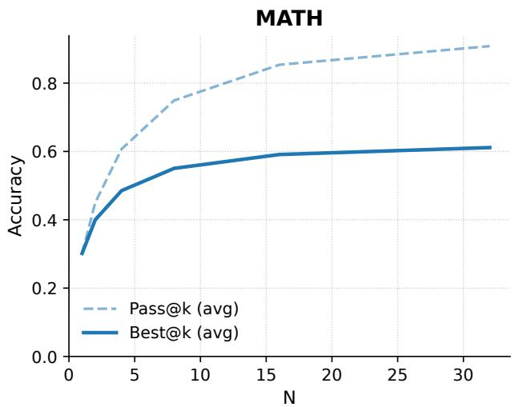

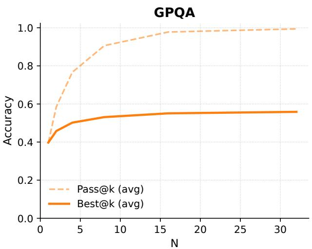  
Figure 10 Reproduction of BoN scaling from the Skywork-Reward-V2 paper [14] on MATH-500 (left) and GPQA Diamond (right). Dashed grey: oracle accuracy. Solid coloured: realised accuracy under Skywork-Reward-V2-Llama-3.1-8B selection. Results match the authors’ reported curves, validating our BoN pipeline before deployment on open-ended benchmarks.

## N WildBench Per-Category Decomposition

Sequential Refinement’s aggregate gains on WildBench mask extreme heterogeneity across task categories. We decompose the total realised lift (sum of per-item score changes from the initial to the final draft) by primary\_tag.

Coding & Debugging accounts for 16.6% of items (170/1,024) but contributes 105.5% of the total realised gain: a mean lift of +27.06 per item, compared with −0.28 per item across the remaining 854 items. Excluding Coding & Debugging, Sequential Refinement produces a net regression on WildBench. The aggregate improvement is therefore not a general property of iterative refinement on open-ended chat tasks, but is driven almost entirely by a single near-deterministic subtask where successive drafts converge toward correct code.

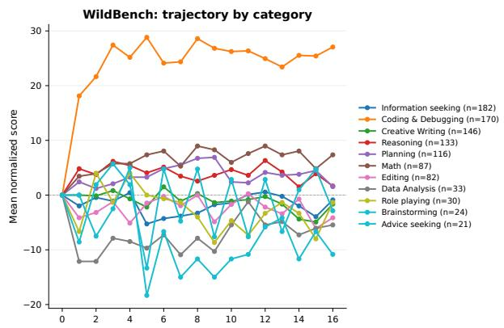

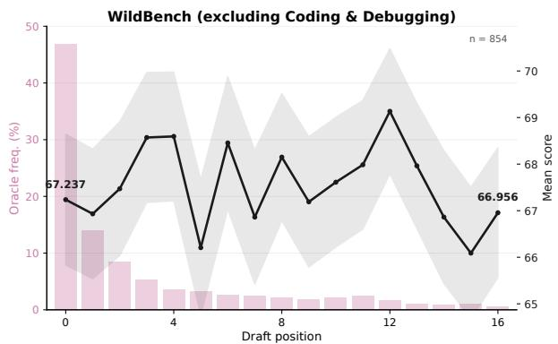  
Figure 11 Left: Mean score trajectory across Sequential Refinement iterations per WildBench task category. Coding & Debugging rises steeply; most other categories are flat or decline. Right: Oracle and mean score trajectories on WildBench with Coding & Debugging excluded. Without this subtask, mean quality regresses across iterations while the oracle continues to rise—confirming the exploitation failure pattern observed on other benchmarks.

## O Verbosity Analysis

Response length is not a neutral quantity in open-ended evaluation: if the judge rewards longer responses, methods that produce progressively longer outputs will appear to improve even when content quality is flat or declining. This appendix documents the verbosity bias in two steps. Section O.1 quantifies the length–score relationship under our unified judge (Qwen3.5-397B-A17B). Section O.2 shows that the WritingBench native judge amplifies this bias substantially, confirming it is a property of the benchmark’s evaluation design rather than of any particular judge.

## O.1 Unified Judge: Length–Score Correlation

The token length distributions in Figure 12 reveal a structural diference between Sequential-Refinement and all other methods: response length grows monotonically across iterations on every benchmark. This matters because if the judge rewards length, Sequential Refinement’s apparent gains on WritingBench reflect elaboration rather than quality improvement.

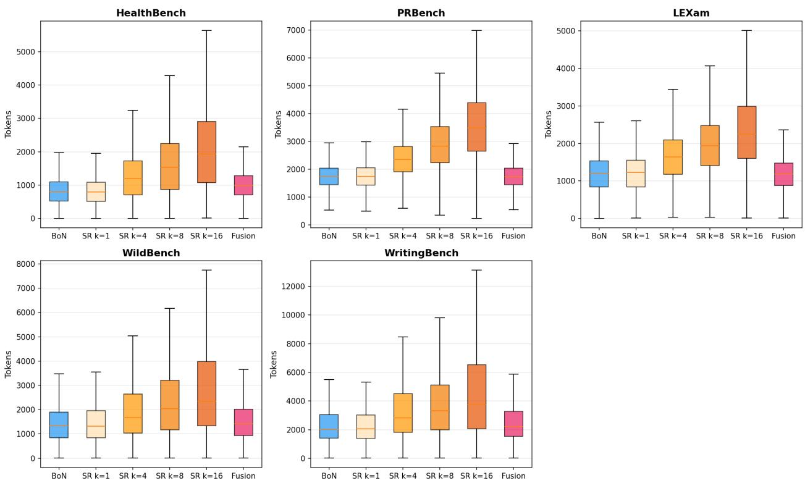  
Figure 12 Token length distributions per method and benchmark for Qwen3.5-35B-A3B. BoN (blue) and Fusion (pink) show stable length distributions across compute levels. Sequential Refinement (orange gradient, SR k=1 through k=16) shows monotonically increasing median length on every benchmark, with the steepest growth on WritingBench and PRBench.

Tables 33–37 quantify the relationship between length and judge score within prompts, separately for BoN and Sequential Refinement. The key findings are:

• WritingBench shows the strongest within-prompt length–score correlation under both methods $( \hat { \rho } =$ +0.198 for BoN, +0.352 for Sequential Refinement), and is the only benchmark where $\mathrm { C V _ { l e n } }$ exceeds $\mathrm { C V _ { s c o r e } }$ under Sequential Refinement (ratio = 0.36). Length growth across iterations is the primary driver of score gains on this benchmark.

• HealthBench and PRBench are content-driven: $\mathrm { C V _ { s c o r e } }$ substantially exceeds $\mathrm { C V _ { l e n } }$ under BoN (ratios of 1.57 and 3.17 respectively). Sequential Refinement’s regressions on these benchmarks reflect genuine

quality degradation, not a scoring artifact.

• LEXam is the only benchmark where Sequential Refinement shows a negative length–score correlation $( \hat { \rho } = - 0 . 0 6 0 , p < 1 0 ^ { - 3 } )$ , consistent with iterative conditioning producing longer but worse responses on knowledge-intensive legal tasks.

Table 33 Within-prompt Spearman rank correlation between response length and judge score for BoN candidates (16 per prompt), Qwen3.5-35B-A3B, unified judge. ρˆ = mean per-prompt Spearman correlation; 95% CI is bootstrapped; $\% \rho { > } 0 \mathrm { = }$ fraction of prompts with a positive correlation; p-values from a one-sample t-test and Wilcoxon signed-rank test against $H _ { 0 } \colon \rho = 0$
<table><tr><td>Benchmark</td><td>n</td><td>β [95% CI]</td><td> $\% \rho > 0$ </td><td>t-test p</td><td>Wilcoxon p</td></tr><tr><td>HealthBench</td><td>4,619</td><td>+0.133  $\left[ + 0 . 1 2 4 , + 0 . 1 4 2 \right]$ </td><td>67.5%</td><td> $7 . 7 6 \times 1 0 ^ { - 1 8 0 }$ </td><td> $8 . 2 0 \times 1 0 ^ { - 1 6 7 }$ </td></tr><tr><td>PRBench</td><td>1,634</td><td>+0.112  $[ + 0 . 0 9 9 , + 0 . 1 2 6 ]$ </td><td>64.7%</td><td> $6 . 0 7 \times 1 0 ^ { - 5 7 }$ </td><td> $1 . 8 7 \times 1 0 ^ { - 5 1 }$ </td></tr><tr><td>LEXam</td><td>502</td><td>+0.014  $[ - 0 . 0 1 1 , + 0 . 0 3 9 ]$ </td><td>52.0%</td><td> $2 . 7 3 \times 1 0 ^ { - 1 }$ </td><td> $3 . 8 1 \times 1 0 ^ { - 1 }$ </td></tr><tr><td>WildBench</td><td>917</td><td>+0.044  $\left[ + 0 . 0 2 4 , + 0 . 0 6 3 \right]$ </td><td>57.6%</td><td> $1 . 9 3 \times 1 0 ^ { - 5 }$ </td><td> $4 . 7 2 \times 1 0 ^ { - 6 }$ </td></tr><tr><td>WritingBench</td><td>554</td><td>+0.198  $\left[ + 0 . 1 7 4 , + 0 . 2 2 2 \right]$ </td><td>74.5%</td><td> $4 . 9 7 \times 1 0 ^ { - 4 6 }$ </td><td> $4 . 1 0 \times 1 0 ^ { - 3 9 }$ </td></tr></table>

Table 34 Within-prompt length variance for BoN candidates (16 per prompt), Qwen3.5-35B-A3B. CV = coeficient of variation (std/mean) of token lengths within a prompt; %CV<0.1 and %CV<0.2 report the fraction of prompts with low length dispersion; mean and median std are in tokens. PRBench shows the lowest length variance (mean CV = 0.083), consistent with its structured rubric format constraining response length. WritingBench and WildBench show the highest variance, reflecting open-ended prompts that admit responses of widely varying length.
<table><tr><td>Benchmark</td><td>n</td><td>mean CV</td><td>med CV</td><td> $\% 0 . 0 1 6 2 0 . 1$ </td><td>%CV&lt;0.2</td><td>mean std</td><td>med std</td></tr><tr><td>HealthBench</td><td>5,000</td><td>0.150</td><td>0.127</td><td>29.7%</td><td>83.2%</td><td>101.3</td><td>88.0</td></tr><tr><td>PRBench</td><td>1,650</td><td>0.083</td><td>0.076</td><td>81.2%</td><td>98.6%</td><td>141.6</td><td>128.8</td></tr><tr><td>LEXam</td><td>516</td><td>0.119</td><td>0.096</td><td>54.3%</td><td>90.9%</td><td>113.5</td><td>110.7</td></tr><tr><td>WildBench</td><td>1,023</td><td>0.186</td><td>0.131</td><td>30.2%</td><td>73.4%</td><td>295.2</td><td>160.7</td></tr><tr><td>WritingBench</td><td>555</td><td>0.145</td><td>0.107</td><td>45.2%</td><td>76.2%</td><td>392.7</td><td>244.0</td></tr></table>

Table 35 Score variability versus length variability for BoN candidates (16 per prompt), Qwen3.5-35B-A3B, unified judge. $\mathrm { C V _ { s c o r e } }$ and $\mathrm { C V } _ { \mathrm { l e n } }$ are the per-prompt coeficient of variation of judge scores and token lengths respectively; mean $\mathrm { r a t i o } = \mathrm { m e a n } ( \mathrm { C V } _ { \mathrm { s c o r e } } / \mathrm { C V } _ { \mathrm { l e n } } )$ . A ratio >1 indicates score variation is driven by content; a ratio <1 indicates length is the dominant axis of variation. PRBench (ratio = 3.17) and HealthBench (ratio = 1.57) are content-driven. WritingBench (ratio = 0.55) and WildBench (ratio = 0.69) are length-driven even under BoN, before any iterative elaboration.

<table><tr><td>Benchmark</td><td>n</td><td> $\mathbf { \vec { \mathbf { \tau } } } \mathbf { \vec { \mathbf { \tau } } } \mathbf { \vec { \mathbf { \tau } } } \mathbf { \vec { \mathbf { \tau } } } \mathbf { \vec { \mathbf { \tau } } } \mathbf { \vec { \mathbf { \tau } } } \mathbf { \vec { \mathbf { \tau } } } \mathbf { \vec { \mathbf { \tau } } } \mathbf { \vec { \mathbf { \tau } } } \mathbf { \vec { \mathbf { \tau } } } \mathbf { \vec { \mathbf { \tau } } } \mathbf { \vec { \mathbf { \tau } } } \mathbf { \vec { \mathbf { \tau } } } \mathbf { \vec { \mathbf { \tau } } } \mathbf { \vec { \mathbf { \tau } } } \mathbf { \vec { \mathbf { \tau } } } \mathbf { \vec { \mathbf { \tau } } } \mathbf { \vec { \mathbf { \tau } } } \mathbf { \vec { \mathbf { \tau } } } \mathbf { \vec { \mathbf { \tau } } } \mathbf { \vec { \mathbf { \tau } } } \mathbf { \vec { \mathbf { \tau } } } \mathbf { \vec { \mathbf { \tau } } } \mathbf { \vec { \mathbf \tau } } \mathbf { \vec { \tau } } \mathbf { \vec \tau } \mathbf { \tau } \mathbf { \vec \tau } \mathbf { \Psi \Psi } $ </td><td> $\mathbf { \boldsymbol { C } } \mathbf { \boldsymbol { v } } _ { \mathbf { \mathrm { l e n } } }$ </td><td>mean ratio</td><td>%ratio&gt;2</td><td>%both&lt;0.05</td></tr><tr><td>HealthBench</td><td>5,000</td><td>0.329</td><td>0.150</td><td>1.57</td><td>37.8%</td><td>0.1%</td></tr><tr><td>PRBench</td><td>1,650</td><td>0.356</td><td>0.083</td><td>3.17</td><td>76.5%</td><td>0.2%</td></tr><tr><td>LEXam</td><td>516</td><td>0.217</td><td>0.119</td><td>1.65</td><td>39.1%</td><td>0.0%</td></tr><tr><td>WildBench</td><td>1,023</td><td>0.137</td><td>0.186</td><td>0.69</td><td>8.0%</td><td>0.4%</td></tr><tr><td>WritingBench</td><td>555</td><td>0.084</td><td>0.145</td><td>0.55</td><td>5.2%</td><td>1.4%</td></tr></table>

Table 36 Within-prompt Spearman rank correlation between response length and judge score for Sequential Refinement drafts $( k = 1 , \ldots , 1 6$ per prompt), Qwen3.5-35B-A3B, unified judge. Columns as in Table 33. Compared with BoN, Sequential Refinement shows a substantially stronger length–score correlation on WritingBench (+0.352 vs. +0.198) and PRBench (+0.252 vs. +0.112), confirming that iterative elaboration amplifies the length–score relationship. LEXam is the only benchmark with a significantly negative correlation $( \hat { \rho } = - 0 . 0 6 0 )$ , consistent with refinement producing longer but worse responses on knowledge-intensive tasks.
<table><tr><td>Benchmark</td><td>n</td><td>β [95% CI]</td><td> $\% \rho > 0$ </td><td>t-test p</td><td>Wilcoxon p</td></tr><tr><td>HealthBench</td><td>4,703</td><td>+0.059 [+0.047, +0.069]</td><td>56.2%</td><td> $1 . 2 6 \times 1 0 ^ { - 2 3 }$ </td><td> $2 . 9 4 \times 1 0 ^ { - 2 3 }$ </td></tr><tr><td>PRBench</td><td>1,634</td><td>+0.252 [+0.232, +0.272]</td><td>72.2%</td><td> $6 . 6 8 \times 1 0 ^ { - 1 1 6 }$ </td><td> $1 . 7 5 \times 1 0 ^ { - 9 9 }$ </td></tr><tr><td>LEXam</td><td>505</td><td>-0.060 [−0.092, −0.026]</td><td>41.2%</td><td> $2 . 4 6 \times 1 0 ^ { - 4 }$ </td><td> $2 . 2 9 \times 1 0 ^ { - 4 }$ </td></tr><tr><td>WildBench</td><td>925</td><td>+0.023 [−0.001, +0.046]</td><td>52.0%</td><td> $5 . 2 3 \times 1 0 ^ { - 2 }$ </td><td> $3 . 8 2 \times 1 0 ^ { - 2 }$ </td></tr><tr><td>WritingBench</td><td>555</td><td>+0.352 [+0.319, +0.385]</td><td>80.7%</td><td> $1 . 1 2 \times 1 0 ^ { - 7 3 }$ </td><td> $1 . 2 1 \times 1 0 ^ { - 5 5 }$ </td></tr></table>

Table 37 Score variability versus length variability for Sequential Refinement drafts (16 iterations per prompt), Qwen3.5-35B-A3B, unified judge. Columns as in Table 35. Compared with BoN, Sequential Refinement shows higher $\mathrm { C V } _ { \mathrm { l e n } }$ on every benchmark, reflecting monotonic length growth across iterations. On WritingBench, $\mathrm { C V } _ { \mathrm { l e n } }$ substantially exceeds $\mathrm { C V _ { s c o r e } }$ (ratio = 0.36), confirming that length growth is the primary driver of score gains. On HealthBench, the ratio drops from 1.57 (BoN) to 0.91 (Sequential Refinement): iterative conditioning increases length variance more than score variance, a sign of elaboration without quality improvement.
<table><tr><td>Benchmark</td><td>n</td><td> $\mathbf { \vec { \mathbf { \tau } } } \mathbf { \vec { \mathbf { \tau } } } \mathbf { \vec { \mathbf { \tau } } } \mathbf { \vec { \mathbf { \tau } } } \mathbf { \vec { \mathbf { \tau } } } \mathbf { \vec { \mathbf { \tau } } } \mathbf { \vec { \mathbf { \tau } } } \mathbf { \vec { \mathbf { \tau } } } \mathbf { \vec { \mathbf { \tau } } } \mathbf { \vec { \mathbf { \tau } } } \mathbf { \vec { \mathbf { \tau } } } \mathbf { \vec { \mathbf { \tau } } } \mathbf { \vec { \mathbf { \tau } } } \mathbf { \vec { \mathbf { \tau } } } \mathbf { \vec { \mathbf { \tau } } } \mathbf { \vec { \mathbf { \tau } } } \mathbf { \vec { \mathbf { \tau } } } \mathbf { \vec { \mathbf { \tau } } } \mathbf { \vec { \mathbf { \tau } } } \mathbf { \vec { \mathbf { \tau } } } \mathbf { \vec { \mathbf { \tau } } } \mathbf { \vec { \mathbf { \tau } } } \mathbf { \vec { \mathbf { \tau } } } \mathbf { \vec { \tau } } \mathbf { \vec \tau } \mathbf { \vec { \tau } } \mathbf { \vec \tau } \mathbf { \tau } $ </td><td> $\mathbf { \boldsymbol { C } } \mathbf { \boldsymbol { v } } _ { \mathbf { \mathrm { l e n } } }$ </td><td>mean ratio</td><td>%ratio&gt;2</td><td>%both&lt;0.05</td></tr><tr><td>HealthBench</td><td>5,000</td><td>0.358</td><td>0.257</td><td>0.91</td><td>19.3%</td><td>0.0%</td></tr><tr><td>PRBench</td><td>1,650</td><td>0.297</td><td>0.256</td><td>0.84</td><td>15.6%</td><td>0.0%</td></tr><tr><td>LEXam</td><td>516</td><td>0.237</td><td>0.218</td><td>0.86</td><td>13.2%</td><td>0.0%</td></tr><tr><td>WildBench</td><td>1,024</td><td>0.126</td><td>0.256</td><td>0.46</td><td>5.8%</td><td>0.2%</td></tr><tr><td>WritingBench</td><td>555</td><td>0.083</td><td>0.198</td><td>0.36</td><td>2.3%</td><td>0.5%</td></tr></table>

## O.2 Native WritingBench Judge: Bias Amplification

The unified judge already reveals a strong verbosity bias on WritingBench. To confirm this is a property of the benchmark’s evaluation design and not of our judge choice, we repeat the analysis using the WritingBench native judge, WritingBench-Critic-Model-Qwen-7B [30], a Qwen2.5-7B-Instruct model fine-tuned on 50K writing evaluation examples. Wu et al. report 83% human agreement for this critic model on a 300-query, 5-annotator pairwise evaluation [30].

The native judge amplifies the verbosity signal substantially on WritingBench while leaving all other benchmarks unchanged: the BoN Spearman correlation rises from +0.198 to +0.370; the Sequential Refinement correlation rises from +0.352 to +0.539; $\mathrm { C V _ { s c o r e } }$ on WritingBench collapses from 0.084 to 0.034 (BoN) and from 0.083 to 0.038 (Sequential Refinement), meaning the native judge discriminates on length. These results suggest strongly that the verbosity bias is intrinsic to WritingBench’s evaluation design, not an artefact of our unified judge.

Table 38 Within-prompt Spearman rank correlation between response length and judge score for BoN candidates (16 per prompt), Qwen3.5-35B-A3B, native WritingBench judge. WritingBench $\hat { \rho }$ rises from +0.198 (unified judge, Table 33) to +0.370; all other benchmarks are stable, confirming the amplification is WritingBench-specific.
<table><tr><td>Benchmark</td><td>n</td><td>β [95% CI]</td><td> $\% \rho > 0$ </td><td>t-test p</td><td>Wilcoxon p</td></tr><tr><td>HealthBench</td><td>4,619</td><td>+0.133 [+0.124, +0.142]</td><td>67.5%</td><td> $7 . 7 6 \times 1 0 ^ { - 1 8 0 }$ </td><td> $8 . 2 0 \times 1 0 ^ { - 1 6 7 }$ </td></tr><tr><td>PRBench</td><td>1,634</td><td>+0.112 [+0.099, +0.125]</td><td>64.7%</td><td> $6 . 0 7 \times 1 0 ^ { - 5 7 }$ </td><td> $1 . 8 7 \times 1 0 ^ { - 5 1 }$ </td></tr><tr><td>LEXam</td><td>502</td><td>+0.014 [−0.010, +0.038]</td><td>52.0%</td><td> $2 . 7 3 \times 1 0 ^ { - 1 }$ </td><td> $3 . 8 1 \times 1 0 ^ { - 1 }$ </td></tr><tr><td>WildBench</td><td>917</td><td>+0.044 [+0.023, +0.064]</td><td>57.6%</td><td> $1 . 9 3 \times 1 0 ^ { - 5 }$ </td><td> $4 . 7 2 \times 1 0 ^ { - 6 }$ </td></tr><tr><td>WritingBench</td><td>555</td><td>+0.370 [+0.347, +0.394]</td><td>87.9%</td><td> $6 . 2 4 \times 1 0 ^ { - 1 2 1 }$ </td><td> $7 . 2 8 \times 1 0 ^ { - 7 7 }$ </td></tr></table>

Table 39 Score variability versus length variability for BoN candidates (16 per prompt), Qwen3.5-35B-A3B, native WritingBench judge. Under the native judge, WritingBench $\mathrm { C V _ { s c o r e } }$ collapses to 0.034 (vs. 0.084 under the unified judge, Table 35), yielding a ratio of 0.25: score variation is almost entirely explained by length. Length statistics are identical to Table 34 since they are judge-independent.
<table><tr><td>Benchmark</td><td>n</td><td> $\mathbf { \vec { \mathbf { \tau } } } \mathbf { \vec { \mathbf { \tau } } } \mathbf { \vec { \mathbf { \tau } } } \mathbf { \vec { \mathbf { \tau } } } \mathbf { \vec { \mathbf { \tau } } } \mathbf { \vec { \mathbf { \tau } } } \mathbf { \vec { \mathbf { \tau } } } \mathbf { \vec { \mathbf { \tau } } } \mathbf { \vec { \mathbf { \tau } } } \mathbf { \vec { \mathbf { \tau } } } \mathbf { \vec { \mathbf { \tau } } } \mathbf { \vec { \mathbf { \tau } } } \mathbf { \vec { \mathbf { \tau } } } \mathbf { \vec { \mathbf { \tau } } } \mathbf { \vec { \mathbf { \tau } } } \mathbf { \vec { \mathbf { \tau } } } \mathbf { \vec { \mathbf { \tau } } } \mathbf { \vec { \mathbf { \tau } } } \mathbf { \vec { \mathbf { \tau } } } \mathbf { \vec { \mathbf { \tau } } } \mathbf { \vec { \mathbf { \tau } } } \mathbf { \vec { \mathbf { \tau } } } \mathbf { \vec { \mathbf { \tau } } } \mathbf { \vec { \tau } } \mathbf { \vec \tau } \mathbf { \vec { \tau } } \mathbf { \vec \tau } \mathbf { \tau } $ </td><td> $\mathbf { \boldsymbol { C } } \mathbf { \boldsymbol { v } } _ { \mathbf { \mathrm { l e n } } }$ </td><td>mean ratio</td><td>%ratio&gt;2</td><td>%both&lt;0.05</td></tr><tr><td>HealthBench</td><td>5,000</td><td>0.329</td><td>0.150</td><td>1.57</td><td>37.8%</td><td>0.1%</td></tr><tr><td>PRBench</td><td>1,650</td><td>0.356</td><td>0.083</td><td>3.17</td><td>76.5%</td><td>0.2%</td></tr><tr><td>LEXam</td><td>516</td><td>0.217</td><td>0.119</td><td>1.65</td><td>39.1%</td><td>0.0%</td></tr><tr><td>WildBench</td><td>1,023</td><td>0.137</td><td>0.186</td><td>0.69</td><td>8.0%</td><td>0.4%</td></tr><tr><td>WritingBench</td><td>555</td><td>0.034</td><td>0.145</td><td>0.25</td><td>0.0%</td><td>2.0%</td></tr></table>

Table 40 Within-prompt Spearman rank correlation between response length and judge score for Sequential Refinement drafts $( k = 1 , \ldots , 1 6$ per prompt), Qwen3.5-35B-A3B, native WritingBench judge. WritingBench ρˆ rises to +0.539 (vs. +0.352 under the unified judge, Table 36), with 92.2% of prompts showing a positive correlation. All other benchmarks are stable.
<table><tr><td>Benchmark</td><td>n</td><td>β [95% CI]</td><td> $\% \rho > 0$ </td><td>t-test p</td><td>Wilcoxon p</td></tr><tr><td>HealthBench</td><td>4,703</td><td>+0.059 [+0.047, +0.070]</td><td>56.2%</td><td> $1 . 2 6 \times 1 0 ^ { - 2 3 }$ </td><td> $2 . 9 4 \times 1 0 ^ { - 2 3 }$ </td></tr><tr><td>PRBench</td><td>1,634</td><td>+0.252 [+0.232, +0.272]</td><td>72.2%</td><td> $6 . 6 8 \times 1 0 ^ { - 1 1 6 }$ </td><td> $1 . 7 5 \times 1 0 ^ { - 9 9 }$ </td></tr><tr><td>LEXam</td><td>505</td><td>-0.060 [−0.091, -0.029]</td><td>41.2%</td><td> $2 . 4 6 \times 1 0 ^ { - 4 }$ </td><td> $2 . 2 9 \times 1 0 ^ { - 4 }$ </td></tr><tr><td>WildBench</td><td>925</td><td>+0.023 [+0.000, +0.045]</td><td>52.0%</td><td> $5 . 2 3 \times 1 0 ^ { - 2 }$ </td><td> $3 . 8 2 \times 1 0 ^ { - 2 }$ </td></tr><tr><td>WritingBench</td><td>551</td><td>+0.539 [+0.513, +0.566]</td><td>92.2%</td><td> $1 . 0 7 \times 1 0 ^ { - 1 5 9 }$ </td><td> $1 . 8 2 \times 1 0 ^ { - 8 2 }$ </td></tr></table>

Table 41 Score variability versus length variability for Sequential Refinement drafts (16 iterations per prompt), Qwen3.5-35B-A3B, native WritingBench judge. WritingBench $\mathrm { C V _ { s c o r e } = 0 . 0 3 8 }$ (vs. 0.083 under the unified judge, Table 37), with a ratio of 0.17: under the native judge, virtually all score variation in Sequential Refinement on WritingBench is attributable to response length.
<table><tr><td>Benchmark</td><td>n</td><td> $\mathbf { \vec { \mathbf { \tau } } } \mathbf { \vec { \mathbf { \tau } } } \mathbf { \vec { \mathbf { \tau } } } \mathbf { \vec { \mathbf { \tau } } } \mathbf { \vec { \mathbf { \tau } } } \mathbf { \vec { \mathbf { \tau } } } \mathbf { \vec { \mathbf { \tau } } } \mathbf { \vec { \mathbf { \tau } } } \mathbf { \vec { \mathbf { \tau } } } \mathbf { \vec { \mathbf { \tau } } } \mathbf { \vec { \mathbf { \tau } } } \mathbf { \vec { \mathbf { \tau } } } \mathbf { \vec { \mathbf { \tau } } } \mathbf { \vec { \mathbf { \tau } } } \mathbf { \vec { \mathbf { \tau } } } \mathbf { \vec { \mathbf { \tau } } } \mathbf { \vec { \mathbf { \tau } } } \mathbf { \vec { \mathbf { \tau } } } \mathbf { \vec { \mathbf { \tau } } } \mathbf { \vec { \mathbf { \tau } } } \mathbf { \vec { \mathbf { \tau } } } \mathbf { \vec { \mathbf { \tau } } } \mathbf { \vec { \mathbf { \tau } } } \mathbf { \vec { \tau } } \mathbf { \vec \tau } \mathbf { \vec { \tau } } \mathbf { \vec \tau } \mathbf { \tau } $ </td><td> $\mathbf { \boldsymbol { C } } \mathbf { \boldsymbol { v } } _ { \mathbf { \mathrm { l e n } } }$ </td><td>mean ratio</td><td>%ratio&gt;2</td><td>%both&lt;0.05</td></tr><tr><td>HealthBench</td><td>5,000</td><td>0.358</td><td>0.257</td><td>0.91</td><td>19.3%</td><td>0.0%</td></tr><tr><td>PRBench</td><td>1,650</td><td>0.297</td><td>0.256</td><td>0.84</td><td>15.6%</td><td>0.0%</td></tr><tr><td>LEXam</td><td>516</td><td>0.237</td><td>0.218</td><td>0.86</td><td>13.2%</td><td>0.0%</td></tr><tr><td>WildBench</td><td>1,024</td><td>0.126</td><td>0.256</td><td>0.46</td><td>5.8%</td><td>0.2%</td></tr><tr><td>WritingBench</td><td>555</td><td>0.038</td><td>0.198</td><td>0.17</td><td>0.5%</td><td>0.4%</td></tr></table>

## O.3 WritingBench: Judge Robustness Analysis

To assess whether our WritingBench judge agreement (QWK 0.408, Section 4) materially afects our conclusions, we re-score the same TTS outputs with the oficial fine-tuned Critic model released by the WritingBench authors [30] and recompute realized and oracle scores under both judges (Figure 13). For BoN with either RM (Skywork, Llama70B), headroom capture is judge-invariant (0.19 vs. 0.19), indicating that conclusions about parallel selection methods transfer cleanly across judges. For Sequential Refinement the capture ratio rises from 0.58 to 0.75 under Critic model, but the decomposition shows this is driven by a shrinking denominator (oracle−µ drops from 0.125 to 0.081) rather than an improved numerator (realized−µ actually decreases slightly, from 0.073 to 0.061). This denominator compression is the mechanical signature of Critic model’s stronger length bias (Appendix O) interacting with SR’s length-growing trajectory: length-favored late iterations (both realized and oracle) are pulled closer together, inflating the ratio without genuine selection improvement. The result confirms that our methods-level conclusions are stable across judges where it matters, and where they diverge the divergence is explained by a known structural bias of the benchmark rather than by miscalibration of our judge.

WritingBench Overall — Old vs New judge at k=16 (qwen35-35b)

Old judge (Qwen3.5-397B) New judge (WritingJudge) Oracle / oracle−μ (solid) Realized / realized−μ (hatched) μ old judge μ new judge

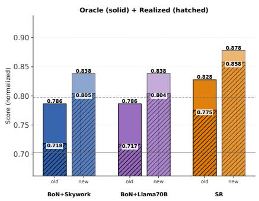

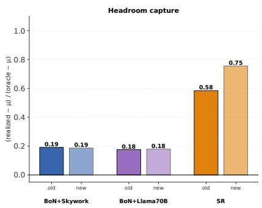

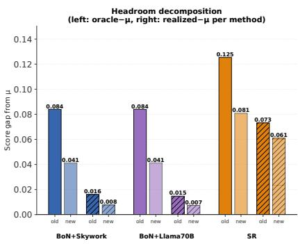  
Figure 13 WritingBench old vs. new judge at k=16 (Qwen3.5-35B, micro-averaged across 555 samples). Left: Oracle (solid) and realized (hatched) scores for BoN+Skywork, BoN+Llama70B, and Self-Refine under our judge (Qwen3.5- 397B, dark) and the authors’ fine-tuned WritingBench-Critic-Model-Qwen-7B (light); horizontal lines show the candidate-mean $\mu$ for each judge. Center: Headroom capture (realized − µ)/(oracle − µ). Right: Decomposition into denominator (oracle−µ, solid) and numerator (realized−µ, hatched).

## P Effect of Model Capacity on Self-Verifier Algorithms

We study self-verifier methods along two axes: compute and model capacity. The model-capacity axis spans the Qwen3.5 dense instruct family at three sizes — 4B, 9B, and 27B —, along with Olmo3-7b and Olmo3.1-32b where only fusion was run, holding all other settings fixed. We first report the mean absolute score gain on each benchmark in Figure 14. Because moving from 0.80 → 0.85 is arguably harder than 0.60 → 0.65, we also report the relative error reduction — the fraction of the gap between a BoN@1 baseline and a perfect score that is closed — in Figure 15. Both metrics point to the same conclusions:

1. Fusion ability is model-family-dependent: Qwen3.5 shows fusion consistently helping across benchmarks, with gains that are roughly stable across model scales. Increasing compute further improves performance monotonically. However, Olmo3.1-32b fails badly with Olmo3-7b still struggling to hit the BoN@1 baseline.

2. Sequential Refinement performance is benchmark-dependent: it yields clear gains on 2/5 benchmarks but strictly hurts performance on 2/5. There are no consistent model capacity scaling trends.

To isolate the exploration quality of sequential refinement from its exploitation cost, we compare its oracle score (the maximum score within the pool) against the BoN oracle. When comparing the oracles with matched compute in Figure 16, BoN oracle outperforms on 3/5 benchmarks, has roughly equivalent performance on WildBench, and is outperformed on WritingBench although this is known to have a length bias that benefits Refinement (Appendix O.1).

Next, we ask whether the oracle underperformance is due to (1) fewer candidates from the additional exploitation cost, or (2) lower variance in the candidate pool relative to i.i.d. sampling. To test this, we match k self-revisions against k i.i.d. samples without compute normalization, asking whether iterative refinement produces a higher-quality pool (in terms of max score) even if exploitation were free. Figure 17 shows that any oracle advantage appears tied to model size, but in many cases sequential refinement drafts produce a worse oracle pool than i.i.d. sampling at matched k: two benchmarks show strictly negative efects, two show small efects, and WritingBench is the only benchmark with a large positive efect. As before, we attribute the WritingBench result to a length bias in the judge combined with sequential refinement’s tendency to increase verbosity; see Appendix O.1 for the supporting analysis.

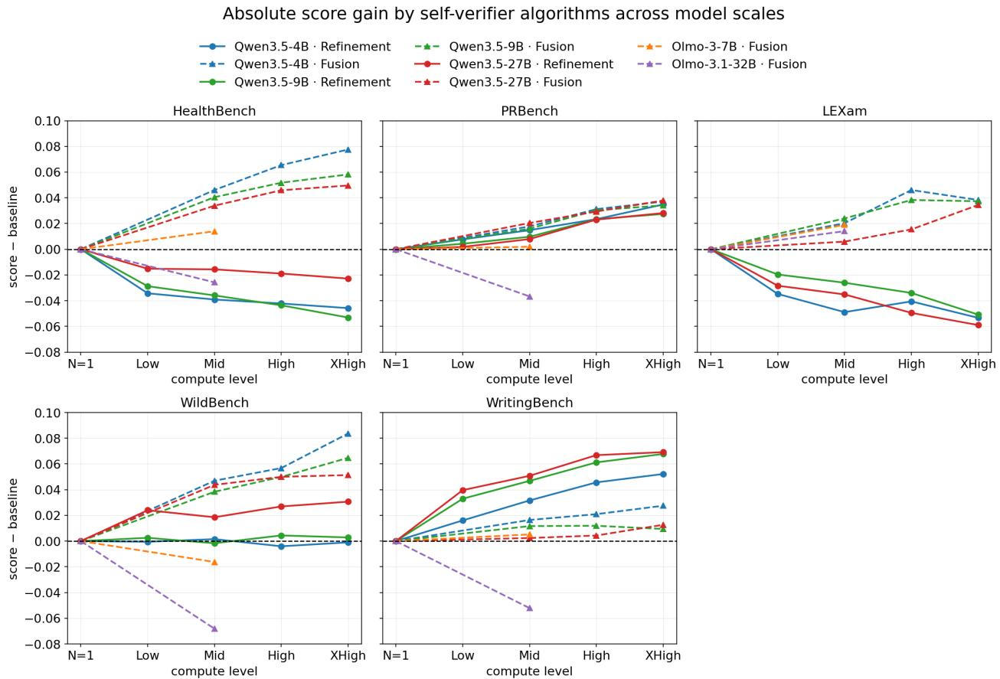  
Figure 14 Absolute score gain over the BoN@1 baseline across compute levels, by model family and benchmark.

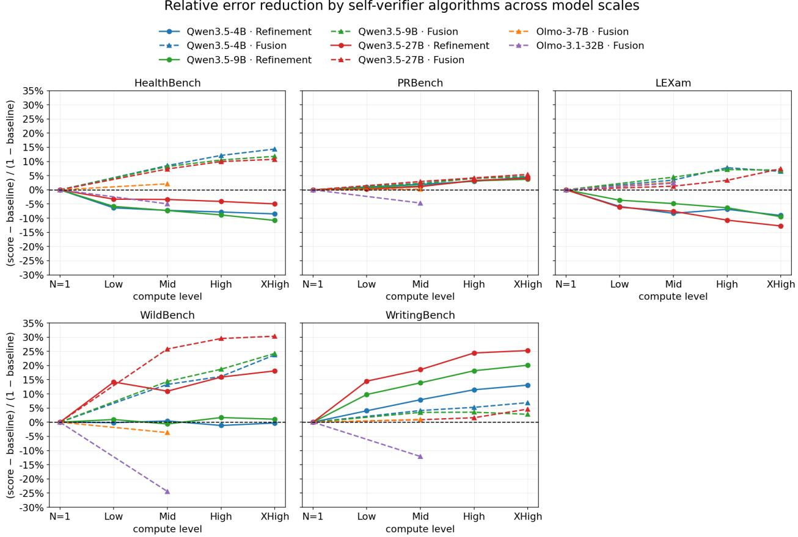  
Figure 15 Fraction of remaining gap to a perfect score, $( p _ { k } - p _ { 1 } ) / ( 1 - p _ { 1 } )$ , closed at compute level $k ,$ faceted by benchmark. $p _ { 1 }$ is the BoN@1 baseline.

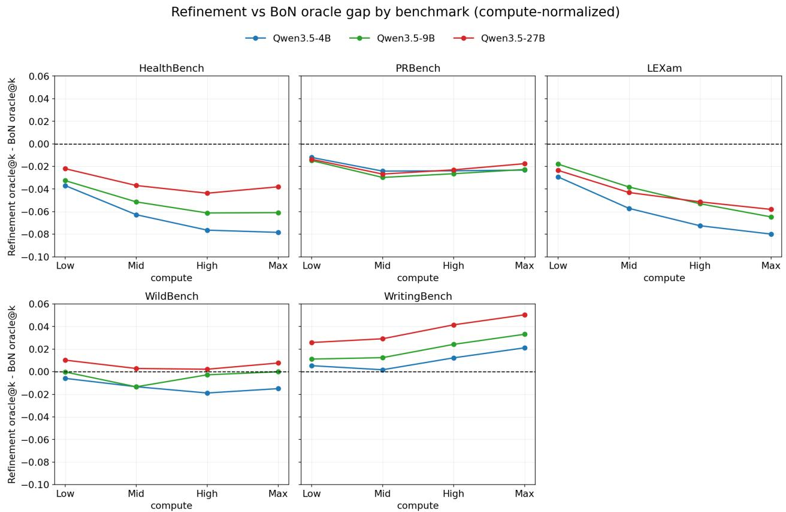  
Figure 16 Sequential Refinement oracle vs BoN oracle across compute levels, by model family and benchmark.

Refinement vs BoN oracle gap by benchmark (no compute normalization)  
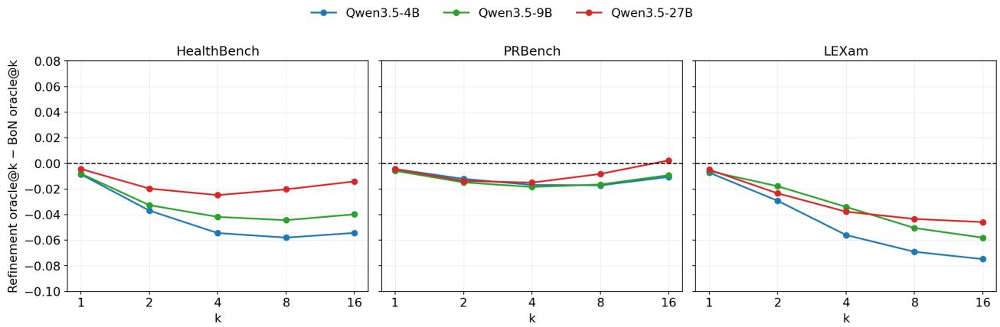

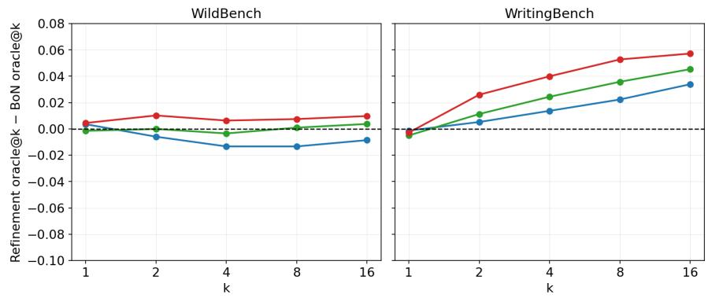  
Figure 17 Sequential Refinement oracle vs BoN oracle across compute levels, by model family and benchmark. Note that x-axis refers to number of candidates in the pool so compare k self-revisions to k i.i.d. samples here.

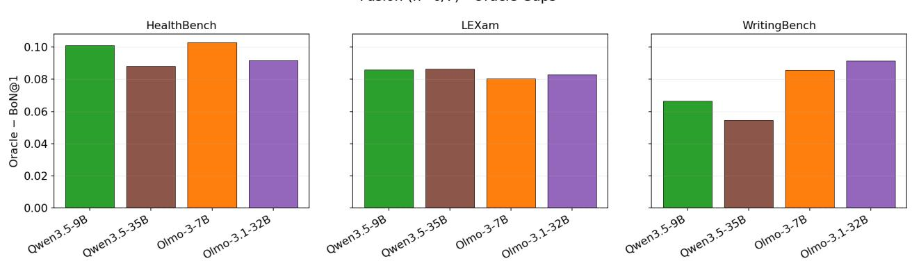  
Figure 18 Oracle gaps over a BoN@1 baseline across models for fusion at medium compute (k=8). Note that Olmo models used 6 candidates instead of 7 due to context length limits. Additionally, context-length issues persisted for Olmo on PrBench and WildBench so they are not included here.

Generation vs. Exploitation: Fusion at High compute

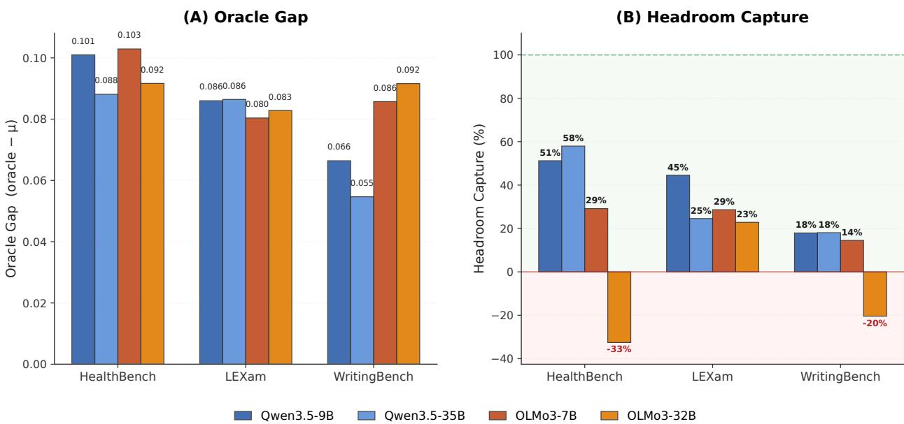  
Figure 19 Oracle gap and headroom capture comparison between diferent families

## Q Task Demand Profiles

To characterise what each benchmark truly measures, we applied the DeLeAn rubric from the ADeLe framework [33] to annotate instances across our five benchmarks along 18 demand dimensions spanning primordial capabilities, domain knowledge, and extraneous factors. The resulting demand profiles are visualised as radar plots, where the inner ring reflects low-scoring instances (score 0) and the outer ring reflects high-scoring instances (score 5), with colour intensity encoding instance frequency at each demand level.

This characterisation serves a dual purpose. Beyond describing what each benchmark measures, it allows us to shed light on which primordial capabilities each TTS method is principled to engage, grounding our empirical findings in the cognitive skill demands of each benchmark. We note that this mapping is interpretive rather than predictive: the demand profile identifies the skills a benchmark stresses, but whether a given TTS method benefits those skills depends on the exploitation bottleneck identified in Section 6. Crucially, the profiles do not yield a clean mapping from demand dimensions to method success—the same dimension can be associated with regression on one benchmark and gains on another, depending on how the benchmark operationalises that demand and how the judge evaluates it.

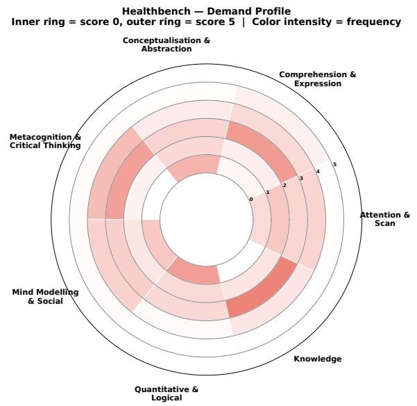  
Figure 20 Demand profiles for HealthBench (left) and LEXam (right)

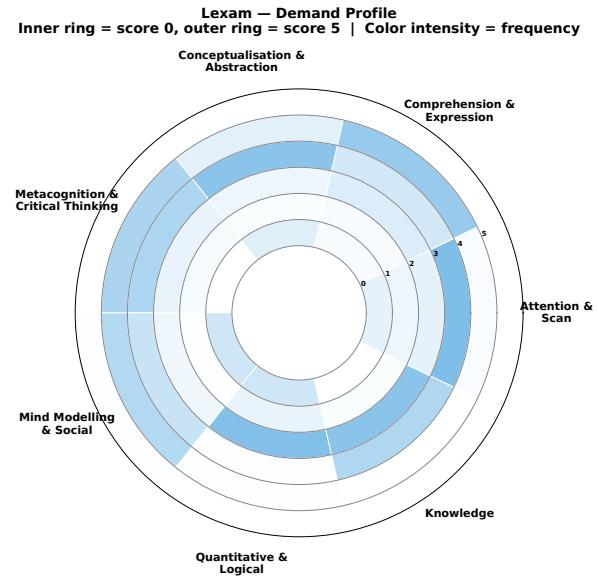

HealthBench is dominated by Metacognition & Critical Thinking (MC), with a strong secondary load on Comprehension & Expression (CE) (Figure 20, left). Mind Modelling & Social (MS) contributes moderately, while Conceptualisation & Abstraction (CL), Knowledge (KN), Attention & Scan (AS), and Quantitative & Logical (QL) are comparatively absent. Notably, the low KN load is counterintuitive for a medical benchmark, but reflects that HealthBench instances stress the process of reasoning over medical queries—self-monitoring and structured response generation against physician rubrics—rather than raw factual recall. The dominance of MC is consistent with Sequential Refinement’s strong regression here (−2.3pp at XHigh): the first draft already engages the primary metacognitive demand, and iterative critique-and-rewrite saturates rather than improves it.

LEXam is dominated by Comprehension & Expression (CE), with Attention & Scan (AS) as the second most prominent dimension—markedly higher than in HealthBench (Figure 20, right). Metacognition & Critical Thinking (MC) and Knowledge (KN) contribute moderately, while Conceptualisation & Abstraction (CL), Mind Modelling & Social (MS), and Quantitative & Logical (QL) are largely absent. The prominence of AS reflects the need to locate and integrate specific information across legal texts, while CE dominance is consistent with the interpretive demands of legal reasoning. LEXam exhibits the strongest Sequential Refinement regression of all benchmarks (−4.5pp at XHigh), despite having a diferent demand profile from HealthBench. This suggests the failure mode is not uniquely tied to MC dominance: tasks requiring precise comprehension and targeted information extraction (CE+AS) are equally ill-suited to iterative refinement, since conditioning on prior drafts compounds misinterpretations rather than correcting them.

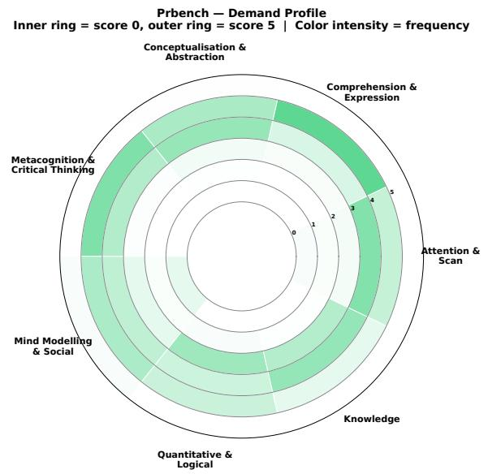

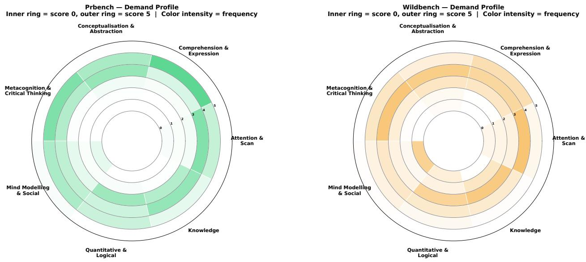  
Figure 21 Demand profiles for PRBench (left) and WildBench (right)

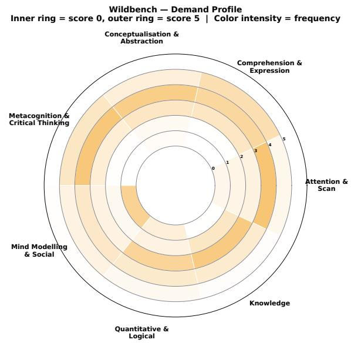

PRBench is co-dominated by Comprehension & Expression (CE) and Metacognition & Critical Thinking (MC), with a moderate contribution from Conceptualisation & Abstraction (CL) and Mind Modelling & Social (MS) (Figure 21, left). Attention & Scan (AS), Knowledge (KN), and Quantitative & Logical (QL) are comparatively absent. Sequential Refinement achieves its largest non-WritingBench gains on PRBench (+3.5pp at XHigh), which is noteworthy given that PRBench shares its two dominant dimensions (CE, MC) with HealthBench, where Sequential Refinement strongly regresses. This apparent contradiction suggests that the demand profile alone does not determine method success: the key diference is likely how these dimensions are operationalised and evaluated. PRBench’s rubric-based scoring rewards elaboration and structured reasoning across multiple criteria, whereas HealthBench’s physician rubrics penalise deviation from precise clinical content. The CE+MC demand can therefore support either regression or gain depending on whether the judge rewards precision or elaboration.

WildBench is dominated by Metacognition & Critical Thinking (MC), with Comprehension & Expression (CE) as a strong second dimension (Figure 21, right). Attention & Scan (AS) is notably the third most prominent dimension, more so than in PRBench. Conceptualisation & Abstraction (CL) contributes moderately, while Mind Modelling & Social (MS), Knowledge (KN), and Quantitative & Logical (QL) are comparatively absent. WildBench’s MC dominance makes it superficially similar to HealthBench, yet Sequential Refinement gains modestly here (+2.4pp at XHigh) rather than regressing. This again points to evaluation operationalisation as the mediating factor: WildBench uses an LLM-generated holistic checklist judge that is more tolerant of elaborated responses, whereas HealthBench’s physician rubrics are precision-anchored. The MC demand is present in both, but its interaction with the evaluation mechanism produces opposite outcomes.

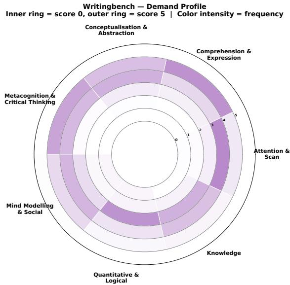  
Figure 22 WritingBench demand profile

WritingBench is distinctively loaded on Comprehension & Expression (CE) and Conceptualisation & Abstraction (CL), which together dominate the profile with the highest frequency at outer demand levels (Figure 22). Metacognition & Critical Thinking (MC) contributes moderately, while Mind Modelling & Social (MS) and Attention & Scan (AS) are present but secondary. Knowledge (KN) and Quantitative & Logical (QL) are comparatively absent. The CE+CL dominance, with near-absent knowledge and precision-retrieval demands, makes WritingBench the most distinctive profile among the five benchmarks. Tasks primarily requiring expression and conceptualisation have no fixed correct answer, which could plausibly reward iterative elaboration. However, as we show in Section 6.3 and Appendix O, Sequential Refinement’s large gains here (+7.3pp) are substantially confounded by the WritingBench judge’s verbosity bias. The demand profile alone is insuficient to explain the magnitude: CE+CL makes WritingBench a plausible candidate for refinement benefit, but the verbosity confound means we cannot attribute the observed gains to genuine skill improvement without verbosity-controlled evaluation.

Cross-benchmark demand structure and method fit. The five profiles reveal that demand dimensions alone do not predict method success. The same dimensions—MC and CE—appear as dominant in HealthBench (Sequential Refinement regresses −2.3pp), PRBench (Sequential Refinement gains +3.5pp), and WildBench (Sequential Refinement gains +2.4pp). The diferentiating factor is not the demand profile but how each benchmark operationalises and evaluates those demands. Precision-sensitive judges — whether rubric-based (HealthBench) or reference-guided (LEXam) — penalise the elaboration that iterative refinement produces: HealthBench’s physician rubrics reward only predefined clinical criteria, while LEXam’s reference-guided LLM judge penalises the compounded misinterpretations that conditioning on prior drafts introduces. Checklist and holistic judges (PRBench, WildBench, WritingBench) are, by contrast, more tolerant of or actively reward elaborated responses. This implies that the demand profile is useful for characterising what a benchmark tests, but predicting TTS method success requires additionally knowing howthe benchmark evaluates outputs. Fusion, by contrast, improves uniformly across all five profiles, confirming that its gains are structural — bypassing verifier quality entirely — and not contingent on any particular demand configuration or evaluation style.

These profiles make explicit what the per-method analyses implied: demand dimensions identify what a benchmark stresses, but they do not determine method success on their own. The same MC+CE profile supports opposite Sequential Refinement outcomes depending on whether the judge rewards precision or elaboration. This evaluation-operationalisation interaction is orthogonal to model capability.

## R Token usage

Table 42 BoN n=16 total completion tokens and ±27% compute band (min–max) per benchmark.
<table><tr><td rowspan="2">Benchmark</td><td colspan="2">Qwen3.5-9B</td><td colspan="2">Qwen3.5-35B-A3B</td><td colspan="2">OLMo-3-7B</td><td colspan="2">OLMo-3.1-32B</td></tr><tr><td>Tokens</td><td>Band [min-max]</td><td>Tokens</td><td>Band [min-max]</td><td>Tokens</td><td>Band [min-max]</td><td>Tokens</td><td>Band [min-max]</td></tr><tr><td>healthbench communication</td><td>39.6M</td><td>[28.9M–50.3M]</td><td>35.7M</td><td>[26.1M–45.4M]</td><td>32.9M</td><td>[24.0M–41.8M]</td><td>34.0M</td><td>[24.8M–43.2M]</td></tr><tr><td>healthbench_complex_responses</td><td>17.3M</td><td>[12.6M–22.0M]</td><td>16.2M</td><td>[11.8M–20.6M]</td><td>14.1M</td><td>[10.3M–17.9M]</td><td>16.0M</td><td>[11.7M–20.3M]</td></tr><tr><td>healthbench_context_seeking</td><td>19.3M</td><td>[14.1M–24.5M]</td><td>17.8M</td><td>[13.0M–22.6M]</td><td>15.6M</td><td>[11.4M–19.8M]</td><td>15.6M</td><td>[11.4M–19.8M]</td></tr><tr><td>healthbench_emergency_referrals</td><td>15.9M</td><td>[11.6M–20.1M]</td><td>14.5M</td><td>[10.6M–18.4M]</td><td>12.6M</td><td>[9.2M–16.0M]</td><td>12.1M</td><td>[8.8M–15.3M]</td></tr><tr><td>healthbench global health</td><td>41.3M</td><td>[30.1M–52.4M]</td><td>37.5M</td><td>[27.4M–47.7M]</td><td>34.5M</td><td>[25.2M–43.9M]</td><td>34.7M</td><td>[25.3M-44.0M]</td></tr><tr><td>healthbench_health_data_tasks</td><td>20.8M</td><td>[15.2M–26.4M]</td><td>19.7M</td><td>[14.4M–25.1M]</td><td>17.3M</td><td>[12.7M–22.0M]</td><td>20.1M</td><td>[14.7M–25.5M]</td></tr><tr><td>healthbench_hedging</td><td>39.2M</td><td>[28.6M–49.8M]</td><td>35.7M</td><td>[26.1M–45.3M]</td><td>29.9M</td><td>[21.8M–38.0M]</td><td>31.5M</td><td>[23.0M–40.0M]</td></tr><tr><td>lexam_open</td><td>31.1M</td><td>[22.7M–39.5M]</td><td>27.8M</td><td>[20.3M–35.4M]</td><td>24.0M</td><td>[17.5M–30.4M]</td><td>25.8M</td><td>[18.8M–32.8M]</td></tr><tr><td>prbench_finance</td><td>48.2M</td><td>[35.2M–61.2M]</td><td>44.6M</td><td>[32.5M–56.6M]</td><td>45.6M</td><td>[33.3M–58.0M]</td><td>44.3M</td><td>[32.3M–56.2M]</td></tr><tr><td>prbench_finance_hard</td><td>24.5M</td><td>[17.9M–31.1M]</td><td>22.8M</td><td>[16.6M–28.9M]</td><td>22.9M</td><td>[16.7M–29.1M]</td><td>22.2M</td><td>[16.2M–28.2M]</td></tr><tr><td>prbench_legal</td><td>32.6M</td><td>[23.8M–41.4M]</td><td>30.7M</td><td>[22.4M–38.9M]</td><td>24.7M</td><td>[18.0M–31.3M]</td><td>26.3M</td><td>[19.2M–33.4M]</td></tr><tr><td>prbench_legal_hard</td><td>17.1M</td><td>[12.5M–21.7M]</td><td>16.0M</td><td>[11.7M–20.4M]</td><td>12.5M</td><td>[9.2M–15.9M]</td><td>13.4M</td><td>[9.8M–17.1M]</td></tr><tr><td>WildBench</td><td>88.7M</td><td>[64.8M–112.7M]</td><td>80.0M</td><td>[58.4M–101.6M]</td><td>82.0M</td><td>[59.9M–104.2M]</td><td>85.7M</td><td>[62.6M–108.9M]</td></tr><tr><td>writingbench_academic_engineering</td><td>7.9M</td><td>[5.8M–10.0M]</td><td>8.1M</td><td>[5.9M–10.2M]</td><td>8.1M</td><td>[5.9M–10.4M]</td><td>9.9M</td><td>[7.2M–12.6M]</td></tr><tr><td>writingbench_advertising_marketing</td><td>5.0M</td><td>[3.7M–6.4M]</td><td>5.0M</td><td>[3.6M–6.3M]</td><td>5.0M</td><td>[3.6M–6.3M]</td><td>6.4M</td><td>[4.7M–8.2M]</td></tr><tr><td>writingbench_education</td><td>4.4M</td><td>[3.2M–5.6M]</td><td>4.3M</td><td>[3.2M–5.5M]</td><td>4.8M</td><td>[3.5M–6.0M]</td><td>5.5M</td><td>[4.0M–7.0M]</td></tr><tr><td>writingbench_finance_business</td><td>9.3M</td><td>[6.8M–11.8M]</td><td>9.3M</td><td>[6.8M–11.8M]</td><td>9.2M</td><td>[6.7M–11.7M]</td><td>10.5M</td><td>[7.7M–13.4M]</td></tr><tr><td>writingbench_literature_arts</td><td>9.2M</td><td>[6.7M–11.6M]</td><td>9.0M</td><td>[6.6M–11.5M]</td><td>7.1M</td><td>[5.2M–9.0M]</td><td>8.6M</td><td>[6.3M–10.9M]</td></tr><tr><td>writingbench_politics_law</td><td>7.3M</td><td>[5.3M–9.2M]</td><td>7.0M</td><td>[5.1M–8.9M]</td><td>6.9M</td><td>[5.1M–8.8M]</td><td>8.7M</td><td>[6.4M–11.1M]</td></tr></table>

Table 43 Particle Filter (Mid (n=4)) total completion tokens per benchmark.
<table><tr><td>Benchmark</td><td>Qwen3.5-9B</td><td>Qwen3.5-35B-A3B</td><td>OLMo-3-7B</td><td>OLMo-3.1-32B</td></tr><tr><td>healthbench communication</td><td>10.2M</td><td>9.0M</td><td>8.3M</td><td>8.6M</td></tr><tr><td>healthbench_complex_responses</td><td>4.5M</td><td>4.3M</td><td>3.4M</td><td>3.9M</td></tr><tr><td>healthbench context seeking</td><td>5.0M</td><td>4.6M</td><td>3.9M</td><td>3.9M</td></tr><tr><td>healthbench_emergency_referrals</td><td>4.1M</td><td>3.7M</td><td>3.1M</td><td>3.0M</td></tr><tr><td>healthbench global health</td><td>10.5M</td><td>9.4M</td><td>8.7M</td><td>8.9M</td></tr><tr><td>healthbench health data tasks</td><td>5.5M</td><td>5.0M</td><td>4.3M</td><td>5.1M</td></tr><tr><td>healthbench_hedging</td><td>10.3M</td><td>9.2M</td><td>7.5M</td><td>7.9M</td></tr><tr><td>lexam_open</td><td>8.0M</td><td>7.0M</td><td>6.0M</td><td>6.4M</td></tr><tr><td>prbench finance</td><td>12.3M</td><td>11.3M</td><td>12.3M</td><td>11.6M</td></tr><tr><td>prbench_finance_hard</td><td>6.3M</td><td>5.8M</td><td>6.1M</td><td>5.9M</td></tr><tr><td>prbench legal</td><td>8.2M</td><td>7.7M</td><td>6.1M</td><td>6.6M</td></tr><tr><td>prbench_legal_hard</td><td>4.4M</td><td>4.0M</td><td>3.0M</td><td>3.3M</td></tr><tr><td>WildBench</td><td>22.6M</td><td>20.6M</td><td>22.5M</td><td>23.7M</td></tr><tr><td>writingbench academic engineering</td><td>2.0M</td><td>2.0M</td><td>2.1M</td><td>2.5M</td></tr><tr><td>writingbench_advertising_marketing</td><td>1.4M</td><td>1.3M</td><td>1.2M</td><td>1.7M</td></tr><tr><td>writingbench education</td><td>1.1M</td><td>1.1M</td><td>1.2M</td><td>1.4M</td></tr><tr><td>writingbench finance business</td><td>2.4M</td><td>2.3M</td><td>2.3M</td><td>2.7M</td></tr><tr><td>writingbench literature arts</td><td>2.3M 1.8M</td><td>2.2M 1.7M</td><td>1.8M 1.8M</td><td>2.3M</td></tr><tr><td>writingbench politics law</td><td></td><td></td><td></td><td>2.3M</td></tr></table>

Table 44 Particle Filter (High (n=8)) total completion tokens per benchmark.
<table><tr><td>Benchmark</td><td>Qwen3.5-9B</td><td>Qwen3.5-35B-A3B</td><td>OLMo-3-7B</td><td>OLMo-3.1-32B</td></tr><tr><td>healthbench communication</td><td>20.3M</td><td>18.2M</td><td>16.5M</td><td>17.1M</td></tr><tr><td>healthbench complex responses</td><td>9.1M</td><td>8.6M</td><td>6.8M</td><td>8.0M</td></tr><tr><td>healthbench context seeking</td><td>10.0M</td><td>9.1M</td><td>7.8M</td><td>8.0M</td></tr><tr><td>healthbench_emergency_referrals</td><td>8.2M</td><td>7.3M</td><td>6.4M</td><td>6.1M</td></tr><tr><td>healthbench global health</td><td>21.2M</td><td>18.9M</td><td>17.5M</td><td>17.7M</td></tr><tr><td>healthbench health data tasks</td><td>10.9M</td><td>10.2M</td><td>8.3M</td><td>9.9M</td></tr><tr><td>healthbench_hedging</td><td>20.2M</td><td>18.3M</td><td>15.0M</td><td>16.1M</td></tr><tr><td>lexam_open</td><td>15.9M</td><td>14.0M</td><td>11.8M</td><td>12.8M</td></tr><tr><td>prbench finance</td><td>24.3M</td><td>22.4M</td><td>24.7M</td><td>23.7M</td></tr><tr><td>prbench finance hard</td><td>12.5M</td><td>11.4M</td><td>12.6M</td><td>11.9M</td></tr><tr><td>prbench_legal</td><td>16.4M</td><td>15.3M</td><td>12.3M</td><td>13.2M</td></tr><tr><td>prbench_legal_hard</td><td>8.7M</td><td>8.0M</td><td>6.1M</td><td>6.9M</td></tr><tr><td>WildBench</td><td>45.4M</td><td>40.8M</td><td>44.7M</td><td>47.7M</td></tr><tr><td>writingbench academic engineering</td><td>3.9M</td><td>4.1M</td><td>3.9M</td><td>5.1M</td></tr><tr><td>writingbench_advertising_marketing</td><td>2.7M</td><td>2.6M</td><td>2.5M</td><td>3.4M</td></tr><tr><td>writingbench education</td><td>2.3M</td><td>2.2M</td><td>2.3M</td><td>2.9M</td></tr><tr><td>writingbench finance business</td><td>4.6M</td><td>4.6M</td><td>4.6M</td><td>5.2M</td></tr><tr><td>writingbench_literature_arts</td><td>4.4M</td><td>4.6M</td><td>3.7M</td><td>4.6M</td></tr><tr><td>writingbench politics law</td><td>3.6M</td><td>3.6M</td><td>3.5M</td><td>4.3M</td></tr></table>

Table 45 Particle Filter (XHigh (n=16)) total completion tokens per benchmark.
<table><tr><td>Benchmark</td><td>Qwen3.5-9B</td><td>Qwen3.5-35B-A3B</td><td>OLMo-3-7B</td><td>OLMo-3.1-32B</td></tr><tr><td>healthbench communication</td><td>40.5M</td><td>36.1M</td><td>33.0M</td><td>35.0M</td></tr><tr><td>healthbench_complex_responses</td><td>18.1M</td><td>17.0M</td><td>13.7M</td><td>15.9M</td></tr><tr><td>healthbench context seeking</td><td>20.0M</td><td>18.2M</td><td>16.0M</td><td>16.2M</td></tr><tr><td>healthbench_emergency_referrals</td><td>16.5M</td><td>14.7M</td><td>12.9M</td><td>12.5M</td></tr><tr><td>healthbench global health</td><td>42.3M</td><td>37.8M</td><td>35.2M</td><td>36.3M</td></tr><tr><td>healthbench health_data_tasks</td><td>21.9M</td><td>20.5M</td><td>16.8M</td><td>20.4M</td></tr><tr><td>healthbench_hedging</td><td>40.7M</td><td>36.5M</td><td>30.3M</td><td>32.8M</td></tr><tr><td>lexam_open</td><td>31.5M</td><td>27.9M</td><td>23.6M</td><td>25.5M</td></tr><tr><td>prbench finance</td><td>48.1M</td><td>44.5M</td><td>49.4M</td><td>47.5M</td></tr><tr><td>prbench_finance_hard</td><td>24.7M</td><td>22.6M</td><td>25.0M</td><td>23.5M</td></tr><tr><td>prbench_legal</td><td>33.0M</td><td>30.7M</td><td>24.5M</td><td>26.3M</td></tr><tr><td>prbench_legal_hard</td><td>17.0M</td><td>16.0M</td><td>12.2M</td><td>13.5M</td></tr><tr><td>WildBench</td><td>89.6M</td><td>81.5M</td><td>89.8M</td><td>95.2M</td></tr><tr><td>writingbench academic engineering</td><td>7.9M</td><td>8.2M</td><td>8.6M</td><td>10.4M</td></tr><tr><td>writingbench advertising marketing</td><td>5.1M</td><td>5.3M</td><td>5.1M</td><td>6.9M</td></tr><tr><td>writingbench education</td><td>4.4M</td><td>4.4M</td><td>4.8M</td><td>5.6M</td></tr><tr><td>writingbench finance business</td><td>9.3M</td><td>9.4M</td><td>9.1M</td><td>10.8M</td></tr><tr><td>writingbench_literature_arts</td><td>8.9M</td><td>9.0M</td><td>6.8M</td><td>9.0M</td></tr><tr><td>writingbench politics law</td><td>7.5M</td><td>7.2M</td><td>6.9M</td><td>8.9M</td></tr></table>

Table 46 Beam Search (Mid (bw=2, n=2)) total completion tokens per benchmark.
<table><tr><td>Benchmark</td><td>Qwen3.5-9B</td><td>Qwen3.5-35B-A3B</td><td>OLMo-3-7B</td><td>OLMo-3.1-32B</td></tr><tr><td>healthbench communication</td><td>10.2M</td><td>9.0M</td><td>8.0M</td><td>8.4M</td></tr><tr><td>healthbench complex responses</td><td>4.7M</td><td>4.2M</td><td>3.4M</td><td>4.1M</td></tr><tr><td>healthbench context seeking</td><td>5.0M</td><td>4.6M</td><td>3.8M</td><td>3.8M</td></tr><tr><td>healthbench_emergency_referrals</td><td>4.1M</td><td>3.7M</td><td>2.9M</td><td>2.9M</td></tr><tr><td>healthbench global health</td><td>10.5M</td><td>9.3M</td><td>8.4M</td><td>8.5M</td></tr><tr><td>healthbench health data tasks</td><td>5.5M</td><td>5.1M</td><td>3.9M</td><td>5.0M</td></tr><tr><td>healthbench_hedging</td><td>10.3M</td><td>9.2M</td><td>7.3M</td><td>7.7M</td></tr><tr><td>lexam_open</td><td>7.9M</td><td>7.0M</td><td>5.9M</td><td>6.4M</td></tr><tr><td>prbench finance</td><td>12.3M</td><td>11.2M</td><td>12.4M</td><td>11.9M</td></tr><tr><td>prbench finance hard</td><td>6.3M</td><td>5.7M</td><td>6.2M</td><td>5.9M</td></tr><tr><td>prbench_legal</td><td>8.1M</td><td>7.6M</td><td>6.0M</td><td>6.4M</td></tr><tr><td>prbench_legal_hard</td><td>4.3M</td><td>4.0M</td><td>3.1M</td><td>3.3M</td></tr><tr><td>WildBench</td><td>24.1M</td><td>20.5M</td><td>22.5M</td><td>23.9M</td></tr><tr><td>writingbench academic engineering</td><td>2.1M</td><td>2.1M</td><td>2.1M</td><td>2.5M</td></tr><tr><td>writingbench_advertising_marketing</td><td>1.3M</td><td>1.3M</td><td>1.2M</td><td>1.7M</td></tr><tr><td>writingbench education</td><td>1.2M</td><td>1.2M</td><td>1.2M</td><td>1.4M</td></tr><tr><td>writingbench finance business</td><td>2.4M</td><td>2.4M</td><td>2.3M</td><td>2.7M</td></tr><tr><td>writingbench literature arts</td><td>2.4M</td><td>2.3M</td><td>1.9M</td><td>2.2M</td></tr><tr><td>writingbench politics law</td><td>1.9M</td><td>1.7M</td><td>1.7M</td><td>2.2M</td></tr></table>

Table 47 Beam Search (High (bw=2, n=4)) total completion tokens per benchmark.
<table><tr><td>Benchmark</td><td>Qwen3.5-9B</td><td>Qwen3.5-35B-A3B</td><td>OLMo-3-7B</td><td>OLMo-3.1-32B</td></tr><tr><td>healthbench communication</td><td>19.8M</td><td>17.7M</td><td>15.7M</td><td>16.4M</td></tr><tr><td>healthbench_complex_responses</td><td>9.4M</td><td>8.8M</td><td>6.6M</td><td>7.9M</td></tr><tr><td>healthbench context seeking</td><td>9.7M</td><td>8.8M</td><td>7.4M</td><td>7.5M</td></tr><tr><td>healthbench_emergency_referrals</td><td>8.1M</td><td>7.2M</td><td>5.7M</td><td>5.5M</td></tr><tr><td>healthbench global health</td><td>20.6M</td><td>18.4M</td><td>16.4M</td><td>16.6M</td></tr><tr><td>healthbench health_data_tasks</td><td>10.7M</td><td>10.2M</td><td>8.0M</td><td>9.6M</td></tr><tr><td>healthbench_hedging</td><td>20.4M</td><td>18.2M</td><td>14.1M</td><td>15.1M</td></tr><tr><td>lexam_open</td><td>16.0M</td><td>13.7M</td><td>11.8M</td><td>12.8M</td></tr><tr><td>prbench finance</td><td>24.2M</td><td>22.1M</td><td>25.0M</td><td>23.5M</td></tr><tr><td>prbench_finance_hard</td><td>12.5M</td><td>11.2M</td><td>12.3M</td><td>12.0M</td></tr><tr><td>prbench_legal</td><td>16.1M</td><td>15.0M</td><td>11.9M</td><td>12.9M</td></tr><tr><td>prbench_legal_hard</td><td>8.5M</td><td>7.8M</td><td>6.0M</td><td>6.4M</td></tr><tr><td>WildBench</td><td>46.6M</td><td>41.6M</td><td>45.0M</td><td>47.2M</td></tr><tr><td>writingbench academic engineering</td><td>4.0M</td><td>4.1M</td><td>4.0M</td><td>5.2M</td></tr><tr><td>writingbench advertising marketing</td><td>2.7M</td><td>2.6M</td><td>2.4M</td><td>3.3M</td></tr><tr><td>writingbench education</td><td>2.3M</td><td>2.2M</td><td>2.3M</td><td>2.8M</td></tr><tr><td>writingbench finance business</td><td>4.7M</td><td>4.7M</td><td>4.6M</td><td>5.2M</td></tr><tr><td>writingbench_literature_arts</td><td>5.1M</td><td>4.6M</td><td>3.6M</td><td>4.4M</td></tr><tr><td>writingbench politics law</td><td>3.8M</td><td>3.5M</td><td>3.3M</td><td>4.5M</td></tr></table>

Table 48 Beam Search (XHigh (bw=4, n=4)) total completion tokens per benchmark. †Run at bw=3, n=4.
<table><tr><td>Benchmark</td><td>Qwen3.5-9B</td><td>Qwen3.5-35B-A3B</td><td>OLMo-3-7B</td><td>OLMo-3.1-32B</td></tr><tr><td>healthbench communication</td><td>40.4M</td><td>34.9M</td><td>32.0M</td><td>34.0M</td></tr><tr><td>healthbench complex responses</td><td>21.6M</td><td>19.8M</td><td>14.0M</td><td>16.7M</td></tr><tr><td>healthbench_context_seeking</td><td>21.0M</td><td>18.1M</td><td>15.1M</td><td>15.5M</td></tr><tr><td>healthbench_emergency_referrals</td><td>16.6M</td><td>14.4M</td><td>11.3M</td><td>11.8M</td></tr><tr><td>healthbench global health</td><td>42.6M</td><td>36.6M</td><td>33.3M</td><td>34.9M</td></tr><tr><td>healthbench health data tasks</td><td>23.3M</td><td>21.4M</td><td>16.6M</td><td>20.4M</td></tr><tr><td>healthbench_hedging</td><td>45.3M</td><td>38.4M</td><td>29.6M</td><td>32.2M</td></tr><tr><td>lexam_open</td><td>32.1M</td><td>27.9M</td><td>23.6M</td><td>26.8M</td></tr><tr><td>prbench finance</td><td>48.6M</td><td>44.3M</td><td>50.1M</td><td>47.7M</td></tr><tr><td>prbench_finance_hard</td><td>24.5M</td><td>22.5M</td><td>25.7M</td><td>23.8M</td></tr><tr><td>prbench legal</td><td>32.8M</td><td>30.0M</td><td>24.3M</td><td>25.9M</td></tr><tr><td>prbench_legal_hard</td><td>16.8M</td><td>15.7M</td><td>12.1M</td><td>13.2M</td></tr><tr><td>WildBench</td><td>100.0M</td><td>89.6M</td><td>92.8M</td><td>99.2M</td></tr><tr><td>writingbench academic engineering</td><td>9.1M</td><td>9.2M</td><td>8.8M</td><td>11.0M</td></tr><tr><td>writingbench_advertising_marketing</td><td>4.1M†</td><td>5.6M</td><td>5.0M</td><td>6.6M</td></tr><tr><td>writingbench education</td><td>5.1M</td><td>5.1M</td><td>4.6M</td><td>6.2M</td></tr><tr><td>writingbench finance business</td><td>10.4M</td><td>10.1M</td><td>9.3M</td><td>11.1M</td></tr><tr><td>writingbench_literature_arts</td><td>10.8M</td><td>7.3M†</td><td>7.0M</td><td>9.0M</td></tr><tr><td>writingbench politics law</td><td>8.1M</td><td>8.1M</td><td>7.0M</td><td>9.3M</td></tr></table>

Table 49 Sequential Refinement (iter=16) total completion tokens per benchmark.
<table><tr><td>Benchmark</td><td>Qwen3.5-9B</td><td>Qwen3.5-35B-A3B</td><td>OLMo-3-7B</td><td>OLMo-3.1-32B</td></tr><tr><td>healthbench communication</td><td>83.0M</td><td>82.6M</td><td></td><td></td></tr><tr><td>healthbench complex_responses</td><td>33.0M</td><td>32.4M</td><td></td><td></td></tr><tr><td>healthbench context seeking</td><td>45.6M</td><td>44.7M</td><td></td><td></td></tr><tr><td>healthbench emergency referrals</td><td>36.4M</td><td>36.0M</td><td></td><td></td></tr><tr><td>healthbench global health</td><td>91.6M</td><td>88.3M</td><td></td><td></td></tr><tr><td>healthbench health data tasks</td><td>40.1M</td><td>40.2M</td><td></td><td></td></tr><tr><td>healthbench_hedging</td><td>85.2M</td><td>83.1M</td><td></td><td></td></tr><tr><td>lexam_open</td><td>48.7M</td><td>48.1M</td><td></td><td></td></tr><tr><td>prbench_finance</td><td>71.3M</td><td>74.8M</td><td></td><td></td></tr><tr><td>prbench finance hard</td><td>35.8M</td><td>38.0M</td><td></td><td></td></tr><tr><td>prbench_legal</td><td>54.5M</td><td>58.2M</td><td></td><td></td></tr><tr><td>prbench legal hard</td><td>27.5M</td><td>29.5M</td><td></td><td></td></tr><tr><td>WildBench</td><td>120.6M</td><td>121.5M</td><td></td><td></td></tr><tr><td>writingbench academic engineering</td><td>14.3M</td><td>15.3M</td><td></td><td></td></tr><tr><td>writingbench_advertising_marketing</td><td>7.7M</td><td>7.8M</td><td></td><td></td></tr><tr><td>writingbench education</td><td>7.5M</td><td>7.8M</td><td></td><td></td></tr><tr><td>writingbench finance business</td><td>17.0M</td><td>17.7M</td><td></td><td></td></tr><tr><td>writingbench literature arts</td><td>13.6M</td><td>14.1M</td><td></td><td></td></tr><tr><td>writingbench_politics_law</td><td>11.7M</td><td>12.0M</td><td></td><td></td></tr></table>

Table 50 Fusion (Mid (s=3)) total completion tokens per benchmark.
<table><tr><td>Benchmark</td><td>Qwen3.5-9B</td><td>Qwen3.5-35B-A3B</td><td>OLMo-3-7B</td><td>OLMo-3.1-32B</td></tr><tr><td>healthbench communication</td><td>7.4M</td><td>6.7M</td><td>6.2M</td><td>6.4M</td></tr><tr><td>healthbench complex responses</td><td>3.2M</td><td>3.0M</td><td>2.6M</td><td>3.0M</td></tr><tr><td>healthbench context seeking</td><td>3.6M</td><td>3.3M</td><td>2.9M</td><td>2.9M</td></tr><tr><td>healthbench_emergency_referrals</td><td>3.0M</td><td>2.7M</td><td>2.4M</td><td>2.3M</td></tr><tr><td>healthbench global health</td><td>7.7M</td><td>7.0M</td><td>6.5M</td><td>6.5M</td></tr><tr><td>healthbench health data tasks</td><td>3.9M</td><td>3.7M</td><td>3.2M</td><td>3.8M</td></tr><tr><td>healthbench_hedging</td><td>7.3M</td><td>6.7M</td><td>5.6M</td><td>5.9M</td></tr><tr><td>lexam_open</td><td>5.8M</td><td>5.2M</td><td>4.5M</td><td>4.8M</td></tr><tr><td>prbench finance</td><td>9.0M</td><td>8.4M</td><td>8.6M</td><td>8.3M</td></tr><tr><td>prbench_finance_hard</td><td>4.6M</td><td>4.3M</td><td>4.3M</td><td>4.2M</td></tr><tr><td>prbench_legal</td><td>6.1M</td><td>5.7M</td><td>4.6M</td><td>4.9M</td></tr><tr><td>prbench_legal_hard</td><td>3.2M</td><td>3.0M</td><td>2.4M</td><td>2.5M</td></tr><tr><td>WildBench</td><td>16.6M</td><td>15.0M</td><td>15.4M</td><td>16.1M</td></tr><tr><td>writingbench academic engineering</td><td>1.5M</td><td>1.5M</td><td>1.5M</td><td>1.9M</td></tr><tr><td>writingbench_advertising_marketing</td><td>940K</td><td>934K</td><td>930K</td><td>1.2M</td></tr><tr><td>writingbench education</td><td>825K</td><td>809K</td><td>892K</td><td>1.0M</td></tr><tr><td>writingbench finance business</td><td>1.7M</td><td>1.7M</td><td>1.7M</td><td>2.0M</td></tr><tr><td>writingbench literature arts</td><td>1.7M</td><td>1.7M</td><td>1.3M</td><td>1.6M</td></tr><tr><td>writingbench politics law</td><td>1.4M</td><td>1.3M</td><td>1.3M</td><td>1.6M</td></tr></table>

Table 51 Fusion (High, s=6or7) total completion tokens per benchmark.
<table><tr><td>Benchmark</td><td>Qwen3.5-9B</td><td>Qwen3.5-35B-A3B</td><td>OLMo-3-7B</td><td>OLMo-3.1-32B</td></tr><tr><td>healthbench communication</td><td>14.9M</td><td>13.4M</td><td>12.3M</td><td>12.8M</td></tr><tr><td>healthbench_complex_responses</td><td>6.5M</td><td>6.1M</td><td>5.3M</td><td>6.0M</td></tr><tr><td>healthbench context seeking</td><td>7.2M</td><td>6.7M</td><td>5.8M</td><td>5.8M</td></tr><tr><td>healthbench_emergency_referrals</td><td>5.9M</td><td>5.4M</td><td>4.7M</td><td>4.5M</td></tr><tr><td>healthbench global health</td><td>15.5M</td><td>14.1M</td><td>13.0M</td><td>13.0M</td></tr><tr><td>healthbench health_data_tasks</td><td>7.8M</td><td>7.4M</td><td>6.5M</td><td>7.5M</td></tr><tr><td>healthbench_hedging</td><td>14.7M</td><td>13.4M</td><td>11.2M</td><td>11.8M</td></tr><tr><td>lexam_open</td><td>11.7M</td><td>10.4M</td><td>9.0M</td><td>9.7M</td></tr><tr><td>prbench finance</td><td>18.1M</td><td>16.7M</td><td>17.1M</td><td>16.6M</td></tr><tr><td>prbench_finance_hard</td><td>9.2M</td><td>8.5M</td><td>8.6M</td><td>8.3M</td></tr><tr><td>prbench_legal</td><td>12.2M</td><td>11.5M</td><td>9.3M</td><td>9.9M</td></tr><tr><td>prbench_legal_hard</td><td>6.4M</td><td>6.0M</td><td>4.7M</td><td>5.0M</td></tr><tr><td>WildBench</td><td>33.3M</td><td>30.0M</td><td>30.8M</td><td>32.1M</td></tr><tr><td>writingbench academic engineering</td><td>3.0M</td><td>3.0M</td><td>3.1M</td><td>3.7M</td></tr><tr><td>writingbench advertising marketing</td><td>1.9M</td><td>1.9M</td><td>1.9M</td><td>2.4M</td></tr><tr><td>writingbench education</td><td>1.7M</td><td>1.6M</td><td>1.8M</td><td>2.1M</td></tr><tr><td>writingbench finance business</td><td>3.5M</td><td>3.5M</td><td>3.4M</td><td>4.0M</td></tr><tr><td>writingbench_literature_arts</td><td>3.4M</td><td>3.4M</td><td>2.7M</td><td>3.2M</td></tr><tr><td>writingbench politics law</td><td>2.7M</td><td>2.6M</td><td>2.6M</td><td>3.3M</td></tr></table>

Table 52 Fusion (XHigh (s=15)) total completion tokens per benchmark.
<table><tr><td>Benchmark</td><td>Qwen3.5-9B</td><td>Qwen3.5-35B-A3B</td><td>OLMo-3-7B</td><td>OLMo-3.1-32B</td></tr><tr><td>healthbench communication</td><td>37.1M</td><td>33.5M</td><td></td><td></td></tr><tr><td>healthbench complex responses</td><td>16.2M</td><td>15.2M</td><td></td><td></td></tr><tr><td>healthbench context seeking</td><td>18.1M</td><td>16.7M</td><td></td><td></td></tr><tr><td>healthbench_emergency_referrals</td><td>14.9M</td><td>13.6M</td><td></td><td></td></tr><tr><td>healthbench global health</td><td>38.7M</td><td>35.2M</td><td></td><td></td></tr><tr><td>healthbench health data tasks</td><td>19.5M</td><td>18.5M</td><td></td><td></td></tr><tr><td>healthbench_hedging</td><td>36.7M</td><td>33.5M</td><td></td><td></td></tr><tr><td>lexam_open</td><td>29.2M</td><td>26.1M</td><td></td><td></td></tr><tr><td>prbench finance</td><td>45.2M</td><td>41.8M</td><td></td><td></td></tr><tr><td>prbench_finance_hard</td><td>23.0M</td><td>21.3M</td><td></td><td></td></tr><tr><td>prbench legal</td><td>30.6M</td><td>28.7M</td><td></td><td></td></tr><tr><td>prbench_legal_hard</td><td>16.0M</td><td>15.0M</td><td></td><td></td></tr><tr><td>WildBench</td><td>83.2M</td><td>75.0M</td><td></td><td></td></tr><tr><td>writingbench_academic_engineering</td><td>7.4M</td><td>7.5M</td><td></td><td></td></tr><tr><td>writingbench_advertising_marketing</td><td>4.7M</td><td>4.7M</td><td></td><td></td></tr><tr><td>writingbench education</td><td>4.1M</td><td>4.0M</td><td></td><td></td></tr><tr><td>writingbench finance business</td><td>8.7M</td><td>8.7M</td><td></td><td></td></tr><tr><td>writingbench literature arts</td><td>8.6M</td><td>8.5M</td><td></td><td></td></tr><tr><td>writingbench politics law</td><td>6.8M</td><td>6.6M</td><td></td><td></td></tr></table>