# TranslatePsy-AfriSLM: High-Quality Data Scaling For Low-Resource Machine Translation

Milan Gritta∗ and Patrik Lambert∗ and Jihye Back∗ and Amril Nazir Tether AI Research

{milan.gritta, patrik.lambert, jihye.back, amril.nazir}@tether.io

## Abstract

The rapid progress in Artificial Intelligence has largely bypassed African languages, creating a digital divide that limits AI adoption on the continent. Recent open-source LLMs systematically underperform on African machine translation, while the lack of large-scale, high-quality, open-source parallel data has constrained the development of competitive small language models (SLMs). We introduce TranslatePsy-AfriSLM, a collection of open-source MT resources for 19 Sub-Saharan African languages, including curated parallel data, African-specialized synthetic data, and a family of fine-tuned SLMs. Our empirical study shows that unified quality-estimation filtering removes up to 96% of training tokens without degrading quality, and that filtered synthetic data dominates the qualityefficiency Pareto frontier. Fine-tuned on the resulting data mixture, TranslatePsy-AfriSLM outperforms substantially larger systems, including TranslateGemma-27B and Qwen3.5- 122B-A10B, with as few as 0.8B parameters.

## 1 Introduction

The AI underinvestment on the African continent (Nwagbala et al., 2025; Diallo et al., 2025; Isangula, 2025) has created a significant adoption barrier for over a billion people, preventing them from fully exploiting the productivity and collaboration benefits that AI can offer (Maluleke, 2025). A prime example of this is a lack of performant SLMs for Machine Translation (MT), a critical utility for facilitating cross-border communication, trade, and education (Ssemugabi, 2025; Moukatib and Seddik, 2026). However, most frontier opensource LLMs such as Apertus (Hernández-Cano et al., 2025), Qwen3 (Yang et al., 2025), TranslateGemma (Finkelstein et al., 2026), Hunyuan-MT (Zheng et al., 2025) or Qwen3.5 (Team, 2026) systematically underperform on African machine translation (see Figure 1) while incurring substantial running costs due to large parameter counts.

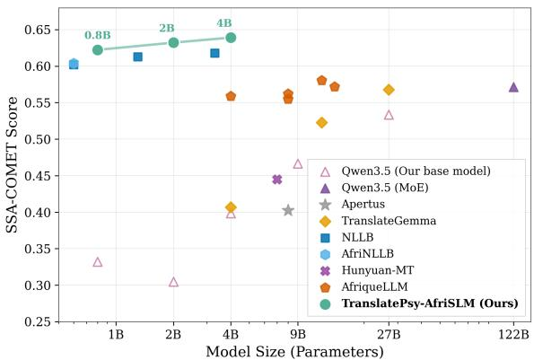  
Figure 1: TranslatePsy-AfriSLM surpasses frontier LLMs (Qwen3.5-122B-A10B, TranslateGemma-27B). SSA-COMET scores shown on BOUQuET benchmark.

Furthermore, efficiently adapting existing SLMs to support this task remains challenging due to the scarcity of high-quality, open-source data in sufficient quantities, see Background (§2) for a detailed survey. Large internet repositories are highly unstructured and noisy, the training signal is sparse and the token budget dramatically inflated. Existing curated datasets and human-quality translations are too small, offering only modest improvements. Therefore, to support efficient model adaptation for low-resource machine translation, we introduce TranslatePsy-AfriSLM1, an open-source African MT resource comprising high-quality parallel data for 19 Sub-Saharan African languages and a family of highly-capable SLMs, shown in Figure 1. Our approach is systematically validated on key benchmarks, with deep insights and analyses that can guide future research. TranslatePsy-AfriSLM exceeds African translation skills of frontier LLMs such as TranslateGemma-27B and Qwen3.5-27B (and 122B-A10B) with only 0.8B parameters. Our smallest model even outperforms the dedicated NLLB encoder-decoder models while preserving conversational capabilities (demo in Figure 13).

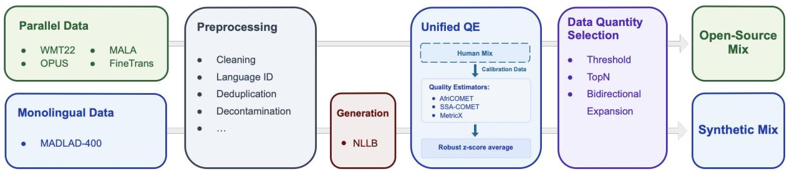  
Figure 2: TranslatePsy-AfriSLM data pipeline. Parallel and monolingual sources are unified through preprocessing, QE filtering, calibrated on the Human Mix, finally the optimal Open-Source and Synthetic mixes are selected.

## 2 Background

## 2.1 African MT Training Resources

Existing African MT datasets reveal a persistent trade-off between scale, coverage, and translation quality. We broadly group them into 3 categories: large but unstructured repositories, medium-sized curated corpora, and small, human-quality datasets.

Large but Unstructured. Data repositories such as OPUS (Tiedemann, 2012), MALA (Ji et al., 2024), WMT22 (Adelani et al., 2022b) and Fine Translations (Penedo et al., 2026) contain large quantities of parallel data, however, the sentence pairs occur in arbitrary sizes, number of languages, translation directions, suffer from high duplication rates, test data contamination and noisy texts. NLLB (Team et al., 2022) leveraged approx. 18B sentence pairs across 200 languages, but did not release a fixed, high-quality corpus suitable for token-efficient adaptation of African MT models.

Medium-Sized and Curated. AfriNLLB2 is currently the only readily available, mediumsized, curated dataset for machine translation (Moslem et al., 2026). However, it covers only 9 African languages, and approximately 50% of its ∼3M pairs include Arabic or European languages. AfriqueLLM (Yu et al., 2026) adapts frontier LLMs for African languages through continued pretraining. While its general-purpose scope significantly improves MT, its training data was not publicly released (a gap we aim to fill). We report comparisons with AfriqueLLM models in Figure 1 and SLMs trained on AfriNLLB data in Section 5.4.

Small but Human-Quality. Several datasets are available in this subset, e.g. MMT-Africa (Emezue and Dossou, 2021), AfriDOC-MT (Alabi et al., 2025), SMOL (Caswell et al., 2025), LAFAND-MT (Adelani et al., 2022a), WMT24pp (Deutsch et al., 2025), MENYO-MT (Adelani et al., 2021), however, they occur in limited quantities and have uneven language coverage. We show that despite their high-quality translations, such mixtures yield only modest improvements (§5.3), smaller than AfriNLLB and substantially smaller than our best TranslatePsy-AfriSLM mixes. This further motivates our large-scale, quality-focused data curation.

## 2.2 Quality Estimation for Data Filtering

Afri-COMET (Wang et al., 2024) and more recently, SSA-COMET (Li et al., 2025) were introduced as African-centric, reference-free alternatives to COMET (Rei et al., 2020), COMET-KIWI (Rei et al., 2022b) and MetricX (Juraska et al., 2023). Several prior works have used them to filter parallel text in African languages (Yu et al., 2026; Uemura et al., 2026; Moslem et al., 2026). However, two questions remain unanswered: (1) the comparative usefulness of each metric as a training data filter, as opposed to an evaluation metric, validated on large-scale African MT; and (2) whether a combination of individual metrics would perform more consistently, and if so, how to effectively combine multiple QE metrics (§3).

## 3 TranslatePsy-AfriSLM

We address the heterogeneity of African MT data with a multi-step curation pipeline, shown in Figure 2, applied to open-source and synthetic sentence pairs (§3.1). After standard structural preprocessing, we score raw pairs using Unified Quality Estimation (§3.2), a robust z-score that aggregates multiple QE metrics. We then study data quantity selection methods for post-training (§3.3).

## 3.1 Data Sources

Parallel Data. We source data from four large, open-source repositories: WMT22 (Adelani et al., 2022b), MALA (Ji et al., 2024), OPUS (Tiedemann, 2012) and Fine Translations (Penedo et al., 2026). Unlike synthetic data, where we can control generation volume and direction, open-source corpora have fixed and often highly uneven distributions across languages and translation directions. As a result, these variables can vary significantly between sources. Therefore, we cap each language pair to a maximum of 5M sentence pairs to mitigate ’winner-takes-all’ effects. This process gives us approximately 427 million raw sentence pairs, see Table 4 for a per-language breakdown.

Monolingual Data. We used the MADLAD-400 corpus (Kudugunta et al., 2023) as a source of data for synthetic data generation via machine translation, see "Synthetic Data Generation" below. For each of the 19 African languages considered in this work, we processed all data available in the corpus. For English, due to the extremely large amounts of data available, we randomly sampled 3.6 million documents. We report detailed, per-language dataset statistics in Table 5.

Preprocessing. This includes standard cleaning, language checks, deduplication, and test set decontamination. Details are provided in Appendix A.1.

Synthetic Data Generation To generate synthetic data, we translated the monolingual data with the NLLB-3.3B encoder-decoder, selected as the teacher model based on our benchmarks in Table 17. See Appendix A.1 for generation settings.

## 3.2 Unified Quality Estimation

We aim to filter the open-source and synthetic data with AfriCOMET,3 SSA-COMET4 and MetricX5 QE metrics6. As we show later (§5.1), no single quality estimator consistently performs best across all evaluation metrics. This motivates aggregating all three estimators into a single score for more consistent filtering. However, a naïve aggregation seems impractical, as the scores have distinct polarities (higher- versus lower-is-better) and their ranges vary across QE models, language directions and training corpora. To address this, we unify the quality estimates from AfriCOMET, SSA-COMET and MetricX by mapping them into a shared robust z-score (Eq. 2), calibrated on the following dataset.

Human Mix. We compiled \~352K high-quality, human-translated pairs from two datasets (see Appendix A.2 for details) for two distinct purposes: a) to provide a human-quality reference for the robust z-score parameters, and b) to show that high-quality but limited-scale human-translated data alone is insufficient for effective post-training adaptation.

Average Robust z-score. For each translation direction d and for each metric m, we compute Human Mix calibration statistics: the median $\tilde { \mathbf { X } } _ { \mathrm { d , m } }$ and the Median Absolute Deviation (MAD):

$$
\mathrm { M A D _ { d , m } = m e d i a n ( \left| x _ { i } - \tilde { x } _ { d , m } \right| ) . }\tag{1}
$$

Each candidate QE score $\operatorname { x } _ { \mathrm { i , d , m } }$ is then normalized against these statistics:

$$
\mathrm { z _ { i , d , m } = s _ { m } \cdot \frac { 0 . 6 7 4 5 \left( x _ { i , d , m } - \tilde { x } _ { d , m } \right) } { M A D _ { d , m } } }\tag{2}
$$

where $\mathrm { s } _ { \mathrm { m } } \in \{ + 1 , - 1 \}$ flips lower-is-better metrics such as MetricX, so that higher values always indicate higher quality. By calibrating each score against the same Human Mix statistics (Eq. 2), this normalization places heterogeneous data sources, translation directions, and QE metrics on a common quality scale relative to human-translated data. They can now be aggregated by computing the average of the per-metric normalized scores in Equation 3. We adopt this average robust z-score as a unified QE metric, henceforth denoted simply as ¯z:

$$
\bar { \mathrm { z } } _ { \mathrm { i , d } } = \frac { 1 } { 3 } \sum _ { \mathrm { m = 1 } } ^ { 3 } \mathrm { z } _ { \mathrm { i , d , m } }\tag{3}
$$

This unified score provides a more consistent basis for filtering heterogeneous parallel data.

Directional Filtering. Quality estimation scores are not symmetric with respect to their argument order; consequently, for any training pair (X, Y) the score ¯z(X, Y) typically differs from ¯z(Y, X). The choice of scoring direction therefore determines which sentence pairs pass the filter. We investigate the following strategies for filtering:

• Aligned: ¯z(X, Y), train $\Chi \to \ Y$

• Reversed: ¯z(Y, X), train X → Y

• Mean: $\begin{array} { r } { \frac { 1 } { 2 } \big ( \bar { \mathrm { z } } ( \mathrm { X } , \mathrm { Y } ) + \bar { \mathrm { z } } ( \mathrm { Y } , \mathrm { X } ) \big ) , \mathrm { t r a i n ~ \mathrm { X } \to \mathrm { Y } } } \end{array}$

The aligned strategy scores each pair in the training direction, whereas the reversed strategy scores it in the opposite direction. The mean strategy averages the z-scores from both directions, potentially providing a balanced alternative that we also explore.

## 3.3 Data Quantity Selection

Once the QE strategy is determined, we need to investigate methods of selecting training data quantities: 1) Threshold filters out sentence pairs below a given z¯ score, 2) TopN extends the threshold filter by limiting any single language pair to a maximum of top-N examples to mitigate large imbalances between languages, 3) Bidirectional expansion is an orthogonal data augmentation step that reverses each sentence pair (X, Y) → (Y, X) to balance translation directions during training.

## 3.4 Auxiliary Data Mixes

In addition to the open-source and synthetic mixes, we include two auxiliary mixtures to maintain capabilities related to broader machine translation.

Instruct Mix is our multilingual instructionfollowing dataset with approximately 50% Africanlanguage content, totalling 4.6M examples. We include it to preserve general conversational abilities and to extend translation to multi-turn settings. The dataset composition is provided in Appendix A.3.

Asia-Europe Mix covers 38 languages (∼24M examples). We include it to preserve translation quality on medium- and high-resource languages and to study whether such data mitigates catastrophic forgetting, see §A.4 for dataset details.

## 4 Experimental Setup

## 4.1 Supervised Fine-Tuning (SFT)

We post-train Qwen3.5 (Team, 2026) models using Supervised Fine-Tuning (SFT), as they consistently outperform other general-purpose SLMs on in our preliminary benchmarks. Each model undergoes (full-parameter) fine-tuning for one epoch on the final training mixture selected from our data analyses in §5.2, with loss computed only on assistant tokens. Details are provided in Appendix B.2.

## 4.2 Evaluation

Language groups. We evaluate MT on 19 languages covered in the TranslatePsy-AfriSLM data mixes, labelled Africa-IID7, and an additional set of 8 unseen languages, labelled Africa-OOD8, to assess generalisation to out-of-domain languages.

Benchmarks. We evaluate on three translation benchmarks: Flores-200 (Team et al., 2022), BOU-QuET (Team et al., 2026), and Smol (Caswell et al., 2025). Flores-200 is the most widely used benchmark (devtest split, 1,012 sentences), enabling comparison with prior work. BOUQuET is the most recent, linguist-curated multi-way benchmark (test split, 854 sentences) with broad typological coverage. Smol (smolsent split, 863 sentences) provides professionally translated data across 89 languages, used exclusively for evaluation. Each benchmark covers all 19 Africa-IID languages.

Metrics. We adopt four complementary metrics: COMET-229 (Rei et al., 2022a), a neural metric trained on human direct assessments, abbreviated to C22; SSA-COMET10 (Li et al., 2025), an AfroXLMR-based COMET variant targeting African languages, abbreviated to SSA; MetricX11 (Juraska et al., 2024), an mT5-based regression metric fine-tuned on DA and MQM ratings, abbreviated to MX; and ChrF++12 (Popovic´, 2017), a character and word-based n-gram F-score robust to morphological variation. COMET-22 and SSA-COMET are reported on a 0–1 scale (higher is better), ChrF++ on a 0–100 scale (higher is better), and MetricX on a 0–25 scale (lower is better).

Baselines We benchmark our SLMs against (1) General-purpose LLMs: Qwen3 (Yang et al., 2025) and Qwen3.5 (Team, 2026), two strong general-purpose multilingual LLM families, and Apertus (Hernández-Cano et al., 2025), a massively multilingual model covering 1,800+ languages. Among these, Qwen3.5 achieves the strongest performance, motivating its use as our backbone and enabling a direct measurement of gains from our methodology. (2) Dedicated translation models: NLLB (Team et al., 2022), an encoder–decoder model trained on large-scale parallel data; AfriN-LLB (Moslem et al., 2026), an African-centric variant of NLLB; TranslateGemma (Finkelstein et al., 2026) and Hunyuan-MT (Zheng et al., 2025), decoder-only LLMs post-trained for translation. (3) African language-specialized models: AfriqueLLM (Yu et al., 2026), which adapts Gemma-3, Qwen3, and LLaMA-3.1 via continued pretraining on approximately 26B tokens.

<table><tr><td></td><td rowspan=1 colspan=1>P10</td><td rowspan=1 colspan=1>P50</td><td rowspan=1 colspan=2>P90</td><td rowspan=1 colspan=1>P10</td><td rowspan=1 colspan=3>P50   P90</td><td rowspan=1 colspan=4>P10   P50  P90</td><td rowspan=1 colspan=1>P10</td><td rowspan=1 colspan=3>P50   P90</td><td></td><td></td><td></td></tr><tr><td rowspan=2 colspan=1>AfriCOMETSSA-COMET</td><td rowspan=1 colspan=1>0.51</td><td rowspan=1 colspan=1>0.67</td><td rowspan=1 colspan=1>0.81</td><td rowspan=1 colspan=1></td><td rowspan=1 colspan=1>0.52</td><td rowspan=1 colspan=1>0.70</td><td rowspan=1 colspan=1>0.82</td><td rowspan=1 colspan=1></td><td rowspan=1 colspan=1>0.32</td><td rowspan=1 colspan=1>0.53</td><td rowspan=1 colspan=1>0.74</td><td rowspan=1 colspan=1></td><td rowspan=1 colspan=1>0.43</td><td rowspan=1 colspan=1>0.62</td><td rowspan=1 colspan=1>0.76</td><td rowspan=1 colspan=1></td><td rowspan=1 colspan=1>0.72</td><td rowspan=1 colspan=1>0.80</td><td rowspan=1 colspan=1>0.88</td></tr><tr><td rowspan=1 colspan=1>0.45</td><td rowspan=1 colspan=1>0.59</td><td rowspan=1 colspan=1>0.71</td><td rowspan=1 colspan=1></td><td rowspan=1 colspan=1>0.47</td><td rowspan=1 colspan=1>0.62</td><td rowspan=1 colspan=1>0.72</td><td rowspan=1 colspan=1></td><td rowspan=1 colspan=1>0.24</td><td rowspan=1 colspan=1>0.47</td><td rowspan=1 colspan=1>0.62</td><td rowspan=1 colspan=1></td><td rowspan=1 colspan=1>0.41</td><td rowspan=1 colspan=1>0.57</td><td rowspan=1 colspan=1>0.68</td><td rowspan=1 colspan=1></td><td rowspan=1 colspan=1>0.64</td><td rowspan=1 colspan=1>0.70</td><td rowspan=1 colspan=1>0.77</td></tr><tr><td rowspan=1 colspan=1>MetricX-24</td><td rowspan=1 colspan=1>9.9</td><td rowspan=1 colspan=1>4.0</td><td rowspan=1 colspan=1>1.7</td><td rowspan=1 colspan=1></td><td rowspan=1 colspan=1>8.9</td><td rowspan=1 colspan=1>3.3</td><td rowspan=1 colspan=1>1.5</td><td rowspan=1 colspan=1></td><td rowspan=1 colspan=1>15.9</td><td rowspan=1 colspan=1>8.1</td><td rowspan=1 colspan=1>3.1</td><td rowspan=1 colspan=1></td><td rowspan=1 colspan=1>11.3</td><td rowspan=1 colspan=1>4.6</td><td rowspan=1 colspan=1>1.9</td><td rowspan=1 colspan=1></td><td rowspan=1 colspan=1>3.8</td><td rowspan=1 colspan=1>1.8</td><td rowspan=1 colspan=1>0.9</td></tr><tr><td rowspan=1 colspan=1>Avg z-score</td><td rowspan=1 colspan=1>-1.09</td><td rowspan=1 colspan=1>0.10</td><td rowspan=1 colspan=1>0.97</td><td rowspan=1 colspan=1></td><td rowspan=1 colspan=1>-1.13</td><td rowspan=1 colspan=1>0.13</td><td rowspan=1 colspan=1>0.94</td><td rowspan=1 colspan=1></td><td rowspan=1 colspan=1>-4.90</td><td rowspan=1 colspan=1>-2.18</td><td rowspan=1 colspan=1>-0.14</td><td rowspan=1 colspan=1></td><td rowspan=1 colspan=1>-2.87</td><td rowspan=1 colspan=1>-0.70</td><td rowspan=1 colspan=1>0.49</td><td rowspan=1 colspan=1></td><td rowspan=1 colspan=1>-0.83</td><td rowspan=1 colspan=1>0.08</td><td rowspan=1 colspan=1>0.74</td></tr></table>

Figure 3: Comparison of data quality across data sources. Each column shows the P10, P50, and P90 percentiles for AfriCOMET, SSA-COMET, MetricX, which are normalised into a mean robust z-score (bottom row).

## 5 Results and Analysis

## 5.1 Quality Estimation: Which is Best?

We first study which quality estimation strategy is most effective for filtering training data. All experiments in this section use English-to-African synthetic data, the only corpus large enough to support controlled comparisons across all 19 language pairs, with over 135 million examples.

No Single Estimator Is Optimal. We compare SSA-COMET, AfriCOMET, and MetricX as individual quality estimators for filtering training data. For each estimator, we score the full training pool in both translation directions, select the top 2 million examples (per language), and use them to finetune Qwen3.5-2B. Results on BOUQuET test set are shown in Table 1. Flores-200 and Smol follow the same pattern, as shown in Tables 6 and 7. We observe that each estimator performs best when evaluated by its corresponding evaluation metric. For instance, SSA-COMET estimator consistently achieves the top SSA-COMET score, and the same holds for MetricX. Similarly, the AfriCOMET estimator outperforms MetricX QE when evaluated via COMET variants. Consequently, no single estimator dominates across all metrics. However, the z¯ score does provide a balanced alternative, achieving at least the second best score across all metrics. We therefore adopt it as our QE metric.

<table><tr><td>Quality estimator</td><td>C22</td><td>SSA</td><td>MX</td><td>ChrF++</td></tr><tr><td colspan="5">eng-xx (English → African language(s))</td></tr><tr><td>z-score</td><td>0.765</td><td>0.643</td><td>3.80</td><td>50.1</td></tr><tr><td>SSA-COMET</td><td>0.766</td><td>0.647</td><td>3.96</td><td>50.5</td></tr><tr><td>AfriCOMET</td><td>0.763</td><td>0.637</td><td>4.03</td><td>49.8</td></tr><tr><td>MetricX</td><td>0.760</td><td>0.632</td><td>3.62</td><td>49.6</td></tr><tr><td colspan="5">xx-eng (African language(s) → English)</td></tr><tr><td>z-score</td><td>0.786</td><td>0.606</td><td>4.59</td><td>52.7</td></tr><tr><td>SSA-COMET</td><td>0.785</td><td>0.608</td><td>4.82</td><td>53.2</td></tr><tr><td>AfriCOMET</td><td>0.783</td><td>0.602</td><td>4.71</td><td>52.4</td></tr><tr><td>MetricX</td><td>0.782</td><td>0.598</td><td>4.50</td><td>52.1</td></tr></table>

Table 1: Translation quality with individual versus unified QE metrics over BOUQuET test set.

Aligned QE Is Best. We evaluate whether QE filtering should be applied in the training direction (aligned), in the opposite of training direction (reversed) or both (mean). This issue arises in backtranslation workflows, where synthetic pairs may be generated and filtered in one direction, then reversed to form training examples in the opposite direction. In such cases, the QE scoring direction becomes reversed relative to the final training direction. To test this, we compare otherwise identical models filtered using the aligned, reversed, and mean strategies defined in §3.2. Results in Table 2, averaged across translation directions and test sets, show that reversed filtering substantially degrades performance, especially on MetricX (−12.0%) and SSA-COMET (−3.1%), while the mean strategy is closer but still generally below the aligned reference. This indicates that QE filtering should be aligned with the final training direction, even when synthetic data is generated through backtranslation. We thus use aligned QE filtering for the remainder of the paper.

## 5.2 How to Select Data?

With unified QE established, we study how training performance changes as a function of data quality and quantity. We sweep the z-score thresholds and combine them with the three strategies introduced in §3.3 across open-source, synthetic and combined data sources. For each mix, we fine-tune Qwen3.5- 2B under the same recipe. Our key observations:

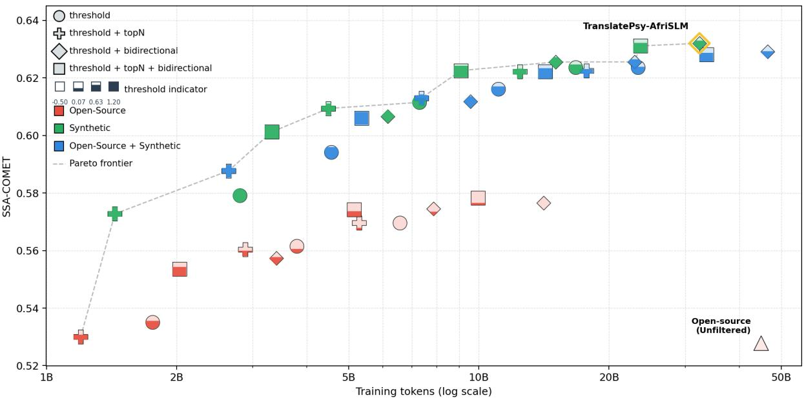  
Figure 4: The Pareto frontier of performance (SSA-COMET) versus training tokens on BOUQuET. Each shape is a fine-tuned model configuration. Colours indicate data source, shapes indicate the filtering strategy, and the shape fill indicates the threshold (the fuller the shape, the higher the threshold). Detailed plots for each metric and each dataset are shown in Figure 12. The full training budgets and threshold details are reported in Table 15.

<table><tr><td>Direction</td><td>C22</td><td>SSA</td><td>MX</td><td>ChrF++</td></tr><tr><td>Aligned (Ref.)</td><td>0</td><td>0</td><td>0</td><td>0</td></tr><tr><td>Mean</td><td>-0.4%</td><td>-0.9%</td><td>-3.9%</td><td> $+ 0 . 7 \%$ </td></tr><tr><td>Reversed</td><td>-1.5%</td><td>-3.1%</td><td>-12.0%</td><td>+0.1%</td></tr></table>

Table 2: Training versus QE scoring directions. Percentages show average differences to aligned reference.

1. Quality filtering is highly effective. Figure 4 (bottom right) shows the “Open-source (Unfiltered)” model trained only on raw sentence pairs, totalling 44.93B tokens. Its lower relative quality can clearly be seen in Figure 3. In contrast, a filtered configuration (bottom left) reaches a comparable SSA-COMET score (0.530 vs. 0.528) with only 1.76B tokens—a 96% reduction. This shows that raw open-source data contains a weak training signal that can be concentrated via dedicated curation, and that scaling usable tokens matters more than simply increasing token budgets. The breakdown of our best open-source configuration is detailed in Table 4.

2. Synthetic data provides better quality and a higher volume. Because it is generated at a larger scale, using a relatively high-quality teacher model, its unfiltered sentence pairs already benefit from higher quality scores than raw open-source pairs (Figure 3). This allows us to apply much stricter ¯z score thresholds while still retaining sufficient training data. In competitive configurations, open-source mixes typically require relatively permissive thresholds around $\bar { \mathrm { z } } \in [ - 0 . 5 , 0 . 5 ]$ , whereas synthetic mixes remain viable under substantially stricter thresholds, from $\overline { { \mathrm { z } } } \geq 0 . 6 8$ to $\overline { { \mathrm { z } } } \geq 1 . 2 .$ . As a result, synthetic mixes dominate open-source mixes across nearly all training-token budgets.

3. Combining open-source and synthetic mixes may help at smaller scales. Combined mixes can outperform synthetic-only mixes at smaller token budgets, but this advantage generally dematerialises as the budget is increased. For example, the best large combined mix uses more tokens and a lower threshold than the final synthetic mix (46.49B tokens, $\bar { \mathrm { z } } \geq 0 . 4 1$ vs. 32.37B tokens, $\overline { { \mathbf { z } } } \geq 0 . 6 8 )$ , yet performs slightly worse. This suggests that once enough high-quality synthetic data is available, adding lower-quality open-source data can dilute the training signal.

4. TopN capping is associated with better token efficiency. Incorporating topN with thresholdonly configurations as a means to limit the influence of well-resourced language pairs tends to underperform in absolute performance although it tends to deliver a higher relative performance (per token). However, the effect is weak, therefore, restricted computational budgets should generally consider the topN capping option.

5. Bidirectional expansion as a robust strategy. Across open-source, synthetic, and combined mixes, configurations with bidirectional expansion always improve compared to the equivalent configuration without expansion. This suggests that expanding selected examples to both translation directions improves coverage and keeps the data more balanced. Because filtering is still aligned with the final training direction, bidirectional expansion preserves QE reliability without the degradation caused by reversed filtering.

Based on these observations, we choose the bestperforming synthetic mix (threshold + bidirectional expansion) as our final training dataset with 32.37B tokens and reaching 0.632 SSA-COMET.

## 5.3 Which Dataset(s) Should We Use?

In this section, we evaluate several datasets in isolation to investigate their contribution to MT.

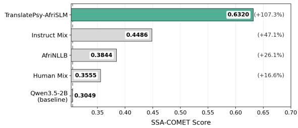  
Figure 5: Single-source SFT ablation on BOUQuET (Qwen3.5-2B). Each model is fine-tuned using a single data component and evaluated with SSA-COMET. The percentages indicate relative gains over the baseline.

AfriNLLB was the largest open-source, curated dataset13 to date hence we positioned it as our most competitive baseline in Figure 5. While it is more beneficial than the human translations, its contribution only has a moderate effect on African MT.

Human Mix is our highest-quality data, as it comes from projects with a high emphasis on human-quality translations. Figure 3 shows that the Human Mix receives higher QE scores than AfriNLLB, which helps explain the fact that it achieves comparable performance despite being much smaller (60.2M versus 535M tokens). This suggests that human-quality data is highly valuable per token, but its limited scale makes it insufficient for effective SLM post-training on its own.

<table><tr><td>Model</td><td>Flores-200</td><td>BOUQuET</td><td>Smol</td></tr><tr><td colspan="4">General-purpose LLMs</td></tr><tr><td>Apertus-8B</td><td>0.3814</td><td>0.4024</td><td>0.3246</td></tr><tr><td>Qwen3.5-27B</td><td>0.5132</td><td>0.5336</td><td>0.4279</td></tr><tr><td>Qwen3.5-122B-A10B</td><td>0.5505</td><td>0.5716</td><td>0.4574</td></tr><tr><td colspan="4">Dedicated translation models</td></tr><tr><td>AfriNLLB-600M</td><td>0.5729</td><td>0.6038</td><td>0.4748</td></tr><tr><td>NLLB-1.3B</td><td>0.5878</td><td>0.6130</td><td>0.4850</td></tr><tr><td>NLLB-3.3B</td><td>0.5944</td><td>0.6178</td><td>0.4909</td></tr><tr><td>Hunyuan-MT-7B</td><td>0.4450</td><td>0.4451</td><td>0.3784</td></tr><tr><td>TranslateGemma-4B</td><td>0.3913</td><td>0.4069</td><td>0.3384</td></tr><tr><td>TranslateGemma-27B</td><td>0.5455</td><td>0.5677</td><td>0.4608</td></tr><tr><td colspan="4">African language-specialized models</td></tr><tr><td>AfriqueLlama-8B</td><td>0.5210</td><td>0.5620</td><td>0.4423</td></tr><tr><td>AfriqueGemma-12B</td><td>0.5531</td><td>0.5805</td><td>0.4608</td></tr><tr><td>AfriqueQwen-14B</td><td>0.5443</td><td>0.5718</td><td>0.4527</td></tr><tr><td colspan="4">Ours</td></tr><tr><td>TranslatePsy-AfriSLM-0.8B</td><td>0.5944</td><td>0.6223</td><td>0.4973</td></tr><tr><td>TranslatePsy-AfriSLM-2B</td><td>0.6070</td><td>0.6322</td><td>0.5074</td></tr><tr><td>TranslatePsy-AfriSLM-4B</td><td>0.6143</td><td>0.6391</td><td>0.5136</td></tr></table>

Table 3: TranslatePsy-AfriSLM compared to LLMs and specialised translators on Flores-200, BOUQuET, Smol (SSA-COMET). Full results in Table 17 and 18.

Instruct-Mix The primary reason for including this dataset in the final TranslatePsy-AfriSLM mix is to preserve the conversational skills of our SLMs, see Figure 13 for a short demo. However, we observe that it unexpectedly benefits machine translation as well, even more so than a dedicated AfriN-LLB corpus (Figure 5). This is almost certainly due to the 2.3M examples (around 50% of total) of diverse tasks in African languages. This effect is similar to the AfriqueLLM (Yu et al., 2026) continued pre-training findings, which also observed an improvement in MT via instruction-following SFT.

TranslatePsy-AfriSLM Our data14 emerges as a powerful contributor to African MT. It combines scale and quality more effectively than prior sources: it retains enough data under strict filtering (Figure 4) and achieves higher QE scores than both AfriNLLB and the Human Mix (Figure 3). This makes it especially effective for African MT adaptation. Detailed statistics are given in Table 5.

## 5.4 Can SLMs Beat Frontier LLMs?

In this section, we combine the TranslatePsy-AfriSLM training dataset with the Instruct-Mix and

Asia-Europe Mix to improve real-world usability and contrast the performance of our SLMs with results from related methodologies.

Africa-IID Table 3 summarizes SSA-COMET performance across three benchmarks; full results across all four metrics are reported in Tables 17 and 18 (Appendix D). (1) General-purpose LLMs underperform, even at frontier scale. Qwen3.5- 122B-A10B is surpassed by our 0.8B model on Flores-200, BOUQuET, and Smol, suggesting that model scale alone is insufficient for African MT. (2) Dedicated translation models also lag behind our SLMs. TranslatePsy-AfriSLM-0.8B outperforms AfriNLLB-600M, NLLB-3.3B and TranslateGemma-27B across all benchmarks. Notably, our 0.8B model matches NLLB-3.3B on Flores-200 and exceeds it on BOUQuET and Smol, despite using roughly a quarter of its parameters. This demonstrates that our carefully curated posttraining data can produce powerful and efficient translation SLMs. (3) African-centric models narrow the gap but still do not match our 0.8B SLM. AfriqueGemma-12B and AfriqueQwen-14B remain below TranslatePsy-AfriSLM-0.8B on the reported benchmarks, while requiring substantially more compute at both training and inference time.

Statistical significance. Paired bootstrap tests confirm that the main rankings in Table 3 are statistically reliable (Appendix D.2). The results show that TranslatePsy-AfriSLM-0.8B significantly outperforms much larger LLM baselines on most settings, while TranslatePsy-AfriSLM-2B consistently surpasses dedicated NLLB models. We also observe statistically significant gains from TranslatePsy-AfriSLM-0.8B to 2B & 4B.

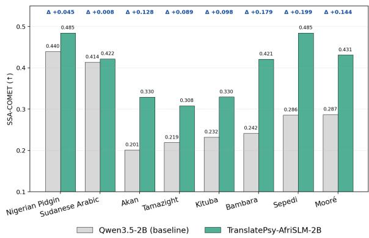  
Figure 6: Africa-OOD performance (SSA-COMET). Qwen3.5-2B versus TranslatePsy-AfriSLM-2B. Scores are averaged over translation directions and all datasets.

Africa-OOD We use Africa-OOD to test whether training on our 19 target languages transfers to new languages. Under SSA-COMET, TranslatePsy-AfriSLM-2B improves over Qwen3.5-2B on all eight held-out languages, with particularly large gains for the lower-resource languages such as Sepedi, Bambara, and Akan (Figure 6). Further per-language analyses show similar trends across COMET-22, MetricX, and ChrF++ (Figure 11; Appendix D.1). These results suggest meaningful cross-lingual transfer beyond the training distribution, although less uniform than the IID gains.

Catastrophic Forgetting We include the Asia-Europe Mix (§3.4) to mitigate catastrophic forgetting on non-African languages. Figure 7 shows that SFT without this data causes substantial degradation on Asian and European languages, most notably under MetricX (−86.0%). Adding our Asia-Europe Mix reduces this to −10.3% and also mitigates degradation measured by COMET-22, SSA-COMET, and ChrF++. These results indicate that non-African parallel data helps preserve broader multilingual translation ability without sacrificing Africa-IID performance; in fact, we observe a small improvement on Africa-IID pairs (Appendix C).

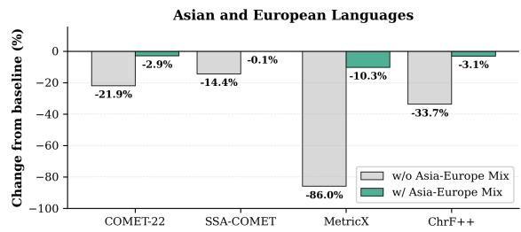  
Figure 7: Catastrophic forgetting on 38 Asian and European languages. The bars show the percentage change from baseline after SFT, with/without the mix.

## 6 Conclusions

We have introduced TranslatePsy-AfriSLM, a comprehensive investigation of training data curation aimed at improving machine translation for 19 Sub-Saharan languages. Our results lead to two main conclusions: 1) Combining multiple QE metrics with robust z¯ score normalization, and scoring examples in the same direction as training, yields more consistent filtering than relying on any single metric. This allows us to reduce the number of training tokens by up to 96% while maintaining comparable performance, 2) Across the 1B–50B token range, filtered synthetic data dominates the quality-efficiency Pareto frontier, while open-source data appears to saturate early due to quality limitations. Given the current shortage of high-quality open-source parallel data for African MT, filtered synthetic generation seems to be the most practical path forward. Guided by these findings, we post-trained TranslatePsy-AfriSLM on our highest-quality data, outperforming much larger models, including TranslateGemma-27B and Qwen3.5-122B-A10B, with as few as 0.8B parameters. We open-source our data to support future work on making African MT a default capability in multilingual models.

## Limitations

The Need for Human Evaluation. One notable finding that warrants future investigation is the challenge of determining absolute translation quality for African languages. Using the referencefree quality estimators from prior work, it appears that our TranslatePsy-AfriSLM data is comparable to human translated pairs in quality but it comes in quantities that are orders of magnitude larger. Still, the performance, as indicated by the reference-based evaluation metrics (produced by same model families as QE) suggests that we have not yet reached the translation quality of European and Asian languages. Therefore, conducting purely quantitative data scaling efforts using existing tools may run into unknown absolute performance limitations. The reason(s) behind this can only be resolved by analysing each step in the pipeline [data collection and training of QE models, correlation with human judgement, data collection and training of evaluation models, their correlation with ground truth], leveraging expert human annotators to identify any errors that have the capacity to compound over multiple steps during a large-scale data curation.

## Ethics Statement

Data licensing All primary sources are opensource and publicly available under permissive attribution-based licenses — ODC-By v1.0 (Fine Translations, MADLAD-400) and CC BY 4.0 (MaLA Corpus), alongside research-permissive aggregates from OPUS and WMT22. The compiled TranslatePsy-AfriSLM datasets will be released under a similarly permissive license for safe, lawful, reproducible low-resource NLP research.

Dialectal representativeness Exact dialect tracking is unavailable for this web-curated corpus; models may over-reflect standardized written forms and under-represent regional dialects or oral traditions. We advise auditing trained models for localized sensitivity before deployment.

Synthetic content Because large internet repositories involve data recycling, mixing, duplication, and some LLM-based corrections and paraphrasing, even our "open-source" subset should be treated as at least partially synthetic (this is in addition to our purely synthetic translations).

## References

Ife Adebara, AbdelRahim Elmadany, Muhammad Abdul-Mageed, and Alcides Inciarte. 2022. AfroLID: A neural language identification tool for African languages. In Proceedings ofthe 2022 Conference on Empirical Methods in Natural Language Processing, pages 1958–1981, Abu Dhabi, United Arab Emirates. Association for Computational Linguistics.

David Adelani, Dana Ruiter, Jesujoba Alabi, Damilola Adebonojo, Adesina Ayeni, Mofe Adeyemi, Ayodele Esther Awokoya, and Cristina España-Bonet. 2021. The effect of domain and diacritics in Yoruba– English neural machine translation. In Proceedings of the 18th Biennial Machine Translation Summit (Volume 1: Research Track), pages 61–75, Virtual. Association for Machine Translation in the Americas.

David Ifeoluwa Adelani, Jesujoba Oluwadara Alabi, Angela Fan, Julia Kreutzer, Xiaoyu Shen, Machel Reid, Dana Ruiter, Dietrich Klakow, Peter Nabende, Ernie Chang, Tajuddeen Gwadabe, Freshia Sackey, Bonaventure F. P. Dossou, Chris Emezue, Colin Leong, Michael Beukman, Shamsuddeen H. Muhammad, Guyo D. Jarso, Oreen Yousuf, Andre N. Niyongabo Rubungo, Gilles Hacheme, Eric Peter Wairagala, Muhammad Umair Nasir, Benjamin A. Ajibade, Tunde Oluwaseyi Ajayi, Yvonne Wambui Gitau, Jade Abbott, Mohamed Ahmed, Millicent Ochieng, Anuoluwapo Aremu, Perez Ogayo, Jonathan Mukiibi, Fatoumata Ouoba Kabore, Godson Koffi Kalipe, Derguene Mbaye, Allahsera Auguste Tapo, Victoire M. Memdjokam Koagne, Edwin Munkoh-Buabeng, Valencia Wagner, Idris Abdulmumin, Ayodele Awokoya, Happy Buzaaba, Blessing Sibanda, Andiswa Bukula, and Sam Manthalu. 2022a. A few thousand translations go a long way! leveraging pretrained models for African news translation. In Proceedings ofthe 2022 Conference ofthe North American Chapter ofthe Associationfor Computational Linguistics: Human Language Technologies, pages 3053–3070, Seattle, United States. Association for Computational Linguistics.

David Ifeoluwa Adelani, Md Mahfuz Ibn Alam, Antonios Anastasopoulos, Akshita Bhagia, Marta R.

Costa-jussà, Jesse Dodge, Fahim Faisal, Christian Federmann, Natalia Fedorova, Francisco Guzmán, Sergey Koshelev, Jean Maillard, Vukosi Marivate, Jonathan Mbuya, Alexandre Mourachko, Safiyyah Saleem, Holger Schwenk, and Guillaume Wenzek. 2022b. Findings of the WMT’22 shared task on largescale machine translation evaluation for African languages. In Proceedings ofthe Seventh Conference on Machine Translation (WMT), pages 773–800, Abu Dhabi, United Arab Emirates (Hybrid). Association for Computational Linguistics.

David Ifeoluwa Adelani, Marek Masiak, Israel Abebe Azime, Jesujoba Oluwadara Alabi, Atnafu Lambebo Tonja, Christine Mwase, Odunayo Ogundepo, Bonaventure F. P. Dossou, Akintunde Oladipo, Doreen Nixdorf, Chris Chinenye Emezue, Sana Sabah al azzawi, Blessing K. Sibanda, Davis David, Lolwethu Ndolela, Jonathan Mukiibi, Tunde Oluwaseyi Ajayi, Tatiana Moteu Ngoli, Brian Odhiambo, Abraham Toluwase Owodunni, Nnaemeka C. Obiefuna, Shamsuddeen Hassan Muhammad, Saheed Salahudeen Abdullahi, Mesay Gemeda Yigezu, Tajuddeen Gwadabe, Idris Abdulmumin, Mahlet Taye Bame, Oluwabusayo Olufunke Awoyomi, Iyanuoluwa Shode, Tolulope Anu Adelani, Habiba Abdulganiy Kailani, Abdul-Hakeem Omotayo, Adetola Adeeko, Afolabi Abeeb, Anuoluwapo Aremu, Olanrewaju Samuel, Clemencia Siro, Wangari Kimotho, Onyekachi Raphael Ogbu, Chinedu E. Mbonu, Chiamaka I. Chukwuneke, Samuel Fanijo, Jessica Ojo, Oyinkansola F. Awosan, Tadesse Kebede Guge, Sakayo Toadoum Sari, Pamela Nyatsine, Freedmore Sidume, Oreen Yousuf, Mardiyyah Oduwole, Ussen Kimanuka, Kanda Patrick Tshinu, Thina Diko, Siyanda Nxakama, Abdulmejid Tuni Johar, Sinodos Gebre, Muhidin Mohamed, Shafie Abdi Mohamed, Fuad Mire Hassan, Moges Ahmed Mehamed, Evrard Ngabire, , and Pontus Stenetorp. 2023. Masakhanews: News topic classification for african languages. ArXiv.

David Ifeoluwa Adelani, Jessica Ojo, Israel Abebe Azime, Jian Yun Zhuang, Jesujoba Alabi, Xuanli He, Millicent Ochieng, Sara Hooker, Andiswa Bukula, En-Shiun Annie Lee, et al. 2025. Irokobench: A new benchmark for african languages in the age of large language models. In Proceedings ofthe 2025 Conference of the Nations of the Americas Chapter of the Associationfor Computational Linguistics: Human Language Technologies (Volume 1: Long Papers), pages 2732–2757.

Jesujoba Alabi, Israel Abebe Azime, Miaoran Zhang, Cristina España-Bonet, Rachel Bawden, Dawei Zhu, David Ifeoluwa Adelani, Clement Oyeleke Odoje, Idris Akinade, Iffat Maab, et al. 2025. Afridocmt: document-level mt corpus for african languages. In Proceedings of the 2025 Conference on Empirical Methods in Natural Language Processing, pages 27758–27794.

Elie Bakouch, Loubna Ben Allal, Anton Lozhkov, Nouamane Tazi, Lewis Tunstall, Carlos Miguel

Patiño, Edward Beeching, Aymeric Roucher, Aksel Joonas Reedi, Quentin Gallouédec, Kashif Rasul, Nathan Habib, Clémentine Fourrier, Hynek Kydlicek, Guilherme Penedo, Hugo Larcher, Mathieu Morlon, Vaibhav Srivastav, Joshua Lochner, Xuan-Son Nguyen, Colin Raffel, Leandro von Werra, and Thomas Wolf. 2025. SmolLM3: smol, multilingual, long-context reasoner. https://huggingface.co/ blog/smollm3.

Isaac Caswell, Elizabeth Nielsen, Jiaming Luo, Colin Cherry, Geza Kovacs, Hadar Shemtov, Partha Talukdar, Dinesh Tewari, Baba Mamadi Diane, Koulako Moussa Doumbouya, Djibrila Diane, Solo Farabado Cissé, Edoardo Ferrante, Alessandro Guasoni, Mamadou K. Keita, Sudhamoy Deb-Barma, Ali Kuzhuget, David Anugraha, Muhammad Ravi Shulthan Habibi, Sina Ahmadi, Mingfei Lau, and Jonathan Eng. 2025. SMOL: Professionally translated parallel data for 115 under-represented languages.

Daniel Deutsch, Eleftheria Briakou, Isaac Caswell, Mara Finkelstein, Rebecca Galor, Juraj Juraska, Geza Kovacs, Alison Lui, Ricardo Rei, Jason Riesa, Shruti Rijhwani, Parker Riley, Elizabeth Salesky, Firas Trabelsi, Stephanie Winkler, Biao Zhang, and Markus Freitag. 2025. WMT24++: Expanding the Language Coverage of WMT24 to 55 Languages & Dialects.

Peter Devine, Mardhiyah Sanni, Farid Adilazuarda, Julieta Gil Loizaga, and Barry Haddow. 2026. Kakugo: Distillation of low-resource languages into small language models. arXiv preprint arXiv:2601.14051.

Kadijatou Diallo, Jonathan Smith, Chinasa T Okolo, Dorcas Nyamwaya, Jonas Kgomo, and Richard Ngamita. 2025. Case studies of ai policy development in africa. Data & Policy, 7:e15.

Ning Ding, Yulin Chen, Bokai Xu, Yujia Qin, Zhi Zheng, Shengding Hu, Zhiyuan Liu, Maosong Sun, and Bowen Zhou. 2023. Enhancing chat language models by scaling high-quality instructional conversations. arXiv preprint arXiv:2305.14233.

Chris Chinenye Emezue and Bonaventure F. P. Dossou. 2021. MMTAfrica: Multilingual machine translation for African languages. In Proceedings of the Sixth Conference on Machine Translation, pages 398–411, Online. Association for Computational Linguistics.

Mara Finkelstein, Isaac Caswell, Tobias Domhan, Jan-Thorsten Peter, Juraj Juraska, Parker Riley, Daniel Deutsch, Cole Dilanni, Colin Cherry, Eleftheria Briakou, et al. 2026. Translategemma technical report. arXiv preprint arXiv:2601.09012.

Tahmid Hasan, Abhik Bhattacharjee, Md. Saiful Islam, Kazi Mubasshir, Yuan-Fang Li, Yong-Bin Kang, M. Sohel Rahman, and Rifat Shahriyar. 2021. XLsum: Large-scale multilingual abstractive summarization for 44 languages. In Findings of the Association for Computational Linguistics: ACL-IJCNLP 2021, pages 4693–4703, Online. Association for Computational Linguistics.

Alejandro Hernández-Cano, Alexander Hägele, Allen Hao Huang, Angelika Romanou, Antoni-Joan Solergibert, Barna Pasztor, Bettina Messmer, Dhia Garbaya, Eduard Frank Durech, Ido Hakimi,ˇ Juan García Giraldo, Mete Ismayilzada, Negar Foroutan, Skander Moalla, Tiancheng Chen, Vinko Sabolcec, Yixuan Xu, Michael Aerni, Badrˇ AlKhamissi, Ines Altemir Marinas, Mohammad Hos sein Amani, Matin Ansaripour, Ilia Badanin, Harold Benoit, Emanuela Boros, Nicholas Browning, Fabian Bösch, Maximilian Böther, Niklas Canova, Camille Challier, Clement Charmillot, Jonathan Coles, Jan Deriu, Arnout Devos, Lukas Drescher, Daniil Dzenhaliou, Maud Ehrmann, Dongyang Fan, Simin Fan, Silin Gao, Miguel Gila, María Grandury, Diba Hashemi, Alexander Hoyle, Jiaming Jiang, Mark Klein, Andrei Kucharavy, Anastasiia Kucherenko, Frederike Lübeck, Roman Machacek, Theofilos Manitaras, Andreas Marfurt, Kyle Matoba, Simon Matrenok, Henrique Mendoncça, Fawzi Roberto Mohamed, Syrielle Montariol, Luca Mouchel, Sven Najem-Meyer, Jingwei Ni, Gennaro Oliva, Matteo Pagliardini, Elia Palme, Andrei Panferov, Léo Paoletti, Marco Passerini, Ivan Pavlov, Auguste Poiroux, Kaustubh Ponkshe, Nathan Ranchin, Javi Rando, Mathieu Sauser, Jakhongir Saydaliev, Muhammad Ali Sayfiddinov, Marian Schneider, Stefano Schuppli, Marco Scialanga, Andrei Semenov, Kumar Shridhar, Raghav Singhal, Anna Sotnikova, Alexander Sternfeld, Ayush Kumar Tarun, Paul Teiletche, Jannis Vamvas, Xiaozhe Yao, Hao Zhao Alexander Ilic, Ana Klimovic, Andreas Krause, Caglar Gulcehre, David Rosenthal, Elliott Ash, Florian Tramèr, Joost VandeVondele, Livio Veraldi, Martin Rajman, Thomas Schulthess, Torsten Hoefler, Antoine Bosselut, Martin Jaggi, and Imanol Schlag. 2025. Apertus: Democratizing Open and Compliant LLMs for Global Language Environments. https://arxiv.org/abs/2509.14233.

Kahabi Ganka Isangula. 2025. Navigating barriers: Challenges and strategies for adopting artificial intelligence in qualitative research in low-income african contexts. Tanzania Journal of Health Research, 25(3):2048–2059.

Shaoxiong Ji, Zihao Li, Indraneil Paul, Jaakko Paavola, Peiqin Lin, Pinzhen Chen, Dayyán O’Brien, Hengyu Luo, Hinrich Schütze, Jörg Tiedemann, and Barry Haddow. 2024. EMMA-500: Enhancing massively multilingual adaptation of large language models. arXiv preprint 2409.17892.

Armand Joulin, Edouard Grave, Piotr Bojanowski, and Tomas Mikolov. 2016. Bag of tricks for efficient text classification. arXiv preprint arXiv:1607.01759.

Juraj Juraska, Daniel Deutsch, Mara Finkelstein, and Markus Freitag. 2024. MetricX-24: The Google submission to the WMT 2024 metrics shared task. In Proceedings ofthe Ninth Conference on Machine Translation, pages 492–504, Miami, Florida, USA. Association for Computational Linguistics.

Juraj Juraska, Mara Finkelstein, Daniel Deutsch, Aditya Siddhant, Mehdi Mirzazadeh, and Markus Freitag. 2023. MetricX-23: The Google Submission to the WMT 2023 Metrics Shared Task. In Proceedings of the Eighth Conference on Machine Translation, pages 756–767, Singapore. Association for Computational Linguistics.

Sneha Kudugunta, Isaac Caswell, Biao Zhang, Xavier Garcia, Christopher A. Choquette-Choo, Katherine Lee, Derrick Xin, Aditya Kusupati, Romi Stella, Ankur Bapna, and Orhan Firat. 2023. Madlad-400: A multilingual and document-level large audited dataset.

Senyu Li, Jiayi Wang, Felermino D. M. A. Ali, Colin Cherry, Daniel Deutsch, Eleftheria Briakou, Rui Sousa-Silva, Henrique Lopes Cardoso, Pontus Stenetorp, and David Ifeoluwa Adelani. 2025. SSA-COMET: Do LLMs outperform learned metrics in evaluating MT for under-resourced African languages? In Proceedings of the 2025 Conference on Empirical Methods in Natural Language Processing, pages 12979–12998, Suzhou, China. Association for Computational Linguistics.

Abdul Feroz Maluleke. 2025. Ai adoption in african higher education: A systematic review of benefits and ethical implications. Interdisciplinary Journal of Education Research, 7(2):a05–a05.

Yasmin Moslem, Aman Kassahun Wassie, and Amanuel Gizachew Abebe. 2026. Afrinllb: Efficient translation models for african languages.

Mayssaa Moukatib and Ahmed BEN Seddik. 2026. The the role of ai in translator training: Assessing ai’s influence on translation education and professional training. International Journal of Linguistics and Translation Studies, 7(1):136–151.

Shamsuddeen Hassan Muhammad, Idris Abdulmumin, Seid Muhie Yimam, David Ifeoluwa Adelani, Ibrahim Sa’id Ahmad, Nedjma Ousidhoum, Abinew Ayele, Saif M Mohammad, and Meriem Beloucif. 2023. Semeval-2023 task 12: Sentiment analysis for african languages (afrisenti-semeval). arXiv preprint arXiv:2304.06845.

NVIDIA. 2024. Nemo curator: Gpu-accelerated data curation for training ai models.

Stella Chinelo Nwagbala, Francisca Nkiruka Ezeanokwasa, Raphael Nwachukwu, Ngozi Justina Uzodike, and Ogechukwu Pauline Nwosu. 2025. Ai adoption and sustainability of smes in africa: Opportunities and challenges. International Journal ofScience and Research Archive, 14(1):467–475.

Odunayo Ogundepo, Tajuddeen R. Gwadabe, Clara E. Rivera, Jonathan H. Clark, Sebastian Ruder, David Ifeoluwa Adelani, Bonaventure F. P. Dossou, Abdou Aziz DIOP, Claytone Sikasote, Gilles

Hacheme, Happy Buzaaba, Ignatius Ezeani, Rooweither Mabuya, Salomey Osei, Chris Emezue, Albert Njoroge Kahira, Shamsuddeen H. Muhammad, Akintunde Oladipo, Abraham Toluwase Owodunni, Atnafu Lambebo Tonja, Iyanuoluwa Shode, Akari Asai, Tunde Oluwaseyi Ajayi, Clemencia Siro, Steven Arthur, Mofetoluwa Adeyemi, Orevaoghene Ahia, Aremu Anuoluwapo, Oyinkansola Awosan, Chiamaka Chukwuneke, Bernard Opoku, Awokoya Ayodele, Verrah Otiende, Christine Mwase, Boyd Sinkala, Andre Niyongabo Rubungo, Daniel A. Ajisafe, Emeka Felix Onwuegbuzia, Habib Mbow, Emile Niyomutabazi, Eunice Mukonde, Falalu Ibrahim Lawan, Ibrahim Said Ahmad, Jesujoba O. Alabi, Martin Namukombo, Mbonu Chinedu, Mofya Phiri, Neo Putini, Ndumiso Mngoma, Priscilla A. Amuok, Ruqayya Nasir Iro, and Sonia Adhiambo. 2023. Afriqa: Cross-lingual openretrieval question answering for african languages.

Jessica Ojo, Odunayo Ogundepo, Akintunde Oladipo, Kelechi Ogueji, Jimmy Lin, Pontus Stenetorp, and David Ifeoluwa Adelani. 2025. Afrobench: how good are large language models on african languages? In Findings of the Association for Computational Linguistics: ACL 2025, pages 19048–19095.

Team Olmo, Allyson Ettinger, Amanda Bertsch, Bailey Kuehl, David Graham, David Heineman, Dirk Groeneveld, Faeze Brahman, Finbarr Timbers, Hamish Ivison, Jacob Morrison, Jake Poznanski, Kyle Lo, Luca Soldaini, Matt Jordan, Mayee Chen, Michael Noukhovitch, Nathan Lambert, Pete Walsh, Pradeep Dasigi, Robert Berry, Saumya Malik, Saurabh Shah, Scott Geng, Shane Arora, Shashank Gupta, Taira Anderson, Teng Xiao, Tyler Murray, Tyler Romero, Victoria Graf, Akari Asai, Akshita Bhagia, Alexander Wettig, Alisa Liu, Aman Rangapur, Chloe Anastasiades, Costa Huang, Dustin Schwenk, Harsh Trivedi, Ian Magnusson, Jaron Lochner, Jiacheng Liu, Lester James V. Miranda, Maarten Sap, Malia Morgan, Michael Schmitz, Michal Guerquin, Michael Wilson, Regan Huff, Ronan Le Bras, Rui Xin, Rulin Shao, Sam Skjonsberg, Shannon Zejiang Shen, Shuyue Stella Li, Tucker Wilde, Valentina Pyatkin, Will Merrill, Yapei Chang, Yuling Gu, Zhiyuan Zeng, Ashish Sabharwal, Luke Zettlemoyer, Pang Wei Koh, Ali Farhadi, Noah A. Smith, and Hannaneh Hajishirzi. 2025. Olmo 3.

Mich-Seth Owusu. 2025. Afri code datasets collection. A collection of datasets featuring coding conversations translated into 55 African languages.

Guilherme Penedo, Hynek Kydlícek, Amir Hossein Kar-ˇ garan, and Leandro von Werra. 2026. Finetranslations. https://huggingface.co/datasets/ HuggingFaceFW/finetranslations.

Maja Popovic. 2017.´ chrF++: words helping character n-grams. In Proceedings of the Second Conference on Machine Translation, pages 612–618, Copenhagen, Denmark. Association for Computational Linguistics.

Ricardo Rei, José G. C. de Souza, Duarte Alves, Chrysoula Zerva, Ana C Farinha, Taisiya Glushkova, Alon Lavie, Luisa Coheur, and André F. T. Martins. 2022a. COMET-22: Unbabel-IST 2022 submission for the metrics shared task. In Proceedings of the Seventh Conference on Machine Translation (WMT), pages 578–585, Abu Dhabi, United Arab Emirates (Hybrid). Association for Computational Linguistics.

Ricardo Rei, Craig Stewart, Ana C Farinha, and Alon Lavie. 2020. COMET: A neural framework for MT evaluation. In Proceedings ofthe 2020 Conference on Empirical Methods in Natural Language Processing (EMNLP), pages 2685–2702, Online. Association for Computational Linguistics.

Ricardo Rei, Marcos Treviso, Nuno M. Guerreiro, Chrysoula Zerva, Ana C Farinha, Christine Maroti, José G. C. de Souza, Taisiya Glushkova, Duarte Alves, Luisa Coheur, Alon Lavie, and André F. T. Martins. 2022b. CometKiwi: IST-unbabel 2022 submission for the quality estimation shared task. In Proceedings ofthe Seventh Conference on Machine Translation (WMT), pages 634–645, Abu Dhabi, United Arab Emirates (Hybrid). Association for Computational Linguistics.

Nipun Sadvilkar and Mark Neumann. 2020. PySBD: Pragmatic sentence boundary disambiguation. In Proceedings of Second Workshop for NLP Open Source Software (NLP-OSS), pages 110–114, Online. Association for Computational Linguistics.

Shivalika Singh, Freddie Vargus, Daniel Dsouza, Börje F. Karlsson, Abinaya Mahendiran, Wei-Yin Ko, Herumb Shandilya, Jay Patel, Deividas Mataciunas, Laura OMahony, Mike Zhang, Ramith Hettiarachchi, Joseph Wilson, Marina Machado, Luisa Souza Moura, Dominik Krzeminski, Hakimeh´ Fadaei, Irem Ergün, Ifeoma Okoh, Aisha Alaagib, Oshan Mudannayake, Zaid Alyafeai, Vu Minh Chien, Sebastian Ruder, Surya Guthikonda, Emad A. Alghamdi, Sebastian Gehrmann, Niklas Muennighoff, Max Bartolo, Julia Kreutzer, Ahmet Üstün, Marzieh Fadaee, and Sara Hooker. 2024. Aya dataset: An open-access collection for multilingual instruction tuning.

Samuel Ssemugabi. 2025. The role of ai in modern language translation and its societal applications: A systematic literature review. In Southern African Conference for Artificial Intelligence Research, pages 390–404. Springer.

Rohan Taori, Ishaan Gulrajani, Tianyi Zhang, Yann Dubois, Xuechen Li, Carlos Guestrin, Percy Liang, and Tatsunori B. Hashimoto. 2023. Stanford alpaca: An instruction-following llama model. https:// github.com/tatsu-lab/stanford\_alpaca.

NLLB Team, Marta R. Costa-jussà, James Cross, Onur Çelebi, Maha Elbayad, Kenneth Heafield, Kevin Heffernan, Elahe Kalbassi, Janice Lam, Daniel Licht, Jean Maillard, Anna Sun, Skyler Wang, Guillaume

Wenzek, Al Youngblood, Bapi Akula, Loic Barrault, Gabriel Mejia Gonzalez, Prangthip Hansanti, John Hoffman, Semarley Jarrett, Kaushik Ram Sadagopan, Dirk Rowe, Shannon Spruit, Chau Tran, Pierre Andrews, Necip Fazil Ayan, Shruti Bhosale, Sergey Edunov, Angela Fan, Cynthia Gao, Vedanuj Goswami, Francisco Guzmán, Philipp Koehn, Alexandre Mourachko, Christophe Ropers, Safiyyah Saleem, Holger Schwenk, and Jeff Wang. 2022. No language left behind: Scaling humancentered machine translation. arXiv preprint arXiv: 2207.04672.

Qwen Team. 2026. Qwen3.5: Accelerating productivity with native multimodal agents.

The Omnilingual MT Team, Belen Alastruey, Niyati Bafna, Andrea Caciolai, Kevin Heffernan, Artyom Kozhevnikov, Christophe Ropers, Eduardo Sánchez, Charles-Eric Saint-James, Ioannis Tsiamas, Chierh Cheng, Joe Chuang, Paul-Ambroise Duquenne, Mark Duppenthaler, Nate Ekberg, Cynthia Gao, Pere Lluís Huguet Cabot, João Maria Janeiro, Jean Maillard, Gabriel Mejia Gonzalez, Holger Schwenk, Edan Toledo, Arina Turkatenko, Albert Ventayol-Boada, Rashel Moritz, Alexandre Mourachko, Surya Parimi, Mary Williamson, Shireen Yates, David Dale, and Marta R. Costa-jussà. 2026. Omnilingual MT: Machine translation for 1,600 languages.

Jörg Tiedemann. 2012. Parallel data, tools and interfaces in OPUS. In Proceedings of the Eighth International Conference on Language Resources and Evaluation (LREC’12), pages 2214–2218, Istanbul, Turkey. European Language Resources Association (ELRA).

Kosei Uemura, Miaoran Zhang, and David Ifeoluwa Adelani. 2026. AfriMTEB and AfriE5: Benchmarking and adapting text embedding models for African languages. In Proceedings ofthe 19th Conference of the European Chapter of the Association for Computational Linguistics (Volume 1: Long Papers), pages 3697–3717, Rabat, Morocco. Association for Computational Linguistics.

Jiayi Wang, David Ifeoluwa Adelani, Sweta Agrawal, Marek Masiak, Ricardo Rei, Eleftheria Briakou, Marine Carpuat, Xuanli He, Sofia Bourhim, Andiswa Bukula, et al. 2024. Afrimte and africomet: Enhancing comet to embrace under-resourced african languages. In Proceedings of the 2024 Conference of the North American Chapter of the Association for Computational Linguistics: Human Language Technologies (Volume 1: Long Papers), pages 5997–6023.

An Yang, Anfeng Li, Baosong Yang, Beichen Zhang, Binyuan Hui, Bo Zheng, Bowen Yu, Chang Gao, Chengen Huang, Chenxu Lv, et al. 2025. Qwen3 technical report. arXiv preprint arXiv:2505.09388.

Hao Yu, Tianyi Xu, Michael A Hedderich, Wassim Hamidouche, Syed Waqas Zamir, and David Ifeoluwa Adelani. 2026. Afriquellm: How data mixing and model architecture impact continued

pre-training for african languages. arXiv preprint arXiv:2601.06395.

Biao Zhang, Philip Williams, Ivan Titov, and Rico Sennrich. 2020. Improving massively multilingual neural machine translation and zero-shot translation. In Proceedings ofthe 58th Annual Meeting ofthe Associationfor Computational Linguistics, pages 1628– 1639, Online. Association for Computational Linguistics.

Mao Zheng, Zheng Li, Bingxin Qu, Mingyang Song, Yang Du, Mingrui Sun, and Di Wang. 2025. Hunyuan-mt technical report. arXiv preprint arXiv:2509.05209.

## A Appendix

## A.1 Synthetic and Open-Source Mixes

The corpora composing these mixes are described in §3.1. Here, we give more details of the processing steps and final data statistics. The preprocessing steps (up to decontamination) were implemented with NeMo Curator (NVIDIA, 2024). In Tables 4 and 5), "Clean" means before deduplication, "Preproc" after decontamination, "Filtered" after QE filtering, and "Bidir." after bidirectional expansion.

## Processing steps:

1. Document Splitting:15 has divided documents into paragraphs (splitting at newlines).

2. Cleaning: removed Unicode artifacts, extra newlines, markup, and URLs.

3. Language Identification: via AfroLID (Adebara et al., 2022) for African languages and FastText (Joulin et al., 2016) for English.

4. Sentence Splitting:15 was performed using pySBD (Sadvilkar and Neumann, 2020).

5. Filtering: removed non-alphanumeric content and boilerplate text.

6. Deduplication: with exact & fuzzy matching.

7. Eval-set Decontamination: removed sentences similar to our test sets (§A.6).

8. Synthetic Data Generation The monolingual data (§ 3.1) was translated with the NLLB-3.3B model,16 decoded with the c-translate2 decoder17 with "int8\_float16" quantisation and beam size 3. We discarded the 54B MoE model because the MoE architecture is not supported by fast decoders.

9. Quality Estimation (QE): For open-source data, the input to the QE stage is the parallel pre-processed text. For the synthetic data, it is the monolingual pre-processed source text together with its translation. For each pair, MetricX, AfriCOMET, SSA-COMET scores and the z-score were calculated in the sourcetarget and target-source directions. Aligned filtering was applied (§3.2), and pairs with a z-score below the threshold were discarded.

<table><tr><td></td><td></td><td></td><td></td><td colspan="4">QE Filtered</td></tr><tr><td>Lang.</td><td>Raw</td><td>Clean</td><td>Preproc</td><td>en→xx</td><td>xx→en</td><td>xx→yy</td><td>Bidir.</td></tr><tr><td>afr</td><td>66,089</td><td>48,932</td><td>43,060</td><td>1,500</td><td>1,000</td><td>2,248</td><td>7,425</td></tr><tr><td>amh</td><td>41,109</td><td>36,935</td><td>30,542</td><td>1,020</td><td>776</td><td>2,841</td><td>6,518</td></tr><tr><td>hau</td><td>33,515</td><td>24,380</td><td>22,537</td><td>1,230</td><td>42</td><td>1,453</td><td>4,162</td></tr><tr><td>ibo</td><td>17,550</td><td>15,378</td><td>14,385</td><td>1,500</td><td>17</td><td>309</td><td>3,458</td></tr><tr><td>kin</td><td>21,855</td><td>16,425</td><td>15,484</td><td>1,500</td><td>0</td><td>280</td><td>2,989</td></tr><tr><td>lin</td><td>9,992</td><td>6,169</td><td>5,727</td><td>1,500</td><td>1</td><td>0</td><td>2,217</td></tr><tr><td>lug</td><td>14,257</td><td>8,175</td><td>7,528</td><td>1,302</td><td>4</td><td>80</td><td>1,922</td></tr><tr><td>mlg</td><td>11,106</td><td>8,336</td><td>7,829</td><td>1,394</td><td>10</td><td>19</td><td>2,477</td></tr><tr><td>nya</td><td>14,655</td><td>10,715</td><td>9,804</td><td>586</td><td>14</td><td>537</td><td>1,952</td></tr><tr><td>orm</td><td>11,949</td><td>5,703</td><td>5,517</td><td>892</td><td>8</td><td>7</td><td>1,175</td></tr><tr><td>sna</td><td>21,477</td><td>12,676</td><td>11,744</td><td>1,391</td><td>11</td><td>510</td><td>3,488</td></tr><tr><td>som</td><td>26,157</td><td>22,432</td><td>20,068</td><td>1,388</td><td>39</td><td>292</td><td>3,425</td></tr><tr><td>sot</td><td>4,517</td><td>3,676</td><td>3,491</td><td>23</td><td>1</td><td>0</td><td>55</td></tr><tr><td>swa</td><td>37,664</td><td>30,784</td><td>28,223</td><td>1,500</td><td>41</td><td>697</td><td>5,947</td></tr><tr><td>tsn</td><td>14,595</td><td>9,325</td><td>8,520</td><td>1,609</td><td>25</td><td>63</td><td>3,085</td></tr><tr><td>wol</td><td>4,342</td><td>3,506</td><td>3,280</td><td>868</td><td>1</td><td>14</td><td>1,218</td></tr><tr><td>xho</td><td>22,971</td><td>14,435</td><td>13,534</td><td>1,500</td><td>13</td><td>200</td><td>3,595</td></tr><tr><td>yor</td><td>13,909</td><td>9,052</td><td>8,091</td><td>411</td><td>67</td><td>69</td><td>1,999</td></tr><tr><td>zul</td><td>24,476</td><td>13,709</td><td>12,950</td><td>1,132</td><td>15</td><td>3</td><td>3,196</td></tr><tr><td>others</td><td>15,004</td><td>14,828</td><td>14,292</td><td>1,500</td><td>1,000</td><td>0</td><td>5,000</td></tr><tr><td>Total</td><td>427,187</td><td>315,571</td><td>286,606</td><td>23,747</td><td>3,085</td><td>9,623</td><td>65,304</td></tr></table>

Table 4: Open-Source mix statistics by language (line counts in thousands).

## A.2 Human Mix

We compiled 352,582 human-translated, highquality parallel sentences focused on African languages from AfriDOC-MT (Alabi et al., 2025) and SMOL18 (Caswell et al., 2025). Table 8 summarizes the high-level statistics. The SmolDoc subset of SMOL19 was flattened to sentence-level pairs.

## Processing Steps:

1. Bidirectional expansion: Both directions (en→xx and xx→en) were used for training.

2. Global exact deduplication: Identical pairs were removed.

3. Eval-set decontamination: Removed sentences similar to our evaluation data.

4. Global approximate deduplication: Min-Hash applied to remove similar examples.

<table><tr><td>Filter Type</td><td>Kept</td><td>Removed</td><td>Retained %</td></tr><tr><td>Raw sentence pairs</td><td>180,540</td><td></td><td>100.00%</td></tr><tr><td>(1) After bidirectional expansion</td><td>361,080</td><td></td><td>200.00%</td></tr><tr><td>(2) After global exact deduplication</td><td>357,584</td><td>3,496</td><td>99.03%</td></tr><tr><td>(3) After eval-set decontamination</td><td>357,402</td><td>182</td><td>99.95%</td></tr><tr><td>(4) After global approximate deduplication</td><td>352,582</td><td>4,820</td><td>98.65%</td></tr></table>

Table 8: Filtering summary for the human translations.

## A.3 Instruct Mix

Afri-Instruct Mix This dataset is a heterogeneous mixture of open-ended instruction data aggregated from 11 publicly available HuggingFace datasets (Singh et al., 2024; Taori et al., 2023; Devine et al., 2026; Owusu, 2025; Muhammad et al., 2023; Adelani et al., 2023; Ogundepo et al.,

<table><tr><td rowspan="2">Lang.</td><td colspan="3">Monolingual</td><td colspan="3">Parallel, QE Filtered</td></tr><tr><td>Raw</td><td>Clean</td><td>Preproc</td><td>eng→xx</td><td>xx→eng</td><td>Bidir.</td></tr><tr><td>eng</td><td>145,726</td><td>145,688</td><td>136,482</td><td></td><td></td><td></td></tr><tr><td>afr</td><td>24,062</td><td>23,384</td><td>11,139</td><td>1,009</td><td>1,875</td><td>6,974</td></tr><tr><td>amh</td><td>3,704</td><td>3,576</td><td>3,379</td><td>4,897</td><td>569</td><td>10,786</td></tr><tr><td>hau</td><td>5,002</td><td>4,729</td><td>4,420</td><td>6,697</td><td>1,306</td><td>17,261</td></tr><tr><td>ibo</td><td>2,450</td><td>2,351</td><td>2,222</td><td>5,964</td><td>639</td><td>12,659</td></tr><tr><td>kin</td><td>5,211</td><td>4,699</td><td>4,219</td><td>2,536</td><td>847</td><td>8,102</td></tr><tr><td>lin</td><td>153</td><td>145</td><td>135</td><td>5,056</td><td>36</td><td>7,482</td></tr><tr><td>lug</td><td>378</td><td>358</td><td>332</td><td>5,586</td><td>48</td><td>10,089</td></tr><tr><td>mlg</td><td>3,521</td><td>2,690</td><td>2,464</td><td>1,010</td><td>470</td><td>4,168</td></tr><tr><td>nya</td><td>2,292</td><td>1,846</td><td>1,768</td><td>3,575</td><td>439</td><td>8,060</td></tr><tr><td>orm</td><td>75</td><td>70</td><td>68</td><td>4,817</td><td>10</td><td>7,580</td></tr><tr><td>sna</td><td>426</td><td>344</td><td>335</td><td>2,490</td><td>92</td><td>5,829</td></tr><tr><td>som</td><td>6,981</td><td>6,616</td><td>5,967</td><td>2,744</td><td>851</td><td>7,381</td></tr><tr><td>sot</td><td>1,980</td><td>1,851</td><td>1,754</td><td>4,576</td><td>503</td><td>8,495</td></tr><tr><td>swa</td><td>18,080</td><td>17,559</td><td>15,834</td><td>3,598</td><td>2,776</td><td>17,670</td></tr><tr><td>tsn</td><td>22</td><td>21</td><td>20</td><td>3,506</td><td>7</td><td>6,033</td></tr><tr><td>wol</td><td>45</td><td>43</td><td>39</td><td>13,256</td><td>7</td><td>23,615</td></tr><tr><td>xho</td><td>2,219</td><td>2,040</td><td>1,915</td><td>4,414</td><td>465</td><td>7,962</td></tr><tr><td>yor</td><td>2,345</td><td>2,109</td><td>2,007</td><td>13,464</td><td>1,128</td><td>27,140</td></tr><tr><td>zul</td><td>2,118</td><td>1,737</td><td>1,662</td><td>9,115</td><td>519</td><td>18,367</td></tr><tr><td>Total</td><td>226,790</td><td>221,856</td><td>196,162</td><td>98,312</td><td>12,589</td><td>215,653</td></tr></table>

Table 5: Synthetic-Mix stats (TranslatePsy-AfriSLM training data) by language (line counts in thousands).
<table><tr><td>Quality estimator</td><td>C22</td><td>SSA</td><td>MX</td><td>ChrF++</td></tr><tr><td colspan="5">eng-xx (English → African language(s))</td></tr><tr><td>z-score</td><td>0.737</td><td>0.617</td><td>4.52</td><td>45.7</td></tr><tr><td>SSA-COMET</td><td>0.736</td><td>0.620</td><td>4.73</td><td>45.9</td></tr><tr><td>AfriCOMET</td><td>0.735</td><td>0.609</td><td>4.87</td><td>45.3</td></tr><tr><td>MetricX</td><td>0.730</td><td>0.605</td><td>4.29</td><td>45.2</td></tr><tr><td colspan="5">xx-eng (African language(s) → English)</td></tr><tr><td>z-score</td><td>0.754</td><td>0.581</td><td>5.30</td><td>52.0</td></tr><tr><td>SSA-COMET</td><td>0.746</td><td>0.581</td><td>5.79</td><td>51.9</td></tr><tr><td>AfriCOMET</td><td>0.756</td><td>0.579</td><td>5.40</td><td>52.3</td></tr><tr><td>MetricX</td><td>0.749</td><td>0.573</td><td>5.27</td><td>51.7</td></tr></table>

Table 6: Translation quality with individual versus unified QE metrics over Flores-200 test set.

2023; Adelani et al., 2025; Ojo et al., 2025; Hasan et al., 2021; Ding et al., 2023). Table 9 summarizes each data source. The final mixture contains 2,306,800 examples designed to maintain/extend essential instruction-following abilities to African MT, e.g. open-ended instruction and chat data, which contributes 1,553,944 examples (67.36%), followed by code-assistance data with 521,389 examples (22.60%). Smaller portions come from classification and other structured prediction tasks with 123,448 examples (5.35%), summarization and headline generation with 74,581 examples (3.23%), and question answering plus cross-lingual QA with 33,438 examples (1.45%).

## Processing Steps:

1. Format standardization: Each dataset was converted to a multi-turn chat format with system, user, and assistant roles. Appropriate system prompts were added (e.g., “You are a sentiment classifier” for AfriSenti, “You are a summarization assistant” for XLSum), etc.

<table><tr><td>Quality estimator</td><td>C22</td><td>SSA</td><td>MX</td><td>ChrF++</td></tr><tr><td colspan="5">eng-xx (English → African language(s))</td></tr><tr><td>z-score</td><td>0.655</td><td>0.503</td><td>8.88</td><td>28.0</td></tr><tr><td>SSA-COMET</td><td>0.652</td><td>0.505</td><td>9.22</td><td>28.0</td></tr><tr><td>AfriCOMET</td><td>0.653</td><td>0.495</td><td>9.26</td><td>27.8</td></tr><tr><td>MetricX</td><td>0.650</td><td>0.491</td><td>8.58</td><td>27.9</td></tr><tr><td colspan="5">xx-eng (African language(s) → English)</td></tr><tr><td>z-score</td><td>0.570</td><td>0.500</td><td>10.25</td><td>29.1</td></tr><tr><td>SSA-COMET</td><td>0.565</td><td>0.498</td><td>10.65</td><td>29.2</td></tr><tr><td>AfriCOMET</td><td>0.570</td><td>0.497</td><td>10.40</td><td>29.3</td></tr><tr><td>MetricX</td><td>0.568</td><td>0.491</td><td>10.14</td><td>29.2</td></tr></table>

Table 7: Translation quality with individual versus unified QE metrics over Smol test set.

2. Quality filtering: Samples with empty user or assistant messages were removed.

3. Task expansion: AfriQA was expanded into three task types: machine translation pairs, monolingual QA, and cross-lingual QA, tripling its effective sample count.

4. Sampling: For Afri-Code datasets, a maximum of 30,000 samples per language were randomly sampled to reduce repetition.

<table><tr><td>Dataset</td><td>Source</td><td>Count</td><td>Languages</td></tr><tr><td>African-UltraChat</td><td>masakhane/african-ultrachat</td><td>54,994</td><td>11</td></tr><tr><td>African-Alpaca</td><td>masakhane/african-translated-alpaca</td><td>832,029</td><td>16</td></tr><tr><td>Kakugo</td><td>ptrdvn/kakugo-{lang}</td><td>464,569</td><td>12</td></tr><tr><td>Aya Dataset</td><td>CohereLabs/aya_dataset</td><td>202,352</td><td>65</td></tr><tr><td>Afri-Code</td><td>michsethowusu/Code-170k-{lang}</td><td>521,389</td><td>18</td></tr><tr><td>AfriSenti</td><td>shmuhammad/AfriSenti-twitter-sentiment</td><td>83,688</td><td>8</td></tr><tr><td>MasakhaNEWS</td><td>masakhane/masakhanews</td><td>21,296</td><td>12</td></tr><tr><td>XLSum</td><td>csebuetnlp/xlsum</td><td>53,285</td><td>7</td></tr><tr><td>AfriADR</td><td>masakhane/AfriADR</td><td>26,110</td><td>3</td></tr><tr><td>AfriXNLI</td><td>masakhane/afrixnli</td><td>13,650</td><td>13</td></tr><tr><td>AfriQA</td><td>masakhane/afriqa</td><td>33,438</td><td>7</td></tr><tr><td>Total</td><td></td><td>2,306,800</td><td>1</td></tr></table>

Table 9: Data sources for the Afri-Instruct data mix.

General-Instruct Mix Additional instructionfollowing training examples (mostly Englishcentric) come from two public HuggingFace datasets: smoltalk2, the post-training data of SmolLM3 (Bakouch et al., 2025) and Dolci-Instruct, the OLMO-3 supervised fine-tuning data (Olmo et al., 2025). Table 10 summarizes each data source. Exact deduplication removed 85,982 examples. Due to the exclusion of reasoning data in TranslatePsy-AfriSLM training, it does not retain the ’thinking’ capability of its base model.

## Processing Steps:

1. Format standardization: Datasets were converted to a unified chat format. A system prompt (“You are a helpful assistant.”) was added to conversations from Dolci-Instruct.

2. Exact deduplication: Identical examples were removed.

<table><tr><td>Dataset</td><td>Source</td><td>Splits</td></tr><tr><td>SmolTalk2</td><td>HuggingFaceTB/smoltalk2 (SFT)</td><td>multilingual_8languages_lang_5_no_think smollm3_systemchats_30k_no_think smollm3_everyday_conversations_no_think smollm3_explore_instruct_rewriting_no_think smollm3_smol_rewrite_no_think smollm3_smol_summarize_no_think</td></tr><tr><td>Dolci-Instruct</td><td>allenai/Dolci-Instruct-SFT-No-Tools</td><td>train</td></tr><tr><td>Total</td><td></td><td>2,308,569</td></tr></table>

Table 10: Data sources for the General Instruct mix.

## A.4 Asia-Europe Mix

In order to mitigate catastrophic forgetting, we included a broad selection of 38 medium-high resource languages20 from OPUS-100 (Zhang et al., 2020; Tiedemann, 2012). The final dataset comprises 24,114,303 parallel sentences. We only use en → xx pairs as the xx → en direction is robust to large-scale African post-training. Including this data has negligible impact on African translation quality, while it plays a crucial role in preserving Asian and European performance (Appendix C). Table 11 provides an aggregate summary while Table 12 in summarizes the per-language statistics.

## Processing Steps:

1. Quality filtering: Samples were filtered to only those with a mean bidirectional COMET21 (Rei et al., 2022b) score ≥ 0.6.

2. Approximate deduplication: MinHash was applied using 128 permutations and a Jaccard similarity of 0.8 on character 4-grams.

3. Eval-set decontamination: Sentences similar to our evaluation sets were removed.

4. Global approximate deduplication: BPEunigram MinHash deduplication (256 permutations, Jaccard threshold 0.8) was applied globally to remove similar examples.

<table><tr><td>Filter Type</td><td>Kept</td><td>Removed</td><td>Retained %</td></tr><tr><td>Raw sentence pairs</td><td>36,347,268</td><td></td><td>100.00%</td></tr><tr><td>After COMET mean ≥ 0.6</td><td>30,112,876</td><td>6,234,392</td><td>82.85%</td></tr><tr><td>After pair-level (local) MinHash deduplication</td><td>25,439,466</td><td>4,673,410</td><td>84.48%</td></tr><tr><td>After eval-set decontamination</td><td>25,429,129</td><td>10,337</td><td>99.96%</td></tr><tr><td>After MinHash deduplication</td><td>24,114,303</td><td>1,314,826</td><td>94.83%</td></tr></table>

Table 11: Filtering summary for Europe/Asia mix.

<table><tr><td>Pair</td><td>RAW</td><td>COMET</td><td>DEDUP</td><td>Pair</td><td>RAW</td><td>COMET</td><td>DEDUP</td></tr><tr><td>en-zh</td><td>1,000k</td><td>837k</td><td>767k</td><td>en-sv</td><td>1,000k</td><td>828k</td><td>725k</td></tr><tr><td>en-ja</td><td>1,000k</td><td>788k</td><td>669k</td><td>en-hr</td><td>1,000k</td><td>829k</td><td>738k</td></tr><tr><td>en-it</td><td>1,000k</td><td>843k</td><td>752k</td><td>en-is</td><td>1,000k</td><td>650k</td><td>485k</td></tr><tr><td>en-ru</td><td>1,000k</td><td>817k</td><td>751k</td><td>en-lt</td><td>1,000k</td><td>879k</td><td>650k</td></tr><tr><td>en-es</td><td>1,000k</td><td>879k</td><td>791k</td><td>en-ms</td><td>1,000k</td><td>815k</td><td>634k</td></tr><tr><td>en-tr</td><td>1,000k</td><td>880k</td><td>778k</td><td>en-id</td><td>1,000k</td><td>860k</td><td>720k</td></tr><tr><td>en-fr</td><td>1,000k</td><td>839k</td><td>789k</td><td>en-si</td><td>979k</td><td>829k</td><td>475k</td></tr><tr><td>en-pl</td><td>1,000k</td><td>787k</td><td>695k</td><td>en-hi</td><td>534k</td><td>474k</td><td>298k</td></tr><tr><td>en-ar</td><td>1,000k</td><td>809k</td><td>751k</td><td>en-bn</td><td>1,000k</td><td>896k</td><td>604k</td></tr><tr><td>en-uk</td><td>1,000k</td><td>803k</td><td>578k</td><td>en-ur</td><td>754k</td><td>727k</td><td>603k</td></tr><tr><td>en-pt</td><td>1,000k</td><td>848k</td><td>748k</td><td>en-fa</td><td>1,000k</td><td>813k</td><td>730k</td></tr><tr><td>en-sk</td><td>1,000k</td><td>860k</td><td>716k</td><td>en-kk</td><td>80k</td><td>57k</td><td>41k</td></tr><tr><td>en-de</td><td>1,000k</td><td>773k</td><td>720k</td><td>en-ro</td><td>1,000k</td><td>831k</td><td>725k</td></tr><tr><td>en-hu</td><td>1,000k</td><td>828k</td><td>732k</td><td>en-bg</td><td>1,000k</td><td>814k</td><td>718k</td></tr><tr><td>en-el</td><td>1,000k</td><td>822k</td><td>735k</td><td>en-cs</td><td>1,000k</td><td>814k</td><td>720k</td></tr><tr><td>en-ko</td><td>1,000k</td><td>726k</td><td>617k</td><td>en-da</td><td>1,000k</td><td>820k</td><td>712k</td></tr><tr><td>en-vi</td><td>1,000k</td><td>863k</td><td>729k</td><td>en-lv</td><td>1,000k</td><td>879k</td><td>652k</td></tr><tr><td>en-th</td><td>1,000k</td><td>841k</td><td>721k</td><td>en-nl</td><td>1,000k</td><td>830k</td><td>747k</td></tr><tr><td>en-fi</td><td>1,000k</td><td>810k</td><td>732k</td><td>en-et</td><td>1,000k</td><td>814k</td><td>691k</td></tr></table>

Table 12: Language statistics for Asia-Europe data.

## A.5 AfriNLLB

We apply only test data decontamination and minimal approximate deduplication, see Table 13.

## Processing Steps:

1. Approximate deduplication: MinHash was applied using 128 permutations and a Jaccard similarity of 0.8 on character 4-grams.

2. Eval-set decontamination: Sentences similar to our evaluation sets were removed.

<table><tr><td>Filter Type</td><td>Kept</td><td>Removed</td><td>Retained %</td></tr><tr><td>Original AfriNLLB pairs</td><td>3,218,822</td><td></td><td>100.00%</td></tr><tr><td>After eval-set decontamination</td><td>3,206,918</td><td>11,904</td><td>99.63%</td></tr><tr><td>After approximate deduplication</td><td>3,129,175</td><td>77,743</td><td>97.58%</td></tr></table>

Table 13: AfriNLLB preprocessing steps.

## A.6 Data Decontamination

As an essential part of our preprocessing steps, we decontaminate our training data against all evaluation sentences, languages and dataset splits, totaling over 850K sentences. We used a BPE-unigram (Qwen3.5) MinHash (LSH) deduplication with a Jaccard similarity threshold of 0.9 to filter training data on an individual sentence level rather than a pair level for the most granular detection possible.

## B Additional Experimental Setup

## B.1 Translation Prompt

Training and evaluation examples were structured as shown in Figure 8 where SOURCE\_LANG and TARGET\_LANG denote the source and target language names while SOURCE\_TEXT and TARGET\_TEXT represent the input/output texts in each language, respectively. Finally, a modelspecific chat template was applied.

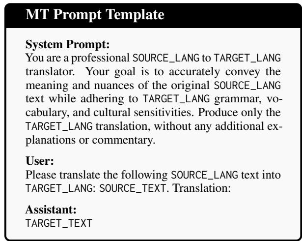  
Figure 8: Training and evaluation prompt template.

## B.2 Training Hyperparameters

Optimization. Full fine-tuning uses peak learning rate of $1 . 2 5 \times 1 0 ^ { - 5 } ,$ ; fused AdamW, a linear schedule with 1% warmup, gradient clipping at 1.0, and gradient checkpointing, with a global batch size of 256.

Data formatting. All training samples are first converted into the translation prompt format shown in Figure 8, and then wrapped with the modelspecific chat template. Sequences exceeding 2,048 tokens are filtered, and remaining samples are packed via best-fit decreasing.

Infrastructure. All experiments use PyTorch, HuggingFace Transformers, TRL, and DeepSpeed ZeRO-2 in bfloat16 on 32 NVIDIA H100 GPUs.

## C Catastrophic Forgetting Analysis

We further analyze whether the Asia-Europe Mix mitigates catastrophic forgetting on non-African languages without compromising African MT performance. The mix contains bidirectional parallel data between English and non-African languages, covering both Asian22 and European23 language groups.

Figure 9 shows that fine-tuning without the Asia-Europe Mix substantially degrades performance on Asian and European language pairs, indicating catastrophic forgetting outside the African training distribution. Adding the mix consistently reduces this degradation across all metrics and both language groups. For example, the MetricX-24 drop is reduced from −95.1% to −16.8% for Asian languages and from −81.0% to −6.7% for European languages. This retention does not come at the cost of Africa-IID performance: models with and without the Asia-Europe Mix achieve nearly identical gains on African language pairs across all metrics. We therefore retain the Asia-Europe Mix in the final TranslatePsy-AfriSLM recipe, not to improve African MT directly, but to preserve broader multilingual translation while maintaining the gains on the Africa-IID group.

<table><tr><td>AFRICA-OOD lang.</td><td>Flores-200</td><td>BOUQuET</td><td>Smol</td></tr><tr><td>Nigerian Pidgin (pcm)</td><td></td><td>√</td><td>√</td></tr><tr><td>Sudanese Arabic (apd)</td><td></td><td></td><td>√</td></tr><tr><td>Akan (aka)</td><td>√</td><td>√</td><td>√</td></tr><tr><td>Tamazight (ber) Kituba (ktu)</td><td>√</td><td>√</td><td>√ √</td></tr><tr><td>Bambara (bam)</td><td>√</td><td>√</td><td>√</td></tr><tr><td>Sepedi (nso)</td><td>√</td><td>√</td><td>√</td></tr><tr><td>Mooré (mos)</td><td>√</td><td>√</td><td>√</td></tr><tr><td># Langs.</td><td>5</td><td>6</td><td>8</td></tr><tr><td># Directions</td><td>10</td><td>12</td><td>16</td></tr></table>

Table 14: AFRICA-OOD language coverage by evaluation set. The number of directions counts both engto-xx and xx-to-eng directions.

## D Additional Results

## D.1 Per-Language Performance Analysis

Africa-IID Figure 10 shows per-language results on the Africa-IID BOUQuET benchmark, averaging scores over both eng-xx and xx-eng directions. TranslatePsy-AfriSLM-2B consistently improves over the Qwen3.5-2B baseline across the 19 indistribution languages and all four evaluation metrics. The largest gains appear for low-baseline languages such as Oromo, Malagasy, Lingala, Tswana, and Zulu, while Afrikaans shows smaller gains due to its stronger baseline.

Africa-OOD Figure 11 reports results for Africa-OOD languages held out from fine-tuning. Because Flores-200, BOUQuET, and Smol cover different subsets of OOD languages, scores are averaged over both directions and available evaluation sets, as summarized in Table 14. Although the OOD languages are held out from fine-tuning, TranslatePsy-AfriSLM-2B still improves overall performance, suggesting meaningful transfer beyond the languages seen during post-training. The strongest gains appear for Sepedi, Bambara, Akan, and Mooré, while improvements are smaller and more heterogeneous than in the IID setting, with some metric-specific regressions for Nigerian Pidgin, Sudanese Arabic, and Tamazight.

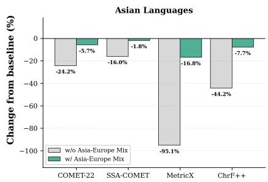

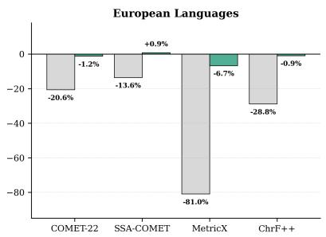

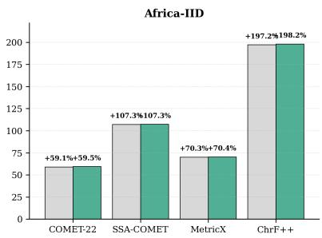  
Figure 9: Effect of the Asia-Europe Mix on catastrophic forgetting and Africa-IID performance. Bars show the percentage change from the Qwen3.5-2B baseline after SFT. The Asia-Europe Mix substantially reduces degradation on Asian and European language pairs while preserving nearly identical gains on the target Africa-IID pairs.

## D.2 Statistical Significance (Bootstrap)

We assess statistical significance using paired bootstrap resampling over sentence pairs. For each model pair, dataset, and metric, we align common translation directions, pair sentence-level scores, and draw $B = 1 0 , 0 0 0$ bootstrap samples with replacement. We report $\Delta$ as the mean score difference and compute $p$ as the fraction of bootstrap samples that do not support the observed direction of improvement. For MetricX, lower scores are better; for all other metrics, higher scores are better.

Table 16 shows that the main rankings are highly stable across benchmarks and metrics. TranslatePsy-AfriSLM-0.8B substantially outperforms the much larger general-purpose Qwen3.5- 122B on SSA-COMET, MetricX, and ChrF++, and remains competitive on COMET-22. It also consistently surpasses TranslateGemma-27B and AfriGemma-12B across all reported settings. Against NLLB, TranslatePsy-AfriSLM-0.8B is competitive but mixed, whereas TranslatePsy-AfriSLM-2B significantly outperforms both NLLB-1.3B and NLLB-3.3B across every benchmark– metric combination. Within the TranslatePsy-AfriSLM family, scaling from 0.8B to 2B and from 2B to 4B yields monotonic and statistically significant gains. Overall, the bootstrap results confirm that the observed improvements are stable under paired sentence-level resampling rather than being driven by evaluation noise.

<table><tr><td>Data Source</td><td>Configuration</td><td>Threshold</td><td>Tokens</td><td>Threshold</td><td>Tokens</td><td>Threshold</td><td>Tokens</td></tr><tr><td rowspan="4">Open-Source</td><td>threshold</td><td>-0.50</td><td>6.57B</td><td>0.00</td><td>3.79B</td><td>0.50</td><td>1.76B</td></tr><tr><td>threshold + top-N</td><td>-0.28</td><td>5.28B</td><td>0.16</td><td>2.88B</td><td>0.61</td><td>1.20B</td></tr><tr><td>threshold + bidirectional</td><td>-0.50</td><td>14.12B</td><td>0.00</td><td>7.86B</td><td>0.50</td><td>3.40B</td></tr><tr><td>threshold + top-N + bidirectional</td><td>-0.28</td><td>9.95B</td><td>0.16</td><td>5.15B</td><td>0.61</td><td>2.03B</td></tr><tr><td rowspan="4">Synthetic</td><td>threshold</td><td>0.68</td><td>16.75B</td><td>0.93</td><td>7.28B</td><td>1.19</td><td>2.80B</td></tr><tr><td>threshold + top-N</td><td>0.71</td><td>12.43B</td><td>0.93</td><td>4.49B</td><td>1.18</td><td>1.44B</td></tr><tr><td>threshold + bidirectional</td><td>0.68</td><td>32.37B</td><td>0.93</td><td>15.05B</td><td>1.19</td><td>6.16B</td></tr><tr><td>threshold + top-N + bidirectional</td><td>0.71</td><td>23.62B</td><td>0.93</td><td>9.09B</td><td>1.18</td><td>3.32B</td></tr><tr><td rowspan="4">Open-Source + Synthetic</td><td>threshold</td><td>0.41</td><td>23.32B</td><td>0.67</td><td>11.08B</td><td>0.97</td><td>4.56B</td></tr><tr><td>threshold + top-N</td><td>0.55</td><td>17.71B</td><td>0.78</td><td>7.37B</td><td>1.07</td><td>2.64B</td></tr><tr><td>threshold + bidirectional</td><td>0.41</td><td>46.49B</td><td>0.67</td><td>22.92B</td><td>0.97</td><td>9.56B</td></tr><tr><td>threshold + top-N + bidirectional</td><td>0.55</td><td>33.57B</td><td>0.78</td><td>14.24B</td><td>1.07</td><td>5.35B</td></tr></table>

Table 15: Threshold values and training token counts for each data source, configuration, and filtering level (for the datasets plotted in Figure 4). Since the threshold may vary depending on the data mix and language direction, and topN changes the effective threshold, the value shown is an average weighted by the number of example pairs at each actual threshold. The bolded configuration indicates the TranslatePsy-AfriSLM data mix used for final training.

COMET-22 (↑)  
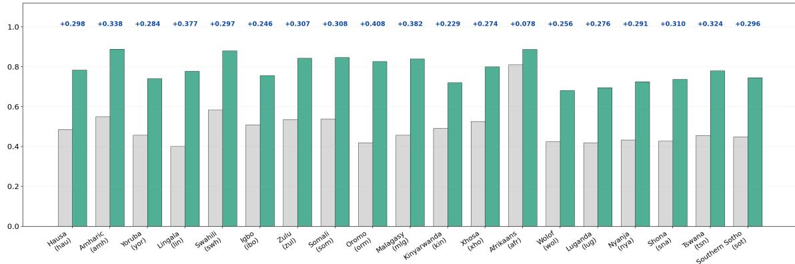  
SSA-COMET (↑)

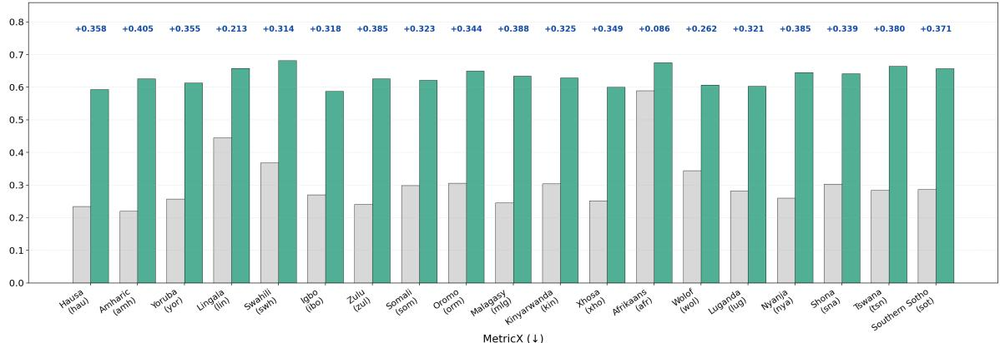  
MetricX (↓)

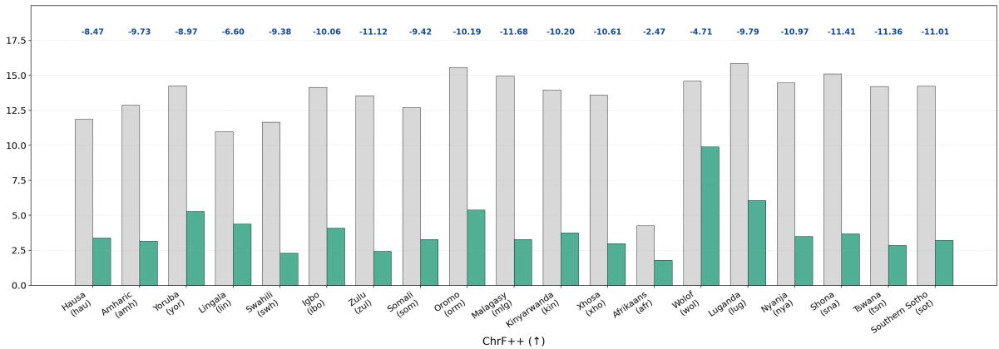

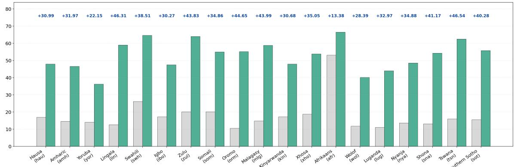

Figure 10: AFRICA-IID BOUQuET results. Per-language scores for 19 target African languages on BOUQuET, comparing Qwen3.5-2B and TranslatePsy-AfriSLM-2B across four evaluation metrics. Scores are averaged over both translation directions where available. ∆ = TranslatePsy-AfriSLM-2B − baseline model scores.

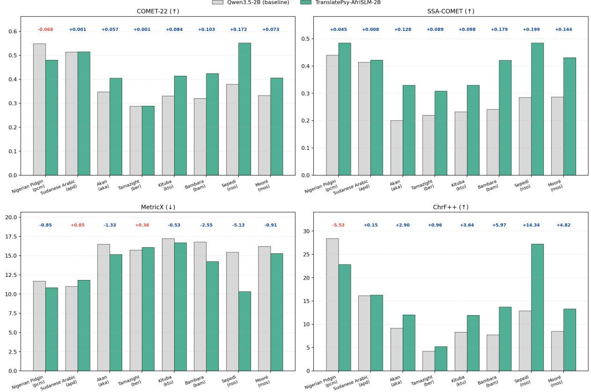  
Figure 11: AFRICA-OOD results across all evaluation metrics. Per-language scores for held-out African languages, comparing Qwen3.5-2B and TranslatePsy-AfriSLM-2B. Scores are averaged over both translation directions and over the available evaluation sets among Flores-200, BOUQuET, and Smol; language coverage differs by evaluation set as shown in Table 14. ∆ = TranslatePsy-AfriSLM-2B − baseline model scores.

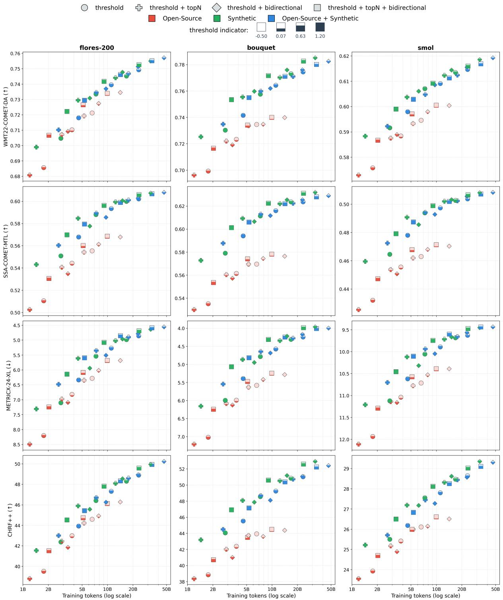  
Figure 12: Scaling runs as QE quality and training budgets increase, evaluated on Flores-200, BOUQuET, and Smol (columns). Each row reports a different metric, each point corresponds to a model trained with a particular data source and filtering configuration. Colours distinguish filtered, synthetic, and filtered+synthetic data, while marker shapes indicate the filtering setup. MetricX is lower-is-better; all other metrics are higher-is-better. Filtering thresholds are represented by an increasing fill, i.e. the fuller the shape, the higher the threshold.

<table><tr><td rowspan="2"></td><td rowspan="2">Metric</td><td colspan="2">FLORES-200</td><td colspan="2">BOUQuET</td><td colspan="2">SMOL</td></tr><tr><td>∆</td><td>p</td><td>∆</td><td>p</td><td>∆</td><td>p</td></tr><tr><td colspan="8">vs. General-purpose LLM</td></tr><tr><td>TranslatePsy-AfriSLM-0.8B vs. Qwen3.5-122B</td><td>COMET-22</td><td>-0.0001</td><td>0.452</td><td>+0.0135</td><td>&lt;0.001</td><td>+0.0017</td><td>&lt;0.001</td></tr><tr><td>TranslatePsy-AfriSLM-0.8B vs. Qwen3.5-122B</td><td>SSA-COMET</td><td>+0.0413</td><td>&lt;0.001 &lt;0.001</td><td>+0.0379 -0.723</td><td>&lt;0.001 &lt;0.001</td><td>+0.0286</td><td>&lt;0.001</td></tr><tr><td>TranslatePsy-AfriSLM-0.8B vs. Qwen3.5-122B TranslatePsy-AfriSLM-0.8B vs. Qwen3.5-122B</td><td>MetricX ChrF++</td><td>-0.548 +3.30</td><td>&lt;0.001</td><td>+5.33</td><td>&lt;0.001</td><td>-0.506 +1.29</td><td>&lt;0.001 &lt;0.001</td></tr><tr><td colspan="8">vs. Dedicated Translation</td></tr><tr><td>TranslatePsy-AfriSLM-0.8B vs. NLLB-1.3B</td><td>COMET-22</td><td>-0.0039</td><td></td><td>+0.0011</td><td>0.017</td><td></td><td></td></tr><tr><td>TranslatePsy-AfriSLM-0.8B vs. NLLB-1.3B</td><td>SSA-COMET</td><td>+0.0066</td><td>&lt;0.001 &lt;0.001</td><td>+0.0086</td><td>&lt;0.001</td><td>+0.0021 +0.0122</td><td>&lt;0.001 &lt;0.001</td></tr><tr><td>TranslatePsy-AfriSLM-0.8B vs. NLLB-1.3B</td><td>MetricX</td><td>+0.038</td><td>0.002</td><td>-0.154</td><td>&lt;0.001</td><td>-0.242</td><td>&lt;0.001</td></tr><tr><td>TranslatePsy-AfriSLM-0.8B vs. NLLB-1.3B</td><td>ChrF++</td><td>-0.40</td><td>&lt;0.001</td><td>+0.48</td><td>&lt;0.001</td><td>-0.01</td><td>0.395</td></tr><tr><td>TranslatePsy-AfriSLM-0.8B vs. NLLB-3.3B</td><td>COMET-22</td><td>-0.0093</td><td>&lt;0.001</td><td>+0.0064</td><td>&lt;0.001</td><td></td><td></td></tr><tr><td>TranslatePsy-AfriSLM-0.8B vs. NLLB-3.3B</td><td>SSA-COMET</td><td>+0.0000</td><td>0.483</td><td>+0.0133</td><td>&lt;0.001</td><td>+0.0011 +0.0124</td><td>0.002</td></tr><tr><td>TranslatePsy-AfriSLM-0.8B vs. NLLB-3.3B</td><td>MetricX</td><td>+0.284</td><td>&lt;0.001</td><td>-0.007</td><td>0.314</td><td>+0.004</td><td>&lt;0.001</td></tr><tr><td>TranslatePsy-AfriSLM-0.8B vs. NLLB-3.3B</td><td>ChrF++</td><td>-1.45</td><td>&lt;0.001</td><td>+0.12</td><td>0.101</td><td>-0.19</td><td>0.385 &lt;0.001</td></tr><tr><td>TranslatePsy-AfriSLM-2B vs. NLLB-1.3B</td><td>COMET-22</td><td></td><td>&lt;0.001</td><td>+0.0119</td><td></td><td></td><td></td></tr><tr><td>TranslatePsy-AfriSLM-2B vs. NLLB-1.3B</td><td>SSA-COMET</td><td>+0.0081 +0.0193</td><td>&lt;0.001</td><td>+0.0189</td><td>&lt;0.001 &lt;0.001</td><td>+0.0091</td><td>&lt;0.001</td></tr><tr><td>TranslatePsy-AfriSLM-2B vs. NLLB-1.3B</td><td>MetricX</td><td>-0.522</td><td>&lt;0.001</td><td>-0.565</td><td>&lt;0.001</td><td>+0.0227 -0.624</td><td>&lt;0.001</td></tr><tr><td>TranslatePsy-AfriSLM-2B vs. NLLB-1.3B</td><td>ChrF++</td><td>+1.28</td><td>&lt;0.001</td><td>+2.42</td><td>&lt;0.001</td><td>+0.75</td><td>&lt;0.001 &lt;0.001</td></tr><tr><td>TranslatePsy-AfriSLM-2B vs. NLLB-3.3B</td><td>COMET-22</td><td>+0.0027</td><td></td><td></td><td></td><td></td><td></td></tr><tr><td>TranslatePsy-AfriSLM-2B vs. NLLB-3.3B</td><td>SSA-COMET</td><td>+0.0126</td><td>&lt;0.001 &lt;0.001</td><td>+0.0172 +0.0237</td><td>&lt;0.001</td><td>+0.0081</td><td>&lt;0.001</td></tr><tr><td>TranslatePsy-AfriSLM-2B vs. NLLB-3.3B</td><td>MetricX</td><td>-0.276</td><td>&lt;0.001</td><td>-0.419</td><td>&lt;0.001</td><td>+0.0229</td><td>&lt;0.001</td></tr><tr><td>TranslatePsy-AfriSLM-2B vs. NLLB-3.3B</td><td>ChrF++</td><td>+0.24</td><td>&lt;0.001</td><td>+2.06</td><td>&lt;0.001</td><td>-0.378</td><td>&lt;0.001</td></tr><tr><td></td><td></td><td></td><td></td><td></td><td>&lt;0.001</td><td>+0.57</td><td>&lt;0.001</td></tr><tr><td>TranslatePsy-AfriSLM-0.8B vs. TGemma-27B</td><td>COMET-22</td><td>+0.0097</td><td>&lt;0.001</td><td>+0.0272</td><td>&lt;0.001</td><td>+0.0018</td><td>&lt;0.001</td></tr><tr><td>TranslatePsy-AfriSLM-0.8B vs. TGemma-27B</td><td>SSA-COMET</td><td>+0.0489</td><td>&lt;0.001</td><td>+0.0547</td><td>&lt;0.001</td><td>+0.0365</td><td>&lt;0.001</td></tr><tr><td>TranslatePsy-AfriSLM-0.8B vs. TGemma-27B TranslatePsy-AfriSLM-0.8B vs. TGemma-27B</td><td>MetricX ChrF++</td><td>-0.945</td><td>&lt;0.001</td><td>-1.190</td><td>&lt;0.001</td><td>-0.643</td><td>&lt;0.001</td></tr><tr><td></td><td></td><td>+5.08</td><td>&lt;0.001</td><td>+7.79</td><td>&lt;0.001</td><td>+2.33</td><td>&lt;0.001</td></tr><tr><td colspan="8">vs. African-Specialized</td></tr><tr><td>TranslatePsy-AfriSLM-0.8B vs. AfriGemma-12B</td><td>COMET-22</td><td>+0.0301</td><td>&lt;0.001</td><td>+0.0204</td><td></td><td></td><td></td></tr><tr><td>TranslatePsy-AfriSLM-0.8B vs. AfriGemma-12B</td><td>SSA-COMET</td><td>+0.0414</td><td>&lt;0.001</td><td>+0.0306</td><td>&lt;0.001 &lt;0.001</td><td>+0.0212</td><td>&lt;0.001</td></tr><tr><td>TranslatePsy-AfriSLM-0.8B vs. AfriGemma-12B</td><td>MetricX</td><td>-0.664</td><td>&lt;0.001</td><td>-0.531</td><td>&lt;0.001</td><td>+0.0284 -0.444</td><td>&lt;0.001</td></tr><tr><td>TranslatePsy-AfriSLM-0.8B vs. AfriGemma-12B</td><td>ChrF++</td><td>+3.57</td><td>&lt;0.001</td><td>+3.19</td><td>&lt;0.001</td><td>+2.03</td><td>&lt;0.001 &lt;0.001</td></tr><tr><td colspan="8">Scaling Effect</td></tr><tr><td>TranslatePsy-AfriSLM-4B vs. TranslatePsy-AfriSLM-2B</td><td>COMET-22</td><td>+0.0077</td><td></td><td></td><td></td><td></td><td></td></tr><tr><td>TranslatePsy-AfriSLM-4B vs. TranslatePsy-AfriSLM-2B</td><td>SSA-COMET</td><td>+0.0073</td><td>&lt;0.001 &lt;0.001</td><td>+0.0080 +0.0071</td><td>&lt;0.001 &lt;0.001</td><td>+0.0059 +0.0063</td><td>&lt;0.001</td></tr><tr><td>TranslatePsy-AfriSLM-4B vs. TranslatePsy-AfriSLM-2B</td><td>MetricX</td><td>-0.320</td><td>&lt;0.001</td><td>-0.287</td><td>&lt;0.001</td><td>-0.260</td><td>&lt;0.001 &lt;0.001</td></tr><tr><td>TranslatePsy-AfriSLM-4B vs. TranslatePsy-AfriSLM-2B</td><td>ChrF++</td><td>+1.14</td><td>&lt;0.001</td><td>+1.33</td><td>&lt;0.001</td><td>+0.65</td><td>&lt;0.001</td></tr><tr><td>TranslatePsy-AfriSLM-2B vs. TranslatePsy-AfriSLM-0.8B</td><td>COMET-22</td><td></td><td></td><td></td><td></td><td></td><td></td></tr><tr><td>TranslatePsy-AfriSLM-2B vs. TranslatePsy-AfriSLM-0.8B</td><td>SSA-COMET</td><td>+0.0120 +0.0126</td><td>&lt;0.001 &lt;0.001</td><td>+0.0116</td><td>&lt;0.001 &lt;0.001</td><td>+0.0085</td><td>&lt;0.001</td></tr><tr><td>TranslatePsy-AfriSLM-2B vs. TranslatePsy-AfriSLM-0.8B</td><td>MetricX</td><td>-0.560</td><td>&lt;0.001</td><td>+0.0163 -0.552</td><td>&lt;0.001</td><td>+0.0152</td><td>&lt;0.001</td></tr><tr><td>TranslatePsy-AfriSLM-2B vs. TranslatePsy-AfriSLM-0.8B</td><td>ChrF++</td><td>+1.68</td><td>&lt;0.001</td><td>+1.96</td><td>&lt;0.001</td><td>-0.441 +0.83</td><td>&lt;0.001 &lt;0.001</td></tr><tr><td></td><td></td><td></td><td></td><td></td><td></td><td></td><td></td></tr><tr><td>TranslatePsy-AfriSLM-4B vs. TranslatePsy-AfriSLM-0.8B</td><td>COMET-22</td><td>+0.0197</td><td>&lt;0.001</td><td>+0.0196</td><td>&lt;0.001</td><td>+0.0143</td><td>&lt;0.001</td></tr><tr><td>TranslatePsy-AfriSLM-4B vs. TranslatePsy-AfriSLM-0.8B TranslatePsy-AfriSLM-4B vs. TranslatePsy-AfriSLM-0.8B</td><td>SSA-COMET MetricX</td><td>+0.0199 -0.880</td><td>&lt;0.001 &lt;0.001</td><td>+0.0234 -0.840</td><td>&lt;0.001 &lt;0.001</td><td>+0.0214 -0.701</td><td>&lt;0.001 &lt;0.001</td></tr><tr><td></td><td></td><td></td><td></td><td></td><td></td><td></td><td></td></tr><tr><td>TranslatePsy-AfriSLM-4B vs. TranslatePsy-AfriSLM-0.8B</td><td>ChrF++</td><td>+2.82</td><td>&lt;0.001</td><td>+3.29</td><td>&lt;0.001</td><td>+1.49</td><td>&lt;0.001</td></tr></table>

Table 16: Paired bootstrap significance tests (B = 10,000). ∆ = score difference (ours − baseline). Baseline comparisons use 0.8B models. Blue $\Delta = \mathrm { o u r s }$ better; red = ours worse (MetricX: lower is better, negative ∆ is blue).

<table><tr><td rowspan="2">Model</td><td colspan="2">Flores-200</td><td colspan="2">BOUQuET</td><td colspan="2">Smol</td></tr><tr><td>SSA (↑)</td><td>MX (↓)</td><td>SSA (↑)</td><td>MX (↓)</td><td>SSA (↑)</td><td>MX (↓)</td></tr><tr><td colspan="7">General-purpose LLMs/SLMs</td></tr><tr><td>Apertus-8B</td><td>0.3814</td><td>11.471</td><td>0.4024</td><td>10.385</td><td>0.3246</td><td>14.233</td></tr><tr><td>Qwen3-4B</td><td>0.2426</td><td>15.427</td><td>0.2565</td><td>14.772</td><td>0.2117</td><td>17.273</td></tr><tr><td>Qwen3-8B</td><td>0.2655</td><td>15.327</td><td>0.2760</td><td>14.725</td><td>0.2275</td><td>17.336</td></tr><tr><td>Qwen3.5-0.8B</td><td>0.2967</td><td>15.974</td><td>0.3320</td><td>14.902</td><td>0.2454</td><td>17.595</td></tr><tr><td>Qwen3.5-2B</td><td>0.2885</td><td>14.344</td><td>0.3049</td><td>13.317</td><td>0.2498</td><td>15.926</td></tr><tr><td>Qwen3.5-4B</td><td>0.3863</td><td>11.416</td><td>0.3984</td><td>10.567</td><td>0.3301</td><td>13.868</td></tr><tr><td>Qwen3.5-9B</td><td>0.4523</td><td>9.758</td><td>0.4664</td><td>8.927</td><td>0.3811</td><td>13.216</td></tr><tr><td>Qwen3.5-27B</td><td>0.5132</td><td>7.250</td><td>0.5336</td><td>6.468</td><td>0.4279</td><td>11.420</td></tr><tr><td>Qwen3.5-122B-A10B</td><td>0.5505</td><td>5.920</td><td>0.5716</td><td>5.318</td><td>0.4574</td><td>10.515</td></tr><tr><td colspan="7">Dedicated translation models</td></tr><tr><td>AfriNLLB-600M</td><td>0.5729</td><td>5.916</td><td>0.6038</td><td>4.831</td><td>0.4748</td><td>10.476</td></tr><tr><td>NLLB-600M</td><td>0.5718</td><td>5.752</td><td>0.6019</td><td>4.803</td><td>0.4723</td><td>10.430</td></tr><tr><td>NLLB-1.3B</td><td>0.5878</td><td>5.159</td><td>0.6130</td><td>4.448</td><td>0.4850</td><td>10.036</td></tr><tr><td>NLLB-3.3B</td><td>0.5944</td><td>4.913</td><td>0.6178</td><td>4.264</td><td>0.4909</td><td>9.841</td></tr><tr><td>Hunyuan-MT-7B</td><td>0.4450</td><td>10.779</td><td>0.4451</td><td>10.659</td><td>0.3784</td><td>13.949</td></tr><tr><td>TranslateGemma-4B</td><td>0.3913</td><td>11.086</td><td>0.4069</td><td>10.219</td><td>0.3384</td><td>14.000</td></tr><tr><td>TranslateGemma-12B</td><td>0.5037</td><td>7.718</td><td>0.5228</td><td>6.926</td><td>0.4299</td><td>11.501</td></tr><tr><td>TranslateGemma-27B</td><td>0.5455</td><td>6.142</td><td>0.5677</td><td>5.506</td><td>0.4608</td><td>10.468</td></tr><tr><td colspan="7">African language-specialized models</td></tr><tr><td>AfriqueLlama-8B</td><td>0.5210</td><td>7.057</td><td>0.5620</td><td>5.679</td><td>0.4423</td><td>10.974</td></tr><tr><td>AfriqueGemma-4B</td><td>0.5276</td><td>6.692</td><td>0.5587</td><td>5.716</td><td>0.4410</td><td>10.938</td></tr><tr><td>AfriqueGemma-12B</td><td>0.5531</td><td>5.862</td><td>0.5805</td><td>5.093</td><td>0.4608</td><td>10.397</td></tr><tr><td>AfriqueQwen-8B</td><td>0.5222</td><td>6.871</td><td>0.5549</td><td>5.748</td><td>0.4394</td><td>10.959</td></tr><tr><td>AfriqueQwen-14B</td><td>0.5443</td><td>6.243</td><td>0.5718</td><td>5.408</td><td>0.4527</td><td>10.748</td></tr><tr><td colspan="7">Ours</td></tr><tr><td>TranslatePsy-AfriSLM-0.8B</td><td>0.5944</td><td>5.197</td><td>0.6223</td><td>4.316</td><td>0.4973</td><td>9.823</td></tr><tr><td>TranslatePsy-AfriSLM-2B</td><td>0.6070</td><td>4.637</td><td>0.6322</td><td>3.940</td><td>0.5074</td><td>9.458</td></tr><tr><td>TranslatePsy-AfriSLM-4B</td><td>0.6143</td><td>4.317</td><td>0.6391</td><td>3.701</td><td>0.5136</td><td>9.232</td></tr></table>

Table 17: SSA-COMET and MetricX results on Flores-200, BOUQuET, and Smol.

<table><tr><td rowspan="2">Model</td><td colspan="2">Flores-200</td><td colspan="2">BOUQuET</td><td colspan="2">Smol</td></tr><tr><td>C22 (↑)</td><td>ChrF++ (↑)</td><td>C22 (↑)</td><td>ChrF++(↑)</td><td>C22 (↑)</td><td>ChrF++ (↑)</td></tr><tr><td colspan="7">General-purpose LLMs</td></tr><tr><td>Apertus-8B</td><td>0.5883</td><td>30.45</td><td>0.6025</td><td>27.84</td><td>0.4912</td><td>18.02</td></tr><tr><td>Qwen3-4B</td><td>0.4046</td><td>17.34</td><td>0.4305</td><td>14.25</td><td>0.3607</td><td>10.74</td></tr><tr><td>Qwen3-8B</td><td>0.4566</td><td>20.64</td><td>0.4792</td><td>17.29</td><td>0.4002</td><td>12.50</td></tr><tr><td>Qwen3.5-0.8B</td><td>0.3656</td><td>14.02</td><td>0.3920</td><td>11.17</td><td>0.3255</td><td>8.60</td></tr><tr><td>Qwen3.5-2B</td><td>0.4724</td><td>20.95</td><td>0.4934</td><td>17.82</td><td>0.4143</td><td>12.90</td></tr><tr><td>Qwen3.5-4B</td><td>0.6021</td><td>30.58</td><td>0.6122</td><td>27.87</td><td>0.5103</td><td>18.59</td></tr><tr><td>Qwen3.5-9B</td><td>0.6688</td><td>36.73</td><td>0.6801</td><td>34.96</td><td>0.5566</td><td>22.19</td></tr><tr><td>Qwen3.5-27B</td><td>0.7144</td><td>41.76</td><td>0.7264</td><td>41.22</td><td>0.5859</td><td>24.93</td></tr><tr><td>Qwen3.5-122B-A10B</td><td>0.7373</td><td>44.42</td><td>0.7494</td><td>44.32</td><td>0.6045</td><td>26.68</td></tr><tr><td colspan="7">Dedicated translation models</td></tr><tr><td>AfriNLLB-600M</td><td>0.7315</td><td>47.67</td><td>0.7671</td><td>49.81</td><td>0.6008</td><td>28.38</td></tr><tr><td>NLLB-600M</td><td>0.7340</td><td>46.81</td><td>0.7654</td><td>49.03</td><td>0.6028</td><td>27.68</td></tr><tr><td>NLLB-1.3B</td><td>0.7471</td><td>48.72</td><td>0.7753</td><td>50.77</td><td>0.6101</td><td>28.52</td></tr><tr><td>NLLB-3.3B</td><td>0.7525</td><td>49.79</td><td>0.7795</td><td>52.36</td><td>0.6139</td><td>29.03</td></tr><tr><td>Hunyuan-MT-7B</td><td>0.5056</td><td>23.49</td><td>0.5211</td><td>19.55</td><td>0.4391</td><td>15.48</td></tr><tr><td>TranslateGemma-4B</td><td>0.5487</td><td>24.78</td><td>0.5699</td><td>23.12</td><td>0.4644</td><td>15.21</td></tr><tr><td>TranslateGemma-12B</td><td>0.7125</td><td>39.48</td><td>0.7211</td><td>38.92</td><td>0.5983</td><td>24.55</td></tr><tr><td>TranslateGemma-27B</td><td>0.7335</td><td>43.32</td><td>0.7499</td><td>43.70</td><td>0.6102</td><td>26.24</td></tr><tr><td colspan="7">African language-specialized models</td></tr><tr><td>AfriqueLlama-8B</td><td>0.6689</td><td>37.59</td><td>0.7179</td><td>41.58</td><td>0.5630</td><td>23.03</td></tr><tr><td>AfriqueGemma-4B</td><td>0.6916</td><td>40.74</td><td>0.7223</td><td>42.49</td><td>0.5688</td><td>23.60</td></tr><tr><td>AfriqueGemma-12B</td><td>0.7131</td><td>44.52</td><td>0.7429</td><td>46.26</td><td>0.5847</td><td>25.94</td></tr><tr><td>AfriqueQwen-8B</td><td>0.6754</td><td>38.23</td><td>0.7168</td><td>41.08</td><td>0.5659</td><td>23.06</td></tr><tr><td>AfriqueQwen-14B</td><td>0.6955</td><td>41.58</td><td>0.7297</td><td>43.69</td><td>0.5754</td><td>24.64</td></tr><tr><td colspan="7">Ours</td></tr><tr><td>TranslatePsy-AfriSLM-0.8B</td><td>0.7432</td><td>48.30</td><td>0.7770</td><td>51.30</td><td>0.6120</td><td>28.54</td></tr><tr><td>TranslatePsy-AfriSLM-2B</td><td>0.7552</td><td>50.00</td><td>0.7870</td><td>53.13</td><td>0.6187</td><td>29.32</td></tr><tr><td>TranslatePsy-AfriSLM-4B</td><td>0.7629</td><td>51.13</td><td>0.7941</td><td>54.33</td><td>0.6237</td><td>29.97</td></tr></table>

Table 18: COMET-22 and ChrF++ results on Flores-200, BOUQuET and Smol.

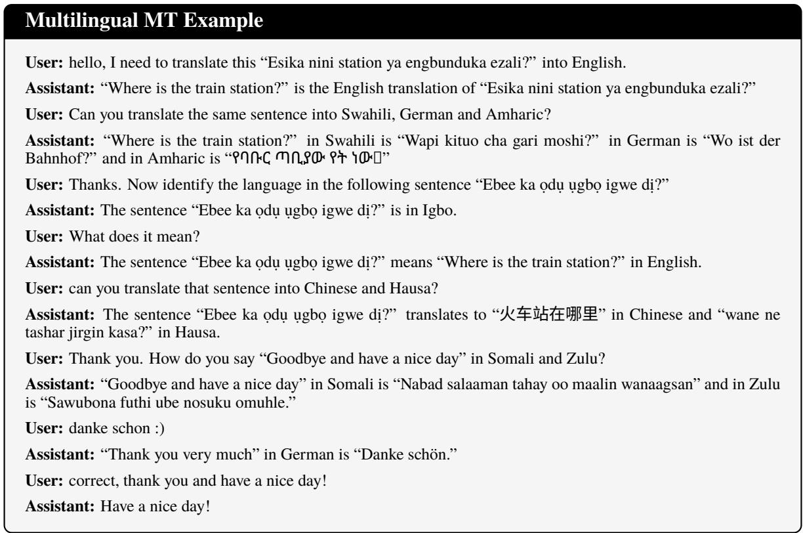  
Figure 13: Multi-turn, conversational, cross-lingual translation and identification (TranslatePsy-AfriSLM-4B).