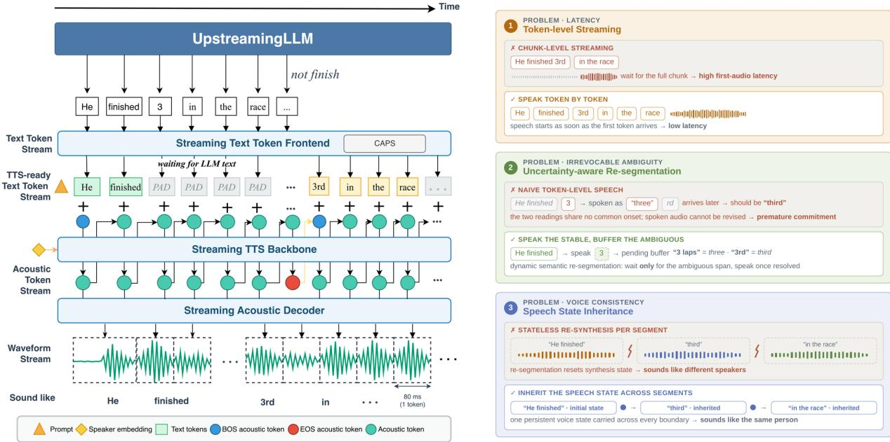
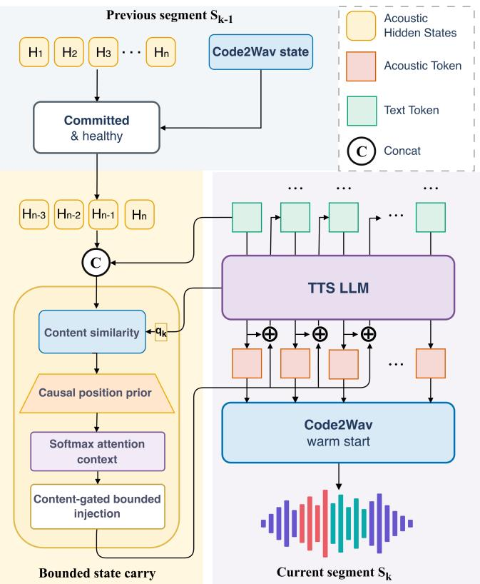
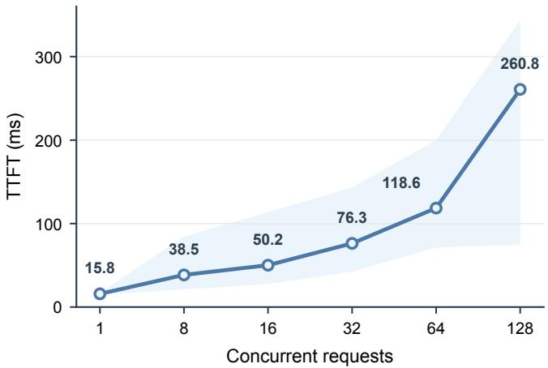

# X2STREAMING-TTS: CAUSAL TOKEN-LEVEL TEXT-TO-SPEECH FROM STREAMING TEXT WITH SPEECH-STATE INHERITANCE

A PREPRINT

Rime Wen∗, Zehan Liu∗, Shawn Qin, Lights Shi, Roy Gan, Hao Wang†, Qian Wang

X Square Robot

∗These authors contributed equally. †Corresponding author.

## ABSTRACT

Streaming text-to-speech is essential for low-latency spoken dialogue systems, yet many systems wait for sentence-level text and are therefore only pseudo-streaming. True token-level synthesis must generate speech from uncertain prefixes while maintaining perceptual continuity over an unbounded stream with bounded context. We present X2Streaming-TTS, a causal TTS framework that consumes asynchronously arriving text tokens and emits speech without accessing future input. To handle uncertain prefixes, we introduce causal commitment, which keeps ambiguous expressions provisional through uncertainty-aware buffering and performs capacity-adaptive, punctuation-aware segmentation. To preserve acoustic continuity, we further introduce causal speech-state inheritance, which carries the complete Code2Wav state and selected historical Talker states across segment boundaries. Together with an attention prior constraint, it blocks access to future positions while retaining bounded acoustic context. Experiments show that X2Streaming-TTS outperforms existing pseudo-streaming models on most subjective and objective metrics. Further analysis shows that causal commitment stabilizes online segmentation and reduces failures caused by insufficient context, while speech-state inheritance improves boundary continuity without degrading naturalness or speaker identity. X2Streaming-TTS thus achieves strict token-level synthesis with quality comparable to the evaluated offline baselines, a median time to first audio token (TTFT) of 15.8 ms for a single request, and a median TTFT of 260.8 ms at 128 concurrent requests. Our implementation is publicly available at https://github.com/X-Square-Robot/X2Streaming-TTS.

## 1 Introduction

Once speech is played, it cannot be revised. When text is generated token by token by an upstream language model, this irreversibility becomes a fundamental constraint rather than merely an engineering concern: the TTS system must decide when to speak based solely on the observed text prefix, while future tokens cannot alter audio that has already been delivered. For example, suppose the language model has emitted the prefix He finished 3. It may subsequently become He finished 3 laps, in which 3 is pronounced as three, or He finished 3rd, in which it is pronounced as third. Although the two pronunciations begin similarly, they diverge before either word is complete. A system that has already emitted three therefore cannot revise it into third. Offline synthesis does not encounter this decision, nor does a system that buffers an entire sentence before synthesizing it, because the relevant text has already been fixed in both cases.

Three requirements that are straightforward in offline TTS become difficult to satisfy simultaneously in token-level streaming. First, pronunciation: incomplete numbers, units, and symbols may be reinterpreted by characters that arrive after they have already been voiced. Second, breathing room: speakers pause where permitted by the language, but punctuation-only segmentation produces numerous short segments that expend the generation budget on repeated stopping and restarting, whereas a fixed window fills the budget by cutting at positions unrelated to linguistic structure.

Third, continuation: a segment generated from silence must re-establish pitch and timbre from scratch, making the resulting seam perceptible.

Taken together, these three challenges show that token-level streaming is not merely a matter of reducing first-audio latency. More fundamentally, it requires the system to make irreversible commitments under partial observability: each decision produces output that cannot be revised, even though its correctness may depend on information that has not yet arrived. Simultaneous translation emits target words before the source sentence ends (Ma et al., 2019a,b), streaming recognition displays partial hypotheses (Graves, 2012; Shi et al., 2020), and long-video generation cannot re-render frames it has produced (Henschel et al., 2024; Yin et al., 2025). All share one structure: when may I commit, and how do I continue the state I have produced.

We address these questions for streaming speech synthesis with two complementary mechanisms. Causal commitment governs decisions up to and including segment closure, whereas causal speech-state inheritance governs state propagation across segment boundaries. Removing either mechanism leaves an observable deficiency: without speech-state inheritance, a measurable pitch discontinuity appears at segment boundaries; without causal commitment, generation may exhaust its capacity and force segmentation at linguistically inappropriate positions. Figure 1 maps these challenges onto the synthesis pipeline: the left panel traces token-level text release and audio generation, while the right panel shows first-audio latency, irreversible commitment under prefix ambiguity, and cross-segment discontinuity together with the mechanisms that address them. A streaming frontend determines which observed text can be released, the Talker converts the released text into discrete acoustic tokens, and Code2Wav decodes these tokens into a waveform. Causal commitment determines when the current segment closes, while causal speech-state inheritance determines the state from which the next segment continues. Our contributions are as follows:

• We introduce a causal-commitment mechanism that keeps ambiguous numbers, units, and symbols provisional until their pronunciations are resolved, while formulating capacity and boundary admission as a unified constrained segmentation problem.

• We introduce a causal speech-state inheritance mechanism that transfers the complete waveform-decoder state and a fixed number of acoustic states through two independent paths, using a fixed causal prior that assigns zero weight to future positions and an explicitly bounded residual.

• We develop an end-to-end causal TTS system that integrates these two mechanisms to perform strict tokenlevel synthesis without access to future text. Experimental results demonstrate synthesis quality comparable to that of the evaluated offline baselines. Median time to first audio token (TTFT) is 15.8 ms for a single request and 260.8 ms at 128 concurrent requests.

## 2 Related Work

We organize prior work by the text context available at synthesis onset and by how systems handle boundary selection, acoustic capacity, and cross-segment state.

Fully observed text, streaming audio out. These methods begin synthesis after a complete sentence becomes available and reduce output latency through autoregressive acoustic generation, causal or chunk-aware decoding, and streaming vocoders (Du et al., 2024a,b, 2025; Xie et al., 2025; Kong, Kim, and Bae, 2020; Siuzdak, 2023). They build on discrete audio codecs (Zeghidour et al., 2021; Defossez et al., 2022) and language-model-based zero-shot´ TTS architectures (Wang et al., 2023; Łajszczak et al., 2024; Ye et al., 2025; Chen et al., 2024). Although they enable concurrent audio generation and playback, waiting for a complete sentence introduces input-side latency and does not address pronunciation or segmentation under uncertain text prefixes.

Streaming text with limited lookahead. LiveSpeech, SyncSpeech, and SpeakStream reduce the required context through fixed lookahead, token-synchronous decoding, and text–speech interleaving (Dang et al., 2024; Sheng et al., 2025; Bai et al., 2025). Related work has also investigated prosodic-boundary and pause prediction (Dai et al., 2022; Yang et al., 2023, 2025). Boundary-aware streaming generation (Liu et al., 2026) uses limited future words, boundary post-training, and a bounded sliding prompt, while MagpieTTS-LF (Ghosh et al., 2026) combines punctuation-aware chunks, historical text, attention-tracking states, and an inference-time soft prior. These methods reduce sentence-level waiting but still depend on future tokens, so their latency remains coupled to the upstream generation rate and they do not satisfy strict zero-lookahead causality.

Segmentation without acoustic cost. Standalone text segmenters (Frohmann et al., 2024) can identify linguistically appropriate boundaries but do not account for acoustic generation costs. A suitable boundary may therefore appear only after the acoustic budget has been exhausted. We use SaT-3L, which accesses up to 48 future subwords, only as a boundary-quality reference. Moreover, text segmentation does not define what speech state should be transferred across a boundary and therefore cannot ensure cross-segment continuity.

  
Figure 1: Left: Streaming pipeline under token-level arrival. The frontend releases only TTS-ready text (PAD when nothing is ready; ambiguous spans such as 3 in He finished 3 are held until pronunciation is resolved), the Talker emits acoustic tokens, and Code2Wav streams waveform for immediate playback. Right: Three challenges and the corresponding mechanisms—(1) first-audio latency via token-level rather than chunk-level start; (2) irreversible early commitment via uncertainty-aware buffering; (3) cross-segment discontinuity via speech-state inheritance.

Existing methods thus wait for complete text, rely on future context, or ignore acoustic capacity and cross-segment state; our approach instead couples linguistic readiness with acoustic cost under strict causality and transfers bounded speech state across committed boundaries.

## 3 X2Streaming-TTS

Zero lookahead is affordable because text is information-dense, whereas speech is temporally redundant. We quantify this difference using the acoustic-to-text expansion ratio $\rho ,$ defined as the number of autoregressive acoustic decoding steps per text token. For a completed segment $S _ { k }$ containing $n _ { k }$ text tokens and requiring $A _ { k }$ acoustic decoding steps, its realized expansion ratio is $\rho _ { k } = A _ { k } / n _ { k }$ . Because $\rho _ { k }$ is typically well above one, voicing the currently available text provides time for subsequent tokens to arrive. Lookahead-based methods consume future text and therefore require the upstream model to wait. In contrast, our method exploits the time already available on the acoustic side. After each completed segment, the system updates an online estimate $\widehat { \rho } _ { k }$ , turning the question “when may I speak” into a causal admission test. Let τ denote wall-clock time, and let $N ( \tau )$ be the number of text tokens observed by time τ. Let $y _ { u }$ denote the u-th discrete acoustic token, generated at time $\tau _ { u } .$ , and let $h _ { k - 1 }$ denote the speech state inherited from the preceding segment. Strict causality requires

$$
y _ { u } \perp x _ { N ( \tau _ { u } ) + 1 : } \mid x _ { 1 : N ( \tau _ { u } ) } , y _ { < u } , h _ { k - 1 } ,\tag{1}
$$

that is, an acoustic token may depend only on the text observed before its generation time, previously generated acoustic tokens, and inherited speech state. Implementing this constraint requires a backbone with three properties: countable acoustic output, transferable decoding state, and observable remaining capacity. Qwen3-TTS (Hu et al., 2026) provides all three. Its Talker emits countable discrete acoustic tokens, its Code2Wav module maintains a waveform-decoder state decoupled from the linguistic component, and its KV-cache-aware decoder exposes the remaining capacity in cache positions.

## 3.1 Causal Commitment

Causal commitment determines which portion of the arrived text can be irreversibly released for synthesis and when the current segment should be closed. It consists of two coupled components. Uncertainty-aware semantic readiness prevents expressions whose pronunciations may still change from being released prematurely, while capacity-adaptive punctuation-aware segmentation closes the released prefix before the acoustic generation budget is exhausted.

## 3.1.1 Uncertainty-Aware Semantic Readiness

Let $X _ { t } = x _ { 1 : t }$ denote the text observed after the arrival of token $x _ { t }$ . The frontend maintains a pending suffix $U _ { t }$ whose pronunciation may still be altered by future tokens. Let ⊕ denote token-sequence concatenation. Upon receiving $x _ { t } ,$ the frontend partitions the buffered text as

$$
U _ { t - 1 } \oplus x _ { t } = E _ { t } \oplus U _ { t } ,\tag{2}
$$

where $E _ { t }$ is the longest newly eligible prefix and $U _ { t }$ is the remaining unresolved suffix. Deterministic closure rules cover numbers, units, symbols, abbreviations, and punctuation. A span is released only when no continuation admit ted by these rules can change its pronunciation; once released, it is never revised. For example, after observing He finished $^ { 3 , }$ the frontend retains 3 in $U _ { t }$ . When subsequent tokens resolve the expression, the complete span is normalized and released atomically, ensuring that the acoustic model never receives a partial normalization. At the end of input, any remaining suffix is treated as closed and normalized using the same rules. Because both $E _ { t }$ and $U _ { t }$ depend only on $X _ { t }$ , this procedure is strictly causal. Semantic readiness and capacity control operate sequentially. Only ready, normalized units are admitted to the active TTS segment, while $U _ { t }$ remains outside it. If the active segment approaches its estimated capacity before $U _ { t }$ is resolved, the system closes the preceding stable prefix without splitting the unresolved expression. Once resolved, the expression is admitted atomically to the current segment if sufficient capacity remains, or otherwise to the next segment. Thus, semantic readiness determines what may be committed, whereas capacity-adaptive segmentation determines when the active segment must close.

## 3.1.2 Capacity-Adaptive Punctuation-Aware Segmentation

Problem and offline reference. Let $x _ { 1 : n }$ be the text tokens. A boundary after $x _ { i }$ has type $q _ { i } \in \{ 1 , 2 , 3 , H a r d \}$ where tiers 1–3 denote sentence-final, clause-level, and weaker punctuation, respectively, and Hard means a hard non-punctuation break, with $0 \leq c ( 1 ) < c ( 2 ) < c ( 3 ) < c ( H a r d ) . \mathrm { A }$ partition $\pi = ( 0 = b _ { 0 } < \cdots < b _ { m } = n )$ induces segments $S _ { k } = x _ { b _ { k - 1 } + 1 : b _ { k } }$ . Given synthesis context $\xi ,$ let $G ( S ; \xi )$ denote the realized KV-cache footprint of segment $S ,$ measured in cache positions, and let B denote the usable cache capacity. Let $\lambda _ { \mathrm { s e g } } \geq 0$ be the penalty associated with creating an additional segment. The hindsight problem is

$$
\begin{array} { r } { \pi _ { \mathrm { o f f } } ^ { \star } \in \arg \operatorname* { m i n } _ { \pi } \left\{ \lambda _ { \mathrm { s e g } } m + \displaystyle \sum _ { k = 1 } ^ { m - 1 } c ( q _ { b _ { k } } ) \right\} } \\ { \mathrm { s . t . ~ } ~ G ( S _ { k } ; \xi ) \leq B ~ \forall k . } \end{array}\tag{3}
$$

The natural end has no boundary penalty, and streaming latency is evaluated separately. If span cost and feasibility depend only on its endpoints, the exact offline solution follows from

$$
V ( 0 ) = 0 , \nonumber\tag{4}
$$

Backtracking returns the optimal boundaries. This takes $O ( n ^ { 2 } )$ time, or $O ( n C )$ if a segment contains at most C tokens. If inherited state affects feasibility, it must be included in the DP state. In evaluation, we use either measured G or one frozen resource predictor in the feasibility test.

Delayed-feedback capacity adaptation. For a completed segment $S _ { k }$ of length $n _ { k }$ , let $P _ { k }$ be the cache length at autoregressive decoding onset and $A _ { k }$ the subsequent decoding length, including EOS and draining; hence $G ( S _ { k } ; \xi ) =$ $P _ { k } + A _ { k }$ . CAPS updates the projected EMA

$$
\widehat { \rho } _ { k + 1 } = \Pi _ { [ \rho _ { \operatorname* { m i n } } , \rho _ { \operatorname* { m a x } } ] } \left( ( 1 - \beta _ { k } ) \widehat { \rho } _ { k } + \beta _ { k } \frac { A _ { k } } { n _ { k } } \right) ,\tag{5}
$$

where a larger $\beta _ { k }$ can be used after an overflow. With prefill estimate $\widehat { P } _ { k }$ and headroom R, it uses

$$
\widehat { G } _ { k } ( S ; \xi ) = \widehat { P } _ { k } + \widehat { \rho } _ { k } | S | , \qquad \widehat { C } _ { k } = \left\lfloor \frac { B - R - \widehat { P } _ { k } } { \widehat { \rho } _ { k } } \right\rfloor .\tag{6}
$$

Here, $\widehat { C } _ { k }$ is the predicted text-token capacity of segment k, namely the maximum number of tokens CAPS allows before a forced split under the current resource estimate. We assume $B - R - \widehat { P } _ { k } \geq \widehat { \rho } _ { k } \geq 1$ . When a segment opens, its estimate, capacity, and thresholds are frozen; feedback affects only segments opened afterward.

Causal punctuation-aware rule. Choose $0 < \alpha _ { 1 } \leq \alpha _ { 2 } \leq \alpha _ { 3 } \leq 1$ and define

$$
T _ { \ell , k } = \left\lceil \alpha _ { \ell } \widehat { C } _ { k } \right\rceil , \qquad \ell \in \{ 1 , 2 , 3 \} .
$$

After appending $x _ { t }$ , let $L _ { t }$ denote the number of text tokens in the active segment. CAPS closes the segment after $x _ { t }$ if and only if

$$
\left[ \bigvee _ { \ell = 1 } ^ { 3 } \left\{ q _ { t } = \ell \wedge L _ { t } \geq T _ { \ell , k } \right\} \right] \quad \mathrm { o r } \quad L _ { t } \geq \widehat { C } _ { k } .\tag{7}
$$

The second condition implements a tier-4 hard boundary when no eligible punctuation boundary is encountered before capacity is reached.

Fragmentation bound and scope. To analyze the number of segments, suppose that each segment can contain at most $C$ tokens. A sequence of n tokens then requires at least

$$
m _ { C } ^ { \star } = \left\lceil \frac { n } { C } \right\rceil
$$

segments, and this minimum is achieved by cutting after every C tokens. Under the CAPS stopping rule, every nonfinal segment contains at least $\lceil \alpha _ { 1 } C \rceil$ tokens.

Theorem 1 (Fragmentation bound). $I f \widehat { C } _ { k } = C$ for all k and every non-final segment is closed by $E q . ( 7 )$ , then

$$
m _ { \mathrm { C A P S } } \leq \frac { C } { \lceil \alpha _ { 1 } C \rceil } m _ { C } ^ { \star } + 1 \leq \frac { 1 } { \alpha _ { 1 } } m _ { C } ^ { \star } + 1 .\tag{8}
$$

Proof. Let $L = \lceil \alpha _ { 1 } C \rceil$ . CAPS has $m _ { \mathrm { C A P S } } - 1$ non-final segments, each containing at least L tokens, so $( m _ { \mathrm { C A P S } } \mathrm { ~ - ~ }$ 1) $| L \leq n$ . The benchmark has $m _ { C } ^ { \star }$ segments, each holding at most $C$ tokens, so $n \leq C m _ { C } ^ { \star }$ . Therefore

$$
m _ { \mathrm { C A P S } } \leq \frac { n } { L } + 1 \leq \frac { C } { L } m _ { C } ^ { \star } + 1 \leq \frac { 1 } { \alpha _ { 1 } } m _ { C } ^ { \star } + 1 .
$$

The theorem concerns segment count only. The additive 1 accounts for a possibly short final segment. It does not guarantee punctuation quality or physical KV-cache safety. A predicted-feasible segment is guaranteed to fit the cache $\bar { \mathrm { i f } }$

$$
G ( S ; \xi ) \leq \widehat { G } _ { k } ( S ; \xi ) + R _ { \mathrm { c a p } } .
$$

Since an EMA does not ensure this condition for every segment, we evaluate prediction error, overflow rate, partition cost, prosody, and latency empirically

Implementation details. We implement CAPS as a token-driven finite-state machine in the frontend. Sentence-final marks form tier 1, commas, semicolons, and colons tier 2, and line breaks, ellipses, and dashes tier 3; trailing quotes and brackets are ignored when assigning the tier. The cache limit B is read from the loaded engine. When a segment opens, CAPS computes and freezes its capacity and thresholds, then tests Eq. (7) for every incoming token. At segment completion, the backend reports the decoding steps and text-token count used in Eq. (5); the update applies only to segments opened later. Unless stated otherwise, we initialize $\widehat { \rho } _ { 1 } = 6 . 0$ , use $\beta _ { k } = 0 . 1$ normally and $\beta _ { k } = 0 . 5$ after overflow, and clip $\widehat { \rho } _ { k }$ to [2, 10]. We set $( \alpha _ { 1 } , \alpha _ { 2 } , \alpha _ { 3 } ) = ( 0 . 7 , 0 . 8 , 0 . 9 )$ ; hence the segment-count factor in Eq. (8) is at most $1 0 / 7$ ≈ 1.429. We allow at most two text segments to be queued, while acoustic decoding remains sequential so that segment $S _ { k }$ starts only after the inherited state of $S _ { k - 1 }$ becomes available.

## 3.2 Causal Speech-State Inheritance

The end of a segment does not mark the end of its speech state. If the next segment starts from a zero state, the waveform decoder must rebuild its cache, while the acoustic component must re-establish local pitch, energy, and timbre. These resets can produce a measurable discontinuity at the segment boundary. Figure 2 illustrates how the speech state is transferred across such a boundary.

  
Figure 2: Speech-state inheritance across a segment boundary. After a health check on $S _ { k - 1 }$ , its Code2Wav state warm-starts $S _ { k }$ , while its trailing Talker states provide bounded historical context through causal-prior attention and a gated residual.

## 3.2.1 Two independent state paths.

After segment $S _ { k - 1 }$ ends, the system stores and transfers the complete Code2Wav state bundle, including its KV cache, convolution states, transposed-convolution states, and frame index. This bundle warm-starts waveform decoding for segment $S _ { k }$ . In parallel, the system transfers the trailing H token-aligned Talker states as bounded historical memory. Here, H is a fixed global hyperparameter independent of the stream length; its numerical value is reported in the experimental setup. This fixed history bounds the inherited acoustic context by O(H).

A health check determines whether the inheritance chain remains active. Both state paths are retained only if the predecessor received complete input, consumed all admitted text, terminated acoustic decoding normally, produced a realized expansion ratio $\rho _ { k } = A _ { k } / n _ { k } \in [ 1 , 1 2 ]$ , and yielded an intact Code2Wav snapshot. Otherwise, both inherited states are cleared and generation restarts from the default state.

## 3.2.2 Fixed causal attention prior.

As shown in Figure 2, we form the memory $\mathcal { M } = [ \mathbf { h } _ { - H + 1 : 0 } ; \mathbf { e } _ { 1 : L } ]$ by concatenating the trailing H Talker states from $S _ { k - 1 }$ with the token-aligned representations of $S _ { k }$ after projection into a shared space. Let $\mathbf { m } _ { j } \in \mathcal { M }$ denote memory position j and $d _ { u , j } = u - j$ its signed distance from query $\mathbf { q } _ { u }$ . The attention logits and weights are

$$
\ell _ { u , j } = 2 \cos ( \mathbf { q } _ { u } , \mathbf { m } _ { j } ) + b ( d _ { u , j } ) , \qquad a _ { u , j } = \mathrm { s o f t m a x } ( \ell _ { u , j } ) ,\tag{9}
$$

where

$$
b ( d ) = \left\{ \begin{array} { l l } { - d ^ { 2 } / 8 , } & { 0 \leq d \leq 4 , } \\ { \log { 0 . 1 } , } & { d \geq 5 , } \\ { - \infty , } & { d < 0 . } \end{array} \right.\tag{10}
$$

Thus, future positions receive zero weight. For equal content similarity, the current position has prior odds of 10 : 1 over positions at distance at least five, while relevant historical states remain accessible through the content term.

<table><tr><td rowspan="2">Model</td><td rowspan="2">Streaming</td><td rowspan="2">Granularity</td><td colspan="2">SEED-TTS-Eval</td><td colspan="2">MiniMax</td><td colspan="4">Long-text extrapolation</td></tr><tr><td> $\mathrm { C E R } _ { \mathrm { Z H } }$ </td><td> $\mathrm { W E R } _ { \mathrm { E N } }$ </td><td> $\mathrm { C E R } _ { \mathrm { Z H } }$ </td><td> $\mathrm { W E R } _ { \mathrm { E N } }$ </td><td>1×</td><td>2×</td><td>5×</td><td>10×</td></tr><tr><td>Qwen3-TTS-12Hz-1.7B</td><td>x</td><td>Offline</td><td>1.10</td><td>1.43</td><td>0.87</td><td>1.85</td><td>3.95</td><td>3.05</td><td>4.01</td><td>3.93</td></tr><tr><td>F5-TTS</td><td>x</td><td>Offline</td><td>1.52</td><td>2.00</td><td>3.74</td><td>2.08</td><td>4.42</td><td>3.81</td><td>5.04</td><td>4.95</td></tr><tr><td>FireRedTTS-2</td><td>√</td><td>Chunk</td><td>1.14</td><td>1.95</td><td>0.97</td><td>2.25</td><td>5.36</td><td>4.79</td><td>5.04</td><td>5.32</td></tr><tr><td>CosyVoice 2-S</td><td>√</td><td>Chunk</td><td>1.45</td><td>2.57</td><td>1.98</td><td>2.38</td><td>4.76</td><td>3.83</td><td>5.05</td><td>5.48</td></tr><tr><td>CosyVoice 3-S</td><td>√</td><td>Chunk</td><td>0.81</td><td>1.68</td><td>1.43</td><td>2.21</td><td>4.72</td><td>3.36</td><td>4.86</td><td>5.12</td></tr><tr><td>X2Štreaming-TTS(Ours)</td><td>√</td><td>Token</td><td>0.78</td><td>1.93</td><td>0.78</td><td>1.86</td><td>2.55</td><td>3.67</td><td>4.08</td><td>4.36</td></tr></table>

Table 1: Intelligibility and long-text robustness (% error; lower better). Bold best, underline second best. Granularity is the text available at the acoustic decision: Offline, Chunk, or Token.

## 3.2.3 Bounded injection.

We use normalized attention concentration as the gating score. Let $M _ { u } = | A _ { u } |$ and define

$$
s _ { u } = \left\{ \begin{array} { l l } { 1 + \frac { \sum _ { j \in A _ { u } } a _ { u , j } \log a _ { u , j } } { \log M _ { u } } , } & { M _ { u } > 1 , } \\ { 1 , } & { M _ { u } = 1 . } \end{array} \right.\tag{11}
$$

Thus, $s _ { u } \in [ 0 , 1 ]$ , with larger values indicating more concentrated attention. Using the bounded gain $g _ { u } = 0 . 0 1 5 ( 0 . 5 +$ $0 . 5 s _ { u } )$ , we inject the attended causal context as

$$
\mathbf { \overline { { m } } } _ { u } = \sum _ { j \in \mathcal { A } _ { u } } a _ { u , j } \mathbf { m } _ { j } , \qquad \mathbf { z } _ { u } ^ { \prime } = \mathbf { z } _ { u } + g _ { u } \mathbf { \overline { { m } } } _ { u } .\tag{12}
$$

Because $0 . 0 0 7 5 \le g _ { u } \le 0 . 0 1 5 .$ , the resulting perturbation satisfies $| | \mathbf { z } _ { u } ^ { \prime } - \mathbf { z } _ { u } | | \leq 0 . 0 1 5 \operatorname* { m a x } _ { j \in \mathcal { A } _ { u } } | | \mathbf { m } _ { j } | |$ , explicitly bounding the influence of the carried context.

## 4 Experiments

## 4.1 Setup and Evaluation

Data. The segmentation and continuity evaluations use 59 held-out passages from the Mandarin proficiency subset of a Chinese TTS corpus, comprising 954 source-sentence boundaries within passages. Overall synthesis quality is evaluated using SEED-TTS-Eval (Anastassiou et al., 2024), a target-speaker evaluation set, and long-text extrapolation from 1× to 10×. Stability experiments use passages lasting hundreds of seconds and evaluate each system over 60 fixed 10 s windows. Symbol-oriented evaluation covers numeric, streaming-ambiguity, and non-natural categories, with identical text provided to all systems and subjective ratings collected from 120 listeners. Text tokens are supplied at a fixed rate for controlled evaluation; a deployed upstream language model may exhibit variable token-generation latency. All X2Streaming-TTS runs fix the inherited Talker history at $H = 4$ . Serving latency is measured separately on one RTX 5090 using the deployed BF16 engine. We test 1 to 128 concurrent requests, with 20 measured rounds per level after 3 warmup rounds.

Metrics. Recognition performance is measured using Whisper (Radford et al., 2022) and Paraformer (Gao et al., 2022). Speaker similarity is measured using ECAPA-TDNN (Desplanques, Thienpondt, and Demuynck, 2020; Wang et al., 2022), and predicted naturalness is measured using UTMOS (Saeki et al., 2022). To quantify discontinuity at a segment boundary, we extract 1000 ms of audio on each side of the boundary and compute the absolute differences in mean pitch and mean energy, denoted by $\Delta F 0$ and ∆E, respectively. PBD is their mean after min–max normalization. Each estimate is first aggregated at the passage level and then bootstrapped over passages 10,000 times.

## 4.2 Main Results

The first and final rows of Table 1 provide the most closely controlled comparison. They use the same offline backbone and identical model weights, differing only in their input and decision conditions. Their performance difference therefore reflects the effect of strictly incremental token-level input. Our method achieves lower recognition error than the offline reference in 3 of the 8 conditions, while its largest degradation among the remaining 5 conditions is 0.62 percentage points. These results indicate that token-level input introduces little measurable loss of intelligibility under the evaluated conditions. Among the evaluated streaming systems, our method achieves the lowest error in 6 of the 8 conditions. The exceptions are the SEED EN condition, where CosyVoice 3-S obtains a WER of 1.68 compared with our 1.93, and the long-text 2× condition, where it obtains 3.36 compared with our 3.67. Our method therefore achieves the lowest recognition error on most evaluated streaming conditions. The long-text results provide further evidence of stability. Our method obtains 2.55 at 1×, outperforming all evaluated comparators, including both offline systems. Its error increases to 4.36 at 10× but remains below that of every streaming comparator. This trend is consis tent with capacity-based commitment: each segment receives a bounded generation budget, and additional input length is accommodated by introducing further bounded segments while inheriting speech state across their boundaries.

<table><tr><td rowspan="2">Policy</td><td colspan="2">Online replay</td><td colspan="3">Matched budget</td></tr><tr><td>Seg.</td><td>Cap↓ Util.↑</td><td>F1↑</td><td>Miss↓</td><td>Split↓</td></tr><tr><td>Fixed window</td><td>401</td><td>87.13 92.48</td><td>0.017</td><td>0.983</td><td>0.983</td></tr><tr><td>Punct. only</td><td>3151</td><td>0 11.77</td><td>0.199</td><td>0.766</td><td>0.150</td></tr><tr><td>Fixed ratio</td><td>470</td><td>1.70 78.90</td><td></td><td></td><td></td></tr><tr><td>SaT-3L</td><td></td><td></td><td>0.940</td><td>0.068</td><td>0.050</td></tr><tr><td>X2Streaming-TTS</td><td>430</td><td>0.54 76.93</td><td>0.952</td><td>0.057</td><td>0.036</td></tr></table>

Table 2: Causal commitment under two protocols (Cap/Util. in %). Left: online replay on 59 passages (Seg. = segment count; Cap = hard-cap share; Util. = budget used). Right: matched-budget boundary quality vs. human annotations. Dashes: policy absent from that protocol.

<table><tr><td>System</td><td>Gran.</td><td>∆F0 (Hz)↓</td><td>∆E (dB)↓</td><td>PBD↓</td><td>ECAPA sim.↑</td><td>UTMOS↑</td></tr><tr><td>CosyVoice 2-S</td><td>Chunk</td><td>46.89</td><td>3.39</td><td>0.3427 [0.3226, 0.3636]</td><td>0.9304 [0.9223, 0.9366]</td><td>3.1949 [3.1277, 3.2582]</td></tr><tr><td>CosyVoice 3-S</td><td>Chunk</td><td>47.53</td><td>3.41</td><td>0.3479 [0.3258, 0.3712]</td><td>0.9264 [0.9215, 0.9319]</td><td>2.6899 [2.6352, 2.7465]</td></tr><tr><td>FireRedTTS-2</td><td>Chunk</td><td>31.68</td><td>2.17</td><td>0.1915 [0.1794, 0.2041]</td><td>0.5205 [0.4165, 0.6178]</td><td>3.2704 [3.0815, 3.4657]</td></tr><tr><td>X2Streaming-TTS</td><td>Token</td><td>22.61</td><td>1.66</td><td>0.1092 [0.1000, 0.1192]</td><td>0.9511 [0.9454, 0.9565]</td><td>3.9200 [3.8388, 3.9960]</td></tr></table>

Table 3: Boundary continuity and long-text stability under fixed-rate token arrival. Brackets: passage-bootstrap 95% CIs; bold best. ∆F0/∆E/PBD: ±1000 ms windows at 954 shared boundaries (59 passages). ECAPA/UTMOS: 10 s fixed-window protocol (60 windows/system).

## 4.3 Causal Commitment

Table 2 evaluates two complementary aspects of causal commitment. The left block measures how effectively each policy uses the available generation budget. Compared with punctuation-only segmentation, our controller increases utilization from 11.77% to 76.93%. Compared with the fixed-window policy, it reduces the hard-cap rate from 87.13% to 0.54%. All evaluated policies produce zero estimated-budget violations and zero token-cap violations. Although the fixed-window policy achieves higher utilization at 92.48%, it also incurs an 87.13% hard-cap rate, indicating that most segments are terminated where no linguistic boundary is available. In contrast, the proposed controller achieves high utilization while rarely requiring a non-linguistic hard cut, providing a more favorable balance between resource usage and boundary quality. The right block evaluates the linguistic quality of the selected boundaries. Our joint text– acoustic estimator achieves an F1 score of 0.952, with a miss rate of 0.057 and a false-split rate of 0.036, slightly outperforming SaT-3L at an F1 score of 0.940. The two deterministic policies obtain substantially lower F1 scores of 0.017 and 0.199, respectively, showing that neither acoustic capacity nor punctuation alone is sufficient to identify appropriate linguistic boundaries.

## 4.4 Causal Speech-State Inheritance

Our method achieves the best value in all five columns of Table 3. It obtains a PBD of 0.1092, with a bootstrap interval disjoint from that of the nearest comparator, FireRedTTS-2 at 0.1915. This separation indicates a consistent advantage at the evaluated boundaries. This result is also reflected in the component metrics: our method obtains a pitch discontinuity of 22.61 Hz and an energy discontinuity of 1.66 dB, both lower than those of every comparator. FireRedTTS-2 illustrates the importance of considering boundary continuity and long-term speaker consistency jointly. Although it achieves the strongest boundary metrics among the three comparators, its ECAPA centroid similarity is 0.5205, compared with 0.951 for our method, indicating substantially weaker speaker consistency over long passages. Together, PBD and ECAPA similarity measure complementary forms of consistency: local prosodic consistency at segment boundaries and long-term speaker consistency across passages, respectively.

<table><tr><td>System</td><td>CER↓</td><td>Read↑</td><td>UTMOS↑</td><td>MOS↑</td><td>Sem.↑</td></tr><tr><td>CosyVoice 2-S</td><td>33.41</td><td>0.0</td><td>3.075</td><td>3.220</td><td>0.00</td></tr><tr><td>CosyVoice 3-S</td><td>6.65</td><td>40.0</td><td>3.017</td><td>3.183</td><td>60.00</td></tr><tr><td>FireRedTTS-2</td><td>18.21</td><td>13.3</td><td>2.788</td><td>3.629</td><td>6.67</td></tr><tr><td>X2Streaming-TTS</td><td>2.00</td><td>73.3</td><td>4.025</td><td>3.802</td><td>93.33</td></tr></table>

Table 4: Symbol and prefix-ambiguity evaluation on identical inputs (CER/Read/Sem. in %). Read = fully correct reading; Sem. = listener-judged meaning preserved (120 listeners).

  
Figure 3: Time to first audio token (TTFT) under concurrent requests on one RTX 5090. Points show client-side medians across the tested serving interfaces; labels give the median values, and the shaded band spans the minimum to the 99th percentile across successful requests. Each interface was measured for 20 rounds after 3 warmup rounds, yielding n = 40, 320, 640, 1,280, 2,560, and 5,120 requests at concurrency levels 1, 8, 16, 32, 64, and 128, respectively.

## 4.5 Symbols and Prefix Ambiguity

Symbol-intensive text evaluates whether the system can delay an uncertain commitment and subsequently synthesize the resolved expression correctly. As shown in Table 4, our method achieves a CER of 2.00% and a fully correct reading rate of 73.3%, compared with 6.65% and 40.0%, respectively, for the strongest comparator. The difference between the Read and Sem. columns is particularly informative. Although 73.3% of the readings are completely correct, 93.33% preserve the intended meaning, indicating that most remaining errors are pronunciation variants that remain understandable to listeners. Numeric and streaming-ambiguity items both achieve 0% CER and 100% correct readings. These results support retaining an incomplete expression until its pronunciation is resolved, particularly when one additional token is sufficient to disambiguate the expression.

## 4.6 Inference Latency

Figure 3 reports client-side TTFT as concurrency increases. Median TTFT increases from 15.8 ms for a single request to 38.5, 50.2, 76.3, 118.6, and 260.8 ms at concurrency levels 8, 16, 32, 64, and 128, respectively. It remains below 120 ms through 64 concurrent requests before rising more sharply at 128 requests. The widening minimum-to-99thpercentile band indicates greater request-level variation under the highest tested loads.

## 5 Conclusion

When text arrives token by token and emitted speech cannot be revised, a streaming synthesis system must decide when the observed prefix is safe to speak and how to continue its speech trajectory across segments. X2Streaming-TTS answers the first with causal commitment, which holds unresolved expressions until their pronunciations are determined and closes segments by weighing linguistic boundaries against acoustic capacity, with a provable fragmentation bound under stated assumptions. It answers the second with causal speech-state inheritance, transferring bounded speech state across boundaries without accessing future positions. The resulting system matches the evaluated offline baselines in synthesis quality, with median TTFTs of 15.8 ms for a single request and 260.8 ms at 128 concurrent requests. The underlying principle is that text carries information more densely than speech: acoustic generation buys time to process newly arrived text. The same decomposition may extend to other irreversible online generation tasks, including simultaneous translation, streaming recognition, and long-video generation (Huang et al., 2025).

## References

Anastassiou, P.; Chen, J.; Chen, J.; Chen, Y.; Chen, Z.; Chen, Z.; Cong, J.; Deng, L.; Ding, C.; Gao, L.; et al. 2024. Seed-TTS: A Family of High-Quality Versatile Speech Generation Models. arXiv:2406.02430.

Bai, R. H.; Gu, Z.; Likhomanenko, T.; and Jaitly, N. 2025. SpeakStream: Streaming Text-to-Speech with Interleaved Data. arXiv:2505.19206.

Chen, Y.; Niu, Z.; Ma, Z.; Deng, K.; Wang, C.; Zhao, J.; Yu, K.; and Chen, X. 2024. F5-TTS: A Fairytaler that Fakes Fluent and Faithful Speech with Flow Matching. arXiv:2410.06885.

Dai, Z.; Yu, J.; Wang, Y.; Chen, N.; Bian, Y.; Li, G.; Cai, D.; and Yu, D. 2022. Automatic Prosody Annotation with Pre-Trained Text-Speech Model. In Proceedings ofInterspeech.

Dang, T.; Aponte, D.; Tran, D.; and Koishida, K. 2024. LiveSpeech: Low-Latency Zero-Shot Text-to-Speech via Autoregressive Modeling of Audio Discrete Codes. arXiv:2406.02897.

Defossez, A.; Copet, J.; Synnaeve, G.; and Adi, Y. 2022. High Fidelity Neural Audio Compression. arXiv:2210.13438.´

Desplanques, B.; Thienpondt, J.; and Demuynck, K. 2020. ECAPA-TDNN: Emphasized Channel Attention, Propagation and Aggregation in TDNN Based Speaker Verification. In Proceedings ofInterspeech.

Du, Z.; Chen, Q.; Zhang, S.; Hu, K.; Lu, H.; Yang, Y.; Hu, H.; Zheng, S.; Gu, Y.; Ma, Z.; Gao, Z.; and Yan, Z. 2024a. CosyVoice: A Scalable Multilingual Zero-shot Text-to-speech Synthesizer based on Supervised Semantic Tokens. arXiv:2407.05407.

Du, Z.; Gao, C.; Wang, Y.; Yu, F.; Zhao, T.; Wang, H.; Lv, X.; Wang, H.; Ni, C.; Shi, X.; et al. 2025. CosyVoice 3: Towards In-the-wild Speech Generation via Scaling-up and Post-training. arXiv:2505.17589.

Du, Z.; Wang, Y.; Chen, Q.; Shi, X.; Lv, X.; Zhao, T.; Gao, Z.; Yang, Y.; Gao, C.; Wang, H.; et al. 2024b. CosyVoice 2: Scalable Streaming Speech Synthesis with Large Language Models. arXiv:2412.10117.

Frohmann, M.; Sterner, I.; Vulic, I.; Minixhofer, B.; and Schedl, M. 2024. Segment Any Text: A Universal Approach´ for Robust, Efficient and Adaptable Sentence Segmentation. In Proceedings of the 2024 Conference on Empirical Methods in Natural Language Processing, 11908–11941. Association for Computational Linguistics.

Gao, Z.; Zhang, S.; McLoughlin, I.; and Yan, Z. 2022. Paraformer: Fast and Accurate Parallel Transformer for Non autoregressive End-to-End Speech Recognition. In Proceedings ofInterspeech.

Ghosh, S.; Li, J.; Neekhara, P.; Hussain, S.; Langman, R.; Yang, X.; and Fejgin, R. 2026. MagpieTTS-LF: Inference-Time Long-Form Speech Generation Without Training on Long-Form Data. arXiv:2606.18485.

Graves, A. 2012. Sequence Transduction with Recurrent Neural Networks. arXiv:1211.3711.

Henschel, R.; Khachatryan, L.; Poghosyan, H.; Hayrapetyan, D.; Tadevosyan, V.; Wang, Z.; Navasardyan, S.; and Shi, H. 2024. StreamingT2V: Consistent, Dynamic, and Extendable Long Video Generation from Text. arXiv:2403.14773.

Hu, H.; Zhu, X.; He, T.; Guo, D.; Zhang, B.; Wang, X.; Guo, Z.; Jiang, Z.; Hao, H.; Guo, Z.; Zhang, X.; Zhang, P.; Yang, B.; Xu, J.; Zhou, J.; and Lin, J. 2026. Qwen3-TTS Technical Report. arXiv:2601.15621.

Huang, X.; Li, Z.; He, G.; Zhou, M.; and Shechtman, E. 2025. Self Forcing: Bridging the Train-Test Gap in Autoregressive Video Diffusion. In Advances in Neural Information Processing Systems.

Kong, J.; Kim, J.; and Bae, J. 2020. HiFi-GAN: Generative Adversarial Networks for Efficient and High Fidelity Speech Synthesis. In Advances in Neural Information Processing Systems.

Łajszczak, M.; Cambara, G.; Li, Y.; Beyhan, F.; van Korlaar, A.; Yang, F.; Joly, A.; Mart´ ´ın-Cortinas, A.; Abbas, A.;´ Michalski, A.; et al. 2024. BASE TTS: Lessons from building a billion-parameter Text-to-Speech model on 100K hours of data. arXiv:2402.08093.

Liu, C.; Wang, T.; Ni, Y.; Peng, Y.; and Chng, E. S. 2026. Prosodic Boundary-Aware Streaming Generation for LLM-Based TTS with Streaming Text Input. arXiv:2603.06444.

Ma, M.; Huang, L.; Xiong, H.; Zheng, R.; Liu, K.; Zheng, B.; Zhang, C.; He, Z.; Liu, H.; Li, X.; Wu, H.; and Wang, H. 2019a. STACL: Simultaneous Translation with Implicit Anticipation and Controllable Latency using Prefix-to Prefix Framework. In Proceedings ofthe 57th Annual Meeting ofthe Associationfor Computational Linguistics.

Ma, X.; Pino, J.; Cross, J.; Puzon, L.; and Gu, J. 2019b. Monotonic Multihead Attention. arXiv:1909.12406.

Radford, A.; Kim, J. W.; Xu, T.; Brockman, G.; McLeavey, C.; and Sutskever, I. 2022. Robust Speech Recognition via Large-Scale Weak Supervision. arXiv:2212.04356.

Saeki, T.; Xin, D.; Nakata, W.; Koriyama, T.; Takamichi, S.; and Saruwatari, H. 2022. UTMOS: UTokyo-SaruLab System for VoiceMOS Challenge 2022. In Proceedings ofInterspeech.

Sheng, Z.; Du, Z.; Zhang, S.; Yan, Z.; Yang, Y.; and Ling, Z. 2025. SyncSpeech: Efficient and Low-Latency Text-to Speech based on Temporal Masked Transformer. arXiv:2502.11094.

Shi, Y.; Wang, Y.; Wu, C.; Yeh, C.-F.; Chan, J.; Zhang, F.; Le, D.; and Seltzer, M. 2020. Emformer: Efficient Memory Transformer Based Acoustic Model For Low Latency Streaming Speech Recognition. arXiv:2010.10759.

Siuzdak, H. 2023. Vocos: Closing the gap between time-domain and Fourier-based neural vocoders for high-quality audio synthesis. arXiv:2306.00814.

Wang, C.; Chen, S.; Wu, Y.; Zhang, Z.; Zhou, L.; Liu, S.; Chen, Z.; Liu, Y.; Wang, H.; Li, J.; He, L.; Zhao, S.; and Wei, F. 2023. Neural Codec Language Models are Zero-Shot Text to Speech Synthesizers. arXiv:2301.02111.

Wang, H.; Liang, C.; Wang, S.; Chen, Z.; Zhang, B.; Xiang, X.; Deng, Y.; and Qian, Y. 2022. Wespeaker: A Research and Production oriented Speaker Embedding Learning Toolkit. arXiv:2210.17016.

Xie, K.; Shen, F.; Li, J.; Xie, F.; Tang, X.; and Hu, Y. 2025. FireRedTTS-2: Towards Long Conversational Speech Generation for Podcast and Chatbot. arXiv:2509.02020.

Yang, D.; Koriyama, T.; Saito, Y.; Saeki, T.; Xin, D.; and Saruwatari, H. 2023. Duration-aware pause insertion using pre-trained language model for multi-speaker text-to-speech. In Proceedings of the IEEE International Conference on Acoustics, Speech and Signal Processing (ICASSP).

Yang, D.; Saito, Y.; Saeki, T.; Koriyama, T.; Nakata, W.; Xin, D.; and Saruwatari, H. 2025. Speaker-Conditioned Phrase Break Prediction for Text-to-Speech with Phoneme-Level Pre-trained Language Model. arXiv:2509.00675.

Ye, Z.; Zhu, X.; Chan, C.-M.; Wang, X.; Tan, X.; Lei, J.; Peng, Y.; Liu, H.; Jin, Y.; Dai, Z.; et al. 2025. Llasa: Scaling Train-Time and Inference-Time Compute for Llama-based Speech Synthesis. arXiv:2502.04128.

Yin, T.; Zhang, Q.; Zhang, R.; Freeman, W. T.; Durand, F.; Shechtman, E.; and Huang, X. 2025. From Slow Bidirectional to Fast Autoregressive Video Diffusion Models. In Proceedings of the IEEE/CVF Conference on Computer Vision and Pattern Recognition (CVPR).

Zeghidour, N.; Luebs, A.; Omran, A.; Skoglund, J.; and Tagliasacchi, M. 2021. SoundStream: An End-to-End Neural Audio Codec. arXiv:2107.03312.