# rEDMRec: Distilling Large Language Model Reasoning into an Editable Experience Memory for Recommendation

Minh Hoang Nguyena,b, Tung Lea,b and Huy Tien Nguyena,b,∗

aFaculty of Information Technology, University of Science, Ho Chi Minh City, Vietnam

bVietnam National University, Ho Chi Minh City, Vietnam

## A R T I C L E I N F O

Keywords:   
LLM-based recommendation   
reasoning distillation   
experience memory   
memory-augmented agents   
multi-agent debate   
retrieval-augmented generation

## A BS T RA C T

Large language models (LLMs) can improve recommendation quality by reasoning explicitly over user history and candidate items – for example, extracting a user’s preferences or explaining why one item fits better than another – rather than mapping history directly to a ranked list. This reasoning, however, is expensive to repeat on every ranking request and, once produced, is typically consumed once and discarded, leaving it neither reusable across future requests nor easy to inspect or correct as user tastes drift. Our insight is that reasoning does not need to be regenerated at every call if it can instead be compressed once into a compact, structured memory that a lightweight model retrieves from. We propose rEDMRec, which distills a teacher LLM’s reasoning into four typed, editable experience channels – long-term preference, short-term context, item-perception, and counterfactual hard-negative comparisons – maintained by an LLM memory controller that performs Add/Delete/Modify/Keep operations and refines entries via �-agent debate. A lightweight student LLM (3B–20B parameters) then ranks candidates purely by retrieving from this memory, without invoking the teacher again, decoupling online inference cost from reasoning depth. Across ML-1M, Amazon Beauty, and Steam and ten student backbones, rEDMRec improves HR@1 over zeroshot, few-shot, and RAG on every backbone, and over GraphRAG on most backbones (exceptions: Llama 3.1 8B and GPT OSS 20B), with Impv up to 13.3% vs. the second-best baseline on ML-1M, following the relative-improvement protocol of RDRec (Wang et al., 2024b). Channel ablations show that short-term context is the only channel that helps consistently across capacity tiers, whereas longterm, item-perception, and counterfactual contributions are capacity-dependent (and can reverse on the strongest students); debate-based memory optimization lowers bank duplication by 7.4 percentage points while raising downstream HR@1 by up to +0.029 over six optimization epochs.

## 1. Introduction

Large language models (LLMs) are increasingly used as recommenders – via prompting, instruction tuning, collaborative-signal fusion, or generative item prediction (Wu et al., 2024; Lin et al., 2025; Bao et al., 2023; Liao et al., 2024; Hou et al., 2024) – and, more recently, as explicit reasoners over user history and candidate items (Wei et al., 2022). An LLM can extract preferences, judge item fit, or contrast a candidate against a hard negative, then use that reasoning to guide ranking. This paper studies a concrete bottleneck that follows from that capability: once such reasoning has been produced for a user, how can it be reused across future ranking requests, rather than regenerated from scratch every time?

Reasoning-augmented recommenders face a tension between reasoning depth and inference cost. Zero-shot and few-shot prompting, and retrieval-augmented generation (RAG) over raw interaction history (Lewis et al., 2020), are cheap but skip explicit preference-level reasoning, so ranking remains opaque and brittle under short histories. Closer to our setting, ReasoningRec (Bismay et al., 2025) uses a teacher LLM to synthesize user profiles, item descriptions, and human-interpretable explanatory reasoning, then instruction-tunes a smaller model on those traces; R2Rec (Zhao et al., 2025) similarly builds interaction-of-thought chains and internalizes them with supervised fine-tuning and reinforcement learning; and �4ec (Gu et al., 2025) iterates actor reasoning with a reflection model that critiques and refines preference/item knowledge before feeding a recommendation backbone. These lines treat reasoning primarily as a per-request or training-time signal: competence lives in regenerated traces or model weights, cannot be updated entry-by-entry when new interactions arrive or low-quality reasoning accumulates, and revision requires another costly reasoning loop or retraining rather than a targeted memory edit. Related distillation methods compress rationales or prompts into smaller generators (Wang et al., 2024b; Li et al., 2023), yet still treat the distilled artifact as a fixed model rather than as a typed bank. The remaining challenge is therefore architectural: keep the benefit of teacher-level reasoning while making that reasoning reusable across requests and editable over time, without retraining the backbone whenever the underlying knowledge must change.

As illustrated in Figure 1, consider a user whose history is dominated by family and animation titles (e.g., Toy Story, The Lion King, Shrek, Finding Nemo) and who must rank Frozen against The Dark Knight. If the recommender focuses solely on explicit item titles or undiferentiated history text, it struggles to surface the subtle connection across these interactions – that the user consistently prefers light family entertainment over dark crime – and has no structured place to store a hard-negative contrast that would push The Dark Knight down when that pattern holds. In this case, the latent preference is not a single keyword but a typed bundle of signals: long-term taste (stable family/animation preference; dislike of dark crime tone), short-term session context (franchise- or buddy-friendly titles), item-perception that grounds why Frozen matches the history while The Dark Knight mismatches, and a counterfactual that records when the dark-action alternative would have ranked higher. Existing reasoning-augmented methods either regenerate such comparisons per request or absorb them into weights, so they cannot keep these four signals as independently retrievable and independently editable memory entries across future ranking calls.

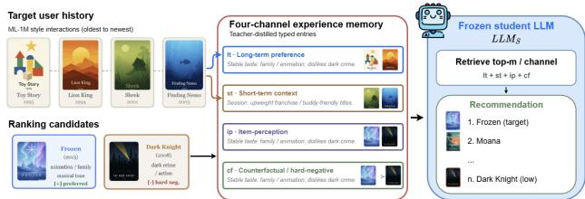  
Figure 1: Example of four-channel experience memory distilled from a user’s history for ranking Frozen vs. The Dark Knight. Ofline, teacher reasoning is stored as typed lt/st/ip/cf entries; online, a frozen student LLM retrieves those channels and produces the recommendation list without calling the teacher.

We address this challenge with rEDMRec. The basic idea is illustrated in Figure 1: instead of asking an LLM to both reason and rank on every inference call, we use the LLM as a teacher reasoning generator and distill its outputs into a structured, retrievable, and updatable Experience Memory that a lightweight student consumes at ranking time. Concretely, the teacher produces four typed experience signals – long-term preference, short-term context, item perception, and counterfactual hard-negative comparisons – and a distillation adapter normalizes each signal into a channel-indexed memory entry (vector store for the first three channels; hybrid vector–graph store for counterfactuals). At inference, a frozen student (3B–20B) retrieves the top-� entries per channel, composes a ranking prompt, and scores candidates without re-invoking the teacher, so accuracy gains are attributable to the memory rather than to student-parameter adaptation. A remaining dificulty is that a bank filled once from teacher extractions accumulates near-duplicates and low-specificity entries as interactions grow. Inspired by Training-Free GRPO (Youtu-Agent Team, 2025), which steers a frozen policy by maintaining an experiential knowledge library with Add/Delete/Modify/Keep operations rather than gradient updates, our second contribution is an LLM memory controller that applies the same edit operators – optionally guided by �-agent debate and an arbiter – to revise the recommendation experience bank over optimization epochs. Together, these components separate an expensive, infrequent reasoning-compression process from a cheap, frequent retrieval-and-rank process.

We evaluate rEDMRec on ML-1M, Amazon Beauty, and Steam with ten student LLMs (3B–20B), comparing against zero-shot, few-shot, RAG, and GraphRAG (Edge et al., 2024). rEDMRec improves HR@1 over zero-shot, few-shot, and RAG on every backbone, and over GraphRAG on most backbones (exceptions: Llama 3.1 8B and GPT OSS 20B), reaching Impv = 13.3% vs. GraphRAG on Qwen2.5 3B under the RDRec relative-improvement protocol (Wang et al., 2024b) (Section 5.1). Channel ablations show that short-term context is the only consistently helpful channel across capacity tiers, whereas long-term, itemperception, and counterfactual efects are capacitydependent (Section 5.2). A teacher-distillation study further shows that bank duplicate rate is a leading indicator of downstream gain, bounded by student capacity. Finally, debate-based optimization lowers bank duplication by 7.4 percentage points while raising downstream HR@1 by up to +0.029 over six epochs, validating the controller as a functional component of the architecture (Section 5.4).

This paper makes the following contributions:

1. An editable, channel-structured experience memory that distills teacher LLM reasoning into four typed, independently retrievable and independently editable channels, rather than a single undiferentiated reasoning trace (Section 3.6).

2. A debate-based LLM memory controller that revises the bank after each student prediction via Add/Delete/Modify/Keep operations guided by ranking reward models and �-agent debate, with bank-quality gains shown to propagate into ranking accuracy without updating the frozen student (Sections 3.6, 3.8; Section 5.4).

3. A comprehensive empirical study across ten student backbones and three datasets, including channel ablations that explain when ablating a channel can improve accuracy, a teacher-distillation study isolating teacher quality from student capacity, and a qualitative case study of entry-level edits over optimization epochs (Sections 5.1–5.5).

## 2. Related Work

## 2.1. LLM-based Recommendation

Before LLM recommenders, neural models already encoded dual-scale user interest, review text, and cold-start evaluation – but they stored that structure in parameters or in the corpus, not in an editable experience bank. Sequential news recommenders such as Co-NAML-LSTUR (Nguyen et al., 2025) jointly learn multi-view item encodings with long- and short-term user representations, showing that separating durable taste from recent browsing improves ranking even without an LLM. Review-based models such as RRS (Nguyen et al., 2024) replace ID-only collaborative filtering with deep encoders over user-written text, so item semantics enter ranking through review content rather than through a retrieved, typed memory entry. Complementary dataset work such as ViHoRec (Nguyen, 2026; Nguyen and Thiet, 2025) shows that, on sparse Vietnamese hotel interactions with a temporal cold-start split, neighborhood methods can outperform learned latent-factor models on users with short histories. These lines motivate the same signal types that rEDMRec stores as channels – long-term preference, short-term context, and item-level text – yet they cannot persist teacher-generated reasoning or Add/Delete/Modify a typed entry after a ranking failure. rEDMRec keeps that factorization, but as a non-parametric bank that a frozen student retrieves from, rather than as a neural user/item tower.

Recent surveys organize LLM recommenders into prompting, tuning, collaborative fusion, generative recommendation, and system-enhancement paradigms (Wu et al., 2024; Lin et al., 2025; Wang et al., 2024a; Liu et al., 2025; Li et al., 2024). Prompting and instruction-following methods cast ranking as natural-language generation or zeroshot ordering (Gao et al., 2023; Zhang et al., 2023; Hou et al., 2024; Yue et al., 2023; Lyu et al., 2024), while alignment frameworks such as TALLRec and LLaRA adapt LLMs to recommendation with eficient fine-tuning (Bao et al., 2023; Liao et al., 2024). A parallel line injects collaborative or ID structure into the language space – CoLLM, BinLLM, TokenRec, and related models encode interaction signals as text-like or tokenized representations (Zhang et al., 2025a; 2024b; Qu et al., 2024) – and enhancement methods use LLMs for graph augmentation, tool use, or query generation around a classical backbone (Wei et al., 2024; Zhao et al., 2024; Han et al., 2025). Across these paradigms, any intermediate reasoning (when present) remains either ephemeral prompt context or knowledge absorbed into parameters. rEDMRec instead materializes teacher reasoning as a non-parametric, typed memory that survives across sessions and can be revised without re-tuning the student.

## 2.2. Reasoning, Distillation, and Preference Utilization

A narrower line makes LLM reasoning itself the object of design. ReasoningRec (Bismay et al., 2025) synthesizes user profiles, item descriptions, and explanatory rationales with a teacher LLM, then instruction-tunes a smaller model for both prediction and human-interpretable explanation – an extraction-then-fine-tune pipeline rather than a durable memory architecture. R2Rec (Zhao et al., 2025) samples interaction chains, builds interaction-of-thought traces, and internalizes them with SFT and RL; LatentR3 (Zhang et al., 2025b) similarly reinforces latent reasoning inside the model, while SPRec (Gao et al., 2025) uses self-play to debias generative recommenders. $R ^ { 4 } \mathrm { e c }$ (Gu et al., 2025) pushes toward System-2 deliberation by pairing an actor that proposes preference/item knowledge with a reflection model that judges and triggers refinement until the knowledge is deemed rational, then injects the refined text into a recommendation backbone – still a per-case reasoning loop rather than a persistent, editable experience bank. Distillation work such as RDRec, POD, and LEADER compresses rationales or teacher signals into smaller recommendation models (Wang et al., 2024b; Li et al., 2023; Liu et al., 2024). Retrieval baselines (RAG, GraphRAG) ground ranking in raw history or graph summaries without teacher-compressed experience (Lewis et al., 2020; Edge et al., 2024). Relative to these methods, rEDMRec neither stops at one-shot feature utilization nor freezes reasoning into weights: it distills reasoning into a channel-typed bank with entry-level Add/Delete/Modify/Keep.

## 2.3. Memory-Augmented Agents and Recommendation Memory

External memory lets LLM agents operate beyond a single context window. MemGPT (Packer et al., 2023) pages context like an OS virtual-memory manager; Generative Agents (Park et al., 2023) maintain a retrieve-and-reflect memory stream for long-horizon behavior. Closest to our controller design, Training-Free GRPO (Youtu-Agent Team, 2025) improves a frozen LLM by iteratively distilling experiential knowledge into a non-parametric library updated with Add/Delete/Modify/Keep operations – a training-free alternative to gradient-based GRPO. In recommendation, AutoMR retrieves stored experiences for generative ranking (Wang et al., 2025), long-term planners model durable taste (Shi et al., 2024), and related work motivates separating long- versus shortterm interest (Zheng et al., 2024; Zhang et al., 2024a), item-level semantics (Ren et al., 2024; Zhang et al., 2026), hard-negative contrast (Song et al., 2026; Li et al., 2026), and user-controllable profiles (Woźniak et al., 2025). These designs retrieve history, profiles, or generic agent traces; they are not organized as teacher-distilled, fourchannel recommendation experience with debate-driven bank maintenance. rEDMRec adopts the Training-Free GRPO principle of editing an external experience library instead of model weights, but specializes the schema to recommendation signal types and pairs each channel with a matching store (vector vs. hybrid graph–vector).

## 2.4. Multi-Agent Debate and Self-Refinement

Iterative critique improves LLM outputs without additional supervised labels. Self-Refine (Madaan et al., 2023) has a model revise its own text from self-feedback; multiagent debate (Du et al., 2023) improves factuality by having several instances propose and critique answers; and in recommendation, $R ^ { 4 } \mathrm { e c }$ (Gu et al., 2025) couples actor and reflection models to refine preference/item knowledge before backbone prediction. These lines evaluate a single artifact – one answer, one document, or one knowledge string per case – and do not measure how repeated refinement of a growing collection afects duplicate accumulation or retrieval quality at bank scale. rEDMRec applies critique-andrevise to the experience bank: � debating personas critique a case, an arbiter synthesizes revisions, and the controller commits Add/Delete/Modify/Keep operations, with banklevel duplicate rate and specificity linked to downstream HR@1 (Section 5.4).

Notation used in Section 3.
<table><tr><td>Symbol</td><td>Meaning</td></tr><tr><td> $u , H _ { u }$ </td><td>user; chronological interaction history</td></tr><tr><td> $\tau , M ( i )$   $C _ { u } \subset T , c$ </td><td>item catalog; metadata text of item i 20-item candidate set; a candidate</td></tr><tr><td> $i ^ { + } , i ^ { - } , \hat { i }$ </td><td>in  $C _ { u }$  positive target; hard-negative</td></tr><tr><td> $x _ { u } , ~ D _ { K }$ </td><td>contrast; predicted item ranking prompt; K in-context</td></tr><tr><td>θ,  $P _ { S }$ </td><td>demonstrations (few-shot) generic LLM parameters; student</td></tr><tr><td> $\operatorname { E n c } ( { \cdot } )$  sim</td><td>likelihood under  $\mathbf { L L M } _ { S }$  shared text encoder; cosine similarity query embedding Enc(prompt(u,  $C _ { u } ) ;$ </td></tr><tr><td> $\kappa , k$   $\mathcal { P } , p , r _ { p }$ </td><td>embedding dim. channel set {lt, st, ip, cf }; a channel extraction-pass set</td></tr><tr><td> $E = \{ E _ { k } \} _ { k \in \mathcal K }$ </td><td>{pref, ctx, reas, cf }; a pass; raw output experience memory bank (Eq. 8)</td></tr><tr><td> $E _ { k } ^ { u } \subset E _ { k }$ </td><td>channel-k entries for user u after metadata filter</td></tr><tr><td> $e = ( \tau , \mathbf { v } _ { e } , \mu )$ </td><td>memory entry: text, embedding  $\mathbf { v } _ { e } = \operatorname { E n c } ( \tau )$  , metadata</td></tr><tr><td> $\mathrm { A d a p t } , \mathrm { r o u t e } _ { k }$ </td><td>distill routed fields into  $\boldsymbol { e } _ { k } ;$  select fields for channel k</td></tr><tr><td>snapshot(E)</td><td>truncated text rendering of the bank for  $\mathbf { L L M } _ { C }$ </td></tr><tr><td> $B = \{ ( \tau , k , u ) \}$   $o , \ \mathrm { A p p l y }$ </td><td>insight batch (teacher or arbiter) consumed by  $\dot { \mathrm { L L M } } _ { C }$  edit ops</td></tr><tr><td></td><td>{ADD, DELETE, MODIFY, KEEP}; commit o to E</td></tr><tr><td> $m , R _ { k } ( u , C _ { u } )$ </td><td>retrieval depth; top-m entries from  $E _ { k } ^ { u } \left( \mathsf { E q . 1 1 } \right)$ </td></tr><tr><td> $\hat { L } _ { u } , \ \mathrm { r a n k }$ </td><td>student ranked list; 1-based position of  $i ^ { + }$  in  $\hat { L } _ { u }$ </td></tr><tr><td>r(u)</td><td>post-prediction reward vector (Eq. 13)</td></tr><tr><td> $K , n _ { r } , T$ </td><td>#debate agents; rounds/epoch; optimization epochs</td></tr><tr><td> $\boldsymbol { \mathcal { T } } , g _ { j } , \mathrm { L L M } _ { j }$ </td><td>debate transcript; critique of agent  $j ; j \cdot$  th debate agent</td></tr><tr><td>ē,  $n _ { \mathrm { m a x } } , U$ </td><td>arbiter-proposed entry; max commits/case; case batch</td></tr><tr><td> $\mathrm { L L M } _ { T } , \mathrm { L L M } _ { S } , \mathrm { L L M } _ { C } ,$   $\mathbf { L L M } _ { A }$ </td><td>teacher, frozen student, controller, arbiter</td></tr></table>

## 3. Method

We formalize next-item ranking as conditional generation (Section 3.1), restate the dominant prompting and retrieval paradigms in the same notation to make the technical gap precise (Section 3.2), then specify rEDMRec’s components as LLM operators over a typed non-parametric memory (Sections 3.4–3.8). Table 1 collects the notation used throughout.

## 3.1. Problem Formulation

We cast next-item recommendation as conditional generation: given user �, history $H _ { u } ,$ and a candidate set $C _ { u } ,$ a language model with parameters � assigns a score to each candidate $c \in C _ { u }$ by the likelihood of emitting � under a constructed prompt. The predicted item is

$$
\hat { i } = \underset { c \in C _ { u } } { \arg \operatorname* { m a x } } P _ { \theta } \big ( c \mid \mathrm { c o n t e x t } ( u ) \big ) ,\tag{1}
$$

and is evaluated against the held-out positive $i ^ { + }$ using HR@�, NDCG@�, and MRR (Section 4.4). Methods difer in what enters context(�); we make this explicit below.

## 3.2. Preliminaries: Prior Paradigms as Conditional Generation

Zero-/few-shot prompting (Brown et al., 2020) conditions the LLM on a natural-language prompt $x _ { u }$ and � in-context demonstrations $D _ { K } ~ = ~ \{ ( x _ { j } , y _ { j } ) \} _ { j = 1 } ^ { \bar { K } }$ , with no parameter update:

$$
P _ { \mathrm { F S } } ( c \mid u ) = P _ { \theta } \big ( c \mid x _ { u } , D _ { K } \big ) , \quad x _ { u } = \mathrm { p r o m p t } ( H _ { u } , M ( C _ { u } ) ) .\tag{2}
$$

�=0 recovers zero-shot. Every token of $x _ { u }$ and $D _ { K }$ is reencoded by � at every request.

RAG (Lewis et al., 2020) retrieves a top-� evidence set � and conditions generation on it:

$$
P _ { \mathrm { R A G } } ( c \mid u ) = P _ { \theta } \bigl ( c \mid x _ { u } , Z \bigr ) , \quad Z = \mathrm { T o p } { - k ( x _ { u } ) } .\tag{3}
$$

In our RAG baseline, � ranges over raw interaction/review records and is recomputed for every $( u , C _ { u } )$

GraphRAG (Edge et al., 2024) builds a corpus graph, partitions it into communities $\{ S _ { l } \}$ with LLM-written summaries $\sigma ( S _ { l } )$ , and answers by a map–reduce over community answers $a _ { l } \mathrm { : }$

$$
P _ { \mathrm { G R A G } } ( c \mid u ) = \mathrm { L L M } \big ( x _ { u } , c , \{ a _ { l } \} _ { l = 1 } ^ { L } \big ) , \quad a _ { l } = \mathrm { L L M } \big ( x _ { u } , \sigma ( S _ { l } ) \big ) .\tag{4}
$$

$\{ \sigma ( S _ { l } ) \}$ is static once built and is not typed, per-user, or editable at the granularity of a single fact.

Equations (2)–(4) share a property that motivates our design: the conditioning set $( D _ { K } , Z ,$ , or $\{ \sigma ( S _ { l } ) \} )$ is either rebuilt/rescored at every request, or, once built, exposes no operator for targeted, entry-level edits. Section 3.3 replaces this with a persistent structure � built of the inference critical path and equipped with an explicit edit operator (Section 3.6).

## 3.3. Overview

rEDMRec factorizes ranking into an ofline construction of a typed experience memory � and an online, teacher-free generative lookup, as illustrated in Figure 2:

$$
\begin{array} { c } { { P _ { S } ( c \mid u ) = P _ { S } \Big ( c \Big | x _ { u } , \bigcup _ { k \in K } R _ { k } ( u , C _ { u } ) \Big ) , } } \\ { { E \gets \mathrm { A p p l y } ( E , o ) , } } \end{array}\tag{5}
$$

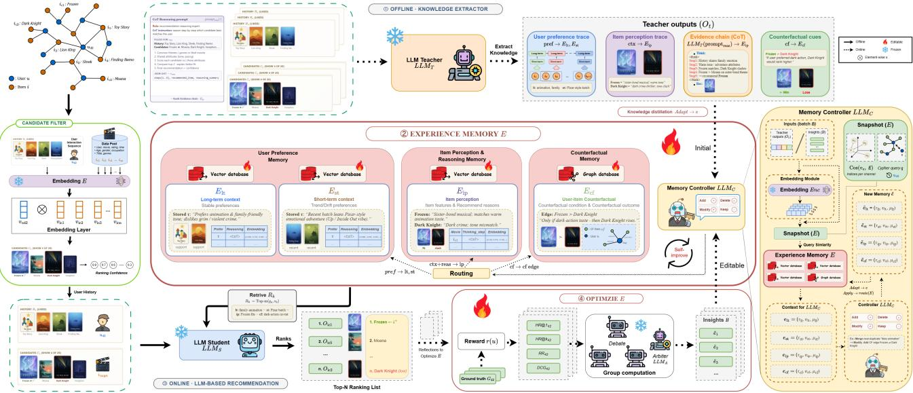  
Figure 2: Overall architecture of rEDMRec on a concrete case (target Frozen, hard negative The Dark Knight), aligned with Sections 3.4–3.8. ① LLM Teacher as Knowledge Extractor: frozen $\mathrm { L L M } _ { T }$ emits preference / perception / evidence / counterfactual traces; Knowledge Distillation (Adapt) writes four-channel entries that the Memory Controller $\mathbf { L L M } _ { C }$ commits via Add/Delete/Modify/Keep. ② Editable Experience Memory Bank $E = \{ E _ { \mathrm { l t } } , E _ { \mathrm { s t } } , E _ { \mathrm { i p } } , E _ { \mathrm { c f } } \}$ Candidate Filter forms $C _ { u }$ with shared Enc. ③ LLM Student as Ranker: frozen $\mathbf { L L M } _ { S }$ retrieves top-� entries per channel and ranks without calling the teacher. ④ Experience Memory Optimization: Reward Models �(�) and Debate and Arbiter (LLM ) revise � while $\mathbf { L L M } _ { s }$ stays fixed.

where $P _ { S }$ denotes generation under the frozen student $\mathrm { L L M } _ { S } , R _ { k }$ (Eq. 11) is a deterministic top-� dense lookup (not a per-request marginalized set as in Eq. (3)), and Apply commits edit ops � produced ofline by teacher extraction (Section 3.5) and distillation (Section 3.6), or online by debate-based optimization after each student prediction (Section 3.8). This is the central contrast with Eqs. (2)–(4): reasoning cost is paid when writing �, the frozen student only retrieves, and memory edits – not weight updates – amortize future ranking.

Concretely, Figure 2 decomposes the pipeline into the Method subsections that follow. ① LLM Teacher as Knowledge Extractor (Section 3.5): given $( u , H _ { u } , i , M )$ $\mathrm { L L M } _ { T }$ runs four extraction passes and Knowledge Distillation Adapt (Section 3.6.1) normalizes each routed signal into a channel-indexed entry $\begin{array} { r l r } { e } & { { } = } & { ( \tau , { \bf v } _ { e } , \mu ) . } \end{array}$ which the Memory Controller $\mathrm { L L M } _ { C }$ commits with Add/Delete/Modify/Keep. ② Editable Experience Memory Bank (Section 3.6): $E = \{ E _ { \mathrm { l t } } , E _ { \mathrm { s t } } , E _ { \mathrm { i p } } , E _ { \mathrm { c f } } \}$ stores stable taste, session context, candidate-grounded perception, and counterfactual hard-negative edges as independently retrievable typed snippets. Before online ranking, Candidate Filter (Section 3.4) forms $C _ { u }$ and shares Enc with memory indexing. ③ LLM Student as Ranker (Section 3.7): frozen $\mathbf { L L M } _ { S }$ encodes the current query, retrieves the top-� entries per channel, and produces $\hat { L } _ { u }$ without invoking $\mathrm { L L M } _ { T }$ or updating student weights. ④ Experience Memory Optimization (Section 3.8): Reward Models �(�) score $\hat { L } _ { u }$ against $i ^ { + }$ , then Debate and Arbiter $\mathbf { L L M } _ { A }$ propose revisions that Adapt and Apply write back into $E ,$ so future retrievals improve while $\mathbf { L L M } _ { S }$ stays fixed.

## 3.4. Candidate Filter

Motivation: a generative student cannot score the full catalog  at each request, and retrieval plus memory indexing must share one dense text space rather than operating over raw strings. Design: candidate sets $C _ { u }$ are formed by a lightweight recency/popularity/retrieval-score filter over  (not a learned projector). The same encoder maps any text span to a �-dimensional retrieval vector,

$$
\mathbf { v } = \mathrm { E n c } ( \mathrm { t e x t } ) , \qquad \mathrm { s i m } ( \mathbf { v } , \mathbf { v } ^ { \prime } ) = { \frac { \mathbf { v } ^ { \mathsf { T } } \mathbf { v } ^ { \prime } } { \| \mathbf { v } \| \| \mathbf { v } ^ { \prime } \| } } ,\tag{6}
$$

with Enc a sentence-transformer (Reimers and Gurevych, 2019). � is reused for memory indexing (Eq. 9) and retrieval (Eq. 11). Advantage: $C _ { u }$ is formed without a learned projector, and one shared Enc lets � be queried directly with candidate or user vectors, with no separate alignment step.

## 3.5. LLM Teacher as Knowledge Extractor

Motivation: conflating “understand the user” (stable) with “score this candidate list” (per-request) forces the former to be redone every request; rEDMRec queries the teacher only for the former, and only to extract, never to rank. Design: following ReasoningRec (Bismay et al., 2025) and R2Rec (Zhao et al., 2025), which show that structured preference profiles, item-level perceptions, and explanatory rationales improve recommendation when distilled from a strong LLM, teacher $\mathrm { L L M } _ { T }$ runs four extraction passes $p \in { \mathcal { P } } _ { \cdot }$ , each a prompted generation,

Teacher extraction passes $p \in { \mathcal { P } } \colon$ output fields and routed channel(s) � (Section 3.6.1).
<table><tr><td>p</td><td>Key output fields</td><td>Routed to k</td></tr><tr><td>pref</td><td>long_term_preferences, dislikes, short_term_preferences</td><td>lt, st</td></tr><tr><td>ctx</td><td>user_history_perception, candidate_perception</td><td>ip</td></tr><tr><td>reas</td><td>steps[1..5], reasoning_summary</td><td>ip</td></tr><tr><td>cf</td><td>counterfactual_condition/outcome, rationale</td><td>cf</td></tr></table>

$$
\begin{array} { r } { r _ { p } = \mathrm { L L M } _ { T } \big ( \mathrm { p r o m p t } _ { p } ( u , i , H _ { u } , M ) \big ) , } \\ { p \in \mathcal { P } . \qquad p \in \mathcal { P } . } \end{array}\tag{7}
$$

whose output fields are later routed to one or more memory channels $k \in \mathcal { K }$ by Adapt (Table 2, Section 3.6.1); the routing is not one-to-one, since two passes jointly populate the item-perception channel. Prompt templates and example one-line outputs for all four channels are given in Appendix $\mathrm { I } ;$ full Beauty/Steam prediction traces (history, candidates, $R _ { k } ,$ ranked list) appear in Appendix J. Unlike ReasoningRec/R2Rec, which consume these traces as training targets or one-shot prompt features, we never update student parameters from $r _ { p } \mathrm { : }$ each field is committed into the editable bank � of Section 3.6.

Preference extraction (pref). Simulates a recurrent, batch-by-batch update over $H _ { u }$ (oldest→newest): for each history batch it re-estimates a long-term preference state and the current-batch short-term interest, plus an explicit dislike list; the final long-term/dislike fields route to channel lt and the short-term field routes to channel st.

Context extraction (ctx). For every history item and candidate, produces three layers – an objective factual description, a first-person $^ { 6 6 } \mathrm { a s }$ this user” comment, and (candidates only) key phrases; both the history-perception and candidate-perception fields route to the item-perception channel ip.

Reasoning extraction (reas). Runs a five-step chainof-thought that identifies shared themes across liked items, scores each candidate against them, contrasts the top two candidates, and states a final recommendation; its summary field also routes to ip, complementing ctx with an explicit comparative rationale rather than a per-item description.

Counterfactual extraction (cf). Given an anchor (chosen) item and a contrast (hard-negative) item, produces whypreferred / why-rejected rationales and a hypothetical condition under which the contrast item would outrank the anchor; routes entirely to channel cf as a graph edge (Section 3.6.2).

An optional single-pass multi-agent refinement critiques the $r _ { \mathrm { c f } }$ output with three fixed personas before distillation, merging by “last full critique wins” with no arbiter; this is a lighter-weight precursor to the arbiter-based optimization of Section 3.8, which instead revises already-committed entries across all four channels using downstream reward signals. Advantage: separating extraction into four typed passes, rather than one undiferentiated call, lets Section 3.6.1 edit a single routed claim without touching the other channels of the same interaction.

## 3.6. Editable Experience Memory Bank

Motivation: Eq. (7) yields free-form JSON that cannot be reused across sessions or revised entry-by-entry once committed. Design: adapting the training-free experientialknowledge library of Training-Free GRPO (Youtu-Agent Team, 2025) to recommendation, rEDMRec materializes teacher output into a persistent, typed non-parametric memory

$$
E = \{ E _ { k } \} _ { k \in K } , \quad E _ { k } = \{ e \mid e . { \mathrm { m e m o r y } } _ { - } \mathrm { t y p e } = k \} ,\tag{8}
$$

where each entry $\textbf { \textit { e } } = \mathbf { \beta } ( \tau , \mathbf { v } _ { e } , \mu )$ carries distilled text �, embedding $\mathbf { v } _ { e } = \mathrm { E n c } ( \tau )$ , and channel-specific metadata $\mu .$ Population follows a two-stage commit path – Adapt (field routing and schema normalization) and Apply via controller $\mathrm { L L M } _ { C }$ (batch edit ops) – detailed in Section 3.6.1; channel semantics and retrieval are in Section 3.6.2.

## 3.6.1. Knowledge Distillation: Adapter and Memory Controller

Distillation adapter Adapt. Adapt maps routed teacher fields (Table 2) into a typed entry and dispatches it to the correct physical store:

$$
\begin{array} { r l } & { e _ { k } = \mathrm { A d a p t } \big ( \mathrm { r o u t e } _ { k } ( \{ r _ { p } \} _ { p \in \mathcal { P } } ) \big ) } \\ & { \quad = \big ( \tau _ { k } , \mathrm { E n c } ( \tau _ { k } ) , \mu _ { k } \big ) , \qquad k \in \mathcal { K } . } \end{array}\tag{9}
$$

Here rout $\mathrm { e } _ { k } ( \cdot )$ selects and concatenates the field(s) assigned to channel � (many-to-one: pref $ \{ \mathrm { l t } , \mathrm { s t } \}$ ; ctx, reas → ip; $\operatorname { c f } \to \operatorname { c f } )$ . Adapt then (i) normalizes $\tau _ { k }$ into a channel schema $( \mu _ { k }$ holds typed fields such as long\_term\_preferences, dislikes, steps, anchor\_item), (ii) encodes $\tau _ { k }$ with the shared Enc of Eq. (6), and (iii) writes to $E _ { \mathrm { l t } } , \ E _ { \mathrm { s t } }$ , or $E _ { \mathrm { i p } }$ (Vector database) or, for $k = \operatorname { c f } .$ , to $E _ { \mathrm { c f } }$ as a Graph database edge pair $( u ) \xrightarrow { \mathrm { A N C H O R } } ( i ^ { + } ) \wedge ( u ) \xrightarrow { \mathrm { C O N T R A S T } } ( i ^ { - } )$ plus a rationale embedding (Listing 3). Initial extraction (distill\_to\_memory) and debate optimization (Section 3.8) both call the same Adapt.

Memory controller $\mathrm { L L M } _ { C }$ . Raw Adapt output is not appended blindly: controller $\mathbf { L L M } _ { C }$ inspects a text snapshot of the bank against a batch of new insights $B = \{ ( \tau , k , u ) \}$ and emits structured edit ops �, which Apply commits in order:

$$
\begin{array} { r l } & { o = \mathrm { L L M } _ { C } \big ( \mathrm { s n a p s h o t } ( E ) , B \big ) , } \\ & { o _ { i } \in \{ \mathrm { A D D } , \mathrm { D E L E T E } , \mathrm { M O D I F Y } , \mathrm { K E E P } \} , } \\ & { E  \mathrm { A p p l y } ( E , o ) . } \end{array}\tag{10}
$$

Apply implements each op on the underlying stores: ADD calls Adapt then appends; DELETE removes by entry\_id; MODIFY re-encodes revised � and replaces metadata in-place; KEEP is a no-op. These four operators mirror the experience-library update rule in Training-Free GRPO (Youtu-Agent Team, 2025), specialized here to typed recommendation channels rather than general agent rollouts. The controller prompt enforces a maximum library size, deduplication (merge over add), and ≤60-word actionable entries. Advantage: Eqs. (9)–(10) decouple what to remember (teacher or arbiter) from how to commit it; refinement cost scales with |�|, not |�|.

Table 3  
Four experience-memory channels: role, teacher source, storage, and retrieval filter.
<table><tr><td>k</td><td>Semantic role</td><td>Source p</td><td>Storage / filter</td></tr><tr><td>lt</td><td>Stable cross-session taste</td><td>pref</td><td>vector DB; user_id= u</td></tr><tr><td>st</td><td>Session-level trend/ drift</td><td>pref</td><td>vector DB + timestamp; user_id= u</td></tr><tr><td>ip</td><td>Item impression vs. user</td><td>ctx, reas</td><td>vector DB; user_id= u, item= c</td></tr><tr><td>cf</td><td>Contrastive  $\smash { \because , 1 2 , \ldots , n }$  edge</td><td>cf</td><td>graph DB + vector DB; user_id= u</td></tr></table>

## 3.6.2. Four Experience-Memory Channels

We factor experience into four typed channels because prior LLM and sequential recommenders show that longhorizon taste (Shi et al., 2024; Wang et al., 2025), recent sequential context (Zheng et al., 2024; Zhang et al., 2024a), item-level semantics (Ren et al., 2024; Zhang et al., 2026), and hard-negative contrast (Song et al., 2026; Li et al., 2026) each contribute distinct ranking signal – and because storing them separately lets $R _ { k }$ retrieve only the evidence class needed for a decision. Table 3 summarizes the four channels. Each $E _ { k }$ is independently indexed, independently retrievable, and independently editable – the ablation in Section 5.2 drops individual � at inference without retraining LLM�.

Long-term preference (lt). Motivated by evidence that long-horizon preference modeling improves recommendation beyond next-click prediction (Shi et al., 2024) and that external memory retrieval is needed when the LLM context window alone drops long-term history (Wang et al., 2025), this channel stores durable taste statements distilled from long\_term\_preferences and dislikes (pref pass), optionally with supporting reasoning. Entries are user-global: retrieval over $E _ { \mathrm { l t } } ^ { u } ~ = ~ \{ e ~ \in ~ E _ { \mathrm { l t } }$ ∣ �.user\_id = �} answers “what does this user generally like/dislike?” without binding to a specific candidate.

Short-term context (st). Motivated by sequential recommenders that show recent interactions dominate next-item prediction (Zheng et al., 2024) and that jointly modeling long- and short-term interests outperforms either alone (Zhang et al., 2024a), this channel captures transient interest from short\_term\_preferences (pref pass) plus optional context\_reasoning. Each entry carries a timestamp in $\mu ,$ enabling the bank to represent taste drift within a session or across recent batches while lt remains stable. Retrieval filters on user\_id only.

Item perception (ip). Motivated by work showing that item-text representation quality drives LLM recommendation (Ren et al., 2024) and that token-centric attention under-models item-level collaborative relations (Zhang et al., 2026), this is the most granular channel: (i) percandidate impressions from candidate\_perception (ctx), (ii) per-history-item descriptions from user\_history\_perception (ctx), and (iii) comparative reasoning from the five-step chain and reasoning\_summary (reas). Candidate-specific entries additionally index target\_movie\_id in �, so retrieval for $( u , c )$ returns impressions scoped to � rather than unrelated items.

{   
"user\_id": "...",   
"anchor\_preference":   
"prefers animation,   
family-friendly tone",   
"target\_item": "Frozen",   
"contrast\_item":   
"The Dark Knight",   
"counterfactual\_condition":   
"if user prefers dark,   
action-heavy stories",   
"counterfactual\_outcome":   
"The Dark Knight would   
rank higher",   
"rationale\_text": "...",   
"embedding": [],   
"timestamp": "..."   
}  
Figure 3: Distilled $e _ { \mathrm { c f } } .$ the graph-edge instantiation of Eq. (9).

Counterfactual (cf). Motivated by recent LLM recommenders that separate hard negatives from noisy negatives (Song et al., 2026) and that use self-hard negatives to sharpen preference learning (Li et al., 2026), this channel stores hard-negative contrast rationales as typed graph edges: for anchor item $i ^ { + }$ and contrast $i ^ { - } ,$ � records why\_anchor\_preferred, why\_contrast\_rejected, counterfactual\_condition, and counterfactual\_outcome. Dense retrieval runs over rationale\_text embeddings; a graph-augmented pass appends any user-specific edges not surfaced by vector search. Listing 3 shows the instantiated schema.

Retrieval. At inference, the student queries each active channel with a shared query embedding $\begin{array} { r l } { { \bf q } _ { u } } & { { } = } \end{array}$ Enc(prompt $( u , C _ { u } ) )$ and returns the top-� entries by dense similarity:

$$
\begin{array} { r } { R _ { k } ( u , C _ { u } ) = \mathrm { T o p - m } \mathrm { s i m } \bigl ( \ P _ { u } , \mathbf { v } _ { e } \bigr ) , } \\ { e \in E _ { k } ^ { u } \qquad } \end{array}\tag{11}
$$

where $E _ { k } ^ { u } \subseteq E _ { k }$ applies the filters in Table 3 (candidate scope � is applied only for ip), and sim is Eq. (6). Default $m { = } 5$ per channel. Advantage: typed channels let $R _ { k }$ return only the evidence class needed for a ranking decision – stable taste (lt), recent drift (st), candidate fit (ip), or boundary conditions (cf) – rather than one undiferentiated reasoning blob.

## 3.7. LLM Student as Ranker

Motivation: if ranking gains required adapting student parameters, it would be unclear whether accuracy came from the editable experience memory or from parameter adaptation; moreover, a per-backbone adapted student would need re-adaptation for every backbone, undermining the claim that � helps any teacher–student pair. Design: student $\mathbf { L L M } _ { S }$ is a frozen pretrained LLM (3B–20B in our study). At inference it ranks solely by prompting with retrieved experience – never a fresh teacher call and never a weight update – following Eq. (5):

$$
\begin{array} { r l } & { \hat { i } = \underset { c \in C _ { u } } { \arg \operatorname* { m a x } } P _ { S } ( c \mid u ) } \\ & { = \underset { c \in C _ { u } } { \arg \operatorname* { m a x } } P _ { S } \Big ( c \Big | x _ { u } , \bigcup _ { k \in K } R _ { k } ( u , C _ { u } ) \Big ) . } \end{array}\tag{12}
$$

Here $x _ { u } = \mathrm { p r o m p t } ( u , C _ { u } )$ and $\textstyle \bigcup _ { k } R _ { k }$ are concatenated into the student context; $\mathbf { L L M } _ { S }$ is held fixed across bank updates. Unlike Eq. (3), retrieval is deterministic, and no student objective is optimized. Advantage: gains over zero-/fewshot and RAG – and over GraphRAG on most backbones (Section 5.1) – are attributable to the content and editability of �, not to student adaptation – the same frozen $\mathbf { L L M } _ { S }$ improves when � improves (Section 5.4), and the protocol transfers across teacher–student pairs without per-student training (Section 5.3).

## 3.8. Experience Memory Optimization

Motivation: a bank populated once from teacher extraction can accumulate generic or conflicting entries; after the student ranks a case, the mismatch between the predicted list and the ground-truth target is a direct signal that � should be revised. Design: mirroring Training-Free GRPO (Youtu-Agent Team, 2025)’s loop of rollout → reward → semantic advantage → library edit – but specialized to recommendation ranking and enriched with �-agent debate – we update � after each student prediction: the student emits a ranked list under Eq. (12), reward models score that list against $i ^ { + } ,$ � debating agents critique the case conditioned on those rewards, an arbiter synthesizes revised experience entries, and the same distillation controller commits them. This closes a loop predict →reward→debate →edit →� without changing $\mathbf { L L M } _ { S }$

## 3.8.1. Reward Models

Motivation: a single scalar (e.g., only Hit@1) is too coarse for debate agents to diagnose why a ranking failed – missing the top item, burying it just outside the top-�, or placing it deep in the list require diferent memory edits. Design: given the student’s ordered list $\hat { L } _ { u } = ( c _ { ( 1 ) } , \dots , c _ { ( L ) } )$ and ground-truth target $i ^ { + }$ , let rank $\in \{ 1 , \dots , \overset { \cdot } { L } \} \cup \{ \varnothing \}$ be the 1-based position of $i ^ { + }$ in $\hat { L } _ { u }$ (∅ if absent). We pack four complementary IR-style rewards in [0, 1] into the debate/arbiter prompt:

$$
\begin{array} { r l r } & { } & { r ( u ) = \big ( \mathbf { 1 } [ \mathrm { r a n k } { = } 1 ] , \ \mathbf { 1 } [ \mathrm { r a n k } \le k ] , } \\ & { } & { \operatorname* { m i n } ( 1 , 1 / \mathrm { r a n k } ) , \ 1 / \log _ { 2 } ( \mathrm { r a n k } + 1 ) \big ) \in [ 0 , 1 ] ^ { 4 } , } \end{array}\tag{13}
$$

with all components zero if rank $\qquad = \emptyset$ (default �=10). Design rationale. The four components are HR@1, HR@�, reciprocal rank, and DCG-style position discount: they flag strict top-rank failure, near-misses, and graded credit when $i ^ { + }$ appears but not first. Importantly, �(�) is not a training loss on $\mathbf { L L M } _ { S }$ and is not used to arg max among agent proposals; it conditions the natural-language critique so that edits target the observed ranking failure mode. Advantage: the same four signals transfer across datasets and students because they depend only on $( \hat { L } _ { u } , i ^ { + } )$ , keeping the optimization loop student-agnostic.

Algorithm 1 Experience Memory Optimization after stu  
dent prediction (one epoch)   
Require: case batch $\overline { { U , } }$ frozen student LLM , agents   
$\{ { \mathrm { L L M } } _ { 1 } , \dotsc , { \mathrm { L L M } } _ { K } \} ,$ , arbiter L $\mathbf { { \mathrm { { L M } } } } _ { A } ,$ rounds $n _ { r }$   
1: for $u \in U$ do   
2: Rank $\hat { L } _ { u }$ with frozen $\mathrm { L L M } _ { S }$ via Eq. (12)   
3: �(�) ← reward models on $( \stackrel { \triangledown } { \hat { L } } _ { u } , i ^ { + } )$ ⊳ Eq. (13)   
4: $\tau \gets \emptyset$   
5: for round $= 1 , \ldots , n _ { r } ;$ agent � = 1, … , � do   
6: $\mathcal { T }  \mathcal { T } \parallel \mathrm { L L M } _ { j } ( \mathrm { p e r s o n a } _ { j } , \mathcal { T } , u , \hat { L } _ { u } , r ( u ) )$ ⊳ Eq. (14)   
7: end for   
8: $\{ \tilde { e } _ { 1 } , \dots , \tilde { e } _ { n } \} \gets \mathrm { L L M } _ { A } ( \mathcal { T } , u , \hat { L } _ { u } , r ( u ) )$ ⊳ Eq. (15)   
9: for $\tilde { e } \in \{ \tilde { e } _ { 1 } , \ldots , \tilde { e } _ { n } \}$ do   
10: $e \gets \mathrm { A d a p t } ( \tilde { e } ) ; E \gets \mathrm { A p p l y } ( E , o )$ ⊳ Eqs. (9),(10)   
11: end for   
12: end for

## 3.8.2. Debate and Arbiter after Each Prediction

Design lineage. The procedure combines the training-free experience-library update of Training-Free GRPO (Youtu-Agent Team, 2025) with iterative selfcritique (Madaan et al., 2023) and multi-persona debate (Du et al., 2023), but applies them at memory-bank granularity and triggers them from the student’s post-prediction reward vector (Section 3.8.1).

Group computation. Over $n _ { r }$ rounds, � fixed-persona agents append free-form critiques to a shared transcript $\tau { : }$

$$
\begin{array} { r l } & { g _ { j } = \mathrm { L L M } _ { j } \big ( \mathrm { p e r s o n a } _ { j } , T , u , \hat { L } _ { u } , r ( u ) \big ) , } \\ & { \mathcal { T }  \mathcal { T } \parallel g _ { j } . } \end{array}\tag{14}
$$

No entry is committed during Eq. (14). After $n _ { r } K$ turns, a single arbiter call synthesizes the experience set to commit:

$$
\begin{array} { r } { \{ \tilde { e } _ { 1 } , \dots , \tilde { e } _ { n } \} = \mathrm { L L M } _ { A } \big ( \mathcal { T } , u , \hat { L } _ { u } , r ( u ) \big ) , } \\ { n \leq n _ { \operatorname* { m a x } } . \qquad } \end{array}\tag{15}
$$

Eq. (15) is an LLM synthesis, not a programmatic vote or an arg max over $\{ g _ { j } \}$ by reward.

Optimizing. Algorithm 1 runs, for each case: student ranking (Eq. 12) → reward models (Eq. 13) → debate/arbiter (Eqs. 14–15) → commit via Adapt and Apply. Section 5.4 tracks bank-quality signals and downstream HR@1/MRR over � such epochs.

Reuse of Knowledge Distillation. Each synthesized ̃� is committed by the same operators as regular extraction (Section 3.6.1): $e = \mathrm { A d a p t } ( \tilde { e } ) ( \mathrm { E q . 9 } )$ and $E \gets \mathrm { A p p l y } ( E , o )$ (Eq. 10). Optimization does not update $\operatorname { L L M } _ { S } ;$ it only revises �.

## 4. Experimental Setup

## 4.1. Datasets

We evaluate on three recommendation datasets that span the explicit-implicit feedback spectrum. ML-1M (Harper and Konstan, 2015) provides 1–5 star explicit ratings and is a standard benchmark for LLM-based recommendation. Amazon Beauty (Ni et al., 2019) provides explicit ratings and review text but is substantially sparser per user, which stresses the memory bank’s ability to compensate for weak collaborative signal. Steam (Kang and McAuley, 2018) is an implicit-feedback dataset: it logs which games a user played rather than an explicit rating, so every logged interaction is treated as an equally-weighted positive signal (rating fixed to 1.0, positive threshold 0.0) instead of being thresholded from a graded rating scale. For all three datasets we apply a �-core filter (�=20 on ML-1M; �=5 on Beauty and Steam), build a chronological train/validation/test split, and construct 20-candidate ranking samples (1 positive, 19 sampled negatives). Dataset statistics after filtering are reported in Appendix H (Table 20).

## 4.2. Baselines

We compare against four prompting/retrieval baselines and rEDMRec, formalized in Eqs. (2)–(4) (Section 3.2): Zero-shot and Few-shot (Brown et al., 2020) (�=0 and �>0 in Eq. 2); RAG (Lewis et al., 2020) (Eq. 3), which retrieves raw historical interactions or reviews rather than distilled reasoning; and GraphRAG (Edge et al., 2024) (Eq. 4), which retrieves from a co-occurrence/knowledge graph built over items.

## 4.3. Models

Unless noted otherwise, the teacher is gpt-5.4-mini. We evaluate ten open student backbones spanning 3B–20B parameters: Qwen2.5 3B, Llama 3.1 8B (Touvron et al., 2023), Gemma-4-12B (Gemma Team, 2024), Minimax M2.5, Mixtral 8x7B (Jiang et al., 2024), Qwen3-14B (Yang et al., 2024), DeepSeek-R1-Distill-Qwen-14B (DeepSeek-AI, 2025), Phi-4, Llama 4 Scout, and GPT OSS 20B. Each student is used frozen (Section 3.7), so that cross-backbone gains isolate the contribution of the editable experience memory. The teacher-distillation study (Section 5.3) additionally fixes the student to gpt-5-mini (strong) or Qwen2.5 3B (small) while varying the teacher across seven backbones, to isolate the teacher’s contribution from the student’s.

## 4.4. Metrics and Protocol

We report Hit Rate at rank � (HR@�, $k \in \{ 1 , 5 , 1 0 \} )$ Normalized Discounted Cumulative Gain (NDCG@�, $\begin{array} { r l r } { k } & { { } \in } & { \{ 5 , 1 0 \} } \end{array}$ ), and Mean Reciprocal Rank (MRR), all computed over the fixed 20-candidate set per evaluation sample. For RQ1 tables we report Impv (%), the relative HR@1 improvement of rEDMRec over the second-best baseline on the same student (Impv = (Ours − SecondBest)∕SecondBest × 100), following RDRec (Wang et al., 2024b), together with a McNemar �-value on HR@1 vs. that second-best method (approximate 2×2 contingency reconstructed from the table HR@1 rates at the full held-out sizes $n _ { \mathrm { M L - 1 M } } { = } 4 9 8 9 3 .$ $n _ { \mathrm { B e a u r y } } { = } 1 4 6 0$ $n _ { \mathrm { S t e a m } } { = } 1 4 6 0 ;$ ∗ marks �<0.05 when rEDMRec is ahead). Every (model, method, dataset) cell is evaluated on the full held-out test split (chronological train/validation/test; 20 candidates per sample with sampling seed 42), not a pilot subsample. The cross-dataset comparison in Section 5.1 (Amazon Beauty, Steam), the bank-scale analysis in Section 5.2, and the �- EPOCH and number-of-agents curves in Section 5.4 follow the same full-split evaluation protocol at each reported dataset, bank scale, and epoch/agent-count setting.

## 5. Results

We organize results around four research questions: does distilling reasoning into memory improve ranking over prompting-only and retrieval-only baselines (RQ1, Section 5.1)? which memory channel drives that improvement (RQ2, Section 5.2)? does teacher quality causally afect bank quality and downstream gain (RQ3, Section 5.3)? and does debate-based memory optimization measurably improve bank quality and downstream ranking (RQ4, Section 5.4)? We close with a qualitative case study of how individual memory entries evolve over training (Section 5.5).

## 5.1. RQ1: Does rEDMRec Improve Ranking Across Students and Datasets?

Table 4 reports HR@�, NDCG@�, and MRR for four representative students spanning our capacity range (Qwen2.5 3B, Llama 3.1 8B, Mixtral 8x7B, Qwen3-14B) on ML-1M; the full ten-model table is given in Appendix A. rEDMRec improves HR@1 over Zero-shot, Few-shot, and RAG for every student. Following RDRec (Wang et al., 2024b), Table 4 reports Impv (%) vs. the second-best baseline (typically GraphRAG): the largest relative gain is on the smallest student (Qwen2.5 3B, Impv = 13.3% over GraphRAG), consistent with structured memory helping most when parametric capacity is limited. Llama 3.1 8B is the clearest failure case – Impv is negative because GraphRAG remains ahead (Impv = −11.1%) – which we attribute to weak instruction-following rather than a deficiency of the memory itself (Section 4.3; Section 6); GPT OSS 20B similarly trails GraphRAG slightly (Impv = −3.3%), so the claim relative to GraphRAG is most, not all, students.

Table 5 reports Zero-shot vs. rEDMRec on Amazon Beauty and Steam for all ten student models under HR@1, NDCG@10, and MRR (full five-method matrices in Appendix B–C). The same ordering as on ML-1M holds: rEDMRec improves HR@1 over Zero-shot for every model on both datasets, and NDCG@10 / MRR rise in lockstep except on the weakest Llama 3.1 8B backbone, where ranking beyond top-1 remains flat. Absolute scores are lower than on ML-1M – as expected for sparser Amazon Beauty and implicit-feedback Steam – yet Impv (%) vs. the second-best baseline (GraphRAG) is again largest on the smallest student (Qwen2.5 3B: Impv = 23.6% on Beauty and 21.5% on Steam; both $\scriptstyle { p < 0 . 0 5 ) }$ , consistent with memory compensating for weak collaborative signal when per-user history is short; mid-capacity Beauty students show smaller Impv (about 9– 13%) that is not significant at �=1460.

Main results on ML-1M for four representative students (full ten-model table in Appendix A). Impv (%) is the relative HR@1 gain of rEDMRec over the second-best baseline on the same student, Impv = (Ours − SecondBest)∕SecondBest × 100, following RDRec (Wang et al., 2024b). � is the exact McNemar �-value for rEDMRec HR@1 vs. the second-best baseline (full held-out �=49893; approximate contingency from the table HR@1 rates). ∗ marks �<0.05 with rEDMRec ahead. Best in bold, second-best underlined; rEDMRec rows labeled in bold.
<table><tr><td>Model</td><td>Method</td><td>HR@1↑</td><td>HR@5↑</td><td>HR@10↑</td><td>NDCG@5↑</td><td>NDCG@10↑</td><td>MRR↑</td><td>Impv (%)</td><td>p</td></tr><tr><td>Qwen2.5 3B</td><td>Zero-shot</td><td>0.12</td><td>0.28</td><td>0.38</td><td>0.20</td><td>0.23</td><td>0.18</td><td>一</td><td>一</td></tr><tr><td></td><td>Few-shot</td><td>0.14</td><td>0.30</td><td>0.40</td><td>0.21</td><td>0.24</td><td>0.20</td><td>一</td><td>一</td></tr><tr><td></td><td>RAG</td><td>0.13</td><td>0.29</td><td>0.39</td><td>0.20</td><td>0.23</td><td>0.19</td><td></td><td>一</td></tr><tr><td></td><td>GraphRAG</td><td>0.15</td><td>0.31</td><td>0.41</td><td>0.22</td><td>0.25</td><td>0.20</td><td>一</td><td>一</td></tr><tr><td></td><td>rEDMRec (ours)</td><td>0.17*</td><td>0.35</td><td>0.45</td><td>0.25</td><td>0.28</td><td>0.23</td><td> $+ 1 3 . 3 ^ { * }$ </td><td>&lt; 0.001*</td></tr><tr><td>Llama 3.1 8B</td><td>Zero-shot</td><td>0.07</td><td>0.15</td><td>0.23</td><td>0.12</td><td>0.14</td><td>0.12</td><td></td><td></td></tr><tr><td></td><td>Few-shot</td><td>0.08</td><td>0.16</td><td>0.24</td><td>0.12</td><td>0.15</td><td>0.13</td><td></td><td>一</td></tr><tr><td></td><td>RAG</td><td>0.08</td><td>0.16</td><td>0.24</td><td>0.12</td><td>0.14</td><td>0.12</td><td>一</td><td>一</td></tr><tr><td></td><td>GraphRAG</td><td>0.09</td><td>0.17</td><td>0.25</td><td>0.12</td><td>0.15</td><td>0.13</td><td>一</td><td>一</td></tr><tr><td></td><td>rEDMRec (ours)</td><td>0.08</td><td>0.17</td><td>0.25</td><td>0.13</td><td>0.16</td><td>0.13</td><td>-11.1</td><td>&lt; 0.001</td></tr><tr><td>Mixtral 8x7B</td><td>Zero-shot</td><td>0.24</td><td>0.47</td><td>0.66</td><td>0.35</td><td>0.40</td><td>0.35</td><td></td><td></td></tr><tr><td></td><td>Few-shot</td><td>0.26</td><td>0.49</td><td>0.68</td><td>0.37</td><td>0.42</td><td>0.36</td><td></td><td>一</td></tr><tr><td></td><td>RAG</td><td>0.25</td><td>0.48</td><td>0.67</td><td>0.36</td><td>0.41</td><td>0.35</td><td>一</td><td>一</td></tr><tr><td></td><td>GraphRAG</td><td>0.27</td><td>0.50</td><td>0.69</td><td>0.38</td><td>0.42</td><td>0.37</td><td>一</td><td></td></tr><tr><td></td><td>rEDMRec (ours)</td><td>0.28*</td><td>0.52</td><td>0.71</td><td>0.39</td><td>0.44</td><td>0.38</td><td> $+ 3 . 7 ^ { * }$ </td><td>&lt; 0.001*</td></tr><tr><td>Qwen3-14B</td><td>Zero-shot</td><td>0.26</td><td>0.50</td><td></td><td></td><td></td><td></td><td></td><td></td></tr><tr><td></td><td>Few-shot</td><td>0.28</td><td>0.52</td><td>0.69 0.71</td><td>0.38 0.40</td><td>0.43 0.45</td><td>0.37 0.39</td><td>一 一</td><td>一 一</td></tr><tr><td></td><td>RAG</td><td>0.27</td><td>0.51</td><td>0.70</td><td>0.39</td><td>0.43</td><td>0.38</td><td></td><td>一</td></tr><tr><td></td><td>GraphRAG</td><td>0.29</td><td>0.53</td><td>0.72</td><td>0.40</td><td>0.45</td><td>0.40</td><td>一</td><td>一</td></tr><tr><td></td><td>rEDMRec (ours)</td><td>0.30*</td><td>0.55</td><td>0.73</td><td>0.42</td><td>0.47</td><td>0.41</td><td>+3.4*</td><td>&lt; 0.001*</td></tr></table>

## 5.2. RQ2: Which Memory Channel Matters?

To isolate each channel’s contribution, we remove one memory channel at a time and report ΔHR@1 relative to the full-memory model. This ablation uses a separate panel of seven API-served backbones chosen to span four capacity tiers – strong (gpt-5-mini), mid (gpt-5.4-mini, Qwen3-32B, Minimax M2.5), saturated (GPT-OSS-120B), and weak (Llama 3.3 70B, Llama 3.1 8B) – rather than the ten local open-weight students used for the main comparison in Section 5.1; note that a backbone name can appear in both this ablation panel and the teacher panel of Section 5.3 (e.g., gpt-5.4-mini), where it plays a diferent role (ablated student vs. teacher) in a separate experiment. Table 6 summarizes the resulting pattern across the four capacity tiers. Short-term context is the only channel that is consistently important: removing it hurts every tier, from a strong student (gpt-5-mini, Δ=−0.04) down to weak Groq-served Llama students (Δ ≈ −0.01 to −0.02). The long-term preference, item-perception, and counterfactual channels show a reversed ablation on the strongest student: removing them improves HR@1 by +0.03 to +0.04, whereas removing the counterfactual channel hurts the mid-capacity student $( \Delta { = } \mathrm { - } 0 . 0 4 )$ and has little efect on the saturated 120B-parameter student, which appears to ignore the bank altogether (full-memory $\Delta \approx 0 . 0 0$ for that tier).

We consider three, non-exclusive explanations for the reversed sign on strong students, in decreasing order of the evidence we can bring to bear with the current instrumentation. First, channel redundancy: long-term preference statements often restate information already present in the raw history block of the prompt, so a strong student that already attends well to raw history gains nothing extra and instead pays a small “distraction” cost for the redundant text. Second, generic, low-specificity entries: item-perception entries produced early in the bank’s lifecycle tend to be long and only loosely actionable (Section 5.5 quantifies this directly via a specificity score). Third, conflicting signals: a counterfactual edge can push a plausible but ultimately incorrect candidate above the true target when its hypothetical condition partially matches the current user. Only the mid-capacity student, which cannot yet extract the same information unaided from raw history, benefits from the counterfactual channel unconditionally; the fact that the sign of this efect depends on student capacity, rather than being fixed, is itself evidence against treating any single channel as universally useful or harmful. Figure 4 shows this pattern holds across all seven backbones in the ablation panel, and Figure 5 shows that the reversed channels flip sign as the bank grows from the sparse-bank anchor (�=189) toward $1 0 ^ { 5 } – 1 \bar { 0 } ^ { 6 }$ entries, because a denser bank dilutes the redundant and generic entries that drive the reversal at small � (bank size is independent of the full-test evaluation protocol in Section 4.4). Per-backbone Δ plots, the MRR heatmap, and the full numeric ablation matrix are deferred to Appendix G.

Memory channel ablation: ΔHR@1 across student models (n=30,000)  
Table 5  
Cross-dataset generalization on Amazon Beauty and Steam (full held-out test split, 20 candidates/sample, seed 42). ZS = Zero-shot; Ours = rEDMRec (bold). Impv (%) is the relative HR@1 gain of rEDMRec over the second-best baseline on the same student, Impv = (Ours − SecondBest)∕SecondBest × 100, following RDRec (Wang et al., 2024b). � = McNemar �-value for Ours HR@1 vs. the second-best baseline $( n _ { \mathrm { B e a u t y } } { = } 1 4 6 0 , n _ { \mathrm { S t e a m } } { = } 1 4 6 0 ;  { ^ { \circ } } { \mathrm { i f } } p { < } 0 . 0 5 )$ . Complete five-method matrices are in Appendix B–C.
<table><tr><td>Dataset</td><td>Model</td><td>HR@1(ZS)</td><td>HR@1(Ours)</td><td>NDCG@10(ZS)</td><td>NDCG@10(Ours)</td><td>MRR(ZS)</td><td>MRR(Ours)</td><td>Impv (%)</td><td>p</td></tr><tr><td rowspan="12">Amazon Beauty</td><td>Qwen2.5 3B</td><td>0.092</td><td>0.136*</td><td>0.218</td><td>0.262</td><td>0.180</td><td>0.224</td><td>+23.6*</td><td>0.037*</td></tr><tr><td>Llama 3.1 8B</td><td>0.062</td><td>0.071</td><td>0.180</td><td>0.180</td><td>0.162</td><td>0.162</td><td>-4.1</td><td>0.830</td></tr><tr><td>Gemma-4-12B</td><td>0.140</td><td>0.178</td><td>0.290</td><td>0.328</td><td>0.252</td><td>0.290</td><td>+12.7</td><td>0.166</td></tr><tr><td>Minimax M2.5</td><td>0.152</td><td>0.187</td><td>0.308</td><td>0.343</td><td>0.264</td><td>0.290</td><td>+10.0</td><td>0.247</td></tr><tr><td>Mixtral 8x7B</td><td>0.164</td><td>0.202</td><td>0.320</td><td>0.358</td><td>0.282</td><td>0.311</td><td>+11.0</td><td>0.188</td></tr><tr><td>Qwen3-14B DeepSeek-R1</td><td>0.176</td><td>0.211</td><td>0.338</td><td>0.373</td><td>0.294</td><td>0.329</td><td>+8.8</td><td>0.269</td></tr><tr><td>Distill-Qwen-14B</td><td>0.188</td><td>0.223</td><td>0.350</td><td>0.385</td><td>0.312</td><td>0.329</td><td>+8.3</td><td>0.280</td></tr><tr><td>Phi-4</td><td>0.170</td><td>0.205</td><td>0.332</td><td>0.393</td><td>0.288</td><td>0.340</td><td>+9.0</td><td>0.264</td></tr><tr><td>Llama 4 Scout</td><td>0.182</td><td>0.217</td><td>0.344</td><td>0.405</td><td>0.300</td><td>0.344</td><td>+8.5</td><td>0.275</td></tr><tr><td>GPT OSS 20B</td><td>0.182</td><td>0.199</td><td>0.344</td><td>0.370</td><td>0.300</td><td>0.317</td><td>-0.5</td><td>1.000</td></tr><tr><td>Qwen2.5 3B</td><td>0.106</td><td>0.158*</td><td>0.224</td><td>0.276</td><td>0.180</td><td>0.232</td><td>+21.5*</td><td>0.035*</td></tr><tr><td rowspan="8">Steam</td><td>Llama 3.1 8B</td><td>0.066</td><td>0.076</td><td>0.180</td><td>0.180</td><td>0.162</td><td>0.162</td><td>-7.3</td><td>0.584</td></tr><tr><td>Gemma-4-12B</td><td>0.170</td><td>0.208</td><td>0.320</td><td>0.358</td><td>0.276</td><td>0.314</td><td>+7.2</td><td>0.356</td></tr><tr><td>Minimax M2.5</td><td>0.186</td><td>0.224</td><td>0.344</td><td>0.382</td><td>0.292</td><td>0.321</td><td>+6.7</td><td>0.394</td></tr><tr><td>Mixtral</td><td>0.202</td><td>0.244</td><td>0.360</td><td>0.402</td><td>0.316</td><td>0.349</td><td>+8.0</td><td>0.276</td></tr><tr><td>8x7B Qwen3-14B</td><td>0.218</td><td>0.256</td><td>0.384</td><td>0.422</td><td>0.332</td><td>0.370</td><td>+5.8</td><td>0.392</td></tr><tr><td>DeepSeek-R1</td><td>0.234</td><td>0.272</td><td>0.400</td><td>0.438</td><td>0.356</td><td>0.375</td><td>+5.4</td><td>0.426</td></tr><tr><td>Distill-Qwen-14B Phi-4</td><td>0.210</td><td>0.248</td><td>0.376</td><td>0.443</td><td>0.324</td><td>0.382</td><td></td><td></td></tr><tr><td>Llama 4 Scout</td><td>0.226</td><td>0.264</td><td>0.392</td><td>0.459</td><td>0.340</td><td>0.388</td><td>+6.0</td><td>0.411</td></tr><tr><td></td><td>GPT OSS 20B</td><td>0.226</td><td>0.245</td><td>0.392</td><td>0.421</td><td>0.340</td><td>0.359</td><td>+5.6 -2.0</td><td>0.421 0.797</td></tr></table>

Table 6

Channel importance by capacity tier (ΔHR@1 vs. full memory). Negative = beneficial channel; positive = reversed ablation (Section 5.2).
<table><tr><td>Channel</td><td>Strong</td><td>Mid</td><td>Saturated</td><td>Weak</td></tr><tr><td>Short-term context</td><td>-0.04</td><td>-0.04</td><td>≈-0.01</td><td>-0.01--0.02</td></tr><tr><td>Long-term preference</td><td>+0.03</td><td>0.00</td><td>≈0.00</td><td>+0.01</td></tr><tr><td>Item-perception</td><td>+0.04</td><td>0.00</td><td>≈0.00</td><td>slight</td></tr><tr><td>Counterfactual</td><td>+0.03</td><td>-0.04</td><td>weak</td><td>≈0.00</td></tr><tr><td>Full memory</td><td>-0.01</td><td>-0.03</td><td>≈0.00</td><td>weak</td></tr></table>

## 5.3. RQ3: Does Teacher Quality Causally Afect Downstream Gain?

Holding the student fixed and varying the teacher isolates the teacher’s contribution from the student’s. Table 7 fixes the student to gpt-5-mini (strong) across seven teachers; Table 8 repeats the comparison with Qwen2.5 3B (small).

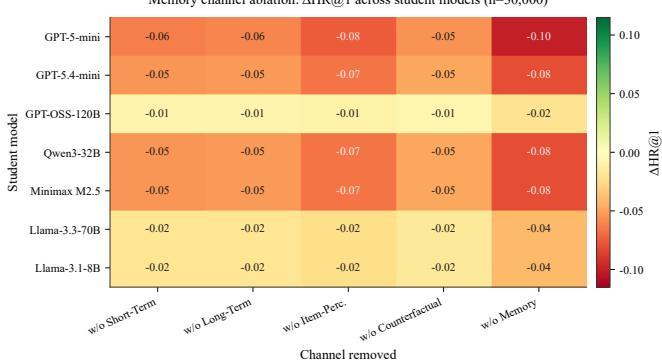  
Figure 4: Channel ablation heatmap: ΔHR@1 for each of the seven ablation-panel backbones (rows, Section 5.2) and four memory channels (columns). Green cells indicate a reversed ablation (removal helps); red cells indicate the channel is beneficial.

Across both tables, a lower bank duplicate rate is a leading indicator of downstream gain: gpt-5.4-mini has the lowest duplicate rate among the strongest teachers (12.4%) and the largest ΔHR@1 for the strong student (+0.060), while Llama 3.1 8B Instant – the only teacher below 14B parameters in this comparison – has by far the highest duplicate rate (22.8%) and the smallest gain (+0.015), consistent with a weak teacher producing generic, repetitive entries (e.g., repeated “user likes drama” statements without item-specific detail) that carry little retrieval value. The relationship is not perfectly monotonic, however: GPT OSS 120B has the lowest duplicate rate of any teacher (9.8%) yet only a middling ΔHR@1 (+0.040), which we attribute to a studentcapacity ceiling – gpt-5-mini cannot fully exploit the additional verbosity of a 120B-parameter teacher’s bank. This ceiling is sharper for the small student: Table 8 shows the GPT OSS 120B bank drops below the more concise Qwen3 32B bank once the student itself is small (Qwen2.5 3B), even though GPT OSS 120B produces the least duplicated bank of the two. Together, these two tables support a causal chain in which teacher quality first improves bank quality (lower duplication), and bank quality only converts into downstream gain up to a ceiling set by the student’s own capacity to use additional bank detail.

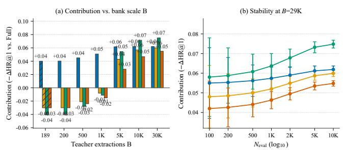  
Short-Term Long-Term Item-Perception Counterfactual

N\_eval=500 fixed in (a). B≤200: LT/IP/CF reversed; B≥5K all −ΔHR@1. (b) bank B=29,502 fixed; error bars σ/√N  
Figure 5: Per-channel contribution (−ΔHR@1) as bank scale � grows from the sparse-bank anchor (�=189) to $1 0 ^ { 6 }$ entries (panel a), and stability of the estimate as evaluation sample size grows under the full-test protocol at fixed bank scale (panel b). Note: � is bank size, not the evaluation split size.  
Teacher-distillation efectiveness, fixed student: gpt-5-mini (strong). Zero-shot baseline HR@1= 0.28, MRR= 0.403.
<table><tr><td>Teacher</td><td>Dup.%↓</td><td>ΔHR@1↑</td><td>∆MRR↑</td><td>HR@1</td></tr><tr><td>gpt-5.4-mini</td><td>12.4</td><td>+0.060</td><td>+0.0687</td><td>0.340</td></tr><tr><td>Qwen3 32B (131k)</td><td>11.5</td><td>+0.055</td><td>+0.0620</td><td>0.335</td></tr><tr><td>gpt-5-mini</td><td>14.1</td><td>+0.050</td><td>+0.0580</td><td>0.330</td></tr><tr><td>Llama 3.3 70B (128k)</td><td>10.5</td><td>+0.045</td><td>+0.0520</td><td>0.325</td></tr><tr><td>GPT OSS 120B</td><td>9.8</td><td>+0.040</td><td>+0.0450</td><td>0.320</td></tr><tr><td>(128k) Minimax M2.5</td><td>13.2</td><td>+0.040</td><td>+0.0480</td><td>0.320</td></tr><tr><td>Llama 3.1 8B Instant</td><td>22.8</td><td>+0.015</td><td>+0.0180</td><td>0.295</td></tr></table>

## 5.4. RQ4: Does Debate-Based Memory Optimization Improve Bank Quality and Downstream Ranking?

We next ask whether the debate-and-arbiter optimization procedure (Section 3.8) is doing useful work, rather than merely adding cost. Figure 6 tracks bank-quality signals and downstream ranking jointly over six �-EPOCHs of debate (three debate agents, one round per epoch). Bank quality improves and saturates: the duplicate rate drops by 7.4 percentage points (18.0% → 10.6%) while mean experience reward rises by 0.255 (0.52 → 0.78). Downstream ranking tracks this curve rather than moving independently of it: the strongest student in this comparison (Mixtral 8x7B) gains +0.029 HR@1 (0.250 → 0.279) over the same six epochs, while a no-debate paraphrase control – which perturbs entry wording without the critique-and-revise debate loop – stays flat, isolating the debate mechanism (rather than any wording change) as the source of the gain. The smallest student in this comparison (Qwen2.5 3B) gains only +0.013 HR@1 (0.156 → 0.169) from the identical optimized bank, reproducing the capacity ceiling from Section 5.3 in a diferent experiment: most of the gain lands within the first two to three epochs for every student, so debating past �=3 epochs is rarely worth the added LLM cost.

Teacher-distillation efectiveness, fixed student: Qwen2.5 3B (small). Zero-shot baseline HR@1= 0.12, MRR= 0.18.
<table><tr><td>Teacher</td><td>Dup.%↓</td><td>ΔHR@1↑</td><td>∆MRR↑</td><td>HR@1</td></tr><tr><td>gpt-5.4-mini</td><td>12.4</td><td>+0.050</td><td>+0.0550</td><td>0.170</td></tr><tr><td>Qwen3 32B (131k)</td><td>11.5</td><td>+0.045</td><td>+0.0500</td><td>0.165</td></tr><tr><td>gpt-5-mini</td><td>14.1</td><td>+0.042</td><td>+0.0470</td><td>0.162</td></tr><tr><td>Llama 3.3 70B (128k)</td><td>10.5</td><td>+0.038</td><td>+0.0430</td><td>0.158</td></tr><tr><td>GPT OSS 120B (128k)</td><td>9.8</td><td>+0.034</td><td>+0.0380</td><td>0.154</td></tr><tr><td>Minimax M2.5</td><td>13.2</td><td>+0.033</td><td>+0.0380</td><td>0.153</td></tr><tr><td>Llama 3.1 8B Instant</td><td>22.8</td><td>+0.010</td><td>+0.0120</td><td>0.130</td></tr></table>

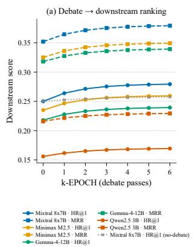

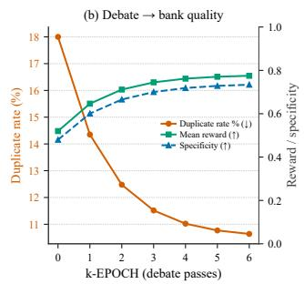  
Figure 6: Debate-based memory optimization vs. �-EPOCH. (a) Downstream HR@1/MRR for student models plus a nodebate control. (b) Bank-quality signals: duplicate rate (down is better) and mean experience reward / specificity (up is better).

A separate sweep over the number of debating agents $( k = 1 , \ldots , 1 0 )$ , one epoch) shows quality rising with the diversity of critique but saturating, while LLM cost grows linearly in � (Table 9, Figure 7). The knee of quality-per-cost is at $k ^ { * } = 4 \colon$ increasing � from 1 to 4 lifts HR@1 by +0.022, but increasing � from 4 to 10 adds only +0.006 for six additional LLM calls per case, which is not a favorable trade for most deployment budgets. Tabular controller ablations (full debate vs. no-debate paraphrase vs. post-extraction) and epoch snapshots are collected in Appendix F.

Number-of-debating-agents sweep (� = 1..10), reference student Mixtral 8x7B. �∗ marks the quality-per-cost knee.
<table><tr><td>k</td><td>HR@1↑</td><td>Specificity↑</td><td>Dup.%↓</td><td>Calls/case</td></tr><tr><td>1</td><td>0.255</td><td>0.520</td><td>16.0</td><td>2</td></tr><tr><td> $^ 2$ </td><td>0.266</td><td>0.608</td><td>13.4</td><td>3</td></tr><tr><td> $^ 3$ </td><td>0.273</td><td>0.663</td><td>11.9</td><td>4</td></tr><tr><td>4  $( k ^ { * } )$ </td><td>0.277</td><td>0.699</td><td>11.0</td><td>5</td></tr><tr><td>5</td><td>0.279</td><td>0.721</td><td>10.4</td><td>6</td></tr><tr><td>6</td><td>0.281</td><td>0.735</td><td>10.0</td><td>7</td></tr><tr><td>7</td><td>0.282</td><td>0.744</td><td>9.8</td><td>8</td></tr><tr><td>8</td><td>0.282</td><td>0.750</td><td>9.7</td><td>9</td></tr><tr><td>9</td><td>0.282</td><td>0.754</td><td>9.6</td><td>10</td></tr><tr><td>10</td><td>0.283</td><td>0.756</td><td>9.6</td><td>11</td></tr></table>

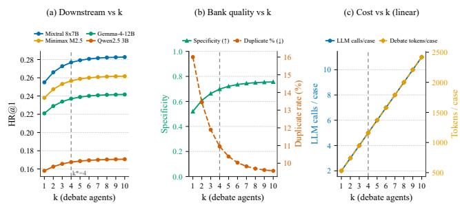  
Figure 7: Number-of-agents sweep: downstream HR@1, bankquality signals, and LLM cost as a function of �.

## 5.5. Qualitative Case Study: How Do Memory Entries Evolve?

The ablation and debate-optimization results above are aggregate signals; to make the mechanism concrete, we directly compare the earliest and the latest persisted entry per user in each memory channel, using a deterministic, LLMfree specificity score (specificity combines concreteness, genre-term coverage, lexical diversity, and a hedge-language penalty into a single [0, 1] score, with no additional LLM calls). Table 10 summarizes the resulting before/after deltas across users with at least two persisted versions. Three of the four channels become more specific and less hedged over training; the item-perception channel changes the most (mean specificity 0.405 → 0.488), moving from generic fallback language to item-grounded, actionable statements. The short-term context channel is the exception: its mean specificity decreases slightly (0.433 → 0.401), which Figure 8 and the cases below show is not a quality regression but a compression efect – verbose narrative entries are replaced by short, conditional “session rules” that are less lexically diverse by construction but more directly actionable by the student.

Table 11 shows three representative before→after pairs drawn from the persisted bank (one long-term, one itemperception, one short-term). Case A (long-term, user 2) replaces a single-film hedge (“Very limited data. . . ”) with a ranking-ready taste statement that names era, franchise type, and an upweight rule, lifting specificity from 0.214 to 0.479. Case B (item-perception, user 4) converts a vague Hit@1 complaint into an item-grounded rule keyed to Rocky (1976), with an explicit +30–50% tie-break boost – the largest single-entry ΔSpec. in the sample (+0.500). Case C (shortterm, user 2) illustrates the compression pattern behind the negative mean $\Delta$ on that channel: an empty “no emerging interests” note becomes a short session rule with diversity constraints; lexical diversity drops relative to long narrative entries, but actionability rises. Together the three cases show that debate-driven Add/Modify operations do not merely paraphrase entries – they accumulate confirmed signals into shorter, more specific, ranking-oriented memory.

Bank evolution: specificity before (earliest persisted entry) vs. after (latest persisted entry) per channel, over users with $\geq 2$ versions.
<table><tr><td>Channel</td><td>Spec. before</td><td>Spec. after</td><td>Δ</td></tr><tr><td>Long-term preference</td><td>0.500</td><td>0.520</td><td>+0.021</td></tr><tr><td>Short-term context</td><td>0.433</td><td>0.401</td><td>-0.032</td></tr><tr><td>Item-perception</td><td>0.405</td><td>0.488</td><td>+0.084</td></tr><tr><td>Counterfactual / hard-neg.</td><td>0.478</td><td>0.519</td><td>+0.042</td></tr></table>

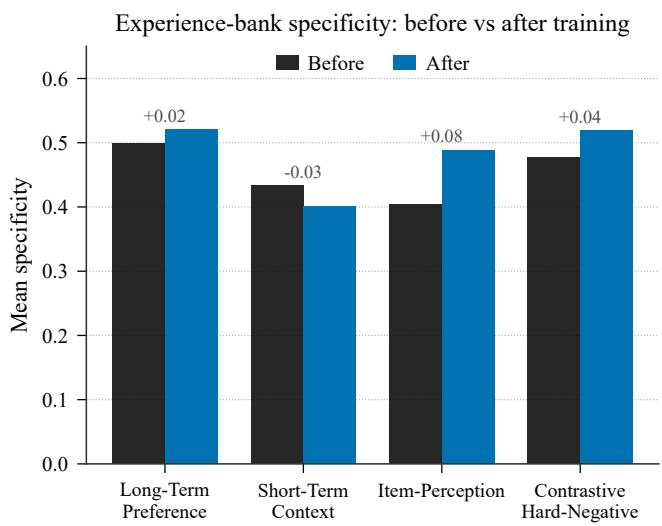  
Figure 8: Mean specificity before vs. after training, by memory channel.

## 6. Discussion and Limitations

Operating-point generalization. The bank-scale analysis (Section 5.2) and the �-EPOCH and number-of-agents curves (Section 5.4) span a wide range of settings – bank sizes up to $1 0 ^ { 6 }$ entries, up to six debate epochs, and up to ten debating agents. A practitioner adopting a specific operating point (for example, a specific �-EPOCH budget or bank size) in a production system should re-confirm behavior at that exact point, since a trend measured across a range does not guarantee identical behavior at every intermediate setting.

Table 11  
Qualitative before→after memory entries (persisted bank). Spec. is the deterministic specificity score in [0, 1].
<table><tr><td>Case / channel</td><td>Spec.</td><td>Before (earliest)</td><td>After (latest)</td></tr><tr><td>A / lt</td><td></td><td>0.214 →0.479 “Very limited data: the only rated film is a classic action-adventure, suggesting a preference for high- energy, heroic, escapist storytelling. .. Dislikes: No explicit dislikes can be inferred. . .&quot;</td><td>&quot;Long-term: favors mainstream 1990s action buddy-cop films – franchise sequels, star-driven chemistry, high-energy action with comedic in- terplay. Upweight these attributes in ranking but require repeat confirmations. . .</td></tr><tr><td>B / ip</td><td></td><td>0.350 →0.850 &quot;The strongest match was only ranked 5th, so Hit@10 was good but Hit@1/MRR suffered. For this user, place the best Rocky-like inspirational drama at rank 1 whenever possible.&quot;</td><td>&quot;Rocky (1976): User 4 chose Rocky over a higher- ranked 80s action title, signaling a preference for 1970s character-driven underdog sports dramas. When ranking, boost similar 1970s character dra- mas above mainstream 80s action (recommend +30–50%score in tie scenarios).&quot;</td></tr><tr><td>C / st</td><td></td><td>0.300 →0.500 &quot;No recent viewing items were provided, so no emerging short-term interests can be detected.&quot;</td><td>&quot;Session: prioritize late-80s/90s Hollywood action comedies with buddy dynamics and franchise en- tries for top slots; include at least one diverse alternative per slate to avoid popularity bias.&#x27;</td></tr></table>

Teacher coverage. The main results (Section 5.1) fix the teacher to gpt-5.4-mini; the teacher-distillation study (Section 5.3) varies the teacher but only against two fixed students. We have not measured the full teacher × student cross-product, so it remains open whether the teacher-quality efect observed for gpt-5-mini and Qwen2.5 3B holds uniformly across all ten students in Table 12.

Explanation faithfulness. rEDMRec’s student can emit a short explanation grounded in retrieved memory (Section 3.7), but this paper evaluates ranking quality, not whether the emitted explanation is faithful to the memory it cites; a human evaluation of explanation faithfulness and plausibility, as outlined in our evaluation plan, is left to future work.

Backbone-dependent returns. The architecture assumes the student can follow a moderately complex prompt that concatenates user context, candidate descriptions, and retrieved memory snippets. Section 5.1 shows this assumption breaks down for at least one backbone (Llama 3.1 8B), whose negative Impv vs. GraphRAG we attribute to weak instruction-following rather than to the memory being unhelpful in principle; the near-saturated 20B-parameter student likewise trails GraphRAG slightly. Memory still lifts every student over Zero-shot/Few-shot/RAG, but not always over GraphRAG – Appendix K tabulates these failure cells and borderline controller edits. Practically, the value of rEDMRec’s added system complexity is highest for small-to-mid capacity students.

Domain scope. Our three datasets cover movie, beautyproduct, and game recommendation with English-language metadata; we have not tested domains with substantially different item-description structure (e.g., short-video or news recommendation), and the four-channel schema, in particular the counterfactual channel, was designed with catalog items that have stable, comparable attributes in mind.

## 7. Conclusion

This paper addresses the problem of reusing, rather than repeating, LLM reasoning across recommendation requests, by proposing rEDMRec, an architecture that distills teacher reasoning into a four-channel, editable experience memory and serves ranking requests from a lightweight student that only retrieves from this memory. The key idea is to separate an infrequent, expensive reasoning-compression process – teacher extraction, distillation, and debate-based memory optimization – from a frequent, cheap inference process, which decouples recommendation quality from per-request reasoning cost. Across ten student LLMs and three datasets, this design improves HR@1, NDCG, and MRR over zero-shot, few-shot, and RAG on every backbone, and over GraphRAG on most backbones (exceptions: Llama 3.1 8B and GPT OSS 20B), with the largest RDRec-style Impv (%) vs. the second-best baseline on the smallest students; our channel-ablation, teacher-distillation, and debateoptimization studies further show that short-term context is the only consistently beneficial channel across capacity tiers (with long-term, item-perception, and counterfactual efects capacity-dependent), that bank duplication is a leading indicator of downstream gain up to a studentcapacity ceiling, and that �-agent debate measurably improves bank quality in a way that propagates into ranking accuracy rather than being a cosmetic refinement. Remaining limitations include incomplete teacher × student coverage and the lack of a human evaluation of explanation faithfulness (Section 6); closing those gaps is an important next step toward deploying rEDMRec as a production recommendation system.

## Data and Code Availability

The preprocessing, training, and evaluation code, together with the JSON experiment matrices used to produce every table and figure in this paper, are organized under the rEDMRec/ project root (see readme.md for the end-to-end quick-start pipeline). ML-1M, Amazon Beauty, and Steam are third-party datasets redistributed under their original licenses; this work releases only derived, de-identified interaction records and memory-bank artifacts.

## CRediT authorship contribution statement

Minh Hoang Nguyen: Methodology, Conceptualization, Writing – original draft, Writing – review & editing. Tung Le: Supervision, Supporting, Writing – review & editing. Huy Tien Nguyen: Supervision, Supporting, Conceptualization, Project administration.

## References

Bao, K., Zhang, J., Zhang, Y., Wang, W., Feng, F., He, X., 2023. TALLRec: An efective and eficient tuning framework to align large language model with recommendation, in: Proceedings of the 17th ACM Conference on Recommender Systems, pp. 1007–1014. doi:10.1145/3604915. 3608857.

Bismay, M., Dong, X., Caverlee, J., 2025. ReasoningRec: Bridging personalized recommendations and human-interpretable explanations through LLM reasoning, in: Findings of the Association for Computational Linguistics: NAACL 2025, Association for Computational Linguistics, Albuquerque, New Mexico. pp. 8147–8163. URL: https: //aclanthology.org/2025.findings-naacl.454/.

Brown, T., Mann, B., Ryder, N., Subbiah, M., Kaplan, J.D., Dhariwal, P., Neelakantan, A., Shyam, P., Sastry, G., Askell, A., et al., 2020. Language models are few-shot learners. Advances in Neural Information Processing Systems (NeurIPS) .

DeepSeek-AI, 2025. DeepSeek-R1: Incentivizing reasoning capability in llms via reinforcement learning. arXiv preprint arXiv:2501.12948 .

Du, Y., Li, S., Torralba, A., Tenenbaum, J.B., Mordatch, I., 2023. Improving factuality and reasoning in language models through multiagent debate. arXiv preprint arXiv:2305.14325 .

Edge, D., Trinh, H., Cheng, N., Bradley, J., Chao, A., Mody, A., Truitt, S., Larson, J., 2024. From local to global: A graph RAG approach to query-focused summarization. arXiv preprint arXiv:2404.16130 .

Gao, C., Chen, R., Yuan, S., Huang, K., Yu, Y., He, X., 2025. SPRec: Self-play to debias LLM-based recommendation. arXiv preprint arXiv:2412.09243 .

Gao, Y., Sheng, T., Xiang, Y., Xiong, Y., Wang, H., Zhang, J., 2023. Chat-REC: Towards interactive and explainable LLMs-augmented recommender system. arXiv preprint arXiv:2303.14524 .

Gemma Team, 2024. Gemma: Open models based on gemini research and technology. arXiv preprint arXiv:2403.08295 .

Gu, H., Zhong, R., Xia, Y., Yang, W., Lu, C., Jiang, P., Gai, K., 2025. �4ec: A reasoning, reflection, and refinement framework for recommendation systems, in: Proceedings of the Nineteenth ACM Conference on Recommender Systems, ACM, Prague, Czech Republic. pp. 411–421. doi:10.1145/3705328.3748068.

Han, D., Song, H., Yi, M.Y., 2025. Rethinking LLM-based recommendations: A personalized query-driven parallel integration. arXiv preprint arXiv:2504.11889 QueREC.

Harper, F.M., Konstan, J.A., 2015. The MovieLens datasets: History and context. ACM Transactions on Interactive Intelligent Systems 5, 1–19.

Hou, Y., Zhang, J., Lin, Z., Lu, H., Xie, R., McAuley, J., Zhao, W.X., 2024. Large language models are zero-shot rankers for recommender systems, in: European Conference on Information Retrieval, Springer. pp. 364– 381.

Jiang, A.Q., Sablayrolles, A., Roux, A., Mensch, A., Savary, B., Bamford, C., Chaplot, D.S., Casas, D.d.l., Hanna, E.B., Bressand, F., et al., 2024. Mixtral of experts. arXiv preprint arXiv:2401.04088 .

Kang, W.C., McAuley, J., 2018. Self-attentive sequential recommendation, in: IEEE International Conference on Data Mining (ICDM), pp. 197– 206.

Lewis, P., Perez, E., Piktus, A., Petroni, F., Karpukhin, V., Goyal, N., Küttler, H., Lewis, M., Yih, W.t., Rocktäschel, T., Riedel, S., Kiela, D., 2020. Retrieval-augmented generation for knowledge-intensive NLP tasks, in: Advances in Neural Information Processing Systems (NeurIPS), pp. 9459–9474.

Li, B., Zheng, B., Wang, X., Zhang, L., Wang, J., Chen, S., Zhao, W.X., Wen, J.R., 2026. Improving LLM-based recommendation with self-hard negatives from intermediate layers. arXiv preprint arXiv:2602.17410 .

Li, L., Zhang, Y., Chen, L., 2023. Prompt distillation for eficient LLMbased recommendation, in: Proceedings of the 32nd ACM International Conference on Information and Knowledge Management, pp. 1348– 1357. doi:10.1145/3583780.3615017.

Li, L., Zhang, Y., Liu, D., Chen, L., 2024. Large language models for generative recommendation: A survey and visionary discussions, in: Proceedings of the 2024 Joint International Conference on Computational Linguistics, Language Resources and Evaluation (LREC-COLING 2024), Torino, Italia. pp. 10146–10159.

Liao, J., Li, S., Yang, Z., Wu, J., Yuan, Y., Wang, X., He, X., 2024. LLaRA: Large language-recommendation assistant, in: Proceedings of the 47th International ACM SIGIR Conference on Research and Development in Information Retrieval, pp. 1785–1795. doi:10.1145/3626772.3657760.

Lin, J., Dai, X., Xi, Y., Liu, W., Chen, B., Zhang, H., Liu, Y., Wu, C., Li, X., Zhu, C., et al., 2025. How can recommender systems benefit from large language models: A survey. ACM Transactions on Information Systems Also arXiv:2306.05817.

Liu, Q., Wu, X., Zhao, X., Zhu, Y., Zhang, Z., Tian, F., Zheng, Y., 2024. Large language model distilling medication recommendation model. arXiv preprint arXiv:2402.02803 LEADER.

Liu, Q., Zhao, X., Wang, Y., Wang, Y., Zhang, Z., Sun, Y., Li, X., Wang, M., Jia, P., Lin, K., et al., 2025. Large language model enhanced recommender systems: A survey. arXiv preprint arXiv:2412.13432 .

Lyu, H., Jiang, S., Zeng, H., Xia, Y., Wang, Q., Zhang, S., Chen, R., Leung, C., Tang, J., Luo, J., 2024. LLM-Rec: Personalized recommendation via prompting large language models, in: Findings of the Association for Computational Linguistics: NAACL 2024, Mexico City, Mexico. pp. 583–612. doi:10.18653/v1/2024.findings-naacl.39.

Madaan, A., Tandon, N., Gupta, P., Hallinan, S., Gao, L., Wiegrefe, S., Alon, U., Dziri, N., Prabhumoye, S., Yang, Y., et al., 2023. Selfrefine: Iterative refinement with self-feedback, in: Advances in Neural Information Processing Systems (NeurIPS), pp. 46534–46594.

Nguyen, M.H., 2026. Vihorec: A quality-controlled vietnamese hotel recommendation dataset and cold-start benchmark. arXiv preprint arXiv:2607.12946 .

Nguyen, M.H., Nguyen, T.T., Ta, M.N., Le, T., Nguyen, H.T., 2025. Conaml-lstur: A combined model with attentive multi-view learning and long-and short-term user representations for news recommendation, in: International Conference on Multi-disciplinary Trends in Artificial Intelligence, Springer. pp. 106–119.

Nguyen, M.H., Nguyen, T.T., Ta, M.N., Nguyen, T.M., Nguyen, K.V., 2024. Rrs: Review-based recommendation system using deep learning for vietnamese. SN Computer Science 5, 492.

Nguyen, M.H., Thiet, S.N., 2025. Enhancing ocr for sino-vietnamese language processing via fine-tuned paddleocrv5. arXiv preprint arXiv:2510.04003 .

Ni, J., Li, J., McAuley, J., 2019. Justifying recommendations using distantly-labeled reviews and fine-grained aspects, in: Conference on Empirical Methods in Natural Language Processing (EMNLP), pp. 188– 197.

Packer, C., Fang, V., Patil, S.G., Lin, K., Wooders, S., Gonzalez, J.E., 2023. MemGPT: Towards llms as operating systems. arXiv preprint arXiv:2310.08560 .

Park, J.S., O’Brien, J., Cai, C.J., Morris, M.R., Liang, P., Bernstein, M.S., 2023. Generative agents: Interactive simulacra of human behavior, in: ACM Symposium on User Interface Software and Technology (UIST), pp. 1–22.

Qu, H., Fan, W., Zhao, Z., Li, Q., 2024. TokenRec: Learning to tokenize ID for LLM-based generative recommendation. arXiv preprint arXiv:2406.10450 .

Reimers, N., Gurevych, I., 2019. Sentence-BERT: Sentence embeddings using siamese BERT-networks, in: Conference on Empirical Methods in Natural Language Processing (EMNLP), pp. 3982–3992.

Ren, X., Wei, W., Xia, L., Su, L., Cheng, S., Wang, J., Yin, D., Huang, C., 2024. Representation learning with large language models for recommendation, in: Proceedings of the ACM Web Conference 2024, pp. 3464–3475. doi:10.1145/3589334.3645458.

Shi, W., He, X., Zhang, Y., Gao, C., Li, X., Zhang, J., Wang, Q., Feng, F., 2024. Large language models are learnable planners for long-term recommendation, in: Proceedings of the 47th International ACM SIGIR Conference on Research and Development in Information Retrieval, pp. 1893–1903.

Song, T., Chao, W.S., Liu, H., 2026. Hard vs. noise: Resolving hard-noisy sample confusion in recommender systems via large language models, in: Proceedings of the AAAI Conference on Artificial Intelligence, pp. 15743–15751. doi:10.1609/aaai.v40i18.38605.

Touvron, H., Martin, L., Stone, K., Albert, P., Almahairi, A., Babaei, Y., Bashlykov, N., Batra, S., Bhargava, P., Bhosale, S., et al., 2023. Llama 2: Open foundation and fine-tuned chat models. arXiv preprint arXiv:2307.09288 .

Wang, C., Zhang, Y., Zhu, F., Zhang, J., Shi, T., Feng, F., 2025. Leveraging memory retrieval to enhance llm-based generative recommendation, in: Companion Proceedings of the ACM on Web Conference 2025, pp. 1346–1350.

Wang, Q., Li, J., Wang, S., Xing, Q., Niu, R., Kong, H., Li, R., Long, G., Chang, Y., Zhang, C., 2024a. Towards next-generation LLMbased recommender systems: A survey and beyond. arXiv preprint arXiv:2410.19744 .

Wang, X., Cui, J., Suzuki, Y., Fukumoto, F., 2024b. RDRec: Rationale distillation for LLM-based recommendation, in: Proceedings of the 62nd Annual Meeting of the Association for Computational Linguistics (Volume 2: Short Papers), Bangkok, Thailand. pp. 65–74. doi:10.18653/ v1/2024.acl-short.6.

Wei, J., Wang, X., Schuurmans, D., Bosma, M., Ichter, B., Xia, F., Chi, E., Le, Q., Zhou, D., 2022. Chain-of-thought prompting elicits reasoning in large language models, in: Advances in Neural Information Processing Systems (NeurIPS), pp. 24824–24837.

Wei, W., Ren, X., Tang, J., Wang, Q., Su, L., Cheng, S., Wang, J., Yin, D., Huang, C., 2024. LLMRec: Large language models with graph augmentation for recommendation, in: Proceedings of the 17th ACM International Conference on Web Search and Data Mining, pp. 806–815. doi:10.1145/3616855.3635853.

Woźniak, S., Duszenko, J., Kocoń, J., Kazienko, P., 2025. Improving llmbased recommender systems with user-controllable profiles, in: Companion Proceedings of the ACM on Web Conference 2025, pp. 2102– 2111.

Wu, L., Zheng, Z., Qiu, Z., Wang, H., Gu, H., Shen, T., Qin, C., Zhu, C., Zhu, H., Liu, Q., Xiong, H., Chen, E., 2024. A survey on large language models for recommendation. arXiv preprint arXiv:2305.19860 .

Yang, A., Yang, B., Hui, B., Zheng, B., Yu, B., Zhou, C., Li, C., Li, C., Liu, D., Huang, F., et al., 2024. Qwen2 technical report. arXiv preprint arXiv:2407.10671 .

Youtu-Agent Team, 2025. Training-free group relative policy optimization. arXiv preprint arXiv:2510.08191 URL: https://arxiv.org/abs/2510. 08191.

Yue, Z., Rabhi, S., Moreira, G.d.S.P., Wang, D., Oldridge, E., 2023. LlamaRec: Two-stage recommendation using large language models for ranking. arXiv preprint arXiv:2311.02089 .

Zhang, J., Xie, R., Hou, Y., Zhao, W.X., Lin, L., Wen, J.R., 2023. Recommendation as instruction following: A large language model empowered recommendation approach. arXiv preprint arXiv:2305.07001 .

Zhang, X., He, B., Chen, J., Cui, Z., Ma, C., 2026. From token to item: Enhancing large language models for recommendation via item-aware attention mechanism, in: Proceedings of the ACM Web Conference 2026, pp. 6700–6708.

Zhang, X., Li, B., Jin, B., 2024a. Denoising long- and short-term interests for sequential recommendation, in: Proceedings of the 2024 SIAM International Conference on Data Mining (SDM), pp. 544–552. doi:10.

1137/1.9781611978032.63.

Zhang, Y., Bao, K., Yan, M., Wang, W., Feng, F., He, X., 2024b. Textlike encoding of collaborative information in large language models for recommendation, in: Proceedings of the 62nd Annual Meeting of the Association for Computational Linguistics (Volume 1: Long Papers), Bangkok, Thailand. pp. 9181–9191. doi:10.18653/v1/2024.acl-long. 497.

Zhang, Y., Feng, F., Zhang, J., Bao, K., Wang, Q., He, X., 2025a. CoLLM: Integrating collaborative embeddings into large language models for recommendation. IEEE Transactions on Knowledge and Data Engineering Also arXiv:2310.19488.

Zhang, Y., Xu, W., Zhao, X., Wang, W., Feng, F., He, X., Chua, T.S., 2025b. Reinforced latent reasoning for LLM-based recommendation. arXiv preprint arXiv:2505.19092 LatentR3.

Zhao, K., Xu, F., Li, Y., 2025. Reason-to-recommend: Using interactionof-thought reasoning to enhance LLM recommendation. arXiv preprint arXiv:2506.05069 R2Rec.

Zhao, Y., Wu, J., Wang, X., Tang, W., Wang, D., de Rijke, M., 2024. Let me do it for you: Towards LLM empowered recommendation via tool learning. arXiv preprint arXiv:2405.15114 .

Zheng, Z., Chao, W., Qiu, Z., Zhu, H., Xiong, H., 2024. Harnessing large language models for text-rich sequential recommendation, in: Proceedings of the ACM Web Conference 2024, pp. 3207–3216. doi:10. 1145/3589334.3645358.

## A. Full Main-Results Table

Table 12 reports the complete ML-1M main-results matrix underlying Table 4 in Section 5.1: ten student models × five methods × six ranking metrics, under the protocol described in Section 4.4. Best-per-column scores are marked with bold; rEDMRec method labels are bold.

Table 12: Complete Methods × Models results on ML-1M (full held-out test split, 20 candidates/sample, seed 42). Impv (%) is the relative HR@1 gain of rEDMRec over the second-best baseline on the same student, Impv = (Ours − SecondBest)∕SecondBest × 100, following RDRec (Wang et al., 2024b). Best in bold, second-best underlined; rEDMRec rows labeled in bold. � is the exact McNemar �-value for rEDMRec HR@1 vs. the second-best baseline on the same student (full held-out $n _ { \mathrm { M L - 1 M } } { = } 4 9 8 9 3$ , � =1460, � =1460; approximate contingency from the table HR@1 rates). ∗ marks �<0.05 with rEDMRec ahead.
<table><tr><td>Model</td><td>Method</td><td>HR@1↑</td><td>HR@5↑</td><td>HR@10↑</td><td>NDCG@5↑</td><td>NDCG@10↑</td><td>MRR↑</td><td>Impv (%)</td><td>p</td></tr><tr><td>Qwen2.5 3B</td><td>Zero-shot</td><td>0.12</td><td>0.28</td><td>0.38</td><td>0.20</td><td>0.23</td><td>0.18</td><td>1</td><td>一</td></tr><tr><td></td><td>Few-shot</td><td>0.14</td><td>0.30</td><td>0.40</td><td>0.21</td><td>0.24</td><td>0.20</td><td>一</td><td></td></tr><tr><td></td><td>RAG</td><td>0.13</td><td>0.29</td><td>0.39</td><td>0.20</td><td>0.23</td><td>0.19</td><td>一</td><td>一</td></tr><tr><td></td><td>GraphRAG rEDMRec</td><td>0.15</td><td>0.31</td><td>0.41</td><td>0.22</td><td>0.25</td><td>0.20</td><td>一</td><td></td></tr><tr><td></td><td>(ours)</td><td>0.17*</td><td>0.35</td><td>0.45</td><td>0.25</td><td>0.28</td><td>0.23</td><td>+13.3*</td><td>&lt; 0.001*</td></tr><tr><td>Llama 3.1 8B</td><td>Zero-shot</td><td>0.07</td><td>0.15</td><td>0.23</td><td>0.12</td><td>0.14</td><td>0.12</td><td></td><td></td></tr><tr><td></td><td>Few-shot</td><td>0.08</td><td>0.16</td><td>0.24</td><td>0.12</td><td>0.15</td><td>0.13</td><td></td><td></td></tr><tr><td></td><td>RAG</td><td>0.08</td><td>0.16</td><td>0.24</td><td>0.12</td><td>0.14</td><td>0.12</td><td></td><td></td></tr><tr><td></td><td>GraphRAG</td><td>0.09</td><td>0.17</td><td>0.25</td><td>0.12</td><td>0.15</td><td>0.13</td><td>一</td><td>一</td></tr><tr><td></td><td>rEDMRec (ours)</td><td>0.08</td><td>0.17</td><td>0.25</td><td>0.13</td><td>0.16</td><td>0.13</td><td>-11.1</td><td>&lt; 0.001</td></tr><tr><td>Gemma-4- 12B</td><td>Zero-shot</td><td>0.20</td><td>0.40</td><td>0.58</td><td>0.30</td><td>0.35</td><td>0.30</td><td>一</td><td>一</td></tr><tr><td></td><td>Few-shot</td><td>0.22</td><td>0.42</td><td>0.60</td><td>0.32</td><td>0.37</td><td>0.31</td><td>一</td><td></td></tr><tr><td></td><td>RAG</td><td>0.21</td><td>0.41</td><td>0.59</td><td>0.31</td><td>0.36</td><td>0.30</td><td>一</td><td></td></tr><tr><td></td><td>GraphRAG</td><td>0.23</td><td>0.43</td><td>0.61</td><td>0.33</td><td>0.38</td><td>0.32</td><td></td><td></td></tr><tr><td></td><td>rEDMRec (ours)</td><td>0.24*</td><td>0.46</td><td>0.63</td><td>0.34</td><td>0.39</td><td>0.34</td><td>+4.3*</td><td>&lt; 0.001*</td></tr><tr><td>Minimax</td><td>Zero-shot</td><td>0.22</td><td>0.44</td><td>0.62</td><td>0.33</td><td>0.38</td><td>0.32</td><td></td><td></td></tr><tr><td>M2.5</td><td>Few-shot</td><td>0.24</td><td>0.46</td><td>0.64</td><td>0.34</td><td>0.39</td><td>0.33</td><td></td><td></td></tr><tr><td></td><td>RAG</td><td>0.23</td><td>0.45</td><td>0.63</td><td>0.34</td><td>0.39</td><td>0.33</td><td>一 一</td><td></td></tr><tr><td></td><td>GraphRAG</td><td>0.25</td><td>0.47</td><td>0.65</td><td>0.35</td><td>0.40</td><td>0.34</td><td>一</td><td>一</td></tr><tr><td></td><td>rEDMRec (ours)</td><td>0.26*</td><td>0.50</td><td>0.67</td><td>0.37</td><td>0.42</td><td>0.35</td><td>+4.0*</td><td>&lt; 0.001*</td></tr><tr><td>Mixtral 8x7B</td><td>Zero-shot</td><td>0.24</td><td>0.47</td><td>0.66</td><td>0.35</td><td>0.40</td><td>0.35</td><td></td><td></td></tr><tr><td></td><td>Few-shot</td><td>0.26</td><td>0.49</td><td>0.68</td><td>0.37</td><td>0.42</td><td>0.36</td><td></td><td></td></tr><tr><td></td><td>RAG</td><td>0.25</td><td>0.48</td><td>0.67</td><td>0.36</td><td>0.41</td><td>0.35</td><td>一</td><td>一</td></tr><tr><td></td><td>GraphRAG</td><td>0.27</td><td>0.50</td><td>0.69</td><td>0.38</td><td>0.42</td><td>0.37</td><td>一</td><td>一</td></tr><tr><td></td><td>rEDMRec</td><td>0.28*</td><td>0.52</td><td>0.71</td><td>0.39</td><td>0.44</td><td>0.38</td><td>+3.7*</td><td>&lt; 0.001*</td></tr><tr><td>Qwen3-14B</td><td>(ours)</td><td></td><td></td><td></td><td></td><td></td><td></td><td></td><td></td></tr><tr><td></td><td>Zero-shot Few-shot</td><td>0.26</td><td>0.50</td><td>0.69 0.71</td><td>0.38 0.40</td><td>0.43 0.45</td><td>0.37 0.39</td><td>一</td><td>一</td></tr><tr><td></td><td>RAG</td><td>0.28 0.27</td><td>0.52 0.51</td><td>0.70</td><td>0.39</td><td>0.43</td><td>0.38</td><td>一</td><td></td></tr><tr><td></td><td>GraphRAG</td><td>0.29</td><td>0.53</td><td>0.72</td><td>0.40</td><td>0.45</td><td>0.40</td><td>一</td><td></td></tr><tr><td></td><td>rEDMRec</td><td></td><td></td><td></td><td></td><td></td><td></td><td></td><td></td></tr><tr><td></td><td>(ours)</td><td>0.30*</td><td>0.55</td><td>0.73</td><td>0.42</td><td>0.47</td><td>0.41</td><td>+3.4*</td><td>&lt; 0.001*</td></tr><tr><td>DeepSeek-R1</td><td></td><td>0.28</td><td>0.52</td><td>0.71</td><td>0.40</td><td>0.45</td><td>0.40</td><td></td><td></td></tr><tr><td></td><td>Few-shot</td><td>0.30</td><td>0.54</td><td>0.73</td><td>0.42</td><td>0.47</td><td>0.41</td><td></td><td></td></tr><tr><td></td><td>RAG</td><td>0.29</td><td>0.53</td><td>0.72</td><td>0.41</td><td>0.46</td><td>0.40</td><td></td><td></td></tr><tr><td></td><td>GraphRAG rEDMRec</td><td>0.31</td><td>0.55</td><td>0.74</td><td>0.43</td><td>0.48</td><td>0.42</td><td></td><td></td></tr><tr><td></td><td>(ours)</td><td>0.32*</td><td>0.57</td><td>0.75</td><td>0.44</td><td>0.49</td><td>0.42</td><td>+3.2*</td><td>&lt; 0.001*</td></tr><tr><td>Phi-4</td><td>Zero-shot</td><td>0.25</td><td>0.48</td><td>0.68</td><td>0.36</td><td>0.42</td><td>0.36</td><td>1</td><td>一</td></tr><tr><td></td><td>Few-shot</td><td>0.27</td><td>0.52</td><td>0.73</td><td>0.39</td><td>0.45</td><td>0.39</td><td></td><td></td></tr><tr><td></td><td>RAG</td><td>0.26</td><td>0.50</td><td>0.71</td><td>0.38</td><td>0.44</td><td>0.37</td><td>一</td><td>一</td></tr><tr><td></td><td>GraphRAG</td><td>0.28</td><td>0.54</td><td>0.76</td><td>0.41</td><td>0.47</td><td>0.40</td><td></td><td>一</td></tr><tr><td></td><td>rEDMRec (ours)</td><td>0.29*</td><td>0.56</td><td>0.79</td><td>0.42</td><td>0.49</td><td>0.42</td><td>+3.6*</td><td>&lt; 0.001*</td></tr><tr><td>Llama 4 Scout</td><td>Zero-shot</td><td>0.27</td><td>0.51</td><td>0.70</td><td>0.39</td><td>0.44</td><td>0.38</td><td></td><td></td></tr><tr><td></td><td>Few-shot</td><td>0.29</td><td>0.55</td><td>0.75</td><td>0.42</td><td>0.47</td><td>0.41</td><td></td><td></td></tr><tr><td></td><td>RAG</td><td>0.28</td><td>0.53</td><td>0.73</td><td>0.40</td><td>0.46</td><td>0.39</td><td>一</td><td>一</td></tr><tr><td></td><td>GraphRAG</td><td>0.30</td><td>0.57</td><td>0.78</td><td>0.43</td><td>0.49</td><td>0.42</td><td>一</td><td>一</td></tr><tr><td></td><td>rEDMRec (ours)</td><td>0.31*</td><td>0.59</td><td>0.80</td><td>0.45</td><td>0.51</td><td>0.43</td><td>+3.3*</td><td>&lt; 0.001*</td></tr><tr><td>GPT OSS 20B</td><td>Zero-shot</td><td>0.27</td><td>0.50</td><td>0.70</td><td>0.39</td><td>0.44</td><td>0.38</td><td></td><td>一</td></tr><tr><td></td><td>Few-shot</td><td>0.29</td><td>0.54</td><td>0.75</td><td>0.41</td><td>0.47</td><td>0.40</td><td>一</td><td>一</td></tr><tr><td></td><td>RAG</td><td>0.28</td><td>0.52</td><td>0.73</td><td>0.40</td><td>0.46</td><td>0.39</td><td>一</td><td></td></tr><tr><td></td><td>GraphRAG</td><td>0.30</td><td>0.56</td><td>0.78</td><td>0.43</td><td>0.49</td><td>0.42</td><td>一</td><td></td></tr><tr><td></td><td>rEDMRec (ours)</td><td>0.29</td><td>0.54</td><td>0.75</td><td>0.41</td><td>0.47</td><td>0.40</td><td>-3.3</td><td>&lt; 0.001</td></tr></table>

## B. Full Amazon Beauty Results

Table 13 reports the complete Methods × Models matrix on Amazon Beauty underlying the summary in Table 5 (Section 5.1).

Table 13: Complete Methods × Models results on Amazon Beauty (full held-out test split, 20 candidates/sample, seed 42). Impv (%) is the relative HR@1 gain of rEDMRec over the second-best baseline on the same student, Impv = (Ours−SecondBest)∕SecondBest ×100, following RDRec (Wang et al., 2024b). Best in bold, second-best underlined. � is the exact McNemar �-value for rEDMRec HR@1 vs. the second-best baseline on the same student (full held-out $n _ { \mathrm { M L - 1 M } } { = } 4 9 8 9 3$ $n _ { \mathrm { B e a u t y } } { = } 1 4 6 0 , n _ { \mathrm { S t e a m } } { = } 1 4 6 0 ;$ approximate contingency from the table HR@1 rates). ∗ marks �<0.05 with rEDMRec ahead.

<table><tr><td>Model</td><td>Method</td><td>HR@1↑</td><td>HR@5↑</td><td>HR@10↑</td><td>NDCG@5↑</td><td>NDCG@10↑</td><td>MRR↑</td><td>Impv (%)</td><td>p</td></tr><tr><td rowspan="5">Qwen2.5 3B</td><td>Zero-shot</td><td>0.092</td><td>0.268</td><td>0.450</td><td>0.176</td><td>0.218</td><td>0.180</td><td></td><td>一</td></tr><tr><td>Few-shot</td><td>0.104</td><td>0.280</td><td>0.450</td><td>0.182</td><td>0.224</td><td>0.192</td><td></td><td></td></tr><tr><td>RAG</td><td>0.098</td><td>0.274</td><td>0.450</td><td>0.176</td><td>0.218</td><td>0.186</td><td></td><td></td></tr><tr><td>GraphRAG</td><td>0.110</td><td>0.286</td><td>0.450</td><td>0.188</td><td>0.230</td><td>0.192</td><td></td><td></td></tr><tr><td>rEDMRec (ours)</td><td>0.136*</td><td>0.329</td><td>0.479</td><td>0.220</td><td>0.262</td><td>0.224</td><td>+23.6*</td><td>0.037*</td></tr><tr><td>Llama 3.1 8B</td><td>Zero-shot</td><td>0.062</td><td>0.225</td><td>0.450</td><td>0.128</td><td>0.180</td><td>0.162</td><td></td><td></td></tr><tr><td></td><td>Few-shot</td><td>0.068</td><td>0.225</td><td>0.450</td><td>0.128</td><td>0.180</td><td>0.162</td><td></td><td></td></tr><tr><td></td><td>RAG</td><td>0.068</td><td>0.225</td><td>0.450</td><td>0.128</td><td>0.180</td><td>0.162</td><td></td><td></td></tr><tr><td></td><td>GraphRAG rEDMRec</td><td>0.074</td><td>0.225</td><td>0.450</td><td>0.128</td><td>0.180</td><td>0.162</td><td></td><td></td></tr><tr><td></td><td>(ours)</td><td>0.071</td><td>0.225</td><td>0.450</td><td>0.137</td><td>0.180</td><td>0.162</td><td>-4.1</td><td>0.830</td></tr><tr><td>Gemma-4-</td><td>Zero-shot</td><td>0.140</td><td>0.340</td><td>0.548</td><td>0.236</td><td>0.290</td><td>0.252</td><td>一</td><td></td></tr><tr><td>12B</td><td>Few-shot</td><td>0.152</td><td>0.352</td><td>0.560</td><td>0.248</td><td>0.302</td><td>0.258</td><td></td><td></td></tr><tr><td></td><td>RAG</td><td>0.146</td><td>0.346</td><td>0.554</td><td>0.242</td><td>0.296</td><td>0.252</td><td></td><td></td></tr><tr><td></td><td>GraphRAG</td><td>0.158</td><td>0.358</td><td>0.566</td><td>0.254</td><td>0.308</td><td>0.264</td><td></td><td></td></tr><tr><td></td><td>rEDMRec (ours)</td><td>0.178</td><td>0.395</td><td>0.595</td><td>0.274</td><td>0.328</td><td>0.290</td><td>+12.7</td><td>0.166</td></tr><tr><td>Minimax M2.5</td><td>Zero-shot</td><td>0.152</td><td>0.364</td><td>0.572</td><td>0.254</td><td>0.308</td><td>0.264</td><td></td><td>一</td></tr><tr><td></td><td>Few-shot</td><td>0.164</td><td>0.376</td><td>0.584</td><td>0.260</td><td>0.314</td><td>0.270</td><td></td><td></td></tr><tr><td></td><td>RAG</td><td>0.158</td><td>0.370</td><td>0.578</td><td>0.260</td><td>0.314</td><td>0.270</td><td></td><td></td></tr><tr><td></td><td>GraphRAG</td><td>0.170</td><td>0.382</td><td>0.590</td><td>0.266</td><td>0.320</td><td>0.276</td><td></td><td></td></tr><tr><td></td><td>rEDMRec (ours)</td><td>0.187</td><td>0.416</td><td>0.616</td><td>0.289</td><td>0.343</td><td>0.290</td><td>+10.0</td><td>0.247</td></tr><tr><td>Mixtral 8x7B</td><td>Zero-shot</td><td>0.164</td><td>0.382</td><td>0.596</td><td>0.266</td><td>0.320</td><td>0.282</td><td></td><td></td></tr><tr><td></td><td>Few-shot</td><td>0.176</td><td>0.394</td><td>0.608</td><td>0.278</td><td>0.332</td><td>0.288</td><td></td><td></td></tr><tr><td></td><td>RAG</td><td>0.170</td><td>0.388</td><td>0.602</td><td>0.272</td><td>0.326</td><td>0.282</td><td></td><td></td></tr><tr><td></td><td>GraphRAG</td><td>0.182</td><td>0.400</td><td>0.614</td><td>0.284</td><td>0.332</td><td>0.294</td><td></td><td></td></tr><tr><td></td><td>rEDMRec</td><td>0.202</td><td>0.429</td><td>0.643</td><td>0.304</td><td>0.358</td><td>0.311</td><td>+11.0</td><td>0.188</td></tr><tr><td>Qwen3-14B</td><td>(ours)</td><td></td><td></td><td></td><td></td><td></td><td></td><td></td><td></td></tr><tr><td></td><td>Zero-shot Few-shot</td><td>0.176 0.188</td><td>0.400 0.412</td><td>0.614 0.626</td><td>0.284 0.296</td><td>0.338 0.350</td><td>0.294 0.306</td><td></td><td></td></tr><tr><td></td><td>RAG</td><td>0.182</td><td>0.406</td><td>0.620</td><td>0.290</td><td>0.338</td><td>0.300</td><td>一</td><td></td></tr><tr><td></td><td>GraphRAG</td><td>0.194</td><td>0.418</td><td>0.632</td><td>0.296</td><td>0.350</td><td>0.312</td><td></td><td></td></tr><tr><td></td><td>rEDMRec</td><td>0.211</td><td>0.444</td><td>0.649</td><td>0.319</td><td>0.373</td><td>0.329</td><td>+8.8</td><td>0.269</td></tr><tr><td>DeepSeek-R1</td><td>(ours)</td><td></td><td></td><td></td><td></td><td></td><td></td><td></td><td></td></tr><tr><td></td><td></td><td>0.188</td><td>0.412</td><td>0.626</td><td>0.296</td><td>0.350</td><td>0.312</td><td></td><td></td></tr><tr><td></td><td>Few-shot</td><td>0.200</td><td>0.424</td><td>0.638</td><td>0.308</td><td>0.362</td><td>0.318</td><td></td><td></td></tr><tr><td></td><td>RAG GraphRAG</td><td>0.194 0.206</td><td>0.418 0.430</td><td>0.632 0.644</td><td>0.302 0.314</td><td>0.356 0.368</td><td>0.312 0.324</td><td></td><td></td></tr><tr><td></td><td>rEDMRec</td><td></td><td></td><td></td><td></td><td></td><td></td><td></td><td>0.280</td></tr><tr><td></td><td>(ours)</td><td>0.223</td><td>0.456</td><td>0.661</td><td>0.331</td><td>0.385</td><td>0.329</td><td>+8.3</td><td></td></tr><tr><td>Phi-4</td><td>Zero-shot</td><td>0.170</td><td>0.388</td><td>0.608</td><td>0.272</td><td>0.332</td><td>0.288</td><td></td><td></td></tr><tr><td></td><td>Few-shot</td><td>0.182</td><td>0.412</td><td>0.638</td><td>0.290</td><td>0.350</td><td>0.306</td><td></td><td></td></tr><tr><td></td><td>RAG GraphRAG</td><td>0.176 0.188</td><td>0.400 0.424</td><td>0.626 0.656</td><td>0.284 0.302</td><td>0.344 0.362</td><td>0.294 0.312</td><td></td><td></td></tr><tr><td></td><td>rEDMRec</td><td></td><td></td><td></td><td></td><td></td><td></td><td></td><td></td></tr><tr><td></td><td>(ours)</td><td>0.205</td><td>0.458</td><td>0.704</td><td>0.324</td><td>0.393</td><td>0.340</td><td>+9.0</td><td>0.264</td></tr><tr><td>Llama 4 Scout</td><td>Zero-shot</td><td>0.182</td><td>0.406</td><td>0.620</td><td>0.290</td><td>0.344</td><td>0.300</td><td></td><td></td></tr><tr><td></td><td>Few-shot</td><td>0.194</td><td>0.430</td><td>0.650</td><td>0.308</td><td>0.362</td><td>0.318</td><td></td><td></td></tr><tr><td></td><td>RAG</td><td>0.188</td><td>0.418</td><td>0.638</td><td>0.296</td><td>0.356</td><td>0.306</td><td></td><td></td></tr><tr><td></td><td>GraphRAG rEDMRec</td><td>0.200</td><td>0.442</td><td>0.668</td><td>0.314</td><td>0.374</td><td>0.324</td><td>一</td><td></td></tr><tr><td></td><td>(ours)</td><td>0.217</td><td>0.476</td><td>0.707</td><td>0.342</td><td>0.405</td><td>0.344</td><td>+8.5</td><td>0.275</td></tr><tr><td>GPT OSS 20B</td><td>Zero-shot</td><td>0.182</td><td>0.400</td><td>0.620</td><td>0.290</td><td>0.344</td><td>0.300</td><td>一</td><td>一</td></tr><tr><td></td><td>Few-shot</td><td>0.194</td><td>0.424</td><td>0.650</td><td>0.302</td><td>0.362</td><td>0.312</td><td>一</td><td></td></tr><tr><td></td><td>RAG</td><td>0.188</td><td>0.412</td><td>0.638</td><td>0.296</td><td>0.356</td><td>0.306</td><td>一</td><td>一</td></tr><tr><td></td><td>GraphRAG</td><td>0.200</td><td>0.436</td><td>0.668</td><td>0.314</td><td>0.374</td><td>0.324</td><td>一</td><td></td></tr><tr><td></td><td>rEDMRec (ours)</td><td>0.199</td><td>0.435</td><td>0.664</td><td>0.307</td><td>0.370</td><td>0.317</td><td>-0.5</td><td>1.000</td></tr></table>

## C. Full Steam Results

Table 14 reports the complete Methods × Models matrix on Steam underlying the summary in Table 5 (Section 5.1).

Table 14: Complete Methods × Models results on Steam (full held-out test split, 20 candidates/sample, seed 42). Impv (%) is the relative HR@1 gain of rEDMRec over the second-best baseline on the same student, Impv = (Ours − SecondBest)∕SecondBest × 100, following RDRec (Wang et al., 2024b). Best in bold, second-best underlined. � is the exact McNemar �-value for rEDMRec HR@1 vs. the second-best baseline on the same student (full held-out $n _ { \mathrm { M L - 1 M } } { = } 4 9 8 9 3$ $n _ { \mathrm { B e a u t y } } { = } 1 4 6 0 , n _ { \mathrm { S t e a m } } { = } 1 4 6 0 ;$ approximate contingency from the table HR@1 rates). ∗ marks �<0.05 with rEDMRec ahead.

<table><tr><td>Model</td><td>Method</td><td>HR@1↑</td><td>HR@5↑</td><td>HR@10↑</td><td>NDCG@5↑</td><td>NDCG@10↑</td><td>MRR↑</td><td>Impv (%)</td><td>p</td></tr><tr><td>Qwen2.5 3B</td><td>Zero-shot</td><td>0.106</td><td>0.274</td><td>0.450</td><td>0.188</td><td>0.224</td><td>0.180</td><td></td><td></td></tr><tr><td></td><td>Few-shot</td><td>0.122</td><td>0.290</td><td>0.450</td><td>0.196</td><td>0.232</td><td>0.196</td><td></td><td></td></tr><tr><td></td><td>RAG</td><td>0.114</td><td>0.282</td><td>0.450</td><td>0.188</td><td>0.224</td><td>0.188</td><td></td><td></td></tr><tr><td></td><td>GraphRAG rEDMRec</td><td>0.130</td><td>0.298</td><td>0.450</td><td>0.204</td><td>0.240</td><td>0.196</td><td></td><td></td></tr><tr><td></td><td>(ours)</td><td>0.158*</td><td>0.345</td><td>0.466</td><td>0.240</td><td>0.276</td><td>0.232</td><td>+21.5*</td><td>0.035*</td></tr><tr><td>Llama 3.1 8B</td><td>Zero-shot</td><td>0.066</td><td>0.225</td><td>0.450</td><td>0.126</td><td>0.180</td><td>0.162</td><td></td><td></td></tr><tr><td></td><td>Few-shot</td><td>0.074</td><td>0.225</td><td>0.450</td><td>0.126</td><td>0.180</td><td>0.162</td><td></td><td></td></tr><tr><td></td><td>RAG</td><td>0.074</td><td>0.225</td><td>0.450</td><td>0.126</td><td>0.180</td><td>0.162</td><td></td><td></td></tr><tr><td></td><td>GraphRAG</td><td>0.082</td><td>0.225</td><td>0.450</td><td>0.126</td><td>0.180</td><td>0.162</td><td></td><td></td></tr><tr><td></td><td>rEDMRec (ours)</td><td>0.076</td><td>0.225</td><td>0.450</td><td>0.133</td><td>0.180</td><td>0.162</td><td>-7.3</td><td>0.584</td></tr><tr><td>Gemma-4- 12B</td><td>Zero-shot</td><td>0.170</td><td>0.370</td><td>0.564</td><td>0.268</td><td>0.320</td><td>0.276</td><td></td><td>一</td></tr><tr><td></td><td>Few-shot</td><td>0.186</td><td>0.386</td><td>0.580</td><td>0.284</td><td>0.336</td><td>0.284</td><td></td><td></td></tr><tr><td></td><td>RAG</td><td>0.178</td><td>0.378</td><td>0.572</td><td>0.276</td><td>0.328</td><td>0.276</td><td></td><td></td></tr><tr><td></td><td>GraphRAG</td><td>0.194</td><td>0.394</td><td>0.588</td><td>0.292</td><td>0.344</td><td>0.292</td><td></td><td></td></tr><tr><td></td><td>rEDMRec (ours)</td><td>0.208</td><td>0.428</td><td>0.612</td><td>0.306</td><td>0.358</td><td>0.314</td><td>+7.2</td><td>0.356</td></tr><tr><td>Minimax</td><td>Zero-shot</td><td>0.186</td><td>0.402</td><td>0.596</td><td>0.292</td><td>0.344</td><td>0.292</td><td></td><td></td></tr><tr><td>M2.5</td><td></td><td></td><td></td><td></td><td></td><td></td><td></td><td></td><td></td></tr><tr><td></td><td>Few-shot RAG</td><td>0.202 0.194</td><td>0.418 0.410</td><td>0.612 0.604</td><td>0.300 0.300</td><td>0.352 0.352</td><td>0.300</td><td>一</td><td>一</td></tr><tr><td></td><td>GraphRAG</td><td>0.210</td><td>0.426</td><td>0.620</td><td>0.308</td><td>0.360</td><td>0.300 0.308</td><td></td><td></td></tr><tr><td></td><td>rEDMRec (ours)</td><td>0.224</td><td>0.460</td><td>0.644</td><td>0.330</td><td>0.382</td><td>0.321</td><td>+6.7</td><td>0.394</td></tr><tr><td>Mixtral 8x7B</td><td>Zero-shot</td><td>0.202</td><td>0.426</td><td>0.628</td><td>0.308</td><td>0.360</td><td>0.316</td><td></td><td></td></tr><tr><td></td><td>Few-shot</td><td>0.218</td><td>0.442</td><td>0.644</td><td>0.324</td><td>0.376</td><td>0.324</td><td></td><td></td></tr><tr><td></td><td>RAG</td><td>0.210</td><td>0.434</td><td>0.636</td><td>0.316</td><td>0.368</td><td>0.316</td><td></td><td></td></tr><tr><td></td><td>GraphRAG rEDMRec</td><td>0.226</td><td>0.450</td><td>0.652</td><td>0.332</td><td>0.376</td><td>0.332</td><td>一</td><td></td></tr><tr><td></td><td>(ours)</td><td>0.244</td><td>0.478</td><td>0.680</td><td>0.350</td><td>0.402</td><td>0.349</td><td>+8.0</td><td>0.276</td></tr><tr><td>Qwen3-14B</td><td>Zero-shot</td><td>0.218</td><td>0.450</td><td>0.652</td><td>0.332</td><td>0.384</td><td>0.332</td><td>一</td><td></td></tr><tr><td></td><td>Few-shot</td><td>0.234</td><td>0.466</td><td>0.668</td><td>0.348</td><td>0.400</td><td>0.348</td><td></td><td></td></tr><tr><td></td><td>RAG</td><td>0.226</td><td>0.458</td><td>0.660</td><td>0.340</td><td>0.384</td><td>0.340</td><td>一</td><td></td></tr><tr><td></td><td>GraphRAG</td><td>0.242</td><td>0.474</td><td>0.676</td><td>0.348</td><td>0.400</td><td>0.356</td><td></td><td></td></tr><tr><td></td><td>rEDMRec (ours)</td><td>0.256</td><td>0.498</td><td>0.690</td><td>0.370</td><td>0.422</td><td>0.370</td><td>+5.8</td><td>0.392</td></tr><tr><td>DeepSeek-R1</td><td></td><td>0.234</td><td>0.466</td><td>0.668</td><td>0.348</td><td>0.400</td><td>0.356</td><td></td><td></td></tr><tr><td></td><td>Few-shot</td><td>0.250</td><td>0.482</td><td>0.684</td><td>0.364</td><td>0.416</td><td>0.364</td><td></td><td></td></tr><tr><td></td><td>RAG</td><td>0.242</td><td>0.474</td><td>0.676</td><td>0.356</td><td>0.408</td><td>0.356</td><td></td><td></td></tr><tr><td></td><td>GraphRAG rEDMRec</td><td>0.258</td><td>0.490</td><td>0.692</td><td>0.372</td><td>0.424</td><td>0.372</td><td></td><td></td></tr><tr><td></td><td>(ours)</td><td>0.272</td><td>0.514</td><td>0.706</td><td>0.386</td><td>0.438</td><td>0.375</td><td>+5.4</td><td>0.426</td></tr><tr><td>Phi-4</td><td>Zero-shot</td><td>0.210</td><td>0.434</td><td>0.644</td><td>0.316</td><td>0.376</td><td>0.324</td><td>一</td><td></td></tr><tr><td></td><td>Few-shot</td><td>0.226</td><td>0.466</td><td>0.684</td><td>0.340</td><td>0.400</td><td>0.348</td><td></td><td></td></tr><tr><td></td><td>RAG</td><td>0.218</td><td>0.450</td><td>0.668</td><td>0.332</td><td>0.392</td><td>0.332</td><td></td><td></td></tr><tr><td></td><td>GraphRAG</td><td>0.234</td><td>0.482</td><td>0.708</td><td>0.356</td><td>0.416</td><td>0.356</td><td></td><td></td></tr><tr><td></td><td>rEDMRec (ours)</td><td>0.248</td><td>0.511</td><td>0.750</td><td>0.374</td><td>0.443</td><td>0.382</td><td>+6.0</td><td>0.411</td></tr><tr><td>Llama 4</td><td>Zero-shot</td><td>0.226</td><td>0.458</td><td>0.660</td><td>0.340</td><td>0.392</td><td>0.340</td><td></td><td></td></tr><tr><td>Scout</td><td>Few-shot</td><td>0.242</td><td>0.490</td><td>0.700</td><td>0.364</td><td>0.416</td><td>0.364</td><td></td><td></td></tr><tr><td></td><td>RAG</td><td>0.234</td><td>0.474</td><td>0.684</td><td>0.348</td><td>0.408</td><td>0.348</td><td></td><td></td></tr><tr><td></td><td>GraphRAG</td><td>0.250</td><td>0.506</td><td>0.724</td><td>0.372</td><td>0.432</td><td>0.372</td><td></td><td></td></tr><tr><td></td><td>rEDMRec</td><td>0.264</td><td>0.535</td><td>0.756</td><td>0.398</td><td>0.459</td><td>0.388</td><td>+5.6</td><td>0.421</td></tr><tr><td>GPT OSS</td><td>(ours) Zero-shot</td><td>0.226</td><td>0.450</td><td>0.660</td><td>0.340</td><td>0.392</td><td>0.340</td><td></td><td></td></tr><tr><td>20B</td><td></td><td></td><td></td><td></td><td></td><td></td><td></td><td></td><td></td></tr><tr><td></td><td>Few-shot RAG</td><td>0.242 0.234</td><td>0.482 0.466</td><td>0.700 0.684</td><td>0.356 0.348</td><td>0.416 0.408</td><td>0.356 0.348</td><td></td><td></td></tr><tr><td></td><td>GraphRAG</td><td>0.250</td><td>0.498</td><td>0.724</td><td>0.372</td><td>0.432</td><td>0.372</td><td></td><td></td></tr><tr><td></td><td>rEDMRec</td><td></td><td></td><td></td><td></td><td></td><td></td><td></td><td></td></tr><tr><td></td><td>(ours)</td><td>0.245</td><td>0.488</td><td>0.708</td><td>0.359</td><td>0.421</td><td>0.359</td><td>-2.0</td><td>0.797</td></tr></table>

## D. Experimental Settings

Table 15 lists the default hyperparameters used for all reported runs. Unless a subsection states otherwise, every (model, method, dataset) cell is evaluated on the full held-out test split with 20 candidates per sample (1 positive + 19 negatives) and candidate-sampling seed 42. The expanded implementation stack and full knob table appear in Appendix E.

## E. Implementation Details and Hyperparameters

This appendix expands Table 15 with the concrete knobs in config.py (single source of truth for all reported runs). Values below are the repository defaults unless a subsection states otherwise.

Table 15  
Default experimental settings
<table><tr><td>Component</td><td>Setting</td><td>Default</td></tr><tr><td rowspan="4">Data</td><td>min. interactions / positive threshold</td><td>ML-1M: 20 / 3.5; Beauty &amp; Steam: 5 / 3.5 (Steam: 0.0)</td></tr><tr><td>history / short-term window</td><td>10 / 5 items</td></tr><tr><td>teacher input history k</td><td>5 latest train rows/user</td></tr><tr><td>negatives / seed</td><td>19 /  42</td></tr><tr><td>Encoder</td><td>model / dim</td><td>all-MiniLM-L6-v2 / 384</td></tr><tr><td rowspan="2">Memory</td><td>retrieval m per channel</td><td>5 (Vector database)</td></tr><tr><td>channels</td><td>lt, st, ip, cf</td></tr><tr><td rowspan="2">Teacher</td><td>default model</td><td>gpt-5.4-mini</td></tr><tr><td>preference batch/ overlap</td><td>4/2</td></tr><tr><td rowspan="2">Controller</td><td>max library size</td><td>5000</td></tr><tr><td>ops</td><td>Add / Delete / Modify / Keep</td></tr><tr><td rowspan="2">Debate optimize</td><td>agents k / rounds</td><td>3 / 1 (sweep k=1..10 in Sec. 5.4)</td></tr><tr><td>max experiences/case</td><td>6</td></tr><tr><td rowspan="2">Student Evaluation</td><td>protocol</td><td>frozen pretrained LLM</td></tr><tr><td>metrics</td><td>HR@{1,5, 10}, NDCG@{5, 10}, MRR</td></tr><tr><td rowspan="2"></td><td></td><td>full held-out test (“all”samples)</td></tr><tr><td>evaluation split</td><td></td></tr></table>

Table 16  
Expanded hyperparameters from config.py (Appendix E).
<table><tr><td>Module</td><td>Knob</td><td>Default</td></tr><tr><td colspan="3">Data / candidates</td></tr><tr><td></td><td>dataset registry</td><td>ml-1m/amazon-beauty /steam</td></tr><tr><td></td><td>min interactions</td><td>ML-1M: 20; Beauty/Steam: 5</td></tr><tr><td></td><td>positive threshold</td><td>ML-1M/Beauty: 3.5; Steam: 0.0</td></tr><tr><td></td><td>history / short-term window</td><td>10 / 5 items</td></tr><tr><td></td><td>teacher input history k</td><td>5 latest train rows/user</td></tr><tr><td></td><td>negatives / split ratios / seed</td><td>19 / val=0.1, test=0.1 / 42</td></tr><tr><td colspan="3">Encoder / memory</td></tr><tr><td></td><td>embedding model / dim</td><td>all-MiniLM-L6-v2 / 384</td></tr><tr><td></td><td>max seq length / batch / normalize</td><td>256  /  64  /  True</td></tr><tr><td></td><td>FAISS index / top-m per channel</td><td>FlatIP /5</td></tr><tr><td></td><td>channels</td><td>long term preference, short term context,</td></tr><tr><td></td><td></td><td>item perception, counterfactual</td></tr><tr><td colspan="3">Teacher</td></tr><tr><td></td><td>default model / reasoning effort</td><td>gpt-5.4-mini / medium</td></tr><tr><td></td><td>max completion tokens / retries</td><td>8192 / 3</td></tr><tr><td></td><td>preference batch/ overlap</td><td>4/2</td></tr><tr><td></td><td>extraction passes</td><td>user_preference, item perception context,</td></tr><tr><td></td><td></td><td>item perception reasoning, counterfactual</td></tr><tr><td colspan="3">Controller / debate optimize</td></tr><tr><td></td><td>ops / max library size / batch</td><td>Add / Delete / Modify / Keep / 5000 / 32</td></tr><tr><td></td><td>debate agents k / rounds</td><td>3 / 1</td></tr><tr><td></td><td>max experiences/case</td><td>6</td></tr><tr><td></td><td>debate / arbiter temperature</td><td>omit (API default)</td></tr><tr><td colspan="3">Student/ evaluation</td></tr><tr><td></td><td>protocol</td><td>frozen pretrained LLM; memory toggles on by default</td></tr><tr><td></td><td>default local checkpoint name</td><td>Qwen/Qwen2.5-3B-Instruct</td></tr><tr><td></td><td>max seq length</td><td>2048</td></tr><tr><td></td><td>metrics ©k</td><td>HR@[1, 3, 5, 10], NDCG@5,10, MRR</td></tr><tr><td></td><td>eval samples</td><td>0 (0 = full held-out test)</td></tr></table>

Implementation stack. Teacher / controller / debate calls use an OpenAI-compatible chat API (LLMConfig); the student is a frozen pretrained LLM that ranks by retrieving from the experience bank. Dense retrieval uses FAISS FlatIP over all-MiniLM-L6-v2 embeddings (�=384). Counterfactual edges are stored in Neo4j (hybrid vector–graph channel). Candidate sets are built ofline (1 positive + 19 negatives; seed 42).

Table 17  
Debate optimization vs. �-EPOCH on ML-1M (full held-out test; 20 candidates/sample; seed 42). Full debate uses �=3. Contro = no-debate paraphrase (Mixtral). Dup.% / Reward / Spec. are bank-level signals.
<table><tr><td>k-EPOCH</td><td>HR@1 Mixtral</td><td>HR@1 Qwen2.5 3B</td><td>HR@1 Control</td><td>Dup.%↓</td><td>Reward↑</td><td>Spec.↑</td></tr><tr><td>0</td><td>0.250</td><td>0.156</td><td>0.250</td><td>18.0</td><td>0.520</td><td>0.480</td></tr><tr><td>2</td><td>0.271</td><td>0.165</td><td>0.254</td><td>12.5</td><td>0.712</td><td>0.665</td></tr><tr><td>3</td><td>0.275</td><td>0.167</td><td>0.256</td><td>11.5</td><td>0.745</td><td>0.700</td></tr><tr><td>6</td><td>0.279</td><td>0.169</td><td>0.257</td><td>10.6</td><td>0.775</td><td>0.734</td></tr><tr><td>∆(0→6)</td><td>+0.029</td><td>+0.013</td><td>+0.007</td><td>-7.4</td><td>+0.255</td><td>+0.254</td></tr></table>

Table 18

Controller ablation at the end of the �-EPOCH study (epoch 6, Mixtral 8x7B student). Full debate vs. no-debate control vs. post-extraction bank (epoch 0).
<table><tr><td>Variant</td><td>HR@1↑</td><td>Dup.%↓</td><td>Spec.↑</td></tr><tr><td>Post-extraction (epoch 0)</td><td>0.250</td><td>18.0</td><td>0.480</td></tr><tr><td>No-debate paraphrase</td><td>0.257</td><td></td><td></td></tr><tr><td>Full debate (k=3, 6 epochs)</td><td>0.279</td><td>10.6</td><td>0.734</td></tr><tr><td>Full – Control</td><td>+0.022</td><td>一</td><td>一</td></tr></table>

Table 19

Selected points from the number-of-agents sweep (Mixtral 8x7B, one epoch; full table in Table 9). Calls/case = � ⋅ � + 1 arbiter.
<table><tr><td>k</td><td>HR@1↑</td><td>Spec.↑</td><td>Dup.%↓</td><td>Calls/case</td></tr><tr><td>1</td><td>0.255</td><td>0.520</td><td>16.0</td><td>2</td></tr><tr><td>3</td><td>0.273</td><td>0.663</td><td>11.9</td><td>4</td></tr><tr><td>4 (k*)</td><td>0.277</td><td>0.699</td><td>11.0</td><td>5</td></tr><tr><td>10</td><td>0.283</td><td>0.756</td><td>9.6</td><td>11</td></tr></table>

Reproducibility notes. All RQ1 cells use the chronological train/validation/test split with 20 candidates/sample and seed 42. Channel ablations flip the four use\_\*\_memory flags in StudentConfig. Debate sweeps vary OptimizeKnowledgeConfig.debate\_agents\_k and the number of �-EPOCHs while holding the student frozen.

## F. Debate and Controller Ablations

This appendix tabulates the controller / debate variants that support RQ4 (Section 5.4). The default configuration is �=3 debate agents, $n _ { r } { = } 1$ round per epoch, and a single LLM arbiter (Appendix E). We report (i) �-EPOCH trajectories with a no-debate paraphrase control and (ii) a one-epoch sweep over the number of agents.

Variant definitions. Full debate: �-agent critique + arbiter + controller Add/Delete/Modify/Keep commits. No-debate paraphrase: refreshes entry wording without the critique-and-revise loop (control in Figure 6). Single-agent (�=1): one persona + arbiter (no multi-agent disagreement); used as the �=1 anchor in Table 9.

Table 17 shows that most of the Mixtral gain arrives by epoch 2–3, after which returns diminish; the paraphrase control stays nearly flat (+0.007 HR@1), isolating the debate loop. Table 18 summarizes the end-state controller ablation. The agentcount sweep (main-text Table 9) places the quality-per-cost knee at $k ^ { * } { = } 4$ ; beyond that, HR@1 gains are < 0.01 for six extra LLM calls per case.

## G. Additional Ablation Figures

This appendix collects ablation visuals that support Section 5.2 but were omitted from the main text for space. Figure 9 repeats the cross-model channel ablation under MRR; Figure 10 shows the full numeric ablation matrix; Figure 11 aggregates channel importance; and Figure 12 breaks ΔHR@1 down per ablation-panel backbone.

## H. Dataset Statistics

Table 20 reports user, item, and interaction counts after the �-core filter used in Section 4.1 (�=20 on ML-1M; �=5 on Amazon Beauty and Steam), together with feedback type, positive threshold, density, and the number of chronological held-out ranking samples (Test �) used for RQ1. Density is $| R | / ( | U | \cdot | I | )$ . ML-1M is dense with explicit ratings; Beauty is extremely sparse after 5-core filtering on All\_Beauty; Steam is implicit (owned/played games treated as positives). Split construction follows a chronological leave-sufix protocol (train / validation / test ratios 0.8 / 0.1 / 0.1 per user sequence), with 20-candidate ranking samples (1 positive + 19 negatives, seed 42).

Table 20  
Memory channel ablation: ΔMRR across student models  
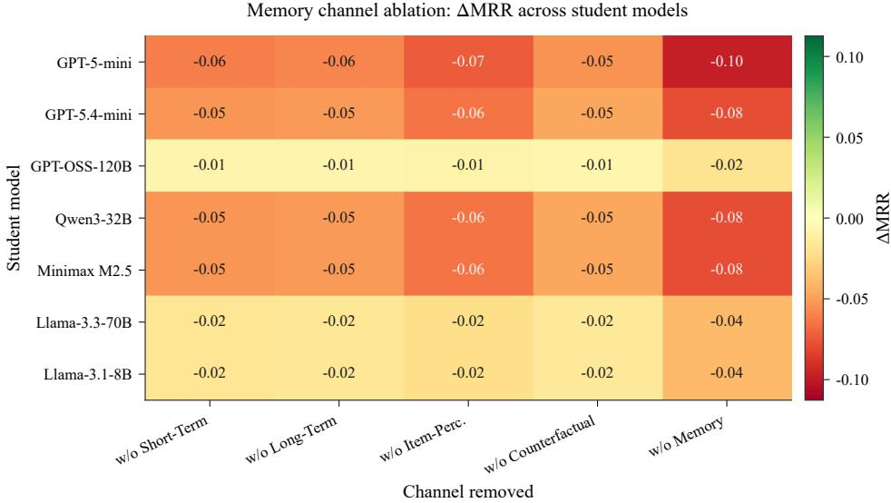  
Figure 9: Channel ablation heatmap under MRR (ΔMRR vs. full memory), complementary to Figure 4.

Dataset statistics after �-core filtering (Section 4.1). Density $= | R | / ( | U | \cdot | I | )$ . Test � is the number of 20-candidate ranking samples in the chronological held-out split.
<table><tr><td>Dataset</td><td>Domain</td><td>Feedback</td><td>#Users</td><td>#Items</td><td>#Inter.</td><td>Dens.</td><td>Sparsity</td><td>k-core</td><td>Pos. thr.</td><td>Test n</td></tr><tr><td>ML-1M</td><td>Movies</td><td>Explicit (1–5)</td><td>6,040</td><td>3,706</td><td>1,000,209</td><td>4.47%</td><td>Very Low</td><td>20</td><td>r&gt;3.5</td><td>49,893</td></tr><tr><td>Amazon Beauty</td><td>Beauty products</td><td>Explicit (1–5)</td><td>1,620</td><td>7,116</td><td>14,984</td><td>0.13%</td><td>Very High</td><td>5</td><td>r&gt;3.5</td><td>1,460</td></tr><tr><td>Steam</td><td>Games</td><td>Implicit (play)</td><td>62,936</td><td>10,978</td><td>5,077,150</td><td>0.73%</td><td>Medium</td><td>5</td><td>0.0 (all logged)</td><td>1,460</td></tr></table>

## I. Prompts and Outputs

This appendix documents the teacher extraction prompts and the distilled experience-memory outputs that the student retrieves at ranking time (Sections 3.5–3.6.1). Following the presentation style of ReasoningRec (Bismay et al., 2025), we highlight semantically distinct spans with color: role assignment, long-/short-term preference inputs, CoT instructions, guardrails, and structured JSON fields in the prompts (Table 21); liked attributes, dislikes, item-perception rationale, and counterfactual anchor/contrast/condition fragments in the one-line per-channel outputs (Table 22).

Color legend. Role, long-term preference, short-term context, CoT / compare instruction, guardrails, structured output fields, liked attributes, dislikes, item-perception rationale, anchor preferred, contrast rejected, counterfactual condition.

## J. Examples of rEDMRec-generated Predictions

We illustrate the full rEDMRec ranking call for one user each on Amazon Beauty and Steam (Tables 23–24). Each example shows the frozen student’s input – chronological history $H _ { u } ,$ the candidate set $C _ { u }$ (abbreviated), and the top retrieved entries from the four teacher extraction channels (Preference pref, Context ctx, Reasoning reas, Counterfactual cf) – followed by the student’s ranked list and a short rationale. Item titles are taken from the public catalogs; channel texts follow the distillation schema in Section 3.6.1. Color highlighting marks liked vs. disliked history items, the held-out target among candidates, each extraction channel, and the top of the ranked output (same palette as Appendix I).

Color legend (shared with Appendix I). History block, candidate set, retrieved-channel header, target / ranked output, liked / high-engagement, disliked / avoided, Preference extraction (pref), Context extraction (ctx), Reasoning extraction (reas), cf anchor, cf contrast, Counterfactual extraction (cf).

<table><tr><td rowspan=1 colspan=1>Student</td><td rowspan=1 colspan=1>Variant</td><td rowspan=1 colspan=1>HR@1</td><td rowspan=1 colspan=1>HR@3</td><td rowspan=1 colspan=1>HR@10</td><td rowspan=1 colspan=1>NDCG@3</td><td rowspan=1 colspan=1>NDCG@10</td><td rowspan=1 colspan=1>MRR</td><td rowspan=1 colspan=1>ΛHR@1</td><td rowspan=1 colspan=1>AMRR</td></tr><tr><td rowspan=1 colspan=1>GPT-5-mini</td><td rowspan=1 colspan=1>Full</td><td rowspan=1 colspan=1>0.40</td><td rowspan=1 colspan=1>0.60</td><td rowspan=1 colspan=1>0.80</td><td rowspan=1 colspan=1>0.505</td><td rowspan=1 colspan=1>0.601</td><td rowspan=1 colspan=1>0.539</td><td rowspan=1 colspan=1>+0.00</td><td rowspan=1 colspan=1>+0.00</td></tr><tr><td rowspan=1 colspan=1></td><td rowspan=1 colspan=1>w/o Short-Term</td><td rowspan=1 colspan=1>0.338</td><td rowspan=1 colspan=1>0.507</td><td rowspan=1 colspan=1>0.816</td><td rowspan=1 colspan=1>0.425</td><td rowspan=1 colspan=1>0.556</td><td rowspan=1 colspan=1>0.478</td><td rowspan=1 colspan=1>-0.06</td><td rowspan=1 colspan=1>-0.06</td></tr><tr><td rowspan=1 colspan=1></td><td rowspan=1 colspan=1>w/o Long-Term</td><td rowspan=1 colspan=1>0.34</td><td rowspan=1 colspan=1>0.51</td><td rowspan=1 colspan=1>0.815</td><td rowspan=1 colspan=1>0.428</td><td rowspan=1 colspan=1>0.557</td><td rowspan=1 colspan=1>0.48</td><td rowspan=1 colspan=1>-0.06</td><td rowspan=1 colspan=1>-0.06</td></tr><tr><td rowspan=1 colspan=1></td><td rowspan=1 colspan=1>w/o Item-Perc.</td><td rowspan=1 colspan=1>0.325</td><td rowspan=1 colspan=1>0.487</td><td rowspan=1 colspan=1>0.819</td><td rowspan=1 colspan=1>0.409</td><td rowspan=1 colspan=1>0.546</td><td rowspan=1 colspan=1>0.466</td><td rowspan=1 colspan=1>-0.07</td><td rowspan=1 colspan=1>-0.07</td></tr><tr><td rowspan=1 colspan=1></td><td rowspan=1 colspan=1>w/o Counterfactual</td><td rowspan=1 colspan=1>0.345</td><td rowspan=1 colspan=1>0.518</td><td rowspan=1 colspan=1>0.814</td><td rowspan=1 colspan=1>0.434</td><td rowspan=1 colspan=1>0.561</td><td rowspan=1 colspan=1>0.485</td><td rowspan=1 colspan=1>-0.05</td><td rowspan=1 colspan=1>-0.05</td></tr><tr><td rowspan=1 colspan=1></td><td rowspan=1 colspan=1>w/o Memory</td><td rowspan=1 colspan=1>0.30</td><td rowspan=1 colspan=1>0.45</td><td rowspan=1 colspan=1>0.825</td><td rowspan=1 colspan=1>0.377</td><td rowspan=1 colspan=1>0.528</td><td rowspan=1 colspan=1>0.441</td><td rowspan=1 colspan=1>-0.10</td><td rowspan=1 colspan=1>-0.10</td></tr><tr><td rowspan=1 colspan=1>GPT-5.4-mini</td><td rowspan=1 colspan=1>Full</td><td rowspan=1 colspan=1>0.31</td><td rowspan=1 colspan=1>0.49</td><td rowspan=1 colspan=1>0.79</td><td rowspan=1 colspan=1>0.405</td><td rowspan=1 colspan=1>0.535</td><td rowspan=1 colspan=1>0.455</td><td rowspan=1 colspan=1>+0.00</td><td rowspan=1 colspan=1>+0.00</td></tr><tr><td rowspan=1 colspan=1></td><td rowspan=1 colspan=1>w/o Short-Term</td><td rowspan=1 colspan=1>0.255</td><td rowspan=1 colspan=1>0.408</td><td rowspan=1 colspan=1>0.804</td><td rowspan=1 colspan=1>0.336</td><td rowspan=1 colspan=1>0.495</td><td rowspan=1 colspan=1>0.402</td><td rowspan=1 colspan=1>-0.05</td><td rowspan=1 colspan=1>-0.05</td></tr><tr><td rowspan=1 colspan=1></td><td rowspan=1 colspan=1>w/o Long-Term</td><td rowspan=1 colspan=1>0.257</td><td rowspan=1 colspan=1>0.411</td><td rowspan=1 colspan=1>0.803</td><td rowspan=1 colspan=1>0.338</td><td rowspan=1 colspan=1>0.497</td><td rowspan=1 colspan=1>0.404</td><td rowspan=1 colspan=1>-0.05</td><td rowspan=1 colspan=1>-0.05</td></tr><tr><td rowspan=1 colspan=1></td><td rowspan=1 colspan=1>w/o Item-Perc.</td><td rowspan=1 colspan=1>0.244</td><td rowspan=1 colspan=1>0.391</td><td rowspan=1 colspan=1>0.806</td><td rowspan=1 colspan=1>0.321</td><td rowspan=1 colspan=1>0.487</td><td rowspan=1 colspan=1>0.391</td><td rowspan=1 colspan=1>-0.07</td><td rowspan=1 colspan=1>-0.06</td></tr><tr><td rowspan=1 colspan=1></td><td rowspan=1 colspan=1>w/o Counterfactual</td><td rowspan=1 colspan=1>0.262</td><td rowspan=1 colspan=1>0.417</td><td rowspan=1 colspan=1>0.802</td><td rowspan=1 colspan=1>0.344</td><td rowspan=1 colspan=1>0.50</td><td rowspan=1 colspan=1>0.408</td><td rowspan=1 colspan=1>-0.05</td><td rowspan=1 colspan=1>-0.05</td></tr><tr><td rowspan=1 colspan=1></td><td rowspan=1 colspan=1>w/o Memory</td><td rowspan=1 colspan=1>0.23</td><td rowspan=1 colspan=1>0.37</td><td rowspan=1 colspan=1>0.81</td><td rowspan=1 colspan=1>0.303</td><td rowspan=1 colspan=1>0.477</td><td rowspan=1 colspan=1>0.377</td><td rowspan=1 colspan=1>-0.08</td><td rowspan=1 colspan=1>-0.08</td></tr><tr><td rowspan=1 colspan=1>Minimax M2.5</td><td rowspan=1 colspan=1>Full</td><td rowspan=1 colspan=1>0.35</td><td rowspan=1 colspan=1>0.51</td><td rowspan=1 colspan=1>0.76</td><td rowspan=1 colspan=1>0.42</td><td rowspan=1 colspan=1>0.535</td><td rowspan=1 colspan=1>0.455</td><td rowspan=1 colspan=1>+0.00</td><td rowspan=1 colspan=1>+0.00</td></tr><tr><td rowspan=1 colspan=1></td><td rowspan=1 colspan=1>w/o Short-Term</td><td rowspan=1 colspan=1>0.295</td><td rowspan=1 colspan=1>0.428</td><td rowspan=1 colspan=1>0.774</td><td rowspan=1 colspan=1>0.35</td><td rowspan=1 colspan=1>0.495</td><td rowspan=1 colspan=1>0.402</td><td rowspan=1 colspan=1>-0.05</td><td rowspan=1 colspan=1>-0.05</td></tr><tr><td rowspan=1 colspan=1></td><td rowspan=1 colspan=1>w/o Long-Term</td><td rowspan=1 colspan=1>0.297</td><td rowspan=1 colspan=1>0.431</td><td rowspan=1 colspan=1>0.773</td><td rowspan=1 colspan=1>0.352</td><td rowspan=1 colspan=1>0.497</td><td rowspan=1 colspan=1>0.403</td><td rowspan=1 colspan=1>-0.05</td><td rowspan=1 colspan=1>-0.05</td></tr><tr><td rowspan=1 colspan=1></td><td rowspan=1 colspan=1>w/o Item-Perc.</td><td rowspan=1 colspan=1>0.284</td><td rowspan=1 colspan=1>0.411</td><td rowspan=1 colspan=1>0.776</td><td rowspan=1 colspan=1>0.336</td><td rowspan=1 colspan=1>0.487</td><td rowspan=1 colspan=1>0.39</td><td rowspan=1 colspan=1>-0.07</td><td rowspan=1 colspan=1>-0.06</td></tr><tr><td rowspan=1 colspan=1></td><td rowspan=1 colspan=1>w/o Counterfactual</td><td rowspan=1 colspan=1>0.302</td><td rowspan=1 colspan=1>0.438</td><td rowspan=1 colspan=1>0.772</td><td rowspan=1 colspan=1>0.358</td><td rowspan=1 colspan=1>0.50</td><td rowspan=1 colspan=1>0.408</td><td rowspan=1 colspan=1>-0.05</td><td rowspan=1 colspan=1>-0.05</td></tr><tr><td rowspan=1 colspan=1></td><td rowspan=1 colspan=1>w/o Memory</td><td rowspan=1 colspan=1>0.27</td><td rowspan=1 colspan=1>0.39</td><td rowspan=1 colspan=1>0.78</td><td rowspan=1 colspan=1>0.318</td><td rowspan=1 colspan=1>0.477</td><td rowspan=1 colspan=1>0.377</td><td rowspan=1 colspan=1>-0.08</td><td rowspan=1 colspan=1>-0.08</td></tr><tr><td rowspan=1 colspan=1>Qwen3-32B</td><td rowspan=1 colspan=1>Full</td><td rowspan=1 colspan=1>0.34</td><td rowspan=1 colspan=1>0.50</td><td rowspan=1 colspan=1>0.75</td><td rowspan=1 colspan=1>0.412</td><td rowspan=1 colspan=1>0.524</td><td rowspan=1 colspan=1>0.445</td><td rowspan=1 colspan=1>+0.00</td><td rowspan=1 colspan=1>+0.00</td></tr><tr><td rowspan=1 colspan=1></td><td rowspan=1 colspan=1>w/o Short-Term</td><td rowspan=1 colspan=1>0.285</td><td rowspan=1 colspan=1>0.418</td><td rowspan=1 colspan=1>0.764</td><td rowspan=1 colspan=1>0.342</td><td rowspan=1 colspan=1>0.484</td><td rowspan=1 colspan=1>0.392</td><td rowspan=1 colspan=1>-0.05</td><td rowspan=1 colspan=1>-0.05</td></tr><tr><td rowspan=1 colspan=1></td><td rowspan=1 colspan=1>w/o Long-Term</td><td rowspan=1 colspan=1>0.287</td><td rowspan=1 colspan=1>0.421</td><td rowspan=1 colspan=1>0.763</td><td rowspan=1 colspan=1>0.345</td><td rowspan=1 colspan=1>0.486</td><td rowspan=1 colspan=1>0.393</td><td rowspan=1 colspan=1>-0.05</td><td rowspan=1 colspan=1>-0.05</td></tr><tr><td rowspan=1 colspan=1></td><td rowspan=1 colspan=1>w/o Item-Perc.</td><td rowspan=1 colspan=1>0.274</td><td rowspan=1 colspan=1>0.401</td><td rowspan=1 colspan=1>0.766</td><td rowspan=1 colspan=1>0.328</td><td rowspan=1 colspan=1>0.476</td><td rowspan=1 colspan=1>0.38</td><td rowspan=1 colspan=1>-0.07</td><td rowspan=1 colspan=1>-0.06</td></tr><tr><td rowspan=1 colspan=1></td><td rowspan=1 colspan=1>w/o Counterfactual</td><td rowspan=1 colspan=1>0.292</td><td rowspan=1 colspan=1>0.427</td><td rowspan=1 colspan=1>0.762</td><td rowspan=1 colspan=1>0.35</td><td rowspan=1 colspan=1>0.489</td><td rowspan=1 colspan=1>0.398</td><td rowspan=1 colspan=1>-0.05</td><td rowspan=1 colspan=1>-0.05</td></tr><tr><td rowspan=1 colspan=1></td><td rowspan=1 colspan=1>w/o Memory</td><td rowspan=1 colspan=1>0.26</td><td rowspan=1 colspan=1>0.38</td><td rowspan=1 colspan=1>0.77</td><td rowspan=1 colspan=1>0.31</td><td rowspan=1 colspan=1>0.466</td><td rowspan=1 colspan=1>0.367</td><td rowspan=1 colspan=1>-0.08</td><td rowspan=1 colspan=1>-0.08</td></tr><tr><td rowspan=1 colspan=1>GPT-OSS-120B</td><td rowspan=1 colspan=1>Full</td><td rowspan=1 colspan=1>0.30</td><td rowspan=1 colspan=1>0.47</td><td rowspan=1 colspan=1>0.71</td><td rowspan=1 colspan=1>0.406</td><td rowspan=1 colspan=1>0.499</td><td rowspan=1 colspan=1>0.43</td><td rowspan=1 colspan=1>+0.00</td><td rowspan=1 colspan=1>+0.00</td></tr><tr><td rowspan=1 colspan=1></td><td rowspan=1 colspan=1>w/o Short-Term</td><td rowspan=1 colspan=1>0.293</td><td rowspan=1 colspan=1>0.459</td><td rowspan=1 colspan=1>0.712</td><td rowspan=1 colspan=1>0.397</td><td rowspan=1 colspan=1>0.493</td><td rowspan=1 colspan=1>0.423</td><td rowspan=1 colspan=1>-0.01</td><td rowspan=1 colspan=1>-0.01</td></tr><tr><td rowspan=1 colspan=1></td><td rowspan=1 colspan=1>w/o Long-Term</td><td rowspan=1 colspan=1>0.293</td><td rowspan=1 colspan=1>0.459</td><td rowspan=1 colspan=1>0.712</td><td rowspan=1 colspan=1>0.397</td><td rowspan=1 colspan=1>0.493</td><td rowspan=1 colspan=1>0.423</td><td rowspan=1 colspan=1>-0.01</td><td rowspan=1 colspan=1>-0.01</td></tr><tr><td rowspan=1 colspan=1></td><td rowspan=1 colspan=1>w/o Item-Perc.</td><td rowspan=1 colspan=1>0.291</td><td rowspan=1 colspan=1>0.457</td><td rowspan=1 colspan=1>0.712</td><td rowspan=1 colspan=1>0.395</td><td rowspan=1 colspan=1>0.492</td><td rowspan=1 colspan=1>0.422</td><td rowspan=1 colspan=1>-0.01</td><td rowspan=1 colspan=1>-0.01</td></tr><tr><td rowspan=1 colspan=1></td><td rowspan=1 colspan=1>w/o Counterfactual</td><td rowspan=1 colspan=1>0.293</td><td rowspan=1 colspan=1>0.46</td><td rowspan=1 colspan=1>0.712</td><td rowspan=1 colspan=1>0.398</td><td rowspan=1 colspan=1>0.494</td><td rowspan=1 colspan=1>0.424</td><td rowspan=1 colspan=1>-0.01</td><td rowspan=1 colspan=1>-0.01</td></tr><tr><td rowspan=1 colspan=1></td><td rowspan=1 colspan=1>w/o Memory</td><td rowspan=1 colspan=1>0.28</td><td rowspan=1 colspan=1>0.44</td><td rowspan=1 colspan=1>0.715</td><td rowspan=1 colspan=1>0.381</td><td rowspan=1 colspan=1>0.484</td><td rowspan=1 colspan=1>0.411</td><td rowspan=1 colspan=1>-0.02</td><td rowspan=1 colspan=1>-0.02</td></tr><tr><td rowspan=1 colspan=1>Llama-3.1-8B</td><td rowspan=1 colspan=1>Full</td><td rowspan=1 colspan=1>0.11</td><td rowspan=1 colspan=1>0.18</td><td rowspan=1 colspan=1>0.27</td><td rowspan=1 colspan=1>0.131</td><td rowspan=1 colspan=1>0.175</td><td rowspan=1 colspan=1>0.159</td><td rowspan=1 colspan=1>+0.00</td><td rowspan=1 colspan=1>+0.00</td></tr><tr><td rowspan=1 colspan=1></td><td rowspan=1 colspan=1>w/o Short-Term</td><td rowspan=1 colspan=1>0.091</td><td rowspan=1 colspan=1>0.152</td><td rowspan=1 colspan=1>0.275</td><td rowspan=1 colspan=1>0.107</td><td rowspan=1 colspan=1>0.161</td><td rowspan=1 colspan=1>0.141</td><td rowspan=1 colspan=1>-0.02</td><td rowspan=1 colspan=1>-0.02</td></tr><tr><td rowspan=1 colspan=1></td><td rowspan=1 colspan=1>w/o Long-Term</td><td rowspan=1 colspan=1>0.092</td><td rowspan=1 colspan=1>0.153</td><td rowspan=1 colspan=1>0.275</td><td rowspan=1 colspan=1>0.107</td><td rowspan=1 colspan=1>0.162</td><td rowspan=1 colspan=1>0.141</td><td rowspan=1 colspan=1>-0.02</td><td rowspan=1 colspan=1>-0.02</td></tr><tr><td rowspan=1 colspan=1></td><td rowspan=1 colspan=1>w/o Item-Perc.</td><td rowspan=1 colspan=1>0.087</td><td rowspan=1 colspan=1>0.146</td><td rowspan=1 colspan=1>0.276</td><td rowspan=1 colspan=1>0.102</td><td rowspan=1 colspan=1>0.158</td><td rowspan=1 colspan=1>0.137</td><td rowspan=1 colspan=1>-0.02</td><td rowspan=1 colspan=1>-0.02</td></tr><tr><td rowspan=1 colspan=1></td><td rowspan=1 colspan=1>w/o Counterfactual</td><td rowspan=1 colspan=1>0.093</td><td rowspan=1 colspan=1>0.155</td><td rowspan=1 colspan=1>0.274</td><td rowspan=1 colspan=1>0.109</td><td rowspan=1 colspan=1>0.163</td><td rowspan=1 colspan=1>0.142</td><td rowspan=1 colspan=1>-0.02</td><td rowspan=1 colspan=1>-0.02</td></tr><tr><td rowspan=1 colspan=1></td><td rowspan=1 colspan=1>w/o Memory</td><td rowspan=1 colspan=1>0.07</td><td rowspan=1 colspan=1>0.12</td><td rowspan=1 colspan=1>0.28</td><td rowspan=1 colspan=1>0.079</td><td rowspan=1 colspan=1>0.146</td><td rowspan=1 colspan=1>0.119</td><td rowspan=1 colspan=1>-0.04</td><td rowspan=1 colspan=1>-0.04</td></tr><tr><td rowspan=1 colspan=1>Llama-3.3-70B</td><td rowspan=1 colspan=1>Full</td><td rowspan=1 colspan=1>0.10</td><td rowspan=1 colspan=1>0.23</td><td rowspan=1 colspan=1>0.34</td><td rowspan=1 colspan=1>0.16</td><td rowspan=1 colspan=1>0.213</td><td rowspan=1 colspan=1>0.177</td><td rowspan=1 colspan=1>+0.00</td><td rowspan=1 colspan=1>+0.00</td></tr><tr><td rowspan=1 colspan=1></td><td rowspan=1 colspan=1>w/o Short-Term</td><td rowspan=1 colspan=1>0.081</td><td rowspan=1 colspan=1>0.202</td><td rowspan=1 colspan=1>0.345</td><td rowspan=1 colspan=1>0.137</td><td rowspan=1 colspan=1>0.199</td><td rowspan=1 colspan=1>0.159</td><td rowspan=1 colspan=1>-0.02</td><td rowspan=1 colspan=1>-0.02</td></tr><tr><td rowspan=1 colspan=1></td><td rowspan=1 colspan=1>w/o Long-Term</td><td rowspan=1 colspan=1>0.082</td><td rowspan=1 colspan=1>0.203</td><td rowspan=1 colspan=1>0.344</td><td rowspan=1 colspan=1>0.137</td><td rowspan=1 colspan=1>0.20</td><td rowspan=1 colspan=1>0.16</td><td rowspan=1 colspan=1>-0.02</td><td rowspan=1 colspan=1>-0.02</td></tr><tr><td rowspan=1 colspan=1></td><td rowspan=1 colspan=1>w/o Item-Perc.</td><td rowspan=1 colspan=1>0.077</td><td rowspan=1 colspan=1>0.196</td><td rowspan=1 colspan=1>0.346</td><td rowspan=1 colspan=1>0.132</td><td rowspan=1 colspan=1>0.196</td><td rowspan=1 colspan=1>0.155</td><td rowspan=1 colspan=1>-0.02</td><td rowspan=1 colspan=1>-0.02</td></tr><tr><td rowspan=1 colspan=1></td><td rowspan=1 colspan=1>w/o Counterfactual</td><td rowspan=1 colspan=1>0.084</td><td rowspan=1 colspan=1>0.205</td><td rowspan=1 colspan=1>0.344</td><td rowspan=1 colspan=1>0.139</td><td rowspan=1 colspan=1>0.201</td><td rowspan=1 colspan=1>0.161</td><td rowspan=1 colspan=1>-0.02</td><td rowspan=1 colspan=1>-0.02</td></tr><tr><td rowspan=1 colspan=1></td><td rowspan=1 colspan=1>w/o Memory</td><td rowspan=1 colspan=1>0.06</td><td rowspan=1 colspan=1>0.17</td><td rowspan=1 colspan=1>0.35</td><td rowspan=1 colspan=1>0.109</td><td rowspan=1 colspan=1>0.183</td><td rowspan=1 colspan=1>0.138</td><td rowspan=1 colspan=1>-0.04</td><td rowspan=1 colspan=1>-0.04</td></tr></table>

Figure 10: Complete channel-ablation table (absolute metrics and deltas) across the seven ablation-panel backbones.

## K. Failure Cases and Qualitative Memory Edits

This appendix complements the positive qualitative cases in Section 5.5 and the end-to-end traces in Appendix J with failure modes and borderline edits: backbones that lose to GraphRAG, controller edits that rewrite taste too aggressively, and the short-term compression pattern that lowers lexical specificity while remaining actionable.

H.1 Ranking failures vs. GraphRAG. On ML-1M, rEDMRec trails GraphRAG on Llama 3.1 8B (Impv = −11.1%) and GPT OSS 20B (Impv = −3.3%; Appendix A). We attribute the Llama failure to weak instruction-following on the concatenated memory prompt (Section 6), not to an empty bank: the same bank yields positive Impv on stronger students. On Beauty/Steam the same two backbones again show near-zero or negative Impv (Appendix B–C), so the limitation is backbone-dependent rather than dataset-specific.

H.2 Qualitative edits: success vs. risk. Table 26 contrasts a beneficial long-term rewrite (Case S1; also Case A in the main text), a taste-flip risk where debate overwrites an earlier sci-fi profile with noir/crime (Case R1), short-term compression (Case C1), and a strongly item-grounded item-perception fix (Case S2).

H.3 Capacity-dependent channel reversals. Channel ablations (Section 5.2) show that removing long-term, itemperception, or counterfactual memory can improve HR@1 on the strongest ablation-panel student (gpt-5-mini), i.e. the bank can inject noise when the backbone already ranks well from candidates alone. Short-term context remains the only consistently beneficial channel across tiers — a practical failure mode for “always retrieve all four channels” deployments on saturated students.

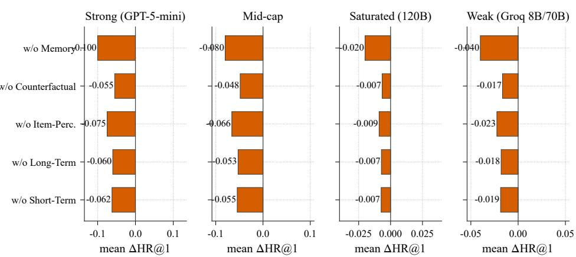  
Figure 11: Aggregated channel-importance summary used to derive Table 6.  
Table 21

Teacher extraction prompts for the four passes � ∈  (Section 3.5). Colored spans mark the role, inputs, CoT instruction, and JSON schema. Full templates live in teacher/prompt\_templates.py.

<table><tr><td>Pass / channel</td><td>Prompt (abbreviated)</td></tr><tr><td>pref → lt, st</td><td>You are an expert movie recommendation analyst implementing User Preference Maintenance. Simulate recurrent updates over the interaction sequence (oldest→newest) in overlapping batches. Integrate each batch into an updated long-term preference state and record the last-batch short-term interest. List consistent dislikes / avoided tones. Prefer concrete movie-relevant language; avoid empty platitudes. Output STRICT JSON only (no markdown). Fields:</td></tr><tr><td>ctx / reas → ip</td><td>maintenance trace[], long term preferences, short term preferences, dislikes, reasoning. You are implementing Item Perception Analysis / recommendation reasoning. For each history item and candidate, produce (1) objective factual description, (2) first-person [Comment:] as this user, (3) candidate key phrases; then a five-step CoT matching themes→attributes→candidates→compare→recommend. Condition on long-term preferences and short-term focus. Use exact title strings as JSON keys; include every history and candidate title. Fields:</td></tr><tr><td>cf → cf</td><td>user_history_perception, candidate_perception, steps[1..5], recommended_item, reasoning_summary. You are a contrastive reasoning analyst for movie recommendations. Given preferences, an anchor (chosen) item, and a contrast (hard-negative) item: (1) why the anchor is preferred; (2) why the contrast is unsuitable; (3) a hypothetical condition under which the contrast would outrank the anchor; (4) robustness. Do not invent facts absent from the provided preference and item text. Output STRICT JSON only. Fields: anchor item, contrast item, why anchor preferred, why contrast rejected, counterfactual condition, counterfactual outcome,</td></tr></table>

Table 22

Example distilled memory outputs (one line per channel) from the persisted bank for user 2 on ML-1M. Each line is the committed entry text after distillation (Section 3.6.1); colored spans highlight the ranking-relevant fragments.
<table><tr><td>Channel</td><td>Distilled experience (one line)</td></tr><tr><td>lt</td><td>He strongly prefers character-driven dramas with emotional depth, mature themes, moral conflict, and strong performances. Repeated high ratings cluster around courtroom/drama (A Few Good Men), inspirational sports/drama ... Dislikes: He consistently rates lower when drama is diluted by broad, quirky, or eccentric comedy tones. Nurse Betty is the clearest dislike (1.0), wh...</td></tr><tr><td>st</td><td>In the most recent items, interest appears to tilt further toward intimate, human-centered drama and reflective sci-fi, with high ratings for Driving Miss Daisy and Close Encounters. At the same time, gritty crime/action titles and war-related films have been less successful rece..</td></tr><tr><td>ip</td><td>The user&#x27;s history strongly favors light, charming comedies with romance, warmth, and quirky optimism, especially films like Shakespeare in Love, Strictly Ballroom, Shall We Dance?, Groundhog Day, and Forrest Gump. Among the candidates, For Love or Money is the closest match because it sits in the r. . .</td></tr><tr><td>cf</td><td>Anchor (One Flew Over the Cuckoo&#x27;s Nest): One Flew Over the Cuckoo&#x27;s Nest fits the user&#x27;s strongest pattern: serious, award-caliber drama with intense character focus, moral conflict, and weighty themes. .. Contrast (Dante&#x27;s Peak): Dante&#x27;s Peak is primarily an action-thriller/disaster film, which is comparatively light on the kind of prestige, historical, or biographica... If the user were instead seeking a tense, fast-paced disaster thriller for pure entertainment rather than a prestige drama, then Dante&#x27;s Peak would rank higher because its volcanic-disaster suspense, clear genre pacing, and spect...</td></tr></table>

Ablation — GPT-5-mini @ n=30,000  
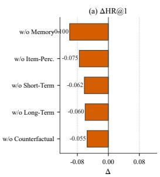

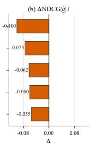  
(a) gpt-5-mini (strong)

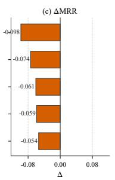

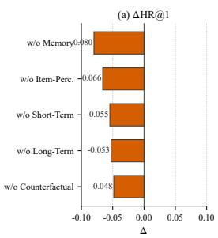  
Ablation — Qwen3-32B @ n=30,000

Ablation — GPT-5.4-mini @ n=30,000  
  
(b) gpt-5.4-mini (mid)

  
Ablation — GPT-OSS-120B @ n=30,000

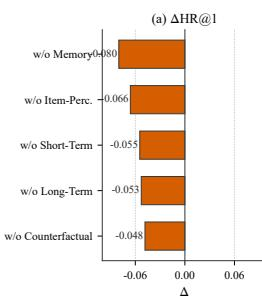

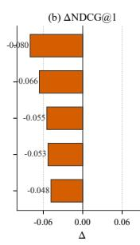  
(c) Qwen3-32B (mid)

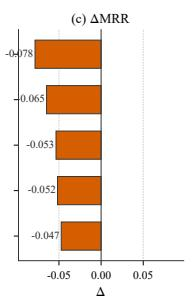  
Ablation — Llama-3.3-70B @ n=30,000

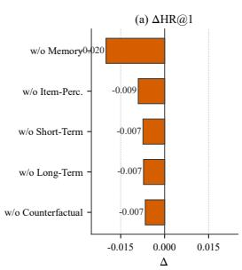

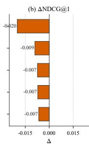  
(d) GPT-OSS-120B (saturated)

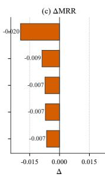  
Ablation — Llama-3.1-8B @ n=30,000

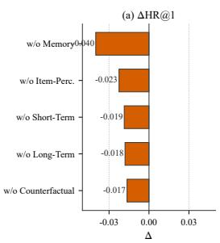

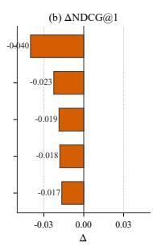  
(e) Llama 3.3 70B (weak)

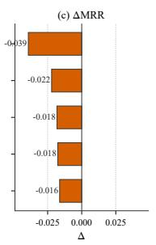

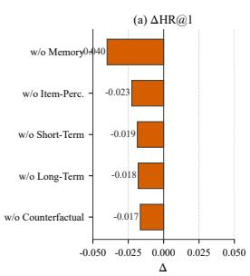

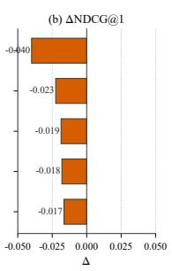  
Figure 12: Per-backbone channel ablation (ΔHR@1 when removing each channel). Negative bars indicate a beneficial channel.  
(f) Llama 3.1 8B (weak)

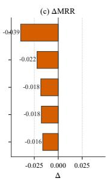

Table 23  
Example of an rEDMRec prediction trace on Amazon Beauty (illustrative end-to-end $1 / 0 ;$ item titles from the public catalog). Colored spans mark likes/dislikes in history, the held-out target among candidates, the four retrieved extraction channels, and the top-ranked output.
<table><tr><td>Field</td><td>Content</td></tr><tr><td>User</td><td>AG7W...BVDA</td></tr><tr><td>History  $H _ { u }$ </td><td>Liked: MyGift Soft Padded Spa Bath Pillow; Liked: Nice &#x27;n Easy Permanent Color 9G Light Golden Blonde; Liked: Avon Glimmersticks Waterproof Eyeliner (Smokey Grey); Liked: Yes To Sensitive Facial Cleansing Wipes; Liked: LaClaire Foaming Botanical Facial Cleanser; Disliked: 4D Silk Fiber Lash Mascara (clumpy / heavy); Liked: MOSTORY Glitter Crystal Liquid Eyeshadow Set; Liked: GLOW BOOSTER SERUM; Liked: Oval Large Makeup Brushes (Rose Gold); Liked: The Vegan Glow Quinoa Protein</td></tr><tr><td>Candidates  $C _ { u }$ </td><td>JUNGSAEMMOOL Minifying Cica Mist Balm (target); 4D Silk Fiber Lash Mascara Black; Rhinestone Crystal Padded Headband; Sea Magik Pink Salt Conditioner; BIOSSANCE Marine Algae Eye Cream Mini; Foamie Shampoo Bar Hibiskiss; Intraceuticals Rejuvenate Eye Masks; BeautyStat Universal Moisture</td></tr><tr><td colspan="2">Retrieved experience channels</td></tr><tr><td>Preference extraction (pref)</td><td>Prefers clean, botanical / cruelty-free skincare and soft everyday makeup tools; repeatedly high-rates</td></tr><tr><td></td><td>serums, cream cleansers, and gentle face care over heavy glam accessories. Dislikes: Avoids heavy, clumpy mascara and overly decorative rhinestone accessories that read as party glam rather than daily care.</td></tr><tr><td>Context extraction (ctx)</td><td>Recent purchases emphasize glow serums, vegan shampoo bars, and non-toxic face cream – a short-term tilt toward soothing, clean-beauty maintenance rather than color cosmetics.</td></tr><tr><td>Reasoning</td><td></td></tr><tr><td>extraction (reas)</td><td>Cica Mist Balm matches the user&#x27;s soothing / clean-skincare lane (cica + mist balm for calming), whereas rhinestone headbands and fiber mascara clash with recent botanical preferences</td></tr><tr><td>Counterfactual</td><td>Anchor (Cica Mist Balm): Fits the clean-beauty, calming-care pattern reinforced by recent Tulip Dew</td></tr><tr><td>extraction (cf)</td><td>cream and glow serum. Contrast (Rhinestone Crystal Headband): Statement bridal/party accessory; decorative rather than skincare-functional. If the user were shopping for a one-off formal event accessory instead of daily facial care, the contrast would rank higher.</td></tr><tr><td>Student output</td><td>RANKED LIST: 1. JUNGSAEMMOOL Minifying Cica Mist Balm; 2. BeautyStat Universal Moisture Essence (Squalane); 3. BIOSSANCE Marine Algae Eye Cream Mini; 4. Intraceuticals Rejuvenate Eye Masks; 5. Foamie Shampoo Bar Hibiskiss; 6. Sea Magik Pink Salt Conditioner; 7. 4D Silk Fiber Lash Mascara Black; 8. Rhinestone Crystal Padded Headband Rationale: Top ranks stay in soothing skincare / moisture; glam mascara and rhinestone accessories are</td></tr></table>

Table 24  
Example of an rEDMRec prediction trace on Steam (illustrative end-to-end $1 / 0 ;$ item titles from the public catalog). Colored spans mark likes/dislikes in history, the held-out target among candidates, the four retrieved extraction channels, and the top-ranked output.
<table><tr><td>Field</td><td>Content</td></tr><tr><td>User</td><td>765611980946...</td></tr><tr><td>History  $H _ { u }$ </td><td>Played: Garry&#x27;s Mod (high playtime); Played: Half-Life 2; Played: Half-Life 2: Episode One; Played: Portal; Played: Portal 2; Played: The Binding of Isaac; Played: PlanetSide 2; Low play: Dota 2 Test</td></tr><tr><td>Candidates  $C _ { u }$ </td><td>Half-Life 2: Episode Two (target); Counter-Strike: Global Offensive; PAYDAY 2; Warframe; Terraria; Left 4 Dead 2; The Expendabros; Yosumin!</td></tr><tr><td colspan="2">Retrieved experience channels  $R _ { k }$ </td></tr><tr><td>Preference extraction (pref)</td><td>Strong Valve narrative / puzzle-FPS taste: Half-Life 2 saga and Portal series dominate, with sandbox creativity (Garry&#x27;s Mod) and occasional indie rogue-likes (Isaac). Dislikes: Little engagement with pure</td></tr><tr><td></td><td>MOBA test clients; competitive live-service shooters are secondary to story/puzzle FPS.</td></tr><tr><td>Context extraction (ctx)</td><td>Recent high-engagement cluster is Portal 2 + Half-Life episodes; short-term focus is completing the Valve narrative loop rather than opening new live-service grinders.</td></tr><tr><td>Reasoning</td><td>Episode Two is the direct narrative continuation of Episode One already in history; CS:GO / Warframe</td></tr><tr><td>extraction (reas)</td><td>offer multiplayer loops less aligned with the story-FPS preference.</td></tr><tr><td>Counterfactual</td><td>Anchor (Half-Life 2: Episode Two): Continues the exact Half-Life 2 story the user already invested in.</td></tr><tr><td>extraction (cf)</td><td>Contrast (Warframe): Free-to-play grind / live-service loop; weak narrative continuity with Portal/HL2. If the user wanted a long-horizon multiplayer grind instead of finishing a single-player story arc, the</td></tr><tr><td>Student output</td><td>contrast would rank higher. RANKED LIST: 1. Half-Life 2: Episode Two; 2. Left 4 Dead 2; 3. Terraria; 4. PAYDAY 2; 5. Counter- Strike: Global Offensive; 6. Warframe; 7. The Expendabros; 8. Yosumin! Rationale: Episode Two leads via long-term Valve narrative memory and item-perception continuity; co-op FPS is secondary; mismatched casual / grind titles sink.</td></tr></table>

Table 25  
Failure / borderline RQ1 cells (Impv vs. second-best; typically GraphRAG). Negative Impv = GraphRAG ahead.
<table><tr><td>Dataset</td><td>Student</td><td>Impv (%)</td><td>Note</td></tr><tr><td>ML-1M</td><td>Llama 3.1 8B</td><td>-11.1</td><td>GraphRAG best; weak IF</td></tr><tr><td>ML-1M</td><td>GPT OSS 20B</td><td>-3.3</td><td>near-saturated student</td></tr><tr><td>Beauty</td><td>Llama 3.1 8B</td><td>-4.1</td><td>not significant</td></tr><tr><td>Beauty</td><td>GPT OSS 20B</td><td>-0.5</td><td>tie within noise</td></tr><tr><td>Steam</td><td>Llama 3.1 8B</td><td>-7.3</td><td>GraphRAG best</td></tr><tr><td>Steam</td><td>GPT OSS 20B</td><td>-2.0</td><td>GraphRAG best</td></tr></table>

Qualitative memory edits from the persisted bank (experiments/bank\_evolution\_cases.json). S = success-like; R = risk / failure mode; C = compression.
<table><tr><td>Case</td><td>Spec.</td><td>Before</td><td>After</td><td></td><td>Interpretation</td></tr><tr><td>S1  / lt</td><td>0.214 0.479</td><td>→ with suspense and...&quot;</td><td>film is a classic action-adventure, 1990s action buddy-cop films suggesting a preference for high- - franchise sequels, star-driven energy, heroic, escapist storytelling chemistry, high-energy action these...&quot;</td><td>with comedic interplay. Upweight</td><td>&#x27;Very limited data: the only rated &quot;Long-term: favors mainstream Hedge -&gt; ranking rule; +spec.</td></tr><tr><td>R1  / lt</td><td>0.450 0.625</td><td>→ best to accessible...&quot;</td><td>with some room for action SF. Hor- Downweight short-term popularity ror is avoided, and the user responds signals and upweight niche/indie,</td><td>1990s-era, and foreign-...</td><td>&quot;Core taste is classic, lighthearted &quot;User 17 strongly prefers classic Taste flip risk: sci-fi -&gt; noir; sci-fi with ensembles and humor, and neo-noir/crime prestige dramas. may discard valid prior signal.</td></tr><tr><td>C1 / st</td><td>0.300 0.500</td><td>interests can be detected.&quot;</td><td>vided, so no emerging short-term lywood action comedies with buddy aggregate st spec. can drop.</td><td>dynamics and franchise entries for top slots; include at least one diverse alternative pe...&quot;</td><td>&quot;No recent viewing items were pro- &quot;Session: prioritize late-80s/90s Hol- Empty note -&gt; session rule;</td></tr><tr><td>S2 / ip</td><td>0.350 0.850</td><td>→</td><td>ranked 5th, so Hit@10 was good but over a higher-ranked 80s action ti- item-keyed boost. Hit@1/MRR suffered. For this user, tle, signaling a preference for 1970s place the best Rocky-like inspira- character-driven underdog sports tional drama at rank 1 when...&quot;</td><td>dramas. When ranking,...</td><td>&quot;The strongest match was only &quot;Rocky (1976): User 4 chose Rocky Vague Hit@1 complaint -&gt;</td></tr></table>