# Mitigating Identity Essentialism in LLM Agents with Longitudinal Life Trajectories

Hexi Wang1,2, Yujia Zhou∗2,1, Bangde Du1, Weihang Su1, Xinyuan Cao1, Qingyi Pan1, Qingyao Ai∗2,1, Yueyue Wu1, Min Zhang1, Yiqun Liu1

1Department of Computer Science and Technology, Tsinghua University

2Quan Cheng Laboratory

whx25@mails.tsinghua.edu.cn, zhouyujia@mail.tsinghua.edu.cn, aiqy@tsinghua.edu.cn

## Abstract

Large language models (LLMs) ofer a scalable approach to social simulation, but their credibility depends on how agents are constructed. Existing methods can partially reproduce population-level patterns, yet often fail to capture human-like diversity. Our analysis shows that static-profile agents exhibit stronger demographic separation and within-group compres- sion than humans, a pattern consistent with identity essen- tialism: demographic labels can encourage models to treat group-average tendencies as individual traits, homogenizing responses within groups. We argue that this limitation arises from two related factors: sparse, static agent repre- sentations and the limited ability of prompt-only memory to persistently integrate experience. Inspired by complementary memory systems, we propose LifeMem, a longitudinal mem- ory framework that combines structured life-event retrieval with agent-specific parametric memory for experience inte- gration. Experiments on Add Health and Understanding Soci- ety with three LLMs show that LifeMem improves alignment with human data in terms of response distributions, overall and within-group diversity, and patterns of within-person re- sponse change across life stages. These findings highlight the value of longitudinal life-event memory for constructing more faithful and dynamically evolving social agents.

Code — https://github.com/halsayxi/LifeMem

## Introduction

Large language models (LLMs) provide a scalable foundation for social simulation, enabling researchers to study hu- man opinions, attitudes, behaviors, and interactions when conventional surveys or experiments are costly or dificult (Aher, Arriaga, and Kalai 2023; Argyle et al. 2023; Park et al. 2023). The credibility of such simulations depends critically on how agents are constructed.

Most approaches instantiate agents from demographic la- bels, personas, or static profiles (Argyle et al. 2023; Santurkar et al. 2023; Bisbee et al. 2024; Hu and Collier 2024). Although these representations efectively condition models on individual attributes, they often produce responses that are less diverse than human data (Bisbee et al. 2024; Wang, Mor-genstern, and Dickerson 2025; Xie et al. 2026; Wang et al. 2026). This diversity collapse may reflect a form of identity essentialism (Wang, Morgenstern, and Dickerson 2025). In social psychology, essentialism treats social categories as reflecting stable underlying essences, making members of the same category appear fundamentally alike (Prentice and Miller 2007; Bastian and Haslam 2006). In social simulation, a corresponding pattern arises when static identity la- bels become overly predictive of agent responses, compress- ing within-group variation while amplifying between-group diferences. Figure 1 presents a response-space analysis con- sistent with this pattern. Such distortions may exaggerate de- mographic diferences, reinforce stereotypes, and bias con- clusions drawn from simulated populations.

We attribute this limitation to both the content and form of agent memory. First, demographic attributes provide only a sparse and static account of an individual, omitting the richer, evolving experiences associated with between-person diferences and within-person change (Elder Jr 1998; Curran and Bauer 2011). Second, prompt-based conditioning may lead to diversity collapse (Wang et al. 2026). As shown in Figure 3, explicit memory alone does not ensure that accu- mulated experience is persistently integrated into the agent.

Inspired by cognitive science, we propose LifeMem, a longitudinal memory framework for constructing dynami- cally evolving LLM social agents. Human memory is com- monly understood as relying on complementary systems: the hippocampal system rapidly preserves individual ex- periences, whereas the neocortex gradually integrates in- formation across experiences into persistent representations (McClelland, McNaughton, and O’Reilly 1995; Kumaran, Hassabis, and McClelland 2016). LifeMem translates this distinction into two complementary components for repre- senting life experiences: (1) structured life-event memory, which explicitly preserves event content, timing, and sup- porting evidence for retrieval; and (2) agent-specific LoRA adapters, which encode accumulated experiences as para- metric memory persistent across questions and updated over time. By combining richer longitudinal information with per- sistent parametric memory, LifeMem targets limitations in both the content and representation of agent memory, aim- ing to construct agents that more faithfully reflect individual diferences and temporal change.

We evaluate LifeMem on Add Health (Harris et al. 2019) and Understanding Society (Buck and McFall 2012) using three instruction-tuned LLMs from diferent families: Llama-3.1-8B-Instruct (hereafter, Llama-8B) (Grattafiori et al. 2024), Ministral-3-8B-Instruct-2512 (Liu et al. 2026), and Qwen3.5-9B (Qwen Team 2026). Compared to static conditioning, diversity-oriented prompting, non-parametric memory, and control baselines, LifeMem improves align- ment with human data in terms of response distributions, overall and within-group diversity, and within-person re- sponse change across life stages. Our contributions are:

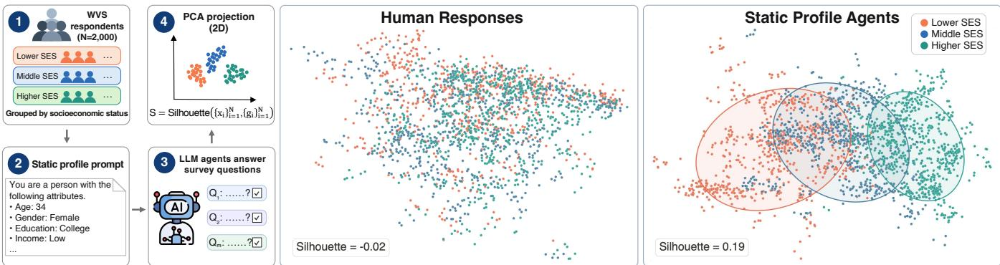  
Figure 1: Static demographic conditioning produces a pattern consistent with identity essentialism. We divide 2,000 randomly sampled WVS wave 7 respondents (Haerpfer et al. 2022) into three socioeconomic status groups and compare human responses with those of profile-conditioned Llama-8B agents. Each individual’s responses are concatenated and projected into a twodimensional PCA space. The separate projections show greater within-group variation and overlap among humans (silhouette −0.02), whereas agents exhibit stronger within-group compression and between-group separation (silhouette 0.19). Silhouette scores are computed in the original response space before PCA projection.

• We identify identity essentialism in static-profile LLM agents, which reduces within-group diversity and exag- gerates between-group diferences.

• We propose LifeMem, combining structured life-event memory with agent-specific parametric memory to model diverse and evolving individuals.

• Across two longitudinal surveys and three LLMs, Life-Mem improves alignment with human distributions, di- versity, and within-person changes.

## Related Work

Current LLM-based social simulation often relies on per- sona conditioning and static agent representations. LLMs are increasingly used as experimental participants and survey respondents (Aher, Arriaga, and Kalai 2023; Argyle et al. 2023; Santurkar et al. 2023; Bisbee et al. 2024; Hu and Collier 2024; Lutz et al. 2025). Existing approaches often construct agents from interviews, interaction histories, or social-media records (Park et al. 2024; Du et al. 2025; L and Conrad 2026; Du et al. 2026; Guo et al. 2026b), sup- porting partial alignment with populations. However, per- sona conditioning may reduce response variance or intro- duce bias (Bisbee et al. 2024; Boelaert et al. 2025; Wang, Morgenstern, and Dickerson 2025). Moreover, static profiles can compress individuals into demographic types (Xie et al. 2026; Hu and Collier 2024). This pattern resembles identity essentialism, which attributes stable properties to social categories (Prentice and Miller 2007; Bastian and Haslam

2006), although demographic conditioning is not inherently essentialist (Wang, Morgenstern, and Dickerson 2025). More broadly, LLM social agents are typically fixed rather than up- dated from temporally ordered observations. In contrast, lon- gitudinal research distinguishes between-person diferences from within-person change and uses detailed life-event his- tories to better characterize individual trajectories (Curran and Bauer 2011; Elder Jr 1998).

Prior work improves diversity at the output, prompt, memory, or parameter level. Output-level methods modify sampling, decoding (Holtzman et al. 2019; Platt et al. 1999; Li et al. 2016; Vijayakumar et al. 2018; Chung, Kamar, and Amershi 2023; Wong et al. 2026; Zhang et al. 2025), or human involvement (Abels and Lenaerts 2025) to increase re-sponse diversity, but the resulting variation is often stochastic rather than grounded in individual experience. Prompt-level methods introduce multilingual, anti-stereotype, biography- based, o ulation-ali ned, or ensemble ersonas (Wan et al. 2025; Sivakumar et al. 2025; Lutz et al. 2025; Ge et al. 2024; Hu et al. 2025; Ashkinaze et al. 2025), but they generally lack an evolving representation of individuals. Memory methods store, retrieve, update, or forget experience (Maharana et al. 2024; Lewis et al. 2020; Park et al. 2023; Zhong et al. 2024; Long et al. 2026; Guo et al. 2026a), but retrieval alone may not support persistent integration. Parameter-level methods encode knowledge or identity into model parameters or acti- vations (Su et al. 2025; Chen et al. 2025; Wang et al. 2026), but are not typically updated from longitudinal observations.

## Methodology

This section formulates the longitudinal simulation task and introduces LifeMem’s dual-memory framework. We then de- scribe its structured memory for explicit event retrieval and parametric memory for integrating experiences across waves.

## Problem Formulation

Let $\mathcal { T } = \{ 1 , \ldots , N \}$ denote a population of individuals and $\mathcal { W } = \{ 1 , \cdot \cdot \cdot , T \}$ the ordered longitudinal waves. Each indi-

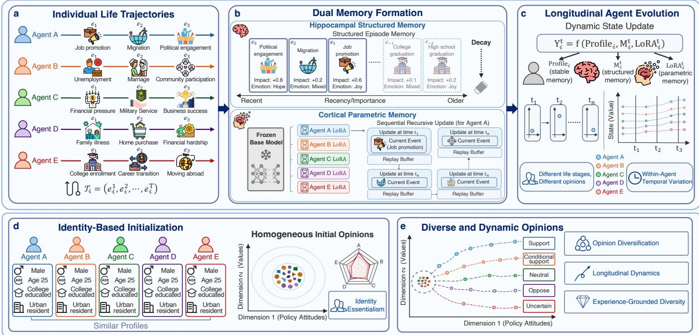  
Figure 2: Overview of LifeMem. (a) Individual life trajectories contain diverse longitudinal experiences. (b) Structured mem-ory supports explicit retrieval, while agent-specific LoRA adapters consolidate experiences into parametric memory through recursive updates. (c) The resulting agent state evolves across life stages. (d) Agents are initialized from similar demographic profiles, which may produce homogeneous opinions. (e) LifeMem produces diverse and dynamic opinions.

vidual i has a static profile $P _ { i }$ constructed from background information and a sequence of life events observed at wave t,

$$
\mathcal { E } _ { i , t } = \{ e _ { i , t , k } \} _ { k = 1 } ^ { K _ { i , t } } ,\tag{1}
$$

where $e _ { i , t , k }$ denotes the k-th observed life event and $K _ { i , t } =$ $| \mathcal { E } _ { i , t } |$ . The accumulated trajectory through wave t is

$$
{ \mathcal { T } } _ { i , \leq t } = \bigcup _ { \tau = 1 } ^ { t } { \mathcal { E } } _ { i , \tau } .\tag{2}
$$

For an evaluation question $q _ { t , j } ,$ LifeMem predicts

$$
\hat { y } _ { i , t , j } = F _ { \theta , A _ { i , t } } \left( P _ { i } , R _ { i , t } ( q _ { t , j } ) , q _ { t , j } \right) ,\tag{3}
$$

where $\theta$ is the frozen base LLM, $A _ { i , t }$ is an agent-specific LoRA adapter, and $R _ { i , t } ( q _ { t , j } )$ contains events retrieved from structured memory. LifeMem combines question-dependent evidence with a persistent individual state to model between- person diferences and within-person change.

## LifeMem Overview

LifeMem is a dual-memory framework inspired by comple- mentary learning systems theory, which distinguishes rapid encoding of specific experiences in the hippocampal system from gradual integration in the neocortex (McClelland, Mc-Naughton, and O’Reilly 1995; O’Reilly and Norman 2002; O’Reilly et al. 2014). In LifeMem, structured memory stores explicit and traceable life events, while agent-specific LoRA adapters integrate accumulated experiences into persistent parametric memory, as illustrated in Figure 2.

Both memories receive the same longitudinal event stream but serve complementary roles. Structured memory provides relevant evidence for the question, whereas parametric mem- ory integrates accumulated experience across questions and waves without repeatedly adding the full trajectory into the prompt. Temporal decay prioritizes retrieval, and replay pre- serves earlier information during sequential adapter updates.

## Hippocampal Structured Memory

Each life event $e _ { i , t , k }$ is derived from a survey question– answer pair and converted into a second-person statement $x _ { i , t , k }$ while retaining its original question and response. A frozen encoder $g _ { \phi }$ maps the statement to an embedding

$$
{ \mathbf { h } } _ { i , t , k } = g _ { \phi } ( x _ { i , t , k } ) .\tag{4}
$$

The structured memory stores each event together with its embedding and wave index:

$$
\mathcal { M } _ { i , t } ^ { S } = \left\{ \left( e _ { i , \tau , k } , \mathbf { h } _ { i , \tau , k } , \tau \right) | 1 \leq \tau \leq t \right\} .\tag{5}
$$

New events are appended without removing earlier records, preserving a traceable account of the observed trajectory.

For a question $q ,$ retrieval combines semantic relevance with temporal decay:

$$
\mathrm { S c o r e } _ { t } ( q , e _ { i , \tau , k } ) = \sin { ( g _ { \phi } ( q ) , { \bf h } _ { i , \tau , k } ) } \exp [ - \lambda ( t - \tau ) ] ,\tag{6}
$$

where $\lambda \geq 0$ controls the preference for recent events. This decay modifies retrieval priority rather than deleting older experiences, which remain available when suficiently rele- vant. The top-K events form the retrieved evidence:

$$
R _ { i , t } ( q ) = \mathrm { T o p - K } _ { e \in \mathcal { M } _ { i , t } ^ { S } } \mathrm { S c o r e } _ { t } ( q , e ) .\tag{7}
$$

The selected statements are inserted into the inference prompt, providing question-dependent evidence without ex- posing the complete history.

## Cortical Parametric Memory

LifeMem maintains an independently updated LoRA adapter for each agent while keeping the base LLM frozen. For a target layer l, the agent-specific weight is

$$
\mathbf { W } _ { i , t } ^ { ( l ) } = \mathbf { W } _ { 0 } ^ { ( l ) } + \frac { \alpha _ { \mathrm { L o R A } } } { r } \mathbf { B } _ { i , t } ^ { ( l ) } \mathbf { A } _ { i , t } ^ { ( l ) } ,\tag{8}
$$

where r and $\alpha _ { \mathrm { L o R A } }$ denote the LoRA rank and scaling co- eficient. We use $\mathbf { \widetilde { \Theta } } _ { i , t } ^ { \mathrm { L o R A } }$ to denote all agent-specific LoRA parameters, including $\{ \mathbf { A } _ { i , t } ^ { ( l ) } , \mathbf { B } _ { i , t } ^ { ( l ) } \} _ { l }$ . Separate adapters allow individuals with similar demographic profiles to develop dif- ferent parametric states as their trajectories diverge.

Each life event yields two training instances: a survey question–answer pair preserving the observed response and an event-reconstruction instance linking the event to the agent’s first-person representation. Together, they encode the survey signal and individualized semantics.

Adapters are updated sequentially across waves:

$$
\Theta _ { i , t } ^ { \mathrm { L o R A } , ( 0 ) } = \Theta _ { i , t - 1 } ^ { \mathrm { L o R A } } , \qquad t > 1 ,\tag{9}
$$

with the first wave initialized from a shared adapter state. At each wave, training combines instances from current events with a small sample of historical instances sampled uniformly at random for replay:

$$
\mathcal { L } _ { i , t } = \sum _ { z \in \mathcal { B } _ { i , t } ^ { \mathrm { c u r } } } \ell ( z ; \theta , \Theta _ { i , t } ^ { \mathrm { L o R A } } ) + \eta \sum _ { z \in \mathcal { B } _ { i , t } ^ { \mathrm { r e p } } } \ell ( z ; \theta , \Theta _ { i , t } ^ { \mathrm { L o R A } } ) ,\tag{10}
$$

where η controls the contribution of replayed experiences. The base model remains frozen, and only the agent-specific low-rank parameters $\Theta _ { i , t } ^ { \mathrm { L o R A } }$ are optimized. Replay serves as a lightweight mechanism for mitigating catastrophic forget- ting rather than a separate memory component.

## Experimental Setup

## Datasets

We evaluate LifeMem on the National Longitudinal Study of Adolescent to Adult Health (Add Health) and the UK Household Longitudinal Study (Understanding Society). We use six waves from Add Health and fifteen waves from Understand- ing Society. To ensure consistent longitudinal tracking, we retain only respondents observed in all selected waves.

Survey variables are semantically categorized into three types: demographic attributes for initial profiles, life events describing evolving experiences, and evaluation targets. To prevent leakage, evaluation targets are excluded from both demographic and life-event variables. To evaluate within- person opinion changes, we further identify a shared set of evaluation questions available in every wave of Understand- ing Society and use them as the longitudinal evaluation set.

## Baselines

Static conditioning includes Direct and Profile (Argyle et al. 2023; Santurkar et al. 2023; Bisbee et al. 2024; Hu and Collier 2024); diversity-oriented prompting includes Multilingual (Wang et al. 2025) and Anti-Stereotype (Sivakumar et al. 2025); and non-parametric memory includes SimVBG (Du et al. 2025), Full History (Maharana et al. 2024), and Event RAG (Lewis et al. 2020; Maharana et al. 2024). Random Event uses random events to test the importance of respondent-specific trajectories.

## Evaluation Metrics

We use four lower-is-better metrics. KL divergence measures alignment between human and agent response distributions. The within-group pairwise distance gap is the absolute difference between human and agent within-group pairwise response distances. A smaller gap indicates that simulated within-group diversity is closer to that of humans, suggest- ing less identity-essentialist behavior. The normalized entropy gap is the absolute diference between the normalized response entropies of humans and agents. The transitiondistribution JS divergence measures how closely the model reproduces the human population-level distribution of re- sponse transitions between adjacent survey waves.

## Implementation Details

We use three similarly sized LLMs: Llama-3.1-8B-Instruct, Ministral-3-8B-Instruct-2512, and Qwen3.5-9B. Using a random seed of 42, we sample 100 respondents per dataset. All methods share the same samples, questions, backbones, and deterministic decoding settings, with temperature 0 and sampling disabled. Event RAG uses the stronger bge-m3 re- triever, whereas LifeMem uses the lightweight all-MiniLM- L6-v2 encoder. Both methods retrieve the top-K = 5 events. LifeMem uses a temporal decay factor of 0.105, rank-8 LoRA adapters, replay size 4, and replay weight 0.5. Experiments run on one NVIDIA A800-SXM4 80 GB GPU.

## Experiments and Results

This section evaluates LifeMem’s efectiveness, mecha- nisms, scaling, and eficiency. We examine explicit-memory limitations, overall performance, parameter diferentiation, component contributions, and computational costs.

## Limits of Explicit Prompt Memory

We test whether retrieving more explicit life-history infor- mation is suficient for longitudinal simulation by varying Event RAG retrieval depth from K = 1 to K = 180 (i.e., Full History) on Add Health with Llama-8B. We evaluate distributional and diversity alignment together with runtime and average input-token use to characterize both efective- ness and computational cost.

As shown in Figure 3, the three simulation metrics initially improve but largely saturate around K = 40 and sometimes deteriorate, while runtime and input-token use continue to increase. This trade-of illustrates a practical limitation of prompt-only memory and motivates combining selective re- trieval with persistent parametric memory.

<table><tr><td rowspan="2">Category</td><td rowspan="2">Method</td><td colspan="3">Add Health</td><td colspan="4">Understanding Society</td></tr><tr><td>KL Div. ↓</td><td>WG Gap ↓</td><td>Ent. Gap ↓</td><td>KL Div. ↓</td><td>WG Gap ↓</td><td>Ent. Gap ↓</td><td>Trans. JS ↓</td></tr><tr><td colspan="10">LLAMA-3.1-8B-INSTRUCT</td></tr><tr><td>Static</td><td>Direct</td><td>14.7551*</td><td>0.5596*</td><td>0.7053*</td><td>15.3734*</td><td>0.5561*</td><td>0.7076*</td><td>0.4580*</td></tr><tr><td>Conditioning</td><td>Profile</td><td>8.6719*</td><td>0.3951*</td><td>0.5112*</td><td>7.1522*</td><td>0.3835*</td><td>0.4972*</td><td>0.3886*</td></tr><tr><td>Diversity-Oriented</td><td>Multilingual</td><td>10.4654*</td><td>0.3733*</td><td>0.5035*</td><td>11.7367*</td><td>0.3446*</td><td>0.4763*</td><td>0.4570*</td></tr><tr><td>Prompting</td><td>Anti-Stereotype</td><td>9.8270*</td><td>0.4163*</td><td>0.5452*</td><td>8.1485*</td><td>0.4066*</td><td>0.5120*</td><td>0.3592*</td></tr><tr><td>Non-Parametric</td><td>SimVBG</td><td>6.8058*</td><td>0.3380*</td><td>0.4345*</td><td>6.2912*</td><td>0.3544*</td><td>0.4730*</td><td>0.3709*</td></tr><tr><td>Memory</td><td>Full History</td><td>6.1176*</td><td>0.3079*</td><td>0.3974*</td><td>4.9344*</td><td>0.3198*</td><td>0.4004*</td><td>0.3633*</td></tr><tr><td>Control Baseline</td><td>Event RAG</td><td>5.8264* 6.8821*</td><td>0.2964*</td><td>0.3951*</td><td>5.2935*</td><td>0.3163*</td><td>0.3991*</td><td>0.3648* 0.3803*</td></tr><tr><td>Proposed Method</td><td>Random Event LifeMem</td><td>4.0635</td><td>0.3524* 0.2309</td><td>0.4538* 0.3207</td><td>5.5673* 3.4529</td><td>0.3429* 0.2886</td><td>0.4539* 0.3742</td><td>0.3331</td></tr><tr><td colspan="9">MINISTRAL-3-8B-INSTRUCT-2512</td></tr><tr><td>Static</td><td>Direct</td><td>15.5952* 8.8060*</td><td>0.5679*</td><td>0.7161*</td><td>15.4925*</td><td>0.5648*</td><td>0.7182*</td><td>0.5076*</td></tr><tr><td>Conditioning Diversity-Oriented</td><td>Profile Multilingual</td><td>12.7028*</td><td>0.4120*</td><td>0.5263*</td><td>6.8298* 13.1824*</td><td>0.3622* 0.3942*</td><td>0.4622* 0.5350*</td><td>0.3609 0.4889*</td></tr><tr><td>Prompting</td><td>Anti-Stereotype</td><td>10.0458*</td><td>0.3597*</td><td>0.5129*</td><td>8.7660*</td><td>0.3946*</td><td>0.5066*</td><td>0.3757</td></tr><tr><td></td><td>SimVBG</td><td>6.9946*</td><td>0.4339* 0.3427*</td><td>0.5537* 0.4566*</td><td>4.8323*</td><td>0.3272*</td><td>0.4156*</td><td>0.3610</td></tr><tr><td>Non-Parametric</td><td>Full History</td><td>4.7175*</td><td>0.2893*</td><td>0.3817*</td><td>3.8053*</td><td>0.2927*</td><td>0.3413*</td><td>0.3528</td></tr><tr><td>Memory</td><td>Event RAG</td><td>5.4368*</td><td>0.2849*</td><td>0.3895*</td><td>4.3342*</td><td>0.2887*</td><td>0.3413*</td><td>0.4693*</td></tr><tr><td>Control Baseline</td><td>Random Event</td><td>6.1787*</td><td>0.3578*</td><td>0.4647*</td><td>4.7275*</td><td>0.3156*</td><td>0.4048*</td><td>0.3924</td></tr><tr><td>Proposed Method</td><td>LifeMem</td><td>2.2959</td><td>0.1928</td><td>0.2783</td><td>1.9659</td><td>0.2277</td><td>0.2659</td><td>0.3399</td></tr><tr><td></td><td></td><td></td><td></td><td></td><td></td><td></td><td></td><td></td></tr><tr><td colspan="9">QWEN3.5-9B</td></tr><tr><td>Static</td><td>Direct</td><td>13.9957*</td><td>0.5482*</td><td>0.6923*</td><td>15.9998*</td><td>0.5559*</td><td>0.7080*</td><td>0.4452*</td></tr><tr><td>Conditioning</td><td>Profile</td><td>8.0174*</td><td>0.4004*</td><td>0.5093*</td><td>5.3214*</td><td>0.3463*</td><td>0.4325* 0.4728*</td><td>0.3471*</td></tr><tr><td>Diversity-Oriented</td><td>Multilingual</td><td>7.7194*</td><td>0.2211</td><td>0.3395</td><td>10.9903*</td><td>0.3438*</td><td></td><td>0.4405*</td></tr><tr><td>Prompting</td><td>Anti-Stereotype</td><td>7.7407*</td><td>0.3743*</td><td>0.4770*</td><td>6.0185*</td><td>0.3422*</td><td>0.4254*</td><td>0.3356*</td></tr><tr><td>Non-Parametric</td><td>SimVBG</td><td>5.7090*</td><td>0.3307*</td><td>0.4311*</td><td>4.4864*</td><td>0.3182*</td><td>0.3889*</td><td>0.3298*</td></tr><tr><td>Memory</td><td>Full History</td><td>4.5266</td><td>0.2599</td><td>0.3432</td><td>3.7659* 3.5507*</td><td>0.2979* 0.2673*</td><td>0.3441*</td><td>0.3203*</td></tr><tr><td>Control Baseline</td><td>Event RAG Random Event</td><td>4.3701 6.0741*</td><td>0.2676</td><td>0.3574</td><td>3.7848*</td><td>0.3031*</td><td>0.3070 0.3707*</td><td>0.3394* 0.3466*</td></tr><tr><td>Proposed Method</td><td></td><td>4.1177</td><td>0.3625*</td><td>0.4584*</td><td>2.6879</td><td></td><td>0.2932</td><td></td></tr><tr><td></td><td>LifeMem</td><td></td><td>0.2723</td><td>0.3601</td><td></td><td>0.2519</td><td></td><td>0.3060</td></tr></table>

Table 1: Overall results on Add Health and Understanding Society across three models. KL Div., WG Gap, Ent. Gap, and Trans. JS denote KL divergence, within-group pairwise distance gap, normalized entropy gap, and transition-distribution JS divergence. Lower values are better for all metrics. Bold marks the best result for each model and metric; LifeMem is shaded light gray. ∗ indicates results si nificantl worse than LifeMem in a two-sided aired t-test conducted over shared uestions (p < 0.05).

## Overall Performance and Diversity

Table 1 shows that LifeMem performs consistently well across four dimensions, with largely significant gains across three backbones and two datasets. It reduces distributional and diversity gaps relative to human responses across set- tings. Direct performs similarly poorly across models, while Ministral shows the largest improvement with LifeMem.

Profile improves over Direct but remains behind Life- Mem, suggesting that static demographic profiles cannot fully capture human heterogeneity and temporal varia- tion in these settings. Multilingual and Anti-Stereotype prompting yield inconsistent gains, suggesting that these prompting strategies do not reliably reproduce human-like di- versity across settings. SimVBG, Full History, and Event RAG perform better than static baselines but still generally trail LifeMem, suggesting that non-parametric memory alone may be insuficient to achieve the same level of alignment. LifeMem also outperforms Random Event, highlighting the importance of respondent-specific trajectories.

One notable exception is Qwen3.5-9B on Add Health, where Multilingual achieves slightly lower within-group pairwise distance gap and normalized entropy gap than Life- Mem. However, its substantially higher KL divergence in- dicates that these gains in diversity alignment are accompa- nied by poorer agreement with the overall human response distribution, suggesting a less balanced improvement across evaluation dimensions.

Overall, LifeMem improves alignment with human data across response distributions, overall and within-group di- versity, and longitudinal response dynamics. These results suggest that LifeMem mitigates patterns consistent with iden- tity essentialism by reducing within-group homogenization while maintaining closer alignment with human responses.

## Ablation Study

Table 2 evaluates the contributions of structured and para- metric memory. Removing either component significantly degrades performance on most metrics, supporting their complementarity. Parametric memory maintains a persistent agent state that integrates experiences across waves beyond the events retrieved for the current question, whereas struc- tured memory supplies explicit, traceable, and temporally grounded evidence for generation and tends to contribute more strongly to diversity alignment. Their relative efects vary across diferent models and datasets.

<table><tr><td rowspan="2">Method</td><td colspan="3">Add Health</td><td colspan="4">Understanding Society</td></tr><tr><td>KL Div. ↓</td><td>WG Gap ↓</td><td>Ent. Gap ↓</td><td>KL Div. ↓</td><td>WG Gap ↓</td><td>Ent. Gap ↓</td><td>Trans. JS ↓</td></tr><tr><td colspan="8">LLAMA-3.1-8B-INSTRUCT</td></tr><tr><td>LifeMem (Full)</td><td>4.0635</td><td>0.2309</td><td>0.3207</td><td>3.4529</td><td>0.2886</td><td>0.3742</td><td>0.3331</td></tr><tr><td>LifeMem w/o Param. Mem.</td><td>5.3517*</td><td>0.2554*</td><td>0.3436</td><td>5.0874*</td><td>0.3259*</td><td>0.4150*</td><td>0.3594*</td></tr><tr><td>LifeMem w/o Struct. Mem.</td><td>6.2815*</td><td>0.3132*</td><td>0.4164*</td><td>4.7555*</td><td>0.3379*</td><td>0.4318*</td><td>0.3614*</td></tr><tr><td colspan="8">MINISTRAL-3-8B-INSTRUCT-2512</td></tr><tr><td>LifeMem (Full)</td><td>2.2959</td><td>0.1928</td><td>0.2783</td><td>1.9659</td><td>0.2277</td><td>0.2659</td><td>0.3399</td></tr><tr><td>LifeMem w/o Param. Mem.</td><td>4.6504*</td><td>0.2516*</td><td>0.3456*</td><td>3.8454*</td><td>0.2810*</td><td>0.3389*</td><td>0.3838</td></tr><tr><td>LifeMem w/o Struct. Mem.</td><td>3.3799*</td><td>0.2627*</td><td>0.3597*</td><td>2.4410*</td><td>0.2483*</td><td>0.3093*</td><td>0.3443</td></tr><tr><td colspan="8">QWEN3.5-9B</td></tr><tr><td>LifeMem (Full)</td><td>4.1177</td><td>0.2723</td><td>0.3601</td><td>2.6879</td><td>0.2519</td><td>0.2932</td><td>0.3060</td></tr><tr><td>LifeMem w/o Param. Mem.</td><td>4.4295</td><td>0.2733</td><td>0.3604</td><td>3.4224*</td><td>0.2738*</td><td>0.3193*</td><td>0.3411*</td></tr><tr><td>LifeMem w/o Struct. Mem.</td><td>6.0934*</td><td>0.3651*</td><td>0.4760*</td><td>3.2797*</td><td>0.2842*</td><td>0.3430*</td><td>0.3235*</td></tr></table>

Table 2: Ablation study of LifeMem on Add Health and Understanding Society. KL Div., WG Gap, Ent. Gap, and Trans. JS denote KL divergence, within-group pairwise distance gap, normalized entropy gap, and transition-distribution JS divergence. All metrics are lower-is-better. Bold marks the best result for each model and metric; LifeMem (Full) is shaded light gray. ∗ indicates results significantly worse than LifeMem (Full) in a two-sided paired t-test conducted over shared questions $( p < 0 . 0 5 )$

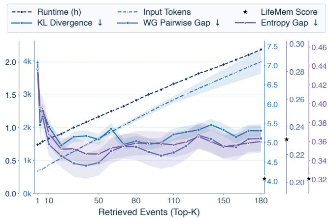  
Figure 3: Efect of Event RAG retrieval depth on Add Health with Llama-8B across 100 agents. We report alignment met- rics, runtime, and input tokens for top-K ∈ [1, 180]. Stars mark LifeMem at K = 5. The shaded bands indicate standard deviation across waves.

## Evolution of Agent-Specific LoRA States

Figure 4 uses PCA to project the high-dimensional agent-specific LoRA states into a shared two-dimensional space, illustrating how the states of 100 Llama-8B agents evolve over 15 waves on Understanding Society. The initially con- centrated adapters become progressively more dispersed and follow distinct trajectories as individual histories accumulate over time. This pattern suggests that sequential updates grad- ually encode heterogeneous life experiences into diferenti- ated parametric states, reflecting increasing personalization across agents with diferent longitudinal trajectories.

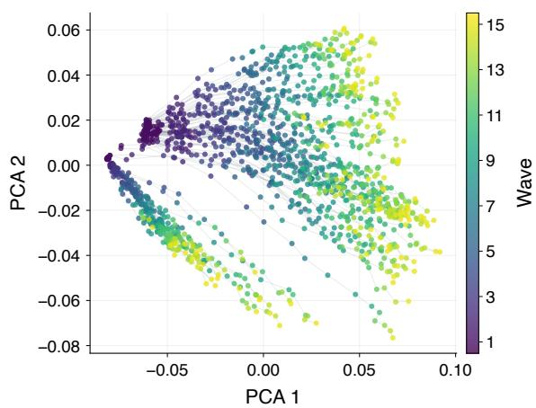  
Figure 4: PCA visualization of LifeMem’s agent-specific LoRA states for 100 Understanding Society agents using Llama-8B. Points represent states after each wave, with tra- jectories connecting the same agent over time. Agent states increasingly diverge as life histories accumulate.

## Scaling with Accumulated Life Experiences

Figure 5 examines the efect of longitudinal life-event cover- age in LifeMem on the Add Health dataset with Llama-8B. We vary the maximum number of available events per wave from 5 to 180 for 100 agents. Increasing coverage generally reduces KL divergence, normalized entropy gap, and within- group pairwise distance gap, with the improvements gradu- ally plateauing after roughly 90 events per wave. This pat- tern indicates that richer longitudinal histories provide more informative and individualized evidence for distinguishing individuals and recovering more human-like response distri- butions and levels of diversity over time. Overall, these re- sults further support our motivation to model agents through accumulated life experiences rather than relying on static demographic profiles alone.

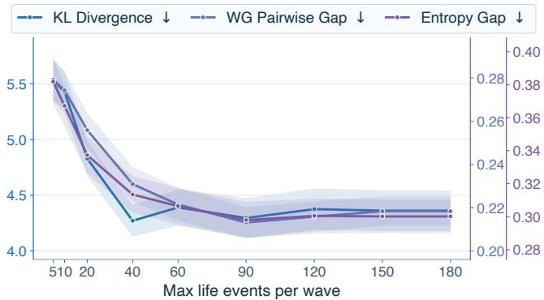  
Figure 5: Efect of life-event coverage in LifeMem on Add Health with Llama-8B. We simulate 100 agents while vary- ing the maximum number of life events available per wave from 5 to 180. Curves report KL divergence, within-group pairwise distance gap, and normalized entropy gap. The shaded bands indicate standard deviation across waves. In- creasing life-event coverage generally improves alignment with human response distributions and diversity.

## Eficiency Analysis

All eficiency measurements are obtained under the same hardware configuration. We focus primarily on relative trends and comparisons across methods, as absolute runtime may vary with diferent hardware characteristics, including CPU, GPU, memory, and storage configurations.

Online inference. Table 3 compares the average per-question inference latency across diferent methods on the Add Health and Understanding Society datasets using Llama-8B. Re- trieval latency is included for both the Event RAG and Life- Mem methods to ensure a consistent end-to-end comparison. LifeMem is slower than lightweight prompt-only baselines but remains faster than Full History, Event RAG, and SimVBG on both datasets. Adapter loading introduces lit- tle additional latency and can be amortized across questions once an agent’s adapter is loaded.

Storage. Figure 6 compares per-agent adapter and structured life-event storage for Llama-8B as longitudinal histories accumulate. Structured event storage grows with trajectory length because newly observed experiences must be retained explicitly, whereas each agent maintains a single fixed-size LoRA adapter that is updated after each wave. The updated adapter is then used for subsequent inference, so parametric- memory storage remains bounded rather than growing with the number of accumulated events.

<table><tr><td rowspan="2">Method</td><td colspan="2">AH</td><td colspan="2">USoc</td></tr><tr><td>Time</td><td>Rel.</td><td>Time</td><td>Rel.</td></tr><tr><td>Direct</td><td>13.8</td><td>1.0</td><td>14.4</td><td>1.0</td></tr><tr><td>Profile Multilingual</td><td>65.2 24.5</td><td>4.7 1.8</td><td>70.8 26.5</td><td>4.9 1.8</td></tr><tr><td>Anti-Stereotype</td><td>66.8</td><td>4.9</td><td>72.9</td><td>5.1</td></tr><tr><td>SimVBG</td><td>196.4</td><td>14.3</td><td>196.4</td><td>13.7</td></tr><tr><td>Full History</td><td>334.5</td><td>24.3</td><td>318.1</td><td>22.1</td></tr><tr><td>Event RAG</td><td>1094.2</td><td>79.5</td><td>956.2</td><td>66.5</td></tr><tr><td>Random Event</td><td>73.0</td><td>5.3</td><td>79.8</td><td></td></tr><tr><td></td><td></td><td></td><td></td><td>5.6</td></tr><tr><td>LifeMem</td><td> $1 6 1 . 7 _ { + 0 . 9 }$ </td><td>11.7</td><td> $1 5 4 . 5 _ { + 1 . 4 }$ </td><td>10.7</td></tr></table>

Table 3: Average per-question inference latency with Llama- 8B. AH and USoc denote Add Health and Understanding Society. Time is reported in milliseconds, and Rel. denotes latency relative to Direct. Retrieval latency is included for Event RAG and LifeMem. For LifeMem, the subscripted +x indicates the LoRA adapter-loading latency. Rel. excludes the one-time LoRA adapter-loading latency.

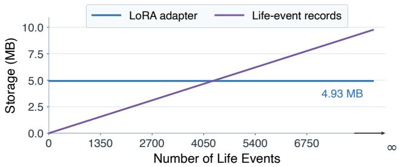  
Figure 6: Per-agent storage with Llama-8B as life events accu- mulate. The fixed-size LoRA adapter remains constant, while structured life-event storage grows with trajectory length.

Ofline training. With Llama-8B, the average ofline adapter update time per agent and wave is 7.21 seconds on Add Health and 2.63 seconds on Understanding Society. This one-time cost is incurred during wave-level updates and is not repeated for each subsequent online query.

## Conclusion

This work aims to mitigate patterns consistent with iden- tity essentialism in LLM social simulation, where static pro- files can suppress individual diversity and temporal change. LifeMem combines structured life-event retrieval with agent- specific LoRA parametric memory. Across two longitudinal datasets and three model backbones, it consistently improves alignment with human response distributions, diversity, and changes across life stages. Overall, the results suggest that, in these settings, incorporating longitudinal life experiences together with persistent parametric memory provides a more faithful representation of individuals.

## Ethical Statement

We use only public-use, de-identified survey data, comply with applicable data-use agreements, avoid re-identification, and report aggregate results. Because agent-specific adapters may memorize respondent information, we do not release respondent-level adapters. These agents are not digital repli- cas and should not be used for consequential person-level decisions; they are intended for methodological research on longitudinal LLM social simulation.

## Acknowledgements

This work is supported by the Research Project of Quancheng Laboratory, China (Grant No. QCL20250105), the National Natural Science Foundation of China No. 62502260, and the Postdoctoral Fellowship Program of China Postdoctora Science Foundation No. GZC20240833.

## References

Abels, A.; and Lenaerts, T. 2025. Wisdom from diversity: bias mitigation through hybrid human-llm crowds. arXiv preprint arXiv:2505.12349.

Aher, G. V.; Arriaga, R. I.; and Kalai, A. T. 2023. Using large language models to simulate multiple humans and replicate human subject studies. In International conference on machine learning, 337–371. PMLR.

Argyle, L. P.; Busby, E. C.; Fulda, N.; Gubler, J. R.; Rytting, C.; and Wingate, D. 2023. Out of one, many: Using language models to simulate human samples. Political Analysis, 31(3): 337–351.

Ashkinaze, J.; Fry, E.; Edara, N.; Gilbert, E.; and Budak, C. 2025. Plurals: A system for guiding llms via simulated social ensembles. In Proceedings of the 2025 CHI Conference on Human Factors in Computing Systems, 1–21.

Bastian, B.; and Haslam, N. 2006. Psychological essentialism and stereotype endorsement. Journal of experimental social psychology, 42(2): 228–235.

Bisbee, J.; Clinton, J. D.; Dorf, C.; Kenkel, B.; and Lar- son, J. M. 2024. Synthetic replacements for human survey data? The perils of large language models. Political Analysis, 32(4): 401–416.

Boelaert, J.; Coavoux, S.; Ollion, É.; Petev, I.; and Präg, P. 2025. Machine bias. How do generative language models answer opinion polls? Sociological Methods & Research, 54(3): 1156–1196.

Buck, N.; and McFall, S. 2012. Understanding Society: de- sign overview. Longitudinal and Life Course Studies, 3(1): 5–17.

Chen, R.; Arditi, A.; Sleight, H.; Evans, O.; and Lindsey, J. 2025. Persona vectors: Monitoring and controlling character traits in language models. arXiv preprint arXiv:2507.21509.

Chung, J. J. Y.; Kamar, E.; and Amershi, S. 2023. Increasing diversity while maintaining accuracy: Text data generation with large language models and human interventions. In Proceedings of the 61st annual meeting of the association for computational linguistics (volume 1: Long papers), 575– 593.

Curran, P. J.; and Bauer, D. J. 2011. The disaggregation of within-person and between-person efects in longitudinal models of change. Annual review of psychology, 62(1): 583– 619.

Du, B.; Guo, M.; He, S.; Ye, Z.; Zhu, X.; Su, W.; Zhu, S.; Zhou, Y.; Zhang, Y.; Ai, Q.; and Liu, Y. 2026. TwinVoice: A Multi-dimensional Benchmark Towards Digital Twins via LLM Persona Simulation. In Findings ofthe Associationfor Computational Linguistics: ACL 2026, 19604–19628. Asso-ciation for Computational Linguistics.

Du, B.; Ye, Z.; Wu, Z.; Jankowska, M. A.; Zhu, S.; Ai, Q.; Zhou, Y.; and Liu, Y. 2025. SimVBG: Simulating Individ- ual Values by Backstory Generation. In Proceedings of the 2025 Conference on Empirical Methods in Natural Language Processing, 13104–13133.

Elder Jr, G. H. 1998. The life course as developmental theory. Child development, 69(1): 1–12.

Ge, T.; Chan, X.; Wang, X.; Yu, D.; Mi, H.; and Yu, D. 2024. Scaling synthetic data creation with 1,000,000,000 personas. arXiv preprint arXiv:2406.20094.

Grattafiori, A.; Dubey, A.; Jauhri, A.; Pandey, A.; Kadian, A.; Al-Dahle, A.; Letman, A.; Mathur, A.; Schelten, A.; Vaughan, A.; et al. 2024. The llama 3 herd of models. arXiv preprint arXiv:2407.21783.

Guo, M.; Jiao, Q.; Shi, Z.; Quan, Y.; Zhang, B.; Li, D.; Che, L.; Xu, W.; Liu, S.; Liu, Z.; Kapadia, M.; Pavlovic, V.; Liu, J.; Wang, M.; Shi, Y.; Metaxas, D. N.; and Tang, R. 2026a. MemEye: A Visual-Centric Evaluation Framework for Multimodal Agent Memory. arXiv:2605.15128.

Guo, M.; Ye, Z.; Xu, W.; Zhu, X.; Hua, W.; and Metaxas, D. N. 2026b. Individual Turing Test: A Case Study of LLM- based Simulation Using Longitudinal Personal Data. In Proceedings of the 49th International ACM SIGIR Conference on Research and Development in Information Retrieval, 3770– 3775. New York, NY, USA: Association for Computing Ma- chinery.

Haerpfer, C.; Inglehart, R.; Moreno, A.; Welzel, C.; Kizilova, K.; Diez-Medrano, J.; Lagos, M.; Norris, P.; Ponarin, E.; and Puranen, B. 2022. World values survey wave 7 (2017-2022) cross-national data-set.

Harris, K. M.; Halpern, C. T.; Whitsel, E. A.; Hussey, J. M.; Killeya-Jones, L. A.; Tabor, J.; and Dean, S. C. 2019. Cohort profile: The national longitudinal study of adolescent to adult health (add health). International journal of epidemiology, 48(5): 1415–1415k.

Holtzman, A.; Buys, J.; Du, L.; Forbes, M.; and Choi, Y. 2019. The curious case of neural text degeneration. arXiv preprint arXiv:1904.09751.

Hu, T.; and Collier, N. 2024. Quantifying the persona efect in LLM simulations. In Proceedings of the 62nd Annual Meeting of the Association for Computational Linguistics (Volume 1: Long Papers), 10289–10307.

Hu, Z.; Lian, J.; Xiao, Z.; Xiong, M.; Lei, Y.; Wang, T.; Ding,K.; Xiao, Z.; Yuan, N. J.; and Xie, X. 2025. Population-aligned persona generation for llm-based social simulation.arXiv preprint arXiv:2509.10127.

Kumaran, D.; Hassabis, D.; and McClelland, J. L. 2016. What Learning Systems Do Intelligent Agents Need? Com- plementary Learning Systems Theory Updated. Trends in Cognitive Sciences, 20(7): 512–534.

Lewis, P.; Perez, E.; Piktus, A.; Petroni, F.; Karpukhin, V.; Goyal, N.; Küttler, H.; Lewis, M.; Yih, W.-t.; Rocktäschel, T.; et al. 2020. Retrieval-augmented generation for knowledge- intensive nlp tasks. Advances in neural information processing systems, 33: 9459–9474.

Li, J.; Galley, M.; Brockett, C.; Gao, J.; and Dolan, W. B. 2016. A diversity-promoting objective function for neural conversation models. In Proceedings ofthe 2016 conference ofthe North American chapter ofthe associationfor computational linguistics: human language technologies, 110–119.

Li, M.; and Conrad, F. G. 2026. Persona-Based Simula- tion of Human Opinion at Population Scale. arXiv preprint arXiv:2603.27056.

Liu, A. H.; Khandelwal, K.; Subramanian, S.; Jouault, V.; Rastogi, A.; Sadé, A.; Jefares, A.; Jiang, A.; Cahill, A.; Gavaudan, A.; et al. 2026. Ministral 3. arXiv preprint arXiv:2601.08584.

Long, L.; He, Y.; Ye, W.; Pan, Y.; Lin, Y.; Li, H.; Zhao, J.; and Li, W. 2026. Seeing, Listening, Remembering, and Rea- soning: A Multimodal Agent with Long-Term Memory. In The Fourteenth International Conference on Learning Representations.

Lutz, M.; Sen, I.; Ahnert, G.; Rogers, E.; and Strohmaier, M. 2025. The prompt makes the person (a): A systematic evaluation of sociodemographic persona prompting for large language models. arXiv preprint arXiv:2507.16076.

Maharana, A.; Lee, D.-H.; Tulyakov, S.; Bansal, M.; Bar- bieri, F.; and Fang, Y. 2024. Evaluating very long-term conversational memory of llm agents. In Proceedings of the 62nd Annual Meeting of the Association for Computational Linguistics (Volume 1: Long Papers), 13851–13870.

McClelland, J. L.; McNaughton, B. L.; and O’Reilly, R. C. 1995. Why there are complementary learning systems in the hippocampus and neocortex: insights from the successes and failures of connectionist models of learning and memory. Psychological review, 102(3): 419.

O’Reilly, R. C.; Bhattacharyya, R.; Howard, M. D.; and Ketz, N. 2014. Complementary Learning Systems. Cognitive Science, 38(6): 1229–1248.

O’Reilly, R. C.; and Norman, K. A. 2002. Hippocampal and Neocortical Contributions to Memory: Advances in the Complementary Learning Systems Framework. Trends in Cognitive Sciences, 6(12): 505–510.

Park, J. S.; O’Brien, J.; Cai, C. J.; Morris, M. R.; Liang, P.; and Bernstein, M. S. 2023. Generative agents: Interac- tive simulacra of human behavior. In Proceedings of the 36th annual acm symposium on user interface software and technology, 1–22.

Park, J. S.; Zou, C. Q.; Shaw, A.; Hill, B. M.; Cai, C.; Morris, M. R.; Willer, R.; Liang, P.; and Bernstein, M. S. 2024. Generative agent simulations of 1,000 people. arXiv preprint arXiv:2411.10109, 52.

Platt, J.; et al. 1999. Probabilistic outputs for support vector machines and comparisons to regularized likelihood meth- ods. Advances in large margin classifiers, 10(3): 61–74.

Prentice, D. A.; and Miller, D. T. 2007. Psychological essen- tialism of human categories. Current directions in psychological science, 16(4): 202–206.

Qwen Team. 2026. Qwen3.5: Towards Native Multimodal Agents. https://qwen.ai/blog?id=qwen3.5.

Santurkar, S.; Durmus, E.; Ladhak, F.; Lee, C.; Liang, P.; and Hashimoto, T. 2023. Whose opinions do language models reflect? In International conference on machine learning, 29971–30004. PMLR.

Sivakumar, N.; Mackraz, N.; Khorshidi, S.; Patel, K.; Theobald, B.-J.; Zappella, L.; and Apostolof, N. 2025. Bias after Prompting: Persistent Discrimination in Large Lan- guage Models. arXiv preprint arXiv:2509.08146.

Su, W.; Tang, Y.; Ai, Q.; Yan, J.; Wang, C.; Wang, H.; Ye, Z.; Zhou, Y.; and Liu, Y. 2025. Parametric retrieval aug- mented generation. In Proceedings ofthe 48th International ACM SIGIR Conference on Research and Development in Information Retrieval, 1240–1250.

Vijayakumar, A.; Cogswell, M.; Selvaraju, R.; Sun, Q.; Lee, S.; Crandall, D.; and Batra, D. 2018. Diverse beam search for improved description of complex scenes. In Proceedings ofthe AAAI Conference on Artificial Intelligence, volume 32.

Wang, A.; Morgenstern, J.; and Dickerson, J. P. 2025. Large language models that replace human participants can harm- fully misportray and flatten identity groups. Nature Machine Intelligence, 7(3): 400–411.

Wang, H.; Zhou, Y.; Du, B.; Ai, Q.; and Liu, Y. 2026. Parametric Social Identity Injection and Diversification in Public Opinion Simulation. arXiv preprint arXiv:2603.16142.

Wang, Q.; Pan, S.; Linzen, T.; and Black, E. 2025. Multilingual prompting for improving llm generation diversity. In Proceedings of the 2025 Conference on Empirical Methods in Natural Language Processing, 6378–6400.

Wong, J.; Orlovskiy, Y.; Shypula, A.; Luo, M.; Seshia, S.; and Gonzalez, J. 2026. Simplestrat: Diversifying language model generation with stratification. Advances in Neural Information Processing Systems, 38: 116906–116935.

Xie, Y.; Liang, L.; Li, S.; Lu, Y.; Xiao, Z.; Shi, M.; Huang, J.; Wang, M.; and Xie, Y. 2026. Evaluating the statistical realism of LLM-generated social science data. Proceedings ofthe NationalAcademy ofSciences, 123(19): e2538145123.

Zhang, L. H.; Milli, S.; Jusko, K.; Smith, J.; Amos, B.; Bouaziz, W.; Revel, M.; Kussman, J.; Sheynin, Y.; Titus, L.; et al. 2025. Cultivating pluralism in algorithmic mono- culture: The community alignment dataset. arXiv preprint arXiv:2507.09650.

Zhong, W.; Guo, L.; Gao, Q.; Ye, H.; and Wang, Y. 2024. Memorybank: Enhancing large language models with long- term memory. In Proceedings of the AAAI conference on artificial intelligence, volume 38, 19724–19731.

## Limitations

LifeMem is limited by the coverage and granularity of lon- gitudinal surveys, which cannot fully capture an individual’s life experiences. Surveys may omit events outside the ques- tionnaire, record them onl at coarse intervals, and fail to capture event duration or respondents’ subjective interpretations. Thus, reconstructed trajectories remain partial rep-resentations of personal development rather than complete life histories. Moreover, self-reported survey responses may be afected by recall bias and question framing, and do not necessarily correspond to real-world behavior.

## Details of the Motivating Analyses

## WVS Static-Profile Experiment

Experimental setup. We use Wave 7 of the World Values Survey (WVS) (Haerpfer et al. 2022) and randomly sample 2,000 respondents with seed 42. For each respondent, we construct a static profile from answers in the WVS demo- graphic section, corresponding to Questions Q260–Q290. The profile is provided to Llama-3.1-8B-Instruct, which is instructed to simulate the corresponding respon- dent and answer the survey questions. This setup represents a typical profile-conditioned social simulation in which each agent is reconstructed from demographic attributes.

Prompt template. The following prompt template is in- stantiated with the recoded demographic attributes of each respondent:

## Prompt Template

Forget you are an AI model. Simulate a human being.   
Please answer the following question truthfully.

Please answer based on the following personal profile:

You are <gender>. You are aged <age>. You live in <country>. You are <citizenship status>. You were born <birthplace status>. Your mother was born <mother’s birthplace status>. Your father was born <father’s birthplace status>. You live in <urbanicity>, <settlement type>, with a population of <population size>. Your household consists of <household size> members. You <parent cohabitation status>. You speak <home language> at home. You are <marital status> and <children description>. Your education level is <education level>. Your spouse’s education level is <spouse education level>. You are <employment status>. You work as <occupation>. You work in <employment sector>. Your spouse is <spouse employment status>. Your spouse works as <spouse occupation>. You are <chief wage earner status>. During the past year, your family <household financial change>. You belong to <subjective social class>. Your income is in income group <income group> (1 = lowest, 10 = highest). You identify as <religion>. Your ethnic group is <ethnic group>.

Question: <question>

Options: <options>

Please ONLY output a number. Do NOT write any words, symbols, punctuation, or explanations.

Response processing. For both human respondents and their corresponding agents, the survey answers are converted into response vectors. Each question dimension is standard- ized before dimensionality reduction, after which PCA is applied to obtain two-dimensional representations. Human and agent responses follow the same response labeling, pro- cessing, standardization, PCA, and visualization procedure.

Socioeconomic status construction. We construct a com-posite socioeconomic status (SES) measure from four WVS variables: subjective social class (Q287), household economic situation (Q286), educational attainment (Q275), and income group (Q288).

Each variable is converted to a directionally consistent numerical scale such that larger values indicate higher so- cioeconomic status. Let $\widetilde { x } _ { i m }$ denote the recoded value of variable m for respondent i, and let $\mathcal { M } _ { i }$ denote the set of available SES variables for that respondent. The composite score is

$$
\mathrm { S E S } _ { i } = \frac { 1 } { \left| \mathcal { M } _ { i } \right| } \sum _ { m \in \mathcal { M } _ { i } } \widetilde { x } _ { i m } .\tag{11}
$$

Respondents are divided into low-, middle-, and high-SES groups according to the tertiles of the composite score.

Silhouette score. We use the silhouette score to quantify how strongly the response representations separate according to the predefined SES groups. Let $C _ { i }$ denote the SES group containing individual i. The average distance between i and other members of the same group is

$$
a ( i ) = \frac { 1 } { \left| C _ { i } \right| - 1 } \sum _ { j \in C _ { i } \atop j \not = i } d ( i , j ) .\tag{12}
$$

The minimum average distance between i and any other SES group is

$$
b ( i ) = \operatorname* { m i n } _ { C \neq C _ { i } } \frac { 1 } { | C | } \sum _ { j \in C } d ( i , j ) .\tag{13}
$$

The silhouette value for individual i is

$$
s ( i ) = \frac { b ( i ) - a ( i ) } { \operatorname* { m a x } \{ a ( i ) , b ( i ) \} } ,\tag{14}
$$

and the overall silhouette score is

$$
S = \frac { 1 } { N } \sum _ { i = 1 } ^ { N } s ( i ) .\tag{15}
$$

Silhouette scores are computed in the standardized re- sponse space before PCA projection; PCA is used only for visualization.

A score close to 1 indicates compact within-group repre- sentations and clear between-group separation, a score close to 0 indicates substantial overlap, and a negative score indi- cates that some individuals are closer to another group than to their assigned group.

In this work, the silhouette score is used only to quan- tify the extent to which response representations align with predefined demographic groups. It is not interpreted as a standalone measure of simulation quality.

Result summary. Human responses are broadly dispersed and substantially overlap across SES groups, resulting in a silhouette score of $S = - 0 . 0 2$ . In contrast, agent responses form more compact within-group clusters and show clearer separation between SES groups, resulting in $S = 0 . 1 9$ . This pattern suggests that static demographic prompting may com- press complex individuals into group-typical representatives, thereby reducing within-group heterogeneity and amplify- ing between-group diferences. We treat this experiment as a motivating diagnostic that reveals a pattern consistent with identity essentialism in LLM agents.

## Event RAG Retrieval-Depth Analysis

We analyze how retrieval depth afects the efectiveness and computational cost of the Event RAG baseline. Experiments are conducted on Add Health using Llama-3.1-8B-Instruct and 100 respondents sampled with random seed 42. Event retrieval uses all-MiniLM-L6-v2, consistent with the retrieval component used by LifeMem in this comparison. Its lightweight architecture keeps retrieval overhead low while maintaining competitive retrieval quality.

We vary the retrieval depth (Top-K) from 1 to 180. For each value of K, Event RAG retrieves the K highest-ranked life events relevant to each evaluation question and inserts them into the model prompt. We report KL divergence, within-group pairwise distance gap, and normalized entropy gap, where lower values indicate closer agreement with the corresponding human distributions.

Runtime. Runtime is measured as the end-to-end wall- clock duration of one complete Event RAG experiment over all 100 respondents and all six survey waves. It therefore includes model loading, population initialization, life-event loading, event retrieval, prompt construction, model infer- ence, output parsing, and metric computation.

Input tokens. For each retrieval depth K, we average the estimated input tokens over all respondent–question prompts across all six survey waves. The reported value therefore represents the mean input length per evaluation prompt.

Comparison with LifeMem. Figure 3 in the main paper additionally marks LifeMem at K = 5 as a reference. While increasing Event RAG retrieval depth initially improves dis- tributional and diversity alignment, the gains largely plateau around K = 40 and sometimes deteriorate, whereas runtime and input-token use continue to increase. Notably, LifeMem already achieves substantially better performance with only K = 5, suggesting that its gains are unlikely to be explained solely by retrieving more life events. Instead, these results motivate combining selective retrieval with persistent para- metric memory.

## Dataset Construction and Preprocessing Dataset Overviews

Add Health. The National Longitudinal Study of Ado- lescent to Adult Health (Add Health) follows a nationally representative U.S. cohort initially recruited from students in Grades 7–12 during the 1994–1995 school year (Harris et al. 2019). We use all six available survey waves: Wave I (1994–1995), Wave II (1996), Wave III (2001–2002), Wave IV (2008–2009), Wave V (2016–2018), and Wave VI (2022–2025). These waves trace respondents from adoles-cence through young adulthood and into early midlife.

<table><tr><td>Wave</td><td>Respondents</td><td>Wave</td><td>Respondents</td></tr><tr><td>I</td><td>6,504</td><td>IV</td><td>5,114</td></tr><tr><td>II</td><td>4,834</td><td>V</td><td>4,196</td></tr><tr><td>III</td><td>4,882</td><td>VI</td><td>3,937</td></tr></table>

Table 4: Number of respondents in the public-use Add Health files across Waves I–VI.
<table><tr><td>Wave</td><td>Respondents</td><td>Wave</td><td>Respondents</td></tr><tr><td>1</td><td>77,308</td><td>9</td><td>52,694</td></tr><tr><td>2</td><td>77,495</td><td>10</td><td>50,113</td></tr><tr><td>3</td><td>70,671</td><td>11</td><td>46,965</td></tr><tr><td>4</td><td>65,626</td><td>12</td><td>43,577</td></tr><tr><td>5</td><td>61,512</td><td>13</td><td>41,601</td></tr><tr><td>6</td><td>64,712</td><td>14</td><td>55,400</td></tr><tr><td>7</td><td>59,941</td><td>15</td><td>48,896</td></tr><tr><td>8</td><td>56,608</td><td></td><td></td></tr></table>

Table 5: Number of respondents in the public-use Under- standing Society files across Waves 1–15.

The survey content evolves with the cohort’s life stage. Waves I–II focus on adolescent health, education, family and peer relationships, and risk behavior. Wave III expands to relationship, fertility, education, and employment histories during the transition to adulthood. Waves IV–VI further ex- amine adult health, socioeconomic circumstances, cognition, caregiving, and family life. Together, these waves provide rich longitudinal records spanning education, employment, health, famil , and residential transitions.

The public-use files contain between 3,937 and 6,504 re- spondents per wave across Waves I–VI. Detailed wave-level sample sizes are reported in Table 4. Respondents are linked across waves using the stable person identifier AID.

Understanding Society. Understanding Society, also known as the UK Household Longitudinal Study (UKHLS), is an annual household panel survey that began in 2009 (Buck and McFall 2012). We use UKHLS Waves 1–15, covering interviews conducted from 2009 to 2024. Each wave is fielded over an overlapping period, while individual sample mem- bers are generally interviewed approximately one year apart.

Understanding Society follows members of sampled UK households and covers household composition, family rela- tionships, education, employment, income, housing, health and well-being, finances, political attitudes, and social par- ticipation. Its annual panel structure and broad question cov- erage across fifteen waves support the evaluation of changes in respondents’ answers between adjacent waves.

The public-use files contain between 41,601 and 77,495 respondents per wave across Waves 1–15. Detailed wave- level sample sizes are reported in Table 5. Respondents are linked across waves using the stable person identifier pidp.

## Respondent Alignment and Sampling

To construct complete longitudinal trajectories, we align re-spondents using stable cross-wave identifiers and retain only individuals observed in every wave of the corresponding dataset. After alignment, 2,048 Add Health respondents are observed with the same AID across all six waves, while 14,104 Understanding Society respondents are observed with the same pidp across all fifteen waves.

For the main experiments, we randomly sample 100 re- spondents from each aligned pool using seed 42. The sampled respondent identifiers are fixed and shared across all methods and backbone models within each dataset. Consequently, all comparisons use the same individuals, survey questions, and observed life histories, thereby controlling for diferences in respondent composition. Additional experiments using seeds 43 and 44 evaluate robustness to respondent sampling, as re- ported in Appendix .

## Variable Classification

Structured Question Records. Each selected variable is represented as a structured question record with the following fields:

• Variable: the survey variable name.

• Section: the questionnaire section.

• Question: the natural-language survey question.

• Options: the response options for closed-ended questions.

• Note: additional constraints for open-ended responses.

Functional Categories. We organize survey variables into three functional categories: demographic, life event, and evaluate. The demographic variables are used to construct the initial profile of an agent, including background and profile at- tributes such as age, gender, education, employment, house- hold composition, region, religion, and family background. The life event variables describe longitudinal experiences and state changes, such as schooling, work transitions, partner- ship changes, fertility, housing changes, health events, care- giving, economic hardship, and other major events. These variables are used to construct structured memory and para- metric memory updates across waves. The evaluate variables are reserved exclusively for model evaluation and are ex- cluded from profile construction, structured memory, and parametric-memory updates. Examples include questions about residential preferences, internet use, social participa- tion, political attitudes, and subjective well-being.

Classification and Filtering. Variables are classified us- ing a rule-based semantic matching procedure followed by response-quality filtering. The semantic classifier considers the section, question, options, note, and variable fields. We maintain category-specific keyword dictionaries for the three categories. After semantic matching, we filter variables using response-quality statistics computed from the human answer files. For each variable, we compute the total number of re- sponses, the number of valid responses, and the number and rate of missing responses. Variables with severe missing- ness or too few valid responses are removed. Table 6 reports the number of selected variables in each category for every dataset and wave.

<table><tr><td>Dataset</td><td>Wave</td><td>Demo.</td><td>Event</td><td>Eval.</td></tr><tr><td rowspan="6">Add Health</td><td>1</td><td>73</td><td>172</td><td>75</td></tr><tr><td>2</td><td>65</td><td>171</td><td>75</td></tr><tr><td>3</td><td>76</td><td>179</td><td>56</td></tr><tr><td>4</td><td>65</td><td>179</td><td>72</td></tr><tr><td>5</td><td>70</td><td>171</td><td>59</td></tr><tr><td>6</td><td>75</td><td>179</td><td>53</td></tr><tr><td rowspan="16">UKHLS</td><td>1</td><td>68</td><td></td><td>11</td></tr><tr><td>2</td><td>62</td><td>72 37</td><td>11</td></tr><tr><td>3</td><td>67</td><td>55</td><td>38</td></tr><tr><td>4</td><td>69</td><td>55</td><td>37</td></tr><tr><td>5</td><td>61</td><td>69</td><td>49</td></tr><tr><td>6</td><td>66</td><td>85</td><td>41</td></tr><tr><td>7</td><td>62</td><td>54</td><td>26</td></tr><tr><td>8</td><td>69</td><td>47</td><td>16</td></tr><tr><td>9</td><td>68</td><td>68</td><td>34</td></tr><tr><td>10</td><td>68</td><td>44</td><td>28</td></tr><tr><td>11</td><td>71</td><td>56</td><td>50</td></tr><tr><td>12</td><td>65</td><td>57</td><td>64</td></tr><tr><td>13</td><td>70</td><td>65</td><td>25</td></tr><tr><td>14</td><td>70</td><td>66</td><td>43</td></tr><tr><td></td><td></td><td></td><td></td></tr><tr><td>15</td><td>65</td><td>89</td><td>45</td></tr></table>

Table 6: Numbers of demographic, life-event, and evaluation variables selected for each dataset and survey wave. Demo., Event, and Eval. denote demographic, life-event, and evalua- tion variables, respectively. UKHLS denotes Understanding Society.

Examples of Classified Variables. The following exam- ples illustrate the three variable categories using questions from Add Health Wave 1.

<table><tr><td>Demographic Variables</td></tr><tr><td>Variable: BIO_SEX</td></tr><tr><td>Section: Section A: Setup of CAPI Interview</td></tr><tr><td>Question: What is your gender?</td></tr><tr><td>Options: 1:Male;</td></tr><tr><td>2: Female</td></tr><tr><td>Variable: H1GI1M</td></tr><tr><td>Section: Section 1: General Introductory</td></tr><tr><td>Question: Which month were you born in?</td></tr><tr><td>Options:</td></tr><tr><td>1: January;</td></tr><tr><td>2: February;</td></tr><tr><td>3: March;</td></tr><tr><td>4: April;</td></tr><tr><td></td></tr></table>

5: May;

6: June;

7: July;

8: August;

9: September;

10: October;

11: November;

12: December

## Life-Event Variables

Variable: H1GH2

Section: Section 3: General Health

Question: How often have you had a headache?

Options:

0: Never;

1: Just a few times;

2: About once a week;

3: Almost every day;

4: Every day

Variable: H1GH43

Section: Section 3: General Health

Question: During the past 30 days, how often did you drive a car or other vehicle when you had been drinking alcohol?

Options:

0: Never;

1: 1 time;

2: 2 or 3 times;

3: 4 or 5 times;

4: 6 or more times

## Evaluation Variables

Variable: H1ED19

Section: Section 5: Academics and Education

Question: You feel close to people at your school.

Options:

1: Strongly agree;

2: Agree;

3: Neither agree nor disagree;

4: Disagree;

5: Strongly disagree

Variable: H1PF4

Section: Section 18: Personality and Family

Question: You are satisfied with the way your mother and you communicate with each other.

Options:

1: Strongly agree;

2: Agree;

3: Neither agree nor disagree;

4: Disagree;

5: Strongly disagree

## Common Longitudinal Evaluation Set

In addition to the wave-specific evaluation variables, we con- struct a common longitudinal evaluation set for Understand- ing Society. This set provides a fixed target space across waves, enabling us to evaluate whether agents reproduce not only population-level response distributions but also changes in the same survey variables over time.

We first retain variables that appear in the question files for all 15 waves, yielding 198 shared variables. We then exclude variables used as demographic or life-event inputs, leaving 136 candidates. After semantic and response-quality filter- ing, the final evaluation set contains 50 variables covering housing, employment, income, caregiving, family, education, and related life outcomes.

Transition-distribution JS divergence is computed only on Understanding Society because it provides a fixed set of com- parable evaluation variables across all 15 waves. Add Health contains fewer waves and substantially less overlap among comparable evaluation variables, so we do not report Tran- sition JS for Add Health.

## Shared Experimental Setup

## Inference Protocol

We evaluate all methods usin three instruction-tuned backbone models: Llama-3.1-8B-Instruct, Ministral-3-8B- Instruct-2512, and Qwen3.5-9B. Thinking mode is disabled for Qwen3.5-9B, and each model uses its native tokenizer and chat template. All methods share the same determin- istic decoding configuration, with temperature 0, sampling disabled, a maximum input length of 4,096 tokens, and a maximum output length of 16 tokens. Inference is conducted with a batch size of four using bfloat16 precision.

All methods also share the same survey-response prompt structure. Method-specific context, such as a demographic profile or retrieved life events, is inserted before the ques- tion when applicable. For closed-ended questions, the model is required to return exactly one option number. For open- ended questions, it is instead instructed to provide a concise response without explanation.

## Shared Survey Prompt

You are not an AI assistant; you are role-playing a human survey respondent.

Question: <question>

For closed-ended questions:

Options: <options>

Answer with exactly one option number. Do not provide any explanation.

For open-ended questions:

Notes: <notes>

Answer concisely. Do not provide any explanation.

## Survey-to-Statement Conversion

We convert each survey question–answer pair into one second-person statement and one first-person statement. The second-person statements are used to construct demo- graphic profiles and structured life-event memory, while the first-person statements serve as reconstruction targets for parametric-memory training.

Conversion is performed using gpt-3.5-turbo-0125, with temperature 0 and a maximum output length of 2,048 tokens. The conversion prompt is shown below.

## Survey-to-Statement Conversion Prompt

You convert survey question-answer pairs into concise personal statements.

Rewrite the provided question and answer as one faithful second-person statement and one first-person statement about the respondent.

## Rules:

1. Preserve the exact meaning of the answer.

2. Do not add information, explanations, causes, stereotypes, or assumptions.

3. Preserve negation, quantities, dates, frequencies, and time ranges.

4. For life events, do not convert an event into a permanent trait unless the answer says so.

5. Return valid JSON only with keys second\_person and first\_person.

Input: <input>

For example, the survey response

## Example Survey Response

Question: How often have you had trouble falling asleep or staying asleep?

Answer: Never

is converted into:

## Example Converted Statements

Second\_Person: You have never had trouble falling asleep or staying asleep.

First\_Person: I have never had trouble falling asleep or staying asleep.

This conversion preserves the observed survey response while producing textual representations suitable for profile construction, event retrieval, and adapter training.

## Baseline Implementation Details

## Static Conditioning

Direct. Direct (Argyle et al. 2023; Santurkar et al. 2023; Bisbee et al. 2024; Hu and Collier 2024) receives only the shared survey instruction, the current question, its response options or notes, and the corresponding output constraint.

It does not receive demographic information or longitudinal life events.

Profile. Profile (Argyle et al. 2023; Santurkar et al. 2023; Bisbee et al. 2024; Hu and Collier 2024) addition-ally conditions the model on each respondent’s fixed initial demographic profile.

Profile Conditioning Prompt

You are answering a longitudinal social survey as the described person.

Demographic profile: <profile\_text>

## Diversity-Oriented Prompting

Multilingual. Multilingual (Wang et al. 2025) follows the Direct setting but translates the complete survey prompt into four widely used languages: Chinese, Spanish, English, and Arabic. For each respondent-question pair, one of the four languages is selected uniformly at random using a deterministic hash of the global seed, wave index, respondent ID, and question variable.

Anti-Stereotype. Anti-Stereotype (Sivakumar et al. 2025) follows the Profile setting and appends an explicit in-struction discouraging demographic stereotyping. This base- line evaluates whether explicit anti-stereotyping guidance can mitigate demographic overgeneralization.

Anti-Stereotype Instruction

Do not assume that one demographic attribute determines another. When information is missing, preserve uncertainty rather than filling it with stereotypes.

## Non-Parametric Memory

SimVBG. SimVBG (Du et al. 2025) first uses the cur-rent backbone model to expand each respondent’s demo- graphic profile into a comprehensive second-person back- ground story, which remains fixed across all survey waves. Story generation uses a batch size of four, temperature 0, sampling disabled, and a maximum output length of 2,048 tokens.

The generation prompt includes the following instructions:

## Background-Story Generation Prompt

You are a background story writer. Your task is to craft a comprehensive backstory for a person based on the information provided below. You must include every single data point from the original information, without exception.

This person’s information: <profile\_text>

During evaluation, the generated story is inserted before the shared survey prompt:

SimVBG Evaluation Prompt   
You are answering a longitudinal social survey as the   
person described in the background story.   
Background story: <background\_story>

Full History. Full History (Maharana et al. 2024) conditions the model on the demographic profile and all respondent-specific life events accumulated through the cur- rent wave:

Full-History Prompt   
You are answering a longitudinal social survey as the   
described person.   
Demographic profile: <profile\_text>   
Life history:   
– <event\_1>   
– <event\_2>   
...

When the accumulated history exceeds the available input budget, events are retained in reverse chronological order under a character budget of 3 × max\_input\_length. Recent events are therefore preserved first, while older events may be truncated.

Event RAG. Event RAG (Lewis et al. 2020; Maharana et al. 2024) conditions the model on the demographic profile and the five accumulated life events most relevant to the current evaluation question. It uses bge-m3 to encode each evaluation question and each life-event text, where a life-event text concatenates the wave index, survey section, original question, answer text, and second-person statement.

For an event $e _ { i , \tau }$ observed for respondent i at wave τ and a question $q _ { t }$ asked at wave t, the retrieval score is

$$
s ( q _ { t } , e _ { i , \tau } ) = \sin ( q _ { t } , e _ { i , \tau } ) \cdot \alpha _ { \mathrm { r e t } } ^ { t - \tau } ,\tag{16}
$$

where $\alpha _ { \mathrm { r e t } } = 0 . 9$ controls recency decay. The semantic sim- ilarity is computed as

$$
\begin{array} { r } { \mathrm { s i m } ( q _ { t } , e _ { i , \tau } ) = \mathbf { h } _ { q _ { t } } ^ { \top } \mathbf { h } _ { e _ { i , \tau } } , } \end{array}\tag{17}
$$

where $\mathbf { h } _ { q _ { t } }$ and $\mathbf { h } _ { e _ { i , \ast } }$ are $\ell _ { 2 } \cdot$ -normalized embeddings from bge-m3; hence the dot product is cosine similarity. The five highest-scoring events are inserted into the prompt.

Event RAG Prompt   
You are answering a longitudinal social survey as the   
described person.   
Demographic profile: <profile\_text>   
Relevant life experiences:   
– <retrieved\_event\_1>   
– <retrieved\_event\_2>

<table><tr><td>Setting</td><td>Value</td></tr><tr><td>LoRA rank</td><td>8</td></tr><tr><td>LoRA scaling coefficient</td><td>16</td></tr><tr><td>LoRA dropout</td><td>0</td></tr><tr><td>Target modules</td><td>q_proj,v_proj o_proj,down_proj</td></tr><tr><td>Learning rate</td><td> $1 \times 1 0 ^ { - 4 }$ </td></tr><tr><td>Training epochs per update</td><td>2</td></tr><tr><td>Training batch size</td><td>16</td></tr><tr><td>Gradient accumulation steps</td><td>1</td></tr><tr><td>Maximum gradient norm</td><td>1.0</td></tr></table>

Table 7: Default configuration for agent-specific LoRA up- dates.

## Control Baseline

Random Event. Random Event uses the same prompt structure and the same number of events as Event RAG. Instead of retrieving respondent-specific events, it samples five events from other agents using a pseudorandom generator initialized with the global simulation seed. This baseline preserves the amount and format of event information while removing the correspondence between the supplied events and the target respondent.

## LifeMem Implementation Details

LifeMem combines demographic profile conditioning, struc- tured life-event memory, and agent-specific parametric mem- ory. At each survey wave, the system updates and evaluates every agent sequentially.

For each agent at every wave, LifeMem first loads the newly observed life events and updates the agent-specific LoRA adapter using both current and replayed events. It then adds the current events to structured memory, retrieves relevant events for each evaluation question, and constructs the corresponding prompt. After activating the agent-specific adapter, the model generates responses in batches, which are subsequently parsed and evaluated. Finally, the updated LoRA state is saved for use in the next wave.

## Structured Life-Event Memory

LifeMem uses all-MiniLM-L6-v2 as a frozen retrieval encoder. Its lightweight architecture provides a practical bal- ance between semantic retrieval quality and computational eficiency. Apart from the encoder choice, its retrieval pro- cedure, including top-K, similarity scoring, and recency weighting, is identical to that of Event RAG. The recency term favors recent experiences while allowing older events to be retrieved when their semantic relevance remains high.

## Agent-Specific Parametric Memory

Each agent maintains an independent LoRA adapter, while the parameters of the underlying language model remain frozen. Table 7 reports the default adapter and optimization settings.

Algorithm 1: Agent-specific parametric-memory update   
1: for each wave t do   
2: for each agent i do   
3: $\mathcal { E } _ { i , t } ^ { \mathrm { c u r } }$ ← events of agent i observed at wave t   
4: $\mathcal { E } _ { i , t } ^ { \mathrm { r e p } } \gets$ sample R events from agent i’s previous   
events   
5: $\boldsymbol { B } _ { i , t } \gets \boldsymbol { \emptyset }$   
6: for each event $e \in \mathcal { E } _ { i , t } ^ { \mathrm { c u r } }$ do   
7: Add (e.question, e.answer) to $B _ { i , t }$   
8: Add (e.statement, e.first\_person) to $B _ { i , t }$   
9: end for   
10: for each event $e \in \mathcal { E } _ { i , t } ^ { \mathrm { r e p } }$ do   
11: Add (e.question, e.answer) to $B _ { i , t }$   
12: Add (e.statement, e.first\_person) to $\boldsymbol { B } _ { i , t }$   
13: Mark both examples with replay = true   
14: end for   
15: Activate agent i’s LoRA adapter   
16: Save the pre-update parameters $\Theta _ { i , t } ^ { \mathrm { b e f o r e } }  \Theta _ { i , t }$   
17: for each training epoch do   
18: for each minibatch $\mathcal { M } \subset B _ { i , t }$ do   
19: for each example $z \in \mathcal { M }$ do   
20: $\ell _ { z } \gets \mathrm { C E } \big ( \dot { f } _ { \Theta _ { i , t } } ( z _ { \mathrm { i n p u t } } ) , \underline { { z } } _ { \mathrm { a s s i s t a n t } } \big )$   
21: if z is a replay example then   
22: $\ell _ { z } \gets \eta \ell _ { z }$   
23: end if   
24: end for   
25: LCE $ \frac { 1 } { | \mathcal { M } | } \sum _ { z \in \mathcal { M } } \ell _ { z }$   
26: $\mathcal { L }  \mathcal { L } _ { \mathrm { C E } } + \gamma  \Theta _ { i , t } - \Theta _ { i , t } ^ { \mathrm { b e f o r e } }  _ { 2 } ^ { 2 }$   
27: Backpropagate L   
28: Clip gradients using max\_grad\_norm   
29: Update the active adapter using the optimizer   
30: end for   
31: end for   
32: Save agent i’s updated LoRA adapter state   
33: end for   
34: end for

Training examples. Each life event is converted into two training examples. The first teaches the association between the original survey question and the respondent’s observed answer:

Question–Answer Training Example   
User: <event\_question>   
Assistant: <event\_answer\_text>

The second reconstructs a first-person self-memory from the corresponding second-person event statement:

Self-Memory Reconstruction Example   
User: Recall the following personal information: <sec  
ond\_person\_event>   
Assistant: <first\_person\_event>

The adapter therefore learns both the mapping from survey questions to observed responses and the reconstruction of life events as first-person personal memories.

Sequential adapter updates. At each wave, LifeMem up- dates every agent’s adapter using the events newly observed at that wave together with replayed events sampled from the same agent’s history. Algorithm 1 summarizes the training procedure.

Replay events are sampled exclusively from the same agent’s previously observed life events. By default, we uni- formly sample up to $R = 4$ historical events and assign replay examples a loss weight of $\eta = 0 . 5$ . Each replayed event yields the same question–answer and self-memory re- construction examples as a current event. Sampling uses a pseudorandom generator initialized with the global simula- tion seed. When fewer than R historical events are available, all available events are included.

Stability regularization is enabled by default. Before up- dating an agent at wave $t ,$ we store the current adapter parameters $\Theta _ { i , t } ^ { \mathrm { { b e f o r e } } }$ and add

$$
\gamma \left. \Theta _ { i , t } - \Theta _ { i , t } ^ { \mathrm { b e f o r e } } \right. _ { 2 } ^ { 2 }\tag{18}
$$

to the training objective, where $\gamma ~ = ~ 0 . 0 1$ . This term limits abrupt parameter changes and reduces the extent to which newly observed events overwrite previously accumu- lated parametric memory.

During inference, multiple evaluation questions for the same agent are generated in batches while that agent’s LoRA adapter remains active. This avoids repeatedly switching adapters between individual questions and ensures that all responses for an agent at a given wave use the same paramet- ric state.

## Evaluation Metrics

All metrics are computed only from valid human–model response pairs. Specifically, a sample is retained only when the human response corresponds to a predefined valid option and the model output can be parsed into a valid option from the same response space. Human responses coded as missing, refusal, “do not know,” or “not applicable” are excluded. This shared filtering rule prevents diferences in missing-response behavior from afecting comparisons between methods.

Let C denote the set of eligible wave–question cells. For a cell $( t , q ) \in \mathcal { C }$ , let $\mathcal { V } _ { t q }$ be its set of valid response labels, and let $n _ { h } ^ { t q } ( y )$ and $n _ { m } ^ { t q } ( y )$ denote the numbers of valid human and model responses assigned to label $y ,$ respectively.

## KL Divergence

For each wave–question cell, we construct empirical human and model response distributions. To avoid zero probabilities, we add $\epsilon = 1 \dot { 0 } ^ { - 9 }$ to the count of every valid label:

$$
P _ { h } ^ { t q } ( y ) = \frac { n _ { h } ^ { t q } ( y ) + \epsilon } { \sum _ { y ^ { \prime } \in \mathcal { V } _ { t q } } n _ { h } ^ { t q } ( y ^ { \prime } ) + | \mathcal { V } _ { t q } | \epsilon } ,\tag{19}
$$

and

$$
P _ { m } ^ { t q } ( y ) = \frac { n _ { m } ^ { t q } ( y ) + \epsilon } { \sum _ { y ^ { \prime } \in \mathcal { V } _ { t q } } n _ { m } ^ { t q } ( y ^ { \prime } ) + | \mathcal { V } _ { t q } | \epsilon } .\tag{20}
$$

<table><tr><td rowspan=1 colspan=1>Dataset</td><td rowspan=1 colspan=1>Grouping variables</td></tr><tr><td rowspan=1 colspan=1>Add Health</td><td rowspan=1 colspan=1>BIO_SEX,H1GI1Y,H1GI9,H1RE1</td></tr><tr><td rowspan=1 colspan=1>UKHLS</td><td rowspan=1 colspan=1>Sex, Birthy, Marstat, Employ,Oprlg1,Qfhigh, Jbstat</td></tr></table>

Table 8: Demographic variables used to define groups for the within-group pairwise distance metric. UKHLS denotes Understanding Society.

We then compute the KL divergence from the human dis- tribution to the model distribution:

$$
\mathrm { K L } _ { t q } = \mathrm { K L } \left( P _ { h } ^ { t q } \parallel P _ { m } ^ { t q } \right) = \sum _ { y \in \mathcal { Y } _ { t q } } P _ { h } ^ { t q } ( y ) \log \frac { P _ { h } ^ { t q } ( y ) } { P _ { m } ^ { t q } ( y ) } .\tag{21}
$$

The reported KL divergence is the unweighted mean across all eligible wave–question cells:

$$
\mathrm { K L } = \frac { 1 } { | \mathcal { C } | } \sum _ { ( t , q ) \in \mathcal { C } } \mathrm { K L } _ { t q } .\tag{22}
$$

Lower values indicate closer alignment between the model and human response distributions.

## Normalized Entropy Gap

For a response distribution $P$ over the valid label set $\boldsymbol { \ y } _ { t q } ,$ normalized entropy is defined as

$$
H ( P ) = - { \frac { 1 } { \log | \mathscr { y } _ { t q } | } } \sum _ { y \in \mathscr { y } _ { t q } } P ( y ) \log P ( y ) .\tag{23}
$$

The normalization bounds entropy between zero and one for questions with at least two valid response options. We compute the human and model entropies separately:

$$
H _ { h } ^ { t q } = H \bigl ( P _ { h } ^ { t q } \bigr ) , \qquad H _ { m } ^ { t q } = H \bigl ( P _ { m } ^ { t q } \bigr ) .\tag{24}
$$

The entropy gap for each wave–question cell is the absolute diference between them:

$$
\mathrm { E n t r o p y G a p } _ { t q } = \left| H _ { m } ^ { t q } - H _ { h } ^ { t q } \right| .\tag{25}
$$

The reported normalized entropy gap is

$$
\mathrm { N o r m E n t r o p y G a p } = \frac { 1 } { | \mathcal { C } | } \sum _ { ( t , q ) \in \mathcal { C } } \mathrm { E n t r o p y G a p } _ { t q } .\tag{26}
$$

A smaller value indicates that the overall concentration or dispersion of model responses is closer to that of human responses.

## Within-Group Pairwise Distance Gap

The within-group pairwise distance measures whether re- sponse diversity within demographic groups is preserved. We form groups separately using each discrete demographic variable. The grouping variables are shown in Table 8.

Consider demographic variable g, group value v, wave t, and question $q .$ Let $n _ { h } ^ { t q g v } ( y )$ be the number of human respondents in the group who select option y, and let

$$
n _ { h } ^ { t q g v } = \sum _ { y \in \mathcal { V } _ { t q } } n _ { h } ^ { t q g v } ( y ) .\tag{27}
$$

For groups containing at least two valid responses, the human within-group categorical pairwise distance is

$$
D _ { h } ( t , q , g , v ) = 1 - \frac { \sum _ { y \in \mathcal { V } _ { t q } } n _ { h } ^ { t q g v } ( y ) \left( n _ { h } ^ { t q g v } ( y ) - 1 \right) } { n _ { h } ^ { t q g v } \left( n _ { h } ^ { t q g v } - 1 \right) } .\tag{28}
$$

This quantity is the probability that two distinct respon- dents sampled from the same group provide diferent an- swers. The model distance is computed analogously:

$$
{ \cal D } _ { m } ( t , q , g , v ) = 1 - \frac { \sum _ { y \in \mathscr { y } _ { t q } } n _ { m } ^ { t q g v } ( y ) \left( n _ { m } ^ { t q g v } ( y ) - 1 \right) } { n _ { m } ^ { t q g v } \left( n _ { m } ^ { t q g v } - 1 \right) } .\tag{29}
$$

Group cells with fewer than two valid responses are ex- cluded. Let $\mathcal { G } _ { t q }$ denote the set of eligible demographic- variable–value cells for wave t and question q. We first aver-age the group-specific distances:

$$
D _ { h } ( t , q ) = \frac { 1 } { | \mathcal { G } _ { t q } | } \sum _ { ( g , v ) \in \mathcal { G } _ { t q } } D _ { h } ( t , q , g , v ) ,\tag{30}
$$

$$
D _ { m } ( t , q ) = \frac { 1 } { | \mathcal { G } _ { t q } | } \sum _ { ( g , v ) \in \mathcal { G } _ { t q } } D _ { m } ( t , q , g , v ) .\tag{31}
$$

The wave–question-level gap is then

$$
\mathrm { W G G a p } _ { t q } = \left| D _ { m } ( t , q ) - D _ { h } ( t , q ) \right| .\tag{32}
$$

Finally, the reported within-group pairwise distance gap is

$$
\mathrm { W G P a i r w i s e D i s t G a p } = \frac { 1 } { | \mathcal { C } _ { \mathrm { W G } } | } \sum _ { ( t , q ) \in \mathcal { C } _ { \mathrm { W G } } } \mathrm { W G G a p } _ { t q } ,\tag{33}
$$

where $\mathcal { C } _ { \mathrm { W G } }$ contains wave–question cells with at least one eligible group cell. Lower values indicate closer alignment between model and human within-group response diversity.

## Transition-Distribution JS Divergence

Transition-distribution JS divergence evaluates whether agents reproduce longitudinal patterns of response change rather than only the marginal response distribution at an in- dividual wave. It is computed using the common longitudinal evaluation set described in Appendix .

For a common question q, respondent i, and two adjacent waves t and t + 1, the human response transition is

$$
y _ { i , t } ^ { q }  y _ { i , t + 1 } ^ { q } ,\tag{34}
$$

while the corresponding model transition is

$$
\hat { y } _ { i , t } ^ { q }  \hat { y } _ { i , t + 1 } ^ { q } .\tag{35}
$$

<table><tr><td rowspan="2">Category</td><td rowspan="2">Method</td><td colspan="3">Add Health</td><td colspan="3">Understanding Society</td></tr><tr><td>KL Div. ↓</td><td> $\mathsf { W G G a p } \mathop { \mathrm { G a p } } \mathop { \cdot }$  1</td><td>Ent. Gap ↓</td><td>KL Div. ↓</td><td> $\operatorname { W G } \operatorname { G a p } \downarrow$ </td><td> $\operatorname { E n t . } \operatorname { G a p . } \downarrow$ </td></tr><tr><td colspan="9">LLAMA-3.1-8B-INSTRUCT</td></tr><tr><td>Static</td><td>Direct</td><td> $1 4 . 6 7 8 { \scriptstyle \pm 0 . 1 9 2 }$ </td><td> $0 . 5 5 1 { \scriptstyle \pm 0 . 0 0 9 }$ </td><td> $0 . 6 9 8 { \scriptstyle \pm 0 . 0 0 9 }$ </td><td> $1 5 . 3 1 7 { \scriptstyle \pm 0 . 1 4 4 }$ </td><td> $0 . 5 5 2 { \scriptstyle \pm 0 . 0 0 4 }$ </td><td> $0 . 6 9 8 { \scriptstyle \pm 0 . 0 0 8 }$ </td></tr><tr><td>Conditioning</td><td>Profile</td><td> $9 . 1 4 7 _ { \pm 0 . 4 5 0 }$ </td><td> $0 . 3 8 9 { \scriptstyle \pm 0 . 0 0 6 }$ </td><td> $0 . 5 1 2 _ { \pm 0 . 0 0 4 }$ </td><td> $7 . 2 3 4 { \scriptstyle \pm 0 . 0 7 2 }$ </td><td> $0 . 3 7 6 { \scriptstyle \pm 0 . 0 0 6 }$ </td><td> $0 . 4 8 6 _ { \pm 0 . 0 1 1 }$ </td></tr><tr><td>Diversity-Oriented</td><td>Multilingual</td><td> $1 0 . 4 5 9 { \scriptstyle \pm 0 . 1 0 9 }$ </td><td> $0 . 3 6 8 { \scriptstyle \pm 0 . 0 0 7 }$ </td><td> $0 . 4 9 7 _ { \pm 0 . 0 0 6 }$ </td><td> $1 1 . 6 5 3 { \scriptstyle \pm 0 . 0 7 4 }$ </td><td> $0 . 3 4 1 { \scriptstyle \pm 0 . 0 0 4 }$ </td><td> $0 . 4 7 2 _ { \pm 0 . 0 0 4 }$ </td></tr><tr><td>Prompting</td><td>Anti-Stereotype</td><td> $1 0 . 3 1 7 { \scriptstyle \pm 0 . 4 7 0 }$ </td><td> $0 . 4 2 5 { \scriptstyle \pm 0 . 0 1 0 }$ </td><td> $0 . 5 5 6 { \scriptstyle \pm 0 . 0 1 1 }$ </td><td> $8 . 3 7 2 _ { \pm 0 . 1 9 7 }$ </td><td> $0 . 4 0 1 { \scriptstyle \pm 0 . 0 0 6 }$ </td><td> $0 . 5 1 5 { \scriptstyle \pm 0 . 0 0 4 }$ </td></tr><tr><td>Non-Parametric</td><td>SimVBG</td><td> $7 . 5 4 0 { \scriptstyle \pm 0 . 6 3 9 }$ </td><td> $0 . 3 4 3 { \scriptstyle \pm 0 . 0 0 4 }$ </td><td> $0 . 4 5 2 _ { \pm 0 . 0 1 5 }$ </td><td> $5 . 9 5 0 { \scriptstyle \pm 0 . 3 1 5 }$ </td><td> $0 . 3 4 5 { \scriptstyle \pm 0 . 0 0 8 }$ </td><td> $0 . 4 5 4 { \scriptstyle \pm 0 . 0 1 7 }$ </td></tr><tr><td>Memory</td><td>Full History</td><td> $6 . 4 6 2 _ { \pm 0 . 4 0 0 }$ </td><td> $0 . 3 1 6 _ { \pm 0 . 0 0 7 }$ </td><td> $0 . 4 0 7 _ { \pm 0 . 0 0 9 }$ </td><td> $4 . 6 5 8 _ { \pm 0 . 3 4 2 }$ </td><td> $0 . 3 1 1 { \scriptstyle \pm 0 . 0 0 8 }$ </td><td> $0 . 3 8 8 _ { \pm 0 . 0 1 1 }$ </td></tr><tr><td></td><td>Event  $\mathtt { R A G }$ </td><td> $6 . 0 8 6 _ { \pm 0 . 3 0 7 }$ </td><td> $0 . 2 9 1 _ { \pm 0 . 0 0 8 }$ </td><td> $0 . 3 8 8 _ { \pm 0 . 0 1 1 }$ </td><td> $5 . 0 6 8 _ { \pm 0 . 2 0 9 }$ </td><td> $0 . 3 0 8 _ { \pm 0 . 0 1 1 }$ </td><td> $0 . 3 9 3 { \scriptstyle \pm 0 . 0 0 8 }$ </td></tr><tr><td>Control Baseline</td><td>Random Event</td><td> $7 . 3 9 9 _ { \pm 0 . 4 9 6 }$ </td><td> $0 . 3 4 7 _ { \pm 0 . 0 0 5 }$ </td><td> $0 . 4 5 5 { \scriptstyle \pm 0 . 0 0 2 }$ </td><td> $5 . 4 4 3 _ { \pm 0 . 1 2 5 }$ </td><td> $0 . 3 4 1 _ { \pm 0 . 0 0 3 }$ </td><td> $0 . 4 4 6 _ { \pm 0 . 0 0 7 }$  </td></tr><tr><td>Proposed Method</td><td>LifeMem</td><td> $\mathbf { 4 . 3 5 1 { \scriptstyle \pm 0 . 3 5 4 } }$  </td><td> $\mathbf { 0 . 2 4 0 _ { \pm 0 . 0 0 8 } }$ </td><td> $\mathbf { 0 . 3 2 5 _ { \pm 0 . 0 0 8 } }$ </td><td> $\mathbf { 3 . 3 2 0 _ { \pm 0 . 2 0 2 } }$ </td><td> $\mathbf { 0 . 2 8 0 _ { \pm 0 . 0 0 8 } }$ </td><td> $\mathbf { 0 . 3 7 1 { \scriptstyle \pm 0 . 0 0 9 } }$ </td></tr></table>

Ministral-3-8B-Instruct-2512
<table><tr><td>Static</td><td>Direct</td><td> $1 5 . 5 3 3 { \scriptstyle \pm 0 . 2 4 8 }$ </td><td> $0 . 5 6 0 { \scriptstyle \pm 0 . 0 0 9 }$ </td><td> $0 . 7 1 0 { \scriptstyle \pm 0 . 0 0 8 }$ </td><td> $1 5 . 4 0 8 _ { \pm 0 . 0 8 3 }$ </td><td> $0 . 5 6 1 _ { \pm 0 . 0 0 4 }$ </td><td> $0 . 7 1 3 { \scriptstyle \pm 0 . 0 0 6 }$ </td></tr><tr><td>Conditioning</td><td>Profile</td><td> $8 . 5 5 8 _ { \pm 0 . 2 2 9 }$ </td><td> $0 . 3 9 5 _ { \pm 0 . 0 1 5 }$ </td><td> $0 . 5 1 1 { \scriptstyle \pm 0 . 0 1 4 }$ </td><td> $6 . 0 6 5 _ { \pm 0 . 6 7 4 }$ </td><td> $0 . 3 4 6 _ { \pm 0 . 0 1 5 }$ </td><td> $0 . 4 3 7 { \scriptstyle \pm 0 . 0 2 2 }$ </td></tr><tr><td>Diversity-Oriented</td><td>Multilingual</td><td> $1 2 . 7 0 5 { \scriptstyle \pm 0 . 2 0 0 }$ </td><td> $0 . 3 5 0 { \scriptstyle \pm 0 . 0 1 1 }$ </td><td> $0 . 5 0 2 _ { \pm 0 . 0 1 1 }$ </td><td> $1 3 . 1 1 4 _ { \pm 0 . 0 7 0 }$ </td><td> $0 . 3 9 3 _ { \pm 0 . 0 0 2 }$ </td><td> $0 . 5 3 2 _ { \pm 0 . 0 0 3 }$ </td></tr><tr><td>Prompting</td><td>Anti-Stereotype</td><td> $9 . 8 4 2 _ { \pm 0 . 3 5 5 }$ </td><td> $0 . 4 2 5 { \scriptstyle \pm 0 . 0 0 9 }$ </td><td> $0 . 5 4 2 _ { \pm 0 . 0 1 1 }$ </td><td> $8 . 2 4 3 _ { \pm 0 . 5 0 1 }$ </td><td> $0 . 3 8 1 _ { \pm 0 . 0 1 2 }$ </td><td> $0 . 4 9 0 _ { \pm 0 . 0 1 4 }$ </td></tr><tr><td>Non-Parametric</td><td>SimVBG</td><td> $6 . 5 2 6 { \scriptstyle \pm 0 . 4 0 6 }$ </td><td> $0 . 3 2 5 { \scriptstyle \pm 0 . 0 2 0 }$ </td><td> $0 . 4 3 7 _ { \pm 0 . 0 1 8 }$ </td><td> $4 . 7 4 4 _ { \pm 0 . 2 7 2 }$ </td><td> $0 . 3 0 3 _ { \pm 0 . 0 2 1 }$ </td><td> $0 . 3 9 4 { \scriptstyle \pm 0 . 0 2 0 }$ </td></tr><tr><td>Memory</td><td>Full History</td><td> $5 . 2 7 1 { \scriptstyle \pm 0 . 5 5 0 }$ </td><td> $0 . 3 0 3 _ { \pm 0 . 0 1 3 }$ </td><td> $0 . 3 9 1 _ { \pm 0 . 0 0 9 }$ </td><td> $3 . 4 6 2 _ { \pm 0 . 6 2 3 }$ </td><td> $0 . 2 5 9 { \scriptstyle \pm 0 . 0 4 1 }$ </td><td> $0 . 3 2 1 { \scriptstyle \pm 0 . 0 3 3 }$ </td></tr><tr><td></td><td>Event RAG</td><td> $5 . 1 9 8 _ { \pm 0 . 2 1 4 }$ </td><td> $0 . 2 7 2 _ { \pm 0 . 0 1 1 }$ </td><td> $0 . 3 7 3 { \scriptstyle \pm 0 . 0 1 5 }$ </td><td> $4 . 1 2 8 _ { \pm 0 . 2 3 7 }$ </td><td> $0 . 2 7 3 { \scriptstyle \pm 0 . 0 1 4 }$ </td><td> $0 . 3 3 4 { \scriptstyle \pm 0 . 0 0 8 }$ </td></tr><tr><td>Control Baseline</td><td>Random Event</td><td> $5 . 8 8 7 _ { \pm 0 . 3 5 7 }$ </td><td> $0 . 3 4 8 _ { \pm 0 . 0 0 9 }$ </td><td> $0 . 4 5 2 _ { \pm 0 . 0 1 1 }$ </td><td> $4 . 4 6 7 _ { \pm 0 . 2 2 6 }$ </td><td> $0 . 3 0 7 _ { \pm 0 . 0 0 8 }$ </td><td> $0 . 3 9 3 _ { \pm 0 . 0 1 0 }$  一</td></tr><tr><td>Proposed Method</td><td>LifeMem</td><td> $\mathbf { 2 . 1 6 4 _ { \pm 0 . 2 4 3 } }$ </td><td> $\mathbf { 0 . 1 9 5 _ { \pm 0 . 0 0 5 } }$ </td><td> $\mathbf { 0 . 2 7 2 _ { \pm 0 . 0 1 0 } }$ </td><td> $\mathbf { 1 . 8 5 0 _ { \pm 0 . 1 4 4 } }$ </td><td> $\mathbf { 0 . 2 0 7 _ { \pm 0 . 0 2 0 } }$ </td><td> $\mathbf { 0 . 2 5 1 { \scriptstyle \pm 0 . 0 1 4 } }$ </td></tr></table>

<table><tr><td>Static</td><td>Direct</td><td> $1 3 . 9 6 0 _ { \pm 0 . 1 4 0 }$ </td><td> $0 . 5 4 3 _ { \pm 0 . 0 0 6 }$ </td><td> $0 . 6 8 7 _ { \pm 0 . 0 0 7 }$ </td><td> $1 6 . 0 4 1 _ { \pm 0 . 0 4 4 }$ </td><td> $0 . 5 5 1 { \scriptstyle \pm 0 . 0 0 4 }$ </td><td> $0 . 7 0 3 { \scriptstyle \pm 0 . 0 0 5 }$ </td></tr><tr><td>Conditioning</td><td>Profile</td><td> $7 . 6 9 0 { \scriptstyle \pm 0 . 2 8 9 }$ </td><td> $0 . 3 8 2 _ { \pm 0 . 0 2 0 }$ </td><td> $0 . 4 9 2 _ { \pm 0 . 0 1 8 }$ </td><td> $5 . 4 3 1 _ { \pm 0 . 1 5 9 }$ </td><td> $0 . 3 1 3 { \scriptstyle \pm 0 . 0 2 9 }$ </td><td> $0 . 3 9 4 { \scriptstyle \pm 0 . 0 3 4 }$ </td></tr><tr><td>Diversity-Oriented</td><td>Multilingual</td><td> $7 . 5 5 0 { \scriptstyle \pm 0 . 1 9 2 }$ </td><td> $\mathbf { 0 . 2 1 8 _ { \pm 0 . 0 0 5 } }$ </td><td> $\mathbf { 0 . 3 3 3 _ { \pm 0 . 0 0 6 } }$ </td><td> $1 1 . 0 2 9 _ { \pm 0 . 0 3 4 }$ </td><td> $0 . 3 4 1 _ { \pm 0 . 0 0 3 }$ </td><td> $0 . 4 6 9 _ { \pm 0 . 0 0 3 }$ </td></tr><tr><td>Prompting</td><td>Anti-Stereotype</td><td> $7 . 3 7 4 { \scriptstyle \pm 0 . 4 1 8 }$ </td><td> $0 . 3 5 5 { \scriptstyle \pm 0 . 0 2 1 }$ </td><td> $0 . 4 6 9 _ { \pm 0 . 0 1 2 }$ </td><td> $6 . 3 2 3 { \scriptstyle \pm 0 . 3 4 8 }$ </td><td> $0 . 3 1 2 _ { \pm 0 . 0 2 6 }$ </td><td> $0 . 4 0 0 { \scriptstyle \pm 0 . 0 2 4 }$ </td></tr><tr><td>Non-Parametric</td><td>SimVBG</td><td> $5 . 5 1 8 _ { \pm 0 . 1 8 8 }$ </td><td> $0 . 3 1 2 _ { \pm 0 . 0 1 7 }$ </td><td> $0 . 4 1 2 _ { \pm 0 . 0 1 8 }$ </td><td> $4 . 8 3 9 _ { \pm 0 . 3 0 6 }$ </td><td> $0 . 3 0 4 { \scriptstyle \pm 0 . 0 1 3 }$ </td><td> $0 . 3 8 4 { \scriptstyle \pm 0 . 0 1 1 }$ </td></tr><tr><td>Memory</td><td>Full History</td><td> $4 . 4 8 6 _ { \pm 0 . 0 9 1 }$ </td><td> $0 . 2 5 4 { \scriptstyle \pm 0 . 0 0 5 }$ </td><td> $0 . 3 4 1 _ { \pm 0 . 0 0 2 }$ </td><td> $3 . 4 8 8 _ { \pm 0 . 2 5 1 }$ </td><td> $0 . 2 7 3 { \scriptstyle \pm 0 . 0 2 4 }$ </td><td> $0 . 3 2 9 _ { \pm 0 . 0 1 4 }$ </td></tr><tr><td></td><td>Event RAG</td><td> $4 . 3 2 3 { \scriptstyle \pm 0 . 1 4 1 }$ </td><td> $0 . 2 6 3 _ { \pm 0 . 0 1 0 }$ </td><td> $0 . 3 4 8 _ { \pm 0 . 0 1 1 }$ </td><td> $3 . 6 5 9 _ { \pm 0 . 2 0 0 }$ </td><td> $0 . 2 4 8 _ { \pm 0 . 0 2 0 }$ </td><td> $0 . 2 9 6 _ { \pm 0 . 0 1 0 }$ </td></tr><tr><td>Control Baseline</td><td>Random Event</td><td> $5 . 9 3 7 _ { \pm 0 . 1 5 4 }$ </td><td> $0 . 3 5 1 { \scriptstyle \pm 0 . 0 1 3 }$ </td><td> $0 . 4 5 2 _ { \pm 0 . 0 1 1 }$ </td><td> $3 . 9 3 8 _ { \pm 0 . 1 3 3 }$ </td><td> $0 . 2 8 7 _ { \pm 0 . 0 1 4 }$ </td><td> $0 . 3 5 6 _ { \pm 0 . 0 1 3 }$  </td></tr><tr><td>Proposed Method</td><td>LifeMem</td><td> $\mathbf { 4 . 0 1 5 _ { \pm 0 . 2 5 9 } }$ </td><td> $0 . 2 6 6 _ { \pm 0 . 0 0 9 }$  </td><td> $0 . 3 5 4 { \scriptstyle \pm 0 . 0 1 0 }$ </td><td> $\mathbf { 2 . 6 2 2 _ { \pm 0 . 1 4 0 } }$ </td><td> $\mathbf { 0 . 2 2 8 _ { \pm 0 . 0 2 1 } }$ </td><td> $\mathbf { 0 . 2 7 6 _ { \pm 0 . 0 1 6 } }$ </td></tr></table>

Table 9: Robustness across respondent samples on Add Health and Understanding Society. Results report means across three independently sampled respondent sets generated with seeds 42, 43, and 44, with the corresponding ± standard deviations shown as subscripts. Each sample contains 100 respondents per dataset. KL Div., WG Gap, and Ent. Gap denote KL divergence, within-group pairwise distance gap, and normalized entropy gap. Lower values are better for all metrics. Bold marks the best mean result for each model and metric; LifeMem is shaded light gray.

We pool valid transitions across respondents and adjacent-wave pairs to construct empirical distributions over ordered response pairs:

$$
\begin{array} { r } { P _ { h } ^ { q } ( a , b ) = \mathrm { P r } \left( y _ { t } ^ { q } = a , y _ { t + 1 } ^ { q } = b \right) , } \end{array}
$$

$$
P _ { m } ^ { q } ( a , b ) = \mathrm { P r } \left( \hat { y } _ { t } ^ { q } = a , \hat { y } _ { t + 1 } ^ { q } = b \right) ,\tag{36}
$$

The reported transition-distribution JS divergence is the mean across eligible common questions:

where $( a , b ) \in \mathcal { V } _ { q } \times \mathcal { V } _ { q }$ represents an ordered transition such as $1  1 , 1  2 ,$ , or $\bar { 2 }  1 .$ . A transition is included only when both adjacent human responses are valid and both cor-responding model responses can be parsed into valid options.

(37)

For each common question, we define the midpoint distri- bution

$$
M ^ { q } = \frac { 1 } { 2 } \left( P _ { h } ^ { q } + P _ { m } ^ { q } \right) ,
$$

and compute

$$
\mathrm { J S } _ { \mathrm { t r a n s } } ^ { q } = \frac { 1 } { 2 } \mathrm { K L } \left( P _ { h } ^ { q } \parallel M ^ { q } \right) + \frac { 1 } { 2 } \mathrm { K L } \left( P _ { m } ^ { q } \parallel M ^ { q } \right) .\tag{38}
$$

$$
\mathrm { T r a n s i t i o n J S } = \frac { 1 } { | \mathcal { Q } _ { \mathrm { c o m m o n } } | } \sum _ { q \in \mathcal { Q } _ { \mathrm { c o m m o n } } } \mathrm { J S } _ { \mathrm { t r a n s } } ^ { q } .\tag{39}
$$

(40)

Lower values indicate that the model more closely repro- duces the human population-level distribution of response persistence and change across adjacent waves.

## Robustness Across Respondent Samples

## Additional Results

To evaluate robustness to respondent sampling, we repeat the main experiments using three independently sampled re- spondent sets generated with seeds 42, 43, and 44. Each run contains 100 respondents per dataset, while all other experi- mental settings remain unchanged. Table 9 reports the main- method comparison, while Table 10 reports the LifeMem

<table><tr><td>LifeMem (Full)</td><td> $\mathbf { 2 . 1 6 4 _ { \pm 0 . 2 4 3 } }$ </td><td> $\mathbf { 0 . 1 9 5 _ { \pm 0 . 0 0 5 } }$ </td><td> $\mathbf { 0 . 2 7 2 _ { \pm 0 . 0 1 0 } }$ </td><td> $\mathbf { 1 . 8 5 0 _ { \pm 0 . 1 4 4 } }$  </td><td> $\mathbf { 0 . 2 0 7 _ { \pm 0 . 0 2 0 } }$ </td><td> $\mathbf { 0 . 2 5 1 { \scriptstyle \pm 0 . 0 1 4 } }$ </td></tr><tr><td>LifeMem w/o Param. Mem.</td><td> $4 . 4 7 8 _ { \pm 0 . 2 1 0 }$ </td><td> $0 . 2 4 6 _ { \pm 0 . 0 0 6 }$ </td><td> $0 . 3 3 8 _ { \pm 0 . 0 0 6 }$ </td><td> $3 . 6 8 0 _ { \pm 0 . 2 0 6 }$ </td><td> $0 . 2 6 7 _ { \pm 0 . 0 1 2 }$ </td><td> $0 . 3 2 9 _ { \pm 0 . 0 1 0 }$ </td></tr><tr><td>LifeMem w/o Struct. Mem.</td><td> $2 . 9 8 1 _ { \pm 0 . 4 2 8 }$ </td><td> $0 . 2 4 2 _ { \pm 0 . 0 2 8 }$ </td><td> $0 . 3 2 7 { \scriptstyle \pm 0 . 0 4 0 }$ </td><td> $2 . 2 6 8 _ { \pm 0 . 1 5 2 }$ </td><td> $0 . 2 3 6 _ { \pm 0 . 0 1 1 }$ </td><td> $0 . 3 0 0 { \scriptstyle \pm 0 . 0 1 2 }$ </td></tr></table>

<table><tr><td rowspan="2">Method</td><td colspan="3">Add Health</td><td colspan="3">Understanding Society</td></tr><tr><td>KL Div. ↓</td><td>WG Gap ↓</td><td>Ent. Gap ↓</td><td>KL Div. ↓</td><td>WG Gap ↓</td><td>Ent. Gap ↓</td></tr><tr><td colspan="7">LLAMA-3.1-8B-INSTRUCT</td></tr><tr><td>LifeMem (Full)</td><td> $\mathbf { 4 . 3 5 1 { \scriptstyle \pm 0 . 3 5 4 } }$ </td><td> $\mathbf { 0 . 2 4 0 { \scriptstyle \pm 0 . 0 0 8 } }$ </td><td>一  $\mathbf { 0 . 3 2 5 { \scriptstyle \pm 0 . 0 0 8 } }$ </td><td> $\mathbf { 3 . 3 2 0 _ { \pm 0 . 2 0 2 } }$ </td><td> $\mathbf { 0 . 2 8 0 _ { \pm 0 . 0 0 8 } }$ </td><td> $\mathbf { 0 . 3 7 1 { \scriptstyle \pm 0 . 0 0 9 } }$ </td></tr><tr><td>LifeMem w/o Param. Mem.</td><td> $5 . 6 5 5 { \scriptstyle \pm 0 . 3 0 2 }$ </td><td>一  $0 . 2 6 6 _ { \pm 0 . 0 1 1 }$ </td><td> $0 . 3 5 4 { \scriptstyle \pm 0 . 0 1 2 }$ </td><td>一  $4 . 7 4 4 _ { \pm 0 . 3 1 8 }$ </td><td> $0 . 3 0 8 { \scriptstyle \pm 0 . 0 1 6 }$ </td><td> $0 . 4 0 2 _ { \pm 0 . 0 1 4 }$ </td></tr><tr><td>LifeMem w/o Struct. Mem.</td><td> $6 . 1 6 1 _ { \pm 0 . 1 9 7 }$ </td><td> $0 . 3 1 0 { \scriptstyle \pm 0 . 0 0 3 }$ </td><td> $0 . 4 1 3 _ { \pm 0 . 0 0 5 }$ </td><td> $4 . 3 1 3 _ { \pm 0 . 4 1 3 }$ </td><td> $0 . 3 1 7 _ { \pm 0 . 0 1 8 }$ </td><td> $0 . 4 1 8 _ { \pm 0 . 0 1 3 }$ </td></tr></table>

Qwen3.5-9B

$$
\mathbf { 4 . 0 1 5 _ { \pm 0 . 2 5 9 } }
$$

$$
4 . 4 2 4 _ { \pm 0 . 0 4 0 }
$$

$$
6 . 0 5 7 { \scriptstyle \pm 0 . 4 3 5 }
$$

$$
\mathbf { 0 . 2 6 6 _ { \pm 0 . 0 0 9 } }
$$

$$
0 . 2 6 7 _ { \pm 0 . 0 1 0 }
$$

$$
0 . 3 4 8 _ { \pm 0 . 0 1 8 }
$$

$$
0 . 3 5 6 { \scriptstyle \pm 0 . 0 0 9 }
$$

$$
\mathbf { 0 . 3 5 4 _ { \pm 0 . 0 1 0 } }
$$

$$
0 . 4 5 9 { \scriptstyle \pm 0 . 0 1 7 }
$$

$$
\mathbf { 2 . 6 2 2 _ { \pm 0 . 1 4 0 } }
$$

$$
3 . 6 1 9 _ { \pm 0 . 2 4 7 }
$$

$$
\mathbf { 0 . 2 2 8 _ { \pm 0 . 0 2 1 } }
$$

$$
3 . 5 2 1 { \scriptstyle \pm 0 . 2 7 0 }
$$

$$
0 . 2 5 3 { \scriptstyle \pm 0 . 0 1 9 }
$$

$$
\mathbf { 0 . 2 7 6 _ { \pm 0 . 0 1 6 } }
$$

$$
0 . 2 7 4 { \scriptstyle \pm 0 . 0 1 3 }
$$

$$
0 . 3 0 4 { \scriptstyle \pm 0 . 0 1 4 }
$$

$$
0 . 3 4 2 _ { \pm 0 . 0 1 5 }
$$

Table 10: Robustness of the LifeMem ablations across respondent samples. Results report means across three independently sampled respondent sets generated with seeds 42, 43, and 44, with the corresponding ± standard deviations shown as subscripts. KL Div., WG Gap, and Ent. Gap denote KL divergence, within-group pairwise distance gap, and normalized entropy gap. All metrics are lower-is-better. Bold marks the best mean result for each model and metric; LifeMem (Full) is shaded light gray.

ablation results. Both tables present the mean and standard deviation across the three respondent samples.

Table 9 shows that LifeMem remains the strongest method across respondent samples, achieving the best mean result in 16 of the 18 model–dataset–metric settings. The generally small standard deviations indicate that the main conclusions are not driven by a particular respondent sample.

Table 10 further shows that the full LifeMem model con- sistently outperforms both ablations. This result supports the complementary contributions of structured event memory and persistent parametric memory across diferent respon- dent samples.

## Valid Response Rates

Table 11 shows that all LLM-based methods achieve high valid response rates across models and datasets, generally exceeding those in the human survey data. The lower human rates reflect refusals, nonresponse, and other missing-value cases that naturally occur in real-world surveys. The consis- tently high rates across methods also indicate that the exper- imental framework reliably produces responses that can be mapped to the predefined answer options.

## Mechanism and Representation Analyses LoRA Visualization Procedure

To visualize the evolution of agent-specific parametric mem- ory, we extract the LoRA parameters of every agent after each survey wave. For agent i at wave t, all LoRA parameter tensors are flattened and concatenated into a single vector:

$$
\pmb \theta _ { i , t } = \mathrm { c o n c a t } _ { m \in \mathcal { M } } \mathrm { v e c } \left( \pmb \Theta _ { i , t } ^ { ( m ) } \right) ,\tag{41}
$$

where M denotes the consistently ordered set of LoRA tensors, including the corresponding lora\_A and lora\_B

parameters across adapted modules. Using a fixed ordering ensures that each dimension has the same parameter identity across agents and waves.

We stack the vectors from all N agents and T waves into a single matrix:

$$
\begin{array} { r } { \mathbf { X } = \left[ \begin{array} { l } { \pmb { \theta } _ { 1 , 1 } ^ { \top } } \\ { \pmb { \theta } _ { 1 , 2 } ^ { \top } } \\ { \vdots } \\ { \pmb { \theta } _ { N , T } ^ { \top } } \end{array} \right] . } \end{array}\tag{42}
$$

Each parameter dimension is then standardized globally across all agent–wave states:

$$
X _ { j , d } ^ { \prime } = \frac { X _ { j , d } - \mu _ { d } } { \sigma _ { d } + \epsilon } ,\tag{43}
$$

where $\mu _ { d }$ and $\sigma _ { d }$ are the mean and standard deviation of dimension d over all rows of X, and ϵ is a small constant for numerical stability. This shared normalization prevents dimensions with larger numerical scales from dominating the projection.

We fit a single two-dimensional PCA projection to the globally standardized matrix:

$$
\begin{array} { r } { \mathbf { Z } = \mathrm { P C A } _ { 2 } ( \mathbf { X } ^ { \prime } ) . } \end{array}\tag{44}
$$

The resulting point $\mathbf { z } _ { i , t } \in \mathbb { R } ^ { 2 }$ represents the LoRA state of agent i after wave t. For each agent, states are connected in chronological order,

$$
{ \bf z } _ { i , 1 }  { \bf z } _ { i , 2 }  \cdot \cdot \cdot  { \bf z } _ { i , T } ,\tag{45}
$$

forming a longitudinal parameter trajectory. Point colors indicate survey waves, while connecting lines identify states belonging to the same agent.

<table><tr><td rowspan="2">Method</td><td colspan="3">Add Health</td><td colspan="3">Understanding Society</td></tr><tr><td>Llama-3.1-8B</td><td>Ministral-3-8B</td><td>Qwen3.5-9B</td><td>Llama-3.1-8B</td><td>Ministral-3-8B</td><td>Qwen3.5-9B</td></tr><tr><td>Human</td><td></td><td>87.37%</td><td></td><td></td><td>64.31%</td><td></td></tr><tr><td>Direct</td><td>97.51%</td><td>96.09%</td><td>97.51%</td><td>91.33%</td><td>90.87%</td><td>92.27%</td></tr><tr><td>Profile</td><td>97.45%</td><td>96.84%</td><td>97.51%</td><td>91.58%</td><td>91.14%</td><td>93.04%</td></tr><tr><td>Multilingual</td><td>92.87%</td><td>96.14%</td><td>97.51%</td><td>89.07%</td><td>91.01%</td><td>92.00%</td></tr><tr><td>Anti-Stereotype</td><td>97.45%</td><td>97.17%</td><td>97.51%</td><td>91.54%</td><td>90.97%</td><td>93.29%</td></tr><tr><td>SimVBG</td><td>97.40%</td><td>97.30%</td><td>97.49%</td><td>91.60%</td><td>91.71%</td><td>93.02%</td></tr><tr><td>Full History</td><td>96.84%</td><td>97.16%</td><td>97.51%</td><td>91.73%</td><td>91.35%</td><td>93.34%</td></tr><tr><td>Event RAG</td><td>97.24%</td><td>96.99%</td><td>97.45%</td><td>91.63%</td><td>91.04%</td><td>93.15%</td></tr><tr><td>Random Event</td><td>97.33%</td><td>97.18%</td><td>97.51%</td><td>91.72%</td><td>91.05%</td><td>93.11%</td></tr><tr><td>LifeMem</td><td>97.28%</td><td>96.41%</td><td>97.35%</td><td>92.28%</td><td>91.59%</td><td>93.34%</td></tr></table>

Table 11: Valid response rates across diferent methods and backbone models on Add Health and Understanding Society. A response is considered valid when it can be mapped to one of the predefined answer options. Higher values indicate fewer missing or unparsable responses.

<table><tr><td> $\pmb { \alpha _ { \mathrm { r e t } } }$ </td><td>KL Div. ↓</td><td>WG Gap ↓</td><td>Ent. Gap ↓</td></tr><tr><td>0.50</td><td>4.394</td><td>0.228</td><td>0.351</td></tr><tr><td>0.70</td><td>4.396</td><td>0.222</td><td>0.346</td></tr><tr><td>0.80 0.90</td><td>4.260</td><td>0.2201</td><td>0.342</td></tr><tr><td>0.95</td><td>4.063</td><td>0.231</td><td>0.321</td></tr><tr><td>1.00</td><td>4.487 4.414</td><td>0.2202 0.224</td><td>0.344 0.349</td></tr></table>

Table 12: Efect of the temporal decay coeficient $\alpha _ { \mathrm { r e t } }$ in LifeMem on Add Health with Llama-3.1-8B-Instruct. Lower values are better for all metrics. Bold marks the best result for each metric, and the setting used in the main experiments is shaded light gray.

## Additional LoRA Visualizations

Figures 8–12 extend the Evolution of Agent-Specific LoRA States analysis in the main paper, which presents only the Understanding Society results with Llama-3.1-8B-Instruct. Here, we provide the corresponding visualizations for all remaining model–dataset combinations: the three backbone models on Add Health and Ministral-3-8B-Instruct-2512 and Qwen3.5-9B on Understanding Society. Each point repre-sents an agent’s LoRA state after a survey wave, while con- nected points trace the same agent over time. Together, these figures show whether the longitudinal evolution of agent- specific parametric states observed in the main-paper exam- ple also appears across other backbone models and datasets.

## LoRA States across Life-Event Coverage

Figure 7 compares the LoRA trajectories obtained when each wave is allowed to use at most 5, 20, 40, or 90 life events.

With only a small number of life events, the adapter trajectories remain comparatively concentrated. As event availabil- ity increases, later-wave states show clearer agent-specific diferentiation.

<table><tr><td>η</td><td>KL Div. ↓</td><td>WG Gap ↓</td><td>Ent. Gap ↓</td></tr><tr><td rowspan="2">0.00 0.25</td><td>4.381</td><td>0.215</td><td>0.345</td></tr><tr><td>4.353</td><td>0.218</td><td>0.342</td></tr><tr><td rowspan="2">0.50 0.75</td><td>4.064</td><td>0.231</td><td>0.321</td></tr><tr><td>4.370</td><td>0.219</td><td>0.341</td></tr><tr><td rowspan="2">1.00</td><td>4.329</td><td>0.218</td><td>0.343</td></tr><tr><td></td><td></td><td></td></tr></table>

Table 13: Efect of the replay loss weight η in LifeMem on Add Health with Llama-3.1-8B-Instruct. Lower values are better for all metrics. Bold marks the best result for each metric, and the setting used in the main experiments is shaded light gray.

## Hyperparameter and Design Analyses Temporal Decay

We examine the temporal decay coeficient $\alpha _ { \mathrm { r e t } }$ in LifeMem on Add Health with Llama-3.1-8B-Instruct. We vary $\alpha _ { \mathrm { r e t } }$ over {0.5, 0.7, 0.8, 0.9, 0.95, 1.0} while keeping all other settings fixed. A larger value assigns relatively more weight to earlier life events, whereas a smaller value emphasizes more recent events.

Table 12 suggests that an intermediate temporal decay coeficient provides the most favorable overall performance among the evaluated settings. In particular, $\alpha _ { \mathrm { r e t } } ~ = ~ 0 . 9$ achieves the lowest KL divergence and entropy gap. Smaller values may discount earlier events too strongly, whereas val- ues closer to 1 preserve older events with little decay. These results suggest that balancing recent and earlier experiences is useful for maintaining both distributional and diversity alignment.

## Replay

We examine the replay loss weight η in LifeMem on Add Health with Llama-3.1-8B-Instruct. We vary η over {0, 0.25, 0.5, 0.75, 1.0} while keeping all other settings fixed. A larger η places greater emphasis on replayed historical events during optimization, whereas a smaller η pri-oritizes examples from the current wave. The setting $\eta = 0$ disables the contribution of replay examples to the training loss.

<table><tr><td rowspan="2">Method</td><td rowspan="2">Retriever</td><td colspan="3">Add Health</td><td colspan="3">Understanding Society</td></tr><tr><td>KL Div. ↓</td><td>WG Gap ↓</td><td>Ent. Gap ↓</td><td>KL Div. ↓</td><td>WG Gap ↓</td><td>Ent. Gap ↓</td></tr><tr><td rowspan="4">Event RAG</td><td>BM25</td><td>5.357</td><td>0.295</td><td>0.389</td><td>4.237</td><td>0.290</td><td>0.356</td></tr><tr><td>all-MiniLM-L6-v2</td><td>4.650</td><td>0.252</td><td>0.346</td><td>3.845</td><td>0.281</td><td>0.339</td></tr><tr><td>E5-large-v2</td><td>5.537</td><td>0.294</td><td>0.399</td><td>4.466</td><td>0.299</td><td>0.355</td></tr><tr><td>BGE-M3</td><td>5.437</td><td>0.285</td><td>0.390</td><td>4.334</td><td>0.289</td><td>0.341</td></tr><tr><td>LifeMem</td><td>BGE-M3 + BGE-Reranker-v2-M3</td><td>5.035</td><td>0.280</td><td>0.375</td><td>3.597</td><td>0.277</td><td>0.322</td></tr><tr><td></td><td>all-MiniLM-L6-v2</td><td>2.296</td><td>0.193</td><td>0.278</td><td>1.966</td><td>0.228</td><td>0.266</td></tr></table>

Table 14: Efect of retriever choice on Event RAG and LifeMem with Ministral-3-8B-Instruct-2512. Lower values are better for all metrics. Bold marks the best overall result, and LifeMem is shaded light gray.

<table><tr><td>r</td><td>KL Div. ↓</td><td>WG Gap ↓</td><td>Ent. Gap ↓</td></tr><tr><td>4</td><td>4.876</td><td>0.227</td><td>0.356</td></tr><tr><td>8</td><td>4.063</td><td>0.231</td><td>0.321</td></tr><tr><td>16</td><td>4.041</td><td>0.196</td><td>0.326</td></tr><tr><td>32</td><td>3.289</td><td>0.165</td><td>0.298</td></tr></table>

Table 15: Efect of the LoRA rank r in LifeMem on Add Health with Llama-3.1-8B-Instruct. Lower values are better for all metrics. Bold marks the best result for each metric, and the setting used in the main experiments is shaded light gray.

Table 13 suggests that an intermediate replay weight pro- vides a favorable trade-of across the evaluated metrics. In particular, η = 0.5 yields the lowest KL divergence and entropy gap, although smaller replay weights achieve a lower WG Gap. This pattern indicates that replay can support the retention of earlier experiences, but assigning it excessive or insuficient weight does not consistently improve all evalua- tion dimensions.

## LoRA Rank

We examine the LoRA rank r in LifeMem on Add Health with Llama-3.1-8B-Instruct. We vary r over {4, 8, 16, 32} while keeping all other settings fixed. A larger rank increases the capacity of the agent-specific adapter, but also raises its training and storage cost.

Table 15 shows that performance generally improves as the LoRA rank increases, with r = 32 achieving the lowest val-ues across all three metrics. The improvement is especially clear for KL divergence and WG Gap, suggesting that addi- tional adapter capacity may better support the representation of heterogeneous longitudinal information. We nevertheless use r = 8 in the main experiments because it provides a more practical balance between predictive performance, computa- tional cost, and per-agent storage, which becomes important when simulating many agents across multiple waves.

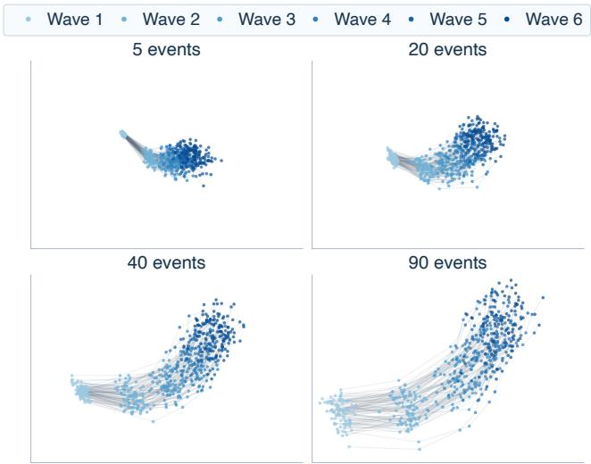  
Figure 7: PCA visualization of agent-specific LoRA states learned by LifeMem for 100 agents on Add Health with Llama-3.1-8B-Instruct under maximum life-event counts of 5, 20, 40, and 90. Points denote LifeMem agent states after each survey wave, and connected trajectories trace the same agent over time. With fewer events, difer- ent agents remain relatively concentrated; richer histories produce clearer agent-specific diferentiation in later waves.

## Retriever Choice

We compare several retrieval backends for Event RAG on Add Health and Understanding Society with Ministral-3- 8B-Instruct-2512. The evaluated retrievers include BM25, all-MiniLM-L6-v2, E5-large-v2, BGE-M3, and BGE-M3 followed by BGE-Reranker-v2-M3. We additionally report LifeMem, which uses all-MiniLM-L6-v2 for structured event retrieval while maintaining an agent- specific parametric memory.

Table 14 shows that retriever choice afects Event RAG, but no single retriever performs best on both datasets. all-MiniLM-L6-v2 performs best among the Event RAG variants on Add Health, while BGE-M3 with reranking performs best on Understanding Society. LifeMem achieves lower values across all metrics while using the same all-MiniLM-L6-v2 retriever, suggesting that its gains are not solely due to retriever choice.

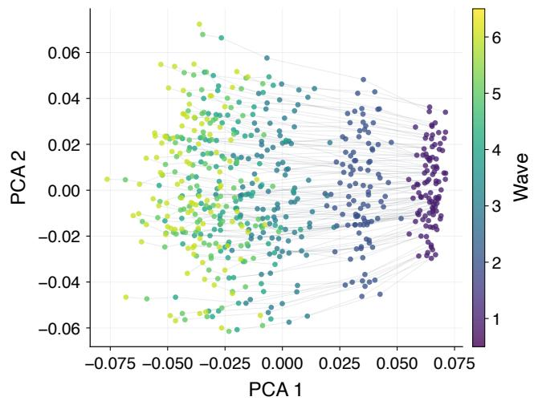  
Figure 8: PCA visualization of agent-specific LoRA states learned by LifeMem for 100 agents on Add Health with Llama-3.1-8B-Instruct. Points represent agent states after each survey wave, and connected trajectories trace the same agent over time. Colors indicate survey waves.

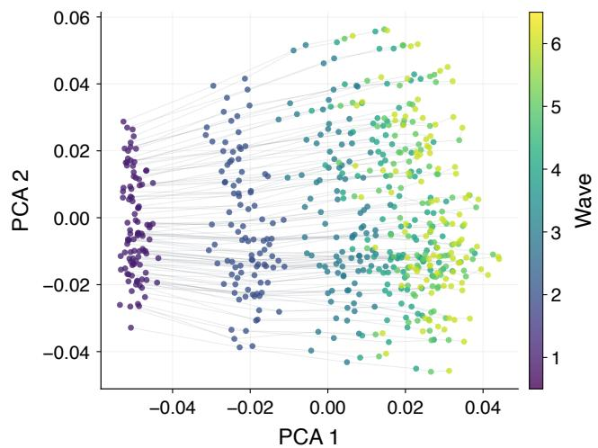  
Figure 9: PCA visualization of agent-specific LoRA states learned by LifeMem for 100 agents on Add Health with Ministral-3-8B-Instruct-2512. Points represent agent states after each survey wave, and connected trajectories trace the same agent over time. Colors indicate survey waves.

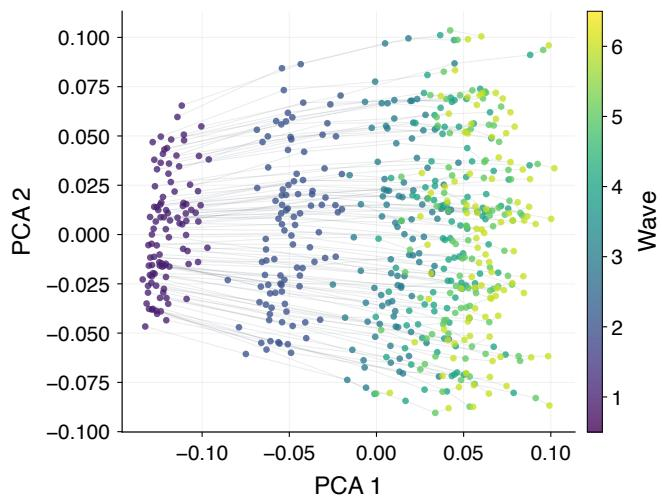  
Figure 10: PCA visualization of agent-specific LoRA states learned by LifeMem for 100 agents on Add Health with Qwen3.5-9B. Points represent agent states after each survey wave, and connected trajectories trace the same agent over time. Colors indicate survey waves.

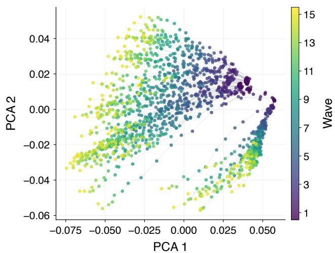  
Figure 11: PCA visualization of agent-specific LoRA states learned by LifeMem for 100 agents on Understanding Society with Ministral-3-8B-Instruct-2512. Points represent agent states after each survey wave, and connected trajectories trace the same agent over time. Colors indicate survey waves.

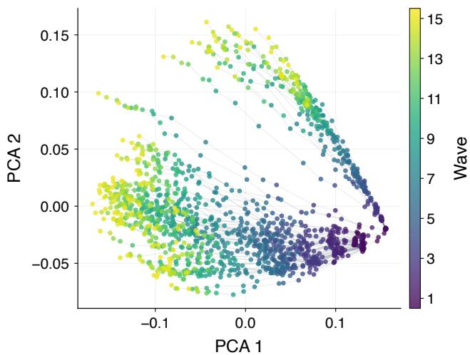  
Figure 12: PCA visualization of agent-specific LoRA states learned by LifeMem for 100 agents on Understanding Society with Qwen3.5-9B. Points represent agent states after each survey wave, and connected trajectories trace the same agent over time. Colors indicate survey waves.