# Break It Down, Pass It On: Cross-Task Skill Transfer in LLM Agents

Yiyang Feng Biddut Sarker Bijoy Niranjan Balasubramanian Jiawei Zhou Computer Science Department, Stony Brook University, Stony Brook, USA {yiyfeng, bbijoy, niranjan, jiawei.zhou.1}@cs.stonybrook.edu

## Abstract

Large language model (LLM) agents can induce skills from completed tasks and reuse them later to grow more capable with experience. In practice, induced skills may transfer unreliably and can even harm the agent that retrieves them. When agent-induced skills transfer reliably across tasks remains an open question. We conduct a comprehensive and controlled study of how the way skills are induced shapes their transfer across tasks. Specifically, we compare task-level with subtask-level skill induction and text with code skill formats, the two axes along which existing methods differ. Task-level skills mostly reduce the agent’s performance below its no-memory baseline while subtask-level skills raise it above on average, and text skills transfer better than code skills. To further understand our findings, we examine two complementary properties of the induced skills: specificity, which measures how closely a skill matches real tasks, and abstractness, which measures how evenly its relevance spreads across tasks. Neither property alone predicts task success, but their combined effect does, which we propose as a skill utility score. The score correlates consistently with task success when skills are transferred, and subtask-level and text skills score higher. Computing skill utility only needs the skills and task descriptions but not any task execution, so our score serves as a practical diagnostic of a skill memory before any new task runs.1

## 1 Introduction

Despite the wide use of large language model (LLM) agents in workflows such as personal assistance, office automation, and scientific research (Trivedi et al., 2024; Wang et al., 2024c; Lai et al., 2026), these agents in their naive form solve each task from scratch and do not get better with experience. A growing line of work enables agents to induce skills from completed tasks, store them in a skill memory, and retrieve them for later tasks (Wang et al., 2024a; Zhao et al., 2024; Wang et al., 2025c,b). If the induced skills transfer across tasks, an agent becomes increasingly capable over time.

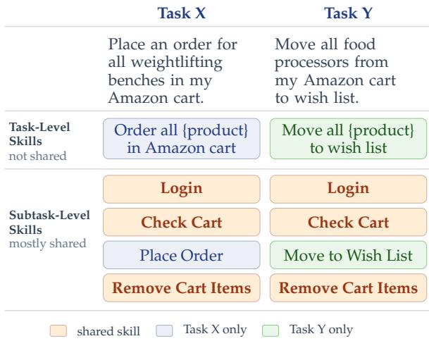  
Figure 1: Different tasks share subtasks. A task-level skill summarizes the whole trajectory, so it stays tied to its source task and is not shared with the other task. Subtask-level induction yields one skill per subtask, and the skills of shared subtasks (amber) transfer between Task X and Task Y.

In practice, however, skill transfer is unreliable when skills are induced from the whole trajectories of completed tasks. First, a skill induced from a whole trajectory is tied to its source task (Fig. 1) and generalizes poorly to new tasks (Yu et al., 2025; Fang et al., 2026). Second, these over-specialized skills enter later tasks as irrelevant or misaligned context, which distracts the model and propagates errors from the source task (Shi et al., 2023; Yoran et al., 2024; Xiong et al., 2026). Therefore, whether skill transfer helps depends on how skills are induced, raising our central question: when do agentinduced skills transfer reliably across tasks?

A recent line of work suggests inducing skills at the subtask level (Nottingham et al., 2024; Yang et al., 2026; Shen et al., 2026). Given that tasks often share sub-procedures, agents could induce one skill from each decomposed subtask rather than from the whole trajectory (Fig. 1), and early results report better performance. Yet the evidence for this gain stays narrow, covering limited domains, few models, and text skills only. Answering our central question therefore requires an analysis that compares task-level with subtask-level induction under identical conditions across various skill formats, domains, and models.

We conduct a comprehensive and controlled analysis of how agents should induce skills for reliable cross-task transfer. Our analysis varies two controls, the skill induction level, whether a skill summarizes a whole trajectory or a single subtask, and the skill format, whether a skill is stored as text or as code. Our experiments cover three long-horizon benchmarks and 11 open-weight and proprietary models. The skill induction level decides whether skills help. Subtask-level skills lift the agent above the no-memory baseline on average, while task-level skills tend to harm the same agent. The skill format then decides how much skills help or hurt, as text skills transfer better than code skills at both skill induction levels (Sec. 5).

To further understand these findings, we examine two complementary properties of the induced skills: specificity, which measures how closely a skill matches real tasks, and abstractness, which measures how evenly its relevance spreads across tasks. We show that neither property alone predicts task success, but their product does. We define this product as a skill utility score. Consistent with our findings, subtask-level and text skills have higher skill utility (Sec. 6).

Our analysis answers the opening question with three takeaways for practitioners. First, decomposing a task into subtasks and inducing one skill per subtask improves cross-task skill transfer. Second, text skills transfer better than code skills at both levels. Finally, skill utility serves as a lightweight diagnostic tool, so a practitioner can assess a skill memory before any new task runs.

## 2 Related Work

Skills in agents. A line of work consolidates an agent’s experience into an explicit skill memory (Sharma et al., 2022; Park et al., 2023), differing along three axes (Tab. 1): (i) the skill induction level, including a trajectory (Wang et al., 2024a; Zhao et al., 2024; Shinn et al., 2023; Majumder et al., 2024; Wang et al., 2025c), a step (Nguyen et al., 2025; Wang et al., 2026), a rule (Chen et al., 2024; Fu et al., 2024), or a subtask (Nottingham et al., 2024; Yang et al., 2026; Shen et al., 2026); (ii) the skill format, including text (Zhao et al., 2024; Zhu et al., 2023; Majumder et al., 2024; Fang et al., 2026) or code (Wang et al., 2024b, 2025b; Ellis et al., 2021; Grand et al., 2024; Cai et al., 2024; Qian et al., 2023; Yuan et al., 2024); and (iii) the induction prompt, with various instructions, demonstrations, and abstraction rules (Hu et al., 2026). Others train memory operations or skillaugmented policies with RL (Yan et al., 2026; Xia et al., 2026; Feng et al., 2026a; Li et al., 2026) or retrieve episodes without induction (Zheng et al., 2024; Zhang et al., 2026; Ahmed et al., 2026; Yang et al., 2024). We vary the level and the format under one shared prompt, isolating each axis.

Cross-Task Skill Transfer. Existing task-level skill transfer shows gains across multiple domains, covering the web (Wang et al., 2025c,b; Zheng et al., 2025; Zhou et al., 2025b), GUI control (Wang et al., 2025a), embodied worlds (Sarch et al., 2024), software (Ouyang et al., 2026) or research agents (Zhou et al., 2025a). Despite the breadth of work on task-level skills, the study of subtask-level skill transfer stays limited. (i) Each work evaluates its skills on limited domains (Nottingham et al., 2024; Yang et al., 2026; Shen et al., 2026). (ii) End-toend scores hide each skill’s contribution to success despite using statistics including reuse counts or library growth (Zhong et al., 2026; Tan et al., 2025; Fang et al., 2026; Yu et al., 2025). (iii) Most work shows explicitly that skills bring gains, but other work implies the opposite, as irrelevant context degrades models (Shi et al., 2023; Yoran et al., 2024; Cuconasu et al., 2024; Liu et al., 2024), misaligned memories propagate errors (Xiong et al., 2026; Feng et al., 2025), and even relevant memories can fail to propagate (Zhong et al., 2023; Feng et al., 2026b). We therefore study when skill transfer helps or hurts, isolating each choice and validating a per-skill utility score against success.

Subtask decomposition in long-horizon agents. Prior work breaks a complex question into atomic sub-questions that are easier to solve (Zhou et al., 2023; Khot et al., 2023; Dua et al., 2022; Prasad et al., 2024; Sun et al., 2023). Long-horizon agents adopt the same idea to keep the growing context short and tackle each subtask in long-horizon tasks (Hu et al., 2025; Ye et al., 2026; Sun et al., 2026). However, the subtask boundary serves only the current task, and no skill transfers across tasks.

<table><tr><td>Work</td><td>Skill Induction Level</td><td>Skill Format</td><td>Domain</td><td>Instruction</td><td>Demonstration</td><td>Abstraction Rules</td></tr><tr><td>AutoManual (Chen et al., 2024)</td><td>Rule</td><td>Text</td><td>Household, Websites</td><td>√</td><td>√</td><td>√</td></tr><tr><td>DynaSaur (Nguyen et al., 2025)</td><td>Step</td><td>Code</td><td>Assistance, Math, QA</td><td></td><td>√</td><td>√</td></tr><tr><td>Reflexion (Shinn et al., 2023)</td><td>Task</td><td>Text</td><td>QA, Household, Code</td><td></td><td>√</td><td>×</td></tr><tr><td>ExpeL (Zhao et al., 2024)</td><td>Task</td><td>Text</td><td>QA, Household, Websites</td><td></td><td>×</td><td>√</td></tr><tr><td>CLIN (Majumder et al., 2024)</td><td>Task</td><td>Text</td><td>Science Simulation, Household</td><td></td><td>×</td><td>√</td></tr><tr><td>AWM (Wang et al., 2025c)</td><td>Task</td><td>Text</td><td>Websites</td><td></td><td>√</td><td>√</td></tr><tr><td>Memp (Fang et al., 2026)</td><td>Task</td><td>Text</td><td>Travel, Household</td><td>√</td><td>√</td><td>×</td></tr><tr><td>Voyager (Wang et al., 2024a)</td><td>Task</td><td>Code</td><td>Game</td><td>√</td><td>√</td><td>√</td></tr><tr><td>TroVE (Wang et al., 2024b)</td><td>Task</td><td>Code</td><td>Math, Table, Vision</td><td>√</td><td>√</td><td>×</td></tr><tr><td>ASI (Wang et al., 2025b)</td><td>Task</td><td>Code</td><td>Websites</td><td>√</td><td>√</td><td>√</td></tr><tr><td>SSO (Nottingham et al., 2024)</td><td>Subtask</td><td>Text</td><td>Science Simulation, Game</td><td>√</td><td>×</td><td>√</td></tr><tr><td>MUSE (Yang et al., 2026)</td><td>Subtask</td><td>Text</td><td>Productivity</td><td>√</td><td>×</td><td>√</td></tr><tr><td>Shen et al. (2026)</td><td>Subtask</td><td>Text</td><td>Software Engineering</td><td>n/r</td><td>n/r</td><td>n/r</td></tr><tr><td>Ours</td><td>Task, Subtask</td><td>Text, Code</td><td>Assistance, Office, Data Science</td><td> $\checkmark$ </td><td>√</td><td>√</td></tr></table>

Table 1: Survey of skill-induction methods. Skill induction level is the span a skill is induced over, skill format is the representation of a stored skill, and domain lists the evaluation domains in each work’s experiments. The last three columns mark whether the induction prompt includes an instruction that states what to extract, a demonstration that shows one worked extraction, and abstraction rules that drop instance-specific detail. The prompt cells are read from each system’s released prompt files or paper appendix, and n/r means the prompt is not released.

Some works transfer subtask skills across tasks, but they are limited to one or two domains and few models (Nottingham et al., 2024; Yang et al., 2026; Shen et al., 2026). We instead study cross-task skill transfer at both induction levels, across two skill formats, three domains, and eleven models.

## 3 Cross-Task Skill Transfer

This section formalizes cross-task skill transfer, where an LLM agent solves a stream of tasks and its experience on earlier tasks affects how it solves later ones. We introduce two agents that map to two skill induction levels (Sec. 3.1), a skill memory that induces, stores, and retrieves skills in two different formats (Sec. 3.2), and a definition of cross-task skill transfer (Sec. 3.3). Fig. 2 shows the illustration, and the full prompts are in App. A.

## 3.1 Agents

An agent solves each task in a partially observable environment (Kaelbling et al., 1998). A task specifies a natural-language goal and an initial environment state. At step t, an LLM policy π generates an action $a _ { t }$ based on the interaction so far, and the environment returns an observation $o _ { t }$ . When the agent signals completion or reaches a step limit, an evaluator gives the final state a reward $r \in [ 0 , 1 ]$ Task-level agent. The task-level agent is a flat ReAct loop (Yao et al., 2023). It appends (⊕) every action and observation into one context $h _ { t } =$ $h _ { t - 1 } \oplus ( a _ { t } , o _ { t } )$ that grows from an initial prompt $h _ { 0 }$ encoding the goal, and draws each action $a _ { t }$ from $\pi ( \cdot \mid h _ { t - 1 } )$ . The loop ends in the whole-task trajectory $\tau = h _ { 0 } \oplus ( a _ { 1 } , o _ { 1 } ) \oplus \cdots \oplus ( a _ { T } , o _ { T } )$

Subtask-level agent. The subtask-level agent runs the same environment and policy, but it decomposes each task into subtasks (Zhou et al., 2023; Prasad et al., 2024) with a cycle of three roles. A planner reads the goal and the running summary, then proposes the next subtask or declares the task complete. An executor runs a ReAct loop on the current subtask, producing a sub-trajectory $\tau _ { k }$ for subtask k. A summarizer then compresses $\tau _ { k }$ into the running summary for the next cycle (Hu et al., 2025). The cycle repeats until the planner declares completion or a subtask limit is reached, ending in the task trajectory $\tau = ( \tau _ { 1 } , \dots , \tau _ { K } )$ . The tasklevel agent is thus a special case of the subtasklevel agent, where the whole task forms the single subtask and only the executor runs.

## 3.2 Skill Memory

A skill memory M stores skills from the agent’s experience for reuse on later tasks. An induction operator turns the trajectory of a completed task or subtask into a skill, and a retrieval operator reads relevant skills from M before a task or subtask.

Skill format. Each skill has a short naturallanguage description (also used for retrieval), and a body that carries the main content in text or code format inspired by Wang et al. (2025c,b). A text skill writes the body as a workflow note, listing the procedure and its environment-specific caveats. A code skill writes the body as a Python function with instance-specific values as parameters and environmental caveats as code comments.

Skill induction. Skills are induced at two levels. Task-level induction turns the completed task trajectory τ into one skill, and subtask-level induction turns each completed sub-trajectory $\tau _ { k }$ into one skill. This one-skill-per-trajectory rule prevents task-level induction from splitting a trajectory into several subtask-like skills, which would blur the two levels. The two levels share the same induction prompt, so the contrast isolates only the skill induction level. Examples are in App. C.

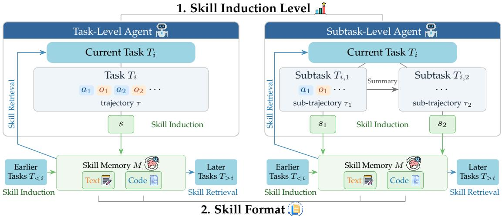  
Figure 2: Illustration of two skill induction levels and two skill formats. (i) The task-level agent runs the current task as one trajectory of actions and observations and induces one skill from the whole trajectory. The subtask-level agent decomposes the task into subtasks, passes a running summary between consecutive subtasks, and induces one skill from each sub-trajectory. The two agents differ only in the skill induction level. (ii) Each agent stores its induced skills in its own memory as text notes or code functions and retrieves relevant skills back into its context, so skills induced on earlier tasks serve later ones. Crossing the two levels with the two formats and a no-memory baseline gives the six conditions we compare.

Skill retrieval. The retrieval operator R(M, q) embeds skill descriptions and the query q with an embedding model2 and injects the top matches into the agent’s context. Text and code skills are retrieved in the same way by matching the description only. The task-level agent queries once with the task instruction, and the subtask-level agent queries at each subtask with the task instruction or the subtask text. Every retrieved skill enters the context as its description and body, and a code skill is also loaded into the namespace so the agent can call it by name. The memory also prunes code skills that fail to load and merges or drops near-duplicate descriptions (App. B). We verify in App. E.6 that the differences among skill conditions come from the skills themselves rather than from retrieval quality.

## 3.3 Cross-Task Skill Transfer

An agent from Sec. 3.1 solves a stream of tasks T1, . . . , Tn against the shared memory of Sec. 3.2. It writes one skill after each task or subtask and reads them before each, so a skill induced on an earlier task can be retrieved on a later one. We call such skill reuse cross-task skill transfer.

Design choices. Our study varies two choices. (i) The skill induction level is the span of task trajectory that each skill is induced from, the whole task for the task-level agent or a single subtask for the subtask-level agent. (ii) The skill format is how a skill is stored, either a text note, a code function, or none when the memory is off. Note that the two agents differ only in the skill induction level, plus the subtask-level agent’s added planner and summarizer prompts. Every other aspect of the prompts, memory, and retrieval is identical. The remaining difference cancels in our comparisons, as each agent with skills is measured against the same agent without skills, so the results reflect the effect of the skills induced at each level rather than the agents themselves.

## 4 Experiment Setup

Benchmarks. We use three long-horizon benchmarks that span diverse domains. AppWorld (Trivedi et al., 2024) covers multi-app tool use in a Python REPL over nine simulated apps with documented APIs. OfficeBench (Wang et al., 2024c) covers office-document workflows over apps such as Email, Word, Excel, and PDF. KramaBench (Lai et al., 2026) covers data-science pipelines over real files from six scientific domains. We evaluate on the AppWorld test-challenge split (417 tasks), 300 OfficeBench tasks, and the 92 deterministically graded KramaBench tasks, each scored in [0, 1] by its benchmark’s official evaluator.

Models. We evaluate three Mixture-of-Experts (MoE) models (Qwen3-235B-A22B (Yang et al.,

2025), GPT-OSS-120B (Agarwal et al., 2025), and Nemotron-Super-120B (Chandiramani et al., 2026)), dense models of different sizes (Qwen3 at 4B, 8B, 14B, 32B (Yang et al., 2025) and Gemma-3 at 4B, 12B, 27B (Team et al., 2025)), and one commercial model (Gemini-3.1-Pro3). We serve the MoE models on Amazon Bedrock, Gemini-3.1- Pro on Google Cloud, and each dense model with vLLM on one 96 GB NVIDIA GH200. We keep each provider’s default sampling, truncate generated tokens at 8192 per call, and give every model the same prompts. We also rerun the experiments on the three MoE models and Qwen3-32B with two reduced induction prompts as an ablation, including a minimal instruction (L1) and the instruction plus one demonstration (L2), against the full prompt (L3). Full details are in App. A.

Comparison Conditions. We cross the two axes of Sec. 3, skill induction level (Task-level or Subtasklevel) and skill format (None, Text, or Code), into six conditions: Task, Task+Text, Task+Code, Subtask, Subtask+Text, and Subtask+Code, where Task and Subtask alone carry no memory. The “+Text” tag adds natural-language workflow notes with procedures and environmental caveats. The “+Code” tag adds Python functions with instance-specific values as parameters and environment caveats as code comments. The induction prompt is identical across the two levels, so each contrast isolates one axis. We compare each agent with skills against the same agent without skills, so differences between the two agents cancel out and the comparison reflects only the effect of the skills induced at each level. We limit the task-level agent at 50 ReAct steps per task and the subtask-level agent at 15 subtasks under a shared 50-step ReAct executor budget.4

Evaluation. We evaluate along two axes, performance and efficiency. For performance, we report task success, the average score in [0, 1] from each benchmark’s official evaluator. For efficiency, we report latency, the wall-clock time per task, and dependency, a measure of the compute spent on the growing context (Zhou et al., 2026) (App. D).

## 5 Skill Induction Level and Format Impact Whether a Skill Helps

We now test how each of the two induction choices affects cross-task skill transfer, varying the skill induction level under both skill formats (Sec. 5.1) and the format at both levels (Sec. 5.2).

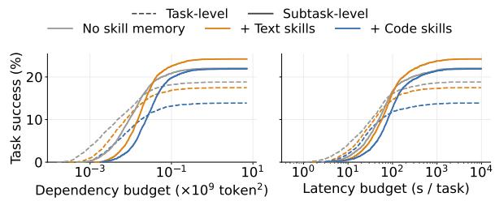  
Figure 3: Task success rate within a per-task budget of dependency, i.e. the compute spent (left), and latency, i.e., the wall-clock time (right) per task (Sec. 4). We average over models and benchmarks for each skill format and skill induction level. The task-level agent wins only at the smallest budgets, and from moderate budgets on the subtask-level agent with skills solves more tasks at equal cost.

Takeaway. Skills can help when they are induced at the subtask level, while task-level induction often makes the same memory harmful. Text skills mostly help more than code skills at both induction levels.

## 5.1 Skills Help at the Subtask Level

We first ask whether induced skills help the agents later, and how the answer depends on the skill induction level.

Performance (task success). Tab. 2 presents task success across the six conditions. For each tasklevel or subtask-level agent, we compare it with and without the induced memory as the effect of skills. Skills induced from whole tasks lower the task-level agent’s average success, by 1.2 points with Text skills and 4.1 with Code, and on every benchmark, by up to 7.4 points. The same induction prompt applied at the subtask level instead raises average success, by 1.9 points with Text and 0.5 with Code. The subtask-level gain is consistent for Text skills, which help on all three benchmarks, while Code skills help on two of the three and lose 1.4 points on KramaBench, with individual models varying around these averages. To confirm that the effect travels with the skills rather than the agent, we equip the task-level agent with the subtask-level skills, which beat its own task-level skills on every benchmark (App. E.2). The effect is also not correlated by the outcomes of the source tasks, as the two levels induce from solved and unsolved tasks at close rates (App. E.3). Our conclusions also hold under various induction prompts (Fig. 26).

<table><tr><td rowspan="2">Benchmark</td><td rowspan="2">Model</td><td colspan="3">Task-Level</td><td colspan="3">Subtask-Level</td></tr><tr><td>None</td><td>+Text</td><td>+Code</td><td>None</td><td>+Text</td><td>+Code</td></tr><tr><td rowspan="10">AppWorld</td><td>Qwen3-235B-A22B</td><td>7.4 [5.0, 10.1]</td><td>18.0 [14.4, 21.8]</td><td>14.4[11.0, 18.0]</td><td>27.3 [23.0, 31.7]</td><td>35.5 [30.9, 40.0]</td><td>35.7 [31.2, 40.3]</td></tr><tr><td>GPT-OSS-120B</td><td>27.3 [23.3, 31.7]</td><td>17.0 [13.4, 20.6]</td><td>1.0 [0.2, 1.9]</td><td>26.4 [22.3, 30.5]</td><td>25.2 [21.1,29.5]</td><td>23.7 [19.7, 27.8]</td></tr><tr><td>Nemotron-Super-120B</td><td>8.9 [6.2, 11.8]</td><td>4.3 [2.4, 6.2]</td><td>1.4 [0.5, 2.6]</td><td>17.7 [14.1,21.6]</td><td>21.6 [17.7,25.4]</td><td>18.5 [14.9, 22.3]</td></tr><tr><td>Qwen3-4B</td><td>0.0 [0.0, 0.0]</td><td>0.2 [0.0, 0.7]</td><td>0.0 [0.0, 0.0]</td><td>0.2[0.0, 0.7]</td><td>0.7 [0.0, 1.7]</td><td>1.4[0.5, 2.6]</td></tr><tr><td>Qwen3-8B</td><td>0.2 [0.0, 0.7]</td><td>0.0 [0.0, 0.0]</td><td>0.0 [0.0, 0.0]</td><td>2.2[1.0, 3.6]</td><td>3.1 [1.7,5.0]</td><td>1.9 [0.7, 3.4]</td></tr><tr><td>Qwen3-14B</td><td>0.5 [0.0, 1.2]</td><td>0.7 [0.0, 1.7]</td><td>0.2 [0.0, 0.7]</td><td>6.7 [4.3,9.4]</td><td>7.2[4.8,9.8]</td><td>8.4[5.8, 11.0]</td></tr><tr><td>Qwen3-32B</td><td>1.9 [0.7, 3.4]</td><td>2.9 [1.4,4.6]</td><td>1.4 [0.5, 2.6]</td><td>7.7 [5.3, 10.3]</td><td>10.3 [7.4, 13.2]</td><td>7.2[4.8, 9.8]</td></tr><tr><td>Gemma-3-27B</td><td>0.5 [0.0, 1.2]</td><td>0.5 [0.0, 1.2]</td><td>0.0 [0.0, 0.0]</td><td>4.6 [2.6, 6.7]</td><td>4.3 [2.4, 6.5]</td><td>4.8 [2.9, 7.0]</td></tr><tr><td>Gemini-3.1-Pro</td><td>68.1 [63.5,72.4]</td><td>58.0 [53.2, 62.6]</td><td>52.3 [47.5, 57.1]</td><td>68.3 [63.8, 72.7]</td><td>72.4 [68.1,76.7]</td><td>77.5 [73.4, 81.5]</td></tr><tr><td>Average</td><td>10.4 [9.6, 11.3]</td><td>9.3 [8.4, 10.2]</td><td>6.5 [5.8, 7.1]</td><td>14.8 [13.5, 16.2]</td><td>16.5 [15.1, 18.0]</td><td>16.4 [15.1, 17.7]</td></tr><tr><td rowspan="10">OfficeBench</td><td>Qwen3-235B-A22B</td><td>43.0 [37.3,48.7]</td><td>38.3 [33.0, 44.0]</td><td>36.7 [31.3, 42.0]</td><td>38.7 [33.3, 44.3]</td><td>41.3 [35.7,47.0]</td><td>38.7 [33.3, 44.0]</td></tr><tr><td>GPT-OSS-120B</td><td>32.3 [27.0, 37.7]</td><td>29.3 [24.3, 34.3]</td><td>5.0[2.7,7.7]</td><td>38.0 [32.7,43.3]</td><td>42.0 [36.7, 47.7]</td><td>40.7 [35.3, 46.3]</td></tr><tr><td>Nemotron-Super-120B</td><td>28.3 [23.3, 33.7]</td><td>31.7 [26.3, 37.0]</td><td>12.7 [9.0, 16.7]</td><td>27.3 [22.3, 32.3]</td><td>37.7 [32.3, 43.3]</td><td>25.0 [20.0, 30.0]</td></tr><tr><td>Qwen3-4B</td><td>17.7 [13.3, 22.0]</td><td>16.3 [12.3, 20.7]</td><td>13.0 [9.3, 17.0]</td><td>18.0[13.7, 22.7]</td><td>25.3 [20.7, 30.3]</td><td>20.3 [16.0, 25.0]</td></tr><tr><td>Qwen3-8B</td><td>25.0 [20.0, 30.0]</td><td>15.7 [11.7, 20.0]</td><td>16.3 [12.3, 20.7]</td><td>19.0[14.7,23.7]</td><td>25.0 [20.3, 30.0]</td><td>24.7 [19.7, 29.7]</td></tr><tr><td>Qwen3-14B</td><td>28.3 [23.3, 33.7]</td><td>24.0 [19.3, 29.0]</td><td>27.3 [22.3, 32.3]</td><td>27.0 [22.0, 32.0]</td><td>32.0 [27.0, 37.3]</td><td>30.3 [25.3, 35.7]</td></tr><tr><td>Qwen3-32B</td><td>34.3 [29.0, 39.7]</td><td>32.7 [27.3, 38.0]</td><td>35.3 [30.0, 41.0]</td><td>33.3 [28.3, 38.7]</td><td>36.0 [30.7, 41.7]</td><td>31.7 [26.7, 37.0]</td></tr><tr><td>Gemma-3-27B</td><td>28.3 [23.3, 33.7]</td><td>26.7 [21.7,31.7]</td><td>14.7 [10.7, 18.7]</td><td>24.0 [19.0, 29.0]</td><td>19.0 [14.7,23.7]</td><td>23.7 [19.0, 28.7]</td></tr><tr><td>Gemini-3.1-Pro</td><td>46.3 [40.7, 52.0]</td><td>41.0 [35.3, 46.7]</td><td>41.7 [36.3, 47.3]</td><td>47.3 [41.7,53.0]</td><td>46.0 [40.3, 51.7]</td><td>48.7 [43.0, 54.3]</td></tr><tr><td>Average</td><td>27.0 [23.6, 30.4]</td><td>25.3 [22.1, 28.8]</td><td>19.6 [17.0, 22.4]</td><td>26.3 [23.0,29.7]</td><td>29.7 [26.2, 33.2]</td><td>27.7 [24.2, 31.2]</td></tr><tr><td rowspan="10"></td><td>Qwen3-235B-A22B</td><td>52.8 [43.0, 62.5]</td><td>49.3 [39.2, 59.2]</td><td>51.5 [41.1, 61.2]</td><td>52.4 [42.5, 62.2]</td><td>55.3 [45.4, 64.7]</td><td>52.7 [42.9, 62.7]</td></tr><tr><td>GPT-OSS-120B</td><td>31.7 [22.8, 41.1]</td><td>28.4 [19.6, 37.4]</td><td>22.5 [14.2, 31.1]</td><td>48.1 [38.3, 58.2]</td><td>49.8 [39.6, 59.5]</td><td>50.9 [40.8, 60.6]</td></tr><tr><td>Nemotron-Super-120B</td><td>53.3 [43.2, 63.2]</td><td>52.1 [42.1, 62.2]</td><td>43.3 [33.5, 53.4]</td><td>59.8 [50.0, 69.1]</td><td>57.6 [47.6, 67.6]</td><td>49.9 [40.1,59.7]</td></tr><tr><td>Qwen3-4B</td><td>8.3 [3.3, 14.4]</td><td>12.3 [6.2, 19.0]</td><td>13.3 [6.9, 20.4]</td><td>13.8 [7.5,20.8]</td><td>15.1 [8.3, 22.5]</td><td>11.5 [5.5, 18.1]</td></tr><tr><td>Qwen3-8B</td><td>10.7 [4.8, 17.2]</td><td>15.5 [8.7, 22.9]</td><td>14.9 [8.3, 22.0]</td><td>14.4 [7.7,21.5]</td><td>11.2 [5.4, 17.7]</td><td>14.1 [7.5, 21.5]</td></tr><tr><td>Qwen3-14B</td><td>20.1 [12.5, 28.2]</td><td>14.9 [8.5, 22.0]</td><td>23.1 [14.7,31.6]</td><td>19.1 [11.5,27.1]</td><td>23.5 [15.2, 32.5]</td><td>20.3 [12.5, 28.6]</td></tr><tr><td>Qwen3-32B</td><td>30.0 [21.1, 39.2]</td><td>25.8 [17.6, 34.8]</td><td>30.2 [21.4, 39.3]</td><td>34.3 [25.0, 43.9]</td><td>39.0 [29.3, 48.6]</td><td>38.9 [29.2, 48.7]</td></tr><tr><td>Gemma-3-27B</td><td>19.7 [12.2, 27.7]</td><td>22.0 [14.0, 30.6]</td><td>18.6[11.3,26.5]</td><td>25.3[16.7, 34.4]</td><td>23.9 [15.9, 32.7]</td><td>24.2 [16.0, 33.1]</td></tr><tr><td>Gemini-3.1-Pro</td><td>74.3 [65.6, 82.5]</td><td>74.1 [65.3, 82.4]</td><td>75.1 [66.4, 83.3]</td><td>75.2 [66.5, 83.2]</td><td>73.7 [64.9, 82.0]</td><td>72.4 [63.6, 80.8]</td></tr><tr><td>Average</td><td>29.0 [24.1, 34.0]</td><td>28.1 [23.2, 33.3]</td><td>27.8 [23.0, 32.9]</td><td>33.3 [28.0, 38.7]</td><td>33.7 [28.5, 39.1]</td><td>31.9 [26.8,37.1]</td></tr><tr><td colspan="2">Average (11 models)</td><td>22.1 [20.2, 24.2]</td><td>20.9 [18.9, 22.9]</td><td>18.0 [16.1, 19.9]</td><td>24.8 [22.7, 27.0]</td><td>26.7 [24.5, 28.8]</td><td>25.3 [23.3, 27.4]</td></tr></table>

Table 2: Task success (%) of the task-level and subtask-level agents, without (None) or with induced skills as text notes (+Text) or code functions (+Code), on AppWorld, OfficeBench, and KramaBench. We show nine of the eleven models and defer the two weakest, Gemma-3-4B and Gemma-3-12B, to Tab. 3 in App. E.1. Every Average row still covers all eleven models. Brackets are 95% task-bootstrap confidence intervals. On most models and benchmarks the highest success falls in a Subtask-level column, and adding skills mostly raises the success of the subtask-level agent while it lowers that of the task-level agent.

Efficiency (latency and dependency). We next examine task success under a per-task budget of latency and dependency, which measure the time and the compute spent on the growing context respectively (Sec. 4). Fig. 3 plots task success rate within each budget, so a vertical slice compares conditions at equal cost. Small budgets favor the task-level agent, which solves the easy tasks cheaply. From moderate budgets on, the subtask-level agent overtakes it under every format and saturates higher, so the subtask-level advantage is not bought by extra cost. The same crossover appears on every benchmark (Fig. 28). The within-agent contrast also survives cost matching. At equal cost the subtasklevel agent with skills stays above its no-memory curve, while the task-level agent with skills stays below its own.

Varying task difficulty. The comparison of skill effect on task-level and subtask-level agents reaches the same conclusion at every task difficulty. We split tasks into easy, medium, and hard using each benchmark’s official labels, including the annotated difficulty on AppWorld, the number of apps on OfficeBench, and the easy or hard tag on KramaBench. Fig. 4 compares all six conditions within each stratum. Task-level skills lower success in nearly every stratum under both formats, subtasklevel skills raise it in most strata, and in nearly every stratum skills bring a larger gain at the subtask level than at the task level.

## 5.2 Text Skills Transfer Better than Code

Next, we vary the skill format under various skill induction levels.

Performance and efficiency. At the same skill induction level, retrieving text skills beats retrieving code skills, by 2.9 points on the subtask-level agent and 1.4 points on the task-level agent averaged over all models (Tab. 2). Relative to each agent’s nomemory baseline, text skills damage the task-level agent less than code skills, 1.2 against 4.1 points, and help the subtask-level agent more, 1.9 against 0.5 points. The ranking also survives under various per-task efficiency budgets, as the Text curve stays at or above the Code curve within each induction level at every budget of dependency and latency (Fig. 3).

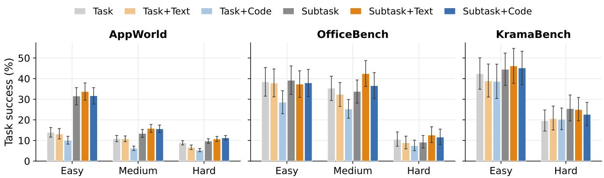  
Figure 4: Task success of the six conditions by task difficulty, pooled over models with 95% task-bootstrap confidence intervals. In every stratum and under both formats, the subtask-level agent with skills stays above the task-level agent with skills. In nearly every stratum, the skills bring a larger gain to the subtask-level agent than to the task-level agent, and Text stays at or above Code within each induction level.

Varying task difficulty. Across all difficulty strata of Sec. 5.1, the Text conditions stay at or above the Code conditions within each skill induction level in nearly every stratum, so the format ranking also holds across difficulty (Fig. 4).

## 6 When Do Skills Transfer?

To understand when certain skills transfer better than others, we turn our focus from the agents to the skills they induce. We define a per-skill utility score computed from the induced skills and the task descriptions alone (Sec. 6.1), show that it explains why subtask-level and text skills transfer better (Sec. 6.2), and check that it agrees with the reuse observed during the task stream (Sec. 6.3).

Takeaway. A skill is useful when it is both specific to real tasks and abstract enough to remain relevant across many of them. Neither dimension alone predicts task success. We therefore propose a skill utility score that requires both jointly. Computed directly from the induced skills, it predicts task success and matches observed reuse.

## 6.1 A Score for Skill Utility

Existing literature hypothesizes a tension between a skill’s specificity and its generalizability (Yu et al., 2025; Fang et al., 2026). We suggest that a reusable skill must meet two requirements, specificity and abstractness. Specificity asks the skill to be relevant enough to real tasks, and abstractness asks the skill to stay relevant to many tasks rather than a few. Suppose $c _ { j }$ denotes the cosine similarity between a skill s and the jth of the N task instructions under the retrieval embedder.

Specificity measures how close a skill is to the tasks it most resembles. Following Ethayarajh (2019), we compare the skill’s nearest-task similarity with the similarities between tasks,

$$
\mathrm { s p e c i f i c i t y } ( s ) = \mathrm { P r } \big [ \operatorname* { m a x } _ { j } c _ { j } \geq \cos ( t _ { i } , t _ { k } ) \big ] ,
$$

using the probability that the skill is closer to its nearest task than two random tasks $t _ { i }$ and $t _ { k }$ of the benchmark are to each other. Specificity punishes an irrelevant skill far from every task, which scores near zero, and rewards a skill matching at least one task, which scores near one.

Abstractness measures how evenly a skill’s relevance spreads over many tasks set rather than concentrating on a few tasks. We turn the similarity c into a distribution and compute the perplexity over the task count to represent the ratio of relevant tasks to a skill (van der Maaten and Hinton, 2008),

$$
{ \mathrm { a b s t r a c t n e s s } } ( s ) = { \frac { \exp H ( \operatorname { s o f t m a x } ( c / \tau ) ) } { N } } ,
$$

where $\boldsymbol { c } = \left( c _ { 1 } , \ldots , c _ { N } \right)$ , H is the entropy, and $\tau = 0 . 1$ is a temperature. Abstractness punishes a skill that is close to a few tasks but far from the rest, which scores near $1 / N ,$ , and rewards a skill that stays relevant across many tasks, which scores near one.

(a) all tasks  
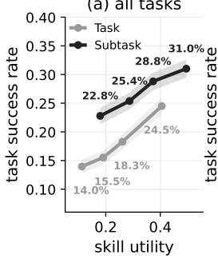

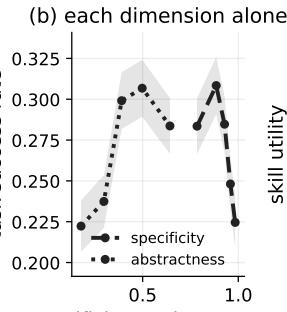

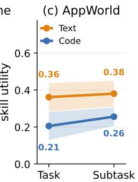

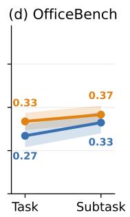

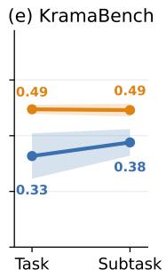  
Figure 5: Skill utility against the results. (a): Each task is scored by the average utility of the agent-retrieved skills and ranked into equal-size bins per agent. Success rises from the lowest bin to the highest for both agents. (b): The subtask-level agent’s tasks are scored by one dimension alone and split into equal-size bins, and success rises and then falls on both dimensions. (c)–(e): The median skill utility of each induced memory, averaged over models, is no lower at the subtask level than the task level, and higher for Text than Code. Shaded bands are 95% CIs.

Skill utility. We show in Fig. 27 that specificity and abstractness trade off for both task-level and subtask-level skills. We hypothesize that a useful skill balances the two properties well, so we define skill utility as the product of both properties:

$$
\operatorname { u t i l i t y } ( s ) = \operatorname { s p e c i f i c i t y } ( s ) \cdot \operatorname { a b s t r a c t n e s s } ( s ) .
$$

## 6.2 Skill Utility Predicts Task Success Gains

We examine whether skill utility explains accounts for the results of Sec. 5, that skills help mostly under subtask-level induction and that text skills transfer better than code skills.

Higher utility, more successes. If high-utility skills explain the task success gains, tasks that retrieve higher-utility skills should succeed more. We score each task by the average utility of the skills the agent retrieves when solving the task, rank tasks by the score for task-level and subtask-level agents, and split each ranking into equal-size bins. Success rises monotonically across the bins, from 14.0% to 24.5% for the task-level agent and from 22.8% to 31.0% for the subtask-level agent (Fig. 5a). Beyond the correlation between skill utility and task success, we also analyze the causal effect of skill utility. First, retrieved-skill utility stays nearly flat across each benchmark’s native difficulty levels even though success falls steeply, and utility keeps predicting success within a fixed difficulty level. We also split the same skill library at its median utility and rerun the agent on the same tasks with one half at a time, and the high-utility half yields higher success for both the task-level and the subtask-level library (App. E.4).

Neither dimension, by itself, predicts success. Neither specificity nor abstractness alone predicts the success of the subtask-level agent. In Fig. 5b, success rises and then falls as specificity or abstractness increases. The phenomenon follows from the tradeoff in Fig. 27, as a skill high on one dimension gives up the other and loses utility. The agent therefore succeeds most when the two dimensions stay balanced, which only the product rewards.

Subtask-level and text skills have higher utility. We next compare the skill utility across the two induction levels and the two skill formats. For each condition we take the median utility of induced skills, which is robust to a few outliers, and average the medians over all models on each benchmark. From Fig. 5c to e, subtask-level skills score higher than task-level skills on almost every benchmark and skill format, with the only tie for text on KramaBench. Besides, text skills score higher than code at both induction levels on every benchmark.

## 6.3 Skill Utility Matches Actual Cross-Task Reuse

Finally, we check whether skill utility reflects the cross-task reuse that actually happens during the task stream.

Transfer density. We cut each benchmark’s task stream into $n = 5 0$ equal bins in stream order. Transfer density is the share of ordered bin pairs that carry at least one actual transfer,

$$
D = { \frac { 1 } { { \binom { n } { 2 } } } } \sum _ { i < j } r _ { i j } ,
$$

where $r _ { i j } ~ = ~ 1$ when a skill induced in bin i is retrieved in a later bin j, and 0 otherwise. We compute the density for each model and skill format and report the average over them.

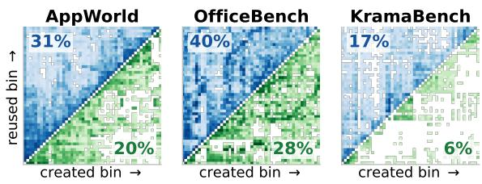  
Figure 6: Transfer density. The task stream of each benchmark is cut into 50 bins in stream order, and a cell is colored when a skill induced in the earlier bin is retrieved in a later bin, darker when more of the runs do so. Blue upper triangles are the subtask-level agent and green lower triangles are the task-level agent, pooled over models and both skill formats, and the number in each triangle is its transfer density. The subtask-level agent reuses skills more densely than the tasklevel agent on all three benchmarks.

Results. The subtask-level agent reuses skills more densely than the task-level agent on all three benchmarks (Fig. 6). The skill induction level that scores higher utility is thus also the one whose skills are reused more often, so the score matches the transfer that actually happens. Each cell also shows where in the stream a skill was induced and reused.

## 7 Conclusion

We study when induced skills transfer across tasks, comparing different skill induction levels and skill formats on three benchmarks and eleven models. We show that subtask-level skills can improve the agent while task-level skills harm it, and text skills transfer better than code skills. Skill utility score, balancing specificity and abstractness, correlates with task success, ranks the winning conditions higher, and serves as an execution-free diagnostic of a skill memory before any task runs.

## Limitations

Our study evaluates long-horizon agents on three standard benchmarks that together span multi-app tool use, office-document workflows, and datascience pipelines, each scored by its official evaluator. These choices give our conclusions a controlled basis, and extending them beyond this scope would need three additional studies. First, other agentic settings such as computer use (Xie et al., 2024), agentic coding (Deng et al., 2026; Merrill et al., 2026), and web search (Wei et al., 2025) may show different transfer behavior, so replicating our findings there requires additional experiments. Those environments require Docker with root access, and large-scale compute with that level of security access is difficult to obtain. Second, our skill memory follows fixed induction, retrieval, and deduplication rules, which keeps the six conditions comparable, while recent systems let the agent revise its stored skills and memory over time (Fang et al., 2026; Packer et al., 2024). Such revision needs a sandboxed file system, so studying it also faces the root Docker constraint noted above. Extending our findings to such evolving memories requires a separate study. Finally, we score each task by its final environment state, which keeps grading deterministic and comparable. The benchmarks provide no steplevel ground truth, so a finer-grained analysis of intermediate decisions would need a judge model, and we leave it to future work.

## Ethical Considerations

Our work probes when an LLM agent can reliably reuse skills induced from its own past experience. A skill memory that transfers procedures across tasks could also transfer harmful ones, because an adversary who injects malicious skills into the library could steer the agent through the same reuse mechanism. Our experiments carry no such risk, since every skill is induced by the agent itself from sandboxed benchmark tasks without real user data. We regard reliable reuse of trustworthy skills as a prerequisite for the harder challenge of deciding which stored skills to trust, so detecting and rejecting malicious skills is left for future work.

## Acknowledgments

This research was supported by an Amazon Research Award of Spring 2025 on AWS Agentic AI, a Stony Brook Spring 2025 OVPR Seed Grant, and the National Artificial Intelligence Research Resource (NAIRR) Pilot program (award NAIRR250525). This research used the DeltaAI advanced computing and data resource, which is supported by the National Science Foundation (award OAC 2320345) and the State of Illinois. This work used Amazon Web Services, Google Cloud, and Microsoft Azure through the Cloud-Bank project, which is supported by National Science Foundation grant #1925001. We also thank Huajian Zhang for feedback on the writing.

## References

Sandhini Agarwal, Lama Ahmad, Jason Ai, Sam Altman, Andy Applebaum, Edwin Arbus, Rahul K Arora, Yu Bai, Bowen Baker, Haiming Bao, et al.

2025. gpt-oss-120b & gpt-oss-20b model card. Preprint, arXiv:2508.10925.

Ammar Ahmed, Azal Ahmad Khan, Ayaan Ahmad, Sheng Di, Zirui Liu, and Ali Anwar. 2026. Retrievalof-thought: Efficient reasoning via reusing thoughts. In The Fourteenth International Conference on Learning Representations.

Tianle Cai, Xuezhi Wang, Tengyu Ma, Xinyun Chen, and Denny Zhou. 2024. Large language models as tool makers. In The Twelfth International Conference on Learning Representations.

Aakshita Chandiramani, Aaron Blakeman, Abdullahi Olaoye, Abhibha Gupta, Abhilash Somasamudramath, Abhinav Khattar, Adeola Adesoba, Adi Renduchintala, Adil Asif, Aditya Agrawal, et al. 2026. Nemotron 3 super: Open, efficient mixture-of-experts hybrid mamba-transformer model for agentic reasoning. Preprint, arXiv:2604.12374.

Minghao Chen, Yihang Li, Yanting Yang, Shiyu Yu, Binbin Lin, and Xiaofei He. 2024. Automanual: Constructing instruction manuals by llm agents via interactive environmental learning. In Advances in Neural Information Processing Systems, volume 37, pages 589–631. Curran Associates, Inc.

Florin Cuconasu, Giovanni Trappolini, Federico Siciliano, Simone Filice, Cesare Campagnano, Yoelle Maarek, Nicola Tonellotto, and Fabrizio Silvestri. 2024. The power of noise: Redefining retrieval for rag systems. In Proceedings of the 47th International ACM SIGIR Conference on Research and Development in Information Retrieval, SIGIR ’24, page 719–729, New York, NY, USA. Association for Computing Machinery.

Xiang Deng, Jeff Da, Edwin Pan, Yannis Yiming He, Charles Ide, Kanak Garg, Niklas Lauffer, Andrew Park, Chetan Rane, Karmini Sampath, Maya Krishnan, Srivatsa R Kundurthy, Sean M. Hendryx, Zifan Wang, Chen Bo Calvin Zhang, Noah Jacobson, Bing Liu, and Brad Kenstler. 2026. SWE-bench pro: Can AI agents solve long-horizon software engineering tasks? In Forty-third International Conference on Machine Learning.

Dheeru Dua, Shivanshu Gupta, Sameer Singh, and Matt Gardner. 2022. Successive prompting for decomposing complex questions. In Proceedings of the 2022 Conference on Empirical Methods in Natural Language Processing, pages 1251–1265, Abu Dhabi, United Arab Emirates. Association for Computational Linguistics.

Kevin Ellis, Catherine Wong, Maxwell Nye, Mathias Sablé-Meyer, Lucas Morales, Luke Hewitt, Luc Cary, Armando Solar-Lezama, and Joshua B. Tenenbaum. 2021. Dreamcoder: bootstrapping inductive program synthesis with wake-sleep library learning. In Proceedings of the 42nd ACM SIGPLAN International Conference on Programming Language Design and Implementation, PLDI

2021, page 835–850, New York, NY, USA. Association for Computing Machinery.

Kawin Ethayarajh. 2019. How contextual are contextualized word representations? Comparing the geometry of BERT, ELMo, and GPT-2 embeddings. In Proceedings of the 2019 Conference on Empirical Methods in Natural Language Processing and the 9th International Joint Conference on Natural Language Processing (EMNLP-IJCNLP), pages 55–65, Hong Kong, China. Association for Computational Linguistics.

Runnan Fang, Yuan Liang, Xiaobin Wang, Jialong Wu, Shuofei Qiao, Pengjun Xie, Fei Huang, Huajun Chen, and Ningyu Zhang. 2026. Memp: Exploring agent procedural memory. In Findings of the Association for Computational Linguistics: ACL 2026, pages 17490–17502, San Diego, California, United States. Association for Computational Linguistics.

Xinshun Feng, Xinhao Song, Lijun Li, Gongshen Liu, and Jing Shao. 2026a. SEARL: Joint optimization of policy and tool graph memory for self-evolving agents. In Proceedings of the 64th Annual Meeting of the Association for Computational Linguistics (Volume 1: Long Papers), pages 24518–24535, San Diego, California, United States. Association for Computational Linguistics.

Yiyang Feng, Zeming Chen, Haotian Wu, Jiawei Zhou, and Antoine Bosselut. 2026b. Tracking the limits of knowledge propagation: How LLMs fail at multi-step reasoning with conflicting knowledge. In Proceedings of the 19th Conference of the European Chapter of the Association for Computational Linguistics (Volume 1: Long Papers), pages 5813– 5847, Rabat, Morocco. Association for Computational Linguistics.

Yiyang Feng, Yichen Wang, Shaobo Cui, Boi Faltings, Mina Lee, and Jiawei Zhou. 2025. Unraveling misinformation propagation in LLM reasoning. In Findings of the Association for Computational Linguistics: EMNLP 2025, pages 11683–11707, Suzhou, China. Association for Computational Linguistics.

Yao Fu, Dong-Ki Kim, Jaekyeom Kim, Sungryull Sohn, Lajanugen Logeswaran, Kyunghoon Bae, and Honglak Lee. 2024. Autoguide: Automated generation and selection of context-aware guidelines for large language model agents. In The Thirty-eighth Annual Conference on Neural Information Processing Systems.

Gabriel Grand, Lionel Wong, Matthew Bowers, Theo X. Olausson, Muxin Liu, Joshua B. Tenenbaum, and Jacob Andreas. 2024. LILO: Learning interpretable libraries by compressing and documenting code. In The Twelfth International Conference on Learning Representations.

Charles R. Harris, K. Jarrod Millman, Stéfan J. van der Walt, Ralf Gommers, Pauli Virtanen, David Cournapeau, Eric Wieser, Julian Taylor, Sebastian Berg,

Nathaniel J. Smith, Robert Kern, Matti Picus, Stephan Hoyer, Marten H. van Kerkwijk, Matthew Brett, Allan Haldane, Jaime Fernández del Río, Mark Wiebe, Pearu Peterson, and 7 others. 2020. Array programming with NumPy. Nature, 585(7825):357– 362.

Mengkang Hu, Tianxing Chen, Qiguang Chen, Yao Mu, Wenqi Shao, and Ping Luo. 2025. HiAgent: Hierarchical working memory management for solving long-horizon agent tasks with large language model. In Proceedings of the 63rd Annual Meeting of the Association for Computational Linguistics (Volume 1: Long Papers), pages 32779–32798, Vienna, Austria. Association for Computational Linguistics.

Yuyang Hu, Shichun Liu, Yanwei Yue, Guibin Zhang, Boyang Liu, Fangyi Zhu, Jiahang Lin, Honglin Guo, Shihan Dou, Zhiheng Xi, Senjie Jin, Jiejun Tan, Yanbin Yin, Jiongnan Liu, Zeyu Zhang, Zhongxiang Sun, Yutao Zhu, Hao Sun, Boci Peng, and 28 others. 2026. Memory in the age of ai agents. Preprint, arXiv:2512.13564.

J. D. Hunter. 2007. Matplotlib: A 2d graphics environment. Computing in Science & Engineering, 9(3):90–95.

Leslie Pack Kaelbling, Michael L. Littman, and Anthony R. Cassandra. 1998. Planning and acting in partially observable stochastic domains. Artificial Intelligence, 101(1):99–134.

Anthony Kay. 2007. Tesseract: an open-source optical character recognition engine. Linux J., 2007(159):2.

Tushar Khot, Harsh Trivedi, Matthew Finlayson, Yao Fu, Kyle Richardson, Peter Clark, and Ashish Sabharwal. 2023. Decomposed prompting: A modular approach for solving complex tasks. In The Eleventh International Conference on Learning Representations.

Woosuk Kwon, Zhuohan Li, Siyuan Zhuang, Ying Sheng, Lianmin Zheng, Cody Hao Yu, Joseph Gonzalez, Hao Zhang, and Ion Stoica. 2023. Efficient memory management for large language model serving with pagedattention. In Proceedings of the 29th Symposium on Operating Systems Principles, SOSP ’23, page 611–626, New York, NY, USA. Association for Computing Machinery.

Eugenie Lai, Gerardo Vitagliano, Ziyu Zhang, Om Chabra, SIVAPRASAD SUDHIR, Anna Zeng, Anton A. Zabreyko, Chenning Li, Ferdi Kossmann, Jialin Ding, Jun Chen, Markos Markakis, Matthew Russo, Weiyang Wang, Ziniu Wu, Mike Cafarella, Lei Cao, Samuel Madden, and Tim Kraska. 2026. KRAMABENCH: A benchmark for AI systems on data-to-insight pipelines over data lakes. In The Fourteenth International Conference on Learning Representations.

Ruoran Li, Xinghua Zhang, Haiyang Yu, Shitong Duan, Xiang Li, Wenxin Xiang, Chonghua Liao, Xudong

Guo, Yongbin Li, and Jinli Suo. 2026. MemPO: Selfmemory policy optimization for long-horizon agents. In Findings of the Association for Computational Linguistics: ACL 2026, pages 23286–23301, San Diego, California, United States. Association for Computational Linguistics.

Nelson F. Liu, Kevin Lin, John Hewitt, Ashwin Paranjape, Michele Bevilacqua, Fabio Petroni, and Percy Liang. 2024. Lost in the middle: How language models use long contexts. Transactions of the Association for Computational Linguistics, 12:157– 173.

Bodhisattwa Prasad Majumder, Bhavana Dalvi Mishra, Peter Jansen, Oyvind Tafjord, Niket Tandon, Li Zhang, Chris Callison-Burch, and Peter Clark. 2024. CLIN: A continually learning language agent for rapid task adaptation and generalization. In First Conference on Language Modeling.

Mike A Merrill, Alexander Glenn Shaw, Nicholas Carlini, Boxuan Li, Harsh Raj, Ivan Bercovich, Lin Shi, Jeong Yeon Shin, Thomas Walshe, E. Kelly Buchanan, Junhong Shen, Guanghao Ye, Haowei Lin, Jason Poulos, Maoyu Wang, Marianna Nezhurina, Di Lu, Orfeas Menis Mastromichalakis, Zhiwei Xu, and 65 others. 2026. Terminal-bench: Benchmarking agents on hard, realistic tasks in command line interfaces. In The Fourteenth International Conference on Learning Representations.

Dang Nguyen, Viet Dac Lai, Seunghyun Yoon, Ryan A. Rossi, Handong Zhao, Ruiyi Zhang, Puneet Mathur, Nedim Lipka, Yu Wang, Trung Bui, Franck Dernoncourt, and Tianyi Zhou. 2025. Dynasaur: Large language agents beyond predefined actions. In Second Conference on Language Modeling.

Kolby Nottingham, Bodhisattwa Prasad Majumder, Bhavana Dalvi Mishra, Sameer Singh, Peter Clark, and Roy Fox. 2024. Skill set optimization: Reinforcing language model behavior via transferable skills. In Forty-first International Conference on Machine Learning.

Siru Ouyang, Jun Yan, I-Hung Hsu, Yanfei Chen, Ke Jiang, Zifeng Wang, Rujun Han, Long Le, Samira Daruki, Xiangru Tang, Vishy Tirumalashetty, George Lee, Mahsan Rofouei, Hangfei Lin, Jiawei Han, Chen-Yu Lee, and Tomas Pfister. 2026. Reasoningbank: Scaling agent self-evolving with reasoning memory. In The Fourteenth International Conference on Learning Representations.

Charles Packer, Sarah Wooders, Kevin Lin, Vivian Fang, Shishir G. Patil, Ion Stoica, and Joseph E. Gonzalez. 2024. Memgpt: Towards llms as operating systems. Preprint, arXiv:2310.08560.

Joon Sung Park, Joseph O’Brien, Carrie Jun Cai, Meredith Ringel Morris, Percy Liang, and Michael S. Bernstein. 2023. Generative agents: Interactive simulacra of human behavior. In Proceedings of the 36th Annual ACM Symposium on User Interface

Software and Technology, UIST ’23, New York, NY, USA. Association for Computing Machinery.

Archiki Prasad, Alexander Koller, Mareike Hartmann, Peter Clark, Ashish Sabharwal, Mohit Bansal, and Tushar Khot. 2024. ADaPT: As-needed decomposition and planning with language models. In Findings of the Association for Computational Linguistics: NAACL 2024, pages 4226–4252, Mexico City, Mexico. Association for Computational Linguistics.

Cheng Qian, Chi Han, Yi Fung, Yujia Qin, Zhiyuan Liu, and Heng Ji. 2023. CREATOR: Tool creation for disentangling abstract and concrete reasoning of large language models. In Findings of the Association for Computational Linguistics: EMNLP 2023, pages 6922–6939, Singapore. Association for Computational Linguistics.

Nils Reimers and Iryna Gurevych. 2019. Sentence-BERT: Sentence embeddings using Siamese BERTnetworks. In Proceedings of the 2019 Conference on Empirical Methods in Natural Language Processing and the 9th International Joint Conference on Natural Language Processing (EMNLP-IJCNLP), pages 3982–3992, Hong Kong, China. Association for Computational Linguistics.

Gabriel Herbert Sarch, Lawrence Jang, Michael J. Tarr, William W. Cohen, Kenneth Marino, and Katerina Fragkiadaki. 2024. VLM agents generate their own memories: Distilling experience into embodied programs of thought. In The Thirty-eighth Annual Conference on Neural Information Processing Systems.

Pratyusha Sharma, Antonio Torralba, and Jacob Andreas. 2022. Skill induction and planning with latent language. In Proceedings of the 60th Annual Meeting of the Association for Computational Linguistics (Volume 1: Long Papers), pages 1713– 1726, Dublin, Ireland. Association for Computational Linguistics.

Kangning Shen, Jingyuan Zhang, Chenxi Sun, Wencong Zeng, and Yang Yue. 2026. Structurally aligned subtask-level memory for software engineering agents. Preprint, arXiv:2602.21611.

Freda Shi, Xinyun Chen, Kanishka Misra, Nathan Scales, David Dohan, Ed H. Chi, Nathanael Schärli, and Denny Zhou. 2023. Large language models can be easily distracted by irrelevant context. In Proceedings of the 40th International Conference on Machine Learning, volume 202 of Proceedings of Machine Learning Research, pages 31210–31227. PMLR.

Noah Shinn, Federico Cassano, Ashwin Gopinath, Karthik R Narasimhan, and Shunyu Yao. 2023. Reflexion: language agents with verbal reinforcement learning. In Thirty-seventh Conference on Neural Information Processing Systems.

Haotian Sun, Yuchen Zhuang, Lingkai Kong, Bo Dai, and Chao Zhang. 2023. Adaplanner: Adaptive

planning from feedback with language models. In Advances in Neural Information Processing Systems 36: Annual Conference on Neural Information Processing Systems 2023, NeurIPS 2023, New Orleans, LA, USA, December 10 - 16, 2023.

Weiwei Sun, Miao Lu, Zhan Ling, Kang Liu, Xuesong Yao, Yiming Yang, and Jiecao Chen. 2026. Scaling long-horizon agent via context folding. In Forty-third International Conference on Machine Learning.

Haoran Tan, Zeyu Zhang, Chen Ma, Xu Chen, Quanyu Dai, and Zhenhua Dong. 2025. MemBench: Towards more comprehensive evaluation on the memory of LLM-based agents. In Findings of the Association for Computational Linguistics: ACL 2025, pages 19336–19352, Vienna, Austria. Association for Computational Linguistics.

Gemma Team, Aishwarya Kamath, Johan Ferret, Shreya Pathak, Nino Vieillard, Ramona Merhej, Sarah Perrin, Tatiana Matejovicova, Alexandre Ramé, Morgane Rivière, et al. 2025. Gemma 3 technical report. Preprint, arXiv:2503.19786.

Harsh Trivedi, Tushar Khot, Mareike Hartmann, Ruskin Manku, Vinty Dong, Edward Li, Shashank Gupta, Ashish Sabharwal, and Niranjan Balasubramanian. 2024. AppWorld: A controllable world of apps and people for benchmarking interactive coding agents. In Proceedings of the 62nd Annual Meeting of the Association for Computational Linguistics (Volume 1: Long Papers), pages 16022–16076, Bangkok, Thailand. Association for Computational Linguistics.

Laurens van der Maaten and Geoffrey Hinton. 2008. Visualizing data using t-sne. Journal of Machine Learning Research, 9(86):2579–2605.

Pauli Virtanen, Ralf Gommers, Travis E. Oliphant, Matt Haberland, Tyler Reddy, David Cournapeau, Evgeni Burovski, Pearu Peterson, Warren Weckesser, Jonathan Bright, Stéfan J. van der Walt, Matthew Brett, Joshua Wilson, K. Jarrod Millman, Nikolay Mayorov, Andrew R. J. Nelson, Eric Jones, Robert Kern, Eric Larson, and 16 others. 2020. SciPy 1.0: Fundamental Algorithms for Scientific Computing in Python. Nature Methods, 17:261–272.

Guanzhi Wang, Yuqi Xie, Yunfan Jiang, Ajay Mandlekar, Chaowei Xiao, Yuke Zhu, Linxi Fan, and Anima Anandkumar. 2024a. Voyager: An openended embodied agent with large language models. Transactions on Machine Learning Research.

Jiongxiao Wang, Qiaojing Yan, Yawei Wang, Yijun Tian, Soumya Smruti Mishra, Zhichao Xu, Megha Gandhi, Panpan Xu, and Lin Lee Cheong. 2026. Reinforcement learning for self-improving agent with skill library. Preprint, arXiv:2512.17102.

Zhenhailong Wang, Haiyang Xu, Junyang Wang, Xi Zhang, Ming Yan, Ji Zhang, Fei Huang, and Heng Ji. 2025a. Mobile-agent-e: Self-evolving mobile assistant for complex tasks. In Workshop on Scaling Environments for Agents.

Zhiruo Wang, Graham Neubig, and Daniel Fried. 2024b. TroVE: Inducing verifiable and efficient toolboxes for solving programmatic tasks. In Forty-first International Conference on Machine Learning.

Zilong Wang, Yuedong Cui, Li Zhong, Zimin Zhang, Da Yin, Bill Yuchen Lin, and Jingbo Shang. 2024c. Officebench: Benchmarking language agents across multiple applications for office automation. Preprint, arXiv:2407.19056.

Zora Zhiruo Wang, Apurva Gandhi, Graham Neubig, and Daniel Fried. 2025b. Inducing programmatic skills for agentic tasks. In Second Conference on Language Modeling.

Zora Zhiruo Wang, Jiayuan Mao, Daniel Fried, and Graham Neubig. 2025c. Agent workflow memory. In Forty-second International Conference on Machine Learning.

Jason Wei, Zhiqing Sun, Spencer Papay, Scott McKinney, Jeffrey Han, Isa Fulford, Hyung Won Chung, Alex Tachard Passos, William Fedus, and Amelia Glaese. 2025. Browsecomp: A simple yet challenging benchmark for browsing agents. Preprint, arXiv:2504.12516.

Wes McKinney. 2010. Data Structures for Statistical Computing in Python. In Proceedings of the 9th Python in Science Conference, pages 56 – 61.

Peng Xia, Jianwen Chen, Hanyang Wang, Jiaqi Liu, Kaide Zeng, Yu Wang, Siwei Han, Yiyang Zhou, Xujiang Zhao, Haifeng Chen, Zeyu Zheng, Cihang Xie, and Huaxiu Yao. 2026. SkillRL: Evolving agents via recursive skill-augmented reinforcement learning. In ICLR 2026 Workshop on Lifelong Agents: Learning, Aligning, Evolving.

Tianbao Xie, Danyang Zhang, Jixuan Chen, Xiaochuan Li, Siheng Zhao, Ruisheng Cao, Toh Jing Hua, Zhoujun Cheng, Dongchan Shin, Fangyu Lei, Yitao Liu, Yiheng Xu, Shuyan Zhou, Silvio Savarese, Caiming Xiong, Victor Zhong, and Tao Yu. 2024. OSWorld: Benchmarking multimodal agents for open-ended tasks in real computer environments. In The Thirty-eight Conference on Neural Information Processing Systems Datasets and Benchmarks Track.

Zidi Xiong, Yuping Lin, Wenya Xie, Pengfei He, Zirui Liu, Jiliang Tang, Himabindu Lakkaraju, and Zhen Xiang. 2026. How memory management impacts LLM agents: An empirical study of experience-following behavior. In Proceedings of the 64th Annual Meeting of the Association for Computational Linguistics (Volume 1: Long Papers), pages 623–645, San Diego, California, United States. Association for Computational Linguistics.

Sikuan Yan, Xiufeng Yang, Zuchao Huang, Ercong Nie, Zifeng Ding, Zonggen Li, Xiaowen Ma, Jinhe Bi, Kristian Kersting, Jeff Z. Pan, Hinrich Schuetze, Volker Tresp, and Yunpu Ma. 2026. Memory-r1:

Enhancing large language model agents to manage and utilize memories via reinforcement learning. In Proceedings of the 64th Annual Meeting of the Association for Computational Linguistics (Volume 1: Long Papers), pages 12805–12825, San Diego, California, United States. Association for Computational Linguistics.

An Yang, Anfeng Li, Baosong Yang, Beichen Zhang, Binyuan Hui, Bo Zheng, Bowen Yu, Chang Gao, Chengen Huang, Chenxu Lv, et al. 2025. Qwen3 technical report. Preprint, arXiv:2505.09388.

Cheng Yang, Xuemeng Yang, Licheng Wen, Daocheng Fu, Jianbiao Mei, Rong Wu, Pinlong Cai, Yufan Shen, Nianchen Deng, Jia Xu, Botian Shi, Yu Qiao, and Haifeng Li. 2026. Towards self-evolving agents: Enabling autonomy through interactive experience refinement. In Findings of the Association for Computational Linguistics: ACL 2026, pages 30424– 30451, San Diego, California, United States. Association for Computational Linguistics.

Ling Yang, Zhaochen Yu, Tianjun Zhang, Shiyi Cao, Minkai Xu, Wentao Zhang, Joseph E. Gonzalez, and Bin CUI. 2024. Buffer of thoughts: Thoughtaugmented reasoning with large language models. In The Thirty-eighth Annual Conference on Neural Information Processing Systems.

Shunyu Yao, Jeffrey Zhao, Dian Yu, Nan Du, Izhak Shafran, Karthik R Narasimhan, and Yuan Cao. 2023. React: Synergizing reasoning and acting in language models. In The Eleventh International Conference on Learning Representations.

Rui Ye, Zhongwang Zhang, Kuan Li, Huifeng Yin, Zhengwei Tao, Yida Zhao, Liangcai Su, Liwen Zhang, Zile Qiao, Xinyu Wang, Pengjun Xie, Fei Huang, Jingren Zhou, Siheng Chen, and Yong Jiang. 2026. Agentfold: Long-horizon web agents with proactive context folding. In The Fourteenth International Conference on Learning Representations.

Ori Yoran, Tomer Wolfson, Ori Ram, and Jonathan Berant. 2024. Making retrieval-augmented language models robust to irrelevant context. In The Twelfth International Conference on Learning Representations.

Simon Yu, Gang Li, Weiyan Shi, and Peng Qi. 2025. Polyskill: Learning generalizable skills through polymorphic abstraction. Preprint, arXiv:2510.15863.

Lifan Yuan, Yangyi Chen, Xingyao Wang, Yi Fung, Hao Peng, and Heng Ji. 2024. CRAFT: Customizing LLMs by creating and retrieving from specialized toolsets. In The Twelfth International Conference on Learning Representations.

Shengtao Zhang, Jiaqian Wang, Ruiwen Zhou, Junwei Liao, Yuchen Feng, Zhuo Li, Yujie Zheng, Weinan Zhang, Ying Wen, Zhiyu Li, Feiyu Xiong, Yutao Qi, Bo Tang, and Muning Wen. 2026. Memrl: Selfevolving agents via runtime reinforcement learning on episodic memory. Preprint, arXiv:2601.03192.

Andrew Zhao, Daniel Huang, Quentin Xu, Matthieu Lin, Yong-Jin Liu, and Gao Huang. 2024. Expel: Llm agents are experiential learners. Proceedings of the AAAI Conference on Artificial Intelligence, 38(17):19632–19642.

Boyuan Zheng, Michael Y. Fatemi, Xiaolong Jin, Zora Zhiruo Wang, Apurva Gandhi, Yueqi Song, Yu Gu, Jayanth Srinivasa, Gaowen Liu, Graham Neubig, and Yu Su. 2025. Skillweaver: Web agents can self-improve by discovering and honing skills. Preprint, arXiv:2504.07079.

Longtao Zheng, Rundong Wang, Xinrun Wang, and Bo An. 2024. Synapse: Trajectory-as-exemplar prompting with memory for computer control. In The Twelfth International Conference on Learning Representations.

Shanshan Zhong, Yi Lu, Jingjie Ning, Yibing Wan, Lihan Feng, Yuyi Ao, Leonardo F. R. Ribeiro, Markus Dreyer, Sean Ammirati, and Chenyan Xiong. 2026. Skilllearnbench: Benchmarking continual learning methods for agent skill generation on real-world tasks. Preprint, arXiv:2604.20087.

Zexuan Zhong, Zhengxuan Wu, Christopher Manning, Christopher Potts, and Danqi Chen. 2023. MQuAKE: Assessing knowledge editing in language models via multi-hop questions. In Proceedings of the 2023 Conference on Empirical Methods in Natural Language Processing, pages 15686–15702, Singapore. Association for Computational Linguistics.

Denny Zhou, Nathanael Schärli, Le Hou, Jason Wei, Nathan Scales, Xuezhi Wang, Dale Schuurmans, Claire Cui, Olivier Bousquet, Quoc V Le, and Ed H. Chi. 2023. Least-to-most prompting enables complex reasoning in large language models. In The Eleventh International Conference on Learning Representations.

Huichi Zhou, Yihang Chen, Siyuan Guo, Xue Yan, Kin Hei Lee, Zihan Wang, Ka Yiu Lee, Guchun Zhang, Kun Shao, Linyi Yang, and Jun Wang. 2025a. Memento: Fine-tuning llm agents without fine-tuning llms. Preprint, arXiv:2508.16153.

Yifei Zhou, Qianlan Yang, Kaixiang Lin, Min Bai, Xiong Zhou, Yu-Xiong Wang, Sergey Levine, and Li Erran Li. 2025b. Proposer-agent-evaluator (PAE): Autonomous skill discovery for foundation model internet agents. In Forty-second International Conference on Machine Learning.

Zijian Zhou, Ao Qu, Zhaoxuan Wu, Sunghwan Kim, Alok Prakash, Daniela Rus, Bryan Kian Hsiang Low, and Paul Pu Liang. 2026. MEM1: Learning to synergize memory and reasoning for efficient long-horizon agents. In The Fourteenth International Conference on Learning Representations.

Xizhou Zhu, Yuntao Chen, Hao Tian, Chenxin Tao, Weijie Su, Chenyu Yang, Gao Huang, Bin Li, Lewei Lu, Xiaogang Wang, Yu Qiao, Zhaoxiang Zhang, and

Jifeng Dai. 2023. Ghost in the minecraft: Generally capable agents for open-world environments via large language models with text-based knowledge and memory. Preprint, arXiv:2305.17144.

## Table of Contents

A Prompts 15   
A.1 Subtask-Level Agent 15   
A.2 Task-Level Agent 15   
A.3 Text-Skill Induction 15   
A.4 Code-Skill Induction 15   
B Skill Memory Mechanics 15   
C Examples of Induced Skills 16   
D Evaluation Metrics 16   
D.1 Performance Scoring 16   
D.2 Cost Metrics . 16   
E Additional Analyses 31   
E.1 Full Results of All Models 31   
E.2 Task-Level Agent with Subtask Skills 31   
E.3 Outcomes of Skill Source Tasks 31   
E.4 Causal Effect of Skill Utility 32   
E.5 Reuse Frequency and Skill Format 33   
E.6 Validation of Retrieval Quality 33   
F Responsible NLP Research 34   
F.1 Artifacts 34   
F.2 Usage of AI Assistants 34

## A Prompts

We list the deployed prompts of the two agents and the two skill formats on the three benchmarks. Blue boxes hold system messages and yellow boxes hold user messages. Curly braces mark values filled at run time, and a gray hook marks a soft line wrap. The two induction levels share the skill induction prompt, and task-level agent is a special case of subtask-level agent because it has the whole task as the only one subgoal, so an induction level differs only in the trajectory span the induction step reads.

## A.1 Subtask-Level Agent

The subtask-level agent runs a planner, an executor, and a summarizer, and the executor is the role that acts on the environment. The executor’s system prompt is the execution core of Figs. 7, 8, and 9, followed by its role block in Figs. 10, 11, and 12.

The executor’s user message (Fig. 13) carries the current subgoal, the task for context, the progress summary, and on OfficeBench the live action menu. The skills retrieved for a subgoal enter this message wrapped in the format framing of Fig. 14, so the executor treats remembered procedures as hints for the current subgoal only.

The planner and the summarizer reuse the same execution core and append their own role blocks. The planner is rebuilt fresh at every call, so it sees only the task and the current progress summary. The summarizer reads the executor conversation and replies with one progress summary tool call. Their user messages are also in Fig. 13.

## A.2 Task-Level Agent

The task-level agent is the executor run as a special case whose single subgoal is the whole task. The planner and summarizer blocks drop away, and it has the same system and user prompts as the executor of the subtask agent. The only difference is that the single subgoal is the whole task instead of one produced by the planner. With skill memory on, the retrieved skills enter as one further user message under the framing of Fig. 14. A retrieved code skill is also loaded into the execution namespace so the agent can call the function by name.

## A.3 Text-Skill Induction

After a task at the task level, or after each subgoal at the subtask level, the induction prompt of Figs. 15, 16, or 17 is appended to the finished span as a user message. The model must answer with one skill induction tool call whose arguments hold the description and the note body.

## A.4 Code-Skill Induction

Code-skill induction follows the same protocol with the prompts of Figs. 18, 19, and 20. The tool call returns a functions list whose single entry holds a name, a description, and a Python implementation, and an empty list is reserved for spans with no real work.

## B Skill Memory Mechanics

Both memories embed skill descriptions and queries with all-MiniLM-L6-v2 and rank candidates by cosine similarity. Retrieval returns the top 5 text or code skills above 0.30. A selected code skill also pulls in the stored functions it calls. A new text skill merges into a stored entry whose description similarity exceeds 0.85, replacing the procedure line and appending only unseen bullets, and otherwise becomes a new entry. A new code skill overwrites the entry whose function name it reuses, is dropped as a near duplicate at description similarity 0.85, and otherwise becomes a new entry.

Execution feedback prunes code skills further. A stored function that fails to load into the execution namespace is removed. Each removal cascades to the functions whose source calls the removed one.

## C Examples of Induced Skills

We show real skills induced by Qwen3-235B-A22B from one AppWorld task, which asks the agent to order all weightlifting benches in the Amazon cart. Each skill appears as induced right after its source trajectory, before any later merge. Task-level induction yields one skill for the whole task (Figs. 21 and 22), and subtask-level induction yields one skill per subtask, three in this run (Figs. 23 and 24). The scope contrast is easiest to see in the code format, as the task-level function keeps the source task’s product keyword as its default argument while the subtask-level functions stay generic over login, cart filtering, and order placement.

## D Evaluation Metrics

## D.1 Performance Scoring

Each benchmark’s official evaluator maps a finished task to a score in [0, 1], and the reported task success of a condition is the mean score over its tasks. (i) AppWorld scores a task with its official state-based unit tests, which check the final environment state left by the agent’s API calls. The score is 1 when every test passes and 0 otherwise. (ii) OfficeBench attaches official checker functions to each task, which inspect the files and application state the agent leaves in the sandbox. The score is 1 when every checker passes and 0 otherwise. (iii) KramaBench grades the submitted answer against the gold answer with the official deterministic scorer of its answer type, and a task that never submits scores 0. Exact numeric and string answers score 0 or 1 under a small numeric tolerance. List answers score the F1 overlap with the gold list, and approximate numeric answers score $1 / ( 1 + e )$ for a relative absolute error e. The per-task score is therefore continuous, and the few tasks graded by an LLM judge are excluded from our task set.

## D.2 Cost Metrics

The latency of a task is its wall-clock time. The dependency is the MEM1 cost (Zhou et al., 2026), which approximates the attention work a task spends on its context. For a task whose model calls each have an input length $p _ { c }$ and an output

length $o _ { c } ,$ it is

$$
\mathrm { d e p e n d e n c y } = \sum _ { c } \frac { \left( 2 p _ { c } + o _ { c } \right) o _ { c } } { 2 } ,
$$

reported in units of $1 0 ^ { 9 }$ token2. Both costs are read from the execution logs and never steer the agents.

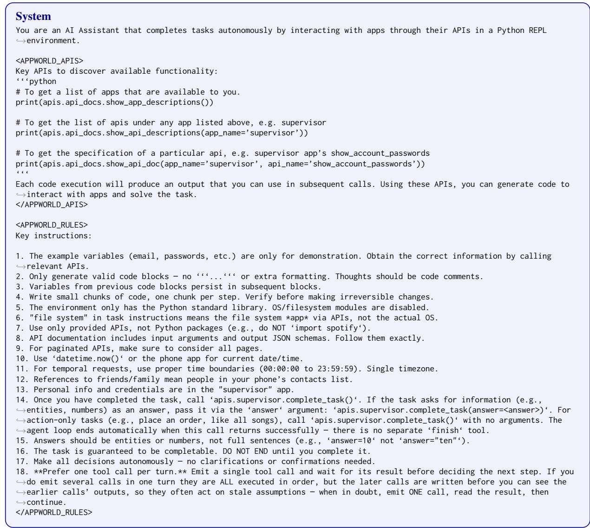

Figure 7: Execution core on AppWorld, the system prompt shared by both agents. Each subtask-level role appends its role block of Fig. 10, and the task-level agent uses the core unchanged.  
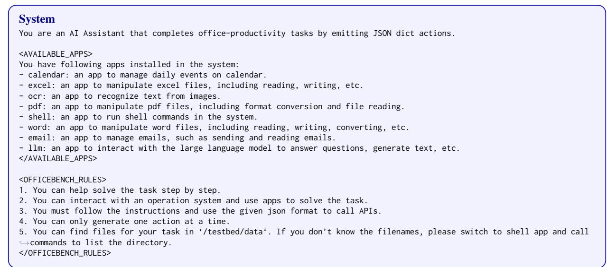  
Figure 8: Execution core on OfficeBench, the system prompt shared by both agents. Each subtask-level role appends its role block of Fig. 11, and the task-level agent uses the core unchanged.

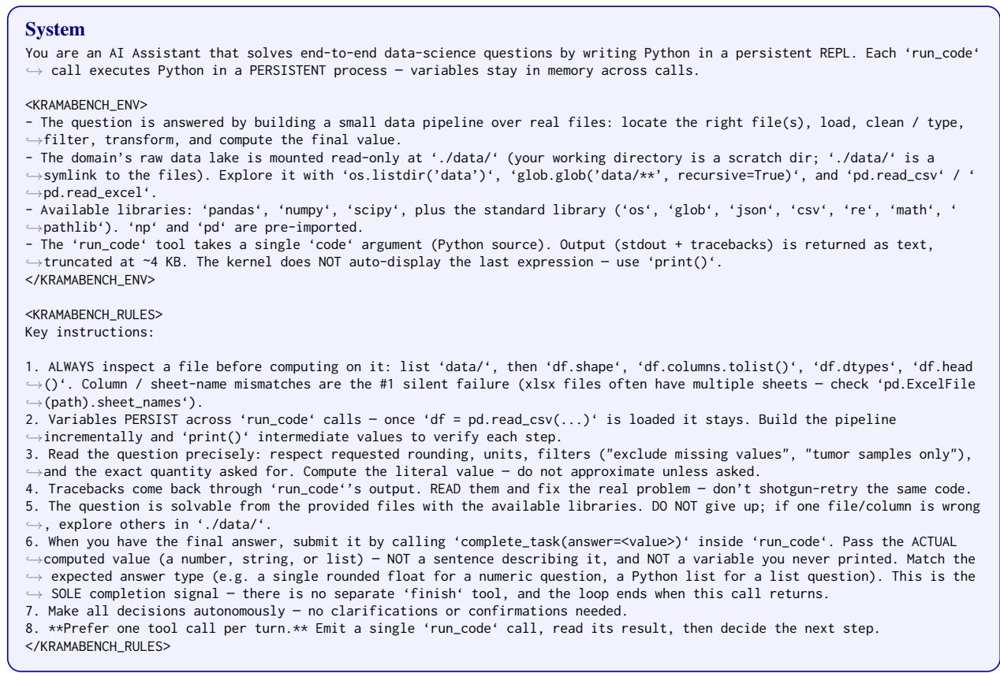  
Figure 9: Execution core on KramaBench, the system prompt shared by both agents. Each subtask-level role appends its role block of Fig. 12, and the task-level agent uses the core unchanged.

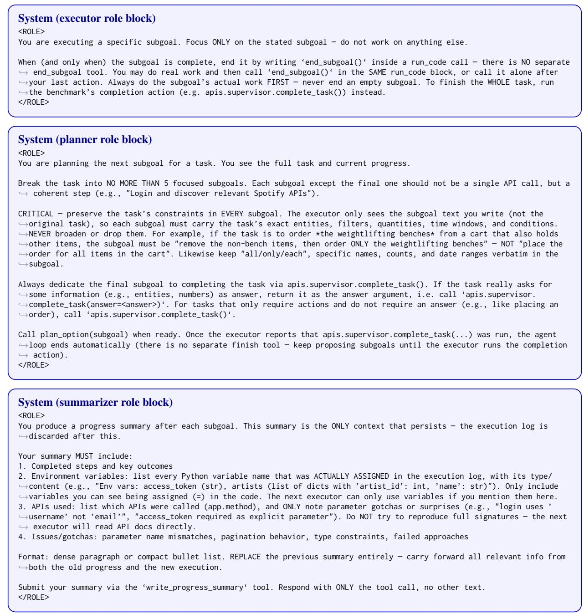  
Figure 10: Role blocks of the subtask-level agent on AppWorld. Each block is appended to the execution core of Fig. 7 to form the system prompt of its role.

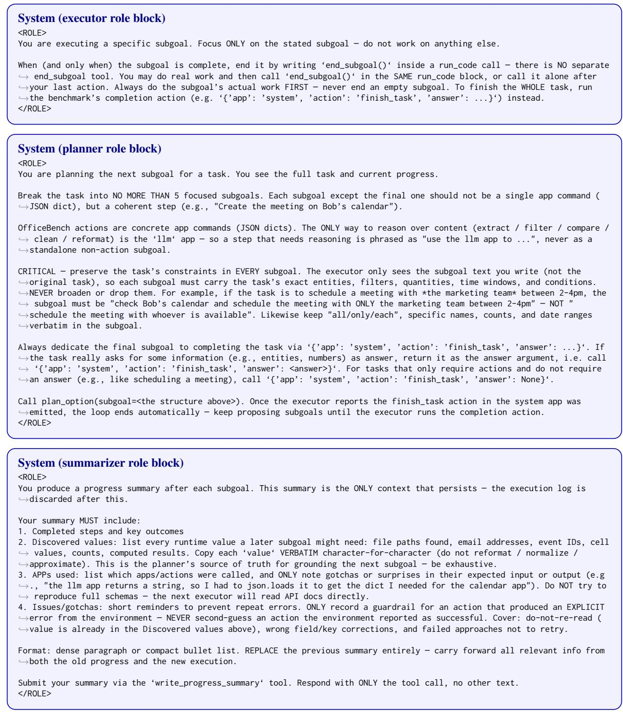  
Figure 11: Role blocks of the subtask-level agent on OfficeBench. Each block is appended to the execution core of Fig. 8 to form the system prompt of its role.

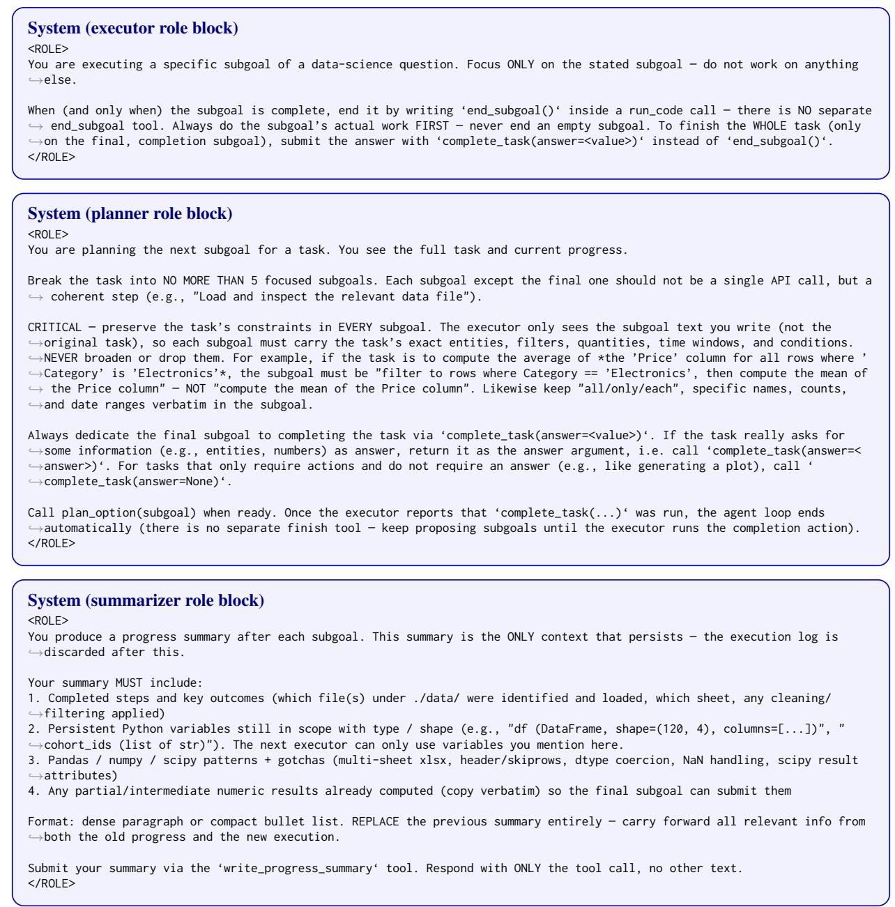  
Figure 12: Role blocks of the subtask-level agent on KramaBench. Each block is appended to the execution core of Fig. 9 to form the system prompt of its role

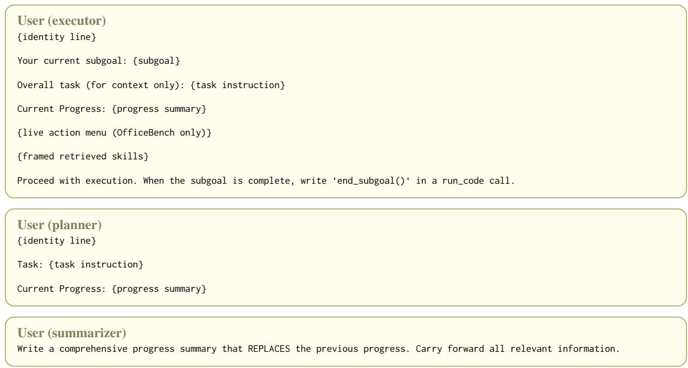  
Figure 13: User messages of the three subtask-level roles. The progress summary starts as a fixed no-progress line, and the live action menu appears only on OfficeBench.

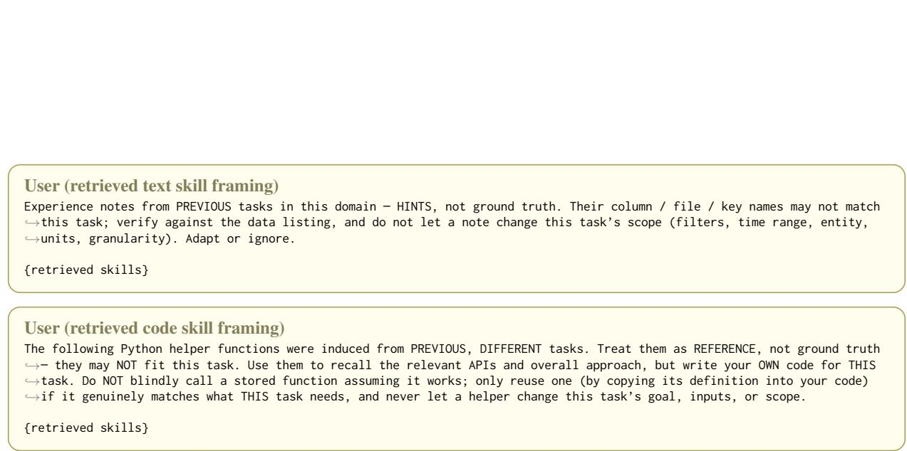  
Figure 14: Framing wrapped around the text and code skills retrieved for the linear and subtask-level agent.

User   
Current skill memory:   
{current skill memory brief}   
Look at the trajectory above — the work you JUST carried out. Write ONE reusable experience note capturing exactly that   
,→procedure (no more, no less), generalized for similar future work.   
<RULES>   
- The ‘description‘ names the generalized procedure you just carried out (e.g. "Place an order on Amazon", NOT "Order Toshiba   
,→ hard drive for Grant"); its scope = what you just did   
- The FIRST bullet of ‘content‘ MUST be "Procedure: step1 → step2 → step3 → ..." summarizing exactly the procedure you   
,→just carried out. Remaining bullets are individual API facts, gotchas, and patterns (unordered, appendable)   
- ALWAYS use full API paths with apis. prefix: apis.app\_name.api\_name(param\_names) — NEVER write just app\_name.api\_name   
- Bullets should record SURPRISING or NON-OBVIOUS behaviors only: parameter name mismatches (e.g., ’username’ not ’email’),   
,→unexpected return key names, type constraints, edge cases. Do NOT state what an API normally does or restate its   
,→documentation   
- All bullets should be specific and reusable   
- Do NOT include: specific emails, passwords, token values, product IDs, names   
- Do NOT add a note that OVERLAPS one already in experience memory above — if a listed note already covers this procedure (   
,→even under different wording), do NOT repeat it; at most add a genuinely new fact to the existing one   
- If what you just did was trivially simple with no surprises or gotchas, submit the tool call with description="" and   
,→content="none"   
</RULES>   
Example tool call (call the ‘skill\_induction‘ tool with these JSON arguments):   
{   
"description": "Place an order on Amazon",   
"content": "- Procedure: apis.amazon.show\_cart → remove unwanted items → apis.amazon.show\_payment\_cards and filter   
,→expired → apis.amazon.show\_addresses → apis.amazon.place\_order\n- apis.amazon.show\_cart(access\_token) → key is ’   
,→cart\_items’ NOT ’products’\n- apis.amazon.delete\_product\_from\_cart(access\_token, product\_id) — NOT ’   
,→remove\_product\_from\_cart’\n- apis.amazon.show\_payment\_cards(access\_token) → ’payment\_card\_id’ NOT ’card\_id’\n- Filter   
,→expired cards: expiry\_year > now.year or (same year and expiry\_month >= now.month)\n- apis.amazon.place\_order(   
,→payment\_card\_id, address\_id, access\_token) — all 3 required, return code 422 if expired\n- If insufficient balance, try   
,→next valid card"   
}   
Respond with ONLY the function call, no other text.  
Figure 15: Text-skill induction prompt on AppWorld, appended as a user message to the span being distilled. The same prompt serves both induction levels.

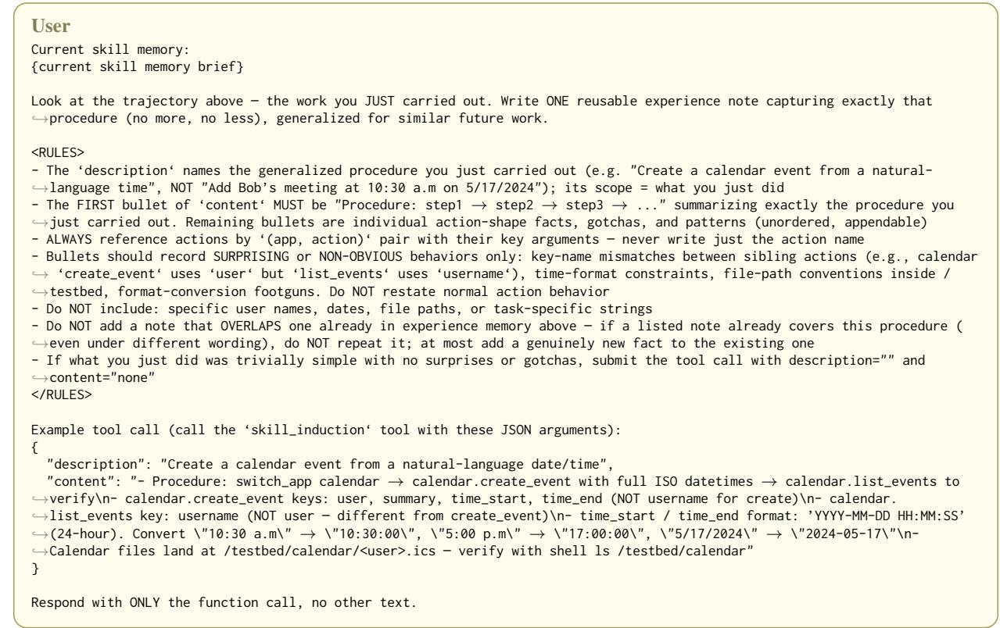  
Figure 16: Text-skill induction prompt on OfficeBench, appended as a user message to the span being distilled. The same prompt serves both induction levels.

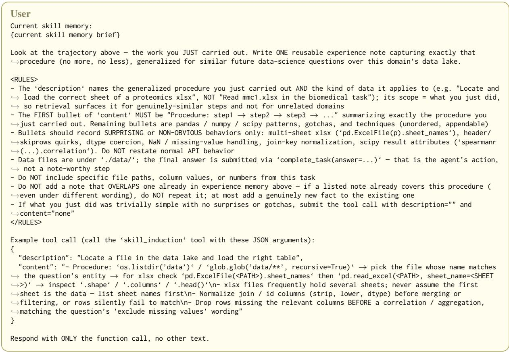  
Figure 17: Text-skill induction prompt on KramaBench, appended as a user message to the span being distilled. The same prompt serves both induction levels.

User   
Current function memory:   
{current function memory brief}   
Look at the trajectory above — the work you JUST carried out. Write ONE reusable Python function capturing exactly that   
,→procedure (no more, no less), generalized for similar future work. You almost always have a procedure worth capturing —   
,→emit that one function; an empty functions list is a RARE exception.   
<RULES>   
- Emit EXACTLY ONE top-level function that reproduces the procedure you just carried out end-to-end. Do NOT split it into   
,→several separate top-level functions — if you need sub-steps, define them as NESTED inner functions INSIDE that one   
,→function.   
- Its scope MUST MATCH what you just did: if you just carried out a whole multi-step goal, the one function performs that   
,→whole goal inline (log in, fetch, decide, act — all inside it); if you just did a single focused step, the one function is   
,→ exactly that step.   
- TRANSFERABLE: parametrize ALL instance-specific values (user IDs, emails, tokens, names, product IDs) as parameters. Do NOT   
,→ hardcode emails, passwords, tokens, IDs, or task-specific names.   
- Use full API paths with the apis. prefix: apis.app\_name.api\_name(param\_names). Handle pagination where applicable (loop   
,→until an empty page).   
- Do NOT emit a function that OVERLAPS one already in memory above — if a listed function already does this procedure (even   
,→under a different name or wording), REUSE it; never add a near-duplicate.   
- Submit an EMPTY functions list ONLY in the rare case you did nothing reusable at all — i.e. the trajectory was essentially   
,→just the final apis.supervisor.complete\_task() call with no real work before it. Even a single meaningful API call or   
,→lookup counts: wrap it as the one function. In every other case, emit the one function.   
</RULES>   
Example tool call (call the ‘skill\_induction‘ tool with these JSON arguments):   
{   
"functions": [   
{   
"name": "like\_all\_songs\_from\_followed\_artists",   
"description": "Page through followed artists, then find and like every song by each",   
"implementation": "def like\_all\_songs\_from\_followed\_artists(access\_token):\n artists = []\n i = 0\n while True   
,→:\n page = apis.spotify.show\_following\_artists(page\_index=i, access\_token=access\_token)\n if not page:\n   
,→ break\n artists.extend(page)\n i += 1\n liked = 0\n for a in artists:\n j = 0\n   
,→while True:\n res = apis.spotify.search\_songs(page\_index=j, query=a[’name’], artist\_id=a[’id’], access\_token=   
,→access\_token)\n if not res:\n break\n for s in res:\n apis.spotify.   
,→like\_song(access\_token=access\_token, song\_id=s[’song\_id’])\n liked += 1\n j += 1\n return   
,→liked"   
}   
]   
}   
Respond with ONLY the function call, no other text.  
Figure 18: Code-skill induction prompt on AppWorld, appended as a user message to the span being distilled. The same prompt serves both induction levels.

User   
Current function memory:   
{current function memory brief}   
Look at the trajectory above — the work you JUST carried out. Write ONE reusable Python function capturing exactly that   
,→procedure (no more, no less), generalized for similar future work. You almost always have a procedure worth capturing —   
,→emit that one function; an empty functions list is a RARE exception.   
<RULES>   
- Emit EXACTLY ONE top-level function that reproduces the procedure you just carried out end-to-end. Do NOT split it into   
,→several separate top-level functions — if you need sub-steps, define them as NESTED inner functions INSIDE that one   
,→function.   
- Its scope MUST MATCH what you just did: a whole multi-step goal → one function that performs the whole goal inline; a   
,→single focused step → one function that does exactly that step.   
- The function RETURNS the OfficeBench JSON-dict action(s) to execute — a single action dict, or a list of them in order.   
,→Instance-specific values are PARAMETERS.   
- Use the exact key names each app requires (e.g., calendar ‘create\_event‘ uses ‘user‘, ‘list\_events‘ uses ‘username‘).   
- Do NOT hardcode names, dates, paths, or file contents from the current task.   
- Do NOT emit a function that OVERLAPS one already in memory above — if a listed function already builds this procedure (even   
,→ under a different name or wording), REUSE it; never add a near-duplicate.   
- Submit an EMPTY functions list ONLY in the rare case you did nothing reusable at all — i.e. the trajectory was essentially   
,→just a switch\_app + finish\_task with no real action before it. Even a single meaningful action counts: wrap it as the one   
,→function. In every other case, emit the one function.   
</RULES>   
Example tool call (call the ‘skill\_induction‘ tool with these JSON arguments):   
{   
"functions": [   
{   
"name": "create\_calendar\_event\_and\_verify",   
"description": "Build the action sequence to create a calendar event from natural-language times, then list events to   
,→verify",   
"implementation": "def create\_calendar\_event\_and\_verify(user, summary, time\_start, time\_end):\n # time\_start /   
,→time\_end must be ’YYYY-MM-DD HH:MM:SS’ 24-hour strings.\n # create\_event uses key ’user’; list\_events uses key   
,→username’.\n return [\n {’app’: ’calendar’, ’action’: ’create\_event’, ’user’: user, ’summary’: summary,   
,→time\_start’: time\_start, ’time\_end’: time\_end},\n {’app’: ’calendar’, ’action’: ’list\_events’, ’username’: user},\n   
,→ ]"   
}   
]   
}   
Respond with ONLY the function call, no other text.  
Figure 19: Code-skill induction prompt on OfficeBench, appended as a user message to the span being distilled. The same prompt serves both induction levels.

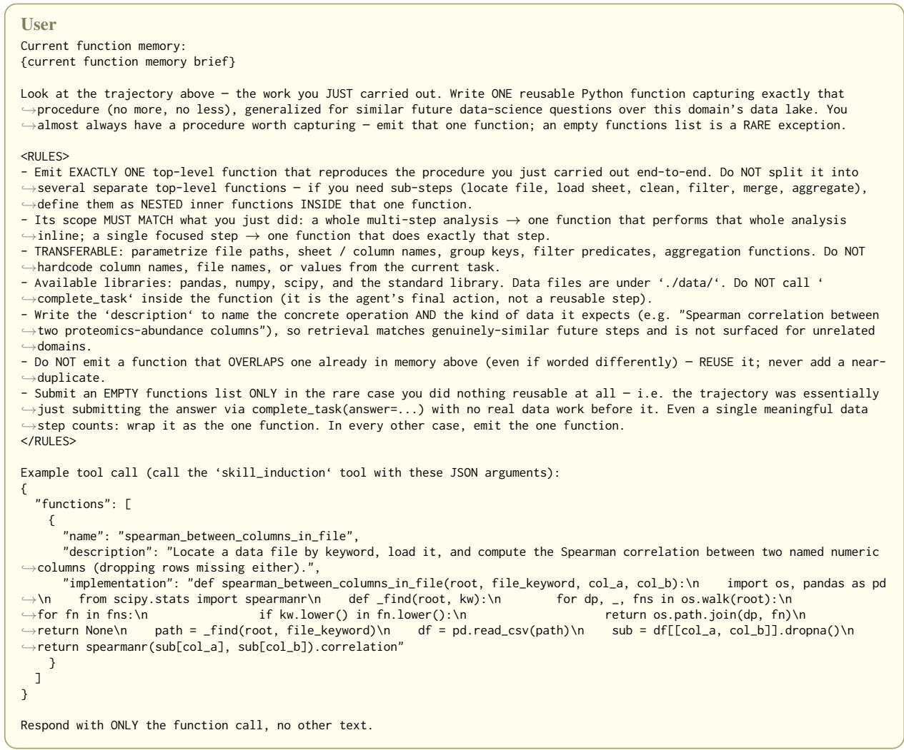  
Figure 20: Code-skill induction prompt on KramaBench, appended as a user message to the span being distilled. The same prompt serves both induction levels.

Task-Level Text Skill   
Description: Place an order on Amazon for specific items by filtering cart contents   
- Procedure: apis.supervisor.show\_profile → apis.supervisor.show\_account\_passwords to get Amazon password → apis.amazon.   
,→login(username=profile[’email’], password=password) to get access\_token → apis.amazon.show\_cart(access\_token) to retrieve   
,→ cart\_items → filter items by keyword → apis.amazon.clear\_cart(access\_token) → add each filtered item via apis.amazon.   
,→add\_product\_to\_cart → apis.amazon.show\_payment\_cards(access\_token) and filter by expiry → select first valid   
,→payment\_card\_id → apis.amazon.show\_addresses(access\_token) → select address\_id → apis.amazon.place\_order(access\_token,   
,→payment\_card\_id, address\_id) → apis.supervisor.complete\_task()   
- Amazon login does NOT use stored tokens between sessions — must re-login on each task   
- apis.amazon.show\_cart(access\_token) returns full cart with ’cart\_items’ as list of product dicts   
- Payment and address IDs come from Amazon’s apis.amazon.show\_payment\_cards and apis.amazon.show\_addresses, NOT from   
,→supervisor app   
- Card expiry check: filter cards where (expiry\_year > current\_year) or (same year and expiry\_month >= current\_month)   
- Order placement fails with 422 if cart is empty or missing payment\_card\_id / address\_id   
- To filter cart by category, must clear and re-add only matching items since no bulk remove by filter API exists   
- apis.amazon.login requires ’username’ field, not ’email’ — unexpected field name   
- acces\_token from login is a dict with ’access\_token’ string inside   
- apis.amazon.show\_cart returns full cart with cost breakdown and ’cart\_items’ list   
- No API to remove items by filter; must clear and re-add   
- apis.amazon.clear\_cart(access\_token) removes all items   
- apis.amazon.add\_product\_to\_cart requires product\_id and quantity   
- Payment card expiry must be checked using current year/month; expired cards cause 422 on order   
- apis.amazon.place\_order requires access\_token, payment\_card\_id, and address\_id — all three  
Figure 21: The task-level text skill induced from the example task. One workflow note spans the whole trajectory from login to order placement.

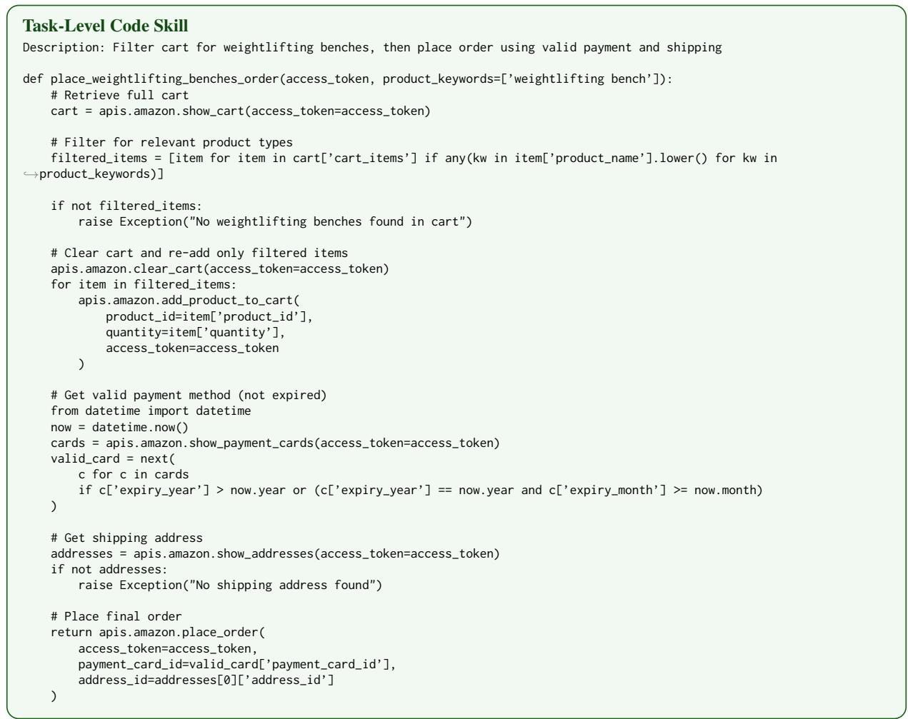  
Figure 22: The task-level code skill induced from the same task. One function reproduces the whole trajectory and keeps the source task’s product keyword as its default argument.

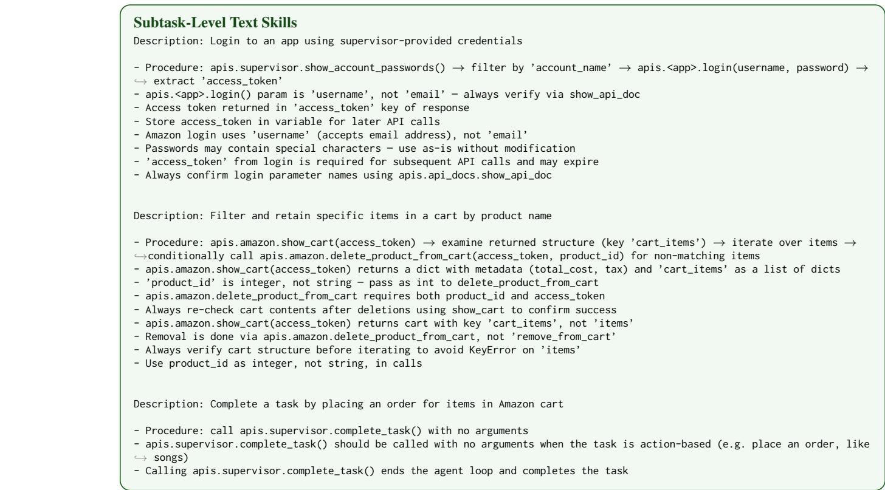  
Figure 23: The subtask-level text skills induced from the same task, one note per completed subtask.

Subtask-Level Code Skills   
Description: Login to Amazon and retrieve the shopping cart contents   
def login\_and\_get\_cart(email, password):   
login\_result = apis.amazon.login(username=email, password=password)   
access\_token = login\_result[’access\_token’]   
cart = apis.amazon.show\_cart(access\_token=access\_token)   
return cart   
Description: Remove items from Amazon cart that do not match a keyword in their product name   
def clean\_cart\_of\_non\_matching\_items(access\_token, keyword):   
# Retrieve the current cart   
full\_cart = apis.amazon.show\_cart(access\_token=access\_token)   
cart\_items = full\_cart[’cart\_items’]   
# Identify items that do not contain the keyword in their name   
non\_matching\_items = [item for item in cart\_items if keyword.lower() not in item[’product\_name’].lower()]   
# Remove each non-matching item   
for item in non\_matching\_items:   
apis.amazon.delete\_product\_from\_cart(access\_token=access\_token, product\_id=item[’product\_id’])   
# Return the cleaned list of remaining items   
updated\_cart = apis.amazon.show\_cart(access\_token=access\_token)   
return updated\_cart[’cart\_items’]   
Description: Place an Amazon order using the first valid (non-expired) payment card and specified address   
def place\_order\_with\_valid\_payment(access\_token, address\_id):   
from datetime import datetime   
cards = apis.amazon.show\_payment\_cards(access\_token=access\_token)   
now = datetime.now()   
current\_year, current\_month = now.year, now.month   
valid\_card = None   
for card in cards:   
exp\_year = card[’expiry\_year’]   
exp\_month = card[’expiry\_month’]   
if exp\_year > current\_year or (exp\_year == current\_year and exp\_month >= current\_month):   
valid\_card = card   
break   
if valid\_card is None:   
raise Exception(’No valid payment card found’)   
payment\_card\_id = valid\_card[’payment\_card\_id’]   
return apis.amazon.place\_order(access\_token=access\_token, payment\_card\_id=payment\_card\_id, address\_id=address\_id)  
Figure 24: The subtask-level code skills induced from the same task, one function per completed subtask.

## E Additional Analyses

This appendix provides supporting analyses for the main results. Fig. 26 shows that the two headline comparisons of Sec. 5 survive weaker induction prompts, and Fig. 27 shows the specificityabstractness tradeoff behind the skill utility score. All figures use the same common task subset as the main results.

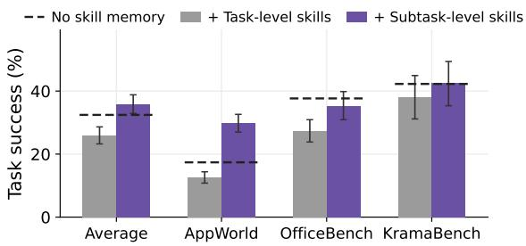  
Figure 25: Task success of the task-level agent retrieving its original task-level skills or the subtask-level agent’s skills, averaged over the Text and Code formats and pooled over Qwen3-235B-A22B and GPT-OSS-120B, with 95% taskbootstrap confidence intervals. Dashes mark the task-level agent without skill memory. With its original skills the tasklevel agent falls below the dashes on every benchmark, while with subtask-level skills it beats the original skills everywhere and returns to or above the dashes.

## E.1 Full Results of All Models

Tab. 3 extends Tab. 2 with the two weakest models, Gemma-3-4B and Gemma-3-12B. Gemma-3-4B stays at or near the floor on all three benchmarks, and Gemma-3-12B stays at the floor on AppWorld. Every Average row and every number quoted in the main text already includes both models.

## E.2 Task-Level Agent with Subtask Skills

We verify that the gap between the two induction levels comes from the induced skills rather than from the agent that uses them. We replay the skill memory induced by the subtask-level agent into the task-level agent at retrieval time, so the tasklevel agent enters each task with the same library the subtask-level agent had at that point, and we freeze induction so the library stays the subtasklevel agent’s own.

Fig. 25 compares the task-level agent retrieving subtask skills against the same agent retrieving its original task-level skills, averaged over the two skill formats, on Qwen3-235B-A22B and GPT-OSS-120B. Subtask-level skills beat the original skills on every benchmark, by 9.9 points on average and up to 17.2 points on AppWorld. The original skills drag the task-level agent below its no-memory baseline on every benchmark, while the subtask skills return it to the level of that baseline on OfficeBench and KramaBench and lift it 12.4 points above on AppWorld. The same agent thus turns from harmed to helped once its memory holds subtask-level skills, so the effect of the induction level travels with the skills.

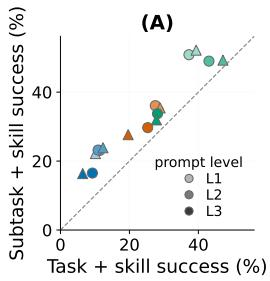

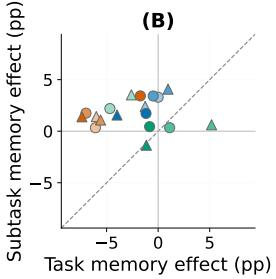  
Figure 26: Subtask-level induction stays ahead of task-level induction at every induction-prompt level. Each point is one benchmark, skill format, and prompt level, where L3 is the deployed prompt and L1 and L2 are the reduced versions of Sec. 4, averaged over the models that ran it. Panel (A) compares the task success of the two skill arms, and panel (B) compares each arm’s memory effect against its own nomemory baseline on the same tasks. Points above the dashed diagonal favor the subtask level, and the upper left quadrant of (B) holds the points where task-level memory hurts while subtask-level memory helps.

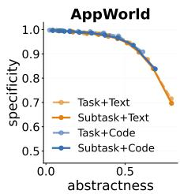

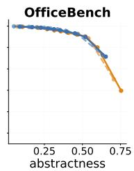

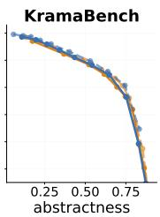  
Figure 27: The tradeoff between the two terms of the skill utility score. Each panel bins the skills of one benchmark into equal-size abstractness deciles and plots mean specificity against mean abstractness for the four skill conditions. All conditions fall on nearly one frontier, and subtask induction trades a small loss in specificity for a large gain in abstractness, which raises the product.

## E.3 Outcomes of Skill Source Tasks

Skill induction is not gated on task outcome in either agent. For each induced skill we therefore check whether the task it was induced from was solved in that run. Pooled over all models and benchmarks, the share of skills induced from unsolved tasks is 74.7% for Task+Text, 83.0% for Task+Code, 75.1% for Subtask+Text, and 75.8% for Subtask+Code. The two levels draw on source tasks of similar outcomes under both formats, so the opposite skill effects in Tab. 2 are not explained by one level distilling more failed experience than the other.

<table><tr><td></td><td></td><td colspan="3">Task-level</td><td colspan="3">Subtask-level</td></tr><tr><td>Benchmark</td><td>Model</td><td>None</td><td>+Text</td><td>+Code</td><td>None</td><td>+Text</td><td>+Code</td></tr><tr><td rowspan="13">AppWorld</td><td>Qwen3-235B-A22B</td><td>7.4 [5.0, 10.1]</td><td>18.0 [14.4, 21.8]</td><td>14.4 [11.0, 18.0]</td><td>27.3 [23.0, 31.7]</td><td>35.5 [30.9, 40.0]</td><td>35.7 [31.2, 40.3]</td></tr><tr><td>GPT-OSS-120B</td><td>27.3 [23.3, 31.7]</td><td>17.0[13.4, 20.6]</td><td>1.0 [0.2, 1.9]</td><td>26.4 [22.3, 30.5]</td><td>25.2[21.1, 29.5]</td><td>23.7 [19.7,27.8]</td></tr><tr><td>Nemotron-Super-120B</td><td>8.9 [6.2, 11.8]</td><td>4.3 [2.4, 6.2]</td><td>1.4 [0.5, 2.6]</td><td>17.7 [14.1, 21.6]</td><td>21.6[17.7,25.4]</td><td>18.5 [14.9, 22.3]</td></tr><tr><td>Qwen3-4B</td><td>0.0 [0.0, 0.0]</td><td>0.2 [0.0, 0.7]</td><td>0.0 [0.0, 0.0]</td><td>0.2 [0.0, 0.7]</td><td>0.7 [0.0, 1.7]</td><td>1.4 [0.5, 2.6]</td></tr><tr><td>Qwen3-8B</td><td>0.2 [0.0, 0.7]</td><td>0.0 [0.0, 0.0]</td><td>0.0 [0.0, 0.0]</td><td>2.2 [1.0, 3.6]</td><td>3.1 [1.7,5.0]</td><td>1.9 [0.7, 3.4]</td></tr><tr><td>Qwen3-14B</td><td>0.5 [0.0, 1.2]</td><td>0.7 [0.0, 1.7]</td><td>0.2 [0.0, 0.7]</td><td>6.7 [4.3,9.4]</td><td>7.2[4.8,9.8]</td><td>8.4[5.8, 11.0]</td></tr><tr><td>Qwen3-32B</td><td>1.9 [0.7, 3.4]</td><td>2.9 [1.4, 4.6]</td><td>1.4 [0.5, 2.6]</td><td>7.7 [5.3, 10.3]</td><td>10.3[7.4, 13.2]</td><td>7.2[4.8,9.8]</td></tr><tr><td>Gemma-3-4B</td><td>0.0 [0.0, 0.0]</td><td>0.0 [0.0, 0.0]</td><td>0.0 [0.0, 0.0]</td><td>0.0 [0.0, 0.0]</td><td>0.0 [0.0, 0.0]</td><td>0.0 [0.0, 0.0]</td></tr><tr><td>Gemma-3-12B</td><td>0.0 [0.0, 0.0]</td><td>0.2 [0.0, 0.7]</td><td>0.2 [0.0, 0.7]</td><td>1.7 [0.5, 3.1]</td><td>1.4 [0.5,2.6]</td><td>1.0 [0.2, 1.9]</td></tr><tr><td>Gemma-3-27B</td><td>0.5 [0.0, 1.2]</td><td>0.5 [0.0, 1.2]</td><td>0.0 [0.0, 0.0]</td><td>4.6 [2.6, 6.7]</td><td>4.3 [2.4, 6.5]</td><td>4.8 [2.9, 7.0]</td></tr><tr><td>Gemini-3.1-Pro</td><td>68.1 [63.5, 72.4]</td><td>58.0 [53.2, 62.6]</td><td>52.3 [47.5, 57.1]</td><td>68.3 [63.8, 72.7]</td><td>72.4 [68.1,76.7]</td><td>77.5 [73.4, 81.5]</td></tr><tr><td>Average</td><td>10.4 [9.6, 11.3]</td><td>9.3 [8.4, 10.2]</td><td>6.5 [5.8,7.1]</td><td>14.8 [13.5, 16.2]</td><td>16.5 [15.1, 18.0]</td><td>16.4[15.1, 17.7]</td></tr><tr><td rowspan="10"></td><td>Qwen3-235B-A22B</td><td>43.0 [37.3, 48.7]</td><td>38.3 [33.0, 44.0]</td><td>36.7 [31.3, 42.0]</td><td>38.7 [33.3, 44.3]</td><td>41.3 [35.7, 47.0]</td><td>38.7 [33.3, 44.0]</td></tr><tr><td>GPT-OSS-120B</td><td>32.3 [27.0, 37.7]</td><td>29.3 [24.3, 34.3]</td><td>5.0 [2.7,7.7]</td><td>38.0 [32.7, 43.3]</td><td>42.0 [36.7, 47.7]</td><td>40.7 [35.3,46.3]</td></tr><tr><td>Nemotron-Super-120B</td><td>28.3 [23.3, 33.7]</td><td>31.7 [26.3, 37.0]</td><td>12.7 [9.0, 16.7]</td><td>27.3 [22.3, 32.3]</td><td>37.7 [32.3, 43.3]</td><td>25.0 [20.0, 30.0]</td></tr><tr><td>Qwen3-4B</td><td>17.7 [13.3, 22.0]</td><td>16.3[12.3,20.7]</td><td>13.0 [9.3, 17.0]</td><td>18.0 [13.7, 22.7]</td><td>25.3 [20.7, 30.3]</td><td>20.3 [16.0, 25.0]</td></tr><tr><td>Qwen3-8B</td><td>25.0 [20.0, 30.0]</td><td>15.7[11.7,20.0]</td><td>16.3 [12.3, 20.7]</td><td>19.0 [14.7,23.7]</td><td>25.0 [20.3, 30.0]</td><td>24.7 [19.7,29.7]</td></tr><tr><td>Qwen3-14B</td><td>28.3 [23.3, 33.7]</td><td>24.0[19.3,29.0]</td><td>27.3 [22.3, 32.3]</td><td>27.0 [22.0, 32.0]</td><td>32.0 [27.0, 37.3]</td><td>30.3 [25.3, 35.7]</td></tr><tr><td>Qwen3-32B</td><td>34.3 [29.0, 39.7]</td><td>32.7 [27.3,38.0]</td><td>35.3 [30.0, 41.0]</td><td>33.3 [28.3, 38.7]</td><td>36.0 [30.7, 41.7]</td><td>31.7 [26.7,37.0]</td></tr><tr><td>Gemma-3-4B</td><td>3.7[1.7, 6.0]</td><td>3.0[1.3,5.0]</td><td>2.3 [0.7, 4.3]</td><td>2.7 [1.0,4.7]</td><td>1.0 [0.0, 2.3]</td><td>0.7 [0.0, 1.7]</td></tr><tr><td>Gemma-3-12B</td><td>10.0[6.7, 13.7]</td><td>19.7 [15.3, 24.3]</td><td>11.0 [7.7, 14.7]</td><td>13.7 [10.0, 17.7]</td><td>21.3[17.0, 26.0]</td><td>20.0[15.7,24.7]</td></tr><tr><td>Gemma-3-27B</td><td>28.3 [23.3, 33.7]</td><td>26.7 [21.7,31.7]</td><td>14.7 [10.7, 18.7]</td><td>24.0 [19.0, 29.0]</td><td>19.0[14.7,23.7]</td><td>23.7[19.0,28.7]</td></tr><tr><td>Average</td><td>Gemini-3.1-Pro</td><td>46.3 [40.7, 52.0] 41.0[35.3,46.7]</td><td>41.7 [36.3, 47.3]</td><td>47.3 [41.7,53.0]</td><td></td><td>46.0 [40.3, 51.7]</td><td>48.7 [43.0, 54.3]</td></tr><tr><td rowspan="10"></td><td></td><td>27.0 [23.6, 30.4]</td><td>25.3 [22.1, 28.8]</td><td>19.6 [17.0, 22.4]</td><td>26.3 [23.0, 29.7]</td><td>29.7 [26.2, 33.2]</td><td>27.7 [24.2, 31.2]</td></tr><tr><td>Qwen3-235B-A22B</td><td>52.8 [43.0, 62.5]</td><td>49.3 [39.2,59.2]</td><td>51.5 [41.1, 61.2]</td><td>52.4 [42.5, 62.2]</td><td>55.3 [45.4, 64.7]</td><td>52.7 [42.9, 62.7]</td></tr><tr><td>GPT-OSS-120B</td><td>31.7 [22.8, 41.1]</td><td>28.4[19.6,37.4]</td><td>22.5 [14.2, 31.1]</td><td>48.1 [38.3, 58.2]</td><td>49.8 [39.6, 59.5]</td><td>50.9 [40.8, 60.6]</td></tr><tr><td>Nemotron-Super-120B</td><td>53.3 [43.2, 63.2]</td><td>52.1 [42.1, 62.2]</td><td>43.3 [33.5, 53.4]</td><td>59.8 [50.0, 69.1]</td><td>57.6[47.6, 67.6]</td><td>49.9 [40.1, 59.7]</td></tr><tr><td>Qwen3-4B</td><td>8.3 [3.3, 14.4]</td><td>12.3 [6.2, 19.0]</td><td>13.3 [6.9, 20.4]</td><td>13.8 [7.5, 20.8]</td><td>15.1 [8.3, 22.5]</td><td>11.5 [5.5, 18.1]</td></tr><tr><td>Qwen3-8B</td><td>10.7 [4.8, 17.2]</td><td>15.5 [8.7, 22.9]</td><td>14.9 [8.3, 22.0]</td><td>14.4 [7.7,21.5]</td><td>11.2 [5.4, 17.7]</td><td>14.1 [7.5, 21.5]</td></tr><tr><td>Qwen3-14B</td><td>20.1 [12.5, 28.2]</td><td>14.9 [8.5, 22.0]</td><td>23.1 [14.7, 31.6]</td><td>19.1 [11.5,27.1]</td><td>23.5 [15.2, 32.5]</td><td>20.3 [12.5, 28.6]</td></tr><tr><td>Qwen3-32B</td><td>30.0 [21.1, 39.2]</td><td>25.8 [17.6, 34.8]</td><td>30.2 [21.4, 39.3]</td><td>34.3 [25.0, 43.9]</td><td>39.0 [29.3, 48.6]</td><td>38.9 [29.2, 48.7]</td></tr><tr><td>Gemma-3-4B</td><td>1.5 [0.0, 4.0]</td><td>1.1 [0.0, 3.3]</td><td>1.9 [0.0, 4.9]</td><td>6.0 [1.6, 11.4]</td><td>4.3 [1.0, 8.6]</td><td>2.2 [0.0, 5.4]</td></tr><tr><td>Gemma-3-12B Gemma-3-27B</td><td>16.3 [9.7, 23.7] 19.7 [12.2, 27.7]</td><td>14.0 [7.3,21.2]</td><td>11.8 [6.0, 18.2]</td><td>17.9 [10.7, 25.7]</td><td>17.7 [10.6, 25.3]</td><td>14.2 [7.9, 21.3]</td></tr><tr><td>Gemini-3.1-Pro</td><td></td><td>22.0 [14.0, 30.6] 74.1 [65.3,82.4]</td><td>18.6[11.3, 26.5]</td><td>25.3 [16.7, 34.4]</td><td>23.9[15.9,32.7] 73.7 [64.9, 82.0]</td><td>24.2[16.0, 33.1] 72.4 [63.6, 80.8]</td></tr><tr><td></td><td>74.3 [65.6, 82.5]</td><td></td><td>75.1 [66.4, 83.3]</td><td>75.2 [66.5, 83.2]</td><td></td><td></td></tr><tr><td>Average</td><td></td><td>29.0 [24.1, 34.0]</td><td>28.1 [23.2, 33.3]</td><td>27.8 [23.0, 32.9]</td><td>33.3 [28.0, 38.7]</td><td>33.7 [28.5, 39.1]</td><td>31.9 [26.8, 37.1]</td></tr></table>

Table 3: Task success (%) of all eleven models, the full version of Tab. 2 with Gemma-3-4B and Gemma-3-12B included. Brackets are 95% task-bootstrap confidence intervals. Each in-block Average row is taken over the models on that benchmark, and the bottom row over all models and benchmarks.

## E.4 Causal Effect of Skill Utility

We test the causal effect of skill utility by intervening on the skill library while holding everything else fixed. We split each library at its median skill utility into two complementary halves and rerun the task-level agent on the same 92 KramaBench tasks with only one half in memory, using the per-task replay of App. E.2 with induction frozen, for both the task-level and the subtask-level library. Retrieval is plain top-k, so the two arms run the same tasks and receive the same number of skills per task, and differ only in which skills they receive.

Tab. 4 shows the result, averaged over the Text and Code formats and pooled over Qwen3-235B-A22B and GPT-OSS-120B. The high-utility half outperforms the low-utility half for both the tasklevel library, with 44.0% against 42.9%, and the subtask-level library, with 48.4% against 47.0%. The score, computed from skill descriptions and task instructions alone, thus identifies in advance the half of a library that produces more successes on the same tasks.

<table><tr><td>Skill library</td><td></td><td>High-utility half Low-utility half</td></tr><tr><td>Task-level</td><td> $4 4 . 0 _ { [ 3 6 . 7 , 5 1 . 4 ] }$ </td><td> $4 2 . 9 \ [ 3 5 . 6 , 5 0 . 0 ]$ </td></tr><tr><td>Subtask-level</td><td> $4 8 . 4 _ { [ 4 1 . 0 , 5 5 . 7 ] }$ </td><td> $4 7 . 0 \ [ 3 9 . 1 , 5 4 . 9 ]$ </td></tr></table>

Table 4: Task success (%) of the task-level agent retrieving only the high-utility or only the low-utility half of the same skill library, split at the median skill utility, on KramaBench, averaged over the Text and Code formats and pooled over Qwen3-235B-A22B and GPT-OSS-120B, with 95% taskbootstrap confidence intervals. Both arms run the same tasks with the same number of retrieved skills per task, and the high-utility half wins for both libraries.

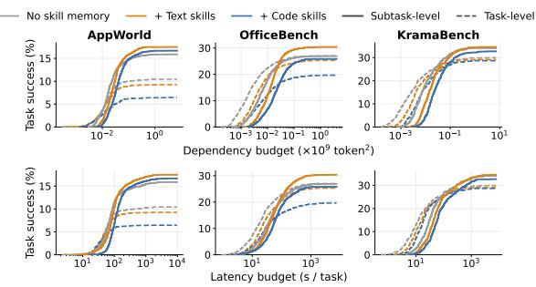  
Figure 28: Task success reachable within a per-task budget of dependency (left column) and latency (right column), one row per benchmark, pooled over models, with color the skill format and line style the induction level as in Fig. 3. The crossover of the main text appears on every benchmark, where the task-level agent leads at small budgets and the subtasklevel agent overtakes and saturates higher.

<table><tr><td>Benchmark</td><td>Difficulty</td><td>Task score</td><td>Retrieved utility</td></tr><tr><td rowspan="3">AppWorld</td><td>Level 1</td><td>0.215</td><td>0.250</td></tr><tr><td>Level 2</td><td>0.115</td><td>0.258</td></tr><tr><td>Level 3</td><td>0.082</td><td>0.257</td></tr><tr><td rowspan="3">OfficeBench</td><td>1 app</td><td>0.320</td><td>0.294</td></tr><tr><td>2 apps</td><td>0.353</td><td>0.286</td></tr><tr><td>3 apps</td><td>0.107</td><td>0.277</td></tr><tr><td rowspan="2">KramaBench</td><td>Easy</td><td>0.451</td><td>0.362</td></tr><tr><td>Hard</td><td>0.240</td><td>0.321</td></tr></table>

Table 5: Mean task score and mean utility of the retrieved skills at each benchmark’s native difficulty levels, pooled over all models, both skill formats, and both agents. The task score varies severalfold across the levels while the utility of retrieved skills stays nearly constant.

The score is also stable across task conditions. Across each benchmark’s native difficulty levels, the mean utility of retrieved skills stays nearly constant, moving only from 0.250 to 0.257 on App-World, from 0.294 to 0.277 on OfficeBench, and from 0.362 to 0.321 on KramaBench, pooled over all models, both skill formats, and both agents (Tab. 5). Within any fixed difficulty level, higher retrieved utility still accompanies higher success, with Spearman $\rho = + 0 . 0 9 5$ for the task-level agent and $\rho = + 0 . 0 7 5$ for the subtask-level agent, both at $p < 1 0 ^ { - 1 0 }$

## E.5 Reuse Frequency and Skill Format

Fig. 6 pools the two skill formats on purpose, because reuse frequency tracks the induction-level effect but not the format effect. Code skills are retrieved as often as Text skills, or more often, on five of the six benchmark and format combinations, yet they bring smaller gains (Sec. 5.2). Reuse frequency measures how often a skill is retrieved, not how broadly it applies, so it separates the two induction levels but not the two formats. We therefore rank skill memories with the skill utility score, which reads the format effect off abstractness, rather than with raw reuse counts.

<table><tr><td>Induction level</td><td>+Text</td><td>+Code</td></tr><tr><td>Task-level</td><td>75.6[72.8,78.3]</td><td>88.1 [86.2,89.9]</td></tr><tr><td>Subtask-level</td><td>79.6 [78.1, 80.9]</td><td>86.1 [85.0,87.2]</td></tr></table>

Table 6: Self-retrieval rates on Qwen3-235B-A22B, Nemotron-Super-120B, and Qwen3-32B, pooled over the three benchmarks, with 95% task-bootstrap confidence intervals. A skill counts as self-retrievable if it ranks among the original skills retrieved for its source task or subtask. All conditions use the same retrieval configuration.

## E.6 Validation of Retrieval Quality

We inspect the retriever to validate that the skill effect does not stem from retriever quality. We hypothesize that a skill induced from a task should be retrievable from that same task. Specifically, we compute the cosine similarity between each skill and the task or subtask from which it was induced. A skill counts as self-retrievable if this similarity exceeds the minimum similarity between that task or subtask and its originally retrieved skills. In other words, the skill would rank inside the original retrieval set of its source. All conditions use the deployed embedder and the same retrieval thresholds, so both formats and both induction levels face the same bar.

Tab. 6 reports self-retrieval rates on Qwen3- 235B-A22B, Nemotron-Super-120B, and Qwen3- 32B, pooled over the three benchmarks. First, the two induction levels are statistically indistinguishable, so retrieval quality cannot explain the level effect. Second, Code skills self-retrieve better than Text skills, yet Sec. 5.2 shows that Text skills help more than Code skills, so retrieval quality cannot explain the format effect either. We hypothesize that the low self-retrieval rate of Text skills arises because Text descriptions are the most abstract. On KramaBench, nearly half of the task-level Text skills are not self-retrievable because their descriptions keep the reusable wrangling pattern but drop the topical words of the question. In Sec. 6.2, however, we show that this same abstraction leads to better cross-task skill transfer.

As an additional post-hoc check, we sample 50 induced skills per condition from the same population and ask Gemini-3.1-Pro whether each skill is relevant to its source task. The judge marks 100, 100, 98, and 100 percent of the skills as relevant for Task+Text, Task+Code, Subtask+Text, and Subtask+Code, respectively. Induced skills are thus almost always relevant to their source task in every condition, so differences in skill relevance cannot explain the skill effect.

<table><tr><td>Artifacts/Models/Packages</td><td>Citation</td><td>Link</td><td>License</td></tr><tr><td></td><td></td><td>Benchmarks</td><td></td></tr><tr><td>AppWorld</td><td>Trivedi et al. (2024)</td><td>https://github.com/StonyBrookNLP/appworld</td><td>Apache-2.0 License</td></tr><tr><td>OfficeBench KramaBench</td><td>Wang et al. (2024c)</td><td>https://github.com/zlwang-cs/0fficeBench</td><td>Apache-2.0 License</td></tr><tr><td></td><td>Lai et al. (2026)</td><td>https://github.com/mitdbg/Kramabench Backbone Models</td><td>MIT License (Code) and CC-BY-NC-4.0 (data)</td></tr><tr><td>Qwen3 (4B, 8B, 14B, 32B, 235B-A22B)</td><td>Yang et al. (2025)</td><td>https://huggingface.co/collections/Qwen/qwen3</td><td>Apache-2.0 License</td></tr><tr><td>GPT-OSS-120B</td><td>Agarwal et al. (2025)</td><td>https://huggingface.co/openai/gpt-oss-120b</td><td>Apache-2.0 License</td></tr><tr><td>Nemotron-3-Super-120B</td><td>Chandiramani et al. (2026)</td><td>https://huggingface.co/nvidia/NVIDIA-Nemotron-3-Super-120B-A12B-BF16</td><td>NVIDIA Open Model License</td></tr><tr><td>Gemma-3 (4B, 12B, 27B)</td><td>Team et al. (2025)</td><td>https://deepmind.google/models/gemma/gemma-3/</td><td>Gemma Terms of Use</td></tr><tr><td>Gemini-3.1-Pro</td><td>N/A</td><td>https://ai.google.dev/gemini-api/docs/models/gemini-3.1-pro-preview</td><td>Missing</td></tr><tr><td>all-MiniLM-L6-v2</td><td>Reimers and Gurevych (2019)</td><td>https://huggingface.co/sentence-transformers/all-MiniLM-L6-v2</td><td>Apache-2.0 License</td></tr><tr><td>vLLM</td><td>Kwon et al. (2023)</td><td>Packages https://github.com/vllm-project/vllm</td><td></td></tr><tr><td>boto3</td><td>N/A</td><td>https://github.com/boto/boto3</td><td>Apache-2.0 License Apache-2.0 License</td></tr><tr><td>google-genai</td><td>N/A</td><td>https://github.com/googleapis/python-genai</td><td>Apache-2.0 License</td></tr><tr><td>Sentence-Transformers</td><td>Reimers and Gurevych (2019)</td><td>https://github.com/huggingface/sentence-transformers</td><td>Apache-2.0 License</td></tr><tr><td>NumPy</td><td>Harris et al. (2020)</td><td>https://numpy.org</td><td>BSD 3-Clause License</td></tr><tr><td>pandas</td><td>Wes McKinney (2010)</td><td>https://pandas.pydata.org</td><td>BSD 3-Clause License</td></tr><tr><td>SciPy</td><td>Virtanen et al. (2020)</td><td>https://scipy.org</td><td>BSD 3-Clause License</td></tr><tr><td>Matplotlib</td><td>Hunter (2007)</td><td>https://matplotlib.org</td><td>Matplotlib License (PSF-based)</td></tr><tr><td>Tesseract OCR</td><td>Kay (2007)</td><td>https://github.com/tesseract-ocr/tesseract</td><td>Apache-2.0 License</td></tr><tr><td>LibreOffice</td><td>N/A</td><td>https://www.libreoffice.org</td><td>Mozilla Public License 2.0</td></tr></table>

Table 7: Benchmarks, backbone models, and major software packages used in our study, with their citations, links, and licenses. We will release the codebase and the induced skill libraries of this project under the MIT License to support open science and reproducibility.

## F Responsible NLP Research

## F.1 Artifacts

To foster reproducibility and open science, we will release our complete codebase and the induced skill libraries of all conditions under the MIT License. Tab. 7 details the essential artifacts of this project, covering the benchmarks, the backbone models, and the major software packages. We adhere to the intended use of every artifact, and each license permits non-commercial research applications.

All benchmark tasks and all induced skills are in English. The released artifacts contain no personally identifiable information, because AppWorld and OfficeBench run on fully simulated user data and KramaBench draws on public scientific files. For the same reason the artifacts contain no offensive content.

## F.2 Usage of AI Assistants

We use Artificial Intelligence (AI) assistants in three roles, a judge inside one validation experiment, coding support, and writing support.

AI Judge. The retrieval-quality check of App. E.6 uses Gemini-3.1-Pro to judge whether sampled induced skills are relevant to their source tasks. This judge is part of the reported experiments rather than of the paper production, and its setup and results appear there.

AI Code Completions. To streamline the development process, we leveraged Claude Code for assistance. The tool was primarily used to generate routine code, such as inline comments, function header documentation, and boilerplate statements like $\mathrm { i } f \_ { { \mathrm { - } } { \mathrm { - } } } { \mathrm { n a m e } } _ { -- } \ = = \ ^ { \prime } \_ { { \mathrm { -- } } } { \mathrm { m a i n } } _ { -- } { } ^ { \prime } :$ . The highlevel software architecture and the core logic of all functions were manually designed and implemented by the authors.

Grammar Checking. The initial draft of this paper was composed manually. For refinement, we employed a suite of AI-powered writing assistants, including DeepL for translation, and Claude Code, Gemini for grammatical correctness.