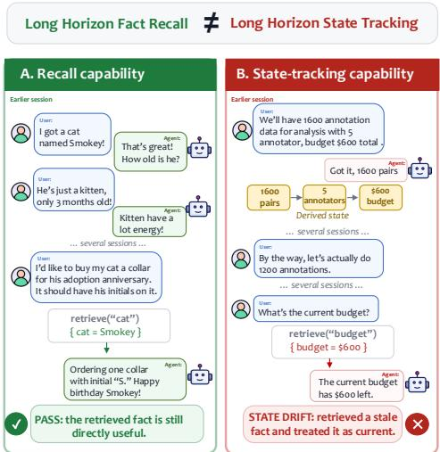
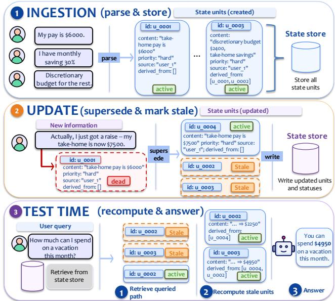

# C<sub>a</sub>n A<sub>ge</sub>nt M<sub>e</sub>m<sub>o</sub>r<sub>y</sub> S<sub>ys</sub>t<sub>e</sub>m<sub>s</sub> Tr<sub>ac</sub>k E<sub>vo</sub>l<sub>v</sub>in<sub>g</sub> St<sub>a</sub>t<sub>e</sub>?

<sub>Xinyi Fan</sub>∗<sub>, Miri Liu</sub>∗<sub>, Ruozhen Yang, Siru Ouyang, Jiawei Han</sub>

U<sub>n</sub>i<sub>vers</sub>it<sub>y</sub> <sub>o</sub>f Illi<sub>no</sub>i<sub>s</sub> U<sub>r</sub>b<sub>ana-</sub>Ch<sub>ampa</sub>i<sub>gn</sub>{xfan31, miri3, ruozhen2, siruo2, hanj}@illinois.edu

## Abstract

A<sub>s</sub> LLM<sub>-</sub>b<sub>ase</sub>d <sub>agen</sub>t<sub>s are</sub> d<sub>ep</sub>l<sub>oye</sub>d f<sub>or</sub> l<sub>onger an</sub>d hi<sub>g</sub>h<sub>er-</sub> <sub>s</sub>t<sub>a</sub>k<sub>es</sub> t<sub>as</sub>k<sub>s,</sub> th<sub>e</sub>i<sub>r</sub> <sub>memory</sub> <sub>sys</sub>t<sub>ems</sub> <sub>con</sub>ti<sub>nue</sub> t<sub>o</sub> h<sub>ave</sub> <sub>cru-</sub> <sub>c</sub>i<sub>a</sub>l <sub>gaps.</sub> Whil<sub>e ex</sub>i<sub>s</sub>ti<sub>ng memory</sub> b<sub>enc</sub>h<sub>mar</sub>k<sub>s</sub> f<sub>ocus</sub> l<sub>arge</sub>l<sub>y</sub> <sub>on reca</sub>ll<sub>-s</sub>h<sub>ape</sub>d t<sub>as</sub>k<sub>s, we argue an e</sub>f<sub>ec</sub>ti<sub>ve memory sys-</sub> t<sub>em mus</sub>t t<sub>rac</sub>k th<sub>e evo</sub>l<sub>v</sub>i<sub>ng s</sub>t<sub>a</sub>t<sub>e o</sub>f th<sub>e wor</sub>ld<sub>; as</sub> f<sub>ac</sub>t<sub>s,</sub> <sub>cons</sub>t<sub>ra</sub>i<sub>n</sub>t<sub>s, an</sub>d d<sub>ec</sub>i<sub>s</sub>i<sub>ons are rev</sub>i<sub>se</sub>d <sub>over a</sub> l<sub>ong</sub> i<sub>n</sub>t<sub>erac-</sub> ti<sub>on,</sub> <sub>answers</sub> <sub>mus</sub>t <sub>re</sub>fl<sub>ec</sub>t th<sub>e</sub> <sub>curren</sub>t <sub>s</sub>t<sub>a</sub>t<sub>e</sub> <sub>an</sub>d <sub>no</sub>t <sub>a</sub> <sub>super-</sub> <sub>se</sub>d<sub>e</sub>d <sub>one.</sub> W<sub>e</sub> d<sub>e</sub>fi<sub>ne</sub> thi<sub>s</sub> <sub>capa</sub>bilit<sub>y</sub> <sub>as</sub> <sub>s</sub>t<sub>a</sub>t<sub>e</sub> t<sub>rac</sub>ki<sub>ng</sub> <sub>an</sub>d i<sub>ns</sub>t<sub>an</sub>ti<sub>a</sub>t<sub>e</sub> it i<sub>n</sub> S<sub>tate</sub>M<sub>em</sub>B<sub>ench, a</sub> b<sub>enc</sub>h<sub>mar</sub>k <sub>o</sub>f 234 <sub>mu</sub>lti<sub>-</sub> <sub>sess</sub>i<sub>on</sub> <sub>scenar</sub>i<sub>os</sub> <sub>spann</sub>i<sub>ng</sub> t<sub>wo</sub> <sub>conversa</sub>ti<sub>on-</sub>l<sub>eng</sub>th <sub>reg</sub>i<sub>mes.</sub> It<sub>s c</sub>l<sub>ose</sub>d<sub>-poo</sub>l <sub>gra</sub>di<sub>ng scores w</sub>h<sub>e</sub>th<sub>er an answer re</sub>fl<sub>ec</sub>t<sub>s</sub> th<sub>e</sub> <sub>curren</sub>t <sub>s</sub>t<sub>a</sub>t<sub>e,</sub> th<sub>e</sub> <sub>superse</sub>d<sub>e</sub>d <sub>s</sub>t<sub>a</sub>t<sub>e,</sub> <sub>or</sub> f<sub>a</sub>il<sub>s</sub> <sub>o</sub>th<sub>erw</sub>i<sub>se,</sub> <sub>sepa-</sub> <sub>ra</sub>ti<sub>ng s</sub>t<sub>a</sub>t<sub>e-</sub>t<sub>rac</sub>ki<sub>ng</sub> f<sub>a</sub>il<sub>ures</sub> f<sub>rom o</sub>th<sub>er errors</sub> b<sub>y cons</sub>t<sub>ruc-</sub> ti<sub>on.</sub> O<sub>ur ana</sub>l<sub>ys</sub>i<sub>s s</sub>h<sub>ows</sub> th<sub>a</sub>t thi<sub>s</sub> t<sub>as</sub>k i<sub>s c</sub>h<sub>a</sub>ll<sub>eng</sub>i<sub>ng</sub> f<sub>or ex-</sub> i<sub>s</sub>ti<sub>ng</sub> <sub>memory</sub> <sub>sys</sub>t<sub>ems,</sub> <sub>re</sub>t<sub>r</sub>i<sub>eva</sub>l<sub>-augmen</sub>t<sub>e</sub>d b<sub>ase</sub>li<sub>nes,</sub> <sub>an</sub>d l<sub>ong-con</sub>t<sub>ex</sub>t b<sub>ase</sub>li<sub>nes.</sub> W<sub>e</sub> th<sub>en presen</sub>t S<sub>tate</sub>M<sub>em, a s</sub>t<sub>a</sub>t<sub>e-</sub> fi<sub>rs</sub>t <sub>memory me</sub>th<sub>o</sub>d th<sub>a</sub>t <sub>exp</sub>li<sub>c</sub>itl<sub>y</sub> t<sub>rac</sub>k<sub>s supersess</sub>i<sub>on an</sub>d <sub>re</sub>l<sub>a</sub>ti<sub>ona</sub>l d<sub>epen</sub>d<sub>enc</sub>i<sub>es, an</sub>d <sub>s</sub>h<sub>ow</sub> it i<sub>mproves curren</sub>t<sub>-s</sub>t<sub>a</sub>t<sub>e</sub> accurac<sub>y</sub> over the stron<sub>g</sub>est same-backbone baseline b<sub>y</sub> 1.8× (0.205 → 0.363) on Dee<sub>p</sub>Seek-V4-Flash and over the stron<sub>g</sub>est memor<sub>y</sub> s<sub>y</sub>stem b<sub>y</sub> 1.6× (0.149 → 0.233) on Qwen-3.5-9B, <sub>w</sub>hil<sub>e rema</sub>i<sub>n</sub>i<sub>ng compe</sub>titi<sub>ve w</sub>ith th<sub>e</sub> l<sub>ong-con</sub>t<sub>ex</sub>t b<sub>ase</sub>li<sub>nes.</sub> Fi<sub>na</sub>ll<sub>y, we s</sub>h<sub>ow</sub> th<sub>e same s</sub>t<sub>a</sub>t<sub>e approac</sub>h <sub>can</sub> b<sub>e app</sub>li<sub>e</sub>d <sub>as</sub> <sub>a</sub> li<sub>g</sub>ht<sub>we</sub>i<sub>g</sub>ht <sub>s</sub>i<sub>ng</sub>l<sub>e-ca</sub>ll <sub>wrapper over ex</sub>i<sub>s</sub>ti<sub>ng memory sys-</sub> t<sub>ems,</sub> lifti<sub>ng curren</sub>t<sub>-s</sub>t<sub>a</sub>t<sub>e accuracy</sub> b<sub>y</sub> +32 t<sub>o</sub> +67 <sub>po</sub>i<sub>n</sub>t<sub>s on</sub> S<sub>tate</sub>M<sub>em</sub>B<sub>ench across s</sub>i<sub>x memory an</sub>d <sub>re</sub>t<sub>r</sub>i<sub>eva</sub>l b<sub>ac</sub>k<sub>en</sub>d<sub>s.</sub> A l<sub>eng</sub>th<sub>- an</sub>d <sub>cos</sub>t<sub>-ma</sub>t<sub>c</sub>h<sub>e</sub>d <sub>con</sub>t<sub>ro</sub>l <sub>a</sub>tt<sub>r</sub>ib<sub>u</sub>t<sub>es</sub> +15 t<sub>o</sub> +32 <sub>o</sub>f th<sub>ose po</sub>i<sub>n</sub>t<sub>s</sub> t<sub>o s</sub>t<sub>a</sub>t<sub>e s</sub>t<sub>ruc</sub>t<sub>ure ra</sub>th<sub>er</sub> th<sub>an a</sub>dd<sub>e</sub>d <sub>con</sub>t<sub>ex</sub>t<sub>.</sub>

## 1 Intr<sub>o</sub>d<sub>uc</sub>ti<sub>o</sub>n

A<sub>g</sub>ents are now ca<sub>p</sub>able of (and de<sub>p</sub>lo<sub>y</sub>ed for) tasks that take <sub>p</sub>l<sub>ace over mu</sub>lti<sub>p</sub>l<sub>e sess</sub>i<sub>ons,</sub> f<sub>rom manag</sub>i<sub>ng en</sub>d<sub>-</sub>t<sub>o-en</sub>d <sub>re-</sub> search <sub>p</sub>i<sub>p</sub>elines (Gottweis et al. 2026; Lu et al. 2024) to autonomousl<sub>y</sub> workin<sub>g</sub> on software codebases (Wu 2024; Yan<sub>g</sub> et al. 2024). The abilit<sub>y</sub> of an a<sub>g</sub>ent to kee<sub>p</sub> workin<sub>g</sub> is, firstl<sub>y</sub>, a crucial benchmark of its ca<sub>p</sub>abilities (Kwa et al. 2026), and, secondl<sub>y</sub>, somethin<sub>g</sub> that requires memor<sub>y</sub>. A<sub>ccor</sub>di<sub>ng</sub>l<sub>y,</sub> <sub>many</sub> dif<sub>eren</sub>t <sub>s</sub>t<sub>ra</sub>t<sub>eg</sub>i<sub>es</sub> f<sub>or</sub> <sub>manag</sub>i<sub>ng</sub> <sub>agen</sub>t <sub>memory</sub> h<sub>ave emerge</sub>d<sub>,</sub> f<sub>rom ex</sub>t<sub>en</sub>di<sub>ng</sub> th<sub>e mo</sub>d<sub>e</sub>l’<sub>s e</sub>f<sub>ec-</sub> tive context (Din<sub>g</sub> et al. 2024) to external memor<sub>y</sub> s<sub>y</sub>stems (Packer et al. 2024; Chhikara et al. 2025),just as man<sub>y</sub> benchmarks have been <sub>p</sub>ro<sub>p</sub>osed to evaluate these s<sub>y</sub>stems (Wu et al. 2025; Jian<sub>g</sub> et al. 2025; Maharana et al. 2024).

Th<sub>ese sys</sub>t<sub>ems an</sub>d b<sub>enc</sub>h<sub>mar</sub>k<sub>s</sub> f<sub>ocus</sub> h<sub>eav</sub>il<sub>y on op</sub>ti<sub>m</sub>i<sub>z-</sub> i<sub>ng reca</sub>ll <sub>o</sub>f<sub>re</sub>l<sub>evan</sub>t f<sub>ac</sub>t<sub>s, w</sub>hi<sub>c</sub>h i<sub>s un</sub>d<sub>ou</sub>bt<sub>e</sub>dl<sub>y an</sub> i<sub>mpor</sub>t<sub>an</sub>t <sub>componen</sub>t <sub>o</sub>f <sub>memory</sub> f<sub>or</sub> h<sub>umans an</sub>d LLM<sub>s a</sub>lik<sub>e.</sub> H<sub>ow-</sub> <sub>ever, we argue</sub> th<sub>a</sub>t <sub>as w</sub>h<sub>a</sub>t <sub>we as</sub>k <sub>o</sub>f <sub>agen</sub>t<sub>s</sub> b<sub>ecomes more</sub> ti<sub>me-consum</sub>i<sub>ng an</sub>d <sub>comp</sub>l<sub>ex,</sub> th<sub>e a</sub>bilit<sub>y o</sub>f <sub>an agen</sub>t t<sub>o</sub> t<sub>rac</sub>k <sub>s</sub>t<sub>a</sub>t<sub>e as</sub> it <sub>evo</sub>l<sub>ves</sub> i<sub>s a cruc</sub>i<sub>a</sub>l <sub>capa</sub>bilit<sub>y, an</sub>d <sub>one</sub> th<sub>a</sub>t <sub>curren</sub>t <sub>sys</sub>t<sub>ems</sub> l<sub>arge</sub>l<sub>y over</sub>l<sub>oo</sub>k<sub>.</sub> F<sub>or</sub> i<sub>ns</sub>t<sub>ance, as s</sub>h<sub>own</sub> i<sub>n</sub> Fi<sub>gure</sub> 1<sub>,</sub> w<sup>e</sup> w<sup>ant</sup> <sup>a</sup>g<sup>ent</sup> <sup>memor</sup>y <sup>s</sup>y<sup>stems</sup> <sup>to</sup> <sup>be</sup> <sup>able</sup> <sup>not</sup> <sup>onl</sup>y <sup>to</sup> <sup>reco</sup>g<sup>-</sup> <sub>n</sub>i<sub>ze</sub> th<sub>a</sub>t th<sub>e up-</sub>t<sub>o-</sub>d<sub>a</sub>t<sub>e num</sub>b<sub>er o</sub>f <sub>anno</sub>t<sub>a</sub>ti<sub>ons</sub> i<sub>s</sub> 1200<sub>,</sub> b<sub>u</sub>t <sub>a</sub>l<sub>so</sub> t<sub>o</sub> b<sub>e a</sub>bl<sub>e</sub> t<sub>o recogn</sub>i<sub>ze</sub> th<sub>e s</sub>t<sub>a</sub>t<sub>e-</sub>l<sub>eve</sub>l i<sub>mp</sub>li<sub>ca</sub>ti<sub>ons o</sub>f th<sub>a</sub>t <sub>c</sub>h<sub>ange.</sub>

  
Fi<sub>gu</sub>r<sub>e</sub> 1<sub>:</sub> S<sub>tate</sub>M<sub>em</sub>B<sub>ench</sub> t<sub>a</sub>r<sub>ge</sub>t<sub>s</sub> <sub>s</sub>t<sub>a</sub>t<sub>e</sub> tr<sub>ac</sub>kin<sub>g:</sub> m<sub>a</sub>int<sub>a</sub>in<sub>-</sub> i<sub>ng curren</sub>tl<sub>y opera</sub>ti<sub>ve va</sub>l<sub>ues o</sub>f f<sub>ac</sub>t<sub>s, ru</sub>l<sub>es, an</sub>d d<sub>er</sub>i<sub>ve</sub>d <sub>quan</sub>titi<sub>es</sub> <sub>un</sub>d<sub>er</sub> <sub>cross-sess</sub>i<sub>on</sub> <sub>rev</sub>i<sub>s</sub>i<sub>on,</sub> <sub>separa</sub>bl<sub>e</sub> f<sub>rom</sub> <sub>re-</sub> <sub>ca</sub>ll<sub>.</sub>

W<sub>e ca</sub>ll thi<sub>s</sub> f<sub>a</sub>il<sub>ure s</sub>t<sub>a</sub>t<sub>e</sub> d<sub>r</sub>ift<sub>:</sub> th<sub>e re</sub>l<sub>evan</sub>t f<sub>ac</sub>t i<sub>s presen</sub>t i<sub>n</sub> th<sub>e assem</sub>bl<sub>e</sub>d <sub>con</sub>t<sub>ex</sub>t<sub>,</sub> b<sub>u</sub>t th<sub>e agen</sub>t <sub>ac</sub>t<sub>s on a s</sub>t<sub>a</sub>l<sub>e or</sub> i<sub>n-</sub> complete version of it. The obstacle is not retrieving the fact, but rather tracking its relevance to current state, which we formalize in §3. While some recent benchmarks and memor<sub>y</sub> s<sub>y</sub>stems (Wu et al. 2026a; Chao et al. 2026) have be<sub>g</sub>un to <sub>cen</sub>t<sub>er</sub> <sub>s</sub>t<sub>a</sub>t<sub>e</sub> <sub>as</sub> <sub>a</sub> fi<sub>rs</sub>t<sub>-c</sub>l<sub>ass</sub> <sub>memory</sub> <sub>capa</sub>bilit<sub>y,</sub> <sub>an</sub>d <sub>a</sub>l<sub>mos</sub>t <sub>a</sub>ll <sub>sys</sub>t<sub>ems</sub> <sub>up</sub>d<sub>a</sub>t<sub>e</sub> <sub>or</sub> <sub>rev</sub>i<sub>se</sub> <sub>memory</sub> i<sub>n</sub> <sub>some</sub> <sub>sense,</sub> <sub>none</sub> <sub>c</sub>l<sub>ean</sub>l<sub>y</sub> i<sub>so</sub>l<sub>a</sub>t<sub>es s</sub>t<sub>a</sub>t<sub>e</sub> t<sub>rac</sub>ki<sub>ng</sub> f<sub>rom</sub> th<sub>e var</sub>i<sub>ous o</sub>th<sub>er errors</sub> <sub>w</sub>ith <sub>w</sub>hi<sub>c</sub>h it <sub>co-occurs.</sub> W<sub>e</sub> <sub>c</sub>l<sub>ose</sub> thi<sub>s</sub> <sub>gap,</sub> <sub>an</sub>d <sub>ma</sub>k<sub>e</sub> f<sub>our</sub> i<sub>mpor</sub>t<sub>an</sub>t <sub>con</sub>t<sub>r</sub>ib<sub>u</sub>ti<sub>ons</sub> t<sub>o agen</sub>t <sub>memory:</sub>

• We characterize state trackin<sub>g</sub> as a ca<sub>p</sub>abilit<sub>y</sub> distinct f<sub>rom</sub> <sub>reca</sub>ll<sub>,</sub> <sub>an</sub>d <sub>g</sub>i<sub>ve</sub> <sub>a</sub> l<sub>a</sub>b<sub>e</sub>li<sub>ng</sub> <sub>proce</sub>d<sub>ure</sub> th<sub>a</sub>t i<sub>so</sub>l<sub>a</sub>t<sub>es</sub> <sub>s</sub>t<sub>a</sub>t<sub>e</sub> d<sub>r</sub>ift f<sub>rom o</sub>th<sub>er errors.</sub> D<sub>r</sub>ift l<sub>ea</sub>d<sub>s</sub> th<sub>e</sub> f<sub>a</sub>il<sub>ure</sub> di<sub>s-</sub> t<sub>r</sub>ib<sub>u</sub>ti<sub>on on severa</sub>l <sub>es</sub>t<sub>a</sub>bli<sub>s</sub>h<sub>e</sub>d <sub>memory</sub> b<sub>enc</sub>h<sub>mar</sub>k<sub>s an</sub>d <sub>p</sub>ersists even under <sub>p</sub>erfect retrieval (§3; rates are jud<sub>g</sub>elabeled u<sub>pp</sub>er bounds).

• We <sub>p</sub>ro<sub>p</sub>ose StateMemBench<sub>,</sub> a multi-domain bench-<sub>mar</sub>k t<sub>arge</sub>t<sub>e</sub>d <sub>spec</sub>ifi<sub>ca</sub>ll<sub>y a</sub>t th<sub>e pro</sub>bl<sub>em o</sub>f <sub>s</sub>t<sub>a</sub>t<sub>e</sub> t<sub>rac</sub>k<sub>-</sub> i<sub>ng,</sub> <sub>w</sub>ith 234 <sub>mu</sub>lti<sub>-sess</sub>i<sub>on</sub> <sub>scenar</sub>i<sub>os</sub> <sub>spann</sub>i<sub>ng</sub> <sub>s</sub>h<sub>or</sub>t<sub>er</sub> <sub>an</sub>d l<sub>onger conversa</sub>ti<sub>on</sub> l<sub>eng</sub>th<sub>s across</sub> th<sub>ree</sub> d<sub>oma</sub>i<sub>ns.</sub>

• We <sub>p</sub>ro<sub>p</sub>ose StateMem<sub>,</sub> a strai<sub>g</sub>htforward<sub>,</sub> state-first <sub>me</sub>th<sub>o</sub>d<sub>,</sub> <sub>an</sub>d <sub>s</sub>h<sub>ow</sub> it i<sub>mproves</sub> <sub>over</sub> th<sub>e</sub> <sub>s</sub>t<sub>ronges</sub>t <sub>same-</sub> backbone baseline b<sub>y</sub> 1.8× on Dee<sub>p</sub>Seek (0.205 → 0.363) and over the stron<sub>g</sub>est memor<sub>y</sub> s<sub>y</sub>stem b<sub>y</sub> 1.6× on Qwen-9B (0.149 → 0.233), beatin<sub>g</sub> same-backbone lon<sub>g</sub>-context on both (0.149 on each).

• We show the state-trackin<sub>g</sub> axis is se<sub>p</sub>arable: a li<sub>g</sub>ht<sub>we</sub>i<sub>g</sub>ht <sub>answer-</sub>ti<sub>me wrapper</sub> f<sub>orm o</sub>f St<sub>a</sub>t<sub>e</sub>M<sub>em</sub> i<sub>m-</sub> <sub>proves every</sub> b<sub>ac</sub>k<sub>en</sub>d it i<sub>s app</sub>li<sub>e</sub>d t<sub>o, w</sub>ith <sub>a</sub> l<sub>eng</sub>th<sub>- an</sub>d <sub>cos</sub>t<sub>-ma</sub>t<sub>c</sub>h<sub>e</sub>d <sub>con</sub>t<sub>ro</sub>l i<sub>so</sub>l<sub>a</sub>ti<sub>ng</sub> th<sub>e s</sub>h<sub>are a</sub>tt<sub>r</sub>ib<sub>u</sub>t<sub>a</sub>bl<sub>e</sub> t<sub>o</sub> state structure rather than added context (§6.4).

## 2 R<sub>e</sub>l<sub>a</sub>t<sub>e</sub>d W<sub>or</sub>k

Lon<sub>g</sub>-term memor<sub>y</sub> s<sub>y</sub>stems for LLM a<sub>g</sub>ents. Man<sub>y</sub> exi<sub>s</sub>ti<sub>ng memory sys</sub>t<sub>ems op</sub>ti<sub>m</sub>i<sub>ze reca</sub>ll<sub>,</sub> i<sub>nc</sub>l<sub>u</sub>di<sub>ng</sub> th<sub>roug</sub>h <sub>v</sub>i<sub>r</sub>t<sub>ua</sub>l <sub>memory</sub> hi<sub>erarc</sub>hi<sub>es</sub> <sub>w</sub>ith <sub>exp</sub>li<sub>c</sub>it <sub>rea</sub>d/<sub>wr</sub>it<sub>e</sub> <sub>opera-</sub> tions (Packer et al. 2024), reflection-based memor<sub>y</sub> streams (Park et al. 2023), linked memor<sub>y</sub> structures (Xu et al. 2025), or <sub>p</sub>eriodic summarization (Wu et al. 2026b). However, we <sub>cons</sub>id<sub>er reca</sub>ll t<sub>o</sub> b<sub>e or</sub>th<sub>ogona</sub>l t<sub>o s</sub>t<sub>a</sub>t<sub>e</sub> t<sub>rac</sub>ki<sub>ng.</sub> E<sub>ven un</sub>d<sub>er</sub> <sub>per</sub>f<sub>ec</sub>t <sub>re</sub>t<sub>r</sub>i<sub>eva</sub>l<sub>, a sys</sub>t<sub>em s</sub>till h<sub>as</sub> t<sub>o reso</sub>l<sub>ve w</sub>hi<sub>c</sub>h <sub>o</sub>f th<sub>e sur-</sub> faced facts is currentl<sub>y</sub> valid (§3.2). Fewer s<sub>y</sub>stems attem<sub>p</sub>t to address this. Ze<sub>p</sub> (Rasmussen et al. 2025) attaches validti<sub>me</sub> i<sub>n</sub>t<sub>erva</sub>l<sub>s</sub> t<sub>o</sub> k<sub>now</sub>l<sub>e</sub>d<sub>ge-grap</sub>h <sub>e</sub>d<sub>ges an</sub>d i<sub>nva</sub>lid<sub>a</sub>t<sub>es an</sub> <sub>e</sub>d<sub>ge on</sub> d<sub>e</sub>t<sub>ec</sub>ti<sub>ng a con</sub>t<sub>ra</sub>di<sub>c</sub>ti<sub>on, w</sub>hi<sub>c</sub>h <sub>a</sub>ll<sub>ows</sub> th<sub>e sys</sub>t<sub>em</sub> t<sub>o</sub> t<sub>rac</sub>k th<sub>e va</sub>lidit<sub>y o</sub>f <sub>a s</sub>i<sub>ng</sub>l<sub>e</sub> f<sub>ac</sub>t<sub>.</sub> Th<sub>e concurren</sub>t STALE (Chao et al. 2026) also tar<sub>g</sub>ets state trackin<sub>g</sub> and <sub>p</sub>ro<sub>p</sub>a<sub>g</sub>ates updates, but does so through an LLM adjudicator over a <sub>pre</sub>d<sub>e</sub>fi<sub>ne</sub>d <sub>sc</sub>h<sub>ema, w</sub>h<sub>ereas</sub> S<sub>tate</sub>M<sub>em uses a</sub> d<sub>e</sub>t<sub>erm</sub>i<sub>n</sub>i<sub>s-</sub> ti<sub>c,</sub> LLM<sub>-</sub>f<sub>ree</sub> <sub>pass</sub> <sub>over</sub> <sub>a</sub> d<sub>epen</sub>d<sub>ency</sub> <sub>grap</sub>h<sub>.</sub> Additi<sub>ona</sub>ll<sub>y,</sub> STALE constructs conflicts implicitly, so detecting them re-<sub>qu</sub>i<sub>res</sub> <sub>commonsense</sub> i<sub>n</sub>f<sub>erence,</sub> <sub>w</sub>hil<sub>e</sub> <sub>our</sub> <sub>eva</sub>l<sub>ua</sub>ti<sub>on</sub> t<sub>es</sub>tb<sub>e</sub>d StateMemBench supplies conflicts explicitly, isolating state <sub>ma</sub>i<sub>n</sub>t<sub>enance</sub> f<sub>rom</sub> th<sub>a</sub>t i<sub>n</sub>f<sub>erence.</sub>

Dialogue state tracking. The term state has been extensivel<sub>y</sub> used in the task of dialogue state tracking (DST). Our work difers from this task in what state is and what i<sub>s eva</sub>l<sub>ua</sub>t<sub>e</sub>d<sub>.</sub> DST <sub>prescr</sub>ib<sub>es</sub> th<sub>e represen</sub>t<sub>a</sub>ti<sub>on, w</sub>h<sub>e</sub>th<sub>er as</sub> slot–value <sub>p</sub>airs over a domain ontolo<sub>gy</sub> (Williams et al. 2013; Budzianowski et al. 2020), or its schema-<sub>g</sub>uided (Rasto<sub>g</sub>i et al. 2020) and o<sub>p</sub>en-vocabular<sub>y</sub> (Heck et al. 2020) relaxations, and evaluates that representation directly. On th<sub>e</sub> <sub>o</sub>th<sub>er</sub> h<sub>an</sub>d <sub>we</sub> d<sub>o</sub> <sub>no</sub>t <sub>requ</sub>i<sub>re</sub> <sub>s</sub>t<sub>a</sub>t<sub>e</sub> t<sub>o</sub> t<sub>a</sub>k<sub>e</sub> <sub>any</sub> <sub>par</sub>ti<sub>cu</sub>l<sub>ar</sub> f<sub>orm;</sub> i<sub>ns</sub>t<sub>ea</sub>d<sub>,</sub> <sub>s</sub>t<sub>a</sub>t<sub>e</sub> i<sub>s</sub> <sub>w</sub>h<sub>a</sub>t <sub>a</sub> <sub>memory</sub> <sub>sys</sub>t<sub>em</sub> <sub>mus</sub>t <sub>ma</sub>i<sub>n</sub>t<sub>a</sub>i<sub>n</sub> t<sub>o</sub> <sub>answer</sub> <sub>correc</sub>tl<sub>y,</sub> <sub>an</sub>d <sub>eva</sub>l<sub>ua</sub>ti<sub>on</sub> i<sub>s</sub> <sub>pure</sub>l<sub>y</sub> b<sub>e</sub>h<sub>av</sub>i<sub>ora</sub>l<sub>.</sub> Ad<sub>-</sub> diti<sub>ona</sub>ll<sub>y,</sub> DST <sub>corpora</sub> <sub>are</sub> <sub>coopera</sub>ti<sub>ve,</sub> <sub>accumu</sub>l<sub>a</sub>ti<sub>ng</sub> <sub>a</sub> <sub>user</sub> <sub>goa</sub>l <sub>mono</sub>t<sub>on</sub>i<sub>ca</sub>ll<sub>y</sub> <sub>w</sub>ithi<sub>n</sub> <sub>one</sub> di<sub>a</sub>l<sub>ogue,</sub> <sub>an</sub>d S<sub>tate</sub>M<sub>em-</sub> B<sub>ench a</sub>d<sub>versar</sub>i<sub>a</sub>ll<sub>y rev</sub>i<sub>ses</sub> f<sub>ac</sub>t<sub>s an</sub>d <sub>user or agen</sub>t d<sub>ec</sub>i<sub>s</sub>i<sub>ons</sub> <sub>across mu</sub>lti<sub>p</sub>l<sub>e sess</sub>i<sub>ons</sub> t<sub>o</sub> i<sub>n</sub>d<sub>uce an</sub>d <sub>measure s</sub>t<sub>a</sub>l<sub>e-s</sub>t<sub>a</sub>t<sub>e</sub> failures (Kim et al. 2022; Bae et al. 2022).

M<sub>emory</sub> b<sub>enc</sub>h<sub>mar</sub>k<sub>s</sub> f<sub>or</sub> LLM <sub>agen</sub>t <sub>memory.</sub> Th<sub>ere</sub> <sub>are many memory</sub> b<sub>enc</sub>h<sub>mar</sub>k<sub>s</sub> f<sub>or</sub> LLM <sub>agen</sub>t <sub>memory.</sub> Lon<sub>g</sub> conversational memor<sub>y</sub> benchmarks (Maharana et al. 2024; Wu et al. 2025; Li et al. 2026) evaluate how well a <sub>mo</sub>d<sub>e</sub>l <sub>can</sub> <sub>answer</sub> <sub>ques</sub>ti<sub>ons</sub> <sub>a</sub>b<sub>ou</sub>t th<sub>e</sub> <sub>user</sub>’<sub>s</sub> <sub>messages,</sub> f<sub>rom</sub> <sub>sur</sub>f<sub>ace-</sub>l<sub>eve</sub>l f<sub>ac</sub>t<sub>ua</sub>l <sub>reca</sub>ll t<sub>o</sub> <sub>more</sub> <sub>comp</sub>li<sub>ca</sub>t<sub>e</sub>d i<sub>mp</sub>li<sub>c</sub>it i<sub>n-</sub> tent. Some focus on <sub>p</sub>ersonalizin<sub>g</sub> res<sub>p</sub>onses to the user (Jian<sub>g</sub> et al. 2025), which overla<sub>p</sub>s with lon<sub>g</sub> conversational memor<sub>y</sub> more <sub>g</sub>enerall<sub>y</sub>. Similarl<sub>y</sub>, user interaction benchmarks (Yao et al. 2024; Barres et al. 2025) evaluate tool-callin<sub>g</sub> a<sub>g</sub>ents <sub>on</sub> th<sub>e</sub>i<sub>r cus</sub>t<sub>omer serv</sub>i<sub>ce s</sub>kill<sub>s, prov</sub>idi<sub>ng a con</sub>t<sub>ro</sub>ll<sub>e</sub>d <sub>en-</sub> <sub>v</sub>i<sub>ronmen</sub>t f<sub>or measur</sub>i<sub>ng cons</sub>t<sub>ra</sub>i<sub>n</sub>t <sub>a</sub>dh<sub>erence,</sub> b<sub>u</sub>t th<sub>ese are</sub> <sub>s</sub>i<sub>ng</sub>l<sub>e-sess</sub>i<sub>on, so agen</sub>t<sub>s</sub> d<sub>o no</sub>t <sub>necessar</sub>il<sub>y nee</sub>d <sub>memory.</sub> Movin<sub>g</sub> further from user dialo<sub>g</sub>ue, recent benchmarks (Zhao et al. 2026; He et al. 2026) evaluate how well an a<sub>g</sub>ent can <sub>use</sub> it<sub>s memory sys</sub>t<sub>em</sub> t<sub>o accomp</sub>li<sub>s</sub>h t<sub>as</sub>k<sub>s au</sub>t<sub>onomous</sub>l<sub>y</sub> or semi-autonomousl<sub>y</sub>; notabl<sub>y</sub>, Wu et al. (2026a) evaluate <sub>w</sub>h<sub>e</sub>th<sub>er agen</sub>ti<sub>c memory sys</sub>t<sub>ems can</sub> l<sub>earn</sub> th<sub>roug</sub>h i<sub>n</sub>t<sub>erac-</sub> ti<sub>on</sub> h<sub>ow</sub> th<sub>e env</sub>i<sub>ronmen</sub>t <sub>c</sub>h<sub>anges, w</sub>hi<sub>c</sub>h th<sub>ey ca</sub>ll d<sub>ynam</sub>i<sub>c</sub> state tracking. This targets learning the environment’s dynamics as a world model, measured over trajectories of up to 115M tokens, thus entangling the task with large-scale <sub>re</sub>t<sub>r</sub>i<sub>eva</sub>l<sub>.</sub> S<sub>tate</sub>M<sub>em</sub>B<sub>ench a</sub>i<sub>ms</sub> t<sub>o</sub> i<sub>so</sub>l<sub>a</sub>t<sub>e w</sub>h<sub>e</sub>th<sub>er a mem-</sub> ory system that already holds the relevant facts maintains th<sub>e curren</sub>tl<sub>y opera</sub>ti<sub>ve s</sub>t<sub>a</sub>t<sub>e, separa</sub>t<sub>e</sub>l<sub>y</sub> f<sub>rom re</sub>t<sub>r</sub>i<sub>eva</sub>l <sub>an</sub>d reason<sup>i</sup>n<sub>g</sub>.

## 3 P<sub>ro</sub>bl<sub>em</sub> F<sub>ormu</sub>l<sub>a</sub>ti<sub>on:</sub> St<sub>a</sub>t<sub>e</sub> D<sub>r</sub>ift

L<sub>ong-</sub>h<sub>or</sub>i<sub>zon agen</sub>t<sub>s</sub> f<sub>a</sub>il <sub>even w</sub>h<sub>en</sub> th<sub>e re</sub>l<sub>evan</sub>t i<sub>n</sub>f<sub>orma</sub>ti<sub>on</sub> i<sub>s</sub> i<sub>n con</sub>t<sub>ex</sub>t<sub>.</sub> P<sub>rec</sub>i<sub>se</sub>l<sub>y, s</sub>t<sub>a</sub>t<sub>e</sub> d<sub>r</sub>ift <sub>occurs w</sub>h<sub>en a</sub> f<sub>ac</sub>t<sub>, con-</sub> <sub>s</sub>t<sub>ra</sub>i<sub>n</sub>t<sub>, or</sub> d<sub>epen</sub>d<sub>ency es</sub>t<sub>a</sub>bli<sub>s</sub>h<sub>e</sub>d <sub>or up</sub>d<sub>a</sub>t<sub>e</sub>d <sub>across pr</sub>i<sub>or</sub> <sub>con</sub>t<sub>ex</sub>t i<sub>s presen</sub>t i<sub>n</sub> th<sub>e assem</sub>bl<sub>e</sub>d <sub>con</sub>t<sub>ex</sub>t<sub>,</sub> b<sub>u</sub>t th<sub>e agen</sub>t <sub>ac</sub>t<sub>s</sub> <sub>on</sub> <sub>a</sub> <sub>s</sub>t<sub>a</sub>l<sub>e</sub> <sub>or</sub> i<sub>ncomp</sub>l<sub>e</sub>t<sub>e</sub> <sub>vers</sub>i<sub>on</sub> <sub>o</sub>f th<sub>e</sub> <sub>s</sub>t<sub>a</sub>t<sub>e</sub> <sub>ra</sub>th<sub>er</sub> th<sub>an</sub> th<sub>e one</sub> i<sub>n</sub> f<sub>orce a</sub>t d<sub>ec</sub>i<sub>s</sub>i<sub>on</sub> ti<sub>me.</sub> Thi<sub>s separa</sub>t<sub>es</sub> f<sub>a</sub>ili<sub>ng</sub> t<sub>o</sub> <sub>ma</sub>i<sub>n</sub>t<sub>a</sub>i<sub>n</sub> <sub>s</sub>t<sub>a</sub>t<sub>e</sub> f<sub>rom</sub> f<sub>a</sub>ili<sub>ng</sub> t<sub>o</sub> <sub>acqu</sub>i<sub>re</sub> it<sub>,</sub> <sub>as</sub> b<sub>e</sub>tt<sub>er</sub> <sub>re</sub>t<sub>r</sub>i<sub>eva</sub>l d<sub>oes no</sub>t fi<sub>x</sub> th<sub>e</sub> f<sub>ormer.</sub>

## 3<sub>.</sub>1 D<sub>e</sub>finiti<sub>o</sub>n <sub>a</sub>nd L<sub>a</sub>b<sub>e</sub>lin<sub>g</sub>

W<sub>e cons</sub>id<sub>er</sub> d<sub>r</sub>ift i<sub>n</sub> th<sub>e con</sub>t<sub>ex</sub>t <sub>o</sub>f <sub>poss</sub>ibl<sub>e ne</sub>i<sub>g</sub>hb<sub>or</sub>i<sub>ng</sub> f<sub>a</sub>il<sub>-</sub> <sub>ures.</sub> F<sub>or</sub> i<sub>ns</sub>t<sub>ance,</sub> i<sub>n a re</sub>t<sub>r</sub>i<sub>eva</sub>l f<sub>a</sub>il<sub>ure,</sub> th<sub>e go</sub>ld f<sub>ac</sub>t i<sub>s no</sub>t <sub>presen</sub>t<sub>,</sub> <sub>an</sub>d i<sub>n</sub> <sub>a</sub> <sub>sc</sub>h<sub>ema</sub> <sub>m</sub>i<sub>sma</sub>t<sub>c</sub>h<sub>,</sub> th<sub>e</sub> <sub>answer</sub> i<sub>s</sub> <sub>correc</sub>t b<sub>u</sub>t b<sub>a</sub>dl<sub>y</sub> f<sub>orma</sub>tt<sub>e</sub>d<sub>.</sub> F<sub>or</sub> h<sub>ar</sub>d<sub>er ne</sub>i<sub>g</sub>hb<sub>ors</sub> lik<sub>e reason</sub>i<sub>ng</sub> f<sub>a</sub>il<sub>ure,</sub> <sub>we cons</sub>id<sub>er</sub> t<sub>es</sub>t<sub>s</sub> lik<sub>e</sub> th<sub>e</sub> f<sub>o</sub>ll<sub>ow</sub>i<sub>ng:</sub> th<sub>e</sub> t<sub>race mus</sub>t d<sub>emon-</sub> <sub>s</sub>t<sub>ra</sub>bl<sub>y engage</sub> th<sub>e curren</sub>t<sub>, up-</sub>t<sub>o-</sub>d<sub>a</sub>t<sub>e va</sub>l<sub>ue,</sub> th<sub>en err.</sub> E<sub>ac</sub>h (case, turn, slot) failure is assigned to drift only once all <sub>o</sub>th<sub>er rea</sub>di<sub>ngs are exc</sub>l<sub>u</sub>d<sub>e</sub>d<sub>; unass</sub>i<sub>gna</sub>bl<sub>e po</sub>i<sub>n</sub>t<sub>s are</sub> d<sub>roppe</sub>d<sub>,</sub> not defaulted (confirmedfailures = this filtered set). An adversarial filter <sub>p</sub>lus cross-model-famil<sub>y</sub> jud<sub>g</sub>in<sub>g</sub> (A<sub>pp</sub>endix A) bias every exclusion against drift. We apply it on Long-MemEval oracle (Wu et al. 2025), Memor<sub>y</sub>Arena (MA) (He et al. 2026), and $\tau ^ { 2 }$ (Barres et al. 2025).

Two judge passes agree on the binary drift decision at κ=0.67 on LongMemEval and 91.6% raw on MA-shopping (<sub>p</sub>revalence-deflated $\kappa ; \mathrm { P A B A K = } 0 . 8 3 )$ ; a cross-family judge (GPT-4o) a<sub>g</sub>rees at $\kappa { = } 0 . 3 7$ (Table 7). Two human annotators, l<sub>a</sub>b<sub>e</sub>li<sub>ng un</sub>d<sub>er a s</sub>t<sub>ruc</sub>t<sub>ure</sub>d <sub>pro</sub>t<sub>oco</sub>l <sub>an</sub>d<sub>, separa</sub>t<sub>e</sub>l<sub>y,</sub> d<sub>escr</sub>ib<sub>-</sub> i<sub>ng</sub> f<sub>a</sub>il<sub>ures</sub> bli<sub>n</sub>d t<sub>o</sub> th<sub>e</sub> t<sub>axonomy,</sub> <sub>recover</sub> th<sub>e</sub> <sub>same</sub> <sub>ca</sub>t<sub>e-</sub> <sub>gor</sub>i<sub>es,</sub> <sub>every</sub> bli<sub>n</sub>d d<sub>escr</sub>i<sub>p</sub>ti<sub>on</sub> <sub>mapp</sub>i<sub>ng</sub> t<sub>o</sub> <sub>an</sub> <sub>ex</sub>i<sub>s</sub>ti<sub>ng</sub> b<sub>uc</sub>k<sub>e</sub>t<sub>.</sub> Where humans depart from the judge they assign less drift, so judge rates are a ceiling within an already-conservative <sub>p</sub>rocedure (full a<sub>g</sub>reement statistics in A<sub>pp</sub>endix A).

Drift is also not a reasoning shortfall. On n=50 paired L<sub>ong</sub>M<sub>em</sub>E<sub>va</sub>l it<sub>ems, ena</sub>bli<sub>ng</sub> D<sub>eep</sub>S<sub>ee</sub>k<sub>-</sub>V4<sub>-</sub>Fl<sub>as</sub>h’<sub>s rea-</sub> <sub>son</sub>i<sub>ng</sub> t<sub>race</sub> d<sub>oes</sub> <sub>no</sub>t h<sub>e</sub>l<sub>p</sub> $( 8 4 . 0 \bar { 9 } \mathrm { { 0 } } \mathrm { {  } } 7 6 . 0 \% $ M<sub>c</sub>N<sub>e</sub>m<sub>a</sub>r $p { = } 0 . 3 4 ;$ A<sub>pp</sub>endix A), while ex<sub>p</sub>licit state maintenance on the same task does (§6.4).

## 3<sub>.</sub>2 Drift P<sub>e</sub>r<sub>s</sub>i<sub>s</sub>t<sub>s</sub> Und<sub>e</sub>r P<sub>e</sub>rf<sub>ec</sub>t R<sub>e</sub>tri<sub>eva</sub>l

On LongMemEval oracle, recall is 1.0 by construction, so no <sub>res</sub>id<sub>ua</sub>l f<sub>a</sub>il<sub>ure</sub> <sub>can</sub> b<sub>e</sub> <sub>re</sub>t<sub>r</sub>i<sub>eva</sub>l i<sub>n</sub> di<sub>sgu</sub>i<sub>se.</sub> D<sub>eep</sub>S<sub>ee</sub>k<sub>-</sub>V4<sub>-</sub> Flash fails 36 of 306 questions;<sup>1</sup> judges from two model families both confirm 44.4% (16/36; Wilson 95% CI [30%, 60%]) <sub>as</sub> <sub>s</sub>t<sub>a</sub>t<sub>e</sub> d<sub>r</sub>ift <sub>—</sub> th<sub>e</sub> l<sub>arges</sub>t <sub>con</sub>fi<sub>rme</sub>d f<sub>a</sub>il<sub>ure</sub> <sub>ca</sub>t<sub>egory</sub> <sub>un-</sub> der <sub>g</sub>uaranteed evidence (Table 1). Drift notabl<sub>y</sub> concent<sub>ra</sub>t<sub>es w</sub>h<sub>ere</sub> d<sub>ec</sub>i<sub>s</sub>i<sub>ons</sub> i<sub>n</sub>t<sub>egra</sub>t<sub>e mu</sub>lti<sub>p</sub>l<sub>e sources;</sub> f<sub>a</sub>il<sub>ures o</sub>f <sub>mu</sub>lti<sub>-sess</sub>i<sub>on ques</sub>ti<sub>ons</sub> d<sub>r</sub>ift <sub>a</sub>t <sub>near</sub>l<sub>y</sub> th<sub>ree</sub> ti<sub>mes</sub> th<sub>e ra</sub>t<sub>e</sub> of knowled<sub>g</sub>e-u<sub>p</sub>date failures (71.4% vs. 25.0%; 10/14 vs. 2/8, identical under either judge family). For details, see A<sub>ppen</sub>di<sub>x</sub> B<sub>.</sub>

## 3<sub>.</sub>3 C<sub>ross-</sub>B<sub>enc</sub>h<sub>mar</sub>k P<sub>reva</sub>l<sub>ence</sub>

Drift is substantial but not universal across benchmarks (Table 1): it leads on MA-shopping (63.5%) and on τ<sup>2</sup>-bench-Z (10/16 failures), but falls to 19.0% on MA-travel, where comprehension failure dominates (46.5%). Note that rates are LLM-judge labels and that human annotators tend to assi<sub>g</sub>n less drift (see A<sub>pp</sub>endix A). However, this labelin<sub>g</sub> <sub>canno</sub>t t<sub>e</sub>ll <sub>us</sub> <sub>w</sub>h<sub>y</sub> th<sub>e</sub> <sub>wrong</sub> <sub>va</sub>l<sub>ue</sub> <sub>w</sub>i<sub>ns.</sub> J<sub>u</sub>d<sub>ges</sub> <sub>can</sub> <sub>agree</sub> on whether a failure is drift, but not on its mechanism (such as a louder com<sub>p</sub>etitor or a <sub>g</sub>enuine revision left una<sub>pp</sub>lied) with mode κ near zero. To study the mechanism we must <sub>con</sub>t<sub>ro</sub>l it <sub>more exp</sub>li<sub>c</sub>itl<sub>y.</sub> W<sub>e</sub> th<sub>ere</sub>f<sub>ore</sub> b<sub>u</sub>ild S<sub>tate</sub>M<sub>em-</sub> B<sub>ench, w</sub>h<sub>ere eac</sub>h <sub>scenar</sub>i<sub>o</sub>’<sub>s</sub> f<sub>a</sub>il<sub>ure mec</sub>h<sub>an</sub>i<sub>sm</sub> i<sub>s</sub> fi<sub>xe</sub>d b<sub>y</sub> <sub>cons</sub>t<sub>ruc</sub>ti<sub>on an</sub>d th<sub>e superse</sub>d<sub>e</sub>d <sub>va</sub>l<sub>ue</sub> i<sub>s a score</sub>d <sub>ou</sub>t<sub>come</sub> (Table 2 com<sub>p</sub>ares a<sub>g</sub>ainst existin<sub>g</sub> benchmarks).

## 4 S<sub>tate</sub>M<sub>em</sub>B<sub>ench</sub>

W<sub>e re</sub>l<sub>ease</sub> S<sub>tate</sub>M<sub>em</sub>B<sub>ench, a</sub> b<sub>enc</sub>h<sub>mar</sub>k th<sub>a</sub>t <sub>a</sub>i<sub>ms</sub> t<sub>o</sub> di<sub>-</sub> rectl<sub>y</sub> mea<sub>su</sub>re memor<sub>y sys</sub>tem<sub>s</sub>’ abilit<sub>y</sub> to track state. We <sub>exp</sub>l<sub>a</sub>i<sub>n</sub> h<sub>ow</sub> f<sub>a</sub>il<sub>ure</sub> <sub>mo</sub>d<sub>es</sub> <sub>are</sub> d<sub>e</sub>fi<sub>ne</sub>d <sub>an</sub>d <sub>compu</sub>t<sub>e</sub>d<sub>,</sub> <sub>an</sub>d <sub>we g</sub>i<sub>ve an overv</sub>i<sub>ew o</sub>f th<sub>e</sub> b<sub>enc</sub>h<sub>mar</sub>k d<sub>oma</sub>i<sub>ns,</sub> th<sub>e scenar</sub>i<sub>o</sub> <sub>genera</sub>ti<sub>on p</sub>i<sub>pe</sub>li<sub>ne, an</sub>d <sub>our va</sub>lid<sub>a</sub>ti<sub>on ga</sub>t<sub>es.</sub>

## 4<sub>.</sub>1 F<sub>a</sub>il<sub>u</sub>r<sub>e</sub> M<sub>o</sub>d<sub>es as</sub> P<sub>o</sub>li<sub>cy</sub> Di<sub>ve</sub>r<sub>ge</sub>n<sub>ce</sub>

W<sub>e</sub> d<sub>e</sub>fi<sub>ne</sub> f<sub>a</sub>il<sub>ure mo</sub>d<sub>es mec</sub>h<sub>an</sub>i<sub>ca</sub>ll<sub>y ra</sub>th<sub>er</sub> th<sub>an</sub> b<sub>y</sub> h<sub>an</sub>d<sub>-</sub> d<sub>e</sub>fi<sub>n</sub>i<sub>ng a</sub> t<sub>axonomy.</sub> W<sub>e genera</sub>t<sub>e eac</sub>h <sub>scenar</sub>i<sub>o as a sym-</sub> <sup>b</sup>o<sup>li</sup>c event <sub>p</sub>ro<sub>g</sub>ram, or a se<sub>q</sub>uence o<sup>f</sup> t<sub>yp</sub>e<sup>d</sup> state o<sub>p</sub>erat<sup>i</sup>ons (rule declarations, value u<sub>p</sub>dates, sco<sub>p</sub>ed exce<sub>p</sub>tions, commitments, and retractions) over <sub>g</sub>round, derived, and declared <sub>s</sub>t<sub>a</sub>t<sub>e.</sub> Th<sub>e correc</sub>t <sub>answer</sub> t<sub>o a pro</sub>b<sub>e</sub> i<sub>s compu</sub>t<sub>e</sub>d b<sub>y rep</sub>l<sub>ay-</sub> i<sub>ng</sub> th<sub>e program</sub> th<sub>roug</sub>h <sub>a</sub> d<sub>e</sub>t<sub>erm</sub>i<sub>n</sub>i<sub>s</sub>ti<sub>c eva</sub>l<sub>ua</sub>t<sub>or.</sub> Al<sub>ongs</sub>id<sub>e</sub> th<sub>e eva</sub>l<sub>ua</sub>t<sub>or, we</sub> i<sub>mp</sub>l<sub>emen</sub>t <sub>a</sub> f<sub>am</sub>il<sub>y o</sub>f l<sub>azy rea</sub>d<sub>er po</sub>li<sub>c</sub>i<sub>es.</sub> Th<sub>ese are sma</sub>ll <sub>execu</sub>t<sub>a</sub>bl<sub>e</sub> h<sub>eur</sub>i<sub>s</sub>ti<sub>cs w</sub>hi<sub>c</sub>h <sub>eac</sub>h <sub>answer</sub> th<sub>e</sub> <sub>pro</sub>b<sub>e</sub> <sub>accor</sub>di<sub>ng</sub> t<sub>o</sub> <sub>some</sub> <sub>poss</sub>ibl<sub>e</sub> f<sub>a</sub>il<sub>ure</sub> <sub>o</sub>f <sub>a</sub> <sub>memory</sub> <sub>sys-</sub> t<sub>em.</sub> F<sub>or</sub> i<sub>ns</sub>t<sub>ance, sys</sub>t<sub>ems may</sub> t<sub>rus</sub>t th<sub>e mos</sub>t <sub>recen</sub>t <sub>men</sub>ti<sub>on,</sub> t<sub>rus</sub>t th<sub>e mos</sub>t f<sub>requen</sub>t <sub>va</sub>l<sub>ue, re</sub>t<sub>urn a s</sub>t<sub>a</sub>t<sub>e</sub>d <sub>va</sub>l<sub>ue w</sub>ith<sub>ou</sub>t <sub>recompu</sub>ti<sub>ng</sub> it<sub>,</sub> <sub>or</sub> di<sub>scar</sub>d <sub>an</sub> <sub>anc</sub>h<sub>ore</sub>d d<sub>ec</sub>i<sub>s</sub>i<sub>on</sub> t<sub>oo</sub> <sub>eager</sub>l<sub>y.</sub> W<sub>e</sub> <sub>ge</sub>t <sub>our</sub> t<sub>rap</sub> <sub>scenar</sub>i<sub>os</sub> <sub>exac</sub>tl<sub>y</sub> <sub>w</sub>h<sub>en</sub> <sub>one</sub> <sub>or</sub> <sub>more</sub> <sub>po</sub>li<sub>c</sub>i<sub>es</sub> di<sub>sagree w</sub>ith f<sub>u</sub>ll <sub>rep</sub>l<sub>ay.</sub> Th<sub>ose</sub> di<sub>sagree</sub>i<sub>ng po</sub>li<sub>c</sub>i<sub>es</sub> th<sub>en</sub> f<sub>orm</sub> th<sub>e</sub> <sub>scenar</sub>i<sub>o</sub>’<sub>s</sub> f<sub>a</sub>il<sub>ure-mo</sub>d<sub>e</sub> <sub>s</sub>i<sub>gna</sub>t<sub>ure.</sub> Th<sub>ey</sub> i<sub>ns</sub>t<sub>an</sub>ti<sub>a</sub>t<sub>e</sub> fi<sub>ve</sub> f<sub>a</sub>il<sub>ure mo</sub>d<sub>es:</sub>

T<sub>a</sub>bl<sub>e</sub> 1<sub>:</sub> Cr<sub>oss-</sub>b<sub>e</sub>n<sub>c</sub>hm<sub>a</sub>rk f<sub>a</sub>il<sub>u</sub>r<sub>e-</sub>m<sub>o</sub>d<sub>e</sub> di<sub>s</sub>trib<sub>u</sub>ti<sub>o</sub>n<sub>.</sub> E<sub>ac</sub>h <sub>ce</sub>ll i<sub>s</sub> th<sub>e s</sub>h<sub>are o</sub>f th<sub>a</sub>t b<sub>enc</sub>h<sub>mar</sub>k’<sub>s con</sub>fi<sub>rme</sub>d f<sub>a</sub>il<sub>-</sub> <sub>ures ass</sub>i<sub>gne</sub>d t<sub>o eac</sub>h b<sub>uc</sub>k<sub>e</sub>t<sub>;</sub> th<sub>e</sub> d<sub>r</sub>ift <sub>co</sub>l<sub>umn</sub> i<sub>s</sub> hi<sub>g</sub>hli<sub>g</sub>ht<sub>e</sub>d<sub>.</sub> <sup>†</sup>O<sub>n</sub> L<sub>ong</sub>M<sub>em</sub>E<sub>va</sub>l <sub>orac</sub>l<sub>e</sub> <sub>every</sub> <sub>go</sub>ld f<sub>ac</sub>t i<sub>s</sub> i<sub>n</sub> th<sub>e</sub> <sub>promp</sub>t b<sub>y cons</sub>t<sub>ruc</sub>ti<sub>on, so no</sub> f<sub>a</sub>il<sub>ure</sub> th<sub>ere can</sub> b<sub>e a re</sub>t<sub>r</sub>i<sub>eva</sub>l f<sub>a</sub>il<sub>ure.</sub> The small-n $\tau ^ { 2 } { \mathrm { - b e n c h - Z } }$ result (n=16) is reported in §3.3. Labeling, adjudication, and per-row details: Appendix A.
<table><tr><td>Benchmark</td><td>n</td><td>drift</td><td></td><td></td><td>retr. comp. schema reason</td><td></td><td>FA</td></tr><tr><td colspan="8">MemoryArena</td></tr><tr><td>Shop.</td><td>200</td><td>63.5</td><td>22.5</td><td>2.5</td><td>0.0</td><td>9.5</td><td>一</td></tr><tr><td>Search</td><td>200</td><td>38.5</td><td>25.5</td><td>11.0</td><td>17.5</td><td>4.5</td><td>一</td></tr><tr><td>Travel</td><td>200</td><td>19.0</td><td>11.0</td><td>46.5</td><td>21.0</td><td>0.0</td><td>一</td></tr><tr><td colspan="8">LongMemEval oracle</td></tr><tr><td>LME†</td><td>36</td><td>44.4</td><td>0.0</td><td>0.0</td><td>25.0</td><td></td><td>2.8 27.8</td></tr></table>

Status errors occur when a value chan<sub>g</sub>es (a tiered rule ma<sub>y</sub> move tiers, or a sco<sub>p</sub>ed override ma<sub>y</sub> la<sub>p</sub>se), but a reader <sub>rema</sub>i<sub>ns anc</sub>h<sub>ore</sub>d <sub>on</sub> th<sub>e ear</sub>li<sub>er,</sub> l<sub>ou</sub>d<sub>er comm</sub>it<sub>men</sub>t <sub>an</sub>d th<sub>us</sub> <sub>answers w</sub>ith th<sub>e superse</sub>d<sub>e</sub>d <sub>va</sub>l<sub>ue.</sub>

S<sub>a</sub>li<sub>ence errors occur w</sub>h<sub>en</sub> th<sub>e va</sub>lid <sub>va</sub>l<sub>ue</sub> i<sub>s presen</sub>t b<sub>u</sub>t <sub>a</sub> <sub>more</sub> f<sub>requen</sub>tl<sub>y or more prom</sub>i<sub>nen</sub>tl<sub>y men</sub>ti<sub>one</sub>d <sub>compe</sub>tit<sub>or</sub> <sub>w</sub>i<sub>ns.</sub> U<sub>n</sub>lik<sub>e a s</sub>t<sub>a</sub>t<sub>us error, no</sub>thi<sub>ng was ac</sub>t<sub>ua</sub>ll<sub>y superse</sub>d<sub>e</sub>d<sub>.</sub>

S<sub>eque</sub>n<sub>ce</sub> <sub>errors</sub> <sub>occur</sub> <sub>w</sub>h<sub>en</sub> <sub>a</sub> <sub>s</sub>t<sub>a</sub>t<sub>e</sub>d d<sub>er</sub>i<sub>ve</sub>d <sub>va</sub>l<sub>ue</sub> i<sub>s</sub> <sub>no</sub>t <sub>recompu</sub>t<sub>e</sub>d <sub>a</sub>ft<sub>er</sub> <sub>one</sub> <sub>o</sub>f it<sub>s</sub> i<sub>npu</sub>t<sub>s</sub> <sub>c</sub>h<sub>anges.</sub> Th<sub>e</sub> <sub>rea</sub>d<sub>er</sub> <sub>re</sub>t<sub>urns</sub> th<sub>e</sub> <sub>s</sub>t<sub>a</sub>l<sub>e</sub> d<sub>er</sub>i<sub>va</sub>ti<sub>on</sub> i<sub>ns</sub>t<sub>ea</sub>d <sub>o</sub>f <sub>carry</sub>i<sub>ng</sub> th<sub>e</sub> <sub>up</sub>d<sub>a</sub>t<sub>e</sub> f<sub>orwar</sub>d th<sub>roug</sub>h th<sub>e s</sub>t<sub>a</sub>t<sub>e</sub>d d<sub>epen</sub>d<sub>ency.</sub>

C<sub>ompoun</sub>d <sub>errors</sub> <sub>ar</sub>i<sub>se</sub> <sub>w</sub>h<sub>en</sub> <sub>severa</sub>l <sub>mec</sub>h<sub>an</sub>i<sub>sms</sub> i<sub>n</sub>t<sub>erac</sub>t<sub>.</sub>

A<sub>n</sub>ti<sub>-</sub>t<sub>rap scenar</sub>i<sub>os</sub> t<sub>es</sub>t th<sub>e oppos</sub>it<sub>e</sub> di<sub>rec</sub>ti<sub>on.</sub> A<sub>n an-</sub> <sub>c</sub>h<sub>ore</sub>d <sub>answer w</sub>ill <sub>rema</sub>i<sub>n correc</sub>t<sub>, an</sub>d <sub>on</sub>l<sub>y an over-eager</sub> i<sub>nva</sub>lid<sub>a</sub>ti<sub>on</sub> <sub>po</sub>li<sub>cy</sub> <sub>w</sub>ill <sub>resu</sub>lt i<sub>n</sub> di<sub>vergence.</sub>

## 4<sub>.</sub>2 D<sub>oma</sub>i<sub>ns</sub>

We instantiate the benchmark in three domains (research, sho<sub>pp</sub>in<sub>g</sub>, and <sub>p</sub>ersonal finance), chosen for three reasons: (1) <sub>s</sub>h<sub>opp</sub>i<sub>ng</sub> <sub>an</sub>d <sub>persona</sub>l fi<sub>nance</sub> <sub>cap</sub>t<sub>ure</sub> <sub>s</sub>i<sub>ng</sub>l<sub>e</sub> <sub>user–ass</sub>i<sub>s</sub>t<sub>an</sub>t state, while research ca<sub>p</sub>tures collaborative <sub>p</sub>roject state; (2) <sub>eac</sub>h <sub>sur</sub>f<sub>aces a un</sub>i<sub>que m</sub>i<sub>x o</sub>f <sub>ca</sub>t<sub>egor</sub>i<sub>ca</sub>l <sub>c</sub>h<sub>o</sub>i<sub>ces an</sub>d <sub>con-</sub> straints; and (3) all three can be <sub>g</sub>rounded in readil<sub>y</sub> available <sub>pu</sub>bli<sub>c</sub> d<sub>a</sub>t<sub>a.</sub> N<sub>o</sub>t<sub>e</sub> th<sub>a</sub>t <sub>pu</sub>bli<sub>c</sub> d<sub>a</sub>t<sub>a supp</sub>li<sub>es on</sub>l<sub>y</sub> th<sub>e sur</sub>f<sub>ace</sub> <sub>o</sub>f <sub>a scenar</sub>i<sub>o, w</sub>hil<sub>e s</sub>t<sub>a</sub>t<sub>e va</sub>l<sub>ues are</sub> i<sub>n</sub>d<sub>epen</sub>d<sub>en</sub>tl<sub>y samp</sub>l<sub>e</sub>d<sub>,</sub> <sub>an</sub>d <sub>no pro</sub>b<sub>e</sub> i<sub>s answera</sub>bl<sub>e</sub> f<sub>rom</sub> th<sub>e source ma</sub>t<sub>er</sub>i<sub>a</sub>l<sub>.</sub> F<sub>or</sub> more information, see A<sub>pp</sub>endix §D.5.

Table 2: Com<sub>p</sub>arison with a<sub>g</sub>ent-memor<sub>y</sub> and lon<sub>g</sub>-horizon benchmarks with state-trackin<sub>g</sub> evaluation. (✓) = <sub>p</sub>artial satisfied. Scale is reported in each benchmark’s native unit. Column definitions and per-benchmark justifications are in Appendix C.
<table><tr><td>Benchmark</td><td>Multi-sess. dialogue</td><td>Scale (native unit)</td><td>Updates central</td><td>Super- session</td><td>Verifiable gold</td><td>Drift scored</td><td>Anti-update controls</td><td>Paired horizons</td></tr><tr><td>LoCoMo (2024)</td><td>√</td><td>~300 turns</td><td>x</td><td>x</td><td>x</td><td>X</td><td>X</td><td>X</td></tr><tr><td>LongMemEval (2025)</td><td>√</td><td>~40–80 sess. (S)</td><td>(S)</td><td>(S)</td><td>X</td><td>X</td><td>x</td><td>X</td></tr><tr><td>MemoryAgentBench (2025)</td><td>(S)</td><td>varies</td><td>(S)</td><td>(S)</td><td>(S)</td><td>X</td><td>x</td><td>x</td></tr><tr><td>MemoryArena (2026)</td><td>(S)</td><td>varies</td><td>X</td><td>X</td><td>V</td><td>X</td><td>x</td><td>X</td></tr><tr><td>STATE-Bench (2026)</td><td>X</td><td>450 tasks</td><td>X</td><td>X</td><td>(S)</td><td>X</td><td>(S)</td><td>X</td></tr><tr><td>StateMemBench (ours)</td><td>√</td><td>~600 turns</td><td>√</td><td>√</td><td>√</td><td>J</td><td>√</td><td>√</td></tr></table>

## 4<sub>.</sub>3 S<sub>ce</sub>n<sub>a</sub>ri<sub>o</sub> G<sub>e</sub>n<sub>e</sub>r<sub>a</sub>ti<sub>o</sub>n

W<sub>e</sub> d<sub>es</sub>i<sub>gn eac</sub>h <sub>scenar</sub>i<sub>o so causa</sub>l d<sub>epen</sub>d<sub>enc</sub>i<sub>es are s</sub>t<sub>a</sub>t<sub>e</sub>d ex<sub>p</sub>licitl<sub>y</sub> (i.e., "Since we have 1600 annotators, we’ll need 5 external annotators"), so a s<sub>y</sub>stem is not required to infer that <sub>one</sub> f<sub>ac</sub>t b<sub>ears on ano</sub>th<sub>er.</sub> Thi<sub>s</sub> i<sub>so</sub>l<sub>a</sub>t<sub>es s</sub>t<sub>a</sub>t<sub>e</sub> t<sub>rac</sub>ki<sub>ng</sub> f<sub>rom</sub> th<sub>e nee</sub>d t<sub>o</sub> di<sub>scover or assume re</sub>l<sub>a</sub>ti<sub>ons</sub>hi<sub>ps,</sub> l<sub>e</sub>tti<sub>ng us</sub> f<sub>o-</sub> <sub>cus</sub> <sub>on</sub> <sub>w</sub>h<sub>e</sub>th<sub>er</sub> <sub>a</sub> <sub>memory</sub> <sub>sys</sub>t<sub>em</sub> <sub>ac</sub>t<sub>ua</sub>ll<sub>y</sub> <sub>ma</sub>i<sub>n</sub>t<sub>a</sub>i<sub>ns</sub> <sub>s</sub>t<sub>a</sub>t<sub>e</sub> <sub>as</sub> <sub>con</sub>t<sub>ex</sub>t <sub>evo</sub>l<sub>ves.</sub> Th<sub>e re</sub>l<sub>ease</sub>d b<sub>enc</sub>h<sub>mar</sub>k h<sub>as</sub> t<sub>wo</sub> l<sub>eng</sub>th <sub>con-</sub> ditions: Set A (short) contains 190 sin<sub>g</sub>le-<sub>p</sub>robe scenarios of 18 sessions each (median 165 turns, ∼3k tokens), and Set B (lon<sub>g</sub>) contains 44 scenarios, each fusin<sub>g</sub> three tra<sub>p</sub> threads of diferent modes into one ∼38-session conversation (median 599 turns, 3.6× Set A in turns; ∼7–15k tokens) probed by a th<sub>ree-par</sub>t <sub>ques</sub>ti<sub>on</sub> <sub>—</sub> 234 <sub>sce</sub>n<sub>a</sub>ri<sub>os,</sub> 322 <sub>g</sub>r<sub>a</sub>d<sub>e</sub>d <sub>p</sub>r<sub>o</sub>b<sub>es</sub> i<sub>n</sub> t<sub>o</sub>t<sub>a</sub>l<sub>.</sub> I<sub>n</sub> S<sub>e</sub>t B<sub>, eac</sub>h th<sub>rea</sub>d’<sub>s go</sub>ld<sub>-</sub>b<sub>ear</sub>i<sub>ng even</sub>t<sub>s are</sub> b<sub>ur</sub>i<sub>e</sub>d among the other threads’ live state, making Set B signifi<sub>can</sub>tl<sub>y more c</sub>h<sub>a</sub>ll<sub>eng</sub>i<sub>ng.</sub> W<sub>e</sub> d<sub>e</sub>t<sub>a</sub>il <sub>scenar</sub>i<sub>o va</sub>lid<sub>a</sub>ti<sub>on</sub> i<sub>n</sub> A<sub>pp</sub>endix §D.6.

Gro<sub>u</sub>ndin<sub>g</sub> and Renderin<sub>g</sub> E<sub>ac</sub>h <sub>sa</sub>m<sub>p</sub>l<sub>e</sub>d <sub>p</sub>r<sub>og</sub>r<sub>a</sub>m i<sub>s</sub> <sub>groun</sub>d<sub>e</sub>d <sub>w</sub>ith <sub>sur</sub>f<sub>ace ma</sub>t<sub>er</sub>i<sub>a</sub>l f<sub>rom</sub> th<sub>e</sub> d<sub>oma</sub>i<sub>n</sub>’<sub>s rea</sub>l d<sub>a</sub>t<sub>a</sub> (§4.2) and a stron<sub>g</sub> LLM (sonnet-4.6) renders it into <sub>na</sub>t<sub>ura</sub>l <sub>mu</sub>lti<sub>-sess</sub>i<sub>on</sub> di<sub>a</sub>l<sub>ogue.</sub> Th<sub>e</sub> <sub>groun</sub>di<sub>ng</sub> <sub>supp</sub>li<sub>es</sub> <sub>on</sub>l<sub>y</sub> <sub>sur</sub>f<sub>ace voca</sub>b<sub>u</sub>l<sub>ary an</sub>d <sub>never</sub> d<sub>ec</sub>id<sub>es</sub> t<sub>rap seman</sub>ti<sub>cs, so</sub> it <sub>canno</sub>t <sub>con</sub>t<sub>am</sub>i<sub>na</sub>t<sub>e</sub> <sub>a</sub> <sub>pro</sub>b<sub>e.</sub> W<sub>e</sub> th<sub>en</sub> <sub>programma</sub>ti<sub>ca</sub>ll<sub>y</sub> <sub>ver-</sub> if<sub>y</sub> th<sub>a</sub>t <sub>every</sub> l<sub>oa</sub>d<sub>-</sub>b<sub>ear</sub>i<sub>ng</sub> f<sub>ac</sub>t <sub>appears</sub> i<sub>n</sub> it<sub>s ass</sub>i<sub>gne</sub>d <sub>sess</sub>i<sub>on</sub> <sub>an</sub>d th<sub>a</sub>t <sub>no</sub> b<sub>anne</sub>d <sub>p</sub>h<sub>rase</sub> l<sub>ea</sub>k<sub>s,</sub> <sub>re-ren</sub>d<sub>er</sub>i<sub>ng</sub> <sub>any</sub> <sub>scenar</sub>i<sub>o</sub> th<sub>a</sub>t f<sub>a</sub>il<sub>s.</sub> F<sub>u</sub>ll <sub>p</sub>i<sub>pe</sub>li<sub>ne</sub> d<sub>e</sub>t<sub>a</sub>il<sub>s are</sub> i<sub>n</sub> A<sub>ppen</sub>di<sub>x</sub> D<sub>.</sub>5<sub>.</sub>

Probe Design All scenarios carr<sub>y</sub> a <sub>p</sub>robe (the final turn, meant to test state trackin<sub>g</sub>) and a <sub>g</sub>old truth (the correct res<sub>p</sub>onse based on state chan<sub>g</sub>es). Probes are closed-<sub>p</sub>ool, <sub>mean</sub>i<sub>ng</sub> th<sub>a</sub>t <sub>a</sub>t <sub>scenar</sub>i<sub>o genera</sub>ti<sub>on</sub> ti<sub>me we cons</sub>t<sub>ruc</sub>t <sub>a se</sub>t of plausible answers, though these are not shown at probe ti<sub>me.</sub> I<sub>n a</sub>dditi<sub>on</sub> t<sub>o</sub> th<sub>e go</sub>ld t<sub>ru</sub>th<sub>,</sub> th<sub>e poo</sub>l <sub>con</sub>t<sub>a</sub>i<sub>ns</sub> th<sub>e</sub> t<sub>arge</sub>t<sub>e</sub>d <sub>po</sub>li<sub>cy</sub>’<sub>s compu</sub>t<sub>e</sub>d drift <sub>a</sub>n<sub>swe</sub>r<sub>, w</sub>hi<sub>c</sub>h <sub>represen</sub>t<sub>s</sub> th<sub>e va</sub>l<sub>ue a rea</sub>d<sub>er</sub> th<sub>a</sub>t d<sub>oes no</sub>t t<sub>rac</sub>k <sub>s</sub>t<sub>a</sub>t<sub>e wou</sub>ld <sub>anc</sub>h<sub>or</sub> on, as well as relevant neutral distractors (3–4 o<sub>p</sub>tions total). This means we can separate badly-tracked answers (drift) from totally-incorrect ones (other). The drift labels enable the error anal<sub>y</sub>sis in §6.3 over the entire benchmark.

## 5 S<sub>t</sub>a<sub>te</sub>M<sub>em</sub>

W<sub>e</sub> i<sub>n</sub>t<sub>ro</sub>d<sub>uce</sub> S<sub>tate</sub>M<sub>em,</sub> <sub>a</sub> <sub>s</sub>t<sub>ra</sub>i<sub>g</sub>htf<sub>orwar</sub>d<sub>,</sub> <sub>s</sub>t<sub>a</sub>t<sub>e-</sub>fi<sub>rs</sub>t <sub>ap-</sub> <sub>proac</sub>h t<sub>o memory</sub> th<sub>a</sub>t <sub>represen</sub>t<sub>s mu</sub>lti<sub>-</sub>t<sub>urn conversa</sub>ti<sub>ona</sub>l memory as a collection of structured state units. As shown in Fi<sub>gu</sub>r<sub>e</sub> 2<sub>,</sub> St<sub>a</sub>t<sub>e</sub>M<sub>e</sub>m <sub>ope</sub>r<sub>a</sub>t<sub>es</sub> in thr<sub>ee s</sub>t<sub>ages:</sub> in<sub>g</sub>estion <sub>parses a</sub> t<sub>urn</sub> i<sub>n</sub>t<sub>o s</sub>t<sub>a</sub>t<sub>e un</sub>it<sub>s, up</sub>d<sub>a</sub>t<sub>e rev</sub>i<sub>ses ex</sub>i<sub>s</sub>ti<sub>ng un</sub>it<sub>s,</sub> <sub>an</sub>d t<sub>es</sub>t ti<sub>me</sub> <sub>uses</sub> th<sub>e</sub> <sub>resu</sub>lti<sub>ng</sub> <sub>co</sub>h<sub>eren</sub>t <sub>s</sub>t<sub>a</sub>t<sub>e</sub> t<sub>o</sub> <sub>answer</sub> <sub>a</sub> <sub>ques</sub>ti<sub>on.</sub> F<sub>u</sub>ll <sub>promp</sub>t<sub>s are</sub> i<sub>n</sub> A<sub>ppen</sub>di<sub>x</sub> E<sub>.</sub>

  
Fi<sub>gure</sub> 2<sub>:</sub> S<sub>tate</sub>M<sub>em</sub> h<sub>as</sub> th<sub>ree</sub> <sub>s</sub>t<sub>ages:</sub> <sub>an</sub> i<sub>nges</sub>ti<sub>on</sub> <sub>s</sub>t<sub>age</sub> i<sub>n</sub> <sub>w</sub>hi<sub>c</sub>h <sub>a conversa</sub>ti<sub>on</sub> t<sub>urn</sub> i<sub>s parse</sub>d i<sub>n</sub>t<sub>o s</sub>t<sub>a</sub>t<sub>e un</sub>it<sub>s, an up</sub>d<sub>a</sub>t<sub>e</sub> <sub>s</sub>t<sub>age</sub> th<sub>a</sub>t <sub>up</sub>d<sub>a</sub>t<sub>es</sub> th<sub>e va</sub>l<sub>ue o</sub>f <sub>ex</sub>i<sub>s</sub>ti<sub>ng un</sub>it<sub>s, an</sub>d <sub>a</sub> t<sub>es</sub>t ti<sub>me</sub> <sub>s</sub>t<sub>age w</sub>h<sub>ere</sub> th<sub>e agen</sub>t d<sub>raws upon</sub> th<sub>e va</sub>lid <sub>s</sub>t<sub>a</sub>t<sub>e</sub> t<sub>o answer</sub> th<sub>e ques</sub>ti<sub>on.</sub> H<sub>ere, we s</sub>h<sub>ow</sub> h<sub>ow</sub> S<sub>tate</sub>M<sub>em wou</sub>ld h<sub>an</sub>dl<sub>e</sub> <sub>a</sub> fi<sub>nance-</sub>b<sub>ase</sub>d <sub>scenar</sub>i<sub>o.</sub>

## 5<sub>.</sub>1 In<sub>ges</sub>ti<sub>o</sub>n

A TurnEncoder a<sub>pp</sub>lies one LLM call <sub>p</sub>er conversational turn t, parsing it into zero or more state units, with the cur-<sub>ren</sub>t <sub>compac</sub>t <sub>ren</sub>d<sub>er</sub>i<sub>ng</sub> <sub>o</sub>f <sub>a</sub>ll <sub>ac</sub>ti<sub>ve</sub> <sub>un</sub>it<sub>s</sub> <sub>supp</sub>li<sub>e</sub>d <sub>as</sub> <sub>con</sub>t<sub>ex</sub>t<sub>.</sub> St<sub>a</sub>t<sub>e</sub> <sub>s</sub>t<sub>ays</sub> <sub>compac</sub>t <sub>a</sub>t <sub>our</sub> <sub>sca</sub>l<sub>e,</sub> b<sub>u</sub>t th<sub>e</sub> <sub>s</sub>t<sub>ep</sub> i<sub>s</sub> <sub>mo</sub>d<sub>u</sub>l<sub>ar</sub> <sub>an</sub>d can be swa<sub>pp</sub>ed for slice-based retrieval of the StateStore <sub>as</sub> <sub>s</sub>t<sub>a</sub>t<sub>e</sub> <sub>grows.</sub> Th<sub>e</sub> <sub>enco</sub>d<sub>er</sub> i<sub>s</sub> d<sub>oma</sub>i<sub>n-agnos</sub>ti<sub>c,</sub> <sub>a</sub>d<sub>m</sub>it<sub>-</sub> tin<sub>g</sub> an o<sub>p</sub>tional task\_context (A<sub>pp</sub>endix E.1), thou<sub>g</sub>h <sub>we</sub> <sub>repor</sub>t <sub>a</sub>ll <sub>resu</sub>lt<sub>s</sub> <sub>w</sub>ith<sub>ou</sub>t it<sub>.</sub> E<sub>ac</sub>h <sub>s</sub>t<sub>a</sub>t<sub>e</sub> <sub>un</sub>it i<sub>s</sub> <sub>a</sub> t<sub>up</sub>l<sub>e</sub> u = (id, content, priority, source, deps), with id a unique identifier, content a free-form field, priority ∈ {hard, soft}, <sub>sou</sub>r<sub>ce recor</sub>di<sub>ng</sub> th<sub>e or</sub>i<sub>g</sub>i<sub>na</sub>ti<sub>ng</sub> t<sub>urn an</sub>d <sub>spea</sub>k<sub>er, an</sub>d d<sub>eps a</sub> set of t<sub>yp</sub>ed links (derived\_from or coupled\_with) to other units. Units <sub>p</sub>ersist across sessions in a StateStore. Wh<sub>ere</sub> th<sub>e</sub> d<sub>a</sub>t<sub>a carr</sub>i<sub>es sess</sub>i<sub>on</sub> d<sub>a</sub>t<sub>es,</sub> th<sub>e enco</sub>d<sub>er s</sub>t<sub>amps eac</sub>h <sub>un</sub>it it <sub>crea</sub>t<sub>es w</sub>ith th<sub>e</sub> t<sub>urn</sub>’<sub>s</sub> d<sub>a</sub>t<sub>e;</sub> d<sub>a</sub>t<sub>e</sub> h<sub>an</sub>dli<sub>ng</sub> i<sub>s me</sub>t<sub>a</sub>d<sub>a</sub>t<sub>a-</sub> l<sub>eve</sub>l th<sub>roug</sub>h<sub>ou</sub>t<sub>, so promp</sub>t<sub>s are unc</sub>h<sub>ange</sub>d <sub>on un</sub>d<sub>a</sub>t<sub>e</sub>d d<sub>a</sub>t<sub>a.</sub> While extractin<sub>g</sub>, the TurnEncoder ma<sub>y</sub> also mark exi<sub>s</sub>ti<sub>ng un</sub>it<sub>s as a</sub>t <sub>r</sub>i<sub>s</sub>k <sub>o</sub>f b<sub>e</sub>i<sub>ng superse</sub>d<sub>e</sub>d <sub>an</sub>d <sub>vo</sub>l<sub>un</sub>t<sub>eer</sub> re<sub>p</sub><sup>l</sup>acements.

## 5.2 U<sub>p</sub>date

Th<sub>e</sub> <sub>up</sub>d<sub>a</sub>t<sub>e</sub> <sub>s</sub>t<sub>age</sub> <sub>per</sub>f<sub>orms</sub> t<sub>wo</sub> <sub>opera</sub>ti<sub>ons.</sub> Fi<sub>rs</sub>t<sub>,</sub> th<sub>e</sub> StateStore a<sub>pp</sub>lies the fla<sub>gg</sub>ed su<sub>p</sub>ersessions, settin<sub>g</sub> the tar<sub>g</sub>eted unit’s status to superseded, and an<sub>y</sub> volunteered <sub>rep</sub>l<sub>acemen</sub>t i<sub>s a</sub>dd<sub>e</sub>d <sub>as a new ac</sub>ti<sub>ve un</sub>it<sub>.</sub> S<sub>econ</sub>d<sub>, a</sub> d<sub>e-</sub> terministic Rechecker traverses the de<sub>p</sub>endenc<sub>y</sub> <sub>g</sub>ra<sub>p</sub>h $G = ( U , E )$ <sub>,</sub> <sub>w</sub>h<sub>ere</sub> <sub>an</sub> <sub>e</sub>d<sub>ge</sub> $( u _ { i } , u _ { j } ) \in E$ <sub>recor</sub>d<sub>s</sub> th<sub>a</sub>t $u _ { i }$ d<sub>e-</sub> <sub>p</sub>en<sup>d</sup>s on $u _ { j } .$ <sub>.</sub> F<sub>or eac</sub>h $u _ { i }$ <sub>w</sub>ith <sub>an e</sub>d<sub>ge</sub> t<sub>o a un</sub>it <sub>w</sub>h<sub>ose s</sub>t<sub>a</sub>t<sub>us</sub> just changed, the Rechecker sets $u _ { i }$ to needs\_recheck, <sub>mar</sub>ki<sub>ng</sub> it<sub>s con</sub>t<sub>en</sub>t <sub>as poss</sub>ibl<sub>y s</sub>t<sub>a</sub>l<sub>e.</sub>

Note that a superseded unit sta<sub>y</sub>s in the store for audit<sub>a</sub>bilit<sub>y</sub> b<sub>u</sub>t i<sub>s</sub> i<sub>nac</sub>ti<sub>ve an</sub>d <sub>w</sub>ithh<sub>e</sub>ld f<sub>rom</sub> th<sub>e nex</sub>t <sub>s</sub>t<sub>age,</sub> while a needs\_recheck unit sta<sub>y</sub>s active but fla<sub>gg</sub>ed. Be-<sub>cause</sub> d<sub>epen</sub>d<sub>enc</sub>i<sub>es are recor</sub>d<sub>e</sub>d <sub>a</sub>t i<sub>nges</sub>ti<sub>on,</sub> th<sub>e w</sub>h<sub>o</sub>l<sub>e s</sub>t<sub>ep</sub> <sub>runs</sub> i<sub>n</sub> $O ( | E | )$ ) and adds no LLM calls.

## 5<sub>.</sub>3 T<sub>es</sub>t Tim<sub>e</sub>

The StateStore deterministicall<sub>y</sub> assembles the valid <sub>s</sub>t<sub>a</sub>t<sub>e</sub> f<sub>rom a</sub>ll <sub>ac</sub>ti<sub>ve un</sub>it<sub>s,</sub> i<sub>nc</sub>l<sub>u</sub>di<sub>ng</sub> th<sub>ose mar</sub>k<sub>e</sub>d needs\_recheck, and renders it as a structured block S <sub>groupe</sub>d b<sub>y pr</sub>i<sub>or</sub>it<sub>y an</sub>d <sub>source, w</sub>ith <sub>eac</sub>h fl<sub>agge</sub>d <sub>un</sub>it <sub>s</sub>h<sub>own</sub> <sub>a</sub>l<sub>ongs</sub>id<sub>e</sub> th<sub>e</sub> t<sub>r</sub>i<sub>gger</sub> th<sub>a</sub>t fl<sub>agge</sub>d it<sub>.</sub> D<sub>a</sub>t<sub>e</sub>d <sub>un</sub>it<sub>s ren</sub>d<sub>er w</sub>ith th<sub>e</sub>i<sub>r</sub> d<sub>a</sub>t<sub>es, w</sub>hi<sub>c</sub>h d<sub>ou</sub>bl<sub>e as recency mar</sub>k<sub>ers, an</sub>d <sub>w</sub>h<sub>ere</sub> th<sub>e</sub> b<sub>enc</sub>h<sub>mar</sub>k <sub>supp</sub>li<sub>es</sub> <sub>a</sub> <sub>ques</sub>ti<sub>on</sub> d<sub>a</sub>t<sub>e</sub> it i<sub>s</sub> i<sub>nc</sub>l<sub>u</sub>d<sub>e</sub>d <sub>as</sub> <sub>a</sub> “t<sub>o</sub>d<sub>ay</sub>” <sub>anc</sub>h<sub>or.</sub>

Answerin<sub>g</sub> costs one further LLM call, over S, the <sub>q</sub>uesti<sub>on,</sub> <sub>an</sub>d <sub>a</sub> <sub>promp</sub>t <sub>gu</sub>idi<sub>ng</sub> <sub>recompu</sub>t<sub>a</sub>ti<sub>on</sub> <sub>o</sub>f th<sub>e</sub> <sub>curren</sub>t <sub>s</sub>t<sub>a</sub>t<sub>e</sub> (A<sub>pp</sub>endix E.3). This deterministic la<sub>y</sub>er decides which units <sub>are</sub> <sub>re</sub>l<sub>evan</sub>t <sub>an</sub>d <sub>w</sub>hi<sub>c</sub>h <sub>are</sub> <sub>s</sub>t<sub>a</sub>l<sub>e.</sub> Th<sub>e</sub> LLM <sub>on</sub>l<sub>y</sub> <sub>recompu</sub>t<sub>es</sub> th<sub>e</sub> <sub>answer</sub> <sub>g</sub>i<sub>ven</sub> th<sub>ose</sub> fl<sub>ags.</sub>

## 6 R<sub>esu</sub>lt<sub>s</sub>

W<sub>e s</sub>h<sub>ow</sub> S<sub>tate</sub>M<sub>em</sub>’<sub>s compe</sub>titi<sub>ve per</sub>f<sub>ormance on ex</sub>i<sub>s</sub>t<sub>-</sub> i<sub>ng memory</sub> b<sub>enc</sub>h<sub>mar</sub>k<sub>s an</sub>d <sub>eva</sub>l<sub>ua</sub>t<sub>e</sub> S<sub>tate</sub>M<sub>em</sub>B<sub>ench on</sub> l<sub>o</sub>n<sub>g-co</sub>nt<sub>ex</sub>t LLM<sub>s, ex</sub>i<sub>s</sub>tin<sub>g</sub> m<sub>e</sub>m<sub>o</sub>r<sub>y sys</sub>t<sub>e</sub>m<sub>s,</sub> r<sub>e</sub>tri<sub>eva</sub>l b<sub>ase-</sub> li<sub>nes, an</sub>d S<sub>tate</sub>M<sub>em.</sub> W<sub>e repor</sub>t th<sub>e</sub> f<sub>u</sub>ll <sub>resu</sub>lt<sub>s</sub> i<sub>n</sub> T<sub>a</sub>bl<sub>e</sub> 3<sub>;</sub> f<sub>or</sub> <sub>a</sub> b<sub>r</sub>i<sub>e</sub>f <sub>overv</sub>i<sub>ew o</sub>f <sub>eac</sub>h <sub>memory sys</sub>t<sub>em eva</sub>l<sub>ua</sub>t<sub>e</sub>d <sub>an</sub>d f<sub>ur-</sub> ther im<sub>p</sub>lementation details, see §G.1. Each re<sub>p</sub>orted number is a single run per configuration: all answer and judge models d<sub>eco</sub>d<sub>e a</sub>t t<sub>empera</sub>t<sub>ure</sub> 0 <sub>w</sub>ith <sub>reason</sub>i<sub>ng</sub> t<sub>races</sub> di<sub>sa</sub>bl<sub>e</sub>d<sub>.</sub>

## 6<sub>.</sub>1 E<sub>x</sub>i<sub>s</sub>ti<sub>ng</sub> M<sub>emory</sub> B<sub>enc</sub>h<sub>mar</sub>k R<sub>esu</sub>lt<sub>s</sub>

A<sub>mong</sub> th<sub>e sys</sub>t<sub>ems we eva</sub>l<sub>ua</sub>t<sub>e,</sub> St<sub>a</sub>t<sub>e</sub>M<sub>em scores</sub> hi<sub>g</sub>h<sub>es</sub>t of all memory systems on LongMemEval on both substrates (0.580 on Qwen-3.5-9B and 0.656 on DeepSeek-V4-Flash; Mem0 is next at 0.566/0.594), within a <sub>p</sub>oint of the lon<sub>g</sub>- context baseline on Dee<sub>p</sub>Seek (0.666); and on LoCoMo (0.566/0.592) it leads all memor<sub>y</sub> s<sub>y</sub>stems and is level with lon<sub>g</sub>-context on Dee<sub>p</sub>Seek (0.592 vs. 0.587) (Table 4, with full version includin<sub>g</sub> question t<sub>yp</sub>es in Table 11).

Table 3: State-a<sub>g</sub>reement accurac<sub>y</sub> (<sub>g</sub>old rate) on StateMem-Bench: 190 in short scenarios (∼165 turns, one probe each) and 132 in 44 long fused scenarios (∼600 turns, three probes each), graded by a fixed deepseek-v4-pro judge. Memory s<sub>y</sub>stems (Mem0 (Chhikara et al. 2025), A-Mem (Xu et al. 2025), Li<sub>g</sub>htMem (Fan<sub>g</sub> et al. 2026), Memor<sub>y</sub>OS (Kan<sub>g</sub> et al. 2025), StateMem), retrieval baselines (BM25, textembeddin<sub>g</sub>-3-small (O<sub>p</sub>enAI 2024)), and <sub>g</sub>ra<sub>p</sub>h-RAG s<sub>y</sub>stems (nano-<sub>g</sub>ra<sub>p</sub>hra<sub>g</sub>, Hi<sub>pp</sub>oRAG, Li<sub>g</sub>htRAG, Gra<sub>p</sub>hRAG) run on each substrate (Qwen-3.5-9B (Qwen Team 2026), thinkin<sub>g</sub> of; dee<sub>p</sub>seek-v4-flash (Xu et al. 2026), thinkin<sub>g</sub> of); lon<sub>g</sub>-context baselines are raw models with full histor<sub>y</sub> in context. StateMem ablations (indented) excluded from b<sub>es</sub>t<sub>-mar</sub>ki<sub>ng.</sub> P<sub>er co</sub>l<sub>umn w</sub>ithi<sub>n eac</sub>h <sub>pane</sub>l<sub>,</sub> b<sub>es</sub>t b<sub>o</sub>ld<sub>, sec-</sub> <sub>on</sub>d b<sub>es</sub>t <sub>un</sub>d<sub>er</sub>li<sub>ne</sub>d<sub>.</sub> <sup>\*\*\*</sup>St<sub>a</sub>t<sub>e</sub>M<sub>em</sub>’<sub>s overa</sub>ll <sub>go</sub>ld <sub>ra</sub>t<sub>e</sub> b<sub>ea</sub>t<sub>s</sub> the stron<sub>g</sub>est memor<sub>y</sub> baseline on both backbones (<sub>p</sub>aired McNemar test; both <sub>p</sub> < 0.001)
<table><tr><td></td><td>Condition</td><td>Overall</td><td>Short</td><td>Long</td></tr><tr><td>onnoo-ex</td><td>Qwen-3.5-9B</td><td>0.149</td><td>0.137</td><td>0.167</td></tr><tr><td></td><td>Qwen-3.6-35B-A3B</td><td>0.097</td><td>0.063</td><td>0.146</td></tr><tr><td></td><td>GPT-5.4-Nano</td><td>0.277</td><td>0.311</td><td>0.227</td></tr><tr><td></td><td>DeepSeek-V4-Flash</td><td>0.149</td><td>0.132</td><td>0.174</td></tr><tr><td rowspan="15">we---9B</td><td>No memory</td><td>0.006</td><td>0.000</td><td>0.015</td></tr><tr><td>BM25</td><td>0.125</td><td>0.095</td><td>0.167</td></tr><tr><td>Dense</td><td>0.130</td><td>0.105</td><td>0.167</td></tr><tr><td>nano-graphrag</td><td>0.143</td><td>0.126</td><td>0.167</td></tr><tr><td>HippoRAG</td><td>0.130</td><td>0.105</td><td>0.167</td></tr><tr><td>LightRAG</td><td>0.115</td><td>0.089</td><td>0.152</td></tr><tr><td>GraphRAG</td><td>0.224</td><td>0.216</td><td>0.235</td></tr><tr><td>Mem0</td><td>0.149</td><td>0.116</td><td>0.197</td></tr><tr><td>A-Mem</td><td>0.127</td><td>0.100</td><td>0.167</td></tr><tr><td>LightMem</td><td>0.019</td><td>0.021</td><td>0.015</td></tr><tr><td>MemoryOS</td><td></td><td>0.025</td><td>0.026</td><td>0.023</td></tr><tr><td>StateMem (ours)</td><td></td><td>0.233***</td><td>0.237</td><td>0.227</td></tr><tr><td></td><td>– extraction-only</td><td>0.155</td><td>0.126</td><td>0.197</td></tr><tr><td>– + supersession</td><td>0.171</td><td>0.137</td><td></td><td>0.220</td></tr><tr><td>– w/o dep.-propagation</td><td>0.222</td><td>0.202</td><td></td><td>0.250</td></tr><tr><td>BM25</td><td>– w/o recompute-guid.</td><td>0.208</td><td>0.195</td><td>0.227</td></tr><tr><td rowspan="13">epp--ash</td><td>No memory</td><td>0.003</td><td>0.000</td><td></td></tr><tr><td></td><td></td><td></td><td>0.008</td></tr><tr><td>Dense</td><td>0.143 0.205</td><td>0.105 0.168</td><td>0.197 0.258</td></tr><tr><td>nano-graphrag</td><td>0.183</td><td></td><td>0.197</td></tr><tr><td>HippoRAG</td><td>0.184</td><td>0.174 0.132</td><td>0.258</td></tr><tr><td>LightRAG</td><td>0.093</td><td>0.058</td><td>0.144</td></tr><tr><td>GraphRAG</td><td>0.174</td><td>0.137</td><td>0.227</td></tr><tr><td>Mem0</td><td>0.177</td><td>0.168</td><td>0.189</td></tr><tr><td>A-Mem</td><td>0.199</td><td>0.158</td><td>0.258</td></tr><tr><td>LightMem</td><td>0.012</td><td>0.021</td><td>0.000</td></tr><tr><td>MemoryOS</td><td>0.025</td><td>0.011</td><td>0.045</td></tr><tr><td>StateMem (ours)</td><td>0.363***</td><td>0.411</td><td>0.295</td></tr><tr><td>– extraction-only</td><td>0.174</td><td>0.153</td><td>0.205</td></tr><tr><td>– + supersession</td><td>0.298</td><td>0.337</td><td>0.242</td></tr><tr><td>– w/o dep.-propagation</td><td>0.373</td><td>0.400</td><td>0.333</td></tr><tr><td></td><td></td><td></td><td></td></tr><tr><td>– w/o recompute-guid.</td><td>0.301</td><td>0.326</td><td>0.265</td></tr></table>

Th<sub>e</sub> <sub>per-ques</sub>ti<sub>on-</sub>t<sub>ype</sub> <sub>num</sub>b<sub>ers</sub> i<sub>n</sub>di<sub>ca</sub>t<sub>e</sub> <sub>w</sub>h<sub>ere</sub> th<sub>e</sub> <sub>ga</sub>i<sub>n</sub> <sub>comes</sub> f<sub>rom.</sub> B<sub>o</sub>th b<sub>enc</sub>h<sub>mar</sub>k<sub>s</sub> i<sub>nc</sub>l<sub>u</sub>d<sub>e ques</sub>ti<sub>on</sub> t<sub>ypes</sub> th<sub>a</sub>t <sub>requ</sub>i<sub>re</sub> t<sub>rac</sub>ki<sub>ng</sub> <sub>an</sub> <sub>up</sub>d<sub>a</sub>t<sub>e,</sub> <sub>an</sub>d St<sub>a</sub>t<sub>e</sub>M<sub>em</sub>’<sub>s</sub> <sub>marg</sub>i<sub>ns</sub> <sub>are</sub> <sub>con-</sub> <sub>ce</sub>ntr<sub>a</sub>t<sub>e</sub>d <sub>o</sub>n th<sub>ose:</sub> t<sub>e</sub>m<sub>po</sub>r<sub>a</sub>l r<sub>easo</sub>nin<sub>g o</sub>n L<sub>o</sub>n<sub>g</sub>M<sub>e</sub>mE<sub>va</sub>l (0.624 vs. 0.391 for lon<sub>g</sub>-context on dee<sub>p</sub>seek, 0.398 vs. 0.248 on Qwen) and knowled<sub>g</sub>e u<sub>p</sub>date (0.795 on dee<sub>p</sub>seek). O<sub>n s</sub>i<sub>ng</sub>l<sub>e-</sub>h<sub>op reca</sub>ll <sub>an</sub>d <sub>aggrega</sub>ti<sub>on ques</sub>ti<sub>ons, w</sub>h<sub>ere</sub> h<sub>av-</sub> i<sub>ng</sub> th<sub>e</sub> f<sub>u</sub>ll hi<sub>s</sub>t<sub>ory</sub> i<sub>n</sub> <sub>con</sub>t<sub>ex</sub>t i<sub>s</sub> h<sub>ar</sub>d t<sub>o</sub> b<sub>ea</sub>t<sub>,</sub> St<sub>a</sub>t<sub>e</sub>M<sub>em</sub> <sub>comes w</sub>ithi<sub>n a</sub> f<sub>ew po</sub>i<sub>n</sub>t<sub>s o</sub>f l<sub>ong-con</sub>t<sub>ex</sub>t <sub>w</sub>hil<sub>e rea</sub>di<sub>ng</sub> <sub>on</sub>l<sub>y</sub> <sub>a</sub> b<sub>oun</sub>d<sub>e</sub>d <sub>s</sub>t<sub>a</sub>t<sub>e.</sub> W<sub>e</sub> th<sub>ere</sub>f<sub>ore</sub> <sub>conc</sub>l<sub>u</sub>d<sub>e</sub> <sub>s</sub>t<sub>a</sub>t<sub>e</sub> t<sub>rac</sub>ki<sub>ng</sub> d<sub>oes no</sub>t <sub>cos</sub>t <sub>reca</sub>ll<sub>.</sub>

## 6<sub>.</sub>2 S<sub>tate</sub>M<sub>em</sub>B<sub>ench</sub> R<sub>esu</sub>lt<sub>s</sub>

On St<sub>a</sub>t<sub>e</sub>M<sub>e</sub>mB<sub>e</sub>n<sub>c</sub>h<sub>,</sub> l<sub>o</sub>n<sub>g-co</sub>nt<sub>ex</sub>t <sub>ceases</sub> t<sub>o</sub> b<sub>e</sub> th<sub>e s</sub>tr<sub>o</sub>n<sub>g</sub> b<sub>ase</sub>li<sub>ne</sub> it i<sub>s</sub> <sub>on</sub> <sub>reca</sub>ll b<sub>enc</sub>h<sub>mar</sub>k<sub>s:</sub> <sub>even</sub> th<sub>e</sub> b<sub>es</sub>t l<sub>ong-</sub> context model (GPT-5.4-Nano) reaches onl<sub>y</sub> 0.277 overall, and same-backbone long-context scores just 0.149 on both DeepSeek-V4-Flash and Qwen-3.5-9B. The adversarial traps d<sub>e</sub>f<sub>ea</sub>t <sub>s</sub>i<sub>mp</sub>l<sub>y</sub> h<sub>o</sub>ldi<sub>ng</sub> th<sub>e</sub> f<sub>u</sub>ll t<sub>ranscr</sub>i<sub>p</sub>t i<sub>n con</sub>t<sub>ex</sub>t<sub>.</sub>

Withi<sub>n</sub> <sub>eac</sub>h b<sub>ac</sub>kb<sub>one</sub> <sub>pane</sub>l<sub>,</sub> St<sub>a</sub>t<sub>e</sub>M<sub>em</sub> i<sub>s</sub> th<sub>e</sub> <sub>s</sub>t<sub>ronges</sub>t <sub>con</sub>diti<sub>on.</sub> O<sub>n</sub> D<sub>eep</sub>S<sub>ee</sub>k it <sub>reac</sub>h<sub>es</sub> 0<sub>.</sub>363<sub>,</sub> b<sub>ea</sub>ti<sub>ng same-</sub> backbone lon<sub>g</sub>-context b<sub>y</sub> 2.4× (vs. 0.149), the best memor<sub>y</sub> s<sub>y</sub>stem b<sub>y</sub> 1.8× (A-Mem, 0.199), and the best baseline of any type by a similar factor (Dense retrieval, 0.205). On Qwen, StateMem (0.233) leads the best memor<sub>y</sub> s<sub>y</sub>stem b<sub>y</sub> 1.6× (Mem0, 0.149) and beats lon<sub>g</sub>-context (0.149), with Gra<sub>p</sub>hRAG (0.224) statisticall<sub>y</sub> level (McNemar over the 322 shared probes: 38 vs. 35 discordant, p=0.82). Explicit state t<sub>rac</sub>ki<sub>n</sub> th<sub>us se ara</sub>t<sub>es</sub> d<sub>ec</sub>i<sub>s</sub>i<sub>ve</sub>l f<sub>rom ra</sub> h<sub>-s</sub>t<sub>ruc</sub>t<sub>ure</sub>d <sub>re-</sub> t<sub>r</sub>i<sub>eva</sub>l <sub>on</sub> th<sub>e s</sub>t<sub>ronger</sub> b<sub>ac</sub>kb<sub>one, w</sub>h<sub>ere</sub> th<sub>e</sub> d<sub>r</sub>ift<sub>-ra</sub>t<sub>e</sub> it<sub>se</sub>lf falls (−15 pp, §6.3); on the weaker, the gain comes mainly f<sub>rom conver</sub>ti<sub>ng o</sub>f<sub>-poo</sub>l <sub>non-answers</sub> i<sub>n</sub>t<sub>o</sub> i<sub>n-poo</sub>l <sub>answers.</sub> This is consistent with §6.3’s findin<sub>g</sub> that a ca<sub>p</sub>able answerer i<sub>s nee</sub>d<sub>e</sub>d t<sub>o conver</sub>t <sub>an exp</sub>li<sub>c</sub>it <sub>s</sub>t<sub>a</sub>t<sub>e represen</sub>t<sub>a</sub>ti<sub>on</sub> i<sub>n</sub>t<sub>o cor-</sub> rect answers. We analyze why the memory baselines under-<sub>p</sub>erform (as well as wh<sub>y</sub> StateMem lar<sub>g</sub>el<sub>y</sub> does not) in §6.3.

C<sub>a</sub>t<sub>egory or</sub>d<sub>er</sub>i<sub>ng</sub> h<sub>o</sub>ld<sub>s across su</sub>b<sub>s</sub>t<sub>ra</sub>t<sub>es.</sub> A<sub>n</sub>ti<sub>-</sub>t<sub>rap</sub> sits near ceilin<sub>g</sub> almost ever<sub>y</sub>where (StateMem ≈0.87 on Dee<sub>p</sub>Seek), since its <sub>g</sub>old answer is the anchored value. The <sub>compos</sub>iti<sub>ona</sub>l <sub>mo</sub>d<sub>es separa</sub>t<sub>e</sub> th<sub>e sys</sub>t<sub>ems—</sub>b<sub>ase</sub>li<sub>nes are</sub> <sub>near zero on sa</sub>li<sub>ence, sequence, an</sub>d <sub>compoun</sub>d<sub>, an</sub>d St<sub>a</sub>t<sub>e-</sub> M<sub>em recovers mos</sub>t <sub>o</sub>f th<sub>e</sub> l<sub>as</sub>t t<sub>wo.</sub> S<sub>a</sub>li<sub>ence appears</sub> t<sub>o</sub> b<sub>e a</sub> <sub>su</sub>b<sub>s</sub>t<sub>ra</sub>t<sub>e</sub> li<sub>m</sub>it <sub>ra</sub>th<sub>er</sub> th<sub>an a memory-</sub>d<sub>es</sub>i<sub>gn one, s</sub>i<sub>nce every</sub> Qwen arm scores ≤0.18 against 0.569 for GPT-5.4-Nano.

Whi<sub>c</sub>h <sub>co</sub>m<sub>po</sub>n<sub>e</sub>nt<sub>s pay</sub> th<sub>e</sub>ir <sub>way</sub>? E<sub>x</sub>t<sub>rac</sub>ti<sub>on a</sub>l<sub>one re-</sub> covers little (0.174 / 0.155); su<sub>p</sub>ersession markin<sub>g</sub> is the lar<sub>g</sub>est sin<sub>g</sub>le ste<sub>p</sub> (0.174→0.298 on Dee<sub>p</sub>Seek), and dro<sub>p</sub>- <sub>p</sub>i<sub>ng recompu</sub>t<sub>e gu</sub>id<sub>ance cos</sub>t<sub>s</sub> 6 <sub>pp.</sub> O<sub>n</sub> th<sub>e o</sub>th<sub>er</sub> h<sub>an</sub>d<sub>,</sub> d<sub>epen</sub>d<sub>ency</sub> <sub>propaga</sub>ti<sub>on</sub> h<sub>e</sub>l<sub>ps</sub> it<sub>s</sub> t<sub>arge</sub>t <sub>mo</sub>d<sub>es</sub> b<sub>u</sub>t <sub>over-</sub> propagates on Set B anti-traps (−12.5 pp), and removing it leaves Dee<sub>p</sub>Seek sli<sub>g</sub>htl<sub>y</sub> better (0.373 vs. 0.363). A<sub>g</sub>ain, <sub>s</sub>i<sub>nce</sub> St<sub>a</sub>t<sub>e</sub>M<sub>em</sub> <sub>m</sub>i<sub>rrors</sub> th<sub>e</sub> <sub>po</sub>li<sub>cy</sub> f<sub>am</sub>il<sub>y</sub> b<sub>e</sub>hi<sub>n</sub>d th<sub>e</sub> t<sub>raps</sub> (§4.1), we read these mar<sub>g</sub>ins as an u<sub>pp</sub>er bound and §6.1 as <sub>a</sub> t<sub>es</sub>t <sub>o</sub>f it<sub>s genera</sub>li<sub>za</sub>ti<sub>on.</sub>

## 6<sub>.</sub>3 Wh<sub>y</sub> D<sub>o</sub> M<sub>e</sub>m<sub>o</sub>r<sub>y</sub> S<sub>ys</sub>t<sub>e</sub>m<sub>s</sub> Drift?

We utilize the closed-<sub>p</sub>ool desi<sub>g</sub>n discussed in §4.3 to better <sub>un</sub>d<sub>ers</sub>t<sub>an</sub>d th<sub>e s</sub>t<sub>a</sub>t<sub>e</sub> t<sub>rac</sub>ki<sub>ng</sub> b<sub>e</sub>h<sub>av</sub>i<sub>or o</sub>f th<sub>e eva</sub>l<sub>ua</sub>t<sub>e</sub>d <sub>mo</sub>d<sub>-</sub> <sub>e</sub>l<sub>s.</sub> W<sub>e ca</sub>l<sub>cu</sub>l<sub>a</sub>t<sub>e</sub> d<sub>r</sub>ift<sub>-ra</sub>t<sub>e, or</sub> h<sub>ow o</sub>ft<sub>en an</sub> i<sub>ncorrec</sub>t <sub>answer</sub> was the selected drift tar<sub>g</sub>et (drift / n), where a lower rate is b<sub>e</sub>tt<sub>er, an</sub>d <sub>repor</sub>t th<sub>ose resu</sub>lt<sub>s</sub> i<sub>n</sub> T<sub>a</sub>bl<sub>e</sub> 5<sub>.</sub> R<sub>ea</sub>di<sub>ng</sub> it <sub>requ</sub>i<sub>res</sub> se<sub>p</sub>aratin<sub>g</sub> two modes of failure: (1) when the method is activel<sub>y</sub> anchorin<sub>g</sub> on a stale value (an in-<sub>p</sub>ool drift); and (2) <sub>w</sub>h<sub>en</sub> th<sub>e me</sub>th<sub>o</sub>d f<sub>a</sub>il<sub>s</sub> t<sub>o sur</sub>f<sub>ace a recogn</sub>i<sub>za</sub>bl<sub>e or p</sub>l<sub>aus</sub>ibl<sub>e</sub> o<sub>p</sub>tion at all (of-<sub>p</sub>ool). Methods that answer <sub>p</sub>redominantl<sub>y</sub> of-<sub>p</sub>ool (no memor<sub>y</sub>, Li<sub>g</sub>htMem, and Memor<sub>y</sub>OS, which land of-<sub>p</sub>ool on 60–94% of cells) <sub>p</sub>ost dece<sub>p</sub>tivel<sub>y</sub> low drift-<sub>ra</sub>t<sub>es</sub> b<sub>y cons</sub>t<sub>ruc</sub>ti<sub>on, no</sub>t b<sub>ecause</sub> th<sub>ey res</sub>i<sub>s</sub>t th<sub>e</sub> d<sub>r</sub>ift t<sub>arge</sub>t tra<sub>p</sub> but because the<sub>y</sub> rarel<sub>y p</sub>roduce an in-<sub>p</sub>ool (<sub>p</sub>lausible) answer. We therefore re<sub>p</sub>ort in-<sub>p</sub>ool count (I-P) alon<sub>g</sub>side d<sub>r</sub>ift<sub>-ra</sub>t<sub>e,</sub> <sub>an</sub>d <sub>g</sub>i<sub>ve</sub> f<sub>u</sub>ll <sub>c</sub>l<sub>ose</sub>d<sub>-poo</sub>l b<sub>rea</sub>kd<sub>owns</sub> i<sub>n</sub> A<sub>ppen</sub>di<sub>x</sub> T<sub>a</sub>bl<sub>es</sub> 14 <sub>an</sub>d 15<sub>.</sub>

Table 4: Accuracy on LongMemEval (full set, n=500, k=20) and LoCoMo (n=1,985), with each method run on both substrates (Qwen-3.5-9B; dee<sub>p</sub>seek-v4-flash; thinkin<sub>g</sub> of) and all answers graded by a fixed deepseek-v4-pro judge. Per <sub>co</sub>l<sub>umn,</sub> b<sub>es</sub>t i<sub>n</sub> b<sub>o</sub>ld<sub>, secon</sub>d b<sub>es</sub>t <sub>un</sub>d<sub>er</sub>li<sub>ne</sub>d<sub>.</sub>
<table><tr><td rowspan="2">Condition</td><td colspan="2">LongMemEval</td><td colspan="2">LoCoMo</td></tr><tr><td>Qwen-9B</td><td>DS-V4</td><td>Qwen-9B</td><td>DS-V4</td></tr><tr><td>Long context</td><td>0.550</td><td>0.666</td><td>0.612</td><td>0.587</td></tr><tr><td>No memory</td><td>0.062</td><td>0.056</td><td>0.010</td><td>0.005</td></tr><tr><td>Mem0</td><td>0.566</td><td>0.594</td><td>0.481</td><td>0.462</td></tr><tr><td>A-Mem</td><td>0.520</td><td>0.510</td><td>0.266</td><td>0.279</td></tr><tr><td>LightMem</td><td>0.064</td><td>0.056</td><td>0.027</td><td>0.020</td></tr><tr><td>MemoryOS</td><td>0.080</td><td>0.072</td><td>0.040</td><td>0.031</td></tr><tr><td>StateMem (ours)</td><td>0.580</td><td>0.656</td><td>0.566</td><td>0.592</td></tr></table>

A<sub>mong me</sub>th<sub>o</sub>d<sub>s</sub> th<sub>a</sub>t d<sub>o engage</sub> th<sub>e c</sub>l<sub>ose</sub>d <sub>poo</sub>l<sub>,</sub> th<sub>e wea</sub>k backbone (Qwen-3.5-9B) drifts heavil<sub>y</sub> and near-uniforml<sub>y</sub>: d<sub>r</sub>ift<sub>-ra</sub>t<sub>e s</sub>it<sub>s a</sub>t 61<sub>–</sub>66% f<sub>or</sub> l<sub>ong-con</sub>t<sub>ex</sub>t<sub>,</sub> M<sub>em</sub>0<sub>,</sub> BM25<sub>, an</sub>d St<sub>a</sub>t<sub>e</sub>M<sub>em a</sub>lik<sub>e; so on a wea</sub>k <sub>answerer</sub> th<sub>e memory</sub> l<sub>ayer</sub> b<sub>are</sub>l<sub>y c</sub>h<sub>anges</sub> th<sub>e ou</sub>t<sub>come.</sub> Th<sub>e me</sub>th<sub>o</sub>d<sub>s separa</sub>t<sub>e on</sub> th<sub>e</sub> stron<sub>g</sub>er backbone (Dee<sub>p</sub>Seek-V4-Flash). StateMem’s driftrate falls the most, from 64.3% to 49.1% (−15 pp), and its correct-answer count rises the most, from 75 to 117 (+42): a <sub>capa</sub>bl<sub>e a</sub>n<sub>swe</sub>r<sub>e</sub>r con<sub>v</sub>erts <sub>w</sub>o<sub>u</sub>ld-be drifts into <sub>g</sub>old <sub>o</sub>n<sub>ce</sub> th<sub>e s</sub>t<sub>a</sub>t<sub>e represen</sub>t<sub>a</sub>ti<sub>on ma</sub>k<sub>es</sub> th<sub>e opera</sub>ti<sub>ve va</sub>l<sub>ue exp</sub>li<sub>c</sub>it<sub>.</sub> Lon<sub>g</sub>-context, Mem0, and BM25 barel<sub>y</sub> move (drift-rate shifts b<sub>y</sub> 1–3 <sub>pp</sub>, correct answers b<sub>y</sub> 0–9), indicatin<sub>g</sub> their bottl<sub>enec</sub>k i<sub>s</sub> th<sub>e</sub> m<sub>e</sub>m<sub>o</sub>r<sub>y</sub> l<sub>aye</sub>r<sub>,</sub> n<sub>o</sub>t th<sub>e a</sub>n<sub>swe</sub>r<sub>e</sub>r<sub>.</sub> St<sub>a</sub>t<sub>e</sub>M<sub>em</sub> i<sub>s a</sub>l<sub>so</sub> th<sub>e mos</sub>t <sub>engage</sub>d <sub>answerer on</sub> b<sub>o</sub>th b<sub>ac</sub>kb<sub>ones, w</sub>ith the fewest of-<sub>p</sub>ool answers (32 on Qwen, 36 on Dee<sub>p</sub>Seek) <sub>an</sub>d th<sub>e</sub> hi<sub>g</sub>h<sub>es</sub>t i<sub>n-poo</sub>l <sub>coun</sub>t<sub>,</sub> i<sub>n</sub>di<sub>ca</sub>ti<sub>ng</sub> th<sub>e accuracy</sub> i<sub>s no</sub>t d<sub>ue</sub> t<sub>o</sub> hi<sub>g</sub>h<sub>er a</sub>b<sub>s</sub>t<sub>en</sub>ti<sub>on.</sub>

## 6<sub>.</sub>4 StateMem as a Wra<sub>pp</sub>er

T<sub>o</sub> t<sub>es</sub>t th<sub>e</sub> <sub>c</sub>l<sub>a</sub>i<sub>m</sub> th<sub>a</sub>t <sub>s</sub>t<sub>a</sub>t<sub>e</sub> t<sub>rac</sub>ki<sub>ng</sub> i<sub>s</sub> <sub>a</sub> <sub>separa</sub>bl<sub>e</sub> <sub>ax</sub>i<sub>s,</sub> <sub>we</sub> b<sub>u</sub>ild S<sub>tate</sub>M<sub>em</sub>W<sub>rapper:</sub> St<sub>a</sub>t<sub>e</sub>M<sub>e</sub>m’<sub>s</sub> <sub>app</sub>r<sub>oac</sub>h t<sub>o</sub> <sub>s</sub>t<sub>a</sub>t<sub>e</sub> <sub>as</sub> <sub>a promp</sub>t<sub>-</sub>l<sub>eve</sub>l t<sub>rans</sub>f<sub>orma</sub>ti<sub>on o</sub>f th<sub>e answer ca</sub>ll<sub>, w</sub>ith <sub>none</sub> <sub>o</sub>f it<sub>s</sub> <sub>mac</sub>hi<sub>nery.</sub> Th<sub>e</sub> <sub>wrapper</sub> <sub>rece</sub>i<sub>ves</sub> th<sub>e</sub> t<sub>ranscr</sub>i<sub>p</sub>t<sub>,</sub> th<sub>e</sub> b<sub>ac</sub>k<sub>en</sub>d’<sub>s</sub> <sub>re</sub>t<sub>r</sub>i<sub>eve</sub>d <sub>c</sub>h<sub>un</sub>k<sub>s,</sub> <sub>an</sub>d th<sub>e</sub> <sub>ques</sub>ti<sub>on,</sub> <sub>an</sub>d <sub>rep</sub>l<sub>aces</sub> th<sub>e</sub> <sub>answer</sub> <sub>ca</sub>ll th<sub>e</sub> b<sub>ac</sub>k<sub>en</sub>d <sub>wou</sub>ld h<sub>ave</sub> <sub>ma</sub>d<sub>e</sub> <sub>anyway,</sub> <sub>so</sub> it <sub>a</sub>dd<sub>s no</sub> LLM <sub>ca</sub>ll<sub>s.</sub>

Table 5: Closed-pool (n=322) drift-rate and in-pool engage-<sub>men</sub>t<sub>, me</sub>th<sub>o</sub>d<sub>s</sub> th<sub>a</sub>t <sub>pro</sub>d<sub>uce non-</sub>t<sub>r</sub>i<sub>v</sub>i<sub>a</sub>l i<sub>n-poo</sub>l <sub>coun</sub>t<sub>s on a</sub>t least one backbone. In-pool (I-P) = method produced one of the closed-pool options. Drift-rate (D-R) = drift / n (errors are 0 for ever<sub>y</sub> method). StateMem’s I-P is bold.
<table><tr><td rowspan="2">Method</td><td colspan="2">Qwen-3.5-9B</td><td colspan="2">DeepSeek-V4-Fl.</td></tr><tr><td>I-P</td><td>D-R (↓)</td><td>I-P</td><td>D-R (↓)</td></tr><tr><td>full context</td><td>263</td><td>65.5</td><td>258</td><td>64.0</td></tr><tr><td>Mem0</td><td>254</td><td>62.7</td><td>268</td><td>59.9</td></tr><tr><td>BM25</td><td>243</td><td>60.9</td><td>244</td><td>59.9</td></tr><tr><td>LightMem</td><td>109</td><td>32.0</td><td>52</td><td>14.9</td></tr><tr><td>StateMem (ours)</td><td>290</td><td>64.3</td><td>286</td><td>49.1</td></tr></table>

Th<sub>e ca</sub>ll f<sub>uses</sub> t<sub>wo s</sub>t<sub>ages.</sub> Tr<sub>ace wr</sub>it<sub>es, scope</sub>d b<sub>y ques-</sub> ti<sub>on,</sub> th<sub>e va</sub>l<sub>ue c</sub>h<sub>a</sub>i<sub>n o</sub>f <sub>every s</sub>l<sub>o</sub>t th<sub>e ques</sub>ti<sub>on</sub> t<sub>ouc</sub>h<sub>es—</sub> i<sub>n</sub>iti<sub>a</sub>l <sub>va</sub>l<sub>ue, eac</sub>h <sub>rev</sub>i<sub>s</sub>i<sub>on, an</sub>d <sub>curren</sub>t <sub>opera</sub>ti<sub>ve va</sub>l<sub>ue,</sub> i<sub>n</sub> <sub>c</sub>h<sub>rono</sub>l<sub>og</sub>i<sub>ca</sub>l <sub>or</sub>d<sub>er w</sub>ith t<sub>urn num</sub>b<sub>ers—p</sub>l<sub>us</sub> th<sub>e</sub> l<sub>a</sub>t<sub>es</sub>t <sub>s</sub>t<sub>a</sub>t<sub>e</sub>d i<sub>npu</sub>t<sub>s o</sub>f <sub>every s</sub>t<sub>an</sub>di<sub>ng ru</sub>l<sub>e.</sub> R<sub>eso</sub>l<sub>ve</sub> th<sub>en comm</sub>it<sub>s un</sub>d<sub>er</sub> four <sub>p</sub>recedence rules tar<sub>g</sub>etin<sub>g</sub> the failure modes of §3.3: l<sub>a</sub>t<sub>er superse</sub>d<sub>es ear</sub>li<sub>er, s</sub>t<sub>an</sub>di<sub>ng ru</sub>l<sub>es ou</sub>t<sub>ran</sub>k i<sub>ns</sub>t<sub>ances,</sub> d<sub>e-</sub> <sub>r</sub>i<sub>ve</sub>d <sub>quan</sub>titi<sub>es are recompu</sub>t<sub>e</sub>d <sub>ra</sub>th<sub>er</sub> th<sub>an quo</sub>t<sub>e</sub>d<sub>, an</sub>d <sub>a</sub> f<sub>ac</sub>t i<sub>s re</sub>ti<sub>re</sub>d <sub>on</sub>l<sub>y</sub> b<sub>y exp</sub>li<sub>c</sub>it <sub>supersess</sub>i<sub>on or exp</sub>i<sub>ry.</sub> Th<sub>e</sub> t<sub>race</sub> i<sub>s cappe</sub>d <sub>a</sub>t 250 <sub>wor</sub>d<sub>s an</sub>d <sub>comm</sub>itt<sub>e</sub>d b<sub>e</sub>f<sub>ore</sub> th<sub>e an-</sub> swer, which blocks post-hoc justification. Overhead over the <sub>ma</sub>t<sub>c</sub>h<sub>e</sub>d <sub>con</sub>t<sub>ro</sub>l i<sub>s a</sub> fi<sub>xe</sub>d 155<sub>-</sub>t<sub>o</sub>k<sub>en</sub> i<sub>ns</sub>t<sub>ruc</sub>ti<sub>on an</sub>d th<sub>a</sub>t ≤250-word trace, both inside the one call (Appendix F.5).

Th<sub>e con</sub>t<sub>ro</sub>l<sub>, wrapper-ctrl, ma</sub>t<sub>c</sub>h<sub>es</sub> th<sub>e wrapper on ca</sub>ll <sub>coun</sub>t<sub>,</sub> <sub>wor</sub>d b<sub>u</sub>d<sub>ge</sub>t<sub>,</sub> <sub>answer</sub> f<sub>orma</sub>t<sub>,</sub> <sub>an</sub>d <sub>con</sub>t<sub>ex</sub>t<sub>;</sub> it<sub>s</sub> fi<sub>rs</sub>t <sub>s</sub>t<sub>age</sub> i<sub>s gener</sub>i<sub>c ques</sub>ti<sub>on-con</sub>diti<sub>one</sub>d <sub>ex</sub>t<sub>rac</sub>ti<sub>on, w</sub>ith <sub>no c</sub>h<sub>a</sub>i<sub>ns,</sub> no turn numbers, and no resolution rules. ∆(wrapper − wrapper-ctrl) therefore isolates structure from sheer text vol-<sub>ume.</sub> B<sub>o</sub>th <sub>promp</sub>t<sub>s</sub> <sub>appear</sub> <sub>ver</sub>b<sub>a</sub>ti<sub>m</sub> i<sub>n</sub> A<sub>ppen</sub>di<sub>x</sub> F<sub>.</sub>1<sub>.</sub>

E<sub>va</sub>l<sub>ua</sub>ti<sub>o</sub>n W<sub>e eva</sub>l<sub>ua</sub>t<sub>e a</sub>ll <sub>s</sub>i<sub>x</sub> b<sub>ac</sub>k<sub>en</sub>d<sub>s on</sub> b<sub>o</sub>th <sub>su</sub>b<sub>s</sub>t<sub>ra</sub>t<sub>es</sub> against frozen paired n=60 sets from StateMemBench and Lon<sub>g</sub>MemEval (Wu et al. 2025) (Table 6). Each store is built once and answered three ways, so alone, +Ctrl, and +SMW face identical retrieved chunks under a single fixed judge.

Th<sub>e wrapper</sub> i<sub>mproves every</sub> b<sub>ac</sub>k<sub>en</sub>d <sub>on</sub> b<sub>o</sub>th b<sub>enc</sub>h<sub>-</sub> marks. On StateMemBench it adds +31.7 to +66.6 points over each backend alone (lar<sub>g</sub>est for the near-floor Li<sub>g</sub>ht-Mem and MemOS), of which structure contributes +15.0 to +31.7. This is significant in all twelve cells (paired Mc-Nemar p≤0.04, bootstrap CIs exclude zero) and exceeds the <sub>con</sub>t<sub>ro</sub>l i<sub>n</sub> 23 <sub>o</sub>f 24<sub>.</sub> O<sub>n</sub> L<sub>ong</sub>M<sub>em</sub>E<sub>va</sub>l th<sub>e</sub> <sub>sp</sub>lit i<sub>s</sub> <sub>su</sub>b<sub>s</sub>t<sub>ra</sub>t<sub>e-</sub> dependent, as structure carries the gain on Qwen (+11.7 to +25.0; the control alone often hurts), while on the DeepSeek <sub>su</sub>b<sub>s</sub>t<sub>ra</sub>t<sub>e</sub> th<sub>e con</sub>t<sub>ro</sub>l <sub>recovers mos</sub>t <sub>o</sub>f th<sub>e</sub> lift <sub>an</sub>d <sub>s</sub>t<sub>ruc</sub>t<sub>ure</sub> adds only −5 to +5. This implies a strong answerer has less <sub>nee</sub>d f<sub>or</sub> th<sub>e s</sub>t<sub>a</sub>t<sub>e s</sub>t<sub>ruc</sub>t<sub>ure.</sub> Additi<sub>ona</sub>ll<sub>y, a ques</sub>ti<sub>on-</sub>bli<sub>n</sub>d 250<sub>-wor</sub>d <sub>summary</sub> f<sub>a</sub>ll<sub>s</sub> b<sub>e</sub>l<sub>ow</sub> th<sub>e</sub> <sub>no-wrapper</sub> b<sub>ase</sub>li<sub>ne</sub> <sub>on</sub> b<sub>o</sub>th b<sub>enc</sub>h<sub>mar</sub>k<sub>s an</sub>d <sub>carr</sub>i<sub>es</sub> th<sub>e</sub> hi<sub>g</sub>h<sub>es</sub>t d<sub>r</sub>ift <sub>ra</sub>t<sub>e o</sub>f <sub>any arm,</sub> <sub>s</sub>h<sub>ow</sub>i<sub>ng</sub> th<sub>e</sub> i<sub>mpor</sub>t<sub>ance</sub> <sub>o</sub>f <sub>ques</sub>ti<sub>on</sub> <sub>con</sub>diti<sub>on</sub>i<sub>ng.</sub>

T<sub>a</sub>bl<sub>e</sub> 6<sub>:</sub> StateMemWra<sub>pp</sub>er com<sub>p</sub>osition s<sub>w</sub>ee<sub>p;</sub> <sub>eac</sub>h b<sub>ac</sub>k<sub>en</sub>d i<sub>nges</sub>t<sub>s w</sub>ith it<sub>s unmo</sub>difi<sub>e</sub>d <sub>p</sub>i<sub>pe</sub>li<sub>ne an</sub>d i<sub>s eva</sub>l<sub>u-</sub> ated on the same frozen paired n=60 set per benchmark (StateMemBench: 30 short + 30 long scenarios, k=10; LongMemEval: k=20) under three answer conditions: the backend alone, a length- and cost-matched generic control (+Ctrl), and our state-tracing wrapper (+SMW). All answers are scored by a fixed deepseek-v4-pro judge. Best condition per row in bold. Dense on LongMemEval/Qwen has n=59 (one case failed at in<sub>g</sub>est).
<table><tr><td rowspan=2 colspan=6>Qwen-3.5-9B        deepseek-v4-flashBackend   Alone +Ctrl+SMW Alone+Ctrl+SMW</td></tr><tr><td rowspan=2 colspan=1>56.7</td><td rowspan=2 colspan=3>28.3  56.7  71.7</td></tr><tr><td rowspan=8 colspan=2>Stanch Mem0     25.0  28.3A-Mem23.335.0LightMem3.330.0MemOS5.025.0BM2520.031.7Dense21.728.3</td></tr><tr><td></td><td rowspan=1 colspan=1>33.3  51.7</td><td rowspan=1 colspan=2>75.0</td><td rowspan=1 colspan=1>56.7</td></tr><tr><td></td><td rowspan=2 colspan=1>1.7  51.7</td><td rowspan=2 colspan=2>68.3</td></tr><tr><td></td><td rowspan=1 colspan=1>61.7</td></tr><tr><td rowspan=2 colspan=1>5.025.0</td><td rowspan=2 colspan=1>1.7  50.0</td><td></td><td rowspan=2 colspan=1>56.7</td></tr><tr><td rowspan=2 colspan=2>68.370.070.0</td></tr><tr><td></td><td rowspan=1 colspan=1>21.7  48.331.7  43.3</td><td rowspan=1 colspan=1>56.756.7</td></tr><tr><td></td><td rowspan=2 colspan=1>45.0  58.3</td><td rowspan=2 colspan=2>60.0</td></tr><tr><td rowspan=8 colspan=2>LonmmmvvlMem0     38.3  36.7A-Mem41.731.7LightMem5.011.7MemOS6.78.3BM2516.716.7Dense47.532.2</td><td></td></tr><tr><td></td><td rowspan=1 colspan=1>35.0  51.7</td><td rowspan=1 colspan=2>55.0</td><td rowspan=1 colspan=1>56.7</td></tr><tr><td></td><td rowspan=1 colspan=1>3.3  31.7</td><td rowspan=1 colspan=2>35.0</td><td rowspan=1 colspan=1>28.3</td></tr><tr><td></td><td rowspan=1 colspan=1>6.7  31.7</td><td rowspan=2 colspan=2>36.741.7</td></tr><tr><td></td><td rowspan=1 colspan=1>16.7  40.0</td><td rowspan=1 colspan=1>36.7</td></tr><tr><td></td><td rowspan=2 colspan=1>53.3  61.7</td><td rowspan=2 colspan=2>56.7</td></tr><tr><td></td><td rowspan=1 colspan=1>50.8</td></tr><tr><td></td><td></td><td rowspan=1 colspan=2></td></tr></table>

N<sub>o</sub>t<sub>a</sub>bl<sub>y,</sub> th<sub>e wrapper ou</sub>t<sub>per</sub>f<sub>orms</sub> S<sub>tate</sub>M<sub>em</sub> it<sub>se</sub>lf <sub>on</sub> th<sub>e</sub> same scenarios (0.283 vs. ≥0.567 on Qwen). When the tran-<sub>scr</sub>i<sub>p</sub>t fit<sub>s</sub> i<sub>n con</sub>t<sub>ex</sub>t<sub>, reso</sub>l<sub>v</sub>i<sub>ng s</sub>t<sub>a</sub>t<sub>e a</sub>t <sub>answer</sub> ti<sub>me</sub> i<sub>s goo</sub>d <sub>enoug</sub>h<sub>,</sub> b<sub>u</sub>t th<sub>e pers</sub>i<sub>s</sub>t<sub>en</sub>t <sub>s</sub>t<sub>ore can</sub> b<sub>e use</sub>f<sub>u</sub>l <sub>w</sub>h<sub>en</sub> it d<sub>oes no</sub>t fit<sub>.</sub> P<sub>romp</sub>t<sub>s,</sub> b<sub>ac</sub>k<sub>en</sub>d <sub>pro</sub>t<sub>oco</sub>l<sub>,</sub> bli<sub>n</sub>d<sub>-summary a</sub>bl<sub>a</sub>ti<sub>on, an</sub>d <sub>cos</sub>t <sub>ana</sub>l<sub>ys</sub>i<sub>s are</sub> i<sub>n</sub> A<sub>ppen</sub>di<sub>x</sub> F<sub>; per-ce</sub>ll t<sub>a</sub>bl<sub>es are</sub> T<sub>a</sub>bl<sub>es</sub> 12 <sub>an</sub>d 13<sub>.</sub>

## 7 C<sub>o</sub>n<sub>c</sub>l<sub>us</sub>i<sub>o</sub>n

W<sub>e ana</sub>l<sub>yze s</sub>t<sub>a</sub>t<sub>e</sub> t<sub>rac</sub>ki<sub>ng as a capa</sub>bilit<sub>y</sub> di<sub>s</sub>ti<sub>nc</sub>t f<sub>rom reca</sub>ll <sub>an</sub>d <sub>reason</sub>i<sub>ng, an</sub>d <sub>s</sub>h<sub>ow</sub> th<sub>a</sub>t <sub>s</sub>t<sub>a</sub>t<sub>e</sub> d<sub>r</sub>ift i<sub>s a</sub>l<sub>rea</sub>d<sub>y presen</sub>t<sub>,</sub> th<sub>oug</sub>h <sub>unmeasure</sub>d<sub>,</sub> i<sub>n</sub> th<sub>e</sub> f<sub>a</sub>il<sub>ure s</sub>t<sub>a</sub>t<sub>es o</sub>f <sub>ex</sub>i<sub>s</sub>ti<sub>ng</sub> b<sub>enc</sub>h<sub>-</sub> <sub>mar</sub>k<sub>s even un</sub>d<sub>er per</sub>f<sub>ec</sub>t <sub>re</sub>t<sub>r</sub>i<sub>eva</sub>l<sub>.</sub> W<sub>e</sub> i<sub>n</sub>t<sub>ro</sub>d<sub>uce</sub> S<sub>tate-</sub> M<sub>em</sub>B<sub>ench, w</sub>hi<sub>c</sub>h <sub>eva</sub>l<sub>ua</sub>t<sub>es s</sub>t<sub>a</sub>t<sub>e</sub> t<sub>rac</sub>ki<sub>ng</sub> th<sub>roug</sub>h 234 multi-session scenarios s<sub>p</sub>annin<sub>g</sub> five failure modes (status, salience, sequence, com<sub>p</sub>ound, and anti-tra<sub>p</sub>) across three d<sub>oma</sub>i<sub>ns, an</sub>d fi<sub>n</sub>d th<sub>a</sub>t <sub>ex</sub>i<sub>s</sub>ti<sub>ng memory sys</sub>t<sub>ems an</sub>d l<sub>ong-</sub> <sub>con</sub>t<sub>ex</sub>t b<sub>ase</sub>li<sub>nes</sub> <sub>s</sub>t<sub>rugg</sub>l<sub>e</sub> <sub>across</sub> <sub>a</sub>ll <sub>o</sub>f th<sub>em.</sub> W<sub>e</sub> th<sub>en</sub> <sub>presen</sub>t S<sub>tate</sub>M<sub>em, a s</sub>t<sub>a</sub>t<sub>e-</sub>fi<sub>rs</sub>t <sub>me</sub>th<sub>o</sub>d <sub>represen</sub>ti<sub>ng s</sub>t<sub>a</sub>t<sub>e an</sub>d it<sub>s</sub> <sub>re</sub>l<sub>a</sub>ti<sub>ona</sub>l d<sub>epen</sub>d<sub>enc</sub>i<sub>es, w</sub>hi<sub>c</sub>h i<sub>mproves over</sub> th<sub>e s</sub>t<sub>ronges</sub>t same-backbone baseline b<sub>y</sub> u<sub>p</sub> to 1.8× on StateMemBench, <sub>surpasses same-</sub>b<sub>ac</sub>kb<sub>one</sub> l<sub>ong-con</sub>t<sub>ex</sub>t th<sub>ere, an</sub>d <sub>s</sub>t<sub>ays com-</sub> <sub>pe</sub>titi<sub>ve</sub> <sub>w</sub>ith it <sub>on</sub> <sub>reca</sub>ll b<sub>enc</sub>h<sub>mar</sub>k<sub>s;</sub> <sub>a</sub>bl<sub>a</sub>ti<sub>ons</sub> <sub>a</sub>tt<sub>r</sub>ib<sub>u</sub>t<sub>e</sub> th<sub>e</sub> <sub>ga</sub>i<sub>n</sub> <sub>c</sub>hi<sub>e</sub>fl<sub>y</sub> t<sub>o</sub> <sub>supersess</sub>i<sub>on</sub> <sub>mar</sub>ki<sub>ng</sub> <sub>an</sub>d <sub>recompu</sub>t<sub>e</sub> <sub>promp</sub>t<sub>-</sub> i<sub>ng.</sub> Fi<sub>na</sub>ll<sub>y,</sub> th<sub>e</sub> <sub>s</sub>t<sub>a</sub>t<sub>e-</sub>t<sub>rac</sub>ki<sub>ng</sub> <sub>ax</sub>i<sub>s</sub> i<sub>s</sub> <sub>separa</sub>bl<sub>e:</sub> <sub>app</sub>li<sub>e</sub>d <sub>as</sub> <sub>an answer-</sub>ti<sub>me wrapper,</sub> it lift<sub>s every</sub> b<sub>ac</sub>k<sub>en</sub>d <sub>we</sub> t<sub>es</sub>t<sub>, w</sub>ith <sub>a</sub> <sub>ma</sub>t<sub>c</sub>h<sub>e</sub>d <sub>con</sub>t<sub>ro</sub>l i<sub>so</sub>l<sub>a</sub>ti<sub>ng</sub> th<sub>e s</sub>t<sub>ruc</sub>t<sub>ura</sub>l <sub>s</sub>h<sub>are.</sub> C<sub>urren</sub>t <sub>mem-</sub> ory systems lack just this explicit state discipline.

## A<sub>c</sub>kn<sub>ow</sub>l<sub>e</sub>d<sub>g</sub>m<sub>e</sub>nt<sub>s</sub>

R<sub>esearc</sub>h <sub>was suppor</sub>t<sub>e</sub>d i<sub>n par</sub>t b<sub>y</sub> th<sub>e</sub> AI I<sub>ns</sub>tit<sub>u</sub>t<sub>e</sub> f<sub>or</sub> M<sub>o</sub>l<sub>ecu</sub>l<sub>a</sub>r Di<sub>scove</sub>r<sub>y,</sub> S<sub>y</sub>nth<sub>e</sub>ti<sub>c</sub> Str<sub>a</sub>t<sub>egy,</sub> <sub>a</sub>nd M<sub>a</sub>n<sub>u</sub>f<sub>ac</sub>t<sub>u</sub>r<sub>-</sub> in<sub>g</sub>: Molecule Maker Lab Institute (MMLI), funded b<sub>y</sub> U<sub>.</sub>S<sub>.</sub> N<sub>a</sub>ti<sub>ona</sub>l S<sub>c</sub>i<sub>ence</sub> F<sub>oun</sub>d<sub>a</sub>ti<sub>on un</sub>d<sub>er</sub> A<sub>war</sub>d 2505932<sub>,</sub> NSF IIS 25<sub>-</sub>37827<sub>, a</sub>nd th<sub>e</sub> In<sub>s</sub>tit<sub>u</sub>t<sub>e</sub> f<sub>o</sub>r G<sub>eospa</sub>ti<sub>a</sub>l Und<sub>e</sub>r<sub>-</sub> standin<sub>g</sub> throu<sub>g</sub>h an Inte<sub>g</sub>rative Discover<sub>y</sub> Environment (I-GUIDE) b<sub>y</sub> NSF under Award No. 2118329. The research h<sub>as use</sub>d th<sub>e</sub> D<sub>e</sub>lt<sub>a</sub>/D<sub>e</sub>lt<sub>a</sub>AI <sub>a</sub>d<sub>vance</sub>d <sub>compu</sub>ti<sub>ng an</sub>d d<sub>a</sub>t<sub>a</sub> <sub>resource, suppor</sub>t<sub>e</sub>d i<sub>n par</sub>t b<sub>y</sub> th<sub>e</sub> U<sub>n</sub>i<sub>vers</sub>it<sub>y o</sub>f Illi<sub>no</sub>i<sub>s</sub> U<sub>r</sub>b<sub>ana-</sub>Ch<sub>ampa</sub>i<sub>gn an</sub>d th<sub>roug</sub>h <sub>a</sub>ll<sub>oca</sub>ti<sub>on</sub> #250851 f<sub>rom</sub> th<sub>e</sub> Ad<sub>vance</sub>d C<sub>y</sub>b<sub>er</sub>i<sub>n</sub>f<sub>ras</sub>t<sub>ruc</sub>t<sub>ure</sub> C<sub>oor</sub>di<sub>na</sub>ti<sub>on</sub> E<sub>cosys</sub>t<sub>em:</sub> Services & Su<sub>pp</sub>ort (ACCESS) <sub>p</sub>ro<sub>g</sub>ram, which is su<sub>p</sub>- <sub>por</sub>t<sub>e</sub>d b<sub>y</sub> N<sub>a</sub>ti<sub>ona</sub>l S<sub>c</sub>i<sub>ence</sub> F<sub>oun</sub>d<sub>a</sub>ti<sub>on gran</sub>t<sub>s</sub> OAC 2320345<sub>,</sub> #2138259<sub>,</sub> #2138286<sub>,</sub> #2138307<sub>,</sub> #2137603<sub>, a</sub>nd #2138296<sub>.</sub> A<sub>ny op</sub>i<sub>n</sub>i<sub>ons,</sub> fi<sub>n</sub>di<sub>ngs, an</sub>d <sub>conc</sub>l<sub>us</sub>i<sub>ons or recommen</sub>d<sub>a-</sub> ti<sub>ons expresse</sub>d h<sub>ere</sub>i<sub>n are</sub> th<sub>ose o</sub>f th<sub>e au</sub>th<sub>ors an</sub>d d<sub>o no</sub>t <sub>necessar</sub>il<sub>y represen</sub>t th<sub>e v</sub>i<sub>ews, e</sub>ith<sub>er expresse</sub>d <sub>or</sub> i<sub>mp</sub>li<sub>e</sub>d<sub>,</sub> <sub>o</sub>f DARPA <sub>or</sub> th<sub>e</sub> U<sub>.</sub>S<sub>.</sub> G<sub>overnmen</sub>t<sub>.</sub> Mi<sub>r</sub>i Li<sub>u was suppor</sub>t<sub>e</sub>d b<sub>y</sub> th<sub>e</sub> A<sub>mazon</sub> AI PhD F<sub>e</sub>ll<sub>ows</sub>hi<sub>p.</sub>

## R<sub>e</sub>f<sub>erences</sub>

B<sub>ae,</sub> S<sub>.;</sub> K<sub>wa</sub>k<sub>,</sub> D<sub>.;</sub> K<sub>ang,</sub> S<sub>.;</sub> L<sub>ee,</sub> M<sub>.</sub> Y<sub>.;</sub> Ki<sub>m,</sub> S<sub>.;</sub> J<sub>eong,</sub> Y<sub>.;</sub> Kim<sub>,</sub> H<sub>.;</sub> L<sub>ee,</sub> S<sub>.-</sub>W<sub>.;</sub> P<sub>a</sub>rk<sub>,</sub> W<sub>.;</sub> <sub>a</sub>nd S<sub>u</sub>n<sub>g,</sub> N<sub>.</sub> 2022<sub>.</sub> K<sub>eep</sub> M<sub>e</sub> U<sub>p</sub>d<sub>a</sub>t<sub>e</sub>d! M<sub>e</sub>m<sub>o</sub>r<sub>y</sub> M<sub>a</sub>n<sub>age</sub>m<sub>e</sub>nt in L<sub>o</sub>n<sub>g-</sub>t<sub>e</sub>rm C<sub>o</sub>n<sub>ve</sub>r<sub>-</sub> <sub>sa</sub>ti<sub>ons.</sub>

B<sub>arres,</sub> V<sub>.;</sub> D<sub>ong,</sub> H<sub>.;</sub> R<sub>ay,</sub> S<sub>.;</sub> Si<sub>,</sub> X<sub>.; an</sub>d N<sub>aras</sub>i<sub>m</sub>h<sub>an,</sub> K<sub>.</sub> 2025. τ<sup>2</sup>-Bench: Evaluating Conversational Agents in a D<sub>ua</sub>l<sub>-</sub>C<sub>on</sub>t<sub>ro</sub>l E<sub>nv</sub>i<sub>ronmen</sub>t<sub>.</sub>

B<sub>u</sub>d<sub>z</sub>i<sub>anows</sub>ki<sub>,</sub> P<sub>.;</sub> W<sub>en,</sub> T<sub>.-</sub>H<sub>.;</sub> T<sub>seng,</sub> B<sub>.-</sub>H<sub>.;</sub> C<sub>asanueva,</sub> I<sub>.;</sub> Ult<sub>es,</sub> S<sub>.;</sub> R<sub>a</sub>m<sub>a</sub>d<sub>a</sub>n<sub>,</sub> O<sub>.; a</sub>nd G<sub>a</sub>šić<sub>,</sub> M<sub>.</sub> 2020<sub>.</sub> M<sub>u</sub>ltiWOZ <sub>–</sub> A L<sub>arge-</sub>S<sub>ca</sub>l<sub>e</sub> M<sub>u</sub>lti<sub>-</sub>D<sub>oma</sub>i<sub>n</sub> Wi<sub>zar</sub>d<sub>-o</sub>f<sub>-</sub>O<sub>z</sub> D<sub>a</sub>t<sub>ase</sub>t f<sub>or</sub> T<sub>as</sub>k<sub>-</sub>O<sub>r</sub>i<sub>en</sub>t<sub>e</sub>d Di<sub>a</sub>l<sub>ogue</sub> M<sub>o</sub>d<sub>e</sub>lli<sub>ng.</sub>

Ch<sub>ao,</sub> H<sub>.;</sub> B<sub>a</sub>i<sub>,</sub> Y<sub>.;</sub> Sh<sub>e</sub>n<sub>g,</sub> R<sub>.;</sub> Li<sub>,</sub> T<sub>.; a</sub>nd S<sub>u</sub>n<sub>,</sub> Y<sub>.</sub> 2026<sub>.</sub> STALE<sub>:</sub> C<sub>an</sub> LLM A<sub>gen</sub>t<sub>s</sub> K<sub>now</sub> Wh<sub>en</sub> Th<sub>e</sub>i<sub>r</sub> M<sub>emor</sub>i<sub>es</sub> A<sub>re</sub> N<sub>o</sub> L<sub>onger</sub> V<sub>a</sub>lid?

Chhik<sub>a</sub>r<sub>a,</sub> P<sub>.;</sub> Kh<sub>a</sub>nt<sub>,</sub> D<sub>.;</sub> Ar<sub>ya</sub>n<sub>,</sub> S<sub>.;</sub> Sin<sub>g</sub>h<sub>,</sub> T<sub>.; a</sub>nd Y<sub>a</sub>d<sub>av,</sub> D<sub>.</sub> 2025<sub>.</sub> M<sub>em</sub>0<sub>:</sub> B<sub>u</sub>ildi<sub>ng</sub> P<sub>ro</sub>d<sub>uc</sub>ti<sub>on-</sub>R<sub>ea</sub>d<sub>y</sub> AI A<sub>gen</sub>t<sub>s w</sub>ith S<sub>ca</sub>l<sub>a</sub>bl<sub>e</sub> L<sub>ong-</sub>T<sub>erm</sub> M<sub>emory. ar</sub>Xi<sub>v:</sub>2504<sub>.</sub>19413<sub>.</sub>

Din<sub>g,</sub> Y<sub>.;</sub> Zh<sub>a</sub>n<sub>g,</sub> L<sub>.</sub> L<sub>.;</sub> Zh<sub>a</sub>n<sub>g,</sub> C<sub>.;</sub> X<sub>u,</sub> Y<sub>.;</sub> Sh<sub>a</sub>n<sub>g,</sub> N<sub>.;</sub> X<sub>u,</sub> J<sub>.;</sub> Y<sub>ang,</sub> F<sub>.; an</sub>d Y<sub>ang,</sub> M<sub>.</sub> 2024<sub>.</sub> L<sub>ong</sub>R<sub>o</sub>PE<sub>:</sub> E<sub>x</sub>t<sub>en</sub>di<sub>ng</sub> LLM C<sub>on</sub>t<sub>ex</sub>t Wi<sub>n</sub>d<sub>ow</sub> B<sub>eyon</sub>d 2 Milli<sub>on</sub> T<sub>o</sub>k<sub>ens.</sub>

F<sub>ang,</sub> J<sub>.;</sub> D<sub>eng,</sub> X<sub>.;</sub> X<sub>u,</sub> H<sub>.;</sub> Ji<sub>ang,</sub> Z<sub>.;</sub> T<sub>ang,</sub> Y<sub>.;</sub> X<sub>u,</sub> Z<sub>.;</sub> Den<sub>g</sub>, S.; Yao, Y.; Wan<sub>g</sub>, M.; Qiao, S.; Chen, H.; and Zhan<sub>g</sub>, N<sub>.</sub> 2026<sub>.</sub> Li<sub>g</sub>htM<sub>em:</sub> Li<sub>g</sub>ht<sub>we</sub>i<sub>g</sub>ht <sub>an</sub>d Efi<sub>c</sub>i<sub>en</sub>t M<sub>emory-</sub> A<sub>u men</sub>t<sub>e</sub>d G<sub>enera</sub>ti<sub>on.</sub>

G<sub>o</sub>tt<sub>we</sub>i<sub>s,</sub> J<sub>.;</sub> W<sub>e</sub>n<sub>g,</sub> W<sub>.-</sub>H<sub>.;</sub> D<sub>a</sub>r<sub>y</sub>in<sub>,</sub> A<sub>.;</sub> T<sub>u,</sub> T<sub>.;</sub> Sirk<sub>ov</sub>i<sub>c,</sub> P<sub>.;</sub> M<sub>yas</sub>k<sub>ovs</sub>k<sub>y,</sub> A<sub>.;</sub> Gl<sub>owa</sub>t<sub>y,</sub> G<sub>.;</sub> W<sub>e</sub>i<sub>sse</sub>nb<sub>e</sub>r<sub>ge</sub>r<sub>,</sub> F<sub>.;</sub> Orl<sub>a</sub>ndi<sub>,</sub> A<sub>.;</sub> P<sub>opov</sub>i<sub>c</sub>i<sub>,</sub> D<sub>.;</sub> P<sub>a</sub>l<sub>epu,</sub> A<sub>.;</sub> R<sub>o</sub>n<sub>g,</sub> K<sub>.;</sub> T<sub>a</sub>nn<sub>o,</sub> R<sub>.;</sub> S<sub>aa</sub>b<sub>,</sub> K<sub>.;</sub> Zh<sub>a</sub>n<sub>g,</sub> F<sub>.;</sub> Bl<sub>u</sub>m<sub>,</sub> J<sub>.;</sub> C<sub>a</sub>rr<sub>o</sub>ll<sub>,</sub> A<sub>.;</sub> K<sub>u</sub>lk<sub>a</sub>rni<sub>,</sub> K<sub>.;</sub> T<sub>o</sub>m<sub>a</sub>š<sub>ev,</sub> N<sub>.;</sub> Z<sub>ver</sub>i<sub>ns</sub>ki<sub>,</sub> D<sub>.;</sub> R<sub>en</sub>d<sub>u</sub>li<sub>c,</sub> I<sub>.;</sub> V<sub>e</sub>d<sub>a</sub>di<sub>,</sub> E<sub>.;</sub> H<sub>as</sub>l<sub>er,</sub> F<sub>.;</sub> Ri<sub>man</sub>i<sub>c,</sub> L<sub>.;</sub> B<sub>o</sub>i<sub>a,</sub> M<sub>.;</sub> B<sub>u</sub>di<sub>se</sub>li<sub>c,</sub> I<sub>.;</sub> F<sub>e</sub>i<sub>ns</sub>t<sub>e</sub>i<sub>n,</sub> B<sub>.;</sub> B<sub>e</sub>ll<sub>a</sub>i<sub>c</sub>h<sub>e,</sub> M<sub>.;</sub> Sh<sub>e</sub>f<sub>-</sub> f<sub>e</sub>r<sub>,</sub> T<sub>.;</sub> Fr<sub>ey</sub>b<sub>e</sub>r<sub>g,</sub> J<sub>.;</sub> R<sub>a</sub>t<sub>c</sub>lif<sub>,</sub> J<sub>.;</sub> B<sub>e</sub>rt<sub>o</sub>lli<sub>,</sub> O<sub>.;</sub> Ch<sub>ou,</sub> K<sub>.;</sub> H<sub>as-</sub> <sub>s</sub>idi<sub>m,</sub> A<sub>.;</sub> G<sub>o</sub>kt<sub>ur</sub>k<sub>,</sub> B<sub>.;</sub> V<sub>a</sub>hd<sub>a</sub>t<sub>,</sub> A<sub>.;</sub> G<sub>uan,</sub> Y<sub>.;</sub> Dhill<sub>on,</sub> V<sub>.;</sub> V<sub>a</sub>i<sub>s</sub>h<sub>nav,</sub> E<sub>.</sub> D<sub>.;</sub> L<sub>ee,</sub> B<sub>.;</sub> C<sub>os</sub>t<sub>a,</sub> T<sub>.</sub> R<sub>.</sub> D<sub>.;</sub> P<sub>ena</sub>dé<sub>s,</sub> J<sub>.</sub> R<sub>.;</sub> P<sub>e</sub>lt<sub>z,</sub> G<sub>.;</sub> M<sub>a</sub>ti<sub>as,</sub> Y<sub>.;</sub> M<sub>any</sub>ik<sub>a,</sub> J<sub>.;</sub> H<sub>assa</sub>bi<sub>s,</sub> D<sub>.;</sub> X<sub>u,</sub> Y<sub>.;</sub> K<sub>o</sub>hli<sub>,</sub> P<sub>.;</sub> Pawlosky, A.; Karthikesalingam, A.; and Natarajan, V. 2026.

Accelerating scientific discovery with Co-Scientist. Nature, 655(8122): 487–496.

H<sub>e,</sub> Z<sub>.;</sub> W<sub>ang,</sub> Y<sub>.;</sub> Zhi<sub>,</sub> C<sub>.;</sub> H<sub>u,</sub> Y<sub>.;</sub> Ch<sub>en,</sub> T<sub>.-</sub>P<sub>.;</sub> Yi<sub>n,</sub> L<sub>.;</sub> Ch<sub>en,</sub> Z<sub>.;</sub> W<sub>u,</sub> T<sub>.</sub> A<sub>.;</sub> O<sub>uya</sub>n<sub>g,</sub> S<sub>.;</sub> W<sub>a</sub>n<sub>g,</sub> Z<sub>.;</sub> P<sub>e</sub>i<sub>,</sub> J<sub>.;</sub> M<sub>c</sub>A<sub>u</sub>l<sub>ey,</sub> J<sub>.;</sub> Ch<sub>o</sub>i<sub>,</sub> Y<sub>.; an</sub>d P<sub>en</sub>tl<sub>an</sub>d<sub>,</sub> S<sub>.</sub> 2026<sub>.</sub> M<sub>emory</sub>A<sub>rena:</sub> B<sub>enc</sub>h<sub>mar</sub>k<sub>-</sub> i<sub>ng</sub> A<sub>gen</sub>t M<sub>emory</sub> i<sub>n</sub> I<sub>n</sub>t<sub>er</sub>d<sub>epen</sub>d<sub>en</sub>t M<sub>u</sub>lti<sub>-</sub>S<sub>ess</sub>i<sub>on</sub> A<sub>gen</sub>ti<sub>c</sub> Tasks. arXiv preprint arXiv:2602.16313.

H<sub>ec</sub>k<sub>,</sub> M<sub>.; van</sub> Ni<sub>e</sub>k<sub>er</sub>k<sub>,</sub> C<sub>.;</sub> L<sub>u</sub>bi<sub>s,</sub> N<sub>.;</sub> G<sub>e</sub>i<sub>s</sub>h<sub>auser,</sub> C<sub>.;</sub> Li<sub>n,</sub> H<sub>.-</sub>C<sub>.;</sub> M<sub>ores</sub>i<sub>,</sub> M<sub>.; an</sub>d G<sub>a</sub>šić<sub>,</sub> M<sub>.</sub> 2020<sub>.</sub> T<sub>r</sub>i<sub>p</sub>P<sub>y:</sub> A T<sub>r</sub>i<sub>p</sub>l<sub>e</sub> C<sub>opy</sub> Str<sub>a</sub>t<sub>egy</sub> f<sub>o</sub>r V<sub>a</sub>l<sub>ue</sub> Ind<sub>epe</sub>nd<sub>e</sub>nt N<sub>eu</sub>r<sub>a</sub>l Di<sub>a</sub>l<sub>og</sub> St<sub>a</sub>t<sub>e</sub> Tr<sub>ac</sub>kin<sub>g.</sub> In Pi<sub>e</sub>t<sub>qu</sub>in<sub>,</sub> O<sub>.;</sub> M<sub>u</sub>r<sub>esa</sub>n<sub>,</sub> S<sub>.;</sub> Ch<sub>e</sub>n<sub>,</sub> V<sub>.;</sub> K<sub>e</sub>nnin<sub>g-</sub> t<sub>on,</sub> C<sub>.;</sub> V<sub>an</sub>d<sub>y</sub>k<sub>e,</sub> D<sub>.;</sub> D<sub>e</sub>thl<sub>e</sub>f<sub>s,</sub> N<sub>.;</sub> I<sub>noue,</sub> K<sub>.;</sub> Ek<sub>s</sub>t<sub>e</sub>dt<sub>,</sub> E<sub>.;</sub> and Ultes, S., eds., Proceedings of the 21th Annual Meeting of the Special Interest Group on Discourse and Dialogue, 35<sub>–</sub>44<sub>.</sub> 1<sub>s</sub>t <sub>v</sub>i<sub>r</sub>t<sub>ua</sub>l <sub>mee</sub>ti<sub>ng:</sub> A<sub>ssoc</sub>i<sub>a</sub>ti<sub>on</sub> f<sub>or</sub> C<sub>ompu</sub>t<sub>a</sub>ti<sub>ona</sub>l Li<sub>ngu</sub>i<sub>s</sub>ti<sub>cs.</sub>

H<sub>u,</sub> Y<sub>.;</sub> W<sub>a</sub>n<sub>g,</sub> Y<sub>.; a</sub>nd M<sub>c</sub>A<sub>u</sub>l<sub>ey,</sub> J<sub>.</sub> 2025<sub>.</sub> E<sub>va</sub>l<sub>ua</sub>tin<sub>g</sub> m<sub>e</sub>m<sub>o</sub>r<sub>y</sub> in llm agents via incremental multi-turn interactions. arXiv preprint arXiv:2507.05257.

In<sub>s</sub>t<sub>aca</sub>rt<sub>.</sub> 2017<sub>.</sub> Th<sub>e</sub> In<sub>s</sub>t<sub>aca</sub>rt Onlin<sub>e</sub> Gr<sub>oce</sub>r<sub>y</sub> Sh<sub>opp</sub>in<sub>g</sub> D<sub>a</sub>t<sub>ase</sub>t 2017<sub>.</sub> htt<sub>ps:</sub>//<sub>www.</sub>in<sub>s</sub>t<sub>aca</sub>rt<sub>.co</sub>m/d<sub>a</sub>t<sub>ase</sub>t<sub>s</sub>/<sub>g</sub>r<sub>oce</sub>r<sub>y-</sub> <sub>s</sub>h<sub>opp</sub>i<sub>ng-</sub>2017<sub>.</sub> A<sub>ccesse</sub>d 2026<sub>-</sub>05<sub>-</sub>25<sub>.</sub>

Ji<sub>ang,</sub> B<sub>.;</sub> Y<sub>uan,</sub> Y<sub>.;</sub> Sh<sub>en,</sub> M<sub>.;</sub> H<sub>ao,</sub> Z<sub>.;</sub> X<sub>u,</sub> Z<sub>.;</sub> Ch<sub>en,</sub> Z<sub>.;</sub> Liu, Z.; Vijjini, A. R.; He, J.; Yu, H.; Poovendran, R.; Worn<sub>e</sub>ll<sub>,</sub> G<sub>.;</sub> Un<sub>ga</sub>r<sub>,</sub> L<sub>.;</sub> R<sub>o</sub>th<sub>,</sub> D<sub>.;</sub> Ch<sub>e</sub>n<sub>,</sub> S<sub>.; a</sub>nd T<sub>ay</sub>l<sub>o</sub>r<sub>,</sub> C<sub>.</sub> J<sub>.</sub> 2025<sub>.</sub> P<sub>ersona</sub>M<sub>em-v</sub>2<sub>:</sub> T<sub>owar</sub>d<sub>s</sub> P<sub>ersona</sub>li<sub>ze</sub>d I<sub>n</sub>t<sub>e</sub>lli<sub>gence</sub> <sub>v</sub>i<sub>a</sub> L<sub>ea</sub>rnin<sub>g</sub> Im<sub>p</sub>li<sub>c</sub>it U<sub>se</sub>r P<sub>e</sub>r<sub>so</sub>n<sub>as a</sub>nd A<sub>ge</sub>nti<sub>c</sub> M<sub>e</sub>m<sub>o</sub>r<sub>y.</sub>

K<sub>a</sub>n<sub>g,</sub> J<sub>.;</sub> Ji<sub>,</sub> M<sub>.;</sub> Zh<sub>ao,</sub> Z<sub>.;</sub> <sub>a</sub>nd B<sub>a</sub>i<sub>,</sub> T<sub>.</sub> 2025<sub>.</sub> M<sub>e</sub>m<sub>o</sub>r<sub>y</sub> OS <sub>o</sub>f AI A<sub>gen</sub>t<sub>.</sub> I<sub>n</sub> Ch<sub>r</sub>i<sub>s</sub>t<sub>o</sub>d<sub>ou</sub>l<sub>opou</sub>l<sub>os,</sub> C<sub>.;</sub> Ch<sub>a</sub>k<sub>ra</sub>b<sub>or</sub>t<sub>y,</sub> T<sub>.;</sub> R<sub>ose,</sub> C.; and Peng, V., eds., Proceedings ofthe 2025 Conference on Empirical Methods in Natural Language Processing, 25961– 25970<sub>.</sub> S<sub>uz</sub>h<sub>ou,</sub> Chi<sub>na:</sub> A<sub>ssoc</sub>i<sub>a</sub>ti<sub>on</sub> f<sub>or</sub> C<sub>ompu</sub>t<sub>a</sub>ti<sub>ona</sub>l Li<sub>n-</sub> <sub>gu</sub>i<sub>s</sub>ti<sub>cs.</sub> ISBN 979<sub>-</sub>8<sub>-</sub>89176<sub>-</sub>332<sub>-</sub>6<sub>.</sub>

Ki<sub>m,</sub> T<sub>.;</sub> Y<sub>oon,</sub> H<sub>.;</sub> L<sub>ee,</sub> Y<sub>.;</sub> K<sub>ang,</sub> P<sub>.; an</sub>d Ki<sub>m,</sub> M<sub>.</sub> 2022<sub>.</sub> Mi<sub>sma</sub>t<sub>c</sub>h b<sub>e</sub>t<sub>ween</sub> M<sub>u</sub>lti<sub>-</sub>t<sub>urn</sub> Di<sub>a</sub>l<sub>ogue an</sub>d it<sub>s</sub> E<sub>va</sub>l<sub>ua</sub>ti<sub>on</sub> M<sub>e</sub>t<sub>r</sub>i<sub>c</sub> i<sub>n</sub> Di<sub>a</sub>l<sub>ogue</sub> St<sub>a</sub>t<sub>e</sub> T<sub>rac</sub>ki<sub>ng.</sub>

K<sub>wa,</sub> T<sub>.;</sub> W<sub>es</sub>t<sub>,</sub> B<sub>.;</sub> B<sub>ec</sub>k<sub>er,</sub> J<sub>.;</sub> D<sub>eng,</sub> A<sub>.;</sub> G<sub>arc</sub>i<sub>a,</sub> K<sub>.;</sub> H<sub>as</sub>i<sub>n,</sub> M<sub>.;</sub> J<sub>aw</sub>h<sub>ar,</sub> S<sub>.;</sub> Ki<sub>nn</sub>i<sub>men</sub>t<sub>,</sub> M<sub>.;</sub> R<sub>us</sub>h<sub>,</sub> N<sub>.;</sub> A<sub>rx,</sub> S<sub>.</sub> V<sub>.;</sub> Bl<sub>oom,</sub> R<sub>.;</sub> Br<sub>oa</sub>dl<sub>ey,</sub> T<sub>.;</sub> D<sub>u,</sub> H<sub>.;</sub> G<sub>oo</sub>dri<sub>c</sub>h<sub>,</sub> B<sub>.;</sub> J<sub>u</sub>rk<sub>ov</sub>i<sub>c,</sub> N<sub>.;</sub> Mil<sub>es,</sub> L<sub>.</sub> H<sub>.;</sub> Ni<sub>x,</sub> S<sub>.;</sub> Lin<sub>,</sub> T<sub>.;</sub> P<sub>a</sub>int<sub>e</sub>r<sub>,</sub> C<sub>.;</sub> P<sub>a</sub>rikh<sub>,</sub> N<sub>.;</sub> R<sub>e</sub>in<sub>,</sub> D<sub>.;</sub> S<sub>a</sub>t<sub>o,</sub> L. J. K.; Wijk, H.; Ziegler, D. M.; Barnes, E.; and Chan, L<sub>.</sub> 2026<sub>.</sub> M<sub>easur</sub>i<sub>ng</sub> AI Abilit<sub>y</sub> t<sub>o</sub> C<sub>omp</sub>l<sub>e</sub>t<sub>e</sub> L<sub>ong</sub> S<sub>o</sub>ft<sub>ware</sub> T<sub>as</sub>k<sub>s.</sub>

L<sub>ee,</sub> R<sub>.</sub> 2024<sub>.</sub> C<sub>re</sub>dit C<sub>ar</sub>d T<sub>ransac</sub>ti<sub>on</sub> D<sub>a</sub>t<sub>ase</sub>t<sub>.</sub>

Li<sub>,</sub> Y<sub>.;</sub> G<sub>uo,</sub> W<sub>.;</sub> Zh<sub>ang,</sub> L<sub>.;</sub> X<sub>u,</sub> R<sub>.;</sub> H<sub>uang,</sub> M<sub>.;</sub> Li<sub>u,</sub> H<sub>.;</sub> X<sub>u,</sub>L<sub>.;</sub> X<sub>u,</sub> Y<sub>.; a</sub>nd Li<sub>u,</sub> J<sub>.</sub> 2026<sub>.</sub> L<sub>oco</sub>m<sub>o-</sub>Pl<sub>us:</sub> B<sub>eyo</sub>nd<sub>-</sub>F<sub>ac</sub>t<sub>ua</sub>lC<sub>og</sub>niti<sub>ve</sub> M<sub>e</sub>m<sub>o</sub>r<sub>y</sub> E<sub>va</sub>l<sub>ua</sub>ti<sub>o</sub>n Fr<sub>a</sub>m<sub>ewo</sub>rk f<sub>o</sub>r LLM A<sub>ge</sub>nt<sub>s.</sub>

L<sub>u,</sub> C<sub>.;</sub> L<sub>u,</sub> C<sub>.;</sub> L<sub>ange,</sub> R<sub>.</sub> T<sub>.;</sub> F<sub>oers</sub>t<sub>er,</sub> J<sub>.;</sub> Cl<sub>une,</sub> J<sub>.; an</sub>d H<sub>a,</sub> D<sub>.</sub> 2024<sub>.</sub> Th<sub>e</sub> <sub>a</sub>i <sub>sc</sub>i<sub>en</sub>ti<sub>s</sub>t<sub>:</sub> T<sub>owar</sub>d<sub>s</sub> f<sub>u</sub>ll<sub>y</sub> <sub>au</sub>t<sub>oma</sub>t<sub>e</sub>d <sub>open-en</sub>d<sub>e</sub>d scientific discovery. arXiv preprint arXiv:2408.06292.

M<sub>a</sub>h<sub>arana,</sub> A<sub>.;</sub> L<sub>ee,</sub> D<sub>.-</sub>H<sub>.;</sub> T<sub>u</sub>l<sub>ya</sub>k<sub>ov,</sub> S<sub>.;</sub> B<sub>ansa</sub>l<sub>,</sub> M<sub>.;</sub> B<sub>ar</sub>bi<sub>er</sub>i<sub>,</sub> F<sub>.;</sub> <sub>a</sub>nd F<sub>a</sub>n<sub>g,</sub> Y<sub>.</sub> 2024<sub>.</sub> E<sub>va</sub>l<sub>ua</sub>tin<sub>g</sub> V<sub>e</sub>r<sub>y</sub> L<sub>o</sub>n<sub>g-</sub>T<sub>e</sub>rm C<sub>o</sub>n<sub>ve</sub>r<sub>-</sub> <sub>sa</sub>ti<sub>ona</sub>l M<sub>emory o</sub>f LLM A<sub>gen</sub>t<sub>s. ar</sub>Xi<sub>v:</sub>2402<sub>.</sub>17753<sub>.</sub>

Mi<sub>croso</sub>ft<sub>.</sub> 2026<sub>.</sub> STATE<sub>-</sub>B<sub>enc</sub>h<sub>:</sub> St<sub>a</sub>t<sub>e</sub>f<sub>u</sub>l T<sub>as</sub>k A<sub>gen</sub>t E<sub>va</sub>l<sub>-</sub> <sub>ua</sub>ti<sub>o</sub>n B<sub>e</sub>n<sub>c</sub>hm<sub>a</sub>rk<sub>.</sub> htt<sub>ps:</sub>//<sub>g</sub>ith<sub>u</sub>b<sub>.co</sub>m/mi<sub>c</sub>r<sub>oso</sub>ft/STATE<sub>-</sub> B<sub>enc</sub>h<sub>.</sub> Bl<sub>og</sub> <sub>a</sub>nn<sub>ou</sub>n<sub>ce</sub>m<sub>e</sub>nt<sub>:</sub> htt<sub>ps:</sub>//<sub>ope</sub>n<sub>sou</sub>r<sub>ce.</sub>

<sub>m</sub>i<sub>croso</sub>ft<sub>.com</sub>/bl<sub>og</sub>/2026/05/19/i<sub>n</sub>t<sub>ro</sub>d<sub>uc</sub>i<sub>ng-s</sub>t<sub>a</sub>t<sub>e-</sub>b<sub>enc</sub>h<sub>-a-</sub> b<sub>enc</sub>h<sub>mar</sub>k<sub>-</sub>f<sub>or-a</sub>i<sub>-agen</sub>t<sub>-memory</sub>/<sub>; accesse</sub>d 2026<sub>-</sub>07<sub>-</sub>28<sub>.</sub>

<sub>an</sub>d Zh<sub>ao,</sub> J<sub>.</sub> 2026<sub>.</sub> AMA<sub>-</sub>B<sub>enc</sub>h<sub>:</sub> E<sub>va</sub>l<sub>ua</sub>ti<sub>ng</sub> L<sub>ong-</sub>H<sub>or</sub>i<sub>zon</sub> M<sub>emory</sub> f<sub>or</sub> A<sub>gen</sub>ti<sub>c</sub> A<sub>pp</sub>li<sub>ca</sub>ti<sub>ons. ar</sub>Xi<sub>v:</sub>2602<sub>.</sub>22769<sub>.</sub>

O<sub>pen</sub>AI<sub>.</sub> 2024<sub>.</sub> N<sub>ew</sub> <sub>em</sub>b<sub>e</sub>ddi<sub>ng</sub> <sub>mo</sub>d<sub>e</sub>l<sub>s</sub> <sub>an</sub>d API <sub>up-</sub> d<sub>a</sub>t<sub>es.</sub> htt<sub>ps:</sub>//<sub>opena</sub>i<sub>.com</sub>/i<sub>n</sub>d<sub>ex</sub>/<sub>new-em</sub>b<sub>e</sub>ddi<sub>ng-mo</sub>d<sub>e</sub>l<sub>s-</sub> <sub>an</sub>d<sub>-ap</sub>i<sub>-up</sub>d<sub>a</sub>t<sub>es</sub>/<sub>.</sub> R<sub>e</sub>l<sub>ease</sub>d 2024<sub>-</sub>01<sub>-</sub>25<sub>.</sub> A<sub>ccesse</sub>d 2026<sub>-</sub>05<sub>-</sub> 25<sub>.</sub>

P<sub>ac</sub>k<sub>e</sub>r<sub>,</sub> C<sub>.;</sub> W<sub>oo</sub>d<sub>e</sub>r<sub>s,</sub> S<sub>.;</sub> Lin<sub>,</sub> K<sub>.;</sub> F<sub>a</sub>n<sub>g,</sub> V<sub>.;</sub> P<sub>a</sub>til<sub>,</sub> S<sub>.</sub> G<sub>.;</sub> St<sub>o</sub>i<sub>ca,</sub> I<sub>.; a</sub>nd G<sub>o</sub>n<sub>za</sub>l<sub>ez,</sub> J<sub>.</sub> E<sub>.</sub> 2024<sub>.</sub> M<sub>e</sub>mGPT<sub>:</sub> T<sub>owa</sub>rd<sub>s</sub> LLM<sub>s as</sub> O<sub>pe</sub>r<sub>a</sub>tin<sub>g</sub> S<sub>ys</sub>t<sub>e</sub>m<sub>s. a</sub>rXi<sub>v:</sub>2310<sub>.</sub>08560<sub>.</sub>

P<sub>a</sub>rk<sub>,</sub> J<sub>.</sub> S<sub>.;</sub> O’Bri<sub>e</sub>n<sub>,</sub> J<sub>.</sub> C<sub>.;</sub> C<sub>a</sub>i<sub>,</sub> C<sub>.</sub> J<sub>.;</sub> M<sub>o</sub>rri<sub>s,</sub> M<sub>.</sub> R<sub>.;</sub> Li<sub>a</sub>n<sub>g,</sub> P<sub>.; a</sub>nd B<sub>e</sub>rn<sub>s</sub>t<sub>e</sub>in<sub>,</sub> M<sub>.</sub> S<sub>.</sub> 2023<sub>.</sub> G<sub>e</sub>n<sub>e</sub>r<sub>a</sub>ti<sub>ve</sub> A<sub>ge</sub>nt<sub>s:</sub> Int<sub>e</sub>r<sub>ac</sub>ti<sub>ve</sub> Si<sub>mu</sub>l<sub>acra o</sub>f H<sub>uman</sub> B<sub>e</sub>h<sub>av</sub>i<sub>or.</sub>

Qwen Team. 2026. Qwen3.5: Towards Native Multimodal A<sub>gen</sub>t<sub>s.</sub> htt<sub>ps:</sub>//<sub>qwen.a</sub>i/bl<sub>og</sub>?id<sub>=qwen</sub>3<sub>.</sub>5<sub>.</sub> A<sub>ccesse</sub>d 2026<sub>-</sub> 07<sub>-</sub>28<sub>.</sub>

R<sub>asmussen,</sub> P<sub>.;</sub> P<sub>a</sub>li<sub>yc</sub>h<sub>u</sub>k<sub>,</sub> P<sub>.;</sub> B<sub>eauva</sub>i<sub>s,</sub> T<sub>.;</sub> R<sub>yan,</sub> J<sub>.; an</sub>d Ch<sub>a</sub>l<sub>e</sub>f<sub>,</sub> D<sub>.</sub> 2025<sub>.</sub> Z<sub>ep:</sub> A T<sub>empora</sub>l K<sub>now</sub>l<sub>e</sub>d<sub>ge</sub> G<sub>rap</sub>h A<sub>rc</sub>hi<sub>-</sub> t<sub>ec</sub>t<sub>ure</sub> f<sub>or</sub> A<sub>gen</sub>t M<sub>emory. ar</sub>Xi<sub>v:</sub>2501<sub>.</sub>13956<sub>.</sub>

R<sub>as</sub>t<sub>og</sub>i<sub>,</sub> A<sub>.;</sub> Z<sub>a</sub>n<sub>g,</sub> X<sub>.;</sub> S<sub>u</sub>nk<sub>a</sub>r<sub>a,</sub> S<sub>.;</sub> G<sub>up</sub>t<sub>a,</sub> R<sub>.; a</sub>nd Kh<sub>a</sub>i<sub>-</sub> t<sub>an,</sub> P<sub>.</sub> 2020<sub>.</sub> T<sub>owar</sub>d<sub>s</sub> S<sub>ca</sub>l<sub>a</sub>bl<sub>e</sub> M<sub>u</sub>lti<sub>-</sub>d<sub>oma</sub>i<sub>n</sub> C<sub>onversa</sub>ti<sub>ona</sub>l A<sub>gen</sub>t<sub>s:</sub> Th<sub>e</sub> S<sub>c</sub>h<sub>ema-</sub>G<sub>u</sub>id<sub>e</sub>d Di<sub>a</sub>l<sub>ogue</sub> D<sub>a</sub>t<sub>ase</sub>t<sub>.</sub>

Willi<sub>ams,</sub> J<sub>.;</sub> R<sub>aux,</sub> A<sub>.;</sub> R<sub>amac</sub>h<sub>an</sub>d<sub>ran,</sub> D<sub>.; an</sub>d Bl<sub>ac</sub>k<sub>,</sub> A<sub>.</sub> 2013<sub>.</sub> Th<sub>e</sub> Di<sub>a</sub>l<sub>og</sub> St<sub>a</sub>t<sub>e</sub> T<sub>rac</sub>ki<sub>ng</sub> Ch<sub>a</sub>ll<sub>enge.</sub> I<sub>n</sub> E<sub>s</sub>k<sub>enaz</sub>i<sub>,</sub> M<sub>.;</sub> Str<sub>u</sub>b<sub>e,</sub> M<sub>.;</sub> Di E<sub>uge</sub>ni<sub>o,</sub> B<sub>.;</sub> <sub>a</sub>nd Willi<sub>a</sub>m<sub>s,</sub> J<sub>.</sub> D<sub>.,</sub> <sub>e</sub>d<sub>s.,</sub> Proceedings of the SIGDIAL 2013 Conference, 404–413. M<sub>e</sub>t<sub>z,</sub> F<sub>rance:</sub> A<sub>ssoc</sub>i<sub>a</sub>ti<sub>on</sub> f<sub>or</sub> C<sub>ompu</sub>t<sub>a</sub>ti<sub>ona</sub>l Li<sub>ngu</sub>i<sub>s</sub>ti<sub>cs.</sub>

W<sub>u,</sub> D<sub>.;</sub> Ji<sub>,</sub> Z<sub>.;</sub> K<sub>awa</sub>tk<sub>a</sub>r<sub>,</sub> A<sub>.;</sub> K<sub>wa</sub>n<sub>,</sub> B<sub>.;</sub> G<sub>u,</sub> J<sub>.-</sub>C<sub>.;</sub> P<sub>e</sub>n<sub>g,</sub> N<sub>.;</sub> <sub>a</sub>nd Ch<sub>a</sub>n<sub>g,</sub> K<sub>.-</sub>W<sub>.</sub> 2026<sub>a.</sub> L<sub>o</sub>n<sub>g</sub>M<sub>e</sub>mE<sub>va</sub>l<sub>-</sub>V2<sub>:</sub> E<sub>va</sub>l<sub>ua</sub>tin<sub>g</sub> L<sub>o</sub>n<sub>g-</sub>T<sub>e</sub>rm A<sub>ge</sub>nt M<sub>e</sub>m<sub>o</sub>r<sub>y</sub> T<sub>owa</sub>rd E<sub>xpe</sub>ri<sub>e</sub>n<sub>ce</sub>d C<sub>o</sub>ll<sub>eagues.</sub>

W<sub>u,</sub> D<sub>.;</sub> W<sub>ang,</sub> H<sub>.;</sub> Y<sub>u,</sub> W<sub>.;</sub> Zh<sub>ang,</sub> Y<sub>.;</sub> Ch<sub>ang,</sub> K<sub>.-</sub>W<sub>.;</sub> <sub>an</sub>d Y<sub>u,</sub> D<sub>.</sub> 2025<sub>.</sub> L<sub>ong</sub>M<sub>em</sub>E<sub>va</sub>l<sub>:</sub> B<sub>enc</sub>h<sub>mar</sub>ki<sub>ng</sub> Ch<sub>a</sub>t A<sub>ss</sub>i<sub>s</sub>t<sub>an</sub>t<sub>s</sub> <sub>on</sub> L<sub>ong-</sub>T<sub>erm</sub> I<sub>n</sub>t<sub>erac</sub>ti<sub>ve</sub> M<sub>emory.</sub> <sub>ar</sub>Xi<sub>v:</sub>2410<sub>.</sub>10813<sub>.</sub>

W<sub>u,</sub> S<sub>.</sub> 2024<sub>.</sub> I<sub>n</sub>t<sub>ro</sub>d<sub>uc</sub>i<sub>ng</sub> D<sub>ev</sub>i<sub>n,</sub> th<sub>e</sub> Fi<sub>rs</sub>t AI S<sub>o</sub>ft<sub>ware</sub> E<sub>n-</sub> <sub>g</sub>i<sub>neer.</sub> C<sub>ogn</sub>iti<sub>on</sub> AI Bl<sub>og.</sub> A<sub>ccesse</sub>d<sub>:</sub> 2026<sub>-</sub>05<sub>-</sub>26<sub>.</sub>

W<sub>u,</sub> X<sub>.;</sub> Li<sub>,</sub> K<sub>.;</sub> Zh<sub>ao,</sub> Y<sub>.;</sub> Zh<sub>ang,</sub> L<sub>.;</sub> O<sub>u,</sub> L<sub>.;</sub> Yi<sub>n,</sub> H<sub>.;</sub> Zh<sub>ang,</sub> Z<sub>.;</sub> Y<sub>u,</sub> X<sub>.;</sub> Zh<sub>ang,</sub> D<sub>.;</sub> Ji<sub>ang,</sub> Y<sub>.;</sub> Xi<sub>e,</sub> P<sub>.;</sub> H<sub>uang,</sub> F<sub>.;</sub> Ch<sub>eng,</sub> M<sub>.;</sub> W<sub>a</sub>n<sub>g,</sub> S<sub>.;</sub> Ch<sub>e</sub>n<sub>g,</sub> H<sub>.;</sub> <sub>a</sub>nd Zh<sub>ou,</sub> J<sub>.</sub> 2026b<sub>.</sub> R<sub>e</sub>S<sub>u</sub>m<sub>:</sub> Un<sub>-</sub> l<sub>oc</sub>ki<sub>ng</sub> L<sub>ong-</sub>H<sub>or</sub>i<sub>zon</sub> S<sub>earc</sub>h I<sub>n</sub>t<sub>e</sub>lli<sub>gence v</sub>i<sub>a</sub> C<sub>on</sub>t<sub>ex</sub>t S<sub>um-</sub> <sub>mar</sub>i<sub>za</sub>ti<sub>on.</sub>

X<sub>u,</sub> A<sub>.;</sub> Li<sub>n,</sub> B<sub>.;</sub> X<sub>ue,</sub> B<sub>.;</sub> W<sub>ang,</sub> B<sub>.;</sub> X<sub>u,</sub> B<sub>.;</sub> W<sub>u,</sub> B<sub>.;</sub> Zh<sub>ang,</sub> B<sub>.;</sub> Lin<sub>,</sub> C<sub>.;</sub> D<sub>o</sub>n<sub>g,</sub> C<sub>.;</sub> Lin<sub>g,</sub> C<sub>.;</sub> <sub>e</sub>t <sub>a</sub>l<sub>.</sub> 2026<sub>.</sub> D<sub>eepsee</sub>k<sub>-v</sub>4<sub>:</sub> T<sub>owar</sub>d<sub>s</sub> hi<sub>g</sub>hl<sub>y</sub> <sub>e</sub>fi<sub>c</sub>i<sub>en</sub>t <sub>m</sub>illi<sub>on-</sub>t<sub>o</sub>k<sub>en</sub> <sub>con</sub>t<sub>ex</sub>t i<sub>n</sub>t<sub>e</sub>lli<sub>gence.</sub> arXiv preprint arXiv:2606.19348.

X<sub>u,</sub> W<sub>.;</sub> Li<sub>ang,</sub> Z<sub>.;</sub> M<sub>e</sub>i<sub>,</sub> K<sub>.;</sub> G<sub>ao,</sub> H<sub>.;</sub> T<sub>an,</sub> J<sub>.; an</sub>d Zh<sub>ang,</sub>Y<sub>.</sub> 2025<sub>.</sub> A<sub>-</sub>MEM<sub>:</sub> A<sub>ge</sub>nti<sub>c</sub> M<sub>e</sub>m<sub>o</sub>r<sub>y</sub> f<sub>o</sub>r LLM A<sub>ge</sub>nt<sub>s.</sub><sub>ar</sub>Xi<sub>v:</sub>2502<sub>.</sub>12110<sub>.</sub>

Y<sub>a</sub>n<sub>g,</sub> J<sub>.;</sub> Jim<sub>e</sub>n<sub>ez,</sub> C<sub>.</sub> E<sub>.;</sub> W<sub>e</sub>tti<sub>g,</sub> A<sub>.;</sub> Li<sub>e</sub>r<sub>e</sub>t<sub>,</sub> K<sub>.;</sub> Y<sub>ao,</sub> S<sub>.;</sub> N<sub>aras</sub>i<sub>m</sub>h<sub>an,</sub> K<sub>.; an</sub>d P<sub>ress,</sub> O<sub>.</sub> 2024<sub>.</sub> SWE<sub>-agen</sub>t<sub>:</sub> A<sub>gen</sub>t<sub>-</sub> C<sub>ompu</sub>t<sub>er</sub> I<sub>n</sub>t<sub>er</sub>f<sub>aces</sub> E<sub>na</sub>bl<sub>e</sub> A<sub>u</sub>t<sub>oma</sub>t<sub>e</sub>d S<sub>o</sub>ft<sub>ware</sub> E<sub>ng</sub>i<sub>neer-</sub> <sup>i</sup>n<sub>g</sub>.

Y<sub>ao,</sub> S<sub>.;</sub> Shi<sub>nn,</sub> N<sub>.;</sub> R<sub>azav</sub>i<sub>,</sub> P<sub>.; an</sub>d N<sub>aras</sub>i<sub>m</sub>h<sub>an,</sub> K<sub>.</sub> 2024<sub>.</sub> τ-bench: A Benchmark for Tool-Agent-User Interaction in R<sub>ea</sub>l<sub>-</sub>W<sub>or</sub>ld D<sub>oma</sub>i<sub>ns.</sub>

Zh<sub>ao,</sub> Y<sub>.;</sub> Y<sub>uan,</sub> B<sub>.;</sub> H<sub>uang,</sub> J<sub>.;</sub> Y<sub>uan,</sub> H<sub>.;</sub> Y<sub>u,</sub> Z<sub>.;</sub> X<sub>u,</sub> H<sub>.;</sub>H<sub>u,</sub> L<sub>.;</sub> Sh<sub>an</sub>k<sub>arampe</sub>t<sub>a,</sub> A<sub>.;</sub> H<sub>uang,</sub> Z<sub>.;</sub> Ni<sub>,</sub> W<sub>.;</sub> Ti<sub>an,</sub> Y<sub>.;</sub>

## A St<sub>a</sub>t<sub>e</sub> Drift L<sub>a</sub>b<sub>e</sub>lin<sub>g a</sub>nd V<sub>a</sub>lid<sub>a</sub>ti<sub>o</sub>n D<sub>e</sub>t<sub>a</sub>il<sub>s</sub> A<sub>.</sub>1 B<sub>uc</sub>k<sub>e</sub>t<sub>s</sub> <sub>a</sub>nd l<sub>a</sub>b<sub>e</sub>lin<sub>g</sub> <sub>p</sub>r<sub>oce</sub>d<sub>u</sub>r<sub>e</sub>

Each confirmed failure is one (case, turn, slot) point as-<sub>s</sub>i<sub>gne</sub>d t<sub>o exac</sub>tl<sub>y one</sub> b<sub>uc</sub>k<sub>e</sub>t<sub>.</sub> A<sub>n or</sub>d<sub>ere</sub>d <sub>ru</sub>l<sub>e s</sub>t<sub>ops a</sub>t th<sub>e</sub> first match: (Q1) is the <sub>g</sub>old fact in context? (no → retrieval failure) (Q2) is the <sub>g</sub>old well defined? (no → <sub>g</sub>old issue; $\leq 3 \%$ ever<sub>y</sub>where, omitted from Table 1) (Q3) does the out-<sub>p</sub>ut en<sub>g</sub>a<sub>g</sub>e the slot domain? (no → com<sub>p</sub>rehension failure) (Q4) is it correct but wron<sub>g</sub>l<sub>y</sub> formatted? (→ schema mismatch) (Q4.5) where the <sub>g</sub>old ma<sub>y</sub> be an abstention, did the a<sub>g</sub>ent confabulate an in-domain value? (→ failed abstention; vacuous where <sub>g</sub>old is alwa<sub>y</sub>s concrete) (Q5) does the out<sub>p</sub>ut surface the current value but err in the inference? (→ reasonin<sub>g</sub> failure). Onl<sub>y</sub> a <sub>p</sub>oint survivin<sub>g</sub> all six reads, whose <sub>ou</sub>t<sub>pu</sub>t <sub>ma</sub>t<sub>c</sub>h<sub>es an ava</sub>il<sub>a</sub>bl<sub>e</sub> b<sub>u</sub>t <sub>s</sub>t<sub>a</sub>l<sub>e or wrong-scope vers</sub>i<sub>on</sub> <sub>o</sub>f <sub>a never-re</sub>t<sub>rac</sub>t<sub>e</sub>d f<sub>ac</sub>t<sub>,</sub> i<sub>s</sub> l<sub>a</sub>b<sub>e</sub>l<sub>e</sub>d d<sub>r</sub>ift<sub>; po</sub>i<sub>n</sub>t<sub>s w</sub>h<sub>ose ev</sub>i<sub>-</sub> d<sub>ence</sub> <sub>suppor</sub>t<sub>s</sub> <sub>no</sub> <sub>ass</sub>i<sub>gnmen</sub>t <sub>are</sub> d<sub>roppe</sub>d<sub>,</sub> <sub>no</sub>t d<sub>e</sub>f<sub>au</sub>lt<sub>e</sub>d<sub>.</sub> Th<sub>e</sub> <sub>never-re</sub>t<sub>rac</sub>t<sub>e</sub>d <sub>con</sub>diti<sub>on</sub> <sub>exc</sub>l<sub>u</sub>d<sub>es</sub> l<sub>eg</sub>iti<sub>ma</sub>t<sub>e</sub> <sub>up</sub>d<sub>a</sub>t<sub>e:</sub> the judge must cite evidence that the newer version was <sub>s</sub>till i<sub>n</sub> f<sub>orce,</sub> <sub>so</sub> <sub>an</sub> <sub>agen</sub>t f<sub>o</sub>ll<sub>ow</sub>i<sub>ng</sub> <sub>a</sub> <sub>genu</sub>i<sub>ne</sub> <sub>rev</sub>i<sub>s</sub>i<sub>on</sub> i<sub>s</sub> never char<sub>g</sub>ed. Q1 is resolved mechanicall<sub>y</sub> where possible: i<sub>n s</sub>h<sub>opp</sub>i<sub>ng an</sub>d <sub>searc</sub>h th<sub>e go</sub>ld t<sub>o</sub>k<sub>en</sub> i<sub>s</sub> i<sub>n</sub> th<sub>e pr</sub>i<sub>n</sub>t<sub>e</sub>d <sub>can-</sub> did<sub>a</sub>t<sub>e</sub> <sub>se</sub>t b<sub>y</sub> <sub>cons</sub>t<sub>ruc</sub>ti<sub>on;</sub> i<sub>n</sub> t<sub>rave</sub>l <sub>a</sub> <sub>promp</sub>t <sub>scan</sub> <sub>reso</sub>l<sub>ves</sub> 99.1% of cases; on LongMemEval oracle availability is guaranteed b<sub>y</sub> the prompt. Q2–Q5 are jud<sub>g</sub>e-applied.

Notes on Table 1. Rows reach 100% together with an <sub>om</sub>itt<sub>e</sub>d <sub>go</sub>ld<sub>-</sub>i<sub>ssue s</sub>h<sub>are</sub> $( \leq 3 \% )$ . MA rows pool 8 mem-<sub>ory var</sub>i<sub>an</sub>t<sub>s a</sub>ft<sub>er</sub> th<sub>e a</sub>d<sub>versar</sub>i<sub>a</sub>l filt<sub>er.</sub> $\mathbf { \ddot { \Delta } } ^ { 6 6 } \mathbf { K } \mathbf { A } ^ { \prime }$ $^ { 6 6 } - ^ { 5 5 }$ <sub>w</sub>h<sub>ere</sub> th<sub>e</sub> b<sub>enc</sub>h<sub>mar</sub>k’<sub>s go</sub>ld i<sub>s never an a</sub>b<sub>s</sub>t<sub>en</sub>ti<sub>on.</sub> Th<sub>e</sub> LME <sub>row</sub> <sub>repor</sub>t<sub>s</sub> th<sub>e cross-</sub>f<sub>am</sub>il<sub>y con</sub>fi<sub>rme</sub>d d<sub>r</sub>ift <sub>ra</sub>t<sub>e w</sub>ith th<sub>e rema</sub>i<sub>n-</sub> in<sub>g</sub> cells from the conservative adjudication (§A.2); its drift share carries a Wilson 95% CI of [30%, 60%] (n=36). The $\tau ^ { 2 } { - } Z$ row is descri<sub>p</sub>tive: drift CI [39%, 82%], and its 0.0% <sub>ce</sub>ll<sub>s are</sub> i<sub>n</sub>di<sub>s</sub>ti<sub>ngu</sub>i<sub>s</sub>h<sub>a</sub>bl<sub>e</sub> f<sub>rom non-o</sub>b<sub>serva</sub>ti<sub>on.</sub>

## A<sub>.</sub>2 C<sub>o</sub>n<sub>se</sub>r<sub>va</sub>ti<sub>s</sub>m<sub>: a</sub>d<sub>ve</sub>r<sub>sa</sub>ri<sub>a</sub>l filt<sub>e</sub>r <sub>a</sub>nd <sub>cross-</sub>f<sub>am</sub>il<sub>y con</sub>fi<sub>rma</sub>ti<sub>on</sub>

Th<sub>e a</sub>d<sub>versar</sub>i<sub>a</sub>l filt<sub>er, a secon</sub>d <sub>pass</sub> th<sub>a</sub>t <sub>a</sub>tt<sub>emp</sub>t<sub>s</sub> t<sub>o re-</sub> <sub>c</sub>l<sub>ass</sub>if<sub>y every</sub> d<sub>r</sub>ift <sub>can</sub>did<sub>a</sub>t<sub>e as ano</sub>th<sub>er</sub> b<sub>uc</sub>k<sub>e</sub>t<sub>,</sub> d<sub>owngra</sub>d<sub>es</sub> 32–47% of candidates across benchmarks, so surviving lab<sub>e</sub>l<sub>s are conserva</sub>ti<sub>ve</sub> b<sub>y cons</sub>t<sub>ruc</sub>ti<sub>on.</sub> J<sub>u</sub>d<sub>g</sub>i<sub>ng procee</sub>d<sub>s</sub> i<sub>n</sub> t<sub>wo s</sub>t<sub>ages.</sub> Fi<sub>rs</sub>t<sub>,</sub> t<sub>wo</sub> i<sub>n</sub>d<sub>epen</sub>d<sub>en</sub>t d<sub>eco</sub>d<sub>es o</sub>f th<sub>e same</sub> DeepSeek-V4 judge (temperature 0, identical decision-tree <sub>p</sub>rom<sub>p</sub>t) label ever<sub>y</sub> confirmed failure; their a<sub>g</sub>reement is Tabl<sub>e</sub> 7<sub>.</sub> Th<sub>e</sub> t<sub>we</sub>l<sub>ve</sub> bi<sub>nary</sub> di<sub>sagreemen</sub>t<sub>s are s</sub>t<sub>ruc</sub>t<sub>ure</sub>d<sub>:</sub> GPT<sub>-</sub> 4o <sub>p</sub>ulls seven Dee<sub>p</sub>Seek-drift cases (six of them tem<sub>p</sub>oralreasoning, date-format-adjacent) out to schema mismatch or f<sub>a</sub>il<sub>e</sub>d <sub>a</sub>b<sub>s</sub>t<sub>en</sub>ti<sub>on, an</sub>d <sub>pus</sub>h<sub>es</sub> f<sub>our a</sub>b<sub>s</sub>t<sub>en</sub>ti<sub>on-go</sub>ld <sub>cases</sub> i<sub>n</sub>t<sub>o</sub> d<sub>r</sub>ift<sub>;</sub> th<sub>e conserva</sub>ti<sub>ve ru</sub>l<sub>e</sub> t<sub>a</sub>k<sub>es</sub> th<sub>e non-</sub>d<sub>r</sub>ift <sub>s</sub>id<sub>e o</sub>f <sub>ev-</sub> er<sub>y</sub> fli<sub>p</sub>. Second, on Lon<sub>g</sub>MemEval oracle (the benchmark carrying the perfect-retrieval claim) we add a judge from <sub>a</sub> dif<sub>eren</sub>t <sub>mo</sub>d<sub>e</sub>l f<sub>am</sub>il<sub>y</sub> $( \mathrm { G P T } \mathrm { - } 4 0 ,$ , same rubric and <sub>p</sub>rom<sub>p</sub>t) and report the cross-family confirmed rate: a failure counts as d<sub>r</sub>ift <sub>on</sub>l<sub>y</sub> if b<sub>o</sub>th f<sub>am</sub>ili<sub>es</sub> <sub>say</sub> d<sub>r</sub>ift<sub>.</sub> Th<sub>e</sub> D<sub>eep</sub>S<sub>ee</sub>k <sub>pass</sub> <sub>y</sub>i<sub>e</sub>ld<sub>s</sub> 63.9% drift and GPT-4o 55.6%; the confirmed rate is 44.4% $( 1 6 / 3 6 )$ <sub>, w</sub>hi<sub>c</sub>h i<sub>s w</sub>h<sub>a</sub>t th<sub>e paper repor</sub>t<sub>s.</sub> Wh<sub>ere exac</sub>tl<sub>y</sub> <sub>one</sub> f<sub>am</sub>il<sub>y</sub> <sub>says</sub> d<sub>r</sub>ift <sub>we</sub> t<sub>a</sub>k<sub>e</sub> th<sub>e</sub> <sub>non-</sub>d<sub>r</sub>ift <sub>rea</sub>di<sub>ng,</sub> <sub>g</sub>i<sub>v</sub>i<sub>ng</sub> the conservative-adjudicated row in Table 1. Cross-family binary agreement is 69.4% raw $( \kappa { = } 0 . 3 7$ , PABAK=0.39), l<sub>ower</sub> th<sub>an same-</sub>f<sub>am</sub>il<sub>y agreemen</sub>t<sub>.</sub> Thi<sub>s</sub> i<sub>s w</sub>h<sub>y we repor</sub>t th<sub>e con</sub>fi<sub>rme</sub>d <sub>ra</sub>t<sub>e ra</sub>th<sub>er</sub> th<sub>an e</sub>ith<sub>er</sub> f<sub>am</sub>il<sub>y</sub>’<sub>s ra</sub>t<sub>e a</sub>l<sub>one.</sub>

<table><tr><td>Benchmark</td><td>n agr (%)</td><td>κ</td><td>PABAK AC1</td><td> $\kappa _ { \mathrm { m o d e } }$ </td></tr><tr><td>MA-shopping</td><td>179</td><td>91.6 0.17</td><td>0.83 0.91</td><td>0.00</td></tr><tr><td>MA-search</td><td>110</td><td>72.7 0.31</td><td>0.45 0.55</td><td>0.09</td></tr><tr><td>LME oracle</td><td>36</td><td>77.8 0.67</td><td>0.56 0.56</td><td>0.01</td></tr><tr><td>LME oracle (cross)</td><td>36</td><td>69.4 0.37</td><td>0.39</td><td></td></tr></table>

Table 7: Inter-judge agreement on the binary drift decision: two same-model Dee<sub>p</sub>Seek-V4 decodes (to<sub>p</sub>), and Dee<sub>p</sub>Seek-${ \tt V } 4 \times { \tt G P T } – 4 0$ (bottom row cross famil<sub>y</sub>). MA-travel is omitted (2 doubl<sub>y</sub>-labeled cases). MA-sho<sub>pp</sub>in<sub>g</sub> is the one cell where κ misrepresents reliability: both passes call >90% of failures drift pre-filter, which crushes the chance correction despite 91.6% raw agreement.

## A.3 Inter-judge agreement

Cohen’s κ deflates mechanically when one class dominates th<sub>e</sub> <sub>marg</sub>i<sub>na</sub>l<sub>s;</sub> PABAK $( = 2 P _ { a } - 1$ <sub>,</sub> <sub>recompu</sub>t<sub>a</sub>bl<sub>e</sub> f<sub>rom</sub> <sub>raw</sub> a<sub>g</sub>reement alone) and Gwet’s AC1 correct for this.

Mode κ (which drift sub-mechanism) is near zero on ever<sub>y</sub> benchmark (0.00–0.09) while binary κ is fair-to-substantial: judges agree on whether a failure is drift but not on why the wrong fact won. This is the empirical basis for $\ S 3 . 3 \mathrm { ^ { \circ } s }$ <sup>ar</sup>gu<sup>-</sup> <sub>men</sub>t th<sub>a</sub>t <sub>mec</sub>h<sub>an</sub>i<sub>sm mus</sub>t b<sub>e</sub> fi<sub>xe</sub>d b<sub>y cons</sub>t<sub>ruc</sub>ti<sub>on ra</sub>th<sub>er</sub> th<sub>an</sub> i<sub>n</sub>f<sub>erre</sub>d <sub>pos</sub>t h<sub>oc.</sub>

## A<sub>.</sub>4 H<sub>uman</sub> <sub>anc</sub>h<sub>or</sub>i<sub>ng</sub>

Judge–judge agreement cannot establish that the categories <sub>are rea</sub>l<sub>, so we anc</sub>h<sub>ore</sub>d th<sub>e ru</sub>b<sub>r</sub>i<sub>c</sub> t<sub>o</sub> t<sub>wo</sub> h<sub>uman anno</sub>t<sub>a</sub>t<sub>ors</sub> under two protocols. Track A (structured, $n { = } 1 2 ) $ : annotators answer fixed sub-questions (was the <sub>g</sub>old fact in context; did the agent reference it within K=3 turns; was the referenced sco<sub>p</sub>e correct), then record a free observation from a neutral menu; the bucket is derived from these answers rather than <sub>c</sub>h<sub>osen, so</sub> th<sub>e</sub> t<sub>axonomy canno</sub>t b<sub>e</sub> i<sub>mpose</sub>d b<sub>y</sub> th<sub>e</sub> f<sub>orm.</sub> Track B (blind, n=6): annotators describe the failure in free text before seeing the taxonomy; a researcher then maps de-<sub>scr</sub>i<sub>p</sub>ti<sub>ons</sub> t<sub>o</sub> b<sub>uc</sub>k<sub>e</sub>t<sub>s pos</sub>t h<sub>oc.</sub> Th<sub>e samp</sub>l<sub>e</sub> i<sub>s s</sub>t<sub>ra</sub>tifi<sub>e</sub>d <sub>across</sub> LME<sub>-orac</sub>l<sub>e,</sub> MA<sub>-s</sub>h<sub>opp</sub>i<sub>ng, an</sub>d MA<sub>-searc</sub>h <sub>an</sub>d <sub>oversam-</sub> ples judge-disputed cases (6/12 in Track A), making it a d<sub>e</sub>lib<sub>era</sub>t<sub>e</sub>l<sub>y</sub> h<sub>ar</sub>d <sub>au</sub>dit <sub>se</sub>t<sub>.</sub>

Inter-annotator reliability. On Track A the annotators agree on the binary drift decision at 83.3% raw (κ=0.43, $\bar { \mathrm { P A B A K } } { = } 0 . 6 7 )$ ; on the full bucket label, 50.0% raw (κ=0.42). On Track B the neutral surface-observation label reaches κ=0.80 (83.3% raw): blind to the taxonomy, annotators see the same failure surface. All 12 blind freetext descriptions (6 cases × 2 annotators) map onto existing b<sub>uc</sub>k<sub>e</sub>t<sub>s;</sub> <sub>no</sub> d<sub>escr</sub>i<sub>p</sub>ti<sub>on</sub> <sub>requ</sub>i<sub>re</sub>d <sub>a</sub> <sub>nove</sub>l <sub>ca</sub>t<sub>egory,</sub> <sub>an</sub>d <sub>one</sub> <sub>anno</sub>t<sub>a</sub>t<sub>or</sub>’<sub>s</sub> bli<sub>n</sub>d d<sub>escr</sub>i<sub>p</sub>ti<sub>on</sub> <sub>o</sub>f <sub>an</sub> LME <sub>case</sub> i<sub>n</sub>d<sub>epen</sub>d<sub>en</sub>tl<sub>y</sub> reconstructs the salience mechanism (“the agent is just grep-<sub>p</sub>in<sub>g</sub> for mentions”).

Human vs. judge. Binary agreement with the judge is 58.3% and 41.7% for the two annotators, and both assign less drift than the judge (8.3% and 25.0% vs. 50.0% on this dis<sub>p</sub>uted-enriched sam<sub>p</sub>le). The de<sub>p</sub>artures are re<sub>p</sub>licated <sub>ra</sub>th<sub>er</sub> th<sub>an</sub> idi<sub>osyncra</sub>ti<sub>c: on</sub> fi<sub>ve o</sub>f t<sub>we</sub>l<sub>ve cases</sub> b<sub>o</sub>th <sub>anno-</sub> t<sub>a</sub>t<sub>ors conver e on</sub> th<sub>e same a</sub>lt<sub>erna</sub>ti<sub>ve</sub> l<sub>a</sub>b<sub>e</sub>l<sub>, concen</sub>t<sub>ra</sub>t<sub>e</sub>d i<sub>n</sub> two patterns. (i) Wrong slot vs. drift: answers returning a person where gold is a date/year, which the judge’s other\_drift <sub>mo</sub>d<sub>e a</sub>b<sub>sor</sub>b<sub>s an</sub>d b<sub>o</sub>th h<sub>umans ca</sub>ll <sub>sc</sub>h<sub>ema m</sub>i<sub>sma</sub>t<sub>c</sub>h<sub>;</sub> th<sub>e</sub> cross-famil<sub>y</sub> confirmation rule of §A.2 corrects the same boundary. (ii) Equivalence: answers the judge calls schema mismatch that <sub>g</sub>old’s own notes acce<sub>p</sub>t as alternate forms (a listed alternate name; an omitted le<sub>g</sub>al sufix), which both hu-<sub>mans ca</sub>ll <sub>no</sub>t<sub>-a-</sub>f<sub>a</sub>il<sub>ure.</sub> B<sub>o</sub>th <sub>pa</sub>tt<sub>erns are po</sub>li<sub>cy</sub> b<sub>oun</sub>d<sub>ar</sub>i<sub>es,</sub> <sub>no</sub>t di<sub>spu</sub>t<sub>es</sub> <sub>a</sub>b<sub>ou</sub>t th<sub>e</sub> d<sub>r</sub>ift <sub>ca</sub>t<sub>egory:</sub> th<sub>e</sub> h<sub>uman</sub> <sub>au</sub>dit <sub>an</sub>d th<sub>e</sub> <sub>cross-</sub>f<sub>am</sub>il<sub>y</sub> <sub>con</sub>fi<sub>rma</sub>ti<sub>on</sub> <sub>converge</sub> <sub>on</sub> th<sub>e</sub> <sub>same</sub> <sub>correc</sub>ti<sub>on,</sub> <sub>app</sub>li<sub>e</sub>d b<sub>e</sub>f<sub>ore any num</sub>b<sub>er</sub> i<sub>s repor</sub>t<sub>e</sub>d<sub>.</sub> Th<sub>e anno</sub>t<sub>a</sub>ti<sub>on</sub> kit (forms, ke<sub>y</sub>s, and the anal<sub>y</sub>zer) is released with the bench-<sub>mar</sub>k<sub>.</sub>

## A<sub>.</sub>5 L<sub>ong</sub>M<sub>em</sub>E<sub>va</sub>l f<sub>a</sub>il<sub>ure</sub> <sub>ana</sub>t<sub>omy</sub>

Of 306 oracle questions, DeepSeek-V4-Flash fails 36. The conservative-adjudicated distribution is 44.4% state drift (16), 27.8% failed abstention (10), 25.0% schema mismatch (9), 2.8% reasoning (1), 0% comprehension and retrieval (recall = 1.0 by construction). By question type, failures of multi-session questions are drift at 71.4% (10/14) vs. 25.0% (2/8) for knowledge-update, identical under the <sub>s</sub>i<sub>ng</sub>l<sub>e-</sub>f<sub>am</sub>il<sub>y an</sub>d <sub>cross-</sub>f<sub>am</sub>il<sub>y con</sub>fi<sub>rme</sub>d l<sub>a</sub>b<sub>e</sub>li<sub>ngs.</sub>

## A<sub>.</sub>6 R<sub>easo</sub>nin<sub>g-vs-s</sub>t<sub>a</sub>t<sub>e</sub> <sub>sepa</sub>r<sub>a</sub>ti<sub>o</sub>n A/B

If d<sub>r</sub>ift <sub>were</sub> <sub>reason</sub>i<sub>ng</sub> <sub>s</sub>h<sub>or</sub>tf<sub>a</sub>ll i<sub>n</sub> di<sub>sgu</sub>i<sub>se,</sub> <sub>a</sub> <sub>s</sub>t<sub>ronger</sub> <sub>rea-</sub> <sub>soner wou</sub>ld <sub>c</sub>l<sub>ose</sub> th<sub>e gap.</sub> W<sub>e</sub> t<sub>es</sub>t thi<sub>s</sub> di<sub>rec</sub>tl<sub>y on</sub> L<sub>ong-</sub> MemEval multi-session oracle (n=50 paired items, identical <sub>p</sub>rom<sub>p</sub>ts, full histor<sub>y</sub> in context so no retrieval confound): the <sub>on</sub>l<sub>y man</sub>i<sub>pu</sub>l<sub>a</sub>ti<sub>on</sub> i<sub>s ena</sub>bli<sub>ng</sub> D<sub>eep</sub>S<sub>ee</sub>k<sub>-</sub>V4<sub>-</sub>Fl<sub>as</sub>h’<sub>s na</sub>ti<sub>ve</sub> reasoning trace, with the judge held constant across arms.

<table><tr><td>Arm</td><td>correct</td><td>rate</td></tr><tr><td>thinking off</td><td>42/50</td><td>84.0%</td></tr><tr><td>thinking on</td><td>38/50</td><td>76.0%</td></tr><tr><td>Δ</td><td></td><td>-8.0 pp</td></tr><tr><td>Transition</td><td></td><td>n</td></tr><tr><td>off-fail → on-pass</td><td></td><td>3</td></tr><tr><td>off-pass → on-fail</td><td></td><td>7</td></tr><tr><td>both pass</td><td></td><td>35</td></tr><tr><td>both fail</td><td></td><td>5</td></tr></table>

T<sub>a</sub>bl<sub>e</sub> 8<sub>:</sub> P<sub>a</sub>i<sub>re</sub>d <sub>reason</sub>i<sub>ng</sub> A/B<sub>.</sub> R<sub>eason</sub>i<sub>ng</sub> d<sub>oes</sub> <sub>no</sub>t <sub>c</sub>l<sub>ose</sub> th<sub>e</sub> gap: the −8.0 pp point estimate rests on 3 rescues against 7 new failures, which does not establish a direction (exact McNemar p=0.34). The of-pass → on-fail cell includes the <sub>case</sub> di<sub>ssec</sub>t<sub>e</sub>d i<sub>n</sub> A<sub>ppen</sub>di<sub>x</sub> B<sub>.</sub>

Th<sub>e</sub> di<sub>spos</sub>iti<sub>ve con</sub>t<sub>ras</sub>t i<sub>s</sub> th<sub>e asymme</sub>t<sub>ry, no</sub>t th<sub>e po</sub>i<sub>n</sub>t <sub>es</sub>ti<sub>ma</sub>t<sub>e: reason</sub>i<sub>ng</sub> l<sub>eaves</sub> th<sub>e</sub> f<sub>a</sub>il<sub>ure se</sub>t <sub>w</sub>h<sub>ere</sub> it <sub>was, w</sub>hil<sub>e</sub> state-maintenance interventions move it (the wra<sub>pp</sub>er lifts the same six backends by +20.9 pp mean over each backend <sub>a</sub>l<sub>one on</sub> thi<sub>s</sub> t<sub>as</sub>k <sub>an</sub>d b<sub>ac</sub>kb<sub>one, w</sub>ith th<sub>e s</sub>t<sub>ruc</sub>t<sub>ure s</sub>h<sub>are</sub> decom<sub>p</sub>osed b<sub>y</sub> the matched control in §6.4). These failures li<sub>e</sub> i<sub>n</sub> <sub>s</sub>t<sub>a</sub>t<sub>e</sub> <sub>cons</sub>t<sub>ruc</sub>ti<sub>on,</sub> <sub>no</sub>t <sub>reason</sub>i<sub>ng</sub> <sub>capac</sub>it<sub>y.</sub>

## B Drift C<sub>ase</sub>

One Lon<sub>g</sub>MemEval-oracle case (46a3abf7, multisession), chosen because it is cross-famil<sub>y</sub> confirmed and both judge families independently assign not only drift but the same mechanism (salience). All sessions are in the prompt; recall is 1.0.

Wh<sub>a</sub>t th<sub>e co</sub>nt<sub>ex</sub>t <sub>es</sub>t<sub>a</sub>bli<sub>s</sub>h<sub>es.</sub> A<sub>cross</sub> th<sub>ree sess</sub>i<sub>ons</sub> th<sub>e</sub> <sub>user</sub> h<sub>as</sub> th<sub>ree</sub> t<sub>an</sub>k<sub>s on recor</sub>d<sub>:</sub>

• Ma<sub>y</sub> 21<sub>,</sub> mid-session<sub>,</sub> inside a <sub>q</sub>uestion about <sub>p</sub>lant temperatures: “I’ve also been taking care ofa small 1-gallon tank that I set up for a friend’s kid, which has a few guppies. . . ” Mentioned once, never again.

• Ma<sub>y</sub> 23: “I have a 5-gallon tank with a solitary bettafish named Finley”; the same session announces “I’ve since set up a new 20-gallon community tank.”

• Ma<sub>y</sub> 27: a full session about the 20-<sub>g</sub>allon<sub>,</sub> “I’ve finally set up my 20-gallon freshwater community tank, which I’ve named ‘Amazonia’ ”, followed by a dozen turns on it<sub>s</sub> fi<sub>s</sub>h<sub>,</sub> f<sub>oo</sub>d<sub>, a</sub>l<sub>gae, p</sub>l<sub>an</sub>t<sub>s, an</sub>d d<sub>r</sub>ift<sub>woo</sub>d<sub>.</sub>

The probe (May 30). “How many tanks do I currently have, including the one I set up for my friend’s kid?” Gold: 3<sub>.</sub> A<sub>gen</sub>t<sub>:</sub> 2<sub>.</sub>

Wh<sub>y</sub> thi<sub>s</sub> i<sub>s</sub> drift <sub>a</sub>nd n<sub>o</sub>thin<sub>g e</sub>l<sub>se.</sub> Th<sub>e ques</sub>ti<sub>on</sub> it<sub>se</sub>lf <sub>names</sub> th<sub>e qu</sub>i<sub>e</sub>t f<sub>ac</sub>t<sub>, an</sub>d th<sub>e agen</sub>t <sub>s</sub>till f<sub>a</sub>il<sub>s</sub> t<sub>o coun</sub>t it<sub>.</sub> E<sub>very</sub> alternative readin<sub>g</sub> is closed: not retrieval (oracle: ever<sub>y</sub> session is in the <sub>p</sub>rom<sub>p</sub>t), not com<sub>p</sub>rehension (the a<sub>g</sub>ent returns a well-formed count), not schema (a number is a number), and not a le<sub>g</sub>itimate u<sub>p</sub>date (no tank was ever <sub>g</sub>iven awa<sub>y</sub> or retracted). Nothin<sub>g</sub> in the out<sub>p</sub>ut en<sub>g</sub>a<sub>g</sub>es the 1-<sub>g</sub>allon tank. Nor i<sub>s</sub> it <sub>reason</sub>i<sub>ng s</sub>t<sub>arva</sub>ti<sub>on:</sub> i<sub>n</sub> th<sub>e pa</sub>i<sub>re</sub>d A/B <sub>o</sub>f A<sub>ppen</sub>di<sub>x</sub> A<sub>.</sub>6 thi<sub>s same case</sub> fli<sub>ps— w</sub>ith<sub>ou</sub>t th<sub>e reason</sub>i<sub>ng</sub> t<sub>race</sub> th<sub>e mo</sub>d<sub>e</sub>l answers 3 (correct); with deliberation enabled it answers 2. Wh<sub>a</sub>t <sub>rema</sub>i<sub>ns</sub> i<sub>s</sub> th<sub>e s</sub>i<sub>gna</sub>t<sub>ure asymme</sub>t<sub>ry:</sub> th<sub>e</sub> 20<sub>-ga</sub>ll<sub>on</sub> t<sub>an</sub>k has a name and two sessions of repeated discussion; the 1- <sub>ga</sub>ll<sub>on</sub> t<sub>an</sub>k h<sub>as one c</sub>l<sub>ause</sub> i<sub>ns</sub>id<sub>e a ques</sub>ti<sub>on a</sub>b<sub>ou</sub>t <sub>p</sub>l<sub>an</sub>t <sub>care.</sub> Th<sub>e</sub> l<sub>ou</sub>d<sub>er</sub> f<sub>ac</sub>t i<sub>s</sub> f<sub>u</sub>ll<sub>y a</sub>tt<sub>en</sub>d<sub>e</sub>d<sub>;</sub> th<sub>e qu</sub>i<sub>e</sub>t<sub>er one, s</sub>i<sub>x</sub> d<sub>ays an</sub>d d<sub>ozens o</sub>f t<sub>urns ups</sub>t<sub>ream, s</sub>il<sub>en</sub>tl<sub>y</sub> d<sub>rops ou</sub>t <sub>o</sub>f th<sub>e s</sub>t<sub>a</sub>t<sub>e, even</sub> when the probe points straight at it. Both judge families label this state drift, salience mode, independently and verbatim. Thi<sub>s</sub> i<sub>s</sub> th<sub>e mec</sub>h<sub>an</sub>i<sub>sm</sub> S<sub>tate</sub>M<sub>em</sub>B<sub>ench manu</sub>f<sub>ac</sub>t<sub>ures</sub> b<sub>y</sub> <sub>cons</sub>t<sub>ruc</sub>ti<sub>on: a qu</sub>i<sub>e</sub>t <sub>opera</sub>ti<sub>ve</sub> f<sub>ac</sub>t<sub>, a</sub> l<sub>ou</sub>d<sub>er compe</sub>tit<sub>or, an</sub>d <sub>a</sub> d<sub>ec</sub>i<sub>s</sub>i<sub>on</sub> th<sub>a</sub>t <sub>requ</sub>i<sub>res</sub> th<sub>e qu</sub>i<sub>e</sub>t <sub>one.</sub>

## C B<sub>e</sub>n<sub>c</sub>hm<sub>a</sub>rk C<sub>o</sub>m<sub>pa</sub>ri<sub>so</sub>n

T<sub>a</sub>bl<sub>e</sub> 2 <sub>scores</sub> <sub>eac</sub>h b<sub>enc</sub>h<sub>mar</sub>k <sub>aga</sub>i<sub>ns</sub>t th<sub>e</sub> <sub>requ</sub>i<sub>remen</sub>t<sub>s</sub> <sub>o</sub>f <sub>s</sub>t<sub>a</sub>t<sub>e-</sub>t<sub>rac</sub>ki<sub>ng eva</sub>l<sub>ua</sub>ti<sub>on.</sub> Th<sub>e co</sub>l<sub>umns:</sub>

• Multi-session dialogue: <sub>p</sub>robes s<sub>p</sub>an tem<sub>p</sub>orall<sub>y</sub> se<sub>p</sub>arated <sub>conversa</sub>ti<sub>ona</sub>l <sub>sess</sub>i<sub>ons, so s</sub>t<sub>a</sub>t<sub>e mus</sub>t <sub>pers</sub>i<sub>s</sub>t <sub>across ses-</sub> <sub>s</sub>i<sub>on</sub> b<sub>oun</sub>d<sub>ar</sub>i<sub>es ra</sub>th<sub>er</sub> th<sub>an w</sub>ithi<sub>n one con</sub>t<sub>ex</sub>t <sub>ep</sub>i<sub>so</sub>d<sub>e.</sub>

• Scale: re<sub>p</sub>orted size in each benchmark’s native unit (turns, sessions, or tasks).

• Updates central: state u<sub>p</sub>dates are the measured <sub>p</sub>he-<sup>nomenon</sup>, <sup>not</sup> <sup>one</sup> qu<sup>estion</sup> <sup>s</sup>u<sup>b-t</sup>yp<sup>e</sup> <sup>amon</sup>g <sup>man</sup>y.

• Supersession: correct answers re<sub>q</sub>uire later-overrides-<sub>ear</sub>li<sub>er reso</sub>l<sub>u</sub>ti<sub>on amon mu</sub>lti l<sub>e recor</sub>d<sub>e</sub>d <sub>va</sub>l<sub>ues o</sub>f th<sub>e</sub> <sub>same</sub> f<sub>ac</sub>t<sub>.</sub>

• Verifiable gold: the <sub>g</sub>old answer derives from an exe-<sub>cu</sub>t<sub>a</sub>bl<sub>e or programma</sub>ti<sub>c s</sub>t<sub>a</sub>t<sub>e ra</sub>th<sub>er</sub> th<sub>an</sub> f<sub>rom anno</sub>t<sub>a</sub>ti<sub>on</sub> (ma<sub>pp</sub>in<sub>g</sub> a s<sub>y</sub>stem’s free-form answer onto that ke<sub>y</sub> ma<sub>y</sub> still use a judge).

• Drift scored: the su<sub>p</sub>erseded value is a distinct scored <sub>ou</sub>t<sub>come, separa</sub>ti<sub>ng ac</sub>ti<sub>ng on o</sub>ld <sub>s</sub>t<sub>a</sub>t<sub>e</sub> f<sub>rom gener</sub>i<sub>c error.</sub>

• Anti-update controls: <sub>p</sub>robes that reward retainin<sub>g</sub> an earli<sub>er va</sub>l<sub>ue aga</sub>i<sub>ns</sub>t <sub>a</sub> l<sub>a</sub>t<sub>er, non-au</sub>th<sub>or</sub>it<sub>a</sub>ti<sub>ve men</sub>ti<sub>on, so an</sub> <sub>a</sub>l<sub>ways-pre</sub>f<sub>er-</sub>th<sub>e-</sub>l<sub>a</sub>t<sub>es</sub>t h<sub>eur</sub>i<sub>s</sub>ti<sub>c canno</sub>t <sub>score we</sub>ll<sub>.</sub>

• Paired horizons: the same <sub>p</sub>robes a<sub>pp</sub>ear at a short and a long horizon where the operative update history grows <sub>w</sub>ith l<sub>eng</sub>th<sub>,</sub> i<sub>so</sub>l<sub>a</sub>ti<sub>ng ma</sub>i<sub>n</sub>t<sub>enance</sub> f<sub>rom</sub> di<sub>s</sub>t<sub>rac</sub>t<sub>or vo</sub>l<sub>-</sub> ume.

LoCoMo (2024). Multi-session dialo<sub>g</sub>ues avera<sub>g</sub>in<sub>g</sub> roughly 300 turns over as many as 35 sessions, with QA over facts and events. Questions tar<sub>g</sub>et recall, multi-hop composition, and temporal ordering of static facts. No question requires resolving a superseded value, gold is free-text judged, <sub>an</sub>d th<sub>e s</sub>t<sub>a</sub>l<sub>e va</sub>l<sub>ue carr</sub>i<sub>es no separa</sub>t<sub>e score.</sub> It<sub>s a</sub>d<sub>versar</sub>i<sub>a</sub>l <sub>an</sub>d <sub>unanswera</sub>bl<sub>e ques</sub>ti<sub>ons rewar</sub>d d<sub>ec</sub>li<sub>n</sub>i<sub>ng w</sub>h<sub>en ev</sub>id<sub>ence</sub> i<sub>s</sub> <sub>a</sub>b<sub>sen</sub>t<sub>,</sub> <sub>w</sub>hi<sub>c</sub>h i<sub>s</sub> <sub>no</sub>t <sub>a</sub> <sub>con</sub>t<sub>ro</sub>l <sub>aga</sub>i<sub>ns</sub>t <sub>spur</sub>i<sub>ous</sub> <sub>up</sub>d<sub>a</sub>t<sub>es.</sub>

Lon<sub>g</sub>MemEval (2025). Multi-session dialo<sub>g</sub>ue with knowledge update as one of six question types (partial upd<sub>a</sub>t<sub>es;</sub> th<sub>ose</sub> <sub>ques</sub>ti<sub>ons</sub> <sub>requ</sub>i<sub>re</sub> <sub>pre</sub>f<sub>err</sub>i<sub>ng</sub> th<sub>e</sub> l<sub>a</sub>t<sub>er</sub> <sub>va</sub>l<sub>ue,</sub> which makes su<sub>p</sub>ersession <sub>p</sub>artial). Gold is curated free text <sub>w</sub>ith <sub>no</sub> <sub>programma</sub>ti<sub>c</sub> <sub>ver</sub>ifi<sub>ca</sub>ti<sub>on,</sub> <sub>an</sub>d th<sub>e</sub> <sub>s</sub>t<sub>a</sub>l<sub>e</sub> <sub>va</sub>l<sub>ue</sub> i<sub>s</sub> <sub>no</sub>t <sub>a</sub> <sub>score</sub>d <sub>ou</sub>t<sub>come.</sub> It<sub>s</sub> <sub>a</sub>b<sub>s</sub>t<sub>en</sub>ti<sub>on</sub> <sub>ques</sub>ti<sub>ons</sub> <sub>rewar</sub>d d<sub>ec</sub>li<sub>n</sub>i<sub>ng</sub> <sub>on</sub> <sub>m</sub>i<sub>ss</sub>i<sub>ng</sub> <sub>ev</sub>id<sub>ence</sub> <sub>ra</sub>th<sub>er</sub> th<sub>an</sub> <sub>re</sub>t<sub>a</sub>i<sub>n</sub>i<sub>ng</sub> <sub>a</sub> <sub>va</sub>l<sub>ue</sub> <sub>aga</sub>i<sub>ns</sub>t <sub>a</sub> spurious update, so the<sub>y</sub> are not an anti-update control. The S and M variants embed the same 500 questions among more filler sessions (∼40–80 vs. ∼500), var<sub>y</sub>in<sub>g</sub> distractor volume <sub>w</sub>hil<sub>e</sub> th<sub>e up</sub>d<sub>a</sub>t<sub>e</sub> hi<sub>s</sub>t<sub>ory</sub> it<sub>se</sub>lf i<sub>s unc</sub>h<sub>ange</sub>d<sub>.</sub> Th<sub>ese are no</sub>t <sub>pa</sub>i<sub>re</sub>d <sub>s</sub>t<sub>a</sub>t<sub>e</sub> h<sub>or</sub>i<sub>zons.</sub>

Memor<sub>y</sub>A<sub>g</sub>entBench (2025). Mixes conversational and d<sub>ocumen</sub>t<sub>-s</sub>t<sub>ream</sub> i<sub>npu</sub>t<sub>s,</sub> <sub>ma</sub>ki<sub>ng</sub> <sub>mu</sub>lti<sub>-sess</sub>i<sub>on</sub> di<sub>a</sub>l<sub>ogue</sub> <sub>par-</sub> ti<sub>a</sub>l<sub>.</sub> It<sub>s</sub> F<sub>ac</sub>tC<sub>onso</sub>lid<sub>a</sub>ti<sub>on sp</sub>lit <sub>or</sub>d<sub>ers coun</sub>t<sub>er</sub>f<sub>ac</sub>t<sub>ua</sub>l <sub>e</sub>dit <sub>pa</sub>i<sub>rs</sub> <sub>so</sub> th<sub>a</sub>t th<sub>e</sub> <sub>new</sub> <sub>va</sub>l<sub>ue</sub> f<sub>o</sub>ll<sub>ows</sub> th<sub>e</sub> <sub>o</sub>ld<sub>,</sub> <sub>w</sub>hi<sub>c</sub>h <sub>ma</sub>k<sub>es</sub> <sub>up</sub>d<sub>a</sub>t<sub>es a measure</sub>d <sub>su</sub>b<sub>-</sub>t<sub>as</sub>k <sub>w</sub>ith l<sub>a</sub>t<sub>er-overr</sub>id<sub>es-ear</sub>li<sub>er res-</sub> <sub>o</sub>l<sub>u</sub>ti<sub>on</sub> <sub>an</sub>d <sub>ma</sub>k<sub>es</sub> <sub>par</sub>t <sub>o</sub>f th<sub>e</sub> <sub>go</sub>ld <sub>programma</sub>ti<sub>ca</sub>ll<sub>y</sub> <sub>con-</sub> <sub>s</sub>t<sub>ruc</sub>t<sub>e</sub>d<sub>, par</sub>ti<sub>a</sub>l <sub>on a</sub>ll th<sub>ree coun</sub>t<sub>s.</sub> E<sub>va</sub>l<sub>ua</sub>ti<sub>on</sub> i<sub>s answer</sub> accurac under an LLM jud e, and the framework does not <sub>separa</sub>t<sub>e</sub> <sub>an</sub> <sub>ou</sub>td<sub>a</sub>t<sub>e</sub>d <sub>answer</sub> f<sub>rom</sub> <sub>any</sub> <sub>o</sub>th<sub>er</sub> <sub>wrong</sub> <sub>answer,</sub> <sub>so</sub> th<sub>e s</sub>t<sub>a</sub>l<sub>e va</sub>l<sub>ue</sub> i<sub>s no</sub>t <sub>a score</sub>d <sub>ou</sub>t<sub>come.</sub> Th<sub>ere are no</sub> <sub>an</sub>ti<sub>-up</sub>d<sub>a</sub>t<sub>e pro</sub>b<sub>es an</sub>d <sub>no pa</sub>i<sub>re</sub>d h<sub>or</sub>i<sub>zons.</sub>

Memor<sub>y</sub>Arena (2026). Multi-session, environment-<sub>groun</sub>d<sub>e</sub>d t<sub>as</sub>k<sub>s w</sub>h<sub>ose</sub> i<sub>n</sub>t<sub>er</sub>d<sub>epen</sub>d<sub>en</sub>t <sub>su</sub>bt<sub>as</sub>k<sub>s are score</sub>d b<sub>y execu</sub>ti<sub>on aga</sub>i<sub>ns</sub>t th<sub>e env</sub>i<sub>ronmen</sub>t<sub>, so go</sub>ld i<sub>s ver</sub>ifi<sub>a</sub>bl<sub>e.</sub> It<sub>s sess</sub>i<sub>ons are agen</sub>ti<sub>c ra</sub>th<sub>er</sub> th<sub>an conversa</sub>ti<sub>ona</sub>l<sub>, w</sub>hi<sub>c</sub>h <sub>ma</sub>k<sub>es</sub> th<sub>e</sub> <sub>mu</sub>lti<sub>-sess</sub>i<sub>on</sub> di<sub>a</sub>l<sub>ogue</sub> <sub>requ</sub>i<sub>remen</sub>t <sub>par</sub>ti<sub>a</sub>l<sub>.</sub> Th<sub>e</sub> <sub>measure</sub>d <sub>p</sub>h<sub>enomenon</sub> i<sub>s</sub> t<sub>as</sub>k <sub>comp</sub>l<sub>e</sub>ti<sub>on un</sub>d<sub>er memory</sub> l<sub>oa</sub>d<sub>: up</sub>d<sub>a</sub>t<sub>es ar</sub>i<sub>se</sub> i<sub>nc</sub>id<sub>en</sub>t<sub>a</sub>ll<sub>y, no supersess</sub>i<sub>on c</sub>h<sub>a</sub>i<sub>ns are</sub> <sub>cons</sub>t<sub>ruc</sub>t<sub>e</sub>d<sub>, an</sub>d <sub>a</sub> f<sub>a</sub>il<sub>ure</sub> i<sub>s recor</sub>d<sub>e</sub>d <sub>as</sub> t<sub>as</sub>k f<sub>a</sub>il<sub>ure ra</sub>th<sub>er</sub> th<sub>an as se</sub>l<sub>ec</sub>ti<sub>on o</sub>f <sub>a s</sub>t<sub>a</sub>l<sub>e va</sub>l<sub>ue.</sub>

STATE-Bench (2026). Enter<sub>p</sub>rise task e<sub>p</sub>isodes across <sub>cus</sub>t<sub>omer suppor</sub>t<sub>,</sub> t<sub>rave</sub>l<sub>, an</sub>d <sub>s</sub>h<sub>opp</sub>i<sub>ng, eac</sub>h <sub>a se</sub>lf<sub>-con</sub>t<sub>a</sub>i<sub>ne</sub>d <sub>scenar</sub>i<sub>o over a pre-popu</sub>l<sub>a</sub>t<sub>e</sub>d d<sub>a</sub>t<sub>a</sub>b<sub>ase w</sub>ith d<sub>e</sub>t<sub>erm</sub>i<sub>n</sub>i<sub>s</sub>ti<sub>c</sub> <sub>asser</sub>ti<sub>ons</sub> d<sub>e</sub>fi<sub>n</sub>i<sub>ng success.</sub> Th<sub>e s</sub>t<sub>a</sub>t<sub>e a</sub>t i<sub>ssue</sub> i<sub>s env</sub>i<sub>ron-</sub> <sub>men</sub>t <sub>s</sub>t<sub>a</sub>t<sub>e mu</sub>t<sub>a</sub>t<sub>e</sub>d b<sub>y</sub> t<sub>oo</sub>l <sub>ca</sub>ll<sub>s, no</sub>t <sub>a</sub> t<sub>rac</sub>k<sub>e</sub>d di<sub>a</sub>l<sub>ogue</sub> <sub>s</sub>t<sub>a</sub>t<sub>e, an</sub>d <sub>eac</sub>h <sub>ep</sub>i<sub>so</sub>d<sub>e s</sub>t<sub>an</sub>d<sub>s a</sub>l<sub>one ra</sub>th<sub>er</sub> th<sub>an ex</sub>t<sub>en</sub>di<sub>ng</sub> <sub>a mu</sub>lti<sub>-sess</sub>i<sub>on</sub> hi<sub>s</sub>t<sub>ory.</sub> C<sub>omp</sub>l<sub>e</sub>ti<sub>on</sub> i<sub>s</sub> d<sub>a</sub>t<sub>a</sub>b<sub>ase-ver</sub>ifi<sub>e</sub>d<sub>,</sub> b<sub>u</sub>t the reported evaluation also includes an LLM-judged user-<sub>exper</sub>i<sub>ence score, so ver</sub>ifi<sub>a</sub>bilit<sub>y</sub> i<sub>s par</sub>ti<sub>a</sub>l<sub>.</sub> It<sub>s po</sub>li<sub>cy c</sub>h<sub>ec</sub>k<sub>s</sub> d<sub>o supp</sub>l<sub>y a res</sub>t<sub>r</sub>i<sub>c</sub>t<sub>e</sub>d <sub>an</sub>ti<sub>-up</sub>d<sub>a</sub>t<sub>e con</sub>t<sub>ro</sub>l<sub>:</sub> th<sub>e s</sub>i<sub>mu</sub>l<sub>a</sub>t<sub>e</sub>d <sub>user</sub> <sub>can press</sub> f<sub>or an ac</sub>ti<sub>on</sub> th<sub>e</sub> d<sub>a</sub>t<sub>a</sub>b<sub>ase</sub> d<sub>oes no</sub>t li<sub>cense, an</sub>d <sub>pass</sub>i<sub>ng requ</sub>i<sub>res</sub> th<sub>e agen</sub>t <sub>no</sub>t t<sub>o ac</sub>t <sub>on</sub> th<sub>a</sub>t <sub>asser</sub>ti<sub>on.</sub> Thi<sub>s</sub> <sub>ga</sub>t<sub>es</sub> <sub>w</sub>h<sub>e</sub>th<sub>er</sub> <sub>an</sub> <sub>ac</sub>ti<sub>on</sub> i<sub>s</sub> <sub>perm</sub>itt<sub>e</sub>d <sub>ra</sub>th<sub>er</sub> th<sub>an</sub> <sub>w</sub>hi<sub>c</sub>h <sub>va</sub>l<sub>ue</sub> <sub>o</sub>f <sub>a</sub> f<sub>ac</sub>t <sub>rema</sub>i<sub>ns opera</sub>ti<sub>ve, so</sub> th<sub>e con</sub>t<sub>ro</sub>l i<sub>s par</sub>ti<sub>a</sub>l<sub>.</sub> S<sub>upers-</sub> <sub>ess</sub>i<sub>on c</sub>h<sub>a</sub>i<sub>ns are no</sub>t <sub>cons</sub>t<sub>ruc</sub>t<sub>e</sub>d<sub>, an</sub>d th<sub>e s</sub>t<sub>a</sub>l<sub>e va</sub>l<sub>ue</sub> i<sub>s no</sub>t <sub>a</sub> di<sub>s</sub>ti<sub>nc</sub>t <sub>ou</sub>t<sub>come.</sub>

StateMemBench (ours). Here u<sub>p</sub>dates are the measured <sub>p</sub>h<sub>e</sub>n<sub>o</sub>m<sub>e</sub>n<sub>o</sub>n r<sub>a</sub>th<sub>e</sub>r th<sub>a</sub>n <sub>a</sub> <sub>su</sub>b<sub>-</sub>t<sub>ype.</sub> E<sub>ve</sub>r<sub>y</sub> <sub>p</sub>r<sub>o</sub>b<sub>e</sub> i<sub>s</sub> <sub>ge</sub>n<sub>-</sub> <sub>era</sub>t<sub>e</sub>d f<sub>rom an execu</sub>t<sub>a</sub>bl<sub>e s</sub>t<sub>a</sub>t<sub>e program, w</sub>hi<sub>c</sub>h <sub>ma</sub>k<sub>es</sub> th<sub>e</sub> gold answer itself computed rather than annotated; a judge <sub>en</sub>t<sub>ers on</sub>l<sub>y</sub> t<sub>o map</sub> f<sub>ree-</sub>f<sub>orm answers on</sub>t<sub>o</sub> th<sub>e c</sub>l<sub>ose</sub>d <sub>poo</sub>l<sub>.</sub> A deterministic word-boundary matcher decides the 28% of an-<sub>swers</sub> th<sub>a</sub>t <sub>name exac</sub>tl<sub>y one poo</sub>l <sub>op</sub>ti<sub>on ver</sub>b<sub>a</sub>ti<sub>m an</sub>d <sub>agrees</sub> with the judge on 94.1% of those; the judge maps the rest, <sub>w</sub>hi<sub>c</sub>h <sub>name zero or severa</sub>l <sub>op</sub>ti<sub>ons.</sub> Th<sub>e superse</sub>d<sub>e</sub>d <sub>va</sub>l<sub>ue</sub> i<sub>s a</sub> di<sub>s</sub>ti<sub>nc</sub>t <sub>c</sub>l<sub>ose</sub>d<sub>-poo</sub>l <sub>ou</sub>t<sub>come, so</sub> d<sub>r</sub>ift i<sub>s score</sub>d <sub>ra</sub>th<sub>er</sub> th<sub>an</sub> f<sub>o</sub>ld<sub>e</sub>d i<sub>n</sub>t<sub>o gener</sub>i<sub>c error.</sub> A<sub>n</sub>ti<sub>-up</sub>d<sub>a</sub>t<sub>e pro</sub>b<sub>es presen</sub>t <sub>a</sub> l<sub>a</sub>t<sub>er, non-au</sub>th<sub>or</sub>it<sub>a</sub>ti<sub>ve men</sub>ti<sub>on o</sub>f <sub>a va</sub>l<sub>ue</sub> th<sub>e agen</sub>t <sub>s</sub>h<sub>ou</sub>ld <sub>re</sub>t<sub>a</sub>i<sub>n, pena</sub>li<sub>s</sub>i<sub>ng an a</sub>l<sub>ways-pre</sub>f<sub>er-</sub>th<sub>e-</sub>l<sub>a</sub>t<sub>es</sub>t h<sub>eur</sub>i<sub>s</sub>ti<sub>c.</sub> A<sub>n</sub>d Set A and Set B <sub>p</sub>resent identical <sub>p</sub>robe structure at ∼165 and ∼600 turns, with the o<sub>p</sub>erative u<sub>p</sub>date histor<sub>y</sub> itself len<sub>g</sub>theni<sub>ng ra</sub>th<sub>er</sub> th<sub>an</sub> th<sub>e surroun</sub>di<sub>ng</sub> di<sub>s</sub>t<sub>rac</sub>t<sub>or vo</sub>l<sub>ume, so</sub> l<sub>eng</sub>th i<sub>s</sub> th<sub>e</sub> <sub>on</sub>l<sub>y</sub> thi<sub>ng</sub> th<sub>a</sub>t <sub>var</sub>i<sub>es.</sub>

## D St<sub>a</sub>t<sub>e</sub>M<sub>em</sub>B<sub>enc</sub>h

## D<sub>.</sub>1 R<sub>esearc</sub>h DOI<sub>s</sub>

Th<sub>e</sub> f<sub>o</sub>ll<sub>ow</sub>i<sub>ng</sub> DOI<sub>s</sub> <sub>are</sub> <sub>o</sub>f th<sub>e</sub> <sub>papers</sub> <sub>we</sub> <sub>use</sub>d t<sub>o</sub> <sub>groun</sub>d <sub>our</sub> <sub>syn</sub>th<sub>e</sub>ti<sub>c scenar</sub>i<sub>o genera</sub>ti<sub>on</sub> f<sub>or</sub> th<sub>e researc</sub>h d<sub>oma</sub>i<sub>n.</sub> N<sub>o</sub> <sub>su</sub>b<sub>s</sub>t<sub>an</sub>ti<sub>a</sub>l <sub>ver</sub>b<sub>a</sub>ti<sub>m</sub> t<sub>ex</sub>t f<sub>rom</sub> th<sub>ese</sub> <sub>papers</sub> i<sub>s</sub> <sub>repro</sub>d<sub>uce</sub>d<sub>,</sub> <sub>an</sub>d <sub>we</sub> d<sub>o no</sub>t <sub>ma</sub>k<sub>e any c</sub>l<sub>a</sub>i<sub>ms a</sub>b<sub>ou</sub>t th<sub>e papers</sub>’ f<sub>ac</sub>t<sub>ua</sub>l <sub>accuracy.</sub> W<sub>e</sub> i<sub>n</sub>t<sub>en</sub>d f<sub>or our genera</sub>t<sub>e</sub>d <sub>scenar</sub>i<sub>os an</sub>d b<sub>enc</sub>h<sub>mar</sub>k t<sub>o</sub> b<sub>e</sub> use<sup>d</sup> <sub>p</sub>ure<sup>l</sup><sub>y</sub> <sup>f</sup>or researc<sup>h</sup> <sub>p</sub>ur<sub>p</sub>oses.

## D<sub>.</sub>2 St<sub>a</sub>t<sub>e</sub>M<sub>em</sub>B<sub>enc</sub>h<sub>:</sub> R<sub>esearc</sub>h E<sub>xamp</sub>l<sub>e</sub>

Thi<sub>s</sub> i<sub>s an orac</sub>l<sub>e examp</sub>l<sub>e scenar</sub>i<sub>o</sub> f<sub>rom</sub> St<sub>a</sub>t<sub>e</sub>M<sub>em</sub>B<sub>enc</sub>h (i.e., we include onl<sub>y</sub> turns that are relevant to the <sub>p</sub>robe) f<sub>rom</sub> th<sub>e</sub> <sub>researc</sub>h d<sub>oma</sub>i<sub>n</sub> i<sub>n</sub> th<sub>e</sub> <sub>sa</sub>li<sub>ence</sub> <sub>ca</sub>t<sub>egory.</sub> S<sub>pea</sub>k<sub>ers</sub> <sub>are name</sub>d <sub>co</sub>ll<sub>a</sub>b<sub>ora</sub>t<sub>ors;</sub> th<sub>e s</sub>t<sub>an</sub>di<sub>ng ru</sub>l<sub>e se</sub>l<sub>ec</sub>t<sub>s</sub> th<sub>e mo</sub>d<sub>e</sub>l <sub>w</sub>ith th<sub>e</sub> b<sub>es</sub>t F1 <sub>as</sub> th<sub>e ma</sub>i<sub>n-</sub>t<sub>a</sub>bl<sub>e</sub> h<sub>ea</sub>dli<sub>ne.</sub>

```markdown
R<sub>esearc</sub>h / S<sub>a</sub>li<sub>ence</sub>
<sub>s</sub>1<sub>.</sub>t1 PI<sub>:</sub> “O<sub>ne s</sub>t<sub>an</sub>di<sub>ng ca</sub>ll b<sub>e</sub>f<sub>ore we</sub> di<sub>ve</sub> i<sub>n: w</sub>h<sub>a</sub>t<sub>ever</sub>
<sub>en</sub>d<sub>s</sub> <sub>up</sub> b<sub>es</sub>t <sub>on</sub> F1 <sub>goes</sub> i<sub>n</sub> th<sub>e</sub> <sub>ma</sub>i<sub>n</sub> t<sub>a</sub>bl<sub>e,</sub> f<sub>u</sub>ll <sub>s</sub>t<sub>op.</sub>”
<sub>s</sub>3<sub>.</sub>t5 E<sub>ng</sub>i<sub>neer:</sub> “I <sub>was</sub> l<sub>oo</sub>ki<sub>ng a</sub>t th<sub>e c</sub>l<sub>ass</sub>ifi<sub>er num</sub>b<sub>ers</sub>
thi<sub>s morn</sub>i<sub>ng:</sub> BERT Cl<sub>ass</sub>ifi<sub>er</sub> i<sub>s a</sub>t 0<sub>.</sub>448<sub>,</sub> L<sub>og</sub>i<sub>s</sub>ti<sub>c</sub>
R<sub>e ress</sub>i<sub>on</sub> b<sub>ase</sub>li<sub>ne</sub> i<sub>s a</sub>t 0<sub>.</sub>338<sub>.</sub>”
<sub>s</sub>9<sub>.</sub>t6 R<sub>esearc</sub>h<sub>er:</sub> “J<sub>us</sub>t <sub>so</sub> it’<sub>s on</sub> th<sub>e recor</sub>d <sub>—</sub> BERT
Cl<sub>ass</sub>ifi<sub>er</sub> i<sub>s s</sub>till <sub>w</sub>h<sub>a</sub>t I’<sub>m us</sub>i<sub>ng as</sub> th<sub>e re</sub>f<sub>erence po</sub>i<sub>n</sub>t
<sub>w</sub>h<sub>en</sub> I’<sub>m c</sub>h<sub>ec</sub>ki<sub>ng w</sub>h<sub>e</sub>th<sub>er</sub> th<sub>e s</sub>t<sub>ra</sub>tifi<sub>e</sub>d <sub>num</sub>b<sub>ers</sub> l<sub>oo</sub>k
<sub>reasona</sub>bl<sub>e.</sub> J<sub>us</sub>t th<sub>e</sub> d<sub>e</sub>f<sub>au</sub>lt <sub>wor</sub>kh<sub>orse</sub> f<sub>or san</sub>it<sub>y c</sub>h<sub>ec</sub>k<sub>s.</sub>”
<sub>s</sub>12<sub>.</sub>t4 R<sub>esea</sub>r<sub>c</sub>h<sub>e</sub>r<sub>:</sub> “BERT Cl<sub>ass</sub>ifi<sub>er</sub> i<sub>s w</sub>h<sub>a</sub>t I’d k<sub>eep as</sub>
th<sub>e re</sub>f<sub>erence po</sub>i<sub>n</sub>t <sub>w</sub>hil<sub>e we sor</sub>t <sub>ou</sub>t <sub>w</sub>h<sub>e</sub>th<sub>er</sub> thi<sub>s</sub> i<sub>s a</sub> d<sub>a</sub>t<sub>a</sub>
<sub>ar</sub>tif<sub>ac</sub>t <sub>or</sub> <sub>a</sub> <sub>genu</sub>i<sub>ne</sub> <sub>mo</sub>d<sub>e</sub>li<sub>ng</sub> <sub>gap.</sub>”
<sub>s</sub>15<sub>.</sub>t1 R<sub>esea</sub>r<sub>c</sub>h<sub>e</sub>r<sub>:</sub> “I <sub>was rev</sub>i<sub>ew</sub>i<sub>ng</sub> th<sub>e</sub> l<sub>a</sub>t<sub>es</sub>t <sub>num</sub>b<sub>ers</sub>
and, just so it’s on the record, Logistic Regression baseline
i<sub>s a</sub>t 0<sub>.</sub>695 <sub>on</sub> F1 <sub>now.</sub>”
Probe (after s15) — PI: “Finalizin<sub>g</sub> the main table this
<sub>wee</sub>k <sub>— w</sub>hi<sub>c</sub>h <sub>one</sub>’<sub>s</sub> th<sub>e</sub> h<sub>ea</sub>dli<sub>ne row</sub>?”
Ground truth: Logistic Regression baseline (0.695; it
<sub>was</sub> <sub>qu</sub>i<sub>e</sub>tl<sub>y</sub> <sub>rev</sub>i<sub>se</sub>d <sub>pas</sub>t BERT Cl<sub>ass</sub>ifi<sub>er,</sub> <sub>w</sub>hi<sub>c</sub>h <sub>s</sub>t<sub>aye</sub>d
<sub>a</sub>t 0<sub>.</sub>448 d<sub>esp</sub>it<sub>e</sub> b<sub>e</sub>i<sub>ng</sub> <sub>repea</sub>t<sub>e</sub>dl<sub>y</sub> <sub>name</sub>d <sub>as</sub> th<sub>e</sub> t<sub>eam</sub>’<sub>s</sub>
“workhorse.”). The drift answer is BERT Classifier — the
<sub>sa</sub>li<sub>en</sub>t<sub>, mos</sub>t<sub>-men</sub>ti<sub>one</sub>d <sub>mo</sub>d<sub>e</sub>l<sub>.</sub>
```

<table><tr><td>Source</td><td>DOI</td></tr><tr><td>Biomedical (bioRxiv)</td><td>10.1101/482679</td></tr><tr><td></td><td>10.1101/512657</td></tr><tr><td>Computer Science (arXiv)</td><td>10.48550/arXiv.2407.13248</td></tr><tr><td></td><td>10.48550/arXiv.2604.10985</td></tr><tr><td></td><td>10.48550/arXiv.2604.11543</td></tr><tr><td></td><td>10.48550/arXiv.2604.21253</td></tr><tr><td></td><td>10.48550/arXiv.2605.02392</td></tr><tr><td></td><td>10.48550/arXiv.2605.06196</td></tr></table>

T<sub>a</sub>bl<sub>e</sub> 9<sub>:</sub> S<sub>ou</sub>r<sub>ce</sub> DOI<sub>s use</sub>d t<sub>o g</sub>r<sub>ou</sub>nd <sub>sy</sub>nth<sub>e</sub>ti<sub>c sce</sub>n<sub>a</sub>ri<sub>o</sub> <sub>genera</sub>ti<sub>on,</sub> <sub>groupe</sub>d b<sub>y</sub> d<sub>oma</sub>i<sub>n.</sub>

## D<sub>.</sub>3 St<sub>a</sub>t<sub>e</sub>M<sub>e</sub>mB<sub>e</sub>n<sub>c</sub>h<sub>:</sub> Sh<sub>opp</sub>in<sub>g</sub> E<sub>xa</sub>m<sub>p</sub>l<sub>e</sub>

Thi<sub>s</sub> i<sub>s</sub> <sub>an</sub> <sub>orac</sub>l<sub>e</sub> <sub>examp</sub>l<sub>e</sub> <sub>scenar</sub>i<sub>o</sub> f<sub>rom</sub> St<sub>a</sub>t<sub>e</sub>M<sub>em</sub>B<sub>enc</sub>h (i.e., we include onl<sub>y</sub> turns that are relevant to the <sub>p</sub>robe) f<sub>rom</sub> th<sub>e</sub> <sub>s</sub>h<sub>opp</sub>i<sub>ng</sub> d<sub>oma</sub>i<sub>n</sub> i<sub>n</sub> th<sub>e</sub> <sub>sequence</sub> <sub>ca</sub>t<sub>egory.</sub> Th<sub>e</sub> two-week total is a quantity derived from the weekly amount, <sub>an</sub>d <sub>mus</sub>t b<sub>e</sub> <sub>recompu</sub>t<sub>e</sub>d <sub>a</sub>ft<sub>er</sub> th<sub>e</sub> <sub>wee</sub>kl<sub>y</sub> <sub>amoun</sub>t <sub>c</sub>h<sub>anges</sub> <sub>ra</sub>th<sub>er</sub> th<sub>an re-quo</sub>t<sub>e</sub>d<sub>.</sub>

## Sh<sub>opp</sub>in<sub>g</sub> / S<sub>eque</sub>n<sub>ce</sub>

2<sub>.</sub>3 <sub>use</sub>r<sub>:</sub> “Al<sub>so</sub> <sub>go</sub>i<sub>ng</sub> f<sub>orwar</sub>d I <sub>wan</sub>t 10 <sub>pac</sub>k<sub>s</sub> <sub>o</sub>f th<sub>e</sub> <sub>snac</sub>k   
packs each week, just set that as my regular amount.”   
2<sub>.</sub>4 <sub>ass</sub>i<sub>s</sub>t<sub>a</sub>nt<sub>:</sub> “N<sub>o</sub>t<sub>e</sub>d <sub>—</sub> 10 <sub>pac</sub>k<sub>s</sub> <sub>wee</sub>kl<sub>y.</sub>”   
11<sub>.</sub>7 <sub>user:</sub> “S<sub>nac</sub>k <sub>pac</sub>k<sub>s — o</sub>k <sub>so</sub> 10 <sub>a wee</sub>k<sub>,</sub> t<sub>wo wee</sub>k<sub>s,</sub>   
th<sub>a</sub>t’<sub>s</sub> 20 <sub>pac</sub>k<sub>s.</sub> S<sub>o</sub> 20<sub>.</sub>”   
11<sub>.</sub>8 <sub>ass</sub>i<sub>s</sub>t<sub>a</sub>nt<sub>:</sub> “20 <sub>snac</sub>k <sub>pac</sub>k<sub>s,</sub> d<sub>one.</sub>”   
15<sub>.</sub>7 <sub>use</sub>r<sub>:</sub> “S<sub>nac</sub>k <sub>pac</sub>k<sub>s</sub> <sub>—</sub> <sub>go</sub>i<sub>ng</sub> d<sub>own</sub> t<sub>o</sub> 7 <sub>pac</sub>k<sub>s</sub> <sub>a</sub> <sub>wee</sub>k   
bt<sub>w — so</sub> 7 t<sub>o</sub>d<sub>ay.</sub>”   
15<sub>.</sub>8 <sub>ass</sub>i<sub>s</sub>t<sub>a</sub>nt<sub>:</sub> “N<sub>o</sub>t<sub>e</sub>d<sub>.</sub> 7 <sub>snac</sub>k <sub>pac</sub>k<sub>s a</sub>dd<sub>e</sub>d<sub>.</sub>”   
Probe (after s15) — user: “Placin<sub>g</sub> the 2-week school-tri<sub>p</sub>   
<sub>or</sub>d<sub>er —</sub> h<sub>ow many pac</sub>k<sub>s</sub> t<sub>o</sub>t<sub>a</sub>l?”   
Ground truth: 14 (7 × 2; the weekly amount dropped to   
7, so the two-week order recomputes). The drift answer is   
20 <sub>—</sub> th<sub>e ear</sub>li<sub>er</sub> t<sub>wo-wee</sub>k t<sub>o</sub>t<sub>a</sub>l<sub>, s</sub>t<sub>a</sub>t<sub>e</sub>d <sub>a</sub>l<sub>ou</sub>d b<sub>ac</sub>k <sub>w</sub>h<sub>en</sub>   
th<sub>e</sub> <sub>wee</sub>kl<sub>y</sub> <sub>amoun</sub>t <sub>was</sub> 10 <sub>an</sub>d <sub>never</sub> <sub>recompu</sub>t<sub>e</sub>d<sub>.</sub>

## D<sub>.</sub>4 St<sub>a</sub>t<sub>e</sub>M<sub>em</sub>B<sub>enc</sub>h<sub>:</sub> P<sub>ersona</sub>l Fi<sub>nance</sub> E<sub>xamp</sub>l<sub>e</sub>

Thi<sub>s</sub> i<sub>s an orac</sub>l<sub>e examp</sub>l<sub>e scenar</sub>i<sub>o</sub> f<sub>rom</sub> St<sub>a</sub>t<sub>e</sub>M<sub>em</sub>B<sub>enc</sub>h (i.e., we include onl<sub>y</sub> turns that are relevant to the <sub>p</sub>robe) f<sub>rom</sub> th<sub>e persona</sub>l fi<sub>nance</sub> d<sub>oma</sub>i<sub>n</sub> i<sub>n</sub> th<sub>e s</sub>t<sub>a</sub>t<sub>us ca</sub>t<sub>egory.</sub> A ti<sub>ere</sub>d <sub>s</sub>t<sub>an</sub>di<sub>ng</sub> <sub>ru</sub>l<sub>e</sub> <sub>maps</sub> th<sub>e</sub> b<sub>onus</sub> <sub>amoun</sub>t t<sub>o</sub> <sub>a</sub> d<sub>es</sub>ti<sub>na</sub>ti<sub>on;</sub> th<sub>e pro</sub>b<sub>e</sub> f<sub>o</sub>ll<sub>ows a quar</sub>t<sub>er</sub> i<sub>n w</sub>hi<sub>c</sub>h th<sub>e user emp</sub>h<sub>a</sub>ti<sub>ca</sub>ll<sub>y</sub> <sub>comm</sub>itt<sub>e</sub>d t<sub>o</sub> <sub>one</sub> ti<sub>er</sub> b<sub>e</sub>f<sub>ore</sub> th<sub>e</sub> <sub>amoun</sub>t <sub>c</sub>h<sub>ange</sub>d<sub>.</sub>

## Fin<sub>a</sub>n<sub>ce</sub> / St<sub>a</sub>t<sub>us</sub>

3<sub>.</sub>1 <sub>use</sub>r<sub>:</sub> “S<sub>e</sub>tti<sub>ng</sub> <sub>a</sub> <sub>ru</sub>l<sub>e</sub> f<sub>or</sub> <sub>w</sub>h<sub>en</sub> <sub>my</sub> <sub>quar</sub>t<sub>er</sub>l<sub>y</sub> b<sub>onus</sub> lands: if it comes in under 1900, just leave it in checking; if it’<sub>s</sub> b<sub>e</sub>t<sub>ween</sub> 1900 <sub>an</sub>d 4000<sub>,</sub> t<sub>op</sub> <sub>up</sub> th<sub>e</sub> t<sub>rave</sub>l <sub>s</sub>i<sub>n</sub>ki<sub>ng</sub> f<sub>un</sub>d<sub>;</sub> b<sub>e</sub>t<sub>ween</sub> 4000 <sub>an</sub>d 6200 <sub>pu</sub>t it t<sub>owar</sub>d th<sub>e car</sub> l<sub>oan;</sub> <sub>an</sub>d if it’<sub>s over</sub> 6200<sub>, max</sub> th<sub>e</sub> R<sub>o</sub>th <sub>con</sub>t<sub>r</sub>ib<sub>u</sub>ti<sub>on.</sub>”

7.1 user: “Bonus hit. Quarterl<sub>y</sub> came in at \$4<sub>,</sub>883.”

7<sub>.</sub>2 <sub>ass</sub>i<sub>s</sub>t<sub>a</sub>nt<sub>:</sub> “G<sub>o</sub>t it<sub>.</sub> P<sub>u</sub>t it t<sub>owar</sub>d th<sub>e</sub> <sub>car</sub> l<sub>oan,</sub> th<sub>en.</sub>”

10.1 user: “The new quarterly bonus just posted — \$7<sub>,</sub>017. I’m maxin<sub>g</sub> the Roth<sub>,</sub> that’s the <sub>p</sub>lan<sub>,</sub> doin<sub>g</sub> it this <sub>wee</sub>k<sub>.</sub>”

10<sub>.</sub>4 <sub>ass</sub>i<sub>s</sub>t<sub>an</sub>t<sub>:</sub> “C<sub>on</sub>fi<sub>rme</sub>d<sub>.</sub> I’ll t<sub>rea</sub>t th<sub>e</sub> R<sub>o</sub>th <sub>as</sub> f<sub>u</sub>ll<sub>y</sub> funded once that \$3<sub>,</sub>500 clears.”

15.3 user: “Quarterl<sub>y</sub> bonus came in<sub>,</sub> it’s \$1<sub>,</sub>517 this ti<sub>me.</sub>”

15<sub>.</sub>4 <sub>ass</sub>i<sub>s</sub>t<sub>a</sub>nt<sub>:</sub> “G<sub>o</sub>t it<sub>.</sub>”

Probe (after s18) — user: “With this <sub>q</sub>uarter’s bonus, I’ll <sub>max</sub> th<sub>e</sub> R<sub>o</sub>th <sub>con</sub>t<sub>r</sub>ib<sub>u</sub>ti<sub>on</sub> lik<sub>e</sub> l<sub>as</sub>t ti<sub>me,</sub> <sub>r</sub>i<sub>g</sub>ht?”

Ground truth: leave it in checking (the \$1,517 bonus falls in the lowest tier, so the rule re-resolves). The drift answer is max the Roth contribution — the destination the user loudl<sub>y</sub> committed to for the earlier \$7<sub>,</sub>017 bonus<sub>,</sub> now <sub>s</sub>t<sub>a</sub>l<sub>e.</sub>

Analyze the latest turn and determine   
what state updates are needed. You can:

- Example: user changes payment   
preference from credit card to gift card

## D<sub>.</sub>5 S<sub>ce</sub>n<sub>a</sub>ri<sub>o</sub> G<sub>e</sub>n<sub>e</sub>r<sub>a</sub>ti<sub>o</sub>n Pi<sub>pe</sub>lin<sub>e</sub>

Domain Grounding Every sampled program is grounded with surface material from real data (data sources in §4.2).

R<sub>esea</sub>r<sub>c</sub>h W<sub>e co</sub>ll<sub>ec</sub>t <sub>open-access researc</sub>h <sub>papers an</sub>d <sub>re-</sub> duce each to a cached fact sheet of team roles, methods, d<sub>a</sub>t<sub>ase</sub>t<sub>s, an</sub>d <sub>me</sub>t<sub>r</sub>i<sub>cs</sub> f<sub>rom w</sub>hi<sub>c</sub>h <sub>scenar</sub>i<sub>o en</sub>titi<sub>es are</sub> d<sub>rawn.</sub> S<sub>ee</sub> A<sub>ppen</sub>di<sub>x</sub> D<sub>.</sub>1 f<sub>or paper</sub> d<sub>e</sub>t<sub>a</sub>il<sub>s.</sub>

Sh<sub>opp</sub>in<sub>g</sub> W<sub>e</sub> d<sub>er</sub>i<sub>ve</sub> <sub>consumer</sub> <sub>personas</sub> f<sub>rom</sub> th<sub>e</sub> I<sub>ns</sub>t<sub>acar</sub>t Online Grocer<sub>y</sub> Basket Anal<sub>y</sub>sis Dataset (Instacart 2017), <sub>samp</sub>li<sub>ng</sub> <sub>users</sub> f<sub>or</sub> di<sub>vers</sub>it<sub>y</sub> <sub>over</sub> b<sub>as</sub>k<sub>e</sub>t <sub>s</sub>i<sub>ze,</sub> <sub>or</sub>d<sub>er</sub> <sub>ca</sub>d<sub>ence,</sub> <sub>reor</sub>d<sub>er</sub> h<sub>a</sub>bit<sub>, an</sub>d t<sub>op</sub> d<sub>epar</sub>t<sub>men</sub>t<sub>.</sub>

P<sub>e</sub>r<sub>so</sub>n<sub>a</sub>l Fin<sub>a</sub>n<sub>ce</sub> W<sub>e</sub> d<sub>er</sub>i<sub>ve</sub> <sub>personas</sub> f<sub>rom</sub> th<sub>e</sub> C<sub>re</sub>dit Card Transactions Dataset (Lee 2024), a s<sub>y</sub>nthetic credit-<sub>car</sub>d t<sub>ransac</sub>ti<sub>on</sub> d<sub>a</sub>t<sub>ase</sub>t<sub>, samp</sub>li<sub>ng car</sub>d h<sub>o</sub>ld<sub>ers</sub> f<sub>or</sub> di<sub>vers</sub>it<sub>y</sub> <sub>over age,</sub> i<sub>ncome,</sub> d<sub>e</sub>bt<sub>, car</sub>d <sub>coun</sub>t<sub>, an</sub>d <sub>cre</sub>dit <sub>score.</sub>

Rendering A stron<sub>g</sub> LLM (sonnet-4.6) renders the <sub>sym</sub>b<sub>o</sub>li<sub>c</sub> <sub>even</sub>t <sub>program</sub> i<sub>n</sub>t<sub>o</sub> <sub>na</sub>t<sub>ura</sub>l <sub>mu</sub>lti<sub>-sess</sub>i<sub>on</sub> di<sub>a</sub>l<sub>ogue.</sub> Th<sub>e</sub> LLM i<sub>s no</sub>t <sub>g</sub>i<sub>ven spec</sub>ifi<sub>c</sub> t<sub>urns,</sub> b<sub>u</sub>t <sub>ra</sub>th<sub>er genera</sub>l i<sub>n-</sub> structions (e.<sub>g</sub>., “in session 14 the user must state the<sub>y</sub> have received a bonus of \$7540”). We also state facts or <sub>p</sub>hrases th<sub>e</sub> LLM <sub>mus</sub>t <sub>avo</sub>id i<sub>n ren</sub>d<sub>er</sub>i<sub>ng.</sub> Si<sub>nce</sub> S<sub>e</sub>t B <sub>scenar</sub>i<sub>os</sub> <sub>are very</sub> l<sub>ong, we ren</sub>d<sub>er</sub> i<sub>n c</sub>h<sub>un</sub>k<sub>s w</sub>ith <sub>a runn</sub>i<sub>ng summary</sub> <sub>prov</sub>id<sub>e</sub>d t<sub>o</sub> th<sub>e</sub> LLM <sub>a</sub>t <sub>eac</sub>h <sub>new c</sub>h<sub>un</sub>k<sub>.</sub> F<sub>or s</sub>h<sub>opp</sub>i<sub>ng an</sub>d fi<sub>nance, we ren</sub>d<sub>er scenar</sub>i<sub>os as</sub> di<sub>a</sub>l<sub>ogue</sub> b<sub>e</sub>t<sub>ween a user an</sub>d h<sub>e</sub>l<sub>p</sub>f<sub>u</sub>l <sub>ass</sub>i<sub>s</sub>t<sub>an</sub>t<sub>, w</sub>h<sub>ereas</sub> f<sub>or researc</sub>h<sub>, we ren</sub>d<sub>er scenar</sub>i<sub>os</sub> <sub>w</sub>ith <sub>mu</sub>lti<sub>p</sub>l<sub>e name</sub>d <sub>spea</sub>k<sub>ers</sub> t<sub>o</sub> b<sub>e</sub>tt<sub>er s</sub>i<sub>mu</sub>l<sub>a</sub>t<sub>e memory</sub> i<sub>n</sub> <sub>co</sub>ll<sub>a</sub>b<sub>ora</sub>ti<sub>ve se</sub>tti<sub>ngs.</sub> O<sub>nce scenar</sub>i<sub>os are ren</sub>d<sub>ere</sub>d<sub>, we pro-</sub> <sub>gramma</sub>ti<sub>ca</sub>ll<sub>y</sub> <sub>ver</sub>if<sub>y</sub> th<sub>a</sub>t th<sub>e</sub> l<sub>oa</sub>d<sub>-</sub>b<sub>ear</sub>i<sub>ng</sub> f<sub>ac</sub>t<sub>s</sub> <sub>appear,</sub> <sub>an</sub>d <sub>appear</sub> i<sub>n</sub> th<sub>e</sub> <sub>correc</sub>t <sub>ass</sub>i<sub>gne</sub>d <sub>sess</sub>i<sub>on,</sub> <sub>as</sub> <sub>we</sub>ll <sub>as</sub> th<sub>a</sub>t <sub>no</sub> b<sub>anne</sub>d <sub>p</sub>h<sub>rases</sub> <sub>appear</sub> i<sub>n</sub> th<sub>e</sub> fi<sub>na</sub>l <sub>scenar</sub>i<sub>o.</sub> A<sub>ny</sub> <sub>scenar</sub>i<sub>os</sub> th<sub>a</sub>t f<sub>a</sub>il <sub>are</sub> <sub>re-ren</sub>d<sub>ere</sub>d <sub>un</sub>til th<sub>ey</sub> <sub>pass.</sub>

## D<sub>.</sub>6 V<sub>a</sub>lid<sub>a</sub>ti<sub>o</sub>n

All <sub>scenar</sub>i<sub>os</sub> i<sub>n</sub> th<sub>e</sub> b<sub>enc</sub>h<sub>mar</sub>k <sub>pass</sub> t<sub>wo</sub> filt<sub>ers.</sub> Fi<sub>rs</sub>t<sub>, a s</sub>t<sub>rong</sub> LLM reader (sonnet-4.6), <sub>g</sub>iven onl<sub>y</sub> relevant sessions, must be able to recover the gold answer on ≥ 2/3 of samples. Second, a weak LLM reader (haiku-4.5) with the full transcript should produce the drift answer instead on ≥ 3/5 of sam<sub>p</sub>les (or the <sub>g</sub>old for anti-tra<sub>p</sub>).

Two notes on this <sub>g</sub>ate: the answerabilit<sub>y</sub> threshold is ≥ 2/3, not 1.0, so absolute scores sit against a ceiling somewhat below 1.0; and dificulty is defined against LLM readers by d<sub>es</sub>i<sub>gn,</sub> <sub>s</sub>i<sub>nce</sub> th<sub>e</sub> b<sub>enc</sub>h<sub>mar</sub>k <sub>measures</sub> <sub>w</sub>h<sub>e</sub>th<sub>er</sub> <sub>a</sub> <sub>memory</sub> <sub>sys</sub>t<sub>em</sub> <sub>pro</sub>t<sub>ec</sub>t<sub>s</sub> it<sub>s</sub> <sub>rea</sub>d<sub>er</sub> f<sub>rom</sub> <sub>suc</sub>h t<sub>raps.</sub> G<sub>o</sub>ld <sub>an</sub>d d<sub>r</sub>ift <sub>are</sub> <sub>compu</sub>t<sub>e</sub>d b<sub>e</sub>f<sub>ore</sub> <sub>ren</sub>d<sub>er</sub>i<sub>ng,</sub> <sub>so</sub> th<sub>e</sub> <sub>ren</sub>d<sub>erer</sub> <sub>canno</sub>t <sub>a</sub>lt<sub>er</sub> t<sub>rap</sub> <sub>seman</sub>ti<sub>cs.</sub>

## D<sub>.</sub>7 R<sub>easo</sub>nin<sub>g-vs-</sub>St<sub>a</sub>t<sub>e</sub> S<sub>epa</sub>r<sub>a</sub>ti<sub>o</sub>n

The reasonin<sub>g</sub>-trace A/B referenced here (holdin<sub>g</sub> <sub>p</sub>rom<sub>p</sub>t, <sub>con</sub>t<sub>ex</sub>t<sub>,</sub> <sub>an</sub>d <sub>mo</sub>d<sub>e</sub>l fi<sub>xe</sub>d <sub>w</sub>hil<sub>e</sub> t<sub>ogg</sub>li<sub>ng</sub> <sub>on</sub>l<sub>y</sub> th<sub>e</sub> <sub>reason</sub>i<sub>ng</sub> trace on n=50 paired LongMemEval multi-session oracle cases) is re<sub>p</sub>orted in full, with its <sub>p</sub>er-case transition table, in A<sub>pp</sub>endix A (Table 8).

## E St<sub>a</sub>t<sub>e</sub>M<sub>e</sub>m

## E<sub>.</sub>1 T<sub>urn</sub>E<sub>nco</sub>d<sub>er</sub>

```markdown
T<sub>as</sub>k C<sub>o</sub>nt<sub>ex</sub>t
## Task context:
You are tracking state for a
multi-session user-assistant
conversation. The user states constraints
and preferences; later turns may
supersede or update them. Track:
- hard constraints
- soft preferences
- entity status (active / closed /
superseded)
- cross-unit dependencies
```

## T<sub>u</sub>rnEn<sub>co</sub>d<sub>e</sub>r S<sub>ys</sub>t<sub>e</sub>m Pr<sub>o</sub>m<sub>p</sub>t

You are a state maintenance system   
for a task-executing agent. After each   
conversation turn, you update the agent’s   
tracked state.

```markdown
## Current conversation state (from prior
turns):
```

## Latest turn (turn {turn\_number}):   
{latest\_turn}

1. ADD new units: New constraints,   
commitments, or facts that emerged this   
turn.

- From USER statements: explicit   
requests, preferences, corrections

- From TOOL results: new facts   
revealed by tool calls (e.g., membership   
level, flight status, reservation   
details, payment info)   
{action\_watching\_instructions}

2. SUPERSEDE existing units: When new   
information contradicts or updates an   
existing unit.

- Look ACTIVELY for supersession   
patterns: "actually", "instead", "no   
longer", "switched to", "moved off",   
"cancelled", "replaced X with Y", "now Y   
not X".

3. TRACK PROGRESS: If the user requested   
multiple actions (e.g., "downgrade all 5   
reservations", "cancel these 3 flights"),   
track what has been completed and what   
remains.

- Add a progress unit like: "Completed   
2 of 5 reservation downgrades. Remaining:   
X7BYG1, EQ1G6C, BOH180"   
- Update this unit each turn as more   
items are completed.   
- Mark as "hard" priority so the agent   
doesn’t forget remaining items.   
4. LINK CASCADE / DERIVED dependencies:   
When a new unit’s validity depends on   
another unit’s status or value, surface   
that link.   
- Use ‘coupled\_with: [unit\_id]‘   
when this unit’s validity depends   
on the STATUS of another unit   
(active/closed/superseded).   
Example: "Netflix autopay on Card   
3" is coupled\_with the unit declaring   
Card 3’s status -- if Card 3 closes, the   
Netflix routing must be re-evaluated.   
- Use ‘derived\_from: [unit\_id]‘ when   
this unit’s VALUE was computed from   
another unit’s value.   
Example: "monthly savings \$1,800"   
is derived\_from the unit "take-home   
pay \$6,000" via a savings-rate rule --   
if take-home changes, savings derives   
differently.   
- Use ‘triggers: [{"kind":   
"date\_passed", "payload": {"date":   
"YYYY-MM-DD"}}]‘ when this unit becomes   
operationally relevant on a specific date   
or condition.   
Allowed kinds:   
"date\_passed", "entity\_closed",   
"supersession\_announced", "cascade".   
5. NO CHANGE: If the turn contains no   
new state-relevant information, or if the   
state already captures everything.   
## Rules:   
- Only create units for information   
RELEVANT to future decisions   
- Do NOT duplicate information already   
in an existing unit -- check the current   
state first   
- Priority "hard" for: verified   
facts, binding commitments, remaining   
obligations, things that constrain future   
actions   
- Priority "soft" for: preferences,   
nice-to-haves, things that can yield   
- Keep content concise -- one clear   
sentence per unit   
- Type and scope are free-form labels you   
assign   
- For coupled\_with / derived\_from /   
triggers: only include when there is a   
REAL dependency. Leave empty otherwise.   
## Output format:   
Return a JSON object:   
{   
"add": [   
{

"content": "string",   
"priority": "hard" | "soft",   
"source\_type": "user" | "action" |   
"tool\_result",   
"type": "string (free-form category   
label)",   
"scope": "string (what this applies   
to)",   
"coupled\_with": ["unit\_id\_a",   
"unit\_id\_b"],   
"derived\_from": ["unit\_id\_c"],   
"triggers": [{"kind": "date\_passed",   
"payload": {"date": "2026-06-15"},   
"description": "tax deadline"}]   
}   
],   
"supersede": [   
{   
"unit\_id": "string (ID of existing   
unit to supersede)",   
"reason": "string (why it’s being   
superseded)",   
"replacement": {   
"content": "string (new version)",   
"priority": "hard" | "soft",   
"source\_type": "user" | "action" |   
"tool\_result",   
"type": "string",   
"scope": "string",   
"coupled\_with": [],   
"derived\_from": [],   
"triggers": []   
}   
}   
]   
}   
If no updates are needed, return: {"add":   
[], "supersede": []}   
Output ONLY the JSON object, no other   
text.

## E<sub>.</sub>2 P<sub>o</sub>li<sub>cy</sub>E<sub>nco</sub>d<sub>er</sub>

Th<sub>e</sub> P<sub>o</sub>li<sub>cy</sub>E<sub>nco</sub>d<sub>er runs once per scenar</sub>i<sub>o over</sub> th<sub>e po</sub>li<sub>cy</sub> document (if an<sub>y</sub>) to extract bindin<sub>g</sub> rules into the same StateUnit schema as the TurnEncoder. It <sub>p</sub>lu<sub>g</sub>s in the <sub>same</sub> T<sub>as</sub>k C<sub>o</sub>nt<sub>ex</sub>t bl<sub>oc</sub>k <sub>as a</sub>b<sub>ove.</sub> N<sub>o</sub>t<sub>e</sub> th<sub>a</sub>t <sub>o</sub>f th<sub>e eva</sub>l<sub>-</sub> uated benchmarks, onl<sub>y</sub> Tau2 (Barres et al. 2025) actuall<sub>y</sub> has s<sub>p</sub>ecific <sub>p</sub>olic<sub>y</sub> (which should be treated diferentl<sub>y</sub> from t<sub>yp</sub>ical evolvin<sub>g</sub> state).

P<sub>o</sub>li<sub>cy</sub>En<sub>co</sub>d<sub>e</sub>r S<sub>ys</sub>t<sub>e</sub>m Pr<sub>o</sub>m<sub>p</sub>t   
You are a constraint extraction   
system. Given a policy document for   
a task-executing agent, extract every   
rule, constraint, and requirement as a   
structured unit.   
For each unit, determine:   
- content: the rule stated clearly and   
completely in one sentence   
- priority: "hard" if violating this   
would make the task fail or break policy,

"soft" if it is a preference or guideline   
that can yield under pressure   
- type: a short free-form label   
describing the category (e.g.,   
"verification", "payment", "eligibility",   
"cancellation", "communication")   
- scope: what this rule applies to (e.g.,   
"all\_reservations", "basic\_economy",   
"gold\_members", "cancellation\_requests")   
Rules for priority assignment:   
- "hard": explicit prohibitions ("must   
not", "cannot", "only if"), eligibility   
checks, verification requirements, safety   
rules, actions the agent must or must not   
take   
- "soft": guidelines about tone, order   
of operations when flexible, optional   
offers, preferences   
{task\_context}   
## Policy Document:   
{policy}   
## Output format:   
Return a JSON array of objects. Each   
object has:   
"content": string,   
"priority": "hard" | "soft",   
"type": string,   
"scope": string   
Extract ALL rules. Do not summarize or   
merge rules -- each distinct constraint   
gets its own unit. If a paragraph   
contains multiple rules, split them.   
Output ONLY the JSON array, no other   
text.

## E.3 State Injection (at probe time)

At <sub>pro</sub>b<sub>e</sub> ti<sub>me</sub> th<sub>e</sub> <sub>agen</sub>t’<sub>s</sub> <sub>sys</sub>t<sub>em</sub> <sub>message</sub> i<sub>s</sub> <sub>assem</sub>bl<sub>e</sub>d <sub>w</sub>ith an o<sub>p</sub>tional <sub>p</sub>er-scenario system\_prompt (onl<sub>y</sub> used if there is <sub>p</sub>er-scenario <sub>p</sub>olic<sub>y</sub> to encode), followed b<sub>y</sub> the rend<sub>ere</sub>d St<sub>a</sub>t<sub>e</sub> Bl<sub>oc</sub>k<sub>,</sub> f<sub>o</sub>ll<sub>owe</sub>d b<sub>y</sub> th<sub>e</sub> R<sub>eco</sub>m<sub>pu</sub>t<sub>e</sub> G<sub>u</sub>id<sub>a</sub>n<sub>ce.</sub> The state block is <sub>p</sub>roduced b<sub>y</sub> a deterministic renderer (no LLM); its la<sub>y</sub>out is shown below.

```markdown
State Injection — Block Layout
## BINDING -- THIS CONVERSATION
- [<type>] <unit content>
- [<type>] <unit content>
## BINDING -- POLICY RULES
- [<type>] <unit content>
- [<type>] <unit content>
## PREFERENCES (yield if necessary)
- [<type>] <unit content>
...
## ! NEEDS RECHECK -- may be stale due to
recent events
- [<type>] <unit content>
```

-> trigger: <reason>   
- [<type>] <unit content>   
-> trigger: <reason>   
...

State Injection — Recompute Guidance   
When answering, work through each   
relevant piece of state. Specifically:   
- Hard constraints (medical,   
scope-bound) take priority over recent   
soft preferences.   
- A unit flagged NEEDS RECHECK is STALE:   
an input it was derived   
from has changed, so its baked-in   
value is now wrong. Do NOT use   
that number. RECOMPUTE it: take its   
stated derivation (e.g.   
’X = A <sub>\*</sub> 2’), substitute the CURRENT   
value of each input from the   
active state above, and evaluate. If   
the result feeds another   
NEEDS RECHECK unit, recompute that one   
from the value you just   
derived -- propagate through the chain   
in order before answering.   
Only recompute units on the path to   
the question; leave others.   
- For cascade-coupled units, surface the   
downstream implication explicitly.

## F StateMemWra<sub>pp</sub>er

St<sub>a</sub>t<sub>e</sub>M<sub>e</sub>mWr<sub>appe</sub>r <sub>ca</sub>rri<sub>es</sub> S<sub>tate</sub>M<sub>em</sub>’<sub>s</sub> thr<sub>ee</sub> r<sub>eso</sub>l<sub>u</sub>ti<sub>o</sub>n <sub>pr</sub>i<sub>m</sub>iti<sub>ves</sub> <sub>—</sub> <sub>supersess</sub>i<sub>on</sub> <sub>prece</sub>d<sub>ence,</sub> <sub>ru</sub>l<sub>e-over-</sub>i<sub>ns</sub>t<sub>ance</sub> <sub>ran</sub>ki<sub>ng, an</sub>d d<sub>er</sub>i<sub>ve</sub>d<sub>-va</sub>l<sub>ue recompu</sub>t<sub>a</sub>ti<sub>on —</sub> i<sub>n</sub>t<sub>o a s</sub>i<sub>ng</sub>l<sub>e</sub> <sub>answer-</sub>ti<sub>me promp</sub>t<sub>.</sub> St<sub>a</sub>t<sub>e</sub> i<sub>s reso</sub>l<sub>ve</sub>d l<sub>az</sub>il<sub>y, scope</sub>d t<sub>o</sub> th<sub>e</sub> <sub>ques</sub>ti<sub>on,</sub> f<sub>rom</sub> th<sub>e</sub> t<sub>urn-num</sub>b<sub>ere</sub>d t<sub>ranscr</sub>i<sub>p</sub>t<sub>:</sub> th<sub>e c</sub>h<sub>rono</sub>l<sub>-</sub> <sub>ogy</sub> th<sub>a</sub>t d<sub>ec</sub>id<sub>es</sub> <sub>w</sub>hi<sub>c</sub>h <sub>o</sub>f t<sub>wo</sub> <sub>con</sub>fli<sub>c</sub>ti<sub>ng</sub> <sub>va</sub>l<sub>ues</sub> i<sub>s</sub> <sub>opera</sub>ti<sub>ve</sub> survives because the value chain is extracted with its turn ord<sub>er</sub>i<sub>ng,</sub> <sub>a</sub>t th<sub>e</sub> <sub>momen</sub>t it i<sub>s</sub> <sub>nee</sub>d<sub>e</sub>d<sub>.</sub> Thi<sub>s</sub> <sub>y</sub>i<sub>e</sub>ld<sub>s</sub> th<sub>e</sub> <sub>proper</sub>t<sub>y</sub> th<sub>e compos</sub>iti<sub>on sweep exp</sub>l<sub>o</sub>it<sub>s:</sub> th<sub>e</sub> f<sub>u</sub>ll St<sub>a</sub>t<sub>e</sub>M<sub>em</sub> t<sub>rea</sub>t<sub>men</sub>t <sub>a</sub>tt<sub>ac</sub>h<sub>es</sub> t<sub>o any</sub> b<sub>ac</sub>k<sub>en</sub>d <sub>as a rewr</sub>it<sub>e o</sub>f th<sub>e one answer ca</sub>ll th<sub>e</sub> b<sub>ac</sub>k<sub>en</sub>d <sub>a</sub>l<sub>rea</sub>d<sub>y</sub> <sub>ma</sub>k<sub>es</sub> <sub>—</sub> <sub>no</sub> <sub>s</sub>t<sub>ore,</sub> <sub>no</sub> <sub>per-</sub>t<sub>urn</sub> <sub>process</sub>i<sub>ng,</sub> <sub>no a</sub>dd<sub>e</sub>d LLM <sub>ca</sub>ll<sub>s, an</sub>d <sub>a ca</sub>ll <sub>coun</sub>t id<sub>en</sub>ti<sub>ca</sub>l t<sub>o</sub> th<sub>e</sub> b<sub>ac</sub>k<sub>en</sub>d <sub>a</sub>l<sub>one.</sub>

## F<sub>.</sub>1 M<sub>ec</sub>h<sub>an</sub>i<sub>sm</sub>

Th<sub>e answer ca</sub>ll <sub>wor</sub>k<sub>s</sub> i<sub>n</sub> t<sub>wo comm</sub>itt<sub>e</sub>d <sub>sec</sub>ti<sub>ons.</sub> S<sub>ec</sub>ti<sub>on</sub> 1 (trace, capped at 250 words) reconstructs, in chronological <sub>or</sub>d<sub>er,</sub> <sub>every</sub> t<sub>urn</sub> th<sub>a</sub>t <sub>es</sub>t<sub>a</sub>bli<sub>s</sub>h<sub>es,</sub> <sub>up</sub>d<sub>a</sub>t<sub>es,</sub> <sub>or</sub> <sub>superse</sub>d<sub>es</sub> th<sub>e</sub> entities the <sub>q</sub>uestion touches, each cited as [turn N]; it <sub>mus</sub>t i<sub>nc</sub>l<sub>u</sub>d<sub>e</sub> th<sub>e s</sub>t<sub>an</sub>di<sub>ng ru</sub>l<sub>es</sub> th<sub>a</sub>t <sub>govern</sub> th<sub>e</sub> d<sub>ec</sub>i<sub>s</sub>i<sub>on an</sub>d th<sub>e</sub> <sub>mos</sub>t <sub>recen</sub>t <sub>s</sub>t<sub>a</sub>t<sub>e</sub>d <sub>va</sub>l<sub>ue</sub> <sub>o</sub>f <sub>every</sub> i<sub>npu</sub>t th<sub>ose</sub> <sub>ru</sub>l<sub>es</sub> <sub>app</sub>l<sub>y</sub> t<sub>o, no</sub>t<sub>e</sub> d<sub>er</sub>i<sub>ve</sub>d <sub>va</sub>l<sub>ues w</sub>h<sub>ose</sub> i<sub>npu</sub>t<sub>s</sub> l<sub>a</sub>t<sub>er c</sub>h<sub>ange</sub>d<sub>, an</sub>d <sub>en</sub>d <sub>w</sub>ith th<sub>e curren</sub>t <sub>opera</sub>ti<sub>ve va</sub>l<sub>ue o</sub>f <sub>eac</sub>h <sub>re</sub>l<sub>evan</sub>t <sub>en</sub>tit<sub>y.</sub> Th<sub>e</sub> t<sub>race</sub> i<sub>s comm</sub>itt<sub>e</sub>d b<sub>e</sub>f<sub>ore any answer</sub> i<sub>s pro</sub>d<sub>uce</sub>d<sub>, w</sub>hi<sub>c</sub>h f<sub>orec</sub>l<sub>oses pos</sub>t<sub>-</sub>h<sub>oc ra</sub>ti<sub>ona</sub>li<sub>za</sub>ti<sub>on:</sub> th<sub>e mo</sub>d<sub>e</sub>l bi<sub>n</sub>d<sub>s</sub> it<sub>se</sub>lf t<sub>o</sub> <sub>a s</sub>t<sub>a</sub>t<sub>e rea</sub>di<sub>ng</sub> fi<sub>rs</sub>t <sub>an</sub>d <sub>answers</sub> f<sub>rom</sub> it <sub>secon</sub>d<sub>.</sub> S<sub>ec</sub>ti<sub>on</sub> 2 (resolve) commits the answer under four precedence rules — l<sub>a</sub>t<sub>er superse</sub>d<sub>es ear</sub>li<sub>er; s</sub>t<sub>an</sub>di<sub>ng ru</sub>l<sub>es ou</sub>t<sub>ran</sub>k <sub>pas</sub>t i<sub>ns</sub>t<sub>ances,</sub> <sub>app</sub>li<sub>e</sub>d t<sub>o</sub> <sub>curren</sub>t i<sub>npu</sub>t<sub>s;</sub> d<sub>er</sub>i<sub>ve</sub>d <sub>va</sub>l<sub>ues</sub> <sub>are</sub> <sub>recompu</sub>t<sub>e</sub>d<sub>,</sub> <sub>never quo</sub>t<sub>e</sub>d<sub>; a</sub> f<sub>ac</sub>t i<sub>s re</sub>ti<sub>re</sub>d <sub>on</sub>l<sub>y</sub> b<sub>y exp</sub>li<sub>c</sub>it <sub>supersess</sub>i<sub>on or</sub> ex<sub>p</sub>ir<sub>y</sub>, and emits one final ANSWER: line, which is <sub>p</sub>arsed <sub>as</sub> th<sub>e</sub> <sub>pre</sub>di<sub>c</sub>ti<sub>on.</sub> Th<sub>e</sub> f<sub>u</sub>ll <sub>promp</sub>t<sub>:</sub>

StateMemWrapper — Fused Answer Prompt (Trace   
+ Resolve)   
{system\_prompt}   
You are answering a question about a long   
conversation using state tracing.   
## Question: {question}   
## Conversation transcript: {transcript}   
Work in TWO sections, in order:   
## Section 1 -- State trace (under 250   
words):   
List, in chronological order, every turn   
that establishes, updates, or supersedes   
the entities the question asks about   
([turn N] speaker: what changed). Include   
standing rules that govern the decision   
AND the most recent stated value of every   
input those rules apply to (amounts,   
quantities, dates, thresholds) -- even if   
mentioned only once or in passing; scan   
for them before concluding an input is   
unknown. Note derived values whose inputs   
later changed. End with the current   
operative value of each relevant entity.   
Commit to the trace BEFORE answering.   
## Section 2 -- Resolution and answer:   
Apply, in order:   
(1) later supersedes earlier;   
(2) standing rules outrank past one-off   
instances -- apply   
the rule to CURRENT inputs;   
(3) recompute derived values from   
current inputs, never   
reuse stale cached numbers;   
(4) a fact is only retired if actually   
superseded or expired.   
End with exactly one final line:   
ANSWER: <the specific value or decision   
the question asks for>

moved)   
{system\_prompt}   
You are answering a question about a long   
conversation.   
## Question: {question}   
## Conversation transcript: {transcript}   
Work in TWO sections, in order:   
## Section 1 -- Relevant information   
(under 250 words):   
Summarize the information in the   
conversation that is relevant to the   
question. Commit to this summary BEFORE   
answering.

```markdown
## Section 2 -- Answer:
End with exactly one final line:
ANSWER: <the specific value or decision
the question asks for>
```

## F<sub>.</sub>2 C<sub>on</sub>t<sub>ro</sub>l

<sub>wrapper-ctrl</sub> i<sub>s ma</sub>t<sub>c</sub>h<sub>e</sub>d <sub>on every sur</sub>f<sub>ace excep</sub>t <sub>s</sub>t<sub>ruc</sub>t<sub>ure:</sub> th<sub>e same sys</sub>t<sub>em promp</sub>t<sub>,</sub> th<sub>e same</sub> t<sub>wo-sec</sub>ti<sub>on</sub> f<sub>orma</sub>t<sub>,</sub> th<sub>e</sub> same 250-word Section 1 budget, the same commit-beforeanswerin<sub>g</sub> instruction, the same final ANSWER: line, and the <sub>same</sub> t<sub>ranscr</sub>i<sub>p</sub>t<sub>-p</sub>l<sub>us-c</sub>h<sub>un</sub>k<sub>s con</sub>t<sub>ex</sub>t<sub>.</sub> It<sub>s</sub> S<sub>ec</sub>ti<sub>on</sub> 1 <sub>as</sub>k<sub>s on</sub>l<sub>y</sub> t<sub>o</sub> “<sub>summar</sub>i<sub>ze</sub> th<sub>e</sub> i<sub>n</sub>f<sub>orma</sub>ti<sub>on</sub> i<sub>n</sub> th<sub>e conversa</sub>ti<sub>on</sub> th<sub>a</sub>t i<sub>s re</sub>l<sub>-</sub> <sub>evan</sub>t t<sub>o</sub> th<sub>e ques</sub>ti<sub>on</sub>”<sub>, no</sub> t<sub>urn num</sub>b<sub>ers, no va</sub>l<sub>ue c</sub>h<sub>a</sub>i<sub>ns, no</sub> <sub>opera</sub>ti<sub>ve-s</sub>t<sub>a</sub>t<sub>e</sub> <sub>sec</sub>ti<sub>on,</sub> <sub>an</sub>d it<sub>s</sub> S<sub>ec</sub>ti<sub>on</sub> 2 <sub>con</sub>t<sub>a</sub>i<sub>ns</sub> <sub>no</sub> <sub>prece-</sub> dence rules. The wra<sub>pp</sub>er−control delta therefore isolates <sub>s</sub>t<sub>a</sub>t<sub>e</sub> <sub>s</sub>t<sub>ruc</sub>t<sub>ure</sub> <sub>a</sub>t <sub>equa</sub>l <sub>ca</sub>ll <sub>coun</sub>t<sub>,</sub> t<sub>o</sub>k<sub>en</sub> b<sub>u</sub>d<sub>ge</sub>t<sub>,</sub> <sub>an</sub>d <sub>con</sub>t<sub>ex</sub>t<sub>.</sub>

## F<sub>.</sub>3 C<sub>o</sub>m<sub>pos</sub>iti<sub>o</sub>n <sub>p</sub>r<sub>o</sub>t<sub>oco</sub>l

A b<sub>ac</sub>k<sub>en</sub>d <sub>a</sub>tt<sub>ac</sub>h<sub>es</sub> th<sub>roug</sub>h <sub>a</sub> t<sub>wo-me</sub>th<sub>o</sub>d i<sub>n</sub>t<sub>er</sub>f<sub>ace:</sub>

```python
class MemoryBackend(Protocol):
def ingest(self, text) -> None: ...
def search(self, query, k=10) ->
list[str]: ...
```

Th<sub>e</sub> b<sub>ac</sub>k<sub>en</sub>d i<sub>nges</sub>t<sub>s every</sub> t<sub>urn w</sub>ith it<sub>s unmo</sub>difi<sub>e</sub>d <sub>na</sub>ti<sub>ve</sub> pipeline; at the probe, its top-k chunks are appended to the t<sub>ranscr</sub>i<sub>p</sub>t <sub>un</sub>d<sub>er</sub> <sub>a</sub> f<sub>ram</sub>i<sub>ng</sub> h<sub>ea</sub>d<sub>er</sub> <sub>ma</sub>t<sub>c</sub>h<sub>e</sub>d t<sub>o</sub> th<sub>e</sub> b<sub>ac</sub>k<sub>en</sub>d t<sub>yp</sub>e (retrieval excer<sub>p</sub>ts for BM25/Dense, extracted memories for Mem0/A-Mem/Li<sub>g</sub>htMem/Memor<sub>y</sub>OS). The wra<sub>p</sub>- <sub>per consumes on</sub>l<sub>y s</sub>t<sub>r</sub>i<sub>ngs, so</sub> l<sub>ex</sub>i<sub>ca</sub>l<sub>,</sub> d<sub>ense, an</sub>d LLM<sub>-</sub> <sub>ex</sub>t<sub>rac</sub>t<sub>e</sub>d b<sub>ac</sub>k<sub>en</sub>d<sub>s</sub> <sub>sa</sub>ti<sub>s</sub>f<sub>y</sub> th<sub>e</sub> id<sub>en</sub>ti<sub>ca</sub>l i<sub>n</sub>t<sub>er</sub>f<sub>ace,</sub> <sub>an</sub>d <sub>sw</sub>it<sub>c</sub>h<sub>-</sub> i<sub>ng</sub> b<sub>ac</sub>k<sub>en</sub>d<sub>s</sub> i<sub>s a cons</sub>t<sub>ruc</sub>t<sub>or swap.</sub> Th<sub>e</sub> t<sub>ranscr</sub>i<sub>p</sub>t i<sub>s ren</sub>d<sub>ere</sub>d as numbered turns with a 400k-character tail guard so the l<sub>onges</sub>t hi<sub>s</sub>t<sub>or</sub>i<sub>es</sub> fit b<sub>o</sub>th b<sub>ac</sub>kb<sub>ones</sub>’ <sub>con</sub>t<sub>ex</sub>t <sub>w</sub>i<sub>n</sub>d<sub>ows.</sub>

## F<sub>.</sub>4 S<sub>weep</sub> <sub>p</sub>r<sub>o</sub>t<sub>oco</sub>l

E<sub>ac</sub>h b<sub>ac</sub>k<sub>en</sub>d i<sub>nges</sub>t<sub>s eac</sub>h <sub>conversa</sub>ti<sub>on once; a</sub>ll th<sub>ree an-</sub> swer conditions (alone, +Ctrl, +SMW) are then issued a<sub>g</sub>ainst th<sub>e same popu</sub>l<sub>a</sub>t<sub>e</sub>d <sub>s</sub>t<sub>ore, so con</sub>diti<sub>on</sub> d<sub>e</sub>lt<sub>as canno</sub>t <sub>ar</sub>i<sub>se</sub> from ingest variance. Case sets are frozen n=60 manifests per benchmark (StateMemBench: 30 Set-A probes plus 30 Set-B probes sampled from 22 long scenarios— 16 contributing one thread-probe, 4 two, 2 all three—at k=10; LongMemEval: multi-session question type, k=20), id<sub>en</sub>ti<sub>ca</sub>l <sub>across</sub> b<sub>ac</sub>k<sub>en</sub>d<sub>s, con</sub>diti<sub>ons, an</sub>d b<sub>ac</sub>kb<sub>ones.</sub> Th<sub>e</sub> f<sub>rozen se</sub>t’<sub>s ca</sub>t<sub>egory m</sub>i<sub>x</sub> dif<sub>ers</sub> f<sub>rom</sub> th<sub>e</sub> f<sub>u</sub>ll b<sub>enc</sub>h<sub>mar</sub>k’<sub>s</sub> (anti-tra<sub>p</sub> is overwei<sub>g</sub>hted, status underwei<sub>g</sub>hted), so absol<sub>u</sub>t<sub>e scores</sub> i<sub>n</sub> th<sub>e sweep are m</sub>i<sub>x-</sub>d<sub>epen</sub>d<sub>en</sub>t <sub>an</sub>d <sub>s</sub>it <sub>a</sub>b<sub>ove</sub> th<sub>e</sub> f<sub>u</sub>ll<sub>-</sub>b<sub>enc</sub>h<sub>mar</sub>k l<sub>eve</sub>l<sub>;</sub> th<sub>e w</sub>ithi<sub>n-row con</sub>diti<sub>on</sub> d<sub>e</sub>lt<sub>as are</sub> th<sub>e</sub> quantity of interest. A single fixed deepseek-v4-pro judge <sub>scores</sub> <sub>a</sub>ll <sub>con</sub>diti<sub>ons</sub> i<sub>n</sub> <sub>one</sub> <sub>pass,</sub> <sub>an</sub>d <sub>every</sub> <sub>wrapper</sub> <sub>ou</sub>t<sub>pu</sub>t i<sub>s</sub> l<sub>ogge</sub>d <sub>w</sub>ith it<sub>s</sub> f<sub>u</sub>ll <sub>s</sub>t<sub>a</sub>t<sub>e</sub> t<sub>race, so any score</sub>d <sub>answer can</sub> b<sub>e au</sub>dit<sub>e</sub>d <sub>aga</sub>i<sub>ns</sub>t th<sub>e</sub> t<sub>race</sub> th<sub>a</sub>t <sub>pro</sub>d<sub>uce</sub>d it<sub>.</sub>

## F<sub>.</sub>5 C<sub>os</sub>t

Th<sub>e wrapper a</sub>dd<sub>s no</sub> LLM <sub>ca</sub>ll<sub>s an</sub>d <sub>no</sub> i<sub>nges</sub>t<sub>-</sub>ti<sub>me wor</sub>k<sub>:</sub> it <sub>rewr</sub>it<sub>es</sub> th<sub>e</sub> <sub>s</sub>i<sub>ng</sub>l<sub>e</sub> <sub>answer</sub> <sub>ca</sub>ll th<sub>e</sub> b<sub>ac</sub>k<sub>en</sub>d <sub>a</sub>l<sub>rea</sub>d<sub>y</sub> <sub>ma</sub>k<sub>es,</sub> <sub>so ca</sub>ll <sub>coun</sub>t<sub>, s</sub>t<sub>orage, an</sub>d <sub>per-</sub>t<sub>urn cos</sub>t <sub>are unc</sub>h<sub>ange</sub>d<sub>, an</sub>d <sub>over</sub>h<sub>ea</sub>d i<sub>s con</sub>fi<sub>ne</sub>d t<sub>o</sub> th<sub>a</sub>t <sub>one ca</sub>ll<sub>.</sub> Th<sub>ere</sub> it <sub>cons</sub>i<sub>s</sub>t<sub>s o</sub>f t<sub>wo</sub> bounded constants: a fixed instruction block of 155 input tok<sub>ens — measure</sub>d <sub>cons</sub>t<sub>an</sub>t <sub>across</sub> b<sub>o</sub>th b<sub>enc</sub>h<sub>mar</sub>k<sub>s an</sub>d <sub>a</sub>ll six backends (360 answers per condition per benchmark) — and a trace capped at 250 words, observed at 169–188 out-<sub>pu</sub>t t<sub>o</sub>k<sub>ens</sub> b<sub>eyon</sub>d th<sub>e ma</sub>t<sub>c</sub>h<sub>e</sub>d <sub>con</sub>t<sub>ro</sub>l<sub>.</sub> Th<sub>e</sub> f<sub>u</sub>ll <sub>s</sub>t<sub>a</sub>t<sub>e</sub> t<sub>rea</sub>t<sub>-</sub> ment therefore costs ∼350 tokens per question, independent <sub>o</sub>f <sub>conversa</sub>ti<sub>on</sub> l<sub>eng</sub>th<sub>,</sub> b<sub>ac</sub>k<sub>en</sub>d<sub>, an</sub>d b<sub>enc</sub>h<sub>mar</sub>k<sub>: on</sub> L<sub>ong-</sub> MemEval this is 0.2% of the answer prompt, purchasing the <sub>con</sub>diti<sub>on</sub> d<sub>e</sub>lt<sub>as o</sub>f T<sub>a</sub>bl<sub>e</sub> 6<sub>.</sub>

Th<sub>e wrapper</sub> d<sub>oes con</sub>diti<sub>on on</sub> th<sub>e</sub> t<sub>ranscr</sub>i<sub>p</sub>t<sub>, so</sub> it<sub>s answer</sub> call is transcript-sized (median input 8.6k tokens on State-MemBench, 87k on LongMemEval) where a backend-alone <sub>ca</sub>ll <sub>sees on</sub>l<sub>y re</sub>t<sub>r</sub>i<sub>eve</sub>d <sub>c</sub>h<sub>un</sub>k<sub>s.</sub> Thi<sub>s</sub> i<sub>s</sub> th<sub>e cos</sub>t <sub>o</sub>f th<sub>e</sub> l<sub>ong-</sub> <sub>con</sub>t<sub>ex</sub>t b<sub>ase</sub>li<sub>ne, no</sub>t <sub>o</sub>f th<sub>e wrapper: a</sub> l<sub>ong-con</sub>t<sub>ex</sub>t <sub>answer</sub> pays the same input, and the wrapper matches it within 155 t<sub>o</sub>k<sub>ens w</sub>hil<sub>e a</sub>ddi<sub>ng</sub> th<sub>e</sub> b<sub>ac</sub>k<sub>en</sub>d’<sub>s re</sub>t<sub>r</sub>i<sub>eva</sub>l <sub>an</sub>d th<sub>e s</sub>t<sub>a</sub>t<sub>e</sub> t<sub>rea</sub>t<sub>men</sub>t<sub>.</sub> Th<sub>e</sub> <sub>ma</sub>t<sub>c</sub>h<sub>e</sub>d <sub>con</sub>t<sub>ro</sub>l <sub>ma</sub>k<sub>es</sub> th<sub>e</sub> <sub>separa</sub>ti<sub>on</sub> <sub>exac</sub>t<sub>,</sub> control and wrapper difer by 155 input and ∼180 output t<sub>o</sub>k<sub>ens, so every accuracy</sub> d<sub>e</sub>lt<sub>a</sub> b<sub>e</sub>t<sub>ween</sub> th<sub>em</sub> i<sub>n</sub> T<sub>a</sub>bl<sub>e</sub> 6 i<sub>s</sub> b<sub>oug</sub>ht <sub>a</sub>t th<sub>a</sub>t <sub>pr</sub>i<sub>ce.</sub> M<sub>e</sub>di<sub>an</sub> t<sub>o</sub>t<sub>a</sub>l <sub>ou</sub>t<sub>pu</sub>t<sub>,</sub> t<sub>race an</sub>d <sub>answer</sub> included, is 398–416 tokens.

## G R<sub>esu</sub>lt<sub>s</sub>

## G<sub>.</sub>1 E<sub>va</sub>l<sub>ua</sub>t<sub>e</sub>d B<sub>ase</sub>li<sub>nes</sub>

All b<sub>ase</sub>li<sub>nes ca</sub>ll th<sub>e same answer</sub> t<sub>emp</sub>l<sub>a</sub>t<sub>e as</sub> th<sub>e no-</sub> memory floor. Whenever we retrieve, we set k = 10 for all baselines that take k for StateMemBench and set k = 20 for the relatively longer scenarios of LoCoMo and LME<sub>.</sub> Th<sub>ese</sub> d<sub>ep</sub>th<sub>s a</sub>r<sub>e</sub> n<sub>o</sub>t <sub>a</sub> t<sub>u</sub>n<sub>e</sub>d <sub>a</sub>d<sub>va</sub>nt<sub>age.</sub> S<sub>weep</sub>in<sub>g</sub> k ∈ {5, 10, 20, 40} for the retrieval baselines (BM25, dense, Mem0) in the alone condition, accurac<sub>y</sub> on StateMem-Bench is flat across all depths (e.g. BM25 20.0% at every k; Mem0 25–27%), so k=10 favors no method. On Long-M<sub>em</sub>E<sub>va</sub>l th<sub>e re</sub>t<sub>r</sub>i<sub>eva</sub>l b<sub>ase</sub>li<sub>nes</sub> i<sub>ns</sub>t<sub>ea</sub>d i<sub>mprove mono</sub>t<sub>on</sub>i<sub>-</sub> cally with k (dense 35.0 → 51.7% and Mem0 26.7 → 45.0% from k=5 to 40; BM25 flat at 16.7%), so k=20 is, if anythi<sub>ng, generous</sub> t<sub>o</sub> th<sub>e</sub> b<sub>ase</sub>li<sub>nes ra</sub>th<sub>er</sub> th<sub>an</sub> t<sub>o</sub> S<sub>tate</sub>M<sub>em.</sub>

Retrieval (BM25, text-embedding-3-small). B<sub>o</sub>th i<sub>nges</sub>t th<sub>e</sub> <sub>conversa</sub>ti<sub>on</sub> <sub>as</sub> <sub>per-</sub>t<sub>urn</sub> <sub>c</sub>h<sub>un</sub>k<sub>s</sub> <sub>an</sub>d <sub>ca</sub>ll th<sub>e</sub> LLM <sub>on</sub>l<sub>y a</sub>t th<sub>e answer s</sub>t<sub>ep.</sub> BM25 i<sub>s</sub> l<sub>ex</sub>i<sub>ca</sub>l <sub>re</sub>t<sub>r</sub>i<sub>eva</sub>l via rank\_bm25 (BM25Okapi); the dense retriever uses cosine top-k over OpenAI text-embedding-3-small <sub>em</sub>b<sub>e</sub>ddi<sub>ngs.</sub>

Graph-RAG baselines (nano-<sub>g</sub>raphra<sub>g</sub>, HippoRAG, Li<sub>g</sub>htRAG, GraphRAG). Four <sub>g</sub>ra<sub>p</sub>h-structured retrieval <sub>sys</sub>t<sub>ems</sub> th<sub>a</sub>t b<sub>u</sub>ild <sub>an en</sub>tit<sub>y</sub>/<sub>re</sub>l<sub>a</sub>ti<sub>on grap</sub>h <sub>over</sub> th<sub>e con-</sub> <sub>versa</sub>ti<sub>on a</sub>t i<sub>nges</sub>t <sub>an</sub>d <sub>re</sub>t<sub>r</sub>i<sub>eve over</sub> it <sub>a</sub>t <sub>answer</sub> ti<sub>me.</sub> <sub>nano-grap</sub>h<sub>rag an</sub>d Li<sub>g</sub>htRAG b<sub>u</sub>ild <sub>a</sub> l<sub>oca</sub>l k<sub>now</sub>l<sub>e</sub>d<sub>ge</sub> <sub>grap</sub>h <sub>w</sub>ith <sub>commun</sub>it<sub>y summar</sub>i<sub>es;</sub> Hi<sub>ppo</sub>RAG <sub>re</sub>t<sub>r</sub>i<sub>eves</sub> b<sub>y p</sub>ersonalized Pa<sub>g</sub>eRank over an O<sub>p</sub>enIE <sub>g</sub>ra<sub>p</sub>h (contriever embedder); Gra<sub>p</sub>hRAG (Microsoft) runs its CLI ind<sub>ex</sub>/<sub>query p</sub>i<sub>pe</sub>li<sub>ne per scenar</sub>i<sub>o.</sub> All <sub>use</sub> th<sub>e pane</sub>l’<sub>s su</sub>b<sub>-</sub> <sub>s</sub>t<sub>ra</sub>t<sub>e mo</sub>d<sub>e</sub>l f<sub>or ex</sub>t<sub>rac</sub>ti<sub>on an</sub>d <sub>answer</sub>i<sub>ng, w</sub>ith O<sub>pen</sub>AI text-embedding-3-small for embeddin<sub>g</sub>s.

Mem0. Installed via P<sub>y</sub>Pi <sub>p</sub>acka<sub>g</sub>e mem0ai with a Chrom<sub>a</sub>DB <sub>vec</sub>t<sub>o</sub>r <sub>s</sub>t<sub>o</sub>r<sub>e a</sub>nd <sub>se</sub>nt<sub>e</sub>n<sub>ce-</sub>tr<sub>a</sub>n<sub>s</sub>f<sub>o</sub>rm<sub>e</sub>r<sub>s, us</sub>in<sub>g</sub> M<sub>e</sub>m0’<sub>s</sub> d<sub>e</sub>f<sub>au</sub>lt <sub>re</sub>t<sub>r</sub>i<sub>ever.</sub> M<sub>em</sub>0 <sub>uses</sub> <sub>a</sub> t<sub>wo-s</sub>t<sub>age</sub> <sub>ex</sub>t<sub>rac</sub>ti<sub>on</sub> <sub>an</sub>d <sub>up-</sub> d<sub>a</sub>t<sub>e</sub> <sub>p</sub>h<sub>ase,</sub> <sub>w</sub>h<sub>ere</sub> th<sub>e</sub> LLM <sub>can</sub> <sub>use</sub> t<sub>oo</sub>l <sub>ca</sub>lli<sub>ng</sub> d<sub>ur</sub>i<sub>ng</sub> th<sub>e</sub> u<sub>p</sub>date <sub>p</sub>hase to kee<sub>p</sub> the memories u<sub>p</sub> to date (Chhikara et al. 2025).

A-Mem. Cloned from agiresearch/A-mem, default retriever. We relax its json\_schema res<sub>p</sub>onse format to json\_object for Dee<sub>p</sub>Seek com<sub>p</sub>atibilit<sub>y</sub>. A-Mem en-<sub>a</sub>bl<sub>es</sub> d<sub>ynam</sub>i<sub>c,</sub> <sub>agen</sub>t <sub>memory</sub> <sub>opera</sub>ti<sub>ons;</sub> it <sub>ex</sub>t<sub>rac</sub>t<sub>s</sub> <sub>s</sub>t<sub>ruc-</sub> t<sub>ure</sub>d <sub>no</sub>t<sub>es,</sub> li<sub>n</sub>k<sub>s</sub> th<sub>em, up</sub>d<sub>a</sub>t<sub>es</sub> li<sub>n</sub>k<sub>e</sub>d <sub>memor</sub>i<sub>es, an</sub>d <sub>re-</sub> trieves relevant memories at test time (Xu et al. 2025).

LightMem. Cloned from (zjunlp/LightMem), default <sub>re</sub>t<sub>r</sub>i<sub>ever.</sub> Li<sub>g</sub>htM<sub>em</sub> f<sub>ocuses</sub> <sub>on</sub> li<sub>g</sub>ht<sub>we</sub>i<sub>g</sub>ht <sub>memory</sub> <sub>as</sub> th<sub>e</sub> <sub>name</sub> <sub>wou</sub>ld <sub>sugges</sub>t <sub>an</sub>d h<sub>as</sub> th<sub>ree</sub> <sub>s</sub>t<sub>ages:</sub> <sub>compress</sub>i<sub>on,</sub> <sub>con-</sub> solidation, and slee<sub>p</sub>-time u<sub>p</sub>date (Fan<sub>g</sub> et al. 2026).

MemoryOS. Installed via P<sub>y</sub>Pi <sub>p</sub>acka<sub>g</sub>e memoryos-pro (installed -no-deps with faiss-cpu), default retriever. Memor<sub>y</sub>OS or<sub>g</sub>anizes memor<sub>y</sub> into three tiers (lon<sub>g</sub>-, mid-, and short-term) and o<sub>p</sub>erates diferentl<sub>y</sub> and d<sub>y</sub>namicall<sub>y</sub> on diferent kinds of memor<sub>y</sub> (Kan<sub>g</sub> et al. 2025).

A n<sub>o</sub>t<sub>e o</sub>n Li<sub>g</sub>htM<sub>e</sub>m <sub>a</sub>nd M<sub>e</sub>m<sub>o</sub>r<sub>y</sub>OS <sub>sco</sub>r<sub>es.</sub> B<sub>o</sub>th <sub>sys-</sub> t<sub>ems score near</sub> fl<sub>oor on every</sub> b<sub>enc</sub>h<sub>mar</sub>k <sub>we run,</sub> b<sub>e-</sub> l<sub>ow any p</sub>l<sub>aus</sub>ibl<sub>e</sub> l<sub>eve</sub>l f<sub>or pu</sub>bli<sub>s</sub>h<sub>e</sub>d <sub>sys</sub>t<sub>ems.</sub> W<sub>e run</sub> th<sub>e</sub> released im<sub>p</sub>lementations directl<sub>y</sub> (oficial clones / P<sub>y</sub>PI, <sub>ups</sub>t<sub>ream-examp</sub>l<sub>e con</sub>fi<sub>gs;</sub> Li<sub>g</sub>htM<sub>em</sub> th<sub>roug</sub>h it<sub>s na</sub>ti<sub>ve</sub> <sub>v</sub>LLM <sub>prov</sub>id<sub>er w</sub>ith t<sub>op</sub>i<sub>c segmen</sub>t<sub>a</sub>ti<sub>on an</sub>d <sub>a</sub> f<sub>orce</sub>d <sub>en</sub>d<sub>-</sub> of-ingest flush), and roughly 60% of their answers on State-M<sub>em</sub>B<sub>ench</sub> <sub>are</sub> <sub>s</sub>till <sub>non-answers—</sub>littl<sub>e</sub> <sub>re</sub>l<sub>evan</sub>t <sub>con</sub>t<sub>en</sub>t <sub>sur-</sub> f<sub>aces a</sub>t <sub>answer</sub> ti<sub>me un</sub>d<sub>er per-</sub>t<sub>urn conversa</sub>ti<sub>ona</sub>l i<sub>nges</sub>t<sub>.</sub> Wh<sub>e</sub>th<sub>er</sub> thi<sub>s re</sub>fl<sub>ec</sub>t<sub>s</sub> th<sub>e me</sub>th<sub>o</sub>d<sub>s</sub>’ <sub>sens</sub>iti<sub>v</sub>it<sub>y</sub> t<sub>o</sub> thi<sub>s wor</sub>k<sub>-</sub> l<sub>oa</sub>d <sub>or a res</sub>id<sub>ua</sub>l i<sub>n</sub>t<sub>egra</sub>ti<sub>on gap,</sub> th<sub>e rows are no</sub>t <sub>ev</sub>id<sub>ence</sub> <sub>a</sub>b<sub>ou</sub>t b<sub>es</sub>t<sub>-case capa</sub>bilit<sub>y, so we repor</sub>t th<sub>em</sub> f<sub>or comp</sub>l<sub>e</sub>t<sub>e-</sub> <sub>ness an</sub>d <sub>exc</sub>l<sub>u</sub>d<sub>e</sub> th<sub>em</sub> f<sub>rom compara</sub>ti<sub>ve c</sub>l<sub>a</sub>i<sub>ms; no</sub> h<sub>ea</sub>dli<sub>ne</sub> <sub>compar</sub>i<sub>son</sub> d<sub>epen</sub>d<sub>s on</sub> th<sub>em.</sub>

Per-arm salience floor on Qwen. Su<sub>pp</sub>ortin<sub>g</sub> §6.3: <sub>g</sub>old counts on salience probes on the Qwen substrate, Set A (n=33) / Set B (n=18): long-context 5/33 and 0/18; Mem0 1/33 and 1/18; nano-graphrag 5/33 and 0/18; GraphRAG 6/33 and 0/18; StateMem 0/32 and 1/18 (two StateMem Set A probes were dropped at grading, hence 32 rather than 33). Every arm sits at or below 18%, versus 0.569 for GPT<sub>-</sub>5<sub>.</sub>4<sub>-</sub>N<sub>ano</sub> l<sub>ong-con</sub>t<sub>ex</sub>t<sub>, so</sub> th<sub>e sa</sub>li<sub>ence co</sub>ll<sub>apse</sub> t<sub>rac</sub>k<sub>s</sub> th<sub>e su</sub>b<sub>s</sub>tr<sub>a</sub>t<sub>e,</sub> n<sub>o</sub>t th<sub>e</sub> m<sub>e</sub>m<sub>o</sub>r<sub>y sys</sub>t<sub>e</sub>m<sub>.</sub> On D<sub>eep</sub>S<sub>ee</sub>k<sub>,</sub> St<sub>a</sub>t<sub>e-</sub> Mem’s salience is 0.216 (Table 10).

Long-context models (Qwen-3.5-9B, Qwen-3.6-35B-A3B, GPT-5.4-Nano, DeepSeek-V4-Flash). The Qwen models are served locall<sub>y</sub> via vLLM (Qwen-3.5-9B at 131072 token context; Qwen-3.6-35B-A3B reduced to 16384 after KVcache OOM). Set A scenarios (∼3k tokens) fit the reduced window comfortably, but the longest Set B scenarios (∼7– 15k tokens) approach or exceed it once the answer prompt i<sub>s</sub> <sub>a</sub>dd<sub>e</sub>d <sub>an</sub>d <sub>are</sub> t<sub>a</sub>il<sub>-</sub>t<sub>runca</sub>t<sub>e</sub>d<sub>,</sub> <sub>so</sub> th<sub>e</sub> 35B l<sub>ong-con</sub>t<sub>ex</sub>t <sub>row</sub> should be read as truncation-afected on Set B. (Its Set A <sub>score, w</sub>hi<sub>c</sub>h <sub>no</sub> t<sub>runca</sub>ti<sub>on</sub> t<sub>ouc</sub>h<sub>es,</sub> i<sub>s a</sub>l<sub>so</sub> b<sub>e</sub>l<sub>ow</sub> th<sub>e</sub> 9B <sub>mo</sub>d<sub>e</sub>l’<sub>s, so</sub> t<sub>runca</sub>ti<sub>on</sub> i<sub>s no</sub>t th<sub>e so</sub>l<sub>e cause o</sub>f it<sub>s wea</sub>k showin<sub>g</sub>.) GPT-5.4-Nano is queried via the O<sub>p</sub>enAI API <sub>an</sub>d D<sub>eep</sub>S<sub>ee</sub>k<sub>-</sub>V4<sub>-</sub>Fl<sub>as</sub>h <sub>v</sub>i<sub>a</sub> th<sub>e</sub> D<sub>eep</sub>S<sub>ee</sub>k API<sub>; a</sub>ll <sub>mo</sub>d<sub>e</sub>l <sub>reason</sub>i<sub>ng</sub> <sub>or</sub> thi<sub>n</sub>ki<sub>ng</sub> i<sub>s</sub> di<sub>sa</sub>bl<sub>e</sub>d<sub>,</sub> <sub>ma</sub>t<sub>c</sub>hi<sub>ng</sub> th<sub>e</sub> <sub>su</sub>b<sub>s</sub>t<sub>ra</sub>t<sub>e</sub> <sub>con</sub>fi<sub>gura</sub>ti<sub>on use</sub>d b<sub>y</sub> th<sub>e memory</sub> b<sub>ase</sub>li<sub>nes.</sub> All <sub>ca</sub>ll<sub>s use</sub> tem<sub>p</sub>erature <sup>0</sup>.

Table 10: State-agreement accuracy on StateMemBench with deepseek-v4-pro judge. Left block: accuracy per horizon and n-weighted overall. Middle block: accuracy by probe category over all 322 probes (status n=116, sequence n=72, salience n=51, anti-trap n=39, compound n=44); Right block: accuracy by domain (finance n=93, shopping $n { = } 1 2 7 .$ , research n=102). D<sub>ense re</sub>t<sub>r</sub>i<sub>eva</sub>l <sub>em</sub>b<sub>e</sub>d<sub>s w</sub>ith O<sub>pen</sub>AI t<sub>ex</sub>t<sub>-em</sub>b<sub>e</sub>ddi<sub>ng-</sub>3<sub>-sma</sub>ll <sub>on</sub> b<sub>o</sub>th <sub>su</sub>b<sub>s</sub>t<sub>ra</sub>t<sub>es; answers come</sub> f<sub>rom</sub> th<sub>e pane</sub>l’<sub>s su</sub>b<sub>s</sub>t<sub>ra</sub>t<sub>e</sub> <sub>mo</sub>d<sub>e</sub>l<sub>.</sub> P<sub>er co</sub>l<sub>umn w</sub>ithi<sub>n eac</sub>h <sub>pane</sub>l<sub>,</sub> b<sub>es</sub>t i<sub>n</sub> b<sub>o</sub>ld<sub>, secon</sub>d b<sub>es</sub>t <sub>un</sub>d<sub>er</sub>li<sub>ne</sub>d<sub>;</sub> St<sub>a</sub>t<sub>e</sub>M<sub>em a</sub>bl<sub>a</sub>ti<sub>ons exc</sub>l<sub>u</sub>d<sub>e</sub>d f<sub>rom mar</sub>ki<sub>ng.</sub>
<table><tr><td colspan="2"></td><td colspan="3">By horizon</td><td colspan="5">By category</td><td colspan="3">By domain</td></tr><tr><td></td><td>Condition</td><td>Short</td><td>Long</td><td>Overall</td><td>Status</td><td>Sequence</td><td>Salience</td><td>Anti-trap</td><td>Compound</td><td>Finance</td><td>Shopping</td><td>Research</td></tr><tr><td>Lono-ex</td><td>Qwen-3.5-9B</td><td>0.137</td><td>0.167</td><td>0.149</td><td>0.078</td><td>0.000</td><td>0.098</td><td>0.692</td><td>0.159</td><td>0.118</td><td>0.197</td><td>0.118</td></tr><tr><td></td><td>Qwen-3.6-35B-A3B</td><td>0.063</td><td>0.146</td><td>0.097</td><td>0.026</td><td>0.000</td><td>0.059</td><td>0.632</td><td>0.023</td><td>0.110</td><td>0.165</td><td>0.000</td></tr><tr><td></td><td>GPT-5.4-Nano</td><td></td><td>0.311 0.227</td><td>0.277</td><td>0.172</td><td>0.153</td><td>0.569</td><td>0.615</td><td>0.114</td><td>0.344</td><td>0.402</td><td>0.059</td></tr><tr><td></td><td>DeepSeek-V4-Flash</td><td>0.132</td><td>0.174</td><td>0.149</td><td>0.103</td><td>0.056</td><td>0.059</td><td>0.641</td><td>0.091</td><td>0.161</td><td>0.244</td><td>0.020</td></tr><tr><td rowspan="12">Bwe--9B</td><td>No memory</td><td>0.0000.015</td><td></td><td>0.006</td><td>0.009</td><td>0.000</td><td>0.000</td><td>0.026</td><td>0.000</td><td>0.000</td><td>0.000</td><td>0.020</td></tr><tr><td>BM25</td><td>0.095 0.167</td><td></td><td>0.125</td><td>0.034</td><td>0.042</td><td>0.000</td><td>0.820</td><td>0.023</td><td>0.107</td><td>0.102</td><td>0.167</td></tr><tr><td>Dense retrieval</td><td>0.1050.167</td><td></td><td>0.130</td><td>0.034</td><td>0.014</td><td>0.000</td><td>0.923</td><td>0.023</td><td>0.118</td><td>0.126</td><td>0.147</td></tr><tr><td>nano-graphrag</td><td>0.1260.167</td><td></td><td>0.143</td><td>0.035</td><td>0.000</td><td>0.100</td><td>0.895</td><td>0.068</td><td>0.140</td><td>0.149</td><td>0.137</td></tr><tr><td>HippoRÁG</td><td>0.105</td><td>0.167</td><td>0.130</td><td>0.034</td><td>0.014</td><td>0.000</td><td>0.795</td><td>0.136</td><td>0.118</td><td>0.126</td><td>0.147</td></tr><tr><td>LightRAG</td><td></td><td>0.0890.152</td><td>0.115</td><td>0.026</td><td>0.014</td><td>0.059</td><td>0.769</td><td>0.000</td><td>0.065</td><td>0.126</td><td>0.147</td></tr><tr><td>GraphRAG</td><td>0.216</td><td>0.235</td><td>0.224</td><td>0.164</td><td>0.069</td><td>0.118</td><td>0.923</td><td>0.136</td><td>0.204</td><td>0.197</td><td>0.275</td></tr><tr><td>Mem0</td><td></td><td>0.1160.197</td><td></td><td>0.149</td><td>0.026</td><td>0.042</td><td>0.039</td><td>0.897</td><td>0.114</td><td>0.151</td><td>0.126</td></tr><tr><td>A-Mem</td><td></td><td>0.1000.167</td><td>0.127</td><td></td><td>0.008</td><td>0.042</td><td>0.000</td><td>0.897 0.045</td><td>0.118</td><td>0.138</td><td>0.177 0.138</td></tr><tr><td>LightMem</td><td></td><td>0.021 0.015</td><td>0.019</td><td>0.017</td><td>0.000</td><td>0.000</td><td>0.102</td><td>0.000</td><td>0.000</td><td>0.016</td><td>0.039</td></tr><tr><td>MemoryOS</td><td></td><td>0.0260.023</td><td>0.025</td><td>0.025</td><td>0.000</td><td>0.000</td><td>0.102</td><td>0.023</td><td>0.022</td><td>0.008</td><td>0.049</td></tr><tr><td>StateMem (ours)</td><td></td><td>0.237 0.227</td><td>0.233</td><td>0.181</td><td>0.208</td><td>0.020</td><td>0.846</td><td>0.114</td><td>0.269</td><td>0.205</td><td>0.235</td></tr><tr><td></td><td>– extraction-only</td><td>0.126 0.197</td><td></td><td>0.155</td><td>0.086</td><td>0.000</td><td>0.078</td><td>0.795</td><td>0.114</td><td>0.161</td><td>0.126</td><td>0.186</td></tr><tr><td></td><td>– + supersession</td><td>0.1370.220</td><td></td><td>0.171</td><td>0.112</td><td>0.028</td><td>0.039</td><td>0.872</td><td>0.091</td><td>0.172</td><td>0.165</td><td>0.176</td></tr><tr><td></td><td>– w/o dep.-prop.</td><td>0.202 0.250</td><td></td><td>0.222</td><td>0.155</td><td>0.139</td><td>0.040</td><td>0.897</td><td>0.140</td><td>0.215</td><td>0.238</td><td>0.207</td></tr><tr><td></td><td>– w/o recompute</td><td>0.1950.227</td><td></td><td>0.208</td><td>0.190</td><td>0.097</td><td>0.059</td><td>0.846</td><td>0.045</td><td>0.204</td><td>0.213</td><td>0.206</td></tr><tr><td></td><td>No memory</td><td>0.000 0.008</td><td></td><td></td><td></td><td></td><td></td><td></td><td></td><td></td><td></td><td></td></tr><tr><td rowspan="6">dep--sh</td><td></td><td></td><td></td><td>0.003</td><td>0.000</td><td>0.000</td><td>0.000</td><td>0.026</td><td>0.000</td><td>0.000</td><td>0.000</td><td>0.010</td></tr><tr><td>BM25</td><td></td><td>0.1050.197</td><td>0.143</td><td>0.034</td><td>0.097</td><td>0.000</td><td>0.872</td><td>0.023</td><td>0.108</td><td>0.110</td><td>0.216</td></tr><tr><td>Dense retrieval</td><td>0.168</td><td>0.258</td><td>0.205</td><td>0.086</td><td>0.181</td><td>0.000</td><td>1.000</td><td>0.091</td><td>0.194</td><td>0.228</td><td>0.186</td></tr><tr><td>nano-graphrag</td><td>0.174</td><td>0.197</td><td>0.183</td><td>0.095</td><td>0.014</td><td>0.098</td><td>0.949</td><td>0.114</td><td>0.215</td><td>0.173</td><td>0.167</td></tr><tr><td>HippoRAG</td><td>0.132</td><td>0.258</td><td>0.184</td><td>0.086</td><td>0.139</td><td>0.000</td><td>0.923</td><td>0.068</td><td>0.151</td><td>0.173</td><td>0.225</td></tr><tr><td>LightRAG GraphRAG</td><td>0.058</td><td>0.144 0.1370.227</td><td>0.093 0.174</td><td>0.026 0.103</td><td>0.028 0.042</td><td>0.020 0.118</td><td>0.615 0.692</td><td>0.000 0.182</td><td>0.065 0.097</td><td>0.126</td><td>0.078</td></tr><tr><td>Mem0</td><td></td><td></td><td></td><td></td><td></td><td></td><td></td><td></td><td></td><td></td><td>0.126</td><td>0.304</td></tr><tr><td>A-Mem</td><td></td><td>0.168</td><td>0.189</td><td>0.177</td><td>0.103</td><td>0.028</td><td>0.098</td><td>0.949</td><td>0.023</td><td>0.151</td><td>0.205</td><td>0.167</td></tr><tr><td>LightMem</td><td></td><td>0.158 0.021</td><td>0.258</td><td>0.199 0.012</td><td>0.060 0.017</td><td>0.264 0.000</td><td>0.000 0.000</td><td>0.949 0.051</td><td>0.023</td><td>0.194</td><td>0.197</td><td>0.206</td></tr><tr><td>MemoryOS</td><td></td><td>0.000</td><td></td><td></td><td></td><td></td><td></td><td></td><td>0.000</td><td>0.000</td><td>0.016</td><td>0.020 0.020</td></tr><tr><td>StateMem (ours)</td><td></td><td>0.011 0.045 0.411 0.295</td><td></td><td>0.025 0.363</td><td>0.009 0.302</td><td>0.000 0.347</td><td>0.000 0.216</td><td>0.154 0.872</td><td>0.023 0.273</td><td>0.011 0.366</td><td>0.039 0.339</td></table>

## H Li<sub>m</sub>it<sub>a</sub>ti<sub>ons</sub>

S<sub>tate</sub>M<sub>em</sub>B<sub>ench</sub> <sub>uses</sub> <sub>syn</sub>th<sub>e</sub>ti<sub>ca</sub>ll<sub>y-genera</sub>t<sub>e</sub>d d<sub>a</sub>t<sub>a,</sub> <sub>w</sub>hi<sub>c</sub>h li<sub>m</sub>it<sub>s</sub> it<sub>s a</sub>bilit<sub>y</sub> t<sub>o genu</sub>i<sub>ne</sub>l<sub>y re</sub>fl<sub>ec</sub>t <sub>rea</sub>l <sub>wor</sub>ld <sub>use cases</sub> f<sub>or</sub> a<sub>g</sub>ent memor<sub>y</sub> s<sub>y</sub>stems; <sup>i</sup>ts tra<sub>p</sub>s a<sup>l</sup>so come <sup>f</sup>rom t<sup>h</sup>e same l<sub>azy-rea</sub>d<sub>er po</sub>li<sub>cy</sub> f<sub>am</sub>il<sub>y</sub> th<sub>a</sub>t S<sub>tate</sub>M<sub>em</sub> i<sub>s</sub> b<sub>u</sub>ilt t<sub>o coun</sub>t<sub>er,</sub> <sub>so</sub> <sub>marg</sub>i<sub>ns</sub> <sub>on</sub> <sub>our</sub> <sub>own</sub> b<sub>enc</sub>h<sub>mar</sub>k <sub>are</sub> b<sub>es</sub>t <sub>rea</sub>d <sub>as</sub> <sub>an</sub> <sub>upper</sub> b<sub>oun</sub>d<sub>, w</sub>ith th<sub>e ex</sub>t<sub>erna</sub>l b<sub>enc</sub>h<sub>mar</sub>k<sub>s as</sub> th<sub>e genera</sub>li<sub>za</sub>ti<sub>on</sub> <sub>c</sub>h<sub>ec</sub>k<sub>.</sub> Additi<sub>ona</sub>ll<sub>y,</sub> <sub>w</sub>hil<sub>e</sub> <sub>we</sub> <sub>s</sub>h<sub>ow</sub> th<sub>a</sub>t d<sub>r</sub>ift h<sub>appens</sub> <sub>even</sub> b<sub>e</sub>f<sub>ore</sub> <sub>mo</sub>d<sub>e</sub>l<sub>s</sub> <sub>an</sub>d <sub>memory</sub> <sub>sys</sub>t<sub>ems</sub> <sub>approac</sub>h th<sub>e</sub> “t<sub>rue</sub>” l<sub>ong</sub> horizon, our scenarios (∼3k tokens in Set A, ∼7–15k in

Table 11: Accuracy by question type on LongMemEval (top; full set, n=500, k=20) and LoCoMo (bottom; n=1,985; all retrieval k=20), both substrates (thinking of), graded by a fixed deepseek-v4-pro judge. Question-type n in the header. Knowledgeu<sub>p</sub>date and tem<sub>p</sub>oral-reasonin<sub>g</sub> (LME) and tem<sub>p</sub>oral-reasonin<sub>g</sub> (LoCoMo) are the drift-sha<sub>p</sub>ed subsets; LoCoMo adversarial rewards abstention. deepseek LME memory-system cells are from the final unified n=500 judge pass (all arms scored together). P<sub>er co</sub>l<sub>umn w</sub>ithi<sub>n eac</sub>h <sub>pane</sub>l<sub>,</sub> b<sub>es</sub>t i<sub>n</sub> b<sub>o</sub>ld<sub>, secon</sub>d b<sub>es</sub>t <sub>un</sub>d<sub>er</sub>li<sub>ne</sub>d<sub>.</sub>
<table><tr><td colspan="4"></td><td colspan="6">LongMemEval question type</td></tr><tr><td></td><td>Condition</td><td>Overall</td><td>SS-user (70)</td><td>SS-asst. (56)</td><td>SS-pref. (30)</td><td>Multi-sess. (133)</td><td>Know.-upd. (78)</td><td>Temporal (133)</td></tr><tr><td rowspan="6">we---9B</td><td>Long context</td><td>0.550</td><td>0.900</td><td>0.946</td><td>0.333</td><td>0.436</td><td>0.744</td><td>0.248</td></tr><tr><td>No memory</td><td>0.062</td><td>0.086</td><td>0.054</td><td>0.067</td><td>0.053</td><td>0.038</td><td>0.075</td></tr><tr><td>Mem0</td><td>0.566</td><td>0.871</td><td>0.607</td><td>0.533</td><td>0.602</td><td>0.603</td><td>0.338</td></tr><tr><td>A-Mem</td><td>0.520</td><td>0.886</td><td>0.929</td><td>0.467</td><td>0.361</td><td>0.679</td><td>0.233</td></tr><tr><td>LightMem</td><td>0.064</td><td>0.086</td><td>0.073</td><td>0.000</td><td>0.053</td><td>0.038</td><td>0.092</td></tr><tr><td>MemoryOS</td><td>0.080</td><td>0.114</td><td>0.036</td><td>0.100</td><td>0.060</td><td>0.154</td><td>0.053</td></tr><tr><td></td><td>StateMem (ours)</td><td>0.580</td><td>0.871</td><td>0.536</td><td>0.700</td><td>0.519</td><td>0.718</td><td>0.398</td></tr><tr><td rowspan="6">ddep-ash</td><td>Long context</td><td>0.666</td><td>0.957</td><td>1.000</td><td>0.600</td><td>0.594</td><td>0.782</td><td>0.391</td></tr><tr><td>No memory</td><td>0.056</td><td>0.086</td><td>0.018</td><td>0.000</td><td>0.083</td><td>0.038</td><td>0.053</td></tr><tr><td>Mem0</td><td>0.594</td><td>0.929</td><td>0.589</td><td>0.367</td><td>0.617</td><td>0.692</td><td>0.391</td></tr><tr><td>A-Mem</td><td>0.510</td><td>0.886</td><td>0.875</td><td>0.333</td><td>0.391</td><td>0.679</td><td>0.218</td></tr><tr><td>LightMem</td><td>0.056</td><td>0.086</td><td>0.018</td><td>0.000</td><td>0.083</td><td>0.038</td><td>0.053</td></tr><tr><td>MemoryOS</td><td>0.072</td><td>0.114</td><td>0.000</td><td>0.000</td><td>0.075</td><td>0.179</td><td>0.030</td></tr><tr><td>StateMem (ours)</td><td>0.656</td><td>0.943</td><td>0.607</td><td>0.400</td><td>0.534</td><td>0.795</td><td></td><td>0.624</td></tr><tr><td colspan="9"></td></tr><tr><td rowspan="9"></td><td></td><td></td><td>Single-hop</td><td>Multi-hop</td><td>LoCoMo question type</td><td>Temporal</td><td>Open-dom.</td><td>Adversarial</td></tr><tr><td>Condition</td><td>Overall</td><td>(840)</td><td></td><td>(282)</td><td>(321)</td><td>(96)</td><td>(446)</td></tr><tr><td>Long context</td><td>0.612</td><td>0.865</td><td></td><td>0.445</td><td>0.412</td><td>0.438</td><td>0.422</td></tr><tr><td>we---9B No memory Mem0</td><td>0.010</td><td>0.008</td><td></td><td>0.011</td><td>0.000</td><td>0.042</td><td>0.013</td></tr><tr><td></td><td>0.481</td><td>0.637</td><td></td><td>0.376</td><td>0.595</td><td>0.448</td><td>0.182</td></tr><tr><td>A-Mem</td><td>0.266</td><td>0.355</td><td></td><td>0.131</td><td>0.025</td><td>0.281</td><td>0.357</td></tr><tr><td>LightMem</td><td>0.027</td><td>0.021</td><td></td><td>0.039</td><td>0.006</td><td>0.115</td><td>0.027</td></tr><tr><td>MemoryOS</td><td>0.040</td><td>0.042</td><td></td><td>0.050</td><td>0.009</td><td>0.146</td><td>0.029</td></tr><tr><td>StateMem (ours)</td><td>0.566</td><td>0.790</td><td></td><td>0.461</td><td>0.296</td><td>0.385</td><td>0.442</td></tr><tr><td rowspan="7">dde-esh</td><td>Long context</td><td>0.587</td><td>0.870</td><td>0.482</td><td>0.371</td><td></td><td>0.479</td><td>0.298</td></tr><tr><td>No memory</td><td>0.005</td><td>0.001</td><td></td><td>0.004</td><td>0.000</td><td>0.031</td><td>0.009</td></tr><tr><td>Mem0</td><td>0.462</td><td>0.690</td><td>0.401</td><td></td><td>0.336</td><td>0.458</td><td>0.161</td></tr><tr><td>A-Mem</td><td>0.279</td><td>0.379</td><td>0.131</td><td></td><td>0.028</td><td>0.219</td><td>0.377</td></tr><tr><td>LightMem</td><td>0.020</td><td>0.014</td><td></td><td>0.032</td><td>0.012</td><td>0.073</td><td>0.018</td></tr><tr><td>MemoryOS</td><td>0.031</td><td>0.026</td><td>0.050</td><td></td><td>0.009</td><td>0.146</td><td>0.018</td></tr><tr><td>StateMem (ours)</td><td>0.592</td><td>0.854</td><td></td><td>0.473</td><td>0.371</td><td>0.531</td><td>0.354</td></tr></table>

Set B) are much shorter than the t<sub>yp</sub>ical modern LLM context <sub>w</sub>i<sub>n</sub>d<sub>ow,</sub> <sub>w</sub>hi<sub>c</sub>h li<sub>m</sub>it<sub>s</sub> th<sub>e</sub>i<sub>r</sub> <sub>a</sub>bilit<sub>y</sub> t<sub>o</sub> t<sub>ru</sub>l<sub>y</sub> <sub>s</sub>t<sub>ress</sub> t<sub>es</sub>t l<sub>ong</sub> h<sub>or</sub>i<sub>zon s</sub>t<sub>a</sub>t<sub>e</sub> d<sub>r</sub>ift<sub>.</sub>

On the evaluation side, the grading judge shares a model f<sub>am</sub>il<sub>y w</sub>ith <sub>one su</sub>b<sub>s</sub>t<sub>ra</sub>t<sub>e an</sub>d <sub>scenar</sub>i<sub>os are ren</sub>d<sub>ere</sub>d b<sub>y</sub> Cl<sub>au</sub>d<sub>e-</sub>f<sub>am</sub>il<sub>y</sub> <sub>mo</sub>d<sub>e</sub>l<sub>s.</sub> Additi<sub>ona</sub>ll<sub>y,</sub> f<sub>or</sub> <sub>cos</sub>t <sub>reasons,</sub> b<sub>o</sub>th <sub>su</sub>b<sub>s</sub>t<sub>ra</sub>t<sub>es</sub> <sub>are</sub> <sub>sma</sub>ll<sub>-</sub>t<sub>o-m</sub>id<sub>-sca</sub>l<sub>e</sub> <sub>mo</sub>d<sub>e</sub>l<sub>s,</sub> <sub>an</sub>d b<sub>e</sub>h<sub>av</sub>i<sub>or</sub> <sub>un</sub>d<sub>er</sub> f<sub>ron</sub>ti<sub>er</sub> <sub>answerers</sub> i<sub>s</sub> <sub>un</sub>t<sub>es</sub>t<sub>e</sub>d<sub>.</sub> R<sub>epor</sub>t<sub>e</sub>d <sub>num</sub>b<sub>ers</sub> <sub>are</sub> <sub>s</sub>i<sub>ng</sub>l<sub>e</sub> runs. Also, the drift-prevalence rates of §3.3 are LLM-judge l<sub>a</sub>b<sub>e</sub>l<sub>s</sub> th<sub>a</sub>t h<sub>uman anno</sub>t<sub>a</sub>t<sub>ors</sub> t<sub>en</sub>d t<sub>o un</sub>d<sub>ercu</sub>t<sub>.</sub> S<sub>tate</sub>M<sub>em</sub> itself extracts state units at every turn (∼165–600 encoder calls <sub>p</sub>er scenario), so it uses si<sub>g</sub>nificantl<sub>y</sub> more resources th<sub>an a</sub> l<sub>ong-con</sub>t<sub>ex</sub>t LLM <sub>on</sub> it<sub>s own.</sub> Whil<sub>e none o</sub>f <sub>our re-</sub> l<sub>ease</sub>d d<sub>a</sub>t<sub>a</sub> i<sub>s ar</sub>ti<sub>cu</sub>l<sub>ar</sub>l <sub>sens</sub>iti<sub>ve,</sub> i<sub>ncreas</sub>i<sub>n</sub> LLM <sub>a en</sub>t <sub>capa</sub>biliti<sub>es</sub> i<sub>s a</sub>l<sub>ways wor</sub>th <sub>some cons</sub>id<sub>era</sub>ti<sub>on.</sub> B<sub>e</sub>tt<sub>er s</sub>t<sub>a</sub>t<sub>e</sub> t<sub>rac</sub>ki<sub>ng m</sub>i<sub>g</sub>ht <sub>encourage users</sub> t<sub>o</sub> b<sub>ecome more re</sub>li<sub>an</sub>t <sub>on</sub> LLM <sub>agen</sub>t<sub>s, w</sub>hi<sub>c</sub>h <sub>cou</sub>ld h<sub>ave nega</sub>ti<sub>ve e</sub>f<sub>ec</sub>t<sub>s on users, es-</sub> <sub>pec</sub>i<sub>a</sub>ll<sub>y</sub> i<sub>n re</sub>l<sub>a</sub>ti<sub>ve</sub>l<sub>y ser</sub>i<sub>ous</sub> d<sub>oma</sub>i<sub>ns</sub> lik<sub>e persona</sub>l fi<sub>nance.</sub>

## I AI U<sub>sage</sub> Di<sub>sc</sub>l<sub>osu</sub>r<sub>e</sub>

W<sub>e</sub> d<sub>es</sub>i<sub>gne</sub>d <sub>a</sub>ll <sub>exper</sub>i<sub>men</sub>t<sub>s</sub> <sub>an</sub>d <sub>ana</sub>l<sub>yses</sub> <sub>ourse</sub>l<sub>ves.</sub> W<sub>e</sub> <sub>use</sub>d AI codin<sub>g</sub> a<sub>g</sub>ents (e.<sub>g</sub>., Claude Code) to assist in im<sub>p</sub>lementi<sub>ng</sub> <sub>exper</sub>i<sub>men</sub>t <sub>co</sub>d<sub>e</sub> <sub>an</sub>d t<sub>o</sub> h<sub>e</sub>l<sub>p</sub> <sub>manage</sub> <sub>compu</sub>t<sub>e</sub> i<sub>n</sub>f<sub>ras</sub>t<sub>ruc-</sub> ture (e.<sub>g</sub>., <sub>p</sub>rovisionin<sub>g</sub> and runnin<sub>g</sub> AWS instances). We also <sub>use</sub>d LLM<sub>s</sub> f<sub>or</sub> <sub>po</sub>li<sub>s</sub>hi<sub>ng</sub> <sub>wr</sub>iti<sub>ng,</sub> <sub>sugges</sub>ti<sub>ng</sub> <sub>organ</sub>i<sub>za</sub>ti<sub>ona</sub>l <sub>s</sub>t<sub>ruc</sub>t<sub>ure</sub> f<sub>or</sub> th<sub>e</sub> <sub>paper,</sub> <sub>an</sub>d <sub>genera</sub>ti<sub>ng</sub> L<sub>a</sub>T<sub>e</sub>X t<sub>a</sub>bl<sub>e</sub> <sub>co</sub>d<sub>e.</sub> All <sub>sc</sub>i<sub>en</sub>tifi<sub>c</sub> <sub>c</sub>l<sub>a</sub>i<sub>ms,</sub> <sub>exper</sub>i<sub>men</sub>t<sub>a</sub>l d<sub>es</sub>i<sub>gns,</sub> <sub>an</sub>d <sub>conc</sub>l<sub>us</sub>i<sub>ons</sub> <sub>are our own, an</sub>d th<sub>e au</sub>th<sub>ors</sub> t<sub>a</sub>k<sub>e</sub> f<sub>u</sub>ll <sub>respons</sub>ibilit<sub>y</sub> f<sub>or</sub> th<sub>e</sub> content o<sup>f</sup> t<sup>h</sup>e <sub>p</sub>a<sub>p</sub>er.

Table 12: StateMemWrapper sweep on StateMemBench, by probe category and domain (gold %, frozen n=60 mixed set; category n: status 12, sequence 12, salience 13, anti-trap 13, compound 10; domain n: finance 22, shopping 18, research 20; deepseek-v4-pro judge). Anti-trap probes are controls (correct behaviour is not updating), hence high accuracy even for weak arms — and +SMW does not inflate there, i.e. it updates selectively rather than aggressively. Per-cell n is 10–13; splits <sub>a</sub>r<sub>e exp</sub>l<sub>o</sub>r<sub>a</sub>t<sub>o</sub>r<sub>y.</sub> +SMW r<sub>ows s</sub>h<sub>a</sub>d<sub>e</sub>d<sub>.</sub>
<table><tr><td rowspan="2">Backend</td><td rowspan="2">Cond.</td><td colspan="5">By category</td><td colspan="3">By domain</td></tr><tr><td>Status</td><td>Seq.</td><td>Sal.</td><td>Anti</td><td>Comp.</td><td>Fin.</td><td>Shop.</td><td>Res.</td></tr><tr><td></td><td>alone</td><td>0</td><td>8</td><td>0</td><td>92</td><td>10</td><td>27</td><td>17</td><td>20</td></tr><tr><td>Mem0</td><td>+Ctrl</td><td>17</td><td>17</td><td>23</td><td>92</td><td>0</td><td>23</td><td>33</td><td>40</td></tr><tr><td></td><td></td><td>+SMW 50</td><td>58</td><td>77</td><td>92</td><td>40</td><td>64</td><td>56</td><td>70</td></tr><tr><td rowspan="3">A-Mem</td><td>alone</td><td>0</td><td>0</td><td>0</td><td>100</td><td>10</td><td>18</td><td>28</td><td>20</td></tr><tr><td>+Ctrl</td><td>8</td><td>25</td><td>23</td><td>100</td><td>10</td><td>27</td><td>28</td><td>50</td></tr><tr><td>+SMW</td><td>25</td><td>50</td><td>62</td><td>85</td><td>60</td><td>55</td><td>44</td><td>70</td></tr><tr><td>96-</td><td>LightMem</td><td>alone</td><td>0 0</td><td>0</td><td>15</td><td>0</td><td>0</td><td>0</td><td>0</td></tr><tr><td rowspan="3"></td><td>+Ctrl</td><td>8</td><td>33</td><td>15</td><td>100</td><td>0</td><td>23</td><td>22</td><td>60</td></tr><tr><td>+SMW</td><td>42</td><td>58</td><td>46</td><td>85</td><td>40</td><td>50</td><td>56</td><td>70</td></tr><tr><td>alone</td><td>0 0</td><td>0</td><td>0</td><td>23</td><td>0</td><td>5</td><td>0</td><td>10</td></tr><tr><td>-uen</td><td>MemOS</td><td>+Ctrl</td><td>8</td><td>31</td><td>77</td><td>0</td><td>23</td><td>22</td><td>30</td></tr><tr><td rowspan="3">BM25</td><td>+SMW</td><td>42</td><td>50</td><td>54</td><td>92</td><td>40</td><td>55</td><td>56</td><td>60</td></tr><tr><td>alone</td><td>0</td><td>0</td><td>0</td><td>92</td><td>0</td><td>18</td><td>17</td><td>20</td></tr><tr><td>+Ctrl</td><td>0</td><td>25</td><td>31</td><td>85</td><td>10</td><td>23</td><td>28</td><td>50</td></tr><tr><td></td><td>+SMW</td><td>42</td><td>58</td><td>54</td><td>92</td><td>30</td><td>50</td><td>50</td><td>70</td></tr><tr><td>Dense</td><td>alone</td><td>0</td><td>0</td><td>0</td><td>23</td><td>0</td><td>0</td><td>0</td><td>10</td></tr><tr><td></td><td>+Ctrl</td><td>17</td><td>25</td><td>31</td><td>85</td><td>10</td><td>27</td><td>39</td><td>50</td></tr><tr><td></td><td>+SMW</td><td>33</td><td>50</td><td>46</td><td>85</td><td>40</td><td>50</td><td>50</td><td>60</td></tr><tr><td rowspan="3">Mem0</td><td>alone</td><td>17</td><td>8</td><td>0</td><td>92</td><td>20</td><td>32</td><td>28</td><td>20</td></tr><tr><td>+Ctrl</td><td>17</td><td>50</td><td>69</td><td>85</td><td>60</td><td>64</td><td>50</td><td>50</td></tr><tr><td>+SMW</td><td>42 25</td><td>67</td><td>77</td><td>92</td><td>80</td><td>73</td><td>67</td><td>90</td></tr><tr><td>A-Mem</td><td></td><td>alone</td><td>17</td><td>0</td><td>100</td><td>20</td><td>36</td><td>33</td><td>20</td></tr><tr><td rowspan="3"></td><td>+Ctrl</td><td>17</td><td>33</td><td>46</td><td>92</td><td>70</td><td>55</td><td>50</td><td>50</td></tr><tr><td>+SMW</td><td>42</td><td>67</td><td>92</td><td>85</td><td>90</td><td>86</td><td>67</td><td>80</td></tr><tr><td>alone</td><td>0</td><td>0</td><td>0</td><td>8</td><td>0</td><td>0</td><td>0</td><td>10</td></tr><tr><td rowspan="3">--as LightMem</td><td>+Ctrl</td><td>8</td><td>25</td><td>46</td><td>77</td><td>70</td><td>55</td><td>44</td><td>50</td></tr><tr><td>+SMW</td><td>50</td><td>67</td><td>77</td><td>92</td><td>80</td><td>82</td><td>56</td><td>80</td></tr><tr><td>alone</td><td>0</td><td>0</td><td>0</td><td>8</td><td>0</td><td>5</td><td>0</td><td>0</td></tr><tr><td>pe MemOS</td><td>+Ctrl</td><td>25</td><td>25</td><td>54</td><td>85</td><td>60</td><td>55</td><td>50</td><td>40</td></tr><tr><td rowspan="3">BM25</td><td>+SMW</td><td>58</td><td>58</td><td>62</td><td>92</td><td>70</td><td>68</td><td>56</td><td>90</td></tr><tr><td>alone</td><td>0</td><td>0</td><td>0</td><td>92</td><td>10</td><td>18</td><td>22</td><td>20</td></tr><tr><td>+Ctrl</td><td>25</td><td>33</td><td>46</td><td>85</td><td>50</td><td>59</td><td>33</td><td>50</td></tr><tr><td></td><td>+SMW</td><td>58</td><td>50</td><td>77</td><td>85</td><td>80</td><td>77</td><td>67</td><td>80</td></tr><tr><td rowspan="3">Dense</td><td>alone</td><td>0</td><td>0</td><td>0</td><td>0</td><td>0</td><td>0</td><td>0</td><td>0</td></tr><tr><td>+Ctrl</td><td>8</td><td>33</td><td>46</td><td>85</td><td>60</td><td>50</td><td>39</td><td>50</td></tr><tr><td>+SMW</td><td>33</td><td>58</td><td>69</td><td>85</td><td>70</td><td>68</td><td>56</td><td>90</td></tr></table>

T<sub>a</sub>bl<sub>e</sub> 13<sub>:</sub> St<sub>a</sub>t<sub>e</sub>M<sub>e</sub>mWr<sub>appe</sub>r <sub>sweep o</sub>n L<sub>o</sub>n<sub>g</sub>M<sub>e</sub>mE<sub>va</sub>l<sub>:</sub> paired outcome transitions vs. the backend alone (frozen n=60; Dense/Qwen has n=59, one case failed at ingest. Th<sub>e</sub> <sub>se</sub>t i<sub>s</sub> d<sub>rawn</sub> f<sub>rom</sub> th<sub>e</sub> <sub>mu</sub>lti<sub>-sess</sub>i<sub>on</sub> <sub>ques</sub>ti<sub>on</sub> t<sub>ype</sub> b<sub>y</sub> construction, so no cate<sub>g</sub>or<sub>y</sub> s<sub>p</sub>lit a<sub>pp</sub>lies). For each backend, <sub>eac</sub>h <sub>con</sub>diti<sub>on</sub>’<sub>s answers are compare</sub>d <sub>case-</sub>b<sub>y-case aga</sub>i<sub>ns</sub>t the alone answers: Fix = alone wrong → condition right; Brk = alone ri<sub>g</sub>ht → condition wron<sub>g</sub>; Fix − Brk e<sub>q</sub>uals the <sub>ne</sub>t <sub>case c</sub>h<sub>ange</sub> i<sub>n</sub> T<sub>a</sub>bl<sub>e</sub> 6<sub>.</sub> +SMW i<sub>s ne</sub>t<sub>-pos</sub>iti<sub>ve</sub> f<sub>or every</sub> b<sub>ac</sub>k<sub>en</sub>d <sub>on</sub> b<sub>o</sub>th <sub>su</sub>b<sub>s</sub>t<sub>ra</sub>t<sub>es;</sub> th<sub>e</sub> <sub>con</sub>t<sub>ro</sub>l i<sub>s</sub> <sub>ne</sub>t<sub>-nega</sub>ti<sub>ve</sub> f<sub>or</sub> three Qwen backends (Mem0, A-Mem, Dense).
<table><tr><td></td><td colspan="4">Qwen-3.5-9B</td><td colspan="4">deepseek-v4-flash</td></tr><tr><td></td><td colspan="2">+Ctrl</td><td colspan="2">+SMW</td><td colspan="2">+Ctrl</td><td colspan="2">+SMW</td></tr><tr><td>Backend</td><td>Fix↑</td><td>Brk↓</td><td>Fix↑</td><td>Brk↓</td><td>Fix↑</td><td>Brk↓</td><td>Fix↑</td><td>Brk↓</td></tr><tr><td>Mem0</td><td>10</td><td>11</td><td>18</td><td>12</td><td>15</td><td>7</td><td>15</td><td>6</td></tr><tr><td>A-Mem</td><td>7</td><td>13</td><td>17</td><td>8</td><td>18</td><td>8</td><td>16</td><td>4</td></tr><tr><td>LightMem</td><td>4</td><td>0</td><td>14</td><td>0</td><td>17</td><td>0</td><td>20</td><td>1</td></tr><tr><td>MemOS</td><td>4</td><td>3</td><td>10</td><td>0</td><td>17</td><td>2</td><td>20</td><td>2</td></tr><tr><td>BM25</td><td>7</td><td>7</td><td>15</td><td>3</td><td>16</td><td>2</td><td>17</td><td>2</td></tr><tr><td>Dense</td><td>8</td><td>17</td><td>12</td><td>10</td><td>12</td><td>7</td><td>15</td><td>13</td></tr></table>

Table 14: Closed-pool failure modes on DeepSeek-V4-Flash, n=322 (combined Set A+B; errors are 0 for every method). Other-o t means an answer that was neither the drift tar et nor the old truth but was in the closed- ool lausible o tion (constructed at <sub>g</sub>eneration time). Of-<sub>p</sub>ool means the method did not answer with a reco<sub>g</sub>nizable o<sub>p</sub>tion (matched\_option null). Drift-rate is the <sub>p</sub>ercenta<sub>g</sub>e of answers selectin<sub>g</sub> the drift tar<sub>g</sub>et over all answers (drift / n).
<table><tr><td>Method</td><td>Correct</td><td>Drift</td><td>Other-opt</td><td>Off-pool</td><td>Drift-rate</td></tr><tr><td>Long-context (V4-Flash)</td><td>48</td><td>206</td><td>4</td><td>64</td><td>64.0%</td></tr><tr><td>Long-context (GPT5.4n)</td><td>89</td><td>159</td><td>1</td><td>73</td><td>49.4%</td></tr><tr><td>StateMem (ours)</td><td>117</td><td>158</td><td>11</td><td>36</td><td>49.1%</td></tr><tr><td>extraction-only</td><td>56</td><td>226</td><td>6</td><td>34</td><td>70.2%</td></tr><tr><td>+ supersession</td><td>96</td><td>184</td><td>9</td><td>33</td><td>57.1%</td></tr><tr><td>— dependency-propagation</td><td>120</td><td>157</td><td>9</td><td>36</td><td>48.8%</td></tr><tr><td>— recompute-guidance</td><td>97</td><td>179</td><td>10</td><td>36</td><td>55.6%</td></tr><tr><td>Mem0</td><td>57</td><td>193</td><td>18</td><td>54</td><td>59.9%</td></tr><tr><td>A-Mem</td><td>64</td><td>181</td><td>5</td><td>72</td><td>56.2%</td></tr><tr><td>LightMem</td><td>4</td><td>48</td><td>0</td><td>270</td><td>14.9%</td></tr><tr><td>MemoryOS</td><td>8</td><td>83</td><td>1</td><td>230</td><td>25.8%</td></tr><tr><td>nano-graphrag</td><td>59</td><td>188</td><td>7</td><td>68</td><td>58.4%</td></tr><tr><td>HippoRÁG</td><td>59</td><td>175</td><td>12</td><td>76</td><td>54.3%</td></tr><tr><td>LightRAG</td><td>30</td><td>150</td><td>5</td><td>137</td><td>46.6%</td></tr><tr><td>GraphRAG (MS)</td><td>56</td><td>158</td><td>8</td><td>100</td><td>49.1%</td></tr><tr><td>BM25</td><td>46</td><td>193</td><td>5</td><td>78</td><td>59.9%</td></tr><tr><td>Dense</td><td>66</td><td>177</td><td>13</td><td>66</td><td>55.0%</td></tr><tr><td>No memory</td><td>1</td><td>18</td><td>0</td><td>303</td><td>5.6%</td></tr></table>

Table 15: Closed-pool failure modes on Qwen-3.5-9B, n=322 (combined Set A+B; two cells n=320 after 2 grading drops, errors otherwise 0). Other-opt means an answer that was neither the drift target nor the gold truth but was in the closed-pool <sub>p</sub>lausible o<sub>p</sub>tions (constructed at <sub>g</sub>eneration time). Of-<sub>p</sub>ool means the method did not answer with a reco<sub>g</sub>nizable o<sub>p</sub>tion (matched\_option null). Drift-rate is the <sub>p</sub>ercenta<sub>g</sub>e of answers selectin<sub>g</sub> the drift tar<sub>g</sub>et over all answers (drift / n).
<table><tr><td>Method</td><td>Correct</td><td>Drift</td><td>Other-opt</td><td>Off-pool</td><td>Drift-rate</td></tr><tr><td>Long-context-9B</td><td>48</td><td>211</td><td>4</td><td>59</td><td>65.5%</td></tr><tr><td>Long-context-35B</td><td>31</td><td>215</td><td>6</td><td>68</td><td>67.2%</td></tr><tr><td>StateMem (ours)</td><td>75</td><td>207</td><td>8</td><td>32</td><td>64.3%</td></tr><tr><td>extraction-only</td><td>50</td><td>239</td><td>9</td><td>24</td><td>74.2%</td></tr><tr><td>+ supersession</td><td>55</td><td>230</td><td>10</td><td>27</td><td>71.4%</td></tr><tr><td>— dependency-propagation</td><td>71</td><td>212</td><td>13</td><td>24</td><td>66.2%</td></tr><tr><td>— recompute-guidance</td><td>67</td><td>220</td><td>7</td><td>28</td><td>68.3%</td></tr><tr><td>Mem0</td><td>48</td><td>202</td><td>4</td><td>68</td><td>62.7%</td></tr><tr><td>A-Mem</td><td>41</td><td>206</td><td>4</td><td>71</td><td>64.0%</td></tr><tr><td>LightMem</td><td>6</td><td>103</td><td>0</td><td>213</td><td>32.0%</td></tr><tr><td>MemoryOS</td><td>8</td><td>112</td><td>1</td><td>201</td><td>34.8%</td></tr><tr><td>nano-graphrag</td><td>46</td><td>191</td><td>7</td><td>78</td><td>59.3%</td></tr><tr><td>HippoRAG</td><td>42</td><td>194</td><td>11</td><td>75</td><td>60.2%</td></tr><tr><td>LightRAG</td><td>37</td><td>151</td><td>20</td><td>114</td><td>46.9%</td></tr><tr><td>GraphRAG (MS)</td><td>72</td><td>185</td><td>4</td><td>61</td><td>57.5%</td></tr><tr><td>BM25</td><td>40</td><td>196</td><td>7</td><td>79</td><td>60.9%</td></tr><tr><td>Dense</td><td>42</td><td>209</td><td>17</td><td>54</td><td>64.9%</td></tr><tr><td>No memory</td><td>2</td><td>78</td><td>0</td><td>242</td><td>24.2%</td></tr></table>