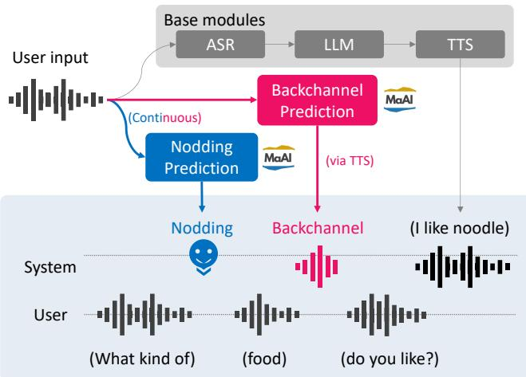
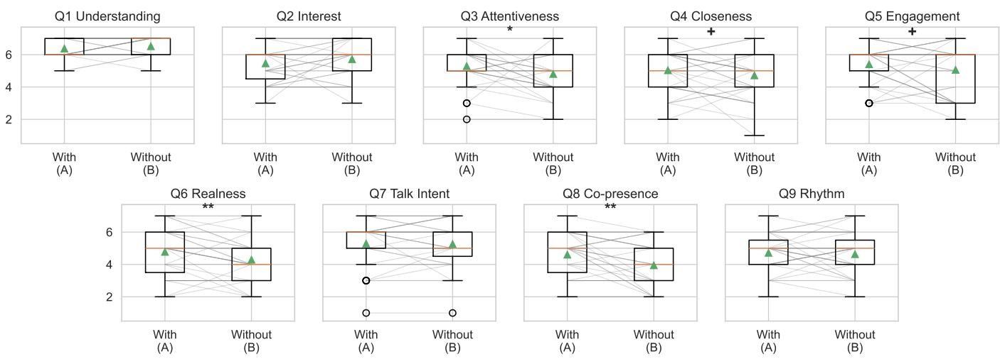
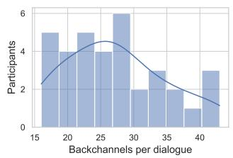
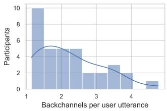
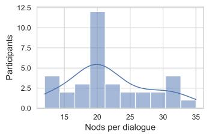
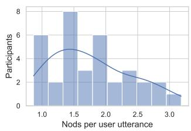
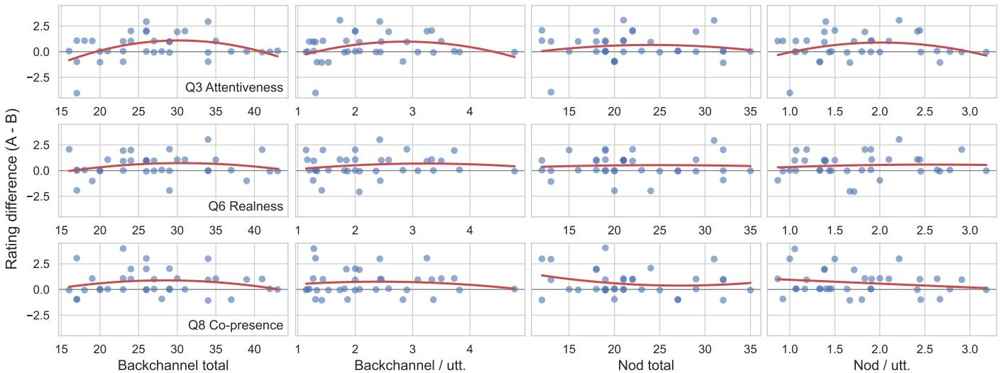

# Does Listening Mater? Backchanneling and Nodding in AI Clone

Koji Inoue   
inoue@sap.ist.i.kyoto-u.ac.jp   
Kyoto University   
Kyoto, Japan   
Tatsuya Kawahara   
kawahara@i.kyoto-u.ac.jp   
Kyoto University   
Kyoto, Japan

## Abstract

AI clones that imitate a specific person typically reproduce what the person says and how they sound, but not how they listen. We investigate whether adding multimodal listening behaviors gives such a clone more presence and authenticity. We integrated verbal backchannels and head nodding, driven by real-time prediction models, into an AI clone equipped with voice cloning and LLM based responses. In a within-subjects study (N=35), adding these behaviors significantly improved the perceived attentiveness of the avatar, the sense of talking with the real person, and the feeling of co-presence. These results indicate that AI clone fidelity should extend beyond voice and response content to include interactive listening behavior.

## Keywords

AI clone; backchannel; nodding; co-presence; listening behavior

## 1 Introduction

Recent advances in LLMs and speech synthesis have made it increasingly feasible to create AI clones that imitate specific individuals [15, 19, 20]. Prior work has explored persona agents and self-clones that reproduce a person’s personality, values, speaking style, and voice using prompts, background information, and zeroshot speech synthesis [2, 5, 12]. Recent full-duplex speech models further integrate role conditioning, voice control, and low-latency interaction [17], while work on migratable agents suggests that identity consistency across embodiments can afect trust, likability, and social presence [21]. Together, these studies show rapid progress in reproducing what a person says and how they sound, but leave underexplored how a cloned person behaves as a listener.

In human-human interaction, a person’s presence is conveyed not only through speaking but also through listening. Listeners provide brief verbal and nonverbal feedback, such as backchannels and nodding, to signal attention, understanding, and interest [13]. Prior work shows that AI agents’ backchanneling can function as active listening behavior that enhances user engagement [3, 9, 10], while nodding and responsive listener-head motion in virtual agents can improve perceived likability and trust [1, 4, 22]. These findings suggest that an AI clone’s authenticity may depend not only on what it says or how it sounds, but also on how it listens.

Kazushi Kato   
katou@sap.ist.i.kyoto-u.ac.jp   
Kyoto University   
Kyoto, Japan

Shunichi Kasahara kasahara@csl.sony.co.jp Sony Computer Science Laboratories Tokyo, Japan

  
Figure 1: (Left) Interface of AI-clone system (Right) A participant interacting with the AI clone on a tablet during the experiment

In this study, we integrate multimodal listening behaviors, namely verbal backchannels and head nodding, into an AI clone equipped with voice cloning and LLM-based response generation to investigate their efects. Specifically, backchannels are delivered as short audio cues during the user’s speech, while nodding is visually represented by the simple vertical movement of the avatar’s face image (Figure 1). We conducted an experiment comparing an AI clone with these listening behaviors against a baseline clone without them, evaluating their impact on the user’s sense of the original person’s presence and the perceived authenticity of the interaction. The contributions of this study are twofold: first, it expands the concept of AI clone fidelity beyond voice and response content to include interactive listening behaviors; second, it experimentally demonstrates that incorporating backchannels and simple nodding significantly enhances both the perceived sense of interacting with the original person and their overall sense of presence.

## 2 System

The AI clone system used consists of general pipeline modules that include an LLM, along with continuous backchannel and headnodding generation, as shown in Figure 2.

## 2.1 Base modules

To generate the system’s general utterances, the base modules of the system are ASR (automatic speech recognition), LLM, and

  
Figure 2: Overview of the system

TTS (text-to-speech synthesis), as utilized from the following cloud services [2]:

• ASR: Deepgram nova-21

• LLM: GPT-4.12

• TTS: Cartesia sonic-33, using a voice cloned from the original person

The system adopts a push-to-talk interface: the user presses and holds a button at the bottom of the screen, and the recorded speech is processed through the ASR→LLM→TTS pipeline upon release. The user’s utterances and system responses are displayed on the screen in a chat-style format (Figure 1). To reproduce the persona of the original person, a system prompt prepared in advance by the original person describing their speaking style, personal profile, and hobbies is passed to the LLM.

## 2.2 Backchannel and Nodding Generation

Unlike conventional rule-based approaches that rely on rigid acoustic thresholds or silence durations, our non-verbal response generation component employs state-of-the-art continuous prediction models based on Voice Activity Projection (VAP) [8, 11]. By continuously processing the user’s ongoing speech, these models dynamically capture subtle conversational dynamics to predict the optimal onset probabilities for backchannels and nodding. This approach is implemented using MaAI4, an open-source software specifically designed for continuous backchannel and nodding prediction, which enables highly natural, context-aware reaction timing evaluated at 10 Hz. To prevent unnatural repetition, a 3-second cooldown is applied after each triggered response. For verbal backchannels, several patterns of typical Japanese reactive tokens, such as “un” and “un-un”, were pre-generated using the same voice clone of the original person. When a backchannel is triggered, one of these audio clips is randomly selected and played back, ensuring identity consistency with the TTS module while maintaining conversational variety. Nodding is visually reproduced by vertically animating the avatar’s face image on the screen: a single nod is generated with a 70% probability and a double nod with a 30% probability.

## 3 Experiment

We conducted a user study to evaluate the efects of the AI clone’s backchanneling and nodding behaviors on users’ perceptions of the interaction.

## 3.1 Condition

A within-subjects experiment with two conditions: With-feedback (both verbal backchannels and head nodding enabled) and Withoutfeedback (both disabled) was applied. To mitigate order efects, participants experienced the two conditions in a counterbalanced AB/BA assignment. A total of 35 Japanese native speakers (undergraduate/graduate students) participated in the experiment. Participants received a 500 JPY bookstore gift card as compensation.

In each condition, participants had a dialogue with the AI clone about the first author’s research topics and hobbies. Before starting the experiment, we presented participants with a text-based demographic profile of the first author. The two dialogues were experienced independently, and participants completed a post-condition questionnaire after each dialogue. The experiment was administered by the second author, and the first author did not attend the sessions. The system was launched via a web browser on an Android tablet, which participants held and operated during the dialogue (Figure 1).

Subjective evaluation consisted of nine items rated on a 7-point Likert scale (1: strongly disagree, 7: strongly agree):

Q1 (Understanding) I was able to suficiently understand the content introduced by the avatar.

Q2 (Interest) Through the dialogue with the avatar, my interest in the introduced content increased.

Q3 (Attentiveness) I felt that the avatar talked to me attentively while receiving my reactions.

Q4 (Closeness) Through the dialogue, I felt familiarity and psychological closeness to the person on whom the avatar was modeled.

Q5 (Engagement) In the dialogue with the avatar, I felt motivated not only to listen but also to return my own opinions and impressions.

Q6 (Realness) I felt as if I were directly talking with the person on whom the avatar was modeled.

Q7 (Talk Intent) I wanted to actually talk with the person on whom the avatar was modeled.

Q8 (Co-presence) I felt a sense of co-presence, as if I were sharing the same space with the dialogue partner.

Q9 (Rhythm) The interaction timing was smooth, and the conversational rhythm felt comfortable.

In addition to the questionnaire, the system automatically logged each participant’s interaction behavior during the dialogue, namely the number of user utterances, their mean length, and the total dialogue duration. The system also logged the avatar’s backchannels and nodding behaviors as system-level logs.

  
Figure 3: Distribution of ratings for each item (Q1–Q9) under the With-feedback (A) and Without-feedback (B) conditions. Gray lines connect the two ratings of each participant, and triangles indicate the means. $( + p < . 1 0 , * p < . 0 5 , * * p < . 0 1$ , one-sided paired �-test)

Table 1: Interaction behavior measures as mean (SD)
<table><tr><td>Measure</td><td>With</td><td>Without</td><td>p</td></tr><tr><td>User behavior</td><td></td><td></td><td></td></tr><tr><td>User utterances</td><td>12.89 (2.52)</td><td>13.11 (2.13)</td><td>.516</td></tr><tr><td>Mean utterance length (s)</td><td>7.30 (2.91)</td><td>6.93 (3.15)</td><td>.195</td></tr><tr><td>Dialogue duration (min)</td><td>4.90 (0.25)</td><td>4.83 (0.19)</td><td>.300</td></tr><tr><td>System feedback behavior</td><td></td><td></td><td></td></tr><tr><td>Backchannels</td><td>27.29 (7.55)</td><td>一</td><td>一</td></tr><tr><td>Backchannels / utterance</td><td>2.25 (0.92)</td><td>一</td><td></td></tr><tr><td>Nods</td><td>21.83 (6.10)</td><td>1</td><td></td></tr><tr><td>Nods / utterance</td><td>1.76 (0.62)</td><td></td><td></td></tr></table>

## 3.2 Subjective Evaluation

The nine-item scale showed acceptable internal consistency (Cronbach’s $\alpha = . 7 7$ and .81 for the With-feedback and Without-feedback conditions, respectively). Figure 3 shows the distribution of ratings, together with the condition means and significance levels. The one-sided paired �-test results indicate that the With-feedback condition significantly outperformed the Without-feedback condition in Q3 Attentiveness (5.29 vs. 4.80, $\mathinner { p \mathopen { \left. \vert { 0 1 8 } \right) } }$ , Q6 Realness (4.77 vs. 4.29, $p \ : = \ : . 0 0 6 )$ , and Q8 Co-presence (4.60 vs. 3.94, $p = . 0 0 2 )$ . It also showed marginally significant improvements in Q4 Closeness $\left( \boldsymbol { p } = . 0 8 1 \right)$ and Q5 Engagement $( p \ : = \ : . 0 8 9 )$ , while the remaining items showed no significant advantage for the With-feedback condition. These results suggest that the AI clone’s backchanneling and nodding behaviors enhanced users’ perceptions of the avatar’s attentiveness, the realness of the interaction, and the sense of copresence [14], as well as fostering a greater sense of closeness and engagement with the avatar. We also verified that the AB/BA counterbalancing did not bias the outcome: an independent-samples comparison of the per-item score diferences (With-feedback − Without-feedback) between the two order groups revealed no significant order efect for any of the nine items (all $\mathinner { p \mathopen {  } \mathopen { \cdot } \mathclose \bgroup  1 \aftergroup \egroup ) }$ ).

  
Figure 4: Distribution across participants of the system’s listening feedback in the With-feedback condition: backchannels (top) and nods (bottom), as totals per dialogue (left) and per user utterance (right). Curves are kernel density estimates.

## 3.3 Interaction Behavior Analysis

Beyond the subjective ratings, we examined whether the listening behaviors changed the participants’ own conversational behavior (Table 1). The number of user utterances, the mean utterance length, and the dialogue duration did not difer significantly between the two conditions (paired �-tests, all $p > . 1 9 )$ . This suggests that the improvements in subjective evaluation reflect changes in the users’ perception of the interaction rather than changes in their own overt dialogue behavior. On average, the system produced 27.3 backchannels and 21.8 nods per dialogue in the With-feedback condition; Figure 4 shows how these counts were distributed across participants, both as totals per dialogue and normalized per user utterance.

  
Figure 5: Per-participant rating gain (With-feedback − Without-feedback) as a function of the amount of the system’s feedback (backchannels and nods, as total count and per-user-utterance rate) for the three items with a significant condition diference (Q3, Q6, Q8). Red curves are quadratic fits; the horizontal line marks zero gain.

As an exploratory analysis, we investigated how the amount and frequency of system feedback shaped the subjective ratings. Motivated by prior works on the optimal amount of non-verbal behaviors [16, 18], we fitted a quadratic regression to the rating gains (With-feedback − Without-feedback) for Q3, Q6, and Q8 (Fig ure 5). While the addition of feedback generally improved ratings, simply providing more was not necessarily better. Specifically, Attentiveness (Q3) showed a significant inverted-U relationship with the number of backchannels (quadratic term � = .009), peaking at an intermediate amount. Other items and nodding showed no significant curvilinear trends.

These results suggest that the optimal amount of listening feedback is not uniform. In the context of AI clones, this highlights a crucial future direction: developing adaptive models that optimize listening behaviors by balancing the original person’s authentic listening style with the specific interacting user’s dynamics.

## 4 Conclusion

As a late-breaking result, we showed that adding verbal backchannels and head nodding to an AI clone increases the perceived attentiveness of the avatar, the sense of talking with the real person, and the feeling of co-presence. This indicates that the fidelity of an AI clone is shaped not only by its voice and response content but also by how it listens.

Given these preliminary results, several directions remain for fu ture work. First, we plan to build personalized models of backchanneling and nodding so that an AI clone reproduces the target per son’s own listening style, rather than a generic one. Second, the present study cloned a single person; we will evaluate the approach across multiple target individuals to test its generality [2]. Third, we enabled backchannels and nodding together, so future experiments should decompose the two modalities to clarify their individual contributions. Lastly, since the current experiment was carried out with Japanese subjects, the similar trend needs to be confirmed in other languages and cultures, using multi-lingual models [6, 7].

## Safe and Responsible Innovation Statement

Our AI clones raise risks of impersonation and deception, which are amplified by the increased realness of listening behaviors. We mitigate these by cloning only a consenting individual (the first author) strictly for this study and explicitly informing participants they are interacting with an AI. Participant data was consensually collected and anonymized. Responsible deployment requires the cloned person’s explicit consent, transparent disclosure to users, and robust safeguards against misuse.

## Acknowledgments

This work was supported by JST PRESTO (JPMJPR24I4, JPMJPR23I4), JST BOOST (JPMJBY24A7), and JST Moonshot R&D (JPMJPS2011).

## References

[1] Nadine Aburumman, Marco Gillies, Jamie A Ward, and Antonia F de C Hamilton. 2022. Nonverbal communication in virtual reality: Nodding as a social signal in virtual interactions. International Journal ofHuman-Computer Studies 164 (2022), 102819.

[2] Shuntaro Aoyama, Kiyoshi Suganuma, He Jiang, and Shunichi Kasahara. 2026. Designing a Feedback Loop Between a Human and Their AI Clones for Science Communication in Museums. In Conversational User Interfaces (CUI).

[3] Mehdi Arjmand, Farnaz Nouraei, Ian Steenstra, and Timothy Bickmore. 2024. Empathic grounding: Explorations using multimodal interaction and large language models with conversational agents. In International Conference on Intelligent Virtual Agents (IVA). 1–10.

[4] Justine Cassell and Kristinn R Thorisson. 1999. The power of a nod and a glance: Envelope vs. emotional feedback in animated conversational agents. Applied Artificial Intelligence 13, 4-5 (1999), 519–538.

[5] Sanyuan Chen, Chengyi Wang, Yu Wu, Ziqiang Zhang, Long Zhou, Shujie Liu, Zhuo Chen, Yanqing Liu, Huaming Wang, Jinyu Li, et al. 2025. Neural codec language models are zero-shot text to speech synthesizers. IEEE Transactions on Audio, Speech and Language Processing 33 (2025), 705–718.

[6] Koji Inoue, Mikey Elmers, Yahui Fu, Zi Haur Pang, Taiga Mori, Divesh Lala, Keiko Ochi, and Tatsuya Kawahara. 2026. Multilingual and Continuous Backchannel

Prediction: A Cross-lingual Study. In International Workshop on Spoken Dialogue System Technology (IWSDS). 222–230.

[7] Koji Inoue, Bing’er Jiang, Erik Ekstedt, Tatsuya Kawahara, and Gabriel Skantze. 2024. Multilingual turn-taking prediction using voice activity projection. In Joint International Conference on Computational Linguistics, Language Resources and Evaluation (LREC-COLING). 11873–11883.

[8] Koji Inoue, Divesh Lala, Gabriel Skantze, and Tatsuya Kawahara. 2025. Yeah, Un, Oh: Continuous and Real-time Backchannel Prediction with Fine-tuning of Voice Activity Projection. In Conference ofthe Nations ofthe Americas Chapter ofthe Association for Computational Linguistics: Human Language Technologies (NAACL). 7171–7181.

[9] Jin Yea Jang, Saim Shin, and Gahgene Gweon. 2024. Minimal yet big impact: How AI agent back-channeling enhances conversational engagement through conversation persistence and context richness. In Findings of Empirical Methods in Natural Language Processing (EMNLP). 14509–14521.

[10] Zhihan Jiang, Qianhui Chen, Chu Zhang, Yanheng Li, and RAY Lc. 2026. Hear you in silence: Designing for active listening in human interaction with conversational agents using context-aware pacing. In CHI Conference on Human Factors in Computing Systems (CHI). 1–29.

[11] Kazushi Kato, Koji Inoue, Divesh Lala, Keiko Ochi, and Tatsuya Kawahara. 2025. Real-time Generation ofVarious Types ofNodding for Avatar Attentive Listening System. In International Conference on Multimodal Interaction (ICMI). 209–217.

[12] Donggun Lee, Suyoun Lee, Hyunseung Lim, and Hwajung Hong. 2025. Creating text-based AI clones of myself: Exploring perceptions, development strategies, and challenges. International Journal ofHuman-Computer Studies (2025), 103692.

[13] Ting-En Lin, Yuchuan Wu, Fei Huang, Luo Si, Jian Sun, and Yongbin Li. 2022. Duplex conversation: Towards human-like interaction in spoken dialogue systems. In SIGKDD Conference on Knowledge Discovery and Data Mining (KDD). 3299–3308.

[14] Catherine S Oh, Jeremy N Bailenson, and Gregory F Welch. 2018. A systematic review of social presence: Definition, antecedents, and implications. Frontiers in

Robotics and AI 5 (2018), 114.

[15] Minju Park, Seunghyun Lee, Juhwan Ma, and Dongwook Yoon. 2026. AI Twin: Enhancing ESL Speaking Practice through AI Self-Clones of a Better Me. In CHI Conference on Human Factors in Computing Systems (CHI). 1–21.

[16] Ronald Poppe, Khiet P Truong, and Dirk Heylen. 2011. Backchannels: Quantity, type and timing matters. In International Conference on Intelligent Virtual Agents (IVA). 228–239.

[17] Rajarshi Roy, Jonathan Raiman, Sang-gil Lee, Teodor-Dumitru Ene, Robert Kirby, Sungwon Kim, Jaehyeon Kim, and Bryan Catanzaro. 2026. PersonaPlex: Voice and Role Control for Full Duplex Conversational Speech Models. arXiv preprint arXiv:2602.06053 (2026).

[18] Sarah Sebo, Ling Liang Dong, Nicholas Chang, Michal Lewkowicz, Michael Schutzman, and Brian Scassellati. 2020. The influence of robot verbal support on human team members: Encouraging outgroup contributions and suppressing ingroup supportive behavior. Frontiers in Psychology 11 (2020), 590181.

[19] Mehrnoosh Sadat Shirvani, Jackie Crowley, Cher Peng, Jackie Liu, Thomas Chao, Suky Martinez, Laura Brandt, Ig-Jae Kim, and Dongwook Yoon. 2026. Cloning the Self for Mental Well-Being: A Framework for Designing Safe and Therapeutic Self-Clone Chatbots. In CHI Conference on Human Factors in Computing Systems (CHI). 1–20.

[20] Mehrnoosh Sadat Shirvani, Jackie Liu, Thomas Chao, Suky Martinez, Laura Brandt, Ig-Jae Kim, and Dongwook Yoon. 2025. Talking to an AI Mirror: Designing Self-Clone Chatbots for Enhanced Engagement in Digital Mental Health Support. arXiv preprint arXiv:2509.06393 (2025).

[21] Ravi Tejwani, Felipe Moreno, Sooyeon Jeong, Hae Won Park, and Cynthia Breazeal. 2020. Migratable AI: Efect of identity and information migration on users’ perception of conversational AI agents. In International Conference on Robot and Human Interactive Communication (RO-MAN). 877–884.

[22] Mohan Zhou, Yalong Bai, Wei Zhang, Ting Yao, Tiejun Zhao, and Tao Mei. 2022. Responsive listening head generation: A benchmark dataset and baseline. In European conference on computer vision (ECCV). 124–142.