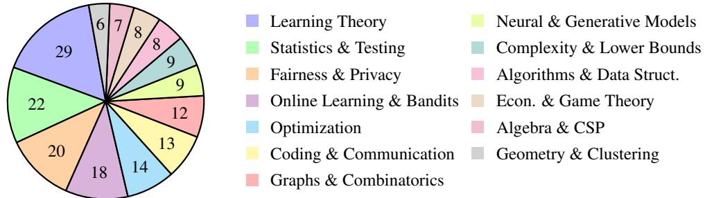
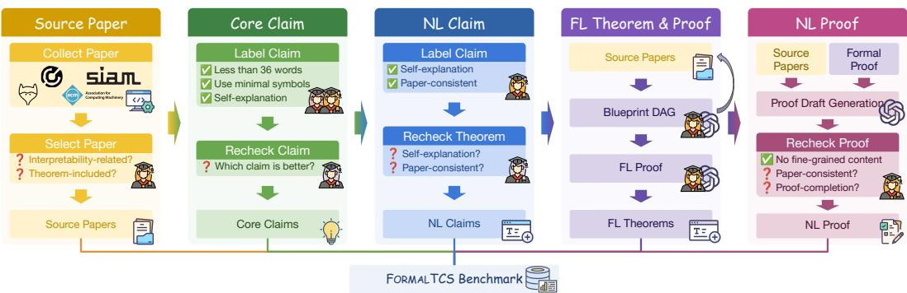
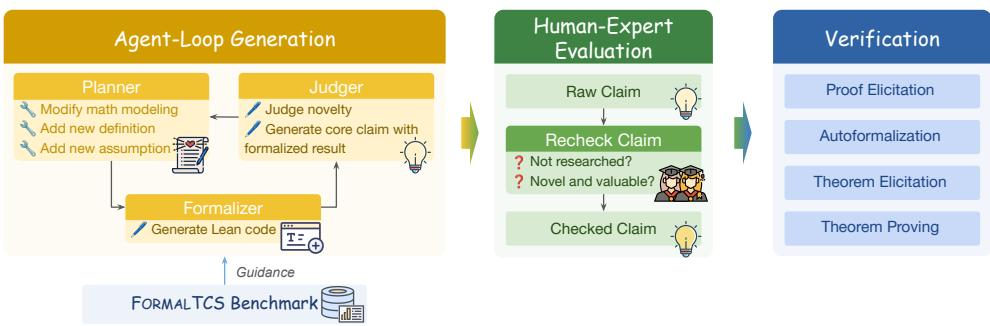
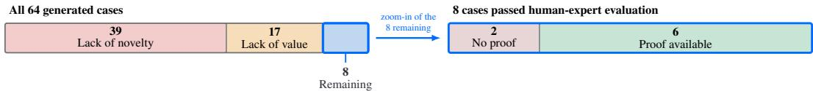
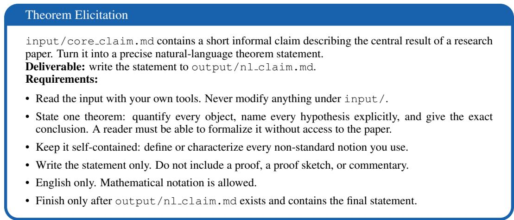
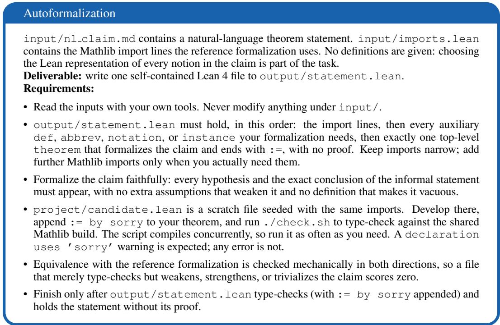
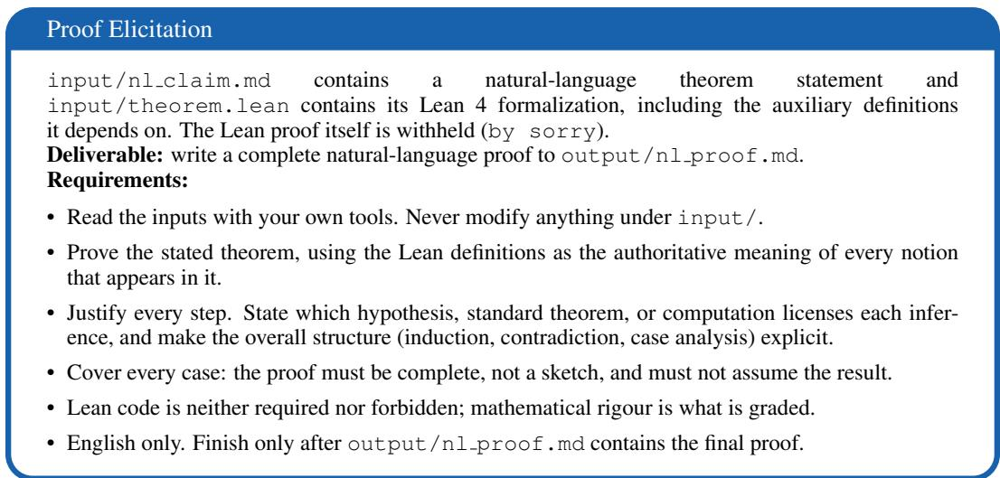
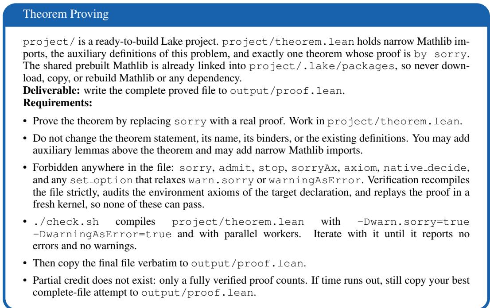

# FORMALTCS: BENCHMARKING END-TO-END FRON-TIER FORMAL THEORETICAL COMPUTER SCIENCE RESEARCH OF LARGE LANGUAGE MODELS

Dingzirui Wang Xuanliang Zhang Keyan Xu Qingfu Zhu Wanxiang Che Harbin Institute of Technology

{dzrwang,xuanliangzhang,kyxu,qfzhu,car}@ir.hit.edu.cn

## ABSTRACT

Large language models (LLMs) have shown growing potential for automated theoretical computer science (TCS) research, yet existing benchmarks remain far from realistic research settings. We introduce FORMALTCS, an expert-validated benchmark for evaluating LLMs on frontier, end-to-end TCS research. FORMALTCS contains 175 instances drawn from papers accepted to STOC, FOCS, SODA, and COLT in 2025-2026, preserving paper-specific definitions, assumptions, and proof dependencies, with expert-verified Lean formalizations and proofs. Evaluations of leading LLMs reveal that current models remain far from reliably completing the full research pipeline. In particular, autoformalization is the sharpest bottleneck: the best model achieves only 11.5 on translating natural-language claims into formal theorem statements, compared with 28.6 Pass@8 when proving humanprovided formal statements. Building on FORMALTCS, we further develop an automated TCS research framework that generates, formalizes, filters, and proves new claims. Of 64 generated claims, only 6 ultimately pass expert evaluation and proof verification, indicating that beyond formalization, limited research taste remains another major barrier to autonomous TCS research1.

## 1 INTRODUCTION

Theoretical computer science (TCS) studies the fundamental principles of computation through mathematical methods, including models of computation, algorithms, computational complexity, and the limits of computability (van Leeuwen, 1990; Wigderson, 2019). TCS is an important research topic as it provides the theoretical foundation for understanding which problems can be computed and how efficiently they can be solved. Given the fundamental importance of TCS and the increasingly strong autonomous research capabilities demonstrated by large language models (LLMs) (Chen et al., 2025), a growing body of work has begun to investigate how well LLMs can perform TCS-related research tasks. For example, LCS-Bench (Feng et al., 2026b) constructs a benchmark from TCS knowledge extracted from textbooks, while TCS-Bench (Cohen-Addad et al., 2026) evaluates the ability of LLMs to generate proofs of TCS theorems from natural-language statements.

However, existing TCS benchmarks still exhibit a substantial gap from real-world TCS research: (i) Incomplete research pipeline. Existing benchmarks primarily evaluate isolated capabilities such as autoformalization or proof generation. They do not provide an end-to-end evaluation of whether LLMs can conduct TCS research from scratch, making it difficult to identify where current models fail throughout the research process. (ii) Outdated content. Existing benchmarks are largely constructed from textbook material or theorems already available in libraries such as Mathlib (Moura & Ullrich, 2021). As a result, they provide limited insight into an LLM’s ability to reason about frontier TCS research and may also suffer from contamination when benchmark theorems or closely related material have appeared in the model’s training data. (iii) Simplified problem settings. Existing benchmarks typically focus on relatively self-contained theorems with complete and explicit definitions. In contrast, real TCS papers involve paper-specific definitions and assumptions, as well as multi-layered dependencies among lemmas and theorems. Existing benchmarks, therefore, fall short of measuring whether LLMs can solve complex, research-level TCS problems in realistic set tings.

<table><tr><td>Finding</td><td>Evidence</td></tr><tr><td>Current LLMs remain far from TCS research end-to-end</td><td>§4.2.1</td></tr><tr><td>Generating formal definitions and theorem statements is the sharpest bottleneck of FORMALTCS</td><td>§4.2.3</td></tr><tr><td>Current LLMs struggle to generate novel and valuable claims of TCS</td><td>§5</td></tr></table>

Table 1: The main findings revealed by FORMALTCS.

To bridge these gaps, we introduce FORMALTCS, a benchmark designed to provide a more realistic evaluation of LLMs’ ability to engage with frontier TCS research. With assistance from GPT-5.6-sol (OpenAI, 2026), we employ five human experts to collect and annotate examples from papers accepted by top conferences in TCS. Compared with existing benchmarks, FOR-MALTCS provides a more faithful evaluation of TCS research capabilities in three respects: (i) End-to-end evaluation. FORMALTCS decomposes the TCS research pipeline into five stages and evaluates, step by step, an LLM’s ability to transform a natural-language TCS core claim into a corresponding rigorous Lean proof. This design enables a fine-grained diagnosis of the capabilities and bottlenecks of LLMs throughout the TCS research process. (ii) Frontier research content. FORMALTCS is constructed from papers accepted to FOCS, STOC, SODA, and COLT in 2025 and 2026. We additionally filter the source papers based on whether they are likely to have been previously exposed to the evaluated LLMs, thereby maintaining the timeliness of the benchmark while reducing the risk of data contamination. (iii) Realistic research problems. FORMALTCS evaluates core theoretical problems drawn directly from real TCS papers while preserving their paper-specific definitions, assumptions, and proof dependencies. It therefore more accurately measures the ability of LLMs to reason about and prove research-level TCS results.

We evaluate a range of leading LLMs on FORMALTCS, with the findings summarized in Table 1. Overall, current state-of-the-art models still struggle to perform end-to-end TCS research effectively, highlighting the need for further advances in LLM-based TCS reasoning and demonstrating the necessity of FORMALTCS. In particular, we find that the primary bottleneck lies in translating a natural-language core claim into appropriate formal definitions and theorem statements, where the current most advanced LLMs can only achieve the performance of 10%. This suggests that the mathematical modeling capabilities of current LLMs remain a major limitation for TCS research. In addition, building on FORMALTCS, we develop an end-to-end TCS research framework that supports the complete pipeline from proposing a TCS core claim to producing a rigorous Lean proof. Our experiments show that existing LLMs are able to produce rigorous proofs for the core claims they propose themselves. However, human inspection reveals that most of these proposed claims exhibit limited novelty, suggesting that the research taste of current models in TCS remains underdeveloped.

Our contributions can be summarized as follows:

1. We introduce FORMALTCS, a benchmark based on real research problems for evaluating the end-to-end capabilities of LLMs in frontier TCS research.

2. Our experiments reveal that a key bottleneck for current LLMs is translating natural-language core claims into appropriate formal definitions and theorem statements, indicating that mathematical modeling remains a major weakness of current LLMs.

3. Building on FORMALTCS, we develop an end-to-end LLM research framework for TCS and find that, although current models can often prove claims of their own construction, their ability to formulate novel and meaningful research claims, i.e., their research taste, remains limited.

  
Figure 1: The distribution of research areas covered by FORMALTCS.

Table 2: Data fields of FORMALTCS.
<table><tr><td>Category</td><td>Name</td><td>Type</td><td>Meaning</td></tr><tr><td rowspan="5">Metainfo</td><td>id</td><td>string</td><td>Data id.</td></tr><tr><td>conference</td><td>string</td><td>Conference of the accepted paper.</td></tr><tr><td>year</td><td>int</td><td>Accepted year of the paper.</td></tr><tr><td>paper</td><td>string</td><td>Name of the paper.</td></tr><tr><td>core_label</td><td>string</td><td>Label in the paper of claim used.</td></tr><tr><td rowspan="3">Natural Language</td><td>core_claim</td><td>string</td><td>Core finding of core_label claim.</td></tr><tr><td>nl_claim</td><td>string</td><td>Full statement of core_label claim.</td></tr><tr><td>nl-proof</td><td>string</td><td>Proof sketch of core_label claim.</td></tr><tr><td rowspan="2">Formal Language</td><td>fl_theorem</td><td>Lean file</td><td>Theorem to be proved of core_label claim.</td></tr><tr><td>fl-proof</td><td>Lean project</td><td>Full Lean-format proof of core_label claim.</td></tr></table>

## 2 INTRODUCTION OF FORMALTCS

## 2.1 OVERALL STATISTICS

FORMALTCS is an expert-validated benchmark designed to evaluate the end-to-end capabilities of LLMs in frontier TCS research. It consists of 175 instances, each derived from a distinct research paper, covering 175 papers in total. We use Lean 4.32.2 (Moura & Ullrich, 2021) together with the corresponding version of Mathlib, which is the latest version available at the time of annotation. We ensure the quality of FORMALTCS along the following dimensions: (i) High difficulty. Across all instances, the expert-validated Lean proofs contain an average of 22.0 statements and 29.6 nodes, indicating that the benchmark involves substantial formalization and proof complexity. (ii) High diversity. As shown in Figure 1, FORMALTCS spans 13 major research areas in TCS. This broad coverage enables the benchmark to evaluate LLM research capabilities across a diverse range of TCS problems.

## 2.2 DATA FORMAT

The data format of FORMALTCS is summarized in Table 2. Each instance contains information corresponding to the different stages of the end-to-end TCS research pipeline, enabling us to diagnose the capabilities and bottlenecks of current LLMs at each stage of the research process. Importantly, every instance is accompanied by a rigorous Lean proof that has been manually verified by experts. This expert validation ensures the correctness and reliability of the formalization and, consequently, the overall quality of FORMALTCS. We provide representative cases from FORMALTCS in Appendix C.

  
Figure 2: The annotation pipeline of FORMALTCS.

## 3 ANNOTATION OF FORMALTCS

This section describes the annotation pipeline used to construct FORMALTCS, as illustrated in Figure 2. Five human experts participate in the annotation process. Each annotator has published multiple papers at top-tier TCS conferences and has substantial research experience in the field. Given the considerable difficulty of formalizing proofs from the selected papers, we employ LLM assistance to reduce annotation costs while maintaining data quality using GPT-5.6-SOL alongside CODEX. The prompts used during annotation are provided in Appendix B.1, while Appendix A reports information about the annotators and additional annotation details. Although LLMs are used as assistive tools, all final annotations are manually inspected and revised when necessary to ensure semantic faithfulness, type correctness, and concise formulations rather than preserving stylistic artifacts introduced by the models. Additional results on inter-annotator agreement and human verification pass rates are provided in Appendix E.

## 3.1 SOURCE PAPER

Our source-paper pool consists of papers accepted to STOC, FOCS, SODA, and COLT in 2025 and 2026. This selection is intended to ensure a high level of research quality while reducing the likelihood of benchmark contamination. We first use automated scripts to scan all accepted papers and perform an initial filtering step to identify works that appear to study TCS problems. Human experts then manually inspect every candidate paper to verify its relevance and determine whether it contains a suitable core result together with a rigorous proof of that result. In addition, we conduct a black-box audit to assess whether the retained papers may have been exposed during model training. Specifically, we query GPT-5.6-SOL and CLAUDE-OPUS-5 without providing retrieval access or paper metadata. The inputs consist of partial theorem statements, initial fragments of proofs, and anonymized descriptions of paper results, and the models are asked to reconstruct the missing content. We find that the completion similarity of both models is below 9.6%, suggesting a relatively low risk of contamination for the selected data. The detailed black-box audit is discussed in Appendix G.

## 3.2 CORE CLAIM

For each retained paper, human experts produce a concise summary of one of its central theoretical results. The summary must contain fewer than 36 words and should avoid mathematical notation whenever it is not necessary, so that the resulting claim is both compact and understandable without additional context. When multiple claims from the same paper could reasonably serve as the core claim, annotators select the one that best represents the paper’s central contribution. This criterion reflects the primary objective of FORMALTCS, which is to evaluate whether an LLM can recover the relevant theorem and its proof from a given core claim, rather than whether the model can identify which result in a paper is the most important. For each paper, two experts independently write candidate core claims. A third expert then compares the two candidates and selects the stronger formulation as the final annotation.

## 3.3 NATURAL LANGUAGE CLAIM

We next construct a natural-language claim corresponding to the theorem in the source paper associated with the selected core claim. If the original theorem is already understandable independently of the surrounding paper, where its statement contains all necessary assumptions and definitions, we directly retain the theorem statement as its informal version. If the theorem depends on definitions or assumptions introduced elsewhere in the paper, a human expert collects the missing information and rewrites the theorem into a self-contained statement while avoiding unnecessary verbosity. Each rewritten theorem is subsequently reviewed by another expert to verify that it is self-contained and that its assumptions and definitions remain faithful to those in the source paper.

## 3.4 FORMAL LANGUAGE THEOREM AND PROOF

In this step, we construct the formal theorem to be proved and its corresponding Lean proof for each instance, providing a reliable basis for evaluating the TCS proof capabilities of LLMs. Following previous works (Khrulev, 2026; Zhang et al., 2026), we first use the LLM, together with the source paper content, to generate a proof-blueprint DAG for the selected core claim. Human experts then verify that the resulting blueprint faithfully follows the proof structure of the original paper and that the statement associated with each node is consistent with its corresponding result in the source paper. We subsequently invoke the LLM to prove the nodes in the DAG one by one according to their dependency order based on the original paper. After each node is proved, a human expert checks that the Lean proof is rigorous and faithful to the corresponding argument in the original paper and verifies that no proof-bypassing constructs, such as sorry or additional axioms, are used. Once the complete Lean proof has been constructed, another human expert performs an independent endto-end review and fixes any remaining issues. The resulting verified artifact is used as the final formal-language proof. Finally, we extract from this proof the target theorem together with the definition closure required to state it and replace the proof body of the target theorem with sorry. The resulting artifact constitutes the formal-language theorem provided to the model as the proofgeneration task.

## 3.5 NATURAL LANGUAGE PROOF

Our preliminary experiments during benchmark construction indicate that current LLMs often struggle to generate rigorous proofs directly from formal-language theorem statements. We therefore additionally annotate a natural-language proof sketch, allowing us to diagnose model limitations at a finer level of granularity. Each sketch summarizes the main proof ideas used in the source paper, enabling us to evaluate whether an LLM can identify an appropriate high-level proof strategy before carrying out the formal derivation. To obtain an initial draft, we provide the LLM with both the verified formal proof described above and the original paper, and ask it to generate a natural language proof sketch. A human expert then checks whether the generated sketch is faithful to the proof strategy in the source paper and whether its reasoning is sufficiently complete. Finally, unnecessary low-level derivations and details are removed so that the resulting sketch remains concise while faithfully capturing the overall argument.

## 4 EXPERIMENT

In this section, we evaluate a diverse set of mainstream LLMs on FORMALTCS to investigate the extent to which current models are capable of conducting TCS research. Rather than treating aggregate benchmark performance as the sole measure of success, we focus on the capabilities required at each stage of the research pipeline and the corresponding failure modes revealed by FORMALTCS. This stage-wise evaluation provides a more fine-grained view of where current LLMs perform well in the TCS research workflow and where substantial challenges remain. All prompts used in our experiments are provided in Appendix B.2.

## 4.1 EXPERIMENT SETUP

Models Given the substantial difficulty of theoretical reasoning tasks, we evaluate three representative families of mainstream LLMs, including GPT (OpenAI, 2026), CLAUDE (Anthropic, 2026), and DEEPSEEK (DeepSeek-AI, 2026), using their corresponding harnesses. The selected models span different model scales, allowing us to investigate the relationship between model scale and TCS research performance. This diverse model selection is intended to provide a more comprehensive characterization of the strengths and limitations of current LLMs. Detailed model snapshots and harness versions are provided in Appendix D.

Table 3: Tasks in FORMALTCS.
<table><tr><td>Task</td><td>Input</td><td>Output</td></tr><tr><td>Theorem Elicitation (CC2NC)</td><td>Core Claim</td><td>NL Claim</td></tr><tr><td>Autoformalization (NC2FT)</td><td>NL Claim</td><td>FL Theorem</td></tr><tr><td>Proof Elicitation (C2NP)</td><td>NL Claim, FL Theorem</td><td>NL Proof</td></tr><tr><td>Theorem Proving (FT2FP)</td><td>FL Theorem</td><td>FL Proof</td></tr></table>

Task FORMALTCS consists of four tasks that jointly cover the process from understanding a core claim to constructing a machine-verifiable formal proof. Table 3 provides detailed definitions of the four tasks. To evaluate each stage independently, we provide human-annotated inputs for every task rather than using predictions from the preceding stage as inputs. This design prevents errors introduced early in the pipeline from propagating to subsequent tasks, thereby allowing us to identify the sources of performance degradation more precisely. The results reported in Table 4 further motivate this stage-wise evaluation, as current LLMs remain unable to reliably complete the entire TCS research pipeline in an end-to-end manner.

Metrics We adopt task-specific evaluation metrics to measure different aspects of capabilities:

• LLM-Rubric (Ma et al., 2026) (CC2NC, C2NP): We adopt an LLM-based rubric to evaluate the semantic consistency between model predictions and reference answers. Each response receives four scores normalized to the [0, 1] range, corresponding to logical validity $\left( { { s } _ { \mathrm { l o g i c } } } \right)$ , completeness $( s _ { \mathrm { c o m p l e t e } } )$ , correctness $( s _ { \mathrm { c o r r e c t } } )$ , and clarity $( s _ { \mathrm { c l e a r } } )$ . These dimensions are aggregated using the following weighted score: $\mathrm { S c o r e } = 0 . 4 s _ { \mathrm { l o g i c } } + 0 . 3 s _ { \mathrm { c o m p l e t e } } + 0 . 2 s _ { \mathrm { c o r r e c t } } + 0 . 1 s _ { \mathrm { c l e a r } } .$ . To reduce potential evaluation bias, we use QWEN3.8-MAX with QODERCLI (Qwen Team, 2026) as the rubric evaluator, which is distinct from all models evaluated in our main experiments. We additionally examine the rubric agreement between LLM-based and human evaluations in Appendix F.

• BEq+ (Poiroux et al., 2025) (NC2FT): For the autoformalization task, we adopt BEq+, which determines whether a generated Lean theorem statement is equivalent to the reference statement through bidirectional theorem proving. Given a reference theorem tr and a generated candidate theorem $t _ { c } ,$ the metric attempts to prove both $t _ { r } \Rightarrow t _ { c }$ and $t _ { c } \Rightarrow t _ { r }$ in Lean. Unlike evaluation methods based on LLM judges, this procedure relies on deterministic symbolic proof search. A candidate theorem is considered equivalent to the reference theorem only if proofs in both directions are successfully constructed.

• Pass@k (Dong et al., 2024) (FT2FP): For the theorem-proving task, we use Pass@k, which measures the proportion of instances for which at least one of the k sampled proofs is accepted by the Lean compiler. The metric therefore reflects the probability that the model produces at least one syntactically valid and formally verified proof across multiple generation attempts. To prevent models from bypassing the proof obligation, our automated verification environment enables set option warningAsError true so that the use of sorry results in an error. We additionally use a custom linter or invoke #print axioms on the target theorem with an explicit whitelist of permitted axioms, thereby preventing models from circumventing proof construction through sorry, custom axiom declarations, or similar mechanisms.

Generation Parameters Following the experimental settings of prior work on formal reasoning (Ren et al., 2025; Lin et al., 2025), we generate 8 candidate outputs for each instance in the NC2FT and FT2FP tasks to balance evaluation cost and reliability while using a single generation for CC2NC and C2NP. We adopt different generation settings because Lean outputs admit reliable automatic verification, allowing us to sample multiple formal candidates and evaluate them objectively using symbolic verification. In contrast, natural-language responses lack an equally reliable automatic verifier, making single-sample evaluation more appropriate for these tasks. For tasks requiring multiple generations, we use a temperature of 0.6 and set top p to 0.9. For single-generation experiments, we use deterministic decoding with a temperature of 0.0 and top p of 1.0.

Table 4: Performance of mainstream LLMs and their corresponding harnesses on FORMALTCS. The best performance on each task is marked in bold.
<table><tr><td>Model</td><td>Harness</td><td>Scale</td><td>CC2NC</td><td>NC2FT</td><td>C2NP</td><td>FT2FP</td></tr><tr><td rowspan="3">GPT-5.6</td><td rowspan="3">CODEX</td><td>LUNA</td><td>56.4</td><td>2.9</td><td>61.2</td><td>13.7</td></tr><tr><td>TERRA</td><td>60.7</td><td>5.5</td><td>64.0</td><td>18.5</td></tr><tr><td>SOL</td><td>67.4</td><td>10.6</td><td>67.9</td><td>26.9</td></tr><tr><td rowspan="3">CLAUDE</td><td rowspan="3">CLAUDE CODE</td><td>HAIKU-4.5</td><td>48.7</td><td>1.8</td><td>55.3</td><td>7.4</td></tr><tr><td>SONNET-5</td><td>63.0</td><td>8.8</td><td>65.7</td><td>24.0</td></tr><tr><td>OPUS-5</td><td>66.9</td><td>11.5</td><td>68.7</td><td>28.6</td></tr><tr><td>DEEPSEEK-V4</td><td>DEEPSEEK HARNESS</td><td>FLASH PRO</td><td>55.6 58.8</td><td>7.2 8.3</td><td>61.7 63.8</td><td>17.6 21.1</td></tr></table>

## 4.2 EXPERIMENTAL RESULTS

Table 4 reports the performance of all evaluated models on FORMALTCS. Overall, CLAUDE-OPUS-5 achieves the best performance on most tasks, indicating the strongest TCS research capability among the evaluated models. Beyond the overall comparison, the results reveal several important findings about the capabilities and limitations of current LLMs.

## 4.2.1 FINDING 1: CURRENT LLMS STRUGGLE WITH END-TO-END TCS RESEARCH

Our results show that even the strongest current models remain limited when completing the full TCS research pipeline. For example, the best-performing model, CLAUDE-OPUS-5, achieves scores of 66.9 and 68.7 on natural-language claim understanding (CC2NC) and proof-strategy generation (C2NP), respectively. However, substantial bottlenecks remain in the formal stages of the pipeline, with its final formal proof generation performance (FT2FP) reaching only 28.6 Pass@8. These results suggest that, although current LLMs exhibit meaningful theoretical reasoning capabilities, they still struggle to reliably complete the end-to-end TCS research process from a high-level research claim to a machine-verifiable formal proof.

## 4.2.2 FINDING 2: FORMALIZATION TASKS ARE SUBSTANTIALLY MORE DIFFICULT THAN NATURAL-LANGUAGE TASKS

The results show that LLMs perform substantially better on natural-language tasks than on formalization tasks. For example, CLAUDE-OPUS-5 achieves 68.7 on C2NP, whereas its performance on the corresponding theorem formalization task (NC2FT) is only 11.5. Similarly, GPT-5.6-SOL achieves 67.9 on C2NP but only 10.6 on NC2FT. This substantial performance gap suggests that current LLMs can understand and articulate high-level theoretical ideas considerably better than they can translate those ideas into rigorous formal representations.

## 4.2.3 FINDING 3: AUTOFORMALIZATION IS THE PRIMARY BOTTLENECK FOR LLM-BASED TCS RESEARCH

Across the entire pipeline, NC2FT is the lowest-performing stage, with no evaluated model exceeding 11.5. In contrast, when provided with a human-annotated formal theorem statement, models achieve up to 28.6 Pass@8 on the subsequent formal proof generation task (FT2FP). This result suggests that the primary difficulty for current models is not merely generating Lean proofs. Rather, the more fundamental challenge lies in correctly identifying the mathematical objects, assumptions, and logical structure underlying a natural-language claim and translating them into appropriate formal definitions and theorem statements. Improving autoformalization capabilities is therefore a key direction toward enabling LLMs to conduct automated end-to-end TCS research.

## 5 END-TO-END AUTOMATED TCS RESEARCH WITH FORMALTCS

Although FORMALTCS primarily focuses on evaluating theoretical reasoning capabilities rather than the quality of newly proposed research ideas, generating meaningful TCS core claims remains an essential component of a fully automated research pipeline. Directly evaluating such claims is challenging since determining whether a research idea is genuinely useful remains an open problem and lacks reliable evaluation metrics (Si et al., 2025; 2026). To investigate this capability, we develop a multi-agent framework in this section that enables LLMs to propose candidate claims, translate them into formal statements, and automatically filter them before human evaluation. In contrast to §4, which primarily evaluates the bottlenecks of current LLMs in TCS research, this section investigates whether current LLMs, when guided by FORMALTCS, can autonomously discover valuable TCS claims and produce correct end-to-end proofs for them. The overall system is illustrated in Figure 3 and the prompts used in this section are provided in Appendix B.3.

  
Figure 3: Our end-to-end TCS research pipeline using LLMs based on FORMALTCS.

## 5.1 FRAMEWORK DESIGN

## 5.1.1 AGENT-LOOP GENERATION

Our framework is inspired by the iterative nature of real-world TCS research. Researchers typically do not commit to a fixed problem formulation from the outset. Instead, they repeatedly revise assumptions, definitions, modeling choices, and proof directions until they identify a result worth pursuing. We simulate this iterative process using three agents: a planner, a formalizer, and a judger.

Planner. Based on the content of FORMALTCS and the derivations accumulated so far, the planner proposes a new research objective. The objective is not restricted to extending the current line of reasoning. The planner may reformulate the problem, introduce auxiliary concepts, strengthen or relax assumptions, or explore alternative analytical directions. This flexibility allows the system to search over a diverse space of potential theoretical research directions.

Formalizer. The formalizer translates the proposed research objective into a precise Lean statement and repeatedly queries the Lean compiler to identify and correct formalization errors. For each proposal, we allow at most three rounds of compiler feedback. Candidate claims that still fail to compile within this interaction budget are discarded from the subsequent pipeline, and the failure information is returned to the planner.

Judger. Once a formal statement successfully compiles, the judger translates it back into a concise natural-language claim that summarizes its potential theoretical significance and assesses the value of the proposed result. If the claim is judged to lack sufficient novelty, it is discarded, and the corresponding feedback is returned to the planner. Claims that pass this filtering stage are added to a candidate pool and subsequently evaluated by human experts.

All agents operate within a shared workspace using GPT-5.6-SOL together with CODEX. At initialization, the workspace contains only data from FORMALTCS. Each agent can freely read or write to the shared workspace while proposing and validating new claims. For each claim, every agent maintains exactly one persistent session, allowing the corresponding context to be reused throughout the iterative process. To encourage diversity across generated claims, at the beginning of each new generation run, we randomly sample 16 instances from FORMALTCS and place them in the workspace. We use a temperature of 0.6 and set top p to 0.9.

  
Figure 4: The distribution of generated TCS cases using our framework.

Table 5: The TCS cases discovered by our framework.
<table><tr><td>Core Claim</td><td>NL Claim</td></tr><tr><td>Adaptive damping achieves the asymptotic coefficient 1/2 for sparse-state shift-recall loss.</td><td> ${ \mathrm { I f ~ } } K ( n ) , T ( n ) \to \infty { \mathrm { ~ a n d ~ } } ( 2 T ( n ) + 1 ) / K ( n ) \to 0 ,$  then the specified diagonal linear RNN with adaptive damping  $\begin{array} { r } { \hat { \alpha _ { n } } = \frac { 1 } { 8 } \log \bar { ( 1 + \operatorname* { m i n } \{ 2 T ( n ) + 1 , K ( \bar { n } ) / ( 2 T ( n ) + 1 ) \} ) } } \end{array}$  satisfies  $\begin{array} { r } { \frac { L _ { n } - 1 } { ( 2 T ( n ) + 1 ) / K ( n ) } \to - \frac { 1 } { 2 } . } \end{array}$ </td></tr><tr><td>Cutoff calibration error controls monotone-recalibration excess risk with the sharp constant 1.</td><td>For any threshold τ, the excess cost-sensitive risk of  $1 \{ V \geq \tau \}$  relative to the best monotone recalibration is at most  $\operatorname* { s u p } _ { I } \left| \mathbb { E } [ ( Y - V ) \mathbf { 1 } \{ V \in I \} ] \right|$  , where I ranges over order-connected sets. The coefficient 1 is optimal.</td></tr></table>

## 5.1.2 HUMAN-EXPERT EVALUATION

We next conduct a human evaluation of the candidate claims retained after the agent-based generation and filtering process. As an initial screening step, human experts remove candidates whose conclusions have already been established in the existing literature. The remaining claims are then eval uated according to two criteria: whether they provide a sufficiently novel observation and whether that observation has potential value for theoretical research. Each candidate claim is independently reviewed by two experts to reduce subjectivity in the evaluation process. Since automatically and reliably estimating novelty and research value is itself a difficult research problem, we do not incorporate an automated claim-quality evaluator into the current framework. We instead view this capability as an important direction for future work. For every claim retained after expert evaluation, we subsequently follow the stage-wise procedure introduced in §4 to construct its corresponding formal statement and formal proof, ensuring that the resulting claims are rigorously and reliably verified.

## 5.2 EXPERIMENTAL RESULTS

Based on the framework described above, we use the agent loop to synthesize 64 core claims, of which 6 remain after human-expert evaluation and proof verification. The pass rates at each stage are shown in Figure 4. We also present two representative cases of the accepted claims in Table 5. These results indicate that, for current LLMs, the primary bottleneck in conducting end-to-end TCS research lies in generating claims that are both novel and valuable, suggesting that their research taste remains limited. Therefore, in addition to improving autoformalization capabilities as discussed in §4.2.3, advancing the end-to-end TCS research capabilities of LLMs also requires substantially stronger research taste. Interestingly, among the claims that pass human-expert evaluation, the proof success rate is substantially higher than the FT2FP performance reported in Table 4. The explanation is that these claims are generated by the LLMs themselves, making it easier for the LLMs to construct proofs for claims that align with their own reasoning trajectories.

## 6 RELATED WORK

LLM for TCS refers to the use of large language models, together with tools such as formal proof assistants, program execution, and search algorithms, to assist with or automate theorem proving, algorithm discovery, and research exploration in theoretical computer science. Its development can be roughly divided into three stages. Early works, including Autoformalization (Wu et al., 2022), Draft, Sketch, and Prove (Jiang et al., 2023), LeanDojo (Yang et al., 2023), and DeepSeek-Prover (Xin et al., 2024; 2025), primarily explored the translation of natural-language mathematics into formal proofs, as well as the use of retrieval, proof-assistant feedback, and search to improve machine-verifiable reasoning capabilities. Meanwhile, FunSearch (Romera-Paredes et al., 2024)

began combining LLMs with program search to automatically discover new constructions and algo rithms for problems in combinatorics and algorithms. Since 2025, research has increasingly targeted TCS directly. AlphaEvolve (Novikov et al., 2025) combines LLMs with evolutionary search for the discovery of algorithms and combinatorial structures. Lean Meets TCS (Zhang et al., 2025b) introduced a systematic evaluation of formal reasoning capabilities on TCS problems. Related work has further used automated search to improve gadgets and hardness bounds in complexity theory (Nagda et al., 2026). More recently, LLM for TCS has begun to enter the research-level stage. Systems such as Gemini (Woodruff et al., 2026), Aletheia (Feng et al., 2026a), and Bolzano (Balko et al., 2026) attempt to solve open problems in mathematics and TCS through long-horizon reasoning, multi-agent collaboration, and automated verification. Meanwhile, works such as AlphaProof Nexus (Tsoukalas et al., 2026) and TCS-Bench (Cohen-Addad et al., 2026) have extended evaluation toward researchlevel formal proofs and theorems drawn from actual conference papers. Overall, LLM for TCS is evolving from reasoning about and proving existing theorems toward the discovery of algorithms and combinatorial structures, and ultimately toward automated research on open problems.

Despite this progress, existing LLM-for-TCS studies remain disconnected from realistic TCS research by evaluating only partial research pipelines, relying largely on textbook, synthetic, or potentially memorized problems, and simplifying research theorems into relatively self-contained tasks that omit paper-specific definitions, assumptions, and multi-level proof dependencies. To bridge these gaps, FORMALTCS provides an end-to-end, fine-grained evaluation pipeline grounded in recent STOC, FOCS, SODA, and COLT papers with leakage-aware filtering, while preserving the structure of real research problems and providing expert-verified Lean formalizations and proofs.

## 7 CONCLUSION

We introduce FORMALTCS, a benchmark for evaluating LLMs across the end-to-end pipeline of frontier TCS research using recent conference papers and expert-verified Lean formalizations. Our experiments show that current LLMs perform substantially better at understanding and reasoning about TCS problems in natural language than at expressing them formally, with autoformalization emerging as the primary bottleneck. Moreover, our automated research experiments show that models can often prove claims that survive expert screening, but only a small fraction of their proposed claims are sufficiently novel and valuable. Together, these results suggest that progress toward autonomous TCS research requires advances along two complementary dimensions: accurately translating research ideas into rigorous formal objects and developing a stronger research taste for identifying meaningful theoretical claims. We hope FORMALTCS provides a realistic testbed for measuring progress toward these goals.

## REFERENCES

Anthropic. Claude Opus 5 System Card, 2026. URL https://www.anthropic.com/ claude-opus-5-system-card.

Martin Balko, Jan Greb´ık, Pavel Huba´cek, Martin Kouteckˇ y, Mat´ ej Kripner, Vˇ aclav Rozho´ n, Robertˇ Sˇ amal, and Adri´ an Z´ ame´ cnˇ ´ık. Bolzano: Case studies in llm-assisted mathematical research, 2026. URL https://arxiv.org/abs/2604.16989.

Qiguang Chen, Mingda Yang, Libo Qin, Jinhao Liu, Zheng Yan, Jiannan Guan, Dengyun Peng, Yiyan Ji, Hanjing Li, Mengkang Hu, Yimeng Zhang, Yihao Liang, Yuhang Zhou, Jiaqi Wang, Zhi Chen, and Wanxiang Che. Ai4research: A survey of artificial intelligence for scientific research, 2025. URL https://arxiv.org/abs/2507.01903.

Vincent Cohen-Addad, Dimitris Paparas, Ernest van Wijland, Max Springer, Julien Canitrot-Paradis, Honghao Lin, David Woodruff, Adarsh Kumarappan, Rajesh Jayaram, Rudrajit Das, Lalit Jain, Ola Svensson, Silvio Lattanzi, Mislav Balunovic, Theophane Weber, and Vahab Mirrokni. Tcsbench: Benchmarking state-of-the-art generative ai theoretical computer science research ability, 2026. URL https://arxiv.org/abs/2608.09538.

DeepSeek-AI. Deepseek-v4: Towards highly efficient million-token context intelligence, 2026.

Kefan Dong, Arvind V. Mahankali, and Tengyu Ma. Formal theorem proving by rewarding LLMs to decompose proofs hierarchically. In The 4th Workshop on Mathematical Reasoning and AI at NeurIPS’24, 2024. URL https://openreview.net/forum?id=D83tiHiNfF.

Tony Feng, Trieu H. Trinh, Garrett Bingham, Dawsen Hwang, Yuri Chervonyi, Junehyuk Jung, Joonkyung Lee, Carlo Pagano, Sang hyun Kim, Federico Pasqualotto, Sergei Gukov, Jonathan N. Lee, Junsu Kim, Kaiying Hou, Golnaz Ghiasi, Yi Tay, YaGuang Li, Chenkai Kuang, Yuan Liu, Hanzhao Lin, Evan Zheran Liu, Nigamaa Nayakanti, Xiaomeng Yang, Heng-Tze Cheng, Demis Hassabis, Koray Kavukcuoglu, Quoc V. Le, and Thang Luong. Towards autonomous mathematics research, 2026a. URL https://arxiv.org/abs/2602.10177.

Yuming Feng, Frederick Pu, One An, Osbert Bastani, Li Zhang, Jiani Huang, Xujie Si, and Ziyang Li. Theory-scale auto-formalization of logics for computer science, 2026b. URL https:// arxiv.org/abs/2606.26525.

Shahriar Golchin and Mihai Surdeanu. Time travel in llms: Tracing data contamination in large language models. CoRR, abs/2308.08493, 2023. doi: 10.48550/ARXIV.2308.08493. URL https://doi.org/10.48550/arXiv.2308.08493.

Skyler Hallinan, Jaehun Jung, Melanie Sclar, Ximing Lu, Abhilasha Ravichander, Sahana Ramnath, Yejin Choi, Sai Praneeth Karimireddy, Niloofar Mireshghallah, and Xiang Ren. The surprising effectiveness of membership inference with simple n-gram coverage, 2026. URL https:// arxiv.org/abs/2508.09603.

Albert Qiaochu Jiang, Sean Welleck, Jin Peng Zhou, Timothee Lacroix, Jiacheng Liu, Wenda Li, Mateja Jamnik, Guillaume Lample, and Yuhuai Wu. Draft, sketch, and prove: Guiding formal theorem provers with informal proofs. In The Eleventh International Conference on Learning Representations, 2023. URL https://openreview.net/forum?id=SMa9EAovKMC.

Ruslan Khrulev. Blueprintrepair: Typed local edits for failed lean proof blueprints, 2026. URL https://arxiv.org/abs/2607.28110.

Yong Lin, Shange Tang, Bohan Lyu, Jiayun Wu, Hongzhou Lin, Kaiyu Yang, Jia LI, Mengzhou Xia, Danqi Chen, Sanjeev Arora, and Chi Jin. Goedel-prover: A frontier model for open-source automated theorem proving. In Second Conference on Language Modeling, 2025. URL https: //openreview.net/forum?id=x2y9i2HDjD.

Wenjie Ma, Andrei Cojocaru, Neel Kolhe, Haihan Zhang, Vincent Zhuang, Matei Zaharia, and Sewon Min. Reliable fine-grained evaluation of natural language math proofs. In The Fourteenth International Conference on Learning Representations, 2026. URL https://openreview. net/forum?id=ky5iqwZSXI.

Leonardo de Moura and Sebastian Ullrich. The lean 4 theorem prover and programming language. In Automated Deduction – CADE 28: 28th International Conference on Automated Deduction, Virtual Event, July 12–15, 2021, Proceedings, pp. 625–635, Berlin, Heidelberg, 2021. Springer-Verlag. ISBN 978-3-030-79875-8. doi: 10.1007/978-3-030-79876-5 37. URL https://doi. org/10.1007/978-3-030-79876-5\_37.

Ansh Nagda, Prabhakar Raghavan, and Abhradeep Thakurta. Reinforced generation of combinatorial structures: Hardness of approximation, 2026. URL https://arxiv.org/abs/2509. 18057.

Alexander Novikov, Ngan Vˆ u, Marvin Eisenberger, Emilien Dupont, Po-Sen Huang, Adam Zsolt˜ Wagner, Sergey Shirobokov, Borislav Kozlovskii, Francisco J. R. Ruiz, Abbas Mehrabian, M. Pawan Kumar, Abigail See, Swarat Chaudhuri, George Holland, Alex Davies, Sebastian Nowozin, Pushmeet Kohli, and Matej Balog. Alphaevolve: A coding agent for scientific and algorithmic discovery, 2025. URL https://arxiv.org/abs/2506.13131.

OpenAI. GPT-5.6 Sol Model, 2026. URL https://developers.openai.com/api/ docs/models/gpt-5.6-sol.

Auguste Poiroux, Gail Weiss, Viktor Kuncak, and Antoine Bosselut. Reliable evaluation and bench-ˇ marks for statement autoformalization. In Christos Christodoulopoulos, Tanmoy Chakraborty, Carolyn Rose, and Violet Peng (eds.), Proceedings ofthe 2025 Conference on Empirical Methods in Natural Language Processing, pp. 17947–17969, Suzhou, China, November 2025. Association for Computational Linguistics. ISBN 979-8-89176-332-6. doi: 10.18653/v1/2025.emnlp-main. 907. URL https://aclanthology.org/2025.emnlp-main.907/.

Qwen Team. Qwen3.8-Max: A new bar for coding and cowork, August 2026. URL https: //qwen.ai/blog?id=qwen3.8.

Z. Z. Ren, Zhihong Shao, Junxiao Song, Huajian Xin, Haocheng Wang, Wanjia Zhao, Liyue Zhang, Zhe Fu, Qihao Zhu, Dejian Yang, Z. F. Wu, Zhibin Gou, Shirong Ma, Hongxuan Tang, Yuxuan Liu, Wenjun Gao, Daya Guo, and Chong Ruan. Deepseek-prover-v2: Advancing formal mathematical reasoning via reinforcement learning for subgoal decomposition, 2025. URL https://arxiv.org/abs/2504.21801.

Bernardino Romera-Paredes, Mohammadamin Barekatain, Alexander Novikov, Matej Balog, M. Pawan Kumar, Emilien Dupont, Francisco J. R. Ruiz, Jordan S. Ellenberg, Pengming Wang, Omar Fawzi, Pushmeet Kohli, and Alhussein Fawzi. Mathematical discoveries from program search with large language models. Nature, 625(7995):468–475, 2024. ISSN 1476-4687. doi: 10.1038/s41586-023-06924-6. URL https://doi.org/10.1038/ s41586-023-06924-6.

Chenglei Si, Diyi Yang, and Tatsunori Hashimoto. Can LLMs generate novel research ideas? a large-scale human study with 100+ NLP researchers. In The Thirteenth International Conference on Learning Representations, 2025. URL https://openreview.net/forum?id= M23dTGWCZy.

Chenglei Si, Tatsunori Hashimoto, and Diyi Yang. The ideation-execution gap: Execution outcomes of LLM-generated versus human research ideas. In The Fourteenth International Conference on Learning Representations, 2026. URL https://openreview.net/forum?id= Fllp8l6Puy.

George Tsoukalas, Anton Kovsharov, Sergey Shirobokov, Anja Surina, Moritz Firsching, Gergely Berczi, Francisco J. R. Ruiz, Arun Suggala, Adam Zsolt Wagner, Eric Wieser, Lei Yu, Aja Huang,´ Miklos Z. Horv´ ath, Andrew Ferraiuolo, Henryk Michalewski, Edward Lockhart, Codrut Grosu,´ Thomas Hubert, Matej Balog, Pushmeet Kohli, and Swarat Chaudhuri. Advancing mathematics research with ai-driven formal proof search, 2026. URL https://arxiv.org/abs/2605. 22763.

Jan van Leeuwen (ed.). Handbook of Theoretical Computer Science, Volume A: Algorithms and Complexity. Elsevier and MIT Press, 1990. ISBN 0-444-88071-2.

Avi Wigderson. Mathematics and Computation: A Theory Revolutionizing Technology and Science. Princeton University Press, United States, January 2019. ISBN 9780691189130.

David P. Woodruff, Vincent Cohen-Addad, Lalit Jain, Jieming Mao, Song Zuo, MohammadHossein Bateni, Simina Branzei, Michael P. Brenner, Lin Chen, Ying Feng, Lance Fortnow, Gang Fu, Ziyi Guan, Zahra Hadizadeh, Mohammad T. Hajiaghayi, Mahdi JafariRaviz, Adel Javanmard, Karthik C. S., Ken ichi Kawarabayashi, Ravi Kumar, Silvio Lattanzi, Euiwoong Lee, Yi Li, Ioannis Panageas, Dimitris Paparas, Benjamin Przybocki, Bernardo Subercaseaux, Ola Svensson, Shayan Taherijam, Xuan Wu, Eylon Yogev, Morteza Zadimoghaddam, Samson Zhou, Yossi Matias, James Manyika, and Vahab Mirrokni. Accelerating scientific research with gemini: Case studies and common techniques, 2026. URL https://arxiv.org/abs/2602.03837.

Yuhuai Wu, Albert Q. Jiang, Wenda Li, Markus N. Rabe, Charles Staats, Mateja Jamnik, and Christian Szegedy. Autoformalization with large language models, 2022.

Huajian Xin, Daya Guo, Zhihong Shao, Z.Z. Ren, Qihao Zhu, Bo Liu, Chong Ruan, Wenda Li, and Xiaodan Liang. Advancing theorem proving in LLMs through large-scale synthetic data. In The 4th Workshop on Mathematical Reasoning and AI at NeurIPS’24, 2024. URL https: //openreview.net/forum?id=TPtXLihkny.

Huajian Xin, Z.Z. Ren, Junxiao Song, Zhihong Shao, Wanjia Zhao, Haocheng Wang, Bo Liu, Liyue Zhang, Xuan Lu, Qiushi Du, Wenjun Gao, Haowei Zhang, Qihao Zhu, Dejian Yang, Zhibin Gou, Z.F. Wu, Fuli Luo, and Chong Ruan. Deepseek-prover-v1.5: Harnessing proof assistant feedback for reinforcement learning and monte-carlo tree search. In The Thirteenth International Conference on Learning Representations, 2025. URL https://openreview.net/forum? id=I4YAIwrsXa.

Kaiyu Yang, Aidan M. Swope, Alex Gu, Rahul Chalamala, Peiyang Song, Shixing Yu, Saad Godil, Ryan Prenger, and Anima Anandkumar. Leandojo: theorem proving with retrieval-augmented language models. In Proceedings of the 37th International Conference on Neural Information Processing Systems, NIPS ’23, Red Hook, NY, USA, 2023. Curran Associates Inc.

Jie Zhang, Debeshee Das, Gautam Kamath, and Florian Tramer. Position: Membership Inference Attacks Cannot Prove That a Model was Trained on Your Data . In 2025 IEEE Conference on Secure and Trustworthy Machine Learning (SaTML), pp. 333–345, Los Alamitos, CA, USA, April 2025a. IEEE Computer Society. doi: 10.1109/SaTML64287.2025.00025. URL https: //doi.ieeecomputersociety.org/10.1109/SaTML64287.2025.00025.

Terry Jingchen Zhang, Wenyuan Jiang, Rongchuan Liu, Yisong Wang, Ning Max Wang, Junran Yang, Yinya Huang, and Mrinmaya Sachan. Lean meets theoretical computer science: Scalable synthesis of theorem proving challenges in formal-informal pairs. In 2nd AI for Math Workshop @ ICML 2025, 2025b. URL https://openreview.net/forum?id=snoHekTbpd.

Yuanhe Zhang, Yuekai Sun, Taiji Suzuki, Jason D. Lee, and Fanghui Liu. Leanmarathon: Toward reliable ai co-mathematicians through long-horizon lean autoformalization, 2026. URL https: //arxiv.org/abs/2606.05400.

## A HUMAN ANNOTATION INFORMATION

## A.1 ANNOTATOR INFORMATION

Annotator Recruitment, Expertise, and Training Our annotation team consists of five human experts with PhD-level backgrounds in theoretical computer science. Each annotator has published multiple papers at top-tier TCS conferences and has substantial experience in reading, analyzing, and verifying theorem-based arguments. Collectively, the team covers the major theoretical research areas represented in FORMALTCS and is able to reliably trace each benchmark instance back to the definitions, assumptions, theorem statements, and proof dependencies in its source paper. Before formal annotation begins, all annotators receive the annotation manual summarized in Table 6, which specifies the requirements for each field in FORMALTCS as well as consistency constraints across fields. We additionally conduct pilot annotations on a set of papers drawn from different conferences and research subfields. The pilot annotations are jointly reviewed to calibrate the desired level of detail, resolve ambiguous cases, and establish shared standards for theorem selection, self-contained rewriting, and formalization. Throughout the annotation process, GPT-5.6-SOL, accessed through CODEX, is used only as an assistive tool for drafting and formalization. Any model-generated annotation must be manually inspected and, when necessary, corrected before it is accepted.

Compensation All five PhD-level annotators are members of the research team, and their annotation work is conducted as part of this research project rather than as paid crowd workers. We therefore do not provide separate per-instance crowdsourcing compensation. Model assistance is used only to reduce repetitive annotation effort, while human annotators remain fully responsible for all labels included in the final release.

Quality Control and Agreement Throughout the annotation pipeline, we apply field-specific human verification procedures rather than relying solely on a single final review.

• For core claim, two experts independently write candidate summaries, after which a third expert compares the two candidates and selects the final version.

• For nl claim, an expert verifies that the rewritten theorem is self-contained and that all defini tions, assumptions, quantifiers, and conclusions remain faithful to the source paper.

• For fl theorem and fl proof, experts compare the formalization against the source theorem and its proof dependencies, verify that auxiliary statements preserve their intended mathematical meaning, and confirm that all Lean proofs compile successfully in the specified Lean/Mathlib environment without using proof-bypassing constructs. The completed formal proof is subsequently reviewed by another expert, who corrects any remaining semantic, typing, dependency, or proof issues before release.

• For nl proof, annotators verify that the proof sketch follows the main strategy of the source proof while preserving the key intermediate reasoning steps and omitting only routine derivations.

We additionally perform independent cross-checks on a subset of instances to measure agreement across annotators. Disagreements and difficult cases are resolved through discussion among the expert team, and recurring ambiguities are incorporated into subsequent updates of the annotation manual.

## A.2 ANNOTATION MANUAL

General Principles Each instance in FORMALTCS corresponds to a retained source paper accepted to STOC, FOCS, SODA, or COLT in 2025 or 2026, and is grounded in an explicitly identified central theorem, proposition, lemma, or corollary from that paper. Throughout the annotation process, annotators follow three principles: (i) source faithfulness, meaning that no assumption, definition, conclusion, or substantive proof step may be altered without support from the source paper; (ii) self-containment, meaning that the annotated result should be understandable without relying on unstated paper-specific context; and (iii) cross-field consistency, meaning that the natural-language and formal-language fields must describe the same target result and use mutually compatible proof strategies. Table 6 provides detailed field-level annotation guidelines.

Table 6: Annotation manual for each field of FORMALTCS.
<table><tr><td>Category</td><td>Field</td><td>Annotation Requirement</td></tr><tr><td rowspan="5">Metainfo</td><td>id</td><td>Assign a unique and stable identifier to the instance. The identifier is used only for indexing and must not encode information that changes the mathematical content of the sample.</td></tr><tr><td>conference</td><td>Record the venue in which the source paper was accepted. The value must be one of STOC, FOCS, SODA, or COLT and must match the source-paper metadata. Record the acceptance year of the source paper. For the current re-</td></tr><tr><td>year</td><td>lease, the value must be 2025 or 2026 and must be consistent with conference. Record the exact title of the retained source paper. Preserve the official</td></tr><tr><td>paper</td><td>wording so that the benchmark instance can be unambiguously traced back to its source. Record the exact label of the selected central result in the source pa-</td></tr><tr><td>core_label</td><td>per, such as “Theorem 1.1&quot; or “Lemma 3.2&quot;. The label must identify the result from which all downstream annotations are derived; do not introduce a new benchmark-specific theorem label. Write a concise summary of the main finding expressed by</td></tr><tr><td rowspan="3">Natural Language</td><td>core_claim</td><td>core_label. The summary must contain fewer than 36 words, avoid mathematical notation unless essential, remain understandable without surrounding prose, and preserve the scope and direction of the source result. When multiple central results are plausible, select the one most suitable for recovering a concrete theorem and proof from the claim.</td></tr><tr><td>nl_claim</td><td>Provide a self-contained natural-language statement of the result iden- tified by core_label. Retain the original theorem statement when it is already self-contained; otherwise add only the definitions and as- sumptions needed to interpret it independently. Preserve all material quantifiers, conditions, parameter ranges, and conclusions from the source paper, and do not include proof steps or unrelated background.</td></tr><tr><td>nl-proof</td><td>Write a concise proof sketch of nl_claim that follows the proof strategy used in the source paper. Include the key construction, reduc- tion, invariant, case split, intermediate claim, or dependency needed to understand why the theorem holds, while omitting routine algebraic or technical derivations. Do not introduce an alternative argument whose correctness is not supported by the source paper.</td></tr><tr><td rowspan="2">Formal Language</td><td>fl_theorem</td><td>Construct a standalone Lean theorem-proving instance that formalizes n1_cl a im. The target theorem must be semantically equivalent to the natural-language claim, with no additional assumptions and no weak- ened conclusion. Include only the imports and auxiliary definitions required to state and type-check the target. In the released theorem instance, the target theorem is the unique unresolved proof obligation, while the surrounding definitions and types must compile in the des- ignated Lean/Mathlib environment.</td></tr><tr><td>fl-proof</td><td>Provide the complete Lean project proving the target in fl_theorem. The project must compile in the designated Lean/Mathlib environment and must not use sorry, admit, new axioms, or other mechanisms that bypass the proof obligation Auxiliary lemmas may be introduced when needed, but they must preserve the semantics and dependencies of the source argument. Human reviewers verify both the formal theorem statement and the completed proof, including all nontrivial auxiliary nodes, before release.</td></tr></table>

Cross-Field Consistency Check Before an instance is finalized, annotators jointly inspect the complete annotation chain.

• core claim must accurately summarize the result identified by core label.

• nl claim must provide a self-contained statement of the same result.

• fl theorem must formalize the proposition expressed by nl claim without strengthening the assumptions or weakening the conclusion.

• fl proof must provide a complete, machine-verifiable proof of the formal theorem, and its main proof structure should remain consistent with the annotated argument. If a revision to any field changes the mathematical meaning of the instance, all downstream fields must be re-checked and revised accordingly.

• nl proof must summarize the core proof strategy used in the source paper.

## B PROMPT

## B.1 ANNOTATION

Table 7: The prompt of annotating natural language proof.
<table><tr><td>Natural-Language Proof Annotation</td></tr><tr><td>You are given a compact source context containing a completed Lean proof. Your task is to generate only the natural-language proof summary, n1_proof. Use only the supplied context. Do not request tools, inspect files, or search the workspace. The completed Lean proof is authoritative. Any selected paper result is background and a localization</td></tr><tr><td>hint only. If it differs from the principal theorem actually proved in the Lean context, follow the proved Lean theorem and its completed proof. Requirements:</td></tr><tr><td>• Write everything in English.</td></tr><tr><td>• Disclose no authors, affiliations, email addresses, usernames, local paths, credentials, session iden- tifiers, or execution metadata.</td></tr><tr><td>• Identify the principal completed Lean declaration represented by the compact context and summa- rize the proof of that declaration. • The nl-proof must faithfully describe the proof strategy and main reasoning steps actually im-</td></tr><tr><td>plemented by the completed Lean proof. • Preserve the logical direction and dependencies of the Lean proof. Do not introduce arguments,</td></tr><tr><td>assumptions, intermediate claims, or proof techniques that are not supported by the supplied context.</td></tr><tr><td>• Prefer a concise, self-contained mathematical explanation over a line-by-line description of Lean tactics or implementation details. Return only the content of n1_proof, with no label, metadata, or additional text.</td></tr></table>

The prompts used for annotation are shown in Table 7, Table 8, and Table 9.

## B.2 EVALUATION

The prompts used for evaluation are shown in Table 10, Table 11, Table 12, and Table 13.

## B.3 GENERATION

The prompts used by our auto research framework are shown in Table 14, Table 15, and Table 16.

## C CASE STUDY

In this part, we show several representative cases of each conference in Table 17, Table 18, Table 19, and Table 20. Due to the page limit, we omit the natural-language claims and proof.

Table 8: The prompt of annotating blueprint of formal language proof.

## Formal-Language Blueprint Annotation

Role. You are LeanArchitect, an agent that converts an unorganized natural-language mathematical proof or proof sketch into a single Lean 4 blueprint. The blueprint is the canonical interface between mathematical reasoning and downstream formal proving.

Objective. Produce a blueprint that simultaneously contains:

1. a rigorous, publication-quality natural-language proof encoded in LeanArchitect @[blueprint] annotations; and

2. a formally grounded Lean skeleton whose declarations accurately express the intended mathematics.

Every proof body of a blueprint lemma or theorem must be exactly sorry or sorry using.

Core Principles.

• Mathematical fidelity: preserve the source theorem, hypotheses, proof structure, and logical dependencies exactly.

• Formal grounding: ensure every Lean declaration is correctly typed against the installed Mathlib. A type-correct but mathematically inaccurate statement is unacceptable.

• High-quality exposition: write statements and proof explanations with explicit hypotheses, quantifiers, dependencies, and rigorous justification, at the standard of a research mathematics paper.

• Repair-radius minimization: decompose the proof so that uncertain, incorrect, or incomplete source steps are isolated behind small declarations with as few dependents as possible.

• Context discipline: inspect only information necessary for the current phase and avoid loading irrelevant material.

Hard Constraints.

• Do not repair, strengthen, or complete gaps in the source mathematics. Preserve questionable steps and isolate them structurally.

• Do not formalize proofs with Lean tactics or proof terms.

• Use the designated Mathlib retrieval interface as the authoritative source for declaration discovery and API verification.

• Validate the working blueprint with Lean diagnostics and resolve statement-level typing errors before delivery.

• Respect the provided workspace and tool boundaries; use only authorized tools for file editing, version control, and delivery.

Workflow. Proceed sequentially through:

$$
\mathrm { U n d e r s t a n d ~ { \longrightarrow } ~ G r o u n d } ~ { \longrightarrow } ~ \mathrm { D r a f t } ~ \longrightarrow ~ \mathrm { V a l i d a t e } ~ \longrightarrow ~ \mathrm { D e l i v e r . }
$$

First reconstruct the intended mathematical argument and dependency structure. Then retrieve and verify the relevant Mathlib concepts and declarations. Next design the decomposition to minimize repair radius, write the annotated natural-language proof and Lean skeleton, and finally run Lean diagnostics before delivery.

Output Standard. The final blueprint must be self-contained, mathematically faithful, structurally modular, and formally well-typed. Its natural-language annotations should make the complete intended argument understandable to a mathematician, while its Lean declarations should provide precise and stable proof obligations for downstream provers.

## D LLM AND HARNESS VERSION

The versions of LLMs and harnesses used in our evaluation and auto research are shown in Table 21.

Table 9: The prompt of annotating formal language proof.

## Formal-Language Proof Annotation

Role. You are a node-level Lean formalization agent. Your goal is to complete the assigned target node: prove its fixed Lean statement and, when necessary, polish only its local title and natural-language statement/proof descriptions.

Core Principles.

• Context discipline: Load only the information required by the current workflow phase. Prioritize mathematical reasoning over unrelated context.

• Strict local scope: Modify only the editable region associated with target node. Never change unrelated declarations or the formal statement of the target.

• Local refinement: When the proof is decomposable, introduce complete local helper nodes—such as intermediate lemmas, case analyses, algebraic identities, bounds, or API-bridge facts—inside the target’s refinement region. Preserve the global dependency DAG and keep the target as the unique terminal node.

• Completion first: The target and every newly introduced helper node must contain no sorry. A long or difficult proof, or the absence of a convenient upstream lemma, is not by itself a valid blocker.

Hard Constraints.

• Never alter the target Lean statement.

• Never introduce axioms or use native decide.

• Do not modify files outside the explicitly allowed Lean region and procedural state/delivery records.

• Use the designated MCP interfaces for Lean verification, Mathlib retrieval, dependency analysis, editing, Git operations, and repository delivery; do not bypass them with shell-based alternatives.

• Treat the designated Mathlib retrieval tool as the sole source for Mathlib API discovery and the DAG tracker as the sole oracle for blueprint dependencies.

Workflow. Read the runtime inputs and procedural state, determine the active phase, and execute only that phase’s required work. Progress through validation, numerical analysis when needed, prose polishing, and Lean formalization. Verify the completed proof with the provided Lean tools before delivery.

If the target can be completed under the current contracts, solve it directly or by adding complete local refinements. File an issue only when there is concrete evidence that completion is impossible under the fixed specification, such as a false target statement, a genuinely missing hypothesis, inconsistent Lean/Mathlib behavior, invalid runtime input, or an unrecoverable tool failure.

Delivery. A successful result must contain a fully verified proof of target node and all local refinement nodes, with no placeholders remaining. Deliver the completed changes through the prescribed Git and repository tools; otherwise report the concrete blocking defect through the prescribed issue workflow.

## E ANNOTATION AGREEMENT

To assess the reliability of the annotation process of FORMALTCS, we measure agreement both among human experts and between experts and LLM-assisted annotations, as reported in Table 22. Overall, our annotation pipeline exhibits high inter-expert agreement and relatively low rates of substantive human revision. For annotation stages requiring independent expert cross-validation, the agreement rates for core claims, natural language claims, and formal language proof reach 86%, 90%, and 93%, respectively, indicating that different experts largely agree on the identification of central research results, theorem semantics, and the correctness of formal proofs. For annotations generated with LLM assistance, the proportion requiring substantive expert revision ranges from 13% to 31%. Specifically, the revision rates for natural language proof and formal language proof are only 13% and 15%, respectively, while the proof blueprint requires revision in 24% of cases, and the formal language theorem has the highest revision rate at 31%. This difference suggests that, compared with generating complete proofs, accurately translating mathematical statements from research papers into type-correct formal theorems with complete assumptions and equivalent semantics remains more prone to errors that require expert correction. Overall, these results show that LLM assistance can substantially reduce the manual effort required during annotation while also confirming that expert review remains indispensable for ensuring semantic faithfulness in formalization and the quality of the final benchmark.

Table 10: The prompt of the theorem elicitation.  

Table 11: The prompt of the autoformalization  

## F RUBRIC AGREEMENT

Table 23 compares the LLM-based rubric scores with human expert evaluations on the randomly sampled examples. Overall, the LLM-based evaluator exhibits strong consistency with human judgments across both CC2NC and C2NP. Although the LLM evaluator systematically assigns slightly higher scores than human experts, the relative discrepancy remains limited, ranging from 3.17% to 6.57% on CC2NC and from 6.77% to 10.67% on C2NP, with average discrepancies of 4.43% and 8.14%, respectively. More importantly, the LLM and human evaluations produce exactly the same ranking of all evaluated model configurations on both tasks, identifying GPT-5.6-SOL as the best-performing model on CC2NC and CLAUDE-OPUS-5 as the best-performing model on C2NP. This rank-level agreement indicates that, despite a modest difference in absolute score calibration, the LLM-based rubric reliably preserves the relative performance differences among models. The somewhat larger discrepancy on C2NP also suggests that evaluating proof-strategy generation may involve greater judgment ambiguity than evaluating natural-language claim understanding. Overall, these results support the use of the LLM-based rubric as a scalable proxy for human evaluation in our main experiments.

Table 12: The prompt of the proof elicitation  

Table 13: The prompt of the theorem proof.  

Table 14: The prompt of the planner.

## Prompt of Planner

You are the planner of an autonomous theoretical-computer-science research loop. The workspace is shared with the other agents of this loop.

Workspace layout:

• benchmark/<id>/ — one sampled benchmark instance per directory, holding core claim.md, nl theorem.md (the natural-language theorem), and theorem.lean (its formal statement).

• accepted/claim-<k>/ — claims already accepted by the judger earlier in this run, holding claim.md (natural-language summary) and theorem.lean.

• feedback/claim-<k>.md — why earlier attempts were discarded, written by the loop.

• objectives/claim-<k>.md — the research objectives you have proposed so far.

Your job this turn: propose exactly one new research objective and write it to the objective file named in the instructions. Base it on the benchmark content and everything accumulated in the workspace so far. You are not restricted to extending the current line of reasoning: you may reformulate the problem, introduce auxiliary concepts, strengthen or relax assumptions, or explore an alternative analytical direction. The objective must be a self-contained result that is plausible to state precisely and to formalize in Lean 4 with Mathlib.

The objective file must be markdown with these sections:

• ## Motivation — why this result is worth pursuing and how it relates to what is in the workspace.

• ## Informal Claim — the precise mathematical statement you want, with all symbols defined.

• ## Assumptions — every assumption on the setting, explicitly listed.

• ## Proof Direction — a sketch of how the result could be proven.

• ## Novelty — what distinguishes it from the benchmark instances and the accepted claims.

Write the file, then stop. Do not write any other file.

## G BLACK-BOX AUDIT FOR PAPER LEAKAGE

Because the training corpora of proprietary LLMs are not publicly available, we perform an outputonly audit following prior contamination and membership-inference studies that probe memorization by reconstructing held-out text from partial context (Golchin & Surdeanu, 2023; Hallinan et al., 2026). For each retained paper, we construct three complementary probes: (i) theorem completion, where the model receives only an initial fragment of a theorem statement; (ii) proof continuation, where only the beginning of a proof is provided; and (iii) result reconstruction, where the model is given a short anonymized description of a main result. We remove titles, author names, venue information, theorem numbers, citations, and other identifying metadata, and query GPT-5.6-SOL and CLAUDE-OPUS-5 without retrieval access. Each generated response is compared only against the withheld source content using token-level lexical similarity (ROUGE-L/LCS). We deliberately em phasize lexical rather than semantic similarity since near-verbatim reconstruction provides a more specific signal of memorization, whereas an independently derived but semantically equivalent answer does not. The aggregate completion similarity is below 9.6% for both models, providing no strong evidence of memorized reconstruction in the retained papers. We treat this audit as evidence of relatively low contamination risk rather than proof of non-exposure since failure to reproduce a passage cannot rule out its presence in the training data (Zhang et al., 2025a).

Table 15: The prompt of the formalizer.

## Prompt of Formalizer

You are the formalizer of an autonomous theoretical-computer-science research loop. Your working directory holds one proposed research objective:

• objective.md — the objective you must formalize now.

• project/ — a ready-to-build Lake project. project/theorem.lean is where you write the formal statement. The shared prebuilt Mathlib is already linked into project/.lake/packages, so never download, copy, or rebuild Mathlib or any dependency.

• ./check.sh — compiles project/theorem.lean with parallel workers. Run it as often as you need from your working directory.

Deliverable: a compiling project/theorem.lean that contains

• narrow Mathlib imports (never import Mathlib),

• any auxiliary definitions the statement needs,

• exactly one main theorem or lemma, as the last declaration, whose proof is exactly by sorry, and no other sorry anywhere in the file.

## Requirements:

• Do not prove the theorem. The main declaration must end with := by sorry.

• You may adjust the informal claim’s internal representation (definitions, naming, auxiliary lemmas) to keep the formalization tractable, but the overall conclusion must match the objective.

• Forbidden anywhere in the file: axiom, native decide, sorryAx, admit, stop, and any set option that relaxes warn.sorry or warningAsError.

• Keep iterating with ./check.sh until it reports no errors. Only warnings about the sorry of the main declaration are acceptable.

• If you conclude the objective cannot be formalized within your budget, write failure.md in your working directory explaining precisely what failed and why, and stop.

Table 16: The prompt of the judger.  
Prompt of Judger   
You are the judger of an autonomous theoretical-computer-science research loop. Your working di  
rectory holds one candidate formal claim:   
• objective.md — the research objective that was formalized.   
• project/theorem.lean — the formal Lean statement that compiles; its last declaration is the   
main theorem and its proof is by sorry.   
• ../.. — the shared workspace, whose benchmark/ holds the sampled benchmark instances   
and whose accepted/ holds claims already accepted in this run.   
Your job this turn: translate the formal statement back into one concise natural-language claim that   
summarizes what it asserts and its potential theoretical significance, then judge whether the proposed   
result is worth keeping.   
Deliverable: write a JSON object with exactly these keys to judgement.json in your working   
directory, and make your final message exactly that JSON object:   
{   
"nl\_claim": "...",   
"significance": "...",   
"novel": true,   
"rationale": "..."   
}   
• nl claim: the concise natural-language claim, self-contained and precise.   
• significance: one or two sentences on the potential theoretical significance.   
• novel: true only if the claim is sufficiently novel and valuable to keep — not a trivial restatement   
of a benchmark instance or an accepted claim, not a degenerate or vacuous statement, and not an   
elementary exercise.   
• rationale: the reasoning behind the novel verdict.

Table 17: The case of FORMALTCS from STOC.
<table><tr><td>Field</td><td>Content</td></tr><tr><td>Case ID</td><td>FAPMCBEMF_266999</td></tr><tr><td>Conference</td><td>STOC 2026</td></tr><tr><td>Source paper</td><td>Faster All-Pairs Minimum Cut: Bypassing Exact Max-Flow</td></tr><tr><td>Core claim</td><td>A single linear-time transformation converts access to a friendly cut sparsifier and vertex degrees into a sparse all-pairs minimum-cut representation.</td></tr><tr><td>NL Claim</td><td>For every unweighted graph  $G = ( V , E )$  with no degree-one vertices, given explicit access to a  $( 1 / 6 , 2 | V | )$  -friendly cut sparsifier, there is a linear-time construction of an all-pairs minimum-cut sparsifier. For every pair  $s \neq t ,$  the output preserves the value of a minimum s-t cut and contains a minimum cut whose restriction to V is minimum in G. Its number of edges is at most the input sparsifier size plus |V|.</td></tr><tr><td>NL Proof</td><td>The construction augments the friendly sparsifier by a star structure encoding vertex degrees. A structural lemma shows that every minimum s—t cut is either directly friendly or becomes friendly after removing one terminal, and hence lies within the sparsifier&#x27;s preservation range. Star-lifting preserves such cuts and their values. Minimality then implies equality of the original and transformed minimum-cut values, while the construction adds only O(|V|) edges and work.</td></tr></table>

Table 18: The case of FORMALTCS from FOCS.
<table><tr><td>Field</td><td>Content</td></tr><tr><td>Case ID</td><td>SPLEW_704476</td></tr><tr><td>Conference</td><td>FOCS 2026</td></tr><tr><td>Source paper</td><td>Shortest Paths with Linear Edge Weights</td></tr><tr><td>Core claim</td><td>Every affine-weighted DAG has a shortest-path cover of quasipolynomial size in the number of vertices, with exponent linear in the parameter dimension.</td></tr><tr><td rowspan="2">NL Claim</td><td>There is an absolute constant  $C > 0$  such that, for every n-vertex DAG whose edge weights are affine functions of a parameter in  $\mathbb { R } ^ { d }$  , one can choose at most  $n ^ { C d \log _ { 2 } n }$ </td></tr><tr><td>source-to-sink paths so that, for every parameter value, at least one chosen path is a shortest source-to-sink path.</td></tr><tr><td>NL Proof</td><td>Starting from one-edge paths, repeatedly double the maximum represented path length by concatenating shortest subpaths. At each level, parameter space is partitioned according to the signs of finitely many affine comparisons; a sign-pattern bound limits the number of resulting regions. After  $O ( \log n )$  rounds every path in the DAG is covered, since an acyclic path contains at most n vertices. Multiplying the per-level region bounds gives a cover of size  $n ^ { O ( d \log n ) }$ </td></tr></table>

Table 19: The case of FORMALTCS from SODA.
<table><tr><td>Field</td><td>Content</td></tr><tr><td>Case ID</td><td>OOVR_302847</td></tr><tr><td>Conference</td><td>SODA 2026</td></tr><tr><td>Source paper</td><td>Online Orthogonal Vectors Revisited</td></tr><tr><td>Core claim</td><td>A deterministic data structure solves online orthogonal vectors with an explicit trade-off between query time, space, and preprocessing time.</td></tr><tr><td rowspan="4">NL Claim</td><td>For every  $1 \leq i \leq d$  and a database of  $n$  Boolean vectors in dimension  $d ,$  there is a deterministic online orthogonal-vectors data structure with query time  $O \Big ( i d n ^ { 1 - 1 / i } \Big )$  encoded space</td></tr><tr><td> $O \left( \Big ( \sum _ { j \leq d / i } \binom { d } { j } \Big ) i d n ^ { 1 - 1 / i } \right) ,$ </td></tr><tr><td>and preprocessing time</td></tr><tr><td> $O \left( \Big ( \sum _ { j \leq d / i } \binom { d } { j } \Big ) i d n \right)$ </td></tr><tr><td>NL Proof</td><td>The construction proceeds by induction on the trade-off parameter i. The base cases either store the database directly or tabulate all answers. For larger ¿, the database is pseudorandomly partitioned and reduced to recursive instances with roughly  $n ^ { 1 - 1 / i }$  vectors and smaller dimension. Dedicated recurrence bounds show that correctness is preserved while the query, space, and preprocessing costs satisfy the claimed</td></tr></table>

Table 20: The case of FORMALTCS from COLT.
<table><tr><td>Field</td><td>Content</td></tr><tr><td>Case ID</td><td>ACOHDDIT_776575</td></tr><tr><td>Conference</td><td>COLT 2026</td></tr><tr><td>Source paper</td><td>Accelerated Convex Optimization via Hamiltonian Dynamics with Deterministic Integration Time</td></tr><tr><td>Core claim</td><td>A discretized Hamiltonian-flow method with averaging minimizes smooth convex objectives at a geometrically accelerated rate under an admissible discretization schedule.</td></tr><tr><td rowspan="2">NL Claim</td><td>Let  $f$  be convex and L-smooth with minimizer  $x ^ { \star }$  , and let  $\eta \leq 1 / { \sqrt { L } } .$  Under the prescribed Hamiltonian extragradient iteration and an admissible inner-step schedule  $\bar { ( } N _ { k } )$  with  $N _ { 0 } = 4 ,$  the K-th iterate satisfies</td></tr><tr><td> $f ( x _ { K } ) - f ( x ^ { \star } ) \leq \left( \frac { \sqrt { 3 } + 1 } { 3 } \right) ^ { K } \left( f ( x _ { 0 } ) - f ( x ^ { \star } ) + \frac { \sqrt { 3 } - 1 } { 6 0 \eta ^ { 2 } } \| x _ { 0 } - x ^ { \star } \| ^ { 2 } \right)$ </td></tr><tr><td>NL Proof</td><td>Define a Lyapunov potential combining the objective gap and a scaled squared distance to  $x ^ { \star }$  One outer iteration contracts this potential by  $( { \sqrt { 3 } } + 1 ) / 3$  while the admissibility condition on  $( N _ { k } )$  ensures that changes in the distance coefficient are absorbed. Induction gives geometric contraction, and substituting  $N _ { 0 } = 4$  yields the stated initial potential and final bound.</td></tr></table>

Table 21: The versions of LLMs and harnesses used in our evaluation and auto research.
<table><tr><td>Type</td><td>Name</td><td>Snapshot / Version</td></tr><tr><td rowspan="6">LLM</td><td>GPT-5.6 LUNA</td><td> $\mathtt { g p t - 5 . 6 - 1 u n a }$ </td></tr><tr><td>GPT-5.6 TERRA</td><td> $\mathtt { g p t - 5 . 6 - t e r r a }$ </td></tr><tr><td>GPT-5.6 SOL</td><td> $\mathfrak { g } \mathfrak { p t - 5 } . 6 \mathrm { - } \mathrm { s o l }$ </td></tr><tr><td>CLAUDE HAIKU 4.5</td><td> $\mathtt { c l a u d e { \mathrm { - } h a i k u - 4 - 5 - 2 0 2 5 1 0 0 1 } }$ </td></tr><tr><td>CLAUDE SONNET 5</td><td>claude-sonnet-5</td></tr><tr><td>CLAUDE OPUS 5</td><td>claude-opus-5</td></tr><tr><td>DEEPSEEK-V4 PRO</td><td>DEEPSEEK-V4 FLASH</td><td>DeepSeek-V4-Flash-0731 DeepSeek-V4-Pro</td></tr><tr><td rowspan="3">Harness</td><td>CODEX</td><td>v0.146.0</td></tr><tr><td>CLAUDE CODE</td><td>v2.1.220</td></tr><tr><td>DEEPSEEK HARNESS</td><td> $\mathtt { v 0 . 1 . 0 - r c . 8 }$ </td></tr></table>

Table 22: The annotation agreement of FORMALTCS. Inter-Expert Agreement denotes the percentage of annotations on which two experts independently reach the same judgment or result. Expert Modification ofLLM Output denotes the percentage of LLM-generated annotations that require substantive correction by an expert.
<table><tr><td>Annotation Step</td><td>Inter-Expert Agreement (%) ↑</td><td>Expert Modification of LLM Output (%) ↓</td></tr><tr><td>Core Claim</td><td>86</td><td></td></tr><tr><td>Natural Language Claim</td><td>90</td><td></td></tr><tr><td>Proof Blueprint / DAG</td><td></td><td>24</td></tr><tr><td>Formal Language Theorem</td><td></td><td>31</td></tr><tr><td>Formal Language Proof</td><td>93</td><td>15</td></tr><tr><td>Natural Language Proof</td><td></td><td>13</td></tr></table>

Table 23: The rubric agreement between LLMs and human experts. Considering the cost, we randomly sample 16 examples from FORMALTCS in this table. ∆ is calculated as $\frac { \overline { { \vert } } \mathtt { L L M - H u m a n \vert } } { ( \mathtt { L L M + H u m a n ) } / 2 }$ to measure the difference between human and LLMs.
<table><tr><td rowspan="2">Model</td><td rowspan="2">Harness</td><td rowspan="2">Scale</td><td colspan="3">CC2NC</td><td colspan="3">C2NP</td></tr><tr><td>LLM</td><td>Human</td><td>∆</td><td>LLM</td><td>Human</td><td> $\Delta$ </td></tr><tr><td rowspan="3">GPT-5.6</td><td rowspan="3">CODEX</td><td>LUNA</td><td>56.4</td><td>53.7</td><td>4.90</td><td>61.2</td><td>56.1</td><td>8.70</td></tr><tr><td>TERRA</td><td>60.7</td><td>58.2</td><td>4.21</td><td>64.0</td><td>59.1</td><td>7.96</td></tr><tr><td>SOL</td><td>67.4</td><td>65.3</td><td>3.17</td><td>67.9</td><td>63.3</td><td>7.01</td></tr><tr><td rowspan="3">CLAUDE</td><td rowspan="3">CLAUDE CODE</td><td>HAIKU-4.5</td><td>48.7</td><td>45.6</td><td>6.57</td><td></td><td></td><td></td></tr><tr><td>SONNET-5</td><td>63.0</td><td>60.7</td><td>3.72</td><td>55.3 65.7</td><td>49.7 61.0</td><td>10.67 7.42</td></tr><tr><td>OPUS-5</td><td>66.9</td><td>64.7</td><td>3.34</td><td>68.7</td><td>64.2</td><td>6.77</td></tr><tr><td>DEEPSEEK-V4</td><td>DEEPSEEK HARNESS</td><td>FLASH PRO</td><td>55.6 58.8</td><td>52.9 56.2</td><td>4.98 4.52</td><td>61.7 63.8</td><td>56.6 58.9</td><td>8.62 7.99</td></tr></table>