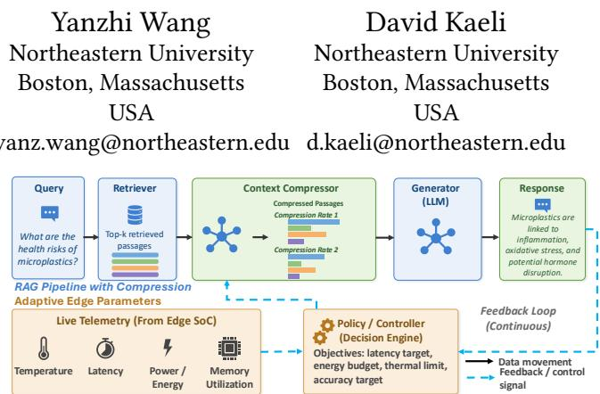
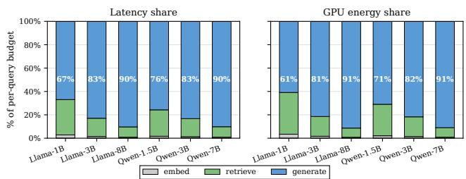
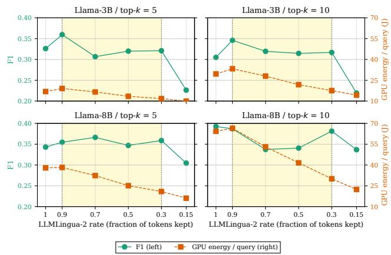
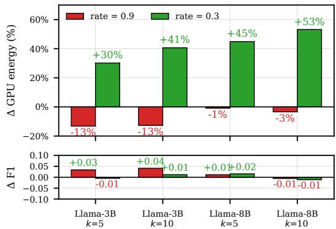

# From Retrieved Context to Runtime Control: Adaptive Compression for Edge-based RAG

Zlatan Feric†   
Northeastern University   
Boston, Massachusetts USA   
feric.z@northeastern.edu   
Amir Taherin†   
Northeastern University   
Boston, Massachusetts   
USA   
taherin.a@northeastern.edu

## Abstract

Retrieval-augmented generation (RAG) improves language-model responses by grounding generation in external passages, which comes with overhead: retrieved context lengthens the prompt, increasing prefill work, KV-cache footprint, memory trafic, latency, and energy. Context compression ofers a natural remedy by pruning retrieved text before generation. However, state-of-the-art context-compression methods are typically used with a fixed com pression budget, or with the rate selected ofline and then applied at inference time. This static view ignores both workload variation and the live state of the edge device. On an edge SoC, compression is not free: the compressor itself runs on the same SoC and consumes latency and energy that can ofset any generation savings.

This paper proposes a vision for telemetry-informed adaptive compression in edge RAG, grounded in experimental evidence. We characterize the compression tradeof on the NVIDIA Jetson AGX Thor using Llama and Qwen generators, Natural Questions and HotpotQA datasets, and LLMLingua-2 compression. Our measurements show that generation dominates the RAG budget for larger models, reaching roughly 90% of per-query latency and 91% of GPU energy for 7B–8B generators. Exploring the impact of the compression rate reveals an adaptive operating region: mild compression can miss energy opportunities, and overly aggressive compression can hurt inference quality. Intermediate compression can reduce GPU energy by up to 53.2%, and SoC energy by up to 48.2%, with negligible quality loss. We argue for runtime policies that dynamically manage compression, guided by workload features and edge telemetry.

## CCS Concepts

• Computing methodologies → Natural language generation; • Information systems → Retrieval models and ranking; • Computer systems organization → Embedded systems.

## Keywords

Edge RAG, Context Compression, Energy-Eficient Inference

## 1 Introduction

Large language models (LLMs) have rapidly improved in capability and scale [2, 18, 33, 41, 48], but they remain hampered by hallucinations [12], stale parametric knowledge [19], and poor access to private or domain-specific information [7, 22]. Retrieval-augmented

Figure 1: Telemetry-informed adaptive compression for edge RAG. Retrieved passages are compressed before generation, but the compression ratio is selected at runtime by a controller that observes edge-SoC telemetry and optimizes for latency, energy, thermal, memory, and accuracy constraints. generation (RAG) addresses these limitations by conditioning generation on passages retrieved at inference time, allowing the model to produce responses grounded in external, dynamic and domainspecific knowledge without retraining [22]. This makes RAG an attractive foundation for practical LLM applications in domains where correctness, freshness, and provenance matter.

Running RAG at the edge is compelling for privacy-sensitive data [23, 39], latency-critical applications such as robotics [21, 25, 45, 56] and augmented reality [5, 44], personal agents [37, 57], and mobile and bandwidth-limited settings where cloud access may be unreliable. Recent edge-RAG systems have improved eficiency on constrained platforms, including mobile devices [35, 42], edge SoCs [36], and wearable systems [43], through optimizations such as faster vector search, compact indexing, and reduced memory footprint. However, these systems primarily focus on retrieval/index eficiency or fixed content-reduction strategies. Instead, we should explore how RAG can run eficiently on edge devices based on the application content.

This motivates the following questions: once documents have been retrieved, how much ofthat context should actually be passed to the generator on an edge device? RAG improves knowledge access by adding retrieved tokens, but tokens are expensive on edge hardware. Each retrieved passage increases the prompt length seen by the generator, adding to prefill latency, KV-cache footprint, memory trafic, and energy per query [42, 57]. This cost is amplified on constrained edge SoCs, where memory bandwidth, power budget, and thermal headroom are limited. Moreover, retrieving more context does not guarantee better answers: irrelevant or redundant passages can distract the generator and increase system cost without improving response quality [15, 26, 46, 55]. Thus, edge RAG comes with a new set of challenging tradeof: the system needs enough context to preserve answer quality, but not so much context that generation overuses latency and energy.

Context compression is a natural knob for this tradeof: it prunes or rewrites retrieved passages before generation, aiming to preserve query-relevant evidence while reducing input tokens. We use this term to distinguish our setting from broader prompt-compression work [24]: only the retrieved context is compressed, while instructions and few-shot scafolding remain unchanged. Unlike coarser controls such as retrieval depth, compression exposes a continuous rate knob: lower rates reduce generation load more aggressively, while higher rates preserve more evidence.

However, compression on the edge is not free. The compressor runs on the same SoC as retrieval and generation, adding latency, memory trafic, and energy while competing for shared resources. Thus, the relevant metric is not gross generation speedup but net benefit: the generation savings from a shorter prompt minus the compressor’s own overhead. A static compression ratio can be a net loss when contexts are short, generators are small, or too few tokens are removed.

In this paper, we present our vision for telemetry-informed adaptive compression: context compression should be a runtime decision, not a fixed preprocessing step. As Figure 1 illustrates, an edge RAG system could use workload features and live SoC telemetry (e.g., latency, energy, and memory bandwidth) to decide whether to compress and what rate to use. Our goal is to demonstrate the potential for such a controller by measuring when compression is beneficial, when it is harmful, and which system signals expose that boundary.

To evaluate this potential, we measure RAG on Jetson AGX Thor using Llama and Qwen generators from 1B to 8B parameters, Natural Questions and HotpotQA datasets, and LLMLingua-2 context compression. Our results show three findings. First, for 7B–8B models, generation dominates the edge-RAG budget, accounting for roughly 90% of latency, 91% of GPU energy, and 92% of total SoC energy per query. Second, compression can provide substantial net savings after accounting for compressor overhead, but its benefit depends on model size, retrieval depth, and dataset. Third, sweeping the compression rate reveals an adaptive operating region: mild compression can lose energy, overly aggressive compression can hurt answer quality, and intermediate rates can substantially reduce energy (i.e., GPU energy by up to 53.2% and SoC energy by up to 48.2%) with little quality impact.

This paper makes three contributions: (1) a stage-level characterization of latency and energy in edge RAG on Jetson AGX Thor, identifying when generation becomes the dominant cost; (2) a net benefit analysis of context compression that includes compressor overhead rather than reporting generation-only speedups; and (3) a telemetry-informed adaptive-compression vision, grounded in measured workload-dependent tradeofs, for future edge-RAG sys tems.

## 2 Background and Motivation

## 2.1 RAG Pipeline and Context Cost

A RAG pipeline has two phases: an ofline indexing phase and an online query phase. Ofline, a document collection is split into passages and stored in a searchable datastore, typically with lexical or vector indexes for eficient retrieval [17, 40]. Online, a user query is encoded and used to retrieve the top-ranked passages; a generator LLM then conditions on both the query and the retrieved context to produce the final response [11, 22]. Modern RAG systems extend this basic retrieve-then-generate flow with additional stages such as query rewriting [28, 49], reranking [30, 31], and context compression [13, 24], inserted between retrieval and generation [7, 10].

The same retrieved context that improves grounding also creates the main systems cost: every additional passage increases the prompt length seen by the generator. Longer prompts increase prefill work, KV-cache footprint and memory trafic, as well as the energy per query, which is especially costly on edge SoCs with limited memory bandwidth, power, and thermal headroom [42, 57]. Context compression is inserted between retrieval and generation to reduce this cost before the generator runs. Throughout this paper, we use the term rate for the fraction of retrieved-context tokens kept, matching the parameter exposed by LLMLingua-2 [34]. Thus, rate = 0.5 corresponds to keeping roughly half of the retrieved context, or about 2× compression in factor notation. Compression is applied only to the retrieved context; the system prompt, instructions, and few-shot scafolding (system message, few-shot examples) are left intact.

## 2.2 Context Compression Methods

Prompt compression methods are commonly divided into hard and soft compression [24]. Hard compression directly edits the textual input before inference, either by extracting important tokens or sentences or by summarizing the input [13, 34]. Soft compression instead maps text into latent tokens or embeddings consumed by the decoder [3, 8, 29]. We focus on hard compression because it can be inserted into existing RAG pipelines without changing the generator interface and because compressed text length directly afects generation cost.

Hard compression can be extractive or abstractive. Extractive methods remove low-importance tokens or sentences while preserving the original text, as in the LLMLingua family [13, 14, 34]. Abstractive methods such as RECOMP generate a new summary of the retrieved passages [51], but this usually adds another autoregressive stage and therefore extra latency and energy. Prior deviceoriented studies show that compressor cost varies substantially across methods [27, 52], making overhead a first-order concern on edge devices. Provence similarly shows the value of filtering context before generation, but does not expose the continuous rate knob needed for our adaptive-control study [4].

We use LLMLingua-2 [34] as a representative compressor because it is extractive, lightweight relative to the generator, and exposes a continuous rate parameter. This lets us sweep rate to measure the tradeof among generation savings, compressor overhead, and answer quality. Our goal is not to claim LLMLingua-2 is the final edge-RAG compressor, but to use it as a controllable representative for identifying when compression helps, when it is a net loss, and where adaptive policies have room to operate.

## 2.3 Edge RAG and the Missing Runtime View

Eficient edge inference has largely focused on reducing generator cost through quantization, memory reduction, KV-cache optimization, and runtime scheduling. RAG broadens this problem: retrieval, optional reranking or compression, and generation all share the same latency, memory, power, and thermal budget. Thus, a stage such as context compression must be evaluated by its net efect, not by generation speedup alone.

Table 1: Experimental Setup
<table><tr><td>Item</td><td>Configuration</td></tr><tr><td>Platform</td><td>Jetson AGX Thor: Blackwell GPU, 128 GB LPDDR5x, 273 GB/s, 130 W.</td></tr><tr><td>Corpus / index</td><td>English Wikipedia 2018, sentence-split via FlashRAG (~9.4 M passages) [16]; e5- base-v2 encoder [50]; FAISS GPU IndexF1atL2 (28.2 GB).</td></tr><tr><td>QA Datasets</td><td>Natural Questions [20] and HotpotQA [54]; 100 seed-paired queries per config.</td></tr><tr><td>Models Compression</td><td>Llama-3.2 1B/3B, Llama-3.1 8B [9]; Qwen-2.5 1.5B/3B/7B [53]. All fp16. None, or LLMLingua-2 [34]</td></tr><tr><td>Sweeps</td><td>Exp. 1 uses k ∈ {1, 5, 10} with compression off. Exp. 2 uses HotpotQA, k ∈</td></tr><tr><td></td><td>{5, 10}, and LLMLingua-2 rates 1.0, 0.9, 0.7, 0.5, 0.3, and 0.15.</td></tr><tr><td>Controls</td><td>Single-query mode, reranker off, standard pipeline, randomized config order, first 3 queries dropped as warm-up.</td></tr><tr><td>Metrics/telemetry</td><td>EM, token-level F1, retrieval recall; end-to-end and per-stage latency; GPU/SoC energy, power, memory, and temperature from tegrastats at 100 ms cadence.</td></tr></table>

Recent edge-RAG systems address important parts of this pipeline. EdgeRAG optimizes retrieval memory and latency through index and embedding techniques [42]; MobileRAG uses selective content reduction on mobile devices [35]; RoCR accelerates retrieval with edge computing-in-memory architectures [36]; and wearable RAG systems optimize retrieval energy and memory movement [43]. This prior work shows that RAG can run on constrained platforms, but they primarily target retrieval/index eficiency, platform-specific acceleration, or fixed content reduction rather than runtime control of compression under live device constraints.

Adaptive RAG serving systems such as METIS show that RAG configurations should be selected per query rather than fixed of fline [38]. However, METIS targets server-side quality-delay tradeofs, not edge SoC telemetry, energy, thermal behavior, or the cost of running a compressor on the same device as the generator. The missing runtime view is therefore deciding when compression is worth its own cost: an edge controller must choose whether to compress, and at what rate, based on workload features, retrieved-context length, model size, quality risk, and hardware state.

## 3 Methodology and Evaluation

## 3.1 Experimental Setup and Metrics

We evaluate a RAG pipeline on the NVIDIAJetson AGX Thor [32] using a standard retrieve-then-generate flow. Table 1 summarizes the shared configuration. All stages run on the same SoC, and the compressor, when enabled, is co-resident with the retriever and generator. We run two experiment groups: (1) an uncompressed stage-attribution sweep to identify where latency and energy are spent across model sizes, datasets, and retrieval depths, and (2) a compression-rate sweep to determine when LLMLingua-2 becomes net-positive and where energy savings begin to impact answer quality. The experimental setup builds on RAGMark, our stage-level RAG benchmarking framework [6], and incorporates the GPU/SoC power, thermal, and memory telemetry collection from our edge LLM characterization framework, Hydra [47].

We report compression as a net efect. Compressed RAG is beneficial only when the generation savings from a shorter prompt exceeds the compressor’s own latency and energy on the same SoC. Therefore, our reported savings, include the compression stage itself, rather than treating generation-only speedup as an end-to-end gain.

  
Figure 2: Per-query share of latency (left) and GPU energy (right) by stage, on AGX Thor, fp16, no compression.

  
Figure 3: Answer F1 (left axis) and per-query GPU energy (right axis) vs. LLMLingua-2 rate on HotpotQA. Shaded band: adaptive operating room between the two dotted-line knees.

## 3.2 Results

We answer three main questions: (i) where does the per-query budget go in an uncompressed pipeline, (ii) how do quality and net energy vary as we sweep the compression rate, and (iii) how does the value of compression vary with workload characteristics?

Generation dominates the budget above 3 B parameters (Figure 2). At Llama-3.1-8B and Qwen-2.5-7B, the generator alone accounts for 90 % of per-query latency and 91 % of per-query GPU energy. Embed and retrieve together never exceed 10 % at this scale. At the 1 B end the picture inverts: Llama-3.2-1B spends 33 % of wall time and 39 % of GPU energy in embed+retrieve, leaving compression of the generator’s prompt with much less headroom to recover. The Llama-vs-Qwen split is statistically a no-op at equal parameter counts (Llama-3B and Qwen-3B agree to within 0.3 pp on the generation share; Llama-8B and Qwen-7B to within 0.3 pp), so we run the compression sweeps on the Llama family only.

Two knees frame a wide adaptive operating range (Figure 3). On every (model, top-�) panel, F1 is quite similar from rate = 1.0 down to rate = 0.3 (the F1 deltas across this range are inside the ±0.05 noise floor), then collapses by 4–10 absolute points at rate = 0.15 when the generator can no longer reconstruct meaning from the heavily-pruned context. GPU energy changes monotonically: it gets worse at rate = 0.9 because LLMLingua-2’s roughly fixed 130–310 ms per-query overhead is not amortized by dropping only 10 % of tokens; it gets better from rate = 0.7 onward as the shorter prompt cuts prefill cost. The two inflection points define an adaptive operating region of width ≈ 0.6 on the rate axis (shaded). The safest aggressive setpoint we observe is rate = 0.3, which preserves quality and lies right at the quality knee.

  
Figure 4: Net GPU energy delta (top) and ΔF1 (bottom) at rate = 0.9 (mild) and rate = 0.3 (safe-aggressive), vs. the insession uncompressed baseline.

Table 2: Net savings at rate = 0.3 vs. the in-session uncompressed baseline (positive Δ = saving on the cost columns, improvement on the quality columns).
<table><tr><td>Model</td><td>k</td><td>∆lat.</td><td>ΔEGPU</td><td>ΔESoC</td><td>ΔEM</td><td>∆F1</td></tr><tr><td>Llama-3B</td><td>5</td><td>+8.5%</td><td>+30.2%</td><td>+28.2%</td><td>+0.000</td><td>-0.005</td></tr><tr><td>Llama-3B</td><td>10</td><td>+15.6%</td><td>+40.6%</td><td>+35.1%</td><td>+0.010</td><td>+0.012</td></tr><tr><td>Llama-8B</td><td>5</td><td>+25.2%</td><td>+44.9%</td><td>+38.5%</td><td>+0.052</td><td>+0.016</td></tr><tr><td>Llama-8B</td><td>10</td><td>+32.6%</td><td>+53.2%</td><td>+48.2%</td><td>+0.000</td><td>-0.011</td></tr></table>

The value of compressing varies with workload, while the best observed safe-aggressive rate is stable (Figure 4, Table 2). At rate = 0.3, GPU energy savings grow monotonically with model size and retrieved context length, from +30 % on Llama-3B at �=5 to +53 % on Llama-8B at �=10. At rate = 0.9 the relationship inverts: every configuration increases net energy usage (from −1 % on the heaviest workload to −13 % on the lightest), because the compressor’s computational overhead outweighs the small gener ation savings from dropping 10 % of tokens. The same rate = 0.3 setpoint is the safest aggressive choice on every panel, while the quantitative win it delivers shifts by a factor of ∼1.8× across our model+context combinations.

## 4 Discussion and Research Agenda

## 4.1 From Adaptive Room to an Online Controller

The two-knee structure in Figure 3 reframes adaptive compression on edge devices. In our sweep, the best observed safe-aggressive rate is rate = 0.3, but the value of enabling compression varies substantially with workload. Heavy workloads, such as 8 B generators with �=10, recover up to 53% of GPU energy at this setpoint, while lighter workloads recover only 30%. Mild compression at rate = 0.9 is a net loss because the compressor’s fixed per-query cost is not amortized by dropping only a small fraction of tokens.

This suggests that the first practical controller does not need to search a continuous rate space for every query. Instead, it can make a small number of workload-conditioned decisions: skip compression when projected generation savings fall below compressor overhead, use rate = 0.3 for long-context or high-cost generations, and reserve more aggressive compression for settings with explicit quality slack. Such a controller can use cheap signals already available at runtime, including model identity, retrieved-context length, top-�, recent latency, energy, and thermal headroom. The solution is therefore not only choosing a compression method, but deciding when compression is worth its own cost on the same SoC.

## 4.2 Research Agenda

Three questions naturally arise. First, how does the energy knee move with lighter compressors? LLMLingua-2 uses a fixed model pass, making mild compression expensive. Streaming, token-level, or hardware-aware compressors could make compression beneficial at milder rates and shrink the negative-savings region.

Second, do the observed knees hold under quantization and larger models? Our measurements use fp16 generators up to 8 B parameters. Production edge deployments often use 4-bit quantization, and larger models may shift the balance between generation savings, compressor overhead, and quality loss.

Third, how should compression interact with the rest of the RAG pipeline? Compression is only one knob. Retrieval depth, reranker cutof, source selection, query rewriting, and conditional or iterative RAG policies [1] all consume the same latency, memory, energy, and thermal budget. An telemetry-informed controller, that considers multiple RAG knobs, should lead to significant savings.

Treating compression as an adaptive on-device resource-management knob, rather than a fixed preprocessing step, makes eficient grounded generation on the edge an interesting optimization problem. Our two-knee structure, evaluated on AGX Thor, ofers empirical evidence for building an adaptive compression controller.

## 5 Conclusion

This paper presents a vision, grounded in empirical evidence, that context compression should be treated as a runtime systems knob for edge RAG rather than a fixed preprocessing step. Our measurements on Jetson AGX Thor show why: generation dominates the cost of edge-RAG pipelines, compression can deliver substantial net energy savings, and the benefit depends on workload and compression rate. The observed gap between the energy and quality knees demonstrates the potential for telemetry-informed adaptive compression. Future edge-RAG systems should use workload features and live SoC state to decide when compression is worth its own cost and how aggressively it should be applied.

## References

[1] Akari Asai, Zeqiu Wu, Yizhong Wang, Avi Sil, and Hannaneh Hajishirzi. 2024. Self-rag: Learning to retrieve, generate, and critique through self-reflection. In International conference on learning representations, Vol. 2024. 9112–9141.

[2] Tom Brown, Benjamin Mann, Nick Ryder, Melanie Subbiah, Jared D Kaplan, Prafulla Dhariwal, Arvind Neelakantan, Pranav Shyam, Girish Sastry, Amanda Askell, et al. 2020. Language models are few-shot learners. Advances in neural information processing systems 33 (2020), 1877–1901.

[3] Alexis Chevalier, Alexander Wettig, Anirudh Ajith, and Danqi Chen. 2023. Adapting language models to compress contexts. arXiv preprint arXiv:2305.14788 (2023).

[4] Nadezhda Chirkova, Thibault Formal, Vassilina Nikoulina, and Stéphane Clinchant. 2025. Provence: eficient and robust context pruning for retrieval augmented generation. arXiv preprint arXiv:2501.16214 (2025).

[5] Yubin Dai, Bin Qian, Yangkun Liu, Yuxuan Yan, and Yuanchao Shu. 2025. Eros: Real-time dense mapping made easy on mobile devices. In Proceedings ofthe 26th International Workshop on Mobile Computing Systems and Applications. 19–24.

[6] Zlatan Feric, Amir Taherin, Bin Ren, Yanzhi Wang, Jennifer Dy, and David Kaeli. 2026. RAGMark: A Comprehensive Framework for Benchmarking Retrieval Augmented Generation Systems. In IEEE International Symposium on Workload Characterization (IISWC). To appear.

[7] Yunfan Gao, Yun Xiong, Xinyu Gao, Kangxiang Jia, Jinliu Pan, Yuxi Bi, Yi Dai, Jiawei Sun, Haofen Wang, and Haofen Wang. 2023. Retrieval-augmented generation for large language models: A survey. arXiv preprint arXiv:2312.10997 2 (2023).

[8] Tao Ge, Jing Hu, Lei Wang, Xun Wang, Si-Qing Chen, and Furu Wei. 2023. Incontext autoencoder for context compression in a large language model. arXiv preprint arXiv:2307.06945 (2023).

[9] Aaron Grattafiori et al. 2024. The Llama 3 Herd of Models. arXiv:2407.21783 https://arxiv.org/abs/2407.21783

[10] Shailja Gupta, Rajesh Ranjan, and Surya Narayan Singh. 2024. A Comprehensive Survey ofRetrieval-Augmented Generation (RAG): Evolution, Current Landscape and Future Directions. arXiv preprint arXiv:2410.12837 (2024). Preprint. Available at https://arxiv.org/abs/2410.12837.

[11] Gautier Izacard and Edouard Grave. 2020. Leveraging passage retrieval with generative models for open domain question answering. arXiv preprint arXiv:2007.01282 (2020).

[12] Ziwei Ji, Nayeon Lee, Rita Frieske, Tiezheng Yu, Dan Su, Yan Xu, Etsuko Ishii, Ye Jin Bang, Andrea Madotto, and Pascale Fung. 2023. Survey of hallucination in natural language generation. ACM computing surveys 55, 12 (2023), 1–38.

[13] Huiqiang Jiang, Qianhui Wu, Chin-Yew Lin, Yuqing Yang, and Lili Qiu. 2023. Llmlingua: Compressing prompts for accelerated inference of large language models. arXiv preprint arXiv:2310.05736 (2023).

[14] Huiqiang Jiang, Qianhui Wu, Xufang Luo, Dongsheng Li, Chin-Yew Lin, Yuqing Yang, and Lili Qiu. 2024. Longllmlingua: Accelerating and enhancing llms in long context scenarios via prompt compression. In Proceedings ofthe 62nd Annual Meeting of the Association for Computational Linguistics (Volume 1: Long Papers). 1658–1677.

[15] Ziyan Jiang, Xueguang Ma, and Wenhu Chen. 2024. Longrag: Enhancing retrieval augmented generation with long-context llms. arXiv preprint arXiv:2406.15319 (2024).

[16] Jiajie Jin, Yutao Zhu, Xinyu Yang, Chenghao Zhang, and Zhicheng Dou. 2024. FlashRAG: A Modular Toolkit for Eficient Retrieval-Augmented Generation Research. arXiv:2405.13576 https://arxiv.org/abs/2405.13576

[17] Jef Johnson, Matthijs Douze, and Hervé Jégou. 2019. Billion-scale similarity search with GPUs. IEEE Transactions on Big Data 7, 3 (2019), 535–547.

[18] Jared Kaplan, Sam McCandlish, Tom Henighan, Tom B Brown, Benjamin Chess, Rewon Child, Scott Gray, Alec Radford, Jefrey Wu, and Dario Amodei. 2020. Scaling laws for neural language models. arXiv preprint arXiv:2001.08361 (2020).

[19] Jungo Kasai, Keisuke Sakaguchi, Ronan Le Bras, Akari Asai, Xinyan Yu, Dragomir Radev, Noah A Smith, Yejin Choi, Kentaro Inui, et al. 2023. Realtime qa: What’s the answer right now? Advances in neural information processing systems 36 (2023), 49025–49043.

[20] Tom Kwiatkowski, Jennimaria Palomaki, Olivia Redfield, Michael Collins, Ankur Parikh, Chris Alberti, Danielle Epstein, Illia Polosukhin, Jacob Devlin, Kenton Lee, Kristina Toutanova, Llion Jones, Matthew Kelcey, Ming-Wei Chang, Andrew M. Dai, Jakob Uszkoreit, Quoc Le, and Slav Petrov. 2019. Natural Questions: A Benchmark for Question Answering Research. Transactions ofthe Association for Computational Linguistics 7 (2019), 453–466.

[21] Guowei Lan, Kaixian Qu, René Zurbrügg, Changan Chen, Christopher E Mower, Haitham Bou-Ammar, and Marco Hutter. 2025. Experience is the best teacher: Grounding vlms for robotics through self-generated memory. arXiv preprint arXiv:2507.16713 (2025).

[22] Patrick Lewis, Ethan Perez, Aleksandra Piktus, Fabio Petroni, Vladimir Karpukhin, Naman Goyal, Heinrich Küttler, Mike Lewis, Wen-tau Yih, Tim Rock täschel, et al. 2020. Retrieval-augmented generation for knowledge-intensive nlp tasks. Advances in neural information processing systems 33 (2020), 9459–9474.

[23] Jiaxing Li, Chi Xu, Lianchen Jia, Feng Wang, Cong Zhang, and Jiangchuan Liu. 2024. EACO-RAG: Towards Distributed Tiered LLM Deployment using Edge-Assisted and Collaborative RAG with Adaptive Knowledge Update. CoRR abs/2410.20299 (2024). arXiv:2410.20299 doi:10.48550/arXiv.2410.20299

[24] Zongqian Li, Yinhong Liu, Yixuan Su, and Nigel Collier. 2025. Prompt compression for large language models: A survey. In Proceedings of the 2025 Conference ofthe Nations ofthe Americas Chapter ofthe Association for Computational Linguistics: Human Language Technologies (Volume 1: Long Papers). 7182–7195.

[25] Juyi Lin, Amir Taherin, Arash Akbari, Arman Akbari, Lei Lu, Guangyu Chen, Taskin Padir, Xiaomeng Yang, Weiwei Chen, Yiqian Li, Xue Lin, David Kaeli, Pu Zhao, and Yanzhi Wang. 2026. VOTE: Vision-Language-Action Optimization with Trajectory Ensemble Voting. arXiv:2507.05116 [cs.CV] https://arxiv.org/ abs/2507.05116

[26] Nelson F Liu, Kevin Lin, John Hewitt, Ashwin Paranjape, Michele Bevilacqua, Fabio Petroni, and Percy Liang. 2024. Lost in the middle: How language models use long contexts. Transactions of the association for computational linguistics 12 (2024), 157–173.

[27] Zhenyan Lu, Xiang Li, Dongqi Cai, Rongjie Yi, Fangming Liu, Xiwen Zhang, Nicholas D Lane, and Mengwei Xu. 2024. Small language models: Survey, measurements, and insights. arXiv preprint arXiv:2409.15790 (2024).

[28] Xinbei Ma, Yeyun Gong, Pengcheng He, Hai Zhao, and Nan Duan. 2023. Query rewriting in retrieval-augmented large language models. In Proceedings of the 2023 Conference on Empirical Methods in Natural Language Processing. 5303–5315.

[29] Jesse Mu, Xiang Li, and Noah Goodman. 2023. Learning to compress prompts with gist tokens. Advances in Neural Information Processing Systems 36 (2023), 19327–19352.

[30] Rodrigo Nogueira and Kyunghyun Cho. 2019. Passage Re-ranking with BERT. arXiv preprint arXiv:1901.04085 (2019).

[31] Rodrigo Nogueira, Zhiying Jiang, Ronak Pradeep, and Jimmy Lin. 2020. Document ranking with a pretrained sequence-to-sequence model. In Findings ofthe association for computational linguistics: EMNLP 2020. 708–718.

[32] NVIDIA. 2025. Jetson AGX Thor — Technical Reference Manual. https: //developer.nvidia.com/embedded/jetson-thor.

[33] Long Ouyang, Jefrey Wu, Xu Jiang, Diogo Almeida, Carroll Wainwright, Pamela Mishkin, Chong Zhang, Sandhini Agarwal, Katarina Slama, Alex Ray, et al. 2022. Training language models to follow instructions with human feedback. Advances in neural information processing systems 35 (2022), 27730–27744.

[34] Zhuoshi Pan, Qianhui Wu, Huiqiang Jiang, Menglin Xia, Xufang Luo, Jue Zhang, Qingwei Lin, Victor Rühle, Yuqing Yang, Chin-Yew Lin, et al. 2024. Llmlingua-2: Data distillation for eficient and faithful task-agnostic prompt compression. arXiv preprint arXiv:2403.12968 (2024).

[35] Taehwan Park, Geonho Lee, and Min-Soo Kim. 2025. MobileRAG: A Fast, Memory-Eficient, and Energy-Eficient Method for On-Device RAG. CoRR abs/2507.01079 (2025). arXiv:2507.01079 doi:10.48550/arXiv.2507.01079

[36] Ruiyang Qin, Zheyu Yan, Dewen Zeng, Zhenge Jia, Dancheng Liu, Jianbo Liu, Zhi Zheng, Ningyuan Cao, Kai Ni, Jinjun Xiong, and Yiyu Shi. 2024. Robust Implementation of Retrieval-Augmented Generation on Edge-based Computing in-Memory Architectures. CoRR abs/2405.04700 (2024). arXiv:2405.04700 doi:10. 48550/arXiv.2405.04700

[37] Reza Rawassizadeh and Yi Rong. 2023. ODSearch: Fast and resource eficient on-device natural language search for fitness trackers’ Data. Proceedings of the ACM on Interactive, Mobile, Wearable and Ubiquitous Technologies 6, 4 (2023), 1–25.

[38] Siddhant Ray, Rui Pan, Zhuohan Gu, Kuntai Du, Shaoting Feng, Ganesh Ananthanarayanan, Ravi Netravali, and Junchen Jiang. 2025. METIS: Fast Quality Aware RAG Systems with Configuration Adaptation. arXiv:2412.10543 [cs.LG] https://arxiv.org/abs/2412.10543

[39] Runtao Ren, Yinyu Wu, Xuhui Zhang, Jinke Ren, Yanyan Shen, Shuqiang Wang, and Kim-Fung Tsang. 2024. Retrieval-Augmented Generation for Mobile Edge Computing via Large Language Model. CoRR abs/2412.20820 (2024). arXiv:2412.20820 doi:10.48550/arXiv.2412.20820

[40] Stephen Robertson, Hugo Zaragoza, et al. 2009. The probabilistic relevance framework: BM25 and beyond. Foundations and Trends® in Information Retrieval 3, 4 (2009), 333–389.

[41] Timothy Rupprecht, Pu Zhao, Amir Taherin, Arash Akbari, Arman Akbari, Yumei He, Tooba Imtiaz, Sean Dufy, Juyi Lin, Yixiao Chen, Rahul Chowdhury, Enfu Nan, Yixin Shen, Yifan Cao, Haochen Zeng, Weiwei Chen, Geng Yuan, Jennifer Dy, Sarah Ostadabbas, Xuan Zhang, David Kaeli, Edmund Yeh, and Yanzhi Wang. 2026. Human Cognition in Machines: A Unified Perspective of World Models. arXiv:2604.16592 [cs.RO] https://arxiv.org/abs/2604.16592

[42] Korakit Seemakhupt, Sihang Liu, and Samira Manabi Khan. 2024. EdgeRAG: Online-Indexed RAG for Edge Devices. CoRR abs/2412.21023 (2024). arXiv:2412.21023 doi:10.48550/arXiv.2412.21023

[43] Kunming Shao et al. 2025. A Memory-Eficient Retrieval Architecture for RAG-Enabled Wearable Medical LLMs-Agents. CoRR abs/2510.27107 (2025). arXiv:2510.27107 doi:10.48550/arXiv.2510.27107

[44] Qiuyue Sun, Amir Taherin, Yawo Siatitse, and Yuhao Zhu. 2020. Energy-Eficient 360-Degree Video Rendering on FPGA via Algorithm-Architecture Co-Design. In Proceedings of the 2020 ACM/SIGDA International Symposium on Field-Programmable Gate Arrays (Seaside, CA, USA) (FPGA ’20). Association for Computing Machinery, New York, NY, USA, 97–103. doi:10.1145/3373087.3375317

[45] Amir Taherin, Juyi Lin, Arash Akbari, Arman Akbari, Pu Zhao, Weiwei Chen, David Kaeli, and Yanzhi Wang. 2026. Cross-Platform Scaling ofVision-Language-Action Models from Edge to Cloud GPUs. Association for Computing Machinery, New York, NY, USA, 234–239. https://doi.org/10.1145/3787109.3816400

[46] Amir Taherin, Mohammad Salehi, and Alireza Ejlali. 2018. Reliability-Aware Energy Management in Mixed-Criticality Systems. IEEE Transactions on Sustainable Computing 3, 3 (2018), 195–208. doi:10.1109/TSUSC.2018.2801123

[47] Amir Taherin, Sana Taghipour Anvari, Charles Amante, Yixiao Chen, Ruben Noroian, Zlatan Feric, Nicolas Bohm Agostini, Pu Zhao, José Cano, Bin Ren, Yanzhi Wang, and David Kaeli. 2026. Hydra: Phase-Aware Workload Characterization of LLM Inference across Edge SoC Generations, Backends, and Quantization Levels. In IEEE International Symposium on Workload Characterization (IISWC). To appear.

[48] Hugo Touvron, Thibaut Lavril, Gautier Izacard, Xavier Martinet, Marie-Anne Lachaux, Timothée Lacroix, Baptiste Rozière, Naman Goyal, Eric Hambro, Faisal Azhar, et al. 2023. Llama: Open and eficient foundation language models. arXiv preprint arXiv:2302.13971 (2023).

[49] Liang Wang, Nan Yang, and Furu Wei. 2023. Query2doc: Query expansion with large language models. arXiv preprint arXiv:2303.07678 (2023).

[51] Fangyuan Xu, Weijia Shi, and Eunsol Choi. 2023. Recomp: Improving retrievalaugmented lms with compression and selective augmentation. arXiv preprint arXiv:2310.04408 (2023).

[50] Rui Wang. 2023. intfloat/e5-base-v2. https://huggingface.co/intfloat/e5-base-v2.

[52] Jiajun Xu, Zhiyuan Li, Wei Chen, Qun Wang, Xin Gao, Qi Cai, and Ziyuan Ling. 2024. On-device language models: A comprehensive review. arXiv preprint arXiv:2409.00088 (2024).

[53] An Yang et al. 2024. Qwen2.5 Technical Report. arXiv:2412.15115 https://arxiv. org/abs/2412.15115

[54] Zhilin Yang, Peng Qi, Saizheng Zhang, Yoshua Bengio, William W. Cohen, Ruslan Salakhutdinov, and Christopher D. Manning. 2018. HotpotQA: A Dataset for Diverse, Explainable Multi-hop Question Answering. In Proceedings of the 2018 Conference on Empirical Methods in Natural Language Processing (EMNLP).

[55] Ori Yoran, Tomer Wolfson, Ori Ram, and Jonathan Berant. 2024. Making retrievalaugmented language models robust to irrelevant context. In International Conference on Learning Representations, Vol. 2024. 29862–29883.

[56] Yue Zhang, Rui Wang, Jiehong Lin, Zhongrui Wang, and Xiaojuan Qi. 2026. Retrieval-VLA: Training-Free In-Context Adaptation for Vision-Language-Action Models. In Proceedings ofthe IEEE/CVFConference on Computer Vision and Pattern Recognition. 1358–1367.

[57] Yue Zheng, Yuhao Chen, Bin Qian, Xiufang Shi, Yuanchao Shu, and Jiming Chen. 2025. A review on edge large language models: Design, execution, and applications. Comput. Surveys 57, 8 (2025), 1–35.