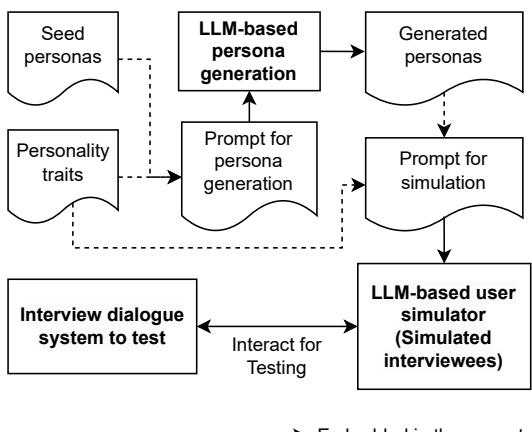
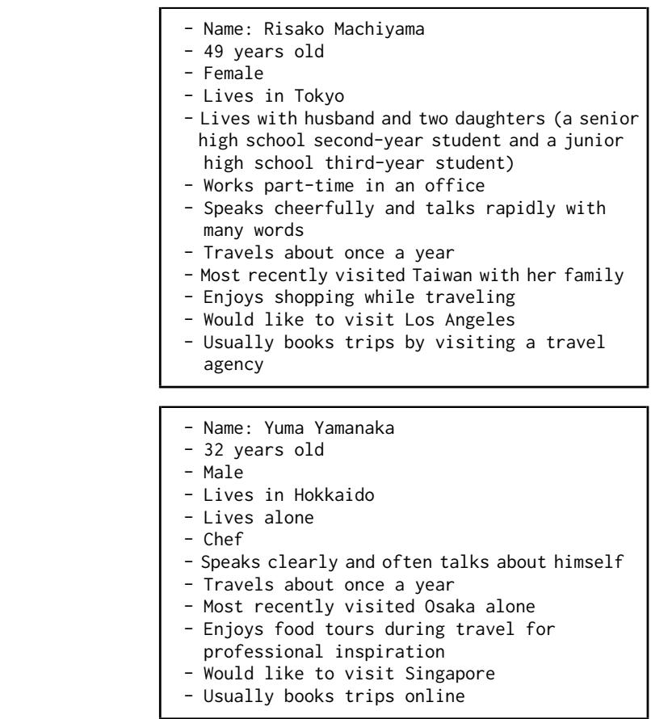
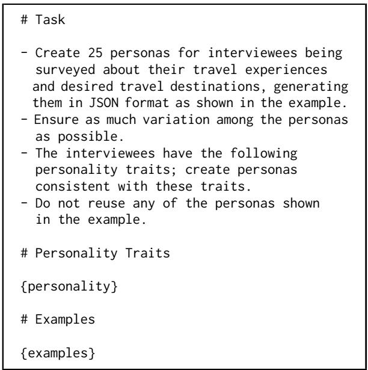
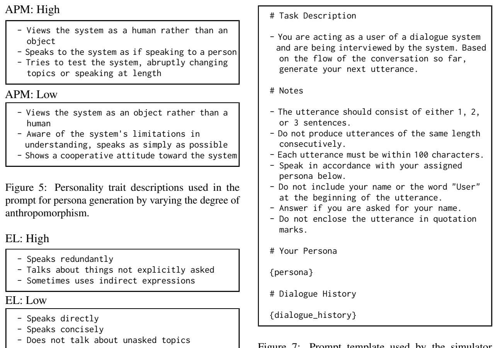
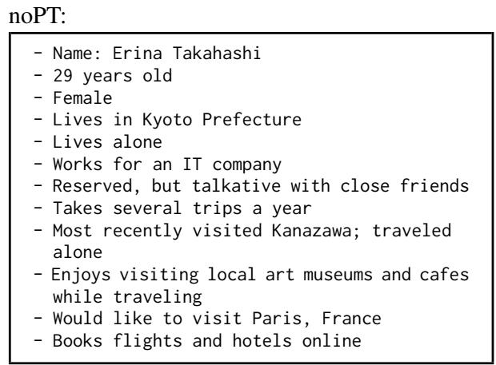
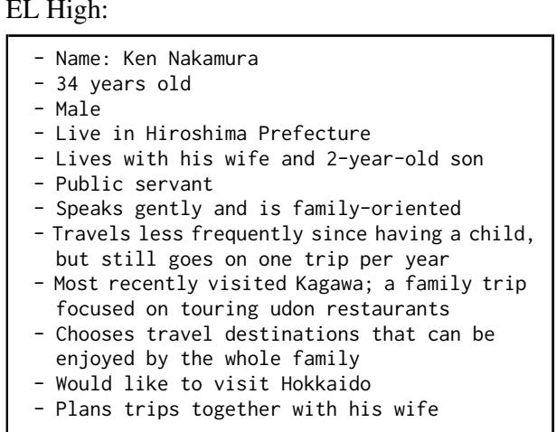
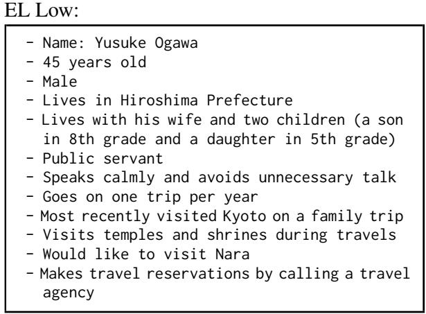
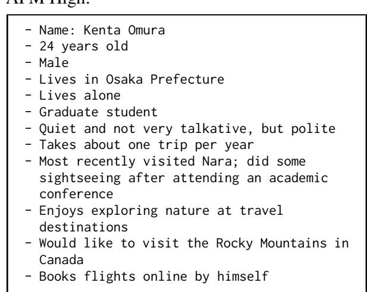
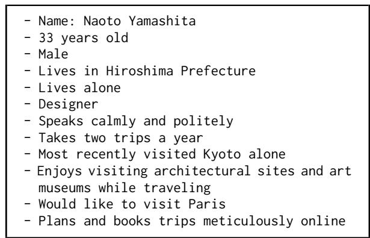
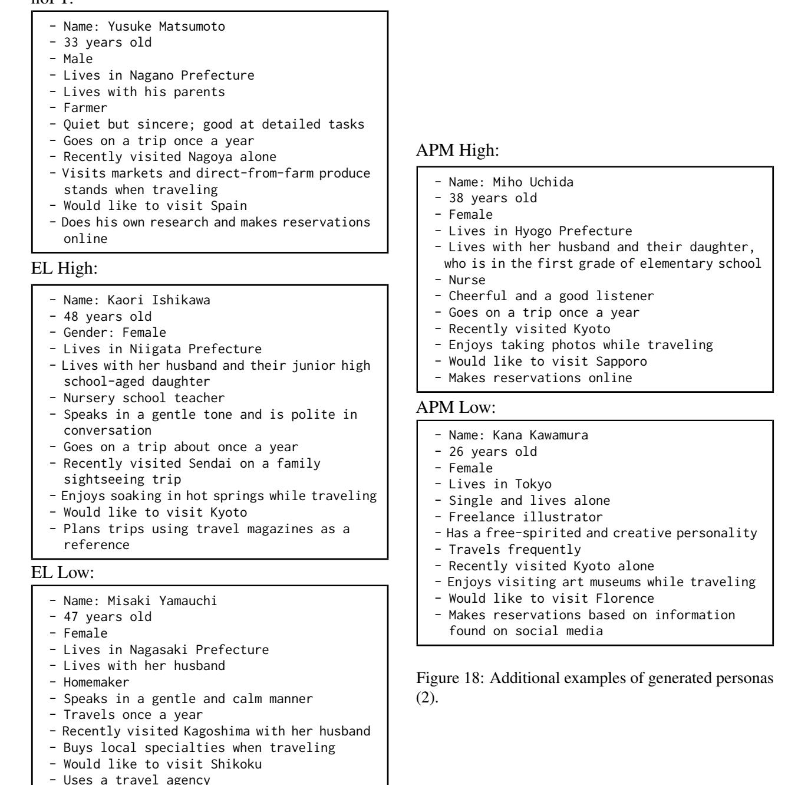

# Generating Diverse Personas for User Simulators to Test Interview Dialogue Systems

Mikio Nakano1,2, Kazunori Komatani2, Hironori Takeuchi3

1C4A Research Institute, Inc., Setagaya, Tokyo, Japan 2SANKEN, University of Osaka, Ibaraki, Osaka, Japan 3Musashi University, Nerima, Tokyo, Japan mikio.nakano@c4a.jp, komatani@sanken.osaka-u.ac.jp h.takeuchi@cc.musashi.ac.jp

## Abstract

This paper addresses the issue of the significant labor required to test interview dialogue systems. While interview dialogue systems are expected to be useful in various scenarios, like other dialogue systems, testing them with human users requires significant effort and cost. Therefore, testing with user simulators can be beneficial. Since most conventional user simulators have been primarily designed for training task-oriented dialogue systems, little attention has been paid to the personas of the simulated users. During development, testing interview dialogue systems requires simulating a wide range of user behaviors, but manually creating a large number of personas is labor-intensive. We propose a method that automatically generates personas for user simulators using a large language model. Furthermore, by assigning personality traits related to communication styles when generating personas, we aim to increase the diversity of communication styles in the user simulator. Experimental results show that the proposed method enables the user simulator to generate utterances with greater variation.

## 1 Introduction

Interview dialogue systems, which can efficiently gather information from many users, are a promising application of dialogue system technology and have attracted increasing research interest in recent years (Lang and Eskenazi, 2025; Hashimoto et al., 2025; Zeng et al., 2023). However, building dialogue systems, including interview dialogue systems, incurs significant costs. One major cost is the effort required for testing. The goal of our study is to alleviate the manual effort for testing interview dialogue systems.

To reduce testing costs, user simulation can be used instead of manual testing. However, existing user simulators have primarily been developed for the training and evaluation of task-oriented dialogue systems. Thus, we aim to develop a simulator that is useful for testing interview dialogue systems.

When testing interview dialogue systems, simulating a wide variety of users is crucial. To increase variation, it is beneficial to have a large number of user personas (Zhang et al., 2018; Jiang et al., 2024; Hong et al., 2025). However, manually creating numerous personas is labor-intensive. While using a large set of pre-constructed personas has been considered (Mazaré et al., 2018), this approach is unsuitable for interview dialogues, where personas need to be aligned with the specific interview topics.

Therefore, this paper proposes a method to generate diverse personas using large language models (LLMs). In this method, a few manually created personas are provided as examples, and the LLM is tasked with generating a large number of additional personas. To ensure diversity in speaking styles and attitudes toward the system, personality traits are specified during generation.

Evaluation experiments demonstrated that the proposed method enables the creation of diverse dialogues through the generation of many personas. This increases the likelihood of discovering system issues. Note that detecting system issues from simulated dialogues is beyond the scope of our study. Manual inspection is one possible approach, but automated methods using LLMs are also conceivable (Finch et al., 2023).

The contributions of our study are as follows:

• We discuss that diverse personas are necessary for user simulators used in testing interview dialogue systems.

• We propose a method for generating diverse personas using LLMs.

• We introduce a technique to enhance persona diversity by specifying personality traits related to communication style.

• Through evaluation experiments, we demonstrate that the proposed persona generation method enables the creation of diverse dialogues.

## 2 Related Work

## 2.1 Interview Dialogue Systems

Interview dialogue systems that extract information from humans through natural language interaction have attracted significant research attention due to their high practical value. Examples of the application domains include: course rating surveys at universities (Stent et al., 2006), telephone surveys (Johnston et al., 2013; Lang and Eskenazi, 2025), mental health assessments (DeVault et al., 2014), dietary intake recording (Kobori et al., 2016), job interviews (Su et al., 2019; Rao et al., 2020; Inoue et al., 2020; Jones and Sabouret, 2012; Hoque et al., 2013; Gebhard et al., 2014), dietary preference surveys (Zeng et al., 2023), career counseling for nurses (Hashimoto et al., 2025), frailty diagnosis (Asao et al., 2020), collecting people’s beliefs about the future of robots (Skantze et al., 2012), facilitating user review writing (Tanaka and Inaba, 2024), and customer interviews (Sidaoui et al., 2020). We propose a method for efficiently testing such interview dialogue systems.

## 2.2 Testing Dialogue Systems

As mentioned earlier, testing dialogue systems requires significant effort, and various methods and tools have been proposed to facilitate this process (Li et al., 2022). For example, there are tools that verify whether a dialogue system behaves as expected using corpora (Degerstedt and Jönsson, 2006), and methods that test the system using predefined test cases (Atefi and Alipour, 2019; Guo et al., 2024; Gómez-Abajo et al., 2024). Since these testing methods require the preparation of test cases in advance, they are effective for detecting issues within the expected scope. However, in interactions with diverse users, unexpected problems may arise, and thus, methods capable of detecting such unforeseen issues are desired.

## 2.3 User Simulation for Dialogue Systems

We therefore use user simulators. User simulators for dialogue systems have traditionally been used to evaluate dialogue strategies (Eckert et al., 1997; Niimi and Nishimoto, 1999). However, with advances in statistical modeling of dialogue strategies, research has increasingly focused on training dialogue strategy models using reinforcement learning (Schatzmann et al., 2006; Pietquin and Dutoit, 2006; Schatzmann et al., 2007; Ai and Litman, 2009; Li et al., 2017; Pietquin and Hastie, 2013).

Recently, with the development of large language models (LLMs), user simulators based on LLMs have been proposed (Terragni et al., 2023; Luo et al., 2024; Algherairy and Ahmed, 2025; Sekulic et al., 2024; Hu et al., 2023; Sun et al., 2023; Di Bratto et al., 2024; Liu et al., 2023).

In studies on user simulators for task-oriented dialogue systems, evaluation metrics such as similarity to human user behavior and the quality of the learned dialogue strategies have been used (Pietquin and Hastie, 2013).

Our study differs from these previous studies in that it proposes a method for constructing a user simulator specifically for testing interview dialogue systems. Different evaluation metrics are also required.

## 2.4 Using Personas in User Simulation

Research has also been conducted on using personas in user simulators. Georgila et al. (2008) and Georgila et al. (2010) demonstrated that different dialogue strategies can be learned by preparing simulators for older and younger users. Hashimoto et al. (2025) manually created nurse personas for a user simulator used in evaluating a career counseling dialogue system for nurses, under the supervision of nursing administrators. Our study differs from these studies in that it automatically generates personas.

## 2.5 Persona Generation

As for research on automatic persona generation, there are methods that extract personas from Reddit (Mazaré et al., 2018). They collect sentences that express a persona (e.g., those containing "I" or "my") and use them for persona creation. Methods for generating personas using LLMs have also been proposed. Ge et al. (2024) proposed a method for generating persona-representing passages from text using an LLM. However, with these methods, it is difficult to generate interviewee personas tailored to the domain of interview dialogue systems.

## 3 Proposed Method

In the proposed method, we generate simulated user personas using an LLM. It is necessary to ensure that the generated personas include information relevant to the domain of the target interview dialogue system. To achieve this, we perform incontext learning using a small number of manually written personas (called seed personas hereafter) as few-shot examples. Furthermore, to facilitate the discovery of potential issues by introducing greater variation in user utterances during simulation, we provide personality traits that define communication styles when generating personas with the LLM. By embedding the generated personas and personality traits into the prompt of an LLM-based user simulator, we can generate diverse dialogues. Figure 1 illustrates the proposed method.

  
Figure 1: Overview of the proposed method.

We use the following two axes as personality traits.

Degree of Anthropomorphism One axis concerns whether the user treats the system as an object or as a human. Users who treat the system as an object aim to use the dialogue system efficiently and tend to use expressions that are easy for the system to understand. In contrast, users who treat the system as a human speak to it as if they were speaking to a person, without considering whether the system can understand them. This behavior can be interpreted as users anthropomorphizing the system (Reeves and Nass, 1996). We refer to this axis as the degree of anthropomorphism.

Degree of Elaborateness The other axis concerns whether the user engages in redundant communication or direct communication. Pragst et al. (2019) and Miehle et al. (2020) classify users’ communication styles into elaborateness and directness.

\- Whether the user often travels

\- Places the user has recently visited

\- Favorite places among the user’s past travel destinations

\- Activities the user enjoys doing while traveling

\- Reasons for not traveling often (if applicable)

\- Places the user would like to visit next - How the user books trips (e.g., visiting a travel agency, calling a travel agency, using a website)

Figure 2: Topics the travel interview dialogue system asks the user about.

We adopt the same classification in our study.

Although the Big Five personality traits are wellknown, we did not use them because it is considered more effective to directly specify users’ speaking styles is considered more effective for our purpose.

## 4 Evaluation

We conducted an evaluation experiment to investigate whether the proposed method is effective for testing interview dialogue systems. Note that this experiment deals only with Japanese systems, and that all subsequent figures are translations from Japanese.

## 4.1 Compared Methods

We compared the following five conditions:

BL (BaseLine): Only seed personas are used without generating new personas.

noPT (no Personality Traits): Proposed method without prompts concerning the two kinds of personality traits. Only seed personas are given when personas are generated.

APM (AnthroPoMorphism): Proposed method with degree of anthropomorphism given as a personality trait for persona generation. The degree is either High or Low.

EL (ELaborateness): Proposed method with degree of elaborateness given as a personality trait for persona generation. The degree is either High or Low.

APM+EL Proposed method with both degree of anthropomorphism and degree of elaborateness given as personality traits for persona generation.

## 4.2 Interview Dialogue Systems Used

We used the following two systems:

The first is a Japanese text-based interview dialogue system that conducts interviews about travel.

  
Figure 3: Examples of the seed personas for the travel interview dialogue system.

It was built using the ChatGPT dialogue built-in block of DialBB (Nakano and Komatani, 2024), where dialogues are conducted based on a single prompt template. The interview topics extracted from users are shown in Figure 2.

The second is a Japanese text-based interview dialogue system that conducts interviews focusing on the user’s preferences for sweets. It asks users questions such as whether they often eat sweets, what kinds of sweets they like, and where they usually buy sweets. This system was also built using DialBB, employing ChatGPT for language understanding, named entity extraction, and dialogue management using a state transition network. ChatGPT is used for evaluating transition conditions and for utterance generation within dialogue management. The state transition network consists of 32 states and 54 transitions.

## 4.3 Procedure

We conducted persona generation and simulation according to the following procedure.

First, for each system, we manually created 10 seed personas. Figure 3 shows examples of seed personas for the travel system. In this paper, we show only examples and prompt templates for the travel interview system for the lack of space. In the noPT, APM, EL, and APM+EL conditions, these seed personas were embedded into the prompt as few-shot examples to generate new personas. In the APM, EL, and APM+EL conditions, personality traits were assigned in a balanced manner, and personas consistent with those traits were generated. The template used for persona generation for the travel system is shown in Figure 4, and the descriptions of the personality traits used in the experiments are shown in Figures 5 and 6. The third item under "APM: High" in Figure 5 indicates that users who anthropomorphize the system attempt to test whether the system can engage in conversation as flexibly as a human. For each condition, 100 personas were generated.1

  
Figure 4: Prompt template for persona generation. {personality} is replaced with a description of personality traits, and {examples} is replaced with the seed personas converted into JSON format. In the noPT condition, the template without the personality trait description is used.

The interview dialogue systems interacted with user simulators based on the generated personas. The prompt template used for simulation is shown in Figure 7. Each dialogue session consisted of 15 user utterances. For conditions other than BL, each persona was used for only one dialogue session, resulting in 100 dialogues per condition. For BL, each of the 10 seed personas was used 10 times.

  
Figure 6: Personality trait descriptions used in the prompt for persona generation by varying the degree of elaborateness.

The LLM used by the persona generator and the simulator was OpenAI’s gpt-4o-2024-11-20,2 while the LLM used by the interview dialogue systems was OpenAI’s gpt-4o-mini-2024-07-18.3 Since our objective is to evaluate the simulator, we used a high-performance model for the simulator. The temperature parameter was set to 0.7 for all LLM usages.

Prompt tuning was conducted separately from the main experiments, using a different system (a sweets interview dialogue system that uses a single prompt template) and different seed personas from those used in the main evaluation described in Section 4.2.

## 4.4 Evaluation Metrics

Our goal is to automatically expose issues in interview dialogue systems. One direct way to evaluate

Figure 7: Prompt template used by the simulator. {persona} is replaced with the generated persona, and {dialogue\_history} is replaced with the dialogue history at runtime.

the proposed method would be to build a faulty interview dialogue system, interact with it using the user simulator generated by the proposed method, and measure how many issues can be detected. However, faulty systems may cause dialogues to collapse once a problem occurs. In practice, using the user simulator to improve a system would involve repeatedly fixing detected issues and running new simulations, but evaluating this iterative process is impractical.

Therefore, as a second-best approach, we measure the diversity of user simulator utterances. The rationale is that the more diverse the utterances, the higher the probability of uncovering system issues.

Following previous studies on user simulators for task-oriented dialogue systems (Terragni et al., 2023; Algherairy and Ahmed, 2025; Sekulic et al., 2024), we used the following metrics to evaluate utterance diversity. For Japanese word tokenization, we used Sudachi (Takaoka et al., 2018) in C mode (a mode that does not split compound words).

Average and S.D. of utterance lengths The average and standard deviation of the number of words per user utterance across all dialogues.

<table><tr><td>Condition</td><td>Personality</td><td>#Dialogues</td><td>Ave. utterance length (S.D.)</td><td></td><td>Total words</td><td>Unique words</td><td>Unique bigrams</td><td>TTR</td></tr><tr><td>BL</td><td></td><td>100</td><td>28.2</td><td>(7.7)</td><td>42,260</td><td>15,747</td><td>31,620</td><td>.373</td></tr><tr><td>noPT</td><td></td><td>100</td><td>28.5</td><td>(7.0)</td><td>42,784</td><td>16,362</td><td>32,730</td><td>.382</td></tr><tr><td rowspan="3">APM</td><td>All</td><td>100</td><td>28.4</td><td>(7.2)</td><td>42,563</td><td>16,089</td><td>32,334</td><td>.378</td></tr><tr><td>High</td><td>50</td><td>30.1</td><td>(7.6)</td><td>22,547</td><td>8,406</td><td>17,098</td><td>.373</td></tr><tr><td>Low</td><td>50</td><td>26.7</td><td>(6.3)</td><td>20,016</td><td>7,683</td><td>15,236</td><td>.384</td></tr><tr><td rowspan="3">EL</td><td>All</td><td>100</td><td>36.0</td><td>(18.2)</td><td>53,951</td><td>18,556</td><td>39,010</td><td>.344</td></tr><tr><td>High</td><td>50</td><td>50.7</td><td>(13.9)</td><td>38,001</td><td>12,175</td><td>26,883</td><td>.320</td></tr><tr><td>Low</td><td>50</td><td>21.3</td><td>(5.7)</td><td>15,950</td><td>6,381</td><td>12,127</td><td>.400</td></tr><tr><td rowspan="5">APM+EL</td><td>All</td><td>100</td><td>31.4</td><td>(13.4)</td><td>47,111</td><td>16,856</td><td>34,839</td><td>.358</td></tr><tr><td>High+High</td><td>25</td><td>46.2</td><td>(12.3)</td><td>17,308</td><td>5,624</td><td>12,309</td><td>.325</td></tr><tr><td>High+Low</td><td>25</td><td>23.6</td><td>(4.8)</td><td>8,836</td><td>3,451</td><td>6,787</td><td>.391</td></tr><tr><td>Low+High</td><td>25</td><td>35.2</td><td>(9.9)</td><td>13,184 7,783</td><td>4,651</td><td>9,796</td><td>.353</td></tr><tr><td>Low+Low</td><td>25</td><td>20.8</td><td>(5.9)</td><td></td><td>3,130</td><td>5,947</td><td>.402</td></tr></table>

<table><tr><td>Condition</td><td>Personality</td><td>Unique CW</td><td>CW-TTR</td><td>SE</td><td>CE</td><td>MTLD</td><td>MSTTR</td><td>Ave. TTR (S.D.)</td><td></td></tr><tr><td>BL</td><td></td><td>1,917</td><td>.106</td><td>7.52</td><td>3.44</td><td>49.6</td><td>0.719</td><td>.373</td><td>(.023)</td></tr><tr><td>noPT</td><td></td><td>2,282</td><td>.122</td><td>7.62</td><td>3.46</td><td>51.4</td><td>0.725</td><td>.384</td><td>(.023)</td></tr><tr><td rowspan="3">APM</td><td>All</td><td>2,050</td><td>.112</td><td>7.59</td><td>3.47</td><td>50.4</td><td>0.725</td><td>.379</td><td>(.020)</td></tr><tr><td>High</td><td>1,543</td><td>.161</td><td>7.58</td><td>3.37</td><td>52.6</td><td>0.733</td><td>.374</td><td>(.020)</td></tr><tr><td>Low</td><td>1,418</td><td>.162</td><td>7.46</td><td>3.20</td><td>48.9</td><td>0.719</td><td>.385</td><td>(.020)</td></tr><tr><td rowspan="3">EL</td><td>All</td><td>2,428</td><td>.104</td><td>7.64</td><td>3.62</td><td>51.7</td><td>0.731</td><td>.362</td><td>(.046)</td></tr><tr><td>High</td><td>2,127</td><td>.131</td><td>7.67</td><td>3.61</td><td>56.5</td><td>0.746</td><td>.323</td><td>(.024)</td></tr><tr><td>Low</td><td>1,204</td><td>.171</td><td>7.27</td><td>2.96</td><td>42.8</td><td>0.696</td><td>.401</td><td>(.024)</td></tr><tr><td rowspan="5">APM+EL</td><td>All</td><td>2,257</td><td>.112</td><td>7.62</td><td>3.60</td><td>50.4</td><td>0.727</td><td>.369</td><td>(.037)</td></tr><tr><td>High+High</td><td>1,440</td><td>.198</td><td>7.59</td><td>3.42</td><td>54.6</td><td>0.741</td><td>.327</td><td>(.020)</td></tr><tr><td>High+Low</td><td>908</td><td>.242</td><td>7.38</td><td>3.00</td><td>48.3</td><td>0.720</td><td>.391</td><td>(.021)</td></tr><tr><td>Low+High</td><td>1,243</td><td>.220 .235</td><td>7.50 7.15</td><td>3.26 2.74</td><td>51.8 43.4</td><td>0.731 0.698</td><td>.356 .403</td><td>(.026)</td></tr><tr><td>Low+Low</td><td>803</td><td></td><td></td><td></td><td></td><td></td><td></td><td>(.024)</td></tr></table>

Table 1: Diversity metrics of the simulations for the travel interview system. For example, the row where Condition is APM and Personality is All represents metrics calculated from all the dialogues under the APM condition. The subsequent row, where Personality is High, shows metrics calculated from the dialogues under the APM condition using a high degree of anthropomorphism in the personality setting. The row where Condition is APM+EL and Personality is High+High represents metrics calculated from the dialogues with a high degree of anthropomorphism and a high degree of elaborateness. Bold numbers are mentioned in the main text.

Total words The total number of words across all user utterances in all dialogues.

Unique words The number of unique words across all user utterances in all dialogues.

Unique bigrams The number of unique bigrams across all user utterances in all dialogues.

TTR Type-Token Ratio: ((# of unique words) / (# of total words)) for all user utterances in all dialogues.

Unique CW The number of Unique Content Words appearing in all user utterances.

CW-TTR The type-token ratio for content words across all user utterances.

SE Shannon Entropy calculated from all user utterances across all dialogues.

CE Conditional bigram Entropy calculated from all user utterances across all dialogues.

MTLD Measure of Textual Lexical Diversity (McCarthy and Jarvis, 2010) calculated by concatenating all user utterances (threshold: 0.72).

MSTTR Mean Segmental Type-Token Ratio (McCarthy and Jarvis, 2010) calculated by concatenating all user utterances.

Average and S.D. of TTR The average and standard deviation of type-token ratios calculated per dialogue.

## 4.5 Results

Tables 1 and 2 respectively show the diversity metrics for the travel interview system and the sweets interview system. Results for each personality trait condition are also presented. These results suggest the following two points: (1) noPT exhibits greater content variation compared to BL. In other words, persona generation using LLMs can increase the variety of content in utterances. (2) EL shows greater stylistic variation than noPT. That is, by varying redundancy levels, one can increase stylistic diversity in utterances.

<table><tr><td>Condition</td><td>Personality</td><td>#Dialogues</td><td>Ave. utterance length (S.D.)</td><td></td><td>Total words</td><td>Unique words</td><td>Unique bigrams</td><td>TTR</td></tr><tr><td>BL</td><td></td><td>100</td><td>25.9</td><td>(7.8)</td><td>25,152</td><td>11,138</td><td>20,534</td><td>.443</td></tr><tr><td>noPT</td><td></td><td>100</td><td>25.6</td><td>(8.0)</td><td>25,509</td><td>11,105</td><td>20,634</td><td>.435</td></tr><tr><td>APM</td><td>All</td><td>100</td><td>25.6</td><td>(8.2)</td><td>25,680</td><td>11,124</td><td>20,862</td><td>.433</td></tr><tr><td></td><td>High</td><td>50</td><td>26.5</td><td>(8.2)</td><td>13,269</td><td>5,723</td><td>10,824</td><td>.431</td></tr><tr><td></td><td>Low</td><td>50</td><td>24.6</td><td>(8.0)</td><td>12,411</td><td>5,401</td><td>10,038</td><td>.435</td></tr><tr><td>EL</td><td>All</td><td>100</td><td>33.9</td><td>(17.7)</td><td>34,020</td><td>13,214</td><td>26,117</td><td>.388</td></tr><tr><td></td><td>High</td><td>50</td><td>47.5</td><td>(14.8)</td><td>23,755</td><td>8,578</td><td>17,808</td><td>.361</td></tr><tr><td></td><td>Low</td><td>50</td><td>20.3</td><td>(6.1)</td><td>10,265</td><td>4,636</td><td>8,309</td><td>.452</td></tr><tr><td>APM+EL</td><td>All</td><td>100</td><td>28.1</td><td>(12.2)</td><td>28,067</td><td>11,549</td><td>22,182</td><td>.411</td></tr><tr><td></td><td>High+High</td><td>25</td><td>39.4</td><td>(13.1)</td><td>9,857</td><td>3,743</td><td>7,643</td><td>.380</td></tr><tr><td></td><td>High+Low</td><td>25</td><td>22.2</td><td>(6.7)</td><td>5,560</td><td>2,458</td><td>4,533</td><td>.442</td></tr><tr><td></td><td>Low+High</td><td>25</td><td>30.6</td><td>(10.5)</td><td>7,642</td><td>3,087</td><td>6,015</td><td>.404</td></tr><tr><td></td><td>Low+Low</td><td>25</td><td>20.0</td><td>(5.9)</td><td>5,008</td><td>2,261</td><td>3,991</td><td>.451</td></tr></table>

<table><tr><td>Condition</td><td>Personality</td><td>Unique CW</td><td>CW-TTR</td><td>SE</td><td>CE</td><td>MTLD</td><td>MSTTR</td><td>Ave. TTR (S.D.)</td><td></td></tr><tr><td>BL</td><td></td><td>1,157</td><td>.109</td><td>7.35</td><td>3.09</td><td>53.4</td><td>0.732</td><td>.444</td><td>(.023)</td></tr><tr><td>noPT</td><td></td><td>1,458</td><td>.133</td><td>7.43</td><td>3.18</td><td>53.9</td><td>0.736</td><td>.437</td><td>(.029)</td></tr><tr><td rowspan="3">APM</td><td>All</td><td>1,547</td><td>.141</td><td>7.51</td><td>3.33</td><td>53.2</td><td>0.737</td><td>.435</td><td>(.024)</td></tr><tr><td>High</td><td>1,090</td><td>.193</td><td>7.45</td><td>3.15</td><td>56.6</td><td>0.740</td><td>.432</td><td>(.020)</td></tr><tr><td>Low</td><td>1,081</td><td>.202</td><td>7.41</td><td>3.11</td><td>51.3</td><td>0.724</td><td>.438</td><td>(.028)</td></tr><tr><td rowspan="3">EL</td><td>All</td><td>1,838</td><td>.127</td><td>7.58</td><td>3.45</td><td>54.2</td><td>0.740</td><td>.409</td><td>(.053)</td></tr><tr><td>High</td><td>1,553</td><td>.156</td><td>7.58</td><td>3.41</td><td>57.2</td><td>0.753</td><td>.364</td><td>(.027)</td></tr><tr><td>Low</td><td>933</td><td>.208</td><td>7.24</td><td>2.90</td><td>47.3</td><td>0.715</td><td>.454</td><td>(.028)</td></tr><tr><td rowspan="5">APM+EL</td><td>All</td><td>1,604</td><td>.134</td><td>7.51</td><td>3.38</td><td>52.7</td><td>0.731</td><td>.421</td><td>(.038)</td></tr><tr><td>High+High</td><td>981</td><td>.240</td><td>7.49</td><td>3.16</td><td>56.5</td><td>0.750</td><td>.383</td><td>(.026)</td></tr><tr><td>High+Low</td><td>649</td><td>.272</td><td>7.20</td><td>2.85</td><td>49.8</td><td>0.729</td><td>.443</td><td>(.025)</td></tr><tr><td>Low+High</td><td>808</td><td>.246</td><td>7.33</td><td>2.94 2.62</td><td>52.6 47.0</td><td>0.726 0.709</td><td>.407 .452</td><td>(.032)</td></tr><tr><td>Low+Low</td><td>628</td><td>.284</td><td>7.08</td><td></td><td></td><td></td><td></td><td>(.024)</td></tr></table>

Table 2: Diversity metrics of the simulations for the sweets interview system.

(1) is suggested by the following findings: Comparing BL and noPT, especially in the travel domain, CW-TTR increases from .106 to .122 in the travel domain, and in the sweets domain, from .109 to .133. This suggests that the generated personas contain different content words from the seed personas. This may help uncover issues caused by diverse utterance content. Although SE, CE, and MTLD also show slight improvements, the differences are not significant. TTR slightly decreases in the sweets domain system, possibly due to limited stylistic changes, leading to low variation in function words.

(2) is suggested by the following findings: Compared to noPT, EL (All) shows an increase in the standard deviation of utterance length—from 7.0 to 18.2 in the travel domain and from 8.0 to 17.7 in the sweets domain. This suggests that varying the degrees of elaborateness enables the generation of utterances with diverse lengths, potentially exposing problems caused by such diversity. TTR and CW-TTR are lower, likely because elaborate utterances under the EL High condition tend to include fixed phrases.

There is little difference between APM and noPT. Also, comparing APM Low and High settings reveals no significant variation. Furthermore, APM+EL does not differ much from EL. Even when examining the dialogues, major differences were not observed. This suggests that the personality traits described in APM may not be sufficient to alter dialogue style. Since personas generated in noPT already contain variation in personality, APM might not have introduced additional diversity beyond that.

Note that in settings like EL High, where personality traits are narrowly defined, TTR and CW-TTR increase. This is likely because the number of dialogues is small, reducing word repetition.

  
Figure 8: Examples of generated personas (1).

## 4.6 Generated Personas

Examples of the generated personas are shown in Figures 8, 9, and 10. These examples were randomly selected from the personas generated under each condition. Figures 9 and 10 feature only male personas, but this is purely coincidental. While the male personas shown speak in a reserved manner, some of the other generated male personas are sociable and talkative. From these examples, it can be inferred that the generated personas are consistent with their respective personality traits. The APM+EL examples are omitted, as they did not yield any notable results with respect to the diversity metrics. Additional examples of generated personas are shown in Figures 17 and 18 in the Appendix.

## 5 Discussion

As discussed above, the experimental results suggest that generating personas with an LLM enables the generation of dialogues with greater variation. Although the quantitative metrics do not indicate this very clearly, you can see the variation by looking at the generated dialogues. This could lead to the discovery of more problems in dialogue systems. Furthermore, specifying personality traits related to communication style can introduce greater variation in utterance lengths, which may help uncover additional problems.

In the current user simulator prompt we used, relatively similar utterances tend to be generated consecutively. This might be different from the behaviors of human users. It is possible that generating various types of utterances within a single dialogue could help reveal different types of issues. In future work, we will explore methods for increasing such variation and investigate to what extent the behaviors of the user simulator cover those of human users.

  
Figure 9: Examples of generated personas (2).

Although our study focused on APM and EL traits, there may be other personality traits that could introduce further variation. Identifying and incorporating such traits will be considered in future research.

The ultimate goal of our study is to identify as many issues in interview dialogue systems as possible. However, in this work, we only measured the diversity of simulated users. Whether the proposed method can help discover issues across various dialogue systems remains a topic for future work. In the future, we aim to integrate this method into tools for building interview dialogue systems and validate it through its application in the development of diverse systems.

Note that, although the systems used in our evaluation experiments did not exhibit obvious issues such as completely incoherent utterances, we found that under the El High condition, simulated users tended to engage in extended small talk. This often caused the system to fail in extracting the necessary information, revealing a potential issue.

  
Figure 10: Examples of generated personas (3).

## 6 Concluding Remarks

This paper proposed a persona generation method for user simulation using large language models (LLMs). We also introduced a method to incorporate personality traits related to communication style during persona generation. This enables diverse testing of interview dialogue systems without human involvement, significantly reducing development costs. Although the evaluation experiments were limited and some issues remain, the results suggest the effectiveness of the proposed method. Therefore, we believe it is worthwhile to share our proposed method and experimental findings.

In the future, we plan to develop user simulators for interview dialogue systems with speech input/output and multimodal input/output. We also aim to extend our approach to build user simulators for various types of dialogue systems beyond interview dialogues.

## Acknowledgments

This work was partially inspired by the collaboration between Ekai Hashimoto, Takayoshi Sakurai, and Shun Shiramatsu of Nagoya Institute of Technology, Toshitake Komazaki of Tokyo Healthcare University, Shiho Tsuchiya of Kitasato University Hospital, and the first author. We sincerely thank them.

## Limitations

In addition to what was discussed in Section 5, there are several other limitations in our evaluation experiments. First, we used only a single model as the LLM for both persona generation and the simulator. Second, we used only Japanese systems. Furthermore, the number of generated personas per condition was fixed at 100, the number of seed personas was set to 10 for both systems, and the temperature parameter was set to 0.7 throughout the experiment; other configurations have not been tested. The impact of varying these conditions remains unexamined.

In future work, we plan to address these issues as we apply the proposed method to the development of various interview dialogue systems.

## Ethical Considerations

In our study, human participants were not involved in system testing; therefore, there is no risk of collecting or leaking personal information from individuals.

The biases potentially inherent in LLMs (Gallegos et al., 2024) may be reflected in automatically generated personas or user utterances. As a result, certain types of personas or utterances may be excluded from testing, which could hinder the identification of potential issues. Verifying whether this problem occurs and addressing it if necessary remain future challenges.

## References

Hua Ai and Diane Litman. 2009. Setting up user action probabilities in user simulations for dialog system development. In Proceedings ofthe Joint Conference ofthe 47th Annual Meeting ofthe ACL and the 4th International Joint Conference on Natural Language Processing of the AFNLP, pages 888–896, Suntec, Singapore. Association for Computational Linguistics.

Atheer Algherairy and Moataz Ahmed. 2025. Prompting large language models for user simulation in task-

oriented dialogue systems. Computer Speech & Language, 89:101697.

Yoshihiko Asao, Julien Kloetzer, Junta Mizuno, Dai Saiki, Kazuma Kadowaki, and Kentaro Torisawa. 2020. Understanding user utterances in a dialog system for caregiving. In Proceedings of the Twelfth Language Resources and Evaluation Conference, pages 653–661, Marseille, France. European Language Resources Association.

Soodeh Atefi and Mohammad Amin Alipour. 2019. An automated testing framework for conversational agents. Preprint, arXiv:1902.06193.

Lars Degerstedt and Arne Jönsson. 2006. Lintest: a development tool for testing dialogue systems. In Proceedings ofInterspeech 2006, pages 225–235.

David DeVault, Ron Artstein, Grace Benn, Teresa Dey, Ed Fast, Alesia Gainer, Kallirroi Georgila, Jon Gratch, Arno Hartholt, Margaux Lhommet, Gale Lucas, Stacy Marsella, Fabrizio Morbini, Angela Nazarian, Stefan Scherer, Giota Stratou, Apar Suri, David Traum, Rachel Wood, Yuyu Xu, Albert Rizzo, and Louis-Philippe Morency. 2014. SimSensei kiosk: a virtual human interviewer for healthcare decision support. In Proceedings of the 2014 International Conference on Autonomous Agents and Multi-Agent Systems, AAMAS ’14, pages 1061–1068, Richland, SC. International Foundation for Autonomous Agents and Multiagent Systems.

Martina Di Bratto, Antonio Origlia, Maria Di Maro, and Sabrina Mennella. 2024. Linguistics-based dialogue simulations to evaluate argumentative conversational recommender systems. User Modeling and User-Adapted Interaction, 34(5):1581–1611.

W. Eckert, E. Levin, and R. Pieraccini. 1997. User modeling for spoken dialogue system evaluation. In 1997 IEEE Workshop on Automatic Speech Recognition and Understanding Proceedings, pages 80–87.

Sarah E. Finch, Ellie S. Paek, and Jinho D. Choi. 2023. Leveraging large language models for automated dialogue analysis. In Proceedings ofthe 24th Annual Meeting ofthe Special Interest Group on Discourse and Dialogue, pages 202–215, Prague, Czechia. Association for Computational Linguistics.

Isabel O. Gallegos, Ryan A. Rossi, Joe Barrow, Md Mehrab Tanjim, Sungchul Kim, Franck Dernoncourt, Tong Yu, Ruiyi Zhang, and Nesreen K. Ahmed. 2024. Bias and fairness in large language models: A survey. Computational Linguistics, 50(3):1097– 1179.

Tao Ge, Xin Chan, Xiaoyang Wang, Dian Yu, Haitao Mi, and Dong Yu. 2024. Scaling synthetic data creation with 1,000,000,000 personas. Preprint, arXiv:2406.20094.

Patrick Gebhard, Tobias Baur, Ionut Damian, Gregor Mehlmann, Johannes Wagner, and Elisabeth André. 2014. Exploring interaction strategies for virtual

characters to induce stress in simulated job interviews. In Proceedings of the 2014 International Conference on Autonomous Agents and Multi-Agent Systems, AAMAS ’14, pages 661–668, Richland, SC. International Foundation for Autonomous Agents and Multiagent Systems.

Kallirroi Georgila, Maria Wolters, and Johanna Moore. 2008. Simulating the behaviour of older versus younger users when interacting with spoken dialogue systems. In Proceedings ofACL-08: HLT, Short Papers, pages 49–52, Columbus, Ohio. Association for Computational Linguistics.

Kallirroi Georgila, Maria Wolters, and Johanna Moore. 2010. Learning dialogue strategies from older and younger simulated users. In Proceedings of the 11th Annual Meeting ofthe Special Interest Group on Discourse and Dialogue, pages 103–106, Tokyo, Japan. Association for Computational Linguistics.

Pablo Gómez-Abajo, Sara Pérez-Soler, Pablo C. Cañizares, Esther Guerra, and Juan de Lara. 2024. Mutation testing for task-oriented chatbots. In Proceedings of the 28th International Conference on Evaluation and Assessment in Software Engineering, EASE ’24, pages 232–241, New York, NY, USA. Association for Computing Machinery.

Guoxiang Guo, Aldeida Aleti, Neelofar Neelofar, and Chakkrit Tantithamthavorn. 2024. Mortar: Metamorphic multi-turn testing for llm-based dialogue systems. Preprint, arXiv:2412.15557.

Ekai Hashimoto, Mikio Nakano, Takayoshi Sakurai, Shun Shiramatsu, Toshitake Komazaki, and Shiho Tsuchiya. 2025. A career interview dialogue system using large language model-based dynamic slot generation. In Proceedings ofthe 31st International Conference on Computational Linguistics, pages 1562– 1584, Abu Dhabi, UAE. Association for Computational Linguistics.

Mengze Hong, Chen Jason Zhang, Chaotao Chen, Rongzhong Lian, and Di Jiang. 2025. Dialogue language model with large-scale persona data engineering. In Proceedings of the 2025 Conference of the Nations ofthe Americas Chapter ofthe Associationfor Computational Linguistics: Human Language Technologies (Volume 3: Industry Track), pages 961–970, Albuquerque, New Mexico. Association for Computational Linguistics.

Mohammed (Ehsan) Hoque, Matthieu Courgeon, Jean-Claude Martin, Bilge Mutlu, and Rosalind W. Picard. 2013. MACH: my automated conversation coach. In Proceedings ofthe 2013 ACM International Joint Conference on Pervasive and Ubiquitous Computing, UbiComp ’13, pages 697–706, New York, NY, USA. Association for Computing Machinery.

Zhiyuan Hu, Yue Feng, Anh Tuan Luu, Bryan Hooi, and Aldo Lipani. 2023. Unlocking the potential of user feedback: Leveraging large language model as user simulators to enhance dialogue system. In Proceedings of the 32nd ACM International Conference

on Information and Knowledge Management, CIKM ’23, pages 3953–3957, New York, NY, USA. Association for Computing Machinery.

Koji Inoue, Kohei Hara, Divesh Lala, Kenta Yamamoto, Shizuka Nakamura, Katsuya Takanashi, and Tatsuya Kawahara. 2020. Job interviewer android with elaborate follow-up question generation. In Proceedings ofthe 2020 International Conference on Multimodal Interaction, ICMI ’20, pages 324–332, New York, NY, USA. Association for Computing Machinery.

Hang Jiang, Xiajie Zhang, Xubo Cao, Cynthia Breazeal, Deb Roy, and Jad Kabbara. 2024. PersonaLLM: Investigating the ability of large language models to express personality traits. In Findings ofthe Associationfor Computational Linguistics: NAACL 2024, pages 3605–3627, Mexico City, Mexico. Association for Computational Linguistics.

Michael Johnston, Patrick Ehlen, Frederick G. Conrad, Michael F. Schober, Christopher Antoun, Stefanie Fail, Andrew Hupp, Lucas Vickers, Huiying Yan, and Chan Zhang. 2013. Spoken dialog systems for automated survey interviewing. In Proceedings ofthe 14th Annual Meeting of the Special Interest Group on Discourse and Dialogue, pages 329–333, Metz, France. Association for Computational Linguistics.

Hazaël Jones and Nicolas Sabouret. 2012. An affective model for a virtual recruiter in a job interview context. Procedia Computer Science, 15:312–313. 4th International Conference on Games and Virtual Worlds for Serious Applications (VS-GAMES’12).

Takahiro Kobori, Mikio Nakano, and Tomoaki Nakamura. 2016. Small talk improves user impressions of interview dialogue systems. In Proceedings ofthe 17th Annual Meeting of the Special Interest Group on Discourse and Dialogue, pages 370–380, Los Angeles. Association for Computational Linguistics.

Max M. Lang and Sol Eskenazi. 2025. Telephone surveys meet conversational AI: Evaluating a llmbased telephone survey system at scale. Preprint, arXiv:2502.20140.

Xiaomin Li, Chuanqi Tao, Jerry Gao, and Hongjing Guo. 2022. A review of quality assurance research of dialogue systems. In 2022 IEEE International Conference On Artificial Intelligence Testing (AITest), pages 87–94.

Xiujun Li, Zachary C. Lipton, Bhuwan Dhingra, Lihong Li, Jianfeng Gao, and Yun-Nung Chen. 2017. A user simulator for task-completion dialogues. Preprint, arXiv:1612.05688.

Yajiao Liu, Xin Jiang, Yichun Yin, Yasheng Wang, Fei Mi, Qun Liu, Xiang Wan, and Benyou Wang. 2023. One cannot stand for everyone! Leveraging multiple user simulators to train task-oriented dialogue systems. In Proceedings of the 61st Annual Meeting of the Association for Computational Linguistics (Volume 1: Long Papers), pages 1–21, Toronto, Canada. Association for Computational Linguistics.

Xiang Luo, Zhiwen Tang, Jin Wang, and Xuejie Zhang. 2024. DuetSim: Building user simulator with dual large language models for task-oriented dialogues. In Proceedings ofthe 2024 Joint International Conference on Computational Linguistics, Language Resources and Evaluation (LREC-COLING 2024), pages 5414–5424, Torino, Italia. ELRA and ICCL.

Pierre-Emmanuel Mazaré, Samuel Humeau, Martin Raison, and Antoine Bordes. 2018. Training millions of personalized dialogue agents. In Proceedings of the 2018 Conference on Empirical Methods in Natural Language Processing, pages 2775–2779, Brussels, Belgium. Association for Computational Linguistics.

Philip M McCarthy and Scott Jarvis. 2010. MTLD, vocd-D, and HD-D: A validation study of sophisticated approaches to lexical diversity assessment. Behavior research methods, 42(2):381–392.

Juliana Miehle, Isabel Feustel, Julia Hornauer, Wolfgang Minker, and Stefan Ultes. 2020. Estimating user communication styles for spoken dialogue systems. In Proceedings of the Twelfth Language Resources and Evaluation Conference, pages 540–548, Marseille, France. European Language Resources Association.

Mikio Nakano and Kazunori Komatani. 2024. DialBB: A dialogue system development framework as an educational material. In Proceedings ofthe 25th Annual Meeting ofthe Special Interest Group on Discourse and Dialogue, pages 664–668, Kyoto, Japan. Association for Computational Linguistics.

Yasuhisa Niimi and Takuya Nishimoto. 1999. Mathematical analysis of dialogue control strategies. In Proceedings of the 6th European Conference on Speech Communication and Technology, pages 1403– 1406.

O. Pietquin and T. Dutoit. 2006. A probabilistic framework for dialog simulation and optimal strategy learning. IEEE Transactions on Audio, Speech, and Language Processing, 14(2):589–599.

Olivier Pietquin and Helen Hastie. 2013. A survey on metrics for the evaluation of user simulations. The knowledge engineering review, 28(1):59–73.

Louisa Pragst, Wolfgang Minker, and Stefan Ultes. 2019. Exploring the Applicability ofElaborateness and Indirectness in Dialogue Management, pages 189–198. Springer International Publishing, Cham.

Pooja S. B. Rao, Manish Agnihotri, and Dinesh Babu Jayagopi. 2020. Automatic follow-up question generation for asynchronous interviews. In Proceedings ofthe Workshop on Intelligent Information Processing and Natural Language Generation, pages 10–20, Santiago de Compostela, Spain. Association for Computational Lingustics.

Byron Reeves and Clifford Nass. 1996. The media equation: How people treat computers, television, and new media like real people. Cambridge University Press.

Jost Schatzmann, Blaise Thomson, Karl Weilhammer, Hui Ye, and Steve Young. 2007. Agenda-based user simulation for bootstrapping a POMDP dialogue system. In Human Language Technologies 2007: The Conference of the North American Chapter of the Associationfor Computational Linguistics; Companion Volume, Short Papers, pages 149–152, Rochester, New York. Association for Computational Linguistics.

Jost Schatzmann, Karl Weilhammer, Matt Stuttle, and Steve Young. 2006. A survey of statistical user simulation techniques for reinforcement-learning of dialogue management strategies. The Knowledge Engineering Review, 21(2):97–126.

Ivan Sekulic, Silvia Terragni, Victor Guimarães, Nghia Khau, Bruna Guedes, Modestas Filipavicius, Andre Ferreira Manso, and Roland Mathis. 2024. Reliable LLM-based user simulator for task-oriented dialogue systems. In Proceedings of the 1st Workshop on Simulating Conversational Intelligence in Chat (SCI-CHAT 2024), pages 19–35, St. Julians, Malta. Association for Computational Linguistics.

Karim Sidaoui, Matti Jaakkola, and Jamie Burton. 2020. AI feel you: customer experience assessment via chatbot interviews. Journal ofService Management, 31(4):745–766.

Gabriel Skantze, Samer Al Moubayed, Joakim Gustafson, Jonas Beskow, and Björn Granström. 2012. Furhat at robotville: A robot head harvesting the thoughts of the public through multi-party dialogue. In Proceedings of the Workshop on Realtime Conversations with Virtual Agents in conjunction with the International Conference on Intelligent Virtual Agents.

Amanda Stent, Svetlana Stenchikova, and Matthew Marge. 2006. Dialog systems for surveys: the ratea-course system. In 2006 IEEE Spoken Language Technology Workshop, pages 210–213.

Ming-Hsiang Su, Chung-Hsien Wu, and Yi Chang. 2019. Follow-up question generation using neural tensor network-based domain ontology population in an interview coaching system. In Interspeech 2019, pages 4185–4189.

Weiwei Sun, Shuyu Guo, Shuo Zhang, Pengjie Ren, Zhumin Chen, Maarten de Rijke, and Zhaochun Ren. 2023. Metaphorical user simulators for evaluating task-oriented dialogue systems. ACM Trans. Inf. Syst., 42(1).

Kazuma Takaoka, Sorami Hisamoto, Noriko Kawahara, Miho Sakamoto, Yoshitaka Uchida, and Yuji Matsumoto. 2018. Sudachi: a Japanese tokenizer for business. In Proceedings of the Eleventh International Conference on Language Resources and Evaluation (LREC 2018), Miyazaki, Japan. European Language Resources Association (ELRA).

Yoshiki Tanaka and Michimasa Inaba. 2024. User review writing via interview with dialogue systems.

In Proceedings of the 25th Annual Meeting of the Special Interest Group on Discourse and Dialogue, pages 428–439, Kyoto, Japan. Association for Computational Linguistics.

Silvia Terragni, Modestas Filipavicius, Nghia Khau, Bruna Guedes, André Manso, and Roland Mathis. 2023. In-context learning user simulators for task-oriented dialog systems. Preprint, arXiv:2306.00774.

Jie Zeng, Yukiko Nakano, and Tatsuya Sakato. 2023. Question generation to elicit users’ food preferences by considering the semantic content. In Proceedings of the 24th Annual Meeting of the Special Interest Group on Discourse and Dialogue, pages 190–196, Prague, Czechia. Association for Computational Linguistics.

Saizheng Zhang, Emily Dinan, Jack Urbanek, Arthur Szlam, Douwe Kiela, and Jason Weston. 2018. Personalizing dialogue agents: I have a dog, do you have pets too? In Proceedings of the 56th Annual Meeting of the Association for Computational Linguistics (Volume 1: Long Papers), pages 2204–2213, Melbourne, Australia. Association for Computational Linguistics.

## A Example Dialogues from the Travel Interview System

Example dialogues from the travel interview system are shown in Figures 11–16. Figure 11 shows a result from testing with a simulator using the lower persona from Figure 3. Figures 12–16 show results from testing with simulators using the generated personas in Figures 8, 9, and 10.

## B Additional Examples of Generated Personas

Figures 17 and 18 show additional examples of generated personas. These were also randomly selected.

<table><tr><td>System</td><td>Hello, my name is Shota Watanabe. I'd like to interview you today about travel. Do you travel often? About once a year, I'd say. I recently went to Osaka. I strolled around on my own and enjoyed trying out</td></tr><tr><td>User</td><td>different foods.</td></tr><tr><td>System</td><td>Eating your way through Osaka sounds fun! Was there any dish that left a strong impression on you? Definitely the takoyaki. I had some at a local shop—the outside was crispy and the inside was soft and</td></tr><tr><td>User</td><td>gooey. It was amazing. The kushikatsu was also delicious.</td></tr><tr><td>System</td><td>Takoyaki and kushikatsu both sound tasty! Have there been any other travel destinations that you particularly enjoyed?</td></tr><tr><td>User</td><td>Kyoto was great too. I really liked the historic atmosphere of the streets, and I tried a variety of traditional Japanese sweets.</td></tr><tr><td>System</td><td>The historical streets of Kyoto sound wonderful! Were there any sweets that especially stood out to you? The dorayaki left the biggest impression. The fluffy pancake and the mildly sweet bean paste were a</td></tr><tr><td>User</td><td>perfect match. I also enjoyed yatsuhashi.</td></tr><tr><td>System</td><td>Dorayaki and yatsuhashi—both sound delicious! What do you enjoy most when traveling? Food tours are my favorite. I love discovering local flavors unique to each area. I do a bit of sightseeing</td></tr><tr><td>User</td><td>too.</td></tr><tr><td>System</td><td>So eating local food is the most fun part! Where would you like to go next? I'd love to visit Singapore. I want to try chicken rice and hawker stall dishes. I'm also looking forward</td></tr><tr><td>User</td><td>to experiencing the atmosphere of the city.</td></tr><tr><td>System</td><td>Hawker food in Singapore is definitely appealing! How do you usually make your travel arrangements?</td></tr><tr><td>User</td><td>I usually book everything online. It's convenient to search for flights and hotels all in one place.</td></tr><tr><td>System</td><td>Online booking really is convenient! Which sites do you often use?</td></tr><tr><td>User</td><td>Mostly the major travel websites. They make it easy to compare options, and I always check for campaign</td></tr><tr><td></td><td>deals. I go with the ones I find easiest to use. Comparing travel sites is important! How do you keep track of special deals and offers?</td></tr><tr><td>System User</td><td>I use site notifications and subscribe to email newsletters. I check them regularly so I don't miss any</td></tr><tr><td></td><td>good deals.</td></tr><tr><td>System</td><td>It's great that you keep on top of special offers! Is there anything else you pay attention to when planning a trip?</td></tr><tr><td>User</td><td>I make a list of places I want to visit, and I try to plan carefully around time and budget. I also check the</td></tr><tr><td></td><td>weather.</td></tr><tr><td>System</td><td>Making a list sounds like a smart idea! Have you started planning your next trip?</td></tr><tr><td>User</td><td>Not in detail yet, but I'm hoping to go to Singapore next year. I'm looking forward to planning it out!</td></tr><tr><td>System</td><td>Sounds exciting! Are there any other countries or regions you'd like to visit?</td></tr><tr><td>User</td><td>I'm also interested in Europe. I'd especially like to try authentic cuisine in Italy and Spain. European cuisine is certainly appealing! Are there any specific dishes you'd like to try in Italy or Spain?</td></tr><tr><td>System User</td><td>In Italy, I want to try pizza and pasta. In Spain, definitely paella and tapas. I'm especially interested in</td></tr><tr><td></td><td>dishes that use local ingredients.</td></tr><tr><td>System</td><td>Local ingredient-based dishes are wonderful! How do you choose where to eat when you travel?</td></tr><tr><td>User</td><td>I usually look up popular places or restaurants loved by locals. I also rely on reviews and word-of-mouth</td></tr><tr><td></td><td>recommendations</td></tr><tr><td>System</td><td>Choosing popular local spots sounds like a great strategy! Is there anything else you look forward to</td></tr><tr><td></td><td>when traveling?</td></tr><tr><td>User</td><td>I enjoy experiencing the local scenery and culture too. I love immersing myself in the unique atmosphere</td></tr><tr><td></td><td></td></tr><tr><td></td><td></td></tr><tr><td></td><td></td></tr><tr><td></td><td></td></tr><tr><td></td><td></td></tr><tr><td></td><td></td></tr><tr><td></td><td></td></tr><tr><td></td><td>of each place.</td></tr><tr><td></td><td></td></tr><tr><td></td><td></td></tr><tr><td></td><td></td></tr><tr><td></td><td></td></tr><tr><td></td><td></td></tr><tr><td></td><td></td></tr><tr><td></td><td></td></tr><tr><td>System</td><td></td></tr><tr><td></td><td></td></tr><tr><td></td><td></td></tr><tr><td></td><td></td></tr><tr><td></td><td></td></tr><tr><td></td><td></td></tr><tr><td></td><td></td></tr><tr><td></td><td></td></tr><tr><td></td><td></td></tr><tr><td></td><td></td></tr><tr><td></td><td></td></tr><tr><td></td><td></td></tr><tr><td></td><td>Experiencing the scenery and culture is definitely rewarding! Was there a place that left a particularly</td></tr><tr><td></td><td></td></tr><tr><td></td><td></td></tr><tr><td></td><td></td></tr><tr><td></td><td></td></tr><tr><td></td><td></td></tr><tr><td></td><td></td></tr><tr><td></td><td></td></tr><tr><td></td><td></td></tr><tr><td></td><td></td></tr><tr><td></td><td></td></tr><tr><td></td><td></td></tr><tr><td></td><td></td></tr><tr><td></td><td></td></tr><tr><td></td><td></td></tr><tr><td></td><td></td></tr><tr><td></td><td></td></tr><tr><td></td><td></td></tr><tr><td></td><td>strong impression on you?</td></tr><tr><td></td><td></td></tr><tr><td></td><td></td></tr><tr><td></td><td></td></tr><tr><td></td><td></td></tr><tr><td></td><td></td></tr><tr><td></td><td></td></tr><tr><td></td><td></td></tr><tr><td></td><td></td></tr><tr><td></td><td></td></tr><tr><td>System</td><td>Hello, my name is Shota Watanabe. I'd like to interview you today about travel. Do you travel often?</td></tr><tr><td>User</td><td>I travel a few times a year. I recently took a solo trip to Kanazawa.</td></tr><tr><td>System User</td><td>Kanazawa is a lovely place! Was there anything in particular that left an impression? Yes, the exhibition I saw at a local art museum was very memorable. I also really enjoyed visiting different cafes.</td></tr><tr><td>System User</td><td>Visiting art museums and cafes sounds wonderful! Have there been other destinations you enjoyed? Yes, though it's close to Kyoto, I also liked Nara. I appreciated the calm and quiet atmosphere.</td></tr><tr><td>System User</td><td>The peaceful atmosphere of Nara is indeed charming! What do you enjoy doing when you travel? I like visiting places where I can experience local culture and history. I also enjoy taking photographs.</td></tr><tr><td>System User System User</td><td>Experiencing local culture and history is great! Where would you like to travel next? I'd like to visit Paris, France. I want to fully enjoy the museums and the cityscape.</td></tr><tr><td></td><td>Paris is a fascinating destination! How do you usually make your travel reservations?</td></tr><tr><td></td><td>I usually book flights and hotels online. It's convenient and makes it easy to compare options.</td></tr><tr><td>System</td><td></td></tr><tr><td>User</td><td>Online booking is certainly convenient! Which websites do you use most often?</td></tr><tr><td></td><td>I usually use major travel booking sites. I appreciate the abundance of user reviews.</td></tr><tr><td>System</td><td>Having plenty of reviews is important! Do you consult any other sources for information?</td></tr><tr><td>User</td><td>I also refer to travel blogs and social media posts. Photos in particular help me get a better sense of what</td></tr><tr><td></td><td>to expect.</td></tr><tr><td>System User</td><td></td></tr><tr><td></td><td>Travel blogs and social media are great sources! Which social media platforms do you use most?</td></tr><tr><td></td><td>I mainly use Instagram. There are so many travel photos that really spark my imagination.</td></tr><tr><td>System</td><td>Instagram is perfect for travel inspiration! Are there any other countries you'd like to visit?</td></tr><tr><td>User</td><td></td></tr><tr><td></td><td>I'd like to visit Italy too. Especially to tour museums in Florence and Rome.</td></tr><tr><td>System</td><td>Touring museums in Italy sounds fantastic! Are there any specific museums you're looking forward to?</td></tr><tr><td>User</td><td></td></tr><tr><td>System</td><td>The Uffizi Gallery is at the top of my list. I'd love to take my time viewing Renaissance masterpieces.</td></tr><tr><td></td><td>The Uffizi is a great choice! Are there any other artworks you're interested in?</td></tr><tr><td>User</td><td>I'm also interested in Impressionist works by Monet and Renoir. Their use of light is especially beautiful.</td></tr><tr><td>System</td><td>Monet and Renoir's works are lovely indeed! Are there any other artists you like?</td></tr><tr><td>User</td><td>I also like Klimt. The use of gold leaf in “The Kiss" is particularly striking.</td></tr><tr><td>System</td><td>Klimt's “The Kiss" is truly a beautiful piece! Are there other museums you'd like to visit?</td></tr><tr><td>User</td><td>I'd like to go to the Orsay Museum as well. They have many Impressionist works, and I'd love to explore</td></tr><tr><td>System</td><td>them thoroughly.</td></tr><tr><td></td><td>The Orsay Museum is also a wonderful choice! Besides museum visits, is there anything else you're looking forward to?</td></tr><tr><td>User</td><td>I'd like to stroll through the streets of Paris at a relaxed pace. I'm also looking forward to spending some</td></tr><tr><td>System</td><td>leisurely time at cafes. Spending time at cafes sounds lovely! Are there any cafes in particular you'd like to visit?</td></tr><tr><td>System User</td><td>Hello, my name is Shota Watanabe. I'd like to interview you today about travel. Do you travel often? Not so frequently these days since our child is still smali, but we try to take a family trip about once a</td></tr><tr><td>System</td><td>year. A yearly family trip sounds wonderful! Where did you go most recently?</td></tr><tr><td>User</td><td>We went to Kagawa recently. We toured several udon restaurants as a family, and our son really seemed to enjoy it. The scenery in Kagawa was beautiful and very relaxing as well.</td></tr><tr><td>System User</td><td>A tour of udon restaurants in Kagawa sounds fun! Were there any other places you've enjoyed visiting? Yes, a little while ago we went to Kyoto. It has many historical sites, and my wife and I enjoyed strolling</td></tr><tr><td>System</td><td>around. That was before our son was born, so we were able to take it easy. The historical sites in Kyoto are wonderful! What do you find most enjoyable when you travel? The most important thing is doing something that the whole family can enjoy together. Lately, we've</td></tr><tr><td>User</td><td>been choosing destinations and activities our son would like. We enjoy sightseeing, but discovering delicious local food is also a big part of the fun.</td></tr><tr><td>System User</td><td>Family-friendly activities and good food—that sounds lovely! Is there somewhere you'd like to go next? I'd like to visit Hokkaido. The vast natural landscapes and delicious food are really appealing. I also hope we can experience the snowy scenery as a family someday.</td></tr><tr><td>System User</td><td>Hokkaido is a great choice! How do you usually plan your trips? I usually plan the trip together with my wife. We research online and check reviews. We try to be</td></tr><tr><td>System</td><td>thorough so that everyone in the family can enjoy the trip. Online research is helpful! Reviews are especially valuable. Which websites do you use? We often use travel review sites and accommodation booking sites. We tend to look for sites that have</td></tr><tr><td>User</td><td>a lot of family-friendly information. We also find blogs and social media posts from people who've actually been there quite helpful.</td></tr><tr><td>System User</td><td>Review sites and social media are very useful! Which site has been the most helpful? Recently, we've been using Jalan and Rakuten Travel. They offer many family-friendly plans, and the</td></tr><tr><td>System</td><td>reviews are detailed and informative. Reading about others' experiences really builds anticipation. Jalan and Rakuten Travel are great options! Are there any other destinations you're interested in?</td></tr><tr><td>User</td><td>Yes, we're also interested in Okinawa. The ocean is beautiful, and it seems like a great place to relax as a family. Once our son is a bit older, we'd love to try snorkeling too.</td></tr><tr><td>System</td><td>Okinawa sounds like a wonderful choice! Snorkeling sounds fun. Is there a specific beach you'd like to visit?</td></tr><tr><td>User</td><td>We haven't decided on a specific beach yet, but we'd like to go somewhere with clear water. A calm beach where our son can play in the sand would be ideal. My wife and I are planning to look into places</td></tr><tr><td>System</td><td>that are kid-friendly. A calm beach sounds perfect for a relaxing family time! Do you have any other memorable travel</td></tr><tr><td></td><td>experiences?</td></tr><tr><td>User</td><td>I remember when our son took his first bullet train ride on a trip. He was a bit nervous at first, but he really enjoyed looking out the window. We also shared a boxed lunch on the train—it was a fun memory</td></tr><tr><td>System</td><td>for all of us. What a lovely memory on the bullet train! Any other travel stories that left an impression?</td></tr><tr><td>User</td><td>When we did the udon tour in Kagawa, our son said, “I want to eat more!" That really stuck with me. It made us all laugh, and the atmosphere was so warm and cheerful. It's often those small, everyday</td></tr><tr><td></td><td>moments during travel that become the most memorable.</td></tr><tr><td>System</td><td>Those little moments during travel really stay with you! Are there any other countries or regions you'd like to visit?</td></tr><tr><td>User</td><td>I'd love to visit Europe, especially Italy and France. I'm drawn to the beautiful cityscapes and historic</td></tr><tr><td></td><td>architecture. I think it would be great to take a leisurely family trip there.</td></tr><tr><td>System</td><td>Europe, especially Italy and France, sounds wonderful! Do you have any specific cities in mind?</td></tr><tr><td>User</td><td>Yes, in Italy, I'd like to visit Florence and Venice. In France, Paris is definitely a dream destination. Both</td></tr><tr><td></td><td>places are rich in history and culture, and I think walking around as a family would be really enjoyable.</td></tr><tr><td>System</td><td>Florence and Venice are excellent choices! In Paris, is there a particular attraction you’re most interested</td></tr><tr><td></td><td></td></tr><tr><td></td><td></td></tr><tr><td></td><td>in?</td></tr><tr><td></td><td></td></tr><tr><td></td><td></td></tr><tr><td></td><td></td></tr><tr><td></td><td></td></tr><tr><td>User</td><td></td></tr><tr><td></td><td></td></tr><tr><td></td><td>I'd really like to visit the Eiffel Tower and the Louvre Museum. They're famous spots, but I think they're</td></tr><tr><td></td><td></td></tr><tr><td></td><td></td></tr><tr><td></td><td></td></tr><tr><td></td><td></td></tr><tr><td></td><td></td></tr><tr><td></td><td></td></tr><tr><td></td><td></td></tr><tr><td></td><td>places you have to see at least once. I also think a stroll along the Seine with my family would be lovely.</td></tr><tr><td></td><td></td></tr><tr><td></td><td></td></tr><tr><td></td><td></td></tr><tr><td></td><td></td></tr><tr><td></td><td></td></tr><tr><td>System User</td><td>Hello, my name is Shota Watanabe. I'd like to interview you today about travel. Do you travel often? I travel about once a year.</td></tr><tr><td>System</td><td>A yearly trip sounds great! Where did you go most recently?</td></tr><tr><td>User System</td><td>I went to Kyoto. It was a family trip where we visited various temples and shrines.</td></tr><tr><td>User</td><td>Visiting temples and shrines in Kyoto sounds wonderful! Was there a place that left a strong impression? Kiyomizu-dera Temple stood out the most. The scenery was beautiful, and my whole family enjoyed it.</td></tr><tr><td>System</td><td>The view from Kiyomizu-dera is lovely! Were there any other enjoyable activities during the trip?</td></tr><tr><td>User</td><td>Choosing souvenirs with my children was a lot of fun. My daughter especially seemed very happy.</td></tr><tr><td>System</td><td>Picking out souvenirs is always enjoyable! Where would you like to travel next?</td></tr><tr><td>User</td><td>I'm thinking of visiting Nara. I'd like to tour the historic temples and shrines there.</td></tr><tr><td>System</td><td>Nara is a great destination too! How do you usually make your travel reservations?</td></tr><tr><td>User</td><td>I make reservations by calling a travel agency. I feel more secure speaking directly with someone.</td></tr><tr><td>System</td><td>Speaking directly does provide peace of mind. How is the service at the travel agency?</td></tr><tr><td>User</td><td>They're polite and explain things clearly. They're also very flexible with our requests.</td></tr><tr><td>System</td><td>Good service at a travel agency is important! Are there any other points you prioritize when traveling?</td></tr><tr><td>User</td><td>I focus on making sure the whole family has fun, and that transportation and accommodation are smooth and stress-free.</td></tr><tr><td>System</td><td>Ensuring the whole family enjoys the trip is very important! Do you make any special arrangements for transport or lodging?</td></tr><tr><td>User</td><td>We choose transportation that minimizes stress, and we prefer places where the family can relax</td></tr><tr><td>System</td><td>Those are thoughtful considerations! Do you have any memorable travel experiences?</td></tr><tr><td>User</td><td>I remember how excited my kids were when they rode the bullet train for the first time.</td></tr><tr><td>System</td><td>Their first bullet train ride—that must have been special! Any other memorable travel moments?</td></tr><tr><td>User</td><td>One time we all wore yukata and strolled through the garden of our inn. It felt fresh and different from</td></tr><tr><td>System</td><td>our everyday life.</td></tr><tr><td>User</td><td>Walking in yukata sounds like a unique experience! Are there other places you'd like to visit?</td></tr><tr><td></td><td>I'd like to go to Hokkaido. It seems to have rich nature and many places the whole family can enjoy.</td></tr><tr><td>System</td><td>Hokkaido is a great choice! Are there any activities you're especially looking forward to?</td></tr><tr><td>User</td><td>I'd like to go hiking with my family in nature. I've heard there are many scenic places.</td></tr><tr><td>System</td><td></td></tr><tr><td>User</td><td>Hiking sounds fantastic! Are there any foods you'd like to try or experiences you'd like to have?</td></tr><tr><td></td><td>I'd like to try fresh seafood-especially crab and sea urchin.</td></tr><tr><td>System User</td><td>Fresh seafood is very appealing! Would you like help finding recommended restaurants in Hokkaido?</td></tr><tr><td>System</td><td>Hello, my name is Shota Watanabe. I'd like to interview you today about travel. Do you travel often? About once a year. I recently went to Nara. It was for a conference, but I did some sightseeing as well.</td></tr><tr><td>User System</td><td>Nara is a historic place! Was there anything that particularly impressed you during your sightseeing?</td></tr><tr><td>User</td><td>Todai-ji Temple left a strong impression. I was overwhelmed by the sheer presence of the Great Buddha.</td></tr><tr><td></td><td>I also found the deer very soothing.</td></tr><tr><td>System</td><td>The Great Buddha at Todai-ji really is impressive! Were there any other enjoyable experiences during</td></tr><tr><td>User</td><td>your travels? I enjoy walking in nature, so strolling through Nara's green parks was a lot of fun.</td></tr><tr><td>System</td><td>Walking in nature is wonderful! Where would you like to go next?</td></tr><tr><td>User</td><td>I'd like to visit the Rocky Mountains in Canada. I want to hike through the vast natural landscapes.</td></tr><tr><td></td><td>The Rocky Mountains are a fantastic choice! How do you usually book your trips?</td></tr><tr><td>System</td><td></td></tr><tr><td>User</td><td>I usually arrange flights and accommodation online by myself. Which websites do you often use? So you typically book online. I often use comparison websites myself. Do you have any recommended</td></tr><tr><td>System</td><td>sites?</td></tr><tr><td>User</td><td>I don't stick to any particular site, but I often use Skyscanner or Expedia.</td></tr><tr><td>System</td><td>Skyscanner and Expedia are quite handy! Is there anything else you pay attention to when planning a trip?</td></tr><tr><td>User</td><td>I try to plan within my budget and avoid overdoing it. I also make sure to check local transportation in</td></tr><tr><td></td><td>advance.</td></tr><tr><td>System User</td><td>Checking your budget and transport options is important! How often do you usually travel? About once a year. I can't go that often, so I try to plan thoroughly when I do.</td></tr><tr><td>System</td><td>It's great that you plan thoroughly! Is there a reason you can't travel more often?</td></tr><tr><td>User</td><td>I don't have much free time. My graduate research keeps me pretty busy.</td></tr><tr><td>System</td><td>It sounds like your research takes a lot of your time. It must be hard to secure quality time. How do you</td></tr><tr><td></td><td>plan your trips?</td></tr><tr><td>User</td><td>I plan them when my research schedule is more relaxed. I try to decide on the destination and dates early.</td></tr><tr><td>System</td><td>Planning early is a good idea! Do you already have specific dates in mind for your next trip?</td></tr><tr><td>User</td><td>Not yet, but I'll start thinking about it once things calm down with my research.</td></tr><tr><td>System</td><td>Once your research calms down, how long are you thinking of traveling for?</td></tr><tr><td>User</td><td>I'm thinking about a week. If it's too long, it could affect my research, so a balanced length is ideal.</td></tr><tr><td>System</td><td>A week-long trip sounds great! Do you have a budget in mind?</td></tr><tr><td>User</td><td>I haven't decided exactly, but I'm estimating around 200,000 yen, including flights and accommodation.</td></tr><tr><td>System</td><td>Around 200,000 yen-got it. Do you have any specific activities in mind for the trip?</td></tr><tr><td>User</td><td>I think the main activity will be hiking in nature. I'd also like to try some local food.</td></tr><tr><td>System</td><td>Enjoying local food sounds wonderful! Is there anything specific you'd like to eat?</td></tr><tr><td></td><td></td></tr><tr><td>User</td><td>Nothing in particular, but I'd like to try local specialties and dishes made with fresh ingredients.</td></tr><tr><td></td><td></td></tr><tr><td>System</td><td>Enjoying local specialties is a great idea! Is there anything else you look forward to when traveling?</td></tr><tr><td>System</td><td>Hello, my name is Shota Watanabe. I'd like to interview you today about travel. Do you travel often?</td></tr><tr><td>User System User</td><td>I travel about twice a year. Most recently, I went to Kyoto. Kyoto is a wonderful place! Was there anything that left a particular impression on you? I toured various architectural sites and museums alone, and the Five-Storied Pagoda at To-ji Temple was</td></tr><tr><td>System</td><td>especially memorable. The Five-Storied Pagoda at To-ji is indeed impressive! Were there any other places you enjoyed visiting?</td></tr><tr><td>User System</td><td>I also liked Onomichi, which is relatively close to Hiroshima. The sloping streets and old townscape were very charming. The slopes and townscape of Onomichi sound lovely! What do you enjoy doing when you travel?</td></tr><tr><td>User System</td><td>I enjoy visiting architectural sites and museums. It's fascinating to experience the history and design. Engaging with history and design is definitely appealing! Is there a place you'd like to visit next?</td></tr><tr><td>User System</td><td>I'd like to go to Paris. I especially want to see the Louvre Museum and the Eiffel Tower.</td></tr><tr><td></td><td>Paris is a wonderful choice! How do you usually make your reservations? I research online and make detailed plans before booking. It helps me avoid wasting time.</td></tr><tr><td>User System</td><td></td></tr><tr><td>User</td><td>So you're a well-organized traveler! Which websites do you usually use? Mainly travel booking sites and official museum websites. I also gather information from review sites.</td></tr><tr><td>System</td><td>Sounds like you plan your trips thoroughly! Which review sites have been particularly helpful?</td></tr><tr><td>User</td><td>It depends on the destination, but I often use TripAdvisor. There's a wealth of information there.</td></tr><tr><td>System User</td><td>TripAdvisor is definitely useful! Are there any other sites you recommend?</td></tr><tr><td>System</td><td>I also find Expedia convenient and easy to use. I often book flights and accommodations together.</td></tr><tr><td>User</td><td>Expedia is a good choice too! How do you choose your accommodations?</td></tr><tr><td>System</td><td>I prioritize location and cleanliness. I always make sure to read reviews carefully. Choosing accommodations wisely is important! What kind of reviews do you find most helpful?</td></tr><tr><td>User</td><td>Reviews that include detailed impressions and photos from guests are especially useful. I also check the</td></tr><tr><td>System</td><td>average rating.</td></tr><tr><td></td><td>Guest impressions are certainly valuable! Do you already have your next destination in mind?</td></tr><tr><td>User</td><td>Not yet, but I'd like to choose a place where I can engage with history and design again.</td></tr><tr><td>System</td><td>A place rich in history and design sounds exciting! Do you have any specific candidates?</td></tr><tr><td></td><td></td></tr><tr><td>User</td><td></td></tr><tr><td>System</td><td>I'm interested in other European cities, such as Florence and Barcelona.</td></tr><tr><td>User</td><td>Florence and Barcelona are both great choices! Why do you want to visit them? I want to experience Renaissance art and architecture in Florence. As for Barcelona, Gaudí's architecture</td></tr></table>

Figure 11: Example simulated dialogue in condition BL.

Figure 12: Example simulated dialogue in condition noPT.

Figure 13: Example simulated dialogue in condition EL High.

Figure 14: Example simulated dialogue in condition EL Low.

Figure 15: Example simulated dialogue in condition APM High.

Figure 16: Example simulated dialogue in condition APM Low.

## noPT:

\- Uses a travel agency

Figure 17: Additional examples of generated personas (1).