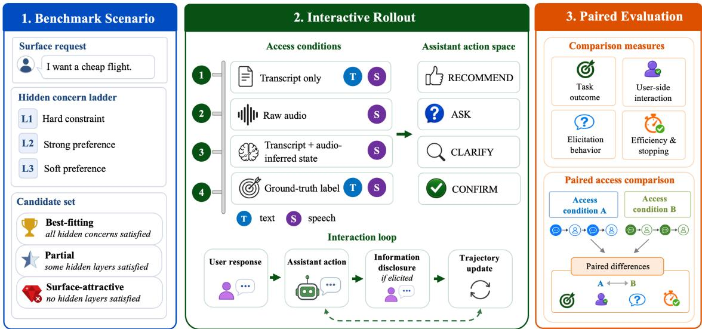
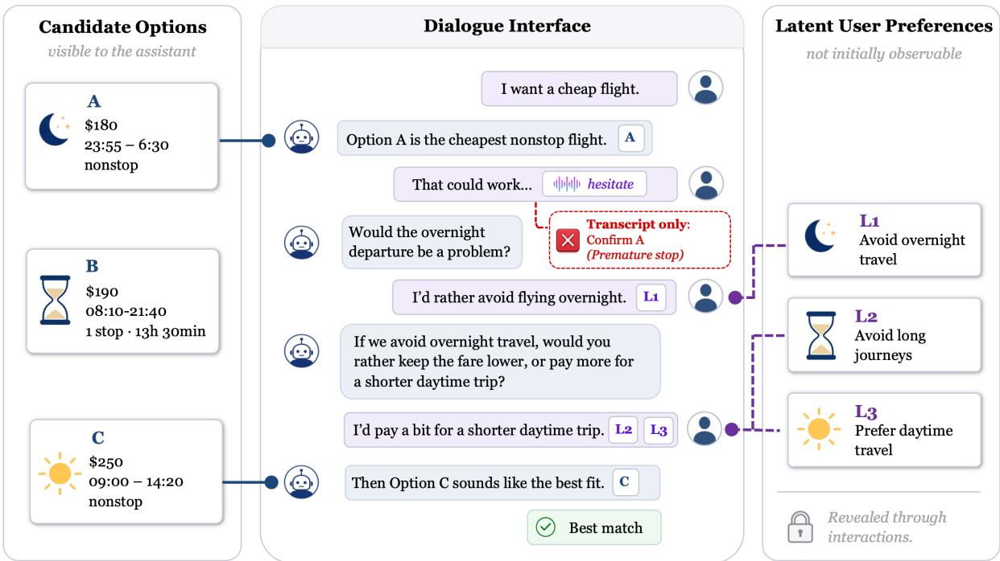
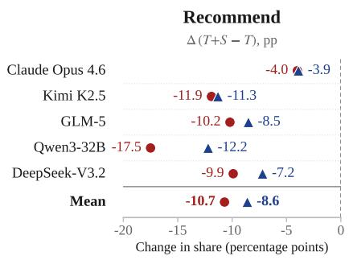
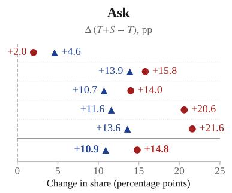
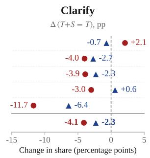
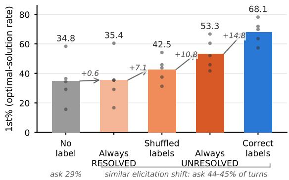
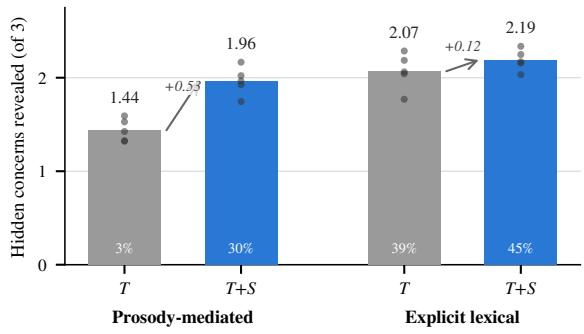

# Hear2Act: Benchmarking When Prosody Should Change What an Assistant Does

Xinyi Liu1,2\*, Hooshang Nayyeri1, Dilek Hakkani-Tur1,2, Emine Yilmaz1,3, JK Kim1, Yifei Zhang1, Charith Peris1, Hari Thadakamalla1

1Amazon 2University of Illinois Urbana-Champaign 3University College London {liu323, dilek}@illinois.edu

{hooshang, jookyk, jimmyzyf, perisc, thadakah}@amazon.com eminey@amazon.co.uk

## Abstract

Prosodic cues can convey task-relevant information that alters the trajectory and outcome of a task-oriented dialogue, even when the words themselves remain unchanged. Yet existing benchmarks typically evaluate prosodic perception, response appropriateness, and task-oriented dialogue in isolation, making it difficult to test whether prosodic evidence changes downstream decisions. We introduce HEAR2ACT, a unified evaluation protocol for text and spoken assistants with 480 persona-grounded scenarios, hidden user concerns, and objectively verifiable outcomes. For each scenario, we keep the task and user needs fixed while varying whether the same concern is conveyed explicitly in words or primarily through prosody, and evaluate decisions under transcript, audio, and concern-state access.

Using HEAR2ACT, we evaluate two audiocapable LLMs. Under Prosody-mediated feedback, adding audio to the transcript changes the average optimal-solution rate only from 14.6% to 15.3%. In contrast, when models infer the concern status from audio, represent it in text, and use it for next-action selection, the rate rises to 39.6%, close to 40.7% with the ground-truth state. This contrast, however, largely disappears under Explicit lexical feedback, where the concern is verbally mentioned in the utterance. Together, these results show that prosody matters when lexical evidence is insufficient, and that audio-capable LLMs can recover information from speech but do not reliably carry it into action without an explicit intermediate representation.

## 1 Introduction

Task-oriented dialogue (TOD) systems guide users toward concrete decisions through multiturn interaction (Budzianowski et al., 2018; Rastogi et al., 2020; Si et al., 2023). In spoken TOD, these decisions may depend on information beyond the transcript. A hesitant “Okay, sounds good” may indicate that an important concern remains unresolved, while the same words delivered brightly may signal genuine acceptance. This distinction can determine whether the assistant continues gathering information or commits prematurely to an unsuitable solution. The resulting evaluation problem is to determine when prosodic evidence should guide information gathering and final selection, and how effectively current assistants use it. The central question is therefore not only whether a model perceives a prosodic cue, but when that cue provides information beyond the words and whether the model carries it into subsequent task decisions.

Existing benchmarks address complementary parts of this problem, but not the full link from prosodic evidence to task action. Task-oriented dialogue benchmarks support multi-turn interaction and verifiable success, but do not isolate how prosodic feedback changes sequential decisions (Budzianowski et al., 2018; Rastogi et al., 2020; Si et al., 2023). Paralinguistic benchmarks preserve vocal cues, but primarily evaluate perception, response appropriateness, or emotional interaction without task-grounded hidden needs and verifiable outcomes (Ao et al., 2024; Gao et al., 2025; Deng et al., 2025; Wang et al., 2026b). StyleTalk and ParaS2S control lexical content, but evaluate the appropriate next response rather than the resulting multi-turn task trajectory (Lin et al., 2024; Yang et al., 2026). To our knowledge, no existing protocol traces prosodic evidence through multi-turn task decisions to verifiable outcomes while evaluating text and spoken assistants within the same task.

We introduce HEAR2ACT to fill this gap. It contains 480 controlled user-assistant scenarios, each pairing an initial request and prioritized hidden concerns with candidate options whose fit can be scored objectively. A deterministic user engine maps each assistant action to a structured user reaction and permissible disclosure. The resulting feedback is realized as a natural utterance and, for spoken conditions, rendered as speech, with the concern either explicit in words or conveyed primarily through prosody. Matched rollouts keep the task and user needs fixed while varying the assistant’s access to transcript, audio, and explicit concern-state information. This design isolates both the decision value of prosodic evidence and where that value is lost between audio and action.

  
Figure 1: HEAR2ACT overview. (1) Each scenario combines a surface request, prioritized hidden concerns, and candidates with verifiable satisfaction signatures. (2) The assistant interacts under different feedback and access conditions. (3) Matched rollouts are compared on task outcomes and interaction behavior.

The results address three questions: when prosodic information has decision value, whether spoken assistants can carry that information into action, and how correct concern information changes the dialogue. Under Prosody-mediated feedback, adding audio to the transcript changes the average optimal-solution rate across two audio-capable LLMs only from 14.6% to 15.3%. When the models instead infer the concern status from audio, express it in text, and use it for nextaction selection, the rate rises to 39.6%, close to the 40.7% ground-truth-state reference. This contrast largely disappears under Explicit lexical feedback, where the relevant concern is already stated in words. Further analysis shows that correct turnspecific concern information shifts interaction toward elicitation and helps the assistant determine when to continue searching and when to stop. Together, these results show that prosody is most useful when lexical evidence is insufficient, yet current audio-capable LLMs make limited use of that information directly from speech for downstream decisions.

Table 1: Benchmark positioning. P: prosodic input, C: matched control of prosodic access with fixed lexical content, M: multi-turn task decisions, N: taskgrounded hidden user need, and O: verifiable trajectory and outcome. △ marks structured user goals conveyed lexically rather than hidden needs.
<table><tr><td>Benchmark</td><td></td><td>PCMNO</td><td></td></tr><tr><td>MultiWOZ, SGD (Budzianowski et al., 2018; Rastogi et al., 2020)</td><td></td><td>× ×√△√</td><td></td></tr><tr><td>SpokenWOZ (Si et al., 2023)</td><td></td><td></td><td>√×√△√</td></tr><tr><td>StyleTalk, ParaS2S (Lin et al., 2024; √ √ × × × Yang et al., 2026)</td><td></td><td></td><td></td></tr><tr><td>MULTI-Bench, HumDial-EIBench (Deng et al., 2025; Wang et al., 2026b)</td><td></td><td></td><td>√ × √ × ×</td></tr><tr><td>Hear2Act (ours)</td><td></td><td>√√√√√</td><td></td></tr></table>

## 2 Related Work

## 2.1 Task-Oriented and Spoken Task Dialogue

MultiWOZ and the Schema-Guided Dialogue dataset established multi-domain task-oriented dialogue with structured states and verifiable task success (Budzianowski et al., 2018; Rastogi et al., 2020), while ATOD extends evaluation to agentic capabilities (Zhang et al., 2026). SpokenWOZ extends this setting to speech (Si et al., 2023), while RealTalk-CN studies speech–text interaction (Wang et al., 2026a). Emotion-aware work adds affect annotations or user simulation (Feng et al., 2022; Lin et al., 2023; Feng et al., 2024), and classical POMDP formulations treat user state as latent (Young et al., 2013). These approaches study task success, agentic behavior, speech, affect, or latent state, but do not isolate when prosodic evidence adds decision value beyond the transcript or changes downstream task actions.

  
Figure 2: Illustrative Hear2Act trajectory under Prosody-mediated feedback. Three representative candidates are shown from the full 11-candidate set. Transcript-only access may confirm prematurely, while ground-truth concern-state access supports further elicitation and selection of the best-fitting option.

## 2.2 Paralinguistic and Spoken Evaluation

Paralinguistic benchmarks mainly target recognition, response appropriateness, or multi-turn affect. Recognition suites test attributes beyond lexical content (Ao et al., 2024; Yang et al., 2024; Huang et al., 2024; Wang et al., 2025; Debaupte et al., 2026); response-oriented benchmarks assess whether a reply fits the speaking style or audio context (Lin et al., 2024; Yang et al., 2026; Gao et al., 2025); and multi-turn benchmarks evaluate emotion understanding and trajectories (Deng et al., 2025; Wang et al., 2026b). StyleTalk and ParaS2S control lexical content but remain limited to single-response evaluation, while emotionconditioned user simulators add interaction (Lin et al., 2023; Feng et al., 2024) without candidategrounded hidden needs that make elicitation, stopping, and final selection jointly verifiable. Table 1 summarizes these distinctions.

Recent work also examines whether paralinguistic evidence is carried from perception into downstream behavior. LISTEN finds lexical dominance and underuse of acoustic cues (Chen et al., 2026); PALLM couples paralinguistic classification with response generation (Kim et al., 2026); ParaBridge identifies a perception–behavior gap and improves cue-conditioned behavior through scaffolding and training (Wang et al., 2026c); and Miyazawa and Sato show gains from recognized paralinguistic attitude classes in dialogue-act prediction (Miyazawa and Sato, 2026). HEAR2ACT instead tests whether a controlled prosodic cue changes multi-turn elicitation, stopping, and objectively verifiable final task selection.

## 3 Hear2Act Evaluation Design

## Task Definition

HEAR2ACT evaluates whether an assistant can use task-relevant prosodic evidence to make better dialogue decisions. Each scenario fixes an initial request, a candidate set, and prioritized hidden concerns that determine which option best satisfies the user’s needs. Given the dialogue and the evidence available under its access condition, the assistant must decide whether to elicit more information, what to ask, and which option to recommend. Across matched rollouts, the task and user needs remain fixed while the available evidence varies. We evaluate both the final choice and the dialogue trajectory leading to it. Figure 1 summarizes the design.

## 3.1 Benchmark Scenarios

Each scenario is constructed so that the value of otherwise hidden concern information can be measured from the assistant’s final choice. It combines an initial request, three prioritized hidden concerns, and a candidate set whose fit to those concerns is known (Figure 1, left). We seed 48 domains from the service categories in the Schema-Guided Dialogue dataset (Rastogi et al., 2020) and instantiate ten scenarios per domain, yielding 480 scenarios across travel, housing, healthcare, finance, and other consumer services. Scenario seeds vary urgency, budget, expertise, and life context so that similar requests can reflect different underlying needs.

The initial request states only visible requirements, while three concerns remain hidden: a hard constraint (L1), a strong preference (L2), and a moderate preference (L3). In Figure 2, for example, the user asks only for a cheap flight, while concerns about overnight travel, journey length, and daytime travel remain unstated. Through interaction, the assistant may uncover none, some, or all of these concerns.

The candidate set makes the consequences of this information observable. The three concerns define eight possible satisfaction patterns, each represented by one candidate. We add one safe alternative and two candidates that violate stated requirements, yielding 11 candidates in total. The best-fitting option satisfies all three hidden concerns but does not lead on visible attributes such as price or rating, while the other candidates remain plausible under incomplete information. Final selection therefore reflects whether the assistant uncovered and used the information needed to distinguish the best-fitting option. Appendix H shows complete matched rollouts, and Appendix G.1 summarizes the candidate-construction procedure.

## 3.2 Interactive Rollouts

Each scenario is realized as an interactive episode so that concern evidence can affect what the assistant asks, when it stops, and which option it selects. A rollout pairs one episode with one assistant and one access condition (Figure 1, center). All rollouts begin from the same surfaceattractive option. Text assistants may ASK, CLAR-IFY, RECOMMEND, or CONFIRM, while spoken assistants use ASK, RECOMMEND, and CONFIRM. The episode ends when an option is accepted or the 20-turn budget is reached.

A deterministic user engine governs the interaction. Given the scenario, dialogue history, and assistant action, it determines which concerns remain unresolved, what information can be disclosed, how the user responds, and whether the episode ends. A targeted question reveals the user’s requirement for the queried attribute, while a general question reveals only why the current recommendation remains unresolved. The resulting structured response is realized as a natural utterance and, for spoken conditions, rendered as speech. Detailed interaction and disclosure rules appear in Appendix G.6.

We vary both how concern information is expressed and what evidence is available to the assistant. Under EXPLICIT LEXICAL feedback, concerns are stated in words. Under PROSODY-MEDIATED feedback, hard-constraint violations remain explicit, while soft concerns remain lexically implicit and vocal delivery signals that the recommendation is still unresolved. Figure 2 illustrates the resulting divergence: transcript-only access may treat hesitant acceptance as resolution, whereas concern-state access supports further elicitation and a better-fitting choice. Matched rollouts keep the scenario and user needs fixed while varying access to transcript, audio, an audioinferred textual state, or the ground-truth concern state, enabling paired comparison of dialogue trajectories and outcomes (Figure 1, right). Exact input combinations appear in Section 4.2.

## 3.3 Paired Evaluation

Each comparison pairs rollouts with the same scenario, user needs, feedback realization, and task instructions, differing only in the assistant’s access condition (Figure 1, right). This design isolates how the available evidence changes both the final outcome and the dialogue trajectory leading to it.

We evaluate final task outcomes together with elicitation, disclosure, assistant actions, dialogue length, and stopping behavior, allowing us to distinguish effective information use from simply longer interaction.

Table 2: Hear2Act benchmark and rollout coverage. The 480 model-independent scenarios expand to 54,240 evaluation rollouts across models, access conditions, renderers, and interventions.
<table><tr><td>Benchmark artifact</td></tr><tr><td>SGD-seeded domains 48 Scenarios per domain 10 Benchmark scenarios 480 Candidate options per scenario 11 Hidden concern layers per scenario 3 Feedback realizations 2 Base episode specifications 960</td></tr><tr><td>Evaluation rollouts Text LLM main grid 19,200 Text label interventions 1,440 Spoken assistant with Qwen3-TTS 6,720 Spoken assistant with VoxCPM2 6,720 Qwen2-Audio, three rollouts per scenario 20,160</td></tr></table>

The paired design supports two complementary analyses. Spoken-model comparisons test how effectively task-relevant prosodic information is carried from audio into action, while text-model comparisons measure its decision value when correctly represented.

## 4 Experimental Instantiation and Validation

## 4.1 Evaluation Scope and Systems

The benchmark itself is fixed across evaluations, while the number of model rollouts varies by system and condition. As summarized in Table 2, it contains 480 scenarios and 960 base episode specifications.

Evaluated assistants. We evaluate two spoken assistants to test whether task-relevant prosodic information can be carried from audio into decisions, and five text LLMs to measure the value of that information when explicitly represented. The text LLMs are Claude Opus 4.6, Kimi K2.5, DeepSeek-V3.2, GLM-5, and Qwen3-32B, all accessed in July 2026 under a fixed decoding configuration. Qwen2.5-Omni-7B is the primary spoken assistant and is evaluated on both speech renderers (Xu et al., 2025). Qwen2-Audio-7B-Instruct provides a second spoken backbone and is evaluated on the primary renderer with three rollouts per scenario (Chu et al., 2024).

Realization components. User utterances are generated from structured engine states by a fixed language realizer, while the user engine determines state transitions and concern disclosure. Qwen3-TTS is the primary speech renderer and follows natural-language delivery instructions derived from the concern state (Hu et al., 2026). Vox-CPM2 provides a second-renderer robustness condition using its native affect controls (Zhou et al., 2026). Additional prompting and realization details appear in Appendix G.

## 4.2 Access Conditions and Interventions

We organize the evaluation into text-model conditions, spoken-model conditions, and label-fidelity interventions. Downstream decision instructions remain fixed across access conditions, with state definitions and turn-level labels added only when required.

Text-model conditions. Text LLMs receive either the dialogue transcript alone or the transcript with the ground-truth concern state at each user turn. This comparison isolates the decision value of correctly represented concern information without requiring speech perception.

Spoken-model conditions. Spoken assistants are evaluated under five core access conditions. Transcript only, audio only, and audio plus transcript provide no explicit state representation. Transcript plus state provides the ground-truth graded concern-state tag. In the audio-inferred condition, the assistant instead infers the taskrelevant resolved/unresolved concern status from audio and records it as text. The decision stage then receives the transcript together with this inferred state, rather than the raw audio, when selecting the next action.

Speech-emotion-recognition (SER) baselines. We additionally test two off-the-shelf SER representations for each spoken assistant, yielding seven conditions in total. HuBERT-SUPERB-ER (Hsu et al., 2021; Yang et al., 2021) and SpeechBrain wav2vec2-IEMOCAP (Ravanelli et al., 2021; Baevski et al., 2020; Busso et al., 2008) independently classify the current user audio into their native four-class affect space (happy, sad, angry, or neutral). The predicted label is passed verbatim with the transcript to the same downstream decision stage, without mapping it to the benchmark concern states. These baselines test whether generic affect representations recover the decision-relevant information captured by the audio-inferred concern state.

These conditions support four main comparisons. Transcript versus audio plus transcript tests whether direct audio improves decisions beyond the transcript. Audio plus transcript versus transcript plus the audio-inferred state compares direct audio use with a two-stage intervention that first infers the task-relevant concern status from audio and then supplies that textual inference to the same downstream decision model. Transcript versus transcript plus the ground-truth state measures the value of correctly represented concern information. Finally, the SER conditions versus the audio-inferred state compare generic affect with task-relevant concern extraction under the same downstream decision model. Ground-truth state access serves as a diagnostic reference rather than a deployment setting.

Label-fidelity interventions. On a 48-scenario subset, we replace the ground-truth concern states with all-positive (RESOLVED), all-negative (UNRESOLVED), or turn-shuffled sequences. The fixed conditions remove turn-level variation, while shuffling preserves the label distribution but breaks its alignment with the current turn. These controls test whether the gains require correct turn-specific concern information, rather than merely providing a state signal or inducing more cautious interaction.

## 4.3 Metrics and Statistical Analysis

Outcome and user-side interaction measures. We report three higher-is-better outcome measures. Optimal-solution rate (1st%) is the proportion of rollouts ending with the first-tier option, using the final recommendation if the turn budget is exhausted. OptSat% and SvcSat% measure the proportions of recommendation turns followed by non-negative Option-acceptance and appreciative Interaction-satisfaction states, respectively. Because each feedback turn follows one recommendation, these are per-recommendation rates whose denominator depends on how many recommendations the assistant makes. A policy that searches longer before settling can therefore lower these rates while improving 1st%. All userside states are computed deterministically by the engine and are never shown to the assistant.

Policy and elicitation diagnostics. To understand how concern information changes the dialogue, we track the shares of RECOMMEND, ASK, and CLARIFY decisions. We also measure hidden concerns disclosed, full disclosure of all three concerns, dialogue length, and premature closure on a suboptimal option. These diagnostics distinguish effective elicitation and stopping from simply interacting longer.

Statistical analysis. The scenario is the statistical unit. We pair condition differences within scenarios and compute scenario-level bootstrap 95% confidence intervals with 2,000 resamples. Repeated rollouts, access conditions, and renderers from the same scenario are not treated as independent observations. For pooled results, we compute each model’s statistic separately and average equally across models. The 48-scenario intervention analysis follows the same paired design. Confidence intervals for key diagnostic contrasts appear in Appendix D.

## 4.4 Speech-Layer Validation

We verify that the intended concern contrast remains recoverable after speech rendering. Two annotators independently judge 100 utterances from each renderer in dialogue context, with samples balanced between RESOLVED and UNRESOLVED. For Qwen3-TTS, annotators select among four graded concern states, which we collapse to the binary distinction for analysis. For VoxCPM2, they make the binary judgment directly. Full instructions appear in Appendix E.

Qwen2.5-Omni-7B performs the same perception task on the same clips, allowing human and model recovery of the intended concern status to be compared directly. This validation establishes whether the intended communicative contrast survives rendering, rather than treating synthesized speech as objective ground truth for emotion.

## 5 Results

The results address three questions. First, when does prosodic information add decision value beyond the transcript? Second, when it does, can spoken assistants use it? Third, how does correct concern information change the dialogue? All analyses use paired scenario-level comparisons. Paired 95% confidence intervals for key diagnostic contrasts appear in Table 9.

Table 3: Spoken-assistant results under Prosody-mediated feedback with Qwen3-TTS. T, A, S, and $\hat { S }$ denote transcript, audio, ground-truth state, and audio-inferred state; audio-derived representations are textualized and paired with the transcript. Average is computed across the two audio-capable LLMs. Bold/underline indicate the best/second-best value per column. See Table 4 for Explicit-lexical results and Appendix B for VoxCPM2.
<table><tr><td rowspan="2">Input / representation</td><td colspan="3">Qwen2.5-Omni</td><td colspan="3">Qwen2-Audio</td><td colspan="3">Average</td></tr><tr><td>1st %↑ %↑</td><td>OptSat SvcSat</td><td>%↑</td><td>1st %↑ %↑</td><td></td><td>OptSat SvcSat %↑</td><td>1st</td><td>OptSat SvcSat %↑ %↑</td><td>%↑</td></tr><tr><td>Direct input</td><td></td><td></td><td></td><td></td><td></td><td></td><td></td><td></td><td></td></tr><tr><td>Transcript only (T)</td><td>15.4</td><td>22.9</td><td>12.3</td><td>13.7</td><td>20.1</td><td>12.0</td><td>14.6</td><td>21.5</td><td>12.2</td></tr><tr><td>Audio only (À)</td><td>17.3</td><td>22.7</td><td>13.3</td><td>14.7</td><td>22.4</td><td>12.2</td><td>16.0</td><td>22.6</td><td>12.8</td></tr><tr><td>Audio + transcript (A + T)</td><td>15.9</td><td>24.0</td><td>14.6</td><td>14.7</td><td>23.3</td><td>13.3</td><td>15.3</td><td>23.7</td><td>14.0</td></tr><tr><td>Textualized prosodic representations</td><td></td><td></td><td></td><td></td><td></td><td></td><td></td><td></td><td></td></tr><tr><td>Generic affect (HuBERT)</td><td>35.7</td><td>40.3</td><td>21.4</td><td>29.4</td><td>31.3</td><td>19.9</td><td>32.6</td><td>35.8</td><td>20.7</td></tr><tr><td>Generic affect (SpeechBrain)</td><td>32.6</td><td>38.7</td><td>20.6</td><td>25.7</td><td>29.1</td><td>18.3</td><td>29.2</td><td>33.9</td><td>19.5</td></tr><tr><td>Task-aligned state (T + Î)</td><td>43.0</td><td>41.8</td><td>22.7</td><td>36.2</td><td>33.4</td><td>20.6</td><td>39.6</td><td>37.6</td><td>21.7</td></tr><tr><td>Ground-truth state (T + S)</td><td>44.5</td><td>41.8</td><td>24.4</td><td>36.9</td><td>37.5</td><td>23.5</td><td>40.7</td><td>39.7</td><td>24.0</td></tr></table>

Table 4: Spoken-assistant use of concern information under Explicit lexical feedback with Qwen3-TTS (Qwen2.5-Omni n=480, Qwen2-Audio n=1,440 per condition). Notation follows Table 3. Results are similar because the concern is explicit in the transcript. Bold/underline mark column-wise highest/next-highest values.
<table><tr><td></td><td colspan="3">Qwen2.5-Omni</td><td colspan="3">Qwen2-Audio</td><td colspan="3">Average</td></tr><tr><td>Input / representation</td><td>1st %↑</td><td>OptSat SvcSat %↑</td><td>%↑</td><td>1st %↑</td><td>OptSat SvcSat %↑</td><td>%↑</td><td>1st %↑</td><td>OptSat SvcSat %↑</td><td>%↑</td></tr><tr><td>Direct input</td><td></td><td></td><td></td><td></td><td></td><td></td><td></td><td></td><td></td></tr><tr><td>Transcript only (T)</td><td>56.2</td><td>45.3</td><td>26.9</td><td>48.3</td><td>42.1</td><td>26.3</td><td>52.3</td><td>43.7</td><td>26.6</td></tr><tr><td>Audio only (Á)</td><td>55.3</td><td>45.7</td><td>26.4</td><td>48.0</td><td>41.3</td><td>26.0</td><td>51.7</td><td>43.5</td><td>26.2</td></tr><tr><td>Audio + transcript (A + T)</td><td>52.2</td><td>45.4</td><td>26.5</td><td>47.6</td><td>41.0</td><td>25.9</td><td>49.9</td><td>43.2</td><td>26.2</td></tr><tr><td>Textualized prosodic representations</td><td></td><td></td><td></td><td></td><td></td><td></td><td></td><td></td><td></td></tr><tr><td>Generic affect (HuBERT)</td><td>52.8</td><td>46.0</td><td>25.3</td><td>48.5</td><td>40.6</td><td>24.5</td><td>50.7</td><td>43.3</td><td>24.9</td></tr><tr><td>Generic affect (SpeechBrain)</td><td>52.8</td><td>45.9</td><td>25.3</td><td>45.0</td><td>39.9</td><td>23.7</td><td>48.9</td><td>42.9</td><td>24.5</td></tr><tr><td>Task-aligned state (T + )</td><td>52.4</td><td>45.8</td><td>25.4</td><td>49.8</td><td>41.2</td><td>25.1</td><td>51.1</td><td>43.5</td><td>25.3</td></tr><tr><td>Ground-truth state (T + S)</td><td>49.7</td><td>46.6</td><td>26.6</td><td>50.3</td><td>42.3</td><td>26.1</td><td>50.0</td><td>44.5</td><td>26.4</td></tr></table>

## 5.1 When Does Prosodic Information Add Decision Value?

We first ask when prosodic information changes decisions beyond what is already available in the transcript. The results show that prosody adds substantial decision value when it conveys taskrelevant information missing from the words, but current audio-capable LLMs make limited use of this value directly from audio. Under Prosodymediated feedback, adding audio to the transcript changes the average optimal-solution rate only from 14.6% to 15.3%, whereas representing the audio-inferred concern state raises it to 39.6% (Table 3). This advantage largely disappears under Explicit lexical feedback, where the concern is already stated in words: the optimal-solution rates across all seven conditions span only 6.5 points for Qwen2.5-Omni and 5.3 points for Qwen2-Audio

(Table 4).

This asymmetry is not specific to spoken models. When we isolate the value of the concern information itself by giving five text LLMs the ground-truth state, the gains are much larger under Prosody-mediated feedback. Ground-truth state access raises the mean optimal-solution rate across the five models by 36.7 percentage points (Table 5), compared with only 6.4 points under Explicit lexical feedback. OptSat% and SvcSat% show the same asymmetry, increasing by 7.3 and 4.1 points under Prosody-mediated feedback but by only −1.6 and +0.3 points under Explicit feedback.

Together, these results show that prosodic information has substantial decision value when lexical evidence is insufficient, but little when the concern is explicit in the transcript, supporting selective use of prosodic cues.

Table 5: Effect of ground-truth concern-state access on text LLMs. Results use 480 matched scenarios with two runs each (n=960 per cell). T is transcript only; T+S adds turn-level ground-truth state tags. Bold marks the larger value in each pair; action composition appears in Figure 3.
<table><tr><td rowspan="3"></td><td colspan="6">Prosody-mediated feedback</td><td colspan="4">Explicit lexical feedback</td></tr><tr><td colspan="2">1st%↑</td><td colspan="2">OptSat%↑</td><td colspan="2">SvcSat%↑</td><td colspan="2">1st%↑</td><td colspan="2">OptSat%↑ SvcSat%↑</td></tr><tr><td></td><td>T T+S</td><td>T T+S</td><td></td><td>T T+S</td><td></td><td>T T+S</td><td>T T+S</td><td>T</td><td>T+S</td></tr><tr><td>Claude Opus 4.6</td><td>49.7</td><td>79.1</td><td>37.0</td><td>41.1</td><td>24.7</td><td>26.2</td><td>74.9 81.9</td><td>44.6</td><td>43.0</td><td>25.9</td><td>26.4</td></tr><tr><td>Kimi K2.5</td><td>27.9</td><td>69.2</td><td>27.7</td><td>36.1</td><td>14.4</td><td>19.6</td><td>69.4</td><td>74.9 37.1</td><td>36.2</td><td>17.7</td><td>17.7</td></tr><tr><td>GLM-5</td><td>22.4</td><td>60.1</td><td>26.1</td><td>33.4</td><td>13.0</td><td>15.8</td><td>67.3</td><td>73.5 36.8</td><td>35.7</td><td>15.5</td><td>16.0</td></tr><tr><td>Qwen3-32B</td><td>21.1</td><td>53.1</td><td>31.0</td><td>35.5</td><td>10.4</td><td>13.7</td><td>64.3</td><td>64.8 43.1</td><td>37.7</td><td>12.9</td><td>12.6</td></tr><tr><td>DeepSeek-V3.2</td><td>13.3</td><td>56.2</td><td>16.4</td><td>28.8</td><td>6.5</td><td>14.4</td><td>54.8</td><td>67.6 31.8</td><td>32.6</td><td>14.3</td><td>15.1</td></tr><tr><td>Five-model mean</td><td>26.9</td><td>63.5</td><td>27.6</td><td>35.0</td><td>13.8</td><td>17.9</td><td>66.1</td><td>72.5 38.7</td><td>37.0</td><td>17.3</td><td>17.6</td></tr></table>

Prosody-mediated Explicit lexical  

  
Figure 3: Change in assistant action composition with concern-state access. Points show the T+S−T change, in percentage points, in the share of RECOMMEND, ASK, and CLARIFY decision turns under Prosody-mediated (red circles) and Explicit lexical (blue triangles) feedback; means are macro-averaged across models.

## 5.2 When Prosody Matters, Can Spoken Assistants Use It?

Prosody-mediated feedback is therefore the setting in which prosodic information adds substantial value beyond the transcript. We next ask where this value is lost between perceiving the cue and acting on it. Qwen2.5-Omni shows a clear perception–action gap: on the audited perception task, it recovers the intended concern status with 0.85 accuracy on Qwen3-TTS and 0.76 on Vox-CPM2 (Table 11), showing that the cue is substantially recoverable from audio. Yet this information has little effect on direct decisions: optimalsolution rates remain similar with Transcript only (15.4%), Audio only (17.3%), and Audio + transcript (15.9%; Table 3). Thus, recovering the cue does not by itself translate into better task decisions.

Making the recovered concern information explicit largely closes this gap. When Qwen2.5- Omni first infers the concern status from audio, expresses it in text, and uses it with the transcript for next-action selection, the optimal-solution rate rises from 15.9% to 43.0%, close to 44.5% with the ground-truth state. This two-stage intervention recovers most of the available state-access benefit, showing that the model can use the information once it is made explicit but makes limited use of it directly from audio.

We next ask whether generic speech-emotion representations recover decision value from audio. With Qwen2.5-Omni fixed as the downstream decision model, textualized HuBERT and Speech-Brain predictions raise the optimal-solution rate from 15.9% with direct audio to 35.7% and 32.6%, respectively. The audio-inferred concern state raises it further to 43.0% (Table 3). The same pattern holds for Qwen2-Audio and with VoxCPM2 (Appendix B). Thus, generic affect recovers some decision value, while task-relevant concern inference yields larger downstream gains in our setting.

  
Figure 4: Outcome tracks label fidelity, not asking frequency. Optimal-solution rate on the 48-scenario intervention subset under Prosody-mediated feedback, pooled over five text LLMs. All label conditions have similar ASK shares (44–45%).

## 5.3 How Does Useful Concern Information Change the Dialogue?

Correct concern information shifts the dialogue from early recommendation toward information gathering. Under Prosody-mediated feedback, the average number of ASK and CLARIFY actions across the five text LLMs rises from 1.8 to 4.4 per dialogue, indicating more information gathering before recommendation. This shift is accompanied by greater disclosure of the user’s hidden needs: the share of dialogues in which all three concerns are disclosed rises from 3% to 30%. Under Explicit lexical feedback, where the concern is already stated, disclosure changes much less. The shift toward asking appears across models, while clarification is more model-dependent (Figure 3). Additional behavior results appear in Appendix C.

The improvement is not simply due to asking more questions. When models receive incorrect concern states, they ask at nearly the same rate as with the correct state (44–45%), but achieve much lower optimal-solution rates (35.4–53.3% versus 68.1%; Figure 4). Even the always-negative condition produces longer dialogues (23.2 versus 17.8 turns) while performing worse. Thus, the gain depends on having the correct concern information at each turn, not on interacting more.

Correct concern information also improves stopping behavior. Under Prosody-mediated feedback, state access reduces premature closure on a suboptimal option from 69.7% to 26.7%. This also explains why OptSat%, a perrecommendation acceptance rate, can decrease even as the final choice improves: continued search adds rejected recommendations to its denominator. Under Explicit feedback, for example, 1st% rises from 66.1% to 72.5% while OptSat% decreases slightly from 38.7% to 37.0%.

Overall, correct concern information helps the assistant know when to continue eliciting and searching, and when to stop.

## 6 Conclusion

We introduced HEAR2ACT, a controlled protocol for measuring when prosody changes multi-turn task decisions. Across two audio-capable LLMs, prosody adds decision value when lexical evidence is insufficient, while the contrast largely disappears under Explicit lexical feedback, where the concern is verbalized. Yet raw audio provides little direct benefit. When models infer the concern status from audio, represent it in text, and use it for next-action selection, they recover most of the gain from ground-truth state access. Correct concern information also changes the dialogue policy, encouraging elicitation when needed and reducing premature stopping on suboptimal options. Together, these results show that audio-capable LLMs can recover useful information from speech but do not reliably carry it into action without an explicit intermediate representation.

## Limitations

HEAR2ACT isolates one decision-relevant function of prosody: whether and how strongly a recommendation remains unresolved. Its shared three-layer concern structure and standardized opening enable matched, objectively scored comparisons, but do not cover broader preference structures, other functions of prosody, or unconstrained first-turn recommendation.

User utterances and speech are synthesized from structured states. Human validation shows that the intended concern contrast remains perceptible across two renderers, but synthetic speech cannot capture the full variability of natural speech and interaction. Ground-truth-state conditions are diagnostic rather than deployment settings. The inferred-state condition adds both an explicit representation and an additional inference step, so it establishes that the intervention is sufficient without isolating the mechanism.

## Ethical Considerations

HEAR2ACT uses constructed scenarios and personas, with dialogue and speech generated from structured benchmark states. It contains no real user conversations, identities, recordings, or personal data. Personas encode only task-relevant context and are not intended to represent demographic groups or support claims about real individuals.

The benchmark evaluates a narrow communicative signal: whether a recommendation remains unresolved. Such evidence should support clarification rather than be used to infer sensitive attributes, override explicit user statements, or make high-stakes decisions without confirmation. The human study involved volunteer graduate students who judged generated speech clips. No personal or sensitive information was collected. Details of the human study appear in Appendix E; benchmark and computational details appear in Appendix F.

## References

Junyi Ao, Yuancheng Wang, Xiaohai Tian, Dekun Chen, Jun Zhang, Lu Lu, Yuxuan Wang, Haizhou Li, and Zhizheng Wu. 2024. SD-Eval: A benchmark dataset for spoken dialogue understanding beyond words. In Advances in Neural Information Processing Systems, volume 37.

Alexei Baevski, Yuhao Zhou, Abdelrahman Mohamed, and Michael Auli. 2020. wav2vec 2.0: A framework for self-supervised learning of speech representations. In Advances in Neural Information Processing Systems (NeurIPS), volume 33, pages 12449– 12460.

Paweł Budzianowski, Tsung-Hsien Wen, Bo-Hsiang Tseng, Iñigo Casanueva, Stefan Ultes, Osman Ramadan, and Milica Gašic. 2018. MultiWOZ – a´ large-scale multi-domain wizard-of-oz dataset for task-oriented dialogue modelling. In Proceedings of the 2018 Conference on Empirical Methods in Natural Language Processing (EMNLP), pages 5016– 5026.

Carlos Busso, Murtaza Bulut, Chi-Chun Lee, Abe Kazemzadeh, Emily Mower, Samuel Kim, Jeannette N Chang, Sungbok Lee, and Shrikanth S Narayanan. 2008. IEMOCAP: Interactive emotional dyadic motion capture database. Language Resources and Evaluation, 42(4):335–359.

Jingyi Chen, Zhimeng Guo, Jiyun Chun, Pichao Wang, Andrew Perrault, and Micha Elsner. 2026. Do audio LLMs really LISTEN, or just transcribe? measuring lexical vs. acoustic emotion cues reliance. In

Proceedings of the 19th Conference of the European Chapter of the Association for Computational Linguistics (Volume 1: Long Papers), pages 5848– 5877, Rabat, Morocco. Association for Computational Linguistics.

Yunfei Chu, Jin Xu, Qian Yang, Haojie Wei, Xipin Wei, Zhifang Guo, Yichong Leng, Yuanjun Lv, Jinzheng He, Junyang Lin, Chang Zhou, and Jingren Zhou. 2024. Qwen2-Audio technical report. Preprint, arXiv:2407.10759.

Luc Debaupte, Tyler Baumgartner, Brandon Tai, Candice Fan, Bill Wang, and Yi Zhong. 2026. VocalAffectBench: Evaluating Vocal Emotion Recognition in AI Audio Models. Hugging Face dataset, https://huggingface.co/datasets/ besimple-ai/vocal-affect-bench.

Yayue Deng, Guoqiang Hu, Haiyang Sun, Xiangyu Zhang, Haoyang Zhang, Fei Tian, Xuerui Yang, Gang Yu, and Eng Siong Chng. 2025. MULTI-Bench: A multi-turn interactive benchmark for assessing emotional intelligence ability of spoken dialogue models. arXiv:2511.00850.

Shutong Feng, Hsien-Chin Lin, Christian Geishauser, Nurul Lubis, Carel van Niekerk, Michael Heck, Benjamin Ruppik, Renato Vukovic, and Milica Gašic. 2024.´ Infusing emotions into task-oriented dialogue systems: Understanding, management, and generation. In Proceedings ofthe 25th Annual Meeting of the Special Interest Group on Discourse and Dialogue, pages 699–717, Kyoto, Japan. Association for Computational Linguistics.

Shutong Feng, Nurul Lubis, Christian Geishauser, Hsien-Chin Lin, Michael Heck, Carel van Niekerk, and Milica Gašic. 2022. EmoWOZ: A large-scale´ corpus and labelling scheme for emotion recognition in task-oriented dialogue systems. In Proceedings of the Thirteenth Language Resources and Evaluation Conference (LREC), pages 4096–4113.

Kuofeng Gao, Shu-Tao Xia, Ke Xu, Philip Torr, and Jindong Gu. 2025. Benchmarking open-ended audio dialogue understanding for large audio-language models. In Proceedings of the 63rd Annual Meeting of the Association for Computational Linguistics (Volume 1: Long Papers), pages 4763–4784, Vienna, Austria. Association for Computational Linguistics.

Wei-Ning Hsu, Benjamin Bolte, Yao-Hung Hubert Tsai, Kushal Lakhotia, Ruslan Salakhutdinov, and Abdelrahman Mohamed. 2021. HuBERT: Self-supervised speech representation learning by masked prediction of hidden units. IEEE/ACM Transactions on Audio, Speech, and Language Processing, 29:3451–3460.

Hangrui Hu, Xinfa Zhu, Ting He, Dake Guo, Bin Zhang, Xiong Wang, Zhifang Guo, Ziyue Jiang, Hongkun Hao, Zishan Guo, Xinyu Zhang, Pei Zhang, Baosong Yang, Jin Xu, Jingren Zhou, and

Junyang Lin. 2026. Qwen3-TTS Technical Report. Preprint, arXiv:2601.15621.

Chien-yu Huang, Ke-Han Lu, Shih-Heng Wang, Chi-Yuan Hsiao, Chun-Yi Kuan, Haibin Wu, Siddhant Arora, Kai-Wei Chang, Jiatong Shi, Yifan Peng, Roshan Sharma, Shinji Watanabe, Bhiksha Ramakrishnan, Shady Shehata, and Hung-yi Lee. 2024. Dynamic-SUPERB: Towards a dynamic, collaborative, and comprehensive instruction-tuning benchmark for speech. In 2024 IEEE International Conference on Acoustics, Speech and Signal Processing (ICASSP), pages 12136–12140.

Minseok Kim, Jingxiang Chen, Seong-Gyun Leem, Yin Huang, Rashi Rungta, Zhicheng Ouyang, Haibin Wu, Surya Teja Appini, Ankur Bansal, Yang Bai, Yue Liu, Florian Metze, Ahmed A Aly, Anuj Kumar, Ariya Rastrow, and Zhaojiang Lin. 2026. Aligning paralinguistic understanding and generation in speech LLMs via multi-task reinforcement learning. In Proceedings of the 19th Conference of the European Chapter of the Association for Computational Linguistics (Volume 5: Industry Track), pages 636–648, Rabat, Morocco. Association for Computational Linguistics.

Guan-Ting Lin, Cheng-Han Chiang, and Hung-yi Lee. 2024. Advancing large language models to capture varied speaking styles and respond properly in spoken conversations. In Proceedings of the 62nd Annual Meeting of the Association for Computational Linguistics (Volume 1: Long Papers), pages 6626– 6642, Bangkok, Thailand. Association for Computational Linguistics.

Hsien-Chin Lin, Shutong Feng, Christian Geishauser, Nurul Lubis, Carel van Niekerk, Michael Heck, Benjamin Ruppik, Renato Vukovic, and Milica Gašic. 2023. EmoUS: Simulating user emotions in´ task-oriented dialogues. In Proceedings of the 46th International ACM SIGIR Conference on Research and Development in Information Retrieval (SIGIR), pages 2526–2531.

Kouki Miyazawa and Yoshinao Sato. 2026. Evaluation of paralinguistic-aware spoken dialogue systems using next-utterance classification. In Proceedings of the 27th Annual Meeting of the Special Interest Group on Discourse and Dialogue, pages 711–719, Atlanta, Georgia, USA. Association for Computational Linguistics.

Abhinav Rastogi, Xiaoxue Zang, Srinivas Sunkara, Raghav Gupta, and Pranav Khaitan. 2020. Towards scalable multi-domain conversational agents: The schema-guided dialogue dataset. In Proceedings of the AAAI Conference on Artificial Intelligence, volume 34, pages 8689–8696.

Mirco Ravanelli, Titouan Parcollet, Peter Plantinga, Aku Rouhe, Samuele Cornell, Loren Lugosch, Cem Subakan, Nauman Dawalatabad, Abdelwahab Heba, Jianyuan Zhong, Ju-Chieh Chou, Sung-Lin Yeh, Szu-Wei Fu, Chien-Feng Liao, Elena Rastorgueva,

François Grondin, William Aris, Hwidong Na, Yan Gao, Renato De Mori, and Yoshua Bengio. 2021. SpeechBrain: A general-purpose speech toolkit. arXiv preprint arXiv:2106.04624.

Shuzheng Si, Wentao Ma, Haoyu Gao, Yuchuan Wu, Ting-En Lin, Yinpei Dai, Hangyu Li, Rui Yan, Fei Huang, and Yongbin Li. 2023. SpokenWOZ: A large-scale speech-text benchmark for spoken taskoriented dialogue agents. In Advances in Neural Information Processing Systems, volume 36.

Bin Wang, Xunlong Zou, Geyu Lin, Shuo Sun, Zhuohan Liu, Wenyu Zhang, Zhengyuan Liu, AiTi Aw, and Nancy F. Chen. 2025. AudioBench: A universal benchmark for audio large language models. In Proceedings of the 2025 Conference of the Nations ofthe Americas Chapter ofthe Associationfor Computational Linguistics: Human Language Technologies (Volume 1: Long Papers), pages 4297–4316, Albuquerque, New Mexico. Association for Computational Linguistics.

Enzhi Wang, Jiaming Zhou, Yuhang Jia, Aobo Kong, Qicheng Li, and Yong Qin. 2026a. RealTalk-CN: A realistic chinese speech task-oriented dialogue benchmark with cross-modal analysis. In Proceedings of the 64th Annual Meeting of the Associationfor Computational Linguistics (Volume 1: Long Papers), pages 2880–2897, San Diego, California, United States. Association for Computational Linguistics.

Shuiyuan Wang, Zhixian Zhao, Hongfei Xue, Chengyou Wang, Shuai Wang, Hui Bu, Xin Xu, and Lei Xie. 2026b. HumDial-EIBench: A human-recorded multi-turn emotional intelligence benchmark for audio language models. arXiv:2604.11594.

Yuxiang Wang, Qinke Ni, Shengbo Cai, Wan Lin, Liqiang Zhang, and Zhizheng Wu. 2026c. ParaBridge: Bridging paralinguistic perception and dialogue behavior in speech language models. arXiv preprint arXiv:2606.10581.

Jin Xu, Zhifang Guo, Jinzheng He, Hangrui Hu, Ting He, Shuai Bai, Keqin Chen, Jialin Wang, Yang Fan, Kai Dang, Bin Zhang, Xiong Wang, Yunfei Chu, and Junyang Lin. 2025. Qwen2.5-Omni technical report. Preprint, arXiv:2503.20215.

Qian Yang, Jin Xu, Wenrui Liu, Yunfei Chu, Ziyue Jiang, Xiaohuan Zhou, Yichong Leng, Yuanjun Lv, Zhou Zhao, Chang Zhou, and Jingren Zhou. 2024. AIR-Bench: Benchmarking large audio-language models via generative comprehension. In Proceedings of the 62nd Annual Meeting of the Association for Computational Linguistics (Volume 1: Long Papers), pages 1979–1998, Bangkok, Thailand. Association for Computational Linguistics.

Shu-wen Yang, Po-Han Chi, Yung-Sung Chuang, Cheng-I Jeff Lai, Kushal Lakhotia, Yist Y. Lin,

Andy T. Liu, Jiatong Shi, Xuankai Chang, Guan-Ting Lin, Tzu-Hsien Huang, Wei-Cheng Tseng, Kotik Lee, Da-Rong Liu, Zili Huang, Shuyan Dong, Shang-Wen Li, Shinji Watanabe, Abdelrahman Mohamed, and Hung-yi Lee. 2021. SUPERB: Speech processing universal performance benchmark. In Interspeech 2021, pages 1194–1198.

Shu-wen Yang, Ming Tu, Ting-Wei Liu, Xinghua Qu, Hung-yi Lee, Lu Lu, Yuxuan Wang, and Yonghui Wu. 2026. ParaS2S: Benchmarking and aligning spoken language models for paralinguistic-aware speech-to-speech interaction. In International Conference on Learning Representations.

Steve Young, Milica Gašic, Blaise Thomson, and Ja-´ son D. Williams. 2013. Pomdp-based statistical spoken dialog systems: A review. Proceedings of the IEEE, 101(5):1160–1179.

Yifei Zhang, Hooshang Nayyeri, Rinat Khaziev, Emine Yilmaz, Gokhan Tur, Dilek Hakkani-Tür, and Hari Thadakamalla. 2026. ATOD: An evaluation framework and benchmark for agentic task-oriented dialogue systems. arXiv preprint arXiv:2601.11854.

Yixuan Zhou, Guoyang Zeng, Xin Liu, Xiang Li, Renjie Yu, Jiancheng Gui, Jiaheng Wu, Ziyang Wang, Xudong Shen, Runchuan Ye, Zhisheng Zhang, Jiuyang Zhou, Bingsong Bai, Weiyue Sun, Mengyuan Deng, Qundong Shi, Zhiyong Wu, and Zhiyuan Liu. 2026. VoxCPM2 Technical Report. Preprint, arXiv:2606.06928.

## A SGD-Seeded Domains and Subdomain Scenarios

Table 6 shows the complete domain inventory: 48 consumer-service domains seeded from the service categories of the Schema-Guided Dialogue dataset and grouped into eight service families. Rather than listing all 480 subdomain seeds, Table 7 expands one domain in full—the budgetairline domain used in Figure 1—to illustrate how scenario seeds vary in user situation and decision pressure. The resulting variation in urgency, budget tier, expertise, and life context grounds the scenario-specific hidden ladders described in Section 3.1; the construction procedure is summarized in Appendix G.1.

## B VoxCPM2 Renderer Replication

Table 8 repeats the Qwen2.5-Omni condition grid with all speech re-rendered by VoxCPM2. The qualitative pattern of Section 5.2 is preserved: raw audio tracks the transcript-only baseline and the audio-inferred-state condition recovers the textside gain. Under Prosody-mediated feedback, the two SER-derived conditions also keep their position, each within 0.2 points of its Qwen3-TTS value on the optimal-solution rate and both still below the audio-inferred state on all three metrics. Across the 42 condition cells the per-cell difference from the Qwen3-TTS arm (Tables 3 and 4) is at most 3.8 points and 1.5 on average—the pattern is therefore not specific to one speech renderer.

  
Figure 5: Concern-state access increases hiddenconcern disclosure. Bars show mean revealed concerns, dots show per-model means, and in-bar percentages show rollouts revealing all three (T: transcript only; T+S: transcript plus turn-level groundtruth concern-state tags). The effect is concentrated under Prosody-mediated feedback, where concerns remain lexically implicit.

## C Additional Text-Model Behavior Analyses

Figure 5 shows how state access changes disclosure of the user’s hidden concerns. The effect is concentrated under Prosody-mediated feedback, where the concern remains lexically implicit.

## D Confidence Intervals for Key Diagnostic Contrasts

Table 9 reports scenario-level paired bootstrap 95% confidence intervals for selected diagnostic contrasts used in the analysis: the pooled text-LLM state-access effects of Section 5.1, matched spoken-assistant state comparisons from Section 5.2, and successive steps of the labelfidelity intervention in Section 5.3. Scenarios are resampled jointly across paired conditions, so each interval reflects scenario-level variation under the pairing that produced the reported point estimate.

Table 6: Domain inventory. Hear2Act covers 48 consumer-service domains grouped into eight families. Each domain is expanded into ten scenario seeds, yielding 480 benchmark scenarios.
<table><tr><td>Service family</td><td>#</td><td>Domains</td></tr><tr><td>Travel &amp; Events</td><td>5</td><td>Budget airline tickets, vacation rental properties, restaurant reservations, concert ticket purchases, and wedding venue selection.</td></tr><tr><td>Home &amp; Property</td><td>8</td><td>Home cleaning services, home renovation contractors, home security systems, landscaping contractors, lawn care contractors, solar panel installation, kitchen appliance upgrades, and mattress replacement.</td></tr><tr><td>Finance &amp; Insurance</td><td>9</td><td>Credit card applications, mortgage lender comparison, investment portfolio allocation, retirement planning advisors, tax preparation services, car insurance policies, health insurance plans, pet insurance policies, and business insurance coverage.</td></tr><tr><td>Health &amp; Wellness</td><td>7</td><td>Dermatologist appointments, pediatrician selection, mental health therapists, meditation apps, gym membership options, fitness tracker devices, and prescription eyeglasses.</td></tr><tr><td>Education &amp; Career</td><td>5</td><td>College major selection, online coding bootcamps, language learning platforms, professional development courses, and laptop purchase for students.</td></tr><tr><td>Family &amp; Lifestyle</td><td>6</td><td>Children&#x27;s daycare centers, dog training classes, online dating platforms, wine club memberships, meal delivery subscriptions, and video game purchases.</td></tr><tr><td>Media &amp; Devices</td><td>4</td><td>Cable TV packages, streaming service subscriptions, podcast hosting services, and smartphone upgrades.</td></tr><tr><td>Professional Services</td><td>4</td><td>Legal consultation services, auto mechanic services, business accounting software, and freelance graphic designers.</td></tr><tr><td>Total</td><td>48</td><td>480 scenarios across ten seeds per domain</td></tr></table>

Table 7: One expanded domain. Ten subdomain seeds for budget airline tickets illustrate variation in user situation and decision pressure before scenario instantiation.
<table><tr><td></td><td>Subdomain situation (who / pressure)</td><td>Opening request</td></tr><tr><td>1</td><td>Last-minute emergency travel for family medical situation with extremely limited budget</td><td>&quot;I need to fly to see my sick grandmother tomorrow but only have $200—what are my cheapest options?&quot;</td></tr><tr><td>2</td><td>College student planning spring break trip with friends on tight budget</td><td>&quot;Can you help me find the cheapest flights for four college students going to Miami for spring break?&quot;</td></tr><tr><td>3</td><td>Budget-conscious family of five planning annual vacation</td><td>&quot;What&#x27;s the most affordable way to fly my family of five to Orlando for our Disney World trip?&quot;</td></tr><tr><td>4</td><td>Digital nomad seeking flexible travel dates for extended European backpacking</td><td>&quot;I want to backpack through Europe for 3 months—which budget airlines offer the best multi-city deals?&quot;</td></tr><tr><td>5</td><td>Job interview candidate needing quick affordable travel for an unexpected opportunity</td><td>&quot;I have a job interview in Seattle next week and need the cheapest flight possible from Chicago.&quot;</td></tr><tr><td>6</td><td>Retiree on fixed income wanting to visit grandchildren regularly</td><td>&quot;As a senior on a fixed income, what budget airline options exist for regular visits to see my grandkids?&quot;</td></tr><tr><td>7</td><td>Young professional attending a destination wedding with multiple flight segments</td><td>&quot;I need budget flights to get to my friend&#x27;s wedding in Bali, including connections—what&#x27;s the cheapest route?&quot;</td></tr><tr><td>8</td><td>Small business owner traveling frequently for client meetings on a startup budget</td><td>&quot;I need to travel monthly for business but my startup has a tight travel budget—which airlines offer the best deals for frequent short trips?&quot;</td></tr><tr><td>9</td><td>International student trying to visit home during semester break</td><td>&quot;I&#x27;m an international student wanting to fly home to India for winter break—what are the most affordable long-haul options?&quot;</td></tr><tr><td>10</td><td>Adventure traveler planning a multi-stop trip to remote destinations</td><td>&quot;I want to visit three different countries in South America on a backpacker&#x27;s budget—which budget airlines serve those routes?&quot;</td></tr></table>

## E Concern-Cue Perception Human Study

This appendix provides details of the human perception study reported in Section 5.2, including the full speech-rendering validation results in Ta-

ble 10.

Participants and materials. Two volunteer graduate students based in the United States independently annotated the synthetic speech clips without compensation. Participation was voluntary. For each renderer, 100 utterances were sampled from the rollout set, balanced 50/50 over the intended collapsed concern status (RESOLVED vs. UNRESOLVED). Each item included the preceding dialogue context and one rendered user utterance. No real-user data, personal information, or sensitive information was presented or collected. No additional annotator demographics were collected, and the results are not intended to support population-level claims about human perception.

Table 8: Full spoken-assistant condition grid for Qwen2.5-Omni with VoxCPM2 (n=480 per condition). T, A, S, and Sˆ denote transcript, audio, ground-truth concern state, and audio-inferred concern state. Audio-derived representations are supplied as text alongside the transcript. Bold/underline mark the highest/next-highest value per column.
<table><tr><td></td><td colspan="3"></td><td colspan="3">Prosody-mediated feedback Explicit lexical feedback</td></tr><tr><td>Input / representation</td><td>1st %↑</td><td>OptSat %↑</td><td>SvcSat %↑</td><td>1st %↑</td><td>OptSat %↑</td><td>SvcSat %↑</td></tr><tr><td>Direct input</td><td></td><td></td><td></td><td></td><td></td><td></td></tr><tr><td>Transcript only (T)</td><td>12.5</td><td>22.5</td><td>11.9</td><td>53.2</td><td>44.4</td><td>28.8</td></tr><tr><td>Audio only (À)</td><td>16.1</td><td>22.6</td><td>14.1</td><td>53.9</td><td>45.4</td><td>28.2</td></tr><tr><td>Audio + transcript (A + T)</td><td>16.9</td><td>25.6</td><td>14.8</td><td>48.4</td><td>44.9</td><td>28.3</td></tr><tr><td>Textualized prosodic representations</td><td></td><td></td><td></td><td></td><td></td><td></td></tr><tr><td>Generic affect (HuBERT)</td><td>35.5</td><td>40.0</td><td>23.9</td><td>52.0</td><td>44.5</td><td>27.6</td></tr><tr><td>Generic affect (SpeechBrain)</td><td>32.4</td><td>39.8</td><td>24.1</td><td>51.8</td><td>44.6</td><td>27.6</td></tr><tr><td>Task-aligned concern state (T + Š)</td><td>42.6</td><td>42.0</td><td>25.5</td><td>51.4</td><td>44.9</td><td>28.5</td></tr><tr><td>Ground-truth concern state (T + S)</td><td>45.7</td><td>42.5</td><td>27.6</td><td>52.2</td><td>45.5</td><td>30.0</td></tr></table>

Table 9: Scenario-level paired bootstrap 95% CIs for key diagnostic contrasts (2,000 joint scenario resamples). Point estimates correspond to Tables 5, 3, and 4, and Figure 4. T, A, S, and Sˆ denote transcript, audio, groundtruth concern state, and audio-inferred textual state, respectively. The label-fidelity block uses 48 intervention scenarios.
<table><tr><td>Contrast</td><td>Prosody-mediated</td><td>Explicit lexical</td></tr><tr><td>Text LLMs, pooled over five models  $( \Delta = + S t a t e - B a s e )$ </td><td></td><td></td></tr><tr><td>1st%</td><td>+36.7 [+34.3, +38.9]</td><td>+6.4 [+4.7, +8.1]</td></tr><tr><td>OptSat%</td><td>+7.3 [+5.8, +8.7]</td><td> $- 1 . 6 \left[ - 2 . 6 , - 0 . 8 \right]$ </td></tr><tr><td>SvcSat%</td><td>+4.1 [+2.8, +5.4]</td><td>+0.3 [−0.3, +1.0]</td></tr><tr><td>Qwen2.5-Omni-7B, 1st% diagnostic contrasts</td><td></td><td></td></tr><tr><td>Ground-truth state on transcript  $( ( T + S ) - T )$ </td><td>+29.0 [+23.6, +34.4]</td><td>-6.5[−12.9, +0.0]</td></tr><tr><td>Audio-inferred vs. ground-truth state  $( ( T + { \hat { S } } ) - ( T + S ) )$ </td><td>-1.5 [−7.7, +4.8]</td><td>+2.7 [−3.5, +9.0]</td></tr><tr><td>Qwen2-Audio-7B-Instruct, 1st% diagnostic contrasts</td><td></td><td></td></tr><tr><td>Ground-truth state on transcript  $( ( T + S ) - T )$ </td><td>+23.2 [+20.0, +26.4]</td><td>+2.0 [−1.9, +5.7]</td></tr><tr><td>Audio-inferred vs. ground-truth state  $( ( T + { \hat { S } } ) - ( T + S ) )$ </td><td>-0.7 [−4.3, +3.0]</td><td>-0.6[−4.2, +3.1]</td></tr><tr><td>Label-fidelity ladder, 1st% successive steps (48 scenarios, pooled models)</td><td></td><td></td></tr><tr><td>All-positive — no state</td><td>+0.6 [−3.8, +5.4]</td><td>-5.0 [−11.0, +0.4]</td></tr><tr><td>Shuffled — all-positive</td><td>+7.1 [+0.8, +12.9]</td><td>+3.3 [−2.9, +9.6]</td></tr><tr><td>All-negative — shuffled</td><td> $+ 1 0 . 8 \ [ + 3 . 8 , + 1 7 . 5 ]$ </td><td> $+ 2 . 1 \ [ - 3 . 3 , + 7 . 5 ]$ </td></tr><tr><td>Correct state — all-negative</td><td> $+ 1 4 . 8 \ [ + 8 . 3 , + 2 1 . 7 ]$ </td><td> $+ 5 . 2 \ [ + 0 . 0 , + 1 0 . 8 ]$ </td></tr></table>

Table 10: Speech-rendering validation. Human listeners recover resolved versus unresolved concern status from both renderers with 0.92 accuracy (n=100 per renderer; balanced classes), confirming that the intended prosodic contrast remains perceptible after rendering. κ denotes inter-annotator agreement.
<table><tr><td>Concern status</td><td>Qwen3-TTS</td><td>VoxCPM2</td></tr><tr><td>Concern resolved  $( O ^ { + } )$ </td><td>0.93</td><td>0.90</td></tr><tr><td>Concern unresolved (O⁻)</td><td>0.91</td><td>0.93</td></tr><tr><td>Overall</td><td>0.92</td><td>0.92</td></tr><tr><td>κ (annotators)</td><td>0.96</td><td>0.90</td></tr></table>

Annotation task. Annotators judged the communicative status conveyed by each rendered utterance. They used the dialogue context to identify the recommendation under discussion, but were instructed not to infer the user’s hidden preference, identity, personality, demographic characteristics, or clinical or psychological state. Qwen3- TTS clips used a four-way choice over the benchmark’s graded concern states, which was collapsed to RESOLVED versus UNRESOLVED for the reported analysis. VoxCPM2 clips used the binary distinction directly. The primary spoken assistant, Qwen2.5-Omni-7B, was evaluated on the same clips with the same dialogue context and corresponding label space.

## Qwen3-TTS annotation protocol. The fourway task used the following instructions:

You will hear a synthetic user utterance together with the dialogue context that precedes it. Judge how the speaker responds to the assistant’s current recommendation based on the rendered utterance, especially its vocal delivery. Select exactly one label.

Genuine acceptance: The speaker sounds satisfied and treats the current recommendation as resolved.

Reluctant acceptance: The words may appear accepting, but the speaker sounds hesitant, lukewarm, underwhelmed, or otherwise unconvinced. The current recommendation remains unresolved.

Voiced concern: The speaker raises or clearly conveys a concern about the current recommendation. The current recommendation remains unresolved.

Rejection: The speaker clearly rejects the current recommendation or conveys strong dissatisfaction with it. The current recommendation remains unresolved.

Use the dialogue context only to identify what the speaker is responding to. Do not guess the speaker’s hidden preferences, identity, personality, demographic characteristics, or clinical or psychological state. If more than one label appears plausible, choose the label that best captures whether the speaker treats the recommendation as resolved and, if not, how strongly the utterance signals otherwise.

## VoxCPM2 annotation protocol. The binary task used the following instructions:

You will hear a synthetic user utterance together with the dialogue context that precedes it. Judge whether the speaker treats the assistant’s current recommendation as resolved or unresolved based on the rendered utterance, especially its vocal delivery. Select exactly one label.

Resolved: The speaker sounds genuinely satisfied and accepts the current recommendation without signaling a remaining concern.

Unresolved: The speaker sounds hesitant, reluctant, lukewarm, underwhelmed, concerned, dissatisfied, or rejecting, indicating that the current recommendation should not yet be treated as settled.

Use the dialogue context only to identify what the speaker is responding to. Do not guess the speaker’s hidden preferences, identity, personality, demographic characteristics, or clinical or psychological state. If uncertain, select the label that best reflects whether the assistant should treat the current recommendation as settled.

Interpretation. The study measures whether the intended benchmark contrast remains perceptible after speech rendering. Human judgments provide a reference for the communicative status conveyed by the synthetic clips, not objective labels of emotion or evidence that the same categories generalize to naturally occurring speech.

Table 11: Qwen2.5-Omni-7B as a concern-cue reader: accuracy against the intended concern status on the audited clips (100 per renderer, balanced 50/50; protocol of Section 4.4). Human values average the two annotators. Bottom block: inter-annotator $\kappa ;$ raw model–annotator agreement; model–annotator κ (all averaged over the two annotators).
<table><tr><td rowspan="2"></td><td colspan="2">Qwen3-TTS</td><td colspan="2">VoxCPM2</td></tr><tr><td>Human</td><td>Model</td><td>Human</td><td>Model</td></tr><tr><td>Resolved  $( O ^ { + } )$ </td><td>0.93</td><td>0.86</td><td>0.90</td><td>0.88</td></tr><tr><td>Unresolved (O−)</td><td>0.91</td><td>0.84</td><td>0.93</td><td>0.64</td></tr><tr><td>Overall</td><td>0.92</td><td>0.85</td><td>0.92</td><td>0.76</td></tr><tr><td> $\kappa ,$  annotators</td><td colspan="2">0.96</td><td colspan="2">0.90</td></tr><tr><td>Agreement, model</td><td colspan="2">0.87</td><td colspan="2">0.78</td></tr><tr><td> $\kappa ,$  model</td><td colspan="2">0.74</td><td colspan="2">0.55</td></tr></table>

Model vs. intended label. Table 11 reports class-specific accuracy against the intended rendering label. On Qwen3-TTS, Qwen2.5-Omni reaches 0.85 overall, compared with the annotator mean of 0.92, and performs similarly on resolved and unresolved clips (0.86 and 0.84). On Vox-CPM2, it reaches 0.76 against the annotator mean of 0.92. The larger deficit is on unresolved concern: the model recovers 0.64 of O− clips, compared with 0.88 of $O ^ { + }$ clips. This asymmetry matters because unresolved clips are those that should prompt further information gathering.

Model vs. human labels. The model also tracks what annotators actually hear. Model–annotator agreement reaches the values in Table 11, with κ of 0.74 on Qwen3-TTS and 0.55 on VoxCPM2 and a per-annotator range of 0.55–0.76. Interannotator agreement is higher, with κ of 0.96 and 0.90, respectively. The model therefore captures the human-perceived distinction imperfectly but meaningfully. Perception errors alone do not explain the much larger downstream task gap examined in Section 5.2.

## F Benchmark and Computational Details

Artifacts. The benchmark uses constructed scenarios and personas, with dialogue and speech generated from structured benchmark states; it contains no real-user data or recordings. Section 3.1, Table 2, and Appendix A document the task construction, domain coverage, scenario counts, and interaction structure. The datasets, models, and speech renderers used in the study are cited in Sections 2 and 4.1.

Computational scope. The study evaluates pretrained models only. No model training, finetuning, or hyperparameter search was performed. Model identities, access conditions, and evaluation procedures are described in Section 4.1 and Appendix G.

## G Prompting and Interaction Details

This appendix summarizes the prompting and deterministic control structure used in the evaluation. Prompting is organized by scenario construction, user realization, text-assistant evaluation, and spoken-assistant evaluation; speech rendering is described separately in §G.5. User-state transitions, disclosure rules, concern-state tags, and label-fidelity interventions are deterministic.

## G.1 Scenario Generation

Scenario construction proceeds in three stages. For each SGD-seeded domain, we generate diverse scenario seeds varying user context and decision pressure, instantiate a three-level hiddenconcern ladder, and construct 11 candidate options with controlled concern-satisfaction signatures. The initial candidate is surface-attractive but conflicts with hidden needs, the best-fitting candidate satisfies all three concerns, and the remaining candidates provide partial-satisfaction and visiblerequirement controls.

## G.2 User Realization

The structured user engine determines response content, state transitions, and permissible disclosure. A fixed language realizer converts the resulting structured responses into natural utterances. Feedback realization differs in whether unresolved concern is conveyed explicitly in the words or primarily through delivery style; concern-state tags are generated deterministically from the engine state.

## G.3 Text Assistants

Both text access conditions use the same task instructions and action policy. The state-access condition differs only by receiving the concern-state definition and turn-level state tags; the transcriptonly condition does not receive these tags. Condition contrasts therefore reflect state access rather than different decision instructions.

CONCERN STATE: {state}

## G.4 Spoken Assistants

Spoken assistants use a compact shared decision prompt across all access conditions. The prompt exposes RECOMMEND, ASK, and CONFIRM, while omitting the CLARIFY action used by the text assistants. The base decision prompt and action space are shared across conditions; condition-specific channels supply the representation required by each access setting.

The five core spoken-model conditions are transcript only (T), audio only (A), audio plus transcript $( A + T )$ , transcript plus the ground-truth concern state $( T + S )$ , and transcript plus an audio-inferred textual state $( T + { \hat { S } } )$ . The $T + { \hat { S } }$ condition is a two-stage intervention. First, the model infers the taskrelevant concern status from the current user audio and records that inference in text. Second, the shared decision prompt receives the dialogue transcript together with this inferred textual state and selects the next action. Raw audio is not passed to the second decision stage.

Slots in braces below denote runtime values instantiated for each scenario or turn.

## P6a · Shared spoken-assistant decision prompt

shared across all spoken access conditions   
You are a task-oriented service assistant for {domain}.   
Available options:   
{options\_text}   
Your goal is to help the user reach the single option that best fits their needs based   
only on the information available in the conversation.   
Choose exactly ONE action per turn and produce the corresponding assistant utterance:   
- RECOMMEND: Recommend exactly one option that best fits the user's currently known needs.   
- ASK: Ask one focused question that would help determine what the user needs.   
- CONFIRM: Confirm the current option only when the user has clearly accepted it and no   
concern appears unresolved.   
Do not confirm an option while the user's response indicates that the current   
recommendation may still be unresolved. In that case, ask for the information needed to   
continue or recommend a better-fitting option.   
Return the action and assistant utterance in one of the following forms:   
[ACTION: RECOMMEND] [OPTION: <number>] <assistant utterance>   
[ACTION: ASK] <assistant utterance>   
[ACTION: CONFIRM] <assistant utterance>

## P6b · Ground-truth concern-state channel

## T + S only

For this condition, the model additionally receives the ground-truth concern-state tag for the current user turn as text. The tag contains the graded label associated with the current concern state, such as satisfied, lukewarm, concerned, or frustrated, without revealing the underlying hidden preference itself.

This tag describes the user's response to the current recommendation and indicates whether it should be treated as resolved or unresolved.

## P6c · Audio-inferred state — first-stage prompt

## T + Sˆ, first model call

The model first receives the current user audio and the dialogue context needed to identify the

recommendation being discussed. It is asked to infer only the task-relevant concern status conveyed   
by the user’s prosody, rather than the user’s hidden preference itself.   
Listen to the current user audio in the context of the dialogue.   
Infer whether the user's prosody indicates that the current recommendation is resolved or   
remains unresolved.   
Base your judgment only on the user's vocal delivery in context. Do not infer the user's   
hidden preference or any personal, demographic, psychological, or other attributes.   
Write your interpretation in one short sentence.   
The resulting sentence is stored as the model’s audio-inferred textual state Sˆ.

## P6d · Audio-inferred state — second-stage decision input

T + Sˆ, second model call   
For next-action selection, the raw audio is removed and the model’s audio-inferred textual state is   
supplied alongside the dialogue transcript.   
DIALOGUE TRANSCRIPT:   
{transcript}   
AUDIO-INFERRED STATE:   
{inferred\_state}   
The model then applies the shared decision prompt in Card P6a to select RECOMMEND, ASK, or   
CONFIRM. Thus, A + T evaluates direct use of the waveform alongside the transcript, whereas   
T + Sˆ is a two-stage intervention that first asks the model to infer the task-relevant concern status   
from audio and then supplies that textual inference to the same downstream decision prompt.

## G.5 Speech Rendering

Both renderers consume a graded delivery label derived from the concern state. Qwen3-TTS maps each label to a natural-language vocal-delivery instruction (Table 12); VoxCPM2 maps it to a fixed rendererprovided affect preset used to realize the target delivery.

Table 12: State-to-delivery mapping. Each concern state is mapped to graded delivery labels used for speech realization.
<table><tr><td>Concern state</td><td>Delivery labels</td></tr><tr><td>Resolved: genuine acceptance</td><td>satisfied, warm, enthusiastic, relieved</td></tr><tr><td>Unresolved: reluctant acceptance</td><td>underwhelmed, lukewarm, hesitant, flat</td></tr><tr><td>Unresolved: voiced concern</td><td>concerned</td></tr><tr><td>Unresolved: rejection</td><td>frustrated, disappointed, impatient, firm</td></tr></table>

## G.6 Deterministic Interaction and Disclosure Rules

Actions and disclosure. At each turn, the model selects the assistant action: text assistants choose among ASK, CLARIFY, RECOMMEND, and CONFIRM, while spoken assistants use ASK, RECOMMEND, and CONFIRM. When the model asks a question, a targeted question reveals the user’s requirement for the queried attribute, whereas a general question reveals only the direction of the currently active concern. The assistant cannot request the complete preference set or present multiple candidates simultaneously.

State transitions and termination. Given the scenario, dialogue history, and assistant action, the user engine deterministically identifies the concerns violated by the current recommendation, whether the recommendation remains unresolved, and what information may be disclosed. The resulting structured response is realized as a natural utterance and, for spoken conditions, rendered as speech. The rollout ends when the assistant confirms an accepted option or reaches the 20-turn limit.

## H Matched Transcript-Only and Ground-Truth-State Dialogues

Cards E1 and E2 show four complete rollouts from the evaluation runs, arranged as two matched comparisons, one for each feedback realization. Each card fixes the scenario and assistant while varying the access condition: the left column shows the transcript-only rollout, and the right column shows the matched ground-truth-state rollout. The two rollouts begin from the same task state but may diverge as different assistant actions elicit different subsequent user responses.

The scenario block gives the surface request, hidden preference ladder, and gold option for reader reference; the hidden preferences and gold option are not shown to the assistant. Gray italic notes highlight where the trajectories diverge. Dialogue text is reproduced verbatim, and engine annotations are rendered as chips: blue indicates resolved concern, orange indicates unresolved concern, and gray indicates engine metadata. The gold option is also marked for reader reference. Only the ground-truthstate condition receives the graded concern-state tag as model input.

Card E1 illustrates Prosody-mediated feedback. The flat acceptance “Okay, sounds good.” can appear satisfactory from the transcript alone, and the transcript-only assistant ultimately confirms an option that still violates the unspoken easy-installation preference. In the matched ground-truth-state rollout, the tag option · frustrated explicitly marks the recommendation as unresolved, after which the assistant asks a targeted question that surfaces the relevant requirement. Card E2 illustrates Explicit lexical feedback. The scheduling concern appears in both transcripts but is embedded in assent; the tag option · lukewarm explicitly marks the turn as unresolved.

## E1 · Prosody-mediated feedback — transcript-only vs. ground-truth-state trajectory (Kimi K2.5)

## scenario

“I need a security system for my Airbnb that lets me monitor guests while respecting their privacy.”

L1 · implicit hard Real-time monitoring and alert capabilities L2 · important Remote access and mobile app control L3 · moderate Easy installation and guest-friendly operation

gold Option 8 — RentalGuard Complete: instant push notifications, full mobile app control, DIY installation with video guides, \$129/month.

Transcript-only

confirms Option 5 — misses the unspoken easyinstallation need (L3): technical expertise required User: I’m looking for a security system for my Airbnb that allows me to monitor guests and maintain property oversight while still respecting their privacy.

Assistant: RECOMMEND option 1 I recommend the Premium AI Security Suite. It offers full property monitoring with comprehensive privacy controls specifically designed for guest accommodations, has no setup fee, and costs \$49/month with a 4.9/5 rating. The advanced AI analytics provide delayed reporting that balances your oversight needs with guest privacy.

User: I need to know about any issues the moment they happen — real-time alerts are a must for me.

Ground-truth state · transcript + concern-state tag

confirms Option 8 — the gold option

User: I’m looking for a security system for my Airbnb that allows me to monitor guests and maintain property oversight while still respecting their privacy. delivery · straightforward, efficient

Assistant: RECOMMEND option 1 I’d recommend the Premium AI Security Suite. At \$49/month with no setup fee, it offers full property monitoring with comprehensive privacy controls specifically designed for guest privacy, plus advanced AI analytics. The 4.9/5 rating reflects its strong balance of oversight and privacy protection for rental properties.

User: I need to know about any issues the moment they happen — real-time alerts are a must for me. option · frustrated

<table><tr><td colspan="2">Assistant:RECOMMEND option 5 I recommend Assistant: ASK target·instant alerts I hear that real-time alerts the RapidResponse Mobile system. It provides in- are critical for you. The Premium AI Security Suite has a 24- stant mobile alerts with advanced smartphone con- 48 hour response time, which clearly doesn&#x27;t meet your needs. trol, real-time mobile notifications, and instant alert Would you prioritize finding a system with instant alerts even if it coverage. At $119/month with a $149 setup fee and means higher monthly costs or a more complex setup? a 4.1/5 rating, it delivers the immediate response time you need for your Airbnb while still offering mobile privacy management for your guests. The alert requirement is stated in words on both sides. In the ground-truth-state rollout, the additional option·frustrated tag marks the current recommendation as unresolved; the assistant then asks about the relevant trade-off, while the transcript-only assistant recommends another alert-capable option. User: Okay, sounds good. User: Well, I guess what I really need is... instant notification when something unusual happens so I can act quickly to protect my guests and the property. delivery·straightforward Assistant: CONFIRM Perfect! You&#x27;ve selected Assistant: RECOMMEND option 8 I&#x27;d recommend RentalGuard the RapidResponse Mobile system. You&#x27;ll get in- Complete. At $129/month with a $99 setup fee, it delivers exactly stant mobile alerts, advanced smartphone control, what you need: instant push notifications for real-time awareness, and mobile privacy management for your guests at full mobile app control for quick response, and balanced privacy $119/month with a $149 one-time setup fee. This protection designed specifically for rental properties. The DIY will give you the real-time oversight you need while installation with video guides keeps setup manageable while en- respecting guest privacy at your Airbnb. suring you can act fast when unusual activity occurs. The transcript-only rollout treats &quot;Okay, sounds good.&quot; as sufficient for confirmation and ends on an option that still requires technical expertise to install. In the matched ground-truth-state rollout,</td></tr></table>

## E2 · Explicit lexical feedback — transcript-only vs. ground-truth-state trajectory (Qwen3-32B)

<table><tr><td colspan="2">scenario “My spouse was deployed overseas this year and we had to relocate twice - what military-specific tax benefits can we claim?"</td></tr><tr><td colspan="2">L1·implicit hard Experience with military tax situations and deployment-related deductions L2·important Knowledge of moving expense regulations and PCS (Permanent Change of Station) deductions L3·moderateFlexible scheduling to accommodate military family schedules and time zones</td></tr><tr><td colspan="2">gold Option 8 — Armed Forces Tax Professionals: complete military tax services, flexible evening and weekend scheduling.</td></tr><tr><td colspan="2">Transcript-only Ground-truth state · transcript + concern-state tag confirms Option 5 — misses the scheduling need revises to Option 8 — the gold option (L3)</td></tr><tr><td>Assistant: RECOMMEND option 1Premier Tax So- lutions is an excellent choice for your situation. They specialize in complex tax scenarios, includ- ing military-specific deductions, and have 15 years of experience in premium tax preparation. They can help you navigate deployment pay and moving ex- penses effectively. User: I really need a tax professional who thor- oughly understands the complexities of military tax situations. Assistant: RECOMMEND option 5 Military Moves Tax Service is highly recommended for your needs. They specialize in military tax returns, deployment benefits, and PCS relocations, with 10 years of ex- perience and a focus on combat pay exclusions and military-specific forms. User: That sounds great — our schedules can be pretty unpredictable with military life, but I'd like can be pretty unpredictable with military life, so flexibility would to move forward. unresolved. Assistant: CONFIRMI'm glad to hear that Military Moves Tax Service fits your needs. They are well- equipped to handle your military tax situation, in- cluding deployment pay and PCS move deductions. Let's confirm this as your choice. ule?</td><td>Assistant: RECOMMEND option 1 Premier Tax Solutions is an excellent choice for your situation. They specialize in complex tax returns and have experience with high-net-worth clients, mak- ing them well-equipped to handle military-specific deductions for deployment pay and moving expenses. They are located just 0.3 miles away and offer premium tax services with a 4.9/5 rating. ASK target·military expertise Would you like to confirm if your spouse received combat pay or other military-specific compensa- tion that needs to be excluded from taxable income? User: I appreciate the recommendation, but I really need a tax professional who thoroughly understands the specific complexi- ties of military tax situations. option·frustrated Assistant:RECOMMEND option 5 Military Moves Tax Service is a top choice for military-specific tax expertise. They specialize in military tax returns, PCS relocations, and deployment benefits, with a focus on combat pay exclusions and military forms. They have 10 years of experience and are IRS enrolled agents, making them highly qualified to assist with your unique situation. ASK target·moving knowledge Would you like to know if they can specifically handle the tax implications of your PCS moves and relocation expenses? User: That sounds great — I'll just mention that our schedules be important. option·lukewarm The scheduling concern is stated in both transcripts, although it is embedded in language of assent. In the ground-truth-state rollout, theoption ·lukewarmtag explicitly marks the current recommendation as Assistant: RECOMMEND option 8 Armed Forces Tax Profes- sionals offer comprehensive military tax expertise and flexible scheduling, including evenings and weekends. They specialize in deployment pay, combat pay exclusions, and PCS relocation benefits, and are owned by a military family with 11 years of ex- perience serving armed forces clients. ASK target·scheduling flexibility Would you like to confirm if their flexible hours can accommodate your unpredictable sched- The transcript-only assistant confirms the current option despite the stated scheduling concern, whereas the ground-truth-state assistant continues the interaction and revises to the flexible-scheduling User: That sounds perfect, thank you.option·satisfied Assistant: CONFIRMYou're welcome! I'm glad I could help you find a tax professional that fits your needs. Have a great experi-</td></tr></table>