# Inject, Align, Recover: Staged Post-Training for Retrieval-Free Document Knowledge Internalization

Qian Kou1∗†, Xiaofeng Shi1∗†, Xiaosong Qiu1, Hua Zhou1‡

1Beijing Academy of Artificial Intelligence (BAAI)

## Abstract

Large language models often fail to answer questions about a bounded document collection when the source documents are not retrieved at inference time. We study this setting as document knowledge internalization: converting a fixed cor- pus into usable parametric knowledge for retrieval-free ques- tion answering. We propose IAR (Inject, Align, and Recover), a three-stage post-training framework that separates struc- tured document knowledge injection, QA behavior alignment, and general ability recovery. Unlike conventional continued pretraining, Inject converts source documents into continuation, rewrite, and instruction-conditioned reconstruction ob- jectives. Align then adapts the injected model with answeronly QA supervision, while Recover merges the domain-adapted model with the base instruction model to recover general capabilities. Across Common Corpus (CC) and CCI, and across Llama, Phi, Qwen, and SmolLM model families, IAR improves the domain-primary domain-general frontier for retrieval-free document internalization. In the main com- parison, IAR improves over Vanilla SFT on all four reported metrics in 7 of 8 dataset-model settings, with average gains of 3.6 percentage points in domain QA accuracy and 12.1 percentage points in mean general performance across IFE- val, MMLU, and MSBench. Extended CC baselines show that LoRA and FAPM can win individual general metrics, but among methods that also reach leading or near-leading do- main internalization, IAR retains one of the strongest general profiles.

## Introduction

Retrieval-augmented generation is the standard engineering answer to document-grounded question answering: retrieve passages from a corpus, append them to the prompt, and ask a model to answer with that evidence (Lewis et al. 2020). This paper studies a diferent setting. In many deployments, retrieval may be unavailable, undesirable for latency or pri- vacy reasons, or deliberately removed to test whether post- training has changed the model’s parametric knowledge. We call this setting document knowledge internalization. Given a bounded document collection and document-derived ques- tions, the model must answer held-out questions without re- ceiving the source documents at inference time. We evaluate this problem on Common Corpus (CC) (PleIAs 2024) and CCI (BAAI 2024), and use the abbreviations CC and CCI throughout the paper.

The simplest solution is supervised fine-tuning (SFT) on document-derived question-answer pairs. This approach gives the model the same input-output format that it will see at test time, but the learning signal is sparse: only the facts selected by the QA generator contribute to the loss. Continued pretraining (CPT) provides denser exposure to document text (Gururangan et al. 2020), but it does not directly teach the model how to answer questions. Both routes also face a general-capability trade-of: domain adaptation can improve target QA behavior while degrading instruction following or broad benchmark performance, a form of catastrophic for- getting (Kirkpatrick et al. 2017). Document internalization therefore requires both domain acquisition and controlled recovery.

We propose IAR, a three-stage framework that separates these functions. Unlike raw CPT, IAR does not merely con- tinue language modeling on domain text. Inject converts documents into instruction-conditioned supervised recon- struction tasks; Align maps the injected knowledge to a QA interface; and Recover performs post-hoc model merging between the domain-adapted checkpoint and the original in- struction model, producing candidate checkpoints that trade domain accuracy against general capability. Figure 1 sum- marizes the contrast with Vanilla SFT and CPT+SFT.

The central empirical claim is that IAR improves the operating-point frontier for retrieval-free document internal- ization. In multiple settings, IAR improves domain accu- racy over Vanilla SFT while restoring general capability that is often damaged by domain adaptation. Against Budget- Match QA-only SFT, both CCI settings are all-metric wins for IAR, with Qwen3-4B CCI showing the largest separation. More broadly, the experiments show that document exposure, answer alignment, data recipe, token budget, and recovery should be measured separately rather than collapsed into one fine-tuning comparison.

This paper makes four contributions:

• We study retrieval-free QA over a fixed ingested corpus as a domain-general operating-point problem, measuring both domain accessibility and general capability.

• We present IAR, a three-stage post-training framework that separates structured document exposure, answer-only QA alignment, and post-hoc general-capability recovery.

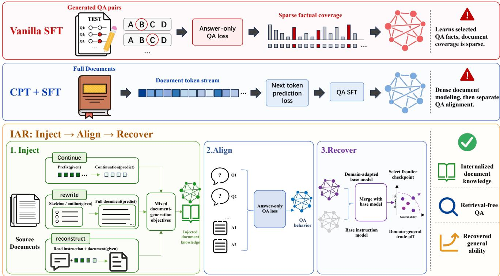  
Figure 1: The overview of IAR. Vanilla SFT learns from generated QA pairs and covers only the facts selected by those questions. CPT+SFT models full document token streams before a separate QA alignment stage. IAR injects document knowledge through continuation, rewrite, and instruction-conditioned reconstruction objectives, aligns the injected model with answer-only QA supervision, and recovers general ability via post-hoc model merging. The final model is selected by balancing retrieval-free domain QA performance and general capability retention.

• We evaluate across CC and CCI and multiple model families, with direct SFT, LoRA, SDFT, Replay, FAPM, conventional Base-initialized continued-pretraining base- lines, and available Instruct-initialized CPT diagnostics.

• We report both strong and boundary evidence: IAR im-proves the domain-general frontier in most settings, while boundary cases clarify when initialization strength, data recipe, or operating-point selection matters most.

## Related Work

Parametric knowledge and retrieval. Language models store factual associations in their parameters, but recall and updating remain unreliable (Petroni et al. 2019; Roberts, Rafel, and Shazeer 2020). Retrieval-augmented systems externalize document memory through a retriever (Karpukhin et al. 2020; Lewis et al. 2020), while knowledge editing tar-gets localized factual changes (Mitchell et al. 2022; Meng et al. 2022; Wang et al. 2024; Cohen et al. 2024). We instead ask whether post-training makes a bounded corpus answer- able without retrieval.

Document knowledge acquisition. The closest work changes the interface through which models acquire doc- ument knowledge. AdaptLLM converts raw corpora into reading-comprehension texts to couple domain content with task practice (Cheng, Huang, and Wei 2024). PIT reverses the conventional document-then-QA order by instruction-tuning on questions before continued document training (Jiang et al. 2024). SELF-TUNING augments unseen documents with self-supervised memorization, comprehension, and reflec- tion tasks (Zhang et al. 2025), while KiDG converts multiple documents into simulated dialogues for retrieval-free domain transfer (Wang et al. 2023). Complementary studies compare unsupervised fine-tuning with retrieval (Ovadia et al. 2024) and isolate how QA versus article-style supervision changes factual learning (Zhao, Awasthi, and Haghtalab 2025).

These methods difer in corpus, model, training order, and evaluation contract, so their published scores are not protocol-aligned comparisons. IAR does not claim a new family of reconstruction losses. Its increment is a controlled empirical decomposition: it separates structured document exposure from answer-only accessibility, then treats post-hoc capability recovery as an explicit third variable. We jointly evaluate the selected checkpoint on retrieval-free domain QA and general benchmarks across two corpora and multiple model families.

Forgetting and recovery. Task adaptation can damage general capability through catastrophic forgetting (Kirk-patrick et al. 2017). FAPM mitigates this efect through post-hoc pruning (Huang, Cheng, and Wang 2025), while model merging combines checkpoints or task vectors in weight space (Wortsman et al. 2022; Matena and Rafel 2022; Ilharco et al. 2023; Yadav et al. 2023; Yu et al. 2023). Recover selects among existing SLERP (Shoemake 1985), task-arithmetic, TIES, and DARE operators rather than in- troducing a new merge algorithm.

## Methodology

## Task Definition

Let $D = \{ d _ { i } \} _ { i = 1 } ^ { N }$ be a target document collection. From D, we derive a training QA set $Q _ { \mathrm { t r a i n } }$ and a held-out test QA set $Q _ { \mathrm { t e s t } }$ . The training framework further splits $Q _ { \mathrm { t r a i n } }$ into training and validation subsets for checkpoint monitoring and Recover-candidate selection. Given an instruction-tuned model $M _ { 0 } ,$ , the goal is to produce a model M that answers questions in $Q _ { \mathrm { t e s t } }$ without seeing retrieved passages from D at inference time. The primary domain metric is correctness- based QA accuracy. General capability is measured with IFEval (Zhou et al. 2023), MMLU (Hendrycks et al. 2021), and the public MSBench data derived from MSAgent-Bench (Li et al. 2023; ModelScope 2024). Supplementary Material, Section D specifies the fixed 200-example MSBench subset and our evaluation protocol.

This setup difers from ordinary task SFT because the training questions expose only a subset of the document facts. It difers from CPT because the target behavior is instruction- following QA rather than document continuation. It difers from RAG because the model cannot defer memory to a retriever at test time.

## Why Three Stages?

The three stages are motivated by three testable hypotheses concerning document exposure, QA accessibility, and capability retention. First, QA-only supervision may expose too little of the corpus. Second, document-level training may not make the acquired information accessible under a question-answering interface. Third, target-domain adapta- tion may damage general instruction-following ability. Col- lapsing these hypotheses into one fine-tuning recipe makes it hard to identify which intervention explains a gain or failure.

IAR is therefore designed less as a single fixed recipe than as an experimental decomposition. Inject asks whether denser document-level supervision helps before QA align-ment. Align asks whether the exposed information can be made accessible through question answering. Recover asks whether the adapted model can be moved back toward the original instruction model without losing the domain behav- ior that was acquired. This decomposition is important for interpretation: a negative result in one stage does not invali- date the others, and a strong SFT baseline can be understood as a competing way to spend the same adaptation budget.

## A Unified Objective View

Let ${ \mathcal { D } } _ { \mathrm { d o c } } = \{ d _ { i } \}$ denote the target documents and $\mathcal { D } _ { \mathrm { Q A } } =$ $\left\{ \left( q _ { i } , a _ { i } \right) \right\}$ denote document-derived QA pairs. Each Inject objective m constructs a recipe dataset $\mathcal { D } _ { m } ~ = ~ \{ ( u , y ) \}$ where u is an instruction with an optional document prefix or compressed representation and y is the supervised document target. Let $n _ { m }$ be its realized row count after mixture sam- pling and length filtering, and let $\textstyle \pi _ { m } = n _ { m } / \sum _ { k } n _ { k }$ . The Inject objective is

$$
\begin{array} { r l } { \mathcal { L } _ { \mathrm { i n j } } } & { = \displaystyle \sum _ { m \in \mathcal { M } } \pi _ { m } \mathrm { E } _ { ( u , y ) \sim \mathcal { D } _ { m } } [ \ell _ { \theta } ( u , y ) ] , } \\ { \ell _ { \theta } ( u , y ) } & { = \displaystyle - \frac { 1 } { | y | } \sum _ { t = 1 } ^ { | y | } \log p _ { \theta } ( y _ { t } \mid u , y _ { < t } ) . } \end{array}\tag{1}
$$

Thus $\pi _ { m }$ is the empirical sampling share, not a free loss coeficient. The system and user prompt tokens are masked; loss is applied only to the assistant target y. This difers operationally from raw continued pretraining:

$$
\mathcal { L } _ { \mathrm { C P T } } = - \frac { 1 } { T } \sum _ { t = 1 } ^ { T } \log p _ { \theta } ( x _ { t } \mid x _ { < t } ) .\tag{2}
$$

CPT models the document stream directly and has no ex- plicit prompt/target boundary or QA interface. In our recipe labels, 1:0:0 denotes the reconstruction-only Inject recipe with a reading prompt; it is not the raw CPT baseline. Sup- plementary Material, Section B defines every objective and its masking rule.

## Stage 1: Inject

The Inject stage uses three document-generation objectives and their mixtures. Continuation predicts a document sufix from an instruction-conditioned prefix. Rewrite reconstructs the cleaned document from a generated summary, outline, or knowledge skeleton. Instruction-formatted reconstruction predicts the cleaned document from a short generic read- ing instruction. These objectives provide denser supervised document targets than QA-only training without using raw-stream CPT loss. Supplementary Material, Section B gives the exact inputs, targets, masks, mixture notation, and prompt schemas; Supplementary Material, Section C gives training hyperparameters and realized row counts.

## Stage 2: Align

The Align stage fine-tunes the injected model on domain QA pairs. For a question x and answer y, we use answer-only supervised fine-tuning:

$$
\mathcal { L } _ { \mathrm { a l i g n } } = - \frac { 1 } { \left| a \right| } \sum _ { t = 1 } ^ { \left| a \right| } \log p _ { \theta } ( a _ { t } \mid q , a _ { < t } ) .\tag{3}
$$

Vanilla SFT optimizes this loss from the original instruction model $\theta _ { 0 } ,$ , while IAR optimizes it from the injected check-point $\theta _ { I } \mathbf { : }$ :

$$
\begin{array} { r } { \theta _ { \mathrm { S F T } } = \mathrm { A l i g n } ( \theta _ { 0 } ) , \qquad \theta _ { \mathrm { I A } } = \mathrm { A l i g n } ( \theta _ { I } ) . } \end{array}\tag{4}
$$

We use IA to denote this pre-recovery Inject+Align checkpoint. BudgetMatch keeps the same QA-only objective but uses setting-specific epoch counts matched to the token bud- get of the two-stage IA pipeline, following the broader obser- vation that token count and compute allocation can change adaptation behavior (Kaplan et al. 2020; Hofmann et al. 2022). Supplementary Material, Section C reports the calculation and realized per-setting token counts.

## Stage 3: Recover

The Recover stage starts from the original instruction model $M _ { 0 }$ and a domain-adapted checkpoint $M _ { \mathrm { { I A } } }$ . Its purpose is to mitigate the catastrophic-forgetting side of document adap- tation: a checkpoint can internalize the target corpus while losing instruction-following or broad benchmark capability. The simplest view is task-vector interpolation,

$$
\Delta = \theta _ { \mathrm { I A } } - \theta _ { 0 } , \qquad \theta _ { R } = \theta _ { 0 } + \lambda \Delta .\tag{5}
$$

More generally, Recover evaluates post-hoc merge opera- tors $\theta _ { R } = \mathrm { M e r g e } ( \theta _ { 0 } , \theta _ { \mathrm { I A } } )$ from four families: SLERP, task arithmetic, TIES, and DARE. The selected checkpoint is not necessarily the highest-domain checkpoint. We use a domain-primary frontier criterion on the validation split: do- main accuracy is the main objective, while IFEval, MMLU, and MSBench are guardrails for deployability. The held-out test set is used only after the merge candidate is fixed. Sup- plementary Material, Section E reports the selection rule and selected recovery settings, and Supplementary Material, Section G gives the full pre-recovery recipe grids.

Recover selection. For a candidate $c ,$ let $D ( c )$ be validation-domain accuracy and let $G ( c )$ be the mean of validation IFEval, MMLU, and MSBench. With Vanilla SFT denoted by v and a fixed tolerance $\tau = 1 . 0$ percentage point, we first retain candidates satisfying $D ( c ) \geq D ( v ) - \tau$ . We then require $G ( c ) \geq G ( v )$ and require at least two of the three general metrics to be no more than τ below their Vanilla SFT values. Among non-dominated candidates in the $( D , G )$ plane, domain accuracy is the primary key; candidates within τ of the best remaining domain score form one domain tier, within which we choose the largest G(c). Remaining ties use the largest minimum general-metric improvement and then the smaller within-family merge hyperparameter. This fixed validation rule is applied before any held-out test evalua- tion. Thus the reported test frontiers diagnose the selected operating points but do not select them.

## Experiments

We ask four questions: RQ1, whether IAR improves retrieval-free domain-general operating points over direct SFT and conventional CPT+SFT; RQ2, whether extended QA-only training explains the gains; RQ3, whether Inject+Align improves domain internalization before Recover; and RQ4, whether the recovery pattern persists across larger Qwen3 models on CC. The CC-only SDFT, LoRA, Replay, and FAPM stress test is grouped under RQ1, while Qwen scaling remains separate from cross-family comparisons.

For every recoverable IA checkpoint, the Recover ex- periment evaluates a fixed 12-candidate grid: SLERP with $\bar { t } \in \{ 0 . 2 , 0 . 3 , 0 . 4 \}$ , task arithmetic with $w \in \{ 0 . 3 , 0 . 5 , 0 . 7 \}$ TIES with $d ~ \in ~ \{ 0 . 3 , 0 . 5 , 0 . 7 \}$ , and DARE with $d _ { r } \in$ {0.1, 0.3, 0.5}. This grid is fixed before validation-based selection; the selected operating point is then reported on the held-out test set. Supplementary Material, Section E gives the candidate-grid summary and the selected operating points.

## Datasets and Models

CC contains 14,258 training and 750 test QA pairs derived from Common Corpus (PleIAs 2024); CCI contains 10,926 training and 575 test pairs derived from CCI (BAAI 2024). Test inputs contain only the question. Both datasets cover Llama-3.2-3B, Phi-4-mini, Qwen3-4B, and SmolLM3-3B, while Qwen3-8B/14B/32B are reported as CC scaling ablations. Supplementary Material, Section A gives the dataset contract, and Supplementary Material, Section B gives the prompt templates.

We keep the main comparison focused on rows that support the central domain-general claim. CPT+SFT diagnostics are included as dense-document baselines but are not used to define the IAR operating-point frontier.

## Baselines

We compare with the original instruction model, Vanilla SFT, BudgetMatch, SDFT, LoRA, Replay, Base-initialized CPT+SFT, and FAPM. These controls probe QA supervision, token budget, supervised-data recipe, parameter-eficient adaptation, anti-forgetting replay, raw-document model- ing, and pruning-based recovery, respectively. Context- conditioned SFT is not a reported baseline because evalu- ation supplies no retrieval context.

We report CPT+SFT from the corresponding released Base checkpoint as the conventional dense-document base- line. This starting point difers from the Instruct initialization used by IAR and therefore does not, by itself, isolate the efect of the Inject objective. Supplementary Material, Section G reports the available Instruct-initialized CPT+SFT diagnos- tics for Llama on CC and CCI and for Phi on CC. Phi-4-mini has no corresponding non-instruction Base release and is therefore unavailable in the main CPT+SFT comparison.

## Evaluation

Domain QA is evaluated with an adaptive LLM panel. Two judges score each answer; a third judge is queried only when the first two scores difer, and the final ordinal score is their median. Per-judge outputs are stored before aggregation. The archived panel configurations use gpt-oss-120b (OpenAI 2025), MiniMax-M2.5 (MiniMaxAI 2025), and DeepSeek-V3 variants (DeepSeek-AI 2025). Across 242,255 evaluated model-answer instances, the audit finds first-two exact agreement of .707, binary agreement of .848 after col- lapsing scores at $\geq . 5 ,$ binary Cohen’s $\kappa ~ = ~ . 6 9 1$ , and a third-judge trigger rate of .297. LLM-as-judge evaluation is useful but imperfect, so we treat it as an auditable instrument rather than a gold label source (Zheng et al. 2023). We re-port domain accuracy as the fraction of correct or partially correct answers; IFEval, MMLU, and MSBench measure general ability. Per-result-file bootstrap intervals use 2,000 resamples and quantify evaluation-sample uncertainty. Sup- plementary Material, Section C records training runs, while Supplementary Material, Section D gives decoding settings and the full reliability protocol.

Inference controls. Domain QA uses one generation pass per checkpoint with temperature .7, top\_p=.95, repetition penalty 1.1, and a 2,048-token limit. The reported non- thinking IFEval, MMLU, and MSBench runs use greedy de- coding with token limits of 1,024, 10, and 1,024, respectively; MSBench judge calls use temperature .1. Domain generation and judge APIs receive no explicit sampler seed. We therefore treat fixed training and data-order seeds as insuficient to establish repeated-run robustness and preserve raw judge votes for audit.

## Results

## RQ1: Main Domain-General Operating Points

Table 1 reports the main comparison used for the central claim. The table includes the original instruction model, Vanilla SFT, conventional Base-initialized CPT+SFT when available, and IAR. BudgetMatch is reported separately be- cause it tests token budget rather than ordinary recipe choice. Supplementary Material, Section G reports the CC-only extended-baseline stress test: LoRA has CC coverage only, and FAPM is a pruning-style recovery baseline whose inter- vention difers from the IAR rows.

The main pattern is a domain-general frontier rather than uniform dominance. On CC, IAR exceeds Vanilla SFT on domain accuracy and all three general metrics for all four model families; on CCI, this holds for Llama, Qwen3-4B, and SmolLM3-3B. Vanilla SFT often trades broad capabil- ity for domain accuracy, whereas IAR recovers part of that capability while retaining domain gains. Qwen3-4B CC is the clearest example, reaching 50.5% versus 42.4% domain accuracy while improving all three general metrics. Llama and SmolLM show smaller domain gains, but their general recovery remains important because a retrieval-free internal- ization model that cannot follow ordinary instructions is not deployable.

CCI exposes two boundary cases. Qwen3-4B starts from an unusually high 70.6% base domain score, leaving less headroom for adaptation; nevertheless, IAR improves over Vanilla SFT on all four reported metrics. Supplementary Material, Section F analyzes this setting and gives the source- text BPB diagnostic. For Phi, IAR improves IFEval and MS- Bench while slightly reducing domain accuracy and MMLU relative to Vanilla SFT. Keeping this row in the main table makes clear that recovery can improve part of the general profile without producing a uniformly dominant point, so deployment preference still matters.

CC-only extended baseline stress test. The CC-only extended comparison stress-tests RQ1 with SDFT, LoRA, Re-play, and FAPM (Huang, Cheng, and Wang 2025). Supple-mentary Material, Section G reports every baseline row and the Instruct-initialized CPT diagnostics, while conventional Base-initialized CPT+SFT remains in Table 1.

SDFT is a strong supervised-data baseline, especially for Llama and Phi, and Replay is competitive on several Qwen3- 4B general metrics. LoRA and FAPM are also strong general- retention baselines: they often preserve or recover stronger individual general metrics than IAR, but usually trail on domain internalization. IAR is domain-best for Phi, Qwen3- 4B, and SmolLM3-3B and second only to SDFT for Llama. Its advantage should therefore be read as a strong domain- primary operating point, not as uniform dominance on every general metric.

## RQ2: Token-Budget Matched QA-only SFT

A central confound is whether IAR benefits simply from more training tokens. Table 2 compares Vanilla SFT, Bud- getMatch, and IAR. BudgetMatch uses 14, 17, 21, and 11 QA-only epochs for CC Llama, CC Qwen3-4B, CCI Llama, and CCI Qwen3-4B, respectively, to match the Inject+Align token budget reported in Supplementary Material, Section C. This control is strong but corpus-dependent: it raises domain accuracy over Vanilla SFT by 4.9 and 4.4 points on CC, but leaves CCI Llama efectively unchanged and lowers CCI Qwen3-4B by 2.9 points. Relative to BudgetMatch, IAR has higher domain accuracy in three of four settings and a higher mean general score in all four.

BudgetMatch sharpens the token-budget diagnosis. Re- peated QA-only training is competitive on CC, where it improves both domain accuracy and mean general perfor- mance over short Vanilla SFT, but this efect does not trans- fer uniformly to CCI. Figure 2 shows that IAR dominates BudgetMatch in the domain–mean-general projection for CC Qwen3-4B and both CCI settings; CC Llama remains a gen-uine trade-of. At the metric level, IAR wins 14 of 16 compar- isons, with the exceptions being CC Llama domain accuracy and CC Qwen3-4B MMLU. Thus token allocation explains part of the CC adaptation gain, but not the stronger operating points produced by staged document exposure and recovery.

## RQ3: Pre-Recovery Domain Internalization

Recover should not hide the domain signal contributed by the first two stages. Figure 3 shows that the best pre-recovery Inject+Align checkpoint improves domain accuracy over Vanilla SFT in all eight settings. Gains are largest for Phi and Llama and smallest for CCI Qwen3-4B, whose Vanilla baseline is already high.

No Inject recipe is uniformly best: Mixed 1:1:2 is strong for Llama and Phi, Qwen3-4B CC favors Mixed 1:1:1, and Qwen3-4B CCI slightly favors reconstruction-only 1:0:0.

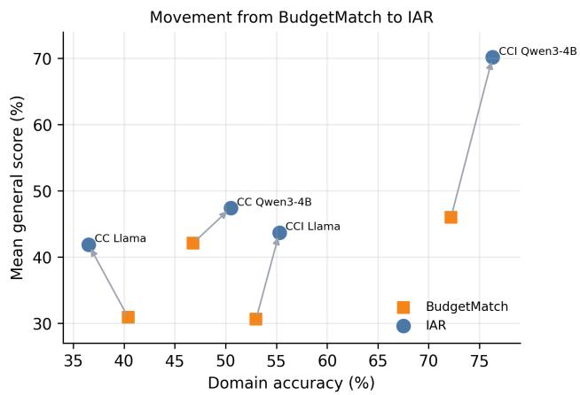  
Figure 2: BudgetMatch-to-IAR movement. Right is higher domain accuracy; up is a higher mean over IFEval, MMLU, and MSBench. IAR moves up and right in three of four settings; for CC Llama, it trades 3.9 domain points for an 11.0-point gain in mean general performance.

<table><tr><td rowspan="2">Model</td><td rowspan="2">Method</td><td colspan="4">CC</td><td colspan="4">CCI</td></tr><tr><td>Dom.</td><td>IFEval</td><td>MMLU</td><td>MSB.|</td><td>Dom.</td><td>IFEval</td><td>MMLU</td><td>MSB.</td></tr><tr><td rowspan="4">Llama-3.2-3B</td><td>Base Instruct</td><td>11.2</td><td>77.1</td><td>50.8</td><td>54.5</td><td>29.2</td><td>77.1</td><td>50.8</td><td>54.5</td></tr><tr><td>Vanilla SFT</td><td>35.5</td><td>54.2</td><td>11.2</td><td>21.5</td><td>53.0</td><td>61.2</td><td>22.5</td><td>31.5</td></tr><tr><td>CPT+SFT</td><td>38.3</td><td>26.4</td><td>3.7</td><td>13.5</td><td>53.7</td><td>24.2</td><td>4.3</td><td>17.5</td></tr><tr><td>IAR</td><td>36.5</td><td>60.2</td><td>35.0</td><td>30.5</td><td>55.3</td><td>61.3</td><td>33.2</td><td>36.5</td></tr><tr><td rowspan="4">Phi-4-mini</td><td>Base Instruct</td><td>13.1</td><td>77.2</td><td>61.0</td><td>62.0|</td><td>27.3</td><td>77.2</td><td>61.0</td><td>62.0</td></tr><tr><td>Vanilla SFT</td><td>24.4</td><td>47.8</td><td>51.0</td><td>32.5</td><td>40.2</td><td>47.8</td><td>53.8</td><td>31.5</td></tr><tr><td>CPT+SFT</td><td>1</td><td>1</td><td>1</td><td>1</td><td>1</td><td>1</td><td>1</td><td>1</td></tr><tr><td>IAR</td><td>34.1</td><td>49.0</td><td>57.0</td><td>43.0</td><td>39.7</td><td>51.6</td><td>50.2</td><td>44.0</td></tr><tr><td rowspan="4">Qwen3-4B</td><td>Base Instruct</td><td>34.3</td><td>84.8</td><td>65.8</td><td>77.0</td><td>70.6</td><td>84.8</td><td>65.8</td><td>77.0</td></tr><tr><td>Vanilla SFT</td><td>42.4</td><td>51.1</td><td>8.8</td><td>51.0</td><td>75.1</td><td>45.6</td><td>26.3</td><td>49.5</td></tr><tr><td>CPT+SFT</td><td>49.6</td><td>31.8</td><td>18.8</td><td>60.5</td><td>69.0</td><td>29.6</td><td>12.8</td><td>58.0</td></tr><tr><td>IAR</td><td>50.5</td><td>59.8</td><td>19.5</td><td>63.0</td><td>76.3</td><td>76.1</td><td>64.5</td><td>70.0</td></tr><tr><td rowspan="4">SmolLM3-3B</td><td>Base Instruct</td><td>15.3</td><td>77.1</td><td>47.7</td><td>63.0|</td><td>34.1</td><td>77.1</td><td>47.7</td><td>63.0</td></tr><tr><td>Vanilla SFT</td><td>32.1</td><td>35.6</td><td>10.5</td><td>25.0</td><td>52.3</td><td>41.7</td><td>16.7</td><td>31.5</td></tr><tr><td>CPT+SFT</td><td>37.1</td><td>26.9</td><td>4.8</td><td>26.0</td><td>48.9</td><td>24.1</td><td>4.2</td><td>19.5</td></tr><tr><td>IAR</td><td>37.5</td><td>40.3</td><td>25.7</td><td>29.0</td><td>53.9</td><td>57.4</td><td>46.8</td><td>47.0</td></tr></table>

Table 1: Main comparison for RQ1. Scores are reported as percentages. Within each model block and dataset block, bold denotes the best result and underlining denotes the second-best result for each metric. CPT+SFT starts from the corresponding released Base checkpoint; “/” indicates that no such release is available, as for Phi-4-mini.
<table><tr><td rowspan="2">Model</td><td rowspan="2">Method</td><td colspan="4">CC</td><td colspan="4">CCI</td></tr><tr><td>Dom.</td><td>IFEval</td><td>MMLU</td><td>MSB.|</td><td>Dom.</td><td>IFEval</td><td>MMLU</td><td>MSB.</td></tr><tr><td rowspan="4">Llama-3.2-3B</td><td>Vanilla SFT</td><td>35.5</td><td>54.2</td><td>11.2</td><td>21.5|</td><td>53.0</td><td>61.2</td><td>22.5</td><td>31.5</td></tr><tr><td>BudgetMatch</td><td>40.4</td><td>53.4</td><td>17.3</td><td>22.0</td><td>53.0</td><td>45.3</td><td>22.5</td><td>24.0</td></tr><tr><td>IAR</td><td>36.5</td><td>60.2</td><td>35.0</td><td>30.5</td><td>55.3</td><td>61.3</td><td>33.2</td><td>36.5</td></tr><tr><td></td><td></td><td></td><td></td><td></td><td></td><td></td><td></td><td></td></tr><tr><td rowspan="3">Qwen3-4B</td><td>Vanilla SFT BudgetMatch</td><td>42.4 46.8</td><td>51.1 49.4</td><td>8.8 31.8</td><td>51.0 45.0</td><td>75.1 72.2</td><td>45.6 56.1</td><td>26.3 29.5</td><td>49.5</td></tr><tr><td></td><td></td><td></td><td></td><td></td><td></td><td></td><td></td><td>52.5</td></tr><tr><td>IAR</td><td>50.5</td><td>59.8</td><td>19.5</td><td>63.0</td><td>76.3</td><td>76.1</td><td>64.5</td><td>70.0</td></tr></table>

Table 2: Token-budget ablation for RQ2 (higher is better; scores are percentages). BudgetMatch uses setting-specific QA-only epochs matched to the Inject+Align budget. IAR improves both domain accuracy and mean general performance in three settings; CC Llama is the remaining domain–general trade-of. Supplementary Material, Section C gives the full accounting.

Thus document-level supervision helps, but the useful mix- ture remains model- and corpus-dependent. Supplementary Material, Section G reports the exact scores and full recipe grid.

Stage-level efect. The pre-recovery gains are not driven by one model family. Relative to Vanilla SFT, Best IA im- proves domain accuracy by 2.8, 7.7, 5.3, and 4.7 points on CC for Llama, Phi, Qwen3-4B, and SmolLM, respectively; the corresponding CCI gains are 5.6, 6.1, 0.4, and 2.3 points. The 0.4-point Qwen3-4B CCI result is the only near-tie and coincides with the unusually strong 70.6% initial checkpoint analyzed in Supplementary Material, Section F. Therefore, RQ3 supports the narrower mechanism claim needed by the framework: structured document exposure contributes a mea- surable domain signal before any weight-space recovery is applied. It does not support a universal best Inject recipe.

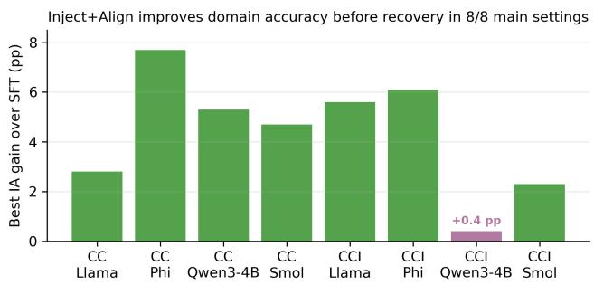  
Figure 3: Pre-recovery domain gains from Inject+Align. CCI Qwen3-4B’s +0.4 pp is the high-base-prior boundary case.

## RQ4: Qwen Scaling on CC

Table 3 separates scale efects from cross-family compar- isons. Across Qwen3-8B/14B/32B, the selected TIES d = 0.3 checkpoint stays within 1.1 points of Best IA domain ac-curacy while raising mean general performance by 14.9–24.1 points. The claim is limited to this repeated CC pattern.

<table><tr><td>Model</td><td>Method</td><td>Domain (%)</td><td>IFEval (%)</td><td>MMLU (%)</td><td>MSBench (%)</td></tr><tr><td rowspan="4">Qwen3-8B</td><td>Base Instruct</td><td>38.5</td><td>87.6</td><td>65.3</td><td>82.5</td></tr><tr><td>Vanilla SFT</td><td>48.7</td><td>56.4</td><td>14.0</td><td>52.5</td></tr><tr><td>Best IA</td><td>57.5</td><td>50.6</td><td>18.5</td><td>48.5</td></tr><tr><td>IAR (TIES d = 0.3)</td><td>56.8</td><td>62.2</td><td>26.7</td><td>73.5</td></tr><tr><td rowspan="4">Qwen3-14B</td><td>Base Instruct</td><td>40.4</td><td>90.0</td><td>72.5</td><td>81.5</td></tr><tr><td>Vanilla SFT</td><td>54.8</td><td>62.9</td><td>54.5</td><td>57.0</td></tr><tr><td>Best IA</td><td>60.5</td><td>53.5</td><td>40.3</td><td>42.0</td></tr><tr><td>IAR (TIES d = 0.3)</td><td>59.6</td><td>67.5</td><td>67.2</td><td>73.5</td></tr><tr><td rowspan="4">Qwen3-32B</td><td>Base Instruct</td><td>47.2</td><td>87.5</td><td>74.8</td><td>84.5</td></tr><tr><td>Vanilla SFT</td><td>56.4</td><td>58.5</td><td>44.0</td><td>56.5</td></tr><tr><td>Best IA</td><td>63.9</td><td>53.0</td><td>63.0</td><td>44.5</td></tr><tr><td>IAR (TIES d = 0.3)</td><td>62.8</td><td>67.0</td><td>74.5</td><td>72.5</td></tr></table>

Table 3: Complete Qwen3 scaling ablation on CC. Bold and underline mark the best and second-best result within each model block. Across 8B/14B/32B, IAR stays within 1.1 points of Best IA domain accuracy while recovering 14.9–24.1 points in mean general performance.

Per-benchmark recovery. The mean gains reflect im-provements on every general benchmark, not compensation by a single metric. Relative to Best IA, IAR raises IFEval/MMLU/MSBench by 11.6/8.2/25.0 points at 8B, 14.0/26.9/31.5 at 14B, and 14.0/11.5/28.0 at 32B. At the same time, its domain score decreases by only 0.7, 0.9, and 1.1 points, respectively. The repeated pattern is therefore sta- ble across these three sizes: Recover trades a small amount of the maximum pre-recovery domain score for a much larger restoration of broad capability.

Adaptation and recovery remain separable. Scaling does not remove the contribution of Inject+Ali n. Relative to Vanilla SFT, Best IA adds 8.8, 5.7, and 7.5 domain points at 8B, 14B, and 32B; after Recover, IAR still retains gains of 8.1, 4.8, and 6.4 points. Thus the larger-model result is not explained by merging an otherwise unchanged instruction checkpoint. Inject+Align first establishes a stronger domain checkpoint, and Recover then moves that checkpoint toward a more usable domain–general operating point. The magnitude of recovery varies by benchmark and size, but the two-stage empirical signature remains visible in every scaling block.

What does not scale away. Recovery remains partial rather than complete. The selected checkpoints retain 15.6–19.2 points more domain accuracy than the original instruction models, but they do not uniformly return to the original mod- els’ general scores. Moreover, all three rows use CC and the same TIES density, so RQ4 demonstrates a repeated withinfamily operating-point pattern rather than a scaling law or cross-corpus guarantee. Supplementary Material, Section C records the available scaling-run configuration provenance.

## Discussion

BudgetMatch, SDFT, LoRA, FAPM, and CPT+SFT in- tervene at diferent points: QA repetition, data recipe, parameter-eficient adaptation, pruning-based recovery, or raw-document modeling. IAR should therefore be read as a decomposition of adaptation budgets, not as a recipe that dominates every baseline. These controls also show why do- main acquisition and general retention must be evaluated separately rather than collapsed into one score.

Recover also changes the selection object: the highestdomain IA checkpoint need not be the best deployable point because domain gains can accompany instruction-following or general-benchmark loss. We select from a small domain- general frontier using domain accuracy as the primary ob- jective and IFEval, MMLU, and MSBench as guardrails; Supplementary Material, Section E gives the threshold, guardrail, and tie-break rule. Boundary cases such as Phi CCI and Llama CC show why deployment may favor do- main accuracy, general retention, or both.

This separation is also why we report the three gen- eral benchmarks individually. A single average can conceal whether recovery comes from instruction following, broad factual reasoning, or judged response quality. The compo-nent metrics expose those diferences and make the selected operating point auditable rather than reducing recovery to one composite score.

## Conclusion

We presented IAR, separating document exposure, QA align-ment, and post-hoc recovery for retrieval-free internaliza- tion. Before Recover, Inject+Align contributes domain gains across all eight main settings, although the best Inject mixture remains model- and corpus-dependent. Recover then moves these adapted checkpoints toward stronger general perfor- mance while retaining most of their domain gain, including the repeated Qwen3 scaling pattern. Against BudgetMatch, IAR improves domain and mean general performance in three of four settings and all four reported metrics for both CCI models. These results support staged exposure and recovery as a strong, setting-dependent operating point rather than a uniformly dominant recipe.

## References

BAAI. 2024. CCI4.0-M2-Base-v1. https://huggingface.co/ datasets/BAAI/CCI4.0-M2-Base-v1. Hugging Face dataset.

Cheng, D.; Huang, S.; and Wei, F. 2024. Adapting Large Language Models to Domains via Reading Comprehension. In International Conference on Learning Representations.

Cohen, R.; Biran, E.; Yoran, O.; Globerson, A.; and Geva, M. 2024. Evaluating the Ripple Efects of Knowledge Editing in Language Models. Transactions of the Association for Computational Linguistics, 12: 283–298.

DeepSeek-AI. 2025. DeepSeek-V3.2: Pushing the Frontier of Open Large Language Models. arXiv:2512.02556.

Gururangan, S.; Marasović, A.; Swayamdipta, S.; Lo, K.; Beltagy, I.; Downey, D.; and Smith, N. A. 2020. Don’t Stop Pretraining: Adapt Language Models to Domains and Tasks. In Proceedings of the 58th Annual Meeting of the Association for Computational Linguistics, 8342–8360. Association for Computational Linguistics.

Hendrycks, D.; Burns, C.; Basart, S.; Zou, A.; Mazeika, M.; Song, D.; and Steinhardt, J. 2021. Measuring Massive Mul- titask Language Understanding. In International Conference on Learning Representations.

Hofmann, J.; Borgeaud, S.; Mensch, A.; Buchatskaya, E.; Cai, T.; Rutherford, E.; Casas, D. d. L.; Hendricks, L. A.; Welbl, J.; Clark, A.; et al. 2022. Training Compute-Optimal Large Language Models. In Advances in Neural Information Processing Systems, volume 35, 30016–30030.

Huang, W.; Cheng, A.; and Wang, Y. 2025. Mitigating Catastrophic Forgetting in Large Language Models with Forgetting-aware Pruning. In Proceedings of the 2025 Conference on Empirical Methods in Natural Language Processing, 21842–21856. Suzhou, China: Association for Computational Linguistics.

Ilharco, G.; Ribeiro, M. T.; Wortsman, M.; Gururangan, S.; Schmidt, L.; Hajishirzi, H.; and Farhadi, A. 2023. Editing Models with Task Arithmetic. In International Conference on Learning Representations.

Jiang, Z.; Sun, Z.; Shi, W.; Rodriguez, P.; Zhou, C.; Neubig, G.; Lin, X. V.; Yih, W.-t.; and Iyer, S. 2024. Instruction-tuned Language Models are Better Knowledge Learners. In Proceedings of the 62nd Annual Meeting of the Association for Computational Linguistics (Volume 1: Long Papers), 5421– 5434. Association for Computational Linguistics.

Kaplan, J.; McCandlish, S.; Henighan, T.; Brown, T. B.; Chess, B.; Child, R.; Gray, S.; Radford, A.; Wu, J.; and Amodei, D. 2020. Scaling Laws for Neural Language Mod- els. arXiv preprint arXiv:2001.08361.

Karpukhin, V.; Oguz, B.; Min, S.; Lewis, P.; Wu, L.; Edunov, S.; Chen, D.; and Yih, W.-t. 2020. Dense Passage Retrieval for Open-Domain Question Answering. In Proceedings of the 2020 Conference on Empirical Methods in Natural Language Processing, 6769–6781. Association for Computational Linguistics.

Kirkpatrick, J.; Pascanu, R.; Rabinowitz, N.; Veness, J.; Des- jardins, G.; Rusu, A. A.; Milan, K.; Quan, J.; Ramalho, T.;

Grabska-Barwinska, A.; et al. 2017. Overcoming Catas- trophic Forgetting in Neural Networks. Proceedings of the National Academy ofSciences, 114(13): 3521–3526.

Lewis, P.; Perez, E.; Piktus, A.; Petroni, F.; Karpukhin, V.; Goyal, N.; Küttler, H.; Lewis, M.; Yih, W.-t.; Rocktäschel, T.; Riedel, S.; and Kiela, D. 2020. Retrieval-Augmented Gen- eration for Knowledge-Intensive NLP Tasks. In Advances in Neural Information Processing Systems, volume 33, 9459– 9474.

Li, C.; Chen, H.; Yan, M.; Shen, W.; Xu, H.; Wu, Z.; Zhang, Z.; Zhou, W.; Chen, Y.; Cheng, C.; Shi, H.; Zhang, J.; Huang, F.; and Zhou, J. 2023. ModelScope-Agent: Building Your Customizable Agent System with Open-source Large Lan- guage Models. In Proceedings of the 2023 Conference on Empirical Methods in Natural Language Processing: System Demonstrations, 566–578. Association for Computational Linguistics.

Matena, M.; and Rafel, C. 2022. Merging Models with Fisher-Weighted Averaging. In Advances in Neural Information Processing Systems, volume 35, 17703–17716.

Meng, K.; Bau, D.; Andonian, A.; and Belinkov, Y. 2022. Locating and Editing Factual Associations in GPT. In Advances in Neural Information Processing Systems, vol-ume 35, 17359–17372.

MiniMaxAI. 2025. MiniMax-M2.5. https://huggingface.co/ MiniMaxAI/MiniMax-M2.5. Hugging Face model card.

Mitchell, E.; Lin, C.; Bosselut, A.; Finn, C.; and Manning, C. D. 2022. Fast Model Editin at Scale. In International Conference on Learning Representations.

ModelScope. 2024. MSBench: ModelScope General- Purpose SFT Dataset. https://modelscope.cn/datasets/iic/ ms\_bench. Public dataset released under the Apache-2.0 license.

OpenAI. 2025. gpt-oss-120b & gpt-oss-20b Model Card. arXiv:2508.10925.

Ovadia, O.; Brief, M.; Mishaeli, M.; and Elisha, O. 2024. Fine-Tuning or Retrieval? Comparing Knowledge Injection in LLMs. In Proceedings of the 2024 Conference on Empirical Methods in Natural Language Processing, 237–250. Association for Computational Linguistics.

Petroni, F.; Rocktäschel, T.; Riedel, S.; Lewis, P.; Bakhtin, A.; Wu, Y.; and Miller, A. 2019. Language Models as Knowledge Bases? In Proceedings of the 2019 Conference on Empirical Methods in Natural Language Processing and the 9th International Joint Conference on Natural Language Processing, 2463–2473. Association for Computational Linguistics.

PleIAs. 2024. Common Corpus. https://huggingface.co/ datasets/PleIAs/common\_corpus. Hugging Face dataset.

Qwen Team. 2025. Qwen3 Technical Report. arXiv:2505.09388.

Roberts, A.; Rafel, C.; and Shazeer, N. 2020. How Much Knowledge Can You Pack Into the Parameters of a Language Model? In Proceedings of the 2020 Conference on Empirical Methods in Natural Language Processing, 5418–5426. Association for Computational Linguistics.

Shoemake, K. 1985. Animating Rotation with Quaternion Curves. In Proceedings of the 12th Annual Conference on Computer Graphics and Interactive Techniques, 245–254.

Wang, P.; Li, Z.; Zhang, N.; Xu, Z.; Yao, Y.; Jiang, Y.; Xie, P.; Huang, F.; and Chen, H. 2024. WISE: Rethinking the Knowledge Memory for Lifelong Model Editing of Large Language Models. In Advances in Neural Information Processing Systems, volume 37.

Wang, R.; Bao, J.; Mi, F.; Chen, Y.; Wang, H.; Wang, Y.; Li, Y.; Shang, L.; Wong, K.-F.; and Xu, R. 2023. Retrieval-free Knowledge Injection through Multi-Document Traversal for Dialogue Models. In Proceedings ofthe 61stAnnual Meeting ofthe Associationfor Computational Linguistics (Volume 1: Long Papers), 6608–6619. Association for Computational Linguistics.

Wortsman, M.; Ilharco, G.; Gadre, S. Y.; Roelofs, R.; Gontijo-Lopes, R.; Morcos, A. S.; Namkoong, H.; Farhadi, A.; Carmon, Y.; Kornblith, S.; and Schmidt, L. 2022. Model Soups: Averaging Weights of Multiple Fine-Tuned Models Improves Accuracy without Increasing Inference Time. In Proceedings of the 39th International Conference on Machine Learning, volume 162 of Proceedings of Machine Learning Research, 23965–23998. PMLR.

Yadav, P.; Tam, D.; Choshen, L.; Rafel, C.; and Bansal, M. 2023. TIES-Merging: Resolving Interference When Merg- ing Models. In Advances in Neural Information Processing Systems, volume 36, 7093–7115.

Yu, L.; Yu, B.; Yu, H.; Huang, F.; and Li, Y. 2023. Lan- guage Models are Super Mario: Absorbing Abilities from Homologous Models as a Free Lunch. arXiv preprint arXiv:2311.03099.

Zhang, X.; Peng, B.; Tian, Y.; Zhou, J.; Zhang, Y.; Mi, H.; and Meng, H. M. 2025. Self-Tuning: Instructing LLMs to Efectively Acquire New Knowledge through Self-Teaching. In Findings of the Association for Computational Linguistics: ACL 2025, 5688–5724. Association for Computational Linguistics.

Zhao, E.; Awasthi, P.; and Haghtalab, N. 2025. From Style to Facts: Mapping the Boundaries of Knowledge Injection with Finetuning. In Advances in Neural Information Processing Systems.

Zheng, L.; Chiang, W.-L.; Sheng, Y.; Zhuang, S.; Wu, Z.;Zhuang, Y.; Lin, Z.; Li, Z.; Li, D.; Xing, E. P.; et al.2023. Judging LLM-as-a-Judge with MT-Bench and Chat-bot Arena. In Advances in Neural Information ProcessingSystems, volume 36, 46595–46623.

Zhou, J.; Lu, T.; Mishra, S.; Brahma, S.; Basu, S.; Luan, Y.; Zhou, D.; and Hou, L. 2023. Instruction-Following Evaluation for Large Language Models. arXiv preprint arXiv:2311.07911.

## Supplementary Material

The following sections provide the complete supplementary methods, protocols, results, and analyses referenced by the main paper.

## A Dataset and Task Examples

CC and CCI are document-derived QA evaluations. CC is derived from Common Corpus (PleIAs 2024); CCI is derived from the CCI dataset (BAAI 2024). In both cases, training examples are generated from source documents and test ex- amples are held out. At inference time, all evaluated models receive only the question, not the source document or a re- trieved passage. This makes the task deliberately stricter than RAG-style document QA. Table 4 summarizes the train/test contract used by both datasets.

Example prompt shape. The actual examples vary by cor-pus, but every row follows the same retrieval-free evaluation contract:

Source fragment used during data construction: A   
bounded corpus document contains a target fact.   
Generated training pair: Question: Which fact is stated in   
the document? Answer: The target fact.   
Evaluation input: Question only. No source passage or re  
trieved context is provided.   
Scoring: The model answer is judged for correctness and the   
same checkpoint is evaluated on IFEval, MMLU, and MS-   
Bench.

This box is schematic and summarizes the input contract used by all domain evaluations.

## B Prompt Templates and QA Accounting

The implementation uses Chinese instruction templates. For reproducibility, we report English prompt schemas that pre- serve the operative constraints, placeholders, and output con- tracts. The source templates are grouped into three parts: document-derived QA construction, post-training prompts, and evaluation prompts.

Document-derived QA construction. CC and CCI QA pairs are generated by an anchor-aware file-to-QA pipeline. The referenced configuration uses anchor-aware question generation and single-model answer generation. It first ex- tracts referable anchors from each document chunk, selects applicable question types, generates self-contained ques- tions, validates them, and then generates answers grounded in the same chunk. Table 5 reports the QA-construction prompt schemas.

Generation-stage accounting. The pipeline does not retain every source record or generated candidate. Table 6 re- ports micro-aggregated counts from the frozen generation artifacts. CC stage counts come from trusted run statistics; the CCI counts were recovered from validated timestamped per-domain logs and resume artifacts after the pipeline’s per- sisted statistics files were found to reflect stale skip-rerun states. The final column reports the QA rows selected by the downstream dataset-construction step for training and held-out testing, rather than an additional quality-filter rate.

Because CC and CCI use diferent source-sampling and pre- filtering paths, their stage rates characterize data flow rather than a directly comparable dataset-quality score.

The archived logs expose two implementation details that are otherwise hidden by aggregate counts. Under the ques- tion validator’s fail-open rule, 33 CC and 12 CCI candidates were retained after validation-response parsing failures; no candidate was retained after a validation-call error. Deter- ministic checks over the 26,509 final experiment rows found no malformed records, missing required fields, or normal- ized duplicate QA pairs. CC contains one repeated normalized question and one deictic-pattern match (“according to the text”); CCI contains neither. We also archive charactertrigram answer–source overlap as a descriptive mismatch diagnostic, but do not interpret lexical overlap as correctness or faithfulness because answers may paraphrase the source or difer in script. These checks are not a substitute for human validation. Source hashes, group-level rates, and diagnos- tics are stored in the code package under artifacts/qa\_ generation\_quality/reports/.

Inject objectives and prompts. Before training, source documents are converted into the three supervised document- generation datasets defined in Table 7. The cleaning prompt asks a model to repair OCR and formatting noise while pre- serving terminology, numbers, formulas, symbols, style, and key details. For Rewrite, the skeleton prompt preserves enti- ties, definitions, values, clauses, formulas, and logical chains while avoiding long direct copying; the outline prompt cov- ers every paragraph and preserves names, places, times, data, and model names.

The mixture constructor samples each recipe dataset in the stated integer ratio before shufling; Table 10 reports realized post-filtering counts for selected runs. Align and Vanilla instead use a question-only user prompt and apply loss only to the answer span. Context-QA diagnostics wrap source context in the user prompt but are not part of retrieval- free evaluation.

Evaluation prompts. All domain evaluations use retrieval-free model inference: the evaluated model receives the question only. Domain scoring then uses the correctness mode of the V2 evaluator. The judge receives the question, reference answer, and model answer; it is instructed to assess whether the model’s core conclusion is semantically equiva- lent to the reference answer, ignoring source attribution. The allowed scores are 1.0 for a correct core conclusion, 0.5 for a broadly correct but incomplete or partially flawed answer, and 0.0 for an incorrect or contradictory answer. The required output is a JSON object with score and a short reason.

For general benchmarks, IFEval uses the original instruc- tion prompt with a generic helpful-assistant system message and rule-based instruction-following scoring. MMLU uses a multiple-choice prompt and a system instruction requiring only the option letter as output. MSBench uses model infer- ence with a helpful-assistant system prompt, then applies an LLM judge that receives the user question, reference answer, and model answer and returns JSON fields for correctness and quality.

<table><tr><td>Dataset</td><td>Split</td><td>Count</td><td>Input at train time</td><td>Input at test time</td><td>Primary use</td></tr><tr><td>CC</td><td>train</td><td>14,258 QA</td><td>question, answer, derived docu- ment fields</td><td>question only</td><td>mixed-domain internaliza- tion</td></tr><tr><td></td><td>test train</td><td>750 QA 10,926 QA</td><td>1 question, answer, derived docu-</td><td>question only question only</td><td>held-out domain test Chinese-domain internal-</td></tr><tr><td>CCI</td><td></td><td></td><td>ment fields</td><td></td><td>ization</td></tr><tr><td></td><td>test</td><td>575 QA</td><td>1</td><td>question only</td><td>held-out domain test</td></tr></table>

Table 4: Dataset construction contract. The train/test split and retrieval-free input column define the experimental setting: models must answer from internalized parameters rather than from retrieved source passages. The files named eval\_750.jsonl and eval\_575.jsonl in the repository are treated as held-out test files in this paper.
<table><tr><td>Step</td><td>Prompt schema</td><td>Output contract</td></tr><tr><td>Anchor extraction</td><td>Given a text chunk, extract at most K independently referable core objects. JSON list of anchors. Prefer explicit concepts, methods, mechanisms, modules, devices, or technical terms appearing in the text. Do not output deictic objects such as “this method&quot; or “the above mechanism.&quot;</td><td></td></tr><tr><td>Type applicability</td><td>Given a question-type description and the text chunk, decide whether the chunk yes/no. can support a question of that type. The supported types are factual extraction, mechanism explanation, design rationale, condition/constraint, limitation/trade-</td><td></td></tr><tr><td>Question generation</td><td>off, and comparison/relation. Given the chunk, a selected anchor, a question type, the type description, and Plain question text. an expected answer schema, generate one natural question. The anchor must be explicitly named; the question must be understandable without the source document; deictic expressions such as “this,&quot;“above,&quot; or “according to the text&quot; are forbidden; output only one question ending with a question mark.</td><td></td></tr><tr><td>Question validation</td><td>Check whether the question is independently understandable, avoids docu- JSON with valid and ment/deictic references, is semantically clear, and has an answer direction. Given the source chunk and generated question, answer strictly from the chunk. JSON with answer.</td><td>reason.</td></tr><tr><td>Answer generation</td><td>The answer must be faithful, accurate, professional, directly answer the question, avoid document/deictic references, and be written as a natural paragraph rather than a template with section headings.</td><td></td></tr></table>

Table 5: Document-derived QA construction prompts. The schemas show how chunks are converted into self-contained questions and grounded answers while preventing deictic questions that require access to the original document.
<table><tr><td>Dataset</td><td>Input docs</td><td>Files filtered</td><td>Chunks kept</td><td>Valid questions</td><td></td><td>QA kept Experiment QA</td></tr><tr><td>CC</td><td>4,001</td><td>1,944 (48.6%)</td><td>5,324/6,593 (80.8%)</td><td>37,397/77,224 (48.4%)</td><td>16,674/37,397 (44.6%)</td><td>15,008</td></tr><tr><td>CCI</td><td>7,000</td><td>310 (4.4%)</td><td>11,407/11,793 (96.7%)</td><td>100,096/140,148 (71.4%)</td><td>62,670/100,096 (62.6%)</td><td>11,501</td></tr></table>

Table 6: QA-generation stage accounting. “Files filtered” gives the count and percentage of input documents rejected at filelevel filtering; the chunk, question, and QA columns give retained/considered counts and micro rates. “Experiment QA” is the train-plus-test total after exact-question deduplication and fixed chunk-group sampling.
<table><tr><td>Objective</td><td>User input u</td><td>Assistant target y</td><td>Masked tokens</td><td></td><td></td><td>Recipe role Intended exposure</td><td></td><td></td></tr><tr><td>Continuation</td><td>Continue/complete instruction Held-out suffix. plus a document prefix.</td><td></td><td>System prompt, in- single struction, and prefix.</td><td rowspan="2">prompt, single</td><td rowspan="2">mixed</td><td></td><td>or Prefix-conditioned or Recover document</td><td>document exposure.</td></tr><tr><td>Rewrite</td><td>Reconstruction instruction plus Full cleaned document. a generated summary, outline, or knowledge skeleton.</td><td></td><td>System instruction, compressed represen-</td><td>and mixed</td><td>content compressed repre- sentation.</td><td>from a</td></tr><tr><td>Instruction- formatted recon- tion. struction</td><td>Short generic reading instruc- Full cleaned document.</td><td></td><td>tation. System prompt and in- 1:0:0 struction.</td><td>mixed</td><td></td><td>or Dense through</td><td>a document target.</td><td>exposure full-</td></tr></table>

Table 7: Inject objective definitions. All three objectives use the instruction model’s chat template and assistant-target loss; the loss mask excludes every system/user token. Recipe ratios control the relative counts of the three objective streams, while realized shares can difer slightly after tokenizer-specific length filtering.

## C Training and BudgetMatch Details

For the completed 3B/4B gradient-training runs and the extended CC baselines, serialized training arguments and original logs recover the common configuration in Table 8. Full-parameter runs use DeepSpeed ZeRO-2 without CPU or NVMe ofload; LoRA uses the same optimizer schedule while updating adapters only. All objectives mask prompt tokens and optimize the assistant target span. Table 9 records stage-specific settings and exceptions.

Computing environment. The archived main training runs used Linux x86\_64 nodes (glibc 2.35; kernels 5.4.0-113-generic or 5.15.0-1053-nvidia) with eight NVIDIA A100-SXM4-40GB GPUs, 128 phys- ical CPU cores (256 logical cores), and approximately 1 TiB of host memory. The software stack used CPython 3.10.0, CUDA 12.4, PyTorch 2.6.0, Transformers 4.57.1, DeepSpeed 0.14.3 and PEFT 0.12.0. Model inference used vLLM 0.8.4 and Recover artifacts record mergekit 0.1.3. Logged infer- ence jobs used one GPU unless otherwise specified; domain QA scoring called external LLM-judge APIs.

BudgetMatch token accounting. The completed-run ac-counting accumulates non-padding training tokens under each model’s tokenizer. We define IA total as Inject plus Align and compare it directly with the realized BudgetMatch token volume. The integer training schedules—14, 17, 21, and 11 epochs for CC Llama, CC Qwen3-4B, CCI Llama, and CCI Qwen3-4B—are implementation settings reported in Table 9. Matchin is assessed from the realized token vol- umes, so no separate fractional-epoch estimate is reported. Table 11 reports these volumes rounded to 0.001 million.

Runs and training seeds. Every reported checkpoint is a single training run; we do not average over multiple seeds. Hugging Face TrainingArguments uses seed=42 and data\_seed=42. The tokenized training data are shuffled with seed 1234, and the internal training/validation split uses seed 42. Dataloader drop\_last is enabled. DeepSpeed runs save once per epoch and do not load a validation-best checkpoint; the reported final\_model is the final-epoch model. Gradient checkpointing is enabled by a direct model-level call even though the serialized TrainingArguments flag is false. These fixed seeds im-prove run traceability but do not guarantee bitwise determin- ism under distributed GPU training.

Scaling-run parameter provenance. The selected Qwen3-8B/14B/32B Recover configurations are retained and all use TIES density .3, but the original Inject/Align training arguments, logs, and node manifests for the scaling ablation are not present in the available run archive. We therefore do not infer their LR, batch, sequence length, precision, GPU count/model, node count, or ZeRO/ofload settings from current launcher defaults. The computing- environment paragraph and Table 8 should not be read as covering these three scaling rows.

## D Evaluation and Judge Reliability

Domain accuracy is produced by the repository’s V2 evalua- tor. The evaluator records model generations, per-example judge decisions, and aggregate correctness. The general benchmark suite contains IFEval, MMLU, and MSBench. IFEval and MMLU are rule- or answer-key-based in the cur- rent pipeline; MSBench uses an LLM judge and therefore shares the audit requirements of domain QA. Table 12 defines the metric directions and evaluation types.

MSBench is public: we use a fixed 200-example local eval- uation subset drawn from the Apache-2.0 iic/ms\_bench release, itself a public subset of MSAgent-Bench (Li et al. 2023; ModelScope 2024). The source release provides the conversational examples; the fixed 200-example selection, model prompting, and adaptive LLM-judge aggregation de-scribed below are our repository-level evaluation protocol rather than a claim of reproducing a separate canonical leaderboard.

Inference and judge decoding. Each checkpoint is evaluated with one model-generation pass and one judging pass. Domain QA shufles or truncates the test input with seed 42, then generates with temperature .7, top\_p=.95, repetition penalty 1.1, and a 2,048-token limit. No sampler seed is passed to vLLM, so the domain generation remains stochas- tic. The reported non-thinking IFEval, MMLU, and MS- Bench runs use greedy decoding with token limits of 1,024, 10, and 1,024, respectively; their optional subsampling order uses seed 123. MSBench judge calls override temperature to .1.

Judge APIs receive no explicit random seed. Their stored configurations use temperature/top-p pairs of .7/.8 for gpt-oss-120b, .6/.4 for local MiniMax2.5, and .7/.95 for cloud DeepSeek variants; the configured output limits are 131,072, 196,608, and 16,384 tokens, respectively. Con- sequently, fixed training and data-order seeds should not be read as repeated-run control over stochastic domain genera- tion or API judging.

Judge prompt contract. The domain and MSBench judges share the same evidence inputs, but use diferent output and aggregation rules:

Input: question, reference answer, model answer, optional scoring rubric.

Decision: domain QA returns a score in {0, .5, 1}; MSBench returns binary correctness and a quality score.

Required rationale: short explanation identifying whether the model answer contains the required fact and whether it introduces unsupported content.

Domain aggregation: two judges score every answer; if their scores difer, a third judge is called. The final score is the median of the available scores, and every raw vote is stored before aggregation.

MSBench also calls two judges first and a third on binary disagreement; final correctness uses majority vote and quality uses the mean of available quality scores. These contracts are part of the evaluation method because both metrics are judge-produced rather than answer-key labels.

Judge agreement audit. The audit reads stored perexample V2 JSONL files without calling a model or judge. It covers 343 result files and 242,255 valid model-answer records; ten malformed JSON lines are skipped, and ev- ery valid record contains raw correctness votes. Because the panel is adaptive, agreement is measured on the first two judges and the third-judge rate measures arbitration frequency.

<table><tr><td>Parameter</td><td>Value</td><td>Parameter</td><td>Value</td></tr><tr><td>Optimizer</td><td>AdamW (PyTorch)</td><td>Learning rate</td><td> $5 \times 1 0 ^ { - 5 }$ </td></tr><tr><td>Adam  $\beta _ { 1 } , \beta _ { 2 } , \epsilon$ </td><td>.9, .999, 10−8</td><td>Scheduler / warmup</td><td>cosine / ratio .05</td></tr><tr><td>Weight decay / max grad norm</td><td>.01/1.0</td><td>Precision / max length</td><td>BF16 / 4096</td></tr><tr><td>Batch per GPU</td><td></td><td>Gradient t accum. / 8/8</td><td></td></tr><tr><td>Effective global batch</td><td>64 examples/step</td><td>GPUs DeepSpeed</td><td>ZeRO-2, no offload</td></tr><tr><td>Termination / check- point</td><td>epoch based / final epoch</td><td>Gradient checkpoint- ing</td><td>model-level enabled</td></tr></table>

Table 8: Shared optimization settings recovered for the completed 3B/4B training runs and extended CC baselines. The efective global batch is per-device batch $1 \times 8$ accumulation steps ×8 GPUs.
<table><tr><td>Method / stage</td><td>Epochs</td><td>Data and objective</td><td>Method-specific setting</td></tr><tr><td>Vanilla SFT</td><td>3</td><td>QA; answer-only</td><td>Original Instruct initialization</td></tr><tr><td>BudgetMatch</td><td>14/17/21/11</td><td>Same QA and loss as Vanilla</td><td>CC Llama/Qwen; CCI Llama/Qwen order</td></tr><tr><td>Inject</td><td>3</td><td>Three assistant-target document-generation objectives</td><td>Selected mixtures and counts in Table 10</td></tr><tr><td>Align</td><td>3</td><td>QÀ; answer-only</td><td>Initializes from the Inject final epoch</td></tr><tr><td>SDFT</td><td>3</td><td>Model-specific synthetic QA; answer-only</td><td>14,258 CC examples per model</td></tr><tr><td>LoRA</td><td>3</td><td>CC QA; answer-only</td><td>r = 16, α = 32, dropout .05; merged for evaluation</td></tr><tr><td>Replay CPT</td><td></td><td>3 75% domain QA + 25% general instruction 16 Raw-document causal LM</td><td>Equal-size replacement; construction seed 42 Matched Base initialization; 4,425 CC / 10,769 CCI</td></tr><tr><td></td><td></td><td></td><td>rows</td></tr><tr><td>CPT+SFT</td><td></td><td>3 QA; answer-only</td><td>Initializes from the CPT final epoch</td></tr></table>

Table 9: Sta e-s ecific trainin settin s. Unless stated as an exce tion each row uses Table 8. Bud etMatch e och counts are setting-specific rather than a shared 13-epoch approximation.
<table><tr><td>Dataset</td><td>Model</td><td>Selected Inject recipe</td><td>Inject rows</td><td>Align QA rows</td></tr><tr><td rowspan="4">CC</td><td>Llama-3.2-3B</td><td>Mixed 1:1:2</td><td>19,000</td><td>14,258</td></tr><tr><td>Phi-4-mini</td><td>Mixed 1:1:2</td><td>19,000</td><td>14,258</td></tr><tr><td>Qwen3-4B</td><td>Mixed 1:1:1</td><td>18,968</td><td>14,258</td></tr><tr><td>SmolLM3-3B</td><td>Mixed 1:1:1</td><td>18,960</td><td>14,258</td></tr><tr><td rowspan="4">CCI</td><td>Llama-3.2-3B</td><td>Mixed 1:1:2</td><td>19,000</td><td>10,926</td></tr><tr><td>Phi-4-mini</td><td>Mixed 1:1:2</td><td>19,000</td><td>10,926</td></tr><tr><td>Qwen3-4B</td><td>Reconstruction 1:0:0</td><td>10,000</td><td>10,926</td></tr><tr><td>SmolLM3-3B</td><td>Mixed 1:1:2</td><td>19,000</td><td>10,926</td></tr></table>

Table 10: Selected Inject configurations for the eight main settings. Counts are realized post-tokenization training rows; tokenizer-specific length filtering explains the small diferences among nominally equal mixtures.
<table><tr><td>Setting</td><td>Inject recipe (samples)</td><td>Inject</td><td>Align</td><td>IA total</td><td>BudgetMatch</td><td>BM/IA</td></tr><tr><td>CC Llama-3.2-3B</td><td>Mixed 1:1:2 (19k)</td><td>45.736</td><td>12.917</td><td>58.653</td><td>60.280</td><td>102.8%</td></tr><tr><td>CC Qwen3-4B</td><td>Mixed 1:1:1 (18,968)</td><td>46.017</td><td>10.191</td><td>56.208</td><td>57.752</td><td>102.7%</td></tr><tr><td>CCI Llama-3.2-3B</td><td>Mixed 1:1:2 (19k long-doc.)</td><td>57.296</td><td>9.734</td><td>67.030</td><td>68.085</td><td>101.6%</td></tr><tr><td>CCI Qwen3-4B</td><td>1:0:0 (10k)</td><td>19.081</td><td>7.151</td><td>26.232</td><td>26.202</td><td>99.9%</td></tr></table>

Table 11: Realized token accounting for BudgetMatch, in millions of non-padding model tokens. BM/IA compares the completed QA-only BudgetMatch run directly with the corresponding Inject+Align token volume.

Bootstrap uncertainty and audit artifacts. For every result file, the audit performs 2,000 example-level boot- strap resamples with seed 20260706 and reports percentile 95% intervals for domain accuracy and mean correct- ness. The full per-file intervals, per-judge scores, pair-wise agreement, and dataset summaries are stored in the code package under artifacts/domain\_eval\_ reliability/. These intervals quantify evaluation-sample uncertainty for each checkpoint and support the re- ported domain estimates; training-seed robustness remains outside their scope.

<table><tr><td>Metric</td><td>Direction</td><td>Evaluation type</td><td>Reported unit</td></tr><tr><td>Domain accuracy</td><td>higher is better</td><td>V2 multi-judge correctness</td><td>percentage</td></tr><tr><td>IFEval inst-strict</td><td>higher is better</td><td>instruction-following evaluator</td><td>percentage</td></tr><tr><td>MMLU accuracy</td><td>higher is better</td><td>multiple-choice benchmark</td><td>percentage</td></tr><tr><td>MSBench accuracy</td><td>higher is better</td><td>LLM-judge benchmark</td><td>percentage</td></tr></table>

Table 12: Evaluation metrics and their roles in operating-point selection. Domain QA is the primary retrieval-free internalization metric, while IFEval, MMLU, and MSBench serve as general-capability guardrails.
<table><tr><td>Scope</td><td>Records</td><td>Exact agree</td><td>Binary agree</td><td>Binary κ</td><td>Third judge</td></tr><tr><td>CC test artifacts</td><td>163,347</td><td>.732</td><td>.854</td><td>.691</td><td>.274</td></tr><tr><td>CCI test artifacts</td><td>78,308</td><td>.656</td><td>.836</td><td>.670</td><td>.345</td></tr><tr><td>Full audit</td><td>242,255</td><td>.707</td><td>.848</td><td>.691</td><td>.297</td></tr></table>

Table 13: Domain QA judge reliability. Binary agreement collapses scores at ≥ .5. The full audit additionally contains 600 samples from a smaller CCI evaluation set. These statistics quantify judge reliability over the evaluated samples.
<table><tr><td>Judge</td><td>Votes</td><td>Mean score</td><td> $P ( s \geq . 5 )$ </td><td> $P ( s = 1 )$ </td></tr><tr><td> $9 \mathrm { p t } - \mathsf { o s s } - 1 2 0 \mathrm { b }$ </td><td>242,031</td><td>.387</td><td>.454</td><td>.321</td></tr><tr><td>MiniMax2.5_Local</td><td>156,812</td><td>.303</td><td>.434</td><td>.172</td></tr><tr><td> ${ \tt d e e p s e e k - v 3 . } 2$ </td><td>131,172</td><td>.296</td><td>.465</td><td>.127</td></tr><tr><td> $\mathsf { d e e p s e e k - v 3 . 1 }$ </td><td>24,697</td><td>.378</td><td>.652</td><td>.103</td></tr></table>

Table 14: Per-judge score distributions before aggregation. Vote counts difer because panel configurations vary across evaluations and later judges are invoked adaptively; the marginal means are therefore descriptive and should not be interpreted as a controlled judge ranking.

## E Recover Selection Protocol

The IAR rows use a domain-primary frontier criterion on the training-framework validation split. Recover candidates are first filtered for meaningful domain accuracy relative to Vanilla SFT, then compared on IFEval, MMLU, and MS- Bench as guardrails. The selected row is therefore an operat- ing point, not necessarily the maximum-domain checkpoint. The merge candidate is fixed before running the held-out test files used in the main tables. Recover is implemented as a selection mechanism over existing post-hoc weight-space merge operators, not as a new merging algorithm.

The repository uses eval in two diferent places. During training and Recover selection, eval denotes an internal vali- dation split derived from the training data. The published CC and CCI files with 750 and 575 examples are held-out test sets, despite their local eval\_\*.jsonl filenames. We use test for those files throughout the paper to avoid implying that final reported scores were also used for Recover-candidate selection.

Formal selection rule. For each dataset–model setting, let c denote a Recover candidate and let v denote the corre-sponding Vanilla SFT checkpoint on the validation split. We write $D ( c )$ for retrieval-free domain QA accuracy, $I ( c )$ for IFEval, $\dot { M } ( c )$ for MMLU, $B ( c )$ for MSBench, and

$$
G ( c ) = { \frac { I ( c ) + M ( c ) + B ( c ) } { 3 } }
$$

for mean general performance. We use a fixed tolerance of $\tau = 1 . 0$ percentage point. Candidate selection proceeds as follows:

1. Domain feasibility. Keep candidates with $D ( c ) \geq$ $D ( v ) - \tau$ . This allows boundary trade-ofs such as Phi CCI only when the domain loss relative to Vanilla SFT is within tolerance.

2. General guardrail. Among domain-feasible candidates, keep candidates with $G ( c ) ~ \geq ~ G ( v )$ and at least two of $\{ I , M , B \}$ no more than τ below the corresponding Vanilla SFT value.

3. Domain-primary ranking. Select from the nondominated candidates in the $( D , G )$ plane. Domain ac- curac is the primar ke ; candidates within τ of the best remaining domain score are treated as the same domain tier.

4. Tie-break. Within the best domain tier, choose the candidate with the largest G(c). Remaining ties are broken by the larger minimum improvement over Vanilla SFT across $\{ I , M , B \}$ , then by the smaller merge hyperpa- rameter within the same operator family.

This rule makes Recover a validation-time operating-point selector rather than an unreported search over the held-out test results.

Table 15 gives the fixed candidate grid used for each re- coverable IA checkpoint. Figure 4 visualizes the candidate frontier for each dataset–model setting, and Table 16 lists the selected operating point for each main IAR row.

All Recover outputs use BF16 weights and the base-model tokenizer. TIES fixes task-vector weight to 1.0. DARE-TIES converts drop rate $d _ { r }$ to density $1 - d _ { r }$ , fixes task-vector weight to 1.0, and enables normalization. For the selected CC Phi Recover checkpoint, Task Arithmetic applies $w = 0 . 7$ to the full task vector; the corresponding source and output- local configurations are retained with matching hashes in the code supplement. For tied-embedding models, the pipeline temporarily materializes the LM head for merging and re- stores the original tying afterward.

## F Qwen3-4B CCI Diagnostic

Qwen3-4B on CCI is an important boundary case because the original instruction checkpoint already reaches 70.6% domain accuracy before any document-internalization train- ing. This is much higher than the corresponding initial scores for Llama, Phi, and SmolLM on CCI, and it changes how the CCI Qwen3-4B rows should be interpreted. Here, the initial checkpoint is the instruction model used before any training in this work, not a pure pretrained Base checkpoint. The main question in this setting is not whether post-training can create a large absolute domain gain from a weak starting point, but whether it can preserve or improve an already strong domain prior while recovering general capability.

We therefore avoid treating the CCI Qwen3-4B recipe re-sult as evidence that a single Inject mixture is universally best. Vanilla SFT reaches 75.1%, the best pre-recovery In- ject+Align row reaches 75.5%, and the selected IAR check-point reaches 76.3% while substantially improving IFEval, MMLU, and MSBench over Vanilla SFT. The small pre- recovery domain gap is consistent with a high-base-prior setting: there is limited headroom for document exposure to improve domain accuracy, so the value of Recover is more visible in the domain-general trade-of than in raw domain gain.

We conduct a post-hoc diagnostic on the four original instruction checkpoints to determine whether Qwen3-4B as-signs higher likelihood to the evaluated CCI source-text dis- tribution. The CCI test file contains 575 QA rows, which map to 509 unique source documents after normalization for document identity; scoring always preserves the original raw text. We score source text only, without questions, answers, special tokens, or chat templates. For each document, we select a UTF-8 refix–tar et boundar near the b te mid- point, prefer a sentence or paragraph boundary within the 45–55% range, require at least 128 bytes on each side, and require that the boundary be valid under the canonical full- text tokenization of all four models. This produces 507 shared continuations; two short documents are excluded.

Because token-level perplexity is not comparable across diferent tokenizers, we report conditional bits per byte:

$$
\mathrm { B P B } = { \frac { \sum _ { t } - \log p ( x _ { t } \mid x _ { < t } ) } { \ln 2 \cdot B } } ,
$$

where B is the number of UTF-8 bytes in the shared tar-get. All models predict exactly the same target bytes with deterministic teacher-forced scoring in BF16, using a max- imum context length of 4096 and a stride of 2048; overlap- ping windows provide context only, and each target token is scored once. For all four models, a 20-document smoke test agreed with direct single-window forward computation to within $6 . 1 \times 1 0 ^ { - 7 }$ , below the $1 0 ^ { - 5 }$ tolerance. For each peer, we compute paired document-level Qwen-minus-peer BPB diferences. The primary statistic averages the mean diference within each of the seven CCI domains and then weights domains equally; 95% intervals use 10,000 paired bootstrap samples stratified by domain. Document-weighted and byte-weighted aggregates are secondary summaries.

Qwen3-4B has lower equal-domain macro BPB than every peer, with all paired 95% bootstrap intervals below zero and all seven domain means in the same direction (Table 17).

The diference is broad at the document level: Qwen has lower BPB than Llama on 100% ofdocuments, Phi on 99.0%, and SmolLM3 on 86.8%. This pattern is consistent with stronger fit to the evaluated CCI text distribution as one possible contributor to Qwen’s high initial QA accuracy. It is not a suficient explanation of QA behavior: for exam-ple, Phi has lower BPB than Llama but slightly lower CCI QA accuracy. Moreover, the diagnostic compares complete checkpoints rather than controlling model capacity, pretrain- ing composition, or Chinese-language capability. It therefore does not identify why the likelihood diference arose, estab- lish that text likelihood causes the QA gap, or demonstrate memorization, training-data overlap, or contamination.

The public Qwen3 technical report does not report this CCI QA benchmark, but it does disclose strong base-model performance for the Qwen3 dense family across general and multilingual evaluations (Qwen Team 2025). Table 18 records the relevant family-level numbers. These oficial results do not establish CCI overlap, but they make a high-base-prior explanation plausible: Qwen3 starts from a strong multilin-gual and knowledge benchmark profile before any document- internalization training in our experiments.

Table 19 reports the available Qwen3 CCI diagnostic rows. The 1.7B and 4B rows both start from unusually high CCI base scores relative to non-Qwen models. For Qwen3-1.7B, post-training does not improve over the base score, suggest- ing that the CCI signal can already be strong in the base model and that additional domain fitting can disturb that prior. For Qwen3-4B, Vanilla SFT and the 1:0:0 Inject recipe improve the domain score modestly, but the small gap between Vanilla SFT and the best pre-recovery recipe explains why this set- ting should be read as a high-base-prior boundary case rather than as evidence for a universally best Inject mixture.

The same pattern appears in the Qwen3-4B Recover sweep. Table 20 shows that several merge operators recover to the mid-70s domain range, with Task Arithmetic $w = 0 . 7$ and TIES $d = 0 . 3$ reaching 76.3%. This is consistent with the main-table interpretation: the Qwen3-4B CCI row is not primarily a large domain-gain story, because the model starts high; its value is that Recover can preserve the high CCI prior while restoring substantially stronger general capability.

CC / Llama-3.2-3B
<table><tr><td>Operator family</td><td>Hyperparameter grid</td><td>Candidate count</td></tr><tr><td>SLERP</td><td> $t \in \{ 0 . 2 , 0 . 3 , 0 . 4 \}$ </td><td>3</td></tr><tr><td>Task Arithmetic</td><td> $w \in \left. 0 . 3 , 0 . 5 , 0 . 7 \right.$ </td><td>3</td></tr><tr><td>TIES</td><td> $d \in \{ \mathrm { \ ' { 0 . 3 } , 0 . 5 , 0 . 7 } \}$ </td><td>3</td></tr><tr><td>DARE</td><td> $d _ { r } \in \{ 0 . 1 , 0 . 3 , 0 . 5 \}$ </td><td>3</td></tr><tr><td>Total</td><td>fixed grid per IA checkpoint</td><td>12</td></tr></table>

Table 15: Recover candidate grid. Every selected IAR row is chosen from this fixed set of post-hoc merge candidates rather than from an unreported per-row search space. Candidate choice is made on the validation split before held-out test reporting.

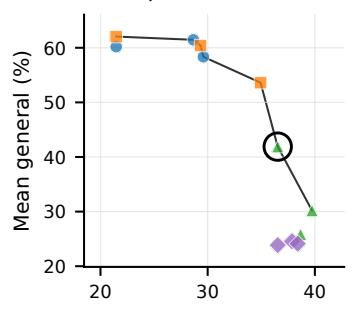

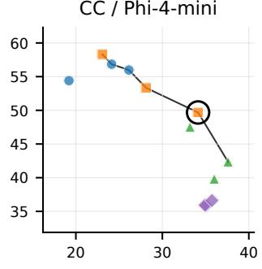

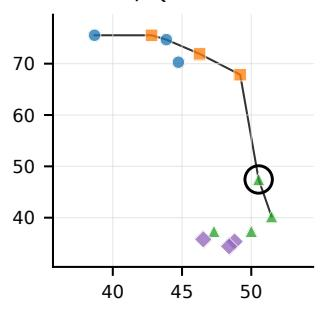

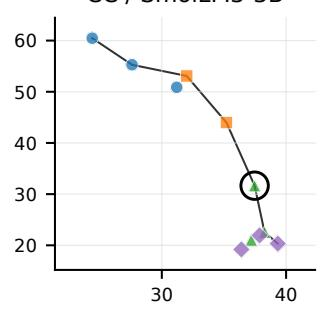

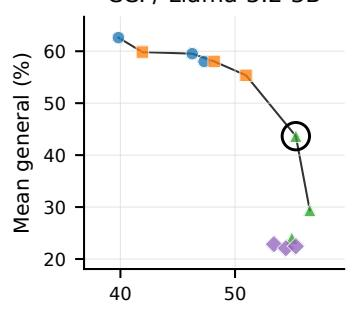

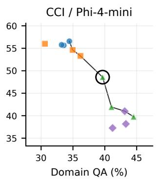

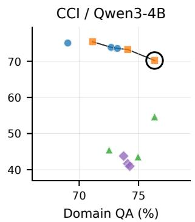

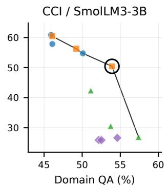  
Figure 4: Recover candidate frontiers for the main dataset–model settings. Each panel plots held-out test performance of the fixed Recover candidates by retrieval-free domain QA accuracy and mean general performance across IFEval, MMLU, and MSBench. The black line marks non-dominated points in this two-dimensional projection, and the black ring highlights the candidate selected by the validation protocol for the main IAR table. The displayed test frontier is diagnostic and is not used to choose the selected candidate.

## G Extended Baselines and Recipe Analyses

Complete CC comparison. Tables 21 and 22 complement the main-paper comparison with every extended-baseline row.

Initialization diagnostic for CPT+SFT. The main table treats Base-initialized CPT+SFT as the conventional dense- document baseline, not as an initialization-controlled esti- mate of the Inject objective. Table 23 therefore exposes the three completed Instruct-initialized CPT+SFT runs avail- able in the archive. Their coverage is incomplete and they are diagnostic rather than a second main baseline matrix. On domain QA, Instruct-CPT+SFT is competitive with the best pre-Recovery IA checkpoint for CC Llama (38.7 versus 38.3), but is lower for CC Phi (31.2 versus 32.1) and CCI

Llama (52.9 versus 58.6). These results show that CPT is initialization-sensitive and do not support a uniform order- ing between structured Inject and raw-document CPT.

Interpretation. SDFT is a supervised data-recipe baseline. LoRA is a parameter-eficiency baseline that can preserve broad capability while under-internalizing the target docu- ments. Base-initialized CPT+SFT is a conventional dense- document baseline, whereas Table 23 separately shows the available initialization-controlled diagnostics. Phi-4-mini is unavailable in the Base-initialized CPT+SFT matrix because the release used here does not provide a corresponding non- instruction checkpoint.

<table><tr><td>Dataset</td><td>Model</td><td>Selected checkpoint</td><td>Domain (%)</td><td>IFEval (%)</td><td>MMLU (%)</td><td>MSBench (%)</td><td>Selection note</td><td></td></tr><tr><td rowspan="4">CC</td><td>Llama-3.2-3B</td><td>TIES d = 0.3</td><td>36.5</td><td>60.2</td><td>35.0</td><td>30.5</td><td>domain-primary feasible point</td><td></td></tr><tr><td>Phi-4-mini</td><td>Task Arithmetic w = 0.7</td><td>34.1</td><td>49.0</td><td>57.0</td><td>43.0</td><td>balanced feasible point</td><td></td></tr><tr><td>Qwen3-4B</td><td>TIES d = 0.3</td><td>50.5</td><td>59.8</td><td>19.5</td><td>63.0</td><td>point</td><td>domain-primary feasible</td></tr><tr><td>SmolLM3-3B</td><td>TIES  $d = 0 . 3$ </td><td>37.5</td><td>40.3</td><td>25.7</td><td></td><td>29.0 point</td><td>domain-primary feasible</td></tr><tr><td rowspan="4">CCI</td><td>Llama-3.2-3B</td><td>TIES  $d = 0 . 3$ </td><td>55.3</td><td>61.3</td><td>33.2</td><td>36.5</td><td></td><td>domain-primary feasible</td></tr><tr><td>Phi-4-mini</td><td>TIES  $d = 0 . 3$ </td><td>39.7</td><td>51.6</td><td>50.2</td><td>44.0</td><td>point boundary trade-off point</td><td></td></tr><tr><td>Qwen3-4B</td><td>Task Arithmetic  $w = 0 . 7$ </td><td>76.3</td><td>76.1</td><td>64.5</td><td>70.0</td><td>point</td><td>domain-primary feasible</td></tr><tr><td>SmolLM3-3B</td><td>Task Arithmetic  $w = 0 . 7$ </td><td>53.9</td><td>57.4</td><td>46.8</td><td></td><td>47.0 point</td><td>domain-primary feasible</td></tr></table>

Table 16: Selected Recover settings for the main IAR rows. The table reports held-out test scores for the concrete operating point chosen from the fixed Recover grid by the validation protocol, making the domain-primary selection rule explicit rathe than treating recovery as an unreported hyperparameter search.
<table><tr><td>Initial checkpoint</td><td>CCI QA (%)</td><td>Doc. mean BPB</td><td>Corpus BPB</td><td>Qwen-peer macro ∆ [95% CI]</td></tr><tr><td>Qwen3-4B-Instruct</td><td>70.6</td><td>0.744</td><td>0.729</td><td>一</td></tr><tr><td>Llama-3.2-3B-Instruct</td><td>29.2</td><td>1.021</td><td>0.998</td><td> $- 0 . 2 7 3 \left[ - 0 . 2 8 5 , - 0 . 2 6 1 \right]$ </td></tr><tr><td>Phi-4-mini-instruct</td><td>27.3</td><td>0.968</td><td>0.948</td><td> $- 0 . 2 2 0 \left[ - 0 . 2 3 1 , - 0 . 2 0 8 \right]$ </td></tr><tr><td>SmolLM3-3B</td><td>34.1</td><td>0.838</td><td>0.819</td><td> $- 0 . 0 9 3 \left[ - 0 . 1 0 2 , - 0 . 0 8 4 \right]$ </td></tr></table>

Table 17: Conditional BPB on identical CCI source-document continuations. Corpus BPB is byte weighted; the primary efect first averages paired Qwen-minus-peer BPB diferences within each of seven domains and then weights domains equally. Negative $\Delta$ means lower BPB for Qwen. All intervals exclude zero and all seven domain means agree in direction.
<table><tr><td>Model</td><td>MMLU</td><td>MMLU-Pro</td><td>BBH</td><td>MGSM</td><td>MMMLU</td><td>INCLUDE</td></tr><tr><td>Qwen3-1.7B-Base</td><td>62.63</td><td>36.76</td><td>54.47</td><td>50.71</td><td>63.27</td><td>45.57</td></tr><tr><td>Qwen3-4B-Base</td><td>72.99</td><td>50.58</td><td>72.59</td><td>67.74</td><td>71.42</td><td>56.29</td></tr><tr><td>Qwen3-8B-Base</td><td>76.89</td><td>56.73</td><td>78.40</td><td>76.02</td><td>75.72</td><td>59.40</td></tr><tr><td>Qwen3-14B-Base</td><td>81.05</td><td>61.03</td><td>81.07</td><td>79.20</td><td>79.69</td><td>64.55</td></tr><tr><td>Qwen3-32B-Base</td><td>83.61</td><td>65.54</td><td>87.38</td><td>83.06</td><td>83.83</td><td>67.87</td></tr></table>

Table 18: Oficially disclosed Qwen3 dense-family base-model scores from the Qwen3 technical report. These are public general and multilingual benchmark results, not CCI QA results, and are included only to contextualize the high-base-prior interpretation.
<table><tr><td>Model</td><td>Setting</td><td>CCI domain (%)</td></tr><tr><td>Qwen3-1.7B</td><td>Base Instruct Vanilla SFT Mixed 1:1:1 + Stage2</td><td>60.0 57.0 56.7</td></tr><tr><td></td><td>Base Instruct</td><td>70.6</td></tr><tr><td rowspan="6">Qwen3-4B</td><td>Vanilla SFT</td><td>75.1</td></tr><tr><td>Context-aware SFT</td><td>65.0</td></tr><tr><td>Mixed 1:1:1 + Stage2</td><td>73.7</td></tr><tr><td>Continue + Stage2</td><td>72.9</td></tr><tr><td>1:0:0 + Stage2</td><td>75.5</td></tr><tr><td>Rewrite + Stage2</td><td>74.4</td></tr><tr><td rowspan="4"></td><td></td><td></td></tr><tr><td>Mixed 1:1:2 + Stage2</td><td>72.5</td></tr><tr><td>Replay</td><td>66.4</td></tr><tr><td></td><td></td></tr></table>

Table 19: Qwen3 CCI hi h-base- rior dia nostics. The 1.7B and 4B rows show that Qwen3 starts unusuall hi h on CCI, so this setting is better interpreted as preserving and recovering a strong prior than as creating a large new domain gain.

<table><tr><td>Operator</td><td>Coefficient</td><td>CCI domain (%)</td><td>Operator</td><td>Coefficient</td><td>CCI domain (%)</td></tr><tr><td>DARE</td><td> $d _ { r } = 0 . 1$ </td><td>74.1</td><td>SLERP</td><td> $t = 0 . 2$ </td><td>69.0</td></tr><tr><td>DARE</td><td> $d _ { r } = 0 . 3$ </td><td>74.3</td><td>SLERP</td><td> $t = 0 . 3$ </td><td>72.7</td></tr><tr><td>DARE</td><td> $d _ { r } = 0 . 5$ </td><td>73.7</td><td>SLERP</td><td> $t = 0 . 4$ </td><td>73.2</td></tr><tr><td>Task Arithmetic</td><td> $w = 0 . 3$ </td><td>71.1</td><td>TIES</td><td> $d = 0 . 3$ </td><td>76.3</td></tr><tr><td>Task Arithmetic</td><td> $w = 0 . 5$ </td><td>74.1</td><td>TIES</td><td> $d = 0 . 5$ </td><td>72.5</td></tr><tr><td>Task Arithmetic</td><td> $w = 0 . 7$ </td><td>76.3</td><td>TIES</td><td> $d = 0 . 7$ </td><td>75.0</td></tr></table>

Table 20: Qwen3-4B CCI Recover sweep. Multiple merge operators stay in the high-domain range, with Task Arithmetic and TIES reaching the main selected value; this supports the boundary-case reading of the Qwen3 CCI row.
<table><tr><td>Model</td><td>Method</td><td>Domain (%)</td><td>IFEval (%)</td><td>MMLU (%)</td><td>MSBench (%)</td></tr><tr><td rowspan="7">Llama-3.2-3B</td><td>Vanilla SFT</td><td>35.5</td><td>54.2</td><td>11.2</td><td>21.5</td></tr><tr><td>SDFT</td><td>39.9</td><td>58.4</td><td>23.5</td><td>33.5</td></tr><tr><td>LoRA</td><td>22.5</td><td>64.0</td><td>53.2</td><td>30.0</td></tr><tr><td>Replay</td><td>30.8</td><td>56.7</td><td>30.7</td><td>37.5</td></tr><tr><td>Vanilla-FAPM</td><td>22.3</td><td>75.3</td><td>51.8</td><td>62.0</td></tr><tr><td>IA-FAPM</td><td>22.4</td><td>74.5</td><td>53.7</td><td>59.0</td></tr><tr><td>IAR</td><td>36.5</td><td>60.2</td><td>35.0</td><td>30.5</td></tr><tr><td rowspan="7">Phi-4-mini</td><td>Vanilla SFT</td><td>24.4</td><td>47.8</td><td>51.0</td><td>32.5</td></tr><tr><td>SDFT</td><td>32.9</td><td>43.2</td><td>58.7</td><td>45.5</td></tr><tr><td>LoRA</td><td>18.0</td><td>70.6</td><td>59.3</td><td>39.5</td></tr><tr><td>Replay</td><td>24.7</td><td>48.7</td><td>28.8</td><td>48.5</td></tr><tr><td>Vanilla-FAPM</td><td>17.1</td><td>56.4</td><td>58.2</td><td>64.5</td></tr><tr><td>IA-FAPM</td><td>16.9</td><td>53.8</td><td>61.3</td><td>63.0</td></tr><tr><td>IAR</td><td>34.1</td><td>49.0</td><td>57.0</td><td>43.0</td></tr></table>

Table 21: Complete CC extended-baseline comparison for Llama-3.2-3B and Phi-4-mini.
<table><tr><td>Model</td><td>Method</td><td>Domain (%)</td><td>IFEval (%)</td><td>MMLU (%)</td><td>MSBench (%)</td></tr><tr><td rowspan="6">Qwen3-4B</td><td>Vanilla SFT</td><td>42.4</td><td>51.1</td><td>8.8</td><td>51.0</td></tr><tr><td>SDFT</td><td>44.1</td><td>55.9</td><td>14.0</td><td>53.0</td></tr><tr><td>LoRA</td><td>31.3</td><td>68.2</td><td>48.5</td><td>53.0</td></tr><tr><td>Replay</td><td>42.8</td><td>69.7</td><td>34.7</td><td>66.5</td></tr><tr><td>Vanilla-FAPM</td><td>41.2</td><td>83.8</td><td>61.3</td><td>83.5</td></tr><tr><td>IA-FAPM IAR</td><td>44.1</td><td>82.6</td><td>65.5</td><td>85.0</td></tr><tr><td rowspan="6">SmolLM3-3B</td><td></td><td>50.5</td><td>59.8</td><td>19.5</td><td>63.0</td></tr><tr><td>Vanilla SFT SDFT</td><td>32.1 36.5</td><td>35.6 49.8</td><td>10.5 44.3</td><td>25.0</td></tr><tr><td>LoRA</td><td>15.5</td><td>66.3</td><td>22.5</td><td>25.5</td></tr><tr><td>Replay</td><td>33.6</td><td>53.1</td><td>28.0</td><td>42.0</td></tr><tr><td>Vanilla-FAPM</td><td>24.7</td><td>71.0</td><td>35.5</td><td>34.0 68.5</td></tr><tr><td>IA-FAPM</td><td>26.1</td><td>69.4</td><td>49.0</td><td>67.0</td></tr><tr><td></td><td>IAR</td><td>37.5</td><td>40.3</td><td>25.7</td><td>29.0</td></tr></table>

Table 22: Complete CC extended-baseline comparison for Qwen3-4B and SmolLM3-3B.
<table><tr><td>Dataset</td><td>Model</td><td>Domain (%)</td><td>IFEval (%)</td><td>MMLU (%)</td><td>MSBench (%)</td></tr><tr><td>CC</td><td>Llama-3.2-3B</td><td>38.7</td><td>43.5</td><td>9.8</td><td>19.5</td></tr><tr><td>CC</td><td> $\operatorname { P h i - } 4 { \mathrm { - m i n i } }$ </td><td>31.2</td><td>43.3</td><td>40.7</td><td>31.0</td></tr><tr><td>CCI</td><td>Llama-3.2-3B</td><td>52.9</td><td>29.0</td><td>8.3</td><td>23.0</td></tr></table>

Table 23: Available Instruct-initialized CPT+SFT diagnostics. CC Llama exposes a domain–general trade-of rather than uniform IAR dominance, while the CC Phi and CCI Llama diagnostics remain below the corresponding best IA domain scores. Coverage is limited to completed archived runs and is not extrapolated to Qwen3 or SmolLM3.

Baseline implementation settings. SDFT trains each model from its original Instruct checkpoint on a model- specific 14,258-row synthetic CC QA file using the shared three-epoch configuration in Table 8. LoRA uses rank 16, scaling factor 32, dropout .05, and no bias; it targets the at- tention and MLP projections (fused projections for Phi), and evaluation uses the merged BF16 model. Replay replaces, rather than appends, 25% of the domain QA rows with general instructions using seed 42, preserving the original dataset size before tokenizer-specific length filtering. CPT trains for 16 epochs on raw-document causal LM and then applies the same three-epoch answer-only SFT stage. The historical launcher set this 16-epoch Stage 1 schedule to ap- proximately match the Inject-stage token budget. Main-table CPT runs start from the corresponding Base checkpoint for Llama, Qwen, and SmolLM; the diagnostic runs in Table 23 instead start from the Instruct checkpoint.

FAPM baseline. FAPM is applied as a post-hoc pruningbased recovery method at sparsity 0.9, retaining the top 10% of task-vector entries under an independently computed per- tensor score threshold; retained entries keep the fine-tuning delta and pruned entries revert to the Instruct weight. Outputs are stored in BF16. Vanilla-FAPM means applying FAPM to the Vanilla SFT checkpoint, while IA-FAPM means applying the same procedure to the best pre-recovery Inject+Align checkpoint. This distinguishes the recovery mechanism from the adaptation checkpoint it starts from. Table 24 isolates the domain efect, while Table 25 reports the domain-general view.

Full pre-recovery recipe grid. Tables 26 and 27 report the full pre-recovery Inject recipe grids. On CC, Mixed 1:1:2 is best for Llama and Phi, while Mixed 1:1:1 is best for Qwen and SmolLM. On CCI, Mixed 1:1:2 is best for Llama, Phi, and SmolLM, while reconstruction-only 1:0:0 is best for Qwen.

Full Qwen scaling results. Table 28 reproduces the Qwen scaling scores in the supplementary record for completeness.

<table><tr><td>Dataset</td><td>Model</td><td>Vanilla SFT (%)</td><td>Vanilla-FAPM (%)</td><td>IA-FAPM (%)</td></tr><tr><td rowspan="4">CC</td><td>Llama-3.2-3B</td><td>35.5</td><td>22.3</td><td>22.4</td></tr><tr><td>Phi-4-mini</td><td>24.4</td><td>17.1</td><td>16.9</td></tr><tr><td>Qwen3-4B</td><td>42.4</td><td>41.2</td><td>44.1</td></tr><tr><td>SmolLM3-3B</td><td>32.1</td><td>24.7</td><td>26.1</td></tr><tr><td rowspan="4">CCI</td><td>Llama-3.2-3B</td><td>53.0</td><td>38.6</td><td>40.7</td></tr><tr><td>Phi-4-mini</td><td>40.2</td><td>27.3</td><td>28.7</td></tr><tr><td>Qwen3-4B</td><td>75.1</td><td>71.5</td><td>68.9</td></tr><tr><td>SmolLM3-3B</td><td>52.3</td><td>43.8</td><td>41.6</td></tr></table>

Table 24: FAPM domain results at sparsity 0.9. The domain-only comparison shows that pruning-based recovery often sacrifices internalized document knowledge, even when it is useful for general-capability restoration.

<table><tr><td>Dataset</td><td>Model</td><td>Variant</td><td>Domain (%)</td><td>IFEval (%)</td><td>MMLU (%)</td><td>MSBench (%)</td></tr><tr><td rowspan="7">CC</td><td rowspan="2">Llama-3.2-3B</td><td>Vanilla-FAPM</td><td>22.3</td><td>75.3</td><td>51.8</td><td>62.0</td></tr><tr><td>IA-FAPM</td><td>22.4</td><td>74.5</td><td>53.7</td><td>59.0</td></tr><tr><td rowspan="2">Phi-4-mini</td><td>Vanilla-FAPM</td><td>17.1</td><td>56.4</td><td>58.2</td><td>64.5</td></tr><tr><td>IA-FAPM</td><td>16.9</td><td>53.8</td><td>61.3</td><td>63.0</td></tr><tr><td rowspan="2">Qwen3-4B</td><td>Vanilla-FAPM</td><td>41.2</td><td>83.8</td><td>61.3</td><td>83.5</td></tr><tr><td>IA-FAPM</td><td>44.1</td><td>82.6</td><td>65.5</td><td>85.0</td></tr><tr><td rowspan="2">SmolLM3-3B</td><td>Vanilla-FAPM</td><td>24.7</td><td>71.0</td><td>35.5</td><td>68.5</td></tr><tr><td>IA-FAPM</td><td>26.1</td><td>69.4</td><td>49.0</td><td>67.0</td></tr><tr><td rowspan="7">CCI</td><td rowspan="2">Llama-3.2-3B</td><td>Vanilla-FAPM</td><td>38.6</td><td></td><td></td><td></td></tr><tr><td>IA-FAPM</td><td>40.7</td><td>75.4 74.7</td><td>54.2 53.7</td><td>62.5 59.5</td></tr><tr><td rowspan="2">Phi-4-mini</td><td>Vanilla-FAPM</td><td>27.3</td><td>53.6</td><td>60.0</td><td>71.0</td></tr><tr><td>IA-FAPM</td><td>28.7</td><td>56.7</td><td>60.5</td><td>64.5</td></tr><tr><td rowspan="2">Qwen3-4B</td><td>Vanilla-FAPM</td><td>71.5</td><td>82.7</td><td>60.0</td><td>86.0</td></tr><tr><td>IA-FAPM</td><td>68.9</td><td>83.7</td><td>65.8</td><td>84.5</td></tr><tr><td rowspan="2">SmolLM3-3B</td><td>Vanilla-FAPM</td><td>43.8</td><td>72.8</td><td>33.7</td><td>67.5</td></tr><tr><td>IA-FAPM</td><td>41.6</td><td>72.7</td><td>48.2</td><td>68.5</td></tr></table>

Table 25: FAPM domain-general results at sparsity 0.9. The table exposes the recovery trade-of directly: FAPM often improves general benchmarks, but the domain column explains why it is not a drop-in replacement for IAR.

<table><tr><td>Model</td><td>Vanilla</td><td>Mix 1:1:1</td><td>Continue</td><td>1:0:0</td><td>Rewrite</td><td>Mix 1:1:2</td></tr><tr><td>Llama-3.2-3B</td><td>35.5</td><td>36.1</td><td>35.1</td><td>36.8</td><td>34.4</td><td>38.3</td></tr><tr><td>Phi-4-mini</td><td>24.4</td><td>27.5</td><td>27.2</td><td>29.9</td><td>27.6</td><td>32.1</td></tr><tr><td>Qwen3-4B</td><td>42.4</td><td>47.7</td><td>40.9</td><td>44.8</td><td>43.5</td><td>46.9</td></tr><tr><td>SmolLM3-3B</td><td>32.1</td><td>36.8</td><td>32.7</td><td>33.6</td><td>31.6</td><td>36.1</td></tr></table>

Table 26: CC Inject recipe sensitivity before Recover. Mixed objectives are usually robust on CC, but the best pre-recovery domain checkpoint still varies by model family.

<table><tr><td>Model</td><td>Vanilla</td><td>Mix 1:1:1</td><td>Continue</td><td>1:0:0</td><td>Rewrite</td><td>Mix 1:1:2</td></tr><tr><td>Llama-3.2-3B</td><td>53.0</td><td>57.2</td><td>55.8</td><td>57.2</td><td>54.4</td><td>58.6</td></tr><tr><td>Phi-4-mini</td><td>40.2</td><td>45.0</td><td>42.1</td><td>36.7</td><td>37.7</td><td>46.3</td></tr><tr><td>Qwen3-4B</td><td>75.1</td><td>73.7</td><td>72.9</td><td>75.5</td><td>74.4</td><td>72.5</td></tr><tr><td>SmolLM3-3B</td><td>52.3</td><td>54.1</td><td>52.2</td><td>53.6</td><td>51.1</td><td>54.6</td></tr></table>

Table 27: CCI Inject recipe sensitivity before Recover. Mixed 1:1:2 remains strongest for most model families, while Qwen3-4B is the high-base-prior boundary case where the 1:0:0 reconstruction recipe slightly exceeds mixed objectives.

<table><tr><td>Model</td><td>Method</td><td>Domain (%)</td><td>IFEval (%)</td><td>MMLU (%)</td><td>MSBench (%)</td></tr><tr><td rowspan="4">Qwen3-8B</td><td>Base Instruct</td><td>38.5</td><td>87.6</td><td>65.3</td><td>82.5</td></tr><tr><td>Vanilla SFT</td><td>48.7</td><td>56.4</td><td>14.0</td><td>52.5</td></tr><tr><td>Best IA</td><td>57.5</td><td>50.6</td><td>18.5</td><td>48.5</td></tr><tr><td>IAR (TIES d = 0.3)</td><td>56.8</td><td>62.2</td><td>26.7</td><td>73.5</td></tr><tr><td rowspan="4">Qwen3-14B</td><td>Base Instruct</td><td>40.4</td><td>90.0</td><td>72.5</td><td>81.5</td></tr><tr><td>Vanilla SFT</td><td>54.8</td><td>62.9</td><td>54.5</td><td>57.0</td></tr><tr><td>Best IA</td><td>60.5</td><td>53.5</td><td>40.3</td><td>42.0</td></tr><tr><td>IAR (TIES d = 0.3)</td><td>59.6</td><td>67.5</td><td>67.2</td><td>73.5</td></tr><tr><td rowspan="4">Qwen3-32B</td><td>Base Instruct</td><td>47.2</td><td>87.5</td><td>74.8</td><td>84.5</td></tr><tr><td>Vanilla SFT</td><td>56.4</td><td>58.5</td><td>44.0</td><td>56.5</td></tr><tr><td>Best IA</td><td>63.9</td><td>53.0</td><td>63.0</td><td>44.5</td></tr><tr><td>IAR (TIES d = 0.3)</td><td>62.8</td><td>67.0</td><td>74.5</td><td>72.5</td></tr></table>

Table 28: Complete Qwen3 scaling ablation on CC. Bold and underline mark the best and second-best result within each model block.