# Interrupting the Loop: Periodic Subject Changes Raise Judged Surprise and Connection in Base Language Models

Roberto I. Ono Filho Independent researcher ono.roberto@gmail.com ORCID 0009-0006-8650-629X

Preprint, August 21, 2026

## Abstract

Where does the novelty a base language model produces with no task come from, and what can an LLM judge of a long stream actually see? We dismantle a cognitively inspired generation loop over 24 conditions on three base models. Most of its efect lives in one operation: a new subject injected every few hundred tokens (an interruption) into a stream whose literal repetition is damped (habituation). We judge windows of generated text only, with the premise as the unit (n = 10) and a judge measured for repeatability, against a second judge family and against human readers. Under that protocol the interruption raises judged surprise by 1.2 to 1.4 points and connection by 0.8 over habituation alone. A connective that asks for continuity hurts; a bare paragraph break adds nothing detectable on fresh text; a reset context does at least as well as a kept one; and a pre-registered replication on new premises confirms the primary contrast. Three things the window judge could not see changed the first version of this study, and we think they are of general use. The judge scores the experimenter’s injected sentence as the model’s own. A fixed rotation of injected sentences makes the model replay its earlier segments from beyond the judge’s horizon, and the judge scores the replay as surprise and connection (65–80% of post-interruption windows at periods 150–300). And the local gains do not compose: no arm produces an integrated document. The salience monitor, the in-loop judge, memory across interruptions and a judge-gated Review run with a gate that opens add nothing. On a problem with a verifier (online bin packing), the interruption multiplies valid, distinct candidate heuristics three- to fourfold without raising the quality of the best. We report an evaluation protocol for long generation and a controlled characterization of a simple intervention, not a mechanism of creativity.

## 1 Introduction

Ask a language model for something new and you will usually get something fluent, plausible and familiar. Three places are commonly blamed, and three places are commonly optimized. The first is the sampler: the tail of the next-token distribution, tamed by nucleus, typical or min-p truncation, or courted by higher temperature. The second is the prompt: the input, engineered to steer the model somewhere it would not go on its own. The third, less often, is the loop: what happens when a model’s output becomes its own next input and nobody asks anything.

The loop is where human novelty is usually placed. Insight rarely arrives as the answer to a strange question. It arises inside a closed circuit of thought feeding on its own output, during incubation, mind-wandering and sleep, when a spontaneously generated deviation survives critical review and is linked back to what came before. The neuroscience of creative cognition describes three coupled systems: a default-mode network that generates, an executive network that evaluates, and a salience network that decides what deserves attention. More creative people show more coupling between the first two, with salience regions coupling first [2, 3]. Creativity itself is often characterized as connecting semantically distant concepts [14], and incubation, leaving a problem and coming back to it, has a measured efect on solving it [27].

This paper asks, with controls, where the novelty a base language model produces with no task comes from, and which of the operations usually credited for it survive measurement. The outcome we measure is narrow and we name it as such: judged narrative surprise, connection and coherence on short windows of forced open-ended continuation, read by an LLM judge that is itself measured for repeatability, against a second judge family and against human readers. This is one ingredient of creativity, the appropriately unexpected turn, and not creativity. The title names the question the program set out with; the results answer the narrower one. Along the way the study became, in part, a study of its own instrument. An LLM judge reading windows of a long stream misses things that change the answer, and the corrections we had to make are, we think, of use beyond this paper.

We test the three places in turn. They are three related studies, with diferent generators, tasks and sample sizes, joined by one question and one measurement philosophy. They are not a factorial decomposition of sampler, prompt and loop under common conditions; the loop study is the paper’s contribution and the other two are its motivation. One measurement stack is shared by every experiment: base models run locally at 8 bits (a scope decision, Section 3); LLM judges from a diferent model family than the generator, sampled k times per window with the median as the score; the premise, not the window, as the unit of inference in the loop experiments; and, where a public training corpus exists, verbatim novelty computed against it.

Terms. A few words recur and are defined here. A cell is one premise run under one condition. A battery is a set of conditions run on the same ten premises. The scafold is the full architecture we started from (a salience monitor, an in-loop judge, forgetting, reseeding, re-encounter), described in Section 3.3. The ladder is the sequence of four arms that the paper keeps returning to: bare generation, bare plus habituation, habituation plus interruption, and the scafold. A degeneration mode is the repetitive or corpus-like state a base model falls into under forced continuation (literal loops, website footers, exam keys, translation tables).

The sampler and the prompt. We built the strongest version of the “fertile error” idea we could: an entropy-banded anti-probable decoder with a coherence floor. It works exactly as far as the surface. Four-gram novelty against the OLMo-2 training corpus roughly doubles and verbatim training blocks fall fourfold, while inside a generation loop and in verified search the decoder shows no detectable diference from plain sampling at the level of ideas. We also built inputs far from any human prompt and found no benefit from their improbability under the operationalizations we tested. Both studies are reported in Appendix A; they are why the program turned to the loop.

The loop. Left to continue a premise with the end-of-text token masked, a base model falls within a few hundred tokens into a degeneration mode and stays there. The scafold revives it. We then take the scafold apart, in four batteries and 24 conditions, and find that most of its efect lives in two operations, neither of them the elaborate ones: habituation, a windowed repetition penalty that keeps the loop from repeating its literal past, and interruption, a new starting sentence injected every few hundred tokens. The interruption is the larger of the two. We then ask what a good interruption is made of. It must lead away: injecting the premise or the stream’s own past is as bad as not interrupting, a boundary without a new subject adds nothing detectable, and a boundary that asks for continuity hurts. It must be new each time: a fixed rotation of four sentences makes the model replay its own earlier segments, which a window judge cannot see. It works whether the earlier text is kept in the model’s context or dropped, and dropped scores higher, in part because the model cannot replay. A clock is as good a metronome as the salience monitor at the same rate, and no period beats a break every 150–300 tokens on the generated text itself. We also show what the interruption does not do. Read as whole documents, none of these streams builds an integrated or developing text, and the interrupted stream reads as a sequence of restarts; the operator acts on windows, not on wholes. On a problem with a verifier it multiplies valid, distinct candidates without improving the best of them. The ladder replicates on three generator models from two families and under a second judge family, its ordering is reproduced by independent human readers, and a pre-registered replication on ten new premises confirms the primary contrast. Finally we look inside the network, descriptively. Residual-stream geometry at 13 sampled layers shows that bare generation moves least at every sampled layer, that judged surprise co-varies with surface departure over deep continuity, and that the interruption that scores best barely moves the deep state.

Contributions. In the order we now think they matter:

1. What an LLM judge cannot see in long-form generation. Three artefacts that inflated the first version of this study, and that any evaluation of long generation with a windowed LLM judge is exposed to: the judge reading text the experimenter injected as the model’s own; the model replaying its own earlier segments from beyond the judge’s horizon, which the judge scores as surprise and connection; and local gains that do not compose into a whole. With them, the protocol that corrects them: generated-only windows, fresh-only estimates, a document-level judgment, the premise as the unit, a pipeline test–retest, a second judge family and human readers.

2. A controlled characterization of the interruption. Which part of an interruption carries the efect (the new subject; not the boundary, not the kept context), its content, timing and period, replications on three base models from two families, a post-trained model, an unquantized model and a second genre, and a pre-registered confirmatory replication on new premises.

3. Negative results on the architecture, and a first probe with a verifier. The salience monitor as a trigger, the in-loop judge, the forgetting reseed, memory across interruptions, the judge-gated Review run with a gate that opens, and accumulation over the document: none adds to the minimal operator. On a problem with a verifier the operator multiplies valid candidates and not the quality of the best.

4. A calibrated anti-probable decoder whose novelty is real at the surface and undetectable at the level of ideas, a null on improbable inputs, and a descriptive residual-stream analysis.

Code, per-run data, judgments, human-rating packs and the dated laboratory notebook are released with the paper.

## 2 Related work

Decoding and the tail. Nucleus sampling [13] truncates the unreliable tail of the next-token distribution. Locally typical sampling [18] targets human-like surprisal. Min-p [21] scales the truncation with the model’s confidence and is exactly the coherence floor we use. Contrastive decoding [16] and plug-and-play steering [7] shape the distribution toward or away from a reference. All of these regulate the tail. Our anti-probable sampler courts it, inside an entropy band and above a floor, and we find that this buys surface novelty only.

Repetition, self-reinforcement and entrainment. The collapse of a base model left to itself is a well-studied phenomenon. Zhu et al. [30] name the self-reinforcement efect, by which a repeated token becomes more probable each time it repeats, and suppress it with a repetition penalty restricted to a recent window. The graded, windowed penalty we call habituation is a decoding-time operator of the same family, and we claim no novelty for it. Guan and Huang [10] attribute the tendency to repeat to a learning bias of maximum-likelihood training and correct it with self-contrastive training. Xu et al. [29] track the distance between the current next-token distribution and past ones to detect repetition and topic drift, and steer decoding accordingly. At the mechanistic level, Niu et al. [22] show that language models assign higher probability to tokens present in their context even when those tokens are irrelevant (contextual entrainment), and locate heads that carry it. Our bare arm is entrainment on the model’s own output, and our self-copy finding is entrainment on the experimenter’s injected sentences. What this paper adds is not a new remedy for repetition. It is a measurement of what the remedy leaves untouched (a habituated stream is fluent and still not creative), of what a second, structural operator adds on top of it, and of how the replay that entrainment produces can escape a windowed judge.

Evaluating creativity, and the judge. Nakajima et al. [20] show that the widely used Divergent Association Task ignores appropriateness and propose to score novelty conditional on it. Our three separate dimensions (surprise, connection, coherence), reported without a composite, follow the same logic of not letting novelty be bought with incoherence. Saakyan et al. [26] show with 8,618 expert annotations that about 91% of top-quartile n-gram-novel expressions are not judged creative; our factual-paraphrase escape mode and the sampler’s idea-level null are independent confirmations of the same gap. Infini-gram [17] and Rusty-DAWG [19] make verbatim novelty against a training corpus computable at scale; we use infini-gram against the OLMo-2 corpus. On the instrument itself, Fein et al. [9] find that the strongest of-the-shelf judge they tested agrees with human preferences on creative-writing pairs only 73% of the time, and Haldar and Hockenmaier [11] document low intra-rater reliability of LLM judges across runs. Both cautions apply to this study. We answer the second by scoring every window with k = 5 independent calls and using the median, and by reporting the resolution of the instrument. We answer the first only partly, with a second judge family and with human raters on a subset, and we treat the judge as the study’s main limitation (Section 8). To these known problems we add three that are specific to judging long streams through windows: the injected text inside the window, the replay from beyond the judge’s horizon, and the gap between windows and wholes.

Loops and steering in story generation. Outer loops that steer a generator are common in story generation. SWAG [24] lets a second model choose the next action for the story model. Collective Critics [1] refine a plan and its expression with several critic models. STORYTELLER [15] adds a plot-planning structure to keep long stories coherent and cohesive. Against this literature our contribution is not the idea of an outer loop but its reduction. The operator we isolate is one injected sentence, without a planner, a critic or a reward; the factorial ablation shows which part of the loop produces the efect; and the temporal characterization (period, decay, timing) is one a planning framework does not provide.

Verified search. FunSearch [25] and AlphaEvolve [23] pair a language model with a hard evaluator and let selection do the work. Our bin-packing results, in which neither the antiprobable sampler nor the interruption raises the quality of the best verified candidate while the interruption multiplies the number of valid ones, suggest that the generation loop supplies variation and the evaluator must supply the rest.

Reading the residual stream. The logit lens is known to be fragile in intermediate layers, and the tuned lens [4] was proposed as a less biased alternative. We use the logit lens only for a coarse commitment layer and otherwise work with mean-centered residual geometry. The network section is descriptive, and its readings should be repeated with a tuned lens before they are taken as mechanism.

Creative cognition. Creative thought as coupling of default-mode and executive networks [2], with salience regions coupling first [3]; creativity as connecting semantically distant concepts [14]; incubation efects [27]; predictive processing [6]; dreams as anti-overfitting noise [12]; Boden’s novelty/surprise/value triad [5]; conceptual blending [8]; novelty search [28]. The reverie loop of Section 4 was an explicit engineering of the first three into a text loop. Its ablation is, in a sense, a test of which of these ingredients a language model needs, and the answer, an interruption on a clock, is humbler than the hypothesis.

## 3 Method

## 3.1 Measurement stack

Every experiment shares one stack. Generators are three base models from two families: Qwen3-8B-Base, Qwen3-30B-A3B-Base (a mixture-of-experts model with 3B active parameters, 53 tokens/s, the main generator) and OLMo-2-13B, whose training corpus is public. All are quantized to 8 bits (MLX afine quantization, group size 64) and run on Apple silicon through MLX, with a numpy sampler that sees the full logits. Restricting to base models is a scope decision, not a finding. An instruction-tuned model brings a dialogue format and preference training that change what an open-ended continuation is; whether the operators studied here transfer to it is left open (Section 8). Judges are Claude Opus 5 and, in the instrument section, Claude Sonnet 5 (Amazon Bedrock) and Kimi K2.6 (OpenRouter). In the loop experiments the judge is always from a diferent family than the generator. The idea experiment of Section B used Claude both to develop and to judge, a within-family judgment we flag there. Each window is judged k times (k = 5 in the loop experiments, k = 3 in the earlier ones) with independent 0–10 dimensions, and the median is the score. For loop windows the dimensions are surprise (how unexpected the window is given the earlier text; 0 is the obvious continuation, 10 is startling yet not random), connection (does it bring together two distant regions of the earlier text, or an old region with something new, in a way that makes sense) and coherence (does it hold together as text; 0 is word salad or document boilerplate). For ideas we use a nearest-equivalent plus novel-delta rubric. The full judge prompts, model identifiers, parameters and dates are in Appendix C. Instrument calibration (Section 5) measures the intra-window spread of the k judgments and the judge’s agreement with a second judge family and with human raters. Objective novelty, where a public corpus exists, is computed with infini-gram [17] against the OLMo-2 corpus.

Unit of analysis and statistics. A cell is one premise run under one condition for 4,500 generated tokens. Each condition has ten cells, one per premise, and conditions share the ten premises. The unit of inference is the cell. The windows of a cell are averaged into one score per dimension, and every comparison between two conditions is a paired comparison of ten cell means. We report the mean over cells with a bootstrap confidence interval over cells. For each pair of conditions we report the mean paired diference with its bootstrap CI, an exact sign-flip permutation p-value on the ten paired diferences (all 210 sign patterns) and Clif’s δ on the cell means. Where a question involves several comparisons we add Benjamini–Hochberg q-values within that family. Window-level statistics (bootstrap on windows, Mann–Whitney) appear only in the appendix, as descriptive, because windows from the same stream are not independent. This cell-level analysis and the window protocol below were adopted after an external review of a first version of this manuscript, which had analyzed windows as the unit. The arms of battery 3 were generated after that change; the earlier arms were re-judged and re-analyzed under it.

## 3.2 The anti-probable sampler

At each step the model’s next-token distribution is computed as usual. Tokens below a relative probability floor $( p \textless 0 . 0 5 p _ { \mathrm { m a x } }$ , the min-p rule) are never chosen. If the entropy of the distribution falls inside a band $[ H _ { \operatorname* { m i n } } , H _ { \operatorname* { m a x } } ]$ , where the model is undecided but not lost, the remaining candidates (at most 128) are re-scored by

$$
\operatorname { s c o r e } ( t ) = \log { P ( t \mid \operatorname { c o n t e x t } ) } + \lambda \cdot z ( d ( t , \bar { c } ) ) ,
$$

where d is the cosine distance between the token’s input embedding and an exponential moving average c¯ of the recent context in the model’s own embedding space (half-life 16 tokens in the sampler experiments, 48 in the loop), and z standardizes the distances across the step’s candidates so that λ reads in nats per standard deviation. The token is then sampled from the softmax of the scores. Below the band the model is confident and we let it be. Above the band the distribution is a genre fork, and pushing there produces collapse. The band was $H _ { \operatorname* { m i n } } = 2 . 0$ $H _ { \mathrm { m a x } } = 4 . 5$ nats in the sampler experiments and [1.8, 4.5] in the loop’s drift regime; the values were set on calibration probes of Qwen3-8B and transferred unchanged to the other models. Two optional terms are used in the loop. Habituation is a repetition penalty: the probability of a token that occurred in the last 512 positions is divided by $1 . 1 5 ^ { m }$ , where m is the number of its occurrences in that window, before the floor and the re-scoring. The bridge bonus (weight 1.5 in the full scafold) rewards candidates close to anchor regions visited long ago and far from the recent context.

## 3.3 The reverie loop

Forced continuation without a task. A cell starts from a single sentence, the premise (for example “The town had two clocks, and nobody remembered which one had been right first.”), and nothing else: no instruction, no role, no question. A base model continues it, and from then on its only input is its own output. Each token is predicted from the premise plus everything the model has written. In all arms but one the end-of-text token is masked, so the stream never stops by itself: the model is forced to keep writing one document for 4,500 tokens. This is a deliberately hard regime, and part of what the paper measures is how a base model behaves in it.

Interruption. At chosen moments the generator is paused, a short text is injected into the stream as if the model had written it (pre-filled into the model’s cache), and generation resumes from there. The model receives no signal that the text was injected; to it these are the next tokens of the document. Everything written before stays in the context. The model keeps all of it and is only made to open a new sentence somewhere else. Figure 1 shows a real interruption. The default injected texts are four neutral subject changes used in rotation (“That night she dreamed of something else entirely:”, “Meanwhile, in a city with no name,”, “There is an older story about this, and it goes:”, “A question nobody had asked yet:”). Other contents are studied in Section 4.

The full scafold (DREAM). The architecture we started from adds several mechanisms around the same stream. A salience monitor watches the stream’s own telemetry (a fast moving

Premise: Every morning the baker counted the loaves twice, and every morning the count was diferent.

. . . the stream, 2,000 tokens later: There was never more than thirty, but there were always twenty-one or twenty-two. That morning he counted them three times, but he got no nearer to the number. He couldn’t understand it. He opened the door of the oven and pulled out a loaf of bread. He cut it open. It was all

Injected: Meanwhile, in a city with no name,

The model continues: an old woman sat at a window with her cat. She had no idea who she was or where she came from, or why she’d been left alone in this strange city with this strange cat. All she knew was that every day something went wrong with the cat: It would grow ill for no reason and then recover; it would lose its fur for days; even die for a few hours! Every day this happened, but every day it also recovered. And then one day, when the old woman looked out. . .

Figure 1: A real interruption (Qwen3-30B-A3B, seed 2, period 300). The injected sentence is indistinguishable from the model’s own text; the baker remains in the context and can be returned to.

average of token embeddings and the step entropy) and fires on four events: a semantic jump (the average moved far from where it was 32 tokens earlier), a crystallization (entropy dropped after a stretch of wandering), a recurrence (the average came close to a region visited long ago and not recently) and stagnation (it has not moved for a long stretch). A surface genre-collapse detector watches lexical diversity, capitalization and layout symbols. A judge (Claude Sonnet 5, k = 3) is called on salience events during generation; a passing verdict (median score $\geq 5 )$ triggers escalation, a narrower regime plus an injected textual return to the premise. A kick (a stretch of harder push) answers stagnation, and after repeated stagnation comes a subject change with selective forgetting: the working memory is rebuilt in a fresh cache from the premise, up to three judged-good windows and the last 200 tokens, plus the new seed, so that the accumulated context cannot pull the seed back into the degeneration mode. Regions visited persist as anchors for the bridge term.

The full scafold is the only arm in which a judge is called inside the loop. In the main generator’s scafold cells the judge was on and reviewed 80 salience events. None reached the threshold, so escalation and the judged re-encounter never fired, and the judge changed no generated token. In the replications on the other two generators the scafold ran without the in-loop judge. In practice, then, the scafold’s active mechanisms were the kick and the reseed with forgetting, and in every arm of this paper the scores come from a judge that sees the stream only after generation. Every one of these mechanisms was born from a calibration probe in which a base model without a task fell into a specific degeneration mode: early end-of-text, erudite rumination, literal four-sentence orbits, website footers, translation tables. The generator’s pretraining diet was the dominant variable in those probes. OLMo-2 sinks into footers even with forgetting; Qwen3-30B drifts in prose. With 3,000 tokens of boilerplate in the cache, every injected seed was pulled back within about twenty tokens; forgetting is what lets a seed take. The results below show that this architecture is not what carries the efect. We keep it as the origin of the study and as one arm.

Conditions. Table 1 lists the arms. All loop arms use λ = 0 (no anti-probable push), since the push had no detectable efect inside the loop (Section A). The arms difer in whether the habituation penalty is on, whether the end-of-text token is masked, whether the context is preserved or reset at an interruption, and whether, when, how often and with what the stream is interrupted. Ten narrative premises (Appendix C) are shared by all arms. The sampler’s random-number seed is the same (0) in every cell, so two arms that make identical decisions up to a point produce identical tokens up to that point, and the premise is the only source of variation between the cells of an arm.

<table><tr><td>arm</td><td>habituation</td><td>interruption</td></tr><tr><td>bare</td><td>off</td><td>none: continuous generation, EOS masked</td></tr><tr><td>bare + habituation</td><td>on</td><td>none</td></tr><tr><td>habituation, EOS allowed</td><td>on</td><td>none; the model may emit end-of-text and start a new document</td></tr><tr><td>habituation 1.3</td><td>on (stronger)</td><td>none</td></tr><tr><td>interruption, no habituation</td><td>off</td><td>neutral subject change every 150 or 300 tokens, context preserved</td></tr><tr><td>habituation + interruption 150</td><td>on</td><td>neutral subject change every 150 tokens, context</td></tr><tr><td>salience only</td><td>on</td><td>preserved none; salience events mark review windows</td></tr><tr><td>DREAM scaffold</td><td>on</td><td>full scaffold: salience, in-loop judge, kick, reseed with forgetting, re-encounter</td></tr><tr><td>content: re-encounter / premise / own past</td><td>on</td><td>every 150 tokens: a return-to-the-premise stitch / the premise itself / a window of the stream&#x27;s</td></tr><tr><td>salience: re-encounter</td><td>on</td><td>own past (≥400 tokens back) the stitch injected on each salience event, no judge</td></tr><tr><td>period 75 / 300 / 600 / 900</td><td>on</td><td>gate neutral subject change at other periods (900 also with the stitch)</td></tr><tr><td>sham break 300</td><td>on</td><td>a paragraph break (“\n\n&quot;) every 300 tokens, nothing else</td></tr><tr><td>sham continuity 300</td><td>on</td><td>“And so, as before,&quot; every 300 tokens: a boundary that asks for continuity</td></tr><tr><td>reset + subject change 300</td><td>on</td><td>neutral subject change every 300 tokens on a reset context (premise + injected sentence only)</td></tr><tr><td>reset + break 300</td><td>on</td><td>a paragraph break every 300 tokens on a reset context</td></tr><tr><td>judge-gated 150</td><td>on</td><td>the neutral change every 150 tokens unless Opus reads the last 128 tokens as a find (surprise and coherence ≥ 5), which is left to run</td></tr></table>

Table 1: Conditions: the habituation × interruption factorial with its baselines (top), the content and timing arms, the boundary and context controls, and the judge-gated arm (bottom). Ten premises each, 4,500 tokens per cell, main generator Qwen3-30B-A3B-Base; the ladder bare / habituation / habituation + interruption 150 / scafold is replicated on Qwen3-8B-Base and OLMo-2-13B.

Judging the stream: generated-only windows. After generation, each cell is scored on windows made only of model-generated tokens. In an interrupted cell, a window of 96 tokens starts 32 tokens after the end of each injected sentence; we call it the post-interruption window. Further windows start 160, 300, 450, 600 and 750 tokens after the injection when the segment is long enough, and no window crosses an injection. In a cell without injections the same window shape is cut on a uniform grid every 150 tokens. The judge sees the 600 tokens preceding the window as context, which may contain an injected sentence, and grades only the window, on the three dimensions, five times; the median is the window’s score. Up to six post-interruption windows per cell, evenly spread over the stream, and three per deeper ofset are judged. The primary measure of a cell is the mean of its post-interruption windows (grid windows in uninterrupted arms); the deeper ofsets give the decay curve of Section 4. Each cell stores its token stream and the exact position of every event and injection. The protocol of the first version of this study cut 160-token windows right before each injection and on a 150-token grid, so that a window could contain an injected sentence; it is kept in Appendix E for comparison.

## 4 The loop

All results in this section use Qwen3-30B-A3B-Base unless stated, ten premises, 4,500 tokens per cell, $\lambda = 0$ , Claude Opus 5 as judge with $k = 5$ , generated-only windows, and the cell as unit. Numbers are means over cells (one per premise), intervals are 95% bootstrap CIs over cells, and paired diferences come with an exact sign-flip permutation p on the ten paired cells and Clif’s $\delta$ on cell means. Full tables, including the Benjamini–Hochberg q-values within each family of comparisons and the event-protocol tables of the first version, are in Appendix G. Every figure shows one point per premise.

## 4.1 Forced continuation degenerates; the scafold revives it

Left to continue a premise with nothing else, the base model falls within a few hundred tokens into a degeneration mode and stays there: ${ } ^ { 6 } H i g h l y$ recommended. Highly recommended. . . . ” for two thousand tokens; a table of three-digit numbers; an English-exam answer key. Judged surprise is 0.45 [0.28, 0.68], connection 0.30, coherence 2.52 (ten cells). The full scafold brings the stream to $2 . 7 0 \ : / \ : 1 . 8 5 \ : / \ : 6 . 0 2$ , and every premise moves in the same direction (Figure 2). But the scafold is not the smallest thing that does this.

## 4.2 Taking the loop apart: habituation and interruption

The ladder. Two operations of the scafold sufice, and they are not the elaborate ones (Figure 2, Table 2). Adding only habituation to bare generation (a windowed repetition penalty, no interruption) removes the literal loops. Surprise goes from 0.45 to 1.58 $( \Delta + 1 . 1 3 [ + 0 . 7 2 , + 1 . 4 7 ]$ $p = 0 . 0 0 4 , \delta = + 0 . 8 0 )$ , connection from 0.30 to 1.28, coherence from 2.52 to 4.45. The stream is fluent and, to the judge, still not very surprising. Adding a neutral subject change every 150 tokens over the preserved context takes it to 3.02 / 3.68 / 6.12. Over habituation alone that is $+ 1 . 4 3 \ [ + 0 . 9 3 , + 2 . 0 5 ]$ of surprise $( p = 0 . 0 0 2 , \delta = + 0 . 8 5 ) , + 2 . 4 0 [ + 1 . 5 8 , + 3 . 3 2 ]$ of connection $( p = 0 . 0 0 2 , \delta = + 0 . 9 3 ) \mathrm { ~ a n d ~ } + 1 . 6 7 \ : [ + 0 . 2 7 , + 2 . 8 8 ]$ of coherence $\left( p = 0 . 0 5 \right)$ . This plain interruption matches the full scafold on surprise $\left( 3 . 0 2 \ \mathrm { v s } \ 2 . 7 0 \right)$ , beats it on connection $\left( 3 . 6 8 \mathrm { \ v s \ 1 } . 8 5 ; \right.$ the scafold’s own gain over habituation is $+ 0 . 5 7 \ [ + 0 . 1 7 , + 1 . 0 2 ] )$ and equals it on coherence (6.12 vs 6.02). The salience monitor, the in-loop judge (which never fired) and the forgetting reseed add nothing detectable over the plain interruption, and the scafold gives back connection. Battery 3 will show that the loss is not the forgetting itself, since a complete reset every 300 tokens scores at least as well as the preserved context. The likelier cause is how rarely the scafold interrupts: 0–3 reseeds per cell, after three consecutive stagnations, against 30 for the clock. On these all-windows numbers, habituation accounts for part of the surprise and the interruption for the rest and for most of the additional connection. The self-copy check below cuts the connection number down and leaves the surprise one.

The factorial and the baselines. Battery 3 completes the $2 \times 2$ (Tables 6 and 12). The neutral subject change without habituation reaches 2.45 $/ \ 3 . 0 2 \ / \ 5 . 3 8$ at period 150 and 2.49 / $1 . 9 7 \ / \ 5 . 5 0 $ at period 300. That is above habituation alone on surprise $\left( + 0 . 8 7 \ [ + 0 . 2 7 , + 1 . 4 3 ] \right.$ $p = 0 . 0 4 ; + 0 . 9 1 \ [ + 0 . 4 3 , + 1 . 4 0 ] , p = 0 . 0 1 6 )$ and, at 150, on connection $( + 1 . 7 3 , p = 0 . 0 1 0 )$ . It is below the same interruption with habituation by 0.4–0.6 on surprise and connection and $0 . 7 \mathrm { - } 0 . 9$ on coherence, diferences whose intervals include zero at $n = 1 0$ . The two operations are closer to additive than to interacting, and the interruption is the larger of the two: alone it gets most of the way, and habituation adds a fluent stream between injections. Two baselines say what habituation is not. A stronger penalty (1.3 instead of 1.15) changes nothing $\left( 1 . 7 7 \mathrm { ~ / ~ } 1 . 4 3 \mathrm { ~ / ~ } 4 . 8 8 ; \right.$ $\Delta \mathrm { \ t 0 . 1 8 \ [ - 0 . 2 2 , + 0 . 6 5 ] }$ on surprise). Allowing the end-of-text token, so that the model may close its document and open another at a boundary of its own choosing, gives more coherent text $( 5 . 6 9 , + 1 . 2 4 \ [ + 0 . 1 0 , + 2 . 2 4 ] )$ and no more surprise or connection $( 1 . 5 9 / 1 . 3 3 ; + 0 . 0 1 \mathrm { a n d } + 0 . 0 4 )$ The model’s own document breaks are boundaries without a subject, and they do what a sham break does below.

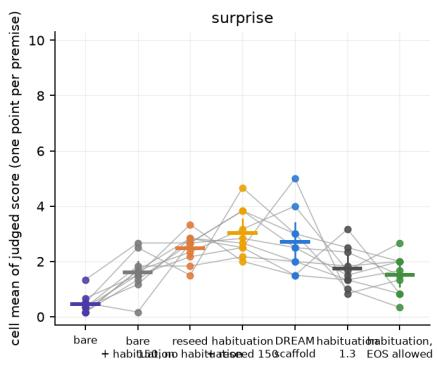

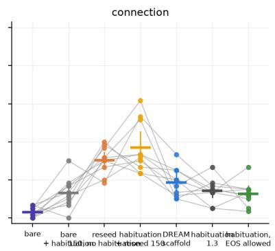

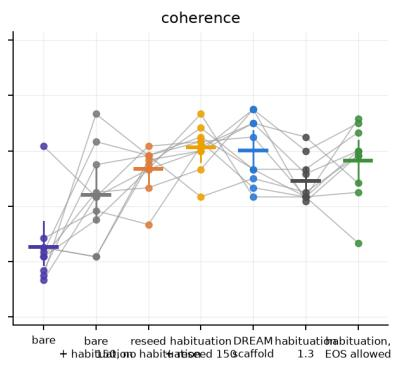

Figure 2: Habituation and interruption: bare, bare + habituation, interruption without habituation, habituation + interruption 150, the full scafold, and the two habituation baselines (stronger penalty; EOS allowed). One point per premise, grey lines join the same premise across arms, bars are cell means with 95% bootstrap CIs over cells (Qwen3-30B-A3B, generated-only windows).
<table><tr><td rowspan="2"></td><td colspan="3">Qwen3-30B-A3B</td><td colspan="3">Qwen3-8B</td><td colspan="3">OLMo-2-13B</td></tr><tr><td>S</td><td>C</td><td>H</td><td>S</td><td>C</td><td>H</td><td>S</td><td>C</td><td>H</td></tr><tr><td>bare</td><td>0.45</td><td>0.30</td><td>2.52</td><td>0.43</td><td>0.40</td><td>3.88</td><td>1.28</td><td>0.93</td><td>3.03</td></tr><tr><td>bare + habituation</td><td>1.58</td><td>1.28</td><td>4.45</td><td>1.37</td><td>1.00</td><td>4.35</td><td>1.96</td><td>1.26</td><td>3.99</td></tr><tr><td>habituation + interruption 150</td><td>3.02</td><td>3.68</td><td>6.12</td><td>2.76</td><td>3.17</td><td>5.15</td><td>2.77</td><td>2.87</td><td>4.05</td></tr><tr><td>DREAM scaffold</td><td>2.70</td><td>1.85</td><td>6.02</td><td>2.70</td><td>2.35</td><td>5.38</td><td>3.60</td><td>2.23</td><td>6.23</td></tr></table>

Table 2: The ladder on three generator models from two families: judged surprise (S), connection (C) and coherence (H), means over cells (generated-only windows, Opus 5, $k = 5 ;$ ten premises per arm). Habituation buys part of the surprise; the interruption buys the rest and most of the additional connection; the scafold adds nothing detectable over the plain interruption on the Qwen models and, on OLMo, adds surprise and coherence (its selective forgetting lifts the stream out of a web-boilerplate mode) while giving back connection.

Self-copy: what the window judge cannot see. Before going further, a check that the document-level judgment (Section 4.8) forced on us. A base model given the same four subjectchange sentences in rotation learns the rotation. After “That night she dreamed of something else entirely:” it tends to write what it wrote the last time that sentence appeared, 600 or 1,200 tokens earlier. We flag a judged window as copied when at least half of its 12-token shingles occur earlier in the same stream, and we note whether the source lies within the 600 tokens the judge sees (Table 25). Bare generation is 67% copied; these are its literal loops, all visible to the judge, who scores them 0.03. Habituation alone is 27% copied. The clock arms with the fixed rotation are 65–80% copied at periods 150 and 300, and at 300 the source of 62% of all windows lies outside the judge’s context; 38% at 600, 12% at 900. The reset arms are 0% copied and the scafold 6%. A copied window scores high on connection for the obvious reason, it is earlier text, and, when its source is out of view, on surprise too. So we recompute the ladder on fresh windows only. The interruption still lifts the stream over habituation. At period 150, surprise +1.20 [+0.43, +2.11] (p = 0.010), connection +0.75 [+0.38, +1.17] (p = 0.008), coherence +1.72. At 300, +1.32 [+0.73, +1.88] (p = 0.004), +0.75, +1.45. At 900, +1.35, +0.99, +1.67. The reset arm, which cannot copy, adds +1.93 [+1.59, +2.28], +2.03 [+1.75, +2.33] and +1.82 (all $p \leq 0 . 0 0 4 .$ every premise). We conclude that the surprise efect of the interruption is real on generated, fresh text and about one point smaller than the all-windows number. The connection efect is largely a self-copy artefact (+2.40 on all windows, +0.75 on fresh ones), and the reset arm’s advantage over the preserved context on connection $\left( + 1 . 2 8 \ [ + 0 . 8 2 , + 1 . 7 3 ] \right.$ on fresh windows) is in good part that it does not replay itself. From here on we report both numbers where they difer and treat the fresh-only ones as the primary estimate. The practical lesson is plain: a fixed rotation of four sentences is a cycle the model will close. Give it a new sentence each time, or reset.

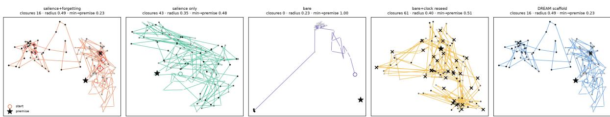  
Figure 3: Where the stream goes: trajectories in sentence-embedding space (64-token windows, one PCA per seed), seed 6. ⋆ premise, ◦ start, × reseed, ⋄ judged event sized by surprise. Bare makes one jump and freezes; the scafold orbits and returns; the clock reseed jumps across the space keeping its context.

Where the stream goes. In sentence-embedding space (Figure 3) bare generation has explored radius 0.18 and mean step 0.14 and ends 0.78 from the premise. The scafold has radius 0.51 and returns to within 0.57 of the premise. The clock reseed spreads over the space in jumps while keeping the whole context; the reset arm of battery 3 (Section 4.6) will show that keeping it is not what the judge rewards.

## 4.3 The interruption must lead away

With the same period (150), a neutral subject change and a re-encounter stitch that asks the stream to return to its beginning are indistinguishable $\mathrm { ( 3 . 0 2 ~ / ~ 3 . 6 8 ~ / ~ 6 . 1 2 ~ v s ~ 2 . 8 3 ~ / ~ 3 . 7 0 ~ / ~ 5 . 5 0 ; }$ every paired CI covers zero). Injecting the premise itself $\left( 1 . 1 6 \mathrm { ~ / ~ } 1 . 1 1 \mathrm { ~ / ~ } 3 . 9 1 \right)$ or a 64-token window of the stream’s own past $\left( 1 . 4 8 \mathrm { ~ / ~ } 1 . 4 4 \mathrm { ~ / ~ } 3 . 7 0 \right)$ is as bad as not interrupting at all. Against the neutral change the premise loses −1.86 [-2.38, -1.35] of surprise and the own past −1.54 [-2.17, -0.86]; connection −2.58 and −2.24; coherence −2.21 and −2.42; all $p \leq 0 . 0 0 6$ , δ from −0.84 to −1.00 (Figure 4). Qualitatively, the own-past injection reinforces whatever mode the stream is in: an exam-key stream was fed its own questions back. A return works only as a short stitch that still opens a new sentence; a literal return closes the loop.

## 4.4 Timing: salience against the clock

Salience events (jump, crystallization, recurrence; 1–9 per cell, median about 5) are the moments the scafold’s monitor picks out of the stream’s own telemetry. As a policy for which windows to judge they beat a clock in the first version of this study. The question here is whether they are also the right moments to interrupt. With the same stitch, timing by salience events and timing by a clock of matched frequency (every 900 tokens) are indistinguishable on generated text. The post-interruption windows score 3.04 / 2.92 / 5.75 against $3 . 0 5 \textrm { / } 2 . 7 1 \textrm { / 5 . 7 2 }$ (paired diferences $- 0 . 0 1 \ [ - 0 . 7 6 , + 0 . 7 3 ]$ on surprise, +0.21 on connection). The windows at least 300 tokens after the last injection, where the stream is left alone, score 1.82 / 1.80 / 4.20 against 2.08 / 1.71 $/ \ 4 . 7 3 \ ( - 0 . 2 6 \ [ - 0 . 7 8 , + 0 . 2 1 ] )$ (Figure 5, Table 15). Salience monitoring by itself, with nothing injected, leaves the stream where habituation alone leaves it (1.65 / 1.30 / 4.63 vs 1.55 / 1.28 / 4.48). The first version of this study reported a large stream-level advantage of the clock over salience timing (4.7 vs 2.2 on uniform windows). That advantage was carried by the injected sentences inside the clock arm’s windows, of which it has more. What remains is a null at the present resolution. Salience is a good reader of the stream and, as a metronome, neither better nor worse than a clock ticking at the same rate. Since a clock is free and regular, the clock is what we recommend.

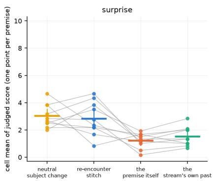

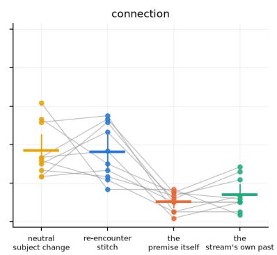

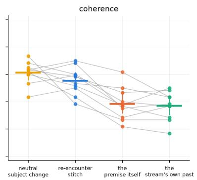  
Figure 4: Content of the interruption at period 150: neutral change, re-encounter stitch, the premise itself, the stream’s own past. Injecting a return is as bad as not interrupting.

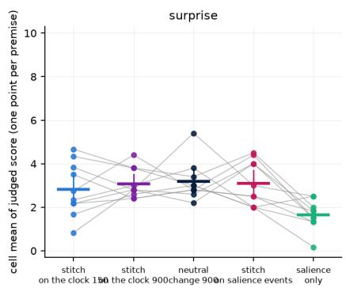

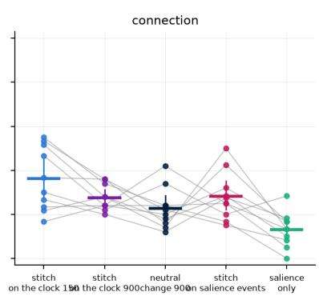

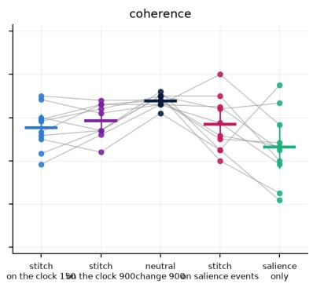  
Figure 5: When to interrupt: the re-encounter stitch on the clock (150 and 900), the neutral change every 900, the stitch on salience events, and salience only (nothing injected). Post-interruption windows; one point per premise.

## 4.5 Period and decay

The first version of this study reported that the yield of an interruption grew with the length of the thread it broke (5.3–5.9 after 300–900-token threads against 3.1 after 150), that it decayed over the next few hundred tokens, and that 300 tokens was the best rhythm. With the injected sentence excluded from the judged window, that finding largely disappears (Figure 6). The post-interruption window (32–128 generated tokens after the injection) scores 3.02 on surprise at period 150, 2.87 at 300, 2.88 at 600 and 3.18 at 900, and every paired diference against 150 covers zero. Connection is highest at the shortest period on all windows (3.68 vs 2.38, 2.02 and $2 . 2 2 ; \Delta - 1 . 3 0 \mathrm { \ t o \ } - 1 . 6 7 , p \leq 0 . 0 0 8 )$ , but that diference is self-copy: on fresh windows connection is 2.0 to 2.3 at every period (Table 25). Coherence rises a little with the period (6.12, then 6.43, 6.25, 6.78). Deeper into a segment the surprise of generated text holds for a few hundred tokens and then sinks toward the level of habituation alone (1.55): at period 900 it reads 3.18, 2.67, 3.17,

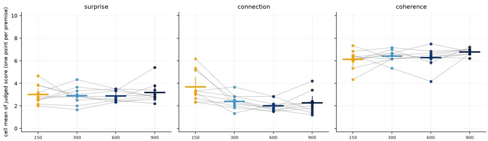  
Figure 6: Period of the neutral change: the post-interruption window (32–128 generated tokens after the injection) at periods 150, 300, 600 and 900; one point per premise.

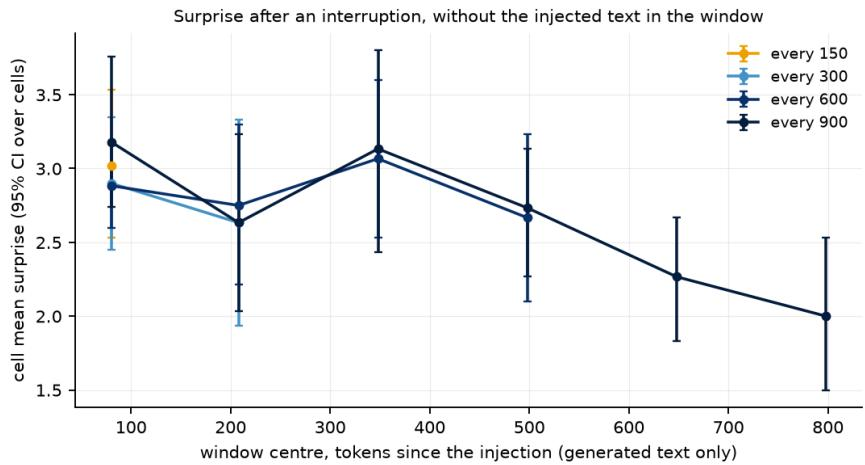  
Figure 7: Decay: cell-mean surprise of generated-only windows by tokens since the injection, per period.

2.77, 2.23 and 1.80 at 32, 160, 300, 450, 600 and 750 tokens after the injection (Figure 7). The stream estimate (ofset means weighted by the stretch of the segment they represent) is therefore 3.02 / 3.68 at 150, 2.76 / 2.30 at 300, 2.84 / 2.12 at 600 and 2.64 / 2.03 at 900 (Table 19). Among the tested periods, then, none is better than another on fresh generated text; what the longer periods buy is a little coherence and fewer replays. A period of 75 cannot be measured under this protocol, because no 96-token window of generated text fits between two injections. Under the event protocol its stream was dead (0.88), which is the one part of the earlier claim that survives: a thread needs some tens of tokens to exist before it can be broken. The larger numbers of the first version were, in good part, the judge reading the injected sentence. What survives is the direction of every efect and an operating range of a break every 150–300 tokens.

## 4.6 What carries the efect: boundary, content, context

An interruption is three things at once: a boundary in the text, a new subject, and a context that is kept or dropped. Battery 3 separates them at period 300 (Figure 8, Tables 10 and 12). A bare paragraph break every 300 tokens, a sham interruption, leaves the stream where habituation alone leaves it $( 1 . 4 2 / 0 . 9 7 / 4 . 4 3 \mathrm { ~ v s ~ } 1 . 5 8 / 1 . 2 8 / 4 . 4 5 )$ . A connective that asks for continuity (“And so, as before,”) is, if anything, worse than nothing (1.08 / 0.86 / 3.49; −0.50 [-1.20, +0.25] on surprise, −0.96 on coherence). A boundary that points back is what the premise and own-past injections were. The neutral subject change over the preserved context gives $2 . 9 0 \ / \ 2 . 3 8 \ / \ 6 . 4 0 5 \ + 1 . 3 2 \ [ + 0 . 6 8 , + 1 . 9 3 ]$ on surprise $( p = 0 . 0 0 4 )$ , +1.10 on connection $( p = 0 . 0 1 4 ) , + 1 . 9 5$ on coherence $( p = 0 . 0 2 )$ , and against the sham break +1.48 $/ + 1 . 4 2 \ / + 1 . 9 7$ (all $p \leq 0 . 0 0 6 )$ . The same subject change on a reset context, where the model keeps only the premise and the injected sentence, gives $3 . 7 2 \mathrm { ~ / ~ 3 . 3 2 ~ / ~ 6 . 8 8 ~ }$ . That is higher than the preserved context on every dimension $( + 0 . 8 2 \ [ + 0 . 3 2 , + 1 . 3 0 ] , \ p = 0 . 0 2 ; \ + 0 . 9 3 \ [ + 0 . 5 3 , + 1 . 3 2 ] , \ p = 0 . 0 0 4 ;$ $+ 0 . 4 8 \ [ + 0 . 0 3 , + 0 . 9 5 ] )$ , and every premise moves the same way on surprise. Resetting without a new subject (a break on a reset context) gives $2 . 0 3 \ : / \ : 1 . 7 3 \ : / \ : 5 . 4 3$ , little more than the sham. The subject change against the break is $+ 1 . 6 8 \mathrm { ~ / ~ } + 1 . 5 8 \mathrm { ~ / ~ } + 1 . 4 5$ under reset and $+ 1 . 4 8 \ / \ + 1 . 4 2 \ /$ +1.97 under the preserved context $( p \leq 0 . 0 0 6 )$ . We read this as follows. The new subject is what produces the efect; the boundary by itself does nothing; and dropping the earlier text from the model’s context does not hurt what the judge reads, it helps.

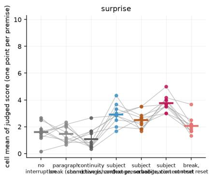

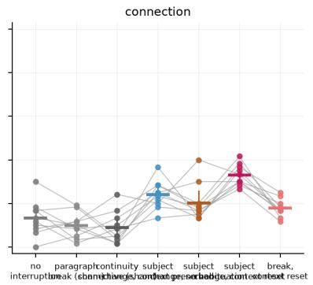

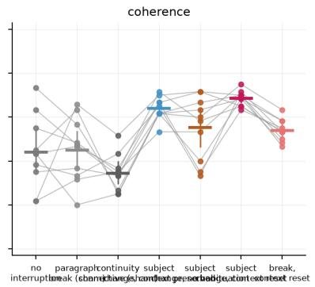  
Figure 8: What carries the efect at period 300: no interruption, a paragraph break (sham), a continuity connective (sham), the subject change on the preserved context, the subject change without habituation, the subject change on a reset context, and a break on a reset context; one point per premise.

Two things must be said about that last result. Under reset the model cannot integrate the earlier text. What it can still do is return to the premise, sometimes verbatim, in a fresh mini-story, and the judge, seeing 600 tokens of earlier text about the same premise, scores that as connected and coherent. Under the preserved context the model can integrate, returns less, and is entrained by 3,000 tokens of its own past. Connection as this rubric measures it does not separate a long-range integration from a return to the shared beginning. The preserved context is therefore a choice in the operator we studied, not a demonstrated ingredient of the judged efect, and Section 4.8 asks the question at the level of the whole document, where the diference between integration and restart should show if it exists.

The same three arms replicate on Qwen3-8B-Base against its own habituation cells. The sham break does nothing $\left( - 0 . 0 5 \ [ - 0 . 7 7 , + 0 . 8 0 ] \right.$ on surprise). The subject change on the preserved context adds $+ 1 . 3 8 \ [ + 0 . 7 4 , + 1 . 9 8 ]$ of surprise and +1.28 of connection, and on the reset context $+ 2 . 4 0 \ [ + 2 . 0 8 , + 2 . 7 0 ]$ and +2.08, every premise (Table 34). On OLMo-2-13B the sham again does nothing (−0.08). The preserved context adds $+ 1 . 6 1 \ [ + 0 . 7 2 , + 2 . 4 2 ]$ and $+ 2 . 2 6 \ [ + 1 . 5 8 , + 2 . 8 7 ]$ the reset context $+ 2 . 1 4 \ [ + 1 . 3 2 , + 2 . 9 2 ]$ and $+ 1 . 5 9 \ [ + 1 . 0 2 , + 2 . 2 2 ]$ (Table 36). There the reset wins on surprise and coherence and the preserved context on connection (3.52 vs 2.85). OLMo is the one generator on which keeping the earlier text buys connection the judge can see, and the one whose interruption arm copies itself least. The pattern that holds everywhere is the one that matters: a boundary alone does nothing, a new subject does, and a reset context is at least as good on surprise.

## 4.7 A confirmatory replication on new premises

Everything above was designed and analyzed in sequence, and the questions of batteries 2 and 3 were formulated after seeing battery 1. Before any result of battery 3 or of the generated-only judgments was seen, we wrote ten new premises (Appendix C), fixed a diferent random seed and chose five arms at period 300: habituation alone, the sham break, the subject change on the preserved context, the subject change without habituation, and the subject change on a reset context. We pre-registered four contrasts in the laboratory notebook. H1 (primary): the subject change on the preserved context beats habituation alone on surprise. H2: it beats the sham break. H3: it beats the reset context on connection. H4 (two-sided): habituation matters given the interruption. Fifty new cells were then generated and judged under the same protocol (Table 42, one-sided exact permutation tests). H1 is confirmed: $+ 1 . 4 8 \ [ + 0 . 7 2 , + 2 . 0 5 ]$ $p = 0 . 0 0 3$ ; on fresh windows only, +0.82 [+0.03, +1.45], $p = 0 . 0 4$ . H2 is confirmed on all windows $( + 0 . 9 1 \ [ + 0 . 2 3 , + 1 . 5 5 ] , p = 0 . 0 2 )$ and not on fresh ones $( + 0 . 7 1 , p = 0 . 1 1 )$ . H3 is refuted in the direction battery 3 had found: the reset context scores higher on connection $\left( - 0 . 5 5 \ [ - 1 . 0 3 , - 0 . 0 3 ] \right.$ for preserved minus reset; −1.02 on fresh windows) and on surprise $\left( 4 . 1 7 \mathrm { ~ v s ~ } 2 . 8 7 \right)$ . H4 is not supported $( + 0 . 5 1 \ [ - 0 . 0 2 , + 1 . 0 3 ] , p = 0 . 1 2 \ \mathrm { t w o - s i d e d } )$ . The document-level judgment repeats on the new premises as well: the reset arm is above the preserved context on all four document dimensions $( p \le 0 . 0 3 )$ , and the preserved context at or below habituation alone (Table 45). The replication thus confirms the efect the paper rests on, on premises and a random seed the program had never seen. It also settles the two questions the exploratory batteries had left open, in the less flattering direction: the context need not be kept, and habituation is not what makes the interruption work.

## 4.8 The whole document

Every score above is local: a window of 96 tokens read against 600. Does the interrupted loop build anything over 4,500 tokens? We had the judge read the whole stream of each cell, with the injected sentences removed, and score four things once (Opus 5, $k = 3 .$ , median; one score per cell): integration (are characters, motifs or ideas from earlier parts taken up later and joined), development (does something build rather than restart or repeat), coherence (does it read as one text) and surprise (does the whole go somewhere unpredictable yet sensible). The answer is no, for every arm (Figure 9, Table 28): no condition exceeds 2.5 on any document dimension. Worse for the operator: judged as a whole, the interrupted stream over the preserved context is a sequence of restarts and reads below the uninterrupted habituated stream. At period 150 its document surprise is 0.10 against $1 . 4 0 \ ( - 1 . 3 0 \ [ - 1 . 6 0 , - 1 . 0 0 ] , p = 0 . 0 0 2 )$ and its development 0.30 against 1.10; at period 300, surprise −0.90 $( p = 0 . 0 3 )$ and integration −0.60; the scafold is at the level of habituation. The judge’s notes say why: the interrupted stream “repeats the same four-part block verbatim” and “cycles four short fragments”, the self-copy of Section 4.2 seen whole. The longer periods and the stitch arms, with fewer replays and longer stretches, sit between (600 and 900: 1.2–1.8 on every dimension). The reset arm reads best of all (integration 2.00, development 1.60, coherence 2.20, surprise 2.50; above the preserved context on all four, $p \leq 0 . 0 3$ , and above habituation on surprise, +1.10, $p = 0 . 0 0 8 )$ , because each of its parts is a clean piece that returns to the premise, which the document judge, like the window judge, credits as a kind of unity. So the local gains of Sections 4.2 to 4.6 do not compose. An interruption is a local operation that makes the next hundred tokens more surprising, connected and coherent than they would have been, and leaves the document a collection. Keeping the earlier text in the model’s context, which is what a writer would want, produces no integration that either judge can see, and the accumulation the architecture was built for does not happen. We take this as the clearest statement of what the paper has and has not found: an operator on windows, not on wholes.

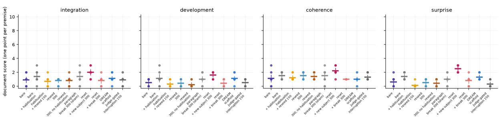  
Figure 9: The whole document, injected sentences removed: integration, development, coherence and surprise of the 4,500-token stream (Opus 5, k = 3; one point per premise). No arm builds a whole; the interrupted stream over the preserved context reads as a sequence of restarts; the reset arm’s clean parts, each returning to the premise, read best.

## 4.9 The Review, with a gate that opens

The scafold’s one instrument for building on a find, the judge-gated escalation, never fired (Section 3.3). To test the idea rather than the accident, we ran the Review as the architecture intended it, with a gate that does open. Every 150 tokens, before the scheduled subject change, Opus 5 reads the last 128 generated tokens against the 600 before them (one call). If the window is a find (surprise ≥ 5 and coherence ≥ 5), the interruption is withheld and the thread is left to run; otherwise the neutral subject change is injected as in the clock arm. Two hypotheses were written before the run. G1: the judge-gated arm beats the clock at 150 on the post-interruption window. G2: it beats it at the document level on development and integration, since finds are allowed to develop. The gate opened on 40 of 300 reads (13%), so the arm interrupted a little less often than the clock and let 40 good threads run. Neither hypothesis is supported (Table 40). On the post-interruption windows the gated arm is at 2.70 / 3.03 / 5.92 against the clock’s $3 . 0 2 \ / \ 3 . 6 8 \ / \ 6 . 1 2 \ ( - 0 . 3 2 \ [ - 0 . 9 3 , + 0 . 1 7 ]$ on surprise, −0.65 [-1.47, +0.03] on connection). At the document level it is where the clock is $( 0 . 9 0 \ / \ 0 . 5 0 \ / \ 1 . 3 0 \ / \ 0 . 3 0 \ \mathrm { a g a i n s t \ 0 . 7 0 \ / \ 0 . 3 0 \ / \ 1 . 2 0 \ / \ 0 . 1 0 } ;$ every paired diference within ±0.2), below habituation alone on surprise (−1.10 [-1.40, -0.80]). A real judge deciding when not to interrupt, on this generator and at this rate of finds, adds nothing to a clock, locally or in the whole. The Review stage of the architecture is not refuted as an idea for a diferent regime, but in this one it had its chance and did not take it.

## 4.10 Coda: the same operator on a problem with a verifier

The document-level result says that the interruption is a variation operator, not a builder. The natural next question is whether variation is worth anything where value can be measured. As a first probe, run after everything above and pre-registered in the notebook, we gave the main generator a Python working notebook for online bin packing, the FunSearch benchmark: a priority function scores the feasible bins, and fewer bins is better. The notebook’s docstring states the item-size distribution, first fit and best fit are given as worked examples, and the model writes ideas and def priority functions for 4,500 tokens. Every complete function is extracted and scored by the verifier on held-out instances of the same distribution. We ran ten distributions (the cells) × two random seeds × four arms: plain (habituation, no interruption), a distinct “new angle” comment injected every 300 tokens (fifteen diferent ones, so that the self-copy cycle cannot form), the same angles on a reset context, and an empty comment line every 300 tokens (sham). Pre-registered: B1 (primary), the angle arm beats plain on the gain of its best candidate over best fit; B2, it writes more distinct valid functions; B3, angle vs reset on gain; B4, sham equals plain. Results are in Appendix F. B1 is not supported (−0.006 [-0.016, +0.001] of gain, one-sided $p = 0 . 9 4 )$ . No arm beats best fit on held-out instances in more than one of twenty streams, and the mean best candidate sits just above it in every arm. B2 is supported: the interrupted notebook writes 9.2 valid and 5.1 distinct valid functions per stream against 2.0 and 1.8 for the plain one (+3.3 distinct, $[ + 0 . 8 , + 6 . 7 ] , p = 0 . 0 1 2 )$ . The sham writes fewer than plain and its best is worse $( - 0 . 0 1 6 , p = 0 . 0 1 6 )$ , so B4 is refuted in the direction of harm, as in the narrative batteries. The reset arm has the most distinct valid functions (6.6) and the best candidates: it reaches best-fit quality in 15 of 20 streams, +0.007 of gain over plain $( p = 0 . 0 3 )$ , and it is above the angle arm on gain (B3, $p = 0 . 0 4 )$ . The picture is the one the document judge had drawn. Interruption multiplies valid, distinct attempts three- to fourfold and does not raise the ceiling of the best one; in a single stream, variation without selection is organized noise. Whether the same operator inside a selection loop, a FunSearch-style evolution over the candidates it multiplies, turns variation into value is the next experiment, not this one.

## 4.11 Three generator models from two families

The ladder replicates on Qwen3-8B-Base and OLMo-2-13B (Table 2, Figure 10). On the 8B it reads 0.43, 1.37, 2.76 on surprise (interruption over habituation +1.39 [+0.72, +2.07], $p = 0 . 0 0 8 \mathrm { ; }$ connection $+ 2 . 1 7 \ [ + 1 . 5 3 , + 2 . 8 3 ] , \ p = 0 . 0 0 2 )$ , with the scafold at 2.70 / 2.35. OLMo’s bare stream wanders across web genres rather than locking into literal loops, and is therefore less dead (1.28). There the interruption over habituation gains connection $( + 1 . 6 1 \ [ + 0 . 8 3 , + 2 . 3 5 ]$ $p = 0 . 0 0 4 )$ and only some surprise $( + 0 . 8 2 \ [ - 0 . 2 1 , + 1 . 8 1 ] , p = 0 . 1 7 )$ , and costs nothing detectable in coherence. Self-copy is present there too: 78% of the interruption arm’s windows on the 8B and 45% on OLMo (Table 26); on fresh windows the interruption adds +0.95 (8B) and +1.0 (OLMo) of surprise over habituation. On OLMo the full scafold is the best arm on surprise (3.60, +1.64 over habituation, $p = 0 . 0 4 )$ and coherence $( 6 . 2 3 , + 2 . 2 4 , p = 0 . 0 2 )$ , with less connection than the plain interruption (2.23 vs 2.87). What the scafold does for OLMo is what a reset does: it pulls the stream out of a web-boilerplate mode, the mechanism the calibration probes had suggested. On a generator whose degeneration mode is boilerplate the reset earns its keep, and battery 3 says it costs nothing on the one that drifts in prose. Quantization carries none of this. The same ladder on the unquantized (bf16) Qwen3-8B-Base gives 0.60, 1.33, 2.70 on surprise and 0.47, 1.06, 3.25 on connection (interruption over habituation +1.37 [+0.26, +2.42] and $+ 2 . 1 9 \ [ + 1 . 2 7 , + 3 . 1 0 ] )$ , against 0.43, 1.37, 2.76 and 0.40, 1.00, 3.17 at 8 bits.

A second genre. All premises above are narrative. Ten expository openings written for the purpose (“The history of the umbrella is mostly a history of people refusing to carry $o n e . \stackrel { \triangledown } { , } ,$ “Salt was once the reason cities existed where they do.”; the full list is in the repository), run on the main generator at period 300, give the same picture. Habituation alone reads 1.35 / 0.95 / 4.47; the subject change on the preserved context 2.93 $/ \ 2 . 4 0 \ / \ 6 . 5 3 \ ( + 1 . 5 8 \ [ + 1 . 1 7 , + 2 . 0 0 ]$ on surprise, +1.45 on connection, $p = 0 . 0 0 2$ , every premise); on the reset context 3.00 / 2.48 / 6.67 (+1.65, +1.53). Here the two contexts are indistinguishable (Table 38).

A post-trained model. As one step outside the scope decision, we ran the same ladder on the post-trained Qwen3-8B (the released chat model, 8-bit), continued raw, without a chat template, from the same premises. Its degeneration modes are its own: multiple-choice exam items with answer keys, and a chain-of-thought voice that treats the premise as a riddle (“Wait, let me think of a classic $\boldsymbol { r i d d l e . \dots } ^ {  } )$ . The ladder holds at a lower level, 0.60, 0.77, 1.90 on surprise and 0.42, 0.75, 2.28 on connection. Habituation does less for it than for the base models (+0.17 on surprise), and the interruption still adds $+ 1 . 1 3 \ [ + 0 . 5 8 , + 1 . 7 8 ] \ ( p = 0 . 0 0 2 )$ and +1.53 $\left[ + 0 . 8 7 , + 2 . 3 2 \right] \left( p = 0 . 0 0 4 \right)$ . Whether the operators help such a model when it is used as intended, in a dialogue, is not tested here.

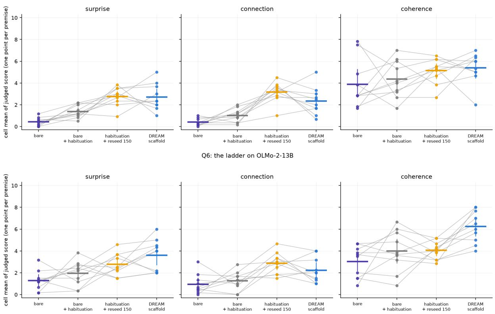  
Figure 10: The ladder on Qwen3-8B-Base (top) and OLMo-2-13B (bottom); one point per premise.

## 5 The instrument, measured

Every idea-level claim in this paper rests on an LLM judge, so we measured the judge before using it, in three ways: its repeatability, its agreement with a second judge family, and its agreement with human readers. Repeatability is not validity. Five calls to the same model measure the stability of one reader, not whether that reader is right; only the last two checks bear on validity.

Repeatability. On the same 89 windows judged k = 5 times by two models, Claude Opus 5 gives continuous scores with a median intra-window spread of 0.71. Claude Sonnet 5 has spread 0.27, but by scoring zero on the connection dimension almost everywhere; a ruler that only reads “0” is consistent (Figure 11). The three-dimension surprise/connection/coherence rubric has spreads of 0.45–0.70 under Opus. A test–retest of the whole pipeline came for free. Two arms of the ablation battery, the full scafold and its no-re-encounter ablation, turned out to be byte-identical in all ten cells, because the in-loop judge never passed and the re-encounter never fired, and they were judged independently. On their 79 generated-only windows the medians of five agree exactly in 91% of windows on surprise (mean absolute diference 0.09), 85% on connection (0.15) and 71% on coherence (0.29); the cell means difer by −0.01 [-0.09, +0.07] on surprise. Two consequences shape the paper. A binary threshold on a noisy judge is a coin (the same window scored 5.24 one night and 4.48 the next), so every result uses continuous medians of k samples. And a per-judgment noise of about ±0.7 is one of several sources of variance, not a threshold of detectability. The median of five reduces it, windows within a stream vary more than that, cells vary more still, and the power of a comparison is set by the ten paired cells, not by the judge’s spread. That is why the sampler’s null inside the loop (Appendix A), obtained on windows and with a half-point diference, is reported as “no detectable efect at the present

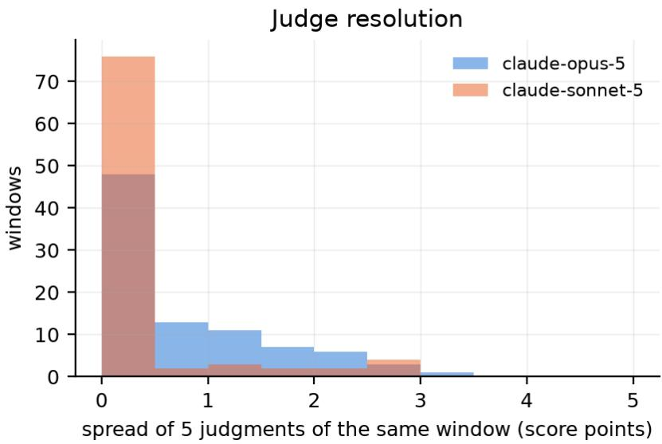  
Figure 11: Spread of five judgments of the same window (delta rubric, 89 windows). Sonnet 5 concentrates at zero spread by scoring zero; Opus 5 gives continuous scores at ±0.7 noise.

resolution”, not “absent”.

A second judge family. To check that the loop results are not the taste of one model family, a stratified sample of 140 already-judged event-protocol windows (20 per condition across bare, habituation, clock reseed, scafold, re-encounter stitch, period 300 and salience-timed re-encounter) was re-judged by Kimi K2.6 (Moonshot, via OpenRouter) with the same rubric and $k = 5$ . Agreement with Opus 5 on the median of five is Spearman $\rho = + 0 . 8 5$ on surprise, +0.77 on connection and +0.71 on coherence (n = 140 windows from 70 cells; the correlations are computed on windows and their p-values are not corrected for the clustering by cell). Kimi is more generous (means about one point higher) and noisier (intra-window spread 2.0–2.6), but every condition ordering replicates: bare 0.55, habituation 3.15, clock reseed 4.30, scafold 4.10, period 300 5.65 on surprise, with the neutral reseed and the re-encounter stitch highest on connection under both judges. We repeated the check on the generated-only protocol with a random, not stratified, sample of 160 post-interruption windows from eight conditions including the battery-3 arms. The agreement is $\rho = + 0 . 7 5$ on surprise, +0.80 on connection and +0.65 on coherence, and the ordering is again reproduced (under Kimi, surprise runs bare 1.0, habituation 2.5, sham break 2.1, interruption 150 3.3, scafold 4.9, interruption 300 5.4, reset 5.7). Two families agreeing does not make the rubric valid; it rules out one family’s taste as the whole explanation.

Human rating, round 1. Three independent raters, recruited on a freelance platform without knowledge of the hypotheses or conditions (Appendix D), rated 63 event-protocol windows blind: nine per condition, stratified by judged surprise, shufled, no labels, the earlier text shown. They were a native English reader with professional editing experience, a native or bilingual English speaker, and an advanced non-native reader with graduate training in language. They rated surprise and coherence (not connection) with the judge’s rubric. All three returned complete ratings using the whole of both scales, with distinct personal calibrations (mean surprise 3.4, 4.3 and 6.1). Each rater alone agrees with Opus 5 on surprise (Spearman $\rho = + 0 . 4 0 , + 0 . 5 0 .$ +0.47; all $p \leq 1 0 ^ { - 3 } )$ and on coherence $\left( + 0 . 6 0 , + 0 . 4 7 , + 0 . 2 3 \right)$ . The mean of the three agrees more strongly than any one (surprise $\rho = + 0 . 5 8 , p = 7 \times 1 0 ^ { - 7 } ;$ ; coherence $+ 0 . 5 2 , p = 1 0 ^ { - 5 } )$ about as strongly as the raters agree with each other (pairwise Spearman on surprise 0.71,

0.38, 0.25, Krippendorf’s interval α = 0.30; on coherence 0.69, 0.60, 0.42, α = 0.38; the low α reflects the diferent scale calibrations that rank correlation ignores). The human consensus reproduces the condition ordering that carries the paper. On surprise, means over nine windows: period-300 interruption 6.5, neutral clock reseed 6.4, re-encounter stitch 5.3, salience-timed 5.0, scafold 3.6, habituation only 3.6, bare 1.5; interruption vs bare $[ + 3 . 1 , + 6 . 5 ]$ , habituation vs bare [+0.1, +3.9], and the plain interruption above the full scafold by a wider margin than under Opus. On coherence the human readers rank habituation without interruption highest (7.7) and the interrupted arms 5.7–6.3: to a human reader, the subject change inside a window costs some fluency that the LLM judge does not penalize. Three limits of this round are plain. The sample was stratified by the judge’s own surprise score, which widens the range and can inflate a rank correlation. Connection, the dimension on which the interruption’s all-windows advantage was largest, was not rated. And inter-rater agreement is low to moderate, so the human data support the ordering of conditions and a moderate agreement with the judge, not the judge’s exact numbers. A second round, on 56 generated-only and fresh windows from eight conditions (one per randomly chosen cell, not stratified by the judge), with connection added as a third dimension and five raters, is in progress and will be reported in a later version.

## 6 Inside the network: a descriptive look

Judges and sentence embeddings see the text; the model’s own residual stream sees the computation. This section is exploratory and descriptive. It reports correlational geometry of the residual stream with judged windows as observations (clustered by cell; for the pooled correlations we give cluster-robust intervals from a bootstrap over cells, and the within-condition values are descriptive), it uses a logit lens for one coarse quantity, and it makes no causal intervention. It characterizes what the judged dimensions co-vary with in the model’s state. It does not establish a mechanism. We re-run every finished stream through its generator (one forward pass with a KV cache, exact token positions) and capture the residual at 13 layers: every 4th of 48 for Qwen3-30B-A3B, every 3rd for the 36-layer Qwen3-8B and the 40-layer OLMo-2. The residual is mean-pooled over 64-token windows (stride 32) and mean-centered per layer before cosine geometry; a logit lens (the final norm and unembedding applied to the intermediate state) is read at each captured layer. Three questions.

N1: where does the stream freeze? We compute per-layer trajectory geometry of the window vectors (mean step between consecutive windows, explored radius) by condition, and the logit-lens commitment layer, the captured layer from which the top-1 token no longer changes. Bare generation’s mean step is a third to a quarter of every interrupted condition’s at every sampled layer. Its explored radius is 0.13 at the input layers against 0.42–0.53, and the gap narrows with depth but never closes (0.24 vs 0.33–0.34 at layer 47, CIs disjoint; Figure 12). The three interrupted conditions are geometrically alike inside the network; what separates them is what the judge reads. On the 30B, bare generation’s top-1 stabilizes later (commitment index 11.12 [11.04, 11.25] of 12 vs 10.88–10.96) while its final distribution is far more confident (final entropy 0.34 vs 0.42–1.08), a pattern consistent with copying, a late-layer computation that ends certain. The ordering does not replicate on the 8B, so we report it as an observation. The 8B and OLMo replicate the geometry (bare radius 0.14 and 0.36 at layer 0 against 0.46–0.61).

N2: which layer’s movement predicts judged surprise? For every judged window we compute its novelty at layer l (cosine distance between the window’s mean state and the mean state of everything before it) and its local step (against the previous 160 tokens), and correlate both with judged surprise (Figure 13). Pooled over conditions, novelty against the past correlates with surprise at the input layers $( \rho = + 0 . 4 7$ at layer 0; cell-bootstrap 95% CI [+0.22, +0.67]) and not at the top $( - 0 . 0 4 , [ - 0 . 2 6 , + 0 . 1 7 ] )$ , but the pooled number is carried by the bare/interrupted contrast. Within interrupted conditions the sign flips with depth. Local step at layer 0 correlates positively with surprise (salience-only +0.46, scafold +0.23) and at layer 47 negatively (−0.34, −0.14); novelty against the whole past is negative at depth (salience-only −0.53 at layer 47). Across the 668 judged windows of battery 2, layer-0 movement predicts surprise within every condition $\left( \rho + 0 . 3 \mathrm { ~ t o ~ } + 0 . 6 \right)$ , and higher final entropy predicts it everywhere (ρ +0.3 to +0.6): confident is unsurprising. In these data, judged surprise co-varies with departure at the surface layers and with continuity at depth, new at the surface and continuous underneath.

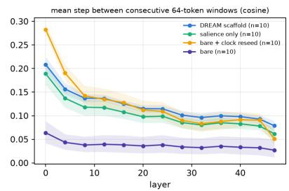  
H1 — where in the network does the stream freeze? residual-stream trajectory geometry per layer, and early commitment

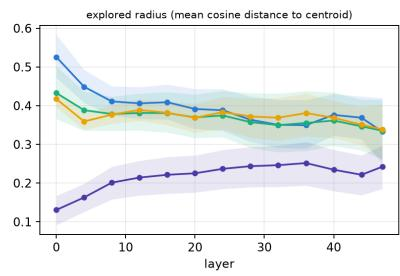

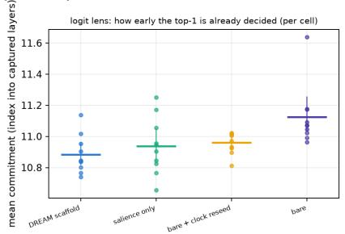

Figure 12: N1: residual-stream trajectory geometry per layer and condition (Qwen3-30B-A3B, ablation battery): mean step, explored radius, and logit-lens commitment. Bare generation moves least at every sampled layer, most so at the surface.  
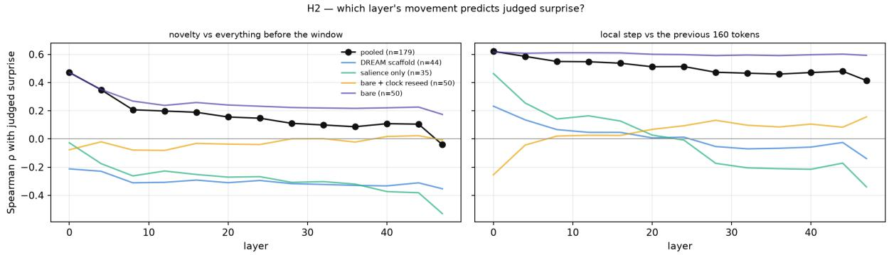  
Figure 13: N2: Spearman correlation between the judged window’s movement (novelty vs everything before it, left; local step, right) at each layer and judged surprise, pooled and within condition.

N3: how deep does an interruption reach? We measure the cosine distance between the 64 tokens before an injection and the 64 after it (the injected text skipped), per layer, minus the same at random positions, and the change in similarity to the premise’s own state (Figure 14). Across a scafold reseed with forgetting, the state after the injection difers from the state before by +0.09 (layer 4) growing to +0.21 (layer 40) beyond control, and its similarity to the premise’s state rises by +0.09 to +0.20 with depth. Forgetting moves the deep state toward the premise’s own state, a re-encounter with the beginning as the network represents it. Across a clock reseed over preserved context the same measures are +0.01–0.03 and about 0 at every sampled layer, and this arm scores as high as any on the judged dimensions. In this reading, judged surprise and connection do not require deep representational shifts; they accompany surface departures over a deep state that is left nearly intact. We take this as a description of what the judged dimensions track, not as an account of why an arm scores as it does. The reset arm of battery 3, which by construction moves the deep state at every interruption and scores as high as the preserved context, was not captured and is the obvious next probe. The dissociation replicates on the 8B $( + 0 . 0 3 \mathrm { ~ t o ~ } + 0 . 1 0 \mathrm { ~ v s ~ } + 0 . 0 1 - 0 . 0 3 )$ and, larger, on OLMo (+0.20 to +0.38 with a return of +0.13 to +0.18, vs +0.02–0.06 with no return). In battery 2, the depth of the state change scales with the length of the interrupted segment (period 75: about 0; 150: +0.01–0.02; 300: +0.02–0.04; 600: +0.04–0.075) and not with what is injected, a dependence on segment length that the judged scores of the generated text do not show (Section 4.5). The salience-timed stitch is the one 150-scale injection that reliably moves the deep state and pulls it toward the premise, while being the arm whose stream the judge rates lowest; deep movement and judged quality dissociate here too. Along the stream, similarity to the premise state is U-shaped in depth (about 0.9 at layer 0, about 0.5 mid-network, rising at the top) and ordered at the top layer: scafold 0.85, salience-only 0.79, clock reseed 0.67, bare 0.55. The sentence-embedding “return to the premise” of the scafold is visible at the top layer and not in the middle of the network.

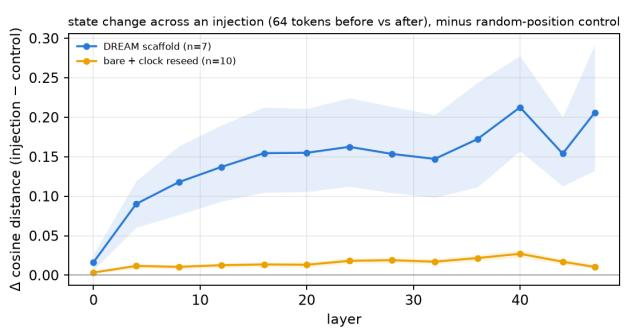

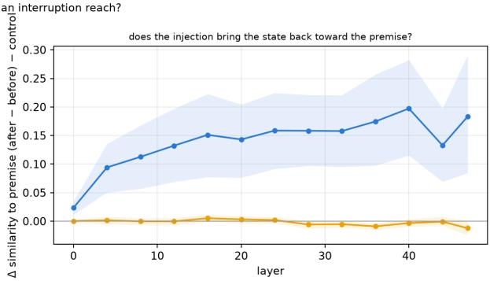  
Figure 14: N3: how deep an interruption reaches (Qwen3-30B-A3B). Left: state change across an injection per layer, minus random-position control. Right: change in similarity to the premise’s own state. The forgetting reseed moves the deep state and returns it toward the premise; the clock reseed over preserved context barely touches it, and scores as high on the judged dimensions.

## 7 Discussion

The scafold and the beam. We started from an architecture modeled on the mind (three networks, incubation, re-encounter), and measurement returned something simpler than the architecture. The scafold works, but when it is taken apart most of its efect lives in two operations that were not the noble ones: not repeating one’s literal past, and being made, every few hundred tokens, to start a new sentence somewhere else. We call this minimal operator the interrupted loop. Whether the earlier text is kept in the model’s context while it does so turned out not to matter to the judge (Section 4.6); we kept it, and it is a choice, not an ingredient. The elaborate parts fall into four groups. Some add nothing detectable: the salience monitor as a trigger, and the in-loop judge, which never fired. Some interrupt too rarely: the forgetting reseed fires 0–3 times per cell, and the scafold’s lower connection tracks that rarity rather than the forgetting, since a complete reset every 300 tokens scores at least as well as the preserved context. Some work opposite to their design: a literal return to the premise closes the loop. And one does no better than the trivial alternative: salience is a good reader of the stream and, as a metronome, no better than a clock at the same rate. Only because the whole scafold was built and then dismantled do we know which beam carries the weight, and which pieces are conditional. The reset earns its keep on a generator whose degeneration mode is web boilerplate, and is indiferent on one that drifts in prose.

What an interruption is. Battery 3 takes the interruption apart as the earlier batteries took the scafold apart. A boundary is not an interruption. A paragraph break every 300 tokens leaves the stream where habituation leaves it, and the model’s own document breaks (EOS allowed) buy coherence and nothing else. A boundary that points back is worse than none. What works is a new subject. Habituation adds to it, a fluent stream between injections, but the new subject alone gets most of the way. A new subject also means new each time. The four-sentence rotation we used is a cycle the model closes by replaying its own earlier segments, and a window judge with a 600-token horizon reads the replay as surprise and, worse, as connection. The fresh-only numbers are the ones to believe, and a reset context, or a fresh sentence at each break, is the cure. The new subject works whether the earlier text stays in the model’s context or is thrown away, at least for what the judge can read, and thrown away it scores higher. On a reset context the model writes a fresh mini-story that returns to the premise, and the judge scores it as connected and coherent; on the preserved context the model can integrate, returns less, and is entrained by thousands of tokens of its own past. The operator is therefore smaller than we first wrote it: damp repetition, and every few hundred tokens give the model a new sentence that leads away. Keeping the memory is what a writer would want and what a 600-token judge cannot reward. The diference between integration and return is exactly the kind of long-range quality this instrument does not see, and it is where a human study with the whole document in view should look next.

Windows and wholes. The document-level judgment (Section 4.8) is the result we would least like to have and are most obliged to report. None of these streams builds anything, and the interrupted stream over the preserved context, whose windows are the best, reads as a whole below the uninterrupted habituated one. The interruption is an operator on the next hundred tokens. The architecture we started from was built for accumulation (finds kept, developed, returned to), and its one instrument for that, the judge-gated escalation, never fired in the scafold. Run on purpose, with a real judge and a gate that opened on 13% of its reads (Section 4.9), it did no better than the clock at either level. What would make the local gains compose is not a better trigger; it is something this loop does not have. The coda on bin packing (Section 4.10) says what the operator is worth where value can be measured: three to four times more valid, distinct attempts and no better best. That is the profile of a variation operator, and variation is worth something only under selection: a task with a verifier and a loop that keeps a find because it is worth something, not because a judge liked the window.

Surface novelty and judged surprise are diferent quantities. The anti-probable sampler doubles n-gram novelty against the training corpus and shows no detectable efect on judged surprise or connection. The interruption lifts judged surprise by more than a point on fresh text (two to three points on all windows) without touching the sampler at all. Inside the network, read descriptively, the two live at diferent depths: what the judge calls surprise co-varies with lexical departure over an intact deep context, and the interruption that scores best barely moves the deep state. This is also why the neat expectation “novelty equals distance from what came before” fails within interrupted streams, where deep departure from the stream’s own past is negatively related to judged surprise. The reader rewards the window that is new on the surface and continuous underneath, which is what a good turn in a story is.

Rhythm, revised. The first version of this study made much of a rhythm: a break every 75 tokens develops nothing, the same break scores higher after a longer thread, and 300 tokens looked like the best period. On generated text only, most of that is gone. The post-interruption surprise does not depend on the length of the thread it breaks; on fresh windows, neither does connection; and a stream left alone for many hundreds of tokens sinks back toward the level of habituation alone. What survives is humbler and, we think, still usable. The interruption is a resource that has to be spent regularly, every 150–300 tokens on these generators; a thread needs some tens of tokens to exist before breaking it is worth anything; and nothing is gained by waiting.

What this is not. It is not a claim that these streams are good literature. Most windows are judged well below the midpoint, and the texts are what a base model produces under forced continuation. It is not a claim about creativity in the full sense, since no value, interest or originality against the world is measured, nor about scale, since the generators are 8–30B parameters, mostly at 8 bits, and only one post-trained model was run, in raw continuation. It is a characterization, with controls, of a simple intervention on forced open-ended generation, made on three base models from two families and under two judge families, and it points at the loop’s structure rather than at the two places where efort is usually spent.

## 8 Limitations

What was measured. The outcome is judged narrative surprise, connection and coherence on short windows of forced open-ended continuation, read by an LLM judge and, on a subset, by human readers. That is a defensible operationalization of one ingredient of creativity, the appropriately unexpected turn. It is not creativity: no value, interest or originality against the world is measured, and the study makes no claim about ideas or problems. Its title names the question the program set out with; the results answer a narrower one.

Design. The premises are ten English narrative openings, plus ten expository openings for one replication and ten new narrative premises for the confirmatory battery. Three generator models from two families run the core ladder; one generator (Qwen3-30B-A3B) runs the content, timing, period and control batteries. Every arm ran once per premise with the same random seed, so the ten cells are the whole sample and a paired comparison of ten is the strongest inference available. Batteries 1 to 3 are exploratory. They were designed in sequence, the questions of batteries 2 and 3 were formulated after seeing battery 1 and after an external review, and the analysis reported here (generated-only windows, cell as unit) was fixed before battery 3 was generated but after the earlier arms had been seen under the first protocol. The pre-registered exception is the replication of Section 4.7, run on new premises and a new random seed with its contrasts written down in advance; the judge-gated arm and the verifier probe were pre-registered in the same way. Everything else should be read as a well-controlled exploratory study.

Instrument. The judge is one model family. It is calibrated for repeatability and agrees with a second family $( \rho = 0 . 7 1 \mathrm { - } 0 . 8 5$ on windows) and with the consensus of three human readers $( \rho = 0 . 5 8$ on surprise, 0.52 on coherence, on a judge-stratified sample), whose agreement with each other is low to moderate $( \alpha = 0 . 3 0  – 0 . 3 8 )$ . Human readers did not rate connection in round 1, and they penalize the fluency cost of a subject change more than the judge does. The judge sees 600 tokens of context, so “connection” means connection within that horizon. Text that the stream copies from further back is invisible to it as a copy, and a fixed rotation of injected sentences produces exactly such copies (Section 4.2). We report fresh-only estimates for that reason, and a judge with the whole document in view for the same reason.

Baselines and generality. The bare arm is a deliberately hard regime (forced continuation with end-of-text masked, no repetition control). We report it as the floor of the ladder, not as a fair decoding baseline; the fair comparisons are habituation alone, habituation with a stronger penalty, EOS allowed, and the sham and reset controls. Stronger decoding baselines (look-back or contrastive decoding, learned repetition control) were not tested. Base models were used by a scope decision. The one post-trained model we ran, in raw continuation, shows the same ladder at a lower level and says nothing about the dialogue use such models are made for.

The network section. The residual-stream analysis is correlational and descriptive: meanpooled 64-token windows at 13 sampled layers, a logit lens for a coarse commitment layer, no attention analysis, no tuned lens, no causal intervention. It characterizes what the judged dimensions correlate with in the model’s state. It does not establish a mechanism.

## 9 Conclusion

Three findings carry this paper. First, the novelty a base language model produces with no task comes, in the regime we studied, from the structure of the loop and from one simple part of it: damp the model’s literal repetition and interrupt it every few hundred tokens with a sentence that leads somewhere new, and its generated text is judged more surprising and somewhat more connected, by an LLM judge from another family and by human readers, on windows that contain none of the injected words and none of the stream’s own earlier text. A pre-registered replication on new premises confirms the main contrast. The new subject is what does the work, with or without the earlier text in the model’s memory; a boundary alone does nothing. Neither the sampler, at the resolution we could reach, nor the prompt, under the operationalizations we tested, does any of this.

Second, the gains do not compose. Read as documents, these streams remain collections; a Review that decides when not to interrupt does not change that; and on a problem with a verifier the same interruption multiplies the valid, distinct candidates a base model writes without improving the best of them. The interruption is a variation operator. Whether that variation becomes value inside a selection loop, where a find is kept because it is worth something, is the question this study leaves open and the next one asks.

Third, a windowed LLM judge of a long stream misses things that change the answer. It scores the experimenter’s injected sentence as the model’s own, it scores the model’s replay of its own earlier segments as surprise and connection when the source lies beyond its horizon, and it cannot tell a local gain from a whole. Generated-only windows, fresh-only estimates, a document-level reading, the premise as the unit and a measured judge are what it took to see this, and we suspect they are what it takes in general. What we have characterized is a controllable intervention on forced open-ended generation and the instrument needed to characterize it honestly.

Acknowledgements and tooling. The experiments, analyses and text of this paper were produced by the author working with Claude (Anthropic) as a programming and writing assistant inside the Claude Code environment; every design decision, result and claim was reviewed by the author, and the dated laboratory notebook, code and per-run data are public in the repository. Judges were run on Amazon Bedrock and OpenRouter; generators ran locally on Apple silicon via MLX.

## References

[1] Minwook Bae and Hyounghun Kim. Collective critics for creative story generation. In Proceedings of the 2024 Conference on Empirical Methods in Natural Language Processing, pages 18784–18819, Miami, Florida, USA, 2024. Association for Computational Linguistics. doi: 10.18653/v1/2024.emnlp-main.1046. URL https://aclanthology.org/2024. emnlp-main.1046/.

[2] Roger E. Beaty, Mathias Benedek, Paul J. Silvia, and Daniel L. Schacter. Creative cognition and brain network dynamics. Trends in Cognitive Sciences, 20(2):87–95, 2016. doi: 10.1016/j.tics.2015.10.004.

[3] Roger E. Beaty, Yoed N. Kenett, Alexander P. Christensen, Monica D. Rosenberg, Mathias Benedek, Qunlin Chen, Andreas Fink, Jiang Qiu, Thomas R. Kwapil, Michael J. Kane, and Paul J. Silvia. Robust prediction of individual creative ability from brain functional connectivity. Proceedings of the National Academy of Sciences, 115(5):1087–1092, 2018. doi: 10.1073/pnas.1713532115.

[4] Nora Belrose, Zach Furman, Logan Smith, Danny Halawi, Igor Ostrovsky, Lev McKinney, Stella Biderman, and Jacob Steinhardt. Eliciting latent predictions from transformers with the tuned lens, 2023. URL https://arxiv.org/abs/2303.08112. arXiv:2303.08112.

[5] Margaret A. Boden. The Creative Mind: Myths and Mechanisms. Routledge, 2 edition, 2004.

[6] Andy Clark. Whatever next? predictive brains, situated agents, and the future of cognitive science. Behavioral and Brain Sciences, 36(3):181–204, 2013.

[7] Sumanth Dathathri, Andrea Madotto, Janice Lan, Jane Hung, Eric Frank, Piero Molino, Jason Yosinski, and Rosanne Liu. Plug and play language models: A simple approach to controlled text generation. In International Conference on Learning Representations (ICLR), 2020. arXiv:1912.02164.

[8] Gilles Fauconnier and Mark Turner. The Way We Think: Conceptual Blending and the Mind’s Hidden Complexities. Basic Books, 2002.

[9] Daniel Fein, Sebastian Russo, Violet Xiang, Kabir Jolly, Rafael Rafailov, and Nick Haber. LitBench: A benchmark and dataset for reliable evaluation of creative writing. In Proceedings of the 19th Conference of the European Chapter of the Association for Computational Linguistics (Volume 1: Long Papers), pages 7740–7755, Rabat, Morocco, 2026. Association for Computational Linguistics. doi: 10.18653/v1/2026.eacl-long.362. URL https:// aclanthology.org/2026.eacl-long.362/.

[10] Jian Guan and Minlie Huang. Mitigating the learning bias towards repetition by selfcontrastive training for open-ended generation. In Findings of the Association for Computational Linguistics: ACL 2023, pages 6897–6909, Toronto, Canada, 2023. Association for Computational Linguistics. doi: 10.18653/v1/2023.findings-acl.431. URL https://aclanthology.org/2023.findings-acl.431/.

[11] Rajarshi Haldar and Julia Hockenmaier. Rating roulette: Self-inconsistency in LLMas-a-judge frameworks. In Findings of the Association for Computational Linguistics: EMNLP 2025, pages 24986–25004, Suzhou, China, 2025. Association for Computational Linguistics. doi: 10.18653/v1/2025.findings-emnlp.1361. URL https://aclanthology. org/2025.findings-emnlp.1361/.

[12] Erik Hoel. The overfitted brain: Dreams evolved to assist generalization. Patterns, 2(5): 100244, 2021. doi: 10.1016/j.patter.2021.100244.

[13] Ari Holtzman, Jan Buys, Li Du, Maxwell Forbes, and Yejin Choi. The curious case of neural text degeneration. In International Conference on Learning Representations (ICLR), 2020. URL https://arxiv.org/abs/1904.09751.

[14] Yoed N. Kenett. Going the extra creative mile: The role of semantic distance in creativity theory, research, and measurement. In Rex E. Jung and Oshin Vartanian, editors, The Cambridge Handbook of the Neuroscience of Creativity, pages 233–248. Cambridge University Press, 2018.

[15] Jiaming Li, Yukun Chen, Ziqiang Liu, Minghuan Tan, Lei Zhang, Yunshui Li, Run Luo, Longze Chen, Jing Luo, Ahmadreza Argha, Hamid Alinejad-Rokny, Wei Zhou, and Min Yang. STORYTELLER: An enhanced plot-planning framework for coherent and cohesive story generation. In Findings of the Association for Computational Linguistics: ACL 2025, pages 20818–20846, Vienna, Austria, 2025. Association for Computational Linguistics. doi: 10. 18653/v1/2025.findings-acl.1071. URL https://aclanthology.org/2025.findings-acl. 1071/.

[16] Xiang Lisa Li, Ari Holtzman, Daniel Fried, Percy Liang, Jason Eisner, Tatsunori Hashimoto, Luke Zettlemoyer, and Mike Lewis. Contrastive decoding: Open-ended text generation as optimization. In Proceedings of the 61st Annual Meeting of the Association for Computational Linguistics (ACL), 2023. arXiv:2210.15097.

[17] Jiacheng Liu, Sewon Min, Luke Zettlemoyer, Yejin Choi, and Hannaneh Hajishirzi. Infinigram: Scaling unbounded n-gram language models to a trillion tokens. arXiv preprint arXiv:2401.17377, 2024.

[18] Clara Meister, Tiago Pimentel, Gian Wiher, and Ryan Cotterell. Locally typical sampling. Transactions of the Association for Computational Linguistics, 11:102–121, 2023. doi: 10.1162/tacl\_a\_00536. URL https://arxiv.org/abs/2202.00666.

[19] William Merrill, Noah A. Smith, and Yanai Elazar. Evaluating n-gram novelty of language models using rusty-dawg. arXiv preprint arXiv:2406.13069, 2024.

[20] Kumiko Nakajima, Jan Zuiderveld, and Sandro Pezzelle. Beyond divergent creativity: A human-based evaluation of creativity in large language models. In Findings of the Association for Computational Linguistics: EACL 2026, pages 2639–2660, Rabat, Morocco, 2026. Association for Computational Linguistics. doi: 10.18653/v1/2026.findings-eacl.138. URL https://aclanthology.org/2026.findings-eacl.138/.

[21] Minh Nhat Nguyen, Andrew Baker, Clement Neo, Allen Roush, Andreas Kirsch, and Ravid Shwartz-Ziv. Turning up the heat: Min-p sampling for creative and coherent llm outputs. In International Conference on Learning Representations (ICLR), 2025. URL https://arxiv.org/abs/2407.01082.

[22] Jingcheng Niu, Xingdi Yuan, Tong Wang, Hamidreza Saghir, and Amir H. Abdi. Llama see, llama do: A mechanistic perspective on contextual entrainment and distraction in LLMs. In Proceedings of the 63rd Annual Meeting of the Association for Computational Linguistics (Volume 1: Long Papers), pages 16218–16239, Vienna, Austria, 2025. Association for Computational Linguistics. doi: 10.18653/v1/2025.acl-long.791. URL https://aclanthology.org/2025.acl-long.791/.

[23] Alexander Novikov et al. Alphaevolve: A coding agent for scientific and algorithmic discovery, 2025. Google DeepMind; arXiv:2506.13131.

[24] Jonathan Pei, Zeeshan Patel, Karim El-Refai, and Tianle Li. SWAG: Storytelling with action guidance. In Findings of the Association for Computational Linguistics: EMNLP 2024, pages 14086–14106, Miami, Florida, USA, 2024. Association for Computational Linguistics. doi: 10.18653/v1/2024.findings-emnlp.824. URL https://aclanthology.org/ 2024.findings-emnlp.824/.

[25] Bernardino Romera-Paredes, Mohammadamin Barekatain, Alexander Novikov, Matej Balog, M. Pawan Kumar, Emilien Dupont, Francisco J. R. Ruiz, Jordan S. Ellenberg, Pengming Wang, Omar Fawzi, Pushmeet Kohli, and Alhussein Fawzi. Mathematical discoveries from program search with large language models. Nature, 625(7995):468–475, 2024. doi: 10.1038/s41586-023-06924-6.

[26] Arkadiy Saakyan, Najoung Kim, Smaranda Muresan, and Tuhin Chakrabarty. Death of the novel(ty): Beyond n-gram novelty as a metric for textual creativity. In International Conference on Learning Representations (ICLR), 2026. URL https://arxiv.org/abs/ 2509.22641.

[27] Ut Na Sio and Thomas C. Ormerod. Does incubation enhance problem solving? a metaanalytic review. Psychological Bulletin, 135(1):94–120, 2009. doi: 10.1037/a0014212.

[28] Kenneth O. Stanley and Joel Lehman. Why Greatness Cannot Be Planned: The Myth of the Objective. Springer, 2015.

[29] Nan Xu, Chunting Zhou, Asli Celikyilmaz, and Xuezhe Ma. Look-back decoding for open-ended text generation. In Proceedings of the 2023 Conference on Empirical Methods in Natural Language Processing, pages 1039–1050, Singapore, 2023. Association for Computational Linguistics. doi: 10.18653/v1/2023.emnlp-main.66. URL https://aclanthology.org/2023.emnlp-main.66/.

[30] Wenhong Zhu, Hongkun Hao, and Rui Wang. Penalty decoding: Well suppress the selfreinforcement efect in open-ended text generation. In Proceedings of the 2023 Conference on Empirical Methods in Natural Language Processing, pages 1218–1228, Singapore, 2023. Association for Computational Linguistics. doi: 10.18653/v1/2023.emnlp-main.78. URL https://aclanthology.org/2023.emnlp-main.78/.

## A Two motivating nulls: the sampler and the prompt

The program began where efort is usually spent, the sampling operator and the input, and found nothing at the level of ideas in either place. Both studies are small and were run before the loop experiments. They are kept here as the motivation for them, with their limits stated; the full tables are in the repository.

The sampler doubles surface novelty. On OLMo-2-13B, whose training corpus is public, we ran a fully paired grid of 3 prompts × 5 seeds × {min-p baseline, λ = 1, λ = 2} and counted, with infini-gram, which n-grams of each generation occur anywhere in the corpus (Figure 15). Novel 4-grams rise from 21.5% (baseline) to 36.0% (λ = 1) and 45.5% (λ = 2). The paired bootstrap $\Delta$ is +14.6 pp [7.9, 21.9] and +24.0 pp [18.2, 29.5], monotone in λ and present in each prompt separately. The share of generations containing a verbatim training block of eight or more words falls from 0.80 to 0.20 in both machine arms. The coherence cost is about +1.2 perplexity under a cross-family model, uncorrelated with novelty within arms (Spearman +0.12). Three escape modes were mapped: recitation, collage and factual paraphrase. The entropy ceiling of the band, above which the model is at a genre fork and pushing produces collapse, transferred across model families.

And has no detectable efect at the level of ideas. Two tests. The first is verified search: online bin packing, the FunSearch benchmark, with a deterministic verifier in place of a judge, in evolutionary loops of 5 runs × 8 generations × 20–40 candidates on Qwen3-8B and Qwen3-30B-A3B, 3,200 verified heuristics on the larger model. There the anti-probable operator does not separate from plain sampling; both arms rediscover best fit at will and neither beats it on held-out instances. The second is the reverie loop of Section 4, where the same push against plain sampling in the same scafold shows no detectable diference in judged surprise, connection or novel delta across 1,335 window-level judgments by two judges under three rubrics (on the surprise rubric, 2.97 vs 3.48, CI of the diference [-1.50, +0.49]). With ten cells per arm and a judge whose per-window noise is about ±0.7, an efect of half a point would not have been detected. The conclusion is a null at the present resolution, not an absence.

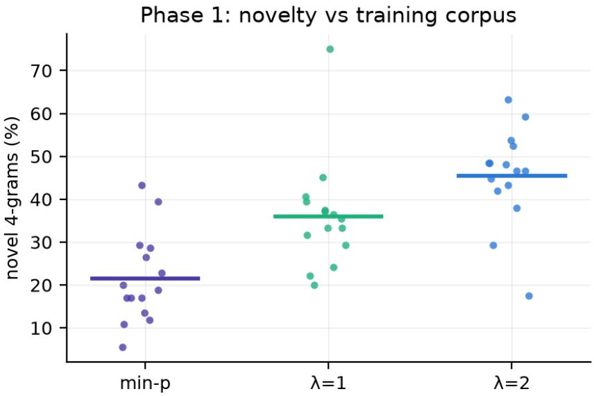  
Figure 15: Objective novelty against the OLMo-2 training corpus: novel 4-grams per cell, 3 prompts × 5 seeds. The anti-probable push roughly doubles surface novelty over min-p sampling.

## B The prompt

We composed three kinds of input: a typical request, a distant concept pair drawn from a band of embedding distances, and a composed improbable context, plus two ablations (fragments only, register only). Claude Opus 5 developed each into an idea and Claude Sonnet 5 judged the result against its nearest known equivalent $( k = 3 ; n \approx 1 5$ per arm; developer and judge from the same family, the one within-family judgment in this paper). Input improbability was measured two ways: semantic kNN distance to 10,000 real instructions (Alpaca, embedded with all-mpnet-base-v2) and perplexity. The typical prompt matched or beat every improbable arm, and two of the improbable arms scored lower by a margin whose interval excluded zero. Improbability did not correlate with judged novelty $( | r | < 0 . 2$ , Figure 16), and a pilot efect $( n = 8 )$ had not replicated. We found no benefit from prompt improbability under the tested operationalizations; whether other operationalizations, developers or judges would find one is open.

## C Reproducibility

Code and data. The code is in the public repository at https://github.com/RobertoOno/ interrupting-the-loop: the sampler core, the MLX adapter, the salience monitor, the reverie engine, the judges, the novelty client, resumable battery runners with thermal logging, and the analysis and figure scripts (117 tests). Every run’s token stream, per-step telemetry, event and injection positions and judgments, the human-rating packs and the dated laboratory notebook are released with it; the run data, judgments and rater files as an archive linked from the repository. The judge cost of the entire program, including the re-judging under the generated-only protocol, the document-level judgments and the replications, was about US\$500.

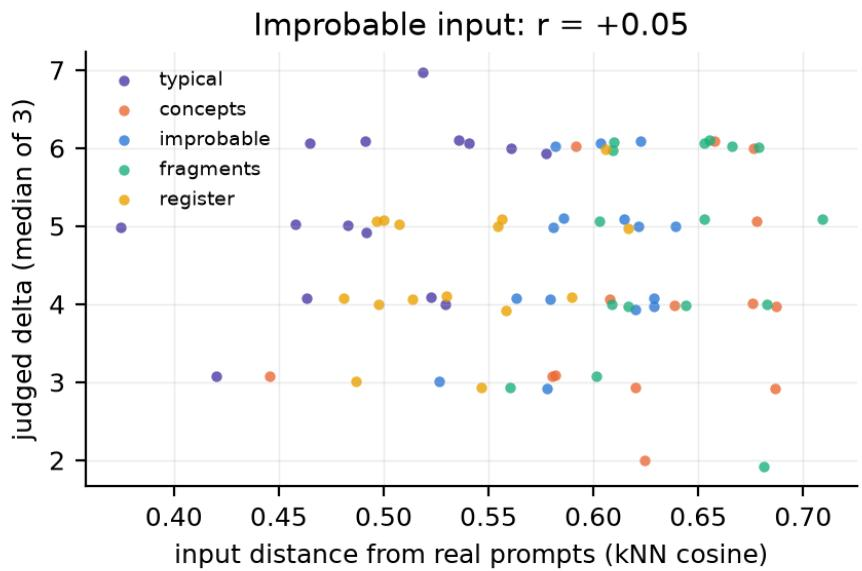  
Figure 16: Judged novel delta of the developed idea against the input’s semantic distance from 10,000 real prompts, per arm. No relationship.

Generators. Qwen3-30B-A3B-Base (mixture of experts, 3B active parameters), Qwen3-8B-Base and OLMo-2-1124-13B, each converted with mlx\_lm to 8-bit afine quantization with group size 64 and run through MLX on an Apple M5 Pro (48 GB unified memory) at about 53, 31 and 17 tokens/s. Sampling is done in numpy on the full logits returned by the model. All loop arms use temperature 1.0 and the min-p floor 0.05; the anti-probable push is of (λ = 0).

Loop hyperparameters. Cell length 4,500 generated tokens; end-of-text masked except in the EOS-allowed arm. Habituation: repetition window 512 tokens, penalty factor 1.15 per occurrence (1.3 in the strong-habituation arm), applied to the log-probabilities before the floor. Interruption on a clock: a stagnation check every period tokens (75, 150, 300, 600 or 900) that always fires, injecting the next text of the rotation; the four neutral subject changes are listed in Section 3.3, the four return-to-the-premise stitches are “And this, it turned out, was the same thing as the beginning, because”, “It came back to where it had started, of course; it always did, but this time”, “Which is exactly what the first line had meant, seen from here:”, “So the opening sentence had been true after all, only not in the way it seemed:”; the own-past arm injects a 64-token window of the stream from at least 400 tokens back; the sham arms inject a paragraph break or “And so, as before,”. Reset arms rebuild the cache from the premise and the injected text only. The full scafold: salience monitor with jump lag 32 and jump threshold 0.55, stagnation window 600 and threshold 0.08, entropy-drop trigger 0.45 after a window at or above 2.0 nats, recurrence threshold 0.15 with minimum age 96, refractory 24 steps; kick of 80 tokens (λ = 4, band [1.2, 5.0], half-life 12) after a stagnation, subject change with forgetting after 3 consecutive stagnations (keeping the premise, up to 3 judged-good windows and the last 200 tokens); escalation of 120 tokens on a passing review (λ = 0.5, band [2.5, 4.5]); anchors every 200 tokens, at most 12; genre check every 64 tokens over 160 tokens with threshold 0.5; drift regime λ = 2.5, band [1.8, 4.5], half-life 48, bridge 1.5. In the arms of this paper λ and the bridge are set to 0 in every regime. The random-number seed of the sampler is 0 in every cell.

Premises. The ten premises, shared by all arms and generators: (0) She kept a notebook of things that had almost happened. (1) The map was accurate in every detail except one, and nobody could say which. (2) Every morning the baker counted the loaves twice, and every morning the count was diferent. (3) He had inherited his grandfather’s watch and, with it, the habit of arriving early to places that no longer existed. (4) The river changed its name each time it crossed the border, and the villagers kept all the names. (5) The town had two clocks, and nobody remembered which one had been right first. (6) Her brother collected sounds the way other children collected stones. (7) The letter arrived forty years late and was still, somehow, on time. (8) Every door in the house opened onto the same room, seen from a diferent year. (9) The translator kept a list of words she refused to translate. They were written by the author before any loop experiment and not changed afterwards.

Judge. Model anthropic.claude-opus-5 on Amazon Bedrock (efort high, adaptive thinking, max\_tokens 4000, default temperature), called through the Anthropic SDK; the eventprotocol judgments were made on 14–17 August 2026 and the generated-only judgments on 18–19 August 2026. The second judge family was moonshotai/kimi-k2.6 through Open-Router with reasoning disabled (17 August 2026). The in-loop judge of the full scafold was anthropic.claude-sonnet-5 with the reverie rubric (a nearest-equivalent and novel-delta rubric whose geometric-mean score gated escalation at 5). The system prompt of the surprise judge, verbatim:

You judge a stretch of a language model’s unsupervised reverie. You see the EARLIER text and the RECENT window. Rate three INDEPENDENT things on 0-10 and return ONLY a JSON object with keys: "surprise" (how unexpected is the recent window given the earlier text, a reader could not have predicted where it went; 0 = obvious continuation, 10 = genuinely startling yet not random), "connection" (does the window bring together two distant regions of the earlier text, or an old region with something new, in a way that makes sense; 0 if it merely continues one thread), "coherence" (does the window hold together as text; 0 = word salad or document boilerplate), "note" (one blunt sentence). Rate each dimension on its own merits; a window can be surprising and incoherent, or coherent and dull.

The user message is EARLIER TEXT:\n{600 preceding tokens}\n\nRECENT WINDOW:\n{window}.   
The judge is not told which condition, model or protocol produced the window.

The idea experiment. Inputs were developed by anthropic.claude-opus-5 and judged by anthropic.claude-sonnet-5 (k = 3) with the nearest-equivalent rubric; input improbability was measured as the mean cosine distance to the 10 nearest of 10,000 instructions from the Alpaca dataset (tatsu-lab/alpaca) embedded with all-mpnet-base-v2, and as perplexity under Qwen3-8B-Base.

## D The human study

Recruitment, task and compensation. Raters were recruited on a freelance marketplace (Workana) with a public posting for a paid text-rating task in English; applicants were selected by the author among the platform’s respondents and were not told the hypotheses, the conditions or which model produced the texts (the guide says only that the passages were written by a language model left to write on its own). Each rater received a self-contained HTML pack (rating guide embedded, English interface) with 63 windows drawn from seven conditions of the main generator, presented in a fixed random order, without any condition label, each with its preceding context; they rated surprise and coherence on the same 0–10 scales given to the model judge, at their own pace, and returned a JSON file. The guide asked them not to use AI tools or web searches for any part of the task, and raters confirmed in writing that they had not. Compensation was R\$187–300 per pack (roughly US\$35–55) for an estimated 60–90 minutes of work. A second round is in progress: 56 generated-only, fresh windows from eight conditions (seven per condition, one per randomly chosen cell, not stratified by the judge), three dimensions including connection, five raters; its results will be added to a later version.

Ethics. The study involved adult professional raters reading machine-generated fiction; there was no deception, no sensitive content, no vulnerable population and no collection of personal data beyond the platform account used for payment. Participation was voluntary and paid; raters were informed in the posting that the texts were generated by language models and that their ratings would be used, in aggregate, in a research publication. The author is an independent researcher without access to an institutional review board; the protocol was designed to be minimal-risk and the raters remain anonymous in this paper and in the released data, which contain their ratings only.

## E The event-window protocol of the first version

The first version of this study cut 160-token windows at two kinds of review point, right before each injection and on a 150-token grid, so that a window after an interruption could contain the injected sentence, and treated windows as the unit. The tables of that protocol are kept below for comparison with the generated-only protocol of the main text. Across the 14 conditions of the first two batteries, the condition means under the two protocols correlate at Spearman ρ = +0.82 on surprise, +0.94 on connection and +0.83 on coherence (Table 24); the directions of the ladder, content and timing efects agree, the sizes difer where an injected sentence sat inside the event window, and the period and timing findings of the first version (a yield growing with the period, a stream-level advantage of the clock over salience timing) do not hold on generated text (Sections 4.4 and 4.5).

## F Battery B: the problem with a verifier

Tables of Section 4.10 (generated by scripts/problem\_analysis.py from scripts/problem\_verify.py): the premise, the fifteen angle comments and the verifier are in src/creative\_machine/problem\_premises.py and domains/binpack.py. Held-out instances: five of 100 items per variant, seeds 200–209; training instances (reported in the data) seeds 100–109.

<table><tr><td>arm</td><td>n</td><td>candidates</td><td>valid</td><td>distinct valid</td><td>gain over best fit [CI]</td><td>cells beating best fit</td></tr><tr><td>plain</td><td>10</td><td>2.6</td><td>2.0</td><td>1.8</td><td>-0.0092 [-0.0142, -0.0049]</td><td>5%</td></tr><tr><td>sham300</td><td>10</td><td>6.2</td><td>1.6</td><td>0.8</td><td>-0.0253 [-0.0341, -0.0165]</td><td>0%</td></tr><tr><td>angle300</td><td>10</td><td>14.8</td><td>9.2</td><td>5.1</td><td>-0.0155 [-0.0266, -0.0060]</td><td>5%</td></tr><tr><td>reset300</td><td>10</td><td>12.3</td><td>7.5</td><td>6.6</td><td>-0.0022 [-0.0052, +0.0002]</td><td>5%</td></tr></table>

Table 3: Battery B. Battery B.

<table><tr><td>hypothesis</td><td>contrast</td><td>measure</td><td></td><td>∆ [CI]</td><td>p</td><td>n</td></tr><tr><td>B1 (primary)</td><td>angle300 vs plain</td><td>gain</td><td>-0.0063</td><td>[-0.0159, +0.0009]</td><td>0.9375</td><td>10</td></tr><tr><td>B2</td><td>angle300 vs plain</td><td>distinct</td><td>+3.3000</td><td>[+0.7500, +6.6500]</td><td>0.0117</td><td>10</td></tr><tr><td>B3 (two-sided)</td><td>angle300 vs reset300</td><td>gain</td><td></td><td>-0.0133 [-0.0250, -0.0034]</td><td>0.0410</td><td>10</td></tr><tr><td>B4 (two-sided)</td><td>sham300 vs plain</td><td>gain</td><td></td><td>-0.0160 [-0.0265, -0.0065]</td><td>0.0156</td><td>10</td></tr><tr><td>exploratory</td><td>reset300 vs plain</td><td>gain</td><td></td><td>+0.0070 [+0.0020, +0.0121]</td><td>0.0293</td><td>10</td></tr><tr><td>exploratory</td><td>reset300 vs plain</td><td>distinct</td><td></td><td>+4.8000 [+2.7000, +6.8500]</td><td>0.0039</td><td>10</td></tr><tr><td>exploratory</td><td>angle300 vs plain</td><td>valid</td><td></td><td>+7.2000 [+2.6000, +12.8012]</td><td>0.0078</td><td>10</td></tr><tr><td>exploratory</td><td>angle300 vs sham300</td><td>distinct</td><td></td><td>+4.3000 [+1.2000, +8.1500]</td><td>0.0078</td><td>10</td></tr></table>

Table 4: Battery B. Pre-registered contrasts (exact sign-flip permutation; one-sided where pre-specified).

<table><tr><td>arm</td><td>mean best excess</td><td>mean best-fit excess</td><td>cells with best == best fit (within 1e-9)</td><td>cells with best &lt; best fit</td></tr><tr><td>plain</td><td>0.1095</td><td>0.1002</td><td>7/20</td><td>1/20</td></tr><tr><td>sham300</td><td>0.1255</td><td>0.1002</td><td>2/20</td><td>0/20</td></tr><tr><td>angle300</td><td>0.1158</td><td>0.1002</td><td>7/20</td><td>1/20</td></tr><tr><td>reset300</td><td>0.1024</td><td>0.1002</td><td>15/20</td><td>1/20</td></tr></table>

Table 5: Battery B. Best candidate against the baselines (held-out).

## G Full tables

The tables below are generated from the run data by the analysis scripts (scripts/analysis\_gen.py for the generated-only protocol, analysis.py and analysis\_b2.py for the event protocol, hidden\_analysis.py for the residual stream) and typeset by scripts/appendix\_tex.py; the complete set, including every per-layer table of the residual-stream analysis, ships with the code as docs/APPENDIX\_\*.md. In the event-protocol tables the unit is the judged window (median of k = 5 Opus 5 judgments), windows before 100 generated tokens are excluded, and intervals are 95% bootstrap CIs over windows; they are descriptive.

Generated-only windows, unit = cell (primary analysis)
<table><tr><td>condition</td><td>n cells</td><td colspan="2">surprise</td><td colspan="2">connection</td><td colspan="2">coherence</td></tr><tr><td>bare</td><td>10</td><td></td><td>0.45 [0.28, 0.68]</td><td></td><td>0.30 [0.15, 0.45]</td><td></td><td>2.52 [1.88, 3.43]</td></tr><tr><td>bare + habituation</td><td>10</td><td></td><td>1.60 [1.18, 2.00]</td><td></td><td>1.32 [0.87, 1.82]</td><td></td><td>4.40 [3.45, 5.42]</td></tr><tr><td>reseed 150, no habituation</td><td>10</td><td></td><td>2.48 [2.17, 2.78]</td><td></td><td>3.03 [2.60, 3.45]</td><td></td><td>5.35 [4.82, 5.77]</td></tr><tr><td>habituation + reseed 150</td><td>10</td><td>3.02</td><td>[2.53, 3.53]</td><td></td><td>3.68 [2.92, 4.52]</td><td></td><td>6.12 [5.60, 6.57]</td></tr><tr><td>DREAM scaffold</td><td>10</td><td></td><td>2.70 [2.10, 3.40]</td><td></td><td>1.85 [1.42, 2.33]</td><td></td><td>6.02 [5.32, 6.73]</td></tr><tr><td>habituation 1.3</td><td>10</td><td></td><td>1.75 [1.35, 2.20]</td><td></td><td>1.42 [1.07, 1.78]</td><td></td><td>4.90 [4.47, 5.40]</td></tr><tr><td>habituation, EOS allowed</td><td>10</td><td></td><td>1.52 [1.10, 1.92]</td><td></td><td>1.27 [0.90, 1.67]</td><td></td><td>5.65 [4.78, 6.38]</td></tr></table>

Table 6: Generated-only protocol. Q1: habituation × interruption (period 150) and baselines: cell means (mean over cells [95% CI over cells]).

<table><tr><td>condition</td><td>dim</td><td>∆ [CI]</td><td>p (perm)</td><td></td><td>q (BH)</td><td>Cliff δ</td><td>n seeds</td></tr><tr><td>bare</td><td>surprise</td><td></td><td>-1.15 [-1.48, -0.73]</td><td>0.004</td><td>0.023</td><td>-0.80</td><td>10</td></tr><tr><td>bare</td><td>connection</td><td>-1.02</td><td>[-1.52, -0.50]</td><td>0.008</td><td>0.035</td><td>-0.81</td><td>10</td></tr><tr><td>bare</td><td>coherence</td><td>-1.88</td><td>[-3.30, -0.52]</td><td>0.035</td><td>0.070</td><td>-0.64</td><td>10</td></tr><tr><td>reseed 150, no habituation</td><td>surprise</td><td>+0.88</td><td>[+0.27, +1.48]</td><td>0.031</td><td>0.070</td><td>+0.72</td><td>10</td></tr><tr><td>reseed 150, no habituation</td><td>connection</td><td></td><td>+1.72 [+0.88, +2.45]</td><td>0.010</td><td>0.035</td><td>+0.91</td><td>10</td></tr><tr><td>reseed 150, no habituation</td><td>coherence</td><td></td><td>+0.95 [-0.02, +1.93]</td><td>0.121</td><td>0.168</td><td>+0.41</td><td>10</td></tr><tr><td>habituation + reseed 150</td><td>surprise</td><td>+1.42</td><td>[+0.92, +2.03]</td><td>0.002</td><td>0.018</td><td>+0.85</td><td>10</td></tr><tr><td>habituation + reseed 150</td><td>connection</td><td>+2.37</td><td>[+1.57, +3.28]</td><td>0.002</td><td>0.018</td><td>+0.93</td><td>10</td></tr><tr><td>habituation + reseed 150</td><td>coherence</td><td>+1.72</td><td>[+0.35, +2.90]</td><td>0.043</td><td>0.070</td><td>+0.61</td><td>10</td></tr><tr><td>DREAM scaffold</td><td>surprise</td><td>+1.10</td><td>[+0.40, +1.88]</td><td>0.023</td><td>0.070</td><td>+0.62</td><td>10</td></tr><tr><td>DREAM scaffold</td><td>connection</td><td>+0.53</td><td>[+0.15, +0.97]</td><td>0.031</td><td>0.070</td><td>+0.40</td><td>10</td></tr><tr><td>DREAM scaffold</td><td>coherence</td><td>+1.62</td><td>[+0.20, +2.97]</td><td>0.043</td><td>0.070</td><td>+0.60</td><td>10</td></tr><tr><td>habituation 1.3</td><td>surprise</td><td></td><td>+0.15 [-0.25, +0.60]</td><td>0.609</td><td>0.731</td><td>+0.02</td><td>10</td></tr><tr><td>habituation 1.3</td><td>connection</td><td></td><td>+0.10 [-0.42, +0.55]</td><td>0.754</td><td>0.817</td><td>+0.10</td><td>10</td></tr><tr><td>habituation 1.3</td><td>coherence</td><td></td><td>+0.50 [-0.65, +1.52]</td><td>0.430</td><td>0.552</td><td>+0.23</td><td>10</td></tr><tr><td>habituation, EOS allowed</td><td>surprise</td><td></td><td>-0.08 [-0.50, +0.35]</td><td>0.771</td><td>0.817</td><td>-0.02</td><td>10</td></tr><tr><td>habituation, EOS allowed</td><td>connection</td><td></td><td>-0.05 [-0.55, +0.40]</td><td>0.895</td><td>0.895</td><td>-0.06</td><td>10</td></tr><tr><td>habituation, EOS allowed</td><td>coherence</td><td>+1.25 </td><td>[+0.12, +2.25]</td><td>0.064</td><td>0.097</td><td>+0.49</td><td>10</td></tr></table>

Table 7: Generated-only protocol. vs bare + habituation: paired by seed.

<table><tr><td>condition</td><td>n cells</td><td colspan="2">surprise</td><td colspan="2">connection</td><td colspan="2">coherence</td></tr><tr><td>neutral subject change</td><td>10</td><td></td><td>3.02 [2.53, 3.53]</td><td></td><td>3.68 [2.92, 4.52]</td><td></td><td>6.12 [5.60, 6.57]</td></tr><tr><td>re-encounter stitch</td><td>10</td><td></td><td>2.83 [2.12, 3.58]</td><td></td><td>3.62 [2.78, 4.50]</td><td></td><td>5.53 [4.93, 6.12]</td></tr><tr><td>the premise itself</td><td>10</td><td></td><td>1.21 [0.87, 1.51]</td><td></td><td>1.03 [0.73, 1.32]</td><td></td><td>3.84 [3.17, 4.59]</td></tr><tr><td>the stream&#x27;s own past</td><td>10</td><td></td><td>1.51 [1.12, 1.94]</td><td></td><td>1.39 [0.92, 1.92]</td><td></td><td>3.68 [3.07, 4.27]</td></tr></table>

Table 8: Generated-only protocol. Q2: what is injected (period 150): cell means (mean over cells [95% CI over cells]).

<table><tr><td>condition</td><td>dim</td><td>∆ [CI]</td><td>p (perm)</td><td></td><td>q (BH)</td><td>Cliff δ</td><td>n seeds</td></tr><tr><td>re-encounter stitch</td><td>surprise</td><td></td><td>-0.19 [-1.14, +0.68]</td><td>0.707</td><td>0.795</td><td>-0.13</td><td>10</td></tr><tr><td>re-encounter stitch</td><td>connection</td><td></td><td>-0.07 [-1.42, +1.13]</td><td>0.949</td><td>0.949</td><td>-0.08</td><td>10</td></tr><tr><td>re-encounter stitch</td><td>coherence</td><td></td><td>-0.59 [-1.45, +0.16]</td><td>0.223</td><td>0.286</td><td>-0.43</td><td>10</td></tr><tr><td>the premise itself</td><td>surprise</td><td></td><td>-1.81 [-2.33, -1.28]</td><td>0.002</td><td>0.004</td><td>-1.00</td><td>10</td></tr><tr><td>the premise itself</td><td>connection</td><td>-2.65</td><td> [-3.45, -1.90]</td><td>0.002</td><td>0.004</td><td>-1.00</td><td>10</td></tr><tr><td>the premise itself</td><td>coherence</td><td>-2.27</td><td>[-3.07, -1.52]</td><td>0.002</td><td>0.004</td><td>-0.87</td><td>10</td></tr><tr><td>the stream&#x27;s own past</td><td>surprise</td><td>-1.51</td><td>[-2.10, -0.87]</td><td>0.004</td><td>0.006</td><td>-0.85</td><td>10</td></tr><tr><td>the stream&#x27;s own past</td><td>connection</td><td>-2.29</td><td>[-3.29, -1.42]</td><td>0.002</td><td>0.004</td><td>-0.90</td><td>10</td></tr><tr><td>the stream&#x27;s own past</td><td>coherence</td><td></td><td>-2.43 [-3.23, -1.67]</td><td>0.002</td><td>0.004</td><td>-0.94</td><td>10</td></tr></table>

Table 9: Generated-only protocol. vs neutral subject change: paired by seed.

<table><tr><td>condition</td><td>n cells</td><td colspan="2">surprise</td><td colspan="2">connection</td><td colspan="2">coherence</td></tr><tr><td>no interruption</td><td>10</td><td></td><td>1.60 [1.18, 2.00]</td><td></td><td>1.32 [0.87, 1.82]</td><td></td><td>4.40 [3.45, 5.42]</td></tr><tr><td>paragraph break (sham)</td><td>10</td><td></td><td>1.47 [1.09, 1.84]</td><td></td><td>0.97 [0.65, 1.33]</td><td></td><td>4.50 [3.64, 5.34]</td></tr><tr><td>continuity connective (sham)</td><td>10</td><td></td><td>1.08 [0.67, 1.55]</td><td></td><td>0.89 [0.50, 1.34]</td><td></td><td>3.45 [2.98, 3.97]</td></tr><tr><td>subject change, context preserved</td><td>10</td><td></td><td>2.90 [2.45, 3.35]</td><td></td><td>2.40 [2.03, 2.78]</td><td></td><td>6.40 [6.08, 6.70]</td></tr><tr><td>subject change, no habituation</td><td>10</td><td></td><td>2.50 [2.13, 2.90]</td><td></td><td>2.02 [1.58, 2.57]</td><td></td><td>5.53 [4.67, 6.35]</td></tr><tr><td>subject change, context reset</td><td>10</td><td></td><td>3.75 [3.42, 4.12]</td><td></td><td>3.30 [3.02, 3.58]</td><td></td><td>6.87 [6.67, 7.07]</td></tr><tr><td>break, context reset</td><td>10</td><td></td><td>2.07 [1.73, 2.48]</td><td></td><td>1.78 [1.55, 2.03]</td><td></td><td>5.40 [5.12, 5.70]</td></tr></table>

Table 10: Generated-only protocol. Q3: period 300: what carries the efect (context preserved vs reset; semantic change vs neutral boundary): cell means (mean over cells [95% CI over cells]).

<table><tr><td>condition</td><td>dim</td><td>∆ [CI]</td><td></td><td>p (perm)</td><td>q (BH)</td><td>Cliff δ</td><td>n seeds</td></tr><tr><td>paragraph break (sham)</td><td>surprise</td><td>-0.13</td><td>[-0.66, +0.39]</td><td>0.664</td><td>0.703</td><td>-0.15</td><td>10</td></tr><tr><td>paragraph break (sham)</td><td>connection</td><td></td><td>-0.34 [-0.76, +0.07]</td><td>0.178</td><td>0.246</td><td>-0.24</td><td>10</td></tr><tr><td>paragraph break (sham)</td><td>coherence</td><td></td><td>+0.10 [-0.98, +1.32]</td><td>0.898</td><td>0.898</td><td>+0.07</td><td>10</td></tr><tr><td>continuity connective (sham)</td><td>surprise</td><td>-0.52</td><td>[-1.23, +0.25]</td><td>0.244</td><td>0.293</td><td>-0.37</td><td>10</td></tr><tr><td>continuity connective (sham)</td><td>connection</td><td>-0.43</td><td>[-1.18, +0.38]</td><td>0.340</td><td>0.382</td><td>-0.35</td><td>10</td></tr><tr><td>continuity connective (sham)</td><td>coherence</td><td>-0.95</td><td>[-2.27, +0.38]</td><td>0.211</td><td>0.271</td><td>-0.40</td><td>10</td></tr><tr><td>subject change, context preserved</td><td>surprise</td><td>+1.30</td><td>[+0.68, +1.92]</td><td>0.004</td><td>0.018</td><td>+0.85</td><td>10</td></tr><tr><td>subject change, context preserved</td><td>connection</td><td>+1.08</td><td>[+0.47, +1.63]</td><td>0.014</td><td>0.040</td><td>+0.74</td><td>10</td></tr><tr><td>subject change, context preserved</td><td>coherence</td><td>+2.00</td><td>[+0.78, +3.22]</td><td>0.016</td><td>0.040</td><td>+0.68</td><td>10</td></tr><tr><td>subject change, no habituation</td><td>surprise</td><td>+0.90</td><td>[+0.45, +1.37]</td><td>0.016</td><td>0.040</td><td>+0.72</td><td>10</td></tr><tr><td>subject change, no habituation</td><td>connection</td><td></td><td>+0.70 [-0.07, +1.50]</td><td>0.148</td><td>0.246</td><td>+0.53</td><td>10</td></tr><tr><td>subject change, no habituation</td><td>coherence</td><td>+1.13</td><td>[+0.00, +2.42]</td><td>0.133</td><td>0.246</td><td>+0.34</td><td>10</td></tr><tr><td>subject change, context reset</td><td>surprise</td><td>+2.15</td><td>[+1.72, +2.63]</td><td>0.002</td><td>0.018</td><td>+1.00</td><td>10</td></tr><tr><td>subject change, context reset</td><td>connection</td><td>+1.98</td><td>[+1.53, +2.38]</td><td>0.002</td><td>0.018</td><td>+0.93</td><td>10</td></tr><tr><td>subject change, context reset</td><td>coherence</td><td></td><td>+2.47 [+1.55, +3.35]</td><td>0.004</td><td>0.018</td><td>+0.81</td><td>10</td></tr><tr><td>break, context reset</td><td>surprise</td><td></td><td>+0.47 [-0.08, +1.03]</td><td>0.174</td><td>0.246</td><td>+0.41</td><td>10</td></tr><tr><td>break, context reset</td><td>connection</td><td></td><td>+0.47 [-0.10, +1.00]</td><td>0.156</td><td>0.246</td><td>+0.47</td><td>10</td></tr><tr><td>break, context reset</td><td>coherence</td><td></td><td>+1.00 [+0.10, +1.87]</td><td>0.074</td><td>0.167</td><td>+0.48</td><td>10</td></tr></table>

Table 11: Generated-only protocol. vs no interruption: paired by seed.

<table><tr><td>contrast</td><td>dim</td><td>∆ [CI]</td><td></td><td>p (perm)</td><td>Cliff δ</td><td>n</td></tr><tr><td>reset vs preserved (300)</td><td>surprise</td><td>+0.85</td><td>[+0.42, +1.28]</td><td>0.014</td><td>+0.66</td><td>10</td></tr><tr><td>reset vs preserved (300)</td><td>connection</td><td>+0.90</td><td>[+0.53, +1.25]</td><td>0.004</td><td>+0.79</td><td>10</td></tr><tr><td>reset vs preserved (300)</td><td>coherence</td><td></td><td>+0.47 [+0.03, +0.90]</td><td>0.090</td><td>+0.54</td><td>10</td></tr><tr><td>with vs without habituation (300)</td><td>surprise</td><td></td><td>+0.40 [-0.17, +1.05]</td><td>0.289</td><td>+0.34</td><td>10</td></tr><tr><td>with vs without habituation (300)</td><td>connection</td><td></td><td>+0.38 [-0.30, +1.02]</td><td>0.342</td><td>+0.43</td><td>10</td></tr><tr><td>with vs without habituation (300)</td><td>coherence</td><td></td><td>+0.87 [+0.05, +1.77]</td><td>0.125</td><td>+0.33</td><td>10</td></tr><tr><td>with vs without habituation (150)</td><td>surprise</td><td></td><td>+0.53 [-0.13, +1.28]</td><td>0.219</td><td>+0.30</td><td>10</td></tr><tr><td>with vs without habituation (150)</td><td>connection</td><td></td><td>+0.65 [-0.30, +1.65]</td><td>0.256</td><td>+0.21</td><td>10</td></tr><tr><td>with vs without habituation (150)</td><td>coherence</td><td></td><td>+0.77 [+0.07, +1.45]</td><td>0.074</td><td>+0.63</td><td>10</td></tr><tr><td>subject change vs break, both reset (300)</td><td>surprise</td><td></td><td>+1.68 [+1.23, +2.13]</td><td>0.002</td><td>+0.90</td><td>10</td></tr><tr><td>subject change vs break, both reset (300)</td><td>connection</td><td></td><td>+1.52 [+1.17, +1.90]</td><td>0.002</td><td>+1.00</td><td>10</td></tr><tr><td>subject change vs break, both reset (300)</td><td>coherence</td><td></td><td>+1.47 [+1.18, +1.78]</td><td>0.002</td><td>+0.99</td><td>10</td></tr><tr><td>subject change vs break, both pre- served (300)</td><td>surprise</td><td></td><td>+1.43 [+0.78, +2.07]</td><td>0.006</td><td>+0.85</td><td>10</td></tr><tr><td>subject change vs break, both pre- served (300)</td><td>connection</td><td></td><td>+1.42 [+0.95, +1.96]</td><td>0.002</td><td>+0.93</td><td>10</td></tr><tr><td>subject change vs break, both pre- served (300)</td><td>coherence</td><td></td><td>+1.90 [+0.98, +2.84]</td><td>0.004</td><td>+0.76</td><td>10</td></tr></table>

Table 12: Generated-only protocol. Q3b: direct paired contrasts among the interruption arms.

<table><tr><td>condition</td><td>n cells</td><td colspan="2">surprise</td><td colspan="2">connection</td><td colspan="2">coherence</td></tr><tr><td>stitch on the clock 150</td><td>10</td><td></td><td>2.83 [2.12, 3.58]</td><td>3.62 [2.78, 4.50]</td><td></td><td></td><td>5.53 [4.93, 6.12]</td></tr><tr><td>stitch on the clock 900</td><td>10</td><td></td><td>3.08 [2.72, 3.50]</td><td>2.76 [2.42, 3.12]</td><td></td><td></td><td>5.84 [5.36, 6.30]</td></tr><tr><td>neutral change 900</td><td>10</td><td>3.18</td><td>[2.74, 3.76]</td><td></td><td>2.26 [1.76, 2.84]</td><td></td><td>6.78 [6.60, 6.94]</td></tr><tr><td>stitch on salience events</td><td>10</td><td></td><td>3.09 [2.50, 3.69]</td><td></td><td>2.82 [2.23, 3.51]</td><td>5.68</td><td>[4.97, 6.47]</td></tr><tr><td>salience only</td><td>10</td><td></td><td>1.65 [1.23, 2.02]</td><td></td><td>1.30 [0.85, 1.77]</td><td></td><td>4.63 [3.67, 5.65]</td></tr></table>

Table 13: Generated-only protocol. Q4: timing: salience vs clock (same stitch): cell means (mean over cells [95% CI over cells]).

<table><tr><td>condition</td><td>dim</td><td>∆ [CI]</td><td>p (perm)</td><td>q (BH)</td><td>Cliff δ</td><td>n seeds</td></tr><tr><td>stitch on the clock 150</td><td>surprise</td><td>-0.25 [-0.90, +0.39]</td><td>0.482</td><td>0.724</td><td>-0.24</td><td>10</td></tr><tr><td>stitch on the clock 150</td><td>connection</td><td>+0.86 [+0.17, +1.58]</td><td>0.057</td><td>0.170</td><td>+0.30</td><td>10</td></tr><tr><td>stitch on the clock 150</td><td>coherence</td><td>-0.32 [-0.78, +0.13]</td><td>0.230</td><td>0.395</td><td>-0.22</td><td>10</td></tr><tr><td>neutral change 900</td><td>surprise</td><td>+0.10 [-0.52, +0.80]</td><td>0.832</td><td>0.998</td><td>+0.08</td><td>10</td></tr><tr><td>neutral change 900</td><td>connection</td><td>-0.50 [-1.16, +0.26]</td><td>0.227</td><td>0.395</td><td>-0.47</td><td>10</td></tr><tr><td>neutral change 900</td><td>coherence</td><td>+0.94 [+0.48, +1.38]</td><td>0.008</td><td>0.031</td><td>+0.77</td><td>10</td></tr><tr><td>stitch on salience events</td><td>surprise</td><td>+0.01 [-0.77, +0.77]</td><td>1.000</td><td>1.000</td><td>-0.04</td><td>10</td></tr><tr><td>stitch on salience events</td><td>connection</td><td>+0.06 [-0.69, +0.77]</td><td>0.918</td><td>1.000</td><td>-0.01</td><td>10</td></tr><tr><td>stitch on salience events</td><td>coherence</td><td>-0.16 [-0.88, +0.59]</td><td>0.695</td><td>0.927</td><td>-0.15</td><td>10</td></tr><tr><td>salience only</td><td>surprise</td><td>-1.43 [-2.13, -0.83]</td><td>0.002</td><td>0.023</td><td>-0.92</td><td>10</td></tr><tr><td>salience only</td><td>connection</td><td>-1.46 [-2.16, -0.76]</td><td>0.006</td><td>0.031</td><td>-0.86</td><td>10</td></tr><tr><td>salience only</td><td>coherence</td><td>-1.21 [-2.17, -0.01]</td><td>0.076</td><td>0.183</td><td>-0.46</td><td>10</td></tr></table>

Table 14: Generated-only protocol. vs stitch on the clock 900: paired by seed.

<table><tr><td>condition</td><td>n cells</td><td colspan="2">surprise</td><td colspan="2">connection</td><td colspan="2">coherence</td></tr><tr><td>stitch on the clock 900</td><td>10</td><td></td><td>2.10 [1.62, 2.52]</td><td></td><td>1.73 [1.40, 2.01]</td><td></td><td>4.78 [4.10, 5.43]</td></tr><tr><td>neutral change 900</td><td>10</td><td></td><td>2.53 [2.16, 2.87]</td><td></td><td>2.03 [1.70, 2.37]</td><td></td><td>5.33 [4.74, 5.88]</td></tr><tr><td>neutral change 600</td><td>10</td><td></td><td>2.87 [2.38, 3.30]</td><td></td><td>2.27 [1.88, 2.67]</td><td></td><td>5.48 [4.95, 5.98]</td></tr><tr><td>stitch on salience events</td><td>10</td><td></td><td>1.85 [1.36, 2.30]</td><td></td><td>1.80 [1.17, 2.43]</td><td></td><td>4.18 [3.73, 4.60]</td></tr><tr><td>DREAM scaffold</td><td>7</td><td></td><td>1.64 [1.17, 2.14]</td><td></td><td>1.46 [1.05, 1.79]</td><td></td><td>5.61 [4.65, 6.44]</td></tr></table>

Table 15: Generated-only protocol. Q4b: deep windows (at least 300 tokens after the last injection): the stream when it is left alone: cell means (mean over cells [95% CI over cells]).

<table><tr><td>condition</td><td>dim</td><td>∆ [CI]</td><td>p (perm)</td><td></td><td>q (BH)</td><td>Cliff δ</td><td>n seeds</td></tr><tr><td>neutral change 900</td><td>surprise</td><td></td><td>+0.43 [-0.12, +0.98]</td><td>0.195</td><td>0.299</td><td>+0.35</td><td>10</td></tr><tr><td>neutral change 900</td><td>connection</td><td></td><td>+0.31 [-0.13, +0.72]</td><td>0.225</td><td>0.299</td><td>+0.30</td><td>10</td></tr><tr><td>neutral change 900</td><td>coherence</td><td></td><td>+0.55 [-0.13, +1.31]</td><td>0.205</td><td>0.299</td><td>+0.24</td><td>10</td></tr><tr><td>neutral change 600</td><td>surprise</td><td></td><td>+0.77 [+0.03, +1.46]</td><td>0.078</td><td>0.299</td><td>+0.60</td><td>10</td></tr><tr><td>neutral change 600</td><td>connection</td><td></td><td>+0.54 [+0.02, +1.09]</td><td>0.125</td><td>0.299</td><td>+0.43</td><td>10</td></tr><tr><td>neutral change 600</td><td>coherence</td><td></td><td>+0.70 [-0.15, +1.58]</td><td>0.182</td><td>0.299</td><td>+0.42</td><td>10</td></tr><tr><td>stitch on salience events</td><td>surprise</td><td></td><td>-0.25 [-0.80, +0.25]</td><td>0.439</td><td>0.479</td><td>-0.19</td><td>10</td></tr><tr><td>stitch on salience events</td><td>connection</td><td></td><td>+0.07 [-0.52, +0.67]</td><td>0.820</td><td>0.820</td><td>-0.08</td><td>10</td></tr><tr><td>stitch on salience events</td><td>coherence</td><td></td><td>-0.60 [-1.41, +0.18]</td><td>0.186</td><td>0.299</td><td>-0.35</td><td>10</td></tr><tr><td>DREAM scaffold</td><td>surprise</td><td></td><td>-0.42 [-1.10, +0.22]</td><td>0.344</td><td>0.412</td><td>-0.35</td><td>7</td></tr><tr><td>DREAM scaffold</td><td>connection</td><td></td><td>-0.26 [-0.55, +0.06]</td><td>0.188</td><td>0.299</td><td>-0.35</td><td>7</td></tr><tr><td>DREAM scaffold</td><td>coherence</td><td></td><td>+0.93 [+0.27, +1.62]</td><td>0.062</td><td>0.299</td><td>+0.43</td><td>7</td></tr></table>

Table 16: Generated-only protocol. vs stitch on the clock 900: paired by seed.

<table><tr><td>condition</td><td>n cells</td><td colspan="2">surprise</td><td>connection</td><td>coherence</td></tr><tr><td>150</td><td>10</td><td></td><td>3.02 [2.53, 3.53]</td><td>3.68 [2.92, 4.52]</td><td>6.12 [5.60, 6.57]</td></tr><tr><td>300</td><td>10</td><td></td><td>2.90 [2.45, 3.35]</td><td>2.40 [2.03, 2.78]</td><td>6.40 [6.08, 6.70]</td></tr><tr><td>600</td><td>10</td><td></td><td>2.88 [2.60, 3.17]</td><td>2.00 [1.72, 2.30]</td><td>6.27 [5.70, 6.72]</td></tr><tr><td>900</td><td>10</td><td></td><td>3.18 [2.74, 3.76]</td><td>2.26 [1.76, 2.84]</td><td>6.78 [6.60, 6.94]</td></tr></table>

Table 17: Generated-only protocol. Q5: period of the neutral change: the window 32–128 tokens after the injection: cell means (mean over cells [95% CI over cells]).

<table><tr><td>condition</td><td>dim</td><td>∆ [CI]</td><td>p (perm)</td><td>q (BH)</td><td>Cliff δ</td><td>n seeds</td></tr><tr><td>300</td><td>surprise</td><td>-0.12 [-0.75, +0.47]</td><td>0.781</td><td>0.781</td><td>-0.02</td><td>10</td></tr><tr><td>300</td><td>connection</td><td>-1.28 [-2.10, -0.53]</td><td>0.008</td><td>0.023</td><td>-0.64</td><td>10</td></tr><tr><td>300</td><td>coherence</td><td>+0.28 [-0.28, +0.82]</td><td>0.389</td><td>0.700</td><td>+0.22</td><td>10</td></tr><tr><td>600</td><td>surprise</td><td>-0.13 [-0.70, +0.37]</td><td>0.713</td><td>0.781</td><td>-0.04</td><td>10</td></tr><tr><td>600</td><td>connection</td><td>-1.68 [-2.43, -1.02]</td><td>0.002</td><td>0.009</td><td>-0.88</td><td>10</td></tr><tr><td>600</td><td>coherence</td><td>+0.15 [-0.60, +0.82]</td><td>0.723</td><td>0.781</td><td>+0.17</td><td>10</td></tr><tr><td>900</td><td>surprise</td><td>+0.16 [-0.24, +0.58]</td><td>0.490</td><td>0.735</td><td>+0.14</td><td>10</td></tr><tr><td>900</td><td>connection</td><td>-1.42 [-1.87, -0.99]</td><td>0.002</td><td>0.009</td><td>-0.64</td><td>10</td></tr><tr><td>900</td><td>coherence</td><td>+0.66 [+0.22, +1.10]</td><td>0.023</td><td>0.053</td><td>+0.62</td><td>10</td></tr></table>

Table 18: Generated-only protocol. vs 150: paired by seed.

<table><tr><td>period</td><td>offset 32</td><td>offset 160</td><td>offset 300</td><td>offset 450</td><td>offset 600</td><td>offset 750</td><td>stream estimate (S / C / H)</td></tr><tr><td>150</td><td>3.02 (n=10)</td><td></td><td></td><td></td><td></td><td></td><td>3.02 / 3.68 / 6.12</td></tr><tr><td>300</td><td>2.90 (n=10)</td><td> $2 . 6 3 \ ( \mathrm { n { = } 1 0 ) }$ </td><td></td><td></td><td></td><td></td><td>2.78 / 2.38 / 6.24</td></tr><tr><td>600</td><td>2.88 (n=10)</td><td> $2 . 7 5 \ \left( \mathrm { n { = } 1 0 } \right)$ </td><td>3.07 (n=10)</td><td>2.67 (n=10)</td><td></td><td></td><td>2.84 / 2.12 / 5.80</td></tr><tr><td>900</td><td>3.18 (n=10)</td><td> $2 . 6 3 \ ( \mathrm { n { = } 1 0 ) }$ </td><td>3.13 (n=10)</td><td>2.73 (n=10)</td><td>2.27 (n=10)</td><td>2.00 (n=10)</td><td>2.66 / 2.09 / 5.81</td></tr></table>

Table 19: Generated-only protocol. Q5b: decay: cell mean surprise by tokens since the injection (window start), generated text only; stream estimate = ofset means weighted by the stretch of the segment each window represents.

<table><tr><td>condition</td><td>n cells</td><td colspan="2">surprise</td><td colspan="2">connection</td><td colspan="2">coherence</td></tr><tr><td>bare</td><td>10</td><td></td><td>0.43 [0.22, 0.67]</td><td></td><td>0.40 [0.22, 0.60]</td><td></td><td>3.88 [2.72, 5.25]</td></tr><tr><td>bare + habituation</td><td>10</td><td></td><td>1.37 [1.03, 1.72]</td><td></td><td>1.00 [0.65, 1.37]</td><td></td><td>4.35 [3.35, 5.35]</td></tr><tr><td>habituation + reseed 150</td><td>10</td><td></td><td>2.76 [2.23, 3.22]</td><td></td><td>3.17 [2.57, 3.65]</td><td></td><td>5.15 [4.42, 5.77]</td></tr><tr><td>DREAM scaffold</td><td>10</td><td></td><td>2.70 [2.00, 3.43]</td><td></td><td>2.35 [1.65, 3.12]</td><td></td><td>5.38 [4.45, 6.10]</td></tr></table>

Table 20: Generated-only protocol. Q6: the ladder on Qwen3-8B-Base: cell means (mean over cells [95% CI over cells]).

<table><tr><td>condition</td><td>dim</td><td>∆ [CI]</td><td>p (perm)</td><td>q (BH)</td><td>Cliff δ</td><td>n seeds</td></tr><tr><td>bare</td><td>surprise</td><td>-0.93 [-1.35, -0.53]</td><td>0.004</td><td>0.018</td><td>-0.84</td><td>10</td></tr><tr><td>bare</td><td>connection</td><td>-0.60 [-1.08, -0.13]</td><td>0.062</td><td>0.094</td><td>-0.61</td><td>10</td></tr><tr><td>bare</td><td>coherence</td><td>-0.47 [-2.13, +1.35]</td><td>0.641</td><td>0.641</td><td>-0.21</td><td>10</td></tr><tr><td>habituation + reseed 150</td><td>surprise</td><td>+1.39 [+0.72, +2.07]</td><td>0.008</td><td>0.018</td><td>+0.79</td><td>10</td></tr><tr><td>habituation + reseed 150</td><td>connection</td><td>+2.17 [+1.53, +2.83]</td><td>0.002</td><td>0.018</td><td>+0.90</td><td>10</td></tr><tr><td>habituation + reseed 150</td><td>coherence</td><td>+0.80 [-0.15, +1.73]</td><td>0.172</td><td>0.193</td><td>+0.28</td><td>10</td></tr><tr><td>DREAM scaffold</td><td>surprise</td><td>+1.33 [+0.53, +2.20]</td><td>0.016</td><td>0.028</td><td>+0.69</td><td>10</td></tr><tr><td>DREAM scaffold</td><td>connection</td><td>+1.35 [+0.62, +2.15]</td><td>0.008</td><td>0.018</td><td>+0.67</td><td>10</td></tr><tr><td>DREAM scaffold</td><td>coherence</td><td>+1.03 [-0.12, +2.17]</td><td>0.143</td><td>0.183</td><td>+0.36</td><td>10</td></tr></table>

Table 21: Generated-only protocol. vs bare + habituation: paired by seed.

<table><tr><td>condition</td><td>n cells</td><td colspan="2">surprise</td><td colspan="2">connection</td><td colspan="2">coherence</td></tr><tr><td>bare</td><td>10</td><td></td><td>1.28 [0.78, 1.83]</td><td></td><td>0.93 [0.47, 1.52]</td><td></td><td>3.03 [2.18, 3.83]</td></tr><tr><td>bare + habituation</td><td>10</td><td></td><td>1.96 [1.30, 2.61]</td><td></td><td>1.26 [0.77, 1.76]</td><td></td><td>3.99 [2.89, 5.07]</td></tr><tr><td>habituation + reseed 150</td><td>10</td><td></td><td>2.77 [2.19, 3.39]</td><td></td><td>2.87 [2.30, 3.45]</td><td></td><td>4.05 [3.57, 4.52]</td></tr><tr><td>DREAM scaffold</td><td>10</td><td></td><td>3.60 [2.73, 4.47]</td><td></td><td>2.23 [1.60, 2.94]</td><td></td><td>6.23 [5.37, 7.05]</td></tr></table>

Table 22: Generated-only protocol. Q6: the ladder on OLMo-2-13B: cell means (mean over cells [95% CI over cells]).

<table><tr><td>condition</td><td>dim</td><td>∆ [CI]</td><td>p (perm)</td><td>q (BH)</td><td>Cliff δ</td><td>n seeds</td></tr><tr><td>bare</td><td>surprise</td><td>-0.68 [-1.63, +0.26]</td><td>0.219</td><td>0.281</td><td>-0.40</td><td>10</td></tr><tr><td>bare</td><td>connection</td><td>-0.33 [-1.11, +0.45]</td><td>0.484</td><td>0.545</td><td>-0.25</td><td>10</td></tr><tr><td>bare</td><td>coherence</td><td>-0.96 [-2.33, +0.12]</td><td>0.184</td><td>0.275</td><td>-0.29</td><td>10</td></tr><tr><td>habituation + reseed 150</td><td>surprise</td><td>+0.82 [-0.21, +1.81]</td><td>0.166</td><td>0.275</td><td>+0.36</td><td>10</td></tr><tr><td>habituation + reseed 150</td><td>connection</td><td>+1.61 [+0.83, +2.35]</td><td>0.004</td><td>0.035</td><td>+0.82</td><td>10</td></tr><tr><td>habituation + reseed 150</td><td>coherence</td><td>+0.06 [-0.99, +1.20]</td><td>0.938</td><td>0.938</td><td>+0.01</td><td>10</td></tr><tr><td>DREAM scaffold</td><td>surprise</td><td>+1.64 [+0.42, +2.97]</td><td>0.043</td><td>0.097</td><td>+0.53</td><td>10</td></tr><tr><td>DREAM scaffold</td><td>connection</td><td>+0.97 [+0.26, +1.84]</td><td>0.023</td><td>0.070</td><td>+0.48</td><td>10</td></tr><tr><td>DREAM scaffold</td><td>coherence</td><td>+2.24 [+0.87, +3.63]</td><td>0.020</td><td>0.070</td><td>+0.68</td><td>10</td></tr></table>

Table 23: Generated-only protocol. vs bare + habituation: paired by seed.

<table><tr><td rowspan=1 colspan=5>condition                  surprise event gen  connection event gen  coherence event gen  n cells (eventgen)</td></tr><tr><td rowspan=1 colspan=3>abl_forget                      3.44 / 2.72             1.73 / 1.90              3.88</td><td rowspan=1 colspan=1>/6.13              10 /</td><td rowspan=1 colspan=1>10</td></tr><tr><td rowspan=1 colspan=1>salience only                    2.86 /</td><td rowspan=1 colspan=1>1.65             1.53 /</td><td rowspan=1 colspan=1>1.30              3.85 /</td><td rowspan=1 colspan=1>4.63              10 /</td><td rowspan=1 colspan=1>10</td></tr><tr><td rowspan=1 colspan=1>bare                            0.28 /</td><td rowspan=1 colspan=1>0.45             0.20 /</td><td rowspan=1 colspan=1>0.30              2.06 /</td><td rowspan=1 colspan=1>2.52              10 /</td><td rowspan=1 colspan=1>10</td></tr><tr><td rowspan=1 colspan=1>bare + habituation             1.70 /</td><td rowspan=1 colspan=1>1.60             1.08 /</td><td rowspan=1 colspan=1>1.32              4.08 /</td><td rowspan=1 colspan=1>4.40              10 /</td><td rowspan=1 colspan=1>10</td></tr><tr><td rowspan=1 colspan=1>habituation + reseed 150       3.08</td><td rowspan=1 colspan=2>/3.02             3.15 / 3.68              4.78/</td><td rowspan=1 colspan=1>6.12              10 /</td><td rowspan=1 colspan=1>10</td></tr><tr><td rowspan=1 colspan=1>reseed 300                      4.01</td><td rowspan=1 colspan=2>/2.90             3.12 / 2.40              5.98</td><td rowspan=1 colspan=1>6.40              10 /</td><td rowspan=1 colspan=1>10</td></tr><tr><td rowspan=1 colspan=1>reseed 600                      3.64 /</td><td rowspan=1 colspan=1>2.88             2.64 /</td><td rowspan=1 colspan=1>2.00              5.50</td><td rowspan=1 colspan=1>/6.27              10 /</td><td rowspan=1 colspan=1>10</td></tr><tr><td rowspan=1 colspan=1>reseed 900                      4.28</td><td rowspan=1 colspan=1>/3.18             2.53 /</td><td rowspan=1 colspan=1>2.26              5.55/</td><td rowspan=1 colspan=1>6.78              10 /</td><td rowspan=1 colspan=1>10</td></tr><tr><td rowspan=1 colspan=1>stitch 900                      3.91/</td><td rowspan=1 colspan=1>3.08             3.01 /</td><td rowspan=1 colspan=1>2.76             5.17</td><td rowspan=1 colspan=1>5.84              10 /</td><td rowspan=1 colspan=1>10</td></tr><tr><td rowspan=1 colspan=1>premise 150                    1.02/</td><td rowspan=1 colspan=1>1.21             0.98</td><td rowspan=1 colspan=1>/1.03              3.03</td><td rowspan=1 colspan=1>/3.84              10 /</td><td rowspan=1 colspan=1>10</td></tr><tr><td rowspan=1 colspan=1>re-encounter stitch 150         2.55/</td><td rowspan=1 colspan=1>2.83             3.53 /</td><td rowspan=1 colspan=1>3.62              4.67</td><td rowspan=1 colspan=1>/5.53              10 /</td><td rowspan=1 colspan=1>10</td></tr><tr><td rowspan=1 colspan=1>own past 150                   1.37/1</td><td rowspan=1 colspan=1>.51             1.50 /</td><td rowspan=1 colspan=1>1.39              3.03 /</td><td rowspan=1 colspan=1>3.68              10 /</td><td rowspan=1 colspan=1>10</td></tr><tr><td rowspan=1 colspan=1>salience-timed stitch            3.00</td><td rowspan=1 colspan=1>/3.09             2.26 /</td><td rowspan=1 colspan=1>2.82              3.85</td><td rowspan=1 colspan=1>/5.68              10 /</td><td rowspan=1 colspan=1>10</td></tr><tr><td rowspan=1 colspan=1>DREAM scaffold               3.50</td><td rowspan=1 colspan=1>2.70             1.70 /</td><td rowspan=1 colspan=1>1.85              3.82</td><td rowspan=1 colspan=1>/6.02              10 /</td><td rowspan=1 colspan=1>10</td></tr></table>

Table 24: Generated-only protocol. Protocol agreement: condition means, event windows (v1) vs generated-only windows (unit = cell).

<table><tr><td>condition</td><td>n windows</td><td>copied</td><td>copied, source outside the judge&#x27;s 600 tokens</td><td>fresh windows: S / C / H (cell means, n cells)</td><td>copied windows: S / C / H</td></tr><tr><td>bare</td><td>60</td><td>67%</td><td>0%</td><td>1.77 / 1.38 / 5.55 (n=10)</td><td>0.03 /0.00 /1.45</td></tr><tr><td>bare + habituation</td><td>60</td><td>27%</td><td>8%</td><td> $1 . 7 6 ~ \mathrm { { / ~ 1 . 3 2 ~ / ~ 5 . 0 1 ~ ( n { = } 1 0 ) } }$ </td><td>0.94 /1.00 2.69</td></tr><tr><td>habituation 1.3</td><td>60</td><td>18%</td><td>3%</td><td> $1 . 9 6 / 1 . 5 4 / 5 . 3 9 ( \mathrm { n } { = } 1 0 )$ </td><td>0.64 /0.73 2.91</td></tr><tr><td>habituation, EOS allowed</td><td>60</td><td>15%</td><td>3%</td><td> $1 . 5 3 \mathrm { ~ / ~ } 1 . 3 0 \mathrm { ~ / ~ } 5 . 8 3 \mathrm { ~ ( n = 1 0 ) }$ </td><td>1.22 1.11 3.67</td></tr><tr><td>reseed 150, no habituation</td><td>60</td><td>80%</td><td>7%</td><td> $3 . 0 3 \mathrm { ~ / ~ } 1 . 8 3 \mathrm { ~ / ~ } 6 . 1 7 \mathrm { ~ ( n { = } 1 0 ) }$ </td><td>2.38 3.31 5.25</td></tr><tr><td>habituation + reseed 150</td><td>60</td><td>72%</td><td>12%</td><td>2.95 / 2.03 / 6.78 (n=10)</td><td>3.09 4.28 6.19</td></tr><tr><td>reseed 300, no habituation</td><td>60</td><td>68%</td><td>63%</td><td> $2 . 4 5 \ : / \ : 1 . 6 5 \ : / \ : 5 . 6 5 \ : ( \mathrm { n = 1 0 ) }$ </td><td>2.54 2.20 5.54</td></tr><tr><td>reseed 300</td><td>60</td><td>65%</td><td>62%</td><td>3.02 / 2.03 / 6.52 (n=10)</td><td>2.82 2.59 6.36</td></tr><tr><td>reseed 600</td><td>60</td><td>38%</td><td>35%</td><td> $2 . 8 4 \ : / \ : 2 . 0 4 \ : / \ : 6 . 3 3 \ : \mathrm { \dot { ( n = 1 0 ) } }$ </td><td>2.91 2.04 6.30</td></tr><tr><td>reseed 900</td><td>50</td><td>12%</td><td>12%</td><td> $3 . 1 2 { \overset { \prime } { / } } 2 . 2 5 { \overset { \prime } { / } } 6 . 7 5 { \overset { \cdot } { ( } \mathrm { n } { = } 1 0 { \overset { \prime } { ) } } }$ </td><td>4.00 2.67 /7.00</td></tr><tr><td>re-encounter stitch 150</td><td>60</td><td>68%</td><td>45%</td><td> $3 . 3 3 \mathrm { ~ / ~ } 2 . 8 3 \mathrm { ~ / ~ } 6 . 3 1 \mathrm { ~ ( n = 1 0 ) }$ </td><td>2.71 3.85 5.29</td></tr><tr><td>stitch 900</td><td>50</td><td>10%</td><td>6%</td><td> $3 . 2 2 { \mathit { \ ' } } 2 . 8 3 { \mathit { \ ' } } 5 . 9 7 { \mathit { \ ' } } { \mathrm { ( n = 1 0 ) } }$ </td><td>2.40 2.60 4.60</td></tr><tr><td>premise 150</td><td>60</td><td>60%</td><td>7%</td><td> $2 . 2 3 \ ^ { ' } 1 . 6 1 \ ^ { ' } 5 . 0 0 \ \mathrm { ( n { = } 1 0 ) }$ </td><td>0.67 /0.78 3.04</td></tr><tr><td>own past 150</td><td>60</td><td>72%</td><td>27%</td><td> $\mathrm { 2 . 5 0 ~ \dot { / } ~ 1 . 4 2 ~ \dot { / } ~ 4 . 8 8 ~ \dot { ( n = 1 0 ) } }$ </td><td>1.26 1.43 3.26</td></tr><tr><td>salience-timed stitch</td><td>30</td><td>30%</td><td>27%</td><td> $3 . 1 0 ^ { ' } / 3 . 1 2 ^ { ' } / 5 . 6 6 ^ { ' } ( \mathrm { n { = } 9 ) }$ </td><td>3.89 3.00 5.33</td></tr><tr><td>paragraph break 300 (sham)</td><td>60</td><td>32%</td><td>5%</td><td> $\mathrm { 2 . 1 6 ~ / ~ 1 . 4 1 ~ / ~ 5 . 0 3 ~ ( \mathrm { \dot { n } = 1 \mathrm { 0 } ) } }$ </td><td>0.26 0.53 3.05</td></tr><tr><td>continuity connective 300 (sham)</td><td>60</td><td>73%</td><td>3%</td><td> $3 . 3 2 { \mathit { \ddot { \Omega } } } 1 . 9 9 { \mathit { \ ' } } 5 . 9 2 { \mathit { \dot { \Omega } } } ( { \mathrm { n } } { = } 1 0 { \mathit { \ ' } } )$ </td><td>0.36 / 0.45 / 2.66</td></tr><tr><td>reset + new subject 300</td><td>60</td><td>0%</td><td>0%</td><td> $\begin{array} { c } { { 9 . 0 2 ~ / ~ 1 . 9 9 ~ / ~ 9 . 9 2 ~ ( 1 1 - 1 0 ) } } \\ { { 3 . 7 5 ~ / ~ 3 . 3 0 ~ / ~ 6 . 8 7 ~ ( n = 1 0 ) } } \end{array}$ </td><td></td></tr><tr><td>reset + break 300</td><td>60</td><td>0%</td><td>0%</td><td> $\scriptstyle 2 . 0 7 \ / \ 1 . 7 8 \ / \ 5 . 4 0 \ ( \mathrm { n = 1 0 } )$ </td><td></td></tr><tr><td>DREAM scaffold</td><td>31</td><td>6%</td><td>0%</td><td> $\mathrm { 2 . 6 9 ~ ^ { ' } 1 . 9 2 ~ ^ { ' } 6 . 2 4 ~ \dot { ( n = 1 0 ) } }$ </td><td>2.50 / 1.50 / 2.00</td></tr></table>

Table 25: Generated-only protocol. Self-copy: verbatim reproduction of the stream’s own earlier text inside the judged windows.

<table><tr><td>generator</td><td>condition</td><td>n windows</td><td>copied</td><td>fresh windows: S / C / H (n cells)</td><td></td></tr><tr><td>Qwen3-8B-Base</td><td>bare</td><td>60</td><td>63%</td><td> $1 . 1 5 \ : / \ : 1 . 1 1 \ : / \ : 6 . 7 0 \ : ( \mathrm { n } { = } 9 )$ </td><td></td></tr><tr><td>Qwen3-8B-Base</td><td>bare + habituation</td><td>60</td><td>45%</td><td> $2 . 5 3 \ : / \ : 1 . 9 0 \ : / \ : 6 . 0 3 \ : ( \mathrm { n } { = } 1 0 )$ </td><td></td></tr><tr><td>Qwen3-8B-Base</td><td>habituation + reseed 150</td><td>60</td><td>78%</td><td> $3 . 4 8 \ / \ 2 . 0 7 \ / \ 5 . 7 7 \ ( \mathrm { n } { = } 1 0 )$ </td><td></td></tr><tr><td>Qwen3-8B-Base</td><td>DREAM scaffold</td><td>26</td><td>8%</td><td>2.78 / 2.41 / 5.47 (n=10)</td><td></td></tr><tr><td>OLMo-2-13B</td><td>bare</td><td>60</td><td>45%</td><td> $2 . 1 1 / 1 . 5 1 / 4 . 8 9 ( \mathrm { n } { = } 1 0 )$ </td><td></td></tr><tr><td> $\mathrm { O L M o { - } 2 { - } 1 3 B }$ </td><td>bare + habituation</td><td>60</td><td>20%</td><td> $2 . 2 0 \mathrm { ~ / ~ } 1 . 3 3 \mathrm { ~ / ~ } 4 . 3 1 \mathrm { ~ ( n { = } 1 0 ) }$ </td><td></td></tr><tr><td> $\mathrm { O L M o { - } 2 { - } 1 3 B }$ </td><td>habituation + reseed 150</td><td>60</td><td>45%</td><td> $3 . 1 9 \ / \ 2 . 5 7 \ / \ 3 . 8 9 \ ( \mathrm { n } { = } 1 0 )$ </td><td></td></tr><tr><td>OLMo-2-13B</td><td>DREAM scaffold</td><td>28</td><td>4%</td><td> $3 . 6 0 \ / \ 2 . 2 3 \ / \ 6 . 4 8 \ ( \mathrm { n } { = } 1 0 )$ </td><td></td></tr></table>

Table 26: Generated-only protocol. Self-copy on the other generators (ladder arms; copied = >= 50% shingles seen earlier in the stream).

<table><tr><td>contrast</td><td>dim</td><td>∆ [CI]</td><td></td><td>p (perm)</td><td>Cliffδ</td><td>n seeds</td></tr><tr><td>interruption 150 vs habituation</td><td>surprise</td><td>+1.19</td><td>[+0.42, +2.09]</td><td>0.010</td><td>+0.74</td><td>10</td></tr><tr><td>interruption 150 vs habituation</td><td>connection</td><td>+0.71</td><td>[+0.36, +1.09]</td><td>0.008</td><td>+0.49</td><td>10</td></tr><tr><td>interruption 150 vs habituation</td><td>coherence</td><td>+1.78</td><td>[+0.41, +2.90]</td><td>0.035</td><td>+0.64</td><td>10</td></tr><tr><td>interruption 300 vs habituation</td><td>surprise</td><td>+1.25</td><td>[+0.71, +1.78]</td><td>0.004</td><td>+0.87</td><td>10</td></tr><tr><td>interruption 300 vs habituation</td><td>connection</td><td>+0.71</td><td>[+0.33, +1.20]</td><td>0.008</td><td>+0.63</td><td>10</td></tr><tr><td>interruption 300 vs habituation</td><td>coherence</td><td>+1.51</td><td>[+0.49, +2.47]</td><td>0.023</td><td>+0.66</td><td>10</td></tr><tr><td>reset + subject change 300 vs habit-</td><td>surprise</td><td>+1.99</td><td>[+1.63, +2.34]</td><td>0.002</td><td>+1.00</td><td>10</td></tr><tr><td>uation reset + subject change 300 vs habit-</td><td>connection</td><td></td><td>+1.98 [+1.68, +2.30]</td><td>0.002</td><td>+1.00</td><td>10</td></tr><tr><td>uation reset + subject change 300 vs habit-</td><td>coherence</td><td></td><td>+1.86 [+1.13, +2.62]</td><td>0.004</td><td>+0.81</td><td>10</td></tr><tr><td>uation reset vs preserved (300)</td><td>surprise</td><td></td><td>+0.73 [+0.28, +1.20]</td><td>0.023</td><td>+0.58</td><td>10</td></tr><tr><td>reset vs preserved (300)</td><td>connection</td><td></td><td>+1.27 [+0.80, +1.72]</td><td>0.004</td><td>+0.93</td><td>10</td></tr><tr><td>reset vs preserved (300)</td><td>coherence</td><td></td><td>+0.35 [-0.10, +0.78]</td><td>0.199</td><td>+0.29</td><td>10</td></tr><tr><td>scaffold vs habituation</td><td>surprise</td><td></td><td>+0.93 [+0.21, +1.71]</td><td>0.062</td><td>+0.53</td><td>10</td></tr><tr><td>scaffold vs habituation</td><td>connection</td><td>+0.59</td><td>[+0.15, +1.08]</td><td>0.055</td><td>+0.35</td><td>10</td></tr><tr><td>scaffold vs habituation</td><td>coherence</td><td>+1.23</td><td>[+0.03, +2.43]</td><td>0.078</td><td>+0.52</td><td>10</td></tr><tr><td>interruption 900 vs habituation</td><td>surprise</td><td>+1.35</td><td>[+0.84, +1.79]</td><td>0.004</td><td>+0.95</td><td>10</td></tr><tr><td>interruption 900 vs habituation</td><td>connection</td><td>+0.92</td><td>[+0.30, +1.54]</td><td>0.023</td><td>+0.66</td><td>10</td></tr><tr><td>interruption 900 vs habituation</td><td>coherence</td><td></td><td>+1.75 [+0.82, +2.65]</td><td>0.008</td><td>+0.78</td><td>10</td></tr></table>

Table 27: Generated-only protocol. Fresh windows only: paired contrasts (cells with at least one fresh window).

<table><tr><td rowspan=1 colspan=11>condition                             n     integration      development       coherence         surprise</td></tr><tr><td rowspan=1 colspan=3>bare                                  10  0.90 [</td><td rowspan=1 colspan=1>0.50, 1.30]</td><td rowspan=1 colspan=1>0.50 [</td><td rowspan=1 colspan=1>0.20, 0.80]</td><td rowspan=1 colspan=1>1.10 [</td><td rowspan=1 colspan=1>0.60, 1.60]</td><td rowspan=1 colspan=1>0.60 </td><td rowspan=1 colspan=2>[0.20, 1.00]</td></tr><tr><td rowspan=1 colspan=3>bare + habituation                   10  1.40 [</td><td rowspan=1 colspan=1>0.90, 1.90]</td><td rowspan=1 colspan=1>1.10 [</td><td rowspan=1 colspan=1>0.60, 1.70]</td><td rowspan=1 colspan=1>1.50 [</td><td rowspan=1 colspan=1>1.20, 1.80]</td><td rowspan=1 colspan=1>1.40[</td><td rowspan=1 colspan=1>1.10,</td><td rowspan=1 colspan=1>1.70]</td></tr><tr><td rowspan=1 colspan=3>habituation + reseed 150             10  0.70 [</td><td rowspan=1 colspan=1>0.30, 1.10]</td><td rowspan=1 colspan=1>0.30[</td><td rowspan=1 colspan=1>0.00, 0.60]</td><td rowspan=1 colspan=1>1.20 [1</td><td rowspan=1 colspan=1>.00, 1.50]</td><td rowspan=1 colspan=1>0.10</td><td rowspan=1 colspan=1>0.00</td><td rowspan=1 colspan=1>[0.00, 0.30]</td></tr><tr><td rowspan=1 colspan=3>reseed 300                            10  0.80 [</td><td rowspan=1 colspan=1>0.50, 1.00]</td><td rowspan=1 colspan=1>0.40[</td><td rowspan=1 colspan=1>0.10, 0.70]</td><td rowspan=1 colspan=1>1.50</td><td rowspan=1 colspan=1>[1.20, 1.80]</td><td rowspan=1 colspan=1>0.50 [</td><td rowspan=1 colspan=2>0.20, 0.80]</td></tr><tr><td rowspan=1 colspan=3>reseed 300, no habituation           10  0.80 [</td><td rowspan=1 colspan=1>0.40, 1.20]</td><td rowspan=1 colspan=1>0.20[</td><td rowspan=1 colspan=1>0.00, 0.50]</td><td rowspan=1 colspan=1>1.40 [</td><td rowspan=1 colspan=1>1.10, 1.70]</td><td rowspan=1 colspan=1>0.40[</td><td rowspan=1 colspan=2>0.10, 0.70]</td></tr><tr><td rowspan=1 colspan=3>paragraph break 300 (sham)         10  1.40 [</td><td rowspan=1 colspan=1>0.80, 2.00]</td><td rowspan=1 colspan=1>1.00[</td><td rowspan=1 colspan=1>0.60, 1.40]</td><td rowspan=1 colspan=1>1.50 [</td><td rowspan=1 colspan=1>0.90, 2.10]</td><td rowspan=1 colspan=1>1.00[</td><td rowspan=1 colspan=1>0.60,</td><td rowspan=1 colspan=1>1.40]</td></tr><tr><td rowspan=1 colspan=2>reset + new subject 300              10</td><td rowspan=1 colspan=1>2.00 [</td><td rowspan=1 colspan=1>1.60, 2.40]</td><td rowspan=1 colspan=1>1.60[</td><td rowspan=1 colspan=1>1.30, 1.90]</td><td rowspan=1 colspan=1>2.20</td><td rowspan=1 colspan=1>[1.80, 2.60]</td><td rowspan=1 colspan=1>2.50</td><td rowspan=1 colspan=1>[2.20,</td><td rowspan=1 colspan=1>2.80]</td></tr><tr><td rowspan=1 colspan=2>reset + break 300                    10</td><td rowspan=1 colspan=1>0.80 [</td><td rowspan=1 colspan=1>0.40, 1.20]</td><td rowspan=1 colspan=1>0.40[</td><td rowspan=1 colspan=1>0.10, 0.70]</td><td rowspan=1 colspan=1>1.00[</td><td rowspan=1 colspan=1>1.00, 1.00]</td><td rowspan=1 colspan=1>0.80</td><td rowspan=1 colspan=1>[0.40,</td><td rowspan=1 colspan=1>1.20]</td></tr><tr><td rowspan=1 colspan=2>DREAM scaffold                     10</td><td rowspan=1 colspan=1>1.10 [</td><td rowspan=1 colspan=1>0.80, 1.40]</td><td rowspan=1 colspan=1>1.10 [</td><td rowspan=1 colspan=1>0.80, 1.40]</td><td rowspan=1 colspan=1>1.00</td><td rowspan=1 colspan=1>[0.70, 1.30]</td><td rowspan=1 colspan=1>1.30</td><td rowspan=1 colspan=1>[1.00,</td><td rowspan=1 colspan=1>1.60]</td></tr><tr><td rowspan=1 colspan=1>judge-gated interruption 150</td><td rowspan=1 colspan=1>10</td><td rowspan=1 colspan=1>0.90 [</td><td rowspan=1 colspan=1>0.60, 1.20]</td><td rowspan=1 colspan=1>0.50 [</td><td rowspan=1 colspan=1>0.20, 0.80]</td><td rowspan=1 colspan=1>1.30 [</td><td rowspan=1 colspan=1>1.00, 1.60]</td><td rowspan=1 colspan=1>0.30</td><td rowspan=1 colspan=1>[0.00,</td><td rowspan=1 colspan=1>0.60]</td></tr><tr><td rowspan=1 colspan=1>salience only</td><td rowspan=1 colspan=1>10</td><td rowspan=1 colspan=1>1.20 [0</td><td rowspan=1 colspan=1>.80, 1.60]</td><td rowspan=1 colspan=1>1.00[</td><td rowspan=1 colspan=1>0.60, 1.50]</td><td rowspan=1 colspan=1>1.50[</td><td rowspan=1 colspan=1>1.20, 1.80]</td><td rowspan=1 colspan=1>1.30</td><td rowspan=1 colspan=1>[1.00,</td><td rowspan=1 colspan=1>1.60]</td></tr><tr><td rowspan=1 colspan=1>habituation, EOS allowed</td><td rowspan=1 colspan=1>10</td><td rowspan=1 colspan=1>1.50 [</td><td rowspan=1 colspan=1>1.00, 2.10]</td><td rowspan=1 colspan=1>1.00[</td><td rowspan=1 colspan=1>0.70, 1.30]</td><td rowspan=1 colspan=1>1.50[</td><td rowspan=1 colspan=1>1.00, 2.00]</td><td rowspan=1 colspan=1>1.20</td><td rowspan=1 colspan=1>[0.80,</td><td rowspan=1 colspan=1>1.70]</td></tr><tr><td rowspan=1 colspan=2>reseed 600                            10</td><td rowspan=1 colspan=1>1.70 [</td><td rowspan=1 colspan=1>1.40, 2.00]</td><td rowspan=1 colspan=1>0.90[</td><td rowspan=1 colspan=1>0.70, 1.00]</td><td rowspan=1 colspan=1>1.70[</td><td rowspan=1 colspan=1>1.40, 2.00]</td><td rowspan=1 colspan=1>1.20</td><td rowspan=1 colspan=1>[1.00,</td><td rowspan=1 colspan=1>1.50]</td></tr><tr><td rowspan=1 colspan=2>reseed 75                             10</td><td rowspan=1 colspan=1>0.60 [</td><td rowspan=1 colspan=1>0.30, 0.90]</td><td rowspan=1 colspan=1>0.00[</td><td rowspan=1 colspan=1>0.00, 0.00]</td><td rowspan=1 colspan=1>1.00 [</td><td rowspan=1 colspan=1>1.00, 1.00]</td><td rowspan=1 colspan=1>0.10</td><td rowspan=1 colspan=1>[0.00,</td><td rowspan=1 colspan=1>0.30]</td></tr><tr><td rowspan=1 colspan=2>reseed 900                            10</td><td rowspan=1 colspan=1>1.70 [</td><td rowspan=1 colspan=1>1.40, 2.00]</td><td rowspan=1 colspan=1>1.20</td><td rowspan=1 colspan=1>[1.00, 1.50]</td><td rowspan=1 colspan=1>1.70[</td><td rowspan=1 colspan=1>1.30, 2.10]</td><td rowspan=1 colspan=1>1.50</td><td rowspan=1 colspan=1>[1.20,</td><td rowspan=1 colspan=1>1.80]</td></tr><tr><td rowspan=1 colspan=2>stitch 900                            10</td><td rowspan=1 colspan=1>1.80 [</td><td rowspan=1 colspan=1>1.40, 2.20]</td><td rowspan=1 colspan=1>1.10</td><td rowspan=1 colspan=1>[1.00, 1.30]</td><td rowspan=1 colspan=1>1.90</td><td rowspan=1 colspan=1>[1.60, 2.20]</td><td rowspan=1 colspan=1>1.60</td><td rowspan=1 colspan=1>[1.20,</td><td rowspan=1 colspan=1>2.00]</td></tr><tr><td rowspan=1 colspan=1>premise 150</td><td rowspan=1 colspan=1>10</td><td rowspan=1 colspan=1>0.60 [</td><td rowspan=1 colspan=1>0.10, 1.20]</td><td rowspan=1 colspan=1>0.40[</td><td rowspan=1 colspan=1>0.10, 0.80]</td><td rowspan=1 colspan=1>1.10 [</td><td rowspan=1 colspan=1>0.80, 1.40]</td><td rowspan=1 colspan=1>0.40[</td><td rowspan=1 colspan=1>0.10,</td><td rowspan=1 colspan=1>0.80]</td></tr><tr><td rowspan=1 colspan=1>re-encounter stitch 150</td><td rowspan=1 colspan=2>10  1.30 [</td><td rowspan=1 colspan=1>1.00, 1.60]</td><td rowspan=1 colspan=1>0.30</td><td rowspan=1 colspan=1>[0.00, 0.60]</td><td rowspan=1 colspan=1>1.40</td><td rowspan=1 colspan=1>[1.10, 1.70]</td><td rowspan=1 colspan=1>0.40</td><td rowspan=1 colspan=1>[0.10,</td><td rowspan=1 colspan=1>0.70]</td></tr><tr><td rowspan=1 colspan=1>own past 150</td><td rowspan=1 colspan=2>10  0.40 [</td><td rowspan=1 colspan=1>0.10, 0.70]</td><td rowspan=1 colspan=1>0.10</td><td rowspan=1 colspan=1>[0.00, 0.30]</td><td rowspan=1 colspan=1>1.00[</td><td rowspan=1 colspan=1>0.70, 1.30]</td><td rowspan=1 colspan=1>0.20</td><td rowspan=1 colspan=1>[0.00,</td><td rowspan=1 colspan=1>0.50]</td></tr><tr><td rowspan=1 colspan=1>habituation 1.3</td><td rowspan=1 colspan=1>10</td><td rowspan=1 colspan=1>1.60 [</td><td rowspan=1 colspan=1>1.10, 2.20]</td><td rowspan=1 colspan=1>1.20[</td><td rowspan=1 colspan=1>0.80, 1.60]</td><td rowspan=1 colspan=1>1.60[1</td><td rowspan=1 colspan=1>.10, 1.90]</td><td rowspan=1 colspan=1>1.40</td><td rowspan=1 colspan=1>[1.10,</td><td rowspan=1 colspan=1>1.70]</td></tr><tr><td rowspan=1 colspan=1>reseed 150, no habituation</td><td rowspan=1 colspan=1>10</td><td rowspan=1 colspan=1>0.60 [</td><td rowspan=1 colspan=1>0.30, 0.90]</td><td rowspan=1 colspan=1>0.00[</td><td rowspan=1 colspan=1>0.00, 0.00]</td><td rowspan=1 colspan=1>1.10 [</td><td rowspan=1 colspan=1>1.00, 1.30]</td><td rowspan=1 colspan=1>0.20[</td><td rowspan=1 colspan=1>0.00,</td><td rowspan=1 colspan=1>0.50]</td></tr><tr><td rowspan=1 colspan=1>salience-timed stitch</td><td rowspan=1 colspan=1>10</td><td rowspan=1 colspan=1>1.70 [</td><td rowspan=1 colspan=1>1.40, 2.00]</td><td rowspan=1 colspan=1>0.80[</td><td rowspan=1 colspan=1>0.50, 1.00]</td><td rowspan=1 colspan=1>1.50 [</td><td rowspan=1 colspan=1>1.20, 1.80]</td><td rowspan=1 colspan=1>0.90</td><td rowspan=1 colspan=1>[0.60,</td><td rowspan=1 colspan=1>1.20]</td></tr><tr><td rowspan=1 colspan=3>continuity connective 300 (sham)     10  0.70 [</td><td rowspan=1 colspan=1>0.30, 1.10]</td><td rowspan=1 colspan=1>0.30 [0</td><td rowspan=1 colspan=1>.00, 0.70]</td><td rowspan=1 colspan=1>1.10 [0</td><td rowspan=1 colspan=1>.70, 1.60]</td><td rowspan=1 colspan=1>0.30 [0</td><td rowspan=1 colspan=2>.00, 0.70]</td></tr></table>

Table 28: Generated-only protocol. Document level: the whole 4,500-token stream, injected sentences removed, Opus k=3 (230 documents).

<table><tr><td>contrast</td><td>dim</td><td>∆ [CI]</td><td>p (perm)</td><td>Cliff δ</td><td>n</td></tr><tr><td>interruption 150 vs habituation</td><td>integration</td><td>-0.70 [-1.50, +0.10]</td><td>0.203</td><td>-0.46</td><td>10</td></tr><tr><td>interruption 150 vs habituation</td><td>development</td><td>-0.80 [-1.50, -0.30]</td><td>0.062</td><td>-0.56</td><td>10</td></tr><tr><td>interruption 150 vs habituation</td><td>coherence</td><td>-0.30 [-0.60, +0.00]</td><td>0.250</td><td>-0.30</td><td>10</td></tr><tr><td>interruption 150 vs habituation</td><td>surprise</td><td>-1.30 [-1.60, -1.00]</td><td>0.002</td><td>-0.94</td><td>10</td></tr><tr><td>interruption 300 (preserved) vs ha- bituation</td><td>integration</td><td>-0.60 [-1.10, -0.10]</td><td>0.109</td><td>-0.42</td><td>10</td></tr><tr><td>interruption 300 (preserved) vs ha- bituation</td><td>development</td><td>-0.70 [-1.40, -0.10]</td><td>0.125</td><td>-0.48</td><td>10</td></tr><tr><td>interruption 300 (preserved) vs ha- bituation</td><td>coherence</td><td>+0.00 [-0.30, +0.30]</td><td>1.000</td><td>+0.00</td><td>10</td></tr><tr><td>interruption 300 (preserved) vs ha- bituation</td><td>surprise</td><td>-0.90 [-1.40, -0.40]</td><td>0.031</td><td>-0.70</td><td>10</td></tr><tr><td>reset + subject change 300 vs habit- uation</td><td>integration</td><td>+0.60 [+0.10, +1.10]</td><td>0.109</td><td>+0.42</td><td>10</td></tr><tr><td>reset + subject change 300 vs habit- uation</td><td>development</td><td>+0.50 [-0.10, +1.00]</td><td>0.234</td><td>+0.42</td><td>10</td></tr><tr><td>reset + subject change 300 vs habit- uation</td><td>coherence</td><td>+0.70 [+0.20, +1.20]</td><td>0.062</td><td>+0.55</td><td>10</td></tr><tr><td>reset + subject change 300 vs habit- uation</td><td>surprise</td><td>+1.10 [+0.70, +1.50]</td><td>0.008</td><td>+0.80</td><td>10</td></tr><tr><td>reset vs preserved (300)</td><td>integration</td><td>+1.20 [+0.70, +1.60]</td><td>0.008</td><td>+0.84</td><td>10</td></tr><tr><td>reset vs preserved (300)</td><td>development coherence</td><td>+1.20 [+0.70, +1.60]</td><td>0.008</td><td>+0.84</td><td>10</td></tr><tr><td>reset vs preserved (300)</td><td></td><td>+0.70 [+0.30, +1.10]</td><td>0.031</td><td>+0.55</td><td>10</td></tr><tr><td>reset vs preserved (300)</td><td>surprise</td><td>+2.00 [+1.50, +2.50]</td><td>0.002</td><td>+1.00</td><td>10</td></tr><tr><td>scaffold vs habituation</td><td>integration</td><td>-0.30 [-0.70, +0.00]</td><td>0.500</td><td>-0.20</td><td>10</td></tr><tr><td>scaffold vs habituation</td><td>development</td><td>+0.00 [-0.60, +0.50]</td><td>1.000</td><td>+0.06</td><td>10</td></tr><tr><td>scaffold vs habituation</td><td>coherence</td><td>-0.50 [-0.80, -0.20]</td><td>0.062</td><td>-0.45</td><td>10</td></tr><tr><td>scaffold vs habituation</td><td>surprise</td><td>-0.10 [-0.30, +0.00]</td><td>1.000</td><td>-0.10</td><td>10</td></tr><tr><td>sham break vs habituation</td><td>integration</td><td>+0.00 [-0.60, +0.50]</td><td>1.000</td><td>+0.02</td><td>10</td></tr><tr><td>sham break vs habituation</td><td>development</td><td>-0.10 [-0.50, +0.30]</td><td>1.000</td><td>-0.02</td><td>10</td></tr><tr><td>sham break vs habituation</td><td>coherence</td><td>+0.00 [-0.60, +0.60]</td><td>1.000</td><td>+0.05</td><td>10</td></tr><tr><td>sham break vs habituation</td><td>surprise</td><td>-0.40 [-0.70, -0.10]</td><td>0.125</td><td>-0.32</td><td>10</td></tr><tr><td>habituation vs bare</td><td>integration</td><td>+0.50 [+0.00, +1.00]</td><td>0.180</td><td>+0.32</td><td>10</td></tr><tr><td>habituation vs bare</td><td>development</td><td>+0.60 [+0.20, +1.10]</td><td>0.125</td><td>+0.40</td><td>10</td></tr><tr><td>habituation vs bare</td><td>coherence</td><td>+0.40 [-0.20, +1.00]</td><td>0.406</td><td>+0.35</td><td>10</td></tr><tr><td>habituation vs bare</td><td>surprise</td><td>+0.80 [+0.20, +1.40]</td><td>0.078</td><td>+0.60</td><td>10</td></tr><tr><td>judge-gated vs clock 150</td><td>integration</td><td>+0.20 [-0.30, +0.60]</td><td>0.688</td><td>+0.18</td><td>10</td></tr><tr><td>judge-gated vs clock 150</td><td>development</td><td>+0.20 [+0.00, +0.50]</td><td>0.500</td><td>+0.20</td><td>10</td></tr><tr><td>judge-gated vs clock 150</td><td>coherence</td><td>+0.10 [-0.20, +0.40]</td><td>1.000</td><td>+0.10</td><td>10</td></tr><tr><td>judge-gated vs clock 150</td><td>surprise</td><td>+0.20 [+0.00, +0.50]</td><td>0.500</td><td>+0.20</td><td>10</td></tr><tr><td>judge-gated vs habituation</td><td>integration</td><td>-0.50 [-1.20, +0.10]</td><td>0.344</td><td>-0.34</td><td>10</td></tr><tr><td>judge-gated vs habituation</td><td>development</td><td>-0.60 [-1.30, +0.00]</td><td>0.250</td><td>-0.40</td><td>10</td></tr><tr><td>judge-gated vs habituation</td><td>coherence</td><td>-0.20 [-0.60, +0.30]</td><td>0.688</td><td>-0.20</td><td>10</td></tr><tr><td>judge-gated vs habituation</td><td>surprise</td><td>-1.10 [-1.40, -0.80]</td><td>0.004</td><td>-0.82</td><td>10</td></tr></table>

Table 29: Generated-only protocol. Document level: paired contrasts.

<table><tr><td>condition</td><td>n cells</td><td colspan="2">surprise</td><td colspan="2">connection</td><td colspan="2">coherence</td></tr><tr><td>bare</td><td>10</td><td></td><td>0.62 [0.40, 0.85]</td><td></td><td>0.48 [0.25, 0.73]</td><td></td><td>3.32 [2.33, 4.48]</td></tr><tr><td>bare + habituation</td><td>10</td><td></td><td>1.35 [0.90, 1.87]</td><td></td><td>1.03 [0.73, 1.33]</td><td></td><td>4.83 [4.10, 5.65]</td></tr><tr><td>habituation + reseed 150</td><td>10</td><td></td><td>2.66 [2.00, 3.29]</td><td></td><td>3.23 [2.52, 3.93]</td><td></td><td>5.03 [4.38, 5.70]</td></tr></table>

Table 30: Generated-only protocol. P2: the ladder on Qwen3-8B-Base without quantization (bf16): cell means (mean over cells [95% CI over cells]).

<table><tr><td>condition</td><td>dim</td><td>∆ [CI]</td><td>p (perm)</td><td>q (BH)</td><td></td><td>Cliffδ</td><td>n seeds</td></tr><tr><td>bare</td><td>surprise</td><td></td><td>-0.73 [-1.18, -0.28]</td><td>0.020</td><td>0.029</td><td>-0.60</td><td>10</td></tr><tr><td>bare</td><td></td><td>connection</td><td>-0.55 [-0.83, -0.28]</td><td>0.008</td><td>0.016</td><td>-0.62</td><td>10</td></tr><tr><td>bare</td><td></td><td>coherence</td><td>-1.52 [-2.03, -0.97]</td><td>0.004</td><td>0.016</td><td>-0.64</td><td>10</td></tr><tr><td>habituation + reseed 150</td><td></td><td>surprise</td><td>+1.31 [+0.20, +2.34]</td><td>0.055</td><td>0.066</td><td>+0.69</td><td>10</td></tr><tr><td>habituation + reseed 150</td><td></td><td>connection</td><td>+2.19 [+1.28, +3.07]</td><td>0.006</td><td>0.016</td><td>+0.94</td><td>10</td></tr><tr><td>habituation + reseed 150</td><td></td><td>coherence</td><td>+0.20 [-0.90, +1.28]</td><td>0.768</td><td>0.768</td><td>+0.18</td><td>10</td></tr></table>

Table 31: Generated-only protocol. vs bare + habituation: paired by seed.

<table><tr><td>condition</td><td>n cells</td><td colspan="2">surprise</td><td colspan="2">connection</td><td colspan="2">coherence</td></tr><tr><td>bare</td><td>10</td><td></td><td>0.58 [0.40, 0.80]</td><td></td><td>0.42 [0.27, 0.57]</td><td></td><td>3.62 [2.87, 4.28]</td></tr><tr><td>bare + habituation</td><td>10</td><td></td><td>0.75 [0.47, 1.03]</td><td></td><td>0.75 [0.50, 1.00]</td><td></td><td>4.22 [3.45, 4.83]</td></tr><tr><td>habituation + reseed 150</td><td>10</td><td></td><td>1.87 [1.42, 2.35]</td><td></td><td>2.28 [1.67, 2.93]</td><td></td><td>4.87 [3.93, 5.75]</td></tr></table>

Table 32: Generated-only protocol. P1: the ladder on the post-trained Qwen3-8B (8-bit), no chat template: cell means (mean over cells [95% CI over cells]).

<table><tr><td>condition</td><td>dim</td><td>∆ [CI]</td><td>p (perm)</td><td>q (BH)</td><td>Cliff δ</td><td></td><td>n seeds</td></tr><tr><td>bare</td><td></td><td>surprise</td><td>-0.17 [-0.43, +0.08]</td><td>0.320</td><td>0.384</td><td>-0.24</td><td>10</td></tr><tr><td>bare</td><td></td><td>connection</td><td>-0.33 [-0.62, -0.08]</td><td>0.086</td><td>0.129</td><td>-0.48</td><td>10</td></tr><tr><td>bare</td><td></td><td>coherence</td><td>-0.60 [-1.03, -0.10]</td><td>0.045</td><td>0.090</td><td>-0.33</td><td>10</td></tr><tr><td>habituation + reseed 150</td><td></td><td>surprise</td><td>+1.12 [+0.57, +1.77]</td><td>0.002</td><td>0.006</td><td>+0.79</td><td>10</td></tr><tr><td>habituation + reseed 150</td><td></td><td>connection</td><td>+1.53 [+0.90, +2.30]</td><td>0.002</td><td>0.006</td><td>+0.87</td><td>10</td></tr><tr><td>habituation + reseed 150</td><td></td><td>coherence</td><td>+0.65 [-0.53, +1.95]</td><td>0.395</td><td>0.395</td><td>+0.30</td><td>10</td></tr></table>

Table 33: Generated-only protocol. vs bare + habituation: paired by seed.

<table><tr><td>condition</td><td>n cells</td><td colspan="2">surprise</td><td colspan="2">connection</td><td colspan="2">coherence</td></tr><tr><td>no interruption</td><td>10</td><td></td><td>1.37 [1.03, 1.72]</td><td></td><td>1.00 [0.65, 1.37]</td><td></td><td>4.35 [3.35, 5.35]</td></tr><tr><td>paragraph break (sham)</td><td>10</td><td></td><td>1.32 [0.78, 2.03]</td><td></td><td>1.04 [0.50, 1.73]</td><td></td><td>4.28 [3.48, 5.04]</td></tr><tr><td>subject change, context preserved</td><td>10</td><td></td><td>2.74 [2.14, 3.39]</td><td></td><td>2.28 [1.70, 2.93]</td><td></td><td>5.98 [5.47, 6.45]</td></tr><tr><td>subject change, context reset</td><td>10</td><td></td><td>3.77 [3.65, 3.88]</td><td></td><td>3.08 [2.80, 3.40]</td><td></td><td>6.32 [5.85, 6.72]</td></tr></table>

Table 34: Generated-only protocol. Reset vs preserved vs sham at period 300 on Qwen3-8B-Base: cell means (mean over cells [95% CI over cells]).

<table><tr><td>condition</td><td>dim</td><td></td><td>∆ [CI]</td><td>p (perm)</td><td>q (BH)</td><td>Cliff δ</td><td>n seeds</td></tr><tr><td>paragraph break (sham)</td><td>surprise</td><td>-0.05</td><td>[-0.77, +0.80]</td><td>0.953</td><td>0.953</td><td>-0.31</td><td>10</td></tr><tr><td>paragraph break (sham)</td><td>connection</td><td></td><td>+0.04 [-0.60, +0.76]</td><td>0.932</td><td>0.953</td><td>-0.12</td><td>10</td></tr><tr><td>paragraph break (sham)</td><td>coherence</td><td>-0.08</td><td> [-1.27, +1.07]</td><td>0.914</td><td>0.953</td><td>+0.01</td><td>10</td></tr><tr><td>subject change, context preserved</td><td>surprise</td><td>+1.38</td><td>[+0.74, +1.98]</td><td>0.008</td><td>0.018</td><td>+0.77</td><td>10</td></tr><tr><td>subject change, context preserved</td><td>connection</td><td>+1.28</td><td>[+0.73, +1.83]</td><td>0.006</td><td>0.018</td><td>+0.74</td><td>10</td></tr><tr><td>subject change, context preserved</td><td>coherence</td><td>+1.63</td><td>[+0.70, +2.57]</td><td>0.012</td><td>0.021</td><td>+0.58</td><td>10</td></tr><tr><td>subject change, context reset</td><td>surprise</td><td>+2.40</td><td>[+2.08, +2.70]</td><td>0.002</td><td>0.009</td><td>+1.00</td><td>10</td></tr><tr><td>subject change, context reset</td><td>connection</td><td>+2.08</td><td>[+1.62, +2.52]</td><td>0.002</td><td>0.009</td><td>+1.00</td><td>10</td></tr><tr><td>subject change, context reset</td><td>coherence</td><td>+1.97</td><td>[+0.72, +3.15]</td><td>0.023</td><td>0.035</td><td>+0.70</td><td>10</td></tr></table>

Table 35: Generated-only protocol. vs no interruption: paired by seed.

<table><tr><td>condition</td><td>n cells</td><td colspan="2">surprise</td><td colspan="2">connection</td><td colspan="2">coherence</td></tr><tr><td>no interruption</td><td>10</td><td></td><td>1.96 [1.30, 2.61]</td><td></td><td>1.26 [0.77, 1.76]</td><td></td><td>3.99 [2.89, 5.07]</td></tr><tr><td>paragraph break (sham)</td><td>10</td><td></td><td>1.92 [1.40, 2.44]</td><td></td><td>1.52 [0.93, 2.19]</td><td></td><td>4.05 [2.96, 5.11]</td></tr><tr><td>subject change, context preserved</td><td>10</td><td></td><td>3.60 [3.10, 4.15]</td><td></td><td>3.54 [3.07, 4.10]</td><td></td><td>5.65 [5.15, 6.17]</td></tr><tr><td>subject change, context reset</td><td>10</td><td></td><td>4.10 [3.78, 4.42]</td><td></td><td>2.90 [2.62, 3.18]</td><td></td><td>6.65 [6.23, 7.03]</td></tr></table>

Table 36: Generated-only protocol. Reset vs preserved vs sham at period 300 on OLMo-2-13B: cell means (mean over cells [95% CI over cells]).

<table><tr><td>condition</td><td>dim</td><td>∆ [CI]</td><td></td><td>p (perm)</td><td>q (BH)</td><td>Cliff δ</td><td>n seeds</td></tr><tr><td>paragraph break (sham)</td><td>surprise</td><td></td><td>-0.04 [-0.91, +0.82]</td><td>0.938</td><td>0.938</td><td>-0.08</td><td>10</td></tr><tr><td>paragraph break (sham)</td><td>connection</td><td>+0.27</td><td>7 [-0.48, +1.01]</td><td>0.541</td><td>0.696</td><td>+0.09</td><td>10</td></tr><tr><td>paragraph break (sham)</td><td>coherence</td><td></td><td>+0.06 [-1.33, +1.37]</td><td>0.938</td><td>0.938</td><td>-0.01</td><td>10</td></tr><tr><td>subject change, context preserved</td><td>surprise</td><td>+1.64</td><td>[+0.74, +2.51]</td><td>0.012</td><td>0.021</td><td>+0.80</td><td>10</td></tr><tr><td>subject change, context preserved</td><td>connection</td><td>+2.28</td><td>[+1.58, +2.95]</td><td>0.004</td><td>0.009</td><td>+0.97</td><td>10</td></tr><tr><td>subject change, context preserved</td><td>coherence</td><td>+1.66</td><td>[+0.37, +2.88]</td><td>0.043</td><td>0.064</td><td>+0.53</td><td>10</td></tr><tr><td>subject change, context reset</td><td>surprise</td><td>+2.14</td><td>[+1.32, +2.92]</td><td>0.004</td><td>0.009</td><td>+0.90</td><td>10</td></tr><tr><td>subject change, context reset</td><td>connection</td><td>+1.64</td><td>[+1.10, +2.25]</td><td>0.002</td><td>0.009</td><td>+0.90</td><td>10</td></tr><tr><td>subject change, context reset</td><td>coherence</td><td>+2.66</td><td>[+1.61, +3.85]</td><td>0.002</td><td>0.009</td><td>+0.83</td><td>10</td></tr></table>

Table 37: Generated-only protocol. vs no interruption: paired by seed.

<table><tr><td>condition</td><td>n cells</td><td colspan="2">surprise</td><td colspan="2">connection</td><td colspan="2">coherence</td></tr><tr><td>no interruption</td><td>10</td><td></td><td>1.35 [1.12, 1.63]</td><td></td><td>0.95 [0.68, 1.23]</td><td></td><td>4.48 [3.92, 5.03]</td></tr><tr><td>subject change, context preserved</td><td>10</td><td></td><td>2.95 [2.63, 3.23]</td><td></td><td>2.42 [2.07, 2.93]</td><td></td><td>6.52 [6.10, 6.90]</td></tr><tr><td>subject change, context reset</td><td>10</td><td></td><td>2.95 [2.58, 3.35]</td><td></td><td>2.45 [2.02, 2.92]</td><td></td><td>6.63 [6.32, 6.92]</td></tr></table>

Table 38: Generated-only protocol. Second genre: expository openings on the main generator (period 300): cell means (mean over cells [95% CI over cells]).

<table><tr><td>condition</td><td>dim</td><td>∆ [CI]</td><td></td><td>p (perm)</td><td>q (BH)</td><td>Cliff δ</td><td>n seeds</td></tr><tr><td>subject change, context preserved</td><td>surprise</td><td>+1.60</td><td>[+1.18, +2.02]</td><td>0.002</td><td>0.002</td><td>+0.97</td><td>10</td></tr><tr><td>subject change, context preserved</td><td>connection</td><td>+1.47</td><td>[+1.02, +2.02]</td><td>0.002</td><td>0.002</td><td>+1.00</td><td>10</td></tr><tr><td>subject change, context preserved</td><td>coherence</td><td>+2.03</td><td>[+1.42, +2.65]</td><td>0.002</td><td>0.002</td><td>+0.96</td><td>10</td></tr><tr><td>subject change, context reset</td><td>surprise</td><td>+1.60</td><td>[+1.17, +2.00]</td><td>0.002</td><td>0.002</td><td>+0.98</td><td>10</td></tr><tr><td>subject change, context reset</td><td>connection</td><td>+1.50</td><td>[+0.90, +2.10]</td><td>0.004</td><td>0.004</td><td>+0.92</td><td>10</td></tr><tr><td>subject change, context reset</td><td>coherence</td><td>+2.15</td><td>[+1.42, +2.87]</td><td>0.002</td><td>0.002</td><td>+0.98</td><td>10</td></tr></table>

Table 39: Generated-only protocol. vs no interruption: paired by seed.

<table><tr><td>condition</td><td>n cells</td><td>surprise</td><td>connection</td><td></td><td>coherence</td></tr><tr><td>no interruption</td><td>10</td><td>1.60 [1.18, 2.00]</td><td></td><td>1.32 [0.87, 1.82]</td><td>4.40 [3.45, 5.42]</td></tr><tr><td>clock 150</td><td>10</td><td>3.02 [2.53, 3.53]</td><td>3.68</td><td>[2.92, 4.52]</td><td>6.12 [5.60, 6.57]</td></tr><tr><td>clock 300</td><td>10</td><td>2.90 [2.45, 3.35]</td><td></td><td>2.40 [2.03, 2.78]</td><td>6.40 [6.08, 6.70]</td></tr><tr><td>judge-gated 150</td><td>10</td><td>2.67 [2.12, 3.20]</td><td></td><td>3.03 [2.47, 3.58]</td><td>5.93 [5.63, 6.27]</td></tr></table>

Table 40: Generated-only protocol. Judge-gated interruption (DREAM’s Review with a gate that opens) vs the clock: cell means (mean over cells [95% CI over cells]).

<table><tr><td>condition</td><td>dim</td><td>∆ [CI]</td><td>p (perm)</td><td>q (BH)</td><td>Cliff δ</td><td>n seeds</td></tr><tr><td>no interruption</td><td>surprise</td><td>-1.42 [-2.03, -0.92]</td><td>0.002</td><td>0.009</td><td>-0.85</td><td>10</td></tr><tr><td>no interruption</td><td>connection</td><td>-2.37 [-3.28, -1.57]</td><td>0.002</td><td>0.009</td><td>-0.93</td><td>10</td></tr><tr><td>no interruption</td><td>coherence</td><td>-1.72 [-2.90, -0.35]</td><td>0.043</td><td>0.097</td><td>-0.61</td><td>10</td></tr><tr><td>clock 300</td><td>surprise</td><td>-0.12 [-0.75, +0.47]</td><td>0.781</td><td>0.781</td><td>-0.02</td><td>10</td></tr><tr><td>clock 300</td><td>connection</td><td>-1.28 [-2.10, -0.53]</td><td>0.008</td><td>0.023</td><td>-0.64</td><td>10</td></tr><tr><td>clock 300</td><td>coherence</td><td>+0.28 [-0.28, +0.82]</td><td>0.389</td><td>0.500</td><td>+0.22</td><td>10</td></tr><tr><td>judge-gated 150</td><td>surprise</td><td>-0.35 [-0.95, +0.12]</td><td>0.320</td><td>0.480</td><td>-0.22</td><td>10</td></tr><tr><td>judge-gated 150</td><td>connection</td><td>-0.65 [-1.47, +0.05]</td><td>0.180</td><td>0.323</td><td>-0.22</td><td>10</td></tr><tr><td>judge-gated 150</td><td>coherence</td><td>-0.18 [-0.62, +0.28]</td><td>0.508</td><td>0.571</td><td>-0.26</td><td>10</td></tr></table>

Table 41: Generated-only protocol. vs clock 150: paired by seed.

<table><tr><td>condition</td><td>n cells</td><td colspan="2">surprise</td><td colspan="2">connection</td><td colspan="2">coherence</td></tr><tr><td>no interruption</td><td>10</td><td></td><td>1.35 [0.73, 2.07]</td><td></td><td>1.02 [0.52, 1.70]</td><td></td><td>4.37 [3.42, 5.33]</td></tr><tr><td>subject change, context preserved</td><td>10</td><td></td><td>2.83 [2.57, 3.10]</td><td></td><td>2.68 [2.18, 3.23]</td><td></td><td>6.27 [5.82, 6.68]</td></tr><tr><td>paragraph break (sham)</td><td>10</td><td></td><td>1.98 [1.47, 2.50]</td><td></td><td>1.33 [0.75, 2.03]</td><td></td><td>6.04 [5.42, 6.60]</td></tr><tr><td>subject change, no habituation</td><td>10</td><td></td><td>2.40 [1.92, 2.93]</td><td></td><td>2.07 [1.62, 2.53]</td><td></td><td>5.42 [4.70, 6.12]</td></tr><tr><td>subject change, context reset</td><td>10</td><td></td><td>4.08 [3.65, 4.47]</td><td></td><td>3.22 [2.83, 3.58]</td><td></td><td>6.68 [6.45, 6.92]</td></tr></table>

Table 42: Generated-only protocol. Confirmatory: period 300 on new premises: cell means (mean over cells [95% CI over cells]).

<table><tr><td>condition</td><td>dim</td><td>∆ [CI]</td><td></td><td>p (perm)</td><td>q (BH)</td><td>Cliffδ</td><td>n seeds</td></tr><tr><td>subject change, context preserved</td><td>surprise</td><td>+1.48</td><td>[+0.70, +2.07]</td><td>0.006</td><td>0.018</td><td>+0.71</td><td>10</td></tr><tr><td>subject change, context preserved</td><td>connection</td><td></td><td>+1.67 [+0.72, +2.40]</td><td>0.016</td><td>0.035</td><td>+0.78</td><td>10</td></tr><tr><td>subject change, context preserved</td><td>coherence</td><td></td><td>+1.90 [+0.73, +3.02]</td><td>0.018</td><td>0.035</td><td>+0.67</td><td>10</td></tr><tr><td>paragraph break (sham)</td><td>surprise</td><td></td><td>+0.63 [-0.07, +1.43]</td><td>0.164</td><td>0.179</td><td>+0.42</td><td>10</td></tr><tr><td>paragraph break (sham)</td><td>connection</td><td></td><td>+0.32 [-0.42, +1.22]</td><td>0.602</td><td>0.602</td><td>+0.27</td><td>10</td></tr><tr><td>paragraph break (sham)</td><td>coherence</td><td></td><td>+1.68 [+0.54, +2.75]</td><td>0.029</td><td>0.050</td><td>+0.61</td><td>10</td></tr><tr><td>subject change, no habituation</td><td>surprise</td><td></td><td>+1.05 [+0.03, +1.95]</td><td>0.078</td><td>0.104</td><td>+0.62</td><td>10</td></tr><tr><td>subject change, no habituation</td><td>connection</td><td></td><td>+1.05 [+0.08, +1.87]</td><td>0.068</td><td>0.103</td><td>+0.68</td><td>10</td></tr><tr><td>subject change, no habituation</td><td>coherence</td><td></td><td>+1.05 [-0.12, +2.17]</td><td>0.121</td><td>0.145</td><td>+0.39</td><td>10</td></tr><tr><td>subject change, context reset</td><td>surprise</td><td></td><td>+2.73 [+2.03, +3.33]</td><td>0.002</td><td>0.016</td><td>+0.94</td><td>10</td></tr><tr><td>subject change, context reset</td><td>connection</td><td></td><td>+2.20 [+1.53, +2.68]</td><td>0.004</td><td>0.016</td><td>+0.85</td><td>10</td></tr><tr><td>subject change, context reset</td><td>coherence</td><td></td><td>+2.32 [+1.32, +3.28]</td><td>0.004</td><td>0.016</td><td>+0.86</td><td>10</td></tr></table>

Table 43: Generated-only protocol. vs no interruption: paired by seed.

<table><tr><td>hypothesis</td><td>contrast</td><td>dim</td><td>∆ (mean of paired differences) [CI]</td><td>p</td><td>n seeds</td></tr><tr><td>H1 (primary)</td><td>clock300 vs bare habit</td><td>surprise</td><td>+1.48 [+0.70, +2.07]</td><td>0.0029</td><td>10</td></tr><tr><td>H2</td><td>clock300 vs sham break300</td><td>surprise</td><td>+0.85 [+0.20, +1.45]</td><td>0.0205</td><td>10</td></tr><tr><td>H3</td><td>clock300 vs reset reseed300</td><td>connection</td><td>-0.53 [-1.02, -0.02]</td><td>0.9639</td><td>10</td></tr><tr><td>H4 (two-sided)</td><td>clock300 vs nohabit300</td><td>surprise</td><td>+0.43 [-0.08, +0.92]</td><td>0.1641</td><td>10</td></tr></table>

Table 44: Generated-only protocol. Pre-registered contrasts (exact one-sided sign-flip permutation unless stated).

<table><tr><td>condition</td><td>copied</td></tr><tr><td>bare + habituation</td><td>47%</td></tr><tr><td>paragraph break 300 (sham)</td><td>12%</td></tr><tr><td>reseed 300</td><td>58%</td></tr><tr><td>reseed 300, no habituation</td><td>67%</td></tr><tr><td>reset + new subject 300</td><td>0%</td></tr></table>

Table 45: Generated-only protocol. Confirmatory: self-copy rates and the pre-registered contrasts on fresh windows only.

<table><tr><td>hypothesis (fresh only)</td><td>contrast</td><td>dim</td><td>∆ [CI]</td><td>p</td><td>n seeds</td></tr><tr><td>H1</td><td>clock300 vs bare_habit</td><td>surprise</td><td>+0.82 [+0.03, +1.44]</td><td>0.0352</td><td>10</td></tr><tr><td>H2</td><td>clock300 vs sham_break300</td><td>surprise</td><td>+0.52 [-0.60, +1.52]</td><td>0.1982</td><td>10</td></tr><tr><td>H3</td><td>clock300 vs reset reseed300</td><td>connection</td><td>-0.92 [-1.47, -0.30]</td><td>0.9912</td><td>10</td></tr><tr><td>H4 (two-sided)</td><td>clock300 vs nohabit300</td><td>surprise</td><td>+0.00 [-0.80, +0.73]</td><td>1.0000</td><td>10</td></tr></table>

Table 46: Generated-only protocol. Confirmatory: self-copy rates and the pre-registered contrasts on fresh windows only.

<table><tr><td>condition</td><td>n</td><td>integration</td><td>development</td><td>coherence</td><td>surprise</td></tr><tr><td>bare + habituation</td><td>10</td><td>1.40</td><td>0.90</td><td>1.50</td><td>1.10</td></tr><tr><td>paragraph break 300 (sham)</td><td>10</td><td>0.60</td><td>0.40</td><td>1.40</td><td>1.10</td></tr><tr><td>reseed 300</td><td>10</td><td>1.20</td><td>0.40</td><td>1.30</td><td>0.60</td></tr><tr><td>reseed 300, no habituation</td><td>10</td><td>0.80</td><td>0.10</td><td>1.20</td><td>0.10</td></tr><tr><td>reset + new subject 300</td><td>10</td><td>2.10</td><td>1.60</td><td>1.90</td><td>2.50</td></tr></table>

Table 47: Generated-only protocol. Confirmatory premises: document level (50 documents).

<table><tr><td>contrast</td><td>dim</td><td></td><td>∆ [CI]</td><td>p (perm)</td><td>n</td></tr><tr><td>preserved vs habituation</td><td>integration</td><td></td><td>-0.20 [-0.90, +0.50]</td><td>0.797</td><td>10</td></tr><tr><td>preserved vs habituation</td><td>development</td><td></td><td>-0.50 [-1.00, +0.10]</td><td>0.234</td><td>10</td></tr><tr><td>preserved vs habituation</td><td>coherence</td><td></td><td>-0.20 [-0.60, +0.20]</td><td>0.625</td><td>10</td></tr><tr><td>preserved vs habituation</td><td>surprise</td><td></td><td>-0.50 [-1.20, +0.20]</td><td>0.312</td><td>10</td></tr><tr><td>reset vs habituation</td><td>integration</td><td></td><td>+0.70 [+0.10, +1.20]</td><td>0.094</td><td>10</td></tr><tr><td>reset vs habituation</td><td>development</td><td>+0.70</td><td>[+0.30, +1.10]</td><td>0.031</td><td>10</td></tr><tr><td>reset vs habituation</td><td>coherence</td><td></td><td>+0.40 [+0.00, +0.80]</td><td>0.219</td><td>10</td></tr><tr><td>reset vs habituation</td><td>surprise</td><td>+1.40</td><td>[+0.90, +1.90]</td><td>0.004</td><td>10</td></tr><tr><td>reset vs preserved</td><td>integration</td><td>+0.90</td><td>[+0.40, +1.40]</td><td>0.031</td><td>10</td></tr><tr><td>reset vs preserved</td><td>development</td><td>+1.20</td><td>[+0.80, +1.60]</td><td>0.004</td><td>10</td></tr><tr><td>reset vs preserved</td><td>coherence</td><td></td><td>+0.60 [+0.30, +0.90]</td><td>0.031</td><td>10</td></tr><tr><td>reset vs preserved</td><td>surprise</td><td></td><td>+1.90 [+1.50, +2.30]</td><td>0.002</td><td>10</td></tr></table>

Table 48: Generated-only protocol. Confirmatory premises: document level (50 documents).

Event-window protocol of the first version (descriptive)
<table><tr><td>dimension</td><td>condition</td><td>n</td><td> $\mathrm { m e a n } \pm \mathrm { s d }$ </td><td></td><td>scaffold - cond CI95</td><td>Cliff&#x27;s δ</td><td>Mann-Whitney p</td></tr><tr><td>surprise</td><td>DREAM scaffold (λ=0)</td><td>47</td><td> $3 . 1 9 \pm 1 . 9 2$ </td><td></td><td></td><td></td><td></td></tr><tr><td>surprise</td><td>salience only</td><td>38</td><td> $2 . 6 3 \pm 1 . 7 5$ </td><td></td><td>[-0.22, +1.33]</td><td>+0.16</td><td>0.195</td></tr><tr><td>surprise</td><td>bare + clock reseed</td><td>60</td><td> $3 . 0 8 \pm 1 . 4 8$ </td><td></td><td>[-0.54, +0.78]</td><td>+0.00</td><td>0.967</td></tr><tr><td>surprise</td><td>bare generation</td><td>50</td><td> $0 . 2 8 \pm 0 . 7 2$ </td><td></td><td>[+2.34, +3.50]</td><td>+0.88</td><td>4.58e-15</td></tr><tr><td>connection</td><td>DREAM scaffold (λ=0)</td><td>47</td><td> $1 . 6 4 \pm 1 . 5 6$ </td><td></td><td></td><td></td><td></td></tr><tr><td>connection</td><td>salience only</td><td>38</td><td> $1 . 3 9 \pm 1 . 4 2$ </td><td></td><td>[-0.40, +0.87]</td><td>+0.09</td><td>0.446</td></tr><tr><td>connection</td><td>bare + clock reseed</td><td>60</td><td> $3 . 1 5 \pm 1 . 5 3$ </td><td></td><td>[-2.09, -0.91]</td><td>-0.58</td><td>1.52e-07</td></tr><tr><td>connection</td><td>bare generation</td><td>50</td><td> $0 . 2 0 \pm 0 . 5 7$ </td><td></td><td>[+0.98, +1.93]</td><td>+0.65</td><td>7.08e-10</td></tr><tr><td>coherence</td><td>DREAM scaffold (λ=0)</td><td>47</td><td> $3 . 6 8 \pm 1 . 6 9$ </td><td></td><td></td><td></td><td></td></tr><tr><td>coherence</td><td>salience only</td><td>38</td><td> $3 . 7 1 \pm 1 . 6 0$ </td><td></td><td>[-0.72, +0.67]</td><td>-0.03</td><td>0.819</td></tr><tr><td>coherence</td><td>bare + clock reseed</td><td>60</td><td> $4 . 7 8 \pm 0 . 9 5$ </td><td></td><td>[-1.65, -0.56]</td><td>-0.42</td><td>0.00014</td></tr><tr><td>coherence</td><td>bare generation</td><td>50</td><td> $2 . 0 6 \pm 2 . 0 1$ </td><td></td><td>[+0.87, +2.35]</td><td>+0.57</td><td>5.34e-07</td></tr></table>

Table 49: Ablation battery (Qwen3-30B-A3B, 10 seeds, Opus 5 k=5): scafold vs each condition, unit = window.

<table><tr><td>dimension</td><td>windows</td><td>mean spread</td><td>p90 spread</td></tr><tr><td>surprise</td><td>242</td><td>0.61</td><td>1.00</td></tr><tr><td>connection</td><td>242</td><td>0.60</td><td>1.00</td></tr><tr><td>coherence</td><td>242</td><td>0.68</td><td>1.00</td></tr></table>

Table 50: Instrument calibration: intra-window spread of k=5 judgments per dimension (Opus 5).

<table><tr><td>arm</td><td>n</td><td>novel 4-grams % novel 6-grams %</td><td></td><td>∆4 vs baseline CI95</td><td>Cliff&#x27;s δ</td><td>max copied span (words)</td></tr><tr><td>min-p baseline</td><td>15</td><td> $2 1 . 5 \pm 1 0 . 1$ </td><td> $7 0 . 9 \pm 1 1 . 9$ </td><td></td><td></td><td>10</td></tr><tr><td>λ=1</td><td>15</td><td> $3 6 . 0 \pm 1 2 . 4$ </td><td> $8 7 . 6 \pm 7 . 4$ </td><td> $\left[ + 0 . 0 6 9 , + 0 . 2 3 0 \right]$ </td><td> $+ 0 . 6 8$ </td><td>10</td></tr><tr><td>λ=2</td><td>15</td><td> $4 5 . 5 \pm 1 0 . 8$ </td><td> $8 9 . 7 \pm 5 . 9$ </td><td> $[ + 0 . 1 6 3 , + 0 . 3 1 4 ]$ </td><td>+0.88</td><td>13</td></tr></table>

Table 51: Phase 1: objective novelty against the OLMo-2 training corpus (3 prompts × 5 seeds).

<table><tr><td>arm</td><td>runs</td><td>train-plateau escapes</td><td>mean champion test excess</td><td>best</td></tr><tr><td>plain</td><td>5</td><td>2/5</td><td>0.0602</td><td>0.0600</td></tr><tr><td>antiprob</td><td>5</td><td>3/5</td><td>0.0604</td><td>0.0601</td></tr></table>

Table 52: Verified search on Qwen3-30B-A3B (bin packing): the anti-probable operator does not separate from plain sampling.

<table><tr><td>condition</td><td>windows</td><td>kind</td><td>surprise</td><td>connection</td><td>coherence</td><td>good (S≥5&amp;H≥5)</td></tr><tr><td>bare (no habituation, no interruption)</td><td>50</td><td>jump</td><td> $0 . 2 8 \pm 0 . 7 2$ </td><td> $0 . 2 0 \pm 0 . 5 7$ </td><td> $2 . 0 6 \pm 2 . 0 1$ </td><td>0/50</td></tr><tr><td>bare + habituation (no interruption)</td><td>60</td><td>clock</td><td> $1 . 7 0 \pm 1 . 7 1$ </td><td> $1 . 0 8 \pm 1 . 1 0$ </td><td> $4 . 0 8 \pm 2 . 1 9$ </td><td>4/60</td></tr><tr><td>bare + habituation + clock reseed 150</td><td>60</td><td>clock</td><td> $3 . 0 8 \pm 1 . 4 8$ </td><td> $3 . 1 5 \pm 1 . 5 3$ </td><td> $4 . 7 8 \pm 0 . 9 5$ </td><td>12/60</td></tr><tr><td>DREAM scaffold (λ=0)</td><td>47</td><td>crystallize/jump/recurrence</td><td> $3 . 1 9 \pm 1 . 9 2$ </td><td> $1 . 6 4 \pm 1 . 5 6$ </td><td> $3 . 6 8 \pm 1 . 6 9$ </td><td>8/47</td></tr></table>

Table 53: Battery 2, Q1: habituation and interruption (Qwen3-30B-A3B).

<table><tr><td>condition</td><td></td><td>dim</td><td>∆ [CI]</td><td>δ</td><td>p</td><td>paired-by-seed ∆ [CI] (n seeds)</td></tr><tr><td>bare (no habituation, no inter- ruption)</td><td></td><td>surprise</td><td>-1.42 [-1.89, -0.95]</td><td>-0.58</td><td>1.4e-08</td><td>-1.42 [-1.72, -1.12] (10)</td></tr><tr><td>ruption)</td><td>bare (no habituation, no inter-</td><td>connection</td><td>-0.88 [-1.20, -0.56]</td><td>-0.52</td><td>1.1e-07</td><td>-0.88 [-1.22, -0.54] (10)</td></tr><tr><td>bare (no habituation, no inter- ruption)</td><td>coherence</td><td></td><td>-2.02 [-2.79, -1.23]</td><td>-0.55</td><td>3.4e-07</td><td>-2.02 [-3.37, -0.68] (10)</td></tr><tr><td>bare + habituation + clock re- seed 150</td><td>surprise</td><td></td><td>+1.38 [+0.80, +1.93]</td><td>+0.50</td><td>1.3e-06</td><td>+1.38 [+0.92, +1.92] (10)</td></tr><tr><td>bare + habituation + clock re- seed 150</td><td>connection</td><td></td><td>+2.07 [+1.60, +2.55]</td><td>+0.75</td><td>5.2e-13</td><td>+2.07 [+1.63, +2.57] (10)</td></tr><tr><td>bare + habituation + clock re- seed 150</td><td>coherence</td><td></td><td>+0.70 [+0.10, +1.30]</td><td>+0.21</td><td>4.3e-02</td><td>+0.70 [-0.27, +1.72] (10)</td></tr><tr><td>DREAM scaffold (λ=0)</td><td>surprise</td><td></td><td>+1.49 [+0.80, +2.19]</td><td>+0.46</td><td>3.4e-05</td><td>+1.80 [+0.97, +2.75] (10)</td></tr><tr><td>DREAM scaffold (λ=0) DREAM scaffold (λ=0)</td><td>connection</td><td></td><td>+0.55 [+0.06, +1.10]</td><td>+0.20</td><td>6.2e-02</td><td>+0.61 [+0.22, +1.01] (10)</td></tr><tr><td></td><td>coherence</td><td></td><td>-0.40 [-1.14, +0.34]</td><td>-0.10</td><td>3.8e-01</td><td>-0.26 [-1.03, +0.56] (10)</td></tr></table>

Table 54: Battery 2, Q1: habituation and interruption (Qwen3-30B-A3B); diferences vs the reference arm (∆ mean with 95% CI over windows; Clif’s δ; Mann–Whitney p; paired-by-seed ∆ [CI]).

<table><tr><td>condition</td><td>windows</td><td>kind</td><td>surprise</td><td>connection</td><td>coherence</td><td>good (S≥5&amp;H≥5)</td></tr><tr><td>neutral subject change (clock 150)</td><td>60</td><td>clock</td><td> $3 . 0 8 \pm 1 . 4 8$ </td><td> $3 . 1 5 \pm 1 . 5 3$ </td><td> $4 . 7 8 \pm 0 . 9 5$ </td><td>12/60</td></tr><tr><td>re-encounter stitch (clock 150)</td><td>50</td><td>cut</td><td> $2 . 6 8 \pm 1 . 4 6$ </td><td> $3 . 6 4 \pm 1 . 5 7$ </td><td> $4 . 7 2 \pm 1 . 3 3$ </td><td>5/50</td></tr><tr><td>the premise itself (clock 150)</td><td>50</td><td>cut</td><td> $1 . 1 4 \pm 1 . 7 3$ </td><td> $1 . 0 4 \pm 1 . 5 7$ </td><td> $3 . 1 8 \pm 1 . 9 0$ </td><td>3/50</td></tr><tr><td>the stream&#x27;s own past (clock 150)</td><td>50</td><td>cut</td><td> $1 . 4 2 \pm 1 . 4 3$ </td><td> $1 . 5 2 \pm 1 . 3 5$ </td><td> $3 . 0 6 \pm 1 . 4 2$ </td><td>2/50</td></tr></table>

Table 55: Battery 2, Q2: content of the interruption at period 150.

<table><tr><td>condition</td><td>dim</td><td></td><td>∆ [CI]</td><td>δ</td><td>p</td><td>paired-by-seed ∆ [CI] (n seeds)</td></tr><tr><td>re-encounter stitch (clock 150)</td><td>surprise</td><td></td><td>-0.40 [-0.95, +0.14]</td><td>-0.13</td><td>2.4e-01</td><td>-0.40 [-1.29, +0.46]</td></tr><tr><td>re-encounter stitch (clock 150)</td><td>connection</td><td></td><td>+0.49 [-0.09, +1.07]</td><td>+0.20</td><td>7.1e-02</td><td>(10) +0.49 [-0.56, +1.56] (10)</td></tr><tr><td>re-encounter stitch (clock 150)</td><td>coherence</td><td></td><td>-0.06 [-0.50, +0.38]</td><td>-0.00</td><td>9.8e-01</td><td>-0.06 [-0.75, +0.57] (10)</td></tr><tr><td>the premise itself (clock 150)</td><td>surprise</td><td></td><td>-1.94 [-2.53, -1.31]</td><td>-0.68</td><td>6.1e-10</td><td>-1.94 [-2.65, -1.30] (10)</td></tr><tr><td>the premise itself (clock 150)</td><td>connection</td><td></td><td>-2.11 [-2.68, -1.51]</td><td>-0.72 4.1e-11</td><td>-2.11</td><td>[-2.83, -1.46] (10)</td></tr><tr><td>the premise itself (clock 150)</td><td>coherence</td><td>-1.60 [-2.15, -1.01]</td><td></td><td>-0.53 1.2e-06</td><td>-1.60</td><td>[-2.36, -0.70] (10)</td></tr><tr><td>the stream&#x27;s own past (clock 150)</td><td>surprise</td><td>-1.66 [-2.21, -1.11]</td><td></td><td>-0.61 2.1e-08</td><td>-1.66</td><td>[-2.26, -1.07] (10)</td></tr><tr><td>the stream&#x27;s own past (clock 150)</td><td>connection</td><td>-1.63</td><td> $[ - 2 . 1 7 , - 1 . 0 8 ]$ </td><td>-0.62 9.0e-09</td><td>-1.63</td><td>[-2.37, -0.91] (10)</td></tr><tr><td>the stream&#x27;s own past (clock 150)</td><td>coherence</td><td>-1.72</td><td> $[ - 2 . 1 8 , - 1 . 2 4 ]$ </td><td>-0.70</td><td>1.1e-10 -1.72</td><td>[-2.30, -1.11] (10)</td></tr></table>

Table 56: Battery 2, Q2: content of the interruption at period 150; diferences vs the reference arm (∆ mean with 95% CI over windows; Clif’s δ; Mann–Whitney p; paired-by-seed ∆ [CI]).

<table><tr><td>condition</td><td>windows</td><td>kind</td><td>surprise</td><td></td><td>connection</td><td>coherence</td><td>good (S≥5&amp;H≥5)</td></tr><tr><td>re-encounter on the clock (150)</td><td>50</td><td>cut</td><td> $2 . 6 8 \pm 1 . 4 6$ </td><td></td><td> $3 . 6 4 \pm 1 . 5 7$ </td><td> $4 . 7 2 \pm 1 . 3 3$ </td><td>5/50</td></tr><tr><td>re-encounter on the clock (900; matched frequency)</td><td>40</td><td>cut</td><td> $2 . 7 3 \pm 1 . 9 5$ </td><td></td><td> $2 . 3 0 \pm 1 . 8 2$ </td><td> $4 . 6 7 \pm 1 . 5 9$ </td><td>6/40</td></tr><tr><td>neutral change on the clock (900; matched frequency)</td><td>40</td><td>cut</td><td> $2 . 4 8 \pm 1 . 8 7$ </td><td></td><td> $2 . 0 2 \pm 1 . 6 8$ </td><td> $4 . 9 5 \pm 2 . 1 6$ </td><td>5/40</td></tr><tr><td>re-encounter on salience events (event windows)</td><td>80</td><td>crystallize/cut/jump/recurrence</td><td> $3 . 9 2 \pm 1 . 4 2$ </td><td></td><td> $2 . 9 9 \pm 1 . 7 3$ </td><td> $3 . 7 5 \pm 1 . 1 8$ </td><td>8/80</td></tr><tr><td>re-encounter on salience events (uniform windows</td><td>60</td><td>clock</td><td> $2 . 1 8 \pm 2 . 0 4$ </td><td></td><td> $1 . 6 8 \pm 1 . 6 5$ </td><td> $3 . 9 3 \pm 1 . 8 8$ </td><td>4/60</td></tr><tr><td>re-encounter on the clock (900), uniform windows</td><td>60</td><td>clock</td><td> $4 . 7 0 \pm 1 . 6 9$ </td><td></td><td> $3 . 4 8 \pm 1 . 5 2$ </td><td> $5 . 5 0 \pm 1 . 4 1$ </td><td>31/60</td></tr><tr><td>neutral change on the clock (900), uniform windows</td><td>60</td><td>clock</td><td> $5 . 4 8 \pm 1 . 6 4$ </td><td></td><td> $2 . 8 7 \pm 1 . 5 6$ </td><td> $5 . 9 5 \pm 1 . 3 2$ </td><td>45/60</td></tr><tr><td>salience only, no injection (event windows)</td><td>38</td><td>crystallize/jump/recurrence</td><td> $2 . 6 3 \pm 1 . 7 5$ </td><td></td><td> $1 . 3 9 \pm 1 . 4 2$ </td><td> $3 . 7 1 \pm 1 . 6 0$ </td><td>2/38</td></tr></table>

Table 57: Battery 2, Q3: timing of the re-encounter, clock vs salience.

<table><tr><td>condition</td><td>dim</td><td>∆ [CI]</td><td>δ</td><td>p</td><td>paired-by-seed ∆ [CI] (n seeds)</td></tr><tr><td>re-encounter on the clock (900; matched frequency)</td><td>surprise</td><td>+0.04 [-0.68, +0.78]</td><td>-0.03</td><td>8.1e-01</td><td>+0.04 [-0.53, +0.66] (10)</td></tr><tr><td>re-encounter on the clock (900; matched frequency)</td><td>connection</td><td>-1.34 [-2.03, -0.62]</td><td>-0.45</td><td>2.2e-04</td><td>-1.34 [-2.17, -0.53] (10)</td></tr><tr><td>re-encounter on the clock (900; matched frequency)</td><td>coherence</td><td>-0.04 [-0.65, +0.58]</td><td>-0.02</td><td>8.9e-01</td><td>-0.05 [-0.87, +0.73] (10)</td></tr><tr><td>neutral change on the clock (900; matched frequency)</td><td>surprise</td><td>-0.21 [-0.90, +0.51]</td><td>-0.10</td><td>4.4e-01</td><td>-0.21 [-0.84, +0.36] (10)</td></tr><tr><td>neutral change on the clock (900; matched frequency)</td><td>connection</td><td>-1.62 [-2.28, -0.92]</td><td>-0.51</td><td>2.5e-05</td><td>-1.61 [-2.17, -1.13] (10)</td></tr><tr><td>neutral change on the clock (900; matched frequency)</td><td>coherence</td><td>+0.23 [-0.56, +0.99]</td><td>+0.11</td><td>3.5e-01</td><td>+0.23 [-0.45, +1.07] (10)</td></tr><tr><td>re-encounter on salience events (event windows)</td><td>surprise</td><td>+1.24 [+0.73, +1.75]</td><td>+0.44</td><td>2.0e-05</td><td>+1.10 [+0.34, +1.85] (10)</td></tr><tr><td>re-encounter on salience events (event windows)</td><td>connection</td><td>-0.65 [-1.23, -0.06]</td><td>-0.24</td><td>2.2e-02</td><td>-0.92 [-1.55, -0.29] (10)</td></tr><tr><td>re-encounter on salience events (event windows)</td><td>coherence</td><td>-0.97 [-1.41, -0.52]</td><td>-0.39</td><td>1.5e-04</td><td>-0.86 [-1.72, -0.06] (10)</td></tr><tr><td>re-encounter on salience events (uniform windows)</td><td>surprise</td><td>-0.50 [-1.14, +0.15]</td><td>-0.21</td><td>5.5e-02</td><td>-0.50 [-1.11, -0.01] (10)</td></tr><tr><td>re-encounter on salience events (uniform windows)</td><td>connection</td><td>-1.96 [-2.54, -1.35]</td><td>-0.61</td><td>2.7e-08</td><td>-1.96 [-2.62, -1.37] (10)</td></tr><tr><td>re-encounter on salience events (uniform windows)</td><td>coherence</td><td>-0.79 [-1.38, -0.19]</td><td>-0.25</td><td>2.1e-02</td><td>-0.79 [-1.31, -0.29] (10)</td></tr><tr><td>re-encounter on the clock (900), uniform windows</td><td>surprise</td><td>+2.02 [+1.43, +2.60]</td><td>+0.64</td><td>5.9e-09</td><td>+2.02 [+1.62, +2.44] (10)</td></tr><tr><td>re-encounter on the clock (900), uniform windows</td><td>connection</td><td>-0.16 [-0.74, +0.43]</td><td>-0.03</td><td>7.7e-01</td><td>-0.16 [-0.68, +0.37] (10)</td></tr><tr><td>re-encounter on the clock (900), uniform windows</td><td>coherence</td><td>+0.78 [+0.29, +1.30]</td><td>+0.31</td><td>4.4e-03</td><td>+0.78 [+0.40, +1.15] (10)</td></tr><tr><td>neutral change on the clock (900), uniform windows</td><td>surprise</td><td>+2.80 [+2.23, +3.37]</td><td>+0.77</td><td>1.9e-12</td><td>+2.80 [+2.04, +3.59] (10)</td></tr><tr><td>neutral change on the clock (900), uniform windows</td><td>connection</td><td>-0.77 [-1.37, -0.18]</td><td>-0.27</td><td>1.3e-02</td><td>-0.77 [-1.78, +0.23] (10)</td></tr><tr><td>neutral change on the clock (900), uniform windows</td><td>coherence</td><td>+1.23 [+0.74, +1.73]</td><td>+0.48</td><td>7.2e-06</td><td>+1.23 [+0.56, +1.84] (10)</td></tr><tr><td>salience only, no injection (event windows)</td><td>surprise</td><td>-0.05 [-0.73, +0.64]</td><td>-0.05</td><td>7.0e-01</td><td>+0.18 [-0.80, +1.31] (10)</td></tr><tr><td>salience only, no injection (event windows)</td><td>connection</td><td>-2.25 [-2.87, -1.62]</td><td>-0.73</td><td>3.8e-09</td><td>-2.11 [-3.00, -1.16] (10)</td></tr><tr><td>salience only, no injection (event windows)</td><td>coherence</td><td>-1.01 [-1.64, -0.37]</td><td>-0.35</td><td>4.5e-03</td><td>-0.87 [-1.92, +0.12] (10)</td></tr></table>

Table 58: Battery 2, Q3: timing of the re-encounter, clock vs salience; diferences vs the reference arm (∆ mean with 95% CI over windows; Clif’s δ; Mann–Whitney p; paired-by-seed ∆ [CI]).

<table><tr><td>condition</td><td>windows</td><td>kind</td><td>surprise</td><td>connection</td><td></td><td>coherence</td><td> $\mathrm { g o o d ~ } \left( \mathrm { S } { \geq } 5 \& \mathrm { H } { \geq } 5 \right)$ </td></tr><tr><td>every 75 (before injection)</td><td>50</td><td>cut</td><td> $0 . 8 6 \pm 1 . 0 4$ </td><td></td><td> $1 . 2 8 \pm 1 . 0 4$ </td><td> $3 . 0 8 \pm 0 . 6 3$ </td><td>1/50</td></tr><tr><td>every 150 (before injection)</td><td>60</td><td>clock</td><td> $3 . 0 8 \pm 1 . 4 8$ </td><td></td><td> $3 . 1 5 \pm 1 . 5 3$ </td><td> $4 . 7 8 \pm 0 . 9 5$ </td><td>12/60</td></tr><tr><td>every 300 (before injection)</td><td>50</td><td>cut</td><td> $2 . 9 0 \pm 1 . 5 0$ </td><td></td><td> $2 . 7 0 \pm 1 . 6 3$ </td><td> $5 . 8 8 \pm 0 . 8 2$ </td><td>7/50</td></tr><tr><td>every 600 (before injection</td><td>50</td><td>cut</td><td> $3 . 0 6 \pm 1 . 5 8$ </td><td></td><td> $2 . 5 6 \pm 1 . 6 6$ </td><td> $5 . 3 2 \pm 1 . 6 2$ </td><td>6/50</td></tr><tr><td>every 900 (before injection</td><td>40</td><td>cut</td><td> $2 . 4 8 \pm 1 . 8 7$ </td><td></td><td> $2 . 0 2 \pm 1 . 6 8$ </td><td> $4 . 9 5 \pm 2 . 1 6$ </td><td>5/40</td></tr><tr><td>every 300 (mid-segment)</td><td>60</td><td>clock</td><td> $4 . 9 3 \pm 1 . 5 3$ </td><td></td><td> $3 . 4 7 \pm 1 . 6 8$ </td><td> $6 . 0 7 \pm 0 . 9 8$ </td><td>34/60</td></tr><tr><td>every 600 (mid-segment)</td><td>60</td><td>clock</td><td> $4 . 1 2 \pm 1 . 8 3$ </td><td></td><td> $2 . 7 0 \pm 1 . 6 3$ </td><td> $5 . 6 5 \pm 1 . 5 4$ </td><td>23/60</td></tr><tr><td>every 900 (mid-segment)</td><td>60</td><td>clock</td><td> $5 . 4 8 \pm 1 . 6 4$ </td><td></td><td> $2 . 8 7 \pm 1 . 5 6$ </td><td> $5 . 9 5 \pm 1 . 3 2$ </td><td>45/60</td></tr></table>

Table 59: Battery 2, Q4: frequency of interruption (neutral change).

<table><tr><td>condition</td><td>dim</td><td>∆ [CI]</td><td></td><td>δ</td><td>p</td><td>paired-by-seed ∆ [CI] (n seeds)</td></tr><tr><td>every 75 (before injection)</td><td>surprise</td><td>-2.22 [-2.69, -1.75]</td><td></td><td>-0.83 1.7e-14</td><td></td><td>-2.22 [-2.91, -1.73] (10)</td></tr><tr><td>every 75 (before injection)</td><td>connection</td><td>-1.87 [-2.35, -1.38]</td><td>-0.76</td><td>1.1e-12</td><td>-1.87</td><td>[-2.49, -1.32] (10)</td></tr><tr><td>every 75 (before injection)</td><td>coherence</td><td>-1.70 [-2.00, -1.41]</td><td>-0.86</td><td>1.5e-15</td><td></td><td>-1.70 [-2.00, -1.39] (10)</td></tr><tr><td>every 300 (before injection)</td><td>surprise</td><td>-0.18 [-0.74, +0.37]</td><td>-0.06</td><td>5.7e-01</td><td></td><td>-0.18 [-0.81, +0.39] (10)</td></tr><tr><td>every 300 (before injection)</td><td>connection</td><td>-0.45 [-1.04, +0.12]</td><td>-0.18</td><td>1.1e-01</td><td>-0.45</td><td>[-1.31, +0.45] (10)</td></tr><tr><td>every 300 (before injection)</td><td>coherence</td><td>+1.10 [+0.78, +1.42]</td><td>+0.59</td><td>2.5e-08</td><td>+1.10</td><td>[+0.69, +1.57] (10)</td></tr><tr><td>every 600 (before injection)</td><td>surprise</td><td>-0.02 [-0.60, +0.54]</td><td>-0.00</td><td>9.8e-01</td><td>-0.02</td><td>[-0.74, +0.60] (10)</td></tr><tr><td>every 600 (before injection)</td><td>connection</td><td>-0.59 [-1.19, +0.01]</td><td>-0.21</td><td>4.9e-02</td><td>-0.59 [-1.28, +0.03]</td><td>(10)</td></tr><tr><td>every 600 (before injection)</td><td>coherence</td><td>+0.54 [+0.03, +1.03]</td><td>+0.26</td><td>1.8e-02</td><td>+0.54 [-0.09, +1.13]</td><td>] (10)</td></tr><tr><td>every 900 (before injection)</td><td>surprise</td><td>-0.61 [-1.28, +0.08]</td><td>-0.21</td><td>6.7e-02</td><td>-0.61 [-1.41, +0.18]</td><td>(10)</td></tr><tr><td>every 900 (before injection)</td><td>connection</td><td>-1.12 [-1.78, -0.47]</td><td>-0.38</td><td>1.1e-03</td><td>-1.12</td><td>[-2.11, -0.26] (10)</td></tr><tr><td>every 900 (before injection)</td><td>coherence</td><td>+0.17 [-0.56, +0.88]</td><td>+0.12</td><td>3.1e-01</td><td>+0.17</td><td>[-0.79, +1.12] (10)</td></tr><tr><td>every 300 (mid-segment)</td><td>surprise</td><td>+1.85 [+1.30, +2.38]</td><td>+0.60</td><td>9.0e-09</td><td></td><td>+1.85 [+1.23, +2.33] (10)</td></tr><tr><td>every 300 (mid-segment)</td><td>connection</td><td>+0.32 [-0.27, +0.88]</td><td>+0.13</td><td>2.0e-01</td><td></td><td>+0.32 [-0.30, +0.77] (10)</td></tr><tr><td>every 300 (mid-segment)</td><td>coherence</td><td>+1.28 [+0.93, +1.62]</td><td>+0.63</td><td>1.1e-09</td><td>+1.28</td><td>[+0.88, +1.68] (10)</td></tr><tr><td>every 600 (mid-segment)</td><td>surprise</td><td>+1.03 [+0.45, +1.62]</td><td>+0.33</td><td>1.3e-03</td><td>+1.03</td><td>[+0.58, +1.47] (10)</td></tr><tr><td>every 600 (mid-segment)</td><td>connection</td><td>-0.45 [-1.03, +0.10]</td><td>-0.17</td><td>9.1e-02</td><td>-0.45</td><td>[-1.00, +0.17] (10)</td></tr><tr><td>every 600 (mid-segment)</td><td>coherence</td><td>+0.87 [+0.40, +1.32]</td><td>+0.42</td><td>4.6e-05</td><td>+0.87</td><td>[+0.32, +1.43] (10)</td></tr><tr><td>every 900 (mid-segment)</td><td>surprise</td><td>+2.40 [+1.83, +2.93]</td><td>+0.70</td><td>1.5e-11</td><td></td><td>+2.40 [+1.98, +2.78] (10)</td></tr><tr><td>every 900 (mid-segment)</td><td>connection</td><td>-0.28 [-0.83, +0.27]</td><td>-0.09</td><td>3.8e-01</td><td>-0.28</td><td>[-0.75, +0.10] (10)</td></tr><tr><td>every 900 (mid-segment)</td><td>coherence</td><td>+1.17 [+0.75, +1.57]</td><td></td><td>+0.56 7.2e-08</td><td>+1.17</td><td>[+0.78, +1.57] (10)</td></tr></table>

Table 60: Battery 2, Q4: frequency of interruption (neutral change); diferences vs the reference arm (∆ mean with 95% CI over windows; Clif’s δ; Mann–Whitney p; paired-by-seed ∆ [CI]).

<table><tr><td>every</td><td>windows</td><td>pooled surprise</td><td>conn</td><td>coh</td><td>early (≤160 tokens since injection) S / C / H</td><td>late (&gt;160)S / C / H</td><td>phase-weighted stream mean S / C / H</td></tr><tr><td>75</td><td>60</td><td>0.88</td><td>1.35</td><td>3.15</td><td> $0 . 8 8 \mathrm { ~ / ~ } 1 . 3 5 \mathrm { ~ / ~ } 3 . 1 5 \mathrm { ~ ( n = 6 0 ) ~ }$ </td><td> $, ~ / \colon / \colon ( \mathrm { n } { = } 0 )$ </td><td> $0 . 8 8 \mathrm { ~ / ~ } 1 . 3 5 \mathrm { ~ / ~ } 3 . 1 5$ </td></tr><tr><td>150</td><td>60</td><td>3.08</td><td>3.15</td><td>4.78</td><td> $3 . 0 8 \ / \ 3 . 1 5 \ / \ 4 . 7 8 ( \mathrm { n = 6 0 } )$ </td><td> $, ~ / \colon \ / \colon \left( \mathrm { n { = } 0 } \right)$ </td><td>3.08 / 3.15 / 4.78</td></tr><tr><td>300</td><td>110</td><td>4.01</td><td>3.12</td><td>5.98</td><td> $5 . 2 8 \textrm { / 3 . 3 5 / 5 . 9 5 } \left( \mathrm { n { = } 4 0 } \right)$ </td><td> $3 . 2 9 \mathrm { ~ / ~ } 2 . 9 9 \mathrm { ~ / ~ } 6 . 0 0 \mathrm { ~ ( n = 7 0 ) ~ }$ </td><td> $4 . 3 5 \ : \mathrm { ~ / ~ 3 . 1 8 ~ / ~ 5 . 9 7 ~ }$ </td></tr><tr><td>600</td><td>110</td><td>3.64</td><td>2.64</td><td>5.50</td><td> $5 . 4 0 \ \mathrm { ~ / ~ 3 . 2 0 ~ / ~ 5 . 6 5 ~ ( n = 2 0 ) }$ </td><td> $3 . 2 4 \ \mathrm { / ~ 2 . 5 1 ~ / ~ 5 . 4 7 ~ ( n { = } 9 0 ) }$ </td><td>3.82  $\textrm { / 2 . 6 9 / 5 . 5 2 }$ </td></tr><tr><td>900</td><td>100</td><td>4.28</td><td>2.53</td><td>5.55</td><td> $5 . 9 0 \ \mathrm { ~ / ~ } 2 . 8 0 \ \mathrm { ~ / ~ } 6 . 1 0 \ \mathrm { ~ ( n = 4 0 ) ~ }$ </td><td> $3 . 2 0 ~ \mathrm { ~ / ~ } 2 . 3 5 ~ \mathrm { ~ / ~ } 5 . 1 8 ~ \mathrm { ~ ( n = 6 0 ) ~ }$ </td><td>3.68 / 2.43 / 5.35</td></tr></table>

Table 61: Battery 2, Q4b: phase within the segment and phase-weighted stream means.

<table><tr><td>condition</td><td>windows</td><td>kind</td><td>surprise</td><td></td><td>connection</td><td>coherence</td><td>good (S≥5&amp;H≥5)</td></tr><tr><td>8B: bare</td><td>110</td><td>clock/jump</td><td> $0 . 6 8 \pm 1 . 2 6$ </td><td></td><td> $0 . 3 8 \pm 0 . 7 3$ </td><td> $3 . 4 5 \pm 2 . 6 4$ </td><td>1/110</td></tr><tr><td>8B: bare + habituation</td><td>60</td><td>clock</td><td> $1 . 4 7 \pm 1 . 6 9$ </td><td></td><td> $0 . 8 7 \pm 1 . 2 3 $ </td><td> $3 . 9 3 \pm 2 . 2 6$ </td><td>4/60</td></tr><tr><td>8B: bare + habituation + clock reseed 150</td><td>60</td><td>clock/cut</td><td> $2 . 7 3 \pm 1 . 4 1$ </td><td></td><td> $3 . 2 3 \pm 1 . 6 0$ </td><td> $4 . 4 2 \pm 1 . 2 8$ </td><td>1/60</td></tr><tr><td>8B: DREAM scaffold (λ=0)</td><td>146</td><td>clock/crystallize/cut/jump</td><td> $2 . 7 3 \pm 2 . 1 3$ </td><td></td><td> $1 . 5 3 \pm 1 . 4 7$ </td><td> $4 . 3 0 \pm 1 . 8 8$ </td><td>15/146</td></tr></table>

Table 62: Second generator family (Qwen3-8B-Base).

<table><tr><td>condition</td><td>dim</td><td>∆ [CI]</td><td></td><td>δ</td><td>p</td><td>paired-by-seed ∆ [CI] (n seeds)</td></tr><tr><td>8B: bare</td><td>surprise</td><td>-0.78 [-1.28, -0.30]</td><td></td><td>-0.30</td><td>3.0e-04</td><td>-0.78 [-1.13, -0.45] (10)</td></tr><tr><td>8B: bare</td><td>connection</td><td>-0.48 [-0.84, -0.16]</td><td></td><td>-0.27</td><td>7.1e-04</td><td>-0.48 [-0.84, -0.14] (10)</td></tr><tr><td>8B: bare</td><td>coherence</td><td>-0.49 [-1.23, +0.28]</td><td></td><td>-0.13</td><td>1.5e-01</td><td>-0.49 [-2.43, +1.58] (10)</td></tr><tr><td>8B: bare + habituation + clock reseed 150</td><td>surprise</td><td>+1.26 [+0.69, +1.80]</td><td></td><td>+0.47</td><td>6.3e-06</td><td>+1.26 [+0.52, +2.14] (10)</td></tr><tr><td>8B: bare + habituation + clock reseed 150</td><td>connection</td><td>+2.37 [+1.87, +2.87]</td><td></td><td>+0.80</td><td> $9 . 4 \mathrm { e } { - } 1 5$ </td><td>+2.37 [+1.68, +3.12] (10)</td></tr><tr><td>8B: bare + habituation + clock reseed 150</td><td>coherence</td><td>+0.48 [-0.18, +1.13]</td><td></td><td>+0.13</td><td>2.1e-01</td><td> $+ 0 . 4 8 \ [ - 0 . 5 3 , + 1 . 4 3 ]$  (10)</td></tr><tr><td>8B: DREAM scaffold (λ=0)</td><td>surprise</td><td></td><td>+1.27 [+0.70, +1.81]</td><td>+0.38</td><td>1.8e-05</td><td>+1.17 [+0.62, +1.68] (10)</td></tr><tr><td>8B: DREAM scaffold (λ=0)</td><td>connection</td><td></td><td>+0.66 [+0.25, +1.04]</td><td>+0.31</td><td>2.7e-04</td><td> $+ 0 . 6 7 \ [ + 0 . 2 7 , + 1 . 0 7 ]$  (10)</td></tr><tr><td>8B: DREAM scaffold (λ=0)</td><td>coherence</td><td></td><td>+0.36 [-0.30, +1.01]</td><td>+0.10</td><td>2.4e-01</td><td>+0.52 [-0.44, +1.27] (10)</td></tr></table>

Table 63: Second generator family (Qwen3-8B-Base); diferences vs the reference arm (∆ mean with 95% CI over windows; Clif’s $\delta ;$ Mann–Whitney p; paired-by-seed ∆ [CI]).

<table><tr><td>condition</td><td>windows</td><td>kind</td><td>surprise</td><td>connection</td><td>coherence</td><td>good (S≥5&amp;H≥5)</td></tr><tr><td>OLMo: bare</td><td>109</td><td>clock/jump</td><td> $1 . 3 5 \pm 1 . 8 0$ </td><td> $0 . 9 1 \pm 1 . 5 3$ </td><td> $2 . 9 7 \pm 2 . 6 5$ </td><td>6/109</td></tr><tr><td>OLMo: bare + habituation</td><td>59</td><td>clock</td><td> $2 . 3 7 \pm 1 . 9 1$ </td><td> $1 . 5 1 \pm 1 . 5 0$ </td><td> $4 . 0 5 \pm 2 . 6 8$ </td><td>7/59</td></tr><tr><td>OLMo: bare + habituation + clock reseed 150</td><td>60</td><td>clock/cut</td><td> $3 . 1 1 \pm 1 . 6 3$ </td><td> $3 . 1 7 \pm 1 . 5 4$ </td><td> $3 . 2 8 \pm 1 . 6 3$ </td><td>6/60</td></tr><tr><td>OLMo: DREAM scaffold (λ=0)</td><td>144</td><td>clock/crystallize/cut/jump</td><td> $3 . 0 8 \pm 1 . 9 4$ </td><td> $1 . 8 9 \pm 1 . 5 4$ </td><td> $4 . 4 8 \pm 2 . 3 2$ </td><td>22/144</td></tr></table>

Table 64: Third generator family (OLMo-2-13B).

<table><tr><td>condition</td><td>dim</td><td></td><td>∆ [CI]</td><td>δ</td><td>p</td><td>paired-by-seed ∆ [CI] (n seeds)</td></tr><tr><td>OLMo: bare</td><td>surprise</td><td>-1.02</td><td>[-1.62, -0.44]</td><td>-0.36</td><td>7.8e-05</td><td>-1.02 [-2.08, -0.10] (10)</td></tr><tr><td>OLMo: bare</td><td>connection</td><td></td><td>-0.60 [-1.07, -0.13]</td><td>-0.30</td><td>4.8e-04</td><td>-0.60 [-1.52, +0.31] (10)</td></tr><tr><td>OLMo: bare</td><td>coherence</td><td></td><td>-1.08 [-1.92, -0.26]</td><td>-0.25</td><td>6.1e-03</td><td>-1.08 [-2.34, -0.01] (10)</td></tr><tr><td>OLMo: bare + habituation + clock reseed 150</td><td>surprise</td><td></td><td>+0.74 [+0.09, +1.36]</td><td>+0.26</td><td>1.5e-02</td><td>+0.72 [-0.30, +1.53] (10)</td></tr><tr><td>OLMo: bare + habituation + clock reseed 150</td><td>connection</td><td></td><td>+1.66 [+1.10, +2.20]</td><td>+0.58</td><td>3.0e-08</td><td>+1.65 [+0.77, +2.30] (10)</td></tr><tr><td>OLMo: bare + habituation +</td><td>coherence</td><td></td><td>-0.77 [-1.58, +0.03]</td><td>-0.12</td><td>2.4e-01</td><td>-0.78 [-1.77, +0.25] (10)</td></tr><tr><td>clock reseed 150 OLMo: DREAM scaffold (λ=0)</td><td>surprise</td><td></td><td>+0.71 [+0.13, +1.29]</td><td>+0.22</td><td>1.4e-02</td><td>+0.81 [+0.18, +1.47] (10)</td></tr><tr><td>OLMo: DREAM scaffold (λ=0)</td><td>connection</td><td></td><td>+0.38 [-0.09, +0.84]</td><td>+0.17</td><td>5.6e-02</td><td>+0.49 [-0.02, +1.02] ] (10)</td></tr><tr><td>OLMo: DREAM scaffold (λ=0)</td><td>coherence</td><td></td><td>+0.43 [-0.34, +1.20]</td><td>+0.11</td><td>2.3e-01</td><td>+0.69 [-0.33, +1.63] (10)</td></tr></table>

Table 65: Third generator family (OLMo-2-13B); diferences vs the reference arm (∆ mean with 95% CI over windows; Clif’s δ; Mann–Whitney p; paired-by-seed ∆ [CI]).

<table><tr><td>condition</td><td>n</td><td>radius L0</td><td>radius L12</td><td>radius L24</td><td>radius L36</td><td>radius L47</td><td>commit layer (idx)</td><td></td><td>final entropy</td></tr><tr><td>DREAM scaffold</td><td>10</td><td>0.526</td><td>0.406</td><td>0.388</td><td>0.350</td><td>0.333</td><td></td><td>10.88 [10.82, 10.96]</td><td>1.08</td></tr><tr><td>salience only</td><td>10</td><td>0.433</td><td>0.381</td><td>0.375</td><td>0.355</td><td>0.335</td><td></td><td>10.94 [10.83, 11.05]</td><td>0.88</td></tr><tr><td>bare + clock reseed</td><td>10</td><td>0.418</td><td>0.389</td><td>0.383</td><td>0.381</td><td>0.339</td><td></td><td>10.96 [10.92, 11.00]</td><td>0.42</td></tr><tr><td>bare</td><td>10</td><td>0.131</td><td>0.214</td><td>0.237</td><td>0.252</td><td>0.242</td><td></td><td>11.12 [11.04, 11.25]</td><td>0.34</td></tr></table>

Table 66: Residual-stream geometry (Qwen3-30B-A3B, ablation battery): explored radius per captured layer (subset), stable commitment layer index and final entropy, means over cells.