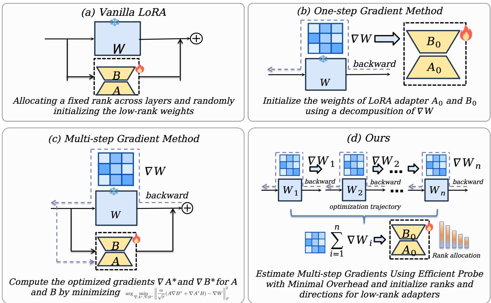
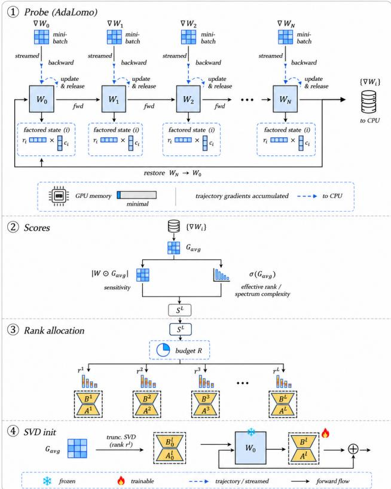
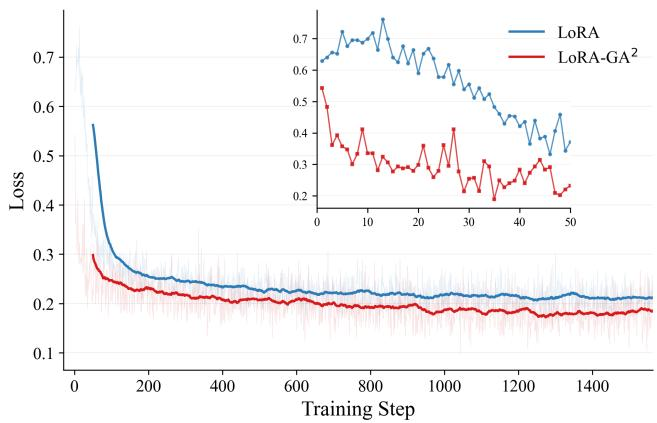
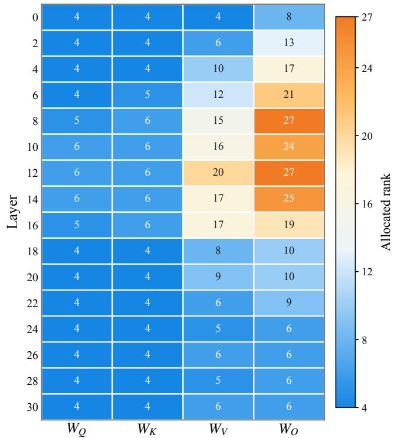
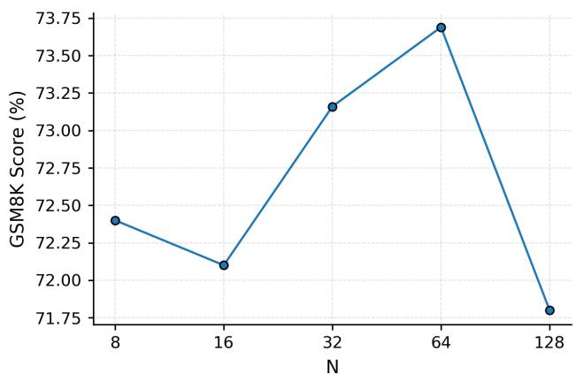
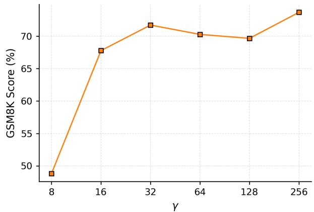

# LoRA-GA2: Low Rank Adaptation with Multi-step Gradient Adaptive Alignment

Haonan He1∗†, Xinyue Fan2∗

1University of Science and Technology of China, 2Independent Researcher hehn@mail.ustc.edu.cn

## Abstract

Low-Rank Adaptation (LoRA) is a prominent fine-tuning method for large models, achieving competitive performance with reduced memory overhead. However, a persistent performance gap remains between LoRA and full fine-tuning. Recent studies have sought to narrow this gap by employing onestep gradient approximations of pretrained weights to align LoRA updates with the principal directions or intrinsic dimensionalities of full fine-tuning updates. Nevertheless, these approaches fail to capture the full dynamics of the gradients. In this paper, we propose LoRA-GA2, an efective fine-tuning algorithm that fully leverages multi-step gradient information. Specifically, we introduce a lightweight probe for multi-step gradients of pretrained weights that incurs no additional GPU memory cost and only marginal time overhead. We further employ a spectrum-aware, importance-based rank allocation and optimal initialization derived from multi-step gradients. Extensive experimental results demonstrate that LoRA-GA2 consistently outperforms existing LoRA variants while preserving the eficiency advantages of vanilla LoRA. For instance, LoRA- $\mathbf { \boldsymbol { \cdot } } \mathbf { \boldsymbol { G } } \mathbf { \boldsymbol { A } } ^ { 2 }$ surpasses the leading baseline by an average of 0.66 points on the GLUE benchmark, and outperforms the strongest baseline by 1.03 points on GSM8K and 0.87 points on HumanEval, respectively.

## 1 Introduction

The advent of open-source pre-trained large language models (LLMs), such as the Llama series (Touvron et al. 2023; Dubey et al. 2024), has revolutionized natural language processing by enabling practitioners to adapt these powerful models to a wide range of downstream tasks through fine-tuning. However, full fine-tuning of LLMs entails substantial memory requirements, as modern optimizers like Adam (Kingma and Ba 2014) demand significant GPU memory to store 32-bit precision optimizer states for the entire model, often leading to out-of-memory issues under constrained resources. This memory bottleneck has spurred the development of Parameter-Eficient Fine-Tuning (PEFT) methods, among which Low-Rank Adaptation (LoRA) (Hu et al. 2021) has gained widespread adoption due to its strong empirical performance, zero inference latency, and straightforward implementation. LoRA is grounded in the hypothesis that weight updates during fine-tuning reside in low-rank subspaces. As shown in Figure 1(a), LoRA decomposes the weight update $\Delta W \in \mathbb { R } ^ { d _ { \mathrm { o u t } } \times d _ { \mathrm { i n } } }$ into low-rank matrices $\pmb { A } \in \mathbb { R } ^ { r \times d _ { \mathrm { i n } } }$ and $B \in \mathbb { R } ^ { d _ { \mathrm { o u t } } \times r }$ such that $\textstyle \Delta W = { \frac { \alpha } { r } } B A$ where $r \ll$ min $( d _ { \mathrm { o u t } } , d _ { \mathrm { i n } } )$ and α is a scaling factor. By freezing the pre-trained weights $W _ { 0 }$ and updating only A and B, LoRA significantly reduces the memory footprint of optimizer states. Despite its eficiency and superior performance relative to other PEFT methods, LoRA still underperforms full fine-tuning in many scenarios (Biderman et al. 2024; Shuttleworth et al. 2025).

Over the past three years, a diverse array of LoRA variants has emerged to bridge the performance gap between LoRA and full fine-tuning. For instance, AdaLoRA (Zhang et al. 2023b) introduces an adaptive pruning strategy to eliminate less important ranks during training; LoRA+ (Hayou, Ghosh, and Yu 2024) proposes a learning rate decoupling strategy to enhance training stability by mitigating the inherent imbalance between the down-projection and up-projection lowrank matrices. Among the various LoRA-based approaches, aligning low-rank updates with full fine-tuning updates via gradient information from pre-trained weights is considered a particularly promising direction for closing the gap, as LoRA adapters can be essentially interpreted as gradient compressors (Hao et al. 2024; He et al. 2025). For example, LoRA-GA (Wang et al. 2024) presents a leading and easily implementable paradigm that computes accumulated onestep gradients prior to training and leverages the principal components to initialize the low-rank weights, efectively reducing the discrepancy between low-rank and full fine-tuning updates at the initial training step. LoRA-One (Zhang, Liu, and Chen 2025) further substantiates the theoretical and empirical validity of this paradigm.

However, existing gradient-guided methods sufer from critical limitations in both the scope of gradient information and the metrics used for rank allocation. First, single-step gradient approaches shown in the Figure 1(b) are inherently myopic; the gradient at the initial checkpoint fails to capture the complex optimization dynamics of the actual fine-tuning trajectory. Conversely, as shown in Figure 1(c), while multistep alignment methods like LoRA-Pro (Wang et al. 2025) directly minimize the discrepancy between low-rank and full fine-tuning updates at each step, they do so at a severe cost. Modifying the low-rank gradients during training necessitates changes to the optimizer, drastically increases GPU memory consumption for optimizer states, prolongs training time, and sufers from poor compatibility with standard training pipelines. Second, current methods rely on one-sided metrics for rank allocation that fail to comprehensively evaluate the gradient’s structure. GoRA (He et al. 2025) allocates rank based solely on sensitivity-based importance scores, while RaLoRA (Ye et al. 2026) relies exclusively on intrinsic dimensionality derived from efective rank. Both metrics are suboptimal in isolation: a layer might be highly sensitive to the loss but have gradients concentrated in a single direction (requiring minimal rank capacity), or conversely, it might exhibit a high efective rank (widely dispersed gradients) but possess low overall sensitivity, making a high rank allocation wasteful. Relying on either metric alone leads to ineficient parameter distribution. This naturally raises the following question: How can we eficiently align low-rank updates with multi-step gradients’ directions, importances, and intrinsic dimensionalities without incurring unacceptable training overhead?

  
Figure 1: Illustration of (a) LoRA; (b) One-step gradients based LoRA Variants; (c) Multi-step gradients based LoRA Variants; and (d) Ours (LoRA-GA2), which introduces an eficient probe for estimating multi-step gradients of pre-trained weights and utilizing the directions and intrinsic dimensionalities of the gradients to initialize low-rank weights.

To address this challenge, we employ AdaLomo (Lv et al. 2023), a memory-eficient optimizer that uses fused backward operations and in-training gradient accumulation, to serve as a lightweight probe for multi-step gradients. Unlike naive gradient averaging, we accumulate per-step gradients while updating weights along the training trajectory utilizing this lightweight optimizer, ensuring the accumulated gradient integrates information along the actual optimization path. After a few steps of accumulation, we restore the pretrained weights and use this robust gradient for rank allocation and low-rank weight initialization. The subsequent training then proceeds seamlessly with common optimizers like Adam. This look-ahead strategy provides stable and representative gradient information that faithfully reflects the true fine-tuning dynamics, yet requires negligible time and zero permanent memory overhead. To this end, we propose LoRA-GA2 (Figure 1(d)) (Low-Rank Adaptation with Gradient Adaptive Alignment), a unified algorithm leveraging these multi-step accumulated gradients to simultaneously address rank allocation and initialization. Our approach introduces a novel gradient intrinsic dimensionality guided sensitivity-based importance score. The key insight is that the required rank should grow with sensitivity (more important layers need more capacity), but must be modulated by efective rank (concentrated gradients need less capacity than dispersed ones). This synergistic combination enables principled rank allocation that respects both the magnitude and the geometric structure of the gradients. For initialization, we design an SVD-based strategy that extracts principal directions from the accumulated multi-step gradients, providing a highly stable approximation of efective update directions without manipulating pre-trained weights. In summary, our core contributions are:

• We systematically identify the informational deficiency of existing single-step gradient methods and the crippling computational overhead of continuous multi-step alignment methods. Furthermore, we reveal the theoretical blind spots of using solely sensitivity (e.g., GoRA) or efective rank (e.g., RaLoRA) for rank allocation.

• We introduce a lightweight, multi-step gradient probing and initialization method, $\mathrm { L o R A – G A ^ { 2 } }$ . By simulating the initial training trajectory via AdaLomo without permanent weight modifications, $\mathrm { L o R A  – G A ^ { 2 } }$ extracts stable multi-step gradient information for rank allocation and initialization. This approach achieves superior empirical performance with a minimal time cost, no extra memory overhead, and seamless compatibility with modern distributed training frameworks.

• We comprehensively evaluate $\mathrm { L o R A – G A ^ { 2 } }$ across diverse modalities, model architectures, and task complexities. Experimental results demonstrate that our method achieves the best average performance among the compared methods across natural language understanding (GLUE benchmark via T5), mathematical reasoning and code generation (GSM8K and HumanEval), and computer vision (image classification via CLIP), outperforming a wide array of recent initialization-optimized, convergence-optimized, and adaptive LoRA variants.

## 2 Related Work

## 2.1 LoRA Variants

LoRA (Hu et al. 2021) has inspired numerous variants, which can be broadly categorized into three directions (Mao et al. 2024). Rank augmentation methods improve parameter utilization by dynamically reallocating ranks based on importance scores (Zhang et al. $2 0 2 3 \mathrm { b , a ; }$ He et al. 2025) or by stacking low-rank subspaces to increase efective rank (Ren et al. 2024; Lialin, Deshpande, and Rumshisky 2023). Training dynamics optimization methods focus on stabilizing the learning process through improved scaling factors (Kalajdzievski 2023) or asymmetric learning rates (Hayou, Ghosh, and Yu 2024). Initialization-based methods (Meng, Wang, and Mu 2024; Büyükakyüz 2024; Wang et al. 2024) leverage singular value decomposition or QR decomposition to initialize low-rank matrices, accelerating convergence and improving adaptation.

## 2.2 LoRA and Gradients of Pre-trained Weights

Beyond this simple taxonomy, the connection between LoRA and gradient dynamics of pretrained weights has garnered increasing attention. FLoRA (Hao et al. 2024) interprets LoRA as a gradient compressor, demonstrating that low-rank matrices accumulate compressed gradient information during training. GaLore (Zhao et al. 2024) projects gradients onto low-rank subspaces for memory-eficient training. LoRA-GA (Wang et al. 2024) initializes LoRA matrices using gradient singular features to minimize the diference between LoRA and full fine-tuning. GoRA (He et al. 2025) employs gradient sensitivity for adaptive rank allocation and pseudoinverse initialization. However, these methods rely on singlestep gradient estimates, which exhibit high variance and may not capture the persistent update directions essential for effective fine-tuning.

## 3 Method

## 3.1 LoRA as Gradient Compression

LoRA can be analyzed as a structured gradient-compression mechanism. For a pretrained matrix $W _ { 0 }$ and a rank-r adapter, the efective update after T steps is constrained to the product space spanned by BA. Under the standard small-step approximation, or in the common setting where one lowrank factor is initialized to zero and the other determines the initial subspace, the accumulated LoRA update can be written as

$$
\Delta W _ { T } \approx - \eta ( \frac { \alpha } { r } ) ^ { 2 } \sum _ { t = 1 } ^ { T } G _ { t } A _ { 0 } ^ { \top } A _ { 0 } ,\tag{1}
$$

where $G _ { t } = \partial L _ { t } / \partial W _ { 0 }$ is the full-weight gradient. Thus, LoRA does not simply reduce parameter count; it projects the full gradient sequence through the adapter subspace. Vanilla random initialization makes this projection generic, so the approximation quality depends on whether $\bar { A } _ { 0 } ^ { \top } A _ { 0 }$ happens to preserve the dominant update directions.

This view exposes two controllable error sources. First, the adapter subspace should align with the persistent gradient directions that appear during full fine-tuning process, not only with the directions of one-step gradients that computed without optimization steps. Second, the rank assigned to each layer should reflect how much gradient energy must be preserved in that layer. If $G ^ { l }$ has singular values $\sigma _ { 1 } \geq \sigma _ { 2 } \geq \cdot \cdot \cdot$ , then the best rank-r approximation preserves energy $\textstyle \sum _ { i = 1 } ^ { r } { \sigma _ { i } ^ { 2 } } / \sum _ { j } { \sigma _ { j } ^ { 2 } }$ . A layer whose gradient spectrum is concentrated can be represented with a small rank, while a layer with dispersed singular values needs more capacity. $\mathrm { L o } \mathrm { \check { R } A } – \mathrm { G A } ^ { 2 }$ directly targets these two errors by estimating trajectory gradients and using their spectra for both allocation and initialization.

## 3.2 Trajectory-Aware Gradient Probe

For a layer with frozen pretrained weight $W _ { 0 } .$ , LoRA computes

$$
\pmb { h } = \pmb { W } _ { 0 } \pmb { x } + \frac { \alpha } { r } \pmb { B } \pmb { A } \pmb { x } .\tag{2}
$$

The LoRA gradients are $\begin{array} { l l l } { \partial { \pmb { L } } / \partial { \pmb { A } } } & { = } & { \frac { \alpha } { r } { \pmb { B } } ^ { \top } \frac { \partial { \pmb { L } } } { \partial { \pmb { W } } _ { 0 } } } \end{array}$ and $\begin{array} { r } { \partial \pmb { L } / \partial \pmb { B } = \frac { \alpha } { r } \frac { \partial \pmb { L } } { \partial \pmb { W } _ { 0 } } \pmb { A } ^ { \top } } \end{array}$ , so adapter learning is controlled by how well the low-rank factors represent the full gradient subspace. Instead of estimating this subspace from a single batch, LoR $\mathrm { { A - G A ^ { 2 } } }$ collects

$$
G _ { \mathrm { a v g } } ^ { l } = \frac { 1 } { N } \sum _ { i = 1 } ^ { N } \left. \frac { \partial L _ { i } } { \partial W ^ { l } } \right| _ { W ^ { l } = W ^ { ( i ) , l } } ,\tag{3}
$$

$$
\boldsymbol { W } ^ { ( i + 1 ) , l } = \boldsymbol { W } ^ { ( i ) , l } - \eta \mathcal { U } ( \boldsymbol { G } _ { i } ^ { l } ) .\tag{4}
$$

where U is the AdaLomo update (Lv et al. 2023). Gradients are accumulated on CPU and the pretrained weights are restored after probing, thereby eliminating the parameter changes introduced during the probe. The accumulated gradients are retained only for rank allocation and adapter initialization.

  
Figure 2: Framework of $\mathrm { \mathrm { L o R A - G A ^ { 2 } } }$ . A temporary multi-step probe collects trajectory gradients, restores the pretrained weights, and uses the accumulated signal for both rank allocation and SVD initialization before standard LoRA training.

## 3.3 Spectrum-Aware Rank Allocation

Sensitivity measures task importance:

$$
I _ { \mathrm { s e n s } } ^ { l } = \arg ( | W _ { 0 } ^ { l } \odot G _ { \mathrm { a v g } } ^ { l } | ) .\tag{5}
$$

This quantity approximates the first-order loss variation induced by perturbing the pretrained weights, and therefore identifies layers where downstream adaptation has large effect. However, sensitivity alone is not a rank requirement. Two layers can have the same gradient magnitude but very diferent singular-value spectra: if one gradient is nearly rankone, a small adapter can capture most of its useful update; if another distributes energy across many directions, the same rank will lose much more information.

Efective rank measures how many directions are needed to represent the accumulated gradient:

$$
\operatorname { e r a n k } ( G _ { \mathrm { a v g } } ^ { l } ) = \exp \left( - \sum _ { i } p _ { i } \log p _ { i } \right) , \qquad p _ { i } = \frac { \sigma _ { i } } { \sum _ { j } \sigma _ { j } } .\tag{6}
$$

Efective rank alone is also insuficient because it ignores task importance. A layer may have a broad gradient spectrum but contribute little to the downstream loss, in which case assigning a large rank wastes the fixed LoRA budget. The two metrics therefore capture orthogonal properties: sensitivity measures how much the layer matters, while efective rank measures how many directions are needed to represent the

useful update.

We normalize both scores across target layers and define

$$
S ^ { l } = \bar { I } _ { \mathrm { s e n s } } ^ { l } ( \bar { I } _ { \mathrm { e r a n k } } ^ { l } ) ^ { \lambda } , \qquad \bar { S } ^ { l } = \frac { S ^ { l } } { \sum _ { k } S ^ { k } } .\tag{7}
$$

Given reference rank $r _ { \mathrm { r e f } }$ , the total budget is $P _ { \mathrm { { t o t a l } } } ~ =$ $\textstyle \sum _ { l } \sqrt { d _ { \mathrm { i n } } ^ { l } + d _ { \mathrm { o u t } } ^ { l } r _ { \mathrm { r e f } } }$ , and the allocated rank is

$$
r ^ { l } = \mathrm { c l i p } \left( \left\lfloor \frac { P _ { \mathrm { t o t a l } } \bar { S } ^ { l } } { \sqrt { d _ { \mathrm { i n } } ^ { l } + d _ { \mathrm { o u t } } ^ { l } } } \right\rfloor , r _ { \mathrm { m i n } } , r _ { \mathrm { m a x } } \right) .\tag{8}
$$

The square-root shape factor prevents wide layers from consuming the entire budget.

## 3.4 SVD Initialization

For each layer, we compute a truncated SVD of the negative accumulated gradient $\dot { \pmb { D } } _ { \mathrm { a v g } } ^ { l } = - \pmb { G } _ { \mathrm { a v g } } ^ { l } \approx \pmb { U } ^ { l } \pmb { \Sigma } ^ { l } ( \pmb { V } ^ { l } ) ^ { \top }$ and initialize the LoRA factors as

$$
B _ { 0 } ^ { l } = { U ^ { l } \sqrt { \Sigma ^ { l } } } / { \sqrt { \sigma _ { 1 } ^ { l } \gamma } } , \qquad A _ { 0 } ^ { l } = \sqrt { \Sigma ^ { l } } ( { V ^ { l } } ) ^ { \top } / \sqrt { \sigma _ { 1 } ^ { l } \gamma } ,\tag{9}
$$

where $\sigma _ { 1 } ^ { l }$ is the largest singular value of $D _ { \mathrm { a v g } } ^ { l }$ . This places the initial adapter update along dominant descent directions. In the main experiments, we use $N = 6 4 , r _ { \mathrm { r e f } } = 8$ , and tune γ in a small stability range. Formal proofs and the approximationerror bound are provided in the supplement.

## 3.5 Why Multi-Step Alignment Helps

The one-step estimator averages gradients only at $W _ { 0 } .$ whereas LoRA training immediately moves through a sequence of nearby weights. For the quadratic loss $\bar { \mathcal { L } } ( W ) =$ $\frac { 1 } { 2 } \lVert \mathbf { W } - \mathbf { W } ^ { \star } \rVert _ { F } ^ { 2 }$ , a trajectory estimator has error bounded by a variance term plus a controllable drift term, $\sigma ^ { 2 } d / N +$ $\dot { \mathcal { O } } ( \eta ^ { 2 } N ^ { 2 } )$ , while a static estimator retains the irreducible bias $\lVert \dot { \boldsymbol W } _ { 0 } - \dot { \boldsymbol W } ^ { \star } \rVert _ { F } ^ { 2 }$ . This stylized result explains why using many mini-batches at a frozen point is not equivalent to probing the early optimization path.

The dual rank score is motivated by a complementary observation. Sensitivity alone can over-allocate rank to layers whose gradients are large but nearly one-dimensional; efective rank alone can over-allocate rank to layers whose gradients are dispersed but irrelevant to the downstream loss. Multiplying normalized sensitivity with normalized efective rank gives each layer capacity only when both conditions hold. The supplement provides the full compression-error and allocation derivations.

## 4 Experiments

We evaluate $\mathrm { L o R A  – G A ^ { 2 } }$ in three settings: T5-Base (Rafel et al. 2019) on five tasks from GLUE (Wang et al. 2019), Llama-3.1-8B-Base (Dubey et al. 2024) on GSM8K (Cobbe et al. 2021) and HumanEval (Chen et al. 2021) (trained on MetaMathQA-100K (Yu et al. 2024) and CodeFeedback-100K (Weyssow et al. 2024), respectively), and CLIP-ViT-B/16 (Radford et al. 2021) on seven image classification tasks (the classifier is constructed using text prompts such as “a photo of a {class}.”) (Krause et al. 2013; Cimpoi et al.

Algorithm 1 LoRA-GA2: Low Rank Adaptation with Multi-step Gradient Adaptive Alignment   
Require: Model f, weights $\{ W _ { 0 } ^ { l } \} _ { l = 1 } ^ { L } ,$ , steps N, rref, γ, rmin, rmax, λ.   
Ensure: Initialized $\{ A _ { 0 } ^ { l } , B _ { 0 } ^ { l } \} _ { l = 1 } ^ { L } .$   
1: Phase 1: Gradient Accumulation (AdaLomo)   
2: Save pretrained weights $\boldsymbol { W _ { 0 } ^ { l } }$ to CPU, and set $\dot { G } _ { \mathrm { a v g } } ^ { l }  \mathbf { 0 }$ for all l.   
3: for i = 1 to N do   
4: Sample batch, compute loss L, obtain Gl = FusedBackward $( \pmb { L } , \pmb { W } ^ { l } )$ ▷ AdaLomo fused kernel   
5: Update $\pmb { W } ^ { l }  \pmb { W } ^ { \bar { l } } - \eta \mathcal { U } ( \pmb { G } _ { i } ^ { l } )$ and accumulate $G _ { \mathrm { a v g } } ^ { l } + = G _ { i } ^ { l } / N$ ▷ Adaptive LR & CPU accumulation   
6: end for   
7: Restore pretrained weights: $\mathbf { \Delta } W ^ { l }  W _ { \mathrm { { C P U } } } ^ { l } .$   
8: Phase 2: Importance Scores   
9: Compute sensitivity $I _ { \mathrm { s e n s } } ^ { l } = \arg ( | W _ { 0 } ^ { l } \odot G _ { \mathrm { a v g } } ^ { l } | )$ and efective rank $I _ { \mathrm { e r a n k } } ^ { l } = \mathrm { e r a n k } ( G _ { \mathrm { a v g } } ^ { l } ) .$   
10: Normalize: $\bar { S } ^ { l } = \frac { \bar { I } _ { \mathrm { s e n s } } ^ { l } \cdot ( \bar { I } _ { \mathrm { e r a n k } } ^ { l } ) ^ { \lambda } } { - \cdot }$ ▷ I¯ denotes min-max normalization across layers   
$\overline { { \sum _ { k } \bar { I } _ { \mathrm { s e n s } } ^ { k } \cdot ( \bar { I } _ { \mathrm { e r a n k } } ^ { k } ) ^ { \lambda } } }$   
11: Phase 3: Rank Allocation   
12: Total budget $\begin{array} { r } { P _ { \mathrm { t o t a l } }  \sum _ { l } \sqrt { d _ { \mathrm { i n } } ^ { l } + d _ { \mathrm { o u t } } ^ { l } } \cdot r _ { \mathrm { r e f } } . } \end{array}$   
13: for l = 1 to L do   
14: $r ^ { l } \gets \mathrm { c l i p } \left( \left\lfloor \frac { P _ { \mathrm { t o t a l } } \cdot \bar { S } ^ { l } } { \sqrt { d _ { \mathrm { i n } } ^ { l } + d _ { \mathrm { o u t } } ^ { l } } } \right\rfloor , \ r _ { \mathrm { m i n } } , \ r _ { \mathrm { m a x } } \right)$   
15: end for   
16: Phase 4: SVD-based Initialization   
17: for l = 1 to L do   
18: $( U ^ { l } , \Sigma ^ { l } , V ^ { l } )  \mathrm { S V D } _ { r ^ { l } } ( G _ { \mathrm { a v g } } ^ { l } )$ ▷ Truncated SVD   
19: $\begin{array} { r } { \pmb { B _ { 0 } ^ { l } }  \pmb { U ^ { l } } \sqrt { \pmb { \Sigma ^ { l } } } / \sqrt { \sigma _ { 1 } ^ { l } \gamma } , \quad \pmb { \dot { A _ { 0 } ^ { l } } }  \sqrt { \pmb { \Sigma ^ { l } } } ( \pmb { V ^ { l } } ) ^ { \top } / \sqrt { \sigma _ { 1 } ^ { l } \gamma } } \end{array}$ ▷ $\sigma _ { 1 } ^ { l } =$ largest singular value   
20: end for   
21: return $\{ A _ { 0 } ^ { l } , B _ { 0 } ^ { l } \} _ { l = 1 } ^ { L }$

2014; Helber et al. 2019; Houben et al. 2013; Cheng, Han, and Lu 2017; Xiao et al. 2010; Netzer et al. 2011). Unless otherwise specified, fixed-rank LoRA variants use rank 8, while adaptive-rank variants use a reference rank of 8 with a minimum rank of 4 and a maximum rank of 32. We use the same optimizer settings as the corresponding baselines to ensure a fair comparison. All experiments are conducted on a single node equipped with four NVIDIA H200 GPUs. Each experiment is repeated using three diferent random seeds.

## 4.1 Experimental Settings

For GLUE, we follow the settings of LoRA-GA (Wang et al. 2024) and GoRA (He et al. 2025): the Adam optimizer with a peak learning rate of $1 \times 1 0 ^ { - 4 }$ , a batch size of 32, one training epoch, zero weight decay, cosine learning-rate decay with a warmup ratio of 0.03, a maximum sequence length of 128, and FP32 training. LoRA adapters are applied to all linear layers except the language head. For GSM8K (evaluated using accuracy) and HumanEval (evaluated using pass@1), we follow the setup of GoRA: AdamW with a peak learning rate of $5 \times 1 0 ^ { - 5 }$ , a batch size of64, one training epoch, zero weight decay, a maximum sequence length of 1024, BF16 model weights, and FP32 low-rank weights, with LoRA applied to the attention projection matrices. For CLIP-ViT-B/16, we follow RaLoRA (Ye et al. 2026) and fine-tune all linear layers using Adam with a peak learning rate of $1 \times 1 0 ^ { - 4 }$ and a batch size of64. The number oftraining epochs for each image classification dataset is computed as max $\begin{array} { r } { \left( 1 , \mathrm { r o u n d } \left( \frac { 1 0 0 0 } { N _ { \mathrm { b a t c h } } } \right) \right) } \end{array}$ , where $N _ { \mathrm { b a t c h } }$ denotes the corresponding number of batches. Unless otherwise stated, we use a LoRA rank of 8, a LoRA scaling parameter α of 16, and a LoRA dropout rate of 0 for LoRA and its variants.

## 4.2 Experimental Results

Language understanding. On GLUE, LoRA-GA2 improves the average score to 88.62, outperforming GoRA by 0.66 points, LoRA-GA by 0.85 points, and full fine-tuning by 0.71 points under the reported setting. The largest gain appears on CoLA, where $\mathrm { L o } \mathrm { { R A } \mathrm { { - } \mathrm { { G A } ^ { 2 } } } }$ reaches 82.39, improving over LoRA-GA by 1.82 points and over GoRA by 2.53 points. This task is sensitive to linguistic acceptability patterns, so the result is consistent with our claim that a short trajectory probe captures more stable early update directions than a one-step gradient. $\mathrm { L o R A  – G A ^ { 2 } }$ also obtains the best MRPC score, suggesting that the same alignment helps on datasets with small scales.

Reasoning and code. On Llama3.1-8B-Base, LoRA- $\mathbf { \boldsymbol { G } } \mathbf { \boldsymbol { A } } ^ { 2 }$ improves over the strongest baseline GoRA by 1.03 points on GSM8K and 0.87 points on HumanEval. It also exceeds full fine-tuning on GSM8K by 0.25 points with reference rank 8, while HumanEval remains below full fine-tuning but substantially narrows the gap from LoRA’s 8.54-point deficit to 1.78 points. This pattern matches the motivation of the method: reasoning and code tasks expose the weakness of a randomly initialized low-rank subspace, and aligning the adapter with multi-step full-gradient directions helps recover part ofthe full fine-tuning trajectory without changing the formal LoRA training loop. As shown in Figure 3, LoRA-GA2 shows clear optimization and convergence advantages over LoRA for fine-tuning Llama3.1-8B-Base on MetamathQA, demonstrating the efectiveness of our method.

Table 1: Performance of fine-tuning T5-Base on 5 sub-tasks of the GLUE benchmark. Bold and underline indicate the highest and second-highest scores of low-rank methods with $r = 8 \mathrm { o r } r ^ { \mathrm { r e f } } = 8 .$
<table><tr><td>Method</td><td>MNLI</td><td>SST-2</td><td>CoLA</td><td>QNLI</td><td>MRPC</td><td>Average</td></tr><tr><td>Full</td><td>86.33±0.00</td><td> $\overline { { 9 4 . 7 5 { \pm } 0 . 2 1 } }$ </td><td> $\overline { { 8 0 . 7 0 { \pm } 0 . 2 4 } }$   $6 9 . 3 5 { \pm } 0 . 0 5$ </td><td> $\overline { { 9 3 . 1 9 { \pm } 0 . 2 2 } }$   $9 3 . 1 9 { \pm } 0 . 2 2$ </td><td> $\overline { { 8 4 . 5 6 { \pm } 0 . 7 3 } }$ </td><td>87.91</td></tr><tr><td>LoRA (Hu et al. 2021)</td><td colspan="4">85.30±0.04  $9 4 . 0 4 { \pm } 0 . 1 1 $ </td><td> $8 4 . 5 6 { \pm } 0 . 7 3 $ </td><td>85.29</td></tr><tr><td>rsLoRA (Kalajdzievski 2023)</td><td>Convergence Optimization Methods for LoRA  $8 5 . 7 3 { \pm } 0 . 1 0 $ </td><td></td><td> $7 2 . 3 2 { \pm } 1 . 1 2$ </td><td> $9 3 . 1 2 { \pm } 0 . 0 9$ </td><td> $5 2 . 8 6 { \pm } 2 . 2 7 $ </td><td>79.64</td></tr><tr><td>DoRA (Liu et al. 2024)</td><td></td><td> $9 4 . 1 9 { \pm } 0 . 2 3 $   $9 4 . 0 4 { \pm } 0 . 5 3 $ </td><td> $7 2 . 0 4 { \pm } 0 . 9 4$ </td><td> $9 3 . 0 4 { \pm } 0 . 0 6 $ </td><td> $6 8 . 0 8 { \pm } 0 . 5 1 $ </td><td>82.57</td></tr><tr><td>LoRA+ (Hayou, Ghosh, and Yu 2024)</td><td> $8 5 . 6 7 { \pm } 0 . 0 9$ </td><td> $9 3 . 8 5 { \pm } 0 . 2 4 $ </td><td> $7 7 . 5 3 { \pm } 0 . 2 0 $ </td><td></td><td></td><td>84.95</td></tr><tr><td></td><td> $8 5 . 8 1 { \pm } 0 . 0 9$ </td><td></td><td></td><td> $9 3 . 1 4 { \pm } 0 . 0 3$ </td><td> $7 4 . 4 3 { \pm } 1 . 3 9$ </td><td></td></tr><tr><td>PiSSA (Meng, Wang, and Mu 2024)</td><td>Initialization Optimization Methods for LoRA</td><td> $9 4 . 0 7 { \pm } 0 . 0 6 $ </td><td> $7 4 . 2 7 { \pm } 0 . 3 9$ </td><td> $9 3 . 1 5 { \pm } 0 . 1 4$ </td><td></td><td></td></tr><tr><td>LoRA-GA (Wang et al. 2024)</td><td> $8 5 . 7 5 { \scriptstyle \pm 0 . 0 7 }$   $8 5 . 7 0 { \pm } 0 . 0 9$ </td><td> $9 4 . 1 1 { \pm } 0 . 1 8 $ </td><td> $8 0 . 5 7 { \pm } 0 . 2 0 $ </td><td> $9 3 . 1 8 { \pm } 0 . 0 6$ </td><td> $7 6 . 3 1 { \pm } 0 . 5 1 $   $8 5 . 2 9 { \pm } 0 . 2 4 $ </td><td>84.71 87.77</td></tr><tr><td></td><td colspan="4"> $A d a p t i \nu e M e t h o d s f o r L o R A$ </td><td></td><td></td></tr><tr><td>AdaLoRA (Zhang et al. 2023b)</td><td> $8 5 . 4 5 { \pm } 0 . 1 1 $ </td><td> $9 3 . 6 9 { \pm } 0 . 2 0 $ </td><td> $6 9 . 1 6 { \pm } 0 . 2 4$ </td><td> $9 1 . 6 6 { \pm } 0 . 0 5$ </td><td> $6 8 . 1 4 { \pm } 0 . 2 8 $ </td><td>81.62</td></tr><tr><td>RaLoRA (Ye et al. 2026)</td><td> $8 5 . 7 6 { \pm } 0 . 0 3$ </td><td> $9 4 . 2 2 { \pm } 0 . 2 9 $ </td><td> $7 8 . 1 1 { \pm } 0 . 4 5$ </td><td> $\mathbf { 9 3 . 3 6 { \pm } 0 . 1 4 }$ </td><td> $\underline { { 8 4 . 7 4 2 0 . 2 7 } }$ </td><td>87.24</td></tr><tr><td>GoRA (He et al. 2025)</td><td> $8 5 . 9 1 { \scriptstyle \pm 0 . 2 2 }$ </td><td> $\overline { { 9 4 . 6 8 \pm 0 . 4 3 } }$ </td><td> $7 9 . 8 6 { \pm } 0 . 3 5 $ </td><td> $9 3 . 2 7 { \pm } 0 . 0 8$ </td><td> $8 6 . 1 0 { \pm } 0 . 2 0 $ </td><td>87.96</td></tr><tr><td> $\mathrm { L o R A  – G A ^ { 2 } \left( O u r s \right) }$ </td><td> $\mathbf { 8 5 . 9 1 \pm 0 . 0 1 }$ </td><td> $\mathbf { 9 4 . 7 2 } \pm \mathbf { 0 . 3 7 }$ </td><td> $\mathbf { 8 } 2 . 3 \mathbf { 9 } \pm \mathbf { 0 . 2 4 }$ </td><td>0  $9 3 . 1 9 { \pm } 0 . 0 5 $ </td><td>一  $\mathbf { 8 6 . 8 8 \pm 0 . 1 4 }$ </td><td>88.62</td></tr></table>

Table 2: Performance of fine-tuning Llama3.1-8B-Base on GSM8K and HumanEval.
<table><tr><td>Method</td><td>GSM8K</td><td>HumanEval</td></tr><tr><td>Full</td><td>73.69±0.28</td><td> $\overline { { 5 1 . 6 3 { \pm } 1 . 2 7 } }$ </td></tr><tr><td>LoRA (Hu et al. 2021)</td><td> $6 7 . 7 8 { \pm } 1 . 2 5 $ </td><td> $4 3 . 0 9 { \pm } 0 . 3 5 $ </td></tr><tr><td>rsLoRA (Kalajdzievski 2023)</td><td> $6 8 . 3 6 { \pm } 0 . 7 4 $ </td><td> $4 5 . 7 8 { \scriptstyle \pm 2 . 8 0 }$ </td></tr><tr><td>DoRA (Liu et al. 2024)</td><td> $6 9 . 1 7 { \scriptstyle \pm 1 . 0 0 }$ </td><td> $4 3 . 7 0 { \pm } 1 . 5 4 $ </td></tr><tr><td>LoRA+ (Hayou, Ghosh, and Yu 2024)</td><td> $7 1 . 2 9 { \pm } 0 . 9 3 $ </td><td> $4 4 . 5 1 { \pm } 2 . 1 1 $ </td></tr><tr><td>OLoRA (Büyükakyüz 2024)</td><td> $6 8 . 5 4 { \pm } 0 . 4 2 $ </td><td> $4 3 . 2 9 { \scriptstyle \pm 2 . 4 4 }$ </td></tr><tr><td>PiSSA (Meng, Wang, and Mu 2024)</td><td> $6 8 . 5 6 { \pm } 1 . 0 3 $ </td><td> $4 4 . 1 0 { \pm } 1 . 5 4 $ </td></tr><tr><td>LoRA-GA (Wang et al. 2024)</td><td> $7 1 . 3 9 { \pm } 0 . 9 0 $ </td><td> $4 3 . 2 9 2 0 . 6 1$ </td></tr><tr><td>AdaLoRA (Zhang et al. 2023b)</td><td> $7 0 . 6 3 { \scriptstyle \pm 0 . 7 7 }$ </td><td> $4 1 . 4 6 { \pm } 3 . 6 6 $ </td></tr><tr><td>RaLoRA (Ye et al. 2026)</td><td> $7 2 . 2 5 { \pm } 0 . 5 9$ </td><td> $4 8 . 7 8 { \pm } 1 . 6 1 $ </td></tr><tr><td>GoRA (He et al. 2025)</td><td> $\underline { { 7 2 . 9 1 \pm 0 . 7 6 } }$ </td><td> $4 8 . 9 8 { \pm } 2 . 1 4 $ </td></tr><tr><td> $\mathrm { L o R A \mathrm { - } G A ^ { 2 } \left( O u r s \right) }$ </td><td> $\mathbf { \overline { { 7 3 . 9 4 } } \pm 0 . 4 8 }$ </td><td> $\mathbf { \overline { { 4 9 . 8 5 \pm 0 . 3 3 } } }$ </td></tr></table>

The one-step comparison follows the same data budget as

Vision transfer. On CLIP-ViT-B/16, $\mathrm { L o R A  – G A ^ { 2 } }$ obtains a 91.16 average over seven image classification tasks, improving over RaLoRA by 0.63 points. It achieves the best result on six of seven datasets and is second best on RE-SISC45. The gains are not concentrated in a single dataset: Cars, DTD, SUN397, and SVHN all improve over the strongest baselines. This supports the claim that the combined sensitivity/efective-rank score is not tied to a single model family or modality. Since the CLIP experiments use the same reference-rank budget as the adaptive-rank baselines, the improvement is better interpreted as more efective allocation and initialization rather than a larger trainable parameter count.

## 5 Ablation and Eficiency

As shown in Table 4, the main ablations isolate the two design choices: trajectory gradients and dual rank scoring. Multi-step gradients improve over a fixed-weight onestep variant on both GSM8K and HumanEval (73.94 vs. 72.13 on GSM8K; 49.85 vs. 49.65 on HumanEval). Removing SVD initialization causes the largest drop (68.92 on GSM8K), while replacing the dual score with sensitivityonly or efective-rank-only allocation also degrades performance. The supplement provides more ablation results on hyperparameters.

  
Figure 3: Loss comparison of fine-tuning Llama3.1-8B-Base on MetamathQA using LoRA and $\mathrm { L o R \mathrm { \check { A } } \mathrm { - } G A ^ { 2 } }$

the trajectory probe: gradients are computed over 64 minibatches, but the weights are kept fixed at the pretrained checkpoint. This controls for the number of gradient evaluations and isolates the efect of following the early optimization path. The 1.81-point GSM8K gap between one-step and multi-step variants indicates that the improvement is not merely due to averaging more minibatches; the location at which gradients are collected matters. HumanEval shows a smaller but consistent gain, suggesting that code generation is less sensitive to this particular trajectory signal but still benefits from more stable alignment.

The component ablations separate two roles of the accumulated gradient. Without SVD initialization, the method loses the direct alignment between the initial adapter update and the dominant full-gradient directions, causing the largest GSM8K drop. Without adaptive rank allocation, the initialization remains useful but the fixed rank budget is not redistributed toward layers that are both important and spectrally complex. The score ablations further support the dualsignal design: sensitivity-only allocation ignores directional dispersion, while efective-rank-only allocation ignores task relevance. Their weaker performance explains why LoRA-$\mathrm { G A ^ { 2 } }$ combines both signals rather than treating either as a

Table 3: Performance of fine-tuning CLIP-ViT-B/16 on seven image classification tasks.
<table><tr><td>Method</td><td>Cars</td><td>DTD</td><td>EuroSAT</td><td>GTSRB</td><td>RESISC45</td><td>SUN397</td><td>SVHN</td><td>Average</td></tr><tr><td>Zero-shot</td><td>63.75</td><td>44.39</td><td>42.22</td><td>35.22</td><td>56.46</td><td>62.56</td><td>15.53</td><td>45.73</td></tr><tr><td>LoRA (Hu et al. 2021)</td><td> $8 2 . 3 1 { \pm } 0 . 0 8$ </td><td> $7 6 . 9 7 { \scriptstyle \pm 0 . 5 1 }$ </td><td> $9 8 . 3 8 { \pm } 0 . 2 0 $ </td><td> $9 7 . 1 0 { \pm } 0 . 0 6 $ </td><td> $9 4 . 9 9 { \pm } 0 . 1 1 $ </td><td> $7 7 . 1 9 { \pm } 0 . 1 9$ </td><td> $9 6 . 6 2 { \scriptstyle \pm 0 . 0 6 }$ </td><td> $8 9 . 0 8 { \pm } 0 . 1 0 $ </td></tr><tr><td>MELoRA (Ren et al. 2024)</td><td> $8 2 . 6 5 { \pm } 0 . 3 8 $ </td><td> $7 5 . 1 6 { \pm } 0 . 5 9$ </td><td> $9 8 . 6 4 { \pm } 0 . 0 5$ </td><td> $9 8 . 8 8 { \pm } 0 . 0 5 $ </td><td> $9 5 . 7 8 { \pm } 0 . 1 6$ </td><td> $7 4 . 6 9 { \pm } 0 . 2 2$ </td><td> $9 6 . 9 5 { \scriptstyle \pm 0 . 0 9 }$ </td><td> $8 8 . 9 6 { \pm } 0 . 1 5 $ </td></tr><tr><td>MoRA (Jiang et al. 2024)</td><td> $8 4 . 6 1 { \pm } 0 . 2 1 $ </td><td> $7 7 . 3 4 { \pm } 0 . 1 4$ </td><td> $9 8 . 6 5 { \pm } 0 . 1 6$ </td><td> $9 8 . 6 8 { \pm } 0 . 1 8 $ </td><td> $9 6 . 3 3 { \pm } 0 . 1 9$ </td><td> $7 8 . 1 2 { \pm } 0 . 0 6$ </td><td> $9 7 . 1 7 { \pm } 0 . 1 5 $ </td><td> $9 0 . 1 3 { \pm } 0 . 1 6$ </td></tr><tr><td>AdaLoRA (Zhang et al. 2023b)</td><td> $7 3 . 5 8 { \pm } 0 . 0 9$ </td><td> $7 3 . 7 9 2 0 . 4 8$ </td><td> $9 6 . 9 6 { \pm } 0 . 1 2$ </td><td> $5 8 . 8 7 { \pm } 0 . 3 8 $ </td><td> $8 9 . 0 7 { \scriptstyle \pm 0 . 6 0 }$ </td><td> $7 2 . 0 0 { \pm } 0 . 1 0 $ </td><td> $9 4 . 2 6 { \pm } 0 . 1 3 $ </td><td> $7 9 . 7 9 { \scriptstyle \pm 0 . 2 7 }$ </td></tr><tr><td>DoRA (Liu et al. 2024)</td><td> $8 2 . 4 4 { \pm } 0 . 2 6 $ </td><td> $7 6 . 8 6 { \pm } 0 . 8 4$ </td><td> $9 8 . 4 3 { \pm } 0 . 1 7 $ </td><td> $9 7 . 2 5 { \pm } 0 . 1 2 $ </td><td> $9 5 . 1 0 { \pm } 0 . 1 6$ </td><td> $7 7 . 3 0 { \pm } 0 . 1 7 $ </td><td> $9 6 . 6 3 { \scriptstyle \pm 0 . 0 4 }$ </td><td> $8 9 . 1 4 { \pm } 0 . 0 7$ </td></tr><tr><td>rsLoRA (Kalajdzievski 2023)</td><td> $8 3 . 9 4 { \pm } 0 . 2 2$ </td><td> $7 7 . 6 4 { \pm } 0 . 3 3 $ </td><td> $9 8 . 5 1 { \pm } 0 . 1 7 $ </td><td> $9 8 . 6 9 { \pm } 0 . 1 7 \ $ </td><td> $9 5 . 9 0 { \pm } 0 . 2 0 $ </td><td> $7 7 . 9 6 { \pm } 0 . 2 1 $ </td><td> $9 6 . 9 4 { \scriptstyle \pm 0 . 0 6 }$ </td><td> $8 9 . 9 4 { \pm } 0 . 0 6$ </td></tr><tr><td>LoRA+ (Hayou, Ghosh, and Yu 2024)</td><td> $8 6 . 6 1 { \scriptstyle \pm 0 . 3 6 }$ </td><td> $7 3 . 3 3 { \pm } 1 . 3 0 $ </td><td> $9 8 . 5 4 { \pm } 0 . 1 4 $ </td><td> $9 8 . 9 9 { \pm } 0 . 2 0 $ </td><td> $9 6 . 0 6 { \pm } 0 . 3 8 $ </td><td> $7 6 . 8 0 { \scriptstyle \pm 0 . 3 4 }$ </td><td> $9 6 . 9 8 { \pm } 0 . 0 8$ </td><td> $8 9 . 6 2 { \pm } 0 . 1 9$ </td></tr><tr><td>PiSSA (Meng, Wang, and Mu 2024)</td><td> $8 3 . 3 6 { \pm } 0 . 3 8 $ </td><td> $7 7 . 3 8 { \pm } 0 . 5 7 $ </td><td> $9 8 . 5 4 { \pm } 0 . 0 9$ </td><td> $9 8 . 3 2 { \pm } 0 . 0 9$ </td><td> $9 5 . 9 2 { \pm } 0 . 4 0 $ </td><td> $7 7 . 4 6 { \pm } 0 . 1 3 $ </td><td> $9 7 . 0 0 { \pm } 0 . 0 9$ </td><td> $8 9 . 7 1 { \scriptstyle \pm 0 . 2 5 }$ </td></tr><tr><td>OLoRA (Büyükakyüz 2024)</td><td> $8 3 . 8 5 { \pm } 0 . 1 3 $ </td><td> $7 8 . 6 0 { \pm } 0 . 2 5 $ </td><td> $9 8 . 6 2 { \pm } 0 . 0 3 $ </td><td> $9 8 . 4 9 { \pm } 0 . 1 4 $ </td><td> $9 6 . 0 1 { \scriptstyle \pm 0 . 2 8 }$ </td><td> $7 7 . 3 0 { \pm } 0 . 0 8 $ </td><td> $9 7 . 1 5 { \pm } 0 . 1 4 $ </td><td> $9 0 . 0 0 { \pm } 0 . 1 5 $ </td></tr><tr><td>RaLoRA (Ye et al. 2026)</td><td> $\underline { { 8 6 . 6 3 \pm 0 . 3 0 } }$ </td><td> $7 7 . 7 5 { \scriptstyle \pm 0 . 2 0 }$ </td><td> $9 8 . 6 6 { \pm } 0 . 2 7 \ $ </td><td> $9 8 . 9 8 { \pm } 0 . 1 1 $ </td><td> $\mathbf { 9 6 . 6 2 } \pm \mathbf { 0 . 2 8 }$ </td><td> $7 7 . 8 6 { \pm } 0 . 0 5 $ </td><td> $9 7 . 2 4 { \pm } 0 . 1 1 $ </td><td> $9 0 . 5 3 { \pm } 0 . 0 3 $ </td></tr><tr><td> $\mathrm { L o R A  – G A ^ { 2 } \ ( O u r s ) }$ </td><td> ${ \bf 8 7 . 8 2 \pm 0 . 1 3 }$ </td><td> ${ \bf 7 9 . 4 9 { \pm 0 . 1 1 } }$ </td><td> ${ \bf 9 8 . 8 3 \pm 0 . 1 1 }$ </td><td> $\mathbf { 9 9 . 0 1 } { \pm } \mathbf { 0 . 0 8 }$ </td><td> $9 6 . 4 8 { \pm } 0 . 2 4 $ </td><td> $\mathbf { 7 9 . 0 5 { \pm } 0 . 1 4 }$ </td><td> $\mathbf { 9 7 . 4 2 \pm 0 . 0 7 }$ </td><td> $\mathbf { 9 1 . 1 6 { \pm } 0 . 0 5 }$ </td></tr></table>

Table 4: Key ablations with standard deviations on Llama3.1- 8B-Base.
<table><tr><td>Variant</td><td>GSM8K</td><td>HumanEval</td></tr><tr><td>One-step gradient</td><td> $\overline { { 7 2 . 1 3 { \pm } 0 . 3 4 } }$ </td><td> $\overline { { 4 9 . 6 5 { \pm } 1 . 0 1 } }$ </td></tr><tr><td>No SVD init.</td><td> $6 8 . 9 2 { \pm } 0 . 1 2 $ </td><td> $4 8 . 3 7 { \pm } 2 . 5 0 $ </td></tr><tr><td>No rank alloc.</td><td> $7 2 . 4 0 { \pm } 1 . 3 2 $ </td><td> $4 8 . 8 8 { \pm } 0 . 6 3 $ </td></tr><tr><td>Sensitivity only</td><td> $7 2 . 9 8 { \pm } 0 . 6 5$ </td><td> $4 8 . 1 7 { \pm } 2 . 2 8 $ </td></tr><tr><td>Effective rank only</td><td> $7 3 . 5 1 { \pm } 0 . 5 1 $ </td><td> $4 8 . 7 8 { \pm } 1 . 0 0 $ </td></tr><tr><td>Full  $\mathrm { L o R A – G A ^ { 2 } }$ </td><td> $\mathbf { 7 3 . 9 4 \pm 0 . 4 8 }$ </td><td> $\mathbf { 4 9 . 8 5 \pm 0 . 3 3 }$ </td></tr></table>

suficient criterion.

The probing overhead is small relative to formal training. On Llama3.1-8B-Base, the multi-step gradient probe takes 5 minutes 55.83 seconds with 108,019 MB peak GPU memory, while the subsequent LoRA training takes 31 minutes 14.4 seconds with 137,695 MB peak GPU memory. Because all probe weights are restored before training, LoRA- $- \mathrm { G A ^ { 2 } }$ does not change inference cost or checkpoint format.

## 6 Discussion

The empirical pattern suggests that $\mathrm { L o R A  – G A ^ { 2 } }$ is most useful when the initial gradient is not a suficient proxy for the first phase of training. This is visible on GSM8K and CoLA, where the gains over LoRA-GA and GoRA are larger than on already-saturated classification tasks. The method also clarifies the roles of sensitivity and efective rank. Sensitivity answers whether a layer matters for the downstream loss; efective rank answers how many independent directions are required to represent its gradient. A layer with high sensitivity but low efective rank should receive enough rank to capture the dominant direction, but not a large budget. A layer with high efective rank but low sensitivity should also be restrained because its broad spectrum may not correspond to useful task adaptation. The multiplicative score enforces this interaction in a simple form. An example of rank allocation results of our method is shown in Figure 4. There are two limitations of our method. First, the probe introduces a small extra probing phase. Second, the current method uses a global exponent λ for all layers and tasks. A future version could adapt λ based on gradient-spectrum concentration or use a small validation set to choose it automatically.

Figure 4: Rank allocation results of fine-tuning Llama3.1- 8B-Base-base on MetamathQA.

## 7 Conclusion

We presented L $\mathrm { \_ o R A { - } G A ^ { 2 } }$ , a LoRA variant with adaptive rank allocation and initialization based on multi-step gradient information. Specifically, we propose a lightweight probe for multi-step gradient approximation with no extra GPU memory cost and negligible extra computing time. Furthermore, we propose a spectrum-aware importance-based rank allocation and an SVD-based initialization for multi-step gradient alignment for improved alignment between low-rank adapters and directions, importances, and intrinsic dimensionalities of multi-step gradients. Extensive experiments demonstrate the efectiveness of our approach across diverse tasks and model architectures.

## References

Biderman, D.; Portes, J.; Jacobson, J.; Baker, D.; Ramezani-Moghadam, A.; and Greene, S. 2024. LoRA Learns Less and Forgets Less. arXiv preprint arXiv:2405.09673.

Büyükakyüz, K. 2024. OLoRA: Orthonormal Low-Rank Adaptation of Large Language Models. arXiv preprint arXiv:2406.01775.

Chen, M.; Tworek, J.; Jun, H.; Yuan, Q.; de Oliveira Pinto, H. P.; Kaplan, J.; Edwards, H.; Burda, Y.; Joseph, N.; Brockman, G.; Ray, A.; Puri, R.; Krueger, G.; Petrov, M.; Khlaaf, H.; Sastry, G.; Mishkin, P.; Chan, B.; Gray, S.; Ryder, N.; Pavlov, M.; Power, A.; Kaiser, L.; Bavarian, M.; Winter, C.; Tillet, P.; Such, F. P.; Cummings, D.; Plappert, M.; Chantzis, F.; Barnes, E.; Herbert-Voss, A.; Guss, W. H.; Nichol, A.; Paino, A.; Tezak, N.; Tang, J.; Babuschkin, I.; Balaji, S.; Jain, S.; Saunders, W.; Hesse, C.; Carr, A. N.; Leike, J.; Achiam, J.; Misra, V.; Morikawa, E.; Radford, A.; Knight, M.; Brundage, M.; Murati, M.; Mayer, K.; Welinder, P.; Mc-Grew, B.; Amodei, D.; McCandlish, S.; Sutskever, I.; and Zaremba, W. 2021. Evaluating Large Language Models Trained on Code. arXiv:2107.03374.

Cheng, G.; Han, J.; and Lu, X. 2017. Remote sensing image scene classification: Benchmark and state of the art. Proceedings ofthe IEEE, 105(10): 1865–1883.

Cimpoi, M.; Maji, S.; Kokkinos, I.; Mohamed, S.; and Vedaldi, A. 2014. Describing textures in the wild. In Proceedings of the IEEE conference on computer vision and pattern recognition, 3606–3613.

Cobbe, K.; Kosaraju, V.; Bavarian, M.; Chen, M.; Jun, H.; Kaiser, L.; Plappert, M.; Tworek, J.; Hilton, J.; Nakano, R.; Hesse, C.; and Schulman, J. 2021. Training Verifiers to Solve Math Word Problems. arXiv:2110.14168.

Dubey, A.; Jauhri, A.; Pandey, A.; Kadian, A.; Al-Dahle, A.; Letman, A.; Mathur, A.; Schelten, A.; Yang, A.; Fan, A.; et al. 2024. The Llama 3 Herd of Models. arXiv preprint arXiv:2407.21783.

Hao, Y.; Liu, Y.; Li, X.; Dong, Y.; and Zhang, L. 2024. Flora: Low-Rank Adapters Are Secretly Gradient Compressors. arXiv preprint arXiv:2402.03293.

Hayou, S.; Ghosh, N.; and Yu, B. 2024. LoRA+: Eficient Low Rank Adaptation of Large Models. arXiv preprint arXiv:2402.12354.

He, H.; et al. 2025. GoRA: Gradient-driven Adaptive Low-Rank Adaptation for Large Language Models. arXiv preprint arXiv:2502.12171.

Helber, P.; Bischke, B.; Dengel, A.; and Borth, D. 2019. Eurosat: A novel dataset and deep learning benchmark for land use and land cover classification. IEEE Journal of Selected Topics in Applied Earth Observations and Remote Sensing, 12(7): 2217–2226.

Houben, S.; Stallkamp, J.; Salmen, J.; Schlipsing, M.; and Igel, C. 2013. Detection of trafic signs in real-world images: The German Trafic Sign Detection Benchmark. In The 2013 international joint conference on neural networks (IJCNN), 1–8. Ieee.

Hu, E. J.; Shen, Y.; Wallis, P.; Allen-Zhu, Z.; Li, Y.; Wang, S.; Wang, L.; and Chen, W. 2021. LoRA: Low-Rank Adaptation of Large Language Models. arXiv preprint arXiv:2106.09685.

Jiang, T.; Huang, S.; Luo, S.; Zhang, Z.; Huang, H.; Wei, F.; Deng, W.; Sun, F.; Zhang, Q.; Wang, D.; et al. 2024. Mora: High-rank updating for parameter-eficient fine-tuning. arXiv preprint arXiv:2405.12130.

Kalajdzievski, D. 2023. A Rank Stabilization Scaling Factor for Fine-Tuning with LoRA. arXiv preprint arXiv:2312.03732.

Kingma, D. P.; and Ba, J. 2014. Adam: A Method for Stochastic Optimization. arXiv preprint arXiv:1412.6980.

Krause, J.; Stark, M.; Deng, J.; and Fei-Fei, L. 2013. 3d object representations for fine-grained categorization. In Proceedings of the IEEE international conference on computer vision workshops, 554–561.

Lialin, V.; Deshpande, N.; and Rumshisky, A. 2023. ReLoRA: High-Rank Training Through Low-Rank Updates. arXiv preprint arXiv:2307.05695.

Liu, S.-Y.; Wang, C.-Y.; Liu, F.; Chen, W.-Y.; et al. 2024. DoRA: Weight-Decomposed Low-Rank Adaptation. arXiv preprint arXiv:2402.09353.

Lv, K.; et al. 2023. AdaLomo: Low-Memory Optimization with Adaptive Learning Rate. arXiv preprint arXiv:2310.10195.

Mao, Y.; et al. 2024. A Survey on LoRA of Large Language Models. arXiv preprint arXiv:2407.11046.

Meng, F.; Wang, Z.; and Mu, C. 2024. PiSSA: Principal Singular Values and Singular Vectors Adaptation of Large Language Models. arXiv preprint arXiv:2404.02948.

Netzer, Y.; Wang, T.; Coates, A.; Bissacco, A.; Wu, B.; Ng, A. Y.; et al. 2011. Reading digits in natural images with unsupervised feature learning. In NIPS workshop on deep learning and unsupervised feature learning, volume 2011, 4. Granada.

Radford, A.; Kim, J. W.; Hallacy, C.; Ramesh, A.; Goh, G.; Agarwal, S.; Sastry, G.; Askell, A.; Mishkin, P.; Clark, J.; Krueger, G.; and Sutskever, I. 2021. Learning Transferable Visual Models From Natural Language Supervision. arXiv:2103.00020.

Rafel, C.; Shazeer, N.; Roberts, A.; Lee, K.; Narang, S.; Matena, M.; Zhou, Y.; Li, W.; and Liu, P. J. 2019. Exploring the Limits of Transfer Learning with a Unified Text-to-Text Transformer. CoRR, abs/1910.10683.

Ren, R.; Wang, Y.; Liu, K.; Zhao, Z.; Zhang, R.; Wei, H.; et al. 2024. MELoRA: Mini-Ensemble Low-Rank Adapters for Parameter-Eficient Fine-Tuning. arXiv preprint arXiv:2402.17295.

Shuttleworth, R. S.; Andreas, J.; Torralba, A.; and Sharma, P. 2025. LoRA vs Full Fine-tuning: An Illusion of Equivalence.

Touvron, H.; Lavril, T.; Izacard, G.; Martinet, X.; Lachaux, M.-A.; Lacroix, T.; Rozière, B.; Goyal, N.; Hambro, E.; Azhar, F.; et al. 2023. Llama: Open and Eficient Foundation Language Models. arXiv preprint arXiv:2302.13971.

Wang, A.; Singh, A.; Michael, J.; Hill, F.; Levy, O.; and Bowman, S. R. 2019. GLUE: A Multi-Task Benchmark and Analysis Platform for Natural Language Understanding. arXiv:1804.07461.

Wang, S.; Li, X.; Ye, Q.; Dong, Y.; and Zhang, L. 2024. LoRA-GA: Low-Rank Adaptation with Gradient Approximation. arXiv preprint arXiv:2407.05000.

Wang, Z.; Liang, J.; He, R.; Wang, Z.; and Tan, T. 2025. LoRA-Pro: Are Low-Rank Adapters Properly Optimized? In The Thirteenth International Conference on Learning Representations.

Weyssow, M.; Kamanda, A.; Zhou, X.; and Sahraoui, H. 2024. CodeUltraFeedback: An LLM-as-a-Judge Dataset for Aligning Large Language Models to Coding Preferences. arXiv:2403.09032.

Xiao, J.; Hays, J.; Ehinger, K. A.; Oliva, A.; and Torralba, A. 2010. Sun database: Large-scale scene recognition from abbey to zoo. In 2010 IEEE computer society conference on computer vision and pattern recognition, 3485–3492. IEEE.

Ye, J.; He, H.; Li, M.; Han, F.; Chen, T.; and Ye, P. 2026. Gradient Intrinsic Dimensionality Alignment: Narrowing The Gap Between Low-Rank Adaptation and Full Fine-Tuning. In The Fourteenth International Conference on Learning Representations.

Yu, L.; Jiang, W.; Shi, H.; Yu, J.; Liu, Z.; Zhang, Y.; Kwok, J. T.; Li, Z.; Weller, A.; and Liu, W. 2024. MetaMath: Bootstrap Your Own Mathematical Questions for Large Language Models. arXiv:2309.12284.

Zhang, L.; et al. 2023a. IncreLoRA: Incremental Parameter Allocation Strategy for Parameter-Eficient Fine-tuning. arXiv preprint arXiv:2308.12043.

Zhang, Q.; Chen, M.; Bukharin, A.; He, P.; Cheng, Y.; Chen, W.; and Zhao, T. 2023b. AdaLoRA: Adaptive Budget Allocation for Parameter-Eficient Fine-Tuning. In Proceedings of the International Conference on Learning Representations.

Zhang, Y.; Liu, F.; and Chen, Y. 2025. Lora-one: Onestep full gradient could sufice for fine-tuning large language models, provably and eficiently. arXiv preprint arXiv:2502.01235.

Zhao, J.; Zhang, Z.; Chen, B.; Wang, Z.; and Kyrillidis, A. 2024. GaLore: Memory-Eficient LLM Training by Gradient Low-Rank Projection. arXiv preprint arXiv:2403.03507.

## A Implementation Details

## A.1 Hyperparameter Selection

The key hyperparameters in LoRA $- \mathrm { G A ^ { 2 } }$ are as follows. (1) Gradient accumulation steps N: we use $N = 6 4$ for stable trajectory-gradient estimation. (2) Stability scaling γ: we increase γ over a power-of-two grid until the initialized adapter satisfies the initial-loss stability criterion described below. (3) Combined-score exponent λ: the default value 1.0 balances sensitivity and efective rank. (4) Rank bounds rmin and $r _ { \mathrm { m a x } } .$ these are set relative to the reference rank $r _ { \mathrm { r e f } } .$ typically as $r _ { \mathrm { m i n } } = r _ { \mathrm { r e f } } / 2$ and $r _ { \mathrm { m a x } } = 4 r _ { \mathrm { r e f } }$

As shown in Figure 5, we additionally conduct an ablation study on $N$ and $\gamma$ by training Llama-3.1-8B-Base (Dubey et al. 2024) on MetaMathQA-100K (Yu et al. 2024) and testing it on GSM8K (Cobbe et al. 2021) with a fixed random seed. Moderate values of N, such as 32 and 64, significantly improve performance. An excessively small N yields a highvariance estimate, whereas an excessively large N may include gradients from a probe trajectory that has drifted too far from the restored initialization; both efects can degrade downstream performance. Based on these observations, we use $N = 6 4$ in the main experiments.

  
Figure 5: Ablation of the hyperparameters N and γ.

For γ, we evaluate candidates on a power-of-two grid. For each candidate, the pretrained weights are restored and the spectrally initialized LoRA branch is inserted. We accept the first candidate for which the resulting initial loss is lower than the corresponding starting loss of the restored model without a LoRA branch. This criterion directly prevents the nonzero initialization from producing an adverse initial-loss increase and requires only an initial-loss comparison for each candidate. In our search grid, small positive values up to 128 can cause a sharp loss spike; increasing γ reduces the spectral magnitude of the initialization.

## A.2 Probe Protocol and Accounting

The temporary AdaLomo probe uses a fixed learning rate of $5 \times \mathrm { 1 \bar { 0 } ^ { - 5 } }$ , with no learning-rate schedule during its N steps. After the probe, all pretrained weights are restored before rank allocation, adapter initialization, and formal LoRA training. The formal-training data loader is restarted rather than advanced past the probe samples; consequently, minibatches observed during probing may be used again during formal training.

Algorithm 2 Efective-rank computation   
Require: accumulated gradient $\overline { { G , \varepsilon = 1 0 ^ { - 1 0 } } }$   
1: if G is not a two-dimensional matrix then   
2: return 1   
3: end if   
4: cast G to FP32 on its current device   
5: σ ← svdvals(G) ▷ full spectrum   
6: if the SVD fails or $| \pmb { \sigma } | = 0$ then   
7: return 1   
8: end if   
9: $z \gets \sum _ { i } \sigma _ { i }$   
10: $\mathbf { i } \mathbf { f } \ z < \varepsilon$ then   
11: return 1   
12: end if   
13: $p _ { i } \gets \sigma _ { i } / z$   
14: $\begin{array} { r } { \dot { q } \gets \exp ( - \sum _ { i } p _ { i } \log ( p _ { i } + \varepsilon ) ) } \end{array}$   
15: return max $\cdot ( 1 , q )$

The reported probe time covers the complete preprocessing stage: the N forward/backward passes, AdaLomo updates, CPU gradient transfer and accumulation, restoration of the pretrained weights, sensitivity and efective-rank computation, rank allocation, truncated SVD, and construction of the initialized adapters. Thus, the reported timing is not restricted to gradient collection alone.

## A.3 Efective-Rank Computation

Efective rank is computed from the full singular-value spectrum in FP32 on the device holding the accumulated gradient. Algorithm 2 gives implementation-equivalent pseudocode. We use $\varepsilon = \mathrm { \bar { 1 0 } ^ { - 1 0 } }$ . A non-matrix input, an empty spectrum, a numerically zero nuclear norm, or an SVD failure returns the conservative fallback value 1. Temporary tensors are released after the computation.

Sensitivity and efective rank are min–max normalized across target layers before they are combined. If all target layers have identical values and this normalization is degenerate, adaptive allocation is skipped and every target layer is assigned $r _ { \mathrm { r e f } }$ . This fallback is therefore identical to the fixed-rank allocation of standard LoRA.

## A.4 Negative-Gradient Spectral Initialization

Throughout the implementation, $G _ { \mathrm { a v g } } ^ { l }$ denotes the accumulated loss gradient stored during the probe, while the spectral initialization is constructed from its descent direction. Explicitly, we define

$$
D _ { \mathrm { a v g } } ^ { l } = - G _ { \mathrm { a v g } } ^ { l } = - \frac { 1 } { N } \sum _ { i = 1 } ^ { N } \left. \frac { \partial \mathcal { L } _ { i } } { \partial W ^ { l } } \right| _ { W ^ { l } = W ^ { ( i ) , l } } ,\tag{10}
$$

and compute its rank- ${ _ { - r } } ^ { l }$ truncated SVD:

$$
D _ { \mathrm { a v g } } ^ { l } \approx { \cal U } _ { r } ^ { l } \Sigma _ { r } ^ { l } ( V _ { r } ^ { l } ) ^ { \top } .\tag{11}
$$

Accordingly, SVD factors written compactly in terms of the accumulated gradient signal refer to the factors of $D _ { \mathrm { a v g } } ^ { l } =$ $- G _ { \mathrm { a v g } } ^ { l } .$ . Equivalently, an implementation that decomposes

$G _ { \mathrm { a v g } } ^ { l }$ directly may absorb a minus sign into either one of the two LoRA factors.

The LoRA factors are initialized as

$$
B _ { 0 } ^ { l } = \frac { U _ { r } ^ { l } \sqrt { \Sigma _ { r } ^ { l } } } { \sqrt { \sigma _ { 1 } ^ { l } \gamma } } ,\tag{12}
$$

$$
A _ { 0 } ^ { l } = \frac { \sqrt { \Sigma _ { r } ^ { l } } ( V _ { r } ^ { l } ) ^ { \top } } { \sqrt { \sigma _ { 1 } ^ { l } \gamma } } ,\tag{13}
$$

where $\boldsymbol { \sigma } _ { 1 } ^ { l }$ is the largest singular value of $D _ { \mathrm { a v g } } ^ { l } .$ . Consequently,

$$
B _ { 0 } ^ { l } A _ { 0 } ^ { l } = \frac { ( D _ { \mathrm { a v g } } ^ { l } ) _ { r ^ { l } } } { \sigma _ { 1 } ^ { l } \gamma } .\tag{14}
$$

Since $D _ { \mathrm { a v g } } ^ { l } = - G _ { \mathrm { a v g } } ^ { l }$ , the initial efective LoRA perturbation is

$$
\Delta W _ { 0 } ^ { l } = \frac { \alpha } { r ^ { l } } B _ { 0 } ^ { l } A _ { 0 } ^ { l } = - \frac { \alpha } { r ^ { l } \sigma _ { 1 } ^ { l } \gamma } ( G _ { \mathrm { a v g } } ^ { l } ) _ { r ^ { l } } .\tag{15}
$$

Thus, the nonzero adapter initialization is a controlled lowrank warm start aligned with the dominant accumulated descent directions.

After gradient probing, we restore the original pretrained weights $\mathbf { \breve { \mathbf { W } } } _ { 0 } ^ { l }$ and keep them frozen during subsequent LoRA training. Since the adapter branch itself introduces a descentaligned low-rank update, we do not apply an additional compensation or re-centering modification to $W _ { 0 } ^ { l . } ;$ suficient local descent conditions are given in Proposition 10. The adapter therefore begins training in the estimated task-relevant gradient subspace.

The normalization by $\sigma _ { 1 } ^ { l } \gamma$ controls the magnitude of the initial perturbation:

$$
\left\| B _ { 0 } ^ { l } A _ { 0 } ^ { l } \right\| _ { 2 } = { \frac { 1 } { \gamma } } , \qquad \left\| { \frac { \alpha } { r ^ { l } } } B _ { 0 } ^ { l } A _ { 0 } ^ { l } \right\| _ { 2 } = { \frac { \alpha } { r ^ { l } \gamma } } .\tag{16}
$$

Therefore, γ provides direct control over the spectral magnitude of the initialization.

Using the negative gradient does not change layer-wise sensitivity, efective rank, or rank allocation. Indeed,

$$
\arg \big ( \big | W _ { 0 } ^ { l } \odot D _ { \mathrm { a v g } } ^ { l } \big | \big ) = \arg \big ( \big | W _ { 0 } ^ { l } \odot G _ { \mathrm { a v g } } ^ { l } \big | \big ) ,\tag{17}
$$

and $D _ { \mathrm { a v g } } ^ { l }$ and $G _ { \mathrm { a v g } } ^ { l }$ have identical singular values. The sign convention afects only the orientation of the initialized adapter update.

## B Additional Theoretical Analysis

Notation. For one adapted matrix, let

$$
\widetilde { W } _ { t } = W _ { 0 } + c B _ { t } \pmb { A } _ { t } , \qquad c : = \frac { \alpha } { r } ,\tag{18}
$$

where $\pmb { A } _ { t } \in \mathbb { R } ^ { r \times d _ { \mathrm { i n } } }$ and $B _ { t } \in \mathbb { R } ^ { d _ { \mathrm { o u t } } \times r }$ . We write $G _ { t } : =$ $\nabla _ { \widetilde { \mathbf { W } } } \mathcal { L } _ { t }$ for the full-weight gradient evaluated at $\widetilde { W } _ { t }$ . Unless stated otherwise, the factor optimizer is SGD with step size η.

## B.1 LoRA as Gradient Compression

There are two complementary ways to derive the gradientcompression interpretation of LoRA. The first freezes one low-rank factor, $\bar { \cal A } _ { t } \equiv { \cal A } _ { 0 } .$ and trains only B. This setting

∥At∥2

yields an exact and transparent expression, but imposes a stronger assumption than standard LoRA. The second considers the usual coupled optimization of both A and B and shows that the same compressed-gradient expression remains the leading-order term over a short horizon.

Proposition 1 (Exact compression with a frozen factor). Let $\widetilde { W } _ { t } = W _ { 0 } + c B _ { t } A _ { t } ,$ where $c = \alpha / r .$ . Suppose $A _ { t } \equiv A _ { 0 }$ and only B is trained by gradient descent. Then

$$
\widetilde { \pmb { W } } _ { T } - \widetilde { \pmb { W } } _ { 0 } = - \eta c ^ { 2 } \sum _ { t = 0 } ^ { T - 1 } \pmb { G } _ { t } \pmb { A } _ { 0 } ^ { \top } \pmb { A } _ { 0 } .\tag{19}
$$

Thus, LoRA applies the fixed right-side compression operator $c ^ { 2 } A _ { 0 } ^ { \top } A _ { 0 }$ to every full-weight gradient.

Proof. Since $\widetilde { W } _ { t } = W _ { 0 } + c B _ { t } A _ { 0 }$ , the chain rule gives $\nabla _ { B } \bar { \mathcal { L } } _ { t } = c \pmb { G } _ { t } \pmb { A } _ { 0 } ^ { \top }$ . Hence

$$
\boldsymbol { B } _ { T } - \boldsymbol { B } _ { 0 } = - \eta c \sum _ { t = 0 } ^ { T - 1 } \boldsymbol { G } _ { t } \boldsymbol { A } _ { 0 } ^ { \top } .\tag{20}
$$

Multiplying by $c A _ { 0 }$ on the right proves equation 19. □

The preceding result is exact but assumes that the initial adapter subspace remains fixed. Standard LoRA updates both factors. The next proposition shows that, when $\mathbf { \delta B } _ { 0 } = \mathbf { 0 }$ and the step is small, the frozen-subspace expression is the first nonvanishing term of the coupled dynamics.

Proposition 2 (Coupled factors: leading-order dynamics). Let $\mathbf { \delta B } _ { 0 } = \mathbf { 0 }$ and update

$$
\begin{array} { r } { \pmb { A } _ { t + 1 } = \pmb { A } _ { t } - \eta c \pmb { B } _ { t } ^ { \top } \pmb { G } _ { t } , } \\ { \pmb { B } _ { t + 1 } = \pmb { B } _ { t } - \eta c \pmb { G } _ { t } \pmb { A } _ { t } ^ { \top } . } \end{array}\tag{21}
$$

Assume, for $0 \leq t < T _ { \cdot }$ , that

$$
\| \pmb { G } _ { t } \| _ { 2 } \le M , \quad \| \pmb { G } _ { t } \| _ { F } \le M _ { F } , \quad \| \pmb { A } _ { 0 } \| _ { 2 } \le a , \quad \eta c M T \le 1 .\tag{22}
$$

Then

$$
\widetilde { W } _ { T } - \widetilde { W } _ { 0 } = - \eta c ^ { 2 } \sum _ { t = 0 } ^ { T - 1 } G _ { t } A _ { 0 } ^ { \top } A _ { 0 } + R _ { T } ,\tag{23}
$$

where,for an absolute constant C,

$$
\Vert { \bf R } _ { T } \Vert _ { F } \leq C \eta ^ { 3 } c ^ { 4 } M _ { F } M ^ { 2 } a ^ { 2 } T ^ { 3 } .\tag{24}
$$

Consequently, for fixed T, the frozen-subspace expression is the leading-order term as $\eta  0$

Proof. Expanding one product update gives

$$
\begin{array} { r } { B _ { t + 1 } A _ { t + 1 } - B _ { t } A _ { t } = \mathbf { \Pi } - \eta c G _ { t } A _ { t } ^ { \top } A _ { t } - \eta c B _ { t } B _ { t } ^ { \top } G _ { t } } \\ { \mathbf { \Pi } + \eta ^ { 2 } c ^ { 2 } \pmb { G } _ { t } A _ { t } ^ { \top } B _ { t } ^ { \top } \pmb { G } _ { t } . } \end{array}\tag{25}
$$

Under equation 22, induction yields

$$
\begin{array} { r } { \| \pmb { B } _ { t } \| _ { 2 } \le 2 \eta c M a t , \quad \| \pmb { A } _ { t } - \pmb { A } _ { 0 } \| _ { 2 } \le \eta ^ { 2 } c ^ { 2 } M ^ { 2 } a t ( t - 1 ) , } \end{array}\tag{26}
$$

Insert these bounds into equation 25, sum over t, and multiply by the outer scale c. The diference between $A _ { t } ^ { \top } A _ { t }$ and $\bar { A } _ { 0 } ^ { \top } A _ { 0 } .$ , the term containing $B _ { t } B _ { t } ^ { \intercal }$ , and the quadratic term are each bounded by a constant times $\eta ^ { 3 } c ^ { 4 } \dot { \cal M } _ { F } { \cal M } ^ { 2 } a ^ { 2 } { \cal T } ^ { 3 } .$ Absorbing constants into C proves the claim. □

Remark. The assumption $\mathbf { \delta B _ { 0 } } = \mathbf { 0 }$ is used only to recover the one-sided expression emphasized in the main text. Equation equation 25 holds for arbitrary initial factors. In particular, when both factors are nonzero,

$$
\begin{array} { r l } & { \widetilde { W } _ { 1 } - \widetilde { W } _ { 0 } = \ - \eta c ^ { 2 } { \pmb { G } } _ { 0 } { \pmb { A } } _ { 0 } ^ { \top } { \pmb { A } } _ { 0 } - \eta c ^ { 2 } { \pmb { B } } _ { 0 } { \pmb { B } } _ { 0 } ^ { \top } { \pmb { G } } _ { 0 } } \\ & { \qquad + \eta ^ { 2 } c ^ { 3 } { \pmb { G } } _ { 0 } { \pmb { A } } _ { 0 } ^ { \top } { \pmb { B } } _ { 0 } ^ { \top } { \pmb { G } } _ { 0 } . } \end{array}\tag{27}
$$

Thus the nonzero spectral initialization used by $\mathrm { L o R A  – G A ^ { 2 } }$ induces bidirectional compression to first order: $\pmb { A } _ { 0 }$ selects a right singular subspace and $B _ { 0 }$ selects a left singular subspace.

## B.2 Why a Task-Aligned Subspace Matters

For a fixed gradient sequence $\{ G _ { t } \} _ { t = 0 } ^ { T - 1 }$ , let $\begin{array} { r l } { H _ { T } } & { { } : = } \end{array}$ $\sum _ { t = 0 } ^ { T - 1 } G _ { t }$ . The corresponding full-SGD update is $- \eta H _ { T } ,$ whereas the frozen-factor LoRA update is $- \eta { { H } _ { { { T } } } } { { P } }$ , with $P = c ^ { 2 } A _ { 0 } ^ { \top } A _ { 0 }$ . Their discrepancy is

$$
\eta H _ { T } ( I - P ) .\tag{28}
$$

Proposition 3 (Optimal rank-r compression subspace). Let $\overset { \mathcal { - } } { \mathbf { \xi } } \overset { \mathcal { - } } { \mathbf { \xi } } = \overset { \mathbf { / } } { U } \boldsymbol { \Sigma } \overset { \mathbf { \mathcal { V } } ^ { \top } } { \mathbf { \xi } }$ with singular values $\sigma _ { 1 } \geq \cdot \cdot \cdot \geq \sigma _ { p } .$ . Among all rank-r orthogonal projectors P ,

$$
\operatorname* { m i n } _ { \pmb { P } } \| \pmb { H } _ { T } ( \pmb { I } - \pmb { P } ) \| _ { F } ^ { 2 } = \sum _ { i > r } \sigma _ { i } ^ { 2 } .\tag{29}
$$

The minimum is attained by the projector onto the top-r right singular subspace of ${ \pmb { H } } _ { T }$

Proof. For an orthogonal projector,

$$
\| { \cal H } _ { T } ( { \cal I } - { \cal P } ) \| _ { F } ^ { 2 } = \sum _ { i } \sigma _ { i } ^ { 2 } \| ( { \cal I } - { \cal P } ) { \pmb v } _ { i } \| _ { 2 } ^ { 2 } .\tag{30}
$$

The minimum retains the r singular directions with the largest squared singular values, by the Eckart–Young–Mirsky theorem. □

Proposition 4 (Gaussian reconstruction error). Let $\textbf { \textit { R } } \in$ $\mathbb { R } ^ { r \times d }$ have independent entries $R _ { i j } \sim \mathcal { N } ( 0 , 1 / r )$ . Then

$$
\mathbb { E } [ R ^ { \top } R ] = I .\tag{31}
$$

However, for every fixed matrix G with d columns,

$$
\mathbb { E } \Vert G R ^ { \top } R - G \Vert _ { F } ^ { 2 } = \frac { d + 1 } { r } \Vert G \Vert _ { F } ^ { 2 } .\tag{32}
$$

Thus Gaussian compression–decompression is unbiased but need not have small reconstruction error when $r \ll d .$

Proof. Equation equation 31 follows from $\mathbb { E } [ R _ { k i } R _ { k j } ] ~ =$ ≤ 2a.δij/r. For a fixed vector x, rotational invariance allows $\mathbf { \bar { \boldsymbol { x } } } = \| \mathbf { \boldsymbol { x } } \| _ { 2 } \mathbf { \boldsymbol { e } } _ { 1 }$ . Writing $R _ { k i } = Z _ { k i } / \sqrt { r }$ gives

$$
\mathbb { E } \| ( \pmb { R } ^ { \top } \pmb { R } - \pmb { I } ) \pmb { e } _ { 1 } \| _ { 2 } ^ { 2 } = \frac { 2 } { r } + \frac { d - 1 } { r } = \frac { d + 1 } { r } .\tag{33}
$$

Scaling by $\| \pmb { x } \| _ { 2 } ^ { 2 }$ and summing over rows proves the claim.

## B.3 Why the Multi-Step Probe Helps

The common estimation target below is the average population gradient along the early optimization trajectory. Under this target, the trajectory estimator directly samples the target and its mean-squared error contains only the samplingvariance term. The $O ( \eta ^ { 2 } N ^ { 2 } )$ discrepancy discussed in the compact main-text account corresponds to the frozen-point bias of a static estimator that replaces the trajectory average by the gradient at the restored initialization; it is not an additional error term of the trajectory estimator under the common target used here.

Proposition 5 (Trajectory versus static estimation). Vectorize the target weights and consider

$$
\mathscr { L } ( \pmb { w } ) = \frac 1 2 \| \pmb { w } - \pmb { w } ^ { \star } \| _ { 2 } ^ { 2 } , \qquad 0 < \eta < 1 .\tag{34}
$$

The population-gradient trajectory satisfies $\begin{array} { l } { { \bf { { g } } } _ { i } } \end{array} = \begin{array} { l } { \left( { 1 \mathrm { ~ - ~ } } \right. } \end{array}$ $\eta ) ^ { i } ( \bar { \pmb { w } } _ { 0 } - \pmb { w } ^ { \star } )$ . Define

$$
\bar { g } _ { N } = \frac { 1 } { N } \sum _ { i = 0 } ^ { N - 1 } g _ { i } = a _ { N } ( { \pmb w } _ { 0 } - { \pmb w } ^ { \star } ) , \qquad a _ { N } : = \frac { 1 - ( 1 - \eta ) ^ { N } } { \eta N } .\tag{35}
$$

Assume noisy observations $\widetilde { \pmb { g } } _ { i } = \pmb { g } _ { i } + \pmb { \xi } _ { i }$ are evaluated along this deterministic trajectory, where the $\pmb { \xi } _ { i }$ are independent, zero mean, and satisfy $\mathbb { E } \| \dot { \pmb { \xi } } _ { i } \| _ { 2 } ^ { 2 } = d \sigma ^ { 2 }$ . Then an $\dot { N } .$ -sample trajectory estimator satisfies

$$
\mathbb { E } \| \widehat { \pmb { g } } _ { \mathrm { t r a j } } - \bar { \pmb { g } } _ { N } \| _ { 2 } ^ { 2 } = \frac { d \sigma ^ { 2 } } { N } .\tag{36}
$$

A static estimator using M samples at $\pmb { w } _ { 0 }$ satisfies

$$
\mathbb { E } \| \widehat { \pmb { g } } _ { \mathrm { s t a t i c } } - \bar { \pmb { g } } _ { N } \| _ { 2 } ^ { 2 } = \frac { d \sigma ^ { 2 } } { M } + ( 1 - a _ { N } ) ^ { 2 } \| \pmb { w } _ { 0 } - \pmb { w } ^ { \star } \| _ { 2 } ^ { 2 } .\tag{37}
$$

Thus additional static batches remove sampling variance but not the bias induced by evaluating every gradient at the initial point.

Proof. The expression for $a _ { N }$ follows from a geometric series. The trajectory estimator is unbiased for $\bar { \mathbf { g } } _ { N }$ , and independence gives equation 36. The static estimator has bias $\bar { ( 1 - a _ { N } ) ( \pmb { w } _ { 0 } - \pmb { w } ^ { \star } ) }$ . The cross term between this deterministic bias and zero-mean noise vanishes, proving equation 37. □

Remark. For a short trajectory,

$$
0 \leq 1 - a _ { N } \leq \frac { \eta ( N - 1 ) } { 2 } .\tag{38}
$$

Consequently,

$$
\| \nabla \mathcal { L } ( W _ { 0 } ) - \bar { G } _ { N } \| _ { F } ^ { 2 } \leq \frac { \eta ^ { 2 } ( N - 1 ) ^ { 2 } } { 4 } \| W _ { 0 } - W ^ { \star } \| _ { F } ^ { 2 } .\tag{39}
$$

For fixed N and $\eta ,$ this term cannot be removed by increasing the number of mini-batches evaluated at $W _ { 0 }$ . Thus static batch averaging and trajectory probing remain statistically distinct even with arbitrarily many static samples. This stylized result isolates the frozen-point bias; stochastic probe dynamics would introduce additional terms.

## B.4 Spectrum-Aware Rank Allocation

Proposition 6 (Rank required for energy preservation). Let G have singular values $\sigma _ { 1 } \geq \cdot \cdot \cdot \geq \sigma _ { p } \geq 0 .$ . For $\rho \in ( 0 , 1 ]$ define

$$
r _ { \rho } : = \operatorname* { m i n } \left\{ r : \sum _ { i = 1 } ^ { r } \sigma _ { i } ^ { 2 } \geq \rho \sum _ { i = 1 } ^ { p } \sigma _ { i } ^ { 2 } \right\} .\tag{40}
$$

There exists a rank-at-most-r matrix X satisfying

$$
\| G - X \| _ { F } ^ { 2 } \leq ( 1 - \rho ) \| G \| _ { F } ^ { 2 }\tag{41}
$$

if and only $i f r \geq r _ { \rho } .$

Proof. The Eckart–Young–Mirsky theorem gives

$$
\operatorname* { m i n } _ { \operatorname { r a n k } ( \pmb { X } ) \leq r } \| \pmb { G } - \pmb { X } \| _ { F } ^ { 2 } = \sum _ { i > r } \sigma _ { i } ^ { 2 } ,\tag{42}
$$

which is equivalent to equation 40.

Proposition 7 (Need for sensitivity and spectral complexity). Let

$$
I _ { \mathrm { s e n s } } ( W , G ) : = \operatorname { a v g } ( | W \odot G | ) ,\tag{43}
$$

$$
q ( G ) : = \exp \left( - \sum _ { i } p _ { i } \log p _ { i } \right) ,\tag{44}
$$

where $p _ { i } = \sigma _ { i } / \sum _ { j } \sigma _ { j }$ for a nonzero spectrum. Consistent with Algorithm $^ { 2 , }$ the implementation sets $q ( G ) = 1$ when $\textstyle \sum _ { j } \sigma _ { j } < \varepsilon .$ Then:

$\begin{array} { l } { { I . \ q ( a G ) \ = \ q ( G ) } } \\ { { | a | I _ { \mathrm { s e n s } } ( W , G ) . } } \end{array}$ for a ̸= 0, while $I _ { \mathrm { s e n s } } ( W , a G ) =$

2. Sensitivity alone does not determine rank demand. For $k \ \geq \ 2 ,$ let $W \ = \ I _ { k } , \ G _ { 1 } \ =$ diag $\cdot ( k , 0 , \ldots , 0 )$ , and $G _ { 2 } = I _ { k } ,$ . Both sensitivities equal $1 / k _ { ; }$ , but $G _ { 1 }$ has rank one, whereas preserving afraction ρ ofthe energy of $G _ { 2 }$ requires rank at least $\lceil \bar { \rho } k \rceil$

Therefore a useful allocation score must depend on both task importance and spectral spread.

Proof. Scaling all singular values by |a| leaves $p _ { i }$ unchanged. For the second claim, both elementwise sensitivities equal the sum of diagonal magnitudes divided by $k ^ { 2 }$ ; the spectral claims follow from Proposition 6. □

Remark. The score

$$
S ^ { l } = \bar { I } _ { \mathrm { s e n s } } ^ { l } ( \bar { I } _ { \mathrm { e r a n k } } ^ { l } ) ^ { \lambda }\tag{45}
$$

is a monotone combination of two necessary signals. Efective rank is only a scalar spectrum summary, so the product is not claimed to be the unique optimizer of the exact spectral tail.

Proposition 8 (Proportional shape-adjusted allocation). Let $s _ { l } > 0$ be layer scores and $\kappa _ { l } > 0$ per-rank surrogate costs. With $b _ { l } : = \kappa _ { l } r _ { l }$ , consider

$$
\operatorname* { m a x } _ { b _ { l } > 0 } \sum _ { l = 1 } ^ { L } s _ { l } \log b _ { l } , \qquad s . t . \sum _ { l = 1 } ^ { L } b _ { l } = P .\tag{46}
$$

Its unique solution is

$$
r _ { l } ^ { * } = \frac { P } { \kappa _ { l } } \frac { s _ { l } } { \sum _ { k } s _ { k } } .\tag{47}
$$

Taking $s _ { l } = S ^ { l }$ and $\kappa _ { l } = \sqrt { d _ { \mathrm { i n } } ^ { l } + d _ { \mathrm { o u t } } ^ { l } }$ recovers the continuous, unclipped allocation used by $L o R A – G A ^ { 2 }$

Proof. Strict concavity gives the stationarity condition $s _ { l } / b _ { l } \ = \ \mu .$ , so $b _ { l } ~ = ~ s _ { l } / \mu$ . Enforcing $\begin{array} { r } { \sum _ { l } b _ { l } \ \dot { = } \ P } \end{array}$ yields $\textstyle \mu = ( \sum _ { k } s _ { k } ) / { P }$ and proves equation 47. □

Remark. The square-root shape factor defines a shapeadjusted capacity budget, not the exact number of LoRA parameters. The exact per-rank parameter cost is $d _ { \mathrm { i n } } ^ { l } + d _ { \mathrm { o u t } } ^ { l } .$ After integer rounding and clipping, any residual surrogate budget can be reassigned according to the largest marginal utility gain. If the layerwise normalization is degenerate, the implementation instead uses the fixed $r _ { l } = r _ { \mathrm { r e f } }$ fallback described in Section A.3.

## B.5 Theory of Negative-Gradient Initialization

The method computes the SVD of the negative trajectory gradient, making the nonzero adapter an intentional lowrank warm start rather than an arbitrary change to the restored model.

Proposition 9 (Exact scale of the spectral warm start). Let $- \pmb { G } _ { \mathrm { a v g } } = \pmb { U } \pmb { \Sigma } \dot { \pmb { V } } ^ { \top }$ , with largest singular value $\sigma _ { 1 } > 0 _ { : }$ , and write $\bar {  Ḋ \boldsymbol Ḋ D Ḍ Ḍ } _ { r } : =  { \boldsymbol Ḋ U Ḍ } _ { r }  { \boldsymbol Ḋ \Sigma Ḍ } _ { r }  { \boldsymbol Ḋ V Ḍ } _ { r } ^ { \top }$ . Initialize

$$
B _ { 0 } = \frac { U _ { r } \Sigma _ { r } ^ { 1 / 2 } } { \sqrt { \sigma _ { 1 } \gamma } } , \qquad A _ { 0 } = \frac { \Sigma _ { r } ^ { 1 / 2 } V _ { r } ^ { \top } } { \sqrt { \sigma _ { 1 } \gamma } } .\tag{48}
$$

Then

$$
c B _ { 0 } A _ { 0 } = \beta D _ { r } , \qquad \beta : = \frac { c } { \sigma _ { 1 } \gamma } ,\tag{49}
$$

and

$$
\| c B _ { 0 } A _ { 0 } \| _ { 2 } = { \frac { c } { \gamma } } .\tag{50}
$$

Thus $\gamma$ controls the spectral norm independently of the absolute gradient scale. $I f \sigma _ { 1 } = 0$ , the accumulated gradient vanishes and we use the zero adapter.

Proof. Multiplying the factors gives $B _ { 0 } A _ { 0 } = D _ { r } / ( \sigma _ { 1 } \gamma )$ Since the largest singular value of $D _ { r }$ is $\sigma _ { 1 }$ , equation 50 follows. □

Proposition 10 (Descent guarantee without modifying $W _ { 0 } ) .$ Let $G _ { 0 } : = \nabla _ { W } \mathcal { L } ( W _ { 0 } )$ , and suppose $\mathcal { L }$ is $L _ { \mathrm { s m } }$ -smooth on the line segment between $W _ { 0 }$ and $W _ { 0 } + \beta D _ { r }$ . Define

$$
a : = - \frac { \langle G _ { 0 } , D _ { r } \rangle _ { F } } { \| D _ { r } \| _ { F } ^ { 2 } } .\tag{51}
$$

If $\begin{array} { r } { \boldsymbol { \lambda } > \boldsymbol { 0 } , } \end{array}$ then $\widetilde { \pmb { W } } _ { 0 } = \pmb { W } _ { 0 } + \beta \pmb { D } _ { \eta }$ satisfies

$$
\mathcal { L } ( \widetilde { W } _ { 0 } ) - \mathcal { L } ( W _ { 0 } ) \leq \left( - \beta a + \frac { L _ { \mathrm { s m } } } { 2 } \beta ^ { 2 } \right) \| D _ { r } \| _ { F } ^ { 2 } .\tag{52}
$$

Hence the initialization is a strict descent step whenever

$$
0 < \beta < \frac { 2 a } { L _ { \mathrm { s m } } } .\tag{53}
$$

No compensating change to the pretrained backbone is required: the additive LoRA branch implements the controlled low-rank warm start.

Proof. Local smoothness gives

$$
\mathcal { L } ( W _ { 0 } + \beta D _ { r } ) \leq \mathcal { L } ( W _ { 0 } ) + \beta \langle G _ { 0 } , D _ { r } \rangle _ { F } + \frac { L _ { \mathrm { s m } } } { 2 } \beta ^ { 2 } \| D _ { r } \| _ { F } ^ { 2 } .\tag{54}
$$

Substituting equation 51 proves the bound, whose right-hand side is negative under equation 53. □

Corollary 11 (Exact-gradient case). $\begin{array} { r } { I f G _ { \mathrm { a v g } } = G _ { \mathrm { 0 } } , } \end{array}$ then ${ \cal D } _ { r } = - ( G _ { 0 } )$ r and a = 1. Therefore it is suficient that

$$
0 < \displaystyle \frac { c } { \sigma _ { 1 } \gamma } < \displaystyle \frac { 2 } { L _ { \mathrm { s m } } } .\tag{55}
$$

Proof. Orthogonality of singular components gives $- \langle \check { G } _ { 0 } , D _ { r } \rangle _ { F } = \| ( \check { G } _ { 0 } ) _ { r } \| _ { F } ^ { 2 } = \| \check { D } _ { r } \| _ { F } ^ { 2 }$ □

Corollary 12 (Trajectory-gradient alignment). Let $\textbf { \textit { E } } : =$ $G _ { 0 } - G _ { \mathrm { a v g } } .$ . Then

$$
a \geq 1 - \frac { \| E \| _ { F } } { \| D _ { r } \| _ { F } } .\tag{56}
$$

In particular, $i f \| E \| _ { F } < \| D _ { r } \| _ { F } ,$ , then $a > 0 ,$ , and choosing γ large enough to satisfy equation 53 guarantees descent.

Proof. Since $D _ { r } = - ( G _ { \mathrm { a v g } } ) _ { \eta }$ r,

$$
- \langle { G _ { 0 } , D _ { r } } \rangle _ { F } = \| { D _ { r } } \| _ { F } ^ { 2 } + \langle { E , ( G _ { \mathrm { a v g } } ) _ { r } } \rangle _ { F } .\tag{57}
$$

Apply Cauchy–Schwarz and divide by $\| D _ { r } \| _ { F } ^ { 2 }$

Proposition 13 (Optimal local rank-r descent direction). Let $G _ { 0 }$ be the gradient at $W _ { 0 }$ and assume $( G _ { 0 } ) _ { r } \neq \mathbf { 0 }$ . Among all perturbations $\pmb { \Delta }$ with rank $( \Delta ) \leq r$ and $\| \Delta \| _ { F } \le \tau ,$

$$
\operatorname* { m i n } _ { \mathbf { \Delta } } \langle G _ { 0 } , \Delta \rangle _ { F } = - \tau \| ( G _ { 0 } ) _ { r } \| _ { F } ,\tag{58}
$$

attained by

$$
\pmb { \Delta } ^ { * } = - \tau \frac { ( G _ { 0 } ) _ { r } } { \lVert ( G _ { 0 } ) _ { r } \rVert _ { F } } .\tag{59}
$$

Thus the negative-gradient singular subspace is locally $o p \textmd { - }$ timal under rank and Frobenius-norm constraints.

Proof. Von Neumann’s trace inequality and Cauchy– Schwarz give

$$
| \langle G _ { 0 } , \Delta \rangle _ { F } | \leq \sum _ { i = 1 } ^ { r } \sigma _ { i } ( G _ { 0 } ) \sigma _ { i } ( \Delta ) \leq \| ( G _ { 0 } ) _ { r } \| _ { F } \| \Delta \| _ { F } .\tag{60}
$$

The stated perturbation attains equality with negative sign. □

Interpretation. Early LoRA training compresses full gradients through its adapter subspace. A trajectory probe estimates directions encountered during early optimization rather than only at the restored point. The singular-value tail determines how much rank is needed in each layer, while sensitivity determines whether that layer matters to the task. Finally, the SVD of the negative trajectory gradient places the initialized adapter in a locally optimal low-rank descent subspace, and normalization by $\sigma _ { 1 } \gamma$ makes the warm-start magnitude explicit and controllable.