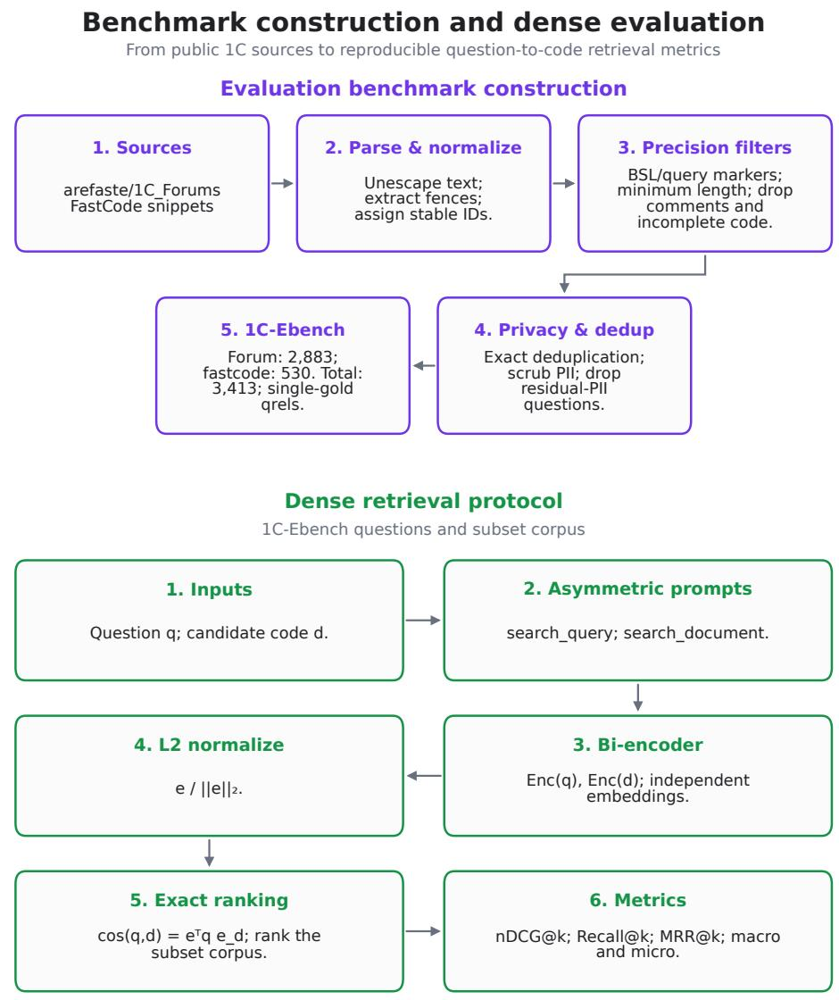
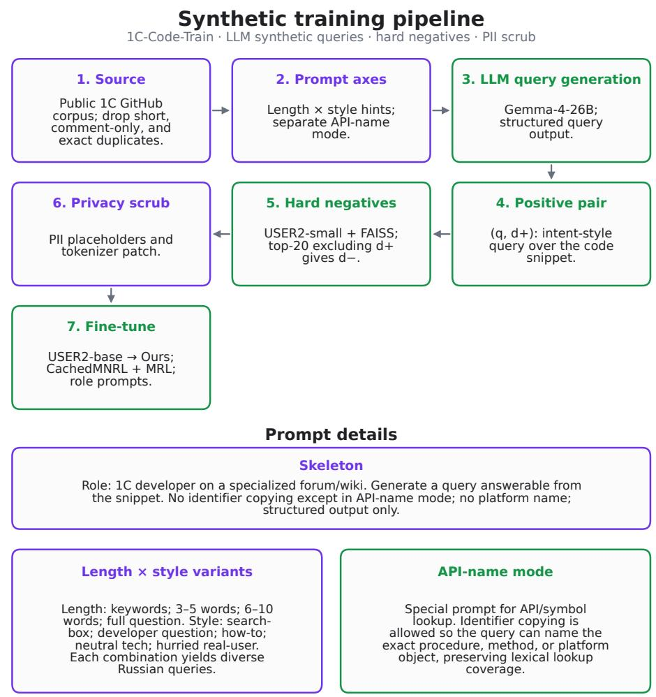
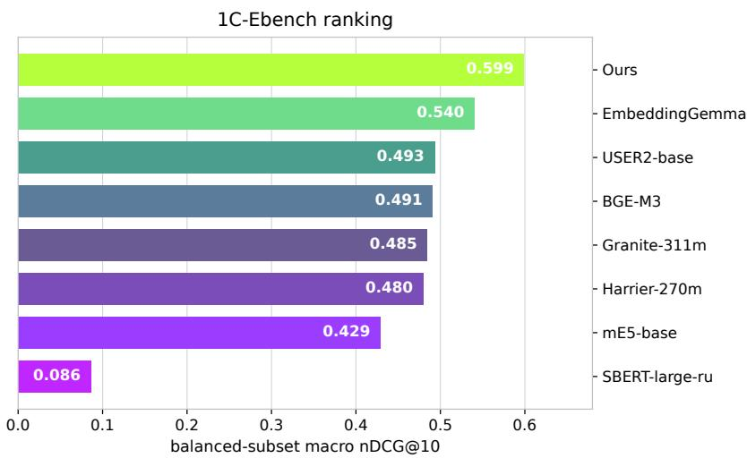
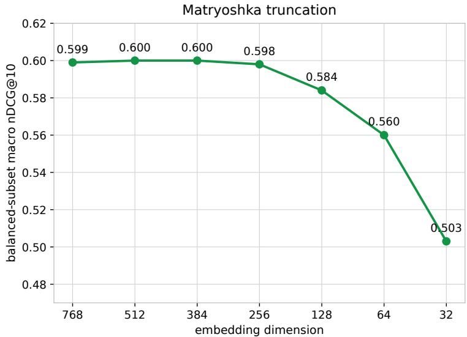

# Natural Language Code Retrieval for 1C:Enterprise: An Open Benchmark and Eficient Bi-Encoder

Konstantin Chesnokov1[0009−0007−0162−9344]\* and Chingiz Mingazov2[0009−0006−1744−0207]

1 Independent Researcher, Moscow, Russia konstphx@gmail.com \*Corresponding author 2 Independent Researcher, Kazan, Russia

Abstract. Natural language code retrieval is a rapidly evolving task in computer science. However, the 1C:Enterprise ecosystem combines Russian syntax with highly domain-specific terminology, for which open datasets and specialized models have been virtually non-existent. We present a comprehensive pipeline for 1C code retrieval: an open benchmark of 3,413 real-world, PII-scrubbed query–code pairs, a reproducible evaluation harness, and a specialized bi-encoder. To overcome scarce labeled data, we fine-tune on 784,057 synthetic triplets generated by google/gemma-4-26B-A4B-it from public code repositories, using Matryoshka Representation Learning (MRL) and a privacy-aware tokenizer. Because the benchmark subsets difer in size, we report balancedsubset macro, query-weighted micro, and forum-only results. Our model reaches 0.5992 balanced macro nDCG@10, 0.5044 micro, and 0.4617 on forum, versus 0.4932 macro for the baseline architecture and 0.5404 for google/embeddinggemma-300m. Removing every benchmark example flagged by the conservative exact/13-gram overlap audit leaves 0.6011 balanced macro (0.5010 micro), indicating that detected train–benchmark overlap does not explain the headline result. MRL truncation to 256 dimensions preserves 99.9% of retrieval quality while reducing dense-index storage and exact similarity arithmetic by a factor of three.

Keywords: Code retrieval · 1C:Enterprise · BSL · Dense retrieval · Benchmark · Matryoshka embeddings

## 1 Introduction

Natural-language code retrieval ranks code fragments in response to a text query. For popular languages, sizeable datasets and trained retrievers exist; for 1C:Enterprise, open retrieval infrastructure has been scarce despite its role in Russian-speaking enterprise software.

The 1C domain difers from typical English-language code search. Queries are often Russian and may describe errors, platform objects, reports, registries, or accounting operations; relevant documents are BSL or 1C query fragments that mix Cyrillic keywords, Russian identifiers, SQL-like clauses, and business terminology. Without a domain benchmark, it is hard to tell whether general multilingual embeddings sufice or domain adaptation is needed.

We formulate the task as single-stage dense closed-set retrieval, where queries and documents are represented by learned continuous vectors and ranked by vector similarity. Given a corpus $D = \{ d _ { 1 } , \ldots , d _ { n } \}$ and query $q ,$ the system ranks documents so that the labeled relevant fragment $d ^ { + }$ ranks as high as possible. A bi-encoder embeds queries and documents independently:

$$
{ \bf e } _ { q } = \mathrm { E n c } \big ( q ; \mathrm { ~ } \mathrm { s e a r c h \mathrm { _ - q u e r y } } \big ) ,
$$

$$
\begin{array} { r } { \mathbf { e } _ { d } = \operatorname { E n c } \big ( d ; \mathsf { s e a r c h \_ d o c u m e n t } \big ) , } \end{array}\tag{1}
$$

and scores them by cosine similarity (an inner product after L2 normalization):

$$
\operatorname { s c o r e } ( q , d ) = \cos ( \mathbf { e } _ { q } , \mathbf { e } _ { d } ) .\tag{2}
$$

This work establishes a starting point for 1C retrieval. We do not propose a new architecture or loss; we contribute a benchmark, evaluation protocol, training resource, contamination audit, and reference domain model.

The main contributions are:

1. PruhaNLP/1C-Ebench, an open benchmark for retrieving 1C/BSL code from Russian questions (3,413 pairs; subsets forum and fastcode).

2. PruhaNLP/1C-Code-Train, 784,057 synthetic triplets $( q , d ^ { + } , d ^ { - } )$ with PII scrubbing.

3. PruhaNLP/1C-RB, a reproducible evaluation harness for dense models and BM25Okapi.

4. A train–benchmark contamination audit (exact match and 13-gram); no exact duplicate pairs.

5. A reference baseline suite and PruhaNLP/USER2-1C-code, a domain-adapted bi-encoder with Matryoshka truncation that improves over deepvk/USER2-b ase and strong multilingual embeddings.

## 2 Related Work

## 2.1 Code Retrieval Benchmarks

CodeSearchNet [12] introduced a large corpus and challenge for semantic code search over six mainstream languages. CoSQA [10] moved closer to real search with web queries. CodeXGLUE [19] aggregated program-understanding tasks, including code search. CoIR [18] covers text-to-code, code-to-code, and hybrid retrieval, while CodeRAG-Bench [25] evaluates retrieval for code generation. These resources cover widely used languages, but not 1C:Enterprise or Russian questions to BSL/1C query code.

## 2.2 1C:Enterprise Evaluation Resources

Open 1C evaluation has focused mainly on generation rather than retrieval. The 1C Code Bench leaderboard [8] evaluates BSL function generation with compilation and correctness metrics; PRISM/GenLab-1C develops executable BSL evaluation along similar lines [7]. These resources are complementary to PruhaNLP/1C-Ebench: they ask whether a model can write 1C code, whereas we ask whether an embedding model can find a relevant fragment from a Russian query.

## 2.3 Multilingual and Cross-lingual Retrieval Context

Non-English software-engineering resources are increasingly needed as opensource collaboration becomes more multilingual [2]. PruhaNLP/1C-Ebench is not a classic cross-language information retrieval (CLIR) benchmark, because queries and much of the code vocabulary are Russian or Cyrillic-heavy rather than two separated natural languages; it still shares CLIR’s alignment problem of matching intent in one form to artifacts in another [9]. Downstream, domain code retrievers can help retrieval-augmented code generation [28]; PruhaNLP/1C-Ebench can serve as a first-stage testbed for 1C. Generative retrieval and multilingual semantic compression [11] are complementary future directions.

## 2.4 Dense Retrieval, BM25, and Compact Embeddings

Dense passage retrieval popularized scalable dual encoders [14]. BM25 remains a strong lexical baseline when exact API names or error strings matter [23]. Hard negatives from top-ranked candidates strengthen dense training [26,22]; code-search work also studies false-negative risk [17,6]. Hybrid BM25+dense fusion via RRF [4] helps only when the lexical channel is complementary.

General multilingual embeddings such as deepvk/USER2-base, deepvk/USE R-bge-m3, intfloat/multilingual-e5-base, google/embeddinggemma-300m, and ibm-granite/granite-embedding-311m-multilingual-r2 are useful baselines but are not optimized for Russian questions paired with 1C code. Pr uhaNLP/USER2-1C-code follows the deepvk/USER2-base sentence-transformers pipeline with Cached Multiple Negatives Ranking Loss and Matryoshka Representation Learning (MRL) for compact prefix embeddings—the first m dimensions of the full embedding—at inference [15].

## 2.5 Synthetic Queries and LLM-as-a-Judge

When labeled query–code pairs are scarce, training often relies on synthetic queries, as in parts of CoIR. Quality is commonly screened with LLM-as-a-judge protocols [27]. Strong judges can agree with humans after bias mitigation on chat tasks, but this does not imply expert agreement in specialized domains; we therefore treat LLM-judge scores as an approximate signal, not ground truth.

## 3 Benchmark and Evaluation Protocol

## 3.1 Resource Stack

Table 1 summarizes the resource stack. The public benchmark, evaluation harness, and model are linked through their canonical Hugging Face and GitHub identifiers. They enable comparisons without access to private 1C systems. Provenance and upstream license metadata are preserved; we make no stronger claim about compatibility of all upstream licenses and exclude proprietary 1C platform distributions.

Table 1. Public resource stack.
<table><tr><td>Component</td><td>Content</td><td>Scale</td></tr><tr><td>PruhaNLP/1C-Ebench</td><td>Test pairs: question → code, subsets forum/fastcode</td><td>3,413 pairs</td></tr><tr><td>PruhaNLP/1C-RB</td><td>Evaluation harness: dense, BM25, metrics CLI/Python</td><td></td></tr><tr><td>PruhaNLP/1C-Code-Train Triplets</td><td> $( q , d ^ { + } , d ^ { - } )$  with PII scrubbing</td><td>784,057 triplets</td></tr><tr><td></td><td>PruhaNLP/USER2-1C-code Domain-adapted reference bi-encoder</td><td>768d, MRL</td></tr></table>

## 3.2 The PruhaNLP/1C-Ebench Benchmark

PruhaNLP/1C-Ebench is built from real 1C questions and solutions rather than synthetic queries. The main source is the public Hugging Face dataset arefaste/1C\_Forums (19,041 records) [1]. We extract Markdown code fences from solution and apply precision-first filters for BSL or 1C query fragments.

The benchmark-construction branch in Figure 1 summarizes the preparation pipeline: source records are normalized, candidate code is extracted, precision-first validity filters and exact deduplication are applied, and the remaining examples undergo privacy processing. In code, PII is replaced by placeholders such as [EMAIL], [PHONE], [IP], [PATH], [PERSON], and [REDACTED]. Questions are not edited: residual PII triggers removal of the example. The scrubber is a rule-based, precision-oriented risk-reduction step over common surface forms, not a formal de-identification guarantee; we do not report PII detection precision/recall or a residual manual privacy audit.

The final benchmark has 3,413 examples in two subsets (Table 2). Each example has id, question, and code. Within a subset, the corpus is all code fields and relevance matches id. The query relevance judgments (qrels) assign one binary gold document to each query. Thus, the protocol is closed-set retrieval with a single gold; this can underestimate quality when an unannotated alternative ranks above gold.

Table 2. PruhaNLP/1C-Ebench subsets.
<table><tr><td>Subset</td><td>Queries Share Source</td><td>Characterization</td></tr><tr><td>forum</td><td></td><td>2,883 84.5% Forum discussions Long questions, context, errors, in- line code</td></tr><tr><td>fastcode</td><td></td><td>530 15.5% Snippet catalog Short queries, long ready-to-use snippets</td></tr><tr><td>Total</td><td>3,413 100%-</td><td>Closed-set, single-gold qrels</td></tr></table>

## 3.3 Evaluation Harness

PruhaNLP/1C-RB loads PruhaNLP/1C-Ebench and builds corpus, queries, and qrels. The dense-retrieval branch in Figure 1 shows the complete evaluation pipeline: asymmetric query/document prompting, independent bi-encoder inference, L2 normalization, exact cosine ranking over the subset corpus, and computation of nDCG@k, Recall@k, and MRR@k.

The headline metric is nDCG@10 for binary single-relevant qrels. Recall@k is 1 if $d ^ { + }$ is in the top k; MRR@k is $1 / \mathrm { r a n k } ( d ^ { + } )$ if that rank is $\leq k .$ else 0. Let sforum and $S _ { \mathrm { f a s t c o d e } }$ denote the subset scores. The balanced-subset macro average assigns equal weight to the two retrieval regimes, macro $= { \textstyle { \frac { 1 } { 2 } } } ( s _ { \mathrm { f o r u m } } + s _ { \mathrm { f a s t c o d e } } )$ 2 while micro-average weights by query volume $( n _ { \mathrm { f o r u m } } = 2 8 8 3 , n _ { \mathrm { f a s t c o d e } } = 5 3 0 )$ . Thus, macro intentionally gives fastcode 50% weight despite its 15.5% query share; it estimates regime-balanced rather than random-query performance. We report query-weighted micro and per-subset scores alongside macro.

## 3.4 Train–Benchmark Contamination Audit

PruhaNLP/1C-Code-Train and PruhaNLP/1C-Ebench come from diferent sources: synthetic LLM queries over public GitHub 1C code versus real forum/FastCode questions. We still audit overlap with criteria from contamination studies. Dodge et al. [5] distinguish input-only, label-only, and input-and-label matches after normalization; Brown et al. [3] use a conservative word N-gram dirty flag. Our protocol applies NFKC, lowercasing, whitespace collapsing, exact matching on code/question/pairs, and 13-gram dirty flags (Table 3).

Under the strict exact-pair criterion, no train–benchmark duplicate pairs remain, and fastcode has no exact code matches. Its 22.83% dirty rate decomposes into 14.15% label-only, 6.60% input-only, and 2.08% input-and-label cases. All 46 exact-question matches in fastcode contain at most 12 words and are generic catalog-style titles, such as “Copy an array” or “Path to a file.” For texts shorter than 13 tokens, the conservative 13-gram criterion compares the entire text; consequently, the 8.68% question 13-gram rate identifies the same short questions as exact matching rather than an additional disjoint set. The higher fastcode overlap therefore largely reflects short query templates and recurring BSL boilerplate.

  
Reproducible public evaluation in PruhaNLP/1C-RB  
Fig. 1. Construction of the public PruhaNLP/1C-Ebench benchmark and the denseretrieval evaluation pipeline implemented in PruhaNLP/1C-RB.

Table 3. Train–benchmark overlap audit.
<table><tr><td>Metric</td><td>forum fastcode</td><td>all</td></tr><tr><td>Exact match: code</td><td>0.10%</td><td>0.00% 0.09%</td></tr><tr><td>Exact match: question</td><td>0.03%</td><td>8.68%1.38%</td></tr><tr><td>Exact match: pair</td><td>0.00%</td><td>0.00% 0.00%</td></tr><tr><td>13-gram overlap: code</td><td>6.24%</td><td>16.23%7.79%</td></tr><tr><td>13-gram overlap: question 0.03%</td><td></td><td>8.68% 1.38%</td></tr><tr><td>Input-only</td><td>0.03%</td><td>6.60% 1.05%</td></tr><tr><td>Label-only</td><td>6.24%</td><td>14.15%7.47%</td></tr><tr><td>Input-and-label</td><td>0.00%</td><td>2.08%0.32%</td></tr><tr><td>Any 13-gram dirty flag</td><td>6.28%</td><td>22.83%8.85%</td></tr></table>

## 4 Domain Adaptation: PruhaNLP/USER2-1C-code

## 4.1 Model

PruhaNLP/USER2-1C-code is a fine-tuned deepvk/USER2-base sentencetransformers bi-encoder with mean pooling and cosine scoring. Asymmetric prompts use diferent role-specific templates for queries and documents. Their names are search\_query and search\_document (Table 4).

We selected deepvk/USER2-base because it combines a strong Russian retrieval prior with practical fine-tuning. The 149M-parameter model, developed by DeepVK as a Universal Sentence Encoder for Russian, is based on deepvk /RuModernBERT-base and supports contexts up to 8,192 tokens. Its published training pipeline comprises retrieval-oriented RetroMAE pretraining, weakly supervised English–Russian transfer, 50 million pairs mined from the Russian cultura\_ru\_edu corpus, and supervised tuning on 4.3 million examples that include multiple Russian retrieval datasets. Its moderate size and sentencetransformers interface make domain adaptation substantially more tractable than fine-tuning a large generative model.

Table 4. PruhaNLP/USER2-1C-code configuration.
<table><tr><td>Parameter</td><td>Value</td></tr><tr><td>Base model</td><td>deepvk/USER2-base</td></tr><tr><td>Architecture</td><td>ModernBERT/RuModernBERT sentence-transformers encoder</td></tr><tr><td>Embedding dimension</td><td>768</td></tr><tr><td colspan="2">Maximum sequence length 8,192</td></tr><tr><td>Pooling</td><td>Mean pooling</td></tr><tr><td>Similarity</td><td>Cosine over L2-normalized embeddings</td></tr><tr><td>MRL dimensions</td><td>768, 512, 384, 256, 128, 64, 32</td></tr></table>

For anonymized data we apply a privacy-aware tokenizer patch: [PATH]/ [PERSON] map to [unused0]/[unused1]; email/phone/IP placeholders use special USER2 tokens; new-token embeddings are initialized from the mean of corresponding subtokens.

## 4.2 Training Data

With no open supervised 1C retrieval set available, we build PruhaNLP/1C-C ode-Train as a synthetic closed loop from public code to contrastive triplets (Figure 2). The design goal is coverage of both intent-style Russian questions and lexical API lookup, without turning the generator into a verbatim copier of identifiers.

Prompting is treated as a controlled sampling axis rather than a single fixed template: length and style hints diversify surface form, while a separate API-name mode deliberately allows identifier copying for symbol search. The remaining stages—hard-negative mining, privacy scrubbing, and USER2-style fine-tuning—are standard dense-retrieval engineering; Figure 2 makes their order explicit.

The source is the public Hugging Face corpus leongl/1c\_github (3,038,637 lines) [16]; after filtering short, comment-only, and duplicate fragments, 784,058 unique documents remain. For each document, google/gemma-4-26B-A4B - it emits a Russian query as structured output. We mine hard negatives with deepvk/USER2-small using FAISS IndexFlatIP [13]. Specifically, $d ^ { - } =$ $\begin{array} { r } { \arg \operatorname* { m a x } _ { d \in \mathrm { T o p } - 2 0 \left( q \right) \backslash \left\{ d + \right\} } \cos ( \mathbf { e } _ { q } , \mathbf { e } _ { d } ) } \end{array}$ . Top hard negatives are standard [14,26,22] but risk false negatives from near duplicates or alternative solutions [22,17]; we do not estimate the FN rate in PruhaNLP/1C-Code-Train. These two counts are not the same quantity: 784,058 is the filtered unique-document corpus, while 784,057 is the number of retained $( q , d ^ { + } , d ^ { - } )$ triplets after synthetic query generation (one filtered document does not yield a retained pair). PII anonymization changes 2,488 cells (≈ 0.106%).

## 4.3 Synthetic Query Quality

We score a random sample of 300 triplets (seed 42) with google/gemini-3.1-pro -preview via OpenRouter [21], chosen because Gemini 3 Pro is strong on 1C Code Bench generation—an indirect, domain-relevant argument that is not the same as developer agreement on query quality. The judge rates relevance, naturalness, and clarity from 1 to 5 (Table 5); we treat the scores as an approximate usability signal, not human validation.

## 4.4 Objective and Hyperparameters

We follow the training recipe of deepvk/USER2-base. The objective is ${ \mathcal { L } } =$ MatryoshkaLoss(CachedMNRL): InfoNCE [20] with one hard negative and inbatch negatives, summed over MRL prefixes {768, 512, 384, 256, 128, 64, 32}. We

  
Fig. 2. Construction of PruhaNLP/1C-Code-Train: from filtered public 1C code to synthetic queries, hard-negative triplets, PII scrubbing, and fine-tuning of PruhaNLP/U SER2-1C-code.

Table 5. LLM-as-a-judge scores for 300 synthetic query–code pairs.
<table><tr><td>Criterion</td><td colspan="3">Mean Median Share ≥ 4</td></tr><tr><td>Relevance</td><td>4.33</td><td>5</td><td>82.0%</td></tr><tr><td>Naturalness</td><td>4.17</td><td>5</td><td>76.3%</td></tr><tr><td>Clarity</td><td>4.37</td><td>5</td><td>82.0%</td></tr></table>

keep this recipe for USER2 compatibility and Matryoshka truncation; the domain gain below is attributed to fine-tuning on PruhaNLP/1C-Code-Train, not to a novel loss (Table 6).

Table 6. Training hyperparameters.
<table><tr><td>Parameter</td><td>Value</td></tr><tr><td>Training samples</td><td>784,057 triplets</td></tr><tr><td>Batch size / MNRL mini-batch 256 / 32</td><td></td></tr><tr><td>Epochs / steps</td><td> $^ { 3 } \ / \ 9 , 1 8 9$ </td></tr><tr><td>Learning rate</td><td> $2 \times 1 0 ^ { - 5 }$ </td></tr><tr><td>LR schedule</td><td>5% cosine warmup + decay</td></tr><tr><td>Max sequence length / precision 8,192 / FP16 Seed / hardware / runtime</td><td>42 / A100 / ≈ 7.5 h</td></tr></table>

## 5 Experimental Setup

Dense Models. We compare sentence-transformers-compatible models with fixed prompts (Table 7) under one PruhaNLP/1C-RB protocol, without exhaustive per-baseline tuning.

Table 7. Dense baselines and prompts. Empty means no prompt prefix.
<table><tr><td>Model</td><td>Query prompt</td><td>Document prompt</td></tr><tr><td>PruhaNLP/USER2-1C-code</td><td>search_query</td><td>search_document</td></tr><tr><td>deepvk/USER2-base</td><td>search_query</td><td>search_document</td></tr><tr><td>google/embeddinggemma-300m</td><td>query</td><td>document</td></tr><tr><td>deepvk/USER-bge-m3</td><td>empty</td><td>empty</td></tr><tr><td>ibm-granite/granite-embedding-311m-multilingual-r2</td><td>query</td><td>document</td></tr><tr><td>microsoft/harrier-oss-v1-270m</td><td>web_search_query empty</td><td></td></tr><tr><td>intfloat/multilingual-e5-base</td><td>query:</td><td>passage:</td></tr><tr><td>ai-forever/sbert_large_nlu_ru</td><td>empty</td><td>empty</td></tr></table>

Lexical Baseline. BM25Okapi uses $k _ { 1 } = 1 . 2 , b = 0 . 7 5$ , and identical Unicode tokenization re.findall $( \underline { { { \bf r } } } " \setminus \bar { \bf w } ^ { + 1 1 }$ , text.lower()) for queries and documents, with exact ranking over each subset corpus in PruhaNLP/1C-RB.

Hybrid RRF. We fuse BM25 and dense top-100 ranks with Reciprocal Rank Fusion $\begin{array} { r } { ( k _ { \mathrm { R R F } } = 6 0 ) \colon \mathrm { R R F } ( q , d ) = \sum _ { m \in \{ \mathrm { B M 2 5 , d e n s e } \} } 1 / ( k _ { \mathrm { R R F } } + \mathrm { r a n k } _ { m } ( q , d ) ) } \end{array}$ .

## 6 Results

## 6.1 Main Leaderboard

Figure 3 and Table 8 show the main nDCG@10 leaderboard. PruhaNLP/USER2-1 C-code obtains the best balanced-subset macro, 0.5992, while also ranking first under query-weighted micro (0.5044) and on forum alone (0.4617). Its macro gain is 0.106 over deepvk/USER2-base and 0.0588 over google/embeddinggemm a-300m.

  
Fig. 3. nDCG@10 leaderboard on PruhaNLP/1C-Ebench (balanced-subset macro).

Table 8. nDCG@10 leaderboard on PruhaNLP/1C-Ebench.
<table><tr><td>Rank Model</td><td>forum fastcode</td><td>macro</td></tr><tr><td>1 PruhaNLP/USER2-1C-code</td><td>0.4617</td><td>0.73660.5992 0.5044</td></tr><tr><td>2 google/embeddinggemma-300m</td><td>0.3720</td><td>0.7080 0.5404 0.4242</td></tr><tr><td>3 deepvk/USER2-base</td><td>0.3670</td><td>0.6190 0.4932 0.4061</td></tr><tr><td>4 deepvk/USER-bge-m3</td><td>0.3430</td><td>0.6390 0.4910 0.3890</td></tr><tr><td>5 ibm-granite/granite-embedding-311m-multilingual-r2</td><td>0.3190</td><td>0.65100.48460.3706</td></tr><tr><td>6 microsoft/harrier-oss-v1-270m</td><td>0.3230</td><td>0.6360 0.4796 0.3716</td></tr><tr><td>7 intfloat/multilingual-e5-base</td><td>0.3070</td><td>0.55100.4290 0.3449</td></tr><tr><td>8 ai-forever/sbert_large_nlu_ru</td><td>0.0940</td><td>0.0790 0.0862 0.0917</td></tr><tr><td>- BM25Okapi</td><td>0.2865</td><td>0.3334 0.3099 0.2938</td></tr><tr><td>- RRF(BM25 + PruhaNLP/USER2-1C-code)</td><td>0.4000</td><td>0.4600 0.4300 0.4093</td></tr><tr><td>- RRF(BM25 + deepvk/USER2-base)</td><td>0.3620</td><td>0.4195 0.3908 0.3709</td></tr></table>

BM25Okapi lags strong dense models, suggesting lexical overlap is insuficient for many Russian-to-BSL queries. Untuned RRF hurts both dense systems, reducing balanced macro nDCG@10 from 0.5992 to 0.4300 for PruhaNLP/USER2 -1C-code and from 0.4932 to 0.3908 for deepvk/USER2-base, with the largest drop on fastcode. A likely cause is weak lexical complementarity under naive \w+ tokenization, which poorly isolates BSL identifiers and error strings. These results are for the tested untuned RRF setup and do not rule out stronger hybrids.

Table 9 gives full @10 metrics for PruhaNLP/USER2-1C-code and BM25. forum is harder: longer contextual questions and single-gold qrels can penalize unannotated alternatives.

Table 9. Full @10 metrics for the reference dense model and BM25.
<table><tr><td>System</td><td>Subset</td><td>nDCG@10 Recall@10 MRR@10</td><td></td><td></td></tr><tr><td>PruhaNLP/USER2-1C-code forum</td><td></td><td>0.4617</td><td>0.6008</td><td>0.4178</td></tr><tr><td>PruhaNLP/USER2-1C-code fastcode</td><td></td><td>0.7366</td><td>0.9208</td><td>0.6774</td></tr><tr><td>BM25Okapi</td><td>forum</td><td>0.2865</td><td>0.3479</td><td>0.2670</td></tr><tr><td>BM25Okapi</td><td>fastcode</td><td>0.3334</td><td>0.4189</td><td>0.3067</td></tr></table>

## 6.2 Controlled Comparisons

Domain Adaptation. Comparing deepvk/USER2-base and PruhaNLP/USER2 -1C-code under the same architecture and prompts yields +0.106 balanced macro nDCG@10. Paired bootstrap over queries (10,000 resamples, stratified by subset) gives 95% CI [0.087, 0.125] and one-sided $P ( \varDelta \leq 0 ) < 0 . 0 0 1$ (Table 10). Against google/embeddinggemma-300m, the balanced macro diference is +0.0588, with 95% CI [0.042, 0.075] and one-sided $P ( A \leq 0 ) < 0 . 0 0 1$ . The same table shows untuned RRF vs. dense-only: significantly worse for PruhaNLP/USER2-1C-code on both subsets and for deepvk/USER2-base on fastcode.

Table 10. Paired-bootstrap nDCG@10 comparisons.
<table><tr><td>Comparison</td><td>∆ 95%CI / P</td></tr><tr><td>Macro: Ours vs. USER2-base</td><td>+0.106 [0.087, 0.125], P &lt; 0.001</td></tr><tr><td>Macro: Ours vs. EmbeddingGemma</td><td>+0.0588 [0.042, 0.075], P &lt; 0.001</td></tr><tr><td>RRF vs. dense (Ours), forum</td><td>−0.062 [−0.075, −0.049], P &lt; 0.05</td></tr><tr><td>RRF vs. dense (Ours), fastcode</td><td>−0.277 [−0.319, −0.234], P &lt; 0.05</td></tr><tr><td>RRF vs. dense (Base), forum</td><td>-0.005 [−0.016, 0.006], n.s.</td></tr><tr><td>RRF vs. dense (Base), fastcode</td><td>−0.200 [−0.237, −0.164], P &lt; 0.05</td></tr></table>

Contamination Sensitivity. We recompute nDCG@10 after removing every example flagged by the conservative audit through an exact or 13-gram overlap in either the question or code. On the resulting clean subsets, PruhaNLP/USER2 -1C-code scores 0.4653 on forum (n = 2702) and 0.7369 on fastcode (n = 409), giving 0.6011 balanced macro and 0.5010 query-weighted micro. The original fastcode score is 0.7366, compared with 0.7356 on flagged examples, 0.7359 after excluding exact-question matches, and 0.7357 after excluding input-and-label cases. Thus, the high fastcode score is stable under all tested exclusions. For comparison, google/embeddinggemma-300m decreases from 0.7084 to 0.6903 on clean-only fastcode; the clean-only margin of PruhaNLP/USER2-1C-code is therefore larger, not smaller.

## 6.3 Qualitative Examples

Fine-tuning helps when a query uses 1C platform vocabulary whose gold answer is a specific metadata or UI API rather than a shared lexical token. It can still fail on out-of-domain COM utilities and on short underspecified titles, where general multilingual encoders recover via surface cues. Table 11 shows two wins (PruhaNLP/USER2-1C-code at rank 1; every dense baseline in Table 7 and BM25 outside the top 10) and two failures.

Table 11. Qualitative wins and failures (original Russian query/code). Gold rank: 1 = best; >10 = outside top-10.
<table><tr><td>Type / ranks</td><td>Query, gold, interpretation</td></tr><tr><td>Win (forum) Ours 1; others &gt;10</td><td>Q:    Φ    ,    Φ? Gld:  =  ; . . . FO× dynamic-list pattern; little lexical overlap with gold.</td></tr><tr><td>Win (fastcode) Ours 1; others &gt;10</td><td>Q:     Gld: 90 =  (&quot;&quot;,, (90)); Colloquial «ocae cpok» → type API; lexical baselines</td></tr><tr><td>Fail (fastcode) Ours &gt;10; base 1</td><td>miss it. Q:   Gold: Voice = HoBûié COMObject(&quot;SAPI.SpVoice&quot;); Voice.Speak(&quot;Ipe!&quot;);</td></tr><tr><td>Fail (fastcode) Ours 32; base 1</td><td>Rare COM API; general models recover Speak/SAPI. Q:   Gld:  =  (9); . . . Base64.</td></tr></table>

## 6.4 Matryoshka Truncation

MRL truncates a trained embedding to a prefix $\mathbf { e } ^ { ( m ) } = \mathbf { e } _ { 1 : m }$ and re-normalizes. Figure 4 and Table 12 show that 256-d embeddings retain 99.9% of 768-d nDCG@10 at one third the dense-index size. Because cosine similarity between L2-normalized embeddings is a d-dimensional dot product, reducing d from 768 to 256 also cuts the per-comparison multiply–add count by a factor of three, yielding a corresponding theoretical 3× speedup in exact similarity scoring; end-to-end retrieval latency is not measured here.

  
Fig. 4. Matryoshka truncation: balanced-subset macro nDCG@10 by embedding dimension.

Table 12. MRL truncation on PruhaNLP/1C-Ebench.
<table><tr><td colspan="4">Dimension m macro nDCG@10 Retention Relative index size</td></tr><tr><td>768</td><td>0.599</td><td>100.0%</td><td>1.00×</td></tr><tr><td>512</td><td>0.600</td><td>100.0%</td><td>0.67×</td></tr><tr><td>384</td><td>0.600</td><td>100.0%</td><td>0.50×</td></tr><tr><td>256</td><td>0.598</td><td>99.9%</td><td>0.33×</td></tr><tr><td>128</td><td>0.584</td><td>97.5%</td><td>0.17×</td></tr><tr><td>64</td><td>0.560</td><td>93.5%</td><td>0.08×</td></tr><tr><td>32</td><td>0.503</td><td>83.9%</td><td>0.04×</td></tr></table>

## 7 Limitations and Future Work

Single-Gold Qrels. PruhaNLP/1C-Ebench has exactly one gold document per query. On forum data this can underestimate quality when alternatives exist. In a manual check of 50 queries (25 per subset, seed 42), top-10 mined neighbors contained multiple relevant fragments in 5 cases (10%), mostly near duplicates or equivalent recipes. Incomplete judgments are well known in IR (e.g., BEIR [24]) and also afect hard-negative mining; we neither estimate FN rate nor denoise in this version.

Synthetic Data and Judge Validation. Synthetic query quality is screened with an LLM judge on 300 examples, without human–AI agreement in the specialized Russian-to-BSL domain. Scores are a useful signal but not expert annotation.

Privacy and Licensing. PII scrubbing is rule-based over common surface patterns without measured precision/recall or a residual audit. License metadata and provenance are documented, but we do not resolve every redistribution implication of heterogeneous upstream sources.

Experimental Coverage. We do not evaluate rerankers, multi-seed variance, hard-vs-random negatives, tokenizer-patch ablations, ANN indexes, or latency at larger scale. The train–benchmark domain gap remains, and n-gram contamination misses semantic paraphrases. Future work includes multi-gold qrels, human query judging, FN denoising, tuned hybrids/rerankers, and targeted ablations.

## 8 Conclusion

We presented an open stack for retrieving 1C:Enterprise code from Russian queries: PruhaNLP/1C-Ebench, PruhaNLP/1C-RB, PruhaNLP/1C-Code-Train, and reference bi-encoder PruhaNLP/USER2-1C-code. The resources provide a reproducible basis for a domain largely absent from open code-search benchmarks.

Domain adaptation matters: PruhaNLP/USER2-1C-code reaches 0.5992 balanced macro nDCG@10, 0.5044 query-weighted micro, and 0.4617 on forum, beating deepvk/USER2-base by 0.106 and google/embeddinggemma-300m by 0.0588 in balanced macro under paired bootstrap. Removing every exact/13-gramflagged example leaves 0.6011 balanced macro (0.5010 micro), while clean-only fastcode remains 0.7369; detected overlap therefore does not explain the headline result. Dense retrieval also substantially beats BM25Okapi, while naive RRF helps neither PruhaNLP/USER2-1C-code nor deepvk/USER2-base in the tested setup. Matryoshka truncation to 256-d preserves 99.9% quality at roughly one third storage and similarity arithmetic.

Disclosure of Interests. The authors have no competing interests to declare that are relevant to the content of this article.

## References

1. arefaste: Arefaste: Parsed dataset for 1c from popular forums. https://huggingf ace.co/datasets/arefaste/1C\_Forums (2025), accessed: 2026-07-12

2. Bhuiyan, M.H.M., Kumar, M.K.B., Staicu, C.A.: “write in english, nobody understands your language here”: A study of non-english trends in open-source repositories. CoRR abs/2602.19446 (2026), https://arxiv.org/abs/2602.19446

3. Brown, T.B., Mann, B., Ryder, N., Subbiah, M., Kaplan, J., Dhariwal, P., et al.: Language models are few-shot learners. In: Advances in Neural Information Processing Systems. vol. 33, pp. 1877–1901 (2020), https://arxiv.org/abs/2005.14165

4. Cormack, G.V., Clarke, C.L.A., Buettcher, S.: Reciprocal rank fusion outperforms condorcet and individual rank learning methods. In: Proceedings of the 32nd International ACM SIGIR Conference on Research and Development in Information Retrieval. pp. 758–759 (2009). https://doi.org/10.1145/1571941.1572114

5. Dodge, J., Sap, M., Marasović, A., Agnew, W., Ilharco, G., Groeneveld, D., et al.: Documenting large webtext corpora: A case study on the colossal clean crawled corpus. In: Proceedings of the 2021 Conference on Empirical Methods in Natural Language Processing. pp. 1286–1305 (2021). https://doi.org/10.18653/v1/2021 .emnlp-main.98

6. Fan, Y., Li, C., Ge, J., Huang, L., Luo, B.: Efective hard negative mining for contrastive learning-based code search. ACM Transactions on Software Engineering and Methodology 34(3), 1–35 (2025). https://doi.org/10.1145/3695994

7. GenLab-1C: PRISM: Executable BSL code generation benchmark for 1C:Enterprise. https://github.com/genlab-1c/prism (2026), accessed: 2026-07-12

8. GigaCode R&D, Sber AI: 1C Code Bench: A benchmark for evaluating the ability of LLMs to write 1C code. Habr, https://habr.com/ru/companies/sberbank/a rticles/1040114/ (2026), in Russian. Accessed: 2026-08-18

9. Goworek, R., Macmillan-Scott, O., Özyiğit, E.B.: Bridging language gaps: Advances in cross-lingual information retrieval with multilingual llms. CoRR abs/2510.00908 (2025), https://arxiv.org/abs/2510.00908

10. Huang, J., Tang, D., Shou, L., Gong, M., Xu, K., Jiang, D., et al.: CoSQA: 20,000+ web queries for code search and question answering. In: Proceedings of the 59th Annual Meeting of the Association for Computational Linguistics and the 11th International Joint Conference on Natural Language Processing (Volume 1: Long Papers). pp. 5690–5700 (2021). https://doi.org/10.18653/v1/2021.acl-long. 442

11. Huang, Y., Wu, S., Song, R., Xiang, Y., Xian, Y., Gao, S., et al.: Multilingual generative retrieval via cross-lingual semantic compression. CoRR abs/2510.07812 (2025), https://arxiv.org/abs/2510.07812

12. Husain, H., Wu, H.H., Gazit, T., Allamanis, M., Brockschmidt, M.: CodeSearchNet challenge: Evaluating the state of semantic code search. CoRR abs/1909.09436 (2019), https://arxiv.org/abs/1909.09436

13. Johnson, J., Douze, M., Jégou, H.: Billion-scale similarity search with GPUs. IEEE Transactions on Big Data 7(3), 535–547 (2021). https://doi.org/10.1109/TBDA TA.2019.2921572

14. Karpukhin, V., Oguz, B., Min, S., Lewis, P., Wu, L., Edunov, S., et al.: Dense passage retrieval for open-domain question answering. In: Proceedings of the 2020 Conference on Empirical Methods in Natural Language Processing (EMNLP). pp. 6769–6781 (2020). https://doi.org/10.18653/v1/2020.emnlp-main.550

15. Kusupati, A., Bhatt, G., Rege, A., Wallingford, M., Sinha, A., Ramanujan, V., et al.: Matryoshka representation learning. In: Advances in Neural Information Processing Systems. vol. 35, pp. 30233–30249 (2022), https://arxiv.org/abs/2205.13147

16. leongl: 1c\_github: 1c code corpus from GitHub. https://huggingface.co/datas ets/leongl/1c\_github (2024), accessed: 2026-07-12

17. Li, H., Zhou, X., Tuan, L.A., Miao, C.: Rethinking negative pairs in code search. In: Proceedings of the 2023 Conference on Empirical Methods in Natural Language Processing. pp. 12760–12774 (2023). https://doi.org/10.18653/v1/2023.emnlp -main.786

18. Li, X., Dong, K., Lee, Y.Q., Xia, W., Zhang, H., Dai, X., et al.: CoIR: A comprehensive benchmark for code information retrieval models. In: Proceedings of the 63rd Annual Meeting of the Association for Computational Linguistics (Volume 1: Long Papers). pp. 22074–22091 (2025). https://doi.org/10.18653/v1/2025.acl -long.1072

19. Lu, S., Guo, D., Ren, S., Huang, J., Svyatkovskiy, A., Blanco, A., et al.: CodeXGLUE: A machine learning benchmark dataset for code understanding and generation. CoRR abs/2102.04664 (2021), https://arxiv.org/abs/2102.04664

20. van den Oord, A., Li, Y., Vinyals, O.: Representation learning with contrastive predictive coding. CoRR abs/1807.03748 (2018). https://doi.org/10.48550/a rXiv.1807.03748

21. OpenRouter: OpenRouter documentation. https://openrouter.ai/docs (2026), accessed: 2026-08-18

22. Qu, Y., Ding, Y., Liu, J., Liu, K., Ren, R., Zhao, W.X., et al.: RocketQA: An optimized training approach to dense passage retrieval for open-domain question answering. In: Proceedings of the 2021 Conference of the North American Chapter of the Association for Computational Linguistics: Human Language Technologies. pp. 5835–5847 (2021). https://doi.org/10.18653/v1/2021.naacl-main.466

23. Robertson, S., Zaragoza, H.: The probabilistic relevance framework: BM25 and beyond. Foundations and Trends in Information Retrieval 3(4), 333–389 (2009). https://doi.org/10.1561/1500000019

24. Thakur, N., Reimers, N., Rücklé, A., Srivastava, A., Gurevych, I.: BEIR: A heterogeneous benchmark for zero-shot evaluation of information retrieval models. In: Proceedings of the Neural Information Processing Systems Track on Datasets and Benchmarks (2021), https://arxiv.org/abs/2104.08663

25. Wang, Z.Z., Asai, A., Yu, X.V., Xu, F.F., Xie, Y., Neubig, G., et al.: CodeRAG-Bench: Can retrieval augment code generation? In: Findings of the Association for Computational Linguistics: NAACL 2025. pp. 3199–3214 (2025). https://doi.or g/10.18653/v1/2025.findings-naacl.176

26. Xiong, L., Xiong, C., Li, Y., Tang, K.F., Liu, J., Bennett, P., et al.: Approximate nearest neighbor negative contrastive learning for dense text retrieval. In: Interna tional Conference on Learning Representations (2021), https://openreview.net /forum?id=zeFrfgyZln

27. Zheng, L., Chiang, W.L., Sheng, Y., Zhuang, S., Wu, Z., Zhuang, Y., et al.: Judging LLM-as-a-judge with MT-Bench and chatbot arena. In: Advances in Neural Information Processing Systems. vol. 36, pp. 46595–46623 (2023), https: //arxiv.org/abs/2306.05685

28. Zhu, Q., Cao, J., Chen, X., Zhang, W., Lu, Y., Lin, H., et al.: Across programming language silos: A study on cross-lingual retrieval-augmented code generation. In: Findings of the Association for Computational Linguistics: ACL 2026. pp. 24283– 24296 (2026). https://doi.org/10.18653/v1/2026.findings-acl.1216