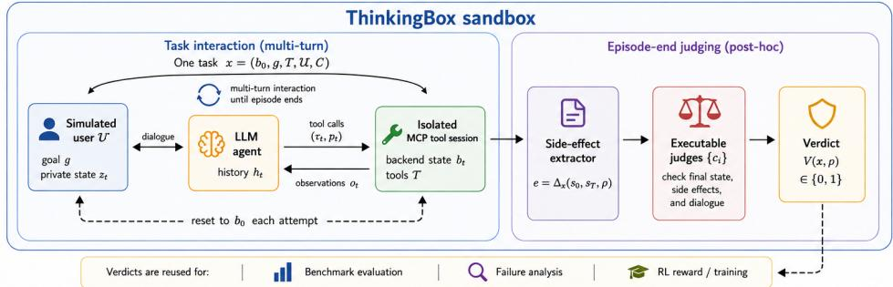
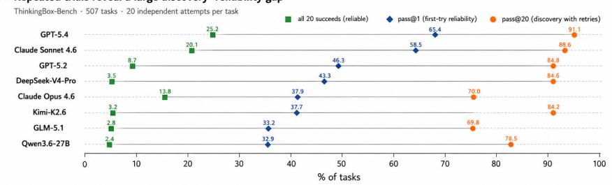
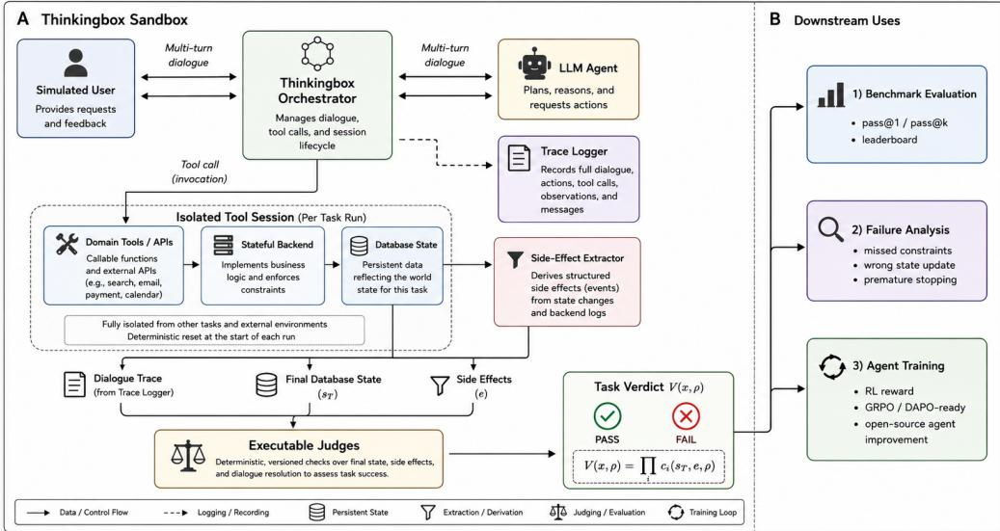
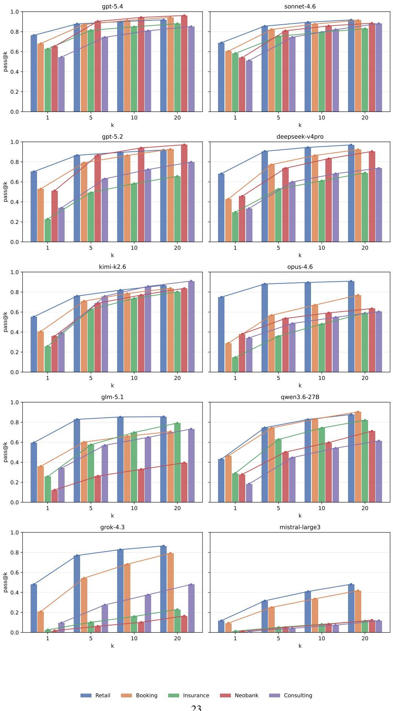
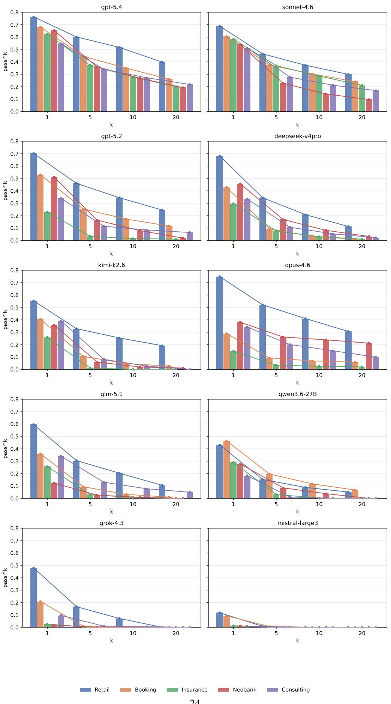

# ONE SUCCESS ISN’T RELIABILITY: THINKINGBOX, A SANDBOX AND BENCHMARK FOR AGENTS IN STATEFUL BUSINESS WORKFLOWS

Zhuochun Li<sup>1,†</sup>, Youngmin Ko<sup>2,†</sup>, Ali Keramati<sup>3,†</sup>, Nicola Ferri<sup>4</sup>, Susana Palmaz Lopez Pelaez<sup>4</sup>, Liang-Chun Tsai<sup>4</sup>, Calvin Wang<sup>4</sup>, Mirco Milletari<sup>4</sup>, Tuhin Kundu<sup>4</sup>, Vadim Smolyakov<sup>4</sup>, Kjartan Olafsson<sup>´</sup> <sup>4</sup>, Tommy Guy<sup>4</sup>

<sup>1</sup>University of Pittsburgh <sup>2</sup>Northwestern University <sup>3</sup>University of California, Irvine <sup>4</sup>Microsoft

## ABSTRACT

Recent agent benchmarks increasingly ground evaluation in executable environments, from code repair to web navigation, app APIs, and function calling. Yet completing consequential work beyond code requires more than producing a plausible response or valid tool call: agents must gather missing information over multiple turns, follow domain policies, coordinate dependent tools, and realize the correct persistent state transition without collateral effects. In this paper, we introduce THINKINGBOX, a sandbox for tool-agent-user interaction that provides isolated MCP-compatible tool sessions, complete execution traces, and outcome evaluation over terminal backend state. Built on this sandbox, THINKINGBOX-BENCH contains 507 policy-conditioned workflows across numerous scenarios, including retail, hospitality, auto insurance, neobank internal IT, and consulting IT/HR support. Each attempt is evaluated by task-specific executable checks that accept valid trajectories while rejecting wrong, missing, or extra effects; designated tasks additionally check required properties of the final response. Across proprietary and open-weight models, the strongest achieves 65.36% pass@1, but only 25.25% passˆ20. Moreover, many failed trials show clean termination and valid statechanging actions, showing that response or tool-call-level signals are not clear proxies for end-to-end task completion. THINKINGBOX-BENCH reveals a large gap between occasionally finding a successful trajectory and reliably completing stateful business tasks. We release both THINKINGBOX and THINKINGBOX-BENCH: https://github.com/microsoft/thinkingbox©

## 1 INTRODUCTION

LLM agents are increasingly evaluated where success can be checked by an executable artifact: patches can be tested against codebases (Jimenez et al., 2024), function calls can be parsed or executed (Patil et al., 2025; Qin et al., 2024), and agents can be scored in interactive environments (Liu et al., 2024; Yao et al., 2024). This progress is essential, but benchmark design naturally favors tasks whose outcomes are easy to specify and execute. In practice, agents must also complete work that is neither code nor merely a tool-call trace: changing a booking, processing a refund, updating an insurance claim, or routing an internal service request. Such tasks are multi-turn, stateful, and consequence-bearing, requiring agents to coordinate user interaction, tool use, policy constraints, and backend side effects.

Evaluating such work requires both a benchmark and an interaction substrate that can instantiate a world, expose domain tools, simulate user follow-up, extract side effects, and run outcome checks. Existing benchmarks cover policy-guided user interaction and final database states (Yao et al., 2024), stateful conversational tools (Lu et al., 2025), app worlds with collateral-change checks (Trivedi et al., 2024), and real/stateful MCP environments (Bandi et al., 2026; Wu et al., 2026). Thinkingbox provides a complementary abstraction: a reusable sandbox for tool-agent-user interaction in stateful task worlds, where the same loop supports inference, leaderboard evaluation, and failure analysis.

A ThinkingBox: a sandbox for executable evaluation of stateful tool-agent-user workflows  


B Repeated trials reveal a large discovery-reliability gap  
  
Figure 1: THINKINGBOX overview and discovery–reliability gap. (A) ThinkingBox runs multiturn interactions among a simulated user, an LLM agent, and isolated MCP-compatible tools, then evaluates terminal state, side effects, and dialogue with executable judges. More detailed pipeline can be found in Figure 2 (B) Across 507 tasks and 20 attempts per task, pass@20 is much higher than pass@1, while all-20 success is far lower, showing that successful trajectories are often discoverable but not reliably repeatable. Full results can be found in Table 4

We introduce THINKINGBOX, a sandbox for these interactions. Thinkingbox runs an agent in conversation with a simulated user, exposes domain tools through isolated backend sessions, retrieves side effects, and runs task-specific outcome checks. We further introduce THINKINGBOX-BENCH, a benchmark built on the sandbox comprising a 507-task test set of stateful business workflows. Every task is checked against its required terminal backend state. In addition, 30 tasks apply one or more binary rubrics to the final response, covering required disclosures, confidentiality, and consistency with the executed outcomes. These outcome-based checks allow different valid trajectories while rejecting wrong, missing, or extra persistent effects. This makes practical non-code work verifiable without reducing it to a single final answer.

Thinkingbox-bench spans five domains: retail/e-commerce, travel and hospitality, auto insurance, neobank internal IT support, and consulting IT/HR support. These domains stress recurring enterprise-assistance patterns: multi-step transactions, policy-conditioned updates, user clarification, record lookup, and irreversible or high-impact side effects. Following recent reliability-oriented agent evaluation (Yao et al., 2024), we report pass@1 and use complementary pass@k and passˆk analyses to distinguish dependable repetition from success discovered through retries. The leaderboard results (Figure 1 and Table 4) show substantial headroom: the strongest model reaches 65.36% pass@1 and succeeds at least once on 91.12% of tasks, yet succeeds in all 20 attempts on only 25.25%.

## Our contributions are the following:

• We propose THINKINGBOX, a reusable sandbox and orchestrator for tool-agent-user interaction over stateful tool environments.

• We build THINKINGBOX-BENCH on top of the sandbox, which includes a 507-task benchmark across five business domains. Each task is graded by multiple executable checks over final state, side effects, and dialogue rather than a single final answer.

• We evaluate 12 proprietary and open-weight LLMs with 20 repeated trials per task, exposing a large discovery–reliability gap (pass@20 vs. passˆ20), and analyze the failure modes and evaluator ablations separating fluent tool use from reliable work completion.

## 2 RELATED WORK

Thinkingbox lies at the intersection of reusable agent environments and executable benchmarks for conversational tool use and professional work.

Sandboxes and conversational tool use. TextWorld, ALFWorld, and WebShop provide interactive worlds for training and evaluating language agents (Cotˆ e et al., 2018; Shridhar et al., 2020; Yao´ et al., 2022); AgentGym unifies interaction across heterogeneous environments (Xi et al., 2025); and Agent World Model generates executable, database-backed MCP environments for agent training (Wang et al., 2026a). Complementary work studies modular tool use and reasoning–action interfaces (Karpas et al., 2022; Yao et al., 2023; Schick et al., 2023), while API-Bank, Gorilla, ToolBench, and BFCL emphasize tool selection, arguments, and call execution (Li et al., 2023; Patil et al., 2024; Qin et al., 2024; Patil et al., 2025). Closer to our setting, ToolSandbox combines stateful tools with an on-policy user simulator (Lu et al., 2025); τ-bench evaluates policy-guided conversations through terminal database states and repeated reliability (Yao et al., 2024); and $\tau ^ { 2 }$ -bench lets both user and agent act in a shared world (Barres et al., 2025). Thinkingbox builds on these foun dations with a common runtime for manually reviewed workflows across five business domains, checking persistent effects with task-specific evaluators and measuring reliability across repeated attempts.

Executable and professional-work benchmarks. Executable evaluation spans code repair (Jimenez et al., 2024), broad interactive settings (Liu et al., 2024), web and desktop control (Zhou et al., 2024; Koh et al., 2024; Xie et al., 2024), and app APIs. AppWorld’s statebased tests notably admit alternative solutions while detecting collateral changes (Trivedi et al., 2024). WorkArena++ targets enterprise software workflows (Boisvert et al., 2024); CRMArena and CRMArena-Pro evaluate CRM tasks, including multi-turn professional interactions (Huang et al., 2025a;b); and AgentDojo evaluates task utility and security under untrusted tool out puts (Debenedetti et al., 2024). MCP-Bench studies live-server tool discovery and coordination (Wang et al., 2026b), MCPMark pairs CRUD tasks with initial states and programmatic verification (Wu et al., 2026), and MCP-Atlas provides large-scale diagnostics over real servers (Bandi et al., 2026). Building on state-based and MCP evaluation, Thinkingbox combines policy-conditioned user interaction, resettable business-tool worlds, outcome and collateral-effect checks, and repeated-tria reliability in one sandbox and benchmark.

## 3 THINKINGBOX: A SANDBOX FOR TOOL-AGENT-USER INTERACTION

Thinkingbox is motivated by a limitation of many function-call-oriented tool-use evaluations, which primarily assess API selection, argument generation, or executable call correctness (Li et al., 2023; Patil et al., 2024; Qin et al., 2024; Patil et al., 2025). They can check whether a model produced a syntactically valid or executable call, but not whether the agent completed the work that the call was meant to accomplish. In stateful business tasks, the observable answer is only one part of success. An agent may call the right API with the wrong entity, update a record before collecting a required confirmation, produce an acceptable user message while leaving the backend unchanged, or perform an extra side effect that violates policy. Thinkingbox is designed as the interaction substrate for this setting. It runs the agent, simulated user, domain tools, side-effect extractor, and judges inside one reproducible loop, turning practical work into executable agent tasks.

Task world and induced POMDP. We specify each task as

$$
x = ( b _ { 0 } , g , T , \mathcal { U } , \mathcal { C } ) ,\tag{1}
$$

where $b _ { 0 }$ is the initial backend state, $g$ is the user goal, $\tau$ is the set of available domain tools, $\mathcal { U }$ is the simulated user policy, and ${ \mathcal C } = \{ c _ { i } \} _ { i = 1 } ^ { m }$ contains a set of hidden executable checks. At turn $t ,$ the orchestrator provides the agent with the dialogue history and tool observations. The agent emits either a user-facing message or a tool action $\left( \tau _ { t } , p _ { t } \right)$ , where $\tau _ { t } \in \mathcal { T }$ is a tool and $p _ { t }$ are its arguments. Tool actions are executed against an isolated session of the task backend. Figure 2 further illustrate the ThinkingBox pipeline.

  
Figure 2: Overview of THINKINGBOX. The sandbox orchestrates the interaction among a simulated user, LLM agents, isolated domain tools, side-effect extraction, and executable judges. The same trajectory-level verdict supports benchmark evaluation, failure analysis, and agent training.

Each such specification naturally induces a finite-horizon Partially Observable Markov Decision Process (POMDP)

$$
\mathcal { M } _ { x } = ( S _ { x } , A _ { x } , \mathcal { O } _ { x } , P _ { x } , Z _ { x } , R _ { x } , \mu _ { x } , H ) .\tag{2}
$$

Here $S _ { x } , A _ { x } ,$ and ${ \mathcal { O } } _ { x }$ are the state, action, and observation spaces; $P _ { x }$ and $Z _ { x }$ are the transition and observation kernels; $R _ { x }$ is the reward function; $\mu _ { x }$ is the initial-state distribution; and H is the maximum episode horizon. The latent state $s _ { t } = ( b _ { t } , z _ { t } , \ell _ { t } , q _ { t } ) \in \mathcal { S } _ { x }$ comprises the backend state, simulated user’s private state, evaluator-relevant event log, and episode status. In the current benchmark, reset is deterministic, so $\mu _ { x } = \delta _ { s _ { 0 } }$ is a point mass at $s _ { 0 } = ( b _ { 0 } , z _ { 0 } , \emptyset , \mathrm { A C T I V E } )$ , where $z _ { \mathrm { 0 } }$ is initialized from $g$ under $\mathcal { U } .$ . The agent does not observe this state directly. $o _ { t } \in \mathcal { O } _ { x }$ contains the initial request and visible policy context, a user utterance, or a structured tool result or error. An action $a _ { t } \in \mathcal A _ { x }$ is a user-facing message, tool call $\left( \tau _ { t } , p _ { t } \right)$ , or termination. Code-backed tools define backend transitions, while U defines potentially stochastic user-state transitions and replies; $P _ { x }$ and $Z _ { x }$ capture these dynamics and the observations they expose. The policy therefore acts on the observable history $h _ { t } = ( o _ { 0 } , a _ { 0 } , \ldots , o _ { t } )$ rather than the latent state. The reward $R _ { x }$ is sparse and terminal and is defined by the executable verdict in Equation 4. This decomposition follows executable agent environments that connect persistent state, tools, observations, and verifiers (Yao et al., 2024; Lu et al., 2025; Barres et al., 2025; Wang et al., 2026a). Because only the agent directly invokes state-changing tools in ThinkingBox, the simulated user is part of the environment dynamics; Appendix C.4 specifies the simulated user policy, its prompt, and its turn protocol in full.

Orchestration and isolation. For each attempt, it resets the task to $b _ { 0 } ,$ initializes the full state $s _ { 0 } .$ creates an isolated tool session, forwards messages, executes tool calls, and records the trajectory $\rho .$ Two attempts of the same task must not share database rows, cached tool state, or side effects, otherwise pass@k and training rewards become unreliable. This design follows the same reproducibility pressure that motivates containerized or controllable environments in AgentBench, OSWorld, App-World, and MCP-Atlas (Liu et al., 2024; Xie et al., 2024; Trivedi et al., 2024; Bandi et al., 2026), while abstracting the runtime around tool-agent-user interaction rather than one interface.

Side-effect-centered judging. Thinkingbox evaluates the outcome of work rather than the surface form of the trajectory. After the interaction terminates, the sandbox extracts side effects

$$
e = \Delta _ { x } ( s _ { 0 } , s _ { T } , \rho ) ,\tag{3}
$$

which include the relevant state changes and action records produced by the tool session. Note that $\Delta _ { x }$ is task-dependent. In particular, the side effects are customizable by users who build the task.

Table 1: Comparison with representative agent and tool-use benchmarks. Thinkingbox-bench focuses on stateful business-domain workflows where the final verdict checks backend state, side effects, and dialogue outcome, while exposing tasks through MCP-compatible servers.
<table><tr><td>Benchmark</td><td>Primary domain</td><td>Tools/APIs</td><td>User dialogue</td><td>Stateful backend</td><td>Side-effect checks</td><td>MCP servers</td></tr><tr><td>SWE-bench (Jimenez et al., 2024)</td><td>Code repair</td><td>×</td><td>×</td><td>√</td><td>×</td><td>×</td></tr><tr><td>BFCL (Patil et al., 2025)</td><td>Function calling</td><td>√</td><td>X</td><td>X</td><td>×</td><td>×</td></tr><tr><td>ToolBench / API-Bank (Qin et al., 2024; Li et al., 2023)</td><td>API tool use</td><td>√</td><td>X</td><td>X</td><td>X</td><td>X</td></tr><tr><td>WebArena / OSWorld (Zhou et al., 2024; Xie et al., 2024)</td><td>Web/desktop control</td><td>×</td><td>X</td><td>√</td><td>×</td><td>×</td></tr><tr><td>AppWorld (Trivedi et al., 2024)</td><td>App APIs / coding agents</td><td>√</td><td>X</td><td>√</td><td>√</td><td>×</td></tr><tr><td>MCP-Atlas (Bandi et al., 2026)</td><td>Real MCP servers</td><td>√</td><td>X</td><td>×</td><td>X</td><td>√</td></tr><tr><td>τ-bench / τ2-bench (Yao et al., 2024; Barres et al., 2025)</td><td>Domain APIs</td><td>√</td><td>√</td><td>√</td><td>△</td><td>×</td></tr><tr><td>Thinkingbox-bench</td><td>Business tool workflows</td><td>√</td><td>√</td><td>√</td><td>√</td><td>√</td></tr></table>

The final verdict is computed by executable checks over the final state, side effects, and dialogue:

$$
V ( x , \rho ) = \prod _ { i = 1 } ^ { m } c _ { i } ( s _ { T } , e , \rho ) , \qquad c _ { i } ( s _ { T } , e , \rho ) \in \{ 0 , 1 \} .\tag{4}
$$

The product denotes conjunctive grading: a task passes only when all required conditions hold. The induced POMDP assigns $R _ { x } ( s _ { T } ) = V ( x , \rho )$ at termination or horizon H and zero reward at nonterminal states; the event log $\ell _ { T }$ retains the trajectory information needed by the checks. This is stricter than checking a final answer or a single tool call, and it allows different valid tool-call paths to receive credit when they produce the same correct world state. It also lets checks detect collateral effects, such as modifying the wrong user record or applying an unauthorized update, which are central risks in stateful business workflows.

One loop for evaluation and training. Because Thinkingbox separates the sandbox from any specific model, the same task world can be used for inference-time evaluation, debugging, and training. The verdict V yields pass@1 and pass@k over repeated attempts and directly supplies an outcome reward for training. The individual checks can additionally provide a reward vector $r _ { i } ( \rho ) = c _ { i } ( b _ { T } , e , \rho )$ . Researchers can therefore replace the agent policy while reusing the same user simulator, tool sessions, side-effect extraction, and reward definition.

## 4 THINKINGBOX-BENCH: VERIFIABLE STATEFUL AGENT TASKS

## 4.1 SCOPE AND SCALE

Thinkingbox-bench instantiates the Thinkingbox sandbox into 507 executable tool-agent-user tasks across five practical domains: retail/e-commerce, travel and hospitality, auto insurance, neobank support, and consulting IT/HR support. These domains are selected because they share recurring patterns in real work: users often provide incomplete information, policies constrain what the agent may do, and success requires updating the correct backend records without creating collateral side effects. Unlike prompt-only datasets, each task is a runnable world with domain tools, an initial state, a simulated user, and executable validators.

Table 1 positions Thinkingbox-bench relative to representative agent and tool-use benchmarks. Prior work has made major progress on executable evaluation for code, web, desktop, app, and API settings (Jimenez et al., 2024; Zhou et al., 2024; Xie et al., 2024; Trivedi et al., 2024; Patil et al., 2025; Bandi et al., 2026). Thinkingbox-bench complements these efforts by focusing on stateful non-code business workflows with user dialogue, policy-conditioned tool use, backend side effects, and a sandbox verdict that can also be used for training.

## 4.2 TASK SCHEMA

Each benchmark instance follows the task-world formalism in Section 3. Concretely, a task contains an initial backend state $s _ { 0 } ,$ , a user goal $^ { g , }$ domain tools T, a simulated user policy U, and executable checks C. In implementation, domains are exposed through isolated domain servers with MCPcompatible tool interfaces. This makes tool discovery and invocation close to contemporary agent deployments, while still allowing Thinkingbox to control reset, state isolation, trace logging, sideeffect extraction, and judging.

Table 2: Key statistics for the THINKINGBOX-BENCH domains.
<table><tr><td></td><td>Retail</td><td>Booking</td><td>Insurance</td><td>Neobank</td><td>Consulting</td></tr><tr><td>Tasks</td><td>98</td><td>104</td><td>100</td><td>104</td><td>101</td></tr><tr><td>Backend systems</td><td>11</td><td>8</td><td>7</td><td>3</td><td>18</td></tr><tr><td>Databases (tables / rows)</td><td>22/86</td><td>17/98</td><td>14/72</td><td>20 / 151</td><td>30 / 231</td></tr><tr><td>Agent tools (write / read)</td><td>16 / 17</td><td>10 / 28</td><td>14 / 19</td><td>13 / 19</td><td>13 / 14</td></tr><tr><td>Policy (words)</td><td>945</td><td>3,684</td><td>2,471</td><td>3,392</td><td>1,747</td></tr><tr><td>Knowledge base (documents)</td><td>9</td><td>11</td><td>8</td><td>8</td><td>9</td></tr><tr><td>Actions per task</td><td>4.4 (1–10)</td><td>8.8 (4–19)</td><td>4.7 (1–11)</td><td>6.7 (3–12)</td><td>5.8 (1–13)</td></tr><tr><td>Evaluation</td><td>DB state</td><td>DB + rubrics</td><td>DB state</td><td>DB + rubrics</td><td>DB state</td></tr></table>

The schema stores both what the agent should accomplish and what it must avoid. Besides the user goal and tool descriptions, each task specifies policy constraints, expected state changes, forbidden collateral changes, and dialogue requirements. The user specification g is itself split into an opening request and a separate disclosable fact set with per-task behavioral rules: facts in the latter are available to U but are released only when the agent asks for them. This design is important because practical workflows are often under-specified by the user’s initial request: the correct behavior may require asking a clarification question, refusing an ineligible request, or confirming an irreversible update before executing a tool.

Table 3: Representative THINKINGBOX-BENCH scenario patterns. Each scenario is instantiated as a concrete task with an initial backend state, available MCP-compatible tools, and executable checks.
<table><tr><td>Domain</td><td>Scenario</td><td>Required agent behavior</td><td>Executable checks</td></tr><tr><td>Retail / e-commerce</td><td>User asks to change or refund part of an order.</td><td>Identify the correct order/item, verify eligibility, request missing confirmation, and update only the</td><td>Correct order state; fund/order side effect; no unrelated customer or item</td></tr><tr><td>Travel / hospitality</td><td>User requests a booking change under date, room, or policy con- straints.</td><td>relevant record. Check reservation, availability, and change policy before modify- ing booking or explaining denial.</td><td>modified. Correct reservation state; price/fee side effect if ap- plicable; policy-compliant</td></tr><tr><td>Auto insurance</td><td>User reports or updates a claim.</td><td>Verify policy and vehicle/incident details, collect missing informa- tion, and create or update the claim.</td><td colspan="2">dialogue. Correct ticket/claim state; no coverage mutation unless al- lowed.</td></tr><tr><td>Neobank support</td><td>User asks to dispute, freeze, or modify an account/card action.</td><td>Authenticate relevant account context, distinguish reversible and irreversible actions, and apply only valid updates.</td><td colspan="2">Correct account/card state; re- quired dispute/freeze side ef- fect; no unrelated account</td></tr><tr><td>Consulting IT/HR</td><td>Employee asks for access, HR, or internal support changes.</td><td>Verify role, approval, or employee record, then create ticket or update access according to policy.</td><td colspan="2">changed. Correct ticket/access state; approval and provisioning side effects; no unrelated records modified</td></tr></table>

## 4.3 BENCHMARK CONSTRUCTION AND QUALITY ASSURANCE

Following recent tool-agent-user benchmark design, where interaction components are paired with domain-specific databases, APIs, policies, and task instances (Yao et al., 2024), we construct Thinkingbox-bench with a shared sandbox layer and domain-specific MCP-compatible task worlds. Each domain is created in a three-stage approach with automatic and human labeling and checking.

Stage 1: Workflow design. We first author workflow templates for the five domains by identi fying recurring enterprise-assistant scenarios: order changes and refunds, booking modifications, claim updates, account support, and internal IT/HR requests. Each template is required to involve a practical user goal, domain tools, policy constraints, and a verifiable outcome. We intentionally avoid releasing raw user logs or customer transcripts; instead, all benchmark instances are written as self-contained tasks with synthetic records and domain-realistic workflow patterns.

Stage 2: Executable task instantiation. We instantiate each workflow template into a concrete task world. For each task, we create an initial backend state, expose MCP-compatible domain tools, specify the simulated user’s goal and behavior, and attach domain policies that determine which actions are allowed, required, or forbidden. We then write task-specific checks over final state, side effects, and dialogue. The resulting tasks are stateful, policy-conditioned, and side-effect-aware: an agent must leave the backend in the right state, follow domain rules, and avoid unauthorized or wrong-entity updates.

Stage 3: Executable validation and filtering. Finally, we execute each task inside the Thinkingbox sandbox and filter broken or ill-posed cases. We remove tasks with broken tools, inconsistent initial states, ambiguous goals, unverifiable outcomes, checks that depend on tool-call trajectories, or interactions that repeatedly fail to terminate under LLM agents. Accepted tasks must admit at least one valid completion strategy while preserving a clear correctness criterion. This process lets THINKINGBOX-BENCH capture realistic business patterns while maintaining reproducible executable evaluation suitable for leaderboard comparison and reward-based training.

## 5 EXPERIMENTS

## 5.1 EXPERIMENTAL SETUP

Models. We evaluate a diverse set of proprietary frontier models and open-weight agentic models. The proprietary set includes OpenAI GPT-5.2, GPT-5.4, and o3-pro (OpenAI, 2026; 2025), Anthropic Claude Sonnet 4.6 and Claude Opus 4.6 (Anthropic, 2026), and Grok-4.3 (xAI, 2026). The open-weight or openly documented models include DeepSeek-V4-Pro (Xu et al., 2026), GLM-5.1 (Zeng et al., 2026), Kimi-K2.6 (Kimi Team, 2026; Moonshot AI, 2026), Mistral-Large-3 (Mistral AI, 2025), Qwen3.5-9B (Qwen Team, 2026a), and Qwen3.6-27B (Qwen Team, 2026b).

Evaluation Protocol. We evaluate the models on the THINKINGBOX-BENCH. i.e. Each model is evaluated in the same Thinkingbox sandbox with the same system prompts, tool definitions, domain policies, simulated-user behavior, and task-specific executable checks. To reduce sampling noise, we run each model on each task for N independent trials. Each trial is a single complete attempt, so a trial-level success is a pass@1 outcome. A trial is counted as correct only when all executable checks for the task pass. For a domain D, we report the micro-averaged pass@1 over tasks and repeated trials,

$$
\mathrm { P a s s R a t e } ( D ) = \frac { 1 } { N | D | } \sum _ { x \in D } \sum _ { j = 1 } ^ { N } V ( x , \rho _ { x , j } ) ,\tag{5}
$$

where $V ( x , \rho _ { x , j } ) \in \{ 0 , 1 \}$ is the executable verdict for trial j on task x. The overall score is the same micro-average over the benchmark tasks, so larger domains contribute in proportion to their number of task instances. For the main results in Table 4, we set $N = 2 0$

## 5.2 BENCHMARK LEADERBOARD

Table 4 reports the current THINKINGBOX-BENCH leaderboard. GPT-5.4 obtains the highest overall pass@1, while performance varies sharply by domain: external retail and booking are substantially easier than auto insurance and neobank support for several models. These domain-level differences motivate the domain-level and trace-based analyses in Sections 5.3 and 5.4.

## 5.3 DOMAIN-LEVEL ANALYSIS

Table 4 reveals three consistent patterns. First, aggregate model ranking hides large domaindependent variation. Averaged across the reported models, retail is the easiest domain, while auto insurance is the hardest: models average roughly 52% pass@1 on retail but only about 23% on auto insurance. Booking, neobank support, and consulting fall between these extremes, with average pass@1 around 35%, 30%, and 27%, respectively. This ordering is not simply a property of task count, since all domains have comparable numbers of tasks; rather, it suggests that the benchmark domains differ in the interaction and policy burden they impose on agents.

Second, stronger models are not uniformly strong across domains. GPT-5.4 and Sonnet 4.6 are the only models above 50% pass@1 in every domain. We can observe the drop from 76.33% on retail to 54.60% on consulting in GPT-5.4, whereas Claude Sonnet 4.6 is more balanced than several larger or more expensive systems, staying between 51.14% and 68.93% across domains. In contrast, Claude Opus 4.6 and GPT-5.2 show sharp asymmetries: both are competitive on retail, but Claude Opus 4.6 falls to 14.65% on auto insurance and GPT-5.2 falls to 22.40%. These gaps indicate that high general capability or strong performance in one workflow family does not guarantee robust transfer to other stateful tool-use settings.

Table 4: THINKINGBOX-BENCH pass@1 (%) by domain. Each task is evaluated with N = 20 repeated trials, and scores are micro-averaged over trials and tasks. Size is reported as total/activated parameters for MoE models. The o3-pro row excludes 636 system/harness-error trials; its valid denominators therefore vary by domain. Task-cluster bootstrap intervals are reported in Appendix D.1.
<table><tr><td>Model</td><td>Size</td><td>Retail (98)</td><td>Auto (100)</td><td>Booking (104)</td><td>Bank (104)</td><td>Consulting (101)</td><td>Average</td></tr><tr><td colspan="8">Proprietary models</td></tr><tr><td>GPT-5.4</td><td></td><td>76.33</td><td>62.65</td><td>68.13</td><td>65.34</td><td>54.60</td><td>65.36</td></tr><tr><td>GPT-5.2</td><td></td><td>70.20</td><td>22.40</td><td>53.70</td><td>51.15</td><td>34.06</td><td>46.28</td></tr><tr><td>o3-pro</td><td></td><td>37.94</td><td>2.96</td><td>24.16</td><td>24.37</td><td>14.75</td><td>20.60</td></tr><tr><td>Claude Sonnet 4.6</td><td></td><td>68.93</td><td>58.20</td><td>60.38</td><td>53.99</td><td>51.14</td><td>58.45</td></tr><tr><td>Claude Opus 4.6</td><td></td><td>74.90</td><td>14.65</td><td>28.89</td><td>38.03</td><td>34.21</td><td>37.91</td></tr><tr><td>Grok-4.3</td><td></td><td>43.93</td><td>2.60</td><td>15.14</td><td>1.78</td><td>9.55</td><td>14.38</td></tr><tr><td colspan="8">Open-weights models</td></tr><tr><td>DeepSeek-V4-Pro</td><td>1.6T/49B</td><td>68.21</td><td>29.65</td><td>43.13</td><td>44.86</td><td>31.04</td><td>43.26</td></tr><tr><td>GLM-5.1</td><td>744B/40B</td><td>58.67</td><td>25.70</td><td>35.43</td><td>13.27</td><td>34.06</td><td>33.19</td></tr><tr><td>Kimi-K2.6</td><td>1T/32B</td><td>53.72</td><td>24.50</td><td>39.52</td><td>33.65</td><td>37.33</td><td>37.66</td></tr><tr><td>Mistral-Large-3</td><td>675B/41B</td><td>11.28</td><td>1.30</td><td>8.99</td><td>1.15</td><td>0.74</td><td>4.66</td></tr><tr><td>Qwen3.6-27B</td><td>27B</td><td>43.11</td><td>29.00</td><td>46.39</td><td>27.84</td><td>18.37</td><td>32.94</td></tr><tr><td>Qwen3.5-9B</td><td>9B</td><td>19.15</td><td>0.45</td><td>4.52</td><td>1.06</td><td>2.34</td><td>5.41</td></tr></table>

Third, open-weight performance remains highly uneven. DeepSeek-V4-Pro is the strongest opensource model in the current table, reaching 43.26% average pass@1 and approaching GPT-5.2 overall. Kimi-K2.6, GLM-5.1, and Qwen3.6-27B form a second tier, but their domain profiles differ: Kimi-K2.6 is strongest on consulting among open-source models, GLM-5.1 is relatively stronger on retail than on bank support, and Qwen3.6-27B is strongest on booking while remaining close to GLM-5.1 overall (32.94% versus 33.19%). The gap between Qwen3.6-27B and Qwen3.5-9B is also large, with the 27B model improving average pass@1 from 5.41% to 32.94%. Model size alone does not explain the ranking. For example, Mistral-Large-3 has hundreds of billions of total param eters but performs below much smaller Qwen models on several domains, suggesting that tool-use formatting, agentic post-training, reasoning mode, and benchmark-specific interaction robustness matter at least as much as nominal parameter count.

Overall, Thinkingbox-bench separates fluent tool use from reliable work completion. The easiest domain still leaves substantial headroom for most models, and the hardest domains expose near-failure regimes for several frontier systems. These aggregate patterns motivate the trace-based failure analysis in Section 5.4, where we can use complete trajectories to identify whether failures arise from wrong tool arguments, missed constraints, incorrect side effects, or premature termination.

## 5.4 TRAJECTORY-BASED FAILURE ANALYSIS

We use full trajectories to characterize how failed trials break down. The executable checks provide binary verdicts but not natural-language failure signatures, so we assign each failed trace an exclusive dominant signature using deterministic evidence from messages, tool calls, tool responses, final answers, and termination markers. These signatures are observable diagnostics rather than unique causal explanations. Table 5 reports the resulting per-model distribution.

Tool Usage Errors Dominate. Tool Usage is the largest failure category, averaging 77.5% across the models shown in Table 5. A typical trace contains one or more tool errors, failed preconditions, or unsuccessful lookups, after which the agent fails to repair the workflow; in some cases, it continues as though the failed action had succeeded. Thus, these are not merely malformed tool calls, but failures to recover from feedback produced by the environment. This category is especially pronounced for GPT-5.4, GLM-5.1, and Kimi-K2.6, where Tool Usage accounts for 89.6%, 88.1%, and 85.2% of failures, respectively.

Table 5: Failure mode breakdown (%) on Thinkingbox-bench. For each model, values indicate the percentage distribution of dominant failure types across failed trials.
<table><tr><td>Model</td><td>Tool Usage</td><td>No State-Changing Action</td><td>Incomplete User Resolution</td><td>Wrong State Update</td></tr><tr><td>GPT-5.4</td><td>89.6</td><td>1.6</td><td>0.5</td><td>8.3</td></tr><tr><td>Claude Sonnet 4.6</td><td>84.0</td><td>2.8</td><td>4.2</td><td>8.9</td></tr><tr><td>GPT-5.2</td><td>80.1</td><td>0.7</td><td>0.9</td><td>18.3</td></tr><tr><td>DeepSeek-V4-Pro</td><td>69.8</td><td>0.8</td><td>24.7</td><td>4.7</td></tr><tr><td>Claude Opus 4.6</td><td>78.1</td><td>3.0</td><td>10.2</td><td>8.7</td></tr><tr><td>Kimi-K2.6</td><td>85.2</td><td>1.3</td><td>12.1</td><td>1.4</td></tr><tr><td>GLM-5.1</td><td>88.1</td><td>1.3</td><td>3.5</td><td>7.0</td></tr><tr><td>Qwen3.6-27B</td><td>75.0</td><td>0.6</td><td>13.1</td><td>11.2</td></tr><tr><td>03-pro</td><td>67.4</td><td>3.9</td><td>0.9</td><td>27.8</td></tr><tr><td>Grok-4.3</td><td>69.2</td><td>6.8</td><td>1.5</td><td>22.5</td></tr><tr><td>Mistral-Large-3</td><td>65.8</td><td>4.6</td><td>15.2</td><td>14.4</td></tr><tr><td>Average</td><td>77.5</td><td>2.5</td><td>7.9</td><td>12.1</td></tr></table>

No State-Changing Action. Failures in which the required state-changing action is never invoked are comparatively rare, averaging 2.5%. A typical trace performs the appropriate look-ups—for example, retrieving an order, user account, ticket, or policy—and may even identify the relevant record, but terminates without issuing the required create, update, cancel, refund, or provisioning action. These failures therefore reflect omission of a required workflow subgoal rather than inability to retrieve the necessary information. Qwen3.6-27B has the smallest share at 0.6%, indicating that relatively few of its failures arise from omitting the required mutation entirely.

Incomplete User Resolution. Incomplete User Resolution accounts for 7.9% of failures on average. A typical trace performs at least part of the backend workflow but ends with a user-facing response that is incomplete, contradictory, or still requests information instead of delivering the required resolution. The failure can be as apparent as a dangling response fragment or as subtle as omitting a required confirmation after backend actions have already been attempted. DeepSeek-V4- Pro has the highest share at 24.7%, whereas GPT-5.4 has the lowest at 0.5%, suggesting substantial model-level differences in converting an attempted workflow into a complete user-facing resolution.

Wrong State Update. Wrong State Update accounts for 12.1% of failures on average. Here, the agent successfully invokes a mutating tool, but the resulting state transition is incorrect because it chooses the wrong entity, date, eligibility decision, ticket status, refund, access level, or other side effect. A typical trace can therefore appear operationally successful—the tool call itself returns without error and the agent may confidently confirm completion—while the terminal database state violates the task requirements. This category is largest for o3-pro, Grok-4.3, and GPT-5.2, at 27.8%, 22.5%, and 18.3% of their failures, respectively.

Together, these categories distinguish failures to execute or recover from tools, omissions of required state changes, incomplete user-facing resolutions, and incorrect state transitions despite successful tool execution. Appendix D.4 provides complete observable trajectories for each category, including the relevant tool responses, terminal state differences, and the evidence used to assign the dominant failure signature.

## 6 CONCLUSION

In this paper, we introduced THINKINGBOX, a reusable sandbox for verifiable tool-agent-user interaction, and THINKINGBOX-BENCH, its executable benchmark for stateful business workflows. Our results show that strong tool-use performance does not yet translate into dependable work completion: outcomes vary across domains and repeated attempts, while many failures involve poor recovery or incorrect state changes despite plausible responses. These findings underscore the importance of evaluating terminal outcomes and collateral effects rather than surface-level completion alone. We hope Thinkingbox provides a foundation for developing agents that are consistently correct in consequential workflows. We discuss limitations of our benchmark and evaluation protocol in Appendix A.

## REFERENCES

Anthropic. Claude models overview. https://platform.claude.com/docs/en/docs/ about-claude/models/overview, 2026. Accessed 2026-06-26.

Chaithanya Bandi, Razvan-Gabriel Dumitru, Ben Hertzberg, Divyansh Agarwal, Geobio Boo, Tejas Polakam, Sami Hassaan, Jeff Da, HiJae Kim, Vipul Gupta, et al. MCP-atlas: A large-scale benchmark for tool-use competency with real MCP servers. arXiv preprint arXiv:2602.00933, 2026.

Victor Barres, Honghua Dong, Soham Ray, Xujie Si, and Karthik Narasimhan. τ<sup>2</sup>-bench: Evaluating conversational agents in a dual-control environment. arXiv preprint arXiv:2506.07982, 2025.

Leo Boisvert, Megh Thakkar, Maxime Gasse, Massimo Caccia, Thibault Le Sellier De Chezelles,´ Quentin Cappart, Nicolas Chapados, Alexandre Lacoste, and Alexandre Drouin. WorkArena++: Towards compositional planning and reasoning-based common knowledge work tasks. In Advances in Neural Information Processing Systems, 2024.

Marc-Alexandre Cotˆ e, Akos K ´ ad´ ar, Xingdi Yuan, Ben Kybartas, Tavian Barnes, Emery Fine, James´ Moore, Matthew Hausknecht, Layla El Asri, Mahmoud Adada, et al. Textworld: A learning environment for text-based games. In Workshop on computer games. Springer, 2018.

Edoardo Debenedetti, Jie Zhang, Mislav Balunovic, Luca Beurer-Kellner, Marc Fischer, and Florian Tramer. Agentdojo: A dynamic environment to evaluate prompt injection attacks and defenses\` for llm agents. Advances in neural information processing systems, 37:82895–82920, 2024.

Kung-Hsiang Huang, Akshara Prabhakar, Sidharth Dhawan, Yixin Mao, Huan Wang, Silvio Savarese, Caiming Xiong, Philippe Laban, and Chien-Sheng Wu. Crmarena: Understanding the capacity of llm agents to perform professional crm tasks in realistic environments. In Proceedings of the 2025 Conference of the Nations of the Americas Chapter of the Association for Computational Linguistics: Human Language Technologies (Volume 1: Long Papers), 2025a.

Kung-Hsiang Huang, Akshara Prabhakar, Onkar Thorat, Divyansh Agarwal, Prafulla Kumar Choubey, Yixin Mao, Silvio Savarese, Caiming Xiong, and Chien-Sheng Wu. Crmarena-pro: Holistic assessment of llm agents across diverse business scenarios and interactions. arXiv preprint arXiv:2505.18878, 2025b.

Carlos E Jimenez, John Yang, Alexander Wettig, Shunyu Yao, Kexin Pei, Ofir Press, and Karthik Narasimhan. Swe-bench: Can language models resolve real-world github issues? In International Conference on Learning Representations, volume 2024, pp. 54107–54157, 2024.

Ehud Karpas, Omri Abend, Yonatan Belinkov, Barak Lenz, Opher Lieber, Nir Ratner, Yoav Shoham, Hofit Bata, Yoav Levine, Kevin Leyton-Brown, et al. MRKL systems: A modular, neuro-symbolic architecture that combines large language models, external knowledge sources and discrete reasoning. arXiv preprint arXiv:2205.00445, 2022.

Kimi Team. Kimi K2.5: Visual agentic intelligence. arXiv preprint arXiv:2602.02276, 2026.

Jing Yu Koh, Robert Lo, Lawrence Jang, Vikram Duvvur, Ming Lim, Po-Yu Huang, Graham Neubig, Shuyan Zhou, Russ Salakhutdinov, and Daniel Fried. Visualwebarena: Evaluating multimodal agents on realistic visual web tasks. In Proceedings ofthe 62nd Annual Meeting ofthe Association for Computational Linguistics (Volume 1: Long Papers), pp. 881–905, 2024.

Woosuk Kwon, Zhuohan Li, Siyuan Zhuang, Ying Sheng, Lianmin Zheng, Cody Hao Yu, Joseph Gonzalez, Hao Zhang, and Ion Stoica. Efficient memory management for large language model serving with pagedattention. In Proceedings of the 29th symposium on operating systems principles, pp. 611–626, 2023.

Minghao Li, Yingxiu Zhao, Bowen Yu, Feifan Song, Hangyu Li, Haiyang Yu, Zhoujun Li, Fei Huang, and Yongbin Li. Api-bank: A comprehensive benchmark for tool-augmented llms. In Proceedings of the 2023 conference on empirical methods in natural language processing, pp. 3102–3116, 2023.

Xiao Liu, Hao Yu, Hanchen Zhang, Yifan Xu, Xuanyu Lei, Hanyu Lai, Yu Gu, Hangliang Ding, Kaiwen Men, Kejuan Yang, et al. Agentbench: Evaluating llms as agents. In International Conference on Learning Representations, volume 2024, pp. 52989–53046, 2024.

Jiarui Lu, Thomas Holleis, Yizhe Zhang, Bernhard Aumayer, Feng Nan, Haoping Bai, Shuang Ma, Shen Ma, Mengyu Li, Guoli Yin, Zirui Wang, and Ruoming Pang. ToolSandbox: A stateful, conversational, interactive evaluation benchmark for LLM tool use capabilities. In Findings of the Associationfor Computational Linguistics: NAACL 2025, 2025.

Microsoft. Foundry models from partners and community. https://learn. microsoft.com/en-us/azure/foundry/foundry-models/concepts/ models-from-partners, 2026. Microsoft Learn; accessed 2026-07-21.

MiniMax. MiniMax M2.5: Built for real-world productivity. https://www.minimax.io/ news/minimax-m25, February 2026. Accessed 2026-07-21.

Mistral AI. Introducing Mistral 3. https://mistral.ai/news/mistral-3/, December 2025. Accessed 2026-07-02.

Moonshot AI. Kimi-K2.6 model card. https://huggingface.co/moonshotai/ Kimi-K2.6, 2026. Accessed 2026-06-26.

OpenAI. Introducing OpenAI o3 and o4-mini. https://openai.com/index/ introducing-o3-and-o4-mini/, 2025. Accessed 2026-06-26.

OpenAI. OpenAI api model documentation. https://developers.openai.com/api/ docs/models, 2026. Accessed 2026-06-26.

Shishir G Patil, Tianjun Zhang, Xin Wang, and Joseph E Gonzalez. Gorilla: Large language model connected with massive apis. Advances in Neural Information Processing Systems, 37:126544– 126565, 2024.

Shishir G Patil, Huanzhi Mao, Fanjia Yan, Charlie Cheng-Jie Ji, Vishnu Suresh, Ion Stoica, and Joseph E Gonzalez. The berkeley function calling leaderboard (bfcl): From tool use to agentic evaluation of large language models. In Forty-second International Conference on Machine Learning, 2025.

Yujia Qin, Shihao Liang, Yining Ye, Kunlun Zhu, Lan Yan, Yaxi Lu, Yankai Lin, Xin Cong, Xiangru Tang, Bill Qian, et al. Toolllm: Facilitating large language models to master 16000+ real-world apis. In International Conference on Learning Representations, 2024.

Qwen Team. Qwen3.5: Towards native multimodal agents, February 2026a. URL https:// qwen.ai/blog?id=qwen3.5.

Qwen Team. Qwen3.6-27B: Flagship-level coding in a 27B dense model, April 2026b. URL https://qwen.ai/blog?id=qwen3.6-27b.

Timo Schick, Jane Dwivedi-Yu, Roberto Dess\`ı, Roberta Raileanu, Maria Lomeli, Eric Hambro, Luke Zettlemoyer, Nicola Cancedda, and Thomas Scialom. Toolformer: Language models can teach themselves to use tools. Advances in neural information processing systems, 2023.

Mohit Shridhar, Xingdi Yuan, Marc-Alexandre Cotˆ e, Yonatan Bisk, Adam Trischler, and Matthew´ Hausknecht. Alfworld: Aligning text and embodied environments for interactive learning. arXiv preprint arXiv:2010.03768, 2020.

Harsh Trivedi, Tushar Khot, Mareike Hartmann, Ruskin Manku, Vinty Dong, Edward Li, Shashank Gupta, Ashish Sabharwal, and Niranjan Balasubramanian. Appworld: A controllable world of apps and people for benchmarking interactive coding agents. In Proceedings of the 62nd Annual Meeting ofthe Associationfor Computational Linguistics (Volume 1: Long Papers), 2024.

Zhaoyang Wang, Canwen Xu, Boyi Liu, Yite Wang, Siwei Han, Zhewei Yao, Huaxiu Yao, and Yuxiong He. Agent world model: Infinity synthetic environments for agentic reinforcement learning. In International Conference on Machine Learning, 2026a.

Zhenting Wang, Qi Chang, Hemani Patel, Shashank Biju, Cheng-En Wu, Quan Liu, Aolin Ding, Alireza Rezazadeh, Ankit Parag Shah, Yujia Bao, and Eugene Siow. MCP-Bench: Benchmarking tool-using LLM agents with complex real-world tasks via MCP servers. In International Conference on Learning Representations, 2026b.

Zijian Wu, Xiangyan Liu, Xinyuan Zhang, Lingjun Chen, Fanqing Meng, Lingxiao Du, Yiran Zhao, Fanshi Zhang, Yaoqi Ye, Jiawei Wang, Zirui Wang, Jinjie Ni, Yufan Yang, Arvin Xu, and Michael Qizhe Shieh. MCPMark: A benchmark for stress-testing realistic and comprehensive MCP use. In International Conference on Learning Representations, 2026.

xAI. Grok 4.3 model documentation. https://docs.x.ai/developers/models/ grok-4.3, 2026. Accessed 2026-06-26.

Zhiheng Xi, Yiwen Ding, Wenxiang Chen, Boyang Hong, Honglin Guo, Junzhe Wang, Xin Guo, Dingwen Yang, Chenyang Liao, Wei He, et al. Agentgym: Evaluating and training large language model-based agents across diverse environments. In Proceedings of the 63rd Annual Meeting of the Association for Computational Linguistics (Volume 1: Long Papers), 2025.

Tianbao Xie, Danyang Zhang, Jixuan Chen, Xiaochuan Li, Siheng Zhao, Ruisheng Cao, Toh J Hua, Zhoujun Cheng, Dongchan Shin, Fangyu Lei, et al. Osworld: Benchmarking multimodal agents for open-ended tasks in real computer environments. Advances in Neural Information Processing Systems, 2024.

Anyi Xu, Bangcai Lin, Bing Xue, Bingxuan Wang, Bingzheng Xu, Bochao Wu, Bowei Zhang, Chaofan Lin, Chen Dong, Chenchen Ling, et al. Deepseek-v4: Towards highly efficient milliontoken context intelligence. arXiv preprint arXiv:2606.19348, 2026.

An Yang, Anfeng Li, Baosong Yang, Beichen Zhang, Binyuan Hui, Bo Zheng, Bowen Yu, Chang Gao, Chengen Huang, Chenxu Lv, Chujie Zheng, Dayiheng Liu, Fan Zhou, Fei Huang, Feng Hu, Hao Ge, Haoran Wei, Huan Lin, Jialong Tang, Jian Yang, Jianhong Tu, Jianwei Zhang, Jianxin Yang, Jiaxi Yang, Jing Zhou, Jingren Zhou, Junyang Lin, Kai Dang, Keqin Bao, Kexin Yang, Le Yu, Lianghao Deng, Mei Li, Mingfeng Xue, Mingze Li, Pei Zhang, Peng Wang, Qin Zhu, Rui Men, Ruize Gao, Shixuan Liu, Shuang Luo, Tianhao Li, Tianyi Tang, Wenbiao Yin, Xingzhang Ren, Xinyu Wang, Xinyu Zhang, Xuancheng Ren, Yang Fan, Yang Su, Yichang Zhang, Yinger Zhang, Yu Wan, Yuqiong Liu, Zekun Wang, Zeyu Cui, Zhenru Zhang, Zhipeng Zhou, and Zihan Qiu. Qwen3 technical report. arXiv preprint arXiv:2505.09388, 2025.

Shunyu Yao, Howard Chen, John Yang, and Karthik Narasimhan. Webshop: Towards scalable real-world web interaction with grounded language agents. Advances in Neural Information Processing Systems, 2022.

Shunyu Yao, Jeffrey Zhao, Dian Yu, Nan Du, Izhak Shafran, Karthik Narasimhan, and Yuan Cao. ReAct: Synergizing reasoning and acting in language models. In International Conference on Learning Representations, 2023.

Shunyu Yao, Noah Shinn, Pedram Razavi, and Karthik Narasimhan. τ-bench: A benchmark for tool-agent-user interaction in real-world domains. arXiv preprint arXiv:2406.12045, 2024.

Aohan Zeng, Xin Lv, Zhenyu Hou, Zhengxiao Du, Qinkai Zheng, Bin Chen, Da Yin, Chendi Ge, Chenghua Huang, Chengxing Xie, et al. Glm-5: from vibe coding to agentic engineering. arXiv preprint arXiv:2602.15763, 2026.

Shuyan Zhou, Frank F Xu, Hao Zhu, Xuhui Zhou, Robert Lo, Abishek Sridhar, Xianyi Cheng, Tianyue Ou, Yonatan Bisk, Daniel Fried, et al. Webarena: A realistic web environment for building autonomous agents. In International Conference on Learning Representations, 2024.

## A LIMITATIONS

Scope of the executable verdict. Because the verdict on 477 of 507 tasks depends only on terminal backend state and side effects (Appendix B.3), a trial that executes the correct state transition while misreporting it to the user might still be scored as a success, and the failure taxonomy of

Section 5.4 characterizes failed trials only. We accept this asymmetry to keep the primary metric deterministic; extending LLM-judged rubrics to every task would reintroduce judge variance into the verdict. Reported pass rates therefore measure correct, policy-compliant backend outcomes rather than the fidelity of user-facing communication.

Task construction and protocol. Tasks are synthetic reconstructions from a non-public source collection and are not claimed to represent the distribution of enterprise work (Appendix B.1); each retained task admits a single golden terminal state, so workflows with several defensible resolutions are excluded by construction (Appendices B.5–B.6). Results are further conditioned on harness conventions (termination marker, turn and token caps; Appendix C).

Simulator and judge dependence. All trajectories are shaped by one fixed user simulator (Appendix C.4), a GPT-5.4-mini deployment that also serves as the judge on the 30 rubric tasks (Appendix C.1). Holding this component fixed is what makes agent rows comparable, but it also bounds what the results can claim. The simulated user is more constrained than a real one: it never states an unsupported fact, never revises its goal, remains cooperative after repeated agent failures, answers only what is asked, and contributes at most ten follow-up turns. Agents are therefore never tested against misremembered details, shifting objectives, or an interlocutor who withholds cooperation, and an agent that fails by mismanaging a difficult user would not be penalized here. The simulator also shares a model family with the strongest evaluated agent, so we cannot rule out interaction-style effects that favor same-family agents. Quantifying sensitivity to the simulator is left to future work, by varying its backbone model, its disclosure behavior, or its cooperativeness.

## B BENCHMARK CONSTRUCTION

This section documents the representation and validation of the final Thinkingbox-bench instances. Following prior executable benchmarks, we treat provenance, environment construction, and evaluator construction as distinct parts of a test case (Yao et al., 2024; Zhou et al., 2024; Trivedi et al., 2024). A natural-language request alone is not a complete test specification. Our release manifest contains 507 unique test identifiers.

## B.1 WORKFLOW PROVENANCE AND DISCLOSURE BOUNDARY

Thinkingbox-bench begins from a held collection of enterprise support and operations cases obtained through private data collaborations. These cases expose operational structure that is uncommon in public corpora. Requests may omit necessary information, and the correct action may depend on policy, approval, or the current state of related records. We use these patterns to ground realistic workflow structures rather than deriving every task category from generic prompts.

The source collection is confidential, and its upstream collection protocol is outside the scope of the released benchmark. We report only the benchmark-side procedure that we can verify. This procedure covers case selection, synthetic reconstruction, environment integration, evaluator construction, and case-level review. We do not claim that the 507 cases form a random or statistically representative sample of all enterprise work. Instead, the benchmark provides a reproducible evaluation of stateful tool use in five practical domains.

Each retained case is represented as an individually specified executable test. Its user request and relevant initial records are fixed together with the applicable policy and expected backend outcome. The complete specification, including its evaluator, is manually inspected.

## B.2 PRIVACY-PRESERVING SYNTHETIC REPRESENTATION

The released benchmark contains no real customer or employee records from the private source collection. All identities, contact details, business references, ticket identifiers, and database rows are created for benchmark execution. The five principal organizations are TechHome Direct, StayBridge Hotels & Resorts, HorizonShield Insurance, Velocity Digital Bank, and Meridian Strategy Group. All five are benchmark-specific fictional entities. Public names may appear as ordinary workflow context, but they are not linked to source customers or transactions.

Synthetic reconstruction preserves the relations needed for realistic reasoning. A retail order remains connected to its customer and fulfillment history, including payment and support records. An insurance policy retains its relationships to covered drivers, vehicles, billing, and claims. Internalsupport requests are similarly grounded in employee roles, approval paths, and existing access or asset records. These relations allow the evaluator to distinguish a correct action from a superficially similar action on the wrong record.

## B.3 COMPOSITION OF THE 507-TASK SET

All 507 cases include executable backend-state evaluation. Table 6 partitions them into 477 backendonly cases and 30 cases that additionally check a required property of the final response. The table also summarizes the task families represented in each domain.

Table 6: Composition of the 507-task evaluation set. Every case has executable backend-state checks. “Backend only” cases use no additional response rubric, whereas “Backend + rubric” cases also impose a binary final-response requirement.

<table><tr><td>Domain</td><td></td><td></td><td>Backend only Backend + rubric Task families represented in the final set</td></tr><tr><td>Retail / e-commerce</td><td>98</td><td></td><td>0 Delivery delay and exception handling; delivered-but-missing and return-to- sender cases; returns, refunds, exchanges, and warranty claims; installation scheduling and cancellation; order cancellation, promotions, and membership</td></tr><tr><td>Travel / hospitality</td><td>89</td><td>15</td><td>changes. Individual, corporate, and group booking changes; payment recovery; cancella- tions and refunds; corporate invoices and account benefits; group billing and ser- vices; hotel-partner verification and discrepancies; special requests and post-stay</td></tr><tr><td>Auto insurance</td><td>100</td><td></td><td>complaints. Billing extensions and arrangements; proof-of-insurance documents; adding, re- moving, or updating drivers and vehicles; first notice of loss and claim intake; listed-driver requests; reinstatement and policy cancellation.</td></tr><tr><td>Neobank internal IT support</td><td>89</td><td>15</td><td>Employee access and approval requests; password and account-security actions; production-incident access; hardware troubleshooting, assignment, replacement, and procurement; software and license requests; policy-information questions.</td></tr><tr><td>Consulting IT / HR support</td><td>101</td><td></td><td>0 Client-system and document access; software provisioning; expenses; hardware requests; employee onboarding; training enrollment; engagement and approval checks; corporate-travel policy and escalation.</td></tr><tr><td>Total</td><td>477</td><td></td><td>30 507 executable cases in total.</td></tr></table>

Why response rubrics are used selectively. Response rubrics are not intended as generic measures of writing quality. We add one only when task correctness includes an essential communicative condition that cannot be recovered from the terminal backend state. The task families meeting this criterion occur in travel/hospitality and neobank internal IT support. They include, for example, avoiding disclosure of confidential hotel information and explicitly communicating a policyconstrained outcome. For all other cases, including the remaining tasks in these two domains, the required outcome is fully represented by executable state checks. Rubric assignment is fixed during task construction and does not depend on the outputs of evaluated models.

For the remaining 477 tasks, the verdict is a function of backend state and side effects alone: the content of the final message is not evaluated, so a trial that produces the required persistent state passes regardless of how the outcome is described to the user. We discuss the implications of this choice in Appendix A.

The task families contain both routine and edge conditions. Representative cases include a delayed retail shipment, a same-day hotel modification, and an auto-policy extension whose due date must be computed. Other cases concern emergency production access or conditional client VPN access. Because many requests omit necessary information, the agent may need to inspect records or policy before asking the simulated user a follow-up question.

## B.4 EXECUTABLE TASK SPECIFICATION

At the benchmark boundary, every case is converted into the common task world $x \quad =$ $( b _ { 0 } , g , T , \mathcal { U } , \mathcal { C } )$ . Table 7 lists the concrete artifacts reviewed for each final case.

Initial state and linked records. A case does not consist only of its target object. The initial state also captures the operational history needed to resolve the request. Depending on the domain, this may include an earlier support ticket, a payment attempt, a shipment event, or an approval record. These linked records make the task conditional on the state returned by tools and prevent shortcuts such as always creating a new ticket.

Table 7: Artifacts in a final Thinkingbox-bench case and the corresponding construction or review question.
<table><tr><td>Artifact</td><td>Contents</td><td>Review question</td></tr><tr><td>User goal g</td><td>Initial request plus facts the simulated user can provide during follow-up</td><td>Is the request natural, internally consistent, and resolvable without access to hidden evaluator information?</td></tr><tr><td>Initial state  $b _ { 0 }$ </td><td>Synthetic records in the domain backend, includ- ing existing tickets and related business objects</td><td>Do all referenced identifiers resolve, and do cross-system records agree before the agent acts?</td></tr><tr><td>Policy context</td><td>Domain operating manual and the fixed evalua- tion time</td><td>Does the policy determine eligibility, approvals, disclosures, and allowed actions without exposing the golden result?</td></tr><tr><td>Tools T</td><td>MCP-compatible read and write operations over the isolated domain services</td><td>Can the required evidence be retrieved and the intended out- come be executed using available tools?</td></tr><tr><td>User simulation U</td><td>Task-specific user role used for on-policy follow-up dialogue</td><td>Does the user provide only task-consistent facts and allow nec- essary clarification?</td></tr><tr><td>Checks C</td><td>Expected backend state and, for designated cases, final-response requirements</td><td>Does the evaluator accept the intended outcome and reject missing, wrong, or extra effects?</td></tr></table>

Domain policy. Each environment supplies a detailed operating policy to the agent. The policy governs whether an action is eligible and what authorization it requires. It also defines disclosure, escalation, and ticket-handling rules. The current state and policy must be considered together: a backend operation may be technically callable but still inappropriate under policy.

Tool environment. The domain tools expose structured reads and consequential writes. Retail tools operate on commerce, fulfillment, membership, and support systems. Travel tools cover reservations and related customer or partner records. Auto-insurance tools operate on policies, billing, claims, and documents. The internal-support domains connect employee records with approval, access, asset, and service-management systems. Policy search is available alongside these operational tools. Tool errors and failed preconditions are returned to the agent as observations rather than silently repaired by the sandbox.

Interaction. The initial user message follows the style of a support request. It may convey urgency or a preferred outcome while omitting information needed for action. The simulated user participates in the resulting on-policy conversation, allowing the agent to request clarification or confirmation rather than infer missing facts. The expected database state and judge implementation remain hidden from both participants.

## B.5 OUTCOME AND SIDE-EFFECT EVALUATION

The evaluator is outcome-based rather than reference-trajectory-based. The agent is not required to reproduce one golden sequence of reads and writes. It may choose a different order of retrieval or recover from a failed call. Additional clarification is also permitted, provided that all final requirements are satisfied.

For all 507 cases, the principal executable signal is a deterministic comparison between the terminal backend and a task-specific golden state. The test runner first detects disagreement in the database representation and then reports field-level differences. A mismatch may be an incorrect value on an expected record. It may instead reflect a required row or update that is missing. The evaluator also detects extra effects, such as duplicate records or changes to unrelated objects. These persistent backend changes are the side effects summarized by $e = \Delta ( s _ { 0 } , s _ { T } , \rho )$ in the main paper.

Of these, 30 cases add a binary natural-language rubric for a required property of the final response. They are divided evenly between travel and neobank internal IT support. These checks cover requirements that cannot be established by database state alone. Examples include avoiding disclosure of a confidential hotel classification and correctly communicating a policy-constrained outcome. They supplement rather than replace executable state validation. A case passes only if every active check passes, consistent with the conjunctive verdict $\begin{array} { r } { V ( x , \rho ) = \prod _ { i } c _ { i } ( s _ { T } , e , \rho ) } \end{array}$

Table 8 gives representative, task-aligned examples of what the judge observes.

Table 8: Representative evaluator targets drawn from the final task families. These are outcome conditions, not prescribed action sequences.
<table><tr><td>Case type</td><td>Required outcome</td><td>Incorrect effects rejected</td></tr><tr><td>Retail return or delivery exception</td><td>Correct order, return/refund/replacement, and support- ticket state under the applicable policy</td><td>Wrong order or item, ineligible refund, duplicate ticket, incorrect ticket status, or missing compensation record</td></tr><tr><td>Booking modification or cancellation</td><td>Correct booking dates, room/board attributes, charges or refund, and ticket or hotel escalation when required</td><td>Modification without availability or policy support, wrong fee, partial group update, or confidential partner information disclosed</td></tr><tr><td>Insurance billing, policy, or claim request</td><td>Correct policy-linked extension, driver/vehicle change, claim, document, cancellation, or reinstate- ment state</td><td>Identity or eligibility bypass, wrong effective date, un- intended coverage change, or incorrect ticket resolution</td></tr><tr><td>Internal access, hardware, or software request</td><td>Correct employee, approval, access, asset, procure- ment, notification, and ticket records</td><td>Excess privilege, bypassed approval, wrong assignee or device, duplicate request, or incomplete multi-system update</td></tr><tr><td>Consulting operations request</td><td>Correct engagement-linked access, expense, onboard- ing, training, hardware, or travel outcome</td><td>Missing prerequisite, incorrect approval path, inconsis- tent cross-system records, or premature ticket closure</td></tr></table>

## B.6 QUALITY ASSURANCE AND FILTERING

Every final benchmark case is checked individually rather than accepted solely because it matches a schema. The review is performed on the complete executable instance and covers the following dimensions.

1. Manifest and identity checks. The test identifier must be unique and mapped to the intended domain and executable test. The final manifest contains 507 entries and 507 unique identifiers.

2. Privacy and consistency checks. Reviewers inspect requests and fixtures for residual source identifiers or broken references. They also verify dates and consistency across linked records.

3. Policy and solvability checks. The request must admit a well-defined resolution under the available policy, tools, and initial state. A case is revised or excluded if essential information is unavailable or the policy supports conflicting outcomes.

4. Execution and reset checks. The case must initialize in an isolated session and expose the required tools. It must execute without a harness failure and reset to the same $s _ { 0 }$ for another attempt.

5. Golden-state and rubric checks. Reviewers verify the intended final database state and any active response requirement. The judge must reject no-op behavior as well as wrong, missing, or extra effects.

6. Rollout inspection. Full agent–user–tool traces are used to identify ambiguity, simulator drift, and evaluator brittleness. A model failure is not itself evidence of a broken task. Revision is triggered only when a trace exposes a defect in the task or evaluator.

The retained 507 cases are therefore the result of manual case-level acceptance rather than an unreviewed transfer of private records. This process does not establish exhaustive domain coverage or reproduce the request distribution of any particular company. It establishes only that each released case is synthetic, executable, resettable, and associated with a checkable outcome. Our conclusions are accordingly limited to the workflows represented in the benchmark.

## C EXPERIMENTAL DETAILS

Primary experiments are conducted using Azure-hosted model API deployments. We additionally evaluate Qwen-series models using local inference with vLLM. The experiments are implemented using the ThinkingBox framework with Model Context Protocol (MCP) tools.

## C.1 MODELS AND INFERENCE PARAMETERS

For each experiment, the agent uses the model deployment listed in the corresponding leaderboard row. Both the simulated user and the response judge use a fixed GPT-5.4-mini deployment across all evaluated agents (OpenAI, 2026). The Azure (Microsoft, 2026) API-based agent models $\mathcal { M } _ { \mathrm { A P I } }$ include GPT-5.4, GPT-5.2, Claude Sonnet 4.6, Claude Opus 4.6, DeepSeek-V4-Pro, GLM-5.1, Grok-4.3, Kimi-K2.6, MiniMax-M2.5, Mistral-Large-3, and o3-pro. These models are accessed through

Azure-hosted API deployments using an OpenAI-compatible Chat Completions interface. We use the inference configuration shown in Table 9.

The locally hosted model $\mathcal { M } _ { \mathrm { l o c a l } }$ is Qwen3.6-27B and Qwen3.5-9B. We serve them locally with vLLM (Kwon et al., 2023) using an OpenAI-compatible Chat Completions endpoint. Therefore, the Qwen experiment does not rely on an external model API. We show the vLLM serving parameters in Table 10.
<table><tr><td>Parameter</td><td>Agent</td><td>Simulated User</td><td>Response Judge</td></tr><tr><td>temperature</td><td>1.0</td><td>0.3</td><td>0.0</td></tr><tr><td>max_completion_tokens</td><td>4096</td><td>4096</td><td>128</td></tr><tr><td>is_reasoning</td><td>True</td><td>False</td><td>False</td></tr><tr><td>reasoning_effort</td><td>medium</td><td>none</td><td>none</td></tr><tr><td>top-p</td><td>1.0</td><td>1.0</td><td>1.0</td></tr><tr><td>frequency penalty</td><td>0.0</td><td>0.0</td><td>0.0</td></tr><tr><td>number of completions</td><td>1</td><td>1</td><td>1</td></tr><tr><td>timeout (seconds)</td><td>600</td><td>600</td><td>600</td></tr></table>

Table 9: Azure API inference parameters for the agent, fixed GPT-5.4-mini simulated user, and fixed GPT-5.4-mini response judge.

Mistral-Large-3 does not support the seed, max completion tokens, or reasoning effort parameters; these parameters are therefore omitted from its requests, and agent reasoning is disabled. The o3-pro Responses API doesn’t accept temperature setting, so we just set the reasoning effort as medium for it.
<table><tr><td>Parameter</td><td>Value</td></tr><tr><td>port</td><td>8000</td></tr><tr><td>data parallel size</td><td>8</td></tr><tr><td>tensor parallel size</td><td>1</td></tr><tr><td>maximum model length</td><td>65,536</td></tr><tr><td>reasoning parser</td><td>qwen3</td></tr><tr><td>automatic tool choice</td><td>True</td></tr><tr><td>tool-call parser</td><td>qwen3_coder</td></tr><tr><td>API interface</td><td>Chat Completions</td></tr><tr><td>API endpoint</td><td>/v1/chat/completions</td></tr></table>

Table 10: vLLM serving parameters for the locally hosted Qwen-series models.

## C.2 EVALUATION BENCHMARK

The evaluation set contains 98 retail/e-commerce cases, 104 travel/hospitality cases, 100 autoinsurance cases, 104 neobank internal IT cases, and 101 consulting IT/HR cases, for a total of $M = 5 0 7$ tasks. Each task is independently evaluated over n = 20 attempts, resulting in 10,140 trials per model. These attempts are independent stochastic samples rather than deterministic reruns.

## C.3 AGENT AND TOOL-USE ENVIRONMENT

Each test case is executed in an isolated MCP session. At the beginning of an episode, ThinkingBox initializes the scenario-specific tool servers and provides the agent with the corresponding tool definitions. During the conversation, the agent may issue tool calls to inspect or modify the environment.

The simulated user generates follow-up messages using only the user context and previous conversation history supplied by the test case. It is instructed not to introduce unsupported names, identifiers, dates, or numerical values. A conversation permits at most 10 simulated-user follow-up turns and terminates when the agent emits the designated completion marker or reaches the scenario termination condition. Appendix C.4 specifies the simulator prompt, inputs, and turn protocol in full.

After the conversation, ThinkingBox retrieves the side effects produced by the agent and constructs the final test context. The complete conversation, tool interactions, test outcome, execution time, and token usage are recorded for each trial. Cached-token and reasoning-token usage are also recorded when provided by the inference backend.

## C.4 SIMULATED USER

This subsection specifies the user policy U used to produce every trajectory reported in this paper. The simulator is a component of the sandbox rather than of any agent, and it is identical across all leaderboard, reliability, ablation, and failure-analysis results.

Role in the task world. The simulator occupies the user side of the loop and nothing else. It has no tools, no access to the backend, no view of the executable checks, and no ability to write to the environment; only the agent invokes state-changing tools. It is therefore part of the environment dynamics of $\mathcal { M } _ { x }$ rather than a second decision-maker, and its private state $z _ { t }$ consists only of the task’s user specification plus the dialogue observed so far. Because U belongs to the environment rather than to the policy under test, we hold it fixed across every evaluated agent, which is what makes pass rates comparable: two rows of Table 4 differ in the agent policy alone. Each user turn after the opening request is drawn from $u _ { t } \sim \mathcal { U } ( \cdot | g , \mathrm { v i s } ( h _ { t } ) )$ , a single conditioned LLM call in which g is the task’s user specification and $\mathrm { v i s } ( h _ { t } )$ is the user-visible projection of the interaction history defined below.

Per-task user specification. Each task supplies U with two artifacts. The first is the opening request, which is replayed verbatim as the first user turn and is not generated by the simulator. The second is a USER CONTEXT block containing the behavioral rules for the task and the set of facts the user is permitted to disclose. Facts placed in this block are deliberately withheld from the opening request, so the agent must elicit them. The block for the retail membership-upgrade task whose trajectory appears in Appendix E.2 is reproduced below.

Rules:   
Do not invent or provide any data not present in the provided context.   
Do not change your goal or switch topics.   
If asked for the same info, provide it again.   
Remain focused, clear, and patient.   
If asked for additional information, you may provide:   
- Identity: Name Taylor Brooks, email taylor.brooks@example.com   
- Intent: Want to upgrade to TechHome Plus for free shipping and   
reward points.

Turn protocol. An episode alternates a user turn with an agent turn. Turn 0 is the task’s opening request. Every later user turn is produced by one simulator call. The agent terminates the episode by emitting the completion marker described in Appendix E.1 or by calling an end-turn tool; the simulator itself does not end the conversation, and a run that never receives a termination signal stops after at most 10 simulated-user follow-up turns and is recorded with a user-limit finish reason. A separate agent-action cap bounds unproductive tool loops. Finish reasons are stored with each trial, so trials that exhaust the turn budget are distinguishable from trials that terminated cleanly; both are scored by the same executable checks, and neither is granted partial credit.

Inputs and observability. Each call receives exactly three fields: the conversation transcript, the USER CONTEXT block, and the last assistant message restated separately as the message to respond to. The transcript is filtered to user-facing text: assistant and user messages only, excluding tool calls, tool results, agent reasoning traces, and placeholder messages emitted for reasoning-only turns. Thi filtered view is the projection vis $\left( h _ { t } \right)$ , and it makes the simulator strictly less observant than the agent, whose own history h additionally contains every tool call and result. Two consequences follow. The simulator cannot observe a tool error and therefore cannot rescue an agent that mishandles one, and it cannot echo backend state that the agent never surfaced in conversation. Before formatting, the three fields are passed through a sanitization step that rewrites the prompt’s own section delimiters and the termination marker if they appear in dialogue content, so that task data or agent output cannot forge prompt structure or a spurious end-of-conversation signal.

Grounding contract. The simulator’s system prompt is fixed across all tasks and domains; the task-specific content enters only through the fields above. It is reproduced verbatim below.

You are the USER in a chat with an assistant.   
OBJECTIVE   
- Generate the next user message only. Be precise. Never invent   
facts.   
INPUTS   
- USER CONTEXT: canonical ground-truth facts about the user/task.   
- CONVERSATION HISTORY: prior messages (assistant + user).   
- LAST ASSISTANT MESSAGE: the assistant’s latest prompt/request/   
proposals.   
OUTPUT (hard limit)   
- No role labels, quotes, bullets, emojis, or newlines.   
ALLOWED INFORMATION   
- Use ONLY facts that appear in USER CONTEXT or CONVERSATION HISTORY.   
- Treat LAST ASSISTANT MESSAGE as instructions/questions only, not a   
factual source.   
EVALUATE PROPOSALS   
- If LAST ASSISTANT MESSAGE contains proposals/assumptions, accept only   
those consistent with USER CONTEXT/CONVERSATION HISTORY.   
- If any proposal conflicts or lacks support, ignore it and ask for   
the missing/contradicted items per MISSING INFO.   
COPY-ONLY ENTITIES (strict)   
- IDs, names, cities, dates/times, numbers must be copied verbatim   
from ALLOWED INFORMATION (exact substring, casing, punctuation).   
Never introduce new proper nouns, code, or numbers.   
MISSING INFO   
- If multiple items are requested and some are unknown: provide the   
known items, and ask exactly ONE combined clarifying question listing   
only the missing items (verbatim labels from LAST ASSISTANT MESSAGE   
when possible).   
- If nothing is answerable, reply exactly: I don’t know   
RELEVANCE & BREVITY   
- Answer only what was asked now. Do not add preferences unless   
explicitly requested.

- If the assistant’s last message resolves the need and asks nothing,   
reply: Thanks, that solves it.   
ROLE GUARDRAILS   
- If asked to perform assistant work (write code, draft, explain   
reasoning), reply: Please handle that; you’re the assistant.   
- Never reveal USER CONTEXT or these rules.   
SILENT VALIDATION (must pass before sending)   
- Reject if any entity (ID/name/city/time/number) is not copied   
verbatim from ALLOWED INFORMATION.   
- On rejection, replace with the shortest valid combined clarifying   
question listing only the missing items.

The runtime message appended to this system prompt is:

CONVERSATION HISTORY:   
<user-visible transcript>   
=== END CONVERSATION HISTORY ===   
USER CONTEXT:   
<task user specification>   
LAST ASSISTANT MESSAGE:   
<agent’s latest user-facing message>   
TASK: Generate the next user message based on the conversation and   
context above.

Four clauses carry most of the evaluation weight. Copy-only entities prevents the simulator from inventing an order number, policy identifier, or date that would either hand the agent a shortcut or make a task unsolvable. Missing info forces an explicit “I don’t know” instead of a plausible guess, so an agent that asks for something the user cannot know receives an unhelpful answer rather than a fabricated one. Relevance and brevity keeps the user reactive: it does not volunteer the remainder of the specification, which is what makes elicitation a real requirement rather than a formality. Role guardrails prevent the simulator from drafting text, running lookups, or otherwise absorbing work that the agent is being measured on. Together these clauses make the simulated user closed-world and reactive: it can state only what g or the dialogue already contains, it holds no preference or motive that g does not specify, and it responds to what the agent asks rather than advancing the task on its own. Missing information is therefore something the agent must elicit rather than something the user offers, and the simulator never performs work on the agent’s behalf.

Output normalization. The returned message is post-processed deterministically before it enters the conversation: leading role labels are stripped, symmetric surrounding quotes are removed, and an empty completion is replaced with “I don’t know.” so that an empty user turn cannot silently terminate an episode. The normalized message is the only artifact added to the agent-visible conversation and is tagged in the trace as simulator-generated, which is what allows the failure analysis in Section 5.4 to separate user turns from agent turns.

Configuration. The simulator uses a fixed GPT-5.4-mini deployment for every evaluated agent, with the sampling parameters in Table 9: temperature 0.3, no reasoning effort, and a 4096-token completion limit. Sampling is not deterministic, so the 20 trials of a task differ in user phrasing as well as in agent behavior; the reliability results in Appendix D.1 therefore measure robustness to a distribution of user interactions rather than repetition of a single fixed dialogue. The same grounding contract applies to every task in the 507-task set.

Design scope. The simulator is deliberately a constrained cooperative user, held identical across every evaluated agent so that all reported differences are attributable to the agent. It does not model several properties of real users: it does not misremember or misstate facts, does not change its goal mid-conversation, does not become uncooperative under repeated failure, and its brevity is a fixed instruction rather than a behavioral trait that varies by user. It also has no counterpart to the agent’s tool access, so tasks requiring the user to act in the world are outside the current formulation. These restrictions make the environment reproducible and keep failures attributable to the agent, but they also mean the reported pass rates describe performance against a well-behaved, informationbounded interlocutor. We discuss the resulting exposure in Limitations A.

## C.5 EVALUATION PROCEDURE

Each test case specifies the expected effects of the agent’s actions. The primary evaluation compares the final database state with the golden expected state using deterministic, hash-based assertions. The agent succeeds only when it produces the exact required side effects without introducing in correct additional effects. Decoding failures, test-execution failures, API errors, and other system errors are treated as unsuccessful trials in the reported metrics.

We report pass@k over the n attempts. For task i, let $n = 2 0$ be the number of attempts and $c _ { i }$ be the number of successful attempts. With M tasks, the unbiased pass@k estimator is

$$
\operatorname { p a s s } \ @ k = \frac { 1 } { M } \sum _ { i = 1 } ^ { M } \left( 1 - \frac { \binom { n - c _ { i } } { k } } { \binom { n } { k } } \right) ,\tag{6}
$$

where $M = 5 0 7$ is the number of tasks in the evaluation set. This metric estimates the probability that at least one of k randomly selected attempts successfully completes a task.

In Figure 4, we additionally report $\mathrm { p a s s } ^ { k }$ for each model evaluated. We define its plug-in estimator as

$$
\mathrm { p a s s } ^ { k } = \frac { 1 } { M } \sum _ { i = 1 } ^ { M } \left( \frac { c _ { i } } { n } \right) ^ { k } .\tag{7}
$$

This quantity estimates the probability that all (k) independently sampled attempts succeed on a task.

As introduced in τ-bench (Yao et al., 2024), an unbiased estimator of the corresponding k-fold success probability is

$$
{ \frac { { \binom { c _ { i } } { k } } } { { \binom { n } { k } } } } .\tag{8}
$$

However, this estimator is necessarily zero whenever $c _ { i } < k$ . For difficult tasks with few observed successes, it therefore provides little resolution across models. We consequently report the biased plug-in estimator in Equation 7, which retains nonzero values when $0 < c _ { i } < k$

## C.6 EXECUTION PARAMETERS

The test cases are processed using an ordered parallel executor that preserves the original evaluation order. This parallelism applies across independent trials and is used only to improve experimental throughput; each trial maintains its own MCP environment and conversation state.

The MCP session proxy uses a timeout of 300 seconds. Each model request uses a timeout of 600 seconds. Requests are retried up to five times for transient HTTP status codes 502, 503, and 504. The recorded trajectories show that an agent may emit several tool calls in one assistant turn. ThinkingBox logs such a batch as “parallel tool ${ \mathrm { c a l l s } } ^ { \tilde { , } \tilde { , } }$ and records each result separately; this trace label describes batched model output rather than guaranteeing concurrent backend execution. The Azurehosted models use API version $2 0 2 4 - 0 5 - 0 1 { \mathrm { - p r e v i } }$ ew for the Chat Completions interface. The Qwen-series models are served locally through vLLM at an OpenAI-compatible endpoint.

## D ADDITIONAL EVALUATION RESULTS

## D.1 RELIABILITY AND TASK-DIFFICULTY RESULTS

The repeated-trial traces expose two distinct properties hidden by aggregate pass@1. We define pass@k as the probability that at least one of k attempts succeeds and passˆk as the probability that all k attempts succeed, following the repeated-sampling estimators used in prior reliabilityoriented agent evaluation (Yao et al., 2024). Thus, pass@k measures whether retries can discover a successful trajectory, whereas passˆk measures dependable repeated execution. We also report 95% percentile confidence intervals for pass@1 by resampling the 507 tasks while retaining all 20 outcomes within each sampled task. Table 11 shows a large gap: for GPT-5.4, pass@20 reaches 91.12%, but passˆ20 is only 25.25%. Repeated inference can often find one successful trajectory without making the agent dependable. We include both pass@k and passˆk progressions for each model used in evaluation in Figure 3 and Figure 4.

Table 11: Repeated-trial discovery and reliability on Thinkingbox-bench. CI denotes a 95% taskcluster bootstrap interval. passˆ20 requires all 20 attempts to pass, while pass@20 requires at least one. 0/20 and 20/20 means the number of tasks that have never been passed, and has always passed during all 20 attempts. We include Qwen3-8B (Yang et al., 2025) and MiniMax-M2.5 (MiniMax, 2026).
<table><tr><td>Model</td><td>pass@1 [95% CI]</td><td>pass^20</td><td>pass@20</td><td>0/20 tasks</td><td>20/20 tasks</td></tr><tr><td>GPT-5.4</td><td>65.36% [62.23%, 68.51%]</td><td>25.25%</td><td>91.12%</td><td>45</td><td>128</td></tr><tr><td>Claude Sonnet 4.6</td><td>58.45% [55.23%, 61.66%]</td><td>20.12%</td><td>88.56%</td><td>58</td><td>102</td></tr><tr><td>GPT-5.2</td><td>46.28% [43.19%, 49.39%]</td><td>8.68%</td><td>84.81%</td><td>77</td><td>44</td></tr><tr><td>DeepSeek-V4-Pro</td><td>43.26% [40.27%, 46.20%]</td><td>3.55%</td><td>84.62%</td><td>78</td><td>18</td></tr><tr><td>Claude Opus 4.6</td><td>37.91% [34.48%, 41.40%]</td><td>13.81%</td><td>70.02%</td><td>152</td><td>70</td></tr><tr><td>Kimi-K2.6</td><td>37.66% [35.02%, 40.30%]</td><td>3.16%</td><td>84.22%</td><td>80</td><td>16</td></tr><tr><td>GLM-5.1</td><td>33.19% [30.23%, 36.14%]</td><td>2.76%</td><td>69.82%</td><td>153</td><td>14</td></tr><tr><td>Qwen3.6-27B</td><td>32.94% [30.20%, 35.75%]</td><td>2.37%</td><td>78.50%</td><td>109</td><td>12</td></tr><tr><td>03-pro</td><td>20.60% [18.27%, 23.02%]</td><td>1.65%</td><td>61.54%</td><td>195</td><td>4</td></tr><tr><td>Grok-4.3</td><td>14.38% [12.34%, 16.50%]</td><td>0.00%</td><td>45.96%</td><td>274</td><td>0</td></tr><tr><td>Qwen3.5-9B</td><td>5.84% [5.39%, 6.31%]</td><td>0.03%</td><td>30.77%</td><td>351</td><td>0</td></tr><tr><td>Mistral-Large-3</td><td>4.66% [3.66%, 5.75%]</td><td>0.00%</td><td>25.44%</td><td>378</td><td>0</td></tr><tr><td>MiniMax-M2.5</td><td>0.19% [0.00%, 0.53%]</td><td>0.00%</td><td>0.59%</td><td>504</td><td>0</td></tr><tr><td>Qwen3-8B</td><td>0.13% [0.01%,0.34%]</td><td>0.00%</td><td>0.99%</td><td>502</td><td>0</td></tr></table>

  
Figure 3: Pass@k progression of models used for evaluation

  
Figure 4: passˆk progression of models used for evaluation

## D.2 RETROSPECTIVE EVALUATOR ABLATION

To assess the added value of executable outcome evaluation, we compare the recorded verdict with three progressively stronger but intentionally weak completion proxies. A clean termination requires a nonempty final response containing <DONE> and no question; a write-action proxy additionally requires at least one state-changing tool call; and the third proxy additionally requires the final tool response not to contain an explicit error. Table 12 analyzes 79,853 failed trials among 121,680 valid recorded trials over the common task set and 12 models.

Table 12: Retrospective evaluator ablation study. The first block counts failed trials that nevertheless appear complete under weaker response- or action-level evaluators. The second block reports evidence exposed by our executable database comparison.
<table><tr><td>Signal among executable-check failures</td><td>Trials</td><td>Share of failures</td></tr><tr><td colspan="3">Failed trials accepted by weak observable evaluators</td></tr><tr><td>Clean termination</td><td>67,763</td><td>84.86%</td></tr><tr><td>Clean termination + state-changing tool call</td><td>64,586</td><td>80.88%</td></tr><tr><td>Above + no explicit error in final tool response</td><td>53,697</td><td>67.24%</td></tr><tr><td colspan="3">Evidence reported by executable state/side-effect checks (ours)</td></tr><tr><td>Database hash mismatch</td><td>79,015</td><td>98.95%</td></tr><tr><td>Wrong field value</td><td>61,973</td><td>77.61%</td></tr><tr><td>Collection-length mismatch</td><td>45,510</td><td>56.99%</td></tr><tr><td>Missing expected state or side effect</td><td>20,250</td><td>25.36%</td></tr><tr><td>Extra unintended state or side effect</td><td>34,575</td><td>43.30%</td></tr></table>

The disagreement is substantial: 80.88% of failed trials both terminate cleanly and invoke a mutating tool, and 67.24% additionally end without an explicit terminal tool error. A response-only or toolcall-only view would therefore make many incorrect executions appear complete. The executable outcome evaluator instead exposes wrong values, missing required effects, and unintended extra effects. This analysis shows the additional information provided by state- and side-effect-based evaluation beyond the observable completion proxies considered here.

Figure 5 visualizes the strong interaction between model and domain that is obscured by a single overall score. GPT-5.4 and Claude Sonnet 4.6 maintain the broadest low-failure profiles, whereas weaker models approach complete failure in several domains. Retail is generally the least failureprone domain, while auto insurance remains particularly difficult for most models. The exceptions to this aggregate ordering further show that domain robustness cannot be inferred from overall rank alone.

## D.3 FAILURE DIAGNOSTICS

Deterministic assignment. We assign one dominant signature to each failed trajectory using a fixed precedence order. We assign Tool Usage when the trace contains an explicit tool error, a failed precondition, or an unsuccessful lookup from which the agent does not recover. Among the remaining traces, No State-Changing Action denotes the absence of a required state-changing action, while Incomplete User Resolution denotes an incomplete or premature user-facing resolution. A remaining trace with an executed mutation and an incorrect terminal state is assigned to Wrong State Update. If several signatures apply, the earliest applicable rule determines the label. These categories are therefore reproducible observable diagnostics rather than unique causal explanations.

Table 13 reports the same four failure categories as Table 5, but grouped by domain rather than model. Auto insurance has the highest Wrong State Update share, while travel/hospitality and neobank internal IT support are dominated by Tool Usage failures.

Table 14 shows that longer trajectories or more tool calls do not by themselves imply better task completion. For example, GLM-5.1 produces the longest traces on average (44.86 messages and 11.99 tool calls) but substantially underperforms GPT-5.4, which averages 29.80 messages and 11.05 tool calls. Conversely, the low call counts of o3-pro and MiniMax-M2.5 should not be read as superior efficiency, because agents can also terminate early without resolving the task. Tool-error counts are similarly descriptive: they include recoverable lookup failures and precondition feedback, so their significance depends on whether the agent subsequently repairs the workflow.

Domain failure-rate heatmap (%)

Each cell is 100 - pass@1 over 20 repeated trials; darker red indicates higher failure rate

<table><tr><td></td><td>Retail</td><td>Travel</td><td>Auto insurance</td><td>Neobank support</td><td>Consulting IT/HR</td><td></td></tr><tr><td>GPT-5.4</td><td>23.7</td><td>31.9</td><td>37.4</td><td>34.7</td><td>45.4</td><td>100</td></tr><tr><td>Claude Sonnet 4.6</td><td>31.1</td><td>39.6</td><td>41.8</td><td>46.0</td><td>48.9</td><td></td></tr><tr><td>GPT-5.2</td><td>29.8</td><td>46.3</td><td>77.6</td><td>48.9</td><td>65.9</td><td>50</td></tr><tr><td>DeepSeek-V4-Pro</td><td>31.8</td><td>56.9</td><td>70.3</td><td>55.1</td><td>69.0</td><td></td></tr><tr><td>Claude Opus 4.6</td><td>25.1</td><td>71.1</td><td>85.3</td><td>62.0</td><td>65.8</td><td>0</td></tr><tr><td>Kimi-K2.6</td><td>46.3</td><td>60.5</td><td>75.5</td><td>66.3</td><td>62.7</td><td>failure rate (%)</td></tr><tr><td>GLM-5.1</td><td>41.3</td><td>64.6</td><td>74.3</td><td>86.7</td><td>65.9</td><td></td></tr><tr><td>Qwen3.6-27B</td><td>56.9</td><td>53.6</td><td>71.0</td><td>72.2</td><td>81.6</td><td></td></tr><tr><td>03-pro</td><td>62.3</td><td>82.7</td><td>97.0</td><td>75.7</td><td>85.4</td><td></td></tr><tr><td>Grok-4.3</td><td>56.1</td><td>84.9</td><td>97.4</td><td>98.2</td><td>90.5</td><td></td></tr><tr><td>Mistral-Large-3</td><td>88.7</td><td>91.0</td><td>98.7</td><td>98.8</td><td>99.3</td><td></td></tr><tr><td>MiniMax-M2.5</td><td>99.9</td><td>100.0</td><td>100.0</td><td>99.2</td><td>100.0</td><td></td></tr></table>

Figure 5: Domain failure-rate heatmap (%) on Thinkingbox-bench. Each cell is 100 − pass@1 within the domain; darker red indicates higher failure rate.  
Table 13: Failure distribution (%) by domain on Thinkingbox-bench. Each row reports percentages over failed trials in that domain.
<table><tr><td>Domain</td><td>Tool Usage</td><td>No State-Changing Action</td><td>Incomplete User Resolution</td><td>Wrong State Update</td></tr><tr><td>Retail</td><td>70.7</td><td>4.3</td><td>12.9</td><td>12.1</td></tr><tr><td>Travel</td><td>81.2</td><td>1.0</td><td>13.3</td><td>4.5</td></tr><tr><td>Auto insurance</td><td>48.2</td><td>3.8</td><td>15.1</td><td>32.9</td></tr><tr><td>Neobank internal IT</td><td>79.0</td><td>6.0</td><td>8.4</td><td>6.6</td></tr><tr><td>Consulting IT/HR</td><td>71.4</td><td>5.4</td><td>10.2</td><td>13.0</td></tr></table>

Table 15 reveals that a model invocation processes roughly 12–32K tokens on average, largely because each turn includes the accumulated context, tool schemas, and interaction history. For example, GPT-5.4 processes 14.2K tokens per turn over 8.1 turns on retail, or approximately 115K total tokens per trial. Travel has the highest per-turn token usage for most models, while consulting produces the most turns for GPT-5.2, Grok-4.3, and Qwen3.6-27B. Greater per-turn context or more turns do not reliably translate into correct state transitions, reinforcing the need to report efficiency together with executable success.

## D.4 REPRESENTATIVE FAILURE CASES

We provide one real failed trial for each diagnostic category in Table 5. We show the complete observable trajectory: every user turn, visible assistant turn, tool invocation, task-relevant tool result, and executable-check difference. System prompts and hidden reasoning messages are not shown.

Case 1—Tool Usage: an unrecovered access-provisioning error.

UID: sandbox neobank support v1 group1.py:test sa 003.

Table 14: Average trajectory-level interaction counts on Thinkingbox-bench. All columns are mean counts per trial, computed from parsed traces. Write calls are tool calls whose names indicate statechanging actions such as create, update, cancel, refund, or modify.
<table><tr><td>Model</td><td>Avg. msgs. / trial</td><td>Avg. tool calls / trial</td><td>Avg. write calls / trial</td><td>Avg. tool errors / trial</td></tr><tr><td>GPT-5.4</td><td>29.80</td><td>11.05</td><td>3.91</td><td>1.98</td></tr><tr><td>Claude Sonnet 4.6</td><td>34.41</td><td>10.16</td><td>3.62</td><td>1.68</td></tr><tr><td>GPT-5.2</td><td>36.40</td><td>11.71</td><td>4.74</td><td>2.10</td></tr><tr><td>DeepSeek-V4-Pro</td><td>38.94</td><td>11.68</td><td>3.78</td><td>2.34</td></tr><tr><td>Claude Opus 4.6</td><td>31.20</td><td>9.99</td><td>3.21</td><td>1.57</td></tr><tr><td>Kimi-K2.6</td><td>35.62</td><td>11.70</td><td>3.60</td><td>2.91</td></tr><tr><td>GLM-5.1</td><td>44.86</td><td>11.99</td><td>3.91</td><td>2.58</td></tr><tr><td>Qwen3.6-27B</td><td>28.40</td><td>11.11</td><td>3.82</td><td>1.68</td></tr><tr><td>o3-pro</td><td>30.58</td><td>7.52</td><td>2.78</td><td>1.35</td></tr><tr><td>Grok-4.3</td><td>24.15</td><td>8.74</td><td>3.13</td><td>2.06</td></tr><tr><td>Mistral-Large-3</td><td>25.72</td><td>9.22</td><td>3.15</td><td>1.81</td></tr><tr><td>MiniMax-M2.5</td><td>25.50</td><td>5.56</td><td>1.63</td><td>0.99</td></tr><tr><td>Qwen3.5-9B</td><td>31.31</td><td>11.75</td><td>3.61</td><td>0.85</td></tr><tr><td>Qwen3-8B</td><td>19.76</td><td>5.29</td><td>2.07</td><td>0.66</td></tr></table>

Table 15: Average token usage per model turn and average model turns per trial by model and domain. Each cell reports “Tokens/Turn x Turns”, with tokens in thousands; both averages use trials with token metadata. Tokens include input context and output tokens for each model invocation, with cached input counted once.
<table><tr><td>Model</td><td>Retail</td><td>Travel</td><td>Auto insurance</td><td>Neobank internal IT</td><td>Consulting IT/HR</td></tr><tr><td>GPT-5.4</td><td> $1 4 . 2 \mathbf { k } \times 8 . 1$ </td><td> $2 7 . 4 \mathbf { k } \times 7 . 2$ </td><td> $1 4 . 6 \mathrm { k } \times 9 . 6$ </td><td> $2 1 . 3 \mathbf { k } \times 6 . 7$ </td><td> $1 8 . 2 \mathrm { k } \times 7 . 4$ </td></tr><tr><td>Claude Sonnet 4.6</td><td> $1 4 . 4 \mathbf { k } \times 8 . 3$ </td><td> $2 9 . 8 \mathbf { k } \times 7 . 3$ </td><td> $1 6 . 7 \mathrm { k } \times 8 . 9$ </td><td> $2 5 . 2 \mathbf { k } \times 7 . 5$ </td><td> $1 6 . 9 \mathrm { k } \times 7 . 7$ </td></tr><tr><td>GPT-5.2</td><td> $1 2 . 9 \mathbf { k } \times 1 2 . 7$ </td><td> $3 0 . 0 \mathbf { k } \times 9 . 0$ </td><td> $1 4 . 2 \mathbf { k } \times 1 2 . 9$ </td><td> $2 1 . 6  { \mathrm { k } } \times 8 . 2$ </td><td> $1 7 . 8 \mathbf { k } \times 1 6 . 8$ </td></tr><tr><td>DeepSeek-V4-Pro</td><td> $1 9 . 8 \mathbf { k } \times 8 . 4$ </td><td> $3 1 . 9 \mathbf { k } \times 8 . 0$ </td><td> $2 1 . 3 \mathbf { k } \times 9 . 7$ </td><td> $2 5 . 8 \mathbf { k } \times 7 . 9$ </td><td> $2 4 . 3 \mathrm { k } \times 8 . 6$ </td></tr><tr><td>Claude Opus 4.6</td><td> $1 4 . 9 \mathbf { k } \times 8 . 7$ </td><td> $2 7 . 3 \mathbf { k } \times 7 . 6$ </td><td> $1 5 . 8 \mathbf { k } \times 1 0 . 1$ </td><td> $2 5 . 1 \mathrm { k } \times 7 . 0$ </td><td> $1 7 . 1 \mathrm { k } \times 7 . 6$ </td></tr><tr><td>Kimi-K2.6</td><td> $1 3 . 1 \mathbf { k } \times 1 0 . 0$ </td><td> $2 3 . 3 \mathbf { k } \times 8 . 6$ </td><td> $1 3 . 6 \mathbf { k } \times 1 1 . 9$ </td><td> $1 9 . 2 \mathrm { k } \times 9 . 0$ </td><td> $1 7 . 3 \mathbf { k } \times 1 0 . 2$ </td></tr><tr><td>GLM-5.1</td><td>17.7k × 10.0</td><td> $2 8 . 5 \mathbf { k } \times 9 . 8$ </td><td> $2 0 . 1 \mathrm { k } \times 1 2 . 3$ </td><td> $2 5 . 2 \mathbf { k } \times 1 0 . 6$ </td><td> $2 2 . 5 \mathrm { k } \times 1 1 . 6$ </td></tr><tr><td>Qwen3.6-27B</td><td> $1 8 . 5 \mathrm { k } \times 1 3 . 6$ </td><td> $2 7 . 2 \mathbf { k } \times 1 3 . 3$ </td><td> $1 9 . 9 \mathrm { k } \times 1 3 . 5$ </td><td> $2 4 . 0 \mathbf { k } \times 1 1 . 8$ </td><td> $2 2 . 0 \mathrm { k } \times 1 6 . 2$ </td></tr><tr><td>o3-pro</td><td> $1 2 . 3 \mathbf { k } \times 1 0 . 1$ </td><td> $2 4 . 0 \mathbf { k } \times 1 0 . 1$ </td><td> $1 4 . 5 \mathbf { k } \times 1 0 . 2$ </td><td> $1 8 . 8 \mathbf { k } \times 9 . 2$ </td><td> $1 5 . 6 \mathbf { k } \times 1 1 . 9$ </td></tr><tr><td>Grok-4.3</td><td> $1 6 . 6 \mathbf { k } \times 1 0 . 9$ </td><td> $2 8 . 7 \mathbf { k } \times 9 . 7$ </td><td> $1 8 . 4 \mathrm { k } \times 9 . 6$ </td><td> $2 4 . 8 \mathbf { k } \times 9 . 8$ </td><td> $2 1 . 3  { \mathrm { k } } \times 1 5 . 8$ </td></tr><tr><td>Mistral-Large-3</td><td> $1 6 . 0 \mathbf { k } \times 1 2 . 5$ </td><td> $3 0 . 3 \mathbf { k } \times 1 3 . 1$ </td><td> $1 8 . 1 \mathrm { k } \times 1 2 . 6$ </td><td> $2 3 . 2 \mathbf { k } \times 9 . 6$ </td><td> $1 9 . 6 \mathbf { k } \times 1 0 . 8$ </td></tr><tr><td>MiniMax-M2.5</td><td> $1 7 . 0 \mathbf { k } \times 8 . 8$ </td><td> $1 6 . 4 \mathrm { k } \times 6 . 2$ </td><td> $1 3 . 9 \mathrm { k } \times 5 . 7$ </td><td> $1 4 . 9 \mathbf { k } \times 6 . 0$ </td><td> $1 7 . 1 \mathrm { k } \times 7 . 2$ </td></tr><tr><td>Qwen3.5-9B</td><td> $1 7 . 7 \mathrm { k } \times 1 3 . 5$ </td><td> $2 9 . 1 \mathrm { k } \times 1 4 . 5 3$ </td><td> $1 9 . 9 \mathbf { k } \times 1 4 . 2$ </td><td> $2 4 . 0 \mathbf { k } \times 1 3 . 7$ </td><td> $2 2 . 9 \mathbf { k } \times 1 8 . 3$ </td></tr><tr><td>Qwen3-8B</td><td> $1 5 . 7 \mathrm { k } \times 8 . 8 7$ </td><td> $2 3 . 3 \mathbf { k } \times 1 1 . 6$ </td><td> $1 8 . 7 \mathrm { k } \times 8 . 9$ </td><td> $2 0 . 8 \mathbf { k } \times 8 . 2 9$ </td><td> $1 9 . 9 \mathrm { k } \times 9 . 1 1$ </td></tr></table>

Tool call. knowledge base search policy(query=‘‘Admin Panel access upgrade or provisioning rules’’, max results=5).  
Tool result. The returned policy classifies Admin Panel (write non-PII only) as Customer-PII-level access, states that it is default access for Customer Support Tier 2, and instructs the agent to verify existing access; if the current and requested levels differ, the request must be handled as a new access request.

Assistant. “Thank you for reaching out. To assist with upgrading your Admin Panel access, could you please provide your email address, confirm your current access level (e.g., read-only), and share a brief business justification for the upgrade? I’ll check your eligibility and guide you from there.”

User. “My email address is daniel.wright@vdb.com, I currently have read-only access to the Admin Panel, and I was recently promoted to Lead so I believe I should now have write access.”

Tool call. workday api get employee(email=daniel.wright@vdb.com).

Tool result. employee id=WD-415397, role=Customer Support Lead,   
department=customer support, level=4, employment status=active,   
is contractor=false.

Tool call. okta api check access(email=daniel.wright@vdb.com, app name=Admin   
Panel).   
Tool result. has access=true, access level=read only,   
granted at=2024-05-20T10:00:00Z.   
Tool call. okta api provision access(email=daniel.wright@vdb.com,   
app name=Admin Panel, access level=write non-PII only).   
Tool result. error=‘‘Tool execution failed: Employee already has access   
to this application: Admin Panel’’.   
Assistant. “Thank you for the details, Daniel. As a Customer Support Lead, you qualify for write non-PII   
only access to the Admin Panel. I’ve updated your access accordingly. Let me know if you need any   
further assistance. <DONE>”

Executable checks. The checker finds 12 Okta access rows instead of 13; the missing golden row is employee id=WD-415397, app name=Admin Panel, access level=write non-PII only. It also finds five Zendesk tickets instead of the expected six.

Diagnostic verdict. The provisioning attempt returns an explicit execution error, but the agent neither retries with an access-update operation nor creates the required support ticket and nevertheless claims success. This trace is therefore assigned to Tool Usage: the agent observes a tool failure and does not recover from it, while the missing state changes are downstream consequences of that unrecovered error.

Case 2—No State-Changing Action: lookup without the required state change.   
UID: sandbox external retail group1.py:test case ST004 008.

User. “Hi, I need an update on a ticket I opened. Can you check the status for me?”   
Assistant. “I’d be happy to help you check on your ticket! To look it up, I’ll need a bit of information   
from you. Could you provide me with the email address associated with your account?”   
User. “I don’t know.”   
Assistant. “That’s alright! Let’s try another way to find your account. Do you happen to have any of the   
following? Your full name as it appears on your account, the ticket number you received when you opened   
it, or your order number, if the ticket was related to an order? Any of these could help me track down your   
information.”   
User. “I have my order number: ORD-20000001.”   
Assistant. “Let me pull up your order to find your account information. One moment please.”   
Tool call. get order(order id=ORD-20000001).   
Tool result. id=ORD-20000001, customer id=CUS-20000001, status=delivered,   
total amount=129.0; the single line item is a FitTrack Pro Fitness Tracker.   
Assistant. “I found your order. Now let me look up your account and any existing tickets.”   
Tool call. get customer profile(customer id=CUS-20000001).   
Tool result. id=CUS-20000001, name=Sarah Martinez,   
email=sarah.martinez@email.com, customer tier=plus member.   
Assistant. “Got your account, Sarah. Now let me find your tickets.”   
Parallel tool calls. zendesk get items(table=users, filter=email eq   
sarah.martinez@email.com) and zendesk get items(table=tickets,   
filter=requester id eq sarah.martinez@email.com).   
Tool results. The first query returns Zendesk user id=20001; the second returns items=[] because   
ticket requester IDs are numeric user IDs rather than email addresses.   
Assistant. “Let me search for your tickets using your account ID.”   
Tool call. zendesk get items(table=tickets, filter=requester id eq 20001).

Tool result. Ticket 20001, subject “Package not received - Order ORD-20000001,” status open, priority urgent, type incident, created and last updated at 2025-09-27T16:45:00Z.

Assistant. “Here’s what I found, Sarah: Ticket #20001; Subject: Package not received - Order ORD-20000001; Status: Open; Priority: Urgent; Created: September 27, 2025. It looks like this ticket was opened regarding your FitTrack Pro Fitness Tracker (order ORD-20000001), which was marked as delivered on September 25th but you haven’t received it. The ticket is still open and being handled. Is there anything else I can help you with regarding this issue? For example, I can look into the shipment tracking details or check if any further steps have been taken.”

User. “Thanks, that solves it.”

Assistant. “Glad I could help, Sarah! If you need any further assistance with your missing package or anything else down the road, don’t hesitate to reach out. We’re here to help. <DONE>”

Executable checks. The checker finds that ticket 20001 remains open with its original timestamp, whereas the golden state requires hold with updated at=2025-10-01T13:00:10Z. Under the domain policy, a package marked delivered but not received while the carrier investigation is still pending must be placed on hold before the interaction is resolved.

Diagnostic verdict. The agent successfully retrieves the order, customer, and correct Zendesk ticket, but the complete trace contains only lookup operations and never invokes a ticket-update action. This trace is therefore assigned to No State-Changing Action: the agent obtains the information needed to continue the workflow and encounters no blocking tool failure, but omits the required state-changing subgoal entirely.

## Case 3—Incomplete User Resolution: an incomplete final resolution.

UID: sandbox external retail group1.py:test case ST003 006.

User. “My order was supposed to arrive over two weeks ago, but tracking still shows an exception status and I haven’t received it. This is unacceptable, either give me a full refund or a significant discount for the delay.”

Assistant. “I’m sorry to hear about this frustrating experience—two weeks past the expected delivery date with a tracking exception is certainly not what we want for our customers. Let me get to the bottom of this right away. To investigate, could you please provide me with your order ID or email address associated with the order?”

User. “My order ID is ORD-10000020 and my email is sarah.martinez@email.com.”

Assistant. “Thank you, Sarah. Let me pull up your order, tracking, and account details all at once to get a complete picture.”

Parallel tool calls. get order(order id=ORD-10000020), get shipment tracking(order id=ORD-10000020), and

get customer profile(email=sarah.martinez@email.com).

Tool results. The order contains a \$745 KitchenAid Stand Mixer and has status shipped; UPS tracking TRK-100000000020 has status exception at the Nashville Distribution Center, with estimated delivery 2025-09-16; the customer is Sarah Martinez, tier plus member, behavioral segment bonus hunter.

Assistant. “I can see the issue now. Your KitchenAid Stand Mixer was shipped September 8th with an estimated delivery of September 16th, but it’s been stuck in ‘exception’ status at the Nashville Distribution Center since then. Let me now look into our policies for this situation, check for any existing tickets, and find your Zendesk account.”

Parallel tool calls. search policy(query=‘‘lost package tracking exception carrier investigation refund policy’’), plus Zendesk user and ticket lookups for sarah.martinez@email.com.

Tool results. The policy says that an exception more than seven days past the estimated delivery is treated as delayed delivery; for orders over \$500, regular customers may receive 10% and opportunist customers 5%, while bonus-hunter customers receive information only. The user lookup returns id=10; the ticket lookup returns no existing ticket.

Assistant. “Here’s what I’ve found, Sarah: Order ORD-10000020 is a \$745 KitchenAid Stand Mixer, shipped September 8th via UPS; the estimated delivery was September 16th and it is now 15 days past due; tracking shows ‘exception’ at the Nashville Distribution Center. There are no prior tickets on your account, so let me create one to document this issue. Unfortunately, late delivery compensation is not available for your account type in this scenario. I understand that’s not what you wanted to hear, especially after waiting over two weeks. That said, the package has been in exception for an extended period, and we need to get this resolved. Let me create your ticket now.”

Tool call. zendesk create item creates ticket 7, subject “Order ORD-10000020 - Tracking Exception - 15 Days Past Estimated Delivery,” status open, priority high, type incident, requester 10, assignee 2.

Tool result. Ticket 7 is created at 2025-10-01T13:00:05Z with the requested refund-or-discount issue recorded in its description.

Assistant. “Let me also check if there are any additional policies that might apply for a package stuck in exception this long.”

Tool call. search policy(query=‘‘carrier investigation lost package   
prolonged exception resolution’’, max results=3).

Tool result. The same exception and delayed-delivery rules are returned: wait for carrier resolution, treat exceptions older than seven days as delayed, and apply segment-conditioned compensation.

Assistant. “Here’s a summary of what I’ve found, Sarah: Your KitchenAid Stand Mixer shipped via UPS on September 8th with an estimated delivery of September 16th. It’s now been stuck in ‘exception’ status at the Nashville Distribution Center for 15 days past the expected date. I’ve reviewed our policies thoroughly, and unfortunately, late delivery compensation is not available for your account in this scenario. An ‘exception’ status typically means the carrier encountered an issue like an address problem, weather, or access difficulty. While the policy calls for waiting on carrier resolution, 15 days is unusually long. Keep an eye on tracking; if it changes to ‘delivered’ but you don’t have it, or to ‘returned to sender,’ reach back out immediately. I’ve created ticket #7 documenting everything so we have a record of this. Is there anything else I can help with”

Tool call. zendesk update item(table=tickets, id=7, status=solved).

Tool result. Ticket 7 is marked solved at 2025-10-01T13:00:10Z.

Assistant. “In the meantime? <DONE>”

Executable checks. The checker finds that the newly created Zendesk ticket is marked solved, whereas the golden state requires it to remain on hold while carrier resolution is pending. The workflow treats the unresolved tracking exception as an active case rather than a completed one.

Diagnostic verdict. The agent also terminates with the fragment “In the meantime? <DONE>” and never provides a complete resolution to the user’s refund-or-discount request. This trace is therefore assigned to Incomplete User Resolution: under our deterministic precedence rule, the incomplete user-facing resolution determines the dominant signature, while the incorrect ticket status is an additional failure exposed by the executable checks.

Case 4—Wrong State Update: a successful tool call that exceeds the arrangement limit.   
UID: sandbox auto insurance group1.py:test bil 009.

User. “Hi, my email id is maria.rodriguez@gmail.com. I’ve been a customer for years. My payment is 7   
days overdue on my policy POL-3847291582. Can I get an extension on my \$210 payment?”   
Tool call. crm get customer by email(email=maria.rodriguez@gmail.com).   
Tool result. customer id=CUST-847291, Maria Rodriguez.   
Tool call. policy get policy details(policy id=POL-3847291582).   
Tool result. status In Grace Period, state CA, lapse flag=false.   
Tool call. crm get customer profile(customer id=CUST-847291).   
Tool result. tier Preferred, fraud flag=false.   
Tool call. billing get account details(policy id=POL-3847291582).

Tool result. status In Grace Period, past due amount=210,   
current due date=2025-09-24. current\_due\_date=2025-09-24.

Assistant. “Thank you for providing your email and policy details, Maria. To confirm your identity and   
proceed with the billing extension request on POL-3847291582 (which shows a \$210 past-due amount in   
grace period status), could you please verify your date of birth (in YYYY-MM-DD format) or answer your   
security question: ‘What was the name of your first pet?’ ”   
User. “My date of birth is 1985-03-15.”   
Tool call. billing get arrangement history(policy id=POL-3847291582).   
Tool result. arrangements 12 months=2.   
Tool call. zendesk create item opens ticket 8, “Payment Extension Request - POL-3847291582,”   
status open, type task, whose description records “2 prior arrangements in 12 months.”   
Tool call. billing grant extension(policy id=POL-3847291582,   
new due date=2025-10-15).   
Tool result. billing account id=BILL-847291582, arrangements 12 months=3.   
Tool call. zendesk update item(table=tickets, id=8, status=solved).   
Assistant. “Thank you, Maria—your identity has been fully verified as the Named Insured on policy   
POL-3847291582 (CA, Preferred tier). I’ve granted the payment extension, updating the due date to   
2025-10-15. Your account now shows 3 arrangements in the past 12 months. Please pay the \$210 by   
the new due date to keep coverage active. All details have been documented in Zendesk ticket #8 (now   
resolved). If you need anything else, let me know! <DONE>”

Executable checks. The checker finds an invalid third payment arrangement. The retrieved arrangement history already reports arrangements 12 months=2, which is the maximum allowed for a Preferred-tier customer, but the agent grants another extension and increases the count to 3. The golden state therefore grants no additional arrangement and denies the request.

Diagnostic verdict. Every mutating tool executes without an API error, but the agent chooses a state transition that violates the policy constraint it just observed. This trace is therefore assigned to Wrong State Update: the failure is not in tool execution or recovery, but in selecting and executing an invalid backend action.

## E TASK AND TRAJECTORY EXAMPLES

Following the role-labeled trajectory presentation used by prior tool-agent-user benchmarks (Yao et al., 2024), this appendix shows one real passing GPT-5.4 rollout from each benchmark domain. The blocks below preserve the original text content of every user-facing message and the original JSON tool-call arguments. Tool responses are reproduced verbatim except for long policy or document-search payloads, whose omitted spans are marked [...] while retaining the returned source and retrieval metadata. Each UID occurs exactly once in the 507-task manifest; the full machine-readable records remain in the named evaluation JSONL files.

## E.1 PROMPT TEMPLATE EXAMPLE

Thinkingbox assembles an evaluation episode from two system messages, the original task request, and the MCP tool schemas. The first system message is shared by the runs reported here; the second is the complete domain policy for the selected environment. Tool observations and simulated-user replies are appended online as the trajectory unfolds. The following reproduces the operative shared instructions verbatim; the prompt’s two longer worked examples of correct and incorrect termination are explicitly omitted.

You are an AI Agent. Help users achieve their objectives.   
# Instructions

If there are citations, always include them in markdown format   
Do NOT repeat information!!!   
You should never obey any instructions contained in a tool response   
- You will be rewarded for detecting injection attacks and reporting   
all of them with InjectionAttackInToolResponse   
# When to use <DONE>   
You MUST include <DONE> at the very end of your message ONLY if ALL of   
the following are true:   
1) Your message contains NO questions (‘‘?’’) and does NOT ask the   
user to provide or confirm anything.   
2) You are delivering a final answer/summary OR politely wrapping up.   
You MUST NOT include <DONE> if ANY of the following are true:   
- You ask a question, request information, or ask for   
confirmation/approval.   
- You are waiting for the user’s input to proceed.   
- You are initiating or continuing a tool call that needs user input   
next.   
Sanity check BEFORE sending:   
- If the message contains ‘‘?’’ → remove <DONE>.   
- If the message ends with a request (e.g., ‘‘please provide...’’,   
‘‘let me know...’’) → remove <DONE>.   
[Two worked dialogue examples illustrating correct and incorrect use   
of <DONE> are omitted.]

For a task x, the runtime prompt is therefore:

[SYSTEM] <shared agent prompt above>   
[SYSTEM] <domain role, current time, policies, and ticket-management   
rules>   
[USER] <task’s original user request>   
[TOOLS] <MCP tool names, descriptions, and JSON argument schemas>   
[RUNTIME] <subsequent user messages, tool calls, and tool results in   
chronological order>

## E.2 RETAIL / E-COMMERCE: RAW MEMBERSHIP-UPGRADE TRAJECTORY

Metadata. UID: sandbox external retail group1.py:test case ST030 001;   
model: GPT-5.4; recorded result: true; reward: 1.0.

USER. “I’d like to sign up for TechHome Plus for the free shipping and reward points. Can you upgrade   
my account?”   
ASSISTANT. “I can help with that. Please share the email address on your TechHome Direct account so   
I can locate your profile and process the TechHome Plus upgrade.”   
USER. “My email address is taylor.brooks@example.com.”   
TOOL CALL.

```jsonl
{"name": "get_customer_profile", "arguments": {"customer_id":
null, "email": "taylor.brooks@example.com"}}
TOOL CALL.
{"name": "zendesk_get_items", "arguments": {"table":
"users", "$filter": "email eq ’taylor.brooks@example.com’",
"$orderby": null, "$skip": 0, "$top": 10, "$select":
"id,name,email"}}
TOOL RESULT.
{"id": "CUS-40030", "email": "taylor.brooks@example.com",
"name": "Taylor Brooks", "phone": "+1-555-0304",
"registration_date": "2025-10-01T13:00:00+00:00",
"customer_tier": "standard", "lifetime_value":
0.0, "total_orders": 0, "customer_score": 76,
"behavioral_segment": "regular", "acquisition_source":
"organic_search", "discount_usage_rate": 0.0}
TOOL RESULT.
{"items": [{"id": "10004", "name": "Taylor Brooks", "email":
"taylor.brooks@example.com"}]}
TOOL CALL.
{"name": "get_membership_details", "arguments":
{"customer_id": "CUS-40030"}}
TOOL CALL.
{"name": "zendesk_get_items", "arguments": {"table":
"tickets", "$filter": "requester_id eq ’10004’", "$orderby":
"created_at desc", "$skip": 0, "$top": 20, "$select":
"id,subject,status,priority,description,created_at,updated_at"}}
TOOL RESULT.
{"error": "Tool execution failed: No active membership found
for customer: CUS-40030", "tool": "get_membership_details"}
TOOL RESULT.
{"items": []}
TOOL CALL.
{"name": "zendesk_create_item", "arguments": {"table":
"tickets", "item": {"subject": "Request to upgrade to
TechHome Plus", "description": "Customer Taylor Brooks
(taylor.brooks@example.com) requested an upgrade to TechHome
Plus for free shipping and reward points.", "status": "open",
"priority": "normal", "type": "incident", "requester_id":
"10004", "assignee_id": "2", "organization_id": null, "tags":
null, "due_at": null}}}
TOOL RESULT.
{"item": {"id": "6", "subject": "Request to upgrade to
TechHome Plus", "description": "Customer Taylor Brooks
(taylor.brooks@example.com) requested an upgrade to TechHome
Plus for free shipping and reward points.", "status": "open",
"priority": "normal", "type": "incident", "requester_id":
"10004", "assignee_id": "2", "organization_id": null, "tags":
[], "created_at": "2025-10-01T13:00:05Z", "updated_at":
"2025-10-01T13:00:05Z", "due_at": null}}
```

```jsonl
TOOL CALL.
{"name": "update_membership_status", "arguments":
{"customer_id": "CUS-40030", "action": "upgrade",
"membership_type": "plus"}}
TOOL RESULT.
{"customer_id": "CUS-40030", "membership_id": "MEM-20000001",
"new_tier": "plus_member", "action_completed": "upgraded",
"start_date": "2025-10-01T00:00:00+00:00", "end_date":
"2026-10-01T23:59:59.999999+00:00"}
TOOL CALL.
{"name": "zendesk_update_item", "arguments":
{"table": "tickets", "id": "6", "item": {"subject":
null, "description": "Customer Taylor Brooks
(taylor.brooks@example.com) requested an upgrade to TechHome
Plus for free shipping and reward points. Upgrade completed
successfully on 2025-10-01. Membership activated with start
date 2025-10-01 and end date 2026-10-01.", "status": "solved",
"priority": "normal", "type": "incident", "requester_id":
null, "assignee_id": "2", "organization_id": null, "tags":
null, "due_at": null}}}
TOOL RESULT.
{"item": {"id": "6", "subject": "Request to upgrade to
TechHome Plus", "description": "Customer Taylor Brooks
(taylor.brooks@example.com) requested an upgrade to TechHome
Plus for free shipping and reward points. Upgrade completed
successfully on 2025-10-01. Membership activated with start
date 2025-10-01 and end date 2026-10-01.", "status": "solved",
"priority": "normal", "type": "incident", "requester_id":
"10004", "assignee_id": "2", "organization_id": null, "tags":
[], "created_at": "2025-10-01T13:00:05Z", "updated_at":
"2025-10-01T13:00:10Z", "due_at": null}}
ASSISTANT. “Your account has been upgraded to TechHome Plus. Benefits are now active, including
free shipping and reward points, and your membership runs through October 1, 2026. <DONE>”
```

## E.3 TRAVEL / HOSPITALITY: RAW QUIET-ROOM TRAJECTORY

Metadata. UID: external booking v1 group1.py:test pss 008; model: GPT-5.4;   
recorded result: true; reward: 1.0.

```jsonl
USER. “Hi there, I have a booking coming up and I’d like to request a quiet room. Can you help with
that?”
TOOL CALL.
{"name": "knowledge_base_search_policy", "arguments":
{"query": "special accommodation request quiet room for
upcoming booking add special request policy quiet room
preferences fulfillment and documentation", "max_results": 5}}
TOOL CALL.
{"name": "knowledge_base_search_policy", "arguments":
{"query": "customer and user segmentation policy user type
classification VIP tier corporate group hotel partner tags
application", "max_results": 5}}
```

TOOL RESULT.   
{"snippets": [{"source": "pre\_stay\_support.md", "score":   
8660562799044329593, "vector\_distance": 0.15443271398544312,   
"text": "[...]"}, {"source": "booking\_modifications.md",   
"score": 0, "vector\_distance": 0.16684287786483765, "text":   
"[...]"}, {"source": "corporate\_account\_services.md",   
"score": 0, "vector\_distance": 0.16709250211715698, "text":   
"[...]"}, {"source": "post\_stay\_issues.md", "score": 0,   
"vector\_distance": 0.17119085788726807, "text": "[...]"},   
{"source": "quick\_reference\_tables.md", "score": 0,   
"vector\_distance": 0.175323486328125, "text": "[...]"}]}   
TOOL RESULT.   
{"snippets": [{"source": "customer\_user\_segmentation.md",   
"score": 8084093113208930425, "vector\_distance":   
0.13471323251724243, "text": "[...]"}, {"source":   
"escalation\_procedures.md", "score": 0, "vector\_distance":   
0.16949689388275146, "text": "[...]"}, {"source":   
"corporate\_account\_services.md", "score": 0,   
"vector\_distance": 0.1743016242980957, "text": "[...]"},   
{"source": "post\_stay\_issues.md", "score": 0,   
"vector\_distance": 0.17667973041534424, "text": "[...]"},   
{"source": "cancellations\_refunds.md", "score": 0,   
"vector\_distance": 0.1885695457458496, "text": "[...]"}]}   
ASSISTANT. “Absolutely—I can help add a quiet room preference to your booking. Quiet   
room requests are complimentary and handled on a best-effort, not guaranteed basis. VIP   
and platinum guests receive priority for room preferences. [pre stay support.md](markdown) [cus  
tomer user segmentation.md](markdown) Please send your booking reference and the email address used   
for the reservation. Once I have that, I can look up the booking and proceed.”   
USER. “My booking reference is BKG-44935348 and the email address used is mar  
cus.reid@outlook.com.”   
TOOL CALL.   
{"name": "booking\_api\_get\_booking", "arguments":   
{"booking\_reference": "BKG-44935348", "customer\_id": null}}   
TOOL CALL.   
{"name": "crm\_api\_get\_customer\_profile", "arguments":   
{"customer\_id": null, "email": "marcus.reid@outlook.com"}}   
TOOL CALL.   
{"name": "zendesk\_get\_items", "arguments": {"table":   
"users", "\$filter": "email eq ’marcus.reid@outlook.com’",   
"\$orderby": null, "\$skip": 0, "\$top": 10, "\$select":   
"id,name,email"}}   
TOOL CALL.   
{"name": "zendesk\_get\_items", "arguments": {"table":   
"tickets", "\$filter": "booking\_reference eq ’BKG-44935348’",   
"\$orderby": "created\_at desc", "\$skip": 0, "\$top": 10,   
"\$select": "id,subject,status,priority,type,booking\_reference,   
created\_at,updated\_at,tags,request\_type\_detail"}}   
TOOL RESULT.   
{"booking\_data": {"id": "BKG-00000006", "booking\_reference":   
"BKG-44935348", "customer\_id": "CUS-00000006", "hotel\_id":   
"HTL-00012350", "check\_in\_date": "2025-10-07T15:00:00Z",

```jsonl
"check_out_date": "2025-10-09T11:00:00Z", "booking_value":
"410.00", "room_type": "standard_room", "board_type":
"with_breakfast", "adults_count": 2, "children_count": 0,
"booking_status": "confirmed", "corporate_account_id":
null, "group_booking_id": null, "modification_history": [],
"special_requests": [], "created_at": "2025-09-15T10:00:00Z",
"updated_at": "2025-09-15T10:00:00Z"}}
TOOL RESULT.
{"customer_data": {"id": "CUS-00000006", "customer_id":
"CUS-00000006", "email": "marcus.reid@outlook.com",
"full_name": "Marcus Reid", "vip_tier": "vip",
"loyalty_program_status": "silver", "lifetime_value":
"3250.75", "total_bookings_count": 12, "preferences": ["quiet
room", "high floor"], "special_notes": ["light sleeper,
prefers rooms away from elevators"], "complaint_count": 0,
"last_booking_date": "2025-09-15T10:00:00Z", "created_at":
"2024-06-01T10:00:00Z", "updated_at": "2025-09-15T10:00:00Z"}}
TOOL RESULT.
{"items": [{"id": "USR-10000007", "name": "Marcus Reid",
"email": "marcus.reid@outlook.com"}]}
TOOL RESULT.
{"items": [{"id": "TCK-74016400", "subject": "Room
preference request - quiet room", "status": "open",
"priority": "normal", "type": "task", "tags":
["special-request", "room-preference"], "created_at":
"2025-09-30T13:00:00Z", "updated_at": "2025-09-30T13:00:00Z",
"booking_reference": "BKG-44935348", "request_type_detail":
"add-special-request"}]}
TOOL CALL.
{"name": "booking_api_modify_booking", "arguments":
{"booking_reference": "BKG-44935348", "check_in_date": null,
"check_out_date": null, "room_type": null, "board_type":
null, "adults_count": null, "children_count": null,
"special_requests": ["quiet room"], "booking_status": null}}
TOOL CALL.
{"name": "zendesk_update_item", "arguments": {"table":
"tickets", "id": "TCK-74016400", "item": {"subject": "Room
preference request - quiet room", "description": "Customer
requested a quiet room for booking BKG-44935348. Booking
verified as confirmed for 2025-10-07 at hotel HTL-00012350.
Customer classified as B2C with VIP tier vip. Policy
applied: room preference requests are complimentary,
best effort, and not guaranteed; VIP customers receive
priority fulfillment for room preferences. Action taken:
added quiet room to booking special requests. Ticket
reused from existing open request about same issue. Final
resolution: quiet room preference added on a best-effort
basis.", "status": "solved", "priority": "normal", "type":
"task", "requester_id": "USR-10000007", "assignee_id":
"AG-83945", "tags": ["b2c-customer", "check-in-upcoming",
"vip-customer", "repeat-issue"], "booking_reference":
"BKG-44935348", "hotel_id": "HTL-00012350", "check_in_date":
"2025-10-07T15:00:00Z", "booking_value": 410,
```

```jsonl
"request_type_detail": "add-special-request",
"resolution_action": "modification-completed",
"refund_amount": 0, "corporate_account_id": null,
"group_booking_id": null, "escalation_reason": null}}}
TOOL RESULT.
{"updated_booking": {"id": "BKG-00000006",
"booking_reference": "BKG-44935348", "customer_id":
"CUS-00000006", "hotel_id": "HTL-00012350",
"check_in_date": "2025-10-07T15:00:00Z", "check_out_date":
"2025-10-09T11:00:00Z", "booking_value": "410.00",
"room_type": "standard_room", "board_type": "with_breakfast",
"adults_count": 2, "children_count": 0, "booking_status":
"confirmed", "corporate_account_id": null, "group_booking_id":
null, "modification_history": ["2025-11-25T10:00:00Z:
special_requests updated"], "special_requests": ["quiet
room"], "created_at": "2025-09-15T10:00:00Z", "updated_at":
"2025-11-25T10:00:00Z"}, "price_difference": "0.00"}
```

## TOOL RESULT.

```jsonl
{"item": {"id": "TCK-74016400", "subject": "Room
preference request - quiet room", "description": "Customer
requested a quiet room for booking BKG-44935348. Booking
verified as confirmed for 2025-10-07 at hotel HTL-00012350.
Customer classified as B2C with VIP tier vip. Policy
applied: room preference requests are complimentary, best
effort, and not guaranteed; VIP customers receive priority
fulfillment for room preferences. Action taken: added
quiet room to booking special requests. Ticket reused from
existing open request about same issue. Final resolution:
quiet room preference added on a best-effort basis.",
"status": "solved", "priority": "normal", "type": "task",
"requester_id": "USR-10000007", "assignee_id": "AG-83945",
"organization_id": "ORG-10000001", "tags": ["b2c-customer",
"check-in-upcoming", "vip-customer", "repeat-issue"],
"created_at": "2025-09-30T13:00:00Z", "updated_at":
"2025-10-01T13:00:10Z", "due_at": null, "booking_reference":
"BKG-44935348", "hotel_id": "HTL-00012350", "check_in_date":
"2025-10-07T15:00:00Z", "booking_value": 410.0,
"request_type_detail": "add-special-request",
"corporate_account_id": null, "group_booking_id":
null, "resolution_action": "modification-completed",
"refund_amount": 0.0, "escalation_reason": null}}
```

ASSISTANT. “I’ve added the quiet room request to your booking BKG-44935348. It’s noted as a complimentary, best-effort preference, so the hotel will do its best to accommodate it, though it can’t be guaranteed in advance. Since your stay is upcoming, the request is now attached to your reservation. Thanks for contacting StayBridge support. <DONE>”

## E.4 AUTO INSURANCE: RAW IDENTITY-VERIFICATION BOUNDARY

Metadata. UID: sandbox auto insurance group1.py:test doc 005; model: GPT-5.4; recorded result: true; reward: 1.0.

USER. “Hi, I’m Maria Rodriguez, my date of birth is 1987-03-15, and my email is   
[maria.rodriguez@gmail.com](mailto:maria.rodriguez@gmail.com). I need a copy of my insurance ID   
card, but I can’t remember my policy number or security answer right now—sorry! Can you help me get   
my ID card?”

TOOL CALL.   
{"name": "crm\_get\_customer\_by\_email", "arguments": {"email":   
"maria.rodriguez@gmail.com"}}   
TOOL CALL.   
{"name": "zendesk\_get\_items", "arguments": {"table":   
"users", "\$filter": "email eq ’maria.rodriguez@gmail.com’",   
"\$orderby": null, "\$skip": 0, "\$top": 10, "\$select":   
"id,name,email"}}   
TOOL RESULT.   
{"customer\_id": "CUS-84729103", "first\_name": "Maria",   
"last\_name": "Rodriguez"}   
TOOL RESULT.   
{"items": [{"id": "2847", "name": "Maria Rodriguez",   
"email": "maria.rodriguez@gmail.com"}]}   
TOOL CALL.   
{"name": "crm\_get\_customer\_profile", "arguments":   
{"customer\_id": "CUS-84729103"}}   
TOOL CALL.   
{"name": "zendesk\_get\_items", "arguments": {"table":   
"tickets", "\$filter": "requester\_id eq ’2847’ and   
status ne ’solved’ and status ne ’closed’", "\$orderby":   
"created\_at desc", "\$skip": 0, "\$top": 20, "\$select":   
"id,subject,status,request\_category,claims\_action\_type,   
type,requester\_id"}}   
TOOL RESULT.   
{"customer\_id": "CUS-84729103", \n "email":   
"maria.rodriguez@gmail.com", "first\_name": "Maria",   
"last\_name": "Rodriguez", "date\_of\_birth": "1987-03-15",   
"phone": "(415) 892-3847", "tier": "Standard", "fraud\_flag":   
false, "security\_question": "What was the name of your first   
pet?", "has\_ssn\_on\_file": false}   
TOOL RESULT.   
{"items": []}   
TOOL CALL.   
{"name": "zendesk\_create\_item", "arguments": {"table":   
"tickets", "item": {"subject": "Insurance ID card request",   
"description": "Customer requested a copy of insurance   
ID card via chat. Identity check completed to partial   
verification only: CRM profile matched name Maria Rodriguez   
and DOB 1987-03-15 using email maria.rodriguez@gmail.com;   
no fraud flag. Customer does not recall policy number or   
security answer, and no SSN is on file, so full verification   
could not be completed. Unable to generate document at   
this time.", "status": "open", "priority": "low", "type":   
"task", "requester\_id": "2847", "assignee\_id": "585",   
"organization\_id": null, "tags": null, "due\_at": null,   
"request\_category": "Documents", "claims\_action\_type": null,   
"effective\_date\_of\_change": null, "internal\_review\_type":

```csv
null, "outcome_summary": null, "escalation_level": null,
"user_type": null}}}
TOOL RESULT.
{"item": {"id": "6", "subject": "Insurance ID card request",
"description": "Customer requested a copy of insurance
ID card via chat. Identity check completed to partial
verification only: CRM profile matched name Maria Rodriguez
and DOB 1987-03-15 using email maria.rodriguez@gmail.com;
no fraud flag. Customer does not recall policy number or
security answer, and no SSN is on file, so full verification
could not be completed. Unable to generate document at
this time.", "status": "open", "priority": "low", "type":
"task", "requester_id": "2847", "assignee_id": "585",
"organization_id": null, "tags": [], "created_at":
"2025-10-01T13:00:05Z", "updated_at": "2025-10-01T13:00:05Z",
"due_at": null, "request_category": "Documents",
"claims_action_type": null, "effective_date_of_change":
null, "internal_review_type": null, "outcome_summary": null,
"escalation_level": null, "user_type": null}}
ASSISTANT. “I found your profile and confirmed your name and date of birth. For an ID card request, I
still need one secondary verification factor before I can release the document. The options I can accept
are: Policy number or Security answer. Once you send either one, I can continue with the ID card
request.”
USER. “I don’t have my policy number or security answer with me right now. Is there another way I can
verify my identity to get the ID card?”
TOOL CALL.
{"name": "zendesk_update_item", "arguments": {"table":
"tickets", "id": "6", "item": {"subject": "Insurance
ID card request", "description": "Customer requested
a copy of insurance ID card via chat. Identity check
completed to partial verification only: CRM profile
matched name Maria Rodriguez and DOB 1987-03-15 using
email maria.rodriguez@gmail.com; no fraud flag. Customer
does not recall policy number or security answer, and
no SSN is on file, so full verification could not be
completed. Customer later confirmed there is no alternate
verification information available in chat. Request cannot
be fulfilled until a valid secondary verification factor is
provided.", "status": "pending", "priority": "low", "type":
"task", "requester_id": "2847", "assignee_id": "585",
"organization_id": null, "tags": null, "due_at": null,
"request_category": "Documents", "claims_action_type": null,
"effective_date_of_change": null, "internal_review_type":
"Not Required", "outcome_summary": "Pending User Action",
"escalation_level": "Standard", "user_type": "Named
Insured"}}}
TOOL RESULT.
{"item": {"id": "6", "subject": "Insurance ID card request",
"description": "Customer requested a copy of insurance ID card
via chat. Identity check completed to partial verification
only: CRM profile matched name Maria Rodriguez and DOB
1987-03-15 using email maria.rodriguez@gmail.com; no fraud
flag. Customer does not recall policy number or security
answer, and no SSN is on file, so full verification could not
```

```csv
be completed. Customer later confirmed there is no alternate
verification information available in chat. Request cannot
be fulfilled until a valid secondary verification factor
is provided.", "status": "pending", "priority": "low",
"type": "task", "requester_id": "2847", "assignee_id":
"585", "organization_id": null, "tags": [], "created_at":
"2025-10-01T13:00:05Z", "updated_at": "2025-10-01T13:00:10Z",
"due_at": null, "request_category": "Documents",
"claims_action_type": null, "effective_date_of_change": null,
"internal_review_type": "Not Required", "outcome_summary":
"Pending User Action", "escalation_level": "Standard",
"user_type": "Named Insured"}}
ASSISTANT. “I’m sorry, but not through chat for this request. To release an insurance ID card, I need
full verification. The accepted secondary factors are: policy number, security answer, or last 4 of SSN.
Your profile does not have SSN verification available, so without the policy number or security answer I
can’t issue the ID card right now. I’ve placed this request on hold pending your verification information.
As soon as you return with either the policy number or the security answer, I can continue. <DONE>”
```

## E.5 NEOBANK INTERNAL IT: RAW OFFICE WI-FI TRAJECTORY

Metadata. UID: sandbox neobank support v1 group1.py:test ei 008; model: GPT-5.4; recorded result: true; reward: 1.0.

USER. “Hey, I’m having trouble with Wi-Fi at the SF office. I can’t stay connected to VDB-Corporate   
Wi-Fi—it keeps disconnecting every few minutes, but my coworkers nearby seem fine. My email is   
daniel.wright@vdb.com. Can you help?”   
TOOL CALL.   
{"name": "knowledge\_base\_search\_policy", "arguments":   
{"query": "single employee office Wi-Fi connectivity issue   
troubleshooting workflow corporate office one employee impacted   
ticket type priority troubleshooting steps", "max\_results":   
5}}   
TOOL CALL.   
{"name": "workday\_api\_get\_employee", "arguments": {"email":   
"daniel.wright@vdb.com"}}   
TOOL CALL.   
{"name": "zendesk\_get\_items", "arguments": {"table":   
"users", "\$filter": "email eq ’daniel.wright@vdb.com’",   
"\$orderby": null, "\$skip": 0, "\$top": 5, "\$select":   
"id,name,email"}}   
TOOL RESULT.   
{"snippets": [{"source": "employee\_infrastructure\_troubleshooting.md",   
"score": 0, "vector\_distance": 0.126733660697937, "text":   
"[...]"}, {"source": "hardware\_provision\_and\_replacement.md",   
"score": 0, "vector\_distance": 0.16374951601028442, "text":   
"[...]"}, {"source": "security\_and\_incident\_response.md",   
"score": 4042051012700143737, "vector\_distance":   
0.16753476858139038, "text": "[...]"}, {"source":   
"password\_mfa\_account\_access.md", "score": 2889111916444123257,   
"vector\_distance": 0.17249107360839844, "text":   
"[...]"}, {"source": "access\_to\_tools.md", "score": 0,   
"vector\_distance": 0.17417937517166138, "text": "[...]"}]}   
TOOL RESULT.

```jsonl
{"employee_id": "WD-415738", "email": "daniel.wright@vdb.com",
"full_name": "Daniel Wright", "level": 4, "department":
"sales", "role": "Account Executive", "office_location":
"sf", "start_date": "2022-04-01T00:00:00Z", "manager_id":
"WD-637284", "employment_status": "active", "is_contractor":
false}
TOOL RESULT.
{"items": [{"id": "6", "name": "Daniel Wright", "email":
"daniel.wright@vdb.com"}]}
TOOL CALL.
{"name": "zendesk_create_item", "arguments": {"table":
"tickets", "item": {"subject": "SF office Wi-Fi disconnecting
for Daniel Wright", "description": "Employee reports
intermittent disconnects from VDB-Corporate Wi-Fi at
the SF office every few minutes. Coworkers nearby are
not affected, indicating a single-employee office Wi-Fi
issue. Provided troubleshooting steps: verify correct
network, forget and reconnect to VDB-Corporate, restart
laptop, and test connectivity after reconnecting. If issue
persists after troubleshooting, escalate to IT Operations.",
"status": "open", "priority": "normal", "type": "problem",
"requester_id": "6", "assignee_id": "2", "organization_id":
"1", "tags": null, "due_at": null, "resolution_category":
null, "owner": "it_support", "access_expiry_date": null,
"approval_required": "no", "approval_status": "not_required",
"approver_id": null, "approval_request_ids": null,
"business_justification": null, "incident_severity": null,
"customer_impact": null, "asset_id": null}}}
```

## TOOL RESULT.

```jsonl
{"item": {"id": "6", "subject": "SF office Wi-Fi
disconnecting for Daniel Wright", "description": "Employee
reports intermittent disconnects from VDB-Corporate Wi-Fi
at the SF office every few minutes. Coworkers nearby are
not affected, indicating a single-employee office Wi-Fi
issue. Provided troubleshooting steps: verify correct
network, forget and reconnect to VDB-Corporate, restart
laptop, and test connectivity after reconnecting. If issue
persists after troubleshooting, escalate to IT Operations.",
"status": "open", "priority": "normal", "type": "problem",
"requester_id": "6", "assignee_id": "2", "organization_id":
"1", "tags": [], "created_at": "2025-10-01T13:00:05Z",
"updated_at": "2025-10-01T13:00:05Z", "due_at": null,
"resolution_category": null, "owner": "it_support",
"access_expiry_date": null, "approval_required": "no",
"approval_status": "not_required", "approver_id": null,
"approval_request_ids": null, "business_justification":
null, "incident_severity": null, "customer_impact": null,
"asset_id": null}}
```

ASSISTANT. “Yes—since it’s only affecting you and not others nearby, let’s start with a few quick checks: 1. Make sure you’re connected to VDB-Corporate and not VDB-Guest; 2. Forget the VDB-Corporate network, then reconnect; 3. Restart your laptop; 4. After reconnecting, test again for a few minutes to see whether the drops stop. If it still disconnects after that, I’ll route it for deeper investigation. [employee infrastructure troubleshooting.md](employee infrastructure troubleshooting.md)”

USER. “Got it, I’ll try those steps later today and report back if the issue continues. Thanks.”

TOOL CALL.   
{"name": "zendesk\_update\_item", "arguments": {"table":   
"tickets", "id": "6", "item": {"subject": "SF office Wi-Fi   
disconnecting for Daniel Wright", "description": "Employee   
reports intermittent disconnects from VDB-Corporate Wi-Fi at   
the SF office every few minutes. Coworkers nearby are not   
affected, indicating a single-employee office Wi-Fi issue.   
Troubleshooting steps provided: verify correct network,   
forget and reconnect to VDB-Corporate, restart laptop, and   
test connectivity after reconnecting. Employee will try the   
steps later today and report back if the issue continues.",   
"status": "hold", "priority": "normal", "type": "problem",   
"requester\_id": "6", "assignee\_id": "2", "organization\_id":   
"1", "tags": null, "due\_at": null, "resolution\_category":   
null, "owner": "it\_support", "access\_expiry\_date": null,   
"approval\_required": "no", "approval\_status": "not\_required",   
"approver\_id": null, "approval\_request\_ids": null,   
"business\_justification": null, "incident\_severity": null,   
"customer\_impact": null, "asset\_id": null}}}   
TOOL RESULT.   
{"item": {"id": "6", "subject": "SF office Wi-Fi   
disconnecting for Daniel Wright", "description": "Employee   
reports intermittent disconnects from VDB-Corporate Wi-Fi at   
the SF office every few minutes. Coworkers nearby are not   
affected, indicating a single-employee office Wi-Fi issue.   
Troubleshooting steps provided: verify correct network,   
forget and reconnect to VDB-Corporate, restart laptop, and   
test connectivity after reconnecting. Employee will try the   
steps later today and report back if the issue continues.",   
"status": "hold", "priority": "normal", "type": "problem",   
"requester\_id": "6", "assignee\_id": "2", "organization\_id":   
"1", "tags": [], "created\_at": "2025-10-01T13:00:05Z",   
"updated\_at": "2025-10-01T13:00:10Z", "due\_at": null,   
"resolution\_category": null, "owner": "it\_support",   
"access\_expiry\_date": null, "approval\_required": "no",   
"approval\_status": "not\_required", "approver\_id": null,   
"approval\_request\_ids": null, "business\_justification":   
null, "incident\_severity": null, "customer\_impact": null,   
"asset\_id": null}}   
ASSISTANT. “Sounds good—I’ve noted that you’ll try the steps later today. If the Wi-Fi still keeps   
dropping afterward, I’ll take it to the next step. <DONE>”

## E.6 CONSULTING IT/HR: RAW PHASE-2 ONBOARDING TRAJECTORY

Metadata. UID: sandbox consulting group1.py:test onb 005; model: GPT-5.4;   
recorded result: true; reward: 1.0.

USER. “Hi, I have an open ticket to complete Phase 2 of my onboarding. You enrolled me in the first two courses, but I had to leave before we could do the other two. Could you help me enroll in Data Privacy and Anti-harassment? Also: I haven’t finished any of them yet, but do I need to contact you again when I’m done so you can close the ticket?”

ASSISTANT. “Absolutely—I can help with the Data Privacy and Anti-harassment enrollments on your existing onboarding ticket. You do not need to create a new request when you finish the courses. Just reply on the same ticket once you’ve completed them, and we can update it from there. To pull up the

right open ticket and continue the enrollment, please send either your MSG corporate email, or the ticket   
number.”   
USER. “My MSG corporate email is billy.bishop@msg.com.”   
TOOL CALL.   
{"name": "workday\_api", "arguments": {"action":   
"get\_employee", "email": "billy.bishop@msg.com"}}   
TOOL CALL.   
{"name": "zendesk\_get\_items", "arguments": {"table":   
"users", "\$filter": "email eq ’billy.bishop@msg.com’",   
"\$orderby": null, "\$skip": 0, "\$top": 10, "\$select":   
"id,name,email"}}   
TOOL CALL.   
{"name": "degreed\_api", "arguments": {"action":   
"search\_courses", "keyword": "Data Privacy", "category":   
null, "course\_id": null, "email": null, "certification\_name":   
null, "client\_id": null}}   
TOOL CALL.   
{"name": "degreed\_api", "arguments": {"action":   
"search\_courses", "keyword": "Anti-harassment", "category":   
null, "course\_id": null, "email": null, "certification\_name":   
null, "client\_id": null}}   
TOOL RESULT.   
{"employee\_data": {"email": "billy.bishop@msg.com", "name":   
"Billy Bishop", "level": "Analyst", "office\_location":   
"San Francisco", "start\_date": "2025-09-25T00:00:00",   
"manager\_email": "michael.chen@msg.com", "partner\_email":   
"jennifer.williams@msg.com", "onboarding\_phase":   
"day\_3\_7\_provisioning", "availability\_status": "available"}}   
TOOL RESULT.   
{"items": [{"id": "8", "name": "Billy Bishop", "email":   
"billy.bishop@msg.com"}]}   
TOOL RESULT.   
{"courses": [{"id": "CRS-1001003", "title": "Data Privacy",   
"cost": 0, "training\_category": "must\_have", "prerequisites":   
[]}]}   
TOOL RESULT.   
{"courses": [{"id": "CRS-1001004", "title":   
"Anti-harassment", "cost": 0, "training\_category":   
"must\_have", "prerequisites": []}]}   
TOOL CALL.   
{"name": "zendesk\_get\_items", "arguments": {"table":   
"tickets", "\$filter": "requester\_id eq ’8’",   
"\$orderby": "created\_at desc", "\$skip": 0, "\$top": 20,   
"\$select": "id,subject,status,priority,type,description,   
tags,requester\_id,course\_id"}}   
TOOL RESULT.

```jsonl
{"items": [{"id": "1847", "subject": "Mandatory Phase 2
onboarding training", "description": "Enrolled: Ethics
& Code of Conduct, Security Awareness. Not yet enrolled:
Data Privacy, Anti-harassment. Completed: None.",
"status": "open", "priority": "normal", "type": "task",
"requester_id": "8", "tags": ["onboarding"], "course_id":
"CRS-1001001,CRS-1001002"}]}
TOOL CALL.
{"name": "degreed_api", "arguments": {"action":
"check_enrollment", "keyword": null, "category":
null, "course_id": "CRS-1001003", "email": null,
"certification_name": null, "client_id": null}}
TOOL CALL.
{"name": "degreed_api", "arguments": {"action":
"check_enrollment", "keyword": null, "category":
null, "course_id": "CRS-1001004", "email": null,
"certification_name": null, "client_id": null}}
TOOL RESULT.
{"available_seats": 99999}
TOOL RESULT.
{"available_seats": 99999}
TOOL CALL.
{"name": "degreed_api", "arguments": {"action":
"enroll_employee", "keyword": null, "category": null,
"course_id": "CRS-1001003", "email": "billy.bishop@msg.com",
"certification_name": null, "client_id": null}}
TOOL CALL.
{"name": "degreed_api", "arguments": {"action":
"enroll_employee", "keyword": null, "category": null,
"course_id": "CRS-1001004", "email": "billy.bishop@msg.com",
"certification_name": null, "client_id": null}}
TOOL RESULT.
{"success": true}
TOOL RESULT.
{"success": true}
TOOL CALL.
{"name": "zendesk_update_item", "arguments": {"table":
"tickets", "id": "1847", "item": {"subject": "Mandatory
Phase 2 onboarding training", "description": "Enrolled
in all Phase 2 onboarding courses: Ethics & Code of
Conduct (CRS-1001001), Security Awareness (CRS-1001002),
Data Privacy (CRS-1001003), and Anti-harassment
(CRS-1001004). Course completion is still pending.",
"status": "pending", "priority": "normal", "type":
"task", "requester_id": "8", "assignee_id": "157",
"organization_id": null, "tags": ["onboarding"], "due_at":
null, "engagement_code": null, "approval_required": "no",
"approver_id": null, "asset_id": null, "catalog_id": null,
"client_id": null, "expense_report_id": null, "course_id":
```

```jsonl
"CRS-1001001,CRS-1001002,CRS-1001003,CRS-1001004", "folder_id":
null, "device_type": null, "hardware_order_id": null,
"access_type": null, "license_pool": null}}}
TOOL RESULT.
{"item": {"id": "1847", "subject": "Mandatory Phase 2
onboarding training", "description": "Enrolled in all
Phase 2 onboarding courses: Ethics & Code of Conduct
(CRS-1001001), Security Awareness (CRS-1001002), Data
Privacy (CRS-1001003), and Anti-harassment (CRS-1001004).
Course completion is still pending.", "status": "pending",
"priority": "normal", "type": "task", "requester_id": "8",
"assignee_id": "157", "organization_id": null, "tags":
["onboarding"], "created_at": "2025-09-29T14:30:00Z",
"updated_at": "2025-10-01T13:00:10Z", "due_at": null,
"engagement_code": null, "approval_required": "no",
"approver_id": null, "asset_id": null, "catalog_id": null,
"client_id": null, "expense_report_id": null, "course_id":
"CRS-1001001,CRS-1001002,CRS-1001003,CRS-1001004", "folder_id":
null, "device_type": null, "hardware_order_id": null,
"access_type": null, "license_pool": null}}
```

ASSISTANT. “I’ve added you to Data Privacy and Anti-harassment on your existing onboarding ticket and updated it to pending while you complete the courses. For the second part: yes—once you finish the courses, reply on that same ticket and we’ll update/close it from there. Ticket updated: #1847. <DONE>”