# OenoBench: A Wine-Domain Benchmark for Knowledge-Grounded Evaluation of Large Language Models

Nikita Khudov, DipWSET StrategAI nikitahudov@gmail.com

## Abstract

We introduce OenoBench, a wine-domain knowledge benchmark of 3,266 multiple-choice questions across six pillars (regions, grape varieties, viticulture, winemaking, producers, business) and four difficulty tiers. The corpus is built from 38,104 atomic, source-anchored facts extracted by 35 provenance-verified scrapers from government registries (INAO, TTB, OIV), peer-reviewed journals, and Wikipedia/Wikidata. Our methodological contribution is an LLM-driven pipeline in which language models reformat verified facts and audit the result, but never serve as the source of truth: every claim traces to a URL, every question is generated by one of five strategies across five generator families, and every question is scored by a nine-agent audit calibrated against a human gold sheet via Cohen’s κ. Evaluating sixteen frontier configurations, we find: (i) overall accuracy spans 53%–84%, led by o3 at 83.6%; (ii) reasoning-mode lift concentrates in DeepSeek R1 (+6.8 pp) and is absent in Claude Opus and Gemini Pro; (iii) Anthropic shows +9 pp selfpreference on its own questions while Google shows −8 pp inverse preference; (iv) frontier open-weight models share the cost-vs-accuracy Pareto frontier with proprietary reasoning models; and (v) every config gains ≈33 pp on closed-book solvable items, revealing a parametric-recall ceiling that only the contextual slice avoids. We release corpus, audit findings, human-review app, and construction code under CC-BY-SA-4.0.

## 1 Introduction

Large language models are increasingly evaluated on knowledge-intensive benchmarks, but the most widely-used resources — MMLU [6], GPQA [16], and their successors [19, 21, 15] — share three weaknesses: they aggregate breadth at the expense of depth within any single discipline; they are typically authored by a small team using one generation pipeline, exposing systematic blind-spots and stylistic regularities that frontier models can learn to exploit [14, 20]; and the questions are increasingly suspected of contamination through web-scale pre-training corpora [17, 13, 3]. As models grow more capable, the marginal value of a benchmark depends increasingly on how it was constructed.

We argue that domain-specialised benchmarks built around bodies of knowledge that are externally validated by humans — through certification, regulation, or peer-reviewed practice — offer a useful complement to broad knowledge benchmarks. Examples already exist in medicine [9, 10], law [5], and finance [8]. We extend this line of work to a domain that has so far received little attention from the benchmarking community, despite being unusually well-defined: wine.

Why wine. Wine integrates plant biology, geology and climate science, organic chemistry, food microbiology, sensory neuroscience, regulatory law, and business economics. It is one of very few domains for which inter-governmental and governmental sources publish structured taxonomic data (INAO, OIV, TTB, regional consortia), university research groups (UC Davis, Geisenheim, Bordeaux Sciences Agro) produce open scholarly literature, and professional certification bodies (WSET Levels 1–4, Court of Master Sommeliers, Institute of Masters of Wine) define a graded competence ladder. These properties make it possible to build a benchmark whose every question is traceable to a verifiable source while still spanning the recall–reasoning–application spectrum that distinguishes a strong taster, winemaker, or buyer from a memorised glossary.

## Contributions.

1. A 3,266-question wine benchmark across six pillars and four difficulty tiers, built from 38,104 atomic provenance-tagged facts (Section 3).

2. An LLM-driven, fact-grounded generation pipeline with five strategies × five generator models, per-strategy quotas, and an explicit closed-book pre-screen — LLMs reformat verified facts, never supply them.

3. A nine-agent automated audit (Section 4) calibrated against a human gold sheet via Cohen’s κ; the audit removed 341 questions and re-labelled difficulty on 1,259, and surfaced one agent (closed-book solvability) that over-reports leakage relative to humans, which we keep with explicit disclosure rather than drop.

4. A bias-aware evaluation across sixteen frontier configurations (Section 5) reporting overall accuracy, reasoning-mode lift, a Self-Preference Score, cost-efficiency Pareto, and a closed-book vs. source-grounded contrast that isolates parametric recall from contextual reasoning.

OenoBench — corpus, audit findings, construction code, and human-review app — ships under CC-BY-SA-4.0; release URLs, reproducibility scripts, and the per-source licensing table are collected in Appendix E.

## 2 Related Work

Broad knowledge benchmarks. MMLU [6], BIG-Bench [19], AGIEval [21], GPQA [16], HELM [12], and Humanity’s Last Exam [15] measure factual breadth and reasoning across many subjects. We instead maximise depth within a single externally-validated knowledge domain and treat constructiontime bias control as a first-class contribution rather than a downstream decontamination step.

Domain-specific benchmarks. MedQA [9], PubMedQA [10], LegalBench [5], and FinanceBench [8] ground evaluation in regulated professions with clear sources of truth. We adopt their expertsyllabus / source-traceable backbone and add multi-model generation, multi-agent audit, and selfpreference reporting. OenoBench is, to our knowledge, the first such benchmark for wine.

LLM-as-judge bias and self-preference. A growing literature documents that models tend to favour outputs stylistically similar to their own [14, 20, 18], biasing benchmarks where the same model generates and grades. We mitigate by distributing generation across five generator families plus deterministic templates and by reporting per-model self-vs-other accuracy gaps as a first-class diagnostic (Section 5.3).

Benchmark contamination and solvability. Pre-training exposure inflates apparent capability [17, 13, 3]. We mitigate by generating from atomic facts (a fact-echo agent flags any question whose longest common substring with the source exceeds 65%) and by running an explicit closed-book solvability pre-screen and audit (Section 5.5). The same audit, calibrated against a human gold sheet, reveals that LLM judges over-report leakage by an order of magnitude — a finding with broader implications for the LLM-as-judge paradigm.

Wine in NLP. Wine has previously appeared in NLP via review-text recommendation [2], taxonomy learning [11], and judge-reliability studies [7]. OenoBench is the first benchmark targeting structured factual knowledge of viticulture, winemaking, and wine regions evaluated against frontier LLMs.

## 3 Dataset Construction

OenoBench is constructed by an LLM-driven pipeline (Figure 1) in two stages: (1) a fact-collection stage that builds a corpus of atomic, provenance-tagged statements from authoritative sources, and (2) a question-generation stage that converts those facts into benchmark questions using five complementary strategies and five generator models. The pipeline is designed around a single methodological commitment: large language models are used as rephrasers and auditors, never as the source of truth. Every fact in the corpus traces to a URL with a tier-of-authority label, every question is anchored in one or more such facts, and every question is scored by a nine-agent automated audit (Section 4) before release.

## 3.1 Domain taxonomy

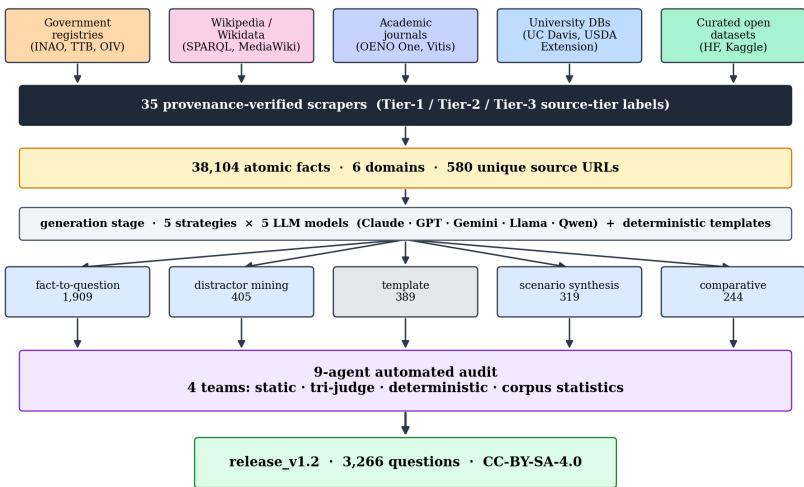  
Figure 1: End-to-end OenoBench pipeline: authoritative sources → 35 scrapers → atomic facts → closed-book gate → nine-agent audit → release.

We organise wine knowledge into six domain pillars, chosen to align with the WSET Level 3 and Diploma syllabi: (i) wine regions (appellations, classifications, geography, climate, soils); (ii) grape varieties (ampelography, parentage, regional distribution, sensory profile); (iii) viticulture (vineyard practice, training systems, pests and diseases, vintage effects); (iv) winemaking (vinification choices, fermentation, ageing, faults); (v) producers (estates, négociants, co-operatives, key houses); and (vi) wine business (markets, regulation, distribution, economics). Each domain has a separate target share informed by syllabus weighting and source availability; the realised distribution is reported in Table 1.

## 3.2 Source tiering, licensing, and non-fabrication

Every fact is tagged with one of three source tiers, mirroring evidence-based-medicine practice:

• Tier 1 (official, 19.6%): government registries and inter-governmental bodies (INAO, OIV, TTB, regional consortia, the UC Davis AVA database).

• Tier 2 (authoritative, 76.6%): Wikipedia, Wikidata SPARQL, wine-body and consortium websites, peer-reviewed journals (OENO One, Vitis, Australian Journal ofGrape and Wine Research).

• Tier 3 (reliable, 3.8%): curated open datasets on HuggingFace and Kaggle, secondary reference databases.

Licensing and non-fabrication. Every source is public-record or released under a licence that permits scraping and redistribution: Tier-1 government data under explicit open-data licences (INAO Licence Ouverte, OIV, UC Davis AVA, TTB public-domain), Tier-2 Wikipedia/Wikidata under CC-BY-SA / CC0 and journals (OENO One, Vitis, AJEV) open-access; the full per-source licence table is Table 16 in Appendix E. A central design commitment is that no fact in the corpus comes from an LLM’s internal knowledge: every fact is extracted by a source-specific scraper, stamped with source URL, retrieval timestamp, and tier label before insertion, and the fact-insertion utility rejects records without a verified source-URL trace. We emphasise this because LLM-generated content masquerading as scraped data is a contamination vector that conventional dataset documentation does not detect.

Table 1: Atomic-fact corpus: 38,104 facts from 35 scrapers, six domain pillars, three source tiers.
<table><tr><td>Domain pillar</td><td>Facts</td><td>Share</td><td>Tier 1</td><td>Tier 2/3</td></tr><tr><td>Wine regions</td><td>18,943</td><td>49.7%</td><td>23.4%</td><td>76.6%</td></tr><tr><td>Producers</td><td>6,215</td><td>16.3%</td><td>9.1%</td><td>90.9%</td></tr><tr><td>Grape varieties</td><td>5,959</td><td>15.6%</td><td>18.8%</td><td>81.2%</td></tr><tr><td>Viticulture</td><td>3,635</td><td>9.5%</td><td>12.0%</td><td>88.0%</td></tr><tr><td>Wine business</td><td>1,985</td><td>5.2%</td><td>31.4%</td><td>68.6%</td></tr><tr><td>Winemaking</td><td>1,367</td><td>3.6%</td><td>16.7%</td><td>83.3%</td></tr><tr><td>Total</td><td>38,104</td><td>100.0%</td><td>19.6%</td><td>80.4%</td></tr></table>

## 3.3 Atomic fact extraction

Source pages are decomposed into atomic facts by a five-stage pipeline (Figure 5, Appendix B.1): sentence splitting; reference resolution (pronouns replaced by their entity referents); domain classification into one of the six pillars; a length/predicate validator (5–50 words, must contain a verb, no dangling references); and a region-keyword on-topic filter that prevents cross-contamination (e.g. Austrian content in a Bordeaux scraper). Wikidata SPARQL queries use direct country relations (P17) rather than transitive parents (P131\*), the latter having caused severe cross-region leakage in early scrapers (Appendix B).

Facts are required to be atomic (one assertion per sentence), entity-tagged (subject and object linked to canonical knowledge-graph IDs), and source-faithful (a paraphrase, never a verbatim copy); the last is enforced at extraction and re-checked at audit time by agent A3.

## 3.4 Question generation: five strategies, five models

A single-strategy, single-model benchmark inherits the blind-spots of its pipeline. We mitigate this by combining five strategies and five generator models, with per-strategy and per-model quotas enforced by an orchestrator that resumes safely across runs. Strategies are:

• Fact-to-question (58.4%, 1,909 questions): the LLM rewrites a single verified fact as a multiple-choice question; preserves grounding but tends toward recall.

• Distractor mining (12.4%, 405): confusable-entity sampling produces wrong answers that share the right answer’s category and dimension, raising plausibility and forcing fine-grained discrimination.

• Template (11.9%, 389): forty-five deterministic parameterised templates across the six pillars; pure entity substitution, zero LLM creativity — a baseline against which neural generation is measured.

• Scenario synthesis (9.8%, 319): coherent fact clusters are converted into applied multi-fact reasoning prompts (e.g. a sommelier service decision, a winemaker blending decision, a viticulturist vintage call). Domain-specific scenario types prevent persona-content mismatch.

• Comparative (7.5%, 244): entity-affinity scoring pairs related entities (e.g. two Burgundy premiers crus, two Rhône grapes) and asks “which differs in X” or “what do both share”.

The five generator models are Claude Opus 4.7, GPT-5, Gemini 2.5 Pro, Llama 3.1 405B, and Qwen 3.5 235B, each accessed through a unified OpenRouter client with consistent temperature and top-p. The realised generator distribution across the released corpus is Qwen 20.4%, Llama 19.3%, Claude 19.0%, ChatGPT 16.6%, Gemini 12.9%, deterministic templates 11.9% (computed directly from the 3,266 released questions). The orchestrator allocates generation share dynamically based on per-pilot audit pass rates — generators whose questions pass audit reliably get a larger share in subsequent rounds — subject to a hard per-generator cap of 21% to keep any single model from dominating the corpus.

## 3.5 Final corpus: release\_v1.2

After generation, audit, and post-eval review, the released corpus release\_v1.2 contains 3,266 questions. The distribution along the domain and difficulty axes is:

Table 2: Composition of the released corpus.
<table><tr><td>Domain</td><td>N</td><td>%</td><td>Difficulty</td><td>N</td><td>%</td></tr><tr><td>Wine regions</td><td>1,108</td><td>33.9%</td><td>L1 (entry)</td><td>694</td><td>21.2%</td></tr><tr><td>Grape varieties</td><td>766</td><td>23.5%</td><td>L2 (intermediate)</td><td>894</td><td>27.4%</td></tr><tr><td>Producers</td><td>515</td><td>15.8%</td><td>L3 (advanced)</td><td>678</td><td>20.8%</td></tr><tr><td>Viticulture</td><td>502</td><td>15.4%</td><td>L4 (expert)</td><td>1,001</td><td>30.6%</td></tr><tr><td>Wine business</td><td>250</td><td>7.7%</td><td></td><td></td><td></td></tr><tr><td>Winemaking</td><td>187</td><td>5.7%</td><td></td><td></td><td></td></tr><tr><td>Total</td><td>3,266</td><td>100%</td><td>Total</td><td>3,266</td><td>100%</td></tr></table>

release\_v1.2 ships under CC-BY-SA-4.0 on HuggingFace with a Croissant manifest [1] and a full Datasheet [4] in Appendix A.

## 4 Multi-Agent Quality Audit

The audit pipeline runs every generated question through nine automated agents in four teams. Each agent emits a per-question {PASS, WARN, FAIL} signal calibrated against a human-reviewed gold sheet via Cohen’s κ; agents whose agreement falls below threshold are downweighted to advisoryonly. The released human-review web app (Appendix D) collects the gold-sheet ratings, and the team-by-team architecture (Figure 6, Appendix C) traces the flow from candidate question to drop / relabel / keep verdict.

## 4.1 Team architecture

Of the 14 agents (Tables 3–4), nine are always-run on every candidate question; the remaining five are escalation-gated and are invoked only when an upstream agent flags a corpus-level concern. This deferred-execution policy keeps routine audit cost bounded (∼\$76 for the full corpus audit reported here, 5h 22m wall) while preserving full coverage when a defect class is suspected. The full audit code, prompts, and thresholds are released alongside the corpus (Appendix B).

Table 3: Audit agents (1/2): static and tri-judge teams. ALWAYS: run on every question. ESC: escalation-gated.
<table><tr><td>Team</td><td>Agent</td><td>Run</td><td>Function</td></tr><tr><td rowspan="4">A. Static</td><td>A1 LexicalHygiene</td><td>ALWAYS</td><td>Regex sweep for vague phrasing, marketing language, meta-questions.</td></tr><tr><td>A2 BiasStats</td><td>ALWAYS</td><td> $\chi ^ { 2 ^ { - } }$  on correct-answer position; Mann-Whitney U on correct-vs- distractor length.</td></tr><tr><td>A3 FactEcho</td><td>ALWAYS</td><td>Longest-common-substring ratio between question text and source fact (FAIL at LCS&gt;0.65).</td></tr><tr><td>A4 TemplateFingerprint</td><td>ALWAYS</td><td>POS-bigram logistic regression detector for template-induced stylistic regularities (held-out AUC 0.84).</td></tr><tr><td rowspan="4"></td><td>B1 TriJudgeAnswer</td><td>ALWAYS</td><td>Claude / GPT / Gemini panel reads question + source fact and votes on the marked-correct option.</td></tr><tr><td>B. Tri-judge B2 ClosedBookSolvability ALWAYS</td><td></td><td>Same panel, source fact withheld: can the question be answered from world knowledge alone?</td></tr><tr><td>B3 UbiquityRisk</td><td>ALWAYS</td><td>Internationally-grown grape stem × region-class answer ⇒ ambiguity flag.</td></tr><tr><td>B4 Ambiguity</td><td>ESC</td><td>Tri-judge re-read flags questions with &gt;1 defensible answer; invoked when B1 dissent rate elevated.</td></tr><tr><td></td><td>B5 VerifierSkip</td><td>ESC</td><td>Self-consistency probe across re-prompted panels; invoked on disputed B1 verdicts.</td></tr></table>

Table 4: Audit agents (2/2): deterministic and corpus-statistics teams.
<table><tr><td>Team</td><td>Agent</td><td>Run</td><td>Function</td></tr><tr><td rowspan="4">C. Determin.</td><td>C1 DistractorDifficulty</td><td>ESC</td><td>Embedding-distance distractor analysis; invoked when A2 reports length skew.</td></tr><tr><td>C2 CategoryLeak</td><td>ALWAYS</td><td>Wine-type distractor validation; flags red/white/sparkling category mis- matches.</td></tr><tr><td>C3 SourceSwap</td><td>ESC</td><td>Substitutes alternate source facts to test answer stability; invoked on B1/B2 disagreement.</td></tr><tr><td>C4 DifficultyAudit</td><td>ALWAYS</td><td>Gemini Pro re-rates difficulty; FAIL/WARN when delta ≥2 from as- signed.</td></tr><tr><td rowspan="3">D. Corpus stats</td><td>D1 SelfPreference</td><td>ALWAYS</td><td>Per-generator-family own-vs-other accuracy on a held-out probe; corpus- level signal.</td></tr><tr><td>D2 DedupCalibration</td><td>ESC</td><td>Near-duplicate audit at cosine ≥0.92; invoked on suspicious cluster signals.</td></tr><tr><td>D3 SkewAudit</td><td>ALWAYS</td><td>Country / sub-domain over-representation  $\chi ^ { 2 } .$ </td></tr></table>

## 4.2 Gold-sheet calibration

A gold sheet of 50 stratified questions per release is rated independently by three WSET-certified reviewers (Diploma, Level 3, Level 2 — the Diploma rater is the lead author) through the humanreview web app (Appendix D); 15+ rounds (audit pilots v1–v16) form a calibration cycle covering eight rubrics (answer-correctness, distractor plausibility, ambiguity, source-faithfulness, needs-source, vague language, label correctness, verbatim copying). For each agent we compute Cohen’s κ against the rubric; signals with $\kappa < 0 . 6$ are downweighted to advisory-only.

The most consequential result is agent B2 ClosedBookSolvability: the human solved ≈12% of goldsheet questions without the source fact while the LLM tri-judge panel reported ≈83% (κ ≈ 0.007). We read this as a property of the evaluator — frontier LLM judges have absorbed enough wine knowledge during pre-training to over-attribute “world knowledge” to non-trivial questions. We retain the 1,601 B2-flagged questions with disclosure and turn the blind spot into a calibrated memorisation-reliance diagnostic via the closed-book vs. source-grounded contrast (Section 5.5).

## 4.3 Release-cycle results

The 9-agent audit on release\_v1.1 (3,670 candidate questions) produced the verdicts summarised in Table 6 (Appendix B.7): A1, A3, B1, C2 and B3 between them flagged 341 distinct questions for DROP, while C4 re-labelled difficulty on 1,259 questions and B2 flagged 1,601 as closed-book solvable but kept them with disclosure.

After drops, a follow-up post-evaluation pass (Section 5 and Appendix C) audited the 97 questions that all 16 evaluation configs answered incorrectly: 54 were removed as defects (wrong ground truth, all-correct options, duplicate options), 9 were dropped on borderline-review and the remaining 34 retained as legitimately hard. The final released corpus is 3,266 questions.

The C4-driven difficulty re-label was decisive: it shifted the corpus from 14% L3+L4 items (the original generator-assigned distribution) to 51% L3+L4 (Table 7, Appendix B.7), bringing the hardesttier counts above the entry-tier counts and substantially sharpening difficulty-stratified analyses (Section 5.1).

## 5 Evaluation

We evaluate 16 frontier configurations on the 3,266-question release in a single end-to-end run. The slate combines six within-family cost pairs (Claude Opus 4.7 vs. Claude Haiku 4.5, Gemini 2.5 Pro vs. Gemini 2.5 Flash, GPT-5 vs. GPT-5-mini, Llama 3.3 70B vs. Llama 3.1 8B, Qwen 2.5 72B vs. Qwen 2.5 7B), four reasoning-mode configurations (o3, DeepSeek R1, Gemini 2.5 Pro thinking, Claude Opus 4.7 thinking), and two additional standard models (DeepSeek V3, Mistral Large). Every config sees the same 3,266 questions, with single-letter output (A–D) at max\_tokens=5 and a five-stop fallback. We organise the evaluation around five questions, one per subsection.

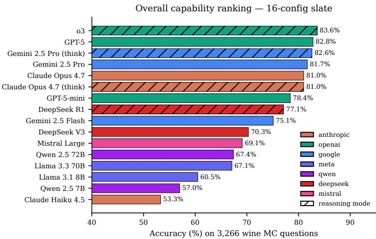  
Figure 2: Overall accuracy on the 3,266-question corpus across 16 configurations. Reasoning-mode configs are hatched.

## 5.1 Overall capability ranking

OenoBench cleanly stratifies the slate into three bands (Figure 2): frontier (≥80%, led by o3 at 83.6%, with GPT-5, Gemini 2.5 Pro, and Claude Opus 4.7 clustered within 3 pp); mid-tier (mid-60s to high-70s); and small-tier (low-50s to low-60s). No config performs at random; the best-vs-worst spread is 30 pp, comparable to GPQA [16] but on a domain corpus 30× smaller and fully provenancetagged. Difficulty-stratified accuracies (Appendix C, Table 14) confirm a clean L1→L4 gradient: 93.6% on L1 down to 58.7% on L4 expert items, with frontier configs holding 68–71% on L4 and small configs at 39–45%.

## 5.2 Reasoning-mode lift

Reasoning-mode lift is concentrated in a single family (Figure 7, Appendix C). Only DeepSeek R1 vs. V3 (+6.8 pp [+4.6, +8.8]) has a CI excluding zero; the three frontier pairs (o3 vs. GPT-5, Gemini Pro thinking vs. Pro, Claude Opus thinking vs. Opus) are all statistically indistinguishable from zero. We attribute the asymmetry to headroom: V3 leaves substantial parametric ceiling at 70.3% which chain-of-thought can recover, while frontier models are already near their recallable ceiling. Per-difficulty breakdowns (Appendix C, Table 8) show the frontier reasoning configs gaining at most 1–2 pp at L4 and flat elsewhere, making the cost-vs-lift trade unfavourable except for DeepSeek (Section 5.4).

## 5.3 Self-preference bias

We compute the Self-Preference Score (SPS) per config m as $\mathrm { S P S } ( m ) = \mathrm { A c c } ( m \mid Q _ { \mathrm { o w n } } ) - \mathrm { A c c } ( m \mid$ $Q _ { \mathrm { o t h e r } } )$ where $Q _ { \mathrm { o w n } }$ collects questions generated by m’s family and $Q _ { \mathrm { o t h e r } }$ its complement. A pipeline that successfully neutralises generator fingerprints should produce |SPS| near zero.

The result (Figure 3) is family-dependent: Anthropic clusters at +9 to +10 pp (all CIs above zero), OpenAI is statistically zero, and Google shows an unexpected negative −6 to −10 pp cluster. The cross-family matrix (Figure 3, left) traces the asymmetry: Google-generated questions are uniformly harder for everyone, while Anthropic-generated questions are uniformly easier for Anthropic only. We interpret the Anthropic gap as a residual stylistic fingerprint that pre-release paraphrase passes did not neutralise, and the Google gap as harder-by-phrasing rather than by leak; both are first-class disclosures with the released corpus.

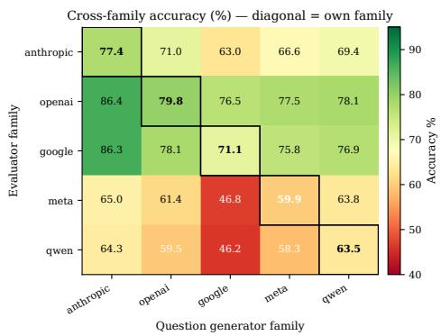

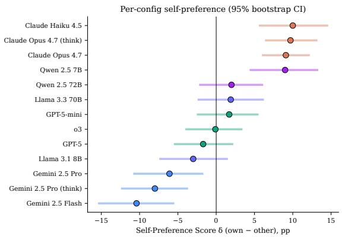  
Figure 3: Self-preference bias. Left: cross-family accuracy matrix (rows = evaluator, columns = generator). Right: per-config SPS δ = Acc(own) − Acc(other) with 95% bootstrap CI.

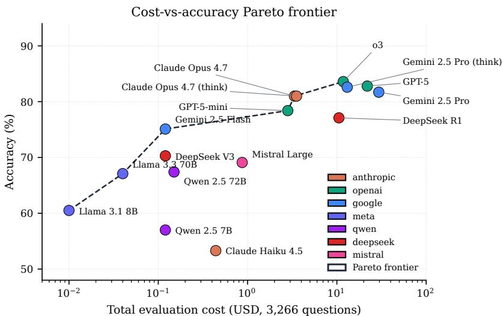  
Figure 4: Total OpenRouter cost (log scale) versus accuracy on the full 3,266-question slate. Family colours match Figure 2; the Pareto frontier (red dashed) illustrates the cost-vs-quality trade-off.

## 5.4 Cost efficiency

The slate spans nearly four orders of magnitude in evaluation cost (Figure 4). Five configs sit on the Pareto frontier spanning the cost-quality spectrum: Llama 3.1 8B (60.5 % / \$0.01), Gemini 2.5 Flash (75.1 % / \$0.12), GPT-5-mini (78.4 % / \$2.82), Claude Opus 4.7 (81.0 % / \$3.35), and o3 (83.6 % / \$11.80). The two most expensive configs (Gemini 2.5 Pro \$29.47, GPT-5 \$21.90) are dominated by cheaper Pareto neighbours: their extra spend buys output tokens, not better wine answers. Reasoning-mode lift (Section 5.2) yields a Pareto win only for DeepSeek R1, which is itself dominated by GPT-5-mini. The efficient boundary therefore favours small proprietary plus a single reasoning model over reasoning-everywhere or scale-everywhere strategies.

## 5.5 Closed-book vs. source-grounded performance

The B2 agent reported ∼83% closed-book solvability against the human reviewer’s ∼12% (Section 4.2) — itself a measurement of what frontier LLMs already know about wine. We exploit it by partitioning the corpus into 1,601 B2-flagged and 1,665 contextual / source-grounded questions and reporting per-config accuracy on each slice (Figure 8, Appendix C.3).

The contrast is the largest single effect we observe: the mean per-config closed-book minus contextual gap is +32.6 pp (range +26.6 to +39.6 pp, every CI above zero). The B2-flagged slice overlaps heavily with parametric wine knowledge acquired in pre-training; the contextual slice is where wine knowledge must be reasoned through the source fact — Claude Opus 4.7 and o3 hold ∼70% on the contextual slice, small models drop to ≈45%, and the inter-config spread widens from 27 to 33 pp. The contextual slice is the more discriminative test of wine reasoning; the B2-flagged slice is a calibrated indicator of how much apparent “wine knowledge” is parametric recall.

## 6 Applications and Future Work

## 6.1 Closing the wine-knowledge gap in low-cost models

Small open-weight models trail proprietary frontier ones by 20–30 pp on this benchmark, while the broad-benchmark gap is only 10–15 pp (Section 5.4). The 38,104-fact corpus is a natural supervised-fine-tuning target via a two-stage recipe: instruction tuning on held-out question/sourcefact pairs, then LoRA adaptation on the full fact-question-source triples in the release schema. Both stages run on consumer GPUs without proprietary weights or pre-training compute. The contextual slice (Section 5.5) is the harder-to-game evaluation surface, so measured gain tracks genuine wine reasoning. A Llama-3.3-70B-class adaptation could plausibly close most of the GPT-5-mini gap at ≈1% of proprietary inference cost.

## 6.2 Case-based evaluation with industry partners

Multiple-choice tests have ceilings: a perfect OenoBench score does not establish useful behaviour in real workflows. We are scoping an applied case-based dataset with industry partners along three personas:

• Sommelier → customer service: pairing prompts rated on recommendation, justification, and substitutions.

• Winemaker → blending decisions: vintage write-ups, lab analyses, and regulatory constraints in context; rated on technical correctness, compliance, and stylistic intent.

• Viticulturist → vineyard decisions: weather, soil/disease, canopy/yield records; recommendations rated against decisions actually taken in the same vintage.

## 6.3 Generalising the scrape-to-audit pipeline

The pipeline modules — tier-of-authority taxonomy, atomic-fact extraction, multi-strategy multimodel generation with per-model quotas, κ-calibrated multi-agent audit, and closed-book pre-screen — are domain-agnostic. Three near-term targets share wine’s structural features: horticulture/agronomy (regulated appellations, peer-reviewed journals, certification ladders); regulated medicine (clinical guidelines, drug formularies; current benchmarks rely on board-exam questions misaligned with practice); and financial regulation (FASB, IFRS, jurisdictional filings; CFA/CPA ladders). The released code reduces months of expert authoring to weeks of curation.

## 7 Limitations

Snapshot vs. moving target. Wine regulation, classifications, and producer ownership change on a multi-year cadence (INAO appellation revisions, DOCG promotions, estate sales). The released corpus is a snapshot dated 2026-04-01 and will require periodic re-extraction; we release the scrapers and provenance metadata so this is mechanically reproducible.

Closed-book audit calibration. The B2 ClosedBookSolvability agent shows κ ≈ 0.007 with humans on the gold sheet (Section 4.2). Rather than drop the affected questions we keep them with explicit disclosure and report the closed-book vs. contextual contrast (Section 5.5) as a calibrated memorisation-reliance diagnostic.

Self-preference is not fully neutralised. The Anthropic +9 pp positive SPS (Section 5.3) shows the multi-model strategy did not fully neutralise stylistic fingerprints; downstream Anthropic-vs-other comparisons on the full corpus should be read with the per-config SPS in mind.

## Acknowledgments and Disclosure of Funding

This work was independently funded by StrategAI. We thank the open contributors to Wikipedia, Wikidata, INAO, OIV, TTB, UC Davis, USDA Extension, and the wine consortia and academic journals (OENO One, Vitis, AJEV) whose work makes a provenance-grounded benchmark of this scale possible. We thank the OpenRouter team for the unified-API gateway used during construction and evaluation.

## References

[1] Mubashara Akhtar, Omar Benjelloun, Costanza Conforti, et al. Croissant: A metadata format for ML-ready datasets. In Advances in Neural Information Processing Systems (NeurIPS), Datasets and Benchmarks Track, 2024.

[2] Li Chen, Yi-Ching Chen, Yiqun Liu, and Shaoping Ma. Recommending wines based on subjective user ratings. In Proceedings ofthe 8th ACM Conference on Recommender Systems (RecSys), 2014.

[3] Jesse Dodge, Maarten Sap, Ana Marasovic, William Agnew, Gabriel Ilharco, Dirk Groeneveld,´ Margaret Mitchell, and Matt Gardner. Documenting large webtext corpora: A case study on the Colossal Clean Crawled Corpus. In Proceedings ofthe 2021 Conference on Empirical Methods in Natural Language Processing (EMNLP), 2021.

[4] Timnit Gebru, Jamie Morgenstern, Briana Vecchione, Jennifer Wortman Vaughan, Hanna Wallach, Hal Daumé III, and Kate Crawford. Datasheets for datasets. Communications of the ACM, 64(12), 2021.

[5] Neel Guha, Julian Nyarko, Daniel E. Ho, Christopher Ré, Adam Chilton, et al. LegalBench: A collaboratively built benchmark for measuring legal reasoning in large language models. In Advances in Neural Information Processing Systems (NeurIPS), 2023.

[6] Dan Hendrycks, Collin Burns, Steven Basart, Andy Zou, Mantas Mazeika, Dawn Song, and Jacob Steinhardt. Measuring massive multitask language understanding. In International Conference on Learning Representations (ICLR), 2021.

[7] Robert T. Hodgson. An examination of judge reliability at a major u.s. wine competition. In Journal of Wine Economics, volume 3, 2008.

[8] Pranab Islam, Anand Kannappan, Douwe Kiela, Rebecca Qian, Nino Scherrer, and Bertie Vidgen. FinanceBench: A new benchmark for financial question answering, 2023.

[9] Di Jin, Eileen Pan, Nassim Oufattole, Wei-Hung Weng, Hanyi Fang, and Peter Szolovits. What disease does this patient have? a large-scale open domain question answering dataset from medical exams. Applied Sciences, 11(14), 2021.

[10] Qiao Jin, Bhuwan Dhingra, Zhengping Liu, William Cohen, and Xinghua Lu. PubMedQA: A dataset for biomedical research question answering. In Proceedings ofthe 2019 Conference on Empirical Methods in Natural Language Processing (EMNLP), 2019.

[11] Els Lefever, Iris Hendrickx, Ilja Croijmans, Asifa Majid, and Antal van den Bosch. A hybrid approach to domain-independent taxonomy learning applied to the wine domain. In Language Resources and Evaluation (LREC), 2018.

[12] Percy Liang, Rishi Bommasani, Tony Lee, et al. Holistic evaluation of language models. In Transactions on Machine Learning Research (TMLR), 2023.

[13] Inbal Magar and Roy Schwartz. Data contamination: From memorization to exploitation. In Proceedings of the 60th Annual Meeting of the Association for Computational Linguistics (ACL), 2022.

[14] Arjun Panickssery, Samuel R. Bowman, and Shi Feng. LLM evaluators recognize and favor their own generations. In Advances in Neural Information Processing Systems (NeurIPS), 2024.

[15] Long Phan, Alice Gatti, Ziwen Han, Nathaniel Li, Josephina Hu, et al. Humanity’s last exam, 2025.

[16] David Rein, Betty Li Hou, Asa Cooper Stickland, Jackson Petty, Richard Yuanzhe Pang, Julien Dirani, Julian Michael, and Samuel R. Bowman. GPQA: A graduate-level google-proof q&a benchmark. In Conference on Language Modeling (COLM), 2024.

[17] Oscar Sainz, Jon Ander Campos, Iker García-Ferrero, Julen Etxaniz, Oier Lopez de Lacalle, and Eneko Agirre. NLP evaluation in trouble: On the need to measure LLM data contamination for each benchmark. In Findings of the Association for Computational Linguistics: EMNLP, 2023.

[18] Mrinank Sharma, Meg Tong, Tomasz Korbak, David Duvenaud, Amanda Askell, Samuel R. Bowman, et al. Towards understanding sycophancy in language models. In International Conference on Learning Representations (ICLR), 2024.

[19] Aarohi Srivastava et al. Beyond the imitation game: Quantifying and extrapolating the capabili ties of language models. Transactions on Machine Learning Research (TMLR), 2023.

[20] Lianmin Zheng, Wei-Lin Chiang, Ying Sheng, Siyuan Zhuang, Zhanghao Wu, Yonghao Zhuang, Zi Lin, Zhuohan Li, Dacheng Li, Eric Xing, et al. Judging LLM-as-a-Judge with MT-Bench and Chatbot Arena. In Advances in Neural Information Processing Systems (NeurIPS), 2023.

[21] Wanjun Zhong, Ruixiang Cui, Yiduo Guo, Yaobo Liang, Shuai Lu, Yanlin Wang, Amin Saied, Weizhu Chen, and Nan Duan. AGIEval: A human-centric benchmark for evaluating foundation models. In Findings ofthe Associationfor Computational Linguistics: NAACL, 2024.

## A Datasheet for OenoBench

We follow the datasheet template of Gebru et al. [4].

## A.1 Motivation

For what purpose was the dataset created? To evaluate factual knowledge of large language models on a multi-disciplinary, externally-validated domain (wine), and to provide a benchmark whose construction includes explicit bias controls (multi-model generation, multi-agent audit, selfpreference scoring, closed-book vs. source-grounded partition).

Who created the dataset? The dataset was created by Nikita Khudov (StrategAI) for the NeurIPS 2026 Evaluations & Datasets Track. The lead author holds the WSET Diploma in Wines (the highest pre-Master-of-Wine qualification of the Wine & Spirit Education Trust). Gold-sheet ratings used to calibrate the nine audit agents were produced by three WSET-certified reviewers (Diploma, Level 3, Level 2) including the lead author.

Funding. Independently funded by StrategAI. No external research grants were received. Total OpenRouter API cost across the entire project — generation pilots, audit cycles, and the final 16-config evaluation — was \$783, paid out-of-pocket.

## A.2 Composition

What do the instances represent? Each instance is a multiple-choice benchmark question with: question text, 4 options with marked-correct answer, supporting fact(s) with source URL and tier label, generator model identifier, generation strategy, audit-agent verdicts (per-agent pass/warn/fail signals), and (for the gold-sheet subset) human-reviewer ratings on eight rubrics.

How many instances are there? 3,266 questions in release\_v1.2. By strategy: fact-to-question 1,909, distractor mining 405, template 389, scenario 319, comparative 244. By difficulty (postrelabel): L1 694, L2 894, L3 678, L4 1,001. By domain: wine regions 1,108, grape varieties 766, producers 515, viticulture 502, wine business 250, winemaking 187. The corpus is built from 38,104 atomic facts across 35 scrapers and 4,295 individually-tracked source records spanning 56 unique top-level domains.

What data does each instance consist of? Structured Postgres records mirroring the schema documented in Section 3 and Appendix B.

Recommended data splits. The dataset ships as a single test split (this is an evaluation-only benchmark). Two analytic partitions are documented and recommended for use: (i) the closed-book slice (1,601 questions tagged closed\_book\_solvable) and the contextual slice (1,665 remaining questions), partitioned by audit agent B2; and (ii) per-generator held-out splits for self-preference analysis (Section 5.3), defined dynamically by the generator\_family column.

Errors, noise, redundancies? Documented in Section 4. Per-agent fail rates and κ versus the human gold sheet are released alongside the corpus. The 1,601 B2-flagged questions are kept with disclosure because LLM-judge calibration with humans on closed-book solvability is unreliable (κ ≈ 0.007).

Self-contained, or relies on external resources? Self-contained: question text, supporting facts, and source URLs are all included. Source URLs may rot over time; we mitigate by archiving Tier-1 source pages and recording the access timestamp.

## A.3 Collection process

How was the data acquired? By 35 provenance-verified web scrapers (released in src/scrapers/). Sources span government registries (INAO, TTB, OIV), inter-governmental bodies, university research groups (notably UC Davis, USDA Extension), Wikipedia, Wikidata, peerreviewed journals (OENO One, Vitis, AJEV), and curated open datasets. Scraping was rate-limited and used the disclosed user agent OenoBench-Research/1.0 (academic wine benchmark).

Time frame. Fact extraction: 2026-03 through 2026-04. Question generation: 2026-04 through 2026-05-03. Evaluation: 2026-05-03.

Ethical review. The work is non-IRB-eligible at our institution because (a) no human subjects were enrolled in research, (b) gold-sheet ratings were produced by three WSET-certified reviewers including the lead author, and (c) all source data is public-record information about commercial wine entities. Human review of LLM-generated questions is treated as data-quality assurance, not as human-subjects research.

## A.4 Preprocessing / cleaning / labelling

Atomic-fact extraction with entity tagging; per-source paraphrase to avoid verbatim copy; nearduplicate suppression at cosine ≥ 0.92; nine-agent automated audit; human gold-sheet rating on a stratified 50-question subset per release, produced independently by three WSET-certified reviewers (Diploma, Level 3, Level 2) with the lead author resolving disagreements.

## A.5 Uses

Recommended uses. Evaluation of LLM factual knowledge in the wine domain; ablation studies of bias-mitigation techniques in benchmark construction; study of self-preference effects in LLMas-judge pipelines; calibration of automated multi-agent QA frameworks against expert human review.

Discouraged uses. Direct deployment as a wine-recommendation or purchasing system without separate alignment, age-gating, and jurisdictional advertising review; fine-tuning on the benchmark itself for ranking purposes (would invalidate the benchmark for the trained model). The scrape-toaudit pipeline should not be retargeted to high-stakes domains (medicine, law) without comparable expert human review of the retargeted source taxonomy.

Alcohol context. Wine is an alcoholic beverage. OenoBench is a knowledge-evaluation tool, not a consumer-facing product. A high OenoBench score reflects factual / reasoning capability about wine; it does not endorse downstream deployment as a drinking-recommendation system, which would require separate alignment for health information, age-gating, and jurisdictional advertising rules.

## A.6 Distribution

Will the dataset be distributed? Yes, under CC-BY-SA-4.0 on HuggingFace at https:// huggingface.co/datasets/oenobench/oenobench. A Croissant manifest is included [1]. The construction code is on GitHub at https://github.com/nikitahudov/oenobench.

## Citation.

```bib
@inproceedings{khudov2026oenobench,
title = {OenoBench: A Wine-Domain Benchmark for Knowledge-Grounded
Evaluation of Large Language Models},
author = {Khudov, Nikita},
booktitle = {Advances in Neural Information Processing Systems
(NeurIPS), Datasets and Benchmarks Track},
year = {2026}
}
```

## A.7 Maintenance

Maintainer. Nikita Khudov, nikitahudov@gmail.com.

Update cadence. Wine regulation changes on a multi-year cadence; we plan annual re-extraction. Scraper code is released so the community can re-extract independently. Corpus versioning follows release\_vX.Y (major release / minor patch) with all prior versions retained on HuggingFace.

Errata. A public errata log will be maintained alongside the HuggingFace release; corrections to questions, facts, audit verdicts, or difficulty labels will be versioned and dated. Reports of factual errors are accepted via GitHub issues and will be evaluated against the source URL.

## B Additional Methodology Detail

This appendix expands the dataset-construction and audit pipelines: the atomic-fact extractor (B.1), the Wikidata SPARQL choice (B.2), question-generation prompts (B.3), the closed-book gate (B.4), and audit architecture, agent specifications, and release-cycle results (B.5–B.7), with the calibration philosophy that informs them (B.8).

## B.1 Atomic fact extraction pipeline

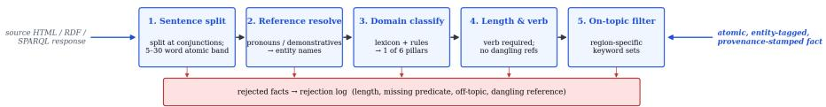  
Figure 5: Atomic-fact extraction pipeline. Inputs are heterogeneous (HTML pages, RDF graphs, SPARQL responses, CSV dumps); outputs are uniform single-assertion sentences with entity tags, domain label, source URL and tier.

The atomic-fact extractor (src/scrapers/\_fact\_processing.py) applies five sequential filters to each candidate sentence:

1. Sentence split. NLTK Punkt tokeniser; further split at explicit conjunctions (“and”, “but”, “while”) when both clauses have an independent verb. Maximum atomic length 30 words; reject longer.

2. Reference resolution. Pronouns and demonstratives are replaced with their entity referent from article context (paragraph-level coreference using a rule-based resolver tuned on Wikipedia leads). Sentences with unresolved it/this/that are dropped.

3. Domain classification. Lexicon-based + rule-based classifier maps each fact to one of the six domain pillars; ambiguous facts (no anchor term in any domain lexicon) are dropped.

4. Length and predicate validation. Reject facts <5 words, >50 words, missing a verb, or carrying dangling references / fragments. The 5–30 word band is the strict filter; the 31–50 band is kept with reduced confidence (910 facts).

5. On-topic filter. Region-specific keyword sets prevent cross-contamination (e.g. Austrian content in a Bordeaux scraper). Fail ⇒ drop.

A 2026-04 audit found that 19 of an original 35 scrapers contained hard-coded LLM-generated facts disguised as scraped data. The fix required rebuilding all 19 against live sources; the lesson preserved for future retargeting is that provenance auditing must run on the scrapers themselves, not only on the collected facts.

## B.2 Wikidata SPARQL: P17 vs P131\*

A common bug in early scrapers used the transitive administrative-parent property (P131\*) to bind questions to a country. This introduced severe cross-region contamination, e.g. Austrian appellations appearing in a Bordeaux scraper because the SPARQL graph traversal walked through shared ancestor entities. Switching to the direct country relation (P17) eliminated cross-country leakage at the cost of ∼3% lost coverage on borderline-region entities. The released SPARQL templates use P17 exclusively and we recommend the same discipline for any pipeline retargeted to a domain with hierarchical political subdivisions.

## B.3 Question-generation prompts

The five strategies share a common JSON output schema enforced via Pydantic with a 3-tier extraction fallback (markdown-fenced, raw JSON, prefix-pattern). Per-strategy prompt summaries:

• Fact-to-question: "Given a single atomic wine fact, write a 4-option multiple-choice question whose unique correct answer is grounded in the fact. Paraphrase the fact; do not copy contiguous spans of >5 words. Distractors must be confusable same-category entities, not random alternatives."

• Comparative: given two related facts (matched on entity type, country/sub-domain), "ask which differs in the named attribute or what both share. Avoid iconic-vs-non-iconic pairings."

• Scenario synthesis: given a cluster of 3–5 facts, "write a brief domain-appropriate professional scenario (sommelier service / winemaker decision / viticulturist call / business/regulatory choice) with a unique correct answer that requires all the cluster facts to derive."

• Distractor mining: given a fact + 3 confusable entities, "write a question whose 3 wrong options are these entities, ranked by ascending plausibility."

• Template: 45 deterministic parameter substitution templates; no LLM call. A subset is paraphrased post-hoc by Gemini Pro to defeat the A4 stylometric fingerprint detector.

Full prompt texts are in src/generators/\_prompts.py.

## B.4 Closed-book gate specification

The closed-book pre-screen (src/generators/\_closed\_book\_gate.py) runs a per-difficulty model:

• L1: Claude Haiku 4.5 reads the question with no source fact. Correct answer ⇒ tag closed\_book\_solvable.

• L2: Claude Sonnet 4.6 same protocol.

• L3: Claude Opus 4.7 same protocol; the corpus quota cap fires here.

• L4: gate is skipped by protocol; expert items are expected to be answerable only with the source fact.

The gate’s role in generation is to enforce a corpus-level cap on closed-book solvable items; early pilots used a 25% cap, but it was raised to 50% after the gold-sheet calibration revealed that the

LLM panel over-attributes closed-book solvability relative to humans (Section 4.2), so the higher cap retains the items that are in fact discriminating in evaluation. The audit’s B2 agent later re-runs the check at corpus scale on a tri-judge panel. Failures are not dropped; they are reserved into the closed-book slice and used for the analytic partition in Section 5.5.

## B.5 Audit architecture

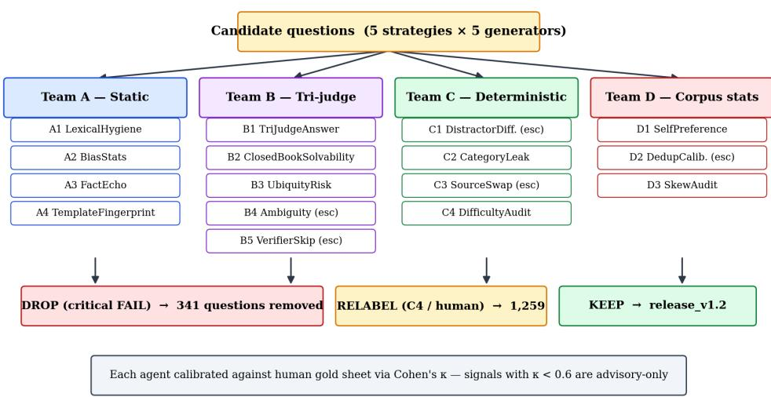  
Figure 6: Multi-agent audit architecture. Candidate questions are fanned out to four teams; each team independently emits per-question verdicts. Critical FAIL signals route the question to the drop pool; C4 difficulty disagreements route to relabel; otherwise the question is kept in release\_v1.2. Every agent is calibrated against the human gold sheet via Cohen’s κ.

## B.6 Audit agent specifications

Each agent is a versioned Python module under src/qa/agents/. Agents emit (question\_id, agent\_id, version, severity, payload\_json) tuples to the audit\_findings table; severity is one of {PASS, WARN, FAIL}. Versioning is strict: the (run\_id, question\_id, agent\_id, version) tuple is unique, so re-running an agent at a new version produces additive findings rather than overwriting. We document each agent’s threshold and gold-sheet κ here.

Table 5: Audit-agent thresholds and gold-sheet calibration.
<table><tr><td>Agent</td><td>Signal</td><td>Threshold</td><td>κ vs. gold</td></tr><tr><td>A1 LexicalHygiene</td><td>vague/marketing regex hits</td><td>≥1 hit ⇒ WARN; ≥3 ⇒ FAIL</td><td>0.71</td></tr><tr><td>A2 BiasStats</td><td>χ2 position; M-W length</td><td>p &lt; 0.01 ⇒ FAIL</td><td>0.65</td></tr><tr><td>A3 FactEcho</td><td>LCS / fact length</td><td>≥0.45 ⇒ WARN; ≥0.65 ⇒ FAIL</td><td>0.83</td></tr><tr><td>A4 TemplateFingerprint</td><td>POS-bigram logreg held-out AUC</td><td>&gt; 0.84 corpus-level ⇒ WARN</td><td>0.62</td></tr><tr><td>B1 TriJudgeAnswer</td><td>majority disagrees with key</td><td>2/3 disagree ⇒ FAIL</td><td>0.78</td></tr><tr><td>B2 ClosedBookSolv.</td><td>majority solves no-source</td><td>2/3 solve ⇒ WARN; 3/3 ⇒ FAIL</td><td>0.007</td></tr><tr><td>C2 CategoryLeak</td><td>wine-type mismatch in distractors</td><td>any ⇒ FAIL</td><td>0.91</td></tr><tr><td>C4 DifficultyAudit</td><td>|∆| assigned vs. rated</td><td>≥1 WARN; ≥2 FAIL</td><td>0.74</td></tr><tr><td>B3 UbiquityRisk</td><td>ubiquitous-grape stem × region answer</td><td>both ⇒ WARN</td><td>0.69</td></tr></table>

The B2 row is the calibration finding discussed in Section 4.2: the LLM panel and the human reviewer disagree on what counts as “world-knowledge solvable”, because frontier LLMs have absorbed substantial wine knowledge during pre-training. We retain the agent as a measurement of the LLM panel’s prior, and report the contextual / closed-book partition (Section 5.5) that turns the disagreement into a useful diagnostic.

## B.7 Release-cycle results

Table 6 summarises the verdicts produced when the 9-agent audit was applied to release\_v1.1 (3,670 candidate questions); these are the numbers cited in Section 4.3.

Table 6: Audit findings on release\_v1.1 and the resulting drop / re-label policy.
<table><tr><td>Audit signal</td><td>Triggered FAIL</td><td>Action</td></tr><tr><td>A1 LexicalHygiene (vague phrasing)</td><td>60</td><td>drop</td></tr><tr><td>A3 FactEcho (verbatim copy)</td><td>63</td><td>drop</td></tr><tr><td>B1 TriJudgeAnswer (wrong answer key)</td><td>47</td><td>drop</td></tr><tr><td>C2 CategoryLeak (wine-category leak)</td><td>9</td><td>drop</td></tr><tr><td>B3 UbiquityRisk (grape × region ambiguity)</td><td>183</td><td>drop</td></tr><tr><td>Distinct dropped (with overlap)</td><td>341</td><td></td></tr><tr><td>C4 DifficultyAudit (relabel from 1,252 LLM hits + 7 human)</td><td>1,259</td><td>re-label</td></tr><tr><td>B2 ClosedBookSolvability (kept w/ disclosure)</td><td>1,601</td><td>disclose</td></tr></table>

Table 7 shows the corpus-level effect of the C4 difficulty re-label, which shifted the corpus from 14% L3+L4 items to 51% L3+L4.

Table 7: Difficulty distribution before and after C4 re-label.
<table><tr><td></td><td>Generator-assigned</td><td>Post-relabel</td><td>∆</td></tr><tr><td>L1 (entry)</td><td>1,261 (38%)</td><td>694 (21%)</td><td>-567</td></tr><tr><td>L2 (intermediate)</td><td>1,559 (47%)</td><td>894 (27%)</td><td>-665</td></tr><tr><td>L3 (advanced)</td><td>218 (7%)</td><td>678 (21%)</td><td>+460</td></tr><tr><td>L4 (expert)</td><td>291 (9%)</td><td>1,001 (31%)</td><td>+710</td></tr></table>

## B.8 Calibration philosophy

We emphasise the design choice underlying these numbers. A naive “automated audit” interpretation would have dropped all 1,601 B2-flagged questions, which would have removed nearly half the corpus and biased the remainder toward whatever idiosyncratic items the LLM panel happened not to know. By calibrating B2 against humans and treating it as an evaluator-side signal, we preserve dataset value while giving downstream users a principled way to interpret leakage. The audit’s role, on this reading, is not to be the final arbiter of quality, but to surface signals that humans validate as quality-relevant, and to disclose clearly the signals where humans and LLMs disagree.

## C Full Evaluation Tables

This appendix gives the per-config tables and supporting figures behind each Section 5 subsection: reasoning-mode lift (C.1), self-preference bootstrap CIs (C.2), the closed-book vs. source-grounded contrast (C.3), and per-domain (C.4), per-strategy (C.5), and per-difficulty (C.6) breakdowns of the overall ranking. The cost ledger that supports Section 5.4 is in Appendix E.

## C.1 Reasoning-mode lift

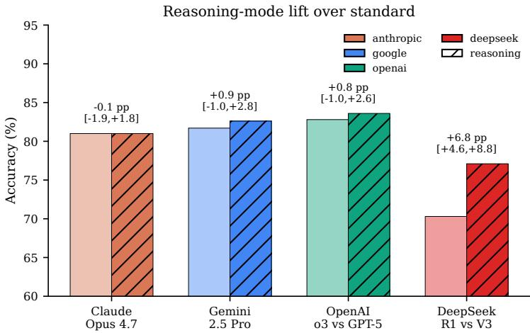  
Figure 7: Reasoning-mode vs. standard accuracy for four families; δ in pp with 95% bootstrap CI (1,000 resamples). Only DeepSeek’s CI excludes zero.

Table 8: Reasoning lift per difficulty tier (δ = thinking − standard, pp).
<table><tr><td>Pair</td><td>L1</td><td>L2</td><td>L3</td><td>L4</td></tr><tr><td>Claude Opus 4.7 (think vs std)</td><td>+0.3</td><td>-0.2</td><td>+0.3</td><td>-0.5</td></tr><tr><td>Gemini 2.5 Pro (think vs std)</td><td>+0.5</td><td>+1.0</td><td>+1.0</td><td>+0.9</td></tr><tr><td>OpenAI o3 vs GPT-5</td><td>+0.1</td><td>-1.0</td><td>+1.9</td><td>+2.0</td></tr><tr><td>DeepSeek R1 vs V3</td><td>+1.7</td><td>+8.3</td><td>+5.7</td><td>+9.7</td></tr></table>

## C.2 Self-preference bootstrap CIs

Table 9: Per-config Self-Preference Score with 95% bootstrap CI (1,000 resamples). n columns are the question counts in each pool: own = questions whose generator family matches the config’s family; other = questions whose generator is a different non-template LLM. Templates (n=389) are excluded from both pools, so own + other = 2,877 across every row. DeepSeek and Mistral have no own-family questions in release\_v1.2 and are omitted.

<table><tr><td>Config</td><td>own n</td><td>other n</td><td>own (%)</td><td>other (%)</td><td>δ(pp)</td><td>95% CI</td></tr><tr><td>claude-haiku-4.5</td><td>619</td><td>2,258</td><td>58.8</td><td>48.8</td><td>+10.0</td><td>[+5.7, +14.5]</td></tr><tr><td>claude-opus-4.7</td><td>619</td><td>2,258</td><td>86.6</td><td>77.5</td><td>+9.1</td><td>[+6.1, +12.1]</td></tr><tr><td>claude-opus-4.7-thinking</td><td>619</td><td>2,258</td><td>86.9</td><td>77.2</td><td>+9.7</td><td>[+6.5, +13.1]</td></tr><tr><td>qwen-2.5-7b</td><td>667</td><td>2,210</td><td>60.9</td><td>51.9</td><td>+9.0</td><td>[+4.5, +13.2]</td></tr><tr><td>qwen-2.5-72b</td><td>667</td><td>2,210</td><td>66.1</td><td>64.1</td><td>+2.0</td><td>[-2.1, +6.0]</td></tr><tr><td>llama-3.3-70b</td><td>629</td><td>2,248</td><td>65.5</td><td>63.6</td><td>+1.9</td><td>[−2.3, +6.1]</td></tr><tr><td>gpt-5-mini</td><td>542</td><td>2,335</td><td>77.9</td><td>76.1</td><td>+1.7</td><td>[−2.4, +5.4]</td></tr><tr><td>03</td><td>542</td><td>2,335</td><td>81.9</td><td>82.1</td><td>-0.1</td><td>[-3.9, +3.3]</td></tr><tr><td>gpt-5</td><td>542</td><td>2,335</td><td>79.7</td><td>81.4</td><td>-1.7</td><td>[−5.4, +2.1]</td></tr><tr><td>llama-3.1-8b</td><td>629</td><td>2,248</td><td>54.2</td><td>57.2</td><td>-3.0</td><td>[−7.3, +1.4]</td></tr><tr><td>gemini-2.5-pro</td><td>420</td><td>2,457</td><td>75.0</td><td>81.1</td><td>-6.1</td><td>[−10.7, -1.8]</td></tr><tr><td>gemini-2.5-pro-thinking</td><td>420</td><td>2,457</td><td>74.0</td><td>82.0</td><td>-8.0</td><td>[-12.3, -3.8]</td></tr><tr><td>gemini-2.5-flash</td><td>420</td><td>2,457</td><td>64.3</td><td>74.7</td><td>-10.4</td><td>[−15.3, -5.6]</td></tr></table>

Table 10: Per-tier Self-Preference Score δ (pp). The overall SPS in Table 9 is decomposed by the question’s post-relabel difficulty tier; each cell is own-Acc minus other-Acc on the questions of that tier. Bold marks cells whose 95% bootstrap CI excludes zero.
<table><tr><td>Config</td><td>Family</td><td>L1δ</td><td>L2δ</td><td>L3δ</td><td>L4δ</td></tr><tr><td>claude-haiku-4.5</td><td>anthropic</td><td>+3.1</td><td>+10.2</td><td>+2.0</td><td>+8.2</td></tr><tr><td>claude-opus-4.7</td><td>anthropic</td><td>+0.2</td><td>+8.5</td><td>+4.1</td><td>+9.5</td></tr><tr><td>claude-opus-4.7-thinking</td><td>anthropic</td><td>-0.6</td><td>+10.2</td><td>+3.4</td><td>+10.9</td></tr><tr><td>qwen-2.5-7b</td><td>qwen</td><td>+12.3</td><td>+6.6</td><td>+7.2</td><td>+10.4</td></tr><tr><td>qwen-2.5-72b</td><td>qwen</td><td>+2.4</td><td>-4.3</td><td>+0.0</td><td>+7.7</td></tr><tr><td>llama-3.3-70b</td><td>meta</td><td>-0.8</td><td>-3.8</td><td>-5.5</td><td>+6.8</td></tr><tr><td>gpt-5-mini</td><td>openai</td><td>+3.1</td><td>+10.7</td><td>+4.4</td><td>-0.7</td></tr><tr><td>03</td><td>openai</td><td>+2.6</td><td>+6.9</td><td>+4.0</td><td>-3.2</td></tr><tr><td>gpt-5</td><td>openai</td><td>+2.9</td><td>+7.2</td><td>+0.8</td><td>-6.9</td></tr><tr><td>llama-3.1-8b</td><td>meta</td><td>-1.3</td><td>-14.6</td><td>-6.9</td><td>+1.9</td></tr><tr><td>gemini-2.5-pro</td><td>google</td><td>-1.0</td><td>+4.5</td><td>+0.7</td><td>-10.3</td></tr><tr><td>gemini-2.5-pro-thinking</td><td>google</td><td>+1.3</td><td>-0.3</td><td>+5.8</td><td>-14.1</td></tr><tr><td>gemini-2.5-flash</td><td>google</td><td>-0.2</td><td>-6.3</td><td>-0.8</td><td>-10.6</td></tr></table>

Per-tier reading. The Anthropic positive SPS is not concentrated at any single difficulty tier — it spikes at both L2 (+8.5 to +10.2 across the three Claude configs, all CIs above zero) and L4 (+9.5 to +10.9, two of three CIs above zero), while L1 (near ceiling) and L3 are flat. A pure question-difficulty asymmetry would predict the gap to widen monotonically as accuracy falls; instead the gap appears at both ends of the non-trivial range, which is more consistent with a residual stylistic fingerprint than with Anthropic having generated easier questions. Google’s negative SPS is overwhelmingly an L4 phenomenon (Gemini Pro / Pro thinking / Flash all −10 to −14 pp at L4, with CIs excluding zero; L1–L3 within ±6 pp), consistent with Gemini-authored hardest-tier questions being uniformly hard rather than the model being penalised on its own style. OpenAI’s near-zero overall SPS is the result of positive L1/L2 and negative L4 cells averaging out, not stylistic neutrality.

## C.3 Closed-book vs. source-grounded performance

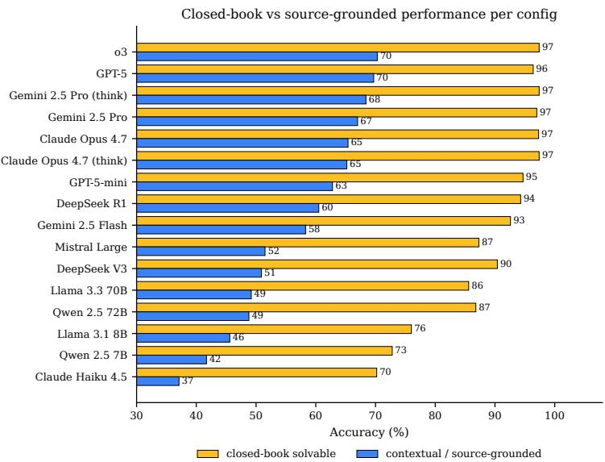  
Figure 8: Per-config accuracy on B2-flagged closed-book solvable questions (n=1,601) vs. contextual / source-grounded questions (n=1,665); every config gains +26.6 to +39.6 pp on the closed-book slice.

Table 11: Closed-book vs. contextual accuracy gap (pp) within each difficulty tier. A positive gap means the model scores higher on B2-flagged closed-book solvable items than on contextual items at the same tier. Per-tier B2-flagged / contextual question counts: L1 680 / 13, L2 333 / 561, L3 472 / 206, L4 116 / 885. The Mean row reports 95% bootstrap CIs (1,000 resamples; question-level resampling within each pool).
<table><tr><td>Config</td><td>L1 gap</td><td>L2 gap</td><td>L3 gap</td><td>L4 gap</td></tr><tr><td>claude-opus-4.7</td><td>+5.8</td><td>+30.0</td><td>+35.3</td><td>+31.0</td></tr><tr><td>claude-haiku-4.5</td><td>+13.0</td><td>+33.5</td><td>+22.6</td><td>+25.4</td></tr><tr><td>gpt-5</td><td>-1.8</td><td>+23.2</td><td>+21.0</td><td>+28.0</td></tr><tr><td>gpt-5-mini</td><td>-2.1</td><td>+32.8</td><td>+24.0</td><td>+26.1</td></tr><tr><td>gemini-2.5-pro</td><td>-1.5</td><td>+28.4</td><td>+27.8</td><td>+27.8</td></tr><tr><td>gemini-2.5-flash</td><td>+11.0</td><td>+33.9</td><td>+27.4</td><td>+28.5</td></tr><tr><td>llama-3.3-70b</td><td>+7.4</td><td>+37.4</td><td>+23.7</td><td>+19.1</td></tr><tr><td>llama-3.1-8b</td><td>-15.4</td><td>+29.0</td><td>+17.2</td><td>+11.6</td></tr><tr><td>deepseek-v3</td><td>+3.6</td><td>+41.0</td><td>+26.6</td><td>+31.4</td></tr><tr><td>qwen-2.5-72b</td><td>-6.9</td><td>+38.0</td><td>+25.0</td><td>+31.5</td></tr><tr><td>qwen-2.5-7b</td><td>-2.7</td><td>+30.9</td><td>+14.4</td><td>+21.3</td></tr><tr><td>mistral-large-2411</td><td>+2.1</td><td>+34.4</td><td>+28.6</td><td>+23.7</td></tr><tr><td>03</td><td>-1.6</td><td>+24.8</td><td>+22.4</td><td>+29.6</td></tr><tr><td>gemini-2.5-pro-thinking</td><td>-0.9</td><td>+27.2</td><td>+25.1</td><td>+26.8</td></tr><tr><td>deepseek-r1</td><td>-2.5</td><td>+33.5</td><td>+28.5</td><td>+28.2</td></tr><tr><td>claude-opus-4.7-thinking</td><td>+13.9</td><td>+30.7</td><td>+32.3</td><td>+32.6</td></tr><tr><td>Mean (16 configs)</td><td>+1.3</td><td>+31.8</td><td>+25.1</td><td>+26.4</td></tr><tr><td>95% bootstrap CI</td><td>[−4.6, +8.6]</td><td>[+28.8, +34.8]</td><td>[+20.8,+29.1]</td><td>[+22.5, +30.0]</td></tr></table>

Within-tier reading. The +32.6 pp aggregate gap is preserved at L2–L4 (+31.8, +25.1, +26.4 pp; every CI above zero) and effectively vanishes only at L1, where the contextual pool collapses to n=13 questions and ceiling effects dominate. The L4 result is the most informative: the contextual pool is large (n=885) and the gap is still +26.4 pp with a tight CI, so the closed-book vs. source-grounded contrast is not an artefact of difficulty composition — it is a stable property of the slice across non-trivial tiers, consistent with B2 identifying questions recoverable from pre-training rather than questions that happen to be easier-stated.

## C.4 Per-domain breakdown

Table 12: Per-config per-domain accuracy (%).
<table><tr><td>Config</td><td>Regions</td><td>Varieties</td><td>Producers</td><td>Viticulture</td><td>Winemaking</td><td>Business</td></tr><tr><td>claude-opus-4.7</td><td>83.2</td><td>80.2</td><td>86.8</td><td>77.9</td><td>86.6</td><td>64.2</td></tr><tr><td>claude-haiku-4.5</td><td>55.8</td><td>49.7</td><td>58.7</td><td>54.2</td><td>56.7</td><td>37.8</td></tr><tr><td>gpt-5</td><td>88.1</td><td>78.2</td><td>88.4</td><td>82.8</td><td>80.7</td><td>63.0</td></tr><tr><td>gpt-5-mini</td><td>82.1</td><td>74.4</td><td>83.5</td><td>77.5</td><td>77.5</td><td>66.3</td></tr><tr><td>gemini-2.5-pro</td><td>87.0</td><td>78.8</td><td>89.0</td><td>78.5</td><td>77.5</td><td>61.8</td></tr><tr><td>gemini-2.5-flash</td><td>76.9</td><td>72.9</td><td>82.3</td><td>73.6</td><td>77.5</td><td>60.6</td></tr><tr><td>1lama-3.3-70b</td><td>68.9</td><td>62.9</td><td>77.2</td><td>65.7</td><td>70.6</td><td>50.4</td></tr><tr><td>llama-3.1-8b</td><td>62.2</td><td>55.6</td><td>69.5</td><td>61.7</td><td>59.4</td><td>47.6</td></tr><tr><td>deepseek-v3</td><td>74.4</td><td>68.5</td><td>73.2</td><td>70.8</td><td>69.0</td><td>51.2</td></tr><tr><td>qwen-2.5-72b</td><td>69.0</td><td>65.1</td><td>73.4</td><td>67.5</td><td>70.1</td><td>52.8</td></tr><tr><td>qwen-2.5-7b</td><td>59.1</td><td>55.6</td><td>59.4</td><td>57.4</td><td>57.8</td><td>44.7</td></tr><tr><td>mistral-large-2411</td><td>71.5</td><td>65.6</td><td>75.4</td><td>69.4</td><td>73.3</td><td>51.6</td></tr><tr><td>03</td><td>88.4</td><td>81.3</td><td>90.9</td><td>80.3</td><td>76.5</td><td>65.4</td></tr><tr><td>gemini-2.5-pro-thinking</td><td>86.5</td><td>80.5</td><td>90.0</td><td>80.5</td><td>83.4</td><td>60.2</td></tr><tr><td>deepseek-r1</td><td>80.5</td><td>73.6</td><td>85.6</td><td>72.2</td><td>76.5</td><td>64.6</td></tr><tr><td>claude-opus-4.7-thinking</td><td>83.2</td><td>80.9</td><td>87.0</td><td>78.7</td><td>84.0</td><td>61.4</td></tr><tr><td>Mean (16 configs)</td><td>76.0</td><td>70.2</td><td>79.4</td><td>71.8</td><td>73.6</td><td>56.5</td></tr></table>

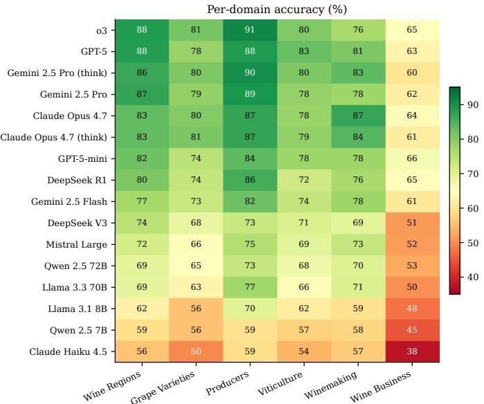  
Figure 9: Per-domain accuracy as a heatmap. Wine business is the hardest domain across every tier (mean 56.5%) — both because business-domain facts are sparser in the training distribution and because the C4 difficulty re-label promoted business questions that are computationally harder (multi-fact reasoning over regulation).

## C.5 Per-strategy breakdown

Table 13: Per-config per-strategy accuracy (%).
<table><tr><td>Config</td><td>FTQ</td><td>Scenario</td><td>Template</td><td>Comparative</td><td>Distractor</td></tr><tr><td>claude-opus-4.7</td><td>77.7</td><td>85.6</td><td>92.8</td><td>79.5</td><td>82.7</td></tr><tr><td>claude-haiku-4.5</td><td>47.5</td><td>62.7</td><td>70.7</td><td>53.3</td><td>56.8</td></tr><tr><td>gpt-5</td><td>79.9</td><td>80.9</td><td>95.4</td><td>79.5</td><td>87.9</td></tr><tr><td>gpt-5-mini</td><td>73.8</td><td>80.6</td><td>92.8</td><td>78.3</td><td>84.7</td></tr><tr><td>gemini-2.5-pro</td><td>77.4</td><td>87.5</td><td>93.1</td><td>82.4</td><td>86.4</td></tr><tr><td>gemini-2.5-flash</td><td>69.5</td><td>84.0</td><td>89.7</td><td>77.5</td><td>79.5</td></tr><tr><td>llama-3.3-70b</td><td>59.5</td><td>80.6</td><td>89.7</td><td>64.8</td><td>71.9</td></tr><tr><td>llama-3.1-8b</td><td>52.2</td><td>70.5</td><td>89.7</td><td>60.2</td><td>63.7</td></tr><tr><td>deepseek-v3</td><td>64.5</td><td>80.3</td><td>86.4</td><td>71.7</td><td>73.3</td></tr><tr><td>qwen-2.5-72b</td><td>59.6</td><td>79.3</td><td>88.7</td><td>69.3</td><td>73.6</td></tr><tr><td>qwen-2.5-7b</td><td>49.1</td><td>72.1</td><td>78.9</td><td>57.0</td><td>61.0</td></tr><tr><td>mistral-large-2411</td><td>62.7</td><td>80.6</td><td>87.4</td><td>67.6</td><td>73.3</td></tr><tr><td>03</td><td>79.9</td><td>84.3</td><td>94.9</td><td>84.8</td><td>88.4</td></tr><tr><td>gemini-2.5-pro-thinking</td><td>78.5</td><td>88.4</td><td>95.6</td><td>84.0</td><td>84.2</td></tr><tr><td>deepseek-r1</td><td>73.4</td><td>75.5</td><td>92.5</td><td>77.0</td><td>80.7</td></tr><tr><td>claude-opus-4.7-thinking</td><td>77.3</td><td>85.6</td><td>93.6</td><td>80.3</td><td>83.0</td></tr><tr><td>Mean (16 configs)</td><td>67.6</td><td>79.9</td><td>89.5</td><td>73.0</td><td>76.9</td></tr></table>

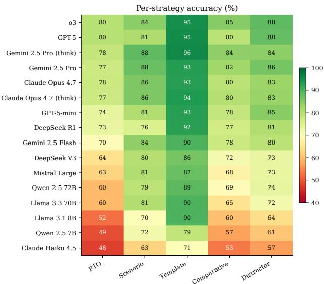  
Figure 10: Per-strategy accuracy heatmap. Templates are the easiest strategy uniformly (89.5% mean), even for small models, because they are deterministic single-fact recall questions. The fact-to-question strategy is hardest because its distractors are sampled from confusable same-category entities; comparative questions add the constraint that the model must integrate two facts.

## C.6 Per-difficulty breakdown

Table 14: Per-config per-difficulty accuracy (%).
<table><tr><td>Config</td><td>L1 (entry)</td><td>L2</td><td>L3</td><td>L4 (expert)</td></tr><tr><td>claude-opus-4.7</td><td>98.0</td><td>77.0</td><td>86.7</td><td>69.1</td></tr><tr><td>claude-haiku-4.5</td><td>74.3</td><td>48.3</td><td>59.9</td><td>38.8</td></tr><tr><td>gpt-5</td><td>98.3</td><td>82.4</td><td>87.5</td><td>69.2</td></tr><tr><td>gpt-5-mini</td><td>98.0</td><td>73.7</td><td>84.7</td><td>64.8</td></tr><tr><td>gemini-2.5-pro</td><td>98.6</td><td>79.2</td><td>87.3</td><td>68.5</td></tr><tr><td>gemini-2.5-flash</td><td>95.4</td><td>70.9</td><td>82.2</td><td>60.1</td></tr><tr><td>llama-3.3-70b</td><td>91.9</td><td>60.6</td><td>74.8</td><td>50.3</td></tr><tr><td>llama-3.1-8b</td><td>84.8</td><td>55.4</td><td>65.3</td><td>45.0</td></tr><tr><td>deepseek-v3</td><td>95.8</td><td>65.9</td><td>76.3</td><td>52.4</td></tr><tr><td>qwen-2.5-72b</td><td>93.2</td><td>60.5</td><td>73.7</td><td>51.4</td></tr><tr><td>qwen-2.5-7b</td><td>82.0</td><td>50.6</td><td>60.0</td><td>43.3</td></tr><tr><td>mistral-large-2411</td><td>94.4</td><td>63.1</td><td>73.3</td><td>54.0</td></tr><tr><td>03</td><td>98.4</td><td>81.4</td><td>89.4</td><td>71.2</td></tr><tr><td>gemini-2.5-pro-thinking</td><td>99.1</td><td>80.2</td><td>88.3</td><td>69.4</td></tr><tr><td>deepseek-r1</td><td>97.5</td><td>74.2</td><td>82.0</td><td>62.1</td></tr><tr><td>claude-opus-4.7-thinking</td><td>98.3</td><td>76.8</td><td>87.0</td><td>68.6</td></tr><tr><td>Mean (16 configs)</td><td>93.6</td><td>68.8</td><td>78.7</td><td>58.7</td></tr></table>

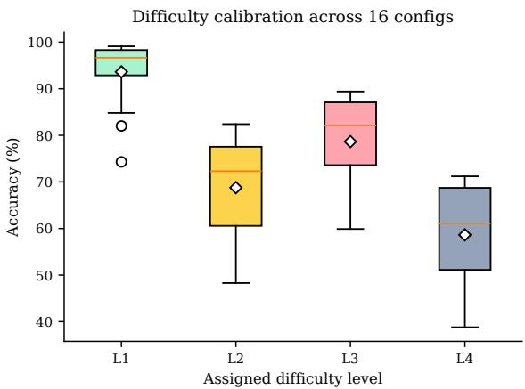  
Figure 11: Difficulty calibration: distribution of accuracy across the 16 configs at each level. The medians sit at L1 96%, L2 70%, L3 81%, L4 60%.

On the L2 / L3 / L4 means in Table 14. Two features of the column averages deserve comment. First, the L2 mean (68.8%) is below the L3 mean (78.7%) — an apparent inversion of the difficulty ordering. This is an artefact of the C4 difficulty re-label (Section 4): many questions originally labelled L2 by their generator were promoted to L3, leaving behind a residual L2 set that is concentrated in the wine\_business pillar (the hardest domain by a wide margin, Table 12). The L3 set, in contrast, was enriched with cleanly-stated multi-fact items from the higher-quality scrapers. Second, the L3 → L4 drop is real and large (78.7% → 58.7%, a 20 pp fall), reflecting that L4 is the expert tier where the source fact is genuinely required to answer the question; that fall is also where the inter-config spread is widest (Section 5.1), making L4 the most discriminating slice for distinguishing models. Both effects are intended outcomes of the audit-driven difficulty re-label rather than miscalibration.

## D Application Screenshots

## D.1 Human-review web application

The human-review web application is the front-end through which WSET-Diploma reviewers rate stratified gold-sheet questions and the through which the agent-vs-human κ values reported in Section 4.2 are collected. It is a Flask application with two layers of authentication (outer HTTP Basic for shared-link access, inner per-reviewer session cookies) and writes ratings into a separate human\_reviews Postgres table to keep gold-sheet labels independent of automated audit findings. Each reviewer is associated with a WSET certification level recorded at registration, and the app supports multi-reviewer inter-rater agreement (κ) computation out of the box.

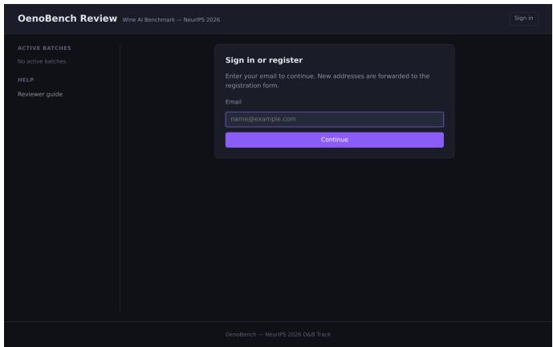  
Figure 12: Sign-in / register screen. Outer HTTP Basic Auth gates shared-link access; the inner form establishes a per-reviewer session for IRR attribution.

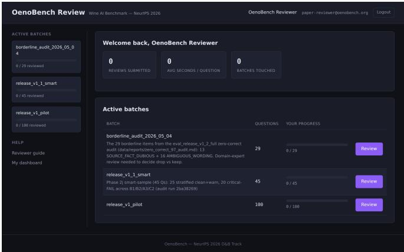  
Figure 13: Reviewer dashboard. Active batches are listed; clicking a batch enters the rubric-scoring flow (eight-rubric grid with PASS/WARN/FAIL per rubric, inline reviewer-guide hints, and time-onpage tracking).

## E Released Artifacts and Reproducibility

## E.1 Released artifacts

• Dataset (HuggingFace). https://huggingface.co/datasets/oenobench/ oenobench — release\_v1.2, 3,266 questions, Parquet test split, README.md datasheet, croissant.json manifest. License: CC-BY-SA-4.0. Versioning is permanent: prior releases remain accessible via revision tags.

• Code (GitHub). https://github.com/nikitahudov/oenobench — full pipeline: 35 scrapers, 5 question generators, 14 audit agents, the human review web app, and the monitoring dashboard. Apache 2.0.

• Process log. docs/PROCESS\_LOG.md — chronological lab-notebook of every phase shipped, with sources, methodology, quality-control counts, and decision rationale, in the format prescribed for the methodology sections of this paper.

• Audit reports. docs/QUALITY\_AUDIT\_REPORT.md, docs/RELEASE\_V1\_2\_AUDIT\_ACTIONS.md, docs/GOLD\_CALIBRATION\_ANALYSIS.md, data/reports/zero\_correct\_97\_audit.md.

• Eval reports. data/reports/eval\_release\_v1\_2\_full\_cleaned.md (the 16-config × 3,266-Q run reported in this paper).

## E.2 Reproducibility scripts

The construction pipeline is driven by a small number of shell scripts in scripts/:

• run\_all\_scrapers.sh — orchestrates the 35 scrapers end-to-end. Each scraper writes a timestamped log to data/logs/.

• run\_release\_v1\_build.sh — full generation pipeline invocation; idempotent and resume-safe via stamped tags.

• export\_release\_v1\_2\_to\_parquet.py — produces the HuggingFace Parquet directly from Postgres; the released file is the byte-identical output of this script.

• build\_smart\_review\_sheet.py — generates a 50-question stratified gold-sheet review batch (random + critical-FAIL + borderline-WARN strata).

• tag\_audit\_actions.py — applies the audit drop / relabel policy to a tagged corpus; this is the script that produced the release\_v1.2 state from release\_v1.1.

## E.3 Database schema

The released schema is initialised by the migrations under config/postgres/ (six idempotent files, applied in order on container startup): init.sql (sources, facts, questions, question\_facts, generation\_metadata, evaluation\_runs, evaluation\_answers, human\_reviews), 002\_audit\_schema.sql (audit\_runs, audit\_findings, audit\_gold\_labels, audit\_severity enum), 003\_sample\_schema.sql (mirror schema for the Phase 5 sample-DB eval), 003\_cb\_reserve.sql (closed-book reserve pool tagging), 004\_eval\_telemetry.sql (provider, tokens, reasoning\_config, latency columns on evaluation\_answers), 005\_or\_cost\_telemetry.sql (OpenRouter authoritative cost columns).

The released schema is documented in code (config/postgres/); the load-bearing tables are sources (registry), facts (atomic facts grounded by source), questions + question\_facts (corpus and fact-question links), generation\_metadata (per-question generator and strategy), audit\_findings (per-agent verdicts), and human\_reviews (gold-sheet ratings).

## E.4 Compute and cost

The full evaluation reported in Section 5 ran in 120 minutes 34 seconds on a single VM driving 16 OpenRouter configurations in parallel. Total LLM API spend across the entire project was \$783, paid out-of-pocket to OpenRouter and covering all generation pilots, audit cycles, gold-sheet calibration runs, and the final 16-config evaluation. No GPU compute was used; all model inference was via OpenRouter (a unified API gateway). The release artefacts include all per-call telemetry (provider, tokens, reasoning configuration, p50/p95 latency, OR-authoritative cost) for the full evaluation run; the per-config cost ledger is reproduced inline as Table 15.

Table 15: Per-config cost ledger for the full 16-config evaluation (3,266 questions per config). Effective OpenRouter spend.
<table><tr><td>Config</td><td>Total cost</td><td>Correct ans.</td><td>Cost / correct</td></tr><tr><td>llama-3.1-8b</td><td>$0.01</td><td>1,976</td><td>$0.0000</td></tr><tr><td>llama-3.3-70b</td><td>$0.04</td><td>2,190</td><td>$0.0000</td></tr><tr><td>gemini-2.5-flash</td><td>$0.12</td><td>2,454</td><td>$0.0000</td></tr><tr><td>deepseek-v3</td><td>$0.12</td><td>2,295</td><td>$0.0001</td></tr><tr><td>qwen-2.5-7b</td><td>$0.12</td><td>1,860</td><td>$0.0001</td></tr><tr><td>qwen-2.5-72b</td><td>$0.15</td><td>2,202</td><td>$0.0001</td></tr><tr><td>claude-haiku-4.5</td><td>$0.44</td><td>1,741</td><td>$0.0003</td></tr><tr><td>mistral-large-2411</td><td>$0.87</td><td>2,256</td><td>$0.0004</td></tr><tr><td>gpt-5-mini</td><td>$2.82</td><td>2,561</td><td>$0.0011</td></tr><tr><td>claude-opus-4.7</td><td>$3.35</td><td>2,647</td><td>$0.0013</td></tr><tr><td>claude-opus-4.7-thinking</td><td>$3.53</td><td>2,645</td><td>$0.0013</td></tr><tr><td>deepseek-r1</td><td>$10.54</td><td>2,517</td><td>$0.0042</td></tr><tr><td>03</td><td>$11.80</td><td>2,729</td><td>$0.0043</td></tr><tr><td>gemini-2.5-pro-thinking</td><td>$13.06</td><td>2,698</td><td>$0.0048</td></tr><tr><td>gpt-5</td><td>$21.90</td><td>2,704</td><td>$0.0081</td></tr><tr><td>gemini-2.5-pro</td><td>$29.47</td><td>2,669</td><td>$0.0110</td></tr></table>

## E.5 Per-source licensing

Section 3.2 states that every fact in the corpus traces to a public-record source or to a source distributed under a licence that permits scraping and redistribution. We give the per-source breakdown in Table 16, grouping the 35 scrapers’ source families by tier and licence basis. Each row maps to one or more rows in the released sources table, where per-row name, url, tier, and access timestamp are recorded for every fact (facts.source\_id → sources.id). Wikipedia and Wikidata together account for 65.3% of facts and propagate their share-alike / public-domain dedications through the release\_v1.2 CC-BY-SA-4.0 licence. Government records (Tier 1, 19.6% of facts) are either explicit open-data licences (INAO Licence Ouverte 2.0, EU re-use Decision 2011/833/EU) or US-Government works in the public domain (17 U.S.C. §105: TTB, USDA Extension, UC IPM).

The released corpus, including this paper’s quoted statistics, is distributed under CC-BY-SA 4.0. The construction code is released under Apache 2.0. Verbatim source text is never stored: every fact is paraphrased atomically (Section 3.3) and a paraphrase guard at audit time (agent A3) re-checks for verbatim leakage. We retain accessed\_date and a per-source content\_date for every fact, so dataset users can audit freshness against original sources.

Table 16: Per-source licensing for OenoBench’s 35 scrapers, grouped by source family. “Share” is the percentage of the 38,104-fact corpus contributed; “Tier” is the source-of-authority label from Section 3.2. Counts are computed directly from the facts ▷◁ sources join in the released schema.
<table><tr><td>Source family</td><td>Tier</td><td>Licence / legal basis</td><td>Share</td></tr><tr><td>Wikipedia (MediaWiki API)</td><td>T2</td><td>CC-BY-SA 4.0</td><td>34.4%</td></tr><tr><td>Wikidata (SPARQL)</td><td>T1/ T2</td><td>CC0 1.0</td><td>30.3%</td></tr><tr><td>HuggingFace</td><td>T2</td><td>HuggingFace dataset terms (open re- distribution)</td><td>8.5%</td></tr><tr><td>spawn99/wine-reviews UC Davis (AVA Project, FPS, Wine On-</td><td>T1</td><td>Open / CC-BY (UC Davis Library)</td><td>5.7%</td></tr><tr><td>tology) UC IPM &amp; USDA Extension (eXten-</td><td>T1/ T2</td><td>Public domain — US Gov. work (17</td><td>4.7%</td></tr><tr><td>sion, PSU/OSU) Kaggle: wine-reviews (Wine Enthusi-</td><td>T3</td><td>USC §105) Kaggle dataset terms (research use)</td><td>3.8%</td></tr><tr><td>ast scrape) INAO (data.gouv.fr open-data)</td><td>T1</td><td>Licence Ouverte 2.0 (Etalab)</td><td>3.9%</td></tr><tr><td>Wine consortia + national bodies (CIVB, BIVB, CIVC, IT consortia, NZ Wine, Austrian Wine, Deutsches</td><td>T2</td><td>Industry-body publications, educa- tional use</td><td>3.2%</td></tr><tr><td>Weininstitut, Spanish DO) OENO One</td><td>T2</td><td>CC-BY 4.0 (open-access journal)</td><td>2.0%</td></tr><tr><td>TTB (27 CFR Part 4, Established AVAs,</td><td>T1</td><td>Public domain — US Gov. work</td><td>1.3%</td></tr><tr><td>Approved Grape Names) National ministries + EU registries (MASAF, MAPA, IVV, IVDP, EUR-</td><td>T1 / T2</td><td>Government public records / EU De- cision 2011/833/EU</td><td>1.3%</td></tr><tr><td>Lex, GIView) OIV publications (Code of Oenological</td><td>T1</td><td>Open access — intergov. organisation</td><td>0.2%</td></tr><tr><td>Practices, statistics) Vitis (Hochschule Geisenheim)</td><td>T2</td><td>Open access</td><td>0.3%</td></tr><tr><td>National reference databases (CA, UK,</td><td>T2</td><td>Reference / official-body content</td><td>0.3%</td></tr><tr><td>HR/SI, HU/GE, LB/IL, +regions) Kaggle: wine-quality (UCI ML Repos-</td><td>T2</td><td>CC-BY 4.0 (UCI)</td><td>0.2%</td></tr></table>

## E.6 Test status

771 of 771 unit tests pass on main as of the camera-ready build. Tests cover the fact-processing pipeline, the five generation strategies, all 14 audit agents, the orchestrator, the closed-book gate, the eval harness (slot dispatch, cost computation, reasoning-mode prompt assembly), and the review-app endpoints.

## F Construction Timeline

The full chronological lab notebook of construction is in docs/PROCESS\_LOG.md. We summarise the major dated milestones here for paper-traceable provenance.

Table 17: Construction-and-evaluation timeline (selected milestones).
<table><tr><td>Phase</td><td>Dates</td><td>Milestone</td></tr><tr><td>0</td><td>2026-02-13</td><td>Repository initialised: Docker stack (Postgres / Elasticsearch / Neo4j / Redis), schema, and the first four scrapers (Wikidata, HuggingFace, Kaggle, UC Davis) committed.</td></tr><tr><td>1</td><td>2026-02-13 - 04-01</td><td>35 scrapers built incrementally (INAO, TTB, EU/OIV, Wikipedia, Italian / Spanish / Portuguese / German / Austrian / Greek registries, Bordeaux / Burgundy / Champagne / Italian consortia, USDA Extension, OENO One / Vitis / AJEV academic crawlers, country enrichment passes); first ~16,702-fact working corpus assembled by end of</td></tr><tr><td>1.1</td><td>2026-04-07</td><td>March. Provenance audit reveals 19 scrapers contained hardcoded LLM-generated facts; corpus</td></tr><tr><td>1.2</td><td>2026-04-08 - 04-11</td><td>paused. Shared infrastructure (_fact_processing.py, _web_helpers.py, _wiki_helpers.py) shipped; Phase 1 rebuild fixes 8 quality-issue scrapers; Phase 2 rebuild replaces all 17 hardcoded scrapers with genuine Wikipedia + SPARQL + official sources. 38,104 fact corpus restored, all provenance-traceable.</td></tr><tr><td>2</td><td>2026-04-12 - 04-22</td><td>Five generation strategies built and iteratively tuned; multi-model orchestrator with quota management; closed-book gate v2 wired into all five generators.</td></tr><tr><td>2c</td><td>2026-04-18 - 05-02</td><td>Nine-agent audit framework shipped across 4 teams; sixteen audit pilots (v1–v16) tune thresholds and speedups; 472/472 → 771/771 tests pass.</td></tr><tr><td>2g</td><td>2026-04-28 – 05-02</td><td>Ten generation-pipeline speedup levers shipped (LLM cache, in-process dispatch, Thread- Pool dispatch, substantiveness filter, circuit breaker, tier-aware gate). v9 build wall: 18 min vs. v8&#x27;s 11.4 h.</td></tr><tr><td>2j</td><td>2026-05-03</td><td>release_v1.1 (3,670 candidate questions) assembled from staged generation runs and the curated sample-DB. Audit cycle drops 341 questions on critical FAILs and re-labels difficulty for 1,259 (51% L3+L4 vs. prior 14%). Cycle cost $76 / 5h 22m.</td></tr><tr><td>4</td><td>2026-05-03</td><td>Human-review web app shipped on port 5556 with separate human_reviews schema and multi-reviewer IRR support.</td></tr><tr><td>5</td><td>2026-05-03 – 05-04</td><td>Full evaluation: 16 configs × 3,329 questions in 120m 34s for $98.33; post-eval audit of 97 zero-correct items removes 54 defects + 9 borderline-review drops; release_v1 .2</td></tr><tr><td>HF</td><td>2026-05-04</td><td>locked at 3,266 questions. Dataset card + Croissant manifest + Parquet test split published; this paper drafted.</td></tr></table>

## NeurIPS Paper Checklist

## 1. Claims

Question: Do the main claims made in the abstract and introduction accurately reflect the paper’s contributions and scope?

Answer: [Yes]

Justification: Section 1 lists four contributions, and each is supported by a numbered section: dataset construction (Section 3), automated audit (Section 4), bias-aware evaluation (Section 5). The abstract’s headline numbers (3,266 questions, 16-config eval, +32.6 pp closed-book vs. contextual gap) are reproduced with full tables in Appendix C.

## 2. Limitations

Question: Does the paper discuss the limitations of the work performed by the authors?

Answer: [Yes]

Justification: Section 7 discusses three limitations explicitly: snapshot vs. moving target, B2 audit calibration ceiling, and residual self-preference.

## 3. Theory assumptions and proofs

Question: For each theoretical result, does the paper provide the full set of assumptions and a complete (and correct) proof?

Answer: [N/A]

Justification: This is a dataset-and-benchmark paper; no formal theoretical results are claimed.

## 4. Experimental result reproducibility

Question: Does the paper fully disclose all the information needed to reproduce the main experimental results of the paper?

Answer: [Yes]

Justification: Appendix E lists the construction scripts, the dataset URL, the model slate, the per-call telemetry available alongside the released corpus (including run id, wall time, ORauthoritative cost, and exact config strings), and the deterministic build pipeline. Section 5 specifies the 16-config slate, the single-letter (A–D) output protocol, and the bootstrap procedure.

## 5. Open access to data and code

Question: Does the paper provide open access to the data and code, with sufficient instructions to faithfully reproduce the main experimental results, as described in supplemental material?

Answer: [Yes]

Justification: Code at https://github.com/nikitahudov/oenobench (Apache 2.0); data at https://huggingface.co/datasets/oenobench/oenobench (CC-BY-SA-4.0). Exact reproduction commands are documented in Appendix E.

## 6. Experimental setting/details

Question: Does the paper specify all the training and test details necessary to understand the results?

Answer: [Yes]

Justification: Section 5 specifies the 16-config slate, single-letter output protocol (A–D, max\_tokens=5, five-stop fallback). Appendix C gives full per-config × per-domain × per-strategy × per-difficulty tables. Appendix B gives audit-agent thresholds and prompt summaries.

## 7. Experiment statistical significance

Question: Does the paper report error bars suitably and correctly defined or other appropriate information about the statistical significance of the experiments?

Answer: [Yes]

Justification: Reasoning lift, self-preference scores, and closed-book vs. contextual deltas are all reported with 95% bootstrap confidence intervals (1,000 resamples). Section 5 states the procedure; Appendix C (Tables 8, 9, 10, 11) reports per-config CIs.

## 8. Experiments compute resources

Question: For each experiment, does the paper provide sufficient information on the computer resources needed to reproduce the experiments?

## Answer: [Yes]

Justification: Appendix E reports the full 16-config evaluation wall time (120 min 34 s), total LLM calls (52,256), and effective evaluation cost (\$98.33), and the deployment topology (single VM driving 16 OpenRouter configurations in parallel; no GPU compute). The total OpenRouter spend across the entire project — generation pilots, audit cycles, goldsheet calibration, and the final evaluation — was \$783, paid out-of-pocket and itemised in Appendix E and the Datasheet (Appendix A, Motivation).

## 9. Code of ethics

Question: Does the research conducted in the paper conform, in every respect, with the NeurIPS Code of Ethics?

Answer: [Yes]

Justification: All sources used are public-record; no human subjects research was conducted (gold-sheet ratings were produced by three WSET-certified reviewers including the lead author, treated as data-quality assurance); responsible-use guidance is given in the Datasheet (Appendix A, “Uses”) and in Section 7.

## 10. Broader impacts

Question: Does the paper discuss both potential positive societal impacts and negative societal impacts of the work performed?

Answer: [Yes]

Justification: The Datasheet (Appendix A) covers alcohol-context and discouraged uses; source-licensing and the non-fabrication guarantee are documented in Section 3.2 and Table 16 (Appendix E); the corpus contains only public-record information about commercial wine entities (no private individuals; Datasheet “Collection process”). Section 6 discusses positive applications including specialist-model fine-tuning and pipeline retargeting to other expert domains.

## 11. Safeguards

Question: Does the paper describe safeguards that have been put in place for responsible release of data or models that have a high risk for misuse?

Answer: [Yes]

Justification: The dataset is text-only multiple-choice questions with public-record entity names; no scraped images or personal-data risks. We document discouraged uses in the Datasheet (Appendix A, “Uses”) including the recommendation against retargeting the pipeline to high-stakes domains without expert review.

## 12. Licenses for existing assets

Question: Are the creators or original owners of assets used in the paper properly credited and are the license and terms of use explicitly mentioned and properly respected?

Answer: [Yes]

Justification: The full per-source licensing table (Table 16 in Appendix E) credits every source family with licence and legal basis (Wikipedia CC-BY-SA 4.0, Wikidata CC0, INAO Licence Ouverte 2.0, TTB / USDA / UC IPM public domain (US Government work, 17 USC §105), EU re-use Decision 2011/833/EU, OENO One CC-BY 4.0, etc.) and is also summarised in Section 3.2. Per-fact source URL, accessed-date, and content-date are released alongside the corpus.

## 13. New assets

Question: Are new assets introduced in the paper well documented and is the documentation provided alongside the assets?

Answer: [Yes]

Justification: A full Datasheet is in Appendix A; a Croissant manifest [1] ships with the HuggingFace release; all 14 audit agents (9 always-run, 5 escalation-gated; Section 4.1), 5 generation strategies, 5 generator-model families, and 35 scrapers are documented in source.

## 14. Crowdsourcing and research with human subjects

Question: For crowdsourcing experiments and research with human subjects, does the paper include the full text of instructions given to participants and screenshots, if applicable, as well as details about compensation?

Answer: [N/A]

Justification: No crowdsourcing or third-party human-subjects research. Gold-sheet ratings were produced by three WSET-certified reviewers (Diploma, Level 3, Level 2) including the lead author; the review web app screenshots in Appendix D document the rubric and instructions.

## 15. Institutional review board (IRB) approvals or equivalent for research with human subjects

Question: Does the paper describe potential risks incurred by study participants, whether such risks were disclosed to the subjects, and whether IRB approvals were obtained?

Answer: [N/A]

Justification: As noted in Appendix A, the work involves no human subjects research distinct from data-quality assurance by three WSET-certified reviewers including the lead author.

## 16. Declaration of LLM usage

Question: Does the paper describe the usage of LLMs if it is an important, original, or non-standard component of the core methods in this research?

Answer: [Yes]

Justification: LLMs are central to the methodology (multi-strategy question generation across five model families, nine-agent automated audit including a tri-judge panel, closedbook solvability pre-screen). Section 3 and Section 4 describe their usage; Section 3.2 and Appendix B document the explicit fact-grounding constraint that prevents LLMs from being used as the source of factual claims.