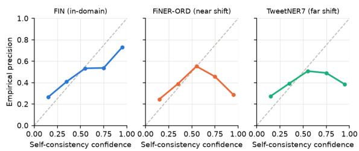
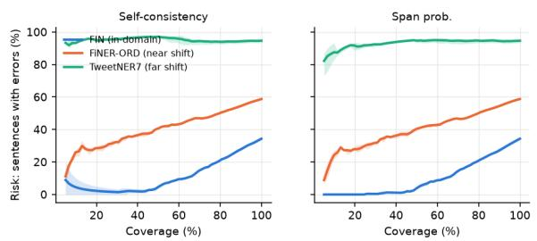

# Reliable Financial Named Entity Recognition under Domain Shift: Confidence Estimation and Selective Prediction

Zihao Zheng∗, Baichuan Li†, Junyi Yao∗, and Jiayu Long∗

∗Washington University in St. Louis

St. Louis, Missouri, USA

z.zihaogary@wustl.edu; j.yao@wustl.edu; jiayujacqueline@wustl.edu

†Southern Methodist University

Dallas, Texas, USA

baichuanl@smu.edu

Abstract—Financial AI systems often train information extractors on one textual register and deploy them across filings, news, and user-generated content, and standard F1 scores do not indicate which predictions remain safe to automate when that input distribution changes. We study confidence estimation and selective prediction for financial named entity recognition (NER) on a three-tier stress test spanning SEC filings, financial news, and general-topic social media as an extreme out-ofdomain condition, evaluating a BERT tagger and LoRA-tuned Qwen2.5-0.5B/1.5B models with five inference-time confidence signals, three training seeds, and bootstrap intervals. Confidence rankings themselves change under shift: whole-output probability is the strongest in-domain error detector but deteriorates out of domain, whereas entity-span probability and self-consistency are more robust; self-consistency is also better calibrated without post-hoc fitting. Abstention reduces sentence error from 34.3% to below 2% on the highest-confidence 40% of in-domain inputs and remains useful on financial news, but recovers no usefully large clean subset under the extreme social-media shift. These results motivate a staged deployment strategy that detects severe distribution shift upstream before applying prediction-level confidence gating.

Index Terms—financial named entity recognition, domain shift, confidence estimation, selective prediction, uncertainty estimation, large language models

## I. INTRODUCTION

Named entity recognition (NER) is a core informationextraction component of applied financial AI systems for compliance, risk, and market-intelligence workflows. A growing line of work fine-tunes small open-weight language models for financial NER with parameter-efficient methods and reports steadily rising F1 on in-domain test splits [1]–[3]. Yet purposebuilt financial LLMs still describe span-level NER as one of their hardest tasks [4]–[6], and a deployed system faces a question that leaderboard F1 does not answer: when the input distribution drifts away from the training data, can the model tell us which of its extractions to trust?

This matters because financial text is not one domain: a model trained on formal filings language (“Apple Inc. reported revenue of \$94.9 billion.”) will meet news headlines and social-media commentary (“AAPL just destroyed earnings”).

Prior work shows that neural models become overconfident precisely when inputs shift away from training data [7], [8], while complementary work detects harmful covariate shift at the distribution level before unreliable predictions reach downstream systems [9]. NER models in particular lean on memorized entity surface forms rather than context [10]. In a financial setting, a hallucinated organization or a mistyped person entity is not benign: such errors propagate into downstream compliance, monitoring, and analytical pipelines.

We therefore study financial NER through the lens of calibrated selective prediction [11]–[13]: allow the model to abstain on low-confidence predictions and route them to human review, and ask how much reliability this buys at what coverage cost. We fine-tune a BERT encoder tagger and instruction-tuned generative models (Qwen2.5-0.5B and 1.5B-Instruct with LoRA [14], [15]) on the FIN corpus of SEC filings [16] and evaluate them on a three-tier stress test: indomain filings (FIN test), financial news (FiNER-ORD [17]), and general-topic social media as an extreme out-of-domain condition (TweetNER7 [18]). For the generative models we compare five inference-time confidence signals that require no additional training, spanning whole-output probabilities, entity-restricted probabilities, and self-consistency vote share over sampled decodes [19], [20]. Following [8], all thresholds and calibration parameters are chosen on in-domain validation data and frozen before touching any test set; results carry multi-seed variance and bootstrap confidence intervals.

This study contributes a deployment-centered reliability evaluation for financial NER: it demonstrates that confidence rankings are domain-sensitive (the strongest in-domain signal can become inferior after a register or topic shift), identifies entity-span probability and self-consistency as complementary signals (stronger error ranking vs. better calibration), and characterizes the operating boundary of confidence gating, whose severe-shift failures motivate upstream domain-level screening as future work.

## II. RELATED WORK

Three lines of work underpin our study.

a) Financial NER: The FIN dataset [16] framed financial NER as domain adaptation from newswire to SEC filings and remains the standard filings-domain benchmark, adopted by FLUE [21], BloombergGPT [4], PIXIU [5], and FinBen [6]; FiNER-ORD [17] provides manually annotated financial news. Recent work fine-tunes small LLMs for financial NER with LoRA-style adapters [1], [2] or evaluates prompting [3], reporting F1 on a single-domain split without uncertainty analysis. We hold the training recipe fixed and instead ask whether model confidence survives domain shift.

b) Selective prediction and calibration: Abstention dates to Chow [11]; [12], [13] formalized the risk–coverage tradeoff, with maximum softmax probability (MSP) as the canonical baseline [22]. Modern networks are miscalibrated [23], and calibration degrades under dataset shift [7], [24]; complementary work detects harmful covariate shift at the distribution level to identify when deployment conditions may invalidate model generalization [9]. Closest to our setting, Kamath et al. [8] studied selective question answering under domain shift and showed softmax confidence becomes unreliable out of domain; [25] cautioned that simple probability baselines are hard to beat, which our results confirm in-domain and refute under shift.

c) Uncertainty for NER and generative extraction: Span-level confidence for extraction goes back to CRF-based estimates [26]; later work calibrated entity-level confidences of encoder taggers [27]. Casting NER as text generation [28]–[30] makes token probabilities, sampling agreement [19], [20], and semantic entropy [31], [32] available as confidence signals; sequence probability requires length correction [33]. Verbalized confidence is systematically overconfident for small models [34], so we restrict our study to logit- and samplingbased signals. To our knowledge, prior financial NER work has not evaluated whether confidence rankings and calibration survive such shifts; this is the gap we target. On the deployment side, learning-to-defer [35] and uncertainty-guided human–LLM work allocation [36] motivate our risk–coverage framing.

## III. DATA AND EVALUATION PROTOCOL

We build a three-tier stress test from public datasets, harmonized to a shared {PER, ORG, LOC} schema (Table I). The first two tiers stay within finance while changing register; the third intentionally leaves the financial domain to probe a boundary condition under severe distribution shift. Because the corpora also differ in annotation process, topic, time, and entity density, the tiers are neither a controlled causal decomposition of domain shift nor a purely gradual register change.

a) In-domain: FIN (SEC filings): The FIN corpus [16] contains sentences from US SEC financial agreements; its standard train/valid/test splits serve for training, calibration/threshold fitting, and in-domain testing. Sentences containing MISC entities are dropped (6 test sentences) so that all three tiers share the same schema.

TABLE I  
DATASET STATISTICS AFTER HARMONIZATION AND FILTERING.
<table><tr><td>Split Domain</td><td>Sent. Ent. PER ORG LOC</td></tr><tr><td></td><td>1014 980 648 175</td></tr><tr><td>68</td><td>Train FIN (filings) [16]</td></tr><tr><td>Valid FIN (filings) [16]</td><td>150177 97</td></tr><tr><td>Test FIN (filings) [16]</td><td>299 9295 201 56 38</td></tr><tr><td>Test FiNER-ORD (news) [17]</td><td>300 322 78 151</td></tr><tr><td>Test TweetNER7 (tweets) [18]</td><td>93 300 619 381 135 103</td></tr></table>

All filtering decisions are recorded in machine-readable pipeline manifests.

b) Near shift: FiNER-ORD (financial news): FiNER-ORD [17] provides manually annotated PER/ORG/LOC entities over financial news articles. The register shift from formal filings boilerplate to journalistic prose constitutes our nearshift tier.

c) Far shift: TweetNER7 (social media): TweetNER7 [18] is a general-topic Twitter NER dataset, not a financialtweet corpus. We use it only as an extreme out-of-domain stress test for a model trained on financial filings. It annotates seven entity types including corporation, person, and location, which we map to ORG/PER/LOC. To keep gold labels clean, our main far-shift set keeps only tweets whose entities all fall inside the mapped schema, dropping the rest rather than silently relabeling. This removes 2,179 of 2,807 tweets in the 2021 test split, leaving 628 eligible tweets (Table VI) — a deliberate precision-over-size choice quantified by a sensitivity analysis (§VII) whose relaxed variant keeps every tweet and instead ignores out-of-schema gold entities, so matching predictions receive neither credit nor penalty. URL placeholders and user-mention markup are normalized to plain surface forms. Both out-of-domain test sets are capped at 300 sentences with a fixed subsampling seed.

## A. Evaluation protocol

Encoder predictions are scored as exact BIO span matches. Generative predictions are generated text, so we score them by position-less multiset matching: each predicted (surface form, type) pair is matched against the multiset of gold pairs. Because the two model families are thus scored under different matching procedures, direct encoder–generative F1 comparisons should be read as indicative rather than exact. Surface forms are lowercased, whitespace-collapsed, and stripped of boundary punctuation, so tokenization artifacts do not count as errors; duplicate predictions can match at most as many gold occurrences as exist; wrong boundaries or types count as both a false positive and a false negative. Invalid JSON is salvaged with a tolerant parser and flagged; unparseable output counts every gold entity as missed. Sentences without entities are scored as correct exactly when the model predicts the empty set, with the sequence probability as the confidence of that claim. Hallucinations — predicted surface forms absent from the source sentence — are false positives and additionally tracked as a separate rate.

## IV. CONFIDENCE SIGNALS

a) Generative NER: The generative model is instructiontuned to map a sentence to a JSON object $\{ " { \in } \mathrm { n t i t i e s } " : $ $\left[ \{ " \mathfrak { w } \mathfrak { t e x t } " , " \mathfrak { t y p e } " \} , . . . \right] \}$ and scored under the protocol of §III-A.

b) Confidence signals: Let $y _ { 1 : n }$ be the generated output with token log-probabilities log p(yi) from the greedy decode. We compare, per predicted entity e: sequence probability (length-normalized) $\begin{array} { r } { C _ { \mathrm { s e q } } = \exp \left( \frac { 1 } { n } \sum _ { i } \log p ( y _ { i } ) \right) } \end{array}$ [33]; token probability $\begin{array} { r } { C _ { \mathrm { t o k } } = \frac { 1 } { n } \sum _ { i } p ( y _ { i } ) ; } \end{array}$ span probability $C _ { \mathrm { s p a n } } ( e ) =$ exp $\begin{array} { r } { \Big ( \frac { 1 } { | T _ { e } | } \sum _ { i \in T _ { e } } \log p ( y _ { i } ) \Big ) } \end{array}$ , where $T _ { e }$ are the tokens of e’s surface form; type probability $C _ { \mathrm { t y p e } } ( e )$ , defined likewise over the tokens of e’s type label; and self-consistency $C _ { \mathrm { s c } } ( e ) =$ $\textstyle { \frac { 1 } { K } } \sum _ { k = 1 } ^ { K } \mathbf { 1 } [ e \in { \hat { E } } _ { k } ]$ , the vote share of e over K sampled decodes $\hat { E } _ { k } . ~ C _ { \mathrm { s e q } }$ and $C _ { \mathrm { t o k } }$ are sentence-level signals shared by all entities in a sentence; the rest are entity-level. Self-consistency uses K=5 samples at temperature 0.7 [19], [20]; an entity counts as a vote when a sampled decode contains it (same normalized surface form and type). A validation-selected convex combination of span and type confidence selected pure span confidence (test-tier effect below ±0.02 AUROC), so we report span confidence directly (§VII).

c) Encoder baseline confidence: For the BERT tagger, span confidence is the mean first-subword maximum softmax probability within the predicted span [22], [26], optionally temperature-scaled [23] with T fit on in-domain validation token-level NLL.

d) Selective prediction: We evaluate abstention at two granularities. Sentence level: the sentence confidence is the minimum entity confidence among its predictions (sequence probability for empty predictions). Ranking sentences by this score yields a risk–coverage curve [12], [13]: risk is the fraction of answered sentences containing at least one extraction error, coverage the fraction answered; we report its area (AURC). Entity level: following [26], we rank all emitted entities by confidence and report selective precision at fixed entity coverage. We additionally report entity-level error-detection AUROC and expected calibration error (ECE, 15 equal-width bins) [37] against entity correctness; because binned ECE can be unstable on test tiers of roughly 300 sentences, we interpret calibration differences qualitatively and complement ECE with reliability diagrams (§VII). Uncertainty is quantified as mean±std over training seeds and 95% bootstrap confidence intervals (1,000 resamples over test instances, averaged over seeds).

## V. EXPERIMENTAL SETUP

a) Models: The encoder baseline is bert-base-cased with a token-classification head (7 BIO labels), trained for 5 epochs (batch 16, lr $3 \times 1 0 ^ { - 5 }$ linear warmup 10%). The primary generative model is Qwen2.5-0.5B-Instruct [14] with LoRA [15] adapters (r=16, α=32, dropout 0.05, on q/k/v/o projections), trained for 3 epochs (effective batch 16, lr $1 \times 1 0 ^ { - 4 } )$ with loss on the JSON completion only, in fp16 with fp32 LoRA parameters.

TABLE II  
MAIN RESULTS (%; MEAN±STD OVER 3 SEEDS; QWEN2.5-1.5B IS ASINGLE-SEED SCALE CHECK).
<table><tr><td>Model</td><td>Domain</td><td>P</td><td>R</td><td>F1</td><td>Halluc.%</td><td>ECE</td></tr><tr><td>BERT-base</td><td>FIN</td><td>66.7±2.3</td><td>74.2±1.4</td><td>70.3±1.5</td><td></td><td>0.102±0.016</td></tr><tr><td>BERT-base</td><td>FiNER-ORD</td><td>39.1±0.3</td><td>37.6±2.3</td><td> $3 8 . 3 { \pm } 1 . 1 $ </td><td></td><td> $0 . 0 7 1 { \scriptstyle \pm 0 . 0 1 7 }$ </td></tr><tr><td>BERT-base</td><td>TweetNER7</td><td>35.2±5.2</td><td>18.4±1.7</td><td> $2 4 . 1 { \pm } 2 . 5 $ </td><td></td><td>0.074±0.007</td></tr><tr><td>Qwen-0.5B</td><td>FIN</td><td>40.5±0.4</td><td>34.7±2.1</td><td>37.4±1.3</td><td>3.6±2.4</td><td>0.362±0.009</td></tr><tr><td>Qwen-0.5B</td><td>FiNER-ORD</td><td>30.7±1.3</td><td>18.0±4.4</td><td>22.6±3.8</td><td>8.2±0.7</td><td>0.407±0.005</td></tr><tr><td>Qwen-0.5B</td><td>TweetNER7</td><td>30.8±0.7</td><td>23.7±4.2</td><td>26.7±2.8</td><td>5.6±1.1</td><td>0.370±0.007</td></tr><tr><td>Qwen-1.5B</td><td>FIN</td><td>47.7</td><td>44.7</td><td>46.2</td><td>4.3</td><td>0.322</td></tr><tr><td>Qwen-1.5B</td><td>FiNER-ORD</td><td>56.3</td><td>48.4</td><td>52.1</td><td>3.6</td><td>0.227</td></tr><tr><td>Qwen-1.5B</td><td>TweetNER7</td><td>44.9</td><td>50.9</td><td>47.7</td><td>6.8</td><td>0.358</td></tr></table>

Both are trained on the harmonized FIN training set with three random seeds (13/42/2026). To test whether the confidence findings are an artifact of the smallest scale, we additionally train Qwen2.5-1.5B-Instruct with the identical recipe (single seed) as a scale check. All experiments (∼25k generations with log-probabilities and 5-sample consistency) ran on a single consumer-grade machine (Apple M1 Pro, 16 GB) in roughly two days; self-consistency is the only signal with a multiplicative inference cost, while span and sequence probabilities are free by-products of decoding.

b) Protocol: The FIN validation split is the only data used for fitting: the encoder temperature T and any abstention thresholds are selected there and frozen before evaluating any test domain [8]; test sets are never used for model or hyperparameter selection. Every pipeline stage records the command line, input hashes, seeds, and library versions in machine-readable manifests, and all figures and tables are generated deterministically from per-entity and per-sentence prediction dumps.

## VI. RESULTS

## A. Extraction quality degrades under shift

Table II gives the headline extraction results; the reported ECE is entity-level, computed on span confidence for the generative models and on MSP for the encoder. The encoder tagger drops from 70.3 micro-F1 in-domain to 38.3 on financial news and 24.1 on tweets — a two-thirds relative loss. The 0.5B generative model is substantially weaker in-domain (37.4±1.3 F1; encoder advantage +33.6 points, paired bootstrap 95% CI [22.7,44.5]), reflecting its scale and the ∼1k-sentence training budget, but degrades more gently: on the far-shift tier the encoder’s advantage vanishes (24.1±2.5 vs. 26.7±2.8; difference CI [−7.2, +2.0], consistent with parity), in line with reports that instruction-tuned generative models generalize more gracefully [29], [30]. Generation-specific failure modes stay bounded but non-negligible: 1.4–5.4% invalid JSON and 3.6–8.2% hallucinated entities across the three tiers.

## B. Which confidence signals survive domain shift?

Table III compares error-detection AUROC and calibration of the five signals for the 0.5B model (mean±std over 3 seeds). Three regularities emerge.

  
Fig. 1. Reliability diagrams for self-consistency confidence (0.5B, pooled seeds). Near-diagonal in-domain; on both shifted tiers the top-confidence bin inverts.

(1) The best in-domain signal is not the best signal under shift. In-domain, whole-output probabilities are the strongest error detectors (sequence 0.839±0.014), replicating the strength of simple probability baselines [22], [25]. Under shift their AUROC falls to 0.661/0.626 (news/tweets), while span-restricted confidence holds at 0.690/0.721 and self-consistency at 0.671/0.682; on the far tier the sequence and span bootstrap intervals separate ([0.594,0.656] vs. [0.695,0.748]), so the reordering is not sampling noise.

(2) Discrimination and calibration dissociate. Probabilitybased signals are severely overconfident as probabilities (spansignal entity-level ECE 0.36–0.41 across test tiers), while selfconsistency vote share is far better calibrated out of the box (ECE 0.10–0.12; Figure 1) — its reliability curve tracks the diagonal at low and middle confidence on every tier, but on both shifted tiers the highest-confidence bin inverts: under shift the model can be consistently, confidently wrong, echoing [7].

(3) The encoder’s confidence collapses under shift; the generative model’s does not. The encoder’s MSP is an excellent in-domain error detector (AUROC 0.922±0.016) but drops to 0.633/0.615 under shift — the same failure Kamath et al. [8] report for selective QA. The generative span signal loses far less (0.801→0.690/0.721), so under shift the weaker model provides the more useful uncertainty estimate.

## C. A single-seed scale check at 1.5B

Table IV repeats the signal comparison with Qwen2.5-1.5B trained under the identical recipe but with a single seed, so the comparison is indicative rather than a full replication. The larger model is substantially stronger and more shiftrobust (F1 46.2/52.1/47.7 across the three tiers; far-tier sentence error rate 86% vs. ≈95% for the 0.5B model), and the study’s two central regularities recur qualitatively. First, whole-sequence probability again degrades most steeply as shift grows (0.764→0.637), while span probability matches or exceeds it on every tier and self-consistency becomes the most shift-robust detector (0.744 on news, 0.663 on tweets). Second, the calibration dissociation persists: span ECE 0.23– 0.36 vs. self-consistency ECE 0.11–0.17. On the far tier the discrimination margins compress (all signals 0.64–0.66); as a single-seed check, small differences here should not be overread.

  
Fig. 2. Sentence-level risk–coverage (Qwen2.5-0.5B; line = 3-seed mean, band = seed range; lower is better). Abstention sharply reduces risk in-domain and on news, but cannot rescue the far-shift tier.

## D. Selective prediction: what abstention buys

Figure 2 shows sentence-level risk–coverage curves and Table V entity-level selective precision. In-domain, abstention is highly effective: answering the 40% of sentences the span signal trusts most drives sentence-level risk from 34.3% to below 2% (every seed), and the encoder reaches 98.7% entity precision at 50% coverage (from 66.7% at full coverage). On the near-shift tier abstention remains useful: risk falls from 58.8% toward ∼15–25% at low coverage, and spanranked selective precision rises +10 points at 60% coverage (30.7±1.3 → 40.8±2.6). On the far-shift tier, however, ≈95% of sentences contain an error and no signal finds a usefully large clean subset (AURC 0.92–0.95): abstention complements, but cannot substitute for, domain-appropriate training data (§VII).

## VII. ANALYSIS AND DEPLOYMENT IMPLICATIONS

a) Why is sequence probability vulnerable under shift while span probability is more robust?: The observed pattern is consistent with dilution by output scaffolding: once the JSON format is learned, most generated tokens are structural and receive probability near 1 regardless of input domain, so under shift this structural floor compresses whole-output probability (mean sequence probability stays above 0.9 on tweets even for wrong predictions). Span-restricted confidence excludes the scaffolding. Consistently, the validation-fit convex combination of span and type confidence (§IV) selected pure span confidence in two of three seeds: type confidence contributed no discriminative value (AUROC 0.49–0.54, barely above chance). For these models, uncertainty lives in where the entity is, not what type it is.

b) What do the two best signals disagree about?: Span probability and self-consistency are complementary rather than redundant: self-consistency provides substantially better calibration (ECE ≤0.12 vs. ≥0.36 without any post-hoc fitting), while span confidence tends to provide the stronger error ranking under far shift (AUROC 0.721 vs. 0.682, bootstrap intervals [0.695,0.748] vs. [0.653,0.710], overlapping only marginally) at 1× rather than 6× decoding cost. A deployment can therefore choose by constraint: span probability for a fixed-budget ranking gate, self-consistency when thresholds must be expressed in probability units, or a trained calibrator [8] to combine both. We caution that setting a threshold to a target precision (e.g., “auto-accept above 80% estimated precision”) requires validating threshold-specific precision directly on domain-matched data: binned ECE is estimated on ≈300- sentence tiers where it can be unstable, and Figure 1 shows aggregate calibration can mask failures exactly in the highconfidence region such thresholds rely on.

TABLE III  
ERROR-DETECTION AUROC AND ECE PER CONFIDENCE SIGNAL (QWEN2.5-0.5B; MEAN±STD OVER 3 SEEDS), BY TEST DOMAIN.
<table><tr><td rowspan="2">Signal</td><td colspan="2">FIN</td><td colspan="2">FiNER-ORD</td><td colspan="2">TweetNER7</td></tr><tr><td>AUROC</td><td>ECE</td><td>AUROC</td><td>ECE</td><td>AUROC</td><td>ECE</td></tr><tr><td>Sequence prob.</td><td> $0 . 8 3 9 { \pm } 0 . 0 1 4$ </td><td> $0 . 5 1 2 { \scriptstyle \pm 0 . 0 0 5 }$ </td><td> $0 . 6 6 1 { \scriptstyle \pm 0 . 0 1 5 }$ </td><td> $0 . 5 9 3 { \scriptstyle \pm 0 . 0 1 1 }$ </td><td> $0 . 6 2 6 { \pm } 0 . 0 1 9$ </td><td> $0 . 5 8 6 { \scriptstyle \pm 0 . 0 0 6 }$ </td></tr><tr><td>Token prob.</td><td> $0 . 8 2 3 { \scriptstyle \pm 0 . 0 1 2 }$ </td><td> $0 . 5 3 1 { \scriptstyle \pm 0 . 0 0 4 }$ </td><td> $0 . 6 6 6 { \pm } 0 . 0 1 9$ </td><td> $0 . 6 1 5 { \scriptstyle \pm 0 . 0 1 3 }$ </td><td> $0 . 6 0 5 { \pm } 0 . 0 1 8$ </td><td> $0 . 6 1 1 { \scriptstyle \pm 0 . 0 0 6 }$ </td></tr><tr><td>Span prob.</td><td> $0 . 8 0 1 { \scriptstyle \pm 0 . 0 0 4 }$ </td><td> $0 . 3 6 2 { \scriptstyle \pm 0 . 0 0 9 }$ </td><td>0.690±0.030</td><td> $0 . 4 0 7 { \scriptstyle \pm 0 . 0 0 5 }$ </td><td> $0 . 7 2 1 { \scriptstyle \pm 0 . 0 1 1 }$ </td><td> $0 . 3 7 0 { \scriptstyle \pm 0 . 0 0 7 }$ </td></tr><tr><td>Type prob.</td><td> $0 . 4 9 2 { \scriptstyle \pm 0 . 0 1 9 }$ </td><td> $0 . 5 0 6 { \scriptstyle \pm 0 . 0 0 4 }$ </td><td> $0 . 5 3 6 { \pm } 0 . 0 2 2$ </td><td> $0 . 5 3 3 { \pm } 0 . 0 1 9$ </td><td> $0 . 5 1 1 { \pm } 0 . 0 1 0$ </td><td> $0 . 5 7 3 { \scriptstyle \pm 0 . 0 0 2 }$ </td></tr><tr><td>Self-consistency</td><td> $0 . 6 9 0 { \scriptstyle \pm 0 . 0 1 9 }$ </td><td> $0 . 1 1 6 { \pm } 0 . 0 2 9$ </td><td> $0 . 6 7 1 { \scriptstyle \pm 0 . 0 4 8 }$ </td><td> $0 . 1 2 0 { \scriptstyle \pm 0 . 0 1 5 }$ </td><td> $0 . 6 8 2 { \scriptstyle \pm 0 . 0 1 7 }$ </td><td> $0 . 1 0 0 { \scriptstyle \pm 0 . 0 0 8 }$ </td></tr></table>

TABLE IV

SCALE CHECK: ERROR-DETECTION AUROC BY SIGNAL AND DOMAIN FOR QWEN2.5-0.5B (3-SEED MEAN) VS. QWEN2.5-1.5B (SINGLE SEED).
<table><tr><td>Signal</td><td>0.5B (3 seeds) 1.5B (1 seed) FIN FiNER Tweet FIN FiNER Tweet</td></tr><tr><td></td><td>Sequence prob. 0.839 0.661 0.626 0.764 0.720 0.637</td></tr><tr><td>Span prob.</td><td>0.801 0.6900.721 0.8190.7290.638</td></tr><tr><td>Self-consistency 0.690 0.671 0.682 0.735 0.744 0.663</td><td></td></tr></table>

TABLE V

ENTITY-LEVEL SELECTIVE PRECISION (%) AT 100/80/60% COVERAGE (QWEN2.5-0.5B; MEAN±STD OVER 3 SEEDS).
<table><tr><td>Domain Signal</td><td></td><td>P@100% P@80%</td><td>P@60%</td></tr><tr><td>FIN</td><td>Seq. prob.</td><td>40.5±0.4 49.0±0.8</td><td> $5 8 . 4 { \pm } 0 . 6 $ </td></tr><tr><td>FIN</td><td>Span prob.</td><td>40.5±0.4 49.2±0.3</td><td> $5 6 . 4 { \pm } 0 . 6 $ </td></tr><tr><td>FIN</td><td>Self-consistency</td><td>40.5±0.4 47.7±0.4</td><td> $5 2 . 8 { \pm } 1 . 0 $ </td></tr><tr><td>FiNER</td><td>Seq. prob.</td><td> $3 0 . 7 { \pm } 1 . 3 $  34.9±3.0</td><td> $4 0 . 1 { \pm } 1 . 3 $ </td></tr><tr><td>FiNER</td><td>Span prob.</td><td> $3 0 . 7 { \pm } 1 . 3 $  35.3±1.7</td><td> $4 0 . 8 { \pm } 2 . 6 $ </td></tr><tr><td>FiNER</td><td>Self-consist.</td><td> $3 0 . 7 { \pm } 1 . 3 $  34.9±3.0</td><td> $4 1 . 4 { \pm } 2 . 3 $ </td></tr><tr><td>Tweet</td><td>Seq. prob.</td><td>30.8±0.7 34.2±1.0 36.8±2.9</td><td></td></tr><tr><td>Tweet</td><td>Span prob.</td><td>30.8±0.7 36.6±1.1</td><td> $4 2 . 7 { \pm } 1 . 1$ </td></tr><tr><td>Tweet</td><td>Self-consist.</td><td>30.8±0.7 35.5±1.7</td><td> $4 0 . 5 { \pm } 1 . 5 $ </td></tr></table>

c) Where does abstention stop working?: The generaltopic far-shift tier exposes the boundary condition: with a ≈95% sentence-level base error rate there is no low-risk subset to find, and the top-confidence self-consistency bin inverts (Figure 1). Manual inspection shows the failure mode RockNER [10] predicts: the model consistently extracts salient capitalized tokens as ORG/PER across all five samples — consistency measures stability of a bias, not correctness. This motivates a staged deployment: (1) detect severe domain shift upstream, (2) apply confidence-gated selective prediction within acceptable domains, (3) route severe-shift inputs directly to human review. We do not implement or evaluate such a domain detector here; distribution-level tests for harmful covariate shift [9] are a natural candidate, and building and benchmarking this routing stage is future work. More broadly, this reflects a growing view of reliable LLM deployment: outputs enter downstream workflows only when an explicit, auditable reliability criterion is satisfied, deferring uncertain cases to a safer fallback or human review [38].

TABLE VI  
TWEETNER7 FILTERING SENSITIVITY, MAIN (DROP-SENTENCE) VS. RELAXED (IGNORE-ENTITY) PROTOCOL. ENCODER: 3-SEED MEAN; QWEN: SEED 42.
<table><tr><td></td><td>Filtered</td><td>Relaxed</td></tr><tr><td>Sentences dropped (of 2807)</td><td>2179</td><td>0</td></tr><tr><td>Evaluated (cap 300)</td><td>300</td><td>300</td></tr><tr><td>Gold PER/ORG/LOC</td><td>619</td><td>443</td></tr><tr><td>Ignored entities</td><td>0</td><td>488</td></tr><tr><td>Encoder F1</td><td>24.1±2.5</td><td> $1 9 . 5 { \pm } 1 . 0 $ </td></tr><tr><td>Encoder MSP AUROC</td><td>0.615±0.054 0.650±0.047</td><td></td></tr><tr><td>Qwen-0.5B F1</td><td>29.7</td><td>29.1</td></tr><tr><td>Qwen-0.5B span AUROC</td><td>0.725</td><td>0.715</td></tr></table>

d) Sensitivity to TweetNER7filtering: Table VI quantifies the far-tier filtering choice; the generative comparison uses seed 42 under both protocols. The relaxed variant leaves the picture unchanged: the generative model scores 29.1 F1 with span AUROC 0.715 (vs. 29.7 / 0.725 on the main filtered set), and the encoder drops slightly to 19.5±1.0 F1 (vs. 24.1±2.5) with statistically indistinguishable MSP AUROC (0.650±0.047 vs. 0.615±0.054). If anything, the main filtered set slightly understates far-shift difficulty; the headline conclusions are not artifacts of the filtering rule.

e) Hallucination and abstention interact favorably: Hallucinated entities (4–8% of predictions) skew toward the lowconfidence tail: the bottom span-confidence tertile contains 67% of hallucinated spans on tweets and 61% in-domain, versus 33% under a uniform spread (39% on news). A confidence gate therefore preferentially removes fabricated entities — the highest-risk error class in a financial pipeline — exactly where fabrication is most frequent.

## VIII. CONCLUSION

This study evaluated financial NER as a reliability component of applied AI rather than only as an extraction benchmark. Confidence rankings change as inputs move from filings to news and beyond the financial domain: complete-output likelihood loses discrimination under shift, entity-span probability is more robust, and self-consistency is better calibrated — a pattern that holds across three seeds and recurs qualitatively in a single-seed 1.5B check. Selective prediction nearly eliminates error on the highest-confidence in-domain subset and remains useful on financial news, but cannot recover a usable clean subset when base extraction error is extreme. A reliable financial AI pipeline should therefore screen for domain shift upstream — distribution-level shift tests [9] are a natural building block — apply confidence gating only within supported domains, and route the rest to human review; implementing such a routing stage is important future work.

## IX. LIMITATIONS AND ETHICAL CONSIDERATIONS

Scale. Our generative models (0.5B and 1.5B) and training set (∼1k sentences) are small by production standards; absolute F1 values are lower bounds for the setting. The 1.5B scale check rests on a single seed, so its agreement with the 0.5B results is qualitative rather than a demonstrated replication; whether the shift-degradation patterns attenuate at much larger scale [39] is open.

Far-shift construction. TweetNER7 is deliberately generaltopic rather than financial social media, and our main protocol retains 628 of 2,807 tweets (evaluating 300), so the far tier identifies an extreme out-of-domain boundary but cannot isolate register shift or directly represent financial social-media deployment; a matched, human-annotated financial socialmedia test set would be the definitive fix. Our tiers also vary jointly in register, topic, annotation, time period, and entity density.

Calibration measurement. ECE is reported with 15 equalwidth bins on ≈300-sentence tiers; such estimates can be unstable and can conceal high-confidence failures, which is why we pair them with reliability diagrams. ECE confidence intervals and adaptive or classwise calibration analyses are worthwhile in future, larger-scale studies.

Signals and routing. We exclude verbalized confidence (known to be overconfident for small models [34]) and P(True)-style self-verification [39], and semantic entropy [31] is only approximated by surface-form vote share. Entitylevel handoff, learned deferral [35], and the upstream domain detector our far-tier results motivate are not implemented here and remain future work. Ethical considerations. All datasets are publicly released research corpora; we collect no new user data and do not attempt to identify social-media users. Because confidence can remain high under shift, consequential deployments require domain monitoring, human review, and institution-specific validation; our results do not support automated profiling or financial decisions about individuals.

## REFERENCES

[1] Z. Lian, “Instruction finetuning llama-3-8b model using lora for financial named entity recognition,” arXiv preprint arXiv:2601.10043, 2026.

[2] Y. Wu and M. Luo, “Instruction finetuning deepseek-r1-8b model using lora and neftune for financial named entity recognition,” arXiv preprint arXiv:2606.10392, 2026.

[3] Y.-T. Lu and Y. Huo, “Financial named entity recognition: How far can llm go?” in Proc. FinNLP–FNP–LLMFinLegal Workshop, 2025.

[4] S. Wu et al., “Bloomberggpt: A large language model for finance,” arXiv preprint arXiv:2303.17564, 2023.

[5] Q. Xie et al., “Pixiu: A comprehensive benchmark, instruction dataset and large language model for finance,” in NeurIPS Datasets and Benchmarks, 2023.

[6] ——, “Finben: A holistic financial benchmark for large language models,” in NeurIPS Datasets and Benchmarks, 2024.

[7] Y. Ovadia et al., “Can you trust your model’s uncertainty? evaluating predictive uncertainty under dataset shift,” in Proc. NeurIPS, 2019.

[8] A. Kamath, R. Jia, and P. Liang, “Selective question answering under domain shift,” in Proc. ACL, 2020.

[9] T. Ginsberg, Z. Liang, and R. G. Krishnan, “A learning based hypothesis test for harmful covariate shift,” in Proc. ICLR, 2023.

[10] B. Y. Lin, W. Gao, J. Yan, R. Moreno, and X. Ren, “Rockner: A simple method to create adversarial examples for evaluating the robustness of named entity recognition models,” in Proc. EMNLP, 2021.

[11] C. K. Chow, “On optimum recognition error and reject tradeoff,” IEEE Trans. Inf. Theory, vol. 16, no. 1, pp. 41–46, 1970.

[12] R. El-Yaniv and Y. Wiener, “On the foundations of noise-free selective classification,” J. Mach. Learn. Res., vol. 11, pp. 1605–1641, 2010.

[13] Y. Geifman and R. El-Yaniv, “Selective classification for deep neural networks,” in Proc. NeurIPS, 2017.

[14] Qwen Team, “Qwen2.5 technical report,” arXiv preprint arXiv:2412.15115, 2024.

[15] E. J. Hu et al., “Lora: Low-rank adaptation of large language models,” in Proc. ICLR, 2022.

[16] J. C. Salinas Alvarado, K. Verspoor, and T. Baldwin, “Domain adaption of named entity recognition to support credit risk assessment,” in Proc. ALTA Workshop, 2015.

[17] A. Shah, A. Gullapalli, R. Vithani, M. Galarnyk, and S. Chava, “Finerord: Financial named entity recognition open research dataset,” arXiv preprint arXiv:2302.11157, 2023.

[18] A. Ushio, L. Neves, V. Silva, F. Barbieri, and J. Camacho-Collados, “Named entity recognition in twitter: A dataset and analysis on shortterm temporal shifts,” in Proc. AACL-IJCNLP, 2022.

[19] X. Wang et al., “Self-consistency improves chain of thought reasoning in language models,” in Proc. ICLR, 2023.

[20] P. Manakul, A. Liusie, and M. J. F. Gales, “Selfcheckgpt: Zero-resource black-box hallucination detection for generative large language models,” in Proc. EMNLP, 2023.

[21] R. S. Shah et al., “When flue meets flang: Benchmarks and large pretrained language model for financial domain,” in Proc. EMNLP, 2022.

[22] D. Hendrycks and K. Gimpel, “A baseline for detecting misclassified and out-of-distribution examples in neural networks,” in Proc. ICLR, 2017.

[23] C. Guo, G. Pleiss, Y. Sun, and K. Q. Weinberger, “On calibration of modern neural networks,” in Proc. ICML, 2017.

[24] S. Desai and G. Durrett, “Calibration of pre-trained transformers,” in Proc. EMNLP, 2020.

[25] N. Varshney, S. Mishra, and C. Baral, “Investigating selective prediction approaches across several tasks in iid, ood, and adversarial settings,” in Findings of ACL, 2022.

[26] A. Culotta and A. McCallum, “Confidence estimation for information extraction,” in Proc. HLT-NAACL, 2004.

[27] A. Jagannatha and H. Yu, “Calibrating structured output predictors for natural language processing,” in Proc. ACL, 2020.

[28] S. Wang et al., “Gpt-ner: Named entity recognition via large language models,” in Findings of NAACL, 2025.

[29] W. Zhou, S. Zhang, Y. Gu, M. Chen, and H. Poon, “Universalner: Targeted distillation from large language models for open named entity recognition,” in Proc. ICLR, 2024.

[30] Y. Ding, J. Li, P. Wang, Z. Tang, B. Yan, and M. Zhang, “Rethinking negative instances for generative named entity recognition,” in Findings of ACL, 2024.

[31] L. Kuhn, Y. Gal, and S. Farquhar, “Semantic uncertainty: Linguistic invariances for uncertainty estimation in natural language generation,” in Proc. ICLR, 2023.

[32] S. Farquhar, J. Kossen, L. Kuhn, and Y. Gal, “Detecting hallucinations in large language models using semantic entropy,” Nature, vol. 630, pp. 625–630, 2024.

[33] K. Murray and D. Chiang, “Correcting length bias in neural machine translation,” in Proc. WMT, 2018.

[34] M. Xiong et al., “Can llms express their uncertainty? an empirical evaluation of confidence elicitation in llms,” in Proc. ICLR, 2024.

[35] H. Mozannar and D. Sontag, “Consistent estimators for learning to defer to an expert,” in Proc. ICML, 2020.

[36] M. Li et al., “Coannotating: Uncertainty-guided work allocation between human and large language models for data annotation,” in Proc. EMNLP, 2023.

[37] M. P. Naeini, G. F. Cooper, and M. Hauskrecht, “Obtaining well calibrated probabilities using bayesian binning,” in Proc. AAAI, 2015.

[38] G. Liu et al., “CARE: Controlling LLM-generated policies through auditable review of evidence in scientific experimentation,” arXiv preprint arXiv:2606.14581, 2026.

[39] S. Kadavath et al., “Language models (mostly) know what they know,” arXiv preprint arXiv:2207.05221, 2022.