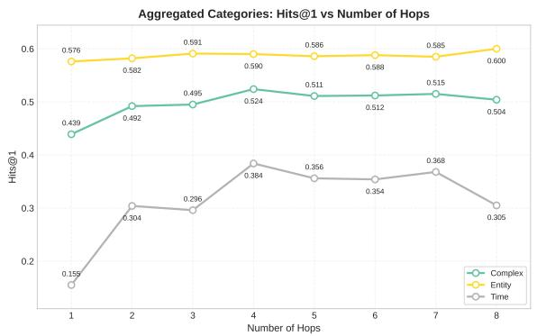
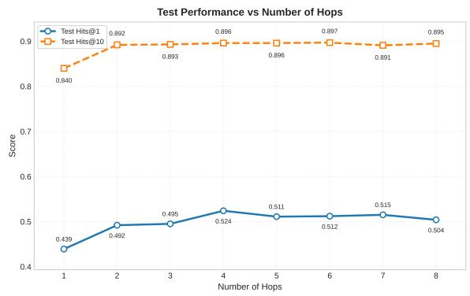
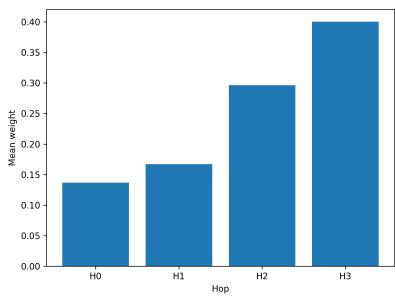
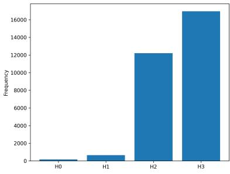
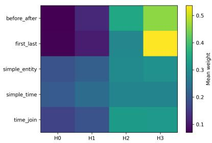
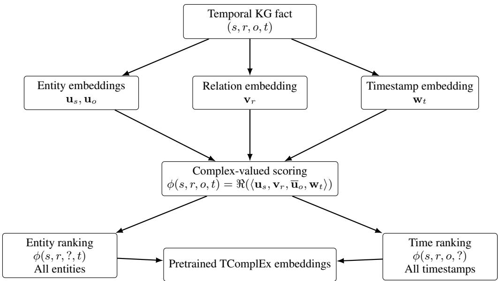
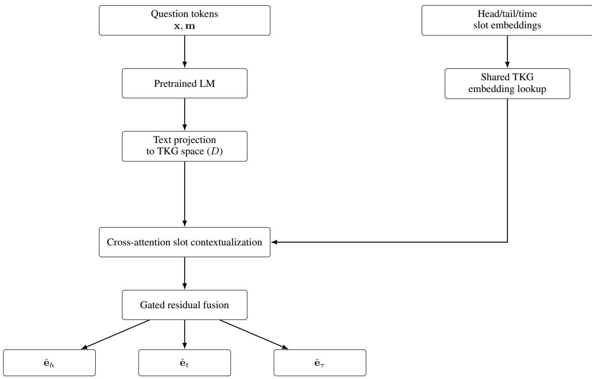
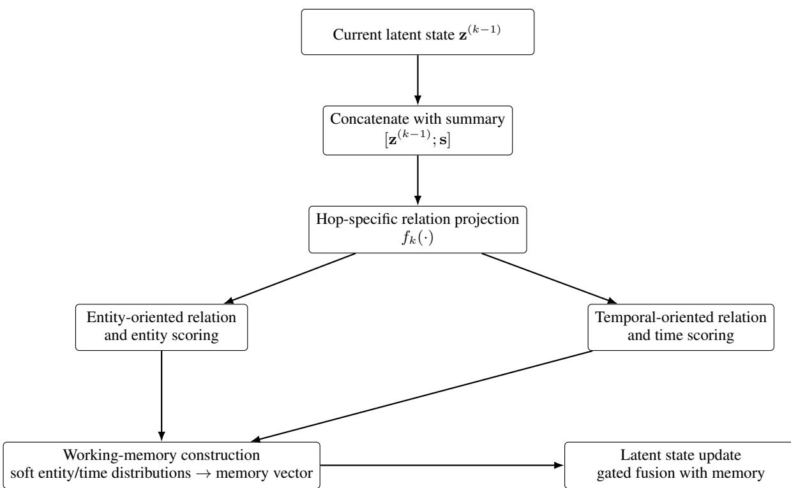

# SABET-QA: Temporal Knowledge Graph Question Answering

Brahim Touayouch1,2,\* Mirette Moawad1,\* Dmitry Akulov1,\*

1QuickSort Research, Paris, France

2ENS Paris-Saclay, École Polytechnique, France

Contact: brahim.touayouch.2022@polytechnique.org

## Abstract

Question Answering over Temporal Knowl edge Graphs (TKGQA) requires reasoning over time-sensitive facts, yet existing embedding based methods struggle with multi-step queries due to single-pass reasoning pipelines. We propose SABET-QA, a framework that iteratively refines reasoning states across multiple hops via a bidirectional entity-temporal scoring mechanism and a slot-aware contextualization module that aligns question semantics with temporal KG embeddings. A differentiable working memory enables progressive hypothesis refinement, while auxiliary temporal boundaries serve as coarse supervision when available. Experiments on Cron-Questions, Complex-CronQuestions, MultiTQ, and TimeQuestions demonstrate consistent improvements over strong baselines, particularly on complex multi-step temporal queries.

## 1 Introduction

The proliferation of large-scale Knowledge Graphs (KGs) such as Wikidata (Vrandeciˇ c and Krötzsch ´ , 2014), Freebase (Bollacker et al., 2008) and YAGO (Suchanek et al., 2007) has made Question Answering over KGs (KGQA) a crucial interface for accessing structured knowledge. However, realworld facts evolve over time, motivating Temporal Knowledge Graphs (TKGs) where a fact is represented as a quintuple $\left( s , r , o , [ t _ { s } , t _ { e } ] \right)$ . Temporal KGQA (TKGQA), the task of answering questions over such dynamic graphs, is essential for reasoning about a changing world.

Despite progress in static KGQA (Jiang et al., 2023; Saxena et al., 2020), TKGQA presents unique challenges. Natural language questions contain explicit temporal constraints (e.g., “Who was the president in 2008?”) or implicit compositional ones (e.g., “Who was the president after Obama?”). Embedding-based approaches like CronKGQA (Saxena et al., 2021) reduce simple queries to link prediction, but struggle with complex reasoning. Later work such as TempoQR (Mavromatis et al., 2021) enriches question representations with contextualized time and entity information, yet these methods still process questions in a single forward pass, lacking iterative refinement and effective aggregation of distributed temporal evidence.

We identify three specific gaps in existing TKGQA methods:

1. Single-Shot Reasoning: Complex questions require sequential deduction (e.g., finding an entity, locating its tenure, then identifying the successor). Single-pass models cannot revisit or correct intermediate errors.

2. Ambiguous Directionality: Questions mention entities without specifying their grammatical role (head or tail) in the relation. Existing models often assume a fixed direction, leading to incorrect scoring.

3. Context-Dependent Ambiguity: Entities like “Washington” may refer to a person, a city, or a state depending on context. Lexical matching or fixed entity linking fails when the same mention carries different meanings.

To address these gaps, we propose SABET-QA, a temporal KGQA framework combining slot-aware contextualization, bidirectional entity– temporal scoring, and iterative multi-hop reasoning. When coarse temporal hints are available, SABET-QA exploits them as additional supervision. A full architectural description is provided in Section 3.3.

Our contributions are summarized as follows:

• We propose SABET-QA, an iterative temporal KGQA framework that progressively refines predictions through a working-memory-based multi-

hop reasoning process.

• We introduce bidirectional entity–temporal scoring to address head–tail ambiguity and improve reasoning over questions with implicit directional structure.

• We empirically demonstrate that SABET-QA outperforms strong baselines on Cron-Questions (Saxena et al., 2021), Complex-CronQuestions (Chen et al., 2022), MultiTQ (Chen et al., 2023), and TimeQuestions (Jia et al., 2021), with particularly strong gains on complex questions.

## 2 Related Work

Our work relates to two areas: Temporal Knowledge Graph Representations and (Temporal) Knowledge Graph Question Answering.

## 2.1 Temporal Knowledge Graph Representations

Embedding-based TKGQA builds on Temporal Knowledge Graph Embedding (TKGE) methods. Early approaches such as TTransE (Leblay and Chekol, 2018) extended static translation-based models (Bordes et al., 2013) by adding temporal embeddings to the scoring function. More recently, tensor decomposition methods have become prominent (Cai et al., 2023). TComplEx (Lacroix et al., 2020) extends ComplEx (Trouillon et al., 2016) to fourth-order tensors and shows that regularized decomposition can capture temporal dynamics effectively. These structured embedding spaces provide a compact latent representation of the TKG (Cai et al., 2024), enabling downstream models to reason over relational and temporal dependencies in continuous vector form rather than through explicit graph traversal.

## 2.2 Knowledge Graph Question Answering

Knowledge graph question answering (KGQA) has evolved along three main directions: semantic parsing, neural representation learning, and LLM-based approaches (Su et al., 2026).

Semantic parsing methods (Berant et al., 2013; Chen et al., 2024a; Yao and Van Durme, 2014; Bao et al., 2016) translate natural-language questions into formal logical forms or executable structured queries. They offer explicit reasoning traces and high interpretability, but depend on handcrafted grammars, schema-specific operators, or substantial annotated supervision, limiting scalability on complex question types.

Neural representation learning approaches embed questions and graph elements into a shared latent space. Early work such as KEQA (Huang et al., 2019) and EmbedKGQA (Saxena et al., 2020) treats QA as ranking over KG embeddings, avoiding explicit query construction. Later methods incorporate graph neural networks, attention mechanisms, and multi-hop reasoning to model structural dependencies and compositional questions (Sun et al., 2018; Jia et al., 2021; Liu et al., 2023; Jiao et al., 2022). These models scale better than semantic parsers and tolerate noisy or incomplete graphs, but were developed for static KGs and do not model temporal validity.

LLM-based methods extend KGQA beyond fixed templates by generating executable queries, reasoning over retrieved evidence, or combining retrieval with generation (Qian et al., 2024; Jia et al., 2024; Gao et al., 2024; Chen et al., 2024b). They reduce hand-engineered logic and improve linguistic flexibility, yet remain sensitive to retrieval quality, grounding errors, and hallucination, and are still most mature in non-temporal settings.

These limitations are amplified in temporal KGQA, where answers depend on when facts hold. The field has therefore moved from direct retrieval toward multi-step reasoning over time-sensitive constraints. CronKGQA (Saxena et al., 2021) casts a question as a virtual relation in a temporal embedding space, enabling link-prediction-style answering. This works for simple questions but struggles with sequential deduction or head–tail ambiguity. TempoQR (Mavromatis et al., 2021) enriches question representations with contextualized temporal and entity information, yielding stronger performance on complex questions, but its reasoning remains largely single-pass, limiting the ability to revise intermediate hypotheses. SubGTR (Chen et al., 2022) introduces subgraph-based temporal reasoning with logical constraints and highlights pseudotemporal questions in CronQuestions. While effective when subgraph extraction is reliable, it depends heavily on extracted structures and is less robust on incomplete or noisy graphs, or when transferring across datasets.

In contrast, SABET-QA follows the embeddingbased virtual-relation paradigm but adds iterative multi-hop reasoning with differentiable working memory. At each hop, the model refines a latent reasoning state, builds hop-specific relation representations, and computes intermediate scores for both entities and timestamps. To address head–tail ambiguity, it uses bidirectional entity scoring, combining forward and backward signals through a learned gate. Unlike approaches relying on explicit subgraph extraction or dataset-specific post-processing, SABET-QA operates directly over pretrained temporal KG embeddings and naturallanguage questions, making it broadly applicable across benchmarks while remaining simple in design.

Recent work also explores LLM-based autonomous agents for TKGQA, but these introduce substantial inference latency, computational overhead, and dependency on non-deterministic external APIs. SABET-QA operates strictly within the dense embedding-based paradigm, providing lowlatency, deterministic, and locally deployable inference. We therefore compare against embeddingbased baselines as the appropriate reference class.

## 3 Temporal Knowledge Graph Question Answering Methods

## 3.1 Temporal KG Embeddings

We train the temporal knowledge graph embeddings used throughout our models with TComplEx (Lacroix et al., 2020). TComplEx represents entities, relations, and timestamps with complexvalued embeddings and scores a temporal fact $( s , r , o , t )$ using a multilinear complex product:

$$
\phi ( s , r , o , t ) = \Re \left( \left. \mathbf { u } _ { s } , \mathbf { v } _ { r } , \mathbf { \overline { { u } } } _ { o } , \mathbf { w } _ { t } \right. \right) ,
$$

where $\mathbf { u } _ { s } , \mathbf { u } _ { o } , \mathbf { v } _ { r } .$ , and $\mathbf { w } _ { t }$ denote the subject, object, relation, and timestamp embeddings, respectively.

The learned entity and time representationss are used to initialize the shared embedding tables across all QA models 1. Additional implementation and training details are provided in Appendix A.

## 3.2 Baseline Methods

This section summarizes the main comparison baselines used in our experiments.

## 3.2.1 LM\_TKGQA: Language Model Baseline

LM\_TKGQA encodes the question with a pretrained language model such as BERT (Devlin et al., 2019) or RoBERTa (Liu et al., 2019) and projects it into the temporal knowledge graph embedding space. Candidate entities and timestamps are then ranked with a lightweight prediction head, but temporal structure is not modeled explicitly.

## 3.2.2 EmbedKGQA: Embedding-Based KGQA

EmbedKGQA represents the question as a soft relation and retrieves answers by matching it against knowledge graph embeddings (Saxena et al., 2020). While effective for multi-hop reasoning, it does not explicitly model temporal constraints.

## 3.2.3 CRONKGQA: Temporal Inference Model

CRONKGQA extends embedding-based KGQA by jointly predicting entities and timestamps using temporal knowledge graph embeddings (Saxena et al., 2021). This enables reasoning over temporal ordering and time-sensitive facts.

## 3.2.4 TempoQR: Contextualized Temporal Reasoning

TempoQR combines a pretrained language model, temporal knowledge graph embeddings, and a transformer-based fusion module (Mavromatis et al., 2021). This improves contextual understanding while explicitly incorporating temporal information.

## 3.2.5 SubGTR: Subgraph-Based Temporal Reasoning

SubGTR (Chen et al., 2022) performs reasoning over a task-relevant subgraph extracted around the query and its temporal context. Restricting inference to this neighborhood improves efficiency while exploiting local graph structure.

On postprocessing and dataset dependence. Some baselines, such as SubGTR, rely on additional postprocessing (e.g., subgraph extraction) tailored to specific datasets. In contrast, our model is designed to operate across datasets without taskspecific processing, making it easier to transfer between benchmarks.

## 3.3 Proposed Method: SABET-QA

SABET-QA answers temporal questions through iterative latent-state refinement over K hops. At each hop, the model produces bidirectional entity and time scores, then updates a differentiable working memory to progressively sharpen its hypothesis. The architecture couples a frozen pretrained LM with a TComplEx temporal scorer, operating in four stages: (i) question encoding and slot contextualization, (ii) hop-specific relation projection, (iii) bidirectional scoring with memory update, and (iv) adaptive hop aggregation. Pseudocode and full dimensional details are in Appendix B.

Figure 1: Impact of the number of reasoning hops on Complex-CronQuestions. Left: Hits@1 for different question categories. Right: overall test Hits@1 and Hits@10.
<table><tr><td>Model</td><td>Entity Contextualization</td><td>Bidirectional Entity &amp; Time Scoring</td><td>Hard Supervision</td><td colspan="2">Complex-CronQuestions</td></tr><tr><td></td><td></td><td></td><td></td><td>Hits@1</td><td>Hits@10</td></tr><tr><td></td><td>√</td><td>√</td><td>√</td><td>0.807</td><td>0.962</td></tr><tr><td>SABET-QA-Hard</td><td>x</td><td>√</td><td>√</td><td>0.707</td><td>0.946</td></tr><tr><td></td><td>√</td><td>X</td><td>√</td><td>0.659</td><td>0.849</td></tr><tr><td></td><td>√</td><td>√</td><td>x</td><td>0.524</td><td>0.896</td></tr></table>

Table 1: Ablation study of SABET-QA-Hard on the Complex-CronQuestions test set. Removing any component degrades performance, with the largest drop observed when bidirectional entity and time scoring is disabled.

## 3.3.1 Slot-Aware Question Encoding

Given tokenized question x, a pretrained LM yields hidden states $\bar { \mathbf { H } } \in \mathbb { R } ^ { L \times 7 6 8 }$ , where L is the number of tokens and 768 is the hidden representation dimension of the pretrained LM (BERT or RoBERTa). These representations are linearly projected to the TKG embedding dimension:

$$
\mathbf { T } = f _ { \mathrm { t e x t } } ( \mathbf { H } ) \in \mathbb { R } ^ { L \times D } .\tag{1}
$$

where D denotes the dimensionality of the TKG embedding space (i.e., the entity and timestamp embedding dimension).

The model first identifies the entity and temporal mentions in the question. When gold annotations are available, these mentions are extracted directly; otherwise, they are obtained using a named entity recognition (NER) system. The identified entity mentions are arbitrarily assigned to the head (h) and tail (t) query slots, while the temporal expression is assigned to the time slot (τ ). The corresponding embeddings are retrieved from the TKBC embedding tables, with learned dummy embeddings used for any missing slots. These query embeddings are then contextualized via multi-head cross-attention (Vaswani et al., 2023) over the projected question token representations, followed by a residual gating mechanism:

$$
[ \mathbf { h } ^ { \prime } , \mathbf { t } ^ { \prime } , \tau ^ { \prime } ] = \mathrm { G a t e } ( \mathrm { M H A } ( [ \mathbf { h } , \mathbf { t } , \tau ] , \mathbf { T } , \mathbf { T } ) )\tag{2}
$$

A global question representation s is constructed by concatenating the hidden representation of the special classification token ([CLS]), the meanpooled token representations, and the max-pooled token representations of T. The resulting vector is projected to obtain the base reasoning state:

$$
\begin{array} { r } { \mathbf { z } ^ { ( 0 ) } = f _ { \mathrm { r e l } } \big ( [ \mathbf { s } ; \mathbf { h } ^ { \prime } ; \mathbf { t } ^ { \prime } ; \tau ^ { \prime } ] \big ) . } \end{array}\tag{3}
$$

## 3.3.2 Iterative Hop-Wise Reasoning with Bidirectional Scoring

At hop k, the current latent state $\mathbf { z } ^ { ( k - 1 ) }$ and summary s are fused into a hop-specific relation vector $\mathbf { \tilde { r } } ^ { ( k ) } = f _ { \mathrm { h o p } } ^ { ( k ) } ( [ \mathbf { z } ^ { ( k - 1 ) } ; \mathbf { s } ] )$ , then split into entityoriented and time-oriented projections: ${ \bf r } _ { \mathrm { e n t } } ^ { ( k ) }$ and ${ \bf r } _ { \mathrm { t i m e } } ^ { ( k ) }$

<table><tr><td rowspan="2">Model</td><td rowspan="2">Frozen LM</td><td rowspan="2">Frozen TKE</td><td colspan="2">Complex-CronQuestions</td><td colspan="2">CronQuestions</td></tr><tr><td>Hits@1</td><td>Hits@10</td><td>Hits@1</td><td>Hits@10</td></tr><tr><td rowspan="4">SABET-QA</td><td>√</td><td>√</td><td>0.524</td><td>0.896</td><td>0.843</td><td>0.969</td></tr><tr><td>√</td><td>x</td><td>0.446</td><td>0.871</td><td>0.773</td><td>0.950</td></tr><tr><td>x</td><td>√</td><td>0.547</td><td>0.892</td><td>0.836</td><td>0.968</td></tr><tr><td>x</td><td>x</td><td>0.476</td><td>0.882</td><td>0.784</td><td>0.946</td></tr><tr><td rowspan="4">SABET-QA-Hard</td><td>√</td><td>√</td><td>0.807</td><td>0.962</td><td>0.954</td><td>0.989</td></tr><tr><td>√</td><td>x</td><td>0.759</td><td>0.958</td><td>0.925</td><td>0.983</td></tr><tr><td>x</td><td>V</td><td>0.803</td><td>0.964</td><td>0.949</td><td>0.988</td></tr><tr><td>x</td><td>x</td><td>0.769</td><td>0.959</td><td>0.902</td><td>0.974</td></tr></table>

Table 2: Ablation study evaluating the impact of freezing the language model (LM) and temporal knowledge graph embedding (TKE) modules under both no supervision (SABET-QA) and hard supervision (SABET-QA-Hard). The comparison isolates the contribution of each component and demonstrates the effect of unfreezing the parameters on overall reasoning performance.

Temporal hint injection (optional). When auxiliary temporal boundaries $( t _ { 1 } , t _ { 2 } )$ are available, we provide them as hard supervision (denoted by the hard suffix in the model name). Following TempoQR (Mavromatis et al., 2021), these boundaries are derived from the earliest and latest timestamps of facts involving the question entities and are injected into the working memory through a learned gating mechanism:

$$
\mathbf { z } ^ { ( k - 1 ) }  \mathbf { z } ^ { ( k - 1 ) } + \gamma _ { \mathrm { t i m e } } ^ { ( k ) } \odot ( \mathbf { e } _ { t _ { 1 } } + \mathbf { e } _ { t _ { 2 } } ) .\tag{4}
$$

Bidirectional scoring. To resolve head-tail ambiguity, entity candidates are scored in both directions using the contextualized slots, then fused by a summary-conditioned gate $\alpha _ { \mathrm { e n t } } ^ { ( k ) } = \sigma ( W _ { \mathrm { e n t } } \mathbf { s } )$

$$
\begin{array} { r } { \mathbf { s } _ { \mathrm { e n t } } ^ { ( k ) } = \alpha _ { \mathrm { e n t } } ^ { ( k ) } \cdot \mathrm { S c o r e } _ { \mathrm { T C o m p l E x } } ( \mathbf { h } ^ { \prime } , \mathbf { t } ^ { \prime } , \mathbf { r } _ { \mathrm { e n t } } ^ { ( k ) } , \pmb { \tau } ^ { \prime } ) } \\ { + \left( 1 - \alpha _ { \mathrm { e n t } } ^ { ( k ) } \right) \cdot \mathrm { S c o r e } _ { \mathrm { T C o m p l E x } } ( \mathbf { t } ^ { \prime } , \mathbf { h } ^ { \prime } , \mathbf { r } _ { \mathrm { e n t } } ^ { ( k ) } , \pmb { \tau } ^ { \prime } ) } \end{array}\tag{5}
$$

Timestamp candidates are scored analogously (without the time slot in the scorer) and fused via $\alpha _ { \mathrm { t i m e } } ^ { ( k ) } .$

## 3.3.3 Working-Memory Update and Aggregation

After scoring, soft distributions $\begin{array} { r l } { \mathbf { p } _ { \mathrm { e n t } } ^ { ( k ) } } & { { } = } \end{array}$ softmax $( \mathbf { s } _ { \mathrm { e n t } } ^ { ( k ) } )$ and $\begin{array} { r l r } { { \bf p } _ { \mathrm { t i m e } } ^ { ( k ) } } & { { } = } & { \mathrm { s o f t m a x } ( { \bf s } _ { \mathrm { t i m e } } ^ { ( k ) } ) } \end{array}$ yield expected embeddings:

$$
\begin{array} { r } { \bar { \mathbf { e } } _ { \mathrm { e n t } } ^ { ( k ) } = \mathbf { p } _ { \mathrm { e n t } } ^ { ( k ) \top } \mathbf { E } _ { \mathrm { e n t } } , \quad \bar { \mathbf { e } } _ { \mathrm { t i m e } } ^ { ( k ) } = \mathbf { p } _ { \mathrm { t i m e } } ^ { ( k ) \top } \mathbf { E } _ { \mathrm { t i m e } } . } \end{array}\tag{6}
$$

Their sum is projected to a memory vector $\mathbf { m } ^ { ( k ) }$ that refines the latent state:

$$
\begin{array} { r } { \mathbf { z } ^ { ( k ) } = \mathrm { G a t e } \big ( \mathrm { A t t n } ( \mathbf { z } ^ { ( k - 1 ) } , \mathbf { m } ^ { ( k ) } ) \big ) . } \end{array}\tag{7}
$$

This lets the model carry forward soft predictions from earlier hops, progressively refining its hypothesis.

Adaptive aggregation. A hop selector $\beta \ =$ softmax $( W _ { \mathrm { h o p } } \mathbf { s } )$ weights the K hop-specific score vectors:

$$
\mathbf { s } _ { \mathrm { e n t } } = \sum _ { k = 1 } ^ { K } \beta _ { k } \mathbf { s } _ { \mathrm { e n t } } ^ { ( k ) } , \qquad \mathbf { s } _ { \mathrm { t i m e } } = \sum _ { k = 1 } ^ { K } \beta _ { k } \mathbf { s } _ { \mathrm { t i m e } } ^ { ( k ) } .\tag{8}
$$

The concatenated output $[ \mathbf { s } _ { \mathrm { e n t } } ; \mathbf { s } _ { \mathrm { t i m e } } ]$ is trained with cross-entropy against the gold answer. TKBC embeddings remain fixed during QA training unless the unfrozen ablation setting is enabled.

## 4 Experiments

## 4.1 Datasets

We evaluate SABET-QA on four benchmark datasets for temporal question answering: Cron-Questions (Saxena et al., 2021), Complex-CronQuestions (Chen et al., 2022), MultiTQ (Chen et al., 2023), and TimeQuestions (Jia et al., 2021). Together, these benchmarks cover a broad spectrum of temporal reasoning settings, including temporal entity prediction, timestamp prediction, temporal comparison, and multi-hop reasoning over temporal knowledge graphs.

CronQuestions and Complex-CronQuestions are synthetic benchmarks derived from temporal Wikidata facts and are designed to assess compositional temporal reasoning. MultiTQ is a large-scale automatically generated dataset containing questions that involve diverse temporal operators and more intricate reasoning patterns. TimeQuestions comprises natural-language temporal questions collected from real-world sources, offering a complementary evaluation setting that more closely reflects realistic user queries.

Detailed dataset statistics, temporal knowledge graph characteristics, and answer-type distributions are provided in Appendix C (Tables 6, 7, and 8).

## 4.2 Method Evaluation

We evaluate SABET-QA using the standard ranking-based metrics commonly adopted in the temporal question answering literature, namely Hits@1 and Hits@10. Hits@1 measures the proportion of queries for which the correct answer is ranked first, whereas Hits@10 measures the proportion of queries for which the correct answer appears within the top ten ranked candidates. Following the evaluation protocols of the respective benchmark datasets, we report overall performance as well as disaggregated results by question complexity (when available) and answer type (entity versus timestamp).

Table 3 reports results on CronQuestions. SABET-QA achieves 0.843 Hits@1, improving over TempoQR by 4.7 points, a gain concentrated almost entirely on the complex subset (+7.5 over TempoQR’s 0.658). This pattern, strong gains on compositional reasoning with maintained or improved performance on simple queries, recurs across all four benchmarks and validates our core hypothesis: iterative refinement with bidirectional scoring is particularly effective when questions require sequential temporal deduction.

The hard-supervised variant (SABET-QA-Hard) pushes performance to 0.954 Hits@1 on CronQuestions and 0.807 on Complex-CronQuestions (Table 4). The margin over TempoQR-Hard widens to 17.5 points on Complex-CronQuestions, suggesting that our architecture better exploits coarse temporal boundaries when reasoning chains are longer. Notably, SABET-QA-Hard’s time-answer accuracy on Complex-CronQuestions (0.931 Hits@1) approaches its entity-answer accuracy (0.747), whereas TempoQR-Hard exhibits a 27.3-point gap between the two. We attribute this to the workingmemory mechanism, which propagates intermediate temporal hypotheses across hops rather than scoring time and entity candidates independently.

On MultiTQ (Table 5), absolute scores are lower across all methods, reflecting the dataset’s coarser temporal granularity and more diverse operator vocabulary. SABET-QA still leads all baselines, with the largest relative improvement on timestamp prediction (0.111 vs. Bert’s 0.069 Hits@1).

TimeQuestions (Table 5) presents naturalistic questions with noisy entity linking. Here SABET-

QA outperforms TempoQR by 9.3 Hits@1 points overall, with the non-hard variant actually edging SABET-QA-Hard on time-specific accuracy (0.609 vs. 0.604).

Overall, SABET-QA establishes the best results on all four benchmarks. The gains are largest on complex multi-hop questions and timestamp prediction, confirming that iterative, structure-aware temporal reasoning outperforms single-pass embedding matching.

## 4.3 Method Behaviour Analysis

Varying the number of hops. Figure 1 (left) plots per-category Hits@1 on Complex-CronQuestions as K increases from 1 to 8. Three distinct regimes emerge. Complex queries rise sharply from K=1 (0.439) to K=4 (0.524), then fluctuate in a narrow band (0.504 - 0.515) through K=8; the peak at K=4 represents a 19.4% relative gain over single-hop reasoning. Time queries follow a similar trajectory, peaking at K=4 (0.384) before degrading to 0.305 at K=8.

Entity queries behave differently: they rise monotonically from K=1 (0.576) to K=8 (0.600), with only marginal gains beyond K=4. This divergence is structurally informative: complex and time queries benefit from moderate iterative refinement enough to resolve intermediate ambiguities, but not so deep that compounding complexity dominates whereas entity queries, which require less compositional reasoning, tolerate and even profit from extended unrolling.

The right panel confirms that overall Hits@1 mirrors the complex category, peaking at K=4 (0.524). Hits@10 behaves differently: it rises steeply from K=1 (0.840) to K=2 (0.892), then plateaus from K=4 onward (0.895 — 0.897). This decoupling Hits@1 saturating earlier than Hits@10 indicates that additional hops primarily improve ranking quality within the top 10 rather than top-1 precision. We use K=4 in all reported results as the best compromise between accuracy and computational cost.

Hop Attention Analysis and Iterative Refinement. To better understand how SABET-QA exploits its multi-hop reasoning mechanism, we analyze the aggregation weights (βk) and top-1 hop selections over 30, 000 validation queries from the CronQuestions dataset. As shown in Figure 2(a,b), the model consistently favors deeper reasoning states: the mean aggregation weight increases monotonically from 0.137 (Hop 0) to 0.400 (Hop 3), while Hop 3 is selected as the dominant reasoning state in 56.5% of the queries.

<table><tr><td>Model</td><td colspan="5">Hits@1</td><td colspan="5">Hits@10</td></tr><tr><td></td><td>Overall</td><td>Complex</td><td>Simple</td><td>Entity</td><td>Time</td><td>Overall</td><td>Complex</td><td>Simple</td><td>Entity</td><td>Time</td></tr><tr><td>BERT</td><td>0.257</td><td>0.253</td><td>0.262</td><td>0.292</td><td>0.191</td><td>0.642</td><td>0.617</td><td>0.676</td><td>0.650</td><td>0.627</td></tr><tr><td>CronKGQA</td><td>0.646</td><td>0.391</td><td>0.987</td><td>0.698</td><td>0.550</td><td>0.886</td><td>0.806</td><td>0.993</td><td>0.901</td><td>0.858</td></tr><tr><td>EmbedKGQA</td><td>0.433</td><td>0.370</td><td>0.516</td><td>0.576</td><td>0.166</td><td>0.787</td><td>0.735</td><td>0.857</td><td>0.892</td><td>0.592</td></tr><tr><td>TempoQR</td><td>0.796</td><td>0.658</td><td>0.981</td><td>0.880</td><td>0.640</td><td>0.959</td><td>0.934</td><td>0.992</td><td>0.975</td><td>0.930</td></tr><tr><td>TempoQR-Hard</td><td>0.914</td><td>0.861</td><td>0.984</td><td>0.923</td><td>0.896</td><td>0.979</td><td>0.968</td><td>0.993</td><td>0.982</td><td>0.973</td></tr><tr><td>SubĠTR-Hard</td><td>0.913</td><td>0.859</td><td>0.984</td><td>0.917</td><td>0.904</td><td>0.980</td><td>0.970</td><td>0.993</td><td>0.982</td><td>0.975</td></tr><tr><td>SABET-QA</td><td>0.843</td><td>0.733</td><td>0.989</td><td>0.882</td><td>0.770</td><td>0.969</td><td>0.953</td><td>0.994</td><td>0.979</td><td>0.954</td></tr><tr><td>SABET-QA-Hard</td><td>0.954</td><td>0.926</td><td>0.994</td><td>0.941</td><td>0.980</td><td>0.989</td><td>0.983</td><td>0.996</td><td>0.986</td><td>0.994</td></tr></table>

Table 3: Comparison against other methods on the CronQuestions test set. Metrics are reported for overall performance, question type (complex/simple), and answer type (entity/time).
<table><tr><td rowspan="2">Model</td><td colspan="3">Hits@1</td><td colspan="3">Hits@10</td></tr><tr><td>Overall</td><td>Entity</td><td>Time</td><td>Overall</td><td>Entity</td><td>Time</td></tr><tr><td>BERT</td><td>0.087</td><td>0.097</td><td>0.068</td><td>0.421</td><td>0.351</td><td>0.567</td></tr><tr><td>CronKGQA</td><td>0.288</td><td>0.365</td><td>0.129</td><td>0.736</td><td>0.758</td><td>0.689</td></tr><tr><td>EmbedKGQA</td><td>0.260</td><td>0.361</td><td>0.050</td><td>0.618</td><td>0.742</td><td>0.360</td></tr><tr><td>TempoQR</td><td>0.438</td><td>0.585</td><td>0.132</td><td>0.853</td><td>0.906</td><td>0.743</td></tr><tr><td>TempoQR-Hard</td><td>0.632</td><td>0.721</td><td>0.448</td><td>0.933</td><td>0.942</td><td>0.914</td></tr><tr><td>SubGTR-Hard</td><td>0.623</td><td>0.719</td><td>0.422</td><td>0.928</td><td>0.944</td><td>0.895</td></tr><tr><td>SABET-QA</td><td>0.524</td><td>0.590</td><td>0.384</td><td>0.896</td><td>0.925</td><td>0.836</td></tr><tr><td>SABET-QA-Hard</td><td>0.807</td><td>0.747</td><td>0.931</td><td>0.962</td><td>0.955</td><td>0.978</td></tr></table>

Table 4: Comparison on the Complex-CronQuestions test set. Metrics are reported for overall performance and answer type (entity/time).

Further stratification by question type (Figure 2(c)) reveals adaptive reasoning depth across different temporal reasoning tasks. Whereas relatively simple query types distribute attention more evenly across hops, compositionally complex queries such as first\_last (81.6% Hop 3 selection) and before\_after (54.3% Hop 3 selection) place the majority of their attention on the final hop. These results indicate that the differentiable working memory learns to postpone final predictions until sufficient multi-step temporal evidence has been accumulated, demonstrating its ability to adapt computation depth according to reasoning complexity.

Ablation of architectural components. Table 1 isolates the contribution of each design choice in SABET-QA-Hard on Complex-CronQuestions. Removing entity contextualization (EC) drops Hits@1 by 10.0 points (0.807 → 0.707), showing that grounding slot representations in question text is essential when relations are lexically ambiguous. Removing bidirectional entity–time scoring (BETS) causes the largest single-component drop (–14.8 points, to 0.659), confirming that forward and backward scorers capture complementary directional biases; neither direction alone suffices for head– tail disambiguation. Removing hard supervision (HS) degrades performance to the non-hard variant level (0.524), demonstrating that temporal hint injection provides orthogonal signal when interval boundaries are available. Crucially, no partial configuration approaches the full model; the gain over the best ablated variant is 18.3 Hits@1 points, establishing that slot contextualization, bidirectional scoring, and hard supervision are jointly necessary rather than redundant.

Which pretrained modules should be finetuned? Table 2 examines whether updating the pretrained language model (LM) and temporal knowledge embeddings (TKE) during QA training improves performance.

Under no hard supervision (SABET-QA, top block), the best Complex-CronQuestions result (0.547 Hits@1) is obtained by unfreezing the LM while keeping TKE frozen outperforming the fully frozen baseline (0.524) by 2.3 points. Unfreezing TKE alone (0.446) or both modules (0.476) underperforms the frozen baseline, suggesting that updating TKE without hard boundaries introduces noise into an already well-structured embedding space.

<table><tr><td rowspan="3">Model</td><td colspan="6">MultiTQ</td><td colspan="6">TimeQuestions</td></tr><tr><td colspan="3">Hits@1</td><td colspan="3">Hits@10</td><td colspan="3">Hits@1</td><td colspan="3">Hits@10</td></tr><tr><td>Overall</td><td>Entity</td><td>Time</td><td>Overall</td><td>Entity</td><td>Time</td><td>Overall</td><td>Entity</td><td>Time</td><td>Overall</td><td>Entity</td><td>Time</td></tr><tr><td>BERT</td><td>0.103</td><td>0.117</td><td>0.069</td><td>0.516</td><td>0.632</td><td>0.234</td><td>0.450</td><td>0.409</td><td>0.556</td><td>0.569</td><td>0.520</td><td>0.698</td></tr><tr><td>CronKGQA</td><td>0.278</td><td>0.387</td><td>0.011</td><td>0.527</td><td>0.724</td><td>0.046</td><td>0.326</td><td>0.296</td><td>0.405</td><td>0.454</td><td>0.409</td><td>0.569</td></tr><tr><td>EmbedKGQA</td><td>0.243</td><td>0.342</td><td>0.002</td><td>0.489</td><td>0.685</td><td>0.012</td><td>0.288</td><td>0.266</td><td>0.344</td><td>0.468</td><td>0.426</td><td>0.577</td></tr><tr><td>TempoQR</td><td>0.327</td><td>0.456</td><td>0.014</td><td>0.571</td><td>0.783</td><td>0.055</td><td>0.409</td><td>0.406</td><td>0.416</td><td>0.530</td><td>0.513</td><td>0.574</td></tr><tr><td>TempoQR-Hard</td><td>0.335</td><td>0.465</td><td>0.018</td><td>0.579</td><td>0.788</td><td>0.068</td><td>0.410</td><td>0.411</td><td>0.407</td><td>0.528</td><td>0.511</td><td>0.572</td></tr><tr><td>SubGTR-Hard</td><td>0.337</td><td>0.469</td><td>0.015</td><td>0.576</td><td>0.789</td><td>0.056</td><td>0.419</td><td>0.415</td><td>0.427</td><td>0.532</td><td>0.512</td><td>0.583</td></tr><tr><td>SABET-QA</td><td>0.373</td><td>0.480</td><td>0.111</td><td>0.700</td><td>0.804</td><td>0.444</td><td>0.502</td><td>0.500</td><td>0.609</td><td>0.619</td><td>0.568</td><td>0.750</td></tr><tr><td>SABET-QA-Hard</td><td>0.403</td><td>0.479</td><td>0.219</td><td>0.715</td><td>0.810</td><td>0.485</td><td>0.504</td><td>0.513</td><td>0.604</td><td>0.615</td><td>0.565</td><td>0.747</td></tr></table>

Table 5: Comparison on the MultiTQ and TimeQuestions test sets.

  
(a) Mean aggregation weight (βk).

  
(b) Top-1 hop selection count.

  
(c) Hop weight heatmap by query type.  
Figure 2: Behavioral dynamics of the differentiable working memory (K = 4) across 30, 000 CronQuestions validation instances. The network dynamically routes computation depth, shifting attention mass to H3 for compositional temporal queries.

Under hard supervision (SABET-QA-Hard, bottom block), the fully frozen configuration already achieves 0.807 Hits@1. Unfreezing the LM alone yields 0.803 (–0.4), a difference that is likely not significant, while unfreezing TKE alone (0.759) or both (0.769) degrades performance. The same ordering holds on CronQuestions: frozen ⩾ LMunfrozen > both-unfrozen > TKE-unfrozen.

These results indicate that the pretrained TComplEx embeddings are already well-optimized for temporal link prediction, and updating them during QA fine-tuning hurts generalization. The bottleneck is instead the alignment between the LM’s question encoding and the frozen TKG scoring space. With hard supervision, this alignment is already strong enough that unfreezing the LM provides no benefit; under weak supervision, modest gains from an unfrozen LM are possible, but they are quickly overshadowed once hard temporal boundaries are available.

## 5 Conclusion

In this work, we presented SABET-QA, an iterative multi-hop framework for Temporal Knowledge Graph Question Answering. By introducing bidirectional entity and time scoring, our model mitigates head-tail directional ambiguity, a common failure mode in prior methods. A differentiable working memory progressively refines the latent reasoning state across hops, moving beyond singlepass inference, while slot-aware contextualization keeps entity and temporal representations grounded in question semantics throughout.

Experiments on CronQuestions, Complex-CronQuestions, MultiTQ, and TimeQuestions show consistent improvements over strong baselines, with the largest gains on complex questions. This validates our hypothesis that iterative refinement and bidirectional temporal scoring are critical for multi-step temporal reasoning.

## Limitations

Despite these results, SABET-QA has several limitations. First, the approach relies on pretrained temporal KG embeddings and frozen languagemodel/KG components during QA training, which may constrain adaptability to new domains or evolving graph structures. Third, the method assumes access to entity and timestamp grounding when available, so performance drops when such annotations are missing or unreliable. When gold entity mentions are unavailable, SABET-QA relies on downstream NER systems (e.g., Flair (Akbik et al., 2019) on MultiTQ). Error propagation from noisy slot extractions inherently introduces a performance degradation compared to gold-annotated mentions, highlighting a dependency on upstream entity linking accuracy in end-to-end setups. Finally, the iterative multi-hop design adds architectural complexity and may increase computational cost compared with simpler single-pass models. These points are consistent with the paper’s training setup and the way the model is grounded in pretrained TComplEx-based representations.

## Ethical Considerations

This work is based on structured benchmark data and is intended for research on temporal reasoning. It is also important to note that the model may inherit biases, gaps, or factual errors from the underlying knowledge graphs and pretrained embeddings, and such issues can affect prediction quality. In addition, because the model is evaluated on benchmark datasets rather than sensitive personal data, the main ethical concerns relate to reproducibility, disclosure, and responsible interpretation of results rather than privacy.

## References

Alan Akbik, Tanja Bergmann, Duncan Blythe, Kashif Rasul, Stefan Schweter, and Roland Vollgraf. 2019. FLAIR: An easy-to-use framework for state-of-theart NLP. In NAACL 2019, 2019 Annual Conference ofthe North American Chapter ofthe Associationfor Computational Linguistics (Demonstrations), pages 54–59.

Junwei Bao, Nan Duan, Zhao Yan, Ming Zhou, and Tiejun Zhao. 2016. Constraint-based question answering with knowledge graph. In Proceedings of COLING 2016, the 26th International Conference on Computational Linguistics: Technical Papers, pages 2503–2514, Osaka, Japan. The COLING 2016 Organizing Committee.

Jonathan Berant, Andrew Chou, Roy Frostig, and Percy Liang. 2013. Semantic parsing on Freebase from question-answer pairs. In Proceedings of the 2013 Conference on Empirical Methods in Natural Language Processing, pages 1533–1544, Seattle, Washington, USA. Association for Computational Linguistics.

Kurt Bollacker, Colin Evans, Praveen Paritosh, Tim Sturge, and Jamie Taylor. 2008. Freebase: a collaboratively created graph database for structuring human knowledge. In Proceedings ofthe 2008 ACM SIGMOD International Conference on Management ofData, SIGMOD ’08, page 1247–1250, New York, NY, USA. Association for Computing Machinery.

Antoine Bordes, Nicolas Usunier, Alberto Garcia-Duran, Jason Weston, and Oksana Yakhnenko. 2013. Translating embeddings for modeling multirelational data. In Advances in Neural Information Processing Systems, volume 26. Curran Associates, Inc.

Borui Cai, Yong Xiang, Longxiang Gao, He Zhang, Yunfeng Li, and Jianxin Li. 2023. Temporal knowledge graph completion: A survey. In Proceedings of the Thirty-Second International Joint Conference on Artificial Intelligence, IJCAI-2023, page 6545–6553. International Joint Conferences on Artificial Intelligence Organization.

Li Cai, Xin Mao, Yuhao Zhou, Zhaoguang Long, Changxu Wu, and Man Lan. 2024. A survey on temporal knowledge graph: Representation learning and applications. Preprint, arXiv:2403.04782.

Zhuo Chen, Zhao Zhang, Zixuan Li, Fei Wang, Yutao Zeng, Xiaolong Jin, and Yongjun Xu. 2024a. Self-improvement programming for temporal knowledge graph question answering. Preprint, arXiv:2404.01720.

Ziyang Chen, Dongfang Li, Xiang Zhao, Baotian Hu, and Min Zhang. 2024b. Temporal knowledge question answering via abstract reasoning induction. In Proceedings of the 62nd Annual Meeting of the Associationfor Computational Linguistics (Volume 1: Long Papers), pages 4872–4889, Bangkok, Thailand. Association for Computational Linguistics.

Ziyang Chen, Jinzhi Liao, and Xiang Zhao. 2023. Multigranularity temporal question answering over knowledge graphs. In Proceedings ofthe 61st Annual Meeting of the Association for Computational Linguistics (Volume 1: Long Papers), pages 11378–11392, Toronto, Canada. Association for Computational Linguistics.

Ziyang Chen, Xiang Zhao, Jinzhi Liao, Xinyi Li, and Evangelos Kanoulas. 2022. Temporal knowledge graph question answering via subgraph reasoning. Knowledge-Based Systems, 251:109134.

Jacob Devlin, Ming-Wei Chang, Kenton Lee, and Kristina Toutanova. 2019. Bert: Pre-training of deep bidirectional transformers for language understanding. Preprint, arXiv:1810.04805.

Yifu Gao, Linbo Qiao, Zhigang Kan, Zhihua Wen, Yongquan He, and Dongsheng Li. 2024. Two-stage generative question answering on temporal knowledge graph using large language models. Preprint, arXiv:2402.16568.

Xiao Huang, Jingyuan Zhang, Dingcheng Li, and Ping Li. 2019. Knowledge graph embedding based question answering. In Proceedings ofthe Twelfth ACM International Conference on Web Search and Data Mining, WSDM ’19, page 105–113, New York, NY, USA. Association for Computing Machinery.

Prachi Jain, Sushant Rathi, Mausam, and Soumen Chakrabarti. 2020. Temporal Knowledge Base Completion: New Algorithms and Evaluation Protocols. In Proceedings ofthe 2020 Conference on Empirical Methods in Natural Language Processing (EMNLP), pages 3733–3747, Online. Association for Computational Linguistics.

Zhen Jia, Philipp Christmann, and Gerhard Weikum. 2024. Faithful temporal question answering over heterogeneous sources. Preprint, arXiv:2402.15400.

Zhen Jia, Soumajit Pramanik, Rishiraj Saha Roy, and Gerhard Weikum. 2021. Complex temporal question answering on knowledge graphs. In Proceedings of the 30th ACM International Conference on Information & Knowledge Management, CIKM ’21, page 792–802. ACM.

Jinhao Jiang, Kun Zhou, Wayne Xin Zhao, and Ji-Rong Wen. 2023. Unikgqa: Unified retrieval and reasoning for solving multi-hop question answering over knowledge graph. Preprint, arXiv:2212.00959.

Songlin Jiao, Zhenfang Zhu, Wenqing Wu, Zicheng Zuo, Jiangtao Qi, Wenling Wang, Guangyuan Zhang, and Peiyu Liu. 2022. An improving reasoning network for complex question answering over temporal knowledge graphs. Applied Intelligence, 53(7):8195–8208.

Diederik P. Kingma and Jimmy Ba. 2017. Adam: A method for stochastic optimization. Preprint, arXiv:1412.6980.

Timothée Lacroix, Guillaume Obozinski, and Nicolas Usunier. 2020. Tensor decompositions for temporal knowledge base completion. Preprint, arXiv:2004.04926.

Julien Leblay and Melisachew Wudage Chekol. 2018. Deriving validity time in knowledge graph. Companion Proceedings ofthe The Web Conference 2018.

Yinhan Liu, Myle Ott, Naman Goyal, Jingfei Du, Mandar Joshi, Danqi Chen, Omer Levy, Mike Lewis, Luke Zettlemoyer, and Veselin Stoyanov. 2019. Roberta: A robustly optimized bert pretraining approach. Preprint, arXiv:1907.11692.

Yonghao Liu, Di Liang, Mengyu Li, Fausto Giunchiglia, Ximing Li, Sirui Wang, Wei Wu, Lan Huang, Xiaoyue Feng, and Renchu Guan. 2023. Local and global: Temporal question answering via information fusion. In Proceedings of the Thirty-Second International Joint Conference on Artificial Intelligence, IJCAI-23, pages 5141–5149. International Joint Conferences on Artificial Intelligence Organization. Main Track.

Costas Mavromatis, Prasanna Lakkur Subramanyam, Vassilis N. Ioannidis, Soji Adeshina, Phillip R. Howard, Tetiana Grinberg, Nagib Hakim, and George Karypis. 2021. Tempoqr: Temporal question reasoning over knowledge graphs. Preprint, arXiv:2112.05785.

Adam Paszke, Sam Gross, Francisco Massa, Adam Lerer, James Bradbury, Gregory Chanan, Trevor Killeen, Zeming Lin, Natalia Gimelshein, Luca Antiga, Alban Desmaison, Andreas Köpf, Edward Yang, Zach DeVito, Martin Raison, Alykhan Tejani, Sasank Chilamkurthy, Benoit Steiner, Lu Fang, and 2 others. 2019. Pytorch: An imperative style, high-performance deep learning library. Preprint, arXiv:1912.01703.

Xinying Qian, Ying Zhang, Yu Zhao, Baohang Zhou, Xuhui Sui, Li Zhang, and Kehui Song. 2024. TimeR4 : Time-aware retrieval-augmented large language models for temporal knowledge graph question answering. In Proceedings ofthe 2024 Conference on Empirical Methods in Natural Language Processing, pages 6942–6952, Miami, Florida, USA. Association for Computational Linguistics.

Daniel Ruffinelli, Samuel Broscheit, and Rainer Gemulla. 2020. You can teach an old dog new tricks! on training knowledge graph embeddings. In International Conference on Learning Representations.

Apoorv Saxena, Soumen Chakrabarti, and Partha Talukdar. 2021. Question answering over temporal knowledge graphs. In Proceedings of the 59th Annual Meeting of the Association for Computational Linguistics and the 11th International Joint Conference on Natural Language Processing (Volume 1: Long Papers), pages 6663–6676, Online. Association for Computational Linguistics.

Apoorv Saxena, Aditay Tripathi, and Partha Talukdar. 2020. Improving multi-hop question answering over knowledge graphs using knowledge base embeddings. In Proceedings of the 58th Annual Meeting of the Associationfor Computational Linguistics, pages 4498– 4507, Online. Association for Computational Linguistics.

Miao Su, Zixuan Li, Zhuo Chen, Long Bai, Xiaolong Jin, and Jiafeng Guo. 2026. Temporal knowledge graph question answering: A survey. Preprint, arXiv:2406.14191.

Fabian M. Suchanek, Gjergji Kasneci, and Gerhard Weikum. 2007. Yago: a core of semantic knowledge. In Proceedings ofthe 16th International Conference on World Wide Web, WWW ’07, page 697–706, New York, NY, USA. Association for Computing Machinery.

Haitian Sun, Bhuwan Dhingra, Manzil Zaheer, Kathryn Mazaitis, Ruslan Salakhutdinov, and William Cohen. 2018. Open domain question answering using early fusion of knowledge bases and text. In Proceedings of the 2018 Conference on Empirical Methods in Natural Language Processing, pages 4231–4242, Brussels, Belgium. Association for Computational Linguistics.

Théo Trouillon, Johannes Welbl, Sebastian Riedel, Éric Gaussier, and Guillaume Bouchard. 2016. Complex embeddings for simple link prediction. Preprint, arXiv:1606.06357.

Ashish Vaswani, Noam Shazeer, Niki Parmar, Jakob Uszkoreit, Llion Jones, Aidan N. Gomez, Lukasz Kaiser, and Illia Polosukhin. 2023. Attention is all you need. Preprint, arXiv:1706.03762.

Denny Vrandeciˇ c and Markus Krötzsch. 2014.´ Wikidata: a free collaborative knowledgebase. Commun. ACM, 57(10):78–85.

Xuchen Yao and Benjamin Van Durme. 2014. Information extraction over structured data: Question answering with Freebase. In Proceedings of the 52nd Annual Meeting ofthe Associationfor Computational Linguistics (Volume 1: Long Papers), pages 956–966, Baltimore, Maryland. Association for Computational Linguistics.

  
Figure 3: TComplEx pipeline used to initialize the temporal KG embeddings. The model learns complex-valued embeddings for entities, relations, and timestamps, and supports both entity ranking and timestamp ranking through the same compositional scoring function.

## A Temporal KG Embedding Model

To train the temporal knowledge-graph embeddings used in our QA models, we adopt TComplEx (Lacroix et al., 2020), following a broader family of complex-valued embedding models for knowledge graphs. In particular, ComplEx (Trouillon et al., 2016) represents entities and relations as complex vectors and scores a fact via the real part of a multilinear product, while TComplEx extends this formulation by introducing a timestamp embedding for temporal facts. Related temporal variants such as TNTComplEx and TimePlex further enrich this framework with additional time-aware parameterizations of relations and temporal representations (Lacroix et al., 2020; Jain et al., 2020).

We use TComplEx as the default KG embedding backend for all QA models in order to ensure a controlled comparison across methods, since our focus is on evaluating the QA architecture rather than the choice of temporal KGE model. This design choice is therefore not essential to the proposed QA framework and can be replaced by another temporal embedding method without changing the core model. Nevertheless, TComplEx is a natural and widely used choice in the literature, which makes it suitable for our experiments (Ruffinelli et al., 2020).

Figure 3 summarizes the TComplEx pipeline. The model maps a temporal fact to entity, relation, and timestamp embeddings, combines them through complex-valued interactions, and supports both entity prediction and timestamp prediction.

For the MultiTQ dataset, temporal answers can be expressed at different granularities, including specific days, months, or years. To accommodate this variability, we trained the temporal knowledge graph embeddings on an augmented version of the original TKG. Specifically, for each temporal fact, we added additional facts corresponding to coarser temporal resolutions by converting timestamps into their associated month- and year-level representations. For example, a fact associated with a specific day was duplicated with equivalent month-level and year-level timestamps.

## B SABET-QA Details

This appendix provides the complete mathematical specification and pseudocode for SABET-QA, matching the implementation provided in the anonymized supplementary material.

  
Figure 4: Question encoding and slot contextualization in SABER-TQA. Question tokens are encoded by a pretrained language model and projected into the temporal KG embedding space. Head, tail, and temporal slot embeddings are retrieved from the shared TKG table and attend to the question representation, followed by gated residual fusion to produce contextualized role-specific vectors.

## B.1 Question Encoding and Slot Contextualization

Given tokenized question $\mathbf { x } = ( x _ { 1 } , \dots , x _ { L } )$ and attention mask m, the pretrained LM produces hidden states $\mathbf { H } = \mathrm { L M } ( \mathbf { x } , \mathbf { m } ) \in \mathbb { R } ^ { L \times 7 6 8 }$ . These are projected into the TKG space by a feed-forward network $f _ { \mathrm { t e x t } }$ (linear → LayerNorm → GELU → dropout):

$$
\mathbf { T } = f _ { \mathrm { t e x t } } ( \mathbf { H } ) \in \mathbb { R } ^ { L \times D } .\tag{9}
$$

Head, tail, and timestamp slot embeddings $\mathbf { e } _ { h } , \mathbf { e } _ { t } , \mathbf { e } _ { \tau }$ are retrieved from the shared entity/time embedding table. They are stacked as queries for multi-head cross-attention over the projected question tokens:

$$
\begin{array} { r } { { \bf C } = \mathrm { A t t n } \big ( [ { \bf e } _ { h } ; { \bf e } _ { t } ; { \bf e } _ { \tau } ] , { \bf T } , { \bf T } \big ) , } \end{array}\tag{10}
$$

with key padding derived from m. The outputs $\mathbf { c } _ { h } , \mathbf { c } _ { t } , \mathbf { c } _ { \tau }$ are layer-normalized and fused with gated residuals:

$$
g _ { h } = \sigma \big ( W _ { g } [ \mathbf { e } _ { h } ; \mathbf { c } _ { h } ] \big ) , \qquad \hat { \mathbf { e } } _ { h } = g _ { h } \odot \mathbf { e } _ { h } + ( 1 - g _ { h } ) \odot \mathbf { c } _ { h } ,\tag{11}
$$

and analogously for $\hat { \mathbf { e } } _ { t }$ and $\hat { \mathbf { e } } _ { \tau }$ .

## B.2 Global Summary and Base Relation

A global summary vector is built from the projected token sequence using the concatenation of the [CLS] representation, masked mean pooling, and masked max pooling:

$$
\begin{array} { r } { \mathbf { s } = f _ { \mathrm { s u m } } \big ( [ \mathbf { T } _ { \mathrm { C L S } } ; \mathrm { M e a n } ( \mathbf { T } ) ; \mathrm { M a x } ( \mathbf { T } ) ] \big ) \in \mathbb { R } ^ { D } , } \end{array}\tag{12}
$$

where $f _ { \mathrm { s u m } }$ is a learned projection. The base latent state is then constructed from the summary and the contextualized slots:

$$
\mathbf { z } ^ { ( 0 ) } = f _ { \mathrm { r e l } } \big ( [ \mathbf { s } ; \hat { \mathbf { e } } _ { h } ; \hat { \mathbf { e } } _ { t } ; \hat { \mathbf { e } } _ { \tau } ] \big ) \in \mathbb { R } ^ { D } ,\tag{13}
$$

where $f _ { \mathrm { r e l } }$ is a two-layer MLP $( 4 D \to 2 D \to D )$ with GELU and dropout.

  
Figure 5: Iterative hop-wise reasoning in SABET-QA. At each hop, the current latent reasoning state is combined with the global question summary and transformed into a hop-specific relation representation. Dedicated entityoriented and temporal-oriented projections generate entity and timestamp scores, whose soft distributions are converted into a working-memory representation used to update the latent state for the next reasoning hop.

## B.3 Hop-Specific Relation Projection

At hop k, the current state and the global summary are concatenated and projected by a hop-specific MLP $f _ { k } { \mathrm { : } }$

$$
\begin{array} { r } { \mathbf { r } ^ { ( k ) } = f _ { k } \big ( [ \mathbf { z } ^ { ( k - 1 ) } ; \mathbf { s } ] \big ) , } \end{array}\tag{14}
$$

where $f _ { k }$ maps $2 D  2 D  D$ with LayerNorm, GELU, and dropout.

This relation is then factorized into an entity-oriented view and a time-oriented view using dedicated projection heads:

$$
\mathbf { r } _ { \mathrm { e n t } } ^ { ( k ) } = g _ { \mathrm { e n t } } ( \mathbf { r } ^ { ( k ) } ) , \qquad \mathbf { r } _ { \mathrm { t i m e } } ^ { ( k ) } = g _ { \mathrm { t i m e } } ( \mathbf { r } ^ { ( k ) } ) ,\tag{15}
$$

with each head implemented as a small MLP over D-dimensional inputs.

## B.4 Optional Temporal Hint Injection

When auxiliary temporal endpoints $( t _ { 1 } , t _ { 2 } )$ are available, their TKG embeddings are used as a hard temporal hint. Let $\mathbf { e } _ { t _ { 1 } }$ and $\mathbf { e } _ { t _ { 2 } }$ denote the corresponding timestamp embeddings. A learned gate controls how much of this hint is injected into the current latent state:

$$
\pmb { \tau } ^ { ( k ) } = \sigma \big ( W _ { \tau } [ \mathbf { z } ^ { ( k - 1 ) } ; \mathbf { e } _ { t _ { 1 } } ; \mathbf { e } _ { t _ { 2 } } ] \big ) ,\tag{16}
$$

and the state is updated as

$$
\mathbf { z } ^ { ( k - 1 ) }  \mathbf { z } ^ { ( k - 1 ) } + \pmb { \tau } ^ { ( k ) } \odot ( \mathbf { e } _ { t _ { 1 } } + \mathbf { e } _ { t _ { 2 } } ) .\tag{17}
$$

This hint is optional and only contributes when the corresponding timestamps are available.

## B.5 Bidirectional Entity Scoring

Using the contextualized slots $\hat { \mathbf { e } } _ { h } , \hat { \mathbf { e } } _ { t } , \hat { \mathbf { e } } _ { \tau }$ , the forward and backward TComplEx scores are:

$$
\begin{array} { r } { { \mathbf { s } } _ { \mathrm { e n t } } ^ {  ( k ) } = \mathrm { S c o r e } _ { \mathrm { T C o m p l E x } } ( \hat { \mathbf { e } } _ { h } , \hat { \mathbf { e } } _ { t } , \mathbf { r } _ { \mathrm { e n t } } ^ { ( k ) } , \hat { \mathbf { e } } _ { \tau } ) , } \end{array}\tag{18}
$$

$$
\mathbf { s } _ { \mathrm { e n t } } ^ {  ( k ) } = \mathrm { S c o r e } _ { \mathrm { T C o m p l E x } } ( \hat { \mathbf { e } } _ { t } , \hat { \mathbf { e } } _ { h } , \mathbf { r } _ { \mathrm { e n t } } ^ { ( k ) } , \hat { \mathbf { e } } _ { \tau } ) .\tag{19}
$$

They are fused by a learned scalar gate conditioned on the global summary:

$$
\alpha _ { \mathrm { e n t } } ^ { ( k ) } = \sigma ( W _ { \mathrm { e n t } } \mathbf { s } ) , \qquad \mathbf { s } _ { \mathrm { e n t } } ^ { ( k ) } = \alpha _ { \mathrm { e n t } } ^ { ( k ) } \mathbf { s } _ { \mathrm { e n t } } ^ { \right. ( k ) } + \big ( 1 - \alpha _ { \mathrm { e n t } } ^ { ( k ) } \big ) \mathbf { s } _ { \mathrm { e n t } } ^ { \left. ( k ) } .\tag{20}
$$

## B.6 Bidirectional Time Scoring

Temporal candidates are scored analogously:

$$
\mathbf { s } _ { \mathrm { t i m e } } ^ {  ( k ) } = \mathrm { S c o r e } _ { \mathrm { t i m e } } ( \hat { \mathbf { e } } _ { h } , \hat { \mathbf { e } } _ { t } , \mathbf { r } _ { \mathrm { t i m e } } ^ { ( k ) } ) ,\tag{21}
$$

$$
\mathbf { s } _ { \mathrm { t i m e } } ^ {  ( k ) } = \mathrm { S c o r e } _ { \mathrm { t i m e } } ( \hat { \mathbf { e } } _ { t } , \hat { \mathbf { e } } _ { h } , \mathbf { r } _ { \mathrm { t i m e } } ^ { ( k ) } ) .\tag{22}
$$

The two score vectors are fused by a gate conditioned on the global summary:

$$
\alpha _ { \mathrm { t i m e } } ^ { ( k ) } = \sigma ( W _ { \mathrm { t i m e } } \mathbf { s } ) , \qquad \mathbf { s } _ { \mathrm { t i m e } } ^ { ( k ) } = \alpha _ { \mathrm { t i m e } } ^ { ( k ) } \mathbf { s } _ { \mathrm { t i m e } } ^ { \right. ( k ) } + \big ( 1 - \alpha _ { \mathrm { t i m e } } ^ { ( k ) } \big ) \mathbf { s } _ { \mathrm { t i m e } } ^ { \left. ( k ) } .\tag{23}
$$

## B.7 Working-Memory Update

After scoring, the model converts the entity and time scores into soft distributions:

$$
\mathbf { p } _ { \mathrm { e n t } } ^ { ( k ) } = \mathrm { s o f t m a x } ( \mathbf { s } _ { \mathrm { e n t } } ^ { ( k ) } ) , \qquad \mathbf { p } _ { \mathrm { t i m e } } ^ { ( k ) } = \mathrm { s o f t m a x } ( \mathbf { s } _ { \mathrm { t i m e } } ^ { ( k ) } ) .\tag{24}
$$

These are used to compute expected entity and time embeddings:

$$
\begin{array} { r } { \bar { \mathbf { e } } _ { \mathrm { e n t } } ^ { ( k ) } = \mathbf { p } _ { \mathrm { e n t } } ^ { ( k ) } \mathbf { E } _ { \mathrm { e n t } } , \qquad \bar { \mathbf { e } } _ { \mathrm { t i m e } } ^ { ( k ) } = \mathbf { p } _ { \mathrm { t i m e } } ^ { ( k ) } \mathbf { E } _ { \mathrm { t i m e } } , } \end{array}\tag{25}
$$

where $\mathbf { E } _ { \mathrm { e n t } }$ and $\mathbf { E } _ { \mathrm { t i m e } }$ are the entity and timestamp embedding tables from the TKBC model.

The two expected embeddings are summed, projected into a memory vector, and used to refine the latent state through an attention-based gated update:

$$
\begin{array} { r } { \mathbf { m } ^ { ( k ) } = f _ { \mathrm { m e m } } \big ( \bar { \mathbf { e } } _ { \mathrm { e n t } } ^ { ( k ) } + \bar { \mathbf { e } } _ { \mathrm { t i m e } } ^ { ( k ) } \big ) , } \end{array}\tag{26}
$$

followed by

$$
\mathbf { u } ^ { ( k ) } = \mathrm { A t t n } { \big ( } \mathbf { z } ^ { ( k - 1 ) } \uparrow , \mathbf { m } ^ { ( k ) } \uparrow , \mathbf { m } ^ { ( k ) } \uparrow { \big ) } \downarrow ,\tag{27}
$$

and a gated residual fusion:

$$
\gamma ^ { ( k ) } = \sigma \big ( W _ { \gamma } [ \mathbf { z } ^ { ( k - 1 ) } ; \mathbf { u } ^ { ( k ) } ] \big ) ,\tag{28}
$$

$$
\mathbf { z } ^ { ( k ) } = \gamma ^ { ( k ) } \odot \mathbf { z } ^ { ( k - 1 ) } + ( 1 - \gamma ^ { ( k ) } ) \odot \mathbf { u } ^ { ( k ) } .\tag{29}
$$

This mechanism lets the model carry forward predictions from earlier hops and progressively refine its hypothesis.

## B.8 Hop Aggregation and Training Objective

After K hops, a hop-selection distribution is computed from the global summary:

$$
\beta = \mathrm { s o f t m a x } ( W _ { \mathrm { h o p } } \mathbf { s } ) .\tag{30}
$$

The final predictions are weighted sums of the hop-specific scores:

$$
\mathbf { s } _ { \mathrm { e n t } } = \sum _ { k = 1 } ^ { K } \beta _ { k } \mathbf { s } _ { \mathrm { e n t } } ^ { ( k ) } , \qquad \mathbf { s } _ { \mathrm { t i m e } } = \sum _ { k = 1 } ^ { K } \beta _ { k } \mathbf { s } _ { \mathrm { t i m e } } ^ { ( k ) } .\tag{31}
$$

The final output is the concatenation $[ \mathbf { s } _ { \mathrm { e n t } } ; \mathbf { s } _ { \mathrm { t i m e } } ]$ , trained with cross-entropy against the gold answer distribution. The TKBC embeddings used for scoring can be kept fixed during QA training when the frozen setting is enabled.

## B.9 Pseudocode

Algorithm 1 gives a compact PyTorch-style pseudocode matching the implementation.

Algorithm 1 SABET-QA forward pass.   
Require: question tokens x, mask m, heads, tails, times, optional $( t _ { 1 } , t _ { 2 } )$   
Ensure: concatenated entity/time scores   
1: H ← LM(x, m)   
2: $\mathbf { T }  \mathrm { t e x t \_ p r o j } ( \dot { \mathbf { H } } )$   
3: $\mathbf { e } _ { h } , \mathbf { e } _ { t } , \mathbf { e } _ { \tau } \gets$ lookup(heads, tails, times)   
4: $\hat { \mathbf { e } } _ { h } , \hat { \mathbf { e } } _ { t } , \hat { \mathbf { e } } _ { \tau } \gets$ slot\_contex $\mathbf { \tilde { \rho } } ( \mathbf { \dot { T } } , \mathbf { m } , \mathbf { e } _ { h } , \mathbf { e } _ { t } , \mathbf { e } _ { \tau } )$   
5: s ← summary(T, m)   
6: $\mathbf { z } ^ { ( 0 ) } \gets \mathrm { r e l \_ h e a d } \big ( [ \mathbf { s } ; \hat { \mathbf { e } } _ { h } ; \hat { \mathbf { e } } _ { t } ; \hat { \mathbf { e } } _ { \tau } ] \big )$   
7: for $k = 1$ to K do   
8: if $t _ { 1 } , t _ { 2 }$ are available then   
9: $\mathbf { z } ^ { ( k - 1 ) } \xleftarrow { }$ inject\_temporal\_hin $\mathbf { \Omega } ( \mathbf { z } ^ { ( k - 1 ) } , t _ { 1 } , t _ { 2 } )$   
10: end if   
11: $\mathbf { r } ^ { ( k ) } \gets \mathrm { h o p \_ p r o j } _ { k } ( [ \mathbf { z } ^ { ( k - 1 ) } ; \mathbf { s } ] )$   
12: ${ \bf r } _ { \mathrm { e n t } } ^ { ( k ) } \gets \mathrm { e n t \_ p r o j } ( \mathbf { r } ^ { ( k ) } )$   
13: $\mathbf { r } _ { \mathrm { t i m e } } ^ { ( k ) }  \mathrm { t i m e \_ p r o j } ( \mathbf { r } ^ { ( k ) } )$   
14: $\mathbf { s } _ { \mathrm { e n t } } ^ { ( \kappa ) }$ ← bidirectional\_entity\_score $( \hat { \mathbf { e } } _ { h } , \hat { \mathbf { e } } _ { t } , \hat { \mathbf { e } } _ { \tau } , \mathbf { r } _ { \mathrm { e n t } } ^ { ( k ) } , \mathbf { s } )$   
15: $\mathbf { s } _ { \mathrm { t i m e } } ^ { ( k ) } \gets \mathrm { b i d i r e c t i o n a l \_ t i m e \_ s c o r e } ( \hat { \mathbf { e } } _ { h } , \hat { \mathbf { e } } _ { t } , \mathbf { r } _ { \mathrm { t i m e } } ^ { ( k ) } , \mathbf { s } )$   
16: $\mathbf { i f } \ k < K$ then   
17: $\mathbf { z } ^ { ( k ) } \gets$ memory\_update $( \mathbf { z } ^ { ( k - 1 ) } , \mathbf { s } _ { \mathrm { e n t } } ^ { ( k ) } , \mathbf { s } _ { \mathrm { t i m e } } ^ { ( k ) } )$   
18: end if   
19: end for   
20: $\beta \gets \operatorname { S o f t m a x } ( W _ { \mathrm { h o p } } \mathbf { s } )$   
21: $\begin{array} { r } { \mathbf { s } _ { \mathrm { e n t } }  \sum _ { k = 1 } ^ { K } \beta _ { k } \mathbf { s } _ { \mathrm { e n t } } ^ { ( \bar { k } ) } } \end{array}$   
22: stime $\textstyle  \sum _ { k = 1 } ^ { K } \beta _ { k } \mathbf { s } _ { \mathrm { t i m e } } ^ { ( k ) }$   
23: return $\left[ \mathbf { s } _ { \mathrm { e n t } } ; \mathbf { s } _ { \mathrm { t i m e } } \right]$   
C Dataset Statistics   
Dataset Train Valid Test Total Split Ratio (Tr/Va/Te)   
CronQuestions 350,000 30,000 30,522 410,522 85.3% / 7.3% / 7.4%   
Complex-CronQuestions 35,795 5,020 5,528 46,343 77.2% / 10.8% / 11.9%   
MultiTQ 386,787 57,979 54,584 499,350 77.5% / 11.6% / 10.9%   
TimeQuestions 6,970 3,236 3,237 13,443 51.8% / 24.1% / 24.1%  
Table 6: Statistics of the temporal question answering datasets used in our experiments.

<table><tr><td>Dataset</td><td>Entities</td><td>Relations</td><td>Timestamps</td><td>Train Facts</td><td>Valid Facts</td><td>Test Facts</td><td>Total Facts</td></tr><tr><td>CronQuestions</td><td>125,726</td><td>406</td><td>9621</td><td>323,635</td><td>5000</td><td>5000</td><td>333,635</td></tr><tr><td>Complex-CronQuestions</td><td>125,726</td><td>406</td><td>9621</td><td>323,635</td><td>5000</td><td>5000</td><td>333,635</td></tr><tr><td>MultiTQ</td><td>10,488</td><td>502</td><td>4,017</td><td>322,958</td><td>69,224</td><td>69,147</td><td>461,329</td></tr><tr><td>TimeQuestions</td><td>118,010</td><td>884</td><td>1,636</td><td>227,564</td><td>4,997</td><td>4,998</td><td>240,597</td></tr></table>

Table 7: Statistics of the temporal knowledge graphs associated with each benchmark.

We evaluate SABET-QA on four benchmark datasets for temporal question answering: CronQuestions (Saxena et al., 2021), Complex-CronQuestions (Chen et al., 2022), MultiTQ (Chen et al., 2023), and TimeQuestions (Jia et al., 2021).

CronQuestions and Complex-CronQuestions are synthetic benchmarks derived from temporal Wikidata facts and focus on compositional temporal reasoning. MultiTQ contains large-scale automatically generated temporal questions involving diverse temporal operators and reasoning patterns. TimeQuestions consists of natural-language temporal questions collected from real-world sources and provides a complementary evaluation setting with realistic temporal information needs.

<table><tr><td colspan="4">CronQuestions</td></tr><tr><td>Answer Type</td><td>Train</td><td>Valid</td><td>Test</td></tr><tr><td>Entity</td><td>225,672</td><td>19,362</td><td>19,524</td></tr><tr><td>Time</td><td>124,328</td><td>10,638</td><td>10,476</td></tr><tr><td>Total</td><td>350,000</td><td>30,000</td><td>30,000</td></tr></table>

(a) Answer types in CronQuestions.

<table><tr><td colspan="4">Complex-CronQuestions</td></tr><tr><td>Answer Type</td><td>Train</td><td>Valid</td><td>Test</td></tr><tr><td>Entity</td><td>23,029</td><td>3,340</td><td>3,382</td></tr><tr><td>Time</td><td>12,766</td><td>1,680</td><td>1,624</td></tr><tr><td>Total</td><td>35,795</td><td>5,020</td><td>5,006</td></tr></table>

(b) Answer types in Complex-CronQuestions.

<table><tr><td colspan="4">MultiTQ</td></tr><tr><td>Answer Type</td><td>Train</td><td>Valid</td><td>Test</td></tr><tr><td>Entity</td><td>267,155</td><td>40,565</td><td>38,700</td></tr><tr><td>Time</td><td>119,632</td><td>17,414</td><td>15,884</td></tr><tr><td>Total</td><td>386,787</td><td>57,979</td><td>54,584</td></tr></table>

(c) Answer types in MultiTQ.

<table><tr><td colspan="4">TimeQuestions</td></tr><tr><td>Answer Type</td><td>Train</td><td>Valid</td><td>Test</td></tr><tr><td>Entity</td><td>4,589</td><td>2,292</td><td>2,340</td></tr><tr><td>Time</td><td>2,381</td><td>944</td><td>897</td></tr><tr><td>Total</td><td>6,970</td><td>3,236</td><td>3,237</td></tr></table>

(d) Answer types in TimeQuestions.

Table 8: Answer type distributions across the benchmarks.
<table><tr><td>Setting</td><td>Value</td></tr><tr><td>Optimizer</td><td>Adam (Kingma and Ba, 2017)</td></tr><tr><td>Initial learning rate</td><td> $2 \times 1 0 ^ { - 4 } ( 6 \times 1 0 ^ { - 4 }$  for Timequestions Dataset)</td></tr><tr><td>Maximum epochs</td><td>20 (50 for Timequestions Dataset)</td></tr><tr><td>Training batch size</td><td>150</td></tr><tr><td>Validation batch size</td><td>150</td></tr><tr><td>Validation frequency</td><td>Every epoch</td></tr><tr><td>Learning-rate schedule</td><td>Linear warm-up + cosine annealing</td></tr><tr><td>Warm-up steps</td><td>min(200, 0.1 × total steps)</td></tr><tr><td>Warm-up start factor</td><td>0.1</td></tr><tr><td>Cosine minimum LR</td><td>0.01× initial LR</td></tr><tr><td>Evaluation metrics</td><td>Hits@1, Hits@10</td></tr><tr><td>Checkpoint selection</td><td>Best validation Hits@1</td></tr><tr><td>Pretrained KG embeddings</td><td>Loaded from dataset-specific checkpoint</td></tr><tr><td>KG embedding update</td><td>Frozen during QA training (Except for Ablation Studies)</td></tr><tr><td>Language model update</td><td>Frozen during QA training (Except for Ablation Studies)</td></tr></table>

Table 9: Training settings used for all experiments unless otherwise noted.

Table 6 summarizes the statistics of the question-answering datasets. Table 7 reports the characteristics of the associated temporal knowledge graphs. The datasets vary considerably in scale, ranging from 13K questions in TimeQuestions to nearly 500K questions in MultiTQ. Likewise, the underlying temporal knowledge graphs differ substantially in their numbers of entities, relations, timestamps, and temporal facts.

Table 8 further reports the distribution of answer types across the benchmarks. All datasets contain both entity-answer and timestamp-answer questions, providing a comprehensive evaluation of temporal reasoning capabilities across heterogeneous settings.

## D Training Settings

Table 9 summarizes the training configuration used in our experiments. All models were implemented in PyTorch (Paszke et al., 2019). The language model and pretrained KG embeddings were frozen during QA training.