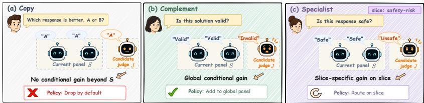
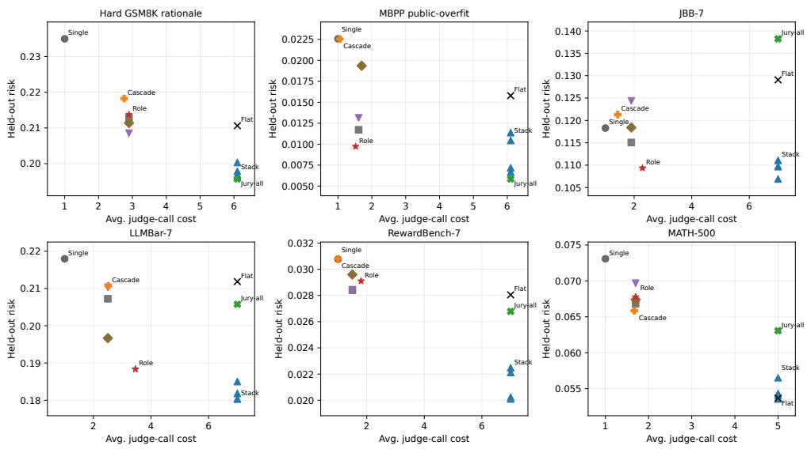

# STOPPING AND ROUTING LLM JUDGE PANELS

Bin Zhu Yi Xie Yanghui Rao∗

School of Computer Science and Engineering

Sun Yat-sen University, Guangzhou, China

zhub35@mail2.sysu.edu.cn xiey299@mail2.sysu.edu.cn raoyangh@mail.sysu.edu.cn

## ABSTRACT

LLM evaluation pipelines often have many candidate judges: general LLM-as-ajudge prompts, reward models, safety classifiers, confidence variants, and taskspecific verifiers. The deployment question is not only which judge is best, but which judges should be called, on which examples, and when panel construction should stop. We formulate judge-panel design as a role-conditioned allocation problem. From a small labeled audit set, declared slices, and judge costs, the method estimates target-relative roles: copies add no conditional information, complements improve the global panel, and specialists help only on slices. These roles induce a policy: drop copies, add complements globally, route specialists conditionally, and stop when validation gain falls below a threshold. Across reasoning, code, safety, preference, reward-model, summarization, and math audits, the method is compared with single judges, flat panels, matched diversity heuristics, full-call stacking, reliability juries, and frugal cascades. The result is a regime map for judge calls: route specialists on deployable slices, stop in saturated verifier regimes, keep broad ensembles when their risk benefit is worth the cost, and ignore conditional copies. The output is a reusable, auditable call plan for the next evaluation batch.

## 1 INTRODUCTION

LLM-as-a-judge systems are now common in model evaluation (Zheng et al., 2023; Liu et al., 2023; Zhu et al., 2023; Kim et al., 2024; Verga et al., 2024; Kocmi & Federmann, 2023; Dubois et al., 2024; Chan et al., 2024). A realistic evaluation pipeline may include a general judge, a rubric prompt, a reward model, a safety classifier, a confidence variant, and a deterministic verifier. For every new evaluation batch, the researcher must make a concrete operating decision: call the whole panel, call a cheap verifier and stop, route a safety judge only to risky cases, or drop a redundant prompt entirely. A static judge ranking does not answer that question. The value of a judge is conditional on the current panel, the target distribution, and the slice of examples where it will be used.

This creates a useful opportunity. A small labeled audit set can turn judge diversity from a descriptive property into a calling policy. A safety judge can become a specialist on jailbreak failures; a verifier can make several LLM judges redundant; and a full ensemble can still be the right endpoint on broad math or reward-model regimes (Wolpert, 1992; Caruana et al., 2004). The goal is to identify these cases before paying for judge calls on the next batch.

We turn the taxonomy of copy, complement, and specialist into an allocation method. The output is a calling policy $\pi ( { \dot { x } } ) \subseteq { \dot { \mathcal { I } } }$ with a validation-based stopping record. The method asks whether each candidate reduces held-out calibration risk after conditioning on the current panel, and whether that gain is global or slice-specific. Copies are dropped, broad complements are added to the global panel, specialists are routed to their slices, and construction stops when no remaining candidate clears a declared gain threshold.

Contributions. We make three claims. First, judge diversity should be target-relative and conditional, not nominal. Second, copy/complement/specialist roles can be converted into a practical policy with costs, slices, and stopping conditions. Third, the empirical value of the method is a regime map for deployment: it identifies when to route specialists, when to keep a cheap stopped panel, when to stop after a verifier, and when to pay for the full panel.

Although this paper and the companion A Finite-Calibration Regime Map for LLM Judge Panels share part of the benchmark judge-output matrices and judge pool, they address distinct deployment decisions: this paper selects conditional calls and stopping, whereas the companion selects a panel prefix and aggregation family after candidate outputs are available.

## 2 ROLE-CONDITIONED ALLOCATION

Let X be an evaluated item and $Y \in [ 0 , 1 ]$ the audit label. A finite candidate pool $\mathcal { I }$ contains judge signals $Z _ { j }$ such as correct/incorrect, safe/unsafe, or A/B. For a panel $S \subseteq { \mathcal { I } }$ , let $Z _ { S }$ be the joint output pattern. The researcher declares slices $\mathcal { F }$ that matter for the target distribution, such as LLMBar subsets (Zeng et al., 2024), safety failure modes (Chao et al., 2024), generator type, or difficulty level (Hendrycks et al., 2021). The goal is a policy $\pi ( x ; \mathcal { I } , \mathcal { F } ) \subseteq \mathcal { I }$ that decides which judges to call on x.

Fix a target distribution $P .$ For a panel S, define the oracle predictor

$$
\eta _ { P , S } ( z ) = \mathbb { E } _ { P } [ Y \mid Z _ { S } = z ]
$$

and its squared-loss oracle risk

$$
\mathcal { R } _ { P , S } ^ { \star } = \mathbb { E } _ { P } [ ( Y - \eta _ { P , S } ( Z _ { S } ) ) ^ { 2 } ] .
$$

The conditional value of adding judge $j \not \in S$ is

$$
g _ { P } ( j \mid S ) = \mathcal { R } _ { P , S } ^ { \star } - \mathcal { R } _ { P , S \cup \{ j \} } ^ { \star } .
$$

This is the target information in $j$ that is not already present in $S .$

Lemma 1 (Projection gain identity). For any finite panel S and candidate judge $j \not \in S _ { \mathrm { : } }$

$$
\begin{array} { r } { g _ { P } ( j \mid S ) = \mathbb { E } _ { P } \left[ \left( \eta _ { P , S \cup \{ j \} } ( Z _ { S \cup \{ j \} } ) - \eta _ { P , S } ( Z _ { S } ) \right) ^ { 2 } \right] \ge 0 . } \end{array}
$$

The identity requires no independence assumption among judges.

For slices $f \in { \mathcal { F } }$ , define broad gain $C _ { P } ( j \mid S ) = g _ { P } ( j \mid S )$ and slice gain $A _ { f } ( j \mid S ) = g _ { P _ { f } } ( j \mid S )$ The role profile profil ${ \ ' } _ { P , \mathcal { F } , S } ( j ) = ( C _ { P } , \{ A _ { f } \} _ { f \in \mathcal { F } } )$ is multi-label: a judge may be both a broad complement and a slice specialist, and its role can change after another judge enters the panel.

The profile is deliberately an action interface rather than a naming scheme. For example, a reward model that is weak as a standalone preference judge can still be a complement after a rubric prompt enters the panel if it separates cases the prompt collapses. Conversely, a second prompt from the same model family can become a copy if its conditional gain vanishes after the first prompt. Slice roles are evaluated in the same target-relative way. We also track a diagnostic specialization ratio

$$
\rho _ { f } ( j \mid S ) = \frac { g _ { P _ { f } } ( j \mid S ) } { g _ { P } ( j \mid S ) + \epsilon _ { 0 } } ,
$$

with $\epsilon _ { 0 } > 0$ only to avoid division by zero. The ratio does not make roles mutually exclusive; it flags concentration of value. A judge may be a broad complement and still be especially worth inspecting on one declared slice.

Construction rule. We split each audit set into construction-fit, construction-validation, and finaltest parts. Pattern calibrators estimate $\eta _ { P , S }$ by cell means on canonicalized joint judge-output patterns on the fit split; unseen validation or test patterns fall back to the fit-split label mean. Selection uses validation gain only; reported results use the final-test split only. Given current global panel S, costs $c _ { j }$ , and threshold $\tau _ { P } .$ , add a global judge only if

$$
\operatorname* { m a x } _ { j \in J \setminus S } \left[ \widehat { g } _ { P } ^ { \mathrm { v a l } } ( j \mid S ) - \lambda c _ { j } \right] > \tau _ { P } .
$$

  
Figure 1: Action-oriented role taxonomy. A copy is redundant after conditioning on the current panel, a complement adds broad residual information, and a specialist adds value mainly on a deployable slice.

<table><tr><td>Role</td><td>Signal pattern</td><td>Policy implication</td></tr><tr><td>Copy</td><td>Broad and slice gains are below thresh- old.</td><td>Do not invoke by default.</td></tr><tr><td>Complement</td><td>Broad gain  $C _ { P } ( j \mid S )$  is above thresh- old.</td><td>Add to the global panel.</td></tr><tr><td>Specialist</td><td>Cost-adjusted slice gain clears the slice threshold.</td><td>Route to examples in the correspond- ing slice.</td></tr><tr><td>Comp. + spec.</td><td>Broad gain is high and concentrated on one or more slices.</td><td>Invoke globally; optionally prioritize on the specialist slice.</td></tr></table>

Table 1: Role taxonomy as a policy interface. Roles are target-relative, conditional on the current panel, and may overlap.

For each slice, add a routed specialist only if

$$
\operatorname* { m a x } _ { j \in J \backslash ( S \cup S _ { f } ) } \left[ \widehat { g } _ { P _ { f } } ^ { \mathrm { v a l } } ( j  { | } S \cup S _ { f } ) - \lambda _ { f } c _ { j } \right] > \tau _ { f } .
$$

The deployed policy invokes $\pi ( x ) = S \cup S _ { f ( x ) }$ for examples in slice $f ( x )$ , and $S$ otherwise. The slice function used in deployment must be computable before the routed judge call. Ground-truth labels may define audit strata for analysis, but they are not valid inputs to $\pi ( x )$ on a new example; deployable routes must use metadata, verifier outputs, classifier outputs, or already-observed judge disagreement. If no remaining candidate clears threshold, the policy stops and records a validationbased stopping report that every unused broad or slice gain is below the declared threshold. This report is operational rather than asymptotic: it says that, under the audit split and cost model, the panel is usable without further judge calls.

Algorithmically, global construction is a greedy validation procedure. Starting from an empty or user-seeded panel, we fit the current pattern calibrator, score each unused candidate by cost-adjusted validation gain, add the best candidate only if it clears $\tau _ { P } ,$ , and repeat. After the global panel stops, each slice runs the same greedy search with the selected global panel fixed. The final policy is then refit on the full construction split and evaluated once on held-out final-test examples. The stopping report is the collection of failed inequalities for unused broad and routed candidates. It records the decision actually made by the deployment policy: under the finite audit split, declared slices, thresh olds, and costs, no remaining single judge call is worth adding to the current plan. If a deployment owner wants to search for pairwise or higher-order complementarity, the same validation-gain objective can be run with beam or subset proposals; the stopping report then documents that expanded search space.

This finite-split design makes the policy usable as a deployment audit. Judge selection happens on construction data, final-test examples are held out for reporting, and the comparisons include both cheap baselines and full-call aggregation endpoints. The intended use is simple: before paying for future judge calls, use a labeled audit set to decide whether a candidate adds information conditional on the panel that will actually be invoked.

<table><tr><td>Setting</td><td>Why it stresses allocation</td><td>Slice or route signal</td><td>Deployment status</td></tr><tr><td>Hard GSM8K rationale</td><td>Answer checking saturates, but rationale validity requires complementary LLM judgments.</td><td>Candidate generator and verifier agree- ment.</td><td>Available before final au- dit label.</td></tr><tr><td>MBPP public-overfit</td><td>A cheap hidden-test verifier can dominate some LLM signals but not all code-audit cases.</td><td>Public-test pass/fail and verifier agree- ment.</td><td>Available before final hidden-test label.</td></tr><tr><td>JailbreakBench</td><td>unsafe and classifier-disagreement re-</td><td>Safety judges have conditional value on Classifier/disagreement proxy slices; Deployable only for human safety label is audit-only.</td><td>proxy slices, not for human-label slices.</td></tr><tr><td>LLMBar</td><td>gions. Preference failures differ across natural Natural, adversarial instruction, adver- and adversarial subsets, making special- sarial output, and neighbor subsets. ist routing central.</td><td></td><td>Dataset metadata avail- able before routing.</td></tr><tr><td>RewardBench Arena100K</td><td>whether stopped panels should give way to full-call aggregation.</td><td>Broad preference comparisons test Preference-source and candidate-pair metadata.</td><td>Dataset metadata avail- able before routing.</td></tr><tr><td>SummEval</td><td>Scalar summary judging tests whether additional judges improve a continuous audit target.</td><td>Summary dimension and judge- confidence proxy.</td><td>Dimension metadata available; confidence is</td></tr><tr><td>MATH-500</td><td>sembles remain useful beyond cheap</td><td>Difficult math checks whether broad en- Problem level and generator family.</td><td>judge-derived. Available as metadata.</td></tr><tr><td>HumanEval / GSM8K</td><td>stopped panels. Saturated verifier cases test whether the method refuses unnecessary expansion.</td><td>Unit-test or answer-verifier result.</td><td>Verifier output available before routing.</td></tr></table>

Table 2: Experimental matrix. Each setting is included because it exercises a different deployment decision: add complements, route specialists, stop early, drop copies, or accept a full-call boundary. Human labels may define audit slices for analysis, but only metadata, verifier outputs, classifier outputs, or judge-disagreement proxies are deployable route signals.

## 3 EXPERIMENTAL PROTOCOL

We evaluate non-saturated settings where a single judge is not already perfect: hard GSM8K rationale audits (Cobbe et al., 2021), MBPP public-test overfit audits (Austin et al., 2021), Jailbreak-Bench safety (Chao et al., 2024), LLMBar preference under DeepSeek, Qwen3, and JudgeLM anchors (Zeng et al., 2024; DeepSeek-AI, 2024; Qwen Team, 2025; Zhu et al., 2023), Reward-Bench (Lambert et al., 2024), Arena100K (Chiang et al., 2024), SummEval (Fabbri et al., 2021), and MATH-500 (Hendrycks et al., 2021; Lightman et al., 2023). HumanEval and ordinary GSM8K are used only as saturated stopping checks (Chen et al., 2021; Cobbe et al., 2021). The concrete pool uses Qwen2.5 Instruct 7B, Llama 3.1 Instruct 8B, Mistral v0.3 7B, Prometheus 2 v2.0 7B, Gemma 3 IT 12B, Atla Selene Mini (Llama 3.1, 8B), and the DeepSeek V4 Flash API model (284B total parameters, 13B active parameters), with task-specific subsets where noted. LLM judge calls have normalized cost 1.0, and deterministic verifiers have cost 0.1. Route keys are treated as pre-available metadata, verifier outputs, classifier outputs, or already-observed judge signals; an additional model call needed to obtain a route key must be added to the cost model.

Baselines cover the options a practitioner would plausibly deploy: single best validation judge; flat all-judge panels; matched-K top-k, correlation diversity, and quality-diversity panels; full-call ridge/logistic stacking (Wolpert, 1992; Caruana et al., 2004); Dawid–Skene-style reliability juries (Dawid & Skene, 1979; Bradley & Terry, 1952; Raykar et al., 2010; Whitehill et al., 2009); and FrugalGPT/RouteLLM-style confidence cascades (Chen et al., 2024; Ong et al., 2025). All results are averaged over 10 random splits; Appendix E reports split-level standard deviations and 95% confidence intervals for the main risk comparisons. Unless noted, $\tau _ { P } = \tau _ { f } = 0 . 0 0 5$ . Appendix C lists the judge pools, route keys, and cheap verifiers used in each setting.

The evaluation metric is held-out squared calibration risk for all tasks and accuracy where labels are binary. Risk is the primary metric because the method selects judges through calibrated conditional gain; accuracy is reported to make the results legible for standard correctness, safety, and preference audits (Guo et al., 2017). Average cost and average number of judge calls are reported because the paper’s object is a deployment policy rather than an unconstrained aggregator.

The datasets are chosen to prevent a single story from explaining every result. Hard GSM8K rationale and MBPP public-overfit test whether a cheap verifier and a few LLM judges can be combined without defaulting to all calls. LLMBar tests deployable conditional routing on natural and adversarial subsets, while JBB tests whether safety value is concentrated on deployable classifier or disagreement proxies and on human-label audit strata. Human labels are used only for audit evaluation, not for deployment-time routing. Arena100K and SummEval test stopping in non-saturated settings where extra judges can worsen calibration. RewardBench and MATH-500 are boundary cases where broad aggregation can remain attractive. HumanEval and ordinary GSM8K are saturated sanity checks: after an objective verifier solves the audit target, the correct policy action is to stop.

<table><tr><td rowspan="2">Dataset</td><td colspan="2">Single best</td><td colspan="2">Flat all</td><td colspan="4">Role routed stop</td></tr><tr><td>Risk</td><td>Acc.</td><td>Risk</td><td>Acc.</td><td>Risk</td><td>Acc.</td><td>Cost</td><td>Judges</td></tr><tr><td>Hard GSM8K rationale</td><td>0.2350</td><td>0.6253</td><td>0.2106</td><td>0.6670</td><td>0.2137</td><td>0.6843</td><td>2.90</td><td>2.90</td></tr><tr><td>MBPP public-overfit</td><td>0.0226</td><td>0.9767</td><td>0.0158</td><td>0.9617</td><td>0.0097</td><td>0.9900</td><td>1.52</td><td>1.70</td></tr><tr><td>JBB-7</td><td>0.1183</td><td>0.8349</td><td>0.1291</td><td>0.8409</td><td>0.1094</td><td>0.8527</td><td>2.29</td><td>2.29</td></tr><tr><td>LLMBar-7</td><td>0.2180</td><td>0.6822</td><td>0.2118</td><td>0.6692</td><td>0.1884</td><td>0.7334</td><td>3.46</td><td>3.46</td></tr><tr><td>RewardBench-7</td><td>0.0308</td><td>0.9678</td><td>0.0280</td><td>0.9615</td><td>0.0291</td><td>0.9660</td><td>1.80</td><td>1.80</td></tr><tr><td>Arena100K-7</td><td>0.2321</td><td>0.6257</td><td>0.2462</td><td>0.6186</td><td>0.2321</td><td>0.6257</td><td>1.00</td><td>1.00</td></tr><tr><td>SummEval-7 scalar</td><td>0.0450</td><td></td><td>0.0601</td><td></td><td>0.0450</td><td></td><td>1.00</td><td>1.00</td></tr><tr><td>MATH-500-5</td><td>0.0731</td><td>0.9167</td><td>0.0537</td><td>0.9309</td><td>0.0678</td><td>0.9202</td><td>1.70</td><td>1.70</td></tr></table>

Table 3: Main held-out policy comparison across hard reasoning audits, code overfit audits, safety, pairwise preference, reward modeling, and scalar summarization. Role policies expose few-judge complement panels, one-step stopping, specialist routing, and broad-ensemble endpoints.

The baselines are similarly separated by deployment question. The flat panel and full-call stacking baselines answer “what if we call every judge?” and therefore form strong risk endpoints at high cost. Matched-size non-role panels answer whether ordinary quality or correlation diversity can match the same call budget without role conditioning. Reliability jury answers whether global judge trustworthiness is enough. Frugal cascade answers whether a single quality order with an uncertainty trigger is enough. Role allocation should win only when the missing ingredient is conditional value relative to the current panel or slice.

## 4 RESULTS

The evidence chain follows the deployment actions induced by the role profile. Table 3 asks which call plan each setting supports. Tables 4 and 6 then separate the regimes: where conditional specialists should be routed, where a cheap stopped panel is enough, where copied signals should be dropped, and where the right endpoint is still a broad full-call ensemble.

Table 3 translates held-out metrics into deployment decisions. On hard GSM8K rationales, MBPP overfit, safety audit/proxy slices, and LLMBar, role policies recover useful accuracy with fewer than a flat panel’s calls. Arena100K and SummEval produce a different action: keep the strong single judge because expansion adds little value. RewardBench and MATH-500 expose the full-panel endpoint, where extra broad signals can be worth their cost when the researcher wants the lowest risk.

The complement regimes show why conditioning matters. In hard GSM8K rationale audits, ordinary answer checking is not the target: the policy must decide whether the reasoning is valid. The stopped role policy improves accuracy over both the single-best and flat-all panels while invoking about three judges. In MBPP public-overfit, the hidden-test verifier is cheap and strong, but it does not eliminate all residual audit uncertainty. The role policy reaches the best reported accuracy at a cost close to one and a half calls, illustrating the intended combination of verifier-first stopping with selective LLM additions.

Full-call stacking is a strong endpoint because it sees all judge outputs before predicting. Role allocation answers the preceding operational question: which outputs should be purchased in the first place? Table 4 shows that role policies add the most value when information is conditional on the current panel or route signal, as in safety and LLMBar. On hard GSM8K, RewardBench, and MATH-500, matched panels or full-call endpoints can be just as competitive. That is the intended regime-map reading: the policy tells the researcher whether to buy conditional specialists, stop early, or pay for broad aggregation. The JBB proxy-routing audit in Table 10 isolates the deployable safety case: routing on gpt4 cf, not human labels, reaches 0.1094 risk at 2.29 calls versus the 7-call stack at 0.1069.

<table><tr><td rowspan="2">Setting</td><td colspan="2">Best full-call</td><td colspan="2">Best matched non-role</td><td colspan="2">Role policy</td></tr><tr><td>Risk</td><td>Cost</td><td>Risk</td><td>Cost</td><td>Risk</td><td>Cost</td></tr><tr><td>Hard GSM8K rationale</td><td>0.1963</td><td>6.10</td><td>0.2114</td><td>2.90</td><td>0.2137</td><td>2.90</td></tr><tr><td>MBPP public-overfit</td><td>0.0067</td><td>6.10</td><td>0.0117</td><td>1.61</td><td>0.0097</td><td>1.52</td></tr><tr><td>JBB-7 DeepSeek</td><td>0.1069</td><td>7.00</td><td>0.1151</td><td>1.90</td><td>0.1094</td><td>2.29</td></tr><tr><td>LLMBar-7 DeepSeek</td><td>0.1804</td><td>7.00</td><td>0.1967</td><td>2.50</td><td>0.1884</td><td>3.46</td></tr><tr><td>LLMBar-7 Qwen3</td><td>0.2034</td><td>7.00</td><td>0.2190</td><td>2.20</td><td>0.2033</td><td>3.28</td></tr><tr><td>LLMBar-7 JudgeLM</td><td>0.1999</td><td>7.00</td><td>0.2215</td><td>2.30</td><td>0.2040</td><td>3.48</td></tr><tr><td>RewardBench-7 DeepSeek</td><td>0.0201</td><td>7.00</td><td>0.0284</td><td>1.50 1.00</td><td>0.0291</td><td>1.80</td></tr><tr><td>Arena100K-7 DeepSeek</td><td>0.2286 0.0446</td><td>7.00 7.00</td><td>0.2321</td><td>1.00</td><td>0.2321 0.0450</td><td>1.00</td></tr><tr><td>SummEval-7 DeepSeek</td><td></td><td>5.00</td><td>0.0450 0.0668</td><td>1.70</td><td>0.0678</td><td>1.00</td></tr><tr><td>MATH-500-5</td><td>0.0536</td><td></td><td></td><td></td><td></td><td>1.70</td></tr></table>

Table 4: Strong baseline comparison. Full-call aggregation can be the best risk endpoint, but it invokes every judge. Role policies solve the deployment problem of deciding when to buy a small stopped panel, when to route specialists, and when to keep the full-call endpoint.
<table><tr><td rowspan="2">Setting</td><td colspan="2">Reliability jury</td><td colspan="2">Frugal cascade</td><td colspan="2">Role policy</td></tr><tr><td>Risk</td><td>Cost</td><td>Risk</td><td>Cost</td><td>Risk</td><td>Cost</td></tr><tr><td>Hard GSM8K rationale</td><td>0.1957</td><td>6.10</td><td>0.2182</td><td>2.76</td><td>0.2137</td><td>2.90</td></tr><tr><td>MBPP public-overfit</td><td>0.0059</td><td>6.10</td><td>0.0225</td><td>1.06</td><td>0.0097</td><td>1.52</td></tr><tr><td>JBB-7 DeepSeek</td><td>0.1382</td><td>7.00</td><td>0.1213</td><td>1.43</td><td>0.1094</td><td>2.29</td></tr><tr><td>LLMBar-7 DeepSeek</td><td>0.2058</td><td>7.00</td><td>0.2107</td><td>2.52</td><td>0.1884</td><td>3.46</td></tr><tr><td>LLMBar-7 JudgeLM</td><td>0.2113</td><td>7.00</td><td>0.2337</td><td>2.60</td><td>0.2040</td><td>3.48</td></tr><tr><td>LLMBar-7 Qwen3</td><td>0.2232</td><td>7.00</td><td>0.2333</td><td>1.94</td><td>0.2033</td><td>3.28</td></tr><tr><td>RewardBench-7 DeepSeek</td><td>0.0268</td><td>7.00</td><td>0.0308</td><td>1.00</td><td>0.0291</td><td>1.80</td></tr><tr><td>MATH-500-5</td><td>0.0631</td><td>5.00</td><td>0.0658</td><td>1.67</td><td>0.0678</td><td>1.70</td></tr></table>

Table 5: SOTA-style allocation baselines. Reliability jury is full-call multi-annotator aggregation; frugal cascade is confidence-triggered budgeted routing. Role policies are most informative when useful judges are slice-conditional, as in deployable LLMBar slices and safety proxy/audit slices.

The matched-K comparison is the key judge-count fairness check. A top-k panel can reuse the same number ofjudges, but its realized call cost can differ; it selects judges by standalone validation quality rather than conditional value. Correlation-diverse and quality-diverse panels also spend a similar budget, but their notion of diversity is nominal or pairwise rather than target-conditional. The gains on MBPP, the safety audit/proxy setting, and the three LLMBar anchors show what the role profile adds: it spends the same budget on judges whose residual information is useful for the current panel and target slice (Kuncheva & Whitaker, 2003).

Reliability jury estimates which judges are globally trustworthy, but does not decide that a judge should be called only on a slice. Frugal cascade decides when to call another globally ordered judge based on uncertainty, but it does not model specialist roles. This explains Table 5: the baselines are strong in broad-complement regimes, while role routing is the natural deployment action when failure modes are conditional.

These comparisons reveal two useful operating modes. In broad-complement settings such as hard GSM8K and MBPP, full-call reliability juries can be the lowest-risk endpoints because every signal contributes to the aggregate. In slice-conditional settings such as safety proxy/audit slices and LLMBar, useful information concentrates on failure modes. There the role policy is both cheaper than the full-call jury and lower risk than the cascade.

Routed specialists. Table 7 checks that routing is not merely an expensive global panel in disguise. On LLMBar, the policy repeatedly sends different judges to declared adversarial and natural subsets across three anchors. This is the mechanism missing from global reliability juries and confidence cascades: a judge can fail to clear the broad threshold while still clearing a slice threshold.

Stopping thresholds. Table 8 varies the validation threshold. The pattern is not that one threshold is universally best; it is that τ gives the researcher a transparent risk-cost dial. Higher thresholds save calls on hard GSM8K, MBPP, JBB, and MATH-500. LLMBar is a useful exception: a more conservative threshold also improves risk by avoiding sparse or redundant expansions.

  
Figure 2: Risk-cost frontier across representative settings. Each point is a held-out policy evaluation averaged over 10 splits. Full-call stacking and full-call jury can be low-risk endpoints in broadensemble regimes, but require invoking every judge. Role policies occupy useful frontier regions when specialists or cheap verifiers matter.

<table><tr><td>Policy action</td><td>Evidence</td><td>Interpretation</td></tr><tr><td>Route specialists</td><td>LLMBar improves from flat-all risk 0.2118/accuracy 0.6692 to role risk merely next in a global quality order. 0.1884/accuracy 0.7334 at 3.46 calls; repeated routes appear on adversarial and natural subsets across DeepSeek, Qwen3,</td><td>Useful judges are conditional on declared slices, not</td></tr><tr><td>Stop</td><td>Increasing τ reduces calls on hard GSM8K (3.10 to 1.30), MBPP (1.80 to 1.10), JBB (3.68 to 1.00), and MATH-500 (2.70 to 1.00); HumanEval and ordinary GSM8K stop after the verifier or strong single judge.</td><td>The method produces a practical validation-based stop- ping report for saturated targets.</td></tr><tr><td>Drop copies</td><td>Adding four exact copies to LLMBar and JBB leaves role risk/cost unchanged (LLM- Bar 0.1884/3.46; JBB 0.1094/2.29), while full-call jury cost rises to 11 and risk wors- ens (LLMBar 0.2860; JBB 0.1594).</td><td>Conditional gain identifies redundant signals even when nominal panel size and model count grow.</td></tr><tr><td>Expose boundaries</td><td>RewardBench and MATH-500 role poli- lower risk (0.0201 vs 0.0291; 0.0536 vs call the full panel. 0.0678).</td><td>The method is a regime detector: when broad ensem- cies are cheaper, but full-call stacking gives ble information remains valuable and cost is acceptable,</td></tr></table>

Table 6: Mechanism evidence for the four actions induced by the taxonomy: route, stop, drop, and select broad-ensemble endpoints.

Copy stress test. The copy role should change deployment, not merely interpretation. We therefore add four exact copies of an existing DeepSeek judge to LLMBar and JBB. The role policy is unchanged because the copies have zero conditional validation gain after the original signal is present. Full-call baselines still pay for the copies, and reliability jury becomes worse because duplicated votes are overweighted.

Taken together, the results support a policy interpretation of judge diversity. When a new judge supplies broad conditional information, it should enter the global panel. When its value is concentrated on a declared slice, it should be routed rather than called everywhere. When its gain vanishes after conditioning on the current panel, it should be dropped even if it increases nominal model diversity. When full-call aggregation remains lower risk and the cost is acceptable, the regime map marks the full panel as the deployment endpoint.

<table><tr><td>Anchor</td><td>Slice</td><td>Routed judge</td><td>Frequency</td></tr><tr><td>DeepSeek</td><td>adversarial_gptinst</td><td>llama3_8b_v</td><td>6/10</td></tr><tr><td>DeepSeek</td><td>adversarial_neighbor</td><td>1lama3_8b_v</td><td>5/10</td></tr><tr><td>DeepSeek</td><td>natural</td><td>gemma3_12b_v</td><td>6/10</td></tr><tr><td>Qwen3</td><td>adversarial_gptout</td><td>gemma3_12b_v</td><td>5/10</td></tr><tr><td>Qwen3</td><td>adversarial_neighbor</td><td>mistral_7b_v</td><td>6/10</td></tr><tr><td>Qwen3</td><td>natural</td><td>gemma3_12b_v</td><td>5/10</td></tr><tr><td>JudgeLM</td><td>adversarial_gptout</td><td>gemma3_12b_v</td><td>5/10</td></tr><tr><td>JudgeLM</td><td>adversarial_neighbor</td><td>mistral_7b_v</td><td>6/10</td></tr><tr><td>JudgeLM</td><td>natural</td><td>gemma3_12b_v</td><td>5/10</td></tr></table>

Table 7: Representative routed specialists on LLMBar. Frequencies count how often a judge-slice route appears across 10 random splits.
<table><tr><td>Dataset and threshold</td><td>Risk</td><td>Acc.</td><td>Cost</td><td>Judges</td></tr><tr><td>Hard GSM8K rationale, τ = 0.001</td><td>0.2129</td><td>0.6790</td><td>3.10</td><td>3.10</td></tr><tr><td>Hard GSM8K rationale, τ = 0.005</td><td>0.2137</td><td>0.6843</td><td>2.90</td><td>2.90</td></tr><tr><td>Hard GSM8K rationale, τ = 0.020</td><td>0.2318</td><td>0.6373</td><td>1.30</td><td>1.30</td></tr><tr><td>MBPP public-overfit, τ = 0.001</td><td>0.0078</td><td>0.9920</td><td>1.53</td><td>1.80</td></tr><tr><td>MBPP public-overfit, τ = 0.005</td><td>0.0097</td><td>0.9900</td><td>1.52</td><td>1.70</td></tr><tr><td>MBPP public-overfit, τ = 0.020</td><td>0.0206</td><td>0.9787</td><td>1.01</td><td>1.10</td></tr><tr><td> $\mathbf { J B B } , \tau = 0 . 0 0 1$ </td><td>0.1078</td><td>0.8688</td><td>3.68</td><td>3.68</td></tr><tr><td> $\mathbf { J B B } , \tau = 0 . 0 0 5$ </td><td>0.1094</td><td>0.8527</td><td>2.29</td><td>2.29</td></tr><tr><td> $\mathbf { J B B } , \tau = 0 . 0 2 0$ </td><td>0.1183</td><td>0.8349</td><td>1.00</td><td>1.00</td></tr><tr><td>LLMBar, τ = 0.001</td><td>0.1954</td><td>0.7303</td><td>4.10</td><td>4.10</td></tr><tr><td>LLMBar, τ = 0.005</td><td>0.1884</td><td>0.7334</td><td>3.46</td><td>3.46</td></tr><tr><td>LLMBar, τ = 0.020</td><td>0.1834</td><td>0.7443</td><td>2.00</td><td>2.00</td></tr><tr><td>MATH-500, τ = 0.001</td><td>0.0617</td><td>0.9209</td><td>2.70</td><td>2.70</td></tr><tr><td>MATH-500, τ = 0.005</td><td>0.0678</td><td>0.9202</td><td>1.70</td><td>1.70</td></tr><tr><td> $\mathrm { M A T H } { - } 5 0 0 , \tau = 0 . 0 2 0$ </td><td>0.0731</td><td>0.9167</td><td>1.00</td><td>1.00</td></tr></table>

Table 8: Threshold sensitivity for role-routed stopping. Conservative thresholds reduce calls and provide an explicit stopping condition: add no remaining judge whose validation gain is below τ.

## 5 RELATED WORK

LLM-as-a-judge evaluation. LLM judges are widely used for open-ended generation, instruction following, translation quality, preference comparison, and rubric scoring (Zheng et al., 2023; Liu et al., 2023; Kocmi & Federmann, 2023; Zhu et al., 2023; Kim et al., 2024; Dubois et al., 2024). This line of work establishes that LLMs can be useful evaluators, but also documents evaluator-specific biases such as position and length effects (Wang et al., 2024; Dubois et al., 2024). Benchmarks such as LLMBar, RewardBench, Arena100K, SummEval, MATH/MATH-500, GSM8K, MBPP, and HumanEval define the targets and stress cases used in this paper (Zeng et al., 2024; Lambert et al., 2024; Chiang et al., 2024; Fabbri et al., 2021; Hendrycks et al., 2021; Lightman et al., 2023; Cobbe et al., 2021; Austin et al., 2021; Chen et al., 2021). Our contribution is not a new judge benchmark. It is a policy for deciding which available judge signals to call under a finite audit budget.

The same literature also motivates the need for conditional allocation rather than one global judge ranking. LLMBar constructs adversarial preference cases that expose evaluator failures (Zeng et al., 2024); AlpacaEval and FairEval document length and position biases in automatic judges (Dubois et al., 2024; Wang et al., 2024); and JailbreakBench separates safety evaluation from ordinary helpfulness or preference evaluation (Chao et al., 2024). These findings imply that a judge’s usefulness can depend sharply on the failure mode. Role-conditioned routing treats that dependence as a deployment object: a judge may be worth calling on adversarial, safety-proxy, or disagreement regions without being worth calling everywhere.

Judge panels and multi-agent evaluators. Several works study using more than one LLM evaluator, either as panels or multi-agent discussions (Verga et al., 2024; Chan et al., 2024). These methods motivate judge diversity, but they do not by themselves determine whether an additional judge should be called globally, routed to a slice, or dropped as a copy. Role-conditioned allocation treats panel construction as a conditional value problem: the value of a candidate depends on the current panel, the target distribution, the slice, and the cost. Correlated-error audits show that nominal panel size can substantially overstate effective information (Kohli, 2026), while calibrated full-panel results show that weak but nonredundant judges can remain useful when their signals are learnable (Li, 2026). Our policy reconciles these observations at deployment time by retaining a signal only when its finite-sample conditional gain justifies its call cost.

<table><tr><td>Setting</td><td>Condition</td><td colspan="2">Flat all</td><td colspan="2">Jury all</td><td colspan="2">Cascade</td><td colspan="2">Role</td></tr><tr><td></td><td></td><td>Risk</td><td>Cost</td><td>Risk</td><td>Cost</td><td>Risk</td><td>Cost</td><td>Risk</td><td>Cost</td></tr><tr><td>LLMBar</td><td>base</td><td>0.2118</td><td>7.00</td><td>0.2058</td><td>7.00</td><td>0.2107</td><td>2.52</td><td>0.1884</td><td>3.46</td></tr><tr><td>LLMBar</td><td>+4 copies</td><td>0.2118</td><td>11.00</td><td>0.2860</td><td>11.00</td><td>0.2107</td><td>3.80</td><td>0.1884</td><td>3.46</td></tr><tr><td>JBB</td><td>base</td><td>0.1291</td><td>7.00</td><td>0.1382</td><td>7.00</td><td>0.1213</td><td>1.43</td><td>0.1094</td><td>2.29</td></tr><tr><td>JBB</td><td>+4 copies</td><td>0.1291</td><td>11.00</td><td>0.1594</td><td>11.00</td><td>0.1213</td><td>1.65</td><td>0.1094</td><td>2.29</td></tr></table>

Table 9: Redundant-copy stress test. Four exact copies of an existing judge increase the apparent pool size, but role-conditioned stopping ignores them after their conditional gain vanishes.

Annotator aggregation and preference models. Reliability-based aggregation has a long history in multi-annotator learning (Dawid & Skene, 1979; Raykar et al., 2010; Whitehill et al., 2009), and pairwise comparison models such as Bradley–Terry remain standard tools for preference aggregation (Bradley & Terry, 1952). These methods estimate global or item-conditioned annotator reliability from observed labels. Our setting is different because a deployment system must decide which judge outputs to observe in the first place. A judge can be low-reliability globally but useful on one slice, or high-reliability but redundant after a verifier enters the panel.

Ensembles, deferral, cascades, and calibration. Stacked generalization and ensemble selection show how to combine many model outputs once they are observed (Wolpert, 1992; Caruana et al., 2004). Classifier-ensemble work also studies diversity measures and their limits (Kuncheva & Whitaker, 2003). Learning-to-defer methods train systems to route examples to a human or expert when delegation improves task performance (Madras et al., 2018; Mozannar & Sontag, 2020). Model cascades and routers reduce inference cost by calling stronger models only when needed (Chen et al., 2024; Ong et al., 2025). More generally, wrapper selection, conditional-redundancy criteria, and budgeted classifier cascades select predictive signals under validation or acquisition costs (Kohavi & John, 1997; Brown et al., 2012; Chen et al., 2012); active feature acquisition makes the corresponding per-example decision about which costly features to observe (Shim et al., 2018). Cascaded Selective Evaluation applies confidence-based escalation to LLM judges with a target human-agreement guarantee (Jung et al., 2025). In contrast, our setting selects a set-valued panel policy from finite audit data, allowing global complements, slice-routed specialists, and unused conditional copies. Role-conditioned allocation applies the same conditional-computation question to evaluation itself. Its units are auditable judge calls: use calibrated validation gain (Guo et al., 2017) to decide whether an output should be obtained globally, routed to a declared slice, or left uncalled. The LLM-judge setting adds three constraints that ordinary routers do not address together: route signals must be deployable before the routed judge call, human-label strata can be audit diagnostics without being route inputs, and nominally different prompts or models may be conditional copies after the current panel has already been observed.

## 6 DISCUSSION

Judge diversity becomes useful when it changes a deployment action. A model family, prompt template, or reward head can look diverse on paper and still be a copy after conditioning on the current panel; a weak standalone judge can be exactly the call worth making on one failure slice. The practical workflow is a calibration loop: collect a labeled audit set, run the candidate judge pool once, declare decision-relevant slices, and fit the stopped role policy. The output is a call plan with global judges, routed specialists, and unused judges whose validation gain did not justify their cost.

That plan has a direct operational reading. If a deterministic verifier dominates, keep it and stop. If broad gains plateau but slice gains remain, route specialists. If copied signals appear, drop them without changing the rest of the policy. If the full panel is still the lowest-risk endpoint and the budget allows it, pay for that endpoint. Across repeated audit splits, risk-cost stability and exact plan identity should be read separately: stable risk with variable routes calls for frequency checking, keeping recurring calls and collecting more audit labels before relying on low-frequency specialists. This frequency audit is a deployment diagnostic, not a statistical guarantee.

The threshold is the risk-cost dial. Lower thresholds keep marginal calls when evaluation errors are expensive; higher thresholds produce leaner policies when latency or budget dominates. If small threshold changes alter the selected panel, the audit set is signaling instability; if the same copy, route, or stop decisions persist, the call plan is more credible for the next evaluation batch.

## 7 DEPLOYMENT EXTENSIONS

The same policy interface scales along three axes. Larger judge pools can keep the role profile while replacing finite-cell means with smoothed, cross-fitted, or parametric calibrators when joint output cells become sparse. Declared slices can be extended by automatic slice discovery: discover candidate failure regions, validate whether any judge has conditional value there, and route only specialists that clear threshold. Normalized call costs can also be replaced by actual API prices, latency, safety-review budget, or carbon budget; the output remains a validation-backed plan of global calls, routed specialists, and stopped candidates.

## 8 CONCLUSION

We proposed role-conditioned panel policies for LLM judge allocation. The shift is from describing judge diversity to deciding judge calls. Target-relative profiles identify copies, complements, and specialists; validation-stopped construction turns them into global and routed policies; held-out evaluation reports the resulting risk-cost tradeoff. The resulting regime map tells LLM researchers when to drop, add, route, stop, or pay for a full panel.

The broader point is that a larger panel is not automatically more reliable, and a smaller panel is not automatically more efficient if it drops conditional information. Future judge-panel studies should therefore report not only which evaluator scored best, but also which additional judges were worth calling, where they were worth routing, and why panel construction stopped.

## ACKNOWLEDGEMENTS

This work was supported by the National Natural Science Foundation of China (62372483).

## REFERENCES

Andrei Alexandru, Antonia Calvi, Henry Broomfield, Jackson Golden, Kyle Dai, Mathias Leys, Maurice Burger, Max Bartolo, Roman Engeler, Sashank Pisupati, Toby Drane, and Young Sun Park. Atla Selene Mini: A general purpose evaluation model. arXiv preprint arXiv:2501.17195, 2025.

Jacob Austin, Augustus Odena, Maxwell Nye, Maarten Bosma, Henryk Michalewski, David Dohan, Ellen Jiang, Carrie Cai, Michael Terry, Quoc Le, and Charles Sutton. Program synthesis with large language models. arXiv preprint arXiv:2108.07732, 2021.

Ralph Allan Bradley and Milton E. Terry. Rank analysis of incomplete block designs: I. the method of paired comparisons. Biometrika, 39(3/4):324–345, 1952.

Gavin Brown, Adam Pocock, Ming-Jie Zhao, and Mikel Lujan. Conditional likelihood maximi-´ sation: A unifying framework for information theoretic feature selection. Journal of Machine Learning Research, 13:27–66, 2012.

Rich Caruana, Alexandru Niculescu-Mizil, Geoff Crew, and Alex Ksikes. Ensemble selection from libraries of models. In Proceedings of the 21st International Conference on Machine Learning, 2004. doi: 10.1145/1015330.1015432.

Chi-Min Chan, Weize Chen, Yusheng Su, Jianxuan Yu, Wei Xue, Shanghang Zhang, Jie Fu, and Zhiyuan Liu. ChatEval: Towards better LLM-based evaluators through multi-agent debate. In International Conference on Learning Representations, 2024.

Patrick Chao, Edoardo Debenedetti, Alexander Robey, Maksym Andriushchenko, Florin Croitoru, Vikash Sehwag, Edgar Dobriban, Nicolas Flammarion, George J. Pappas, Florian Tramer, Hamed Hassani, and Eric Wong. JailbreakBench: An open robustness benchmark for jailbreaking large language models. In Advances in Neural Information Processing Systems, Datasets and Benchmarks Track, 2024.

Lingjiao Chen, Matei Zaharia, and James Zou. FrugalGPT: How to use large language models while reducing cost and improving performance. Transactions on Machine Learning Research, 2024.

Mark Chen, Jerry Tworek, Heewoo Jun, Qiming Yuan, Henrique Ponde de Oliveira Pinto, Jared Kaplan, Harri Edwards, Yuri Burda, Nicholas Joseph, Greg Brockman, Alex Ray, Raul Puri, Gretchen Krueger, Michael Petrov, Heidy Khlaaf, Girish Sastry, Pamela Mishkin, Brooke Chan, Scott Gray, Nick Ryder, Mikhail Pavlov, Alethea Power, Lukasz Kaiser, Mohammad Bavarian, Clemens Winter, Philippe Tillet, Felipe Petroski Such, Dave Cummings, Matthias Plappert, Fotios Chantzis, Elizabeth Barnes, Ariel Herbert-Voss, William Hebgen Guss, Alex Nichol, Alex Paino, Nikolas Tezak, Jie Tang, Igor Babuschkin, Suchir Balaji, Shantanu Jain, William Saunders, Christopher Hesse, Andrew N. Carr, Jan Leike, Josh Achiam, Vedant Misra, Evan Morikawa, Alec Radford, Matthew Knight, Miles Brundage, Mira Murati, Katie Mayer, Peter Welinder, Bob Mc-Grew, Dario Amodei, Sam McCandlish, Ilya Sutskever, and Wojciech Zaremba. Evaluating large language models trained on code. arXiv preprint arXiv:2107.03374, 2021.

Minmin Chen, Zhixiang Xu, Kilian Q. Weinberger, Olivier Chapelle, and Dor Kedem. Classifier cascade for minimizing feature evaluation cost. In Proceedings of the Fifteenth International Conference on Artificial Intelligence and Statistics, volume 22, pp. 218–226, 2012.

Wei-Lin Chiang, Lianmin Zheng, Ying Sheng, Anastasios N. Angelopoulos, Tianle Li, Dacheng Li, Hao Zhang, Banghua Zhu, Michael Jordan, Joseph E. Gonzalez, and Ion Stoica. Chatbot Arena: An open platform for evaluating LLMs by human preference. arXiv preprint arXiv:2403.04132, 2024.

Karl Cobbe, Vineet Kosaraju, Mohammad Bavarian, Mark Chen, Heewoo Jun, Lukasz Kaiser, Matthias Plappert, Jerry Tworek, Jacob Hilton, Reiichiro Nakano, Christopher Hesse, and John Schulman. Training verifiers to solve math word problems. arXiv preprint arXiv:2110.14168, 2021.

A. Philip Dawid and Allan M. Skene. Maximum likelihood estimation of observer error-rates using the EM algorithm. Journal of the Royal Statistical Society. Series C (Applied Statistics), 28(1): 20–28, 1979.

DeepSeek-AI. DeepSeek-V3 technical report. arXiv preprint arXiv:2412.19437, 2024.

Yann Dubois, Balazs Galambosi, Percy Liang, and Tatsunori B. Hashimoto. Length-controlled AlpacaEval: A simple way to debias automatic evaluators. In Conference on Language Modeling, 2024.

Alexander R. Fabbri, Wojciech Kryscinski, Bryan McCann, Caiming Xiong, Richard Socher, and Dragomir Radev. SummEval: Re-evaluating summarization evaluation. Transactions of the Associationfor Computational Linguistics, 9:391–409, 2021.

Gemma Team. Gemma 3 technical report. arXiv preprint arXiv:2503.19786, 2025.

Chuan Guo, Geoff Pleiss, Yu Sun, and Kilian Q. Weinberger. On calibration of modern neural networks. In Proceedings ofthe 34th International Conference on Machine Learning, pp. 1321– 1330, 2017.

Dan Hendrycks, Collin Burns, Saurav Kadavath, Akul Arora, Steven Basart, Eric Tang, Dawn Song, and Jacob Steinhardt. Measuring mathematical problem solving with the MATH dataset. In NeurIPS Datasets and Benchmarks, 2021.

Albert Q. Jiang, Alexandre Sablayrolles, Arthur Mensch, Chris Bamford, Devendra Singh Chaplot, Diego de Las Casas, Florian Bressand, Gianna Lengyel, Guillaume Lample, Lucile Saulnier, Lelio Renard Lavaud, Marie-Anne Lachaux, Pierre Stock, Teven Le Scao, Thibaut Lavril, Thomas Wang, Timothee Lacroix, and William El Sayed. Mistral 7B. arXiv preprint arXiv:2310.06825, 2023.

Jaehun Jung, Faeze Brahman, and Yejin Choi. Trust or escalate: LLM judges with provable guarantees for human agreement. In International Conference on Learning Representations, 2025.

Seungone Kim, Juyoung Suk, Shayne Longpre, Bill Yuchen Lin, Jamin Shin, Sean Welleck, Graham Neubig, Moontae Lee, Kyungjae Lee, and Minjoon Seo. Prometheus 2: An open source language model specialized in evaluating other language models. In Proceedings of the 2024 Conference on Empirical Methods in Natural Language Processing, 2024.

Tom Kocmi and Christian Federmann. Large language models are state-of-the-art evaluators of translation quality. In Proceedings of the 24th Annual Conference of the European Association for Machine Translation, pp. 193–203, 2023.

Ron Kohavi and George H. John. Wrappers for feature subset selection. Artificial Intelligence, 97 (1–2):273–324, 1997. doi: 10.1016/S0004-3702(97)00043-X.

Guneet Kohli. Nine judges, two effective votes: Correlated errors undermine LLM evaluation panels. arXiv preprint arXiv:2605.29800, 2026.

Ludmila I. Kuncheva and Christopher J. Whitaker. Measures of diversity in classifier ensembles and their relationship with the ensemble accuracy. Machine Learning, 51:181–207, 2003.

Nathan Lambert, Valentina Pyatkin, Jacob Morrison, LJ Miranda, Bill Yuchen Lin, Khyathi Chandu, Nouha Dziri, Sachin Kumar, Tom Zick, Yejin Choi, Noah A. Smith, and Hannaneh Hajishirzi. RewardBench: Evaluating reward models for language modeling. In Advances in Neural Information Processing Systems, Datasets and Benchmarks Track, 2024.

Yanran Li. Calibrate, don’t curate: Label-efficient estimation from noisy LLM judges. arXiv preprint arXiv:2605.09702, 2026.

Hunter Lightman, Vineet Kosaraju, Yura Burda, Harri Edwards, Bowen Baker, Teddy Lee, Jan Leike, John Schulman, Ilya Sutskever, and Karl Cobbe. Let’s verify step by step. arXiv preprint arXiv:2305.20050, 2023.

Yang Liu, Dan Iter, Yichong Xu, Shuohang Wang, Ruochen Xu, and Chenguang Zhu. G-Eval: NLG evaluation using GPT-4 with better human alignment. In Proceedings of the 2023 Conference on Empirical Methods in Natural Language Processing, pp. 2511–2522, 2023.

Llama Team. The Llama 3 herd of models. arXiv preprint arXiv:2407.21783, 2024.

David Madras, Toniann Pitassi, and Richard Zemel. Predict responsibly: Improving fairness and accuracy by learning to defer. In Advances in Neural Information Processing Systems, volume 31, 2018.

Hussein Mozannar and David Sontag. Consistent estimators for learning to defer to an expert. In Proceedings of the 37th International Conference on Machine Learning, pp. 7076–7087, 2020.

Isaac Ong, Amjad Almahairi, Vincent Wu, Wei-Lin Chiang, Tianhao Wu, Joseph E. Gonzalez, M. Waleed Kadous, and Ion Stoica. RouteLLM: Learning to route LLMs from preference data. In International Conference on Learning Representations, 2025.

OpenAI. GPT-4 technical report. arXiv preprint arXiv:2303.08774, 2023.

Qwen Team. Qwen2.5 technical report. arXiv preprint arXiv:2412.15115, 2024.

Qwen Team. Qwen3 technical report. arXiv preprint arXiv:2505.09388, 2025.

Vikas C. Raykar, Shipeng Yu, Linda H. Zhao, Gerardo Hermosillo Valadez, Charles Florin, Luca Bogoni, and Linda Moy. Learning from crowds. Journal of Machine Learning Research, 11: 1297–1322, 2010.

Hajin Shim, Sung Ju Hwang, and Eunho Yang. Joint active feature acquisition and classification with variable-size set encoding. In Advances in Neural Information Processing Systems, volume 31, 2018.

Pat Verga, Sebastian Hofstatter, Sophia Althammer, Yixuan Su, Aleksandra Piktus, Arkady Arkhangorodsky, Minjie Xu, Naomi White, and Patrick Lewis. Replacing judges with juries: Evaluating LLM generations with a panel of diverse models. arXiv preprint arXiv:2404.18796, 2024.

Peiyi Wang, Lei Li, Liang Chen, Zefan Cai, Dawei Zhu, Binghuai Lin, Yunbo Cao, Lingpeng Kong, Qi Liu, Tianyu Liu, and Zhifang Sui. Large language models are not fair evaluators. In Proceedings of the 62nd Annual Meeting of the Association for Computational Linguistics, pp. 9440– 9450, 2024.

Jacob Whitehill, Ting-fan Wu, Jacob Bergsma, Javier R. Movellan, and Paul L. Ruvolo. Whose vote should count more: Optimal integration of labels from labelers of unknown expertise. In Advances in Neural Information Processing Systems, volume 22, 2009.

David H. Wolpert. Stacked generalization. Neural Networks, 5(2):241–259, 1992.

Zhiyuan Zeng, Jiatong Yu, Tianyu Gao, Yu Meng, Tanya Goyal, and Danqi Chen. Evaluating large language models at evaluating instruction following. In International Conference on Learning Representations, 2024.

Lianmin Zheng, Wei-Lin Chiang, Ying Sheng, Siyuan Zhuang, Zhanghao Wu, Yonghao Zhuang, Zi Lin, Zhuohan Li, Dacheng Li, Eric P. Xing, Hao Zhang, Joseph E. Gonzalez, and Ion Stoica. Judging LLM-as-a-judge with MT-Bench and Chatbot Arena. arXiv preprint arXiv:2306.05685, 2023.

Lianghui Zhu, Xinggang Wang, and Xinlong Wang. JudgeLM: Fine-tuned large language models are scalable judges. arXiv preprint arXiv:2310.17631, 2023.

## A FULL ROLE PROFILE AND CONSTRUCTION DETAILS

## A.1 ROLE PROFILES WITH SPECIALIZATION RATIOS

The main text uses the compact role profile profile ${ } _ { P , \mathcal { F } , S } ( j ) = ( C _ { P } , \{ A _ { f } \} _ { f \in \mathcal { F } } )$ . In the experiments we also track a specialization ratio

$$
\rho _ { f } ( j \mid S ) = \frac { g _ { P _ { f } } ( j \mid S ) } { g _ { P } ( j \mid S ) + \epsilon _ { 0 } } ,
$$

where $\epsilon _ { 0 } > 0$ prevents division by zero. The ratio is not used to make complement and specialist mutually exclusive. Instead, it is a diagnostic for concentration: a judge may have positive broad gain and still be unusually valuable on one declared slice. This is why the role table in the main text allows a complement-plus-specialist role.

The role interpretation used throughout the experiments is:

• Copy: broad gain and all slice gains fall below the declared threshold after conditioning on the current panel.

• Broad complement: cost-adjusted broad validation gain exceeds $\tau _ { P } ,$ so the judge is added to the global panel.

• Slice specialist: cost-adjusted slice validation gain exceeds $\tau _ { f } ,$ , so the judge is invoked only on examples routed to that slice.

• Complement plus specialist: broad gain is positive and at least one slice gain is concentrated; the judge can enter globally and can also be prioritized for interpretation on that slice.

## A.2 CONSTRUCTION ALGORITHM

The complete construction procedure is:

1. Collect a labeled audit set and run all candidate judges on it.

2. Declare slices F that are meaningful for the target deployment distribution.

3. Split the audit set into construction-fit, construction-validation, and final-test portions.

4. Start from an empty global panel or a user-specified seed panel.

5. Fit the pattern calibrator for the current global panel on the fit split.

6. Estimate each remaining candidate’s broad validation gain on the validation split.

7. Add the candidate with the largest positive cost-adjusted broad gain if that gain exceeds $\tau _ { P } ;$ otherwise stop global construction.

8. For each slice, repeat the same greedy search after conditioning on the selected global panel and any specialists already assigned to that slice.

9. Refit calibrators for the selected global and routed paths on the full construction split.

10. Evaluate the resulting calling policy on final-test examples only.

Judge outputs are canonicalized before pattern construction: binary and preference labels are mapped to normalized symbols, confidence suffixes are stripped for the pattern table, and numeric rubric scores such as SummEval’s 1–5 judgments remain ordinal cell labels for the pattern calibrator. Numeric scores are normalized to [0, 1] only for scalar stacking and cascade baselines. Experiments use complete-case rows for the declared judge pool; rows with missing or unparseable selected judge outputs are excluded before splitting. When two candidates have the same cost-adjusted gain, ties are resolved by raw gain and then by the judge identifier, making the construction deterministic for a fixed split.

This procedure produces both a policy and a stopping report. The stopping report is the set of failed inequalities: after stopping, every unused broad candidate is below $\tau _ { P } ,$ and every unused routed candidate is below the corresponding slice threshold. The stopping report is tied to the search space used by the audit. With the default greedy search, it records that no single additional call is justified under the finite audit set, threshold, and cost model. With beam, pair-addition, or subset proposals, the same reporting format certifies the expanded candidate moves.

## B DATASET AND SLICE DETAILS

Hard GSM8K rationale audits. Ordinary GSM8K answer checking is too easy for the main claim because an answer verifier can saturate the target. The hard rationale setting instead asks whether a candidate solution rationale is valid. This creates a complement regime: the verifier is cheap and useful, but LLM judges can still provide conditional information about reasoning validity.

MBPP public-test overfit audits. The code setting asks whether a candidate program has overfit public tests or generalizes to hidden tests. The hidden-test verifier is cheap and often dominant, but LLM judges may still help on residual code-audit cases. This setting tests whether the policy can combine a deterministic verifier with a small number of complementary LLM calls instead of always invoking the full panel.

JailbreakBench safety. The safety setting includes human-labeled safe and unsafe responses. Slices include human-label strata for audit analysis and deployable proxy regions defined by safetyclassifier output or judge disagreement. Human labels are not available at deployment time, so they serve as audit strata rather than route inputs. The practical deployment question is whether a safety judge should be invoked globally or only on proxy regions where the current panel is unreliable; label-conditioned JBB tables report audit-slice evidence, while classifier and disagreement proxies define deployable routes.

This audit is the safety version of the paper’s central deployment question. The full-call stack remains the best risk endpoint because it sees all seven judge outputs, but role routing nearly reaches that endpoint while buying about one third of the calls. The selected specialists are not fixed globally: mistral 7b safety, deepseek v4 flash safety, prometheus 7b safety, and selene 8b safety appear on different gpt4 cf proxy slices across splits. This is the desired behavior for a live safety audit: use a cheap classifier proxy to decide where the panel need extra scrutiny, and keep the stopped global panel elsewhere.

<table><tr><td>Policy</td><td>Risk (95% CI)</td><td>Acc.</td><td>Cost</td><td>Deployment reading</td></tr><tr><td>Single best</td><td> $0 . 1 1 8 3 \pm 0 . 0 1 0 5$ </td><td>0.8349</td><td>1.00</td><td>Cheapest one-call reference.</td></tr><tr><td>Flat all</td><td> $0 . 1 2 9 1 \pm 0 . 0 0 5 2$ </td><td>0.8409</td><td>7.00</td><td>All safety judges on every item.</td></tr><tr><td>Frugal cascade</td><td> $0 . 1 2 1 3 \pm 0 . 0 1 1 5$ </td><td>0.8376</td><td>1.43</td><td>Uncertainty-triggered global order.</td></tr><tr><td>Full-call stack</td><td> $0 . 1 0 6 9 \pm 0 . 0 0 3 4$ </td><td>0.8450</td><td>7.00</td><td>Best full-call risk endpoint.</td></tr><tr><td>Role global stop</td><td> $0 . 1 1 9 9 \pm 0 . 0 0 9 8$ </td><td>0.8258</td><td>1.90</td><td>Stopped panel without proxy routing.</td></tr><tr><td>Role routed stop</td><td> $0 . 1 0 9 4 \pm 0 . 0 1 0 6$ </td><td>0.8527</td><td>2.29</td><td>Specialists routed on gpt 4_cf proxy slices.</td></tr></table>

Table 10: JailbreakBench safety proxy-routing audit. The route signal is the dataset’s GPT-4 classifier field gpt4 $_ { - } \mathbf { C } \mathbf { f }$ (Chao et al., 2024; OpenAI, 2023), which is stored separately from humanmajority labels and is used here as a deployable proxy slice signal. Across 10 splits, the routed policy selected extra specialists on the classifier-safe proxy slice in 4 splits and on the classifierunsafe proxy slice in 2 splits.

LLMBar preference. LLMBar is the main specialist-routing benchmark. Its natural and adversarial subsets induce different failure modes. The repeated routes in the main text show that the policy selects different judges for adversarial instruction, adversarial output, adversarial neighbor, and natural subsets, rather than expanding the full panel uniformly.

RewardBench and Arena100K preference. These preference settings test broad-ensemble behavior. Role policies expose cheap frontier points, and full-call aggregation can remain the lowestrisk endpoint. The regime map identifies when to pay for a broad ensemble and when a stopped policy is already sufficient.

SummEval scalar judging. SummEval evaluates scalar summary quality. It is useful because additional judges can worsen or barely improve the risk-cost tradeoff. In this regime, a one-step stopped policy is a meaningful outcome rather than a failed panel. The pattern policy treats each 1–5 rubric output as a discrete cell symbol, while scalar baselines use the normalized score value.

MATH-500 correctness. MATH-500 tests whether hard math correctness benefits from broad ensembles. The stopped role policy gives a cheaper point, while full-call stacking can be lower risk. This supports the regime-map framing.

HumanEval and ordinary GSM8K. These are saturated stopping checks. If a unit-test verifier or answer verifier already solves the audit target, the correct allocation decision is to stop rather than to claim artificial panel gains.

## C JUDGE POOL DISCLOSURE

Table 11 lists the candidate signals used by the main experiments. Names with suffixes v, s, safety, or task-specific correctness suffixes are direct-schema judge outputs. Verifiers have normalized cost 0.1; all LLM judge calls have normalized cost 1.0. Route keys are treated as preavailable metadata, verifier outputs, classifier outputs, or already-observed proxy signals. If a deployment must call an additional model to compute a route key, that call should be added to the cost model before refitting the policy. The candidate model families are DeepSeek, Qwen2.5/Qwen3, Gemma, Llama, Mistral, Prometheus, JudgeLM, and Selene (DeepSeek-AI, 2024; Qwen Team, 2024; 2025; Gemma Team, 2025; Llama Team, 2024; Jiang et al., 2023; Kim et al., 2024; Zhu et al., 2023; Alexandru et al., 2025).

Table 12 reports the complete-case filtering used before random splitting. The main seven-judge panels drop at most two rows. The near-duplicate prompt-variant audit has a higher drop rate because one letter-prompt judge has many unparseable outputs; that audit is therefore read as a complete-case prompt-variant stress test rather than as a claim about parse robustness.

<table><tr><td colspan="2">Setting</td><td>Candidate signals</td><td>Route key</td><td>Cheap verifier</td></tr><tr><td colspan="2">Hard GSM8K rationale</td><td>DeepSeek, Llama-3.1, Mistral, Prometheus, Qwen2.5, Selene ra- candidate kind tionale judges; GSM8K answer verifier.</td><td></td><td>answer verifier</td></tr><tr><td colspan="2">MBPP public-overfit</td><td>DeepSeek, Llama-3.1, Mistral, Prometheus, Qwen2.5, Selene candidate kind overfit judges; hidden-unit verifier.</td><td></td><td>hidden-unit verifier</td></tr><tr><td colspan="2">JBB-7</td><td>DeepSeek, Gemma-3, Llama-3.1, Mistral, Prometheus, Qwen2.5, gpt 4_cf Selene safety judges.</td><td></td><td>none</td></tr><tr><td colspan="2">LLMBar-7</td><td>DeepSeek/Qwen3/JudgeLM anchor plus Gemma-3, Llama-3, subset Mistral, Prometheus, Qwen2.5, and Selene preference judges.</td><td></td><td>none</td></tr><tr><td rowspan="2">RewardBench Arena100K</td><td></td><td>/ DeepSeek, Gemma-3, Llama-3, Mistral, Prometheus, Qwen2.5, subset or none</td><td></td><td>none</td></tr><tr><td></td><td>Sum- and Selene preference or scalar-summary judges. Llama-3.1, Mistral, Prometheus, Qwen2.5, and Selene math- candidate model</td><td></td><td></td></tr><tr><td>MATH-500 HumanEval / GSM8K</td><td></td><td>correctness judges. Task verifier plus Llama-3.1, Mistral, Prometheus, Qwen2.5, Se- candidate model</td><td></td><td>none</td></tr></table>

Table 11: Judge-pool disclosure for the main experiments. The table reports the signals available to the allocation policy before it selects global calls, routed specialists, or stopped candidates.
<table><tr><td>Setting</td><td>Rows</td><td>Judges</td><td>Complete</td><td>Dropped</td><td>Main unparseable source</td></tr><tr><td>LLMBar-7</td><td>838</td><td>7</td><td>837</td><td>1</td><td>Selene 1</td></tr><tr><td>JBB-7</td><td>300</td><td>7</td><td>298</td><td>2</td><td>Prometheus 2</td></tr><tr><td>MBPP public-overfit</td><td>300</td><td>7</td><td>300</td><td>0</td><td>一</td></tr><tr><td>SummEval-7</td><td>1600</td><td>7</td><td>1600</td><td>0</td><td>1</td></tr><tr><td>Math/GSM8K correctness</td><td>300</td><td>8</td><td>300</td><td>0</td><td></td></tr><tr><td>LLMBar prompt variants</td><td>838</td><td>10</td><td>680</td><td>158</td><td>Prometheus-letter 155</td></tr></table>

Table 12: Complete-case filtering before policy construction. Rows with missing or unparseable outputs for the declared judge pool are excluded before the construction/final-test split.

## D BASELINE IMPLEMENTATION DETAILS

All baseline choices use the same construction-validation split as the role policy, and all reported numbers are computed on the final-test split only. This matters because full-call aggregation and cascades have enough flexibility to overfit a small audit if their regularization, order, or thresholds are chosen after looking at final-test outcomes. We therefore treat baseline selection as part of the deployment procedure rather than as an oracle leaderboard.

Single best and flat all. The single-best baseline selects the judge with lowest validation risk and invokes only that judge on final-test examples. The flat-all baseline invokes every candidate judge for every example and calibrates on the joint output pattern.

Matched-size non-role panels. Matched-size panels use the same average number of calls as the stopped role policy but select judges without role conditioning. The top-k version uses standalone validation quality. The correlation-diverse version discourages highly correlated judge outputs. The quality-diverse version balances standalone quality with nominal diversity. These baselines ask whether copy/complement/specialist roles add value beyond ordinary diversity heuristics. The matched budget is fixed from construction-validation behavior, then evaluated once on final-test examples.

Full-call stacking. Full-call ridge and logistic stacking are supervised aggregation endpoints: they observe every judge output before predicting. Pairwise variants include features derived from pairwise judge-output interactions. These methods can be excellent low-risk endpoints, but they answer a different question from the allocation policy because their call cost is fixed at the full panel. The regularized linear or logistic variant used for a setting is selected on construction-validation risk, not on final-test risk.

<table><tr><td>Setting</td><td>Single best risk</td><td>Flat-all risk</td><td>Role policy risk</td></tr><tr><td>Hard GSM8K rationale</td><td> $0 . 2 3 5 0 \pm 0 . 0 0 5 5$ </td><td> $0 . 2 1 0 6 \pm 0 . 0 1 1 6$ </td><td> $0 . 2 1 3 7 \pm 0 . 0 0 8 2$ </td></tr><tr><td>MBPP public-overfit</td><td> $0 . 0 2 2 6 \pm 0 . 0 0 3 9$ </td><td> $0 . 0 1 5 8 \pm 0 . 0 0 5 0$ </td><td> $0 . 0 0 9 7 \pm 0 . 0 0 9 6$ </td></tr><tr><td>JBB-7</td><td> $0 . 1 1 8 3 \pm 0 . 0 1 0 5$ </td><td> $0 . 1 2 9 1 \pm 0 . 0 0 5 2$ </td><td> $0 . 1 0 9 4 \pm 0 . 0 1 0 6$ </td></tr><tr><td>LLMBar-7</td><td> $0 . 2 1 8 0 \pm 0 . 0 1 1 6$ </td><td> $0 . 2 1 1 8 \pm 0 . 0 0 9 8$ </td><td> $0 . 1 8 8 4 \pm 0 . 0 1 4 3$ </td></tr><tr><td>RewardBench-7</td><td> $0 . 0 3 0 8 \pm 0 . 0 0 1 5$ </td><td> $0 . 0 2 8 0 \pm 0 . 0 0 1 9$ </td><td> $0 . 0 2 9 1 \pm 0 . 0 0 1 9$ </td></tr><tr><td>Arena100K-7</td><td> $0 . 2 3 2 1 \pm 0 . 0 0 3 4$ </td><td> $0 . 2 4 6 2 \pm 0 . 0 0 4 6$ </td><td> $0 . 2 3 2 1 \pm 0 . 0 0 3 4$ </td></tr><tr><td>SummEval-7 scalar</td><td> $0 . 0 4 5 0 \pm 0 . 0 0 0 8$ </td><td> $0 . 0 6 0 1 \pm 0 . 0 0 2 2$ </td><td> $0 . 0 4 5 0 \pm 0 . 0 0 0 8$ </td></tr><tr><td>MATH-500-5</td><td> $0 . 0 7 3 1 \pm 0 . 0 0 3 3$ </td><td> $0 . 0 5 3 7 \pm 0 . 0 0 4 9$ </td><td> $0 . 0 6 7 8 \pm 0 . 0 0 5 8$ </td></tr></table>

Table 13: Split-level 95% confidence intervals for the main held-out risk comparisons. The role column uses the routed policy when routing is selected and the global stopped policy in one-step stopping regimes.

Reliability jury. The reliability jury treats judges as noisy annotators and estimates labelconditional error behavior from construction data. It is a strong multi-annotator aggregation baseline, especially when judge reliability is mostly global. It does not decide that a judge should be called only on one slice.

Frugal cascade. The cascade orders judges by validation quality and invokes additional judges when the current calibrated prediction is uncertain. It is a strong cost-aware baseline when one global order is adequate. It differs from role routing because it does not identify slice specialists that should be called only on declared failure modes. Its uncertainty threshold is chosen on the construction-validation split under the same normalized cost model as the role policy.

## E SPLIT-LEVEL VARIATION

Table 13 reports the split-level uncertainty behind the main risk table. Each entry is the mean held out risk over 10 random splits with a 95% confidence interval computed as ${ \bar { r } } \pm t _ { 0 . 9 7 5 , 9 } s / { \sqrt { 1 0 } } .$ , where s is the sample standard deviation across splits. These intervals measure random split variation, not uncertainty over future datasets or changing judge models.

## F ADDITIONAL INTERPRETATION OF MAIN RESULTS

Few-judge complement regimes. Hard GSM8K rationale checking is neither saturated answer verification nor pure slice routing. The single-best judge reaches 0.6253 accuracy, the flat panel reaches 0.6670, and the stopped role policy reaches 0.6843 with about 2.9 calls. The best full-call and reliability-jury endpoints can be lower risk, but the role policy recovers much of the benefit without paying for every judge.

MBPP public-overfit is easier but still non-saturated. The role policy reaches 0.9900 accuracy at cost 1.52, exceeding flat-all accuracy while using far fewer calls. The result illustrates a practical pattern: a cheap verifier can be a dominant signal while a small number of LLM judges remain useful.

Specialist-routing regimes. LLMBar is the clearest case where the taxonomy becomes a calling policy. Routing slice specialists improves accuracy from 0.6692 for flat all and 0.6822 for single best to 0.7334 at 3.46 calls. The same qualitative pattern appears under Qwen3 and JudgeLM anchors. JBB shows a related safety pattern: the role policy is near the best full-call risk endpoint while using roughly a third of the full-panel cost on proxy/audit slices. Only proxy slices based on classifier outputs or judge disagreement are valid deployment-time route signals; human-label strata are audit diagnostics.

One-step stopping regimes. Arena100K and SummEval demonstrate one-step stopping in nonsaturated settings. Expanding the panel worsens or barely improves the risk-cost tradeoff, so the policy keeps a strong single judge. HumanEval and ordinary GSM8K are stronger sanity checks: once a verifier solves the target, all remaining LLM judges have zero useful validation gain.

<table><tr><td>Setting</td><td>Fit/Val/Test</td><td>Calls</td><td>Global cells</td><td>Max route cells</td><td>Val fallback</td><td>Test fallback</td></tr><tr><td>LLMBar-7</td><td>209/209/419</td><td>3.46</td><td>8.3</td><td>23.7</td><td>8.7%</td><td>4.4%</td></tr><tr><td>JBB-7</td><td>74/75/149</td><td>2.29</td><td>4.8</td><td>5.0</td><td>4.3%</td><td>2.2%</td></tr><tr><td>MBPP public-overfit</td><td>75/75/150</td><td>1.70</td><td>3.4</td><td>0.0</td><td>0.0%</td><td>0.0%</td></tr><tr><td>MATH-500</td><td>200/201/401</td><td>1.70</td><td>3.4</td><td>0.0</td><td>0.2%</td><td>0.1%</td></tr><tr><td>SummEval-7</td><td>400/400/800</td><td>1.00</td><td>5.0</td><td>0.0</td><td>0.0%</td><td>0.0%</td></tr></table>

Table 14: Pattern-table sparsity for the selected role policy. Each row averages 10 random construction/test splits. Cells are occupied response-pattern cells in the refit construction calibrator; route cells report the largest selected slice-specific table in the split. Fallback is the fraction of validation or final-test examples whose invoked pattern was unseen in the corresponding fit table.
<table><tr><td>Setting</td><td>Audit fraction</td><td>Risk</td><td>Accuracy</td><td>Cost</td><td>Plan Jaccard</td></tr><tr><td>LLMBar</td><td>50%</td><td>0.1904</td><td>0.7371</td><td>3.07</td><td>0.246</td></tr><tr><td>LLMBar</td><td>100%</td><td>0.1884</td><td>0.7334</td><td>3.46</td><td>1.000</td></tr><tr><td>JBB proxy</td><td>50%</td><td>0.1066</td><td>0.8570</td><td>1.98</td><td>0.238</td></tr><tr><td>JBB proxy</td><td>100%</td><td>0.1094</td><td>0.8527</td><td>2.29</td><td>1.000</td></tr><tr><td>MBPP public-overfit</td><td>50%</td><td>0.0306</td><td>0.9680</td><td>0.65</td><td>0.083</td></tr><tr><td>MBPP public-overfit</td><td>100%</td><td>0.0097</td><td>0.9900</td><td>1.52</td><td>1.000</td></tr></table>

Table 15: Audit-size stability. The held-out test split is fixed for each seed; the construction audit set is reduced before fitting the role policy. Plan Jaccard compares the global and routed call set with the full-audit plan for the same split. Entries are means over 10 random splits.

Broad-ensemble boundary regimes. RewardBench and MATH-500 are boundary cases. The stopped role policies are cheaper, but full-call stacking can remain lower risk. This is the intended regime diagnosis: if the target still benefits from broad ensemble information and cost is acceptable, the policy tells the researcher to keep the full panel.

## G DEPLOYMENT ROBUSTNESS AUDITS

After the initial risk-cost frontier is known, the deployment owner should run three compact checks: whether selected pattern tables are sparse, whether the call plan is stable with fewer audit labels, and whether the expected slice mix matches the construction audit set. The owner then applies the relevant cost model. Because our deployable calibrator is a finite pattern table, we first audit how often the selected call plan sees a joint judge pattern absent from its fitting split and therefore falls back to the split mean. Table 14 shows that the sparse-pattern pressure is concentrated in routed LLMBar/JBB specialists; MBPP, MATH-500, and SummEval stop at short paths and have essentially no fallback. The diagnostic is operational: if fallback is high on a target slice, collect more slice labels or cap route depth before deploying that route.

Table 15 fixes the held-out test split and varies the fraction of the construction audit set used for fitting and validation. The half-audit policies already recover the main LLMBar and JBB proxy risk-cost behavior, while exact call-plan identity is less stable. This is a useful diagnostic: the policy can be deployed when risk and cost are stable, and more audit labels should be collected when the exact route set matters.

Table 16 changes the next-batch slice mix while fitting the call plan on a different construction mix. This is the deployment reading: route policies remain useful when the construction audit contains enough examples from the deployment slice, and the table tells the owner when to buy more slice labels before trusting low-frequency routes. On LLMBar, an adversarial-heavy construction set transfers cleanly to a natural-heavy batch, while natural-heavy construction is not the right audit for an adversarial-heavy next batch. On JBB, proxy-unsafe construction transfers to a proxy-safe batch and selects a useful routed plan.

Table 17 turns the same audit into a deployment diagnostic. Rather than deploying every splitspecific route, the owner can keep calls that appear in at least half of the calibration splits. LLMBar yields a stable global pair and a small number of recurring slice specialists. JBB has a stable global safety judge but no routed proxy specialist above the same frequency threshold, so the conservative action is to deploy the global call and collect more proxy-slice audit labels before adding routes.

<table><tr><td>Setting</td><td>Construction mix</td><td>Deployment mix</td><td>Single R/A</td><td>Flat R/A</td><td>Role R/A</td><td>Calls</td></tr><tr><td>LLMBar-7</td><td>natural-heavy</td><td>adversarial-heavy</td><td>.220/.699</td><td>.237/.646</td><td>.233/.681</td><td>3.21</td></tr><tr><td>LLMBar-7</td><td>adversarial-heavy</td><td>natural-heavy</td><td>.175/.782</td><td>.215/.686</td><td>.175/.782</td><td>2.91</td></tr><tr><td>JBB-7</td><td>proxy-safe-heavy</td><td>proxy-unsafe-heavy</td><td>.147/.823</td><td>.154/.803</td><td>.147/.809</td><td>1.90</td></tr><tr><td>JBB-7</td><td>proxy-unsafe-heavy</td><td>proxy-safe-heavy</td><td>.125/.828</td><td>.147/.724</td><td>.109/.855</td><td>2.20</td></tr></table>

Table 16: Slice-mix shift audit. Construction and deployment splits are disjoint and intentionally use different route-signal proportions. Entries are mean held-out risk/accuracy over 10 random shifted splits. The table is read as a deployment check on whether the audit labels match the next evaluation batch.
<table><tr><td>Setting</td><td>Stable calls at 50% audit</td><td>Stable calls at 100% audit</td></tr><tr><td>LLMBar</td><td>Global: DeepSeek 8/10, Prometheus 7/10. Route: natural Gemma 5/10.</td><td>Global: DeepSeek 10/10, Prometheus 10/10. Routes: GPT-inst Llama 6/10, natural Gemma 6/10, neighbor Llama 5/10.</td></tr><tr><td>JBB proxy</td><td>Global: Selene 6/10. No route reaches 5/10.</td><td>Global: Selene 8/10. No proxy route reaches 5/10.</td></tr><tr><td></td><td>MBPP public-overfit Global: hidden-unit verifier 5/10.</td><td>Global: Prometheus 7/10, DeepSeek 7/10.</td></tr></table>

Table 17: Frequency audit for conservative deployment. Calls are listed when they appear in at least 5/10 random splits. Route entries use slice:judge; unqualified entries are global calls. Lowfrequency routes are not deployment failures; they are prompts to collect more audit labels before relying on that specialist. This table is not a statistical guarantee.

Table 18 replaces uniform call costs with a production-style cost model and sweeps λ. For LLMBar and JBB, the DeepSeek API anchor has cost 5 and local judges have cost 1. For MBPP, local LLM judges have cost 3, the DeepSeek API anchor has cost 5, and the hidden-unit verifier has cost 0.05. Increasing λ asks for a leaner policy under the same validation-gain objective. The resulting plans keep the same operational form–global calls, routed specialists, and stopped candidates–but move along the deployment owner’s risk-cost frontier.

## H NEAR-DUPLICATE AND SEARCH-SPACE AUDITS

Exact copies are the easiest redundancy case. A more useful deployment question is whether prompt variants of the same judge family should be treated as extra judges. Table 19 forms a ten-call LLMBar pool by pairing JSON-schema and letter-prompt outputs from five local judge families. The audit uses the 680 complete-case rows reported in Table 12. The result separates two effects. Calling every variant is not diversity: flat aggregation over all variants raises risk to 0.2633 and costs ten calls. Yet a prompt variant can still become a slice specialist. The role-routed policy reaches 0.7143 accuracy at 3.64 calls, exceeding the full-call logistic stack accuracy of 0.6862 while using fewer calls. The operational rule is therefore not to delete all near-duplicates, nor to buy all variants; it is to route variants only where their conditional validation gain clears the deployment threshold.

The stopping report can also be audited for pairwise complementarity. After the greedy path stops, Table 20 checks whether any remaining pair clears the same validation-gain threshold when no remaining single judge does. LLMBar and MBPP have no pair-only misses across ten splits. JBB and the prompt-variant audit expose a small number of pair-only moves, so a deployment owner who wants to search beyond single additions can widen the stopping report to beam or subset moves on those regimes.

## I STOPPING REPORTS

The method produces auditable stopping decisions. On HumanEval, the first global step adds the unit-test verifier, reducing construction-validation risk to zero; all remaining LLM judges then have zero validation gain and the panel stops. This report is deployment-relevant: if the verifier is available and matches the target, the default deployment call is the verifier alone.

On LLMBar, the report has a different shape. The global panel adds a small set of broad complements, then stops globally when the next broad gain falls below threshold. Slice construction then routes different specialists to adversarial and natural subsets. This demonstrates that a judge can fail to be worth invoking globally while still being worth invoking conditionally.

<table><tr><td>Setting</td><td>λ</td><td>Risk</td><td>Accuracy</td><td>Cost</td><td>Calls</td></tr><tr><td>LLMBar</td><td>0.000</td><td>0.1884</td><td>0.7334</td><td>7.46</td><td>3.46</td></tr><tr><td>LLMBar</td><td>0.002</td><td>0.1857</td><td>0.7468</td><td>7.08</td><td>3.08</td></tr><tr><td>LLMBar</td><td>0.005</td><td>0.1871</td><td>0.7302</td><td>5.05</td><td>2.62</td></tr><tr><td>JBB proxy</td><td>0.000</td><td>0.1094</td><td>0.8527</td><td>3.09</td><td>2.29</td></tr><tr><td>JBB proxy</td><td>0.002</td><td>0.1146</td><td>0.8389</td><td>1.82</td><td>1.82</td></tr><tr><td>JBB proxy</td><td>0.005</td><td>0.1169</td><td>0.8326</td><td>1.52</td><td>1.52</td></tr><tr><td>MBPP public-overfit</td><td>0.000</td><td>0.0097</td><td>0.9900</td><td>5.91</td><td>1.70</td></tr><tr><td>MBPP public-overfit</td><td>0.002</td><td>0.0141</td><td>0.9853</td><td>3.93</td><td>1.60</td></tr><tr><td>MBPP public-overfit</td><td>0.005</td><td>0.0224</td><td>0.9767</td><td>3.33</td><td>1.40</td></tr></table>

Table 18: Production-cost sensitivity. Costs are normalized but non-uniform: API anchors are expensive, local judges are cheaper, and deterministic verifiers are cheapest. Entries are role-routed policy means over 10 random splits.
<table><tr><td>Policy</td><td>Risk ± 95% CI</td><td>Accuracy</td><td>Cost</td></tr><tr><td>Single best</td><td>0.2350 ± 0.0035</td><td>0.6126</td><td>1.00</td></tr><tr><td>Flat all prompt variants</td><td>0.2633 ± 0.0076</td><td>0.5668</td><td>10.00</td></tr><tr><td>Matched top-k</td><td>0.2320 ± 0.0055</td><td>0.6335</td><td>2.10</td></tr><tr><td>Frugal confidence cascade</td><td>0.2351 ± 0.0086</td><td>0.6300</td><td>1.92</td></tr><tr><td>Full-call logistic stack</td><td>0.2028 ± 0.0042</td><td>0.6862</td><td>10.00</td></tr><tr><td>Role-routed stop</td><td>0.2122 ± 0.0080</td><td>0.7143</td><td>3.64</td></tr></table>

Table 19: Near-duplicate prompt-variant audit on LLMBar. The pool contains JSON-schema and letter-prompt outputs from five judge families. Role routing keeps prompt variants as conditional specialists rather than treating them as automatic diversity.

On the redundant-copy stress test, the report states that the injected copies have no conditional validation gain after the original judge is present. This is why role risk and role cost are unchanged when the candidate pool grows from seven to eleven judges.

<table><tr><td>Audit setting</td><td>Splits</td><td>Pair-only moves</td><td>Mean single gain</td><td>Max pair gain</td></tr><tr><td>LLMBar, seven judges</td><td>10</td><td>0</td><td>0.0008</td><td>0.0039</td></tr><tr><td>MBPP public-overfit</td><td>10</td><td>0</td><td>-0.0008</td><td>0.0008</td></tr><tr><td>JBB safety</td><td>10</td><td>3</td><td>0.0011</td><td>0.0116</td></tr><tr><td>LLMBar prompt variants</td><td>10</td><td>2</td><td>0.0011</td><td>0.0112</td></tr></table>

Table 20: Pair-addition audit after greedy stopping. A pair-only move is a pair whose validation gain exceeds $\tau = 0 . 0 0 5$ after every remaining single addition falls below threshold.