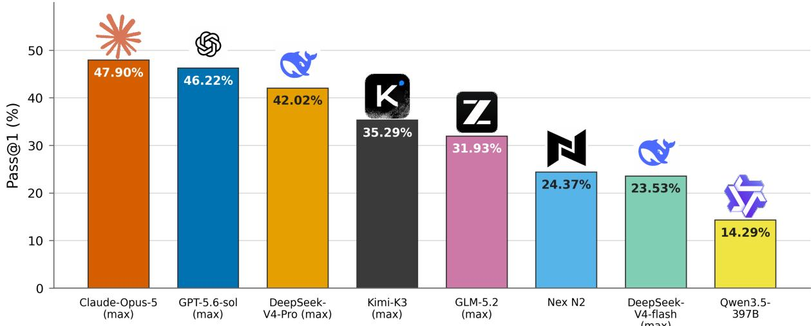
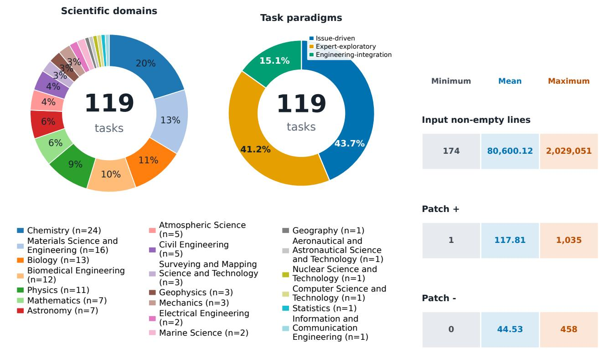
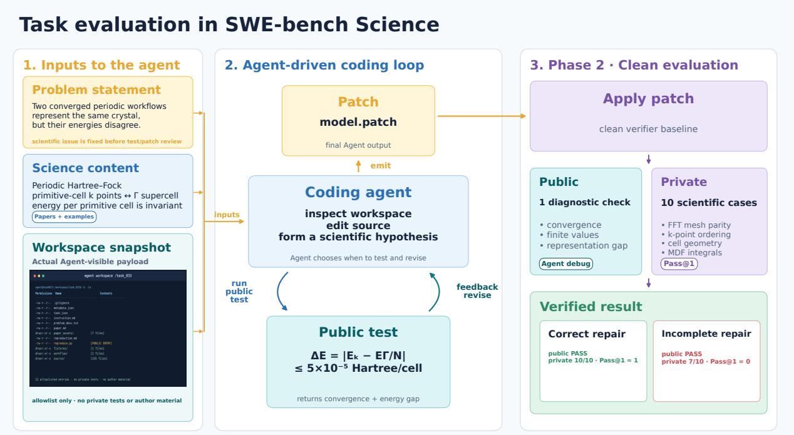
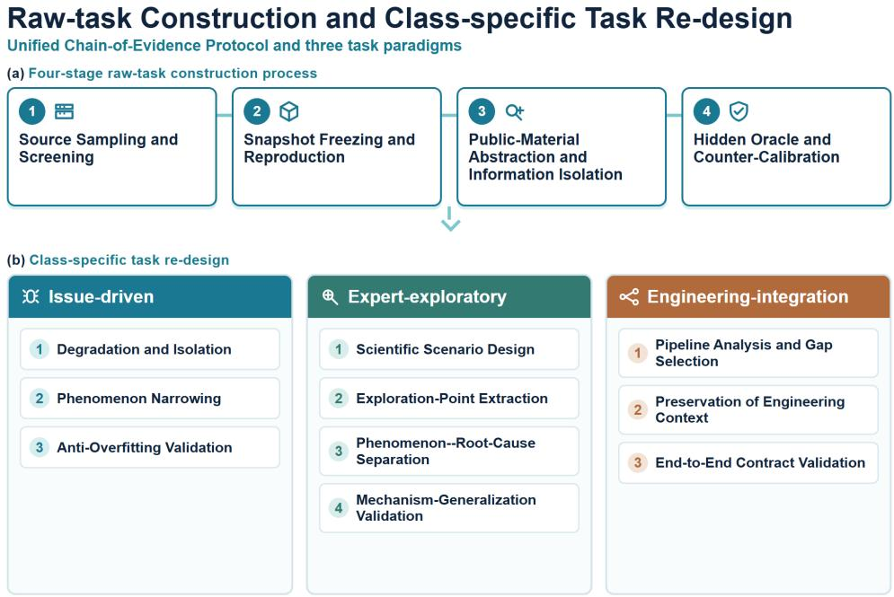
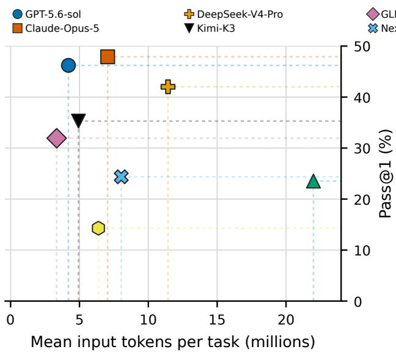
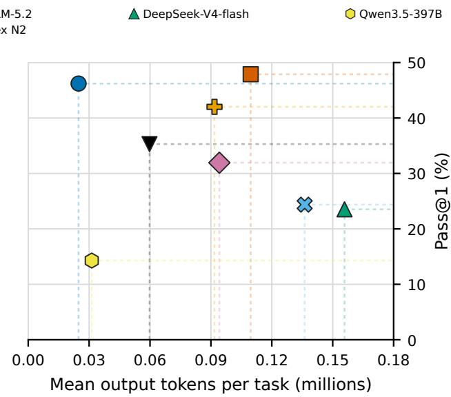
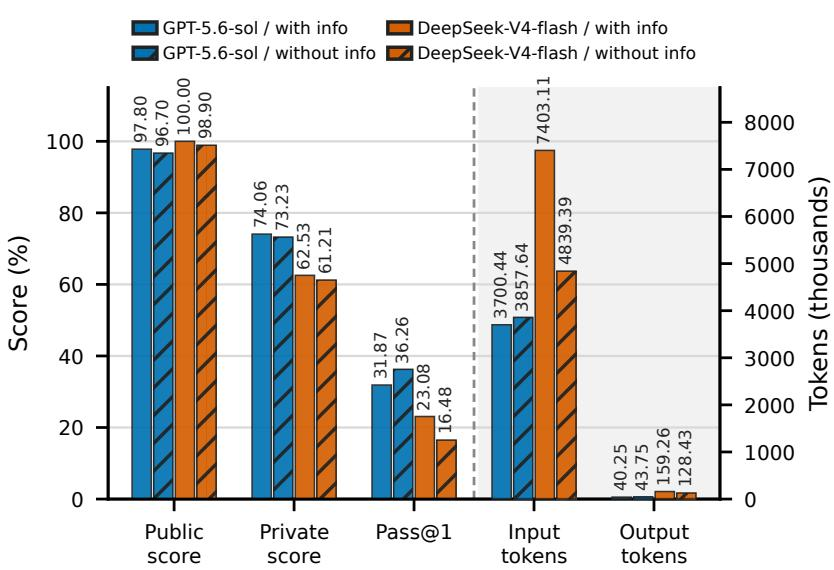
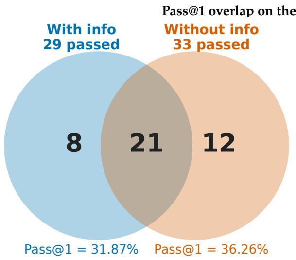
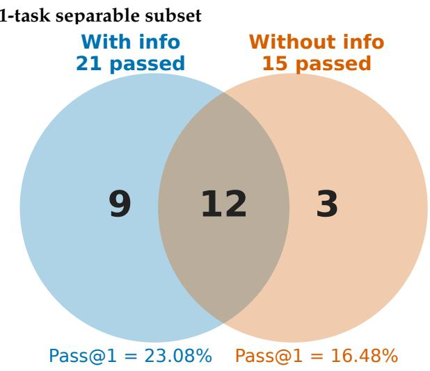

# SWE-bench Science: Can Coding Agents Resolve Engineering Tasks in Science?

Zhipeng Xu1,2, Jiahao Lu1,2, Yining Zheng1,2, Yuxin Wang1,2,†, Xipeng Qiu1,2,†

1Shanghai Innovation Institute, 2Fudan University

†Corresponding author: wangyuxin@sii.edu.cn, xpqiu@sii.edu.cn

## Abstract

Software increasingly functions as part of the scientific instrument itself, making failures in scientific code capable of compromising not only program behavior but also the evidence underlying scientific conclusions. Yet existing evaluations of coding agents largely emphasize aggregate task success, providing limited insight into why agents fail when repairing scientific software. We introduce SWE-bench Science, a repository-level benchmark for scientific software engineering comprising 119 tasks from 98 GitHub repositories across 20 scientific domains. Each task is organized into one of three paradigms: Issue-driven, Expert-exploratory, and Engineering-integration. Even the best-performing agent, Claude Code with Opus-5 (max), achieves a pass@1 below 50%, highlighting the substantial challenges posed by scientific software engineering. We identify four recurring failure mechanisms: deficits in scientific knowledge or abstraction, misguided exploration or surface-level repair, incomplete repair coverage or system integration, and failures to generalize scientific knowledge beyond observed cases in our analysis. We further conduct a paired ablation that removes explicit scientific guidance while preserving the repository and executable engineering context. The results show that scientific knowledge is not uniformly beneficial: well-grounded information can constrain repair and improve average performance and token eficiency, whereas poorly aligned guidance can induce anchoring and does not necessarily improve exact repair success. Together, SWE-bench Science provides a broad testbed for studying both the capabilities and failure mechanisms of coding agents in scientific software engineering.

Code: https://github.com/OpenMOSS/SWE-bench-Science Data: https://huggingface.co/datasets/OpenMOSS-Team/SWE-bench-Science Leaderboard: https://swescience.github.io

## 1 Introduction

Software is no longer merely an aid to science; it is part of the instrument through which scientific claims are produced. Research groups rely on code to run simulations, process instrument outputs, train surrogate models, search chemical or biological candidates, manage high-throughput experiments, and reproduce published results. A defective patch can therefore corrupt not only a program output but also the evidence behind a scientific conclusion.

  
Figure 1 Pass@1 comparison of coding agents on SWE-bench Science.

Understanding why coding agents fail on scientific software is as important as measuring whether their patches pass tests. A failed repair may reflect an incorrect scientific abstraction, superficial exploration of an observed symptom, incomplete integration across a software system, or an inability to generalize a scientific principle beyond visible cases. Aggregate test scores cannot distinguish these sources and therefore provide limited guidance for improving scientific coding agents. Existing benchmarks measure function synthesis and repository-level software repair [1–3], while scientific coding benchmarks cover curated research problems, paper-grounded implementations, scientific workflows, repository execution, and production scientific codebases [4–9]. However, repository-level coverage across scientific domains and the analysis of failure mechanisms remain limited, leaving broad cross-domain scientific software engineering underexplored.

We introduce SWE-bench Science, a repository-level benchmark containing 119 tasks from 98 unique GitHub repositories and spanning 20 scientific domains. Each task is manually inspected to verify its scientific contract, reproducibility, and evaluation validity. We organize the benchmark into three scientific task paradigms— Issue-driven, Expert-exploratory, and Engineering-integration—that capture complementary requirements in scientific software maintenance. Beyond measuring task success, we manually analyze unsuccessful attempts through four recurring scientific failure mechanisms: scientific-knowledge or abstraction deficits, misguided exploration or surface-level repair, incomplete repair coverage or system integration, and failures of scientific-knowledge generalization. Runtime or evaluation-path failures are recorded separately. We further construct a paired comparison that removes explicit scientific auxiliary information while preserving the repository and executable engineering context. The resulting analysis shows that scientific knowledge is not uniformly beneficial: its efect depends on how the knowledge is organized and grounded in executable evidence, because well-targeted information can constrain the repair while poorly aligned information can induce anchoring or substitute for independent validation.

## Our contributions are:

1. We introduce a broad-coverage scientific software engineering benchmark with 119 tasks from 98 unique GitHub repositories, spanning 20 scientific domains, and evaluate representative frontier coding agents on these tasks.

2. We analyze unsuccessful scientific software repairs and identify four recurring failure mechanisms, revealing concrete directions for improving scientific abstraction, disciplined exploration, system-wide repair, and scientific-knowledge generalization.

3. We provide a paired scientific-knowledge ablation that removes explicit scientific guidance while preserving the executable engineering context. The results show that the organization and grounding of scientific

knowledge matter in scientific software engineering: additional information can improve average scores and token eficiency, but does not automatically improve exact repair success.

## 2 Related Work

## 2.1 Code and Software Engineering Benchmarks

Early code-generation benchmarks evaluate whether models can synthesize short functions from natural- language prompts. HumanEval [1] and MBPP [2] are representative examples, focusing on unit-test correctness for self-contained programming problems. Later benchmarks increase realism by requiring repository-level modification and issue resolution. SWE-bench [3] evaluates whether language models can resolve real GitHub issues by generating patches against project test suites. More recent benchmarks extend this setting toward longer-horizon agentic engineering: SWE-Bench Pro targets complex enterprise-level repository tasks, DeepSWE uses original tasks and hand-written verifiers to reduce contamination and oracle ambiguity, and Terminal-Bench evaluates agents on hard, realistic tasks in command-line environments [10–12]. Together, these benchmarks measure increasingly realistic software engineering capabilities, including repository inspection, fault localization, multi-file modification, tool use, and test-validated repair.

## 2.2 LLMs for Scientific Workflows

Scientific-code benchmarks mainl stud two settin s. SciCode and MMSciCode evaluate self-contained scientific programming and paper-grounded function implementation, respectively, making them closer to non-agentic programming evaluation than to repository-level software engineering [4, 5]. A second line evaluates coding within broader research workflows: ResearchCodeBench and LMR-BENCH study research-paper code implementation and research-code reproduction [13, 14]; ScienceAgentBench, SUPER, and CSR-Bench emphasize data-driven scientific discovery, research-repository execution, and research- system deployment [6, 7, 15]; and RExBench, AutoMat, and AstaBench evaluate research-code extension, scientific workflow recovery, and multi-stage scientific tasks [8, 16, 17]. AInsteinBench is closest to our setting because it targets scientific computing through issue-derived and synthesized feature tasks in production repositories [9]. SWE-Bench 5G studies specification-dependent telecom repair [18]. SWE-bench Science instead centers scientific software engineering as an applied engineering problem: coding agents must inspect production repositories, modify interacting components, and preserve scientific validity across Issue-driven, Expert-exploratory, and Engineering-integration tasks. This focus difers from solving standalone scientific programming problems or completing broader research workflows by evaluating the maintenance and extension of scientifically valid software systems.

<table><tr><td>Benchmark</td><td>Task count</td><td># Scientific domains</td><td>GitHub repos</td><td>Scientific focus</td><td>Task source</td></tr><tr><td>SciCode [4]</td><td>80</td><td>16</td><td></td><td>Function programming</td><td>expert</td></tr><tr><td>MMSciCode [5]</td><td>624</td><td>6</td><td></td><td>Function</td><td>expert</td></tr><tr><td>ResearchCodeBench [13]</td><td>212</td><td>1</td><td>20</td><td>programming Research code</td><td>expert</td></tr><tr><td>LMR-BENCH [14]</td><td>28</td><td>1</td><td>23</td><td>Research code</td><td>expert</td></tr><tr><td>ScienceAgentBench [6]</td><td>102</td><td>4</td><td>30</td><td>Research code</td><td>expert</td></tr><tr><td>SUPER [7]</td><td>801</td><td>一</td><td>694</td><td>Research code</td><td>expert</td></tr><tr><td>CSR-Bench [15]</td><td>100</td><td>5</td><td>100</td><td>Research code</td><td></td></tr><tr><td>RExBench [16]</td><td>12</td><td>一</td><td></td><td>Research code</td><td>expert</td></tr><tr><td>AutoMat [17]</td><td>85</td><td>1</td><td></td><td>Research code</td><td>expert</td></tr><tr><td>AstaBench [8]</td><td>&gt;2,400</td><td>一</td><td></td><td>Research code</td><td>expert</td></tr><tr><td>AInsteinBench [9]</td><td>244</td><td>6</td><td>6</td><td>Scientific computing</td><td>issue/expert</td></tr><tr><td>SWE-Bench 5G [18]</td><td>210</td><td>1</td><td>3</td><td>Scientific software engineering</td><td>issue</td></tr><tr><td>SWE-bench Science (ours)</td><td>119</td><td>20</td><td>98</td><td>Scientific software engineering</td><td>issue/expert/engineer</td></tr></table>

Table 1 Comparison of coding-agent benchmarks for science. SWE-bench Science covers 20 scientific domains.

(a) Benchmark composition  
(b) Task context and patch scale  
  
Figure 2 Benchmark coverage and scale over 119 tasks. (a) Scientific-domain distribution and task-paradigm composition. The domain legend reports the task count for each of the 20 domains; the task-paradigm chart contains 52 Issue-driven tasks (43.7%), 49 Expert-exploratory tasks (41.2%), and 18 Engineering-integration tasks (15.1%). Chemistry is the largest domain with 24 tasks, followed by Materials Science and Engineering with 16, Biology with 13, Biomedical Engineering with 12, and Physics with 11. (b) Minimum, mean, and maximum input and reference-patch sizes, shown directly in horizontal summary bands. Input size is measured as non-empty physical lines in the task code, while Patch + and Patch − count additions and deletions in the standard reference dif.

## 3 SWE-bench Science

We cover 98 uni ue GitHub re ositories and construct 119 tasks across 20 scientific domains, with the domain and task-paradigm composition shown in Figure 2(a). The five largest domains contain 76 tasks (63.9%), while six domains contribute one task each. The task set contains 52 Issue-driven, 49 Expert-exploratory, and 18 Engineering-integration tasks. The complete scientific-domain counts are reported in Appendix Table 4. The benchmark also spans substantial variation in repository context and repair size. Figure 2(b) shows that non-empty input code averages 80,600.12 lines and ranges from 174 to 2,029,051 lines. Reference patches add 117.81 lines on average, with a range of 1–1,035, and delete 44.53 lines on average, with a range of 0–458. Direct labels preserve the exact values despite the large scale diferences among these quantities.

## 3.1 Task Schema

The following fields are visible to the agent in the standard condition:

• Repository snapshot: the exact pre-task state with locked dependencies and runnable entry points,

stripped of Git history, remotes, future changelogs, build caches, and solution-linked artifacts.

• Problem statement: a specification frozen before test and reference-patch authors inspect one another’s artifacts.

• Required scientific context $c _ { i } ^ { \mathrm { r e q } } ;$ : local, versioned definitions and constraints required for a well-posed task; it is held fixed in every condition.

• Public tests: visible software and scientific assertions that support interactive debugging.

Evaluator-only fields include private tests, contract labels, reference and alternative-valid patches, scientific- rationale and localization support blocks, expected files, source and dificulty metadata, contamination tier, and post-hoc annotations. Private tests are mounted only after patch submission in a separate evaluator container. None of fields is available through the agent workspace, environment variables, logs, or task metadata.

## 3.2 Example.

Figure 3 illustrates an evaluation pipeline in the benchmark for an example task. The task asks the agent to reconcile two periodic representations of the same crystal while preserving their physical energy. The example shows the agent-visible problem statement, scientific context, and workspace snapshot as the input to the agent-driven coding loop and the clean evaluation phase. Public checks support debugging, whereas private scientific cases determine whether the submitted patch completes the intended repair.

  
Figure 3 Evaluation pipeline in SWE-bench Science for an example task. The diagram shows the frozen agent-visible inputs, the agent-driven coding loop, and the clean evaluation phase with separate public diagnostics and private scientific cases.

## 4 Benchmark Construction

To evaluate agent performance across diferent capability dimensions in real scientific software development and maintenance, we establish a unified Chain-of-Evidence Protocol and derive three task paradigms with clearly diferentiated evaluation goals: Issue-driven, Expert-exploratory, and Engineering-integration tasks. Issue-driven tasks emphasize localized repair and regression avoidance, Expert-exploratory tasks require autonomous investigation of scientific discrepancies, and Engineering-integration tasks evaluate cross-module completion of end-to-end scientific workflows.

  
Figure 4 Combined overview of raw-task construction and class-specific task re-design.

All raw tasks are first generated according to a unified and auditable four-stage construction process. The process is designed to control environmental interference and prevent information leakage.

## 1. Source Sampling and Screening.

We collect real issues, pull requests (PRs), commit records, and related literature from candidate open-source scientific-computing repositories. We then apply predefined screening criteria to remove overly simple fixes, tasks with unstable environment dependencies, tasks with severe solution leakage, and projects that substantially overlap with existing samples.

## 2. Snapshot Freezing and Reproduction.

We freeze the source-code snapshot immediately before the target defect or missing capability occurred, denoted by $ { S _ { \mathrm { b u g } } }$ . The snapshot is executed in an isolated container to verify that the target anomaly or capability gap can be reproduced reliably. This step ensures that the observed failure is caused by the core algorithm or logical semantics rather than by environmental noise.

## 3. Public-Material Abstraction and Information Isolation.

Based on the intended behavioral contract, we extract the scientific invariants and data-flow constraints evaluated by each task. We construct a public evaluation package containing the public repository, a coarse-grained description of the observed phenomenon, a reproduction script, and the necessary domain-background documentation. The public materials do not reveal the patch location or hidden assertions.

## 4. Hidden Oracle and Counter-Calibration.

We construct hidden validation suites based on semantic e uivalence and boundar conditions. The validators examine not only the execution results under normal inputs, but also include reverse checks for hard-coded solutions, heuristic pseudo-fixes, and incomplete repairs.

Raw tasks are further re-designed according to their fit with the three task paradigms. Figure 4 summarizes the four-stage raw-task construction process and the class-specific task re-design for the three paradigms.

## 4.1 Class-Specific Task Re-design

Through the diferentiated construction strategies described below, we re-design the raw tasks to enable the benchmarking of three capabilities:

• Issue-driven tasks focus on repairing known defects;

• Expert-exploratory tasks focus on autonomously reasoning about unknown root causes in scientific scenarios;

• Engineering-integration tasks focus on understanding architecture across files and connecting a complete multi-module capability chain.

This task taxonomy avoids conflating diferent agent capabilities and provides a structured experimental basis for evaluating large language models in realistic scientific software engineering settings.

## 4.1.1 Issue-Driven Tasks

Definition and paradigm. Issue-driven tasks evaluate an agent’s ability to repair real bugs under low-distortion conditions. These tasks take a confirmed historical defect as their direct definition starting point. Their central design principle is to narrow the observable phenomenon while isolating the patch information.

## Construction process.

## 1. Degradation and Isolation.

We analyze the historical issue and PR discussion, roll the source code back to the state before the problematic commit, and construct a minimal reproducible example (MRE).

## 2. Phenomenon Narrowing.

We reduce the upstream error to a coarse-grained and auditable phenomenon, such as inconsistent results across diferent computational paths or data loss under a particular format. The public materials remove any specific hints about the solution patch.

## 3. Anti-Overfitting Validation.

Hidden validators cover diferent data scales, boundary parameters, and input-order transformations. These validators test whether the repaired code genuinely restores the scientific semantics rather than merely fitting the public script.

## 4.1.2 Expert-Exploratory Tasks

Definition and paradigm. Unlike Issue-driven tasks, which directly reproduce a known defect, Expert-exploratory tasks simulate a real scientific exploration process. Their definition starts from an exploration space containing a scientific scenario. Some tasks may be inspired by historical issues or PRs, but those issues or PRs do not serve as the definition starting point. These tasks evaluate how an agent uses domain knowledge to perform autonomous black-box or gray-box reasoning when the root cause of a complex phenomenon is unknown.

Construction process.

## 1. Scientific Scenario Design.

We first define a high-level scientific use case, such as molecular representation consistency calibra- tion, measurement-chain bias analysis, medical-image coordinate alignment, or experimental-workflow verification.

## 2. Exploration-Point Extraction.

From theoretical materials, methodological literature, experimental phenomena, or discrepancies between results, we identify a core diference that is worth actively exploring. Upstream issues or PRs may provide optional background evidence, but they do not define the task.

## 3. Phenomenon–Root-Cause Separation.

We construct a runnable public workflow that preserves the relevant domain background and observable anomaly, such as abnormal convergence or biased results, while hiding the precise location of the defective source code. The a ent must identif the root cause throu h autonomous observation, controlled comparisons, and scientific reasoning.

## 4. Mechanism-Generalization Validation.

Hidden validators change parameter scales, physical topologies, coordinate orderings, or boundary conditions. These tests determine whether the agent has genuinely inferred the scientific mechanism behind the observed phenomenon.

## 4.1.3 Engineering-Integration Tasks

Definition and paradigm. Engineering-integration tasks go beyond single-point bug repair. They focus on evaluating an agent’s ability to understand system architecture in a realistic and complex codebase, connect diferent modules, and complete a full capability chain.

## Construction process.

## 1. Pipeline Analysis and Gap Selection.

We analyze the repository’s end-to-end call chain, including data loading, parameter interpretation, intermediate-representation (IR) construction, operator assembly, and numerical solving. We then select a functionality gap with an appropriate scope.

## 2. Preservation of Engineering Context.

The public source code preserves the complete real package structure and neighboring modules. Public reproduction scripts show state comparisons at multiple stages and identify where the functionality chain fails to connect correctly. This design requires the agent to navigate across files and develop a system-level understanding.

## 3. End-to-End Contract Validation.

Hidden validators include alternative execution paths, state-reset tests, and inter-module behavioral- contract tests. These validators ensure that the proposed repair achieves architecture-level integration across the entire module capability chain rather than merely making a single public test pass.

## 4.2 Scientific Auxiliary Information Separation

The scientific-information factor measures the contribution of externally supplied domain knowledge, instantiated as scientific-rationale support. Of the 119 tasks, 91 allow this information to be separated from the supplied materials. For each eligible task, we compare paired conditions that difer only in auxiliary scientific information; the source-code snapshot, execution environment, public reproduction entry points, hidden validators, and required scientific context $c _ { i } ^ { \mathrm { r e q } }$ remain fixed. Scientific auxiliary information denotes evidence relevant to scientific validity that is not directly available from source code or observable runtime behavior, including scientific rationales, upstream repairs, audit findings, paper excerpts, and expert guidance.

Withholding this information does not remove repository-intrinsic engineering cues, such as code structure, interfaces, traces, tests, and incomplete implementations, because doing so would change the software task itself. The ablation retains the executable context, task objective, observable symptoms, input data, and minimal interface documentation while removing scientific principles, equations or assumptions, expected properties, domain-specific diagnoses, and scientifically motivated repair strategies. It therefore estimates the marginal contribution of scientific auxiliary information given the same repository evidence, rather than performance in a clue-free setting. Results are analyzed in Section 6.2.

## 5 Experiments

Coding Agents. We evaluate eight agent configurations in our benchmark: GPT-5.6-sol with Codex at max reasonin de th, Claude-O us-5 with Claude Code at max, Kimi-K3 with Kimi Code at max, GLM-5.2 with Codex at max, Nex N2 with Codex, DeepSeek-V4-flash-0731 with Claude Code at max, Qwen3.5-397B with Codex, and DeepSeek-V4-Pro-0813 with Claude Code at max. The comparison is shown in Table 2.

Evaluation. We evaluate each submitted patch with public and private tests while keeping private tests and evaluator-only metadata outside the agent workspace. For each task–attempt, PublicScore is the mean score across all applicable public test cases, and PrivateScore is the corresponding mean across private test cases. Fail2Pass is the fraction of previously failing private tests that pass after the repair, while Pass2Pass is the fraction of previously passing private tests that remain passing; we set Pass2Pass to 1 when the previously passing set is empty. Pass@1 is a binary exact-private-success measure that equals 1 only when every applicable private test passes. Table 2 reports task-level means for the public score, private score, Fail2Pass, Pass2Pass, and overall Pass@1, together with Pass@1 for Issue-driven, Expert-exploratory, and Engineering-integration tasks.

## 5.1 Performance and Token Consumption

<table><tr><td rowspan="2">LLM</td><td rowspan="2">Harness</td><td rowspan="2">Public score</td><td colspan="3">Private score</td><td colspan="4">Pass@1</td></tr><tr><td>Private score</td><td>Fail2Pass</td><td>Pass2Pass</td><td>Overall</td><td>Issue</td><td>Expert</td><td>Engineering</td></tr><tr><td>GPT-5.6-sol (max)</td><td>Codex</td><td>99.16%</td><td>78.82%</td><td>72.30%</td><td>97.66%</td><td>46.22%</td><td>36.54%</td><td>59.18%</td><td>38.89%</td></tr><tr><td>Claude-Opus-5 (max)</td><td>Claude Code</td><td>96.64%</td><td>75.11%</td><td>68.60%</td><td>97.37%</td><td>47.90%</td><td>38.46%</td><td>65.31%</td><td>27.78%</td></tr><tr><td>DeepSeek-V4-Pro (max)</td><td>Claude Code</td><td>100.00%</td><td>73.16%</td><td>65.77%</td><td>96.58%</td><td>42.02%</td><td>26.92%</td><td>57.14%</td><td>44.44%</td></tr><tr><td>Kimi-K3 (max)</td><td>Kimi Code</td><td>98.32%</td><td>66.34%</td><td>57.55%</td><td>94.94%</td><td>35.29%</td><td>25.00%</td><td>44.90%</td><td>38.89%</td></tr><tr><td>GLM-5.2 (max)</td><td>Codex</td><td>94.12%</td><td>63.61%</td><td>53.81%</td><td>97.53%</td><td>31.93%</td><td>17.31%</td><td>46.94%</td><td>33.33%</td></tr><tr><td>Nex N2</td><td>Codex</td><td>93.28%</td><td>61.89%</td><td>51.09%</td><td>94.92%</td><td>24.37%</td><td>11.54%</td><td>36.73%</td><td>27.78%</td></tr><tr><td>DeepSeek-V4-flash (max)</td><td>Claude Code</td><td>98.32%</td><td>61.41%</td><td>52.34%</td><td>95.74%</td><td>23.53%</td><td>19.23%</td><td>26.53%</td><td>27.78%</td></tr><tr><td>Qwen3.5-397B</td><td>Codex</td><td>96.64%</td><td>51.79%</td><td>38.33%</td><td>95.16%</td><td>14.29%</td><td>5.77%</td><td>24.49%</td><td>11.11%</td></tr></table>

Table 2 Main experimental results. Scores are task-level means over the common 119 tasks. The best value in each column is bold and underlined; ties are retained.

Table 2 shows that no sin le model leads ever metric. Dee Seek-V4-Pro achieves the best ublic score and performs best on Engineering-integration tasks. GPT-5.6-sol leads the private score, Fail2Pass, and Pass2Pass, indicating that it is the strongest at both repairing failed private tests and preserving tests that already pass. Claude-Opus-5 achieves the best overall Pass@1 and leads on both Issue-driven and Expert-exploratory tasks. Even frontier models achieve Pass@1 scores below 50%, underscoring the challenge of SWE-bench Science.

Figure 5 further shows the Pass@1 score versus token consumption for those agents. Claude-Opus-5 achieves the highest Pass@1 with a moderate token budget, while GPT-5.6-sol reaches a similar level with much shorter outputs. DeepSeek-V4-Pro uses more input tokens but ranks behind both. Kimi-K3 and GLM-5.2 achieves lower performances but consume fewer input tokens. For smaller models under 400B, Nex-N2 achieves best performance-token balance, better than DeepSeek-V4-flash and Qwen3.5-397B. The main diference therefore lies in how efectively each model–harness configuration uses its context and generation budget, rather than in token volume alone.

  
(a) Mean input-token consumption.

  
(b) Mean output-token consumption.  
Figure 5 Pass@1 versus mean token consumption per task over the common 119-task evaluation. Dashed guides connect each observation to the corresponding axes.

## 6 Analysis

## 6.1 Observed Failure Mechanisms

<table><tr><td>LLM</td><td>Harness</td><td>Total errors</td><td>Knowledge/ abstraction</td><td>Exploration/ surface repair</td><td>Repair coverage/ system integration</td><td>Scientific generalization</td></tr><tr><td>GPT-5.6-sol (max)</td><td>Codex</td><td>64</td><td>18</td><td>10</td><td>22</td><td>14</td></tr><tr><td>Claude-Opus-5 (max)</td><td>Claude Code</td><td>58 (+4)</td><td>24</td><td>2</td><td>21</td><td>11</td></tr><tr><td>DeepSeek-V4-Pro (max)</td><td>Claude Code</td><td>69</td><td>15</td><td>12</td><td>19</td><td>23</td></tr><tr><td>Kimi-K3 (max)</td><td>Kimi Code</td><td>77</td><td>20</td><td>14</td><td>22</td><td>21</td></tr><tr><td>GLM-5.2 (max)</td><td>Codex</td><td>81</td><td>20</td><td>14</td><td>24</td><td>23</td></tr><tr><td>Nex N2</td><td>Codex</td><td>90</td><td>31</td><td>14</td><td>23</td><td>22</td></tr><tr><td>DeepSeek-V4-flash (max)</td><td>Claude Code</td><td>91</td><td>23</td><td>14</td><td>48</td><td>6</td></tr><tr><td>Qwen3.5-397B</td><td>Codex</td><td>102</td><td>26</td><td>15</td><td>33</td><td>28</td></tr></table>

Table 3 Error-count breakdown by coding agents over the common 119 tasks. The total column records attempts assigned to the four mutually exclusive scientific failure mechanisms defined in the text; for Claude-Opus-5, the parenthesized +4 denotes additional runtime or evaluation- ath failures. The four cate or counts sum to the main total for each row. The lowest count in each column is bold and underlined.

We use four recurring scientific failure mechanisms in the audit reports. Scientific-knowledge or abstraction deficit denotes a repair based on an incorrect or incomplete scientific object, mathematical definition, or domain abstraction. Misguided exploration or surface-level repair denotes a patch that addresses the visible symptom or public metric without tracing the failure to an independent oracle or the underlying scientific contract. Incomplete repair coverage or system integration denotes a locally plausible repair that does not satisfy the requirements of the full software system: for example, one module is corrected while its interactions, data flow, shared invariants, or com atibilit with other modules remain un reserved. Failure of scientific-knowledge generalization denotes a repair that handles the observed scientific case but does not extend the same scientific principle to unseen conditions, equivalent representations, boundary regimes, or other variants that require scientific generalization. Claude-Opus-5 additionally has four runtime or evaluation-path failures, in which an attempt does not complete the intended execution or evaluation path and therefore cannot be attributed to one of the four scientific mechanisms.

Claude-Opus-5 produces the lowest categorized scientific-error count (58, plus 4 runtime or evaluation-path failures) and the fewest misguided-exploration or surface-level-repair errors (2). DeepSeek-V4-flash (max) records the fewest scientific-knowledge generalization errors (6), while DeepSeek-V4-Pro records both the fewest scientific-knowledge or abstraction errors (15) and the fewest incomplete-repair or system-integration errors (19).

## 6.2 How Scientific Information Afects Performance

On the 91-task separable subset, we compare GPT-5.6-sol (xhigh) with DeepSeek-V4-flash (high), each with and without scientific information. Figure 6 summarizes their mean scores and token use.

Performances Comparison with/without Science Information.

  
Figure 6 Scores and token consumption over the 91 tasks whose scientific-information content difers between conditions. GPT-5.6-sol and DeepSeek-V4-flash are each shown with and without scientific information on the same task subset.

For GPT-5.6-sol, scientific information slightly increases the mean public and private scores from 96.70% and 73.23% to 97.80% and 74.06%, but decreases Pass@1 from 36.26% to 31.87%. Mean input and output tokens also decrease from 3.86 million and 43.75 thousand to 3.70 million and 40.25 thousand. For DeepSeek-V4-flash, the same intervention raises the public score, private score, and Pass@1 from 98.90%, 61.21%, and 16.48% to 100.00%, 62.53%, and 23.08%, while increasing input and output tokens from 4.84 million and 128.43 thousand to 7.40 million and 159.26 thousand. These paired descriptive diferences show model-specific score–cost responses but do not establish statistical significance or a causal efect.

Figure 7 shows how these aggregate changes arise from task-level transitions. GPT-5.6-sol solves eight tasks only with scientific information and twelve only without it, whereas DeepSeek-V4-flash solves nine only with information and three only without it. Inspection of the GPT-5.6-sol cases suggests that scientific information can supply semantic constraints absent from local code symptoms, such as limiting cases, coordinate consistency, independent observables, and authoritative interfaces. However, it can also induce anchoring, scope spillover, or premature reliance on a supplied explanation, underscoring the need for executable evidence and independent validation.

  
(a) GPT-5.6-sol.

  
(b) DeepSeek-V4-flash.  
Figure 7 Task-level overlap of Pass@1 success on the 91-task separable subset. (a) GPT-5.6-sol passes 29 tasks with scientific information and 33 tasks without it; 21 pass in both conditions, 8 only with information, and 12 only without it. (b) DeepSeek-V4-flash passes 21 tasks with scientific information and 15 tasks without it; 12 pass in both conditions, 9 only with information, and 3 only without it.

Within this two-model com arison, scientific information roduces a lar er Pass@1 ain for the lower-baseline DeepSeek-V4-flash configuration than for GPT-5.6-sol. This pattern suggests that weaker-performing models may benefit more from external scientific guidance, whereas stronger models may rely less on it.

## 7 Limitations

The number of tasks in each scientific domain is still relatively limited, which may reduce the reliability of comparisons across domains. In addition, the analysis of the role of scientific knowledge in SWE tasks remains relatively preliminary, with insuficient exploration of how domain-specific knowledge is actually used and how to make it contribute to successful task completion.

## 8 Conclusion

We introduced SWE-bench Science, a repository-level benchmark for evaluating whether coding agents can repair scientific software while preserving its scientific contracts. The benchmark contains 119 tasks from 98 GitHub repositories across 20 scientific domains and organizes them into Issue-driven, Expert-exploratory, and Engineering-integration paradigms. Its Chain-of-Evidence Protocol combines separated public and private tests with metrics for repair progress, exact success, and regression preservation, making it possible to distinguish visible-test performance from complete private-test correctness.

Across eight coding-agent configurations, the strongest result is 47.90% Pass@1, while the same configuration attains a 96.64% public score. This gap, together with the four recurring scientific failure mechanisms identified in unsuccessful repairs, shows that repository-level scientific software engineering requires scientific abstraction, disciplined exploration, system-wide integration, and generalization beyond visible cases. Paired comparisons on the 91-task scientific-information subset further reveal model-dependent efects: auxiliary scientific information lowers GPT-5.6-sol Pass@1 from 36.26% to 31.87% but raises DeepSeek-V4-flash from 16.48% to 23.08%, with opposite changes in token use. These findings indicate that supplying scientific information alone does not guarantee a better repair; its value depends on how efectively an agent connects that information to repository evidence and validates it through execution. SWE-bench Science provides a foundation for measuring this capability, while broader model coverage is needed to understand how scientific information afects agent performance on scientific software engineering tasks.

## References

[1] Mark Chen, Jerry Tworek, Heewoo Jun, Qiming Yuan, Henrique Ponde de Oliveira Pinto, Jared Kaplan, Harri Edwards, Yuri Burda, Nicholas Joseph, Greg Brockman, et al. Evaluating large language models trained on code. arXiv preprint arXiv:2107.03374, 2021.

[2] Jacob Austin, Augustus Odena, Maxwell Nye, Maarten Bosma, Henryk Michalewski, David Dohan, Ellen Jiang, Carrie Cai, Michael Terry, Quoc Le, and Charles Sutton. Program synthesis with large language models. arXiv preprint arXiv:2108.07732, 2021.

[3] Carlos E. Jimenez, John Yang, Alexander Wettig, Shunyu Yao, Kexin Pei, Ofir Press, and Karthik R. Narasimhan. Swebench: Can language models resolve real-world github issues? In International Conference on Learning Representations, 2024.

[4] Minyang Tian, Luyu Gao, Shizhuo Dylan Zhang, Xinan Chen, Cunwei Fan, Xuefei Guo, Roland Haas, Pan Ji, Kittithat Krongchon, Yao Li, et al. Scicode: A research coding benchmark curated by scientists. In Advances in Neural Information Processing Systems, 2024.

[5] Xue Xia, Zheyuan Yang, Arman Cohan, and Yilun Zhao. MMSciCode: Real-world evaluation of multilingual multi-discipline scientific research coding. In Proceedings of the 64th Annual Meeting of the Association for Computational Linguistics, pages 33981–33999, 2026. doi: 10.18653/v1/2026.acl-long.1566.

[6] Ziru Chen, Shijie Chen, Yuting Ning, Qianheng Zhang, Boshi Wang, Botao Yu, Yifei Li, Zeyi Liao, Chen Wei, Zitong Lu, et al. Scienceagentbench: Toward rigorous assessment of language agents for data-driven scientific discovery. In The Thirteenth International Conference on Learning Representations, 2025.

[7] Ben Bogin, Kejuan Yang, Shashank Gupta, Kyle Richardson, Erin Bransom, Peter Clark, Ashish Sabharwal, and Tushar Khot. SUPER: Evaluating agents on setting up and executing tasks from research repositories. In Proceedings ofthe 2024 Conference on Empirical Methods in Natural Language Processing, pages 12622–12645, 2024.

[8] Jonathan Bragg, Mike D’Arcy, Nishant Balepur, Dan Bareket, Bhavana Dalvi, Sergey Feldman, Dany Haddad, Jena D. Hwang, Peter Jansen, Varsha Kishore, et al. Astabench: Rigorous benchmarking of ai agents with a scientific research suite. In The Fourteenth International Conference on Learning Representations, 2026.

[9] Titouan Duston, Shuo Xin, Yang Sun, Daoguang Zan, Aoyan Li, Shulin Xin, Kai Shen, Yixiao Chen, Qiming Sun, Ge Zhang, et al. Ainsteinbench: Benchmarking coding agents on scientific repositories, 2025.

[10] Xiang Deng, Jef Da, Edwin Pan, Yannis Yiming He, Charles Ide, Kanak Garg, Niklas Laufer, Andrew Park, Nitin Pasari, Chetan Rane, Karmini Sampath, Maya Krishnan, Srivatsa Kundurthy, Sean Hendryx, Zifan Wang, Vijay Bharadwaj, Jef Holm, Raja Aluri, Chen Bo Calvin Zhang, Noah Jacobson, Bing Liu, and Brad Kenstler. SWE-Bench Pro: Can AI agents solve long-horizon software engineering tasks?, 2025. URL https://arxiv.org/abs/2509.16941.

[11] Wenqi Huang, Charley Lee, Leonard Tng, and Serena Ge. DeepSWE: Measuring frontier coding agents on original, long-horizon engineering tasks, 2026. URL https://arxiv.org/abs/2607.07946.

[12] Mike A. Merrill, Alexander G. Shaw, Nicholas Carlini, Boxuan Li, Harsh Raj, Ivan Bercovich, Lin Shi, Jeong Yeon Shin, Thomas Walshe, E. Kelly Buchanan, Junhong Shen, Guanghao Ye, Haowei Lin, Jason Poulos, Maoyu Wang, Marianna Nezhurina, Jenia Jitsev, Di Lu, Orfeas Menis Mastromichalakis, Zhiwei Xu, Zizhao Chen, Yue Liu, Robert Zhang, Leon Liangyu Chen, Anurag Kashyap, Jan-Lucas Uslu, Jefrey Li, Jianbo Wu, Minghao Yan, Song Bian, Vedang Sharma, Ke Sun, Steven Dillmann, Akshay Anand, Andrew Lanpouthakoun, Bardia Koopah, Changran Hu, Etash Guha, Gabriel H. S. Dreiman, Jiacheng Zhu, Karl Krauth, Li Zhong, Niklas Muennighof, Robert Amanfu, Shangyin Tan, Shreyas Pimpalgaonkar, Tushar Aggarwal, Xiangning Lin, Xin Lan, Xuandong Zhao, Yiqing Liang, Yuanli Wang, Zilong Wang, Changzhi Zhou, David Heineman, Hange Liu, Harsh Trivedi, John Yang, Junhong Lin, Manish Shetty, Michael Yang, Nabil Omi, Negin Raoof, Shanda Li, Terry Yue Zhuo, Wuwei Lin, Yiwei Dai, Yuxin Wang, Wenhao Chai, Shang Zhou, Dariush Wahdany, Ziyu She, Jiaming Hu, Zhikang Dong, Yuxuan Zhu, Sasha Cui, Ahson Saiyed, Arinbjörn Kolbeinsson, Jesse Hu, Christopher Michael Rytting, Ryan Marten, Yixin Wang, Alex Dimakis, Andy Konwinski, and Ludwig Schmidt. Terminal-Bench: Benchmarking agents on hard, realistic tasks in command line interfaces, 2026. URL https://arxiv.org/abs/2601.11868.

[13] Tianyu Hua, Harper Hua, Violet Xiang, Benjamin Klieger, Sang Truong, Weixin Liang, Fan-Yun Sun, and Nick Haber. ResearchCodeBench: Benchmarking LLMs on implementing novel machine learning research code. In Advances in Neural Information Processing Systems, volume 38, 2025.

[14] Shuo Yan, Ruochen Li, Ziming Luo, Zimu Wang, Daoyang Li, Liqiang Jing, Kaiyu He, Peilin Wu, Juntong Ni, George Michalopoulos, Yue Zhang, Ziyang Zhang, Mian Zhang, Zhiyu Chen, and Xinya Du. LMR-BENCH: Evaluating LLM agents’ ability on reproducing language modeling research. In Proceedings of the 2025 Conference on Empirical Methods in Natural Language Processing, pages 6164–6186, 2025. doi: 10.18653/v1/2025.emnlp-main.314.

[15] Yijia Xiao, Runhui Wang, Luyang Kong, Davor Golac, and Wei Wang. CSR-bench: Benchmarking LLM agents in deployment of computer science research repositories. In Proceedings of the 2025 Conference of the Nations of the Americas Chapter of the Associationfor Computational Linguistics: Human Language Technologies, pages 12705–12723, 2025.

[16] Nicholas Edwards, Yukyung Lee, Yujun Audrey Mao, Yulu Qin, Sebastian Schuster, and Najoung Kim. RExBench: Can coding agents autonomously implement AI research extensions? In Proceedings ofthe 64th Annual Meeting ofthe Associationfor Computational Linguistics, pages 16380–16417, 2026. doi: 10.18653/v1/2026.acl-long.745.

[17] Ziyang Huang, Yi Cao, Ali K. Shargh, Jing Luo, Ruidong Mei, Mohd Zaki, Zhan Liu, Wyatt Bunstine, William Jurayj, Somdatta Goswami, Tyrel McQueen, Michael Shields, Jaafar El-Awady, Paulette Clancy, Benjamin Van Durme, Nicholas Andrews, William Walden, and Daniel Khashabi. Can coding agents reproduce findings in computational materials science?, 2026.

[18] Jiao Chen, Jianhua Tang, Xiaotong Yang, and Zuohong Lv. SWE-Bench 5G: Benchmarking AI coding agents on telecom network engineering tasks, 2026.

## A Scientific Domain Coverage

Table 4 Distribution of the 119 SWE-bench Science tasks across 20 scientific domains.
<table><tr><td>Scientific domain</td><td>Tasks</td></tr><tr><td>Chemistry</td><td>24</td></tr><tr><td>Materials Science and Engineering</td><td>16</td></tr><tr><td>Biology</td><td>13</td></tr><tr><td>Biomedical Engineering</td><td>12</td></tr><tr><td>Physics</td><td>11</td></tr><tr><td>Mathematics</td><td>7</td></tr><tr><td>Astronomy</td><td>7</td></tr><tr><td>Atmospheric Science</td><td>5</td></tr><tr><td>Civil Engineering Surveying and Mapping Science and Technology</td><td>5</td></tr><tr><td>Geophysics</td><td>3</td></tr><tr><td>Mechanics</td><td>3</td></tr><tr><td>Electrical Engineering</td><td>3</td></tr><tr><td>Marine Science</td><td>2</td></tr><tr><td>Geography</td><td>2</td></tr><tr><td>Aeronautical and Astronautical Science and Technology</td><td>1</td></tr><tr><td>Nuclear Science and Technology</td><td>1 1</td></tr><tr><td>Computer Science and Technology</td><td></td></tr><tr><td>Statistics</td><td>1</td></tr><tr><td>Information and Communication Engineering</td><td>1</td></tr><tr><td>Total</td><td>1</td></tr></table>

## B Task-Level Repository and Knowledge Inventory

This appendix provides the complete task-level annotation used to construct the benchmark. Each row links a task identifier to one of the 20 scientific domains used throughout the paper, together with its upstream repository, issue or pull request (when available), knowledge-domain scope, and scientific focus. The table contains all 119 tasks (IDs 001–119).

Table 5 Task-level scientific-domain, provenance, and scientific-knowledge inventory. A missing issue or pull-request reference indicates that no reference was provided in the source annotation.
<table><tr><td>Task</td><td>Scientific do- main</td><td>Upstream repository</td><td>Issue/PR</td><td>Knowledge scope</td><td>Task focus</td></tr><tr><td>001</td><td>Chemistry</td><td>Auto-Mech/ autochem</td><td>PR #637</td><td>TS linear segment cap selection, ro- tational symmetry number, reaction edge relabeling invariance, rotor obser- segment and reaction edge topology; vation</td><td>The rotational symmetry of the TS graph must be determined by the real linear changing the atom number or writing it in reverse cannot change the rotor/sym-</td></tr><tr><td>002</td><td>Chemistry</td><td>aditisingh4812/ simplified tuned_range separated</td><td>Not specified</td><td>range-separated tuning, local density structure, bohr-based grid scale and size consistency</td><td>metry observation. In range-separated tuning, the units of the density cutoff are not converted together with the grid representation, and the local thresholds are therefore misaligned.</td></tr><tr><td>003</td><td>and Engineering dpdata</td><td>Materials Science deepmodeling/</td><td>Issue #973 / PR #983</td><td>stress/virial tag preservation, ASE compatibility, read and write consis- tency in extxyz/QUIP-GAP parsing</td><td>extxyz parsing must convert stress into virial and be compatible with tensor components and field aliases, otherwise the stress semantics will be distorted.</td></tr></table>

Table 5 – continued from previous page
<table><tr><td rowspan=1 colspan=13>Task  Scientific do-   Upstream repository Issue/PR       Knowledge scope                 Task focusmain</td></tr><tr><td rowspan=28 colspan=13>004  Biology        arq5x/bedtools2  Issue #750      split-read exon overlap filtering, in-   For split-read interval intersection, blockoverlap should be accumulated first andthen fraction gate should be performed.Each block cannot be treated as an inde-Edited MRS requires polarity correction#751                                              and phase-cycle control to be propagatedthrough every subspectrum path; the fixcannot be confined to a single loader.Fisher statistics require full databasesame-chrom / later-chrom tails, Fisher counts, and query EOF cannot truncatechromosome sweeps early.The drift sign of spectral registrationEngineering                                                                           must be consistent with the optimiza-frequency shift and phase shift consis- tion residual agreement, otherwise thecompensation direction will be reversed.In the vacuum-wall link, the outer-regiongeometry and coefficients must be trans-ferred together, and different wall shapescannot be pressed into the same diagno-sis.projection-wall geometry construction, The projection wall cannot degenerateDESC                                                                 into a scaled wall, and the boundaryreduced payload propagation        derivatives and geometric parametersmust be entered into the outer-regioncalculation together.The PARFAC-driven alternate perturba-DESC                              support, FOURIN, packed trig lookup, tion representation must not fall back tothe baseline; parity, phase, and coefficient</td></tr><tr><td rowspan=1 colspan=1></td></tr><tr><td rowspan=1 colspan=1>then fraction</td></tr><tr><td rowspan=1 colspan=1></td></tr><tr><td rowspan=1 colspan=2>005</td><td rowspan=8 colspan=10></td><td rowspan=1 colspan=1>Issue #750  / PR</td></tr><tr><td rowspan=1 colspan=1>correction, generalization from two</td></tr><tr><td rowspan=1 colspan=1>subspectra to four subspectra, phase-</td></tr><tr><td rowspan=2 colspan=1></td></tr><tr><td rowspan=1 colspan=1>Query database tail count after EOF,</td></tr><tr><td rowspan=1 colspan=1></td></tr><tr><td rowspan=1 colspan=1>right tail p-value consistency</td></tr><tr><td rowspan=1 colspan=1>spectral registration initial value</td></tr><tr><td rowspan=12 colspan=2></td><td rowspan=9 colspan=6></td><td rowspan=1 colspan=4></td><td rowspan=1 colspan=1></td></tr><tr><td rowspan=3 colspan=4></td><td rowspan=1 colspan=1></td></tr><tr><td rowspan=1 colspan=2></td><td rowspan=1 colspan=1></td></tr><tr><td rowspan=1 colspan=1>first usable vacuum-plus-wall capa-</td></tr><tr><td rowspan=1 colspan=4></td><td rowspan=1 colspan=1>bility chain, outer-region operator</td></tr><tr><td rowspan=1 colspan=3></td><td rowspan=1 colspan=1>ferred together</td></tr><tr><td rowspan=1 colspan=4></td><td rowspan=1 colspan=1>cannot be presse</td></tr><tr><td rowspan=2 colspan=1></td><td rowspan=2 colspan=1></td><td rowspan=2 colspan=4></td><td rowspan=2 colspan=1>Not specified</td></tr><tr><td rowspan=1 colspan=1>projection-wall gometry constructionr</td></tr><tr><td rowspan=3 colspan=5></td><td rowspan=1 colspan=2></td><td rowspan=1 colspan=1></td><td rowspan=1 colspan=4></td><td rowspan=1 colspan=1></td></tr><tr><td rowspan=2 colspan=1></td><td rowspan=2 colspan=4></td><td rowspan=1 colspan=1>reduced payload propagation</td></tr><tr><td rowspan=1 colspan=1>must be enter</td></tr><tr><td rowspan=2 colspan=2>010</td><td rowspan=2 colspan=5>Physics</td><td rowspan=2 colspan=1></td><td rowspan=2 colspan=3></td><td rowspan=2 colspan=1>Not specified</td></tr><tr><td rowspan=1 colspan=1></td></tr><tr><td rowspan=3 colspan=2></td><td rowspan=3 colspan=5></td><td rowspan=3 colspan=1></td><td rowspan=1 colspan=3></td><td rowspan=1 colspan=1>support, FOURIN, packed trig lookup</td></tr><tr><td rowspan=1 colspan=3></td><td rowspan=1 colspan=1>matrix assembly</td></tr><tr><td rowspan=1 colspan=3></td><td rowspan=1 colspan=1></td><td rowspan=3 colspan=1>assembly must all follow the alternaterepresentation.Sideband response must propagatethrough the support domain, coefficient</td></tr><tr><td rowspan=1 colspan=2>011</td><td rowspan=1 colspan=5>Physics</td><td rowspan=1 colspan=1></td><td rowspan=1 colspan=3>PlasmaControl/</td><td rowspan=1 colspan=1>Not specified</td><td rowspan=1 colspan=1>response-gated sideband capability,</td></tr><tr><td rowspan=8 colspan=7>012013</td><td rowspan=4 colspan=2></td><td rowspan=2 colspan=2></td><td rowspan=2 colspan=1>DESC</td><td rowspan=1 colspan=1></td></tr><tr><td rowspan=1 colspan=1></td><td rowspan=4 colspan=1>assembly, and energy diagnostics; chang-ing only a local cutoff is insufficient.nt 3-D mode coupling must retain theeffective support of the difference/sum</td></tr><tr><td rowspan=2 colspan=1></td><td rowspan=2 colspan=3>PlasmaControl/</td><td rowspan=2 colspan=1>Not specified</td></tr><tr><td rowspan=1 colspan=1>3-D cross-spectral coupling, coefficie</td></tr><tr><td rowspan=2 colspan=1></td><td rowspan=2 colspan=3>DESC</td><td rowspan=1 colspan=1></td><td rowspan=1 colspan=1>assembly, energy channel, mode-</td></tr><tr><td rowspan=1 colspan=1></td><td rowspan=3 colspan=1>two branches, and cross-modal couplingcannot be collapsed into a unified weight.</td></tr><tr><td rowspan=2 colspan=5>Physics</td><td rowspan=2 colspan=1></td><td rowspan=2 colspan=3>PlasmaControl/</td><td rowspan=2 colspan=1>Not specified</td><td rowspan=2 colspan=1>free / soft-fixed / hard-fixed bound-</td></tr><tr><td rowspan=3 colspan=1>to coefficients and energies respectivelyby interval and cannot be smoothed out</td></tr><tr><td rowspan=2 colspan=7></td><td rowspan=1 colspan=1></td><td rowspan=1 colspan=3>DESC</td><td rowspan=1 colspan=1></td><td rowspan=1 colspan=1>ary regimes, operators and energy</td></tr><tr><td rowspan=1 colspan=1></td><td rowspan=1 colspan=3></td><td></td><td rowspan=1 colspan=1>closure ladder</td></tr><tr><td rowspan=3 colspan=2>014</td><td rowspan=2 colspan=3>014</td><td rowspan=2 colspan=3>Physics</td><td rowspan=2 colspan=1>ysics</td><td rowspan=2 colspan=2></td><td rowspan=2 colspan=1>PlasmaControl</td><td rowspan=2 colspan=1>Not specified</td></tr><tr><td rowspan=8 colspan=1>by global averaging.The TERPSICHORE link must be closedend-to-end and cannot rely on a singlefixture or plasma-only fallback.thermalize should use formalism-specificidentity/projector, and unit_state cannotn be treated as two objects at the same time.HMMRATAC refinement must first guard</td></tr><tr><td rowspan=1 colspan=5></td><td rowspan=1 colspan=1></td><td rowspan=1 colspan=3>DESC</td><td></td><td rowspan=1 colspan=1>end-to-en</td></tr><tr><td rowspan=2 colspan=2>015</td><td rowspan=2 colspan=5>Biomedical</td><td rowspan=2 colspan=1></td><td rowspan=2 colspan=3>IlyaKuprov/</td><td rowspan=2 colspan=1>Issue #22</td></tr><tr><td rowspan=1 colspan=1>thermalize sl</td></tr><tr><td rowspan=5 colspan=7>016   Biology</td><td rowspan=1 colspan=2>Engineering</td><td rowspan=1 colspan=2></td><td rowspan=1 colspan=1>Spinach</td><td rowspan=1 colspan=1></td></tr><tr><td rowspan=2 colspan=1></td><td rowspan=2 colspan=3></td><td rowspan=1 colspan=1></td><td rowspan=1 colspan=1>construction, unit-state representatio</td></tr><tr><td rowspan=1 colspan=1></td><td rowspan=1 colspan=1>consistency</td></tr><tr><td rowspan=1 colspan=1></td><td rowspan=1 colspan=3>macs3-project/</td><td rowspan=1 colspan=1>Issue #735 / PR</td><td rowspan=1 colspan=1>HMMRATAC semantics, blacklist</td></tr><tr><td rowspan=1 colspan=1></td><td rowspan=1 colspan=3>MACS</td><td rowspan=1 colspan=1>#736</td><td rowspan=19 colspan=1>s- empty peak_content, and cannot closeempty peaks on sparse bedGraph.Issue #6754 / PRJ-factor line-of-sight impact parameter, The J-factor line integral must stabilizethe branch according to the impact pa-rameter, and cannot use tan(theta) topush directly to the singular point.The blacklist should be filtered beforel training and segmentation, and blacklistsegments cannot be allowed to enter themodel and counting of HMMRATAC.Topic binarization needs to supportboth matrix/object entries and stablethreshold semantics, and cannot justcover the old object API.The neighbor graph needs to unify PBCmapping, empty segment reduction andforce/virial scatter, and guard edges can-not be regarded as effective contributions</td></tr><tr><td rowspan=4 colspan=7>017   Astronomy</td><td rowspan=4 colspan=1></td><td rowspan=1 colspan=3>gammapy/gammapy</td><td rowspan=1 colspan=1>Issue #6754 / PR</td><td rowspan=1 colspan=1>J-factor line-of-sight impact parameter</td></tr><tr><td rowspan=1 colspan=3></td><td rowspan=1 colspan=1>#6757</td><td rowspan=1 colspan=1>the branch</td></tr><tr><td rowspan=2 colspan=4></td><td rowspan=1 colspan=1></td></tr><tr><td rowspan=1 colspan=1>push direct</td></tr><tr><td rowspan=6 colspan=8>018019   Biology</td><td rowspan=2 colspan=2>Biology</td><td rowspan=2 colspan=2>macs3-project/    Issue #680 / PR</td><td rowspan=2 colspan=1>blacklist filtering, HMMRATAC train-</td></tr><tr><td rowspan=2 colspan=1>The hlaccklist shou</td></tr><tr><td rowspan=1 colspan=4>MACS              #689</td><td rowspan=1 colspan=1>training</td></tr><tr><td rowspan=3 colspan=3>aertslab/</td><td rowspan=2 colspan=2></td><td rowspan=1 colspan=1>segments c</td></tr><tr><td rowspan=1 colspan=1></td></tr><tr><td rowspan=1 colspan=1>PR #196</td><td rowspan=1 colspan=1>Discretization of topic probability</td></tr><tr><td rowspan=8 colspan=12>020   Materials Science deepmodelingand Engineering deepmd-kit</td><td rowspan=2 colspan=1></td></tr><tr><td rowspan=1 colspan=2></td><td rowspan=1 colspan=1>threshold se</td></tr><tr><td rowspan=3 colspan=3></td></tr><tr><td rowspan=1 colspan=1>topic maintenance</td></tr><tr><td rowspan=1 colspan=2>s Science</td><td rowspan=1 colspan=2>deepmodeling/</td><td rowspan=1 colspan=1>neighbor graph, periodic-cell map</td></tr><tr><td rowspan=1 colspan=3>and Er</td><td rowspan=1 colspan=3>Engineering</td><td rowspan=1 colspan=3></td><td rowspan=1 colspan=2></td><td rowspan=1 colspan=1></td><td rowspan=1 colspan=1>ping, segment reductions, force /</td></tr><tr><td rowspan=1 colspan=1>atom virial scatter</td></tr><tr><td rowspan=1 colspan=1></td></tr></table>

Table 5 – continued from previous page
<table><tr><td rowspan=1 colspan=13>Task  Scientific do-   Upstream repositoryIssue/PR       Knowledge scope                  Task focusmain</td></tr><tr><td rowspan=5 colspan=11>021   Chemistry      deepmodeling/     PR #103dptiBiomedical     nilearn/nilearn  Issue #5168 / PR</td><td rowspan=1 colspan=1>coupling endpoints, pair-specific</td><td rowspan=6 colspan=1>Soft-core LJ FEP must generate a realcompute fep; energy divided bylambda cannot substitute for derivativeobservations.Discrete brain area projections shouldadopt mode sampling, and NaN should</td></tr><tr><td rowspan=1 colspan=2></td><td rowspan=1 colspan=1>epsilon, three-stage HTI/FEP input</td><td rowspan=1 colspan=1>compute f</td></tr><tr><td rowspan=1 colspan=1>generation, thermo_style consumption</td><td rowspan=1 colspan=1>lambda cannot</td></tr><tr><td rowspan=2 colspan=2>022</td><td></td></tr><tr><td rowspan=1 colspan=1>Volume-to-surface atlas projection,</td></tr><tr><td rowspan=3 colspan=2></td><td rowspan=3 colspan=8>Engineering</td><td rowspan=2 colspan=1>#5169</td><td rowspan=1 colspan=1>discrete region identity preservation</td></tr><tr><td rowspan=1 colspan=1>under nearest sampling, missing</td><td rowspan=1 colspan=1>be retained for missing samples. Labels</td></tr><tr><td rowspan=1 colspan=1></td><td rowspan=1 colspan=1>samples should return NaN</td><td rowspan=1 colspan=1>cannot be averaged numerically.</td></tr><tr><td rowspan=9 colspan=10>023   Chemistry      MDAnalysis/024   Statistics025   Biomedical</td><td rowspan=1 colspan=1>Issue #4257 / PR N</td><td rowspan=2 colspan=1>PT trajectory without jump expan-sion, box dimensions update, first</td><td rowspan=2 colspan=1>NoJump&#x27preserve the</td></tr><tr><td rowspan=2 colspan=7></td><td rowspan=2 colspan=1>#4258</td></tr><tr><td rowspan=1 colspan=1></td><td rowspan=1 colspan=1>frame displacement history initializa-</td><td rowspan=3 colspan=1>placement and cannot exit early at frameZeroSumNormal must be</td></tr><tr><td rowspan=1 colspan=6></td><td rowspan=1 colspan=1></td><td rowspan=1 colspan=1>tion</td><td rowspan=1 colspan=1>0.</td></tr><tr><td rowspan=1 colspan=6>pymc-devs/pymc</td><td rowspan=1 colspan=1>Issue #6871 / PR</td><td rowspan=1 colspan=1>ZeroSumNormal&#x27;s log-density, nor-</td><td rowspan=1 colspan=1></td></tr><tr><td rowspan=2 colspan=1>#6872</td><td rowspan=1 colspan=1>malization and pseudo-determinants</td><td rowspan=1 colspan=1>calculated on the zero-sum manifold and</td></tr><tr><td rowspan=1 colspan=1>on zero-sum manifolds</td><td rowspan=1 colspan=1>cannot directly reuse ambient Gaussian</td></tr><tr><td rowspan=1 colspan=1></td><td rowspan=1 colspan=1></td><td rowspan=1 colspan=1>normalization.</td></tr><tr><td rowspan=1 colspan=6></td><td rowspan=1 colspan=1>Issue #447  / PR</td><td rowspan=1 colspan=1>acquisition metadata consistency in</td><td rowspan=1 colspan=1>Edited-MRS acquisition metadata and the</td></tr><tr><td rowspan=4 colspan=2>026</td><td rowspan=4 colspan=2>EngineeringAtmospheric</td><td rowspan=2 colspan=6>osprey</td><td rowspan=1 colspan=1>#448; Issue #657  /</td><td rowspan=1 colspan=1>the edited-MRS workflow, consistent</td><td rowspan=1 colspan=1>water-calibration time scale must remain</td></tr><tr><td rowspan=1 colspan=1>PR #658</td><td rowspan=1 colspan=1>calibration reports and representatio</td><td rowspan=1 colspan=1>ns consistent; TE/TR must not be converted</td></tr><tr><td rowspan=1 colspan=6></td><td rowspan=1 colspan=1></td><td rowspan=1 colspan=1></td><td rowspan=3 colspan=1>a second time.Isentropic interpolation must respectvertical coordinate semantics such as</td></tr><tr><td rowspan=1 colspan=6>Unidata/MetPy</td><td rowspan=1 colspan=1>Issue #3315 / PR Is</td><td rowspan=1 colspan=1>entropic interpolation on sigma co-</td></tr><tr><td rowspan=15 colspan=2>027028</td><td rowspan=3 colspan=2>Science</td><td rowspan=2 colspan=6></td><td rowspan=1 colspan=1>#3324</td><td rowspan=1 colspan=1>ordinates, pressure column selection,</td></tr><tr><td rowspan=1 colspan=1></td><td rowspan=1 colspan=1>dimension semantic correction</td><td rowspan=1 colspan=1>sigma/eta, and cannot treat them directly</td></tr><tr><td rowspan=1 colspan=6></td><td rowspan=1 colspan=1></td><td rowspan=1 colspan=1></td><td rowspan=2 colspan=1>as pressure columns.The mask semantics of the peak encoder</td></tr><tr><td rowspan=4 colspan=2>Chemistry</td><td rowspan=1 colspan=6>little1d/</td><td rowspan=1 colspan=1>Issue #4</td><td rowspan=1 colspan=1>Masking and representation semantics</td></tr><tr><td rowspan=1 colspan=6>NMRTrans</td><td rowspan=1 colspan=1></td><td rowspan=1 colspan=1>of NMR peak-set encoding, batch</td><td rowspan=1 colspan=1>are reversed, the padding is retained,</td></tr><tr><td rowspan=1 colspan=5></td><td rowspan=1 colspan=1></td><td rowspan=1 colspan=1></td><td rowspan=1 colspan=1>padding, and set transformer</td><td rowspan=1 colspan=1>the real peaks are masked, and the set</td></tr><tr><td rowspan=1 colspan=4></td><td></td><td></td><td rowspan=1 colspan=1></td><td rowspan=1 colspan=1></td><td></td></tr><tr><td rowspan=8 colspan=2>Biology</td><td rowspan=3 colspan=6>JialongJiang/</td><td></td><td></td><td></td></tr><tr><td></td><td></td><td rowspan=3 colspan=1>representation is distorted.The control sample index and relativeresponse baseline cannot be misaligned,</td></tr><tr><td rowspan=1 colspan=1>Not specified</td><td rowspan=1 colspan=1>control-referenced relative responses,</td></tr><tr><td rowspan=1 colspan=6>DSPIN</td><td rowspan=1 colspan=1></td><td rowspan=1 colspan=1>perturbation response normalization</td></tr><tr><td rowspan=1 colspan=6></td><td rowspan=1 colspan=1></td><td rowspan=1 colspan=1>and fallback path integrity</td><td></td></tr><tr><td rowspan=3 colspan=2></td><td></td><td></td><td></td><td></td><td></td><td></td><td></td><td></td><td></td></tr><tr><td></td><td></td><td></td><td></td><td></td><td></td><td></td><td></td><td rowspan=3 colspan=1>otherwise the disturbance response willshift as a whole.After circular feature reverse-</td></tr><tr><td rowspan=1 colspan=6></td><td rowspan=1 colspan=1></td><td rowspan=1 colspan=1></td></tr><tr><td rowspan=4 colspan=2>029</td><td rowspan=1 colspan=1>9</td><td rowspan=1 colspan=3>Biology</td><td rowspan=1 colspan=4>biopython/</td><td rowspan=1 colspan=1></td><td rowspan=1 colspan=1>Issue #4611 / PR Fe</td><td rowspan=1 colspan=1>ature coordinates and sequence</td></tr><tr><td rowspan=3 colspan=2></td><td rowspan=1 colspan=4>biopython</td><td rowspan=1 colspan=2></td><td rowspan=1 colspan=1>#4637</td><td rowspan=1 colspan=1>semantics after circular record ori-</td><td rowspan=1 colspan=1>complement, the part order must be</td></tr><tr><td rowspan=1 colspan=4></td><td rowspan=1 colspan=2></td><td rowspan=1 colspan=1></td><td rowspan=1 colspan=1>entation normalization and reverse</td><td rowspan=3 colspan=1>reversed, and the original cross-originorder cannot be retained.The SFAC of.res is an ordered list, and</td></tr><tr><td rowspan=1 colspan=6></td><td rowspan=1 colspan=1></td><td rowspan=1 colspan=1>complement</td></tr><tr><td rowspan=1 colspan=2>030</td><td rowspan=1 colspan=2>Materials Scien</td><td rowspan=1 colspan=4>ce materialspro</td><td rowspan=1 colspan=2>ject</td><td rowspan=1 colspan=1>/ Issue #3677 / PR</td><td rowspan=1 colspan=1>SHELX/ AIRSS.res export, SFAC</td></tr><tr><td rowspan=1 colspan=2></td><td rowspan=1 colspan=2>and Engineering</td><td rowspan=1 colspan=4>pymatgen</td><td rowspan=1 colspan=2></td><td rowspan=1 colspan=1>#3779</td><td rowspan=1 colspan=1>ordered species column, stable round-</td><td rowspan=1 colspan=1>species cannot be written as an un-</td></tr><tr><td></td><td rowspan=2 colspan=1>031</td><td rowspan=2 colspan=2>Biomedical</td><td rowspan=2 colspan=4>mne-tools/</td><td rowspan=2 colspan=2></td><td rowspan=2 colspan=1>Issue #13913 /</td><td rowspan=2 colspan=1>average reference across multiple</td><td></td></tr><tr><td></td><td rowspan=1 colspan=1>ordered set.The average reference of mixed sensor</td></tr><tr><td rowspan=6 colspan=2>032</td><td rowspan=3 colspan=2>Engineering</td><td rowspan=1 colspan=4>mne-python</td><td rowspan=1 colspan=2></td><td rowspan=1 colspan=1>PR #13920</td><td rowspan=1 colspan=1>sensor types, classification type re-</td><td rowspan=1 colspan=1>types should be done separately accord-</td></tr><tr><td rowspan=2 colspan=4></td><td rowspan=1 colspan=3></td><td rowspan=1 colspan=2></td><td rowspan=1 colspan=1></td><td rowspan=1 colspan=1></td><td rowspan=1 colspan=1>reference and joint / projection path</td><td rowspan=1 colspan=1>ing to channel type and cannot be directly</td></tr><tr><td rowspan=1 colspan=2></td><td rowspan=1 colspan=1></td><td rowspan=1 colspan=1>consistency</td><td rowspan=1 colspan=1>combined into a union mean.</td></tr><tr><td rowspan=3 colspan=2>Chemistry</td><td rowspan=1 colspan=4>openmm/openmm</td><td rowspan=1 colspan=2></td><td rowspan=1 colspan=1>Issue #5025 / PR</td><td rowspan=1 colspan=1>GROMACS topology import, NBFIX</td><td rowspan=1 colspan=1>GROMACS topology import needs to</td></tr><tr><td rowspan=2 colspan=4></td><td rowspan=2 colspan=2></td><td rowspan=1 colspan=1>#5026</td><td rowspan=1 colspan=1>/ combination rule semantics, total</td><td rowspan=1 colspan=1>unify the translation semantics of NBFIX,</td></tr><tr><td rowspan=1 colspan=1></td><td rowspan=1 colspan=1>energy representation maintenance</td><td rowspan=1 colspan=1>combination rule and 1-4 exception</td></tr><tr><td rowspan=1 colspan=2>033</td><td rowspan=1 colspan=2>Materials Scienc</td><td rowspan=1 colspan=4>e pyscf/pyscf</td><td rowspan=1 colspan=2></td><td rowspan=1 colspan=1>PR #2946</td><td rowspan=1 colspan=1>consistency between k-point and</td><td rowspan=1 colspan=1>Periodic HF k-point and Gamma-</td></tr><tr><td rowspan=4 colspan=2>034</td><td rowspan=3 colspan=2>and Engineering</td><td rowspan=1 colspan=4></td><td rowspan=1 colspan=2></td><td rowspan=1 colspan=1></td><td rowspan=1 colspan=1>Gamma-supercell representations in</td><td rowspan=1 colspan=1>supercell paths must implement equiv-</td></tr><tr><td rowspan=1 colspan=4></td><td rowspan=1 colspan=2></td><td rowspan=1 colspan=1></td><td rowspan=1 colspan=1>periodic H, Coulomb wrap-around</td><td rowspan=1 colspan=1>alent Coulomb semantics; wrap-around</td></tr><tr><td rowspan=1 colspan=4></td><td rowspan=1 colspan=2></td><td rowspan=1 colspan=1></td><td rowspan=1 colspan=1>semantics</td><td rowspan=1 colspan=1>handling must not diverge between them.</td></tr><tr><td rowspan=1 colspan=2>Mathematics</td><td rowspan=1 colspan=6>patrick-kidger/</td><td rowspan=1 colspan=1>Issue #598 / PR</td><td rowspan=1 colspan=1>strong order, reverse-oriented SDE</td><td rowspan=1 colspan=1>The step size and Levy area parity of the</td></tr><tr><td rowspan=5 colspan=2>035</td><td rowspan=5 colspan=2>Mathematics</td><td rowspan=1 colspan=6>diffrax</td><td rowspan=1 colspan=1>#746</td><td rowspan=1 colspan=1>integration, boundary conditions and</td><td rowspan=1 colspan=1>reverse time SDE must be processed ac-</td></tr><tr><td rowspan=2 colspan=6></td><td rowspan=1 colspan=1></td><td rowspan=1 colspan=1>hidden state processing</td><td rowspan=1 colspan=1>cording to the direction, and the forward</td></tr><tr><td rowspan=1 colspan=1></td><td rowspan=1 colspan=1></td><td rowspan=1 colspan=1></td><td rowspan=1 colspan=1>SRK convention cannot be followed</td></tr><tr><td rowspan=2 colspan=5>scipy/scipy</td><td rowspan=2 colspan=2></td><td></td><td></td><td></td></tr><tr><td rowspan=1 colspan=1></td><td rowspan=1 colspan=1>Issue #14480</td><td rowspan=1 colspan=1>Numerical consistency of LSODA</td><td rowspan=1 colspan=1>The dense output of LSODA needs to</td></tr><tr><td rowspan=3 colspan=2></td><td rowspan=3 colspan=2></td><td rowspan=3 colspan=6></td><td rowspan=1 colspan=1></td><td rowspan=1 colspan=1></td><td rowspan=1 colspan=1>PR #14552</td></tr><tr><td rowspan=2 colspan=1></td><td rowspan=1 colspan=1>kinetics</td><td rowspan=5 colspan=1>and cannot use the next candidate statefor event positioning.Curved grid point-in-cell must be calcu-lated according to spherical geometryand cannot continue to be approximated</td></tr><tr><td rowspan=1 colspan=1></td></tr><tr><td rowspan=1 colspan=2>036</td><td rowspan=1 colspan=2>Marine Science</td><td rowspan=1 colspan=6>Parcels-code/</td><td rowspan=1 colspan=1>Issue #2521 / PR Pr</td><td rowspan=1 colspan=1>oblems with spherical curvilinear</td><td rowspan=1 colspan=1>Curved gri</td></tr><tr><td rowspan=4 colspan=2>037</td><td rowspan=4 colspan=2>Biomedical</td><td rowspan=3 colspan=6>Parcels</td><td rowspan=1 colspan=1>#2598</td><td rowspan=1 colspan=1>grids, latitude and longitude grid</td><td rowspan=1 colspan=1>lated accor</td></tr><tr><td rowspan=1 colspan=1></td><td rowspan=1 colspan=1>index, and downstream parameters</td><td rowspan=1 colspan=1>and cannot cor</td></tr><tr><td rowspan=2 colspan=6>nipy/nibabel</td><td rowspan=1 colspan=1></td><td rowspan=1 colspan=1>still follow the old path</td><td rowspan=1 colspan=1>by longitu</td></tr><tr><td rowspan=1 colspan=1>PR #1340</td><td rowspan=1 colspan=1>Enhanced multiframe DICOM recon-</td></tr><tr><td rowspan=3 colspan=4>Engineering038   Materials Scienc</td><td rowspan=1 colspan=6></td><td rowspan=1 colspan=1></td><td rowspan=1 colspan=1>struction, frame/direction semantics</td></tr><tr><td rowspan=2 colspan=7>e spglib/spglib    Issue #584 / PR</td><td rowspan=1 colspan=1>and image plane consistency</td></tr><tr><td rowspan=1 colspan=1>Classification stability, primitive/-</td></tr><tr><td rowspan=3 colspan=11>and Engineering                     #589</td><td rowspan=1 colspan=1>conventional transformation and</td></tr><tr><td rowspan=1 colspan=1>symmetry search under equivalent</td></tr><tr><td rowspan=1 colspan=1>lattice representation</td></tr></table>

Table 5 – continued from previous page
<table><tr><td>Task</td><td>Scientific do- main</td><td>Upstream repository</td><td>Issue/PR</td><td>Knowledge scope</td><td>Task focus</td></tr><tr><td>039</td><td>Geography</td><td>landlab/landlab</td><td>Issue #2408 / PR #2409</td><td>parcel transport, reach-scale flux con- sistency, segmentation and external representation consistency</td><td>The speed of parcel transport must be consistent with reach-level flux conver- sion, and the number of particles cannot be allowed to change the physical trans-</td></tr><tr><td>040</td><td>Geophysics</td><td>simpeg/simpeg</td><td>#1575</td><td>Issue #1099 / PR magnetic-dipole forward modeling, source representation equivalence, numerical accuracy and theoretical fit</td><td>port rate. Different formulations of magnetic dipole forward modeling must fall into the same discrete field space, and the representa- tion method cannot change the results.</td></tr><tr><td>041</td><td>Geophysics</td><td>sunpy/sunpy</td><td>#8415</td><td>Issue #8406 / PR Earth-centered coordinate transforma- The GEI/GSE transformation must follow tions, GEI/GSE path consistency and vector conservation</td><td>a purely rotational path and cannot go through an intermediate map with additional corrections.</td></tr><tr><td>042</td><td>Astronomy</td><td>sunpy/sunpy</td><td>#8548</td><td>Issue #8490 / PR Sun coordinate objects maintain frame, The solar coordinate table round-trip observer, obstime, representation, units and numerical meanings in table and cannot compress the coordinate serialization</td><td>must retain frame, observer and obstime, object into a pure numerical value.</td></tr><tr><td></td><td>and Engineering</td><td>Materials Science PMEAL/porespy</td><td>Issue #966  / PR #1174</td><td>Two-point correlation function, aperi- Finite image two-point correlation needs odic boundaries, overlap counting and to perform overlap and radial bin statis- radial binning on finite images</td><td>tics according to finite-image semantics, and cannot be treated as a periodic do- main.</td></tr><tr><td></td><td>Chemistry</td><td>pybamm-team/ PyBaMM</td><td>PR #5600</td><td>In regularized power operations, distinguish between state-independent the exchange current expression must fitting coefficients and dynamic state-</td><td>The fractional-power stabilization in distinguish between constants and state variables, and the parameters themselves cannot be rewritten.</td></tr><tr><td>045</td><td>Marine Science</td><td>xgcm/xgcm</td><td>Issue #712 / PR #713</td><td>Connection surface direction, axis or- der, consistency of pad and transpose</td><td>cubed-sphere halo/padding must first align the dimensions and surface direc- tions of the source slice, and cannot read the adjacent surfaces incorrectly after transpose.</td></tr><tr><td></td><td>Astronomy</td><td>StingraySoftware/ PR #965 stingray</td><td></td><td>Coherence/power spectrum calcula- tion under effective domain, boundary deduct the noise deviation and count state and invalid value determination</td><td>The coherence estimate must correctly as averaged spectra, and cannot return a finite value in the noise-dominated frequency band.</td></tr><tr><td>047</td><td>Information and Communication scikit-rf Engineering</td><td>scikit-rf/</td><td>Issue #654 / PR #655</td><td>Conversion and parameter consistency Network connections under complex of different microwave network rep- resentations under complex reference wave-definition transformation, and the impedance</td><td>reference impedance must first undergo traveling-wave convention cannot be used.</td></tr><tr><td>048</td><td>Chemistry</td><td>pycalphad/ pycalphad</td><td>Issue #310 / PR #311</td><td>consistency between phase energy, Gibbs energy, and ordered-phase representation</td><td>Gibbs-energy bookkeeping for or- dered/disordered phases must project onto the non-ordering sublattice; database encoding must not change phase stability.</td></tr><tr><td>049</td><td>Mathematics</td><td>zwicker-group/ py-pde</td><td>PR #839</td><td>Multi-step physical process semantics and incombinability in the evolution of discrete random fields</td><td>The noise terms and volume factors of discrete random fields must be processed hierarchically, and cell-volume scaling cannot be placed in the wrong location.</td></tr><tr><td>050</td><td>Physics</td><td>jcmgray/quimb</td><td>Issue #402</td><td>result consistency of different tensor representations</td><td>Scale-dependent norm reconstruction, The norm of the tensor network must re- main unchanged after gauging/rescaling, and the approximate contraction cannot change the exact norm. The gravity/magnetic force second-</td></tr><tr><td>051</td><td>Geophysics</td><td>SHTOOLS/SHTOOLS</td><td>PR #397</td><td>Spherical harmonic gradient, polar boundary and planetary magnetic field calculation</td><td>order tensor must be consistent from the local frame to the Cartesian frame, and recursion and boundary constraints cannot be allowed to destroy the rotation.</td></tr><tr><td></td><td>and Engineering</td><td>Materials Science usnistgov/fipy</td><td>Issue #1190 / PR Modular gradients and physical #1192</td><td>geometry consistency on non-uniform widths, face sizes and modular gradient orthogonal grids</td><td>semantics, and cannot only retain a single spacing.</td></tr><tr><td>053</td><td>Biomedical Engineering</td><td>Project-MONAI/ MONAI</td><td>#6681</td><td>Issue #4103 / PR Physical spacing, subvoxel surface area approximation and surface Dice</td><td>Surface Dice should be calculated based on physical surface area, and anisotropic voxels cannot simply be regarded as</td></tr></table>

Table 5 – continued from previous page
<table><tr><td rowspan=1 colspan=13>Task Scientific do-   Upstream repository Issue/PR       Knowledge scope                  Task focusmain</td></tr><tr><td rowspan=8 colspan=13>054   Chemistry      matchms/matchms  PR #863        Screening, merging and entropy-based Entropy similarity cannot allow overlap-spectral similarity of highly similar  ping candidate windows to count thepeaks                            same peak repeatedly, and the pair/-matrix paths must share the same peaksemantics055  Astronomy      astropy/          Issues #817 /   Boundary extension, partially overlap- Spectral resampling must propagate fluxspecutils         #1059 / #1300;  ping bins and finite interval filling    and variance according to limited binPRs #1060 /                                       overlap, and bins cannot be used as point#1305                                            samples.056   Aeronautical and poliastro/        Issue #1563; PR Consistency between orbital state    Each state and epoch of Orbit-&gt;EphemAstronautical   poliastro        #1583          and binding epoch, history sampling must point to the same orbital state,Science and                                         semantics                         and the anomaly cannot drift with theTechnology                                                                            timeline.057   Chemistry      mdtraj/mdtraj     Issue #1925; PR Molecular reconstruction under pe-  make molecules whole restores the#1929          riodic boundaries, bonded geometry  periodic image along the bond graph inand coordinate order independence   one pass, and cannot let the bond orderdetermine the translation results.The boundary distance and transportand Technology openmc            #3853          ary and geometric determination in  event of the repeated rectangular latticeparticle transport                   must be calculated correctly, and thelegal geometry cannot be misjudged as</td></tr><tr><td rowspan=2 colspan=2></td><td rowspan=2 colspan=2></td><td rowspan=1 colspan=1></td></tr><tr><td rowspan=3 colspan=1>Rectangua atitaatdneboud-</td></tr><tr><td rowspan=2 colspan=1>058</td><td rowspan=2 colspan=5>Nuclear Science</td><td rowspan=2 colspan=2></td><td rowspan=2 colspan=2>Issue #3852; PR</td></tr><tr><td rowspan=1 colspan=1></td></tr><tr><td rowspan=1 colspan=1></td><td rowspan=1 colspan=5>and Technology</td><td rowspan=1 colspan=2></td><td rowspan=1 colspan=2>#3853</td><td rowspan=1 colspan=1>ary and geometric determination in</td></tr><tr><td rowspan=3 colspan=1></td><td rowspan=3 colspan=5></td><td rowspan=3 colspan=2></td><td rowspan=3 colspan=2></td><td rowspan=3 colspan=1></td></tr><tr><td rowspan=3 colspan=1>voxel spacing, area and morphometric r</td></tr><tr><td rowspan=4 colspan=2>terminated.egionprops should treat spacingas a physical scale and cannot treatanisotropic sampling as a lattice index.</td></tr><tr><td rowspan=1 colspan=1>059</td><td rowspan=1 colspan=5>Computer Sci-</td><td rowspan=1 colspan=2>scikit-image/</td><td rowspan=1 colspan=2>Issue #5112; PR</td></tr><tr><td rowspan=1 colspan=1></td><td rowspan=1 colspan=5>ence and Tech-</td><td rowspan=1 colspan=2>scikit-image</td><td rowspan=1 colspan=2>#6296</td><td rowspan=1 colspan=1>calibration of regionprops</td><td rowspan=1 colspan=1>as a physical</td></tr><tr><td rowspan=1 colspan=1></td><td rowspan=1 colspan=5>nology</td><td rowspan=1 colspan=2></td><td rowspan=1 colspan=2></td><td rowspan=1 colspan=1></td><td rowspan=1 colspan=1>anisotropic s</td></tr><tr><td rowspan=1 colspan=1>060</td><td rowspan=1 colspan=5>Biomedical</td><td rowspan=1 colspan=2>SpikeInterface/</td><td rowspan=1 colspan=2>Issue #3328; PR</td><td rowspan=1 colspan=1>non-equidistant sampling, cross-band</td><td rowspan=5 colspan=2>Motion interpolation must align AP/LFstreams on the physical time axis; assum-ing uniform motion from the samplingrate is invalid.The extremely small sky pixel in high-resolution reproject will have numerical</td></tr><tr><td rowspan=2 colspan=1></td><td rowspan=2 colspan=5>Engineering</td><td rowspan=1 colspan=2>spikeinterface</td><td rowspan=1 colspan=2>#3517</td><td rowspan=1 colspan=1>motion correction, and interpolation</td></tr><tr><td rowspan=1 colspan=4></td><td rowspan=1 colspan=2></td><td rowspan=1 colspan=2></td><td rowspan=1 colspan=1>correction</td></tr><tr><td rowspan=1 colspan=1>061</td><td rowspan=1 colspan=4>Astronomy</td><td rowspan=1 colspan=1></td><td rowspan=1 colspan=2>astropy/</td><td rowspan=1 colspan=2>Issue #199; PR</td><td rowspan=1 colspan=1>Numerical elimination, reprojection</td></tr><tr><td rowspan=3 colspan=1>062</td><td rowspan=3 colspan=5>Materials Scien</td><td rowspan=1 colspan=1></td><td rowspan=1 colspan=2>reproject</td><td rowspan=1 colspan=1>#589</td><td rowspan=1 colspan=1>and energy conservation of small</td></tr><tr><td rowspan=2 colspan=2>ce materialsproject</td><td rowspan=2 colspan=2>/ Issue #333 / PR</td><td rowspan=1 colspan=1>sphere area</td><td rowspan=3 colspan=2>cancellation, and overlap geometry andflux conservation must be stable.Elastic tensor reconstruction must bringthe complete shear response back to the</td></tr><tr><td rowspan=1 colspan=1>Green-Lagrange strain-stress fitting,</td></tr><tr><td rowspan=1 colspan=1></td><td rowspan=1 colspan=5>and Engineering atomate2</td><td rowspan=1 colspan=2></td><td rowspan=1 colspan=2></td><td rowspan=1 colspan=1>#415</td><td rowspan=1 colspan=2>independent shear response recon-</td></tr><tr><td rowspan=5 colspan=1>063</td><td rowspan=3 colspan=2></td><td rowspan=2 colspan=4></td><td></td><td rowspan=2 colspan=2></td><td rowspan=2 colspan=1></td><td rowspan=2 colspan=2>a high-throughput crystal elasticity</td></tr><tr><td></td><td rowspan=5 colspan=2>final result, and the reduce/reconstructlink cannot lose symmetry information.Window normalized pair-coalescenceneeds to distinguish between non-lineage</td></tr><tr><td></td><td></td><td></td><td></td><td></td><td rowspan=1 colspan=2></td><td></td></tr><tr><td rowspan=2 colspan=5>Biology</td><td rowspan=2 colspan=2>tskit-dev/tskit</td><td rowspan=2 colspan=2>Issue #3053,</td><td></td></tr><tr><td rowspan=1 colspan=1>workflowDistinguishing between &quot;no lineage&quot;</td></tr><tr><td rowspan=6 colspan=1></td><td rowspan=6 colspan=5></td><td rowspan=1 colspan=2></td><td rowspan=1 colspan=2>#3175 / PR #3059, an</td><td rowspan=1 colspan=1>d &quot;multi-rooted trees with no com-</td></tr><tr><td rowspan=2 colspan=2></td><td rowspan=1 colspan=2>#3176</td><td rowspan=1 colspan=1>mon ancestors&quot; under window nor-</td><td rowspan=1 colspan=2>trees and multi-rooted trees without</td></tr><tr><td rowspan=1 colspan=2></td><td rowspan=1 colspan=1>malization, and normalizing the</td><td></td><td></td></tr><tr><td rowspan=3 colspan=2></td><td rowspan=3 colspan=2></td><td></td><td></td><td></td></tr><tr><td></td><td rowspan=5 colspan=2>common ancestors, and the boundarysemantics of the two types cannot beconfused.ORCA&#x27;s DFT-D dispersion correctionshould be written out as an independent</td></tr><tr><td rowspan=1 colspan=1>observation span</td></tr><tr><td rowspan=13 colspan=8>064   Chemistry065   Astronomy</td><td rowspan=7 colspan=2></td><td rowspan=2 colspan=1>Issue #660 / PR</td><td rowspan=1 colspan=2></td></tr><tr><td rowspan=1 colspan=1>Signed energy extraction, unit consis-</td><td rowspan=1 colspan=1>ORC</td></tr><tr><td rowspan=1 colspan=2>#745</td><td rowspan=1 colspan=1>tency and ccData exposure for DFT-D</td><td rowspan=1 colspan=1>should be</td></tr><tr><td rowspan=4 colspan=2></td><td></td><td></td><td></td></tr><tr><td rowspan=2 colspan=2></td><td></td><td></td><td></td></tr><tr><td rowspan=1 colspan=1>dispersion correction in ORCA output</td><td rowspan=1 colspan=2>al quantity and not just left</td></tr><tr><td rowspan=1 colspan=1></td><td rowspan=1 colspan=1>inside the pars</td><td></td></tr><tr><td rowspan=3 colspan=2></td><td></td><td></td><td rowspan=3 colspan=1>PH-based three-dimensional pro-</td><td></td><td></td></tr><tr><td></td><td></td><td rowspan=4 colspan=2>SPH line-of-sight integration and obliqueslicing need to share consistent kernelc geometry and normalization, and the</td></tr><tr><td rowspan=1 colspan=2>Issue #4788 / PR S</td></tr><tr><td rowspan=1 colspan=2>#4939</td><td rowspan=1 colspan=1>jection, oblique slicing, real sight</td></tr><tr><td rowspan=2 colspan=2></td><td rowspan=1 colspan=1>integral and kernel function geometri</td></tr><tr><td rowspan=1 colspan=1>semantics</td><td rowspan=5 colspan=2>resolution cannot be allowed to changethe observation results.The CF grid mapping of rotated Mercatorand oblique Mercator should be recog-nized as equivalent and cannot be linked</td></tr><tr><td rowspan=2 colspan=1>066</td><td rowspan=2 colspan=5>Atmospheric</td><td rowspan=3 colspan=2>SciTools/iris</td><td rowspan=2 colspan=2>Issue #4830 / PR</td><td></td></tr><tr><td rowspan=2 colspan=1>Equivalent identification of RotatedMercator and Oblique Mercator under</td></tr><tr><td rowspan=12 colspan=10>Science067   Atmospheric    Ouranosinc/xclimScience068   Biology         samtools/htslib  Issue #1820 / PR Ac#1897</td><td rowspan=1 colspan=1>#5548</td></tr><tr><td rowspan=7 colspan=2></td><td rowspan=1 colspan=1>CF grid mapping, projection object</td><td rowspan=1 colspan=1>nized as equiva</td></tr><tr><td rowspan=1 colspan=1>and site matching semanticsOverwintering precipitation and</td><td rowspan=9 colspan=2>to the wrong projection reference.The seasonal state machine of the firedanger index should separate the winterprecipitation and active-day updates, andthe state transfer cannot be connected tothe wrong stage.The reference occupancy interval ofVCF/BCF should be consistent on pathssuch as symbolic allele, END and SVLEN.</td></tr><tr><td rowspan=1 colspan=1>Drought Code state transfer, recursive</td></tr><tr><td rowspan=1 colspan=1>boundary between active season and</td></tr><tr><td rowspan=1 colspan=1>dormant phase when seasons switch</td></tr><tr><td rowspan=2 colspan=1></td></tr><tr><td rowspan=1 colspan=1>the wrong sn </td></tr><tr><td rowspan=1 colspan=1>tual coverage interval, rlen, END</td></tr><tr><td rowspan=1 colspan=1>/ symbolic allele / reference block</td><td rowspan=1 colspan=1></td></tr><tr><td rowspan=1 colspan=1>semantics recorded on the reference</td></tr><tr><td rowspan=1 colspan=1>genome</td><td rowspan=1 colspan=2></td></tr></table>

Continued on next page

Table 5 – continued from previous page
<table><tr><td>Task</td><td>Scientific do- main</td><td>Upstream repository</td><td>Issue/PR</td><td>Knowledge scope</td><td>Task focus</td></tr><tr><td>069</td><td>Biology</td><td>open2c/cooltools</td><td>Issue #456 / PR #501</td><td>Contact-frequency and smoothed P(s) propagation, normalization and multi-region aggregation consistency</td><td>expected cis smoothing needs to propa- gate the numerators and denominators of raw contact and weighted contact sep- arately, and observation apertures cannot</td></tr><tr><td>070</td><td>Biology</td><td>levitsky/ pyteomics</td><td>Issue #202 / PR #203</td><td>ProForma local modification and global ion-carrying charge calculation, tions, and neutral masses/m/z require charge_state consistency</td><td>be mixed. ProForma&#x27;s global loads, local modifica- unified charge accounting, and electrons cannot be counted repeatedly.</td></tr><tr><td>071</td><td>Physics</td><td>silx-kit/pyFAI</td><td>Issue #2773 / PR #2772</td><td>Transformation from detector direc- tion to sample coordinate system q vector, exit-angle and reciprocal represent consistency</td><td>The q vector transformation must main- tain the consistency of the detector to sample coordinates, and the orientation encoding cannot change the reciprocal space results.</td></tr><tr><td>072</td><td>Biomedical Engineering</td><td>pydicom/pydicom</td><td>#2212</td><td>Issue #2210 / PR Bit depth, sampling, limited-range luma/chroma conversion of YBR_- FULL / YBR_FULL_422 / YBR_- PARTIAL_420</td><td>The YBR * pixel format must unify bit depth and sampling extension semantics, and cannot just modify the limited-range path.</td></tr><tr><td>073</td><td>Biology</td><td>biotite-dev/ biotite</td><td>Issue #777  / PR #781</td><td>Conformational connectivity, bond map preservation and bond mapping after alternate location selection</td><td>The alternate location filtering must be completed before the bond graph, and the selected conformation cannot be disconnected from the struct_conn.</td></tr><tr><td>074</td><td>and Engineering DeePTB</td><td>Materials Science deepmodeling/</td><td>Issue #332 / PR #320</td><td>Generalized eigenvalue problems, ill- The generalized eigenvalue problem of conditioned overlap matrix processing, non-orthogonal tight binding must first finite band data and validity masks</td><td>deal with the ill-posed overlap matrix, and cannot directly Cholesky on the invalid subspace.</td></tr><tr><td>075</td><td></td><td>Materials Science deepmodeling/ and Engineering deepmd-kit</td><td>#5601</td><td>Issue #5593 / PR Boundary interpolation, first-order sensitivity, layout and derivative consistency of DeePMD compressed tables</td><td>Compressed table extrapolation must maintain both value and derivative con- tinuation semantics, and C1 continuation cannot be truncated outside the bound- ary.</td></tr><tr><td>076</td><td>Mathematics</td><td>cvxpy/cvxpy</td><td>Issue #3092 / PR #3093</td><td>Coordinate mapping of N- dimensional parameters to sparse coefficient matrix after indexing, broadcasting, and matrix multiplica- tion</td><td>Canonicalization of the Parameter tensor requires first folding repeated positions and then mapping to a sparse coefficient matrix.</td></tr><tr><td>077</td><td>Mathematics</td><td>shapely/shapely</td><td>Issue #1670, #1939</td><td>Numerical stability fallback, candidate Oriented envelope must truly select the #1929 / PR #1708, edge enumeration, NumPy ufunc batching and output buffering compat- and is compatible with NumPy batch ibility</td><td>smallest area among candidate edges processing.</td></tr><tr><td>078</td><td>Astronomy</td><td>astropy/ photutils</td><td>#2288</td><td>Issue #2287 / PR Bidirectional transformation, direction The conversion from sky aperture to pixel consistency and round-trip constraints aperture must keep the WCS local base of aperture geometry under WCS</td><td>direction consistent, and the aperture mirror cannot be shifted.</td></tr><tr><td>079</td><td>Chemistry</td><td>aspuru-guzik-groupssue #120 / PR selfies</td><td>#125</td><td>kekulization of SMILES aromatic system to SELFIES, charged aromatic carbon electron counting</td><td>When converting the SMILES aromatic system to SELFIES, the electron count of the charged aromatic carbon must also be dealt with, and the neutral zero-hydrogen path cannot only be repaired.</td></tr><tr><td>080</td><td>Surveying and and Technology</td><td>xarray-contrib/ Mapping Science xarray-spatial</td><td>Issue #1086 / PR #1087</td><td>footprint, coordinate direction normal- The footprint, coordinate direction and ization, nodata propagation and cubic nodata propagation during reprojection boundary interpolation</td><td>must be bound to the interpolation order, and the boundaries cannot be allowed to</td></tr><tr><td>081</td><td>Biology</td><td>scverse/anndata</td><td>#2122</td><td>Issue #1854 / PR backed HDF5/Zarr re-indexing, outer Disk-backed concatenation must write join, and sparse/dense annotation consistency</td><td>degenerate into copied values. non-concatenated-axis annotations back under the new index; preserving only the main matrix is insufficient.</td></tr><tr><td>082</td><td>and Engineering dpgen</td><td>Materials Science deepmodeling/</td><td>#1801</td><td>Issue #1639 / PR DP-GEN active-learning input gen- eration, LAMMPS template revise, model-deviation control items, rela- tive error and electron temperature</td><td>DP-GEN must propagate the same set of LAMMPS model-deviation settings in both direct generation and template revision paths, and the relative, cluster or</td></tr></table>

Continued on next page

Table 5 – continued from previous page
<table><tr><td rowspan=1 colspan=16>Task Scientific do-    Upstream repositoryIssue/PR       Knowledge scope                  Task focusmain</td></tr><tr><td></td><td></td><td></td><td></td><td></td><td></td><td></td><td></td><td></td><td rowspan=1 colspan=7>mode, cyclic structure species namingto chemical graph equivalence and mergeand reaction network report          mode, and cannot separate bond orderchanges or traversal order into different</td></tr><tr><td></td><td></td><td></td><td></td><td></td><td></td><td></td><td></td><td></td><td></td><td></td><td></td><td></td><td></td><td rowspan=3 colspan=2>retaining only the final structure or losingcell/coordinate semantics.DFTB+ implicit solvent observationsshould be insensitive to equivalent atoms</td></tr><tr><td></td><td></td><td></td><td></td><td></td><td></td><td></td><td></td><td></td><td rowspan=1 colspan=5>Issue #1069 / PR DFTB+ COSMO/GB archived ob-</td></tr><tr><td></td><td></td><td></td><td></td><td></td><td></td><td></td><td></td><td></td><td rowspan=3 colspan=4>servations, atomic order invariance,equivalent atomic records and solvesurface adjacencies</td><td rowspan=1 colspan=2>nce,</td></tr><tr><td></td><td></td><td></td><td></td><td></td><td></td><td></td><td></td><td></td><td rowspan=1 colspan=3>nd solvent</td><td rowspan=4 colspan=2>nt and input order, and should not allowthe order of atom records to changeMatGL fine-tuning must first verify that</td></tr><tr><td></td><td></td><td></td><td></td><td></td><td></td><td></td><td></td><td></td><td rowspan=1 colspan=3></td><td rowspan=3 colspan=2></td></tr><tr><td></td><td></td><td></td><td></td><td></td><td></td><td></td><td></td><td></td><td rowspan=1 colspan=5></td></tr><tr><td></td><td></td><td></td><td></td><td></td><td></td><td></td><td></td><td></td><td rowspan=1 colspan=5>MatGL dataset element list, pre-</td></tr><tr><td></td><td></td><td></td><td></td><td></td><td></td><td></td><td></td><td></td><td rowspan=1 colspan=5>trained model element vocabulary,</td><td rowspan=1 colspan=2>lement list is consistent</td></tr><tr><td></td><td></td><td></td><td></td><td></td><td></td><td rowspan=2 colspan=3></td><td rowspan=1 colspan=5>graph construction atom type encod-</td><td rowspan=2 colspan=2>with the model element vocabulary,and the graph construction cannot be</td></tr><tr><td></td><td></td><td></td><td></td><td></td><td></td><td rowspan=1 colspan=1></td><td rowspan=1 colspan=5>ing, fine-tuning compatibility check</td></tr><tr><td></td><td></td><td></td><td rowspan=1 colspan=3></td><td rowspan=1 colspan=2></td><td rowspan=1 colspan=3></td><td rowspan=1 colspan=5></td><td rowspan=1 colspan=2>allowed to silently map atoms to wrong</td><td rowspan=1 colspan=1></td></tr><tr><td></td><td></td><td></td><td rowspan=2 colspan=2></td><td rowspan=4 colspan=2></td><td rowspan=4 colspan=3>#3976</td><td rowspan=3 colspan=2>ue #3968 / PR</td><td rowspan=3 colspan=5>Issue #3968 / PR Patch2Self small batch denoising,</td><td></td><td></td></tr><tr><td></td><td></td><td></td><td rowspan=5 colspan=2>embeddings.Patch2Self wants to keep the diffusevolume consistent with b0 semantics onmini-batch and tail volume data, andcannot leave finite but offset denoised</td></tr><tr><td></td><td></td><td></td><td rowspan=1 colspan=3></td></tr><tr><td></td><td></td><td></td><td></td><td rowspan=1 colspan=5>trailing-volume flush, b0 volume data</td></tr><tr><td></td><td></td><td></td><td rowspan=1 colspan=2></td><td rowspan=3 colspan=5></td><td rowspan=1 colspan=5>processing, patch radius and baseline</td></tr><tr><td></td><td></td><td></td><td></td><td rowspan=2 colspan=3></td><td rowspan=2 colspan=5>shift</td></tr><tr><td></td><td></td><td></td><td rowspan=1 colspan=3></td><td></td><td></td></tr><tr><td></td><td></td><td rowspan=6 colspan=3>pydata/xarraycclib/cclib</td><td></td><td rowspan=2 colspan=3>Issue #9108 / PR C</td><td rowspan=2 colspan=5>FTimeIndex resample, calendar</td><td></td><td></td></tr><tr><td></td><td></td><td></td><td rowspan=1 colspan=2>observations.CF time aggregation must retain calendar</td></tr><tr><td></td><td></td><td></td><td rowspan=2 colspan=3>#9116</td><td rowspan=1 colspan=5>and has_year_zero reserved, year-</td><td rowspan=1 colspan=2>semantics, and cannot</td></tr><tr><td></td><td></td><td></td><td rowspan=1 colspan=5>zero near month/year-end boundary</td><td rowspan=1 colspan=2>short sequences into</td></tr><tr><td></td><td></td><td rowspan=1 colspan=4></td><td rowspan=2 colspan=3>Issue #46 / PR</td><td rowspan=1 colspan=5>aggregation</td><td rowspan=1 colspan=2>s at the year-zero boundary.</td></tr><tr><td></td><td></td><td></td><td rowspan=1 colspan=5>ORCA excited-state absorption spec-</td><td rowspan=1 colspan=2>in the correct oscillator-</td></tr><tr><td></td><td></td><td rowspan=6 colspan=3></td><td></td><td rowspan=4 colspan=3>#1085</td><td rowspan=1 colspan=5>trum, oscillator strength, multiple</td><td rowspan=2 colspan=2>strength representation when parsingORCA excited state spectra, and must not</td></tr><tr><td></td><td></td><td></td><td rowspan=1 colspan=5>transition attribute table, etoscs repre-</td></tr><tr><td></td><td></td><td></td><td rowspan=1 colspan=5>sentation selection</td><td rowspan=1 colspan=2>allow subsequent or substitute spectra to</td></tr><tr><td></td><td></td><td></td><td rowspan=1 colspan=5></td><td></td><td></td></tr><tr><td></td><td></td><td></td><td rowspan=3 colspan=3>Issue #187  / PR</td><td></td><td></td><td></td><td></td><td></td><td></td><td></td></tr><tr><td></td><td></td><td></td><td></td><td></td><td></td><td></td><td></td><td rowspan=3 colspan=2>overwrite semantic values.nmrglue needs to expand the sparseFID stream into a multi-dimensional</td></tr><tr><td></td><td></td><td rowspan=1 colspan=2>jjhelmus/nmrglue</td><td></td><td></td><td rowspan=1 colspan=5>Bruker NUS compressed FID stream,</td></tr><tr><td></td><td></td><td></td><td></td><td></td><td></td><td rowspan=5 colspan=3>#189Materials Science materialspro ject/ Issue #4607 / PR Ga</td><td rowspan=1 colspan=5>nuslist sparse coordinates, quadra-</td></tr><tr><td></td><td></td><td></td><td></td><td></td><td></td><td rowspan=1 colspan=5>ture/acquisition order, missing FID</td><td rowspan=1 colspan=2>NMR grid according to the nuslist and</td></tr><tr><td></td><td></td><td></td><td></td><td></td><td></td><td rowspan=1 colspan=5>zero-fill</td><td rowspan=1 colspan=2>collection order, and cannot treat the</td></tr><tr><td></td><td></td><td></td><td></td><td></td><td></td><td rowspan=1 colspan=5></td><td rowspan=1 colspan=2>compressed stream as an ordinary dense</td></tr><tr><td></td><td></td><td></td><td></td><td></td><td></td><td rowspan=1 colspan=5>ussian cube nonzero origin, Bohr-to</td><td rowspan=1 colspan=2>2D sequence.- When reading Gaussian cube, the non-</td></tr><tr><td rowspan=19 colspan=16>and Engineering pymatgen-core                    angstrom unit conversion, voxel origin zero volume data origin and unit conver-placement. The first voxel cannot be the092   Chemistrychemprop          #427093   Biomedical     Project-MONAI/   Issue #6985 / PR ITKReader, MetaTensor, ITK image   MONAI&#x27;s reader -&gt; MetaTensor -&gt; ITKEngineering     MONAI             #7000          round-trip, affine/spacing/origin/di- round-trip must preserve patient-spacerection coordinate convention        coordinates and orientation, image geom-etry cannot be silently changed between094  Physics        materialsproject/ PR #1706pymatgen                          BNS/Jones-Faithful setting transform, must be converted according to settingsemantics, and the old coordinate conven-tion cannot be read directly as the currentconvention.095   Materials Science PMEAL/0penPNM     Issue #2843 / PR throat conductance field, model      Porous network transmission requiresand Engineering                     #2849          builder, operator assembly, advection- consistent transmission of conductancediffusion solver, repeated stage trans-representation from model output tosolver and flux calculations. Object fieldsand array fields cannot be mixed inrepeated solves.</td></tr><tr><td rowspan=1 colspan=1></td><td rowspan=1 colspan=5>and structural coordinate placement</td><td rowspan=1 colspan=2>sion must be included in the structure</td></tr><tr><td rowspan=1 colspan=5>Condensed Raphof Reaction,atom</td><td rowspan=1 colspan=2></td></tr><tr><td rowspan=2 colspan=3></td><td rowspan=2 colspan=3></td><td rowspan=1 colspan=5>mapping, reaction-mode options, and</td><td rowspan=1 colspan=2></td></tr><tr><td rowspan=1 colspan=5>reactant/product feature propagation</td><td rowspan=1 colspan=2>mode and atom map; mapped atoms</td></tr><tr><td rowspan=2 colspan=3></td><td rowspan=2 colspan=3></td><td rowspan=2 colspan=5></td><td rowspan=1 colspan=2></td></tr><tr><td rowspan=1 colspan=2></td></tr><tr><td rowspan=1 colspan=1></td><td rowspan=1 colspan=5>ITKReader, MetaTensor, ITK image</td><td rowspan=1 colspan=2>eader -> MetaTensor -> ITK</td></tr><tr><td rowspan=1 colspan=5>round-trip, affine/spacing/origin/di-</td><td rowspan=1 colspan=2>ust preserve patient-space</td></tr><tr><td rowspan=1 colspan=5></td><td rowspan=1 colspan=2>s and orientation, image geom-</td></tr><tr><td rowspan=2 colspan=5>magnetic pace rup pperations,</td><td rowspan=4 colspan=2></td></tr><tr><td rowspan=1 colspan=4> space group operations,</td><td rowspan=1 colspan=2></td></tr><tr><td rowspan=1 colspan=5>BNS/Jones-Faithful setting transform</td></tr><tr><td rowspan=1 colspan=5>fractional translation, time reversal</td><td rowspan=1 colspan=2>to preserve tr</td></tr><tr><td rowspan=1 colspan=5></td><td rowspan=1 colspan=2></td></tr><tr><td rowspan=1 colspan=5></td><td rowspan=2 colspan=2></td></tr><tr><td rowspan=1 colspan=5>throat conductance field, model</td><td rowspan=1 colspan=2>Porous n</td></tr><tr><td rowspan=1 colspan=5>builder, operator assembly, advection-</td></tr><tr><td rowspan=1 colspan=5>diffusion solver, reated stage trans-</td></tr></table>

Continued on next page

Table 5 – continued from previous page
<table><tr><td rowspan=1 colspan=13>Task Scientific do-    Upstream repositoryIssue/PR       Knowledge scope                  Task focusmain</td></tr><tr><td rowspan=14 colspan=13>096   Atmospheric    CLIMADA-project/ Issue #831  / PR antimeridian longitude normalization, Tropical cyclone hazard calculations needScience         climada_python   #839           track bounds, centroid filtering, sparse to unify longitude wrapper semantics inhazard matrix, equivalent date-line   paths, centroid ranges, and sparse maps,encoding                         and cannot miss or misplace wind fieldsnear ±180 degrees.097   Physics         deepmodeling/     Issue #5663 / PRSpin virtual types, negative place-    DeePMD spin model preprocessingdeepmd-kit        #5854          holder atoms, dense/Iower layouts,  requires negative type padding to remaindpmodel/PT parity, padded mixed-  inert in real/virtual type expansionsize batches                        and backend layout, and cannot changeplaceholder atoms into valid spin types.098   Surveying and  pytroll/satpy     Issue #3182 / PRgeostationary satellite position units, Satpy parallax correction needs to unifyMapping Science                    #3217          TLE fallback, cloud-top-height paral- internal satellite height/radius units, onlyand Technology                                      lax, observer-look boundary, inverse  convert at external library boundaries,and cannot mix meters/km betweenreader metadata, TLE and Cartesiangeometry.099   Surveying and  Stanford-NavLab/ PR #121                                           GNSS WLS point positioning requires ro-Mapping Science gnss_lib_pyand Technology                                     ECEF convention, simulator directframe ECEF cannot be directly solved as100   Chemistry      DCoupry/          Issue           AuToGraFS relaxed embedding, topol- Relaxed framework embedding mustautografs        #174/#197/#198/#20y slot motion, closure regression,cell volume scaling, pinned-net control while maintaining topology, closure and101   Chemistry                          Issue #5414 / PR half-cell Doyle-Fuller-Newman model, PyBaMM half-cell DFN must consistently</td></tr><tr><td rowspan=1 colspan=1></td></tr><tr><td rowspan=1 colspan=1>paths,</td></tr><tr><td rowspan=1 colspan=3>boundary, inverse</td></tr><tr><td rowspan=1 colspan=5></td><td rowspan=1 colspan=4></td></tr><tr><td rowspan=1 colspan=5>WLS pseudorange positioning, Earth-</td></tr><tr><td rowspan=1 colspan=5>rotation/Sagnac correction, satellite</td><td rowspan=1 colspan=1>tating the satellite position to the receive</td></tr><tr><td rowspan=1 colspan=5></td><td rowspan=2 colspan=1></td></tr><tr><td rowspan=1 colspan=5>satellite states</td></tr><tr><td rowspan=2 colspan=5></td><td rowspan=2 colspan=1></td></tr><tr><td rowspan=4 colspan=4></td></tr><tr><td rowspan=1 colspan=5></td><td rowspan=1 colspan=1></td></tr><tr><td rowspan=1 colspan=5></td><td rowspan=2 colspan=1></td></tr><tr><td rowspan=1 colspan=1>pybamm-team</td><td rowspan=1 colspan=1></td><td rowspan=1 colspan=2>Issue #5414 / PR</td><td rowspan=1 colspan=5>half-cell Doyle-Fuller-Newman model</td></tr><tr><td rowspan=6 colspan=3>102</td><td rowspan=1 colspan=1>PyBaMM</td><td rowspan=1 colspan=2></td><td rowspan=2 colspan=1>#5540</td><td rowspan=1 colspan=5>surface-form electrolyte potential,</td><td rowspan=2 colspan=1>register electrolyte/solid phase potentialboundary conditions for surface-form</td></tr><tr><td rowspan=4 colspan=1></td><td></td><td></td><td rowspan=4 colspan=1></td><td rowspan=1 colspan=5>boundary-condition registration,</td></tr><tr><td></td><td></td><td rowspan=1 colspan=5>thermal Óhmic-heating coupling</td><td rowspan=1 colspan=1>and thermal sub-models, and cannot</td></tr><tr><td></td><td></td><td rowspan=1 colspan=5></td><td rowspan=3 colspan=1>allow half-cell domain splitting to causegradient shape mismatch.Polymer workflows must pass template,</td></tr><tr><td rowspan=2 colspan=3>Issue #380 / PR</td><td rowspan=2 colspan=5>polymer residue graph, template/vol-</td></tr><tr><td rowspan=1 colspan=2>Materials Science</td><td rowspan=1 colspan=1>marrink-lab</td></tr><tr><td rowspan=5 colspan=3>and Engineerin103   Mechanics</td><td rowspan=2 colspan=1>g polyply_1.0</td><td rowspan=2 colspan=3>#381</td><td rowspan=1 colspan=5>ume identity, coordinate generation,</td><td rowspan=1 colspan=1>volume, and residue graph identities all</td></tr><tr><td rowspan=1 colspan=3></td><td rowspan=1 colspan=5>library loading, residue equivalence</td><td rowspan=1 colspan=1>the way to coordinate generation without</td></tr><tr><td rowspan=2 colspan=1></td><td rowspan=3 colspan=3>Issue #584 / PR</td><td rowspan=1 colspan=5></td><td rowspan=3 colspan=1>losing graph structure semantics betweenloading and generation.The ABD of the symmetrical layup must</td></tr><tr><td rowspan=2 colspan=5>symmetric PCOMP expansion, ABD</td></tr><tr><td rowspan=1 colspan=1>SteveDoyle2/</td></tr><tr><td rowspan=29 colspan=7>104   ChemistryPyBaMM            #3979105   Chemistry106   Chemistryscikit-fingerprint#525 /PR #528107   Mathematics    sympy/sympyPR #28189108   Mathematics    mpmath/mpmath109   Mechanics      elhajjar1/wrinkleFE         #285</td><td rowspan=2 colspan=1></td><td rowspan=1 colspan=4></td><td rowspan=1 colspan=1>equivalent, D block calculation, ex-</td></tr><tr><td rowspan=1 colspan=3></td><td rowspan=1 colspan=5>plicit layup and symmetric layup</td><td rowspan=1 colspan=1>the expanded directional stiffness and D</td></tr><tr><td rowspan=2 colspan=1></td><td rowspan=2 colspan=2></td><td rowspan=1 colspan=1></td><td rowspan=1 colspan=5>consistency</td><td rowspan=2 colspan=1>matrix cannot deviate.The three-layer semantics of cel-</td></tr><tr><td rowspan=1 colspan=1>Issue #3526 / PR</td><td rowspan=1 colspan=5>upwind/downwind edge states, cell-</td></tr><tr><td rowspan=2 colspan=1></td><td rowspan=2 colspan=2></td><td rowspan=1 colspan=1>#3979</td><td rowspan=1 colspan=5>centered and edge-centered flux,</td><td rowspan=2 colspan=1>1/edge/boundary in a finite volumemust be consistent, and upwind/down-</td></tr><tr><td rowspan=1 colspan=1></td><td rowspan=1 colspan=5>Dirichlet FV boundary handling,</td></tr><tr><td rowspan=1 colspan=1></td><td rowspan=1 colspan=2></td><td rowspan=1 colspan=1></td><td rowspan=1 colspan=5>mesh-size invariance</td><td rowspan=1 colspan=1>wind cannot be mismatched in boundary</td></tr><tr><td rowspan=2 colspan=1></td><td></td><td></td><td></td><td></td><td></td><td></td></tr><tr><td rowspan=3 colspan=1></td><td rowspan=3 colspan=3></td><td rowspan=1 colspan=1>Issue #9338 / PR</td><td rowspan=1 colspan=5>Issue #9338 / PR tautomer canonicalization, stereo</td><td rowspan=3 colspan=1>processing.Tautomeric normalization must pre-serve chirality and output serializablemolecules, and the stereochemistry can-</td></tr><tr><td rowspan=1 colspan=1>#9339</td><td rowspan=1 colspan=5>preservation, V3000 structure serializa-</td><td rowspan=1 colspan=1>serve chirality</td></tr><tr><td rowspan=1 colspan=5>tion, atropisomer bond validity</td></tr><tr><td rowspan=1 colspan=4></td><td rowspan=1 colspan=5>MAP4 / MAPC retrieval protocol,</td><td rowspan=1 colspan=1>not be broken in canonicalize.Molecular retrieval protocols need to</td></tr><tr><td rowspan=2 colspan=1>#1525 / PR #528</td><td rowspan=1 colspan=5>chirality invariance, representation</td><td rowspan=2 colspan=1>the same semantics acrossrepresentation, and batch pro-</td></tr><tr><td rowspan=1 colspan=5>consistency, benchmark panel, version c</td><td rowspan=1 colspan=1>hirality,</td></tr><tr><td rowspan=1 colspan=1></td><td rowspan=1 colspan=5>pinning</td><td rowspan=15 colspan=1>cessing paths, and cannot be true only forvisible panels.The original function returned by rationalintegration must really be able to convertback to the original integrand, and rootprocessing cannot break the derivativeidentity.Jacobi theta must also be stable on legalnomes. It cannot be rejected by mistake,nor can it explode on the path of smallnomes.- The multi-wrinkle field cannot be approx-imated by single wrinkle RSS, and thefiber angle must follow the synthesizedwrinkle field.</td></tr><tr><td rowspan=1 colspan=2>Issue #28186 /</td><td rowspan=1 colspan=5>rational integration, exact root han-</td><td rowspan=1 colspan=1></td></tr><tr><td rowspan=1 colspan=5>dling, log_to_real, derivative identity,</td></tr><tr><td rowspan=3 colspan=5>real antiderivative semantics</td></tr><tr><td rowspan=2 colspan=1></td></tr><tr><td rowspan=1 colspan=1>back to t</td></tr><tr><td rowspan=1 colspan=5></td><td rowspan=1 colspan=1>processing</td></tr><tr><td rowspan=2 colspan=1>Issue #1104 / PR</td><td></td><td></td><td></td><td></td><td></td></tr><tr><td rowspan=2 colspan=5>Issue #1104 / PR theta3/theta4 fixed-precision paths,#1107; Issue #930 near-unit nome stability, tiny-nome</td></tr><tr><td rowspan=1 colspan=2></td><td rowspan=1 colspan=1>#1107; Issue #930</td></tr><tr><td rowspan=2 colspan=1>Issuee 2 / PR</td><td rowspan=1 colspan=5>cancellation, derivative propagation,</td></tr><tr><td rowspan=2 colspan=5>modular transformmulti-wrinkle field composition, fiberangle propagation, phase offsets, FE</td></tr><tr><td rowspan=1 colspan=1>#285</td></tr><tr><td rowspan=1 colspan=5>analysis, RSS shortcut</td><td rowspan=1 colspan=1>fiber angle mu</td></tr><tr><td rowspan=1 colspan=5></td></tr></table>

Continued on next page

Table 5 – continued from previous page
<table><tr><td>Task</td><td>Scientific do- main</td><td>Upstream repository Issue/PR</td><td></td><td>Knowledge scope</td><td>Task focus</td></tr><tr><td>110</td><td>Civil Engineer- ing</td><td>section-properties#287</td><td>robbievanleeuwen/ Issue #272 / PR</td><td>first-moment result, outline quantity semantics, cross-section property consistency, reported vs constructed geometry</td><td>The first-order moment result cannot be mistakenly reported as an outline quantity, and the report semantics and construction geometry must be consis-</td></tr><tr><td>111</td><td>Mechanics</td><td>GazzolaLab/ PyElastica</td><td>Issue #81 / PR #87</td><td>tapered slender filaments, inverse- time material-response, cross-section variation, translational observations, free-response consistency</td><td>tent. The free response of the slender body cannot jump randomly with the change of cross section, and the material response and geometric changes must be coordi-</td></tr><tr><td>112</td><td>Civil Engineer- ing</td><td>section-properties#462</td><td>robbievanleeuwen/ Issue #460 / PR</td><td>hybrid-section plastic capacity, con- stituent force/centroid preservation, split geometry pieces, plastic neutral axis</td><td>nated. The plastic load-bearing of the composite section must preserve the force and centroid of each material segment, and cannot just report a seemingly reasonable</td></tr><tr><td>113</td><td>Electrical Engi- neering</td><td>pvlib/ pvlib-python</td><td>#2055</td><td>Issue #2054 / PR timezone-aware timestamps, calendar Solar resource calculations must give bins, day-of-year, extraterrestrial irradiance, SPA, equivalent aware representations</td><td>number. consistent results for &quot;different time representations of the same moment&quot;, and time zone normalization cannot be aliased.</td></tr><tr><td>114</td><td>Electrical Engi- neering</td><td>PyPSA/PyPSA</td><td>Issue #1360 / PR storage history, planning-epoch #1371</td><td>boundary, cyclic vs initial state, Store/StorageUnit boundary seman- tics, state recurrence</td><td>The energy storage state must abide by the cycle boundary priority rules before and after the planning boundary, and the initial state cannot be mistaken for the</td></tr><tr><td>115</td><td>ing</td><td>Civil Engineer-JWock82/Pynite</td><td>PR #323</td><td>Issue #255, #275 / Global stiffness singularity, structural stability determination, sparse/dense distorted displacements when unstable. solution consistency, zero right end boundary</td><td>previous period. Legal frames cannot return finite but Global stiffness singularities, zero load boundaries, and sparse/dense path consistency must be determined together.</td></tr><tr><td>116</td><td>ing</td><td>Civil Engineer-JWock82/Pynite</td><td>PR #323</td><td>Issue #255, #275 / Structural response reports, equilib- rium equations, matrix storage modes, work in sparse / dense matrix storage physical interpretation of control studies</td><td>Response reporting by the same frame- modes must remain physically inter- pretable and consistent with equilibrium equations and API conventions.</td></tr><tr><td>117</td><td>ing</td><td>Civil Engineer-JWock82/Pynite</td><td>Issue #317  / PR #319</td><td>inactive member results, node dis- placement chord, physical member segmentation, local/global coordinate displacement to ensure that the scalar / transformation</td><td>The inactive member still needs to be linearly interpolated along the chord after sampled results are compatible with the</td></tr><tr><td>118</td><td>Chemistry</td><td>tblite/tblite</td><td>PR #326 / PR #343</td><td>GFN2-xTB multipole electrostatics, 3-D periodic Ewald decomposition, energy/force/stress consistency, unit cell translation and derivative cache</td><td>geometry. Different legitimate periodic unit cell representations of the same molecule should give consistent energies, forces, and stresses; multipolar Ewald&#x27;s real/re- ciprocal paths and cached derivatives</td></tr><tr><td>119</td><td>Chemistry</td><td>MolSSI/QCEngine</td><td>PR #349</td><td>Turbomole nprhessian/hessian se- lection, 3N×3N Cartesian Hessian, projected/unprojected curvature, QCSchema result consistency</td><td>must be aligned. Turbomole Hessian analysis must recog- nize nprhessian/hessian records, infer the full 3N×3N dimensions, and pass the unprojected Cartesian curvature to downstream reaction path/vibration</td></tr></table>