# The Asymmetric Harms of LLM Compression

Yuan Wu\* Rice University yw223@rice.edu

Lesia Semenova Rutgers University lesia.semenova@rutgers.edu

## Abstract

Large language models (LLMs) compression reduces deployment costs, but standard aggregate metrics like perplexity and accuracy often mask underlying behavioral shifts. In this work, we systematically evaluate 3 LLMs across 11 compression methods to investigate the effects of compression on knowledge retention, model confidence, and social bias. We find that compression disproportionately reduces the relative retention of head knowledge compared to tail knowledge. Furthermore, compressed models often remain substantially confident in their incorrect answers on newly lost knowledge. Finally, we demonstrate that stable aggregate bias scores can conceal substantial, opposing shifts in stereotypical preferences across demographic subgroups. Together, these findings reveal asymmetric behavioral changes that aggregate performance measures fail to capture, highlighting the need for granular evaluation of compressed models before deployment.

## 1 Introduction

Large language models (LLMs) are increasingly deployed under tight memory, latency, and energy budgets, and model compression has become a standard tool for meeting these constraints. Specifically, two families of methods dominate practice: quantization, which stores weights and activations at reduced precision (Frantar et al., 2023; Lin et al., 2026; Shao et al., 2024; Egiazarian et al., 2024); pruning, such as layer dropping, removes individual weights or larger structural units (Frantar and Alistarh, 2023; Sun et al., 2024b; Ashkboos et al., 2024). These methods are attractive because they deliver large efficiency gains while appearing to preserve model quality. However, this apparent preservation is often validated through aggregate measures such as perplexity and average downstream accuracy, which typically remain close to

Mairui Li\* University of North Carolina at Chapel Hill mairuili@unc.edu

Chudi Zhong University of North Carolina at Chapel Hill chudi@unc.edu

those of the full-precision model at low compression levels (Sun et al., 2024b; Men et al., 2024).

A growing body of work has begun to probe behaviors that these aggregate measures do not capture, reporting that compression can degrade trustworthiness and fairness in model-, task-, and metric-dependent ways. These results, however, remain fragmented. They are often mixed or even contradictory: some show that pruning and quantization consistently amplify errors on underrepresented subgroups across all compression levels (Hooker et al., 2020; Tran et al., 2022), while others report fairness improved among moderately quantized models (Kamal and Talbert, 2024; Hong et al., 2024). The measure is also metric or method dependent: under two separate constructs of fairness, quantization is reported to reduce intrinsic stereotype scores (Gonçalves and Strubell, 2023) yet to worsen extrinsic, task-level fairness (Ramesh et al., 2023). Additionally, little is known about how compression affects knowledge retention across different levels of fact popularity. That is, whether compressed models preserve wellknown facts better than rare ones. Existing work is sparse and has largely been limited to evaluating a single compression method at a single bit width using accuracy alone (Chang et al., 2025a). Yet accuracy alone is a blind spot that demands to be jointly examined with calibration, bias, especially across different compression methods and levels

What is missing is a systematic study of if and where a model fails when it is compressed. An aggregate bias score can mask harms that fall unevenly across demographic subgroups (Hua et al. 2026; Marcuzzi et al., 2026); a drop in accuracy does not reveal whether a model is now confidently wrong (Zhang et al., 2024); and average utility says nothing about whether the facts a model forgets are common or rare (Mallen et al., 2023; Sun et al., 2024a). Because prior work measures these effects in isolation and with inconsistent metrics, it cannot answer whether they co-occur or point in the same direction(Rath and Maliakkal, 2026a).

In this work, we study these questions directly under a common protocol across 11 compression methods spanning quantization and pruning with three research questions (RQs): RQ1 (Accuracy on popularity subgroups). Does model compression disproportionately degrade knowledge of less popular (“tai") entities compared with widely known (“head’) entities that are more robustly retained by base model? RQ2 (Confidence on lost knowledge). After compression causes a model to lose knowledge it previously had, does the model remain confident in its now incorrect answers, and does this confidence vary with knowledge popularity? RQ3 (Bias). Does compression change stereotypical preferences in both overall and across demographic subgroups?

To answer these questions we evaluate three widely used base models (Llama-3.1-8B-Instruct,Qwen-3-8B, and Gemma-2-9B-it), using knowledge retention by popularity benchmarks (PopQA (Mallen et al. 2023), Head-to-Tail (Sun et al., 2024a)) and the bias benchmark of WinoBias (Zhao et al., 2018) and BBQ (Parrish et al., 2022). We introduce an evaluation protocol that applies the same measures across quantization, pruning, so they can be compared on a common ground.

Our analysis shows that the behavioral effects of compression are indeed asymmetric and are frequently invisible to aggregate metrics. For RQ1, we find that the effect of compression does not follow a consistent pattern across popularity groups: moderate compression preserves head, middle, and tail knowledge at comparable rates, while more aggressive compression non-uniformly redistributes retention across popularity groups rather than simply degrading the tail. For RQ2, we find that models often retain moderate to high confidence in answers that become incorrect after compression, although the pattern varies across models, compression methods and levels. In particular, under severe compression, confidence may either collapse or remain high despite substantial accuracy degradation. Investigating RQ3, we discover that compression-induced changes in stereotypical preferences vary across demographic subgroups, models, and benchmarks.

## 2 Related Works

There are two main bodies of related works, including LLM compression, where we focus on posttraining quantization and pruning, and social bias under compression that we discuss below. Overall, LLM compression aims to reduce the storage, memory, and computational costs of deploying LLMs while retaining their predictive utility.

Quantization. Quantization reduces memory and computational costs by representing weights and activations at lower precision. Post-training quantization methods improve accuracy by optimizing reconstruction-, loss-, or sensitivity-aware calibration objectives (Frantar et al., 2023; Shao et al., 2024; Ding et al., 2025; Wang et al., 2026; Zhang and Shrivastava, 2024; Kim et al., 2025); protecting salient weights or groups from quantization error (Lin et al., 2026; Huang et al., 2024); or reshaping weight and activation distributions through scaling, channel reassembly, rotations, or affine transformations (Xiao et al., 2023; Liu et al., 2024; Ma et al., 2024; Liu et al., 2025b; Hu et al., 2025b; Sun et al., 2024c; Liang et al., 2025). Other methods develop specialized codebook, frame, lattice, vector, binary, or ternary formulations for extreme low-bit compression (Egiazarian et al., 2024; Adepu et al., 2024; Savkin et al., 2025; Xu et al., 2026; Chong et al., 2026; Huang et al., 2025).

Pruning. Pruning deletes the parts of a model that contribute least to its output, leaving a smaller network behind (Zhu et al., 2024). Structured pruning removes whole building blocks, such as entire neurons, layers, or hidden dimensions, so the model becomes physically smaller and runs faster (Ma et al., 2023; Xia et al., 2024; Li et al., 2025; Guo et al., 2025). Layer dropping, for one, exploits the finding that many of an LLM's middle layers only slightly change the hidden representation, which can be dropped with little loss (Gromov et al., 2025; Hu et al., 2025a). Prior work typically decides which blocks to drop using an importance score computed on the calibration data and then removes the lowest-scoring blocks in a single pass without retraining (Zhong et al., 2025; Sandri et al., 2025; Men et al., 2024).

Unstructured pruning selects weights individually under an overall sparsity budget (Yang et al., 2025b; Zhao et al., 2025), whereas semi-structured pruning requires each small group to retain a fixed number of weights. For example, the common 2:4 pattern keeps 2 of every 4 consecutive weights (Fang et al., 2024; Liu et al., 2025a).

In our work, we use the representative compression methods from each of the quantization and pruning categories described above to examine the behavioral effects of compression.

Behavioral Effects of LLM Compression. Studies of quantization and pruning show that their effects on social bias are heterogeneous rather than uniformly harmful or beneficial (Ramesh et ${ \mathrm { a l . } } ,$ 2023; Hong et al., 2024; Xu et al., 2024). Recent work shows that aggregate bias scores can conceal finer-grained changes across demographic groups, including opposing subgroup shifts and newly amplified stereotypes after quantization or pruning (Hua et al., 2026; Marcuzzi et al., 2026; Rath and Maliakkal, 2026a,b). These findings suggest that evaluating compression requires examining not only aggregate model behavior, but also how its effects vary across subgroups and compression levels. For these reasons, we study how different compression methods affect knowledge retention across popularity groups, confidence on lost knowledge, and stereotypical preferences across demographic subgroups.

## 3 Evaluation Framework and Research Questions

We study how model compression affects knowledge retention, model confidence, and social bias. We first introduce shared notation and then present each RQ alongside the corresponding evaluations.

## 3.1 Notations

Let $M _ { 0 }$ denote the full-precision base model and $M _ { c }$ denote a compressed version of the same model. When a definition applies to either model, we write $M \ \in \ \{ M _ { 0 } , M _ { c } \}$ Let $\mathcal { D } ~ = ~ \{ x _ { i } \} _ { i = } ^ { N } .$ 1 denote an evaluation dataset, where $x _ { i } ~ \in ~ { \mathcal { X } }$ is a natural-language input. Let $\mathcal { T } \subseteq \{ 1 , \ldots , N \}$ denote the indices for which a reference answer is available, and let $y _ { i } ~ \in ~ \mathcal { D }$ denote the taskspecific reference answer for $i \in \mathcal { T } ,$ where $\mathcal { V }$ is the answer space. Let $M ( x _ { i } ) \in \mathcal { R }$ denote the model response to $x _ { i }$ , where $\mathcal { R }$ is the response space and $\mathcal { V } \subseteq \mathcal { R }$ . Let Match $( M ( x _ { i } ) , y _ { i } ) \ \in$ $\{ 0 , 1 \}$ , denote the task-specific evaluation function, where Match $( M ( x _ { i } ) , y _ { i } ) = 1$ if response $M ( x _ { i } )$ matches reference answer $y _ { i }$ under the task-specific evaluation rule, and 0 otherwise. The rule may use exact, substring, or multiple-choice matching depending on the task.

Given a model $M \in \{ M _ { 0 } , M _ { c } \}$ , we evaluate its perplexity and overall accuracy. For a tokenized corpus of $T$ tokens, we compute the perplexity as $\begin{array} { r } { \operatorname { P P L } ( M ) = \exp \left( - { \frac { 1 } { T } } \sum _ { t = 1 } ^ { T } \log p _ { M } ( w _ { t } \mid w _ { < t } ) \right) } \end{array}$ where $p _ { M } ( w _ { t } \mid \mathbf { \theta } w _ { < t } )$ denotes the probability assigned by model M to token $w _ { t }$ given its preceding tokens. For an input $x _ { i } ,$ let $\begin{array} { r l } { \hat { y } _ { i } } & { { } = } \end{array}$ $( \hat { y } _ { i , 1 } , \dots , \hat { y } _ { i , T _ { i } } )$ denote the answer generated by model $M ,$ where $T _ { i }$ is the length of generated tokens. The overall accuracy of model $M$ is $\begin{array} { r } { \mathrm { A c c } = \frac { 1 } { | \mathbb { Z } | } \sum _ { i \in \mathbb { Z } } \mathrm { M a t c h } \big ( M ( x _ { i } ) , y _ { i } \big ) } \end{array}$ . When distinguishing between models, we use Acco and $\operatorname { A c c } _ { c _ { c } }$ to denote the accuracies of $M _ { 0 }$ and $M _ { c }$ , respectively.

To evaluate model behavior across data subsets, we introduce a unified notation. Let $\mathcal { G }$ denote the set of groups under consideration, which may represent knowledge popularity (Sections 3.2 and 3.3) or demographic categories (Section 3.4). For each example $i ,$ let $G ( i ) \in \mathcal { G }$ denote its group assignment. The specific subset of examples belonging to group $g$ is defined as ${ \mathcal { T } } _ { g } = \{ i \in { \mathcal { I } } : G ( i ) = g \}$ with its total size denoted by $N _ { g } = | \mathcal { T } _ { g } |$

Next, we focus on methodology of each of our three questions separately.

## 3.2 RQ1: Knowledge Retention by Popularity

Factual knowledge varies in popularity, and language models generally struggle to recall less popular facts (Mallen et al., 2023). Since aggregate accuracy can mask non-uniform compression effects (Chang et al., 2025b), it remains unclear whether compressed models preserve knowledge equally across the popularity spectrum. We therefore ask:

RQ1: Does model compression disproportionately reduce the retention of tail knowledge relative to head knowledge? To answer this, we evaluate knowledge retention across three popularity groups, G = {head, middle, tail}, corresponding to high-, medium-, and low-popularity facts, respectively.

Measures. For RQ1, we consider base model and group-level accuracy, retention rate, and relative retention shift, all of which we define next.

For each group $g \in { \mathcal { G } }$ , the group-level accuracy of model M is

$$
\operatorname { A c c } _ { g } = \frac { 1 } { N _ { g } } \sum _ { i \in \mathcal { T } _ { g } } \operatorname { M a t c h } \left( M ( x _ { i } ) , y _ { i } \right) .\tag{1}
$$

Because base model performance varies across popularity groups, comparing absolute accuracy can be misleading. To standardize the degradation, we compute the accuracy retention rate (Laborde et al., 2025), $r = \mathrm { A c c } _ { c } / \mathrm { A c c } _ { 0 }$ , alongside the grouplevel accuracy retention rate, $r _ { g } = \mathrm { A c c } _ { c , g } / \mathrm { A c c } _ { 0 , g }$

While $r _ { g }$ measures isolated group degradation, it does not reveal whether a group is harmed disproportionately compared to the model's average. To quantify this disparity, we introduce the relative retention shift (in percentage points):

$$
\mathrm { R S } _ { g } = \left( r _ { g } - r \right) \times 1 0 0 .\tag{2}
$$

A negative (positive) ${ \mathrm { R S } } _ { g }$ indicates that group g retains less (more) of its base-model accuracy than the dataset overall, meaning it is more (less) affected by compression.

Mathematical Formulation. Formally, RQ1 tests whether compression disproportionately damages tail knowledge compared to head knowledge, which would result in $r _ { \mathrm { t a i l } } ~ < ~ r _ { \mathrm { h e a d } }$ or rhead $< \ r _ { \mathrm { t a i l } }$ . Using our normalized metric, this is equivalent to comparing shifts between the tail $( \mathrm { R S } _ { \mathrm { t a i l } } )$ and head knowledge $( \mathrm { R S _ { h e a d } } )$ . We examine ${ \mathrm { R S } } _ { g }$ across all three popularity groups $g \in$ {head, middle, tail} and report the results in Section 4.2. We describe methodology for RQ2 next.

## 3.3 RQ2: Confidence after Knowledge Loss

Model compression may lead to knowledge loss, turning answers that are correct in the base model into incorrect ones. However, it's unclear whether the compressed model's confidence decreases accordingly or remains high, given that LLMs are often overconfident in their responses (Zhang et al., 2024). We therefore ask:

RQ2: How confident are compressed models when answering questions involving lost knowledge? We define the lost-knowledge set as examples answered correctly by the base model but incorrectly by the compressed model: ${ \mathcal { T } } _ { \mathrm { l o s s } } \ = \ \{ i \in { \mathcal { T } } \ :$ Match $( M _ { 0 } ( x _ { i } ) , y _ { i } ) =$ 1, Match $( M _ { c } ( x _ { i } ) , y _ { i } ) = 0 \}$ . To determine if this overconfidence varies with fact popularity, we evaluate across the same popularity groups used in RQ1. For each popularity group g, the corresponding lost-knowledge subset is $\mathcal { T } _ { \mathrm { l o s s } , g } = \{ i \in \mathcal { T } _ { \mathrm { l o s s } }$ $G ( i ) = g \}$

Measures. We consider knowledge-loss rate, confidence on lost knowledge, and expected calibration error (ECE), which we describe next.

To account for varying group sizes, we first measure the frequency of knowledge loss via the knowledge-loss rate:

$$
\begin{array} { r } { \mathrm { L R } g = | \mathcal { I } _ { \mathrm { l o s s } , g } | / N _ { g } . } \end{array}\tag{3}
$$

However, $\operatorname { L R } _ { g }$ alone does not reveal how confident the compressed model is in the resulting incorrect answers. We evaluate confidence on newly incorrect answers using the length-normalized sequence probability: (Vashurin et al., 2025):

$$
\mathrm { C o n f } ( x _ { i } ) = p _ { M } ( \hat { y } _ { i } \mid x _ { i } ) ^ { \frac { 1 } { T _ { i } } } ,\tag{4}
$$

where $\begin{array} { r } { p _ { M } ( \hat { y } _ { i } \mid x _ { i } ) = \prod _ { t = 1 } ^ { T _ { i } } p _ { M } ( \hat { y } _ { i , t } \mid x _ { i } , \hat { y } _ { i , < t } ) } \end{array}$

Finally, while confidence captures the model's certainty on individual generated answers, it does not measure overall reliability. As a complementary metric, we compute the expected calibration error (ECE) to assess how well confidence aligns with empirical correctness across the group:

$$
\mathrm { E C E } g = \sum _ { k = 1 } ^ { K } \frac { \vert B _ { k , g } \vert } { N _ { g } } \left. \mathrm { A c c } ( B _ { k , g } ) - \mathrm { C o n f } ( B _ { k , g } ) \right. ,\tag{5}
$$

where $\operatorname { A c c } ( B _ { k , g } )$ and Conf $( B _ { k , g } )$ denote the empirical accuracy and mean confidence of the examples in bin k, respectively.

Mathematical Formulation. RQ2 examines the compressed model's confidence Conf $( x _ { i } )$ on lost knowledge $( i \in \mathbb { Z } _ { \mathrm { l o s s } , g } )$ . High confidence here indicates certainty in newly incorrect answers. We compare this across popularity groups $g \in { \mathcal { G } }$ , while also reporting $\operatorname { L R } _ { g }$ (loss frequency) and $\operatorname { E C E } _ { g }$ (calibration). Results are detailed in Section 4.3.

## 3.4 RQ3: Compression-Induced Bias Change

Compression may alter stereotypical preferences even when aggregate utility and bias measures remain stable, particularly when opposing subgrouplevel shifts cancel out. We therefore ask:

RQ3: How does model compression affect overall and subgroup-level stereotypical preferences? Unlike the previous two research questions, where groups represent knowledge popularity levels, in RQ3 each $g \in { \mathcal { G } }$ represents a demographic group, defined by features such as age, gender, religion, or race. This grouping enables us to examine compression-induced bias both in aggregate across all examples and separately within each demographic group.

Measures. For RQ3, we consider item-level stereotypical preference, overall bias change, and subgroup-level bias change.

For each example i, let $s _ { i } ^ { \mathrm { s t } } ( M )$ and $s _ { i } ^ { \mathrm { r e f } } ( M )$ denote the scores assigned by model M to the stereotypical and reference answers, respectively. To determine whether a model favors the stereotypical answer on each example, we define $z _ { i } ( M )$ $\mathbf { 1 } \left[ s _ { i } ^ { \mathrm { s t } } ( M ) > s _ { i } ^ { \mathrm { r e f } } ( M ) \right]$ , where $z _ { i } ( M ) = 1$ indicates a preference for the stereotypical answer. To summarize the prevalence of these item-level preferences across the entire dataset, we define the overall bias score as $\begin{array} { r } { B ( M ) = \frac { 1 } { N } \sum _ { i = 1 } ^ { N } z _ { i } ( M ) } \end{array}$

Finally, to isolate the specific impact of compression, we calculate the shift in bias relative to the original base model:

$$
\Delta B ( M _ { c } ) = B ( M _ { c } ) - B ( M _ { 0 } ) .\tag{6}
$$

A positive $\Delta B ( M _ { c } )$ indicates increased stereotypical preference after compression, whereas a negative value indicates decreased preference. To quantify uncertainty, we report 95% confidence intervals for $\Delta B ( M _ { c } )$ and $\Delta B _ { g } ( M _ { c } )$

The overall change may conceal heterogeneous effects across demographic groups. We also compute the group-level bias score $\begin{array} { c c l } { B _ { g } ( M ) } & { = } & { ( 1 / N _ { g } ) \sum _ { i \in I _ { a } } z _ { i } ( M ) } \end{array}$ anditscompression-inducedchange $\Delta B _ { g } ( M _ { c } ) = B _ { g } ( M _ { c } ) - B _ { g } ( M _ { 0 } )$

Mathematical Formulation. RQ3 examines the overall compression-induced bias change $\Delta B ( M _ { c } )$ as well as the change within each demographic group, $\Delta B _ { g } ( M _ { c } )$ . Differences in $\Delta B _ { g } ( M _ { c } )$ across $g \in { \mathcal { G } }$ indicate that compression affects demographic groups heterogeneously, even when the overall change $\Delta B ( M _ { c } )$ is small. We report the results for RQ3 in Section 4.4.

## 4 Experiments and Results

We discuss our results for each RQ separately after providing more details on our experimental pipeline, methods and datasets that we use.

## 4.1 Experiment setup

Compression Methods. We consider four representative post-training weight-only quantization methods widely used for efficient LLM deployment: GPTQ (Frantar et al., 2023), AWQ (Lin et al., 2026), OmniQuant (Shao et al., 2024), and AQLM (Egiazarian et al., 2024). For pruning, we evaluate unstructured magnitude pruning, WANDA (Sun et al., 2024b), and SparseGPT (Frantar and Alistarh, 2023) at 30%, 50%, and 70% sparsity; semi-structured WANDA and SparseGPT with 4:8 and 2:4 sparsity patterns; and structured methods including ShortGPT (Men et al., 2024), importance-based layer dropping (Kim et al., 2024;

Gromov et al., 2025; Song et al., 2024; Yang et al., 2024). More details are in Appendix A.1.

Datasets. We use PopQA (Mallen et al., 2023) and Head-to-Tail (Sun et al., 2024a) for RQ1 and RQ2 because they organize factual knowledge by popularity into head, middle, and tail groups. For RQ3, we use WinoBias (Zhao et al., 2018) and BBQ (Parrish et al., 2022) which provide the demographic and stereotype annotations needed for overall and subgroup-level bias analysis.

Models. We evaluate results on three openweight models: Llama-3.1-8B-Instruct (Grattafiori et al., 2024), Qwen-3-8B (Yang et al., 2025a), and Gemma-2-9B-it (Team et al., 2024) to span distinct pretraining corpora and architectural choices. We present results for Llama-3.1-8B-Instruct in Section 4. Results for the other two models are in Appendix A.2.

Compression performance. We evaluate overall performance using accuracy for PopQA and perplexity for WikiText-2 (Figure 6 and Table 3 in Appendix A.1 and A.2.1). Throughout our analysis, we define collapsed settings as those with near-zero accuracy and sharply increased perplexity, and noncollapsed settings as those retaining meaningful performance. For instance, 4-bit quantization and 30% WANDA remain non-collapsed, whereas 2-bit GPTQ, AWQ, and OmniQuant, 70% unstructured pruning (WANDA/SparseGPT), and 25% Short-GPT collapse. Because SliceGPT suffers severe collapse across all tested levels for Qwen-3-8B and Gemma-2-9B-it (highlighted orange in Table 3), we exclude it from subsequent evaluations.

## 4.2 RQ1 results

Using group-level accuracy and relative retention shift (Equations 1 and 2), we reach two conclusions: In absolute terms, the base model's popularity ordering (head > tail) remains under mild compression. However, in relative terms, this ordering reverses.

Accuracy by Popularity. The base model exhibits a large ～ 30% popularity accuracy gap between tail/middle and head knowledge (Figure 1). Mild compression (4-bit quantization, 30% WANDA, 5% ShortGPT) largely preserves this ordering, while more aggressive compression degrades all three groups. Head knowledge thus stays the most accurate group throughout the noncollapsed regime. The magnitude of degradation, however, is model- and method-dependent: at 25% layer dropping, for example, Llama's overall accuracy decreases from 26.0% to 2.3% while Qwen and Gemma retain 14.3% and 13.5%, and AQLM, designed for extreme low-bit quantization, keeps 12.3% accuracy at 2-bit versus $\leq 1 . 9 \%$ for GPTQ, AWQ, and OmniQuant (Appendix A.2.1). For near-collapse settings, under 2-bit quantization and the strongest WANDA, accuracy falls to near zero across all groups.

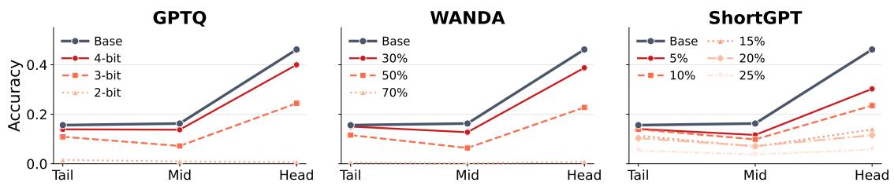  
Figure 1: Accuracy across different popularity groups on PopQA under different compression settings. Results for all methods and models are provided in Figures 8, 9, and 10 in Appendix A.2.1.

<table><tr><td rowspan=1 colspan=1></td><td rowspan=1 colspan=3>GPTQ</td><td rowspan=1 colspan=1></td><td rowspan=1 colspan=3>AWQ</td><td rowspan=10 colspan=4>WANDA N:M-30ShortGPT          20Relaae tit t(p)10- 0-1025%                             -20Head      -30</td></tr><tr><td rowspan=1 colspan=1>4-bit</td><td rowspan=1 colspan=1>+2.4</td><td rowspan=1 colspan=1>-2.1</td><td rowspan=1 colspan=1>-0.1</td><td rowspan=1 colspan=1>4-bit</td><td rowspan=1 colspan=1>+5.0</td><td rowspan=1 colspan=1>-5.3</td><td rowspan=1 colspan=1>+0.2</td><td rowspan=1 colspan=1></td><td rowspan=1 colspan=1>+35.0</td><td rowspan=1 colspan=1>-8.7</td><td rowspan=1 colspan=1>-8.8</td></tr><tr><td rowspan=1 colspan=1>3-bit</td><td rowspan=1 colspan=1>+15.3</td><td rowspan=1 colspan=1>-10.2</td><td rowspan=1 colspan=1>-1.6</td><td rowspan=1 colspan=1>3-bit</td><td rowspan=1 colspan=1>+12.8</td><td rowspan=1 colspan=1>-9.7</td><td rowspan=1 colspan=1>-0.9</td><td rowspan=1 colspan=1></td><td rowspan=1 colspan=1>+30.0</td><td rowspan=1 colspan=1>-3.1</td><td rowspan=1 colspan=1>-9.1</td></tr><tr><td rowspan=1 colspan=1>2-bit</td><td rowspan=1 colspan=1>+5.8</td><td rowspan=1 colspan=1>+1.6</td><td rowspan=1 colspan=1>-2.5</td><td rowspan=1 colspan=1>2-bit</td><td rowspan=1 colspan=1>+10.4</td><td rowspan=1 colspan=1>+0.4</td><td rowspan=1 colspan=1>-3.7</td><td rowspan=1 colspan=1></td><td rowspan=1 colspan=1></td><td rowspan=1 colspan=1>hortGP</td><td rowspan=1 colspan=1>T</td></tr><tr><td rowspan=1 colspan=1></td><td rowspan=1 colspan=1>Omn</td><td rowspan=1 colspan=1>iQuan</td><td rowspan=1 colspan=1>t</td><td rowspan=1 colspan=1></td><td rowspan=1 colspan=1></td><td rowspan=1 colspan=1>WANDA</td><td rowspan=1 colspan=1></td><td rowspan=1 colspan=1></td><td rowspan=1 colspan=1>+18.0</td><td rowspan=1 colspan=1>-0.2</td><td rowspan=1 colspan=1>-6.1</td></tr><tr><td rowspan=1 colspan=1>4-bit</td><td rowspan=1 colspan=1>+4.6</td><td rowspan=1 colspan=1>-1.8</td><td rowspan=1 colspan=1>-0.9</td><td rowspan=1 colspan=1>30%</td><td rowspan=1 colspan=1>+10.6</td><td rowspan=1 colspan=1>-7.0</td><td rowspan=1 colspan=1>-1.2</td><td rowspan=1 colspan=1>10%</td><td rowspan=1 colspan=1>+28.2</td><td rowspan=1 colspan=1>-0.1</td><td rowspan=1 colspan=1>-9.6</td></tr><tr><td rowspan=1 colspan=1>3-bit</td><td rowspan=1 colspan=1>+5.6</td><td rowspan=1 colspan=1>-8.9</td><td rowspan=1 colspan=1>+1.2</td><td rowspan=1 colspan=1>50%</td><td rowspan=1 colspan=1>+21.8</td><td rowspan=1 colspan=1>-13.1</td><td rowspan=1 colspan=1>-2.8</td><td rowspan=1 colspan=1>15%</td><td rowspan=1 colspan=1>+31.3</td><td rowspan=1 colspan=1>+1.4</td><td rowspan=1 colspan=1>-11.1</td></tr><tr><td rowspan=1 colspan=1>2-bit</td><td rowspan=1 colspan=1>+1.4</td><td rowspan=1 colspan=1>+0.1</td><td rowspan=1 colspan=1>-0.5</td><td rowspan=1 colspan=1>70%</td><td rowspan=1 colspan=1>+1.2</td><td rowspan=1 colspan=1>-0.4</td><td rowspan=1 colspan=1>-0.3</td><td rowspan=1 colspan=1>20%</td><td rowspan=1 colspan=1>+28.8</td><td rowspan=1 colspan=1>+6.8</td><td rowspan=1 colspan=1>-12.2</td></tr><tr><td rowspan=2 colspan=1></td><td rowspan=1 colspan=1>Tail</td><td rowspan=1 colspan=1>Mid</td><td rowspan=1 colspan=1>Head</td><td rowspan=1 colspan=1></td><td rowspan=1 colspan=1>Tail</td><td rowspan=1 colspan=1>Mid</td><td rowspan=1 colspan=1>Head</td><td rowspan=1 colspan=1>25%</td><td rowspan=1 colspan=1>+15.0</td><td rowspan=1 colspan=1>+4.0</td><td rowspan=1 colspan=1>-6.5</td></tr><tr><td rowspan=1 colspan=4></td><td rowspan=1 colspan=4></td><td rowspan=1 colspan=1></td><td rowspan=1 colspan=1>Tail</td><td rowspan=1 colspan=1>Mid</td><td rowspan=1 colspan=1>Head</td></tr></table>

Figure 2: Relative retention shift across PopQA popularity groups under different compression settings, reported in percentage points. Negative and positive RS。indicate lower and higher relative retention than the dataset overall, respectively. Results for all methods and models are provided in Figures 14, 15, and 16 in Appendix A.2.1.

Relative Retention Shift by Popularity. Relative retention reverses the accuracy ordering. After normalizing each group's accuracy to its basemodel value, tail knowledge is retained better than the model's overall accuracy, while head knowledge is worse. This asymmetry is consistent across almost all model and compression combinations on PopQA. Further, its magnitude grows from quantization to pruning (Figure 2, and Figures 14, 15, 16 in Appendix A.2.1). Quantization produces smaller shifts, with 4-bit GPTQ, AWQ, and OmniQuant within 5.3 percentage points of overall retention, while N:M pruning is the most extreme with the tail retention 22.7 to 39.5 percentage points above overall and head retention 3.6 to 14.4 percentage points below it. At the strongest compression settings, such as 70% WANDA and 25% ShortGPT, the head/tail gap largely disappears because all groups lose almost all of their accuracy. One trend does not hold monotonically: under ShortGPT the tail and head gap is widest at a moderate 10% to 15% pruning ratio rather than at 25%, reaching up to 42.4, 44.6, and 52.7 percentage points for Llama, Qwen, and Gemma before narrowing at the strongest setting (see Appendix A.2.1).

Taken together, compression does not preferentially erase tail knowledge. Although head knowledge remains the most accurate group, it is proportionally the least retained, an effect invisible to aggregate accuracy or perplexity.

## 4.3 RQ2 Results

Because raw sequence probabilities are not necessarily calibrated to empirical correctness, we calibrate confidence scores for RQ2 using isotonic regression. For each dataset, we use a popularity-stratified 20/80 calibration-test split and fit the regression on the calibration split, using raw Conf(xi) to predict the substring-based correctness indicator Match (M(xi), yi). All subsequent confidence and calibration metrics are computed on the held-out test split.

Using the knowledge-loss rate and confidence on lost knowledge (Equations 3 and 4, see Appendix A.2.2 for calibration error) we observe that compression causes substantial knowledge loss even at settings where compressed accuracy is stable and that models often remain confident in these incorrect answers.

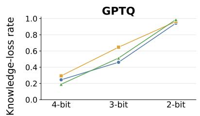

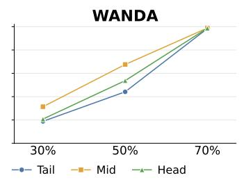

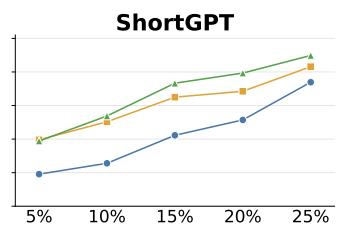

Figure 3: Knowledge-loss rate across popularity groups on PopQA under different compression settings. Higher values indicate that a larger proportion of the knowledge correctly answered by the base model is incorrect after compression. Results for all methods and models are provided in Figures 20, 21, and 22 in Appendix A.2.2.  
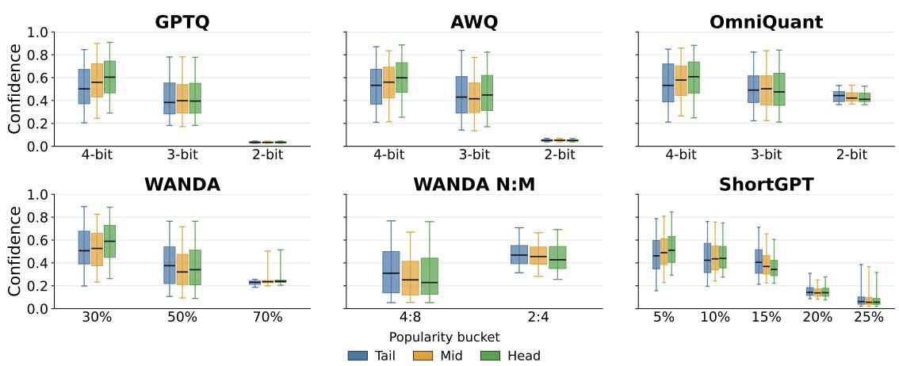  
Figure 4: Confidence on lost knowledge across popularity groups on PopQA under different compression settings. Each dot represents the median confidence; the thick vertical bar shows the 25th–75th percentile range, and the thin vertical bar shows the 5th–95th percentile range. Colors distinguish tail, middle, and head knowledge. Results for all methods and models are provided in Figures 26, 27, and 28 in Appendix A.2.2.

Knowledge-Loss Rate. Knowledge loss rises sharply with compression strength. Even at mild settings, such as 4-bit GPTQ, 30% WANDA, and 5% ShortGPT, where standard metrics suggest only minimal degradation, 22% to 35% of previously correct PopQA answers become incorrect. This proportion rises to 85 to 99% under the strongest compression settings (Figure 3). Consistent with RQ1, it is unevenly distributed, and tail knowledge is the least affected, for example 19.1% loss versus 38 to 40% for middle and head knowledge under 5% ShortGPT. However, this pattern does not fully generalize to Head-to-Tail, where mild and moderate compression generally results in higher loss rates and a less consistent ordering across popularity groups (Appendix A.2.2).

Confidence on Lost Knowledge. On the knowledge it loses, a compressed model often remains confident. Under mild to moderate compression the median confidence on now-incorrect answers stays near 0.4 to 0.6, and the model is more confident on lost head knowledge than on lost tail knowledge by up to 1.20× under 4-bit GPTQ (Figure 4). This confidence does not fall steadily as compression increases. It drops to near zero under 2-bit GPTQ and AWQ but stays around 0.4 under 2-bit OmniQuant, and it is higher under 2:4 than under 4:8 N:M pruning, so confidence declines sharply only in some collapsed settings and only after accuracy has already deteriorated. The head-over-tail pattern is also not universal across models, weakening or reversing in several Qwen settings (Appendix A.2.2).

Standard calibration metrics might be misleading here. ECE tends to improve under compression, but its largest reductions align with collapsed settings where accuracy and confidence are both near zero, so a lower ECE does not necessarily indicate better reliability (Appendix A.2.2).

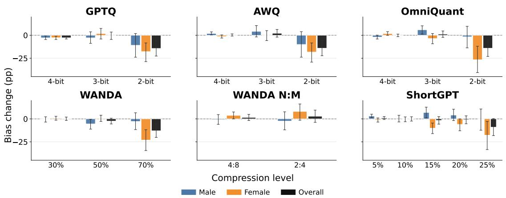  
Figure 5: Bias changes on WinoBias under different compression settings, reported in percentage points. Blue, orange, and black bars denote changes for male, female, and all examples, respectively, and error bars denote 95% confidence intervals. Positive values indicate increased stereotypical preference, negative values indicate decreased preference, and the dashed line marks no change from the base model. Results for all methods and models are provided in Figures 38, 39, and 40 in Appendix A.2.3.

## 4.4 RQ3 Results

Using the bias change defined in Equation 6, we reach two conclusions. First, a small overall change in stereotypical preference does not imply stable behavior, since it can hide large and opposing shifts within subgroups. Second, these shifts concentrate on a few specific subgroups, and which subgroup is affected depends on the model and the dataset. We focus here on non-collapsed configurations, because collapsed models produce unreliable and often extreme bias estimates.

Overall and Subgroup Bias Change. Figure 5 shows that a small overall bias change can mask larger, opposing changes within gender subgroups. Under 3-bit OmniQuant, stereotypical preference increases by about 6 percentage points for male group but decreases by about 4 points for female group, with the overall change being near zero. A similar “cancellation" appears under 15% Short-GPT, where the male and female shifts are about +7 and —9 percentage points. Such patterns occur across several quantization and pruning settings, so a small aggregate change does not indicate stable bias across subgroups. The effect is also benchmark dependent. On WinoBias the subgroup changes are large and sometimes opposing, whereas on BBQ the overall changes are small and mostly negative, ranging from about a 5-point decrease to a 4-point increase (see Appendix A.2.3).

Worst-Subgroup Effects. Tables 4 and 5 show that large subgroup shifts can coexist with much smaller aggregate changes. On WinoBias, Llama under SparseGPT 2:4 yields $\Delta B _ { g } ~ = ~ - 5 3 . 1$ pp for secretary (95% CI [−77.7, —14.1]), while the overall change is only $\Delta B = - 2 . 2$ pp (95% CI $[ - 9 . 1 , + 4 . 2 ] )$ This difference indicates that an aggregate score can conceal a large change concentrated within a single occupation. A similar pattern appears on BBQ: Qwen under 10% Short-GPT yields $\Delta B _ { g } ~ = ~ + 3 7 . 5$ pp for Down's syndrome (95% $\mathrm { C I } \ [ - 1 7 . 3 , + 7 4 . 4 ] )$ ), compared with an overall change of only —1.2 pp (95% interval [—2.1, —0.2]). Although the subgroup interval is wide, the point estimate illustrates how a large identity-specific shift can be diluted when averaged across the full benchmark. Thus, aggregate scores can obscure both the magnitude and location of compression-induced bias shift (Appendix A.2.3). Taken together, overall bias score is not sufficient to certify that a compressed model is fair.

## 5 Discussion and Conclusions

Model compression is rarely a uniform scaling down of model quality. Across 11 compression methods, we find that standard aggregate metrics such as average accuracy, perplexity, and overall bias scores create blind spots for practitioners, because they mask asymmetric behavioral changes. Compression degrades common (head) knowledge proportionally more than rare (tail) knowledge, even though head knowledge remains the most accurate group. It leaves models moderately confident in answers that have become incorrect. It also produces large, subgroup-specific shifts in stereotypical preference that a small aggregate change conceals. These effects are most concerning in the mild-to-moderate regimes where aggregate metrics appear reliable. Certifying a compressed model as intact from average utility alone is therefore insufficient and reliable deployment requires granular, subgroup-level evaluation.

## Limitations

Our study has following limitations. First, our experiments cover three 8-9B instruction-tuned models and selected post-training quantization and pruning methods. The findings may not generalize to substantially larger models, other architectures or compression paradigms such as distillation.

Second, unlike the confidence analysis in RQ2, the stereotypical-preference analysis in RQ3 does not apply probability calibration. WinoBias and BBQ do not provide a natural correctness-based calibration target for the stereotypical-preference scores, so the calibration procedure used in RQ2 cannot be directly transferred to these benchmarks.

## References

Harshavardhan Adepu, Zhanpeng Zeng, Li Zhang, and Vikas Singh. 2024. Framequant: Flexible lowbit quantization for transformers. arXiv preprint arXiv:2403.06082.

Saleh Ashkboos, Maximilian L. Croci, Marcelo Gennari do Nascimento, Torsten Hoefler, and James Hensman. 2024. SliceGPT: Compress large language models by deleting rows and columns. In International Conference on Learning Representations.

Ting-Yun Chang, Muru Zhang, Jesse Thomason, and Robin Jia. 2025a. Why do some inputs break lowbit LLM quantization? In Proceedings of the 2025 Conference on Empirical Methods in Natural Language Processing, pages 3410–3429, Suzhou, China. Association for Computational Linguistics.

Ting-Yun Chang, Muru Zhang, Jesse Thomason, and Robin Jia. 2025b. Why do some inputs break lowbit LLM quantization? In Proceedings of the 2025 Conference on Empirical Methods in Natural Language Processing, pages 3410–3429, Suzhou, China. Association for Computational Linguistics.

Hyochan Chong, Dongkyu Kim, Changdong Kim, and Minseop Choi. 2026. Nanoquant: Efficient sub-1- bit quantization of large language models. arXiv preprint arXiv:2602.06694.

Xin Ding, Xiaoyu Liu, Zhijun Tu, Yun Zhang, Wei Li, Jie Hu, Hanting Chen, Yehui Tang, Zhiwei Xiong, Baoqun Yin, et al. 2025. Cbq: Cross-block quantization for large language models. In International Conference on Learning Representations, volume 2025, pages 7056–7075.

Vage Egiazarian, Andrei Panferov, Denis Kuznedelev, Elias Frantar, Artem Babenko, and Dan Alistarh. 2024. Extreme compression of large language models via additive quantization. In Proceedings of the 41st International Conference on Machine Learning, volume 235 of Proceedings of Machine Learning Research, pages 12284–12303. PMLR.

Gongfan Fang, Hongxu Yin, Saurav Muralidharan, Greg Heinrich, Jeff Pool, Jan Kautz, Pavlo Molchanov, and Xinchao Wang. 2024. MaskLLM: Learnable semistructured sparsity for large language models. In Advances in Neural Information Processing Systems.

Elias Frantar and Dan Alistarh. 2023. SparseGPT: Massive language models can be accurately pruned in one-shot. In Proceedings of the 40th International Conference on Machine Learning.

Elias Frantar, Saleh Ashkboos, Torsten Hoefler, and Dan Alistarh. 2023. Gptq: Accurate post-training quantization for generative pre-trained transformers. Preprint, arXiv:2210.17323.

Gustavo Gonçalves and Emma Strubell. 2023. Understanding the effect of model compression on social bias in large language models. In Proceedings of the 2023 Conference on Empirical Methods in Natural Language Processing, pages 2663–2675, Singapore. Association for Computational Linguistics.

Aaron Grattafiori, Abhimanyu Dubey, Abhinav Jauhri, Abhinav Pandey, Abhishek Kadian, Ahmad Al-Dahle, Aiesha Letman, Akhil Mathur, Alan Schelten, Alex Vaughan, Amy Yang, Angela Fan, Anirudh Goyal, Anthony Hartshorn, Aobo Yang, Archi Mitra, Archie Sravankumar, Artem Korenev, Arthur Hinsvark, and 542 others. 2024. The llama 3 herd of models. Preprint, arXiv:2407.21783.

Andrey Gromov, Kushal Tirumala, Hassan Shapourian, Paolo Glorioso, and Daniel A. Roberts. 2025. The unreasonable ineffectiveness of the deeper layers. In International Conference on Learning Representations.

Jialong Guo, Xinghao Chen, Yehui Tang, and Yunhe Wang. 2025. SlimLLM: Accurate structured pruning for large language models. In Proceedings of the 42nd International Conference on Machine Learning.

Junyuan Hong, Jinhao Duan, Chenhui Zhang, Zhangheng Li, Chulin Xie, Kelsey Lieberman, James Diffenderfer, Brian Bartoldson, Ajay Jaiswal, Kaidi Xu, Bhavya Kailkhura, Dan Hendrycks, Dawn Song, Zhangyang Wang, and Bo Li. 2024. Decoding compressed trust: Scrutinizing the trustworthiness of efficient llms under compression. arXiv:2403.15447.

Sara Hooker, Nyalleng Moorosi, Gregory Clark, Samy Bengio, and Emily Denton. 2020. Characterising bias in compressed models. arXiv preprint arXiv:2010.03058.

Lanxiang Hu, Tajana Rosing, and Hao Zhang. 2025a. TrimLLM: Progressive layer dropping for domainspecific LLMs. In Proceedings of the 63rd Annual Meeting of the Association for Computational Linguistics.

Xing Hu, Yuan Cheng, Dawei Yang, Zukang Xu, Zhihang Yuan, Jiangyong Yu, Chen Xu, Zhe Jiang, and Sifan Zhou. 2025b. Ostquant: Refining large language model quantization with orthogonal and scaling transformations for better distribution fitting. arXiv preprint arXiv:2501.13987.

Stanley Z. Hua, Sanae Lotfi, and Irene Y. Chen. 2026. Uncertainty drives social bias changes in quantized large language models. Preprint, arXiv:2602.06181.

Hong Huang, Decheng Wu, Rui Cen, Guanghua Yu, Zonghang Li, Kai Liu, Jianchen Zhu, Peng Chen, Xue Liu, and Dapeng Wu. 2025. Tequila: Trappingfree ternary quantization for large language models. arXiv preprint arXiv:2509.23809.

Wei Huang, Haotong Qin, Yangdong Liu, Yawei Li, Qinshuo Liu, Xianglong Liu, Luca Benini, Michele Magno, Shiming Zhang, and Xiaojuan Qi. 2024. Slim-llm: Salience-driven mixed-precision quantization for large language models. arXiv preprint arXiv:2405.14917.

Moumita Kamal and Douglas Talbert. 2024. Beyond size and accuracy: The impact of model compression on fairness. In The International FLAIRS Conference Proceedings, volume 37.

Bo-Kyeong Kim, Geonmin Kim, Tae-Ho Kim, Thibault Castells, Shinkook Choi, Junho Shin, and Hyoung-Kyu Song. 2024. Shortened LLaMA: A simple depth pruning for large language models. arXiv preprint arXiv:2402.02834.

Jinuk Kim, Marwa El Halabi, Wonpyo Park, Clemens JS Schaefer, Deokjae Lee, Yeonhong Park, Jae W Lee, and Hyun Oh Song. 2025. Guidedquant: Large language model quantization via exploiting end loss guidance. arXiv preprint arXiv:2505.07004.

Stanislas Laborde, Martin Cousseau, Antoun Yaacoub, and Lionel Prevost. 2025. Semantic retention and extreme compression in llms: Can we have both? Preprint, arXiv:2505.07289.

Guanchen Li, Yixing Xu, Zeping Li, Ji Liu, Xuanwu Yin, Dong Li, and Emad Barsoum. 2025. Týr-thepruner: Structural pruning LLMs via global sparsity distribution optimization. In Advances in Neural Information Processing Systems.

Yesheng Liang, Haisheng Chen, Zihan Zhang, Song Han, and Zhijian Liu. 2025. Paroquant: Pairwise rotation quantization for efficient reasoning llm inference. arXiv preprint arXiv:2511.10645.

Ji Lin, Jiaming Tang, Haotian Tang, Shang Yang, Wei-Ming Chen, Wei-Chen Wang, Guangxuan Xiao, Xingyu Dang, Chuang Gan, and Song Han.

2026. Awq: Activation-aware weight quantization for llm compression and acceleration. Preprint, arXiv:2306.00978.

Hongyi Liu, Rajarshi Saha, Zhen Jia, Youngsuk Park, Jiaji Huang, Shoham Sabach, Yu-Xiang Wang, and George Karypis. 2025a. ProxSparse: Regularized learning of semi-structured sparsity masks for pretrained LLMs. In Proceedings of the 42nd International Conference on Machine Learning.

Jing Liu, Ruihao Gong, Xiuying Wei, Zhiwei Dong, Jianfei Cai, and Bohan Zhuang. 2024. Qllm: Accurate and efficient low-bitwidth quantization for large language models. In International Conference on Learning Representations, volume 2024, pages 15417–15439.

Zechun Liu, Changsheng Zhao, Igor Fedorov, Bilge Soran, Dhruv Choudhary, Raghuraman Krishnamoorthi, Vikas Chandra, Yuandong Tian, and Tijmen Blankevoort. 2025b. Spinquant: Llm quantization with learned rotations. In International Conference on Learning Representations, volume 2025, pages 92009–92032.

Xinyin Ma, Gongfan Fang, and Xinchao Wang. 2023. LLM-Pruner: On the structural pruning of large language models. In Advances in Neural Information Processing Systems.

Yuexiao Ma, Huixia Li, Xiawu Zheng, Feng Ling, Xuefeng Xiao, Rui Wang, Shilei Wen, Fei Chao, and Rongrong Ji. 2024. Affinequant: Affine transformation quantization for large language models. In International Conference on Learning Representations, volume 2024, pages 50932–50951.

Alex Mallen, Akari Asai, Victor Zhong, Rajarshi Das, Daniel Khashabi, and Hannaneh Hajishirzi. 2023. When not to trust language models: Investigating effectiveness of parametric and non-parametric memories. In Proceedings of the 61st Annual Meeting of the Association for Computational Linguistics (Volume 1: Long Papers), pages 9802–9822, Toronto, Canada. Association for Computational Linguistics.

Federico Marcuzzi, Xuefei Ning, Roy Schwartz, and Iryna Gurevych. 2026. How quantization shapes bias in large language models. In Proceedings of the 19th Conference of the European Chapter of the Association for Computational Linguistics (Volume 1: Long Papers), pages 363–404, Rabat, Morocco. Association for Computational Linguistics.

Xin Men, Mingyu Xu, Qingyu Zhang, Bingning Wang, Hongyu Lin, Yaojie Lu, Xianpei Han, and Weipeng Chen. 2024. ShortGPT: Layers in large language models are more redundant than you expect. arXiv preprint arXiv:2403.03853.

Stephen Merity, Caiming Xiong, James Bradbury, and Richard Socher. 2016. Pointer sentinel mixture models. Preprint, arXiv:1609.07843.

Alicia Parrish, Angelica Chen, Nikita Nangia, Vishakh Padmakumar, Jason Phang, Jana Thompson, Phu Mon Htut, and Samuel R. Bowman. 2022. BBQ: A hand-built bias benchmark for question answering. In Findings of the Association for Computational Linguistics: ACL 2022, pages 2086–2105, Dublin, Ireland. Association for Computational Linguistics.

Krithika Ramesh, Arnav Chavan, Shrey Pandit, and Sunayana Sitaram. 2023. A comparative study on the impact of model compression techniques on fairness in language models. In Proceedings of the 61st Annual Meeting of the Association for Computational Linguistics (Volume 1: Long Papers), pages 15762– 15782, Toronto, Canada. Association for Computational Linguistics.

Plawan Kumar Rath and Rahul Maliakkal. 2026a. Quantization undoes alignment: Bias emergence in compressed llms across models and precision levels. Preprint, arXiv:2605.15208.

Plawan Kumar Rath and Rahul Maliakkal. 2026b. Weight pruning amplifies bias: A multi-method study of compressed 1llms for edge ai. Preprint, arXiv:2605.08137.

Fabrizio Sandri, Elia Cunegatti, and Giovanni Iacca. 2025. 2SSP: A two-stage framework for structured pruning of LLMs. Transactions on Machine Learning Research.

Semyon Savkin, Eitan Porat, Or Ordentlich, and Yury Polyanskiy. 2025. Nestquant: Nested lattice quantization for matrix products and llms. arXiv preprint arXiv:2502.09720.

Wenqi Shao, Mengzhao Chen, Zhaoyang Zhang, Peng Xu, Lirui Zhao, Zhiqian Li, Kaipeng Zhang, Peng Gao, Yu Qiao, and Ping Luo. 2024. Omniquant: Omnidirectionally calibrated quantization for large language models. In The Twelfth International Conference on Learning Representations.

Jiwon Song, Kyungseok Oh, Taesu Kim, Hyungjun Kim, Yulhwa Kim, and Jae-Joon Kim. 2024. SLEB: Streamlining LLMs through redundancy verification and elimination of transformer blocks. In Proceedings of the 41st International Conference on Machine Learning.

Kai Sun, Yifan Xu, Hanwen Zha, Yue Liu, and Xin Luna Dong. 2024a. Head-to-tail: How knowledgeable are large language models (LLMs)? A.K.A. will LLMs replace knowledge graphs? In Proceedings of the 2024 Conference of the North American Chapter of the Association for Computational Linguistics: Human Language Technologies (Volume 1: Long Papers), pages 311–325, Mexico City, Mexico. Association for Computational Linguistics.

Mingjie Sun, Zhuang Liu, Anna Bair, and J. Zico Kolter. 2024b. A simple and effective pruning approach for large language models. In International Conference on Learning Representations.

Yuxuan Sun, Ruikang Liu, Haoli Bai, Han Bao, Kang Zhao, Yuening Li, Jiaxin Hu, Xianzhi Yu, Lu Hou, Chun Yuan, et al. 2024c. Flatquant: Flatness matters for llm quantization. arXiv preprint arXiv:2410.09426.

Gemma Team, Morgane Riviere, Shreya Pathak, Pier Giuseppe Sessa, Cassidy Hardin, Surya Bhupatiraju, Léonard Hussenot, Thomas Mesnard, Bobak Shahriari, Alexandre Ramé, Johan Ferret, Peter Liu, Pouya Tafti, Abe Friesen, Michelle Casbon, Sabela Ramos, Ravin Kumar, Charline Le Lan, Sammy Jerome, and 179 others. 2024. Gemma 2: Improving open language models at a practical size. Preprint, arXiv:2408.00118.

Cuong Tran, Ferdinando Fioretto, Jung-Eun Kim, and Rakshit Naidu. 2022. Pruning has a disparate impact on model accuracy. In Advances in Neural Information Processing Systems 35 (NeurIPS 2022), pages 17652-17664.

Roman Vashurin, Ekaterina Fadeeva, Artem Vazhentsev, Lyudmila Rvanova, Daniil Vasilev, Akim Tsvigun, Sergey Petrakov, Rui Xing, Abdelrahman Sadallah, Kirill Grishchenkov, Alexander Panchenko, Timothy Baldwin, Preslav Nakov, Maxim Panov, and Artem Shelmanov. 2025. Benchmarking uncertainty quantification methods for large language models with LM-polygraph. Transactions of the Association for Computational Linguistics, 13:220–248.

Denny Vrandečić and Markus Krötzsch. 2014. Wikidata: A free collaborative knowledge base. Communications of the ACM, 57:78–85.

Shigeng Wang, Chao Li, Yangyuxuan Kang, Jiawei Fan, Zhonghong Ou, and Anbang Yao. 2026. Sliderquant: Accurate post-training quantization for llms. arXiv preprint arXiv:2603.25284.

Mengzhou Xia, Tianyu Gao, Zhiyuan Zeng, and Danqi Chen. 2024. Sheared LLaMA: Accelerating language model pre-training via structured pruning. In International Conference on Learning Representations.

Guangxuan Xiao, Ji Lin, Mickael Seznec, Hao Wu, Julien Demouth, and Song Han. 2023. Smoothquant: Accurate and efficient post-training quantization for large language models. In International conference on machine learning, pages 38087–38099. PMLR.

Zhichao Xu, Ashim Gupta, Tao Li, Oliver Bentham, and Vivek Srikumar. 2024. Beyond perplexity: Multidimensional safety evaluation of LLM compression. In Findings of the Association for Computational Linguistics: EMNLP 2024, pages 15359–15396, Miami, Florida, USA. Association for Computational Linguistics.

Zukang Xu, Xing Hu, Qiang Wu, and Dawei Yang. 2026. Rsavq: Riemannian sensitivity-aware vector quantization for large language models. Advances in Neural Information Processing Systems, 38:1409– 1436.

An Yang, Anfeng Li, Baosong Yang, Beichen Zhang, Binyuan Hui, Bo Zheng, Bowen Yu, Chang Gao, Chengen Huang, Chenxu Lv, Chujie Zheng, Dayiheng Liu, Fan Zhou, Fei Huang, Feng Hu, Hao Ge, Haoran Wei, Huan Lin, Jialong Tang, and 41 others. 2025a. Qwen3 technical report. Preprint arXiv:2505.09388.

Yifan Yang, Kai Zhen, Bhavana Ganesh, Aram Galstyan, Goeric Huybrechts, Markus Müller, Jonas M. Kübler, Rupak Vignesh Swaminathan, Athanasios Mouchtaris, Sravan Babu Bodapati, Nathan Susanj, Zheng Zhang, Jack FitzGerald, and Abhishek Kumar 2025b. Wanda++: Pruning large language models via regional gradients. In Findings of the Association for Computational Linguistics: ACL 2025.

Yifei Yang, Zouying Cao, and Hai Zhao. 2024. LaCo: Large language model pruning via layer collapse. In Findings of the Association for Computational Linguistics: EMNLP 2024.

Mozhi Zhang, Mianqiu Huang, Rundong Shi, Linsen Guo, Chong Peng, Peng Yan, Yaqian Zhou, and Xipeng Qiu. 2024. Calibrating the confidence of large language models by eliciting fidelity. In Proceedings of the 2024 Conference on Empirical Methods in Natural Language Processing, pages 2959– 2979, Miami, Florida, USA. Association for Computational Linguistics.

Tianyi Zhang and Anshumali Shrivastava. 2024. Leanquant: Accurate and scalable large language model quantization with loss-error-aware grid. arXiv preprint arXiv:2407.10032.

Jieyu Zhao, Tianlu Wang, Mark Yatskar, Vicente Ordonez, and Kai-Wei Chang. 2018. Gender bias in coreference resolution: Evaluation and debiasing methods. In Proceedings of the 2018 Conference of the North American Chapter of the Association for Computational Linguistics: Human Language Technologies, Volume 2 (Short Papers), pages 15–20, New Orleans, Louisiana. Association for Computational Linguistics.

Pengxiang Zhao, Hanyu Hu, Ping Li, Yi Zheng, Zhefeng Wang, and Xiaoming Yuan. 2025. FISTAPruner: Layer-wise post-training pruning for large language models. In Proceedings of the 2025 Conference on Empirical Methods in Natural Language Processing.

Longguang Zhong, Fanqi Wan, Ruijun Chen, Xiaojun Quan, and Liangzhi Li. 2025. BlockPruner: Finegrained pruning for large language models. In Findings of the Association for Computational Linguistics: ACL 2025.

Xunyu Zhu, Jian Li, Yong Liu, Can Ma, and Weiping Wang. 2024. A survey on model compression for large language models. Transactions of the Association for Computational Linguistics, 12:1556–1577.

## A Appendix

## A.1 Experiment Setup: Additional Details

## A.1.1 LLM Compression Configurations

Quantization. Table 1 summarizes the quantization configurations used for all our models. We evaluate all four quantization methods at 2-, 3-, and 4-bit precision and use C4 for calibration. The remaining parameters specify the method-specific quantization settings.

The bit width specifies the precision of the quantized weights. We evaluate GPTQ, AWQ, Omni-Quant, and AQLM at 2-, 3-, and 4-bit precision. For all methods, the calibration dataset, number of calibration samples, seed, and sequence length define the data used during quantization. We use C4 with 128 calibration samples, a seed of 42, and a sequence length of 512.

GPTQ uses a group size of 128 and draws calibration samples from 4,096 records in the C4 validation split with a batch size of 1. Symmetric quantization, activation ordering, and sequential quantization are enabled. AWQ also uses a group size of 128, the C4 validation split, and a batch size of 1, but applies asymmetric quantization. It targets linear modules while excluding lm\_head. OmniQuant retains 16-bit activations and performs 40, 20, and 20 optimization epochs for 2-, 3-, and 4-bit quantization, respectively. Learnable weight clipping is enabled, whereas learnable equivalent transformation is disabled. AQLM uses input and output group sizes of 8 and 1, respectively, a relative MSE tolerance of 0.01, and a maximum of 10 fine-tuning epochs. Activation offloading and resumption from saved progress are enabled.

Pruning. Table 2 summarizes the pruning configurations used for all models. Magnitude, WANDA, and SparseGPT prune individual weights at sparsity levels of 30%, 50%, and 70%, whereas Short-GPT removes transformer blocks at ratios from 5% to 25%. All calibration-based methods use 32 sequences of length 512 from the C4 validation split. No method applies recovery fine-tuning.

Magnitude pruning requires no calibration data or activation statistics. WANDA and SparseGPT additionally support semi-structured 4:8 and 2:4 sparsity patterns. Together with magnitude pruning, they target linear projections in the attention and MLP modules while excluding lm\_head. SparseGPT further uses Hessian-based weight reconstruction. ShortGPT ranks decoder blocks by the mean per-token cosine similarity between their inputs and outputs while protecting the first and last blocks from removal.

For layer dropping, in each decoder layer $\ell ,$ we estimate an importance score using both task activations and weight magnitudes to measure how much each layer changes the hidden representation:

$$
a _ { \ell } ( x ) = \frac { \mathrm { R M S } ( h _ { \ell + 1 } ( x ) - h _ { \ell } ( x ) ) } { \mathrm { R M S } ( h _ { \ell } ( x ) ) + \epsilon } .
$$

We average this quantity across calibration prompts to obtain activation importance $A _ { \ell }$ We also compute a weight-magnitude importance score $W _ { \ell } ,$ defined as the average Root Mean Square magnitude of linear weights inside the decoder block. After min-max normalizing both quantities across layers, the combined layer importance is

$$
I _ { \ell } = 0 . 7 \widetilde { A } _ { \ell } + 0 . 3 \widetilde { W } _ { \ell } .
$$

We protect the first and last decoder layers. Among the remaining interior layers, we add a position prior

$$
P _ { \ell } = 1 - | 2 \ell / ( L - 1 ) - 1 | ,
$$

which is largest near the middle of the network. The final drop score is

$$
D _ { \ell } = 0 . 6 5 ( 1 - I _ { \ell } ) + 0 . 3 5 P _ { \ell } .
$$

Layers with the largest $D _ { \ell }$ are dropped. Thus, the policy favors layers that are both low-importance and safely located in the interior of the model. Block importance is estimated once per base model from C4 calibration data.

## A.1.2 Perplexity Evaluation Configurations

We use a unified perplexity evaluation protocol for the full-precision models and all compressed variants. Perplexity is evaluated on WikiText-2 (Merity et al., 2016) using a maximum of 8,192 evaluation tokens, an evaluation sequence length of 2,048 tokens, and at most 128 text samples. The same evaluation configuration is applied across all quantization and pruning methods to ensure consistent comparison with their corresponding full-precision models.

## A.1.3 Evaluated Datasets

PopQA. PopQA (Mallen et al., 2023) is an entitycentric open-domain question-answering benchmark designed to evaluate factual knowledge across entities with different levels of popularity. It contains approximately 14K questions generated from

<table><tr><td>Parameter</td><td>GPTQ</td><td>AWQ</td><td>OmniQuant</td><td>AQLM</td></tr><tr><td>Bit width</td><td>2,3,4</td><td>2,3,4</td><td>2,3,4</td><td>2,3,4</td></tr><tr><td>Calibration dataset</td><td>C4</td><td>C4</td><td>C4</td><td>C4</td></tr><tr><td>Calibration samples</td><td>128</td><td>128</td><td>128</td><td>128</td></tr><tr><td>Calibration seed</td><td>42</td><td>42</td><td>42</td><td>42</td></tr><tr><td>Calibration sequence length</td><td>512</td><td>512</td><td>512</td><td>512</td></tr><tr><td>Group size</td><td>128</td><td>128</td><td>128</td><td>一</td></tr><tr><td>Calibration split</td><td>validation</td><td>validation</td><td>一</td><td>一</td></tr><tr><td>Calibration source records</td><td>4096</td><td>一</td><td>一</td><td>一</td></tr><tr><td>Calibration batch size</td><td>1</td><td>1</td><td>一</td><td>一</td></tr><tr><td>Symmetric quantization</td><td>True</td><td>False</td><td>一</td><td>一</td></tr><tr><td>Activation ordering</td><td>True</td><td>一</td><td></td><td></td></tr><tr><td>Sequential quantization</td><td>True</td><td>一</td><td>一</td><td></td></tr><tr><td>Target modules</td><td>一</td><td>Linear</td><td>一</td><td>一</td></tr><tr><td>Ignored modules</td><td>一</td><td>lm_head</td><td>一</td><td>一</td></tr><tr><td>Activation bit width</td><td>一</td><td>一</td><td>16</td><td></td></tr><tr><td>Optimization epochs</td><td>一</td><td>一</td><td>40 / 20 / 20</td><td>一</td></tr><tr><td>Learnable weight clipping</td><td></td><td>一</td><td>True</td><td></td></tr><tr><td>Learnable equivalent</td><td></td><td></td><td>False</td><td></td></tr><tr><td>transformation</td><td></td><td></td><td></td><td></td></tr><tr><td>Input group size</td><td></td><td>一</td><td>一</td><td>8</td></tr><tr><td>Output group size</td><td></td><td>一</td><td>一</td><td>1</td></tr><tr><td>Relative MSE tolerance</td><td>一</td><td>一</td><td>一</td><td>0.01</td></tr><tr><td>Maximum fine-tuning epochs</td><td>一</td><td>一</td><td>一</td><td>10</td></tr><tr><td>Activation offloading</td><td>一</td><td>一</td><td>1</td><td>True</td></tr><tr><td>Resume enabled</td><td></td><td></td><td></td><td>True</td></tr></table>

Table 1: Quantization configurations.

Wikidata (Vrandečić and Krötzsch, 2014) triples covering 16 relation types. Each instance includes a question, one or more acceptable answers, and the Wikipedia page-view count of the subject entity, which serves as a proxy for entity popularity. We sort the examples by subject-entity popularity and divide them into equally sized head, middle, and tail groups. Models answer each question without external context, and a response is considered correct if it contains any normalized gold answer.

Head-to-Tail. Head-to-Tail (Sun et al., 2024a) evaluates factual knowledge associated with entities of different popularity levels. The benchmark contains 18,171 question-answer pairs drawn from movie, book, academic, and open-domain knowledge sources, including IMDb, Goodreads, MAG, DBLP, and DBpedia. Entities are assigned to head, torso, and tail groups according to popularity signals such as page traffic, ratings, or knowledgegraph density, and the benchmark samples a comparable number of questions from each group. For consistency with PopQA, we refer to the original torso group as the middle group and evaluate all three groups using the same closed-book questionanswering protocol.

Because the dataset cannot be directly redistributed due to licensing restrictions, we generated it using the data construction pipeline provided in the official repository and conducted our experiments on the resulting dataset.

WinoBias. WinoBias (Zhao et al., 2018) is a Winograd-schema style benchmark designed to measure gender bias through the association between pronouns and occupations. It contains 3,160 sentences, split equally into development and test portions, built from a vocabulary of 40 occupations drawn from US Department of Labor statistics. Each occupation is annotated with the percentage of workers who are reported as female, which determines whether linking it to a male or female pronoun is pro-stereotypical or anti-stereotypical. Sentences follow two templates: Type 1 requires world knowledge because it provides no syntactic cues, whereas Type 2 can be resolved from syntactic information alone. Every sentence is duplicated with male and female pronouns so that pro-stereotypical and anti-stereotypical variants are balanced by construction, and the gender of the pronoun is never informative for the correct coreference decision. Because the benchmark was originally designed for dedicated coreference resolution systems, we adapt it to our scoring-based protocol: for each sentence pair we treat the pro-stereotypical continuation as the stereotypical answer $s _ { i } ^ { \mathrm { s t } }$ and the anti-stereotypical continuation as the reference answer $s _ { i } ^ { \mathrm { r e f } }$ , and record whether the model assigns higher score to the former, following definition in Section 3.4. We assign each example to a gender subgroup according to the gender of its pronoun, which yields the male and female groups reported in Section 4.4.

<table><tr><td>Parameter</td><td>Magnitude</td><td>WANDA</td><td>SparseGPT</td><td>ShortGPT</td><td>Layer Dropping</td></tr><tr><td>Compression granularity</td><td>weights</td><td>weights</td><td>weights</td><td>decoder blocks</td><td>decoder blocks</td></tr><tr><td>Compression levels</td><td>30/50/70%</td><td>30/50/70%</td><td>30/50/70%</td><td>5/10/15/20/25%5/10/15/20/25%</td><td></td></tr><tr><td>Semi-structured patterns</td><td></td><td>4:8,2:4</td><td>4:8,2:4</td><td></td><td></td></tr><tr><td>Calibration dataset</td><td></td><td>C4</td><td>C4</td><td>C4</td><td>C4</td></tr><tr><td>Calibration samples</td><td></td><td>32</td><td>32</td><td>32</td><td>32</td></tr><tr><td>Calibration sequence length</td><td></td><td>512</td><td>512</td><td>512</td><td>256</td></tr><tr><td>Calibration split</td><td></td><td>validation attn./MLP</td><td>validation attn./MLP</td><td>validation</td><td>validation</td></tr><tr><td>Target modules</td><td>attn./MLP linear</td><td>linear</td><td>linear</td><td>decoder blocks</td><td>decoder blocks</td></tr><tr><td>Excluded components Selection criterion</td><td>lm_head weight magnitude</td><td>lm_head weight- activation</td><td>lm_head Hessian- based</td><td>block influence</td><td>first/last block first/last block importance +</td></tr><tr><td>Activation-importance</td><td></td><td>product</td><td>reconstruction</td><td></td><td>position 0.7</td></tr><tr><td>weight</td><td></td><td></td><td></td><td></td><td></td></tr><tr><td>Position-prior weight Random seed</td><td></td><td></td><td></td><td></td><td>0.35</td></tr></table>

Table 2: Pruning configurations.

BBQ. BBQ (Parrish et al., 2022) is a multiplechoice question-answering benchmark designed to measure whether models rely on social stereotypes when answering questions. It contains 58,492 examples covering nine social dimensions, together with two intersectional categories. Each example presents either an ambiguous context that does not provide enough information to determine the answer or a disambiguated context that provides clear supporting evidence. The three answer choices correspond to the stereotypical target, the non-target individual, and an unknown answer. In our evaluation, we use the dataset metadata to identify the stereotypical and non-target answers. The unknown option is scored and retained for auditing but is excluded from the main pairwise bias comparison.

## A.1.4 Computational Resources

Most model compression and evaluation experiments were run on NVIDIA L40 and H100 GPUs.

## A.2 Experiment Results: Additional Details

## A.2.1 Additional RQ1 Results

The figures in this section extend the RQ1 analysis across additional compression methods and base models on PopQA and report the corresponding results on Head-to-Tail. We distinguish absolute accuracy from relative retention because absolute performance reflects both the original difficulty of each popularity group and the overall severity of compression, whereas relative retention indicates whether a group preserves more or less of its basemodel performance than the model overall.

<table><tr><td rowspan="2">Compression</td><td rowspan="2">Method</td><td rowspan="2">Setting</td><td colspan="3">Perplexity (PPL)</td></tr><tr><td>Llama-3.1- 8B-Instruct</td><td>Qwen-3- 8B</td><td>Gemma-2- 9B-it</td></tr><tr><td>None</td><td>Full precision</td><td>FP16</td><td>7.1253</td><td>9.5888</td><td>10.2117</td></tr><tr><td rowspan="8">Quantization</td><td rowspan="2">GPTQ</td><td>2-bit</td><td>1612.6539</td><td>141.3107</td><td>137.1019</td></tr><tr><td>3-bit</td><td>10.0354</td><td>11.2652</td><td>12.3045</td></tr><tr><td rowspan="3">AWQ</td><td>4-bit</td><td>8.4459</td><td>9.9511</td><td>10.4903</td></tr><tr><td>2-bit</td><td>94354.1597</td><td>16508.5254</td><td>9407.2547</td></tr><tr><td>3-bit</td><td>9.4931</td><td>11.3750</td><td>11.8154</td></tr><tr><td rowspan="3">OmniQuant</td><td>4-bit</td><td>7.5192</td><td>9.9949</td><td>10.6473</td></tr><tr><td>2-bit</td><td>671.2557</td><td>39.6147</td><td>35.2010</td></tr><tr><td>3-bit</td><td>9.4949</td><td>11.7079</td><td>12.2236</td></tr><tr><td rowspan="3">AQLM</td><td>4-bit</td><td>7.5728</td><td>10.0737</td><td>10.5624</td></tr><tr><td>2-bit 3-bit</td><td>11.5659</td><td>13.0687</td><td>14.1902</td></tr><tr><td>4-bit</td><td>11.3204</td><td>12.3484</td><td>12.2632</td></tr><tr><td rowspan="8">Unstructured pruning</td><td rowspan="2">Magnitude</td><td>30% sparsity</td><td>8.4457 14.5756</td><td>10.2807 11.5522</td><td>10.8105</td></tr><tr><td>50% sparsity</td><td>177.7208</td><td>28.9189</td><td>16.6274 65.7596</td></tr><tr><td rowspan="2">Wanda</td><td>70% sparsity</td><td>127104.4841</td><td>138372.7513</td><td>117527.1945</td></tr><tr><td>30% sparsity 50% sparsity</td><td>9.2901 12.7384</td><td>11.0325 12.7984</td><td>12.9266 17.2316</td></tr><tr><td rowspan="2">SparseGPT</td><td>70% sparsity</td><td>236.8802</td><td>153.0605</td><td>106.8877</td></tr><tr><td>30% sparsity</td><td>9.5870</td><td>11.0395</td><td></td></tr><tr><td rowspan="2"></td><td>50% sparsity</td><td>15.4637</td><td>13.9930</td><td>13.9585 20.1264</td></tr><tr><td></td><td></td><td>862.9209</td><td></td></tr><tr><td rowspan="8">Semi-structured pruning Structured</td><td rowspan="2">Wanda (N:M)</td><td>70% sparsity</td><td>272.6379</td><td></td><td>129.0303</td></tr><tr><td>4:8</td><td>18.0268</td><td>14.7886</td><td>19.6716</td></tr><tr><td rowspan="2">SparseGPT (N:M)</td><td>2:4</td><td>30.6551</td><td>18.4150</td><td>24.4520</td></tr><tr><td>4:8</td><td>23.8732</td><td>16.9133</td><td>22.8913</td></tr><tr><td rowspan="2"></td><td>2:4</td><td>43.4478</td><td>21.1767</td><td>33.7740</td></tr><tr><td>5% blocks removed</td><td>9.8872</td><td>15.1473</td><td>13.5355</td></tr><tr><td rowspan="2">ShortGPT</td><td>10% blocks removed</td><td>11.1683</td><td>35.1417</td><td>14.7864</td></tr><tr><td>15% blocks removed</td><td>19.4141</td><td>43.5930</td><td>21.1945</td></tr><tr><td rowspan="8">pruning</td><td rowspan="2"></td><td>20% blocks removed</td><td>35.5543</td><td>80.9849</td><td></td></tr><tr><td>25% blocks removed</td><td></td><td>617.8208</td><td>36.1897</td></tr><tr><td></td><td>50% blocks dropped†</td><td>4442.3150 1624.0084</td><td>14603.1993</td><td>86.0827 6135.1147</td></tr><tr><td></td><td>10% slicing</td><td>18.9528</td><td> $5 . 6 3 3 2 \times 1 0 ^ { 4 }$ </td><td> $\overline { { 1 . 6 1 4 1 \times 1 0 ^ { 1 } } }$ </td></tr><tr><td rowspan="4">SliceGPT</td><td>15% slicing</td><td>33.0481</td><td> $5 . 2 2 5 4 \times 1 0 ^ { 4 }$ </td><td> $1 . 7 1 0 7 \times 1 0 ^ { 1 1 }$ </td></tr><tr><td>20% slicing</td><td>56.4871</td><td> $9 . 3 4 5 2 \times 1 0 ^ { 4 }$ </td><td> $1 . 8 7 4 4 \times 1 0 ^ { 1 1 }$ </td></tr><tr><td>25% slicing</td><td>94.9884</td><td> $9 . 3 4 5 2 \times 1 0 ^ { 4 }$ </td><td> $1 . 9 9 8 5 \times 1 0 ^ { 1 1 }$ </td></tr><tr><td>50% slicing</td><td>2627.4821</td><td> $2 . 3 3 7 3 { \times } 1 0 ^ { 5 }$ </td><td> $3 . 0 1 5 8 \times 1 0 ^ { 1 1 }$ </td></tr><tr><td rowspan="5">Importance-aware</td><td>5% layers dropped</td><td>11.2975</td><td> $\overline { { 1 1 . 2 4 6 1 } }$ </td><td>13.6751</td></tr><tr><td>10% layers dropped</td><td>12.9060</td><td>13.4295</td><td>14.6094</td></tr><tr><td>15% layers dropped</td><td>29.7573</td><td>17.1268</td><td>18.2027</td></tr><tr><td></td><td></td><td></td><td></td></tr><tr><td>20% layers dropped 25% layers dropped</td><td>48.7206 107.5709</td><td>19.7964 34.9253</td><td>22.2325 29.8676</td></tr></table>

Table 3: Perplexity of the three full-precision models and their compressed variants on WikiText-2.

Absolute accuracy and remaining task performance. The PopQA results in figures 6, 8, 9 and 10 show that head knowledge remains the most accurate group under most non-collapsed settings. The same absolute ordering is broadly observed on Head-to-Tail in figures 11, 12 and 13 across the three models. Under severe compression, the head– tail gap often narrows because accuracy approaches zero for all three groups; this is a consequence of broad utility loss rather than more uniform knowledge preservation. Moreover, nominally identical compression levels are not directly comparable across methods or models. On PopQA, for example, 2-bit AQLM retains 12.34% PopQA accuracy for Llama, whereas the other 2-bit quantization methods retain at most 1.85%. Similarly, at 25% importance-aware layer dropping, Llama falls to 2.33% accuracy, while Qwen and Gemma retain 14.28% and 13.52%, respectively. We therefore interpret popularity-level changes relative to the utility remaining in each model-method configuration. Head-to-Tail exhibits the same broad methodand model-dependent degradation, although its absolute accuracy levels differ from those on PopQA. We therefore interpret popularity-level changes relative to the task performance remaining in each model-method-dataset configuration.

Relative retention reveals a dataset-dependent tail-head asymmetry. After normalizing each group's compressed accuracy by its base-model accuracy and centering the resulting group retention by the model's overall retention, the PopQA results in figures 14, 15 and 16 reveal a strikingly consistent pattern. Across the 105 model-configuration combinations shown in these figures,¹ the tail shift is positive in 104 configurations, the head shift is negative in 92, and the tail shift exceeds the head shift in 104. The sole exception to both patterns is 4-bit AWQ for Qwen, where the tail and head shifts are 0.0 and +1.5 percentage points, respectively. Thus, on PopQA, although head knowledge generally remains more accurate in absolute terms, it usually loses a larger fraction of its original performance than tail knowledge. Head-to-Tail exhibits the same tendency in figures 17, 18 and 19, but substantially less consistently. Across its 105 model– configuration combinations, the tail shift is positive in 93 configurations and exceeds the head shift in 82, whereas the head shift is negative in only 49. Several quantization and layer-dropping settings instead produce negative tail shifts or positive head shifts. The relative tail advantage is therefore nearly universal on PopQA but weaker and more configuration-dependent on Head-to-Tail.

The magnitude of redistribution depends on the compression method and dataset. On PopQA, standard 4-bit GPTQ, AWQ, and OmniQuant largely preserve the base distribution of accuracy, with all relative shifts remaining within 5.3 percentage points of zero. AQLM behaves differently: for Llama, 4-bit AQLM already produces a +22.0-point tail shift and a —15.3-point middle shift, while at 3 bits its tail shift ranges from +13.8 to +27.1 points across the three models. Pruning generally produces larger disparities. At 50% unstructured sparsity, tail shifts range from +16.5 to +28.4 points, compared with head shifts from -1.3 to -13.8 points. Under N:M pruning, the corresponding ranges widen to +22.7–+39.5 for tail knowledge and —3.6–—14.4 for head knowledge. Head-to-Tail generally exhibits smaller relative shifts under comparable settings. Its clearest tail advantages occur under moderate unstructured pruning, N:M pruning, and ShortGPT, whereas standard quantization and importance-aware layer dropping more often produce small or mixed shifts. These results show that substantial redistribution can emerge before complete task collapse, although its magnitude and consistency vary considerably across datasets.

Structured pruning is non-monotonic and model-specific. For ShortGPT, the tail-head disparity is largest at 10–15% block removal rather than at the strongest 25% setting. The maximum gaps are 42.4 percentage points for Llama, 44.6 for Qwen, and 52.7 for Gemma, before narrowing at 25% to 21.5, 10.2, and 36.5 points, respectively. Head-to-Tail shows a similar non-monotonic pattern, but with smaller maximum disparities. The tail–head gap peaks at 21.4 percentage points for Llama at 15% block removal, 16.2 points for Qwen at 15–20%, and 23.9 points for Gemma at 15%, before narrowing at 25%. Importance-aware layer dropping follows a different trajectory: Llama reaches a +30.5-point tail shift by 10% layer dropping, whereas Qwen and Gemma show comparatively small shifts through 15% and reach tail shifts of +17.6 and +27.6 points only at 25%. On Headto-Tail, importance-aware layer dropping produces smaller and less systematic shifts, with no shared monotonic trajectory across the three models.

On PopQA, extreme unstructured sparsity also does not have a uniform effect. Llama's shifts mostly contract toward zero at 70% sparsity, while Qwen shows mixed behavior. Gemma under 70% SparseGPT is a clear exception, retaining a +40.6- point tail shift and a —12.5-point head shift despite severe overall degradation. On Head-to-Tail, the relative shifts more often contract toward zero at 70% sparsity, especially for Qwen, although several Llama and Gemma configurations retain modest positive tail shifts. Severe compression therefore tends to weaken the redistribution pattern on Head-to-Tail, but does not eliminate it uniformly. This outlier shows that severe overall degradation does not necessarily force relative shifts toward zero. Determining whether this behavior is caused by SparseGPT's reconstruction objective would require targeted analysis beyond the aggregate results reported here.

RQ1 takeaway. Across both datasets, head knowledge generally remains more accurate than middle and tail knowledge in absolute terms. However, the results do not support the hypothesis that compression systematically erases tail knowledge more rapidly than head knowledge. On PopQA, tail knowledge retains a larger proportion of its base-model performance in nearly every evaluated configuration, producing a strong and consistent tail-head asymmetry. Head-to-Tail exhibits the same tendency in many settings, particularly under pruning, but the relative shifts are smaller and more configuration-dependent. The absolute popularity ordering therefore generalizes more consistently across datasets than the relative-retention asymmetry. Aggregate accuracy alone can obscure these differences in how compression redistributes retained knowledge across the popularity spectrum.

## A.2.2 Additional RQ2 Results

We extend the RQ2 analysis to Qwen3-8B and Gemma-2-9B, additional compression methods, and Head-to-Tail. RQ2 considers examples answered correctly by the base model but incorrectly after compression. We distinguish the knowledgeloss rate, which measures the fraction of previously correct examples that are lost; confidence on lost knowledge, which measures the confidence assigned to the newly incorrect answer; and expected calibration error (ECE), which measures the agreement between confidence and accuracy within an evaluated group. For the base model and each compressed configuration, the isotonic regression is fitted using the shared 20%/80% calibration/test split. These quantities therefore answer related but non-interchangeable questions.

Knowledge loss increases with compression severity. Across the 105 model-configuration combinations evaluated per dataset, the least aggressive setting of each method already spans a wide range of overall loss rates: 7.5–56.5% on PopQA and 11.2–67.8% on Head-to-Tail. The most aggressive settings span 24.3–99.4% and 44.2–100.0%, respectively. This broad increase with compression severity appears across all three models in figures 20, 21, and 22 for PopQA, figures 23, 24, and 25 for Head-to-Tail.

For Llama-3.1-8B-Instruct, PopQA loss is 22.3% under 4-bit GPTQ, 22.6% under WANDA at 30% sparsity, and 35.0% under ShortGPT at a 5% pruning ratio in Figure 20. The corresponding Head-to-Tail rates are higher at 26.3%, 26.5%, and 46.7% in Figure 23. At the other extreme, Llama Magnitude pruning at 70% sparsity loses 99.4% of previously correct PopQA examples while retaining only 0.23% overall accuracy. Llama SparseGPT at 70% sparsity loses all previously correct Head-to-Tail examples and retains only 0.01% accuracy. These configurations represent task collapse rather than useful highcompression operating points.

Overconfidence persists under mild compression. For the Llama PopQA settings emphasized in the main text, median calibrated confidence on lost tail, middle, and head knowledge is 0.50/0.56/0.60 under 4-bit GPTQ, 0.51/0.53/0.59 under WANDA at 30% sparsity, and 0.46/0.49/0.51 under ShortGPT at a 5% pruning ratio. Thus, even these mild settings assign moderate confidence to answers that became incorrect.

Head-to-Tail shows the same qualitative behavior for these configurations, with medians of 0.63/0.65/0.67, 0.57/0.61/0.64, and 0.51/0.55/0.59, respectively in figure 29. Moderate confidence on lost knowledge also appears across multiple settings for Qwen and Gemma, although its magnitude varies more substantially across methods and compression levels in figures 27, 28, 30 and 31. These values describe the confidence assigned to newly incorrect answers; they do not show that a model detects or recognizes its own knowledge loss.

Popularity-group differences are dataset dependent. The Llama examples above assign higher median confidence to lost head knowledge than to lost tail knowledge, but this ordering is not universal. Across all 105 model–configuration combinations, the head median exceeds the tail median in 55 cases on PopQA. The variation across models and methods is visible in figures 26, 27, and 28. On Head-to-Tail, the head median exceeds the tail median in 78 cases, indicating a more frequent, although still non-universal, head-over-tail confidence ordering in figures 29, 30, and 31.

The ordering of loss rates differs more sharply across datasets. Head loss exceeds tail loss in 93 of 105 PopQA combinations (Figures 20, 21, and 22), but in only 48 of 105 Head-to-Tail combinations (Figures 23, 24, and 25). These results reveal popularity-stratified differences in both which knowledge is lost and the confidence assigned to that loss, but neither ordering generalizes uniformly across models, methods, and datasets.

Compression trajectories and calibration are method specific. Many configurations exhibit increasing knowledge loss as compression becomes more severe, but their confidence trajectories remain method and model specific. Figures 20 shows that moving GPTQ from 4 to 3 to 2 bits for Llama raises PopQA 1oss from 22.3% to 53.0% to 97.3% and lowers the tail median confidence from 0.50 to 0.38 to 0.03. WANDA at 30%, 50%, and 70% sparsity similarly raises loss from 22.6% to 54.7% to 98.7%.

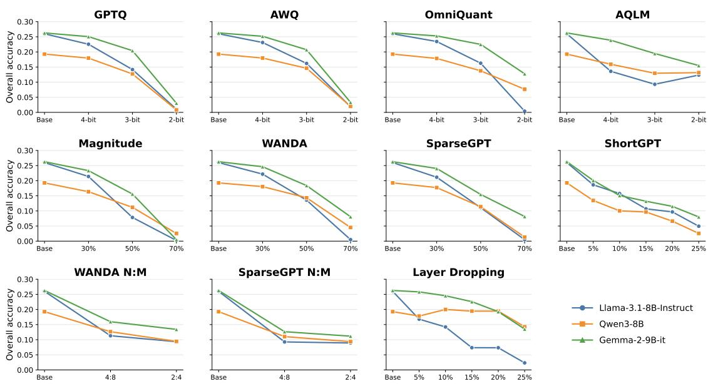

Figure 6: Overall accuracy on PopQA under different compression methods and settings.  
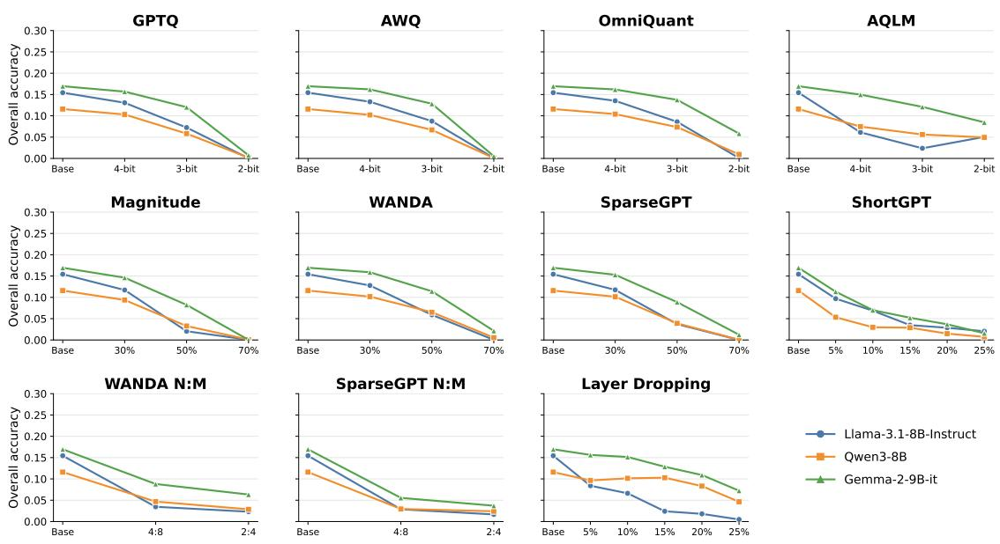  
Figure 7: Overall accuracy on Head-to-Tail under different compression methods and settings.

AQLM is not monotonic in bit width for Llama. Figures 20 and 23 show PopQA loss rates of 56.5%, 73.1%, and 59.2% at 4, 3, and 2 bits, respectively, compared with corresponding Head-to-Tail rates of 67.8%, 90.1%, and 73.3%. ShortGPT can also produce non-monotonic confidence changes. As shown in Figures 27 and 21, the tail median confidence of Qwen3-8B on PopQA rises from 0.62 at a 10% pruning ratio to 0.72 at 15%, even as loss increases from 58.3% to 61.2%.

Importance-aware layer dropping is particularly model specific. Figures 21 and 20 show that, through a 20% dropping ratio, Qwen PopQA loss remains between 20.6% and 24.3%, whereas the corresponding Llama range is 42.7%–78.9%. Semi-structured WANDA also differs from its unstructured counterpart. Figure 20 shows that WANDA 4:8 and 2:4 lose 64.7% and 71.5% of previously correct Llama PopQA examples, respectively, compared with 54.7% at 50% unstructured

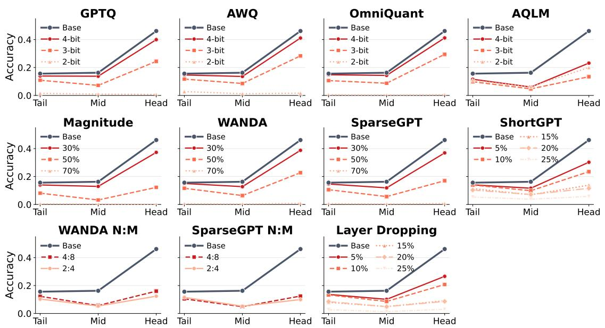  
Figure 8: Accuracy across different popularity groups on PopQA for L1ama-3.1-8B-Instruct under additional compression methods and settings.

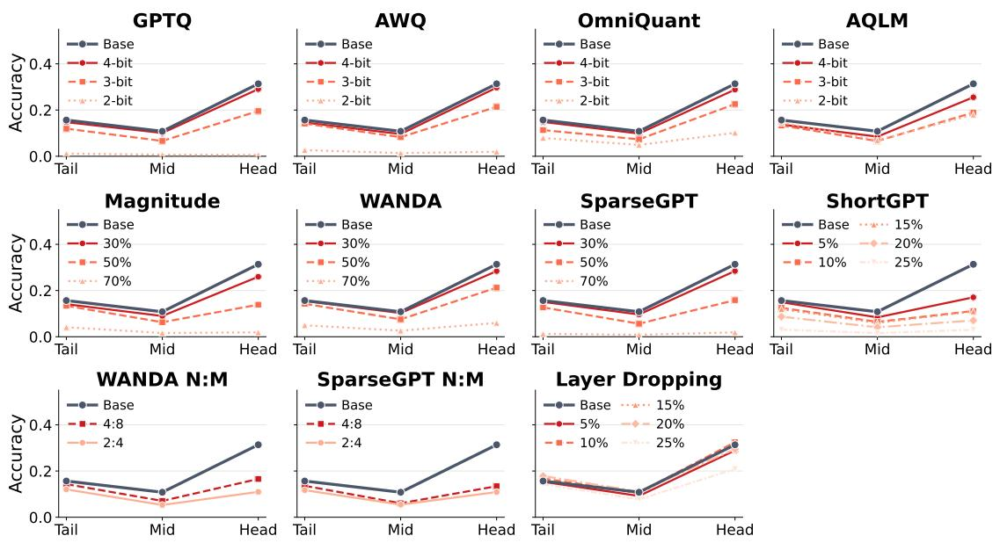  
Figure 9: Accuracy across different popularity groups on PopQA for Qwen3-8B under additional compression methods and settings.

sparsity.

Severe compression frequently lowers confidence only after most previously correct knowledge and nearly all task accuracy have disappeared. Figures 20, 29, and 23 show that Llama 2-bit GPTQ has tail and head median confidence near 0.03 on both datasets, while its loss rate reaches 97.3% on PopQA and 99.8% on Head-to-Tail. The corresponding accuracies are only 1.05% and 0.05%. Likewise, Llama WANDA at 70% sparsity reaches 98.7% PopQA loss and 100.0% Head-to-Tail loss while accuracy falls to 0.50% and 0.03%. Lower confidence under these settings therefore accompanies task collapse rather than improved practical reliability.

A similar qualification applies to ECE. We define ∆ECE as the calibrated ECE of the compressed model minus that of its paired base model, so a positive value denotes larger ECE and a negative value denotes smaller ECE. Overall ∆ECE ranges from —2.52 to +0.43 percentage points on PopQA and from —1.79 to +0.54 points on Head-to-Tail. It is negative for 100 of 105 PopQA combinations and 95 of 105 Head-to-Tail combinations. The corresponding PopQA reliability results are shown in Figures 32, 33, and 34. The Head-to-Tail reliability results are shown in Figures 35, 36, and 37.

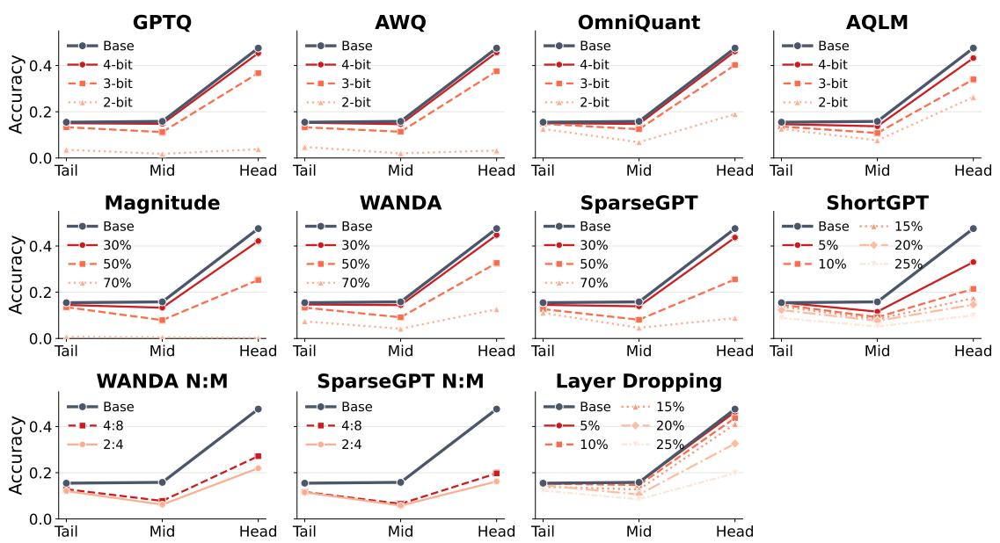

Figure 10: Accuracy across different popularity groups on PopQA for Gemma-2-9B under additional compression methods and settings.  
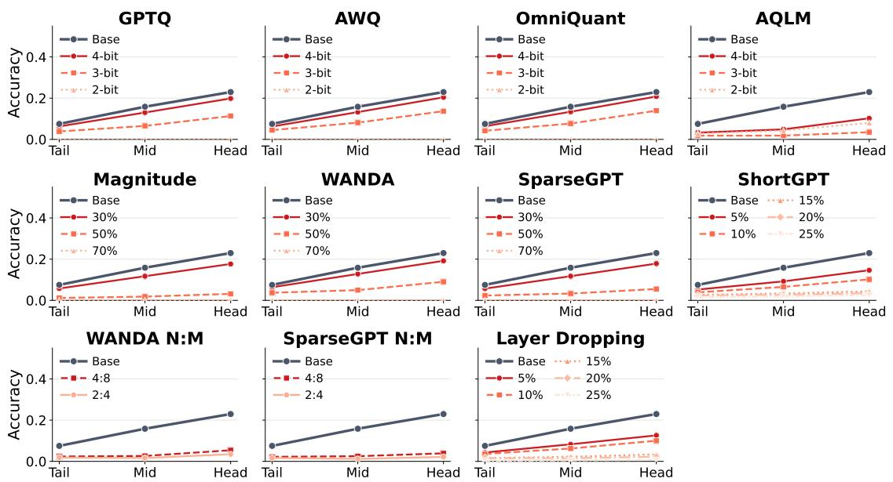  
Figure 11: Accuracy across different popularity groups on Head-to-Tail for Llama-3.1-8B-Instruct under different compression methods and settings.

Although the predominance of negative values indicates lower ECE on the test split, it does not by itself establish improved practical reliability or better knowledge preservation, because some of the largest reductions occur when correctness and confidence both collapse toward zero. Group-level changes are also less uniform, ranging from —7.74 to +3.54 percentage points on PopQA and from —3.89 to +2.29 points on Head-to-Tail. No single popularity group consistently exhibits the largest change across models, methods, and datasets. Confidence and ECE must therefore be interpreted jointly with knowledge-loss rate and task accuracy.

RQ2 takeaway. Under mild compression, models can remain moderately confident on knowledge that becomes incorrect, but the magnitude and popularity ordering of this confidence are dataset and model dependent. Stronger compression generally increases knowledge loss, while the decline in confidence and ECE under the most severe settings frequently coincides with near-total task collapse. Assessing compression-induced reliability therefore requires jointly considering knowledge-loss rate, confidence on lost knowledge, calibrated reliability, ECE, and task accuracy rather than interpreting any one statistic in isolation.

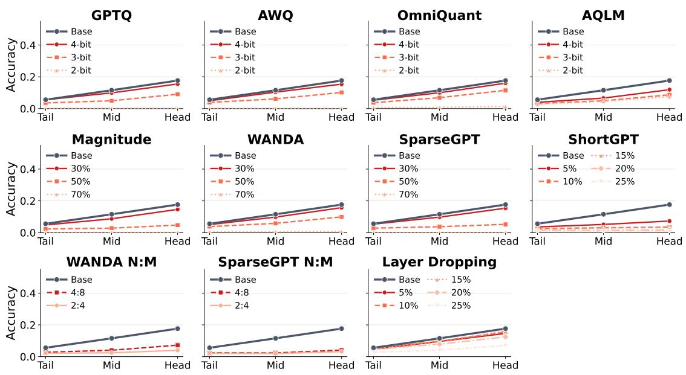

Figure 12: Accuracy across different popularity groups on Head-to-Tail for Qwen3-8B under different compression methods and settings.  
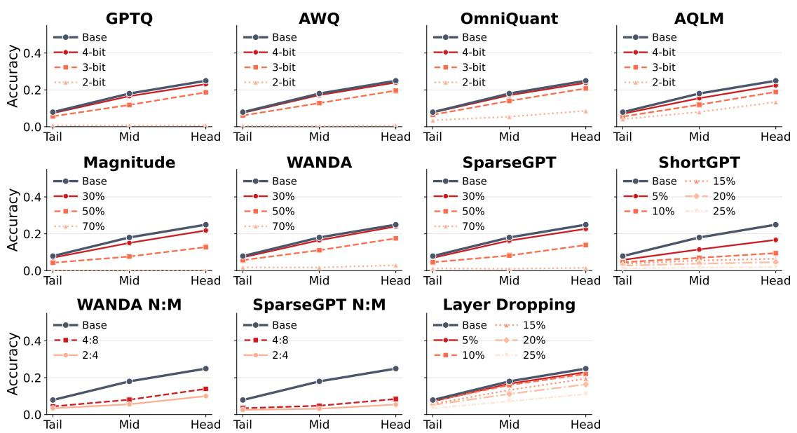  
Figure 13: Accuracy across different popularity groups on Head-to-Tail for Gemma-2-9B under different compression methods and settings.

## A.2.3 Additional RQ3 Results

WinoBias and BBQ operationalize stereotypical preference differently. WinoBias focuses on occupational associations on genders and renders direct comparisons of male and female pronoun groups, whereas BBQ covers multiple social dimensions and fine-grained identity groups. Their values therefore are not interchangeable for the same subgroup construct. Nevertheless, what generalizes across benchmarks is the masking effect of the overall shift. Figure 5 and Figures 38, 39, 40 extend the WinoBias analysis across compression methods and base models. Figures 41, 42, 43 report the corresponding results on BBQ. Since results from collapsed settings have degraded substantially, we place greater interpretation weight on non-collapsed configurations.

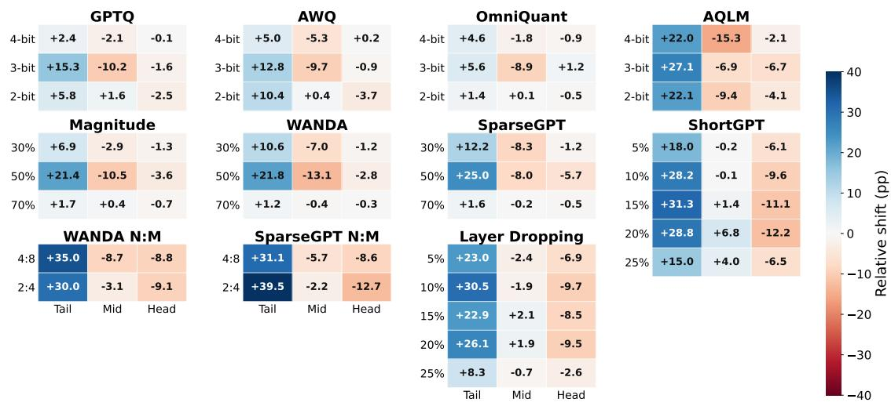

Figure 14: Relative retention shifts across different popularity groups on PopQA for Llama-3.1-8B-Instruct under additional compression methods and settings. Positive values indicate that a group retains a larger fraction of its base-model accuracy than the model overall, while negative values indicate lower relative retention. Values are reported in percentage points.  
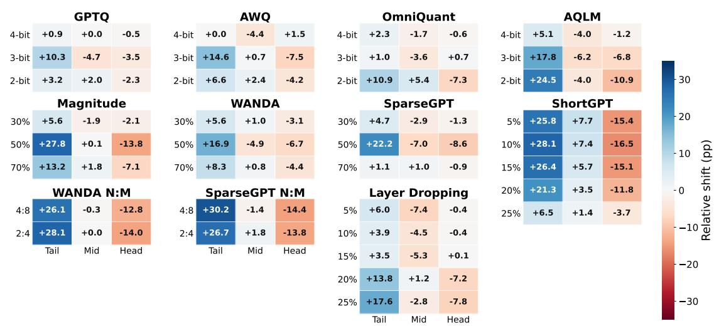  
Figure 15: Relative retention shifts across different popularity groups on PopQA for Qwen3-8B under additional compression methods and settings. Positive values indicate that a group retains a larger fraction of its base-model accuracy than the model overall, while negative values indicate lower relative retention. Values are reported in percentage points.

Fine-Grained Subgroup Shifts. Tables 4 and 5 report the largest absolute fine-grained subgroup changes. In WinoBias, the largest changes are predominantly decreases affecting female-coded occupations. For Llama, secretary has the largest absolute change under SparseGPT 2:4, with $\Delta B _ { g } =$ -53.1 pp (95% CI [−77.7, −14.1]). For Qwen, sheriff has the largest absolute change under 50% magnitude pruning, with $\Delta B _ { g } = - 5 1 . 9 \mathrm { p p }$ (95% CI [-70.7, -24.0]). SparseGPT N:M accounts for all four displayed Llama entries, whereas 50% magnitude pruning accounts for four of the six displayed Qwen entries. For BBQ, the largest changes are predominantly increases concentrated among disability-related identities. The largest displayed shifts for Qwen and Gemma occur under ShortGPT, whereas the largest displayed Llama shifts arise under SparseGPT and WANDA N:M and occur for cognitive-disability identities.

Model-dependent WinoBias changes. The expanded WinoBias results show that the direction and magnitude of bias change depend on the base model, even under the same compression method and nominal setting. For Llama, the most aggressive GPTQ, AWQ, OmniQuant, Magnitude, WANDA, and SparseGPT settings generally shift the overall score downward, whereas several AQLM configurations shift it upward. Gemma displays a different profile: AQLM again produces positive overall changes, but aggressive WANDA also moves the overall score upward, despite moving it downward for Llama and Qwen. At 70% WANDA sparsity, for example, the observed overall changes are -12.9 pp (95% CI [-20.1, —5.5]) for Llama, -8.1 pp (95% CI [−16.1, +0.4]) for Qwen, and +11.1 pp (95% CI [+7.4, +14.7|) for Gemma. Although this aggressive setting is best treated as a boundary case because of its severe utility degradation, the sign reversal demonstrates that neither the compression method nor its nominal severity is sufficient to predict the direction of the measured bias change.

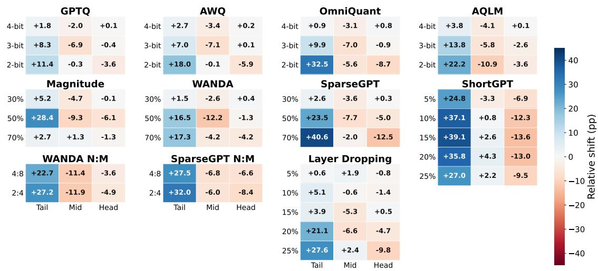  
Figure 16: Relative retention shifts across different popularity groups on PopQA for Gemma-2-9B under additional compression methods and settings. Positive values indicate that a group retains a larger fraction of its base-model accuracy than the model overall, while negative values indicate lower relative retention. Values are reported in percentage points.

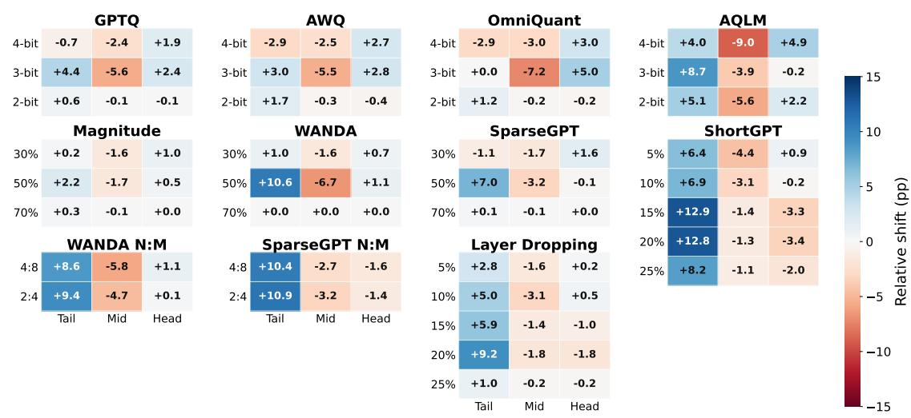  
Figure 17: Relative retention shifts across different popularity groups on Head-to-Tail for L1ama-3.1-8B-Instruct under different compression methods and settings. Positive values indicate that a group retains a larger fraction of its base-model accuracy than the model overall, while negative values indicate lower relative retention. Values are reported in percentage points.

Aggregate bias changes conceal non-monotonic subgroup effects First, aggregate scores can conceal subgroup-level changes and may even suggest the opposite direction from that observed for particular subgroups. For example, Table 4 shows that SparseGPT 4:8 pruning increases Llama's overall stereotypical-preference score by 2.3 percentage points, while decreasing the score for the Auditor subgroup by 50.0 points. More broadly, a similar aggregate change can arise from markedly different subgroup profiles: the male- and female-pronoun estimates may remain approximately stable, but move together by different magnitudes, or move in opposite directions and partially offset one another. The layer-dropping results further show that these subgroup effects are not monotonic in compression severity. The relative magnitudes and directions of the male- and female-pronoun shifts fluctuate across layer-dropping rates, with different trajectories for Llama, Qwen, and Gemma. Compression severity should therefore not be interpreted as a one-dimensional control on stereotypical preference; its effects depend jointly on the base model, compression configuration, and subgroup.

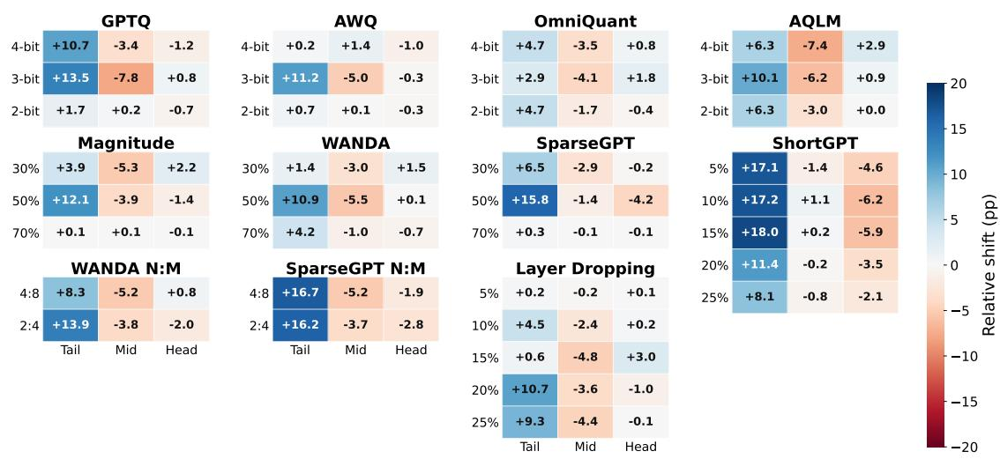

Figure 18: Relative retention shifts across different popularity groups on Head-to-Tail for Qwen3-8B under different compression methods and settings. Positive values indicate that a group retains a larger fraction of its base-model accuracy than the model overall, while negative values indicate lower relative retention. Values are reported in percentage points.  
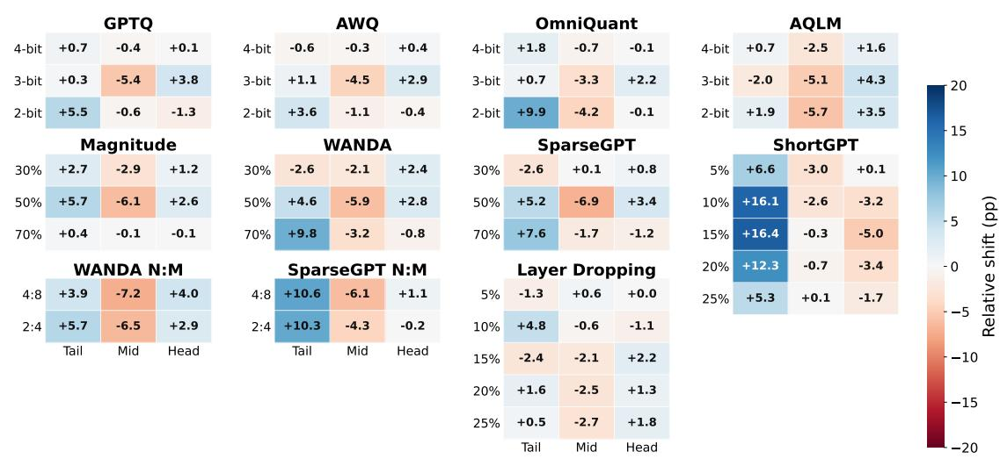  
Figure 19: Relative retention shifts across different popularity groups on Head-to-Tail for Gemma-2-9B under different compression methods and settings. Positive values indicate that a group retains a larger fraction of its base-model accuracy than the model overall, while negative values indicate lower relative retention. Values are reported in percentage points.

BBQ subgroup behavior. Figures 41–43 show the overall BBQ change with the three displayed subgroups: African American, Low SES, and Disabled. Across all plotted configurations, the overall BBQ change ranges from approximately —5 to +4 percentage points and is predominantly negative. The aggregate effect on BBQ is therefore numerically smaller than many of the gender-level movements observed on WinoBias. Nevertheless a change concentrated within one demographic category contributes only partially to an average computed over the full benchmark. This differs from the most visually direct WinoBias examples, where male- and female-pronoun point estimates move in opposite directions. Therefore, the current BBQ figures support conclusions only at the level of the three displayed aggregates. They do not separately display individual identities within the disability or other social dimensions.

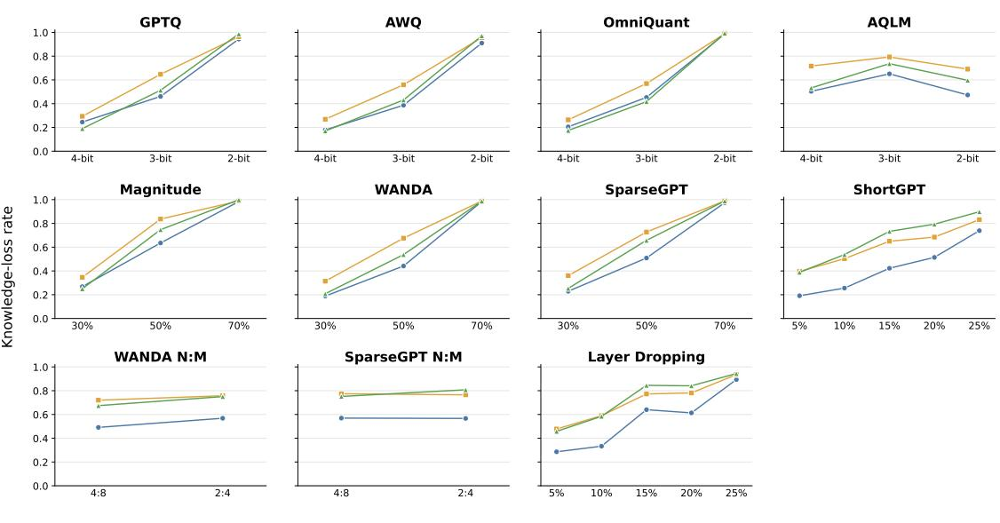

Figure 20: Knowledge-loss rates across different popularity groups on PopQA for L1ama-3.1-8B-Instruct under additional compression methods and settings.  
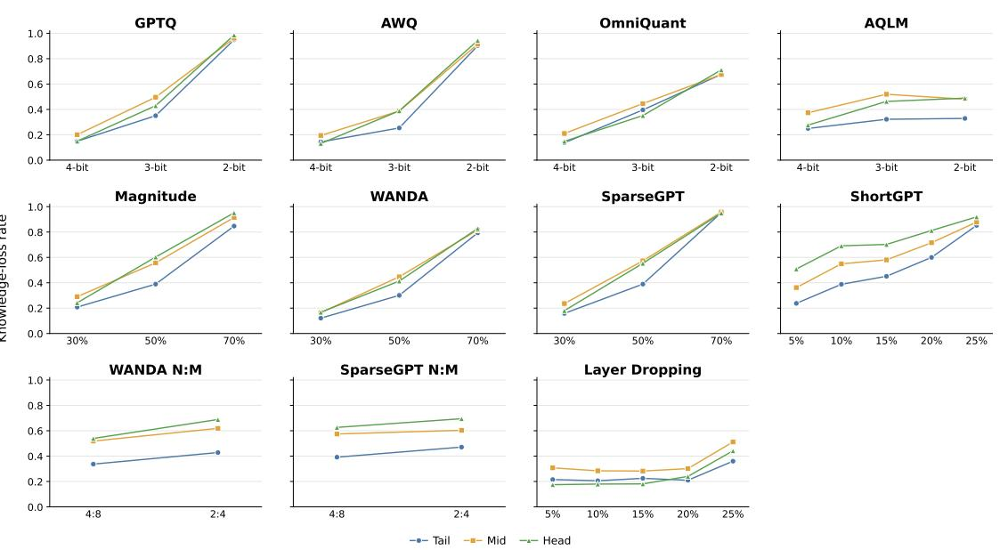  
Figure 21: Knowledge-loss rates across different popularity groups on PopQA for Qwen3-8B under different compression methods and settings.

RQ3 takeaway. The additional results provide descriptive evidence that the observed compressioninduced changes do not follow a stable directional pattern. Small aggregate changes can coexist with opposing subgroup movements, unequal movements in the same direction, or changes concentrated in a subgroup. Consequently, stronger claims about subgroups require fine-grained estimates accompanied by sample sizes and an analysis that accounts for selecting the largest effect from many candidate subgroups.

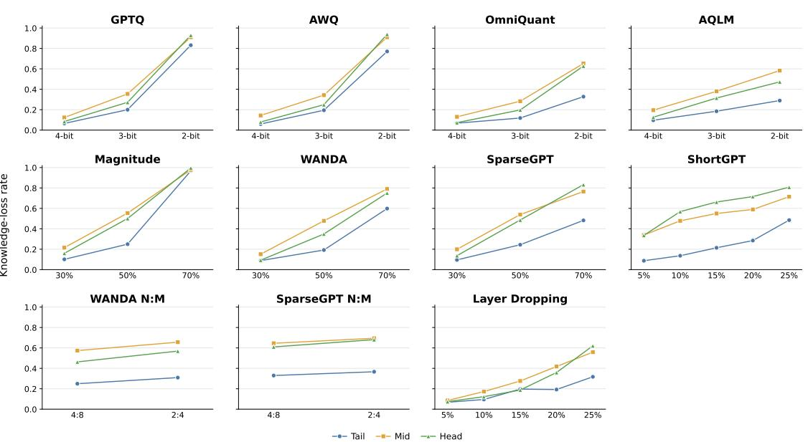  
Figure 22: Knowledge-loss rates across different popularity groups on PopQA for Gemma-2-9B under different compression methods and settings.

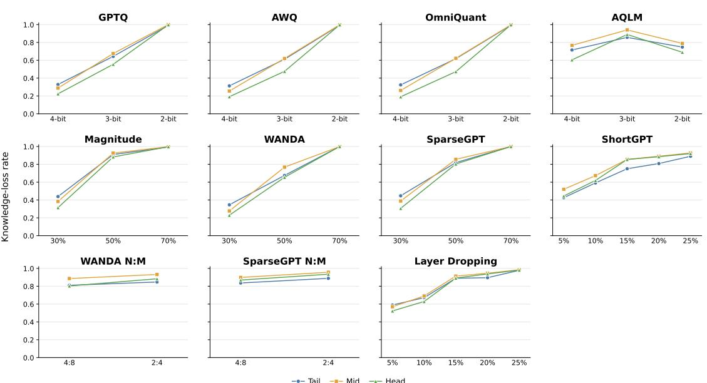  
Figure 23: Knowledge-loss rates across different popularity groups on Head-to-Tail for L1ama-3.1-8B-Instruct under different compression methods and settings.

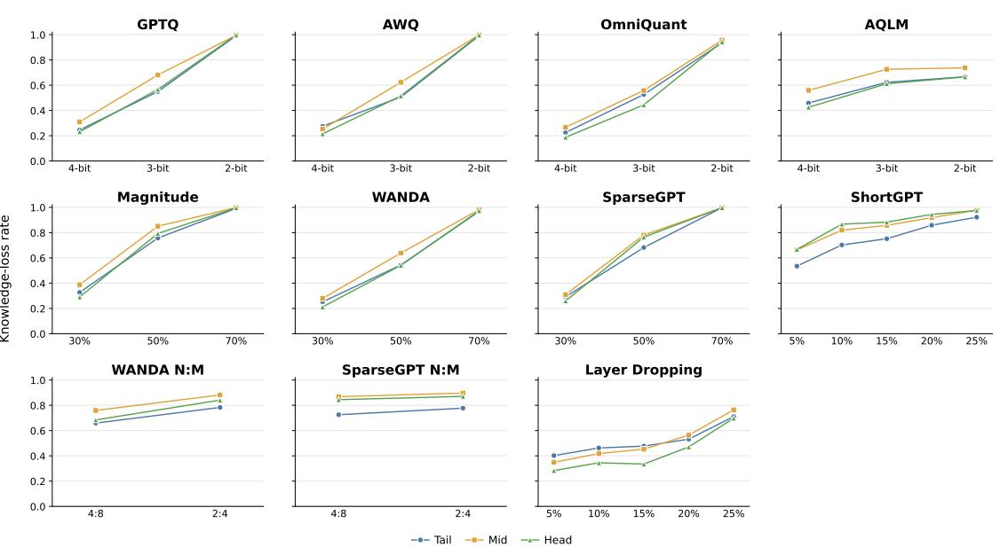  
Figure 24: Knowledge-loss rates across different popularity groups on Head-to-Tail for Qwen3-8B under different compression methods and settings.

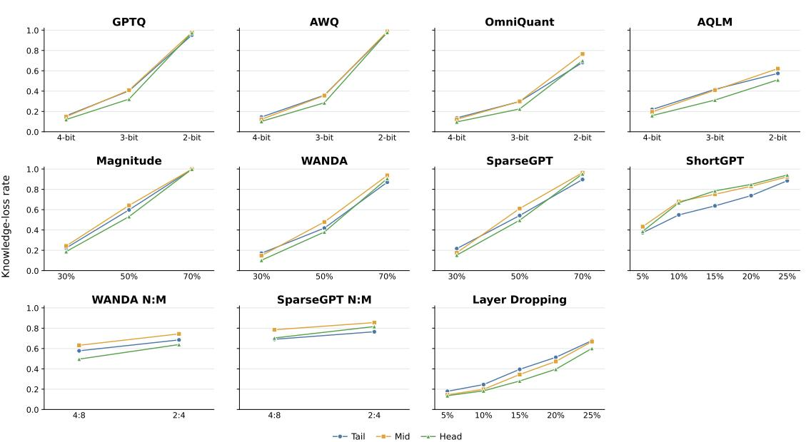  
Figure 25: Knowledge-loss rates across different popularity groups on Head-to-Tail for Gemma-2-9B under different compression methods and settings.

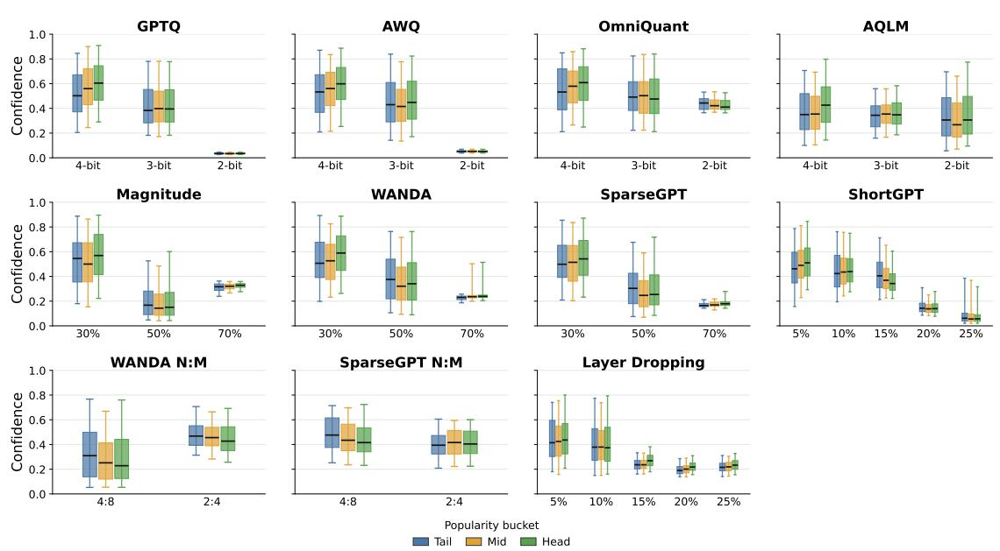  
Figure 26: Calibrated confidence assigned to lost knowledge across different popularity groups on PopQA for Llama-3.1-8B-Instruct under additional compression methods and settings.

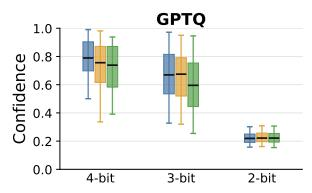

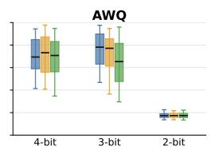

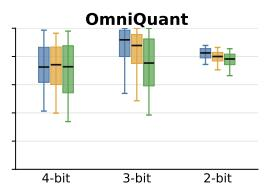

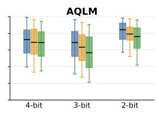

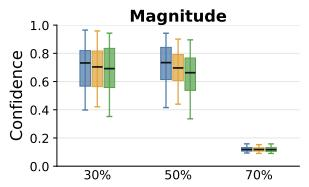

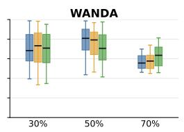

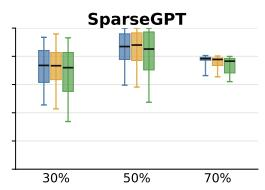

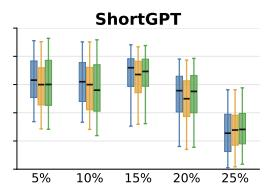

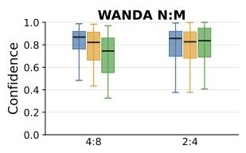

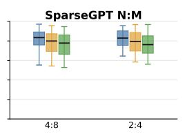

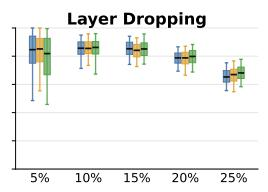  
Figure 27: Calibrated confidence assigned to lost knowledge across different popularity groups on PopQA for Qwen3-8B under additional compression methods and settings.

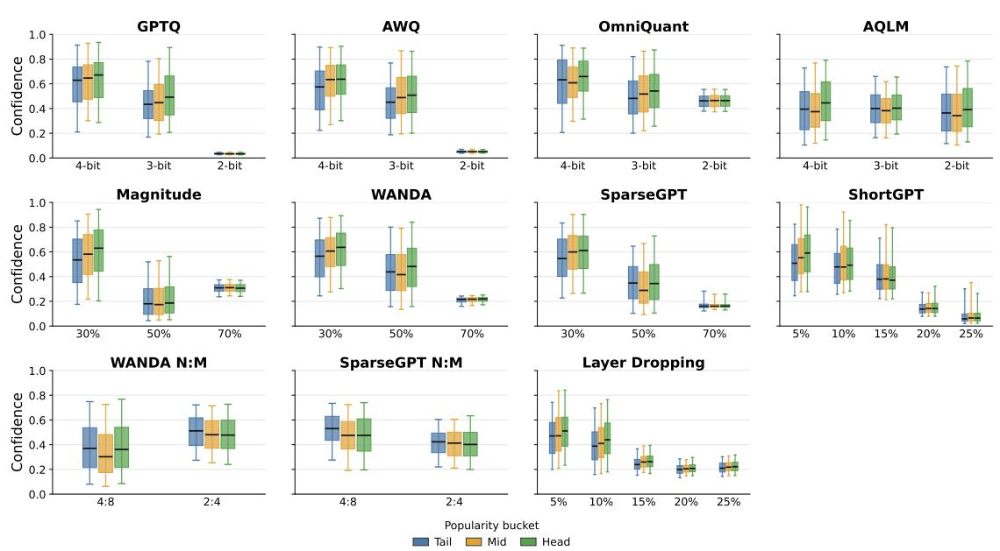

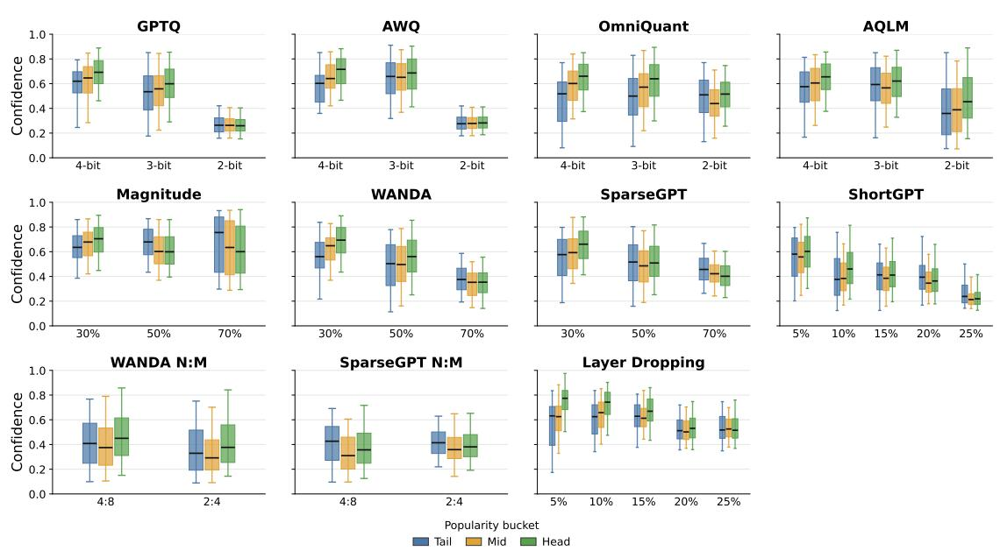  
Figure 28: Calibrated confidence assigned to lost knowledge across different popularity groups on PopQA for Gemma-2-9B under additional compression methods and settings.  
Figure 29: Calibrated confidence assigned to lost knowledge across different popularity groups on Head-to-Tail for Llama-3.1-8B-Instruct under all compression methods and settings.

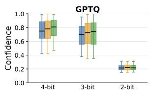

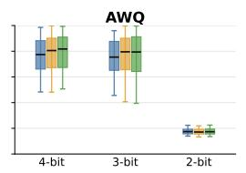

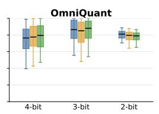

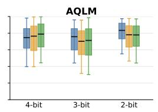

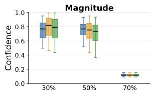

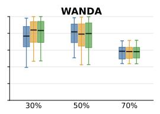

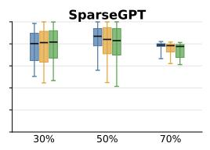

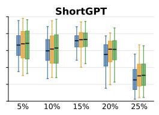

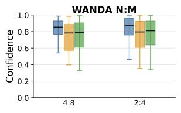

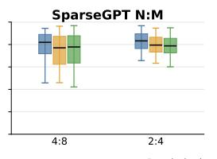

  
Figure 30: Calibrated confidence assigned to lost knowledge across different popularity groups on Head-to-Tail for Qwen3-8B under all compression methods and settings.


  
Figure 31: Calibrated confidence assigned to lost knowledge across different popularity groups on Head-to-Tail for Gemma-2-9B under all compression methods and settings

  
Figure 32: Calibrated reliability diagrams on PopQA for L1ama-3.1-8B-Instruct across all compression methods and settings. The diagonal line represents perfect calibration.

  
Figure 33: Calibrated reliability diagrams on PopQA for Qwen3-8B across all compression methods and settings. The diagonal line represents perfect calibration.

  
Figure 34: Calibrated reliability diagrams on PopQA for Gemma-2-9B across all compression methods and settings. The diagonal line represents perfect calibration.

  
Figure 35: Calibrated reliability diagrams on Head-to-Tail for L1ama-3.1-8B-Instruct across all compression methods and settings. The diagonal line represents perfect calibration.

  
Figure 36: Calibrated reliability diagrams on Head-to-Tail for Qwen3-8B across all compression methods and settings. The diagonal line represents perfect calibration

  
Figure 37: Calibrated reliability diagrams on Head-to-Tail for Gemma-2-9B across all compression methods and settings. The diagonal line represents perfect calibration,


  
Figure 38: Overall and gender-subgroup changes in stereotypical preference on WinoBias for Llama-3.1-8B-Instruct under additional compression methods and settings. Blue and orange bars show the changes for male and female subgroups, respectively, while black bars show the overall change. Error bars denote 95% confidence intervals. Positive values indicate increased stereotypical preference after compression. The dashed vertical line denotes no change from the base model. All values are reported in percentage points.  
Figure 39: Overall and gender-subgroup changes in stereotypical preference on WinoBias for Qwen3-8B under different compression methods and settings. Blue and orange bars show the changes for male and female subgroups, respectively, while black bars show the overall change. Error bars denote 95% confidence intervals. Positive values indicate increased stereotypical preference after compression. The dashed vertical line denotes no change from the base model. All values are reported in percentage points.

  
Figure 40: Overall and gender-subgroup changes in stereotypical preference on WinoBias for Gemma-2-9B-it under different compression methods and settings. Blue and orange bars show the changes for male and female subgroups, respectively, while black bars show the overall change. Error bars denote 95% confidence intervals. Positive values indicate increased stereotypical preference after compression. The dashed vertical line denotes no change from the base model. All values are reported in percentage points.

  
Figure 41: Overall and subgroup-level changes in stereotypical preference on BBQ for L1ama-3.1-8B-Instruct under different compression methods and settings. Colored bars show the changes for different demographic subgroups, while black bars show the overall change. Error bars denote 95% confidence intervals. Positive values indicate increased stereotypical preference after compression. The dashed vertical line denotes no change from the base model. All values are reported in percentage points.

  
Figure 42: Overall and subgroup-level changes in stereotypical preference on BBQ for Qwen3-8B under different compression methods and settings. Colored bars show the changes for different demographic subgroups, while black bars show the overall change. Error bars denote 95% confidence intervals. Positive values indicate increased stereotypical preference after compression. The dashed vertical line denotes no change from the base model. All values are reported in percentage points.

  
Figure 43: Overall and subgroup-level changes in stereotypical preference on BBQ for Gemma-2-9B-it under different compression methods and settings. Colored bars show the changes for different demographic subgroups, while black bars show the overall change. Error bars denote 95% confidence intervals. Positive values indicate increased stereotypical preference after compression. The dashed vertical line denotes no change from the base model. All values are reported in percentage points.

<table><tr><td>Rank</td><td>Gender</td><td>Occupation</td><td>Compression Configuration</td><td>Base  $B _ { g } \left( \% \right)$ </td><td>Comp.  $B _ { g } \left( \% \right)$ </td><td> $\Delta B _ { g }$  (pp)</td><td> $\overline { { \Delta B } }$  (pp)</td></tr><tr><td colspan="6">Llama-3.1-8B-Instruct</td><td></td><td></td></tr><tr><td>1</td><td>Female</td><td>Secretary</td><td>SparseGPT N:M (2:4)</td><td>71.9</td><td>18.8</td><td>-53.1</td><td>-2.2</td></tr><tr><td>3</td><td>Female</td><td>Auditor</td><td>SparseGPT N:M (4:8)</td><td>82.1</td><td>32.1</td><td>-50.0</td><td>+2.3</td></tr><tr><td>8</td><td>Male</td><td>Analyst</td><td>SparseGPT N:M (2:4)</td><td>50.0</td><td>2.5</td><td>-47.5</td><td>-2.2</td></tr><tr><td>9</td><td>Female</td><td>Clerk</td><td>SparseGPT N:M (2:4)</td><td>78.6</td><td>32.1</td><td>-46.4</td><td>-2.2</td></tr><tr><td colspan="2">Qwen3-8B</td><td></td><td></td><td></td><td></td><td></td><td></td></tr><tr><td>2</td><td>Male</td><td>Sheriff</td><td>Magnitude (50%)</td><td>59.6</td><td>7.7</td><td>-51.9</td><td>-8.2</td></tr><tr><td>4</td><td>Female</td><td>Clerk</td><td>Magnitude (50%)</td><td>67.9</td><td>17.9</td><td>-50.0</td><td>-8.2</td></tr><tr><td>5</td><td>Female</td><td>Nurse</td><td>ShortGPT (20%)</td><td>77.8</td><td>27.8</td><td>-50.0</td><td>-4.2</td></tr><tr><td>6</td><td>Male</td><td>Developer</td><td>SparseGPT N:M (2:4)</td><td>71.9</td><td>21.9</td><td>-50.0</td><td>-4.0</td></tr><tr><td>7</td><td>Female</td><td>Attendant</td><td>Magnitude (50%)</td><td>61.8</td><td>12.7</td><td>-49.1</td><td>-8.2</td></tr><tr><td>10</td><td>Female</td><td>Counselor</td><td>Magnitude (50%)</td><td>66.1</td><td>19.6</td><td>-46.4</td><td>-8.2</td></tr></table>

Table 4: The ten largest absolute occupation-level bias changes on WinoBias among the retained compression configurations. Base and compressed subgroup bias scores are reported as percentages, while subgroup changes $\Delta B _ { g }$ and overall changes $\Delta B$ are reported in percentage points.

<table><tr><td>Rank Category</td><td>Subgroup</td><td>Compression Configuration</td><td>Base  $B _ { g } \left( \% \right)$ </td><td>Comp.  $B _ { g }$  (%)</td><td> $\overline { { \Delta B _ { g } } }$   $\overline { { \Delta B } }$  (pp) (pp)</td></tr><tr><td colspan="4">Llama-3.1-8B-Instruct</td><td></td><td></td></tr><tr><td>8 Disability</td><td>People with cognitive disabilities or mental illness</td><td>SparseGPT N:M (4:8)</td><td>40.6</td><td></td><td> $5 9 . 4 \ + 1 8 . 8 \ - 1 . 7$ </td></tr><tr><td>9 Disability</td><td>People with cognitive disabilities or mental illness</td><td>WANDA N:M (2:4)</td><td>40.6</td><td></td><td> $5 9 . 4 \ : + 1 8 . 8 \ : - 3 . 1$ </td></tr><tr><td colspan="4">Qwen3-8B</td><td></td><td></td></tr><tr><td>1 Disability</td><td>Down&#x27;s syndrome</td><td>ShortGPT (10%)</td><td>37.5</td><td></td><td> $7 5 . 0 \ + 3 7 . 5 \ - 1 . 2$ </td></tr><tr><td>2 Disability</td><td>Down&#x27;s syndrome</td><td>ShortGPT (15%)</td><td>37.5</td><td></td><td> $7 5 . 0 \ + 3 7 . 5 \ - 1 . 4$ </td></tr><tr><td>3 Disability</td><td>Down&#x27;s syndrome</td><td>ShortGPT (5%)</td><td>37.5</td><td></td><td> $6 2 . 5 ~ + 2 5 . 0 ~ - 1 . 1$ </td></tr><tr><td>4 Disability</td><td>People with cerebral palsy</td><td>SparseGPT (50%)</td><td>56.3</td><td></td><td> $8 1 . 3 ~ + 2 5 . 0 ~ - 1 . 0$ </td></tr><tr><td>10 Disability</td><td>Down&#x27;s syndrome</td><td>Magnitude (30%)</td><td>37.5</td><td></td><td> $5 6 . 3 \ + 1 8 . 8 \ - 1 . 1$ </td></tr><tr><td colspan="4">Gemma-2-9B-it</td><td></td><td></td></tr><tr><td>5 Disability</td><td>Down&#x27;s syndrome</td><td>ShortGPT (15%)</td><td>50.0</td><td></td><td> $7 5 . 0 \ + 2 5 . 0 \ - 0 . 5$ </td></tr><tr><td>6 Disability</td><td>Down&#x27;s syndrome</td><td>ShortGPT (25%)</td><td>50.0</td><td></td><td> $7 5 . 0 \ + 2 5 . 0 \ - 1 . 0$ </td></tr><tr><td>7 Nationality Italian</td><td></td><td>WANDA N:M (2:4)</td><td>57.5</td><td></td><td> $3 7 . 5 \ - 2 0 . 0 \ + 0 . 1$ </td></tr></table>

Table 5: The ten largest absolute subgroup-level bias changes on BBQ among the retained compression configurations. Base and compressed subgroup bias scores are reported as percentages, while subgroup changes $\Delta B _ { g }$ and overall changes $\Delta B$ are reported in percentage points.