# WHEN TEXT AND NUMBERS DISAGREE: EVIDENCE ARBITRATION IN LARGE LANGUAGE MODELS

A PREPRINT

Mattia Carletti<sup>1</sup>, Edward Phillips<sup>1</sup>, Fredrik K. Gustafsson<sup>1</sup>, Patitapaban Palo<sup>1</sup>, Lei Clifton<sup>2</sup>, Danielle Belgrave<sup>3</sup>, Xiao Gu<sup>1</sup>, David A. Clifton<sup>1,4</sup>

<sup>1</sup>Department of Engineering Science, University of Oxford, Oxford, UK <sup>2</sup>Nuffield Department of Primary Care Health Sciences, University of Oxford, Oxford, UK <sup>3</sup>GlaxoSmithKline, London, UK

<sup>4</sup>Oxford Suzhou Centre for Advanced Research, University of Oxford, Suzhou, Jiangsu, China

## ABSTRACT

Large language models (LLMs) are increasingly used in settings where textual summaries, numerical observations, and external tool outputs may provide conflicting evidence. We study how LLMs arbitrate between such sources when they support opposing decisions. To do so, we introduce a controlled synthetic benchmark in which latent risk trajectories generate both numerical time series and natural language summaries, allowing us to construct conflicts where exactly one evidence source is aligned with the ground-truth label. This design lets us independently manipulate modality, temporal recency, source reliability, and evidence provenance. Across open-weight instruction-tuned models, we find that arbitration behaviour is systematic rather than random: models exhibit distinct text-versus-number preferences, follow temporal recency more consistently than explicit reliability cues, and can over-rely on external forecasts even when they conflict with direct contextual evidence. These results suggest that current LLMs often rely on heuristic arbitration strategies when integrating heterogeneous evidence, highlighting a failure mode for tool-augmented decision systems.

Keywords Large Language Models · Multimodal Reasoning · Evidence Integration · Conflict Resolution · Numerical Reasoning

## 1 Introduction

In many real-world decision-making scenarios, different sources of evidence may support conflicting conclusions. In healthcare, for example, a clinician’s assessment may describe a patient as stable while vital signs indicate ongoing deterioration. Similarly, in manufacturing, sensor readings may suggest normal machine operation even as maintenance reports point to impending failure. Such inconsistencies can arise for several reasons, including temporal mismatches between data sources (Figure 1), differences in source reliability, or the integration of observational evidence with inaccurate predictions generated by external tools.

Large Language Models (LLMs) are increasingly being explored in high-stakes domains such as healthcare, mental health, and finance [Burton et al., 2024, Johri et al., 2025, Goh et al., 2025, Heinz et al., 2025, Wang et al., 2026, Xie et al., 2024, Hu and Zhao, 2026], while also being incorporated into decision-making and agentic systems that integrate external tools and heterogeneous data sources [Qin et al., 2024, Li, 2025, Yao et al., 2022]. Understanding how these models behave when confronted with conflicting evidence is therefore increasingly important.

In this work, we use the term arbitration to refer to how models prioritize or reconcile competing signals when different sources support incompatible conclusions. Failures of arbitration may lead models to privilege stale, unreliable, or incorrect tool-generated evidence over more relevant observations, producing unreliable decisions even when the correct signal is present in the prompt.

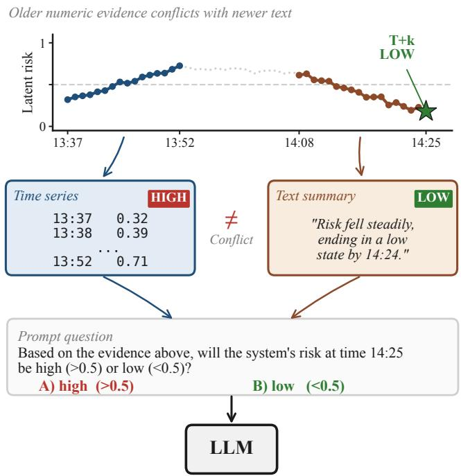  
Figure 1: Evidence arbitration under conflict. A numerical time series and a textual summary, drawn from different windows of a shared latent risk trajectory, support conflicting predictions at the target time T+k: HIGH for the older numerical source, LOW for the newer textual source. The task requires the model to decide which source to prioritize when answering the binary-choice prompt.

Prior work has studied conflicts between textual sources [Jiayang et al., 2024, Kurfali and Östling, 2025], between parametric and external knowledge [Xu et al., 2024, Wang et al., 2023, Shi et al., 2024, Sui et al., 2025, Khandelwal et al., 2025], and across modalities such as image and text [Liu et al., 2025a, Zhang et al., 2025, Jia et al., 2026, Shao et al., 2025]. Other work has examined numerical reasoning [Li et al., 2025, Lovering et al., 2025], time-series forecasting [Gruver et al., 2023, Jin et al., 2024, Jia et al., 2024, Liu et al., 2025b], and tool use in LLMs [Qin et al., 2024, Qu et al., 2025, Feng et al., 2025, Li, 2025]. However, these lines of work do not directly characterize how LLMs arbitrate between textual and numerical evidence, when these two support opposing decisions. This setting is increasingly relevant in applications where natural language summaries, numerical measurements, and external model or tool outputs are presented together.

In practice, conflicts between numerical and textual evidence are rarely attributable to modality alone. Instead, they arise from the interaction of multiple cues, including modality priors, temporal recency, source reliability, and evidence provenance (direct observations versus externally generated predictions). These cues can point in different directions: a newer textual report may contradict older numerical measurements, a reliable time series may conflict with a corrupted summary, or an external forecast may disagree with directly observed context. Systematically characterizing such behaviour is difficult in unconstrained real-world data because the reliability, provenance, and ground truth associated with each source are often ambiguous. To address this, we introduce a controlled synthetic benchmark in which these properties are known by construction.

The benchmark uses latent risk trajectories to generate both numerical time series and natural language summaries. This framework allows us to construct conflicts where exactly one evidence source is aligned with the ground-truth label, while independently manipulating modality, temporal recency, source reliability, and evidence provenance. Our objective is not to reproduce the full complexity of deployed decision-making systems, but to isolate arbitration tendencies that may otherwise be difficult to identify in real-world environments.

Across open-weight instruction-tuned models, we find that arbitration behaviour is systematic rather than random. Models exhibit distinct text-versus-number preferences, follow temporal recency more consistently than explicit reliability cues, and can over-rely on external forecasts even when they conflict with direct contextual evidence. These findings suggest that current LLMs often rely on heuristic arbitration strategies when integrating heterogeneous evidence.

Our contributions can be summarized as follows:

• We formulate textual–numerical evidence arbitration as a controlled evaluation setting for studying how LLMs prioritize conflicting textual and numerical evidence.

• We introduce a large-scale synthetic benchmark that disentangles the effects of modality, temporal recency, source reliability, and evidence provenance on model decisions.

• We uncover systematic arbitration biases and failure modes across modern LLM families, including modality preferences, prompt-order effects, and over-reliance on external forecasts, with implications in settings involving heterogeneous or tool-derived evidence.

## 2 Related Work

Conflict Resolution and Evidence Arbitration. A growing body of work has examined how LLMs handle conflicting information across different sources of knowledge. In retrieval-augmented and contextual generation settings, several studies investigate conflicts between parametric knowledge encoded in model weights and contextual knowledge provided at inference time and how LLMs behave under such discrepancies [Wang et al., 2023, Xu et al., 2024].

Building on this, recent approaches proposed mechanisms to improve conflict handling, including context-aware neuron reweighting [Shi et al., 2024], controlled integration of retrieved evidence through shared-private semantic modeling [Sui et al., 2025], and adaptive decoding strategies [Khandelwal et al., 2025]. Related work on text-only evidence conflicts further shows that LLMs often exhibit strong positional and stylistic biases when resolving contradictions and rarely express uncertainty in the presence of conflicting evidence [Jiayang et al., 2024, Kurfali and Östling, 2025].

More recently, researchers have extended the study of knowledge conflicts to multimodal settings, particularly inconsistencies between visual evidence and internal commonsense or textual reasoning [Liu et al., 2025a, Zhang et al., 2025, Shao et al., 2025, Jia et al., 2026].

In the context of evidence arbitration in LLMs, our work addresses the critical yet largely unexplored challenge of textual–numerical conflicts.

LLMs for Numerical Tasks. Recent work has explored how LLMs can be adapted to numerical and forecasting tasks through reprogramming, multimodal prompting, and cross-modal alignment techniques [Gruver et al., 2023, Jin et al., 2024, Jia et al., 2024, Langer et al., 2025, Liu et al., 2025b]. At the same time, several studies question the effectiveness of LLMs for numerical reasoning and forecasting, highlighting issues such as poor calibration, sensitivity to noise, weak temporal reasoning, and limited numerical understanding [Tan et al., 2024, Park et al., 2025, Li et al., 2025, Lovering et al., 2025]. Motivated by these limitations, we formulate our setting as a binary forecasting task rather than a purely numerical prediction problem, allowing us to study evidence arbitration without requiring precise numerical reasoning.

Tool-Augmented and Agentic LLM Systems. The rapidly growing subfield of tool-augmented and agentic LLMs has emphasized the role of iterative reasoning, planning, feedback, and external tool use in complex decision-making tasks [Yao et al., 2022, Qin et al., 2024, Qu et al., 2025, Feng et al., 2025, Li, 2025]. More recently, these paradigms have been extended to time series analysis, where LLM agents integrate textual reasoning with numerical and domain-specific evidence for forecasting and multi-step inference [Wang et al., 2024, Ye et al., 2026, Zhao et al., 2025]. Our work is closely related to this line of research, where models often need to integrate numerical evidence with language-based reasoning.

## 3 Textual–Numerical Evidence Arbitration

We now define the arbitration task and the controlled benchmark used to evaluate it. Each instance asks a model to make a binary prediction about a future target value from textual, numerical, and optionally tool-derived evidence. In the conflict settings, two evidence sources support opposing labels, with exactly one source aligned with the ground truth. We then describe the four conflict dimensions, the synthetic data and prompt generation pipeline, and the evaluation protocol.

## 3.1 Task Definition

We study textual–numerical evidence arbitration: the problem of deciding which source to prioritize when textual and numerical evidence supports incompatible conclusions. As illustrated in Figure 1, the model receives a prompt containing two evidence sources and must answer a binary-choice question about a future target value.

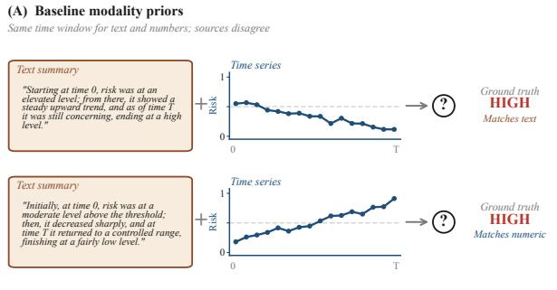

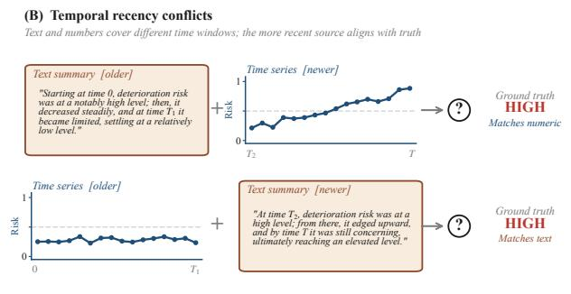

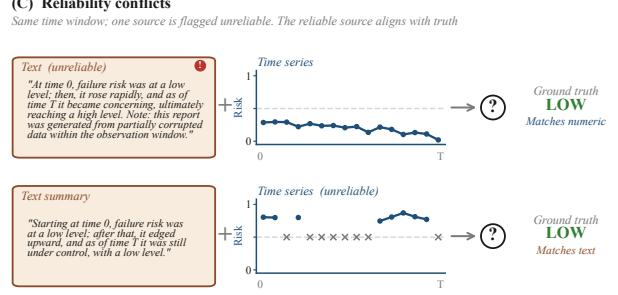

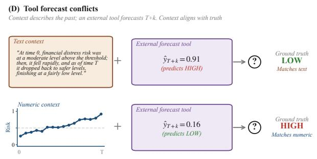  
Figure 2: Benchmark conflict settings for evidence arbitration. Each panel illustrates one of the four controlled conflict settings used in our evaluation. In every setting, two evidence sources support opposing decisions and exactly one source is aligned with the ground-truth label. (A) Baseline modality priors: both sources cover the same window [0, T] and merely disagree. (B) Temporal recency: sources cover different time windows; the more recent source is always aligned with truth. (C) Reliability: one source is marked as unreliable (a corruption note in text, missing values in numbers); the reliable source is aligned with truth. (D) Tool forecast: an external forecasting tool predicts a value at T+k that contradicts the observed context; context is aligned with truth.

Each instance is generated from a latent risk trajectory with values in [0, 1]. The model observes evidence derived from the trajectory up to time T and predicts whether the future value at T + k is HIGH (> 0.5) or LOW (< 0.5), where $k \geq 1$ . Evidence is presented as a serialized numerical time series, a natural language summary, or an external forecast. By construction, only one source is aligned with the ground-truth label, while the other supports the opposite label. The model must therefore infer which source to prioritize.

We use a coarse-grained binary forecasting objective rather than precise numerical prediction, in order to isolate arbitration behaviour under conflicting evidence while reducing confounds from known limitations of LLMs in fine-grained numerical forecasting [Tan et al., 2024, Park et al., 2025].

## 3.2 Conflict Dimensions

We evaluate arbitration behaviour using four conflict settings, summarized in Figure 2, which disentangle the effects of modality, temporal recency, source reliability, and evidence provenance.

Baseline Modality Priors. Textual and numerical evidence are matched in temporal scope and reliability, but support opposite labels. Across instances, the ground-truth-aligned source is alternated between text and numbers. This setting evaluates whether LLMs exhibit an inherent modality prior when resolving conflicts in the absence of additional arbitration cues.

Temporal Recency Conflicts. Textual and numerical evidence describe different temporal windows and support opposite labels. The more recent source is always aligned with the ground-truth label, and both sources are presented with explicit timestamps. This setting tests whether models use temporal recency as an arbitration cue when textual and numerical evidence disagree.

Reliability Conflicts. Textual and numerical evidence describe the same temporal window but differ in reliability. The reliable source is always aligned with the ground-truth label. For numerical evidence, unreliability is simulated by randomly masking 50% of time-series values using NaN entries; for textual evidence, it is indicated through an explicit statement that the source observations are incomplete or corrupted. This setting tests whether models appropriately discount evidence marked as unreliable during arbitration.

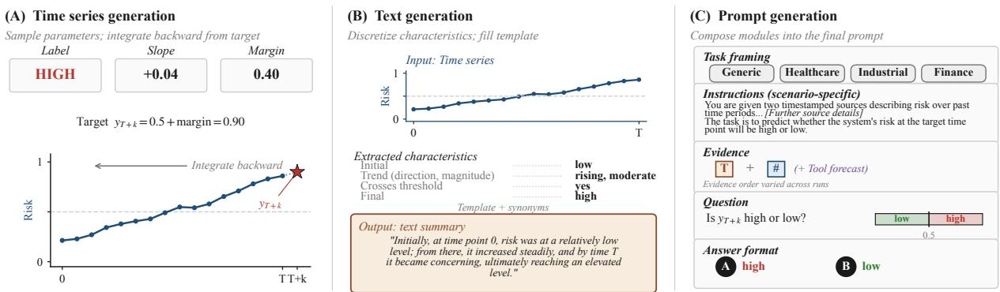  
Figure 3: Benchmark construction pipeline. A single example is traced through the three stages used to generate model prompts. (A) Time series generation: a sampled label, slope, and margin fix the target value $y _ { T + k } = 0 . 5 \pm \mathrm { { m a r g i n } } .$ from which the observed trajectory is generated by integrating backwards with additive noise. (B) Text generation: trajectory-level features are discretized and rendered as a natural language summary using templates and synonym sampling. (C) Prompt generation: the textual summary and numerical series are combined with task framing, evidence-order controls, and answer choices to produce the final binary-choice prompt.

Tool Forecast Conflicts. The model receives contextual evidence describing observations up to time T, in either textual or numerical form, together with a simulated external forecast for the target time T + k. The prompt explicitly states that the forecasting tool analyzed the same observations provided in the context before producing its prediction. By construction, however, the context is aligned with the ground-truth label, while the forecast supports the opposite label. Tool-generated forecasts are simulated as described in Appendix B.3. This adversarial tool-conflict setting evaluates whether models over-rely on tool-generated predictions even when they conflict with contextual evidence.

## 3.3 Benchmark Construction

Our framework comprises three main components: a time series generator, a text generator, and a prompt generator, as illustrated in Figure 3.

Time Series Generation. Latent risk trajectories follow a stochastic linear process with additive Gaussian noise and a latent slope parameter s controlling the overall trend direction and magnitude:

$$
\begin{array} { r } { x _ { t + 1 } = x _ { t } + s + \epsilon _ { t } , \qquad \epsilon _ { t } \sim \mathcal { N } ( 0 , \sigma ^ { 2 } ) . } \end{array}
$$

To generate each trajectory, we first sample the label, the latent slope s, and a margin m around the decision threshold 0.5 (Figure 3A). The target value at horizon T + k is then set to 0.5 + m for HIGH and 0.5 − m for LOW. We generate the observed trajectory backward from step T to step 1 using the corresponding reverse-time recursion. More detail about the time series generation procedure are provided in Appendix B.1. For the main arbitration experiments, we use observed trajectories of length T = 16, and a forecasting horizon of k = 1 to keep task difficulty manageable. Each value is paired with a generated timestamp, allowing the series to be serialized into a temporally grounded representation. We use a simulated sampling frequency of one minute in all experiments. For each conflict dimension, we construct balanced datasets with equal numbers of HIGH and LOW labels. Examples of generated trajectories are shown in Figure A1 in the appendix.

Text Generation. The text generator converts each time series into a natural language description of its overall trajectory (Figure 3B). We extract a small set of high-level characteristics from the series, including the initial level, the direction and strength of the overall trend, whether the trajectory stays on the same side of the decision threshold or transitions across it, and the final position relative to the threshold. These characteristics are discretized into semantic categories (e.g., low/moderate/high initial level, weak/moderate/strong increase or decrease, slightly or moderately above/below the threshold) and mapped to predefined natural language phrases through template-based rules. The selected phrases are then composed into complete textual summaries using randomized synonym and template choices to increase linguistic variability while preserving semantic consistency. More details about the text generation procedure are provided in Appendix B.2. To maintain a clear separation between textual and numerical evidence, the generated descriptions never include explicit numerical values or exact measurements from the underlying time series.

To create conflicts between textual and numerical evidence, we keep the original numerical evidence unchanged and sample a second trajectory conditioned on the opposite label. This newly generated series is then converted into text using the same generation pipeline, yielding textual evidence that is semantically coherent but inconsistent with the accompanying numerical evidence.

Prompt Generation. Prompts are constructed in a modular fashion (Figure 3C). The first component introduces the task and optionally provides domain-specific framing. We consider a generic framing, along with three domain-specific instantiations: healthcare, industrial, and finance. We then present the available evidence, which may include textual summaries, numerical time series observations, and/or simulated external forecast predictions. After presenting the evidence, the prompt explicitly asks the model to predict whether the target risk value will be HIGH or LOW. The prediction is formulated as a binary-choice decision between answer options “A” and “B”. We provide examples of full prompts in Appendix C.7. We systematically control the order in which evidence sources are presented (i.e., whether the source aligned with the ground truth appears first or last in the prompt). This manipulation allows us to study how evidence presentation order influences arbitration behaviour. Additional details on prompt design can be found in Appendix C.

## 3.4 Evaluation Protocol

We evaluate arbitration behaviour using prompt templates tailored to each experiment and applied consistently across all models. For each sample, the model selects one of the two answer options $( ^ { 6 6 } \mathrm { A } ^ { 3 } \ \mathrm { o r } \ ^ { 6 6 } \mathrm { B } ^ { 3 , - } )$ based on the provided textual and/or numerical evidence. Predictions are then obtained directly from the logits associated with the binary answer tokens, which are mapped to the corresponding labels.

For each experiment, we report classification accuracy under conflicting evidence conditions, alongside unimodal reference conditions in which only the evidence source aligned with the ground truth is provided. Unless otherwise specified, all experiments use the default configuration shown in Table A1. Results are averaged across three random seeds.

## 3.5 Models

We evaluate a diverse set of open-weight instruction-tuned LLMs spanning multiple architectures and parameter scales, including the Qwen3 family (1.7B, 4B, 8B, and 14B) [Yang et al., 2025], Gemma-2-9B-It (Gemma) [Team et al., 2024], Llama-3-8B-Instruct (Llama) [Grattafiori et al., 2024], and Mistral-7B-Instruct-v0.3 (Mistral) [Jiang et al., 2023]. Thi selection enables comparisons both across model families and within a controlled scaling series.

## 4 Results

We evaluate arbitration behaviour across a range of controlled conflict settings designed to isolate the effects of modality, temporal recency, source reliability, and evidence provenance, as well as through sensitivity analyses examining the impact of domain instantiations and answer choice configurations. For the main arbitration experiments, we generate balanced datasets containing 2000 instances per setting (1000 per label), while sensitivity analyses use 1000 instances per setting for computational efficiency.

## 4.1 Baseline Modality Priors

Results in Figures 4A–4B show that all models achieve very high unimodal accuracy, indicating that performance differences in the conflicting setting primarily reflect arbitration behaviour rather than intrinsic task difficulty. Distinct modality priors emerge across model families. Qwen3 models consistently favour numerical evidence, whereas Llama and Mistral models show comparatively stronger reliance on textual evidence. Gemma exhibits the most balanced behaviour between the two modalities.

The numerical preference of Qwen3 is particularly pronounced: all Qwen3 variants systematically favour numerical evidence even when it conflicts with perfectly predictive textual context. No clear monotonic relationship with model size is observed. In contrast, the complementary behaviour of Llama and Mistral may partially reflect weaker overall capability to interpret the numerical evidence, as these models also obtain slightly lower unimodal numerical-only accuracies compared to Qwen3 and Gemma.

Baseline modality priors | Prompt order: GT source last

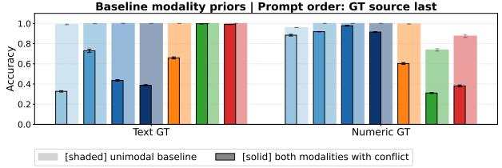  
(A)

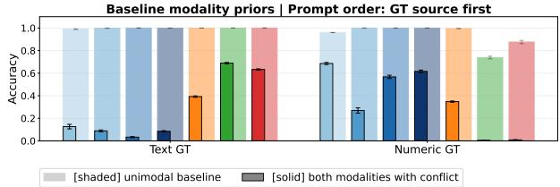  
(B)  
Temporal recency conflicts | Prompt order: GT source first

Temporal recency conflicts | Prompt order: GT source last  
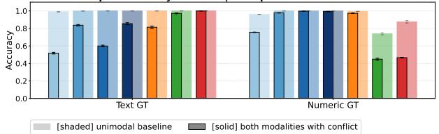  
(C)

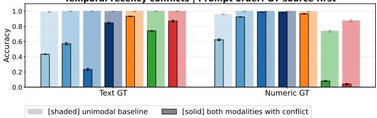  
(D)

Reliability conflicts | Prompt order: GT source las  
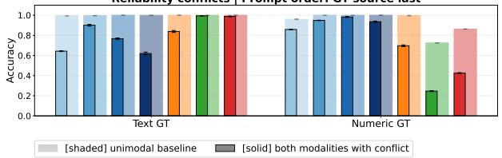  
(E)  
Reliability conflicts | Prompt order: GT source first

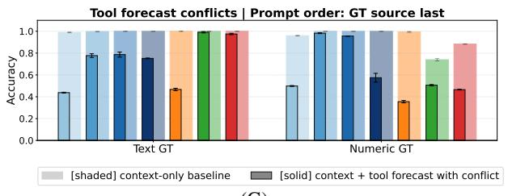  
(G)

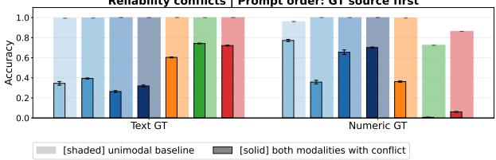  
(F)

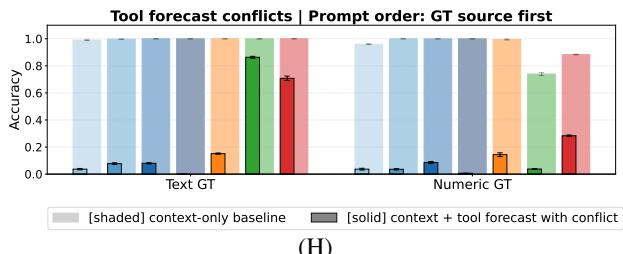  
(H)  
Figure 4: Arbitration accuracy under conflicting evidence. Panels show classification accuracy across the four conflict settings and evidence-order conditions: (A–B) baseline modality priors, (C–D) temporal recency, (E–F) reliability, and (G–H) tool forecast conflicts. In each setting, exactly one evidence source is aligned with the groundtruth label (GT). Shaded bars show unimodal reference accuracy using only the ground-truth-aligned source, while solid bars show accuracy when both conflicting sources are provided. Results are averaged over three random seeds.

Evidence order substantially affects arbitration behaviour across nearly all models. Accuracy is generally higher when the source aligned with the ground truth appears later in the prompt, revealing a strong prompt recency effect. This effect interacts with modality priors: numerical evidence remains influential regardless of position, whereas textual evidence benefits much more strongly from appearing last. In several conditions, larger Qwen3 variants even fall below chance (accuracy below 0.5) when textual evidence is correct and numerical evidence conflicts, suggesting a systematic bias toward numerical evidence rather than simple uncertainty.

## 4.2 Temporal Recency Conflicts

As shown in Figures 4C–4D, compared to the baseline modality prior setting, the temporal recency setting produces much stronger and more consistent arbitration behaviour across model families, suggesting that temporal recency is a particularly influential cue for resolving conflicting evidence. We observe that the order of evidence presentation again has a substantial effect: performance is generally higher when the most recent source is presented later in the prompt, reinforcing the prompt recency effects already observed in the baseline experiments. Nevertheless, models differ in their sensitivity to evidence order.

Gemma exhibits the most consistent behaviour, maintaining high accuracy regardless of evidence order. Qwen3 models also follow temporal recency cues very reliably, although some variants are more sensitive to prompt ordering than Gemma. As in the baseline experiments, no clear monotonic relationship with model size is observed.

## 4.3 Reliability Conflicts

Across both evidence order settings (Figures 4E–4F), reliability conflicts produce larger performance drops than temporal recency conflicts across most models, suggesting that explicit source reliability is a weaker arbitration cue than temporal recency. Gemma again exhibits the most stable behaviour across ordering conditions, whereas Qwen3 variants appear more sensitive to evidence order despite achieving some of the highest peak accuracies.

## 4.4 Tool Forecast Conflicts

Figures 4G–4H show that tool forecast conflicts produce the strongest degradation observed across all experiments, indicating that many models heavily over-rely on external forecasts even when these systematically conflict with the provided contextual measurements.

Evidence order has a particularly strong effect in this setting. Accuracy improves substantially when the contextual evidence is presented after the tool forecast, indicating that later evidence can partially mitigate over-reliance on the external prediction. Relative to the baseline modality-prior experiments, the introduction of an explicit forecast greatly amplifies arbitration failures, especially for Qwen3 and Gemma. These models are particularly susceptible when the ground-truth-aligned contextual evidence appears first, often achieving near-zero accuracy despite perfectly predictive contextual evidence.

Llama and Mistral are substantially less influenced by incorrect tool forecasts, frequently retaining relatively high accuracy even in the conflicting setting.

## 4.5 Sensitivity Analysis

To assess robustness to domain instantiation and answer choice configuration, we perform sensitivity analyses in the same setting used for the baseline modality prior experiments. We vary either the domain or the answer choice configuration, while keeping all remaining parameters fixed to the default hyperparameter values in Table A1 and using the default domain (i.e., generic), label semantics (“A”=HIGH), and answer ordering (i.e., “A” first) as the baseline configuration. For each sweep condition, we compute accuracy differences relative to this baseline and report the absolute deltas aggregated across sweep values, seeds and evidence-order settings as mean ± standard deviation, separately for each model.

As shown in Table A2, sensitivity to both domain specialization and answer choice configuration is generally low in text-only settings, but more noticeable effects emerge in numeric-only and conflicting settings for several models. In particular, answer choice perturbations can produce significant shifts in conflict accuracy despite relatively stable unimodal performance, indicating that arbitration behaviour can depend on superficial prompt structure. Robustness also tends to improve with scale within the Qwen3 family, with the 14B model remaining comparatively stable acros all settings. Additional sensitivity analyses on data-generation parameters are described in Appendix E.

## 5 Discussion

Across all experiments, arbitration behaviour is highly systematic rather than random. Models consistently rely on salient evidence characteristics, including modality, temporal recency, source reliability, and external forecasts, even when these cues conflict with the ground truth. Temporal recency emerges as the most consistently followed arbitration signal across model families, whereas reliability cues are weaker and lead to substantially larger performance degradation. External forecasts are particularly influential: tool forecast conflicts produce the strongest failures overall, indicating that many models heavily privilege explicit predictions over directly observed contextual measurements.

Distinct arbitration patterns also emerge across model families. Qwen3 models consistently favour numerical evidence and are especially susceptible to misleading external forecasts, while Llama and Mistral rely comparatively more on textual evidence, albeit with overall lower accuracy. Gemma exhibits the most balanced and stable behaviour across settings. Importantly, these behaviours do not scale monotonically with model size within the Qwen3 family, suggesting that arbitration biases are not simply a function of parameter count.

Evidence presentation order plays a major role in arbitration. Across all experimental settings, evidence presented later in the prompt tends to exert greater influence on the final prediction, partially overriding earlier conflicting information.

This positional effect often amplifies the underlying arbitration cue itself, for example strengthening the influence of temporally recent evidence or external forecasts when they appear last. Sensitivity analyses further show that arbitration behaviour also can vary under changes in answer choice configuration and domain framing, although these effects are generally smaller.

Several settings produce below-chance or near-zero accuracy. This indicates that models are not merely uncertain under conflict, but can systematically favour incorrect evidence sources. Overall, the results suggest that current LLMs rely heavily on heuristic arbitration strategies rather than robust evidence integration, making them vulnerable to predictable and systematic failures in multi-source decision-making settings.

## 6 Conclusion

As LLMs are increasingly embedded in decision-making pipelines, their ability to handle conflicting evidence becomes central to their reliability. This work studied evidence arbitration between textual summaries, numerical observations, and external tool outputs that support incompatible conclusions, by introducing a controlled synthetic benchmark that isolates key arbitration cues (modality, temporal recency, source reliability, and evidence provenance).

Our results show that LLMs do not resolve such conflicts randomly. Instead, they exhibit systematic, model-specific arbitration patterns, often relying on heuristic cues when deciding which evidence to trust. Temporal recency is followed more consistently than explicit reliability information, while external forecasts can exert disproportionate influence even when they conflict with direct contextual evidence.

These findings suggest that evaluating LLMs on isolated textual, numerical, or tool-use tasks is insufficient for understanding their behaviour in multi-source decision settings. Conflict-based evaluations provide a useful stress test for evidence integration, and we hope this benchmark motivates further work on arbitration under real-world source conflicts in tool-augmented systems.

## Limitations

This work does not include experiments on real-world data. Instead, the synthetic framework intentionally simplifies real-world decision-making settings in order to provide full control over arbitration cues, including temporal recency, source reliability, and evidence provenance, enabling systematic analysis of arbitration behaviour under conflict.

In addition, our task formulation casts forecasting as a binary decision problem, which does not capture the full complexity of numerical forecasting tasks. However, this design reduces confounds arising from known limitations of current LLMs in accurate numerical prediction, allowing cleaner evaluation of how models prioritize conflicting evidence sources.

Potential Risks. Our benchmark is intended solely for evaluating evidence arbitration in LLMs and should not be interpreted as guidance for deploying such models in high-stakes decision-making settings.

## Acknowledgments

DAC was funded by an NIHR Research Professorship (NIHR302440); a Royal Academy of Engineering Research Chair; and the InnoHK Hong Kong Centre for Cerebro-cardiovascular Engineering (COCHE); and was supported by the National Institute for Health Research (NIHR) Oxford Biomedical Research Centre (BRC) and the Pandemic Sciences Institute at the University of Oxford.

## References

Jason W Burton, Ezequiel Lopez-Lopez, Shahar Hechtlinger, Zoe Rahwan, Samuel Aeschbach, Michiel A Bakker, Joshua A Becker, Aleks Berditchevskaia, Julian Berger, Levin Brinkmann, et al. How large language models can reshape collective intelligence. Nature human behaviour, 8(9):1643–1655, 2024.

Shreya Johri, Jaehwan Jeong, Benjamin A Tran, Daniel I Schlessinger, Shannon Wongvibulsin, Leandra A Barnes, Hong-Yu Zhou, Zhuo Ran Cai, Eliezer M Van Allen, David Kim, et al. An evaluation framework for clinical use of large language models in patient interaction tasks. Nature medicine, 31(1):77–86, 2025.

Ethan Goh, Robert J Gallo, Eric Strong, Yingjie Weng, Hannah Kerman, Jason A Freed, Joséphine A Cool, Zahir Kanjee, Kathleen P Lane, Andrew S Parsons, et al. Gpt-4 assistance for improvement of physician performance on patient care tasks: a randomized controlled trial. Nature Medicine, 31(4):1233–1238, 2025.

Michael V Heinz, Daniel M Mackin, Brianna M Trudeau, Sukanya Bhattacharya, Yinzhou Wang, Haley A Banta, Abi D Jewett, Abigail J Salzhauer, Tess Z Griffin, and Nicholas C Jacobson. Randomized trial of a generative ai chatbot for mental health treatment. Nejm Ai, 2(4):AIoa2400802, 2025.

Xin Wang, Boyan Gao, Yibo Yang, and David A Clifton. Mental-r1: Aligning llm reasoning for mental health assessment. arXiv preprint arXiv:2606.13176, 2026.

Qianqian Xie, Weiguang Han, Zhengyu Chen, Ruoyu Xiang, Xiao Zhang, Yueru He, Mengxi Xiao, Dong Li, Yongfu Dai, Duanyu Feng, et al. Finben: A holistic financial benchmark for large language models. Advances in neural information processing systems, 37:95716–95743, 2024.

Xiaoyu Hu and Jinman Zhao. Fin-bias: Comprehensive evaluation for llm decision-making under human bias in finance domain. In Findings of the Association for Computational Linguistics: ACL 2026, pages 5678–5694, 2026.

Yujia Qin, Shihao Liang, Yining Ye, Kunlun Zhu, Lan Yan, Yaxi Lu, Yankai Lin, Xin Cong, Xiangru Tang, Bill Qian, et al. Toolllm: Facilitating large language models to master 16000+ real-world apis. In International Conference on Learning Representations, volume 2024, pages 9695–9717, 2024.

Xinzhe Li. A review of prominent paradigms for LLM-based agents: Tool use, planning (including RAG), and feedback learning. In Owen Rambow, Leo Wanner, Marianna Apidianaki, Hend Al-Khalifa, Barbara Di Eugenio, and Steven Schockaert, editors, Proceedings of the 31st International Conference on Computational Linguistics, pages 9760–9779, Abu Dhabi, UAE, January 2025. Association for Computational Linguistics. URL https: //aclanthology.org/2025.coling-main.652/.

Shunyu Yao, Jeffrey Zhao, Dian Yu, Nan Du, Izhak Shafran, Karthik Narasimhan, and Yuan Cao. React: Synergizing reasoning and acting in language models. arXiv preprint arXiv:2210.03629, 2022.

Cheng Jiayang, Chunkit Chan, Qianqian Zhuang, Lin Qiu, Tianhang Zhang, Tengxiao Liu, Yangqiu Song, Yue Zhang, Pengfei Liu, and Zheng Zhang. Econ: On the detection and resolution of evidence conflicts. In Proceedings ofthe 2024 Conference on Empirical Methods in Natural Language Processing, pages 7816–7844, 2024.

Murathan Kurfali and Robert Östling. Conflicting needles in a haystack: How LLMs behave when faced with contradictory information. In Christos Christodoulopoulos, Tanmoy Chakraborty, Carolyn Rose, and Violet Peng, editors, Proceedings ofthe 2025 Conference on Empirical Methods in Natural Language Processing, pages 34361– 34376, Suzhou, China, November 2025. Association for Computational Linguistics. ISBN 979-8-89176-332-6. doi:10.18653/v1/2025.emnlp-main.1742. URL https://aclanthology.org/2025.emnlp-main.1742/.

Rongwu Xu, Zehan Qi, Zhijiang Guo, Cunxiang Wang, Hongru Wang, Yue Zhang, and Wei Xu. Knowledge conflicts for llms: A survey. In Proceedings of the 2024 Conference on Empirical Methods in Natural Language Processing, pages 8541–8565, 2024.

Yike Wang, Shangbin Feng, Heng Wang, Weijia Shi, Vidhisha Balachandran, Tianxing He, and Yulia Tsvetkov. Resolving knowledge conflicts in large language models. arXiv preprint arXiv:2310.00935, 2023.

Dan Shi, Renren Jin, Tianhao Shen, Weilong Dong, Xinwei Wu, and Deyi Xiong. Ircan: Mitigating knowledge conflicts in llm generation via identifying and reweighting context-aware neurons. Advances in Neural Information Processing Systems, 37:4997–5024, 2024.

Yi Sui, Chaozhuo Li, Chen Zhang, Dawei Song, and Qiuchi Li. Bridging external and parametric knowledge: Mitigating hallucination of llms with shared-private semantic synergy in dual-stream knowledge. In Proceedings ofthe 2025 Conference on Empirical Methods in Natural Language Processing, pages 10845–10869, 2025.

Anant Khandelwal, Manish Gupta, and Puneet Agrawal. CoCoA: Confidence- and context-aware adaptive decoding for resolving knowledge conflicts in large language models. In Christos Christodoulopoulos, Tanmoy Chakraborty, Carolyn Rose, and Violet Peng, editors, Proceedings of the 2025 Conference on Empirical Methods in Natural Language Processing, pages 6835–6855, Suzhou, China, November 2025. Association for Computational Linguistics. ISBN 979-8-89176-332-6. doi:10.18653/v1/2025.emnlp-main.348. URL https://aclanthology.org/2025. emnlp-main.348/.

Xiaoyuan Liu, Wenxuan Wang, Youliang Yuan, Jen-tse Huang, Qiuzhi Liu, Pinjia He, and Zhaopeng Tu. Insight over sight: Exploring the vision-knowledge conflicts in multimodal LLMs. In Wanxiang Che, Joyce Nabende, Ekaterina Shutova, and Mohammad Taher Pilehvar, editors, Proceedings ofthe 63rd Annual Meeting ofthe Associationfor Computational Linguistics (Volume 1: Long Papers), pages 17825–17846, Vienna, Austria, July 2025a. Association for Computational Linguistics. ISBN 979-8-89176-251-0. doi:10.18653/v1/2025.acl-long.872. URL https: //aclanthology.org/2025.acl-long.872/.

Zhuoran Zhang, Tengyue Wang, Xilin Gong, Yang Shi, Haotian Wang, Di Wang, and Lijie Hu. When modalities conflict: How unimodal reasoning uncertainty governs preference dynamics in mllms. arXiv preprint arXiv:2511.02243, 2025.

Yifan Jia, Yuntao Du, Kailin Jiang, Yuyang Liang, Qihan Ren, Yi Xin, Rui Yang, Fenze Feng, MingCai Chen, Hengyang Lu, et al. Benchmarking multimodal knowledge conflict for large multimodal models. In Proceedings ofthe AAAI Conference on Artificial Intelligence, volume 40, pages 22283–22291, 2026.

Zirui Shao, Feiyu Gao, Zhaoqing Zhu, Chuwei Luo, Hangdi Xing, Zhi Yu, Qi Zheng, Ming Yan, and Jiajun Bu. Is cognition consistent with perception? assessing and mitigating multimodal knowledge conflicts in document understanding. In Proceedings of the 2025 Conference on Empirical Methods in Natural Language Processing, pages 30911–30932, 2025.

Haoyang Li, Xuejia Chen, Zhanchao Xu, Darian Li, Nicole Hu, Fei Teng, Yiming Li, Luyu Qiu, Chen Jason Zhang, Li Qing, et al. Exposing numeracy gaps: A benchmark to evaluate fundamental numerical abilities in large language models. In Findings ofthe Associationfor Computational Linguistics: ACL 2025, pages 20004–20026, 2025.

Charles Lovering, Michael Krumdick, Viet Dac Lai, Varshini Reddy, Seth Ebner, Nilesh Kumar, Rik Koncel-Kedziorski, and Chris Tanner. Language model probabilities are not calibrated in numeric contexts. In Proceedings ofthe 63rd Annual Meeting ofthe Associationfor Computational Linguistics (Volume 1: Long Papers), pages 29218–29257, 2025.

Nate Gruver, Marc Finzi, Shikai Qiu, and Andrew G Wilson. Large language models are zero-shot time series forecasters. Advances in neural information processing systems, 36:19622–19635, 2023.

Ming Jin, Shiyu Wang, Lintao Ma, Zhixuan Chu, James Y Zhang, Xiaoming Shi, Pin-Yu Chen, Yuxuan Liang, Yuan-Fang Li, Shirui Pan, et al. Time-llm: Time series forecasting by reprogramming large language models, 2024. arXiv preprint arXiv:2310.01728, 2024.

Furong Jia, Kevin Wang, Yixiang Zheng, Defu Cao, and Yan Liu. Gpt4mts: Prompt-based large language model for multimodal time-series forecasting. In Proceedings of the AAAI conference on artificial intelligence, volume 38, pages 23343–23351, 2024.

Peiyuan Liu, Hang Guo, Tao Dai, Naiqi Li, Jigang Bao, Xudong Ren, Yong Jiang, and Shu-Tao Xia. Calf: Aligning llms for time series forecasting via cross-modal fine-tuning. In Proceedings ofthe AAAI Conference on Artificial Intelligence, volume 39, pages 18915–18923, 2025b.

Changle Qu, Sunhao Dai, Xiaochi Wei, Hengyi Cai, Shuaiqiang Wang, Dawei Yin, Jun Xu, and Ji-Rong Wen. Tool learning with large language models: A survey. Frontiers ofComputer Science, 19(8):198343, 2025.

Jiazhan Feng, Shijue Huang, Xingwei Qu, Ge Zhang, Yujia Qin, Baoquan Zhong, Chengquan Jiang, Jinxin Chi, and Wanjun Zhong. Retool: Reinforcement learning for strategic tool use in llms. arXiv preprint arXiv:2504.11536, 2025.

Patrick Langer, Thomas Kaar, Max Rosenblattl, Maxwell A Xu, Winnie Chow, Martin Maritsch, Robert Jakob, Ning Wang, Juncheng Liu, Aradhana Verma, et al. Opentslm: Time-series language models for reasoning over multivariate medical text-and time-series data. arXiv preprint arXiv:2510.02410, 2025.

Mingtian Tan, Mike A Merrill, Vinayak Gupta, Tim Althoff, and Thomas Hartvigsen. Are language models actually useful for time series forecasting? Advances in Neural Information Processing Systems, 37:60162–60191, 2024.

Junwoo Park, Hyuck Lee, Dohyun Lee, Daehoon Gwak, and Jaegul Choo. Revisiting llms as zero-shot time series forecasters: Small noise can break large models. In Proceedings ofthe 63rd Annual Meeting ofthe Associationfor Computational Linguistics (Volume 2: Short Papers), pages 906–922, 2025.

Xinlei Wang, Maike Feng, Jing Qiu, Jinjin Gu, and Junhua Zhao. From news to forecast: Integrating event analysis in llm-based time series forecasting with reflection. Advances in Neural Information Processing Systems, 37: 58118–58153, 2024.

Wen Ye, Wei Yang, Defu Cao, Yizhou Zhang, Lumingyuan Tang, Jie Cai, and Yan Liu. Ts-reasoner: Domain-oriented time series inference agents for reasoning and automated analysis. Transactions on Machine Learning Research, 2026.

Haokun Zhao, Xiang Zhang, Jiaqi Wei, Yiwei Xu, Yuting He, Siqi Sun, and Chenyu You. Timeseriesscientist: A general-purpose ai agent for time series analysis. arXiv preprint arXiv:2510.01538, 2025.

An Yang, Anfeng Li, Baosong Yang, Beichen Zhang, Binyuan Hui, Bo Zheng, Bowen Yu, Chang Gao, Chengen Huang, Chenxu Lv, et al. Qwen3 technical report. arXiv preprint arXiv:2505.09388, 2025.

Gemma Team, Morgane Riviere, Shreya Pathak, Pier Giuseppe Sessa, Cassidy Hardin, Surya Bhupatiraju, Léonard Hussenot, Thomas Mesnard, Bobak Shahriari, Alexandre Ramé, Johan Ferret, Peter Liu, Pouya Tafti, Abe Friesen, Michelle Casbon, Sabela Ramos, Ravin Kumar, Charline Le Lan, Sammy Jerome, Anton Tsitsulin, Nino Vieillard, Piotr Stanczyk, Sertan Girgin, Nikola Momchev, Matt Hoffman, Shantanu Thakoor, Jean-Bastien Grill, Behnam Neyshabur, Olivier Bachem, Alanna Walton, Aliaksei Severyn, Alicia Parrish, Aliya Ahmad, Allen Hutchison,

Alvin Abdagic, Amanda Carl, Amy Shen, Andy Brock, Andy Coenen, Anthony Laforge, Antonia Paterson, Ben Bastian, Bilal Piot, Bo Wu, Brandon Royal, Charlie Chen, Chintu Kumar, Chris Perry, Chris Welty, Christopher A. Choquette-Choo, Danila Sinopalnikov, David Weinberger, Dimple Vijaykumar, Dominika Rogozinska, Dustin´ Herbison, Elisa Bandy, Emma Wang, Eric Noland, Erica Moreira, Evan Senter, Evgenii Eltyshev, Francesco Visin, Gabriel Rasskin, Gary Wei, Glenn Cameron, Gus Martins, Hadi Hashemi, Hanna Klimczak-Plucinska, Harleen´ Batra, Harsh Dhand, Ivan Nardini, Jacinda Mein, Jack Zhou, James Svensson, Jeff Stanway, Jetha Chan, Jin Peng Zhou, Joana Carrasqueira, Joana Iljazi, Jocelyn Becker, Joe Fernandez, Joost van Amersfoort, Josh Gordon, Josh Lipschultz, Josh Newlan, Ju yeong Ji, Kareem Mohamed, Kartikeya Badola, Kat Black, Katie Millican, Keelin McDonell, Kelvin Nguyen, Kiranbir Sodhia, Kish Greene, Lars Lowe Sjoesund, Lauren Usui, Laurent Sifre, Lena Heuermann, Leticia Lago, Lilly McNealus, Livio Baldini Soares, Logan Kilpatrick, Lucas Dixon, Luciano Martins, Machel Reid, Manvinder Singh, Mark Iverson, Martin Görner, Mat Velloso, Mateo Wirth, Matt Davidow, Matt Miller, Matthew Rahtz, Matthew Watson, Meg Risdal, Mehran Kazemi, Michael Moynihan, Ming Zhang, Minsuk Kahng, Minwoo Park, Mofi Rahman, Mohit Khatwani, Natalie Dao, Nenshad Bardoliwalla, Nesh Devanathan, Neta Dumai, Nilay Chauhan, Oscar Wahltinez, Pankil Botarda, Parker Barnes, Paul Barham, Paul Michel, Pengchong Jin, Petko Georgiev, Phil Culliton, Pradeep Kuppala, Ramona Comanescu, Ramona Merhej, Reena Jana, Reza Ardeshir Rokni, Rishabh Agarwal, Ryan Mullins, Samaneh Saadat, Sara Mc Carthy, Sarah Cogan, Sarah Perrin, Sébastien M. R. Arnold, Sebastian Krause, Shengyang Dai, Shruti Garg, Shruti Sheth, Sue Ronstrom, Susan Chan, Timothy Jordan, Ting Yu, Tom Eccles, Tom Hennigan, Tomas Kocisky, Tulsee Doshi, Vihan Jain, Vikas Yadav, Vilobh Meshram, Vishal Dharmadhikari, Warren Barkley, Wei Wei, Wenming Ye, Woohyun Han, Woosuk Kwon, Xiang Xu, Zhe Shen, Zhitao Gong, Zichuan Wei, Victor Cotruta, Phoebe Kirk, Anand Rao, Minh Giang, Ludovic Peran, Tris Warkentin, Eli Collins, Joelle Barral, Zoubin Ghahramani, Raia Hadsell, D. Sculley, Jeanine Banks, Anca Dragan, Slav Petrov, Oriol Vinyals, Jeff Dean, Demis Hassabis, Koray Kavukcuoglu, Clement Farabet, Elena Buchatskaya, Sebastian Borgeaud, Noah Fiedel, Armand Joulin, Kathleen Kenealy, Robert Dadashi, and Alek Andreev. Gemma 2: Improving open language models at a practical size, 2024. URL https://arxiv.org/abs/2408.00118.

Aaron Grattafiori, Abhimanyu Dubey, Abhinav Jauhri, Abhinav Pandey, Abhishek Kadian, Ahmad Al-Dahle, Aiesha Letman, Akhil Mathur, Alan Schelten, Alex Vaughan, et al. The llama 3 herd of models. arXiv preprint arXiv:2407.21783, 2024.

Albert Qiaochu Jiang, Alexandre Sablayrolles, Arthur Mensch, Chris Bamford, Devendra Singh Chaplot, Diego de Las Casas, Florian Bressand, Gianna Lengyel, Guillaume Lample, Lucile Saulnier, Lélio Renard Lavaud, Marie-Anne Lachaux, Pierre Stock, Teven Le Scao, Thibaut Lavril, Thomas Wang, Timothée Lacroix, and William El Sayed. Mistral 7b. ArXiv, abs/2310.06825, 2023. URL https://api.semanticscholar.org/CorpusID:263830494.

## A Use of AI Assistants

AI assistants were used only to improve the phrasing, clarity, and grammar of this manuscript. All AI-generated text was reviewed and revised by the authors, who take full responsibility for the final content.

## B Data Generation Details

In this section, we provide implementation details for the synthetic data generation pipeline used throughout the experiments.

## B.1 Time Series Generation

Trajectories are generated using a stochastic linear process with additive Gaussian noise and a latent slope parameter controlling the overall trend direction and magnitude. For all main experiments, we use trajectories of length $T = 1 6$ and a forecasting horizon of $k = 1$ . In additional sensitivity analyses, we vary the trajectory length using $\breve { T } \in \{ 8 , 1 6 , 3 2 \}$ The target value at time point $T + k$ is first sampled according to the desired class label. Let m denote the sampled margin from the decision threshold 0.5:

$$
m \sim \mathcal { U } ( m _ { \mathrm { l o w } } , m _ { \mathrm { h i g h } } ) ,
$$

where $m _ { \mathrm { l o w } } = 0 . 3 5$ and $m _ { \mathrm { h i g h } } = 0 . 4 5$ in the main experiments. In additional sensitivity analyses, we vary the margin range using $( m _ { \mathrm { l o w } } , m _ { \mathrm { h i g h } } ) \in \{ ( 0 . 1 5 , 0 . 2 5 ) , ( 0 . 2 5 , 0 . 3 5 ) , ( 0 . 3 5 , 0 . 4 5 ) \}$ . The future target value is then defined as

$$
y _ { T + k } = { \left\{ \begin{array} { l l } { 0 . 5 + m } & { { \mathrm { i f ~ l a b e l } } = { \mathrm { H I G H } } , } \\ { 0 . 5 - m } & { { \mathrm { i f ~ l a b e l } } = { \mathrm { L O W } } . } \end{array} \right. }
$$

To avoid degenerate near-random forecasting instances, we require the minimum margin to dominate the cumulative stochastic noise over the forecasting horizon. Specifically, generation is rejected whenever

$$
m _ { \mathrm { l o w } } < 1 . 5 \cdot \sigma \sqrt { k } ,
$$

where σ denotes the standard deviation of the Gaussian noise process.

For each trajectory, a latent slope parameter is independently sampled from a symmetric uniform distribution

$$
s \sim \mathcal { U } ( - 0 . 0 5 , 0 . 0 5 ) ,
$$

where the range of the uniform distribution is chosen to minimize rejection of the generated trajectories due to violations of the valid risk range [0, 1]. Importantly, the slope distribution is shared across labels to prevent shortcut correlations between slope and class membership.

Given the sampled future target value $y _ { T + k }$ , we first estimate the final observed value x<sub>T</sub> by approximately inverting the forward stochastic process

$$
x _ { T } = y _ { T + k } - s \cdot k - \epsilon ,
$$

where

$$
\epsilon \sim \mathcal { N } ( 0 , \sigma ^ { 2 } )
$$

and $\sigma ~ = ~ 0 . 0 5$ in the main experiments. In additional sensitivity analyses, we vary the noise level using $\sigma \in$ $\{ 0 . 0 1 , 0 . 0 5 , 0 . 1 \}$ . Starting from this estimated value $x _ { T }$ , the observed trajectory is then generated backward in time from step T to step 1. Let $x _ { t }$ denote the trajectory value at time step t. The backward dynamics follows

$$
\begin{array} { r } { x _ { t } = x _ { t + 1 } - s + \epsilon _ { t } , \quad \epsilon _ { t } \sim \mathcal { N } ( 0 , \sigma ^ { 2 } ) . } \end{array}
$$

A forward simulation step is then performed to verify that the resulting future target remains consistent with the desired label and sampled margin constraint. Trajectories violating the target label, margin condition, or valid risk range [0, 1] are rejected and regenerated using rejection sampling. Across all experiments, the rejection sampling procedure converged reliably within a small number of attempts.

Each trajectory value is associated with a synthetic timestamp sampled at one-minute intervals. For each instance, a random starting hour is uniformly sampled between 08:00 and 16:00, together with a random starting minute. Timestamps are then generated sequentially using a fixed simulated sampling frequency of one minute.

For every conflict dimension, datasets are constructed to maintain balanced class distributions, with equal numbers of HIGH and LOW labels.

Examples of generated trajectories are shown in Figure A1.

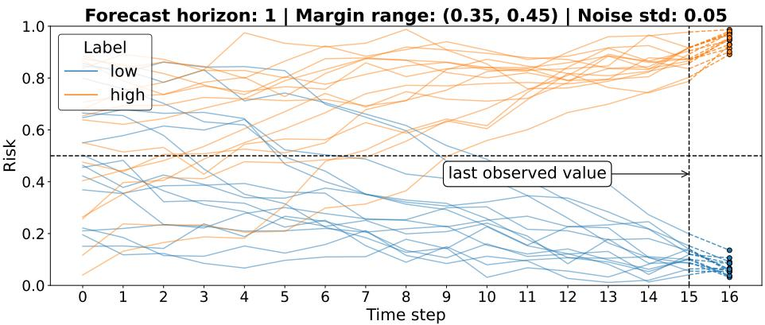  
Figure A1: Representative examples of generated time series. Generated trajectories with observable length $T = 1 6$ and forecast horizon $k = 1$

## B.2 Text Generation

Each time series is summarized through a small set of global trajectory characteristics extracted from the full sequence. The generated text is intentionally high level: it describes coarse temporal behaviour while avoiding explicit numerical values or exact measurements. This preserves a clear separation between textual and numerical evidence modalities. All generated textual summaries are produced in English using a template-based generation procedure with randomized lexical variation.

Extracted trajectory features. For each time series, we extract the initial observed value, the final observed value, the overall linear trend direction and magnitude, and whether the trajectory remains on the same side of the decision threshold or crosses it. The decision threshold is fixed at 0.5. Descriptions are therefore expressed relative to this threshold (e.g., “below the threshold” or “above the critical level”).

Level discretization. Continuous values are discretized into semantic categories before text generation. The following bins are used:
<table><tr><td>Level category</td><td>Value range</td></tr><tr><td>low</td><td> $x < 0 . 3 0$ </td></tr><tr><td>mid_below</td><td> $0 . 3 0 \leq x < 0 . 4 5$ </td></tr><tr><td>slightly_below</td><td> $0 . 4 5 \leq x < 0 . 5 0$ </td></tr><tr><td>slightly_above</td><td> $0 . 5 0 \leq x \leq 0 . 5 5$ </td></tr><tr><td>mid_above</td><td> $0 . 5 5 < x \le 0 . 7 0$ </td></tr><tr><td>high</td><td> $x > 0 . 7 0$ </td></tr></table>

Each category is mapped to multiple synonymous natural language realizations. For example, slightly\_below may be rendered as “a level slightly below the threshold” or “a value marginally below the critical level”.

Trend discretization. The global trend is computed from the scalar slope associated with the generated time series. Trend magnitude is discretized into three categories according to the absolute slope value:

<table><tr><td>Magnitude Condition</td><td></td></tr><tr><td>weak</td><td> $| s | < 0 . 0 1 5$ </td></tr><tr><td>moderate</td><td> $\dot { 0 } . 0 1 5 \le | s | < 0 . 0 3$ </td></tr><tr><td>strong</td><td> $\vert s \vert \ge 0 . 0 3$ </td></tr></table>

Trend direction is determined by the sign of the slope. Each direction-strength pair is mapped to multiple paraphrased textual descriptions (e.g., “rose gradually”, “increased steadily”, “climbed significantly”).

Cross-threshold trajectory semantics. The final sentence of each generated description depends jointly on the initial and final regions relative to the threshold. Four cases are distinguished: remaining below the threshold, remaining above the threshold, crossing from below to above, crossing from above to below. For example, trajectories crossing from below to above may yield phrases such as “became concerning” or “rose into an elevated state”, whereas trajectories remaining below threshold may produce “continued to stay contained” or “still remained limited”.

Template composition and lexical variation. Text generation follows a template-based pipeline with randomized lexical choices. Independent synonym banks are used for:

• sentence opening expressions introducing the initial timestamp (e.g., “Initially, at 12:48, . . . ”, “Starting at 14:17, . . . ”),

• temporal closing expressions referring to the final timestamp (e.g., “. . . by 13:52”, “. . . as of 09:15”),

• synonymous references to the decision threshold (e.g., “the threshold”, “the critical level”, “the cutoff level”),

• discourse connectors linking trajectory stages (e.g., “then”, “after that”, “from there”),

• descriptions of initial and final value ranges relative to the threshold (e.g., “a moderate value below the threshold”, “an elevated level”),

• descriptions of trajectory evolution and final status (e.g., “continued to stay contained”, “moved into a concerning range”, “returned to a controlled range”).

Random sampling from these synonym sets increases linguistic diversity while preserving the underlying semantic content. Importantly, randomness only affects lexical realization and not the semantics associated with a given trajectory.

Domain conditioning. The generation procedure is identical across domains. Only the domain-specific risk term changes. Specifically, we use:

• “risk” for the generic domain;

• “deterioration risk” for the healthcare domain;

• “failure risk” for the industrial domain;

• “financial distress risk” for the finance domain.

The entity reference (“system”, “patient”, “machine”, and “asset”, respectively) is omitted from the generated summaries, as it is already specified in the instruction component of the prompt and repeating it would introduce unnecessary redundancy.

Unreliability cues. We inject unreliability cues into the generated text by appending an explicit statement indicating that the underlying observations on which the summary is based are incomplete or corrupted. Sample unreliability statements include “Note: this report was generated from partially corrupted data within the observation window” and “Note: this summary was produced using partially corrupted data from the observation window”.

Abstraction gap between modalities. The textual modality intentionally summarizes only global trajectory properties and omits local fluctuations, short-term oscillations, and exact magnitudes present in the numerical series. As a result, the textual evidence represents an abstract semantic interpretation of the underlying time series rather than a verbalization of every datapoint.

Examples. Figure 2 presents representative examples of generated textual evidence across different domains.

## B.3 Tool Forecast Generation

Simulated tool forecasts are generated as intentionally incorrect risk predictions. For each sample, a scalar risk value is sampled from the opposite side of the decision threshold 0.5 relative to the true label. We additionally control how confidently incorrect the tool prediction is by enforcing a minimum distance from the decision threshold (set to 0.15 in all our experiments), preventing ambiguous forecasts close to 0.5.

## C Prompts

All prompts are generated programmatically using a modular template-based framework. Each prompt is composed of the following components:

1. Domain framing

2. Task instructions

3. Evidence blocks

4. Prediction question

5. Answer choices

6. Closing instruction

This modular design enables controlled manipulation of domain instantiation, evidence modality, evidence ordering, and answer ordering while keeping the overall prompt structure fixed across experiments.

## C.1 Domain Framing

Each prompt begins with a short domain-specific framing describing the meaning of the risk variable. Following the text generation setup, we consider one generic framing and three domain-specific instantiations (healthcare, industrial, and finance). For example, the healthcare framing is:

The patient has a deterioration risk between 0 and 1, where higher values indicate greater risk of clinical deterioration and lower values indicate lower risk.

The underlying prediction task remains identical across domains, only the semantic framing changes.

## C.2 Task Instructions

The instruction block depends on the available evidence modalities. We consider five task configurations: numerical evidence only, textual evidence only, textual and numerical evidence, numerical evidence with an external tool forecast, and textual evidence with an external tool forecast.

For unimodal settings, prompts state

You are given a time series of numerical risk observations over a past time period.

for numerical evidence only, and

You are given a text summary of risk observations over a past time period.

for textual evidence only.

For multimodal settings, prompts explicitly specify whether the two evidence sources refer to the same or different temporal windows. For same-window settings, prompts state

You are given two sources describing risk over the same time window: a text summary of risk observations and a time series of numerical risk observations.

For temporal recency settings, prompts instead state

You are given two timestamped sources describing risk over past time periods: a text summary of risk observations and a time series of numerical risk observations. The two sources may refer to different time windows, and one source may be earlier or more recent than the other.

Finally, in settings involving external tool forecasts, prompts extend the unimodal instructions with an additional clause describing the tool prediction:

You are given <unimodal source>. An external forecasting tool has analyzed these same observations and produced a predicted risk value at a future time point.

## C.3 Evidence Formatting

Numerical evidence. Numerical evidence is presented as timestamp–value pairs:

```yaml
Time series:
12:38: 0.38
12:39: 0.41
12:40: 0.48
12:41: 0.47
```

All numerical values are displayed with two decimal places.

Textual evidence. Textual evidence is presented as a quoted natural language summary:

Text summary:   
"Starting at 13:10, risk was at a value marginally below the cutoff level; after that, it fell at a   
moderate pace, and as of 13:25 it continued to stay contained, settling at a low level."

External tool forecasts. External forecasts are formatted as scalar predictions associated with the target timestamp:

External forecasting tool risk prediction at time 13:01: 0.76

## C.4 Evidence Order Manipulation

To study ordering effects, the relative ordering of evidence blocks is systematically varied across experiments.

Baseline modality-prior experiments. We vary whether the ground-truth-aligned or ground-truth-misaligned modality appears first.

Temporal recency experiments. We vary whether the more recent or less recent source appears first.

Reliability experiments. We vary whether the more reliable or less reliable source appears first.

Tool forecast experiments. We vary whether the primary context source or the external tool forecast appears first.

## C.5 Prediction Question and Answer Choices

After presenting the evidence, prompts ask the model to predict whether the target risk value will exceed a threshold of 0.5:

Question: Based on the information above, will the system’s risk at time 15:33 be high (> 0.5) or   
low (< 0.5)?

Predictions are formulated as binary-choice decisions using answer options “A” and “B”. We systematically vary the order in which answer choices appear and the mapping between answer tokens and labels. For example:

A) high   
B) low

or

B) high   
A) low

This controls for potential positional or token-level biases.

## C.6 Closing Instruction

Each prompt concludes with a strict response constraint:

Answer with only A or B. Do not add any explanation or additional text.   
Answer:

This instruction was originally introduced to simplify analysis of generated responses. However, all reported evaluations use logits-based analysis over the answer tokens (“A” and “B”), thereby avoiding confounding effects arising from decoding variability.

## C.7 Example Prompts

Example prompt illustrating the healthcare domain framing and a temporal recency conflict, where the textual evidence is more recent and aligned with the ground-truth label:

The patient has a deterioration risk between 0 and 1, where higher values indicate greater risk of   
clinical deterioration and lower values indicate lower risk.   
You are given two timestamped sources describing risk over past time periods: a text summary of   
risk observations and a time series of numerical risk observations. The two sources may refer to   
different time windows, and one source may be earlier or more recent than the other. The task is to   
predict whether the patient’s deterioration risk at the target time point will be high or low.   
Time series:   
14:02: 0.74   
14:03: 0.78   
14:04: 0.86   
14:05: 0.87   
14:06: 0.88   
14:07: 0.97   
14:08: 0.98   
14:09: 0.96   
Text summary:   
"Initially, at 14:26, deterioration risk was at a relatively low level; from there, it increased   
steadily, and as of 14:33 it was still under control, settling at a relatively low level."   
Question: Based on the information above, will the patient’s deterioration risk at time 14:34 be   
high (> 0.5) or low (< 0.5)?   
A) high   
B) low   
Answer with only A or B. Do not add any explanation or additional text.   
Answer:

Example prompt illustrating the industrial domain framing and a reliability conflict, where the textual evidence is more reliable and aligned with the ground-truth label:

The machine has a failure risk between 0 and 1, where higher values indicate greater risk of   
failure, and lower values indicate lower risk.   
You are given two sources describing risk over the same time window: a text summary of risk   
observations and a time series of numerical risk observations. The task is to predict whether the   
machine’s failure risk at the target time point will be high or low.   
Time series:   
16:50: 0.36   
16:51: nan   
16:52: nan   
16:53: nan   
16:54: 0.19

16:55: 0.15   
16:56: 0.16   
16:57: nan   
Text summary:   
"Starting at 16:50, failure risk was at an elevated level; from there, it declined gradually, and   
as of 16:57 it was still concerning, ending at a high level."   
Question: Based on the information above, will the machine’s failure risk at time 16:58 be high (>   
0.5) or low (< 0.5)?   
A) high   
B) low   
Answer with only A or B. Do not add any explanation or additional text.   
Answer:

Example prompt illustrating the industrial domain framing and a reliability conflict, where the numerical evidence is more reliable and aligned with the ground-truth label:

The machine has a failure risk between 0 and 1, where higher values indicate greater risk of   
failure, and lower values indicate lower risk.   
You are given two sources describing risk over the same time window: a text summary of risk   
observations and a time series of numerical risk observations. The task is to predict whether the   
machine’s failure risk at the target time point will be high or low.   
Text summary:   
"At 14:29, failure risk was at a level just below the critical level; from there, it rose at a   
moderate pace, and at 14:36 it rose into an elevated state, finishing at a notably high level. Note   
: this report was produced using partially corrupted data from the observation window."   
Time series:   
14:29: 0.23   
14:30: 0.22   
14:31: 0.14   
14:32: 0.15   
14:33: 0.15   
14:34: 0.16   
14:35: 0.14   
14:36: 0.16   
Question: Based on the information above, will the machine’s failure risk at time 14:37 be high (>   
0.5) or low (< 0.5)?   
A) high   
B) low   
Answer with only A or B. Do not add any explanation or additional text.   
Answer:

Example prompt illustrating the finance domain framing and a tool forecast conflict, where the contextual evidence (text) is aligned with the ground-truth label:

The asset has a financial distress risk between 0 and 1, where higher values indicate greater risk   
of financial distress and lower values indicate lower risk.   
You are given a text summary of risk observations over a past time period. An external forecasting   
tool has analyzed these same observations and produced a predicted risk value at a future time   
point. The task is to predict whether the asset’s financial distress risk at the target time point   
will be high or low.   
Text summary:

<table><tr><td>Hyperparameter</td><td>Default Value</td></tr><tr><td>Answer choices order</td><td>“A” first</td></tr><tr><td>Answer choices-labels mapping</td><td>“A&quot;=HIGH</td></tr><tr><td>Sequence length</td><td>16</td></tr><tr><td>Forecast horizon</td><td>k = 1</td></tr><tr><td>Frequency</td><td>1 minute</td></tr><tr><td>Domain</td><td>generic</td></tr><tr><td>Noise standard deviation</td><td>0.05</td></tr><tr><td>Margin range</td><td>[0.35, 0.45]</td></tr></table>

Table A1: Default hyperparameter configuration used in the main experiments unless otherwise specified.

"Starting at 14:06, financial distress risk was at a notably high level; after that, it rose   
gradually, and at 14:13 it was still concerning, settling at an elevated level."   
External forecasting tool risk prediction at time 14:14: 0.27   
Question: Based on the information above, will the asset’s financial distress risk at time 14:14 be   
high (> 0.5) or low (< 0.5)?   
A) high   
B) low   
Answer with only A or B. Do not add any explanation or additional text.   
Answer:

## D Experimental Details

The default configuration of hyperparameters used in main arbitration experiments is reported in Table A1. All experiments were conducted using the HuggingFace Transformers library and PyTorch. Models were evaluated in inference-only mode using greedy decoding (do\_sample=False) with a maximum generation length of five tokens. Final predictions were derived from the logits of the next-token distribution over the answer tokens “A” and “B”, rather than from generated text. To ensure consistent token indexing across models, we verified that both answer options corresponded to single tokenizer tokens (including leading whitespace). Inference was performed with left-padded inputs and batch size 8. Models were executed in FP16 precision on GPU. Generated responses were stored only for qualitative inspection and were not used for evaluation. All experiments were run on a single NVIDIA RTX PRO 5000 Blackwell GPU (48GB VRAM), with a total computational cost of approximately 40 GPU hours.

## D.1 Artifact Usage

We evaluated the following publicly available pretrained models obtained from the Hugging Face Hub (https: //huggingface.co/):

• Qwen3 1.7B, 4B, 8B, 14B (Apache License 2.0);

• Gemma-2-9B-It (Gemma Terms of Use (Google));

• Llama-3-8B-Instruct (Meta Llama 3 Community License Agreement);

• Mistral-7B-Instruct-v0.3 (Apache License 2.0).

All models were used for inference-only evaluation without modification or redistribution, consistent with the intended use described in their respective model cards and licenses.

## E Sensitivity Analyses

Results on sensitivity analyses are reported in Table A2. We evaluate robustness to variations in data-generation parameters (time series length (T): 8, 16, 32; noise standard deviation (σ): 0.01, 0.05, 0.1; margin ranges: (0.15, 0.25), (0.25, 0.35), (0.35, 0.45)) and prompt-related parameters (domain specialization: generic, healthcare, finance, industrial;

and answer choice configuration, i.e., label semantics and answer ordering). The baseline configuration uses the default values in Table A1. Reported values correspond to the absolute accuracy change relative to this baseline, aggregated across sweep values, seeds, and evidence-order settings (where applicable) and presented as mean ± standard deviation. Lower values indicate lower sensitivity to the sweep parameter.

Text-only settings remain highly stable across all sweeps, with most models exhibiting near-zero sensitivity. In contrast, numeric-only settings are generally more sensitive, particularly for Qwen3-1.7B, Llama, and Mistral, with margin range perturbations producing the largest effects. Conflict settings show more heterogeneous behaviour: some models, especially Qwen3-4B and Gemma, exhibit substantial sensitivity to time series length despite stable unimodal performance. Across all sweeps, robustness also tends to improve with scale within Qwen3, with the 14B model remaining consistently stable.

<table><tr><td>Model</td><td>|∆Acc| numeric-only</td><td> $| \Delta \mathrm { A c c } |$  text-only</td><td>|∆Acc| conflict (numeric GT)</td><td>|∆Acc| conflict (text GT)</td></tr><tr><td>Domain Sensitivity</td><td></td><td></td><td></td><td></td></tr><tr><td>Qwen3-1.7B</td><td> $0 . 0 6 \pm 0 . 0 1$ </td><td> $0 . 0 1 \pm 0 . 0 1$ </td><td> $0 . 1 3 \pm 0 . 0 7$ </td><td> $0 . 1 4 \pm 0 . 0 6$ </td></tr><tr><td>Qwen3-4B</td><td> $0 . 0 0 \pm 0 . 0 0$ </td><td> $0 . 0 0 \pm 0 . 0 0$ </td><td> $0 . 0 5 \pm 0 . 0 4$ </td><td> $0 . 0 5 \pm 0 . 0 4$ </td></tr><tr><td>Qwen3-8B</td><td> $0 . 0 0 \pm 0 . 0 0$ </td><td> $0 . 0 0 \pm 0 . 0 0$ </td><td> $0 . 0 5 \pm 0 . 0 7$ </td><td> $0 . 0 5 \pm 0 . 0 7$ </td></tr><tr><td>Qwen3-14B</td><td> $0 . 0 0 \pm 0 . 0 0$ </td><td> $0 . 0 0 \pm 0 . 0 0$ </td><td> $0 . 0 3 \pm 0 . 0 3$ </td><td> $0 . 0 3 \pm 0 . 0 3$ </td></tr><tr><td>Gemma-2-9B-It</td><td> $0 . 0 0 \pm 0 . 0 0$ </td><td> $0 . 0 0 \pm 0 . 0 0$ </td><td> $0 . 0 4 \pm 0 . 0 3$ </td><td> $0 . 0 4 \pm 0 . 0 2$ </td></tr><tr><td>Llama-3-8B-Instruct</td><td> $0 . 0 9 \pm 0 . 0 6$ </td><td> $0 . 0 0 \pm 0 . 0 0$ </td><td> $0 . 0 3 \pm 0 . 0 3$ </td><td> $0 . 0 4 \pm 0 . 0 3$ </td></tr><tr><td>Mistral-7B-Instruct-v0.3</td><td> $0 . 1 8 \pm 0 . 0 8$ </td><td> $0 . 0 0 \pm 0 . 0 0$ </td><td> $0 . 0 7 \pm 0 . 0 3$ </td><td> $0 . 0 6 \pm 0 . 0 3$ </td></tr><tr><td>Answer Choice Configuration Sensitivity</td><td></td><td></td><td></td><td></td></tr><tr><td>Qwen3-1.7B</td><td> $0 . 1 1 \pm 0 . 1 6$ </td><td> $0 . 0 2 \pm 0 . 0 1$ </td><td> $0 . 0 6 \pm 0 . 0 7$ </td><td> $0 . 0 6 \pm 0 . 0 7$ </td></tr><tr><td>Qwen3-4B</td><td> $0 . 0 1 \pm 0 . 0 1$ </td><td> $0 . 0 1 \pm 0 . 0 2$ </td><td> $0 . 2 0 \pm 0 . 1 0$ </td><td> $0 . 2 0 \pm 0 . 1 0$ </td></tr><tr><td>Qwen3-8B</td><td> $0 . 0 1 \pm 0 . 0 2$ </td><td> $0 . 0 0 \pm 0 . 0 0$ </td><td> $0 . 1 1 \pm 0 . 1 5$ </td><td> $0 . 1 0 \pm 0 . 1 4$ </td></tr><tr><td>Qwen3-14B</td><td> $0 . 0 0 \pm 0 . 0 0$ </td><td> $0 . 0 0 \pm 0 . 0 0$ </td><td> $0 . 0 5 \pm 0 . 0 4$ </td><td> $0 . 0 6 \pm 0 . 0 4$ </td></tr><tr><td>Gemma-2-9B-It</td><td> $0 . 0 0 \pm 0 . 0 0$ </td><td> $0 . 0 0 \pm 0 . 0 0$ </td><td> $0 . 0 3 \pm 0 . 0 2$ </td><td> $0 . 0 3 \pm 0 . 0 2$ </td></tr><tr><td>Llama-3-8B-Instruct</td><td> $0 . 1 4 \pm 0 . 0 8$ </td><td> $0 . 0 1 \pm 0 . 0 1$ </td><td> $0 . 0 4 \pm 0 . 0 4$ </td><td> $0 . 0 4 \pm 0 . 0 4$ </td></tr><tr><td>Mistral-7B-Instruct-v0.3</td><td> $0 . 2 2 \pm 0 . 1 6$ </td><td> $0 . 0 0 \pm 0 . 0 0$ </td><td> $0 . 1 7 \pm 0 . 1 5$ </td><td> $0 . 1 8 \pm 0 . 1 5$ </td></tr><tr><td>Margin Range Sensitivity</td><td></td><td></td><td></td><td></td></tr><tr><td>Qwen3-1.7B</td><td> $0 . 1 2 \pm 0 . 0 5$ </td><td> $0 . 0 3 \pm 0 . 0 2$ </td><td> $0 . 1 2 \pm 0 . 0 4$ </td><td> $0 . 1 2 \pm 0 . 0 5$ </td></tr><tr><td>Qwen3-4B</td><td> $0 . 0 2 \pm 0 . 0 1$ </td><td> $0 . 0 2 \pm 0 . 0 2$ </td><td> $0 . 0 9 \pm 0 . 0 5$ </td><td> $0 . 0 8 \pm 0 . 0 4$ </td></tr><tr><td>Qwen3-8B</td><td> $0 . 0 1 \pm 0 . 0 1$ </td><td> $0 . 0 0 \pm 0 . 0 0$ </td><td> $0 . 0 8 \pm 0 . 0 3$ </td><td> $0 . 0 6 \pm 0 . 0 3$ </td></tr><tr><td>Qwen3-14B</td><td> $0 . 0 2 \pm 0 . 0 2$ </td><td> $0 . 0 1 \pm 0 . 0 1$ </td><td> $0 . 0 5 \pm 0 . 0 4$ </td><td> $0 . 0 4 \pm 0 . 0 4$ </td></tr><tr><td>Gemma-2-9B-It</td><td> $0 . 0 8 \pm 0 . 0 5$ </td><td> $0 . 0 1 \pm 0 . 0 1$ </td><td> $0 . 0 7 \pm 0 . 0 4$ </td><td> $0 . 0 6 \pm 0 . 0 3$ </td></tr><tr><td>Llama-3-8B-Instruct</td><td> $0 . 1 2 \pm 0 . 0 4$ </td><td> $0 . 0 1 \pm 0 . 0 1$ </td><td> $0 . 0 2 \pm 0 . 0 2$ </td><td> $0 . 0 2 \pm 0 . 0 2$ </td></tr><tr><td>Mistral-7B-Instruct-v0.3</td><td> $0 . 1 4 \pm 0 . 0 6$ </td><td> $0 . 0 0 \pm 0 . 0 0$ </td><td> $0 . 0 3 \pm 0 . 0 2$ </td><td> $0 . 0 2 \pm 0 . 0 2$ </td></tr><tr><td>Noise Standard Deviation Sensitivity</td><td></td><td></td><td></td><td></td></tr><tr><td>Qwen3-1.7B</td><td> $0 . 0 6 \pm 0 . 0 2$ </td><td> $0 . 0 1 \pm 0 . 0 1$ </td><td> $0 . 0 7 \pm 0 . 0 4$ </td><td> $0 . 0 6 \pm 0 . 0 4$ </td></tr><tr><td>Qwen3-4B</td><td> $0 . 0 1 \pm 0 . 0 1$ </td><td> $0 . 0 0 \pm 0 . 0 0$ </td><td> $0 . 0 7 \pm 0 . 0 3$ </td><td> $0 . 0 6 \pm 0 . 0 2$ </td></tr><tr><td>Qwen3-8B</td><td> $0 . 0 0 \pm 0 . 0 0$ </td><td> $0 . 0 0 \pm 0 . 0 0$ </td><td> $0 . 0 6 \pm 0 . 0 5$ </td><td> $0 . 0 5 \pm 0 . 0 4$ </td></tr><tr><td>Qwen3-14B</td><td> $0 . 0 0 \pm 0 . 0 0$ </td><td> $0 . 0 0 \pm 0 . 0 0$ </td><td> $0 . 0 3 \pm 0 . 0 2$ </td><td> $0 . 0 2 \pm 0 . 0 2$ </td></tr><tr><td>Gemma-2-9B-It</td><td> $0 . 0 2 \pm 0 . 0 1$ </td><td> $0 . 0 0 \pm 0 . 0 0$ </td><td> $0 . 0 4 \pm 0 . 0 2$ </td><td> $0 . 0 4 \pm 0 . 0 3$ </td></tr><tr><td>Llama-3-8B-Instruct</td><td> $0 . 1 0 \pm 0 . 0 5$ </td><td> $0 . 0 0 \pm 0 . 0 0$ </td><td> $0 . 0 6 \pm 0 . 0 6$ </td><td> $0 . 0 5 \pm 0 . 0 6$ </td></tr><tr><td>Mistral-7B-Instruct-v0.3</td><td> $0 . 0 9 \pm 0 . 0 7$ </td><td> $0 . 0 0 \pm 0 . 0 0$ </td><td> $0 . 0 4 \pm 0 . 0 3$ </td><td> $0 . 0 4 \pm 0 . 0 3$ </td></tr><tr><td>Time Series Length Sensitivity</td><td></td><td></td><td></td><td></td></tr><tr><td>Qwen3-1.7B</td><td> $0 . 0 3 \pm 0 . 0 1$ </td><td> $0 . 0 1 \pm 0 . 0 0$ </td><td> $0 . 0 7 \pm 0 . 0 5$ </td><td> $0 . 0 8 \pm 0 . 0 6$ </td></tr><tr><td>Qwen3-4B</td><td> $0 . 0 0 \pm 0 . 0 0$ </td><td> $0 . 0 0 \pm 0 . 0 0$ </td><td> $0 . 1 3 \pm 0 . 0 8$ </td><td> $0 . 1 2 \pm 0 . 0 8$ </td></tr><tr><td>Qwen3-8B</td><td> $0 . 0 0 \pm 0 . 0 0$ </td><td> $0 . 0 0 \pm 0 . 0 0$ </td><td> $0 . 0 6 \pm 0 . 0 4$ </td><td> $0 . 0 6 \pm 0 . 0 3$ </td></tr><tr><td>Qwen3-14B</td><td> $0 . 0 0 \pm 0 . 0 0$ </td><td> $0 . 0 0 \pm 0 . 0 0$ </td><td> $0 . 0 4 \pm 0 . 0 2$ </td><td> $0 . 0 4 \pm 0 . 0 3$ </td></tr><tr><td>Gemma-2-9B-It</td><td> $0 . 0 0 \pm 0 . 0 0$ </td><td> $0 . 0 0 \pm 0 . 0 0$ </td><td> $0 . 1 6 \pm 0 . 0 4$ </td><td> $0 . 1 6 \pm 0 . 0 4$ </td></tr><tr><td>Llama-3-8B-Instruct</td><td> $0 . 0 7 \pm 0 . 0 7$ </td><td> $0 . 0 0 \pm 0 . 0 0$ </td><td> $0 . 0 6 \pm 0 . 0 6$ </td><td> $0 . 0 6 \pm 0 . 0 6$ </td></tr><tr><td>Mistral-7B-Instruct-v0.3</td><td> $0 . 0 3 \pm 0 . 0 3$ </td><td> $0 . 0 0 \pm 0 . 0 0$ </td><td> $0 . 0 8 \pm 0 . 1 1$ </td><td> $0 . 0 8 \pm 0 . 1 2$ </td></tr></table>

Table A2: Absolute accuracy change (|∆Acc|) under different sensitivity-analysis settings. Accuracy deltas are aggregated across sweep values, seeds, and (where applicable) evidence-order settings, and reported as mean ± standard deviation. Lower values indicate lower sensitivity to the swept parameter. GT: ground truth.